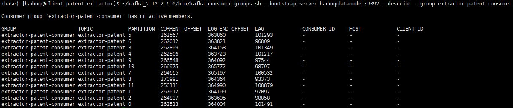

*date: 2021-08-12*

## 项目主体结构

- 代码实现：

  ```java
  public class FlinkKafkaJob3 {
      public static void main(String[] args) throws Exception {
          // 获取参数
          ParameterTool parameterTool = ParameterTool.fromArgs(args);
          String consumerTopic = parameterTool.get("consumerTopic");
          String producerTopic = parameterTool.get("producerTopic");
          String specialTopic = parameterTool.get("specialTopic");
          String ifEarliestOffset = parameterTool.get("ifEarliestOffset");
          String ifSpecialOffset = parameterTool.get("ifSpecialOffset");
          System.out.println("consumerTopic: " + consumerTopic + ", producerTopic: " + producerTopic +
                  ", specialTopic: " + specialTopic + ", ifEarliestOffset: " + ifEarliestOffset + ", ifSpecialOffset: " + ifSpecialOffset);
  
          // 创建流环境
          StreamExecutionEnvironment env = StreamExecutionEnvironment.getExecutionEnvironment();
  
          /*env.enableCheckpointing(30 * 1000);
          env.getCheckpointConfig().setCheckpointingMode(CheckpointingMode.EXACTLY_ONCE);
          env.getCheckpointConfig().setCheckpointTimeout(60000L);
          env.getCheckpointConfig().setMinPauseBetweenCheckpoints(60000L);
          env.setRestartStrategy(RestartStrategies.fixedDelayRestart(1, Time.minutes(1)));*/
  
          // 定义kafka消费者
          Properties consumerProp = ConsumerProperties.getProps();
          FlinkKafkaConsumer<ConsumerRecord<String, String>> consumer = new FlinkKafkaConsumer<>(
                  consumerTopic,
                  new ConsumerStringDeserializationSchema(),
                  consumerProp);
          if ("yes".equals(ifEarliestOffset)) {
              consumer.setStartFromEarliest();
          } else if ("yes".equals(ifSpecialOffset)) {
              String partitions = parameterTool.get("partition");
              String offsets = parameterTool.get("offset");
              if (partitions != null && offsets != null) {
                  Map<KafkaTopicPartition, Long> specificOffsets = new HashMap<>(16);
                  String[] split = partitions.split(",");
                  String[] split1 = offsets.split(",");
                  for (int i = 0; i < split.length; i++) {
                      KafkaTopicPartition kafkaTopicPartition = new KafkaTopicPartition(consumerTopic, Integer.parseInt(split[i]));
                      specificOffsets.put(kafkaTopicPartition, Long.parseLong(split1[i]));
                  }
                  consumer.setStartFromSpecificOffsets(specificOffsets);
              }
          }
  
          // 定义kafka生产者
          Properties producerProp = ProducerProperties.getProps();
          FlinkKafkaProducer<String> producer = new FlinkKafkaProducer<>(
                  producerTopic,
                  new ProducerStringSerializationSchema(producerTopic),
                  producerProp,
                  FlinkKafkaProducer.Semantic.EXACTLY_ONCE);
          producer.setWriteTimestampToKafka(true);
  
          // Flink任务链
          env.addSource(consumer)
                  .map((MapFunction<ConsumerRecord<String, String>, PatentMessage>) consumerRecord -> {
                      String topic = consumerRecord.topic();
                      int partition = consumerRecord.partition();
                      long offset = consumerRecord.offset();
                      String key = consumerRecord.key();
                      String value = consumerRecord.value();
                      JSONObject kafkaMessage = new JSONObject();
                      kafkaMessage.put("topic", topic);
                      kafkaMessage.put("partition", partition);
                      kafkaMessage.put("offset", offset);
                      kafkaMessage.put("key", key);
                      return new PatentMessage(topic, partition, offset, key, value, null, kafkaMessage);
                  })
                  .filter(new FilterLargerOperator(specialTopic))
                  .map((MapFunction<PatentMessage, PatentMessage>) patentMessage -> {
                      String value = patentMessage.getValue();
                      if (patentMessage.getKey().endsWith(PatentXmlTags.SGM)) {
                          value = PatentContentUtil.transferSgmPatentContent(value);
                      }
                      Document document = Utils.buildXmlFromString(value);
                      patentMessage.setDocument(document);
                      return patentMessage;
                  })
                  .filter(new FilterBadOperator(specialTopic))
                  .flatMap(new RichFlatMapOperator(specialTopic))
              	// 有的时候，lambda表达式无法获悉返回值参数类型，需要指定，could not be determined automatically
                  .returns(Types.STRING)
                  .addSink(producer);
  
          // 执行任务
          env.execute("patent reaction extractor loader");
      }
  }
  ```

- 打包命令：`mvn clean package -DskipTests`。

## 集群配置

- 主机地址：

  ```sh
  (base) [hadoop@client ~]$ ip addr
  1: lo: <LOOPBACK,UP,LOWER_UP> mtu 65536 qdisc noqueue state UNKNOWN group default qlen 1000
      link/loopback 00:00:00:00:00:00 brd 00:00:00:00:00:00
      inet 127.0.0.1/8 scope host lo
         valid_lft forever preferred_lft forever
      inet6 ::1/128 scope host 
         valid_lft forever preferred_lft forever
  2: ens192: <BROADCAST,MULTICAST,UP,LOWER_UP> mtu 1500 qdisc mq state UP group default qlen 1000
      link/ether 00:0c:29:14:8b:4e brd ff:ff:ff:ff:ff:ff
      inet 192.168.2.106/24 brd 192.168.2.255 scope global noprefixroute dynamic ens192
         valid_lft 40466sec preferred_lft 40466sec
      inet6 fe80::fda6:9e98:3fce:8b74/64 scope link noprefixroute 
         valid_lft forever preferred_lft forever
  (base) [hadoop@client ~]$ ifconfig
  ens192: flags=4163<UP,BROADCAST,RUNNING,MULTICAST>  mtu 1500
          inet 192.168.2.106  netmask 255.255.255.0  broadcast 192.168.2.255
          inet6 fe80::fda6:9e98:3fce:8b74  prefixlen 64  scopeid 0x20<link>
          ether 00:0c:29:14:8b:4e  txqueuelen 1000  (Ethernet)
          RX packets 2326369660  bytes 961932882940 (895.8 GiB)
          RX errors 0  dropped 0  overruns 0  frame 0
          TX packets 1614468546  bytes 1124856260518 (1.0 TiB)
          TX errors 0  dropped 0 overruns 0  carrier 0  collisions 0
  
  lo: flags=73<UP,LOOPBACK,RUNNING>  mtu 65536
          inet 127.0.0.1  netmask 255.0.0.0
          inet6 ::1  prefixlen 128  scopeid 0x10<host>
          loop  txqueuelen 1000  (Local Loopback)
          RX packets 34513  bytes 3083025 (2.9 MiB)
          RX errors 0  dropped 0  overruns 0  frame 0
          TX packets 34513  bytes 3083025 (2.9 MiB)
          TX errors 0  dropped 0 overruns 0  carrier 0  collisions 0
  
  ```

  > 主机名：hadoopclient。

- Flink 版本：

  ```sh
  (base) [hadoop@client flink-1.11.1]$ pwd
  /opt/flink-1.11.1
  (base) [hadoop@client flink-1.11.1]$ flink -v
  SLF4J: Class path contains multiple SLF4J bindings.
  SLF4J: Found binding in [jar:file:/opt/flink-1.11.1/lib/logback-classic-1.2.3.jar!/org/slf4j/impl/StaticLoggerBinder.class]
  SLF4J: Found binding in [jar:file:/opt/hadoop-3.2.1/share/hadoop/common/lib/slf4j-log4j12-1.7.25.jar!/org/slf4j/impl/StaticLoggerBinder.class]
  SLF4J: See http://www.slf4j.org/codes.html#multiple_bindings for an explanation.
  SLF4J: Actual binding is of type [ch.qos.logback.classic.util.ContextSelectorStaticBinder]
  Version: 1.11.1, Commit ID: 7eb514a
  ```

- Hadoop 版本：

  ```sh
  (base) [hadoop@client hadoop-3.2.1]$ pwd
  /opt/hadoop-3.2.1
  ```

- Hadoop 节点：

  ```sh
  (base) [hadoop@client ~]$ cd .ssh/
  (base) [hadoop@client .ssh]$ pwd
  /home/hadoop/.ssh
  (base) [hadoop@client .ssh]$ ll
  total 24
  -rw-------. 1 hadoop hadoop 5921 Sep  3  2020 authorized_keys
  -rw-------. 1 hadoop hadoop 1675 Sep  3  2020 id_rsa
  -rw-r--r--. 1 hadoop hadoop  395 Sep  3  2020 id_rsa.pub
  -rw-r--r--. 1 hadoop hadoop 7446 Sep  9  2020 known_hosts
  (base) [hadoop@client .ssh]$ cat known_hosts 
  datanode1,192.168.2.188
  datanode3,192.168.2.143
  datanode2,192.168.2.199
  node1,192.168.1.61
  node2,192.168.1.62
  node3,192.168.1.63
  node4,192.168.1.64
  node5,192.168.1.65
  node6,192.168.1.66
  node7,192.168.1.67
  node8,192.168.1.68
  ```

  > known_hosts 文件内容有删改。
  >
  > datanode1 ~ 3 主要为存储节点，node1 ~ 8 主要为计算节点。

- 主机与节点间的切换：

  ```sh
  (base) [hadoop@client ~]$ ssh node1
  Last login: Mon Aug 23 15:58:50 2021 from node2
  [hadoop@node1 ~]$ ll /opt/
  total 0
  drwxrwxr-x.  6 hadoop hadoop  99 Feb 28  2020 apache-maven-3.6.3
  drwxr-xr-x. 10 hadoop hadoop 156 Sep  3  2020 flink-1.11.1
  drwxr-xr-x. 12 hadoop hadoop 185 Sep 23  2020 hadoop-3.2.1
  drwxrwxr-x.  7 hadoop hadoop 146 Feb 13  2020 zookeeper-3.5.6
  [hadoop@node1 ~]$ ssh node6
  Last login: Mon Oct 19 14:19:59 2020 from node5
  [hadoop@node6 ~]$ ll /opt/
  total 0
  drwxrwxr-x.  6 hadoop hadoop  99 Aug 30  2020 apache-maven-3.6.3
  drwxr-xr-x. 10 hadoop hadoop 156 Sep  3  2020 flink-1.11.1
  drwxr-xr-x. 12 hadoop hadoop 185 Sep 23  2020 hadoop-3.2.1
  drwxrwxr-x.  7 hadoop hadoop 146 Aug 30  2020 zookeeper-3.5.6
  [hadoop@node6 ~]$ ssh hadoopclient
  Last login: Mon Aug 23 16:06:40 2021 from 192.168.1.1
  (base) [hadoop@client ~]$ ll /opt/
  total 0
  drwxrwxr-x.  6 hadoop hadoop  99 Aug 30  2020 apache-maven-3.6.3
  drwxr-xr-x. 10 hadoop hadoop 186 Aug 23 15:37 flink-1.11.1
  drwxr-xr-x. 12 hadoop hadoop 185 Sep 23  2020 hadoop-3.2.1
  drwxrwxr-x.  7 hadoop hadoop 146 Aug 30  2020 zookeeper-3.5.6
  ```

## Kafka 操作命令

- 查看 Kafka topic 列表命令，返回 topic 名字列表：

  ```sh
  (base) [hadoop@client patent-extractor]$ ~/kafka_2.12-2.6.0/bin/kafka-topics.sh --zookeeper hadoopdatanode1:2181 --list
  __consumer_offsets
  __transaction_state
  extractor-log
  extractor-patent
  extractor-patent-exception
  extractor-result
  ```

- 创建 Kafka topic 命令：

  ```sh
  (base) [hadoop@client patent-extractor]$ ~/kafka_2.12-2.6.0/bin/kafka-topics.sh --zookeeper hadoopdatanode1:2181,hadoopdatanode2:2181,hadoopdatanode3:2181 --create --partitions 12 --replication-factor 2 --topic extractor-patent
  Created topic extractor-patent.
  ```

- 查看 Kafka 指定 topic 的详情命令，返回该 topic 的 partition 数量、replica 因子以及每个 partition 的 leader、replica 信息：

  ```sh
  (base) [hadoop@client patent-extractor]$ ~/kafka_2.12-2.6.0/bin/kafka-topics.sh --zookeeper hadoopdatanode1:2181 --describe --topic extractor-patent
  Topic: extractor-patent	PartitionCount: 12	ReplicationFactor: 2	Configs: 
  	Topic: extractor-patent	Partition: 0	Leader: 1	Replicas: 1,2	Isr: 1,2
  	Topic: extractor-patent	Partition: 1	Leader: 2	Replicas: 2,0	Isr: 2,0
  	Topic: extractor-patent	Partition: 2	Leader: 0	Replicas: 0,1	Isr: 0,1
  	Topic: extractor-patent	Partition: 3	Leader: 1	Replicas: 1,0	Isr: 1,0
  	Topic: extractor-patent	Partition: 4	Leader: 2	Replicas: 2,1	Isr: 2,1
  	Topic: extractor-patent	Partition: 5	Leader: 0	Replicas: 0,2	Isr: 0,2
  	Topic: extractor-patent	Partition: 6	Leader: 1	Replicas: 1,2	Isr: 1,2
  	Topic: extractor-patent	Partition: 7	Leader: 2	Replicas: 2,0	Isr: 2,0
  	Topic: extractor-patent	Partition: 8	Leader: 0	Replicas: 0,1	Isr: 0,1
  	Topic: extractor-patent	Partition: 9	Leader: 1	Replicas: 1,0	Isr: 1,0
  	Topic: extractor-patent	Partition: 10	Leader: 2	Replicas: 2,1	Isr: 2,1
  	Topic: extractor-patent	Partition: 11	Leader: 0	Replicas: 0,2	Isr: 0,2
  ```

- 查看 Kafka 指定 topic 各 partition 的 offset 信息命令，--time 参数为 -1 时，表示各分区最大的 offset，为 -2 时，表示各分区最小的 offset：

  ```sh
  (base) [hadoop@client patent-extractor]$ ~/kafka_2.12-2.6.0/bin/kafka-run-class.sh kafka.tools.GetOffsetShell --broker-list hadoopdatanode1:9092 --time -1 --topic extractor-patent
  extractor-patent:0:364004
  extractor-patent:1:364109
  extractor-patent:2:363695
  extractor-patent:3:364158
  extractor-patent:4:363723
  extractor-patent:5:363860
  extractor-patent:6:363821
  extractor-patent:7:365197
  extractor-patent:8:364364
  extractor-patent:9:364092
  extractor-patent:10:365772
  extractor-patent:11:364990
  ```

- 删除 Kafka topic 命令：

  ```sh
  (base) [hadoop@client patent-extractor]$ ~/kafka_2.12-2.6.0/bin/kafka-topics.sh --zookeeper hadoopdatanode1:2181 --delete -topic extractor-patents
  Topic extractor-patents is marked for deletion.
  Note: This will have no impact if delete.topic.enable is not set to true.
  ```

- 查看 Kafka consumer group 命令，返回 consumer group 名字列表 (新版信息保存在 broker 中，老版信息保存在 zookeeper 中，二者命令不同)：

  ```sh
  (base) [hadoop@client patent-extractor]$ ~/kafka_2.12-2.6.0/bin/kafka-consumer-groups.sh --bootstrap-server hadoopdatanode1:9092 --list
  extractor-patent-consumer
  result-consumer
  log-consumer
  timeout-consumer
  ```

  > 老版命令：`~/kafka_2.12-2.6.0/bin/kafka-consumer-groups.sh --zookeeper hadoopdatanode1:2181 --list`。

- 查看 Kafka 指定 consumer group 的详情命令，返回 consumer group 对应的 topic 信息、当前消费的 offset、总 offset、剩余待消费 offset 等信息：

  ```sh
  (base) [hadoop@client patent-extractor]$ ~/kafka_2.12-2.6.0/bin/kafka-consumer-groups.sh --bootstrap-server hadoopdatanode1:9092 --describe --group extractor-patent-consumer
  
  Consumer group 'extractor-patent-consumer' has no active members.
  
  GROUP                     TOPIC            PARTITION  CURRENT-OFFSET  LOG-END-OFFSET  LAG             CONSUMER-ID     HOST            CLIENT-ID
  extractor-patent-consumer extractor-patent 5          262567          363860          101293          -               -               -
  extractor-patent-consumer extractor-patent 6          267012          363821          96809           -               -               -
  extractor-patent-consumer extractor-patent 3          262809          364158          101349          -               -               -
  extractor-patent-consumer extractor-patent 4          262506          363723          101217          -               -               -
  extractor-patent-consumer extractor-patent 9          266548          364092          97544           -               -               -
  extractor-patent-consumer extractor-patent 10         266975          365772          98797           -               -               -
  extractor-patent-consumer extractor-patent 7          264665          365197          100532          -               -               -
  extractor-patent-consumer extractor-patent 8          270991          364364          93373           -               -               -
  extractor-patent-consumer extractor-patent 11         256111          364990          108879          -               -               -
  extractor-patent-consumer extractor-patent 1          267012          364109          97097           -               -               -
  extractor-patent-consumer extractor-patent 2          264837          363695          98858           -               -               -
  extractor-patent-consumer extractor-patent 0          262513          364004          101491          -               -               -
  ```

  

- 重置 Kafka 指定 consumer group 消费的 topic 的 offset 命令：

  ```sh
  (base) [hadoop@client patent-extractor]$ ~/kafka_2.12-2.6.0/bin/kafka-consumer-groups.sh --bootstrap-server hadoopdatanode1:9092 --reset-offsets -to-offset 0 --execute --topic patent-app --group extractor-patent-consumer
  ```

- 删除 Kafka 指定 consumer group 命令：

  ```sh
  (base) [hadoop@client patent-extractor]$ ~/kafka_2.12-2.6.0/bin/kafka-consumer-groups.sh --bootstrap-server hadoopdatanode1:9092 --delete --group extractor-patent-consumer
  ```

- 命令行消费 Kafka 指定 topic 的内容命令：

  ```sh
  # 从头开始消费
  (base) [hadoop@client patent-extractor]$ ~/kafka_2.12-2.6.0/bin/kafka-console-consumer.sh --bootstrap-server hadoopdatanode1:9092 --from-beginning --topic extractor-log > extractor.log
  ```

  ```sh
  # 从头开始消费前10条消息，并显示key
  (base) [hadoop@client patent-extractor]$ ~/kafka_2.12-2.6.0/bin/kafka-console-consumer.sh --bootstrap-server hadoopdatanode1:9092 --from-beginning --max-messages 10 --property print.key=true --topic extractor-log
  ```

  ```sh
  # 从指定分区、指定offset开始消费
  (base) [hadoop@client patent-extractor]$ ~/kafka_2.12-2.6.0/bin/kafka-console-consumer.sh --bootstrap-server hadoopdatanode1:9092 --partition 0 --offset 219000 --topic extractor-log
  ```

  ```sh
  # 从尾开始消费，必须指定分区
  (base) [hadoop@client patent-extractor]$ ~/kafka_2.12-2.6.0/bin/kafka-console-consumer.sh --bootstrap-server hadoopdatanode1:9092 --partition 0 --offset latest --topic extractor-log
  ```

- 更多命令参数查看 help：

  ```sh
  (base) [hadoop@client patent-extractor]$ ~/kafka_2.12-2.6.0/bin/kafka-topics.sh --help
  This tool helps to create, delete, describe, or change a topic.
  Option                                   Description                            
  ------                                   -----------                            
  --alter                                  Alter the number of partitions,        
                                             replica assignment, and/or           
                                             configuration for the topic.         
  --at-min-isr-partitions                  if set when describing topics, only    
                                             show partitions whose isr count is   
                                             equal to the configured minimum. Not 
                                             supported with the --zookeeper       
                                             option.                              
  --bootstrap-server <String: server to    REQUIRED: The Kafka server to connect  
    connect to>                              to. In case of providing this, a     
                                             direct Zookeeper connection won't be 
                                             required.                            
  --command-config <String: command        Property file containing configs to be 
    config property file>                    passed to Admin Client. This is used 
                                             only with --bootstrap-server option  
                                             for describing and altering broker   
                                             configs.                             
  --config <String: name=value>            A topic configuration override for the 
                                             topic being created or altered.The   
                                             following is a list of valid         
                                             configurations:                      
                                           	cleanup.policy                        
                                           	compression.type                      
                                           	delete.retention.ms                   
                                           	file.delete.delay.ms                  
                                           	flush.messages                        
                                           	flush.ms                              
                                           	follower.replication.throttled.       
                                             replicas                             
                                           	index.interval.bytes                  
                                           	leader.replication.throttled.replicas 
                                           	max.compaction.lag.ms                 
                                           	max.message.bytes                     
                                           	message.downconversion.enable         
                                           	message.format.version                
                                           	message.timestamp.difference.max.ms   
                                           	message.timestamp.type                
                                           	min.cleanable.dirty.ratio             
                                           	min.compaction.lag.ms                 
                                           	min.insync.replicas                   
                                           	preallocate                           
                                           	retention.bytes                       
                                           	retention.ms                          
                                           	segment.bytes                         
                                           	segment.index.bytes                   
                                           	segment.jitter.ms                     
                                           	segment.ms                            
                                           	unclean.leader.election.enable        
                                           See the Kafka documentation for full   
                                             details on the topic configs.It is   
                                             supported only in combination with --
                                             create if --bootstrap-server option  
                                             is used.                             
  --create                                 Create a new topic.                    
  --delete                                 Delete a topic                         
  --delete-config <String: name>           A topic configuration override to be   
                                             removed for an existing topic (see   
                                             the list of configurations under the 
                                             --config option). Not supported with 
                                             the --bootstrap-server option.       
  --describe                               List details for the given topics.     
  --disable-rack-aware                     Disable rack aware replica assignment  
  --exclude-internal                       exclude internal topics when running   
                                             list or describe command. The        
                                             internal topics will be listed by    
                                             default                              
  --force                                  Suppress console prompts               
  --help                                   Print usage information.               
  --if-exists                              if set when altering or deleting or    
                                             describing topics, the action will   
                                             only execute if the topic exists.    
  --if-not-exists                          if set when creating topics, the       
                                             action will only execute if the      
                                             topic does not already exist.        
  --list                                   List all available topics.             
  --partitions <Integer: # of partitions>  The number of partitions for the topic 
                                             being created or altered (WARNING:   
                                             If partitions are increased for a    
                                             topic that has a key, the partition  
                                             logic or ordering of the messages    
                                             will be affected). If not supplied   
                                             for create, defaults to the cluster  
                                             default.                             
  --replica-assignment <String:            A list of manual partition-to-broker   
    broker_id_for_part1_replica1 :           assignments for the topic being      
    broker_id_for_part1_replica2 ,           created or altered.                  
    broker_id_for_part2_replica1 :                                                
    broker_id_for_part2_replica2 , ...>                                           
  --replication-factor <Integer:           The replication factor for each        
    replication factor>                      partition in the topic being         
                                             created. If not supplied, defaults   
                                             to the cluster default.              
  --topic <String: topic>                  The topic to create, alter, describe   
                                             or delete. It also accepts a regular 
                                             expression, except for --create      
                                             option. Put topic name in double     
                                             quotes and use the '\' prefix to     
                                             escape regular expression symbols; e.
                                             g. "test\.topic".                    
  --topics-with-overrides                  if set when describing topics, only    
                                             show topics that have overridden     
                                             configs                              
  --unavailable-partitions                 if set when describing topics, only    
                                             show partitions whose leader is not  
                                             available                            
  --under-min-isr-partitions               if set when describing topics, only    
                                             show partitions whose isr count is   
                                             less than the configured minimum.    
                                             Not supported with the --zookeeper   
                                             option.                              
  --under-replicated-partitions            if set when describing topics, only    
                                             show under replicated partitions     
  --version                                Display Kafka version.                 
  --zookeeper <String: hosts>              DEPRECATED, The connection string for  
                                             the zookeeper connection in the form 
                                             host:port. Multiple hosts can be     
                                             given to allow fail-over.
  ```

  ```sh
  (base) [hadoop@client patent-extractor]$ ~/kafka_2.12-2.6.0/bin/kafka-consumer-groups.sh --help
  Missing required argument "[bootstrap-server]"
  Option                                  Description                            
  ------                                  -----------                            
  --all-groups                            Apply to all consumer groups.          
  --all-topics                            Consider all topics assigned to a      
                                            group in the `reset-offsets` process.
  --bootstrap-server <String: server to   REQUIRED: The server(s) to connect to. 
    connect to>                                                                  
  --by-duration <String: duration>        Reset offsets to offset by duration    
                                            from current timestamp. Format:      
                                            'PnDTnHnMnS'                         
  --command-config <String: command       Property file containing configs to be 
    config property file>                   passed to Admin Client and Consumer. 
  --delete                                Pass in groups to delete topic         
                                            partition offsets and ownership      
                                            information over the entire consumer 
                                            group. For instance --group g1 --    
                                            group g2                             
  --delete-offsets                        Delete offsets of consumer group.      
                                            Supports one consumer group at the   
                                            time, and multiple topics.           
  --describe                              Describe consumer group and list       
                                            offset lag (number of messages not   
                                            yet processed) related to given      
                                            group.                               
  --dry-run                               Only show results without executing    
                                            changes on Consumer Groups.          
                                            Supported operations: reset-offsets. 
  --execute                               Execute operation. Supported           
                                            operations: reset-offsets.           
  --export                                Export operation execution to a CSV    
                                            file. Supported operations: reset-   
                                            offsets.                             
  --from-file <String: path to CSV file>  Reset offsets to values defined in CSV 
                                            file.                                
  --group <String: consumer group>        The consumer group we wish to act on.  
  --help                                  Print usage information.               
  --list                                  List all consumer groups.              
  --members                               Describe members of the group. This    
                                            option may be used with '--describe' 
                                            and '--bootstrap-server' options     
                                            only.                                
                                          Example: --bootstrap-server localhost: 
                                            9092 --describe --group group1 --    
                                            members                              
  --offsets                               Describe the group and list all topic  
                                            partitions in the group along with   
                                            their offset lag. This is the        
                                            default sub-action of and may be     
                                            used with '--describe' and '--       
                                            bootstrap-server' options only.      
                                          Example: --bootstrap-server localhost: 
                                            9092 --describe --group group1 --    
                                            offsets                              
  --reset-offsets                         Reset offsets of consumer group.       
                                            Supports one consumer group at the   
                                            time, and instances should be        
                                            inactive                             
                                          Has 2 execution options: --dry-run     
                                            (the default) to plan which offsets  
                                            to reset, and --execute to update    
                                            the offsets. Additionally, the --    
                                            export option is used to export the  
                                            results to a CSV format.             
                                          You must choose one of the following   
                                            reset specifications: --to-datetime, 
                                            --by-period, --to-earliest, --to-    
                                            latest, --shift-by, --from-file, --  
                                            to-current.                          
                                          To define the scope use --all-topics   
                                            or --topic. One scope must be        
                                            specified unless you use '--from-    
                                            file'.                               
  --shift-by <Long: number-of-offsets>    Reset offsets shifting current offset  
                                            by 'n', where 'n' can be positive or 
                                            negative.                            
  --state [String]                        When specified with '--describe',      
                                            includes the state of the group.     
                                          Example: --bootstrap-server localhost: 
                                            9092 --describe --group group1 --    
                                            state                                
                                          When specified with '--list', it       
                                            displays the state of all groups. It 
                                            can also be used to list groups with 
                                            specific states.                     
                                          Example: --bootstrap-server localhost: 
                                            9092 --list --state stable,empty     
                                          This option may be used with '--       
                                            describe', '--list' and '--bootstrap-
                                            server' options only.                
  --timeout <Long: timeout (ms)>          The timeout that can be set for some   
                                            use cases. For example, it can be    
                                            used when describing the group to    
                                            specify the maximum amount of time   
                                            in milliseconds to wait before the   
                                            group stabilizes (when the group is  
                                            just created, or is going through    
                                            some changes). (default: 5000)       
  --to-current                            Reset offsets to current offset.       
  --to-datetime <String: datetime>        Reset offsets to offset from datetime. 
                                            Format: 'YYYY-MM-DDTHH:mm:SS.sss'    
  --to-earliest                           Reset offsets to earliest offset.      
  --to-latest                             Reset offsets to latest offset.        
  --to-offset <Long: offset>              Reset offsets to a specific offset.    
  --topic <String: topic>                 The topic whose consumer group         
                                            information should be deleted or     
                                            topic whose should be included in    
                                            the reset offset process. In `reset- 
                                            offsets` case, partitions can be     
                                            specified using this format: `topic1:
                                            0,1,2`, where 0,1,2 are the          
                                            partition to be included in the      
                                            process. Reset-offsets also supports 
                                            multiple topic inputs.               
  --verbose                               Provide additional information, if     
                                            any, when describing the group. This 
                                            option may be used with '--          
                                            offsets'/'--members'/'--state' and   
                                            '--bootstrap-server' options only.   
                                          Example: --bootstrap-server localhost: 
                                            9092 --describe --group group1 --    
                                            members --verbose                    
  --version                               Display Kafka version.
  ```

  ```sh
  (base) [hadoop@client patent-extractor]$ ~/kafka_2.12-2.6.0/bin/kafka-console-consumer.sh --help
  This tool helps to read data from Kafka topics and outputs it to standard output.
  Option                                   Description                            
  ------                                   -----------                            
  --bootstrap-server <String: server to    REQUIRED: The server(s) to connect to. 
    connect to>                                                                   
  --consumer-property <String:             A mechanism to pass user-defined       
    consumer_prop>                           properties in the form key=value to  
                                             the consumer.                        
  --consumer.config <String: config file>  Consumer config properties file. Note  
                                             that [consumer-property] takes       
                                             precedence over this config.         
  --enable-systest-events                  Log lifecycle events of the consumer   
                                             in addition to logging consumed      
                                             messages. (This is specific for      
                                             system tests.)                       
  --formatter <String: class>              The name of a class to use for         
                                             formatting kafka messages for        
                                             display. (default: kafka.tools.      
                                             DefaultMessageFormatter)             
  --from-beginning                         If the consumer does not already have  
                                             an established offset to consume     
                                             from, start with the earliest        
                                             message present in the log rather    
                                             than the latest message.             
  --group <String: consumer group id>      The consumer group id of the consumer. 
  --help                                   Print usage information.               
  --isolation-level <String>               Set to read_committed in order to      
                                             filter out transactional messages    
                                             which are not committed. Set to      
                                             read_uncommitted to read all         
                                             messages. (default: read_uncommitted)
  --key-deserializer <String:                                                     
    deserializer for key>                                                         
  --max-messages <Integer: num_messages>   The maximum number of messages to      
                                             consume before exiting. If not set,  
                                             consumption is continual.            
  --offset <String: consume offset>        The offset id to consume from (a non-  
                                             negative number), or 'earliest'      
                                             which means from beginning, or       
                                             'latest' which means from end        
                                             (default: latest)                    
  --partition <Integer: partition>         The partition to consume from.         
                                             Consumption starts from the end of   
                                             the partition unless '--offset' is   
                                             specified.                           
  --property <String: prop>                The properties to initialize the       
                                             message formatter. Default           
                                             properties include:                  
                                           	print.timestamp=true|false            
                                           	print.key=true|false                  
                                           	print.value=true|false                
                                           	key.separator=<key.separator>         
                                           	line.separator=<line.separator>       
                                           	key.deserializer=<key.deserializer>   
                                           	value.deserializer=<value.            
                                             deserializer>                        
                                           Users can also pass in customized      
                                             properties for their formatter; more 
                                             specifically, users can pass in      
                                             properties keyed with 'key.          
                                             deserializer.' and 'value.           
                                             deserializer.' prefixes to configure 
                                             their deserializers.                 
  --skip-message-on-error                  If there is an error when processing a 
                                             message, skip it instead of halt.    
  --timeout-ms <Integer: timeout_ms>       If specified, exit if no message is    
                                             available for consumption for the    
                                             specified interval.                  
  --topic <String: topic>                  The topic id to consume on.            
  --value-deserializer <String:                                                   
    deserializer for values>                                                      
  --version                                Display Kafka version.                 
  --whitelist <String: whitelist>          Regular expression specifying          
                                             whitelist of topics to include for   
                                             consumption.          
  ```

## Flink 任务提交

- 提交任务所需的 jar 包，放置于主机上：

  ```sh
  (base) [hadoop@client patent-extractor]$ pwd
  /data/patent/official/patent-extractor
  (base) [hadoop@client patent-extractor]$ ll
  total 349140
  -rw-rw-r-- 1 hadoop hadoop 357510953 Aug 20 12:01 reaction-extractor-1.0-SNAPSHOT.jar
  ```

- 提交任务的模式：yarn-cluster。

- 提交任务的命令：

  ```sh
  flink run -m yarn-cluster -p 12 -d reaction-extractor-1.0-SNAPSHOT.jar --consumerTopic extractor-patent --producerTopic extractor-result --specialTopic extractor-patent-exception
  ```

  ```sh
  flink run -m yarn-cluster -p 12 -d reaction-extractor-1.0-SNAPSHOT.jar --consumerTopic extractor-patent --producerTopic extractor-result --specialTopic extractor-patent-timeout --ifEarliestOffset yes
  ```

  ```sh
  flink run -m yarn-cluster -p 12 -d reaction-extractor-1.0-SNAPSHOT.jar --consumerTopic extractor-patent --producerTopic extractor-result --specialTopic extractor-patent-timeout --ifSpecialOffset yes 
          --partition 0,1,2,3,4,5,6,7,8,9,10,11 --offset 273413,277780,268447,274226,273855,273795,278069,275783,284768,277734,281195,265928
  ```

## YARN 查询命令

- 查看yarn上面的资源使用情况命令，ctrl+c退出：

  ```sh
  (base) [hadoop@client official]$ yarn top
  YARN top - 22:52:46, up 266d, 4:43, 0 active users, queue(s): root
  NodeManager(s): 11 total, 11 active, 0 unhealthy, 0 decommissioned, 0 lost, 0 rebooted
  Queue(s) Applications: 1 running, 167 submitted, 0 pending, 39 completed, 127 killed, 0 failed
  Queue(s) Mem(GB): 382 available, 146 allocated, 0 pending, 0 reserved
  Queue(s) VCores: 163 available, 13 allocated, 0 pending, 0 reserved
  Queue(s) Containers: 13 allocated, 0 pending, 0 reserved
  
                    APPLICATIONID USER             TYPE      QUEUE PRIOR   #CONT  #RCONT  VCORES RVCORES     MEM    RMEM  VCORESECS    MEMSECS %PROGR       TIME NAME                                                                             
   application_1606730935892_0168 hadoop     apache flink    default     0      13       0      13       0    146G      0G      68363     767752 100.00   00:01:27 Flink per-job cluster
  ```

- 查看 YARN 上运行的任务列表命令，如果集群有 krb 认证的话，需要先 kinit，认证后可以看到所有正在运行的任务：

  ```sh
  (base) [hadoop@client official]$ yarn application -list
  Total number of applications (application-types: [], states: [SUBMITTED, ACCEPTED, RUNNING] and tags: []):1
                  Application-Id	    Application-Name	    Application-Type	      User	     Queue	             State	       Final-State	       Progress	                       Tracking-URL
  application_1606730935892_0168	Flink per-job cluster	        Apache Flink	    hadoop	   default	           RUNNING	         UNDEFINED	           100%	                 http://node3:36312
  ```

- 查看 YARN 上运行的指定状态的任务列表命令：

  ```sh
  (base) [hadoop@client official]$ yarn application -list -appStates RUNNING
  Total number of applications (application-types: [], states: [RUNNING] and tags: []):1
                  Application-Id	    Application-Name	    Application-Type	      User	     Queue	             State	       Final-State	       Progress	                       Tracking-URL
  application_1606730935892_0168	Flink per-job cluster	        Apache Flink	    hadoop	   default	           RUNNING	         UNDEFINED	           100%	                 http://node3:36312
  ```

- 查看 YARN 指定任务的状态信息命令：

  ```sh
  yarn application -status <applicationId> 
  ```

  ```sh
  (base) [hadoop@client official]$ yarn application -status application_1606730935892_0168
  Application Report : 
  	Application-Id : application_1606730935892_0168
  	Application-Name : Flink per-job cluster
  	Application-Type : Apache Flink
  	User : hadoop
  	Queue : default
  	Application Priority : 0
  	Start-Time : 1629725098333
  	Finish-Time : 0
  	Progress : 100%
  	State : RUNNING
  	Final-State : UNDEFINED
  	Tracking-URL : http://node3:36312
  	RPC Port : 36312
  	AM Host : node3
  	Aggregate Resource Allocation : 829449970 MB-seconds, 72126 vcore-seconds
  	Aggregate Resource Preempted : 0 MB-seconds, 0 vcore-seconds
  	Log Aggregation Status : NOT_START
  	Diagnostics : 
  	Unmanaged Application : false
  	Application Node Label Expression : <Not set>
  	AM container Node Label Expression : <DEFAULT_PARTITION>
  	TimeoutType : LIFETIME	ExpiryTime : UNLIMITED	RemainingTime : -1seconds
  ```

- 查看 YARN 指定 application 任务日志命令，可以选择输出到本地文件：

  ```sh
  yarn logs -applicationId <applicationId> > yarn.log
  ```

- kill yarn application 命令：

  ```sh
  yarn application -kill <applicationId>
  ```

- kill yarn job 命令：

  ```sh
  yarn job -kill <jobId>
  ```
