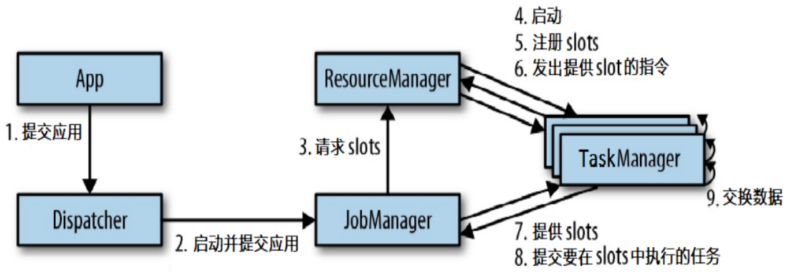
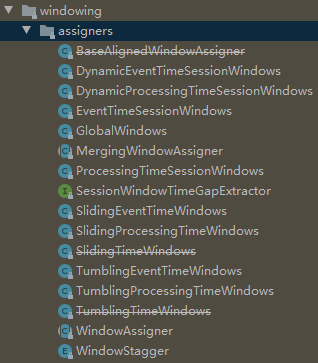
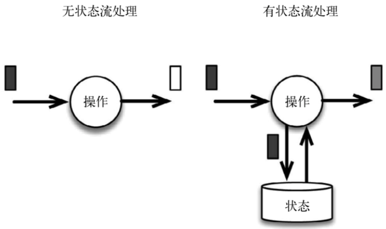
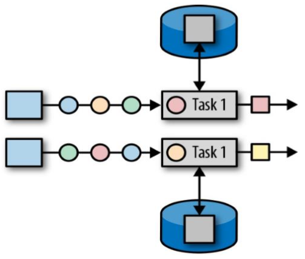

*`Author: ACatSmiling`*

*`Since: 2021-04-25`*

## Flink 流处理简介

Flink 官网：https://flink.apache.org/

Apache Flink is a framework and distributed processing engine for stateful computations over unbounded and bounded data streams.
- `Apache Flink`是一个`框架`和`分布式处理引擎`，用于对`无界和有界数据流`进行`状态计算`。

为什么选择 Flink：
  - 流数据更真实地反映了我们的生活方式。
  - 传统的数据架构是基于有限数据集的。
  - 我们的目标：
    - 低延迟
    - 高吞吐
    - 结果的准确性和良好的容错性

哪些行业需要处理流数据：
  - 电商和市场营销
    - 数据报表、广告投放、业务流程需要。
  - 物联网（IOT）
    - 传感器实时数据采集和显示、实时报警，交通运输业。
  - 电信业
    - 基站流量调配。
  - 银行和金融业
    - 实时结算和通知推送，实时检测异常行为。

### 传统数据处理架构

事务处理架构：


- 特点：实时性好，但数据量大时，难以进行高并发处理。（低延迟、低吞吐）

分析处理架构：

  l

  - 特点：将数据从业务数据库复制到数仓，再进行分析和查询。能够处理大数据，高并发，但实时性差。（高延迟、高吞吐）

### 有状态的流式处理（第一代）


- 数据存储于内存当中，达到 Periodic Checkpoint 条件时，执行持久化存储。能够做到低延迟、高吞吐，但分布式架构下，难以保证数据的顺序。

### lambda 架构（第二代）


- 采用两套系统，同时保证低延迟和结果准确：
  - 批处理系统处理速度慢，但准确性高。
  - 流处理系统处理速度快，但准确性差。
  - 缺点：实现一个功能，但需要维护两套系统，开发成本高。

### 流处理系统的演变


- Storm 能够做到低延迟，Spark Streaming 能做到高吞吐，而 Flink 不仅综合了它们的优点，同时还能做得更好。
- Flink 可以看作第三代流处理架构。

### Flink 的特点

- **`事件驱动 (Event-driven)`**

  

-  **`基于流的世界观`**

  

  - 在 Flink 的世界观中，一切都是由流组成的，离线数据是有界的流，实时数据是一个没有界限的流，这就是所谓的`有界流`和`无界流`。

- **`分层 API`**

  

  - 越顶层越抽象，表达含义越简明，使用越方便。
  - 越底层越具体，表达能力越丰富，使用越灵活。

- 支持**`事件时间 (event-time)`**和**`处理时间 (processing-time)`**语义。

- **`精确一次 (exactly-once)`**的状态一致性保证。

- **`低延迟`**，每秒处理数百万个事件，毫秒级延迟。

- 与众多常用存储系统的连接。

- **`高可用`**，动态扩展，实现 7 * 24 小时全天候运行。

### Flink vs Spark Streaming

- Flink 是`流处理 (stream)`架构，Spark Streaming 是`微批处理 (micro-batching)`架构。

  

- 数据模型

  - Spark 采用 RDD 模型，Spark Streaming 的 DataStream 实际上也就是一组组小批数据 RDD 的集合。---> 底层实现基于微批
  - Flink 基本数据模型是`数据流`，以及`事件 (Event) 序列`。---> 底层实现就是流，一个一个的处理

- 运行时架构

  - Spark 是批计算，将 DAG 划分为不同的 stage，一个完成后才可以计算下一个。---> 需要等待
  - Flink 是标准的`流执行模式`，一个事件在一个节点处理完后可以直接发往下一个节点进行处理。---> 不需要等待

## QuickStart

添加依赖：

```xml
<dependency>
    <groupId>org.apache.flink</groupId>
    <artifactId>flink-java</artifactId>
    <version>1.11.1</version>
</dependency>

<dependency>
    <groupId>org.apache.flink</groupId>
    <artifactId>flink-streaming-java_2.12</artifactId>
    <version>1.11.1</version>
</dependency>

<dependency>
    <groupId>org.apache.flink</groupId>
    <artifactId>flink-clients_2.12</artifactId>
    <version>1.11.1</version>
</dependency>
```

>flink-streaming-java_2.12：Flink 底层组件依赖 scala，2.12 是 scala 版本。
>
>Flink 1.11 版本之后，需要添加 flink-clients_2.12 依赖，否则会报异常`java.lang.IllegalStateException: No ExecutorFactory found to execute the application.`。

### 批处理实现 WordCount

hello.txt 文件内容：

```txt
hello java
hello world
hello flink
hello spark
hello scala
how are you
fine thank you
```

代码实现：

```java
package cn.xisun.flink;

import org.apache.flink.api.common.functions.FlatMapFunction;
import org.apache.flink.api.java.DataSet;
import org.apache.flink.api.java.ExecutionEnvironment;
import org.apache.flink.api.java.tuple.Tuple2;
import org.apache.flink.util.Collector;

/**
 * @author XiSun
 * @date 2021/4/25 20:39
 */
public class WordCount {
    /**
     * 自定义类，实现FlatMapFunction接口
     * 参数说明：
     * 		String：传入数据类型
     * 		Tuple2<String, Integer>：传出数据类型
     * Tuple2<T0, T1>：Flink自身实现的元组，注意不要用scala的
     */
    public static class MyFlatMapper implements FlatMapFunction<String, Tuple2<String, Integer>> {
        @Override
        public void flatMap(String line, Collector<Tuple2<String, Integer>> out) throws Exception {
            // 按空格分词
            String[] words = line.split(" ");
            // 遍历所有word，包装成二元组输出
            for (String str : words) {
                // 每一个word，都包装成一个二元组对象，并计数为1，然后用out收集
                out.collect(new Tuple2<>(str, 1));
            }
        }
    }

    public static void main(String[] args) throws Exception {
        // 1.创建批处理执行环境
        ExecutionEnvironment env = ExecutionEnvironment.getExecutionEnvironment();

        // 2.从resources路径下的文件中单线程读取数据，是按照一行一行读取的
        String inputPath = "src/main/resources/hello.txt";
        DataSet<String> inputDataSet = env.readTextFile(inputPath).setParallelism(1);

        // 3.对数据集进行处理，按空格分词展开，转换成(word, 1)这样的二元组进行统计
        DataSet<Tuple2<String, Integer>> resultSet = inputDataSet.flatMap(new MyFlatMapper())
                .groupBy(0)// 按照元组第一个位置的word分组
                .sum(1);// 按照元组第二个位置上的数据求和

        // 4.打印输出
        resultSet.print();
    }
}
```

输出结果：

```java
(scala,1)
(you,2)
(flink,1)
(world,1)
(hello,5)
(are,1)
(java,1)
(thank,1)
(fine,1)
(how,1)
(spark,1)
```

### 流处理实现 WordCount

- 基于文件读取数据，非真正的流式数据。
- 批处理 ---> 几组或所有数据到达后才处理；流处理 ---> 有数据来就直接处理，不等数据堆叠到一定数量级。
- **这里不像批处理有 groupBy ---> 所有数据统一处理，而是用流处理的 keyBy ---> 每一个数据都对 key 进行 hash 计算，进行类似分区的操作，来一个数据就处理一次，所有中间过程都有输出！**
- **并行度：本地 IDEA 执行环境的并行度默认就是计算机的 CPU 逻辑核数。**

- 代码实现：

  ```java
  package cn.xisun.flink;
  
  import org.apache.flink.api.java.tuple.Tuple2;
  import org.apache.flink.streaming.api.datastream.DataStream;
  import org.apache.flink.streaming.api.environment.StreamExecutionEnvironment;
  
  /**
   * @author XiSun
   * @Date 2021/4/25 20:45
   */
  public class StreamWordCount {
      public static void main(String[] args) throws Exception {
          // 1.创建流处理执行环境
          StreamExecutionEnvironment env = StreamExecutionEnvironment.getExecutionEnvironment();
          
          // 设置并行度，可选操作，默认值=当前计算机的CPU逻辑核数(设置成1即为单线程处理)
          env.setParallelism(4);
  
          // 2.从resources路径下的文件中多线程读取数据，是按照一行一行读取的
          String inputPath = "src/main/resources/hello.txt";
          DataStream<String> inputDataStream = env.readTextFile(inputPath);
  
          // 3.对数据集进行处理，按空格分词展开，转换成(word, 1)这样的二元组进行统计
          DataStream<Tuple2<String, Integer>> resultStream = inputDataStream.flatMap(new WordCount.MyFlatMapper())
                  .keyBy(0)
                  .sum(1);
  
          // 4.打印输出
          resultStream.print();
  
          // 5.执行任务
          env.execute();
      }
  }
  ```
  
  >不同于批处理，`env.execute()` 之前的代码，可以理解为是在定义任务，只有执行 `env.execute()` 后，Flink 才把前面的代码片段当作一个任务整体 (每个线程根据这个任务操作，并行处理流数据)。
  
- 输出结果：

  ```java
  SLF4J: Failed to load class "org.slf4j.impl.StaticLoggerBinder".
  SLF4J: Defaulting to no-operation (NOP) logger implementation
  SLF4J: See http://www.slf4j.org/codes.html#StaticLoggerBinder for further details.
  2> (java,1)
  7> (flink,1)
  1> (scala,1)
  1> (spark,1)
  4> (are,1)
  3> (hello,1)
  3> (hello,2)
  6> (how,1)
  3> (thank,1)
  3> (hello,3)
  3> (hello,4)
  5> (fine,1)
  5> (you,1)
  5> (you,2)
  5> (world,1)
  3> (hello,5)
  
  Process finished with exit code 0
  ```

  >因为是流处理，所以所有中间过程都会被输出，前面的序号就是并行执行任务的线程编号。
  >
  >线程最大编号为 7，是因为本机配置是 4 核 8 处理器，默认并行度为 8。

### 流式数据源测试

- 开启适用于 Linux 的 Windows 子系统。

  

- 第一次使用时，需要先安装 Ubuntu 系统：

  

- 打开 Windows PowerShell，输入 `wsl` 命令进入系统，然后通过 `nc -lk <port>` 命令打开一个 Socket 服务，用于模拟实时的流数据。

- 代码实现：

  ```java
  package cn.xisun.flink;
  
  import org.apache.flink.api.java.tuple.Tuple2;
  import org.apache.flink.api.java.utils.ParameterTool;
  import org.apache.flink.streaming.api.datastream.DataStream;
  import org.apache.flink.streaming.api.environment.StreamExecutionEnvironment;
  
  /**
   * @author XiSun
   * @Date 2021/4/26 10:40
   */
  public class StreamWordCount throws Exception {
      public static void main(String[] args) {
          // 1.创建流处理执行环境
          StreamExecutionEnvironment env = StreamExecutionEnvironment.getExecutionEnvironment();
  
          // 设置并行度，默认值 = 当前计算机的CPU逻辑核数(设置成1即为单线程处理)
          env.setParallelism(4);
  
          // 2.从数据流中读取数据，Socket文本流只能单线程读取
          DataStream<String> inputDataStream = env.socketTextStream("localhost", 7777);
  
          // 3.对数据集进行处理，按空格分词展开，转换成(word, 1)这样的二元组进行统计
          DataStream<Tuple2<String, Integer>> resultStream = inputDataStream.flatMap(new WordCount.MyFlatMapper())
                  .keyBy(0)
                  .sum(1);
  
          // 4.打印输出
          resultStream.print();
  
          // 5.执行任务
          env.execute();
      }
  }
  ```
  
  - 生产环境时，一般是在程序的启动参数中设置主机和端口号，此时，可以通过 ParameterTool 工具提取参数：
  
    

    > 参数设置格式：`--host localhost --port 7777`。

    ```java
    // 用parameter tool工具从程序启动参数中提取配置项
    ParameterTool parameterTool = ParameterTool.fromArgs(args);
    String host = parameterTool.get("host");
    int port = parameterTool.getInt("port");
    
    // 2.从数据流中读取数据
    DataStream<String> inputDataStream = env.socketTextStream(host, port);
    ```
  
- 输出结果：在本地开启的 Socket 中输入数据，并观察 IDEA 的 Console 输出。

  ```bash
  xisun@DESKTOP-OM8IACS:/mnt/c/Users/Xisun/Desktop$ nc -lk 7777
  hello world
  hello flink
  hello scala
  ```

  ```java
  SLF4J: Failed to load class "org.slf4j.impl.StaticLoggerBinder".
  SLF4J: Defaulting to no-operation (NOP) logger implementation
  SLF4J: See http://www.slf4j.org/codes.html#StaticLoggerBinder for further details.
  3> (world,1)
  2> (hello,1)
  4> (flink,1)
  2> (hello,2)
  1> (scala,1)
  2> (hello,3)
  ```
  
  > 对于输出结果，某项数据对应的次数最大值，是该数据统计到当前时间的最终结果。

## Flink 的部署

- 下载地址：https://flink.apache.org/downloads.html

- 最新版本：

  

- 全部稳定版本：https://flink.apache.org/downloads.html#all-stable-releases

  

  

- 对于新版本的 Flink (1.7 之后)，需要额外下载 Hadoop 依赖，否则无法使用 Hadoop 支持的 Yarn 资源：

  

### Standalone 模式

#### 安装

- 地址：https://www.apache.org/dyn/closer.lua/flink/flink-1.13.1/flink-1.13.1-bin-scala_2.12.tgz

- Flink 组件：

  

- 其他组件 (Hadoop)：

  

- 解压到指定目录，并把 Hadoop 的组件添加到 Flink 解压路径的 lib 目录下：

  

  

- 打开 wsl 控制台，安装 JDK：

  ```bash
  xisun@DESKTOP-OM8IACS:/mnt/d/Program Files/flink-1.13.1$ sudo apt update
  xisun@DESKTOP-OM8IACS:/mnt/d/Program Files/flink-1.13.1$ sudo apt install openjdk-8-jdk
  ```

  ```bash
  xisun@DESKTOP-OM8IACS:/mnt/d/Program Files/flink-1.13.1$ java -version
  openjdk version "1.8.0_282"
  OpenJDK Runtime Environment (build 1.8.0_282-8u282-b08-0ubuntu1~20.04-b08)
  OpenJDK 64-Bit Server VM (build 25.282-b08, mixed mode)
  ```

  >在 Ubuntu 20.04 系统下安装 OpenJDK 11 和 OpenJDK 8 的方法：https://ywnz.com/linuxjc/6984.html

- 查看 JDK 安装路径，并在 Flink 安装目录的 conf/flink-conf.yaml 文件中配置 Java 环境：

  ```yaml
  # Java
  env.java.home: /usr/lib/jvm/java-8-openjdk-amd64
  ```

  > 建议不要使用 Windows 系统下安装的 JDK 路径，可能会有问题。

- 配置主机和从机 (未验证)：

  - 修改 conf/flink-conf.yaml 文件，配置主机地址：

    ```yaml
    # The external address of the host on which the JobManager runs and can be
    # reached by the TaskManagers and any clients which want to connect. This setting
    # is only used in Standalone mode and may be overwritten on the JobManager side
    # by specifying the --host <hostname> parameter of the bin/jobmanager.sh executable.
    # In high availability mode, if you use the bin/start-cluster.sh script and setup
    # the conf/masters file, this will be taken care of automatically. Yarn/Mesos
    # automatically configure the host name based on the hostname of the node where the
    # JobManager runs.
    
    jobmanager.rpc.address: hadoop1
    ```

  - 修改 conf/workers 文件，配置从机地址：

    ```conf
    hadoop2
    hadoop3
    ```

  - 将主机 Flink 安装文件，派发给从机：

    ```bash
    $ xsync flink-1.13.1
    ```

- 启动 Flink 集群：

  ```bash
  xisun@DESKTOP-OM8IACS:/mnt/c/Users/XiSun/Desktop$ bash /mnt/d/Program\ Files/flink-1.13.1/bin/start-cluster.sh
  Starting cluster.
  Starting standalonesession daemon on host DESKTOP-OM8IACS.
  Starting taskexecutor daemon on host DESKTOP-OM8IACS.
  ```

  ```bash
  xisun@DESKTOP-OM8IACS:/mnt/c/Users/XiSun/Desktop$ jps
  7347 Jps
  6956 StandaloneSessionClusterEntrypoint
  7246 TaskManagerRunner
  ```

- 前端页面访问 `localhost:8081`，可以对 Flink 集群和任务进行监控管理。(8081 是默认端口)

  
  
  > 可以查看任务分配，内存使用，Log 日志，标准输出 (控制台) 等。

#### 提交任务

- Web 页面提交

  - 上传 Jar 包：Submit New Job ---> Add New，将打包好的 Jar 包添加上来。

    

  - 设置启动参数：

    
    - Show Plan 查看任务执行计划：

      

  - Submit 提交任务：

    - 提交失败：

      

      >提交任务时，如果 slot 的数量低于设置的线程数量，会提交失败，会一直等待分配更多的资源。---> 增加 slot 数量或者降低任务线程数量。

    - 提交成功：(需要先启动本机的 socket 服务)

      ```bash
      xisun@DESKTOP-OM8IACS:/mnt/c/Users/XiSun/Desktop$ nc -tl 7777
      hello world
      hello flink
      hellojava^[[D^[[D^[[D
      ```

      

- 命令行提交

  - 准备数据文件，把含数据文件的文件夹，分发到 taskmanage 所在的机器中 (如果需要)：

    ```bash
    $ xsync flink
    ```

    >如果从文件中读取数据，由于是从本地磁盘读取，实际任务会被分发到 taskmanage 的机器中，所以要把数据文件分发到该机器上。

  - 提交命令：

    ```bash
    xisun@DESKTOP-OM8IACS:/mnt/d/Program Files/flink-1.13.1/bin$ ./flink run -p 4 -c cn.xisun.flink.StreamWordCount /mnt/d/JetBrainsWorkSpace/IDEAProjects/xisun-flink/target/xisun-flink-1.0-SNAPSHOT.jar --host localhost --port 7777
    Job has been submitted with JobID 470883e75e676e9c538d13f509ddc6cc
    ```

    > ./flink run：启动命令；-p 参数：指定并行度；-c 参数：指定 Jar 包运行的主程序。
    
  - 查看结果，如果输出到控制台，应该在 taskmanager 下查看；如果计算结果输出到文件，同样会保存到 taskmanage 的机器下，不会在 jobmanage 下。
  
    
  
    > 如果 Job 要求的 Task Slots 数大于可用的 Task Slots，Job 提交时会一直等待，直到分配到足够的资源。
    >
    > flink-conf.yaml 配置文件中，`taskmanager.numberOfTaskSlots: 8` 用于配置可用的最大 slots 数，默认为 1，一般设置与当前主机 CPU 最大逻辑核心数相同。
  
    
  
      
  
  - 查看提交的 Job 命令：
  
    ```bash
    xisun@DESKTOP-OM8IACS:/mnt/d/Program Files/flink-1.13.1/bin$ ./flink list
    Waiting for response...
    ------------------ Running/Restarting Jobs -------------------
    22.07.2021 16:41:11 : 470883e75e676e9c538d13f509ddc6cc : Flink Streaming Job (RUNNING)
    --------------------------------------------------------------
    No scheduled jobs.
    ```
  
  - 取消 Job：
  
    ```bash
    xisun@DESKTOP-OM8IACS:/mnt/d/Program Files/flink-1.13.1/bin$ ./flink cancel 470883e75e676e9c538d13f509ddc6cc
    Cancelling job 470883e75e676e9c538d13f509ddc6cc.
    Cancelled job 470883e75e676e9c538d13f509ddc6cc.
    ```
  
  - 查看包含已取消的 Job 命令：
  
    ```bash
    xisun@DESKTOP-OM8IACS:/mnt/d/Program Files/flink-1.13.1/bin$ ./flink list -a
    Waiting for response...
    No running jobs.
    No scheduled jobs.
    ---------------------- Terminated Jobs -----------------------
    22.07.2021 16:41:11 : 470883e75e676e9c538d13f509ddc6cc : Flink Streaming Job (CANCELED)
    --------------------------------------------------------------
    ```

### Yarn 模式

- 以 Yarn 模式部署 Flink 任务时，要求 Flink 是有 Hadoop 支持的版本，Hadoop 环境需要保证版本在 2.2 以上，并且集群中安装有 HDFS 服务。

#### Flink on Yarn

- Flink 提供了两种在 Yarn 上运行的模式，分别为 Session-Cluster 模式和 Per-Job-Cluster 模式。

- Session-Cluster 模式

  

  - Session-Cluster 模式需要先在 Yarn 中初始化一个 Flink 会话集群，开辟指定的资源。之后，所有任务都向这个 Flink 会话集群提交。这个 Flink 会话集群会常驻在 Yarn 集群中，除非手动停止。
  - Flink 会话集群所占的资源，会一直保持不变。提交任务时，如果资源满了，下一个任务就无法提交，只有等到 Yarn 中的其中一个任务执行完成后，释放了资源，下个任务才会正常提交。
  - Flink 会话集群中所有任务共享 Dispatcher 和 ResourceManager；共享资源。
  - Session-Cluster 模式适合规模小执行时间短的任务。

- Per-Job-Cluster 模式

  

  - **Per-Job-Cluster 模式每次提交任务时，都会创建一个新的 Flink 集群，各任务之间互相独立，互不影响，方便管理。任务执行完成之后创建的集群也会消失。**
  - 一个 Job 会对应一个集群，每提交一个任务会根据自身的情况，单独向 Yarn 申请资源，直到任务执行完成，一个任务的失败与否并不会影响下一个任务的正常提交和运行。
  - 每个任务独享 Dispatcher 和 ResourceManager，按需接受资源申请；适合规模大长时间运行的作业。

#### Session-Cluster

- 启动 Hadoop 集群 (略)。

- 启动 yarn-session：

  ```bash
  $ ./yarn-session.sh -n 2 -s 2 -jm 1024 -tm 1024 -nm test -d
  ```

  >-n (--container)：TaskManager 的数量，新版本此参数应该无效了。
  >-s (--slots)： 每个 TaskManager 的 slot 数量，默认一个 slot 一个 core，默认每个 taskmanager 的 slot 的个数为 1，有时可以多一些 taskmanager，做冗余。
  >-jm：JobManager 的内存，单位 MB。
  >-tm：每个 taskmanager 的内存，单位 MB。
  >-nm：Yarn 的 appName (出现在 Yarn 的 ui 上的名字)。
  >-d：后台执行。

- 提交任务：

  ```bash
  $ ./flink run -p 4 -d -c cn.xisun.flink.StreamWordCount /mnt/d/JetBrainsWorkSpace/IDEAProjects/xisun-flink/target/xisun-flink-1.0-SNAPSHOT.jar --host localhost --port 7777
  ```

  > 在 Flink 中，如果启动了 yarn-session，提交任务时，默认提交到 yarn-session 中的 Flink 集群；如果没有启动 yarn-session，则提交到 Standalone 中的 Flink 集群。

- 到 Yarn 控制台查看任务状态：

  

- 取消 yarn-session：

  ```bash
  $ yarn application --kill application_1577588252906_0001
  ```

#### Per-Job-Cluster

- 启动 Hadoop 集群 (略)。

- 不启动 yarn-session ，直接提交任务：

  ```bash
  $ ./flink run –m yarn-cluster -p 4 -d -c cn.xisun.flink.StreamWordCount /mnt/d/JetBrainsWorkSpace/IDEAProjects/xisun-flink/target/xisun-flink-1.0-SNAPSHOT.jar --host localhost --port 7777
  ```

  > 按参数名称提取参数。

  ```bash
  $ ./flink run -m yarn-cluster -p 6 -d reaction-extractor-1.0-SNAPSHOT.jar extractor-patent extractor-reaction extractor-patent-timeout y
  ```

  > 按参数位置提取参数。

- 查看任务和关闭任务，使用 Yarn 命令处理：

  ```bash
  # 查看yarn上面的资源使用情况命令，ctrl+c退出
  $ yarn top
  # 查看yarn上运行的任务列表命令，如果集群有krb认证的话，需要先kinit，认证后可以看到所有正在运行的任务
  $ yarn application -list
  # 查看yarn上运行的指定状态的任务列表命令
  $ yarn application -list -appStates RUNNING
  # 查看yarn指定任务的状态信息命令
  $ yarn application -status <applicationId> 
  # 查看yarn指定application任务日志命令，可以选择输出到本地文件
  $ yarn logs -applicationId <applicationId> > yarn.log
  # yarn logs -applicationId application_1606730935892_0095 > yarn.log
  # yarn logs -applicationId application_1606730935892_0095 > yarn-2001-2005.log
  # yarn logs -applicationId application_1606730935892_0093 --size 3145728 > yarn-1996-2000.log
  # kill yarn application命令
  $ yarn application -kill <applicationId>
  # kill yarn job命令
  $ yarn job -kill <jobId>
  ```

### Kubernetes 部署

- 容器化部署是目前业界很流行的一项技术，基于 Docker 镜像运行能够让用户更加方便地对应用进行管理和运维。容器管理工具中最为流行的就是 Kubernetes (k8s)，而 Flink 也在最近的版本中支持了 k8s 部署模式。

- 搭建 Kubernetes 集群 (略)。

-  配置各组件的 yaml 文件。

  - 在 k8s 上构建 Flink Session Cluster，需要将 Flink 集群的组件对应的 Docker 镜像分别在 k8s 上启动，包括 JobManager、TaskManager、JobManagerService 三个镜像服务，每个镜像服务都可以从中央镜像仓库中获取。

- 启动 Flink Session Cluster：

  ```bash
  // 启动 jobmanager-service 服务
  $ kubectl create -f jobmanager-service.yaml
  
  // 启动 jobmanager-deployment 服务
  $ kubectl create -f jobmanager-deployment.yaml
  
  // 启动 taskmanager-deployment 服务
  $ kubectl create -f taskmanager-deployment.yaml
  ```

- 访问 Flink UI 页面。集群启动后，就可以通过 JobManagerServicers 中配置的 WebUI 端口，用浏览器输入以下 url 来访问 Flink UI 页面了：`http://{JobManagerHost:Port}/api/v1/namespaces/default/services/flink-jobmanager:ui/proxy`

## Flink 的运行架构

### Flink 运行时的组件


#### 作业管理器 (JobManager)

- 控制一个应用程序执行的主进程，也就是说，**每个应用程序都会被一个不同的 JobManager 所控制执行。**
- JobManager 会先接收到要执行的应用程序，这个应用程序会包括：作业图 (JobGraph)、逻辑数据流图 (logical dataflow graph) 和打包了所有的类、库和其它资源的 Jar 包。
- JobManager 会把 JobGraph 转换成一个物理层面的数据流图，这个图被叫做 "执行图" (ExecutionGraph)，包含了所有可以并发执行的任务。
- JobManager 会向资源管理器 (ResourceManager) 请求执行任务必要的资源，也就是任务管理器 (TaskManager) 上的插槽 (slot)。一旦它获取到了足够的资源，就会将执行图分发到真正运行它们的 TaskManager 上。而在运行过程中，JobManager 会负责所有需要中央协调的操作，比如说检查点 (checkpoints) 的协调。

#### 任务管理器 (TaskManager)

- Flink 中的工作进程。通常在 Flink 中会有多个 TaskManager 运行，每一个 TaskManager 都包含了一定数量的插槽 (slots)。插槽的数量限制了 TaskManager 能够执行的任务数量。
- 启动之后，**TaskManager 会向资源管理器 (ResourceManager) 注册它的插槽；**收到资源管理器 (ResourceManager) 的指令后，TaskManager 就会将一个或者多个插槽提供给 JobManager 调用，然后 JobManager 就可以向插槽分配任务 (tasks) 来执行了。
- 在执行过程中，一个 TaskManager 可以跟其它运行同一应用程序的 TaskManager 交换数据。

#### 资源管理器 (ResourceManager)

- 主要负责管理任务管理器 (TaskManager) 的插槽 (slot)，TaskManger 插槽是 Flink 中定义的处理资源单元。
- Flink 为不同的环境和资源管理工具提供了不同资源管理器，比如 YARN、Mesos、K8s，以及 Standalone 部署。
- 当 JobManager 申请插槽资源时，ResourceManager 会将有空闲插槽的 TaskManager 分配给 JobManager。如果 ResourceManager 没有足够的插槽来满足 JobManager 的请求，它还可以向资源提供平台发起会话，以提供启动 TaskManager 进程的容器。
- 另外，**ResourceManager 还负责终止空闲的 TaskManager，释放计算资源。**

#### 分发器 (Dispatcher)

- 可以跨作业运行，它为应用提交提供了 REST 接口。
- 当一个应用被提交执行时，分发器就会启动并将应用移交给一个 JobManager。
- Dispatcher 也会启动一个 Web UI，用来方便地展示和监控作业执行的信息。
- Dispatcher 在架构中可能并不是必需的，这取决于应用提交运行的方式。

### 任务提交流程

- 当一个应用提交执行时，Flink 的各个组件交互协作的过程如下：

  

  > 上图中，步骤 7 指 TaskManager 为 JobManager 提供 slots，步骤 8 表示 JobManager 提交要在 slots 中执行的任务给 TaskManager。

- 上图是从一个较为高层级的视角来看应用中各组件的交互协作。如果部署的集群环境不同 (例如 Yarn，Mesos，Kubernetes，Standalone等)，其中一些步骤可以被省略，或是有些组件会运行在同一个 JVM 进程中。


- 具体地，如果我们将 Flink 集群部署到 Yarn 上，那么就会有如下的提交流程：

  
  - Flink 任务提交后，Client 向 HDFS 上传 Flink 的 Jar 包和配置。
  - 之后，Client 向 Yarn ResourceManager 提交任务，Yarn ResourceManager 分配 Container 资源并通知对应的 NodeManager 启动 ApplicationMaster.
  - ApplicationMaster 启动后加载 Flink 的 Jar 包和配置构建环境，然后启动 JobManager，之后，**JobManager 向 Flink 自身的 ResourceManager 申请资源，Flink 自身的 ResourceManager 再向 Yarn 的 ResourceManager 申请资源 (因为是 Yarn 模式，所有资源归 Yarn 的 ResourceManager 管理)，**申请到资源后，启动 TaskManager。
  - Yarn ResourceManager 分配 Container 资源后 ， 由 ApplicationMaster 通知资源所在节点的 NodeManager 启动 TaskManager。
  - NodeManager 加载 Flink 的 Jar 包和配置构建环境并启动 TaskManager，TaskManager 启动后向 JobManager 发送心跳包，并等待 JobManager 向其分配任务。

### 任务调度原理


- 客户端不是运行时和程序执行的一部分，但它用于准备并发送 dataflow (JobGraph) 给 Master (JobManager)，然后，客户端断开连接或者维持连接以等待接收计算结果。
- 当 Flink 集群启动后，首先会启动一个 JobManger 和一个或多个的 TaskManager。由 Client 提交任务给 JobManager，JobManager 再调度任务到各个 TaskManager 去执行，然后 TaskManager 将心跳和统计信息汇报给 JobManager。TaskManager 之间以流的形式进行数据的传输。上述三者均为独立的 JVM 进程。
- Client 为提交 Job 的客户端，可以是运行在任何机器上 (与 JobManager 环境连通即可)。提交 Job 后，Client 可以结束进程 (Streaming 的任务)，也可以不结束并等待结果返回。
- JobManager 会产生一个执行图 (Dataflow Graph)，主要负责调度 Job 并协调 Task 做 checkpoint，职责上很像 Storm 的 Nimbus。从 Client 处接收到 Job 和 Jar 包等资源后，会生成优化后的执行计划，并以 Task 的单元调度到各个 TaskManager 去执行。
- TaskManager 在启动的时候就设置好了槽位数 (Slot)，每个 slot 能启动一个 Task，Task 为线程。从 JobManager 处接收需要部署的 Task，部署启动后，与自己的上游建立 Netty 连接，接收数据并处理。(如果一个 Slot 中启动多个线程，那么这几个线程类似 CPU 调度一样共用同一个 slot)

#### 并行度 (Parallelism)

- Flink 程序的执行具有并行、分布式的特性。

- 在执行过程中，一个流 (Stream) 包含一个或多个分区 (stream partition)，而每一个算子 (operator) 可以包含一个或多个子任务 (operator subtask)，这些子任务在不同的线程、不同的物理机或不同的容器中彼此互不依赖地执行。

- 一个特定算子的子任务 (subtask) 的个数，称之为该算子的并行度 (parallelism)。一个程序中，不同的算子可能具有不同的并行度。一般情况下，一个流程序的并行度，可以认为就是其所有算子中，设置最大的那个算子的并行度。

  

- **并行度优先级：具体算子设置的并行度 > 程序全局设置的并行度 > 提交 Job 时设置的并行度 > flink-conf.yaml 配置文件默认的并行度。**

- 并行度，可以简单理解为：并行执行任务的程度。Flink 程序中，有四种方式设置并行度：

  - 通过 `env.setParallelism(1);` 设置全局的并行度。
  - 通过  `setParallelism()` 设置每一个算子的并行度。
  - 提交任务时，通过 Web 页面直接指定，或命令行使用 -p 参数指定并行度。
  - 通过 flink-conf.yaml 配置文件配置。 

- 并行度 parallelism 是动态概念，即 TaskManager 运行程序时实际使用的并发能力。在 flink-conf.yaml 配置文件中，通过 `parallelism.default` 设置并行度，默认为 1。

  ```yaml
  # The parallelism used for programs that did not specify and other parallelism.
  
  parallelism.default: 1
  ```


#### TaskManger 与 Slots

- Flink 中每一个 worker (TaskManager) 都是一个 JVM 进程 (Processes)，它可能会在独立的线程 (Threads) 上执行一个或多个 subtask。为了控制一个 worker 能接收多少个 task，worker 通过 task slot 来进行控制 (一个 worker 至少有一个 task slot)。

- 每个 task slot 表示 TaskManager 拥有资源的一个固定大小的子集。假如一个 TaskManager 有三个 slot，那么它会将其管理的内存分成三份给各个 slot。资源 slot 化意味着一个 subtask 将不需要跟来自其他 job 的 subtask 竞争被管理的内存，取而代之的是它将拥有一定数量的内存储备。需要注意的是，这里不会涉及到 CPU 的隔离，slot 目前仅仅用来隔离 task 的受管理的内存。

  
  - slot 实际上就是，执行一个独立任务所需要的计算资源的最小单元 (主要就是 CPU 和内存资源)。
  - 当前 Flink 架构中，每一个 slot 所占的内存是隔离开的，即独享内存资源，互不影响。但 CPU 资源是共享的，如果一个 CPU 被多个 slot 使用，那 CPU 就是时间片上的一个轮转状态，被多个 slot 轮流使用。
  - 通过调整 task slot 的数量，允许用户定义 subtask 之间如何互相隔离。如果一个 TaskManager 只有一个 slot，那将意味着每个 task group 运行在独立的 JVM 中 (该 JVM 可能是通过一个特定的容器启动的)，而一个 TaskManager 多个 slot，则意味着更多的 subtask 可以共享同一个 JVM。而在同一个 JVM 进程中的 task 将共享 TCP 连接 (基于多路复用) 和心跳消息。它们也可能共享数据集和数据结构，因此这减少了每个 task 的负载。

- 默认情况下，Flink 允许子任务共享 slot，即使它们是不同任务的子任务。 这样的结果是，一个 slot 可以保存任务的整个管道 (也就是任务的一个完整流程)。

  

  - 从上图可以看出，Stream 的并行度为 6，共有 13 个任务，但实际上，只用了 6 个 slot 就完成了全部任务的执行。

- 共享 slot 的好处：在一个 slot 中可以保存任务的整个管道，即使其他的 slot 挂掉了，也不会影响任务的完整执行，保证了程序的健壮性。另外，如果某个子任务比较占用 CPU，共享 slot 能够充分调用 CPU 的处理能力，防止出现有的 CPU 极其空闲，有的 CPU 极其繁忙。

- 共享 slot 的前提：必须是一个 Stream 中先后发生的不同的子任务。比如上图中，不同的 source-map 算子任务，就只能放在不同的 slot 中，不能共享一个 slot，因为相同的子任务，如果共享一个 slot，可能会导致这几个相同的子任务间数据的混淆。

- Task Slot 是静态的概念，是指 TaskManager 具有的并发执行能力。在 flink-conf.yaml 配置文件中，通过 `taskmanager.numberOfTaskSlots` 设置 TaskManager 中的 slot 数量，默认为 1，**一般应设置为与当前主机 CPU 的逻辑核心数相同。**

  ```yaml
  # The number of task slots that each TaskManager offers. Each slot runs one parallel pipeline.
  
  taskmanager.numberOfTaskSlots: 1
  ```

- Flink 中，可以通过 `slotSharingGroup()` 设置每一个算子所属的 slot 共享组。 如果不同算子的 slot 共享组不同，则运行时一定要占用不同的 slot。

  ```java
  public class StreamWordCount throws Exception {
      public static void main(String[] args) {
          StreamExecutionEnvironment env = StreamExecutionEnvironment.getExecutionEnvironment();
  
          ParameterTool parameterTool = ParameterTool.fromArgs(args);
          String host = parameterTool.get("host");
          int port = parameterTool.getInt("port");
  
          DataStream<String> inputDataStream = env.socketTextStream(host, port);
  
          // 不配置时，默认slot共享组为default，后面的算子默认与前面的算子同一slot共享组
          DataStream<Tuple2<String, Integer>> resultStream = inputDataStream
                  .flatMap(new WordCount.MyFlatMapper()).slotSharingGroup("green")
                  .keyBy(0)
                  .sum(1).setParallelism(2).slotSharingGroup("red");
  
          resultStream.print();
  
          env.execute();
      }
  }
  ```
  
  
  
  > 上面代码中，source 算子是 default 共享组，flatMap 是 green 共享组，sum 是 red 共享组，print 与 sum 相同。提交上面这个任务时，先考虑分组，再考虑每个分组内最大的并行度，相加之后，即为所需的 slot 数量。因此，上面的任务，至少需要 4 个 slot。

#### 并行子任务的分配

- 假设一个 JobGraph 如下图左所示，则可以看出，一共有 16 个子任务。如果没有自定义 slot 共享组，则如下图右所示，只需要 4 个 slot 就可以完成任务。

  

- 假设一共有 3 个 TaskManager，每一个 TaskManager 中分配了 3 个 TaskSlot，也就是每个 TaskManager 可以接收 3 个 task，一共有 9 个 TaskSlot。在 Example 1 中，如果我们设置 `parallelism.default=1`，即运行程序默认的并行度为 1，那么 9 个 TaskSlot 只用了 1个，会有 8 个空闲。因此，设置合适的并行度才能提高效率，如 Example 2 ~ 4 所示。

  

  

#### 程序与数据流 (DataFlow)


- 所有的 Flink 程序都是由三部分组成的：Source、Transformation 和 Sink。

  - Source 负责读取数据源，Transformation 利用各种算子进行处理加工，Sink 负责输出。

- 在运行时，Flink 上运行的程序会被映射成 "逻辑数据流" (dataflows)，它包含了这三部分。

- 每一个 dataflow 以一个或多个 source 开始，以一个或多个 sink 结束。dataflow 类似于任意的有向无环图 (DAG) (有方向非环形)。

  

- 在大部分情况下，程序中的转换运算 (transformations) 跟 dataflow 中的算子 (operator) 是一一对应的关系，但有时候，一个 transformation 可能对应多个 operator。

#### 执行图 (ExecutionGrap)

- 由 Flink 程序直接映射成的数据流图是 StreamGraph，也被称为逻辑流图，因为它们表示的是计算逻辑的高级视图。为了执行一个流处理程序，Flink 需要将逻辑流图转换为物理数据流图 (也叫执行图)，详细说明程序的执行方式。

- Flink 中的执行图可以分成四层：StreamGraph ---> JobGraph ---> ExecutionGraph ---> 物理执行图。

  

  - StreamGraph：是根据用户通过 Stream API 编写的代码生成的最初的图。用来表示程序的拓扑结构。
  - JobGraph：StreamGraph 经过优化后生成了 JobGraph，即提交给 JobManager 的数据结构。主要的优化为：将多个符合条件的节点 chain 在一起作为一个节点，这样可以减少数据在节点之间流动所需要的序列化/反序列化/传输消耗。
  - ExecutionGraph：JobManager 根据 JobGraph 生成 ExecutionGraph。ExecutionGraph 是 JobGraph 的并行化版本，是调度层最核心的数据结构。
  - 物理执行图：JobManager 根据 ExecutionGraph 对 Job 进行调度后，在各个 TaskManager 上部署 Task 后形成的 "图"，并不是一个具体的数据结构。

#### 数据传输形式

- 一个 Flink 程序中，不同的算子可能具有不同的并行度。
- Stream 在算子之间传输数据的形式可以是 one-to-one (forwarding) 的模式，也可以是 redistributing 的模式，具体是哪一种形式，取决于算子的种类
- One-to-one：Stream维护着分区以及元素的顺序，比如在 source 和 map 这两个 operator 之间，这意味着 map 算子的子任务看到的元素的个数以及顺序，跟 source 算子的子任务生产的元素的个数、顺序相同。map、fliter、flatMap 等算子都是 one-to-one 的对应关系。
  - 类似于 Spark 中的窄依赖。
- Redistributing：Stream 的分区会发生改变，比如 map 跟 keyBy/window 之间，或者 keyBy/window 跟 sink 之间。每一个算子的子任务依据所选择的 transformation 发送数据到不同的目标任务。例如，keyBy 基于 hashCode 重分区、broadcast 和 rebalance会随机重新分区 (rebalance 实际上是一种轮询的随机重新分区操作)，这些算子都会引起 redistribute 过程，而 redistribute 过程就类似于 Spark 中的 shuffle 过程 (Flink 中的 shuffle 算子，是完全随机的重新分区操作)。
  - 类似于 Spark 中的宽依赖。

#### 任务链 (Operator Chain)


- Flink 采用了一种称为任务链的优化技术，它能减少线程之间的切换和基于缓存区的数据交换，在减少时延的同时提升吞吐量，可以在特定条件下减少本地通信的开销。为了满足任务链的要求，必须将两个或多个算子设为相同的并行度，并通过本地转发 (local forward) 的方式进行连接。
- 相同并行度的 one-to-one 操作，Flink 将这样相连的算子链接在一起形成一个 task，原来的算子成为里面的 subtask。
- 算子合并的条件：并行度相同，并且是 one-to-one 操作，两个条件缺一不可。
- 如上图所示，最终有 5 个任务，如果未自定义共享组，只需要 2 个 slot 即可。
- 如果不希望 Key Agg 和 Sink 这两个算子合并为一个任务，但也还是能 slot 共享，则有以下几种方式处理：
  - 在 Key Agg 算子后做一个 rebalance (`.rebalance()`) 或 shuffle (`.shuffle()`) 操作，改变其传输方式；
  - 使用 `.disableChaining()`，指定 Key Agg 算子不参与任务链合并操作 (该算子前后都会不参与)；
  - 使用 `.startNewChain()`，指定 Key Agg 算子后面开始一个新的任务链合并操作，即 Key Agg 算子还可以与它前面的算子合并，但不与后面的算子合并；
  - 如果希望每一个算子都这样处理，可以通过 `env.disableOperatorChaining();`，对全局进行设置。

## Flink 的流处理 API


### Environment

#### getExecutionEnvironment()

- 创建一个执行环境，表示当前执行程序的上下文。 如果程序是独立调用的，则此方法返回本地执行环境；如果从命令行客户端调用程序以提交到集群，则此方法返回此集群的执行环境，也就是说，getExecutionEnvironment 会根据查询运行的方式决定返回什么样的运行环境，是最常用的一种创建执行环境的方式。

- 批处理执行环境：

  ```java
  ExecutionEnvironment env = ExecutionEnvironment.getExecutionEnvironment();
  ```

- 流处理执行环境：

  ```java
  StreamExecutionEnvironment env = StreamExecutionEnvironment.getExecutionEnvironment();
  ```

- 在生产环境时，如果没有设置并行度，会以 flink-conf.yaml 中的配置为准，默认是 1：

  ```yaml
  # The parallelism used for programs that did not specify and other parallelism.
  
  parallelism.default: 1
  ```
  
  > 在本地 IDEA 执行环境时，默认并行度是本地计算机的 CPU 逻辑核数，本地计算机为 4 核 8 处理器，即默认并行度为 8，本文测试代码以此为基准。

#### createLocalEnvironment()

- 返回本地执行环境，需要在调用时指定默认的并行度：

  ```java
  LocalStreamEnvironment env = StreamExecutionEnvironment.createLocalEnvironment(1);
  ```

#### createRemoteEnvironment()

- 返回集群执行环境，将 Jar 提交到远程服务器。需要在调用时指定 JobManager 的 IP 和端口号，并指定要在集群中运行的 Jar 包。

  ```java
  StreamExecutionEnvironment env =
          StreamExecutionEnvironment.createRemoteEnvironment("jobmanage-hostname", 6123, "YOURPATH//WordCount.jar");
  ```

### Source

#### 从集合读取数据

- 代码实现：

  ```java
  /**
   * 传感器温度读数的数据类型
   *
   * @author XiSun
   * @Date 2021/4/28 20:59
   */
  public class SensorReading {
      // 属性：id，时间戳，温度值
      private String id;
      private Long timestamp;
      private Double temperature;
  
      public SensorReading() {
      }
  
      public SensorReading(String id, Long timestamp, Double temperature) {
          this.id = id;
          this.timestamp = timestamp;
          this.temperature = temperature;
      }
  
      public String getId() {
          return id;
      }
  
      public void setId(String id) {
          this.id = id;
      }
  
      public Long getTimestamp() {
          return timestamp;
      }
  
      public void setTimestamp(Long timestamp) {
          this.timestamp = timestamp;
      }
  
      public Double getTemperature() {
          return temperature;
      }
  
      public void setTemperature(Double temperature) {
          this.temperature = temperature;
      }
  
      @Override
      public String toString() {
          return "SensorReading{" +
                  "id='" + id + '\'' +
                  ", timestamp=" + timestamp +
                  ", temperature=" + temperature +
                  '}';
      }
  }
  ```

  ```java
  /**
   * @author XiSun
   * @Date 2021/4/28 20:59
   */
  public class SourceTest1_Collection {
      public static void main(String[] args) throws Exception {
          // 1.创建流处理环境
          StreamExecutionEnvironment env = StreamExecutionEnvironment.getExecutionEnvironment();
  
          // 2.Source: 从集合读取数据
          DataStream<SensorReading> sensorDataStream = env.fromCollection(
                  Arrays.asList(
                          new SensorReading("sensor_1", 1547718199L, 35.8),
                          new SensorReading("sensor_6", 1547718201L, 15.4),
                          new SensorReading("sensor_7", 1547718202L, 6.7),
                          new SensorReading("sensor_10", 1547718205L, 38.1)
                  )
          );
  
          DataStream<Integer> intDataStream = env.fromElements(1, 2, 3, 4, 5, 6, 7, 8, 9);
  
          // 3. 打印，参数为数据流的名称，可选
          sensorDataStream.print("sensorDataName");
          intDataStream.print("intDataStreamName");
  
          // 4. 执行任务，参数为Job的名称，可选
          env.execute("JobName");
      }
  }
  ```
  
- 输出结果：

  ```java
  SLF4J: Failed to load class "org.slf4j.impl.StaticLoggerBinder".
  SLF4J: Defaulting to no-operation (NOP) logger implementation
  SLF4J: See http://www.slf4j.org/codes.html#StaticLoggerBinder for further details.
  intDataStreamName:1> 8
  intDataStreamName:5> 4
  intDataStreamName:4> 3
  sensorDataName:5> SensorReading{id='sensor_7', timestamp=1547718202, temperature=6.7}
  sensorDataName:3> SensorReading{id='sensor_1', timestamp=1547718199, temperature=35.8}
  intDataStreamName:3> 2
  sensorDataName:4> SensorReading{id='sensor_6', timestamp=1547718201, temperature=15.4}
  intDataStreamName:2> 1
  intDataStreamName:2> 9
  intDataStreamName:7> 6
  intDataStreamName:6> 5
  sensorDataName:6> SensorReading{id='sensor_10', timestamp=1547718205, temperature=38.1}
  intDataStreamName:8> 7
  
  Process finished with exit code 0
  ```

#### 从文件读取数据

- 代码实现：

  ```java
  /**
   * @author XiSun
   * @Date 2021/4/28 22:10
   */
  public class SourceTest2_File {
      public static void main(String[] args) throws Exception {
          // 1.创建流处理环境
          StreamExecutionEnvironment env = StreamExecutionEnvironment.getExecutionEnvironment();
  
          // 2.从文件读取数据：单线程读取文件，按顺序逐行读取，如果不设置，则多线程读取，文件内容会乱序
          DataStream<String> dataStream = env.readTextFile("src/main/resources/sensor.txt").setParallelism(1);
  
          // 3.打印，多线程
          dataStream.print();
  
          // 4.执行任务
          env.execute();
      }
  }
  ```
  
- sensor.txt 文件内容：

  ```txt
  sensor_1,1547718199,35.8
  sensor_6,1547718201,15.4
  sensor_7,1547718202,6.7
  sensor_10,1547718205,38.1
  sensor_1,1547718207,36.3
  sensor_1,1547718209,32.8
  sensor_1,1547718212,37.1
  ```

- 输出结果 (多线程打印，每次输出结果都会不同)：

  ```java
  SLF4J: Failed to load class "org.slf4j.impl.StaticLoggerBinder".
  SLF4J: Defaulting to no-operation (NOP) logger implementation
  SLF4J: See http://www.slf4j.org/codes.html#StaticLoggerBinder for further details.
  4> sensor_1,1547718207,36.3
  1> sensor_6,1547718201,15.4
  3> sensor_10,1547718205,38.1
  6> sensor_1,1547718212,37.1
  2> sensor_7,1547718202,6.7
  5> sensor_1,1547718209,32.8
  8> sensor_1,1547718199,35.8
  
  Process finished with exit code 0
  ```

- 设置 `dataStream.print().setParallelism(1);`，单线程打印的输出结果：

  ```java
  SLF4J: Failed to load class "org.slf4j.impl.StaticLoggerBinder".
  SLF4J: Defaulting to no-operation (NOP) logger implementation
  SLF4J: See http://www.slf4j.org/codes.html#StaticLoggerBinder for further details.
  sensor_1,1547718199,35.8
  sensor_6,1547718201,15.4
  sensor_7,1547718202,6.7
  sensor_10,1547718205,38.1
  sensor_1,1547718207,36.3
  sensor_1,1547718209,32.8
  sensor_1,1547718212,37.1
  
  Process finished with exit code 0
  ```

#### 从 Kafka 消息队列读取数据

- 添加依赖：

  ```xml
  <dependency>
      <groupId>org.apache.flink</groupId>
      <artifactId>flink-connector-kafka_${scala.binary.version}</artifactId>
      <version>${flink.version}</version>
  </dependency>
  ```

- 代码实现：

  ```java
  /**
   * @author XiSun
   * @Date 2021/4/28 22:15
   */
  public class SourceTest3_Kafka {
      public static void main(String[] args) throws Exception {
          // 1.创建流处理环境
          StreamExecutionEnvironment env = StreamExecutionEnvironment.getExecutionEnvironment();
  
          // 2.创建Kafka消费者
          Properties properties = new Properties();
          properties.setProperty("bootstrap.servers", "localhost:9092");
          properties.setProperty("group.id", "consumer-group");
          properties.setProperty("auto.offset.reset", "latest");
          properties.setProperty("key.deserializer", "org.apache.kafka.common.serialization.StringDeserializer");
          properties.setProperty("value.deserializer", "org.apache.kafka.common.serialization.StringDeserializer");
          FlinkKafkaConsumer<String> consumer = new FlinkKafkaConsumer<>("sensor", new SimpleStringSchema(), properties);
  
          // 3.从Kafka读取数据
          DataStream<String> dataStream = env.addSource(consumer);
  
          // 4.打印
          dataStream.print();
  
          // 5.执行任务
          env.execute();
      }
  }
  ```

#### 自定义 Source

- 代码实现：

  ```java
  /**
   * @author XiSun
   * @Date 2021/4/28 22:25
   */
  public class SourceTest4_UDF {
      public static void main(String[] args) throws Exception {
          // 1.创建流处理环境
          StreamExecutionEnvironment env = StreamExecutionEnvironment.getExecutionEnvironment();
  //        env.setParallelism(1);
  
          // 2.从自定义Source读取数据
          DataStream<SensorReading> dataStream = env.addSource(new MySensorSource());
  
          // 3.打印
          dataStream.print();
  
          // 4.执行任务
          env.execute();
      }
  
      // 实现自定义的SourceFunction，随机生成传感器数据
      public static class MySensorSource implements SourceFunction<SensorReading> {
          // 定义一个标识位，用来控制数据的产生
          private boolean running = true;
  
          @Override
          public void run(SourceContext<SensorReading> ctx) throws Exception {
              // 定义一个随机数发生器
              Random random = new Random();
  
              // 设置10个传感器的初始温度
              HashMap<String, Double> sensorTempMap = new HashMap<>();
              for (int i = 0; i < 10; i++) {
                  sensorTempMap.put("sensor_" + (i + 1), 60 + random.nextGaussian() * 20);
              }
  
              while (running) {
                  for (String sensorId : sensorTempMap.keySet()) {
                      // 在当前温度基础上随机波动
                      Double newtemp = sensorTempMap.get(sensorId) + random.nextGaussian();
                      sensorTempMap.put(sensorId, newtemp);
                      ctx.collect(new SensorReading(sensorId, System.currentTimeMillis(), newtemp));
                  }
                  // 控制输出频率
                  Thread.sleep(1000L);
              }
          }
  
          @Override
          public void cancel() {
              running = false;
          }
      }
  }
  ```
  
- 输出结果 (程序会一直输出下去)：

  ```java
  SLF4J: Failed to load class "org.slf4j.impl.StaticLoggerBinder".
  SLF4J: Defaulting to no-operation (NOP) logger implementation
  SLF4J: See http://www.slf4j.org/codes.html#StaticLoggerBinder for further details.
  2> SensorReading{id='sensor_7', timestamp=1619670947828, temperature=57.523519020755195}
  6> SensorReading{id='sensor_1', timestamp=1619670947828, temperature=60.16683595604395}
  6> SensorReading{id='sensor_9', timestamp=1619670947831, temperature=42.125026316308286}
  4> SensorReading{id='sensor_10', timestamp=1619670947826, temperature=82.58226594512607}
  5> SensorReading{id='sensor_4', timestamp=1619670947828, temperature=78.73909616880852}
  4> SensorReading{id='sensor_5', timestamp=1619670947831, temperature=26.71490359887942}
  5> SensorReading{id='sensor_6', timestamp=1619670947831, temperature=85.09026456845346}
  1> SensorReading{id='sensor_2', timestamp=1619670947828, temperature=64.90731492147165}
  3> SensorReading{id='sensor_3', timestamp=1619670947822, temperature=31.96909359527708}
  3> SensorReading{id='sensor_8', timestamp=1619670947831, temperature=86.34172370619932}
  4> SensorReading{id='sensor_1', timestamp=1619670948831, temperature=60.71931724451548}
  6> SensorReading{id='sensor_7', timestamp=1619670948831, temperature=57.36109139383153}
  3> SensorReading{id='sensor_4', timestamp=1619670948831, temperature=78.1152626762054}
  5> SensorReading{id='sensor_2', timestamp=1619670948831, temperature=63.90599072985537}
  2> SensorReading{id='sensor_10', timestamp=1619670948831, temperature=82.1517010383502}
  ...
  ```

### Transform

#### 基本转换算子

- map、flatMap、filter 通常被统一称为**基本转换算子 (简单转换算子)。**

- **map：**

  

- **flatMap：**

  

- **filter：**

  

- 代码实现：

  ```java
  /**
   * @author XiSun
   * @Date 2021/4/28 10:39
   */
  public class TransformTest1_Base {
      public static void main(String[] args) throws Exception {
          // 1.创建流处理环境
          StreamExecutionEnvironment env = StreamExecutionEnvironment.getExecutionEnvironment();
  
          // 2.从文件读取数据
          DataStream<String> inputStream = env.readTextFile("src/main/resources/sensor.txt").setParallelism(1);
  
          // 3.map，把String转换成其长度输出
          DataStream<Integer> mapStream = inputStream.map(new MapFunction<String, Integer>() {
              @Override
              public Integer map(String value) throws Exception {
                  return value.length();
              }
          });
  
          // 4.flatmap，按逗号分割字符串
          DataStream<String> flatMapStream = inputStream.flatMap(new FlatMapFunction<String, String>() {
              @Override
              public void flatMap(String value, Collector<String> out) throws Exception {
                  String[] fields = value.split(",");
                  for (String field : fields) {
                      out.collect(field);
                  }
              }
          });
  
          // 5.filter，筛选"sensor_1"开头的id对应的数据
          DataStream<String> filterStream = inputStream.filter(new FilterFunction<String>() {
              @Override
              public boolean filter(String value) throws Exception {
                  return value.startsWith("sensor_1");
              }
          });
  
          // 6.打印
          mapStream.print("map");
          flatMapStream.print("flatMap");
          filterStream.print("filter");
  
          // 7.执行任务
          env.execute();
      }
  }
  ```
  
- 输出结果：

  ```java
  SLF4J: Failed to load class "org.slf4j.impl.StaticLoggerBinder".
  SLF4J: Defaulting to no-operation (NOP) logger implementation
  SLF4J: See http://www.slf4j.org/codes.html#StaticLoggerBinder for further details.
  map:5> 24
  map:5> 24
  flatMap:4> sensor_1
  flatMap:4> 1547718199
  flatMap:4> 35.8
  flatMap:4> sensor_1
  flatMap:4> 1547718212
  flatMap:4> 37.1
  flatMap:6> sensor_7
  flatMap:6> 1547718202
  flatMap:6> 6.7
  map:6> 24
  filter:3> sensor_1,1547718199,35.8
  filter:3> sensor_1,1547718212,37.1
  filter:6> sensor_10,1547718205,38.1
  map:4> 24
  map:1> 23
  map:3> 24
  map:2> 25
  filter:1> sensor_1,1547718207,36.3
  filter:2> sensor_1,1547718209,32.8
  flatMap:5> sensor_6
  flatMap:5> 1547718201
  flatMap:5> 15.4
  flatMap:3> sensor_1
  flatMap:3> 1547718209
  flatMap:3> 32.8
  flatMap:2> sensor_1
  flatMap:2> 1547718207
  flatMap:2> 36.3
  flatMap:1> sensor_10
  flatMap:1> 1547718205
  flatMap:1> 38.1
  
  Process finished with exit code 0
  ```

#### 聚合操作算子

- DataStream 里没有 reduce 和 sum 这类聚合操作的方法，因为 **Flink 设计中，所有数据必须先分组才能做聚合操作。**

- **先 keyBy 得到 KeyedStream，然后调用其 reduce、sum 等聚合操作方法。(先分组后聚合)**

- 常见的聚合操作算子主要有：

  - keyBy
  - 滚动聚合算子 Rolling Aggregation
  - reduce

- **keyBy：**

  

  - DataStream ---> KeyedStream：逻辑地将一个流拆分成不相交的分组，每个分组包含具有相同 key 的元素，在内部以 hash 的形式实现的。

  - **keyBy 会重新分组。相同的 key 一定在同一个分组，而不同的 key 可能会在一个分组，因为是通过 hash 原理实现的，可能存在取模操作。**

  - keyBy 不是计算操作。

  - keyBy 可以按照元组的位置，或者对象的属性名分组，在 Flink 新版本中，有一些方法被弃用，可以用其他的方法替换。

    ```java
    public <K> KeyedStream<T, K> keyBy(KeySelector<T, K> key) {
        Preconditions.checkNotNull(key);
        return new KeyedStream(this, (KeySelector)this.clean(key));
    }
    
    public <K> KeyedStream<T, K> keyBy(KeySelector<T, K> key, TypeInformation<K> keyType) {
        Preconditions.checkNotNull(key);
        Preconditions.checkNotNull(keyType);
        return new KeyedStream(this, (KeySelector)this.clean(key), keyType);
    }
    
    /** @deprecated */
    @Deprecated
    public KeyedStream<T, Tuple> keyBy(int... fields) {
        return !(this.getType() instanceof BasicArrayTypeInfo) && !(this.getType() instanceof PrimitiveArrayTypeInfo) ? this.keyBy((Keys)(new ExpressionKeys(fields, this.getType()))) : this.keyBy((KeySelector)KeySelectorUtil.getSelectorForArray(fields, this.getType()));
    }
    
    /** @deprecated */
    @Deprecated
    public KeyedStream<T, Tuple> keyBy(String... fields) {
        return this.keyBy((Keys)(new ExpressionKeys(fields, this.getType())));
    }
    ```

- **滚动聚合算子 (Rolling Aggregation)：**

  - 这些算子可以针对 KeyedStream 的每一个支流做聚合，包括：

    - **`sum()`**
    - **`min()`**
    - **`max()`**
    - **`minBy()`**
    - **`maxBy()`**

  - **`min()`、`max()` 和 `minBy()`、`maxBy()` 的区别在于：前者每次输出时，只有作为参数比较的字段会更新，其他字段不变；而后者除了作为参数比较的字段会更新，其他的字段会一起更新。**

  - 代码实现：

    ```java
    /**
     * @author XiSun
     * @Date 2021/4/30 9:44
     */
    public class TransformTest2_RollingAggregation {
        public static void main(String[] args) throws Exception {
            // 1.创建流处理环境
            StreamExecutionEnvironment env = StreamExecutionEnvironment.getExecutionEnvironment();
    
            env.setParallelism(4);
    
            // 2.从文件读取数据，单线程读取
            DataStream<String> inputStream = env.readTextFile("src/main/resources/sensor.txt").setParallelism(1);
    
            // 3.将文件内容转换成SensorReading对象
            DataStream<SensorReading> dataStream = inputStream.map(line -> {
                String[] fields = line.split(",");
                return new SensorReading(fields[0], new Long(fields[1]), new Double(fields[2]));
            });
    
            // 4.按照SensorReading对象的id分组
            // 方式一：直接以属性名作为参数，此方法已弃用
            /*KeyedStream<SensorReading, Tuple> keyedStream = dataStream.keyBy("id");*/
            // 方式二：以KeySelector作为参数
            /*KeyedStream<SensorReading, String> keyedStream = dataStream.keyBy(new KeySelector<SensorReading, String>() {
                @Override
                public String getKey(SensorReading sensorReading) throws Exception {
                    return sensorReading.getId();
                }
            });*/
            // 方式三：方式二的Lambda表达式版
            KeyedStream<SensorReading, String> keyedStream = dataStream.keyBy(SensorReading::getId);
    
    
            // 5.滚动聚合，取当前最大的温度值，可以输入对象的属性名，或者元组里面的位置
            // DataStream<SensorReading> resultStream = keyedStream.max("temperature");
            DataStream<SensorReading> resultStream = keyedStream.maxBy("temperature");
    
            // 6.打印
            resultStream.print("result");
    
            // 7.执行任务
            env.execute();
        }
    }
    ```
    
  - `max()` 输出结果：
  
    ```java
    SLF4J: Failed to load class "org.slf4j.impl.StaticLoggerBinder".
    SLF4J: Defaulting to no-operation (NOP) logger implementation
    SLF4J: See http://www.slf4j.org/codes.html#StaticLoggerBinder for further details.
    result:4> SensorReading{id='sensor_7', timestamp=1547718202, temperature=6.7}
    result:2> SensorReading{id='sensor_10', timestamp=1547718205, temperature=38.1}
    result:3> SensorReading{id='sensor_6', timestamp=1547718201, temperature=15.4}
    result:3> SensorReading{id='sensor_1', timestamp=1547718209, temperature=32.8}
    result:3> SensorReading{id='sensor_1', timestamp=1547718209, temperature=37.1}
    result:3> SensorReading{id='sensor_1', timestamp=1547718209, temperature=37.1}
    result:3> SensorReading{id='sensor_1', timestamp=1547718209, temperature=37.1}
    
    Process finished with exit code 0
    ```
  
    >因为是滚动更新，对于每一个分组，每次来一条数据时，都会输出一次历史最大值，所以有的数据才会出现多次。
    >
    >sensor_7 和 sensor_10 各属于一个分组 (线程2 和线程 4)，但各只有一条数据。sensor_6 和 sensor_1 在同一个分组 (线程 3)，sensor_6 只有一条数据，对于 sensor_1，有四条数据，temperature 最大值为 37.1，输出了四次，但每次只更新了 temperature 的值，其他字段的值没有更新。

  - `maxBy()` 输出结果：
  
    ```java
    SLF4J: Failed to load class "org.slf4j.impl.StaticLoggerBinder".
    SLF4J: Defaulting to no-operation (NOP) logger implementation
    SLF4J: See http://www.slf4j.org/codes.html#StaticLoggerBinder for further details.
    result:3> SensorReading{id='sensor_1', timestamp=1547718199, temperature=35.8}
    result:2> SensorReading{id='sensor_10', timestamp=1547718205, temperature=38.1}
    result:4> SensorReading{id='sensor_7', timestamp=1547718202, temperature=6.7}
    result:3> SensorReading{id='sensor_1', timestamp=1547718207, temperature=36.3}
    result:3> SensorReading{id='sensor_6', timestamp=1547718201, temperature=15.4}
    result:3> SensorReading{id='sensor_1', timestamp=1547718207, temperature=36.3}
    result:3> SensorReading{id='sensor_1', timestamp=1547718212, temperature=37.1}
    
    Process finished with exit code 0
    ```
  
    > 对于 sensor_1 的四条数据，每次输出时，除了更新 temperature 的值，其他字段的值也一起更新，但保留时间戳仍是当前 temperature 最大值对应的时间戳，而这个时间戳可能不是实时的值，比如第 9 行，其时间戳应该是 1547718209 (32.8 度的时间戳)，而不是 1547718207。
  
- **reduce：**
  
  - **reduce，归约，适用于更加一般化的聚合操作场景**。比如：在读取文件内容时，可以使用 reduce 算子将前后两行加起来，最终组成完整的文件内容。
  
  - **KeyedStream ---> DataStream：一个分组数据流的聚合操作，合并当前的元素和上次聚合的结果，产生一个新的值，返回的流中包含每一次聚合的结果，而不是只返回最后一次聚合的最终结果。(返回值类型与传入类型一致，不能改变)**
  
  - 在前面 Rolling Aggregation 的前提下，对需求进行修改。获取同组历史温度最高的传感器信息，并要求实时更新其时间戳信息。
  
  - 代码实现：
  
    ```java
    /**
     * @author XiSun
     * @Date 2021/4/30 16:57
     */
    public class TransformTest3_Reduce {
        public static void main(String[] args) throws Exception {
            // 1.创建流处理环境
            StreamExecutionEnvironment env = StreamExecutionEnvironment.getExecutionEnvironment();
    
            // 设置并行度为1，能更好的体验效果，sensor.txt从上到下时间戳是递增的
            env.setParallelism(1);
    
            // 2.从文件读取数据，单线程读取
            DataStream<String> inputStream = env.readTextFile("src/main/resources/sensor.txt").setParallelism(1);
    
            // 3.将文件内容转换成SensorReading对象
            DataStream<SensorReading> dataStream = inputStream.map(line -> {
                String[] fields = line.split(",");
                return new SensorReading(fields[0], new Long(fields[1]), new Double(fields[2]));
            });
    
            // 4.按照SensorReading对象的id分组
            KeyedStream<SensorReading, String> keyedStream = dataStream.keyBy(SensorReading::getId);
    
            // 5.reduce聚合，取每个分组最大的温度值，并更新为当前最新的时间戳
            SingleOutputStreamOperator<SensorReading> resultStream = keyedStream.reduce(new ReduceFunction<SensorReading>() {
                // curSensor：上次聚合的结果，newSensor：当前的元素
                // 对同一个分组，id值一直是相同的
                @Override
                public SensorReading reduce(SensorReading curSensor, SensorReading newSensor) throws Exception {
                    return new SensorReading(curSensor.getId(), newSensor.getTimestamp(),
                            Math.max(curSensor.getTemperature(), newSensor.getTemperature()));
                }
            });
    
            // 6.打印
            resultStream.print("result");
    
            // 7.执行任务
            env.execute();
        }
    }
    ```
    
  - 输出结果：
  
    ```java
    SLF4J: Failed to load class "org.slf4j.impl.StaticLoggerBinder".
    SLF4J: Defaulting to no-operation (NOP) logger implementation
    SLF4J: See http://www.slf4j.org/codes.html#StaticLoggerBinder for further details.
    result> SensorReading{id='sensor_1', timestamp=1547718199, temperature=35.8}
    result> SensorReading{id='sensor_6', timestamp=1547718201, temperature=15.4}
    result> SensorReading{id='sensor_7', timestamp=1547718202, temperature=6.7}
    result> SensorReading{id='sensor_10', timestamp=1547718205, temperature=38.1}
    result> SensorReading{id='sensor_1', timestamp=1547718207, temperature=36.3}
    result> SensorReading{id='sensor_1', timestamp=1547718209, temperature=36.3}
    result> SensorReading{id='sensor_1', timestamp=1547718212, temperature=37.1}
    
    Process finished with exit code 0
    ```
  
    > 对于 sensor_1 的四条数据，从第 8 行开始，每次输出时，temperature 都是当前历史温度的最高值，而时间戳也在实时更新。

#### 多流转换算子

- 多流转换算子一般包括：
  - split 和 select (Filink 1.12.1 版本被移除)
  - connect 和 coMap
  - union
  
- split 和 select：

  - split：

    

    - **DataStream ---> SplitStream**：根据某些特征把一个 DataStream 拆分成两个或者多个 DataStream。

  - select：

    

    - SplitStream ---> DataStream：从一个 SplitStream 中获取一个或者多个 DataStream。

  - split 和 select 需要结合使用。

  - 代码实现：

    ```java
    /**
     * @author XiSun
     * @Date 2021/5/2 11:21
     */
    public class TransformTest4_MultipleStreams {
        public static void main(String[] args) throws Exception {
            // 1.创建流处理环境
            StreamExecutionEnvironment env = StreamExecutionEnvironment.getExecutionEnvironment();
    
            // 2.从文件读取数据，单线程读取
            DataStream<String> inputStream = env.readTextFile("src/main/resources/sensor.txt").setParallelism(1);
    
            // 3.将文件内容转换成SensorReading对象
            DataStream<SensorReading> dataStream = inputStream.map(line -> {
                String[] fields = line.split(",");
                return new SensorReading(fields[0], new Long(fields[1]), new Double(fields[2]));
            });
    
            // 4.分流
            SplitStream<SensorReading> splitStream = dataStream.split(new OutputSelector<SensorReading>() {
                @Override
                public Iterable<String> select(SensorReading sensorReading) {
                    // 可以获得多个分流，此处按温度是否超过30℃设置了两个分流
                    return (sensorReading.getTemperature() > 30) ? Collections.singletonList("high") :
                            Collections.singletonList("low");
                }
            });
    
            // 5.获取分流
            DataStream<SensorReading> highTempStream = splitStream.select("high");
            DataStream<SensorReading> lowTempStream = splitStream.select("low");
            DataStream<SensorReading> allTempStream = splitStream.select("high", "low");
    
            // 6.打印
            highTempStream.print("high");
            lowTempStream.print("low");
            allTempStream.print("all");
    
            // 7.执行任务
            env.execute();
        }
    }
    ```
    
    > 以上代码，可使用 Flink 1.11.1 版本测试。
    
  - 输出结果：

    ```java
    SLF4J: Failed to load class "org.slf4j.impl.StaticLoggerBinder".
    SLF4J: Defaulting to no-operation (NOP) logger implementation
    SLF4J: See http://www.slf4j.org/codes.html#StaticLoggerBinder for further details.
    all:2> SensorReading{id='sensor_7', timestamp=1547718202, temperature=6.7}
    all:5> SensorReading{id='sensor_1', timestamp=1547718209, temperature=32.8}
    high:5> SensorReading{id='sensor_1', timestamp=1547718209, temperature=32.8}
    all:6> SensorReading{id='sensor_1', timestamp=1547718199, temperature=35.8}
    high:3> SensorReading{id='sensor_10', timestamp=1547718205, temperature=38.1}
    all:3> SensorReading{id='sensor_10', timestamp=1547718205, temperature=38.1}
    all:4> SensorReading{id='sensor_1', timestamp=1547718207, temperature=36.3}
    high:4> SensorReading{id='sensor_1', timestamp=1547718207, temperature=36.3}
    all:1> SensorReading{id='sensor_6', timestamp=1547718201, temperature=15.4}
    low:1> SensorReading{id='sensor_6', timestamp=1547718201, temperature=15.4}
    high:6> SensorReading{id='sensor_1', timestamp=1547718199, temperature=35.8}
    all:6> SensorReading{id='sensor_1', timestamp=1547718212, temperature=37.1}
    high:6> SensorReading{id='sensor_1', timestamp=1547718212, temperature=37.1}
    low:2> SensorReading{id='sensor_7', timestamp=1547718202, temperature=6.7}
    
    Process finished with exit code 0
    ```
  
- **connect 和 coMap/coFlatMap：**

  - connect：

    

    - **DataStream，DataStream ---> ConnectedStreams**：连接两个保持他们类型的数据流，两个数据流被 Connect 之后，只是被放在了同一个流中，其内部依然保持各自的数据和形式不发生任何变化，两个流相互独立。

  - coMap/coFlatMap：

    

    - **ConnectedStreams ---> DataStream**：作用于 ConnectedStreams 上，功能与 map 和 flatMap 一样，对 ConnectedStreams 中的每一个 Stream 分别进行 map 和 flatMap 处理。

  - connect 和 coMap/coFlatMap 需要结合使用。

  - 代码实现：

    ```java
    /**
     * @author XiSun
     * @Date 2021/5/2 11:21
     */
    public class TransformTest4_MultipleStreams2 {
        public static void main(String[] args) throws Exception {
            // 1.创建流处理环境
            StreamExecutionEnvironment env = StreamExecutionEnvironment.getExecutionEnvironment();
    
            // 2.从文件读取数据，单线程读取
            DataStream<String> inputStream = env.readTextFile("src/main/resources/sensor.txt").setParallelism(1);
    
            // 3.将文件内容转换成SensorReading对象
            DataStream<SensorReading> dataStream = inputStream.map(line -> {
                String[] fields = line.split(",");
                return new SensorReading(fields[0], new Long(fields[1]), new Double(fields[2]));
            });
    
            // 4.分流
            SplitStream<SensorReading> splitStream = dataStream.split(new OutputSelector<SensorReading>() {
                @Override
                public Iterable<String> select(SensorReading sensorReading) {
                    // 可以获得多个分流，此处按温度是否超过30℃设置了两个分流
                    return (sensorReading.getTemperature() > 30) ? Collections.singletonList("high") :
                            Collections.singletonList("low");
                }
            });
    
            // 5.获取分流
            DataStream<SensorReading> highTempStream = splitStream.select("high");
            DataStream<SensorReading> lowTempStream = splitStream.select("low");
            DataStream<SensorReading> allTempStream = splitStream.select("high", "low");
    
            // 6.合流connect，将高温流转换成二元组类型，再与低温流连接合并之后，输出状态信息
            // org.apache.flink.api.java.tuple.Tuple2
            // org.apache.flink.api.java.tuple.Tuple3
            DataStream<Tuple2<String, Double>> warningStream = highTempStream.map(new MapFunction<SensorReading, Tuple2<String, Double>>() {
                @Override
                public Tuple2<String, Double> map(SensorReading sensorReading) throws Exception {
                    return new Tuple2<>(sensorReading.getId(), sensorReading.getTemperature());
                }
            });
            ConnectedStreams<Tuple2<String, Double>, SensorReading> connectedStreams = warningStream.connect(lowTempStream);
            SingleOutputStreamOperator<Object> resultStream = connectedStreams.map(new CoMapFunction<Tuple2<String, Double>, SensorReading, Object>() {
                @Override
                public Object map1(Tuple2<String, Double> stringDoubleTuple2) throws Exception {
                    return new Tuple3<>(stringDoubleTuple2.f0, stringDoubleTuple2.f1, "high temperature warning");
                }
    
                @Override
                public Object map2(SensorReading sensorReading) throws Exception {
                    return new Tuple3<>(sensorReading.getId(), sensorReading.getTemperature(), "normal temperature");
                }
            });
    
            // 7.打印
            resultStream.print();
    
            // 8.执行任务
            env.execute();
        }
    }
    ```
    
  - 输出结果：
  
    ```java
    SLF4J: Failed to load class "org.slf4j.impl.StaticLoggerBinder".
    SLF4J: Defaulting to no-operation (NOP) logger implementation
    SLF4J: See http://www.slf4j.org/codes.html#StaticLoggerBinder for further details.
    3> (sensor_1,35.8,high temperature warning)
    2> (sensor_1,32.8,high temperature warning)
    1> (sensor_1,36.3,high temperature warning)
    4> (sensor_6,15.4,normal temperature)
    3> (sensor_1,37.1,high temperature warning)
    5> (sensor_7,6.7,normal temperature)
    6> (sensor_10,38.1,high temperature warning)
    
    Process finished with exit code 0
    ```
  
- **union：**

  

  - **DataStream ---> DataStream**：对两个或者两个以上的 DataStream 进行 union 操作，产生一个包含所有 DataStream 元素的新 DataStream。

  - 代码实现：

    ```java
    /**
     * @author XiSun
     * @Date 2021/5/2 11:21
     */
    public class TransformTest4_MultipleStreams3 {
        public static void main(String[] args) throws Exception {
            // 1.创建流处理环境
            StreamExecutionEnvironment env = StreamExecutionEnvironment.getExecutionEnvironment();
    
            // 2.从文件读取数据，单线程读取
            DataStream<String> inputStream = env.readTextFile("src/main/resources/sensor.txt").setParallelism(1);
    
            // 3.将文件内容转换成SensorReading对象
            DataStream<SensorReading> dataStream = inputStream.map(line -> {
                String[] fields = line.split(",");
                return new SensorReading(fields[0], new Long(fields[1]), new Double(fields[2]));
            });
    
            // 4.分流
            SplitStream<SensorReading> splitStream = dataStream.split(new OutputSelector<SensorReading>() {
                @Override
                public Iterable<String> select(SensorReading sensorReading) {
                    // 可以获得多个分流，此处按温度是否超过30℃设置了两个分流
                    return (sensorReading.getTemperature() > 30) ? Collections.singletonList("high") :
                            Collections.singletonList("low");
                }
            });
    
            // 5.获取分流
            DataStream<SensorReading> highTempStream = splitStream.select("high");
            DataStream<SensorReading> lowTempStream = splitStream.select("low");
            DataStream<SensorReading> allTempStream = splitStream.select("high", "low");
    
            // 6.联合两个分流
            DataStream<SensorReading> unionStream = highTempStream.union(lowTempStream);
    
            // 7.打印
            unionStream.print();
    
            // 8.执行任务
            env.execute();
        }
    }
    ```
    
  - 输出结果：
  
    ```java
    SLF4J: Failed to load class "org.slf4j.impl.StaticLoggerBinder".
    SLF4J: Defaulting to no-operation (NOP) logger implementation
    SLF4J: See http://www.slf4j.org/codes.html#StaticLoggerBinder for further details.
    6> SensorReading{id='sensor_1', timestamp=1547718207, temperature=36.3}
    2> SensorReading{id='sensor_1', timestamp=1547718199, temperature=35.8}
    1> SensorReading{id='sensor_1', timestamp=1547718209, temperature=32.8}
    2> SensorReading{id='sensor_1', timestamp=1547718212, temperature=37.1}
    5> SensorReading{id='sensor_10', timestamp=1547718205, temperature=38.1}
    3> SensorReading{id='sensor_6', timestamp=1547718201, temperature=15.4}
    4> SensorReading{id='sensor_7', timestamp=1547718202, temperature=6.7}
    
    Process finished with exit code 0
    ```
  
- connect 与 union 区别：

  - 执行 union 操作的流的类型必须是一样，connect 可以不一样，可以在之后的 coMap 中再调整为一样的类型。
  - connect 只能合并两个流，union 可以合并多个流。

#### 算子转换


- 在 Flink 中，**Transformation 算子就是将一个或多个 DataStream 转换为新的 DataStream**，可以将多个转换组合成复杂的数据流拓扑。 如上图所示，DataStream 会由不同的 Transformation 操作，转换、过滤、聚合成其他不同的流，从而完成我们的业务要求。

### 支持的数据类型

- Flink 流应用程序处理的是以数据对象表示的事件流。所以在 Flink 内部，我们需要能够处理这些对象。它们**需要被序列化和反序列化**，以便通过网络传送它们；或者从状态后端、检查点和保存点读取它们。为了有效地做到这一点，Flink 需要明确知道应用程序所处理的数据类型。**Flink 使用类型信息的概念来表示数据类型，并为每个数据类型生成特定的序列化器、反序列化器和比较器。**
- **Flink 还具有一个类型提取系统，该系统分析函数的输入和返回类型，以自动获取类型信息，从而获得序列化器和反序列化器。**但是，在某些情况下，例如 lambda 函数或泛型类型，需要显式地提供类型信息，才能使应用程序正常工作或提高其性能。
- Flink 支持 Java 和 Scala 中所有常见数据类型。使用最广泛的类型有以下几种。

#### 基础数据类型

- Flink 支持所有的 Java 和 Scala 基础数据类型，Int，Double，Long，String，…

  ```java
  DataStream<Integer> numberStream = env.fromElements(1, 2, 3, 4);
  numberStream.map(data -> data * 2);
  ```

#### Java 和 和 Scala 元组 (Tuples)

- Java 不像 Scala 天生支持元组 Tuple 类型，Java 的元组类型由 Flink 的包提供，默认提供 Tuple0 ~ Tuple25。

  ```java
  DataStream<Tuple2<String, Integer>> personStream = env.fromElements(
          new Tuple2<>("Adam", 17), new Tuple2<>("Sarah", 23));
  personStream.filter(p -> p.f1 > 18);
  ```

  >包位置：`import org.apache.flink.api.java.tuple.Tuple2;`
  
  ```java
  @Public
  public abstract class Tuple implements Serializable {
      private static final long serialVersionUID = 1L;
      public static final int MAX_ARITY = 25;
      private static final Class<?>[] CLASSES = new Class[]{Tuple0.class, Tuple1.class, Tuple2.class, Tuple3.class, Tuple4.class, Tuple5.class, Tuple6.class, Tuple7.class, Tuple8.class, Tuple9.class, Tuple10.class, Tuple11.class, Tuple12.class, Tuple13.class, Tuple14.class, Tuple15.class, Tuple16.class, Tuple17.class, Tuple18.class, Tuple19.class, Tuple20.class, Tuple21.class, Tuple22.class, Tuple23.class, Tuple24.class, Tuple25.class};
  
      public Tuple() {
      }
  
      public abstract <T> T getField(int var1);
  
      public <T> T getFieldNotNull(int pos) {
          T field = this.getField(pos);
          if (field != null) {
              return field;
          } else {
              throw new NullFieldException(pos);
          }
      }
  
      public abstract <T> void setField(T var1, int var2);
  
      public abstract int getArity();
  
      public abstract <T extends Tuple> T copy();
  
      public static Class<? extends Tuple> getTupleClass(int arity) {
          if (arity >= 0 && arity <= 25) {
              return CLASSES[arity];
          } else {
              throw new IllegalArgumentException("The tuple arity must be in [0, 25].");
          }
      }
  
      public static Tuple newInstance(int arity) {
          switch(arity) {
          case 0:
              return Tuple0.INSTANCE;
          case 1:
              return new Tuple1();
          case 2:
              return new Tuple2();
          case 3:
              return new Tuple3();
          case 4:
              return new Tuple4();
          case 5:
              return new Tuple5();
          case 6:
              return new Tuple6();
          case 7:
              return new Tuple7();
          case 8:
              return new Tuple8();
          case 9:
              return new Tuple9();
          case 10:
              return new Tuple10();
          case 11:
              return new Tuple11();
          case 12:
              return new Tuple12();
          case 13:
              return new Tuple13();
          case 14:
              return new Tuple14();
          case 15:
              return new Tuple15();
          case 16:
              return new Tuple16();
          case 17:
              return new Tuple17();
          case 18:
              return new Tuple18();
          case 19:
              return new Tuple19();
          case 20:
              return new Tuple20();
          case 21:
              return new Tuple21();
          case 22:
              return new Tuple22();
          case 23:
              return new Tuple23();
          case 24:
              return new Tuple24();
          case 25:
              return new Tuple25();
          default:
              throw new IllegalArgumentException("The tuple arity must be in [0, 25].");
          }
      }
  }
  ```

#### Scala 样例类 (case classes)

```scala
case class Person(name: String, age: Int)
val persons: DataStream[Person] = env.fromElements(Person("Adam", 17), Person("Sarah", 23))
persons.filter(p => p.age > 18)
```

#### Java 简单对象 (POJO)

- 要求必须提供无参构造函数。

- 要求成员变量都是 public，或者 private 的但提供 getter、setter 方法。

  ```java
  public class Person {
      public String name;
      public int age;
  
      public Person() {
      }
  
      public Person(String name, int age) {
          this.name = name;
          this.age = age;
      }
  }
  ```

  ```scala
  DataStream Person > persons = env.fromElements(
          new Person("Alex", 42),
          new Person("Wendy", 23)
  );
  ```

#### 其它 (Arrays，Lists，Maps，Enums，等等)

- Flink 对 Java 和 Scala 中的一些特殊目的的类型也都是支持的，比如 Java 的 ArrayList，HashMap，Enum 等等。

### 实现 UDF 函数——更细粒度的控制流

#### 函数类 (Function Classes)

- Flink 暴露了所有 udf 函数的接口 (实现方式为接口或者抽象类)。例如 MapFunction，FilterFunction，ProcessFunction 等等。

- 下面的例子，实现了 FilterFunction 接口：

  ```java
  DataStream<String> flinkTweets = tweets.filter(new FlinkFilter());
  ```

  ```java
  public static class FlinkFilter implements FilterFunction<String> {
      @Override
      public boolean filter(String value) throws Exception {
          return value.contains("flink");
      }
  }
  ```

- 还可以将函数实现成匿名类：

  ```java
  DataStream<String> flinkTweets = tweets.filter(new FilterFunction<String>() {
      @Override
      public boolean filter(String value) throws Exception {
          return value.contains("flink");
      }
  });
  ```

-  需要 filter 的字符串 "flink" 可以当作参数传进去：

  ```java
  DataStream<String> tweets = env.readTextFile("INPUT_FILE ");
  
  DataStream<String> flinkTweets = tweets.filter(new KeyWordFilter("flink"));
  ```

  ```java
  public static class KeyWordFilter implements FilterFunction<String> {
      private String keyWord;
  
      KeyWordFilter(String keyWord) {
          this.keyWord = keyWord;
      }
  
      @Override
      public boolean filter(String value) throws Exception {
          return value.contains(this.keyWord);
      }
  }
  ```

#### 匿名函数

```java
DataStream<String> tweets = env.readTextFile("INPUT_FILE");

DataStream<String> flinkTweets = tweets.filter(tweet -> tweet.contains("flink"));
```

#### 富函数 (Rich Functions)

- 富函数是 DataStream API 提供的一个函数类的接口，所有 Flink 函数类都有其 Rich 版本。

- **它与常规函数的不同在于，可以获取运行环境的上下文，并拥有一些生命周期方法，所以可以实现更复杂的功能**。
  - RichMapFunction
  - RichFlatMapFunction
  - RichFilterFunction
  - …
  
- Rich Function 有一个**生命周期**的概念。典型的生命周期方法有：

  - `open()` 是 RichFunction 的初始化方法，当一个算子例如 map 或者 filter 被调用之前，`open()` 会被调用。
  - `close()` 是生命周期中的最后一个调用的方法，做一些清理工作。
  - `getRuntimeContext()` 提供了函数的 RuntimeContext 的一些信息，例如函数执行的并行度，任务的名字，以及 state 状态。

- 代码实现：

  ```java
  /**
   * @author XiSun
   * @Date 2021/5/5 14:33
   */
  public class TransformTest5_RichFunction {
      public static void main(String[] args) throws Exception {
          // 1.创建流处理环境
          StreamExecutionEnvironment env = StreamExecutionEnvironment.getExecutionEnvironment();
  
          env.setParallelism(4);
  
          // 2.从文件读取数据，单线程读取
          DataStream<String> inputStream = env.readTextFile("src/main/resources/sensor.txt").setParallelism(1);
  
          // 3.将文件内容转换成SensorReading对象
          DataStream<SensorReading> dataStream = inputStream.map(line -> {
              String[] fields = line.split(",");
              return new SensorReading(fields[0], new Long(fields[1]), new Double(fields[2]));
          });
  
          DataStream<Tuple2<Integer, String>> resultStream = dataStream.map(new MyMapper());
  
          // 4.打印
          resultStream.print();
  
          // 5.执行任务
          env.execute();
      }
  
      // 传统的Function不能获取上下文信息，只能处理当前数据，不能和其他数据交互
      public static class MyMapper0 implements MapFunction<SensorReading, Tuple2<String, Integer>> {
          @Override
          public Tuple2<String, Integer> map(SensorReading value) throws Exception {
              return new Tuple2<>(value.getId(), value.getId().length());
          }
      }
  
      // 实现自定义富函数类(RichMapFunction是一个abstract类)
      public static class MyMapper extends RichMapFunction<SensorReading, Tuple2<Integer, String>> {
          @Override
          public Tuple2<Integer, String> map(SensorReading value) throws Exception {
              // getRuntimeContext().getState();
              return new Tuple2<>(getRuntimeContext().getIndexOfThisSubtask() + 1, value.getId());
          }
  
          @Override
          public void open(Configuration parameters) throws Exception {
              // 初始化工作，一般是定义状态，或者建立数据库连接
              System.out.println("open");
          }
  
          @Override
          public void close() throws Exception {
              // 一般是关闭连接和清空状态的收尾操作
              System.out.println("close");
          }
      }
  }
  ```
  
- 输出结果：

  ```java
  SLF4J: Failed to load class "org.slf4j.impl.StaticLoggerBinder".
  SLF4J: Defaulting to no-operation (NOP) logger implementation
  SLF4J: See http://www.slf4j.org/codes.html#StaticLoggerBinder for further details.
  open
  open
  open
  open
  2> (2,sensor_7)
  2> (2,sensor_1)
  3> (3,sensor_10)
  1> (1,sensor_6)
  1> (1,sensor_1)
  close
  close
  4> (4,sensor_1)
  4> (4,sensor_1)
  close
  close
  
  Process finished with exit code 0
  ```

  >由于设置了执行环境 env 的并行度为 4，所以有 4 个 slot 执行自定义的 RichFunction，输出 4 次 open 和 close。

### 数据重分区操作

- 在多并行度的情况下，Flink 对数据的分配方式有多种：

  

- 常用的分配方式有：

  ```java
  /**
   * Sets the partitioning of the {@link DataStream} so that the output elements are broadcasted
   * to every parallel instance of the next operation.
   *
   * @return The DataStream with broadcast partitioning set.
   */
  public DataStream<T> broadcast() {
      return setConnectionType(new BroadcastPartitioner<T>());
  }
  
  /**
   * Sets the partitioning of the {@link DataStream} so that the output elements are broadcasted
   * to every parallel instance of the next operation. In addition, it implicitly as many {@link
   * org.apache.flink.api.common.state.BroadcastState broadcast states} as the specified
   * descriptors which can be used to store the element of the stream.
   *
   * @param broadcastStateDescriptors the descriptors of the broadcast states to create.
   * @return A {@link BroadcastStream} which can be used in the {@link #connect(BroadcastStream)}
   *     to create a {@link BroadcastConnectedStream} for further processing of the elements.
   */
  @PublicEvolving
  public BroadcastStream<T> broadcast(
          final MapStateDescriptor<?, ?>... broadcastStateDescriptors) {
      Preconditions.checkNotNull(broadcastStateDescriptors);
      final DataStream<T> broadcastStream = setConnectionType(new BroadcastPartitioner<>());
      return new BroadcastStream<>(environment, broadcastStream, broadcastStateDescriptors);
  }
  
  /**
   * Sets the partitioning of the {@link DataStream} so that the output elements are shuffled
   * uniformly randomly to the next operation.
   *
   * @return The DataStream with shuffle partitioning set.
   */
  @PublicEvolving
  public DataStream<T> shuffle() {
      return setConnectionType(new ShufflePartitioner<T>());
  }
  
  /**
   * Sets the partitioning of the {@link DataStream} so that the output elements are forwarded to
   * the local subtask of the next operation.
   *
   * @return The DataStream with forward partitioning set.
   */
  public DataStream<T> forward() {
      return setConnectionType(new ForwardPartitioner<T>());
  }
  
  /**
   * Sets the partitioning of the {@link DataStream} so that the output elements are distributed
   * evenly to instances of the next operation in a round-robin fashion.
   *
   * @return The DataStream with rebalance partitioning set.
   */
  public DataStream<T> rebalance() {
      return setConnectionType(new RebalancePartitioner<T>());
  }
  
  /**
   * Sets the partitioning of the {@link DataStream} so that the output elements are distributed
   * evenly to a subset of instances of the next operation in a round-robin fashion.
   *
   * <p>The subset of downstream operations to which the upstream operation sends elements depends
   * on the degree of parallelism of both the upstream and downstream operation. For example, if
   * the upstream operation has parallelism 2 and the downstream operation has parallelism 4, then
   * one upstream operation would distribute elements to two downstream operations while the other
   * upstream operation would distribute to the other two downstream operations. If, on the other
   * hand, the downstream operation has parallelism 2 while the upstream operation has parallelism
   * 4 then two upstream operations will distribute to one downstream operation while the other
   * two upstream operations will distribute to the other downstream operations.
   *
   * <p>In cases where the different parallelisms are not multiples of each other one or several
   * downstream operations will have a differing number of inputs from upstream operations.
   *
   * @return The DataStream with rescale partitioning set.
   */
  @PublicEvolving
  public DataStream<T> rescale() {
      return setConnectionType(new RescalePartitioner<T>());
  }
  
  /**
   * Sets the partitioning of the {@link DataStream} so that the output values all go to the first
   * instance of the next processing operator. Use this setting with care since it might cause a
   * serious performance bottleneck in the application.
   *
   * @return The DataStream with shuffle partitioning set.
   */
  @PublicEvolving
  public DataStream<T> global() {
      return setConnectionType(new GlobalPartitioner<T>());
  }
  ```

- **默认情况下，使用的分配方式是 rebalance 策略，即轮询。**

- **DataStream 类中，`partitionCustom(...)` 用于自定义重分区**。

- 代码实现：

  ```java
  /**
   * @author XiSun
   * @Date 2021/5/5 17:39
   */
  public class TransformTest6_Partition {
      public static void main(String[] args) throws Exception {
          // 1.创建流处理环境
          StreamExecutionEnvironment env = StreamExecutionEnvironment.getExecutionEnvironment();
  
          env.setParallelism(4);
  
          // 2.从文件读取数据，单线程读取
          DataStream<String> inputStream = env.readTextFile("src/main/resources/sensor.txt").setParallelism(1);
  
          // 3.将文件内容转换成SensorReading对象
          DataStream<SensorReading> dataStream = inputStream.map(line -> {
              String[] fields = line.split(",");
              return new SensorReading(fields[0], new Long(fields[1]), new Double(fields[2]));
          });// SingleOutputStreamOperator
  
          // 4.SingleOutputStreamOperator多并行度时，默认分配方式是rebalance，即轮询方式分配
          dataStream.print("rebalance");
  
          // 5.shuffle (并非批处理中的获取一批后才打乱，这里每次获取到直接打乱且分区)
          DataStream<String> shuffleStream = inputStream.shuffle();
          shuffleStream.print("shuffle");
  
          // 6.keyBy (按Hash，然后取模)
          dataStream.keyBy(SensorReading::getId).print("keyBy");
  
          // 7.global (直接发送给第一个分区，少数特殊情况才用)
          dataStream.global().print("global");
  
          // 8.执行任务
          env.execute();
      }
  }
  ```
  
- 输出结果：

  ```java
  SLF4J: Failed to load class "org.slf4j.impl.StaticLoggerBinder".
  SLF4J: Defaulting to no-operation (NOP) logger implementation
  SLF4J: See http://www.slf4j.org/codes.html#StaticLoggerBinder for further details.
  shuffle:2> sensor_1,1547718199,35.8
  shuffle:3> sensor_1,1547718207,36.3
  shuffle:3> sensor_1,1547718212,37.1
  rebalance:2> SensorReading{id='sensor_6', timestamp=1547718201, temperature=15.4}
  shuffle:4> sensor_6,1547718201,15.4
  shuffle:1> sensor_7,1547718202,6.7
  shuffle:4> sensor_10,1547718205,38.1
  rebalance:2> SensorReading{id='sensor_1', timestamp=1547718209, temperature=32.8}
  rebalance:3> SensorReading{id='sensor_7', timestamp=1547718202, temperature=6.7}
  rebalance:4> SensorReading{id='sensor_10', timestamp=1547718205, temperature=38.1}
  rebalance:1> SensorReading{id='sensor_1', timestamp=1547718199, temperature=35.8}
  rebalance:3> SensorReading{id='sensor_1', timestamp=1547718212, temperature=37.1}
  shuffle:4> sensor_1,1547718209,32.8
  rebalance:1> SensorReading{id='sensor_1', timestamp=1547718207, temperature=36.3}
  keyBy:2> SensorReading{id='sensor_10', timestamp=1547718205, temperature=38.1}
  keyBy:3> SensorReading{id='sensor_6', timestamp=1547718201, temperature=15.4}
  keyBy:4> SensorReading{id='sensor_7', timestamp=1547718202, temperature=6.7}
  global:1> SensorReading{id='sensor_10', timestamp=1547718205, temperature=38.1}
  keyBy:3> SensorReading{id='sensor_1', timestamp=1547718209, temperature=32.8}
  global:1> SensorReading{id='sensor_6', timestamp=1547718201, temperature=15.4}
  global:1> SensorReading{id='sensor_1', timestamp=1547718209, temperature=32.8}
  global:1> SensorReading{id='sensor_1', timestamp=1547718199, temperature=35.8}
  keyBy:3> SensorReading{id='sensor_1', timestamp=1547718199, temperature=35.8}
  global:1> SensorReading{id='sensor_1', timestamp=1547718207, temperature=36.3}
  global:1> SensorReading{id='sensor_7', timestamp=1547718202, temperature=6.7}
  global:1> SensorReading{id='sensor_1', timestamp=1547718212, temperature=37.1}
  keyBy:3> SensorReading{id='sensor_1', timestamp=1547718207, temperature=36.3}
  keyBy:3> SensorReading{id='sensor_1', timestamp=1547718212, temperature=37.1}
  
  Process finished with exit code 0
  ```

### Sink

- Flink 没有类似于 Spark 中的 foreach 方法，让用户进行迭代的操作。**所有对外的输出操作都要利用 Sink 完成**，最后通过类似如下的方式，完成整个任务的最终输出操作：

  ```java
  stream.addSink(new MySink(xxxx))
  ```

- Flink 官方提供了一部分框架的 Sink。除此以外，需要用户自定义实现 Sink。

- 地址：https://ci.apache.org/projects/flink/flink-docs-release-1.13/docs/connectors/datastream/overview/

  

#### Kafka

- 添加依赖：

  ```xml
  <dependency>
      <groupId>org.apache.flink</groupId>
      <artifactId>flink-connector-kafka_${scala.binary.version}</artifactId>
      <version>${flink.version}</version>
  </dependency>
  ```

- 代码实现：

  ```java
  /**
   * @author XiSun
   * @Date 2021/5/6 12:18
   */
  public class SinkTest1_Kafka {
      public static void main(String[] args) throws Exception {
          // 1.创建流处理环境
          StreamExecutionEnvironment env = StreamExecutionEnvironment.getExecutionEnvironment();
  
          env.setParallelism(4);
  
          // 2.创建Kafka消费者
          Properties consumerProperties = new Properties();
          consumerProperties.setProperty("bootstrap.servers", "localhost:9092");
          consumerProperties.setProperty("group.id", "consumer-group");
          consumerProperties.setProperty("auto.offset.reset", "latest");
          consumerProperties.setProperty("key.deserializer", "org.apache.kafka.common.serialization.StringDeserializer");
          consumerProperties.setProperty("value.deserializer", "org.apache.kafka.common.serialization.StringDeserializer");
          FlinkKafkaConsumer<String> consumer = new FlinkKafkaConsumer<>("sensor", new SimpleStringSchema(), consumerProperties);
  
          // 3.从Kafka读取数据
          DataStream<String> inputStream = env.addSource(consumer);
  
          // 4.序列化从Kafka中读取的数据
          DataStream<String> dataStream = inputStream.map(line -> {
              String[] fields = line.split(",");
              return new SensorReading(fields[0], new Long(fields[1]), new Double(fields[2])).toString();
          });
  
          // 5.创建Kafka生产者
          Properties producerProperties = new Properties();
          producerProperties.put("bootstrap.servers", "localhost:9092");
          producerProperties.put("group.id", "producer-group");
          producerProperties.put("key.serializer", "org.apache.kafka.common.serialization.StringSerializer");
          producerProperties.put("value.serializer", "org.apache.kafka.common.serialization.ByteArraySerializer");
          FlinkKafkaProducer<String> producer = new FlinkKafkaProducer<>("sinkTest", new SimpleStringSchema(), producerProperties);
  
          // 6.将数据写入Kafka
          dataStream.addSink(producer);
  
          // 7.执行任务
          env.execute();
      }
  ```

#### Redis

- 添加依赖：

  ```xml
  <dependency>
      <groupId>org.apache.bahir</groupId>
      <artifactId>flink-connector-redis_2.11</artifactId>
      <version>1.0</version>
  </dependency>
  ```

- 代码实现：

  ```java
  /**
   * @author XiSun
   * @Date 2021/5/6 12:35
   */
  public class SinkTest2_Redis {
      public static void main(String[] args) throws Exception {
          // 1.创建流处理环境
          StreamExecutionEnvironment env = StreamExecutionEnvironment.getExecutionEnvironment();
  
          env.setParallelism(4);
  
          // 2.从文件读取数据，单线程读取
          DataStream<String> inputStream = env.readTextFile("src/main/resources/sensor.txt").setParallelism(1);
  
          // 3.将文件内容转换成SensorReading对象
          DataStream<SensorReading> dataStream = inputStream.map(line -> {
              String[] fields = line.split(",");
              return new SensorReading(fields[0], new Long(fields[1]), new Double(fields[2]));
          });
  
          // 4.定义jedis连接配置(我这里连接的是docker的redis)
          FlinkJedisPoolConfig redisConfig = new FlinkJedisPoolConfig.Builder()
                  .setHost("localhost")
                  .setPort(6379)
                  .setPassword("123456")
                  .setDatabase(0)
                  .build();
  
          // 6.将数据写入Redis
          dataStream.addSink(new RedisSink<>(redisConfig, new MyRedisMapper()));
  
          // 7.执行任务
          env.execute();
      }
  
      // 5.自定义RedisMapper
      public static class MyRedisMapper implements RedisMapper<SensorReading> {
  
          // 定义保存数据到Redis的命令，存成哈希表：hset sensor_temp id temperature
          @Override
          public RedisCommandDescription getCommandDescription() {
              return new RedisCommandDescription(RedisCommand.HSET, "sensor_temp");
          }
  
          @Override
          public String getKeyFromData(SensorReading sensorReading) {
              return sensorReading.getId();
          }
  
          @Override
          public String getValueFromData(SensorReading sensorReading) {
              return sensorReading.getTemperature().toString();
          }
      }
  }
  ```
  
- 查看 Redis 数据：

  ```shell
  localhost:0>hgetall sensor_temp
  1) "sensor_1"
  2) "37.1"
  3) "sensor_6"
  4) "15.4"
  5) "sensor_7"
  6) "6.7"
  7) "sensor_10"
  8) "38.1"
  ```

#### Elasticsearch

- 添加依赖：

  ```xml
  <dependency>
      <groupId>org.apache.flink</groupId>
      <artifactId>flink-connector-elasticsearch7_${scala.binary.version}</artifactId>
      <version>${flink.version}</version>
  </dependency>
  ```

- 代码实现：

  ```java
  /**
   * @author XiSun
   * @Date 2021/5/6 12:50
   */
  public class SinkTest3_Es {
      public static void main(String[] args) throws Exception {
          // 1.创建流处理环境
          StreamExecutionEnvironment env = StreamExecutionEnvironment.getExecutionEnvironment();
  
          env.setParallelism(4);
  
          // 2.从文件读取数据，单线程读取
          DataStream<String> inputStream = env.readTextFile("src/main/resources/sensor.txt").setParallelism(1);
  
          // 3.将文件内容转换成SensorReading对象
          DataStream<SensorReading> dataStream = inputStream.map(line -> {
              String[] fields = line.split(",");
              return new SensorReading(fields[0], new Long(fields[1]), new Double(fields[2]));
          });
  
          // 4.定义es的连接配置
          List<HttpHost> httpHosts = new ArrayList<>();// org.apache.http.HttpHost;
          httpHosts.add(new HttpHost("localhost", 9200));
  
          // 6.将数据写入es
          dataStream.addSink(new ElasticsearchSink.Builder<>(httpHosts, new MyEsSinkFunction()).build());
  
          // 7.执行任务
          env.execute();
      }
  
      // 5.实现自定义的ES写入操作
      public static class MyEsSinkFunction implements ElasticsearchSinkFunction<SensorReading> {
  
          @Override
          public void open() throws Exception {
  
          }
  
          @Override
          public void close() throws Exception {
  
          }
  
          @Override
          public void process(SensorReading sensorReading, RuntimeContext runtimeContext, RequestIndexer requestIndexer) {
              // 定义写入的数据source
              HashMap<String, String> dataSource = new HashMap<>(5);
              dataSource.put("id", sensorReading.getId());
              dataSource.put("temp", sensorReading.getTemperature().toString());
              dataSource.put("ts", sensorReading.getTimestamp().toString());
  
              // 创建请求，作为向es发起的写入命令(ES7统一type就是_doc，不再允许指定type)
              IndexRequest indexRequest = Requests.indexRequest()
                      .index("sensor")
                      .source(dataSource);
  
              // 用index发送请求
              requestIndexer.add(indexRequest);
          }
      }
  }
  ```
  
- 查看 ElasticSearch 数据：

  ```shell
  $ curl "localhost:9200/sensor/_search?pretty"
  {
    "took" : 1,
    "timed_out" : false,
    "_shards" : {
      "total" : 1,
      "successful" : 1,
      "skipped" : 0,
      "failed" : 0
    },
    "hits" : {
      "total" : {
        "value" : 7,
        "relation" : "eq"
      },
      "max_score" : 1.0,
      "hits" : [
        {
          "_index" : "sensor",
          "_type" : "_doc",
          "_id" : "jciyWXcBiXrGJa12kSQt",
          "_score" : 1.0,
          "_source" : {
            "temp" : "35.8",
            "id" : "sensor_1",
            "ts" : "1547718199"
          }
        },
        {
          "_index" : "sensor",
          "_type" : "_doc",
          "_id" : "jsiyWXcBiXrGJa12kSQu",
          "_score" : 1.0,
          "_source" : {
            "temp" : "15.4",
            "id" : "sensor_6",
            "ts" : "1547718201"
          }
        },
        {
          "_index" : "sensor",
          "_type" : "_doc",
          "_id" : "j8iyWXcBiXrGJa12kSQu",
          "_score" : 1.0,
          "_source" : {
            "temp" : "6.7",
            "id" : "sensor_7",
            "ts" : "1547718202"
          }
        },
        {
          "_index" : "sensor",
          "_type" : "_doc",
          "_id" : "kMiyWXcBiXrGJa12kSQu",
          "_score" : 1.0,
          "_source" : {
            "temp" : "38.1",
            "id" : "sensor_10",
            "ts" : "1547718205"
          }
        },
        {
          "_index" : "sensor",
          "_type" : "_doc",
          "_id" : "kciyWXcBiXrGJa12kSQu",
          "_score" : 1.0,
          "_source" : {
            "temp" : "36.3",
            "id" : "sensor_1",
            "ts" : "1547718207"
          }
        },
        {
          "_index" : "sensor",
          "_type" : "_doc",
          "_id" : "ksiyWXcBiXrGJa12kSQu",
          "_score" : 1.0,
          "_source" : {
            "temp" : "32.8",
            "id" : "sensor_1",
            "ts" : "1547718209"
          }
        },
        {
          "_index" : "sensor",
          "_type" : "_doc",
          "_id" : "k8iyWXcBiXrGJa12kSQu",
          "_score" : 1.0,
          "_source" : {
            "temp" : "37.1",
            "id" : "sensor_1",
            "ts" : "1547718212"
          }
        }
      ]
    }
  }
  ```

#### JDBC 自定义 Sink

- 以 MySQL 为例，添加 MySQL 连接依赖：

  ```xml
  <dependency>
      <groupId>mysql</groupId>
      <artifactId>mysql-connector-java</artifactId>
      <version>8.0.19</version>
  </dependency>
  ```

- 代码实现：

  ```java
  /**
   * @author XiSun
   * @Date 2021/5/6 13:02
   */
  public class SinkTest4_Jdbc {
      public static void main(String[] args) throws Exception {
          // 1.创建流处理环境
          StreamExecutionEnvironment env = StreamExecutionEnvironment.getExecutionEnvironment();
  
          env.setParallelism(4);
  
          // 2.从文件读取数据，单线程读取
          DataStream<String> inputStream = env.readTextFile("src/main/resources/sensor.txt").setParallelism(1);
  
          // 3.将文件内容转换成SensorReading对象
          DataStream<SensorReading> dataStream = inputStream.map(line -> {
              String[] fields = line.split(",");
              return new SensorReading(fields[0], new Long(fields[1]), new Double(fields[2]));
          });
  
          // 使用之前编写的随机变动温度的SourceFunction来生成数据，数据一直生成
          /*DataStream<SensorReading> dataStream = env.addSource(new SourceTest4_UDF.MySensorSource());*/
  
          // 4.将数据写入MySQL
          dataStream.addSink(new MyJdbcSink());
  
          // 6.执行任务
          env.execute();
      }
  
      // 5.实现自定义的SinkFunction
      public static class MyJdbcSink extends RichSinkFunction<SensorReading> {
          // 声明连接和预编译语句
          Connection connection = null;
          PreparedStatement insertStmt = null;
          PreparedStatement updateStmt = null;
  
          @Override
          public void open(Configuration parameters) throws Exception {
              // 创建连接
              connection = DriverManager.getConnection("jdbc:mysql://localhost:3306/flink_test?useUnicode=true&" +
                      "serverTimezone=Asia/Shanghai&characterEncoding=UTF-8&useSSL=false", "root", "example");
              // 创建预编译语句，有占位符，可传入参数
              insertStmt = connection.prepareStatement("insert into sensor_temp (id, temp) values (?, ?)");
              updateStmt = connection.prepareStatement("update sensor_temp set temp = ? where id = ?");
          }
  
          // 每来一条数据，调用连接，执行sql
          @Override
          public void invoke(SensorReading sensorReading, Context context) throws Exception {
              // 直接执行更新语句，如果没有更新那么就插入
              updateStmt.setDouble(1, sensorReading.getTemperature());
              updateStmt.setString(2, sensorReading.getId());
              updateStmt.execute();
              if (updateStmt.getUpdateCount() == 0) {
                  insertStmt.setString(1, sensorReading.getId());
                  insertStmt.setDouble(2, sensorReading.getTemperature());
                  insertStmt.execute();
              }
          }
  
          @Override
          public void close() throws Exception {
              insertStmt.close();
              updateStmt.close();
              connection.close();
          }
      }
  }
  ```
  
- 查看 MySQL 数据：

  ```shell
  mysql> SELECT * FROM sensor_temp;
  +-----------+--------------------+
  | id        | temp               |
  +-----------+--------------------+
  | sensor_3  | 20.489172407885917 |
  | sensor_10 |  73.01289164711463 |
  | sensor_4  | 43.402500895809744 |
  | sensor_1  |  6.894772325662007 |
  | sensor_2  | 101.79309911751122 |
  | sensor_7  | 63.070612021580324 |
  | sensor_8  |  63.82606628090501 |
  | sensor_5  |  57.67115738487047 |
  | sensor_6  |  50.84442627975055 |
  | sensor_9  |  52.58400793021675 |
  +-----------+--------------------+
  10 rows in set (0.00 sec)
  
  mysql> SELECT * FROM sensor_temp;
  +-----------+--------------------+
  | id        | temp               |
  +-----------+--------------------+
  | sensor_3  | 19.498209543035923 |
  | sensor_10 |  71.92981963197121 |
  | sensor_4  | 43.566017489470426 |
  | sensor_1  |  6.378208186786803 |
  | sensor_2  | 101.71010087830145 |
  | sensor_7  |  62.11402602179431 |
  | sensor_8  |  64.33196455020062 |
  | sensor_5  |  56.39071692662006 |
  | sensor_6  | 48.952784757264894 |
  | sensor_9  | 52.078086096436685 |
  +-----------+--------------------+
  10 rows in set (0.00 sec)
  ```

## Flink 的 Window

### Window 概述


- Streaming 流式计算是一种被设计用于处理无限数据集的数据处理引擎，无限数据集是指一种不断增长的本质上无限的数据集，而 **Window 是一种切割无限数据为有限块进行处理的手段。**
- **Window 是无限数据流处理的核心，Window 将一个无限的 stream 拆分成有限大小的 "buckets" 桶，我们可以在这些桶上做计算操作。**

### Window 类型

#### 时间窗口 (Time Window)

- 按照时间生成 Window。

- **滚动时间窗口 (Tumbling Windows)**

  - 滚动窗口分配器将每个元素分配到一个指定窗口大小的窗口中，滚动窗口有一个固定的大小，并且不会出现重叠。

  - 原理：依据**固定的窗口长度**对数据进行切片。

  - **特点：时间对齐，窗口长度固定，没有重叠。**

  - 适用场景：适合做 BI 统计等 (做每个时间段的聚合计算)。

  - 例如，如果指定了一个 5 分钟大小的滚动窗口，窗口的创建如下图所示：

    

- **滑动时间窗口 (Sliding Windows)**

  - 滑动窗口是固定窗口的更广义的一种形式。滑动窗口分配器将元素分配到固定长度的窗口中，与滚动窗口类似，窗口的大小由窗口大小参数来配置，另一个窗口滑动参数控制滑动窗口开始的频率。因此，滑动窗口如果滑动参数小于窗口大小的话，窗口是可以重叠的，在这种情况下元素会被分配到多个窗口中。

  - 原理：滑动窗口由**固定的窗口长度**和**滑动间隔**组成。

  - **特点：时间对齐，窗口长度固定，可以有重叠。**

  - 适用场景：对最近一个时间段内的统计 (比如求某接口最近 5 min 的失败率来决定是否要报警)。

  - 例如，你有 10 分钟的窗口和 5 分钟的滑动，那么每个窗口中 5 分钟的窗口里包含着上个 10 分钟产生的数据，如下图所示：

    

- **会话窗口 (Session Windows)**

  - session 窗口分配器通过 session 活动来对元素进行分组，session 窗口跟滚动窗口和滑动窗口相比，不会有重叠和固定的开始时间和结束时间的情况，相反，当它在一个固定的时间周期内不再收到元素，即非活动间隔产生，那个这个窗口就会关闭。一个 session 窗口通过一个 session 间隔来配置，这个 session 间隔定义了非活跃周期的长度，当这个非活跃周期产生，那么当前的 session 将关闭并且后续的元素将被分配到新的 session 窗口中去。

  - 由一系列事件组合一个**指定时间长度的 timeout 间隙**组成，类似于 web 应用的 session，也就是一段时间没有接收到新数据就会生成新的窗口。

  - **特点：时间无对齐。**

    

#### 计数窗口 (Count Window)

- 按照指定的数据条数生成一个 Window，与时间无关。

- **滚动计数窗口**
- **滑动计数窗口**

### Window API

#### 概述

- Flink 使用 `window()` 来定义一个窗口，然后基于这个 Window 去做一些聚合或者其他处理操作。

  - `window()` 是最基础的定义窗口的方法。

  - **`window()` 必须在 keyBy 之后才能使用**。

    - DataStream 的 `windowAll()` 类似数据传输分区的 global 操作，这个操作是 non-parallel 的 (并行度强行为 1)，所有的数据都会被传递到同一个算子 operator 上，官方建议如果非必要就不要用这个 API。

  - **`window()` 之后需要有一个窗口函数。**

  - 一个完整的窗口操作参考如下：

    ```java
    DataStream<Tuple2<String, Double>> minTempPerWindowStream =
            datastream								---> 数据流
                    .map(new MyMapper())
                    .keyBy(data -> data.f0)			---> 分组
                    .timeWindow(Time.seconds(15))	---> 开窗
                    .minBy(1);						---> 窗口函数
    ```

- `window()` 需要接收一个输入参数：WindowAssigner (窗口分配器)。

  ```java
  /**
   * Windows this data stream to a {@code WindowedStream}, which evaluates windows over a key
   * grouped stream. Elements are put into windows by a {@link WindowAssigner}. The grouping of
   * elements is done both by key and by window.
   *
   * <p>A {@link org.apache.flink.streaming.api.windowing.triggers.Trigger} can be defined to
   * specify when windows are evaluated. However, {@code WindowAssigners} have a default {@code
   * Trigger} that is used if a {@code Trigger} is not specified.
   *
   * @param assigner The {@code WindowAssigner} that assigns elements to windows.
   * @return The trigger windows data stream.
   */
  @PublicEvolving
  public <W extends Window> WindowedStream<T, KEY, W> window(
          WindowAssigner<? super T, W> assigner) {
      return new WindowedStream<>(this, assigner);
  }
  ```

  - WindowAssigner 是一个抽象类，负责将每条输入的数据分发到正确的 Window 中。

  - WindowAssigner 的实现类位于 `org.apache.flink.streaming.api.windowing.assigners` 包下：

    

    - 说明：这些实现类的构造方法多是 protected 或 privated 的，需要通过类中的静态方法如 `of()` 或 `withGap()` 来获取一个实例。

      ```java
      dataStream
              .keyBy(SensorReading::getId)
              .window(TumblingProcessingTimeWindows.of(Time.seconds(15)))
              .minBy(1);
      ```

  - 归纳起来，Flink 提供了四种类型通用的 WindowAssigner：

    - **滚动窗口 (tumbling window)**
    - **滑动窗口 (sliding window)**
    - **会话窗口 (session window)**
    - **全局窗口 (global window)**

- 除了 `.window()`，Flink 提供了更加简单的 `.timeWindow() ` 和 `.countWindow() ` 方法，用于定义时间窗口和计数窗口。

#### 创建不同类型的窗口

- Flink 创建窗口的方法有多种，实际使用时，按需求创建。

- 滚动时间窗口 (tumbling time window)：当时间达到窗口大小时，就会触发窗口的执行。

  - `.window(TumblingProcessingTimeWindows.of(Time.seconds(10)))`

  - `.window(TumblingEventTimeWindows.of(Time.seconds(10)))`

  - `.timeWindow(Time.seconds(15))`，Flink 1.12.1 版本已弃用。

    ```java
    /**
     * Windows this {@code KeyedStream} into tumbling time windows.
     *
     * <p>This is a shortcut for either {@code .window(TumblingEventTimeWindows.of(size))} or {@code
     * .window(TumblingProcessingTimeWindows.of(size))} depending on the time characteristic set
     * using {@link
     * org.apache.flink.streaming.api.environment.StreamExecutionEnvironment#setStreamTimeCharacteristic(org.apache.flink.streaming.api.TimeCharacteristic)}
     *
     * @param size The size of the window.
     * @deprecated Please use {@link #window(WindowAssigner)} with either {@link
     *     TumblingEventTimeWindows} or {@link TumblingProcessingTimeWindows}. For more information,
     *     see the deprecation notice on {@link TimeCharacteristic}
     */
    @Deprecated
    public WindowedStream<T, KEY, TimeWindow> timeWindow(Time size) {
        if (environment.getStreamTimeCharacteristic() == TimeCharacteristic.ProcessingTime) {
            return window(TumblingProcessingTimeWindows.of(size));
        } else {
            return window(TumblingEventTimeWindows.of(size));
        }
    }
    ```

- 滑动时间窗口 (sliding time window)：两个参数，前者是 window_size，后者是 sliding_size。每隔 sliding_size 计算输出结果一次，每一次计算的 window 范围是 window_size 内的所有元素。

  - `.window(TumblingProcessingTimeWindows.of(Time.seconds(10), Time.seconds(5)))`

  - `.window(TumblingEventTimeWindows.of(Time.seconds(10), Time.seconds(5s)))`

  - `.timeWindow(Time.seconds(15), Time.seconds(5))`，Flink 1.12.1 版本已弃用。

    ```java
    /**
     * Windows this {@code KeyedStream} into sliding time windows.
     *
     * <p>This is a shortcut for either {@code .window(SlidingEventTimeWindows.of(size, slide))} or
     * {@code .window(SlidingProcessingTimeWindows.of(size, slide))} depending on the time
     * characteristic set using {@link
     * org.apache.flink.streaming.api.environment.StreamExecutionEnvironment#setStreamTimeCharacteristic(org.apache.flink.streaming.api.TimeCharacteristic)}
     *
     * @param size The size of the window.
     * @deprecated Please use {@link #window(WindowAssigner)} with either {@link
     *     SlidingEventTimeWindows} or {@link SlidingProcessingTimeWindows}. For more information,
     *     see the deprecation notice on {@link TimeCharacteristic}
     */
    @Deprecated
    public WindowedStream<T, KEY, TimeWindow> timeWindow(Time size, Time slide) {
        if (environment.getStreamTimeCharacteristic() == TimeCharacteristic.ProcessingTime) {
            return window(SlidingProcessingTimeWindows.of(size, slide));
        } else {
            return window(SlidingEventTimeWindows.of(size, slide));
        }
    }
    ```

- 会话窗口 (session window)

  - `.window(ProcessingTimeSessionWindows.withGap(Time.minutes(10)))`
  - `.window(EventTimeSessionWindows.withGap(Time.minutes(10)))`

- 滚动计数窗口 (tumbling count window)：当元素数量达到窗口大小时，就会触发窗口的执行。

  - `.countWindow(5)`

- 滑动计数窗口 (sliding count window)：两个参数，前者是 window_size，后者是 sliding_size。每隔 sliding_size 计算输出结果一次，每一次计算的 window 范围是 window_size 内的所有元素。

  - `.countWindow(10, 2)`

#### 窗口函数 (window function)

- window function 定义了要对窗口中收集的数据做的计算操作，主要分为两类。

- **增量聚合函数 (incremental aggregation functions)**

  - **每条数据到来就进行计算，保持一个简单的状态。**(来一条处理一条，但是不输出，到窗口临界位置才输出)

  - 典型的增量聚合函数有 ReduceFunction，AggregateFunction。

  - ReduceFunction：

    - 源码：

      ```java
      /**
       * Base interface for Reduce functions. Reduce functions combine groups of elements to a single
       * value, by taking always two elements and combining them into one. Reduce functions may be used on
       * entire data sets, or on grouped data sets. In the latter case, each group is reduced
       * individually.
       *
       * <p>For a reduce functions that work on an entire group at the same time (such as the
       * MapReduce/Hadoop-style reduce), see {@link GroupReduceFunction}. In the general case,
       * ReduceFunctions are considered faster, because they allow the system to use more efficient
       * execution strategies.
       *
       * <p>The basic syntax for using a grouped ReduceFunction is as follows:
       *
       * <pre>{@code
       * DataSet<X> input = ...;
       *
       * DataSet<X> result = input.groupBy(<key-definition>).reduce(new MyReduceFunction());
       * }</pre>
       *
       * <p>Like all functions, the ReduceFunction needs to be serializable, as defined in {@link
       * java.io.Serializable}.
       *
       * @param <T> Type of the elements that this function processes.
       */
      @Public
      @FunctionalInterface
      public interface ReduceFunction<T> extends Function, Serializable {
      
          /**
           * The core method of ReduceFunction, combining two values into one value of the same type. The
           * reduce function is consecutively applied to all values of a group until only a single value
           * remains.
           *
           * @param value1 The first value to combine.
           * @param value2 The second value to combine.
           * @return The combined value of both input values.
           * @throws Exception This method may throw exceptions. Throwing an exception will cause the
           *     operation to fail and may trigger recovery.
           */
          T reduce(T value1, T value2) throws Exception;
      }
      ```

    - 代码实现：

      ```java
      /**
       * @author XiSun
       * @Date 2021/5/7 12:50
       */
      public class WindowTest1_TimeWindow {
          public static void main(String[] args) throws Exception {
              // 1.创建流处理环境
              StreamExecutionEnvironment env = StreamExecutionEnvironment.getExecutionEnvironment();
      
              env.setParallelism(4);
      
              // 2.从Scoket文本流读取数据，对于开窗，从本地读取数据时，耗时很短，可能窗口的临界点还没到，程序就结束了，也就看不到效果
              DataStream<String> inputStream = env.socketTextStream("localhost", 7777);
      
              // 3.将文件内容转换成SensorReading对象
              DataStream<SensorReading> dataStream = inputStream.map(line -> {
                  String[] fields = line.split(",");
                  return new SensorReading(fields[0], new Long(fields[1]), new Double(fields[2]));
              });
      
              // 4.开窗测试，时间窗口，增量聚合函数
              DataStream<SensorReading> resultStream = dataStream.keyBy(SensorReading::getId)
                      .window(TumblingProcessingTimeWindows.of(Time.seconds(15)))
                      // 归约
                      .reduce(new ReduceFunction<SensorReading>() {
                          @Override
                          public SensorReading reduce(SensorReading value1, SensorReading value2) throws Exception {
                              return new SensorReading(value1.getId(), value2.getTimestamp(),
                                      Math.max(value1.getTemperature(), value2.getTemperature()));
                          }
                      });
      
              // 5.打印
              resultStream.print();
      
              // 6.执行任务
              env.execute();
          }
      }
      ```
      
    - 输出结果：
    
      ```shell
      xisun@DESKTOP-OM8IACS:/mnt/c/WINDOWS/system32$ nc -tl 7777
      sensor_1,1547718212,37.1
      sensor_1,1547718199,35.8
      sensor_1,1547718209,32.8
      ...
      ```
    
      ```java
      log4j:WARN No appenders could be found for logger (org.apache.flink.api.java.ClosureCleaner).
      log4j:WARN Please initialize the log4j system properly.
      log4j:WARN See http://logging.apache.org/log4j/1.2/faq.html#noconfig for more info.
      3> SensorReading{id='sensor_1', timestamp=1547718209, temperature=37.1}
      ...
      ```
    
  - AggregateFunction：
  
    - 源码：

      ```java
      /**
       * The {@code AggregateFunction} is a flexible aggregation function, characterized by the following
       * features:
       *
       * <ul>
       *   <li>The aggregates may use different types for input values, intermediate aggregates, and
       *       result type, to support a wide range of aggregation types.
       *   <li>Support for distributive aggregations: Different intermediate aggregates can be merged
       *       together, to allow for pre-aggregation/final-aggregation optimizations.
       * </ul>
       *
       * <p>The {@code AggregateFunction}'s intermediate aggregate (in-progress aggregation state) is
       * called the <i>accumulator</i>. Values are added to the accumulator, and final aggregates are
       * obtained by finalizing the accumulator state. This supports aggregation functions where the
       * intermediate state needs to be different than the aggregated values and the final result type,
       * such as for example <i>average</i> (which typically keeps a count and sum). Merging intermediate
       * aggregates (partial aggregates) means merging the accumulators.
       *
       * <p>The AggregationFunction itself is stateless. To allow a single AggregationFunction instance to
       * maintain multiple aggregates (such as one aggregate per key), the AggregationFunction creates a
       * new accumulator whenever a new aggregation is started.
       *
       * <p>Aggregation functions must be {@link Serializable} because they are sent around between
       * distributed processes during distributed execution.
       *
       * <h1>Example: Average and Weighted Average</h1>
       *
       * <pre>{@code
       * // the accumulator, which holds the state of the in-flight aggregate
       * public class AverageAccumulator {
       *     long count;
       *     long sum;
       * }
       *
       * // implementation of an aggregation function for an 'average'
       * public class Average implements AggregateFunction<Integer, AverageAccumulator, Double> {
       *
       *     public AverageAccumulator createAccumulator() {
       *         return new AverageAccumulator();
       *     }
       *
       *     public AverageAccumulator merge(AverageAccumulator a, AverageAccumulator b) {
       *         a.count += b.count;
       *         a.sum += b.sum;
       *         return a;
       *     }
       *
       *     public AverageAccumulator add(Integer value, AverageAccumulator acc) {
       *         acc.sum += value;
       *         acc.count++;
       *         return acc;
       *     }
       *
       *     public Double getResult(AverageAccumulator acc) {
       *         return acc.sum / (double) acc.count;
       *     }
       * }
       *
       * // implementation of a weighted average
       * // this reuses the same accumulator type as the aggregate function for 'average'
       * public class WeightedAverage implements AggregateFunction<Datum, AverageAccumulator, Double> {
       *
       *     public AverageAccumulator createAccumulator() {
       *         return new AverageAccumulator();
       *     }
       *
       *     public AverageAccumulator merge(AverageAccumulator a, AverageAccumulator b) {
       *         a.count += b.count;
       *         a.sum += b.sum;
       *         return a;
       *     }
       *
       *     public AverageAccumulator add(Datum value, AverageAccumulator acc) {
       *         acc.count += value.getWeight();
       *         acc.sum += value.getValue();
       *         return acc;
       *     }
       *
       *     public Double getResult(AverageAccumulator acc) {
       *         return acc.sum / (double) acc.count;
       *     }
       * }
       * }</pre>
       *
       * @param <IN> The type of the values that are aggregated (input values) ---> 聚合值的类型(输入值)
       * @param <ACC> The type of the accumulator (intermediate aggregate state). ---> 累加器的类型(中间聚合状态)
       * @param <OUT> The type of the aggregated result ---> 聚合结果的类型
       */
      @PublicEvolving
      public interface AggregateFunction<IN, ACC, OUT> extends Function, Serializable {
      
          /**
           * Creates a new accumulator, starting a new aggregate.
           *
           * <p>The new accumulator is typically meaningless unless a value is added via {@link
           * #add(Object, Object)}.
           *
           * <p>The accumulator is the state of a running aggregation. When a program has multiple
           * aggregates in progress (such as per key and window), the state (per key and window) is the
           * size of the accumulator.
           *
           * @return A new accumulator, corresponding to an empty aggregate.
           */
          ACC createAccumulator();
      
          /**
           * Adds the given input value to the given accumulator, returning the new accumulator value.
           *
           * <p>For efficiency, the input accumulator may be modified and returned.
           *
           * @param value The value to add
           * @param accumulator The accumulator to add the value to
           * @return The accumulator with the updated state
           */
          ACC add(IN value, ACC accumulator);
      
          /**
           * Gets the result of the aggregation from the accumulator.
           *
           * @param accumulator The accumulator of the aggregation
           * @return The final aggregation result.
           */
          OUT getResult(ACC accumulator);
      
          /**
           * Merges two accumulators, returning an accumulator with the merged state.
           *
           * <p>This function may reuse any of the given accumulators as the target for the merge and
           * return that. The assumption is that the given accumulators will not be used any more after
           * having been passed to this function.
           *
           * @param a An accumulator to merge
           * @param b Another accumulator to merge
           * @return The accumulator with the merged state
           */
          ACC merge(ACC a, ACC b);
      }
      ```
  
    - 代码实现：
  
      ```java
      /**
       * @author XiSun
       * @Date 2021/5/7 12:50
       */
      public class WindowTest1_TimeWindow {
          public static void main(String[] args) throws Exception {
              // 1.创建流处理环境
              StreamExecutionEnvironment env = StreamExecutionEnvironment.getExecutionEnvironment();
      
              env.setParallelism(4);
      
              // 2.从Scoket文本流读取数据，对于开窗，从本地读取数据时，耗时很短，可能窗口的临界点还没到，程序就结束了，也就看不到效果
              DataStream<String> inputStream = env.socketTextStream("localhost", 7777);
      
              // 3.将文件内容转换成SensorReading对象
              DataStream<SensorReading> dataStream = inputStream.map(line -> {
                  String[] fields = line.split(",");
                  return new SensorReading(fields[0], new Long(fields[1]), new Double(fields[2]));
              });
      
              // 4.开窗测试，时间窗口，增量聚合函数
              DataStream<Integer> resultStream = dataStream.keyBy(SensorReading::getId)
                      .window(TumblingProcessingTimeWindows.of(Time.seconds(15)))
                      // 统计每个分组下数据的个数，中间聚合状态的类型和最终输出的类型是一致的
                      .aggregate(new AggregateFunction<SensorReading, Integer, Integer>() {
                          // 创建一个累加器
                          @Override
                          public Integer createAccumulator() {
                              // 初始值，从0开始
                              return 0;
                          }
      
                          // 来一条数据后，该怎么累加
                          @Override
                          public Integer add(SensorReading value, Integer accumulator) {
                              // 累加器基础上+1
                              return accumulator + 1;
                          }
      
                          // 返回最终的处理结果
                          @Override
                          public Integer getResult(Integer accumulator) {
                              // 就是返回累加器
                              return accumulator;
                          }
      
                          // merge方法一般在session window中使用，可能会存在一些合并的操作
                          // 不存在分区合并，因为当前处理的都是keyBy之后的
                          @Override
                          public Integer merge(Integer a, Integer b) {
                              // 为防止意外，将两个状态a和b相加
                              return a + b;
                          }
                      });
      
              // 5.打印
              resultStream.print();
      
              // 6.执行任务
              env.execute();
          }
      }
      ```
      
    - 输出结果：
    
      ```shell
      xisun@DESKTOP-OM8IACS:/mnt/c/WINDOWS/system32$ nc -tl 7777
      sensor_1,1547718199,35.8
      sensor_1,1547718207,36.3
      sensor_1,1547718209,32.8
      sensor_1,1547718212,37.1
      sensor_10,1547718205,38.1
      ...
      ```
    
      ```java
      log4j:WARN No appenders could be found for logger (org.apache.flink.api.java.ClosureCleaner).
      log4j:WARN Please initialize the log4j system properly.
      log4j:WARN See http://logging.apache.org/log4j/1.2/faq.html#noconfig for more info.
      3> 2
      2> 1
      3> 2
      ...
      ```
  
- **全窗口函数 (full window functions)**

  - **先把窗口所有数据收集起来，等到计算的时候再遍历所有数据。**(来一条存放一条，到窗口临界位置才遍历且计算、输出)

  - 典型的全窗口函数有 ProcessWindowFunction，WindowFunction。

  - ProcessWindowFunction：

    - 源码：

      ```java
      /**
       * Base abstract class for functions that are evaluated over keyed (grouped) windows using a context
       * for retrieving extra information.
       *
       * @param <IN> The type of the input value.
       * @param <OUT> The type of the output value.
       * @param <KEY> The type of the key.
       * @param <W> The type of {@code Window} that this window function can be applied on.
       */
      @PublicEvolving
      public abstract class ProcessWindowFunction<IN, OUT, KEY, W extends Window>
              extends AbstractRichFunction {
      
          private static final long serialVersionUID = 1L;
      
          /**
           * Evaluates the window and outputs none or several elements.
           *
           * @param key The key for which this window is evaluated.
           * @param context The context in which the window is being evaluated.
           * @param elements The elements in the window being evaluated.
           * @param out A collector for emitting elements.
           * @throws Exception The function may throw exceptions to fail the program and trigger recovery.
           */
          public abstract void process(
                  KEY key, Context context, Iterable<IN> elements, Collector<OUT> out) throws Exception;
      
          /**
           * Deletes any state in the {@code Context} when the Window expires (the watermark passes its
           * {@code maxTimestamp} + {@code allowedLateness}).
           *
           * @param context The context to which the window is being evaluated
           * @throws Exception The function may throw exceptions to fail the program and trigger recovery.
           */
          public void clear(Context context) throws Exception {}
      
          /** The context holding window metadata. */
          public abstract class Context implements java.io.Serializable {
              /** Returns the window that is being evaluated. */
              public abstract W window();
      
              /** Returns the current processing time. */
              public abstract long currentProcessingTime();
      
              /** Returns the current event-time watermark. */
              public abstract long currentWatermark();
      
              /**
               * State accessor for per-key and per-window state.
               *
               * <p><b>NOTE:</b>If you use per-window state you have to ensure that you clean it up by
               * implementing {@link ProcessWindowFunction#clear(Context)}.
               */
              public abstract KeyedStateStore windowState();
      
              /** State accessor for per-key global state. */
              public abstract KeyedStateStore globalState();
      
              /**
               * Emits a record to the side output identified by the {@link OutputTag}.
               *
               * @param outputTag the {@code OutputTag} that identifies the side output to emit to.
               * @param value The record to emit.
               */
              public abstract <X> void output(OutputTag<X> outputTag, X value);
          }
      }
      ```

    - 代码实现：

      ```java
      /**
       * @author XiSun
       * @Date 2021/5/7 12:50
       */
      public class WindowTest1_TimeWindow {
          public static void main(String[] args) throws Exception {
              // 1.创建流处理环境
              StreamExecutionEnvironment env = StreamExecutionEnvironment.getExecutionEnvironment();
      
              env.setParallelism(4);
      
              // 2.从Scoket文本流读取数据，对于开窗，从本地读取数据时，耗时很短，可能窗口的临界点还没到，程序就结束了，也就看不到效果
              DataStream<String> inputStream = env.socketTextStream("localhost", 7777);
      
              // 3.将文件内容转换成SensorReading对象
              DataStream<SensorReading> dataStream = inputStream.map(line -> {
                  String[] fields = line.split(",");
                  return new SensorReading(fields[0], new Long(fields[1]), new Double(fields[2]));
              });
      
              // 4.开窗测试，时间窗口，全窗口函数
              DataStream<Tuple3<String, Long, Integer>> resultStream = dataStream.keyBy(SensorReading::getId)
                      .window(TumblingProcessingTimeWindows.of(Time.seconds(15)))
                      // 统计每个分组下数据的个数
                      .process(new ProcessWindowFunction<SensorReading, Tuple3<String, Long, Integer>, String, TimeWindow>() {
                          @Override
                          public void process(String key, Context context, Iterable<SensorReading> elements,
                                              Collector<Tuple3<String, Long, Integer>> out) throws Exception {
                              // 把elements转换为List，然后其长度就是当前分组下数据的个数
                              Integer count = IteratorUtils.toList(elements.iterator()).size();
                              // 输出一个三元组：key，窗口结束时间，数据个数
                              out.collect(new Tuple3<>(key, context.window().getEnd(), count));
                          }
                      });
      
              // 5.打印
              resultStream.print();
      
              // 6.执行任务
              env.execute();
          }
      }
      ```
      
    - 输出结果：
    
      ```shell
      xisun@DESKTOP-OM8IACS:/mnt/c/WINDOWS/system32$ nc -tl 7777
      sensor_1,1547718199,35.8
      sensor_7,1547718202,6.7
      sensor_1,1547718209,32.8
      sensor_1,1547718212,37.1    ---> 此数据的输入与前面相同的key的时间间隔，超出15s，在下一个窗口处理
      ...
      ```
    
      ```java
      log4j:WARN No appenders could be found for logger (org.apache.flink.api.java.ClosureCleaner).
      log4j:WARN Please initialize the log4j system properly.
      log4j:WARN See http://logging.apache.org/log4j/1.2/faq.html#noconfig for more info.
      4> (sensor_7,1620451335000,1)
      3> (sensor_1,1620451335000,2)
      3> (sensor_1,1620451365000,1)
      ...
      ```
    
  - WindowFunction：
  
    - 源码：

      ```java
      /**
       * Base interface for functions that are evaluated over keyed (grouped) windows.
       *
       * @param <IN> The type of the input value.
       * @param <OUT> The type of the output value.
       * @param <KEY> The type of the key.    ---> 分组的key
       * @param <W> The type of {@code Window} that this window function can be applied on.
       */
      @Public
      public interface WindowFunction<IN, OUT, KEY, W extends Window> extends Function, Serializable {
      
          /**
           * Evaluates the window and outputs none or several elements.
           *
           * @param key The key for which this window is evaluated.
           * @param window The window that is being evaluated.
           * @param input The elements in the window being evaluated.
           * @param out A collector for emitting elements.
           * @throws Exception The function may throw exceptions to fail the program and trigger recovery.
           */
          void apply(KEY key, W window, Iterable<IN> input, Collector<OUT> out) throws Exception;
      }
      ```
  
    - 代码实现：
  
      ```java
      /**
       * @author XiSun
       * @Date 2021/5/7 12:50
       */
      public class WindowTest1_TimeWindow {
          public static void main(String[] args) throws Exception {
              // 1.创建流处理环境
              StreamExecutionEnvironment env = StreamExecutionEnvironment.getExecutionEnvironment();
      
              env.setParallelism(4);
      
              // 2.从Scoket文本流读取数据，对于开窗，从本地读取数据时，耗时很短，可能窗口的临界点还没到，程序就结束了，也就看不到效果
              DataStream<String> inputStream = env.socketTextStream("localhost", 7777);
      
              // 3.将文件内容转换成SensorReading对象
              DataStream<SensorReading> dataStream = inputStream.map(line -> {
                  String[] fields = line.split(",");
                  return new SensorReading(fields[0], new Long(fields[1]), new Double(fields[2]));
              });
      
              // 4.开窗测试，时间窗口，全窗口函数
              DataStream<Tuple3<String, Long, Integer>> resultStream = dataStream.keyBy(SensorReading::getId)
                      .window(TumblingProcessingTimeWindows.of(Time.seconds(15)))
                      // 统计每个分组下数据的个数
                      .apply(new WindowFunction<SensorReading, Tuple3<String, Long, Integer>, String, TimeWindow>() {
                          /*
                          input：当前输入的所有的数据
                          out：当前输出的数据
                           */
                          @Override
                          public void apply(String key, TimeWindow window, Iterable<SensorReading> input,
                                            Collector<Tuple3<String, Long, Integer>> out) throws Exception {
                              // 把input转换为List，然后其长度就是当前分组下数据的个数
                              Integer count = IteratorUtils.toList(input.iterator()).size();
                              // 输出一个三元组：key，窗口结束时间，数据个数
                              out.collect(new Tuple3<>(key, window.getEnd(), count));
                          }
                      });
      
              // 5.打印
              resultStream.print();
      
              // 6.执行任务
              env.execute();
          }
      }
      ```
      
    - 输出结果：
    
      ```shell
      xisun@DESKTOP-OM8IACS:/mnt/c/WINDOWS/system32$ nc -tl 7777
      sensor_1,1547718199,35.8
      sensor_7,1547718202,6.7
      sensor_1,1547718209,32.8
      sensor_1,1547718212,37.1    ---> 此数据的输入与前面相同的key的时间间隔，超出15s，在下一个窗口处理
      ...
      ```
    
      ```java
      log4j:WARN No appenders could be found for logger (org.apache.flink.api.java.ClosureCleaner).
      log4j:WARN Please initialize the log4j system properly.
      log4j:WARN See http://logging.apache.org/log4j/1.2/faq.html#noconfig for more info.
      3> (sensor_1,1620450990000,2)
      4> (sensor_7,1620450990000,1)
      3> (sensor_1,1620451095000,1)
      ...
      ```
  
- 前面的例子是以时间窗口写的，下面以计数窗口为例。

  - 代码实现：

    ```java
    /**
     * @author XiSun
     * @Date 2021/5/8 13:21
     */
    public class WindowTest2_CountWindow {
        public static void main(String[] args) throws Exception {
            // 1.创建流处理环境
            StreamExecutionEnvironment env = StreamExecutionEnvironment.getExecutionEnvironment();
    
            env.setParallelism(4);
    
            // 2.从Scoket文本流读取数据，对于开窗，从本地读取数据时，耗时很短，可能窗口的临界点还没到，程序就结束了，也就看不到效果
            DataStream<String> inputStream = env.socketTextStream("localhost", 7777);
    
            // 3.将文件内容转换成SensorReading对象
            DataStream<SensorReading> dataStream = inputStream.map(line -> {
                String[] fields = line.split(",");
                return new SensorReading(fields[0], new Long(fields[1]), new Double(fields[2]));
            });
    
            // 4.开窗测试，技术窗口，增量聚合函数
            DataStream<Double> resultStream = dataStream.keyBy(SensorReading::getId)
                    // 4个数开一个窗口，隔两个数滑动一次
                    .countWindow(4, 2)
                    // 计算窗口内数据温度的平均值
                    .aggregate(new MyAvgTemp());
    
            // 5.打印
            resultStream.print();
    
            // 6.执行任务
            env.execute();
        }
    
        public static class MyAvgTemp implements AggregateFunction<SensorReading, Tuple2<Double, Integer>, Double> {
            @Override
            public Tuple2<Double, Integer> createAccumulator() {
                return new Tuple2<>(0.0, 0);
            }
    
            @Override
            public Tuple2<Double, Integer> add(SensorReading value, Tuple2<Double, Integer> accumulator) {
                // 每来一条数据，把温度值加到二元组的第一个元素上，二元组第二个元素自增1
                return new Tuple2<>(accumulator.f0 + value.getTemperature(), accumulator.f1 + 1);
            }
    
            @Override
            public Double getResult(Tuple2<Double, Integer> accumulator) {
                // 返回所有数据温度的平均值
                return accumulator.f0 / accumulator.f1;
            }
    
            @Override
            public Tuple2<Double, Integer> merge(Tuple2<Double, Integer> a, Tuple2<Double, Integer> b) {
                return new Tuple2<>(a.f0 + b.f0, a.f1 + b.f1);
            }
        }
    }
    ```
    
  - 输出结果：
  
    ```shell
    xisun@DESKTOP-OM8IACS:/mnt/c/WINDOWS/system32$ nc -tl 7777
    sensor_1,1547718199,1
    sensor_1,1547718199,2
    sensor_1,1547718199,3
    sensor_1,1547718199,4
    sensor_1,1547718199,5
    sensor_1,1547718199,6
    sensor_1,1547718199,7
    sensor_1,1547718199,8
    sensor_1,1547718199,9
    sensor_1,1547718199,10
    ...
    ```
  
    ```java
    log4j:WARN No appenders could be found for logger (org.apache.flink.api.java.ClosureCleaner).
    log4j:WARN Please initialize the log4j system properly.
    log4j:WARN See http://logging.apache.org/log4j/1.2/faq.html#noconfig for more info.
    3> 1.5   ---> (1+2)/2
    3> 2.5   ---> (1+2+3+4)/4
    3> 4.5   ---> (3+4+5+6)/4
    3> 6.5   ---> (5+6+7+8)/4
    3> 8.5   ---> (7+8+9+10)/4
    ...
    ```
  
    > **滑动的距离是 2，因此前两个数计算一次平均值**，后两个数来时，与前面两个数组成一个完整窗口 4 个数，计算一次平均值，后面都是 4 个数计算一次平均值。

### 其他可选 API

- `.trigger()`：触发器，定义 window 什么时候关闭，触发计算并输出结果。一般不使用。

- `.evictor()`：移除器，定义移除某些数据的逻辑。一般不使用。

- `.allowedLateness()`：允许处理迟到的数据。

- `.sideOutputLateData()`：将迟到的数据放入侧输出流。

- `.getSideOutput()`：获取侧输出流。

- 实例：

  ```java
  OutputTag<SensorReading> outputTag = new OutputTag<SensorReading>("late") {};
  
  SingleOutputStreamOperator<SensorReading> sumStream = dataStream.keyBy(SensorReading::getId)
      			  .window(TumblingProcessingTimeWindows.of(Time.seconds(15)))
  //                .trigger()
  //                .evictor()
      			  // 允许1分钟内的迟到数据<=比如数据产生时间在窗口范围内，但是要处理的时候已经超过窗口时间了
      			  .allowedLateness(Time.minutes(1))
      			  // 侧输出流，迟到超过1分钟的数据，收集于此
                    .sideOutputLateData(outputTag)
                    .sum("temperature");
  
  sumStream.getSideOutput(outputTag).print("late");
  ```

### Window API 总览


## Flink 的时间语义和 Wartermark

### Flink 中的时间语义


- **Event Time：事件创建的时间。**
  - Event Time 是事件创建的时间。它通常由事件中的时间戳描述，例如采集的日志数据中，每一条日志都会记录自己的生成时间，Flink 通过时间戳分配器访问事件时间戳。
- Ingestion Time：数据进入Flink 的时间。
- Processing Time：执行操作算子的本地系统时间，与机器相关。

### 哪种时间语义更重要


- 不同的时间语义有不同的应用场合。
- 我们**往往更关心事件时间 (Event Time)。**


- 这里假设玩游戏，两分钟内如果过 5 关就有奖励。用户坐地铁玩游戏，进入隧道前已经过 3 关，在隧道中又过了 5 关。但是信号不好，后 5 关通关的信息，等到出隧道的时候 (8:23:20) 才正式到达服务器。
- 在这个应用场合下，如果为了用户体验，则不应该使用 Processing Time，而是应该按照 Event Time 处理信息，保证用户获得游戏奖励。
- Event Time 可以从日志数据的时间戳 (timestamp) 中提取：
  - `2017-11-02 18:37:15.624 INFO Fail over to rm`

### 在代码中设置 Event Time

- 在 Flink 的流式处理中，绝大部分的业务都会使用 Event Time，一般只在 Event Time 无法使用时，才会被迫使用 Processing Time 或者 Ingestion Time。

- 如果要使用 Event Time，那么需要引入 Event Time 的时间属性，引入方式如下所示：

  ```java
  StreamExecutionEnvironment env = StreamExecutionEnvironment.getExecutionEnvironment();
  // 从调用时刻开始给env创建的每一个stream追加时间特征
  env.setStreamTimeCharacteristic(TimeCharacteristic.EventTime);
  ```

### Watermark

#### Watermark 的基本概念

- 我们知道，流处理从事件产生，到流经 Source，再到 Operator，中间是有一个过程和时间的，虽然大部分情况下，流到 Operator 的数据都是按照事件产生的时间顺序来的，但是也不排除由于网络、分布式等原因，导致乱序的产生，所谓乱序，就是指 Flink 接收到的事件的先后顺序不是严格按照事件的 Event Time 顺序排列的。那么此时出现一个问题，一旦出现乱序，如果只根据 Event Time 决定 Window 的运行，我们不能明确数据是否全部到位，但又不能无限期的等下去，此时必须要有个机制来保证一个特定的时间后，必须触发 Window 去进行计算了，这个特别的机制，就是 Watermark。

  

  

  - 当 Flink 以 Event Time 模式处理数据流时，它会根据数据里的时间戳来处理基于时间的算子。
  - 由于网络、分布式等原因，会导致乱序数据的产生。
  - 乱序数据会让窗口计算不准确。
  - 遇到一个时间戳达到了窗口关闭时间，不应该立刻触发窗口计算，而是等待一段时间，等迟到的数据来了再关闭窗口。

- Watermark 是一种衡量 Event Time 进展的机制。

- **Watermark 是用于处理乱序事件的，而正确的处理乱序事件，通常用 Watermark 机制结合 Window 来实现。**

- 数据流中的 Watermark 用于表示 timestamp 小于 Watermark 的数据，都已经到达了，因此，Window 的执行也是由 Watermark 触发的。

- Watermark 可以理解成一个延迟触发机制，我们可以设置 Watermark 的延时时长 t，每次系统会校验已经到达的数据中最大的 maxEventTime，然后认定 Event Time 小于 maxEventTime - t 的所有数据都已经到达，如果有窗口的停止时间等于 maxEventTime – t (说明这个窗口的所有数据都已到达)，那么这个窗口被触发执行。

- Watermark 用来让程序自己平衡延迟和结果正确性。

- 有序流的 Watermarker 如下图所示：(Watermark 的延时时长设置为 0s)

  

- 乱序流的 Watermarker 如下图所示：(Watermark 的延时时长设置为 2s)

  

  - 当 Flink 接收到数据时，会按照一定的规则去生成 Watermark，这条 Watermark 就等于当前所有到达数据中的 maxEventTime - 延时时长 t，也就是说，Watermark 是基于数据携带的时间戳生成的，一旦 Watermark 比当前未触发的窗口的停止时间要晚，那么就会触发相应窗口的执行。由于 Event Time 是由数据携带的，因此，如果运行过程中无法获取新的数据，那么没有被触发的窗口将永远都不被触发。上图中，我们设置的允许最大延时时长为 2s，所以时间戳为 7s 的事件对应的 Watermark 是 5s，时间戳为 12s 的事件的 Watermark 是 10s，如果我们的 Window 1 是 1s ~ 5s，Window 2 是 6s ~ 10s，那么时间戳为 7s 的事件到达时的 Watermarker 恰好触发 Window 1，时间戳为 12s 的事件到达时的 Watermark 恰好触发 Window 2。
  - Watermark 就是触发前一窗口的 "关窗时间"，一旦触发关门那么以当前时刻为准在窗口范围内的所有所有数据都会收入窗中。
  - 只要新来的数据没有达到 Watermark，那么不管现实中的时间推进了多久，都不会触发关窗。

- Watermark 的延时时长，应结合实际数据到达的迟到程度来设置。比如下图所示，当前到达数据的最大时间戳为 5s，其后续迟到数据有 2s 和 3s，那 Watermark 延时时长 t 应设置为 3s。

  

  - 上图中，Watermark 的变化规律：1s 数据为 -2，4s 数据为 1，5s 数据为 2，2s 数据为 2，3s 数据为 2，6s 数据为 3。

    - Watermark 只单调递增，所以 2s 和 3s 的数据，都为 2。

  - 如果有设置为 2s 的 Window，其会在 5s 数据到达时，触发执行。如果有设置为 5s 的 Window，则会在 8s 数据到达时，才会触发执行。

  - 具体的数据流向，可参考下图：

    

    - 从图中可以看出，当 8s 数据到达时，Watermark 为 5，此时，触发 0 ~ 5s 的 Window 数据桶关闭，并输出一次结果，如果 8s 数据不到达，0 ~ 5s 的数据桶，会一直开启。

#### Watermark 的特点


- 上图中，三角形表示数据自带的时间戳。

- Watermark 是一条特殊的数据记录，其本质上就是一个带时间戳的数据。

  ```java
  package org.apache.flink.api.common.eventtime;
  
  public final class Watermark implements Serializable {
  
     private static final long serialVersionUID = 1L;
  
     /** Thread local formatter for stringifying the timestamps. */
     private static final ThreadLocal<SimpleDateFormat> TS_FORMATTER = ThreadLocal.withInitial(
        () -> new SimpleDateFormat("yyyy-MM-dd HH:mm:ss.SSS"));
  
     // ------------------------------------------------------------------------
  
     /** The watermark that signifies end-of-event-time. */
     public static final Watermark MAX_WATERMARK = new Watermark(Long.MAX_VALUE);
  
     // ------------------------------------------------------------------------
  
     /** The timestamp of the watermark in milliseconds. */
     private final long timestamp;
  
     /**
      * Creates a new watermark with the given timestamp in milliseconds.
      */
     public Watermark(long timestamp) {
        this.timestamp = timestamp;
     }
  
     /**
      * Returns the timestamp associated with this Watermark.
      */
     public long getTimestamp() {
        return timestamp;
     }
  
     /**
      * Formats the timestamp of this watermark, assuming it is a millisecond timestamp.
      * The returned format is "yyyy-MM-dd HH:mm:ss.SSS".
      */
     public String getFormattedTimestamp() {
        return TS_FORMATTER.get().format(new Date(timestamp));
     }
  
     // ------------------------------------------------------------------------
  
     @Override
     public boolean equals(Object o) {
        return this == o ||
              o != null &&
              o.getClass() == Watermark.class &&
              ((Watermark) o).timestamp == this.timestamp;
     }
  
     @Override
     public int hashCode() {
        return Long.hashCode(timestamp);
     }
  
     @Override
     public String toString() {
        return "Watermark @ " + timestamp + " (" + getFormattedTimestamp() + ')';
     }
  }
  ```

- Watermark 必须单调递增，以确保任务的事件时间时钟在向前推进，而不是在后退。

- Watermark 与数据的时间戳相关。

- Watermark 可以为负值，表示事件还未发生。

#### Watermark 的传递


- Watermark 向下游传递：上游接收到 Watermark 后，会广播到下游的所有任务。
- 当上游存在多个并行任务时，下游子任务可能会接收到上游广播的多个 Watermark，此时，当前子任务会取时间戳最小的那个 Watermark，因为这样才能保证上游并行任务的每一个，Watermark 之前的数据都到了。
- 上图 1 中，上游四条并行的数据流，从上到下，当前广播即将到达的 Watermark 分别为 4s，7s 和 6s，而 Task 在之前已经到达并保存的 Watermark 分别为 2s，4s，3s 和 6s，Task 的 Watermark 为 2s。
- 上图 2 中，Task 接收到第一个分区新的 Watermark 4s，第一个分区的 Watermark 由 2s 更新为 4s，整个 Task 的 Watermark 对比更新为 3s，并广播到下游所有任务。
- 上图 3 中，Task 接收到第二个分区新的 Watermark 7s，第二个分区的 Watermark 由 4s 更新为 7s，整个 Task 的 Watermark 对比仍为 3s，此时，Watermark 未更新，不广播到下游。
- 上图 4 中，Task 接收到第三个分区新的 Watermark 6s，第三个分区的 Watermark 由 3s 更新为 6s，整个 Task 的 Watermark 对比更新为 4s，并广播到下游所有任务。

#### Watermark 的引入

- 引入 Watermark，需要设置时间语义。

  - Event Time 的使用一定要指定数据源中的时间戳，否则程序无法知道事件的事件时间是什么 (数据源里的数据没有时间戳的话，就只能使用 Processing Time 了)。

- 升序数据 (数据流的时间戳是单调递增的，也就是说没有乱序，即理想数据)，不需要延迟触发，可以只指定时间戳，使用 AscendingTimestampExtractor：

  ```java
  public class WindowTest3_Watermark1 {
      public static void main(String[] args) throws Exception {
          // 1.创建流处理环境
          StreamExecutionEnvironment env = StreamExecutionEnvironment.getExecutionEnvironment();
  
          // 2.设置Event Time时间语义
          env.setStreamTimeCharacteristic(TimeCharacteristic.EventTime);
  
          // 3.从Scoket文本流读取数据
          DataStream<String> inputStream = env.socketTextStream("localhost", 7777);
  
          // 4.将文件内容转换成SensorReading对象
          DataStream<SensorReading> dataStream = inputStream.map(line -> {
              String[] fields = line.split(",");
              return new SensorReading(fields[0], new Long(fields[1]), new Double(fields[2]));
          });
  
          // 5.方式一：理想数据，使用AscendingTimestampExtractor
          DataStream<SensorReading> watermarkStream = dataStream.assignTimestampsAndWatermarks(new AscendingTimestampExtractor<SensorReading>() {
              @Override
              public long extractAscendingTimestamp(SensorReading sensorReading) {
                  // 因为sensorReading的时间戳是秒，要转换为毫秒
                  return sensorReading.getTimestamp() * 1000;
              }
          });
  
          // 侧输出流
          OutputTag<SensorReading> outputTag = new OutputTag<SensorReading>("late") {
          };
  
          // 6.基于事件时间的开窗聚合，统计15秒内温度的最小值
          SingleOutputStreamOperator<SensorReading> minTempStream = watermarkStream.keyBy("id")
                  .timeWindow(Time.seconds(15))
                  .allowedLateness(Time.minutes(1))
                  .sideOutputLateData(outputTag)
                  .minBy("temperature");
  
          // 打印最小值
          minTempStream.print("minTemp");
          // 打印迟到数据
          minTempStream.getSideOutput(outputTag).print("late");
  
          // 7.执行任务
          env.execute();
      }
  }
  ```
  
- 乱序数据，需要设置延迟触发，使用 BoundedOutOfOrdernessTimestampExtractor：

  ```java
  public class WindowTest3_Watermark2 {
      public static void main(String[] args) throws Exception {
          // 1.创建流处理环境
          StreamExecutionEnvironment env = StreamExecutionEnvironment.getExecutionEnvironment();
  
          // 2.设置Event Time时间语义
          env.setStreamTimeCharacteristic(TimeCharacteristic.EventTime);
  
          // 3.从Scoket文本流读取数据
          DataStream<String> inputStream = env.socketTextStream("localhost", 7777);
  
          // 4.将文件内容转换成SensorReading对象
          DataStream<SensorReading> dataStream = inputStream.map(line -> {
              String[] fields = line.split(",");
              return new SensorReading(fields[0], new Long(fields[1]), new Double(fields[2]));
          });
  
          // 5.方式二：乱序数据，使用BoundedOutOfOrdernessTimestampExtractor
          // 需要指定延时时长，此处设置为Time.seconds(2)，即2s，实际上生产时，按实际情况设置，可能更多是毫秒级别
          // import org.apache.flink.streaming.api.windowing.time.Time;
          DataStream<SensorReading> watermarkStream = dataStream.assignTimestampsAndWatermarks(new BoundedOutOfOrdernessTimestampExtractor<SensorReading>(Time.seconds(2)) {
              @Override
              public long extractTimestamp(SensorReading sensorReading) {
                  // 因为sensorReading的时间戳是秒，要转换为毫秒
                  return sensorReading.getTimestamp() * 1000L;
              }
          });
  
          // 侧输出流
          OutputTag<SensorReading> outputTag = new OutputTag<SensorReading>("late") {
          };
  
          // 6.基于事件时间的开窗聚合，统计15秒内温度的最小值
          SingleOutputStreamOperator<SensorReading> minTempStream = watermarkStream.keyBy("id")
                  .timeWindow(Time.seconds(15))
                  .allowedLateness(Time.minutes(1))
                  .sideOutputLateData(outputTag)
                  .minBy("temperature");
  
          // 打印最小值
          minTempStream.print("minTemp");
          // 打印迟到数据
          minTempStream.getSideOutput(outputTag).print("late");
  
          // 7.执行任务
          env.execute();
      }
  }
  ```
  
- Flink 最新版本中，上面两种方式已经被弃用，建议使用 `.assignTimestampsAndWatermarks(WatermarkStrategy)` 替代。

- AscendingTimestampExtractor 和 BoundedOutOfOrdernessTimestampExtractor，本质上都是 TimestampAssigner 接口的实现类。

- Flink 暴露了 TimestampAssigner 接口供我们实现，我们可以自定义如何从事件数据中抽取时间戳以及生成 Watermark。

- TimestampAssigner 接口定义了抽取时间戳，以及生成 Watermark 的方法，有两种类型：AssignerWithPeriodicWatermarks 和 AssignerWithPunctuatedWatermarks。

##### AssignerWithPeriodicWatermarks

- 周期性的生成 Watermark，系统会周期性的将 Watermark 插入到流中 (Watermark 实际上也是一种特殊的事件)。

- 在设置时间语义时，Processing Time 语义下默认周期是 0 毫秒，Event Time 和 Ingestion Time 语义下默认周期是 200 毫秒，可以使用 `ExecutionConfig.setAutoWatermarkInterval()` 进行设置。

  ```java
  @PublicEvolving
  public void setStreamTimeCharacteristic(TimeCharacteristic characteristic) {
     this.timeCharacteristic = Preconditions.checkNotNull(characteristic);
     if (characteristic == TimeCharacteristic.ProcessingTime) {
        getConfig().setAutoWatermarkInterval(0);
     } else {
        getConfig().setAutoWatermarkInterval(200);
     }
  }
  ```

  ```java
  // 每隔5秒生成一个Watermark
  env.getConfig().setAutoWatermarkInterval(5000);
  ```

- 产生 Watermark 的逻辑：每隔周期时间，Flink 会调用一次 AssignerWithPeriodicWatermarks 的 `getCurrentWatermark()`。如果方法返回一个时间戳大于之前 Watermark 的时间戳，新的 Watermark 会被插入到流中。如果方法返回的时间戳小于等于之前 Watermark 的时间戳，则不会产生新的 Watermark。这种检查模式，保证了 Watermark 是单调递增的。

- 前面升序和乱序使用的 AscendingTimestampExtractor 和 BoundedOutOfOrdernessTimestampExtractor，都是基于周期性 Watermark 的。

- 代码实现：

  ```java
  public class WindowTest3_Watermark3 {
      public static void main(String[] args) throws Exception {
          // 1.创建流处理环境
          StreamExecutionEnvironment env = StreamExecutionEnvironment.getExecutionEnvironment();
  
          // 2.设置Event Time时间语义
          env.setStreamTimeCharacteristic(TimeCharacteristic.EventTime);
  
          // 3.从Scoket文本流读取数据
          DataStream<String> inputStream = env.socketTextStream("localhost", 7777);
  
          // 4.将文件内容转换成SensorReading对象
          DataStream<SensorReading> dataStream = inputStream.map(line -> {
              String[] fields = line.split(",");
              return new SensorReading(fields[0], new Long(fields[1]), new Double(fields[2]));
          });
  
          // 5.周期性的生成Watermark
          env.getConfig().setAutoWatermarkInterval(5000);// 每隔5秒生成一个Watermark
          DataStream<SensorReading> watermarkStream = dataStream.assignTimestampsAndWatermarks(new AssignerWithPeriodicWatermarks<SensorReading>() {
              private Long bound = 60 * 1000L;// 延迟一分钟
              private Long maxTs = Long.MIN_VALUE;// 当前最大时间戳
  
              // 返回Watermark
              @Nullable
              @Override
              public Watermark getCurrentWatermark() {
                  return new Watermark(maxTs - bound);
              }
  
              // 当前到达数据的时间戳，与之前保存的最大时间戳对比，拿到当前数据到达后，最大的时间戳
              @Override
              public long extractTimestamp(SensorReading sensorReading, long recordTimestamp) {
                  maxTs = Math.max(maxTs, sensorReading.getTimestamp() * 1000L);
                  return sensorReading.getTimestamp();
              }
          });
  
          // 侧输出流
          OutputTag<SensorReading> outputTag = new OutputTag<SensorReading>("late") {
          };
  
          // 6.基于事件时间的开窗聚合，统计15秒内温度的最小值
          SingleOutputStreamOperator<SensorReading> minTempStream = watermarkStream.keyBy("id")
                  .timeWindow(Time.seconds(15))
                  .allowedLateness(Time.minutes(1))
                  .sideOutputLateData(outputTag)
                  .minBy("temperature");
  
          // 打印最小值
          minTempStream.print("minTemp");
          // 打印迟到数据
          minTempStream.getSideOutput(outputTag).print("late");
  
          // 7.执行任务
          env.execute();
      }
  }
  ```

##### AssignerWithPunctuatedWatermarks

- 没有时间周期规律，间断式地生成 Watermark。

- 和周期性生成的方式不同，这种方式不是固定时间的，而是可以根据需要对每条数据进行筛选和处理。

- 代码实现：

  ```java
  public class WindowTest3_Watermark4 {
      public static void main(String[] args) throws Exception {
          // 1.创建流处理环境
          StreamExecutionEnvironment env = StreamExecutionEnvironment.getExecutionEnvironment();
  
          // 2.设置Event Time时间语义
          env.setStreamTimeCharacteristic(TimeCharacteristic.EventTime);
  
          // 3.从Scoket文本流读取数据
          DataStream<String> inputStream = env.socketTextStream("localhost", 7777);
  
          // 4.将文件内容转换成SensorReading对象
          DataStream<SensorReading> dataStream = inputStream.map(line -> {
              String[] fields = line.split(",");
              return new SensorReading(fields[0], new Long(fields[1]), new Double(fields[2]));
          });
  
          // 5.间断性的生成Watermark，只给sensor_1的传感器的数据流插入Watermark
          DataStream<SensorReading> watermarkStream = dataStream.assignTimestampsAndWatermarks(new AssignerWithPunctuatedWatermarks<SensorReading>() {
              private Long bound = 60 * 1000L;// 延迟一分钟
  
              @Override
              public long extractTimestamp(SensorReading sensorReading, long recordTimestamp) {
                  return sensorReading.getTimestamp() * 1000L;
              }
  
              @Nullable
              @Override
              public Watermark checkAndGetNextWatermark(SensorReading sensorReading, long extractedTimestamp) {
                  if ("sensor_1".equals(sensorReading.getId())) {
                      return new Watermark(extractedTimestamp - bound);
                  } else {
                      return null;
                  }
              }
          });
  
          // 侧输出流
          OutputTag<SensorReading> outputTag = new OutputTag<SensorReading>("late") {
          };
  
          // 6.基于事件时间的开窗聚合，统计15秒内温度的最小值
          SingleOutputStreamOperator<SensorReading> minTempStream = watermarkStream.keyBy("id")
                  .timeWindow(Time.seconds(15))
                  .allowedLateness(Time.minutes(1))
                  .sideOutputLateData(outputTag)
                  .minBy("temperature");
  
          // 打印最小值
          minTempStream.print("minTemp");
          // 打印迟到数据
          minTempStream.getSideOutput(outputTag).print("late");
  
          // 7.执行任务
          env.execute();
      }
  }
  ```

#### Watermark 的设定

- 在 Flink 中，Watermark 由应用程序开发人员生成，这通常需要对相应的领域有一定的了解。
- 如果 Watermark 设置的延迟太长，收到结果的速度可能就会很慢，解决办法是在 Watermark 到达之前输出一个近似结果。
- 如果 Watermark 设置的延迟太短，则可能收到错误结果，不过 Flink 处理迟到数据的机制 (侧输出流等) 可以解决这个问题。
- Watermark 设置的位置离 Source 越近越好。

### Evnet Time 在 Window 中的测试说明

#### 流的并行度为 1

- 代码实现：

  ```java
  public class WindowTest3_Watermark2 {
      public static void main(String[] args) throws Exception {
          // 1.创建流处理环境
          StreamExecutionEnvironment env = StreamExecutionEnvironment.getExecutionEnvironment();
          env.setParallelism(1);
  
          // 2.设置Event Time时间语义
          env.setStreamTimeCharacteristic(TimeCharacteristic.EventTime);
  
          // 3.从Scoket文本流读取数据
          DataStream<String> inputStream = env.socketTextStream("localhost", 7777);
  
          // 4.将文件内容转换成SensorReading对象
          DataStream<SensorReading> dataStream = inputStream.map(line -> {
              String[] fields = line.split(",");
              return new SensorReading(fields[0], new Long(fields[1]), new Double(fields[2]));
          });
  
          dataStream.print();
  
          // 5.乱序数据设置Watermark
          DataStream<SensorReading> watermarkStream = dataStream.assignTimestampsAndWatermarks(new BoundedOutOfOrdernessTimestampExtractor<SensorReading>(Time.seconds(2)) {
              @Override
              public long extractTimestamp(SensorReading sensorReading) {
                  // 因为sensorReading的时间戳是秒，要转换为毫秒
                  return sensorReading.getTimestamp() * 1000L;
              }
          });
  
          // 侧输出流
          OutputTag<SensorReading> outputTag = new OutputTag<SensorReading>("late") {
          };
  
          // 6.基于事件时间的开窗聚合，统计15秒内温度的最小值，并设置窗口延迟1分钟关闭，同时，窗口关闭后的迟到数据都输出到侧输出流
          // 这个延迟1分钟，是基于Event Time的，不是现实中的1分钟
          SingleOutputStreamOperator<SensorReading> minTempStream = watermarkStream.keyBy("id")
                  .timeWindow(Time.seconds(15))
                  .allowedLateness(Time.minutes(1))
                  .sideOutputLateData(outputTag)
                  .minBy("temperature");
  
          // 打印最小值
          minTempStream.print("minTemp");
          // 打印迟到数据
          minTempStream.getSideOutput(outputTag).print("late");
  
          // 7.执行任务
          env.execute();
      }
  }
  ```
  
- 输入参数：

  ```powershell
  xisun@DESKTOP-OM8IACS:/mnt/c/Users/XiSun$ nc -lk 7777
  sensor_1,1547718199,35.8
  sensor_6,1547718201,15.4
  sensor_7,1547718202,6.7
  sensor_10,1547718205,38.1
  sensor_1,1547718206,36.3
  sensor_1,1547718210,34.7
  sensor_1,1547718212,37.1
  ```

- 输出结果：

  ```java
  log4j:WARN No appenders could be found for logger (org.apache.flink.api.java.ClosureCleaner).
  log4j:WARN Please initialize the log4j system properly.
  log4j:WARN See http://logging.apache.org/log4j/1.2/faq.html#noconfig for more info.
  SensorReading{id='sensor_1', timestamp=1547718199, temperature=35.8}
  SensorReading{id='sensor_6', timestamp=1547718201, temperature=15.4}
  SensorReading{id='sensor_7', timestamp=1547718202, temperature=6.7}
  SensorReading{id='sensor_10', timestamp=1547718205, temperature=38.1}
  SensorReading{id='sensor_1', timestamp=1547718206, temperature=36.3}
  SensorReading{id='sensor_1', timestamp=1547718210, temperature=34.7}
  SensorReading{id='sensor_1', timestamp=1547718212, temperature=37.1}
  minTemp> SensorReading{id='sensor_1', timestamp=1547718199, temperature=35.8}
  minTemp> SensorReading{id='sensor_7', timestamp=1547718202, temperature=6.7}
  minTemp> SensorReading{id='sensor_6', timestamp=1547718201, temperature=15.4}
  minTemp> SensorReading{id='sensor_10', timestamp=1547718205, temperature=38.1}
  ```

- 源码分析：窗口起始点的确定。

  ```java
  public WindowedStream<T, KEY, TimeWindow> timeWindow(Time size) {
     if (environment.getStreamTimeCharacteristic() == TimeCharacteristic.ProcessingTime) {
        return window(TumblingProcessingTimeWindows.of(size));
     } else {
        // Event Time语义
        return window(TumblingEventTimeWindows.of(size));
     }
  }
  ```

  ```java
  @PublicEvolving
  public class TumblingEventTimeWindows extends WindowAssigner<Object, TimeWindow> {
     private static final long serialVersionUID = 1L;
  
     private final long size;
  
     private final long offset;
  
     protected TumblingEventTimeWindows(long size, long offset) {
        if (Math.abs(offset) >= size) {
           throw new IllegalArgumentException("TumblingEventTimeWindows parameters must satisfy abs(offset) < size");
        }
  
        this.size = size;
        this.offset = offset;
     }
  
     // 此方法确定当前数据数据哪个窗口，即如何开窗
     // element：当前数据；timestamp：当前数据的时间戳
     @Override
     public Collection<TimeWindow> assignWindows(Object element, long timestamp, WindowAssignerContext context) {
        if (timestamp > Long.MIN_VALUE) {
           // Long.MIN_VALUE is currently assigned when no timestamp is present
           // 确定起始点
           long start = TimeWindow.getWindowStartWithOffset(timestamp, offset, size);
           return Collections.singletonList(new TimeWindow(start, start + size));
        } else {
           throw new RuntimeException("Record has Long.MIN_VALUE timestamp (= no timestamp marker). " +
                 "Is the time characteristic set to 'ProcessingTime', or did you forget to call " +
                 "'DataStream.assignTimestampsAndWatermarks(...)'?");
        }
     }
  }
  ```

  ```java
  @PublicEvolving
  public class TimeWindow extends Window {
     /**
      * Method to get the window start for a timestamp.
      *
      * @param timestamp epoch millisecond to get the window start.
      * @param offset The offset which window start would be shifted by.
      * @param windowSize The size of the generated windows.
      * @return window start
      */
     // timestamp：当前数据的时间戳；offset：偏移量，未设置时默认为0；windowSize：开窗大小
     // offset一般用于处理不同时区的偏移时间。标准时间是按伦敦所在时区，如果在北京时间东八区，获取的时间戳比标准时间早8个小时，
     // 如果想统计每天0点到0点的窗口，应该设置偏移量offset为-8h
     public static long getWindowStartWithOffset(long timestamp, long offset, long windowSize：开窗大小) {
        // offset为0，此式化简为timestamp减去timestamp对windowSize取余，结果是windowSize的整数倍
        return timestamp - (timestamp - offset + windowSize) % windowSize;
     }
  }
  ```
  
  - 由以上分析，第一个数据时间戳为 1547718199，开窗尺寸为 15s，则窗口起始点为：`1547718199 - 1547718199 % 15 = 1547718195`。而窗口尺寸为 15s，则后续窗口为：[195, 210)，[210, 225)，[225, 240)，以此类推。后续到达的每个数据，也会进入对应的数据桶中。
  
    
  
  - 从图中可以看出，因为 Watermark 延时时长设置为 2s，所以当 `sensor_1,1547718212,37.1` 数据到达时，会触发 [195, 210) 窗口关闭 (因为设置了窗口延迟 1 分钟关闭，212 数据到达时，会触发窗口返回一个结果，之后 1 分钟之内，来一个新数据会返回一个结果，直到 272 数据到达时，窗口关闭，关闭之后的迟到数据，都会输出到侧输出流)，这也是第一个被触发关闭的窗口。然后根据 id 分组，输出四个结果。其中，sensor_1 对应的最小温度值为 `sensor_1,1547718199,35.8`。

#### 流的并行度不为 1

- 代码实现：

  ```java
  public class WindowTest3_Watermark2 {
      public static void main(String[] args) throws Exception {
          // 1.创建流处理环境
          StreamExecutionEnvironment env = StreamExecutionEnvironment.getExecutionEnvironment();
          env.setParallelism(4);
  
          // 2.设置Event Time时间语义
          env.setStreamTimeCharacteristic(TimeCharacteristic.EventTime);
  
          // 3.从Scoket文本流读取数据
          DataStream<String> inputStream = env.socketTextStream("localhost", 7777);
  
          // 4.将文件内容转换成SensorReading对象
          DataStream<SensorReading> dataStream = inputStream.map(line -> {
              String[] fields = line.split(",");
              return new SensorReading(fields[0], new Long(fields[1]), new Double(fields[2]));
          });
  
          dataStream.print();
  
          // 5.乱序数据设置Watermark
          DataStream<SensorReading> watermarkStream = dataStream.assignTimestampsAndWatermarks(new BoundedOutOfOrdernessTimestampExtractor<SensorReading>(Time.seconds(2)) {
              @Override
              public long extractTimestamp(SensorReading sensorReading) {
                  // 因为sensorReading的时间戳是秒，要转换为毫秒
                  return sensorReading.getTimestamp() * 1000L;
              }
          });
  
          // 侧输出流
          OutputTag<SensorReading> outputTag = new OutputTag<SensorReading>("late") {
          };
  
          // 6.基于事件时间的开窗聚合，统计15秒内温度的最小值，并设置窗口延迟1分钟关闭，同时，窗口关闭后的迟到数据都输出到侧输出流
          // 这个延迟1分钟，是基于Event Time的，不是现实中的1分钟
          SingleOutputStreamOperator<SensorReading> minTempStream = watermarkStream.keyBy("id")
                  .timeWindow(Time.seconds(15))
                  .allowedLateness(Time.minutes(1))
                  .sideOutputLateData(outputTag)
                  .minBy("temperature");
  
          // 打印最小值
          minTempStream.print("minTemp");
          // 打印迟到数据
          minTempStream.getSideOutput(outputTag).print("late");
  
          // 7.执行任务
          env.execute();
      }
  }
  ```
  
- 输入参数：

  ```powershell
  xisun@DESKTOP-OM8IACS:/mnt/c/Users/Ziyoo$ nc -lk 7777
  sensor_1,1547718199,35.8
  sensor_6,1547718201,15.4
  sensor_7,1547718202,6.7
  sensor_10,1547718205,38.1
  sensor_1,1547718206,36.3
  sensor_1,1547718210,34.7
  sensor_1,1547718212,33.1
  sensor_1,1547718212,31.9
  sensor_1,1547718212,30.8
  sensor_1,1547718212,36.7
  ```

- 输出结果：

  ```java
  log4j:WARN No appenders could be found for logger (org.apache.flink.api.java.ClosureCleaner).
  log4j:WARN Please initialize the log4j system properly.
  log4j:WARN See http://logging.apache.org/log4j/1.2/faq.html#noconfig for more info.
  2> SensorReading{id='sensor_1', timestamp=1547718199, temperature=35.8}
  3> SensorReading{id='sensor_6', timestamp=1547718201, temperature=15.4}
  4> SensorReading{id='sensor_7', timestamp=1547718202, temperature=6.7}
  1> SensorReading{id='sensor_10', timestamp=1547718205, temperature=38.1}
  2> SensorReading{id='sensor_1', timestamp=1547718206, temperature=36.3}
  3> SensorReading{id='sensor_1', timestamp=1547718210, temperature=34.7}
  4> SensorReading{id='sensor_1', timestamp=1547718212, temperature=33.1}
  1> SensorReading{id='sensor_1', timestamp=1547718212, temperature=31.9}
  2> SensorReading{id='sensor_1', timestamp=1547718212, temperature=30.8}
  3> SensorReading{id='sensor_1', timestamp=1547718212, temperature=36.7}
  minTemp:4> SensorReading{id='sensor_7', timestamp=1547718202, temperature=6.7}
  minTemp:2> SensorReading{id='sensor_10', timestamp=1547718205, temperature=38.1}
  minTemp:3> SensorReading{id='sensor_6', timestamp=1547718201, temperature=15.4}
  minTemp:3> SensorReading{id='sensor_1', timestamp=1547718199, temperature=35.8}
  ```

- 此时，第一条数据是 199，如前面分析，开窗仍为 [195, 210)，[210, 225)，[225, 240)，依次类推。Scoket 文本流的并行度为 1，map 算子的并行度为 4。因此，每条数据会轮询的方式进入 map 算子。数据桶的分布情况如下：

  

- 由 Watermark 的传递可知，对于四个分区，只有每个分区的 Watermark 都更新为 210s 时，才会触发 [195, 210) 窗口的关闭，也就是最有一条数据 `sensor_1,1547718212,36.7` 到达时，触发输出计算结果。其中，sensor_1 对应的最小温度值为 `sensor_1,1547718199,35.8`。

  - 第一条数据 `sensor_1,1547718199,35.8` 到达时，第一个分区的 Watermark 是 197s，其他三个分区的 Watermark 是初始值，是一个很大的负值。此时，下游任务的 Watermark 取四个分区的最小值。

    ```java
    this.currentMaxTimestamp = Long.MIN_VALUE + this.maxOutOfOrderness;
    ```

- 如果继续输入数据，可得相应结果。从结果中可以看出，数据通过轮询方式进入四个并行的分区中，当四个分区的 Watermark 都更新为 225s 和 240s 时，才会触发 [210, 225) 和 [225, 240) 窗口输出结果。

  ```powershell
  sensor_10,1547718227,3.1
  sensor_10,1547718227,3.2
  sensor_10,1547718227,3.3
  sensor_10,1547718227,3.4
  sensor_10,1547718242,4.1
  sensor_10,1547718242,4.2
  sensor_10,1547718242,4.3
  sensor_10,1547718242,4.4
  ```

  ```java
  4> SensorReading{id='sensor_10', timestamp=1547718227, temperature=3.1}
  1> SensorReading{id='sensor_10', timestamp=1547718227, temperature=3.2}
  2> SensorReading{id='sensor_10', timestamp=1547718227, temperature=3.3}
  3> SensorReading{id='sensor_10', timestamp=1547718227, temperature=3.4}
  minTemp:3> SensorReading{id='sensor_1', timestamp=1547718212, temperature=30.8}
  4> SensorReading{id='sensor_10', timestamp=1547718242, temperature=4.1}
  1> SensorReading{id='sensor_10', timestamp=1547718242, temperature=4.2}
  2> SensorReading{id='sensor_10', timestamp=1547718242, temperature=4.3}
  3> SensorReading{id='sensor_10', timestamp=1547718242, temperature=4.4}
  minTemp:2> SensorReading{id='sensor_10', timestamp=1547718227, temperature=3.1}
  ```

## Flink 的状态管理

- 流式计算分为无状态和有状态两种情况。无状态的计算观察每个独立事件，并根据最后一个事件输出结果。例如，流处理应用程序从传感器接收温度读数，并在温度超过 90 度时发出警告。有状态的计算则会基于多个事件输出结果。以下是一些例子：

  - 所有类型的窗口。例如，计算过去一小时的平均温度，就是有状态的计算。
  - 所有用于复杂事件处理的状态机。例如，若在一分钟内收到两个相差 20 度以上的温度读数，则发出警告，这是有状态的计算。
  - 流与流之间的所有关联操作，以及流与静态表或动态表之间的关联操作，都是有状态的计算。

- 下图展示了无状态流处理和有状态流处理的主要区别。无状态流处理分别接收每条数据记录 (图中的黑条)，然后根据最新输入的数据生成输出数据 (白条)。有状态流处理会维护状态 (根据每条输入记录进行更新)，并基于最新输入的记录和当前的状态值生成输出记录 (灰条)。

  

  - 上图中输入数据由黑条表示。无状态流处理每次只转换一条输入记录，并且仅根据最新的输入记录输出结果 (白条)。有状态流处理维护所有已处理记录的状态值，并根据每条新输入的记录更新状态，因此输出记录 (灰条) 反映的是综合考虑多个事件之后的结果。

- 尽管无状态的计算很重要，但是流处理对有状态的计算更感兴趣。事实上，正确地实现有状态的计算比实现无状态的计算难得多。旧的流处理系统并不支持有状态的计算，而新一代的流处理系统则将状态及其正确性视为重中之重。

### Flink 中的状态


- Flink 内置的很多算子，数据源 Source，数据存储 Sink 都是有状态的，流中的数据都是 buffer records，会保存一定的元素或者元数据。例如：ProcessWindowFunction 会缓存输入流的数据，ProcessFunction 会保存设置的定时器信息等等。
- 由一个任务维护，并且用来计算某个结果的所有数据，都属于这个任务的状态。
- 可以认为状态就是一个本地变量 (保存在内存中)，可以被任务的业务逻辑访问。
- Flink 会进行状态管理，包括状态一致性、故障处理以及高效存储和访问，以便开发人员可以专注于应用程序的逻辑。
- 在 Flink 中，状态始终与特定算子相关联。
- 为了使运行时的 Flink 了解算子的状态，算子需要预先注册其状态。
- 总的说来，有两种类型的状态：
  - 算子状态 (Operator State)
    - 算子状态的作用范围限定为算子任务。
    - 后面的算子任务，无法访问前面的算子任务的状态。
  - 键控状态 (Keyed State)
    - 根据输入数据流中定义的键 (key) 来维护和访问。
    - 访问原则：只有当前 key 对应的数据，才能访问当前 key 对应的状态。

### 算子状态 (Operator State)



- 算子状态的作用范围限定为算子任务，由同一并行任务所处理的所有数据都可以访问到相同的状态。
  - 到达当前算子的所有任务，共享算子状态，不论这些任务的 key 是否相同。注意：需要是同一个分区的。如果一个算子有多个并行分区，每一个分区的子任务，享有自己所在分区的算子状态。
- 状态对于同一子任务而言是共享的。
- 算子状态不能由相同或不同算子的另一个子任务访问。

#### 算子状态数据结构

-  列表状态 (List state)

  - 将状态表示为一组数据的列表。
  - 列表状态方便于后续算子任务可能存在的并行度的调整。

- 联合列表状态 (Union list state)

  - 也将状态表示为数据的列表。它与常规列表状态的区别在于，在发生故障时，或者从保存点 (savepoint) 启动应用程序时如何恢复。

    

    

- 广播状态 (Broadcast state)

  - 如果一个算子有多项任务，而它的每项任务状态又都相同，那么这种特殊情况最适合应用广播状态。比如：算子的状态是某个配置项，则其对每项任务都是相同的状态。

#### 算子状态的使用

```java
public class StateTest1_OperatorState {
    public static void main(String[] args) throws Exception {
        // 1.创建流处理环境
        StreamExecutionEnvironment env = StreamExecutionEnvironment.getExecutionEnvironment();
        env.setParallelism(4);

        // 2.从Scoket文本流读取数据
        DataStream<String> inputStream = env.socketTextStream("localhost", 7777);

        // 3.将文件内容转换成SensorReading对象
        DataStream<SensorReading> dataStream = inputStream.map(line -> {
            String[] fields = line.split(",");
            return new SensorReading(fields[0], new Long(fields[1]), new Double(fields[2]));
        });

        // 4.定义一个有状态的map操作，统计当前分区数据个数
        SingleOutputStreamOperator<Integer> resultStream = dataStream.map(new MyCountMapper());

        // 5.打印
        resultStream.print();

        // 6.执行任务
        env.execute();
    }

    // 自定义MapFunction
    // ListCheckpointed<Integer>：列表状态，存放当前要保存的算子状态
    public static class MyCountMapper implements MapFunction<SensorReading, Integer>, ListCheckpointed<Integer> {
        // 定义一个本地变量，作为算子状态
        // 算子状态，从使用上来看，就相当于一个本地变量
        private Integer count = 0;

        @Override
        public Integer map(SensorReading value) throws Exception {
            count++;
            return count;
        }

        // 保存状态使用的方法
        @Override
        public List<Integer> snapshotState(long checkpointId, long timestamp) throws Exception {
            return Collections.singletonList(count);
        }

        // 恢复状态使用的方法
        @Override
        public void restoreState(List<Integer> state) throws Exception {
            // 可能有多个分区，每个分区都有自己的算子状态
            for (Integer num : state) {
                count += num;
            }
        }
    }
}
```

### 键控状态 (Keyed State)


- 键控状态是根据输入数据流中定义的键 (key) 来维护和访问的。
- Flink 为每个 key 维护一个状态实例，并将具有相同键的所有数据，都分区到同一个算子任务中，这个任务会维护和处理这个 key 对应的状态。
- 当任务处理一条数据时，它会自动将状态的访问范围限定为当前数据的 key。因此，具有相同 key 的所有数据都会访问相同的状态。
  - 不同 key 的数据，即使分配在同一个 Task 内，也会按 key 保存不同的状态，访问时，不同的 key 之间不共享状态。

- 键控状态很类似于一个分布式的 key-value map 数据结构，只能用于 KeyedStream (keyBy 算子处理之后)。

#### 键控状态数据结构

- 值状态 (Value state)
  - `ValueState<T>`：将状态表示为单个的值，值的类型为 T。
    - `ValueState.value()`：get 操作。
    - `ValueState.update(T value)`：set 操作。
    - `ValueState.clear()`：清空。
- 列表状态 (List state)
  - `ListState<T>`：将状态表示为一组数据的列表，列表里的元素的数据类型为 T。
    - `ListState.add(T value)`
    - `ListState.addAll(List<T> values)`
    - `ListState.get()`：返回 `Iterable<T>`。
    - `ListState.update(List<T> values)`
    - `ListState.clear()`：清空。
- 映射状态 (Map state)
  - `MapState<K, V>`：将状态表示为一组 Key-Value 对。
    - `MapState.get(UK key)`
    - `MapState.put(UK key, UV value)`
    - `MapState.contains(UK key)`
    - `MapState.remove(UK key)`
    - `MapState.clear()`：清空。
- 聚合状态 (Reducing state & Aggregating state)
  - `ReducingState<T>` 或 `AggregatingState<I, O>`：将状态表示为一个用于聚合操作的列表。
  - `State.clear()`：清空。

#### 键控状态的使用

- 声明一个键控状态：

  ```java
  keyCountState = getRuntimeContext().getState(new ValueStateDescriptor<Integer>("key-count", Integer.class, 0));
  ```

  - 需要使用运行时上下文，意味着键控状态的使用不同于算子状态，必须要在富函数中实现。
  - 在 `open()` 中赋值 state 变量。
  - 通过 RuntimeContext 注册 StateDescriptor。StateDescriptor 以状态 state 的名字和存储的数据类型为参数。state 的名字不能重复。

- 读取状态：

  ```java
  Integer count = keyCountState.value();
  ```

- 对状态赋值：

  ```java
  keyCountState.update(count);
  ```

- 代码实现：

  ```java
  public class StateTest2_KeyedState {
      public static void main(String[] args) throws Exception {
          // 1.创建流处理环境
          StreamExecutionEnvironment env = StreamExecutionEnvironment.getExecutionEnvironment();
          env.setParallelism(4);
  
          // 2.从Scoket文本流读取数据
          DataStream<String> inputStream = env.socketTextStream("localhost", 7777);
  
          // 3.将文件内容转换成SensorReading对象
          DataStream<SensorReading> dataStream = inputStream.map(line -> {
              String[] fields = line.split(",");
              return new SensorReading(fields[0], new Long(fields[1]), new Double(fields[2]));
          });
  
          // 4.定义一个有状态的map操作，统计当前分区数据个数
          SingleOutputStreamOperator<Integer> resultStream = dataStream
                  .keyBy("id")
                  .map(new MyKeyCountMapper());
  
          // 5.打印
          resultStream.print();
  
          // 6.执行任务
          env.execute();
      }
  
      // 自定义RichMapFunction
      public static class MyKeyCountMapper extends RichMapFunction<SensorReading, Integer> {
          // 值状态
          private ValueState<Integer> keyCountState;
  
          // 其它类型状态的声明
          private ListState<String> myListState;// 列表状态
          private MapState<String, Double> myMapState;// 映射状态
          private ReducingState<SensorReading> myReducingState;// 聚合状态
  
          // 必须要在open方法里赋值，不同状态的名称不能相同
          @Override
          public void open(Configuration parameters) throws Exception {
              // 值状态的赋值，此处初始值为0，如果不设置，则是null，在使用时需要先判断是否为null
              // 但此方法已被弃用，推荐不设初始值，在使用时手动判断并赋值
              keyCountState = getRuntimeContext().getState(new ValueStateDescriptor<Integer>("key-count", Integer.class, 0));
  
              // 其它类型状态的赋值
              myListState = getRuntimeContext().getListState(new ListStateDescriptor<String>("my-list", String.class));
              myMapState = getRuntimeContext().getMapState(new MapStateDescriptor<String, Double>("my-map", String.class, Double.class));
              myReducingState = getRuntimeContext().getReducingState(new ReducingStateDescriptor<SensorReading>("my-reduce", new ReduceFunction<SensorReading>() {
                  @Override
                  public SensorReading reduce(SensorReading value1, SensorReading value2) throws Exception {
                      // 按照具体需求，返回对应的对象
                      return null;
                  }
              }, SensorReading.class));// 聚合状态需要传入一个聚合函数
          }
  
          @Override
          public Integer map(SensorReading value) throws Exception {
              // 值状态的使用，先取值，再赋值
              Integer count = keyCountState.value();
              count++;
              keyCountState.update(count);
  
  
              // 其它状态API调用
              // list state --- List的常规操作
              Iterable<String> lists = myListState.get();// 取
              for (String str : lists) {
                  System.out.println(str);
              }
              myListState.add("hello");// 一个一个追加，也可以addAll()添加一个List
              myListState.clear();// 清空
  
              // map state --- Map的常规操作
              myMapState.get("1");// 取
              myMapState.put("2", 12.3);// 存
              myMapState.remove("2");// 移除一个
              myMapState.clear();// 清空
  
              // reducing state
              SensorReading sensorReading = myReducingState.get();// 取
              myReducingState.add(value);// 会调用聚合状态声明的聚合函数来处理传入的值
              myReducingState.clear();// 清空
  
              return count;
          }
      }
  }
  ```
  
- 实例：检测传感器的温度值，如果连续的两个温度差值超过 10 度，就输出报警。

  - 代码实现：

    ```java
    public class StateTest3_KeyedStateApplicationCase {
        public static void main(String[] args) throws Exception {
            // 1.创建流处理环境
            StreamExecutionEnvironment env = StreamExecutionEnvironment.getExecutionEnvironment();
            env.setParallelism(4);
    
            // 2.从Scoket文本流读取数据
            DataStream<String> inputStream = env.socketTextStream("localhost", 7777);
    
            // 3.将文件内容转换成SensorReading对象
            DataStream<SensorReading> dataStream = inputStream.map(line -> {
                String[] fields = line.split(",");
                return new SensorReading(fields[0], new Long(fields[1]), new Double(fields[2]));
            });
    
            // 4.定义一个flatmap操作，检测温度跳变，输出报警
            // map是一对一，实际情况时，可能有null数据，输出结果可能不同于输入数据，因此选择flatmap
            SingleOutputStreamOperator<Tuple3<String, Double, Double>> resultStream = dataStream
                    .keyBy("id")
                    .flatMap(new TempChangeWarning(10.0));
    
            // 5.打印
            resultStream.print();
    
            // 6.执行任务
            env.execute();
        }
    
        // 实现自定义函数类
        public static class TempChangeWarning extends RichFlatMapFunction<SensorReading, Tuple3<String, Double, Double>> {
            // 温度跳变阈值
            private final double threshold;
    
            public TempChangeWarning(double threshold) {
                this.threshold = threshold;
            }
    
            // 定义值状态，保存上一次的温度值
            private ValueState<Double> lastTempState;
    
            @Override
            public void open(Configuration parameters) throws Exception {
                // 赋值，不定义初始值，使用时判断
                lastTempState = getRuntimeContext().getState(new ValueStateDescriptor<Double>("last-temp-state", Double.class));
            }
    
            @Override
            public void flatMap(SensorReading sensorReading, Collector<Tuple3<String, Double, Double>> out) throws Exception {
                Double lastTempValue = lastTempState.value();
                // 如果状态不为null，那么就判断两次温度差值
                if (lastTempValue != null) {
                    // 当前温度与上一次温度的差值
                    double diff = Math.abs(sensorReading.getTemperature() - lastTempValue);
                    if (diff >= threshold) {
                        // 输出报警信息
                        out.collect(new Tuple3<>(sensorReading.getId(), lastTempValue, sensorReading.getTemperature()));
                    }
                }
    
                // 更新状态为当前温度
                lastTempState.update(sensorReading.getTemperature());
            }
    
            @Override
            public void close() throws Exception {
                lastTempState.clear();
            }
        }
    }
    ```
    
  - 参数输入：
  
    ```powershell
    xisun@DESKTOP-OM8IACS:/mnt/c/Users/Ziyoo$ nc -lk 7777
    sensor_1,1547718199,36.3
    sensor_1,1547718199,37.9
    sensor_1,1547718199,48
    sensor_6,1547718201,15.4
    sensor_6,1547718201,35
    sensor_1,1547718199,36.9
    ```
  
  - 输出结果：
  
    ```java
    log4j:WARN No appenders could be found for logger (org.apache.flink.api.java.ClosureCleaner).
    log4j:WARN Please initialize the log4j system properly.
    log4j:WARN See http://logging.apache.org/log4j/1.2/faq.html#noconfig for more info.
    3> (sensor_1,37.9,48.0)
    3> (sensor_6,15.4,35.0)
    3> (sensor_1,48.0,36.9)
    ```
  
  - 输入 `sensor_1,1547718199,48` 时触发 sensor_1 报警，输入 `sensor_6,1547718201,35` 时触发 sensor_6 报警，输入 `sensor_1,1547718199,36.9` 时再次触发 sensor_1 报警。

### 状态后端 (State Backends)

- 每传入一条数据，有状态的算子任务都会读取和更新状态。
- 由于有效的状态访问对于处理数据的低延迟至关重要，因此每个并行任务都会在本地维护其状态，以确保快速的状态访问。
- 状态的存储、访问以及维护，由一个可插入的组件决定，这个组件就叫做状态后端 (state backend)。
- 状态后端主要负责两件事：本地的状态管理，以及将检查点 (Checkpoint) 状态写入远程存储。

#### 选择一个状态后端

- MemoryStateBackend

  - 内存级的状态后端，会将键控状态作为内存中的对象进行管理，将它们存储在 TaskManager 的 JVM 堆上，而将 Checkpoint 存储在 JobManager 的内存中。
  - 特点：快速、低延迟，但不稳定。

- FsStateBackend

  - 将 Checkpoint 存到远程的持久化文件系统 (FileSystem) 上，而对于本地状态，跟 MemoryStateBackend 一样，也会存储在 TaskManager 的 JVM 堆上。
  - 同时拥有内存级的本地访问速度，和更好的容错保证。

- RocksDBStateBackend

  - 将所有状态序列化后，存入本地的 RocksDB 中存储。

  - RocksDB 的支持并不直接包含在 Flink 中，需要引入依赖：

    ```xml
    <dependency>
        <groupId>org.apache.flink</groupId>
        <artifactId>flink-statebackend-rocksdb_${scala.binary.version}</artifactId>
        <version>${flink.version}</version>
    </dependency>
    ```

#### 状态后端的使用配置

- 在 conf/flink-conf.yaml 配置文件中：

  ```yaml
  #==============================================================================
  # Fault tolerance and checkpointing
  #==============================================================================
  
  # The backend that will be used to store operator state checkpoints if
  # checkpointing is enabled.
  #
  # Supported backends are 'jobmanager', 'filesystem', 'rocksdb', or the
  # <class-name-of-factory>.
  #
  # state.backend: filesystem
  # 默认使用FsStateBackend
  
  # Directory for checkpoints filesystem, when using any of the default bundled
  # state backends.
  #
  state.checkpoints.dir: hdfs://mghadoop:8020/flink-checkpoints
  # checkpoints保存路径
  
  # Default target directory for savepoints, optional.
  #
  # state.savepoints.dir: hdfs://namenode-host:port/flink-checkpoints
  
  # Flag to enable/disable incremental checkpoints for backends that
  # support incremental checkpoints (like the RocksDB state backend). 
  #
  # state.backend.incremental: false
  # 是否增量化的进行checkpoints保存，默认false，比如FsStateBackend不容易支持此操作，但RocksDB可以
  
  # The failover strategy, i.e., how the job computation recovers from task failures.
  # Only restart tasks that may have been affected by the task failure, which typically includes
  # downstream tasks and potentially upstream tasks if their produced data is no longer available for consumption.
  
  jobmanager.execution.failover-strategy: region
  # 区域重启的策略，即需要重启时，不是把所有的任务全部停掉再重启，而是只对受影响的区域执行重启，其他区域正常执行
  ```

- 在代码中对每个任务配置：

  - MemoryStateBackend

    ```java
    env.setStateBackend(new MemoryStateBackend());
    ```

    - MemoryStateBackend 的构造函数：

      ```java
      // 无参
      public MemoryStateBackend() {
         this(null, null, DEFAULT_MAX_STATE_SIZE, TernaryBoolean.UNDEFINED);
      }
      
      // asynchronousSnapshots：是否开启异步快照，即执行快照时，不影响任务的继续操作
      public MemoryStateBackend(boolean asynchronousSnapshots) {
         this(null, null, DEFAULT_MAX_STATE_SIZE, TernaryBoolean.fromBoolean(asynchronousSnapshots));
      }
      ```

  - FsStateBackend

    ```java
    // 需要传入一个checkpoints保存路径对应的uri
    env.setStateBackend(new FsStateBackend(""));
    ```

  - RocksDBStateBackend

    ```java
    try {
        // 需要传入一个checkpoints保存路径对应的uri
        env.setStateBackend(new RocksDBStateBackend(""));
    } catch (IOException exception) {
        exception.printStackTrace();
    }
    ```

    - RocksDBStateBackend 的构造函数：

      ```java
      public RocksDBStateBackend(String checkpointDataUri) throws IOException {
          this((new Path(checkpointDataUri)).toUri());
      }
      
      // enableIncrementalCheckpointing：是否开启增量化的进行checkpoints保存
      public RocksDBStateBackend(String checkpointDataUri, boolean enableIncrementalCheckpointing) throws IOException {
          this((new Path(checkpointDataUri)).toUri(), enableIncrementalCheckpointing);
      }
      ```

## Flink 的容错机制

###  一致性检查点 (Checkpoint)


- Flink 故障恢复机制的核心，就是应用状态的一致性检查点。
- 有状态流应用的一致检查点，其实就是所有任务的状态，在某个时间点的一份拷贝 (一份快照)；这个时间点，应该是所有任务都恰好处理完一个相同的输入数据的时候。

### 从检查点恢复状态

- 在执行流应用程序期间，Flink 会定期保存状态的一致检查点。

- 如果发生故障， Flink 将会使用最近的检查点来一致恢复应用程序的状态，并重新启动处理流程。

  

- 遇到故障之后，第一步就是重启应用：

  

- 第二步是从 Checkpoint 中读取状态，将状态重置：

  

  - 从检查点重新启动应用程序后，其内部状态与检查点完成时的状态完全相同。

- 第三步，开始消费并处理检查点到发生故障之间的所有数据：

  

- 这种检查点的保存和恢复机制可以为应用程序状态提供 "精确一次" (exactly-once) 的一致性，因为所有算子都会保存检查点并恢复其所有状态，这样一来所有的输入流就都会被重置到检查点完成时的位置。

### 检查点的实现算法

- 一种简单的想法：
  - 暂停应用，保存状态到检查点，再重新恢复应用。
- Flink 的改进实现：
  - 基于 Chandy-Lamport 算法的分布式快照。
  - 将检查点的保存和数据处理分离开，不暂停整个应用。

### Flink 检查点算法

- Flink 检查点算法的正式名称是异步分界线快照 (asynchronous barrier snapshotting)。

- 检查点分界线 (Checkpoint Barrier)

  - Flink 的检查点算法用到了一种称为分界线 (barrier) 的特殊数据形式，用来把一条流上数据按照不同的检查点分开。
  - 分界线之前到来的数据导致的状态更改，都会被包含在当前分界线所属的检查点中；而基于分界线之后的数据导致的所有更改，就会被包含在之后的检查点中。

- 假设现在是一个有两个输入流的应用程序，用并行的两个 Source 任务来读取。

  

- 首先，JobManager 会向每个 Source 任务同时发送一条带有新检查点 ID 的消息，通过这种方式来启动检查点。

  

- 然后，每个数据源将它们的状态写入检查点，并向后续任务广播发出一个检查点 barrier。状态后端在状态存入检查点之后，会返回通知给 Source 任务，Source 任务就会向 JobManager 确认检查点完成。

  ![                                                                                                                                                                                                                                                                                                                                                                                                                                                                                                                                                                                                                                                                                                                                                                                                                                                                                                                                                                                                                                                                                                                                                                                                                                                                                                                                                                                                                                                                                                                                                                                                                                                                                                                                                                                                                                                                                                                                                                                                                                                                                                                                                                                                                                                                                                                                                                                                                                                                                                                                                                                                                                                                                                                                                                                                                                                                                                                                                                                                                                                                                                                                                                                                                                                                                                                                                                                                                                                                                                                                                                                                                                                                                                                                                                                                                                                                                                                                                                                                                                                                                                                                                                                                                                                                                                                                                                                                                                                                                                                                                                                                                                                                                                                                                                                                                                                                                                          ](flink/image-20210810173003834.png)

- 之后，每个 Source 发送的 barrier 向下游传递，sum 任务 (下游任务) 会等待所有输入分区的 barrier 到达，这叫分界线对齐。

  

  - 对于 barrier 已经到达的分区，继续到达的数据会被缓存。
  - 而 barrier 尚未到达的分区，数据会被正常处理。

- 当收到所有输入分区的 barrier 时，任务就将其状态保存到状态后端的检查点中，然后将 barrier 继续向下游转发。

  

- 向下游转发检查点 barrier 后，任务继续正常的数据处理。

  

- Sink 任务收到 barrier 后，也向 JobManager 确认状态保存到 checkpoint 完毕。

  

- 至此，当所有任务都确认已成功将状态保存到检查点时，当前这个检查点就真正完成了。

- 如果检查点操作失败，Flink 可以丢弃该检查点并继续正常执行，因为之后的某一个检查点可能会成功。虽然恢复时间可能更长，但是对于状态的保证依旧很有力。只有在一系列连续的检查点操作失败之后，Flink 才会抛出错误，因为这通常预示着发生了严重且持久的错误。

### 保存点 (Savepoints)

- Flink 还提供了可以自定义的镜像保存功能，就是保存点 (savepoints)。
- 原则上，创建保存点使用的算法与检查点完全相同，因此保存点可以认为就是具有一些额外元数据的检查点。
  - 检查点可以看作是自动存盘，保存点可以看作是手动存盘。
- Flink不会自动创建保存点，因此用户 (或者外部调度程序) 必须明确地触发创建操作。
- 保存点是一个强大的功能。除了故障恢复外，保存点可以用于：有计划的手动备份，更新应用程序，版本迁移，暂停和重启应用，等等。

### 检查点的使用配置

- 检查点默认情况下关闭，需要手动设置才能开启使用。

- 代码实现：

  ```java
  public class StateTest4_FaultTolerance {
      public static void main(String[] args) throws Exception {
          // 1.创建流处理环境
          StreamExecutionEnvironment env = StreamExecutionEnvironment.getExecutionEnvironment();
          env.setParallelism(4);
  
          // 2.检查点的配置
          // 开启检查点，参数表示每隔300毫秒触发一次Checkpoint，默认为500毫秒
          env.enableCheckpointing(300L);
          // 状态一致性的选择
          env.getCheckpointConfig().setCheckpointingMode(CheckpointingMode.EXACTLY_ONCE);
          // 执行Checkpoint的超时时间，60s内完成，否则丢掉此次的Checkpoint
          env.getCheckpointConfig().setCheckpointTimeout(60000L);
          // 最大同时执行Checkpoint的数量，是指前一个Checkpoint还未执行结束，下一个Checkpoint已经开始执行，
          // 默认为1，即只能前一个Checkpoint执行完成后，下一个Checkpoint才能开始
          env.getCheckpointConfig().setMaxConcurrentCheckpoints(1);
          // 两个Checkpoint之间最小的时间间隔，即前一个Checkpoint执行完成时间，与下一个Checkpoint执行开始时间之间的最小间隔
          // 可以防止Checkpoint处理过慢，整个集群都在处理Checkpoint，而没有时间处理真正的数据
          // 设置最小时间间隔后，则最大同时执行Checkpoint的数量就只能为1
          env.getCheckpointConfig().setMinPauseBetweenCheckpoints(100L);
          // 倾向于使用Checkpoint进行故障回复，即使存在一个更近的Savepoint，默认false
          env.getCheckpointConfig().setPreferCheckpointForRecovery(false);
          // 允许Checkpoint失败的次数，默认为0，即Checkpoint执行时如果失败了，会认为是整个任务失败，需要重启
          env.getCheckpointConfig().setTolerableCheckpointFailureNumber(0);
  
          // 3.重启策略的配置
          // env.setRestartStrategy(RestartStrategies.noRestart());// 不重启，若工作失败则直接宣告失败，不启用Checkpoint时的策略
          // env.setRestartStrategy(RestartStrategies.fallBackRestart());// 回滚重启，将重启的策略交给上级的资源管理平台
          // 固定延迟重启，每隔30s重启一次，尝试3次，超过之后，工作宣告失败。
          // 启用Checkpoint后，这是默认的重启策略，尝试重启次数为Integer.MAX_VALUE
          // env.setRestartStrategy(RestartStrategies.fixedDelayRestart(3, 30000L));
          // 失败率重启，常用，任务失败后重启工作，如果10min内失败次数超过3次，则工作宣告失败，连续两次重启尝试中间隔1min
          env.setRestartStrategy(RestartStrategies.failureRateRestart(3, Time.minutes(10), Time.minutes(1)));
  
          // 4.从Scoket文本流读取数据
          DataStream<String> inputStream = env.socketTextStream("localhost", 7777);
  
          // 5.将文件内容转换成SensorReading对象
          DataStream<SensorReading> dataStream = inputStream.map(line -> {
              String[] fields = line.split(",");
              return new SensorReading(fields[0], new Long(fields[1]), new Double(fields[2]));
          });
  
          // 6.打印
          dataStream.print();
  
          // 7.执行任务
          env.execute();
      }
  }
  ```

## Flink 的状态一致性

### 状态一致性的概念


- 当在分布式系统中引入状态时，自然也引入了一致性问题。一致性实际上是 "正确性级别" 的另一种说法，也就是说在成功处理故障并恢复之后得到的结果，与没有发生任何故障时得到的结果相比，前者到底有多正确？举例来说，假设要对最近一小时登录的用户计数。在系统经历故障之后，计数结果是多少？如果有偏差，是有漏掉的计数还是重复计数？
- 有状态的流处理，内部每个算子任务都可以有自己的状态
- 对于流处理器内部来说，所谓的状态一致性，其实就是我们所说的计算结果要保证准确。
- 一条数据不应该丢失，也不应该重复计算。
- 在遇到故障时可以恢复状态，恢复以后的重新计算，结果应该也是完全正确的。

### 状态一致性的级别

- 在流处理中，一致性可以分为 3 个级别。
- AT-MOST-ONCE：最多一次。
  - 当任务故障时，最简单的做法是什么都不干，既不恢复丢失的状态，也不处理丢失的数据。at-most-once 语义的含义是最多处理一次事件。
- AT-LEAST-ONCE：至少一次。
  - 在大多数的真实应用场景，我们希望不丢失事件。这种类型的保障称为 at-least-once，意思是所有的事件都得到了处理，但一些事件可能被处理多次。这表示计算结果可能大于正确值，但绝不会小于正确值。
- EXACTLY-ONCE：精确一次。
  - 恰好处理一次是最严格的保证，也是最难实现的。恰好处理一次语义不仅仅意味着没有事件丢失，还意味着针对每一个数据，内部状态仅仅更新一次。
- 曾经，at-least-once 非常流行。第一代流处理器 (如 Storm 和 Samza) 刚问世时，只保证 at-least-once，原因有二：
  - 保证 exactly-once 的系统实现起来更复杂。这在基础架构层 (决定什么代表正确，以及 exactly-once 的范围是什么) 和实现层都很有挑战性。
  - 流处理系统的早期用户愿意接受框架的局限性，并在应用层想办法弥补 (例如使应用程序具有幂等性，或者用批量计算层再做一遍计算)。
- 最先保证 exactly-once 的系统 (Storm Trident 和 Spark Streaming)，在性能和表现力这两个方面付出了很大的代价。为了保证 exactly-once，这些系统无法单独地对每条记录运用应用逻辑，而是同时处理多条 (一批) 记录，保证对每一批的处理要么全部成功，要么全部失败。这就导致在得到结果前，必须等待一批记录处理结束。因此，用户经常不得不使用两个流处理框架 (一个用来保证 exactly-once，另一个用来对每个元素做低延迟处理)，结果使基础设施更加复杂。曾经，用户不得不在保证 exactly-once 与获得低延迟和效率之间权衡利弊。而 Flink 避免了这种权衡。
- Flink 的一个重大价值在于， 它既保证了 exactly-once ，也具有低延迟和高吞吐力的处理能力。从根本上说，Flink 通过使自身满足所有需求来避免权衡，它是业界的一次意义重大的技术飞跃。尽管这在外行看来很神奇，但是一旦了解，就会恍然大悟。

### exactly-once 的实现


- Flink 使用了一种轻量级快照机制 —— 检查点 (Checkpoint) 来保证 exactly-once 语义。
- 有状态流应用的一致检查点，其实就是：所有任务的状态，在某个时间点的一份拷贝 (一份快照)。而这个时间点，应该是所有任务都恰好处理完一个相同的输入数据的时候。
- 应用状态的一致检查点，是 Flink 故障恢复机制的核心。

### 端到端 (end-to-end) 状态一致性

- 目前我们看到的一致性保证都是由流处理器实现的，也就是说都是在 Flink 流处理器内部保证的；而在真实应用中，流处理应用除了流处理器以外还包含了数据源 (例如 Kafka) 和输出到持久化系统。
- 端到端的一致性保证，意味着结果的正确性贯穿了整个流处理应用的始终；每一个组件都需要保证它自己的一致性。
- 整个端到端的一致性级别取决于所有组件中一致性最弱的组件。

### 端到端 exactly-once

- 内部保证 —— Checkpoint 机制。
- Source 端 —— 可重设数据的读取位置。
- Sink 端 —— 从故障恢复时，数据不会重复写入外部系统。有两种实现方式：
  - 幂等写入
  - 事务写入

#### 幂等写入 (Idempotent Writes)


- 所谓幂等操作，是说一个操作，可以重复执行很多次，但只导致一次结果更改，也就是说，后面再重复执行就不起作用了。
- 能够保证最终的结果是正确的，但不能保证中间过程全部正确。当前一个 Checkpoint 结束，后一个 Checkpoint 还未开始时，中间的数据会被处理，也会输出结果，此时如果出现故障，回滚到前一个 Checkpoint 保存的状态，中间的数据又会被处理一次并输出结果。虽然最终的结果只会保留一次，但中间过程会对外界造成一种反复执行的错觉。

#### 事务写入 (Transactional Writes)

- 事务（Transaction）
  - 应用程序中一系列严密的操作，所有操作必须成功完成，否则在每个操作中所作的所有更改都会被撤消。
  - 具有原子性：一个事务中的一系列的操作要么全部成功，要么一个都不做
- **实现思想：构建的事务对应着 Flink 的 Checkpoint 机制，等到 Checkpoint 真正完成的时候，才把所有对应的结果写入 Sink 系统中。**
- 有两种实现方式：
  - 预写日志
  - 两阶段提交

##### 预写日志 (Write-Ahead-Log，WAL)

- 把结果数据先当成状态保存，然后在收到 Checkpoint 完成的通知时，一次性写入 Sink 系统。
- 简单易于实现，由于数据提前在状态后端中做了缓存，所以无论什么 Sink 系统，都能用这种方式一批搞定。
- 预写日志在特殊情况下不能真正实现 exactly-once，比如数据提交时，不能保证一定是全部提交，可能是提交一半另一半还未提交时，任务出现故障。
- DataStream API 提供了一个模板类：GenericWriteAheadSink，来实现这种事务性 Sink。

##### 两阶段提交 (Two-Phase-Commit，2PC)

- 对于每个 Checkpoint，Sink 任务会启动一个事务，并将接下来所有接收的数据添加到事务里。

- 然后将这些数据写入外部 Sink 系统，但不提交它们 —— 这时只是 "预提交"。

- 当它收到 Checkpoint 完成的通知时，它才正式提交事务，实现结果的真正写入。

- 这种方式真正实现了 exactly-once，它需要一个提供事务支持的外部 Sink 系统。Flink 提供了 TwoPhaseCommitSinkFunction 接口，来实现两阶段提交的 Sink。比如，FlinkKakfaProducer 就继承了这个接口：

  ```java
  public class FlinkKafkaProducer<IN>
     extends TwoPhaseCommitSinkFunction<IN, FlinkKafkaProducer.KafkaTransactionState, FlinkKafkaProducer.KafkaTransactionContext> {}
  ```

  ```java
  public abstract class TwoPhaseCommitSinkFunction<IN, TXN, CONTEXT>
        extends RichSinkFunction<IN>
        implements CheckpointedFunction, CheckpointListener {}
  ```

  

##### 2PC 对外部 Sink 系统的要求

- 外部 Sink 系统必须提供事务支持，或者 Sink 任务必须能够模拟外部系统上的事务
- 在 Checkpoint 的间隔期间里，必须能够开启一个事务并接受数据写入
- 在收到 Checkpoint 完成的通知之前，事务必须是 "等待提交" 的状态。在故障恢复的情况下，这可能需要一些时间。如果这个时候 Sink 系统关闭事务 (例如超时了)，那么未提交的数据就会丢失。
- Sink 任务必须能够在进程失败后恢复事务。
- 提交事务必须是幂等操作。

### 不同 Source 和 Sink 的一致性保证


> 2PC 是最精准，也是最难实现得一种方式。

### Flink + Kafka 端到端状态一致性的保证

- 内部 —— 利用 Checkpoint 机制，把状态存盘，发生故障的时候可以恢复，保证内部的状态一致性。
- Source —— Kafka Consumer 作为 Source，可以自动将偏移量保存下来，如果后续任务出现了故障，恢复的时候可以由连接器重置偏移量，重新消费数据，保证一致性。
- Sink —— Kafka Producer 作为 Sink，采用两阶段提交 sink，需要实现一个 TwoPhaseCommitSinkFunction。

#### Exactly-once 两阶段提交图解

- 定义一个任务，JobManager 协调各个 TaskManager 进行 Checkpoint 存储。Checkpoint 保存在 StateBackend中，默认 StateBackend 是内存级的，也可以改为文件级的进行持久化保存。

  

- 第一步：当 Checkpoint 启动时，JobManager 会将检查点分界线 (barrier) 注入数据流。barrier 会在算子间传递下去。

  

- 第二步：每个算子会对当前的状态做个快照，并保存到状态后端。Checkpoint 机制可以保证内部的状态一致性。

  

- 第三步：与第二步类似，后续每个内部的 transform 任务遇到 barrier 时，都会先把状态保存到 Checkpoint 里，然后通知 JobManager，barrier 继续向下游传递。最后，数据先到达 Sink 任务，Sink 会把数据写入外部 Kafka，这些数据都属于预提交的事务 TX1；然后，barrier 后到达 Sink 任务，Sink 会先把自己的状态保存到状态后端，并开启一个新的预提交事务 TX2，barrier 后的数据属于这个新的预提交事务。(因为流的并行度可能不为 1，当前的 Sink 任务收到了 barrier，不代表所有的 Sink 任务都收到了，此时，不能正式提交事务)

  

- 第四步：当所有算子任务的快照完成，也就是当前的 Checkpoint 完成时，JobManager 会向所有任务发通知，确认当前 Checkpoint 完成。Sink 任务收到确认通知后，会正式提交之前的事务，Kafka 中未确认数据改为 "已确认"。

  

#### Exactly-once 两阶段提交步骤

- 第一条数据来了之后，开启一个 Kafka 的事务 (transaction)，记作 TX1，数据正常写入 Kafka 分区日志，但标记为未提交，这就是 "预提交"；
- Jobmanager 触发 Checkpoint 操作，barrier 从 Source 开始向下传递，遇到 barrier 的算子将状态存入状态后端，并通知 Jobmanager；
- Sink 连接器收到 barrier，保存当前状态，存入 Checkpoint，通知 Jobmanager，并开启下一阶段的事务 TX2，用于提交下个检查点前的数据；
- Jobmanager 收到所有任务的通知，发出确认信息，表示 Checkpoint 完成；
- Sink 任务收到 Jobmanager 的确认信息，正式提交这段时间的数据，即 TX1 的数据；
- 外部 Kafka 关闭事务 TX1，提交的数据可以正常消费了。
- **注意：Kafka 事务默认超时时间 `transaction.timeout.ms` 设置为 60s，Checkpoint 设置的超时时间不能大于 Kafka 事务的超时时间，否则，可能当 Checkpoint 仍在尝试执行时，Kafka 事务已经到达超时时间关闭了，当 Checkpoint 正常执行完成时，Kafka 之前预提交的数据就会丢失。同时，Kafka 下游的消费者，需要设置隔离级别 `isolation.level` 为 `read_committed` (默认为 `read_uncommitted`），保证 Kafka 未提交的数据不能被消费。**

## ProcessFunction API (底层 API)

- 之前学习的转换算子是无法访问事件的时间戳信息和水位线信息的。而这在一些应用场景下，极为重要。例如 MapFunction 这样的 map 转换算子就无法访问时间戳或者当前事件的事件时间。

- 基于此，DataStream API 提供了一系列的 Low-Level 转换算子。可以访问时间戳、Watermark 以及注册定时事件。还可以输出特定的一些事件，例如超时事件等。Process Function 用来构建事件驱动的应用以及实现自定义的业务逻辑 (使用之前的 Window 函数和转换算子无法实现)。例如，Flink SQL 就是使用 Process Function 实现的。

- Flink 提供了 8 个 Process Function：

  - ProcessFunction

    ```java
    public abstract class ProcessFunction<I, O> extends AbstractRichFunction {
    
       private static final long serialVersionUID = 1L;
    
       /**
        * Process one element from the input stream.
        *
        * <p>This function can output zero or more elements using the {@link Collector} parameter
        * and also update internal state or set timers using the {@link Context} parameter.
        *
        * @param value The input value.
        * @param ctx A {@link Context} that allows querying the timestamp of the element and getting
        *            a {@link TimerService} for registering timers and querying the time. The
        *            context is only valid during the invocation of this method, do not store it.
        * @param out The collector for returning result values.
        *
        * @throws Exception This method may throw exceptions. Throwing an exception will cause the operation
        *                   to fail and may trigger recovery.
        */
       // I：输入参数   ctx：上下文   O：输出类型
       public abstract void processElement(I value, Context ctx, Collector<O> out) throws Exception;
    
       /**
        * Called when a timer set using {@link TimerService} fires.
        *
        * @param timestamp The timestamp of the firing timer.
        * @param ctx An {@link OnTimerContext} that allows querying the timestamp of the firing timer,
        *            querying the {@link TimeDomain} of the firing timer and getting a
        *            {@link TimerService} for registering timers and querying the time.
        *            The context is only valid during the invocation of this method, do not store it.
        * @param out The collector for returning result values.
        *
        * @throws Exception This method may throw exceptions. Throwing an exception will cause the operation
        *                   to fail and may trigger recovery.
        */
       public void onTimer(long timestamp, OnTimerContext ctx, Collector<O> out) throws Exception {}
    
       /**
        * Information available in an invocation of {@link #processElement(Object, Context, Collector)}
        * or {@link #onTimer(long, OnTimerContext, Collector)}.
        */
       public abstract class Context {
    
          /**
           * Timestamp of the element currently being processed or timestamp of a firing timer.
           *
           * <p>This might be {@code null}, for example if the time characteristic of your program
           * is set to {@link org.apache.flink.streaming.api.TimeCharacteristic#ProcessingTime}.
           */
          public abstract Long timestamp();
    
          /**
           * A {@link TimerService} for querying time and registering timers.
           */
          public abstract TimerService timerService();
    
          /**
           * Emits a record to the side output identified by the {@link OutputTag}.
           *
           * @param outputTag the {@code OutputTag} that identifies the side output to emit to.
           * @param value The record to emit.
           */
          public abstract <X> void output(OutputTag<X> outputTag, X value);
       }
    
       /**
        * Information available in an invocation of {@link #onTimer(long, OnTimerContext, Collector)}.
        */
       public abstract class OnTimerContext extends Context {
          /**
           * The {@link TimeDomain} of the firing timer.
           */
          public abstract TimeDomain timeDomain();
       }
    
    }
    ```

  - KeyedProcessFunction

  - CoProcessFunction

  - ProcessJoinFunction

  - BroadcastProcessFunction

  - KeyedBroadcastProcessFunction

  - ProcessWindowFunction

  - ProcessAllWindowFunction

### KeyedProcessFunction

- 这里重点介绍 KeyedProcessFunction。

  ```java
  /**
   * A keyed function that processes elements of a stream.
   *
   * <p>For every element in the input stream {@link #processElement(Object, Context, Collector)}
   * is invoked. This can produce zero or more elements as output. Implementations can also
   * query the time and set timers through the provided {@link Context}. For firing timers
   * {@link #onTimer(long, OnTimerContext, Collector)} will be invoked. This can again produce
   * zero or more elements as output and register further timers.
   *
   * <p><b>NOTE:</b> Access to keyed state and timers (which are also scoped to a key) is only
   * available if the {@code KeyedProcessFunction} is applied on a {@code KeyedStream}.
   *
   * <p><b>NOTE:</b> A {@code KeyedProcessFunction} is always a
   * {@link org.apache.flink.api.common.functions.RichFunction}. Therefore, access to the
   * {@link org.apache.flink.api.common.functions.RuntimeContext} is always available and setup and
   * teardown methods can be implemented. See
   * {@link org.apache.flink.api.common.functions.RichFunction#open(org.apache.flink.configuration.Configuration)}
   * and {@link org.apache.flink.api.common.functions.RichFunction#close()}.
   *
   * @param <K> Type of the key.
   * @param <I> Type of the input elements.
   * @param <O> Type of the output elements.
   */
  @PublicEvolving
  public abstract class KeyedProcessFunction<K, I, O> extends AbstractRichFunction {
  
     private static final long serialVersionUID = 1L;
  
     /**
      * Process one element from the input stream.
      *
      * <p>This function can output zero or more elements using the {@link Collector} parameter
      * and also update internal state or set timers using the {@link Context} parameter.
      *
      * @param value The input value.
      * @param ctx A {@link Context} that allows querying the timestamp of the element and getting
      *            a {@link TimerService} for registering timers and querying the time. The
      *            context is only valid during the invocation of this method, do not store it.
      * @param out The collector for returning result values.
      *
      * @throws Exception This method may throw exceptions. Throwing an exception will cause the operation
      *                   to fail and may trigger recovery.
      */
     public abstract void processElement(I value, Context ctx, Collector<O> out) throws Exception;
  
     /**
      * Called when a timer set using {@link TimerService} fires.
      *
      * @param timestamp The timestamp of the firing timer.
      * @param ctx An {@link OnTimerContext} that allows querying the timestamp, the {@link TimeDomain}, and the key
      *            of the firing timer and getting a {@link TimerService} for registering timers and querying the time.
      *            The context is only valid during the invocation of this method, do not store it.
      * @param out The collector for returning result values.
      *
      * @throws Exception This method may throw exceptions. Throwing an exception will cause the operation
      *                   to fail and may trigger recovery.
      */
     // 定时操作
     public void onTimer(long timestamp, OnTimerContext ctx, Collector<O> out) throws Exception {}
  
     /**
      * Information available in an invocation of {@link #processElement(Object, Context, Collector)}
      * or {@link #onTimer(long, OnTimerContext, Collector)}.
      */
     public abstract class Context {
  
        /**
         * Timestamp of the element currently being processed or timestamp of a firing timer.
         *
         * <p>This might be {@code null}, for example if the time characteristic of your program
         * is set to {@link org.apache.flink.streaming.api.TimeCharacteristic#ProcessingTime}.
         */
        public abstract Long timestamp();
  
        /**
         * A {@link TimerService} for querying time and registering timers.
         */
        public abstract TimerService timerService();
  
        /**
         * Emits a record to the side output identified by the {@link OutputTag}.
         *
         * @param outputTag the {@code OutputTag} that identifies the side output to emit to.
         * @param value The record to emit.
         */
        public abstract <X> void output(OutputTag<X> outputTag, X value);
  
        /**
         * Get key of the element being processed.
         */
        public abstract K getCurrentKey();
     }
  
     /**
      * Information available in an invocation of {@link #onTimer(long, OnTimerContext, Collector)}.
      */
     public abstract class OnTimerContext extends Context {
        /**
         * The {@link TimeDomain} of the firing timer.
         */
        public abstract TimeDomain timeDomain();
  
        /**
         * Get key of the firing timer.
         */
        @Override
        public abstract K getCurrentKey();
     }
  
  }
  ```

- KeyedProcessFunction 用来操作 KeyedStream。KeyedProcessFunction 会处理流的每一个元素，输出为 0 个、1 个或者多个元素。

- 所有的 Process Function 都继承自RichFunction 接口，所以都有 `open()`、`close()` 和 `getRuntimeContext()` 等方法。而 `KeyedProcessFunction<K, I, O>` 还额外提供了两个方法:

  - `processElement(I value, Context ctx, Collector<O> out)`：流中的每一个元素都会调用这个方法，调用结果将会放在 Collector 数据类型中输出。Context 可以访问元素的时间戳，元素的 key，以及 TimerService 时间服务。Context 还可以将结果输出到别的流 (side outputs)。
  - `onTimer(long timestamp, OnTimerContext ctx, Collector<O> out)`：是一个回调函数。当之前注册的定时器触发时调用。参数 timestamp 为定时器所设定的触发的时间戳。Collector 为输出结果的集合。OnTimerContext 和 `processElement()` 的 Context 参数一样，提供了上下文的一些信息，例如定时器触发的时间信息 (事件时间或者处理时间)。
  - Context 和 OnTimerContext 所持有的 TimerService 对象拥有以下方法：
    - `long currentProcessingTime()`：返回当前处理时间。
    - `long currentWatermark()`：返回当前 Watermark 的时间戳。
    - `void registerProcessingTimeTimer(long timestamp)`：会注册当前 key 的 Processing Time 的定时器。当 Processing Time 到达定时时间时，触发 timer。
      - 当定时器 timer 触发时，会执行回调函数 `onTimer()`。注意定时器 timer 只能在 keyed streams 上面使用。
    - `void registerEventTimeTimer(long timestamp)`：会注册当前 key 的 Event Time 定时器。当 Watetmark 大于等于定时器注册的时间时，触发定时器执行回调函数 `onTimer()`。
    - `void deleteProcessingTimeTimer(long timestamp)`：删除之前注册处理时间定时器。如果没有这个时间戳的定时器，则不执行。
    - `void deleteEventTimeTimer(long timestamp)`：删除之前注册的事件时间定时器。如果没有此时间戳的定时器，则不执行。

- 代码实现：

  ```java
  public class ProcessTest1_KeyedProcessFunction {
      public static void main(String[] args) throws Exception {
          // 1.创建流处理环境
          StreamExecutionEnvironment env = StreamExecutionEnvironment.getExecutionEnvironment();
  
          // 2.从Scoket文本流读取数据
          DataStream<String> inputStream = env.socketTextStream("localhost", 7777);
  
          // 3.将文件内容转换成SensorReading对象
          DataStream<SensorReading> dataStream = inputStream.map(line -> {
              String[] fields = line.split(",");
              return new SensorReading(fields[0], new Long(fields[1]), new Double(fields[2]));
          });
  
          // 4.测试KeyedProcessFunction，先分组然后自定义处理
          dataStream.keyBy("id")
                  .process(new MyProcess())
                  .print();
  
          // 5.执行任务
          env.execute();
      }
  
      // 实现自定义的处理函数
      public static class MyProcess extends KeyedProcessFunction<Tuple, SensorReading, Integer> {
          private ValueState<Long> tsTimerState;
  
          @Override
          public void open(Configuration parameters) throws Exception {
              tsTimerState = getRuntimeContext().getState(new ValueStateDescriptor<Long>("ts-timer", Long.class));
          }
  
          @Override
          public void processElement(SensorReading sensorReading, Context ctx, Collector<Integer> out) throws Exception {
              out.collect(sensorReading.getId().length());
  
  
              // Context的使用
              // 1.获取时间戳
              ctx.timestamp();
              // 2.获取当前key
              ctx.getCurrentKey();
              // 3.按需将满足某条件的数据输出到侧输出流
              OutputTag<Double> outputTag = new OutputTag<Double>("temp") {
              };
              ctx.output(outputTag, sensorReading.getTemperature());
              // 4.定时服务
              ctx.timerService().currentProcessingTime();// 获取当前Processing Time
              ctx.timerService().currentWatermark();// 获取当前Watermark
              // 注册Processing Time定时器，参数是要触发时的时间。从1970年1月1日开始的毫秒数，即当前时间基础上延迟1s
              ctx.timerService().registerProcessingTimeTimer(ctx.timerService().currentProcessingTime() + 1000L);
              // 保存定时器指定的触发时间状态
              tsTimerState.update(ctx.timerService().currentProcessingTime() + 1000L);
              // 注册Event Time定时器，参数是要触发时的时间。在当前参数时间戳基础上延迟10s
              ctx.timerService().registerEventTimeTimer((sensorReading.getTimestamp() + 10) * 1000L);
              // 取消注册的Processing Time定时器，以定时器设定的时间区分
              ctx.timerService().deleteProcessingTimeTimer(ctx.timerService().currentProcessingTime() + 1000L);
              // 删除定时器的操作，可能在定义定时器时间一段时间之后才执行，因此，保存定时器定义时的状态，然后在后续删除时取出这个状态
              ctx.timerService().deleteProcessingTimeTimer(tsTimerState.value());
              // 取消注册的Event Time定时器，以定时器设定的时间区分
              ctx.timerService().deleteEventTimeTimer((sensorReading.getTimestamp() + 10) * 1000L);
          }
  
          // 定时器触发时执行的方法
          @Override
          public void onTimer(long timestamp, OnTimerContext ctx, Collector<Integer> out) throws Exception {
              // timestamp即为触发的定时器的时间
              System.out.println(timestamp + "定时器触发");
  
              // ctx和out用法与processElement()类似，ctx多了下面这个方法
              // 获取当前的时间语义，PROCESSING_TIME或EVENT_TIME
              ctx.timeDomain();
          }
  
          @Override
          public void close() throws Exception {
              tsTimerState.clear();
          }
      }
  }
  ```

- 实例：监控温度传感器的温度值，如果温度值在 10 秒钟之内 (Processing Time) 连续上升，则报警。

  - 代码实现：

    ```java
    public class ProcessTest2_ApplicationCase {
        public static void main(String[] args) throws Exception {
            // 1.创建流处理环境
            StreamExecutionEnvironment env = StreamExecutionEnvironment.getExecutionEnvironment();
    
            // 2.从Scoket文本流读取数据
            DataStream<String> inputStream = env.socketTextStream("localhost", 7777);
    
            // 3.将文件内容转换成SensorReading对象
            DataStream<SensorReading> dataStream = inputStream.map(line -> {
                String[] fields = line.split(",");
                return new SensorReading(fields[0], new Long(fields[1]), new Double(fields[2]));
            });
    
            // 4.测试KeyedProcessFunction，先分组然后自定义处理
            dataStream.keyBy("id")
                    .process(new TempConsIncreWarning(10))
                    .print();
    
            // 5.执行任务
            env.execute();
        }
    
        // 实现自定义处理函数，检测一段时间内的温度连续上升，输出报警
        public static class TempConsIncreWarning extends KeyedProcessFunction<Tuple, SensorReading, String> {
            // 定义私有属性，当前统计的时间间隔
            private final Integer interval;
    
            public TempConsIncreWarning(Integer interval) {
                this.interval = interval;
            }
    
            // 定义状态，保存上一次的温度值和定时器时间戳
            private ValueState<Double> lastTempState;
            private ValueState<Long> timerTsState;
    
            @Override
            public void open(Configuration parameters) throws Exception {
                lastTempState = getRuntimeContext().getState(new ValueStateDescriptor<Double>("last-temp", Double.class));
                timerTsState = getRuntimeContext().getState(new ValueStateDescriptor<Long>("timer-ts", Long.class));
            }
    
    
            @Override
            public void processElement(SensorReading value, Context ctx, Collector<String> out) throws Exception {
                // 取出状态
                Double lastTemp = lastTempState.value();
                if (lastTemp != null) {
                    Long timerTs = timerTsState.value();
    
                    // 如果温度出现上升并且没有定时器，注册10秒后触发的定时器，开始等待
                    // 之后的温度如果仍在上升，则不需要额外处理，等待定时器触发即可
                    if (value.getTemperature() > lastTemp && timerTs == null) {
                        // 计算定时器触发的时间戳，注意是执行操作算子的本地系统时间，10s时间很快
                        long ts = ctx.timerService().currentProcessingTime() + interval * 1000L;
                        // 注册定时器
                        ctx.timerService().registerProcessingTimeTimer(ts);
                        // 保存定时器触发的时间戳，用于删除
                        timerTsState.update(ts);
                    } else if (value.getTemperature() <= lastTemp && timerTs != null) {
                        // 如果温度下降，那么删除定时器
                        ctx.timerService().deleteProcessingTimeTimer(timerTs);
                        timerTsState.clear();
                    }
    
                }
    
                // 更新温度状态
                lastTempState.update(value.getTemperature());
            }
    
            @Override
            public void onTimer(long timestamp, OnTimerContext ctx, Collector<String> out) throws Exception {
                // 如果触发了定时器，说明10s内温度连续上升，输出报警信息
                out.collect("传感器" + ctx.getCurrentKey().getField(0) + "的温度值" + interval + "s内连续秒上升");
                // 触发定时器后，清空
                timerTsState.clear();
            }
    
            @Override
            public void close() throws Exception {
                lastTempState.clear();
            }
        }
    }
    ```

  - 输入参数：

    ```powershell
    xisun@DESKTOP-OM8IACS:/mnt/c/Users/Ziyoo$ nc -lk 7777
    sensor_1,1547718199,35.8
    sensor_1,1547718199,35
    sensor_1,1547718199,36.7
    sensor_1,1547718199,37.2
    sensor_6,1547718199,36.7
    sensor_6,1547718199,35.7
    sensor_6,1547718199,34.7
    ```

    > sensor_1 报警信息是从 35 度开始计算的，sensor_6 不会报警。

  - 输出结果：

    ```java
    log4j:WARN No appenders could be found for logger (org.apache.flink.api.java.ClosureCleaner).
    log4j:WARN Please initialize the log4j system properly.
    log4j:WARN See http://logging.apache.org/log4j/1.2/faq.html#noconfig for more info.
    5> 传感器sensor_1温度值10s内连续秒上升
    ```

### 侧输出流 (SideOutput)

- 大部分的 DataStream API 的算子的输出是单一输出，也就是某种数据类型的流。除了 split 算子，可以将一条流分成多条流，但这些流的数据类型也都相同。ProcessFunction 的 side outputs 功能可以产生多条流，并且这些流的数据类型可以不一样。一个 side output 可以定义为 OutputTag[X] 对象，X 是输出流的数据类型。ProcessFunction 可以通过 Context 对象发射一个事件到一个或者多个 side outputs。

- 实例：监控传感器温度值，将温度值低于 30 度的数据输出到 side output。

  - 代码实现：

    ```java
    public class ProcessTest3_SideOuptCase {
        public static void main(String[] args) throws Exception {
            // 1.创建流处理环境
            StreamExecutionEnvironment env = StreamExecutionEnvironment.getExecutionEnvironment();
    
            // 2.从Scoket文本流读取数据
            DataStream<String> inputStream = env.socketTextStream("localhost", 7777);
    
            // 3.将文件内容转换成SensorReading对象
            DataStream<SensorReading> dataStream = inputStream.map(line -> {
                String[] fields = line.split(",");
                return new SensorReading(fields[0], new Long(fields[1]), new Double(fields[2]));
            });
    
            // 定义一个OutputTag，用来表示侧输出流低温流
            OutputTag<SensorReading> lowTempTag = new OutputTag<SensorReading>("lowTemp") {
            };
    
            // 4.测试ProcessFunction，自定义侧输出流实现分流操作
            SingleOutputStreamOperator<SensorReading> highTempStream = dataStream.process(new ProcessFunction<SensorReading, SensorReading>() {
                @Override
                public void processElement(SensorReading sensorReading, Context ctx, Collector<SensorReading> out) throws Exception {
                    // 判断温度，大于30度，高温流输出到主流；小于低温流输出到侧输出流
                    if (sensorReading.getTemperature() > 30) {
                        out.collect(sensorReading);
                    } else {
                        ctx.output(lowTempTag, sensorReading);
                    }
                }
            });
    
            // 5.打印
            highTempStream.print("high-temp");
            highTempStream.getSideOutput(lowTempTag).print("low-temp");
    
            // 6.执行任务
            env.execute();
        }
    }
    ```

  - 输入参数：

    ```powershell
    xisun@DESKTOP-OM8IACS:/mnt/c/Users/Ziyoo$ nc -lk 7777
    sensor_1,1547718199,35.8
    sensor_1,1547718199,28.7
    sensor_6,1547718213,15.3
    sensor_10,1547718213,38.3
    ```

  - 输出结果：

    ```java
    log4j:WARN No appenders could be found for logger (org.apache.flink.api.java.ClosureCleaner).
    log4j:WARN Please initialize the log4j system properly.
    log4j:WARN See http://logging.apache.org/log4j/1.2/faq.html#noconfig for more info.
    high-temp:2> SensorReading{id='sensor_1', timestamp=1547718199, temperature=35.8}
    low-temp:3> SensorReading{id='sensor_1', timestamp=1547718199, temperature=28.7}
    low-temp:4> SensorReading{id='sensor_6', timestamp=1547718213, temperature=15.3}
    high-temp:5> SensorReading{id='sensor_10', timestamp=1547718213, temperature=38.3}
    ```

    > 与 id 无关，来一条数据判断一次，然后输出结果。

### CoProcessFunction

- 对于两条输入流，DataStream API 提供了 CoProcessFunction 这样的 low-level 操作。CoProcessFunction 提供了操作每一个输入流的方法：`processElement1()` 和 `processElement2()`。
- 类似于 ProcessFunction，这两种方法都通过 Context 对象来调用。这个 Context 对象可以访问事件数据，定时器时间戳，TimerService，以及 side outputs。CoProcessFunction 也提供了 `onTimer()` 回调函数。

## Table API 与 SQL

- 说明：本章节示例的很多方法已过时，此处只做学习用，具体使用时再做更改。

### Table API 和 Flink SQL 是什么

- Flink 对批处理和流处理，提供了统一的上层 API。

  

- Table API 是一套内嵌在 Java 和 Scala 语言中的查询 API，它允许以非常直观的方式组合来自一些关系运算符的查询。

- Flink 的 SQL 支持基于实现了 SQL 标准的 Apache Calcite。

- Table API 是流处理和批处理通用的关系型 API，Table API 可以基于流输入或者批输入来运行而不需要进行任何修改。Table API 是 SQL 语言的超集并专门为 Apache Flink 设计的，Table API 是 Scala 和 Java 语言集成式的 API。与常规 SQL 语言中将查询指定为字符串不同，Table API 查询是以 Java 或 Scala 中的语言嵌入样式来定义的，具有 IDE 支持如自动完成和语法检测。

- Maven 引入依赖：

  ```xml
  <dependency>
      <groupId>org.apache.flink</groupId>
      <artifactId>flink-table-planner_${scala.binary.version}</artifactId>
      <version>${flink.version}</version>
  </dependency>
  
  <dependency>
      <groupId>org.apache.flink</groupId>
      <artifactId>flink-table-planner-blink_${scala.binary.version}</artifactId>
      <version>${flink.version}</version>
  </dependency>
  ```

  

- 实例：

  - 代码实现：

    ```java
    public class TableTest1_Example {
        public static void main(String[] args) throws Exception {
            // 1.创建流处理环境
            StreamExecutionEnvironment env = StreamExecutionEnvironment.getExecutionEnvironment();
            env.setParallelism(1);
    
            // 2.读取数据
            DataStreamSource<String> inputStream = env.readTextFile("src/main/resources/sensor.txt");
    
            // 3.转换成POJO
            DataStream<SensorReading> dataStream = inputStream.map(line -> {
                String[] fields = line.split(",");
                return new SensorReading(fields[0], new Long(fields[1]), new Double(fields[2]));
            });
    
            // 4.创建表处理环境
            StreamTableEnvironment tableEnv = StreamTableEnvironment.create(env);
    
            // 5.基于流创建一张表，表中的字段就是SensorReading的属性
            Table dataTable = tableEnv.fromDataStream(dataStream);
    
            // 6-1.调用Table API进行转换操作，选取表中指定数据
            Table resultTable = dataTable.select("id, temperature")
                    .where("id = 'sensor_1'");
    
            // 6-2.执行SQL进行查询操作，这种方式与用Table API是等价的
            tableEnv.createTemporaryView("sensor", dataTable);// 需要先将表注册，sensor就是表明
            String sql = "select id, temperature from sensor where id = 'sensor_1'";// 从注册的表中查询
            Table resultSqlTable = tableEnv.sqlQuery(sql);// 执行sql
    
            // 7.将6-1和6-2的结果转换成流，然后打印
            // Row.class，org.apache.flink.types.Row，指定查询的结果按行输出
            // 也可以使用自定义的类，如SensorReading.class，但要求该类是public的，且查询的结果和类的属性要能对应
            tableEnv.toAppendStream(resultTable, Row.class).print("result");
            tableEnv.toAppendStream(resultSqlTable, Row.class).print("sql");
    
            // 8.执行任务
            env.execute();
        }
    }
    ```

  - 输入参数：

    ```txt
    sensor_1,1547718199,35.8
    sensor_6,1547718201,15.4
    sensor_7,1547718202,6.7
    sensor_10,1547718205,38.1
    sensor_1,1547718206,36.3
    sensor_1,1547718210,34.7
    sensor_1,1547718212,33.1
    sensor_6,1547718212,15.3
    sensor_7,1547718212,6.3
    ```

  - 输出结果：

    ```java
    log4j:WARN No appenders could be found for logger (org.apache.flink.api.java.typeutils.TypeExtractor).
    log4j:WARN Please initialize the log4j system properly.
    log4j:WARN See http://logging.apache.org/log4j/1.2/faq.html#noconfig for more info.
    result> sensor_1,35.8
    sql> sensor_1,35.8
    result> sensor_1,36.3
    sql> sensor_1,36.3
    result> sensor_1,34.7
    sql> sensor_1,34.7
    result> sensor_1,33.1
    sql> sensor_1,33.1
    ```

### 程序实现的基本结构

- Table API 和 SQL 的程序结构，与流式处理的程序结构十分类似：

  

### 不同类型 TableEnvironment 的创建

- TableEnvironment 是 Flink 中集成 Table API 和 SQL 的核心概念，所有对表的操作都基于 TableEnvironment：

  - 注册 Catalog。
  - 在 Catalog 中注册表。
  - 执行 SQL 查询。
  - 注册用户自定义函数 (UDF)。

- 代码实现：

  ```java
  public class TableTest2_CreateTableEnv {
      public static void main(String[] args) {
          // 1.创建流处理环境
          StreamExecutionEnvironment env = StreamExecutionEnvironment.getExecutionEnvironment();
          env.setParallelism(1);
  
          // 2.创建表处理环境，Flink 1.11版本之前，默认使用老版本planner，1.11版本及之后，默认使用Blink版本
          // 因此，可以自行添加配置，创建所需要的环境版本
          StreamTableEnvironment tableEnv = StreamTableEnvironment.create(env);
  
          // 3.不同版本环境的创建
  
          // 3-1.基于老版本planner的流处理
          EnvironmentSettings oldStreamSettings = EnvironmentSettings.newInstance()
                  .useOldPlanner()// 老版本
                  .inStreamingMode()// 流式处理
                  .build();
          StreamTableEnvironment oldStreamTableEnv = StreamTableEnvironment.create(env, oldStreamSettings);
  
          // 3-2.基于老版本planner的批处理
          ExecutionEnvironment batchEnv = ExecutionEnvironment.getExecutionEnvironment();
          BatchTableEnvironment oldBatchTableEnv = BatchTableEnvironment.create(batchEnv);
  
          // 3-3.基于Blink的流处理(即新版本)
          EnvironmentSettings blinkStreamSettings = EnvironmentSettings.newInstance()
                  .useBlinkPlanner()// 新版本
                  .inStreamingMode()// 流式处理
                  .build();
          StreamTableEnvironment blinkStreamTableEnv = StreamTableEnvironment.create(env, blinkStreamSettings);
  
          // 3-4.基于Blink的批处理(即新版本)
          EnvironmentSettings blinkBatchSettings = EnvironmentSettings.newInstance()
                  .useBlinkPlanner()// 新版本
                  .inBatchMode()// 批处理
                  .build();
          TableEnvironment blinkBatchTableEnv = TableEnvironment.create(blinkBatchSettings);
      }
  }
  ```

### 表 (Table)

- TableEnvironment 可以注册目录 Catalog，并可以基于 Catalog 注册表。
- 表 (Table) 是由一个 "标识符" (identifier) 来指定的，由 3 部分组成：Catalog 名、数据库 (database) 名和对象名。
  - Catalog 名、数据库 (database) 名如果不指定，默认为 defaultCatalog 和 defaultDatabase。
- 表可以是常规的，也可以是虚拟的 (视图，View)。
  - 连接到外部系统 (比如 Kafka) 的叫常规表，如果是 Flink 程序转换过程中临时创建的，是虚拟表。
- 常规表 (Table) 一般可以用来描述外部数据，比如文件、数据库表或消息队列的数据，也可以直接从 DataStream 转换而来。
- 视图 (View) 可以从现有的表中创建，通常是 Table API 或者 SQL 查询的一个结果集。

#### 更新模式

- 对于流式查询，需要声明如何在表和外部连接器之间执行转换。
- 与外部系统交换的消息类型，由更新模式 (Update Mode) 指定：
  - 追加 (Append) 模式
    - 表只做插入操作，和外部连接器只交换插入 (Insert) 消息。
  - 撤回 (Retract) 模式
    - 表和外部连接器交换添加 (Add) 和撤回 (Retract) 消息。
    - 插入操作 (Insert) 编码为 Add 消息；删除操作 (Delete) 编码为 Retract 消息；更新操作 (Update) 编码为上一条的 Retract 消息和下一条的 Add 消息。
  - 更新插入 (Upsert) 模式
    - 更新和插入操作都被编码为 Upsert 消息 (需要指定 key，key 存在为更新操作，不存在为插入操作)；删除操作编码为 Delete 消息。

#### 从文件创建表

- 代码实现：

  ```java
  public class TableTest3_CommonApi {
      public static void main(String[] args) throws Exception {
          // 1.创建流处理环境
          StreamExecutionEnvironment env = StreamExecutionEnvironment.getExecutionEnvironment();
          env.setParallelism(1);
  
          // 2.创建表处理环境
          StreamTableEnvironment tableEnv = StreamTableEnvironment.create(env);
  
          // 3.表的创建：连接外部系统，读取数据
  
          // 3-1.读取外部文件创建表
          String inputPath = "src/main/resources/sensor.txt";
          tableEnv.connect(new FileSystem().path(inputPath))// 连接器的描述器
                  .withFormat(new Csv())// 格式化，也可以是json
                  .withSchema(new Schema()
                          .field("id", DataTypes.STRING())
                          .field("timestamp", DataTypes.BIGINT())
                          .field("temp", DataTypes.DOUBLE())
                  )// 定义表结构，参考数据库表结构的定义，注意：表结构的顺序，应和文件内字段顺序一一对应，字段名可以不相同
                  .createTemporaryTable("inputTable");// 注册表
  
          // 3-2.获取注册的表
          Table inputTable = tableEnv.from("inputTable");
          inputTable.printSchema();// 打印表结构
          tableEnv.toAppendStream(inputTable, Row.class).print();// 打印表数据
  
          // 4.查询转换
  
          // 4-1.Table API的操作
          // 简单转换
          Table resultTable = inputTable.select("id, temp")// 查询id和temp字段
                  .filter("id === 'sensor_6'");// 查询id为sensor_6的数据
  
          // 聚合统计
          Table aggTable = inputTable.groupBy("id")
                  .select("id, id.count as count, temp.avg as avgTemp");
  
          // 4-2.SQL的操作
          tableEnv.sqlQuery("select id, temp from inputTable where id = 'senosr_6'");
          Table sqlAggTable = tableEnv.sqlQuery("select id, count(id) as cnt, avg(temp) as avgTemp from inputTable group by id");
  
          // 5.打印输出
          tableEnv.toAppendStream(resultTable, Row.class).print("result");// 来一条数据，resultTable追加一条数据
          tableEnv.toRetractStream(aggTable, Row.class).print("agg");// 来一条数据，aggTable更新一次结果
          tableEnv.toRetractStream(sqlAggTable, Row.class).print("sqlagg");
  
          // 6.执行任务
          env.execute();
      }
  }
  ```

  - Csv (`org.apache.flink.table.descriptors.Csv`) 需要添加依赖：

    ```java
    <!-- 新版本CSV支持 -->
    <dependency>
        <groupId>org.apache.flink</groupId>
        <artifactId>flink-csv</artifactId>
        <version>${flink.version}</version>
    </dependency>
    ```

  - Table API 是集成在 Scala 和 Java 语言内的查询 API。

    - Table API 基于代表 "表" 的 Table 类，并提供一整套操作处理的方法 API；这些方法会返回一个新的 Table 对象，表示对输入表应用转换操作的结果。
    - 有些关系型转换操作，可以由多个方法调用组成，构成链式调用结构。

  - Flink 的 SQL 集成，基于实现 了SQL 标准的 Apache Calcite。

    - 在 Flink 中，用常规字符串来定义 SQL 查询语句。
    - SQL 查询的结果，也是一个新的 Table。

- 输入文件：

  ```txt
  sensor_1,1547718199,35.8
  sensor_6,1547718201,15.4
  sensor_7,1547718202,6.7
  sensor_10,1547718205,38.1
  sensor_1,1547718206,36.3
  sensor_1,1547718210,34.7
  sensor_1,1547718212,33.1
  sensor_6,1547718212,15.3
  sensor_7,1547718212,6.3
  ```

  > `src/main/resources/sensor.txt`

- 输出结果：

  ```java
  root
   |-- id: STRING
   |-- timestamp: BIGINT
   |-- temp: DOUBLE
  
  log4j:WARN No appenders could be found for logger (org.apache.flink.api.java.typeutils.TypeExtractor).
  log4j:WARN Please initialize the log4j system properly.
  log4j:WARN See http://logging.apache.org/log4j/1.2/faq.html#noconfig for more info.
  sensor_1,1547718199,35.8
  sensor_6,1547718201,15.4
  sensor_7,1547718202,6.7
  sensor_10,1547718205,38.1
  result> sensor_6,15.4
  sensor_1,1547718206,36.3
  sensor_1,1547718210,34.7
  result> sensor_6,15.3
  sensor_1,1547718212,33.1
  sensor_6,1547718212,15.3
  sensor_7,1547718212,6.3
  sqlagg> (true,sensor_1,1,35.8)
  agg> (true,sensor_1,1,35.8)
  sqlagg> (true,sensor_6,1,15.4)
  agg> (true,sensor_6,1,15.4)
  sqlagg> (true,sensor_7,1,6.7)
  agg> (true,sensor_7,1,6.7)
  sqlagg> (true,sensor_10,1,38.1)
  agg> (true,sensor_10,1,38.1)
  sqlagg> (false,sensor_1,1,35.8)
  sqlagg> (true,sensor_1,2,36.05)
  agg> (false,sensor_1,1,35.8)
  agg> (true,sensor_1,2,36.05)
  sqlagg> (false,sensor_1,2,36.05)
  sqlagg> (true,sensor_1,3,35.6)
  agg> (false,sensor_1,2,36.05)
  sqlagg> (false,sensor_1,3,35.6)
  sqlagg> (true,sensor_1,4,34.975)
  agg> (true,sensor_1,3,35.6)
  sqlagg> (false,sensor_6,1,15.4)
  agg> (false,sensor_1,3,35.6)
  sqlagg> (true,sensor_6,2,15.350000000000001)
  agg> (true,sensor_1,4,34.975)
  sqlagg> (false,sensor_7,1,6.7)
  agg> (false,sensor_6,1,15.4)
  sqlagg> (true,sensor_7,2,6.5)
  agg> (true,sensor_6,2,15.350000000000001)
  agg> (false,sensor_7,1,6.7)
  agg> (true,sensor_7,2,6.5)
  
  Process finished with exit code 0
  ```

  - 表结构：

    ```java
    root
     |-- id: STRING
     |-- timestamp: BIGINT
     |-- temp: DOUBLE
    ```

  - 表数据：

    ```java
    sensor_1,1547718199,35.8
    sensor_6,1547718201,15.4
    sensor_7,1547718202,6.7
    sensor_10,1547718205,38.1
    sensor_1,1547718206,36.3
    sensor_1,1547718210,34.7
    sensor_1,1547718212,33.1
    sensor_6,1547718212,15.3
    sensor_7,1547718212,6.3
    ```

  - resultTable：

    ```java
    result> sensor_6,15.4
    result> sensor_6,15.3
    ```

  - aggTable：

    ```java
    agg> (true,sensor_1,1,35.8)
    agg> (true,sensor_6,1,15.4)
    agg> (true,sensor_7,1,6.7)
    agg> (true,sensor_10,1,38.1)
    agg> (false,sensor_1,1,35.8)
    agg> (true,sensor_1,2,36.05)	// 2表示的是当前id数据的个数
    agg> (false,sensor_1,2,36.05)
    agg> (true,sensor_1,3,35.6)
    agg> (false,sensor_1,3,35.6)
    agg> (true,sensor_1,4,34.975)
    agg> (false,sensor_6,1,15.4)
    agg> (true,sensor_6,2,15.350000000000001)
    agg> (false,sensor_7,1,6.7)
    agg> (true,sensor_7,2,6.5)
    ```

    - 可以看出：对于同一个 id，来一条新数据时，会做一次聚合操作，并撤销前一次的聚合结果 (如 `agg> (false,sensor_1,1,35.8)`)，再添加聚合后的新结果 (如 `agg> (true,sensor_1,2,36.05)`)。聚合操作是把新数据的温度值，与之前的聚合结果重新聚合 (此处是取平均值)。

  - sqlAggTable：

    ```java
    sqlagg> (true,sensor_1,1,35.8)
    sqlagg> (true,sensor_6,1,15.4)
    sqlagg> (true,sensor_7,1,6.7)
    sqlagg> (true,sensor_10,1,38.1)
    sqlagg> (false,sensor_1,1,35.8)
    sqlagg> (true,sensor_1,2,36.05)
    sqlagg> (false,sensor_1,2,36.05)
    sqlagg> (true,sensor_1,3,35.6)
    sqlagg> (false,sensor_1,3,35.6)
    sqlagg> (true,sensor_1,4,34.975)
    sqlagg> (false,sensor_6,1,15.4)
    sqlagg> (true,sensor_6,2,15.350000000000001)
    sqlagg> (false,sensor_7,1,6.7)
    sqlagg> (true,sensor_7,2,6.5)
    ```

    - sqlAggTable 与 aggTable 效果一样。

#### 输出表到文件

- 表的输出，是通过将数据写入 TableSink 来实现的。

- TableSink 是一个通用接口，可以支持不同的文件格式、存储数据库和消息队列。

- 代码实现：

  ```java
  public class TableTest4_FileOutput {
      public static void main(String[] args) throws Exception {
          // 1.创建流处理环境
          StreamExecutionEnvironment env = StreamExecutionEnvironment.getExecutionEnvironment();
          env.setParallelism(1);
  
          // 2.创建表处理环境
          StreamTableEnvironment tableEnv = StreamTableEnvironment.create(env);
  
          // 3.表的创建：连接外部系统，读取数据
  
          // 3-1.读取外部文件创建表
          String inputPath = "src/main/resources/sensor.txt";
          tableEnv.connect(new FileSystem().path(inputPath))// 连接器的描述器
                  .withFormat(new Csv())// 格式化，也可以是json
                  .withSchema(new Schema()
                          .field("id", DataTypes.STRING())
                          .field("timestamp", DataTypes.BIGINT())
                          .field("temp", DataTypes.DOUBLE())
                  )// 定义表结构，参考数据库表结构的定义，注意：表结构的顺序，应和文件内字段顺序一一对应
                  .createTemporaryTable("inputTable");// 注册表
  
          // 3-2.获取注册的表
          Table inputTable = tableEnv.from("inputTable");
  
          // 4.查询转换
  
          // 4-1.Table API的操作
          // 简单转换
          Table resultTable = inputTable.select("id, temp")// 查询id和temp字段
                  .filter("id === 'sensor_6'");// 查询id为sensor_6的数据
  
          // 聚合统计
          Table aggTable = inputTable.groupBy("id")
                  .select("id, id.count as count, temp.avg as avgTemp");
  
          // 4-2.SQL的操作
          tableEnv.sqlQuery("select id, temp from inputTable where id = 'senosr_6'");
          Table sqlAggTable = tableEnv.sqlQuery("select id, count(id) as cnt, avg(temp) as avgTemp from inputTable group by id");
  
          // 5.输出到文件
  
          // 5-1.连接外部文件，注册输出表
          String outputPath = "src/main/resources/out.txt";
          tableEnv.connect(new FileSystem().path(outputPath))// 连接器的描述器
                  .withFormat(new Csv())// 格式化
                  .withSchema(new Schema()
                          .field("id", DataTypes.STRING())
                          .field("temperature", DataTypes.DOUBLE())
                  )// 定义表结构，注意：表结构的内容，应和前面创建的表的字段的顺序一一对应，字段名可以不相同
                  .createTemporaryTable("outputTable");// 注册表
  
          // 5-2.写出到外部文件
          // 注意：aggTable或sqlAggTable不支持往外部文件写入，因为外部文件写入只能追加数据，
          // 而aggTable或sqlAggTable存在数据更新，无法操控文件把旧数据删除再更新为新数据
          resultTable.executeInsert("outputTable");
  
          // 7.执行任务，使用executeInsert()后，不需要再次执行execute()
          // env.execute();
      }
  }
  ```

- 输入文件：

  ```txt
  sensor_1,1547718199,35.8
  sensor_6,1547718201,15.4
  sensor_7,1547718202,6.7
  sensor_10,1547718205,38.1
  sensor_1,1547718206,36.3
  sensor_1,1547718210,34.7
  sensor_1,1547718212,33.1
  sensor_6,1547718212,15.3
  sensor_7,1547718212,6.3
  ```

  > `src/main/resources/sensor.txt`

- 输出文件：

  ```txt
  sensor_6,15.4
  sensor_6,15.3
  ```

  > `src/main/resources/out.txt`

#### 对接 Kafka

- 代码实现：

  ```java
  public class TableTest4_KafkaPipeLine {
      public static void main(String[] args) {
          // 1.创建流处理环境
          StreamExecutionEnvironment env = StreamExecutionEnvironment.getExecutionEnvironment();
          env.setParallelism(1);
  
          // 2.创建表处理环境
          StreamTableEnvironment tableEnv = StreamTableEnvironment.create(env);
  
          // 3.连接Kafka，读取数据
  
          // 3-1.创建表
          tableEnv
                  .connect(new Kafka()
                          .version("2.3")
                          .topic("sensor")
                          .property("zookeeper.connect", "localhost:2181")
                          .property("bootstrap.servers", "localhost:9092")
                  )
                  .withFormat(new Csv())
                  .withSchema(new Schema()
                          .field("id", DataTypes.STRING())
                          .field("timestamp", DataTypes.BIGINT())
                          .field("temp", DataTypes.DOUBLE())
                  )
                  .createTemporaryTable("inputTable");
  
          // 3-2.获取注册的表
          Table sensorTable = tableEnv.from("inputTable");
  
          // 4.查询转换
  
          // 4-1.简单转换
          Table resultTable = sensorTable.select("id, temp")
                  .filter("id === 'sensor_6'");
  
          // 4-2.聚合统计
          Table aggTable = sensorTable.groupBy("id")
                  .select("id, id.count as count, temp.avg as avgTemp");
  
          // 5.建立Kafka连接，输出到不同的topic下
  
          // 5-1.创建表
          tableEnv
                  .connect(new Kafka()
                          .version("2.3")
                          .topic("sinkTest")
                          .property("zookeeper.connect", "localhost:2181")
                          .property("bootstrap.servers", "localhost:9092")
                  )
                  .withFormat(new Csv())
                  .withSchema(new Schema()
                          .field("id", DataTypes.STRING())
                          .field("temp", DataTypes.DOUBLE())
                  )
                  .createTemporaryTable("outputTable");
  
          // 5-2.输出到Kafka
          // 注意：aggTable或sqlAggTable也不支持往Kafka写入
          resultTable.executeInsert("outputTable");
      }
  }
  ```

#### 对接 ES

- 代码实现：

  ```java
  tableEnv
          .connect(
                  new Elasticsearch()
                          .version("6")
                          .host("localhost", 9200, "http")
                          .index("sensor")
                          .documentType("temp")
          )
          .inUpsertMode()
          .withFormat(new Json())
          .withSchema(new Schema()
                  .field("id", DataTypes.STRING())
                  .field("count", DataTypes.BIGINT())
          )
          .createTemporaryTable("esOutputTable");
  
  aggTable.executeInsert("esOutputTable");
  ```

  - Json (`org.apache.flink.table.descriptors.Json`) 需要添加依赖：

    ```xml
    <dependency>
        <groupId>org.apache.flink</groupId>
        <artifactId>flink-json</artifactId>
        <version>${flink.version}</version>
    </dependency>
    ```

#### 对接 MySQL

- 引入 MySQL 连接器依赖：

  ```xml
  <dependency>
      <groupId>org.apache.flink</groupId>
      <artifactId>flink-jdbc_${scala.binary.version}</artifactId>
      <version>1.10.3</version>
  </dependency>
  ```

- 代码实现：

  ```java
  String sinkDDL =
          "create table jdbcOutputTable (" +
                  " id varchar(20) not null, " +
                  " cnt bigint not null " +
                  ") with (" +
                  " 'connector.type' = 'jdbc', " +
                  " 'connector.url' = 'jdbc:mysql://localhost:3306/test', " +
                  " 'connector.table' = 'sensor_count', " +
                  " 'connector.driver' = 'com.mysql.jdbc.Driver', " +
                  " 'connector.username' = 'root', " +
                  " 'connector.password' = '123456' )";
  
  tableEnv.sqlUpdate(sinkDDL);// 执行DDL创建表
  
  aggResultSqlTable.insertInto("jdbcOutputTable");
  ```

#### 将表转换成 DataStream

- 表可以转换为 DataStream 或 DataSet ，这样自定义流处理或批处理程序就可以继续在 Table API 或 SQL 查询的结果上运行了。

- 将表转换为 DataStream 或 DataSet 时，需要指定生成的数据类型，即要将表的每一行转换成的数据类型。

- 表作为流式查询的结果，是动态更新的。

- 转换有两种转换模式：追加 (Append) 模式和撤回 (Retract) 模式。

  - 追加模式 (Append Mode)

    - 用于表只会被插入 (Insert) 操作更改的场景。比如：

      ```java
      DataStream<Row> resultStream = tableEnv.toAppendStream(resultTable, Row.class);
      ```

  - 撤回模式 (Retract Mode)

    - 用于任何场景。类似于更新模式中的 Retract 模式，它只有 Insert 和 Delete 两类操作。

    - 得到的数据会增加一个 Boolean 类型的标识位 (返回的第一个字段)，用它来表示到底是新增的数据 (Insert)，还是被删除的数据 (Delete)。比如：

      ```java
      DataStream<Tuple2<Boolean, Row>> aggResultStream = tableEnv.toRetractStream(aggResultTable, Row.class);
      ```

#### 将 DataStream 转换成表

- 对于一个 DataStream，可以直接转换成 Table，进而方便地调用 Table API 做转换操作。

  ```java
  DataStream<SensorReading> dataStream = ...
  Table sensorTable = tableEnv.fromDataStream(dataStream);
  ```

- 默认转换后的 Table schema 和 DataStream 中的字段定义一一对应，也可以单独指定出来。

  ```java
  DataStream<SensorReading> dataStream = ...
  Table sensorTable = tableEnv.fromDataStream(dataStream, "id, timestamp as ts, temperature");
  ```

#### 创建临时视图 (Temporary View)

- 基于 DataStream 创建临时视图：

  ```java
  tableEnv.createTemporaryView("sensorView", dataStream);
  tableEnv.createTemporaryView("sensorView", dataStream, "id, temperature, timestamp as ts");
  ```

- 基于 Table 创建临时视图：

  ```java
  tableEnv.createTemporaryView("sensorView", sensorTable);
  ```

#### 查看执行计划

- Table API 提供了一种机制来解释计算表的逻辑和优化查询计划。

- 查看执行计划，可以通过 `TableEnvironment.explain(table)` 方法或 `TableEnvironment.explain()` 方法完成：

  ```java
  String explaination = tableEnv.explain(resultTable);
  System.out.println(explaination);
  ```

- 方法返回一个字符串，描述三个计划：

  - 优化的逻辑查询计划
  - 优化后的逻辑查询计划
  - 实际执行计划

### 流处理和关系代数的区别

|                           | 关系代数 (表)/SQL          | 流处理                                       |
| ------------------------- | -------------------------- | -------------------------------------------- |
| 处理的数据对象            | 字段元组的有界集合         | 字段元组的无限序列                           |
| 查询 (Query) 对数据的访问 | 可以访问到完整的数据输入   | 无法访问所有数据，必须持续 "等待" 流式输入   |
| 查询终止条件              | 生成固定大小的结果集后终止 | 永不停止，根据持续收到的数据不断更新查询结果 |

### 动态表 (Dynamic Tables)

- 动态表是 Flink 对流数据的 Table API 和 SQL 支持的核心概念。

- 与表示批处理数据的静态表不同，动态表是随时间变化的。

- 动态表可以像静态的批处理表一样进行查询，查询一个动态表会产生持续查询 (Continuous Query)。

- 持续查询永远不会终止，并会生成另一个动态结果表。

- 持续查询会不断更新其动态结果表，以反映其动态输入表上的更改。

- 流式表查询 (持续查询) 的处理过程：

  

  - 第一步：流被转换为动态表。
  - 第二步：对动态表计算连续查询，生成新的动态表。
  - 第三步：生成的动态表被转换回流。

#### 将流转换成动态表

- 为了处理带有关系查询的流，必须先将其转换为表。

- 从概念上讲，流的每个数据记录，都被解释为对结果表的插入 (Insert) 修改操作：

  

#### 持续查询

- 持续查询会在动态表上做计算处理，并作为结果生成新的动态表：

  

#### 将动态表转换成 DataStream

- 与常规的数据库表一样，动态表可以通过插入 (Insert)、更新 (Update) 和删除 (Delete) 操作，进行持续的修改。

- 将动态表转换为流或将其写入外部系统时，需要对这些操作进行编码。

  - 仅追加 (Append-only) 流

    - 仅通过插入 (Insert) 更改来修改的动态表，可以直接转换为仅追加流。

  - 撤回 (Retract) 流

    - 撤回流是包含两类消息的流：添加 (Add) 消息和撤回 (Retract) 消息。

      

  - 更新插入 (Upsert) 流

    - Upsert 流也包含两种类型的消息：Upsert 消息和删除 (Delete) 消息。

      

### 时间特性 (Time Attributes)

- 基于时间的操作 (比如 Table API 和 SQL 中窗口操作)，需要定义相关的时间语义和时间数据来源的信息。
- Table 可以提供一个逻辑上的时间字段，用于在表处理程序中，指示时间和访问相应的时间戳。
- 时间属性，可以是每个表 Schema 的一部分。一旦定义了时间属性，它就可以作为一个字段引用，并且可以在基于时间的操作中使用。
- 时间属性的行为类似于常规时间戳，可以访问，并且进行计算。

#### 定义处理时间 (Processing Time)

- 处理时间语义下，允许表处理程序根据机器的本地时间生成结果。它是时间的最简单概念。它既不需要提取时间戳，也不需要生成 Watermark。

- 定义处理时间，有三种方法。

- 方式一：由 DataStream 转换成表时指定。

  ```java
  Table sensorTable = tableEnv.fromDataStream(dataStream, "id, temperature, timestamp, pt.proctime");
  ```

  - 在定义 Schema 时，可以使用 .proctime，指定字段名 (如示例中的 pt 字段) 定义处理时间字段。

  - 这个 proctime 属性只能通过附加逻辑字段，来扩展物理 Schema。因此，只能在 Schema 定义的末尾定义它。

  - 代码实现：

    ```java
    public class TableTest6_TimeAndWindow {
        public static void main(String[] args) throws Exception {
            // 1.创建流处理环境
            StreamExecutionEnvironment env = StreamExecutionEnvironment.getExecutionEnvironment();
            env.setParallelism(1);
    
            // 2. 读入文件数据，得到DataStream
            DataStream<String> inputStream = env.readTextFile("src/main/resources/sensor.txt");
    
            // 3. 转换成POJO
            DataStream<SensorReading> dataStream = inputStream.map(line -> {
                String[] fields = line.split(",");
                return new SensorReading(fields[0], new Long(fields[1]), new Double(fields[2]));
            });
    
            // 4.创建表处理环境
            StreamTableEnvironment tableEnv = StreamTableEnvironment.create(env);
    
            // 5. 将流转换成表，并定义时间特性，字段名pt自定义，不可与sql关键字冲突，pt是时间戳类型，精确到毫秒
            Table dataTable = tableEnv.fromDataStream(dataStream, "id, timestamp as ts, temperature as temp, pt.proctime");
    
            // 6.转换成流输出
            dataTable.printSchema();
            tableEnv.toAppendStream(dataTable, Row.class).print();
    
            // 7.执行任务
            env.execute();
        }
    }
    ```

  - 输入参数：

    ```txt
    sensor_1,1547718199,35.8
    sensor_6,1547718201,15.4
    sensor_7,1547718202,6.7
    sensor_10,1547718205,38.1
    sensor_1,1547718206,36.3
    sensor_1,1547718210,34.7
    sensor_1,1547718212,33.1
    sensor_6,1547718212,15.3
    sensor_7,1547718212,6.3
    ```

  - 输出结果：

    ```java
    log4j:WARN No appenders could be found for logger (org.apache.flink.api.java.typeutils.TypeExtractor).
    log4j:WARN Please initialize the log4j system properly.
    log4j:WARN See http://logging.apache.org/log4j/1.2/faq.html#noconfig for more info.
    root
     |-- id: STRING
     |-- ts: BIGINT
     |-- temp: DOUBLE
     |-- pt: TIMESTAMP(3) *PROCTIME*
    
    sensor_1,1547718199,35.8,2021-08-20T02:40:18.998
    sensor_6,1547718201,15.4,2021-08-20T02:40:19.002
    sensor_7,1547718202,6.7,2021-08-20T02:40:19.002
    sensor_10,1547718205,38.1,2021-08-20T02:40:19.002
    sensor_1,1547718206,36.3,2021-08-20T02:40:19.002
    sensor_1,1547718210,34.7,2021-08-20T02:40:19.002
    sensor_1,1547718212,33.1,2021-08-20T02:40:19.002
    sensor_6,1547718212,15.3,2021-08-20T02:40:19.002
    sensor_7,1547718212,6.3,2021-08-20T02:40:19.003
    
    Process finished with exit code 0
    ```

- 方式二：定义 Table Schema 时指定。

  ```java
  .withSchema(new Schema()
      .field("id", DataTypes.STRING())
      .field("timestamp", DataTypes.BIGINT())
      .field("temperature", DataTypes.DOUBLE())
      .field("pt", DataTypes.TIMESTAMP(3))
      .proctime()
  )
  ```

- 方式三：在创建表的 DDL 中定义。

  ```java
  String sinkDDL =
          "create table dataTable (" +
                  " id varchar(20) not null, " +
                  " ts bigint, " +
                  " temperature double, " +
                  " pt AS PROCTIME() " +
                  ") with (" +
                  " 'connector.type' = 'filesystem', " +
                  " 'connector.path' = '/sensor.txt', " +
                  " 'format.type' = 'csv')";
  tableEnv.sqlUpdate(sinkDDL);
  ```

#### 定义事件时间 (Event Time)

- 事件时间语义下，允许表处理程序根据每个记录中包含的时间生成结果。这样即使在有乱序事件或者延迟事件时，也可以获得正确的结果。

- 为了处理无序事件，并区分流中的准时和迟到事件；Flink 需要从事件数据中，提取时间戳，并用来推进事件时间的进展。

- 定义事件时间，同样有三种方法。

- 方式一：由 DataStream 转换成表时指定。

  ```java
  // 将DataStream转换为Table，并指定时间字段
  Table sensorTable = tableEnv.fromDataStream(dataStream, "id, timestamp.rowtime, temperature");
  
  // 或者，直接追加时间字段
  Table sensorTable = tableEnv.fromDataStream(dataStream, "id, temperature, timestamp, rt.rowtime");
  ```

  - 在 DataStream 转换成 Table，使用 .rowtime 可以定义事件时间属性。

  - 代码实现：

    ```java
    public class TableTest6_TimeAndWindow {
        public static void main(String[] args) throws Exception {
            // 1.创建流处理环境
            StreamExecutionEnvironment env = StreamExecutionEnvironment.getExecutionEnvironment();
            env.setParallelism(1);
    
            // 指定事件时间语义
            env.setStreamTimeCharacteristic(TimeCharacteristic.EventTime);
    
            // 2. 读入文件数据，得到DataStream
            DataStream<String> inputStream = env.readTextFile("src/main/resources/sensor.txt");
    
            // 3. 转换成POJO，并设置Watermark为2s延迟
            DataStream<SensorReading> dataStream = inputStream
                    .map(line -> {
                        String[] fields = line.split(",");
                        return new SensorReading(fields[0], new Long(fields[1]), new Double(fields[2]));
                    })
                    .assignTimestampsAndWatermarks(new BoundedOutOfOrdernessTimestampExtractor<SensorReading>(Time.seconds(2)) {
                        @Override
                        public long extractTimestamp(SensorReading sensorReading) {
                            return sensorReading.getTimestamp() * 1000L;
                        }
                    });
    
            // 4.创建表处理环境
            StreamTableEnvironment tableEnv = StreamTableEnvironment.create(env);
    
            // 5. 将流转换成表
            // 方式一：指定数据的timestamp属性为事件时间，数据的timestamp属性会被覆盖重写
            Table dataTable1 = tableEnv.fromDataStream(dataStream, "id, timestamp.rowtime as ts, temperature as temp");
            // 方式二：追加一个新的字段，数据的原有属性不做变化
            Table dataTable2 = tableEnv.fromDataStream(dataStream, "id, temperature, timestamp, rt.rowtime");
    
            // 6.转换成流输出
            dataTable1.printSchema();
            tableEnv.toAppendStream(dataTable1, Row.class).print();
            
            dataTable2.printSchema();
            tableEnv.toAppendStream(dataTable2, Row.class).print();
    
            // 7.执行任务
            env.execute();
        }
    }
    ```

  - 输入参数：

    ```txt
    sensor_1,1547718199,35.8
    sensor_6,1547718201,15.4
    sensor_7,1547718202,6.7
    sensor_10,1547718205,38.1
    sensor_1,1547718206,36.3
    sensor_1,1547718210,34.7
    sensor_1,1547718212,33.1
    sensor_6,1547718212,15.3
    sensor_7,1547718212,6.3
    ```

  - 输出结果：

    - 覆盖数据的属性：

      ```java
      log4j:WARN No appenders could be found for logger (org.apache.flink.api.java.typeutils.TypeExtractor).
      log4j:WARN Please initialize the log4j system properly.
      log4j:WARN See http://logging.apache.org/log4j/1.2/faq.html#noconfig for more info.
      root
       |-- id: STRING
       |-- ts: TIMESTAMP(3) *ROWTIME*
       |-- temp: DOUBLE
      
      sensor_1,2019-01-17T09:43:19,35.8
      sensor_6,2019-01-17T09:43:21,15.4
      sensor_7,2019-01-17T09:43:22,6.7
      sensor_10,2019-01-17T09:43:25,38.1
      sensor_1,2019-01-17T09:43:26,36.3
      sensor_1,2019-01-17T09:43:30,34.7
      sensor_1,2019-01-17T09:43:32,33.1
      sensor_6,2019-01-17T09:43:32,15.3
      sensor_7,2019-01-17T09:43:32,6.3
      
      Process finished with exit code 0
      ```

    - 追加新的属性：

      ```java
      log4j:WARN No appenders could be found for logger (org.apache.flink.api.java.typeutils.TypeExtractor).
      log4j:WARN Please initialize the log4j system properly.
      log4j:WARN See http://logging.apache.org/log4j/1.2/faq.html#noconfig for more info.
      root
       |-- id: STRING
       |-- temperature: DOUBLE
       |-- timestamp: BIGINT
       |-- rt: TIMESTAMP(3) *ROWTIME*
      
      sensor_1,35.8,1547718199,2019-01-17T09:43:19
      sensor_6,15.4,1547718201,2019-01-17T09:43:21
      sensor_7,6.7,1547718202,2019-01-17T09:43:22
      sensor_10,38.1,1547718205,2019-01-17T09:43:25
      sensor_1,36.3,1547718206,2019-01-17T09:43:26
      sensor_1,34.7,1547718210,2019-01-17T09:43:30
      sensor_1,33.1,1547718212,2019-01-17T09:43:32
      sensor_6,15.3,1547718212,2019-01-17T09:43:32
      sensor_7,6.3,1547718212,2019-01-17T09:43:32
      
      Process finished with exit code 0
      ```

- 方式二：定义 Table Schema 时指定。

  ```java
  .withSchema(new Schema()
          .field("id", DataTypes.STRING())
          .field("timestamp", DataTypes.BIGINT())
          .rowtime(
                  new Rowtime()
                          .timestampsFromField("timestamp")// 从字段中提取时间戳
                          .watermarksPeriodicBounded(1000)// Watermark延迟1秒
          )
          .field("temperature", DataTypes.DOUBLE())
  )
  ```

- 方式三：在创建表的 DDL 中定义。

  ```java
  String sinkDDL =
          "create table dataTable (" +
                  " id varchar(20) not null, " +
                  " ts bigint, " +
                  " temperature double, " +
                  " rt AS TO_TIMESTAMP( FROM_UNIXTIME(ts) ), " +
                  " watermark for rt as rt - interval '1' second" +
                  ") with (" +
                  " 'connector.type' = 'filesystem', " +
                  " 'connector.path' = '/sensor.txt', " +
                  " 'format.type' = 'csv')";
  tableEnv.sqlUpdate(sinkDDL);
  ```

### 窗口

- 时间语义，要配合窗口操作才能发挥作用。
- 在 Table API 和 SQL 中，主要有两种窗口：
  - Group Windows (分组窗口)
    - 根据时间或行计数间隔，将行聚合到有限的组 (Group) 中，并对每个组的数据执行一次聚合函数。
  - Over Windows
    - 针对每个输入行，计算相邻行范围内的聚合。

#### Group Windows

- Group Windows 是使用 `.window(w:GroupWindow)`子句定义的，并且必须由 as 为子句指定一个别名。

- 为了按窗口对表进行分组，窗口的别名必须在 group by 子句中，像常规的分组字段一样引用。

  ```java
  Table table = input
          .window([w: GroupWindow] as "w")// 定义窗口，别名为w
          .groupBy("w, a")// 按照字段a和窗口w分组
          .select("a, b.sum");// 聚合
  ```

- Table API 提供了一组具有特定语义的预定义 Window 类，这些类会被转换为底层 DataStream 或 DataSet 的窗口操作。

##### 滚动窗口 (Tumbling windows)

- 滚动窗口要用 Tumble 类来定义：

  ```java
  // Tumbling Event-time Window
  .window(Tumble.over("10.minutes").on("rowtime").as("w"))// 10min的滚动窗口，事件时间
      
  // Tumbling Processing-time Window
  .window(Tumble.over("10.minutes").on("proctime").as("w"))// 10min的滚动窗口，处理时间
      
  // Tumbling Row-count Window
  .window(Tumble.over("10.rows").on("proctime").as("w"))// 计数窗口，10个数据一行，处理时间
  ```

- 示例：

  - 代码实现：

    ```java
    public class TableTest6_TimeAndWindow {
        public static void main(String[] args) throws Exception {
            // 1.创建流处理环境
            StreamExecutionEnvironment env = StreamExecutionEnvironment.getExecutionEnvironment();
            env.setParallelism(1);
    
            // 指定事件时间语义
            env.setStreamTimeCharacteristic(TimeCharacteristic.EventTime);
    
            // 2. 读入文件数据，得到DataStream
            DataStream<String> inputStream = env.readTextFile("src/main/resources/sensor.txt");
    
            // 3. 转换成POJO，并设置Watermark为2s延迟
            DataStream<SensorReading> dataStream = inputStream
                    .map(line -> {
                        String[] fields = line.split(",");
                        return new SensorReading(fields[0], new Long(fields[1]), new Double(fields[2]));
                    })
                    .assignTimestampsAndWatermarks(new BoundedOutOfOrdernessTimestampExtractor<SensorReading>(Time.seconds(2)) {
                        @Override
                        public long extractTimestamp(SensorReading sensorReading) {
                            return sensorReading.getTimestamp() * 1000L;
                        }
                    });
    
            // 4.创建表处理环境
            StreamTableEnvironment tableEnv = StreamTableEnvironment.create(env);
    
            // 5. 将流转换成表
            // 方式一：指定数据的timestamp属性为事件时间，数据的timestamp属性会被覆盖重写
    //        Table dataTable = tableEnv.fromDataStream(dataStream, "id, timestamp.rowtime as ts, temperature as temp");
            // 方式二：追加一个新的字段
            Table dataTable = tableEnv.fromDataStream(dataStream, "id, temperature as temp, timestamp as ts, rt.rowtime");
            tableEnv.createTemporaryView("sensor", dataTable);// 注册表，在SQL中用
    
            // 6.窗口操作
            // 6-1.Group Window
            // Table API写法
            Table resultTable = dataTable.window(Tumble.over("10.seconds").on("rt").as("tw"))
                    .groupBy("id, tw")
                    .select("id, id.count, temp.avg, tw.end");// id, 当前id数据个数，温度平均值，开窗结束时间
    
            // SQL写法
            Table resultSqlTable = tableEnv.sqlQuery("select id, count(id) as cnt, avg(temp) as avgTemp, tumble_end(rt, interval '10' second) " +
                    "from sensor group by id, tumble(rt, interval '10' second)");
    
            // 7.转换成流输出
            tableEnv.toAppendStream(resultTable, Row.class).print("result");
            tableEnv.toAppendStream(resultSqlTable, Row.class).print("sql");
    
            // 8.执行任务
            env.execute();
        }
    }
    ```

  - 输入参数：

    ```txtx
    sensor_1,1547718199,35.8
    sensor_6,1547718201,15.4
    sensor_7,1547718202,6.7
    sensor_10,1547718205,38.1
    sensor_1,1547718206,36.3
    sensor_1,1547718210,34.7
    sensor_1,1547718212,33.1
    sensor_6,1547718212,15.3
    sensor_7,1547718212,6.3
    ```

  - 输出结果：

    ```java
    log4j:WARN No appenders could be found for logger (org.apache.flink.api.java.typeutils.TypeExtractor).
    log4j:WARN Please initialize the log4j system properly.
    log4j:WARN See http://logging.apache.org/log4j/1.2/faq.html#noconfig for more info.
    result> sensor_1,1,35.8,2019-01-17T09:43:20
    result> sensor_6,1,15.4,2019-01-17T09:43:30
    sql> sensor_1,1,35.8,2019-01-17T09:43:20
    result> sensor_10,1,38.1,2019-01-17T09:43:30
    sql> sensor_6,1,15.4,2019-01-17T09:43:30
    result> sensor_1,1,36.3,2019-01-17T09:43:30
    result> sensor_7,1,6.7,2019-01-17T09:43:30
    result> sensor_7,1,6.3,2019-01-17T09:43:40
    result> sensor_6,1,15.3,2019-01-17T09:43:40
    result> sensor_1,2,33.900000000000006,2019-01-17T09:43:40
    sql> sensor_10,1,38.1,2019-01-17T09:43:30
    sql> sensor_1,1,36.3,2019-01-17T09:43:30
    sql> sensor_7,1,6.7,2019-01-17T09:43:30
    sql> sensor_7,1,6.3,2019-01-17T09:43:40
    sql> sensor_6,1,15.3,2019-01-17T09:43:40
    sql> sensor_1,2,33.900000000000006,2019-01-17T09:43:40
    
    Process finished with exit code 0
    ```

##### 滑动窗口 (Sliding windows)

- 滑动窗口要用 Slide 类来定义：

  ```java
  // Sliding Event-time Window
  .window(Slide.over("10.minutes").every("5.minutes").on("rowtime").as("w"))// 10min的滑动窗口，滑动步长5min，事件时间
      
  // Sliding Processing-time window
  .window(Slide.over("10.minutes").every("5.minutes").on("proctime").as("w"))// 10min的滑动窗口，滑动步长5min，处理时间
      
  // Sliding Row-count window
  .window(Slide.over("10.rows").every("5.rows").on("proctime").as("w"))// 计数窗口，10个数据一行，5个数据一滑动，处理时间
  ```

##### 会话窗口（Session windows）

- 会话窗口要用 Session 类来定义：

  ```java
  // Session Event-time Window
  .window(Session.withGap("10.minutes").on("rowtime").as("w"))// Session时长10min，事件时间
      
  // Session Processing-time Window
  .window(Session.withGap("10.minutes").on("proctime").as("w"))// Session时长10min，处理时间
  ```

##### SQL 中的 Group Windows

- Group Windows 定义在 SQL 查询的 Group By 子句中。
- `TUMBLE(time_attr, interval)`
  - 定义一个滚动窗口，第一个参数是时间字段，第二个参数是窗口长度。
- `HOP(time_attr, interval, interval)`
  - 定义一个滑动窗口，第一个参数是时间字段，第二4 个参数是窗口滑动步长，第三个是窗口长度。
- `SESSION(time_attr, interval)`
  - 定义一个会话窗口，第一个参数是时间字段，第二个参数是窗口间隔。

#### Over Windows

- Over Windows 聚合是标准 SQL 中已有的 (over 子句)，可以在查询的 SELECT 子句中定义。

- Over Windows 聚合，会针对每个输入行，计算相邻行范围内的聚合。

- Over Windows 使用 `.window(w:overwindows)` 子句定义，并在 `select()` 中通过别名来引用：

  ```java
  Table table = input
          .window([w: OverWindow] as "w")// 定义窗口，别名为w
          .select("a, b.sum over w, c.min over w");// 聚合
  ```

- Table API 提供了 Over 类，来配置 Over 窗口的属性。

##### 无界 Over Windows

- 可以在事件时间或处理时间，以及指定为时间间隔、或行计数的范围内，定义 Over Windows。

- 无界的 Over Windows 是使用常量指定的：

  ```java
  // 无界的事件时间Over Window
  .window(Over.partitionBy("a").orderBy("rowtime").preceding(UNBOUNDED_RANGE).as("w"))
  
  // 无界的处理时间Over Window
  .window(Over.partitionBy("a").orderBy("proctime").preceding(UNBOUNDED_RANGE).as("w"))
  
  // 无界的事件时间Row-count Over Window
  .window(Over.partitionBy("a").orderBy("rowtime").preceding(UNBOUNDED_ROW).as("w"))
  
  // 无界的处理时间Row-count Over Window
  .window(Over.partitionBy("a").orderBy("proctime").preceding(UNBOUNDED_ROW).as("w"))
  ```

##### 有界 Over Windows

- 有界的 Over Windows 是用间隔的大小指定的：

  ```java
  // 有界的事件时间Over Window
  .window(Over.partitionBy("a").orderBy("rowtime").preceding("1.minutes").as("w"))
  
  // 有界的处理时间Over Window
  .window(Over.partitionBy("a").orderBy("proctime").preceding("1.minutes").as("w"))
  
  // 有界的事件时间Row-count Over Window
  .window(Over.partitionBy("a").orderBy("rowtime").preceding("10.rows").as("w"))
  
  // 有界的处理时间Row-count Over Window
  .window(Over.partitionBy("a").orderBy("procime").preceding("10.rows").as("w"))
  ```

- 示例：

  - 代码实现：

    ```java
    public class TableTest6_TimeAndWindow {
        public static void main(String[] args) throws Exception {
            // 1.创建流处理环境
            StreamExecutionEnvironment env = StreamExecutionEnvironment.getExecutionEnvironment();
            env.setParallelism(1);
    
            // 指定事件时间语义
            env.setStreamTimeCharacteristic(TimeCharacteristic.EventTime);
    
            // 2. 读入文件数据，得到DataStream
            DataStream<String> inputStream = env.readTextFile("src/main/resources/sensor.txt");
    
            // 3. 转换成POJO，并设置Watermark为2s延迟
            DataStream<SensorReading> dataStream = inputStream
                    .map(line -> {
                        String[] fields = line.split(",");
                        return new SensorReading(fields[0], new Long(fields[1]), new Double(fields[2]));
                    })
                    .assignTimestampsAndWatermarks(new BoundedOutOfOrdernessTimestampExtractor<SensorReading>(Time.seconds(2)) {
                        @Override
                        public long extractTimestamp(SensorReading sensorReading) {
                            return sensorReading.getTimestamp() * 1000L;
                        }
                    });
    
            // 4.创建表处理环境
            StreamTableEnvironment tableEnv = StreamTableEnvironment.create(env);
    
            // 5. 将流转换成表
            // 方式一：指定数据的timestamp属性为事件时间，数据的timestamp属性会被覆盖重写
    //        Table dataTable = tableEnv.fromDataStream(dataStream, "id, timestamp.rowtime as ts, temperature as temp");
            // 方式二：追加一个新的字段
            Table dataTable = tableEnv.fromDataStream(dataStream, "id, temperature as temp, timestamp as ts, rt.rowtime");
            tableEnv.createTemporaryView("sensor", dataTable);// 注册表，在SQL中用
    
            // 6.窗口操作
            // 6-2.Over Window
            // Table API写法
            Table overResultTable = dataTable.window(Over.partitionBy("id").orderBy("rt").preceding("2.rows").as("ow"))
                    .select("id, rt, id.count over ow, temp.avg over ow");
    
            // SQL写法
            Table overSqlResultTable = tableEnv.sqlQuery("select id, rt, count(id) over ow, avg(temp) over ow " +
                    " from sensor " +
                    " window ow as (partition by id order by rt rows between 2 preceding and current row)");
    
            // 7.转换成流输出
            tableEnv.toAppendStream(overResultTable, Row.class).print("result");
            tableEnv.toAppendStream(overSqlResultTable, Row.class).print("sql");
    
            // 8.执行任务
            env.execute();
        }
    }
    ```

  - 输入参数：

    ```txt
    sensor_1,1547718199,35.8
    sensor_6,1547718201,15.4
    sensor_7,1547718202,6.7
    sensor_10,1547718205,38.1
    sensor_1,1547718206,36.3
    sensor_1,1547718210,34.7
    sensor_1,1547718212,33.1
    sensor_6,1547718212,15.3
    sensor_7,1547718212,6.3
    ```

  - 输出结果：

    ```java
    log4j:WARN No appenders could be found for logger (org.apache.flink.api.java.typeutils.TypeExtractor).
    log4j:WARN Please initialize the log4j system properly.
    log4j:WARN See http://logging.apache.org/log4j/1.2/faq.html#noconfig for more info.
    result> sensor_1,2019-01-17T09:43:19,1,35.8
    sql> sensor_1,2019-01-17T09:43:19,1,35.8
    sql> sensor_6,2019-01-17T09:43:21,1,15.4
    result> sensor_6,2019-01-17T09:43:21,1,15.4
    sql> sensor_7,2019-01-17T09:43:22,1,6.7
    result> sensor_7,2019-01-17T09:43:22,1,6.7
    sql> sensor_10,2019-01-17T09:43:25,1,38.1
    result> sensor_10,2019-01-17T09:43:25,1,38.1
    sql> sensor_1,2019-01-17T09:43:26,2,36.05
    result> sensor_1,2019-01-17T09:43:26,2,36.05
    sql> sensor_1,2019-01-17T09:43:30,3,35.6
    result> sensor_1,2019-01-17T09:43:30,3,35.6
    result> sensor_7,2019-01-17T09:43:32,2,6.5
    sql> sensor_7,2019-01-17T09:43:32,2,6.5
    result> sensor_1,2019-01-17T09:43:32,3,34.699999999999996
    sql> sensor_1,2019-01-17T09:43:32,3,34.699999999999996
    result> sensor_6,2019-01-17T09:43:32,2,15.350000000000001
    sql> sensor_6,2019-01-17T09:43:32,2,15.350000000000001
    
    Process finished with exit code 
    ```

##### SQL 中的 Over Windows

```java
SELECT COUNT(amount) OVER (
	PARTITION BY user
	ORDER BY proctime
	ROWS BETWEEN 2 PRECEDING AND CURRENT ROW)
FROM Orders
```

- 用 Over 做窗口聚合时，所有聚合必须在同一窗口上定义，也就是说必须是相同的分区、排序和范围。
- 目前仅支持在当前行范围之前的窗口。
- ORDER BY 必须在单一的时间属性上指定。

### 函数 (Functions)

- Flink Table API 和 SQL 为用户提供了一组用于数据转换的内置函数。

- SQL 中支持的很多函数，Table API 和 SQL 都已经做了实现：

  |            | Table API                                                    | SQL                                                          |
  | ---------- | ------------------------------------------------------------ | ------------------------------------------------------------ |
  | 比较函数   | `ANY1 === ANY2`<br />`ANY1 > ANY2`                           | `value1 = value2`<br />`value1 > value2`                     |
  | 逻辑函数   | `BOOLEAN1 || BOOLEAN2`<br />`BOOLEAN.isFalse`<br />`!BOOLEAN` | `boolean1 OR boolean2`<br />`boolean IS FALSE`<br />`NOT boolean` |
  | 算数函数   | `NUMERIC1 + NUMERIC2`<br />`NUMERIC1.power(NUMERIC2)`        | `numeric1 + numeric2`<br />`POWER(numeric1, numeric2)`       |
  | 字符串函数 | `STRING1 + STRING2`<br />`STRING.upperCase()`<br />`STRING.charLength()` | `string1 || string2`<br />`UPPER(string)`<br />`CHAR_LENGTH(string)` |
  | 时间函数   | `STRING.toDate`<br />`STRING.toTimestamp`<br />`currentTime()`<br />`NUMERIC.days`<br />`NUMERIC.minutes` | `DATE string`<br />`TIMESTAMP string`<br />`CURRENT_TIME`<br />`INTERVAL string range` |
  | 聚合函数   | `FIELD.count`<br />`FIELD.sum0`                              | `COUNT(*)`<br />`SUM(expression)`<br />`RANK()`<br />`ROW_NUMBER()` |

#### 用户自定义函数 (UDF)

- 用户定义函数 (User-defined Functions，UDF) 是一个重要的特性，它们显著地扩展了查询的表达能力。
- 在大多数情况下，用户定义的函数必须先注册，然后才能在查询中使用。
- 函数通过调用 `registerFunction()` 在 TableEnvironment 中注册。当用户定义的函数被注册时，它被插入到 TableEnvironment 的函数目录中，这样 Table API 或 SQL 解析器就可以识别并正确地解释它。

##### 标量函数 (Scalar Functions)

- 用户定义的标量函数，可以将 0、1 或多个标量值，映射到新的标量值。

- 为了定义标量函数，必须在 `org.apache.flink.table.functions` 中扩展基类 Scalar Function，并实现 (一个或多个) 求值 (eval) 方法。

- 标量函数的行为由求值方法决定，求值方法必须公开声明并命名为 `eval()`。

  ```java
  public static class HashCode extends ScalarFunction {
      private int factor = 13;
  
      public HashCode(int factor) {
          this.factor = factor;
      }
  
      public int eval(String str) {
          return str.hashCode() * factor;
      }
  }
  ```

- 实例：

  - 代码实现：

    ```java
    public class UdfTest1_ScalarFunction {
        public static void main(String[] args) throws Exception {
            // 1.创建流处理环境
            StreamExecutionEnvironment env = StreamExecutionEnvironment.getExecutionEnvironment();
            env.setParallelism(1);
    
            // 2.读取数据
            DataStreamSource<String> inputStream = env.readTextFile("src/main/resources/sensor.txt");
    
            // 3.转换成POJO
            DataStream<SensorReading> dataStream = inputStream.map(line -> {
                String[] fields = line.split(",");
                return new SensorReading(fields[0], new Long(fields[1]), new Double(fields[2]));
            });
    
            // 4.创建表处理环境
            StreamTableEnvironment tableEnv = StreamTableEnvironment.create(env);
    
            // 5.将流转换成表
            Table sensorTable = tableEnv.fromDataStream(dataStream, "id, timestamp as ts, temperature as temp");
    
            // 6.自定义标量函数，实现求id的hash值
    
            // 6-1.需要在环境中注册UDF
            HashCode hashCode = new HashCode(23);// 创建实例
            tableEnv.registerFunction("hashCode", hashCode);
    
            // 6-2.Table API写法
            Table resultTable = sensorTable.select("id, ts, hashCode(id)");
    
            // 6-3.SQL写法
            tableEnv.createTemporaryView("sensor", sensorTable);
            Table resultSqlTable = tableEnv.sqlQuery("select id, ts, hashCode(id) from sensor");
    
            // 7.打印输出
            tableEnv.toAppendStream(resultTable, Row.class).print("result");
            tableEnv.toAppendStream(resultSqlTable, Row.class).print("sql");
    
            // 8.执行任务
            env.execute();
        }
    
        // 实现自定义的ScalarFunction
        public static class HashCode extends ScalarFunction {
            private int factor = 13;
    
            public HashCode(int factor) {
                this.factor = factor;
            }
    
            // 必须是public，方法名必须叫eval，其他按需自定义
            public int eval(String str) {
                return str.hashCode() * factor;
            }
        }
    }
    ```

  - 输入参数：

    ```txt
    sensor_1,1547718199,35.8
    sensor_6,1547718201,15.4
    sensor_7,1547718202,6.7
    sensor_10,1547718205,38.1
    sensor_1,1547718206,36.3
    sensor_1,1547718210,34.7
    sensor_1,1547718212,33.1
    sensor_6,1547718212,15.3
    sensor_7,1547718212,6.3
    ```

  - 输出结果：

    ```java
    log4j:WARN No appenders could be found for logger (org.apache.flink.api.java.typeutils.TypeExtractor).
    log4j:WARN Please initialize the log4j system properly.
    log4j:WARN See http://logging.apache.org/log4j/1.2/faq.html#noconfig for more info.
    result> sensor_1,1547718199,-1036124876
    sql> sensor_1,1547718199,-1036124876
    result> sensor_6,1547718201,-1036124761
    sql> sensor_6,1547718201,-1036124761
    result> sensor_7,1547718202,-1036124738
    sql> sensor_7,1547718202,-1036124738
    result> sensor_10,1547718205,-2055098980
    sql> sensor_10,1547718205,-2055098980
    result> sensor_1,1547718206,-1036124876
    sql> sensor_1,1547718206,-1036124876
    result> sensor_1,1547718210,-1036124876
    sql> sensor_1,1547718210,-1036124876
    result> sensor_1,1547718212,-1036124876
    sql> sensor_1,1547718212,-1036124876
    result> sensor_6,1547718212,-1036124761
    sql> sensor_6,1547718212,-1036124761
    result> sensor_7,1547718212,-1036124738
    sql> sensor_7,1547718212,-1036124738
    
    Process finished with exit code 0
    ```

##### 表函数 (Table Functions)

- 用户定义的表函数，也可以将 0、1 或多个标量值作为输入参数；与标量函数不同的是，它可以返回任意数量的行作为输出，而不是单个值。

- 为了定义一个表函数，必须扩展 `org.apache.flink.table.functions` 中的基类 TableFunction 并实现 (一个或多个) 求值方法。

- 表函数的行为由其求值方法决定，求值方法必须是 public 的，并命名为 `eval()`。

  ```java
  public static class Split extends TableFunction<Tuple2<String, Integer>> {
      private String separator = ",";
  
      public Split(String separator) {
          this.separator = separator;
      }
  
      public void eval(String str) {
          for (String s : str.split(separator)) {
              collect(new Tuple2<>(s, s.length()));
          }
      }
  }
  ```

- 实例：

  - 代码实现：

    ```java
    public class UdfTest2_TableFunction {
        public static void main(String[] args) throws Exception {
            // 1.创建流处理环境
            StreamExecutionEnvironment env = StreamExecutionEnvironment.getExecutionEnvironment();
            env.setParallelism(1);
    
            // 2.读取数据
            DataStreamSource<String> inputStream = env.readTextFile("src/main/resources/sensor.txt");
    
            // 3.转换成POJO
            DataStream<SensorReading> dataStream = inputStream.map(line -> {
                String[] fields = line.split(",");
                return new SensorReading(fields[0], new Long(fields[1]), new Double(fields[2]));
            });
    
            // 4.创建表处理环境
            StreamTableEnvironment tableEnv = StreamTableEnvironment.create(env);
    
            // 5.将流转换成表
            Table sensorTable = tableEnv.fromDataStream(dataStream, "id, timestamp as ts, temperature as temp");
    
            // 6.自定义表函数，实现将id拆分，并输出(word, length)
    
            // 6-1.需要在环境中注册UDF
            Split split = new Split("_");
            tableEnv.registerFunction("split", split);
    
            // 6-2.Table API写法
            Table resultTable = sensorTable
                    .joinLateral("split(id) as (word, length)")
                    .select("id, ts, word, length");
    
            // 6-3.SQL写法
            tableEnv.createTemporaryView("sensor", sensorTable);
            Table resultSqlTable = tableEnv.sqlQuery("select id, ts, word, length " +
                    " from sensor, lateral table(split(id)) as splitid(word, length)");
    
            // 7.打印输出
            tableEnv.toAppendStream(resultTable, Row.class).print("result");
            tableEnv.toAppendStream(resultSqlTable, Row.class).print("sql");
    
            // 8.执行任务
            env.execute();
        }
    
        // 实现自定义TableFunction
        public static class Split extends TableFunction<Tuple2<String, Integer>> {
            // 定义属性，分隔符
            private String separator = ",";
    
            public Split(String separator) {
                this.separator = separator;
            }
    
            // 必须实现一个eval方法，没有返回值
            public void eval(String str) {
                for (String s : str.split(separator)) {
                    collect(new Tuple2<>(s, s.length()));
                }
            }
        }
    }java
    ```

  - 输入参数：

    ```txt
    sensor_1,1547718199,35.8
    sensor_6,1547718201,15.4
    sensor_7,1547718202,6.7
    sensor_10,1547718205,38.1
    sensor_1,1547718206,36.3
    sensor_1,1547718210,34.7
    sensor_1,1547718212,33.1
    sensor_6,1547718212,15.3
    sensor_7,1547718212,6.3
    ```

  - 输出结果：

    ```java
    log4j:WARN No appenders could be found for logger (org.apache.flink.api.java.typeutils.TypeExtractor).
    log4j:WARN Please initialize the log4j system properly.
    log4j:WARN See http://logging.apache.org/log4j/1.2/faq.html#noconfig for more info.
    result> sensor_1,1547718199,sensor,6
    result> sensor_1,1547718199,1,1
    sql> sensor_1,1547718199,sensor,6
    sql> sensor_1,1547718199,1,1
    result> sensor_6,1547718201,sensor,6
    result> sensor_6,1547718201,6,1
    sql> sensor_6,1547718201,sensor,6
    sql> sensor_6,1547718201,6,1
    result> sensor_7,1547718202,sensor,6
    result> sensor_7,1547718202,7,1
    sql> sensor_7,1547718202,sensor,6
    sql> sensor_7,1547718202,7,1
    result> sensor_10,1547718205,sensor,6
    result> sensor_10,1547718205,10,2
    sql> sensor_10,1547718205,sensor,6
    sql> sensor_10,1547718205,10,2
    result> sensor_1,1547718206,sensor,6
    result> sensor_1,1547718206,1,1
    sql> sensor_1,1547718206,sensor,6
    sql> sensor_1,1547718206,1,1
    result> sensor_1,1547718210,sensor,6
    result> sensor_1,1547718210,1,1
    sql> sensor_1,1547718210,sensor,6
    sql> sensor_1,1547718210,1,1
    result> sensor_1,1547718212,sensor,6
    result> sensor_1,1547718212,1,1
    sql> sensor_1,1547718212,sensor,6
    sql> sensor_1,1547718212,1,1
    result> sensor_6,1547718212,sensor,6
    result> sensor_6,1547718212,6,1
    sql> sensor_6,1547718212,sensor,6
    sql> sensor_6,1547718212,6,1
    result> sensor_7,1547718212,sensor,6
    result> sensor_7,1547718212,7,1
    sql> sensor_7,1547718212,sensor,6
    sql> sensor_7,1547718212,7,1
    
    Process finished with exit code 0
    ```

##### 聚合函数 (Aggregate Functions)

- 用户自定义的聚合函数 (User-Defined Aggregate Functions，UDAGGs)，可以把一个表中的数据，聚合成一个标量值。

- 用户自定义的聚合函数，是通过继承 AggregateFunction 抽象类实现的。

- AggregationFunction 要求必须实现的方法：

  

  - `createAccumulator()`：创建一个空累加器。
  - `accumulate()`：更新累加器。
  - `getValue()`：获取最终结果。

- AggregateFunction 的工作原理如下：

  - 首先，它需要一个累加器 (Accumulator)，用来保存聚合中间结果的数据结构。通过调用 `createAccumulator()` 创建空累加器。
  - 随后，对每个输入行调用函数的 `accumulate()` 来更新累加器。
  - 处理完所有行后，将调用函数的 `getValue()` 来计算并返回最终结果。

- 实例：

  - 代码实现：

    ```java
    public class UdfTest3_AggregateFunction {
        public static void main(String[] args) throws Exception {
            // 1.创建流处理环境
            StreamExecutionEnvironment env = StreamExecutionEnvironment.getExecutionEnvironment();
            env.setParallelism(1);
    
            // 2.读取数据
            DataStreamSource<String> inputStream = env.readTextFile("src/main/resources/sensor.txt");
    
            // 3.转换成POJO
            DataStream<SensorReading> dataStream = inputStream.map(line -> {
                String[] fields = line.split(",");
                return new SensorReading(fields[0], new Long(fields[1]), new Double(fields[2]));
            });
    
            // 4.创建表处理环境
            StreamTableEnvironment tableEnv = StreamTableEnvironment.create(env);
    
            // 5.将流转换成表
            Table sensorTable = tableEnv.fromDataStream(dataStream, "id, timestamp as ts, temperature as temp");
    
            // 6.自定义聚合函数，求当前传感器的平均温度值
    
            // 6-1.需要在环境中注册UDF
            AvgTemp avgTemp = new AvgTemp();
            tableEnv.registerFunction("avgTemp", avgTemp);
    
            // 6-2.Table API写法
            Table resultTable = sensorTable
                    .groupBy("id")
                    .aggregate("avgTemp(temp) as avgtemp")
                    .select("id, avgtemp");
    
            // 6-3.SQL写法
            tableEnv.createTemporaryView("sensor", sensorTable);
            Table resultSqlTable = tableEnv.sqlQuery("select id, avgTemp(temp) " +
                    " from sensor group by id");
    
            // 7.打印输出
            tableEnv.toRetractStream(resultTable, Row.class).print("result");
            tableEnv.toRetractStream(resultSqlTable, Row.class).print("sql");
    
            // 8.执行任务
            env.execute();
        }
    
        // 实现自定义的AggregateFunction
        public static class AvgTemp extends AggregateFunction<Double, Tuple2<Double, Integer>> {
            @Override
            public Double getValue(Tuple2<Double, Integer> accumulator) {
                return accumulator.f0 / accumulator.f1;
            }
    
            @Override
            public Tuple2<Double, Integer> createAccumulator() {
                return new Tuple2<>(0.0, 0);
            }
    
            // 必须实现一个accumulate方法，来数据之后更新状态
            public void accumulate(Tuple2<Double, Integer> accumulator, Double temp) {
                accumulator.f0 += temp;
                accumulator.f1 += 1;
            }
        }
    }
    ```

  - 输入参数：

    ```txt
    sensor_1,1547718199,35.8
    sensor_6,1547718201,15.4
    sensor_7,1547718202,6.7
    sensor_10,1547718205,38.1
    sensor_1,1547718206,36.3
    sensor_1,1547718210,34.7
    sensor_1,1547718212,33.1
    sensor_6,1547718212,15.3
    sensor_7,1547718212,6.3
    ```

  - 输出结果：

    ```java
    log4j:WARN No appenders could be found for logger (org.apache.flink.api.java.typeutils.TypeExtractor).
    log4j:WARN Please initialize the log4j system properly.
    log4j:WARN See http://logging.apache.org/log4j/1.2/faq.html#noconfig for more info.
    sql> (true,sensor_1,35.8)
    result> (true,sensor_1,35.8)
    sql> (true,sensor_6,15.4)
    result> (true,sensor_6,15.4)
    sql> (true,sensor_7,6.7)
    result> (true,sensor_7,6.7)
    sql> (true,sensor_10,38.1)
    result> (true,sensor_10,38.1)
    sql> (false,sensor_1,35.8)
    result> (false,sensor_1,35.8)
    sql> (true,sensor_1,36.05)
    result> (true,sensor_1,36.05)
    sql> (false,sensor_1,36.05)
    sql> (true,sensor_1,35.6)
    result> (false,sensor_1,36.05)
    sql> (false,sensor_1,35.6)
    sql> (true,sensor_1,34.975)
    result> (true,sensor_1,35.6)
    sql> (false,sensor_6,15.4)
    result> (false,sensor_1,35.6)
    sql> (true,sensor_6,15.350000000000001)
    result> (true,sensor_1,34.975)
    sql> (false,sensor_7,6.7)
    sql> (true,sensor_7,6.5)
    result> (false,sensor_6,15.4)
    result> (true,sensor_6,15.350000000000001)
    result> (false,sensor_7,6.7)
    result> (true,sensor_7,6.5)
    
    Process finished with exit code 0
    ```

##### 表聚合函数 (Table Aggregate Functions)

- 用户自定义的表聚合函数 (User-Defined Table Aggregate Functions，UDTAGGs)，可以把一个表中数据，聚合为具有多行和多列的结果表。

- 用户自定义的表聚合函数，是通过继承 TableAggregateFunction 抽象类实现的。

- TableAggregateFunction 要求必须实现的方法：

  

  - `createAccumulator()`：创建一个空累加器。
  - `accumulate()`：更新累加器。
  - `emitValue()`：获取最终结果。

- TableAggregateFunction 的工作原理如下:

  - 首先，它同样需要一个累加器 (Accumulator)，用来保存聚合中间结果的数据结构。通过调用 `createAccumulator()` 创建空累加器。
  - 随后，对每个输入行调用函数的 `accumulate()` 来更新累加器。
  - 处理完所有行后，将调用函数的 `emitValue()` 来计算并返回最终结果。

## 示例

### 项目主体结构

代码实现：

```java
public class FlinkKafkaJob3 {
    public static void main(String[] args) throws Exception {
        // 获取参数
        ParameterTool parameterTool = ParameterTool.fromArgs(args);
        String consumerTopic = parameterTool.get("consumerTopic");
        String producerTopic = parameterTool.get("producerTopic");
        String specialTopic = parameterTool.get("specialTopic");
        String ifEarliestOffset = parameterTool.get("ifEarliestOffset");
        String ifSpecialOffset = parameterTool.get("ifSpecialOffset");
        System.out.println("consumerTopic: " + consumerTopic + ", producerTopic: " + producerTopic +
                ", specialTopic: " + specialTopic + ", ifEarliestOffset: " + ifEarliestOffset + ", ifSpecialOffset: " + ifSpecialOffset);

        // 创建流环境
        StreamExecutionEnvironment env = StreamExecutionEnvironment.getExecutionEnvironment();

        /*env.enableCheckpointing(30 * 1000);
        env.getCheckpointConfig().setCheckpointingMode(CheckpointingMode.EXACTLY_ONCE);
        env.getCheckpointConfig().setCheckpointTimeout(60000L);
        env.getCheckpointConfig().setMinPauseBetweenCheckpoints(60000L);
        env.setRestartStrategy(RestartStrategies.fixedDelayRestart(1, Time.minutes(1)));*/

        // 定义kafka消费者
        Properties consumerProp = ConsumerProperties.getProps();
        FlinkKafkaConsumer<ConsumerRecord<String, String>> consumer = new FlinkKafkaConsumer<>(
                consumerTopic,
                new ConsumerStringDeserializationSchema(),
                consumerProp);
        if ("yes".equals(ifEarliestOffset)) {
            consumer.setStartFromEarliest();
        } else if ("yes".equals(ifSpecialOffset)) {
            String partitions = parameterTool.get("partition");
            String offsets = parameterTool.get("offset");
            if (partitions != null && offsets != null) {
                Map<KafkaTopicPartition, Long> specificOffsets = new HashMap<>(16);
                String[] split = partitions.split(",");
                String[] split1 = offsets.split(",");
                for (int i = 0; i < split.length; i++) {
                    KafkaTopicPartition kafkaTopicPartition = new KafkaTopicPartition(consumerTopic, Integer.parseInt(split[i]));
                    specificOffsets.put(kafkaTopicPartition, Long.parseLong(split1[i]));
                }
                consumer.setStartFromSpecificOffsets(specificOffsets);
            }
        }

        // 定义kafka生产者
        Properties producerProp = ProducerProperties.getProps();
        FlinkKafkaProducer<String> producer = new FlinkKafkaProducer<>(
                producerTopic,
                new ProducerStringSerializationSchema(producerTopic),
                producerProp,
                FlinkKafkaProducer.Semantic.EXACTLY_ONCE);
        producer.setWriteTimestampToKafka(true);

        // Flink任务链
        env.addSource(consumer)
                .map((MapFunction<ConsumerRecord<String, String>, PatentMessage>) consumerRecord -> {
                    String topic = consumerRecord.topic();
                    int partition = consumerRecord.partition();
                    long offset = consumerRecord.offset();
                    String key = consumerRecord.key();
                    String value = consumerRecord.value();
                    JSONObject kafkaMessage = new JSONObject();
                    kafkaMessage.put("topic", topic);
                    kafkaMessage.put("partition", partition);
                    kafkaMessage.put("offset", offset);
                    kafkaMessage.put("key", key);
                    return new PatentMessage(topic, partition, offset, key, value, null, kafkaMessage);
                })
                .filter(new FilterLargerOperator(specialTopic))
                .map((MapFunction<PatentMessage, PatentMessage>) patentMessage -> {
                    String value = patentMessage.getValue();
                    if (patentMessage.getKey().endsWith(PatentXmlTags.SGM)) {
                        value = PatentContentUtil.transferSgmPatentContent(value);
                    }
                    Document document = Utils.buildXmlFromString(value);
                    patentMessage.setDocument(document);
                    return patentMessage;
                })
                .filter(new FilterBadOperator(specialTopic))
                .flatMap(new RichFlatMapOperator(specialTopic))
            	// 有的时候，lambda表达式无法获悉返回值参数类型，需要指定，could not be determined automatically
                .returns(Types.STRING)
                .addSink(producer);

        // 执行任务
        env.execute("patent reaction extractor loader");
    }
}
```

> 打包命令：`mvn clean package -DskipTests`。

### 集群配置

主机地址：

```sh
(base) [hadoop@client ~]$ ip addr
1: lo: <LOOPBACK,UP,LOWER_UP> mtu 65536 qdisc noqueue state UNKNOWN group default qlen 1000
    link/loopback 00:00:00:00:00:00 brd 00:00:00:00:00:00
    inet 127.0.0.1/8 scope host lo
       valid_lft forever preferred_lft forever
    inet6 ::1/128 scope host 
       valid_lft forever preferred_lft forever
2: ens192: <BROADCAST,MULTICAST,UP,LOWER_UP> mtu 1500 qdisc mq state UP group default qlen 1000
    link/ether 00:0c:29:14:8b:4e brd ff:ff:ff:ff:ff:ff
    inet 192.168.2.106/24 brd 192.168.2.255 scope global noprefixroute dynamic ens192
       valid_lft 40466sec preferred_lft 40466sec
    inet6 fe80::fda6:9e98:3fce:8b74/64 scope link noprefixroute 
       valid_lft forever preferred_lft forever
(base) [hadoop@client ~]$ ifconfig
ens192: flags=4163<UP,BROADCAST,RUNNING,MULTICAST>  mtu 1500
        inet 192.168.2.106  netmask 255.255.255.0  broadcast 192.168.2.255
        inet6 fe80::fda6:9e98:3fce:8b74  prefixlen 64  scopeid 0x20<link>
        ether 00:0c:29:14:8b:4e  txqueuelen 1000  (Ethernet)
        RX packets 2326369660  bytes 961932882940 (895.8 GiB)
        RX errors 0  dropped 0  overruns 0  frame 0
        TX packets 1614468546  bytes 1124856260518 (1.0 TiB)
        TX errors 0  dropped 0 overruns 0  carrier 0  collisions 0

lo: flags=73<UP,LOOPBACK,RUNNING>  mtu 65536
        inet 127.0.0.1  netmask 255.0.0.0
        inet6 ::1  prefixlen 128  scopeid 0x10<host>
        loop  txqueuelen 1000  (Local Loopback)
        RX packets 34513  bytes 3083025 (2.9 MiB)
        RX errors 0  dropped 0  overruns 0  frame 0
        TX packets 34513  bytes 3083025 (2.9 MiB)
        TX errors 0  dropped 0 overruns 0  carrier 0  collisions 0

```

> 主机名：hadoopclient。

Flink 版本：

```sh
(base) [hadoop@client flink-1.11.1]$ pwd
/opt/flink-1.11.1
(base) [hadoop@client flink-1.11.1]$ flink -v
SLF4J: Class path contains multiple SLF4J bindings.
SLF4J: Found binding in [jar:file:/opt/flink-1.11.1/lib/logback-classic-1.2.3.jar!/org/slf4j/impl/StaticLoggerBinder.class]
SLF4J: Found binding in [jar:file:/opt/hadoop-3.2.1/share/hadoop/common/lib/slf4j-log4j12-1.7.25.jar!/org/slf4j/impl/StaticLoggerBinder.class]
SLF4J: See http://www.slf4j.org/codes.html#multiple_bindings for an explanation.
SLF4J: Actual binding is of type [ch.qos.logback.classic.util.ContextSelectorStaticBinder]
Version: 1.11.1, Commit ID: 7eb514a
```

Hadoop 版本：

```sh
(base) [hadoop@client hadoop-3.2.1]$ pwd
/opt/hadoop-3.2.1
```

Hadoop 节点：

```sh
(base) [hadoop@client ~]$ cd .ssh/
(base) [hadoop@client .ssh]$ pwd
/home/hadoop/.ssh
(base) [hadoop@client .ssh]$ ll
total 24
-rw-------. 1 hadoop hadoop 5921 Sep  3  2020 authorized_keys
-rw-------. 1 hadoop hadoop 1675 Sep  3  2020 id_rsa
-rw-r--r--. 1 hadoop hadoop  395 Sep  3  2020 id_rsa.pub
-rw-r--r--. 1 hadoop hadoop 7446 Sep  9  2020 known_hosts
(base) [hadoop@client .ssh]$ cat known_hosts 
datanode1,192.168.2.188
datanode3,192.168.2.143
datanode2,192.168.2.199
node1,192.168.1.61
node2,192.168.1.62
node3,192.168.1.63
node4,192.168.1.64
node5,192.168.1.65
node6,192.168.1.66
node7,192.168.1.67
node8,192.168.1.68
```

> known_hosts 文件内容有删改。
>
> datanode1 ~ 3 主要为存储节点，node1 ~ 8 主要为计算节点。

主机与节点间的切换：

```sh
(base) [hadoop@client ~]$ ssh node1
Last login: Mon Aug 23 15:58:50 2021 from node2
[hadoop@node1 ~]$ ll /opt/
total 0
drwxrwxr-x.  6 hadoop hadoop  99 Feb 28  2020 apache-maven-3.6.3
drwxr-xr-x. 10 hadoop hadoop 156 Sep  3  2020 flink-1.11.1
drwxr-xr-x. 12 hadoop hadoop 185 Sep 23  2020 hadoop-3.2.1
drwxrwxr-x.  7 hadoop hadoop 146 Feb 13  2020 zookeeper-3.5.6
[hadoop@node1 ~]$ ssh node6
Last login: Mon Oct 19 14:19:59 2020 from node5
[hadoop@node6 ~]$ ll /opt/
total 0
drwxrwxr-x.  6 hadoop hadoop  99 Aug 30  2020 apache-maven-3.6.3
drwxr-xr-x. 10 hadoop hadoop 156 Sep  3  2020 flink-1.11.1
drwxr-xr-x. 12 hadoop hadoop 185 Sep 23  2020 hadoop-3.2.1
drwxrwxr-x.  7 hadoop hadoop 146 Aug 30  2020 zookeeper-3.5.6
[hadoop@node6 ~]$ ssh hadoopclient
Last login: Mon Aug 23 16:06:40 2021 from 192.168.1.1
(base) [hadoop@client ~]$ ll /opt/
total 0
drwxrwxr-x.  6 hadoop hadoop  99 Aug 30  2020 apache-maven-3.6.3
drwxr-xr-x. 10 hadoop hadoop 186 Aug 23 15:37 flink-1.11.1
drwxr-xr-x. 12 hadoop hadoop 185 Sep 23  2020 hadoop-3.2.1
drwxrwxr-x.  7 hadoop hadoop 146 Aug 30  2020 zookeeper-3.5.6
```

### Kafka 操作命令

查看 Kafka topic 列表命令，返回 topic 名字列表：

```sh
(base) [hadoop@client patent-extractor]$ ~/kafka_2.12-2.6.0/bin/kafka-topics.sh --zookeeper hadoopdatanode1:2181 --list
__consumer_offsets
__transaction_state
extractor-log
extractor-patent
extractor-patent-exception
extractor-result
```

创建 Kafka topic 命令：

```sh
(base) [hadoop@client patent-extractor]$ ~/kafka_2.12-2.6.0/bin/kafka-topics.sh --zookeeper hadoopdatanode1:2181,hadoopdatanode2:2181,hadoopdatanode3:2181 --create --partitions 12 --replication-factor 2 --topic extractor-patent
Created topic extractor-patent.
```

查看 Kafka 指定 topic 的详情命令，返回该 topic 的 partition 数量、replica 因子以及每个 partition 的 leader、replica 信息：

```sh
(base) [hadoop@client patent-extractor]$ ~/kafka_2.12-2.6.0/bin/kafka-topics.sh --zookeeper hadoopdatanode1:2181 --describe --topic extractor-patent
Topic: extractor-patent	PartitionCount: 12	ReplicationFactor: 2	Configs: 
	Topic: extractor-patent	Partition: 0	Leader: 1	Replicas: 1,2	Isr: 1,2
	Topic: extractor-patent	Partition: 1	Leader: 2	Replicas: 2,0	Isr: 2,0
	Topic: extractor-patent	Partition: 2	Leader: 0	Replicas: 0,1	Isr: 0,1
	Topic: extractor-patent	Partition: 3	Leader: 1	Replicas: 1,0	Isr: 1,0
	Topic: extractor-patent	Partition: 4	Leader: 2	Replicas: 2,1	Isr: 2,1
	Topic: extractor-patent	Partition: 5	Leader: 0	Replicas: 0,2	Isr: 0,2
	Topic: extractor-patent	Partition: 6	Leader: 1	Replicas: 1,2	Isr: 1,2
	Topic: extractor-patent	Partition: 7	Leader: 2	Replicas: 2,0	Isr: 2,0
	Topic: extractor-patent	Partition: 8	Leader: 0	Replicas: 0,1	Isr: 0,1
	Topic: extractor-patent	Partition: 9	Leader: 1	Replicas: 1,0	Isr: 1,0
	Topic: extractor-patent	Partition: 10	Leader: 2	Replicas: 2,1	Isr: 2,1
	Topic: extractor-patent	Partition: 11	Leader: 0	Replicas: 0,2	Isr: 0,2
```

查看 Kafka 指定 topic 各 partition 的 offset 信息命令，--time 参数为 -1 时，表示各分区最大的 offset，为 -2 时，表示各分区最小的 offset：

```sh
(base) [hadoop@client patent-extractor]$ ~/kafka_2.12-2.6.0/bin/kafka-run-class.sh kafka.tools.GetOffsetShell --broker-list hadoopdatanode1:9092 --time -1 --topic extractor-patent
extractor-patent:0:364004
extractor-patent:1:364109
extractor-patent:2:363695
extractor-patent:3:364158
extractor-patent:4:363723
extractor-patent:5:363860
extractor-patent:6:363821
extractor-patent:7:365197
extractor-patent:8:364364
extractor-patent:9:364092
extractor-patent:10:365772
extractor-patent:11:364990
```

删除 Kafka topic 命令：

```sh
(base) [hadoop@client patent-extractor]$ ~/kafka_2.12-2.6.0/bin/kafka-topics.sh --zookeeper hadoopdatanode1:2181 --delete -topic extractor-patents
Topic extractor-patents is marked for deletion.
Note: This will have no impact if delete.topic.enable is not set to true.
```

查看 Kafka consumer group 命令，返回 consumer group 名字列表 (新版信息保存在 broker 中，老版信息保存在 zookeeper 中，二者命令不同)：

```sh
(base) [hadoop@client patent-extractor]$ ~/kafka_2.12-2.6.0/bin/kafka-consumer-groups.sh --bootstrap-server hadoopdatanode1:9092 --list
extractor-patent-consumer
result-consumer
log-consumer
timeout-consumer
```

> 老版命令：`~/kafka_2.12-2.6.0/bin/kafka-consumer-groups.sh --zookeeper hadoopdatanode1:2181 --list`。

查看 Kafka 指定 consumer group 的详情命令，返回 consumer group 对应的 topic 信息、当前消费的 offset、总 offset、剩余待消费 offset 等信息：

```sh
(base) [hadoop@client patent-extractor]$ ~/kafka_2.12-2.6.0/bin/kafka-consumer-groups.sh --bootstrap-server hadoopdatanode1:9092 --describe --group extractor-patent-consumer

Consumer group 'extractor-patent-consumer' has no active members.

GROUP                     TOPIC            PARTITION  CURRENT-OFFSET  LOG-END-OFFSET  LAG             CONSUMER-ID     HOST            CLIENT-ID
extractor-patent-consumer extractor-patent 5          262567          363860          101293          -               -               -
extractor-patent-consumer extractor-patent 6          267012          363821          96809           -               -               -
extractor-patent-consumer extractor-patent 3          262809          364158          101349          -               -               -
extractor-patent-consumer extractor-patent 4          262506          363723          101217          -               -               -
extractor-patent-consumer extractor-patent 9          266548          364092          97544           -               -               -
extractor-patent-consumer extractor-patent 10         266975          365772          98797           -               -               -
extractor-patent-consumer extractor-patent 7          264665          365197          100532          -               -               -
extractor-patent-consumer extractor-patent 8          270991          364364          93373           -               -               -
extractor-patent-consumer extractor-patent 11         256111          364990          108879          -               -               -
extractor-patent-consumer extractor-patent 1          267012          364109          97097           -               -               -
extractor-patent-consumer extractor-patent 2          264837          363695          98858           -               -               -
extractor-patent-consumer extractor-patent 0          262513          364004          101491          -               -               -
```


重置 Kafka 指定 consumer group 消费的 topic 的 offset 命令：

```sh
(base) [hadoop@client patent-extractor]$ ~/kafka_2.12-2.6.0/bin/kafka-consumer-groups.sh --bootstrap-server hadoopdatanode1:9092 --reset-offsets -to-offset 0 --execute --topic patent-app --group extractor-patent-consumer
```

删除 Kafka 指定 consumer group 命令：

```sh
(base) [hadoop@client patent-extractor]$ ~/kafka_2.12-2.6.0/bin/kafka-consumer-groups.sh --bootstrap-server hadoopdatanode1:9092 --delete --group extractor-patent-consumer
```

命令行消费 Kafka 指定 topic 的内容命令：

```sh
# 从头开始消费
(base) [hadoop@client patent-extractor]$ ~/kafka_2.12-2.6.0/bin/kafka-console-consumer.sh --bootstrap-server hadoopdatanode1:9092 --from-beginning --topic extractor-log > extractor.log
```

```sh
# 从头开始消费前10条消息，并显示key
(base) [hadoop@client patent-extractor]$ ~/kafka_2.12-2.6.0/bin/kafka-console-consumer.sh --bootstrap-server hadoopdatanode1:9092 --from-beginning --max-messages 10 --property print.key=true --topic extractor-log
```

```sh
# 从指定分区、指定offset开始消费
(base) [hadoop@client patent-extractor]$ ~/kafka_2.12-2.6.0/bin/kafka-console-consumer.sh --bootstrap-server hadoopdatanode1:9092 --partition 0 --offset 219000 --topic extractor-log
```

```sh
# 从尾开始消费，必须指定分区
(base) [hadoop@client patent-extractor]$ ~/kafka_2.12-2.6.0/bin/kafka-console-consumer.sh --bootstrap-server hadoopdatanode1:9092 --partition 0 --offset latest --topic extractor-log
```

更多命令参数查看 help：

```sh
(base) [hadoop@client patent-extractor]$ ~/kafka_2.12-2.6.0/bin/kafka-topics.sh --help
This tool helps to create, delete, describe, or change a topic.
Option                                   Description                            
------                                   -----------                            
--alter                                  Alter the number of partitions,        
                                           replica assignment, and/or           
                                           configuration for the topic.         
--at-min-isr-partitions                  if set when describing topics, only    
                                           show partitions whose isr count is   
                                           equal to the configured minimum. Not 
                                           supported with the --zookeeper       
                                           option.                              
--bootstrap-server <String: server to    REQUIRED: The Kafka server to connect  
  connect to>                              to. In case of providing this, a     
                                           direct Zookeeper connection won't be 
                                           required.                            
--command-config <String: command        Property file containing configs to be 
  config property file>                    passed to Admin Client. This is used 
                                           only with --bootstrap-server option  
                                           for describing and altering broker   
                                           configs.                             
--config <String: name=value>            A topic configuration override for the 
                                           topic being created or altered.The   
                                           following is a list of valid         
                                           configurations:                      
                                         	cleanup.policy                        
                                         	compression.type                      
                                         	delete.retention.ms                   
                                         	file.delete.delay.ms                  
                                         	flush.messages                        
                                         	flush.ms                              
                                         	follower.replication.throttled.       
                                           replicas                             
                                         	index.interval.bytes                  
                                         	leader.replication.throttled.replicas 
                                         	max.compaction.lag.ms                 
                                         	max.message.bytes                     
                                         	message.downconversion.enable         
                                         	message.format.version                
                                         	message.timestamp.difference.max.ms   
                                         	message.timestamp.type                
                                         	min.cleanable.dirty.ratio             
                                         	min.compaction.lag.ms                 
                                         	min.insync.replicas                   
                                         	preallocate                           
                                         	retention.bytes                       
                                         	retention.ms                          
                                         	segment.bytes                         
                                         	segment.index.bytes                   
                                         	segment.jitter.ms                     
                                         	segment.ms                            
                                         	unclean.leader.election.enable        
                                         See the Kafka documentation for full   
                                           details on the topic configs.It is   
                                           supported only in combination with --
                                           create if --bootstrap-server option  
                                           is used.                             
--create                                 Create a new topic.                    
--delete                                 Delete a topic                         
--delete-config <String: name>           A topic configuration override to be   
                                           removed for an existing topic (see   
                                           the list of configurations under the 
                                           --config option). Not supported with 
                                           the --bootstrap-server option.       
--describe                               List details for the given topics.     
--disable-rack-aware                     Disable rack aware replica assignment  
--exclude-internal                       exclude internal topics when running   
                                           list or describe command. The        
                                           internal topics will be listed by    
                                           default                              
--force                                  Suppress console prompts               
--help                                   Print usage information.               
--if-exists                              if set when altering or deleting or    
                                           describing topics, the action will   
                                           only execute if the topic exists.    
--if-not-exists                          if set when creating topics, the       
                                           action will only execute if the      
                                           topic does not already exist.        
--list                                   List all available topics.             
--partitions <Integer: # of partitions>  The number of partitions for the topic 
                                           being created or altered (WARNING:   
                                           If partitions are increased for a    
                                           topic that has a key, the partition  
                                           logic or ordering of the messages    
                                           will be affected). If not supplied   
                                           for create, defaults to the cluster  
                                           default.                             
--replica-assignment <String:            A list of manual partition-to-broker   
  broker_id_for_part1_replica1 :           assignments for the topic being      
  broker_id_for_part1_replica2 ,           created or altered.                  
  broker_id_for_part2_replica1 :                                                
  broker_id_for_part2_replica2 , ...>                                           
--replication-factor <Integer:           The replication factor for each        
  replication factor>                      partition in the topic being         
                                           created. If not supplied, defaults   
                                           to the cluster default.              
--topic <String: topic>                  The topic to create, alter, describe   
                                           or delete. It also accepts a regular 
                                           expression, except for --create      
                                           option. Put topic name in double     
                                           quotes and use the '\' prefix to     
                                           escape regular expression symbols; e.
                                           g. "test\.topic".                    
--topics-with-overrides                  if set when describing topics, only    
                                           show topics that have overridden     
                                           configs                              
--unavailable-partitions                 if set when describing topics, only    
                                           show partitions whose leader is not  
                                           available                            
--under-min-isr-partitions               if set when describing topics, only    
                                           show partitions whose isr count is   
                                           less than the configured minimum.    
                                           Not supported with the --zookeeper   
                                           option.                              
--under-replicated-partitions            if set when describing topics, only    
                                           show under replicated partitions     
--version                                Display Kafka version.                 
--zookeeper <String: hosts>              DEPRECATED, The connection string for  
                                           the zookeeper connection in the form 
                                           host:port. Multiple hosts can be     
                                           given to allow fail-over.
```

```sh
(base) [hadoop@client patent-extractor]$ ~/kafka_2.12-2.6.0/bin/kafka-consumer-groups.sh --help
Missing required argument "[bootstrap-server]"
Option                                  Description                            
------                                  -----------                            
--all-groups                            Apply to all consumer groups.          
--all-topics                            Consider all topics assigned to a      
                                          group in the `reset-offsets` process.
--bootstrap-server <String: server to   REQUIRED: The server(s) to connect to. 
  connect to>                                                                  
--by-duration <String: duration>        Reset offsets to offset by duration    
                                          from current timestamp. Format:      
                                          'PnDTnHnMnS'                         
--command-config <String: command       Property file containing configs to be 
  config property file>                   passed to Admin Client and Consumer. 
--delete                                Pass in groups to delete topic         
                                          partition offsets and ownership      
                                          information over the entire consumer 
                                          group. For instance --group g1 --    
                                          group g2                             
--delete-offsets                        Delete offsets of consumer group.      
                                          Supports one consumer group at the   
                                          time, and multiple topics.           
--describe                              Describe consumer group and list       
                                          offset lag (number of messages not   
                                          yet processed) related to given      
                                          group.                               
--dry-run                               Only show results without executing    
                                          changes on Consumer Groups.          
                                          Supported operations: reset-offsets. 
--execute                               Execute operation. Supported           
                                          operations: reset-offsets.           
--export                                Export operation execution to a CSV    
                                          file. Supported operations: reset-   
                                          offsets.                             
--from-file <String: path to CSV file>  Reset offsets to values defined in CSV 
                                          file.                                
--group <String: consumer group>        The consumer group we wish to act on.  
--help                                  Print usage information.               
--list                                  List all consumer groups.              
--members                               Describe members of the group. This    
                                          option may be used with '--describe' 
                                          and '--bootstrap-server' options     
                                          only.                                
                                        Example: --bootstrap-server localhost: 
                                          9092 --describe --group group1 --    
                                          members                              
--offsets                               Describe the group and list all topic  
                                          partitions in the group along with   
                                          their offset lag. This is the        
                                          default sub-action of and may be     
                                          used with '--describe' and '--       
                                          bootstrap-server' options only.      
                                        Example: --bootstrap-server localhost: 
                                          9092 --describe --group group1 --    
                                          offsets                              
--reset-offsets                         Reset offsets of consumer group.       
                                          Supports one consumer group at the   
                                          time, and instances should be        
                                          inactive                             
                                        Has 2 execution options: --dry-run     
                                          (the default) to plan which offsets  
                                          to reset, and --execute to update    
                                          the offsets. Additionally, the --    
                                          export option is used to export the  
                                          results to a CSV format.             
                                        You must choose one of the following   
                                          reset specifications: --to-datetime, 
                                          --by-period, --to-earliest, --to-    
                                          latest, --shift-by, --from-file, --  
                                          to-current.                          
                                        To define the scope use --all-topics   
                                          or --topic. One scope must be        
                                          specified unless you use '--from-    
                                          file'.                               
--shift-by <Long: number-of-offsets>    Reset offsets shifting current offset  
                                          by 'n', where 'n' can be positive or 
                                          negative.                            
--state [String]                        When specified with '--describe',      
                                          includes the state of the group.     
                                        Example: --bootstrap-server localhost: 
                                          9092 --describe --group group1 --    
                                          state                                
                                        When specified with '--list', it       
                                          displays the state of all groups. It 
                                          can also be used to list groups with 
                                          specific states.                     
                                        Example: --bootstrap-server localhost: 
                                          9092 --list --state stable,empty     
                                        This option may be used with '--       
                                          describe', '--list' and '--bootstrap-
                                          server' options only.                
--timeout <Long: timeout (ms)>          The timeout that can be set for some   
                                          use cases. For example, it can be    
                                          used when describing the group to    
                                          specify the maximum amount of time   
                                          in milliseconds to wait before the   
                                          group stabilizes (when the group is  
                                          just created, or is going through    
                                          some changes). (default: 5000)       
--to-current                            Reset offsets to current offset.       
--to-datetime <String: datetime>        Reset offsets to offset from datetime. 
                                          Format: 'YYYY-MM-DDTHH:mm:SS.sss'    
--to-earliest                           Reset offsets to earliest offset.      
--to-latest                             Reset offsets to latest offset.        
--to-offset <Long: offset>              Reset offsets to a specific offset.    
--topic <String: topic>                 The topic whose consumer group         
                                          information should be deleted or     
                                          topic whose should be included in    
                                          the reset offset process. In `reset- 
                                          offsets` case, partitions can be     
                                          specified using this format: `topic1:
                                          0,1,2`, where 0,1,2 are the          
                                          partition to be included in the      
                                          process. Reset-offsets also supports 
                                          multiple topic inputs.               
--verbose                               Provide additional information, if     
                                          any, when describing the group. This 
                                          option may be used with '--          
                                          offsets'/'--members'/'--state' and   
                                          '--bootstrap-server' options only.   
                                        Example: --bootstrap-server localhost: 
                                          9092 --describe --group group1 --    
                                          members --verbose                    
--version                               Display Kafka version.
```

```sh
(base) [hadoop@client patent-extractor]$ ~/kafka_2.12-2.6.0/bin/kafka-console-consumer.sh --help
This tool helps to read data from Kafka topics and outputs it to standard output.
Option                                   Description                            
------                                   -----------                            
--bootstrap-server <String: server to    REQUIRED: The server(s) to connect to. 
  connect to>                                                                   
--consumer-property <String:             A mechanism to pass user-defined       
  consumer_prop>                           properties in the form key=value to  
                                           the consumer.                        
--consumer.config <String: config file>  Consumer config properties file. Note  
                                           that [consumer-property] takes       
                                           precedence over this config.         
--enable-systest-events                  Log lifecycle events of the consumer   
                                           in addition to logging consumed      
                                           messages. (This is specific for      
                                           system tests.)                       
--formatter <String: class>              The name of a class to use for         
                                           formatting kafka messages for        
                                           display. (default: kafka.tools.      
                                           DefaultMessageFormatter)             
--from-beginning                         If the consumer does not already have  
                                           an established offset to consume     
                                           from, start with the earliest        
                                           message present in the log rather    
                                           than the latest message.             
--group <String: consumer group id>      The consumer group id of the consumer. 
--help                                   Print usage information.               
--isolation-level <String>               Set to read_committed in order to      
                                           filter out transactional messages    
                                           which are not committed. Set to      
                                           read_uncommitted to read all         
                                           messages. (default: read_uncommitted)
--key-deserializer <String:                                                     
  deserializer for key>                                                         
--max-messages <Integer: num_messages>   The maximum number of messages to      
                                           consume before exiting. If not set,  
                                           consumption is continual.            
--offset <String: consume offset>        The offset id to consume from (a non-  
                                           negative number), or 'earliest'      
                                           which means from beginning, or       
                                           'latest' which means from end        
                                           (default: latest)                    
--partition <Integer: partition>         The partition to consume from.         
                                           Consumption starts from the end of   
                                           the partition unless '--offset' is   
                                           specified.                           
--property <String: prop>                The properties to initialize the       
                                           message formatter. Default           
                                           properties include:                  
                                         	print.timestamp=true|false            
                                         	print.key=true|false                  
                                         	print.value=true|false                
                                         	key.separator=<key.separator>         
                                         	line.separator=<line.separator>       
                                         	key.deserializer=<key.deserializer>   
                                         	value.deserializer=<value.            
                                           deserializer>                        
                                         Users can also pass in customized      
                                           properties for their formatter; more 
                                           specifically, users can pass in      
                                           properties keyed with 'key.          
                                           deserializer.' and 'value.           
                                           deserializer.' prefixes to configure 
                                           their deserializers.                 
--skip-message-on-error                  If there is an error when processing a 
                                           message, skip it instead of halt.    
--timeout-ms <Integer: timeout_ms>       If specified, exit if no message is    
                                           available for consumption for the    
                                           specified interval.                  
--topic <String: topic>                  The topic id to consume on.            
--value-deserializer <String:                                                   
  deserializer for values>                                                      
--version                                Display Kafka version.                 
--whitelist <String: whitelist>          Regular expression specifying          
                                           whitelist of topics to include for   
                                           consumption.          
```

### Flink 任务提交

- 提交任务所需的 jar 包，放置于主机上：

  ```sh
  (base) [hadoop@client patent-extractor]$ pwd
  /data/patent/official/patent-extractor
  (base) [hadoop@client patent-extractor]$ ll
  total 349140
  -rw-rw-r-- 1 hadoop hadoop 357510953 Aug 20 12:01 reaction-extractor-1.0-SNAPSHOT.jar
  ```

- 提交任务的模式：yarn-cluster。

- 提交任务的命令：

  ```sh
  flink run -m yarn-cluster -p 12 -d reaction-extractor-1.0-SNAPSHOT.jar --consumerTopic extractor-patent --producerTopic extractor-result --specialTopic extractor-patent-exception
  ```

  ```sh
  flink run -m yarn-cluster -p 12 -d reaction-extractor-1.0-SNAPSHOT.jar --consumerTopic extractor-patent --producerTopic extractor-result --specialTopic extractor-patent-timeout --ifEarliestOffset yes
  ```

  ```sh
  flink run -m yarn-cluster -p 12 -d reaction-extractor-1.0-SNAPSHOT.jar --consumerTopic extractor-patent --producerTopic extractor-result --specialTopic extractor-patent-timeout --ifSpecialOffset yes 
          --partition 0,1,2,3,4,5,6,7,8,9,10,11 --offset 273413,277780,268447,274226,273855,273795,278069,275783,284768,277734,281195,265928
  ```

### YARN 查询命令

- 查看yarn上面的资源使用情况命令，ctrl+c退出：

  ```sh
  (base) [hadoop@client official]$ yarn top
  YARN top - 22:52:46, up 266d, 4:43, 0 active users, queue(s): root
  NodeManager(s): 11 total, 11 active, 0 unhealthy, 0 decommissioned, 0 lost, 0 rebooted
  Queue(s) Applications: 1 running, 167 submitted, 0 pending, 39 completed, 127 killed, 0 failed
  Queue(s) Mem(GB): 382 available, 146 allocated, 0 pending, 0 reserved
  Queue(s) VCores: 163 available, 13 allocated, 0 pending, 0 reserved
  Queue(s) Containers: 13 allocated, 0 pending, 0 reserved
  
                    APPLICATIONID USER             TYPE      QUEUE PRIOR   #CONT  #RCONT  VCORES RVCORES     MEM    RMEM  VCORESECS    MEMSECS %PROGR       TIME NAME                                                                             
   application_1606730935892_0168 hadoop     apache flink    default     0      13       0      13       0    146G      0G      68363     767752 100.00   00:01:27 Flink per-job cluster
  ```

- 查看 YARN 上运行的任务列表命令，如果集群有 krb 认证的话，需要先 kinit，认证后可以看到所有正在运行的任务：

  ```sh
  (base) [hadoop@client official]$ yarn application -list
  Total number of applications (application-types: [], states: [SUBMITTED, ACCEPTED, RUNNING] and tags: []):1
                  Application-Id	    Application-Name	    Application-Type	      User	     Queue	             State	       Final-State	       Progress	                       Tracking-URL
  application_1606730935892_0168	Flink per-job cluster	        Apache Flink	    hadoop	   default	           RUNNING	         UNDEFINED	           100%	                 http://node3:36312
  ```

- 查看 YARN 上运行的指定状态的任务列表命令：

  ```sh
  (base) [hadoop@client official]$ yarn application -list -appStates RUNNING
  Total number of applications (application-types: [], states: [RUNNING] and tags: []):1
                  Application-Id	    Application-Name	    Application-Type	      User	     Queue	             State	       Final-State	       Progress	                       Tracking-URL
  application_1606730935892_0168	Flink per-job cluster	        Apache Flink	    hadoop	   default	           RUNNING	         UNDEFINED	           100%	                 http://node3:36312
  ```

- 查看 YARN 指定任务的状态信息命令：

  ```sh
  yarn application -status <applicationId> 
  ```

  ```sh
  (base) [hadoop@client official]$ yarn application -status application_1606730935892_0168
  Application Report : 
  	Application-Id : application_1606730935892_0168
  	Application-Name : Flink per-job cluster
  	Application-Type : Apache Flink
  	User : hadoop
  	Queue : default
  	Application Priority : 0
  	Start-Time : 1629725098333
  	Finish-Time : 0
  	Progress : 100%
  	State : RUNNING
  	Final-State : UNDEFINED
  	Tracking-URL : http://node3:36312
  	RPC Port : 36312
  	AM Host : node3
  	Aggregate Resource Allocation : 829449970 MB-seconds, 72126 vcore-seconds
  	Aggregate Resource Preempted : 0 MB-seconds, 0 vcore-seconds
  	Log Aggregation Status : NOT_START
  	Diagnostics : 
  	Unmanaged Application : false
  	Application Node Label Expression : <Not set>
  	AM container Node Label Expression : <DEFAULT_PARTITION>
  	TimeoutType : LIFETIME	ExpiryTime : UNLIMITED	RemainingTime : -1seconds
  ```

- 查看 YARN 指定 application 任务日志命令，可以选择输出到本地文件：

  ```sh
  yarn logs -applicationId <applicationId> > yarn.log
  ```

- kill yarn application 命令：

  ```sh
  yarn application -kill <applicationId>
  ```

- kill yarn job 命令：

  ```sh
  yarn job -kill <jobId>
  ```

## 本文参考

https://ashiamd.github.io/docsify-notes/#/study/BigData/Flink/%E5%B0%9A%E7%A1%85%E8%B0%B7Flink%E5%85%A5%E9%97%A8%E5%88%B0%E5%AE%9E%E6%88%98-%E5%AD%A6%E4%B9%A0%E7%AC%94%E8%AE%B0?id=_1-flink%e7%9a%84%e7%89%b9%e7%82%b9

https://www.bilibili.com/video/BV1qy4y1q728

## 声明

写作本文初衷是个人学习记录，鉴于本人学识有限，如有侵权或不当之处，请联系 [wdshfut@163.com](mailto:wdshfut@163.com)。
