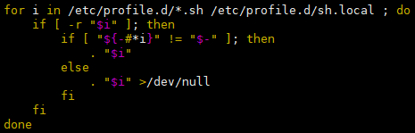
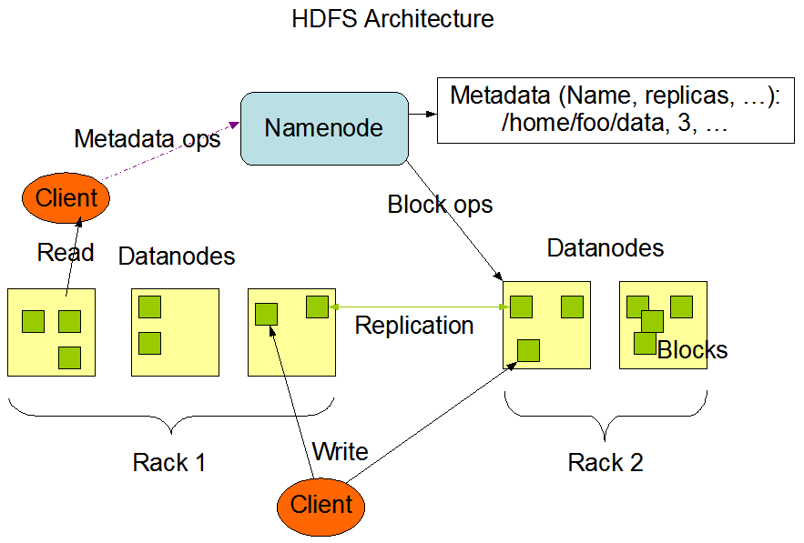

*date: 2021-08-25*


[TOC]

## 大数据

### 大数据概念

- 大数据（Big Data）：指无法在一定时间范围内用常规软件工具进行捕捉、管理和处理的数据集合，是需要新处理模式才能具有更强的决策力、洞察发现力和流程优化能力的海量、高增长率和多样化的信息资产。
- **大数据主要解决，海量数据的采集、存储和分析计算问题。**
- 按顺序给出数据存储单位：bit、Byte、KB、MB、GB、TB、PB、EB、ZB、YB、BB、NB、DB。
  - `1 Byte = 8 bit`，`1 KB = 1024 Byte`，`1 MB = 1024 KB`，`1 GB = 1024 MB`，`1 TB = 1024 GB`，`1 PB= 1024 TB`

### 大数据特点

- Volume（大量）
  - 截至目前，人类生产的所有印刷材料的数据量是 200 PB，而历史上全人类总共说过的话的数据量大约是 5 EB。当前，典型个人计算机硬盘的容量为 TB 量级，而一些大企业的数据量已经接近 EB 量级。
- Velocity（高速）
  - 这是大数据区分于传统数据挖掘的最显著特征。根据 IDC 的“数字宇宙”的报告，预计到 2025 年，全球数据使用量将达到 163 ZB。在如此海量的数据面前，处理数据的效率就是企业的生命。
  - 天猫双十一：2017 年，3 分 01 秒，天猫交易额超过 100 亿；2020 年，96 秒，天猫交易额超过 100 亿。
- Variety（多样）
  - 这种类型的多样性也让数据被分为结构化数据和非结构化数据。相对于以往便于存储的以数据库/文本为主的结构化数据，非结构化数据越来越多，包括网络日志、音频、视频、图片、地理位置信息等，这些多类型的数据对数据的处理能力提出了更高要求。
- Value（低价值密度）
  - 价值密度的高低与数据总量的大小成反比。比如，在一天的监控视频中，我们只关心宋老师晚上在床上健身那一分钟，如何快速对有价值数据“提纯”，成为目前大数据背景下待解决的难题。

## Hadoop 概述

### Hadoop 是什么

- Hadoop 是一个由 Apache 基金会所开发的**分布式系统基础架构**。

- **主要解决，海量数据的存储和海量数据的分析计算问题。**

- 广义上来说，Hadoop 通常是指一个更广泛的概念 --- Hadoop 生态圈。

  

### Hadoop 发展历史 

- Hadoop 创始人 Doug Cutting，为了实现与 Google 类似的全文搜索功能，他在 Lucene 框架基础上进行优化升级，查询引擎和索引引擎。

- 2001 年年底，Lucene 成为 Apache 基金会的一个子项目。

- 对于海量数据的场景，Lucene 框架面对与 Google 同样的困难，存储海量数据困难，检索海量速度慢。

- 学习和模仿 Google 解决这些问题的办法：微型版 Nutch。

- 可以说 Google 是 Hadoop 的思想之源（Google 在大数据方面的三篇论文）：

  - GFS ---> HDFS
  - MapReduce ---> MR
  - BigTable ---> HBase

- 2003 - 2004 年，Google 公开了部分 GFS 和 MapReduce 思想的细节，以此为基础，Doug Cutting 等人用了 2 年业余时间实现了 DFS 和 MapReduce 机制，使 Nutch 性能飙升。

- 2005 年，Hadoop 作为 Lucene 的子项目 Nutch 的一部分正式引入 Apache 基金会。

- 2006 年 3 月份，MapReduce 和 Nutch Distributed File System（NDFS）分别被纳入到 Hadoop 项目中，Hadoop 就此正式诞生，标志着大数据时代来临。

- 名字来源于 Doug Cutting 儿子的玩具大象：

  

### Hadoop 三大发行版本 

- Hadoop 三大发行版本：Apache、Cloudera、Hortonworks。
- Apache 版本是最原始（最基础）的版本，对于入门学习最好。--- 2006 年
- Cloudera 内部集成了很多大数据框架，对应产品 CDH。--- 2008 年
- Hortonworks 文档较好，对应产品 HDP。--- 2011 年
  - Hortonworks 现在已经被 Cloudera 公司收购，推出新的品牌 CDP。

#### Apache Hadoop

- 官网地址：http://hadoop.apache.org
- 下载地址：https://hadoop.apache.org/releases.html

#### Cloudera Hadoop

- 官网地址：https://www.cloudera.com/downloads/cdh
- 下载地址：https://docs.cloudera.com/documentation/enterprise/6/release-notes/topics/rg_cdh_6_download.html

####  Hortonworks Hadoop

- 官网地址：https://hortonworks.com/products/data-center/hdp/
- 下载地址：https://hortonworks.com/downloads/#data-platform

### Hadoop 优势

- 高可靠性：Hadoop 底层维护多个数据副本，所以即使 Hadoop 某个计算元素或存储出现故障，也不会导致数据的丢失。

  

- 高扩展性：在集群间分配任务数据，可方便的扩展数以千计的节点。

  

- 高效性：在 MapReduce 的思想下，Hadoop 是并行工作的，以加快任务处理速度。

  

- 高容错性：能够自动将失败的任务重新分配。

  

### Hadoop 组成


- Hadoop 1.x 时 代 ，Hadoop 中的 MapReduce 同时处理业务逻辑运算和资源的调度，耦合性较大。
- Hadoop 2.x 时代，增加了 Yarn。Yarn 只负责资源的调度，MapReduce 只负责运算。
- Hadoop 3.x 时代，在组成上没有变化。

#### HDFS 架构概述

- Hadoop Distributed File System，简称 HDFS，是一个分布式文件系统。包含三个模块：
  - NameNode：简称 nn，存储文件的元数据，如文件名，文件目录结构，文件属性（生成时间、副本数、文件权限），以及每个文件的块列表和块所在的 DataNode 等。
  - DataNode：简称 dn，在本地文件系统存储文件块数据，以及块数据的校验和。
  - Secondary NameNode：简称 2nn，每隔一段时间对 NameNode 元数据备份。

#### YARN 架构概述

- Yet Another Resource Negotiator，简称 YARN ，另一种资源协调者，是 Hadoop 的资源管理器。有两大组件：

  

  - ResourceManager：简称 RM，整个集群资源（内存、CPU 等）的管理者。
  - NodeManager：简称 NM，单个节点服务器资源的管理者。每个 NodeManager 上可以有多个 Container。
    - Container：容器，相当于一台独立的服务器，里面封装了任务运行所需要的资源，如内存、CPU、磁盘、网络等。
    - ApplicationMaster：简称 AM，单个任务运行的管理者。

- 客户端 client 可以有多个。
- 集群上可以运行多个 ApplicationMaster。

#### MapReduce 架构概述

- MapReduce 将计算过程分为两个阶段：Map 和 Reduce。

  

  - Map 阶段并行处理输入数据。
  - Reduce 阶段对 Map 结果进行汇总。

#### HDFS 、YARN 、MapReduce 三者关系


### 大数据技术生态体系


- Sqoop：Sqoop 是一款开源的工具，主要用于在 Hadoop、Hive 与传统的数据库（MySQL）间进行数据的传递，可以将一个关系型数据库（例如：MySQL，Oracle 等）中的数据导进到 Hadoop 的 HDFS 中，也可以将 HDFS 的数据导进到关系型数据库中。
- Flume：Flume 是一个高可用的，高可靠的，分布式的海量日志采集、聚合和传输的系统，Flume 支持在日志系统中定制各类数据发送方，用于收集数据。
- Kafka：Kafka 是一种高吞吐量的分布式发布订阅消息系统。
- Spark：Spark 是当前最流行的开源大数据内存计算框架。可以基于 Hadoop 上存储的大数据进行计算。
- Flink：Flink 是当前最流行的开源大数据内存计算框架。用于实时计算的场景较多。
- Oozie：Oozie 是一个管理 Hadoop 作业（job）的工作流程调度管理系统。
- Hbase：HBase 是一个分布式的、面向列的开源数据库。HBase 不同于一般的关系数据库，它是一个适合于非结构化数据存储的数据库。
- Hive：Hive 是基于 Hadoop 的一个数据仓库工具，可以将结构化的数据文件映射为一张数据库表，并提供简单的 SQL 查询功能，可以将 SQL 语句转换为 MapReduce 任务进行运行。其优点是学习成本低，可以通过类 SQL 语句快速实现简单的 MapReduce 统计，不必开发专门的 MapReduce 应用，十分适合数据仓库的统计分析。
- ZooKeeper：它是一个针对大型分布式系统的可靠协调系统，提供的功能包括：配置维护、名字服务、分布式同步、组服务等。

### 推荐系统框架图


## Hadoop 运行环境搭建 

### 模板虚拟机环境准备

- 安装模板虚拟机，IP 地址 192.168.10.100、主机名称 hadoop100、内存 2 G、硬盘 50 G。

  - 主机名称不要起 hadoop，hadoop000 等特殊名称。

- 开启虚拟机，切换到 root 用户操作下面得命令：

  ```sh
  [xisun@hadoop100 ~]$ su root
  密码：
  ```

- 确保虚拟机可以正常上网：

  ```sh
  [root@hadoop100 xisun]# ping www.baidu.com
  PING www.a.shifen.com (14.215.177.39) 56(84) bytes of data.
  64 bytes from 14.215.177.39 (14.215.177.39): icmp_seq=1 ttl=128 time=41.0 ms
  64 bytes from 14.215.177.39 (14.215.177.39): icmp_seq=2 ttl=128 time=40.9 ms
  64 bytes from 14.215.177.39 (14.215.177.39): icmp_seq=3 ttl=128 time=41.3 ms
  64 bytes from 14.215.177.39 (14.215.177.39): icmp_seq=4 ttl=128 time=42.5 ms
  ^C
  --- www.a.shifen.com ping statistics ---
  4 packets transmitted, 4 received, 0% packet loss, time 3007ms
  rtt min/avg/max/mdev = 40.987/41.495/42.582/0.674 ms
  ```

- 安装 epel-release：

  ```sh
  [root@hadoop100 xisun]# yum install -y epel-release
  已加载插件：fastestmirror, langpacks
  Loading mirror speeds from cached hostfile
   * base: mirrors.njupt.edu.cn
   * extras: mirrors.njupt.edu.cn
   * updates: mirrors.njupt.edu.cn
  base                                                                                                                                                                                        | 3.6 kB  00:00:00     
  extras                                                                                                                                                                                      | 2.9 kB  00:00:00     
  updates                                                                                                                                                                                     | 2.9 kB  00:00:00     
  正在解决依赖关系
  --> 正在检查事务
  ---> 软件包 epel-release.noarch.0.7-11 将被 安装
  --> 解决依赖关系完成
  
  依赖关系解决
  
  ===================================================================================================================================================================================================================
   Package                                                 架构                                              版本                                            源                                                 大小
  ===================================================================================================================================================================================================================
  正在安装:
   epel-release                                            noarch                                            7-11                                            extras                                             15 k
  
  事务概要
  ===================================================================================================================================================================================================================
  安装  1 软件包
  
  总下载量：15 k
  安装大小：24 k
  Downloading packages:
  警告：/var/cache/yum/x86_64/7/extras/packages/epel-release-7-11.noarch.rpm: 头V3 RSA/SHA256 Signature, 密钥 ID f4a80eb5: NOKEY
  epel-release-7-11.noarch.rpm 的公钥尚未安装
  epel-release-7-11.noarch.rpm                                                                                                                                                                |  15 kB  00:00:00     
  从 file:///etc/pki/rpm-gpg/RPM-GPG-KEY-CentOS-7 检索密钥
  导入 GPG key 0xF4A80EB5:
   用户ID     : "CentOS-7 Key (CentOS 7 Official Signing Key) <security@centos.org>"
   指纹       : 6341 ab27 53d7 8a78 a7c2 7bb1 24c6 a8a7 f4a8 0eb5
   软件包     : centos-release-7-8.2003.0.el7.centos.x86_64 (@anaconda)
   来自       : /etc/pki/rpm-gpg/RPM-GPG-KEY-CentOS-7
  Running transaction check
  Running transaction test
  Transaction test succeeded
  Running transaction
    正在安装    : epel-release-7-11.noarch                                                                                                                                                                       1/1 
    验证中      : epel-release-7-11.noarch                                                                                                                                                                       1/1 
  
  已安装:
    epel-release.noarch 0:7-11                                                                                                                                                                                       
  
  完毕！
  ```

  - Extra Packages for Enterprise Linux 是为“红帽系”的操作系统提供额外的软件包，适用于 RHEL、CentOS 和 Scientific Linux。相当于是一个软件仓库，大多数 rpm 包在官方 repository 中是找不到的。

  - 如果 Linux 安装的是最小系统版，还需要安装如下工具，如果安装的是 Linux 桌面标准版，不需要执行如下操作（本机安装的是桌面版）：

    - net-tool：工具包集合，包含 ifconfig 等命令。

      ```sh
      [root@hadoop100 xisun]# yum install -y net-tools
      ```

    - vim：编辑器。

      ```sh
      [root@hadoop100 xisun]# yum install -y vim
      ```

- 关闭防火墙，关闭防火墙开机自启：

  - 查看防火墙状态：

    ```sh
    [root@hadoop100 xisun]# firewall-cmd --state
    running
    ```

  - 关闭防火墙：

    ```sh
    [root@hadoop100 xisun]# systemctl stop firewalld.service
    [root@hadoop100 xisun]# firewall-cmd --state
    not running
    ```

  - 关闭防火墙开机自启：

    ```sh
    [root@hadoop100 xisun]# systemctl disable firewalld.service 
    Removed symlink /etc/systemd/system/multi-user.target.wants/firewalld.service.
    Removed symlink /etc/systemd/system/dbus-org.fedoraproject.FirewallD1.service.
    ```

  - 在企业开发时，通常单个服务器的防火墙是关闭的，公司整体对外访问时会设置非常安全的防火墙。

- 创建新用户，并修改新用户的密码（可省略）：

  ```sh
  [root@hadoop100 xisun]# useradd xisun
  [root@hadoop100 xisun]# passwd xisun
  ```

  - 生产环境下，应避免使用 root 用户直接操作。

- 配置刚创建的新用户具有 root 权限，方便后期加 sudo 执行 root 权限的命令：

  ```sh
  [root@hadoop100 xisun]# vim /etc/sudoers
  ```

  - 修改 `/etc/sudoers` 文件，在 %wheel 这行下面添加一行，将新用户 xisun 设置为免密使用 root 权限，如下所示：

    ```txt
    ## Allow root to run any commands anywhere 
    root    ALL=(ALL)       ALL
    
    ## Allows members of the 'sys' group to run networking, software, 
    ## service management apps and more.
    # %sys ALL = NETWORKING, SOFTWARE, SERVICES, STORAGE, DELEGATING, PROCESSES, LOCATE, DRIVERS
    
    ## Allows people in group wheel to run all commands
    %wheel  ALL=(ALL)       ALL
    
    xisun   ALL=(ALL)     NOPASSWD:ALL
    ```

    - xisun 这一行不要直接放到 root 行下面，因为所有用户都属于 wheel 组，如果放在 root 行下面，则是先配置了 xisun 用户在使用 sudo 命令时具有免输入密码功能，但是程序执行到 %wheel 行时，该功能又会被覆盖回需要密码。所以 xisun 这一行要放到 %wheel 这行下面。

- 从 root 用户退回到 xisun 用户：

  ```sh
  [root@hadoop100 xisun]# exit
  exit
  ```

- 在 `/opt` 目录下创建文件夹：

  ```sh
  [xisun@hadoop100 ~]$ cd /opt/
  [xisun@hadoop100 opt]$ sudo mkdir module
  [xisun@hadoop100 opt]$ sudo mkdir software
  [xisun@hadoop100 opt]$ ll
  总用量 0
  drwxr-xr-x. 2 root root 6 8月  30 22:08 module
  drwxr-xr-x. 2 root root 6 10月 31 2018 rh
  drwxr-xr-x. 2 root root 6 8月  30 22:09 software
  [xisun@hadoop100 opt]$ sudo rm -r rh
  [xisun@hadoop100 opt]$ ll
  总用量 0
  drwxr-xr-x. 2 root root 6 8月  30 22:08 module
  drwxr-xr-x. 2 root root 6 8月  30 22:09 software
  ```

  - `/opt` 目录下，需要使用 sudo 命令才能创建和删除文件夹：

    ```sh
    [xisun@hadoop100 opt]$ mkdir test
    mkdir: 无法创建目录"test": 权限不够
    ```

- 修改创建的文件夹所属主和所属组为 xisun 用户：

  ```sh
  [xisun@hadoop100 opt]$ ll
  总用量 0
  drwxr-xr-x. 2 root root 6 8月  30 22:08 module
  drwxr-xr-x. 2 root root 6 8月  30 22:09 software
  [xisun@hadoop100 opt]$ sudo chown xisun:xisun module/
  [xisun@hadoop100 opt]$ sudo chown xisun:xisun software/
  [xisun@hadoop100 opt]$ ll
  总用量 0
  drwxr-xr-x. 2 xisun xisun 6 8月  30 22:08 module
  drwxr-xr-x. 2 xisun xisun 6 8月  30 22:09 software
  ```

- 卸载虚拟机自带的 JDK，以 root 用户执行：

  ```sh
  [xisun@hadoop100 opt]$ su root
  密码：
  [root@hadoop100 opt]# rpm -qa | grep -i java
  javapackages-tools-3.4.1-11.el7.noarch
  tzdata-java-2019c-1.el7.noarch
  java-1.8.0-openjdk-headless-1.8.0.242.b08-1.el7.x86_64
  java-1.8.0-openjdk-1.8.0.242.b08-1.el7.x86_64
  java-1.7.0-openjdk-headless-1.7.0.251-2.6.21.1.el7.x86_64
  python-javapackages-3.4.1-11.el7.noarch
  java-1.7.0-openjdk-1.7.0.251-2.6.21.1.el7.x86_64
  [root@hadoop100 opt]# rpm -qa | grep -i java | xargs -n1 rpm -e --nodeps
  [root@hadoop100 opt]# rpm -qa | grep -i java
  ```

  - 如果你的虚拟机是最小化安装不需要执行这一步。
  - `rpm -qa`：查询所安装的所有 rpm 软件包。
  - `grep -i`：忽略大小写。
  - `xargs -n1`：表示每次只传递一个参数。
  - `rpm -e –nodeps`：强制卸载软件。

- 重启虚拟机：

  ```sh
  [root@hadoop100 opt]# reboot
  ```

### 克隆虚拟机

- 利用模板机 hadoop100，克隆三台虚拟机：hadoop102，hadoop103，hadoop104。

  - 注意：克隆时，要先关闭 hadoop100。

- 修改克隆机的 IP 地址和主机名，以 hadoop102 为例，进行说明：

  - 开启 hadoop102，以 root 账户登录。

  - 修改 IP 地址：

    ```sh
    [root@hadoop100 ~]# vim /etc/sysconfig/network-scripts/ifcfg-ens33
    ```

    - 修改 ifcfg-ens33 文件中的 IPADDR：

      ```txt
      TYPE="Ethernet"
      PROXY_METHOD="none"
      BROWSER_ONLY="no"
      BOOTPROTO="static"
      DEFROUTE="yes"
      IPV4_FAILURE_FATAL="no"
      IPV6INIT="yes"
      IPV6_AUTOCONF="yes"
      IPV6_DEFROUTE="yes"
      IPV6_FAILURE_FATAL="no"
      IPV6_ADDR_GEN_MODE="stable-privacy"
      NAME="ens33"
      UUID="eb503f88-96af-455d-b8f9-dbda02ca79d4"
      DEVICE="ens33"
      ONBOOT="yes"
      
      IPADDR=192.168.10.102		# 修改IP地址为192.168.10.102
      GATEWAY=192.168.10.2
      DNS1=192.168.10.2
      ```

  - 修改主机名：

    ```sh
    [root@hadoop100 ~]# vim /etc/hostname
    ```

    ```sh
    hadoop102
    ```

  - 重启：

    ```sh
    [root@hadoop100 ~]# reboot
    ```

  - 验证 IP 地址和主机名，以及网络是否正常：

    ```sh
    [root@hadoop102 ~]# ifconfig
    ens33: flags=4163<UP,BROADCAST,RUNNING,MULTICAST>  mtu 1500
            inet 192.168.10.102  netmask 255.255.255.0  broadcast 192.168.10.255
            inet6 fe80::ac1e:7fe1:a566:2670  prefixlen 64  scopeid 0x20<link>
            ether 00:0c:29:c5:1d:96  txqueuelen 1000  (Ethernet)
            RX packets 1025  bytes 878131 (857.5 KiB)
            RX errors 0  dropped 0  overruns 0  frame 0
            TX packets 442  bytes 35254 (34.4 KiB)
            TX errors 0  dropped 0 overruns 0  carrier 0  collisions 0
    
    lo: flags=73<UP,LOOPBACK,RUNNING>  mtu 65536
            inet 127.0.0.1  netmask 255.0.0.0
            inet6 ::1  prefixlen 128  scopeid 0x10<host>
            loop  txqueuelen 1000  (Local Loopback)
            RX packets 48  bytes 4080 (3.9 KiB)
            RX errors 0  dropped 0  overruns 0  frame 0
            TX packets 48  bytes 4080 (3.9 KiB)
            TX errors 0  dropped 0 overruns 0  carrier 0  collisions 0
    
    virbr0: flags=4099<UP,BROADCAST,MULTICAST>  mtu 1500
            inet 192.168.122.1  netmask 255.255.255.0  broadcast 192.168.122.255
            ether 52:54:00:97:ed:a7  txqueuelen 1000  (Ethernet)
            RX packets 0  bytes 0 (0.0 B)
            RX errors 0  dropped 0  overruns 0  frame 0
            TX packets 0  bytes 0 (0.0 B)
            TX errors 0  dropped 0 overruns 0  carrier 0  collisions 0
    
    [root@hadoop102 ~]# hostname
    hadoop102
    [root@hadoop102 ~]# ping www.baidu.com
    PING www.a.shifen.com (14.215.177.39) 56(84) bytes of data.
    64 bytes from 14.215.177.39 (14.215.177.39): icmp_seq=1 ttl=128 time=42.9 ms
    64 bytes from 14.215.177.39 (14.215.177.39): icmp_seq=2 ttl=128 time=42.6 ms
    64 bytes from 14.215.177.39 (14.215.177.39): icmp_seq=3 ttl=128 time=42.7 ms
    64 bytes from 14.215.177.39 (14.215.177.39): icmp_seq=4 ttl=128 time=42.8 ms
    64 bytes from 14.215.177.39 (14.215.177.39): icmp_seq=5 ttl=128 time=42.8 ms
    ^C
    --- www.a.shifen.com ping statistics ---
    5 packets transmitted, 5 received, 0% packet loss, time 4012ms
    rtt min/avg/max/mdev = 42.689/42.814/42.930/0.276 ms
    ```

  - 按照相同的步骤，修改 hadoop103 的 IP 地址为 192.168.10.103，主机名为 hadoop103，hadoop104 的 IP 地址为 192.168.10.104，主机名为 hadoop104，并验证。

### 安装 JDK

- 下面步骤以 hadoop102 为例，进行说明。

- 安装 JDK 前，一定确保提前删除了虚拟机自带的 JDK，此步骤在前面已执行。

  ```sh
  [xisun@hadoop102 ~]$ rpm -qa | grep -i java
  ```

  ```sh
  [xisun@hadoop100 ~]$ rpm -qa | grep -i java | xargs -n1 sudo rpm -e --nodeps
  ```

  ```sh
  [xisun@hadoop102 ~]$ java -version
  bash: java: 未找到命令...
  ```

- 安装 OpenJDK 8。


- 下载地址：https://openjdk.java.net/，https://openjdk.java.net/install/index.html

  

- 使用 root 权限，以命令行安装：

  ```sh
  [xisun@hadoop102 ~]$ sudo yum install -y java-1.8.0-openjdk-devel
  已加载插件：fastestmirror, langpacks
  Loading mirror speeds from cached hostfile
   * base: mirrors.cqu.edu.cn
   * epel: mirror.sjtu.edu.cn
   * extras: mirrors.cn99.com
   * updates: mirrors.cn99.com
  正在解决依赖关系
  --> 正在检查事务
  ---> 软件包 java-1.8.0-openjdk-devel.x86_64.1.1.8.0.302.b08-0.el7_9 将被 安装
  --> 正在处理依赖关系 java-1.8.0-openjdk(x86-64) = 1:1.8.0.302.b08-0.el7_9，它被软件包 1:java-1.8.0-openjdk-devel-1.8.0.302.b08-0.el7_9.x86_64 需要
  --> 正在处理依赖关系 libjvm.so()(64bit)，它被软件包 1:java-1.8.0-openjdk-devel-1.8.0.302.b08-0.el7_9.x86_64 需要
  --> 正在处理依赖关系 libjava.so()(64bit)，它被软件包 1:java-1.8.0-openjdk-devel-1.8.0.302.b08-0.el7_9.x86_64 需要
  --> 正在检查事务
  ---> 软件包 java-1.8.0-openjdk.x86_64.1.1.8.0.302.b08-0.el7_9 将被 安装
  ---> 软件包 java-1.8.0-openjdk-headless.x86_64.1.1.8.0.302.b08-0.el7_9 将被 安装
  --> 正在处理依赖关系 tzdata-java >= 2021a，它被软件包 1:java-1.8.0-openjdk-headless-1.8.0.302.b08-0.el7_9.x86_64 需要
  --> 正在处理依赖关系 jpackage-utils，它被软件包 1:java-1.8.0-openjdk-headless-1.8.0.302.b08-0.el7_9.x86_64 需要
  --> 正在检查事务
  ---> 软件包 javapackages-tools.noarch.0.3.4.1-11.el7 将被 安装
  --> 正在处理依赖关系 python-javapackages = 3.4.1-11.el7，它被软件包 javapackages-tools-3.4.1-11.el7.noarch 需要
  ---> 软件包 tzdata-java.noarch.0.2021a-1.el7 将被 安装
  --> 正在检查事务
  ---> 软件包 python-javapackages.noarch.0.3.4.1-11.el7 将被 安装
  --> 解决依赖关系完成
  
  依赖关系解决
  
  ===================================================================================================================================================================================================================
   Package                                                       架构                                     版本                                                       源                                         大小
  ===================================================================================================================================================================================================================
  正在安装:
   java-1.8.0-openjdk-devel                                      x86_64                                   1:1.8.0.302.b08-0.el7_9                                    updates                                   9.8 M
  为依赖而安装:
   java-1.8.0-openjdk                                            x86_64                                   1:1.8.0.302.b08-0.el7_9                                    updates                                   311 k
   java-1.8.0-openjdk-headless                                   x86_64                                   1:1.8.0.302.b08-0.el7_9                                    updates                                    33 M
   javapackages-tools                                            noarch                                   3.4.1-11.el7                                               base                                       73 k
   python-javapackages                                           noarch                                   3.4.1-11.el7                                               base                                       31 k
   tzdata-java                                                   noarch                                   2021a-1.el7                                                updates                                   191 k
  
  事务概要
  ===================================================================================================================================================================================================================
  安装  1 软件包 (+5 依赖软件包)
  
  总下载量：43 M
  安装大小：152 M
  Downloading packages:
  (1/6): python-javapackages-3.4.1-11.el7.noarch.rpm                                                                                                                                          |  31 kB  00:00:00     
  (2/6): java-1.8.0-openjdk-1.8.0.302.b08-0.el7_9.x86_64.rpm                                                                                                                                  | 311 kB  00:00:00     
  (3/6): javapackages-tools-3.4.1-11.el7.noarch.rpm                                                                                                                                           |  73 kB  00:00:00     
  (4/6): tzdata-java-2021a-1.el7.noarch.rpm                                                                                                                                                   | 191 kB  00:00:01     
  (5/6): java-1.8.0-openjdk-headless-1.8.0.302.b08-0.el7_9.x86_64.rpm                                                                                                                         |  33 MB  00:00:07     
  (6/6): java-1.8.0-openjdk-devel-1.8.0.302.b08-0.el7_9.x86_64.rpm                                                                                                                            | 9.8 MB  00:00:13     
  -------------------------------------------------------------------------------------------------------------------------------------------------------------------------------------------------------------------
  总计                                                                                                                                                                               3.1 MB/s |  43 MB  00:00:13     
  Running transaction check
  Running transaction test
  Transaction test succeeded
  Running transaction
  警告：RPM 数据库已被非 yum 程序修改。
  ** 发现 9 个已存在的 RPM 数据库问题， 'yum check' 输出如下：
  icedtea-web-1.7.1-2.el7_6.x86_64 有缺少的需求 java-1.8.0-openjdk
  icedtea-web-1.7.1-2.el7_6.x86_64 有缺少的需求 jpackage-utils
  icedtea-web-1.7.1-2.el7_6.x86_64 有缺少的需求 jpackage-utils
  jline-1.0-8.el7.noarch 有缺少的需求 java >= ('0', '1.5', None)
  jline-1.0-8.el7.noarch 有缺少的需求 jpackage-utils
  rhino-1.7R5-1.el7.noarch 有缺少的需求 jpackage-utils
  rhino-1.7R5-1.el7.noarch 有缺少的需求 jpackage-utils
  tagsoup-1.2.1-8.el7.noarch 有缺少的需求 jpackage-utils
  tagsoup-1.2.1-8.el7.noarch 有缺少的需求 jpackage-utils >= ('0', '1.6', None)
    正在安装    : tzdata-java-2021a-1.el7.noarch                                                                                                                                                                 1/6 
    正在安装    : python-javapackages-3.4.1-11.el7.noarch                                                                                                                                                        2/6 
    正在安装    : javapackages-tools-3.4.1-11.el7.noarch                                                                                                                                                         3/6 
    正在安装    : 1:java-1.8.0-openjdk-headless-1.8.0.302.b08-0.el7_9.x86_64                                                                                                                                     4/6 
    正在安装    : 1:java-1.8.0-openjdk-1.8.0.302.b08-0.el7_9.x86_64                                                                                                                                              5/6 
    正在安装    : 1:java-1.8.0-openjdk-devel-1.8.0.302.b08-0.el7_9.x86_64                                                                                                                                        6/6 
    验证中      : 1:java-1.8.0-openjdk-headless-1.8.0.302.b08-0.el7_9.x86_64                                                                                                                                     1/6 
    验证中      : python-javapackages-3.4.1-11.el7.noarch                                                                                                                                                        2/6 
    验证中      : tzdata-java-2021a-1.el7.noarch                                                                                                                                                                 3/6 
    验证中      : 1:java-1.8.0-openjdk-devel-1.8.0.302.b08-0.el7_9.x86_64                                                                                                                                        4/6 
    验证中      : 1:java-1.8.0-openjdk-1.8.0.302.b08-0.el7_9.x86_64                                                                                                                                              5/6 
    验证中      : javapackages-tools-3.4.1-11.el7.noarch                                                                                                                                                         6/6 
  
  已安装:
    java-1.8.0-openjdk-devel.x86_64 1:1.8.0.302.b08-0.el7_9                                                                                                                                                          
  
  作为依赖被安装:
    java-1.8.0-openjdk.x86_64 1:1.8.0.302.b08-0.el7_9     java-1.8.0-openjdk-headless.x86_64 1:1.8.0.302.b08-0.el7_9     javapackages-tools.noarch 0:3.4.1-11.el7     python-javapackages.noarch 0:3.4.1-11.el7    
    tzdata-java.noarch 0:2021a-1.el7                     
  
  完毕！
  ```

  > 公司生产环境使用的是 OpenJDK 8，此处保持一致。

- 验证 JDK 是否安装成功：

  ```sh
  [xisun@hadoop102 ~]$ java -version
  openjdk version "1.8.0_302"
  OpenJDK Runtime Environment (build 1.8.0_302-b08)
  OpenJDK 64-Bit Server VM (build 25.302-b08, mixed mode)
  ```

- 配置 JDK 环境变量：

  - 查看 jre/bin 路径：

    ```sh
    [xisun@hadoop102 ~]$ dirname $(readlink $(readlink $(which java)))
    /usr/lib/jvm/java-1.8.0-openjdk-1.8.0.302.b08-0.el7_9.x86_64/jre/bin
    ```

  - 新建 `/etc/profile.d/my_env.sh` 文件，添加 Java 环境变量：

    ```sh
    [xisun@hadoop102 ~]$ sudo vim /etc/profile.d/my_env.sh
    ```

    ```txt
    # JAVA_HOME
    export JAVA_HOME=/usr/lib/jvm/java-1.8.0-openjdk-1.8.0.302.b08-0.el7_9.x86_64
    export PATH=$PATH:$JAVA_HOME/bin
    ```

    - 正常情况下，会将 Java 环境变量添加在 `/etc/profile` 文件的最后，但该文件有如下设置，因此，可以在 `/etc/profile.d` 路径下自定义一个以 sh 结尾的文件，能达到同样的效果：

      

  - source 一下 `/etc/profile` 文件，让新的环境变量 PATH 生效：

    ```sh
    [xisun@hadoop102 etc]$ source /etc/profile
    ```

  - 查看配置是否生效：

    ```sh
    [xisun@hadoop102 etc]$ echo $JAVA_HOME
    /usr/lib/jvm/java-1.8.0-openjdk-1.8.0.302.b08-0.el7_9.x86_64
    ```

### 安装 Hadoop

- 下面步骤以 hadoop102 为例，进行说明。

- 下载地址：https://hadoop.apache.org/releases.html

  

  

  > 公司生产环境使用的是 hadoop-3.2.1，此处保持一致。

- 在 `opt/software` 路径下，使用 wget 命令下载安装包：

  ```sh
  [xisun@hadoop102 software]$ pwd
  /opt/software
  [xisun@hadoop102 software]$ wget https://archive.apache.org/dist/hadoop/common/hadoop-3.2.1/hadoop-3.2.1.tar.gz
  --2021-08-31 11:44:19--  https://archive.apache.org/dist/hadoop/common/hadoop-3.2.1/hadoop-3.2.1.tar.gz
  正在解析主机 archive.apache.org (archive.apache.org)... 138.201.131.134, 2a01:4f8:172:2ec5::2
  正在连接 archive.apache.org (archive.apache.org)|138.201.131.134|:443... 已连接。
  已发出 HTTP 请求，正在等待回应... 200 OK
  长度：359196911 (343M) [application/x-gzip]
  正在保存至: “hadoop-3.2.1.tar.gz”
  
  100%[=========================================================================================================================================================================>] 359,196,911 57.8KB/s 用时 57m 32s
  
  2021-08-31 12:41:54 (102 KB/s) - 已保存 “hadoop-3.2.1.tar.gz” [359196911/359196911])
  [xisun@hadoop102 software]$ ll
  总用量 350780
  -rw-rw-r--. 1 xisun xisun 359196911 7月   3 2020 hadoop-3.2.1.tar.gz
  ```

- 解压安装包到 `/opt/module` 路径下面：

  ```sh
  [xisun@hadoop102 software]$ tar -zxvf hadoop-3.2.1.tar.gz -C /opt/module/
  ```

  ```sh
  [xisun@hadoop102 software]$ ll ../module/
  总用量 0
  drwxr-xr-x. 9 xisun xisun 149 9月  11 2019 hadoop-3.2.1
  ```

- 将 Hadoop 添加到环境变量：

  - 获取 Hadoop 安装路径：

    ```sh
    [xisun@hadoop102 hadoop-3.2.1]$ pwd
    /opt/module/hadoop-3.2.1
    ```

  - 修改 `etc/profile.d/my_env.sh` 文件，添加 Hadoop 环境变量：

    ```sh
    [xisun@hadoop102 hadoop-3.2.1]$ sudo vim /etc/profile.d/my_env.sh
    ```

    ```sh
    # HADOOP_HOME
    export HADOOP_HOME=/opt/module/hadoop-3.2.1
    export PATH=$PATH:$HADOOP_HOME/bin
    export PATH=$PATH:$HADOOP_HOME/sbin
    ```

  - source 一下 `/etc/profile` 文件，让新的环境变量 PATH 生效：

    ```sh
    [xisun@hadoop102 hadoop-3.2.1]$ source /etc/profile
    ```

  - 查看配置是否生效：

    ```sh
    [xisun@hadoop102 hadoop-3.2.1]$ echo $HADOOP_HOME
    /opt/module/hadoop-3.2.1
    [xisun@hadoop102 hadoop-3.2.1]$ hadoop version
    Hadoop 3.2.1
    Source code repository https://gitbox.apache.org/repos/asf/hadoop.git -r b3cbbb467e22ea829b3808f4b7b01d07e0bf3842
    Compiled by rohithsharmaks on 2019-09-10T15:56Z
    Compiled with protoc 2.5.0
    From source with checksum 776eaf9eee9c0ffc370bcbc1888737
    This command was run using /opt/module/hadoop-3.2.1/share/hadoop/common/hadoop-common-3.2.1.jar
    ```

### Hadoop 目录结构

- 查看 Hadoop 的目录结构：

  ```sh
  [xisun@hadoop102 hadoop-3.2.1]$ pwd
  /opt/module/hadoop-3.2.1
  [xisun@hadoop102 hadoop-3.2.1]$ ll
  总用量 180
  drwxr-xr-x. 2 xisun xisun    203 9月  11 2019 bin
  drwxr-xr-x. 3 xisun xisun     20 9月  10 2019 etc
  drwxr-xr-x. 2 xisun xisun    106 9月  11 2019 include
  drwxr-xr-x. 3 xisun xisun     20 9月  11 2019 lib
  drwxr-xr-x. 4 xisun xisun    288 9月  11 2019 libexec
  -rw-rw-r--. 1 xisun xisun 150569 9月  10 2019 LICENSE.txt
  -rw-rw-r--. 1 xisun xisun  22125 9月  10 2019 NOTICE.txt
  -rw-rw-r--. 1 xisun xisun   1361 9月  10 2019 README.txt
  drwxr-xr-x. 3 xisun xisun   4096 9月  10 2019 sbin
  drwxr-xr-x. 4 xisun xisun     31 9月  11 2019 share
  ```

- 重要目录

  - bin 目录：存放对 Hadoop 相关服务（hdfs，yarn，mapred）进行操作的脚本。

    ```sh
    [xisun@hadoop102 hadoop-3.2.1]$ ls bin/
    container-executor  hadoop  hadoop.cmd  hdfs  hdfs.cmd  mapred  mapred.cmd  oom-listener  test-container-executor  yarn  yarn.cmd
    ```

    

  - etc 目录：Hadoop 的配置文件目录，存放 Hadoop 的配置文件。

    ```sh
    [xisun@hadoop102 hadoop-3.2.1]$ ls etc/
    hadoop
    [xisun@hadoop102 hadoop-3.2.1]$ ls etc/hadoop/
    capacity-scheduler.xml  hadoop-env.sh                     httpfs-env.sh            kms-env.sh            mapred-env.sh               ssl-server.xml.example         yarnservice-log4j.properties
    configuration.xsl       hadoop-metrics2.properties        httpfs-log4j.properties  kms-log4j.properties  mapred-queues.xml.template  user_ec_policies.xml.template  yarn-site.xml
    container-executor.cfg  hadoop-policy.xml                 httpfs-signature.secret  kms-site.xml          mapred-site.xml             workers
    core-site.xml           hadoop-user-functions.sh.example  httpfs-site.xml          log4j.properties      shellprofile.d              yarn-env.cmd
    hadoop-env.cmd          hdfs-site.xml                     kms-acls.xml             mapred-env.cmd        ssl-client.xml.example      yarn-env.sh
    ```

    

  - lib 目录：存放 Hadoop 的本地库（对数据进行压缩解压缩功能）。

  - sbin 目录：存放启动或停止 Hadoop 相关服务的脚本。

    ```sh
    [xisun@hadoop102 hadoop-3.2.1]$ ls sbin/
    distribute-exclude.sh  hadoop-daemons.sh  mr-jobhistory-daemon.sh  start-all.sh       start-dfs.sh         start-yarn.sh  stop-balancer.sh  stop-secure-dns.sh  workers.sh
    FederationStateStore   httpfs.sh          refresh-namenodes.sh     start-balancer.sh  start-secure-dns.sh  stop-all.cmd   stop-dfs.cmd      stop-yarn.cmd       yarn-daemon.sh
    hadoop-daemon.sh       kms.sh             start-all.cmd            start-dfs.cmd      start-yarn.cmd       stop-all.sh    stop-dfs.sh       stop-yarn.sh        yarn-daemons.sh
    ```

    

  - share 目录：存放 Hadoop 的依赖 JAR 包、文档、和官方案例。

## Hadoop 运行模式

- Hadoop 官方网站：http://hadoop.apache.org/

- Hadoop 运行模式包括：本地模式、伪分布式模式以及完全分布式模式。

  

  - 本地模式：单机运行，只是用来演示一下官方案例。
    - 数据存储在 Linux 本地，偶尔测试时使用。
  - 伪分布式模式：也是单机运行，但是具备 Hadoop 集群的所有功能，一台服务器模拟一个分布式的环境。
    - 数据存储在 HDFS 上，个别缺钱的公司用来测试，生产环境一般不用。
  - 完全分布式模式：多台服务器组成分布式环境。
    - 数据存储在 HDFS 上，企业生产环境大量使用。

### 本地模式

- 以官方 WordCount 进行说明。

- 第一步：在 hadoop-3.2.1 文件下面创建一个 wcinput 文件夹。

  ```sh
  [xisun@hadoop102 hadoop-3.2.1]$ mkdir wcinput
  ```

- 第二步：在 wcinput 文件下创建一个 word.txt 文件，并输入一些单词做测试。

  ```sh
  [xisun@hadoop102 wcinput]$ vim word.txt
  ```

  ```txt
  hadoop yarn
  hadoop mapreduce
  xisun
  xisun
  ```

- 第三步：回到 Hadoop 目录 `/opt/module/hadoop-3.2.1`。

- 第四步：执行 wordcount 程序，统计 word.txt 文件中各单词的个数。

  ```sh
  [xisun@hadoop102 hadoop-3.2.1]$ bin/hadoop jar share/hadoop/mapreduce/hadoop-mapreduce-examples-3.2.1.jar wordcount wcinput/ ./wcoutput
  ```

  > 本地模式下，输入路径 `/wcinput` 和输出路径 `./wcoutput` 都是本地路径。
  >
  > 注意：结果输出路径 wcoutput 不能已经存在，否则程序会报错 `org.apache.hadoop.mapred.FileAlreadyExistsException: Output directory file:/opt/module/hadoop-3.2.1/wcoutput already exists`。

- 第五步：查看结果。

  ```sh
  [xisun@hadoop102 hadoop-3.2.1]$ cd wcoutput/
  [xisun@hadoop102 wcoutput]$ ll
  总用量 4
  -rw-r--r--. 1 xisun xisun 36 8月  31 16:04 part-r-00000
  -rw-r--r--. 1 xisun xisun  0 8月  31 16:04 _SUCCESS
  [xisun@hadoop102 wcoutput]$ cat part-r-00000 
  hadoop	2
  mapreduce	1
  xisun	2
  yarn	1
  ```

### 完全分布式模式

#### 虚拟机准备

- 虚拟机 hadoop102 已准备好，参考前面章节。

- 在 hadoop103 和 hadoop104 安装 OpenJDK：

  ```sh
  [xisun@hadoop103 ~]$ sudo yum install -y java-1.8.0-openjdk-devel
  ```

- hadoop102，hadoop103 和 hadoop104 三台虚拟机，安装的 JDK 环境和 Hadoop 版本相同，因此，环境变量配置也相同。对于这种情况，不需要在每台虚拟机上再配置环境变量，可以使用 scp 或 rsync 命令等，直接拷贝模板虚拟机 hadoop102 上的配置文件到 hadoop103 和 hadoop104 上。在后面章节，也可以使用集群分发脚本 xsync 拷贝。

  - 如果使用 scp 命令，拷贝 hadoop102 上环境变量配置的 `etc/profile.d/my_env.sh` 文件到 hadoop103 和 hadoop104 的 `etc/profile.d` 路径下，方式如下。

    - 方式一，在 hadoop102 上使用 scp 命令，拷贝本地文件到 hadoop103 上：
  
      ```sh
      [xisun@hadoop102 profile.d]$ sudo scp /etc/profile.d/my_env.sh root@hadoop103:/etc/profile.d/
      The authenticity of host 'hadoop103 (192.168.10.103)' can't be established.
      ECDSA key fingerprint is SHA256:AOkUHU40E6uekNRiFpZkT4R2gfoE+s9ujdYTZ5e8kwM.
      ECDSA key fingerprint is MD5:dd:80:45:3e:83:75:92:fe:57:d3:78:fa:af:5a:ca:1b.
      Are you sure you want to continue connecting (yes/no)? yes
      Warning: Permanently added 'hadoop103,192.168.10.103' (ECDSA) to the list of known hosts.
      root@hadoop103's password: 
      my_env.sh      
      ```

    - 方式二，在 hadoop104 上使用 scp 命令，拷贝 hadoop102 上的文件到本地：
  
      ```sh
      [xisun@hadoop104 profile.d]$ sudo scp root@hadoop102:/etc/profile.d/my_env.sh /etc/profile.d/
      The authenticity of host 'hadoop102 (192.168.10.102)' can't be established.
      ECDSA key fingerprint is SHA256:AOkUHU40E6uekNRiFpZkT4R2gfoE+s9ujdYTZ5e8kwM.
      ECDSA key fingerprint is MD5:dd:80:45:3e:83:75:92:fe:57:d3:78:fa:af:5a:ca:1b.
      Are you sure you want to continue connecting (yes/no)? yes
      Warning: Permanently added 'hadoop102,192.168.10.102' (ECDSA) to the list of known hosts.
      root@hadoop102's password: 
      my_env.sh
      ```

    - 方式三，在 hadoop103 上使用 scp 命令，拷贝 hadoop102 上的文件到 hadoop104 上：
  
      ```sh
      [xisun@hadoop103 profile.d]$ sudo scp root@hadoop102:/etc/profile.d/my_env.sh root@hadoop104:/etc/profile.d/
      ```
  
  - 如果使用集群分发脚本 xsync 拷贝，需要注意，my_env.sh 文件是 root 权限的，需要给脚本添加 sudo 命令，同时，xsync 脚本需要补全路径，否则 sudo 识别不出来：
  
    ```sh
    [xisun@hadoop102 ~]$ sudo /home/xisun/bin/xsync /etc/profile.d/my_env.sh 
    ==================== hadoop102 ====================
    root@hadoop102's password: 
    root@hadoop102's password: 
    sending incremental file list
    
    sent 48 bytes  received 12 bytes  24.00 bytes/sec
    total size is 253  speedup is 4.22
    ==================== hadoop103 ====================
    root@hadoop103's password: 
    root@hadoop103's password: 
    sending incremental file list
    my_env.sh
    
    sent 348 bytes  received 35 bytes  153.20 bytes/sec
    total size is 253  speedup is 0.66
    ==================== hadoop104 ====================
    The authenticity of host 'hadoop104 (192.168.10.104)' can't be established.
    ECDSA key fingerprint is SHA256:AOkUHU40E6uekNRiFpZkT4R2gfoE+s9ujdYTZ5e8kwM.
    ECDSA key fingerprint is MD5:dd:80:45:3e:83:75:92:fe:57:d3:78:fa:af:5a:ca:1b.
    Are you sure you want to continue connecting (yes/no)? yes
    Warning: Permanently added 'hadoop104,192.168.10.104' (ECDSA) to the list of known hosts.
    root@hadoop104's password: 
    root@hadoop104's password: 
    sending incremental file list
    my_env.sh
    
    sent 348 bytes  received 35 bytes  153.20 bytes/sec
    total size is 253  speedup is 0.66
    ```
  
    > 注意，需要输入的是各主机 root 用户的密码。

- 在 hadoop103 和 hadoop104 上 source 一下 `/etc/profile` 文件，让新的环境变量 PATH 生效：

  ```sh
  [xisun@hadoop103 ~]$ source /etc/profile
  [xisun@hadoop103 ~]$ echo $JAVA_HOME
  /usr/lib/jvm/java-1.8.0-openjdk-1.8.0.302.b08-0.el7_9.x86_64
  ```

  ```sh
  [xisun@hadoop104 ~]$ source /etc/profile
  [xisun@hadoop104 ~]$ echo $JAVA_HOME
  /usr/lib/jvm/java-1.8.0-openjdk-1.8.0.302.b08-0.el7_9.x86_64
  ```

#### 编写集群分发脚本 xsync

##### scp（secure copy）安全拷贝

- scp 可以实现服务器与服务器之间的数据拷贝。（from server1 to server2）

- 基本语法：

  ```sh
  scp    -r        $pdir/$fname         $user@$host:$pdir/$fname
  命令   递归     要拷贝的文件路径/名称   	 目的地用户@主机:目的地路径/名称
  ```

- 实例：拷贝 hadoop102 上的 Hadoop 安装包到 hadoop103 和 hadoop104 上。

  - 前提：在 hadoop102、hadoop103、hadoop104 三台虚拟机上，都已经创建好 `/opt/module` 和 `/opt/software` 两个路径，并且已经把这两个路径的权限修改为 xisun:xisun。

  - 方式一，在 hadoop102 上使用 scp 命令，拷贝本地文件到 hadoop103 上：

    ```sh
    [xisun@hadoop102 opt]$ scp -r /opt/module/hadoop-3.2.1/ xisun@hadoop103:/opt/module/
    The authenticity of host 'hadoop103 (192.168.10.103)' can't be established.
    ECDSA key fingerprint is SHA256:AOkUHU40E6uekNRiFpZkT4R2gfoE+s9ujdYTZ5e8kwM.
    ECDSA key fingerprint is MD5:dd:80:45:3e:83:75:92:fe:57:d3:78:fa:af:5a:ca:1b.
    Are you sure you want to continue connecting (yes/no)? yes
    Warning: Permanently added 'hadoop103,192.168.10.103' (ECDSA) to the list of known hosts.
    xisun@hadoop103's password:
    ```

  
  - 方式二，在 hadoop104 上使用 scp 命令，拷贝 hadoop102 上的文件到本地：
  
    ```sh
    [xisun@hadoop104 opt]$ scp -r xisun@hadoop102:/opt/module/hadoop-3.2.1/ /opt/module/
    The authenticity of host 'hadoop102 (192.168.10.102)' can't be established.
    ECDSA key fingerprint is SHA256:AOkUHU40E6uekNRiFpZkT4R2gfoE+s9ujdYTZ5e8kwM.
    ECDSA key fingerprint is MD5:dd:80:45:3e:83:75:92:fe:57:d3:78:fa:af:5a:ca:1b.
    Are you sure you want to continue connecting (yes/no)? yes
    Warning: Permanently added 'hadoop104,192.168.10.102' (ECDSA) to the list of known hosts.
    xisun@hadoop102's password:
    ```
  
  - 方式三，在 hadoop103 上使用 scp 命令，拷贝 hadoop102 上的文件到 hadoop104 上：
  
    ```sh
    [xisun@hadoop103 opt]$ scp -r xisun@hadoop102:/opt/module/hadoop-3.2.1/ xisun@hadoop104:/opt/module/
    ```

##### rsync 远程同步工具

- rsync 主要用于备份和镜像。具有速度快、避免复制相同内容和支持符号链接的优点。

- rsync 和 scp 的区别：用 rsync 做文件的复制要比 scp 的速度快，rsync 只对差异文件做更新。scp 是把所有文件都复制过去。

- rsync 第一次使用，等同于 scp。

- 基本语法：

  ```sh
  rsync    -av       $pdir/$fname          $user@$host:$pdir/$fname
  命令    选项参数    要拷贝的文件路径/名称     目的地用户@主机:目的地路径/名称
  ```

  - 参数说明：

    | 选项 | 功能         |
    | ---- | ------------ |
    | -a   | 归档拷贝     |
    | -v   | 显示复制过程 |

- 实例：

  - 删除 hadoop103 和 hadoop104 上 `/opt/module/hadoop-3.2.1` 路径下的 wcinput 和 wcoutput 文件夹。
  
    ```sh
    [xisun@hadoop103 hadoop-3.2.1]$ rm -r wcinput/ wcoutput/
    ```
  
    ```sh
    [xisun@hadoop104 hadoop-3.2.1]$ rm -r wcinput/ wcoutput/
    ```
  
  - 同步 hadoop102 上的 `/opt/module/hadoop-3.2.1` 到 hadoop103 和 hadoop104 上。
  
    - 方式一，在 hadoop102 上使用  rsync 命令，同步本地文件到 hadoop103 上：
  
      ```sh
      [xisun@hadoop102 ~]$ rsync -av /opt/module/hadoop-3.2.1/ xisun@hadoop103:/opt/module/hadoop-3.2.1/
      xisun@hadoop103's password: 
      ```
  
    - 方式二，在 hadoop104 上使用 rsync 命令，同步 hadoop102 上的文件到本地：
  
      ```sh
      [xisun@hadoop104 ~]$ rsync -av xisun@hadoop102:/opt/module/hadoop-3.2.1/ /opt/module/hadoop-3.2.1/
      The authenticity of host 'hadoop102 (192.168.10.102)' can't be established.
      ECDSA key fingerprint is SHA256:AOkUHU40E6uekNRiFpZkT4R2gfoE+s9ujdYTZ5e8kwM.
      ECDSA key fingerprint is MD5:dd:80:45:3e:83:75:92:fe:57:d3:78:fa:af:5a:ca:1b.
      Are you sure you want to continue connecting (yes/no)? yes
      Warning: Permanently added 'hadoop102,192.168.10.102' (ECDSA) to the list of known hosts.
      xisun@hadoop102's password: 
      ```
  
    - 方式三，在 hadoop103 上使用 rsync 命令，同步 hadoop102 上的文件到 hadoop104 上：
  
      ```sh
      [xisun@hadoop103 ~]$ rsync -av xisun@hadoop102:/opt/module/hadoop-3.2.1/ xisun@hadoop104:/opt/module/hadoop-3.2.1/
      ```

##### xsync 集群分发脚本

- 需求：编写脚本，指定需要同步的文件路径参数，能够循环复制该路径下的所有文件到所有节点的相同路径下。

- 需求分析：

  - 使用 rsync 命令，实现同步拷贝。

  - 期望脚本格式：`xsync 需要同步的文件名称`

  - 期望脚本在任何路径都能使用：将脚本放在声明了全局环境变量的路径下。

    - 查看全局变量的路径：

      ```sh
      [xisun@hadoop102 ~]$ echo $PATH
      /usr/local/bin:/usr/bin:/usr/local/sbin:/usr/sbin:/home/xisun/.local/bin:/home/xisun/bin:/usr/lib/jvm/java-1.8.0-openjdk-1.8.0.302.b08-0.el7_9.x86_64/bin
      ```

    - 可以看出，在全局变量的路径中，有一个 `/home/xisun/bin:`，如果把编写的脚本 xsync 放在此路径下，即可在任何路径都能使用。或者，直接把脚本 xsync 所在的路径，配置到全局环境变量中也可以。

- 脚本实现：

  - 在 `/home/xisun` 路径下，创建 bin 目录：

    ```sh
    [xisun@hadoop102 ~]$ pwd
    /home/xisun
    [xisun@hadoop102 ~]$ mkdir bin
    [xisun@hadoop102 ~]$ ll
    总用量 0
    drwxrwxr-x. 2 xisun xisun 6 9月   1 11:43 bin
    drwxr-xr-x. 2 xisun xisun 6 8月  28 23:56 公共
    drwxr-xr-x. 2 xisun xisun 6 8月  28 23:56 模板
    drwxr-xr-x. 2 xisun xisun 6 8月  28 23:56 视频
    drwxr-xr-x. 2 xisun xisun 6 8月  28 23:56 图片
    drwxr-xr-x. 2 xisun xisun 6 8月  28 23:56 文档
    drwxr-xr-x. 2 xisun xisun 6 8月  28 23:56 下载
    drwxr-xr-x. 2 xisun xisun 6 8月  28 23:56 音乐
    drwxr-xr-x. 2 xisun xisun 6 8月  28 23:56 桌面
    ```

  - 在 `/home/xisun/bin` 路径下，创建 xsync 文件，并添加脚本代码：

    ```sh
    [xisun@hadoop102 bin]$ pwd
    /home/xisun/bin
    [xisun@hadoop102 bin]$ vim xsync
    ```

    ```txt
    #!/bin/bash
    
    # 1.判断参数个数，如果参数个数小于1，直接退出，$#是获得参数个数
    if [ $# -lt 1 ]
    then
        echo Not Enough Arguement!
        exit;
    fi
    
    # 2.遍历集群所有机器
    for host in hadoop102 hadoop103 hadoop104
    do
        echo ====================  $host  ====================
        # 3.遍历所有目录，挨个发送，$@是脚本的参数，可以有多个
        for file in $@
        do
            # 4.判断文件是否存在
            if [ -e $file ]
                then
                    # 5.获取父目录
                    pdir=$(cd -P $(dirname $file); pwd)
                    # 6.获取当前文件的名称
                    fname=$(basename $file)
                    # 7.在目标主机上，创建目录
                    ssh $host "mkdir -p $pdir"
                    # 8.同步拷贝
                    rsync -av $pdir/$fname $host:$pdir
                else
                    echo $file does not exists!
            fi
        done
    done
    ```

    

  - 修改脚本 xsync，使其具有可执行权限：

    ```sh
    [xisun@hadoop102 bin]$ ll
    总用量 4
    -rw-rw-r--. 1 xisun xisun 908 9月   1 13:33 xsync
    [xisun@hadoop102 bin]$ chmod 777 xsync 
    [xisun@hadoop102 bin]$ ll
    总用量 4
    -rwxrwxrwx. 1 xisun xisun 908 9月   1 13:33 xsync
    ```

  - 测试脚本，将 hadoop102 上的 `/home/xisun/bin` 目录，同步到 hadoop103 和 hadoop104 上：

    ```sh
    [xisun@hadoop102 ~]$ pwd
    /home/xisun
    [xisun@hadoop102 ~]$ xsync /home/xisun/bin/
    ==================== hadoop102 ====================
    The authenticity of host 'hadoop102 (192.168.10.102)' can't be established.
    ECDSA key fingerprint is SHA256:AOkUHU40E6uekNRiFpZkT4R2gfoE+s9ujdYTZ5e8kwM.
    ECDSA key fingerprint is MD5:dd:80:45:3e:83:75:92:fe:57:d3:78:fa:af:5a:ca:1b.
    Are you sure you want to continue connecting (yes/no)? yes
    Warning: Permanently added 'hadoop102,192.168.10.102' (ECDSA) to the list of known hosts.
    xisun@hadoop102's password: 
    xisun@hadoop102's password: 
    sending incremental file list
    
    sent 90 bytes  received 17 bytes  16.46 bytes/sec
    total size is 908  speedup is 8.49
    ==================== hadoop103 ====================
    xisun@hadoop103's password: 
    xisun@hadoop103's password: 
    sending incremental file list
    bin/
    bin/xsync
    
    sent 1,044 bytes  received 39 bytes  196.91 bytes/sec
    total size is 908  speedup is 0.84
    ==================== hadoop104 ====================
    xisun@hadoop104's password: 
    xisun@hadoop104's password: 
    sending incremental file list
    bin/
    bin/xsync
    
    sent 1,044 bytes  received 39 bytes  240.67 bytes/sec
    total size is 908  speedup is 0.84
    ```

#### ssh 免密登录配置

- ssh 命令可以在当前主机上，连接另一台主机，在连接过程中，需要另一台主机的通行密码。

  - 基本语法：`ssh 另一台主机的IP地址`

  - ssh 连接时出现 Host key verification failed 的解决方法：输入 yes 并回车。

    ```sh
    Are you sure you want to continue connecting (yes/no)? 
    ```

  - ssh 连接到另一台主机后，使用 exit 命令可以回到原来的主机：

    ```sh
    [xisun@hadoop102 ~]$ ssh hadoop103
    xisun@hadoop103's password: 
    Last login: Tue Aug 31 16:47:43 2021 from 192.168.10.1
    [xisun@hadoop103 ~]$ exit 
    登出
    Connection to hadoop103 closed.
    [xisun@hadoop102 ~]$ 
    ```

- 免密钥配置

  - 免密登录原理：

    

  - 在 hadoop102 生成公钥和私钥：

    ```sh
    [xisun@hadoop102 .ssh]$ pwd
    /home/xisun/.ssh
    [xisun@hadoop102 .ssh]$ ssh-keygen -t rsa
    Generating public/private rsa key pair.
    Enter file in which to save the key (/home/xisun/.ssh/id_rsa): 
    Enter passphrase (empty for no passphrase): 
    Enter same passphrase again: 
    Your identification has been saved in /home/xisun/.ssh/id_rsa.
    Your public key has been saved in /home/xisun/.ssh/id_rsa.pub.
    The key fingerprint is:
    SHA256:j9G3rd2/lBjPliez4vXcinw0R5CJy8mja0u7wBWgPDU xisun@hadoop102
    The key's randomart image is:
    +---[RSA 2048]----+
    |        E    . o |
    |     . o o  . +  |
    |      +   .o o . |
    |       . . .*   .|
    |        S o..o . |
    |       . =.. oB +|
    |        + o..o=X.|
    |         ooo.=+Bo|
    |         .++=o+oO|
    +----[SHA256]-----+
    [xisun@hadoop102 .ssh]$ ll
    总用量 12
    -rw-------. 1 xisun xisun 1675 9月   1 15:59 id_rsa
    -rw-r--r--. 1 xisun xisun  397 9月   1 15:59 id_rsa.pub
    -rw-r--r--. 1 xisun xisun  558 9月   1 14:29 known_hosts
    ```
  
    - 在 `/home/xisun/.ssh` 路径下，执行 `ssh-keygen -t rsa` 命令，敲三次回车，即可生成两个文件，私钥和公钥。
    - id_rsa 为 hadoop102 的私钥，id_rsa.pub 为 hadoop102 的公钥。
  
  - 将 hadoop102 的公钥，拷贝到要免密登录的目标机器上，即 hadoop102，hadoop103 和 hadoop104：
  
    ```sh
    [xisun@hadoop102 ~]$ ssh-copy-id hadoop102
    /usr/bin/ssh-copy-id: INFO: Source of key(s) to be installed: "/home/xisun/.ssh/id_rsa.pub"
    /usr/bin/ssh-copy-id: INFO: attempting to log in with the new key(s), to filter out any that are already installed
    /usr/bin/ssh-copy-id: INFO: 1 key(s) remain to be installed -- if you are prompted now it is to install the new keys
    xisun@hadoop102's password: 
    
    Number of key(s) added: 1
    
    Now try logging into the machine, with:   "ssh 'hadoop102'"
    and check to make sure that only the key(s) you wanted were added.
    
    [xisun@hadoop102 ~]$ ssh hadoop102
    Last login: Wed Sep  1 16:11:59 2021 from hadoop102
    [xisun@hadoop102 ~]$ exit
    登出
    Connection to hadoop102 closed.
    [xisun@hadoop102 ~]$ 
    ```
  
    ```sh
    [xisun@hadoop102 .ssh]$ ssh-copy-id hadoop103
    /usr/bin/ssh-copy-id: INFO: Source of key(s) to be installed: "/home/xisun/.ssh/id_rsa.pub"
    /usr/bin/ssh-copy-id: INFO: attempting to log in with the new key(s), to filter out any that are already installed
    /usr/bin/ssh-copy-id: INFO: 1 key(s) remain to be installed -- if you are prompted now it is to install the new keys
    xisun@hadoop103's password: 
    
    Number of key(s) added: 1
    
    Now try logging into the machine, with:   "ssh 'hadoop103'"
    and check to make sure that only the key(s) you wanted were added.
    
    [xisun@hadoop102 .ssh]$ ssh hadoop103
    Last login: Wed Sep  1 15:02:49 2021 from hadoop102
    [xisun@hadoop103 ~]$ exit
    登出
    Connection to hadoop103 closed.
    [xisun@hadoop102 .ssh]$ 
    ```
  
    ```sh
    [xisun@hadoop102 .ssh]$ ssh-copy-id hadoop104
    /usr/bin/ssh-copy-id: INFO: Source of key(s) to be installed: "/home/xisun/.ssh/id_rsa.pub"
    /usr/bin/ssh-copy-id: INFO: attempting to log in with the new key(s), to filter out any that are already installed
    /usr/bin/ssh-copy-id: INFO: 1 key(s) remain to be installed -- if you are prompted now it is to install the new keys
    xisun@hadoop104's password: 
    
    Number of key(s) added: 1
    
    Now try logging into the machine, with:   "ssh 'hadoop104'"
    and check to make sure that only the key(s) you wanted were added.
    
    [xisun@hadoop102 .ssh]$ ssh hadoop104
    Last failed login: Wed Sep  1 14:43:15 CST 2021 from hadoop102 on ssh:notty
    There was 1 failed login attempt since the last successful login.
    Last login: Tue Aug 31 16:48:06 2021 from 192.168.10.1
    [xisun@hadoop104 ~]$ exit
    登出
    Connection to hadoop104 closed.
    [xisun@hadoop102 .ssh]$ 
    ```
  
  - 按上面同样的步骤，对 hadoop103 和 hadoop104 进行 ssh 免密登录配置。
  
  - 注意：上面的配置只对 xisun 用户有效，如果希望 root 用户也能免密 ssh 登录，需要切换到 root 账号，做同样的配置：
  
    ```sh
    [xisun@hadoop102 ~]$ su root
    密码：
    [root@hadoop102 xisun]# cd .ssh/
    [root@hadoop102 .ssh]# pwd
    /home/xisun/.ssh
    [root@hadoop102 .ssh]# ll
    总用量 16
    -rw-------. 1 xisun xisun 1191 9月   1 16:32 authorized_keys
    -rw-------. 1 xisun xisun 1675 9月   1 15:59 id_rsa
    -rw-r--r--. 1 xisun xisun  397 9月   1 15:59 id_rsa.pub
    -rw-r--r--. 1 xisun xisun  558 9月   1 14:29 known_hosts
    [root@hadoop102 .ssh]# ssh-keygen -t rsa
    Generating public/private rsa key pair.
    Enter file in which to save the key (/root/.ssh/id_rsa): 
    Enter passphrase (empty for no passphrase): 
    Enter same passphrase again: 
    Your identification has been saved in /root/.ssh/id_rsa.
    Your public key has been saved in /root/.ssh/id_rsa.pub.
    The key fingerprint is:
    SHA256:AQtFVBbgnBrY8u/vIGgxFUxqHtKOYzKFIVRbHNJoMEw root@hadoop102
    The key's randomart image is:
    +---[RSA 2048]----+
    |*Eo=B*Bo+.       |
    |.=.*=B =         |
    |o X.+ = .        |
    | B = o   .       |
    |=.= o   S        |
    |oo + .           |
    |  o . o          |
    | .   o .         |
    |      .oo        |
    +----[SHA256]-----+
    [root@hadoop102 .ssh]# ssh-copy-id hadoop102
    /usr/bin/ssh-copy-id: INFO: Source of key(s) to be installed: "/root/.ssh/id_rsa.pub"
    /usr/bin/ssh-copy-id: INFO: attempting to log in with the new key(s), to filter out any that are already installed
    /usr/bin/ssh-copy-id: INFO: 1 key(s) remain to be installed -- if you are prompted now it is to install the new keys
    root@hadoop102's password: 
    
    Number of key(s) added: 1
    
    Now try logging into the machine, with:   "ssh 'hadoop102'"
    and check to make sure that only the key(s) you wanted were added.
    
    [root@hadoop102 .ssh]# ssh hadoop102
    Last login: Wed Sep  1 16:41:01 2021
    [root@hadoop102 ~]# exit
    登出
    Connection to hadoop102 closed.
    [root@hadoop102 .ssh]# ssh-copy-id hadoop103
    /usr/bin/ssh-copy-id: INFO: Source of key(s) to be installed: "/root/.ssh/id_rsa.pub"
    /usr/bin/ssh-copy-id: INFO: attempting to log in with the new key(s), to filter out any that are already installed
    /usr/bin/ssh-copy-id: INFO: 1 key(s) remain to be installed -- if you are prompted now it is to install the new keys
    root@hadoop103's password: 
    
    Number of key(s) added: 1
    
    Now try logging into the machine, with:   "ssh 'hadoop103'"
    and check to make sure that only the key(s) you wanted were added.
    
    [root@hadoop102 .ssh]# ssh hadoop103
    Last failed login: Wed Sep  1 14:48:11 CST 2021 from hadoop102 on ssh:notty
    There was 1 failed login attempt since the last successful login.
    Last login: Tue Aug 31 10:02:38 2021
    exi[root@hadoop103 ~]# exit
    登出
    Connection to hadoop103 closed.
    [root@hadoop102 .ssh]# ssh-copy-id hadoop104
    /usr/bin/ssh-copy-id: INFO: Source of key(s) to be installed: "/root/.ssh/id_rsa.pub"
    /usr/bin/ssh-copy-id: INFO: attempting to log in with the new key(s), to filter out any that are already installed
    /usr/bin/ssh-copy-id: INFO: 1 key(s) remain to be installed -- if you are prompted now it is to install the new keys
    root@hadoop104's password: 
    
    Number of key(s) added: 1
    
    Now try logging into the machine, with:   "ssh 'hadoop104'"
    and check to make sure that only the key(s) you wanted were added.
    
    [root@hadoop102 .ssh]# ssh hadoop104
    Last login: Wed Sep  1 16:39:50 2021
    [root@hadoop104 ~]# exit
    登出
    Connection to hadoop104 closed.
    [root@hadoop102 .ssh]# 
    ```
  
  - 配置完免密登录后，测试可以看出，使用 xsync 脚本分发文件时，不需要输入密码：
  
    ```sh
    [xisun@hadoop102 ~]$ xsync a.txt 
    ==================== hadoop102 ====================
    sending incremental file list
    
    sent 58 bytes  received 12 bytes  46.67 bytes/sec
    total size is 0  speedup is 0.00
    ==================== hadoop103 ====================
    sending incremental file list
    a.txt
    
    sent 101 bytes  received 35 bytes  272.00 bytes/sec
    total size is 0  speedup is 0.00
    ==================== hadoop104 ====================
    sending incremental file list
    a.txt
    
    sent 101 bytes  received 35 bytes  272.00 bytes/sec
    total size is 0  speedup is 0.00
    ```
  
  - `/home/xisun/.ssh` 路径下的文件功能解释：
  
    ```sh
    [xisun@hadoop102 .ssh]$ ll
    总用量 16
    -rw-------. 1 xisun xisun  397 9月   1 16:12 authorized_keys
    -rw-------. 1 xisun xisun 1675 9月   1 15:59 id_rsa
    -rw-r--r--. 1 xisun xisun  397 9月   1 15:59 id_rsa.pub
    -rw-r--r--. 1 xisun xisun  558 9月   1 14:29 known_hosts
    ```
  
    | 文件名          | 功能                                               |
    | --------------- | -------------------------------------------------- |
    | known_hosts     | 记录当前主机ssh访问过的计算机的公钥（public  key） |
    | id_rsa          | 当前主机生成的私钥                                 |
    | id_rsa.pub      | 当前主机生成的公钥                                 |
    | authorized_keys | 存放授权过的无密登录服务器公钥                     |

#### 集群配置

##### 集群部署规划

|      | hadoop102                  | hadoop103                            | hadoop104                           |
| ---- | -------------------------- | ------------------------------------ | ----------------------------------- |
| HDFS | **NameNode**<br />DataNode | <br />DataNode                       | **SecondaryNameNode**<br />DataNode |
| YARN | <br />NodeManager          | **ResourceManager**<br />NodeManager | <br />NodeManager                   |

- NameNode 和 SecondaryNameNode 都比较消耗内存，不要安装在同一台服务器上。
- ResourceManager 也很消耗内存，不要和 NameNode、SecondaryNameNode 配置在同一台服务器上。

##### 配置文件说明

- Hadoop 配置文件分两类：默认配置文件和自定义配置文件。只有用户想修改某一默认配置值时，才需要修改自定义配置文件，更改相应属性值。

- 默认配置文件

  | 要获取的默认文件     | 文件存放在Hadoop的JAR包中的位置                           |
  | -------------------- | --------------------------------------------------------- |
  | [core-default.xml]   | hadoop-common-3.2.1.jar/core-default.xml                  |
  | [hdfs-default.xml]   | hadoop-hdfs-3.2.1.jar/hdfs-default.xml                    |
  | [yarn-default.xml]   | hadoop-yarn-common-3.2.1.jar/yarn-default.xml             |
  | [mapred-default.xml] | hadoop-mapreduce-client-core-3.2.1.jar/mapred-default.xml |

  - core-default.xml：

    

  - hdfs-default.xml：

    

    - 需要添加依赖才能看到：

      ```xml
      <dependency>
          <groupId>org.apache.hadoop</groupId>
          <artifactId>hadoop-hdfs</artifactId>
          <version>${hadoop.version}</version>
      </dependency>
      ```

  - yarn-default.xml：

    

  - mapred-default.xml：

    

- 自定义配置文件

  - Hadoop 的四个默认配置文件，分别对应以下四个自定义配置文件：core-site.xml、hdfs-site.xml、yarn-site.xml、mapred-site.xml。这四个自定义配置文件，存放在 `$HADOOP_HOME/etc/hadoop` 这个路径上，用户可以根据项目需求重新进行修改配置。

    ```sh
    [xisun@hadoop102 hadoop]$ pwd
    /opt/module/hadoop-3.2.1/etc/hadoop
    [xisun@hadoop102 hadoop]$ ll
    总用量 172
    -rw-r--r--. 1 xisun xisun  8260 9月  11 2019 capacity-scheduler.xml
    -rw-r--r--. 1 xisun xisun  1335 9月  11 2019 configuration.xsl
    -rw-r--r--. 1 xisun xisun  1940 9月  11 2019 container-executor.cfg
    -rw-r--r--. 1 xisun xisun   774 9月  10 2019 core-site.xml
    -rw-r--r--. 1 xisun xisun  3999 9月  10 2019 hadoop-env.cmd
    -rw-r--r--. 1 xisun xisun 16235 9月  11 2019 hadoop-env.sh
    -rw-r--r--. 1 xisun xisun  3321 9月  10 2019 hadoop-metrics2.properties
    -rw-r--r--. 1 xisun xisun 11392 9月  10 2019 hadoop-policy.xml
    -rw-r--r--. 1 xisun xisun  3414 9月  10 2019 hadoop-user-functions.sh.example
    -rw-r--r--. 1 xisun xisun   775 9月  11 2019 hdfs-site.xml
    -rw-r--r--. 1 xisun xisun  1484 9月  11 2019 httpfs-env.sh
    -rw-r--r--. 1 xisun xisun  1657 9月  11 2019 httpfs-log4j.properties
    -rw-r--r--. 1 xisun xisun    21 9月  11 2019 httpfs-signature.secret
    -rw-r--r--. 1 xisun xisun   620 9月  11 2019 httpfs-site.xml
    -rw-r--r--. 1 xisun xisun  3518 9月  10 2019 kms-acls.xml
    -rw-r--r--. 1 xisun xisun  1351 9月  10 2019 kms-env.sh
    -rw-r--r--. 1 xisun xisun  1860 9月  10 2019 kms-log4j.properties
    -rw-r--r--. 1 xisun xisun   682 9月  10 2019 kms-site.xml
    -rw-r--r--. 1 xisun xisun 13326 9月  10 2019 log4j.properties
    -rw-r--r--. 1 xisun xisun   951 9月  11 2019 mapred-env.cmd
    -rw-r--r--. 1 xisun xisun  1764 9月  11 2019 mapred-env.sh
    -rw-r--r--. 1 xisun xisun  4113 9月  11 2019 mapred-queues.xml.template
    -rw-r--r--. 1 xisun xisun   758 9月  11 2019 mapred-site.xml
    drwxr-xr-x. 2 xisun xisun    24 9月  10 2019 shellprofile.d
    -rw-r--r--. 1 xisun xisun  2316 9月  10 2019 ssl-client.xml.example
    -rw-r--r--. 1 xisun xisun  2697 9月  10 2019 ssl-server.xml.example
    -rw-r--r--. 1 xisun xisun  2642 9月  11 2019 user_ec_policies.xml.template
    -rw-r--r--. 1 xisun xisun    10 9月  10 2019 workers
    -rw-r--r--. 1 xisun xisun  2250 9月  11 2019 yarn-env.cmd
    -rw-r--r--. 1 xisun xisun  6056 9月  11 2019 yarn-env.sh
    -rw-r--r--. 1 xisun xisun  2591 9月  11 2019 yarnservice-log4j.properties
    -rw-r--r--. 1 xisun xisun   690 9月  11 2019 yarn-site.xml
    ```

##### 配置集群

- 第一步：核心配置文件 --- 配置 core-site.xml。

  ```sh
  [xisun@hadoop102 hadoop]$ pwd
  /opt/module/hadoop-3.2.1/etc/hadoop
  [xisun@hadoop102 hadoop]$ vim core-site.xml
  ```

  ```xml
  <?xml version="1.0" encoding="UTF-8"?>
  <?xml-stylesheet type="text/xsl" href="configuration.xsl"?>
  <!--
    Licensed under the Apache License, Version 2.0 (the "License");
    you may not use this file except in compliance with the License.
    You may obtain a copy of the License at
  
      http://www.apache.org/licenses/LICENSE-2.0
  
    Unless required by applicable law or agreed to in writing, software
    distributed under the License is distributed on an "AS IS" BASIS,
    WITHOUT WARRANTIES OR CONDITIONS OF ANY KIND, either express or implied.
    See the License for the specific language governing permissions and
    limitations under the License. See accompanying LICENSE file.
  -->
  
  <!-- Put site-specific property overrides in this file. -->
  
  <configuration>
      <!-- 指定NameNode的地址 -->
      <property>
          <name>fs.defaultFS</name>
          <value>hdfs://hadoop102:8020</value>
      </property>
  
      <!-- 指定Hadoop数据的存储目录 -->
      <property>
          <name>hadoop.tmp.dir</name>
          <value>/opt/module/hadoop-3.2.1/data</value>
      </property>
  </configuration>
  ```

- 第二步：HDFS 配置文件 --- 配置 hdfs-site.xml。

  ```sh
  [xisun@hadoop102 hadoop]$ pwd
  /opt/module/hadoop-3.2.1/etc/hadoop
  [xisun@hadoop102 hadoop]$ vim hdfs-site.xml
  ```

  ```xml
  <?xml version="1.0" encoding="UTF-8"?>
  <?xml-stylesheet type="text/xsl" href="configuration.xsl"?>
  <!--
    Licensed under the Apache License, Version 2.0 (the "License");
    you may not use this file except in compliance with the License.
    You may obtain a copy of the License at
  
      http://www.apache.org/licenses/LICENSE-2.0
  
    Unless required by applicable law or agreed to in writing, software
    distributed under the License is distributed on an "AS IS" BASIS,
    WITHOUT WARRANTIES OR CONDITIONS OF ANY KIND, either express or implied.
    See the License for the specific language governing permissions and
    limitations under the License. See accompanying LICENSE file.
  -->
  
  <!-- Put site-specific property overrides in this file. -->
  
  <configuration>
      <!-- nn web端访问地址 -->
      <property>
          <name>dfs.namenode.http-address</name>
          <value>hadoop102:9870</value>
      </property>
      
      <!-- 2nn web端访问地址 -->
      <property>
          <name>dfs.namenode.secondary.http-address</name>
          <value>hadoop104:9868</value>
      </property>
  </configuration>
  ```

- 第三步：YARN 配置文件 --- 配置 yarn-site.xml。

  ```sh
  [xisun@hadoop102 hadoop]$ pwd
  /opt/module/hadoop-3.2.1/etc/hadoop
  [xisun@hadoop102 hadoop]$ vim yarn-site.xml
  ```

  ```xml
  <?xml version="1.0"?>
  <!--
    Licensed under the Apache License, Version 2.0 (the "License");
    you may not use this file except in compliance with the License.
    You may obtain a copy of the License at
  
      http://www.apache.org/licenses/LICENSE-2.0
  
    Unless required by applicable law or agreed to in writing, software
    distributed under the License is distributed on an "AS IS" BASIS,
    WITHOUT WARRANTIES OR CONDITIONS OF ANY KIND, either express or implied.
    See the License for the specific language governing permissions and
    limitations under the License. See accompanying LICENSE file.
  -->
  <configuration>
  
  <!-- Site specific YARN configuration properties -->
  
      <!-- 指定MapReduce走shuffle -->
      <property>
          <name>yarn.nodemanager.aux-services</name>
          <value>mapreduce_shuffle</value>
      </property>
  
      <!-- 指定ResourceManager的地址 -->
      <property>
          <name>yarn.resourcemanager.hostname</name>
          <value>hadoop103</value>
      </property>
  </configuration>
  ```

- 第四步：MapReduce 配置文件 --- 配置 mapred-site.xml。

  ```sh
  [xisun@hadoop102 hadoop]$ pwd
  /opt/module/hadoop-3.2.1/etc/hadoop
  [xisun@hadoop102 hadoop]$ vim mapred-site.xml
  ```

  ```xml
  <?xml version="1.0"?>
  <?xml-stylesheet type="text/xsl" href="configuration.xsl"?>
  <!--
    Licensed under the Apache License, Version 2.0 (the "License");
    you may not use this file except in compliance with the License.
    You may obtain a copy of the License at
  
      http://www.apache.org/licenses/LICENSE-2.0
  
    Unless required by applicable law or agreed to in writing, software
    distributed under the License is distributed on an "AS IS" BASIS,
    WITHOUT WARRANTIES OR CONDITIONS OF ANY KIND, either express or implied.
    See the License for the specific language governing permissions and
    limitations under the License. See accompanying LICENSE file.
  -->
  
  <!-- Put site-specific property overrides in this file. -->
  
  <configuration>
      <!-- 指定MapReduce程序运行在Yarn上 -->
      <property>
          <name>mapreduce.framework.name</name>
          <value>yarn</value>
      </property>
  </configuration>
  ```

- 第五步：在集群上分发在 hadoop102 上配置好的 Hadoop 配置文件。

  ```sh
  [xisun@hadoop102 hadoop]$ xsync /opt/module/hadoop-3.2.1/etc/hadoop/
  ==================== hadoop102 ====================
  sending incremental file list
  
  sent 972 bytes  received 18 bytes  1,980.00 bytes/sec
  total size is 107,791  speedup is 108.88
  ==================== hadoop103 ====================
  sending incremental file list
  hadoop/
  hadoop/core-site.xml
  hadoop/hdfs-site.xml
  hadoop/mapred-site.xml
  hadoop/yarn-site.xml
  
  sent 3,165 bytes  received 139 bytes  2,202.67 bytes/sec
  total size is 107,791  speedup is 32.62
  ==================== hadoop104 ====================
  sending incremental file list
  hadoop/
  hadoop/core-site.xml
  hadoop/hdfs-site.xml
  hadoop/mapred-site.xml
  hadoop/yarn-site.xml
  
  sent 3,165 bytes  received 139 bytes  6,608.00 bytes/sec
  total size is 107,791  speedup is 32.62
  ```

- 第六步：到 hadoop103 和 hadoop104 上查看文件分发情况。

  ```sh
  [xisun@hadoop103 ~]$ cat /opt/module/hadoop-3.2.1/etc/hadoop/core-site.xml
  ```

  ```sh
  [xisun@hadoop104 ~]$ cat /opt/module/hadoop-3.2.1/etc/hadoop/core-site.xml
  ```

#### 群起集群

##### 配置 workers

- 打开 workers 文件，删除默认值 localhost，然后向 workers 文件中添加如下内容：

  ```sh
  [xisun@hadoop102 hadoop]$ pwd
  /opt/module/hadoop-3.2.1/etc/hadoop
  [xisun@hadoop102 hadoop]$ vim workers
  ```

  ```txt
  hadoop102
  hadoop103
  hadoop104
  ```

- workers 文件中添加的主机名，即是 Hadoop 集群中的各个节点。

- 注意：workers 文件中添加的内容结尾不允许有空格，文件中不允许有空行。

- 同步所有节点配置文件：

  ```sh
  [xisun@hadoop102 hadoop]$ xsync /opt/module/hadoop-3.2.1/etc/hadoop/workers 
  ==================== hadoop102 ====================
  sending incremental file list
  
  sent 59 bytes  received 12 bytes  142.00 bytes/sec
  total size is 30  speedup is 0.42
  ==================== hadoop103 ====================
  sending incremental file list
  workers
  
  sent 136 bytes  received 41 bytes  354.00 bytes/sec
  total size is 30  speedup is 0.17
  ==================== hadoop104 ====================
  sending incremental file list
  workers
  
  sent 136 bytes  received 41 bytes  354.00 bytes/sec
  total size is 30  speedup is 0.17
  ```

##### 启动集群

- 第一步：如果集群是第一次启动，需要在配置了 NameNode 的节点（hadoop102）上格式化 NameNode。

  ```sh
  [xisun@hadoop102 ~]$ hdfs namenode -format
  WARNING: /opt/module/hadoop-3.2.1/logs does not exist. Creating.
  2021-09-01 22:39:39,794 INFO namenode.NameNode: STARTUP_MSG: 
  /************************************************************
  STARTUP_MSG: Starting NameNode
  STARTUP_MSG:   host = hadoop102/192.168.10.102
  STARTUP_MSG:   args = [-format]
  STARTUP_MSG:   version = 3.2.1
  STARTUP_MSG:   classpath = /opt/module/hadoop-3.2.1/etc/hadoop:…… ……
  STARTUP_MSG:   build = https://gitbox.apache.org/repos/asf/hadoop.git -r b3cbbb467e22ea829b3808f4b7b01d07e0bf3842; compiled by 'rohithsharmaks' on 2019-09-10T15:56Z
  STARTUP_MSG:   java = 1.8.0_302
  ************************************************************/
  2021-09-01 22:39:40,092 INFO namenode.NameNode: registered UNIX signal handlers for [TERM, HUP, INT]
  2021-09-01 22:39:42,475 INFO namenode.NameNode: createNameNode [-format]
  Formatting using clusterid: CID-ffd49d0a-1e29-4912-91a7-0d6ce7121fda
  2021-09-01 22:39:49,477 INFO namenode.FSEditLog: Edit logging is async:true
  2021-09-01 22:39:52,982 INFO namenode.FSNamesystem: KeyProvider: null
  2021-09-01 22:39:53,002 INFO namenode.FSNamesystem: fsLock is fair: true
  2021-09-01 22:39:53,037 INFO namenode.FSNamesystem: Detailed lock hold time metrics enabled: false
  2021-09-01 22:39:53,112 INFO namenode.FSNamesystem: fsOwner             = xisun (auth:SIMPLE)
  2021-09-01 22:39:53,112 INFO namenode.FSNamesystem: supergroup          = supergroup
  2021-09-01 22:39:53,113 INFO namenode.FSNamesystem: isPermissionEnabled = true
  2021-09-01 22:39:53,113 INFO namenode.FSNamesystem: HA Enabled: false
  2021-09-01 22:39:54,396 INFO common.Util: dfs.datanode.fileio.profiling.sampling.percentage set to 0. Disabling file IO profiling
  2021-09-01 22:39:54,448 INFO blockmanagement.DatanodeManager: dfs.block.invalidate.limit: configured=1000, counted=60, effected=1000
  2021-09-01 22:39:54,448 INFO blockmanagement.DatanodeManager: dfs.namenode.datanode.registration.ip-hostname-check=true
  2021-09-01 22:39:54,617 INFO blockmanagement.BlockManager: dfs.namenode.startup.delay.block.deletion.sec is set to 000:00:00:00.000
  2021-09-01 22:39:54,618 INFO blockmanagement.BlockManager: The block deletion will start around 2021 九月 01 22:39:54
  2021-09-01 22:39:54,621 INFO util.GSet: Computing capacity for map BlocksMap
  2021-09-01 22:39:54,621 INFO util.GSet: VM type       = 64-bit
  2021-09-01 22:39:54,654 INFO util.GSet: 2.0% max memory 441 MB = 8.8 MB
  2021-09-01 22:39:54,654 INFO util.GSet: capacity      = 2^20 = 1048576 entries
  2021-09-01 22:39:54,679 INFO blockmanagement.BlockManager: Storage policy satisfier is disabled
  2021-09-01 22:39:54,679 INFO blockmanagement.BlockManager: dfs.block.access.token.enable = false
  2021-09-01 22:39:54,707 INFO Configuration.deprecation: No unit for dfs.namenode.safemode.extension(30000) assuming MILLISECONDS
  2021-09-01 22:39:54,707 INFO blockmanagement.BlockManagerSafeMode: dfs.namenode.safemode.threshold-pct = 0.9990000128746033
  2021-09-01 22:39:54,708 INFO blockmanagement.BlockManagerSafeMode: dfs.namenode.safemode.min.datanodes = 0
  2021-09-01 22:39:54,708 INFO blockmanagement.BlockManagerSafeMode: dfs.namenode.safemode.extension = 30000
  2021-09-01 22:39:54,708 INFO blockmanagement.BlockManager: defaultReplication         = 3
  2021-09-01 22:39:54,709 INFO blockmanagement.BlockManager: maxReplication             = 512
  2021-09-01 22:39:54,709 INFO blockmanagement.BlockManager: minReplication             = 1
  2021-09-01 22:39:54,709 INFO blockmanagement.BlockManager: maxReplicationStreams      = 2
  2021-09-01 22:39:54,709 INFO blockmanagement.BlockManager: redundancyRecheckInterval  = 3000ms
  2021-09-01 22:39:54,709 INFO blockmanagement.BlockManager: encryptDataTransfer        = false
  2021-09-01 22:39:54,709 INFO blockmanagement.BlockManager: maxNumBlocksToLog          = 1000
  2021-09-01 22:39:54,794 INFO namenode.FSDirectory: GLOBAL serial map: bits=29 maxEntries=536870911
  2021-09-01 22:39:54,794 INFO namenode.FSDirectory: USER serial map: bits=24 maxEntries=16777215
  2021-09-01 22:39:54,794 INFO namenode.FSDirectory: GROUP serial map: bits=24 maxEntries=16777215
  2021-09-01 22:39:54,794 INFO namenode.FSDirectory: XATTR serial map: bits=24 maxEntries=16777215
  2021-09-01 22:39:54,831 INFO util.GSet: Computing capacity for map INodeMap
  2021-09-01 22:39:54,832 INFO util.GSet: VM type       = 64-bit
  2021-09-01 22:39:54,832 INFO util.GSet: 1.0% max memory 441 MB = 4.4 MB
  2021-09-01 22:39:54,832 INFO util.GSet: capacity      = 2^19 = 524288 entries
  2021-09-01 22:39:54,833 INFO namenode.FSDirectory: ACLs enabled? false
  2021-09-01 22:39:54,834 INFO namenode.FSDirectory: POSIX ACL inheritance enabled? true
  2021-09-01 22:39:54,834 INFO namenode.FSDirectory: XAttrs enabled? true
  2021-09-01 22:39:54,834 INFO namenode.NameNode: Caching file names occurring more than 10 times
  2021-09-01 22:39:54,847 INFO snapshot.SnapshotManager: Loaded config captureOpenFiles: false, skipCaptureAccessTimeOnlyChange: false, snapshotDiffAllowSnapRootDescendant: true, maxSnapshotLimit: 65536
  2021-09-01 22:39:54,859 INFO snapshot.SnapshotManager: SkipList is disabled
  2021-09-01 22:39:54,868 INFO util.GSet: Computing capacity for map cachedBlocks
  2021-09-01 22:39:54,868 INFO util.GSet: VM type       = 64-bit
  2021-09-01 22:39:54,868 INFO util.GSet: 0.25% max memory 441 MB = 1.1 MB
  2021-09-01 22:39:54,868 INFO util.GSet: capacity      = 2^17 = 131072 entries
  2021-09-01 22:39:54,899 INFO metrics.TopMetrics: NNTop conf: dfs.namenode.top.window.num.buckets = 10
  2021-09-01 22:39:54,899 INFO metrics.TopMetrics: NNTop conf: dfs.namenode.top.num.users = 10
  2021-09-01 22:39:54,899 INFO metrics.TopMetrics: NNTop conf: dfs.namenode.top.windows.minutes = 1,5,25
  2021-09-01 22:39:54,914 INFO namenode.FSNamesystem: Retry cache on namenode is enabled
  2021-09-01 22:39:54,914 INFO namenode.FSNamesystem: Retry cache will use 0.03 of total heap and retry cache entry expiry time is 600000 millis
  2021-09-01 22:39:54,917 INFO util.GSet: Computing capacity for map NameNodeRetryCache
  2021-09-01 22:39:54,917 INFO util.GSet: VM type       = 64-bit
  2021-09-01 22:39:54,917 INFO util.GSet: 0.029999999329447746% max memory 441 MB = 135.5 KB
  2021-09-01 22:39:54,917 INFO util.GSet: capacity      = 2^14 = 16384 entries
  2021-09-01 22:39:55,000 INFO namenode.FSImage: Allocated new BlockPoolId: BP-288566776-192.168.10.102-1630507194979
  2021-09-01 22:39:55,144 INFO common.Storage: Storage directory /opt/module/hadoop-3.2.1/data/dfs/name has been successfully formatted.
  2021-09-01 22:39:57,641 INFO namenode.FSImageFormatProtobuf: Saving image file /opt/module/hadoop-3.2.1/data/dfs/name/current/fsimage.ckpt_0000000000000000000 using no compression
  2021-09-01 22:39:58,078 INFO namenode.FSImageFormatProtobuf: Image file /opt/module/hadoop-3.2.1/data/dfs/name/current/fsimage.ckpt_0000000000000000000 of size 400 bytes saved in 0 seconds .
  2021-09-01 22:39:58,126 INFO namenode.NNStorageRetentionManager: Going to retain 1 images with txid >= 0
  2021-09-01 22:39:58,206 INFO namenode.FSImage: FSImageSaver clean checkpoint: txid=0 when meet shutdown.
  2021-09-01 22:39:58,208 INFO namenode.NameNode: SHUTDOWN_MSG: 
  /************************************************************
  SHUTDOWN_MSG: Shutting down NameNode at hadoop102/192.168.10.102
  ************************************************************/
  [xisun@hadoop102 ~]$ ll /opt/module/hadoop-3.2.1/
  总用量 180
  drwxr-xr-x. 2 xisun xisun    203 9月  11 2019 bin
  drwxrwxr-x. 3 xisun xisun     17 9月   1 22:39 data
  drwxr-xr-x. 3 xisun xisun     20 9月  10 2019 etc
  drwxr-xr-x. 2 xisun xisun    106 9月  11 2019 include
  drwxr-xr-x. 3 xisun xisun     20 9月  11 2019 lib
  drwxr-xr-x. 4 xisun xisun    288 9月  11 2019 libexec
  -rw-rw-r--. 1 xisun xisun 150569 9月  10 2019 LICENSE.txt
  drwxrwxr-x. 2 xisun xisun     38 9月   1 22:39 logs
  -rw-rw-r--. 1 xisun xisun  22125 9月  10 2019 NOTICE.txt
  -rw-rw-r--. 1 xisun xisun   1361 9月  10 2019 README.txt
  drwxr-xr-x. 3 xisun xisun   4096 9月  10 2019 sbin
  drwxr-xr-x. 4 xisun xisun     31 9月  11 2019 share
  drwxrwxr-x. 2 xisun xisun     22 8月  31 16:00 wcinput
  drwxr-xr-x. 2 xisun xisun     88 8月  31 16:04 wcoutput
  ```

  - 格式化 NameNode 完毕后，会在 Hadoop 安装路径下，生成两个新目录 data 和 logs。

  - 注意：第一次格式化 NameNode 之后，如果再次格式化 NameNode 时，会产生新的集群 id，这会导致与前一次生成的 NameNode 和 DataNode 的集群 id 不一致，集群会找不到已往数据。如果集群在运行过程中发生异常，需要重新格式化 NameNode 的话，一定要先停止 namenode 和 datanode 进程（停止 YARN 和 HDFS），并且删除集群上所有机器的 data 和 logs 目录，然后再进行格式化。最后，重新启动集群。原因如下：

    - NameNode 的版本号：

      ```sh
      [xisun@hadoop102 ~]$ cd /opt/module/hadoop-3.2.1/data/dfs/
      [xisun@hadoop102 dfs]$ ll
      总用量 0
      drwx------. 3 xisun xisun 40 9月   2 14:05 data
      drwxrwxr-x. 3 xisun xisun 40 9月   2 14:05 name
      [xisun@hadoop102 dfs]$ cd name/current/
      [xisun@hadoop102 current]$ ll
      总用量 4196
      -rw-rw-r--. 1 xisun xisun      42 9月   1 22:59 edits_0000000000000000001-0000000000000000002
      -rw-rw-r--. 1 xisun xisun      42 9月   1 23:59 edits_0000000000000000003-0000000000000000004
      -rw-rw-r--. 1 xisun xisun      42 9月   2 00:59 edits_0000000000000000005-0000000000000000006
      -rw-rw-r--. 1 xisun xisun      42 9月   2 01:59 edits_0000000000000000007-0000000000000000008
      -rw-rw-r--. 1 xisun xisun      42 9月   2 02:59 edits_0000000000000000009-0000000000000000010
      -rw-rw-r--. 1 xisun xisun      42 9月   2 03:59 edits_0000000000000000011-0000000000000000012
      -rw-rw-r--. 1 xisun xisun      42 9月   2 04:59 edits_0000000000000000013-0000000000000000014
      -rw-rw-r--. 1 xisun xisun      42 9月   2 05:59 edits_0000000000000000015-0000000000000000016
      -rw-rw-r--. 1 xisun xisun      42 9月   2 06:59 edits_0000000000000000017-0000000000000000018
      -rw-rw-r--. 1 xisun xisun      42 9月   2 07:59 edits_0000000000000000019-0000000000000000020
      -rw-rw-r--. 1 xisun xisun      42 9月   2 08:59 edits_0000000000000000021-0000000000000000022
      -rw-rw-r--. 1 xisun xisun      42 9月   2 09:59 edits_0000000000000000023-0000000000000000024
      -rw-rw-r--. 1 xisun xisun    1500 9月   2 10:59 edits_0000000000000000025-0000000000000000045
      -rw-rw-r--. 1 xisun xisun 1048576 9月   2 11:34 edits_0000000000000000046-0000000000000000110
      -rw-rw-r--. 1 xisun xisun      42 9月   2 11:51 edits_0000000000000000111-0000000000000000112
      -rw-rw-r--. 1 xisun xisun    8888 9月   2 12:51 edits_0000000000000000113-0000000000000000185
      -rw-rw-r--. 1 xisun xisun 1048576 9月   2 12:51 edits_0000000000000000186-0000000000000000186
      -rw-rw-r--. 1 xisun xisun      42 9月   2 13:11 edits_0000000000000000187-0000000000000000188
      -rw-rw-r--. 1 xisun xisun 1048576 9月   2 13:18 edits_0000000000000000189-0000000000000000271
      -rw-rw-r--. 1 xisun xisun      42 9月   2 14:06 edits_0000000000000000272-0000000000000000273
      -rw-rw-r--. 1 xisun xisun 1048576 9月   2 14:10 edits_inprogress_0000000000000000274
      -rw-rw-r--. 1 xisun xisun    2460 9月   2 13:11 fsimage_0000000000000000188
      -rw-rw-r--. 1 xisun xisun      62 9月   2 13:11 fsimage_0000000000000000188.md5
      -rw-rw-r--. 1 xisun xisun    2955 9月   2 14:06 fsimage_0000000000000000273
      -rw-rw-r--. 1 xisun xisun      62 9月   2 14:06 fsimage_0000000000000000273.md5
      -rw-rw-r--. 1 xisun xisun       4 9月   2 14:06 seen_txid
      -rw-rw-r--. 1 xisun xisun     217 9月   1 22:39 VERSION
      [xisun@hadoop102 current]$ cat VERSION 
      #Wed Sep 01 22:39:55 CST 2021
      namespaceID=817173371
      clusterID=CID-ffd49d0a-1e29-4912-91a7-0d6ce7121fda
      cTime=1630507194979
      storageType=NAME_NODE
      blockpoolID=BP-288566776-192.168.10.102-1630507194979
      layoutVersion=-65
      ```

    - DataNode 的版本号：

      ```sh
      [xisun@hadoop102 ~]$ cd /opt/module/hadoop-3.2.1/data/dfs/
      [xisun@hadoop102 dfs]$ ll
      总用量 0
      drwx------. 3 xisun xisun 40 9月   2 14:05 data
      drwxrwxr-x. 3 xisun xisun 40 9月   2 14:05 name
      [xisun@hadoop102 dfs]$ cd data/current/
      [xisun@hadoop102 current]$ ll
      总用量 4
      drwx------. 4 xisun xisun  54 9月   2 14:05 BP-288566776-192.168.10.102-1630507194979
      -rw-rw-r--. 1 xisun xisun 229 9月   2 14:05 VERSION
      [xisun@hadoop102 current]$ cat VERSION 
      #Thu Sep 02 14:05:31 CST 2021
      storageID=DS-7c2f6c8b-80be-44b0-9905-f1621843d7a3
      clusterID=CID-ffd49d0a-1e29-4912-91a7-0d6ce7121fda
      cTime=0
      datanodeUuid=32411bd2-079d-42fb-874a-8e5b492824af
      storageType=DATA_NODE
      layoutVersion=-57
      ```

    - 集群正常情况下，DataNode 版本与 NameNode 的版本是对应的，如果重新格式化了 NameNode，NameNode 的版本号发生改变，集群上之前存储的 DataNode 下的数据，版本对应不上新的 NameNode，集群也就无法正常启动。因此，格式化 NameNode 之前，需要先删除集群所有机器的 data 和 logs 目录。
    
      

- 第二步：在 hadoop102 上启动 HDFS。

  ```sh
  [xisun@hadoop102 ~]$ /opt/module/hadoop-3.2.1/sbin/start-dfs.sh 
  Starting namenodes on [hadoop102]
  Starting datanodes
  hadoop103: WARNING: /opt/module/hadoop-3.2.1/logs does not exist. Creating.
  hadoop104: WARNING: /opt/module/hadoop-3.2.1/logs does not exist. Creating.
  Starting secondary namenodes [hadoop104]
  ```

  > 可以直接使用 start-dfs.sh （脚本存放的位置配置在了环境变量里，因此可以在任何路径使用）启动 HDFS。 

  - 在 hadoop102 上查看集群进程启动情况：

    ```sh
    [xisun@hadoop102 ~]$ jps
    29008 DataNode
    28885 NameNode
    29365 Jps
    ```

  - 在 hadoop103 上查看集群进程启动情况：

    ```sh
    [xisun@hadoop103 ~]$ jps
    23137 DataNode
    23283 Jps
    ```

  - 在 hadoop104 上查看集群进程启动情况：

    ```sh
    [xisun@hadoop104 ~]$ jps
    23146 SecondaryNameNode
    23259 Jps
    23023 DataNode
    ```

  - Web 端查看 HDFS 的 NameNode，浏览器输入 http://192.168.10.102:9870/ 或者  http://hadoop102:9870/（要求 Windows 电脑上配置了 hadoop102 的主机映射）。

    

    

- 第三步：在配置了 ResourceManager 的节点（hadoop103）上启动 YARN。

  ```sh
  [xisun@hadoop103 ~]$ /opt/module/hadoop-3.2.1/sbin/start-yarn.sh 
  Starting resourcemanager
  Starting nodemanagers
  ```

  > 在 hadoop102 上也可以启动 YARN。
  >
  > 可以直接使用 start-yarn.sh （脚本存放的位置配置在了环境变量里，因此可以在任何路径使用）启动 YARN。

  - 在 hadoop102 上查看集群进程启动情况：

    ```sh
    [xisun@hadoop102 ~]$ jps
    29008 DataNode
    28885 NameNode
    29671 Jps
    29563 NodeManager
    ```

    > hadoop102 是 NameNode 所在的节点。

  - 在 hadoop103 上查看集群进程启动情况：

    ```sh
    [xisun@hadoop103 ~]$ jps
    23137 DataNode
    23523 ResourceManager
    23646 NodeManager
    23998 Jps
    ```

    > hadoop103 是 ResourceManager 所在的节点。

  - 在 hadoop104 上查看集群进程启动情况：

    ```sh
    [xisun@hadoop104 ~]$ jps
    23602 Jps
    23480 NodeManager
    23146 SecondaryNameNode
    23023 DataNode
    ```

    > hadoop104 是 SecondaryNameNode 所在的节点。

  - Web 端查看 YARN 的 ResourceManager，浏览器输入 http://192.168.10.103:8088/ 或者 http://hadoop103:8088/（要求 Windows 电脑上配置了 hadoop103 的主机映射）。

    

##### 集群基本测试

- 上传文件到集群

  - 上传小文件

    ```sh
    [xisun@hadoop102 ~]$ hdfs dfs -mkdir /wcinput
    [xisun@hadoop102 ~]$ hdfs dfs -put /opt/module/hadoop-3.2.1/wcinput/word.txt /wcinput
    2021-09-02 10:14:15,604 INFO sasl.SaslDataTransferClient: SASL encryption trust check: localHostTrusted = false, remoteHostTrusted = false
    ```

    - 在 Web 端查看 HDFS，根目录下新建了一个 wcinput 目录，wcinput 目录下也上传了一个 word.txt 文件：

      

      

      
      
    - 说明：如果需要在 Web 页面上删除 HDFS 上的文件，需要配置 core-site.xml，添加如下配置，然后集群分发 core-site.xml 文件，并重新启动集群。否则没有权限删除。

      

      ```xml
      <!-- 配置HDFS网页登录使用的静态用户为atguigu -->
      <property>
          <name>hadoop.http.staticuser.user</name>
          <value>xisun</value>
      </property>
      ```

  - 上传大文件

    ```sh
    [xisun@hadoop102 ~]$ hdfs dfs -put /opt/software/hadoop-3.2.1.tar.gz /
    2021-09-02 10:41:41,346 INFO sasl.SaslDataTransferClient: SASL encryption trust check: localHostTrusted = false, remoteHostTrusted = false
    2021-09-02 10:43:40,782 INFO sasl.SaslDataTransferClient: SASL encryption trust check: localHostTrusted = false, remoteHostTrusted = false
    2021-09-02 10:44:58,477 INFO sasl.SaslDataTransferClient: SASL encryption trust check: localHostTrusted = false, remoteHostTrusted = false
    ```

    

- 集群上文件的存储位置

  - 查看 HDFS 文件存储路径

    ```sh
    [xisun@hadoop102 ~]$ cd /opt/module/hadoop-3.2.1/data/
    [xisun@hadoop102 data]$ pwd
    /opt/module/hadoop-3.2.1/data
    [xisun@hadoop102 data]$ ll
    总用量 0
    drwxrwxr-x. 4 xisun xisun 30 9月   1 22:58 dfs
    drwxr-xr-x. 5 xisun xisun 57 9月   1 23:15 nm-local-dir
    [xisun@hadoop102 data]$ cd dfs/
    [xisun@hadoop102 dfs]$ ll
    总用量 0
    drwx------. 3 xisun xisun 40 9月   1 22:58 data
    drwxrwxr-x. 3 xisun xisun 40 9月   1 22:58 name
    [xisun@hadoop102 dfs]$ cd data/
    [xisun@hadoop102 data]$ ll
    总用量 4
    drwxrwxr-x. 3 xisun xisun 70 9月   1 22:58 current
    -rw-rw-r--. 1 xisun xisun 15 9月   1 22:58 in_use.lock
    [xisun@hadoop102 data]$ cd current/BP-288566776-192.168.10.102-1630507194979/
    current/ tmp/     
    [xisun@hadoop102 data]$ cd current/BP-288566776-192.168.10.102-1630507194979/current/
    finalized/ rbw/       
    [xisun@hadoop102 data]$ cd current/BP-288566776-192.168.10.102-1630507194979/current/finalized/subdir0/subdir0/
    [xisun@hadoop102 subdir0]$ pwd
    /opt/module/hadoop-3.2.1/data/dfs/data/current/BP-288566776-192.168.10.102-1630507194979/current/finalized/subdir0/subdir0
    [xisun@hadoop102 subdir0]$ ll
    总用量 353540
    -rw-rw-r--. 1 xisun xisun        41 9月   2 10:14 blk_1073741825
    -rw-rw-r--. 1 xisun xisun        11 9月   2 10:14 blk_1073741825_1001.meta
    -rw-rw-r--. 1 xisun xisun 134217728 9月   2 10:43 blk_1073741826
    -rw-rw-r--. 1 xisun xisun   1048583 9月   2 10:43 blk_1073741826_1002.meta
    -rw-rw-r--. 1 xisun xisun 134217728 9月   2 10:44 blk_1073741827
    -rw-rw-r--. 1 xisun xisun   1048583 9月   2 10:44 blk_1073741827_1003.meta
    -rw-rw-r--. 1 xisun xisun  90761455 9月   2 10:45 blk_1073741828
    -rw-rw-r--. 1 xisun xisun    709083 9月   2 10:45 blk_1073741828_1004.meta
    ```

  - 查看 HDFS 在磁盘存储的 word.txt 文件的内容，可以看出，blk_1073741825 就是之前上传的 word.txt 文件。

    ```sh
    [xisun@hadoop102 subdir0]$ cat blk_1073741825
    hadoop yarn
    hadoop mapreduce
    xisun
    xisun
    ```

  - 拼接 HDFS 在磁盘存储的 hadoop-3.2.1.tar.gz 文件的内容，追加到临时的压缩文件中，解压之后可以看出，blk_1073741826，blk_1073741827 和 blk_1073741828 就是之前上传的 hadoop-3.2.1.tar.gz 压缩文件。

    ```sh
    [xisun@hadoop102 subdir0]$ cat blk_1073741826 >> ~/tmp.tar.gz
    [xisun@hadoop102 subdir0]$ cat blk_1073741827 >> ~/tmp.tar.gz
    [xisun@hadoop102 subdir0]$ cat blk_1073741828 >> ~/tmp.tar.gz
    [xisun@hadoop102 subdir0]$ cd ~
    [xisun@hadoop102 ~]$ ll
    总用量 393216
    drwxrwxr-x. 2 xisun xisun        19 9月   1 13:33 bin
    -rw-rw-r--. 1 xisun xisun 359196911 9月   2 11:00 tmp.tar.gz
    drwxr-xr-x. 2 xisun xisun         6 8月  28 23:56 公共
    drwxr-xr-x. 2 xisun xisun         6 8月  28 23:56 模板
    drwxr-xr-x. 2 xisun xisun         6 8月  28 23:56 视频
    drwxr-xr-x. 2 xisun xisun         6 8月  28 23:56 图片
    drwxr-xr-x. 2 xisun xisun         6 8月  28 23:56 文档
    drwxr-xr-x. 2 xisun xisun         6 8月  28 23:56 下载
    drwxr-xr-x. 2 xisun xisun         6 8月  28 23:56 音乐
    drwxr-xr-x. 2 xisun xisun         6 8月  28 23:56 桌面
    [xisun@hadoop102 ~]$ tar -zxf tmp.tar.gz 
    [xisun@hadoop102 ~]$ ll
    总用量 393216
    drwxrwxr-x. 2 xisun xisun        19 9月   1 13:33 bin
    drwxr-xr-x. 9 xisun xisun       149 9月  11 2019 hadoop-3.2.1
    -rw-rw-r--. 1 xisun xisun 359196911 9月   2 11:00 tmp.tar.gz
    drwxr-xr-x. 2 xisun xisun         6 8月  28 23:56 公共
    drwxr-xr-x. 2 xisun xisun         6 8月  28 23:56 模板
    drwxr-xr-x. 2 xisun xisun         6 8月  28 23:56 视频
    drwxr-xr-x. 2 xisun xisun         6 8月  28 23:56 图片
    drwxr-xr-x. 2 xisun xisun         6 8月  28 23:56 文档
    drwxr-xr-x. 2 xisun xisun         6 8月  28 23:56 下载
    drwxr-xr-x. 2 xisun xisun         6 8月  28 23:56 音乐
    drwxr-xr-x. 2 xisun xisun         6 8月  28 23:56 桌面
    ```

    - 说明：HDFS 在磁盘上存储的文件，可能是分散的，需要了解分散到哪些文件了，才能追加拼接。

      

      

  - HDFS 上的文件是备份在集群的每一台服务器上的（也就是集群的每一台服务器，都是 DataNode），在 hadoop102，hadoop103 和 hadoop104 上相同的路径下，都有相同的数据备份。

    

    ```sh
    [xisun@hadoop102 subdir0]$ pwd
    /opt/module/hadoop-3.2.1/data/dfs/data/current/BP-288566776-192.168.10.102-1630507194979/current/finalized/subdir0/subdir0
    [xisun@hadoop102 subdir0]$ ll
    总用量 353540
    -rw-rw-r--. 1 xisun xisun        41 9月   2 10:14 blk_1073741825
    -rw-rw-r--. 1 xisun xisun        11 9月   2 10:14 blk_1073741825_1001.meta
    -rw-rw-r--. 1 xisun xisun 134217728 9月   2 10:43 blk_1073741826
    -rw-rw-r--. 1 xisun xisun   1048583 9月   2 10:43 blk_1073741826_1002.meta
    -rw-rw-r--. 1 xisun xisun 134217728 9月   2 10:44 blk_1073741827
    -rw-rw-r--. 1 xisun xisun   1048583 9月   2 10:44 blk_1073741827_1003.meta
    -rw-rw-r--. 1 xisun xisun  90761455 9月   2 10:45 blk_1073741828
    -rw-rw-r--. 1 xisun xisun    709083 9月   2 10:45 blk_1073741828_1004.meta
    ```

    ```sh
    [xisun@hadoop103 subdir0]$ pwd
    /opt/module/hadoop-3.2.1/data/dfs/data/current/BP-288566776-192.168.10.102-1630507194979/current/finalized/subdir0/subdir0
    [xisun@hadoop103 subdir0]$ ll
    总用量 353540
    -rw-rw-r--. 1 xisun xisun        41 9月   2 10:14 blk_1073741825
    -rw-rw-r--. 1 xisun xisun        11 9月   2 10:14 blk_1073741825_1001.meta
    -rw-rw-r--. 1 xisun xisun 134217728 9月   2 10:43 blk_1073741826
    -rw-rw-r--. 1 xisun xisun   1048583 9月   2 10:43 blk_1073741826_1002.meta
    -rw-rw-r--. 1 xisun xisun 134217728 9月   2 10:44 blk_1073741827
    -rw-rw-r--. 1 xisun xisun   1048583 9月   2 10:44 blk_1073741827_1003.meta
    -rw-rw-r--. 1 xisun xisun  90761455 9月   2 10:45 blk_1073741828
    -rw-rw-r--. 1 xisun xisun    709083 9月   2 10:45 blk_1073741828_1004.meta
    ```

    ```sh
    [xisun@hadoop104 subdir0]$ pwd
    /opt/module/hadoop-3.2.1/data/dfs/data/current/BP-288566776-192.168.10.102-1630507194979/current/finalized/subdir0/subdir0
    [xisun@hadoop104 subdir0]$ ll
    总用量 353540
    -rw-rw-r--. 1 xisun xisun        41 9月   2 10:14 blk_1073741825
    -rw-rw-r--. 1 xisun xisun        11 9月   2 10:14 blk_1073741825_1001.meta
    -rw-rw-r--. 1 xisun xisun 134217728 9月   2 10:43 blk_1073741826
    -rw-rw-r--. 1 xisun xisun   1048583 9月   2 10:43 blk_1073741826_1002.meta
    -rw-rw-r--. 1 xisun xisun 134217728 9月   2 10:44 blk_1073741827
    -rw-rw-r--. 1 xisun xisun   1048583 9月   2 10:44 blk_1073741827_1003.meta
    -rw-rw-r--. 1 xisun xisun  90761455 9月   2 10:45 blk_1073741828
    -rw-rw-r--. 1 xisun xisun    709083 9月   2 10:45 blk_1073741828_1004.meta
    ```

- 从集群下载文件到本地

  ```sh
  [xisun@hadoop102 ~]$ pwd
  /home/xisun
  [xisun@hadoop102 ~]$ ll
  总用量 0
  drwxrwxr-x. 2 xisun xisun 19 9月   1 13:33 bin
  drwxr-xr-x. 2 xisun xisun  6 8月  28 23:56 公共
  drwxr-xr-x. 2 xisun xisun  6 8月  28 23:56 模板
  drwxr-xr-x. 2 xisun xisun  6 8月  28 23:56 视频
  drwxr-xr-x. 2 xisun xisun  6 8月  28 23:56 图片
  drwxr-xr-x. 2 xisun xisun  6 8月  28 23:56 文档
  drwxr-xr-x. 2 xisun xisun  6 8月  28 23:56 下载
  drwxr-xr-x. 2 xisun xisun  6 8月  28 23:56 音乐
  drwxr-xr-x. 2 xisun xisun  6 8月  28 23:56 桌面
  [xisun@hadoop102 ~]$ hadoop fs -get /wcinput/word.txt ./
  2021-09-02 11:24:37,690 INFO sasl.SaslDataTransferClient: SASL encryption trust check: localHostTrusted = false, remoteHostTrusted = false
  [xisun@hadoop102 ~]$ ll
  总用量 4
  drwxrwxr-x. 2 xisun xisun 19 9月   1 13:33 bin
  -rw-r--r--. 1 xisun xisun 41 9月   2 11:24 word.txt
  drwxr-xr-x. 2 xisun xisun  6 8月  28 23:56 公共
  drwxr-xr-x. 2 xisun xisun  6 8月  28 23:56 模板
  drwxr-xr-x. 2 xisun xisun  6 8月  28 23:56 视频
  drwxr-xr-x. 2 xisun xisun  6 8月  28 23:56 图片
  drwxr-xr-x. 2 xisun xisun  6 8月  28 23:56 文档
  drwxr-xr-x. 2 xisun xisun  6 8月  28 23:56 下载
  drwxr-xr-x. 2 xisun xisun  6 8月  28 23:56 音乐
  drwxr-xr-x. 2 xisun xisun  6 8月  28 23:56 桌面
  [xisun@hadoop102 ~]$ cat word.txt 
  hadoop yarn
  hadoop mapreduce
  xisun
  ```

- 执行 wordcount 程序，查看 YARN 的执行情况。

  ```sh
  [xisun@hadoop102 ~]$ hadoop jar /opt/module/hadoop-3.2.1/share/hadoop/mapreduce/hadoop-mapreduce-examples-3.2.1.jar wordcount /wcinput /wcoutput
  2021-09-02 13:15:36,538 INFO client.RMProxy: Connecting to ResourceManager at hadoop103/192.168.10.103:8032
  2021-09-02 13:15:36,985 INFO mapreduce.JobResourceUploader: Disabling Erasure Coding for path: /tmp/hadoop-yarn/staging/xisun/.staging/job_1630509320297_0004
  2021-09-02 13:15:37,189 INFO sasl.SaslDataTransferClient: SASL encryption trust check: localHostTrusted = false, remoteHostTrusted = false
  2021-09-02 13:15:38,237 INFO input.FileInputFormat: Total input files to process : 1
  2021-09-02 13:15:38,317 INFO sasl.SaslDataTransferClient: SASL encryption trust check: localHostTrusted = false, remoteHostTrusted = false
  2021-09-02 13:15:38,407 INFO sasl.SaslDataTransferClient: SASL encryption trust check: localHostTrusted = false, remoteHostTrusted = false
  2021-09-02 13:15:38,456 INFO mapreduce.JobSubmitter: number of splits:1
  2021-09-02 13:15:38,608 INFO sasl.SaslDataTransferClient: SASL encryption trust check: localHostTrusted = false, remoteHostTrusted = false
  2021-09-02 13:15:38,673 INFO mapreduce.JobSubmitter: Submitting tokens for job: job_1630509320297_0004
  2021-09-02 13:15:38,673 INFO mapreduce.JobSubmitter: Executing with tokens: []
  2021-09-02 13:15:38,887 INFO conf.Configuration: resource-types.xml not found
  2021-09-02 13:15:38,887 INFO resource.ResourceUtils: Unable to find 'resource-types.xml'.
  2021-09-02 13:15:38,964 INFO impl.YarnClientImpl: Submitted application application_1630509320297_0004
  2021-09-02 13:15:39,063 INFO mapreduce.Job: The url to track the job: http://hadoop103:8088/proxy/application_1630509320297_0004/
  2021-09-02 13:15:39,063 INFO mapreduce.Job: Running job: job_1630509320297_0004
  2021-09-02 13:15:48,877 INFO mapreduce.Job: Job job_1630509320297_0004 running in uber mode : false
  2021-09-02 13:15:48,879 INFO mapreduce.Job:  map 0% reduce 0%
  2021-09-02 13:17:39,986 INFO mapreduce.Job:  map 100% reduce 0%
  2021-09-02 13:18:46,452 INFO mapreduce.Job:  map 100% reduce 100%
  2021-09-02 13:18:48,469 INFO mapreduce.Job: Job job_1630509320297_0004 completed successfully
  2021-09-02 13:18:48,743 INFO mapreduce.Job: Counters: 54
  	File System Counters
  		FILE: Number of bytes read=58
  		FILE: Number of bytes written=452423
  		FILE: Number of read operations=0
  		FILE: Number of large read operations=0
  		FILE: Number of write operations=0
  		HDFS: Number of bytes read=144
  		HDFS: Number of bytes written=36
  		HDFS: Number of read operations=8
  		HDFS: Number of large read operations=0
  		HDFS: Number of write operations=2
  		HDFS: Number of bytes read erasure-coded=0
  	Job Counters 
  		Launched map tasks=1
  		Launched reduce tasks=1
  		Data-local map tasks=1
  		Total time spent by all maps in occupied slots (ms)=108569
  		Total time spent by all reduces in occupied slots (ms)=63584
  		Total time spent by all map tasks (ms)=108569
  		Total time spent by all reduce tasks (ms)=63584
  		Total vcore-milliseconds taken by all map tasks=108569
  		Total vcore-milliseconds taken by all reduce tasks=63584
  		Total megabyte-milliseconds taken by all map tasks=111174656
  		Total megabyte-milliseconds taken by all reduce tasks=65110016
  	Map-Reduce Framework
  		Map input records=4
  		Map output records=6
  		Map output bytes=65
  		Map output materialized bytes=58
  		Input split bytes=103
  		Combine input records=6
  		Combine output records=4
  		Reduce input groups=4
  		Reduce shuffle bytes=58
  		Reduce input records=4
  		Reduce output records=4
  		Spilled Records=8
  		Shuffled Maps =1
  		Failed Shuffles=0
  		Merged Map outputs=1
  		GC time elapsed (ms)=11835
  		CPU time spent (ms)=68260
  		Physical memory (bytes) snapshot=507523072
  		Virtual memory (bytes) snapshot=5576531968
  		Total committed heap usage (bytes)=404226048
  		Peak Map Physical memory (bytes)=297627648
  		Peak Map Virtual memory (bytes)=2785103872
  		Peak Reduce Physical memory (bytes)=209895424
  		Peak Reduce Virtual memory (bytes)=2791428096
  	Shuffle Errors
  		BAD_ID=0
  		CONNECTION=0
  		IO_ERROR=0
  		WRONG_LENGTH=0
  		WRONG_MAP=0
  		WRONG_REDUCE=0
  	File Input Format Counters 
  		Bytes Read=41
  	File Output Format Counters 
  		Bytes Written=36
  ```

  - 查看执行结果：

    

  - 执行时异常的排除：在初次执行时，报异常 `错误: 找不到或无法加载主类 org.apache.hadoop.mapreduce.v2.app.MRAppMaster`，解决方法是停止集群，然后向 yarn-site.xml 配置文件中，添加一个属性值。然后，重新运行 wordcount 程序，即能正常执行。

    - 停止集群：

      ```sh
      [xisun@hadoop102 ~]$ stop-yarn.sh 
      Stopping nodemanagers
      hadoop103: WARNING: nodemanager did not stop gracefully after 5 seconds: Trying to kill with kill -9
      hadoop104: WARNING: nodemanager did not stop gracefully after 5 seconds: Trying to kill with kill -9
      hadoop102: WARNING: nodemanager did not stop gracefully after 5 seconds: Trying to kill with kill -9
      Stopping resourcemanager
      [xisun@hadoop102 ~]$ stop-dfs.sh 
      Stopping namenodes on [hadoop102]
      Stopping datanodes
      Stopping secondary namenodes [hadoop104]
      [xisun@hadoop102 ~]$ jps
      42220 Jps
      ```

    - 配置 yarn-site.xml，添加 `yarn.application.classpath` 属性值：

      ```sh
      [xisun@hadoop102 hadoop]$ hadoop classpath
      /opt/module/hadoop-3.2.1/etc/hadoop:/opt/module/hadoop-3.2.1/share/hadoop/common/lib/*:/opt/module/hadoop-3.2.1/share/hadoop/common/*:/opt/module/hadoop-3.2.1/share/hadoop/hdfs:/opt/module/hadoop-3.2.1/share/hadoop/hdfs/lib/*:/opt/module/hadoop-3.2.1/share/hadoop/hdfs/*:/opt/module/hadoop-3.2.1/share/hadoop/mapreduce/lib/*:/opt/module/hadoop-3.2.1/share/hadoop/mapreduce/*:/opt/module/hadoop-3.2.1/share/hadoop/yarn:/opt/module/hadoop-3.2.1/share/hadoop/yarn/lib/*:/opt/module/hadoop-3.2.1/share/hadoop/yarn/*
      [xisun@hadoop102 hadoop]$ vim yarn-site.xml 
      ```

      ```xml
      <property>
              <name>yarn.application.classpath</name>
              <value>/opt/module/hadoop-3.2.1/etc/hadoop:/opt/module/hadoop-3.2.1/share/hadoop/common/lib/*:/opt/module/hadoop-3.2.1/share/hadoop/common/*:/opt/module/hadoop-3.2.1/share/hadoop/hdfs:/opt/module/hadoop-3.2.1/share/hadoop/hdfs/lib/*:/opt/module/hadoop-3.2.1/share/hadoop/hdfs/*:/opt/module/hadoop-3.2.1/share/hadoop/mapreduce/lib/*:/opt/module/hadoop-3.2.1/share/hadoop/mapreduce/*:/opt/module/hadoop-3.2.1/share/hadoop/yarn:/opt/module/hadoop-3.2.1/share/hadoop/yarn/lib/*:/opt/module/hadoop-3.2.1/share/hadoop/yarn/*</value>
      </property>
      ```

    - 分发 yarn-site.xml 到集群所有主机上：

      ```sh
      [xisun@hadoop102 ~]$ xsync /opt/module/hadoop-3.2.1/etc/hadoop/yarn-site.xml 
      ==================== hadoop102 ====================
      sending incremental file list
      
      sent 66 bytes  received 12 bytes  156.00 bytes/sec
      total size is 1,621  speedup is 20.78
      ==================== hadoop103 ====================
      sending incremental file list
      yarn-site.xml
      
      sent 1,038 bytes  received 47 bytes  434.00 bytes/sec
      total size is 1,621  speedup is 1.49
      ==================== hadoop104 ====================
      sending incremental file list
      yarn-site.xml
      
      sent 1,038 bytes  received 47 bytes  2,170.00 bytes/sec
      total size is 1,621  speedup is 1.49
      ```

    - 启动集群：

      ```sh
      [xisun@hadoop102 hadoop]$ start-dfs.sh 
      Starting namenodes on [hadoop102]
      Starting datanodes
      Starting secondary namenodes [hadoop104]
      [xisun@hadoop102 hadoop]$ start-yarn.sh 
      Starting resourcemanager
      Starting nodemanagers
      [xisun@hadoop102 hadoop]$ jps
      42544 NameNode
      43346 Jps
      42680 DataNode
      43177 NodeManager
      ```

  - 与本地模式执行 wordcount 一样，HDFS 上不能已经存在 `/wcoutput` 目录，否则报错。如果已经存在，则需要删除：

    ```sh
    [xisun@hadoop102 ~]$ hdfs dfs -rm -r /wcoutput
    Deleted /wcoutput
    ```

#### 配置历史服务器

- 为了查看程序的历史运行情况，需要配置一下历史服务器。

- 第一步：编辑 mapred-site.xml，增加历史服务器的配置。

  ```sh
  [xisun@hadoop102 ~]$ vim /opt/module/hadoop-3.2.1/etc/hadoop/mapred-site.xml
  ```

  ```xml
  <!-- 历史服务器端地址 -->
  <property>
      <name>mapreduce.jobhistory.address</name>
      <value>hadoop102:10020</value>
  </property>
  
  <!-- 历史服务器Web端地址 -->
  <property>
      <name>mapreduce.jobhistory.webapp.address</name>
      <value>hadoop102:19888</value>
  </property>
  ```

- 第二步：集群分发 mapred-site.xml。

  ```sh
  [xisun@hadoop102 ~]$ xsync /opt/module/hadoop-3.2.1/etc/hadoop/mapred-site.xml 
  ==================== hadoop102 ====================
  sending incremental file list
  
  sent 67 bytes  received 12 bytes  158.00 bytes/sec
  total size is 1,229  speedup is 15.56
  ==================== hadoop103 ====================
  sending incremental file list
  mapred-site.xml
  
  sent 647 bytes  received 47 bytes  462.67 bytes/sec
  total size is 1,229  speedup is 1.77
  ==================== hadoop104 ====================
  sending incremental file list
  mapred-site.xml
  
  sent 647 bytes  received 47 bytes  1,388.00 bytes/sec
  total size is 1,229  speedup is 1.77
  ```

- 第三步：在 hadoop102 上启动历史服务器。

  ```sh
  [xisun@hadoop102 ~]$ mapred --daemon start historyserver
  [xisun@hadoop102 ~]$ jps
  47605 Jps
  46106 NodeManager
  45612 DataNode
  47564 JobHistoryServer
  45485 NameNode
  ```

- 第四步：重新运行一次 wordcount（需要先删除 HDFS 上的 `/wcoutput`），查看任务的历史日志。

  

  

#### 配置日志的聚集

- 日志聚集概念：应用运行完成以后，将程序运行日志信息上传到 HDFS 系统上。

  

- 如果不配置日志聚集，在 Web 端查看历史日志时，点击 logs 会无法查看（程序的运行日志，可能会分布在集群的各个机器上）。

  

- 日志聚集功能好处：可以方便的查看到程序运行详情，方便开发调试。

- 第一步：编辑 yarn-site.xml，添加日志聚集的配置。

  ```sh
  [xisun@hadoop102 ~]$ vim /opt/module/hadoop-3.2.1/etc/hadoop/yarn-site.xml
  ```

  ```xml
  <!-- 开启日志聚集功能，默认不开启 -->
  <property>
      <name>yarn.log-aggregation-enable</name>
      <value>true</value>
  </property>
  
  <!-- 设置日志聚集服务器地址 -->
  <property>
      <name>yarn.log.server.url</name>
      <value>http://hadoop102:19888/jobhistory/logs</value>
  </property>
  
  <!-- 设置日志保留时间为7天 -->
  <property>
      <name>yarn.log-aggregation.retain-seconds</name>
      <value>604800</value>
  </property>
  ```

- 第二步：集群分发 yarn-site.xml 文件。

  ```sh
  [xisun@hadoop102 ~]$ xsync /opt/module/hadoop-3.2.1/etc/hadoop/yarn-site.xml 
  ==================== hadoop102 ====================
  sending incremental file list
  
  sent 66 bytes  received 12 bytes  156.00 bytes/sec
  total size is 2,115  speedup is 27.12
  ==================== hadoop103 ====================
  sending incremental file list
  yarn-site.xml
  
  sent 836 bytes  received 53 bytes  1,778.00 bytes/sec
  total size is 2,115  speedup is 2.38
  ==================== hadoop104 ====================
  sending incremental file list
  yarn-site.xml
  
  sent 836 bytes  received 53 bytes  1,778.00 bytes/sec
  total size is 2,115  speedup is 2.38
  ```

- 第三步：重新启动 NodeManager 、ResourceManager 和 HistoryServer。

  ```sh
  [xisun@hadoop102 ~]$ mapred --daemon stop historyserver
  [xisun@hadoop102 ~]$ stop-yarn.sh 
  Stopping nodemanagers
  hadoop102: WARNING: nodemanager did not stop gracefully after 5 seconds: Trying to kill with kill -9
  hadoop104: WARNING: nodemanager did not stop gracefully after 5 seconds: Trying to kill with kill -9
  hadoop103: WARNING: nodemanager did not stop gracefully after 5 seconds: Trying to kill with kill -9
  Stopping resourcemanager
  [xisun@hadoop102 ~]$ jps
  48872 Jps
  45612 DataNode
  45485 NameNode
  [xisun@hadoop102 ~]$ start-yarn.sh 
  Starting resourcemanager
  Starting nodemanagers
  [xisun@hadoop102 ~]$ mapred --daemon start historyserver
  [xisun@hadoop102 ~]$ jps
  49696 Jps
  49636 JobHistoryServer
  45612 DataNode
  45485 NameNode
  49134 NodeManager
  ```

- 第四步：重新运行一次 wordcount（需要先删除 HDFS 上的 `/wcoutput`），查看任务的历史日志。

  

#### 集群启动/停止方式总结

- 各个模块分开启动/停止（配置 ssh 是前提）--- 常用

  - 整体启动/停止 HDFS

    ```sh
    [xisun@hadoop102 ~]$ start-dfs.sh
    ```

    ```sh
    [xisun@hadoop102 ~]$ stop-dfs.sh
    ```

  - 整体启动/停止 YARN

    ```sh
    [xisun@hadoop102 ~]$ start-yarn.sh 
    ```

    ```sh
    [xisun@hadoop102 ~]$ stop-yarn.sh 
    ```

- 各个服务组件逐一启动/停止

  - 分别启动/停止 HDFS 组件

    ```sh
    [xisun@hadoop102 ~]$ hdfs --daemon start namenode/datanode/secondarynamenode
    ```

    ```sh
    [xisun@hadoop102 ~]$ hdfs --daemon stop namenode/datanode/secondarynamenode
    ```

  - 启动/停止 YARN

    ```sh
    [xisun@hadoop102 ~]$ yarn --daemon start  resourcemanager/nodemanager
    ```

    ```sh
    [xisun@hadoop102 ~]$ yarn --daemon stop  resourcemanager/nodemanager
    ```

#### 编写 Hadoop 集群常用脚本

- Hadoop 集群启停脚本（包含 HDFS，Yarn 和 Historyserver）：myhadoop.sh

  - 编写脚本：

    ```sh
    [xisun@hadoop102 bin]$ pwd
    /home/xisun/bin
    [xisun@hadoop102 bin]$ vim myhadoop.sh
    ```

    ```sh
    #!/bin/bash
    
    if [ $# -lt 1 ]
    then
        echo "No Args Input..."
        exit ;
    fi
    
    case $1 in
    "start")
            echo " =================== 启动 hadoop集群 ==================="
    
            echo " ------------------- 启动 hdfs ---------------"
            ssh hadoop102 "/opt/module/hadoop-3.2.1/sbin/start-dfs.sh"
            echo " --------------- 启动 yarn ---------------"
            ssh hadoop103 "/opt/module/hadoop-3.2.1/sbin/start-yarn.sh"
            echo " --------------- 启动 historyserver ---------------"
            ssh hadoop102 "/opt/module/hadoop-3.2.1/bin/mapred --daemon start historyserver"
    ;;
    "stop")
            echo " =================== 关闭 hadoop集群 ==================="
    
            echo " --------------- 关闭 historyserver ---------------"
            ssh hadoop102 "/opt/module/hadoop-3.2.1/bin/mapred --daemon stop historyserver"
            echo " --------------- 关闭 yarn ---------------"
            ssh hadoop103 "/opt/module/hadoop-3.2.1/sbin/stop-yarn.sh"
            echo " --------------- 关闭 hdfs ---------------"
            ssh hadoop102 "/opt/module/hadoop-3.2.1/sbin/stop-dfs.sh"
    ;;
    *)
        echo "Input Args Error..."
    ;;
    esac
    ```

    > 在脚本中，使用全路径，如：`/opt/module/hadoop-3.2.1/sbin/start-dfs.sh`，不要使用 `start-dfs.sh`。

  - 赋予脚本执行权限：

    ```sh
    [xisun@hadoop102 bin]$ chmod 777 myhadoop.sh
    ```

  - 测试脚本停止集群：

    ```sh
    [xisun@hadoop102 ~]$ myhadoop.sh stop
     =================== 关闭 hadoop集群 ===================
     --------------- 关闭 historyserver ---------------
     --------------- 关闭 yarn ---------------
    Stopping nodemanagers
    Stopping resourcemanager
     --------------- 关闭 hdfs ---------------
    Stopping namenodes on [hadoop102]
    Stopping datanodes
    Stopping secondary namenodes [hadoop104]
    [xisun@hadoop102 ~]$ jps
    51019 Jps
    ```

  - 测试脚本启动集群：

    ```sh
    [xisun@hadoop102 ~]$ myhadoop.sh start
     =================== 启动 hadoop集群 ===================
     --------------- 启动 hdfs ---------------
    Starting namenodes on [hadoop102]
    Starting datanodes
    Starting secondary namenodes [hadoop104]
     --------------- 启动 yarn ---------------
    Starting resourcemanager
    Starting nodemanagers
     --------------- 启动 historyserver ---------------
    [xisun@hadoop102 ~]$ jps
    51666 NodeManager
    51209 NameNode
    51339 DataNode
    51917 Jps
    51839 JobHistoryServer
    ```

- 查看三台服务器 Java 进程脚本：jpsall

  - 编写脚本：

    ```sh
    #!/bin/bash
    
    for host in hadoop102 hadoop103 hadoop104
    do
            echo =============== $host ===============
            ssh $host jps
    done
    ```

    ```sh
    #!/bin/bash
    
    for host in hadoop102 hadoop103 hadoop104
    do
            echo =============== $host ===============
            ssh $host jps
    done
    ```

  - 赋予脚本执行权限：

    ```sh
    [xisun@hadoop102 bin]$ chmod 777 jpsall
    ```

  - 测试脚本：

    ```sh
    [xisun@hadoop102 ~]$ jpsall 
    =============== hadoop102 ===============
    51666 NodeManager
    51209 NameNode
    51339 DataNode
    51979 Jps
    51839 JobHistoryServer
    =============== hadoop103 ===============
    40195 Jps
    39492 DataNode
    39800 NodeManager
    39677 ResourceManager
    =============== hadoop104 ===============
    40920 NodeManager
    40809 SecondaryNameNode
    41081 Jps
    40699 DataNode
    ```

- 分发 hadoop102 上的 `/home/xisun/bin` 目录，保证自定义脚本在集群的所有机器上都可以使用。

  ```sh
  [xisun@hadoop102 ~]$ xsync /home/xisun/bin/
  ==================== hadoop102 ====================
  sending incremental file list
  
  sent 139 bytes  received 17 bytes  312.00 bytes/sec
  total size is 2,175  speedup is 13.94
  ==================== hadoop103 ====================
  sending incremental file list
  bin/
  bin/jpsall
  bin/myhadoop.sh
  
  sent 1,499 bytes  received 58 bytes  3,114.00 bytes/sec
  total size is 2,175  speedup is 1.40
  ==================== hadoop104 ====================
  sending incremental file list
  bin/
  bin/jpsall
  bin/myhadoop.sh
  
  sent 1,499 bytes  received 58 bytes  3,114.00 bytes/sec
  total size is 2,175  speedup is 1.40
  ```

#### 常用端口号和配置文件说明

- 常用端口号

  | 端口名称                                        | Hadoop 2.x  | Hadoop 3.x         |
  | ----------------------------------------------- | ----------- | ------------------ |
  | HDFS NameNode 内部通信端口                      | 8020 / 9000 | 8020 / 9000 / 9820 |
  | HDFS NameNode HTTP UI<br />（对用户的查询端口） | 50070       | **9870**           |
  | YARN MapReduce 查看执行任务端口                 | 8088        | **8088**           |
  | 历史服务器通信端口                              | 19888       | 19888              |

- 常用配置文件

  - Hadoop 2.x：core-site.xml，hdfs-site.xml，yarn-site.xml，mapred-site.xml，slaves。
  - Hadoop 3.x：core-site.xml，hdfs-site.xml，yarn-site.xml，mapred-site.xml，workers。

#### 集群时间同步

- 如果服务器在公网环境（能连接外网），可以不采用集群时间同步，因为服务器会定期和公网时间进行校准。
- 如果服务器在内网环境，必须要配置集群时间同步，否则时间久了，会产生时间偏差，导致集群执行任务时间不同步。
- 配置过程略。

## HDFS 概述

### HDFS 产生背景及定义

#### HDFS 产生背景

- 随着数据量越来越大，在一个操作系统存不下所有的数据，那么就分配到更多的操作系统管理的磁盘中，但是不方便管理和维护，迫切需要一种系统来管理多台机器上的文件，这就是分布式文件管理系统。HDFS 只是分布式文件管理系统中的一种。

  - 个人电脑上的磁盘，是 NTFS 文件管理系统。

    

#### HDFS 定义

- HDFS（Hadoop Distributed File System），它是一个文件系统，用于存储文件，通过目录树来定位文件；其次，它是分布式的，由很多服务器联合起来实现其功能，集群中的服务器有各自的角色。
- HDFS 的使用场景：适合一次写入，多次读出的场景。一个文件经过创建、写入和关闭之后就不需要改变。

### HDFS 优缺点

#### HDFS 优点

- 高容错性

  - 数据自动保存多个副本。它通过增加副本的形式，提高容错性。

    

  - 某一个副本丢失以后，它可以自动恢复。

    

- 适合处理大数据

  - 数据规模：能够处理数据规模达到 GB、TB、甚至 PB 级别的数据。
  - 文件规模：能够处理百万规模以上的文件数量，数量相当之大。

- 可构建在廉价机器上，通过多副本机制，提高可靠性。

#### HDFS 缺点

- 不适合低延时数据访问，比如毫秒级的存储数据，是做不到的。

- 无法高效的对大量小文件进行存储。

  - 存储大量小文件的话，它会占用 NameNode 大量的内存来存储文件目录和块信息。这样是不可取的，因为 NameNode 的内存总是有限的。
  - 小文件存储的寻址时间会超过读取时间，它违反了 HDFS 的设计目标。

- 不支持并发写入、文件随机修改。

  - 一个文件只能有一个写，不允许多个线程同时写。

    

  - 仅支持数据 append（追加），不支持文件的随机修改。

### HDFS 组成架构

- 官方文档：https://hadoop.apache.org/docs/

- hadoop-3.2.1 HDFS 文档：https://hadoop.apache.org/docs/r3.2.1/hadoop-project-dist/hadoop-hdfs/HdfsDesign.html

- HDFS 组成架构：

  

  - NameNode：nn，就是 Master，它是一个主管、管理者。
    - 管理 HDFS 的名称空间；
    - 配置副本策略；
    - 管理数据块（Block）映射信息；
    - 处理客户端读写请求。
  - DataNode：就是 Slave。NameNode下达命令，DataNode 执行实际的操作。
    - 存储实际的数据块；
    - 执行数据块的读/写操作。

- Client：就是客户端。比如，Web 打开的 Browse Directory 页面就是一个客户端，能够对 HDFS 进行操作。

  - 文件切分。文件上传到 HDFS 的时候，Client 将文件切分成一个一个的 Block，然后进行上传；
  - 与 NameNode 交互，获取文件的位置信息；
  - 与 DataNode 交互，读取或者写入数据；
  - Client 提供一些命令来管理 HDFS，比如 NameNode 格式化；
  - Client 可以通过一些命令来访问 HDFS，比如对 HDFS 增删查改操作。

- Secondary NameNode：2nn，并非 NameNode 的热备。当 NameNode 挂掉的时候，它并不能马上替换 NameNode 并提供服务。

  - 辅助 NameNode，分担其工作量，比如定期合并 Fsimage 和 Edits，并推送给 NameNode；
  - 在紧急情况下，可辅助恢复 NameNode（只能恢复一部分数据，无法恢复全部数据）。

### HDFS 文件块大小 

- HDFS 中的文件在物理上是分块存储（Block），块的大小可以通过配置参数 `dfs.blocksize` 来规定，默认大小在 Hadoop 2.x/3.x 版本中是 128 MB，Hadoop 1.x 版本中是 64 MB。
  - 如果寻址时间约为 10 ms，即查找到集群中的目标 Block 的时间为 10 ms。当寻址时间为传输时间的 1% 时（专家研究），则为最佳状态。因此，传输时间 = 10 ms / 0.01 = 1000 ms = 1 s。而目前磁盘的传输速率普遍为 100 MB/s，因此，Block 大小 = 1 s * 100 MB/s = 100 MB。在计算机系统中，取 1024 的整数倍，即取 Block 大小为 128 MB。如果是固态硬盘，传输速率可以达到 200 ~ 300 MB/s，此时，一般取 Block 大小为 256 MB。
- HDFS 的 Block 块的大小设置主要取决于磁盘传输速率。
  - 如果 HDFS 的 Block 块设置的太小，会增加寻址时间，程序一直在找块的开始位置。
  - 如果 HDFS 的 Block 块设置的太大，从磁盘传输数据的时间会明显大于定位这个块开始位置所需的时间，导致程序在处理这块数据时，会非常慢。

## HDFS 的 Shell 操作 

### 基本语法

```bash
hadoop fs [genericOptions] [commandOptions]
```

- 方式一：`hadoop fs 具体命令`，适用于任何不同的文件系统，比如本地文件系统和 HDFS 文件系统。
- 方式二：`hadoop dfs 具体命令`，只适用于 HDFS 文件系统。
- 方式三：`hdfs dfs 具体命令`，只适用于 HDFS 文件系统。

>官方不推荐使用第二种命令 hadoop dfs，有些 Hadoop 版本中已将这种命令弃用。

### 命令大全

```sh
[xisun@hadoop102 ~]$ hadoop fs
Usage: hadoop fs [generic options]
	[-appendToFile <localsrc> ... <dst>]
	[-cat [-ignoreCrc] <src> ...]
	[-checksum <src> ...]
	[-chgrp [-R] GROUP PATH...]
	[-chmod [-R] <MODE[,MODE]... | OCTALMODE> PATH...]
	[-chown [-R] [OWNER][:[GROUP]] PATH...]
	[-copyFromLocal [-f] [-p] [-l] [-d] [-t <thread count>] <localsrc> ... <dst>]
	[-copyToLocal [-f] [-p] [-ignoreCrc] [-crc] <src> ... <localdst>]
	[-count [-q] [-h] [-v] [-t [<storage type>]] [-u] [-x] [-e] <path> ...]
	[-cp [-f] [-p | -p[topax]] [-d] <src> ... <dst>]
	[-createSnapshot <snapshotDir> [<snapshotName>]]
	[-deleteSnapshot <snapshotDir> <snapshotName>]
	[-df [-h] [<path> ...]]
	[-du [-s] [-h] [-v] [-x] <path> ...]
	[-expunge [-immediate]]
	[-find <path> ... <expression> ...]
	[-get [-f] [-p] [-ignoreCrc] [-crc] <src> ... <localdst>]
	[-getfacl [-R] <path>]
	[-getfattr [-R] {-n name | -d} [-e en] <path>]
	[-getmerge [-nl] [-skip-empty-file] <src> <localdst>]
	[-head <file>]
	[-help [cmd ...]]
	[-ls [-C] [-d] [-h] [-q] [-R] [-t] [-S] [-r] [-u] [-e] [<path> ...]]
	[-mkdir [-p] <path> ...]
	[-moveFromLocal <localsrc> ... <dst>]
	[-moveToLocal <src> <localdst>]
	[-mv <src> ... <dst>]
	[-put [-f] [-p] [-l] [-d] <localsrc> ... <dst>]
	[-renameSnapshot <snapshotDir> <oldName> <newName>]
	[-rm [-f] [-r|-R] [-skipTrash] [-safely] <src> ...]
	[-rmdir [--ignore-fail-on-non-empty] <dir> ...]
	[-setfacl [-R] [{-b|-k} {-m|-x <acl_spec>} <path>]|[--set <acl_spec> <path>]]
	[-setfattr {-n name [-v value] | -x name} <path>]
	[-setrep [-R] [-w] <rep> <path> ...]
	[-stat [format] <path> ...]
	[-tail [-f] [-s <sleep interval>] <file>]
	[-test -[defswrz] <path>]
	[-text [-ignoreCrc] <src> ...]
	[-touch [-a] [-m] [-t TIMESTAMP ] [-c] <path> ...]
	[-touchz <path> ...]
	[-truncate [-w] <length> <path> ...]
	[-usage [cmd ...]]

Generic options supported are:
-conf <configuration file>        specify an application configuration file
-D <property=value>               define a value for a given property
-fs <file:///|hdfs://namenode:port> specify default filesystem URL to use, overrides 'fs.defaultFS' property from configurations.
-jt <local|resourcemanager:port>  specify a ResourceManager
-files <file1,...>                specify a comma-separated list of files to be copied to the map reduce cluster
-libjars <jar1,...>               specify a comma-separated list of jar files to be included in the classpath
-archives <archive1,...>          specify a comma-separated list of archives to be unarchived on the compute machines

The general command line syntax is:
command [genericOptions] [commandOptions]
```

### 常用命令

| HDFS 常用命令             | 说明                                                         |
| ------------------------- | ------------------------------------------------------------ |
| **hadoop fs -ls**         | **显示指定文件的详细信息**                                   |
| hadoop fs -cat            | 将指定文件的内容输出到标准输出                               |
| hadoop fs touchz          | 创建一个指定的空文件                                         |
| **hadoop fs -mkdir [-p]** | **创建指定的一个或多个文件夹，-p 选项用于递归创建**          |
| **hadoop fs -cp**         | **将文件从源路径复制到目标路径**                             |
| hadoop fs -mv             | 将文件从源路径移动到目标路径                                 |
| **hadoop fs -rm**         | **删除指定的文件，只删除非空目录和文件**                     |
| hadoop fs -rm -r          | 删除指定的文件夹及其下的所有文件，-r 表示递归删除子目录      |
| hadoop fs -chown          | 改变指定文件的所有者，该命令仅适用于超级用户                 |
| hadoop fs -chmod          | 将指定的文件权限更改为可执行文件，该命令仅适用于超级用户和文件所有者 |
| **hadoop fs -get**        | **复制指定的文件到本地文件系统指定的文件或文件夹**           |
| **hadoop fs -put**        | **从本地文件系统中复制指定的单个或多个源文件到指定的目标文件系统** |
| hadoop fs -moveFromLocal  | 与 -put 命令功能相同，但是文件上传结束后会删除源文件         |
| hadoop fs -copyFromLocal  | 与 -put 命令功能相同，将本地源文件复制到路径指定的文件或文件夹中 |
| hadoop fs -copyToLocal    | 与 -get命令功能相同，将目标文件复制到本地文件或文件夹中      |

#### 查看帮助

- -help：查看命令的使用说明

  ```sh
  [xisun@hadoop102 ~]$ hadoop fs -help rm
  -rm [-f] [-r|-R] [-skipTrash] [-safely] <src> ... :
    Delete all files that match the specified file pattern. Equivalent to the Unix
    command "rm <src>"
                                                                                   
    -f          If the file does not exist, do not display a diagnostic message or 
                modify the exit status to reflect an error.                        
    -[rR]       Recursively deletes directories.                                   
    -skipTrash  option bypasses trash, if enabled, and immediately deletes <src>.  
    -safely     option requires safety confirmation, if enabled, requires          
                confirmation before deleting large directory with more than        
                <hadoop.shell.delete.limit.num.files> files. Delay is expected when
                walking over large directory recursively to count the number of    
                files to be deleted before the confirmation. 
  ```

#### 直接操作 HDFS

- -ls：显示目录信息。

  ```sh
  [xisun@hadoop102 ~]$ hadoop fs -ls /
  Found 5 items
  -rw-r--r--   3 xisun supergroup  359196911 2021-09-02 10:45 /hadoop-3.2.1.tar.gz
  drwx------   - xisun supergroup          0 2021-09-02 16:35 /tmp
  drwxr-xr-x   - xisun supergroup          0 2021-09-02 10:14 /wcinput
  drwxr-xr-x   - xisun supergroup          0 2021-09-02 16:36 /wcoutput
  [xisun@hadoop102 ~]$ hadoop fs -ls /wcinput
  Found 1 items
  -rw-r--r--   3 xisun supergroup         41 2021-09-02 10:14 /wcinput/word.txt
  ```

- -cat：显示文件内容。

  ```sh
  [xisun@hadoop102 ~]$ hadoop fs -cat /wcinput/word.txt
  2021-09-06 14:07:12,091 INFO sasl.SaslDataTransferClient: SASL encryption trust check: localHostTrusted = false, remoteHostTrusted = false
  hadoop yarn
  hadoop mapreduce
  xisun
  xisun
  ```

- -mkdir：创建路径。

  ```sh
  [xisun@hadoop102 ~]$ hadoop fs -mkdir /sanguo
  [xisun@hadoop102 ~]$ hadoop fs -ls /
  Found 5 items
  -rw-r--r--   3 xisun supergroup  359196911 2021-09-02 10:45 /hadoop-3.2.1.tar.gz
  drwxr-xr-x   - xisun supergroup          0 2021-09-06 13:35 /sanguo
  drwx------   - xisun supergroup          0 2021-09-02 16:35 /tmp
  drwxr-xr-x   - xisun supergroup          0 2021-09-02 10:14 /wcinput
  drwxr-xr-x   - xisun supergroup          0 2021-09-02 16:36 /wcoutput
  ```
  
- -cp：从 HDFS 的一个路径拷贝到 HDFS 的另一个路径。

  ```sh
  [xisun@hadoop102 ~]$ hadoop fs -cp /wcinput/word.txt /sanguo
  2021-09-06 16:16:26,225 INFO sasl.SaslDataTransferClient: SASL encryption trust check: localHostTrusted = false, remoteHostTrusted = false
  2021-09-06 16:16:27,148 INFO sasl.SaslDataTransferClient: SASL encryption trust check: localHostTrusted = false, remoteHostTrusted = false
  [xisun@hadoop102 ~]$ hadoop fs -ls /sanguo
  Found 1 items
  -rw-r--r--   3 xisun supergroup         41 2021-09-06 16:16 /sanguo/word.txt
  ```

- -mv：在 HDFS 目录中移动文件或重命名文件。

  ```sh
  [xisun@hadoop102 ~]$ hadoop fs -mv /sanguo/word.txt /sanguo/sanguo.txt
  [xisun@hadoop102 ~]$ hadoop fs -ls /sanguo
  Found 1 items
  -rw-r--r--   3 xisun supergroup         41 2021-09-06 16:16 /sanguo/sanguo.txt
  ```

- -tail：显示一个文件的末尾 1 kb 的数据。

  ```sh
  [xisun@hadoop102 ~]$ hadoop fs -tail /sanguo/sanguo.txt
  2021-09-06 16:19:45,518 INFO sasl.SaslDataTransferClient: SASL encryption trust check: localHostTrusted = false, remoteHostTrusted = false
  hadoop yarn
  hadoop mapreduce
  xisun
  xisun
  ```

- -rm：删除文件。

  ```sh
  [xisun@hadoop102 ~]$ hadoop fs -rm /sanguo/sanguo.txt
  Deleted /sanguo/sanguo.txt
  ```

- -rm -r：递归删除目录及目录里面内容。

  ```sh
  [xisun@hadoop102 ~]$ hadoop fs -rm /sanguo
  rm: `/sanguo': Is a directory
  [xisun@hadoop102 ~]$ hadoop fs -rm -r /sanguo
  Deleted /sanguo
  [xisun@hadoop102 ~]$ hadoop fs -ls /
  Found 4 items
  -rw-r--r--   3 xisun supergroup  359196911 2021-09-02 10:45 /hadoop-3.2.1.tar.gz
  drwx------   - xisun supergroup          0 2021-09-02 16:35 /tmp
  drwxr-xr-x   - xisun supergroup          0 2021-09-02 10:14 /wcinput
  drwxr-xr-x   - xisun supergroup          0 2021-09-02 16:36 /wcoutput
  ```

- -du：统计文件夹的大小信息。

  ```sh
  [xisun@hadoop102 ~]$ hadoop fs -du -s -h /wcinput
  41  123  /wcinput
  [xisun@hadoop102 ~]$ hadoop fs -du -h /wcinput
  41  123  /wcinput/word.txt
  ```

  - 41 表示文件大小；123 表示 41 * 3 个副本；/wcinput 表示查看的目录。

- -chgrp、-chmod、-chown：与 Linux 文件系统中的用法一样，修改文件所属权限。

  ```sh
  [xisun@hadoop102 ~]$ hadoop fs -ls /wcinput
  Found 1 items
  -rw-r--r--   3 xisun supergroup         41 2021-09-02 10:14 /wcinput/word.txt
  [xisun@hadoop102 ~]$ hadoop fs -chmod 666 /wcinput/word.txt
  [xisun@hadoop102 ~]$ hadoop fs -ls /wcinput
  Found 1 items
  -rw-rw-rw-   3 xisun supergroup         41 2021-09-02 10:14 /wcinput/word.txt
  [xisun@hadoop102 ~]$ hadoop fs -chown xisun:xisun /wcinput/word.txt
  [xisun@hadoop102 ~]$ hadoop fs -ls /wcinput
  Found 1 items
  -rw-rw-rw-   3 xisun xisun         41 2021-09-02 10:14 /wcinput/word.txt
  ```

- -setrep：设置 HDFS 中文件的副本数量。

  ```sh
  [xisun@hadoop102 ~]$ hadoop fs -setrep 10 /wcinput/word.txt
  Replication 10 set: /wcinput/word.txt
  ```

  

  

  - 这里设置的副本数只是记录在 NameNode 的元数据中，是否真的会有这么多副本，取决于 DataNode 的数量。因为目前只有 3 台设备，最多也就 3 个副本，只有节点数的增加到 10 台时，副本数才能达到 10。

#### 上传到 HDFS

- -moveFromLocal：从本地文件系统剪切文件粘贴到 HDFS 路径。

  ```sh
  [xisun@hadoop102 ~]$ vim shuguo.txt
  [xisun@hadoop102 ~]$ ll
  总用量 4
  drwxrwxr-x. 2 xisun xisun 52 9月   2 23:15 bin
  -rw-rw-r--. 1 xisun xisun  7 9月   6 16:39 shuguo.txt
  drwxr-xr-x. 2 xisun xisun  6 8月  28 23:56 公共
  drwxr-xr-x. 2 xisun xisun  6 8月  28 23:56 模板
  drwxr-xr-x. 2 xisun xisun  6 8月  28 23:56 视频
  drwxr-xr-x. 2 xisun xisun  6 8月  28 23:56 图片
  drwxr-xr-x. 2 xisun xisun  6 8月  28 23:56 文档
  drwxr-xr-x. 2 xisun xisun  6 8月  28 23:56 下载
  drwxr-xr-x. 2 xisun xisun  6 8月  28 23:56 音乐
  drwxr-xr-x. 2 xisun xisun  6 8月  28 23:56 桌面
  [xisun@hadoop102 ~]$ hadoop fs -mkdir /sanguo
  [xisun@hadoop102 ~]$ hadoop fs -ls /sanguo
  [xisun@hadoop102 ~]$ hadoop fs -moveFromLocal ./shuguo.txt /sanguo
  2021-09-06 16:40:09,950 INFO sasl.SaslDataTransferClient: SASL encryption trust check: localHostTrusted = false, remoteHostTrusted = false
  [xisun@hadoop102 ~]$ hadoop fs -ls /sanguo
  Found 1 items
  -rw-r--r--   3 xisun supergroup          7 2021-09-06 16:40 /sanguo/shuguo.txt
  [xisun@hadoop102 ~]$ ll
  总用量 0
  drwxrwxr-x. 2 xisun xisun 52 9月   2 23:15 bin
  drwxr-xr-x. 2 xisun xisun  6 8月  28 23:56 公共
  drwxr-xr-x. 2 xisun xisun  6 8月  28 23:56 模板
  drwxr-xr-x. 2 xisun xisun  6 8月  28 23:56 视频
  drwxr-xr-x. 2 xisun xisun  6 8月  28 23:56 图片
  drwxr-xr-x. 2 xisun xisun  6 8月  28 23:56 文档
  drwxr-xr-x. 2 xisun xisun  6 8月  28 23:56 下载
  drwxr-xr-x. 2 xisun xisun  6 8月  28 23:56 音乐
  drwxr-xr-x. 2 xisun xisun  6 8月  28 23:56 桌面
  ```

- -copyFromLocal：从本地文件系统中拷贝文件到 HDFS 路径。

  ```sh
  [xisun@hadoop102 ~]$ vim weiguo.txt
  [xisun@hadoop102 ~]$ ll
  总用量 4
  drwxrwxr-x. 2 xisun xisun 52 9月   2 23:15 bin
  -rw-rw-r--. 1 xisun xisun  7 9月   6 16:43 weiguo.txt
  drwxr-xr-x. 2 xisun xisun  6 8月  28 23:56 公共
  drwxr-xr-x. 2 xisun xisun  6 8月  28 23:56 模板
  drwxr-xr-x. 2 xisun xisun  6 8月  28 23:56 视频
  drwxr-xr-x. 2 xisun xisun  6 8月  28 23:56 图片
  drwxr-xr-x. 2 xisun xisun  6 8月  28 23:56 文档
  drwxr-xr-x. 2 xisun xisun  6 8月  28 23:56 下载
  drwxr-xr-x. 2 xisun xisun  6 8月  28 23:56 音乐
  drwxr-xr-x. 2 xisun xisun  6 8月  28 23:56 桌面
  [xisun@hadoop102 ~]$ hadoop fs -copyFromLocal weiguo.txt /sanguo
  2021-09-06 16:43:50,298 INFO sasl.SaslDataTransferClient: SASL encryption trust check: localHostTrusted = false, remoteHostTrusted = false
  [xisun@hadoop102 ~]$ hadoop fs -ls /sanguo
  Found 2 items
  -rw-r--r--   3 xisun supergroup          7 2021-09-06 16:40 /sanguo/shuguo.txt
  -rw-r--r--   3 xisun supergroup          7 2021-09-06 16:43 /sanguo/weiguo.txt
  [xisun@hadoop102 ~]$ ll
  总用量 4
  drwxrwxr-x. 2 xisun xisun 52 9月   2 23:15 bin
  -rw-rw-r--. 1 xisun xisun  7 9月   6 16:43 weiguo.txt
  drwxr-xr-x. 2 xisun xisun  6 8月  28 23:56 公共
  drwxr-xr-x. 2 xisun xisun  6 8月  28 23:56 模板
  drwxr-xr-x. 2 xisun xisun  6 8月  28 23:56 视频
  drwxr-xr-x. 2 xisun xisun  6 8月  28 23:56 图片
  drwxr-xr-x. 2 xisun xisun  6 8月  28 23:56 文档
  drwxr-xr-x. 2 xisun xisun  6 8月  28 23:56 下载
  drwxr-xr-x. 2 xisun xisun  6 8月  28 23:56 音乐
  drwxr-xr-x. 2 xisun xisun  6 8月  28 23:56 桌面
  ```

- -put：等同于 -copyFromLocal，生产环境更习惯用 -put。

  ```sh
  [xisun@hadoop102 ~]$ vim wuguo.txt
  [xisun@hadoop102 ~]$ ll
  总用量 8
  drwxrwxr-x. 2 xisun xisun 52 9月   2 23:15 bin
  -rw-rw-r--. 1 xisun xisun  7 9月   6 16:43 weiguo.txt
  -rw-rw-r--. 1 xisun xisun  6 9月   6 16:45 wuguo.txt
  drwxr-xr-x. 2 xisun xisun  6 8月  28 23:56 公共
  drwxr-xr-x. 2 xisun xisun  6 8月  28 23:56 模板
  drwxr-xr-x. 2 xisun xisun  6 8月  28 23:56 视频
  drwxr-xr-x. 2 xisun xisun  6 8月  28 23:56 图片
  drwxr-xr-x. 2 xisun xisun  6 8月  28 23:56 文档
  drwxr-xr-x. 2 xisun xisun  6 8月  28 23:56 下载
  drwxr-xr-x. 2 xisun xisun  6 8月  28 23:56 音乐
  drwxr-xr-x. 2 xisun xisun  6 8月  28 23:56 桌面
  [xisun@hadoop102 ~]$ hadoop fs -put wuguo.txt /sanguo
  2021-09-06 16:46:14,881 INFO sasl.SaslDataTransferClient: SASL encryption trust check: localHostTrusted = false, remoteHostTrusted = false
  [xisun@hadoop102 ~]$ hadoop fs -ls /sanguo
  Found 3 items
  -rw-r--r--   3 xisun supergroup          7 2021-09-06 16:40 /sanguo/shuguo.txt
  -rw-r--r--   3 xisun supergroup          7 2021-09-06 16:43 /sanguo/weiguo.txt
  -rw-r--r--   3 xisun supergroup          6 2021-09-06 16:46 /sanguo/wuguo.txt
  [xisun@hadoop102 ~]$ ll
  总用量 8
  drwxrwxr-x. 2 xisun xisun 52 9月   2 23:15 bin
  -rw-rw-r--. 1 xisun xisun  7 9月   6 16:43 weiguo.txt
  -rw-rw-r--. 1 xisun xisun  6 9月   6 16:45 wuguo.txt
  drwxr-xr-x. 2 xisun xisun  6 8月  28 23:56 公共
  drwxr-xr-x. 2 xisun xisun  6 8月  28 23:56 模板
  drwxr-xr-x. 2 xisun xisun  6 8月  28 23:56 视频
  drwxr-xr-x. 2 xisun xisun  6 8月  28 23:56 图片
  drwxr-xr-x. 2 xisun xisun  6 8月  28 23:56 文档
  drwxr-xr-x. 2 xisun xisun  6 8月  28 23:56 下载
  drwxr-xr-x. 2 xisun xisun  6 8月  28 23:56 音乐
  drwxr-xr-x. 2 xisun xisun  6 8月  28 23:56 桌面
  ```

- -appendToFile：追加一个文件到已经存在的文件末尾。

  ```sh
  [xisun@hadoop102 ~]$ hadoop fs -cat /sanguo/shuguo.txt
  2021-09-06 16:47:33,926 INFO sasl.SaslDataTransferClient: SASL encryption trust check: localHostTrusted = false, remoteHostTrusted = false
  shuguo
  [xisun@hadoop102 ~]$ vim liubei.txt
  [xisun@hadoop102 ~]$ cat liubei.txt 
  liubei
  [xisun@hadoop102 ~]$ hadoop fs -appendToFile liubei.txt /sanguo/shuguo.txt
  2021-09-06 16:48:18,942 INFO sasl.SaslDataTransferClient: SASL encryption trust check: localHostTrusted = false, remoteHostTrusted = false
  [xisun@hadoop102 hadoop fs -cat /sanguo/shuguo.txt
  2021-09-06 16:48:32,423 INFO sasl.SaslDataTransferClient: SASL encryption trust check: localHostTrusted = false, remoteHostTrusted = false
  shuguo
  liubei
  ```

#### 下载至 HDFS

- -copyToLocal：从 HDFS 路径拷贝文件到本地文件系统。

  ```sh
  [xisun@hadoop102 ~]$ rm liubei.txt weiguo.txt wuguo.txt 
  [xisun@hadoop102 ~]$ ll
  总用量 0
  drwxrwxr-x. 2 xisun xisun 52 9月   2 23:15 bin
  drwxr-xr-x. 2 xisun xisun  6 8月  28 23:56 公共
  drwxr-xr-x. 2 xisun xisun  6 8月  28 23:56 模板
  drwxr-xr-x. 2 xisun xisun  6 8月  28 23:56 视频
  drwxr-xr-x. 2 xisun xisun  6 8月  28 23:56 图片
  drwxr-xr-x. 2 xisun xisun  6 8月  28 23:56 文档
  drwxr-xr-x. 2 xisun xisun  6 8月  28 23:56 下载
  drwxr-xr-x. 2 xisun xisun  6 8月  28 23:56 音乐
  drwxr-xr-x. 2 xisun xisun  6 8月  28 23:56 桌面
  [xisun@hadoop102 ~]$ hadoop fs -copyToLocal /sanguo/shuguo.txt ./
  2021-09-06 16:49:58,344 INFO sasl.SaslDataTransferClient: SASL encryption trust check: localHostTrusted = false, remoteHostTrusted = false
  [xisun@hadoop102 ~]$ ll
  总用量 4
  drwxrwxr-x. 2 xisun xisun 52 9月   2 23:15 bin
  -rw-r--r--. 1 xisun xisun 14 9月   6 16:49 shuguo.txt
  drwxr-xr-x. 2 xisun xisun  6 8月  28 23:56 公共
  drwxr-xr-x. 2 xisun xisun  6 8月  28 23:56 模板
  drwxr-xr-x. 2 xisun xisun  6 8月  28 23:56 视频
  drwxr-xr-x. 2 xisun xisun  6 8月  28 23:56 图片
  drwxr-xr-x. 2 xisun xisun  6 8月  28 23:56 文档
  drwxr-xr-x. 2 xisun xisun  6 8月  28 23:56 下载
  drwxr-xr-x. 2 xisun xisun  6 8月  28 23:56 音乐
  drwxr-xr-x. 2 xisun xisun  6 8月  28 23:56 桌面
  ```

- -get：等同于 -copyToLocal，生产环境更习惯用 -get。

  ```sh
  [xisun@hadoop102 ~]$ hadoop fs -get /sanguo/weiguo.txt ./
  2021-09-06 16:50:23,583 INFO sasl.SaslDataTransferClient: SASL encryption trust check: localHostTrusted = false, remoteHostTrusted = false
  [xisun@hadoop102 ~]$ ll
  总用量 8
  drwxrwxr-x. 2 xisun xisun 52 9月   2 23:15 bin
  -rw-r--r--. 1 xisun xisun 14 9月   6 16:49 shuguo.txt
  -rw-r--r--. 1 xisun xisun  7 9月   6 16:50 weiguo.txt
  drwxr-xr-x. 2 xisun xisun  6 8月  28 23:56 公共
  drwxr-xr-x. 2 xisun xisun  6 8月  28 23:56 模板
  drwxr-xr-x. 2 xisun xisun  6 8月  28 23:56 视频
  drwxr-xr-x. 2 xisun xisun  6 8月  28 23:56 图片
  drwxr-xr-x. 2 xisun xisun  6 8月  28 23:56 文档
  drwxr-xr-x. 2 xisun xisun  6 8月  28 23:56 下载
  drwxr-xr-x. 2 xisun xisun  6 8月  28 23:56 音乐
  drwxr-xr-x. 2 xisun xisun  6 8月  28 23:56 桌面
  ```

## HDFS 的 API 操作

### 客户端环境准备

- Windows 系统开发 Hadoop 时，如果是远程连接 Linux 上的 Hadoop 集群，则不需要再下载安装 Windows 版本的 Hadoop。但是，需要在本地配置相关的 Hadoop 变量，主要包括 hadoop.dll 与 winutils.exe 等。

  - 由于 Hadoop 主要基于 Linux 编写，winutil.exe 主要用于模拟 Linux 下的目录环境。当 Hadoop 在 Windows 下运行或调用远程 Hadoop 集群的时候，需要该辅助程序才能运行。winutils.exe 是 Windows 中的二进制文件，适用于不同版本的 Hadoop 系统并构建在 Windows VM 上，该 VM 用以在 Windows 系统中测试 Hadoop/YARN 相关的应用程序。参考：https://blog.csdn.net/HeyShHeyou/article/details/103441110。

  - 相关异常信息：

    ```java
    java.io.FileNotFoundException: java.io.FileNotFoundException: HADOOP_HOME and hadoop.home.dir are unset. -see https://wiki.apache.org/hadoop/WindowsProblems
            at org.apache.hadoop.util.Shell.fileNotFoundException(Shell.java:528) ~[hadoop-common-2.8.4.jar:na]
            at org.apache.hadoop.util.Shell.getHadoopHomeDir(Shell.java:549) ~[hadoop-common-2.8.4.jar:na]
            at org.apache.hadoop.util.Shell.getQualifiedBin(Shell.java:572) ~[hadoop-common-2.8.4.jar:na]
            at org.apache.hadoop.util.Shell.<clinit>(Shell.java:669) ~[hadoop-common-2.8.4.jar:na]
            at org.apache.hadoop.util.StringUtils.<clinit>(StringUtils.java:79) [hadoop-common-2.8.4.jar:na]
            at org.apache.hadoop.conf.Configuration.getBoolean(Configuration.java:1555) [hadoop-common-2.8.4.jar:na]
            at org.apache.hadoop.hbase.HBaseConfiguration.checkDefaultsVersion(HBaseConfiguration.java:66) [hbase-common-2.0.0.jar:2.0.0]
            at org.apache.hadoop.hbase.HBaseConfiguration.addHbaseResources(HBaseConfiguration.java:80) [hbase-common-2.0.0.jar:2.0.0]
            at org.apache.hadoop.hbase.HBaseConfiguration.create(HBaseConfiguration.java:94) [hbase-common-2.0.0.jar:2.0.0]
            at org.apache.phoenix.query.ConfigurationFactory$ConfigurationFactoryImpl$1.call(ConfigurationFactory.java:49) [phoenix-core-5.0.0-HBase-2.0.jar:5.0.0-HBase-2.0]
            at org.apache.phoenix.query.ConfigurationFactory$ConfigurationFactoryImpl$1.call(ConfigurationFactory.java:46) [phoenix-core-5.0.0-HBase-2.0.jar:5.0.0-HBase-2.0]
            at org.apache.phoenix.util.PhoenixContextExecutor.call(PhoenixContextExecutor.java:76) [phoenix-core-5.0.0-HBase-2.0.jar:5.0.0-HBase-2.0]
            at org.apache.phoenix.util.PhoenixContextExecutor.callWithoutPropagation(PhoenixContextExecutor.java:91) [phoenix-core-5.0.0-HBase-2.0.jar:5.0.0-HBase-2.0]
            at org.apache.phoenix.query.ConfigurationFactory$ConfigurationFactoryImpl.getConfiguration(ConfigurationFactory.java:46) [phoenix-core-5.0.0-HBase-2.0.jar:5.0.0-HBase-2.0]
            at org.apache.phoenix.jdbc.PhoenixDriver.initializeConnectionCache(PhoenixDriver.java:151) [phoenix-core-5.0.0-HBase-2.0.jar:5.0.0-HBase-2.0]
            at org.apache.phoenix.jdbc.PhoenixDriver.<init>(PhoenixDriver.java:143) [phoenix-core-5.0.0-HBase-2.0.jar:5.0.0-HBase-2.0]
    ```

-  根据 Linux 上 Hadoop 版本，下载对应的 winutils.exe 版本：https://github.com/cdarlint/winutils，https://github.com/steveloughran/winutils。

  

- 配置 HADOOP_HOME 环境变量：

  

- 配置 Path 环境变量：

  

- 验证 Hadoop 环境变量是否正常。双击 winutils.exe，如果一闪而过，说明正常；如果报如下错误，说明缺少微软运行库（正版系统往往有这个问题）。

  

  

- Hadoop 环境变量配置好后，可能需要重启 IDEA 或者重启电脑。

### 项目创建

- 添加依赖：

  ```xml
  <?xml version="1.0" encoding="UTF-8"?>
  <project xmlns="http://maven.apache.org/POM/4.0.0"
           xmlns:xsi="http://www.w3.org/2001/XMLSchema-instance"
           xsi:schemaLocation="http://maven.apache.org/POM/4.0.0 http://maven.apache.org/xsd/maven-4.0.0.xsd">
      <modelVersion>4.0.0</modelVersion>
  
      <groupId>cn.xisun.hadoop</groupId>
      <artifactId>xisun-hadoop</artifactId>
      <version>1.0-SNAPSHOT</version>
  
      <properties>
          <project.build.sourceEncoding>UTF-8</project.build.sourceEncoding>
          <java.version>1.8</java.version>
          <maven.compiler.version>3.6.1</maven.compiler.version>
          <maven.compiler.source>${java.version}</maven.compiler.source>
          <maven.compiler.target>${java.version}</maven.compiler.target>
          <hadoop.version>3.2.1</hadoop.version>
      </properties>
  
      <dependencies>
          <!-- 日志相关 -->
          <dependency>
              <groupId>org.projectlombok</groupId>
              <artifactId>lombok</artifactId>
              <version>1.18.10</version>
          </dependency>
          <dependency>
              <groupId>ch.qos.logback</groupId>
              <artifactId>logback-classic</artifactId>
              <version>1.2.3</version>
          </dependency>
  
          <!-- Hadoop客户端 -->
          <dependency>
              <groupId>org.apache.hadoop</groupId>
              <artifactId>hadoop-client</artifactId>
              <version>${hadoop.version}</version>
          </dependency>
      </dependencies>
  
      <build>
          <plugins>
              <plugin>
                  <groupId>org.apache.maven.plugins</groupId>
                  <artifactId>maven-compiler-plugin</artifactId>
                  <version>${maven.compiler.version}</version>
                  <configuration>
                      <source>${maven.compiler.source}</source>
                      <target>${maven.compiler.target}</target>
                  </configuration>
              </plugin>
          </plugins>
      </build>
  </project>
  ```

- 日志配置：

  - log4j.properties:

    ```properties
    log4j.rootLogger=INFO, stdout
    log4j.appender.stdout=org.apache.log4j.ConsoleAppender
    log4j.appender.stdout.layout=org.apache.log4j.PatternLayout
    log4j.appender.stdout.layout.ConversionPattern=%d %p [%c] - %m%n
    log4j.appender.logfile=org.apache.log4j.FileAppender
    log4j.appender.logfile.File=target/spring.log
    log4j.appender.logfile.layout=org.apache.log4j.PatternLayout
    log4j.appender.logfile.layout.ConversionPattern=%d %p [%c] - %m%n
    ```

  - logback.xml：

    ```xml
    <configuration
            debug="false"
            xmlns="http://ch.qos.logback/xml/ns/logback"
            xmlns:xsi="http://www.w3.org/2001/XMLSchema-instance"
            xsi:schemaLocation="http://ch.qos.logback/xml/ns/logback
            https://raw.githubusercontent.com/enricopulatzo/logback-XSD/master/src/main/xsd/logback.xsd"
    >
        <!-- 定义日志文件的存储地址 -->
        <property name="logging.path" value="./"/>
        <property name="logging.level" value="DEBUG"/>
        <property name="message.format"
                  value="%d{yyyy-MM-dd HH:mm:ss.SSS} [%thread] %-5level %logger{50} - %msg%n%ex{full, DISPLAY_EX_EVAL}"/>
    
        <!-- 控制台输出日志 -->
        <appender name="STDOUT" class="ch.qos.logback.core.ConsoleAppender">
            <encoder>
                <pattern>%d{yyyy-MM-dd HH:mm:ss.SSS} [%thread] %-5level %logger{50} - %msg%n</pattern>
                <charset>UTF-8</charset>
            </encoder>
        </appender>
    
        <!-- 自定义滚动日志 -->
        <appender name="RollingAppender" class="ch.qos.logback.core.rolling.RollingFileAppender">
            <append>true</append>
            <filter class="ch.qos.logback.classic.filter.ThresholdFilter">
                <level>${logging.level}</level>
            </filter>
            <rollingPolicy class="ch.qos.logback.core.rolling.TimeBasedRollingPolicy">
                <FileNamePattern>${logging.path}/reaction-extractor-%d{yyyy-MM-dd}.log</FileNamePattern>
                <MaxHistory>30</MaxHistory>
            </rollingPolicy>
            <encoder>
                <pattern>${message.format}</pattern>
                <charset>UTF-8</charset>
            </encoder>
        </appender>
    
        <!-- 异步输出日志 -->
        <appender name="ASYNC" class="ch.qos.logback.classic.AsyncAppender">
            <discardingThreshold>0</discardingThreshold>
            <queueSize>100</queueSize>
            <appender-ref ref="RollingAppender"/>
        </appender>
    
        <root level="${logging.level}">
            <appender-ref ref="STDOUT"/>
            <appender-ref ref="ASYNC"/>
        </root>
    </configuration>
    ```

- 项目结构：

  

### 案例实操

#### 创建目录

- 代码实现：

  ```java
  /**
   * @Author XiSun
   * @Date 2021/9/6 22:46
   */
  @Slf4j
  public class HdfsClient {
      private static FileSystem fileSystem;
  
      static {
          try {
              init();
          } catch (URISyntaxException | IOException | InterruptedException e) {
              e.printStackTrace();
          }
      }
  
      /**
       * 获取文件系统
       *
       * @throws URISyntaxException
       * @throws IOException
       * @throws InterruptedException
       */
      public static void init() throws URISyntaxException, IOException, InterruptedException {
          // 集群nn的连接地址
          URI uri = new URI("hdfs://hadoop102:8020");
          // 创建一个配置文件，按需求自定义配置条件
          Configuration configuration = new Configuration();
          // 用户
          String user = "xisun";
  
          // 获取客户端对象
          fileSystem = FileSystem.get(uri, configuration, user);
      }
  
      /**
       * 关闭资源
       */
      public static void close() {
          if (fileSystem != null) {
              try {
                  fileSystem.close();
              } catch (IOException exception) {
                  exception.printStackTrace();
              }
          }
      }
  
      /**
       * 创建目录
       */
      public static void mkdirs() {
          try {
              fileSystem.mkdirs(new Path("/xiyou/huaguoshan/"));
          } catch (IOException exception) {
              exception.printStackTrace();
          } finally {
              close();
          }
      }
  
      public static void main(String[] args) {
          mkdirs();
      }
  }
  ```

  - 客户端去操作 HDFS 时，是有一个用户身份的。默认情况下，HDFS 客户端 API 会从采用 Windows 默认用户访问 HDFS，这通常会报权限异常错误。因此，在创建文件系统对象时，一定要配置用户。

- 控制台输出：

  ```java
  2021-09-07 15:35:02.744 [main] DEBUG o.apache.hadoop.metrics2.lib.MutableMetricsFactory - field org.apache.hadoop.metrics2.lib.MutableRate org.apache.hadoop.security.UserGroupInformation$UgiMetrics.loginSuccess with annotation @org.apache.hadoop.metrics2.annotation.Metric(sampleName=Ops, always=false, valueName=Time, about=, interval=10, type=DEFAULT, value=[Rate of successful kerberos logins and latency (milliseconds)])
  2021-09-07 15:35:02.750 [main] DEBUG o.apache.hadoop.metrics2.lib.MutableMetricsFactory - field org.apache.hadoop.metrics2.lib.MutableRate org.apache.hadoop.security.UserGroupInformation$UgiMetrics.loginFailure with annotation @org.apache.hadoop.metrics2.annotation.Metric(sampleName=Ops, always=false, valueName=Time, about=, interval=10, type=DEFAULT, value=[Rate of failed kerberos logins and latency (milliseconds)])
  2021-09-07 15:35:02.750 [main] DEBUG o.apache.hadoop.metrics2.lib.MutableMetricsFactory - field org.apache.hadoop.metrics2.lib.MutableRate org.apache.hadoop.security.UserGroupInformation$UgiMetrics.getGroups with annotation @org.apache.hadoop.metrics2.annotation.Metric(sampleName=Ops, always=false, valueName=Time, about=, interval=10, type=DEFAULT, value=[GetGroups])
  2021-09-07 15:35:02.751 [main] DEBUG o.apache.hadoop.metrics2.lib.MutableMetricsFactory - field private org.apache.hadoop.metrics2.lib.MutableGaugeLong org.apache.hadoop.security.UserGroupInformation$UgiMetrics.renewalFailuresTotal with annotation @org.apache.hadoop.metrics2.annotation.Metric(sampleName=Ops, always=false, valueName=Time, about=, interval=10, type=DEFAULT, value=[Renewal failures since startup])
  2021-09-07 15:35:02.751 [main] DEBUG o.apache.hadoop.metrics2.lib.MutableMetricsFactory - field private org.apache.hadoop.metrics2.lib.MutableGaugeInt org.apache.hadoop.security.UserGroupInformation$UgiMetrics.renewalFailures with annotation @org.apache.hadoop.metrics2.annotation.Metric(sampleName=Ops, always=false, valueName=Time, about=, interval=10, type=DEFAULT, value=[Renewal failures since last successful login])
  2021-09-07 15:35:02.752 [main] DEBUG org.apache.hadoop.metrics2.impl.MetricsSystemImpl - UgiMetrics, User and group related metrics
  2021-09-07 15:35:02.761 [main] DEBUG org.apache.hadoop.security.UserGroupInformation - PrivilegedAction as:xisun (auth:SIMPLE) from:org.apache.hadoop.fs.FileSystem.get(FileSystem.java:214)
  2021-09-07 15:35:03.049 [main] DEBUG org.apache.hadoop.fs.FileSystem - Loading filesystems
  2021-09-07 15:35:03.065 [main] DEBUG org.apache.hadoop.fs.FileSystem - file:// = class org.apache.hadoop.fs.LocalFileSystem from /D:/java/maven-repo/org/apache/hadoop/hadoop-common/3.2.1/hadoop-common-3.2.1.jar
  2021-09-07 15:35:03.073 [main] DEBUG org.apache.hadoop.fs.FileSystem - viewfs:// = class org.apache.hadoop.fs.viewfs.ViewFileSystem from /D:/java/maven-repo/org/apache/hadoop/hadoop-common/3.2.1/hadoop-common-3.2.1.jar
  2021-09-07 15:35:03.076 [main] DEBUG org.apache.hadoop.fs.FileSystem - har:// = class org.apache.hadoop.fs.HarFileSystem from /D:/java/maven-repo/org/apache/hadoop/hadoop-common/3.2.1/hadoop-common-3.2.1.jar
  2021-09-07 15:35:03.077 [main] DEBUG org.apache.hadoop.fs.FileSystem - http:// = class org.apache.hadoop.fs.http.HttpFileSystem from /D:/java/maven-repo/org/apache/hadoop/hadoop-common/3.2.1/hadoop-common-3.2.1.jar
  2021-09-07 15:35:03.078 [main] DEBUG org.apache.hadoop.fs.FileSystem - https:// = class org.apache.hadoop.fs.http.HttpsFileSystem from /D:/java/maven-repo/org/apache/hadoop/hadoop-common/3.2.1/hadoop-common-3.2.1.jar
  2021-09-07 15:35:03.090 [main] DEBUG org.apache.hadoop.fs.FileSystem - hdfs:// = class org.apache.hadoop.hdfs.DistributedFileSystem from /D:/java/maven-repo/org/apache/hadoop/hadoop-hdfs-client/3.2.1/hadoop-hdfs-client-3.2.1.jar
  2021-09-07 15:35:03.102 [main] DEBUG org.apache.hadoop.fs.FileSystem - webhdfs:// = class org.apache.hadoop.hdfs.web.WebHdfsFileSystem from /D:/java/maven-repo/org/apache/hadoop/hadoop-hdfs-client/3.2.1/hadoop-hdfs-client-3.2.1.jar
  2021-09-07 15:35:03.104 [main] DEBUG org.apache.hadoop.fs.FileSystem - swebhdfs:// = class org.apache.hadoop.hdfs.web.SWebHdfsFileSystem from /D:/java/maven-repo/org/apache/hadoop/hadoop-hdfs-client/3.2.1/hadoop-hdfs-client-3.2.1.jar
  2021-09-07 15:35:03.104 [main] DEBUG org.apache.hadoop.fs.FileSystem - Looking for FS supporting hdfs
  2021-09-07 15:35:03.104 [main] DEBUG org.apache.hadoop.fs.FileSystem - looking for configuration option fs.hdfs.impl
  2021-09-07 15:35:03.120 [main] DEBUG org.apache.hadoop.fs.FileSystem - Looking in service filesystems for implementation class
  2021-09-07 15:35:03.121 [main] DEBUG org.apache.hadoop.fs.FileSystem - FS for hdfs is class org.apache.hadoop.hdfs.DistributedFileSystem
  2021-09-07 15:35:03.204 [main] DEBUG org.apache.hadoop.hdfs.client.impl.DfsClientConf - dfs.client.use.legacy.blockreader.local = false
  2021-09-07 15:35:03.205 [main] DEBUG org.apache.hadoop.hdfs.client.impl.DfsClientConf - dfs.client.read.shortcircuit = false
  2021-09-07 15:35:03.205 [main] DEBUG org.apache.hadoop.hdfs.client.impl.DfsClientConf - dfs.client.domain.socket.data.traffic = false
  2021-09-07 15:35:03.205 [main] DEBUG org.apache.hadoop.hdfs.client.impl.DfsClientConf - dfs.domain.socket.path = 
  2021-09-07 15:35:03.219 [main] DEBUG org.apache.hadoop.hdfs.DFSClient - Sets dfs.client.block.write.replace-datanode-on-failure.min-replication to 0
  2021-09-07 15:35:03.240 [main] DEBUG org.apache.hadoop.security.SecurityUtil - Setting hadoop.security.token.service.use_ip to true
  2021-09-07 15:35:03.254 [main] DEBUG org.apache.hadoop.io.retry.RetryUtils - multipleLinearRandomRetry = null
  2021-09-07 15:35:03.291 [main] DEBUG org.apache.hadoop.security.Groups -  Creating new Groups object
  2021-09-07 15:35:03.293 [main] DEBUG org.apache.hadoop.util.NativeCodeLoader - Trying to load the custom-built native-hadoop library...
  2021-09-07 15:35:03.297 [main] DEBUG org.apache.hadoop.util.NativeCodeLoader - Loaded the native-hadoop library
  2021-09-07 15:35:03.298 [main] DEBUG o.apache.hadoop.security.JniBasedUnixGroupsMapping - Using JniBasedUnixGroupsMapping for Group resolution
  2021-09-07 15:35:03.298 [main] DEBUG o.a.h.s.JniBasedUnixGroupsMappingWithFallback - Group mapping impl=org.apache.hadoop.security.JniBasedUnixGroupsMapping
  2021-09-07 15:35:03.335 [main] DEBUG org.apache.hadoop.security.Groups - Group mapping impl=org.apache.hadoop.security.JniBasedUnixGroupsMappingWithFallback; cacheTimeout=300000; warningDeltaMs=5000
  2021-09-07 15:35:03.347 [main] DEBUG org.apache.hadoop.ipc.Server - rpcKind=RPC_PROTOCOL_BUFFER, rpcRequestWrapperClass=class org.apache.hadoop.ipc.ProtobufRpcEngine$RpcProtobufRequest, rpcInvoker=org.apache.hadoop.ipc.ProtobufRpcEngine$Server$ProtoBufRpcInvoker@3ce1e309
  2021-09-07 15:35:03.672 [main] DEBUG org.apache.hadoop.ipc.Client - getting client out of cache: org.apache.hadoop.ipc.Client@52bf72b5
  2021-09-07 15:35:04.085 [main] DEBUG org.apache.hadoop.util.PerformanceAdvisory - Both short-circuit local reads and UNIX domain socket are disabled.
  2021-09-07 15:35:04.092 [main] DEBUG o.a.h.h.p.datatransfer.sasl.DataTransferSaslUtil - DataTransferProtocol not using SaslPropertiesResolver, no QOP found in configuration for dfs.data.transfer.protection
  2021-09-07 15:35:04.112 [main] DEBUG org.apache.hadoop.hdfs.DFSClient - /xiyou/huaguoshan: masked={ masked: rwxr-xr-x, unmasked: rwxrwxrwx }
  2021-09-07 15:35:04.151 [main] DEBUG org.apache.hadoop.ipc.Client - The ping interval is 60000 ms.
  2021-09-07 15:35:04.153 [main] DEBUG org.apache.hadoop.ipc.Client - Connecting to hadoop102/192.168.10.102:8020
  2021-09-07 15:35:04.227 [IPC Client (956420404) connection to hadoop102/192.168.10.102:8020 from xisun] DEBUG org.apache.hadoop.ipc.Client - IPC Client (956420404) connection to hadoop102/192.168.10.102:8020 from xisun: starting, having connections 1
  2021-09-07 15:35:04.230 [IPC Parameter Sending Thread #0] DEBUG org.apache.hadoop.ipc.Client - IPC Client (956420404) connection to hadoop102/192.168.10.102:8020 from xisun sending #0 org.apache.hadoop.hdfs.protocol.ClientProtocol.mkdirs
  2021-09-07 15:35:04.244 [IPC Client (956420404) connection to hadoop102/192.168.10.102:8020 from xisun] DEBUG org.apache.hadoop.ipc.Client - IPC Client (956420404) connection to hadoop102/192.168.10.102:8020 from xisun got value #0
  2021-09-07 15:35:04.245 [main] DEBUG org.apache.hadoop.ipc.ProtobufRpcEngine - Call: mkdirs took 118ms
  2021-09-07 15:35:04.248 [main] DEBUG org.apache.hadoop.ipc.Client - stopping client from cache: org.apache.hadoop.ipc.Client@52bf72b5
  2021-09-07 15:35:04.248 [main] DEBUG org.apache.hadoop.ipc.Client - removing client from cache: org.apache.hadoop.ipc.Client@52bf72b5
  2021-09-07 15:35:04.248 [main] DEBUG org.apache.hadoop.ipc.Client - stopping actual client because no more references remain: org.apache.hadoop.ipc.Client@52bf72b5
  2021-09-07 15:35:04.248 [main] DEBUG org.apache.hadoop.ipc.Client - Stopping client
  2021-09-07 15:35:04.248 [IPC Client (956420404) connection to hadoop102/192.168.10.102:8020 from xisun] DEBUG org.apache.hadoop.ipc.Client - IPC Client (956420404) connection to hadoop102/192.168.10.102:8020 from xisun: closed
  2021-09-07 15:35:04.248 [IPC Client (956420404) connection to hadoop102/192.168.10.102:8020 from xisun] DEBUG org.apache.hadoop.ipc.Client - IPC Client (956420404) connection to hadoop102/192.168.10.102:8020 from xisun: stopped, remaining connections 0
  2021-09-07 15:35:04.354 [Thread-4] DEBUG org.apache.hadoop.util.ShutdownHookManager - Completed shutdown in 0.001 seconds; Timeouts: 0
  2021-09-07 15:35:04.363 [Thread-4] DEBUG org.apache.hadoop.util.ShutdownHookManager - ShutdownHookManger completed shutdown.
  
  Process finished with exit code 0
  ```

- 创建结果：

  

#### 文件上传

- 代码实现：

  ```java
  /**
   * 上传文件
   */
  public static void copyFromLocalFile() {
      try {
          // 参数一：Windows原文件是否删除；参数二：若HDFS目的地文件已存在，是否允许覆盖；参数三：Windows原文件路径；参数四：HDFS目的地路径
          fileSystem.copyFromLocalFile(false, true, new Path("E:\\sunwukong.txt"),
                  new Path("hdfs://hadoop102/xiyou/huaguoshan"));
      } catch (IOException exception) {
          exception.printStackTrace();
      } finally {
          close();
      }
  }
  ```

- 控制台输出：

  ```java
  2021-09-07 15:46:03.654 [Thread-6] INFO  o.a.h.h.p.datatransfer.sasl.SaslDataTransferClient - SASL encryption trust check: localHostTrusted = false, remoteHostTrusted = false
  
  Process finished with exit code 0
  ```

- 上传结果：

  

  - 可以看出，上传文件，默认备份数是 3，参数的优先级顺序：hdfs-default.xml < hdfs-site.xml < 在项目资源目录下的配置文件 < 代码里面的配置。

    

    - 项目资源目录下的配置文件：

      

    - 代码里面的配置：

      

#### 文件下载

- 代码实现：

  ```java
  /**
   * 下载文件
   */
  public static void copyToLocalFile() {
      try {
          // 参数一：HDFS原文件是否删除；参数二：HDFS原文件路径；参数三：Windows目标地址路径；参数四：是否开启本地文件校验，false表示开启
          fileSystem.copyToLocalFile(false, new Path("hdfs://hadoop102/wcinput/word.txt"),
                  new Path("E:\\11\\"), false);
      } catch (IOException exception) {
          exception.printStackTrace();
      } finally {
          close();
      }
  }
  ```

  > 也可以直接下载 HDFS 上的文件路径。

- 控制台输出：

  ```java
  2021-09-07 16:06:31.318 [main] INFO  o.a.h.h.p.datatransfer.sasl.SaslDataTransferClient - SASL encryption trust check: localHostTrusted = false, remoteHostTrusted = false
  
  Process finished with exit code 0
  ```

- 下载结果：

  

#### 文件删除

- 代码实现：

  ```java
  /**
   * 删除文件
   */
  public static void rm() {
      try {
          // 参数1：HDFS要删除的路径；参数2：是否递归删除
          
          // 删除文件
          fileSystem.delete(new Path("/hadoop-3.2.1.tar.gz"), false);
  
          // 删除空目录
          fileSystem.delete(new Path("/honglou"), false);
  
          // 删除非空目录
          fileSystem.delete(new Path("/xiyou"), true);
      } catch (IOException exception) {
          exception.printStackTrace();
      } finally {
          close();
      }
  }
  ```

#### 文件的更名和移动

- 代码实现：

  ```java
  /**
   * 文件的更名和移动
   */
  public static void mv() {
      try {
          // 参数1：HDFS原文件路径；参数2：HDFS目标文件路径
  
          // 对文件名称的修改
          // fileSystem.rename(new Path("/wcinput/word.txt"), new Path("/wcinput/words.txt"));
  
          // 文件的移动和更名
          // fileSystem.rename(new Path("/wcinput/words.txt"), new Path("/wordout.txt"));
  
          // 目录更名
          fileSystem.rename(new Path("/honglou"), new Path("/hongloumeng"));
      } catch (IOException exception) {
          exception.printStackTrace();
      } finally {
          close();
      }
  }
  ```

#### 文件详情查看

- 代码实现：

  ```java
  /**
   * 获取文件详细信息
   */
  public static void listFiles() {
      try {
          // 获取所有文件信息，第二个参数表示是否递归
          RemoteIterator<LocatedFileStatus> listFiles = fileSystem.listFiles(new Path("/"), true);
          // 遍历文件
          while (listFiles.hasNext()) {
              LocatedFileStatus fileStatus = listFiles.next();
  
              System.out.println("==========" + fileStatus.getPath() + "=========");
              System.out.println(fileStatus.getPermission());
              System.out.println(fileStatus.getOwner());
              System.out.println(fileStatus.getGroup());
              System.out.println(fileStatus.getLen());
              System.out.println(fileStatus.getModificationTime());
              System.out.println(fileStatus.getReplication());
              System.out.println(fileStatus.getBlockSize());
              System.out.println(fileStatus.getPath().getName());
  
              // 获取块信息
              BlockLocation[] blockLocations = fileStatus.getBlockLocations();
              System.out.println(Arrays.toString(blockLocations));
          }
      } catch (IOException exception) {
          exception.printStackTrace();
      } finally {
          close();
      }
  }
  ```

- 控制台输出：

  

  ```java
  ==========hdfs://hadoop102:8020/sanguoyanyi/shuguo.txt=========
  rw-r--r--
  xisun
  supergroup
  14
  1630918100557
  3
  134217728
  shuguo.txt
  [0,14,hadoop102,hadoop103,hadoop104]
  ==========hdfs://hadoop102:8020/sanguoyanyi/weiguo.txt=========
  rw-r--r--
  xisun
  supergroup
  7
  1630917830657
  3
  134217728
  weiguo.txt
  [0,7,hadoop102,hadoop103,hadoop104]
  ==========hdfs://hadoop102:8020/sanguoyanyi/wuguo.txt=========
  rw-r--r--
  xisun
  supergroup
  6
  1630917975305
  3
  134217728
  wuguo.txt
  [0,6,hadoop102,hadoop103,hadoop104]
      
  Process finished with exit code 0
  ```

#### 文件和文件夹类型判断

- 代码实现：

  ```java
  /**
   * 判断是文件夹还是文件
   */
  public static void fileType() {
      try {
          FileStatus[] listStatus = fileSystem.listStatus(new Path("/"));
  
          for (FileStatus status : listStatus) {
              if (status.isFile()) {
                  System.out.println("文件：" + status.getPath().getName());
              } else {
                  System.out.println("目录：" + status.getPath().getName());
              }
          }
      } catch (IOException exception) {
          exception.printStackTrace();
      } finally {
          close();
      }
  }
  ```

- 控制台输出：

  

  ```java
  目录：sanguoyanyi
  目录：tmp
  目录：wcinput
  目录：wcoutput
  文件：wordout.txt
  
  Process finished with exit code 0
  ```

## HDFS 的读写流程 

### HDFS 写数据流程


1. 客户端通过 Distributed FileSystem 模块向 NameNode 请求上传文件，NameNode 检查目标文件是否已存在，父目录是否存在。
2. NameNode 返回是否可以上传。
3. 客户端请求第一个 Block 上传到哪几个 DataNode 服务器上。
4. NameNode 返回 3 个 DataNode 节点，分别为 dn1、dn2、dn3。
5. 客户端通过 FSDataOutputStream 模块请求向 dn1 上传数据，dn1 收到请求会继续调用 dn2，然后 dn2 调用 dn3，将这个通信管道建立完成。
6. dn1、dn2、dn3 逐级应答客户端。
7. 客户端开始往 dn1 上传第一个 Block（先从磁盘读取数据放到一个本地内存缓存），以 Packet 为单位，dn1 收到一个 Packet 就会传给 dn2，dn2 再传给 dn3；dn1 每传一个 Packet 会放入一个应答队列等待应答。
8. 当一个 Block 传输完成之后，客户端再次请求 NameNode 上传第二个 Block 的服务器。（重复执行 3 - 7 步）

#### 网络拓扑 - 节点距离计算

- 在 HDFS 写数据的过程中，NameNode 会选择距离待上传数据最近距离的 DataNode 接收数据。

- 节点距离：两个节点到达最近的共同祖先的距离总和。

- 假设有集群 d1 机架 r1 中的节点 n1，则该节点可以表示为 /d1/r1/n1。利用这种标记，这里给出四种距离描述，如下图所示：

  

  - 节点到其自身的距离为 0，到其所属机架的距离为 1，到其所属集群的距离为 2，到其所属机房的距离为 3。
  - Distance(/d1/r1/n0, /d1/r1/n0) = 0：同一节点上的进程。/d1/r1/n0 与 /d1/r1/n0 的共同祖先是 n0，因此，距离为 0 + 0 = 0。
  - Distance(/d1/r1/n1, /d1/r1/n2) = 2：同一机架上的不同节点。/d1/r1/n1 与 /d1/r1/n2 的共同祖先是机架 r1，因此，距离为 1 + 1 = 2。
  - Distance(/d1/r2/n0, /d1/r3/n2) = 4：同一数据中心不同机架上的节点。/d1/r2/n0 与 /d1/r3/n2 的共同祖先是集群 d1，因此，距离为 2 + 2 = 4。
  - Distance(/d1/r2/n1, /d2/r4/n1) = 6：不同数据中心的节点。/d1/r2/n1 与 /d2/r4/n1 的共同祖先是机房，因此，距离为 3 + 3 = 6。

- 再比如下图互联网上的一个计算机群，5 号机和 9 号机的节点距离为 3，2 号机和 10 号机的节点距离也为 3。

  

#### 机架感知 - 副本存储节点选择

- 机架感知说明

  ```html
  For the common case, when the replication factor is three, HDFS’s placement policy is to put one replica on the local machine if the writer is on a datanode, otherwise on a random datanode in the same rack as that of the writer, another replica on a node in a different (remote) rack, and the last on a different node in the same remote rack. This policy cuts the inter-rack write traffic which generally improves write performance. The chance of rack failure is far less than that of node failure; this policy does not impact data reliability and availability guarantees. However, it does reduce the aggregate network bandwidth used when reading data since a block is placed in only two unique racks rather than three. With this policy, the replicas of a file do not evenly distribute across the racks. One third of replicas are on one node, two thirds of replicas are on one rack, and the other third are evenly distributed across the remaining racks. This policy improves write performance without compromising data reliability or read performance.
  ```

- 副本存储节点选择

  

  - 第一个副本，在 Client 所处的节点上，节点距离最近，上传速度最快。如果客户端在集群外，则随机选一个。比如：/d1/r1/n0。
  - 第二个副本，在另一个机架的随机一个节点，以保证数据的可靠性。比如：/d1/r2/n0。
  - 第三个副本，在第二个副本所在机架的随机节点，考虑的是传输效率。比如：/d1/r2/n1。

### HDFS 读数据流程


1. 客户端通过 DistributedFileSystem 向 NameNode 请求下载文件，NameNode 通过检查权限和查询元数据，找到文件块所在的 DataNode 地址。
2. 挑选一台 DataNode（就近原则，然后随机）服务器，请求读取数据。
3. DataNode 开始传输数据给客户端（从磁盘里面读取数据输入流，以 Packet 为单位来做校验）。
4. 客户端以 Packet 为单位接收，先在本地缓存，然后写入目标文件。

## NameNode 和 SecondaryNameNode

### NN 和 2NN 工作机制


-  NameNode 中的元数据如何存储的？
  - 首先，我们做个假设，如果存储在 NameNode 节点的磁盘中，因为经常需要进行随机访问，还有响应客户请求，必然是效率过低。因此，元数据需要存放在内存中。但如果只存在内存中，一旦断电，元数据丢失，整个集群就无法工作了。因此，需要一个在磁盘中备份元数据的 FsImage。
  - 其次，这样又会带来新的问题，当在内存中的元数据更新时，如果同时更新 FsImage，就会导致效率过低，但如果不更新，就会发生一致性问题，一旦 NameNode 节点断电，就会产生数据丢失。因此，引入 Edits 文件（此文件只进行追加操作，即只记录每一个请求的过程，不计算结果，效率很高）。每当元数据有更新或者添加元数据时，修改内存中的元数据并将请求操作追加到 Edits 中。这样，一旦 NameNode 节点断电，可以通过 FsImage 和 Edits 的合并，合成元数据。
  - 但是，如果长时间添加数据到 Edits 中，会导致该文件数据过大，效率降低，而且一旦断电，恢复元数据需要的时间过长。因此，需要定期进行 FsImage 和 Edits 的合并，如果这个操作由 NameNode 节点完成，又会效率过低。因此，引入一个新的节点 SecondaryNamenode，专门用于 FsImage 和 Edits 的合并。
- 第一阶段：NameNode 启动。
  1. 第一次启动 NameNode 格式化后，创建 Fsimage（镜像文件）和 Edits（编辑日志）文件。如果不是第一次启动，直接加载 Fsimage 和 Edits 到内存。
  2. 客户端发送对元数据进行增删改的请求。
  3. NameNode 记录操作日志，更新滚动日志。
  4. NameNode 在内存中对元数据进行增删改。
-  第二阶段：Secondary NameNode 工作。
  1. Secondary NameNode 询问 NameNode 是否需要 CheckPoint，并直接带回 NameNode 是否检查的结果。
  2. Secondary NameNode 请求执行 CheckPoint。
  3. NameNode 滚动正在写的 Edits 日志。
  4. NameNode 将滚动前的镜像文件和编辑日志拷贝到 Secondary NameNode。
  5. Secondary NameNode 加载镜像文件和编辑日志到内存，并合并。
  6. Secondary NameNode 生成新的镜像文件 fsimage.chkpoint。
  7. Secondary NameNode 拷贝 fsimage.chkpoint 到 NameNode。
  8. NameNode 将 fsimage.chkpoint 重新命名成 fsimage。

### Fsimage 和 Edits 解析

#### Fsimage 和 Edits 的概念

- NameNode 被格式化之后，将在 `/opt/module/hadoop-3.1.3/data/tmp/dfs/name/current` 路径中产生如下文件：

  ```sh
  [xisun@hadoop102 current]$ pwd
  /opt/module/hadoop-3.2.1/data/dfs/name/current
  [xisun@hadoop102 current]$ ll
  总用量 701
  -rw-rw-r--. 1 xisun xisun     418 9月   8 13:43 fsimage_0000000000000000000
  -rw-rw-r--. 1 xisun xisun      62 9月   8 13:43 fsimage_0000000000000000000.md5
  -rw-rw-r--. 1 xisun xisun       4 9月   8 13:43 seen_txid
  -rw-rw-r--. 1 xisun xisun     217 9月   7 11:44 VERSION
  ```

- Fsimage 文件：HDFS 文件系统元数据的一个永久性的检查点，其中包含 HDFS 文件系统的所有目录和文件 inode 的序列化信息。

- Edits 文件：存放 HDFS 文件系统的所有更新操作的路径，文件系统客户端执行的所有写操作首先会被记录到 Edits 文件中。

- seen_txid 文件：保存的是一个数字，就是最后一个 edits_ 的数字。

  

- 每次 NameNode 启动的时候都会将 Fsimage 文件读入内存，加载 Edits 里面的更新操作，保证内存中的元数据信息是最新的、同步的，可以看成当 NameNode 启动的时候就将 Fsimage 和 Edits 文件进行了合并。

#### oiv 查看 Fsimage 文件

- 查看 oiv 和 oev 命令

  ```sh
  [xisun@hadoop102 current]$ hdfs
  Usage: hdfs [OPTIONS] SUBCOMMAND [SUBCOMMAND OPTIONS]
  ...
  oev                  apply the offline edits viewer to an edits file
  oiv                  apply the offline fsimage viewer to an fsimage
  ...
  ```

- 基本语法

  ```sh
  hdfs oiv -p 文件类型 -i 镜像文件名称 -o 转换后文件的输出路径
  ```

  > -o 参数需要制定转换后文件的具体名称，不能只是一个目录。
  >
  > ```sh
  > [xisun@hadoop102 current]$ hdfs oiv -p XML -i fsimage_0000000000000000931 -o ~
  > Encountered exception.  Exiting: /home/xisun (是一个目录)
  > java.io.FileNotFoundException: /home/xisun (是一个目录)
  > 	at java.io.FileOutputStream.open0(Native Method)
  > 	at java.io.FileOutputStream.open(FileOutputStream.java:270)
  > 	at java.io.FileOutputStream.<init>(FileOutputStream.java:213)
  > 	at java.io.FileOutputStream.<init>(FileOutputStream.java:101)
  > 	at java.io.PrintStream.<init>(PrintStream.java:248)
  > 	at org.apache.hadoop.hdfs.tools.offlineImageViewer.OfflineImageViewerPB.run(OfflineImageViewerPB.java:178)
  > 	at org.apache.hadoop.hdfs.tools.offlineImageViewer.OfflineImageViewerPB.main(OfflineImageViewerPB.java:137)
  > ```

- 实例

  ```sh
  [xisun@hadoop102 current]$ pwd
  /opt/module/hadoop-3.2.1/data/dfs/name/current
  [xisun@hadoop102 current]$ hdfs oiv -p XML -i fsimage_0000000000000000931 -o ~/fsimage.XML
  2021-09-08 16:35:27,445 INFO offlineImageViewer.FSImageHandler: Loading 6 strings
  2021-09-08 16:35:29,097 INFO namenode.FSDirectory: GLOBAL serial map: bits=29 maxEntries=536870911
  2021-09-08 16:35:29,097 INFO namenode.FSDirectory: USER serial map: bits=24 maxEntries=16777215
  2021-09-08 16:35:29,097 INFO namenode.FSDirectory: GROUP serial map: bits=24 maxEntries=16777215
  2021-09-08 16:35:29,097 INFO namenode.FSDirectory: XATTR serial map: bits=24 maxEntries=16777215
  [xisun@hadoop102 current]$ cd ~
  [xisun@hadoop102 ~]$ ll
  总用量 28
  drwxrwxr-x. 2 xisun xisun    52 9月   2 23:15 bin
  -rw-rw-r--. 1 xisun xisun 19241 9月   8 16:35 fsimage.XML
  drwxr-xr-x. 2 xisun xisun     6 8月  28 23:56 公共
  drwxr-xr-x. 2 xisun xisun     6 8月  28 23:56 模板
  drwxr-xr-x. 2 xisun xisun     6 8月  28 23:56 视频
  drwxr-xr-x. 2 xisun xisun     6 8月  28 23:56 图片
  drwxr-xr-x. 2 xisun xisun     6 8月  28 23:56 文档
  drwxr-xr-x. 2 xisun xisun     6 8月  28 23:56 下载
  drwxr-xr-x. 2 xisun xisun     6 8月  28 23:56 音乐
  drwxr-xr-x. 2 xisun xisun     6 8月  28 23:56 桌面
  ```

- 下载文件并查看

  ```sh
  [xisun@hadoop102 ~]$ sz fsimage.XML
  ```

  ```xml
  <?xml version="1.0"?>
  <fsimage><version><layoutVersion>-65</layoutVersion><onDiskVersion>1</onDiskVersion><oivRevision>b3cbbb467e22ea829b3808f4b7b01d07e0bf3842</oivRevision></version>
  <NameSection><namespaceId>817173371</namespaceId><genstampV1>1000</genstampV1><genstampV2>1068</genstampV2><genstampV1Limit>0</genstampV1Limit><lastAllocatedBlockId>1073741891</lastAllocatedBlockId><txid>931</txid></NameSection>
  <ErasureCodingSection>
  <erasureCodingPolicy>
  <policyId>1</policyId><policyName>RS-6-3-1024k</policyName><cellSize>1048576</cellSize><policyState>DISABLED</policyState><ecSchema>
  <codecName>rs</codecName><dataUnits>6</dataUnits><parityUnits>3</parityUnits></ecSchema>
  </erasureCodingPolicy>
  
  <erasureCodingPolicy>
  <policyId>2</policyId><policyName>RS-3-2-1024k</policyName><cellSize>1048576</cellSize><policyState>DISABLED</policyState><ecSchema>
  <codecName>rs</codecName><dataUnits>3</dataUnits><parityUnits>2</parityUnits></ecSchema>
  </erasureCodingPolicy>
  
  <erasureCodingPolicy>
  <policyId>3</policyId><policyName>RS-LEGACY-6-3-1024k</policyName><cellSize>1048576</cellSize><policyState>DISABLED</policyState><ecSchema>
  <codecName>rs-legacy</codecName><dataUnits>6</dataUnits><parityUnits>3</parityUnits></ecSchema>
  </erasureCodingPolicy>
  
  <erasureCodingPolicy>
  <policyId>4</policyId><policyName>XOR-2-1-1024k</policyName><cellSize>1048576</cellSize><policyState>DISABLED</policyState><ecSchema>
  <codecName>xor</codecName><dataUnits>2</dataUnits><parityUnits>1</parityUnits></ecSchema>
  </erasureCodingPolicy>
  
  <erasureCodingPolicy>
  <policyId>5</policyId><policyName>RS-10-4-1024k</policyName><cellSize>1048576</cellSize><policyState>DISABLED</policyState><ecSchema>
  <codecName>rs</codecName><dataUnits>10</dataUnits><parityUnits>4</parityUnits></ecSchema>
  </erasureCodingPolicy>
  
  </ErasureCodingSection>
  
  <INodeSection><lastInodeId>16535</lastInodeId><numInodes>48</numInodes><inode><id>16385</id><type>DIRECTORY</type><name></name><mtime>1631005240758</mtime><permission>xisun:supergroup:0755</permission><nsquota>9223372036854775807</nsquota><dsquota>-1</dsquota></inode>
  <inode><id>16386</id><type>DIRECTORY</type><name>wcinput</name><mtime>1631005111883</mtime><permission>xisun:supergroup:0755</permission><nsquota>-1</nsquota><dsquota>-1</dsquota></inode>
  <inode><id>16387</id><type>FILE</type><name>wordout.txt</name><replication>10</replication><mtime>1630548862351</mtime><atime>1631005650890</atime><preferredBlockSize>134217728</preferredBlockSize><permission>xisun:xisun:0666</permission><blocks><block><id>1073741825</id><genstamp>1001</genstamp><numBytes>41</numBytes></block>
  </blocks>
  <storagePolicyId>0</storagePolicyId></inode>
  <inode><id>16389</id><type>DIRECTORY</type><name>tmp</name><mtime>1630571709992</mtime><permission>xisun:supergroup:0700</permission><nsquota>-1</nsquota><dsquota>-1</dsquota></inode>
  <inode><id>16390</id><type>DIRECTORY</type><name>hadoop-yarn</name><mtime>1630553418947</mtime><permission>xisun:supergroup:0700</permission><nsquota>-1</nsquota><dsquota>-1</dsquota></inode>
  <inode><id>16391</id><type>DIRECTORY</type><name>staging</name><mtime>1630554923848</mtime><permission>xisun:supergroup:0700</permission><nsquota>-1</nsquota><dsquota>-1</dsquota></inode>
  <inode><id>16392</id><type>DIRECTORY</type><name>xisun</name><mtime>1630553418948</mtime><permission>xisun:supergroup:0700</permission><nsquota>-1</nsquota><dsquota>-1</dsquota></inode>
  <inode><id>16393</id><type>DIRECTORY</type><name>.staging</name><mtime>1630571777142</mtime><permission>xisun:supergroup:0700</permission><nsquota>-1</nsquota><dsquota>-1</dsquota></inode>
  <inode><id>16394</id><type>DIRECTORY</type><name>job_1630509320297_0001</name><mtime>1630553421706</mtime><permission>xisun:supergroup:0700</permission><xattrs><xattr><ns>SYSTEM</ns><name>hdfs.erasurecoding.policy</name><val>\0000;\0000;\0000;\000b;replication</val></xattr></xattrs><nsquota>-1</nsquota><dsquota>-1</dsquota></inode>
  <inode><id>16395</id><type>FILE</type><name>job.jar</name><replication>10</replication><mtime>1630553421192</mtime><atime>1630553420729</atime><preferredBlockSize>134217728</preferredBlockSize><permission>xisun:supergroup:0644</permission><blocks><block><id>1073741829</id><genstamp>1005</genstamp><numBytes>316534</numBytes></block>
  </blocks>
  <storagePolicyId>0</storagePolicyId></inode>
  <inode><id>16396</id><type>FILE</type><name>job.split</name><replication>10</replication><mtime>1630553421574</mtime><atime>1630553421453</atime><preferredBlockSize>134217728</preferredBlockSize><permission>xisun:supergroup:0644</permission><blocks><block><id>1073741830</id><genstamp>1006</genstamp><numBytes>110</numBytes></block>
  </blocks>
  <storagePolicyId>0</storagePolicyId></inode>
  <inode><id>16397</id><type>FILE</type><name>job.splitmetainfo</name><replication>3</replication><mtime>1630553421698</mtime><atime>1630553421586</atime><preferredBlockSize>134217728</preferredBlockSize><permission>xisun:supergroup:0644</permission><blocks><block><id>1073741831</id><genstamp>1007</genstamp><numBytes>43</numBytes></block>
  </blocks>
  <storagePolicyId>0</storagePolicyId></inode>
  <inode><id>16398</id><type>FILE</type><name>job.xml</name><replication>3</replication><mtime>1630553422297</mtime><atime>1630553421706</atime><preferredBlockSize>134217728</preferredBlockSize><permission>xisun:supergroup:0644</permission><blocks><block><id>1073741832</id><genstamp>1008</genstamp><numBytes>192215</numBytes></block>
  </blocks>
  <storagePolicyId>0</storagePolicyId></inode>
  <inode><id>16399</id><type>DIRECTORY</type><name>job_1630509320297_0002</name><mtime>1630553679452</mtime><permission>xisun:supergroup:0700</permission><xattrs><xattr><ns>SYSTEM</ns><name>hdfs.erasurecoding.policy</name><val>\0000;\0000;\0000;\000b;replication</val></xattr></xattrs><nsquota>-1</nsquota><dsquota>-1</dsquota></inode>
  <inode><id>16400</id><type>FILE</type><name>job.jar</name><replication>10</replication><mtime>1630553679124</mtime><atime>1630553678890</atime><preferredBlockSize>134217728</preferredBlockSize><permission>xisun:supergroup:0644</permission><blocks><block><id>1073741833</id><genstamp>1009</genstamp><numBytes>316534</numBytes></block>
  </blocks>
  <storagePolicyId>0</storagePolicyId></inode>
  <inode><id>16401</id><type>FILE</type><name>job.split</name><replication>10</replication><mtime>1630553679334</mtime><atime>1630553679221</atime><preferredBlockSize>134217728</preferredBlockSize><permission>xisun:supergroup:0644</permission><blocks><block><id>1073741834</id><genstamp>1010</genstamp><numBytes>110</numBytes></block>
  </blocks>
  <storagePolicyId>0</storagePolicyId></inode>
  <inode><id>16402</id><type>FILE</type><name>job.splitmetainfo</name><replication>3</replication><mtime>1630553679443</mtime><atime>1630553679339</atime><preferredBlockSize>134217728</preferredBlockSize><permission>xisun:supergroup:0644</permission><blocks><block><id>1073741835</id><genstamp>1011</genstamp><numBytes>43</numBytes></block>
  </blocks>
  <storagePolicyId>0</storagePolicyId></inode>
  <inode><id>16403</id><type>FILE</type><name>job.xml</name><replication>3</replication><mtime>1630553679670</mtime><atime>1630553679452</atime><preferredBlockSize>134217728</preferredBlockSize><permission>xisun:supergroup:0644</permission><blocks><block><id>1073741836</id><genstamp>1012</genstamp><numBytes>192215</numBytes></block>
  </blocks>
  <storagePolicyId>0</storagePolicyId></inode>
  <inode><id>16409</id><type>DIRECTORY</type><name>history</name><mtime>1630567073024</mtime><permission>xisun:supergroup:0755</permission><nsquota>-1</nsquota><dsquota>-1</dsquota></inode>
  <inode><id>16410</id><type>DIRECTORY</type><name>done_intermediate</name><mtime>1630554923873</mtime><permission>xisun:supergroup:1777</permission><nsquota>-1</nsquota><dsquota>-1</dsquota></inode>
  <inode><id>16411</id><type>DIRECTORY</type><name>xisun</name><mtime>1630571854446</mtime><permission>xisun:supergroup:0770</permission><nsquota>-1</nsquota><dsquota>-1</dsquota></inode>
  <inode><id>16418</id><type>FILE</type><name>job_1630509320297_0003-1630554915644-xisun-word+count-1630554943250-0-0-FAILED-default-1630554928660.jhist</name><replication>3</replication><mtime>1630554943458</mtime><atime>1630554943411</atime><preferredBlockSize>134217728</preferredBlockSize><permission>xisun:supergroup:0770</permission><blocks><block><id>1073741844</id><genstamp>1020</genstamp><numBytes>14969</numBytes></block>
  </blocks>
  <storagePolicyId>0</storagePolicyId></inode>
  <inode><id>16419</id><type>FILE</type><name>job_1630509320297_0003_conf.xml</name><replication>3</replication><mtime>1630554943540</mtime><atime>1630554943476</atime><preferredBlockSize>134217728</preferredBlockSize><permission>xisun:supergroup:0770</permission><blocks><block><id>1073741845</id><genstamp>1021</genstamp><numBytes>222769</numBytes></block>
  </blocks>
  <storagePolicyId>0</storagePolicyId></inode>
  <inode><id>16437</id><type>FILE</type><name>job_1630509320297_0004-1630559739775-xisun-word+count-1630559924980-1-1-SUCCEEDED-default-1630559746457.jhist</name><replication>3</replication><mtime>1630559927155</mtime><atime>1630559927104</atime><preferredBlockSize>134217728</preferredBlockSize><permission>xisun:supergroup:0770</permission><blocks><block><id>1073741854</id><genstamp>1030</genstamp><numBytes>22803</numBytes></block>
  </blocks>
  <storagePolicyId>0</storagePolicyId></inode>
  <inode><id>16438</id><type>FILE</type><name>job_1630509320297_0004_conf.xml</name><replication>3</replication><mtime>1630559927279</mtime><atime>1630559927177</atime><preferredBlockSize>134217728</preferredBlockSize><permission>xisun:supergroup:0770</permission><blocks><block><id>1073741855</id><genstamp>1031</genstamp><numBytes>223439</numBytes></block>
  </blocks>
  <storagePolicyId>0</storagePolicyId></inode>
  <inode><id>16456</id><type>FILE</type><name>job_1630509320297_0005-1630562908651-xisun-word+count-1630563047214-1-1-SUCCEEDED-default-1630562921426.jhist</name><replication>3</replication><mtime>1630563046601</mtime><atime>1630563046543</atime><preferredBlockSize>134217728</preferredBlockSize><permission>xisun:supergroup:0770</permission><blocks><block><id>1073741864</id><genstamp>1040</genstamp><numBytes>22770</numBytes></block>
  </blocks>
  <storagePolicyId>0</storagePolicyId></inode>
  <inode><id>16457</id><type>FILE</type><name>job_1630509320297_0005_conf.xml</name><replication>3</replication><mtime>1630563046693</mtime><atime>1630563046621</atime><preferredBlockSize>134217728</preferredBlockSize><permission>xisun:supergroup:0770</permission><blocks><block><id>1073741865</id><genstamp>1041</genstamp><numBytes>223439</numBytes></block>
  </blocks>
  <storagePolicyId>0</storagePolicyId></inode>
  <inode><id>16458</id><type>DIRECTORY</type><name>done</name><mtime>1630567231439</mtime><permission>xisun:supergroup:0770</permission><nsquota>-1</nsquota><dsquota>-1</dsquota></inode>
  <inode><id>16476</id><type>FILE</type><name>job_1630509320297_0006-1630567142285-xisun-word+count-1630567220324-1-1-SUCCEEDED-default-1630567156915.jhist</name><replication>3</replication><mtime>1630567219772</mtime><atime>1630567219669</atime><preferredBlockSize>134217728</preferredBlockSize><permission>xisun:supergroup:0770</permission><blocks><block><id>1073741874</id><genstamp>1050</genstamp><numBytes>22792</numBytes></block>
  </blocks>
  <storagePolicyId>0</storagePolicyId></inode>
  <inode><id>16477</id><type>FILE</type><name>job_1630509320297_0006_conf.xml</name><replication>3</replication><mtime>1630567219913</mtime><atime>1630567219802</atime><preferredBlockSize>134217728</preferredBlockSize><permission>xisun:supergroup:0770</permission><blocks><block><id>1073741875</id><genstamp>1051</genstamp><numBytes>223437</numBytes></block>
  </blocks>
  <storagePolicyId>0</storagePolicyId></inode>
  <inode><id>16478</id><type>DIRECTORY</type><name>2021</name><mtime>1630567231440</mtime><permission>xisun:supergroup:0770</permission><nsquota>-1</nsquota><dsquota>-1</dsquota></inode>
  <inode><id>16479</id><type>DIRECTORY</type><name>09</name><mtime>1630567231440</mtime><permission>xisun:supergroup:0770</permission><nsquota>-1</nsquota><dsquota>-1</dsquota></inode>
  <inode><id>16480</id><type>DIRECTORY</type><name>02</name><mtime>1630567231441</mtime><permission>xisun:supergroup:0770</permission><nsquota>-1</nsquota><dsquota>-1</dsquota></inode>
  <inode><id>16481</id><type>DIRECTORY</type><name>000000</name><mtime>1630571854446</mtime><permission>xisun:supergroup:0770</permission><nsquota>-1</nsquota><dsquota>-1</dsquota></inode>
  <inode><id>16487</id><type>DIRECTORY</type><name>logs</name><mtime>1630571710042</mtime><permission>xisun:xisun:1777</permission><nsquota>-1</nsquota><dsquota>-1</dsquota></inode>
  <inode><id>16488</id><type>DIRECTORY</type><name>xisun</name><mtime>1630571710049</mtime><permission>xisun:xisun:0770</permission><nsquota>-1</nsquota><dsquota>-1</dsquota></inode>
  <inode><id>16489</id><type>DIRECTORY</type><name>logs-tfile</name><mtime>1630571710069</mtime><permission>xisun:xisun:0770</permission><nsquota>-1</nsquota><dsquota>-1</dsquota></inode>
  <inode><id>16490</id><type>DIRECTORY</type><name>application_1630509320297_0007</name><mtime>1630571783775</mtime><permission>xisun:xisun:0770</permission><nsquota>-1</nsquota><dsquota>-1</dsquota></inode>
  <inode><id>16492</id><type>DIRECTORY</type><name>wcoutput</name><mtime>1630571775649</mtime><permission>xisun:supergroup:0755</permission><nsquota>-1</nsquota><dsquota>-1</dsquota></inode>
  <inode><id>16498</id><type>FILE</type><name>part-r-00000</name><replication>3</replication><mtime>1630571775482</mtime><atime>1630571775197</atime><preferredBlockSize>134217728</preferredBlockSize><permission>xisun:supergroup:0644</permission><blocks><block><id>1073741882</id><genstamp>1058</genstamp><numBytes>36</numBytes></block>
  </blocks>
  <storagePolicyId>0</storagePolicyId></inode>
  <inode><id>16500</id><type>FILE</type><name>_SUCCESS</name><replication>3</replication><mtime>1630571775653</mtime><atime>1630571775649</atime><preferredBlockSize>134217728</preferredBlockSize><permission>xisun:supergroup:0644</permission><storagePolicyId>0</storagePolicyId></inode>
  <inode><id>16503</id><type>FILE</type><name>job_1630509320297_0007-1630571709613-xisun-word+count-1630571776516-1-1-SUCCEEDED-default-1630571719711.jhist</name><replication>3</replication><mtime>1630571775936</mtime><atime>1630656192752</atime><preferredBlockSize>134217728</preferredBlockSize><permission>xisun:supergroup:0770</permission><blocks><block><id>1073741884</id><genstamp>1060</genstamp><numBytes>22765</numBytes></block>
  </blocks>
  <storagePolicyId>0</storagePolicyId></inode>
  <inode><id>16504</id><type>FILE</type><name>job_1630509320297_0007_conf.xml</name><replication>3</replication><mtime>1630571776037</mtime><atime>1630571775955</atime><preferredBlockSize>134217728</preferredBlockSize><permission>xisun:supergroup:0770</permission><blocks><block><id>1073741885</id><genstamp>1061</genstamp><numBytes>223615</numBytes></block>
  </blocks>
  <storagePolicyId>0</storagePolicyId></inode>
  <inode><id>16505</id><type>FILE</type><name>hadoop103_43362</name><replication>3</replication><mtime>1630571783767</mtime><atime>1630571783609</atime><preferredBlockSize>134217728</preferredBlockSize><permission>xisun:xisun:0640</permission><blocks><block><id>1073741886</id><genstamp>1062</genstamp><numBytes>136973</numBytes></block>
  </blocks>
  <storagePolicyId>0</storagePolicyId></inode>
  <inode><id>16508</id><type>DIRECTORY</type><name>sanguoyanyi</name><mtime>1630917975333</mtime><permission>xisun:supergroup:0755</permission><nsquota>-1</nsquota><dsquota>-1</dsquota></inode>
  <inode><id>16509</id><type>FILE</type><name>shuguo.txt</name><replication>3</replication><mtime>1630918100557</mtime><atime>1630917608900</atime><preferredBlockSize>134217728</preferredBlockSize><permission>xisun:supergroup:0644</permission><blocks><block><id>1073741888</id><genstamp>1067</genstamp><numBytes>14</numBytes></block>
  </blocks>
  <storagePolicyId>0</storagePolicyId></inode>
  <inode><id>16510</id><type>FILE</type><name>weiguo.txt</name><replication>3</replication><mtime>1630917830657</mtime><atime>1630917830222</atime><preferredBlockSize>134217728</preferredBlockSize><permission>xisun:supergroup:0644</permission><blocks><block><id>1073741889</id><genstamp>1065</genstamp><numBytes>7</numBytes></block>
  </blocks>
  <storagePolicyId>0</storagePolicyId></inode>
  <inode><id>16511</id><type>FILE</type><name>wuguo.txt</name><replication>3</replication><mtime>1630917975305</mtime><atime>1630917974782</atime><preferredBlockSize>134217728</preferredBlockSize><permission>xisun:supergroup:0644</permission><blocks><block><id>1073741890</id><genstamp>1066</genstamp><numBytes>6</numBytes></block>
  </blocks>
  <storagePolicyId>0</storagePolicyId></inode>
  </INodeSection>
  <INodeReferenceSection></INodeReferenceSection><SnapshotSection><snapshotCounter>0</snapshotCounter><numSnapshots>0</numSnapshots></SnapshotSection>
  <INodeDirectorySection><directory><parent>16385</parent><child>16508</child><child>16389</child><child>16386</child><child>16492</child><child>16387</child></directory>
  <directory><parent>16389</parent><child>16390</child><child>16487</child></directory>
  <directory><parent>16390</parent><child>16391</child></directory>
  <directory><parent>16391</parent><child>16409</child><child>16392</child></directory>
  <directory><parent>16392</parent><child>16393</child></directory>
  <directory><parent>16393</parent><child>16394</child><child>16399</child></directory>
  <directory><parent>16394</parent><child>16395</child><child>16396</child><child>16397</child><child>16398</child></directory>
  <directory><parent>16399</parent><child>16400</child><child>16401</child><child>16402</child><child>16403</child></directory>
  <directory><parent>16409</parent><child>16458</child><child>16410</child></directory>
  <directory><parent>16410</parent><child>16411</child></directory>
  <directory><parent>16458</parent><child>16478</child></directory>
  <directory><parent>16478</parent><child>16479</child></directory>
  <directory><parent>16479</parent><child>16480</child></directory>
  <directory><parent>16480</parent><child>16481</child></directory>
  <directory><parent>16481</parent><child>16418</child><child>16419</child><child>16437</child><child>16438</child><child>16456</child><child>16457</child><child>16476</child><child>16477</child><child>16503</child><child>16504</child></directory>
  <directory><parent>16487</parent><child>16488</child></directory>
  <directory><parent>16488</parent><child>16489</child></directory>
  <directory><parent>16489</parent><child>16490</child></directory>
  <directory><parent>16490</parent><child>16505</child></directory>
  <directory><parent>16492</parent><child>16500</child><child>16498</child></directory>
  <directory><parent>16508</parent><child>16509</child><child>16510</child><child>16511</child></directory>
  </INodeDirectorySection>
  <FileUnderConstructionSection></FileUnderConstructionSection>
  <SecretManagerSection><currentId>0</currentId><tokenSequenceNumber>0</tokenSequenceNumber><numDelegationKeys>0</numDelegationKeys><numTokens>0</numTokens></SecretManagerSection><CacheManagerSection><nextDirectiveId>1</nextDirectiveId><numDirectives>0</numDirectives><numPools>0</numPools></CacheManagerSection>
  </fsimage>
  ```

  - Fsimage 文件中保存了 HDFS 上存储的文件的信息，包括父节点和子节点的关系。
  - Fsimage 文件中没有记录 Block 块所对应的 DataNode 信息，这是因为，在集群启动后，会要求 DataNode 上报数据块信息，并间隔一段时间后再次上报。

#### oev 查看 Edits 文件

- 基本语法

  ```sh
  hdfs oev -p 文件类型 -i 编辑日志名称 -o 转换后文件的输出路径
  ```

- 实例

  ```sh
  [xisun@hadoop102 ~]$ cd /opt/module/hadoop-3.2.1/data/dfs/name/current
  [xisun@hadoop102 current]$ hdfs oev -p XML -i edits_inprogress_0000000000000000936 -o ~/edits.XML
  [xisun@hadoop102 current]$ cd ~
  [xisun@hadoop102 ~]$ ll
  总用量 24
  drwxrwxr-x. 2 xisun xisun    52 9月   2 23:15 bin
  -rw-rw-r--. 1 xisun xisun   221 9月   8 16:46 edits.XML
  -rw-rw-r--. 1 xisun xisun 19241 9月   8 16:35 fsimage.XML
  drwxr-xr-x. 2 xisun xisun     6 8月  28 23:56 公共
  drwxr-xr-x. 2 xisun xisun     6 8月  28 23:56 模板
  drwxr-xr-x. 2 xisun xisun     6 8月  28 23:56 视频
  drwxr-xr-x. 2 xisun xisun     6 8月  28 23:56 图片
  drwxr-xr-x. 2 xisun xisun     6 8月  28 23:56 文档
  drwxr-xr-x. 2 xisun xisun     6 8月  28 23:56 下载
  drwxr-xr-x. 2 xisun xisun     6 8月  28 23:56 音乐
  drwxr-xr-x. 2 xisun xisun     6 8月  28 23:56 桌面
  ```

- 下载文件并查看

  ```sh
  [xisun@hadoop102 current]$ sz ~/edits.xml
  ```

  ```xml
  <?xml version="1.0" encoding="UTF-8" standalone="yes"?>
  <EDITS>
    <EDITS_VERSION>-65</EDITS_VERSION>
    <RECORD>
      <OPCODE>OP_START_LOG_SEGMENT</OPCODE>
      <DATA>
        <TXID>936</TXID>
      </DATA>
    </RECORD>
    <RECORD>
      <OPCODE>OP_DELETE</OPCODE>
      <DATA>
        <TXID>937</TXID>
        <LENGTH>0</LENGTH>
        <PATH>/sanguoyanyi</PATH>
        <TIMESTAMP>1631092478280</TIMESTAMP>
        <RPC_CLIENTID>db87d83d-dba1-4362-add1-ff9cbdbceea0</RPC_CLIENTID>
        <RPC_CALLID>3</RPC_CALLID>
      </DATA>
    </RECORD>
  </EDITS>
  ```

  - NameNode 如何确定下次开机启动的时候合并哪些 Edits：假设当前 fsimage 最大编号为 935，则会将所有编号大于 935 的 Edits 合并。

### CheckPoint 时间设置

- CheckPoint 是指 SecondaryNameNode 向 nn 执行的操作。

-  通常情况下，SecondaryNameNode 每隔一小时执行一次。间隔时间在 hdfs-default.xml 文件中进行配置：

  ```xml
  <property>
     <name>dfs.namenode.checkpoint.period</name>
     <value>3600s</value>
     <description>
      The number of seconds between two periodic checkpoints.
      Support multiple time unit suffix(case insensitive), as described
      in dfs.heartbeat.interval.
     </description>
  </property>
  ```

- 另外，SecondaryNameNode 每隔一分钟检查一次 NameNode 的操作次数，当操作次数达到 1 百万时，SecondaryNameNode 执行一次 CheckPoint。间隔时间和操作次数在 hdfs-default.xml 文件中进行配置：

  ```xml
  <property>
    <name>dfs.namenode.checkpoint.txns</name>
    <value>1000000</value>
    <description>The Secondary NameNode or CheckpointNode will create a checkpoint
    of the namespace every 'dfs.namenode.checkpoint.txns' transactions, regardless
    of whether 'dfs.namenode.checkpoint.period' has expired.
    </description>
  </property>
  
  <property>
    <name>dfs.namenode.checkpoint.check.period</name>
    <value>60s</value>
    <description>The SecondaryNameNode and CheckpointNode will poll the NameNode
    every 'dfs.namenode.checkpoint.check.period' seconds to query the number
    of uncheckpointed transactions. Support multiple time unit suffix(case insensitive),
    as described in dfs.heartbeat.interval.
    </description>
  </property>
  ```

## DataNode

### DataNode 工作机制


- 一个数据块在 DataNode 上以文件形式存储在磁盘上，包括两个文件，一个是数据本身，一个是元数据，包括数据块的长度，块数据的校验和，以及时间戳。

  ```sh
  [xisun@hadoop102 ~]$ cd /opt/module/hadoop-3.2.1/data/dfs/data/current/BP-288566776-192.168.10.102-1630507194979/current/finalized/subdir0/subdir0
  [xisun@hadoop102 subdir0]$ ll
  总用量 52
  -rw-rw-r--. 1 xisun xisun     41 9月   2 10:14 blk_1073741825
  -rw-rw-r--. 1 xisun xisun     11 9月   2 10:14 blk_1073741825_1001.meta
  ```

  > .meta 文件存储的是元数据，另一个文件存储的是数据本身。

- DataNode 启动后向 NameNode 注册，通过后，再周期性（6 小时）的向 NameNode 上报所有的块信息。

  - DataNode 扫描自己节点块信息列表的时间，默认 6 小时。在 hdfs-default.xml 文件中配置：

    ```xml
    <property>
      <name>dfs.datanode.directoryscan.interval</name>
      <value>21600s</value>
      <description>Interval in seconds for Datanode to scan data directories and
      reconcile the difference between blocks in memory and on the disk.
      Support multiple time unit suffix(case insensitive), as described
      in dfs.heartbeat.interval.
      </description>
    </property>
    ```

  - DataNode 向 NameNode 汇报当前节点块信息的时间间隔，默认 6 小时。在 hdfs-default.xml 文件中配置：

    ```xml
    <property>
      <name>dfs.blockreport.intervalMsec</name>
      <value>21600000</value>
      <description>Determines block reporting interval in milliseconds.</description>
    </property>
    ```

  - 可以看出，DataNode 每隔 6 小时自查一次，自查完成后，立即向 NameNode 上报一次当前节点的信息。如果服务器中存在某些服务器性能差，可以设置自查和上报的时间间隔短一点。

- 心跳是每 3 秒一次，心跳返回结果带有 NameNode 给该 DataNode 的命令，比如复制块数据到另一台机器，或删除某个数据块。如果超过 10 分钟没有收到某个 DataNode 的心跳，则认为该节点不可用，NameNode 也就不会再和该 DataNode 有数据交互。

- 集群运行中可以安全加入和退出一些机器。

### 数据完整性

- 思考：如果电脑磁盘里面存储的数据是控制高铁信号灯的红灯信号（1）和绿灯信号（0），但是存储该数据的磁盘坏了，一直显示是绿灯，是否很危险？同理，如果 DataNode 节点上的数据损坏了，却没有发现，也很危险，那么如何解决呢？

- 如下是 DataNode 节点保证数据完整性的方法：

  1. 当 DataNode 读取 Block 的时候，它会计算 CheckSum。

  2. 如果计算后的 CheckSum，与 Block 创建时的值不一样，说明 Block 已经损坏。

  3. 然后，Client 读取其他 DataNode 上的 Block。

  4. DataNode 会在其文件创建后周期验证 CheckSum。

  5. 常见的校验算法有： crc（32），md5（128），sha1（160）。

     

     - 奇偶校验位方法，是检验算法中极其简单的一种。原始数据封装时，查看待传输数据中 1 的个数，如果为偶数，则在数据后添加一个校验位，值为 0，如果为奇数，则校验位值为 1。当接收到数据后，对数据进行重新计算，查看数据中 1 的个数，验证其是否与传输前的校验位相同。如果在数据传输过程中，导致数据发生了错误，接收到的数据校验位与原始数据的不同，则认为数据损坏，不再使用。
     - 奇偶校验法，并不能保证一定检验出数据传输过程中可能出现的错误。crc 校验算法会更复杂，也更可靠，但原理上是相同的。

### 掉线时限参数设置

- 如果 DataNode 进程死亡或者网络故障，造成 DataNode 无法与 NameNode 通信；

- 此时，NameNode 不会立即把该 DataNode 节点判定为死亡，要经过一段时间，这段时间暂称作超时时长。

- HDFS 默认的超时时长为 10 分钟 + 30 秒。（实际上，这就是 DataNode 工作机制中，DataNode 向 NameNode 发送心跳的超时时间）

- 如果定义超时时间为 TimeOut，则超时时长的计算公式为：

  ```sh
  TimeOut = 2 * dfs.namenode.heartbeat.recheck-interval + 10 * dfs.heartbeat.interval
  ```

- 在 hdfs-default.xml 文件中，`dfs.namenode.heartbeat.recheck-interval` 默认为 300000 毫秒（5 分钟），`dfs.heartbeat.interval` 默认为 3 秒。

  ```xml
  <property>
    <name>dfs.namenode.heartbeat.recheck-interval</name>
    <value>300000</value>
    <description>
      This time decides the interval to check for expired datanodes.
      With this value and dfs.heartbeat.interval, the interval of
      deciding the datanode is stale or not is also calculated.
      The unit of this configuration is millisecond.
    </description>
  </property>
  
  <property>
    <name>dfs.heartbeat.interval</name>
    <value>3s</value>
    <description>
      Determines datanode heartbeat interval in seconds.
      Can use the following suffix (case insensitive):
      ms(millis), s(sec), m(min), h(hour), d(day)
      to specify the time (such as 2s, 2m, 1h, etc.).
      Or provide complete number in seconds (such as 30 for 30 seconds).
    </description>
  </property>
  ```

## YARN 资源调度器

- YARN 是一个资源调度平台，负责为运算程序提供服务器运算资源，相当于一个分布式的操作系统平台，而 MapReduce 等运算程序则相当于运行于操作系统之上的应用程序。

### YARN 基础架构


- YARN 主要由 ResourceManager、NodeManager、ApplicationMaster 和 Container 等组件构成。
- ResourceManager（RM）的主要作用如下：
  - 处理客户端请求。
  - 监控 NodeManager。
  - 启动或监控 ApplicationMaster。
  - 资源的分配与调度。
- NodeManager（NM）的主要作用如下：
  - 管理单个节点上的资源。
  - 处理来自 ResourceManager 的命令。
  - 处理来自 ApplicationMaster 的命令。
- ApplicationMaster（AM）的主要作用如下：
  - 为应用程序申请资源并分配给内部的任务。
  - 任务的监控与容错。
- Container 的主要作用如下：
  - Container 是 YARN 中的资源抽象，它封装了某个节点上的多维度资源，如内存、CPU、磁盘、网络等。

### YARN 工作机制


- MapReduce 程序（任务分为 MapTask 和 ReduceTask）提交到客户端所在的节点，程序执行后创建一个 YarnRunner。
- YarnRunner 向 ResourceManager 申请一个 Application。
- ResourceManager 将该应用程序的资源提交路径返回给 YarnRunner。
- 该程序将运行所需资源（split 切片信息，xml 配置文件，JAR 包等）提交到 HDFS 上。
- 程序运行所需的资源提交到 HDFS 完毕后，再向 ResourceManager 申请运行 ApplicationMaster。
- ResourceManager 将客户端（用户）的请求初始化成一个 Task。并将 Task 以及其他客户端的请求所初始化的 Task，都放到一个任务调度队列中（Apache Hadoop 默认使用容量调度器）。
- 集群中的一个空闲的 NodeManager，从任务调度队列中领取到 Task 任务。
- 然后，该 NodeManager 创建一个容器 Container，并启动一个 ApplicationMaster 进程。
- Container 从 HDFS 上拷贝程序运行所需的资源到本地。
- ApplicationMaster 进程拿到 Job 的切片信息之后，再向 ResourceManager 申请运行 MapTask 的资源（假设 MapTask 有两个任务）。
- ResourceManager 将运行 MapTask 的任务分配给集群另外两个 NodeManager（也有可能是同一个 NodeManager 的两个 Container 上），这两个 NodeManager 分别领取任务并创建容器，并拷贝任务运行所需的 JAR 包等资源。
- MapReduce 向两个接收到任务的 NodeManager 发送程序启动脚本，然后这两个 NodeManager 分别启动 MapTask，各自开启一个 YarnChild 子进程，之后，MapTask 开始执行，对数据分区排序。
- ApplicationMaster 进程等待所有的 MapTask 运行完毕后，再向 ResourceManager 申请容器，运行 ReduceTask。这一步与运行 MapTask 的操作相同。
- ReduceTask 启动时，向 MapTask 获取相应分区的数据，然后执行任务。
- 当程序运行完毕后，MapReduce 会向 ResourceManager 申请注销任务执行过程中所使用的资源。

### 作业提交全过程

- HDFS、YARN、MapReduce 三者关系

  

- 作业提交过程之 YARN

  

- 作业提交过程之 HDFS & MapReduce

  

- 作业提交全过程详解

  - 作业提交：
    - 第 1 步：Client 调用 job.waitForCompletion 方法，向整个集群提交 MR 作业。
    - 第 2 步：Client 向 RM 申请一个作业 id。
    - 第 3 步：RM 给 Client 返回该 Job 资源的 HDFS 提交路径和作业 id。
    - 第 4 步：Client 提交 JAR 包、切片信息和配置文件到指定的 HDFS 资源提交路径。
    - 第 5 步：Client 提交完资源后，向 RM 申请运行 AM。
  - 作业初始化：
    - 第 6 步：当 RM 收到 Client 的请求后，将该 Job 添加到容量调度器中。
    - 第 7 步：某一个空闲的 NM 领取到该 Job。
    - 第 8 步：该 NM 创建 Container，并启动 AM 进程。
    - 第 9 步：该 Container 下载 Client 提交到 HDFS 的资源到本地。
  - 任务分配：
    - 第 10 步：AM 向 RM 申请执行多个 MapTask 任务的资源。
    - 第 11 步：RM 将运行 MapTask 的任务分配给相应的 NM，这些 NM 分别领取任务并创建 Container。
  - 任务运行：
    - 第 12 步：MR 向接收到任务的 NM 发送程序启动脚本，这些 NM 分别启动 MapTask，MapTask 对数据分区排序。
    - 第 13 步：AM 等待所有 MapTask 运行完毕后，再向 RM 申请容器，运行 ReduceTask。
    - 第 14 步：ReduceTask 向 MapTask 获取相应分区的数据。
    - 第 15 步：程序运行完毕后，MR 向 RM 申请注销自己。
  - 进度和状态更新：
    - YARN 中的任务将其进度和状态（包括 counter）返回给应用管理器, 客户端每秒（通过 `mapreduce.client.progressmonitor.pollinterval` 设置）向应用管理器请求进度更新，展示给用户。
  - 作业完成：
    - 除了向应用管理器请求作业进度外，客户端每 5 秒都会通过调用 `waitForCompletion()` 来检查作业是否完成。时间间隔可以通过 `mapreduce.client.completion.pollinterval` 来设置。作业完成之后，应用管理器和 Container 会清理工作状态。作业的信息会被作业历史服务器存储以备之后用户核查。

### YARN 调度器和调度算法

- 目前，Hadoop 提供的任务队列调度器主要有三种：先进先出调度器（FIFO）、容量调度器（Capacity Scheduler）和公平调度器（Fair Scheduler）。

- Apache Hadoop-3.2.1 默认的资源调度器是 Capacity Scheduler，在 yarn-default.xml 文件中，有具体的配置：

  ```xml
  <property>
      <description>The class to use as the resource scheduler.</description>
      <name>yarn.resourcemanager.scheduler.class</name>
      <value>org.apache.hadoop.yarn.server.resourcemanager.scheduler.capacity.CapacityScheduler</value>
  </property>
  ```

  > Cloudera Hadoop 默认使用的调度器是 Fair Scheduler。

#### 先进先出调度器（FIFO）


- FIFO 调度器（First In First Out）：单队列，根据提交作业的先后顺序，先来的先服务。
- 优点：简单易懂。
- 缺点：不支持多队列，生产环境很少使用。

#### 容量调度器（Capacity Scheduler）

- Capacity Scheduler 是 Yahoo 开发的多用户调度器。

- 容量调度器的特点

  

  - 多队列：每个队列可配置一定的资源量，每个队列采用 FIFO 调度策略。
  - 容量保证：管理员可为每个队列设置资源最低保证和资源使用上限。
  - 灵活性：如果一个队列中的资源有剩余，可以暂时共享给那些需要资源的队列，而一旦该队列有新的应用程序提交，则其他队列借调的资源会归还给该队列（非强制回收）。
  - 多租户：支持多用户共享集群和多应用程序同时运行。为了防止同一个用户的作业独占队列中的资源，该调度器会对同一用户提交的作业所占资源量进行限定。比如，queueC 队列中，有 ss 和 cls 两个用户提交的作业，调度器可以限制每一个用户所占的资源量为自身资源的 50%。

- 容量调度器的队列的资源分配方式

  - FIFO 策略，默认。
    - 具体的资源分配过程：
      - 第一步：队列资源分配。
        - 从 root 开始，使用深度优先算法，优先选择资源利用率最低（已使用的资源量/队列分配的资源容量）的队列分配资源。
      - 第二步：作业资源分配。
        - 默认按照提交作业的优先级和提交时间顺序分配资源。
      - 第三步：容器资源分配。
        - 按照容器的优先级分配资源。
        - 如果容器的优先级相同，按照数据本地性原则（节点距离最小的）：
          - 任务和数据在同一节点。
          - 任务和数据在同一机架。
          - 任务和数据不在同一节点也不在同一机架。
  - DRF 策略

- 容量调度器的资源分配算法实例

  

#### 公平调度器（Fair Scheduler ）

- Fair Schedulere 是 Facebook 开发的多用户调度器。

- 公平调度器的特点

  

  - 与容量调度器的相同点
    - 多队列：支持多队列多作业。
    - 容量保证：管理员可为每个队列设置资源最低保证和资源使用上限。
    - 灵活性：如果一个队列中的资源有剩余，可以暂时共享给那些需要资源的队列，而一旦该队列有新的应用程序提交，则其他队列借调的资源会归还给该队列。
    - 多租户：支持多用户共享集群和多应用程序同时运行。为了防止同一个用户的作业独占队列中的资源，该调度器会对同一用户提交的作业所占资源量进行限定。
  - 与容量调度器的不同点
    - 核心调度策略不同：
      - 容量调度器：优先选择资源利用率低的队列。
      - 公平调度器：优先选择对资源的缺额比例大的。
    - 每个队列可以单独设置资源的分配方式不同：
      - 容量调度器：FIFO、DRF。
      - 公平调度器：FIFO、FAIR、DRF。

- 公平调度器的缺额概念

  

  - 公平调度器设计目标是：在时间尺度上，所有作业获得公平的资源。在某一时刻，一个作业应获取的资源和它实际获取的资源的差距叫“缺额”。
  - 公平调度器会优先为缺额大的作业分配资源。

- 公平调度器的队列的资源分配方式

  - FIFO 策略

    - 公平调度器每个队列资源分配策略如果选择 FIFO 的话，此时公平调度器相当于上面讲过的容量调度器。

  - Fair 策略，默认。

    - Fair 策略是一种基于最大最小公平算法实现的资源多路复用方式，默认情况下，每个队列内部采用该方式分配资源。这意味着，如果一个队列中有两个应用程序同时运行，则每个应用程序可得到 1/2 的资源；如果三个应用程序同时运行，则每个应用程序可得到 1/3 的资源。

    - 具体的资源分配过程和容量调度器一致：

      - 选择队列

      - 选择作业

      - 选择容器

      - 注意：以上三步，每一步都是按照公平策略来分配资源。

        

        - 实际最小资源份额：`mindshare = Min(资源需求量, 配置的最小资源)`
        - 是否饥饿：`isNeedy = 资源使用量 < mindshare`
        - 资源分配比：`minShareRatio = 资源使用量 / Max（mindshare, 1)`
        - 资源使用权重比：`useToWeightRatio = 资源使用量 / 权重`
        - 假设一个任务，其资源需求量为 4，配置的最小资源为 2，现在的资源使用量为 1，权重为 8。则 mindshare 为 2，因为资源使用量小于 mindshare，所以该任务处于饥饿状态。另外，其 minShareRatio 的值为 1/2，useToWeightRatio 值为 1/6。同理，计算出其他任务的这些状态值，按上图流程，决定资源优先分配到哪个任务。

  - DRF 策略

    - DRF（Dominant Resource Fairness），前面说的资源，都是单一标准，例如只考虑内存（也是 YARN 默认的情况）。但是很多时候资源有很多种，例如内存，CPU，网络带宽等，这样就很难衡量两个应用应该分配的资源比例。
    - 在 YARN 中，用 DRF 来决定如何调度：
      - 假设集群一共有 100 CPU 和 10 T 内存，而应用 A 需要（2 CPU，300 GB 内存），应用 B 需要（6 CPU，100 GB 内存）。则两个应用分别需要 A（2% CPU，3% 内存）和 B（6% CPU，1% 内存）的资源，这就意味着 A 是内存主导的，B 是 CPU 主导的，针对这种情况，我们可以选择 DRF 策略对不同应用进行不同资源（CPU 和内存）的一个不同比例的限制。

- 公平调度器的资源分配算法实例

  

  - 队列资源分配
    - 需求：集群总资源 100，有三个队列，对资源的需求分别是：queueA ---> 20，queueB ---> 50，queueC ---> 30。
    - 第一次算：100 / 3 = 33.33，即每个队列应得资源 33.33。
      - queueA：分 33.33  ---> 多 13.33。
      - queueB：分 33.33  ---> 少 16.67。
      - queueC：分 33.33  ---> 多 3.33。
    - 第二次算：(13.33 + 3.33) / 1 = 16.66，各队列空闲资源的总和，与需要资源的队列数的比值。
      - queueA：分 20。
      - queueB：分 33.33 + 16.66 = 50。
      - queueC：分 30。
  - 作业资源分配
    - 不加权（关注点是 job 的个数）
      - 需求：有一条队列总资源 12 个，有 4 个 job，对资源的需求分别是：job1 ---> 1，job2 ---> 2，job3 ---> 6，job4 ---> 5。
      - 第一次算：12 / 4 = 3。
        - job1：分 3 ---> 多 2 个。
        - job2：分 3 ---> 多 1 个。
        - job3：分 3 ---> 少 3 个。
        - job4：分 3 ---> 少 2 个。
      - 第二次算：3 / 2 = 1.5
        - job1：分 1 ---> 最终：1。
        - job2：分 2 ---> 最终：2。
        - job3：分 3 ---> 少 3 个 ---> 分 1.5 ---> 最终：4.5。
        - job4：分 3 ---> 少 2 个 ---> 分 1.5 ---> 最终：4.5。
      - job3 和 job4 的资源都不够，继续等待，运行过程中，有资源释放出来时，继续按平均计算。
      - 第 n 次算：一直算到没有空闲资源。
    - 加权（ 关注点是 job 的权重）
      - 需求：有一条队列总资源 16 个，有 4 个 job，对资源的需求分别是：job1 ---> 4，job2 ---> 2，job3 --->10，job4 ---> 4，每个 job 的权重为：job1 ---> 5，job2 ---> 8，job3 ---> 1，job4 ---> 2。
      - 第一次算：16 / (5 + 8 + 1 + 2) = 1。
        - job1：分 5 * 1 ---> 多 1 个。
        - job2：分 8 * 1 ---> 多 6 个。
        - job3：分 1 * 1 ---> 少 9 个。
        - job4：分 2 * 1 ---> 少 2 个。
      - 第二次算：7 / (1 + 2) = 7/3。
        - job1：分 4。
        - job2：分 2。
        - job3：分 1 ---> 少 9 个 ---> 分 1 * 7/3 ≈ 2.33 ---> 少 6.67 个。
        - job4：分 2 ---> 少 2 个 ---> 分 2 * 7/3 ≈ 4.66 ---> 多 2.66 个。
      - 第三次算：2.66 / 1 = 2.66。
        - job1：分 4 ---> 最终：4。
        - job2：分 2 ---> 最终：2。
        - job3：分 1 ---> 少 9 个 ---> 分 1 * 7/3 ≈ 2.33 ---> 少 6.67 个 ---> 分 1 * 2.66 ---> 最终：6。
        - job4：分 4 ---> 最终：4。
      - job3 资源不够，继续等待，运行过程中，有资源释放出来时，继续按平均计算。
      - 第 n 次算：一直算到没有空闲资源。

### YARN 常用命令

- YARN 状态的查询，除了可以在 http://hadoop103:8088/ 页面查看外，还可以通过命令操作。

#### yarn node 查看节点

- 列出所有节点

  ```sh
  [xisun@hadoop102 hadoop]$ yarn node -list -all
  ```

#### yarn queue 查看队列

- 查询队列信息

  ```sh
  [xisun@hadoop102 hadoop]$ yarn queue -status <QueueName>
  ```

#### yarn application 查看任务

- 列出所有 Application

  ```sh
  [xisun@hadoop102 hadoop]$ yarn application -list
  ```

- 根据 Application 的状态查询

  ```sh
  [xisun@hadoop102 hadoop]$ yarn application -list -appStates [option]
  ```

  > 状态参数可选项有：ALL、NEW、NEW_SAVING、SUBMITTED、ACCEPTED、RUNNING、FINISHED、FAILED、KILLED。

- Kill Application

  ```sh
  [xisun@hadoop102 hadoop]$ yarn application -kill [ApplicationId]
  ```

#### yarn container 查看容器

- 列出所有 Container

  ```sh
  [xisun@hadoop102 hadoop]$ yarn container -list <ApplicationId>
  ```

- 打印 Container 状态

  ```sh
  [xisun@hadoop102 hadoop]$ yarn container -status <ContainerId>
  ```

  >只有在任务运行的过程中，才能看到 Container 的状态。如果任务运行结束了，Container 也就被回收了。

#### yarn logs 查看日志

- 查询 Application 日志

  ```sh
  [xisun@hadoop102 hadoop]$ yarn logs -applicationId <ApplicationId>
  ```

- 查询 Container 日志

  ```sh
  [xisun@hadoop102 hadoop]$ yarn logs -applicationId <ApplicationId> -containerId <ContainerId>
  ```

#### yarn applicationattempt 查看尝试运行的任务

- 列出所有 Application 尝试的列表

  ```sh
  [xisun@hadoop102 hadoop]$ yarn applicationattempt -list <ApplicationId>
  ```

- 打印 ApplicationAttemp 状态

  ```sh
  [xisun@hadoop102 hadoop]$ yarn applicationattempt -status <ApplicationAttemptId>
  ```

#### yarn rmadmin 更新配置

- 更新队列配置

  ```sh
  [xisun@hadoop102 hadoop]$ yarn rmadmin -refreshQueues
  ```

  > 如果修改了队列的相关信息，不需要重启 YARN，执行此命令即可生效。

### YARN 生产环境核心参数

- ResourceManager 相关
  - `yarn.resourcemanager.scheduler.class`：配置调度器，Apache Hadoop 默认使用容量调度器。
  - `yarn.resourcemanager.scheduler.client.thread-count`：ResourceManager 处理调度器请求的线程数量，默认 50。
- NodeManager 相关
  - `yarn.nodemanager.resource.detect-hardware-capabilities`：是否让 YARN 自己检测硬件进行配置，默认 false。
  - `yarn.nodemanager.resource.count-logical-processors-as-cores`：是否将虚拟核数当作 CPU 核数，默认 false。
    - 虚拟 CPU 和物理 CPU。如果集群中的多台服务器，CPU 性能差距较大，可以考虑设置此参数为 true。
  - `yarn.nodemanager.resource.pcores-vcores-multiplier`：虚拟核数和物理核数乘数，例如：4 核 8 线程，该参数就应设为 2。默认为 1.0。如果上一个参数设置为 true，此参数按实际配置。
  - `yarn.nodemanager.resource.memory-mb`：NodeManager 使用的内存，默认 8 G。
  - `yarn.nodemanager.resource.system-reserved-memory-mb`：NodeManager 为系统保留多少内存（系统内存与使用内存的差值）。与上一个参数，二者配置一个即可。
  - `yarn.nodemanager.resource.cpu-vcores`：NodeManager 使用的 CPU 核数，默认 8 个。
  - `yarn.nodemanager.pmem-check-enabled`：是否开启物理内存检查限制 Container，默认打开。
    - 一种安全机制：如果 NodeManager 使用的内存，即将超过其可以使用的内存量时，触发报警机制，防止 NodeManager 占用虚拟机正常运行时的内存，导致系统崩溃。
  - `yarn.nodemanager.vmem-check-enabled`：是否开启虚拟内存检查限制 Container，默认打开。
  - `yarn.nodemanager.vmem-pmem-ratio`：虚拟内存与物理内存的比例，默认 2.1。
- Container 相关
  - `yarn.scheduler.minimum-allocation-mb`：容器最小内存，默认 1 G。
  - `yarn.scheduler.maximum-allocation-mb`：容器最大内存，默认 8 G。不能超过 NodeManager 能使用的内存。
  - `yarn.scheduler.minimum-allocation-vcores`：容器最小 CPU 核数，默认 1 个。
  - `yarn.scheduler.maximum-allocation-vcores`：容器最大 CPU 核数，默认 4 个。

## YARN 案例实操

- 调整下列参数之前尽量拍摄 Linux 快照，否则后续的案例，还需要重新准备集群。

  

  

  

### YARN 生产环境核心参数配置案例

- 需求：从 1 G 数据中，统计每个单词出现的次数。服务器 3 台，每台配置 4 G 内存，4 核 CPU，4 线程。

`// TODO`

## 本文参考

https://www.bilibili.com/video/BV1Qp4y1n7EN

## 声明

写作本文初衷是个人学习记录，鉴于本人学识有限，如有侵权或不当之处，请联系 [wdshfut@163.com](mailto:wdshfut@163.com)。

