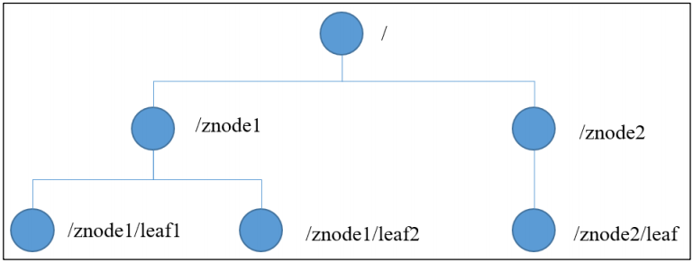

>**$\textcolor{RubineRed}{Author: ACatSmiling}$**
>
>**$\color{RubineRed}{Since: 2022-05-29}$**

## 概述

官网：https://zookeeper.apache.org/

文档：https://zookeeper.apache.org/doc/current/index.html

**`Zookeeper`**：**是一个开源的分布式协调服务，它主要用于管理和协调分布式系统中的各种服务。**可以把它想象成一个 "分布式系统的管家"，负责处理诸如配置管理、命名服务、分布式锁等复杂的任务。从设计模式角度来理解：Zookeeper 是一个**基于观察者模式设计的分布式服务管理框架**，它负责存储和管理大家都关心的数据，然后接受观察者的注册，一旦这些数据的状态发生变化，Zookeeper 就将负责通知已经在 Zookeeper 上注册的那些观察者做出相应的反应。

### 特点


1. **一个 Leader，多个 Follower 组成的集群。**
2. 集群中只要有**半数以上**节点存活，Zookeeper 集群就能正常服务，所以 Zookeeper 适合安装奇数台服务器。
3. **全局数据一致**：每个 Server 保存一份相同的数据副本，Client 无论连接到哪个 Server，数据都是一致的。
4. **更新请求顺序执行**，来自同一个 Client 的更新请求按其发送顺序依次执行。
5. **数据更新原子性**，一次数据更新要么成功，要么失败。
6. **实时性**：在一定时间范围内，Client 能读到最新数据。

### 数据结构

ZooKeeper 数据模型的结构**与 Unix 文件系统很类似**，整体上可以看作是一棵树，**每个节点称做一个 ZNode**，每一个 ZNode 默认能够**存储 1MB 的数据**，每个 ZNode 都可以**通过其路径唯一标识**。



### 应用场景

Zookeeper 能够提供的服务包括：统一命名服务、统一配置管理、统一集群管理、服务器节点动态上下线、软负载均衡等。

#### 统一命名服务

在分布式环境下，经常需要对应用/服务进行统一命名，便于识别。例如：IP 不容易记住，而域名容易记住。


#### 统一配置管理

分布式环境下，配置文件同步非常常见：

- 一般要求一个集群中，所有节点的配置信息是一致的，比如 Kafka 集群。
- 对配置文件修改后，希望能够快速同步到各个节点上。

配置管理可交由 ZooKeeper 实现：


- 可将配置信息写入 ZooKeeper 上的一个 Znode。
- 各个客户端服务器监听这个 Znode。
- 一 旦 Znode 中的数据被修改，ZooKeeper 将通知各个客户端服务器。

#### 统一集群管理

分布式环境中，实时掌握每个节点的状态是必要的，可根据节点实时状态做出一些调整。

ZooKeeper可以实现实时监控节点状态变化：


- 可将节点信息写入 ZooKeeper 上的一个 ZNode。
- 监听这个 ZNode 可获取它的实时状态变化。

#### 服务器节点动态上下线

客户端能实时洞察到服务器上下线的变化：


#### 软负载均衡

在 Zookeeper 中记录每台服务器的访问数，让访问数最少的服务器去处理最新的客户端请求：


## Zookeeper 单机操作

### 本地模式安装

下载地址：https://zookeeper.apache.org/releases.html


前置条件，服务器上需安装 JDK：

```shell
root@zeloud:/zeloud# java -version
java version "17.0.10" 2024-01-16 LTS
Java(TM) SE Runtime Environment (build 17.0.10+11-LTS-240)
Java HotSpot(TM) 64-Bit Server VM (build 17.0.10+11-LTS-240, mixed mode, sharing)
```

上传压缩包到服务器并解压：

```shell
root@zeloud:/zeloud/software# ls
apache-zookeeper-3.9.3-bin.tar.gz
root@zeloud:/zeloud/software# tar -zxvf apache-zookeeper-3.9.3-bin.tar.gz -C ../server/
```

修改文件名，并将 conf/zoo_sample.cfg 文件修改为 zoo.cfg：

```shell
root@zeloud:/zeloud/software# cd ../server/
root@zeloud:/zeloud/server# ls
apache-zookeeper-3.9.3-bin
root@zeloud:/zeloud/server# mv apache-zookeeper-3.9.3-bin/ apache-zookeeper-3.9.3     
root@zeloud:/zeloud/server# ls
apache-zookeeper-3.9.3
root@zeloud:/zeloud/server# 
root@zeloud:/zeloud/server# 
root@zeloud:/zeloud/server# 
root@zeloud:/zeloud/server# cd apache-zookeeper-3.9.3/
root@zeloud:/zeloud/server/apache-zookeeper-3.9.3# ls
LICENSE.txt  NOTICE.txt  README.md  README_packaging.md  bin  conf  docs  lib
root@zeloud:/zeloud/server/apache-zookeeper-3.9.3# cd conf/
root@zeloud:/zeloud/server/apache-zookeeper-3.9.3/conf# ls
configuration.xsl  logback.xml  zoo_sample.cfg
root@zeloud:/zeloud/server/apache-zookeeper-3.9.3/conf# cp zoo_sample.cfg zoo_sample.cfg.bak
root@zeloud:/zeloud/server/apache-zookeeper-3.9.3/conf# mv zoo_sample.cfg zoo.cfg
root@zeloud:/zeloud/server/apache-zookeeper-3.9.3/conf# ls
configuration.xsl  logback.xml  zoo.cfg  zoo_sample.cfg.bak
```

创建 data 路径，并修改 conf/zoo.cfg 配置文件的 dirData 参数：

```shell
root@zeloud:/zeloud# mkdir -p data/zookeeper
root@zeloud:/zeloud/server# cd apache-zookeeper-3.9.3/conf/
root@zeloud:/zeloud/server/apache-zookeeper-3.9.3/conf# ls
configuration.xsl  logback.xml  zoo.cfg  zoo_sample.cfg.bak
root@zeloud:/zeloud/server/apache-zookeeper-3.9.3/conf# vim zoo.cfg
# dataDir=/tmp/zookeeper
dataDir=/zeloud/data/zookeeper
```

启动 Zookeeper：

```shell
# 启动服务
root@zeloud:/zeloud/server/apache-zookeeper-3.9.3/conf# cd ../bin/
root@zeloud:/zeloud/server/apache-zookeeper-3.9.3/bin# ls
README.txt    zkCli.sh   zkServer-initialize.sh  zkSnapShotToolkit.cmd   zkSnapshotComparer.sh                  zkTxnLogToolkit.cmd
zkCleanup.sh  zkEnv.cmd  zkServer.cmd            zkSnapShotToolkit.sh    zkSnapshotRecursiveSummaryToolkit.cmd  zkTxnLogToolkit.sh
zkCli.cmd     zkEnv.sh   zkServer.sh             zkSnapshotComparer.cmd  zkSnapshotRecursiveSummaryToolkit.sh
root@zeloud:/zeloud/server/apache-zookeeper-3.9.3/bin# ./zkServer.sh start
ZooKeeper JMX enabled by default
Using config: /zeloud/server/apache-zookeeper-3.9.3/bin/../conf/zoo.cfg
Starting zookeeper ... STARTED
# 查看服务状态
root@zeloud:/zeloud/server/apache-zookeeper-3.9.3/bin# ./zkServer.sh status  
ZooKeeper JMX enabled by default
Using config: /zeloud/server/apache-zookeeper-3.9.3/bin/../conf/zoo.cfg
Client port found: 2181. Client address: localhost. Client SSL: false.
Mode: standalone
```

启动和退出客户端：

```shell
# 启动客户端
root@zeloud:/zeloud/server/apache-zookeeper-3.9.3/bin# ./zkCli.sh 
Connecting to localhost:2181
2025-01-13 14:48:34,466 [myid:] - INFO  [main:o.a.z.Environment@98] - Client environment:zookeeper.version=3.9.3-c26634f34490bb0ea7a09cc51e05ede3b4e320ee, built on 2024-10-17 23:21 UTC
2025-01-13 14:48:34,468 [myid:] - INFO  [main:o.a.z.Environment@98] - Client environment:host.name=zeloud
2025-01-13 14:48:34,468 [myid:] - INFO  [main:o.a.z.Environment@98] - Client environment:java.version=17.0.10
2025-01-13 14:48:34,468 [myid:] - INFO  [main:o.a.z.Environment@98] - Client environment:java.vendor=Oracle Corporation
2025-01-13 14:48:34,468 [myid:] - INFO  [main:o.a.z.Environment@98] - Client environment:java.home=/usr/local/jdk-17.0.10
2025-01-13 14:48:34,468 [myid:] - INFO  [main:o.a.z.Environment@98] - Client environment:java.class.path=/zeloud/server/apache-zookeeper-3.9.3/bin/../zookeeper-metrics-providers/zookeeper-prometheus-metrics/target/classes:/zeloud/server/apache-zookeeper-3.9.3/bin/../zookeeper-server/target/classes:/zeloud/server/apache-zookeeper-3.9.3/bin/../build/classes:/zeloud/server/apache-zookeeper-3.9.3/bin/../zookeeper-metrics-providers/zookeeper-prometheus-metrics/target/lib/*.jar:/zeloud/server/apache-zookeeper-3.9.3/bin/../zookeeper-server/target/lib/*.jar:/zeloud/server/apache-zookeeper-3.9.3/bin/../build/lib/*.jar:/zeloud/server/apache-zookeeper-3.9.3/bin/../lib/zookeeper-prometheus-metrics-3.9.3.jar:/zeloud/server/apache-zookeeper-3.9.3/bin/../lib/zookeeper-jute-3.9.3.jar:/zeloud/server/apache-zookeeper-3.9.3/bin/../lib/zookeeper-3.9.3.jar:/zeloud/server/apache-zookeeper-3.9.3/bin/../lib/snappy-java-1.1.10.5.jar:/zeloud/server/apache-zookeeper-3.9.3/bin/../lib/slf4j-api-1.7.30.jar:/zeloud/server/apache-zookeeper-3.9.3/bin/../lib/simpleclient_servlet-0.9.0.jar:/zeloud/server/apache-zookeeper-3.9.3/bin/../lib/simpleclient_hotspot-0.9.0.jar:/zeloud/server/apache-zookeeper-3.9.3/bin/../lib/simpleclient_common-0.9.0.jar:/zeloud/server/apache-zookeeper-3.9.3/bin/../lib/simpleclient-0.9.0.jar:/zeloud/server/apache-zookeeper-3.9.3/bin/../lib/netty-transport-native-unix-common-4.1.113.Final.jar:/zeloud/server/apache-zookeeper-3.9.3/bin/../lib/netty-transport-native-epoll-4.1.113.Final-linux-x86_64.jar:/zeloud/server/apache-zookeeper-3.9.3/bin/../lib/netty-transport-classes-epoll-4.1.113.Final.jar:/zeloud/server/apache-zookeeper-3.9.3/bin/../lib/netty-transport-4.1.113.Final.jar:/zeloud/server/apache-zookeeper-3.9.3/bin/../lib/netty-tcnative-classes-2.0.66.Final.jar:/zeloud/server/apache-zookeeper-3.9.3/bin/../lib/netty-tcnative-boringssl-static-2.0.66.Final.jar:/zeloud/server/apache-zookeeper-3.9.3/bin/../lib/netty-tcnative-boringssl-static-2.0.66.Final-windows-x86_64.jar:/zeloud/server/apache-zookeeper-3.9.3/bin/../lib/netty-tcnative-boringssl-static-2.0.66.Final-osx-x86_64.jar:/zeloud/server/apache-zookeeper-3.9.3/bin/../lib/netty-tcnative-boringssl-static-2.0.66.Final-osx-aarch_64.jar:/zeloud/server/apache-zookeeper-3.9.3/bin/../lib/netty-tcnative-boringssl-static-2.0.66.Final-linux-x86_64.jar:/zeloud/server/apache-zookeeper-3.9.3/bin/../lib/netty-tcnative-boringssl-static-2.0.66.Final-linux-aarch_64.jar:/zeloud/server/apache-zookeeper-3.9.3/bin/../lib/netty-resolver-4.1.113.Final.jar:/zeloud/server/apache-zookeeper-3.9.3/bin/../lib/netty-handler-4.1.113.Final.jar:/zeloud/server/apache-zookeeper-3.9.3/bin/../lib/netty-common-4.1.113.Final.jar:/zeloud/server/apache-zookeeper-3.9.3/bin/../lib/netty-codec-4.1.113.Final.jar:/zeloud/server/apache-zookeeper-3.9.3/bin/../lib/netty-buffer-4.1.113.Final.jar:/zeloud/server/apache-zookeeper-3.9.3/bin/../lib/metrics-core-4.1.12.1.jar:/zeloud/server/apache-zookeeper-3.9.3/bin/../lib/logback-core-1.2.13.jar:/zeloud/server/apache-zookeeper-3.9.3/bin/../lib/logback-classic-1.2.13.jar:/zeloud/server/apache-zookeeper-3.9.3/bin/../lib/jline-2.14.6.jar:/zeloud/server/apache-zookeeper-3.9.3/bin/../lib/jetty-util-ajax-9.4.56.v20240826.jar:/zeloud/server/apache-zookeeper-3.9.3/bin/../lib/jetty-util-9.4.56.v20240826.jar:/zeloud/server/apache-zookeeper-3.9.3/bin/../lib/jetty-servlet-9.4.56.v20240826.jar:/zeloud/server/apache-zookeeper-3.9.3/bin/../lib/jetty-server-9.4.56.v20240826.jar:/zeloud/server/apache-zookeeper-3.9.3/bin/../lib/jetty-security-9.4.56.v20240826.jar:/zeloud/server/apache-zookeeper-3.9.3/bin/../lib/jetty-io-9.4.56.v20240826.jar:/zeloud/server/apache-zookeeper-3.9.3/bin/../lib/jetty-http-9.4.56.v20240826.jar:/zeloud/server/apache-zookeeper-3.9.3/bin/../lib/javax.servlet-api-3.1.0.jar:/zeloud/server/apache-zookeeper-3.9.3/bin/../lib/jackson-databind-2.15.2.jar:/zeloud/server/apache-zookeeper-3.9.3/bin/../lib/jackson-core-2.15.2.jar:/zeloud/server/apache-zookeeper-3.9.3/bin/../lib/jackson-annotations-2.15.2.jar:/zeloud/server/apache-zookeeper-3.9.3/bin/../lib/commons-io-2.17.0.jar:/zeloud/server/apache-zookeeper-3.9.3/bin/../lib/commons-cli-1.5.0.jar:/zeloud/server/apache-zookeeper-3.9.3/bin/../lib/audience-annotations-0.12.0.jar:/zeloud/server/apache-zookeeper-3.9.3/bin/../zookeeper-*.jar:/zeloud/server/apache-zookeeper-3.9.3/bin/../zookeeper-server/src/main/resources/lib/*.jar:/zeloud/server/apache-zookeeper-3.9.3/bin/../conf:.:/usr/local/jdk-17.0.10/lib:/usr/local/jdk-17.0.10/jre/lib
2025-01-13 14:48:34,468 [myid:] - INFO  [main:o.a.z.Environment@98] - Client environment:java.library.path=/usr/java/packages/lib:/usr/lib64:/lib64:/lib:/usr/lib
2025-01-13 14:48:34,468 [myid:] - INFO  [main:o.a.z.Environment@98] - Client environment:java.io.tmpdir=/tmp
2025-01-13 14:48:34,468 [myid:] - INFO  [main:o.a.z.Environment@98] - Client environment:java.compiler=<NA>
2025-01-13 14:48:34,468 [myid:] - INFO  [main:o.a.z.Environment@98] - Client environment:os.name=Linux
2025-01-13 14:48:34,469 [myid:] - INFO  [main:o.a.z.Environment@98] - Client environment:os.arch=amd64
2025-01-13 14:48:34,469 [myid:] - INFO  [main:o.a.z.Environment@98] - Client environment:os.version=6.2.0-39-generic
2025-01-13 14:48:34,469 [myid:] - INFO  [main:o.a.z.Environment@98] - Client environment:user.name=root
2025-01-13 14:48:34,469 [myid:] - INFO  [main:o.a.z.Environment@98] - Client environment:user.home=/root
2025-01-13 14:48:34,469 [myid:] - INFO  [main:o.a.z.Environment@98] - Client environment:user.dir=/zeloud/server/apache-zookeeper-3.9.3/bin
2025-01-13 14:48:34,469 [myid:] - INFO  [main:o.a.z.Environment@98] - Client environment:os.memory.free=13MB
2025-01-13 14:48:34,469 [myid:] - INFO  [main:o.a.z.Environment@98] - Client environment:os.memory.max=247MB
2025-01-13 14:48:34,469 [myid:] - INFO  [main:o.a.z.Environment@98] - Client environment:os.memory.total=17MB
2025-01-13 14:48:34,471 [myid:] - INFO  [main:o.a.z.ZooKeeper@637] - Initiating client connection, connectString=localhost:2181 sessionTimeout=30000 watcher=org.apache.zookeeper.ZooKeeperMain$MyWatcher@15bfd87
2025-01-13 14:48:34,477 [myid:] - INFO  [main:o.a.z.c.X509Util@88] - Setting -D jdk.tls.rejectClientInitiatedRenegotiation=true to disable client-initiated TLS renegotiation
2025-01-13 14:48:34,656 [myid:] - INFO  [main:o.a.z.c.X509Util@110] - Default TLS protocol is TLSv1.3, supported TLS protocols are [TLSv1.3, TLSv1.2, TLSv1.1, TLSv1, SSLv3, SSLv2Hello]
2025-01-13 14:48:34,661 [myid:] - INFO  [main:o.a.z.ClientCnxnSocket@235] - jute.maxbuffer value is 1048575 Bytes
2025-01-13 14:48:34,667 [myid:] - INFO  [main:o.a.z.ClientCnxn@1748] - zookeeper.request.timeout value is 0. feature enabled=false
Welcome to ZooKeeper!
2025-01-13 14:48:34,670 [myid:localhost:2181] - INFO  [main-SendThread(localhost:2181):o.a.z.ClientCnxn$SendThread@1171] - Opening socket connection to server localhost/127.0.0.1:2181.
2025-01-13 14:48:34,670 [myid:localhost:2181] - INFO  [main-SendThread(localhost:2181):o.a.z.ClientCnxn$SendThread@1173] - SASL config status: Will not attempt to authenticate using SASL (unknown error)
2025-01-13 14:48:34,674 [myid:localhost:2181] - INFO  [main-SendThread(localhost:2181):o.a.z.ClientCnxn$SendThread@1007] - Socket connection established, initiating session, client: /127.0.0.1:57220, server: localhost/127.0.0.1:2181
JLine support is enabled
2025-01-13 14:48:34,693 [myid:localhost:2181] - INFO  [main-SendThread(localhost:2181):o.a.z.ClientCnxn$SendThread@1454] - Session establishment complete on server localhost/127.0.0.1:2181, session id = 0x1000005551e0000, negotiated timeout = 30000

WATCHER::

WatchedEvent state:SyncConnected type:None path:null zxid: -1

# 退出客户端
[zk: localhost:2181(CONNECTED) 0] quit

WATCHER::

WatchedEvent state:Closed type:None path:null zxid: -1
2025-01-13 14:48:40,363 [myid:] - INFO  [main-EventThread:o.a.z.ClientCnxn$EventThread@557] - EventThread shut down for session: 0x1000005551e0000
2025-01-13 14:48:40,364 [myid:] - INFO  [main:o.a.z.ZooKeeper@1232] - Session: 0x1000005551e0000 closed
2025-01-13 14:48:40,365 [myid:] - INFO  [main:o.a.z.u.ServiceUtils@45] - Exiting JVM with code 0
```

关闭 Zookeeper：

```shell
root@zeloud:/zeloud/server/apache-zookeeper-3.9.3/bin# ./zkServer.sh stop 
ZooKeeper JMX enabled by default
Using config: /zeloud/server/apache-zookeeper-3.9.3/bin/../conf/zoo.cfg
Stopping zookeeper ... STOPPED
```

### zoo.cfg 配置参数

zoo.cfg 文件：

```tex
# The number of milliseconds of each tick
tickTime=2000
# The number of ticks that the initial 
# synchronization phase can take
initLimit=10
# The number of ticks that can pass between 
# sending a request and getting an acknowledgement
syncLimit=5
# the directory where the snapshot is stored.
# do not use /tmp for storage, /tmp here is just 
# example sakes.
# dataDir=/tmp/zookeeper
dataDir=/zeloud/data/zookeeper
# the port at which the clients will connect
clientPort=2181
# the maximum number of client connections.
# increase this if you need to handle more clients
#maxClientCnxns=60
#
# Be sure to read the maintenance section of the 
# administrator guide before turning on autopurge.
#
# https://zookeeper.apache.org/doc/current/zookeeperAdmin.html#sc_maintenance
#
# The number of snapshots to retain in dataDir
#autopurge.snapRetainCount=3
# Purge task interval in hours
# Set to "0" to disable auto purge feature
#autopurge.purgeInterval=1

## Metrics Providers
#
# https://prometheus.io Metrics Exporter
#metricsProvider.className=org.apache.zookeeper.metrics.prometheus.PrometheusMetricsProvider
#metricsProvider.httpHost=0.0.0.0
#metricsProvider.httpPort=7000
#metricsProvider.exportJvmInfo=true
```

- `tickTime=2000`：通信心跳时间，Zookeeper 服务器与客户端心跳时间，单位毫秒。

  

- `initLimit=10`：LF 初始通信时限，即 Leader 和 Follower 初始连接时能容忍的最多心跳数（tickTime 的数量，最长等待时间是 initLimit * tickTime）。

  

- `syncLimit=5`：LF 同步通信时限，即 Leader 和 Follower 之间建立连接后，通信时间如果超过 syncLimit * tickTime，Leader 认为 Follwer 死掉，从服务器列表中删除 Follwer。

- `dataDir=/zeloud/data/zookeeper`：保存 Zookeeper 中数据的地址，默认为 /tmp/zookeeper 目录，容易被 Linux 系统定期删除，所以一般不用默认的目录。

- `clientPort=2181`：客户端连接端口，通常不做修改。

## Zookeeper 集群操作

### 集群模式安装

**集群规划**：

- 在 k8s-master、k8s-node1 和 k8s-node2 三个节点上都部署 Zookeeper。

**解压安装**：

- 同本地模式安装。

**修改配置：**

- 分别在三个节点的 /zeloud/data/zookeeper/ 路径下创建文件 myid，然后添加与节点对应的编号，其中，k8s-master 节点的编号为 2，k8s-node1 节点的编号为 3，k8s-node2 节点的编号为 4。

- 在 zoo.cfg 文件最后添加如下配置：

  ```tex
  # 集群配置，格式为 server.A=B:C:D
  server.2=k8s-master:2888:3888
  server.3=k8s-node1:2888:3888
  server.4=k8s-node2:2888:3888
  ```

  - A 是一个数字，表示这个是第几号服务器。集群模式下需要配置一个文件 myid，这个文件在 dataDir 目录下，里面有一个数据就是 A 的值，Zookeeper 启动时读取此文件，拿到里面的数据与 zoo.cfg 里面的配置信息比较，从而判断到底是哪个 server。
  - B 是这个服务器的地址。
  - C 是这个服务器 Follower 与集群中的 Leader 服务器交换信息的端口。
  - D 是如果集群中的 Leader 服务器挂了，需要选出一个新的 Leader，D 这个端口就是用来执行选举时服务器相互通信的端口。

**启动服务**：

- 分别启动三个节点上的 Zookeeper。

  ```shell
  [root@k8s-master bin]# ./zkServer.sh start
  ZooKeeper JMX enabled by default
  Using config: /zeloud/server/zookeeper-3.9.3/bin/../conf/zoo.cfg
  Starting zookeeper ... STARTED
  ```

- 查看状态，可以看到 k8s-node1 是 Leader，其他两个节点是 Follwer（可以更换三个节点启动的顺序，验证选举机制，其结果是第二台启动的节点，会成为 Leader）：

  ```shell
  [root@k8s-master bin]# ./zkServer.sh status
  ZooKeeper JMX enabled by default
  Using config: /zeloud/server/zookeeper-3.9.3/bin/../conf/zoo.cfg
  Client port found: 2181. Client address: localhost. Client SSL: false.
  Mode: follower
  ```

  ```shell
  [root@k8s-node1 bin]# ./zkServer.sh status
  ZooKeeper JMX enabled by default
  Using config: /zeloud/server/zookeeper-3.9.3/bin/../conf/zoo.cfg
  Client port found: 2181. Client address: localhost. Client SSL: false.
  Mode: leader
  ```

  ```shell
  [root@k8s-node2 bin]# ./zkServer.sh status
  ZooKeeper JMX enabled by default
  Using config: /zeloud/server/zookeeper-3.9.3/bin/../conf/zoo.cfg
  Client port found: 2181. Client address: localhost. Client SSL: false.
  Mode: follower·
  ```

### 选举机制

#### 基础知识

Zookeeper 的选举机制是其高可用性和容错性的关键，主要基于 ZAB（Zookeeper Atomic Broadcast）协议，这是一种基于 Paxos 协议的变种。

**前置条件**：

- Zookeeper 单机部署是不需要选举的，集群模式下才需要选举。

**基本概念**：

- `SID`：Server ID，即服务器 ID。SID 是 Zookeeper 集群中每个服务器节点的唯一标识符，是一个整数。
  - 作用：
    - **唯一标识节点**：在集群中，每个节点都有一个唯一的 SID，SID 不能重复，与配置文件中的 myid 一致，通过 SID 可以区分不同的节点。
    - **参与选举**：在选举过程中，SID 用于投票和比较。当两个节点的 ZXID 相同时，SID 较大的节点具有更高的优先级。
    - **数据存储**：在 Zookeeper 的本地存储中，SID 与节点的事务日志等数据关联，用于记录和恢复节点的状态。

- `ZXID`：Zookeeper Transaction ID，即节点的事务 ID。ZXID 是一个 64 位的数字，用于标识 Zookeeper 中的事务操作。它是一个单调递增的数字，确保每个事务都有一个唯一的顺序。在某一时刻，集群中的每个节点的 ZXID 值不一定完全一致，这和 Zookeeper 服务器对于客户端 "更新请求" 的处理逻辑有关。
  - 结构：
    - **高位 32 位**：表示 Epoch，即当前的时期或轮次。
    - **低位 32 位**：表示 Counter（事务计数器），即在当前 Epoch 内的事务计数器。

  - 作用：
    - **事务顺序**：ZXID 确保了事务的顺序性。通过 ZXID，Zookeeper 可以保证事务按照提交的顺序执行。
    - **选举优先级**：在选举过程中，ZXID 较大的节点被认为拥有更多的信息，因此更适合作为 Leader。如果两个节点的 Epoch 相同，则 Counter 较大的节点优先。
    - **数据一致性**：ZXID 用于维护数据的一致性。通过 ZXID，Zookeeper 可以确保所有节点上的数据状态是一致的。

- `Epoch`：是一个 32 位的整数，表示当前的时期或轮次。
  - 作用：
    - **区分时期**：Epoch 用于区分不同的选举时期。每次选举出新的 Leader 时，Epoch 会增加，这样可以确保不同时期的事务不会混淆。
    - **事务顺序**：Epoch 是 ZXID 的一部分，通过 Epoch 和 Counter 的组合，ZXID 可以确保事务的全局顺序。
    - **故障恢复**：在故障恢复过程中，Epoch 可以帮助 Zookeeper 确定哪些事务是有效的，哪些事务需要重新提交。

**选举触发场景**：

- 服务器`初始化启动`。
- 服务器`运行期间 Leader 故障`。

**Server 状态，即选举状态**：

- `LOOKING`，竞选状态。
- `FOLLOWING`，随从状态，同步 Leader 状态，参与投票。
- `OBSERVING`，观察状态，同步 Leader 状态，不参与投票。
- `LEADING`，领导者状态。

#### 启动时期的 Leader 选举

假设一个 Zookeeper 集群中有 5 台服务器，id 从 1 到 5 编号，并且它们都是最新启动的，没有历史数据。


假设服务器依次启动，我们来分析一下选举过程：

1. 服务器 1 启动
   - 发起一次选举，服务器 1 投自己一票。此时，服务器 1 票数一票，不够半数以上（3 票），选举无法完成。
   - 投票结果：服务器 1 为 1 票。
   - 服务器状态：服务器 1 状态保持为 LOOKING。
2. 服务器 2 启动
   - 发起一次选举，服务器 1 和 2 分别投自己一票，然后交换投票信息，服务器 1 发现服务器 2 的 id 比自己大，更改选票投给服务器 2。此时，服务器 2 票数两票，不够半数以上（3 票），选举无法完成。
   - 投票结果：服务器 1 为 0 票，服务器 2 为 2 票。
   - 服务器状态：服务器 1，2 状态保持为 LOOKING。
3. 服务器 3 启动
   - 发起一次选举，服务器 1、2、3 先分别投自己一票，然后因为服务器 3 的 id 最大，服务器 1 和 2 更改选票投给为服务器 3。
   - 投票结果：服务器 1 为 0 票，服务器 2 为 0 票，服务器 3 为 3 票。 此时服务器 3 的票数已经超过半数（3 票），**服务器 3 当选 Leader**。
   - 服务器状态：服务器 1，2 更改状态为 FOLLOWING，服务器 3 更改状态为 LEADING。
4. 服务器 4 启动
   - 发起一次选举，此时服务器 1，2，3 已经不是 LOOKING 状态，不会更改选票信息。交换选票信息结果：服务器 3 为 3 票，服务器 4 为 1 票。此时服务器 4 服从多数，更改选票信息为服务器 3。
   - 服务器状态：服务器 4 并更改状态为 FOLLOWING。
5. 服务器 5 启动
   - 与服务器 4 一样投票给 3，此时服务器 3 一共 5 票，服务器 5 为 0 票。
   - 服务器状态：服务器 5 并更改状态为 FOLLOWING。

**最终的结果**：

服务器 3 是`Leader`，状态为`LEADING`；其余服务器是`Follower`，状态为`FOLLOWING`。

#### 运行时期的 Leader 选举

在 Zookeeper 运行期间 Leader 和 非 Leader 各司其职，当有非 Leader 服务器宕机或加入集群，不会影响 Leader，但是一旦 Leader 服务器挂了，那么整个 Zookeeper 集群将暂停对外服务，并触发新一轮的选举。

初始启动时，服务器 3 当选为 Leader，假设现在服务器 3 出故障宕机了，此时每个服务器上 zxid 可能都不一样，服务器 1为 99，服务器 2为 102，服务器 4 为 100，服务器 5 为 101。


运行期选举与初始状态投票过程基本类似，大致可以分为以下几个步骤：

1. 状态变更：Leader 故障后，余下的非 Observer 服务器都会将自己的服务器状态变更为 LOOKING，然后开始进入 Leader 选举过程。
2. 每个 Server 会发出投票。
3. 接收来自各个服务器的投票，如果其他服务器的数据比自己的新会改投票。
4. 处理和统计投票，每一轮投票结束后都会统计投票，超过半数即可当选。
5. 改变服务器的状态，宣布当选。

以如下图示：


1. 第一次投票，每台机器都会将票投给自己。
2. 接着每台机器都会将自己的投票发给其他机器，如果发现其他机器的 zxid 比自己大，那么就需要改投票重新投一次。比如服务器 1 收到了三张票，发现服务器 2 的 zxid 为 102，对比之后发现比自己的大，然后会更改投票投给服务器 2。

### 客户端命令行操作

#### 基础命令

启动客户端：

```shell
# 当前服务器启动客户端
[root@k8s-master bin]# ./zkCli.sh
[zk: localhost:2181(CONNECTED) 0]

# 指定节点启动客户端
[root@k8s-master bin]# ./zkCli.sh -server k8s-master:2181
[zk: k8s-master:2181(CONNECTED) 0]
```

查看所有操作命令：
```shell
[zk: k8s-master:2181(CONNECTED) 0] help
ZooKeeper -server host:port -client-configuration properties-file cmd args
        addWatch [-m mode] path # optional mode is one of [PERSISTENT, PERSISTENT_RECURSIVE] - default is PERSISTENT_RECURSIVE
        addauth scheme auth
        close 
        config [-c] [-w] [-s]
        connect host:port
        create [-s] [-e] [-c] [-t ttl] path [data] [acl]
        delete [-v version] path
        deleteall path [-b batch size]
        delquota [-n|-b|-N|-B] path
        get [-s] [-w] [-b] [-x] path
        getAcl [-s] path
        getAllChildrenNumber path
        getEphemerals path
        history 
        listquota path
        ls [-s] [-w] [-R] path
        printwatches on|off
        quit 
        reconfig [-s] [-v version] [[-file path] | [-members serverID=host:port1:port2;port3[,...]*]] | [-add serverId=host:port1:port2;port3[,...]]* [-remove serverId[,...]*]
        redo cmdno
        removewatches path [-c|-d|-a] [-l]
        set path data [-s] [-v version] [-b]
        setAcl [-s] [-v version] [-R] path acl
        setquota -n|-b|-N|-B val path
        stat [-w] path
        sync path
        version 
        whoami 
Command not found: Command not found help
```

- 实际上 Zookeeper 并没有 help 命令，当输入未知命令时，会返回所有的命令。

查看 ZNode 节点信息：`ls [-s] [-w] [-R] path`。

- **-s**：附加次级信息。
- **-w**：监听子节点变化。

```shell
[zk: k8s-master:2181(CONNECTED) 2] ls /
[zookeeper]
[zk: k8s-master:2181(CONNECTED) 3] ls -s /
[zookeeper]
cZxid = 0x0
ctime = Thu Jan 01 08:00:00 CST 1970
mZxid = 0x0
mtime = Thu Jan 01 08:00:00 CST 1970
pZxid = 0x0
cversion = -1
dataVersion = 0
aclVersion = 0
ephemeralOwner = 0x0
dataLength = 0
numChildren = 1
```

- cZxid：创建节点的事务 ID，即 zxid。每次修改 Zookeeper 状态都会产生一个 Zookeeper 的事务 ID，事务 ID 是 Zookeeper 中所有修改总的次序。每次修改都有唯一的 zxid，如果 zxid1 小于 zxid2，那么 zxid1 在 zxid2 之前发生。
- ctime：ZNode 被创建的毫秒数（从 1970 年开始）。
- mZxid：ZNode 最后更新的事务 ID。
- mtime：ZNode 最后修改的毫秒数（从 1970 年开始）。
- pZxid：ZNode 最后更新的子节点的事务 ID。
- cversion：ZNode 子节点变化号，即 ZNode 子节点修改次数。
- dataversion：ZNode 数据变化号。
- aclVersion：ZNode 访问控制列表的变化号。
- ephemeralOwner：如果是临时节点，这个是 ZNode 拥有者的 session id，如果不是临时节点，则是 0。
- dataLength：ZNode 的数据长度。
- numChildren：ZNode 子节点数量。

#### 节点命令

在 Zookeeper 中，**`节点（ZNode）`**是其数据模型的基本单元，用于存储数据和维护分布式系统的状态信息。Zookeeper 的节点类型主要分为以下几种：

- `根节点`：Zookeeper 的节点树结构有一个根节点，以 "/" 表示。它是整个节点层次结构的起始点，所有其他节点都是它的子节点或后代节点。**根节点在 Zookeeper 启动时自动创建，并且不能被删除。**
- `持久节点（Persistent Node）`：持久节点是**默认的节点类型**，一旦创建，它们会一直存在，直到被显式删除。
  - 持久节点不依赖于客户端会话，即使创建该节点的客户端会话断开，节点仍然存在。
  - 应用场景：适合用于存储持久化的配置信息、状态信息等。
- `临时节点（Ephemeral Node）`：临时节点的**生命周期依赖于创建它的客户端会话**，当客户端会话结束（如客户端断开连接或超时）时，临时节点会被自动删除。
  - 临时节点**不能有子节点**。
  - 临时节点对集群中的每一个服务器都可见。
  - 应用场景：常用于分布式锁、选举、服务发现等场景，用于标识某个客户端的在线状态。
  
- `持久顺序节点（Persistent Sequential Node）`：持久顺序节点是持久节点的一种变体，创建时 Zookeeper 会为节点名称追加一个**单调递增的序列号**。
  - 节点名称格式为：`<path>-<sequence>`，例如 /workers/worker-0000000001。
  - **序列号是全局唯一的**，由 Zookeeper 生成，它保证了节点的顺序性。
  - 应用场景：适用于需要保证顺序的场景，如任务队列、分布式锁等。

- `临时顺序节点（Ephemeral Sequential Node）`：临时顺序节点结合了临时节点和顺序节点的特性。
  - 节点名称中包含序列号，且生命周期依赖于创建它的客户端会话，当客户端会话结束时，节点会被自动删除。
  - 应用场景：常用于分布式锁、选举等场景，需要同时保证顺序性和会话依赖性。

- `容器节点（Container Node）`：容器节点是 Zookeeper 3.5.0 版本引入的一种特殊节点类型。
  - 容器节点类似于持久节点，它的生命周期不依赖于创建它的客户端会话。容器节点可以有多个子节点，**当容器节点的最后一个子节点被删除时，容器节点也会被自动删除。**
  - 应用场景：容器节点非常适合用于临时资源管理，例如在分布式任务调度中，任务节点可以作为容器节点的子节点，当所有任务完成（子节点被删除）后，容器节点也会自动清理，避免遗留空节点。也可以用于动态资源分配，例如在分布式系统中管理临时资源池。

**创建节点**：`create [-s] [-e] [-c] [-t ttl] path [data] [acl]`。

- **-s**：表示创建顺序节点（Sequential Node）。

- **-e**：表示创建临时节点（Ephemeral Node）。

- **-c**：表示创建容器节点（Container Node）。

- **path**：节点的路径，例如 /myNode。

- **data**：节点存储的数据，可以是任意字符串。

- **acl**：访问控制列表（ACL），用于设置节点的权限。默认情况下可以省略，使用开放权限（world:anyone:cdrwa）。

- 示例：

  ```shell
  # 进入客户端
  [root@k8s-master bin]# ./zkCli.sh -server k8s-master:2181
  # 创建持久节点，默认类型
  [zk: k8s-master:2181(CONNECTED) 2] create /myNode "Hello, Zookeeper."
  Created /myNode
  # 创建临时节点
  [zk: k8s-master:2181(CONNECTED) 3] create -e /myEphemeralNode "Ephemeral Data"
  Created /myEphemeralNode
  # 创建持久顺序节点
  [zk: k8s-master:2181(CONNECTED) 4] create -s /mySequentialNode "Sequential Data"
  # 创建临时顺序节点
  Created /mySequentialNode0000000002
  [zk: k8s-master:2181(CONNECTED) 5] create -e -s /myEphemeralSequentialNode "Ephemeral Sequential Data"
  Created /myEphemeralSequentialNode0000000003
  # 创建容器节点
  [zk: k8s-master:2181(CONNECTED) 6] create -c /myContainerNode "Container Data"
  Created /myContainerNode
  # 查看根节点下所有的子节点
  [zk: k8s-master:2181(CONNECTED) 8] ls /
  [myContainerNode, myEphemeralNode, myEphemeralSequentialNode0000000003, myNode, mySequentialNode0000000002, zookeeper]
  ```

- 退出当前客户端，然后重新进入：

  ```shell
  # 临时节点被自动删除
  [zk: k8s-master:2181(CONNECTED) 0] ls /
  [myContainerNode, myNode, mySequentialNode0000000002, zookeeper]
  ```

**获取节点的值**：`get [-s] [-w] [-b] [-x] path`。

- **-s**：Stat，返回节点的值和元数据（统计数据）。元数据包括节点的版本号、创建时间、修改时间等。

- **-w**：Watch，对指定节点设置监听。如果节点的值发生变化，客户端会收到通知。

- **-b**：以二进制格式显示数据。

- **-x**：Extended Stat，返回节点的扩展统计信息，包括更多的元数据。

- 示例：

  ```shell
  # 返回节点的值
  [zk: k8s-master:2181(CONNECTED) 1] get /myNode
  Hello, Zookeeper.
  # 返回节点的值和元数据
  [zk: k8s-master:2181(CONNECTED) 2] get -s /myNode
  Hello, Zookeeper.
  cZxid = 0x400000004
  ctime = Sat Jan 25 16:59:06 CST 2025
  mZxid = 0x400000004
  mtime = Sat Jan 25 16:59:06 CST 2025
  pZxid = 0x400000004
  cversion = 0
  dataVersion = 0
  aclVersion = 0
  ephemeralOwner = 0x0
  dataLength = 17
  numChildren = 0
  ```

**修改节点的值**：`set path data [-s] [-v version] [-b]`。

- **path**：节点的路径。

- **data**：要设置的新数据，可以是任意字符串。

- **-s**：在更新节点值后，会返回节点的元数据（统计数据）。

- **-v version**：（可选）节点的版本号。如果指定版本号，只有在当前节点的版本与指定版本匹配时，才会更新节点的值。如果不指定版本号，则无条件更新。

- **-b**：以二进制格式处理数据。

- 示例：

  ```shell
  # myNode 节点原值和元数据
  [zk: k8s-master:2181(CONNECTED) 2] get -s /myNode
  Hello, Zookeeper.
  cZxid = 0x400000004
  ctime = Sat Jan 25 16:59:06 CST 2025
  mZxid = 0x400000004
  mtime = Sat Jan 25 16:59:06 CST 2025
  pZxid = 0x400000004
  cversion = 0
  dataVersion = 0
  aclVersion = 0
  ephemeralOwner = 0x0
  dataLength = 17
  numChildren = 0
  # myNode 节点设置新值
  [zk: k8s-master:2181(CONNECTED) 3] set /myNode "Hello, Zookeeper, this is a new data."
  [zk: k8s-master:2181(CONNECTED) 4] get /myNode
  Hello, Zookeeper, this is a new data.
  # myNode 节点新值和元数据，部分元数据值会发生变化
  [zk: k8s-master:2181(CONNECTED) 5] get -s /myNode
  Hello, Zookeeper, this is a new data.
  cZxid = 0x400000004
  ctime = Sat Jan 25 16:59:06 CST 2025
  mZxid = 0x40000000d
  mtime = Sat Jan 25 22:50:14 CST 2025
  pZxid = 0x400000004
  cversion = 0
  dataVersion = 1
  aclVersion = 0
  ephemeralOwner = 0x0
  dataLength = 37
  numChildren = 0
  ```

**查看节点的状态**：`stat [-w] path`。

- **-w**：可选参数，表示在获取节点状态信息后继续监听该节点的变化。如果指定了 -w 参数，那么命令行工具将保持连接，并在节点状态发生变化时显示新的状态信息。此监听是**单次触发**的，一旦节点状态发生变化并触发了通知，监听就会自动取消。如果需要持续监听，需要在收到通知后重新设置监听

- **path**：要获取状态信息的节点路径，如果节点路径不存在，会返回错误信息。

- 示例：

  ```shell
  [zk: k8s-master:2181(CONNECTED) 6] stat /
  cZxid = 0x0
  ctime = Thu Jan 01 08:00:00 CST 1970
  mZxid = 0x0
  mtime = Thu Jan 01 08:00:00 CST 1970
  pZxid = 0x40000000a
  cversion = 6
  dataVersion = 0
  aclVersion = 0
  ephemeralOwner = 0x0
  dataLength = 0
  numChildren = 4
  ```

  - **cZxid**：节点创建时的事务 ID。
  - **ctime**：节点创建时间。
  - **mZxid**：节点最近一次更新时的事务 ID。
  - **mtime**：节点最近一次更新的时间。
  - **pZxid**：该节点的子节点列表最近一次被修改的事务 ID。
  - **cversion**：子节点版本号。
  - **dataVersion**：当前节点数据的版本号。
  - **aclVersion**：节点 ACL （授权信息）的版本号。
  - **ephemeralOwner**：创建临时节点的会话 ID。如果是持久节点，则该值为 0x0。
  - **dataLength**：当前节点的数据长度。
  - **numChildren**：当前节点的子节点数目。

**删除节点**：`delete [-v version] path`。

- **-v version**：（可选）指定节点的版本号。只有在当前节点的版本与指定版本匹配时，才会删除节点。如果不指定版本号，则无条件删除节点。

- **path**：要删除的节点路径。

- 示例：

  ```shell
  [zk: k8s-master:2181(CONNECTED) 0] ls /
  [myContainerNode, myNode, mySequentialNode0000000002, zookeeper]
  [zk: k8s-master:2181(CONNECTED) 1] delete /myNode
  [zk: k8s-master:2181(CONNECTED) 2] ls /
  [myContainerNode, mySequentialNode0000000002, zookeeper]
  ```

  - 如果删除的节点是临时节点，该操作不会影响其父节点的行为。临时节点的生命周期仍然依赖于创建它的客户端会话。
  - 如果删除的节点是顺序节点，该操作不会影响其父节点的行为。**顺序节点的序列号不会被重用**。
  - 如果删除的节点是容器节点，该操作不会影响其父节点的行为。容器节点的行为与其他持久节点类似。

**递归删除节点**：`deleteall path [-b batch size]`。

- **path**：要删除的节点路径。

- **-b batch size**：（可选）指定每批次删除的节点数量。如果不指定，则默认一次性删除所有节点，包括该路径本身及其所有子节点。

- 示例：

  ```shell
  [zk: k8s-master:2181(CONNECTED) 3] create /myNode
  Created /myNode
  [zk: k8s-master:2181(CONNECTED) 4] create /myNode/childNode1
  Created /myNode/childNode1
  [zk: k8s-master:2181(CONNECTED) 6] create /myNode/childNode1/childNode2
  Created /myNode/childNode1/childNode2
  [zk: k8s-master:2181(CONNECTED) 7] ls /
  [myContainerNode, myNode, mySequentialNode0000000002, zookeeper]
  [zk: k8s-master:2181(CONNECTED) 8] deleteall /myNode
  [zk: k8s-master:2181(CONNECTED) 9] ls /
  [myContainerNode, mySequentialNode0000000002, zookeeper]
  ```

  - 分批删除可以减少对 Zookeeper 服务器的压力，特别是在删除大量节点时。
  - 确保当前客户端有足够的权限来删除指定路径下的所有节点。

#### 监听器原理

Zookeeper 的**`监听器（Watcher）机制`**是其实现分布式协调服务的核心功能之一，允许客户端注册监听器来实时感知 Zookeeper 节点（ZNode）的变化。Zookeeper 采用了**`观察者模式`**来实现监听器机制，在这个模式中，Zookeeper 的节点相当于被观察的对象，而客户端相当于观察者。当节点的状态发生变化时，Zookeeper 会主动通知注册了相应监听器的客户端。

**Watcher 机制**：

- `注册 Watcher`：客户端在向 Zookeeper 服务器发送请求时，可以同时为某个节点注册一个 Watcher。例如，客户端使用 getData、exists、getChildren 等操作获取节点数据或子节点列表时，可以附带设置一个 Watcher，Watcher 可以理解为一个回调函数，它会在节点状态发生变化时被触发。
- `事件触发`：Zookeeper 服务器在节点的数据或状态发生变化时，会生成一个相应的事件，如 NodeCreated（节点创建）、NodeDataChanged（节点数据变更）、NodeDeleted（节点删除）等事件。
- `事件传递`：Zookeeper 服务器会将这些事件异步地发送给注册了相应 Watcher 的客户端。客户端在接收到事件后，会回调注册时指定的 Watcher 方法，从而让客户端能够及时感知到节点的变化并做出相应的处理。

**工作流程**：

1. **客户端发起请求并注册 Watcher**：客户端与 Zookeeper 服务器建立连接后，向服务器发送请求操作，如获取某个节点的数据，并在请求中指定一个 Watcher。此时，客户端与 Zookeeper 服务器之间就建立了一种观察关系，客户端告诉服务器它对特定节点的特定事件感兴趣。
2. **Zookeeper 服务器记录 Watcher**：Zookeeper 服务器接收到客户端的请求和 Watcher 后，会在内存中记录下这个 Watcher 与对应的节点和客户端之间的关系。这样，服务器就知道当该节点发生相关事件时，需要通知哪些客户端。
3. **节点状态变化**：当节点的状态因为某些操作而发生变化时，比如节点的数据被修改、节点被删除等，Zookeeper 服务器会根据之前记录的 Watcher 信息，判断哪些客户端注册了对该节点的相关 Watcher。
4. **发送通知**：Zookeeper 服务器将相应的事件包装成通知消息，发送给注册了 Watcher 的客户端。这个通知是异步发送的，不会影响服务器处理其他请求的正常流程。
5. **客户端回调 Watcher**：客户端接收到 Zookeeper 服务器发送的通知后，会触发之前注册的 Watcher 的回调方法。在回调方法中，客户端可以根据接收到的事件类型和相关信息，执行相应的业务逻辑，例如重新获取节点数据、调整分布式系统中的任务分配等。

**特点**：

- `一次性触发`：Watcher 是一次性的，即一旦被触发后就会失效。如果客户端还想继续监听节点的变化，需要在回调方法中再次注册 Watcher。
- `轻量级`：Watcher 机制设计得非常轻量级，它主要用于传递节点状态变化的通知信息，并不携带大量的数据。客户端在接收到通知后，通常需要再次向 Zookeeper 服务器发送请求来获取具体的节点数据或状态信息。
- `顺序性`：Zookeeper 保证了 Watcher 通知的顺序性，对于同一个节点的多个 Watcher，它们的触发顺序与注册顺序是一致的。

**常见触发场景**：

- **节点创建**：当一个新的 ZNode 被创建时。
- **节点数据变更**：当 ZNode 的数据被更新时。
- **节点删除**：当 ZNode 被删除时。
- **子节点列表变更**：当 ZNode 的子节点列表发生变化时。

示例：

- 监听节点创建

  ```shell
  # 在 k8s-master 主机注册监听 /myNode 节点的子节点变化
  [zk: k8s-master(CONNECTED) 0] ls -w /myNode 
  []
  ```

  ```shell
  # 在 k8s-node1 主机 /myNode 节点上创建子节点
  [zk: k8s-node1(CONNECTED) 2] create /myNode/test1 "test1"
  Created /myNode/test1
  ```

  ```shell
  # 观察 k8s-master 主机收到 /myNode 节点的子节点变化的监听，此时，如果在 k8s-node1 主机继续创建子节点，k8s-master 主机不会收到新的消息，需要重新注册
  [zk: k8s-master(CONNECTED) 1] 
  WATCHER::
  
  WatchedEvent state:SyncConnected type:NodeChildrenChanged path:/myNode zxid: 21474836490
  ```

- 监听节点数据变更

  ```shell
  # 在 k8s-master 主机注册监听 /myNode 节点的数据变化
  [zk: k8s-master(CONNECTED) 1] get -w /myNode
  test
  ```

  ```shell
  # 在 k8s-node1 主机 /myNode 节点上修改数据
  [zk: k8s-node1(CONNECTED) 4] set /myNode "change data"
  ```

  ```shell
  # 观察 k8s-master 主机收到 /myNode 节点的数据变化的监听，此时，如果在 k8s-node1 主机继续修改数据，k8s-master 主机不会收到新的消息，需要重新注册
  [zk: k8s-master(CONNECTED) 2] 
  WATCHER::
  
  WatchedEvent state:SyncConnected type:NodeDataChanged path:/myNode zxid: 21474836492
  ```

### 客户端向服务端写数据流程

**写入请求发送给 Leader 节点**：


**写入请求发送给 Follower 节点**：


## Zookeeper 应用场景

### 服务器动态上下线

// TODO

### 分布式锁

// TODO

## 本文参考

https://github.com/CoderLeixiaoshuai/java-eight-part/blob/master/docs/distributed/%E7%94%A8%E5%A4%A7%E7%99%BD%E8%AF%9D%E7%BB%99%E4%BD%A0%E8%A7%A3%E9%87%8AZookeeper%E7%9A%84%E9%80%89%E4%B8%BE%E6%9C%BA%E5%88%B6.md

https://www.bilibili.com/video/BV1to4y1C7gw
