*date: 2022-05-13*

## Windows 下安装环境

官网：https://dotnet.microsoft.com/en-us/download/dotnet

下载：

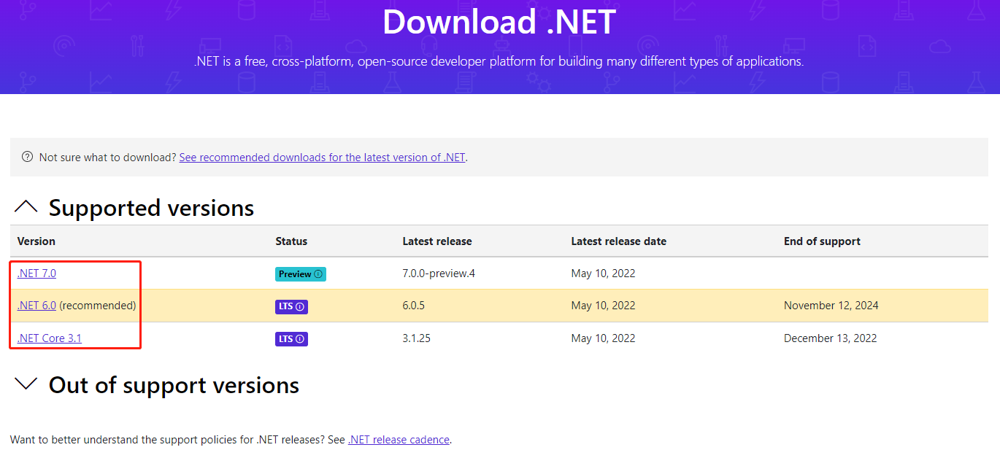

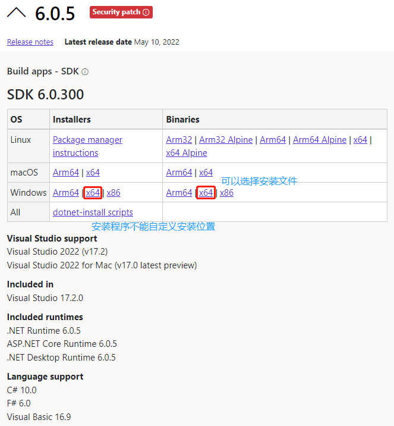

下载安装包后，解压到合适的位置，配置 Path，然后查看版本号，验证是否安装成功：

- 安装包需要自定义 Path：

  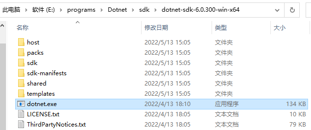

  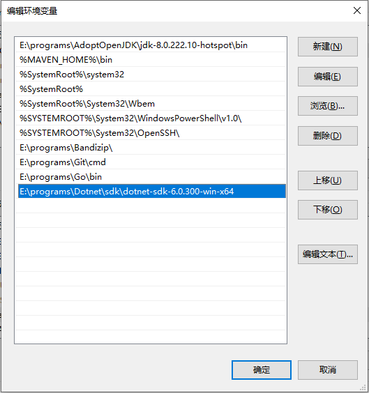

- 安装程序不需要自定义 Path：

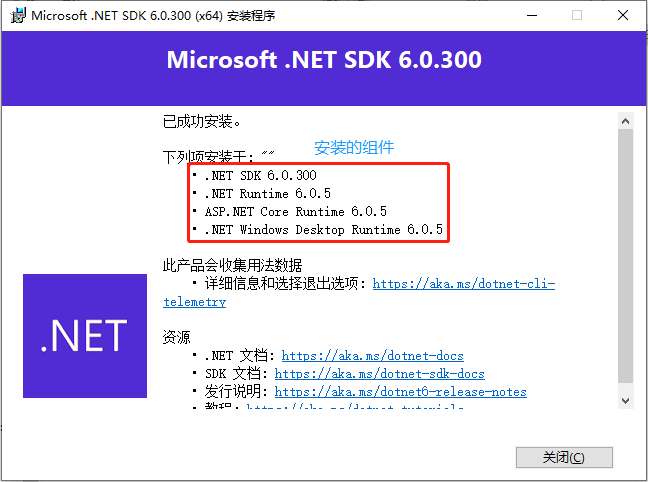

验证安装成功：

```powershell
Windows PowerShell
版权所有 (C) Microsoft Corporation。保留所有权利。

尝试新的跨平台 PowerShell https://aka.ms/pscore6

PS C:\Users\Administrator> dotnet

Usage: dotnet [options]
Usage: dotnet [path-to-application]

Options:
  -h|--help         Display help.
  --info            Display .NET information.
  --list-sdks       Display the installed SDKs.
  --list-runtimes   Display the installed runtimes.

path-to-application:
  The path to an application .dll file to execute.
```

查看 .NET Core 信息：

```powershell
PS C:\Users\Administrator> dotnet --info
.NET SDK (反映任何 global.json):
 Version:   6.0.300
 Commit:    8473146e7d

运行时环境:
 OS Name:     Windows
 OS Version:  10.0.19043
 OS Platform: Windows
 RID:         win10-x64
 Base Path:   E:\programs\Dotnet\sdk\dotnet-sdk-6.0.300-win-x64\sdk\6.0.300\			# 安装位置

Host (useful for support):
  Version: 6.0.5
  Commit:  70ae3df4a6

.NET SDKs installed:
  6.0.300 [C:\Program Files\dotnet\sdk]

.NET runtimes installed:
  Microsoft.AspNetCore.App 6.0.5 [C:\Program Files\dotnet\shared\Microsoft.AspNetCore.App]
  Microsoft.NETCore.App 6.0.5 [C:\Program Files\dotnet\shared\Microsoft.NETCore.App]
  Microsoft.WindowsDesktop.App 6.0.5 [C:\Program Files\dotnet\shared\Microsoft.WindowsDesktop.App]

To install additional .NET runtimes or SDKs:
  https://aka.ms/dotnet-download
```

> .NET 安装包安装时，无法自定义安装位置，通过`dotnet --info`命令，可以查看其 Base Path，这就是安装的路径；也可以通过查看环境变量 Path 值得到。

查看 .NET 使用帮助：

```powershell
PS C:\Users\Administrator> dotnet --help

欢迎使用 .NET 6.0!
---------------------
SDK 版本: 6.0.300

遥测
---------
.NET 工具会收集用法数据，帮助我们改善你的体验。它由 Microsoft 收集并与社区共享。你可通过使用喜欢的 shell 将 DOTNET_CLI_TELEMETRY_OPTOUT 环境变量设置为 "1" 或 "true" 来选择退出遥测。

阅读有关 .NET CLI 工具遥测的更多信息: https://aka.ms/dotnet-cli-telemetry

----------------
已安装 ASP.NET Core HTTPS 开发证书。
若要信任该证书，请运行 "dotnet dev-certs https --trust" (仅限 Windows 和 macOS)。
了解 HTTPS: https://aka.ms/dotnet-https
----------------
编写你的第一个应用: https://aka.ms/dotnet-hello-world
查找新增功能: https://aka.ms/dotnet-whats-new
浏览文档: https://aka.ms/dotnet-docs
在 GitHub 上报告问题和查找源: https://github.com/dotnet/core
使用 "dotnet --help" 查看可用命令或访问: https://aka.ms/dotnet-cli
--------------------------------------------------------------------------------------
使用情况: dotnet [runtime-options] [path-to-application] [arguments]

执行 .NET 应用程序。

runtime-options:
  --additionalprobingpath <path>   要探测的包含探测策略和程序集的路径。
  --additional-deps <path>         指向其他 deps.json 文件的路径。
  --depsfile                       指向 <application>.deps.json 文件的路径。
  --fx-version <version>           要用于运行应用程序的安装版共享框架的版本。
  --roll-forward <setting>         前滚至框架版本(LatestPatch, Minor, LatestMinor, Major, LatestMajor, Disable)。
  --runtimeconfig                  指向 <application>.runtimeconfig.json 文件的路径。

path-to-application:
  要执行的应用程序 .dll 文件的路径。

使用情况: dotnet [sdk-options] [command] [command-options] [arguments]

执行 .NET SDK 命令。

sdk-options:
  -d|--diagnostics  启用诊断输出。
  -h|--help         显示命令行帮助。
  --info            显示 .NET 信息。
  --list-runtimes   显示安装的运行时。
  --list-sdks       显示安装的 SDK。
  --version         显示使用中的 .NET SDK 版本。

SDK 命令:
  add               将包或引用添加到 .NET 项目。
  build             生成 .NET 项目。
  build-server      与由生成版本启动的服务器进行交互。
  clean             清理 .NET 项目的生成输出。
  format            将样式首选项应用到项目或解决方案。
  help              显示命令行帮助。
  list              列出 .NET 项目的项目引用。
  msbuild           运行 Microsoft 生成引擎(MSBuild)命令。
  new               创建新的 .NET 项目或文件。
  nuget             提供其他 NuGet 命令。
  pack              创建 NuGet 包。
  publish           发布 .NET 项目进行部署。
  remove            从 .NET 项目中删除包或引用。
  restore           还原 .NET 项目中指定的依赖项。
  run               生成并运行 .NET 项目输出。
  sdk               管理 .NET SDK 安装。
  sln               修改 Visual Studio 解决方案文件。
  store             在运行时包存储中存储指定的程序集。
  test              使用 .NET 项目中指定的测试运行程序运行单元测试。
  tool              安装或管理扩展 .NET 体验的工具。
  vstest            运行 Microsoft 测试引擎(VSTest)命令。
  workload          管理可选工作负荷。

捆绑工具中的其他命令:
  dev-certs         创建和管理开发证书。
  fsi               启动 F# 交互/执行 F# 脚本。
  sql-cache         SQL Server 缓存命令行工具。
  user-secrets      管理开发用户密码。
  watch             启动文件观察程序，它会在文件发生更改时运行命令。

运行 "dotnet [command] --help"，获取有关命令的详细信息。
```

## Rider 开发

下载：https://www.jetbrains.com/rider/

当前最新版本：

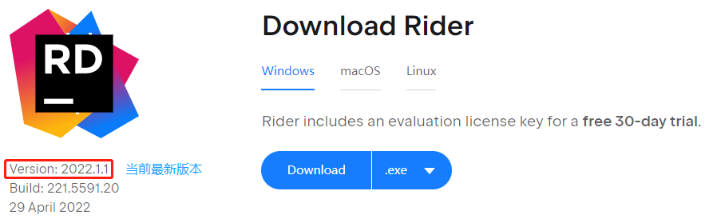

根据自身情况，此处选择 2021.3 版本：

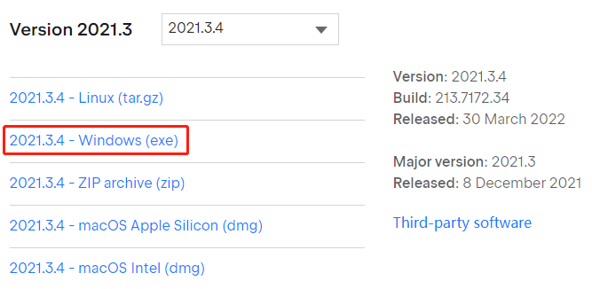

安装包下载后，点击安装即可，激活过程请支持正版。

安装时，建议跳过以下步骤，自行安装 .NET 环境，如果先安装了，可以自动检测，如果没有先安装，也可以自行配置：

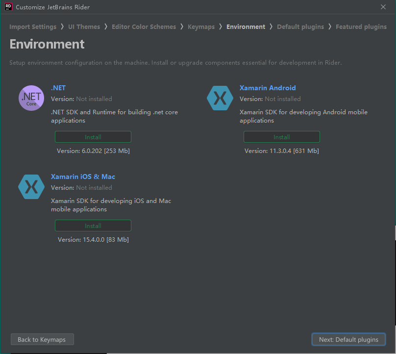

`字体`设置：

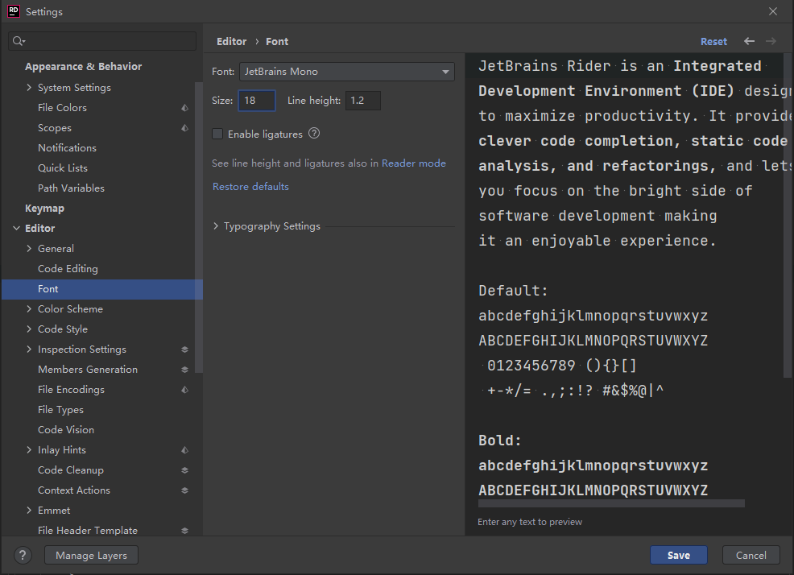

`编码`设置：

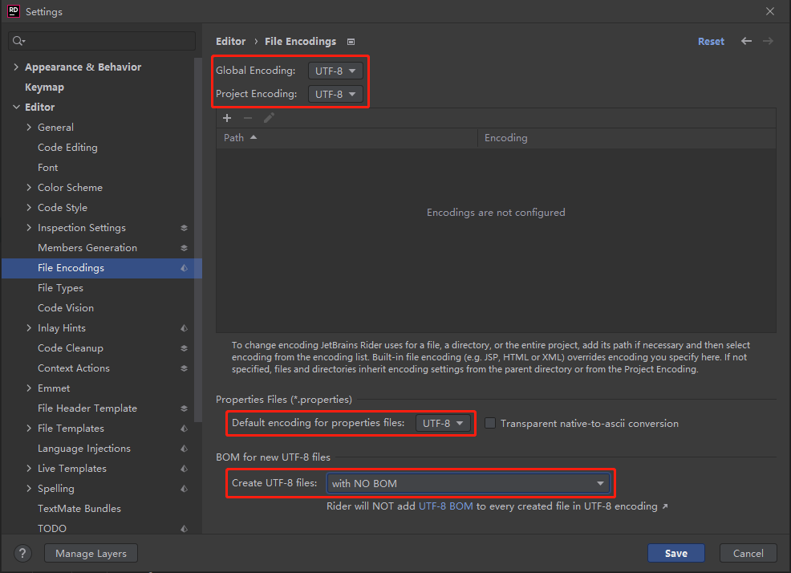

`环境`配置：

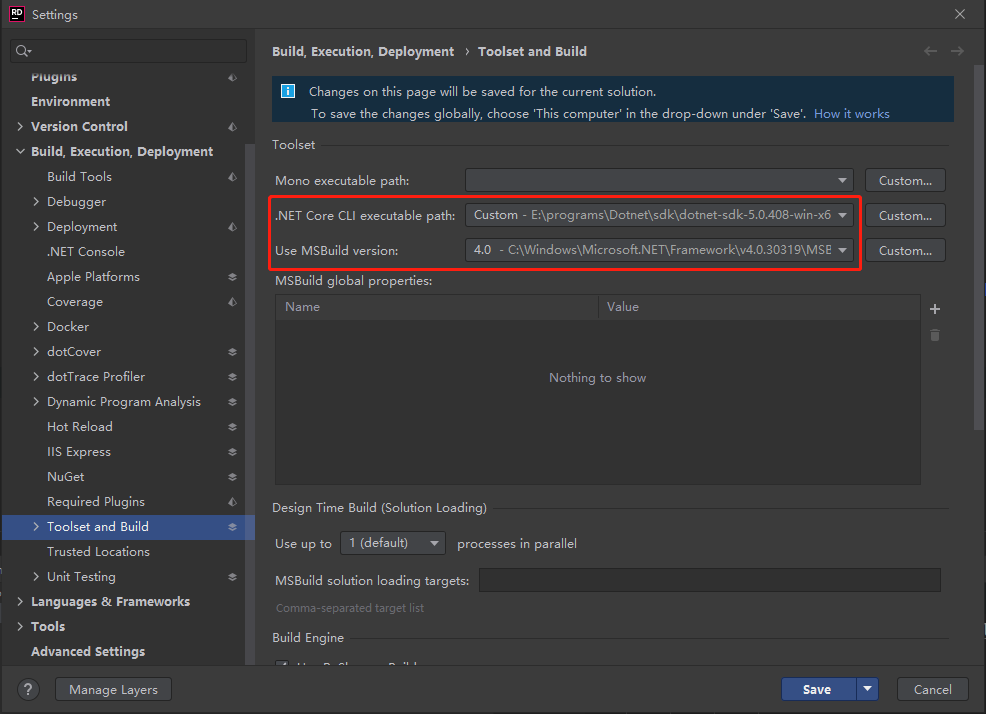

> 不同版本 .NET 环境下开发的 csharp 程序，可能不兼容，此时，需要修改`Use MSBuild version`的版本，找到适应程序的 .NET 版本。Windows 下可以安装多个 .NET 环境，注意修改。

`//TODO`

## 声明

写作本文初衷是个人学习记录，鉴于本人学识有限，如有侵权或不当之处，请联系 [wdshfut@163.com](mailto:wdshfut@163.com)。