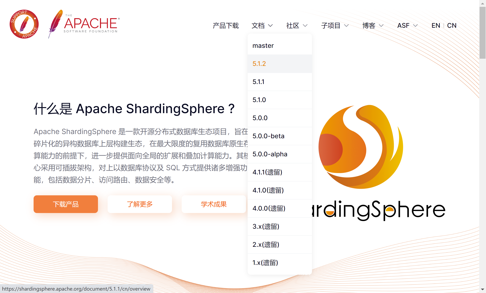
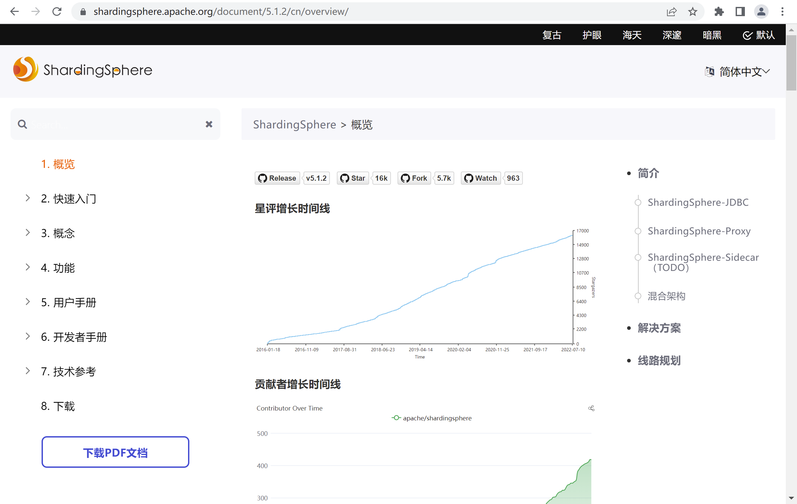
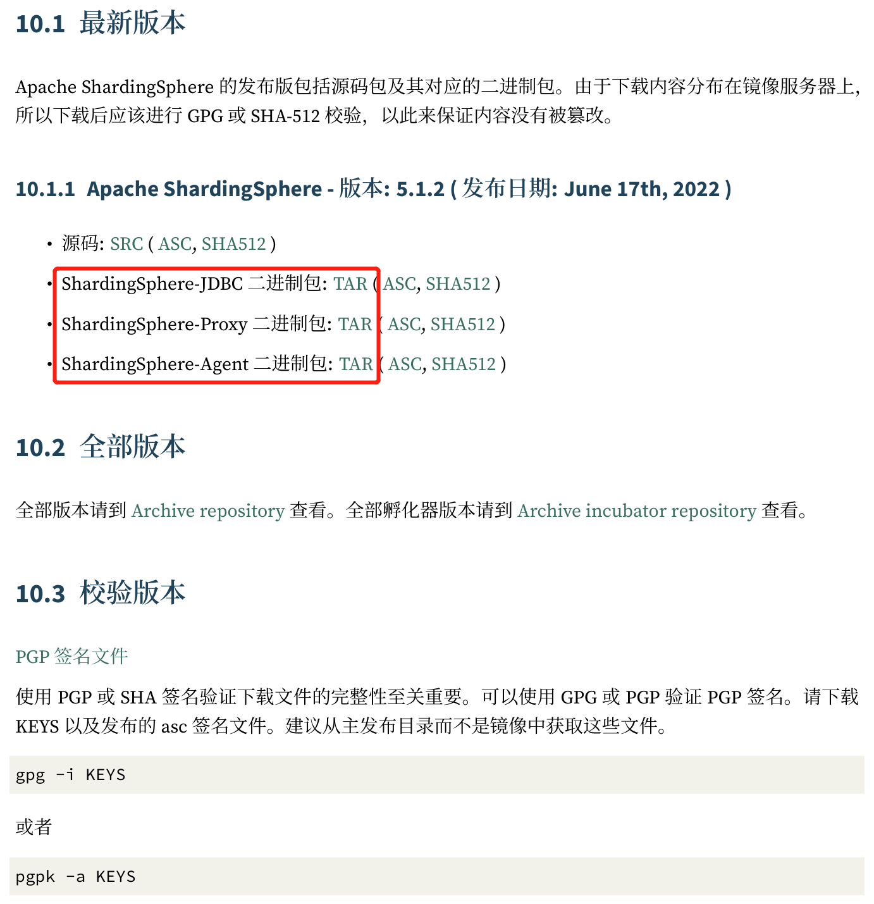

*date: 2022-07-08*

## 简介

官网：https://shardingsphere.apache.org/

Github：https://github.com/apache/shardingsphere

从官网查看和使用最新版本：



>ShardingSphere 各版本之间可能存在较大的差别，某些功能旧版本也不支持，建议直接从最新版本入手。

5.1.2 版本官方 PDF 文档：



> PDF 文档较网页版更为详细。

## ShardingSphere-JDBC

ShardingSphere-Proxy 的规则配置语法，与 ShardingSphere-JDBC 一致。

## ShardingSphere-Proxy

### 下载

在下载的 PDF 文档中，找到对应版本的下载链接：



下载好 tar 安装包后，上传到服务器，解压：

```bash
root@xisun-develop:/opt# pwd
/opt
root@xisun-develop:/opt# ls -lh
total 82M
drwxr-xr-x 7 root root 4.0K  7月  8 18:20 apache-shardingsphere-4.1.1-sharding-proxy-bin
-rw-rw-rw- 1 root root  18M  7月  7 18:10 apache-shardingsphere-4.1.1-sharding-proxy-bin.tar.gz
drwxr-xr-x 8 root root 4.0K  7月  8 18:12 apache-shardingsphere-5.1.2-shardingsphere-proxy-bin
-rw-rw-rw- 1 root root  64M  7月  8 14:04 apache-shardingsphere-5.1.2-shardingsphere-proxy-bin.tar.gz
```

### 规则配置

包括两方面：

- 编辑`%SHARDINGSPHERE_PROXY_HOME%/conf/server.yaml`。
- 编辑`%SHARDINGSPHERE_PROXY_HOME%/conf/config-xxx.yaml`。

>%SHARDINGSPHERE_PROXY_HOME% 为 ShardingSphere-Proxy 解压后的路径。
>
>不同版本之间的 yaml 配置存在差异，在修改配置时，直接修改当前版本解压之后的原 yaml 文件，并参考官方文档说明。

#### server.yaml

```yaml
#
# Licensed to the Apache Software Foundation (ASF) under one or more
# contributor license agreements.  See the NOTICE file distributed with
# this work for additional information regarding copyright ownership.
# The ASF licenses this file to You under the Apache License, Version 2.0
# (the "License"); you may not use this file except in compliance with
# the License.  You may obtain a copy of the License at
#
#     http://www.apache.org/licenses/LICENSE-2.0
#
# Unless required by applicable law or agreed to in writing, software
# distributed under the License is distributed on an "AS IS" BASIS,
# WITHOUT WARRANTIES OR CONDITIONS OF ANY KIND, either express or implied.
# See the License for the specific language governing permissions and
# limitations under the License.
#

######################################################################################################
# 
# If you want to configure governance, authorization and proxy properties, please refer to this file.
# 
######################################################################################################

mode:
  type: Standalone
  repository:
    type: File
    props:
    path: /home/xisun/Sharding/conf
#      namespace: governance_ds
#      server-lists: localhost:2181
#      retryIntervalMilliseconds: 500
#      timeToLiveSeconds: 60
#      maxRetries: 3
#      operationTimeoutMilliseconds: 500
  overwrite: false
#
rules:
  - !AUTHORITY
    users:
      - root@%:root
#      - sharding@:sharding
#    provider:
#      type: ALL_PERMITTED
#  - !TRANSACTION
#    defaultType: XA
#    providerType: Atomikos
#    # When the provider type is Narayana, the following properties can be configured or not
#    props:
#      recoveryStoreUrl: jdbc:mysql://127.0.0.1:3306/jbossts
#      recoveryStoreDataSource: com.mysql.jdbc.jdbc2.optional.MysqlDataSource
#      recoveryStoreUser: root
#      recoveryStorePassword: 12345678
#  - !SQL_PARSER
#    sqlCommentParseEnabled: true
#    sqlStatementCache:
#      initialCapacity: 2000
#      maximumSize: 65535
#    parseTreeCache:
#      initialCapacity: 128
#      maximumSize: 1024

props:
#  max-connections-size-per-query: 1
#  kernel-executor-size: 16  # Infinite by default.
#  proxy-frontend-flush-threshold: 128  # The default value is 128.
#  proxy-hint-enabled: false
  sql-show: true
#  check-table-metadata-enabled: false
#  show-process-list-enabled: false
#    # Proxy backend query fetch size. A larger value may increase the memory usage of ShardingSphere Proxy.
#    # The default value is -1, which means set the minimum value for different JDBC drivers.
#  proxy-backend-query-fetch-size: -1
#  check-duplicate-table-enabled: false
#  proxy-frontend-executor-size: 0 # Proxy frontend executor size. The default value is 0, which means let Netty decide.
#    # Available options of proxy backend executor suitable: OLAP(default), OLTP. The OLTP option may reduce time cost of writing packets to client, but it may increase the latency of SQL execution
#    # and block other clients if client connections are more than `proxy-frontend-executor-size`, especially executing slow SQL.
#  proxy-backend-executor-suitable: OLAP
#  proxy-frontend-max-connections: 0 # Less than or equal to 0 means no limitation.
#  sql-federation-enabled: false
#    # Available proxy backend driver type: JDBC (default), ExperimentalVertx
#  proxy-backend-driver-type: JDBC
#  proxy-mysql-default-version: 5.7.22 # In the absence of schema name, the default version will be used.
#  proxy-default-port: 3307 # Proxy default port.
#  proxy-netty-backlog: 1024 # Proxy netty backlog.
```

> 内存模式下所做的更改不会保存，此处采用单机模式。

#### config-xxx.yaml

conf 路径下，有以下几个配置文件：config-database-discovery.yaml，config-encrypt.yaml，config-readwrite-splitting.yaml，config-shadow.yaml，config-sharding.yaml。当需要某一项功能时，修改对应的 config-xxx.yaml 文件即可。

##### config-sharding.yaml

```yaml
#
# Licensed to the Apache Software Foundation (ASF) under one or more
# contributor license agreements.  See the NOTICE file distributed with
# this work for additional information regarding copyright ownership.
# The ASF licenses this file to You under the Apache License, Version 2.0
# (the "License"); you may not use this file except in compliance with
# the License.  You may obtain a copy of the License at
#
#     http://www.apache.org/licenses/LICENSE-2.0
#
# Unless required by applicable law or agreed to in writing, software
# distributed under the License is distributed on an "AS IS" BASIS,
# WITHOUT WARRANTIES OR CONDITIONS OF ANY KIND, either express or implied.
# See the License for the specific language governing permissions and
# limitations under the License.
#

######################################################################################################
# 
# Here you can configure the rules for the proxy.
# This example is configuration of sharding rule.
# 
######################################################################################################
#
#databaseName: sharding_db
#
#dataSources:
#  ds_0:
#    url: jdbc:postgresql://127.0.0.1:5432/demo_ds_0
#    username: postgres
#    password: postgres
#    connectionTimeoutMilliseconds: 30000
#    idleTimeoutMilliseconds: 60000
#    maxLifetimeMilliseconds: 1800000
#    maxPoolSize: 50
#    minPoolSize: 1
#  ds_1:
#    url: jdbc:postgresql://127.0.0.1:5432/demo_ds_1
#    username: postgres
#    password: postgres
#    connectionTimeoutMilliseconds: 30000
#    idleTimeoutMilliseconds: 60000
#    maxLifetimeMilliseconds: 1800000
#    maxPoolSize: 50
#    minPoolSize: 1
#
#rules:
#- !SHARDING
#  tables:
#    t_order:
#      actualDataNodes: ds_${0..1}.t_order_${0..1}
#      tableStrategy:
#        standard:
#          shardingColumn: order_id
#          shardingAlgorithmName: t_order_inline
#      keyGenerateStrategy:
#          column: order_id
#          keyGeneratorName: snowflake
#    t_order_item:
#      actualDataNodes: ds_${0..1}.t_order_item_${0..1}
#      tableStrategy:
#        standard:
#          shardingColumn: order_id
#          shardingAlgorithmName: t_order_item_inline
#      keyGenerateStrategy:
#        column: order_item_id
#        keyGeneratorName: snowflake
#  bindingTables:
#    - t_order,t_order_item
#  defaultDatabaseStrategy:
#    standard:
#      shardingColumn: user_id
#      shardingAlgorithmName: database_inline
#  defaultTableStrategy:
#    none:
#  
#  shardingAlgorithms:
#    database_inline:
#      type: INLINE
#      props:
#        algorithm-expression: ds_${user_id % 2}
#    t_order_inline:
#      type: INLINE
#      props:
#        algorithm-expression: t_order_${order_id % 2}
#    t_order_item_inline:
#      type: INLINE
#      props:
#        algorithm-expression: t_order_item_${order_id % 2}
#
#  keyGenerators:
#    snowflake:
#      type: SNOWFLAKE
#
#  scalingName: default_scaling
#  scaling:
#    default_scaling:
#      input:
#        workerThread: 40
#        batchSize: 1000
#      output:
#        workerThread: 40
#        batchSize: 1000
#      streamChannel:
#        type: MEMORY
#        props:
#          block-queue-size: 10000
#      completionDetector:
#        type: IDLE
#        props:
#          incremental-task-idle-seconds-threshold: 1800
#      dataConsistencyChecker:
#        type: DATA_MATCH
#        props:
#          chunk-size: 1000

######################################################################################################
#
# If you want to connect to MySQL, you should manually copy MySQL driver to lib directory.
#
######################################################################################################

databaseName: sharding_db
#
dataSources:
  ds_0:
    url: jdbc:mysql://192.168.10.100:3306/master0?serverTimezone=Asia/Shanghai&useSSL=false&useUnicode=true&characterEncoding=UTF-8&allowPublicKeyRetrieval=true
    username: root
    password: root
#    connectionTimeoutMilliseconds: 30000
#    idleTimeoutMilliseconds: 60000
#    maxLifetimeMilliseconds: 1800000
#    maxPoolSize: 50
#    minPoolSize: 1
  ds_1:
    url: jdbc:mysql://192.168.10.100:3306/master1?serverTimezone=Asia/Shanghai&useSSL=false&useUnicode=true&characterEncoding=UTF-8&allowPublicKeyRetrieval=true
    username: root
    password: root
#    connectionTimeoutMilliseconds: 30000
#    idleTimeoutMilliseconds: 60000
#    maxLifetimeMilliseconds: 1800000
#    maxPoolSize: 50
#    minPoolSize: 1
#
rules:
- !SHARDING
  tables:
    t_user:
      actualDataNodes: ds_${0..1}.user
#      tableStrategy:
#        standard:
#          shardingColumn: order_id
#          shardingAlgorithmName: t_order_inline
#      keyGenerateStrategy:
#        column: order_id
#        keyGeneratorName: snowflake
#    t_order_item:
#      actualDataNodes: ds_${0..1}.t_order_item_${0..1}
#      tableStrategy:
#        standard:
#          shardingColumn: order_id
#          shardingAlgorithmName: t_order_item_inline
#      keyGenerateStrategy:
#        column: order_item_id
#        keyGeneratorName: snowflake
#  bindingTables:
#    - t_order,t_order_item
  defaultDatabaseStrategy:
    standard:
      shardingColumn: tenant_id
      shardingAlgorithmName: database_inline
#  defaultTableStrategy:
#    none:
#
  shardingAlgorithms:
    database_inline:
      type: INLINE
      props:
        algorithm-expression: ds_${tenant_id}
#    t_order_inline:
#      type: INLINE
#      props:
#        algorithm-expression: t_order_${order_id % 2}
#    t_order_item_inline:
#      type: INLINE
#      props:
#        algorithm-expression: t_order_item_${order_id % 2}
#
#  keyGenerators:
#    snowflake:
#      type: SNOWFLAKE
#
#  scalingName: default_scaling
#  scaling:
#    default_scaling:
#      input:
#        workerThread: 40
#        batchSize: 1000
#      output:
#        workerThread: 40
#        batchSize: 1000
#      streamChannel:
#        type: MEMORY
#        props:
#          block-queue-size: 10000
#      completionDetector:
#        type: IDLE
#        props:
#          incremental-task-idle-seconds-threshold: 1800
#      dataConsistencyChecker:
#        type: DATA_MATCH
#        props:
#          chunk-size: 1000
```

### 引入依赖

如果后端连接 PostgreSQL 或 openGauss 数据库，不需要引入额外依赖。

如果后端连接 MySQL 数据库，需要下载`mysql‐connector‐java‐5.1.47.jar`或者`mysql‐connector-java‐8.0.11.jar`，并将其放入`%SHARDINGSPHERE_PROXY_HOME%/lib`目录。

### 启动服务

启动命令：

```bash
$ sh %SHARDINGSPHERE_PROXY_HOME%/bin/start.sh
```

```bash
root@xisun-develop:/opt/apache-shardingsphere-5.1.2-shardingsphere-proxy-bin/bin# ./start.sh 
we find java version: java8, full_version=1.8.0_312
Starting the ShardingSphere-Proxy ...
The classpath is /opt/apache-shardingsphere-5.1.2-shardingsphere-proxy-bin/conf:.:/opt/apache-shardingsphere-5.1.2-shardingsphere-proxy-bin/lib/*:/opt/apache-shardingsphere-5.1.2-shardingsphere-proxy-bin/ext-lib/*
Please check the STDOUT file: /opt/apache-shardingsphere-5.1.2-shardingsphere-proxy-bin/logs/stdout.log
```

ShardingSphere-Proxy 默认配置文件目录为`%SHARDINGSPHERE_PROXY_HOME%/conf/`，默认启动`3307`端口。

如果使用自定义端口和配置文件，使用如下启动命令：

```bash
$ sh %SHARDINGSPHERE_PROXY_HOME%/bin/start.sh ${proxy_port} ${proxy_conf_directory}
```

启动之后，通过以下两种方式查看服务是否启动成功：

- 查看 3307 端口：

  ```bash
  root@xisun-develop:/home/xisun# lsof -i:3307
  COMMAND  PID USER   FD   TYPE DEVICE SIZE/OFF NODE NAME
  java    3079 root  282u  IPv6  55498      0t0  TCP *:3307 (LISTEN)
  ```

- 查看日志：

  ```bash
  root@xisun-develop:/opt/apache-shardingsphere-5.1.2-shardingsphere-proxy-bin/bin# cat ../logs/stdout.log 
  Thanks for using Atomikos! This installation is not registered yet. 
  REGISTER FOR FREE at http://www.atomikos.com/Main/RegisterYourDownload and receive:
  - tips & advice 
  - working demos 
  - access to the full documentation 
  - special exclusive bonus offers not available to others 
  - everything you need to get the most out of using Atomikos!
  [INFO ] 2022-07-13 14:16:53.566 [main] o.a.s.d.p.s.r.s.RuleAlteredContextManagerLifecycleListener - mode type is not Cluster, mode type='Standalone', ignore
  [INFO ] 2022-07-13 14:16:53.660 [main] o.a.s.p.v.ShardingSphereProxyVersion - Database name is `MySQL`, version is `8.0.29`, database name is `sharding_db`[INFO ] 2022-07-13 14:16:54.195 [main] o.a.s.p.frontend.ShardingSphereProxy - ShardingSphere-Proxy Standalone mode started successfully
  ```
  
  

关闭服务：

```bash
root@xisun-develop:/opt/apache-shardingsphere-5.1.2-shardingsphere-proxy-bin/bin# ./stop.sh 
Stopping the ShardingSphere-Proxy ....OK!
PID: 3427
```


### 连接服务

ShardingSphere-Proxy 服务启动成功之后，可以使用以下两种方式连接：MySQL 客户端，或者第三方连接工具。

#### MySQL 客户端连接

```bash
root@xisun-develop:/home/xisun# docker exec -it mysql_8.0.29 /bin/bash
root@4905d5364838:/# mysql -h192.168.10.100 -P3307 -uroot -proot
mysql: [Warning] Using a password on the command line interface can be insecure.
Welcome to the MySQL monitor.  Commands end with ; or \g.
Your MySQL connection id is 1
Server version: 5.7.22-ShardingSphere-Proxy 5.1.2 MySQL Community Server - GPL

Copyright (c) 2000, 2022, Oracle and/or its affiliates.

Oracle is a registered trademark of Oracle Corporation and/or its
affiliates. Other names may be trademarks of their respective
owners.

Type 'help;' or '\h' for help. Type '\c' to clear the current input statement.

mysql>
```


#### DBeaver 连接

### DistSQL

连接上 ShardingSphere-Proxy 服务后，即可使用 DistSQL。以在 MySQL 客户端中使用为例进行说明。

如果服务启动之前，配置了 server.yaml 和 config-xxx.yaml 文件，在服务启动时，可以从单机模式配置的文件保存路径中，查看生效的对应规则：

```bash
xisun@xisun-develop:~/Sharding/conf$ pwd
/home/xisun/Sharding/conf
xisun@xisun-develop:~/Sharding/conf$ ls
metadata  props  rules
xisun@xisun-develop:~/Sharding/conf$ cd metadata/sharding_db/versions/0/
xisun@xisun-develop:~/Sharding/conf/metadata/sharding_db/versions/0$ pwd
/home/xisun/Sharding/conf/metadata/sharding_db/versions/0
xisun@xisun-develop:~/Sharding/conf/metadata/sharding_db/versions/0$ ls
dataSources  rules
```

> 服务刚启动时，该路径下的规则，即为配置文件中定义的规则。服务启动后，可以通过 DistSQL 动态创建规则，不需要重启服务。

#### RDL 语法

RDL：Resource & Rule Definition Language，为 Apache ShardingSphere 的资源和规则定义语言。

添加数据源：

```bash
mysql> SHOW DATABASES;
+--------------------+
| schema_name        |
+--------------------+
| sharding_db        |
| mysql              |
| information_schema |
| performance_schema |
| sys                |
+--------------------+
5 rows in set (0.01 sec)
mysql> USE sharding_db;
Reading table information for completion of table and column names
You can turn off this feature to get a quicker startup with -A

Database changed
mysql> ADD RESOURCE ds_2 (
    -> URL="jdbc:mysql://192.168.10.100:3306/master2?serverTimezone=Asia/Shanghai&useSSL=false&useUnicode=true&characterEncoding=UTF-8&allowPublicKeyRetrieval=true",
    -> USER=root,
    -> PASSWORD=root
    -> );
Query OK, 0 rows affected (0.19 sec)
```

> 添加数据源有几个注意事项，必须满足。

添加数据源之后，需要对原有的分片规则进行修改，增加实际对应的数据源节点：

```bash
mysql> ALTER SHARDING TABLE RULE t_user (
    -> DATANODES("ds_${0..2}.user")
    -> );
Query OK, 0 rows affected (0.11 sec)
```

> 可以查看 conf 路径下的 dataSources 和 rules 文件，确认数据源和规则是否已经修改。

在前面的操作中，动态增加了一个数据源 ds_2，对应数据库 master2，下面添加一条数据，确认是否成功：

```bash
mysql> INSERT INTO sharding_db.t_user (tenant_id, name, sex, age, status)
    -> VALUES (0, "zhang san", "male", 27, 1);
Query OK, 1 row affected (0.20 sec)

mysql> INSERT INTO sharding_db.t_user (tenant_id, name, sex, age, status)
    -> VALUES (2, "zhang san", "male", 27, 1);
Query OK, 1 row affected (0.01 sec)
```

查找插入的数据：

```bash
mysql> SELECT * FROM sharding_db.t_user;
+----+-----------+-----------+------+-----+--------+---------------------+---------------------+
| id | tenant_id | name      | sex  | age | status | create_time         | update_time         |
+----+-----------+-----------+------+-----+--------+---------------------+---------------------+
| 15 |         0 | zhang san | male |  27 |      1 | 2022-07-13 10:34:28 | 2022-07-13 10:34:28 |
| 14 |         2 | zhang san | male |  27 |      1 | 2022-07-13 10:35:37 | 2022-07-13 10:35:37 |
+----+-----------+-----------+------+-----+--------+---------------------+---------------------+
2 rows in set (0.01 sec)
```

同时，可以查看实际的库，数据已经插入成功。
