*date: 2021-06-28*

## MySQL 安装

### Windows 上安装 MySQL

- 下载：

  - 地址：https://dev.mysql.com/downloads/

    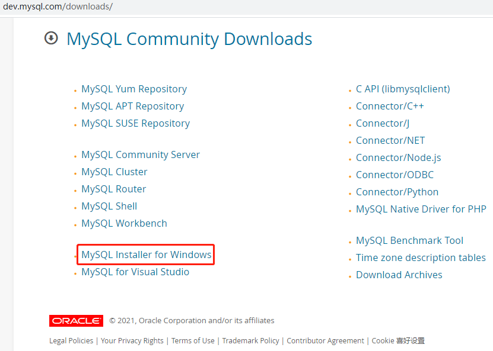

    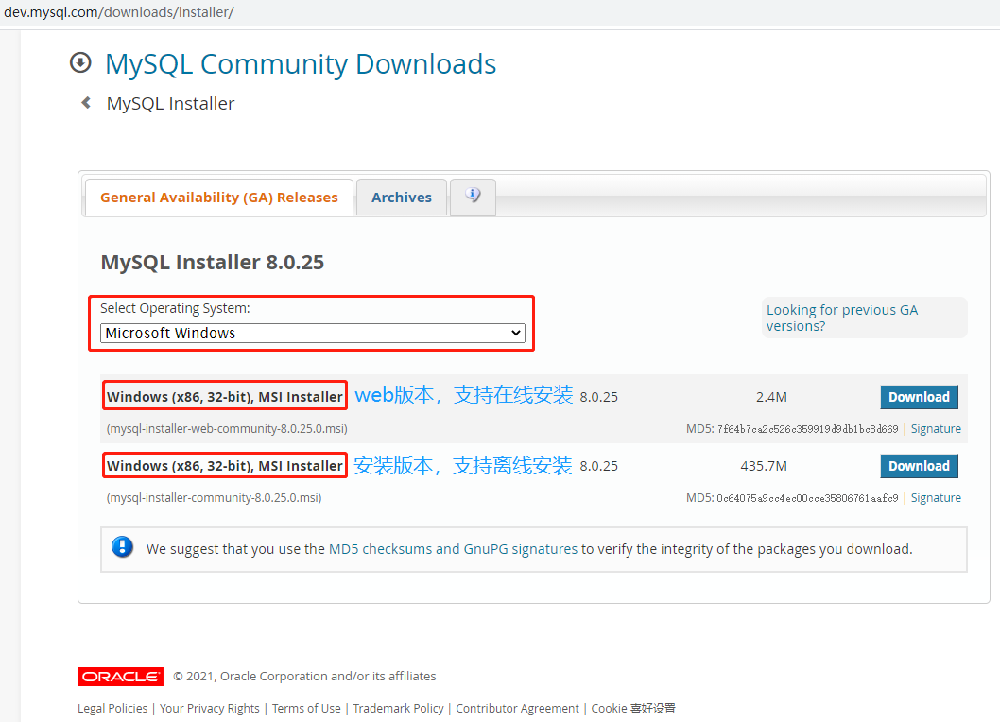

    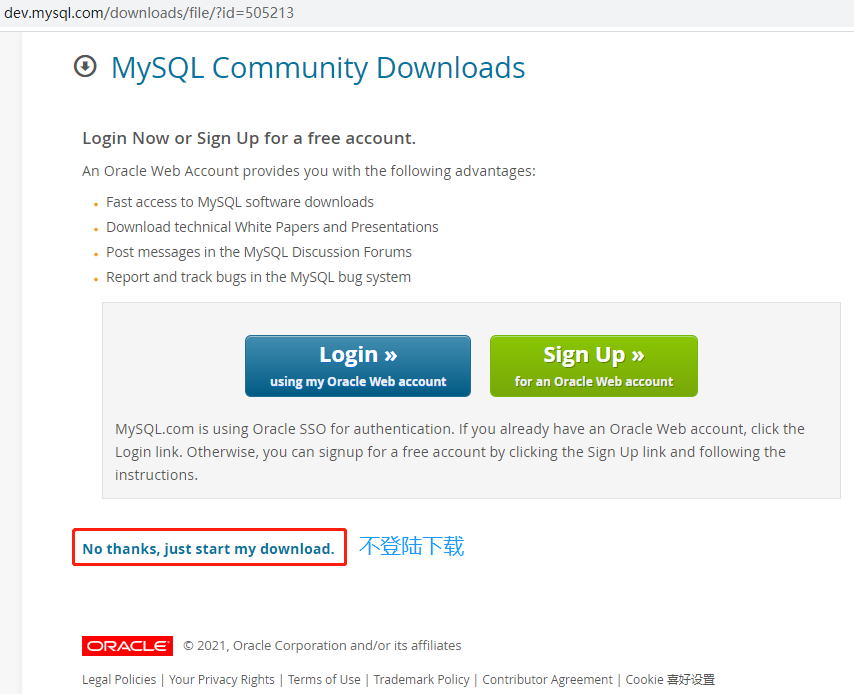

- 安装：

  - 产品选择：

    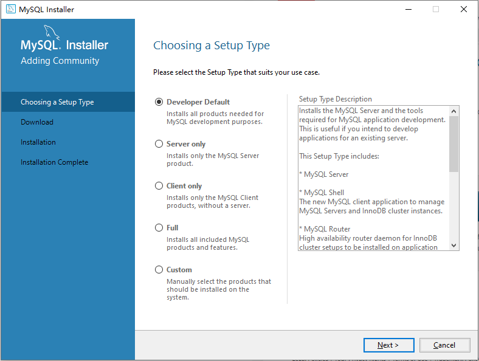

    - Developer Default：开发者默认，安装 MySQL 开发所需的所有产品。
    - Server only：服务器，只安装 MySQL 服务器产品。
    - Client only：客户端，只安装没有服务器的 MySQL 客户端产品。
    - Full：完全，安装所有包含的 MySQL 产品和功能。
    - Custom：手动，手动选择系统上应安装的产品。

  - 跳过 Check Requirements：

    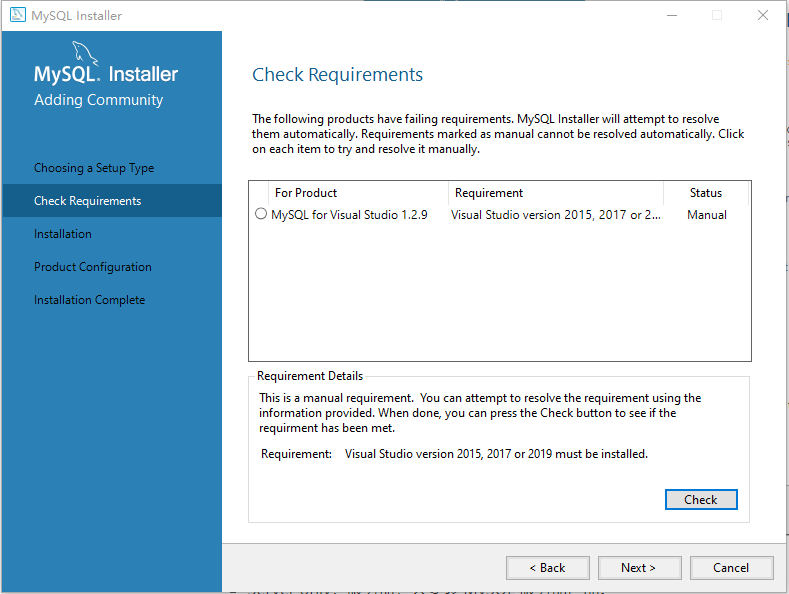

  - 进度，安装需要一段时间：

    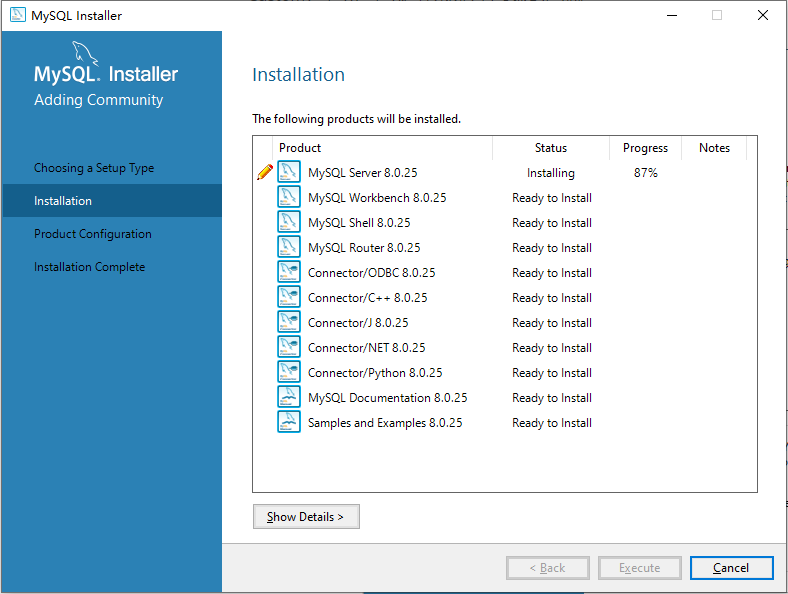

  - 待配置项，接下来会一项接一项的进行配置。当一项配置完后，会回到此页面，并显示该项 Configuration Complete，然后进行下一项：

    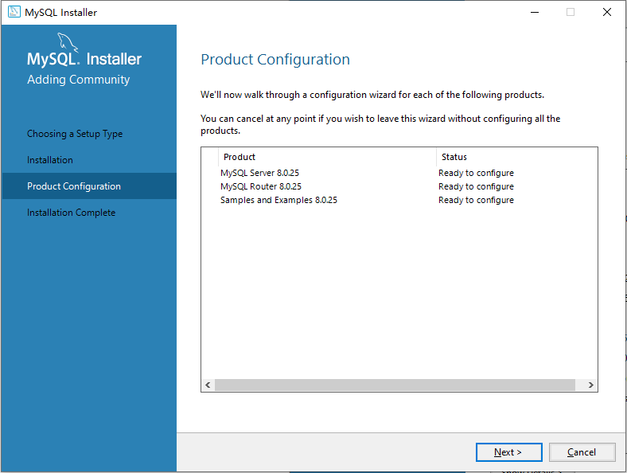

  - 端口：

    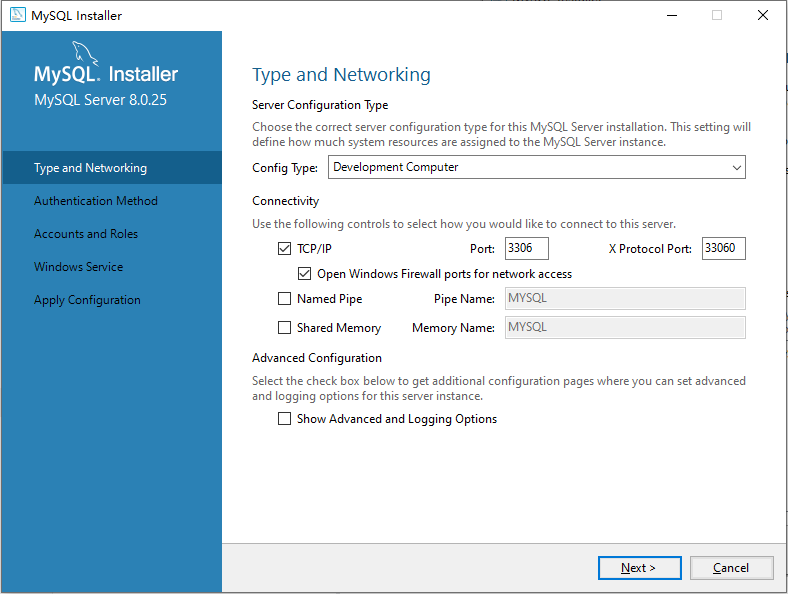

  - root 用户密码 (此密码不能忘)：

    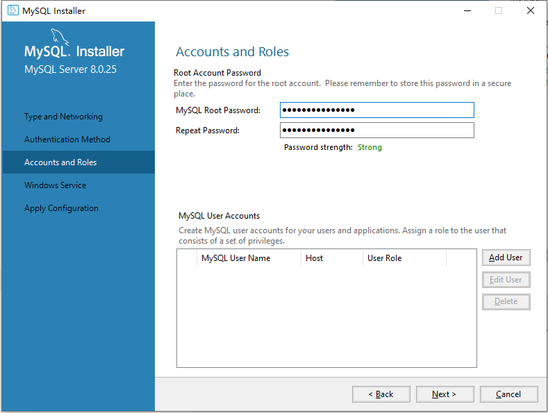

    > 可以在本页面添加其他用户，并赋予权限和登录密码。

  - 配置 MySQL 在 Windows 系统中的名字，以及是否选择开机启动 MySQL 服务：

    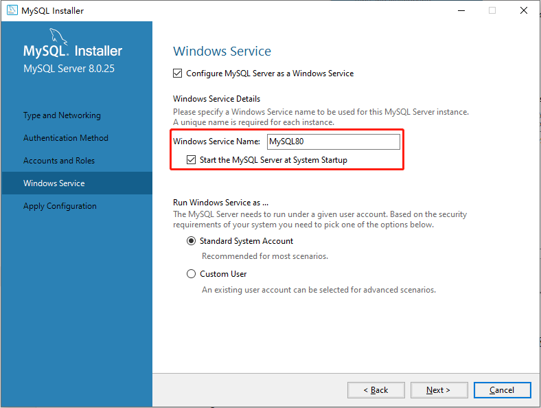

  - 应用配置：

    

  - 安装日志，可以查看端口和安装位置等信息：

    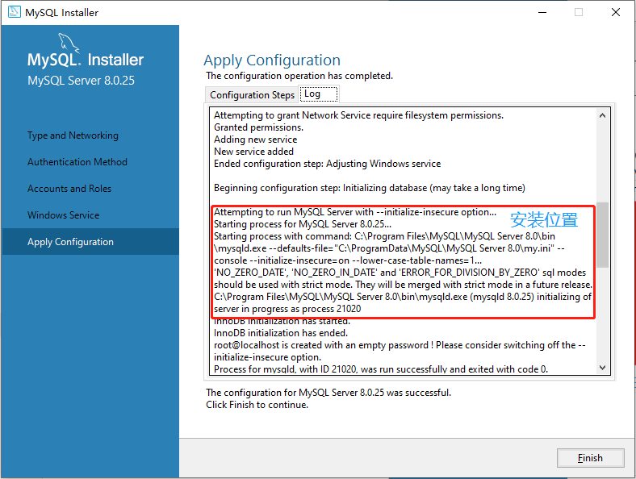

  - 安装完成：

    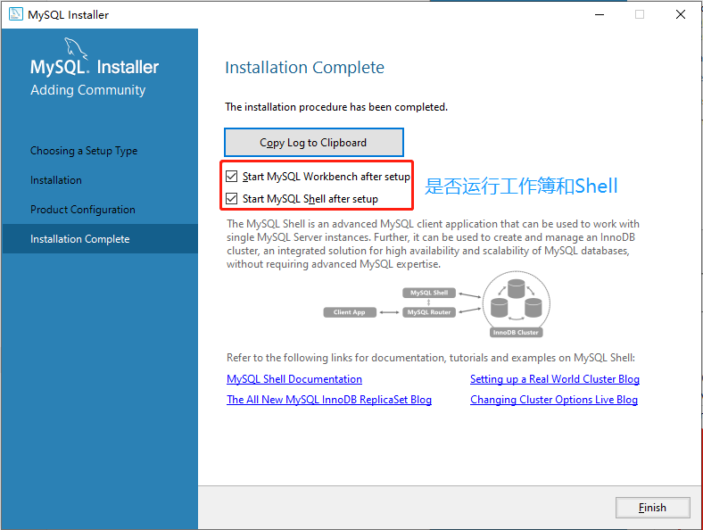

  - 双击运行之前下载的安装包，能看到所安装的产品。

    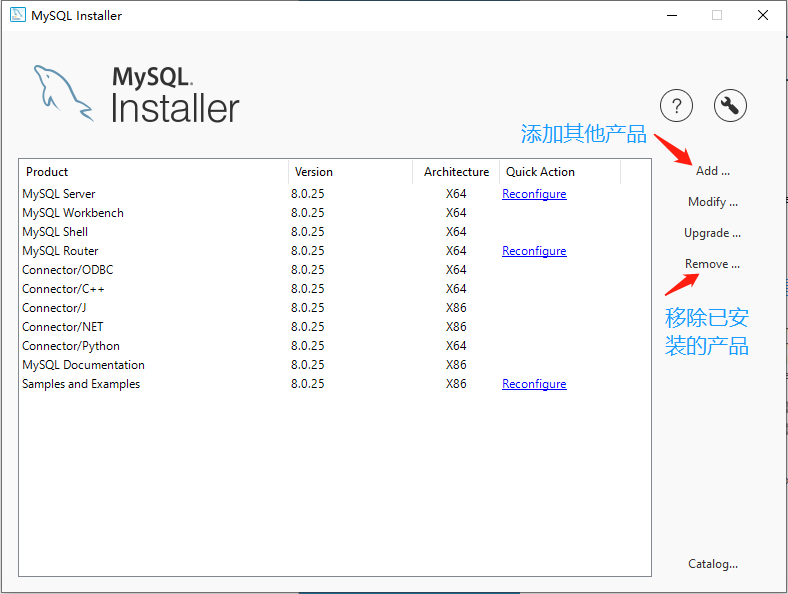

- 添加环境变量：

  - 新建 MASQL_HOME：

  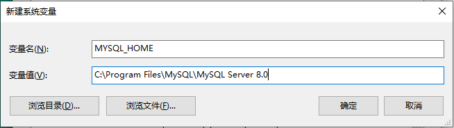

  - 添加 path：

    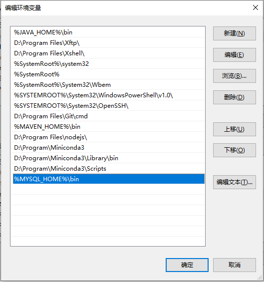

  - 测试：

    ```cmd
    C:\Users\XiSun>mysql -u root -p
    Enter password: ***************
    Welcome to the MySQL monitor.  Commands end with ; or \g.
    Your MySQL connection id is 30
    Server version: 8.0.25 MySQL Community Server - GPL
    
    Copyright (c) 2000, 2021, Oracle and/or its affiliates.
    
    Oracle is a registered trademark of Oracle Corporation and/or its
    affiliates. Other names may be trademarks of their respective
    owners.
    
    Type 'help;' or '\h' for help. Type '\c' to clear the current input statement.
    
    mysql>
    ```

## 本文参考

- https://www.runoob.com/mysql/mysql-install.html


- https://www.runoob.com/w3cnote/windows10-mysql-installer.html


## 声明

- 写作本文初衷是个人学习记录，鉴于本人学识有限，如有侵权或不当之处，请联系 [wdshfut@163.com](mailto:wdshfut@163.com)。
