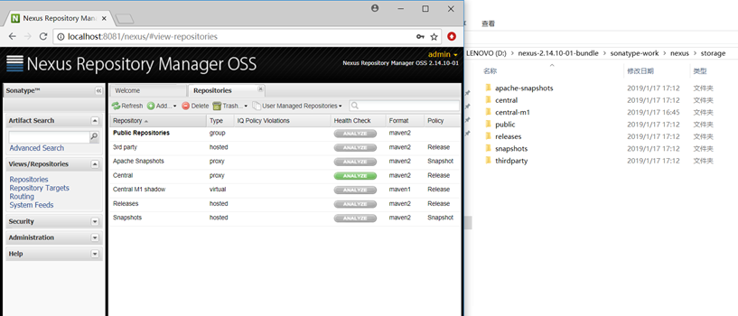
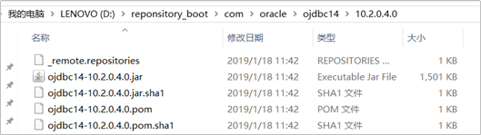
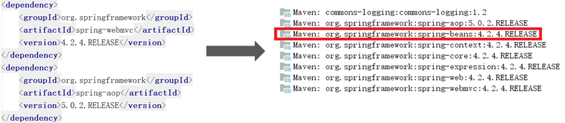
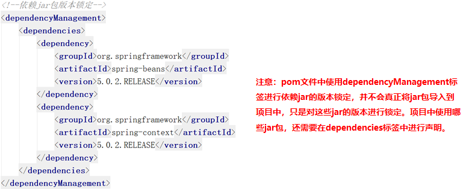
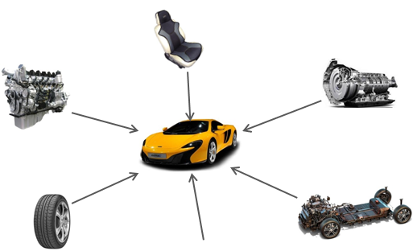
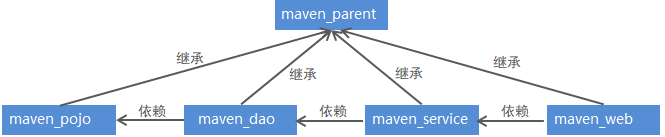

*`Author: ACatSmiling`*

*`Since: 2020-11-18`*

## Maven 的功能

Maven 是一个项目管理工具，主要作用是在项目开发阶段对项目进行`依赖管理`和`项目构建`。

- 依赖管理：仅仅通过 jar 包的几个属性，就能确定唯一的 jar 包，在指定的文件 pom.xml 中，只要写入这些依赖属性，就会自动下载并管理 jar 包。


- 项目构建：内置很多的插件与生命周期，支持多种任务，比如校验、编译、测试、打包、部署、发布...


- 项目的知识管理：管理项目相关的其他内容，比如开发者信息，版本等等。


## Maven 的安装与配置

第一步：下载，地址：http://maven.apache.org/download.cgi


>注意：安装 Maven 之前，必须先确保你的机器中已经安装了 JDK，如果是 Maven 3.3 则要求必须 JDK 7 以上。

第二步：解压，添加环境变量`MAVEN_HOME`，值为解压后的 Maven 路径。

.jpg)

第三步：在`Path`环境变量的变量值末尾添加`%MAVEN_HOME%\bin`。

.jpg)

第四步：在 cmd 窗口输入`mvn --version`，显示 Maven 版本信息，说明安装配置成功。

.jpg)

## 在 IDEA 中使用 Maven


## Maven 的仓库

Maven 仓库分为`本地仓库`和`远程仓库`，而远程仓库又分为`Maven 中央仓库`、`其他远程仓库`和`私服（私有服务器）`。其中，中央仓库是由 Maven 官方提供的，而私服就需要我们自己搭建。


### 本地仓库

默认情况下，不管 Linux 还是 Windows，每个用户在自己的用户目录下都有一个路径名为`.m2\repository`的仓库目录，如：C:\Users\XiSun\\.m2\repository。如果不自定义本地仓库的地址，则会将下载的构件放到该目录下。

修改 Maven 根目录下的 conf 文件夹中的`setting.xml`文件，可以自定义本地仓库地址，例如：

```xml
<localRepository>D:\Program Files\Maven\apache-maven-3.6.3-maven-repository</localRepository>
```

> 说明：运行 Maven 的时候，Maven 所需要的任何构件都是直接从本地仓库获取的。如果本地仓库没有，它会首先尝试从远程仓库下载构件至本地仓库，然后再使用本地仓库的构件。

### 远程仓库

#### Maven 中央仓库

Maven 中央仓库，是由 Maven 社区提供的仓库，其中包含了大量常用的库。一般来说，简单的  Java 项目依赖的构件都可以在这里下载到。

因为 Maven 中央仓库默认在国外，国内使用难免很慢，推荐将其更换为阿里云的镜像。

>在 Maven 安装目录的 lib 目录下，有一个 maven-model-builder-3.6.1.jar，里面的 org/apache/maven/model/pom-4.0.0.xml 文件定义了 Maven 默认中央仓库的地址：https://repo.maven.apache.org/maven2

`全局配置`：修改 Maven 根目录下的 conf 文件夹中的`setting.xml`文件，在`mirrors 节点`上，添加如下内容。

```xml
<mirrors>
    <!-- mirror
     | Specifies a repository mirror site to use instead of a given repository. The repository that
     | this mirror serves has an ID that matches the mirrorOf element of this mirror. IDs are used
     | for inheritance and direct lookup purposes, and must be unique across the set of mirrors.
     |
    <mirror>
      <id>mirrorId</id>
      <mirrorOf>repositoryId</mirrorOf>
      <name>Human Readable Name for this Mirror.</name>
      <url>http://my.repository.com/repo/path</url>
    </mirror>
     -->
    <mirror>
      <id>alimaven</id>
      <name>aliyun maven</name>
      <url>http://maven.aliyun.com/nexus/content/groups/public/</url>
      <mirrorOf>central</mirrorOf>
    </mirror>
</mirrors>
```

`局部配置`：修改项目的`pom.xml`文件，在`repositories 节点`上，添加如下内容。

```xml
<repositories>
    <repository>
    	<id>alimaven</id>  
    	<name>aliyun maven</name>
        <url>http://maven.aliyun.com/nexus/content/groups/public/</url>
        <releases>
            <enabled>true</enabled>
        </releases>
        <snapshots>
            <enabled>false</enabled>
        </snapshots>
    </repository>
</repositories>
```

> 更多中央仓库地址参考：https://blog.csdn.net/Hello_World_QWP/article/details/82463799。

#### 私服

Maven 私服就是公司局域网内的 Maven 远程仓库，每个员工的电脑上安装 Maven 软件并且连接 Maven 私服，程序员可以将自己开发的项目打成 jar 并发布到私服，其它项目组成员就可以从私服下载所依赖的 jar。

私服还充当一个代理服务器的角色，当私服上没有 jar 包时，会从 Maven 中央仓库自动下载。

`nexus`是一个 Maven 仓库管理器（其实就是一个软件），nexus 可以充当 Maven 私服，同时 nexus 还提供强大的仓库管理、构件搜索等功能。

如果 Maven 在中央仓库中也找不到依赖的文件，它会停止构建过程并输出错误信息到控制台。为避免这种情况，Maven 提供了远程仓库的概念，它是开发人员自己定制的仓库，包含了所需要的代码库或者其他工程中用到的 jar 文件。

##### Windows 搭建 Maven 私服

1. 下载 nexus，地址：https://help.sonatype.com/repomanager2/download/download-archives---repository-manager-oss

2. 安装 nexus

   - 将下载的压缩包进行解压，进入 bin 目录：

     

   - 打开 cmd 窗口并进入上面 bin 目录下，执行`nexus.bat install`命令安装服务（注意需要以管理员身份运行 cmd 命令）：

     

3. 启动 nexus

   - 经过前面命令已经完成 nexus 的安装，可以通过如下两种方式启动 nexus 服务。

     - 在 Windows 系统服务中启动 nexus：

       

     - 在命令行执行`nexus.bat start`命令启动 nexus：

       


4. 访问 nexus

   - 启动 nexus 服务后，访问`http://localhost:8081/nexus`，点击右上角 LogIn 按钮，使用默认用户名 admin 和密码 admin123 登录系统。

   - 登录成功后，点击左侧菜单 Repositories，可以看到 nexus 内置的仓库列表，如下图：

     

##### nexus 仓库类型

通过前面的仓库列表可以看到，nexus 默认内置了很多仓库，这些仓库可以划分为 4 种类型，每种类型的仓库用于存放特定的 jar 包，具体说明如下。

- `hosted`：宿主仓库，部署自己的 jar 到这个类型的仓库，包括 Releases 和 Snapshots 两部分，Releases 为公司内部发布版本仓库，Snapshots 为公司内部测试版本仓库。


- `proxy`：代理仓库，用于代理远程的公共仓库，如 Maven 中央仓库，用户连接私服，私服自动去中央仓库下载 jar 包或者插件。

- `group`：仓库组，用来合并多个 hosted 或 proxy 仓库，通常我们配置自己的 Maven 连接仓库组。

- `virtual`（虚拟）：兼容 Maven1 版本的 jar 或者插件。


##### nexus 仓库类型与安装目录对应关系



##### 将项目发布到 Maven 私服

Maven 私服是搭建在公司局域网内的 Maven 仓库，公司内的所有开发团队都可以使用。例如技术研发团队开发了一个基础组件，就可以将这个基础组件打成 jar 包发布到私服，其他团队成员就可以从私服下载这个 jar 包到本地仓库并在项目中使用。

具体操作步骤如下：

1. 配置 Maven 的 settings.xml 文件

   ```xml
   <server>
       <id>releases</id>
       <username>admin</username>   
       <password>admin123</password>
   </server>
   <server>
       <id>snapshots</id>
       <username>admin</username>
       <password>admin123</password>
   </server>
   ```

   >注意：一定要在 IDEA 工具中引入的 Maven 的 settings.xml 文件中配置。

2. 配置项目的 pom.xml 文件

   ```xml
   <distributionManagement>
       <repository>
          <id>releases</id>
          <url>http://localhost:8081/nexus/content/repositories/releases/</url>
       </repository>
   	<snapshotRepository>
      		<id>snapshots</id>
           <url>http://localhost:8081/nexus/content/repositories/snapshots/</url>
       </snapshotRepository>
   </distributionManagement>
   ```

3. 执行`mvn clean deploy`命令


##### 从私服下载 jar 到本地仓库

前面我们已经完成了将本地项目打成 jar 包发布到 Maven 私服，下面我们就需要从 Maven 私服下载 jar 包到本地仓库。

具体操作步骤如下：

1. 在 Maven 的 settings.xml 文件中配置下载模板

   ```xml
   <profile>
   	<id>dev</id>
   	<repositories>
   		<repository>
   			<id>nexus</id>
   			<!--仓库地址，即nexus仓库组的地址-->
   			<url>http://localhost:8081/nexus/content/groups/public/</url>
   			<!--是否下载releases构件-->
   			<releases>
   				<enabled>true</enabled>
   			</releases>
   			<!--是否下载snapshots构件-->
   			<snapshots>
   				<enabled>true</enabled>
   			</snapshots>
   		</repository>
   	</repositories>
   	<pluginRepositories>
   		<!-- 插件仓库，maven的运行依赖插件，也需要从私服下载插件 -->
           <pluginRepository>
               <id>public</id>
               <name>Public Repositories</name>
               <url>http://localhost:8081/nexus/content/groups/public/</url>
           </pluginRepository>
   	</pluginRepositories>
   </profile>
   ```

2. 在 Maven 的 settings.xml 文件中配置激活下载模板

   ```xml
   <activeProfiles>
   	<activeProfile>dev</activeProfile>
   </activeProfiles>
   ```

### 安装第三方 jar

在 Maven 工程的 pom.xml 文件中配置某个 jar 包的坐标后，如果本地的 Maven 仓库不存在这个 jar 包，Maven 工具会自动到配置的 Maven 私服下载，如果私服中也不存在，Maven 私服就会从 Maven 中央仓库进行下载。

但是并不是所有的 jar 包都可以从中央仓库下载到，比如常用的 Oracle 数据库驱动的 jar 包在中央仓库就不存在。此时需要到 Oracle 的官网下载驱动 jar 包，然后将此 jar 包通过 Maven 命令安装到我们本地的 Maven 仓库或者 Maven 私服中，这样在 Maven 项目中就可以使用 Maven 坐标引用到此 jar 包了。

#### 将第三方 jar 安装到本地仓库

1. 下载 Oracle 的 jar 包

2. 执行`mvn install`命令进行安装

      ```powershell
mvn install:install-file -Dfile=ojdbc14-10.2.0.4.0.jar -DgroupId=com.oracle -DartifactId=ojdbc14 –Dversion=10.2.0.4.0 -Dpackaging=jar
      ```

3. 查看本地 Maven 仓库，确认安装是否成功

      

再比如安装 Classifier4J-0.6.jar，打开 cmd 窗口，切换到 jar 包所在目录，输入 mvn 命令，命令格式如下：

```sh
mvn install:install-file -DgroupId=net.sf(自定义，需要与pom.xml文件中的groupId一致) -DartifactId=classifier4j(自定义，需要与pom.xml文件中的artifaceId一致) -Dversion=0.6(自定义，需要与pom.xml文件中的version一致) -Dpackaging=jar -Dfile=Classifier4J-0.6.jar(本地jar包路径)
```

> 注意：-DgroupId、-DartifactId、-Dversion、-Dpackaging、-Dfile 前面均有一个空格。

使用示例如下：


之后，在 Maven 的本地仓库，根据 groupId —— artifactId —— version，即可找到打包进来的本地 jar 包，也可以在项目中的 pom.xml 文件引入：

```xml
<dependency>
    <groupId>net.sf</groupId>
    <artifactId>classifier4j</artifactId>
    <version>0.6</version>
</dependency>
```

#### 将第三方 jar 安装到 Maven 私服

1. 下载 Oracle 的 jar 包

2. 在 Maven 的 settings.xml 配置文件中配置第三方仓库的 server 信息

   ```xml
   <server>
     <id>thirdparty</id>
     <username>admin</username>
     <password>admin123</password>
   </server>
   ```

3. 执行`mvn deploy`命令进行安装

      ```powershell
      mvn deploy:deploy-file -Dfile=ojdbc14-10.2.0.4.0.jar -DgroupId=com.oracle -DartifactId=ojdbc14 –Dversion=10.2.0.4.0 -Dpackaging=jar –Durl=http://localhost:8081/nexus/content/repositories/thirdparty/ -DrepositoryId=thirdparty
      ```

### Maven 常用网址

https://repo1.maven.org/maven2/

https://mvnrepository.com/

https://developer.aliyun.com/mvn/guide

## Maven 的依赖搜索顺序

一般情况下，当执行 Maven 构建命令时，Maven 按照以下顺序查找依赖的库：

- **步骤 1**：在本地仓库中搜索，如果找不到，执行步骤 2，如果找到了则执行其他操作。
- **步骤 2**：在中央仓库中搜索，如果找不到，并且有一个或多个远程仓库已经设置，则执行步骤 4，如果找到了则下载到本地仓库中以备将来引用。
- **步骤 3**：如果远程仓库没有被设置，Maven 将简单的停滞处理并抛出错误（无法找到依赖的文件）。
- **步骤 4**：在一个或多个远程仓库中搜索依赖的文件，如果找到则下载到本地仓库以备将来引用，否则 Maven 将停止处理并抛出错误（无法找到依赖的文件）。

## Maven 的依赖下载顺序

### 准备测试环境

安装 JDK 和 Maven。

使用如下命令创建测试项目：

```powershell
yes | mvn archetype:generate -DarchetypeGroupId=org.apache.maven.archetypes -DarchetypeArtifactId=maven-archetype-webapp  -DinteractiveMode=true -DgroupId=com.pollyduan -DartifactId=myweb -Dversion=1.0 -Dpackage=com.pollyduan
```

创建完成后，为了避免后续测试干扰，先执行一次 compile。

```powershell
cd myweb
mvn compile
```

最后，修改 pom.xml 文件，将 junit 版本号改为 4.12 。我们要使用这个 jar 来测试依赖的搜索顺序。

### 默认情况

首先确保 junit 4.12 不存在：

```powershell
rm -rf ~/.m2/repository/junit/junit/4.12
```

默认情况下没有配置任何仓库，也就是说，既没更改 $MAVEN_HOME/conf/settings.xml，也没有添加 ~/.m2/settings.xml。

执行编译，查看日志中拉取 junit 的仓库。

```powershell
mvn compile

...
Downloaded from central: https://repo.maven.apache.org/maven2/junit/junit/4.12/junit-4.12.pom (24 kB at 11 kB/s)
```

从显示的仓库 id 可以看出：默认是从 Maven 中央仓库拉取的 jar。

### 配置镜像仓库 settings_mirror

创建 ~/.m2/setttings.xml，配置 Maven 中央仓库的镜像，如下：

```xml
<settings>
  <mirrors>
    <mirror>
      <id>settings_mirror</id>
      <url>https://maven.aliyun.com/repository/public</url>
      <mirrorOf>central</mirrorOf>
    </mirror>
  </mirrors>
</settings>
```

重新测试：

```powershell
rm -rf ~/.m2/repository/junit/junit/4.12
mvn compile
```

在日志中查看下载依赖的仓库：

```powershell
Downloaded from settings_mirror: https://maven.aliyun.com/repository/public/junit/junit/4.12/junit-4.12.pom (24 kB at 35 kB/s)
```

从显示的仓库 id 可以看出：是从 settings_mirror 中下载的 jar。

结论：settings_mirror 的优先级高于 central。

### 配置项目仓库 pom_repositories

在 project 中的 pom.xml 文件中，增加如下配置：

```xml
<repositories>
  <repository>
    <id>pom_repositories</id>
    <name>local</name>
    <url>http://10.18.29.128/nexus/content/groups/public/</url>
    <releases>
      <enabled>true</enabled>
    </releases>
    <sapshots>
      <enabled>true</enabled>
    </snapshots>
  </repository>
</repositories>
```

由于改变了 id 的名字，所以仓库地址无所谓，使用相同的地址也不影响测试。

执行测试：

```powershell
rm -rf ~/.m2/repository/junit/junit/4.12
mvn compile
```

在日志中查看下载依赖的仓库：

```powershell
Downloaded from pom_repositories: http://10.18.29.128/nexus/content/groups/public/junit/junit/4.12/junit-4.12.pom (24 kB at 95 kB/s)
```

从显示的仓库 id 可以看出：jar 是从 pom_repositories 中下载的。

结论：pom_repositories 优先级高于 settings_mirror。

### 配置全局 profile 仓库 settings_profile_repo

在 ~/.m2/settings.xml 中 settings 的节点内增加：

```xml
<profiles>
  <profile>
  <id>s_profile</id>
  <repositories>
    <repository>
      <id>settings_profile_repo</id>
      <name>netease</name>
      <url>http://mirrors.163.com/maven/repository/maven-public/</url>
      <releases>
        <enabled>true</enabled>
      </releases>
      <snapshots>
        <enabled>true</enabled>
      </snapshots>
    </repository>
  </repositories>
  </profile>
</profiles>
```

执行测试：

```powershell
rm -rf ~/.m2/repository/junit/junit/4.12
mvn compile -Ps_profile
```

在日志中查看下载依赖的仓库：

```powershell
Downloaded from settings_profile_repo: http://mirrors.163.com/maven/repository/maven-public/junit/junit/4.12/junit-4.12.pom (24 kB at 63 kB/s)
```

从显示的仓库 id 可以看出：jar 是从 settings_profile_repo 中下载的。

结论：settings_profile_repo 优先级高于 pom_repositories  和 settings_mirror。

### 配置项目 profile 仓库 pom_profile_repo

在 project 中的 pom.xml 文件中，增加如下配置：

```xml
<profiles>
  <profile>
    <id>p_profile</id>
    <repositories>
      <repository>
        <id>pom_profile_repo</id>
        <name>local</name>
        <url>http://10.18.29.128/nexus/content/groups/public/</url>
        <releases>
          <enabled>true</enabled>
        </releases>
        <snapshots>
          <enabled>true</enabled>
        </snapshots>
      </repository>
    </repositories>
  </profile>
</profiles>
```

执行测试：

```powershell
rm -rf ~/.m2/repository/junit/junit/4.12
mvn compile -Ps_profile,p_profile
mvn compile -Pp_profile,s_profile
```

在日志中查看下载依赖的仓库：

```powershell
Downloaded from settings_profile_repo: http://mirrors.163.com/maven/repository/maven-public/junit/junit/4.12/junit-4.12.pom (24 kB at 68 kB/s)
```

从显示的仓库 id 可以看出：jar 是从 settings_profile_repo 中下载的。

结论：settings_profile_repo 优先级高于 pom_profile_repo。

进一步测试：

```powershell
rm -rf ~/.m2/repository/junit/junit/4.12
mvn compile -Pp_profile
```

在日志中查看下载依赖的仓库：

```powershell
Downloaded from pom_profile_repo: http://10.18.29.128/nexus/content/groups/public/junit/junit/4.12/junit-4.12.pom (24 kB at 106 kB/s)
```

从显示的仓库 id 可以看出：jar 是从 settings_profile_repo 中下载的。

结论：pom_profile_repo 优先级高于 pom_repositories。

### 本地仓库 local_repo 

这不算测试了，只是一个结论，可以任意测试：只要 ~/.m2/repository 中包含依赖，无论怎么配置，都会优先使用 local 本地仓库中的 jar。

### 最终结论

- settings_mirror 的优先级高于 central

- settings_profile_repo 优先级高于 settings_mirror
- settings_profile_repo 优先级高于 pom_repositories
- settings_profile_repo 优先级高于 pom_profile_repo
- pom_repositories 优先级高于 settings_mirror
- pom_profile_repo 优先级高于 pom_repositories

通过上面的比较，可以得出各种仓库完整的搜索顺序链：

**`local_repo > settings_profile_repo > pom_profile_repo > pom_repositories > settings_mirror > central`**

简单来说，查找依赖的顺序大致如下：

1. 在本地仓库中寻找，如果没有则进入下一步。

2. 在全局配置的私服仓库（settings.xml 中配置的并被激活）中寻找，如果没有则进入下一步。

3. 在项目自身配置的私服仓库（pom.xml）中寻找，如果没有则进入下一步。

4. 在中央仓库中寻找，如果没有则终止寻找。

>说明：
>
>1. 如果在找寻的过程中，发现该仓库有镜像设置，则用镜像的地址代替，即假设现在进行到要在 respository A 仓库中查找某个依赖，但 A 仓库配置了 mirror，则会转到从 A 的 mirror 中查找该依赖，不会再从 A 中查找。
>
>2. settings.xml 中配置的 profile（激活的）下的 respository 优先级高于项目中 pom.xml 文件配置的 respository。
>
>3. 如果仓库的 id 设置成 "central"，则该仓库会覆盖 Maven 默认的中央仓库配置。 

## Maven 的常用命令

- `clean`：清理


- `compile`：编译


- `test`： 测试


- `package`：打包


- `install`：安装

## Maven 的坐标书写规范

```xml
<dependency>
    <groupId>org.projectlombok</groupId>
    <artifactId>lombok</artifactId>
    <version>1.18.10</version>
</dependency>
```

## Maven 的依赖范围

| 依赖范围 | 对于编译 classpath 有效 | 对于测试 classpath 有效 | 对于运行 classpath 有效 | 例子                         |
| -------- | ----------------------- | ----------------------- | ----------------------- | ---------------------------- |
| compile  | Y                       | Y                       | Y                       | spring-core                  |
| test     | -                       | Y                       | -                       | Junit                        |
| provided | Y                       | Y                       | -                       | servlet-api                  |
| runtime  | -                       | Y                       | Y                       | JDBC 驱动                    |
| system   | Y                       | Y                       | -                       | 本地的，Maven 仓库之外的类库 |

默认使用`compile`依赖范围。

使用 system 依赖范围的依赖时，必须通过 systemPath 元素显示地指定依赖文件的路径。由于此类依赖不是通过 Maven 仓库解析的，而且往往与本机系统绑定，可能构成构建的不可移植，因此应该谨慎使用。systemPath 元素可以引用环境变量，例如：

```xml
<dependency>
    <groupId>javax.sql</groupId>
    <artifactId>jdbc-stdext</artifactId>
    <Version>2.0</Version>
    <scope>system</scope>
    <systemPath>${java.home}/lib/rt.jar</systemPath>
</dependency>
```

## Maven 的依赖传递

### 什么是依赖传递

在 Maven 中，依赖是可以传递的，假设存在三个项目，分别是项目 A，项目 B 以及项目 C。假设 C 依赖 B，B 依赖 A，那么根据 Maven 项目依赖的特征，不难推出项目 C 也依赖 A。如图所示：


​                         

通过上面的图可以看到， 在一个 web 项目中，直接依赖了 spring-webmvc，而 spring-webmvc 依赖了 spring-aop、spring-beans 等。最终的结果就是在这个 web 项目中，间接依赖了 spring-aop、spring-beans 等。

### 什么是依赖冲突

由于依赖传递现象的存在，如图所示，spring-webmvc 依赖 spirng-beans-4.2.4，spring-aop 依赖 spring-beans-5.0.2，现在 spirng-beans-4.2.4 已经加入到了工程中，而我们希望 spring-beans-5.0.2 加入工程。这就造成了依赖冲突。



### 如何解决依赖冲突

1. 使用 Maven 提供的依赖调节原则 


2. 排除依赖

3. 锁定版本 

#### 依赖调节原则

##### 路径近者优先原则

当依赖声明不在同一个 pom.xml 文件中时，或者说存在依赖传递时，路径最短的 jar 包将被选为最终依赖。


上图中，Jar2.0 将被选为最终依赖。

##### 第一声明者优先原则

当依赖声明不在同一个 pom.xml 文件中时，或者说存在依赖传递时，并且依赖传递长度相同时，最先声明的依赖将被选为最终依赖。


上图中，spring-aop 和 spring-webmvc 都依赖了 spring-beans，但是因为 spring-aop 在前面，所以最终使用的 spring-beans 是由 spring-aop 传递过来的，而 spring-webmvc 传递过来的 spring-beans 则被忽略了。

##### 覆盖优先

当依赖声明在同一个 pom.xml 文件中时，后面声明的依赖将覆盖前面声明的依赖。

#### 排除依赖

使用 exclusions 标签将传递过来的依赖排除出去。


#### 版本锁定

采用直接锁定版本的方法确定依赖 jar 包的版本，版本锁定后则不考虑依赖的声明顺序或依赖的路径，以锁定的版本为准添加到工程中，此方法在企业开发中经常使用。

版本锁定的使用方式：

第一步：在 dependencyManagement 标签中锁定依赖的版本



第二步：在 dependencies 标签中声明需要导入的 maven 坐标


## Maven 的配置文件详解

### settings.xml

settings.xml 是 Maven 的全局配置文件。

```xml
<?xml version="1.0" encoding="UTF-8"?>

<!--
Licensed to the Apache Software Foundation (ASF) under one
or more contributor license agreements.  See the NOTICE file
distributed with this work for additional information
regarding copyright ownership.  The ASF licenses this file
to you under the Apache License, Version 2.0 (the
"License"); you may not use this file except in compliance
with the License.  You may obtain a copy of the License at

    http://www.apache.org/licenses/LICENSE-2.0

Unless required by applicable law or agreed to in writing,
software distributed under the License is distributed on an
"AS IS" BASIS, WITHOUT WARRANTIES OR CONDITIONS OF ANY
KIND, either express or implied.  See the License for the
specific language governing permissions and limitations
under the License.
-->

<!--
 | 官方文档：https://maven.apache.org/settings.html
 |
 | maven提供以下两种level的配置:
 |
 |  1. User Level.      当前用户独享的配置，通常在${user.home}/.m2/settings.xml目录下。 
 |                      可在CLI命令行中通过以下参数设置：-s /path/to/user/settings.xml
 |
 |  2. Global Level.    同一台计算机上的所有maven用户共享的全局配置。通常在${maven.home}/conf/settings.xml目录下。
 |                      可在CLI命令行中通过以下参数设置：-gs /path/to/global/settings.xml
 |
 |  备注：  
 |         优先级：User Level > Global Level
 |         默认情况，${user.home}/.m2目录下没有settings.xml文件，需手动复制${maven.home}/conf/settings.xml。
 |-->

<!--
 | This is the configuration file for Maven. It can be specified at two levels:
 |
 |  1. User Level. This settings.xml file provides configuration for a single user,
 |                 and is normally provided in ${user.home}/.m2/settings.xml.
 |
 |                 NOTE: This location can be overridden with the CLI option:
 |
 |                 -s /path/to/user/settings.xml
 |
 |  2. Global Level. This settings.xml file provides configuration for all Maven
 |                 users on a machine (assuming they're all using the same Maven
 |                 installation). It's normally provided in
 |                 ${maven.conf}/settings.xml.
 |
 |                 NOTE: This location can be overridden with the CLI option:
 |
 |                 -gs /path/to/global/settings.xml
 |
 | The sections in this sample file are intended to give you a running start at
 | getting the most out of your Maven installation. Where appropriate, the default
 | values (values used when the setting is not specified) are provided.
 |
 |-->
<settings xmlns="http://maven.apache.org/SETTINGS/1.0.0"
  xmlns:xsi="http://www.w3.org/2001/XMLSchema-instance" xsi:schemaLocation="http://maven.apache.org/SETTINGS/1.0.0 http://maven.apache.org/xsd/settings-1.0.0.xsd">
  <!-- 本地仓库路径，默认值：${user.home}/.m2/repository -->
  <!-- localRepositor y
   | The path to the local repository maven will use to store artifacts.
   |
   | Default: ${user.home}/.m2/repository
  <localRepository>/path/to/local/repo</localRepository>
  -->
  <localRepository>D:\Program Files\Maven\apache-maven-3.6.3-maven-repository</localRepository>

  <!-- 当maven需要输入值的时候，是否交由用户输入，默认为true；false情况下maven将根据使用配置信息进行填充。 -->
  <!-- interactiveMode
   | This will determine whether maven prompts you when it needs input. If set to false,
   | maven will use a sensible default value, perhaps based on some other setting, for
   | the parameter in question.
   |
   | Default: true
  <interactiveMode>true</interactiveMode>
  -->

  <!-- 是否支持联网进行artifact下载、部署等操作，默认false。 -->
  <!-- offline
   | Determines whether maven should attempt to connect to the network when executing a build.
   | This will have an effect on artifact downloads, artifact deployment, and others.
   |
   | Default: false
  <offline>false</offline>
  -->

  <!-- 
   | 搜索插件时，如果groupId没有显式提供时，则以此处配置的groupId为默认值，
   | 可以简单理解为默认导入这些groupId下的所有artifact(需要时才下载)。
   | 默认情况下该列表包含了：org.apache.maven.plugins和org.codehaus.mojo。
   |
   | 查看插件信息：
   |    mvn help:describe -Dplugin=org.apache.maven.plugins:maven-compiler-plugin:3.5.1 -Ddetail
   |-->
  <!-- pluginGroups
   | This is a list of additional group identifiers that will be searched when resolving plugins by their prefix, i.e.
   | when invoking a command line like "mvn prefix:goal". Maven will automatically add the group identifiers
   | "org.apache.maven.plugins" and "org.codehaus.mojo" if these are not already contained in the list.
   |-->
  <pluginGroups>
    <!-- pluginGroup
     | Specifies a further group identifier to use for plugin lookup.
     | plugin 的 groupId
    <pluginGroup>com.your.plugins</pluginGroup>
    -->
  </pluginGroups>

  <!-- 用来配置不同的代理，多代理profiles可以应对笔记本或移动设备的工作环境：通过简单的设置profile id就可以很容易的更换整个代理配置。 -->
  <!-- proxies
   | This is a list of proxies which can be used on this machine to connect to the network.
   | Unless otherwise specified (by system property or command-line switch), the first proxy
   | specification in this list marked as active will be used.
   |-->
  <proxies>
    <!-- proxy
     | Specification for one proxy, to be used in connecting to the network.
     |
     | 代理元素包含配置代理时需要的信息
    <proxy>
       | 代理的唯一定义符，用来区分不同的代理元素
      <id>optional</id>
       | 该代理是否是激活的那个。true则激活代理。当我们声明了一组代理，而某个时候只需要激活一个代理的时候，该元素就可以派上用处。
      <active>true</active>
       | 代理的协议
      <protocol>http</protocol>
       | 代理服务器认证的登录名
      <username>proxyuser</username>
       | 代理服务器认证登录密码
      <password>proxypass</password>
       | 代理的主机名
      <host>proxy.host.net</host>
       | 代理的端口
      <port>80</port>
       | 不该被代理的主机名列表。该列表的分隔符由代理服务器指定；例子中使用了竖线分隔符，使用逗号分隔也很常见。
      <nonProxyHosts>local.net|some.host.com</nonProxyHosts>
    </proxy>
    -->
  </proxies>

  <!-- 进行远程服务器访问时所需的授权配置信息。通过系统唯一的server-id进行唯一关联。 -->
  <!-- servers
   | This is a list of authentication profiles, keyed by the server-id used within the system.
   | Authentication profiles can be used whenever maven must make a connection to a remote server.
   |-->
  <servers>
    <!-- server
     | Specifies the authentication information to use when connecting to a particular server, identified by
     | a unique name within the system (referred to by the 'id' attribute below).
     |
     | NOTE: You should either specify username/password OR privateKey/passphrase, since these pairings are
     |       used together.
     |
     | 方式一：使用用户名和密码
    <server>
       | 当前server的id，该id与distributionManagement中repository元素的id相匹配。
      <id>deploymentRepo</id>
       | 鉴权用户名
      <username>repouser</username>
       | 鉴权密码
      <password>repopwd</password>
    </server>
    -->

    <!-- Another sample, using keys to authenticate.
     | 方式二：使用私钥
    <server>
      <id>siteServer</id>
       | 鉴权时使用的私钥位置，默认是/home/hudson/.ssh/id_dsa。
      <privateKey>/path/to/private/key</privateKey>
       | 鉴权时使用的私钥密码，非必要，非必要时留空。
      <passphrase>optional; leave empty if not used.</passphrase>
    </server>
    -->
      
    <!-- 实例：对应pom.xml文件中配置的id为ChemAxon Public Repository的仓库。 -->
    <server>
      <id>ChemAxon Public Repository</id>
      <username>huxiongfeng95@gmail.com</username>
      <password>AKCp5dL3HsJftZjXR4wLS7UMnJvQL7oarx8sad8Wh21UV7xQUMmNcZ7TMEHaBVoSrM8jAv48Q</password>
    </server>
  </servers>

  <!-- 
   | 从远程仓库下载artifacts时，用于替代指定远程仓库的镜像服务器配置；
   | 例如当无法连接上国外的仓库时，可以指定连接到国内的镜像服务器；
   | 私服的配置推荐用profile配置而不是mirror。
   |-->
  <!-- mirrors
   | This is a list of mirrors to be used in downloading artifacts from remote repositories.
   |
   | It works like this: a POM may declare a repository to use in resolving certain artifacts.
   | However, this repository may have problems with heavy traffic at times, so people have mirrored
   | it to several places.
   |
   | That repository definition will have a unique id, so we can create a mirror reference for that
   | repository, to be used as an alternate download site. The mirror site will be the preferred
   | server for that repository.
   |-->
  <mirrors>
   <!-- 
     | mirrors匹配顺序：
     | 多个mirror优先级：按照id字母顺序进行排列，即与编写的顺序无关。
     | 在第一个mirror找不到artifact，不会继续查找下一个镜像。
     | 只有当前一个mirror无法链接的时候，才会尝试链接下一个镜像，类似容灾备份。
     |-->
      
    <!-- mirror
     | Specifies a repository mirror site to use instead of a given repository. The repository that
     | this mirror serves has an ID that matches the mirrorOf element of this mirror. IDs are used
     | for inheritance and direct lookup purposes, and must be unique across the set of mirrors.
     |
    <mirror>
      <id>mirrorId</id>
      <mirrorOf>repositoryId</mirrorOf>
      <name>Human Readable Name for this Mirror.</name>
      <url>http://my.repository.com/repo/path</url>
    </mirror>
     -->
      
    <!-- maven中央仓库的aliyun镜像，maven中央仓库的id为central。 -->
    <mirror>
      <!-- 当前镜像的唯一标识符，id用来区分不同的mirror元素，同时会套用使用server中id相同授权配置链接到镜像。 -->
      <id>alimaven</id>
      <!-- 镜像名称，无特殊作用，可视为简述。 -->
      <name>aliyun maven</name>
      <!-- 镜像地址 -->
      <url>http://maven.aliyun.com/nexus/content/groups/public/</url>
      <!-- 被镜像的服务器的id，必须与repository节点设置的id一致。但是"This must not match the mirror id"。
       | mirrorOf 的配置语法: 
       | *           = 匹配所有远程仓库。这样所有pom中定义的仓库都不生效。
       | external:*  = 匹配除localhost、使用file://协议外的所有远程仓库。
       | repo1,repo2 = 匹配仓库repo1和repo2。
       | *,!repo1    = 匹配所有远程仓库，repo1除外。
       |-->
      <mirrorOf>central</mirrorOf>
    </mirror>
  </mirrors>

  <!-- profiles
   | This is a list of profiles which can be activated in a variety of ways, and which can modify
   | the build process. Profiles provided in the settings.xml are intended to provide local machine-
   | specific paths and repository locations which allow the build to work in the local environment.
   |
   | For example, if you have an integration testing plugin - like cactus - that needs to know where
   | your Tomcat instance is installed, you can provide a variable here such that the variable is
   | dereferenced during the build process to configure the cactus plugin.
   |
   | As noted above, profiles can be activated in a variety of ways. One way - the activeProfiles
   | section of this document (settings.xml) - will be discussed later. Another way essentially
   | relies on the detection of a system property, either matching a particular value for the property,
   | or merely testing its existence. Profiles can also be activated by JDK version prefix, where a
   | value of '1.4' might activate a profile when the build is executed on a JDK version of '1.4.2_07'.
   | Finally, the list of active profiles can be specified directly from the command line.
   |
   | NOTE: For profiles defined in the settings.xml, you are restricted to specifying only artifact
   |       repositories, plugin repositories, and free-form properties to be used as configuration
   |       variables for plugins in the POM.
   |
   |-->
  <profiles>
    <!-- profile
     | Specifies a set of introductions to the build process, to be activated using one or more of the
     | mechanisms described above. For inheritance purposes, and to activate profiles via <activatedProfiles/>
     | or the command line, profiles have to have an ID that is unique.
     |
     | An encouraged best practice for profile identification is to use a consistent naming convention
     | for profiles, such as 'env-dev', 'env-test', 'env-production', 'user-jdcasey', 'user-brett', etc.
     | This will make it more intuitive to understand what the set of introduced profiles is attempting
     | to accomplish, particularly when you only have a list of profile id's for debug.
     |
     | This profile example uses the JDK version to trigger activation, and provides a JDK-specific repo.
    <profile>
      <id>jdk-1.4</id>

      <activation>
        <jdk>1.4</jdk>
      </activation>

      <repositories>
        <repository>
          <id>jdk14</id>
          <name>Repository for JDK 1.4 builds</name>
          <url>http://www.myhost.com/maven/jdk14</url>
          <layout>default</layout>
          <snapshotPolicy>always</snapshotPolicy>
        </repository>
      </repositories>
    </profile>
    -->

    <!--
     | Here is another profile, activated by the system property 'target-env' with a value of 'dev',
     | which provides a specific path to the Tomcat instance. To use this, your plugin configuration
     | might hypothetically look like:
     |
     | ...
     | <plugin>
     |   <groupId>org.myco.myplugins</groupId>
     |   <artifactId>myplugin</artifactId>
     |
     |   <configuration>
     |     <tomcatLocation>${tomcatPath}</tomcatLocation>
     |   </configuration>
     | </plugin>
     | ...
     |
     | NOTE: If you just wanted to inject this configuration whenever someone set 'target-env' to
     |       anything, you could just leave off the <value/> inside the activation-property.
     |
    <profile>
      <id>env-dev</id>

      <activation>
        <property>
          <name>target-env</name>
          <value>dev</value>
        </property>
      </activation>

      <properties>
        <tomcatPath>/path/to/tomcat/instance</tomcatPath>
      </properties>
    </profile>
    -->
  </profiles>

  <!--
   | 手动激活profiles的列表，按照profile被应用的顺序定义activeProfile。
   | 任何activeProfile，不论环境设置如何，其对应的profile都会被激活，maven会忽略无效(找不到)的profile。
   |-->
  <!-- activeProfiles
   | List of profiles that are active for all builds.
   |
  <activeProfiles>
    <activeProfile>alwaysActiveProfile</activeProfile>
    <activeProfile>anotherAlwaysActiveProfile</activeProfile>
  </activeProfiles>
  -->
</settings>
```

关于 profiles 节点的详解：

```xml
<!--
 | 构建方法的配置清单，maven将根据不同环境参数来使用这些构建配置。
 | settings.xml中的profile元素是pom.xml中profile元素的裁剪版本。
 | settings.xml负责的是整体的构建过程，pom.xml负责单独的项目对象构建过程。
 | settings.xml只包含了id，activation，repositories，pluginRepositories和properties元素。
 | 
 | 如果settings.xml中的profile被激活，它的值会覆盖任何其它定义在pom.xml中或profile.xml中的相同id的profile。
 |
 | 查看当前激活的profile:
 |   mvn help:active-profiles
 |-->
<profiles>
    <profile>

        <!-- 该配置的唯一标识符 -->
        <id>profile_id</id>

        <!--
         | profile的激活条件配置。
         | 除此之外的其他激活方式：
         | 1. 通过settings.xml文件中的activeProfile元素进行指定激活。
         | 2. 在命令行，使用-P标记和逗号分隔的列表来显式的激活，如：mvn clean package -P myProfile
         |-->
        <activation>
            <!-- 是否默认激活 -->
            <activeByDefault>false</activeByDefault>
            
            <!--  内建的java版本检测，匹配规则：https://maven.apache.org/enforcer/enforcer-rules/versionRanges.html -->
            <jdk>9.9</jdk>
            
            <!-- 内建操作系统属性检测， 配置规则：https://maven.apache.org/enforcer/enforcer-rules/requireOS.html -->
            <os>
                <!-- 操作系统 -->
                <name>Windows XP</name>
                <!-- 操作系统家族 -->
                <family>Windows</family>
                <!-- 操作系统 -->
                <arch>x86</arch>
                <!-- 操作系统版本 -->
                <version>5.1.2600</version>
            </os>

            <!--
             | 如果maven检测到某一个属性(其值可以在POM中通过${名称}引用)，并且其拥有对应的名称和值，Profile就会被激活。
             | 如果值字段是空的，那么存在属性名称字段就会激活profile，否则按区分大小写方式匹配属性值字段。
             |-->
            <property>
                <!-- 属性名 -->
                <name>mavenVersion</name>
                <!-- 属性值 -->
                <value>2.0.3</value>
            </property>

            <!-- 根据文件存在/不存在激活profile -->
            <file>
                <!-- 如果指定的文件存在，则激活profile。 -->
                <exists>/path/to/active_on_exists</exists>
                <!-- 如果指定的文件不存在，则激活profile。 -->
                <missing>/path/to/active_on_missing</missing>
            </file>
        </activation>
        
        <!-- 扩展属性设置。扩展属性可以在POM中的任何地方通过${扩展属性名}进行引用。
         |
         | 属性引用方式(包括扩展属性，共5种属性可以引用)：
         |
         | env.x：引用shell环境变量，例如，"env.PATH"指代了$path环境变量(在Linux/Windows上是%PATH%)。
         | project.x：引用pom.xml(根元素是project)中xml元素内容。例如${project.artifactId}可以获取pom.xml中设置的<artifactId />元素的内容。
         | settings.x：引用setting.xml(根元素是setting)中xml元素内容，例如${settings.offline}。
         | Java System Properties：所有可通过java.lang.System.getProperties()访问的属性都能在通过${property_name}访问，例如${java.home}。
         | x：在<properties/>或者外部文件中设置的属性，都可以${someVar}的形式使用。
         | 
         |-->
        <properties>
            <!-- 在当前profile被激活时，${profile.property}就可以被访问到了。 -->
            <profile.property>this.property.is.accessible.when.current.profile.actived</profile.property>
        </properties>

        <!-- 远程仓库列表，settings.xml中的repositories不被直接支持，需要在profiles中配置。 -->
        <repositories>
            <!-- 
             | releases vs snapshots
             | maven针对releases和snapshots有不同的处理策略，POM可以在每个单独的仓库中，为每种类型的artifact采取不同的策略。
             | 例如：
             |     开发环境使用snapshots模式实时获取最新的快照版本进行构建
             |     生成环境使用releases模式获取稳定版本进行构建
             | 参见repositories/repository/releases元素。
             |-->

            <!--
             | 依赖包不更新问题：            
             | 1. maven在下载依赖失败后会生成一个.lastUpdated为后缀的文件。如果这个文件存在，那么即使换一个有资源的仓库后，
             |    maven依然不会去下载新资源。可以通过-U参数进行强制更新、手动删除.lastUpdated 文件：
             |      find . -type f -name "*.lastUpdated" -exec echo {}" found and deleted" \; -exec rm -f {} \;
             |
             | 2. updatePolicy设置更新频率不对，导致没有触发maven检查本地artifact与远程artifact是否一致。
             |-->
            <repository>
                <!-- 远程仓库唯一标识 -->
                <id>maven_repository_id</id>
                <!-- 远程仓库名称 -->
                <name>maven_repository_name</name>
                <!-- 远程仓库URL，按protocol://hostname/path形式。 -->
                <url>http://host/maven</url>
                <!-- 
                 | 用于定位和排序artifact的仓库布局类型-可以是default(默认)或者legacy(遗留)。
                 | Maven2为其仓库提供了一个默认的布局；然而，Maven1.x有一种不同的布局。
                 | 我们可以使用该元素指定布局是default(默认)还是legacy(遗留)。
                 | -->
                <layout>default</layout>
                <!-- 如何处理远程仓库里发布版本的下载 -->
                <releases>
                    <!-- 是否允许该仓库为artifact提供releases下载功能 -->
                    <enabled>true</enabled>
                    <!-- 
                     | 每次执行构建命令时，Maven会比较本地POM和远程POM的时间戳，该元素指定比较的频率。
                     | 有效选项是：
                     |     always       ：每次构建都检查
                     |     daily        ：默认，距上次构建检查时间超过一天
                     |     interval: x  ：距上次构建检查超过x分钟
                     |     never从不     ：从不
                     |
                     | 重要：
                     |     设置为daily时，如果artifact一天更新了几次，在一天之内进行构建，也不会从仓库中重新获取最新版本。
                     |-->
                    <updatePolicy>always</updatePolicy>
                    <!-- 当maven验证artifact校验文件失败时该怎么做：ignore(忽略)，fail(失败)，或者warn(警告)。 -->
                    <checksumPolicy>warn</checksumPolicy>
                </releases>
                <!-- 如何处理远程仓库里快照版本的下载 -->
                <snapshots>
                    <!-- 是否允许该仓库为artifact提供snapshots下载功能 -->
                    <enabled>false</enabled>
                    <updatePolicy>always</updatePolicy>
                    <checksumPolicy>warn</checksumPolicy>
                </snapshots>
            </repository>

            <!-- 
             | 国内可用的maven仓库地址(updated @ 2019-02-08)：
             | http://maven.aliyun.com/nexus/content/groups/public
             | http://maven.wso2.org/nexus/content/groups/public/
             | http://jcenter.bintray.com/
             | http://maven.springframework.org/release/
             | http://repository.jboss.com/maven2/
             | http://uk.maven.org/maven2/
             | http://repo1.maven.org/maven2/
             | http://maven.springframework.org/milestone
             | http://maven.jeecg.org/nexus/content/repositories/
             | http://repo.maven.apache.org/maven2
             | http://repo.spring.io/release/
             | http://repo.spring.io/snapshot/
             | http://mavensync.zkoss.org/maven2/
             | https://repository.apache.org/content/groups/public/
             | https://repository.jboss.org/nexus/content/repositories/releases/   
             |-->
        </repositories>

        <!-- 
         | maven插件的远程仓库配置。maven插件实际上是一种特殊类型的artifact。
         | 插件仓库独立于artifact仓库。pluginRepositories元素的结构和repositories元素的结构类似。
         |-->
        <!--
        <pluginRepositories>
            <id />
            <name />
            <url />
            <layout />
            <pluginRepository>
                <releases>
                    <enabled />
                    <updatePolicy />
                    <checksumPolicy />
                </releases>
                <snapshots>
                    <enabled />
                    <updatePolicy />
                    <checksumPolicy />
                </snapshots>
            </pluginRepository>
        </pluginRepositories>
        -->
    </profile>
</profiles>
```

### pom.xml

pom.xml 是 Maven 的项目配置文件。

```xml
<project xmlns="http://maven.apache.org/POM/4.0.0" xmlns:xsi="http://www.w3.org/2001/XMLSchema-instance"  
    xsi:schemaLocation="http://maven.apache.org/POM/4.0.0 http://maven.apache.org/xsd/maven-4.0.0.xsd">
    
    <!-- 父项目的坐标。如果项目中没有规定某个元素的值，那么父项目中的对应值即为项目的默认值。
         坐标包括groupID，artifactID和version。 -->
    <parent>
        <!-- 被继承的父项目的构件标识符 -->
        <artifactId />
        <!-- 被继承的父项目的全球唯一标识符 -->
        <groupId />
        <!-- 被继承的父项目的版本 -->
        <version />
        <!-- 父项目的pom.xml文件的相对路径。相对路径允许你选择一个不同的路径。默认值是：../pom.xml。
             Maven首先在构建当前项目的地方寻找父项目的pom，其次在文件系统的这个位置(relativePath位置)，
             然后在本地仓库，最后在远程仓库寻找父项目的pom。 -->
        <relativePath />
    </parent>
    
    <!-- 声明项目描述符遵循哪一个POM模型版本。模型本身的版本很少改变，虽然如此，但它仍然是必不可少的，
         这是为了当Maven引入了新的特性或者其他模型变更的时候，确保稳定性。 -->
    <modelVersion>4.0.0</modelVersion>
    
    <!-- 项目的全球唯一标识符，通常使用全限定的包名区分该项目和其他项目。
         并且构建时生成的路径也是由此生成，如com.mycompany.app生成的相对路径为：/com/mycompany/app -->
    <groupId>asia.banseon</groupId>
    
    <!-- 构件的标识符，它和groupID一起唯一标识一个构件。换句话说，你不能有两个不同的项目拥有同样的artifactID和groupID；
         在某个特定的groupID下，artifactID也必须是唯一的。
         构件是项目产生的或使用的一个东西，Maven为项目产生的构件包括：JARs，源码，二进制发布和WARs等。 --> 
    <artifactId>banseon-maven2</artifactId>
    
    <!-- 项目产生的构件类型，例如jar、war、ear、pom。插件可以创建他们自己的构件类型，所以前面列的不是全部构件类型 -->
    <packaging>jar</packaging>
    
    <!-- 项目当前版本，格式为：主版本.次版本.增量版本-限定版本号 -->
    <version>1.0-SNAPSHOT</version>
    
    <!-- 项目的名称，Maven产生的文档用 -->
    <name>banseon-maven</name>
    
    <!-- 项目主页的URL，Maven产生的文档用 -->
    <url>http://www.baidu.com/banseon</url>
    
    <!-- 项目的详细描述，Maven产生的文档用。当这个元素能够用HTML格式描述时(例如，CDATA中的文本会被解析器忽略，
         就可以包含HTML标签)，不鼓励使用纯文本描述。如果你需要修改产生的web站点的索引页面，
         你应该修改你自己的索引页文件，而不是调整这里的文档。 -->  
    <description>A maven project to study maven.</description>
    
    <!-- 描述了这个项目构建环境中的前提条件。 -->
    <prerequisites>
        <!-- 构建该项目或使用该插件所需要的Maven的最低版本 -->
        <maven />
    </prerequisites>
    
    <!-- 项目的问题管理系统(Bugzilla，Jira，Scarab，或任何你喜欢的问题管理系统)的名称和URL，本例为jira -->
    <issueManagement>  
        <!-- 问题管理系统(例如jira)的名字 -->
        <system>jira</system>
        <!-- 该项目使用的问题管理系统的URL -->
        <url>http://jira.xxxx.com/xxxx</url>
    </issueManagement>
    
    <!-- 项目持续集成信息 -->
    <ciManagement>
        <!-- 持续集成系统的名字，例如continuum -->
        <system />
        <!-- 该项目使用的持续集成系统的URL(如果持续集成系统有web接口的话) -->
        <url />
        <!-- 构建完成时，需要通知的开发者/用户的配置项。包括被通知者信息和通知条件(错误，失败，成功，警告)  -->
        <notifiers>
            <!-- 配置一种方式，当构建中断时，以该方式通知用户/开发者 -->
            <notifier>
                <!-- 传送通知的途径 -->
                <type />
                <!-- 发生错误时是否通知 -->
                <sendOnError />
                <!-- 构建失败时是否通知 -->
                <sendOnFailure />
                <!-- 构建成功时是否通知 -->
                <sendOnSuccess />
                <!-- 发生警告时是否通知 -->
                <sendOnWarning />
                <!-- 不赞成使用。通知发送到哪里 -->
                <address />
                <!-- 扩展配置项 -->
                <configuration />
            </notifier>
        </notifiers>
    </ciManagement>
    
    <!-- 项目创建年份，4位数字。当产生版权信息时需要使用这个值。 -->
    <inceptionYear />
    
    <!-- 项目相关邮件列表信息 -->
    <mailingLists>
        <!-- 该元素描述了项目相关的所有邮件列表。自动产生的网站引用这些信息。 -->
        <mailingList>
            <!-- 邮件的名称 -->
            <name>Demo</name>
            <!-- 发送邮件的地址或链接，如果是邮件地址，创建文档时，mailto：链接会被自动创建 -->
            <post>Demo@126.com</post>
            <!-- 订阅邮件的地址或链接，如果是邮件地址，创建文档时，mailto：链接会被自动创建 -->
            <subscribe>Demo@126.com</subscribe>
            <!-- 取消订阅邮件的地址或链接，如果是邮件地址，创建文档时，mailto：链接会被自动创建 -->
            <unsubscribe>Demo@126.com</unsubscribe>
            <!-- 你可以浏览邮件信息的URL -->
            <archive>http://localhost:8080/demo/dev/</archive>
        </mailingList>
    </mailingLists>
    
    <!-- 项目开发者列表 -->
    <developers>
        <!-- 某个项目开发者的信息 -->
        <developer>
            <!-- SCM里项目开发者的唯一标识符 -->
            <id>HELLO WORLD</id>
            <!-- 项目开发者的全名 -->
            <name>youname</name>
            <!-- 项目开发者的email -->
            <email>youname@qq.com</email>
            <!-- 项目开发者的主页的URL -->
            <url />
            <!-- 项目开发者在项目中扮演的角色，角色元素描述了各种角色 -->
            <roles>
                <role>Project Manager</role>
                <role>Architect</role>
            </roles>
            <!-- 项目开发者所属组织 -->
            <organization>demo</organization>
            <!-- 项目开发者所属组织的URL -->
            <organizationUrl>http://www.xxx.com/</organizationUrl>
            <!-- 项目开发者属性，如即时消息如何处理等 -->
            <properties>
                <dept>No</dept>
            </properties>
            <!-- 项目开发者所在时区， -11到12范围内的整数。 -->  
            <timezone>+8</timezone>  
        </developer>  
    </developers>
    
    <!-- 项目的其他贡献者列表 -->
    <contributors>
        <!-- 项目的其他贡献者。参见developers/developer元素 -->
        <contributor>
            <name />
            <email />
            <url />
            <organization />
            <organizationUrl />
            <roles />
            <timezone />
            <properties />
        </contributor>
    </contributors>
    
    <!-- 该元素描述了项目所有license列表。应该只列出该项目的license列表，不要列出依赖项目的license列表。
         如果列出多个license，用户可以选择它们中的一个而不是接受所有license。 -->
    <licenses>
        <!-- 描述了项目的license，用于生成项目的web站点的license页面，其他一些报表和validation也会用到该元素。 -->
        <license>
            <!-- license用于法律上的名称 -->
            <name>Apache 2</name>
            <!-- 官方的license正文页面的URL -->
            <url>http://www.xxxx.com/LICENSE-2.0.txt</url>
            <!-- 项目分发的主要方式：repo，可以从Maven库下载manual，用户必须手动下载和安装依赖 -->
            <distribution>repo</distribution>
            <!-- 关于license的补充信息 -->
            <comments>A business-friendly OSS license</comments>
        </license>
    </licenses>
    
    <!-- SCM(Source Control Management)标签允许你配置你的代码库，供Maven web站点和其它插件使用。 -->
    <scm>
        <!-- SCM的URL，该URL描述了版本库和如何连接到版本库。欲知详情，请看SCMs提供的URL格式和列表。该连接只读。 -->
        <connection>
            scm:svn:http://svn.xxxx.com/maven/xxxxx-maven2-trunk(dao-trunk)
        </connection>
        <!-- 给开发者使用的，类似connection元素。即该连接不仅仅只读。 -->
        <developerConnection>
            scm:svn:http://svn.xxxx.com/maven/dao-trunk
        </developerConnection>
        <!-- 当前代码的标签，在开发阶段默认为HEAD -->
        <tag />
        <!-- 指向项目的可浏览SCM库(例如ViewVC或者Fisheye)的URL。 -->
        <url>http://svn.xxxxx.com/</url>
    </scm>
    
    <!-- 描述项目所属组织的各种属性。Maven产生的文档用。 -->
    <organization>
        <!-- 组织的全名 -->
        <name>demo</name>
        <!-- 组织主页的URL -->
        <url>http://www.xxxxxx.com/</url>
    </organization>
    
    <!-- 构建项目需要的信息 -->
    <build>
        <!-- 该元素设置了项目源码目录
             当构建项目的时候，构建系统会编译目录里的源码。该路径是相对于pom.xml的相对路径。 -->
        <sourceDirectory />
        <!-- 该元素设置了项目脚本源码目录
             该目录和源码目录不同：绝大多数情况下，该目录下的内容会被拷贝到输出目录(因为脚本是被解释的，而不是被编译的)。 -->
        <scriptSourceDirectory />
        <!-- 该元素设置了项目单元测试使用的源码目录
             当测试项目的时候，构建系统会编译目录里的源码。该路径是相对于pom.xml的相对路径。 -->
        <testSourceDirectory />
        <!-- 被编译过的应用程序class文件存放的目录。 -->
        <outputDirectory />
        <!-- 被编译过的测试class文件存放的目录。 -->
        <testOutputDirectory />
        <!-- 使用来自该项目的一系列构建扩展 -->
        <extensions>
            <!-- 描述使用到的构建扩展。 -->
            <extension>
                <!-- 构建扩展的groupId -->
                <groupId />
                <!-- 构建扩展的artifactId -->
                <artifactId />
                <!-- 构建扩展的版本 -->
                <version />
            </extension>
        </extensions>
        <!-- 当项目没有规定目标(Maven2叫做阶段)时的默认值 -->
        <defaultGoal />
        <!-- 这个元素描述了项目相关的所有资源路径列表，例如和项目相关的属性文件，这些资源被包含在最终的打包文件里。 -->
        <resources>
            <!-- 这个元素描述了项目相关或测试相关的所有资源路径 -->
            <resource>
                <!-- 描述了资源的目标路径。该路径相对target/classes目录(例如${project.build.outputDirectory})。
                     举个例子，如果你想资源在特定的包里(org.apache.maven.messages)，你就必须该元素设置为:
                     org/apache/maven/messages。然而，如果你只是想把资源放到源码目录结构里，就不需要该配置。 -->
                <targetPath />
                <!-- 是否使用参数值代替参数名。参数值取自properties元素或者文件里配置的属性，文件在filters元素里列出。 -->
                <filtering />
                <!-- 描述存放资源的目录，该路径相对POM路径 -->
                <directory />
                <!-- 包含的模式列表，例如：**/*.xml -->
                <includes />
                <!-- 排除的模式列表，例如：**/*.xml -->
                <excludes />
            </resource>
        </resources>
        <!-- 这个元素描述了单元测试相关的所有资源路径，例如和单元测试相关的属性文件。 -->
        <testResources>
            <!-- 这个元素描述了测试相关的所有资源路径，参见build/resources/resource元素的说明 -->
            <testResource>
                <targetPath />
                <filtering />
                <directory />
                <includes />
                <excludes />
            </testResource>
        </testResources>
        <!-- 构建产生的所有文件存放的目录 -->
        <directory />
        <!-- 产生的构件的文件名，默认值是${artifactId}-${version}。 -->
        <finalName />
        <!-- 当filtering开关打开时，使用到的过滤器属性文件列表。 -->
        <filters />
        <!-- 子项目可以引用的默认插件信息。该插件配置项直到被引用时才会被解析或绑定到生命周期。
             给定插件的任何本地配置都会覆盖这里的配置。 -->
        <pluginManagement>
            <!-- 使用的插件列表 -->
            <plugins>
                <!-- plugin元素包含描述插件所需要的信息。 -->
                <plugin>
                    <!-- 插件在仓库里的groupID -->
                    <groupId />
                    <!-- 插件在仓库里的artifactID -->
                    <artifactId />
                    <!-- 被使用的插件的版本(或版本范围) -->
                    <version />
                    <!-- 是否从该插件下载Maven扩展，例如打包和类型处理器。
                         由于性能原因，只有在真需要下载时，该元素才被设置成enabled。 -->
                    <extensions />
                    <!-- 在构建生命周期中执行一组目标的配置。每个目标可能有不同的配置。 -->
                    <executions>
                        <!-- execution元素包含了插件执行需要的信息 -->
                        <execution>
                            <!-- 执行目标的标识符，用于标识构建过程中的目标，或者匹配继承过程中需要合并的执行目标 -->
                            <id />
                            <!-- 绑定了目标的构建生命周期阶段，如果省略，目标会被绑定到源数据里配置的默认阶段 -->
                            <phase />
                            <!-- 配置的执行目标 -->
                            <goals />
                            <!-- 配置是否被传播到子POM -->
                            <inherited />
                            <!-- 作为DOM对象的配置 -->
                            <configuration />
                        </execution>
                    </executions>
                    <!-- 项目引入插件所需要的额外依赖 -->
                    <dependencies>
                        <!-- 参见dependencies/dependency元素 -->
                        <dependency>......</dependency>
                    </dependencies>
                    <!-- 任何配置是否被传播到子项目 -->
                    <inherited />
                    <!-- 作为DOM对象的配置 -->
                    <configuration />
                </plugin>
            </plugins>
        </pluginManagement>
        <!-- 使用的插件列表 -->
        <plugins>
            <!-- 参见build/pluginManagement/plugins/plugin元素 -->
            <plugin>
                <groupId />
                <artifactId />
                <version />
                <extensions />
                <executions>
                    <execution>
                        <id />
                        <phase />
                        <goals />
                        <inherited />
                        <configuration />
                    </execution>
                </executions>
                <dependencies>
                    <!-- 参见dependencies/dependency元素 -->
                    <dependency>......</dependency>
                </dependencies>
                <goals />
                <inherited />
                <configuration />
            </plugin>
        </plugins>
    </build>
    
    <!-- 在列的项目构建profile，如果被激活，会修改构建处理。 -->
    <profiles>
        <!-- 根据环境参数或命令行参数激活某个构建处理 -->
        <profile>
            <!-- 构建配置的唯一标识符。即用于命令行激活，也用于在继承时合并具有相同标识符的profile。 -->
            <id />
            <!-- 自动触发profile的条件逻辑。Activation是profile的开启钥匙。profile的力量来自于它，
                 能够在某些特定的环境中自动使用某些特定的值；这些环境通过activation元素指定。
                 activation元素并不是激活profile的唯一方式。 -->
            <activation>
                <!-- profile默认是否激活的标志 -->
                <activeByDefault />
                <!-- 当匹配的jdk被检测到，profile被激活。
                     例如，"1.4"激活JDK1.4，1.4.0_2，而"!1.4"激活所有版本不是以1.4开头的JDK。 -->
                <jdk />
                <!-- 当匹配的操作系统属性被检测到，profile被激活。os元素可以定义一些操作系统相关的属性。 -->
                <os>
                    <!-- 激活profile的操作系统的名字 -->
                    <name>Windows XP</name>
                    <!-- 激活profile的操作系统所属家族(如"windows") -->
                    <family>Windows</family>
                    <!-- 激活profile的操作系统体系结构 -->
                    <arch>x64</arch>
                    <!-- 激活profile的操作系统版本 -->
                    <version>6.1.7100</version>
                </os>
                <!-- 如果Maven检测到某一个属性(其值可以在POM中通过${名称}引用)，其拥有对应的名称和值，Profile就会被激活。
                     如果值字段是空的，那么存在属性名称字段就会激活profile，否则按区分大小写方式匹配属性值字段。 -->
                <property>
                    <!-- 激活profile的属性的名称 -->
                    <name>mavenVersion</name>
                    <!-- 激活profile的属性的值 -->
                    <value>2.0.3</value>
                </property>
                <!-- 提供一个文件名，通过检测该文件的存在或不存在来激活profile。
                     exists：检查文件是否存在，如果存在则激活profile。
                     missing：检查文件是否存在，如果不存在则激活profile。 -->
                <file>
                    <!-- 如果指定的文件存在，则激活profile。 -->
                    <exists>/usr/local/xxxx/xxxx-home/tomcat/maven-guide-zh-to-production/workspace/</exists>
                    <!-- 如果指定的文件不存在，则激活profile。 -->
                    <missing>/usr/local/xxxx/xxxx-home/tomcat/maven-guide-zh-to-production/workspace/</missing>
                </file>
            </activation>
            <!-- 构建项目所需要的信息。参见build元素。 -->
            <build>
                <defaultGoal />
                <resources>
                    <resource>
                        <targetPath />
                        <filtering />
                        <directory />
                        <includes />
                        <excludes />
                    </resource>
                </resources>
                <testResources>
                    <testResource>
                        <targetPath />
                        <filtering />
                        <directory />
                        <includes />
                        <excludes />  
                    </testResource>  
                </testResources>
                <directory />
                <finalName />
                <filters />
                <pluginManagement>
                    <plugins>
                        <!-- 参见build/pluginManagement/plugins/plugin元素 -->
                        <plugin>
                            <groupId />
                            <artifactId />
                            <version />
                            <extensions />
                            <executions>
                                <execution>
                                    <id />
                                    <phase />
                                    <goals />
                                    <inherited />
                                    <configuration />
                                </execution>
                            </executions>
                            <dependencies>
                                <!-- 参见dependencies/dependency元素 --> 
                                <dependency>......</dependency>
                            </dependencies>
                            <goals />
                            <inherited />
                            <configuration />
                        </plugin>
                    </plugins>
                </pluginManagement>
                <plugins>
                    <!-- 参见build/pluginManagement/plugins/plugin元素 -->
                    <plugin>
                        <groupId />
                        <artifactId />
                        <version />
                        <extensions />  
                        <executions>
                            <execution>
                                <id />
                                <phase />
                                <goals />
                                <inherited />
                                <configuration />
                            </execution>
                        </executions>
                        <dependencies>
                            <!-- 参见dependencies/dependency元素 --> 
                            <dependency>......</dependency>
                        </dependencies>
                        <goals />
                        <inherited />
                        <configuration />
                    </plugin>
                </plugins>
            </build>
            <!-- 模块(有时称作子项目)被构建成项目的一部分。列出的每个模块元素是指向该模块的目录的相对路径。 -->
            <modules />
            <!-- 发现依赖和扩展的远程仓库列表 -->
            <repositories>
                <!-- 参见repositories/repository元素 -->
                <repository>
                    <id />
                    <name />
                    <url />
                    <layout />
                    <releases>
                        <enabled />
                        <updatePolicy />
                        <checksumPolicy />
                    </releases>
                    <snapshots>
                        <enabled />
                        <updatePolicy />
                        <checksumPolicy />
                    </snapshots>
                </repository>
            </repositories>
            <!-- 发现插件的远程仓库列表，这些插件用于构建和报表 -->
            <pluginRepositories>
                <!-- 包含需要连接到远程插件仓库的信息。参见repositories/repository元素。 -->
                <pluginRepository>
                    <id />
                    <name />
                    <url />
                    <layout />
                    <releases>
                        <enabled />
                        <updatePolicy />
                        <checksumPolicy />  
                    </releases>  
                    <snapshots>  
                        <enabled />
                        <updatePolicy />
                        <checksumPolicy />
                    </snapshots>
                </pluginRepository>
            </pluginRepositories>
            <!-- 该元素描述了项目相关的所有依赖。这些依赖组成了项目构建过程中的一个个环节。
                 它们自动从项目定义的仓库中下载。要获取更多信息，请看项目依赖机制。 -->
            <dependencies>
                <!-- 参见dependencies/dependency元素 -->
                <dependency>......</dependency>
            </dependencies>
            <!-- 不赞成使用。现在Maven忽略该元素。 -->
            <reports />
            <!-- 该元素包括使用报表插件产生报表的规范。当用户执行"mvn site"，这些报表就会运行。
                 在页面导航栏能看到所有报表的链接。参见reporting 元素。 -->
            <reporting>......</reporting>
            <!-- 参见dependencyManagement元素 -->
            <dependencyManagement>
                <dependencies>
                    <!-- 参见dependencies/dependency元素 -->
                    <dependency>......</dependency>
                </dependencies>
            </dependencyManagement>
            <!-- 参见distributionManagement元素 -->  
            <distributionManagement>......</distributionManagement>  
            <!-- 参见properties元素 -->
            <properties />
        </profile>
    </profiles>
    
    <!-- 模块(有时称作子项目)被构建成项目的一部分。列出的每个模块元素是指向该模块的目录的相对路径。 -->
    <modules />
    
    <!-- 发现依赖和扩展的远程仓库列表，配置多个repository时，按顺序依次查找。 -->
    <repositories>
        <!-- 包含需要连接到远程仓库的信息 -->
        <repository>
            <!-- 远程仓库唯一标识符。可以用来匹配在settings.xml文件里配置的远程仓库。 -->
            <id>banseon-repository-proxy</id>
            <!-- 远程仓库名称 -->
            <name>banseon-repository-proxy</name>
            <!-- 远程仓库URL，按protocol://hostname/path形式 -->
            <url>http://10.10.10.123:8080/repository/</url>
            <!-- 用于定位和排序构件的仓库布局类型-可以是default(默认)或者legacy(遗留)。
                 Maven2为其仓库提供了一个默认的布局；然而，Maven1.x有一种不同的布局。
                 我们可以使用该元素指定布局是default(默认)还是legacy(遗留)。 -->
            <layout>default</layout>
            <!-- 如何处理远程仓库里发布版本的下载 -->
            <releases>
                <!-- true或者false表示该仓库是否为下载某种类型构件(发布版，快照版)开启。 -->
                <enabled />
                <!-- 该元素指定更新发生的频率。Maven会比较本地POM和远程POM的时间戳。
                     选项：always(一直)，daily(默认，每日)，interval：X(这里X是以分钟为单位的时间间隔)，或者never(从不)。 -->
                <updatePolicy />
                <!-- 当Maven验证构件校验文件失败时该怎么做：ignore(忽略)，fail(失败)，或者warn(警告)。 -->
                <checksumPolicy />
            </releases>
            <!-- 如何处理远程仓库里快照版本的下载。
                 有了releases和snapshots这两组配置，POM就可以在每个单独的仓库中，为每种类型的构件采取不同的策略。
                 例如，可能有人会决定只为开发目的开启对快照版本下载的支持。参见repositories/repository/releases元素。 -->
            <snapshots>  
                <enabled />  
                <updatePolicy />
                <checksumPolicy />
            </snapshots>
        </repository>
    </repositories>
    
    <!-- 发现插件的远程仓库列表，这些插件用于构建和报表。 -->
    <pluginRepositories>
        <!-- 包含需要连接到远程插件仓库的信息。参见repositories/repository元素。 -->
        <pluginRepository>......</pluginRepository>
    </pluginRepositories>
  
    <!-- 该元素描述了项目相关的所有依赖。这些依赖组成了项目构建过程中的一个个环节。它们自动从项目定义的仓库中下载。
         要获取更多信息，请看项目依赖机制。 -->
    <dependencies>
        <dependency>
            <!-- 依赖的groupID -->
            <groupId>org.apache.maven</groupId>
            <!-- 依赖的artifactID -->
            <artifactId>maven-artifact</artifactId>
            <!-- 依赖的版本号。在Maven2里，也可以配置成版本号的范围。 -->
            <version>3.8.1</version>
            <!-- 依赖类型，默认类型是jar。它通常表示依赖的文件的扩展名，但也有例外。
                 一个类型可以被映射成另外一个扩展名或分类器。类型经常和使用的打包方式对应，尽管这也有例外。
                 一些类型的例子：jar，war，ejb-client和test-jar。
                 如果设置extensions为true，就可以在plugin里定义新的类型。所以前面的类型的例子不完整。 -->
            <type>jar</type>
            <!-- 依赖的分类器。分类器可以区分属于同一个POM，但不同构建方式的构件。分类器名被附加到文件名的版本号后面。
                 例如，如果你想要构建两个单独的构件成JAR，一个使用Java 1.4编译器，另一个使用Java 6编译器，
                 你就可以使用分类器来生成两个单独的JAR构件。 -->
            <classifier></classifier>
            <!-- 依赖范围。在项目发布过程中，帮助决定哪些构件被包括进来。欲知详情请参考依赖机制。
                 - compile：    默认范围，用于编译
                 - provided：   类似于编译，但支持你期待jdk或者容器提供，类似于classpath   
                 - runtime：    在执行时需要使用
                 - test：       用于test任务时使用
                 - system：     需要外在提供相应的元素。通过systemPath来取得   
                 - systemPath： 仅用于范围为system。提供相应的路径
                 - optional：   当项目自身被依赖时，标注依赖是否传递。用于连续依赖时使用 -->
            <scope>test</scope>
            <!-- 仅供system范围使用。注意，不鼓励使用这个元素，并且在新的版本中该元素可能被覆盖掉。
                 该元素为依赖规定了文件系统上的路径。需要绝对路径而不是相对路径。
                 推荐使用属性匹配绝对路径，例如${java.home}。 -->
            <systemPath></systemPath>
            <!-- 当计算传递依赖时，从依赖构件列表里，列出被排除的依赖构件集。
                 即告诉maven你只依赖指定的项目，不依赖项目的依赖。此元素主要用于解决版本冲突问题。 -->
            <exclusions>
                <exclusion>
                    <artifactId>spring-core</artifactId>
                    <groupId>org.springframework</groupId>
                </exclusion>
            </exclusions>
            <!-- 可选依赖，如果你在项目B中把C依赖声明为可选，则要在依赖于B的项目(例如项目A)中显式的引用对C的依赖。
                 可选依赖阻断依赖的传递性。 -->
            <optional>true</optional>
        </dependency>
    </dependencies>
    
    <!-- 不赞成使用，现在Maven忽略该元素 -->
    <reports></reports>
    
    <!-- 该元素描述使用报表插件产生报表的规范。当用户执行"mvn site"，这些报表就会运行。在页面导航栏能看到所有报表的链接。 -->
    <reporting>
        <!-- true，则网站不包括默认的报表。这包括"项目信息"菜单中的报表。 -->
        <excludeDefaults />
        <!-- 所有产生的报表存放到哪里。默认值是${project.build.directory}/site。 -->
        <outputDirectory />
        <!-- 使用的报表插件和他们的配置 -->
        <plugins>
            <!-- plugin元素包含描述报表插件需要的信息 -->
            <plugin>
                <!-- 报表插件在仓库里的groupID -->
                <groupId />
                <!-- 报表插件在仓库里的artifactID -->  
                <artifactId />  
                <!-- 被使用的报表插件的版本(或版本范围) -->
                <version />
                <!-- 任何配置是否被传播到子项目 -->
                <inherited />
                <!-- 报表插件的配置 -->
                <configuration />
                <!-- 一组报表的多重规范，每个规范可能有不同的配置。一个规范(报表集)对应一个执行目标。
                     例如，有 1，2，3，4，5，6，7，8，9 个报表，
                     1，2，5 构成A报表集，对应一个执行目标，
                     2，5，8 构成B报表集，对应另一个执行目标。 -->
                <reportSets>
                    <!-- 表示报表的一个集合，以及产生该集合的配置。 -->
                    <reportSet>
                        <!-- 报表集合的唯一标识符，POM继承时用到。 -->
                        <id />
                        <!-- 产生报表集合时，被使用的报表的配置。 -->
                        <configuration />
                        <!-- 配置是否被继承到子POMs -->
                        <inherited />
                        <!-- 这个集合里使用到哪些报表 -->
                        <reports />
                    </reportSet>
                </reportSets>
            </plugin>
        </plugins>
    </reporting>
    
    <!-- 继承自该项目的所有子项目的默认依赖信息。
         这部分的依赖信息不会被立即解析，而是当子项目声明一个依赖(必须描述groupID和artifactID信息)时，如果groupID
         和artifactID以外的一些信息没有描述，则通过groupID和artifactID匹配到这里的依赖，并使用这里的依赖信息。
         比如锁定子项目的一些依赖的版本时，即可在父项目中定义。 -->
    <dependencyManagement>
        <dependencies>
            <!-- 参见dependencies/dependency元素 -->
            <dependency>......</dependency>
        </dependencies>
    </dependencyManagement>
    
    <!-- 项目分发信息，在执行"mvn deploy"后表示要发布的位置。
         有了这些信息就可以把网站部署到远程服务器或者把构件部署到远程仓库。 -->  
    <distributionManagement>
        <!-- 部署项目产生的构件到远程仓库需要的信息 -->
        <repository>
            <!-- 是分配给快照一个唯一的版本号(由时间戳和构建流水号)？还是每次都使用相同的版本号？
                 参见repositories/repository元素 -->
            <uniqueVersion />
            <id>xxx-maven2</id>
            <name>xxx maven2</name>
            <url>file://${basedir}/target/deploy</url>
            <layout />
        </repository>
        <!-- 构件的快照部署到哪里？如果没有配置该元素，默认部署到repository元素配置的仓库。
             参见distributionManagement/repository元素 -->
        <snapshotRepository>
            <uniqueVersion />
            <id>xxx-maven2</id>
            <name>xxx-maven2 Snapshot Repository</name>
            <url>scp://svn.xxxx.com/xxx:/usr/local/maven-snapshot</url>
            <layout />
        </snapshotRepository>
        <!-- 部署项目的网站需要的信息 -->
        <site>
            <!-- 部署位置的唯一标识符，用来匹配站点和settings.xml文件里的配置 -->
            <id>banseon-site</id>
            <!-- 部署位置的名称 -->
            <name>business api website</name>
            <!-- 部署位置的URL，按protocol://hostname/path形式 -->
            <url>scp://svn.baidu.com/xxx:/var/www/localhost/web</url>
        </site>
        <!-- 项目下载页面的URL。如果没有该元素，用户应该参考主页。
             使用该元素的原因是：帮助定位那些不在仓库里的构件(由于license限制)。 -->
        <downloadUrl />
        <!-- 如果构件有了新的groupID和artifactID(构件移到了新的位置)，这里列出构件的重定位信息。 -->
        <relocation>
            <!-- 构件新的groupID -->
            <groupId />
            <!-- 构件新的artifactID -->
            <artifactId />
            <!-- 构件新的版本号 -->
            <version />
            <!-- 显示给用户的，关于移动的额外信息，例如原因。 -->
            <message />
        </relocation>
        <!-- 给出该构件在远程仓库的状态。不得在本地项目中设置该元素，因为这是工具自动更新的。有效的值有：
             - none：      默认
             - converted： 仓库管理员从Maven1 POM转换过来
             - partner：   直接从伙伴Maven 2仓库同步过来
             - deployed：  从Maven 2实例部署
             - verified：  被核实时正确的和最终的 -->
        <status />
    </distributionManagement>
    
    <!-- 以值替代名称，Properties可以在整个POM中使用，也可以作为触发条件(见settings.xml配置文件里activation元素的说明)。
         格式是：<name>value</name>。 -->
    <properties />
</project>
```

## Maven 的模块化

### 分模块构建 Maven 工程分析

在现实生活中，汽车厂家进行汽车生产时，由于整个生产过程非常复杂和繁琐，工作量非常大，所以车场都会将整个汽车的部件分开生产，最终再将生产好的部件进行组装，形成一台完整的汽车：



类似的，随着项目功能的增加，项目本身会变得越来越庞大，这个时候，代码的良好管理和规划就会变得很重要。为了提高效率，根据业务的不同将揉作一团的业务代码分离出来，业务划分上分割清晰，提高代码复用率，例如：



上述功能的实现就是代码这一层级的变动，可以采用多项目模式和多模块模式：

- 多项目：每个业务单独新建项目并编写相应逻辑。
- 多模块：业务聚合在一个项目中的不同模块中，然后通过依赖调用实现业务逻辑。

#### Maven 工程的继承

在 Java 语言中，类之间是可以继承的，通过继承，子类就可以引用父类中非 private 的属性和方法。同样，在 Maven 工程之间也可以继承，子工程继承父工程后，就可以使用在父工程中引入的依赖。继承的目的是为了消除重复代码。


#### Maven 工程的聚合

在 Maven 工程的 pom.xml 文件中，可以使用`<modules>`标签将其他 Maven 工程聚合到一起，聚合的目的是为了进行统一操作。

例如，拆分后的 Maven 工程有多个，如果要进行打包，就需要针对每个工程分别执行打包命令，操作起来非常繁琐。这时就可以使用 <modules> 标签将这些工程统一聚合到 Maven 工程中，需要打包的时候，只需要在此工程中执行一次打包命令，其下被聚合的工程就都会被打包了。


### 分模块构建 Maven 工程

#### 构建父模块

新建 Maven 项目：


保留 pom.xml 文件，删除 src 目录：


#### 构建子模块

新建 module 1：


新建 module 2：


如果需要更多的模块，重复上述步骤。

#### 父模块 pom 配置

公用的 pom 配置，可以放在父模块的 pom.xml 文件中：

```xml
<?xml version="1.0" encoding="UTF-8"?>
<project xmlns="http://maven.apache.org/POM/4.0.0"
         xmlns:xsi="http://www.w3.org/2001/XMLSchema-instance"
         xsi:schemaLocation="http://maven.apache.org/POM/4.0.0 http://maven.apache.org/xsd/maven-4.0.0.xsd">
    <modelVersion>4.0.0</modelVersion>

    <groupId>cn.matgene.reaction-extractor-assistant</groupId>
    <artifactId>reaction-extractor-assistant</artifactId>
    <!-- parent必须使用pom格式打包并上传到仓库 -->
    <packaging>pom</packaging>
    <version>1.0-SNAPSHOT</version>
    <modules>
        <module>patent-loader</module>
        <module>consumer-log</module>
        <module>consumer-reaction</module>
        <module>consumer-timeout</module>
    </modules>

    <!-- 全局版本管理 -->
    <properties>
        <project.build.sourceEncoding>UTF-8</project.build.sourceEncoding>
        <java.version>1.8</java.version>
        <maven.compiler.version>3.8.1</maven.compiler.version>
        <maven.compiler.source>${java.version}</maven.compiler.source>
        <maven.compiler.target>${java.version}</maven.compiler.target>
    </properties>

    <!-- 全局依赖管理 -->
    <dependencies>
        <dependency>
            <groupId>org.projectlombok</groupId>
            <artifactId>lombok</artifactId>
            <version>1.18.12</version>
        </dependency>
        <dependency>
            <groupId>ch.qos.logback</groupId>
            <artifactId>logback-classic</artifactId>
            <version>1.2.3</version>
        </dependency>
        <dependency>
            <groupId>com.github.danielwegener</groupId>
            <artifactId>logback-kafka-appender</artifactId>
            <version>0.2.0-RC1</version>
        </dependency>
        <dependency>
            <groupId>commons-io</groupId>
            <artifactId>commons-io</artifactId>
            <version>2.7</version>
        </dependency>
        <dependency>
            <groupId>net.sf.json-lib</groupId>
            <artifactId>json-lib</artifactId>
            <version>2.4</version>
            <classifier>jdk15</classifier>
        </dependency>
        <dependency>
            <groupId>org.apache.kafka</groupId>
            <artifactId>kafka-clients</artifactId>
            <version>2.3.1</version>
        </dependency>
        <dependency>
            <groupId>org.junit.jupiter</groupId>
            <artifactId>junit-jupiter</artifactId>
            <version>5.6.2</version>
            <scope>test</scope>
        </dependency>
    </dependencies>

    <build>
        <plugins>
            <plugin>
                <groupId>org.apache.maven.plugins</groupId>
                <artifactId>maven-compiler-plugin</artifactId>
                <version>${maven.compiler.version}</version>
                <configuration>
                    <source>${maven.compiler.source}</source>
                    <target>${maven.compiler.target}</target>
                </configuration>
            </plugin>
        </plugins>
    </build>
</project>
```

#### 子模块 pom 配置

子模块单独使用的 pom 配置，放在子模块自己的 pom.xml 文件中：

```xml
<?xml version="1.0" encoding="UTF-8"?>
<project xmlns="http://maven.apache.org/POM/4.0.0"
         xmlns:xsi="http://www.w3.org/2001/XMLSchema-instance"
         xsi:schemaLocation="http://maven.apache.org/POM/4.0.0 http://maven.apache.org/xsd/maven-4.0.0.xsd">
    <parent>
        <artifactId>reaction-extractor-assistant</artifactId>
        <groupId>cn.matgene.reaction-extractor-assistant</groupId>
        <version>1.0-SNAPSHOT</version>
    </parent>
    <modelVersion>4.0.0</modelVersion>

    <artifactId>patent-loader</artifactId>

    <properties>
        <app.main.class>cn.matgene.patent.cn.matgene.patent.loader.PatentLoaderJob</app.main.class>
    </properties>

    <build>
        <plugins>
            <plugin>
                <groupId>org.apache.maven.plugins</groupId>
                <artifactId>maven-shade-plugin</artifactId>
                <version>3.2.3</version>
                <configuration>
                    <createDependencyReducedPom>false</createDependencyReducedPom>
                </configuration>
                <executions>
                    <execution>
                        <phase>package</phase>
                        <goals>
                            <goal>shade</goal>
                        </goals>
                        <configuration>
                            <transformers>
                                <transformer
                                        implementation="org.apache.maven.plugins.shade.resource.ManifestResourceTransformer">
                                    <manifestEntries>
                                        <Main-Class>${app.main.class}</Main-Class>
                                        <X-Compile-Source-JDK>${maven.compiler.source}</X-Compile-Source-JDK>
                                        <X-Compile-Target-JDK>${maven.compiler.target}</X-Compile-Target-JDK>
                                    </manifestEntries>
                                </transformer>
                            </transformers>
                        </configuration>
                    </execution>
                </executions>
            </plugin>
        </plugins>
    </build>
</project>
```

上面构建的项目比较简单，各模块之间不存在依赖关系，同时，因为每个模块都需要打包，因此把打包的插件放在每一个子模块的 pom.xml 文件中。

#### 一个 Spring Web 项目的实例

1. 父工程 maven_parent 构建

   ```xml
    <properties>
           <spring.version>5.0.5.RELEASE</spring.version>
           <springmvc.version>5.0.5.RELEASE</springmvc.version>
           <mybatis.version>3.4.5</mybatis.version>
   </properties>
   
   <!--锁定jar版本-->
   <dependencyManagement>
       <dependencies>
           <!-- Mybatis -->
           <dependency>
               <groupId>org.mybatis</groupId>
               <artifactId>mybatis</artifactId>
               <version>${mybatis.version}</version>
           </dependency>
           <!-- springMVC -->
           <dependency>
               <groupId>org.springframework</groupId>
               <artifactId>spring-webmvc</artifactId>
               <version>${springmvc.version}</version>
           </dependency>
           <!-- spring -->
           <dependency>
               <groupId>org.springframework</groupId>
               <artifactId>spring-context</artifactId>
               <version>${spring.version}</version>
           </dependency>
           <dependency>
               <groupId>org.springframework</groupId>
               <artifactId>spring-core</artifactId>
               <version>${spring.version}</version>
           </dependency>
           <dependency>
               <groupId>org.springframework</groupId>
               <artifactId>spring-aop</artifactId>
               <version>${spring.version}</version>
           </dependency>
           <dependency>
               <groupId>org.springframework</groupId>
               <artifactId>spring-web</artifactId>
               <version>${spring.version}</version>
           </dependency>
           <dependency>
               <groupId>org.springframework</groupId>
               <artifactId>spring-expression</artifactId>
               <version>${spring.version}</version>
           </dependency>
           <dependency>
               <groupId>org.springframework</groupId>
               <artifactId>spring-beans</artifactId>
               <version>${spring.version}</version>
           </dependency>
           <dependency>
               <groupId>org.springframework</groupId>
               <artifactId>spring-aspects</artifactId>
               <version>${spring.version}</version>
           </dependency>
           <dependency>
               <groupId>org.springframework</groupId>
               <artifactId>spring-context-support</artifactId>
               <version>${spring.version}</version>
           </dependency>
           <dependency>
               <groupId>org.springframework</groupId>
               <artifactId>spring-test</artifactId>
               <version>${spring.version}</version>
           </dependency>
           <dependency>
               <groupId>org.springframework</groupId>
               <artifactId>spring-jdbc</artifactId>
               <version>${spring.version}</version>
           </dependency>
           <dependency>
               <groupId>org.springframework</groupId>
               <artifactId>spring-tx</artifactId>
               <version>${spring.version}</version>
           </dependency>
       </dependencies>
   </dependencyManagement>
   
   <build>
       <plugins>
           <plugin>
               <groupId>org.apache.maven.plugins</groupId>
               <artifactId>maven-compiler-plugin</artifactId>
               <version>3.1</version>
               <configuration>
                   <source>1.8</source>
                   <target>1.8</target>
                   <encoding>UTF-8</encoding>
               </configuration>
           </plugin>
       </plugins>
   </build>
   ```

2. 子工程 maven_pojo 构建

   ```xml
   <dependencies>
       <dependency>
           <groupId>log4j</groupId>
           <artifactId>log4j</artifactId>
           <version>1.2.12</version>
       </dependency>
       <dependency>
           <groupId>c3p0</groupId>
           <artifactId>c3p0</artifactId>
           <version>0.9.1.2</version>
       </dependency>
   </dependencies>
   ```

3. 子工程 maven_dao 构建

   ```xml
   <dependencies>
        <!-- maven_pojo的依赖 -->
        <dependency>
            <groupId>com.itheima</groupId>
            <artifactId>maven_pojo</artifactId>
            <version>1.0-SNAPSHOT</version>
        </dependency>
        <!-- Mybatis和mybatis与spring的整合 -->
        <dependency>
            <groupId>org.mybatis</groupId>
            <artifactId>mybatis</artifactId>
        </dependency>
        <dependency>
            <groupId>org.mybatis</groupId>
            <artifactId>mybatis-spring</artifactId>
            <version>1.3.1</version>
        </dependency>
        <!-- MySql驱动 -->
        <dependency>
            <groupId>mysql</groupId>
            <artifactId>mysql-connector-java</artifactId>
            <version>5.1.32</version>
        </dependency>
        <!-- druid数据库连接池 -->
        <dependency>
            <groupId>com.alibaba</groupId>
            <artifactId>druid</artifactId>
            <version>1.0.9</version>
        </dependency>
        <!-- spring相关 -->
        <dependency>
            <groupId>org.springframework</groupId>
            <artifactId>spring-context</artifactId>
        </dependency>
        <dependency>
            <groupId>org.springframework</groupId>
            <artifactId>spring-core</artifactId>
        </dependency>
        <dependency>
            <groupId>org.springframework</groupId>
            <artifactId>spring-aop</artifactId>
        </dependency>
        <dependency>
            <groupId>org.springframework</groupId>
            <artifactId>spring-expression</artifactId>
        </dependency>
        <dependency>
            <groupId>org.springframework</groupId>
            <artifactId>spring-beans</artifactId>
        </dependency>
        <dependency>
            <groupId>org.springframework</groupId>
            <artifactId>spring-aspects</artifactId>
        </dependency>
        <dependency>
            <groupId>org.springframework</groupId>
            <artifactId>spring-context-support</artifactId>
        </dependency>
        <dependency>
            <groupId>org.springframework</groupId>
            <artifactId>spring-test</artifactId>
        </dependency>
        <dependency>
            <groupId>org.springframework</groupId>
            <artifactId>spring-jdbc</artifactId>
        </dependency>
        <dependency>
            <groupId>org.springframework</groupId>
            <artifactId>spring-tx</artifactId>
        </dependency>
        <!-- junit测试 -->
        <dependency>
            <groupId>junit</groupId>
            <artifactId>junit</artifactId>
            <version>4.12</version>
        </dependency>
   </dependencies>
   ```

4. 子工程 maven_service 构建

   ```xml
   <dependencies>
       <!-- maven_dao的依赖 -->
       <dependency>
           <groupId>com.itheima</groupId>
           <artifactId>maven_dao</artifactId>
           <version>1.0-SNAPSHOT</version>
       </dependency>
   </dependencies>
   ```

5. 子工程 maven_web 构建

   ```xml
   <properties>
       <project.build.sourceEncoding>UTF-8</project.build.sourceEncoding>
       <maven.compiler.source>1.8</maven.compiler.source>
       <maven.compiler.target>1.8</maven.compiler.target>
   </properties>
   
   <dependencies>
       <!-- maven_service的依赖 -->
       <dependency>
           <groupId>com.itheima</groupId>
           <artifactId>maven_service</artifactId>
           <version>1.0-SNAPSHOT</version>
       </dependency>
       <dependency>
           <groupId>org.springframework</groupId>
           <artifactId>spring-webmvc</artifactId>
       </dependency>
   </dependencies>
   
   <build>
       <finalName>maven_web</finalName>
       <pluginManagement><!-- lock down plugins versions to avoid using Maven defaults (may be moved to parent pom) -->
           <plugins>
               <plugin>
                   <artifactId>maven-clean-plugin</artifactId>
                   <version>3.1.0</version>
               </plugin>
               <!-- see http://maven.apache.org/ref/current/maven-core/default-bindings.html#Plugin_bindings_for_war_packaging -->
               <plugin>
                   <artifactId>maven-resources-plugin</artifactId>
                   <version>3.0.2</version>
               </plugin>
               <plugin>
                   <artifactId>maven-compiler-plugin</artifactId>
                   <version>3.8.0</version>
               </plugin>
               <plugin>
                   <artifactId>maven-surefire-plugin</artifactId>
                   <version>2.22.1</version>
               </plugin>
               <plugin>
                   <artifactId>maven-war-plugin</artifactId>
                   <version>3.2.2</version>
               </plugin>
               <plugin>
                   <artifactId>maven-install-plugin</artifactId>
                   <version>2.5.2</version>
               </plugin>
               <plugin>
                   <artifactId>maven-deploy-plugin</artifactId>
                   <version>2.8.2</version>
               </plugin>
           </plugins>
       </pluginManagement>
   </build>
   ```

6. 项目整体结构如下：

   - maven_parent 为父工程，其余工程为子工程，都继承父工程 maven_parent；
   - maven_parent 工程将其子工程都进行了聚合 ；
   - 子工程之间存在依赖关系，比如 maven_dao 依赖 maven_pojo，maven_service 依赖 maven_dao，maven_web 依赖 maven_service。

## 本文参考

https://juejin.cn/post/6844903543711907848

https://www.jianshu.com/p/a1d9fd97f568

## 声明

写作本文初衷是个人学习记录，鉴于本人学识有限，如有侵权或不当之处，请联系 [wdshfut@163.com](mailto:wdshfut@163.com)。