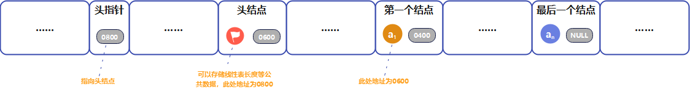

[TOC]

## 数据结构

### 基本概念和术语

#### 数据

`数据`：**是描述客观事物的符号，是计算机中可以操作的对象，是能被计算机识别，并输入给计算机处理的符号集合。**数据不仅仅包括整型、实型等数值类型，还包括字符及声音、图像、视频等非数值类型。

#### 数据元素

`数据元素`：**是组成数据的、有一定意义的基本单位，在计算机中通常作为整体处理，也被称为记录。**例如，在人类中，人就是数据元素。

#### 数据项

`数据项`：**一个数据元素可以由若干个数据项组成。**例如，人这样的数据元素，可以有眼睛、耳朵、鼻子等数据项，也可以有姓名、年龄、性别等数据项，具体是哪些数据项，需要由具体的系统来决定。

> **$\textcolor{RubineRed}{数据项是数据不可分割的最小单位。}$**

#### 数据对象

`数据对象`：**是性质相同的数据元素的集合，是数据的子集。**性质相同是指，数据元素具有相同数量和类型的数据项，例如，人都有姓名、年龄、性别等相同的数据项。

> *既然数据对象是数据的子集，在实际应用中，处理的数据元素通常具有相同性质，在不产生混淆的情况下，一般将数据对象简称为数据。*

数据对象与数据元素和数据项之间的关系：


#### 数据结构

`数据结构`：**是相互之间存在一种或多种特定关系的数据元素的集合。**

> *不同数据元素之间不是独立的，而是存在特定的关系，我们将这些关系称为结构。*

### 逻辑结构和物理结构

按照视点的不同，数据结构可以分为逻辑结构和物理结构。

> *逻辑结构是面向问题的，物理结构是面向计算机的。*

#### 逻辑结构

`逻辑结构`：**是指数据对象中数据元素之间的相互关系。**

##### 集合结构

`集合结构`：**集合结构中的数据元素除了同属于一个集合外，它们之间没有任何其他关系。**


##### 线性结构

`线性结构`：**线性结构中的数据元素之间是一对一的关系。**


##### 树形结构

`树形结构`：**树形结构中的数据元素存在一种一对多的层次关系。**


##### 图形结构

`图形结构`：**图形结构的数据元素是多对多的关系。**


#### 物理结构

`物理结构`：**是指数据的逻辑结构在计算机中的存储形式。**在某些时候，物理结构也被叫做存储结构。

数据的存储结构应正确反映数据元素之间的逻辑关系，这是最为关键的，如何存储数据元素之间的逻辑关系，是实现物理结构的重点和难点。

数据元素的存储结构形式有两种：顺序存储和链式存储。

##### 顺序存储结构

`顺序存储结构`：**是把数据元素存放在地址连续的存储单元里，其数据间的逻辑关系和物理关系是一致的。**


##### 链式存储结构

`链式存储结构`：**是把数据元素存放在任意的存储单元里，这组存储单元可以是连续的，也可以是不连续的。**数据元素的存储关系并不能反映其逻辑关系，因此需要用一个指针存放数据元素的地址，这样通过地址就能找到相关联数据元素的位置。


### 数据类型

`数据类型`：**是指一组性质相同的值的集合及定义在此集合上的一些操作的总称。**

> 数据类型是按照值得不同进行划的，在高级语言中，每个变量、常量和表达式都有各自的取值范围。类型就用来说明变量或表达式的取值范围和所能进行的操作。

#### 抽象数据类型

`抽象数据类型`：Abstract Data Type，ADT，一个数据模型及定义在该模型上的一些操作。抽象数据类型的定义仅取决于它的一组逻辑特性，而与其在计算机内部如何表示和实现无关。

> *抽象数据类型，不仅仅指那些已经定义并实现的数据类型，还可以是计算机编程者在设计软件程序时自己定义的数据类型。*

## 算法

### 数据结构和算法的关系

`程序 = 数据结构 + 算法`。

- 数据结构是一门研究组织数据方式的学科，有了编程语言也就有了数据结构。学好数据结构，可以编写出更加漂亮、更加有效率的代码。同时，要学习好数据结构，也需要多多考虑如何将生活中遇到的问题，用程序去实现解决。
- 算法的基础是数据结构，换言之，想要学好算法，需要把数据结构学到位。

### 算法的定义

`算法`：**算法是解决特定问题求解步骤的描述，在计算机中表现为指令的有限序列，并且每条指令表示一个或多个操作。**

- 指令能被人或机器等计算装置执行，它可以是计算机指令，也可以是我们平时用的语言文字。
- 为了解决某个或某类问题，需要把指令表示成一定的操作序列，操作序列包括一组操作，每一个操作都完成特定的功能，这就是算法。

### 算法的特性

算法具有五个基本特性：输入、输出、有穷性、确定性和可行性。

#### 输入输出

`输入`：**算法具有零个或多个输入。**

- 例如，打印 "hello world!" 这样的代码，不需要任何输入参数。

`输出`：**算法至少有一个或多个输出。**

- 算法一定需要输出，输出的形式可以是打印输出，也可以是返回一个或多个值等。

#### 有穷性

`有穷性`：指算法在执行有限的步骤后，自动结束而不会出现无限循环，并且每一个步骤在可接受的时间内完成。

> *此处的有穷，并不是纯数学意义的，而是在实际应用中合理的、可以接受的 "有边界"。*

#### 确定性

`确定性`：**算法的每一步骤都具有确定的含义，不会出现二义性。**

- 算法在一定条件下，只有一条执行路径，相同的输入只能有唯一的输出结果。
- 算法的每个步骤，都被精确定义而无歧义。

#### 可行性

`可行性`：**算法的每一步都必须是可行的，也就是说，每一步都能通过执行有限次数完成。**

### 算法设计的要求

#### 正确性

`正确性`：**算法的正确性是指算法至少应该具有输入、输出和加工处理无歧义性，能正确反映问题的需求，能够得到问题的正确答案。**

算法的 "正确" 通常在用法上有很大的区别，答题可以分为以下四个层次：

1. 算法程序没有语法错误。
2. 算法程序对于合法的输入数据能够产生满足要求的输出结果。
3. 算法程序对于非法的输入数据能够得到满足规格说明的结果。
4. 算法程序对于精心选择的，甚至刁难的测试数据都有满足要求的输出结果。

算法的正确性在大部分情况下都不可能用程序来证明，而是用数学方法证明的。证明一个复杂算法在所有层次上都是正确的，代码非常高昂，所以一般情况下，我们把层次 3 作为一个算法是否正确的标准。

#### 可读性

`可读性`：**算法设计的另一目的是为了便于阅读、理解和交流。**

#### 健壮性

`健壮性`：**当输入数据不合法时，算法也能做出相关处理，而不是产生异常或莫名其妙的结果。**

#### 时间效率高和存储量低

时间效率指的是算法的执行时间，对于同一个问题，如果有多个算法能够解决，执行时间短的算法效率高，执行时间长的效率低。存储量需求指的是算法在执行过程中需要的最大存储空间，主要指算法程序运行时所占用的内存或外部硬盘存储空间。

**设计算法应该尽量满足时间效率高和存储量低的要求。**

### 算法效率的度量方法

#### 事后统计方法

`事后统计方法`：这种方法主要是通过设计好的测试程序和数据，利用计算机计时器对不同算法编制的程序的运行时间进行比较，从而确定算法效率的高低。

> *实际应用时，事后统计方法缺陷较多，一般不会采纳使用。*

#### 事前分析估算方法

`事前分析估算方法`：在计算机程序编制前，依据统计方法对算法进行估算。

一个用高级程序语言编写的程序，在计算机上运行时所消耗的时间取决于下列因素：


其中，第 1 条时算法好坏的根本，第 2 条需要有软件支持，第 4 条依赖硬件性能。抛开与计算机硬件、软件有关的因素，**一个程序的运行时间，依赖于算法的好坏和问题的输入规模，而所谓的问题输入规模，是指输入量的多少。**

### 算法时间复杂度

#### 定义

**在进行算法分析时，语句总的执行次数 $T(n)$ 是关于问题规模 $n$ 的函数，进而分析 $T(n)$ 随 n 的变化情况而确定 $T(n)$ 的数量级。算法的时间复杂度，也就是算法的时间量度，记作 $T(n) = O(f(n))$。它表示随着问题规模 $n$ 的增大，算法执行时间的增长率和 $f(n)$ 的增长率相同，称作算法的渐近时间复杂度，简称为时间复杂度。其中，$f(n)$ 是问题规模 $n$ 的某个函数。**

这样用大写 $O()$ 来体现算法时间复杂度的记法，我们称之为`大O记法`。一般情况下，随着 $n$ 的增大，$T(n)$ 增长最慢的算法为最优算法。

#### 推导大 O 阶方法

`推导大 O 阶`：

1. 用常数 1 取代运行时间中的所有加法常数。
2. 在修改后的运行次数函数中，只保留最高阶项。
3. 如果最高阶项存在且其系数不是 1，则去除与这个项相乘的系数。

最终得到的结果，就是大 O 阶。

##### 常数阶

```java
public class Test {
    public static void main(String[] args) {
        int n = Integer.parseInt(args[0]);// 执行1次
        int sum;// 执行1次
        sum = (1 + n) * n / 2;// 执行1次
        System.out.println(sum);// 执行1次
    }
}
```

```java
public class Test {
    public static void main(String[] args) {
        int n = Integer.parseInt(args[0]);// 执行1次
        int sum;// 执行1次
        sum = (1 + n) * n / 2;// 执行第1次
        sum = (1 + n) * n / 2;// 执行第2次
        sum = (1 + n) * n / 2;// 执行第3次
        sum = (1 + n) * n / 2;// 执行第4次
        sum = (1 + n) * n / 2;// 执行第5次
        sum = (1 + n) * n / 2;// 执行第6次
        sum = (1 + n) * n / 2;// 执行第7次
        sum = (1 + n) * n / 2;// 执行第8次
        sum = (1 + n) * n / 2;// 执行第9次
        sum = (1 + n) * n / 2;// 执行第10次
        System.out.println(sum);// 执行1次
    }
}
```

无论 $n$ 为多少，上面的两段代码只是执行 3 次和执行 12 次的区别，这种与问题的大小（$n$ 的大小）无关，执行时间恒定的算法，我们称之为具有 $O(1)$ 的时间复杂度，又叫常数阶。

##### 线性阶

```java
public class Test {
    public static void main(String[] args) {
        int n = Integer.parseInt(args[0]);
        for (int i = 0; i < n; i++) {
            // 时间复杂度为O(1)的程序步骤序列
        }
    }
}
```

因为循环体中的代码需要执行 $n$ 次，它的时间复杂度为 $O(n)$。

##### 对数阶

```java
public class Test {
    public static void main(String[] args) {
        int n = Integer.parseInt(args[0]);
        int count = 1;
        while (count < n) {
            count = count * 2;
            // 时间复杂度为O(1)的程序步骤序列
        }
    }
}
```

上面的代码，是计算有多少个 2 相乘后大于 $n$，此时退出循环。即：$2^x = n$，得到 $x = log_2n$，因此，这个循环的时间复杂度为 $O(logn)$。

##### 平方阶

```java
public class Test {
    public static void main(String[] args) {
        int n = Integer.parseInt(args[0]);// 执行1次
        for (int i = 0; i < n; i++) {
            for (int j = 0; j < n; j++) {
                // 时间复杂度为O(1)的程序步骤序列
            }
        }
    }
}
```

内外层循环，都执行了 $n$ 次，时间复杂度为 $O(n^2)$。

#### 常见的时间复杂度

| 执行次数函数          | 阶          | 非正式术语  |
| --------------------- | ----------- | ----------- |
| 12                    | $O(1)$      | 常数阶      |
| $2n + 3$              | $O(n)$      | 线性阶      |
| $3n^2 + 2n + 1$       | $O(n^2)$    | 平方阶      |
| $5log_2n + 20$        | $O(log_n)$  | 对数阶      |
| $2n + 3nlog_2n + 19$  | $O(nlog_n)$ | $nlog_n$ 阶 |
| $6n^3 + 2n^2 + 3n +4$ | $O(n^3)$    | 立方阶      |
| $2^n$                 | $O(2^n)$    | 指数阶      |

常见的时间复杂度所耗费的时间从小到大依次是：

**$\textcolor{RubineRed}{O(1) < O(log_n) < O(n) < O(nlog_n) < O(n^2) < O(n^3) < O(2^n) < O(n!) < O(n^n)}$**

> *一般在没有特殊说明的情况下，时间复杂度指的是最坏时间复杂度。至于算法的空间复杂度，也不做过多说明。*

## 线性表

### 线性表的定义

`线性表 (List)`：**零个或多个数据元素的有限序列。**

- 首先，线性表是一个序列。即，元素之间是有顺序的，若元素存在多个，则第一个元素无前驱，最后一个元素无后继，其他每个元素都有且只有一个前驱和后继。
- 其次，线性表是有限的。

若将线性表记为 $(a_1, a_2, ……, a_{i-1}, a_i, a_{i+1}, ……, a_{n-1}, a_n)$，则 $a_{i-1}$ 是 $a_{i}$ 的`直接前驱元素`，$a_{i+1}$ 是 $a_{i}$ 的`直接后继元素`。当 $i = 1, 2, ……, n-1$ 时，$a_i$ 有且仅有一个直接后继，当 $i = 2, 3, ……, n$ 时，$a_i$ 有且仅有一个直接前驱，如下图所示：


 其中，线性表元素的个数 $n(n≥0)$ 定义为`线性表的长度`，当 $n = 0$ 时，称为`空表`。

在非空表中的每个数据元素都有一个确定的位置，如 $a_1$ 是第一个数据元素，$a_n$ 是最后一个数据元素，$a_i$ 是第 $i$ 个数据元素，称 $i$ 是数据元素 $a_i$ 在线性表中的`位序`。

### 线性表的抽象数据类型

在 Java 语言中，线性表的抽象数据类型，可以表示如下：

```java
package cn.xisun.datastructure.list;

/**
 * @author Xisun Wang
 * @since 2024/1/17 12:34
 */
public interface CustomizeList<E> {

    /**
     * 获取线性表大小
     *
     * @return 线性表大小
     */
    int size();

    /**
     * 返回线性表是否为空
     *
     * @return 线性表是否为空
     */
    boolean isEmpty();

    /**
     * 获取元素
     *
     * @param index 指定位置
     * @return 获取的位置元素
     */
    E get(int index);


    /**
     * 添加元素
     *
     * @param data 添加的元素
     */
    void add(E data);


    /**
     * 插入元素
     *
     * @param index 指定位置
     * @param data  插入的元素
     */
    void insert(int index, E data);

    /**
     * 替换元素
     *
     * @param index 指定位置
     * @param data  替换的元素
     */
    void reset(int index, E data);

    /**
     * 移除元素
     *
     * @param index 指定位置
     * @return 移除的元素
     */
    E remove(int index);
}
```

### 线性表的顺序存储结构

#### 顺序存储定义

`线性表的顺序存储结构`：**指的是用一段地址连续的存储单元依次存储线性表的数据元素。**


#### 顺序存储方式

线性表的每个数据元素的类型都相同，在 Java 语言中，**可以使用`一维数组`来实现顺序存储结构。**

在 Java 语言中，线性表的顺序存储的结构代码，可以表示为：

```java
public class CustomizeSequentialList<E> implements CustomizeList<E> {
    private E[] list;

    private int size;

    public CustomizeSequentialList(int capacity) {
        list = (E[]) new Object[capacity];
        size = 0;
    }
}
```

这里，可以发现，描述顺序存储结构所需要的三个属性：

- **存储空间的起始位置**：数组 list，它的存储位置就是存储空间的存储位置。
- **线性表的最大存储容量**：数组长度 capacity。
- **线性表的当前长度**：size。

#### 数组长度和线性表长度的区别

`数组长度`：是存放线性表的存储空间的长度，存储分配后这个量一般是不变的。

`线性表长度`：是线性表中数据元素的个数，随着线性表插入和删除操作的进行，这个量是变化的。

> *在一些高级语言中，一维数组可以实现动态分配，这与数组分配后存储空间的长度是确定的不冲突，而是高级语言采用的一些编程手段实现的，往往会带来性能上的损耗。*

#### 顺序存储结构的读取、插入与删除

**读取算法：**

1. 如果读取位置不合理，抛出异常。
2. 返回数组 $index$ 位置处的元素。

**插入算法：**

1. 如果插入位置不合理，抛出异常。
2. 如果线性表长度大于等于数组长度，则抛出异常或动态增加容量。
3. 从最后一个元素开始向前遍历到第 $index$ 个元素，分别将它们都向后移动一位。
4. 将要插入元素填入位置 $index$ 处。
5. 表的长度加 1。

**删除算法：**

1. 如果删除位置不合理，抛出异常。
2. 取出删除元素。
3. 从删除元素位置开始遍历到最后一个元素位置，分别将它们都向前移动一位。
4. 表的长度减 1。

**代码示例：**

```java
package cn.xisun.datastructure.list;

/**
 * @author Xisun Wang
 * @since 2024/1/17 12:17
 */
public class CustomizeSequentialList<E> implements CustomizeList<E> {

    private E[] list;

    private int size;

    public CustomizeSequentialList(int capacity) {
        list = (E[]) new Object[capacity];
        size = 0;
    }

    @Override
    public int size() {
        return size;
    }

    @Override
    public boolean isEmpty() {
        return size == 0;
    }

    @Override
    public E get(int index) {
        if (index < 0 || index >= size) {
            throw new IndexOutOfBoundsException("Index: " + index + ", Size: " + size);
        }

        return list[index];
    }

    @Override
    public void add(E data) {
        // 当数组满时，自动扩容为原来的两倍
        if (size == list.length) {
            resize(2 * list.length);
        }
        list[size++] = data;
    }

    @Override
    public void insert(int index, E data) {
        // 注意此处判断条件，index可以等于size，此时是在数组最后一个数据的后一位插入新数据，前面的数据元素不需要移动
        if (index < 0 || index > size) {
            throw new IndexOutOfBoundsException("Index: " + index + ", Size: " + size);
        }

        // 当数组满时，自动扩容为原来的两倍
        if (size == list.length) {
            resize(2 * list.length);
        }

        // 从index位置开始，所有数据元素后移一位
        for (int i = size; i > index; i--) {
            list[i] = list[i - 1];
        }
        list[index] = data;
        size++;
    }

    @Override
    public void reset(int index, E data) {
        if (index < 0 || index >= size) {
            throw new IndexOutOfBoundsException("Index: " + index + ", Size: " + size);
        }

        list[index] = data;
    }

    @Override
    public E remove(int index) {
        if (index < 0 || index >= size) {
            throw new IndexOutOfBoundsException("Index: " + index + ", Size: " + size);
        }

        // 从index位置开始，所有数据元素前移一位
        E removedElement = list[index];
        for (int i = index + 1; i < size; i++) {
            list[i - 1] = list[i];
        }
        size--;

        // 当元素数量少于数组长度的1/4时，自动缩小为原来的一半
        if (size > 0 && size == list.length / 4) {
            resize(list.length / 2);
        }

        return removedElement;
    }

    private void resize(int newCapacity) {
        E[] newList = (E[]) new Object[newCapacity];
        if (size >= 0) System.arraycopy(list, 0, newList, 0, size);
        list = newList;
    }
}
```

$\textcolor{RubineRed}{从算法和代码可以看出，线性表的顺序存储结构，在读取数据时，无论是哪个位置，时间复杂度都是\ O(1)，而插入或删除元素时，时间复杂度都是\ O(n)。}$

> *以上代码实现仅作为示例参考，未经过严谨的测试验证，更详细和完善的用法，参考`java.util.ArrayList`类。*

#### 顺序存储结构的优缺点

优点：

- 无须为表示表中元素之间的逻辑关系而增加额外的存储空间。
- **可以快速地存取表中任一位置的元素。**

缺点：

- **插入和删除操作需要移动大量元素。**
- 当线性表长度变化较大时，难以确定存储空间的容量。
- 会造成存储空间的 "碎片"。

### 线性表的链式存储结构

#### 链式存储定义

`线性表的链式存储结构`：**其特点是用一组任意的存储单元存储线性表的数据元素，这组存储单元可以是连续的，也可以是不连续的。**这也就意味着，这些数据元素可以存在内存未被占用的任意位置。


在线性表的顺序存储结构中，每个数据元素只需要存储数据元素信息就可以了，在链式结构中，除了要存储数据元素信息外，还需要存储它的后继元素的存储地址。

因此，为了表示每个数据元素 $a_i$ 与其直接后继数据元素 $a_{i+1}$ 之间的逻辑关系，对数据元素 $a_i$ 来说，除了存储其本身的信息之外，还需存储一个指示其直接后继的信息（即直接后继的存储位置）。我们把存储数据元素信息的域称为`数据域`，把存储直接后继位置的域称为`指针域`。这两部分信息组成数据元素 $a_i$ 的存储映像，称为`结点`（Node）。

**$n$ 个节点（$a_i$ 的存储映像）链组成一个链表，即为线性表（$a_1, a_2, …, a_n$）的链式存储结构，因为此链表的每个结点中只包含一个指针域，所以叫做`单链表`。**单链表正是通过每个结点的指针域将线性表的数据元素按其逻辑次序链接在一起。


对于线性表来说，总的有个头有个尾，链表也不例外。我们把链表中第一个结点的存储位置叫做`头指针`，那么整个链表的存取就必须是从头指针开始进行，之后的每一个结点，其实就是上一个的后继指针指向的位置。对于最后一个结点，规定它的指针为 "空"（通常用 NULL 或 ^ 符号表示）。


有时，为了更加方便地对链表进行操作，会在单链表的第一个结点前附设一个结点，称为`头结点`。头节点的数据域可以不存储任何信息，也可以存储诸如线性表的长度等附加信息，头节点的指针域指向第一个结点的指针。如下图所示：



#### 头指针和头节点的异同

头指针：

- 头指针是指链表指向第一个结点的指针，若链表有头结点，则是指向头结点的指针。
- 头指针具有标志作用，所以常用头指针冠以链表的名字。
- **无论链表是否为空，头指针均不为空。头指针是链表的必要元素。**

头节点：

- 头结点是为了操作的统一和方便而设立的，放在第一元素的结点之前，其数据域一般无意义（也可存放链表的长度等附加信息）。
- 有了头结点，对在第一元素结点前插入结点和删除第一结点，其操作与其他结点的操作就统一了。
- **头结点不一定是链表必要元素。**

#### 链式存储代码描述

如线性表为空表，则头结点的指针域为 "空"。如下图所示：


为了去除示意图中的 "……"，我们改用更方便的存储示意图来表示单链表，如下图所示：


若带有头结点的单链表，则如下图所示：


空链表如下图所示：


在 Java 语言中，可以通过如下方式定义结点：

```java
private static class Node<E> {
    E data;// 数据域

    Node<E> next;// 后继结点的指针域

    Node(E data, Node<E> next) {
        this.data = data;
        this.next = next;
    }
}
```

从这个结构定义中，可以直到，结点由存放数据元素的数据域和存放后继结点的指针域组成。假设 $p$ 是指向线性表第 $i$ 个元素的指针，则该结点 $a_i$ 的数据域我们可以用 $p\dashrightarrow data$ 来表示，$p\dashrightarrow data$ 的值是一个属于元素，结点 $a_i$ 的指针域可以用 $p\dashrightarrow next$ 来表示，$p\dashrightarrow next$ 的值是一个指针。那么，$p\dashrightarrow next$ 指向谁呢？当然是指向第 $i+1$ 个元素，即指向 $a_{i+1}$ 的指针。也就是说，如果 $p\dashrightarrow data$ 等于 $a_i$，那么 $p\dashrightarrow next\dashrightarrow data$ 等于 $a_{i+1}$。如下图所示：


#### 单链表

##### 读取、插入和删除

**读取算法：**

1. 声明一个指针 $p$ 指向链表头结点，初始化 $j$ 从 1 开始。
2. 当 $j < i$ 时，就遍历链表，让 $p$ 的指针向后移动，不断指向下一个结点，$j$ 累加 1。
3. 若到链表末尾 $p$ 为空，则说明第 $i$ 个结点不存在。
4. 否则查找成功，返回结点 $p$ 的数据。

**插入算法：**


1. 声明一个指针 $p$ 指向链表头结点，初始化 $j$ 从 1 开始。
2. 当 $j < i$ 时，就遍历链表，让 $p$ 的指针向后移动，不断指向下一个结点，$j$ 累加 1。
3. 若到链表末尾 $p$ 为空，则说明第 $i$ 个结点不存在。
4. 否则查找成功，在系统中生成一个空结点 $s$。
5. 将数据元素 $e$ 赋值给 $s\dashrightarrow data$。
6. 单链表的插入标准语句 $s\dashrightarrow next=p\dashrightarrow next;\  p\dashrightarrow next=s;$。
7. 返回成功。

**删除算法：**


1. 声明一个指针 $p$ 指向链表头结点，初始化 $j$ 从 1 开始。
2. 当 $j < i$ 时，就遍历链表，让 $p$ 的指针向后移动，不断指向下一个结点，$j$ 累加 1。
3. 若到链表末尾 $p$ 为空，则说明第 $i$ 个结点不存在。
4. 否则查找成功，将欲删除的结点 $p\dashrightarrow next$ 赋值给 $q$。
5. 单链表的删除标准语句 $p\dashrightarrow next=q\dashrightarrow next;$。
6. 将 $q$ 结点中的数据赋值给 $e$，作为返回。
7. 释放 $q$ 结点。
8. 返回成功。

##### 整表创建和删除

**整表创建算法：**


1. 声明一指针 $p$ 和计数器变量 $i$。
2. 初始化一空链表 $L$。
3. 让 $L$ 的头结点的指针指向 $NULL$，即建立一个带头结点的单链表。
4. 循环：
   - 生成一新结点赋值给 $p$。
   - 随机生成一数字赋值给 $p$ 的数据域 $p\dashrightarrow data;$。
   - 将 $p$ 插入到头结点与前一新结点之间。

**整表删除算法：**

1. 声明一指针 $p$ 和 $q$。
2. 将第一个结点赋值给 $p$。
3. 循环：
   - 将下一个结点赋值给 $q$。
   - 释放 $p$。
   - 将 $q$ 赋值给 $p$。

##### 代码实现

```java
package cn.xisun.datastructure.list;

/**
 * @author Xisun Wang
 * @since 2024/1/17 12:18
 */
public class CustomizeLinkedList<E> implements CustomizeList<E> {

    private Node<E> head;

    private int size;

    private static class Node<E> {
        E data;// 数据域

        Node<E> next;// 后继结点的指针域

        Node(E data, Node<E> next) {
            this.data = data;
            this.next = next;
        }
    }

    public CustomizeLinkedList() {
        head = null;
        size = 0;
    }

    @Override
    public int size() {
        return size;
    }

    @Override
    public boolean isEmpty() {
        return size == 0;
    }

    @Override
    public E get(int index) {
        if (index < 0 || index >= size) {
            throw new IndexOutOfBoundsException("Index: " + index + ", Size: " + size);
        }

        Node<E> node = head;
        for (int i = 0; i < index; i++) {
            node = node.next;
        }
        return node.data;
    }

    @Override
    public void add(E data) {
        if (head == null) {
            head = new Node<>(data, null);
        } else {
            Node<E> node = head;
            while (node.next != null) {
                node = node.next;
            }
            node.next = new Node<>(data, null);
        }
        size++;
    }

    @Override
    public void insert(int index, E data) {
        if (index < 0 || index > size) {
            throw new IndexOutOfBoundsException("Index: " + index + ", Size: " + size);
        }

        if (index == 0) {
            head = new Node<>(data, head);
        } else {
            Node<E> prev = head;
            for (int i = 0; i < index - 1; i++) {
                prev = prev.next;
            }
            prev.next = new Node<>(data, prev.next);
        }
        size++;
    }

    @Override
    public void reset(int index, E data) {
        if (index < 0 || index >= size) {
            throw new IndexOutOfBoundsException("Index: " + index + ", Size: " + size);
        }

        Node<E> cur = head;
        for (int i = 0; i < index; i++) {
            cur = cur.next;
        }
        cur.data = data;
    }

    @Override
    public E remove(int index) {
        if (index < 0 || index >= size) {
            throw new IndexOutOfBoundsException("Index: " + index + ", Size: " + size);
        }

        Node<E> prev = null;
        Node<E> cur = head;
        if (index == 0) {
            head = cur.next;
            size--;
            return cur.data;
        }
        for (int i = 0; i < index; i++) {
            prev = cur;
            cur = cur.next;
        }
        prev.next = cur.next;
        size--;
        return cur.data;
    }

    /**
     * 头插法创建链表：新结点始终在第一的位置
     *
     * @param arr 链表初始化时的数据元素
     */
    public void createListByHeadInsertionMethod(E[] arr) {
        // 创建头结点
        head = new Node<>(null, null);

        // 对于每个要插入的元素
        for (int i = 0; i < arr.length; i++) {
            // 创建新结点
            Node<E> newNode = new Node<>(arr[i], null);
            // 将新节点插入到头结点之后
            newNode.next = head.next;
            head.next = newNode;
            size++;
        }
    }

    /**
     * 尾插法创建链表：新结点始终在最后的位置
     *
     * @param arr 链表初始化时的数据元素
     */
    public void createListByTailInsertionMethod(E[] arr) {
        // 创建头结点
        head = new Node<>(null, null);
        // 指定当前结点
        Node<E> cur = head;

        // 对于每个要插入的元素
        for (int i = 0; i < arr.length; i++) {
            // 创建新节点
            Node<E> newNode = new Node<>(arr[i], null);
            // 将新结点插入到当前结点之后
            // 移动当前结点为新结点
            cur.next = newNode;
            cur = newNode;
            size++;
        }
    }

    /**
     * 删除整个链表
     */
    public void delete() {
        Node<E> cur = head;
        while (cur != null) {
            cur.next = null;
            cur = cur.next;
            size--;
        }
    }

    /**
     * 打印整个链表
     */
    public void printList() {
        if (head != null) {
            System.out.print(head.data + " ");
        }
        Node<E> cur = head.next;
        while (cur != null) {
            System.out.print(cur.data + " ");
            cur = cur.next;
        }
        System.out.println();
    }

    public static void main(String[] args) {
        /*Integer[] arr = {1, 2, 3, 4, 5};
        CustomizeLinkedList<Integer> integerListNode = new CustomizeLinkedList<>();
        integerListNode.createListByHeadInsertionMethod(arr);
        integerListNode.printList();// 输出: 5 4 3 2 1

        Integer[] arr2 = {6, 7, 8, 9, 10};
        CustomizeLinkedList<Integer> integerListNode3 = new CustomizeLinkedList<>();
        integerListNode3.createListByTailInsertionMethod(arr2);
        integerListNode3.printList();// 输出: 6 7 8 9 10

        String[] arr3 = {"a", "b", "c", "d", "e"};
        CustomizeLinkedList<String> stringListNode = new CustomizeLinkedList<>();
        stringListNode.createListByHeadInsertionMethod(arr3);
        stringListNode.printList();// 输出: e d c b a

        String[] arr4 = {"f", "g", "h", "i", "j"};
        CustomizeLinkedList<String> stringListNode2 = new CustomizeLinkedList<>();
        stringListNode2.createListByTailInsertionMethod(arr4);
        stringListNode2.printList();// 输出: f g h i j

        System.out.println(stringListNode2.size);
        stringListNode2.delete();
        System.out.println(stringListNode2.size);*/

        CustomizeLinkedList<String> stringListNode = new CustomizeLinkedList<>();
        stringListNode.insert(0, "a");
        stringListNode.insert(1, "b");
        stringListNode.insert(2, "c");
        stringListNode.printList();// 输出: a b c
    }
}
```

从算法和代码可以看出，线性表的链式存储结构，在读取、插入和删除数据时，时间复杂度都是 $O(n)$。如果我们不知道第 $i$ 个结点的指针位置，单链表数据结构在插入和删除操作上，与线性表的顺序存储结构是没有太大优势的。但如果我们希望从第 $i$ 个位置，插入 10 个结点，对于顺序存储结构意味着，每一次插入都需要移动 $n-i$ 个结点，每次都是 $O_(n)$。而单链表，我们只需要在第一次时，找到第 $i$ 个位置的指针，此时为 $O(n)$，接下来只是简答的通过赋值移动指针而已，时间复杂度都是 $O(1)$。

$\textcolor{RubineRed}{显然，对于插入或删除数据越频繁的操作，单链表的效率优势就越明显。}$

> *以上代码实现仅作为示例参考，未经过严谨的测试验证，更详细和完善的用法，参考`java.util.LinkedList`类。*

##### 单链表结构 VS 顺序存储结构

**存储分配方式：**

- 顺序存储结构用一段连续存储单元依次存储线性表的数据元素。
- 单链表采用链式存储结构，用一组任意的存储单元存放线性表的数据元素。

**时间性能：**

- 查找：
  - 顺序存储结构时间复杂度为 $O(1)$。
  - 单链表时间复杂度为 $O(n)$。
- 插入和删除：
  - 顺序存储结构需要平均移动表长一半的数据元素，时间复杂度为 $O(n)$。
  - 单链表在找出位置的指针后，插入和删除的时间复杂度为 $O(1)$。

**空间性能：**

- 顺序存储结构需要预分配存储空间，分大了，浪费，分小了，易发生上溢。
- 单链表不需要分配存储空间，只要有就可以分配，数据元素个数不受限制。

通过上面的对比，可以得出一些经验性的结论：

- **若线性表需要频繁的查找，很少进行插入和删除操作时，宜采用顺序存储结构。若需要频繁插入和删除时，宜采用单链表结构。**
- **当线性表中的数据元素个数变化较大或者根本不知道有多大时，最好使用单链表结构，这样不用考虑存储空间大小的问题。**

#### 静态链表

对于一些没有指针的语言，可以使用数组来实现链表，叫做`静态链表`，也叫游标实现法：数组中的元素都由两个数据域组成，data 和 cur，数据域 data 用来存放数据元素，指针域 cur，则相当于单链表中的 next 指针，存放当前元素的后继在数组中的下标，cur 也被称作游标。

```java
package cn.xisun.datastructure.list;

/**
 * @author Xisun Wang
 * @since 2024/1/17 17:27
 */
public class CustomizeStaticLinkedList<E> {
    private Node<E>[] nodes;

    private int maxSize;

    private int size;

    private Node<E> head;

    private Node<E> tail;

    private static class Node<E> {
        E data;
        int cur;

        Node(E data, int cur) {
            this.data = data;
            this.cur = cur;
        }
    }

    public CustomizeStaticLinkedList(int capacity) {
        this.nodes = (Node<E>[]) new Node<?>[capacity];
        // 初始化一个空的静态链表，使得链表的所有元素都连接在一起，但是还没有存储任何实际的数据
        for (int i = 0; i < capacity; i++) {
            // 使用(i + 1) % capacity，来获取当前结点的下一个元素在数组中的位置，并确保cur值在数组的范围内
            nodes[i] = new Node<>(null, (i + 1) % capacity);
            System.out.println(nodes[i].cur);
        }
        System.out.println();
        this.head = nodes[0];
        this.head.cur = 1;// head的cur初始值设为1
        this.tail = nodes[capacity - 1];
        this.tail.cur = 0;// tail的cur初始值设为0
        this.maxSize = capacity - 2;
        this.size = 0;
    }

    public int size() {
        return size;
    }

    /**
     * 获取元素
     * 注意：此处的index不是数据元素在数组中的位置，链表中的数据元素顺序是逻辑顺序，不一定和其存储的数组中数据元素的物理位置一致
     *
     * @param index 数据元素在链表中的位置
     * @return 获取的数据元素
     */
    public E get(int index) {
        if (index < 0 || index >= maxSize) {
            throw new IndexOutOfBoundsException("Index: " + index + ", Size: " + size);
        }
        // 头结点
        int curr = tail.cur;
        // 从头结点依次找到index位置的前一个结点
        for (int i = 0; i < index; i++) {
            curr = nodes[curr].cur;
        }
        return nodes[curr].data;
    }

    /**
     * 添加元素
     *
     * @param data 添加的数据元素
     */
    public void add(E data) {
        if (size == maxSize) {
            throw new RuntimeException("List is full");
        }

        // 添加时默认从第一个位置开始
        if (tail.cur == 0) {
            tail.cur = 1;
        }

        int next = head.cur;
        nodes[next].data = data;
        head.cur = nodes[next].cur;
        size++;
    }

    /**
     * 插入元素
     * 注意：此处的index不是数据元素在数组中的位置，链表中的数据元素顺序是逻辑顺序，不一定和其存储的数组中数据元素的物理位置一致
     *
     * @param index 数据元素在链表中的位置，
     * @param data  插入的数据元素
     */
    public void insert(int index, E data) {
        if (index < 0 || index > size) {
            throw new IndexOutOfBoundsException("Index: " + index + ", Size: " + size);
        }

        if (size == maxSize) {
            throw new RuntimeException("List is full");
        }

        if (index == 0) {
            nodes[1].data = data;
            tail.cur = 1;
            head.cur = nodes[1].cur;
        } else {
            // 头结点
            Node<E> curr = nodes[tail.cur];
            // 从头结点依次找到index位置的前一个结点
            for (int i = 0; i < index; i++) {
                curr = nodes[curr.cur];
            }
            nodes[head.cur].cur = curr.cur;
            curr.cur = head.cur;

            nodes[head.cur].data = data;
            head.cur = nodes[head.cur].cur;
        }

        size++;
    }


    public void printList() {
        Node<E> currentNode = nodes[tail.cur];
        for (int i = 0; i < size; i++) {
            System.out.println("位置: " + i + ", 数据: " + currentNode.data);
            currentNode = nodes[currentNode.cur];
        }
    }

    public static void main(String[] args) {
        CustomizeStaticLinkedList<Integer> list = new CustomizeStaticLinkedList<>(5);
        list.insert(0, 2);
        list.insert(1, 3);
        list.printList();
        System.out.println(list.size);
        System.out.println(list.head.cur);
        System.out.println(list.tail.cur);
    }
}
```

> *对于静态链表的实现，主要关注其设计思想。*

#### 循环链表

```java
package cn.xisun.datastructure.list;

/**
 * @author Xisun Wang
 * @since 2024/1/24 12:14
 */
public class CircularLinkedList<E> {
    Node<E> head = null;

    Node<E> tail = null;

    private static class Node<E> {
        E data;
        Node<E> next;

        Node(E data) {
            this.data = data;
            this.next = null;
        }
    }

    /**
     * 添加节点到循环链表
     *
     * @param data 添加的数据元素
     */
    public void addNode(E data) {
        Node<E> newNode = new Node<>(data);

        if (head == null) {
            head = newNode;
        } else {
            tail.next = newNode;
        }

        tail = newNode;
        tail.next = head;
    }

    /**
     * 显示循环链表中的节点
     */
    public void display() {
        Node<E> current = head;
        if (head == null) {
            System.out.println("List is empty");
        } else {
            do {
                System.out.print(" " + current.data);
                current = current.next;
            } while (current != head);
            System.out.println();
        }
    }

    public static void main(String[] args) {
        CircularLinkedList<Integer> circularLinkedList = new CircularLinkedList<>();

        // 添加节点
        circularLinkedList.addNode(1);
        circularLinkedList.addNode(2);
        circularLinkedList.addNode(3);
        circularLinkedList.addNode(4);

        // 显示节点
        circularLinkedList.display();// 输出:  1 2 3 4
    }
}
```

#### 双向链表


线性结构和非线性结构

数据结构包括：`线性结构`和`非线性结构`。

- **线性结构**
  - 线性结构作为最常用的数据结构，其特点是**数据与元素之间存在一对一的线性关系**。
  - 线性结构有两种不同的存储结构，即`顺序存储结构`和`链式存储结构`。
    - 顺序存储的线性表称为`顺序表`，顺序表中的存储元素是连续的。
    - 链式存储的线性表称为`链表`，链表中的存储元素不一定是连续的，元素节点中存放数据元素以及相邻元素的地址信息。
  - 线性结构常见的有：**数组、队列、链表和栈。**
- **非线性结构**
  - 非线性结构包括：**二维数组，多维数组，广义表，树结构，图结构。**

数据结构

稀疏数组

基本介绍

当一个数组中大部分元素为 ０，或者为同一个值的数组时，可以使用`稀疏数组`来保存该数组。

稀疏数组的处理方法是：

1. **记录数组一共有几行几列，有多少个不同的值。**
2. **把具有不同值的元素的行、列及值，记录在一个小规模的数组中，从而缩小程序的规模。**

假设原始数据为：


转换成稀疏数组：


案例说明

编写五子棋程序时，要求有存盘退出和续上盘的功能。但是该二维数组的很多值都是默认值，因此记录了很多没有意义的数据。


代码实现：

```java
package cn.xisun.datastructure.array;

/**
 * @author XiSun
 * @since 2024/1/10 23:06
 * <p>
 * 稀疏数组
 */
public class SparseArray {
    public static void main(String[] args) {
        // 原始棋盘

        // 1.创建一个原始的二维数组11 * 11，模拟棋盘
        int[][] chessArray = new int[11][11];

        // 2.棋盘已有的棋子，0: 表示没有棋子，1：表示黑子，2：表示蓝子
        chessArray[1][2] = 1;
        chessArray[2][3] = 2;
        chessArray[4][5] = 2;

        // 3.输出原始的二维数组
        System.out.println("原始的二维数组：");
        for (int[] row : chessArray) {
            for (int data : row) {
                System.out.print(data + "\t");
            }
            System.out.println();
        }

        // 将二维数组转换成稀疏数组

        // 1.先遍历二维数组，得到非0数据的个数
        int sum = 0;
        for (int i = 0; i < 11; i++) {
            for (int j = 0; j < 11; j++) {
                if (chessArray[i][j] != 0) {
                    sum++;
                }
            }
        }

        // 2.创建对应的稀疏数组
        int[][] sparseArray = new int[sum + 1][3];

        // 3.给稀疏数组赋值
        sparseArray[0][0] = 11;// 行数
        sparseArray[0][1] = 11;// 列数
        sparseArray[0][2] = sum;// 非0数据的个数

        // 遍历二维数组，将非0的值存放到sparseArray中
        int count = 0; //count 用于记录是第几个非0数据
        for (int i = 0; i < 11; i++) {
            for (int j = 0; j < 11; j++) {
                if (chessArray[i][j] != 0) {
                    count++;
                    sparseArray[count][0] = i;
                    sparseArray[count][1] = j;
                    sparseArray[count][2] = chessArray[i][j];
                }
            }
        }

        // 4.输出稀疏数组
        System.out.println();
        System.out.println("得到稀疏数组为：");
        for (int[] ints : sparseArray) {
            System.out.print(ints[0] + "\t" + ints[1] + "\t" + ints[2] + "\n");
        }
        System.out.println();

        // 将稀疏数组恢复成原始的二维数组

        // 1.先读取稀疏数组的第一行，根据第一行的数据，创建原始的二维数组
        int[][] chessArray2 = new int[sparseArray[0][0]][sparseArray[0][1]];

        // 2.再读取稀疏数组后几行的数据(从第二行开始)，并赋给原始的二维数组
        for (int i = 1; i < sparseArray.length; i++) {
            chessArray2[sparseArray[i][0]][sparseArray[i][1]] = sparseArray[i][2];
        }

        // 3.输出恢复后的二维数组
        System.out.println("恢复后的二维数组：");
        for (int[] row : chessArray2) {
            for (int data : row) {
                System.out.print(data + "\t");
            }
            System.out.println();
        }
    }
}
```

输出结果：

```java
原始的二维数组：
0	0	0	0	0	0	0	0	0	0	0	
0	0	1	0	0	0	0	0	0	0	0	
0	0	0	2	0	0	0	0	0	0	0	
0	0	0	0	0	0	0	0	0	0	0	
0	0	0	0	0	2	0	0	0	0	0	
0	0	0	0	0	0	0	0	0	0	0	
0	0	0	0	0	0	0	0	0	0	0	
0	0	0	0	0	0	0	0	0	0	0	
0	0	0	0	0	0	0	0	0	0	0	
0	0	0	0	0	0	0	0	0	0	0	
0	0	0	0	0	0	0	0	0	0	0	

得到稀疏数组为：
11	11	3
1	2	1
2	3	2
4	5	2

恢复后的二维数组：
0	0	0	0	0	0	0	0	0	0	0	
0	0	1	0	0	0	0	0	0	0	0	
0	0	0	2	0	0	0	0	0	0	0	
0	0	0	0	0	0	0	0	0	0	0	
0	0	0	0	0	2	0	0	0	0	0	
0	0	0	0	0	0	0	0	0	0	0	
0	0	0	0	0	0	0	0	0	0	0	
0	0	0	0	0	0	0	0	0	0	0	
0	0	0	0	0	0	0	0	0	0	0	
0	0	0	0	0	0	0	0	0	0	0	
0	0	0	0	0	0	0	0	0	0	0
```


