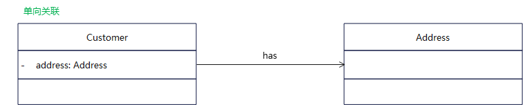

*`Author: ACatSmiling`*

*`Since: 2021-03-01`*

## 概述

`设计模式`：design pattern，是一套被反复使用的、多数人知晓的、经过分类编目的代码设计经验的总结，使用设计模式是为了可以重用代码，让代码更容易被他人理解并且提高代码的可靠性。

### 类之间的关系

#### 关联关系

关联关系通常分为：

- **`双向关联`**：

  

- **`单向关联`**：

  

- **`自关联`**：

  

- **`多重性关联`**：

  

  - `1..1`：表示另一个类的一个对象，只与该类的一个对象有关系。
  - `0..*`：表示另一个类的一个对象，与该类的零个或多个对象有关系。
  - `1..*`：表示另一个类的一个对象，与该类的一个或多个对象有关系。
  - `0..1`：表示另一个类的一个对象，没有或只与该类的一个对象有关系。
  - `m..n`：表示另一个类的一个对象，与该类的最少 m、最多 n 个对象有关系（m ≤ n）。

- **`聚合关系`**：

  

- **`组合关系`**：

  

#### 依赖关系

**`依赖关系`**是一种使用关系，特定事物的改变有可能会影响到使用该事物的其他事物，在需要表达一个事物使用另一个事物时使用依赖关系。大多数情况下，依赖关系体现在某个类的方法使用另一个类的对象作为参数。

在系统实施阶段，依赖关系通常通过 3 种方式实现：

1. 将一个类的对象作为另一个类中方法的参数。
2. 在一个类的方法中将另一个类的对象作为其局部变量。
3. 在一个类的方法中调用另一个类的静态方法。

#### 泛化关系

**`泛化关系`**也就是继承关系，描述父类和子类之间的关系，父类又称作基类或超类，子类又称作派生类。

#### 接口与实现关系

在**`接口`**中，通常没有属性，而且所有的操作都是抽象的，只有操作的声明，没有操作的实现。

接口和类之间存在着一种**`实现关系`**，在这种关系中，类实现了接口，类中的操作实现了接口中所声明的操作。

### 面向对象设计原则

#### 单一职责原则（Single Responsibility Principle）

定义：**`一个类只负责一个功能领域中的相应职责。或者可以定义为：就一个类而言，应该只有一个引起它变化的原因。`**

#### 开闭原则（Open-Closed Principle）

定义：**`一个软件实体应当对扩展开放，对修改关闭。即软件实体应尽量在不修改原有代码的情况下进行扩展。`**

#### 里氏替换原则（Liskov Substitution Principle）

定义：**`所有引用基类（父类）的地方，必须能透明的使用其子类的对象。`**

#### 依赖倒转原则（Dependence Inversion Principle）

定义：**`抽象不应该依赖于细节，细节应该依赖于抽象。换言之，要针对接口编程，而不是针对实现编程。`**

#### 接口隔离原则（Interface Segregation Principle）

定义：**`使用多个专门的接口，而不使用单一的总接口，即客户端不应该依赖那些它不需要的接口。`**

#### 合成复用原则（Composite Reuse Principle）

定义：**`尽量使用对象组合，而不是继承来达到复用的目的。`**

#### 迪米特法则（Law of Demeter）

定义：**`一个软件实体应当尽可能少的与其他实体发生相互作用。`**

## 创建的艺术 —— 创建型模式

### 单例模式 —— 确保对象的唯一性

> **定义：Singleton Pattern，确保某一个类只有一个实例，而且自行实例化并向整个系统提供这个实例，这个类称为单例类，它提供全局访问的方法。单例模式是一种`对象创建型模式`。**

特性：

- 为了防止在外部对单例类实例化，它的`构造函数可见性为 private`。
- 在单例类内部定义了一个 Singleton 类型的静态对象，作为供外部共享访问的唯一实例。
- 在单例类的内部实现`只生成一个实例`，同时它`提供一个静态的 getInstance() 方法`，让客户可以访问它的唯一实例。

#### 饿汉式

结构图：


代码示例：

```java
/**
 * 饿汉式
 *
 * @author XiSun
 * @since 2023/11/17 20:34
 */
public class EagerSingleton {

    private static final EagerSingleton INSTANCE = new EagerSingleton();

    private EagerSingleton() {
    }

    public static EagerSingleton getInstance() {
        return INSTANCE;
    }
}
```

- **当类被加载时，静态变量 INSTANCE 会被初始化。**此时类的私有构造函数会被调用，单例类的唯一实例将被创建。
- 饿汉式天生就是**线程安全**的，缺点是无论系统是否需要使用该单例对象，在类加载时都会被创建。

#### 懒汉式

结构图：


代码示例：

```java
/**
 * 懒汉式
 *
 * @author XiSun
 * @since 2023/11/20 10:25
 */
public class LazySingleton {

    private static volatile LazySingleton instance = null;

    private LazySingleton() {

    }

    public static LazySingleton getInstance() {
        // 第一重判断
        if (instance == null) {
            synchronized (LazySingleton.class) {
                // 第二重判断
                if (instance == null) {
                    instance = new LazySingleton();
                }
            }
        }
        return instance;
    }
}
```

- `延迟加载技术`：Lazy Lode，懒汉式单例在类加载时不自行实例化，而是在第一次调用 getInstance() 方法时实例化。
- `双重检查锁定`：Double-Check Locking，创建懒汉式单例类之前，对懒汉式单例类进行双重判断。
- `volatile 关键字`：确保多个线程之间能正常处理 instance 变量，但会降低系统的运行效率。
- `synchronized 关键字`：懒汉式单例类是线程不安全的，使用时需要考虑多线程问题。

#### IoDH

代码示例：

```java
/**
 * IoDH： Initialization on Demand Holder
 *
 * @author XiSun
 * @since 2023/11/20 10:39
 */
public class IoDHSingleton {
    private IoDHSingleton() {

    }

    private static class HolderClass {
        private static final IoDHSingleton INSTANCE = new IoDHSingleton();
    }

    public static IoDHSingleton getInstance() {
        return HolderClass.INSTANCE;
    }
}
```

- IoDH 兼顾了饿汉式和懒汉式的优点，既可以实现延迟加载，也可以保证线程安全，不影响系统性能。
- 缺点是与编程语言本身的特性相关，很多面向对象语言不支持 IoDH。

#### 枚举

代码示例：

```java
/**
 * 枚举
 *
 * @author XiSun
 * @since 2023/11/20 16:04
 */
public enum EnumSingleton {
    INSTANCE;
}
```

- 借助 JDK 1.5 中添加的枚举来实现单例模式。不仅能避免多线程同步问题，还能防止反序列化重新创建新的对象。

### 简单工厂模式 —— 集中式工厂的实现

> **定义：Simple Factory Pattern，定义一个工程类，它可以根据参数的不同返回不同的类的实例，被创建的实例通常都具有共同的父类。因为在简单工厂模式中用于创建实例的方法是静态方法，因此简单工厂模式又被称为静态工厂方法模式（Static Factory Method Pattern），它属于`类创建型模式`。**
>
> 所有的工厂类都强调一点：`两个类 A 和 B 之间的关系，应该仅仅是 A 创建 B，或者 A 使用 B，而不能两种关系都有。`将对象的创建和使用分离，会使得系统更加符合单一职责原则，有利于对功能的复用和系统的维护。

结构图：


- `Factory`：工厂角色，即工厂类，它是简单工厂模式的核心，负责实现创建所有产品实例的内部逻辑。
  - 工厂类可以被外界直接调用，创建所需的产品对象。
  - 在工厂类中提供了静态的工厂方法 factoryMethod()，它的返回类型为抽象产品类型 Product。
- `Product`：抽象产品角色，它是工厂类所创建的所有对象的父类，封装了各种产品对象的公有方法。
  - 抽象产品的引入将提高系统的灵活性，使得在工厂类中只需要定义一个通用的工厂方法，因为所有创建的具体产品对象都是其子类对象。
- `ConcreteProduct`：具体产品角色，它是简单工厂模式的创建目标，所有被创建的对象都充当这个角色的某个具体类的实例。
  - 每个具体产品角色都继承了抽象产品角色，需要实现在抽象产品中声明的抽象方法。

代码示例：

- 典型的抽象产品类：

  ```java
  /**
   * 抽象产品类
   *
   * @author XiSun
   * @since 2023/11/20 19:48
   */
  public abstract class Product {
      /**
       * 声明所有产品类的公共业务方法
       */
      public void methodSame() {
          // 公共方法的实现
      }
  
      /**
       * 声明抽象业务方法
       */
      public abstract void methodDiff();
  }
  ```

- 典型的具体产品类：

  ```java
  /**
   * 具体产品类A
   *
   * @author XiSun
   * @since 2023/11/20 19:49
   */
  public class ConcreteProductA extends Product {
      /**
       * 实现业务方法
       */
      @Override
      public void methodDiff() {
          // 业务方法的实现
      }
  }
  ```

- 典型的工厂类：

  ```java
  /**
   * 工厂类
   *
   * @author XiSun
   * @since 2023/11/20 19:50
   */
  public class Factory {
      public static Product getProduct(String arg) {
          Product product = null;
          // 实际开发时，可以将参数作为配置文件读取，避免修改代码
          if ("A".equalsIgnoreCase(arg)) {
              product = new ConcreteProductA();
              // 初始化设置product
          }
          return product;
      }
  }
  ```

- 客户端代码：

  ```java
  /**
   * 客户端
   *
   * @author XiSun
   * @since 2023/11/20 23:01
   */
  public class Client {
      public static void main(String[] args) {
          Product product;
          product = Factory.getProduct("A");// 通过工厂类创建产品对象
          product.methodSame();
          product.methodDiff();
      }
  }
  ```

简化：


- 简化版的简单工厂模式，将抽象产品类和工厂类合并，将静态工厂方法移至抽象产品类中。


> 在Java 语言中，通常有以下几种方式创建对象：
>
> 1. `使用 new 关键字`直接创建对象。
> 2. `通过反射机制`创建对象。
> 3. `通过 clone() 方法`创建对象。
> 4. `通过工厂类`创建对象。

### 工厂方法模式 —— 多态工厂的实现

> **定义：Factory Method Pattern，定义一个用于创建对象的接口，让子类决定将哪一个类实例化。工厂方法模式让一个类的实例化延迟到其子类。工厂方法模式又称为工厂模式（Factory Pattern），又可成为虚拟构造器模式（Virtual Constructor Pattern）或多态工厂模式（Polymorphic Factory Pattern）。工厂方法模式是一种`类创建型模式`。**

结构图：


- `Product`：抽象产品，它是定义产品的接口，是工厂方法模式所创建对象的超类型，也就是产品对象的公共父类。
- `ConcreteProduct`：具体产品，它实现了抽象产品接口，某种类型的具体产品由专门的具体工厂创建，具体工厂和具体产品之间一一对应。
- `Factory`：抽象工厂，在抽象工厂类中，声明了工厂方法（Factory Method），用于返回一个产品。抽象工厂是工厂方法模式的核心，所有创建对象的工厂类都必须实现该接口。
- `ConcreteFactory`：具体工厂，它是抽象工厂类的子类，实现了抽象工厂中定义的工厂方法，并可由客户端调用，返回一个具体产品类的实例。

**与简单工厂模式相比，工厂方法模式最重要的区别是引入了抽象工厂角色，抽象工厂可以是接口，也可以是抽象类或者具体类。在抽象工厂中声明工厂方法但不实现，具体产品对象的创建由其子类负责。客户端针对抽象工厂编程，可在运行时再指定具体工厂类。具体工厂类实现了工厂方法，不同的具体工厂可以创建不同的具体产品。**

代码示例：

- 抽象工厂类：

  ```java
  /**
   * 抽象工厂：可以是接口，也可以是抽象类或具体类
   *
   * @author XiSun
   * @since 2023/11/21 10:27
   */
  public interface Factory {
      Product factoryMethod();
  }
  ```

- 具体工厂类：

  ```java
  /**
   * 具体工厂
   *
   * @author XiSun
   * @since 2023/11/21 10:30
   */
  public class ConcreteFactory implements Factory {
      @Override
      public Product factoryMethod() {
          return new ConcreteProduct();
      }
  }
  ```

- 抽象产品类：

  ```java
  /**
   * 抽象产品
   *
   * @author XiSun
   * @since 2023/11/21 10:30
   */
  public interface Product {
  }
  ```

- 具体产品类：

  ```java
  /**
   * 具体产品
   *
   * @author XiSun
   * @since 2023/11/21 10:31
   */
  public class ConcreteProduct implements Product {
  }
  ```

- 客户端：

  ```java
  /**
   * 客户端
   *
   * @author XiSun
   * @since 2023/11/21 10:32
   */
  public class Client {
      public static void main(String[] args) {
          Factory factory;
          // 具体工厂类的全类名，可以通过配置文件绑定，避免修改代码
          factory = new ConcreteFactory();
          Product product;
          product = factory.factoryMethod();
      }
  }
  ```

### 抽象工厂模式 —— 产品族的创建

> **定义：Abstract Factory Pattern，提供一个创建一系列相关或相互依赖对象的接口，而无须指定它们具体的类。抽象工厂模式又称为 Kit 模式，它是一种`对象创建型模式`。**

结构图：


- `AbstractFactory`：抽象工厂，它声明了一组用于创建一族产品的方法，每个方法对应一种产品。
- `ConcreteFactory`：具体工厂，它实现了在抽象工厂中声明的创建产品的方法，生成一组具体产品，这些产品构成了一个产品族，每种产品都位于某个产品等级结构中。
- `AbstractProduct`：抽象产品，它为每种产品声明接口，在抽象产品中声明了产品所具有的业务方法。
- `ConcreteProduct`：具体产品，它定义具体工厂生产的具体产品对象，实现在抽象产品接口中声明的业务方法。

> `产品等级结构`：产品等级结构即产品的继承结构。
>
> `产品族`：在抽象工厂模式中，产品族指由一个工厂生产的，位于不同产品等级结构中的一组产品。
>
> 产品族与产品等级结构示意图：
>
> 

代码示例：

- 抽象工厂：

  ```java
  /**
   * 抽象工厂：所有方法创建的对象，构成一个产品族
   *
   * @author XiSun
   * @since 2023/11/21 21:31
   */
  public interface AbstractFactory {
      AbstractProductA createProductA();
  
      AbstractProductB createProductB();
  }
  ```

- 具体工厂：

  ```java
  /**
   * 具体工厂1：所有方法创建的对象，构成一个产品族
   *
   * @author XiSun
   * @since 2023/11/21 21:33
   */
  public class ConcreteFactory1 implements AbstractFactory {
      @Override
      public AbstractProductA createProductA() {
          return new ConcreteProductA1();
      }
  
      @Override
      public AbstractProductB createProductB() {
          return new ConcreteProductB1();
      }
  }
  ```

  ```java
  /**
   * 具体工厂2：所有方法创建的对象，构成一个产品族
   *
   * @author XiSun
   * @since 2023/11/21 21:38
   */
  public class ConcreteFactory2 implements AbstractFactory {
      @Override
      public AbstractProductA createProductA() {
          return new ConcreteProductA2();
      }
  
      @Override
      public AbstractProductB createProductB() {
          return new ConcreteProductB2();
      }
  }
  ```

- 抽象产品：

  ```java
  /**
   * 抽象产品A
   *
   * @author XiSun
   * @since 2023/11/21 21:31
   */
  public interface AbstractProductA {
  }
  ```

  ```java
  /**
   * 抽象产品B
   *
   * @author XiSun
   * @since 2023/11/21 21:32
   */
  public interface AbstractProductB {
  }
  ```

- 具体产品：

  ```java
  /**
   * 具体产品A1
   *
   * @author XiSun
   * @since 2023/11/21 21:34
   */
  public class ConcreteProductA1 implements AbstractProductA {
  }
  ```

  ```java
  /**
   * 具体产品A2
   *
   * @author XiSun
   * @since 2023/11/21 21:39
   */
  public class ConcreteProductA2 implements AbstractProductA {
  }
  ```

  ```java
  /**
   * 具体产品B1
   *
   * @author XiSun
   * @since 2023/11/21 21:34
   */
  public class ConcreteProductB1 implements AbstractProductB {
  }
  ```

  ```java
  /**
   * 具体产品B2
   *
   * @author XiSun
   * @since 2023/11/21 21:39
   */
  public class ConcreteProductB2 implements AbstractProductB {
  }
  ```

> 具体产品 A1 和 A2，B1 和 B2，分别构成了一个产品等级结构，具体产品 A1 和 B1，A2 和 B2，分别构成了一个产品族。

### 原型模式 —— 对象的克隆

> **定义：Ptototype Pattern，使用原型实例指定创建对象的种类，并且通过克隆这些原型创建新的对象。原型模式是一种`对象创建型模式`。**

结构图：


## 模板式方法设计模式 (TemplateMethod)

抽象类体现的就是一种模板模式的设计，抽象类作为多个子类的通用模板，子类在抽象类的基础上进行扩展、改造，但子类总体上会保留抽象类的行为方式。

解决的问题：

当功能内部一部分实现是确定的，一部分实现是不确定的。这时可以把不确定的部分暴露出去，让子类去实现。

换句话说，在软件开发中实现一个算法时，整体步骤很固定、通用，这些步骤已经在父类中写好了。但是某些部分易变，易变部分可以抽象出来，供不同子类实现。这就是一种模板模式。

模板方法设计模式是编程中经常用得到的模式。各个框架、类库中都有他的影子，比如常见的有：

- 数据库访问的封装
- Junit 单元测试
- JavaWeb 的 Servlet 中关于 doGet/doPost 方法调用
- Hibernate 中模板程序
- Spring 中 JDBCTemlate、HibernateTemplate 等

```java
public class Test {
    public static void main(String[] args) {
        SubTemplate subTemplate = new SubTemplate();
        subTemplate.getTime();
    }
}

abstract class Template {
    // 计算一段代码的执行时间
    public final void getTime() {
        long start = System.currentTimeMillis();
        code();
        long end = System.currentTimeMillis();
        System.out.println("执行时间是：" + (end - start));
    }

    // 代码不确定，由子类自己实现 --- 不确定的、异变的部分
    public abstract void code();
}

class SubTemplate extends Template {
    @Override
    public void code() {
        for (int i = 0; i < 10000; i++) {
            System.out.println(i);
        }
    }
}
```

```java
// 抽象类的应用：模板方法的设计模式
public class TemplateMethodTest {
    public static void main(String[] args) {
        BankTemplateMethod btm = new DrawMoney();
        btm.process();

        BankTemplateMethod btm2 = new ManageMoney();
        btm2.process();
    }
}

abstract class BankTemplateMethod {
    // 具体方法
    public void takeNumber() {
        System.out.println("取号排队");
    }

    public abstract void transact(); // 办理具体的业务 --- 钩子方法

    public void evaluate() {
        System.out.println("反馈评分");
    }

    // 模板方法，把基本操作组合到一起，子类一般不能重写
    public final void process() {
        this.takeNumber();

        this.transact();// 像个钩子，具体执行时，挂哪个子类，就执行哪个子类的实现代码

        this.evaluate();
    }
}

class DrawMoney extends BankTemplateMethod {
    @Override
    public void transact() {
        System.out.println("我要取款！！！");
    }
}

class ManageMoney extends BankTemplateMethod {
    @Override
    public void transact() {
        System.out.println("我要理财！我这里有2000万美元!!");
    }
}
```

## 代理模式 (Proxy)

应用场景：

- 安全代理：屏蔽对真实角色的直接访问。
- 远程代理：通过代理类处理远程方法调用 (RMI)。
- 延迟加载：先加载轻量级的代理对象，真正需要再加载真实对象。比如，要开发一个大文档查看软件，大文档中有大的图片，有可能一个图片有 100 MB，在打开文件时，不可能将所有的图片都显示出来，这样就可以使用代理模式，当需要查看图片时，用 proxy 来进行大图片的打开。

分类：

- 静态代理 (静态定义代理类)

- 动态代理 (动态生成代理类)

- JDK 自带的动态代理，需要反射等知识。

实例：

```java
public class NetWorkTest {
    public static void main(String[] args) {
        Server1 server1 = new Server1();
        Server1 server2 = new Server1();
        ProxyServer proxyServer1 = new ProxyServer(server1);
        ProxyServer proxyServer2 = new ProxyServer(server2);
        // 表面上是代理类执行了browse()方法，实际上是被代理类执行的browse()方法
        proxyServer1.browse();
        proxyServer2.browse();
    }
}

interface Network {
    public void browse();
}

// 被代理类1
class Server1 implements Network {
    @Override
    public void browse() {
        System.out.println("真实的服务器1访问网络");
    }
}

// 被代理类
class Server2 implements Network {
    @Override
    public void browse() {
        System.out.println("真实的服务器2访问网络");
    }
}

// 代理类
class ProxyServer implements Network {
    private Network work;

    public ProxyServer(Network work) {
        this.work = work;
    }

    public void check() {
        System.out.println("联网之前的检查工作");
    }

    @Override
    public void browse() {
        // 代理类除了执行核心功能外，还执行了其他的一些工作
        // 被代理类不需要关系这些其他的工作，只需要完成核心功能即可
        check();
        work.browse();
    }
}
输出结果：
联网之前的检查工作
真实的服务器1访问网络
联网之前的检查工作
真实的服务器1访问网络
```

```java
public class StaticProxyTest {
    public static void main(String[] args) {
        Star s = new Proxy(new RealStar());
        s.confer();
        s.signContract();
        s.bookTicket();
        s.sing();
        s.collectMoney();
    }
}

interface Star {
    void confer();// 面谈

    void signContract();// 签合同

    void bookTicket();// 订票

    void sing();// 唱歌

    void collectMoney();// 收钱
}

class RealStar implements Star {
    @Override
    public void confer() {
    }

    @Override
    public void signContract() {
    }

    @Override
    public void bookTicket() {
    }

    @Override
    public void sing() {
        System.out.println("明星：歌唱~~~");
    }

    @Override
    public void collectMoney() {
    }
}

class Proxy implements Star {
    private Star real;

    public Proxy(Star real) {
        this.real = real;
    }

    @Override
    public void confer() {
        System.out.println("经纪人面谈");
    }

    @Override
    public void signContract() {
        System.out.println("经纪人签合同");
    }

    @Override
    public void bookTicket() {
        System.out.println("经纪人订票");
    }

    @Override
    public void sing() {
        real.sing();
    }

    @Override
    public void collectMoney() {
        System.out.println("经纪人收钱");
    }
}
输出结果：
经纪人面谈
经纪人签合同
经纪人订票
明星：歌唱~~~
经纪人收钱
```


## 本文参考

《设计模式的艺术》

《大话设计模式》

## 声明

写作本文初衷是个人学习记录，鉴于本人学识有限，如有侵权或不当之处，请联系 [wdshfut@163.com](mailto:wdshfut@163.com)。
