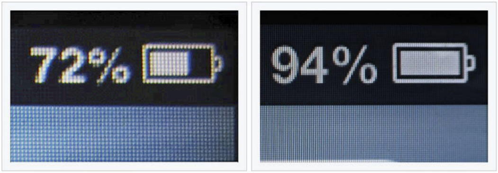
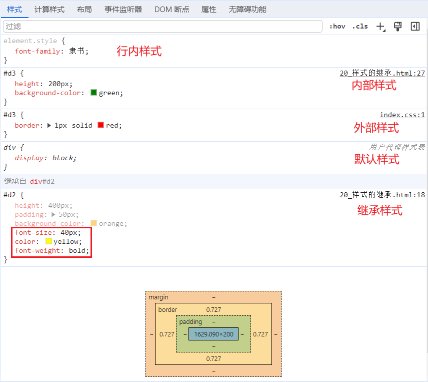
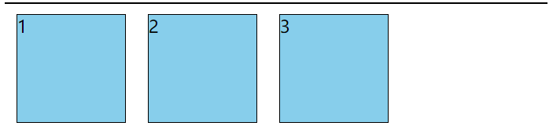

[TOC]

## 浏览器

浏览器是网页运行的平台，五大主流浏览器： `谷歌 (Chrome)`、`Safari`、`IE`、`火狐 (Firefox)`、`欧朋 (Opera)`。


各大浏览器市场份额：


浏览器的**`内核`**：内核是浏览器的核心，用于处理浏览器所得到的各种资源。


**五大浏览器的内核：**


## 开发者文档

W3C 官网：https://www.w3.org/

W3School：https://www.w3school.com.cn/

MDN：https://developer.mozilla.org/zh-CN/

> MDN 使用居多。

## 编辑器

开发建议使用 VS CODE，并且建议安装插件：Live Server。


自动保存配置（默认关闭，文件保存时页面刷新）：


文件图标插件：


修改文件图标：


## HTML 4

**`HTML：HyperText Markup Language，超文本标记语言。`**

> 超文本的含义：是一种组织信息的方式，通过超链接将不同空间的文字、图片等各种信息组织在一起，能从当前阅读的内容，跳转到超链接所指向的内容，如页面、文件、锚点、应用等。

相关国际组织：

- IETF：Internet Engineering Task Force，国际互联网工程任务组。成立于 1985 年底，是一个权威的互联网技术标准化组织，主要负责互联网相关技术规范的研发和制定，当前绝大多数国际互联网技术标准均出自 IETF。官网：https://www.ietf.org。
- W3C：World Wide Web Consortium，万维网联盟。创建于 1994 年，是目前 Web 技术领域，最具影响力的技术标准机构。共计发布了 200 多项技术标准和实施指南，对互联网技术的发展和应用起到了基础性和根本性的支撑作用。官网：https://www.w3.org。
- WHATWF：Web Hypertext Application Technology Working Group，网页超文本应用技术工作小组。成立于 2004 年，是一个以推动网络 HTML 5 标准为目的而成立的组织。由 Opera、Mozilla 基金会、苹果，等这些浏览器厂商组成。官网：https://whatwg.org/。

HTML 发展历史：


- 目前 HTML 的最新标准是 HMTL 5。

### 标签

**`标签`**：又称元素，是 HTML 的基本组成单位。

- 标签分为：双标签与单标签，绝大多数都是双标签。

  - 单标签：

    

  - 双标签：

    

- 标签名不区分大小写，但推荐小写，因为小写更规范。

- 标签之间的关系：并列关系、嵌套关系，可以使用 tab 键进行缩进。

### 标签属性

**`标签属性`**：用于给标签提供附加信息，可以写在**起始标签**或**单标签中**。


- 有些特殊的属性，没有属性名，只有属性值。例如：

  ```html
  <input disabled>
  ```

- 规范：

  - 不同的标签，有不同的属性；也有一些通用属性，在任何标签内都能写。

  - 属性名、属性值不能乱写，都是 W3C 规定好的。

  - 属性名、属性值，都不区分大小写，但推荐小写。

  - 双引号，也可以写成单引号，甚至不写都行，但还是推荐写双引号。

  - 标签中不要出现同名属性，否则后写的会失效。例如：

    ```html
    <input type="text" type="password">
    ```

### 基本结构

在网页中，通过点击鼠标右键，选择 "检查"，可以查看某段结构的具体代码。

"检查" 和 "查看网页源代码" 的区别：

- "检查" 看到的是：经过浏览器处理后的源代码。
- "查看网页源代码" 看到的是：程序员编写的源代码。

网页的`基本结构`如下：

- 想要呈现在网页中的内容写在 body 标签中。

- head 标签中的内容不会出现在网页中。

- head 标签中的 title 标签可以指定网页的标题。

- 图示：

  

- 代码：

  ```html
  <html>
      <head>
      	<title>网页标题</title>
      </head>
      
      <body>
      	......
      </body>
  </html>
  ```

### 注释

特点：注释的内容会被浏览器所忽略，不会呈现到页面中，但源代码中依然可见。

作用：对代码进行解释和说明。

写法：

```html
<!-- 下面的文字只能滚动一次 -->
<marquee loop="1">尚硅谷</marquee>

<!-- 下面的文字可以无限滚动 -->
<marquee>尚硅谷123</marquee>
```

注释不可以嵌套，以下写法是错的：

```html
<!--
	我是一段注释
	<!-- 我是一段注释 -->
-->
```

### 文档声明

作用：告诉浏览器当前网页的版本。

写法（W3C 推荐使用 HTML 5 的写法）：

```html
<!DOCTYPE html>
或
<!DOCTYPE HTML>
或
<!doctype html>
```

> 注意：文档声明，必须在网页的第一行，且在 html 标签的外侧。

### 字符编码

平时编写代码时，统一采用 UTF-8 编码。为了让浏览器在渲染 html 文件时，不犯错误，可以通过 meta 标签配合 charset 属性指定字符编码：

```html
<head>
	<meta charset="UTF-8"/>
</head>
```

### 设置语言

主要作用：

- 让浏览器显示对应的翻译提示。
- 有利于搜索引擎优化。

写法：

```html
<html lang="zh-CN">
```

> 扩展知识： lang 属性的编写规则。
>
> 1. 第一种写法（ 语言-国家/地区 ），例如：
>
>    - zh-CN ：中文-中国大陆（简体中文）。
>    - zh-TW ：中文-中国台湾（繁体中文）。
>    - zh ：中文。
>    - en-US ：英语-美国。
>    - en-GB ：英语-英国。
>
> 2. 第二种写法（ 语言—具体种类），已不推荐使用，例如：
>
>    - zh-Hans ：中文—简体。
>
>      zh-Hant ：中文—繁体。
>
> 3. W3School 上的说明：[《语言代码参考手册》](https://www.w3school.com.cn/tags/html_ref_language_codes.asp)、[《国家/地区代码参考手册》](https://www.w3school.com.cn/tags/html_ref_country_codes.asp)。
>
> 4. W3C 官网上的说明：[《Language tags in HTML》](https://www.w3.org/International/articles/language-tags/)。
>

### 标准结构

示例：

```html
<!DOCTYPE html>
<html lang="zh-CN">
    <head>
        <meta charset="UTF-8">
        <title>我是一个标题</title>
    </head>
    <body>
    </body>
</html>
```

>输入`!`，随后回车即可快速生成标准结构。

使用 ! 符号，默认生成的是 lang="en"，可以通过以下设置：


在存放代码的文件夹中，存放一个 favicon.ico 图片，可配置网站图标。示例：


> 注意：添加图片之后，可能需要清空缓存，重新加载页面。

### 排版标签

| 标签名    | 标签语义                   | 单/双标签 |
| --------- | -------------------------- | --------- |
| `h1 ~ h6` | 标题                       | 双        |
| `p`       | 段落                       | 双        |
| `div`     | 没有任何含义，用于整体布局 | 双        |

- h1 最好写一个， h2 ~ h6 能适当多写。
- h1 ~ h6 不能互相嵌套。例如：h1 标签中不要写 h2 标签。
- p 标签很特殊！它里面不能有：h1 ~ h6、p、div 标签。

示例：

```html
<!DOCTYPE html>
<html lang="zh-CN">

<head>
    <meta charset="UTF-8">
    <title>HTML排版标签</title>
</head>

<body>
    <!-- 
        <h1>我是一级标题</h1>
        <h2>我是二级标题</h2>
        <h3>我是三级标题</h3>
        <h4>我是四级标题</h4>
        <h5>我是五级标题</h5>
        <h6>我是六级标题</h6>
        <div>
            <p>我是一个段落</p>
            <p>我是一个段落</p>
            <p>我是一个段落</p>
        </div>
     -->
    <h1>把个人信息“安全堤”筑牢</h1>
    <h4>2022-06-21 07:34 · 1347条评论</h4>
    <div>
        <p>置身移动互联时代，人们在享受智能设备带来便利的同时，也在一些场景中面临个人信息泄露风险。随着时间推移，这样的风险日益呈现出新的表现形式。</p>
        <p>一些APP声称看视频、玩游戏甚至走路都能赚钱，但用户想提现却难上加难，还容易泄露个人信息；新型不法软件图标透明、没有名称，在手机屏幕上十分隐蔽，不仅不停推送广告，还会收集并转卖用户隐私信息；个人信息安全和隐私保护话题引发关注，正说明其涉及群众切身利益，问题不容小视。
        </p>
    </div>
</body>

</html>
```

### 语义化标签

概念：用特定的标签，去表达特定的含义。

原则：**标签的默认效果不重要，语义最重要！**（后期可以通过 CSS 随便控制默认效果）

举例：对于 h1 标签，效果是文字很大（不重要），语义是网页主要内容（很重要）。

优点：

- 代码结构清晰可读性强。
- 有利于 SEO（搜索引擎优化）。
- 方便设备解析，如屏幕阅读器、盲人阅读器等。

### 块级元素与行内元素

`块级元素`：独占一行（排版标签都是块级元素）。

`行内元素`：不独占一行，例如： input。

使用原则：

- 块级元素中能写行内元素和块级元素（简单记：块级元素中几乎什么都能写）。
- 行内元素中能写行内元素，但不能写块级元素。
- 一些特殊的规则：
  - h1 ~ h6 不能互相嵌套。
  - p 中不要写块级元素。

>Tips：
>
>marquee 元素设计的初衷是：让文字有动画效果，但如今可以通过 CSS 来实现，而且还可以实现的更加炫酷，所以 marquee 标签已经过时了（废弃了），不推荐使用。

### 文本标签

作用：用于包裹词汇、短语等，通常写在排版标签里面。文本标签通常都是行内元素。

>排版标签更宏观（大段的文字），文本标签更微观（词汇、短语）。

常用：

| 标签名   | 标签语义                         | 单/双标签 |
| -------- | -------------------------------- | --------- |
| `em`     | 要着重阅读的内容                 | 双        |
| `strong` | 十分重要的内容，语气比 em 要强   | 双        |
| `span`   | 没有语义，用于包裹短语的通用容器 | 双        |

不常用：

| 标签名     | 标签语义                                                     | 单/双标签 |
| ---------- | ------------------------------------------------------------ | --------- |
| cite       | 作品标题（书籍、歌曲、电影、电视节目、绘画、雕塑）           | 双        |
| dfn        | 特殊术语 ，或专属名词                                        | 双        |
| del 与 ins | 删除的文本【与】插入的文本                                   | 双        |
| sub 与 sup | 下标文字【与】上标文字                                       | 双        |
| code       | 一段代码                                                     | 双        |
| samp       | 从正常的上下文中，将某些内容提取出来，例如：标识设备输出     | 双        |
| kbd        | 键盘文本，表示文本是通过键盘输入的，经常用在与计算机相关的手册中 | 双        |
| abbr       | 缩写，最好配合上 title 属性                                  | 双        |
| bdo        | 更改文本方向，要配合 dir 属性，可选值: ltr（默认值）、rtl。ltr 表示从左往右，rtl 表示从右往左。 | 双        |
| var        | 标记变量，可以与 code 标签一起使用                           | 双        |
| small      | 附属细则，例如：包括版权、法律文本。—— 很少使用              | 双        |
| b          | 摘要中的关键字、评论中的产品名称。—— 很少使用                | 双        |
| i          | 本意是：人物的思想活动、所说的话等等。现在多用于：呈现字体图标。 | 双        |
| u          | 与正常内容有反差文本，例如：错的单词、不合适的描述等。—— 很少使用 | 双        |
| q          | 短引用 —— 很少使用                                           | 双        |
| blockquote | 长引用 —— 很少使用                                           | 双        |
| address    | 地址信息                                                     | 双        |

- 这些不常用的文本标签，编码时不用过于纠结，酌情而定，不用也没毛病。
- blockquote 与 address 是块级元素，其他的文本标签，都是行内元素。
- 有些语义感不强的标签，我们很少使用，例如：small 、 b 、 u 、 q 、 blockquote。
- HTML 标签太多了！记住那些：重要的、语义感强的标签即可。截止目前，有这些：h1 ~ h6 、 p 、 div 、 em 、 strong 、 span。

### 图片标签

| 标签名 | 标签语义 | 常用属性                                                     | 单/双标签 |
| ------ | -------- | ------------------------------------------------------------ | --------- |
| `img`  | 图片     | `src`：图片路径，又称图片地址，指图片的具体位置。<br />`alt`：图片描述。<br />width：图片宽度，单位是像素，例如： 200 px 或 200。<br />height：图片高度， 单位是像素，例如： 200 px 或 200。 | 单        |

- `px`表示像素，是一种单位。
- 尽量不同时修改图片的宽和高，可能会造成比例失调。
- 暂且认为 img 是行内元素。（学到 CSS 时，会认识一个新的元素分类，目前只知道：块级元素和行内元素）
- `alt`属性的作用：
  - **搜索引擎可以通过 alt 属性，得知图片的内容，这是最主要的作用。**
  - 当图片无法展示时候，有些浏览器会呈现 alt 属性的值。
  - 盲人阅读器会朗读 alt 属性的值。

> `相对路径`：以**当前位置**作为参考点，去建立路径。
>
> - `./`：同级，可以省略不写。
> - `/`：下一级。
> - `../`：上一级。
> - 相对路径依赖的是当前位置，后期若调整了文件位置，那么文件中的路径也要修改。
>
> `绝对路径`：以**根位置**作为参考点，去建立路径。
>
> - 本地绝对路径：E:/a/b/c/奥特曼.jpg。
> - 网络绝对路径：http://www.atguigu.com/images/index_new/logo.png。
> - 使用本地绝对路径，一旦更换设备，路径处理起来比较麻烦，所以很少使用。
> - 使用网络绝对路径，确实方便，但要注意：若服务器开启了防盗链，会造成图片引入失败。

示例：

```html
<!DOCTYPE html>
<html lang="zh-CN">

<head>
    <meta charset="UTF-8">
    <title>HTML_图片标签</title>
</head>

<body>
    
    
</body>

</html>
```

**常见图片格式：**

- `jpg`格式：

  - 概述：扩展名为`.jpg`或`.jpeg`，是一种**有损的压缩格式**（把肉眼不容易观察出来的细节丢弃了）。
  - 主要特点：**支持的颜色丰富、占用空间较小**、不支持透明背景、不支持动态图。
  - 使用场景：对图片细节**没有极高要求**的场景。例如：网站的产品宣传图等 。（该格式在网页中很常见）

- `png`格式：

  - 概述：扩展名为`.png`，是一种**无损的压缩格式**，能够更高质量的保存图片。
  - 主要特点：**支持的颜色丰富**、占用空间略大、**支持透明背景**、不支持动态图。
  - 使用场景：想让图片有透明背景；想更高质量的呈现图片。例如：公司 logo 图、重要配图等。

- `bmp`格式：

  - 概述：扩展名为`.bmp`，**不进行压缩的一种格式**，在最大程度上保留图片更多的细节。
  - 主要特点：**支持的颜色丰富、保留的细节更多**、占用空间极大、不支持透明背景、不支持动态图。
  - 使用场景：对图片细节**要求极高**的场景。例如：一些大型游戏中的图片 。（网页中很少使用）

- `gif`格式：

  - 概述：扩展名为`.gif`，仅支持 256 种颜色，色彩呈现不是很完整。
  - 主要特点：支持的颜色较少、**支持简单透明背景、支持动态图**。
  - 使用场景：网页中的动态图片。

- `webp`格式：

  - 概述：扩展名为`.webp`，谷歌推出的一种格式，专门用来在网页中呈现图片。
  - 主要特点：具备上述几种格式的优点，但兼容性不太好，一旦使用务必要解决兼容性问题。
  - 使用场景：网页中的各种图片。

- `base64`格式：

  - 本质：一串特殊的文本，要通过浏览器打开，传统看图应用通常无法打开。

  - **原理：把图片进行 base64 编码，形成一串文本。**

  - 如何生成：靠一些工具或网站。

  - 如何使用：直接作为 img 标签的 src 属性的值即可，并且不受文件位置的影响。

  - 使用场景：一些较小的图片，或者需要和网页一起加载的图片。

  - 示例：

    ```html
    <!DOCTYPE html>
    <html lang="zh-CN">
    
    <head>
        <meta charset="UTF-8">
        <title>演示base64图片</title>
    </head>
    
    <body>
        
        
    
        <!-- base64图片 -->
        <img src="data:image/png;base64,iVBORw0KGgoAAAANSUhEUgAAAFAAAABQCAYAAACOEfKtAAAABGdBTUEAALGPC/xhBQAAAAZiS0dEAP8A/wD/oL2nkwAAEB5JREFUeNrtnGmMVVUSgN/v8cdARGEUZAmKyNrohGjcEo0a97jEGDXqD43RUfYRjDExrtFonIxOxhhBTYxGorgByr41yNY7TdMLNA29AE3T3SC4/Kg535lbL9XHe9973dDQ4PtR6XffO3c5362qU6dOnU51dHZKXnouqTyEPMA8wDzAPMC85AHmAeYB5gHmJQ8wDzAPMA8wL3mAeYB5gHmAeTlDALZ3dPxf2tvlkJF2Ff3dyZ8aIAAOHTokbW1t0nrwoLS2tsbKQfebCm2tcL6XAO4ZC5COAuLAgQOyf//+tHCMxIGLBWak3WpnoKkdvQAzdbym1ZPzAAGoffv2peV44MUB61BgRjp5huMEGfa72wAPuofXDmqn0KRctI1zgNXS0tJr8OKgZZOcrMXdq0t/I4jdArjPdbKpqSnd6S4ddRdOemP83hIDLhvA7sDrDrjDhw//QTozaBzPwnPxLPa+3CcngJ3uBlxgz5490tjY6CECw3ZaP1ttbHM3sxoXmq2FlwvAXOB1Bxpy5MgRL3Eg6Ys+m8IL753KVX2BZwWQzc3NXbSqxR0D9wAA3A35DVGft2vXrkR4PQWYDV4SOIXHffn7yy+/pL/jLxZF/3hOniVp0MoJIFB2794tDQ0N/m99fb3/azUS4fPevXvTGopwk+LiYnnkkUdkzpw5/jgOXjaA2bSvu/CQ3377Td555x156qmnZPv27f5YNZJrq5XFPQPHfJ/KxXQVGIIW1dTUSHV1tf8MVEACDlGtVHhr166Va665RkaOHCkLFizw36kpJwEMIfKwdEihaCdVegKP83799Vf/fJMnT5Zbb71VNm3a1AUi1+kyWEbg1C3xzKlsIyeAAIgovLKyMtm8ebNs3LhRahxIhWg1DwhAvummm2TEiBHy5JNP+oexwDJB5KHpwM8//+w1jBfDvSsqKqS0tNTLtm3bpK6uzl+Hdr///ruHkg2efQmY7osvviiXXnqp3H333V5Jjh071gWiwuP5YaDKQ38zAtzrTJKGyM6dO6W2ttarOib5008/yYoVK2T58uX+uzjte/3112X48OFy3XXX+c6qL8wEEFEzX7RokTz//PNy7733ypVXXinjxo2TUaNGyYUXXigXXXSRjB49WiZMmCBXXXWV3HffffLCCy/Ijz/+6M8HQi4AaYfruf/++2XSpEny9ttvd9FChBfIS+UFVlZW+v7yGdipJNOlAyG8HTt2SEV5uRQVFXmAa9askaVLl3qIXAyAdmC5/fbb5bLLLvNtMMGkkdgOKkDm+rfddpsMGjRIzj77bBk4cKCcd955MnjwYBkyZIiXCy64IC0cn3/++b49n7kvGnr06NGsABGAoRS33HKLB6mab7UQTa+qqvICQLQQLqk4eIygCo4TgccJ0OfBtm7d6s23sLBQVq1cKRs2bEiPyhbgF1984duoRuUivO2ZM2fKWWed5aEgSeCQoUOHehk2bFha+vfvL1OmTPFgcglh1B/Sv8WLF//BxyK4KRggQESZ0MJUXMiCNoXwoF7utK/EvaktW7Z4gOvXr/dayI11JLZmrCNVrvAQ2qOxmGu/fv1kwIABaQ20QC1Uq4G051yugQZ2JxbEH4bmi6CN6tMR4AGRz6kw6oZ0HDx8GNqHeVmA69at821tOGMhJs0+4sTGjdzrpZdekhtuuEEuvvjitDmjXYBF+Aww4OIPb7zxRnn55Zf9s+rgExfiZNPGOMEFKQ8AwgSIXQAyEADDwqNRpXsgr30lJd58GYHxgZgnEBmhOdfOUnhjFmImkGE7PV9jMTScAeurr76STz/9VD7++GP55JNP5LPPPpNvv/3WhyKYExqvAfHxxIkMLOoD7QwFxVImAETSAOk8DwE4jfM8PPfwwIvTPh6cvxpUaxDNNfieQSHUxmwS157rxMWCdFKlI8ondne6F8LD7AHDfUOAjAsKDy5IikGj2TUGGOAQtXEaaNzFKIX2EWwyaGC6q1at8n/RQAUIAEA//PDD/jgJShy4TGK1OJy1JCVZuzNzsaY8ffp0D0lHcW2DZSo83ARsUsz5rFNU+1azzQRv2bJlstKNwqi2nZHQ0ccee0zmzZvnO5INjhU7LbQ+NRzhLchsGeuk+XMIkZGY2HPq1Klp7UunvFx7DeQR2DChSDW6B+RAbVq1jh/xeXHwVq9e7X0SQeuSJUvSQaVCpJOAvfnmm/2b2h+lwXIBp/BCiRugwlRYpjxiNm3EDXDtBx980PcTP2jhci59gQuCYsHHA+SDkg3Bqc+z8AicCROImRYuXOjPswkGhA69+uqr8sADD6ShhhAttBCczq1VLMhM2hgHMhtE1bRp06bJW2+95TWxS/baCdeHiRVcVao1ivztlwoOrWO01QEDswUeWvfDDz94eN98841vh4MFomqhQnj00Ufl8ccf98d0NIQWwgvB2URFHMhwhM+mjSFENVWmjMzX+Y1jBaeQUQ4UCS7w8eI+pzrdBfB7aBggFBrHhCloHcEyJonPA55qHvAWOp+BCeMHQ4h0EsfL9Oihhx7y96FDCiA0UwstSXIBmZQaCzWRQYJz0DxeNNfSmC+UJncPtUTltMkd+1GYzDGxHeaJpiFA4xhwarJoHfC+//57D2+584MkHHgJOx08YAHR+kM6B1wekKQCL4DO8H02eFwjTkKQcWYd+karhQDBx9Hne+65R5544gl/bggvnftz4vMD7nponoZvwEyl837uJqin17JocEAYKFTjvvvuOx+4ApOBhwsfZrLtzseX6gRb/aHVRDrLLIGMB+bCgKUgk+BpDlLTaTYvmQlkkkkDg8GC8/B1V199tbzxxhseqg4UoajGKidSfDUuzkUbUbKUTSJoCovRBhVVv4cmYs7FbnABEKHPEfcgeo6uf5AbJIiOg0gn6QhhAjnCyy+/3HeCe+mshTYhOM0IWbEw9frqd0OQmh7Dr3HOBx984KeHd9xxh1cWzNhqmwWnc/lw+Ral0WWO2GwMcGik82M/1JvvLTh7XoO7IH7Om3IAUTuqabJ3333XawDZ4BkzZniwmhyl87RVgLwQFdroZ4VpQQIQcKpxvBSUgFzhtddeK9dff728//77aZMNqxssOF0LScqXwuKEViaghQDElLWjYScROoVm0A6NQBvGjh3rU//PPPOMfPTRR948CO45z5p46AutxvGZ+zIIMk+eNWuW17aCggK56667ZO7cuf56Cs4G3aHoUma24oETCtD7QtcJzdj+AaLxYRozoi3AIDB/5ZVXfEfp8CWXXCJXXHGF3HnnnfL000/739DaDz/8MJ1MAMh7770nr732mp89MCCg1ePHj/eJXI7JiuOKuE+HWeNNqr1R8cndDNrXq7UxtdGcUZMTFqT1YdbHAbHJwQcsIx0LUG+++aYfIYFISn/ixIkyZswYn7pC0Fq+4zfa0JZziBCYDPAygaVuIW6EjhP97ZQUF6GFmICuHVRHA4umyaw/s35NU2jaVsMhXchi1Gdg03m4JjL4jt84T7XaLr/aQSwcpePWYzS9lku5Sq9pIBAp5WCKB0T1i6qRoWgWqCbI+Nq0EaN1JtEXpql2jQb0RSjEpOBbP/NbLqbb6+VtQCQkYm5NB3UdQdPiVvheocWB0zm6TuCt8B2/0Ya2mim2mh8G940xAbjGqsTDfaY+UCHSScxMtUQ7aYHFaZtNGyk8na+rcMz3tKGtamMI0camXhuDObYmQDpiQrRTWmAJROaRCqAi6qR2tDIwxTDfFgdOJ/NxEDNpojXpdKlKBJWRt7Ob8E5ahapfKnUPuM0Bo+OlRmNC0XxbWVR9kATPikK05mx9YggxLe4YiH4q1wN4J7XElwckKEUDPAg372aJtDTyY1bSPk5zb2qyMfASAaKFkSmHg5iPUd1fLENnWadNjTSZGxw1HQMiUqxmGEmYuCw2Pq/Imq+BFw4oleoL0cIIooLEZA8eh9ad8iJzHlxDHTpY5CBu2bzZAyk2yd04kOHvHhwugYHK+EA14apIqh08/J2OsicC3imv0leQjH74o3LWnR1IxMNheQEJTLw08pP4TD/oMAAxIDGaazjkjnc4qXPmSthCcN8R3e+M2ydCp8hs4COpct1VWycly5bJxvnzZeuiRVK0dIkUr1guJatXS2nhOilbv17KN2zwUrG+UCrcXHcbJSYrV0jl4sVSU1goTS4saXUzi/bIx51ocH12p9Lho0elra5WSidPkKJhA6Vk1AgpGTNaisaNlS0TxsvmiRNkU4H762RrwQQpcXPh8oIC2T6pQGpcm7qRw6Xh7+OkvaJcOo8d+/Nt9ep0AA+WlUjV4P5Sc85fpObcflJ97rmyY+BAqXJ/qwYMkB0D+ku1k1r3eeegQVI/ZIjsGTpUGgcPluaB50jL3/4qhzYUSsefDaAPdSirpUbn3/+Ssin/kIppU6R82lQpmz5dyp1UzJghlbNmSuU/Z0nVs89K9exnpWb2bKl77jmpf26O7J4zW1r++x9pczOgjl4y2z7pA9X/1RPwVm6XXbsbpH5vo+x2IBqammWPm+g3skDvRtFm6pSptW5vlwPk+IDOJiAyQQh7WkhlRSV2Hb24Xy7VF+ARk/nUFWktlkjd33qmXOQJyUizMEWqnm0HZn9KK7XUumQZyAFSU649bdpi1jXOCICaOwQWwjoKM4Rd0TFx2x431dLqV9JOgGm1W81idm0qRA872udxsJcgpk4lPDrrM9NRltrn8KL0U73VPt0ZBcCExfI48at9DrxW/fcGxFMDMFpf1ZQ+msZE328fCCoc7MadsGwjad+waiG/6bnp9iysn0CIpwSgLSXWtL2uodh1EwXYHEHYF2lgHEQL0h5zDrk+a8pt3cg4971kAvnBqGZG1y2YepFE8Pm6DBqYqe4lk+AacAUHom0UunHwtAOoeUGbHQYki0NkWPguLFLaG7OxMdP+4lAAhXbzgrqYMv4wx4WjPgOQILk+2kLhtc+BIhnAfhJSTTbZmU6/Gy2MrXvJAlL9IDU9vBDd56z+8LQBqOkrNE7XhPm8Zu1amT9/vu9cUtlG3LJkCDJpnRdYBNJU+JM71B0AVkNPC4CajVbt0k17LKBTNqfmHK4fh2u7mYorkzYvApCKMirMOM/utvdprr4OUGvrajVIjrSPpCclGtTBaBxoJVxN00ElqS4wCeihqP7x888/TxfBd9HC4/CFJw0gnVeAWm1AcnTe3Lm+ukA3NOqaRa1ZhE+qxAorVeOA6vYxBhIAcj7tT5QWpk6W+dZFJRzejNG+qAYRDST77Es7tEIh2uijYmtswjgxrtDSaqfGjpz/5Zdf+mtxbnM0Q1HpacLhpAD0xZem3AIouk2MEdgDNDukbGmHru+GK2txBUuhdtptZ5zz9ddfpysltFZRfWV7Xwe4I+o8HWctg7prOkN4QWlxuJHPlnXoQpGtOrCrbCHUMAgHEOcwiLC+gj8Eug2L+jRAnLTdDUU4URhtUmQAYVUtLChKqofRpcv0glJQiaAvSUvmdNDge+oEAa3/KkBNHpA9Bfg/xTf44yGrdiQAAAAASUVORK5CYII="
            alt="">
    </body>
    
    </html>
    ```

> 图片的格式非常多，上面这些，只是一些常见的、前端人员常接触到的。

### 超链接

| 标签名 | 标签语义 | 常用属性                                                     | 单/双标签 |
| ------ | -------- | ------------------------------------------------------------ | --------- |
| `a`    | 超链接   | `href`：指定要跳转到的具体目标。<br />`target`：控制跳转时如何打开页面。常用值如下：<br />                        `_self`：在本窗口打开，默认值。<br />                        `_blank`：在新窗口打开。<br />`id`：元素的唯一 标识，可用于设置锚点。<br />`name`：元素的名字，写在 a 标签中，也能设置锚点。 | 双        |

主要作用：**从当前页面进行跳转**。

可以实现：①跳转到指定页面、②跳转到指定文件（也可触发下载）、③跳转到锚点位置、④唤起指定应用。

示例：

```html
<!DOCTYPE html>
<html lang="zh-CN">

<head>
    <meta charset="UTF-8">
    <title>超链接_跳转页面</title>
</head>

<body>
    <a href="https://miaosha.jd.com/" target="_self">去秒杀</a>
    <a href="https://www.baidu.com/" target="_blank">去百度</a>
    <a href="./10_HTML排版标签.html">去排版标签</a>

    <a href="./10_HTML排版标签.html">
        
    </a>
</body>

</html>
```

#### 跳转到页面

示例：

```html
<!-- 跳转其他网页 -->
<a href="https://www.jd.com/" target="_blank">去京东</a>

<!-- 跳转本地网页 -->
<a href="./10_HTML排版标签.html" target="_self">去看排版标签</a>
```

> 注意：
>
> - 代码中的**多个空格**、**多个回车**，都会被浏览器解析成一个空格！
> - 虽然 a 标签是行内元素，但 a 标签可以包裹除它自身外的任何元素！

#### 跳转到文件

示例：

```html
<!-- 浏览器能直接打开的文件 -->
<a href="./resource/自拍.jpg">看自拍</a>
<a href="./resource/小电影.mp4">看小电影</a>
<a href="./resource/小姐姐.gif">看小姐姐</a>
<a href="./resource/如何一夜暴富.pdf">点我一夜暴富</a>

<!-- 浏览器不能打开的文件，会自动触发下载 -->
<a href="./resource/内部资源.zip">内部资源</a>

<!-- 强制触发下载 -->
<a href="./resource/小电影.mp4" download="电影片段.mp4">下载电影</a>
```

>注意：
>
>- 若浏览器无法打开文件，则会引导用户下载。
>- 若希望强制触发下载，请使用`download`属性，属性值即为下载文件的名称。

#### 跳转到锚点

`锚点`：网页中的一个标记点。

使用方式：

1. **第一步：设置锚点。**

   ```html
   <!-- 第一种方式：a标签配合name属性 -->
   <a name="test1"></a>
   
   <!-- 第二种方式：其他标签配合id属性，推荐 -->
   <h2 id="test2">我是一个位置</h2>
   ```

   - **具有 href 属性的 a 标签是超链接，具有 name 属性的 a 标签是锚点。**
   - name 和 id 都是区分大小写的，且 id 最好别是数字开头。

2. **第二步：跳转锚点。**

   ```html
   <!-- 跳转到test1锚点，#不可省略 -->
   <a href="#test1">去test1锚点</a>
   
   <!-- 跳到本页面顶部，页面没有变化，滚动条拉到顶部 -->
   <a href="#">回到顶部</a>
   
   <!-- 跳转到其他页面锚点 -->
   <a href="demo.html#test1">去demo.html页面的test1锚点</a>
   
   <!-- 刷新本页面，页面刷新，然后回到顶部 -->
   <a href="">刷新本页面</a>
   
   <!-- 执行一段js (在:和;中间书写js脚本)，如果还不知道执行什么，可以留空：javascript:; -->
   <a href="javascript:alert(1);">点我弹窗</a>
   ```

示例：

```html
<!DOCTYPE html>
<html lang="zh-CN">

<head>
    <meta charset="UTF-8">
    <title>超链接_跳转锚点</title>
</head>

<body>
    <a href="#htl">看灰太狼</a>
    <a href="#atm">看奥特曼</a>

    <p>我是一只羊，一只很肥美的羊</p>
    

    <a name="htl"></a>
    <p>我是一只狼，一只很邪恶的狼</p>
    

    <p id="atm">我是一只奥特曼，一只很能打的奥特曼</p>
    

    <p>我是一只怪兽，一只很丑的怪兽</p>
    

    <p>整体的介绍完毕了</p>
    <a href="#">回到顶部</a>
    <a href="">刷新页面</a>
    <a href="javascript:;">点我弹窗</a>
</body>

</html>
```

#### 唤起指定应用

通过 a 标签，可以唤起设备上的应用程序。

```html
<!-- 唤起设备拨号 -->
<a href="tel:10010">电话联系</a>

<!-- 唤起设备发送邮件 -->
<a href="mailto:10010@qq.com">邮件联系</a>

<!-- 唤起设备发送短信 -->
<a href="sms:10086">短信联系</a>
```

示例：

```html
<!DOCTYPE html>
<html lang="zh-CN">

<head>
    <meta charset="UTF-8">
    <title>超链接_唤起指定应用</title>
</head>

<body>
    <a href="tel:10010">电话联系</a>
    <a href="mailto:1234567@qq.com">邮件联系</a>
    <a href="sms:10086">短信联系</a>
</body>

</html>
```

### 列表

#### 有序列表

概念：有顺序或侧重顺序的列表。

示例：

```html
<h2>要把大象放冰箱总共分几步</h2>
<ol>
    <li>把冰箱门打开</li>
    <li>把大象放进去</li>
    <li>把冰箱门关上</li>
</ol>
```

#### 无序列表

概念：无顺序或不侧重顺序的列表。

示例：

```html
<h2>我想去的几个城市</h2>
<ul>
    <li>成都</li>
    <li>上海</li>
    <li>西安</li>
    <li>武汉</li>
</ul>
```

#### 嵌套列表

概念：列表中的某项内容，又包含一个列表（注意：嵌套时，请务必把解构写完整）。

示例：

```html
<h2>我想去的几个城市</h2>
<ul>
    <li>成都</li>
    <li>
        <span>上海</span>
        <ul>
            <li>外滩</li>
            <li>杜莎夫人蜡像馆</li>
            <li>
            	<a href="https://www.opg.cn/">东方明珠</a>
            </li>
            <li>迪士尼乐园</li>
    	</ul>
    </li>
    <li>西安</li>
    <li>武汉</li>
</ul>
```

> 注意：`li 标签最好写在 ul 或 ol 中，不要单独使用。`

#### 自定义列表

概念：所谓自定义列表，就是一个`包含术语名称以及术语描述的列表`。

示例：

```html
<h2>如何高效的学习？</h2>
<dl>
    <dt>做好笔记</dt>
    <dd>笔记是我们以后复习的一个抓手</dd>
    <dd>笔记可以是电子版，也可以是纸质版</dd>
    <dt>多加练习</dt>
    <dd>只有敲出来的代码，才是自己的</dd>
    <dt>别怕出错</dt>
    <dd>错很正常，改正后并记住，就是经验</dd>
</dl>
```

- 一个`dl`就是一个自定义列表，一个`dt`就是一个术语名称，一个`dd`就是术语描述（可以有多个）。

### 表格

#### 基本结构

一个完整的表格由：**表格标题**、**表格头部**、**表格主体**、**表格脚注**，四部分组成。


表格涉及到的标签：

- `tabl`：表格。

- `caption`：表格标题。

- `thead`：表格头部。

- `tr`：每一行。

- `th`、`td`：每一个单元格。（备注：表格头部中用 th ，表格主体、表格脚注中用 td。）

  

  

  

示例：

```html
<!DOCTYPE html>
<html lang="zh-CN">

<head>
    <meta charset="UTF-8">
    <title>表格_整体结构</title>
</head>

<body>
    <table border="1">
        <!-- 表格标题 -->
        <caption>学生信息</caption>
        <!-- 表格头部 -->
        <thead>
            <tr>
                <th>姓名</th>
                <th>性别</th>
                <th>年龄</th>
                <th>民族</th>
                <th>政治面貌</th>
            </tr>
        </thead>
        <!-- 表格主体 -->
        <tbody>
            <tr>
                <td>张三</td>
                <td>男</td>
                <td>18</td>
                <td>汉族</td>
                <td>团员</td>
            </tr>
            <tr>
                <td>李四</td>
                <td>女</td>
                <td>20</td>
                <td>满族</td>
                <td>群众</td>
            </tr>
            <tr>
                <td>王五</td>
                <td>男</td>
                <td>19</td>
                <td>回族</td>
                <td>党员</td>
            </tr>
            <tr>
                <td>赵六</td>
                <td>女</td>
                <td>21</td>
                <td>壮族</td>
                <td>团员</td>
            </tr>
        </tbody>
        <!-- 表格脚注 -->
        <tfoot>
            <tr>
                <td></td>
                <td></td>
                <td></td>
                <td></td>
                <td>共计：4人</td>
            </tr>
        </tfoot>
    </table>
</body>

</html>
```

#### 常用属性

| 标签名  | 标签语义   | 常用属性                                                     | 单/双标签 |
| ------- | ---------- | ------------------------------------------------------------ | --------- |
| `table` | 表格       | `width`：设置表格宽度。<br />`height`：设置表格**最小**高度，表格最终高度可能比设置的值大。<br />`border`：设置表格边框宽度。<br />`cellspacing`： 设置单元格之间的间距。 | 双        |
| `thead` | 表格头部   | `height`：设置表格头部高度。<br />`align`： 设置单元格的**水平**对齐方式，可选值如下：<br />                `left`：左对齐<br />                `center`：中间对齐<br />                `right`：右对齐<br />`valign`：设置单元格的**垂直**对齐方式，可选值如下：<br />                `top`：顶部对齐<br />                `middle`：中间对齐<br />                `bottom`：底部对齐 | 双        |
| `tbody` | 表格主体   | 常用属性与 thead 相同。                                      | 双        |
| `tfoot` | 表格脚注   | 常用属性与 thead 相同。                                      | 双        |
| `tr`    | 行         | 常用属性与 thead 相同。                                      | 双        |
| `td`    | 普通单元格 | `width`：设置单元格的宽度，同列所有单元格全都受影响。<br />`heigth`：设置单元格的高度，同行所有单元格全都受影响。<br />`align`：设置单元格的水平对齐方式。<br />`valign`：设置单元格的垂直对齐方式。<br />`rowspan`：指定要跨的行数。<br />`colspan`：指定要跨的列数。 | 双        |
| `th`    | 表头单元格 | 常用属性与 td 相同。                                         | 双        |

- `<table>`元素的 border 属性可以控制表格边框，但 border 值的大小，并不控制单元格边框的宽度，只能控制表格最外侧边框的宽度，这个问题如何解决？—— 后期靠 CSS 控制。
- 默认情况下，每列的宽度，得看这一列单元格最长的那个文字。
- 给某个 th 或 td 设置了宽度之后，它们所在的那一列的宽度就确定了。
- 给某个 th 或 td 设置了高度之后，它们所在的那一行的高度就确定了。

示例：

```html
<!DOCTYPE html>
<html lang="zh-CN">

<head>
    <meta charset="UTF-8">
    <title>表格_常用属性</title>
</head>

<body>
    <table border="1" width="500" height="500" cellspacing="0">
        <!-- 表格标题 -->
        <caption>学生信息</caption>
        <!-- 表格头部 -->
        <thead height="50" align="center" valign="middle">
            <tr>
                <th width="50" height="50" align="right" valign="bottom">姓名</th>
                <th>性别</th>
                <th>年龄</th>
                <th>民族</th>
                <th>政治面貌</th>
            </tr>
        </thead>
        <!-- 表格主体 -->
        <tbody height="520" align="center" valign="middle">
            <tr height="50" align="center" valign="middle">
                <td>张三</td>
                <td>男</td>
                <td>18</td>
                <td>汉族</td>
                <td>团员</td>
            </tr>
            <tr>
                <td>李四</td>
                <td>女</td>
                <td>20</td>
                <td>满族</td>
                <td>群众</td>
            </tr>
            <tr>
                <td>王五</td>
                <td>男</td>
                <td>19</td>
                <td>回族</td>
                <td>党员</td>
            </tr>
            <tr>
                <td align="right" valign="top">赵六</td>
                <td>女</td>
                <td>21</td>
                <td>壮族</td>
                <td>团员</td>
            </tr>
        </tbody>
        <!-- 表格脚注 -->
        <tfoot height="50" align="center" valign="middle">
            <tr>
                <td></td>
                <td></td>
                <td></td>
                <td></td>
                <td>共计：4人</td>
            </tr>
        </tfoot>
    </table>
</body>

</html>
```

#### 跨行跨列

标签：

- `rowspan`：指定要跨的行数。
- `colspan`：指定要跨的列数。

示例，课程表效果图：


示例：

```html
<!DOCTYPE html>
<html lang="zh-CN">

<head>
    <meta charset="UTF-8">
    <title>表格_跨行与跨列</title>
</head>

<body>
    <table border="1" cellspacing="0">
        <caption>课程表</caption>
        <thead>
            <tr>
                <th>项目</th>
                <th colspan="5">上课</th>
                <th colspan="2">活动与休息</th>
            </tr>
        </thead>
        <tbody>
            <tr>
                <td>星期</td>
                <td>星期一</td>
                <td>星期二</td>
                <td>星期三</td>
                <td>星期四</td>
                <td>星期五</td>
                <td>星期六</td>
                <td>星期日</td>
            </tr>
            <tr>
                <td rowspan="4">上午</td>
                <td>3-2</td>
                <td>3-3</td>
                <td>3-4</td>
                <td>3-5</td>
                <td>3-6</td>
                <td>3-7</td>
                <td rowspan="4">休息</td>
            </tr>
            <tr>
                <td>4-2</td>
                <td>4-3</td>
                <td>4-4</td>
                <td>4-5</td>
                <td>4-6</td>
                <td>4-7</td>
            </tr>
            <tr>
                <td>5-2</td>
                <td>5-3</td>
                <td>5-4</td>
                <td>5-5</td>
                <td>5-6</td>
                <td>5-7</td>
            </tr>
            <tr>
                <td>6-2</td>
                <td>6-3</td>
                <td>6-4</td>
                <td>6-5</td>
                <td>6-6</td>
                <td>6-7</td>
            </tr>
            <tr>
                <td rowspan="2">下午</td>
                <td>7-2</td>
                <td>7-3</td>
                <td>7-4</td>
                <td>7-5</td>
                <td>7-6</td>
                <td>7-7</td>
                <td rowspan="2">休息</td>
            </tr>
            <tr>
                <td>8-2</td>
                <td>8-3</td>
                <td>8-4</td>
                <td>8-5</td>
                <td>8-6</td>
                <td>8-7</td>
            </tr>
        </tbody>
    </table>
</body>

</html>
```

### 其他常用标签

| 标签名 | 标签语义                                 | 单/双标签 |
| ------ | ---------------------------------------- | --------- |
| `br`   | 换行                                     | 单        |
| `hr`   | 分隔                                     | 单        |
| `pre`  | 按原文显示，一般用于在页面中嵌入大段代码 | 双        |

- 不要用`<br>`来增加文本之间的行间隔，应使用`<p>`元素，或后面即将学到的 CSS margin 属性。
- `<hr>`的语义是分隔，如果不想要语义，只是想画一条水平线，那么应当使用 CSS 完成。

示例：

```html
<!DOCTYPE html>
<html lang="zh-CN">

<head>
    <meta charset="UTF-8">
    <title>补充几个常用的标签</title>
</head>

<body>
    <!-- 换行标签 -->
    <a href="https://www.baidu.com">去百度</a>
    <br>
    <a href="https://www.jd.com">去京东</a>
    <!-- 分割线 -->
    <div>第一章</div>
    <p>xxxxxx，就这样最后王子和公主就在一起了！</p>
    <hr>
    <div>第二章</div>
    <p>一个月黑风高的晚上，xxxxxxxxxxxxxx</p>
    <!-- 按原文显示 -->
    <pre>
        I      Love      You
           I   Love   You
               Love
    </pre>
</body>

</html>
```

> pre 元素中的内容，多个空格都保留了原样。

### 表单

概念：一个包含交互的区域，用于收集用户提供的数据。

#### 基本结构

| 标签名   | 标签语义 | 常用属性                                                     | 单/双标签 |
| -------- | -------- | ------------------------------------------------------------ | --------- |
| `form`   | 表单     | `action`：用于指定表单的提交地址（需要与后端人员沟通后确定）<br />`target`：用于控制表单提交后，如何打开页面，常用值如下：<br />                        `_self`：在本窗口打开，默认值<br />                        `_blank`：在新窗口打开<br />`method`：用于控制表单的提交方式，暂时只需了解，详见`Ajax` | 双        |
| `input`  | 输入框   | `type`：设置输入框的类型，目前用到的值是 text ，表示普通文本<br />`name`：用于指定提交数据的名字（需要与后端人员沟通后确认） | 单        |
| `button` | 按钮     | 详见后文                                                     | 双        |

示例：

```html
<!DOCTYPE html>
<html lang="zh-CN">

<head>
    <meta charset="UTF-8">
    <title>表单_基本结构</title>
</head>

<body>
    <form action="https://www.baidu.com/s">
        <input type="text" name="wd">
        <button>去百度搜索</button>
    </form>
    <hr>
    <form action="https://search.jd.com/search" target="_self" method="get">
        <input type="text" name="keyword">
        <button>去京东搜索</button>
    </form>
    <hr>
    <a href="https://search.jd.com/search?keyword=手机">搜索手机</a>
</body>

</html>
```

> `input`标签的 name 属性值，对应后台请求参数名，不能随意定义。

#### 常用表单控件

##### 文本输入框

```html
<input type="text">
```

常用属性：

- `name`属性：数据的名称。

- `value`属性：输入框的默认输入值。

- `maxlength`属性：输入框最大可输入长度。

##### 密码输入框

```html
<input type="password">
```

常用属性：

- `name`属性：数据的名称。
- `value`属性：输入框的默认输入值（一般不用，无意义）。
- `maxlength`属性：输入框最大可输入长度。

##### 单选框

```html
<input type="radio" name="sex" value="female">女
<input type="radio" name="sex" value="male">男
```

常用属性：

- `name`属性：数据的名称。**注意：想要单选效果，多个 radio 的 name 属性值要保持一致。**
- `value`属性：提交的数据值。
- `checked`属性：让该单选按钮默认选中。

##### 复选框

```html
<input type="checkbox" name="hobby" value="smoke">抽烟
<input type="checkbox" name="hobby" value="drink">喝酒
<input type="checkbox" name="hobby" value="perm">烫头
```

常用属性：

- `name`属性：数据的名称。
- `value`属性：提交的数据值。
- `checked`属性：让该复选框默认选中。

##### 文本域

```html
<textarea name="msg" rows="22" cols="3">我是文本域</textarea>
```

常用属性：

- `rows`属性：指定默认显示的行数，会影响文本域的高度。
- `cols`属性：指定默认显示的列数，会影响文本域的宽度。
- 不能编写 type 属性，其他属性，与普通文本输入框一致。

##### 下拉框

```html
<select name="from">
    <option value="黑">黑龙江</option>
    <option value="辽">辽宁</option>
    <option value="吉">吉林</option>
    <option value="粤" selected>广东</option>
</select>
```

常用属性：

- `name`属性：指定数据的名称。
- `option`标签设置`value`属性， 如果没有 value 属性，提交的数据是 option 中间的文字；如果设置了 value 属性，提交的数据就是 value 的值（建议设置 value 属性）。
- option 标签设置了`selected`属性，表示默认选中。

##### 隐藏域

```html
<input type="hidden" name="tag" value="100">
```

用户不可见的一个输入区域，作用是： 提交表单的时候，携带一些固定的数据。

- `name`属性：指定数据的名称。

- `value`属性：指定的是真正提交的数据。

##### 提交按钮

```html
<input type="submit" value="点我提交表单">

<button>点我提交表单</button>
```

注意：

- button 标签 type 属性的默认值是`submit`。
- button 不要指定 name 属性。（input 方式也不要指定 name 属性）
- input 标签编写的按钮，使用 value 属性指定按钮文字。

##### 重置按钮

```html
<input type="reset" value="点我重置">

<button type="reset">点我重置</button>
```

注意：

- button 不要指定 name 属性。（input 方式也不要指定 name 属性）
- input 标签编写的按钮，使用 value 属性指定按钮文字。

##### 普通按钮

```html
<input type="button" value="普通按钮">

<button type="button">普通按钮</button>
```

注意：

- 普通按钮的 type 值为 button，若不写，**button 元素的 type 属性值默认是 submit**，点击会引起表单的提交。

##### 示例

```html
<!DOCTYPE html>
<html lang="zh-CN">

<head>
    <meta charset="UTF-8">
    <title>表单_常用控件</title>
</head>

<body>
    <form action="https://search.jd.com/search">
        <!-- 文本输入框 -->
        账户：<input type="text" name="account" value="zhangsan" maxlength="10"><br>
        <!-- 密码输入框 -->
        密码：<input type="password" name="pwd" value="123" maxlength="6"><br>
        <!-- 单选框 -->
        性别：
        <input type="radio" name="gender" value="male">男
        <input type="radio" name="gender" value="female" checked>女<br>
        <!-- 多选框 -->
        爱好：
        <input type="checkbox" name="hobby" value="smoke" checked>抽烟
        <input type="checkbox" name="hobby" value="drink">喝酒
        <input type="checkbox" name="hobby" value="perm" checked>烫头<br>
        <!-- 文本域 -->
        其他：
        <textarea name="other" cols="23" rows="3"></textarea><br>
        <!-- 下拉框 -->
        籍贯：
        <select name="place">
            <option value="冀">河北</option>
            <option value="鲁">山东</option>
            <option value="晋" selected>山西</option>
            <option value="粤">广东</option>
        </select>
        <!-- 隐藏域 -->
        <input type="hidden" name="from" value="toutiao">
        <br>
        <!-- 确认按钮_第一种写法 -->
        <button type="submit">确认</button>
        <!-- 确认按钮_第二种写法 -->
        <!-- <input type="submit" value="确认"> -->
        <!-- 重置按钮_第一种写法 -->
        <!-- <button type="reset">重置</button> -->
        <!-- 重置按钮_第二种写法 -->
        <input type="reset" value="点我重置">
        <!-- 普通按钮_第一种写法 -->
        <input type="button" value="检测账户是否被注册">
        <!-- 普通按钮_第二种写法 -->
        <!-- <button type="button">检测账户是否被注册</button> -->
    </form>
</body>

</html>
```

#### 禁用表单控件

给表单控件的标签设置`disabled`，既可禁用表单控件。

>input、textarea、button、select、option 都可以设置 disabled 属性。

示例：

```html
<!DOCTYPE html>
<html lang="zh-CN">

<head>
    <meta charset="UTF-8">
    <title>表单_禁用表单控件</title>
</head>

<body>
    <form action="https://search.jd.com/search">
        <!-- 文本输入框 -->
        账户：<input disabled type="text" name="account" value="zhangsan" maxlength="10"><br>
        <!-- 密码输入框 -->
        密码：<input type="password" name="pwd" value="123" maxlength="6"><br>
        <!-- 单选框 -->
        性别：
        <input type="radio" name="gender" value="male">男
        <input type="radio" name="gender" value="female" checked>女<br>
        <!-- 多选框 -->
        爱好：
        <input type="checkbox" name="hobby" value="smoke" checked>抽烟
        <input type="checkbox" name="hobby" value="drink">喝酒
        <input type="checkbox" name="hobby" value="perm" checked>烫头<br>
        其他：
        <textarea name="other" cols="23" rows="3"></textarea><br>
        籍贯：
        <select name="place">
            <option value="冀">河北</option>
            <option value="鲁">山东</option>
            <option value="晋" selected>山西</option>
            <option value="粤">广东</option>
        </select>
        <!-- 隐藏域 -->
        <input type="hidden" name="from" value="toutiao">
        <br>
        <!-- 确认按钮_第一种写法 -->
        <button type="submit">确认</button>
        <!-- 确认按钮_第二种写法 -->
        <!-- <input type="submit" value="确认"> -->
        <!-- 重置按钮_第一种写法 -->
        <!-- <button type="reset">重置</button> -->
        <!-- 重置按钮_第二种写法 -->
        <input type="reset" value="点我重置">
        <!-- 普通按钮_第一种写法 -->
        <input disabled type="button" value="检测账户是否被注册">
        <!-- 普通按钮_第二种写法 -->
        <!-- <button type="button">检测账户是否被注册</button> -->
    </form>
</body>

</html>
```

- 注意查看 "账户" 输入框和 "检测账户是否被注册" 按钮，二者使用了 disabled 属性，页面上被置灰不可用。

  

#### label 标签

`label`标签可与表单控件相关联，关联之后点击文字，与之对应的表单控件就会获取焦点。

两种与 label 关联方式如下：

1. 让 label 标签的 for 属性的值，等于表单控件的 id。
2. 把表单控件套在 label 标签的里面。

示例：

```html
<!DOCTYPE html>
<html lang="zh-CN">

<head>
    <meta charset="UTF-8">
    <title>表单_label标签</title>
</head>

<body>
    <form action="https://search.jd.com/search">
        <label for="zhanghu">账户：</label>
        <input id="zhanghu" type="text" name="account" maxlength="10"><br>
        <label>
            密码：
            <input id="mima" type="password" name="pwd" maxlength="6">
        </label>
        <br>
        性别：
        <input type="radio" name="gender" value="male" id="nan">
        <label for="nan">男</label>
        <label>
            <input type="radio" name="gender" value="female" id="nv">女
        </label>
        <br>
        爱好：
        <label>
            <input type="checkbox" name="hobby" value="smoke">抽烟
        </label>
        <label>
            <input type="checkbox" name="hobby" value="drink">喝酒
        </label>
        <label>
            <input type="checkbox" name="hobby" value="perm">烫头
        </label><br>
        <label for="qita">其他：</label>
        <textarea id="qita" name="other" cols="23" rows="3"></textarea><br>
        籍贯：
        <select name="place">
            <option value="冀">河北</option>
            <option value="鲁">山东</option>
            <option value="晋">山西</option>
            <option value="粤">广东</option>
        </select>
        <input type="hidden" name="from" value="toutiao">
        <br>
        <input type="submit" value="确认">
        <input type="reset" value="点我重置">
        <input type="button" value="检测账户是否被注册">
    </form>
</body>

</html>
```

#### fieldset 与 legend 的使用

`fieldset`可以为表单控件分组，`legend`标签是分组的标题。

示例：

```html
<!DOCTYPE html>
<html lang="zh-CN">

<head>
    <meta charset="UTF-8">
    <title>表单_label标签</title>
</head>

<body>
    <form action="https://search.jd.com/search">
        <label for="zhanghu">账户：</label>
        <input id="zhanghu" type="text" name="account" maxlength="10"><br>
        <label>
            密码：
            <input id="mima" type="password" name="pwd" maxlength="6">
        </label>
        <br>
        性别：
        <input type="radio" name="gender" value="male" id="nan">
        <label for="nan">男</label>
        <label>
            <input type="radio" name="gender" value="female" id="nv">女
        </label>
        <br>
        爱好：
        <label>
            <input type="checkbox" name="hobby" value="smoke">抽烟
        </label>
        <label>
            <input type="checkbox" name="hobby" value="drink">喝酒
        </label>
        <label>
            <input type="checkbox" name="hobby" value="perm">烫头
        </label><br>
        <label for="qita">其他：</label>
        <textarea id="qita" name="other" cols="23" rows="3"></textarea><br>
        籍贯：
        <select name="place">
            <option value="冀">河北</option>
            <option value="鲁">山东</option>
            <option value="晋">山西</option>
            <option value="粤">广东</option>
        </select>
        <input type="hidden" name="from" value="toutiao">
        <br>
        <input type="submit" value="确认">
        <input type="reset" value="点我重置">
        <input type="button" value="检测账户是否被注册">
    </form>
</body>

</html>
```

效果：


### 框架标签

| 标签名 | 标签语义                     | 属性                                                         | 单/双标签 |
| ------ | ---------------------------- | ------------------------------------------------------------ | --------- |
| iframe | 框架（在网页中嵌入其他文件） | `name`：框架名称，可以与 target 属性配置<br />`width`：框架的宽度<br />`height`：框架的高度<br />`frameborder`：是否显示边框，值为 0 或者 1 | 双        |

>iframe 标签的实际应用：
>
>1. 在网页中嵌入广告。
>2. 与超链接或表单的 target 配合，展示不同的内容。

示例：

```html
<!DOCTYPE html>
<html lang="zh-CN">

<head>
    <meta charset="UTF-8">
    <title>框架标签</title>
</head>

<body>
    <!-- 利用iframe嵌入一个普通网页 -->
    <iframe src="https://www.toutiao.com" width="900" height="300" frameborder="0"></iframe>
    <br>

    <!-- 利用iframe嵌入一个广告网页 -->
    <!-- <iframe width="300" height="250" src="https://pos.baidu.com/xchm?conwid=300&conhei=250&rdid=5841072&dc=3&di=u5841072&s1=2619619085&s2=735691552&dri=1&dis=0&dai=24&ps=2557x1059&enu=encoding&exps=110283,110277,110273,110261,110254,110011&ant=0&psi=ec321235870ce038&dcb=___adblockplus_&dtm=HTML_POST&dvi=0.0&dci=-1&dpt=none&tpr=1675046784135&ti=%E7%BD%91%E6%98%93%E6%96%B0%E9%97%BB&ari=2&ver=0129&dbv=2&drs=4&pcs=1519x763&pss=1519x11348&cfv=0&cpl=5&chi=2&cce=true&cec=UTF-8&tlm=1675046701&prot=2&rw=763&ltu=https%3A%2F%2Fnews.163.com%2F&ecd=1&fpt=TSqlzRKQUoc9+DbwoBg+b3cB10ATMyxUj3wjiV0jemwIVBo7z2ECouhUiVZq9IXN5cuofEzg/QDLSl5smhScYpTN+HQc3+QhnKv3H8MhzCYvAEcKDXAQAxK1FTXUdEd7J70MlzGWjb5DY6rlVbwmYbud1lCLmHxH5enja3K/dBHQzpLvsZCQqnanh/vBkkBTauX5z2jCEQvudlFgU1sHGA2kmnPoF0fHQA756T+sNKjATCqWL62CuVSrPm52Es2xtwueTF6sREr61IdA4wcZwEObe67hCIHPeGk5UX48Fw06RMTjgGDr6oQhyEpAeW3u9Gi0qHTYg8wBI1yoBmmwhuh0MpxtrJcLm0tGY4ODYGriOVhYwo/vU1cGOPrxvZG39yCve9+xcc7sVW4DBkCezA==|2UoaY428DIL/VGPLaRon4l5i5WbAevIWwjj0W0sj4LU=|10|d42cad75cac5486feb0f88674f9a220a&dft=0&uc=1536x834&pis=-1x-1&sr=1536x864&tcn=1675046784&qn=75c4f389da0f062c&ft=1" frameborder="0"></iframe> -->
    <br>

    <!-- 利用iframe嵌入其他内容，例如图片（浏览器能打开的，都可以嵌入，无法打开的会提示下载，如.zip文件） -->
    <iframe src="./resource/小姐姐.gif" frameborder="0"></iframe>
    <br>

    <!-- 与超链接的target属性配合使用 -->
    <a href="https://www.toutiao.com" target="container">点我看新闻</a>
    <a href="https://www.taobao.com" target="container">点我看淘宝</a><br>
    <!-- 与表单的target属性配合使用 -->
    <form action="https://so.toutiao.com/search" target="container">
        <input type="text" name="keyword">
        <input type="submit" value="搜索">
    </form>

    <!-- 超链接或者表单的target属性，与iframe的name属性相同，配合使用以展示不同的内容 -->
    <iframe name="container" frameborder="0" width="900" height="300"></iframe>

</body>

</html>
```

### 字符实体

在 HTML 中，我们可以用一种**特殊的形式**的内容，来表示某个**符号**，这种特殊形式的内容，就是 HTML `字符实体`。比如小于号 < 是用于定义 HTML 标签的开始，如果我们希望浏览器正确地显示 > 这种字符，就必须在 HTML 源码中插入字符实体。

**字符实体**由三部分组成：一个`&`和 一个`实体名称`（或者一个`#`和 一个`实体编号`），最后加上一个分号`;`。

常见字符实体：


> 完整实体列表，参考：https://html.spec.whatwg.org/multipage/named-characters.html#named-character-references

示例：

```html
<!DOCTYPE html>
<html lang="zh-CN">

<head>
    <meta charset="UTF-8">
    <title>HTML字符实体</title>
</head>

<body>
    <div>我 美女</div>
    <div>我&nbsp;&nbsp;&nbsp;&nbsp;美女</div>
    <div>我&#160;&#160;&#160;&#160;美女</div>
    <div>我们学习过很多的标题标签，其中&lt;h1&gt;是最厉害的一个！</div>
    <div>我们今天学习了一个可以表示空格的字符实体，它是：&amp;nbsp;</div>
    <div>我们今天学习了一个可以表示&的字符实体，它是：&amp;amp;</div>
    <div>当前商品的价格是：￥199</div>
    <div>当前商品的价格是：¥199</div>
    <div>当前商品的价格是：&yen;199</div>
    <div>©版权所有</div>
    <div>&copy;版权所有</div>
    <div>2 * 2 = 4</div>
    <div>2 x 2 = 4</div>
    <div>2 × 2 = 4</div>
    <div>2 &times; 2 = 4</div>
    <div>2 / 2 = 1</div>
    <div>2 ÷ 2 = 1</div>
    <div>2 &divide; 2 = 1</div>
</body>

</html>
```

### 全局属性

常用的全局属性：

| 属性名  | 含义                                                         |
| ------- | ------------------------------------------------------------ |
| `id`    | 给标签指定唯一标识，注意：`id 是不能重复的`<br />作用：可以让 label 标签与表单控件相关联；也可以与 CSS 、 JavaScript 配合使用<br />不能在以下 HTML 元素中使用：`<head>`、`<html>`、`<meta>`、`<script>`、`<style>`、`<title>` |
| `class` | 给标签指定类名，随后通过 CSS 就可以给标签设置样式            |
| `style` | 给标签设置 CSS 样式                                          |
| `dir`   | 内容的方向，值：ltr 、 rtl<br />不能在以下 HTML 元素中使用：`<head>`、`<html>`、`<meta>`、`<script>`、`<style>`、`<title>` |
| `title` | 给标签设置一个文字提示，一般超链接和图片用得比较多。         |
| `lang`  | 给标签指定语言<br />不能在以下 HTML 元素中使用：`<head>`、`<html>`、`<meta>`、`<script>`、`<style>`、`<title>` |

> 完整的全局属性，参考：https://developer.mozilla.org/zh-CN/docs/Web/HTML/Global_attributes

示例：

```html
<!DOCTYPE html>
<html lang="zh-CN">

<head>
    <meta charset="UTF-8">
    <title>HTML全局属性</title>
    <style>
        .student {
            color: red;
        }
    </style>
</head>

<body>
    <div id="hello1">你好啊！</div>
    <div id="hello2">你好啊2！</div>
    <div class="student">张三</div>
    <div class="student">李四</div>
    <div style="color:green">旺财</div>
    <bdo dir="rtl">你是年少的欢喜</bdo>
    <div dir="rtl">你是年少的欢喜</div>
    <div title="英雄联盟">LOL</div>
    <a href="https://www.baidu.com" title="去百度">去百度</a>
    <div lang="en">hello</div>
</body>

</html>
```

### meta 元信息

meta 元信息，也就是网页的基本信息，常见的有：

- 配置字符编码：

  ```html
  <meta charset="utf-8">
  ```

- 针对 IE 浏览器的兼容性配置：

  ```html
  <meta http-equiv="X-UA-Compatible" content="IE=edge">
  ```

- 针对移动端的配置：

  ```html
  <meta name="viewport" content="width=device-width, initial-scale=1.0">
  ```

-  配置网页关键字：

  ```html
  <meta name="keywords" content="8-12个以英文逗号隔开的单词/词语">
  ```

- 配置网页描述信息：

  ```html
  <meta name="description" content="80字以内的一段话，与网站内容相关">
  ```

- 针对搜索引擎爬虫配置：

  ```html
  <meta name="robots" content="此处可选值见下表">
  ```

  | 值        | 描述                             |
  | --------- | -------------------------------- |
  | index     | 允许搜索爬虫索引此页面           |
  | noindex   | 要求搜索爬虫不索引此页面         |
  | follow    | 允许搜索爬虫跟随此页面上的链接   |
  | nofollow  | 要求搜索爬虫不跟随此页面上的链接 |
  | all       | 与 index，follow 等价            |
  | none      | 与 noindex，nofollow 等价        |
  | noarchive | 要求搜索引擎不缓存页面内容       |
  | nocache   | noarchive 的替代名称             |

- 配置网页作者：

  ```html
  <meta name="author" content="tony">
  ```

- 配置网页生成工具：

  ```html
  <meta name="generator" content="Visual Studio Code">
  ```

- 配置定义网页版权信息：

  ```html
  <meta name="copyright" content="2023-2027©版权所有">
  ```

- 配置网页自动刷新：

  ```html
  <meta http-equiv="refresh" content="10;url=http://www.baidu.com">
  ```

  > content 中的参数，10 表示每隔 10 秒，url 表示跳转到的地方，如果不配做 url，则是每隔 10 秒，刷新当前页面一次。

> 完整的网页元信息，参考：https://developer.mozilla.org/zh-CN/docs/Web/HTML/Element/meta

示例：

```html
<!DOCTYPE html>
<html lang="zh-CN">

<head>
    <!-- 配置字符编码 -->
    <meta charset="UTF-8">
    <!-- 针对IE浏览器的一个兼容性设置 -->
    <meta http-equiv="X-UA-Compatible" content="IE=edge">
    <!-- 针对移动端的一个配置 -->
    <meta name="viewport" content="width=device-width, initial-scale=1.0">
    <!-- 配置网页的关键字 -->
    <meta name="keywords" content="网上购物,电商购物,皮鞋,化妆品">
    <!-- 配置网页描述信息 -->
    <meta name="description" content="哈哈购物网成立于2003年，致力于打造国内优质的电商购物平台....">
    <!-- 自动刷新 -->
    <meta http-equiv="refresh" content="3">
    <title>meta元信息</title>
</head>

<body>
    <h1>你好啊</h1>
</body>

</html>
```

## CSS 2

**`CSS：Cascading Style Sheets，层叠样式表。`**

CSS 也是一种`标记语言`，用于给 HTML 结构设置样式，例如：文字大小、颜色、元素宽高等。

简单理解：CSS 可以美化 HTML，让 HTML 更漂亮。

**核心思想：HTML 搭建结构，CSS 添加样式，实现了结构与样式的分离。**

### 编写位置

#### 行内样式

定义：写在标签的`style`属性中，又称内联样式。

语法：

```html
<h1 style="color:red;font-size:60px;">欢迎来到尚硅谷学习</h1>
```

注意：

- style 属性的值不能随便写，要符合 CSS 语法规范，是`名:值;`的形式。
- 行内样式表，只能控制当前标签的样式，对其他标签无效。

存在的问题：

- 书写繁琐、样式不能复用、并且没有体现出**结构与样式分离**的思想。
- 不推荐大量使用，只有对当前元素添加简单样式时，才偶尔使用。

示例：

```html
<!DOCTYPE html>
<html lang="zh-CN">

<head>
    <meta charset="UTF-8">
    <title>位置1_行内样式</title>
</head>

<body>
    <h1 style="color: green;font-size: 80px;">欢迎来到尚硅谷学习</h1>
    <h2 style="color: green;font-size: 80px;">欢迎学习前端</h2>
</body>

</html>
```

#### 内部样式

定义：写在 html 页面内部，将所有的 CSS 代码提取出来，单独放在`<style>`标签中。

语法：

```html
<style>
    h1 {
        color: red;
        font-size: 40px;
    }
</style>
```

注意：

-  `<style>`标签理论上可以放在 HTML 文档的任何地方，但一般都放在`<head>`标签中。
- 此种写法：样式可以复用、代码结构清晰。

存在的问题：

- 没有实现**结构与样式完全分离**。
- 多个 HTML 页面无法复用样式。

示例：

```html
<!DOCTYPE html>
<html lang="zh-CN">

<head>
    <meta charset="UTF-8">
    <title>位置2_内部样式</title>
    <style>
        h1 {
            color: green;
            font-size: 40px;
        }

        h2 {
            color: red;
            font-size: 60px;
        }

        p {
            color: blue;
            font-size: 80px;
        }

        img {
            width: 200px;
        }
    </style>
</head>

<body>
    <h1>欢迎来到尚硅谷学习</h1>
    <h2>欢迎学习前端</h2>
    <p>北京欢迎你</p>
    <p>上海欢迎你</p>
    <p>深圳欢迎你</p>
    <p>武汉欢迎你</p>
    <p>西安欢迎你</p>
    
</body>

</html>
```

#### 外部样式

定义：写在单独的`.css`文件中，随后在 HTML 文件中引入使用。

语法：

1. 新建一个扩展名为 .css 的样式文件，把所有 CSS 代码都放入此文件中。

   ```css
   h1{
       color: red;
       font-size: 40px;
   }
   ```

2. 在 HTML 文件中引入 .css 文件。

   ```html
   <link rel="stylesheet" href="./xxx.css">
   ```

注意：

1. `<link>`标签要写在`<head>`标签中。
2. `<link>`标签属性说明：
   - `rel`：relation 简写，说明引入的文档与当前文档之间的关系。
   - `href`：引入的文档来自于哪里。
3. 外部样式的优势：样式可以复用、结构清晰、可触发浏览器的缓存机制，提高访问速度 ，实现了**结构与样式的完全分离**。
4. 实际开发中，**几乎都使用外部样式**，这是**最推荐的使用方式！**

示例：

- position.css：

  ```css
  h1 {
      color: green;
      font-size: 40px;
  }
  
  h2 {
      color: red;
      font-size: 60px;
  }
  
  p {
      color: blue;
      font-size: 80px;
  }
  
  img {
      width: 200px;
  }
  ```

- demo.html：

  ```html
  <!DOCTYPE html>
  <html lang="zh-CN">
  
  <head>
      <meta charset="UTF-8">
      <title>位置3_外部样式</title>
      <link rel="stylesheet" href="./position.css">
  </head>
  
  <body>
      <h1>欢迎来到尚硅谷学习</h1>
      <h2>欢迎学习前端</h2>
      <p>北京欢迎你</p>
      <p>上海欢迎你</p>
      <p>深圳欢迎你</p>
      <p>武汉欢迎你</p>
      <p>西安欢迎你</p>
      <p>成都欢迎你</p>
      
  </body>
  
  </html>
  ```

#### 样式表的优先级

优先级规则：`行内样式 > 内部样式 = 外部样式`

- 内部样式、外部样式，这二者的优先级相同，且：**后面的会覆盖前面的**。
- 同一个样式表中，优先级也和编写顺序有关，且：**后面的会覆盖前面的**。

三种样式对比：

| 分类     | 优点                                                         | 缺点                                                         | 使用频率 | 作用范围 |
| -------- | ------------------------------------------------------------ | ------------------------------------------------------------ | -------- | -------- |
| 行内样式 | 优先级最高                                                   | 1. 结构与样式未分离<br />2. 代码结构混乱<br />3. 样式不能复用 | 很低     | 当前标签 |
| 内部样式 | 1. 样式可复用<br />2. 代码结构清晰                           | 1. 结构与样式未彻底分离<br />2. 样式不能多页面复用           | 一般     | 当前页面 |
| 外部样式 | 1. 样式可多页面复用<br />2. 代码结构清晰<br />3. 可触及浏览器的缓存机制<br />4. 结构与样式彻底分离 | 需要引入才能使用                                             | 最高     | 多个页面 |

示例：

- index.css：

  ```css
  h1 {
      color: blue;
  }
  ```

- demo.html：

  ```html
  <!DOCTYPE html>
  <html lang="zh-CN">
  
  <head>
      <meta charset="UTF-8">
      <title>优先级</title>
      <style>
          h1 {
              color: red;
              font-size: 100px;
          }
  
          h1 {
              color: blue;
              font-size: 40px;
          }
      </style>
  </head>
  
  <body>
      <h1>欢迎来到尚硅谷学习</h1>
  </body>
  
  </html>
  ```

### 语法规范

CSS 语法规范由两部分构成：


- **`选择器`**：找到要添加样式的元素。

- **`声明块`**：设置具体的样式（**声明块**是由一个或多个**声明**组成的，一个声明就是一个样式），声明的格式为： `属性名: 属性值;`。

> 注意：
>
> 1. 最后一个声明后的分号理论上能省略，但最好还是写上。
> 2. 选择器与声明块之间，属性名与属性值之间，均有一个空格，理论上能省略，但最好还是写上。

注释的写法：

```css
/* 给h1元素添加样式 */
h1 {
    /* 设置文字颜色为红色 */
    color: red;
    /* 设置文字大小为40px */
    font-size: 40px;
}
```

> 快捷键：Ctrl + /。

### 代码风格

**展开风格** —— 开发时推荐，便于维护和调试。

```css
h1 {
    color: red;
    font-size: 40px;
}
```

**紧凑风格** —— 项目上线时推荐，可减小文件体积。

```css
h1{color:red;font-size:40px;}
```

>项目上线时，我们会通过工具将【展开风格】的代码，变成【紧凑风格】，这样可以减小文件体积，节约网络流量，同时也能让用户打开网页时速度更快。

### 选择器

#### 基本选择器

CSS 基本选择器有：

- 通配选择器
- 元素选择器
- 类选择器
- id 选择器

##### 通配选择器

作用：可以选中`所有的` HTML 元素。

语法：

```css
* {
	属性名: 属性值;
}
```

示例：

```html
<!DOCTYPE html>
<html lang="zh-CN">

<head>
    <meta charset="UTF-8">
    <title>01_通配选择器</title>
    <style>
        /* 选中所有元素 */
        * {
            color: orange;
            font-size: 40px;
        }
    </style>
</head>

<body>
    <h1>欢迎来到土味官网，土的味道我知道</h1>
    <br>
    <h2>土味情话</h2>
    <h3>作者：优秀的网友们</h3>
    <p>万水千山总是情，爱我多点行不行！</p>
    <p>草莓、蓝莓、蔓越莓，今天你想我了没？</p>
    <p>我心里给你留了一块地，我的死心塌地！</p>
</body>

</html>
```

>目前来看，通配选择器貌似有点鸡肋，但在清除样式时，会有很大帮助。

##### 元素选择器

作用：为页面中`某种元素`统一设置样式。

语法：

```css
标签名 {
	属性名: 属性值;
}
```

示例：

```html
<!DOCTYPE html>
<html lang="zh-CN">

<head>
    <meta charset="UTF-8">
    <title>02_元素选择器</title>
    <style>
        /* 选中所有h2元素 */
        h2 {
            color: chocolate;
        }

        h3 {
            color: green;
        }

        /* 选中所有p元素 */
        p {
            color: red;
        }

        h1 {
            font-size: 50px;
        }
    </style>
</head>

<body>
    <h1>欢迎来到土味官网，土的味道我知道</h1>
    <br>
    <h2>土味情话</h2>
    <h3>作者：优秀的网友们</h3>
    <p>万水千山总是情，爱我多点行不行！</p>
    <p>草莓、蓝莓、蔓越莓，今天你想我了没？</p>
    <p>我心里给你留了一块地，我的死心塌地！</p>
    <br>
    <h2>反杀土味情话</h2>
    <h3>作者：更优秀的网友们</h3>
    <p>一寸光阴一寸金，劝你死了这条心！</p>
    <p>西瓜、南瓜、哈密瓜，把你打成大傻瓜！</p>
    <p>我心里只有一块地，我的玛莎拉蒂！</p>
</body>

</html>
```

>元素选择器无法实现**差异化设置**，例如上面的代码中，所有的 p 元素效果都一样。

##### 类选择器

作用：根据元素的`class`值，来选中某些元素。

> class 翻译过来有：种类、类别的含义，所以 class 值，又称类名。

语法：

```css
.类名 {
	属性名: 属性值;
}
```

注意：

1. `元素的 class 属性值不带 .，但 CSS 的类选择器要带 .。`

2. class 值，是我们自定义的，按照标准：不要使用纯数字、不要使用中文、尽量使用英文与数字的组合，若由多个单词组成，使用 - 做连接，例如： left-menu ，且命名要有意义，做到 “见名知意”。

3. 一个元素不能写多个 class 属性，下面是错误示例，big 会覆盖 speak：

   ```html
   <!-- 该写法错误，元素的属性不能重复，后写的会失效 -->
   <h1 class="speak" class="big">你好啊</h1>
   ```

4. 一个元素的 class 属性，能写多个值，要用空格隔开，例如：

   ```html
   <!-- 该写法正确，class属性，能写多个值 -->
   <h1 class="speak big">你好啊</h1>
   ```

示例：

```html
<!DOCTYPE html>
<html lang="zh-CN">

<head>
    <meta charset="UTF-8">
    <title>03_类选择器</title>
    <style>
        /* 选中页面中所有类名为speak的元素 */
        .speak {
            color: red;
        }

        /* 选中页面中所有类名为answer的元素 */
        .answer {
            color: green;
        }

        /* 选中页面中所有类名为big的元素 */
        .big {
            font-size: 60px;
        }
    </style>
</head>

<body>
    <h1>欢迎来到土味官网，土的味道我知道</h1>
    <br>
    <h2>土味情话</h2>
    <h3>作者：优秀的网友们</h3>
    <p class="speak big">我对你说：万水千山总是情，爱我多点行不行！</p>
    <p class="speak">我对你说：草莓、蓝莓、蔓越莓，今天你想我了没？</p>
    <p class="speak">我对你说：我心里给你留了一块地，我的死心塌地！</p>
    <span class="speak">哈哈</span>
    <br>
    <h2>反杀土味情话</h2>
    <h3>作者：更优秀的网友们</h3>
    <p class="answer">你回答我：一寸光阴一寸金，劝你死了这条心！</p>
    <p class="answer">你回答我：西瓜、南瓜、哈密瓜，把你打成大傻瓜！</p>
    <p class="answer">你回答我：我心里只有一块地，我的玛莎拉蒂！</p>
</body>

</html>
```

##### id 选择器

作用：根据元素的`id`属性值，来精准的选中某个元素。

语法：

```css
#id值 {
	属性名: 属性值;
}
```

注意：

1. id 属性值：尽量由字母、数字、下划线（`_ `）、短杠（`-`）组成，最好以字母开头，不要包含空格，区分大小写。
2. **一个元素只能拥有一个 id 属性，多个元素的 id 属性值不能相同。**
3. 一个元素可以同时拥有 id 和 class 属性。

示例：

```html
<!DOCTYPE html>
<html lang="zh-CN">

<head>
    <meta charset="UTF-8">
    <title>04_ID选择器</title>
    <style>
        /* 选中id值为earthy的那个元素 */
        #earthy {
            color: red;
        }

        #turn-earthy {
            color: blue;
        }

        .turn {
            font-size: 60px;
        }
    </style>
</head>

<body>
    <h1>欢迎来到土味官网，土的味道我知道</h1>
    <br>
    <h2 id="earthy">土味情话</h2>
    <h3>作者：优秀的网友们</h3>
    <p>我对你说：万水千山总是情，爱我多点行不行！</p>
    <p>我对你说：草莓、蓝莓、蔓越莓，今天你想我了没？</p>
    <p>我对你说：我心里给你留了一块地，我的死心塌地！</p>
    <span>哈哈</span>
    <br>
    <h2 id="turn-earthy" class="turn">反杀土味情话</h2>
    <h3>作者：更优秀的网友们</h3>
    <p>你回答我：一寸光阴一寸金，劝你死了这条心！</p>
    <p>你回答我：西瓜、南瓜、哈密瓜，把你打成大傻瓜！</p>
    <p>你回答我：我心里只有一块地，我的玛莎拉蒂！</p>
</body>

</html>
```

##### 总结

| 基本选择器 | 特点                                             | 用法                   |
| ---------- | ------------------------------------------------ | ---------------------- |
| 通配选择器 | 选中所有标签，一般用于清除样式                   | \* {color: red;}       |
| 元素选择器 | 选中所有同种标签，但是不能差异化选择             | h1 {color: red;}       |
| 类选择器   | 选中所有特定类名（class 值）的元素，使用频率很高 | .say {color: red;}     |
| id 选择器  | 选中特定 id 值的那个元素，唯一的                 | \#earthy {color: red;} |

#### 复合选择器

CSS 选择器整体分为两大类，除了基本选择器，还有复合选择器：

- 交集选择器
- 并集选择器
- 后代选择器
- 子元素选择器
- ......

>说明：
>
>1. 复合选择器建立在基本选择器之上，由多个基础选择器，通过不同的方式组合而成。
>2. 复合选择器可以在复杂结构中，快速而准确的选中元素。

##### 交集选择器

作用：选中同时符合`多个条件`的元素。

语法：

```css
选择器1选择器2选择器3...选择器n {
    属性名: 属性值;
}
```

> 前一个选择器**`紧挨着`**后一个选择器。

注意：

1. 如果有标签名，标签名必须写在前面。
2. id 选择器、通配选择器，理论上可以作为交集的条件，但实际应用中几乎不用，因为没有意义。
3. 交集选择器中**不可能**出现**两个元素选择器**，因为一个元素，不可能即是 p 元素又是 span 元素。
4. 用的最多的交集选择器是：`元素选择器配合类名选择器`。例如： p.beauty 。

示例：

```html
<!DOCTYPE html>
<html lang="zh-CN">

<head>
    <meta charset="UTF-8">
    <title>01_交集选择器</title>
    <style>
        /* 选中类名为rich的元素*/
        .rich {
            color: gold;
        }

        /* 选中类名为beauty的元素*/
        .beauty {
            color: red;
        }

        /* 选中类名为beauty的p元素，这种形式（元素配合类选择器）以后用的很多！！ */
        p.beauty {
            color: green;
        }

        /* 选中同时具备rich和beauty类名的元素 */
        .rich.beauty {
            color: orange;
        }
    </style>
</head>

<body>
    <h2 class="rich">土豪张三</h2>
    <h2 class="beauty">明星李四</h2>
    <h2 class="rich beauty">土豪明星王五</h2>
    <hr>
    <p class="beauty">小狗旺财</p>
    <p class="beauty">小猪佩奇</p>
</body>

</html>
```

> 如果把 css 样式中的 .rich.beauty 注释，则 "土豪明星王五" 这个 h2 的颜色是 .beauty 中的红色，它与 h2 中 class 中的顺序无关，只与 css 文件中的样式书写前后顺序有关。

##### 并集选择器

作用：选中多个选择器对应的元素，又称：**分组选择器**。

语法：

```css
选择器1, 选择器2, 选择器3, ... 选择器n {
    属性名: 属性值;
}
```

>多个选择器通过**`,`**连接，此处 "," 的含义就是 "或"。

示例：

```html
<!DOCTYPE html>
<html lang="zh-CN">

<head>
    <meta charset="UTF-8">
    <title>02_并集选择器</title>
    <style>
        .rich {
            color: gold;
        }

        .beauty {
            color: red;
        }

        .dog {
            color: blue;
        }

        .pig {
            color: green;
        }

        /* 选中类名为：rich或beauty或dog或pig或id为suxi的元素*/
        .rich,
        .beauty,
        .dog,
        .pig,
        #suxi {
            font-size: 40px;
            background-color: gray;
            width: 180px;
        }
    </style>
</head>

<body>
    <h2 class="rich">土豪张三</h2>
    <h2 class="beauty">明星李四</h2>
    <h2>破产王五（不加任何样式）</h2>
    <hr>
    <p class="dog">小狗旺财</p>
    <p class="pig">小猪佩奇</p>
    <p id="suxi">小羊苏西</p>
</body>

</html>
```

> 注意：
>
> 1. 并集选择器，一般竖着写。
> 2. 任何形式的选择器，都可以作为并集选择器的一部分 。
> 3. 并集选择器，通常用于集体声明，可以缩小样式表体积。

> Tips：`win + v`，可以开启并查看电脑的剪贴板历史记录。

> Tips：按住`alt`不松，将光标移到不同的位置，可以同时在这几个位置处输入内容。
>
> 

##### HTML 元素间的关系

HTML 元素间的关系，分为：父元素、子元素、祖先元素、后代元素、兄弟元素。

- `父元素`：**直接**包裹某个元素的元素，就是该元素的父元素。

  

- `子元素`：被父元素**直接**包含的元素（简记：儿子元素）。

  

- `祖先元素`：父亲的父亲......，一直往外找，都是祖先。

  

- `后代元素`：儿子的儿子......，一直往里找，都是后代。

  

- `兄弟元素`：具有相同父元素的元素，互为兄弟元素。

  

> 说明：
>
> - 父元素，也算是祖先元素的一种。
> - 子元素，也算是后代元素的一种。

##### 后代选择器

作用：`选中指定元素中，符合要求的后代元素。`

语法：

```css
选择器1 选择器2 选择器3 ...... 选择器n {
    属性名: 属性值;
} （先写祖先，再写后代）
```

>选择器之间，用**`空格`**隔开，空格可以理解为：" xxx 中的"，其实就是后代的意思。
>
>选择器 1234....n ，可以是之前学的任何一种选择器。

注意：

1. 后代选择器，最终选择的是后代，不选中祖先。
2. 儿子、孙子、重孙子，都算是后代。
3. 结构一定要符合之前讲的 HTML 嵌套要求，例如：不能 p 中写 h1 ~ h6。

示例：

```html
<!DOCTYPE html>
<html lang="zh-CN">

<head>
    <meta charset="UTF-8">
    <title>03_后代选择器</title>
    <style>
        ul li {
            color: red;
        }

        ol li {
            color: green;
        }

        ul li a {
            color: orange;
        }

        ol li a {
            color: gray;
        }

        .subject li.front-end {
            color: blue;
        }

        .subject div.front-end {
            color: chocolate;
        }
    </style>
</head>

<body>
    <ul>
        <li>抽烟</li>
        <li>喝酒</li>
        <li>
            <a href="#">烫头</a>
        </li>
    </ul>
    <hr>
    <ol>
        <li>张三</li>
        <li>李四</li>
        <li>
            <a href="#">王五</a>
        </li>
    </ol>
    <hr>
    <ol class="subject">
        <li class="front-end">前端</li>
        <div class="front-end">学科介绍：学好前端，挂帅杨帆！</div>
        <li>Java</li>
        <li>大数据</li>
        <li>UI</li>
    </ol>
</body>

</html>
```

##### 子代选择器

作用：选中指定元素中，符合要求的子元素（`儿子元素`）。子代选择器又称：子元素选择器、子选择器。（先写父，再写子）

语法：

```css
选择器1 > 选择器2 > 选择器3 > ...... 选择器n {
    属性名: 属性值;
}
```

>选择器之间，用**`>`**隔开，> 可以理解为：" xxx 的子代"，其实就是儿子的意思。
>
>选择器 1234....n ，可以是我们之前学的任何一种选择器。

注意：


1. 子代选择器，最终选择的是子代，不是父级。
2. 子、孙子、重孙子、重重孙子 ...... 统称后代！**子**就是指**儿子**。

示例：

```html
<!DOCTYPE html>
<html lang="zh-CN">

<head>
    <meta charset="UTF-8">
    <title>04_子代选择器</title>
    <style>
        div>a {
            color: red;
        }

        div>p>a {
            color: skyblue;
        }

        .foot>a {
            color: chocolate;
        }
    </style>
</head>

<body>
    <div>
        <a href="#">张三</a>
        <a href="#">李四</a>
        <a href="#">王五</a>
        <p>
            <a href="#">赵六</a>
        <div class="foot">
            <a href="#">孙七</a>
        </div>
        </p>
    </div>
</body>

</html>
```

##### 兄弟选择器

###### 相邻兄弟选择器

作用：选中指定元素后，符合条件的`相邻兄弟`元素。

>所谓相邻，就是**`紧挨着的下一个`**，简记：睡在我下铺的兄弟。

语法：

```css
选择器1+选择器2 {
    属性名: 属性值;
} 
```

> 前一个选择器通过**`+`**连接后一个选择器。

###### 通用兄弟选择器

作用：选中指定元素后，符合条件的`所有兄弟`元素。

> 简记：睡在我下铺的所有兄弟。

语法：

```css
选择器1~选择器2 {
    属性名: 属性值;
}
```

> 前一个选择器通过**`~`**连接后一个选择器。

###### 示例

```html
<!DOCTYPE html>
<html lang="zh-CN">

<head>
    <meta charset="UTF-8">
    <title>05_兄弟选择器</title>
    <style>
        /* 选中div后紧紧相邻的兄弟p元素（睡在我下铺的兄弟）—— 相邻兄弟选择器 */
        /* div+p {
            color: red;
        } */

        /* 选中div后所有的兄弟p元素（睡在我下铺的所有兄弟）—— 通用兄弟选择器 */
        div~p {
            color: red;
        }

        li+li {
            color: orange;
        }

        /* 与上面的写法效果相同，体会一下：
            li+li：相邻兄弟选择器，找每一个li元素的相邻兄弟（向下寻找）
            li~li：通用兄弟选择器，找每一个li元素的所有相邻兄弟（向下寻找）
        */
        /* li~li {
            color: orange;
        } */
    </style>
</head>

<body>
    <div>尚硅谷</div>
    <p>前端</p>
    <p>Java</p>
    <p>大数据</p>
    <p>UI</p>
    <ul>
        <li>主页</li>
        <li>秒杀</li>
        <li>订单</li>
        <li>我的</li>
    </ul>
</body>

</html>
```

##### 属性选择器

作用：选中`属性值`符合一定要求的元素。

语法：

- `[属性名]`：选中**具有**某个属性的元素。
- `[属性名="值"]`：选中包含某个属性，且属性值**等于**指定值的元素。
- `[属性名^="值"]`：选中包含某个属性，且属性值以指定的值**开头**的元素。
- `[属性名$="值"]`：选中包含某个属性，且属性值以指定的值**结尾**的元素。
- `[属性名*=“值”]`：选择包含某个属性，属性值**包含**指定值的元素。

示例：

```html
<!DOCTYPE html>
<html lang="zh-CN">

<head>
    <meta charset="UTF-8">
    <title>06_属性选择器</title>
    <style>
        /* 第一种写法：选中具有title属性的元素 */
        /* [title] {
            color: red;
        } */

        /* 第二种写法：选中具有title属性，且属性值为atguigu1的元素 */
        /* [title="atguigu1"] {
            color: red;
        } */

        /* 第三种写法：选中具有title属性，且属性值以字母a开头的元素 */
        /* [title^="a"] {
            color: red;
        }  */

        /* 第四种写法：选中具有title属性，且属性值以字母u结尾的元素 */
        /* [title$="u"] {
            color: red;
        }  */

        /* 第五种写法：选中具有title属性，且属性值包含字母u的元素 */
        /* [title*="u"] {
            color: red;
        } */
    </style>
</head>

<body>
    <div title="atguigu1">尚硅谷1</div>
    <div title="atguigu2">尚硅谷2</div>
    <div title="guigu">尚硅谷3</div>
    <div title="guigu" class="school">尚硅谷4</div>
</body>

</html>
```

##### 伪类选择器

作用：选中`特殊状态`的元素。

>如何理解 "伪"：虚假的，不是真的。
>
>如何理解 "伪类"：像类（class），但不是类，是元素的一种特殊状态。
>
>示例：
>
>```html
><!DOCTYPE html>
><html lang="zh-CN">
>
><head>
>    <meta charset="UTF-8">
>    <title>07_伪类选择器_概念</title>
>    <style>
>        /* 什么是伪类？ —— 很像类，但不是类（class），是元素特殊状态的一种描述 */
>
>        /* 选中的是没有访问过的a元素（点击前） */
>        a:link {
>            color: orange;
>        }
>
>        /* 选中的是访问过的a元素（点击后） */
>        a:visited {
>            color: gray;
>        }
>    </style>
></head>
>
><body>
>    <a href="https://www.baidu.com">去百度</a>
>    <a href="https://www.jd.com">去京东</a>
></body>
>
></html>
>```
>
>- a 元素点击前和点击后，是两种状态。

###### 动态伪类

常用的动态伪类：

- `:link`：超链接**未被访问**的状态。

- `:visited`：超链接**被访问过**的状态。

- `:hover`：鼠标**悬停**在元素上的状态。

- `:active`：元素**激活**的状态。

  - **激活：按下鼠标不松开。**注意：CSS 样式需要遵循 LVHA 的顺序，即 link、visited、hover、active，否则某些状态的效果会被覆盖，达不到预期。示例：

    ```css
    /* 选中的是没有访问过的a元素 */
    a:link {
        color: orange;
    }
    /* 选中的是访问过的a元素 */
    a:visited {
        color: gray;
    }
    /* 选中的是鼠标悬浮状态的a元素 */
    a:hover {
        color: skyblue;
    }
    /* 选中的是激活状态的a元素 */
    a:active {
        color: green;
    }
    ```

  - **link 和 visited 是 a 元素独有的两种状态，hover 和 active 是所有元素都可以拥有的状态。**

- `:focus`：**获取焦点**的元素。

  - **表单类元素才能使用 :focus 伪类。**
  - 当用户`点击元素、触摸元素、或通过键盘的 tab 键`等方式，选择元素时，就是获得焦点。

示例：

```html
<!DOCTYPE html>
<html lang="zh-CN">

<head>
    <meta charset="UTF-8">
    <title>08_伪类选择器_动态伪类</title>
    <style>
        /* 选中的是没有访问过的a元素 */
        a:link {
            color: orange;
        }

        /* 选中的是访问过的a元素 */
        a:visited {
            color: gray;
        }

        /* 选中的是鼠标悬浮状态的a元素 */
        a:hover {
            color: skyblue;
        }

        /* 选中的是激活状态的a元素 */
        a:active {
            color: green;
        }

        /* 选中的是鼠标悬浮的span元素 */
        span:hover {
            color: green;
        }

        /* 选中的是激活的span元素 */
        span:active {
            color: red;
        }

        /* 选中的是获取焦点状态的input元素、获取焦点状态的select元素 */
        input:focus,
        select:focus {
            color: orange;
            background-color: green;
        }
    </style>
</head>

<body>
    <a href="https://www.baidu.com">去百度</a>
    <a href="https://www.jd.com">去京东</a>
    <span>尚硅谷</span>
    <br>
    <input type="text">
    <br>
    <input type="text">
    <br>
    <input type="text">
    <select>
        <option value="beijing">北京</option>
        <option value="shanghai">上海</option>
    </select>
</body>

</html>
```

###### 结构伪类

常用的结构伪类：

- `:first-child`：所有兄弟元素中的**第一个**。（对所有的兄弟元素正向排序，不区分元素的类型）
- `:last-child`：所有兄弟元素中的**最后一个**。
- `:nth-child(n)`：所有兄弟元素中的**第 n 个**。
- `:first-of-type`：所有**同类型**兄弟元素中的**第一个**。（同类型指的是标签相同，比如都是 p 元素，都是 span 元素）
- `:last-of-type`：所有**同类型**兄弟元素中的**最后一个**。
- `:nth-of-type(n)`：所有**同类型**兄弟元素中的**第 n 个**。

> 关于 n 的值，含义如下：
>
> 1. `0 或不写`：什么都选不中（几乎不用）。
> 2. `n`：选中所有子元素（几乎不用）。
> 3. `1 ~ 正无穷的整数`：选中**对应序号**的子元素。
> 4. `2n 或 even`：选中序号为**偶数**的子元素。
> 5. `2n+1 或 odd`：选中序号为**奇数**的子元素。
> 6. `-n+3`：选中的是前 3 个。
>
> 实际上，括号内 n 的值，符合公式`an+b`，a 和 b 可以取任意整数，n 取自然数。例如：
>
> - -n+5：表示第 5、4、3、2、1、0...，于是取前五个。
> - 3n+4：表示第 4、7、10、13...，即取第 4 个，第 7 个...数据。
> - **注意：an+b 计算的值，只是确定一个`序号`，这个序号是所有`满足条件`的元素中的排序，从 1 开始，直到最后一个，超出的部分会被忽略。**

:first-child 结构伪类示例：

```html
<!DOCTYPE html>
<html lang="zh-CN">

<head>
    <meta charset="UTF-8">
    <title>09_伪类选择器_结构伪类_1</title>
    <style>
        /* 选中的是div的第一个儿子p元素（按照所有兄弟计算的） —— 看结构1 */
        /* div>p:first-child {
            color: red;
        } */

        /* 选中的是div的第一个儿子p元素（按照所有兄弟计算的） —— 看结构2 */
        /* div>p:first-child {
            color: red;
        } */

        /* 选中的是div的后代p元素，且p的父亲是谁无所谓，但p必须是其父亲的第一个儿子（按照所有兄弟计算的） —— 看结构3 */
        /* div p:first-child {
            color: red;
        } */

        /* 选中的是p元素，且p的父亲是谁无所谓，但p必须是其父亲的第一个儿子（按照所有兄弟计算的） —— 看结构4 */
        p:first-child {
            color: red;
        }
    </style>
</head>

<body>
    <!-- 结构1，效果：第一个p元素变红 -->
    <!-- <div>
        <p>张三：98分</p>
        <p>李四：88分</p>
        <p>王五：78分</p>
        <p>赵六：68分</p>
    </div> -->

    <!-- 结构2，效果：都不会变红，因为div的第一个儿子元素不是p，是span -->
    <!-- <div>
        <span>张三：98分</span>
        <p>李四：88分</p>
        <p>王五：78分</p>
        <p>赵六：68分</p>
    </div> -->

    <!-- 结构3，效果：测试2和测试3变红，因为二者都是其父元素的第一个儿子元素，且是p元素 -->
    <!-- <div>
        <p>测试2</p>
        <marquee>
            <p>测试3</p>
            <p>张三：98分</p>
        </marquee>
        <marquee>
            <span>测试4</span>
            <p>张三：98分</p>
        </marquee>
        <p>李四：88分</p>
        <p>王五：78分</p>
        <p>赵六：68分</p>
    </div> -->

    <!-- 结构4，效果：测试1，测试2和测试3，都变红，三者都是其父元素的第一个儿子元素，且是p元素 -->
    <p>测试1</p>
    <div>
        <p>测试2</p>
        <marquee>
            <p>测试3</p>
            <p>张三：98分</p>
        </marquee>
        <p>李四：88分</p>
        <p>王五：78分</p>
        <p>赵六：68分</p>
    </div>
</body>

</html>
```

其他结构伪类示例：

```html
<!DOCTYPE html>
<html lang="zh-CN">

<head>
    <meta charset="UTF-8">
    <title>10_伪类选择器_结构伪类_2</title>
    <style>
        /* 选中的是div的第一个儿子p元素（按照所有兄弟计算的）—— 结构1*/
        /* div>p:first-child {
            color: red;
        } */

        /* 选中的是div的最后一个儿子p元素（按照所有兄弟计算的）—— 结构1*/
        /* div>p:last-child {
            color: red;
        } */

        /* 选中的是div的第n个儿子p元素（按照所有兄弟计算的）—— 结构1 */
        /* div>p:nth-child(3) {
            color: red;
        } */

        /* 选中的是div的偶数个儿子p元素（按照所有兄弟计算的）—— 结构2 */
        /* 关于n的值 —— 结构2：
                1. 0或不写：什么都选不中 —— 几乎不用。
                2. n ：选中所有子元素  —— 几乎不用。
                3. 1 ~ 正无穷的整数，选中对应序号的子元素。
                4. 2n 或 even  ：选中序号为偶数的子元素。
                5. 2n+1 或 odd ：选中序号为奇数的子元素。
                6. -n+3 : 选中前三个。
         */
        /* div>p:nth-child(2n) {
            color: red;
        } */

        /* 选中的是div的第一个儿子p元素（按照所有同类型兄弟计算的）—— 结构3 */
        /* div>p:first-of-type{
            color: red;
        } */

        /* 选中的是div的最后一个儿子p元素（按照所有同类型兄弟计算的）—— 结构3 */
        /* div>p:last-of-type{
            color: red;
        } */

        /* 选中的是div的第n个儿子p元素（按照所有同类型兄弟计算的）—— 结构3 */
        /* div>p:nth-of-type(5) {
            color: red;
        } */
    </style>
</head>

<body>
    <!-- 结构1 -->
    <!-- <div>
        <p>张三：98分</p>
        <p>李四：88分</p>
        <p>王五：78分</p>
        <p>赵六：68分</p>
        <p>孙七：58分</p>
        <p>老八：48分</p>
    </div> -->

    <!-- 结构2 -->
    <!-- <div>
        <p>第1个</p>
        <p>第2个</p>
        <p>第3个</p>
        <p>第4个</p>
        <p>第5个</p>
        <p>第6个</p>
        <p>第7个</p>
        <p>第8个</p>
        <p>第9个</p>
        <p>第10个</p>
    </div> -->

    <!-- 结构3 -->
    <!-- <div>
        <span>测试1</span>
        <p>张三：98分</p>
        <p>李四：88分</p>
        <p>王五：78分</p>
        <span>测试2</span>
        <p>赵六：68分</p>
        <span>测试3</span>
        <p>孙七：58分</p>
        <span>测试4</span>
        <p>老八：48分</p>
        <span>测试5</span>
    </div> -->
</body>

</html>
```

不常用的结构伪类（了解）：

- `:nth-last-child(n)`：所有兄弟元素中的**倒数第 n 个**。（倒序）
- `:nth-last-of-type(n)`：所有**同类型**兄弟元素中的**倒数第 n 个**。
- `:only-child`：选择**没有兄弟**的元素（独生子女）。
- `:only-of-type`：选择**没有同类型**兄弟的元素。
- `:root`：根元素，即`<html>`。
- `:empty`：内容为空元素（注意，空格算内容）。

示例：

```html
<!DOCTYPE html>
<html lang="zh-CN">

<head>
    <meta charset="UTF-8">
    <title>11_伪类选择器_结构伪类_3</title>
    <style>
        /* 选中div中倒数第n个的儿子p元素（按照所有兄弟）—— 看结构1 */
        /* div>p:nth-last-child(3) {
            color: red;
        } */

        /* 选中div中倒数第n个的儿子p元素（按照所有同类型的兄弟）—— 看结构1 */
        /* div>p:nth-last-of-type(2) {
            color: red;
        } */

        /* 选中的是没有兄弟的span元素 —— 看结构2 */
        /* span:only-child {
            color: red;
        } */

        /* 选中的是没有同类型兄弟的span元素 —— 看结构2 */
        /* span:only-of-type {
            color: red;
        } */

        /* 选中的是根元素 */
        /* :root {
            background-color: gray;
        } */

        /* 选中的是没有内容的div元素 */
        /* div:empty {
            width: 100px;
            height: 100px;
            background-color: red;
        } */
    </style>
</head>

<body>
    <!-- 结构1 -->
    <!-- <div>
        <span>测试1</span>
        <p>张三：98分</p>
        <p>李四：88分</p>
        <p>王五：78分</p>
        <p>赵六：68分</p>
        <p>孙七：58分</p>
        <p>老八：48分</p>
        <span>测试2</span>
    </div> -->

    <!-- 结构2 -->
    <!-- <div>
        <span>测试1</span>
    </div>
    <div>
        <span>测试2</span>
        <p>张三：98分</p>
        <p>李四：88分</p>
        <p>王五：78分</p>
        <p>赵六：68分</p>
        <p>孙七：58分</p>
        <p>老八：48分</p>
    </div> -->

    <!-- 结构3 -->
    <div> </div>
</body>

</html>
```

###### 否定伪类

- `:not(选择器)`：排除满足括号中条件的元素。

示例：

```html
<!DOCTYPE html>
<html lang="zh-CN">

<head>
    <meta charset="UTF-8">
    <title>12_伪类选择器_否定伪类</title>
    <style>
        /* 选中的是div的儿子p元素，但是排除类名为fail的元素 */
        /* div>p:not(.fail) {
            color: red;
        } */

        /* 选中的是div的儿子p元素，但是排除title属性值以“你要加油”开头的 */
        /* div>p:not([title^="你要加油"]) {
            color: red;
        } */

        /* 选中的是div的儿子p元素，但排除第一个儿子p元素 */
        div>p:not(:first-child) {
            color: red;
        }
    </style>
</head>

<body>
    <div>
        <p>张三：98分</p>
        <p>李四：88分</p>
        <p>王五：78分</p>
        <p>赵六：68分</p>
        <p class="fail" title="你要加油啊！孙七">孙七：58分</p>
        <p class="fail" title="你要加油啊！老八">老八：48分</p>
    </div>
</body>

</html>
```

###### UI 伪类

- `:checked`：被选中的复选框或单选按钮。
- `:enable`：可用的表单元素（没有 disabled 属性）。
- `:disabled`：不可用的表单元素（有 disabled 属性）。

示例：

```html
<!DOCTYPE html>
<html lang="zh-CN">

<head>
    <meta charset="UTF-8">
    <title>13_伪类选择器_UI伪类</title>
    <style>
        /* 选中的是勾选的复选框或单选按钮，注意：复选框和单选按钮，无法调解其默认的颜色 */
        input:checked {
            width: 100px;
            height: 100px;
            /* 不会生效 */
            background-color: red;
        }

        /* 选中的是被禁用的input元素 */
        input:disabled {
            background-color: gray;
        }

        /* 选中的是可用的input元素 */
        input:enabled {
            background-color: green;
        }
    </style>
</head>

<body>
    <input type="checkbox">
    <input type="radio" name="gender">
    <input type="radio" name="gender">
    <input type="text">
    <input type="text" disabled>
</body>

</html>
```

###### 目标伪类

- `:target`：选中锚点指向的元素。

示例：

```html
<!DOCTYPE html>
<html lang="zh-CN">

<head>
    <meta charset="UTF-8">
    <title>14_伪类选择器_目标伪类</title>
    <style>
        div {
            background-color: gray;
            height: 300px;
        }

        div:target {
            background-color: green;
        }
    </style>
</head>

<body>
    <a href="#one">去看第1个</a>
    <a href="#two">去看第2个</a>
    <a href="#three">去看第3个</a>
    <a href="#four">去看第4个</a>
    <a href="#five">去看第5个</a>
    <a href="#six">去看第6个</a>

    <div id="one" name>第1个</div>
    <br>
    <div id="two" name>第2个</div>
    <br>
    <div id="three" name>第3个</div>
    <br>
    <div id="four" name>第4个</div>
    <br>
    <div id="five" name>第5个</div>
    <br>
    <div id="six" name>第6个</div>
</body>

</html>
```

###### 语言伪类

- `:lang()`：根据指定的语言选择元素（本质是看 lang 属性的值）。

示例：

```html
<!DOCTYPE html>
<html lang="zh-CN">

<head>
    <meta charset="UTF-8">
    <title>15_伪类选择器_语言伪类</title>
    <style>
        div:lang(en) {
            color: red;
        }

        :lang(zh-CN) {
            color: green;
        }
    </style>
</head>

<body>
    <div>尚硅谷1</div>
    <div lang="en">尚硅谷2</div>
    <p>前端</p>
    <span>你好</span>
</body>

</html>
```

##### 伪元素选择器

作用：选中元素中的一些`特殊位置`。

常用的伪元素：

- `::first-letter`：选中元素中的**第一个文字**。
- `::first-line`：选中元素中的**第一行文字**。
- `::selection`：选中**被鼠标选中的**内容。
- `::placeholder`：选中输入框的**提示文字**。
- `::before`：在元素**最开始**的位置，创建一个子元素（必须用 content 属性指定内容）。
- `::after`：在元素**最后**的位置，创建一个子元素（必须用 content 属性指定内容）。

> **伪元素：很像元素，但不是元素（element），是元素中的一些特殊位置。**
>
> 对于 html 来说，像 div，span 这种，属于元素，而 div 中的一段文字，控制它们的样式，也就如同选中和控制元素一样，因此，这种文字，可以称为伪元素。

示例：

```html
<!DOCTYPE html>
<html lang="zh-CN">

<head>
    <meta charset="UTF-8">
    <title>16_伪元素选择器</title>
    <style>
        /* 什么是伪元素？ —— 很像元素，但不是元素（element），是元素中的一些特殊位置 */

        /* 选中的是div中的第一个文字 */
        div::first-letter {
            color: red;
            font-size: 40px;
        }

        /* 选中的是div中的第一行文字 */
        div::first-line {
            background-color: yellow;
        }

        /* 选中的是div中被鼠标选择的文字 */
        div::selection {
            background-color: green;
            color: orange;
        }

        /* 选中的是input元素中的提示文字 */
        input::placeholder {
            color: skyblue;
        }

        /* 选中的是p元素最开始的位置，随后创建一个子元素 */
        p::before {
            content: "￥";
        }

        /* 选中的是p元素最后的位置，随后创建一个子元素 */
        p::after {
            content: ".00"
        }
    </style>
</head>

<body>
    <div>Lorem ipsum dolor sit amet consectetur adipisicing elit. Sunt quibusdam amet eligendi velit dolore sequi,
        exercitationem consequatur, quis maiores tempore accusantium ipsum aspernatur iusto fugiat fuga natus est
        placeat. Accusamus maiores culpa et sunt dolorum incidunt. Ducimus in odio tempora minima provident deleniti, ex
        voluptatem facere, molestias unde exercitationem pariatur rem vero ut quidem quaerat aliquam, nam debitis
        perspiciatis. Facere?</div>
    <br>
    <input type="text" placeholder="请输入您的用户名">
    <p>199</p>
    <p>299</p>
    <p>399</p>
    <p>499</p>
</body>

</html>
```

>Tips：VS Code 可以随机生成一段英文，命令`lorem`，后面可以跟随一个数字，表示生成该数字对应个数的单词。

示意图：


#### 选择器的优先级（权重）

通过**不同的选择器**，选中**相同的元素** ，并且为**相同的样式名**设置**不同的值**时，就发生了样式的冲突。到底应用哪个样式，此时就需要看**`优先级`**了。

对于简单的选择器，可以按照如下规则：**`行内样式 > ID 选择器 > 类选择器 > 元素选择器 > 通配选择器`**。

对于复杂的选择器，需要通过**计算公式**。每个选择器，都可计算出一组`权重`，格式为：**`(a, b, c)`**。

- `a`：包含`ID`选择器的个数。
- `b`：包含`类、伪类、属性`选择器的个数。
- `c`：包含`元素、伪元素`选择器的个数。

示例：

| 选择器                    | 权重      |
| ------------------------- | --------- |
| ul>li                     | (0, 0, 2) |
| div ul>li p a span        | (0, 0, 6) |
| \#atguigu .slogan         | (1, 1, 0) |
| \#atguigu .slogan a       | (1, 1, 1) |
| \#atguigu .slogan a:hover | (1, 2, 1) |

> VS CODE 中，将鼠标悬浮在选择器上方，即可显示其权重：
>
> 

**比较规则**：按照`从左到右`的顺序，依次比较大小，当前位胜出后，后面的不再对比。例如：

**特殊规则：**

1. **行内样式**权重大于**所有选择器**。
2. `!important`的权重，大于**行内样式**，大于**所有选择器**，**权重最高！**

图示：


示例：

```html
<!DOCTYPE html>
<html lang="zh-CN">

<head>
    <meta charset="UTF-8">
    <title>选择器优先级_详细聊</title>
    <style>
        #atguigu {
            color: orange;
        }

        .container span.slogan {
            color: red;
        }

        div>p>span:nth-child(1) {
            color: green;
        }

        .slogan {
            color: purple !important;
        }
    </style>
</head>

<body>
    <div class="container">
        <p>
            <span class="slogan" id="atguigu" style="color: blue;">尚硅谷，让天下没有难学的技术！</span>
            <span>欢迎同学们来学习！</span>
        </p>
    </div>
</body>

</html>
```

### 三大特性

#### 层叠性

概念：如果发生了样式冲突，那就会根据一定的规则（选择器优先级），进行样式的`层叠`（覆盖）。

>什么是样式冲突？ ——— 元素的**同一个样式名**，被设置了**不同的值**，这就是冲突。

#### 继承性

概念：元素会`自动拥有`其父元素、或其祖先元素上所设置的某些样式。

规则：优先继承`离得近`的。

常见的可继承属性：text-??，font-??，line-??、color 等。

> 在 [MDN](https://developer.mozilla.org/zh-CN/) 网站，可以查看一个属性，是否可被继承。

#### 优先级

简单来说，规则如下：`!important > 行内样式 > ID选择器 > 类选择器 > 元素选择器 > * > 继承的样式`。

更准确的方式，通过计算权重，来判断选择器的优先级。

### 常用属性

#### 像素

概念：我们的电脑屏幕是，是由一个一个 "小点" 组成的，每个 "小点"，就是一个`像素`（px）。

规律：像素点越小，呈现的内容就越清晰、越细腻。例如：



>注意：如果电脑设置中开启了缩放，那么就会影响一些工具的测量结果，但是一般情况下，我们工作中都是参考详细的设计稿，去给元素设置宽高，所以也不会有太大影响。

#### 颜色的表示

##### 颜色名

编写方式：直接使用颜色对应的英文单词，编写比较简单。例如：

- 红色：red。
- 绿色：green。
- 蓝色：blue。
- 紫色：purple。
- 橙色：orange。
- 灰色：gray。

缺点：颜色名这种方式，表达的颜色比较单一，所以用的并不多。

> 更多颜色命名，参考：https://developer.mozilla.org/en-US/docs/Web/CSS/named-color

##### rgb 或 rgba

编写方式：使用`红、黄、蓝`这三种光的三原色进行组合。

- `r`：表示**红色**。
- `g`：表示**绿色**。
- `b`：表示**蓝色**。
- `a`：表示**透明度**。

示例：

```css
/* 使用 0~255 之间的数字表示一种颜色 */
color: rgb(255, 0, 0);/* 红色 */
color: rgb(0, 255, 0);/* 绿色 */
color: rgb(0, 0, 255);/* 蓝色 */
color: rgb(0, 0, 0);/* 黑色 */
color: rgb(255, 255, 255);/* 白色 */

/* 混合出任意一种颜色 */
color:rgb(138, 43, 226) /* 紫罗兰色 */
color:rgba(255, 0, 0, 0.5);/* 半透明的红色 */

/* 也可以使用百分比表示一种颜色（用的少） */
color: rgb(100%, 0%, 0%);/* 红色 */
color: rgba(100%, 0%, 0%, 50%);/* 半透明的红色 */
```

规律：

1. 若三种颜色值相同，呈现的是灰色，值越大，灰色越浅。
2. rgb(0, 0, 0) 是黑色， rgb(255, 255,255) 是白色。
3. 对于 rbga 来说，前三位的 rgb 形式要保持一致，要么都是 0 ~ 255 的数字，要么都是百分比 。

##### HEX 或 HEXA

`HEX`的原理与 rgb 一样，也是通过红、绿、蓝三种颜色进行组合，只不过要用 6 位（分成 3 组）来表达，格式为：`#rrggbb`。

- 每一位数字的取值范围是  0 ~ f，即（ 0, 1, 2, 3, 4, 5, 6, 7, 8, 9, a, b, c, d, e, f ）。
- 每一种光的最小值是 00 ，最大值是 ff。

示例：

```css
color: #ff0000;/* 红色 */
color: #00ff00;/* 绿色 */
color: #0000ff;/* 蓝色 */
color: #000000;/* 黑色 */
color: #ffffff;/* 白色 */

/* 如果每种颜色的两位都是相同的，就可以简写*/
color: #ff9988;/* 可简为：#f98 */

/* 但要注意前三位简写了，那么透明度就也要简写 */
color: #ff998866;/* 可简为：#f986 */
```

> 注意：IE 浏览器不支持 HEXA，但支持 HEX。

##### HSL 或 HSLA

`HSL`是通过：色相、饱和度、亮度，来表示一个颜色的，格式为：` hsl(色相, 饱和度, 亮度)`。

- `色相`：取值范围是 0 ~ 360 度，具体度数对应的颜色如下图：

  

- `饱和度`：取值范围是 0% ~ 100%。（向色相中对应颜色中添加灰色，0% 全灰，100% 没有灰）

- `亮度`：取值范围是 0% ~ 100%。（ 0% 亮度没了，所以就是黑色，100% 亮度太强，所以就是白色了）

- HSLA 其实就是在 HSL 的基础上，添加了透明度。

示例：

```html
<!DOCTYPE html>
<html lang="zh-CN">

<head>
    <meta charset="UTF-8">
    <title>颜色_第4种表示_HSL或HSLA</title>
    <style>
        .atguigu1 {
            color: hsl(0, 100%, 50%);
        }

        .atguigu2 {
            color: hsl(60, 100%, 50%);
        }

        .atguigu3 {
            color: hsl(120, 100%, 50%);
        }

        .atguigu4 {
            color: hsl(180, 100%, 50%);
        }

        .atguigu5 {
            color: hsl(0, 100%, 50%);
        }

        .atguigu6 {
            color: hsla(0, 100%, 50%, 67.8%);
        }
    </style>
</head>

<body>
    <h2 class="atguigu1">尚硅谷1</h2>
    <h2 class="atguigu2">尚硅谷2</h2>
    <h2 class="atguigu3">尚硅谷3</h2>
    <h2 class="atguigu4">尚硅谷4</h2>
    <h2 class="atguigu5">尚硅谷5</h2>
    <h2 class="atguigu6">尚硅谷6</h2>
</body>

</html>
```

#### 字体属性

##### 字体大小

属性名：`font-size`。

作用：控制**字体的大小**。

语法：

```css
div {
	font-size: 40px;
}
```

注意：

1. Chrome 浏览器支持的最小文字为 12px ，默认的文字大小为 16px ，并且 0px 会自动消失。
2. 不同浏览器默认的字体大小可能不一致，所以最好给一个明确的值，不要用默认大小。
3. 通常给 body 设置 font-size 属性，这样 body 中的其他元素就都可以继承了。

示例：

```html
<!DOCTYPE html>
<html lang="zh-CN">

<head>
    <meta charset="UTF-8">
    <title>01_字体大小</title>
    <style>
        /* body {
            font-size: 20px;
        } */
        .atguigu1 {
            font-size: 40px;
        }

        .atguigu2 {
            font-size: 30px;
        }

        .atguigu3 {
            font-size: 20px;
        }

        .atguigu4 {
            font-size: 12px;
        }

        .atguigu5 {
            /* 浏览器能够接受的最小字体是12px */
            font-size: 3px;
        }

        .atguigu7 {
            font-size: 30px;
        }
    </style>
</head>

<body>
    <div class="atguigu1">尚硅谷1</div>
    <div class="atguigu2">尚硅谷2</div>
    <div class="atguigu3">尚硅谷3</div>
    <div class="atguigu4">尚硅谷4</div>
    <div class="atguigu5">尚硅谷5</div>
    <div>尚硅谷6</div>
    <div class="atguigu7">尚硅谷7</div>
</body>

</html>
```

借助控制台看样式：


>扩展：字体设计。
>
>一种字体在设计时，会先确定一个字体框，然后以字母**`x`**（小写的）作为基准，并考虑到其他字符的大小等特点，完成一个设计。例如微软雅黑字体的 x 如下：
>
>
>
>- 黄色的框即为字体框，font-size 为字体高度，如果 font-size 变大或缩小，字体框的宽和高会成比例变化。
>
>当 x 设计好后，该字体的其他字符也就随之完成：
>
>
>
>- 可以看到，并不是所有的字符，都会完全包裹在字体框内。
>
>`基线`：当一种字体设计好后，沿着 x 的下方画一条水平线，即为基线。（详细内容参考：https://developer.mozilla.org/zh-CN/docs/Glossary/Baseline）
>
>
>
>> 除了基线，字体设计还有其他线，但是与 CSS 关联不大，此处不再扩展。
>>
>> 
>
>如上图所示，假设 font-size 为 40 px。此时，我们看一下隶书和翩翩体的字体设计：
>
>
>
>
>
>- 可以看到，不同的字体，差距比较大。
>
>综上，可总结如下：
>
>1. **由于字体设计的原因，文字最终呈现的大小，并不一定与 font-size 的值一致，可能大，也可能小。**
>2. **通常情况下，文字相对字体设计框，并不是垂直居中的，通常都靠下一些。**

##### 字体族

属性名： `font-family`。

作用：控制**字体的类型**。

语法：

```css
div {
	font-family: "STCaiyun", "Microsoft YaHei", sans-serif;
}
```

注意：

1. 使用字体的英文名字兼容性会更好，具体的英文名可以自行查询，或在电脑的设置里去寻找。
2. 如果字体名包含空格，必须使用引号包裹起来。
3. 可以设置多个字体，按照从左到右的顺序逐个查找，找到就用，没有找到就使用后面的，且通常在最后写上 serif （衬线字体）或 sans-serif （非衬线字体）。（衬线和非衬线字体，不需要加引号）
4. Windows 系统中，默认的字体就是微软雅黑。

示例：

```html
<!DOCTYPE html>
<html lang="zh-CN">

<head>
    <meta charset="UTF-8">
    <title>02_字体族</title>
    <style>
        .atguigu1 {
            font-size: 100px;
            font-family: "微软雅黑";
        }

        .atguigu2 {
            font-size: 100px;
            font-family: "楷体";
        }

        .atguigu3 {
            font-size: 100px;
            font-family: "宋体";
        }

        .atguigu4 {
            font-size: 100px;
            font-family: "华文彩云";
        }

        .atguigu5 {
            font-size: 100px;
            font-family: "翩翩体-简", "华文彩云", "华文琥珀", "微软雅黑";
        }

        .atguigu6 {
            font-size: 100px;
            font-family: "HanziPen SC", "STCaiyun", "STHupo", "Microsoft YaHei", sans-serif;
        }
    </style>
</head>

<body>
    <div class="atguigu1">尚硅谷1</div>
    <div class="atguigu2">尚硅谷2</div>
    <div class="atguigu3">尚硅谷3</div>
    <div class="atguigu4">尚硅谷4</div>
    <div class="atguigu5">尚硅谷5</div>
    <div class="atguigu6">尚硅谷6</div>
</body>

</html>
```

##### 字体风格

属性名： `font-style`。

作用：控制**字体是否为斜体**。

常用值：

- `normal`：正常（默认值）。
- `italic`：斜体（使用字体自带的斜体效果）。
- `oblique`：斜体（强制倾斜产生的斜体效果）。

> 实现斜体时，更推荐使用 italic。

语法：

```css
div {
	font-style: italic;
}
```

示例：

```html
<!DOCTYPE html>
<html lang="zh-CN">

<head>
    <meta charset="UTF-8">
    <title>03_字体风格</title>
    <style>
        .atguigu1 {
            font-size: 100px;
            font-style: normal;
        }

        .atguigu2 {
            font-size: 100px;
            font-style: italic;
        }

        .atguigu3 {
            font-size: 100px;
            font-style: oblique;
        }

        em {
            font-size: 100px;
            font-style: normal;
        }
    </style>
</head>

<body>
    <div class="atguigu1">尚硅谷1</div>
    <div class="atguigu2">尚硅谷2</div>
    <div class="atguigu3">尚硅谷3</div>
    <em>尚硅谷4</em>
</body>

</html>
```

##### 字体粗细

属性名：`font-weight`。

作用：控制**字体的粗细**。

常用值：

- 关键词：
  - `lighter`：细。
  - `normal`： 正常。
  - `bold`：粗。
  - `bolder`：很粗 （多数字体不支持）。
- 数值：
  - `100 ~ 1000`且无单位，数值越大，字体越粗 （或一样粗，具体得看字体设计时的精确程度）。
  - 100 ~ 300 等同于 lighter，400 ~ 500 等同于 normal， 600 及以上等同于 bold。

语法：

```css
div {
 font-weight: bold;
}

div {
 font-weight: 600;
}
```

示例：

```html
<!DOCTYPE html>
<html lang="zh-CN">

<head>
    <meta charset="UTF-8">
    <title>04_字体粗细</title>
    <style>
        div {
            font-size: 100px;
        }

        .atguigu1 {
            font-weight: lighter;
        }

        .atguigu2 {
            font-weight: normal;
        }

        .atguigu3 {
            font-weight: bold;
        }

        .atguigu4 {
            font-weight: bolder;
        }

        .atguigu5 {
            font-weight: 600;
        }
    </style>
</head>

<body>
    <div class="atguigu1">尚硅谷1</div>
    <div class="atguigu2">尚硅谷2</div>
    <div class="atguigu3">尚硅谷3</div>
    <div class="atguigu4">尚硅谷4</div>
    <div class="atguigu5">尚硅谷5</div>
</body>

</html>
```

##### 字体复合写法

属性名： `font`，可以把上述字体样式合并成一个属性。

作用：将上述所有字体相关的属性复合在一起编写。

编写规则：

1. **字体大小、字体族必须都写上。**
2. **字体族必须是最后一位、字体大小必须是倒数第二位。**
3. 各个属性间用空格隔开。

示例：

```html
<!DOCTYPE html>
<html lang="zh-CN">

<head>
    <meta charset="UTF-8">
    <title>05_字体复合属性</title>
    <style>
        .atguigu {
            font: bold italic 100px "STCaiyun", "STHupo", sans-serif;
        }
    </style>
</head>

<body>
    <div class="atguigu">尚硅谷</div>
</body>

</html>
```

> 实际开发中更推荐复合写法，但这也不是绝对的，比如只想设置字体大小，那就直接用 font size 属性。

#### 文本属性

##### 文本颜色

属性名： `color`。

作用：控制**文字的颜色**。

可选值：

1. 颜色名。
2. rgb 或 rgba。
3. HEX 或 HEXA（十六进制）。
4. HSL 或 HSLA。

> 开发中常用的是： rgb/rgba 或 HEX/HEXA（十六进制）。

示例：

```html
<!DOCTYPE html>
<html lang="zh-CN">

<head>
    <meta charset="UTF-8">
    <title>01_文本颜色</title>
    <style>
        div {
            font-size: 90px;
        }

        .atguigu1 {
            color: red;
        }

        .atguigu2 {
            color: rgb(255, 0, 0);
        }

        .atguigu3 {
            color: rgba(255, 0, 0, .5);
        }

        .atguigu4 {
            color: #00f;
        }

        .atguigu5 {
            color: #00f8;
        }

        .atguigu6 {
            color: hsl(0, 100%, 50%);
        }

        .atguigu7 {
            color: hsla(0, 100%, 50%, .5);
            background-color: orange;
        }
    </style>
</head>

<body>
    <div class="atguigu1">尚硅谷1</div>
    <div class="atguigu2">尚硅谷2</div>
    <div class="atguigu3">尚硅谷3</div>
    <div class="atguigu4">尚硅谷4</div>
    <div class="atguigu5">尚硅谷5</div>
    <div class="atguigu6">尚硅谷6</div>
    <div class="atguigu7">尚硅谷7</div>
</body>

</html>
```

##### 文本间距

**字母间距**：`letter-spacing`。

**单词间距**：`word-spacing`（通过空格识别词）。

属性值为像素（px），正值让间距增大，负值让间距缩小。

示例：

```html
<!DOCTYPE html>
<html lang="zh-CN">

<head>
    <meta charset="UTF-8">
    <title>02_文本间距</title>
    <style>
        div {
            font-size: 30px;
        }

        .atguigu2 {
            /* 字母间距 */
            letter-spacing: 20px;
        }

        .atguigu3 {
            /* 单词间距 */
            word-spacing: 20px;
        }
    </style>
</head>

<body>
    <div>You got a dream, you gotta protect it.尚硅谷1</div>
    <div class="atguigu2">You got a dream, you gotta protect it.尚硅谷2</div>
    <div class="atguigu3">You got a dream, you gotta protect it.尚硅谷3</div>
</body>

</html>
```

示意图：


> 字母间距对中文有效，但是单词间距对中文无效。

##### 文本修饰

属性名：`text-decoration`。

作用：控制**文本的各种装饰线**。

可选值：

- `none`：无装饰线（常用，比如去除 a 元素的下划线）。
- `underline`：下划线（常用）。
- `overline`：上划线。
- `line-through`：删除线。

可搭配如下值使用：

- `dotted`：虚线。
- `wavy`：波浪线。
- 也可以指定颜色。

示例：

```html
<!DOCTYPE html>
<html lang="zh-CN">

<head>
    <meta charset="UTF-8">
    <title>03_文本修饰</title>
    <style>
        div {
            font-size: 40px;
        }

        .atguigu1 {
            /* 上划的绿色虚线 */
            text-decoration: overline dotted green;
        }

        .atguigu2 {
            /* 下划的红色波浪线 */
            text-decoration: underline wavy red;
        }

        .atguigu3 {
            /* 删除线 */
            text-decoration: line-through;
        }

        .atguigu4,
        ins,
        del {
            font-size: 40px;
            /* 没有各种线 */
            text-decoration: none;
        }
    </style>
</head>

<body>
    <div class="atguigu1">尚硅谷1</div>
    <div class="atguigu2">尚硅谷2</div>
    <div class="atguigu3">尚硅谷3</div>
    <a class="atguigu4" href="https://www.baidu.com">尚硅谷4</a>
    <ins>测试1</ins>
    <del>测试2</del>
</body>

</html>
```

##### 文本缩进

属性名：`text-indent`。

作用：控制**文本首字母的缩进**。

属性值：CSS 中的长度单位，例如：px。

示例：

```html
<!DOCTYPE html>
<html lang="zh-CN">

<head>
    <meta charset="UTF-8">
    <title>04_文本缩进</title>
    <style>
        div {
            font-size: 60px;
            /* 一个字符为60px，首行缩进两个字符，则为120px */
            text-indent: 120px;
        }
    </style>
</head>

<body>
    <div>欢迎来到尚硅谷学习！欢迎来到尚硅谷学习！欢迎来到尚硅谷学习！欢迎来到尚硅谷学习！欢迎来到尚硅谷学习！</div>
</body>

</html>
```

##### 文本对齐 —— 水平方向

属性名：`text-align`。

作用：控制**文本的水平对齐方式**。

常用值：

- `left`：左对齐（默认值）。
- `right`：右对齐。
- `center`：居中对齐。

示例：

```html
<!DOCTYPE html>
<html lang="zh-CN">

<head>
    <meta charset="UTF-8">
    <title>05_文本对齐_水平</title>
    <style>
        div {
            font-size: 40px;
            background-color: orange;
            text-align: right;
        }
    </style>
</head>

<body>
    <div>尚硅谷</div>
</body>

</html>
```

##### 行高

属性名：`line-height`。

作用：控制**一行文字的高度**。

可选值：

- `normal`：由浏览器根据文字大小决定的一个默认值。
- `像素值`。
- `数字`：参考自身 font-size 的倍数（即 font-size 的倍数，很常用，常设置为 1.5，1.667 等）。
- `百分比`：参考自身 font-size 的百分比。

>由于字体设计原因，文字在一行中，并不是绝对垂直居中，一般靠下。但如果一行中都是文字，不会太影响观感。

示例：

```html
<!DOCTYPE html>
<html lang="zh-CN">

<head>
    <meta charset="UTF-8">
    <title>07_行高</title>
    <style>
        #d1 {
            font-size: 40px;
            background-color: skyblue;

            /* 第一种写法，值为像素 */
            /* line-height: 40px; */

            /* 第二种写法，值为normal */
            /* line-height: normal; */

            /* 第三种写法，值为数值，1.5表示的就是1.5 * 40 = 60 px —— 用的比较多 */
            line-height: 1.5;

            /* 第四种写法，值为百分比 */
            /* line-height: 150%; */

        }
    </style>
</head>

<body>
    <div id="d1">
        atguigux尚硅谷让天下没有难掉的头发atguigu尚硅谷让天下没有难掉的头发atguigu尚硅谷让天下没有难掉的头发atguigu尚硅谷让天下没有难掉的头发atguigu尚硅谷让天下没有难掉的头发atguigu尚硅谷让天下没有难掉的头发atguigu尚硅谷让天下没有难掉的头发
    </div>
</body>

</html>
```

注意事项：

1. line-height 过小会怎样？—— 文字产生重叠，且最小值是 0，不能为负数（如果设置为负数，浏览器会舍弃此设置，恢复为默认值 normal）。

2. **line-height 是可以继承的，且为了能更好的呈现文字，最好写数值。**（一行之中，会以行高最高的那个决定这一行的高度）

   

3. line-height 和 height 是什么关系？
   - **设置了 height，那么 div 的高度就是 height 的值。**
   - **不设置 height 的时候，会根据 line-height 计算 div 的高度。（line-height 乘以行数）**
   - 一般，不要设置 line-height 和 height 相同，否则多行文字可能出现重叠情况。

>如果将 line-height 逐渐的越来越小，可以看到：
>
>1. 多行文字会叠在一起。（line-height 为 0，则多行文字之间的垂直距离也变为 0）
>2. 背景色会消失。（line-height 为 0，也没有设置 height，则 div 的高度为 0，自然就没有背景色了）
>3. 文字顶部会被遮挡一点。

应用场景：

1. 对于多行文字：控制行与行之间的距离。
2. 对于单行文字：让 height 等于 line-height ，可以实现文字垂直居中。（备注：由于字体设计的原因，靠上述办法实现的居中，并不是绝对的垂直居中，一般靠下。但如果一行中都是文字，不会太影响观感）

示例：

```html
<!DOCTYPE html>
<html lang="zh-CN">

<head>
    <meta charset="UTF-8">
    <title>08_行高_注意事项</title>
    <style>
        /* 注意点1：行高过小会怎样？ —— 文字重叠，且最小值是0，不能为负数。 */
        #d1 {
            font-size: 40px;
            background-color: skyblue;
            line-height: 0px;
        }

        /* 注意点2：行高是可以继承的 */
        #d2 {
            font-size: 40px;
            background-color: orange;
            line-height: 1.5;
        }

        span {
            font-size: 200px;
            color: red;
        }

        /* 注意点3：line-height和height是什么关系 
            设置了height，div的高度就是height的值。
            没有设置height，div的高度就是：line-height * 行数
        */
        #d3 {
            font-size: 40px;
            background-color: yellowgreen;
            line-height: 100px;
        }

        /* line-height为0，则div的高度也是0 */
        #d4 {
            font-size: 40px;
            background-color: skyblue;
            line-height: 0px;
        }

        /* 行高的应用场景1：调整多行文字的间距 */
        #d5 {
            font-size: 40px;
            background-color: skyblue;
            line-height: 100px;
        }

        /* 行高的应用场景2：单行文字的垂直居中 */
        #d6 {
            font-size: 40px;
            background-color: skyblue;
            height: 300px;
            line-height: 300px;
        }
    </style>
</head>

<body>
    <!-- <div id="d1">atguigu尚硅谷让天下没有难学的技术atguigu尚硅谷让天下没有难学的技术atguigu尚硅谷让天下没有难学的技术atguigu尚硅谷让天下没有难学的技术atguigu尚硅谷让天下没有难学的技术atguigu尚硅谷让天下没有难学的技术atguigu尚硅谷让天下没有难学的技术</div> -->
    <!-- <div id="d2">atguigu尚硅谷让天下没有难学的技术atguigu尚硅谷让天下没有难学的技术atguigu尚硅谷让天下没有难学的技术atguigu<span>尚硅谷</span>让天下没有难学的技术atguigu尚硅谷让天下没有难学的技术atguigu尚硅谷让天下没有难学的技术atguigu尚硅谷让天下没有难学的技术</div> -->
    <!-- <div id="d3">atguigu尚硅谷让天下没有难学的技术atguigu尚硅谷让天下没有难学的技术atguigu尚硅谷让天下没有难学的技术atguigu尚硅谷让天下没有难学的技术</div> -->
    <!-- <div id="d4">atguigu尚硅谷让天下没有难学的技术atguigu尚硅谷让天下没有难学的技术atguigu尚硅谷让天下没有难学的技术atguigu尚硅谷让天下没有难学的技术</div> -->
    <!-- <div id="d5">atguigu尚硅谷让天下没有难学的技术atguigu尚硅谷让天下没有难学的技术atguigu尚硅谷让天下没有难学的技术atguigu尚硅谷让天下没有难学的技术</div> -->
    <div id="d6">atguigu尚硅谷让天下没有难学的技术x</div>
</body>

</html>
```

##### 文本对齐 —— 垂直方向

**顶部：**无需任何属性，在垂直方向上，默认就是顶部对齐。

**居中：**对于单行文字，让 height = line-height 即可。

> 多行文字的垂直居中，祥见后文定位章节。

**底部：**对于单行文字，目前一个临时的方式是让 line-height = ( height × 2 ) - font-size - x。备注： x 是根据字体族，动态决定的一个值。

> 垂直方向的底部对齐，更好的解决方法，祥见后文定位章节。

示例：

```html
<!DOCTYPE html>
<html lang="zh-CN">

<head>
    <meta charset="UTF-8">
    <title>09_文本对齐_垂直</title>
    <style>
        div {
            font-size: 40px;
            height: 400px;
             /* 400 * 2 - 40 -15 */
            line-height: 745px;
            background-color: skyblue;
        }
    </style>
</head>

<body>
    <div>atguigu尚硅谷</div>
</body>

</html>
```

##### vertical-align

属性名：`vertical-align`。

作用：用于指定**同一行元素之间**，或**表格单元格**内文字的**垂直对齐方式**。

>`vertical-align 对块元素无效，只对行内元素有效。`证明如下：
>
>```css
>.test1 {
>    width: 400px;
>    height: 400px;
>    background-color: gray;
>}
>
>.test2 {
>    width: 100px;
>    height: 100px;
>    background-color: green;
>    /* 没有效果 */
>    vertical-align: bottom;
>}
>```
>
>```html
><div class="test1">
>    <div class="test2">
>        
>    </div>
></div>
>```

常用值：

1. `baseline`：默认值，使元素的**基线**与父元素的**基线**对齐。
2. `top`：使元素的**顶部**与其**所在行的顶部**对齐。
3. `middle`：使元素的**中部**与**父元素的基线加上父元素字母 x 的一半**对齐。
4. `bottom`：使元素的**底部**与其**所在行的底部**对齐。

示例：

```html
<!DOCTYPE html>
<html lang="zh-CN">

<head>
    <meta charset="UTF-8">
    <title>10_vertical-align</title>
    <style>
        div {
            font-size: 100px;
            height: 300px;
            background-color: skyblue;
        }

        span {
            font-size: 40px;
            background-color: orange;
            vertical-align: middle;
        }

        img {
            height: 30px;
            vertical-align: top;
        }

        .san {
            vertical-align: bottom;
        }
    </style>
</head>

<body>
    <div>
        atguigu尚硅谷x<span>x前端</span>
    </div>
    <hr>
    <div>
        atguigu尚硅谷x
    </div>
    <hr>
    <table border="1" cellspacing="0">
        <caption>人员信息</caption>
        <thead>
            <tr>
                <th>姓名</th>
                <th>年龄</th>
                <th>性别</th>
            </tr>
        </thead>
        <tbody>
            <tr height="200">
                <td class="san">张三</td>
                <td>18</td>
                <td>男</td>
            </tr>
            <tr>
                <td>李四</td>
                <td>20</td>
                <td>女</td>
            </tr>
        </tbody>
    </table>
</body>

</html>
```

#### 列表属性

列表相关的属性，可以作用在 ul、ol、li 元素上。

| 属性名                 | 功能               | 属性值                                                       |
| ---------------------- | ------------------ | ------------------------------------------------------------ |
| `list-style-type`      | 设置列表符号       | `none`：不显示前面的标识（很常用！）<br />square：实心方块<br />disc：圆形<br />decimal：数字<br />lower-roman：小写罗马字<br />upper-roman：大写罗马字<br />lower-alpha：小写字母<br />upper-alpha：大写字母<br />...... |
| `list-style-position ` | 设置列表符号的位置 | `inside`：在 li 的里面<br />`outside`：在 li 的外边          |
| `list-style-image `    | 自定义列表符号     | `url(图片地址)`                                              |
| `list-style`           | 上面三个的复合属性 | 没有数量、顺序的要求                                         |

示例：

```html
<!DOCTYPE html>
<html lang="zh-CN">

<head>
    <meta charset="UTF-8">
    <title>列表相关属性</title>
    <style>
        ul {
            /* 列表符号 */
            /* list-style-type: decimal; */
            /* 列表符号的位置 */
            /* list-style-position: inside; */
            /* 自定义列表符号 */
            /* list-style-image: url("../images/video.gif"); */
            /* 复合属性 */
            list-style: decimal url("../images/video.gif") inside;
        }

        li {
            background-color: skyblue;
        }
    </style>
</head>

<body>
    <ul>
        <li>《震惊！两男子竟然在教室做出这种事》</li>
        <li>《一夜暴富指南》</li>
        <li>《给成功男人的五条建议》</li>
    </ul>
</body>

</html>
```

#### 表格属性

**边框相关属性（除了表格，其他元素也能用）：**

| 属性名         | 功能               | 属性值                                                       |
| -------------- | ------------------ | ------------------------------------------------------------ |
| `border-width` | 边框宽度           | CSS 中可用的长度值，如像素                                   |
| `border-color` | 边框颜色           | CSS 中可用的颜色值                                           |
| `border-style` | 边框风格           | `none`：默认值<br />`solid`：实线<br />`dashed`：虚线<br />`dotted`：点线<br />`double`：双实线 |
| `border`       | 上面三个的复合属性 | 没有数量、顺序的要求                                         |

示例：

```html
<!DOCTYPE html>
<html lang="zh-CN">

<head>
    <meta charset="UTF-8">
    <title>01_边框相关属性</title>
    <style>
        table {
            /* border-width: 2px; */
            /* border-color: green; */
            /* border-style: solid; */
            border: 2px green solid;
        }

        td,
        th {
            border: 2px orange solid;
        }

        h2 {
            border: 3px red solid;
        }

        span {
            border: 3px purple dashed;
        }
    </style>
</head>

<body>
    <h2>边框相关的属性，不仅仅是表格能用，其他元素也能用</h2>
    <span>你要加油呀！</span>
    <table>
        <caption>人员信息</caption>
        <thead>
            <tr>
                <th>序号</th>
                <th>姓名</th>
                <th>年龄</th>
                <th>性别</th>
                <th>政治面貌</th>
            </tr>
        </thead>
        <tbody>
            <tr>
                <td>1</td>
                <td>张三</td>
                <td>18</td>
                <td>男</td>
                <td>党员</td>
            </tr>
            <tr>
                <td>2</td>
                <td>李四</td>
                <td>19</td>
                <td>女</td>
                <td>团员</td>
            </tr>
            <tr>
                <td>3</td>
                <td>王五</td>
                <td>20</td>
                <td>男</td>
                <td>群众</td>
            </tr>
            <tr>
                <td>4</td>
                <td>赵六</td>
                <td>21</td>
                <td>女</td>
                <td>党员</td>
            </tr>
        </tbody>
    </table>
</body>

</html>
```

**表格独有属性（只有 table 标签才能使用）：**

| 属性名            | 功能                 | 属性值                                                       |
| ----------------- | -------------------- | ------------------------------------------------------------ |
| `table-layout`    | 设置列宽度           | `auto`：自动，列宽根据内容计算，默认值<br />`fixed`：固定列宽，平均分 |
| `border-spacing`  | 单元格间距           | CSS 中可用的长度值，如像素<br />生效的前提：单元格不能合并   |
| `border-collapse` | 合并单元格边框       | `collapse`：合并<br />`separate`：不合并                     |
| `empty-cells`     | 隐藏没有内容的单元格 | `show`：显示，默认值<br />`hide`：隐藏<br />生效前提：单元格不能合并 |
| `caption-side`    | 设置表格标题位置     | `top`：上面，默认值<br />`bottom`：在表格下面                |

示例：

```html
<!DOCTYPE html>
<html lang="zh-CN">

<head>
    <meta charset="UTF-8">
    <title>02_表格独有属性</title>
    <style>
        table {
            border: 2px green solid;
            width: 500px;
            /* 控制表格的列宽 */
            table-layout: fixed;
            /* 控制单元格间距（生效的前提是：不能合并边框） */
            border-spacing: 10px;
            /* 合并相邻的单元格的边框 */
            border-collapse: collapse;
            /* 隐藏没有内容的单元格（生效的前提是：不能合并边框） */
            empty-cells: hide;
            /* 设置表格标题的位置 */
            caption-side: top;
        }

        td,
        th {
            border: 2px orange solid;
        }

        .number {
            width: 50px;
            height: 50px;
        }
    </style>
</head>

<body>
    <table>
        <caption>人员信息</caption>
        <thead>
            <tr>
                <th class="number">序号</th>
                <th>姓名</th>
                <th>年龄</th>
                <th>性别</th>
                <th>政治面貌</th>
            </tr>
        </thead>
        <tbody>
            <tr>
                <td>1</td>
                <td>张三</td>
                <td>18</td>
                <td>男</td>
                <td>党员</td>
            </tr>
            <tr>
                <td>2</td>
                <td>李四</td>
                <td>19</td>
                <td>女</td>
                <td>团员</td>
            </tr>
            <tr>
                <td>3</td>
                <td>王五</td>
                <td>20</td>
                <td></td>
                <td>群众</td>
            </tr>
            <tr>
                <td>4</td>
                <td>赵六</td>
                <td>21</td>
                <td>女</td>
                <td>党员</td>
            </tr>
        </tbody>
    </table>
</body>

</html>
```

隐藏没有内容的单元格图示：


#### 背景属性

| 属性名                | 功能               | 属性值                                                       |
| --------------------- | ------------------ | ------------------------------------------------------------ |
| `background-color`    | 设置背景颜色       | 符合 CSS 中颜色规范的值，默认背景颜色是`transparent`（透明） |
| `background-image`    | 设置背景图片       | `url(图片的地址)`                                            |
| `background-repeat`   | 设置背景重复方式   | repeat ：重复，铺满整个元素，默认值<br />repeat-x ：只在水平方向重复<br />repeat-y ：只在垂直方向重复<br />no-repeat ：不重复 |
| `background-position` | 设置背景图位置     | **通过关键字设置位置：**<br />        写两个值，用空格隔开<br />                水平：`left`、`center`、`right`<br />                垂直：`top`、`center`、`bottom`<br />        写一个值，则另一个方向的值取 center<br />**通过长度指定坐标位置：**以元素左上角，为坐标原点，设置图片左上角的位置<br />        写两个值，则分别是 x 坐标和 y 坐标<br />        写一个值，会被当做 x 坐标， y 坐标取 center |
| `background`          | 上面四个的复合属性 | 没有数量和顺序要求，如果某一个没写，会取对应的默认值         |

示例：

```html
<!DOCTYPE html>
<html lang="zh-CN">

<head>
    <meta charset="UTF-8">
    <title>背景相关属性</title>
    <style>
        body {
            background-color: gray;
        }

        div {
            width: 400px;
            height: 400px;
            border: 5px black solid;
            font-size: 20px;
            /* 设置背景颜色，默认值是transparent */
            background-color: skyblue;
            /* 设置背景图片 */
            background-image: url(../images/悟空.jpg);
            /* 设置背景图片的重复方式 */
            background-repeat: no-repeat;
            /* 控制背景图片的位置——第一种写法：用关键词 */
            background-position: center;
            /* 控制背景图片的位置——第二种写法：用具体的像素值 */
            background-position: 100px 200px;
            /* 复合属性 */
            background: url(../images/悟空.jpg) no-repeat 100px 200px;

        }
    </style>
</head>

<body>
    <div>你好啊！</div>
</body>

</html>
```

#### 鼠标属性

| 属性名   | 功能               | 属性值                                                       |
| -------- | ------------------ | ------------------------------------------------------------ |
| `cursor` | 设置鼠标光标的样式 | `pointer`：小手<br />`move`：移动图标<br />`text`：文字选择器<br />`crosshair`：十字架<br />`wait`：等待<br />`help`：帮助 |

示例：

```html
<!DOCTYPE html>
<html lang="zh-CN">

<head>
    <meta charset="UTF-8">
    <title>鼠标相关属性</title>
    <style>
        div {
            width: 400px;
            height: 400px;
            background-color: skyblue;
            cursor: url("../images/arrow.png"), pointer;
        }

        button {
            cursor: pointer;
        }

        input {
            cursor: move;
        }
    </style>
</head>

<body>
    <div>
        把鼠标放进来看一看
        <input type="text">
        <a href="#">百度</a>
        <button>点我</button>
    </div>
</body>

</html>
```

> 扩展：自定义鼠标图标。
>
> ```css
> /* 自定义鼠标光标 */
> cursor: url("./arrow.png"), pointer;
> ```

### 盒子模型

####  长度单位

CSS 中常用的长度单位有：

1. `px`：像素。
2. `em`：相对元素 font-size 的倍数。
3. `rem`：相对根字体大小，html 标签就是根。
4. `%`：相对父元素计算。

>注意： CSS 中设置长度，**必须加单位**，否则样式无效！

示例：

```html
<!DOCTYPE html>
<html lang="zh-CN">

<head>
    <meta charset="UTF-8">
    <title>01_CSS中常用的长度单位</title>
    <style>
        html {
            font-size: 40px;
        }

        #d1 {
            /* 第一种长度单位：px（像素） */
            width: 200px;
            height: 200px;
            font-size: 20px;
            background-color: skyblue;
        }

        #d2 {
            /* 第二种长度单位：em（相对于当前元素或其父元素的font-size的倍数，font-size是可以继承的，如果一直到html都没有显示定义，那就取浏览器默认值） */
            width: 10em;
            height: 10em;
            font-size: 20px;
            background-color: orange;
        }

        #d3 {
            /* 第三种长度单位：rem（相对于根元素的font-size的倍数） */
            width: 5rem;
            height: 5rem;
            font-size: 20px;
            background-color: green;
        }

        #d4 {
            width: 200px;
            height: 200px;
            font-size: 20px;
            background-color: gray;
        }

        .inside {
            /* 第四种长度单位：%（相对其父元素的百分比） */
            width: 50%;
            height: 25%;
            font-size: 150%;
            background-color: orange;
        }

        .test {
            font-size: 20px;
            text-indent: 2em;
            background-color: yellowgreen;
        }
    </style>
</head>

<body>
    <div id="d1">1</div>
    <hr>
    <div id="d2">2</div>
    <hr>
    <div id="d3">3</div>
    <hr>
    <div id="d4">
        <div class="inside">4</div>
    </div>
    <hr>
    <div class="test">好好学习，天天向上</div>
</body>

</html>
```

#### 元素的显示模式

##### 块元素（block）

`块元素`，又称：块级元素。

特点：

- 在页面中**独占一行**，不会与任何元素共用一行，是从上到下排列的。
- 默认宽度：撑满**父元素**。
- 默认高度：由**内容**撑开。
- **可以**通过 CSS 设置宽高。

块元素有：

- 主体结构标签：`<html>`、`<body>`。
- 排版标签：`<h1> ~ <h6>`、`<hr>`、`<p>`、`<pre>`、`<div>`。
- 列表标签：`<ul>`、`<ol>`、`<li>`、`<dl>`、`<dt>`、`<dd>`。
- 表格相关标签：`<table>`、`<tbody>`、`<thead>`、`<tfoot>`、`<tr>`、`<caption>`。
- 表单标签：`form`与`<option>`。

##### 行内元素（inline）

`行内元素`，又称：内连元素。

特点:

- 在页面中**不独占一行**，一行中不能容纳下的行内元素，会在下一行继续从左到右排列。
- 默认宽度：由**内容**撑开。
- 默认高度：由**内容**撑开。
- **无法**通过 CSS 设置宽高。

行内元素有：

- 文本标签：`<br>`、`<em>`、`<strong>`、`<sup>`、`<sub>`、`<del>`、`<ins>`。
- `<a>`与`<label>`。

##### 行内块元素（inline-block）

`行内块元素`，又称：内联块元素

特点：

- 在页面中**不独占一行**，一行中不能容纳下的行内元素，会在下一行继续从左到右排列。
- 默认宽度：由**内容**撑开。
- 默认高度：由**内容**撑开。
- **可以**通过 CSS 设置宽高。

>**注意：**元素早期只分为为行内元素和块级元素，区分条件也只有一条 "是否独占一行"，如果按照这种分类方式，行内块元素应该算作行内元素。

行内块元素有：

- 图片：``。
- 单元格：`<td>`、`<th>`。
- 表单控件：`<input>`、`<textarea>`、`<select>`、`<button>`。
- 框架标签：`<iframe>`。

##### 示例

```html
<!DOCTYPE html>
<html lang="zh-CN">

<head>
    <meta charset="UTF-8">
    <title>02_元素的显示模式</title>
    <style>
        div {
            width: 200px;
            height: 200px;
        }

        #d1 {
            background-color: skyblue;
        }

        #d2 {
            background-color: orange;
        }

        #d3 {
            background-color: green;
        }

        .one {
            background-color: skyblue;
        }

        .two {
            background-color: orange;
        }

        span {
            width: 200px;
            height: 200px;
        }

        img {
            width: 200px;
        }
    </style>
</head>

<body>
    <div id="d1">山回路转不见君</div>
    <div id="d2">雪上空留马行处</div>
    <div id="d3">风里雨里我在尚硅谷等你</div>
    <hr>
    <span class="one">人之初</span>
    <span class="two">性本善</span>
    <span class="one">人之初</span>
    <span class="two">性本善</span>
    <span class="one">人之初</span>
    <span class="two">性本善</span>
    <span class="one">人之初</span>
    <span class="two">性本善</span>
    <span class="one">人之初</span>
    <span class="two">性本善</span>
    <span class="one">人之初</span>
    <span class="two">性本善</span>
    <span class="one">人之初</span>
    <span class="two">性本善</span>
    <span class="one">人之初</span>
    <span class="two">性本善</span>
    <span class="one">人之初</span>
    <span class="two">性本善</span>
    <span class="one">人之初</span>
    <span class="two">性本善</span>
    <span class="one">人之初</span>
    <span class="two">性本善</span>
    <span class="one">人之初</span>
    <span class="two">性本善</span>
    <span class="one">人之初</span>
    <span class="two">性本善</span>
    <span class="one">人之初</span>
    <span class="two">性本善</span>
    <span class="one">人之初</span>
    <span class="two">性本善</span>
    <span class="one">人之初</span>
    <span class="two">性本善</span>
    <span class="one">人之初</span>
    <span class="two">性本善</span>
    <span class="one">人之初</span>
    <span class="two">性本善</span>
    <span class="one">人之初</span>
    <span class="two">性本善</span>
    <span class="one">人之初</span>
    <span class="two">性本善</span>
    <hr>
    
    
    
</body>

</html>
```

#### 修改元素的显示模式

通过 CSS 中的`display`属性，可以修改元素的默认显示模式，常用值如下：

- `none`：元素会被**隐藏**。
- `block`：元素将作为**块级元素**显示。
- `inline`：元素将作为**内联元素**显示。
- `inline-block`：元素将作为**行内块元素**显示。

示例：

```html
<!DOCTYPE html>
<html lang="zh-CN">

<head>
    <meta charset="UTF-8">
    <title>04_修改元素的显示模式</title>
    <style>
        div {
            width: 200px;
            height: 200px;
            font-size: 20px;
            display: inline-block;
        }

        #d1 {
            background-color: skyblue;
        }

        #d2 {
            background-color: orange;
        }

        #d3 {
            background-color: green;
        }

        a {
            width: 200px;
            height: 200px;
            font-size: 20px;
            display: block;
        }

        #s1 {
            background-color: skyblue;
        }

        #s2 {
            background-color: orange;
        }

        #s3 {
            background-color: green;
        }
    </style>
</head>

<body>
    <div id="d1">你好1</div>
    <div id="d2">你好2</div>
    <div id="d3">你好3</div>
    <hr>
    <a id="s1" href="https://www.baidu.com">去百度</a>
    <a id="s2" href="https://www.jd.com">去京东</a>
    <a id="s3" href="https://www.toutiao.com">去百头条</a>
</body>

</html>
```

#### 盒子模型的组成

CSS 会把所有的 HTML 元素都看成一个`盒子`，**所有的样式也都是基于这个盒子**。相关属性如下：

- `margin`：外边距，盒子与外界的距离。
- `border`：边框，盒子的边框。
- `padding`：内边距，紧贴内容的补白区域。
- `content`：内容，元素中的文本或后代元素都是它的内容。

图示如下：


**`盒子的大小 = content + 左右 padding + 左右 border`**

>注意：
>
>1. 元素的 width 和 height 是 content 的宽和高。
>2. 外边距 margin 不会影响盒子的大小，但会影响盒子的位置。
>3. background-color 会填充边框区域，但如果 border 有颜色，会覆盖 backgroud-color。如果希望 border 颜色不覆盖，可以设置为 transparent。 

示例：

```html
<!DOCTYPE html>
<html lang="zh-CN">

<head>
    <meta charset="UTF-8">
    <title>05_盒子模型的组成部分</title>
    <style>
        div {
            /* 内容区的宽 */
            width: 400px;
            /* 内容区的高 */
            height: 400px;
            /* 内边距，设置的背景颜色会填充内边距区域 */
            padding: 20px;
            /* 边框，设置的背景颜色会填充边框区域 */
            border: 10px dashed red;
            /* 外边距 */
            margin: 50px;

            font-size: 20px;
            background-color: gray;
        }
    </style>
</head>

<body>
    <div>你好啊</div>
</body>

</html>
```

> 备注：
> 有的时候，CSS 设置的长度，与浏览器上盒子模型显示的长度不一致，出现这种现象的原因是因为，显示器开了缩放导致，如图所示：
>
> 
>
> 

##### 盒子内容区 —— content

相关属性：

| 属性名       | 功能                   | 属性值 |
| ------------ | ---------------------- | ------ |
| `windth`     | 设置内容区域的宽度     | 长度值 |
| `max-width`  | 设置内容区域的最大宽度 | 长度值 |
| `min-width`  | 设置内容区域的最小宽度 | 长度值 |
| `height`     | 设置内容区域的高度     | 长度值 |
| `max-height` | 设置内容区域的最大高度 | 长度值 |
| `min-height` | 设置内容区域的最小高度 | 长度值 |

>注意：
>
>- max-width、min-width 一般不与 width 一起使用。
>- max-height、min-height 一般不与 height 一起使用。
>- 如果内容区未设置宽度，块级元素宽度跟随父元素，如果父元素也没有设置，最终取决于视口的大小（即浏览器页面窗口的大小）。

示例：

```html
<!DOCTYPE html>
<html lang="zh-CN">

<head>
    <meta charset="UTF-8">
    <title>06_盒子的内容区_content</title>
    <style>
        div {
            width: 800px;
            /* min-width: 600px; */
            /* max-width: 1000px; */

            height: 200px;
            /* min-height: 50px; */
            /* max-height: 400px; */
            background-color: skyblue;
        }
    </style>
</head>

<body>
    <div>Lorem ipsum dolor sit amet consectetur adipisicing elit. Impedit, atque optio, dicta error modi voluptatibus
        velit, nemo nesciunt dignissimos exercitationem incidunt ratione consectetur eos totam quisquam! Dolores minima
        magni necessitatibus, debitis sit, et tenetur temporibus quasi exercitationem porro, eligendi ipsam facilis
        adipisci praesentium aspernatur maxime quis itaque tempore enim saepe eveniet. Error soluta nobis facilis ut
        quia officia voluptas amet odio recusandae! Eos suscipit ab nihil. Perspiciatis ut impedit ea porro maiores
        ullam qui libero ipsam! Unde veniam id nostrum aliquid ex voluptas eum officia minus optio deserunt hic
        praesentium animi nihil, quisquam eveniet vitae nam doloribus non asperiores a expedita at saepe accusamus.
        Incidunt deleniti culpa est, consequuntur quis dolore amet vel tempore sequi beatae nulla accusamus fugit nihil
        mollitia. Aliquam consequatur, tempora suscipit porro distinctio illum autem architecto obcaecati vitae pariatur
        exercitationem hic totam et iusto, ut doloremque facilis voluptatibus, quo doloribus reiciendis placeat.
        Voluptatibus esse doloremque exercitationem blanditiis aliquid quo voluptate beatae labore itaque nostrum harum
        nemo unde ea deleniti rem quis nesciunt consequatur, vel modi a magnam atque! Necessitatibus, eligendi! Ipsum
        consequuntur officiis reiciendis laboriosam atque saepe inventore facere repellendus incidunt, nobis et
        deserunt! Sunt minima odio voluptas voluptatibus. At id nesciunt tempora quam consequatur omnis eos odit
        numquam! Possimus, consequuntur, nam maiores veniam ipsam consequatur repellat aspernatur earum soluta nisi
        voluptates molestiae amet magni facilis omnis natus nostrum placeat accusamus quasi sint facere perspiciatis
        tempora vel voluptatibus. Expedita voluptas quia cupiditate optio harum sapiente pariatur fuga corporis quas
        doloribus. Praesentium aut illum blanditiis, eaque placeat aliquid voluptatibus minima perferendis rerum aliquam
        veniam porro cum quia! Maiores, soluta dignissimos. Voluptatem delectus laudantium, temporibus, vel totam amet
        fugiat ducimus provident labore quos eligendi consequatur numquam dolore aspernatur fuga atque ut nobis!
        Quisquam alias labore culpa, nulla ut temporibus inventore, earum, quod ipsum ea amet iusto. Recusandae nihil
        laboriosam quis porro nemo nesciunt sed qui facere sint officia, omnis dolorum quam corrupti molestiae
        aspernatur, dolor ipsam voluptatem vitae fuga error. Cumque, neque eius quos ut est itaque tempora voluptatum
        repellendus. Nihil quas molestiae qui! Nihil ea atque veniam modi iure maxime in ipsam quisquam pariatur magni
        adipisci autem non id, ab labore odio nesciunt nostrum nemo laborum. Ea adipisci dignissimos, qui, omnis et
        eaque neque reiciendis ipsum at iure, numquam consectetur ipsa inventore doloribus minus dolorum optio nostrum
        doloremque praesentium magnam iusto sit voluptatum ut? Omnis, atque ratione soluta vitae veritatis officia quae
        iste placeat, commodi magni sit. Voluptates, temporibus perspiciatis. Omnis velit nemo vero minus alias est
        eveniet deserunt unde, at quo. Saepe, debitis impedit! Sint unde maxime eius voluptas blanditiis nobis
        aspernatur error temporibus nisi iste eligendi vitae, consectetur numquam culpa, debitis veritatis consequuntur
        aliquid. Labore porro, voluptatibus consequatur facilis, nulla, dignissimos aliquam similique ullam odio
        nesciunt animi commodi praesentium perspiciatis est eum error explicabo exercitationem tempora? Cupiditate
        debitis veniam, temporibus dicta amet tempore modi voluptatum optio ratione alias quidem earum in, maxime est
        quo vero recusandae beatae? Architecto, veniam pariatur. Numquam officia qui, dicta quaerat eius, cupiditate
        sequi dolorem dolorum molestias beatae tempora? Similique exercitationem corporis illo debitis eligendi cumque
        voluptate mollitia doloribus perspiciatis alias amet quam aut sapiente voluptatem tempora, numquam repellat id
        repudiandae totam ipsam quae velit. Ad reiciendis nulla mollitia quaerat doloremque, ducimus suscipit architecto
        voluptatem molestias iusto quibusdam expedita ab soluta corporis. Esse pariatur totam nisi voluptates neque ad
        eligendi, molestiae minima culpa sed ex perferendis natus rerum iusto quos iure, recusandae commodi magnam
        consectetur officiis adipisci veritatis quae tempore. Reprehenderit eius architecto id harum eos distinctio
        blanditiis nihil quod natus sunt, fuga aliquam odit dolore. Nostrum incidunt dicta quidem quas fugit fuga
        officia sit! Harum nam maiores eum tempore animi officia earum repudiandae reiciendis pariatur? Fuga repudiandae
        quia voluptatibus nobis omnis recusandae tempora ipsa reiciendis a obcaecati in et fugit amet cupiditate
        architecto, provident nostrum quisquam maxime? Praesentium earum modi consequuntur pariatur autem molestiae ea
        expedita dicta perferendis provident quis eveniet ducimus dolorum exercitationem enim dolorem, asperiores
        nesciunt nemo eaque nulla mollitia. Quae at eius eligendi laudantium quod natus dicta quam dolorem voluptatibus,
        facere quasi labore vitae magni sequi sunt nobis optio officiis pariatur deserunt reiciendis ipsa. Harum veniam
        eum ducimus cum odit reprehenderit fuga? Necessitatibus dolorem perspiciatis reiciendis quibusdam maiores fuga
        tempore distinctio et saepe, accusamus, nostrum deleniti assumenda, vel recusandae iusto ut nesciunt
        consequuntur vero unde sed debitis nihil? Impedit facere quod non optio officia eius, rerum culpa consequatur
        repellendus. Explicabo, vel nihil placeat optio expedita corrupti fugiat magni voluptatum deserunt, autem hic
        deleniti porro molestiae. Vero, culpa. Corrupti soluta nesciunt praesentium culpa nihil ratione eligendi
        excepturi quam ex totam incidunt nostrum minima eius provident repudiandae ipsam exercitationem, veniam nam.
        Explicabo cupiditate nulla similique labore, tenetur unde architecto esse neque quae repellat corporis pariatur
        iusto dicta provident dignissimos minus quaerat ipsa, aut consectetur. Odit iure aut rem corrupti perspiciatis
        repudiandae debitis recusandae officiis exercitationem quam quisquam, cumque rerum!</div>
</body>

</html>
```

##### 关于默认宽度

所谓的默认宽度，就是不设置 width 属性时，元素所呈现出来的宽度。

`总宽度 = 父的 content — 自身的左右 margin`

`内容区的宽度 = 父的 content — 自身的左右 margin — 自身的左右 border — 自身的左右 padding`

##### 盒子内边距 —— padding

相关属性：

| 属性名           | 功能     | 属性值                    |
| ---------------- | -------- | ------------------------- |
| `padding-top`    | 上内边距 | 长度值                    |
| `padding-right`  | 右内边距 | 长度值                    |
| `padding-bottom` | 下内边距 | 长度值                    |
| `padding-left`   | 左内边距 | 长度值                    |
| `padding`        | 符合属性 | 长度，可以设置 1 ~ 4 个值 |

padding 复合属性的使用规则：

1. `padding: 10px;`：四个方向内边距都是 10 px。
2. `padding: 10px 20px;`：上 10 px，左右 20 px。（上下、左右）
3. `padding: 10px 20px 30px;`：上 10 px，左右 20 px，下 30 px。（上、左右、下）
4. `padding: 10px 20px 30px 40px;`：上 10 px，右 20 px，下 30 px，左 40 px。（上、右、下、左）

> 注意：
>
> - padding 的值不能为负数。
> - **行内元素**的左右内边距是没问题的，**上下内边距不能完美的设置**。
> - **块级元素和行内块元素**，四个方向内边距都可以完美设置。

示例：

```html
<!DOCTYPE html>
<html lang="zh-CN">

<head>
    <meta charset="UTF-8">
    <title>08_盒子的内边距_padding</title>
    <style>
        #d1 {
            width: 400px;
            height: 400px;

            /* 左侧内边距 */
            /* padding-left: 20px; */

            /* 上内边距 */
            /* padding-top: 30px; */

            /* 右侧内边距 */
            /* padding-right: 40px; */

            /* 底内边距 */
            /* padding-bottom: 50px; */

            /* 复合属性，写一个值，含义：四个方向的内边距是一样的 */
            /* padding: 20px; */

            /* 复合属性，写两个值，含义：上下、左右 */
            /* padding: 10px 20px; */

            /* 复合属性，写三个值，含义：上、左右、下 */
            /* padding: 10px 20px 30px; */

            /* 复合属性，写四个值，含义：上、右、下、左 */
            /* padding: 10px 20px 30px 40px; */


            font-size: 20px;
            background-color: skyblue;
        }

        span {
            background-color: orange;
            font-size: 20px;
            padding-left: 20px;
            padding-right: 20px;
            padding-top: 20px;
            padding-bottom: 20px;
        }

        img {
            width: 200px;
            padding: 50px;
        }
    </style>
</head>

<body>
    <div id="d1">你好啊</div>
    <hr>
    <span>我很好</span>
    <div>Lorem ipsum dolor sit amet, consectetur adipisicing elit. Sunt, sint.</div>
    <hr>
    
    <div>小姐姐很想你呀</div>
</body>

</html>
```

##### 盒子边框 —— border

相关属性：

| 属性名                                                       | 功能                                 | 属性值                                                       |
| ------------------------------------------------------------ | ------------------------------------ | ------------------------------------------------------------ |
| `border-style`                                               | 边框线风格，复合了四个方向的边框风格 | `none`： 默认值<br />`solid`： 实线<br />`dashed`： 虚线<br />`dotted`： 点线<br />`double`： 双实线<br />...... |
| `border-width`                                               | 边框线风格，复合了四个方向的边框宽度 | 长度，**默认 3 px**                                          |
| `border-color`                                               | 边框线风格，复合了四个方向的边框颜色 | 颜色，**默认黑色**                                           |
| `border`                                                     | 复合属性                             | 值没有顺序和数量要求                                         |
| `border-left`<br />`border-left-style`<br />`border-left-width`<br />`border-left-color`<br /><br />`border-right`<br />`border-right-style`<br />`border-right-width`<br />`border-right-color`<br /><br />`border-top`<br />`border-top-style`<br />`border-top-width`<br />`border-top-color`<br /><br />`border-bottom`<br />`border-bottom-style`<br />`border-bottom-width`<br />`border-bottom-color` | 分别设置各个方向的边框               | 同上                                                         |

>边框相关属性共 20 个，border-style、border-width、border-color 其实也是复合属性。

示例：

```html
<!DOCTYPE html>
<html lang="zh-CN">

<head>
    <meta charset="UTF-8">
    <title>09_盒子的边框_border</title>
    <style>
        div {
            width: 400px;
            height: 400px;
            background-color: skyblue;

            border-left-width: 10px;
            border-right-width: 20px;
            border-top-width: 30px;
            border-bottom-width: 40px;

            border-left-color: red;
            border-right-color: orange;
            border-top-color: green;
            border-bottom-color: tomato;

            border-left-style: solid;
            border-right-style: dashed;
            border-top-style: double;
            border-bottom-style: dotted;

            /* border-color: red; */
            /* border-width: 80px; */
            /* border-style: dashed; */

            border-left: 50px solid purple;
            border-right: 60px dashed orange;
            border-top: 70px double green;
            border-bottom: 80px dotted gray;

            /* border: 10px solid red; */
        }
    </style>
</head>

<body>
    <div>你好啊</div>
</body>

</html>
```

##### 盒子外边距 —— margin

相关属性：

| 属性名          | 功能                                                         | 属性值 |
| --------------- | ------------------------------------------------------------ | ------ |
| `margin-left`   | 左外边距                                                     | 长度值 |
| `margin-right`  | 右外边距                                                     | 长度值 |
| `margin-top`    | 上外边距                                                     | 长度值 |
| `margin-bottom` | 下外边距                                                     | 长度值 |
| `margin`        | 符合属性，可以写 1 ~ 4 个值，规律同 padding（上，右，下，左，顺时针方向） | 长度值 |

示例：

```html
<!DOCTYPE html>
<html lang="zh-CN">

<head>
    <meta charset="UTF-8">
    <title>10_盒子的外边距_margin</title>
    <style>
        div {
            width: 400px;
            height: 400px;

            /* margin-left: 10px; */
            /* margin-right: 20px; */
            /* margin-top: 30px; */
            /* margin-bottom: 40px; */

            /* margin: 50px; */
            /* margin: 10px 20px; */
            /* margin: 10px 20px 30px; */
            /* margin: 10px 20px 30px 40px; */

            background-color: skyblue;
        }
    </style>
</head>

<body>
    <div>你好啊</div>
</body>

</html>
```

###### margin 注意事项

**一：子元素的 margin，是基于父元素的 content 计算的。（因为是父亲的 content 中承装着子元素）**

```html
<!DOCTYPE html>
<html lang="zh-CN">

<head>
    <meta charset="UTF-8">
    <title>11_margin的注意事项1</title>
    <style>
        .outer {
            width: 400px;
            height: 400px;
            padding: 50px;
            background-color: gray;
        }

        .inner {
            width: 100px;
            height: 100px;
            margin: 100px;
            background-color: orange;
        }
    </style>
</head>

<body>
    <!-- 子元素的margin是基于父元素的content计算的。 -->
    <div class="outer">
        <div class="inner"></div>
    </div>
</body>

</html>
```

**二：上 margin、左 margin：影响自己的位置；下 margin、右 margin：影响后面兄弟元素的位置。**

```html
<!DOCTYPE html>
<html lang="zh-CN">

<head>
    <meta charset="UTF-8">
    <title>12_margin的注意事项2</title>
    <style>
        .box {
            width: 200px;
            height: 200px;
        }

        .box1 {
            background-color: skyblue;
        }

        .box2 {
            background-color: orange;
            margin-top: 50px;
            margin-bottom: 50px;
        }

        .box3 {
            background-color: green;
        }

        .second {
            margin-left: 50px;
            margin-right: 50px;
        }
    </style>
</head>

<body>
    <!-- 上margin、左margin会影响自身的位置，下margin、右margin会影响兄弟元素的位置 -->
    <div class="box box1">1</div>
    <div class="box box2">2</div>
    <div class="box box3">3</div>
    <hr>
    
</body>

</html>
```

**三：块级元素、行内块元素，均可以完美地设置四个方向的 margin；但行内元素，左右 margin 可以完美设置，上下 margin 设置无效。**

```html
<!DOCTYPE html>
<html lang="zh-CN">

<head>
    <meta charset="UTF-8">
    <title>13_margin的注意事项3</title>
    <style>
        #d1 {
            width: 400px;
            height: 400px;
            margin: 50px;
            background-color: deepskyblue;
        }

        img {
            margin: 50px;
        }

        .one {
            background-color: skyblue;
        }

        .two {
            background-color: orange;
            margin-left: 50px;
            margin-right: 50px;
            margin-top: 3000px;
            margin-bottom: 3000px;
        }

        .three {
            background-color: green;
        }
    </style>
</head>

<body>
    <!-- 对于行内元素来说，左右的margin是可以完美设置的，上下的margin设置后是无效的。 -->
    <div id="d1">我是一个块级元素</div>
    <div>我是一段文字</div>
    <hr>
    
    <div>我是一段文字</div>
    <hr>
    <span class="one">人之初</span><span class="two">性本善</span><span class="three">性相近</span>
    <div>我是一段文字</div>
</body>

</html>
```

**四：margin 的值也可以是 auto，如果给一个块级元素设置左右 margin 都为 auto，该块级元素会在父元素中水平居中。(行内元素无效）**

```html
<!DOCTYPE html>
<html lang="zh-CN">

<head>
    <meta charset="UTF-8">
    <title>14_margin的注意事项4</title>
    <style>
        div {
            width: 800px;
            height: 100px;
            /* margin-left: auto; */
            /* margin-right: auto; */
            margin: 100px auto;
            background-color: deepskyblue;
        }

        span {
            background-color: purple;
            margin: 0 auto;
        }
    </style>
</head>

<body>
    <!-- margin的值也可以是auto，给一个块级元素左右margin设置auto可以实现该元素在其父元素内水平居中 -->
    <div>你好啊</div>
    <span>好好学习</span>
</body>

</html>
```

**五：margin 的值可以是负值。**

```html
<!DOCTYPE html>
<html lang="zh-CN">

<head>
    <meta charset="UTF-8">
    <title>15_margin的注意事项5</title>
    <style>
        .box {
            width: 200px;
            height: 200px;
        }

        .box1 {
            background-color: skyblue;
        }

        .box2 {
            margin-top: -200px;
            background-color: orange;
        }
    </style>
</head>

<body>
    <div class="box box1">1</div>
    <div class="box box2">2</div>
</body>

</html>
```

###### margin 塌陷问题

`margin 塌陷`：`第一个子元素的上 margin`会作用在父元素上，`最后一个子元素的下 margin`会作用在父元素上。

如何解决 margin 塌陷：

- 方案一：给父元素设置`不为 0 的 padding`。
- 方案二：给父元素设置`宽度不为 0 的 border`。
- 方案三：给父元素设置 CSS 样式`overflow:hidden`。（优选）

示例：

```html
<!DOCTYPE html>
<html lang="zh-CN">

<head>
    <meta charset="UTF-8">
    <title>16_margin塌陷问题</title>
    <style>
        .outer {
            width: 400px;
            /* height: 400px; */
            background-color: gray;
            /* 方式一 */
            /* padding: 10px; */
            /* 方式二 */
            /* border: 10px solid transparent; */
            /* 方式三 */
            overflow: hidden;
        }

        .inner1 {
            width: 100px;
            height: 100px;
            background-color: orange;
            /* 如果不对父元素特殊设置，下面这行代码是有问题的 */
            margin-top: 50px;
        }

        .inner2 {
            width: 100px;
            height: 100px;
            background-color: green;
            /* 如果不对父元素特殊设置，下面这行代码是有问题的 */
            margin-bottom: 50px;
        }
    </style>
</head>

<body>
    <div class="outer">
        <div class="inner1">inner1</div>
        <div class="inner2">inner2</div>
    </div>
    <div>我是一段测试的文字</div>
</body>

</html>
```

###### margin 合并问题

`marigin 合并`：上面兄弟元素的下外边距和下面兄弟元素的上外边距会合并，`取一个最大的值`，而不是相加。（左右兄弟元素不影响）

如何解决 margin 合并：无需解决，布局的时候上下的兄弟元素，只给一个设置上下外边距就可以了。

示例：

```html
<!DOCTYPE html>
<html lang="zh-CN">

<head>
    <meta charset="UTF-8">
    <title>17_margin合并问题</title>
    <style>
        .box {
            width: 200px;
            height: 200px;
        }

        .box1 {
            background-color: deepskyblue;
            /* margin-bottom: 110px; */
        }

        .box2 {
            background-color: orange;
            margin-top: 110px;
        }

        .test {
            width: 200px;
            height: 200px;
            display: inline-block;
        }

        .testa {
            background-color: purple;
            margin-right: 50px;
        }

        .testb {
            background-color: tomato;
            margin-left: 50px;
        }
    </style>
</head>

<body>
    <div class="box box1">1</div>
    <div class="box box2">2</div>
    <hr>
    <div class="test testa">a</div>
    <div class="test testb">b</div>
</body>

</html>
```

##### 处理内容溢出

相关属性：

| 属性名       | 功能                       | 属性值                                                       |
| ------------ | -------------------------- | ------------------------------------------------------------ |
| `overflow`   | 溢出内容的处理方式         | `visible`：显示，默认值<br />`hidden`：隐藏<br />`scroll`：显示滚动条，不论内容是否溢出<br />`auto`：自动显示滚动条，内容不溢出不显示 |
| `overflow-x` | 水平方向溢出内容的处理方式 | 同上                                                         |
| `overflow-y` | 垂直方向溢出内容的处理方式 | 同上                                                         |

> 注意：
>
> - overflow-x、overflow-y 不能一个是 hidden，一个是 visible，是实验性属性，不建议使用。
> - **overflow 常用的值是 hidden 和 auto**，除了能处理溢出的显示方式，还可以解决很多疑难杂症。

示例：

```html
<!DOCTYPE html>
<html lang="zh-CN">

<head>
    <meta charset="UTF-8">
    <title>18_处理内容的溢出</title>
    <style>
        #d1 {
            width: 400px;
            height: 200px;
            background-color: skyblue;
            overflow: auto;
            /* overflow-x: visible; */
            /* overflow-y: hidden; */
        }

        #d2 {
            width: 1000px;
            background-color: orange;
        }
    </style>
</head>

<body>
    <div id="d1">
        Lorem ipsum dolor sit amet consectetur adipisicing elit. Quo accusantium veritatis reiciendis id
        molestiae magnam aspernatur esse blanditiis est. Maiores reprehenderit porro dignissimos, perspiciatis suscipit
        <div id="d2">
            Lorem ipsum dolor sit amet, consectetur adipisicing elit. Consectetur alias provident quia,
            reiciendis incidunt rerum, perspiciatis quam nobis omnis quae maxime in esse architecto doloremque numquam
            tenetur eum quasi velit excepturi ut id inventore. Consequuntur, ad iure velit maiores obcaecati
            voluptatibus expedita molestiae natus sit mollitia veritatis vero aliquid adipisci?
        </div>
        ullam perferendis nam inventore sapiente earum voluptatem dolores ut quae fuga. Itaque delectus cum et illum
        enim dicta similique nemo pariatur, recusandae molestias. Repellendus ratione recusandae minima ea quis eligendi
        quae amet. Animi, nulla. Perferendis libero nihil eligendi ea! Accusantium molestias numquam reprehenderit
        quibusdam delectus, repellat impedit ratione. Iste nam autem vero magni facilis at ex ullam, officiis, corrupti
        voluptate tempora. Quibusdam, aperiam eveniet illo quidem excepturi, neque, repellat totam beatae in quas
        provident natus!
    </div>
</body>

</html>
```

##### 隐藏元素的方式

###### visibility 属性

visibility 属性默认值是 show ，如果设置为`visibility:hidden`，元素会隐藏。

此时，**虽然元素看不见了，但是还占有原来的位置（元素的大小依然保持）。**

###### display 属性

通过设置`display: none`，可以让元素隐藏。

此时，**元素被彻底地隐藏，不但看不见，也不占用任何位置，没有大小宽高。**

###### 示例

```html
<!DOCTYPE html>
<html lang="zh-CN">

<head>
    <meta charset="UTF-8">
    <title>19_隐藏元素的两种方式</title>
    <style>
        .box {
            width: 200px;
            height: 200px;
        }

        .box1 {
            background-color: skyblue;
            display: none;
            /* visibility: hidden; */
        }

        .box2 {
            background-color: orange;
        }
    </style>
</head>

<body>
    <div class="box box1">1</div>
    <div class="box box2">2</div>
</body>

</html>
```

##### 样式的继承

CSS 中，有些样式会继承，元素如果本身设置了某个样式，就使用本身设置的样式；但如果本身没有设置某个样式，会从父元素开始一级一级继承（优先继承离得近的祖先元素）。

会继承的属性：`字体属性`、`文本属性 (除了vertical-align)`、`文字颜色`等。

不会继承的属性：`边框`、`背景`、`内边距`、`外边距`、`宽高`、`溢出方式`等。

>一个规律：能继承的属性，都是不影响布局的，简单说，都是和盒子模型没关系的。

示例：

```html
<!DOCTYPE html>
<html lang="zh-CN">

<head>
    <meta charset="UTF-8">
    <title>20_样式的继承</title>
    <link rel="stylesheet" href="./index.css">
    <style>
        /* body {
            
        } */
        #d1 {
            height: 600px;
            padding: 50px;
            background-color: gray;
        }

        #d2 {
            height: 400px;
            padding: 50px;
            background-color: orange;
            font-size: 40px;
            color: yellow;
            font-weight: bold;
        }

        #d3 {
            height: 200px;
            background-color: green;
        }
    </style>
</head>

<body>
    <div id="d1">
        <div id="d2">
            <div id="d3" style="font-family: 隶书;">你好啊</div>
        </div>
    </div>
</body>

</html>
```

>浏览器中样式分类查看：
>
>

##### 默认样式

元素一般都些默认的样式，例如：

1. `<a>`元素：下划线、字体颜色、鼠标小手。
2. `<h1> ~ <h6>`元素：文字加粗、文字大小、上下外边距。
3. `<p>`元素：上下外边距。
4. `<ul> 和 <ol>`元素：左内边距。
5. `<body>`元素：8 px 外边距（4 个方向）。

......

优先级：**`元素的默认样式 > 继承的样式`**，所以如果要重置元素的默认样式，选择器一定要直接选择器到该元素。

示例：

```html
<!DOCTYPE html>
<html lang="zh-CN">

<head>
    <meta charset="UTF-8">
    <title>21_元素的默认样式</title>
    <style>
        body {
            margin: 0;
        }

        #d1 {
            font-size: 50px;
            color: orange;
            background-color: gray;
        }

        a {
            color: black;
            text-decoration: none;
            cursor: default;
        }
    </style>
</head>

<body>
    <div id="d1">
        <a href="https://www.baidu.com">去百度</a>
        <span>你好啊</span>
    </div>
    <hr>
    <h1>一级标题</h1>
    <h2>二级标题</h2>
    <hr>
    <p>我是一个段落</p>
    <hr>
    <ul>
        <li>张三</li>
        <li>李四</li>
    </ul>
</body>

</html>
```

##### 布局小技巧

**一：行内元素、行内块元素，可以被父元素当做文本处理。**即：可以像处理文本对齐一样，去处理行内、行内块在父元素中的对齐，例如：**text-align**、**line-height**、**text-indent** 等。

```html
<!DOCTYPE html>
<html lang="zh-CN">

<head>
    <meta charset="UTF-8">
    <title>22_布局技巧1</title>
    <style>
        .outer {
            width: 400px;
            height: 400px;
            background-color: gray;
            overflow: hidden;
        }

        .inner {
            width: 200px;
            height: 100px;
            background-color: orange;
            /* div居中 */
            margin: 0 auto;
            margin-top: 150px;
            /* 字体居中 */
            text-align: center;
            line-height: 100px;
        }
    </style>
</head>

<body>
    <div class="outer">
        <div class="inner">inner</div>
    </div>
</body>

</html>
```

**二：让子元素，在父亲中水平居中。**

- 若子元素为**块元素**，给父元素加上：`margin: 0 auto;`。
- 若子元素为**行内元素或行内块元素**，给父元素加上：`text-align: center`。

```html
<!DOCTYPE html>
<html lang="zh-CN">

<head>
    <meta charset="UTF-8">
    <title>23_布局技巧2</title>
    <style>
        .outer {
            width: 400px;
            height: 400px;
            background-color: gray;
            text-align: center;
            line-height: 400px;
        }

        .inner {
            background-color: orange;
            font-size: 20px;
        }
    </style>
</head>

<body>
    <div class="outer">
        <span class="inner">出来玩啊？</span>
    </div>
</body>

</html>
```

**三：让子元素，在父亲中垂直居中。**

- 若子元素为**块元素**，给子元素加上：`margin-top`，值为：`(父元素 content - 子元素盒子总高) / 2`。
- 若子元素为**行内元素**、**行内块元素**：
  - 让父元素的`height = line-height`，每个子元素都加上：`vertical-align: middle;`。
  - 补充：若想绝对垂直居中，父元素`font-size = 0`。

```html
<!DOCTYPE html>
<html lang="zh-CN">

<head>
    <meta charset="UTF-8">
    <title>24_布局技巧3</title>
    <style>
        .outer {
            width: 400px;
            height: 400px;
            background-color: gray;
            text-align: center;
            line-height: 400px;
            font-size: 0px;
            text-indent: 20px;
        }

        img {
            vertical-align: middle;
        }

        span {
            font-size: 40px;
            vertical-align: middle;
            background-color: orange;
        }
    </style>
</head>

<body>
    <div class="outer">
        <span>出来玩啊？</span>
        
    </div>
</body>

</html>
```

##### 元素之间的空白问题

**产生的原因：**行内元素、行内块元素，彼此之间的**换行**会被浏览器解析为一个空白字符。

**解决方案：**

1. 方案一：去掉换行和空格（不推荐）。
2. 方案二：给父元素设置`font-size: 0`，再给需要显示文字的元素，单独设置字体大小（推荐）。

示例：

```html
<!DOCTYPE html>
<html lang="zh-CN">

<head>
    <meta charset="UTF-8">
    <title>25_元素之间的空白问题</title>
    <style>
        div {
            height: 200px;
            background-color: gray;
            font-size: 0px;
        }

        .s1 {
            background-color: skyblue;
        }

        .s2 {
            background-color: orange;
        }

        .s3 {
            background-color: green;
        }

        span {
            font-size: 20px;
        }
    </style>
</head>

<body>
    <div>
        <span class="s1">人之初</span>
        <span class="s2">性本善</span>
        <span class="s3">性相近</span>
        <hr>
        
        
        
    </div>
</body>

</html>
```

##### 行内块的幽灵空白问题

**产生原因：**行内块元素与文本的基线对齐，而文本的基线与文本最底端之间是有一定距离的。

**解决方案：**

1. 方案一： 给行内块设置`vertical`，值不为 baseline 即可，设置为 middel、bottom、top 均可。
2. 方案二：若父元素中只有一张图片，设置图片为`display: block`。
3. 方案三：给父元素设置`font-size: 0`。如果该行内块内部还有文本，则需单独设置 font-size。

示例：

```html
<!DOCTYPE html>
<html lang="zh-CN">

<head>
    <meta charset="UTF-8">
    <title>26_行内块的幽灵空白问题</title>
    <style>
        div {
            width: 600px;
            background-color: skyblue;
            /* font-size: 0; */
        }

        img {
            height: 200px;
            /* vertical-align: bottom; */
            /* display: block; */
        }
    </style>
</head>

<body>
    <div>
        
    </div>
</body>

</html>
```

### 浮动

在最初，`浮动`是用来实现文字环绕图片效果的，现在浮动是主流的页面布局方式之一。

示例：

```html
<!DOCTYPE html>
<html lang="zh-CN">

<head>
    <meta charset="UTF-8">
    <title>01_浮动_简介</title>
    <style>
        div {
            width: 600px;
            height: 400px;
            background-color: skyblue;
        }

        img {
            width: 200px;
            float: right;
            /* margin-right: 0.5em; */
        }

        .test::first-letter {
            font-size: 80px;
            float: left;
        }
    </style>
</head>

<body>
    <div>
        
        Lorem ipsum dolor sit amet consectetur adipisicing elit. Sint, minus magnam accusamus eum laborum ducimus
        possimus beatae fugit illum molestias odit et asperiores adipisci sunt dolorem qui autem enim excepturi alias ab
        unde temporibus. Sapiente labore a magnam commodi itaque architecto quos doloribus voluptates perferendis rem,
        earum consectetur. Tempora inventore ducimus veritatis voluptatem deleniti rem laboriosam. Officiis, impedit
        explicabo! Impedit labore ea et vero rerum nihil in cum qui, itaque blanditiis eius nemo est? Tempora explicabo
        voluptates consectetur officia aperiam eos impedit veritatis necessitatibus quidem deleniti ea, in odit cum ex
        harum voluptas, quos eveniet quae voluptate aspernatur quod! Nostrum?
    </div>
    <hr>
    <div class="test">
        Lorem ipsum dolor sit amet consectetur, adipisicing elit. Quaerat voluptate impedit provident, debitis nostrum
        cumque iste ab ipsum tempora dicta neque aliquid error in dolorum qui iure. Quibusdam eligendi ea id! Accusamus
        praesentium vitae quidem iusto placeat provident alias tempore quasi quos, nesciunt rem, molestias quisquam?
        Quisquam laborum nulla ea veniam, nesciunt, dolores modi officia animi laboriosam minima exercitationem.
        Reiciendis enim sint at nisi quae obcaecati, vel iusto non libero officia possimus explicabo quis harum
        inventore sapiente accusantium id quidem cupiditate et expedita maiores perferendis! Reiciendis, distinctio
        doloribus! Quia harum iste doloremque pariatur obcaecati doloribus quasi iusto minima magnam iure!
    </div>
</body>

</html>
```

效果图：


####  元素浮动后的特点

特点：

1. 🤢 `脱离文档流`。（不是一件好事，文档流可以理解为浮动前，元素所在的那个面，开启浮动后，元素飘在了那个面上方，也就是脱离了文档流）
2. 😊 不管浮动前是什么元素，浮动后：`默认宽与高都是被内容撑开（尽可能小），但是可以设置宽高。`
3. 😊 `不会独占一行`，可以与其他元素共用一行。
4. 😊 不会 margin 合并，也不会 margin 塌陷，`能够完美的设置四个方向的 margin 和 padding`。
5. 😊 `不会像行内块一样被当做文本处理`（没有行内块的空白问题，将两个相邻的兄弟元素浮动，虽然二者之间有换行，也不会有空白问题出现）。

> **浮动前：**
>
> 
>
> **浮动后：**
>
> 
>
> - 可以看出，盒子 2 开启浮动后，是漂浮在盒子 3 上面的，而且盒子 3 中的文字会自动避开盒子 2 所在的区域。（将盒子 3 的高度设置大一点，也可以很明显的看出盒子 2 是漂浮在盒子 3 上方）

示例：

```html
<!DOCTYPE html>
<html lang="zh-CN">

<head>
    <meta charset="UTF-8">
    <title>02_元素浮动后的特点</title>
    <style>
        .outer {
            width: 800px;
            height: 400px;
            padding: 10px;
            background-color: gray;
            text-align: center;
        }

        .box {
            font-size: 20px;
            padding: 10px;
        }

        .box1 {
            background-color: skyblue;
        }

        .box2 {
            background-color: orange;
            float: left;
            /* width: 200px; */
            /* height: 200px; */
            /* margin-left: 20px; */
            /* margin-right: 20px; */
            /* margin-top: 20px; */
            /* margin-bottom: 20px; */
        }

        .box3 {
            background-color: green;
            float: left;
        }
    </style>
</head>

<body>
    <div class="outer">
        <div class="box box1">盒子1</div>
        <div class="box box2">盒子2</div>
        <div class="box box3">盒子3</div>
    </div>
</body>

</html>
```

#### 浮动小练习

**效果一：**


- 盒子 1 右浮动，脱离文档流，盒子 2 和盒子 3 未脱离文档流。

```html
<!DOCTYPE html>
<html lang="zh-CN">

<head>
    <meta charset="UTF-8">
    <title>03_浮动的小练习</title>
    <style>
        .outer {
            width: 500px;
            background-color: gray;
            border: 1px solid black;
        }

        .box {
            width: 200px;
            height: 200px;
            background-color: skyblue;
            border: 1px solid black;
            margin: 10px;
        }

        .box1 {
            float: right;
        }
    </style>
</head>

<body>
    <div class="outer">
        <div class="box box1">1</div>
        <div class="box box2">2</div>
        <div class="box box3">3</div>
    </div>
</body>

</html>
```

**效果二：**


- 盒子 1 左浮动，脱离文档流，盒子 2 和盒子 3 未脱离文档流。盒子 1 漂浮在盒子 2 上方，盒子 2 的文字环绕在盒子 1 下方，与盒子 3 文字重叠。

```html
<!DOCTYPE html>
<html lang="zh-CN">

<head>
    <meta charset="UTF-8">
    <title>03_浮动的小练习</title>
    <style>
        .outer {
            width: 500px;
            background-color: gray;
            border: 1px solid black;
        }

        .box {
            width: 200px;
            height: 200px;
            background-color: skyblue;
            border: 1px solid black;
            margin: 10px;
        }

        .box1 {
            float: left;
        }
    </style>
</head>

<body>
    <div class="outer">
        <div class="box box1">1</div>
        <div class="box box2">2</div>
        <div class="box box3">3</div>
    </div>
</body>

</html>
```

**效果三：**


- 盒子 1、盒子 2、盒子 3 全部左浮动，脱离文档流，父元素盒子因为子元素都浮动，没有内容，高度为 0，成为了一条线。（边框有高度）

```html
<!DOCTYPE html>
<html lang="zh-CN">

<head>
    <meta charset="UTF-8">
    <title>03_浮动的小练习</title>
    <style>
        .outer {
            width: 500px;
            background-color: gray;
            border: 1px solid black;
        }

        .box {
            width: 100px;
            height: 100px;
            background-color: skyblue;
            border: 1px solid black;
            margin: 10px;
            float: left;
        }

        .box1 {
            
        }
    </style>
</head>

<body>
    <div class="outer">
        <div class="box box1">1</div>
        <div class="box box2">2</div>
        <div class="box box3">3</div>
    </div>
</body>

</html>
```

**效果四：**


- 盒子 1、盒子 2、盒子 3 全部左浮动，脱离文档流，因为父元素盒子宽度不够，盒子 3  落在了下方。

```html
<!DOCTYPE html>
<html lang="zh-CN">

<head>
    <meta charset="UTF-8">
    <title>03_浮动的小练习</title>
    <style>
        .outer {
            width: 500px;
            background-color: gray;
            border: 1px solid black;
        }

        .box {
            width: 200px;
            height: 200px;
            background-color: skyblue;
            border: 1px solid black;
            margin: 10px;
            float: left;
        }

        .box1 {
            
        }
    </style>
</head>

<body>
    <div class="outer">
        <div class="box box1">1</div>
        <div class="box box2">2</div>
        <div class="box box3">3</div>
    </div>
</body>

</html>
```

**效果五：**


- 盒子 1、盒子 2、盒子 3 全部左浮动，脱离文档流，因为父元素盒子宽度不够，盒子 3  落在了下方。又因为盒子 1 高度大，盒子 3 被卡在了右方。

```html
<!DOCTYPE html>
<html lang="zh-CN">

<head>
    <meta charset="UTF-8">
    <title>03_浮动的小练习</title>
    <style>
        .outer {
            width: 500px;
            background-color: gray;
            border: 1px solid black;
        }

        .box {
            width: 200px;
            height: 200px;
            background-color: skyblue;
            border: 1px solid black;
            margin: 10px;
            float: left;
        }

        .box1 {
            height: 230px;
        }
    </style>
</head>

<body>
    <div class="outer">
        <div class="box box1">1</div>
        <div class="box box2">2</div>
        <div class="box box3">3</div>
    </div>
</body>

</html>
```

#### 解决浮动产生的影响

##### 元素浮动后会有哪些影响

**对兄弟元素的影响：** 后面的兄弟元素，会占据浮动元素之前的位置，在浮动元素的下面；对前面的兄弟无影响。


```html
<!DOCTYPE html>
<html lang="zh-CN">

<head>
    <meta charset="UTF-8">
    <title>04_浮动后的影响</title>
    <style>
        .outer {
            width: 500px;
            background-color: gray;
            border: 1px solid black;
        }

        .box {
            width: 100px;
            height: 100px;
            background-color: skyblue;
            border: 1px solid black;
            margin: 10px;
        }

        .box1,
        .box2,
        .box3 {
            float: left;
        }
    </style>
</head>

<body>
    <div class="outer">
        <!-- 盒子0不受影响，独占一行，父元素的高度都是由盒子0撑起来的 -->
        <div class="box box0">0</div>
        <div class="box box1">1</div>
        <div class="box box2">2</div>
        <div class="box box3">3</div>
    </div>

</html>
```


```html
<!DOCTYPE html>
<html lang="zh-CN">

<head>
    <meta charset="UTF-8">
    <title>04_浮动后的影响</title>
    <style>
        .outer {
            width: 500px;
            background-color: gray;
            border: 1px solid black;
        }

        .box {
            width: 100px;
            height: 100px;
            background-color: skyblue;
            border: 1px solid black;
            margin: 10px;
        }

        .box1,
        .box2,
        .box3 {
            float: left;
        }
    </style>
</head>

<body>
    <div class="outer">
        <div class="box box1">1</div>
        <div class="box box2">2</div>
        <div class="box box3">3</div>
        <!-- 盒子4在盒子1下方，文字环绕，父元素的高度都是由盒子0撑起来的 -->
        <div class="box box4" style="background-color: red; width: 120px; height: 120px;">4</div>
    </div>

</html>
```

**对父元素的影响：** 不能撑起父元素的高度，导致父元素高度塌陷（进而导致父元素的兄弟元素，样式环绕）；但父元素的宽度依然束缚浮动的元素。




```html
<!DOCTYPE html>
<html lang="zh-CN">

<head>
    <meta charset="UTF-8">
    <title>04_浮动后的影响</title>
    <style>
        .outer {
            width: 500px;
            background-color: gray;
            border: 1px solid black;
        }

        .box {
            width: 100px;
            height: 100px;
            background-color: skyblue;
            border: 1px solid black;
            margin: 10px;
        }

        .box1,
        .box2,
        .box3 {
            float: left;
        }
    </style>
</head>

<body>
    <div class="outer">
        <div class="box box1">1</div>
        <div class="box box2">2</div>
        <div class="box box3">3</div>
    </div>
    <!-- <div style="background-color:orange">Lorem ipsum dolor sit amet consectetur adipisicing elit. Assumenda expedita rem similique at laboriosam, magnam, ipsam inventore odit odio ipsum ex ad beatae quia, consequuntur quam dolore modi atque? Doloribus libero eos ut consequatur, assumenda amet quidem est quae doloremque maxime id cumque explicabo aliquam. Quas, explicabo illo neque rem dolores impedit aspernatur suscipit vel, dolore incidunt totam aliquam laborum! Fuga in rerum repudiandae suscipit, labore optio iste ratione nobis velit dolorem laborum doloribus perferendis porro enim, sequi, delectus nulla quam? Recusandae quidem nobis voluptatum quam quaerat itaque aliquam reiciendis molestias ratione nesciunt exercitationem quisquam laborum sit error magnam optio atque, debitis tempore. Quibusdam repellendus perspiciatis id consequuntur saepe suscipit enim temporibus, ipsa minima dolores laudantium inventore recusandae nam. Quo harum sunt reprehenderit nisi? Error quia quibusdam possimus tempore incidunt. Doloribus vitae quis nisi quod, aperiam molestias id quibusdam voluptate recusandae iure tempore hic doloremque similique corrupti expedita non odit a natus. Eius, harum iste, dolor omnis, saepe dolore illo aliquid impedit officia explicabo itaque dicta eos exercitationem at tempora perspiciatis voluptate ad eaque mollitia maiores obcaecati numquam. Veniam ex facere fugit ullam est velit officiis a autem perferendis ratione aliquid dolor voluptate magnam, illo alias sequi totam, ab nemo?</div> -->
</body>

</html>
```

##### 解决浮动产生的影响（清除浮动）

效果：

1. 父元素的高度不受影响。
2. 后续兄弟元素不受影响。

**解决方案：**

1. 方案一： 给父元素指定高度。（但后续兄弟元素的影响未消除）

2. 方案二： 给父元素也设置浮动。（但后续兄弟元素的影响未消除，父元素的兄弟元素也会受影响）

3. 方案三： 给父元素设置`overflow: hidden`。（但后续兄弟元素的影响未消除）

4. 方案四： 在所有浮动元素的最后面，添加一个块级元素，并给该块级元素设置`clear: both`。（在浮动元素的最后面，加一个空 div，设置其 clear: both）

   

   ```html
   <!DOCTYPE html>
   <html lang="zh-CN">
   
   <head>
       <meta charset="UTF-8">
       <title>05_解决浮动后的影响</title>
       <style>
           .outer {
               width: 500px;
               background-color: gray;
               border: 1px solid black;
           }
   
           .box {
               width: 100px;
               height: 100px;
               background-color: skyblue;
               border: 1px solid black;
               margin: 10px;
           }
   
           .box1,
           .box2,
           .box3 {
               float: left;
           }
   
           .box4{
               display: inline;
               clear: both;
           }
       </style>
   </head>
   
   <body>
       <div class="outer">
           <div class="box box1">1</div>
           <div class="box box2">2</div>
           <div class="box box3">3</div>
           <div class="box box4">4</div>
       </div>
   </body>
   
   </html>
   ```

   - 前提一：后面的元素本身不能是浮动的。
   - 前提二：后面的元素本身不能是行内元素，否则无法撑开父元素的高度。

5. **`方案五`**： 给浮动元素的父元素，设置伪元素，通过伪元素清除浮动，原理与方案四相同。===> 推荐使用，但是注意，如果最后一个元素是不浮动的，这种方案解决不了问题。

   ```css
   .outer::after {
       content: '';
       display: block;
       clear: both;
   }
   ```

示例：

```html
<!DOCTYPE html>
<html lang="zh-CN">

<head>
    <meta charset="UTF-8">
    <title>05_解决浮动后的影响</title>
    <style>
        .outer {
            width: 500px;
            background-color: gray;
            border: 1px solid black;
            /* 第一种解决方案：父元素指定高度 */
            /* height: 122px; */

            /* 第二种解决方案：父元素也设置浮动 */
            /* float: left; */

            /* 第三种解决方案 */
            /* overflow: scroll; */

        }

        .box {
            width: 100px;
            height: 100px;
            background-color: skyblue;
            border: 1px solid black;
            margin: 10px;
        }

        .box1,
        .box2,
        .box3,
        .box4 {
            float: left;
        }

        .mofa {
            /* 第四种解决方案：兄弟元素添加clear: both */
            clear: both;
        }

        /* 第五种解决方案 */
        .outer::after {
            content: '';
            display: block;
            clear: both;
        }
    </style>
</head>

<body>
    <div class="outer">
        <div class="box box1">1</div>
        <div class="box box2">2</div>
        <div class="box box3">3</div>
        <div class="box box4">4</div>
        <!-- <div class="mofa"></div> -->
    </div>
    <div style="background-color:orange">Lorem ipsum dolor sit amet consectetur adipisicing elit. Assumenda expedita rem
        similique at laboriosam, magnam, ipsam inventore odit odio ipsum ex ad beatae quia, consequuntur quam dolore
        modi atque? Doloribus libero eos ut consequatur, assumenda amet quidem est quae doloremque maxime id cumque
        explicabo aliquam. Quas, explicabo illo neque rem dolores impedit aspernatur suscipit vel, dolore incidunt totam
        aliquam laborum! Fuga in rerum repudiandae suscipit, labore optio iste ratione nobis velit dolorem laborum
        doloribus perferendis porro enim, sequi, delectus nulla quam? Recusandae quidem nobis voluptatum quam quaerat
        itaque aliquam reiciendis molestias ratione nesciunt exercitationem quisquam laborum sit error magnam optio
        atque, debitis tempore. Quibusdam repellendus perspiciatis id consequuntur saepe suscipit enim temporibus, ipsa
        minima dolores laudantium inventore recusandae nam. Quo harum sunt reprehenderit nisi? Error quia quibusdam
        possimus tempore incidunt. Doloribus vitae quis nisi quod, aperiam molestias id quibusdam voluptate recusandae
        iure tempore hic doloremque similique corrupti expedita non odit a natus. Eius, harum iste, dolor omnis, saepe
        dolore illo aliquid impedit officia explicabo itaque dicta eos exercitationem at tempora perspiciatis voluptate
        ad eaque mollitia maiores obcaecati numquam. Veniam ex facere fugit ullam est velit officiis a autem perferendis
        ratione aliquid dolor voluptate magnam, illo alias sequi totam, ab nemo?</div>
</body>

</html>
```

>布局中的一个原则：`设置浮动的时候，兄弟元素要么全都浮动，要么全都不浮动。`

#### 浮动布局小练习

整体效果：


具体标注：


代码：

```html
<!DOCTYPE html>
<html lang="zh-CN">

<head>
    <meta charset="UTF-8">
    <title>06_浮动布局小练习</title>
    <style>
        * {
            margin: 0;
            padding: 0;
        }

        .leftfix {
            float: left;
        }

        .rightfix {
            float: right;
        }

        .clearfix::after {
            content: '';
            display: block;
            clear: both;
        }

        .container {
            width: 960px;
            margin: 0 auto;
            text-align: center;
        }

        .logo {
            width: 200px;
        }

        .banner1 {
            width: 540px;
            margin: 0 10px;
        }

        .banner2 {
            width: 200px;
        }

        .logo,
        .banner1,
        .banner2 {
            height: 80px;
            line-height: 80px;
            background-color: #ccc;
        }

        .menu {
            height: 30px;
            background-color: #ccc;
            margin-top: 10px;
            line-height: 30px;
        }

        .item1,
        .item2 {
            width: 368px;
            height: 198px;
            line-height: 198px;
            border: 1px solid black;
            margin-right: 10px;
        }

        .content {
            margin-top: 10px;
        }

        .item3,
        .item4,
        .item5,
        .item6 {
            width: 178px;
            height: 198px;
            line-height: 198px;
            border: 1px solid black;
            margin-right: 10px;
        }

        .bottom {
            margin-top: 10px;
        }

        .item7,
        .item8,
        .item9 {
            width: 198px;
            height: 128px;
            line-height: 128px;
            border: 1px solid black;
        }

        .item8 {
            margin: 10px 0;
        }

        .footer {
            height: 60px;
            background-color: #ccc;
            margin-top: 10px;
            line-height: 60px;
        }
    </style>
</head>

<body>
    <div class="container">
        <!-- 头部 -->
        <div class="page-header clearfix">
            <div class="logo leftfix">logo</div>
            <div class="banner1 leftfix">banner1</div>
            <div class="banner2 leftfix">banner2</div>
        </div>
        <!-- 菜单 -->
        <div class="menu">菜单</div>
        <!-- 内容区 -->
        <div class="content clearfix">
            <!-- 左侧 -->
            <div class="left leftfix">
                <!-- 上 -->
                <div class="top clearfix">
                    <div class="item1 leftfix">栏目一</div>
                    <div class="item2 leftfix">栏目二</div>
                </div>
                <!-- 下 -->
                <div class="bottom clearfix">
                    <div class="item3 leftfix">栏目三</div>
                    <div class="item4 leftfix">栏目四</div>
                    <div class="item5 leftfix">栏目五</div>
                    <div class="item6 leftfix">栏目六</div>
                </div>
            </div>
            <!-- 右侧 -->
            <div class="right rightfix">
                <div class="item7">栏目七</div>
                <div class="item8">栏目八</div>
                <div class="item9">栏目九</div>
            </div>
        </div>
        <!-- 页脚 -->
        <div class="footer">页脚</div>
    </div>
</body>

</html>
```

#### 浮动相关属性

| 属性名  | 功能                                     | 属性值                                                       |
| ------- | ---------------------------------------- | ------------------------------------------------------------ |
| `float` | 设置浮动设置浮动                         | `left`：设置左浮动<br />`right`：设置右浮动<br />`none`：不浮动，默认值 |
| `clear` | 清除浮动，清除前面兄弟元素浮动元素的响应 | `left`：清除前面左浮动的影响<br />`right`：清除前面右浮动的影响<br />`both`：清除前面左右浮动的影响 |

### 定位

#### 相对定位

**如何设置相对定位：**

- 给元素设置`position: relative`即可实现相对定位。
- 可以使用`left`、`right`、`top`、`bottom`四个属性调整位置。（可以取负值，可以超出父元素）

**相对定位的参考点：**

- 相对自己原来的位置。

**相对定位的特点：**

- `不会脱离文档流`，元素位置的变化，只是视觉效果上的变化，不会对其他元素产生任何影响。

  

- 定位元素的显示`层级`比普通元素高，无论什么定位，显示层级都是一样的。默认规则：

  - 定位的元素会盖在普通元素之上。（注意：不同于浮动，定位的元素不是漂浮在普通元素之上，而是盖在普通元素之上）
  - 都发生定位的两个元素，**后写的元素会盖在先写的元素之上**。

- `left 不能和 right 一起设置，top 和 bottom 不能一起设置。`

- 相对定位的元素，也能继续浮动，但不推荐这样做。

- 相对行为的元素，也能通过 margin 调整位置，但不推荐这样做。

>注意：绝大多数情况下，相对定位，会与绝对定位配合使用。

**相对定位的应用场景：**

- 对元素的位置微调。
- 配合绝对定位使用。

示例：

```html
<!DOCTYPE html>
<html lang="zh-CN">

<head>
    <meta charset="UTF-8">
    <title>01_相对定位</title>
    <style>
        .outer {
            width: 500px;
            background-color: skyblue;
            border: 1px solid black;
            padding: 20px;
        }

        .box {
            width: 200px;
            height: 200px;
            font-size: 20px;
        }

        .box1 {
            background-color: #888;
        }

        .box2 {
            background-color: orange;
            position: relative;
            top: 10px;
            left: 10px;
            /* left: 100px; */
            /* margin-left: 50px; */
            /* float: right; */
        }

        .box3 {
            background-color: green;
            /* position: relative; */
            /* top: -50px; */
        }
    </style>
</head>

<body>
    <div class="outer">
        <div class="box box1">1</div>
        <div class="box box2">2</div>
        <div class="box box3">3</div>
    </div>
</body>

</html>
```

#### 绝对定位

**如何设置绝对定位：**

- 给元素设置`position: absolute`即可实现绝对定位。

- 可以使用`left`、`right`、`top`、`bottom`四个属性调整位置。（可以取负值，可以超出父元素）

**绝对定位的参考点：**

- 参考它的**`包含块`**。

>什么是包含块？
>
>1. **对于没有脱离文档流的元素：包含块就是父元素。**
>2. **对于脱离文档流的元素：包含块是第一个拥有定位属性的祖先元素（如果所有祖先都没定位，那包含块就是整个页面）。**
>3. 口诀：`子绝父相`，即子元素开启绝对定位后，为了尽可能小的对父元素产生影响，父元素会开启相对定位。

**绝对定位元素的特点：**

- `脱离文档流`，会对后面的兄弟元素、父元素有影响。

  

- `left 不能和 right 一起设置，top 和 bottom 不能一起设置。`

- `绝对定位、浮动不能同时设置，如果同时设置，浮动失效，以定位为主。`

- 绝对定位的元素，也能通过 margin 调整位置，但不推荐这样做。（left 可以和 margin-left 一起用，但不能和 margin-right 一起用，其他几个同理，但有些浏览器也不遵循这个规律）

- 无论是什么元素（行内、行内块、块级）设置为绝对定位之后，都变成了`定位元素`。（相对定位元素没有此效果）

> 什么是定位元素？ 
>
> - **默认宽、高都被内容所撑开，且能自由设置宽高。**

**绝对定位的应用场景：**

- 让一个元素，盖在另一个元素的上方。

示例：

```html
<!DOCTYPE html>
<html lang="zh-CN">

<head>
    <meta charset="UTF-8">
    <title>02_绝对定位</title>
    <style>
        .outer {
            width: 500px;
            background-color: skyblue;
            border: 1px solid black;
            padding: 20px;
            position: relative;
        }

        .box {
            width: 200px;
            height: 200px;
            font-size: 20px;
        }

        .box1 {
            background-color: #888;
        }

        .box2 {
            background-color: orange;
            position: absolute;
            top: 220px;
            left: 20px;
        }

        .box3 {
            background-color: green;
        }

        /* 鼠标悬浮在父元素盒子上后，盒子2不再盖在盒子3上，不悬浮时，盒子2会盖在盒子3上 */
        .outer:hover .box2 {
            left: 220px;
        }
    </style>
</head>

<body>
    <div class="outer">
        <div class="box box1">1</div>
        <div class="box box2">2</div>
        <!-- 把box2的绝对定位去除，即可观察到span是行内元素，宽高不能被设置，但加上绝对定位，宽高可以被设置 -->
        <!-- <span class="box box2">2</span> -->
        <div class="box box3">3</div>
    </div>
    <div>Lorem ipsum dolor sit amet consectetur adipisicing elit. Quisquam, ab! Natus perferendis sit debitis non
        reiciendis, quis commodi veniam, quasi consequatur ipsum repellat rem quas quia minus iure error facere alias,
        accusantium praesentium illo. Eum, voluptas molestiae reprehenderit et incidunt atque dolor excepturi fugiat?
        Omnis autem quo deleniti reprehenderit quod adipisci beatae iusto quia laborum aspernatur, delectus ipsum
        consequuntur officia repudiandae aperiam incidunt cumque. Officia, mollitia? Ipsam, tempore. Nesciunt eos
        provident nam assumenda, magni atque maiores necessitatibus consequuntur facere earum quo aspernatur
        voluptatibus adipisci ex, deleniti optio deserunt dignissimos debitis nihil expedita, quae pariatur distinctio
        fuga omnis! Nulla quam, beatae velit distinctio vitae neque quis minima adipisci ducimus maxime veniam labore
        officia corrupti excepturi in odio quo quod hic, repellat repellendus. Molestiae atque commodi quidem, totam
        ullam animi veritatis ipsa, praesentium porro aspernatur nesciunt numquam labore! Nobis mollitia illo inventore
        repudiandae ex optio maxime suscipit praesentium tempore debitis impedit eaque, amet voluptate magnam doloribus,
        ducimus voluptas hic esse accusamus accusantium provident. Nam unde, tempora inventore labore numquam nulla,
        veniam magni minus obcaecati sit suscipit ducimus neque fugit fugiat quod rem sequi quas laudantium officia,
        dicta eum nobis non saepe? Voluptate saepe labore exercitationem ea illum laudantium iure, nisi doloribus
        recusandae ad explicabo voluptas accusantium molestias eius totam repellendus sunt quod esse incidunt nesciunt
        aspernatur a debitis illo. Eos ullam itaque, odit amet corrupti laborum sint quasi illum ipsa temporibus nam
        neque quibusdam natus ab magni modi laboriosam nihil numquam dolores facere veniam necessitatibus exercitationem
        architecto iste! Exercitationem officia ipsa officiis enim eveniet harum commodi quaerat dolor, laborum cumque
        delectus consectetur? Dicta, esse id! Sunt laudantium asperiores soluta sint dolor qui aut excepturi laborum et
        harum, quia iure autem maxime dolorum suscipit earum porro officia dolores odit, laboriosam aspernatur delectus
        dolore vel quas! Ratione cumque, aspernatur consequatur in, vitae quasi cupiditate tempore possimus deserunt
        sequi odit blanditiis! Laboriosam voluptatem dolorem maxime quam soluta delectus molestiae! Deleniti consectetur
        accusantium vitae neque! Dolorum voluptatum, est quo enim voluptatem doloremque soluta quibusdam, cum
        repellendus consequuntur alias vero possimus eos voluptatibus minima maxime recusandae eligendi, saepe
        distinctio. Omnis nisi magni aliquam consequuntur alias laudantium, nihil iure eum minima in rerum reiciendis
        provident iste recusandae velit praesentium adipisci, nobis tempore, blanditiis eius. Est doloribus blanditiis
        accusamus adipisci enim quis cumque incidunt autem magni asperiores laudantium, dolores accusantium,
        voluptatibus totam voluptates similique saepe neque. Magni ullam minus tempore quas a adipisci, soluta
        veritatis, qui quidem hic molestiae optio recusandae, labore fugit eos? Qui totam nisi quibusdam ad hic iusto
        placeat cum repellendus, eaque soluta repellat quisquam, voluptatibus alias ut molestias sint? Illum
        reprehenderit corporis, reiciendis ab dolores cupiditate ratione in autem vel deserunt odio illo. Cum, quis
        eveniet rem porro, itaque voluptate nesciunt harum beatae fuga ex laborum dolore et. Quasi, beatae. Nemo
        molestiae sapiente unde quibusdam aut voluptatibus id labore possimus praesentium molestias odio, laborum quasi
        a, iusto sint repellendus sunt. Aperiam architecto ratione accusantium necessitatibus, cumque, vitae doloremque,
        omnis eos recusandae placeat asperiores provident! Magnam dolorem ratione, laborum atque impedit nesciunt est
        similique temporibus laudantium. Quisquam aliquam perspiciatis excepturi quod aspernatur, maxime autem molestiae
        asperiores illo, consequatur doloremque obcaecati deleniti incidunt eius dolorum assumenda iusto officiis et
        nesciunt quae! Quo placeat saepe ipsum fugiat at debitis enim iure officia, numquam reprehenderit tenetur maxime
        commodi repudiandae quaerat, sequi doloremque eligendi ab aliquam quod voluptatem molestias deserunt explicabo.
        Culpa voluptate dolores eius cupiditate tempora explicabo at dolorem molestias nobis soluta iure, maxime quae
        repellendus minus harum. Sed, iusto dolore. Nemo ab sit veniam odit, cupiditate harum accusantium enim cumque
        maxime eos eius repudiandae pariatur culpa, sed magni maiores excepturi natus neque perferendis. Minima qui
        laboriosam magni ex quisquam vero at, reiciendis alias harum in architecto rem porro voluptate accusamus quo
        dolorem commodi, fugiat, recusandae cumque inventore culpa! Modi, quaerat nulla. Nostrum cum incidunt rerum
        totam aspernatur recusandae voluptate dolor voluptatibus illo, molestiae laudantium eveniet voluptatum ullam
        dolores eius dignissimos tempore dolore dicta praesentium animi dolorem ex unde, consequatur impedit? Deserunt
        reiciendis illo veritatis, at recusandae repellendus! Architecto soluta consequatur voluptatum amet ipsam odio
        necessitatibus distinctio facilis, quo voluptatem officia voluptates quidem consequuntur accusantium vel
        officiis earum quos modi. Enim aliquid laboriosam consequuntur esse libero, et soluta quibusdam quos voluptas
        quod id, quis assumenda quasi vitae necessitatibus explicabo incidunt officiis eius totam ad ullam? Numquam
        ratione assumenda libero deleniti mollitia, eligendi neque fuga totam accusamus labore non doloribus earum.
        Quibusdam quaerat, iusto error in exercitationem quas asperiores officiis animi, ab provident ad, quisquam quae
        inventore laboriosam corrupti tempore. Facere sint tempore distinctio ut autem facilis culpa aut sunt, similique
        labore molestiae possimus, tenetur ad dolorem fugit, consequatur nobis totam error ea assumenda velit
        reprehenderit. Veritatis ut iure non, atque impedit quos minima delectus nesciunt doloremque eum reprehenderit
        aspernatur! Praesentium eum quas, ipsam mollitia explicabo fugiat a quo ratione quidem, in iste? Sed, voluptatum
        aspernatur doloremque vel tenetur sapiente eligendi ipsa itaque nulla possimus nesciunt nostrum omnis! Tempora
        asperiores deleniti fugiat quibusdam praesentium. Veritatis, excepturi ipsum accusantium corrupti velit adipisci
        praesentium impedit expedita fugit nisi alias odio officiis dolorum nesciunt, aperiam molestias non, quisquam
        facilis veniam deleniti perferendis fuga sapiente deserunt at? Illo distinctio, vitae doloribus delectus
        sapiente facilis excepturi, optio praesentium, facere dolorem commodi repellendus ex aliquam accusamus. Dolores
        nisi optio deserunt exercitationem autem. Ad ducimus magnam nemo, quos placeat est mollitia eligendi obcaecati
        assumenda et voluptas temporibus beatae non, omnis sapiente labore maiores quibusdam? Alias repudiandae adipisci
        neque impedit temporibus commodi voluptate. Molestiae nam dignissimos quo dicta sunt fugiat voluptatem
        voluptatum! Excepturi, aperiam sequi? Dignissimos porro odit, assumenda distinctio culpa, veniam molestiae vitae
        nihil reiciendis quae consequatur aperiam ipsa modi aliquid deleniti iure atque fuga nemo doloribus provident.
        Ab corporis veniam iste harum repellat, similique officiis hic temporibus. Asperiores aliquid corporis omnis
        repellat amet blanditiis minima quaerat voluptatum dolore corrupti repudiandae consectetur velit distinctio
        eligendi aspernatur eum facere, tempora ad iusto quis accusamus tenetur dolorum. Earum non reprehenderit labore
        provident quas nisi at ipsam aperiam possimus? Omnis quae, debitis consequuntur cupiditate fuga magnam illum.
        Voluptatem laboriosam quam enim ipsa, odit consectetur sequi esse excepturi, sit quae quibusdam.</div>
</body>

</html>
```

#### 固定定位

**如何设置为固定定位：**

- 给元素设置`position: fixed`即可实现固定定位。
- 可以使用`left`、`right`、`top`、`bottom`四个属性调整位置。（可以取负值，可以超出父元素）

**固定定位的参考点：**

- 参考它的**`视口`**。

> 什么是视口？
>
> - 对于 PC 浏览器来说，视口就是我们看网页的那扇 "窗户"。

**固定定位元素的特点：**

- `脱离文档流`，会对后面的兄弟元素、父元素有影响。
- `left 不能和 right 一起设置，top 和 bottom 不能一起设置。`
- `固定定位和浮动不能同时设置，如果同时设置，浮动失效，以固定定位为主。`
- 固定定位的元素，也能通过 margin 调整位置，但不推荐这样做。
- 无论是什么元素（行内、行内块、块级）设置为固定定位之后，都变成了定位元素。

示例：

```html
<!DOCTYPE html>
<html lang="zh-CN">

<head>
    <meta charset="UTF-8">
    <title>03_固定定位</title>
    <style>
        .outer {
            width: 500px;
            background-color: skyblue;
            border: 1px solid black;
            padding: 20px;
            position: relative;
        }

        .box {
            width: 200px;
            height: 200px;
            font-size: 20px;
        }

        .box1 {
            background-color: #888;
        }

        .box2 {
            background-color: orange;
            position: fixed;
            bottom: 0;
            right: 0;
            /* margin-right: 100px; */
            /* margin-bottom: 100px; */
        }

        .box3 {
            background-color: green;
        }
    </style>
</head>

<body>
    <div class="outer">
        <div class="box box1">1</div>
        <span class="box box2">哥哥需要视频聊天吗？点我哦，即可开始</span>
        <div class="box box3">3</div>
    </div>
    <div>Lorem ipsum dolor, sit amet consectetur adipisicing elit. Assumenda fugiat magni, obcaecati quasi eveniet
        pariatur quis maxime facilis voluptate incidunt necessitatibus consequatur ipsam beatae porro dolor vero, non
        modi? Accusamus veniam deserunt, autem doloribus commodi odio libero hic exercitationem ab quam laudantium sint
        delectus adipisci nihil quod at est quibusdam voluptates sit quos eveniet nisi? Autem illo veritatis reiciendis
        exercitationem officiis dolorem eos obcaecati nihil saepe doloremque quos omnis adipisci iste debitis deleniti
        maxime reprehenderit iusto, cumque natus asperiores. Ratione in error harum cumque sunt totam, iste numquam, ex
        earum asperiores explicabo tempore! In porro officiis dicta quam quisquam corporis quasi deserunt ex tenetur
        itaque recusandae nihil tempora sit, perferendis doloribus hic, quis enim dolorem distinctio provident eius.
        Dicta magni doloremque odio necessitatibus sunt expedita maiores. Odit beatae ducimus quia nisi, eveniet illo
        quis sint sapiente explicabo, corrupti temporibus blanditiis quibusdam delectus voluptatibus veritatis! Labore
        sit, quasi fugiat consequuntur in, impedit dolor nesciunt, aperiam debitis repellat delectus est. Ea repudiandae
        obcaecati numquam quam expedita laudantium, tempora consequatur veniam cumque corrupti perferendis perspiciatis
        delectus iste rem eum possimus mollitia facere eveniet. Deleniti quia omnis possimus cupiditate odio! Nostrum
        aliquam laborum explicabo laboriosam. Perspiciatis quos quis officiis neque cupiditate laborum provident qui
        velit laboriosam quibusdam voluptas est ut voluptates nihil voluptatum, libero quaerat et molestiae dignissimos
        distinctio assumenda corporis dolor labore. Vitae eveniet error, labore autem, iusto, quos sint explicabo aut
        libero totam aperiam repellat nihil dolores. Dolor eum consectetur quia incidunt deleniti eos illum atque
        accusamus reiciendis voluptas molestiae nobis quod, dignissimos veritatis, placeat doloribus et facere id
        blanditiis esse rem numquam. Sunt, cum eum error reiciendis placeat praesentium cupiditate accusamus impedit
        minima tempora adipisci magnam corporis, fugit beatae consequuntur vitae! Soluta sapiente nulla eaque, corporis
        quae qui at porro quod libero ipsam delectus esse placeat est temporibus repellat quam dolorum dolorem incidunt
        provident animi vel beatae deserunt. Quis sit eius magni deleniti earum et asperiores voluptates porro ab. Ex,
        provident omnis odio enim explicabo veniam adipisci odit ipsam deleniti, minus, consequatur officiis? Deleniti
        tenetur nobis exercitationem! Id, porro aliquid ad explicabo repellendus fuga quas adipisci accusamus eligendi
        dignissimos velit dicta dolorem temporibus at. Dolore aspernatur quae eligendi, reiciendis animi et numquam
        accusantium doloremque vitae in porro, nam aperiam commodi eaque cumque. Magnam dolorum ratione tempore impedit,
        exercitationem alias officiis, sunt facilis voluptatum est doloribus! Vel saepe, recusandae dicta aut provident
        aliquid eligendi distinctio voluptatibus at quasi numquam ratione doloribus veniam. Doloremque veritatis
        suscipit odio dolorem possimus perferendis nihil quis natus laboriosam obcaecati, recusandae voluptatum aperiam
        quaerat quidem omnis quam deleniti. Inventore alias ratione magnam sed officia corrupti quae consectetur porro
        temporibus placeat quod nesciunt labore veniam, odit dolorem fugiat laudantium, aperiam amet ipsam ex. Mollitia
        illum aliquam cupiditate, vel explicabo tenetur vero fuga deleniti asperiores praesentium aspernatur, quo nam
        totam ea reiciendis atque repellat dolorem obcaecati expedita at officiis. Sequi iusto magnam quasi quas omnis
        facilis neque eum quibusdam beatae, dolorem id dolores debitis aliquam, ab, rerum fugiat eius sit magni
        doloribus amet libero nihil? Atque id veritatis rem, alias facere numquam quam ducimus officia vero ipsam quae
        dolores omnis sed! Laudantium error delectus illo aperiam aliquam, magni nemo dolorem aliquid blanditiis sequi,
        tenetur enim ut labore consequuntur quod? Expedita velit obcaecati laudantium minima maiores odio impedit soluta
        consectetur autem illo quam eveniet eum sapiente rerum modi deleniti distinctio ipsum optio corrupti laboriosam,
        dicta labore repudiandae, quas saepe? Unde itaque quasi iusto amet temporibus sit quibusdam iure iste quos omnis
        ducimus pariatur animi numquam aspernatur nulla vitae voluptatibus, est ratione repellat consequatur
        reprehenderit reiciendis ex! Nemo laboriosam quam voluptates eum velit, modi accusamus pariatur magni cupiditate
        corrupti, deleniti voluptate commodi voluptatibus eveniet porro recusandae quo voluptatem quas sed praesentium
        repudiandae cum adipisci ipsum minus! Doloribus nostrum, saepe tempora, nobis maxime exercitationem vero
        nesciunt temporibus aliquam pariatur eum quas quos quis distinctio recusandae inventore obcaecati illum quia.
        Illum aliquid provident dolore, aperiam autem suscipit praesentium impedit cumque voluptatem perspiciatis
        blanditiis vitae consequatur nemo soluta esse excepturi totam. Nihil accusantium expedita natus quibusdam
        possimus, totam ut beatae labore rerum nulla, dolorum assumenda ea atque a quia eius est unde non, dignissimos
        sequi deserunt blanditiis nobis! Accusantium quae molestiae error non! Quos ratione hic perferendis rem
        quisquam. Ut placeat sapiente delectus ullam cum nam dicta architecto quidem molestias eaque corrupti, suscipit
        reiciendis. Placeat, cumque obcaecati laborum odit voluptatum rerum asperiores iste, repudiandae laudantium rem,
        deleniti esse ullam atque numquam ipsa quaerat quisquam. Modi, quae. Pariatur quos aut accusantium, voluptatum
        qui sit distinctio officiis voluptas amet nam incidunt voluptates, rerum doloremque nihil corporis deleniti cum
        unde aliquam soluta itaque laborum ipsum tempora animi mollitia. Sint consectetur dolorum nihil autem enim
        voluptas excepturi omnis doloribus voluptates molestiae natus, aliquam animi distinctio. Nihil impedit, eos odit
        mollitia natus saepe et hic nisi vel a enim consequatur laborum nam asperiores dolor accusantium tempore,
        recusandae laudantium eligendi vitae. Iste, eius! Tempora odit voluptatibus totam et rerum a atque itaque,
        laborum nulla. Voluptates similique at dignissimos sunt quas officia eligendi nihil, tenetur placeat labore. In
        eius deleniti deserunt? Exercitationem eos, ipsam libero repudiandae iure est eum aliquam fugiat officiis minus
        corrupti id placeat delectus repellendus totam provident error quisquam debitis facere tempora, maxime
        consectetur? A, itaque officiis ipsam porro corporis temporibus placeat similique veniam sit possimus iure
        sapiente repudiandae delectus aperiam dolorem consectetur quibusdam fugit architecto incidunt sequi cum
        exercitationem odio dignissimos? Fugiat officia nostrum quo aliquam ab minus maiores doloremque culpa nulla vel
        voluptatem laboriosam omnis explicabo nihil asperiores architecto non odio dicta quos quis, minima suscipit
        incidunt exercitationem! Excepturi recusandae, nostrum ullam architecto unde, dicta porro perferendis voluptas a
        possimus nobis voluptate eos tempore sit! Voluptas sint explicabo dignissimos laboriosam velit in eius veniam
        saepe esse ipsa illum aspernatur excepturi accusamus error dolores officia quo, temporibus animi! Ullam, eius
        atque rem quidem enim dolorum cupiditate culpa nostrum nisi in adipisci! Accusantium, at sequi a ipsa
        perspiciatis asperiores expedita quisquam cupiditate architecto rerum! Debitis dolore totam iusto id, vel, odit
        exercitationem perspiciatis ullam necessitatibus dicta, illo quasi deserunt magni minima commodi minus delectus
        consectetur! Esse expedita ad qui?</div>
</body>

</html>
```

#### 粘性定位

**如何设置为粘性定位：**

- 给元素设置`position: sticky`即可实现粘性定位。
- 可以使用`left`、`right`、`top`、`bottom`四个属性调整位置，不过**最常用的是 top 值**。

**粘性定位的参考点：**

- 离它最近的一个拥有 "滚动机制" 的祖先元素，即便这个祖先不是最近的真实可滚动祖先。

**粘性定位元素的特点：**

- `不会脱离文档流`，它是一种`专门用于窗口滚动时的新的定位方式`。
- `最常用的值是 top 值。`
- 粘性定位和浮动可以同时设置，但不推荐这样做。
- 粘性定位的元素，也能通过 margin 调整位置，但不推荐这样做。

> 粘性定位和相对定位的特点基本一致，不同的是：**`粘性定位可以在元素到达某个位置时将其固定`**。

示例：

```html
<!DOCTYPE html>
<html lang="zh-CN">

<head>
    <meta charset="UTF-8">
    <title>04_粘性定位</title>
    <style>
        * {
            margin: 0;
            padding: 0;
        }

        body {
            height: 2000px;
        }

        .page-header {
            height: 100px;
            text-align: center;
            line-height: 100px;
            background-color: orange;
            font-size: 20px;
        }

        /* .content { */
        /* height: 200px; */
        /* overflow: auto; */
        /* overflow: scroll; */
        /* } */
        .item {
            background-color: gray;
        }

        .first {
            background-color: skyblue;
            font-size: 40px;
            position: sticky;
            top: 0px;
            /* float: right; */
            /* margin-right: 100px; */
        }
    </style>
</head>

<body>
    <!-- 头部 -->
    <div class="page-header">头部</div>
    <!-- 内容区 -->
    <div class="content">
        <!-- 每一项 -->
        <div class="item">
            <div class="first">A</div>
            <h2>A1</h2>
            <h2>A2</h2>
            <h2>A3</h2>
            <h2>A4</h2>
            <h2>A5</h2>
            <h2>A6</h2>
            <h2>A7</h2>
            <h2>A8</h2>
        </div>
        <div class="item">
            <div class="first">B</div>
            <h2>B1</h2>
            <h2>B2</h2>
            <h2>B3</h2>
            <h2>B4</h2>
            <h2>B5</h2>
            <h2>B6</h2>
            <h2>B7</h2>
            <h2>B8</h2>
        </div>
        <div class="item">
            <div class="first">C</div>
            <h2>C1</h2>
            <h2>C2</h2>
            <h2>C3</h2>
            <h2>C4</h2>
            <h2>C5</h2>
            <h2>C6</h2>
            <h2>C7</h2>
            <h2>C8</h2>
        </div>
    </div>
</body>

</html>
```

#### 定位层级

定位的层级：

- `定位元素的显示层级比普通元素高`，但无论什么定位，显示层级都是一样的。
- 如果位置发生重叠，默认情况是：`后面的元素，会显示在前面元素之上。`
- 可以通过 CSS 属性`z-index`调整元素的显示层级。
- z-index 的属性值是数字，没有单位，`值越大显示层级越高`。
- 只有定位的元素设置 z-index 才有效。
- 如果 z-index 值大的元素，依然没有覆盖掉 z-index 值小的元素，那么请检查其包含块的层级。

示例：

```html
<!DOCTYPE html>
<html lang="zh-CN">

<head>
    <meta charset="UTF-8">
    <title>05_定位的层级</title>
    <style>
        .outer {
            width: 500px;
            background-color: skyblue;
            border: 1px solid black;
            padding: 20px;
            position: relative;
            /* 包含块的z-index设置为11，大于box5，如果小于box5，即使box4的z-index大于box5，依然会被box5压着 */
            z-index: 11;
        }

        .box {
            width: 200px;
            height: 200px;
            font-size: 20px;
        }

        .box1 {
            background-color: #888;
        }

        .box2 {
            background-color: orange;
            position: relative;
            top: -150px;
            left: 50px;
        }

        .box3 {
            background-color: green;
            position: absolute;
            top: 130px;
            left: 130px;
        }

        .box4 {
            background-color: red;
            position: fixed;
            top: 200px;
            left: 200px;
            z-index: 50;
        }

        .box5 {
            background-color: purple;
            position: fixed;
            top: 300px;
            left: 300px;
            z-index: 10;
        }
    </style>
</head>

<body>
    <div class="outer">
        <div class="box box1">1</div>
        <div class="box box2">2</div>
        <div class="box box3">3</div>
        <div class="box box4">4</div>
    </div>
    <div class="box box5">5</div>
</body>

</html>
```

#### 定位的特殊应用

**定位可以越过 padding：**

- 子元素的定位，可以越过包含块的 padding。

示例：

```html
<!DOCTYPE html>
<html lang="zh-CN">

<head>
    <meta charset="UTF-8">
    <title>06_定位可以越过padding</title>
    <style>
        .outer {
            width: 800px;
            height: 600px;
            padding: 20px;
            background-color: #888;
            position: relative;
        }

        .inner {
            width: 200px;
            height: 200px;
            background-color: orange;
            position: absolute;
            top: 0;
            left: 0;
        }
    </style>
</head>

<body>
    <div class="outer">
        <div class="inner"></div>
    </div>
</body>

</html>
```

效果图：


>**注意：**
>
>1. 发生固定定位、绝对定位后，元素都变成了定位元素，其特点是默认宽高被内容撑开，且依然可以设置宽高。
>
>2. 发生相对定位后，元素依然是之前的显示模式。（比如定位的块元素显示模式仍是独占一行）
>3. 以下所说的特殊应用，只针对**绝对定位**和**固定定位**的元素，不包括相对定位的元素。

**定位的特殊应用一：**

- `将一个定位的元素，充满包含块。`（不是通过定位元素的 width 和 height 来设置）
- 块宽想与包含块一致，可以给定位元素同时设置`left 和 right 为 0`。
- 块高想与包含块一致，可以给定位元素同时设置`top 和 bottom 为 0`。

示例：

```html
<!DOCTYPE html>
<html lang="zh-CN">

<head>
    <meta charset="UTF-8">
    <title>07_定位的特殊应用1</title>
    <style>
        .outer {
            height: 400px;
            background-color: #888;
            position: relative;
        }

        .inner {
            background-color: rgb(20, 134, 195);
            font-size: 20px;
            padding: 20px;
            border: 10px solid black;
            position: absolute;
            /* 水平方向充满父元素 */
            left: 0;
            right: 0;
            /* 垂直方向充满父元素 */
            top: 0;
            bottom: 0;
            /* 注意，windth: 100%，设置的是子元素的内容区宽度与父元素一致，加上子元素的padding和border会超过父元素的宽度 */
            /* width: 100%; */
        }
    </style>
</head>

<body>
    <div class="outer">
        <div class="inner">你好啊</div>
    </div>
</body>

</html>
```

效果图：


**定位的特殊应用二：**

- `让定位元素在包含块中居中。`**注意：该定位的子元素必须设置宽高！！！**（如果不设置宽高，就跟特殊应用一一样）

- 方案一：

  ```css
   .outer {
      width: 800px;
      height: 400px;
      background-color: #888;
       
      /* 方案一：不使用定位 */
      overflow: hidden;
  }
  
  .inner {
      width: 400px;
      height: 100px;
      background-color: orange;
      font-size: 20px;
  
      margin: 0 auto;
      margin-top: 150px;
  }
  ```

- **方案二（推荐）：**

  ```css
  .outer {
      width: 800px;
      height: 400px;
      background-color: #888;
  
      position: relative;
  }
  
  .inner {
      width: 400px;
      height: 100px;
      background-color: orange;
      font-size: 20px;
  
      position: absolute;
      /* 方案二 */
      top: 0;
      bottom: 0;
      left: 0;
      right: 0;
      margin: auto; 
  }
  ```

- 方案三：

  ```css
  .outer {
      width: 800px;
      height: 400px;
      background-color: #888;
  
      position: relative;
  }
  
  .inner {
      width: 400px;
      height: 100px;
      background-color: orange;
      font-size: 20px;
  
      position: absolute;
      /* 方案三 */
      left: 50%;
      top: 50%;
      /* 负的宽度一半 */
      margin-left: -200px;
      /* 负的高度一半 */
      margin-top: -50px;
  }
  ```

示例：

```html
<!DOCTYPE html>
<html lang="zh-CN">

<head>
    <meta charset="UTF-8">
    <title>Document</title>
    <style>
        .outer {
            width: 800px;
            height: 400px;
            background-color: #888;
            /* 方案一：不使用定位 */
            /* overflow: hidden; */
            position: relative;
        }

        .inner {
            width: 400px;
            height: 100px;
            background-color: orange;
            font-size: 20px;

            /* margin: 0 auto;
            margin-top: 150px; */

            position: absolute;
            /* 方案二 */
            top: 0;
            bottom: 0;
            left: 0;
            right: 0;
            margin: auto; 

            /* 方案三 */
            /* left: 50%;
            top: 50%;
            margin-left: -200px;
            margin-top: -50px; */
        }
    </style>
</head>

<body>
    <div class="outer">
        <div class="inner">你好啊</div>
    </div>
</body>

</html>
```

效果图：


