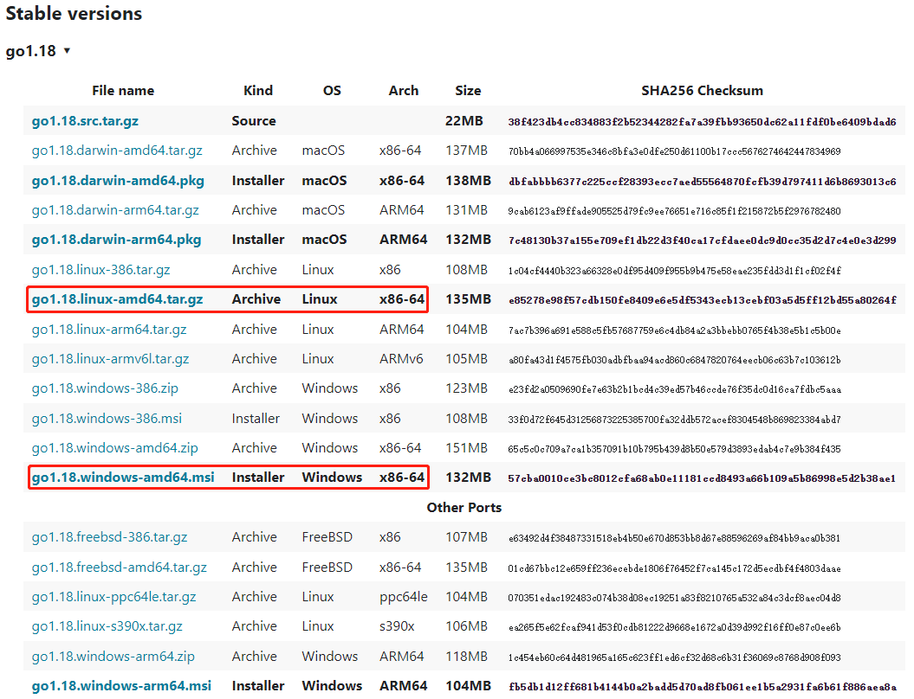
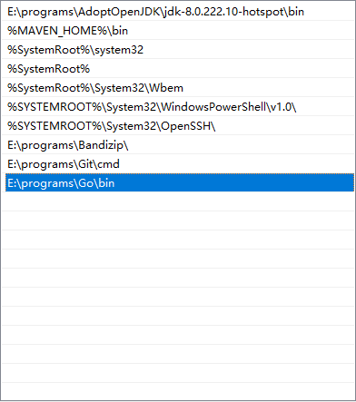
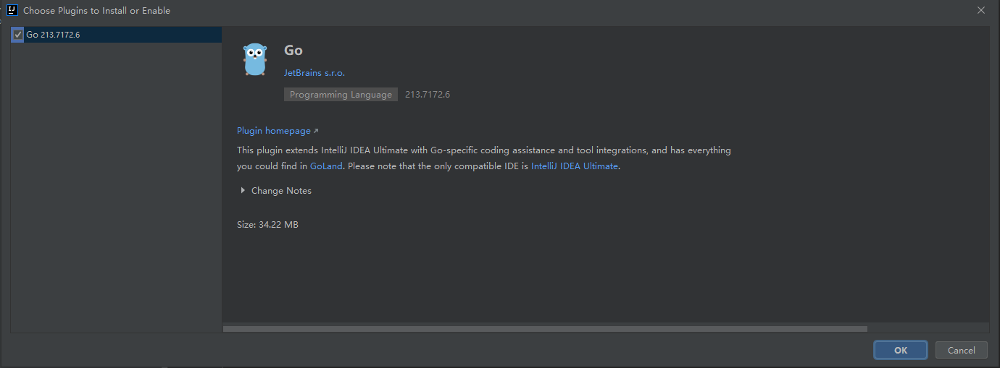
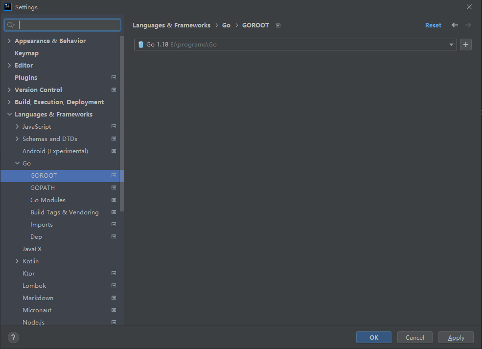
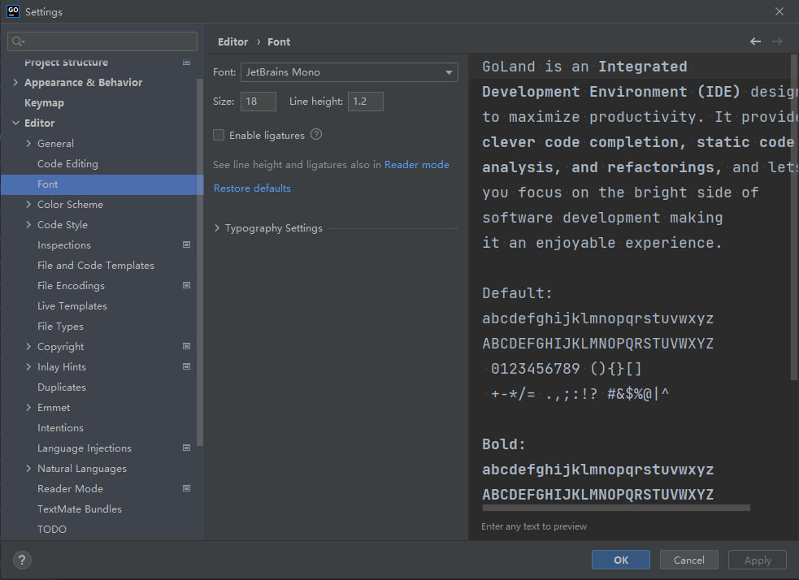
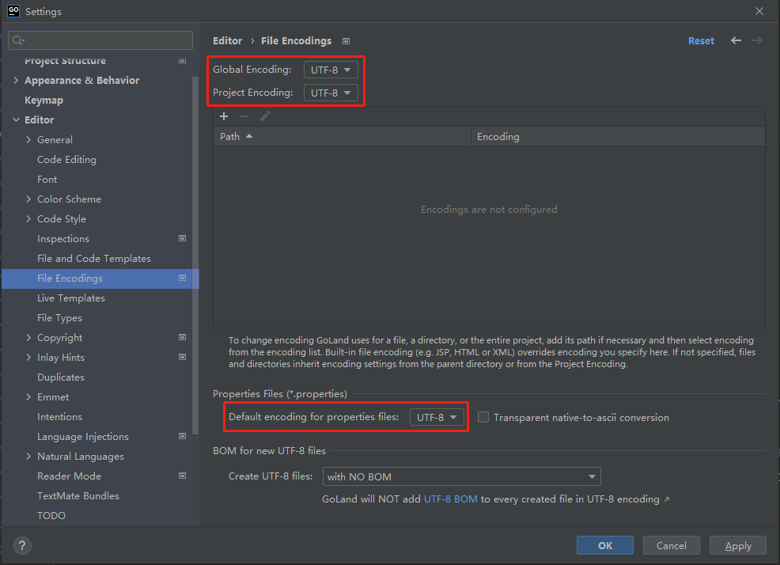
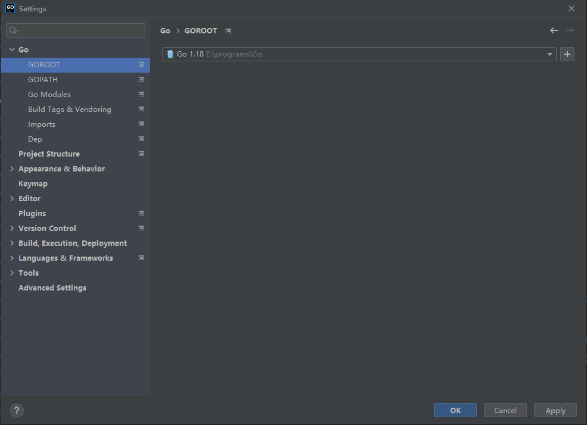

*date: 2022-04-11*

## Windows 下安装环境

官网：https://go.dev/

下载：



安装之后，查看版本，验证安装成功：

```powershell
Windows PowerShell
版权所有 (C) Microsoft Corporation。保留所有权利。

尝试新的跨平台 PowerShell https://aka.ms/pscore6

PS C:\Users\Administrator\Desktop> go version
go version go1.18 windows/amd64
```

- 不需要专门配置 Path，安装过程中会自动添加：

  

## Visual Studio Code 开发

`Go 插件`安装：


## IDEA 开发

`Go 插件`安装，然后重启 IDEA：



`GOROOT`设置：



## GoLand 开发

下载：https://www.jetbrains.com/zh-cn/go/

安装包下载后，点击安装即可，激活过程请支持正版。

`字体`设置：



`编码`设置：



`GOROOT`设置：



## Golang 基本语法

### 语法说明

- Go 源文件以`go`为扩展名。
- Go 应用程序的执行入口是`main()`函数。
- Go 语言严格区分大小写。
- Go 方法由一条条语句构成，每个语句后不需要分号（Go 语言会在每行后自动加分号），这也体现出 Golang 的简洁性。
- Go 编译器是一行行进行编译的，因此一行就写一条语句，不能把多条语句写在同一行，否则报错。
- Go 语言定义的变量或者 import 的包如果没有使用到，代码不能编译通过。
- Go 语言的大括号都是成对出现的，缺一不可。
- Go 语言的左大括号必须写在上一行代码的后面，不可以单独开始一行，否则会报错。

### 转义字符

| 转义字符 | 说明           |
| -------- | -------------- |
| `\t`     | 表示一个制表符 |
| `\n`     | 表示一个换行符 |
| `\\`     | 表示一个 \     |
| `\"`     | 表示一个 "     |
| `\r`     | 表示一个回车   |

### 注释

`行注释`：Go 语言的行注释用于注释一行代码，可以嵌套使用。

```go
// 注释内容
```

`块注释`：又叫多行注释，Go 语言的块注释用于注释多行代码，也可以注释一行代码，但不可以嵌套使用。

```go
/* 
 * 注释内容
 */
```

### 变量

Go 语言是`静态类型语言`，因此变量（variable）是有明确类型的。编译器会检查函数调用中，变量类型的正确性。

#### 基本类型

| 变量类型   | 说明                              |
| ---------- | --------------------------------- |
| bool       | 布尔类型                          |
| string     | 字符串类型                        |
| int        | 整型                              |
| int8       | 整型                              |
| int16      | 整型                              |
| int32      | 整型                              |
| int64      | 整型                              |
| uint       | 无符号整型                        |
| uint8      | 无符号整型                        |
| uint16     | 无符号整型                        |
| uint32     | 无符号整型                        |
| uint64     | 无符号整型                        |
| uintptr    | 指针类型                          |
| byte       | uint8 的别名                      |
| rune       | int32 的别名，代表一个 Unicode 码 |
| float32    | 浮点型                            |
| float64    | 浮点型                            |
| complex64  | 复数类型                          |
| complex128 | 复数类型                          |

#### 声明形式

Go 语言变量的声明形式有三种，即`标准格式`、`批量格式`和`简短格式`。

标准格式：

```go
var identifier type
```

- `var`：声明变量使用的关键字
- `identifier`：变量名
- `type`：变量的数据类型
- 需要注意的是，Go 语言和许多编程语言不同，它在声明变量时将变量的类型放在变量的名称之后。

批量格式：

```go
var(
	变量名1 数据类型1
	变量名2 数据类型2
	变量名3 数据类型3
	变量名4 数据类型4
	变量名5 数据类型5
    ...
)
```

- 使用关键字 var 和括号，可以将一组变量定义放在一起。

简短格式：

```go
变量名 := 表达式
变量名1, 变量名2, 变量名3 ... := 表达式1, 表达式2, 表达式3 ...
```

- 使用简短格式定义变量时，必须同时`显式初始化`，且`不能设置数据类型`。简短格式定义变量只能用在`函数的内部`，不能用作全局变量。

#### 初始化

Go 语言变量在定义的时候，如果没有初始化，那么会被赋一个默认值。Go 语言在声明变量的同时，也可以给变量赋予一个初始值。

- int 类型默认被设置为`0`，float 类型默认被设置为`0.0`，bool 类型默认被设置为`false`，string 类型默认被设置为`空字符串`，指针类型默认被设置为`nil`。

Go 语言变量的初始化形式有三种，即`标准格式`、`编译器类型推导`和`短变量声明`。

标准格式：

```go
var 变量名 类型 = 表达式
```

编译器类型推导：

```go
var 变量名 = 表达式
```

- 通过`reflect.TypeOf()`可以判断变量的类型：

  ```go
  package main
  
  import (
  	"fmt"
  	"reflect"
  )
  
  func main() {
  	var max = 100
  	var min = 0
  	fmt.Println("Max =", max, "Min =", min)
      // Type Max = int Type Min = int
  	fmt.Println("Type Max =", reflect.TypeOf(max), "Type Min =", reflect.TypeOf(min))
  }
  ```

短变量声明：

```go
变量名 := 表达式
```

- `:=`形式的变量声明，左值变量必须是没有定义过的变量，否则会报错。
- 使用 := 的形式定义局部变量，如果定义的是数字类型，那么默认类型为 int。
- 使用 := 的形式定义局部变量，如果定义的是字符串类型，那么默认类型为 string

#### 多变量初始化

Go 语言变量在定义的时候，可以支持同时定义多个变量并初始化。Go 语言在声明并初始化多个变量时，支持使用`var 语法`或者`:= 语法`。

var 语法：

```go
var(
    变量名1 = 表达式1
    变量名2 = 表达式2
    变量名3 = 表达式3
)
```

:= 语法：

```go
变量名1, 变量名2, 变量名3, ... := 表达式1, 表达式2, 表达式3, ...
```

#### 多变量赋值

Go 语言中可以支持同时为多个变量进行赋值。使用多重赋值时，变量的左值和右值按`从左到右`的顺序赋值。

```go
变量名1, 变量名2, 变量名3, ... = 表达式1, 表达式2, 表达式3, ...
```

- 多重赋值在 Go 语言的错误处理和函数返回值中会大量地使用。

- 多重赋值也可以快速实现变量值交换：

  ```go
  package main
  
  import "fmt"
  
  func main() {
  	var(
  		a = 100
  		b = 200
  	)
  	fmt.Println("Before change a =", a, "b =", b) // 100 200
  	a, b = b, a
  	fmt.Println("After change a =", a, "b =", b) // 200 100
  }
  ```

#### 匿名变量

Go 语言中定义未使用的变量是不被允许的，编译时，程序会报错，但有时候函数可能返回多个值，有些值我们是不需要使用的，这时候只能使用 Go 语言`匿名变量`来处理。

Go 语言匿名变量的特点是一个下画线`_`。它可以像其他标识符那样用于变量的声明或赋值（任何类型都可以赋值给它），但任何赋给这个标识符的值都将被抛弃，因此这些值不能在后续的代码中使用，也不可以使用这个标识符作为变量对其它变量进行赋值或运算。

使用 Go 语言匿名变量时，只需要在变量声明的地方使用下画线替换即可。

```go
_, 变量名 := 表达式
变量名, _ := 表达式
```

示例：

```go
package main

import "fmt"

func GetHttpResp()(data []byte, errCode int32){
	return []byte("HttpData"), 0
}

func main() {
    data1, errCode := GetHttpResp()
    // GetHttpResp()函数返回的两个值，被两个变量接受，此时必需都使用，否则报错
	fmt.Println("HttpResp =", string(data1), "ErrCode =", errCode)
    
	data2, _ := GetHttpResp()
    // 使用匿名变量，忽略了GetHttpResp()函数返回的第二个值
	fmt.Println("HttpResp =", string(data2))
}
```

#### 作用域

Go 语言中的一个变量（常量、类型或函数）在程序中都有一定的作用范围，我们称之为`作用域`。Go 语言变量作用域分为`局部作用域`和`全局作用域`。

局部变量：在函数内部声明/定义的变量叫`局部变量`，局部变量的作用域仅限于函数内部。在函数内部定义的变量、函数的参数和返回值、if 和 for 结构内部使用的变量等都是局部变量。

```go
package main

import "fmt"

func main() {
	{
		name := "Go"
		fmt.Println("Name =", name)
	}
    // 报错
	fmt.Println("Name =", name)
    
    for i := 0; i < 3; i++{
		fmt.Print(i)
		fmt.Print(" ")
	}
    // 报错
    fmt.Print(i)
}
```

- 使用 {} 可以将变量 name 的作用域限制在 {} 内部，此时变量 name 的作用域仅仅在 {} 内，name 是一个局部变量。
- 使用 for 循环定义的局部变量 i，作用域仅限于 for 循环的 {} 内部，在 for 循环外部无法访问。

全局变量：在函数外部声明/定义的变量叫`全局变量`。Go 语言全局变量作用域在整个包都有效，如果全局变量的首字母为大写，则该变量的作用域在整个程序有效。

```go
package main

import "fmt"

var name = "go"

var Name = "Go"

func main() {
	fmt.Print("name = ", name)
    fmt.Print("Name = ", name)
}
```

- 我们在 main() 函数外部，定义一个全局变量`name`，此时`name`可以在该源码文件的任何位置访问。
- 我们在 main() 函数外部，定义一个全局变量`Name`，此时`Name`可以在所有的包访问。
- 在 Go 语言中，`首字母大写`的变量、结构体或者函数都是导出的，它们可以在整个程序的任何位置，任何包进行访问。`首字母小写`的全局变量、结构体或者函数只能在本包进行访问。

#### 数据类型

Go 语言中声明的任何一个变量都会有一个类型与之对应，称为`数据类型`。Go 语言数据类型分为`内置类型` 、 `引用类型`和`结构类型`。

##### 内置类型

Go 语言内置类型是由语言提供的一组类型。

Go 语言内置类型有`数值类型`、`字符串类型`和`布尔类型`，这些类型本质上是原始的类型。因此，当对这些值进行增加或者删除的时候，会创建一个新值。

Go 语言内置类型做为参数传递时，传递的是值的`拷贝`，而不是本身。

示例：

```go
package main

import "fmt"

func appendName(name string) {
   name += " Go"
   fmt.Println("Name in appendName: ", name, "Addr: ", &name)
}
func main() {
   name := "Hello"
   appendName(name)
   fmt.Println("Name in main: ", name, "Addr: ", &name)
}
```

输出：

```go
Name in appendName:  Hello, Go! Addr:  0xc00004a260
Name in main:  Hello, Addr:  0xc00004a250
```

- main() 函数中定义的 name 变量，作为参数传递给 appendName() 函数后，被修改并打印值和地址，当再回到 main() 函数打印 name 的值和 name 的地址时，可以发现 name 值并未被修改，而且 main() 函数中的 name 的地址与 appendName() 函数中 name 的地址不一致。因此可以说明，传进 append() 函数的 name 变量，只是一个拷贝。

###### 数值类型

Go 语言的数值类型分为`整数类型`，`浮点数类型`和`复数类型`。每种数值类型都有其对应的大小以及是否支持正负号的定义。

1. 整数类型

   - Go 语言整型是用于存放整数值的。Go 语言整数类型可以分为`有符号整数`和`无符号整数`两大类型。

   - Go 语言有符号整数，即可以支持正数也可以支持负数的形式。Go 语言有符号整数，主要包括`int`类型、`int8`类型、`int16`类型、`int32`类型和`int64`类型。

     - Go 语言的 int 类型的具体大小是跟机器的 CPU 位数相关的。如果 CPU 是 32 位的，那么 int 就占 4 字节，如果 CPU 是 64 位的，那么 int 就占 8 字节。
     - int8 类型、int16 类型、int32 类型和 int64 类型分别对应 8、16、32、64 bit 大小的有符号整数。
     - Unicode 字符`rune`类型是和`int32`等价的类型，通常用于表示一个 Unicode 码点，这两个名称可以互换使用。

   - Go 语言无符号整数，即只支持正数形式，不支持负数的形式。Go 语言无符号整数，主要包括`uint`类型、`uint8`类型、`uint16`类型、`uint32`类型和`uint64`类型。

     - Go 语言的 uint 类型的具体大小是跟机器的 CPU 位数相关的。如果 CPU 是 32 位的，那么 uint 就占 4 字节，如果 CPU 是 64 位的，那么 uint 就占 8 字节。
     - uint8 类型、uint16 类型、uint32 类型和 uint64 类型分别对应 8、16、32、64 bit 大小的无符号整数。
     - `byte`类型和`uint8`类型是等价类型，byte 类型 一般用于强调数值是一个原始的数据而不是一个小的整数。
     - uintptr 类型也是一种无符号的整数类型，没有指定具体的 bit 大小但是足以容纳指针。uintptr 类型只有在底层编程时才需要，特别是 Go 语言和 C 语言函数库或操作系统接口相交互的地方。

   - 在二进制传输、读写文件的结构时，为了保持文件的结构不会受到不同编译目标平台字节长度的影响，不要使用 int 类型和 uint 类型，而应该使用具体长度的整型。如果明确该数据类型是有负数的，那么应该选择使用 int 类型。如果明确该数据类型是没有负数的，那么应该选择使用 uint 类型。

   - 取值范围

     | 数据类型 | 取值范围                                   | 数据类型 | 取值范围                 |
     | -------- | ------------------------------------------ | -------- | ------------------------ |
     | int8     | -128 ~ 127                                 | uint8    | 0 ~ 255                  |
     | int16    | -32768 ~ 32767                             | uint16   | 0 ~ 65535                |
     | int32    | -2147483648 ~ 2147483647                   | uint32   | 0 ~ 4294967295           |
     | int64    | -9223372036854775808 ~ 9223372036854775807 | uint64   | 0 ~ 18446744073709551615 |

   - 示例：

     ```go
     package main
     
     import "fmt"
     
     func main() {
        var score uint32 = 98
        var temp int64 = -12
        fmt.Print("Score = ", score, " Temp = ", temp)
     }
     ```

   - 输出：

      ```go
      Score = 98 Temp = -12
      ```

2. 浮点数类型

   - Go 语言中的浮点类型是用于存放小数的。Go 语言浮点类型提供了两种精度的浮点数，`float32`和`float64`。Go 语言整数类型可以分为有符号整数和无符号整数两大类型，但浮点类型不支持无符号类型。

   - 一个 float32 类型的浮点数可以提供大约 6 个十进制数的精度，而 float64 则可以提供约 15 个十进制数的精度。

   - 通常应该`优先使用 float64 类型`，因为 float32 类型的累计计算误差很容易扩散，并且 float32 能精确表示的正整数并不是很大。

   - 因为 float32 的有效 bit 位只有 23 个，其它的 bit 位用于指数和符号，所以当整数大于 23 bit 能表达的范围时，float32 的表示将出现误差。

   - Go 语言浮点型表示的数值在很小或很大的时候最好用科学计数法书写，通过 e 或 E 来指定指数部分。

   - 取值范围

     | 数据类型 | 最大值  | 常量            |
     | -------- | ------- | --------------- |
     | float32  | 3.4e38  | math.MaxFloat32 |
     | float64  | 1.8e308 | math.MaxFloat64 |

   - 示例：

     ```go
     package main
     
     import (
        "fmt"
        "math"
     )
     
     func main() {
        var score float32 = -1.1
        var temp float64 = 12.2e10
        fmt.Print("Score = ", score, " Temp = ", temp, "\n")
     
        var float32Max = math.MaxFloat32
        var float64Max = math.MaxFloat64
        fmt.Print("Float32Max = ", float32Max, " Float64Max = ", float64Max)
     }
     ```

   - 输出：

     ```go
     Score = -1.1 Temp = 1.22e+11
     Float32Max = 3.4028234663852886e+38 Float64Max = 1.7976931348623157e+308
     ```

3. 复数类型

   - Go 语言提供了两种复数类型，complex64 和 complex128 。其中，complex64 的实数部分和虚数部分都是 float32 类型，complex128 的实数部分和虚数部分都是 float64 类型。

   - 语法：

     ```go
     complex(real, imag)
     ```

     | 参数    | 描述                     |
     | ------- | ------------------------ |
     | complex | 定义复数类型使用的关键字 |
     | real    | 复数的实部               |
     | imag    | 复数的虚部               |

   - 示例：

     ```go
     package main
     
     import (
        "fmt"
     )
     
     func main() {
        var score complex64 = complex(1, 2)
        var number complex128 = complex(23.23, 11.11)
        fmt.Print("Score = ", score, " Number = ", number, "\n")
        fmt.Print("Real Score = ", real(score), " Image Score = ", imag(score), "\n")
        fmt.Print("Real Number = ", real(number), " Image Number = ", imag(number))
     }
     ```

   - 输出：

     ```go
     Score = (1+2i) Number = (23.23+11.11i)
     Real Score = 1 Image Score = 2          
     Real Number = 23.23 Image Number = 11.11
     ```

###### 字符串类型

`// TODO`

###### 布尔类型

Go 语言布尔类型也叫`bool`类型，bool 类型数据只允许取值`true`和`false`，占`1个字节`，默认值为 false。

Go 语言布尔类型适用于逻辑运算，一般用于程序流程控制和条件判断。Go 语言 bool 类型 的 true 表示条件为真， false 表示条件为假。

示例：

```go
package main

import (
   "fmt"
)

func main() {
   var isOk bool
   var isOnline = true
   fmt.Println("IsOk = ", isOk, "IsOnline = ", isOnline)
}
```

输出：

```go
IsOk =  false IsOnline =  true
```

##### 引用类型

Go 语言引用类型我们可以理解为在做为函数参数传递时，`传递的就是本身`，而不像内置类型传递的是副本。Go语言引用类型有`map`、`pointer`、`slice`、`channel`、`interface`和`function`。

示例：

```go
package main

import "fmt"

func changeSlice(modules []string) {
   modules[2] = "Vue"
   fmt.Printf("Modules in changeSlice: %v, Addr: %p\n", modules, modules)
}
func main() {
   modules := []string{"Golang", "Redis", "Json", "Docker"}
   changeSlice(modules)
   fmt.Printf("Modules in main: %v, Addr: %p\n", modules, modules)
}
```

输出：

```go
Modules in changeSlice: [Golang Redis Vue Docker], Addr: 0xc0000d6000
Modules in main: [Golang Redis Vue Docker], Addr: 0xc0000d6000
```

- 切片 modules 在 changeSlice() 函数中修改了值，回到 main() 函数可以发现 modules 的值也改变了，而且 main() 函数中的 modules 的地址与 changeSlice() 函数中 modules 的地址一致。因此可以说明，传进 changeSlice() 函数 modules 变量，不是拷贝而是变量`本身`。

##### 结构类型

Go 语言结构类型可以用来描述一组数据值，这组值的本质即可以是原始的，也可以是非原始的。Go 语言结构类型定义使用的关键字为`struct`。

示例：

```go
package main

import "fmt"

type WebSite struct {
   Name     string
   Age      int32
   IsOnline bool
}

func main() {
   webSite := WebSite{
      Name:     "Go",
      Age:      100,
      IsOnline: true,
   }
   fmt.Printf("%+v", webSite)
}
```

- 此结构类型包含三个字段属性，分别为 string 类型、int32 类型 和 bool 类型。

输出：

```go
{Name:Go Age:100 IsOnline:true}
```

`// TODO`

## 本文参考

https://haicoder.net/golang/golang-tutorial.html

## 声明

写作本文初衷是个人学习记录，鉴于本人学识有限，如有侵权或不当之处，请联系 [wdshfut@163.com](mailto:wdshfut@163.com)。