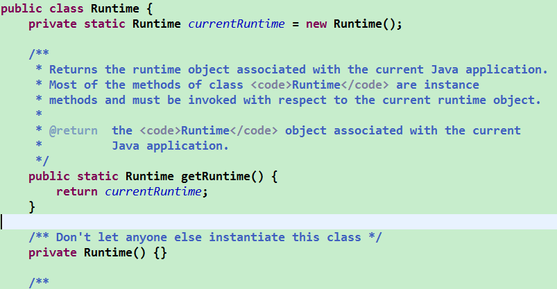

*date: 2021-03-01*

设计模式是在大量的实践中总结和理论化之后优选的代码结构、编程风格、以及解决问题的思考方式。设计模式就像是经典的棋谱，不同的棋局，我们用不同的棋谱，免去自己再思考和摸索。

## 单例 (Singleton) 设计模式

所谓类的单例设计模式，就是采取一定的方法保证在整个的软件系统中，对**某个类只能存在一个对象实例**，并且**该类只提供一个取得其对象实例的方法**。如果我们要让类在一个虚拟机中只能产生一个对象，我们**首先必须将类的构造器的访问权限设置为 private**，这样，就不能用 new 操作符在类的外部产生类的对象了，但在类内部仍可以产生该类的对象。因为在类的外部开始还无法得到类的对象，只能**调用该类的某个静态方法以返回类内部创建的对象**，静态方法只能访问类中的静态成员变量，所以，指向**类内部产生的该类对象的变量也必须定义成静态的**。

单例设计模式的优点：由于单例模式只生成一个实例，**减少了系统性能开销**，当一个对象的产生需要比较多的资源时，如读取配置、产生其他依赖对象时，则可以通过在应用启动时直接产生一个单例对象，然后永久驻留内存的方式来解决。比如，java.lang.Runtime：



单例设计模式的应用场景：

- 网站的计数器，一般也是单例模式实现，否则难以同步。
- 应用程序的日志应用，一般都使用单例模式实现，这一般是由于共享的日志文件一直处于打开状态，因此只能有一个实例去操作，否则内容不好追加。
- 数据库连接池的设计一般也是采用单例模式，因为数据库连接是一种数据库资源。
- 项目中，读取配置文件的类，一般也只有一个对象。没有必要每次使用配置文件数据，都生成一个对象去读取。
- Application 也是单例的典型应用。
- Windows 的 Task Manager (任务管理器) 就是很典型的单例模式。
- Windows 的 Recycle Bin (回收站) 也是典型的单例应用。在整个系统运行过程中，回收站一直维护着仅有的一个实例。

单例设计模式的实现方法：

- **饿汉式：**

  ```java
  public class SingletonTest {
      public static void main(String[] args) {
          Bank bank1 = Bank.getInstance();
          Bank bank2 = Bank.getInstance();
          System.out.println(bank1 == bank2);// true，二者指向同一个对象
      }
  }
  
  class Bank {
      // 1.私有化类的构造器
      private Bank() {
  
      }
  
      // 2.内部创建类的对象
      // 4.要求此对象也必须声明为静态的
      private static Bank instance = new Bank();
  
      // 3.提供公共的静态方法，返回类的对象
      public static Bank getInstance() {
          return instance;
      }
  }
  ```

  ```java
  public class SingletonTest {
      public static void main(String[] args) {
          Bank bank1 = Bank.getInstance();
          Bank bank2 = Bank.getInstance();
          System.out.println(bank1 == bank2);// true，二者指向同一个对象
      }
  }
  
  class Bank {
      private Bank() {
  
      }
      
      public static final Bank instance = new Bank();// 添加final是防止instance属性被外部修改
  }
  ```

- **懒汉式：**

  ```java
  public class SingletonTest {
      public static void main(String[] args) {
          Bank bank1 = Bank.getInstance();
          Bank bank2 = Bank.getInstance();
          System.out.println(bank1 == bank2);// true，二者指向同一个对象
      }
  }
  
  class Bank {
      // 1.私有化类的构造器
      private Bank() {
  
      }
  
      // 2.内部声明类的对象，没有初始化
      // 4.要求此对象也必须声明为静态的
      private static Bank instance = null;
  
      // 3.提供公共的静态方法，返回类的对象
      public static Bank getInstance() {
          // 同步方式一：效率稍差，等同于在方法上直接添加synchronized
          /*synchronized (Bank.class) {
              if (instance == null) {
                  instance = new Bank();
              }
          }
          return instance;*/
  
          // 同步方式二：效率稍好
          if (instance == null) {
              synchronized (Bank.class) {
                  if (instance == null) {
                      instance = new Bank();
                  }
              }
          }
          return instance;
      }
  }
  ```

- 区分饿汉式和懒汉式：

  - 饿汉式
    - 好处：天然就是线程安全的。
    - 坏处：类加载时就创建了对象，导致对象加载时间过长。
  - 懒汉式
    - 好处：延迟对象的创建。
    - 坏处：不是线程安全的，多线程情况下需要考虑线程安全问题。

## 模板式方法设计模式 (TemplateMethod)

抽象类体现的就是一种模板模式的设计，抽象类作为多个子类的通用模板，子类在抽象类的基础上进行扩展、改造，但子类总体上会保留抽象类的行为方式。

解决的问题：

当功能内部一部分实现是确定的，一部分实现是不确定的。这时可以把不确定的部分暴露出去，让子类去实现。

换句话说，在软件开发中实现一个算法时，整体步骤很固定、通用，这些步骤已经在父类中写好了。但是某些部分易变，易变部分可以抽象出来，供不同子类实现。这就是一种模板模式。

模板方法设计模式是编程中经常用得到的模式。各个框架、类库中都有他的影子，比如常见的有：

- 数据库访问的封装
- Junit 单元测试
- JavaWeb 的 Servlet 中关于 doGet/doPost 方法调用
- Hibernate 中模板程序
- Spring 中 JDBCTemlate、HibernateTemplate 等

```java
public class Test {
    public static void main(String[] args) {
        SubTemplate subTemplate = new SubTemplate();
        subTemplate.getTime();
    }
}

abstract class Template {
    // 计算一段代码的执行时间
    public final void getTime() {
        long start = System.currentTimeMillis();
        code();
        long end = System.currentTimeMillis();
        System.out.println("执行时间是：" + (end - start));
    }

    // 代码不确定，由子类自己实现 --- 不确定的、异变的部分
    public abstract void code();
}

class SubTemplate extends Template {
    @Override
    public void code() {
        for (int i = 0; i < 10000; i++) {
            System.out.println(i);
        }
    }
}
```

```java
// 抽象类的应用：模板方法的设计模式
public class TemplateMethodTest {
    public static void main(String[] args) {
        BankTemplateMethod btm = new DrawMoney();
        btm.process();

        BankTemplateMethod btm2 = new ManageMoney();
        btm2.process();
    }
}

abstract class BankTemplateMethod {
    // 具体方法
    public void takeNumber() {
        System.out.println("取号排队");
    }

    public abstract void transact(); // 办理具体的业务 --- 钩子方法

    public void evaluate() {
        System.out.println("反馈评分");
    }

    // 模板方法，把基本操作组合到一起，子类一般不能重写
    public final void process() {
        this.takeNumber();

        this.transact();// 像个钩子，具体执行时，挂哪个子类，就执行哪个子类的实现代码

        this.evaluate();
    }
}

class DrawMoney extends BankTemplateMethod {
    @Override
    public void transact() {
        System.out.println("我要取款！！！");
    }
}

class ManageMoney extends BankTemplateMethod {
    @Override
    public void transact() {
        System.out.println("我要理财！我这里有2000万美元!!");
    }
}
```

## 代理模式 (Proxy)

应用场景：

- 安全代理：屏蔽对真实角色的直接访问。
- 远程代理：通过代理类处理远程方法调用 (RMI)。
- 延迟加载：先加载轻量级的代理对象，真正需要再加载真实对象。比如，要开发一个大文档查看软件，大文档中有大的图片，有可能一个图片有 100 MB，在打开文件时，不可能将所有的图片都显示出来，这样就可以使用代理模式，当需要查看图片时，用 proxy 来进行大图片的打开。

分类：

- 静态代理 (静态定义代理类)

- 动态代理 (动态生成代理类)

- JDK 自带的动态代理，需要反射等知识。

实例：

```java
public class NetWorkTest {
    public static void main(String[] args) {
        Server1 server1 = new Server1();
        Server1 server2 = new Server1();
        ProxyServer proxyServer1 = new ProxyServer(server1);
        ProxyServer proxyServer2 = new ProxyServer(server2);
        // 表面上是代理类执行了browse()方法，实际上是被代理类执行的browse()方法
        proxyServer1.browse();
        proxyServer2.browse();
    }
}

interface Network {
    public void browse();
}

// 被代理类1
class Server1 implements Network {
    @Override
    public void browse() {
        System.out.println("真实的服务器1访问网络");
    }
}

// 被代理类
class Server2 implements Network {
    @Override
    public void browse() {
        System.out.println("真实的服务器2访问网络");
    }
}

// 代理类
class ProxyServer implements Network {
    private Network work;

    public ProxyServer(Network work) {
        this.work = work;
    }

    public void check() {
        System.out.println("联网之前的检查工作");
    }

    @Override
    public void browse() {
        // 代理类除了执行核心功能外，还执行了其他的一些工作
        // 被代理类不需要关系这些其他的工作，只需要完成核心功能即可
        check();
        work.browse();
    }
}
输出结果：
联网之前的检查工作
真实的服务器1访问网络
联网之前的检查工作
真实的服务器1访问网络
```

```java
public class StaticProxyTest {
    public static void main(String[] args) {
        Star s = new Proxy(new RealStar());
        s.confer();
        s.signContract();
        s.bookTicket();
        s.sing();
        s.collectMoney();
    }
}

interface Star {
    void confer();// 面谈

    void signContract();// 签合同

    void bookTicket();// 订票

    void sing();// 唱歌

    void collectMoney();// 收钱
}

class RealStar implements Star {
    @Override
    public void confer() {
    }

    @Override
    public void signContract() {
    }

    @Override
    public void bookTicket() {
    }

    @Override
    public void sing() {
        System.out.println("明星：歌唱~~~");
    }

    @Override
    public void collectMoney() {
    }
}

class Proxy implements Star {
    private Star real;

    public Proxy(Star real) {
        this.real = real;
    }

    @Override
    public void confer() {
        System.out.println("经纪人面谈");
    }

    @Override
    public void signContract() {
        System.out.println("经纪人签合同");
    }

    @Override
    public void bookTicket() {
        System.out.println("经纪人订票");
    }

    @Override
    public void sing() {
        real.sing();
    }

    @Override
    public void collectMoney() {
        System.out.println("经纪人收钱");
    }
}
输出结果：
经纪人面谈
经纪人签合同
经纪人订票
明星：歌唱~~~
经纪人收钱
```

## 工厂模式

`//TODO`