*date: 2021-02-10*


[TOC]

## 异常处理

在使用计算机语言进行项目开发的过程中，即使程序员把代码写得 尽善尽美，在系统的运行过程中仍然会遇到一些问题，因为很多问题不是靠代码能够避免的，比如：客户输入数据的格式，读取文件是否存在，网络是否始终保持通畅等等。

在 Java 语言中，将程序执行中发生的不正常情况称为`异常`。**注意：开发过程中的语法错误和逻辑错误不是异常。**

对于这些错误，一般有两种解决方法：一是遇到错误就终止程序的运行；另一种方法是由程序员在编写程序时，就考虑到错误的检测、错误消息的提示，以及错误的处理。捕获错误最理想的是在编译期间，但有的错误只有在运行时才会发生。比如：除数为 0，数组下标越界等。

### 异常体系结构

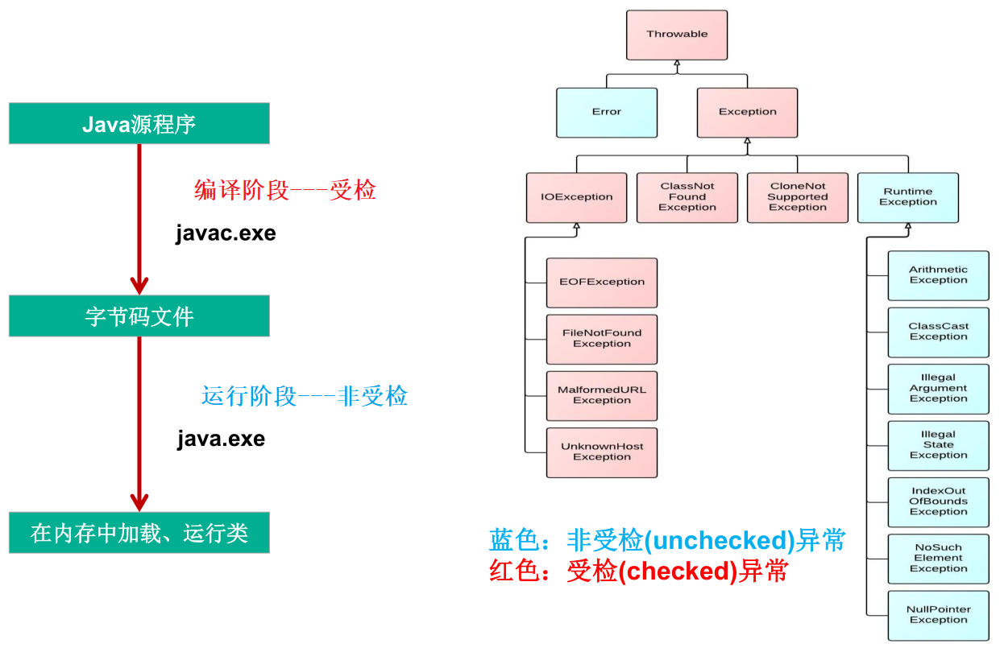

父类：`java.lang.Throwable`。常见的异常分类如下：

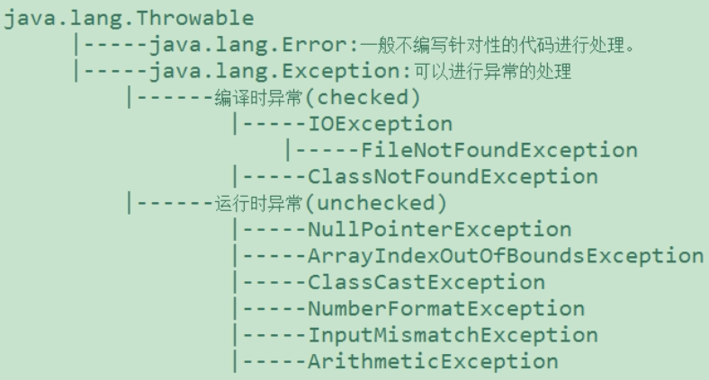

- **`java.lang.Error`：**Java 虚拟机无法解决的严重问题。如：JVM 系统内部错误、资源耗尽等严重情况。比如：`StackOverflowError`和`OutOfMemoryError`（OOM）。一般不编写针对性的代码进行处理（需要更改代码逻辑等去解决问题）。

  ```java
  public class ErrorTest {
      public static void main(String[] args) {
          // 1.栈溢出：java.lang.StackOverflowError
           main(args);
  
          // 2.堆溢出：java.lang.OutOfMemoryError: Java heap space
          Integer[] arr = new Integer[1024 * 1024 * 1024];
      }
  }
  ```

- **`java.lang.Exception`：**其它因编程错误或偶然的外在因素导致的一般性问题，可以使用针对性的代码进行处理。例如：空指针访问、试图读取不存在的文件、网络连接中断和数组角标越界等。

  - **`编译时异常`**：是指编译器要求必须处置的异常。即程序在运行时由于外界因素造成的一般性异常。编译器要求 Java 程序必须捕获或声明所有编译时异常。对于这类异常，如果程序不处理，可能会带来意想不到的结果。

    - `java.io.IOException`和`java.io.FileNotFoundException`

      ```java
      public class IOEx {
          public static void main(String[] args) {
              File file = new File("hello.txt");
              FileInputStream fis = new FileInputStream(file);// !java.io.FileNotFoundException
              int data;
              while ((data = fis.read()) != -1) {// !java.io.IOException
                  System.out.println((char) data);
              }
              fis.close();// !java.io.IOException
          }
      }
      ```

      > 如上代码，在编译期（javac.exe）就会出错，编译不通过，无法生成字节码文件。

  - **`运行时异常`**：是指编译器不要求强制处置的异常。一般是指编程时的逻辑错误，是程序员应该积极避免其出现的异常。`java.lang.RuntimeException`类及它的子类都是运行时异常。对于这类异常，可以不作处理，因为这类异常很普遍，若全处理可能会对程序的可读性和运行效率产生影响。

    - `java.lang.NullPointerException`

      ```java
      public class NullRef {
          int i = 1;
      
          public static void main(String[] args) {
              NullRef t = new NullRef();
              t = null;
              System.out.println(t.i);
          }
      }
      ```

    - `java.lang.ArrayIndexOutOfBoundsException`

      ```java
      public class IndexOutExp {
          public static void main(String[] args) {
              String[] friends = {"lisa", "bily", "kessy"};
              for (int i = 0; i < 5; i++) {
                  System.out.println(friends[i]); // friends[4]?
              }
              System.out.println("\nthis is the end");
          }
      }
      ```

    - `java.lang.ClassCastException`

      ```java
      public class Order {
          public static void main(String[] args) {
              Object obj = new Date();
              Order order;
              order = (Order) obj;
              System.out.println(order);
          }
      }
      ```

    - `java.lang.NumberFormatException`

      ```java
      public class NumFormat {
          public static void main(String[] args) {
              String str = "abc";
              int num = Integer.parseInt(str);
              System.out.println("num = " + num);
          }
      }
      ```

    - `java.util.InputMismatchException`

      ```java
      public class NumFormat {
          public static void main(String[] args) {
              Scanner scanner = new Scanner(System.in);
              int num = scanner.nextInt();// 输入的非整数
              System.out.println("num = " + num);
              scanner.close();
          }
      }
      ```

    - `java.lang.ArithmeticException`

      ```java
      public class DivideZero {
          int x;
      
          public static void main(String[] args) {
              DivideZero c = new DivideZero();
              int y = 3 / c.x;
              System.out.println("y = " + y);
              System.out.println("program ends ok!");
          }
      }
      ```

### 异常处理机制

在编写程序时，经常要在可能出现错误的地方加上检测的代码，如进行 x/y 运算时，要检测分母为 0、数据为空、输入的不是数据而是字符等。而过多的 if-else 分支会导致程序的代码加长、臃肿，可读性差。因此采用异常处理机制。

Java 采用的异常处理机制，是将异常处理的程序代码集中在一起，与正常的程序代码分开，使得程序简洁、优雅，并易于维护。

异常的处理：`抓抛模型`

- 过程一 --- "抛"：程序在正常执行的过程中，一旦出现异常，就会在异常代码处生成一个对应异常类的对象，并将此对象抛出。一旦抛出对象以后，其后的代码就不再继续执行。
  - 关于异常对象的产生：
    - 系统自动生成的异常对象。
    - 手动的生成一个异常对象，并抛出（throw）。
- 过程二 --- "抓"：可以理解为异常的处理方式，分为两种。
  - try-catch-finally
  - throws

#### try-catch-finally

格式：

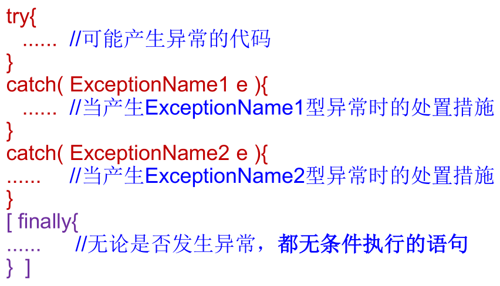

- `try`：捕获异常的第一步是用 try 语句块选定捕获异常的范围，将可能出现异常的代码放在 try 语句块中。

- `catch (ExceptionType e)`：在 catch 语句块中是对异常对象进行处理的代码。

  - **每个 try 语句块可以伴随一个或多个 catch 语句，用于处理可能产生的不同类型的异常对象，当异常对象匹配到某一个 catch 时，就进入该 catch 中进行异常的处理，一旦处理完成，就跳出当前的 try-catch，结构，继续执行 finally 结构和其后的代码。**

  - 如果明确知道产生的是何种异常，可以用该异常类作为 catch 的参数；也可以用其父类作为 catch 的参数。比如：可以用 ArithmeticException 类作为参数的地方，就可以用 RuntimeException 类作为参数，或者用所有异常的父类 Exception 类作为参数。但不能是与 ArithmeticException 类无关的异常，如 NullPointerException，此时 catch 中的语句将不会执行。

  - 与其它对象一样，可以访问 catch 到的异常对象的成员变量或调用它的方法。

    - `getMessage()`：获取异常的说明信息，返回字符串。

    - `printStackTrace()`：获取异常类名和异常的说明信息，以及异常出现在程序中的位置，返回值 void。获取的结果打印到控制台。

      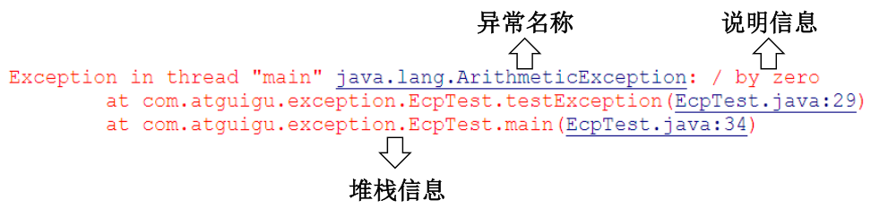

  - 在 try 结构中声明的变量，出了 try 结构以后，就不能再使用了。

- `finally`：捕获异常的最后一步是通过 finally 语句为异常处理提供一个统一的出口，使得在控制流转到程序的其它部分以前，能够对程序的状态作统一的管理。

  - **不论在 try 代码块中是否发生了异常事件，catch 语句是否执行，catch 语句是否有异常，try 或 catch 语句中是否有 return，finally 块中的语句都会被执行。**

    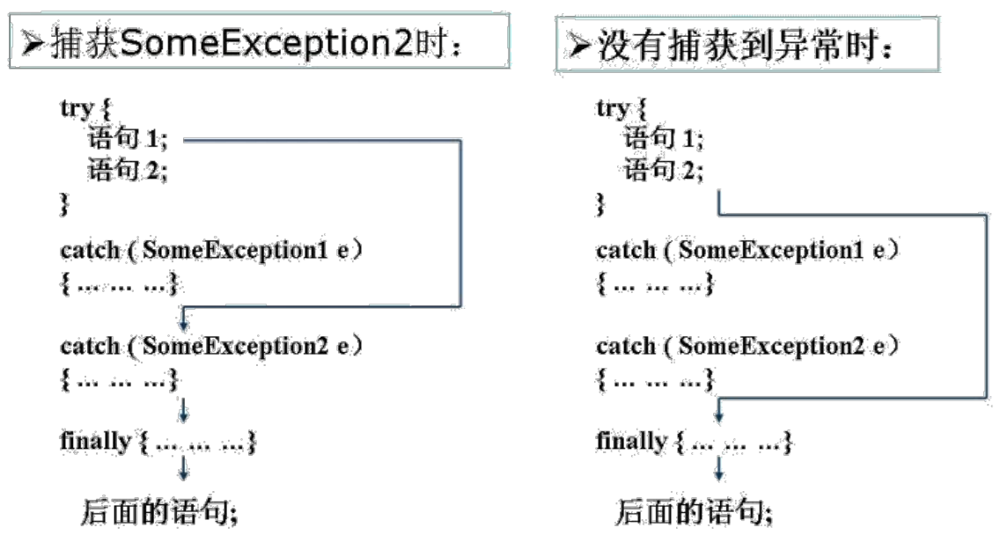

    ```java
    public class ExceptionTest {
        public int method() {
            try {
                int[] arr = new int[10];
                System.out.println(arr[10]);
                return 1;
            } catch (ArrayIndexOutOfBoundsException e) {
                e.printStackTrace();
                return 2;
            } finally {
                System.out.println("finally一定会被执行");
                return 3;// finally中不建议使用return
            }
        }
    
        public static void main(String[] args) {
            ExceptionTest exceptionTest = new ExceptionTest();
            int method = exceptionTest.method();
            System.out.println(method);
        }
    }
    输出结果：
    finally一定会被执行
    3
    ```

    > 由上面代码也可以看出，**finally 语句的内容，会在 try 或 catch 的 return 语句之前执行。**

  - 像数据库连接、输入输出流、网络编程 Socket 等资源，JVM 是不能自动回收的，需要手动的进行资源的释放。此时的资源释放，就需要声明在 finally 中。

    ```java
    public class ExceptionTest {
        public static void main(String[] args) {
            File file = new File("hello.txt");
            FileInputStream fis = null;
            try {
                fis = new FileInputStream(file);
                int data;
                while ((data = fis.read()) != -1) {
                    System.out.println((char) data);
                }
            } catch (IOException e) {
                e.printStackTrace();
            } finally {
                try {
                    if (fis != null) {
                        fis.close();
                    }
                } catch (IOException exception) {
                    exception.printStackTrace();
                }
            }
        }
    }
    ```

- try-catch-finally 结构可以嵌套。

- try-catch-finally 结构中，try 语句必须存在，catch 和 finally 语句，必须至少存在一个，其中，catch 语句可以出现多个。

- 使用 try-catch-finally 处理编译时异常，使得程序在编译时就不再报错，但在运行时仍可能报错。相当于使用 try-catch-finally 将一个编译时可能出现的异常，延迟到运行时出现。

- 开发中，由于运行时异常比较常见，通常不针对运行时异常编写 try-catch-finally，针对编译时异常，一定要考虑异常的处理。

- try-catch-finally：真正的将异常进行了处理。

#### throws

如果一个方法中的语句执行时可能生成某种异常，但是并不能确定如何处理这种异常，则此方法应显示地声明抛出异常，表明该方法将不对这些异常进行处理，而由该方法的调用者负责处理。在方法声明中用`throws`语句可以声明抛出异常的列表，throws 后面的异常类型可以是方法中产生的异常类型，也可以是它的父类。注意：不同于 try-catch-finally，throws 并没有真正的将异常进行了处理，而是抛给了方法的调用者去处理。

"throws + 异常类型"，写在方法的声明处。指明此方法执行时，可能会抛出的异常类型。一旦当方法体执行时出现异常，仍会在异常代码处生成一个异常类的对象，此对象满足 throws 后的异常类型时，就会被抛出。**异常代码后续的代码，就不再被执行。**

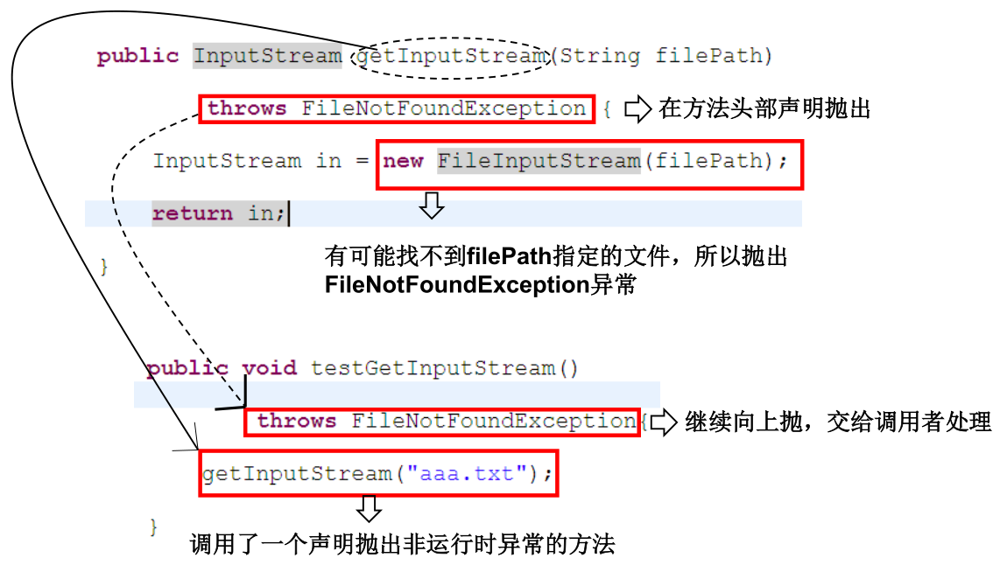

重写方法声明抛出异常的原则：`子类重写的方法不能抛出比父类被重写的方法范围更大的异常类型`。

```java
public class A {
    public void methodA() throws IOException {
    }
}

public class B1 extends A {
    public void methodA() throws FileNotFoundException {
    }
}

public class B2 extends A {
    public void methodA() throws Exception {// 报错
    }
}
```

#### 开发中如何选择使用 try-catch-finally 和 throws

1. 如果父类中被重写的方法没有 throws 方式处理异常，则子类重写的方法也不能使用 throws，意味着如果子类重写的方法中有异常，必须使用 try-catch-finally 方式处理。
2. 执行的方法中，先后又调用了另外的几个方法，这几个方法是递进关系执行的，则建议这几个方法使用 throws 的方式进行处理。而执行的方法中，可以考虑使用 try-catch-finally 方式进行处理。

### 手动生成并抛出异常

Java 异常类对象除在程序执行过程中出现异常时由系统自动生成并抛出，也可根据需要使用人工创建并抛出 。

- 首先要生成异常类对象，然后通过 throw 语句实现抛出操作（提交给 Java 运行环境）。如：`IOException e = new IOException(); throw e;`。

- 可以抛出的异常必须是 Throwable 或其子类的实例。下面的语句在编译时将会产生语法错误：`throw new String("want to throw");`。

实例：

```java
public class Student {
    public static void main(String[] args) {
        Student student = new Student();
        student.regist(-100);

        try {
            student.regist2(-200);
        } catch (Exception exception) {
            System.out.println(exception.getMessage());
        }
    }

    private int id;

    public void regist(int id) {
        if (id > 0) {
            this.id = id;
        } else {
            // 手动抛出异常
            throw new RuntimeException("输入的数据非法：" + id);
        }
    }

    public void regist2(int id) throws Exception {
        if (id > 0) {
            this.id = id;
        } else {
            // 手动抛出异常，需要在方法中声明
            throw new Exception("输入的数据非法：" + id);
        }
    }
}
```

执行 throw 后，后面代码还会执行吗？

```java
public class ExceptionTest {
    public static void main(String[] args) {
        int i = 1;
        if (i > 5) {
            System.out.println(i);
        } else {
            try {
                throw new Exception("数据非法！");// 异常被try-catch
            } catch (Exception e) {
                e.printStackTrace();
            }
            System.out.println("123");
        }
    }
}
输出结果：
java.lang.Exception: 数据非法！
	at cn.xisun.java.base.ExceptionTest.main(ExceptionTest.java:17)
123
```

```java
public class ExceptionTest {
    public static void main(String[] args) throws Exception {
        int i = 1;
        if (i > 5) {
            System.out.println(i);
        } else {
            throw new Exception("数据非法！");// 异常被throws
            System.out.println("123");// 编译不通过
        }
    }
}
```

```java
public class ExceptionTest {
    public static void main(String[] args) throws Exception {
        int i = 1;
        if (i > 5) {
            System.out.println(i);
        } else {
            throw new Exception("数据非法！");
        }
        System.out.println("123");
    }
}
输出结果：
Exception in thread "main" java.lang.Exception: 数据非法！
	at cn.xisun.java.base.ExceptionTest.main(ExceptionTest.java:16)
```

```java
public class ExceptionTest {
    private static void get(int i) {
        try {
            int a = i / 0;
            System.out.println(a);
        } catch (Exception e) {
            throw new RuntimeException("发生异常");
        }
        System.out.println("123");
    }

    public static void main(String[] args) {
        for (int i = 1; i < 4; i++) {
            System.out.println(i);
            get(i);
        }
    }
}
输出结果：
1
Exception in thread "main" java.lang.RuntimeException: 发生异常
	at cn.xisun.java.base.ExceptionTest.get(ExceptionTest.java:16)
	at cn.xisun.java.base.ExceptionTest.main(ExceptionTest.java:24)
```

### 用户自定义异常类

如何自定义异常类：

- 继承于现有的异常结构：RuntimeException、Exception 等。

- 提供全局变量：serialVersionUID，唯一的标识当前类。

- 提供重载的构造器。

- 异常类的名字应做到见名知义，当异常出现时，可以根据名字判断异常类型。

实例：

  ```java
public class MyException extends Exception {
    static final long serialVersionUID = 13465653435L;

    public MyException() {

    }

    public MyException(String message) {
        super(message);
    }
}

class MyExpTest {
    public void regist(int num) throws MyException {
        if (num < 0) {
            throw new MyException("人数为负值，不合理");
        } else {
            System.out.println("登记人数" + num);
        }
    }

    public void manager() {
        try {
            regist(-100);
        } catch (MyException e) {
            System.out.print("登记失败，出错信息：" + e.getMessage());
        }
        System.out.print("本次登记操作结束");
    }

    public static void main(String args[]) {
        MyExpTest t = new MyExpTest();
        t.manager();
    }
}
输出结果：
登记失败，出错信息：人数为负值，不合理
本次登记操作结束
  ```

  ```java
public class ReturnExceptionDemo {
    static void methodA() {
        try {
            System.out.println("进入方法A");
            throw new RuntimeException("制造异常");
        } finally {
            System.out.println("调用A方法的finally");
        }
    }

    static void methodB() {
        try {
            System.out.println("进入方法B");
            return;
        } finally {
            System.out.println("调用B方法的finally");
        }
    }

    public static void main(String[] args) {
        try {
            methodA();
        } catch (Exception e) {
            System.out.println(e.getMessage());
        }
        methodB();
    }
}
输出结果：
进入方法A
调用A方法的finally
制造异常
进入方法B
调用B方法的finally
  ```

### 异常处理的 5 个关键字

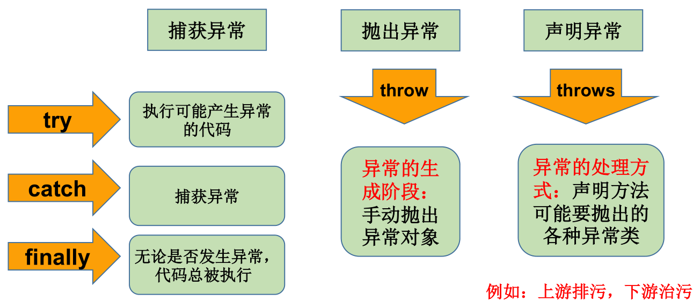

面试题：

- final、finally 和 finalize 的区别？
  - finalize 是一个方法。
- throw 和 throws 的区别？
  - throw 表示抛出一个异常类的对象，生成异常对象的过程，声明在方法体内。
  - throws 属于异常处理的一种方式，声明在方法的声明处。

## 字符串

### String 的特性

String：字符串，使用双引号引起来表示。

- String 是一个 final 类，不可被继承。

- String 继承了 Serializable、Comparable 和 CharSequence 接口。 

  ```java
  public final class String implements java.io.Serializable, Comparable<String>, CharSequence {}
  ```

  - 实现 Serializable 接口：表示字符串是支持可序列化的。
  - 实现 Comparable 接口  ：表示 String 可以比较大小。

- **String 内部定义了`final char value[]`用于存储字符串数据。**

- String 代表不可变的字符序列 --- `不可变性`。 体现在：

  - **当对字符串重新赋值时，需要重新指定内存区域赋值，不能使用原有的 value 进行赋值。**
  - **当对现有的字符串进行连接操作时，也需要重新指定内存区域赋值。**
  - **当调用 String 的`replace()`修改原字符串中指定的字符或字符串时，也需要重新指定内存区域赋值。**

- **通过字面量的定义（区别于 new）方式给一个字符串赋值，此时的字符串值声明在字符串常量池中。**

- **字符串常量池中不会存储相同内容的字符串。**

实例：

  ```java
public class Test {
    public static void main(String[] args) {
        String s1 = "abc";// 字面量的定义方式
        String s2 = "abc";
        System.out.println(s1 == s2);// true
        s1 = "hello";
        System.out.println(s1 == s2);// false
        System.out.println(s1);// hello
        System.out.println(s2);// abc

        System.out.println("**************************");
        String s3 = "abc";
        s3 += "def";
        System.out.println(s3);// abcdef
        System.out.println(s2);// abc ---> 原abc没变

        System.out.println("**************************");
        String s4 = "abc";
        String s5 = s4.replace("a", "m");
        System.out.println(s4);// abc ---> 原abc没变
        System.out.println(s5);// mbc
    }
}
  ```

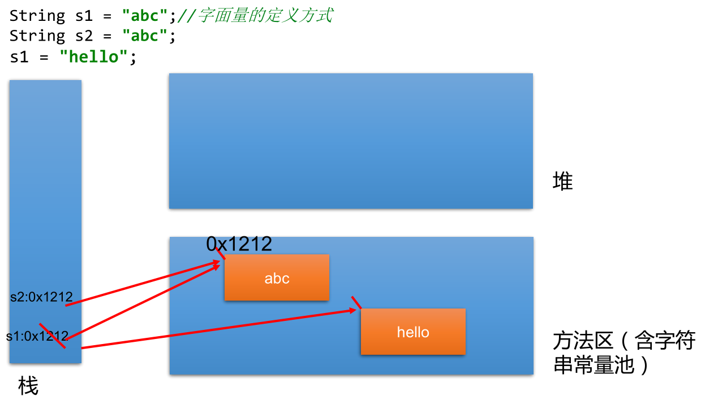

### String 对象的创建

**方式一：通过`字面量定义`的方式，此时的字符串数据声明在方法区中的`字符串常量池`中。**

**方式二：通过`new + 构造器`的方式，此时变量保存的地址值，是字符串数据在`堆空间`中开辟空间以后所对应的地址值。**

常用的几种创建方式：

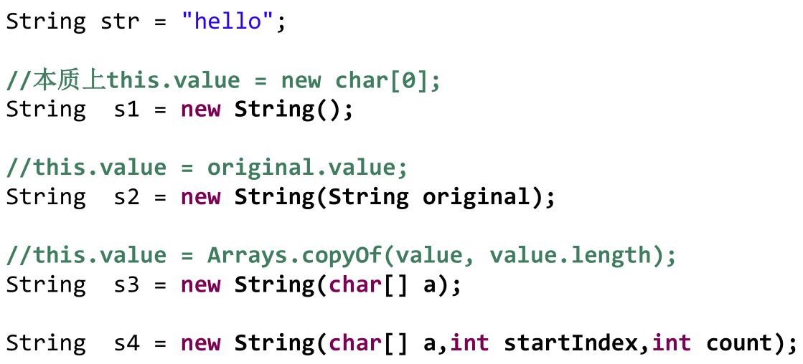

实例：

```java
public class Test {
    public static void main(String[] args) {
        // 通过字面量定义的方式：此时的s1和s2的数据javaEE，声明在方法区中的字符串常量池中
        String s1 = "javaEE";
        String s2 = "javaEE";

        // 通过"new+构造器"的方式：此时的s3和s4保存的地址值，是数据在堆空间中开辟空间以后所对应的地址值
        String s3 = new String("javaEE");
        String s4 = new String("javaEE");

        System.out.println(s1 == s2);// true
        System.out.println(s1 == s3);// false
        System.out.println(s1 == s4);// false
        System.out.println(s3 == s4);// false

        System.out.println("*************************");
        Person p1 = new Person("Tom", 12);// 通过字面量定义的方式定义的name
        Person p2 = new Person("Tom", 12);
        System.out.println(p1.name.equals(p2.name));// true
        System.out.println(p1.name == p2.name);// true

        p1.name = "Jerry";
        System.out.println(p2.name);// Tom

        System.out.println("*************************");
        Person p3 = new Person(new String("Tom"), 12);// 通过"new+构造器"的方式定义的name
        Person p4 = new Person(new String("Tom"), 12);
        System.out.println(p3.name.equals(p4.name));// true
        System.out.println(p3.name == p4.name);// false
    }
}

class Person {
    String name;
    int age;

    public Person() {

    }

    public Person(String name, int age) {
        this.name = name;
        this.age = age;
    }
}
```

内存解析说明：

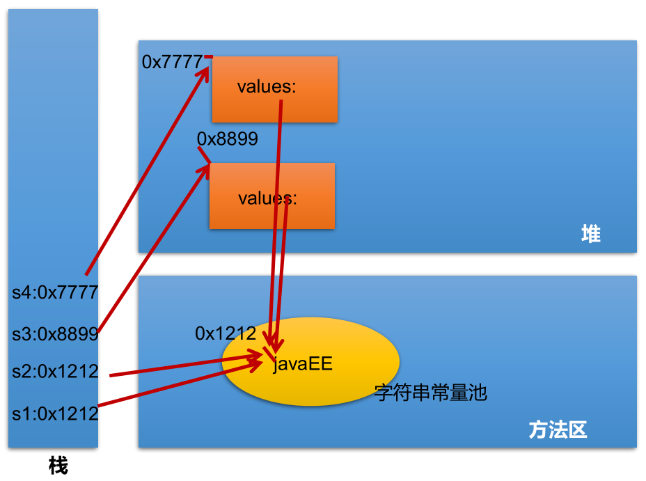

字符串初始化的过程：

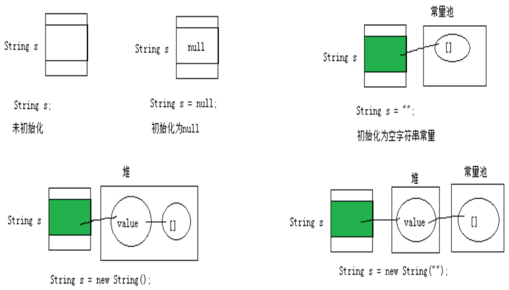

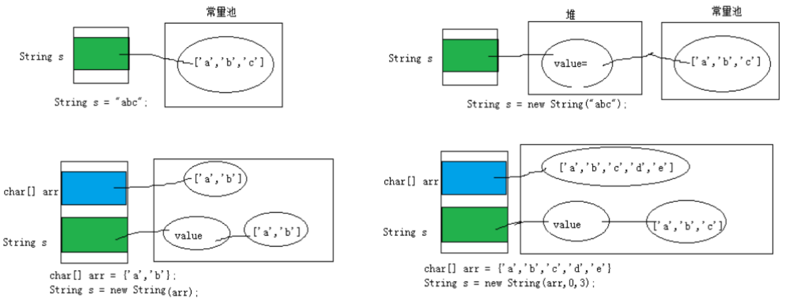

**字符串拼接：**

- **如果是常量与常量的拼接，则结果在常量池，且常量池中不会存在相同内容的常量。**
- **如果其中有一个是变量，则结果在堆中。**
- **如果拼接的结果调用`intern()`方法，则返回值在常量池中。**

```java
public class Test {
    public static void main(String[] args) {
        String s1 = "javaEE";// 常量池
        String s2 = "hadoop";// 常量池
        String s3 = "javaEEhadoop";// 常量池
        String s4 = "javaEE" + "hadoop";// 常量池
        String s5 = s1 + "hadoop";// 堆空间
        String s6 = "javaEE" + s2;// 堆空间
        String s7 = s1 + s2;// 堆空间
        String s8 = (s1 + s2).intern();// 常量池

        System.out.println(s3 == s4);// true
        System.out.println(s3 == s5);// false
        System.out.println(s3 == s6);// false
        System.out.println(s3 == s7);// false
        System.out.println(s3 == s8);// true
        System.out.println(s5 == s6);// false
        System.out.println(s5 == s7);// false
        System.out.println(s5 == s8);// false
        System.out.println(s6 == s7);// false
        System.out.println(s6 == s8);// false
        System.out.println(s7 == s8);// false
    }
}
```

内存解析说明：

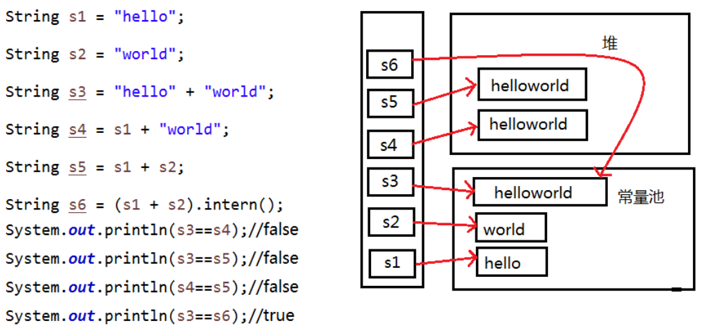

特殊的情况：

```java
public class StringTest {
    public static void main(String[] args) {
        String s1 = "javaEEhadoop";
        String s2 = "javaEE";
        String s3 = s2 + "hadoop";
        System.out.println(s1 == s3);// false
        final String s4 = "javaEE";
        String s5 = s4 + "hadoop";
        System.out.println(s1 == s5);// true
        
        System.out.println(s2 == s4);// true
    }
}
```

> s4 变量被 final 修饰，实际上也就是常量，等同于 s2。

- 面试题

  - `String s = new String("abc");`方式创建对象，在内存中创建了几个对象？

    - 两个：一个是堆空间中 new 的结构，另一个是 char[] 对应的常量池中的数据 "abc"。

  - `String str1 = "abc";`与`String str2 = new String("abc");`的区别？

    - **字符串常量存储在字符串常量池，目的是共享。**
    - **字符串非常量对象存储在堆中。**

    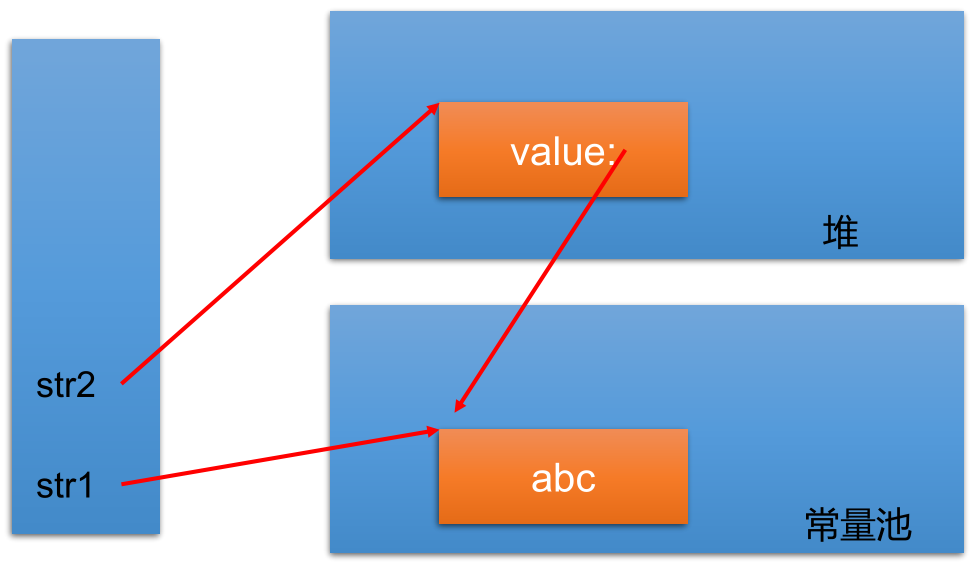

  - 下面程序的运行结果是：

    ```java
    public class StringTest {
        String str = new String("good");
        char[] ch = {'t', 'e', 's', 't'};
    
        public void change(String str, char ch[]) {
            str = "test ok";
            ch[0] = 'b';
        }
    
        public static void main(String[] args) {
            StringTest ex = new StringTest();
            ex.change(ex.str, ex.ch);
            System.out.println(ex.str);// good
            System.out.println(ex.ch);// best
        }
    }
    ```

    > 值传递机制和 String 的不可变性。

### String 的常用方法

- `int length()`：返回字符串的长度，`return value.length`。

- `char charAt(int index)`：返回某索引处的字符，`return value[index]`。

- `boolean isEmpty()`：判断是否是空字符串，`return value.length == 0`。

- `String toLowerCase()`：使用默认语言环境，将 String 中的所有字符转换为小写。

  ```java
  public class StringTest {
      public static void main(String[] args) {
          String s1 = "HelloWorld";
          String s2 = s1.toLowerCase();// s1不可变，仍未原来的字符串
          System.out.println(s2);// helloworld
      }
  }
  ```

- `String toUpperCase()`：使用默认语言环境，将 String 中的所有字符转换为大写。

  ```java
  public class StringTest {
      public static void main(String[] args) {
          String s1 = "HelloWorld";
          String s2 = s1.toUpperCase();// s1不可变，仍未原来的字符串
          System.out.println(s2);// HELLOWORLD
      }
  }
  ```

- `String trim()`：返回字符串的副本，忽略前导空白和尾部空白。

  ```java
  public class StringTest {
      public static void main(String[] args) {
          String s1 = "  he  llo    world    ";
          String s2 = s1.trim();
          System.out.println("---" + s1 + "---");// ---  he  llo    world    ---
          System.out.println("---" + s2 + "---");// ---he  llo    world---
      }
  }
  ```

- `boolean equals(Object obj)`：比较字符串的内容是否相同。

- `boolean equalsIgnoreCase(String anotherString)`：比较字符串的内容是否相同，忽略大小写。

- `String concat(String str)`：将指定字符串连接到此字符串的结尾，等价于用 "+"。

  ```java
  public class StringTest {
      public static void main(String[] args) {
          String s1 = "abc";
          String s2 = s1.concat("def");
          System.out.println(s2);// abcdef
      }
  }
  ```

- `int compareTo(String anotherString)`：比较两个字符串的大小。

- `String substring(int beginIndex)`：返回一个新的字符串，截取当前字符串从 beginIndex 开始到最后的一个子字符串。

  ```java
  public class StringTest {
      public static void main(String[] args) {
          String s1 = "HelloWorld";
          String s2 = s1.substring(2);
          System.out.println(s2);// lloWorld
      }
  }
  ```

- `String substring(int beginIndex, int endIndex)`：返回一个新字符串，截取当前字符串从 beginIndex 开始到 endIndex（不包含）结束的一个子字符串 --- 左闭右开，`[beginIndex, endIndex)`。

  ```java
  public class StringTest {
      public static void main(String[] args) {
          String s1 = "HelloWorld";
          String s2 = s1.substring(2, 6);
          System.out.println(s2);// lloW
      }
  }
  ```

- `boolean endsWith(String suffix)`：测试此字符串是否以指定的后缀结束。

  ```java
  public class StringTest {
      public static void main(String[] args) {
          String s1 = "HelloWorld";
          System.out.println(s1.endsWith("ld"));// true
      }
  }
  ```

- `boolean startsWith(String prefix)`：测试此字符串是否以指定的前缀开始。

  ```java
  public class StringTest {
      public static void main(String[] args) {
          String s1 = "HelloWorld";
          System.out.println(s1.startsWith("ll"));// false
      }
  }
  ```

- `boolean startsWith(String prefix, int toffset)`：测试此字符串从指定索引开始的子字符串是否以指定前缀开始。

  ```java
  public class StringTest {
      public static void main(String[] args) {
          String s1 = "HelloWorld";
          System.out.println(s1.startsWith("ll", 2));// true
      }
  }
  ```

- `boolean contains(CharSequence s)`：当且仅当此字符串包含指定的 char 值序列时，返回 true。

  ```java
  public class StringTest {
      public static void main(String[] args) {
          String s1 = "HelloWorld";
          System.out.println(s1.contains("wo"));// false
      }
  }
  ```

- `int indexOf(String str)`：返回指定子字符串在此字符串中第一次出现处的索引，未找到返回 -1。

  ```java
  public class StringTest {
      public static void main(String[] args) {
          String s1 = "HelloWorld";
          System.out.println(s1.indexOf("lo"));// 3
      }
  }
  ```

- `int indexOf(String str, int fromIndex)`：返回指定子字符串在此字符串中第一次出现处的索引，从指定的索引开始，未找到返回 -1。

  ```java
  public class StringTest {
      public static void main(String[] args) {
          String s1 = "HelloWorld";
          System.out.println(s1.indexOf("lo", 5));// -1
      }
  }
  ```

- `int lastIndexOf(String str)`：返回指定子字符串在此字符串中最右边出现处的索引，未找到返回 -1。

  ```java
  public class StringTest {
      public static void main(String[] args) {
          String s1 = "hellorworld";
          System.out.println(s1.lastIndexOf("or"));// 7
      }
  }
  ```

- `int lastIndexOf(String str, int fromIndex)`：返回指定子字符串在此字符串中最后一次出现处的索引，从指定的索引开始反向搜索，未找到返回 -1。

  ```java
  public class StringTest {
      public static void main(String[] args) {
          String s1 = "hellorworld";
          System.out.println(s1.lastIndexOf("or", 6));// 4
      }
  }
  ```

  >**面试题：什么情况下，`indexOf(str)`和`lastIndexOf(str)`返回值相同？**
  >
  >**情况一：存在唯一的一个 str。情况二：不存在 str。**

- `String replace(char oldChar, char newChar)`：返回一个新的字符串，它是通过用 newChar 替换此字符串中出现的所有 oldChar 得到的。

  ```java
  public class StringTest {
      public static void main(String[] args) {
          String s1 = "hellorworld";
          String s2 = s1.replace("o", "D");
          System.out.println(s2);// hellDrwDrld
      }
  }
  ```

- `String replace(CharSequence target, CharSequence replacement)`：使用指定的字面值替换序列替换此字符串所有匹配字面值目标序列的子字符串。

  ```java
  public class StringTest {
      public static void main(String[] args) {
          String s1 = "hellorworld";
          String s2 = s1.replace("or", "DE");
          System.out.println(s2);// hellDEwDEld
      }
  }
  ```

- `String replaceAll(String regex, String replacement)`：使用给定的 replacement 替换此字符串所有匹配给定的正则表达式的子字符串。

  ```java
  public class StringTest {
      public static void main(String[] args) {
          String str = "12hello34world5java7891mysql456";
          // 把字符串中的数字替换成,，如果结果中开头和结尾有,的话去掉
          String s1 = str.replaceAll("\\d+", ",");
          System.out.println(s1);// ,hello,world,java,mysql,
          String s2 = s1.replaceAll("^,|,$", "");
          System.out.println(s2);// hello,world,java,mysql
      }
  }
  ```

- `String replaceFirst(String regex, String replacement)`：使用给定的 replacement 替换此字符串匹配给定的正则表达式的第一个子字符串。

  ```java
  public class StringTest {
      public static void main(String[] args) {
          String str = "12hello34world5java7891mysql456";
          // 把字符串中的数字替换成,，如果结果中开头和结尾有，的话去掉
          String s1 = str.replaceFirst("\\d+", ",");
          System.out.println(s1);// ,hello34world5java7891mysql456
      }
  }
  ```

- `boolean matches(String regex)`：告知此字符串是否匹配给定的正则表达式。

  ```java
  public class StringTest {
      public static void main(String[] args) {
          String str = "1234d5";
          // 判断str字符串中是否全部由数字组成，即有1-n个数字组成
          boolean matches = str.matches("\\d+");
          System.out.println(matches);// false
          String tel = "0571-4534289";
          // 判断这是否是一个杭州的固定电话
          boolean result = tel.matches("0571-\\d{7,8}");
          System.out.println(result);// true
      }
  }
  ```

- `String[] split(String regex)`：根据匹配给定的正则表达式来拆分此字符串。

  ```java
  public class StringTest {
      public static void main(String[] args) {
          String str = "hello|world|java";
          String[] strs = str.split("\\|");
          for (String value : strs) {
              System.out.println(value);
          }
          System.out.println();
          String str2 = "hello.world.java";
          String[] strs2 = str2.split("\\.");
          for (String s : strs2) {
              System.out.println(s);
          }
          System.out.println();
          String str3 = "hello-world-java";
          String[] strs3 = str3.split("-");
          for (String s : strs3) {
              System.out.println(s);
          }
      }
  }
  输出结果：
  hello
  world
  java
  
  hello
  world
  java
  
  hello
  world
  java
  ```

- `String[] split(String regex, int limit)`：根据匹配给定的正则表达式来拆分此字符串，最多不超过 limit 个，如果超过了，剩下的全部都放到最后一个元素中。

  ```java
  public class StringTest {
      public static void main(String[] args) {
          String str = "hello|world|java";
          String[] strs = str.split("\\|",2);
          for (String value : strs) {
              System.out.println(value);
          }
      }
  }
  输出结果：
  hello
  world|java
  ```

- `substring()`与`indexOf()`结合使用：

  - 截取第二个 "-" 之前的字符：

    ```java
    public class Test {
        public static void main(String[] args) {
            String s = "application-2005-US20050154023A1-20050714";
            String r = s.substring(0, s.indexOf("-", s.indexOf("-") + 1));
            System.out.println(r);
        }
    }
    输出结果：
    application-2005
    ```

  - 截取第二个 "-" 之后的字符：

    ```java
    public class Test {
        public static void main(String[] args) {
            String s = "application-2005-US20050154023A1-20050714";
            String r = s.substring(s.indexOf("-", s.indexOf("-") + 1) + 1);
            System.out.println(r);
        }
    }
    输出结果：
    US20050154023A1-20050714
    ```

  - 截取倒数第二个 "-" 之前的字符：

    ```java
    public class Test {
        public static void main(String[] args) {
            String s = "application-2005-US20050154023A1-20050714";
            String r = s.substring(0, s.lastIndexOf("-", s.lastIndexOf("-") - 1));
            System.out.println(r);
        }
    }
    输出结果：
    application-2005
    ```

  - 截取倒数第二个 "-" 之后的字符：

    ```java
    public class Test {
        public static void main(String[] args) {
            String s = "application-2005-US20050154023A1-20050714";
            String r = s.substring(s.lastIndexOf("-", s.lastIndexOf("-") - 1) + 1);
            System.out.println(r);
        }
    }
    输出结果：
    US20050154023A1-20050714
    ```

### String 与其他结构之间的转换

#### String 与基本数据类型/包装类之间的转换

字符串转换为基本数据类型/包装类：

- Integer 包装类的`public static int parseInt(String s)`：可以将由 "数字" 字符组成的字符串，转换为整型。
- 类似地，使用 java.lang 包中的 Byte、Short、Long、Float、Double 类调相应的类方法可以将由 "数字" 字符组成的字符串，转换为相应的基本数据类型。

基本数据类型/包装类转换为字符串：

- 调用 String 类的`public String valueOf(int n)`可将 int 型转换为字符串。
- 相应的`valueOf(byte b)`、`valueOf(long l)`、`valueOf(float f)`、`valueOf(doubled)`、`valueOf(boolean b)`可将参数的相应类型转换为字符串。

#### String 与字符数组（char[]）之间的转换

字符串转换为字符数组：

- `public char[] toCharArray()`：将字符串中的全部字符存放在一个字符数组中的方法。

  ```java
  public class StringTest {
      public static void main(String[] args) {
          String str = "hello|world|java";
          char[] chars = str.toCharArray();
          for (char c : chars) {
              System.out.println(c);
          }
      }
  }
  ```

- `public void getChars(int srcBegin, int srcEnd, char[] dst, int dstBegin)`：提供了将指定索引范围内的字符串存放到数组中的方法。

字符数组转换为字符串：

- String 类的构造器：`String(char[])`和`String(char[], int offset, intlength)`分别用字符数组中的全部字符和部分字符创建字符串对象。

  ```java
  public class StringTest {
      public static void main(String[] args) {
          char[] arr = new char[]{'a', 'b', 'c'};
          String str = new String(arr);
          System.out.println(str);
      }
  }
  ```

#### String 与字节数组（byte[]）之间的转换

字符串转换为字节数组：

- **`编码`：String ---> byte[]，字符串 ---> 字节，看得懂的 ---> 看不懂的二进制数据。**
- `public byte[] getBytes()`：使用平台的默认字符集将此 String 编码为 byte 序列，并将结果存储到新的 byte 数组中。
- `public byte[] getBytes(String charsetName)`：使用指定的字符集将此 String 编码为 byte 序列，并将结果存储到新的 byte 数组中。

字节数组转换为字符串：

- **`解码`：byte[] ---> String，字节 ---> 字符串，看不懂的二进制数据 ---> 看得懂的。编码的逆过程。**
- `String(byte[])`：通过使用平台的默认字符集解码指定的 byte 数组，构造一个新的 String。
- `String(byte[] ，int offset ，int length)`： ：用指定的字节数组的一部分，即从数组起始位置 offset 开始，取 length 个字节构造一个字符串对象。

实例：

```java
public class StringTest {
    public static void main(String[] args) {
        String str1 = "abc123ABC中国";
        byte[] bytes = str1.getBytes();// 使用默认的字符集进行编码，此处是UTF-8
        System.out.println(Arrays.toString(bytes));// [97, 98, 99, 49, 50, 51, 65, 66, 67, -28, -72, -83, -27, -101, -67]

        byte[] gbks = null;
        try {
            gbks = str1.getBytes("GBK");// 使用GBK进行编码
            System.out.println(Arrays.toString(gbks));// [97, 98, 99, 49, 50, 51, 65, 66, 67, -42, -48, -71, -6]
        } catch (UnsupportedEncodingException e) {
            e.printStackTrace();
        }

        System.out.println("*********************************");
        String str2 = new String(bytes);// 使用默认的字符集进行解码，此处是UTF-8
        System.out.println(str2);// abc123ABC中国

        String str4 = new String(gbks);
        System.out.println(str4);// abc123ABC�й�，出现乱码，原因：编码集和解码集不一致

        try {
            String gbk = new String(gbks, "GBK");
            System.out.println(gbk);// abc123ABC中国，因为编码集和解码集一致，所以不会出现乱码
        } catch (UnsupportedEncodingException e) {
            e.printStackTrace();
        }
    }
}
```

> **解码时，要求解码使用的字符集必须与编码时使用的字符集一致，否则会出现乱码。**

### String 相关的算法题目

模拟一个 trim 方法，去除字符串两端的空格。

```java
public class Test {
    public static String myTrim(String str) {
        if (str != null) {
            // 用于记录从前往后首次索引位置不是空格的位置的索引
            int start = 0;
            // 用于记录从后往前首次索引位置不是空格的位置的索引
            int end = str.length() - 1;

            while (start < end && str.charAt(start) == ' ') {
                start++;
            }

            while (start < end && str.charAt(end) == ' ') {
                end--;
            }
            
            // str全部为空格
            if (str.charAt(start) == ' ') {
                return "";
            }

            return str.substring(start, end + 1);
        }
        return null;
    }

    public static void main(String[] args) {
        String s = myTrim("  abc 123   d ");
        System.out.println(s);
    }
}
```

将一个字符串中指定部分进行反转。比如 "abcdefg" 反转为 "abfedcg"。

```java
public class Test {
    // 方式一：
    public static String reverse1(String str, int start, int end) {
        if (str != null) {
            char[] charArray = str.toCharArray();
            for (int i = start, j = end; i < j; i++, j--) {
                char temp = charArray[i];
                charArray[i] = charArray[j];
                charArray[j] = temp;
            }
            return new String(charArray);
        }
        return null;
    }

    // 方式二：
    public static String reverse2(String str, int start, int end) {
        String newStr = str.substring(0, start);
        for (int i = end; i >= start; i--) {
            newStr += str.charAt(i);
        }
        newStr += str.substring(end + 1);
        return newStr;
    }

    // 方式三：推荐(相较于方式二做的改进)
    public static String reverse3(String str, int start, int end) {
        StringBuilder newStr = new StringBuilder(str.length());
        newStr.append(str, 0, start);
        for (int i = end; i >= start; i--) {
            newStr.append(str.charAt(i));
        }
        newStr.append(str.substring(end + 1));
        return newStr.toString();

    }

    public static void main(String[] args) {
        String str = "abcdefg";
        String str1 = reverse3(str, 2, 5);
        System.out.println(str1);// abfedcg
    }
}
```

获取一个字符串在另一个字符串中出现的次数。比如：获取 "ab" 在 "abkkcadkabkebfkabkskab" 中出现的次数。

```java
public class Test {
    public static int getCount(String mainStr, String subStr) {
        if (mainStr.length() >= subStr.length()) {
            int count = 0;
            int index = 0;
            /*// 方式一：
            while ((index = mainStr.indexOf(subStr)) != -1) {
                count++;
                mainStr = mainStr.substring(index + subStr.length());
            }*/
            // 改进：
            while ((index = mainStr.indexOf(subStr, index)) != -1) {
                index += subStr.length();
                count++;
            }
            return count;
        }
        return 0;
    }

    public static void main(String[] args) {
        String str1 = "cdabkkcadkabkebfkabkskab";
        String str2 = "ab";
        int count = getCount(str1, str2);
        System.out.println(count);
    }
}
```

获取两个字符串中最大相同子串。比如：`str1 = "abcwerthelloyuiodef"; str2 = "cvhellobnm";`。提示：将短的那个串进行长度依次递减的子串与较长的串比较。

```java
public class Test {
    // 如果只存在一个最大长度的相同子串
    public static String getMaxSameSubString(String str1, String str2) {
        if (str1 != null && str2 != null) {
            String maxStr = (str1.length() > str2.length()) ? str1 : str2;
            String minStr = (str1.length() > str2.length()) ? str2 : str1;
            int len = minStr.length();
            for (int i = 0; i < len; i++) {// 此层循环决定要去几个字符
                for (int x = 0, y = len - i; y <= len; x++, y++) {
                    if (maxStr.contains(minStr.substring(x, y))) {
                        return minStr.substring(x, y);
                    }
                }
            }
        }
        return null;
    }

    // 如果存在多个长度相同的最大相同子串
    // 此时先返回String[]，后面可以用集合中的ArrayList替换，较方便
    public static String[] getMaxSameSubString1(String str1, String str2) {
        if (str1 != null && str2 != null) {
            StringBuilder strs = new StringBuilder();
            String maxString = (str1.length() > str2.length()) ? str1 : str2;
            String minString = (str1.length() > str2.length()) ? str2 : str1;
            int len = minString.length();
            for (int i = 0; i < len; i++) {
                for (int x = 0, y = len - i; y <= len; x++, y++) {
                    String subString = minString.substring(x, y);
                    if (maxString.contains(subString)) {
                        strs.append(subString).append(",");
                    }
                }
                if (strs.length() != 0) {
                    break;
                }
            }
            return strs.toString().replaceAll(",$", "").split(",");
        }
        return null;
    }

    // 如果存在多个长度相同的最大相同子串：使用ArrayList
    public static List<String> getMaxSameSubString2(String str1, String str2) {
        if (str1 != null && str2 != null) {
            List<String> list = new ArrayList<>();
            String maxString = (str1.length() > str2.length()) ? str1 : str2;
            String minString = (str1.length() > str2.length()) ? str2 : str1;
            int len = minString.length();
            for (int i = 0; i < len; i++) {
                for (int x = 0, y = len - i; y <= len; x++, y++) {
                    String subString = minString.substring(x, y);
                    if (maxString.contains(subString)) {
                        list.add(subString);
                    }
                }
                if (list.size() != 0) {
                    break;
                }
            }
            return list;
        }
        return null;
    }

    public static void main(String[] args) {
        String str1 = "abcwerthelloyuiodef";
        String str2 = "cvhellobnmiodef";
        String[] strs = getMaxSameSubString1(str1, str2);
        System.out.println(Arrays.toString(strs));
    }
}
```

对字符串中的字符进行自然顺序排序。提示：① 字符串变成字符数组；② 对数组排序，选择，冒泡，`Arrays.sort();`；③ 将排序后的数组变成字符串。

```java
public class Test {
    public static void main(String[] args) {
        String str = "abcwerthelloyuiodef";
        char[] arr = str.toCharArray();
        Arrays.sort(arr);
        String newStr = new String(arr);
        System.out.println(newStr);
    }
}
```

### String、StringBuffer 和 StringBuilder

`java.lang.StringBuffer`代表可变的字符序列，JDK 1.0 中声明，可以对字符串内容进行增删，此时不会产生新的对象。作为参数传递时，方法内部可以改变值。

```java
public final class StringBuffer extends AbstractStringBuilder implements java.io.Serializable, CharSequence {}
```

`java.lang.StringBuilder`和`java.lang.StringBuffer`非常类似，也代表可变的字符序列，二者提供相关功能的方法也比较类似。

```java
public final class StringBuilder extends AbstractStringBuilder implements java.io.Serializable, CharSequence {}
```

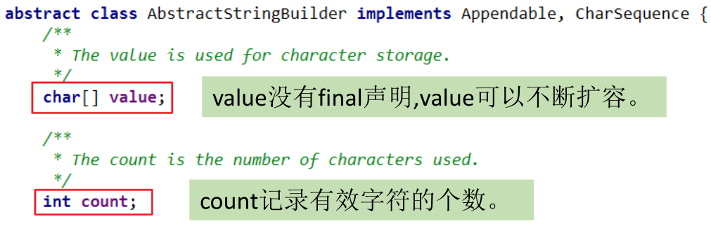

StringBuffer 类和 StringBuilder 类不同于 String，其对象必须使用构造器生成。常用以下三个构造器：

- `StringBuffer()`/`StringBuilder()`：初始容量为`16`的字符串缓冲区。

  ```java
  /**
   * Constructs a string buffer with no characters in it and an
   * initial capacity of 16 characters.
   */
  public StringBuffer() {
      super(16);
  }
  ```

  ```java
  /**
   * Constructs a string builder with no characters in it and an
   * initial capacity of 16 characters.
   */
  public StringBuilder() {
      super(16);
  }
  ```

- `StringBuffer(int capacity)`/`StringBuilder(int capacity)`：构造指定容量的字符串缓冲区。

  ```java
  /**
   * Constructs a string buffer with no characters in it and
   * the specified initial capacity.
   *
   * @param      capacity  the initial capacity.
   * @exception  NegativeArraySizeException  if the {@code capacity}
   *               argument is less than {@code 0}.
   */
  public StringBuffer(int capacity) {
      super(capacity);
  }
  ```

  ```java
  /**
   * Constructs a string builder with no characters in it and an
   * initial capacity specified by the {@code capacity} argument.
   *
   * @param      capacity  the initial capacity.
   * @throws     NegativeArraySizeException  if the {@code capacity}
   *               argument is less than {@code 0}.
   */
  public StringBuilder(int capacity) {
      super(capacity);
  }
  ```

- `StringBuffer(String str)`/`StringBuilder(String str)`：将内容初始化为指定字符串内容。

  ```java
  /**
   * Constructs a string buffer initialized to the contents of the
   * specified string. The initial capacity of the string buffer is
   * {@code 16} plus the length of the string argument.
   *
   * @param   str   the initial contents of the buffer.
   */
  public StringBuffer(String str) {
      super(str.length() + 16);
      append(str);
  }
  ```

  ```java
  /**
   * Constructs a string builder initialized to the contents of the
   * specified string. The initial capacity of the string builder is
   * {@code 16} plus the length of the string argument.
   *
   * @param   str   the initial contents of the buffer.
   */
  public StringBuilder(String str) {
      super(str.length() + 16);
      append(str);
  }
  ```

StringBuffer 类和 StringBuilder 类的方法的主要区别，举例如下：

- **`StringBuffer 类 --- 同步方法`**：

  ```java
  @Override
  public synchronized StringBuffer append(String str) {
      toStringCache = null;
      super.append(str);
      return this;
  }
  ```

- **`StringBuilder 类 --- 非同步方法`**：

  ```java
  @Override
  public StringBuilder append(String str) {
      super.append(str);
      return this;
  }
  ```

StringBuffer 类的常用方法（StringBuffer 类的常用方法，很多方法与 String 相同，StringBuilder 类的常用方法参考 StringBuffer）：

- `StringBuffer append(xxx)`：提供了参数可为多种类型的 `append()` 方法，用于进行字符串拼接。

  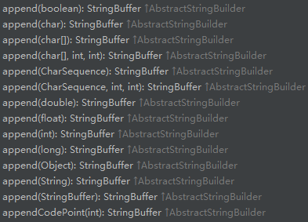

  - 面试题，输出结果：

    ```java
    public class ExceptionTest {
        public static void main(String[] args) {
            String str = null;
            StringBuilder sb = new StringBuilder();
            System.out.println(sb);
            sb.append(str);
            System.out.println(sb.length());
            System.out.println(sb);
            StringBuilder sb1 = new StringBuilder(str);
            System.out.println(sb1);
        }
    }
    输出结果：
    
    4
    null
    Exception in thread "main" java.lang.NullPointerException
    	at java.lang.StringBuilder.<init>(StringBuilder.java:112)
    	at cn.xisun.java.base.ExceptionTest.main(ExceptionTest.java:17)
    ```

  - 原因：

    - **① Java 里面，`null 不占字节`。如果一个引用指向 null，该应用就不再指向堆内存中的任何对象。并且，这个对象引用的`大小是 4 个字节`。**

    - ② `append()`方法如果传入 null 参数，最终执行以下方法，因此上面第 7 行和第 8 行输出结果为 4 和 null（字符串 null）。

      ```java
      private AbstractStringBuilder appendNull() {
          int c = count;
          ensureCapacityInternal(c + 4);
          final char[] value = this.value;
          value[c++] = 'n';
          value[c++] = 'u';
          value[c++] = 'l';
          value[c++] = 'l';
          count = c;
          return this;
      }
      ```

    - ③ `new StringBuilder(str)`的代码中：`super(str.length() + 16);`，调用 null 的`length()`方法，会发生空指针异常。

- `StringBuffer delete(int start,int end)`：删除指定位置的内容。

- `StringBuffer replace(int start, int end, String str)`：把 [start, end) 位置替换为 str。

- `StringBuffer insert(int offset, xxx)`：在指定位置插入多种类型的参数。

  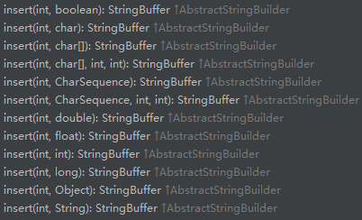

  ```java
  public class Test {
      public static void main(String[] args) {
          StringBuffer sb = new StringBuffer("abc123");
          sb.insert(3, "ABC");
          System.out.println(sb);// abcABC123
      }
  }
  ```

- `StringBuffer reverse()`：把当前字符序列逆转。

  ```java
  public class Test {
      public static void main(String[] args) {
          StringBuffer sb = new StringBuffer("abc123");
          sb.reverse();
          System.out.println(sb);// 321cba
      }
  }
  ```

- `int indexOf(String str)`：返回指定子字符串在此字符串中第一次出现处的索引，未找到返回 -1。

- `String substring(int start)`：返回一个新的字符串，截取当前字符串从 start 开始到最后的一个子字符串。

- `String substring(int start,int end)`：返回一个新字符串，截取当前字符串从 start 开始到 end（不包含）结束的一个子字符串 --- 左闭右开，`[start, end)`。

  ```java
  public class Test {
      public static void main(String[] args) {
          StringBuffer sb = new StringBuffer("abc123abc");
          String sb2 = sb.substring(1, 5);
          System.out.println(sb2);// bc12
      }
  }
  ```

- `int length()`：返回字符串的长度。

  ```java
  @Override
  public int length() {
      return count;
  }
  ```

- `char charAt(int n )`：返回某索引处的字符。

- `void setCharAt(int n ,char ch)`：在指定索引处插入字符。

  ```java
  public class Test {
      public static void main(String[] args) {
          StringBuffer sb = new StringBuffer("abc123abc");
          sb.setCharAt(1, '中');
          System.out.println(sb);// a中c123abc
      }
  }
  ```

- 方法总结：

  - 增：append，删：delete，改：setCharAt/replace，查：charAt，插：insert，长度：length，遍历：for + charAt/toString。

  - append、delete、replace、insert 和 reverse 这些方法，支持方法链操作，方法链的原理为：

    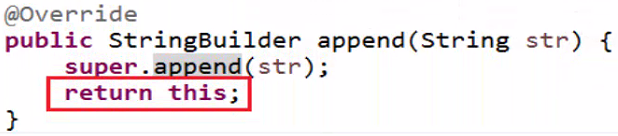

- **String、StringBuffer 和 StringBuilder 的异同？**

  - **String：Since JDK 1.0，`不可变`的字符序列；底层使用`final char[]`存储。**
  - **StringBuffer：Since JDK 1.0，`可变`的字符序列；`线程安全`的，效率低；底层使用`char[]`存储。**
  - **StringBuilder：Since JDK 1.5，`可变`的字符序列；`线程不安全`的，效率高；底层使用`char[]`存储。**

- **StringBuffer 和 StringBuilder 的`扩容问题`：**

  ```java
  public class Test {
      public static void main(String[] args) {
          String str = new String();// final char[] value = new char[0];
  
          String str1 = new String("abc");// final char[] value = new char[]{'a', 'b', 'c'};
  
          StringBuffer sb = new StringBuffer();// char[] value = new char[16]; 底层创建了一个长度是16的char数组
          System.out.println(sb.length());// 0
          sb.append('a');// value[0] = 'a';
          sb.append('b');// value[1] = 'b';
          sb.append('c');// value[1] = 'c';
          System.out.println(sb.length());// 3
  
          StringBuffer sb1 = new StringBuffer("abc");// char[] value = new char["abc".length() + 16];
          System.out.println(sb1.length());// 3
      }
  }
  ```

  - 扩容问题：如果要添加的数据底层数组盛不下了，那就需要扩容底层的数组。


  - 扩容方法：

    ```java
    private void ensureCapacityInternal(int minimumCapacity) {
        // overflow-conscious code
        if (minimumCapacity - value.length > 0) {
            value = Arrays.copyOf(value,
                    newCapacity(minimumCapacity));
        }
    }
    ```

    ```java
    /**
     * Returns a capacity at least as large as the given minimum capacity.
     * Returns the current capacity increased by the same amount + 2 if
     * that suffices.
     * Will not return a capacity greater than {@code MAX_ARRAY_SIZE}
     * unless the given minimum capacity is greater than that.
     *
     * @param  minCapacity the desired minimum capacity
     * @throws OutOfMemoryError if minCapacity is less than zero or
     *         greater than Integer.MAX_VALUE
     */
    private int newCapacity(int minCapacity) {
        // overflow-conscious code
        int newCapacity = (value.length << 1) + 2;
        if (newCapacity - minCapacity < 0) {
            newCapacity = minCapacity;
        }
        return (newCapacity <= 0 || MAX_ARRAY_SIZE - newCapacity < 0)
            ? hugeCapacity(minCapacity)
            : newCapacity;
    }
    ```

  - **`默认情况下，扩容为原来容量的 2 倍 + 2，同时将原来数组中的元素复制到新的数组中。`**

  - **指导意义：开发中，如果知道创建的字符串的长度，建议使用`StringBuffer(int capacity)`或`StringBuilder(int capacity)`，即可能得以避免扩容的发生，这样可以提高效率。**

- String、StringBuffer 和 StringBuilder 三者的效率测试：

  ```java
  public class Test {
      public static void main(String[] args) {
          // 初始设置
          String text = "";
          StringBuffer buffer = new StringBuffer("");
          StringBuilder builder = new StringBuilder("");
          long startTime = 0L;
          long endTime = 0L;
  
          // 开始对比
          startTime = System.currentTimeMillis();
          for (int i = 0; i < 20000; i++) {
              text = text + i;
          }
          endTime = System.currentTimeMillis();
          System.out.println("String的执行时间：" + (endTime - startTime));
  
          startTime = System.currentTimeMillis();
          for (int i = 0; i < 20000; i++) {
              buffer.append(String.valueOf(i));
          }
          endTime = System.currentTimeMillis();
          System.out.println("StringBuffer的执行时间：" + (endTime - startTime));
  
          startTime = System.currentTimeMillis();
          for (int i = 0; i < 20000; i++) {
              builder.append(String.valueOf(i));
          }
          endTime = System.currentTimeMillis();
          System.out.println("StringBuilder的执行时间：" + (endTime - startTime));
      }
  }
  输出结果：
  StringBuffer的执行时间：6
  StringBuilder的执行时间：3
  String的执行时间：1713
  ```

  - 结论，效率从高到低排列：`StringBuilder > StringBuffer > String`。

## 反射机制

### 概述

**`Reflection (反射)`被视为动态语言的关键，反射机制允许程序在执行期借助于 Reflection API 获取任何类的内部信息，并能直接操作任意对象的内部属性及方法。**

- 动态语言：是一类在运行时可以改变其结构的语言。例如新的函数、对象、甚至代码可以被引进，已有的函数可以被删除或是其他结构上的变化。通俗点说就是在运行时代码可以根据某些条件改变自身结构。主要动态语言：Object-C、C#、JavaScript、PHP、Python、Erlang。
- 静态语言：与动态语言相对应的，运行时结构不可变的语言就是静态语言。如 Java、C、C++。
- `Java 不是动态语言，但 Java 可以称之为 "准动态语言"。`即 Java 有一定的动态性，我们可以利用反射机制、字节码操作获得类似动态语言的特性。Java 的动态性让编程的时候更加灵活。

加载完类之后，在堆内存的方法区中就产生了一个 Class 类型的对象（`一个类只有一个 Class 对象`），这个对象就包含了完整的类的结构信息。我们可以通过这个对象看到类的结构。这个对象就像一面镜子，透过这个镜子看到类的结构，所以，我们形象的称之为： 反射。

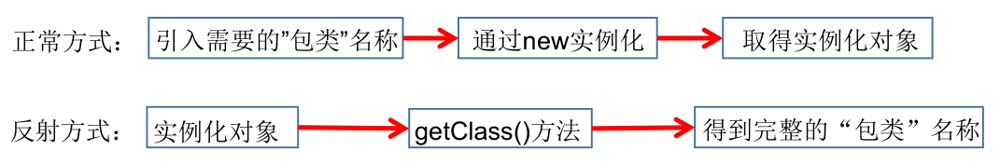

Java 反射机制提供的功能：

- 在运行时判断任意一个对象所属的类。
- 在运行时构造任意一个类的对象。
- 在运行时判断任意一个类所具有的成员变量和方法。
- 在运行时获取泛型信息。
- 在运行时调用任意一个对象的成员变量和方法。
- 在运行时处理注解。
- 生成动态代理。

反射相关的主要 API：

- `java.lang.Class`：代表一 个类。
- `java.lang.reflect.Method`：代表类的方法。
- `java.lang.reflect.Field`：代表类的成员变量。
- `java.lang.reflect.Constructor`：代表类的构造器。

### 理解 Class 类并获取 Class 类的实例

在 Object 类中定义了以下的方法，此方法将被所有子类继承：

- `public final Class getClass()`
- 以上的方法返回值的类型是一个 Class 类，此类是 **Java 反射的源头**，实际上所谓反射从程序的运行结果来看也很好理解，即：可以通过对象反射求出类的名称。

对象照镜子后可以得到的信息：某个类的属性、方法和构造器、某个类到底实现了哪些接口。对于每个类而言，JRE 都为其保留一个不变的 Class 类型的对象。一个 Class 对象包含了特定某个结构（class/interface/enum/annotation/primitive type/void/[]）的有关信息。

- Class 本身也是一个类。

- Class 对象只能由系统建立。

- `一个加载的类在 JVM 中只会有一个 Class 实例。`

- `一个 Class 对象对应的是一个加载到 JVM 中的一个 .class 文件。`

- 每个类的实例都会记得自己是由哪个 Class 实例所生成。

- 通过 Class 可以完整地得到一个类中的所有被加载的结构。

- Class 类是 Reflection 的根源，针对任何你想动态加载、运行的类，都需要先获得相应的 Class 对象。

  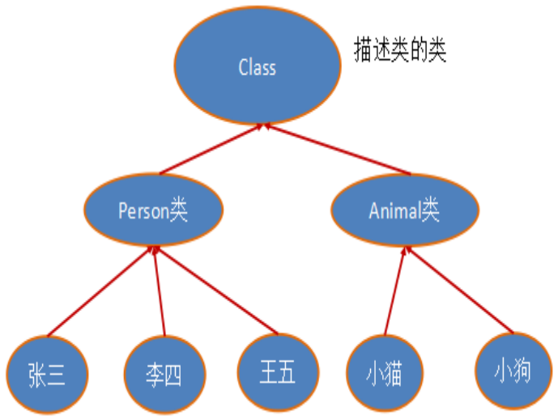

Class 类的常用方法：

- `static Class forName(String name)`：返回指定类名 name 的 Class 对象。
- `Object newInstance()`：调用缺省构造函数，返回该 Class 对象的一个实例。
- `getName()`：返回此 Class 对象所表示的实体（类、接口、数组类、基本类型或 void）名称。
- `Class getSuperClass()`：返回当前 Class 对象的父类的 Class 对象。
- `Class [] getInterfaces()`：获取当前 Class 对象的接口。
- `ClassLoader getClassLoader()`：返回该类的类加载器。
- `Class getSuperclass()`：返回表示此 Class 所表示的实体的超类的 Class。
- `Constructor[] getConstructors()`：返回一个包含某些 Constructor 对象的数组。
- `Field[] getDeclaredFields()`：返回 Field 对象的一个数组。
- `Method getMethod(String name,Class … paramTypes)`：返回一个 Method 对象，此对象的形参类型为 paramType。

反射实例：

```java
package cn.xisun.java.base.file;

public class Person {

    private String name;

    public int age;

    public String getName() {
        return name;
    }

    public void setName(String name) {
        this.name = name;
    }

    public int getAge() {
        return age;
    }

    public void setAge(int age) {
        this.age = age;
    }

    public Person() {
        System.out.println("Person()");
    }

    private Person(String name) {
        this.name = name;
    }

    public Person(String name, int age) {
        this.name = name;
        this.age = age;
    }

    public void show() {
        System.out.println("你好，我是一个人");
    }

    private String showNation(String nation) {
        System.out.println("我的国籍是：" + nation);
        return nation;
    }

    @Override
    public String toString() {
        return "Person{" +
                "name='" + name + '\'' +
                ", age=" + age +
                '}';
    }
}
```

```java
public class ReflectionTest {
    /*
    反射之前，对于Person的操作
     */
    @Test
    public void test1() {
        // 1.创建Person类的对象
        Person p1 = new Person("Tom", 12);

        // 2.通过对象，调用其内部的属性、方法
        p1.age = 10;
        System.out.println(p1.toString());
        p1.show();

        // 3.在Person类外部，不可以通过Person类的对象调用其内部私有结构。---封装性的限制
        // 比如：name、showNation()以及私有的构造器
    }

    /*
    反射之后，对于Person的操作
     */
    @Test
    public void test2() throws Exception {
        Class clazz = Person.class;

        // 1.通过反射，创建Person类的对象
        Constructor cons = clazz.getConstructor(String.class, int.class);
        Object obj = cons.newInstance("Tom", 12);
        Person p = (Person) obj;
        System.out.println(p.toString());// Person{name='Tom', age=12}

        // 2.通过反射，调用对象指定的属性、方法
        // 2.1 调用属性
        Field age = clazz.getDeclaredField("age");
        age.set(p, 10);
        System.out.println(p.toString());// Person{name='Tom', age=10}
        // 2.2 调用方法
        Method show = clazz.getDeclaredMethod("show");
        show.invoke(p);// 你好，我是一个人

        System.out.println("*******************************");

        // 3.通过反射，可以调用Person类的私有结构的。比如：私有的构造器、方法、属性
        // 3.1 调用私有的构造器
        Constructor cons1 = clazz.getDeclaredConstructor(String.class);
        cons1.setAccessible(true);
        Person p1 = (Person) cons1.newInstance("Jerry");
        System.out.println(p1);// Person{name='Jerry', age=0}
        // 3.2 调用私有的属性
        Field name = clazz.getDeclaredField("name");
        name.setAccessible(true);
        name.set(p1, "HanMeimei");
        System.out.println(p1);// Person{name='HanMeimei', age=0}
        // 3.3 调用私有的方法
        Method showNation = clazz.getDeclaredMethod("showNation", String.class);
        showNation.setAccessible(true);
        String nation = (String) showNation.invoke(p1, "中国");// 相当于String nation = p1.showNation("中国")
        System.out.println(nation);
    }
    // 疑问1：通过直接new的方式或反射的方式都可以调用公共的结构，开发中到底用那个？
    // 建议：直接new的方式。
    // 什么时候会使用：反射的方式。---> 根据反射的特征：动态性，进行考虑
    // 疑问2：反射机制与面向对象中的封装性是不是矛盾的？如何看待两个技术？
    // 不矛盾。封装性是给出了一种建议，不应该调用私有的结构，但如果有调用私有结构的需求，则可以通过反射机制做到。
}
```

获取 Class 类的实例的四种方法：

- 若已知具体的类，则通过类的 class 属性获取，该方法最为安全可靠，程序性能最高。比如：`Class clazz = String.class;`。

- 若已知某个类的实例，则调用该实例的`getClass()`获取 Class 对象。比如：`Class clazz = "Hello,World!".getClass();`。

- **若已知一个类的全类名，且该类在类路径下，可通过 Class 类的静态方法`forName()`获取，可能抛出 ClassNotFoundException。**比如：`Class clazz = Class.forName("java.lang.String");`。--- 最常用，体现了反射的动态性

- 使用类的加载器 ClassLoader，比如：

  ```java
  ClassLoader cl = this.getClass().getClassLoader();
  Class clazz4 = cl.loadClass("类的全类名");
  ```

- 实例：

  ```java
  public class ReflectionTest {
      /*
      关于java.lang.Class类的理解
      1.类的加载过程：
      程序经过javac.exe命令以后，会生成一个或多个字节码文件(.class结尾)。接着我们使用java.exe命令对某个字节码文件进行解释运行。相当于将某个字节码文件
      加载到内存中。这个过程就称为类的加载。加载到内存中的类，我们称为运行时类，此运行时类，就作为Class的一个实例。
      （万事万物皆对象：一方面，通过对象.xxx的方式调用方法、属性等；另一方面，在反射机制中，类本身也是Class的对象）
  
      2.换句话说，Class的实例就对应着一个运行时类。
  
      3.加载到内存中的运行时类，会缓存一定的时间。在此时间之内，我们可以通过不同的方式来获取此运行时类。
       */
  
      /*
      获取Class的实例的方式（前三种方式需要掌握）
       */
      @Test
      public void test3() throws ClassNotFoundException {
          // 方式一：调用运行时类的属性：.class
          Class clazz1 = Person.class;
          System.out.println(clazz1);// class cn.xisun.java.base.file.Person
  
          // 方式二：通过运行时类的对象，调用getClass()
          Person p1 = new Person();
          Class clazz2 = p1.getClass();
          System.out.println(clazz2);// class cn.xisun.java.base.file.Person
  
          // 方式三：调用Class的静态方法：forName(String classPath)
          Class clazz3 = Class.forName("cn.xisun.java.base.file.Person");// 指明类的全类名
          // clazz3 = Class.forName("java.lang.String");
          System.out.println(clazz3);// class cn.xisun.java.base.file.Person
  
          System.out.println(clazz1 == clazz2);// true
          System.out.println(clazz1 == clazz3);// true
  
          // 方式四：使用类的加载器：ClassLoader (了解)
          ClassLoader classLoader = ReflectionTest.class.getClassLoader();
          Class clazz4 = classLoader.loadClass("cn.xisun.java.base.file.Person");
          System.out.println(clazz4);// class cn.xisun.java.base.file.Person
  
          System.out.println(clazz1 == clazz4);// true
      }
  }
  ```

哪些类型可以有 Class 对象：

- class：外部类，成员（成员内部类，静态内部类），局部内部类，匿名内部类。

- interface：接口。

- []：数组.

- enum：枚举。

- annotation：注解 @interface。

- primitive type：基本数据类型。

- void

- 实例：

  ```java
  public class ReflectionTest {
      /*
      Class实例可以是哪些结构的说明
       */
      @Test
      public void test4() {
          Class c1 = Object.class;
          Class c2 = Comparable.class;
          Class c3 = String[].class;
          Class c4 = int[][].class;// 二维数组
          Class c5 = ElementType.class;// 枚举类
          Class c6 = Override.class;// 注解
          Class c7 = int.class;
          Class c8 = void.class;
          Class c9 = Class.class;
  
          int[] a = new int[10];
          int[] b = new int[100];
          Class c10 = a.getClass();
          Class c11 = b.getClass();
          // 只要数组的元素类型与维度一样，就是同一个Class
          System.out.println(c10 == c11);// true
      }
  }
  ```

### 类的加载与 ClassLoader 的理解

类的加载过程：当程序主动使用某个类时，如果该类还未被加载到内存中，则系统会通过如下三个步骤来对该类进行初始化：

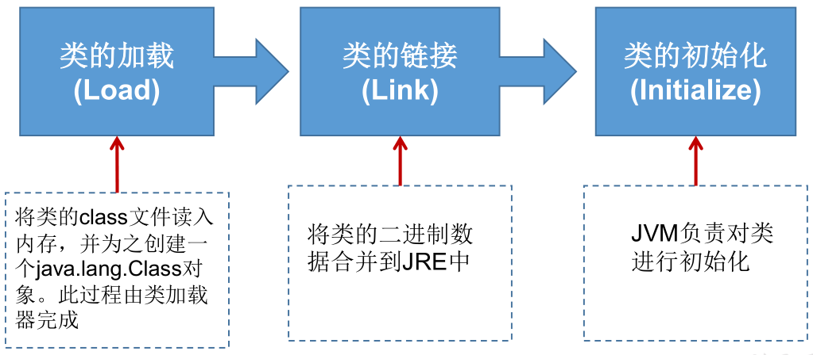

- `加载`：将 class 文件字节码内容加载到内存中，并将这些静态数据转换成方法区的运行时数据结构，然后生成一个代表这个类的`java.lang.Class`对象，作为方法区中类数据的访问入口（即引用地址）。所有需要访问和使用类数据的地方，只能通过这个 Class 对象。这个加载的过程需要**类加载器**参与。

- `链接`：将 Java 类的二进制代码合并到 JVM 的运行状态之中的过程。

  - 验证：确保加载的类信息符合 JVM 规范，例如：以 cafe 开头，没有安全方面的问题。
  - 准备：**`正式为类变量 (static) 分配内存并设置类变量默认初始值的阶段`**，这些内存都将在方法区中进行分配。
  - 解析：虚拟机常量池内的符号引用（常量名）替换为直接引用（地址）的过程。

- `初始化`：

  - 执行类构造器`<clinit>()`方法的过程。**类构造器`<clinit>()`方法是由编译期自动收集类中所有类变量的赋值动作和静态代码块中的语句合并产生的。**（类构造器是构造类信息的，不是构造该类对象的构造器）
  - `当初始化一个类的时候，如果发现其父类还没有进行初始化，则需要先触发其父类的初始化。`
  - 虚拟机会保证一个类的`<clinit>()`方法在多线程环境中被正确加锁和同步。

- 代码图示：

  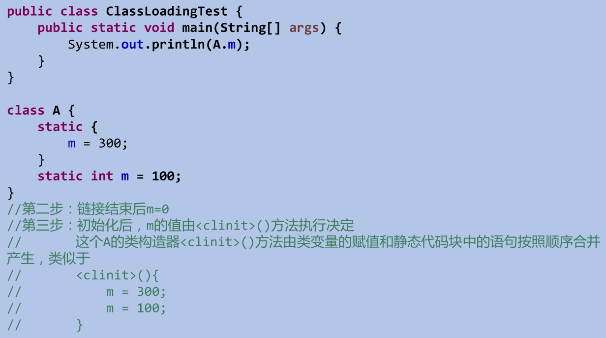

什么时候会发生类的初始化：

- 类的主动引用（一定会发生类的初始化）：

  - **当虚拟机启动，先初始化 main 方法所在的类。**
  - **new 一个类的对象。**
  - **调用类的静态成员（`除了 final 常量`）和静态方法。**
  - **使用`java.lang.reflect`包的方法对类进行反射调用。**
  - **当初始化一个类，如果其父类没有被初始化，则先会初始化它的父类。**

- 类的被动引用（不会发生类的初始化）：

  - **当访问一个静态域时，只有真正声明这个域的类才会被初始化。**
  - **当通过子类引用父类的静态变量，不会导致子类初始化。**
  - **通过数组定义类引用，不会触发此类的初始化。**
  - **引用常量不会触发此类的初始化（常量在链接阶段就存入调用类的常量池中了）。**

- 实例：

  ```java
  public class ClassLoadingTest {
      public static void main(String[] args) throws ClassNotFoundException {
          // 主动引用：一定会导致A和Father的初始化
          A a = new A();
          System.out.println(A.m);
          Class.forName("cn.xisun.java.base.file.A");
  
          // 被动引用
          A[] array = new A[5];// 不会导致A和Father的初始化
          System.out.println(A.b);// 只会初始化Father
          System.out.println(A.M);// 不会导致A和Father的初始化
      }
  
      static {
          System.out.println("main所在的类");
      }
  }
  
  class Father {
      static int b = 2;
  
      static {
          System.out.println("父类被加载");
      }
  }
  
  class A extends Father {
      static {
          System.out.println("子类被加载");
          m = 300;
      }
  
      static int m = 100;
      
      static final int M = 1;
  }
  ```

类加载器的作用：

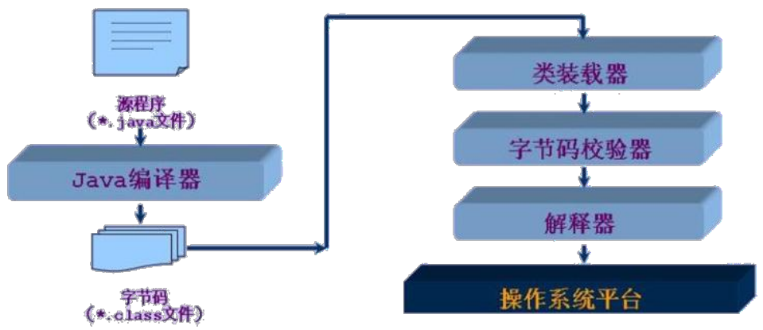

- **类加载的作用：将 class 文件字节码内容加载到内存中，并将这些静态数据转换成方法区的运行时数据结构，然后在堆中生成一个代表这个类的`java.lang.Class`对象，作为方法区中类数据的访问入口。**
- 类缓存：标准的 Java SE 类加载器可以按要求查找类，但**一旦某个类被加载到类加载器中，它将维持加载（缓存）一段时间。**不过 JVM 垃圾回收机制可以回收这些 Class 对象。

JVM 规范定义了如下类型的类的加载器：

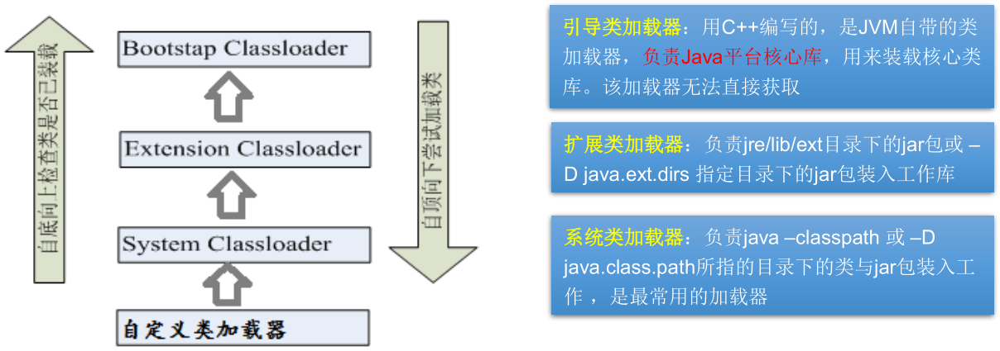

- `引导类加载器`

- `扩展类加载器`

- `系统类加载器`

- `自定义类加载器`

- 实例：

  ```java
  /**
   * 了解类的加载器
   */
  public class ClassLoaderTest {
      @Test
      public void test1() {
          // 对于自定义类，使用系统类加载器进行加载
          ClassLoader classLoader = ClassLoaderTest.class.getClassLoader();
          System.out.println(classLoader);// sun.misc.Launcher$AppClassLoader@18b4aac2
  
          // 调用系统类加载器的getParent()：获取扩展类加载器
          ClassLoader classLoader1 = classLoader.getParent();
          System.out.println(classLoader1);// sun.misc.Launcher$ExtClassLoader@21588809
  
          // 调用扩展类加载器的getParent()：无法获取引导类加载器
          // 引导类加载器主要负责加载Java的核心类库，无法加载自定义类的。
          ClassLoader classLoader2 = classLoader1.getParent();
          System.out.println(classLoader2);// null
  
          ClassLoader classLoader3 = String.class.getClassLoader();
          System.out.println(classLoader3);// null，String的加载器是引导类加载器，无法获取
          
          // 测试当前类由哪个类加载器进行加载
          ClassLoader classLoader4 = Class.forName("cn.xisun.java.base.file.ClassLoaderTest").getClassLoader();
          System.out.println(classLoader4);// sun.misc.Launcher$AppClassLoader@18b4aac2
          // 测试JDK提供的Object类由哪个类加载器加载
          ClassLoader classLoader5 = Class.forName("java.lang.Object").getClassLoader();
          System.out.println(classLoader5);// null，Object的加载器是引导类加载器，无法获取
          // 关于类加载器的一个主要方法：getResourceAsStream(String str):获取类路径下的指定文件的输入流
          InputStream in = this.getClass().getClassLoader().getResourceAsStream("test.properties");
          System.out.println(in);
      }
  }
  ```

类加载器读取配置文件：

```java
public class ClassLoaderTest {
    /*
    Properties：用来读取配置文件。
    注意：配置文件的路径问题
     */
    @Test
    public void test2() throws Exception {
        Properties pros = new Properties();

        // 读取配置文件的方式一：
        // 此时的文件默认在当前的module下
        /*FileInputStream fis = new FileInputStream("jdbc1.properties");
        // FileInputStream fis = new FileInputStream("src\\jdbc1.properties");// 等同于方式二
        pros.load(fis);*/

        // 读取配置文件的方式二：使用ClassLoader
        // 此时的配置文件默认识别为：当前module的src下
        ClassLoader classLoader = ClassLoaderTest.class.getClassLoader();
        InputStream is = classLoader.getResourceAsStream("jdbc1.properties");
        pros.load(is);

        String user = pros.getProperty("user");
        String password = pros.getProperty("password");
        System.out.println("user = " + user + ", password = " + password);
    }
}
```

### 创建运行时类的对象

当拿到了运行时类的 Class 对象后，就可以创建该运行时类的对象，这是反射机制应用最多的地方。

方式一：通过 Class 对象的`newInstance()`创建：

- 运行时类必须有一个`无参数的构造器`。

- 运行时类的构造器的`访问权限`需要足够。

  ```java
  /**
   * 通过反射创建对应的运行时类的对象
   */
  public class NewInstanceTest {
      @Test
      public void test1() throws IllegalAccessException, InstantiationException {
          Class<Person> clazz = Person.class;
          /*
          newInstance(): 调用此方法，创建对应的运行时类的对象。内部调用了运行时类的空参的构造器。
  
          要想此方法正常的创建运行时类的对象，要求：
          1.运行时类必须提供空参的构造器
          2.空参的构造器的访问权限得够。通常，设置为public。
  
          在javabean中要求提供一个public的空参构造器。原因：
          1.便于通过反射，创建运行时类的对象
          2.便于子类继承此运行时类时，默认调用super()时，保证父类有此构造器
           */
          Person obj = clazz.newInstance();
          System.out.println(obj);
      }
  }
  ```

方式二：通过 Class 对象的`getDeclaredConstructor(Class … parameterTypes)`创建：

- 先向构造器的形参中传递一个对象数组进去，里面包含了构造器中所需的各个参数。

- 再通过 Constructor 实例化对象。

  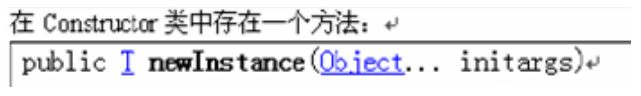

体会反射的动态性：

```java
public class NewInstanceTest {
    /*
    体会反射的动态性：以下程序只有在运行时，才能确定到底创建哪个对象
     */
    @Test
    public void test2() {
        for (int i = 0; i < 100; i++) {
            int num = new Random().nextInt(3);// 0,1,2
            String classPath = "";
            switch (num) {
                case 0:
                    classPath = "java.util.Date";
                    break;
                case 1:
                    classPath = "java.lang.Object";
                    break;
                case 2:
                    classPath = "cn.xisun.java.base.file.Person";
                    break;
            }

            try {
                Object obj = getInstance(classPath);
                System.out.println(obj);
            } catch (Exception e) {
                e.printStackTrace();
            }
        }
    }

    /*
    创建一个指定类的对象。
    classPath: 指定类的全类名
     */
    public Object getInstance(String classPath) throws Exception {
        Class clazz = Class.forName(classPath);
        return clazz.newInstance();
    }
}
```

### 获取运行时类的完整结构

类的完整结构：

- Field、Method、Constructor、Superclass、Interface、Annotation。
- 全部的 Field。
- 全部的方法。
- 全部的构造器。
- 所继承的父类。
- 实现的全部接口。
- 注解。

定义 Person 类和相关接口、注解类：

```java
public class Creature<T> implements Serializable {
    private char gender;
    public double weight;

    private void breath() {
        System.out.println("生物呼吸");
    }

    public void eat() {
        System.out.println("生物吃东西");
    }
}
```

```java
public interface MyInterface {
    void info();
}
```

```java
@Target({TYPE, FIELD, METHOD, PARAMETER, CONSTRUCTOR, LOCAL_VARIABLE})
@Retention(RetentionPolicy.RUNTIME)
public @interface MyAnnotation {
    String value() default "hello";
}
```

```java
@MyAnnotation(value = "hi")
public class Person extends Creature<String> implements Comparable<String>, MyInterface {
    private String name;
    int age;
    public int id;

    public Person() {
    }

    @MyAnnotation(value = "abc")
    private Person(String name) {
        this.name = name;
    }

    Person(String name, int age) {
        this.name = name;
        this.age = age;
    }

    @MyAnnotation
    private String show(String nation) {
        System.out.println("我的国籍是：" + nation);
        return nation;
    }

    public String display(String interests, int age) throws NullPointerException, ClassCastException {
        return interests + age;
    }

    @Override
    public void info() {
        System.out.println("我是一个人");
    }

    @Override
    public int compareTo(String o) {
        return 0;
    }

    private static void showDesc() {
        System.out.println("我是一个可爱的人");
    }

    @Override
    public String toString() {
        return "Person{" +
                "name='" + name + '\'' +
                ", age=" + age +
                ", id=" + id +
                '}';
    }
}
```

**使用反射获得全部的 Field：**

- `public Field[] getFields()`：返回此 Class 对象所表示的类或接口的 public 的 Field（包括父类）。

- `public Field[] getDeclaredFields()`：返回此 Class 对象所表示的类或接口的全部 Field（不包括父类）。

- Field 类中的方法：

  - `public int getModifiers()`：以整数形式返回此 Field 的修饰符。
  - `public Class<?> getType()`：得到 Field 的属性类型。
  - `public String getName()`：返回 Field 的名称。

- 实例：

  ```java
  public class FieldTest {
      @Test
      public void test1() {
          Class clazz = Person.class;
  
          // 获取属性结构
          // getFields(): 获取当前运行时类及其父类中声明为public访问权限的属性
          Field[] fields = clazz.getFields();
          for (Field f : fields) {
              System.out.println(f);
          }
          System.out.println();
  
          // getDeclaredFields(): 获取当前运行时类中声明的所有属性。（不包含父类中声明的属性）
          Field[] declaredFields = clazz.getDeclaredFields();
          for (Field f : declaredFields) {
              System.out.println(f);
          }
      }
  
      /*
      权限修饰符  数据类型 变量名
       */
      @Test
      public void test2() {
          Class clazz = Person.class;
          Field[] declaredFields = clazz.getDeclaredFields();
          for (Field f : declaredFields) {
              // 1.权限修饰符
              int modifier = f.getModifiers();
              System.out.print(Modifier.toString(modifier) + ", ");
  
              // 2.数据类型
              Class type = f.getType();
              System.out.print(type.getName() + ", ");
  
              // 3.变量名
              String fName = f.getName();
              System.out.print(fName);
  
              System.out.println();
          }
      }
  }
  test1输出结果：
  public int cn.xisun.java.base.file.Person.id
  public double cn.xisun.java.base.file.Creature.weight
  
  private java.lang.String cn.xisun.java.base.file.Person.name
  int cn.xisun.java.base.file.Person.age
  public int cn.xisun.java.base.file.Person.id
  
  test2输出结果：
  private, java.lang.String, name
  , int, age
  public, int, id
  ```

**使用反射获得全部的 Method：**

- `public Method[] getMethods()`：返回此 Class 对象所表示的类或接口的 public 的 Method（包括父类）。

- `public Method[] getDeclaredMethods()`：返回此 Class 对象所表示的类或接口的全部 Method（不包括父类）。

- Method 类中的方法：

  - `public Class<?>[] getParameterTypes()`：取得全部的参数。
  - `public int getModifiers()`：取得修饰符。
  - `public Class<?> getReturnType()：`取得全部的返回值。
  - `public Class<?>[] getExceptionTypes()`：取得异常信息。

- 实例：

  ```java
  public class MethodTest {
      @Test
      public void test1() {
          Class clazz = Person.class;
  
          // getMethods(): 获取当前运行时类及其所有父类中声明为public权限的方法
          Method[] methods = clazz.getMethods();
          for (Method m : methods) {
              System.out.println(m);
          }
          System.out.println();
  
          // getDeclaredMethods(): 获取当前运行时类中声明的所有方法。（不包含父类中声明的方法）
          Method[] declaredMethods = clazz.getDeclaredMethods();
          for (Method m : declaredMethods) {
              System.out.println(m);
          }
      }
  
      /*
      @Xxxx
      权限修饰符  返回值类型  方法名(参数类型1 形参名1, ...) throws XxxException{}
       */
      @Test
      public void test2() {
          Class clazz = Person.class;
  
          Method[] declaredMethods = clazz.getDeclaredMethods();
          for (Method m : declaredMethods) {
              // 1.获取方法声明的注解
              Annotation[] annos = m.getAnnotations();
              for (Annotation a : annos) {
                  System.out.print(a + ", ");
              }
  
              // 2.权限修饰符
              System.out.print(Modifier.toString(m.getModifiers()) + ", ");
  
              // 3.返回值类型
              System.out.print(m.getReturnType().getName() + ", ");
  
              // 4.方法名
              System.out.print(m.getName());
  
              // 5.形参列表
              System.out.print("(");
              Class[] parameterTypes = m.getParameterTypes();
              if (!(parameterTypes == null && parameterTypes.length == 0)) {
                  for (int i = 0; i < parameterTypes.length; i++) {
                      if (i == parameterTypes.length - 1) {
                          System.out.print(parameterTypes[i].getName() + " args_" + i);
                          break;
                      }
                      System.out.print(parameterTypes[i].getName() + " args_" + i + ", ");
                  }
              }
              System.out.print("), ");
  
              // 6.抛出的异常
              Class[] exceptionTypes = m.getExceptionTypes();
              if (exceptionTypes.length > 0) {
                  System.out.print("throws ");
                  for (int i = 0; i < exceptionTypes.length; i++) {
                      if (i == exceptionTypes.length - 1) {
                          System.out.print(exceptionTypes[i].getName());
                          break;
                      }
                      System.out.print(exceptionTypes[i].getName() + ", ");
                  }
              }
              System.out.println();
          }
      }
  }
  ```

**使用反射获得全部的构造器：**

- `public Constructor<T>[] getConstructors()`：返回此 Class 对象所表示的类的所有 public 构造方法（没有父类）。
- `public Constructor<T>[] getDeclaredConstructors()`：返回此 Class 对象表示的类声明的所有构造方法（没有父类）。
- Constructor 类中的方法：
  - `public int getModifiers()`：取得修饰符。
  - `public String getName()`：取得方法名称。
  - `public Class<?>[] getParameterTypes()`：取得参数的类型。

**使用反射获得实现的全部接口：**

- `public Class<?>[] getInterfaces()`：确定此对象所表示的类或接口实现的接口。

**使用反射获得所继承的父类**

- `public Class<? Super T> getSuperclass()`：返回表示此 Class 所表示的实体（类、接口、基本类型）的父类的 Class。

**使用反射获得泛型相关：**

- `Type getGenericSuperclass()`：获取父类泛型类型。
- 泛型类型：ParameterizedType。
- `getActualTypeArguments()`：获取实际的泛型类型参数数组。

**使用反射获得 Annotation 相关**

- `get Annotation(Class<T> annotationClass)`
- `getDeclaredAnnotations()`

使用反射获得类所在的包：

- `Package getPackage()`

实例：

```java
public class OtherTest {
    /*
    获取构造器结构
     */
    @Test
    public void test1() {
        Class<Person> clazz = Person.class;

        // getConstructors(): 获取当前运行时类中声明为public的构造器
        Constructor<?>[] constructors = clazz.getConstructors();
        for (Constructor<?> c : constructors) {
            System.out.println(c);
        }

        System.out.println();
        // getDeclaredConstructors(): 获取当前运行时类中声明的所有的构造器
        Constructor<?>[] declaredConstructors = clazz.getDeclaredConstructors();
        for (Constructor<?> c : declaredConstructors) {
            System.out.println(c);
        }
    }

    /*
    获取运行时类的父类
     */
    @Test
    public void test2() {
        Class<Person> clazz = Person.class;

        Class<? super Person> superclass = clazz.getSuperclass();
        System.out.println(superclass);
    }

    /*
    获取运行时类的带泛型的父类
     */
    @Test
    public void test3() {
        Class<Person> clazz = Person.class;

        Type genericSuperclass = clazz.getGenericSuperclass();
        System.out.println(genericSuperclass);
    }

    /*
    获取运行时类的带泛型的父类的泛型

    代码：逻辑性代码 vs 功能性代码
     */
    @Test
    public void test4() {
        Class<Person> clazz = Person.class;

        Type genericSuperclass = clazz.getGenericSuperclass();
        ParameterizedType paramType = (ParameterizedType) genericSuperclass;
        // 获取泛型类型
        Type[] actualTypeArguments = paramType.getActualTypeArguments();
        System.out.println(actualTypeArguments[0].getTypeName());// 方式一
        System.out.println(((Class) actualTypeArguments[0]).getName());// 方式二
    }

    /*
    获取运行时类实现的接口
     */
    @Test
    public void test5() {
        Class<Person> clazz = Person.class;

        Class<?>[] interfaces = clazz.getInterfaces();
        for (Class<?> c : interfaces) {
            System.out.println(c);
        }

        System.out.println();
        // 获取运行时类的父类实现的接口
        Class<?>[] interfaces1 = clazz.getSuperclass().getInterfaces();
        for (Class<?> c : interfaces1) {
            System.out.println(c);
        }
    }

    /*
    获取运行时类声明的注解
     */
    @Test
    public void test7() {
        Class<Person> clazz = Person.class;

        Annotation[] annotations = clazz.getAnnotations();
        for (Annotation annos : annotations) {
            System.out.println(annos);
        }
    }

    /*
    获取运行时类所在的包
     */
    @Test
    public void test6() {
        Class<Person> clazz = Person.class;

        Package pack = clazz.getPackage();
        System.out.println(pack);
    }
}
```

### 调用运行时类的指定结构

调用指定属性：

- 在反射机制中，可以直接通过 Field 类操作类中的属性，通过 Field 类提供的`set()`和`get()`就可以完成设置和取得属性内容的操作。
  - `public Field getField(String name)`：返回此 Class 对象表示的类或接口的指定的 public 的 Field。
  - **`public Field getDeclaredField(String name)`**：返回此 Class 对象表示的类或接口的指定的 Field。
- 在 Field 中：
  - `public void set(Object obj,Object value)`：设置指定对象 obj 上此 Field 的属性内容。
  - `public Object get(Object obj)`：取得指定对象 obj 上此 Field 的属性内容。

调用指定方法：

- 通过反射，调用类中的方法，通过 Method 类完成。步骤：
  - 通过 Class 类的**`getDeclaredMethod(String name,Class…parameterTypes)`**取得一个 Method 对象，并设置此方法操作时所需要的参数类型。
  - 之后使用`Object invoke(Object obj, Object[] args)`进行调用，并向方法中传递要设置的 obj 对象的参数信息。

关于`setAccessible(true)`的使用：

- Method 和 Field、Constructor 对象都有`setAccessible()`。
- `setAccessible()`启动和禁用访问安全检查的开关。
- 参数值为 true 则指示反射的对象在使用时应该取消 Java 语言访问检查。
  - 提高反射的效率。如果代码中必须用反射，而该句代码需要频繁的被调用，那么请设置为 true。
  - **使得原本无法访问的私有成员也可以访问。**
- 参数值为 false 则指示反射的对象应该实施 Java 语言访问检查。

关于`Object invoke(Object obj, Object … args)`的使用：

- **Object 对应原方法的返回值，若原方法无返回值，此时返回 null。**
- **若原方法为静态方法，则形参 obj 为运行时类本身或者 null。**
- 若原方法形参列表为空，则形参 args 为 null。
- 若原方法声明为 private，则需要在调用此`invoke()`前，显式调用方法对象的`setAccessible(true)`，即可访问 private 的方法。（一般来说，不论调用的是什么权限的方法，都可显示调用方法对象的`setAccessible(true)`）

实例：

```java
public class ReflectionTest {
    /*
    不需要掌握，因为只能获取public的,通常不采用此方法
     */
    @Test
    public void testField() throws Exception {
        Class<Person> clazz = Person.class;

        // 创建运行时类的对象
        Person p = clazz.newInstance();

        // 获取指定的属性：要求运行时类中属性声明为public
        Field id = clazz.getField("id");

        /*
        设置当前属性的值
        set():
            参数1：指明设置哪个对象的属性  参数2：将此属性值设置为多少
         */
        id.set(p, 1001);

        /*
        获取当前属性的值
        get():
            参数1：获取哪个对象的当前属性值
         */
        int pId = (int) id.get(p);
        System.out.println(pId);// 1001
    }

    /*
    如何操作运行时类中的指定的属性 --- 需要掌握
     */
    @Test
    public void testField1() throws Exception {
        Class clazz = Person.class;

        // 创建运行时类的对象
        Person p = (Person) clazz.newInstance();

        // 1.getDeclaredField(String fieldName): 获取运行时类中指定变量名的属性
        Field name = clazz.getDeclaredField("name");

        // 2.保证当前属性是可访问的
        name.setAccessible(true);

        // 3.获取、设置指定对象的此属性值
        name.set(p, "Tom");
        System.out.println(name.get(p));

        System.out.println("*************如何调用静态属性*****************");

        // public static String national = "中国";

        Field national = clazz.getDeclaredField("national");
        national.setAccessible(true);
        System.out.println(national.get(Person.class));// 中国
    }

    /*
    如何操作运行时类中的指定的方法 --- 需要掌握
     */
    @Test
    public void testMethod() throws Exception {
        Class<Person> clazz = Person.class;

        // 创建运行时类的对象
        Person p = clazz.newInstance();

        /*
        1.获取指定的某个方法
            getDeclaredMethod():
                参数1：指明获取的方法的名称  参数2：指明获取的方法的形参列表
         */
        Method show = clazz.getDeclaredMethod("show", String.class);

        // 2.保证当前方法是可访问的
        show.setAccessible(true);

        /*
        3.调用方法的invoke():
            参数1：方法的调用者  参数2：给方法形参赋值的实参
        invoke()的返回值即为对应类中调用的方法的返回值
         */
        Object returnValue = show.invoke(p, "CHN"); // String nation = p.show("CHN");
        System.out.println(returnValue);// CHN，返回的returnValue是一个String，可以强转

        System.out.println("*************如何调用静态方法*****************");

        // private static void showDesc(){}

        Method showDesc = clazz.getDeclaredMethod("showDesc");
        showDesc.setAccessible(true);
        // 如果调用的运行时类中的方法没有返回值，则此invoke()返回null
        // Object returnVal = showDesc.invoke(null);// 参数写null也可以，因为静态方法的调用者只有类本身
        Object returnVal = showDesc.invoke(Person.class);// 静态方法的调用者就是当前类
        System.out.println(returnVal);// null
    }

    /*
    如何调用运行时类中的指定的构造器 --- 不常用
    经常调用类的空参构造器创建类的对象：Person p = clazz.newInstance();
     */
    @Test
    public void testConstructor() throws Exception {
        Class<Person> clazz = Person.class;

        //private Person(String name)
        /*
        1.获取指定的构造器
            getDeclaredConstructor():
                参数：指明构造器的参数列表
         */

        // private Person(String name) {this.name = name;}
        Constructor<Person> constructor = clazz.getDeclaredConstructor(String.class);

        // 2.保证此构造器是可访问的
        constructor.setAccessible(true);

        // 3.调用此构造器创建运行时类的对象
        Person per = constructor.newInstance("Tom");
        System.out.println(per);
    }
}
```

### 反射的应用：动态代理

**代理设计模式的原理：使用一个代理将对象包装起来，然后用该代理对象取代原始对象。任何对原始对象的调用都要通过代理。代理对象决定是否以及何时将方法调用转到原始对象上。**

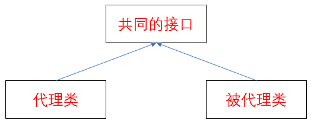

- **代理过程：代理类和被代理类实现共同的接口，重写接口的方法 a。被代理类中，在方法 a 中实现自身需要完成的逻辑。代理类中，提供被代理类的实例，并在方法 a 中，调用该实例对象的方法 a，同时，在代理类的方法 a 中，也可以添加一些不同代理类需要实现的公共的方法。**

代理分为`静态代理`和`动态代理`：

- 静态代理的特征是代理类和目标对象的类都是在编译期间确定下来。静态代理不利于程序的扩展。同时，每一个代理类只能为一个接口服务，这样一来程序开发中必然产生过多的代理。 最好可以通过一个代理类完成全部的代理功能。

  ```java
  /**
   * 静态代理举例
   *
   * 特点：代理类和被代理类在编译期间，就确定下来了。
   */
  interface ClothFactory {
      void produceCloth();
  }
  
  /**
   * 被代理类1
   */
  class AntaClothFactory implements ClothFactory {
      @Override
      public void produceCloth() {
          System.out.println("Anta工厂生产一批运动服");
      }
  }
  
  /**
   * 被代理类2
   */
  class LiningClothFactory implements ClothFactory {
      @Override
      public void produceCloth() {
          System.out.println("Lining工厂生产一批运动服");
      }
  }
  
  /**
   * 代理类 --- 只能代理实现了ClothFactory这个接口的被代理类，其他类型的被代理类不能使用
   */
  class ProxyClothFactory implements ClothFactory {
      // 用被代理类对象进行实例化
      private ClothFactory factory;
  
      public ProxyClothFactory(ClothFactory factory) {
          this.factory = factory;
      }
  
      @Override
      public void produceCloth() {
          System.out.println("代理类做一些公共的准备工作");
          factory.produceCloth();// 此方法由具体的被代理类自己实现
          System.out.println("代理类做一些公共的收尾工作");
      }
  }
  
  public class StaticProxyTest {
      public static void main(String[] args) {
          // 创建被代理类的对象
          ClothFactory anta = new AntaClothFactory();
          // 创建代理类的对象
          ClothFactory proxyClothFactory = new ProxyClothFactory(anta);
          proxyClothFactory.produceCloth();
          
          System.out.println("******************************");
          
          proxyClothFactory = new ProxyClothFactory(new LiningClothFactory());
          proxyClothFactory.produceCloth();
      }
  }
  ```

- 动态代理是指客户通过代理类来调用其它对象的方法，并且是在程序运行时根据需要动态创建目标类的代理对象。

动态代理使用场合：

  - 调试
  - 远程方法调用

**动态代理相比于静态代理的优点：抽象角色中（接口）声明的所有方法都被转移到调用处理器一个集中的方法中处理，这样，我们可以更加灵活和统一的处理众多的方法。**

  - 一个动态代理类能做到所有被代理类的工作，在运行时，会根据传入的被代理类的对象，动态的创建一个对应的代理对象。

Java 动态代理相关的 API：

  - **`Proxy`**：专门完成代理的操作类，是所有动态代理类的父类。通过此类为一个或多个接口动态地生成实现类。

  - 提供用于创建动态代理类和动态代理对象的静态方法：

    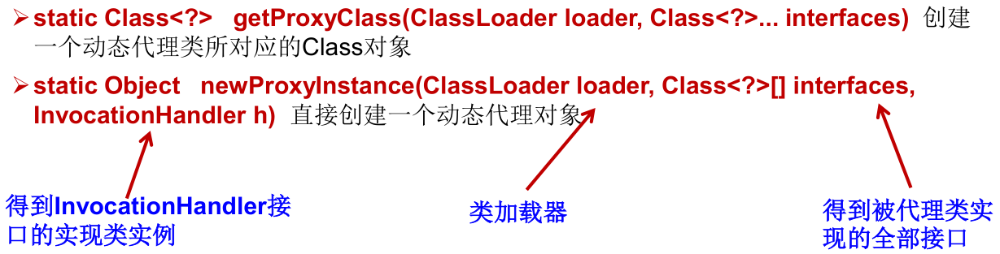

    - `static Class<?> getProxyClass(ClassLoader loader, Class<?>... interfaces)`：创建一个动态代理类所对应的Class对象
    - `static Object newProxyInstance(ClassLoader loader, Class<?>[] interfaces, InvocationHandler h)`：直接创建一个动态代理对象

动态代理步骤：

  - 创建一个实现接口 InvocationHandler 的类，它必须实现`invoke()`，以完成代理的具体操作：

    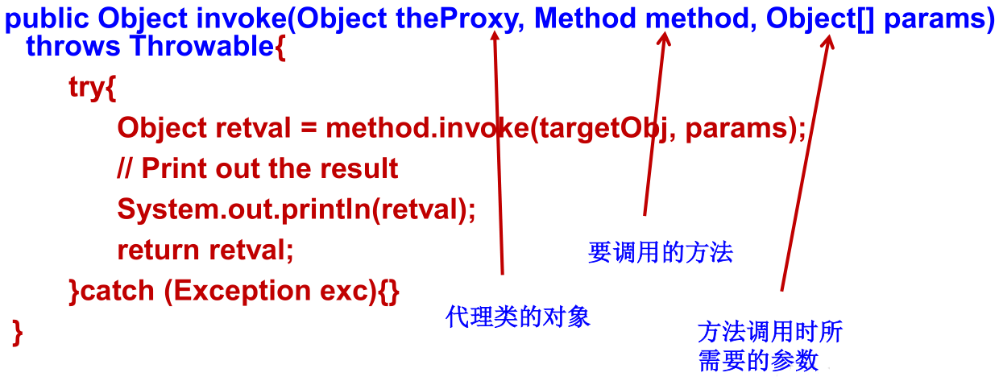

  - 创建被代理的类以及接口：

    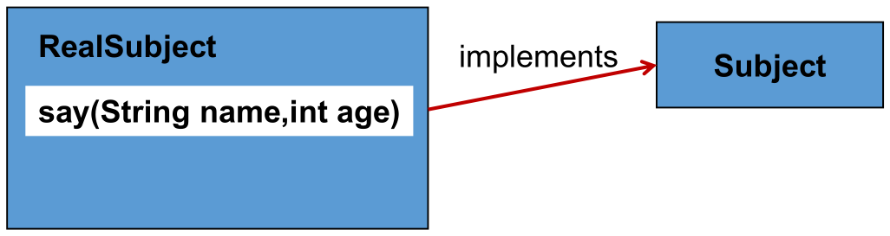

  - 通过 Proxy 的静态方法`newProxyInstance(ClassLoader loader, Class[] interfaces, InvocationHandler h)`创建一个 Subject 接口代理：

    ```java
    RealSubject target = new RealSubject();
    // Create a proxy to wrap the original implementation
    DebugProxy proxy = new DebugProxy(target);
    // Get a reference to the proxy through the Subject interface
    Subject sub = (Subject) Proxy.newProxyInstance(Subject.class.getClassLoader(),new Class[] { Subject.class }, proxy);
    ```

  - 通过 Subject 代理调用 RealSubject 实现类的方法：

    ```java
    String info = sub.say("Peter", 24);
    System.out.println(info);
    ```

实例：

  ```java
/**
 * 被代理类型一
 */
interface Human {
    String getBelief();

    void eat(String food);
}

/**
 * 被代理类
 */
class SuperMan implements Human {
    @Override
    public String getBelief() {
        return "I believe I can fly!";
    }

    @Override
    public void eat(String food) {
        System.out.println("超人喜欢吃" + food);
    }
}
  ```

  ```java
/**
 * 被代理类型二
 */
interface ClothFactory {
    void produceCloth();
}

/**
 * 被代理类
 */
class AntaClothFactory implements ClothFactory {
    @Override
    public void produceCloth() {
        System.out.println("Anta工厂生产一批运动服");
    }
}
  ```

  ```java
/*
要想实现动态代理，需要解决的问题？
问题一：如何根据加载到内存中的被代理类，动态的创建一个代理类及其对象。
问题二：当通过代理类的对象调用方法a时，如何动态的去调用被代理类中的同名方法a。
 */

/**
 * 动态代理类
 */
class ProxyFactory {
    // 调用此方法，返回一个代理类的对象。---> 解决问题一
    // 返回的可能是不同类型的代理类对象，因此返回Object，然后根据传参obj的类型，再进行强转 
    public static Object getProxyInstance(Object obj) {// obj:被代理类的对象
        // 创建InvocationHandler接口的实例，并赋值被代理类的对象
        MyInvocationHandler handler = new MyInvocationHandler();
        handler.bind(obj);
        
        /*
        参数1：被代理类obj的类加载器
        参数2：被代理类obj实现的接口
        参数3：实现InvocationHandler接口的handler，包含被代理类执行方法调用的逻辑
         */
        return Proxy.newProxyInstance(obj.getClass().getClassLoader(), obj.getClass().getInterfaces(), handler);
    }
}

/**
 * 实现InvocationHandler接口 ---> 解决问题二
 */
class MyInvocationHandler implements InvocationHandler {
    // 需要使用被代理类的对象进行赋值
    private Object obj;

    // 赋值操作，也可以通过构造器进行赋值
    public void bind(Object obj) {
        this.obj = obj;
    }

    // 当我们通过代理类的对象，调用方法a时，就会自动的调用如下的方法：invoke()
    // 将被代理类要执行的方法a的功能就声明在invoke()中
    // proxy：代理类的对象
    // method：代理类和被代理类共同实现的接口中的重写的方法
    // args：该重写方法需要传入的参数
    @Override
    public Object invoke(Object proxy, Method method, Object[] args) throws Throwable {
        // method: 即为代理类对象调用的方法，此方法也就作为了被代理类对象要调用的方法
        // obj: 被代理类的对象
        Object returnValue = method.invoke(obj, args);

        // 上述方法的返回值returnValue就作为当前类中的invoke()的返回值。
        // 实际上也就是被代理类所调用方法的返回值
        return returnValue;
    }
}

/**
 * 测试方法
 */
public class ProxyTest {
    public static void main(String[] args) {
        // 被代理类型一
        SuperMan superMan = new SuperMan();
        // proxyHuman: 代理类的对象
        // 在动态代理中，proxyHuman代表的是代理类的对象，不应该被强转为SuperMan，因为SuperMan是被代理类
        // 但可以被强转为共同的接口Human。其他类型的代理类和被代理类同理
        Human proxyHuman = (Human) ProxyFactory.getProxyInstance(superMan);
        // 当通过代理类对象调用方法时，会自动的调用被代理类中同名的方法
        String belief = proxyHuman.getBelief();// 方法一：getBelief()有返回值
        System.out.println(belief);
        proxyHuman.eat("四川麻辣烫");// 方法二：eat()没有返回值

        System.out.println("*****************************");

        // 被代理类型二
        AntaClothFactory antaClothFactory = new AntaClothFactory();// 创建被代理类
        ClothFactory proxyClothFactory = (ClothFactory) ProxyFactory.getProxyInstance(antaClothFactory);// 创建代理类
        proxyClothFactory.produceCloth();// 执行方法
    }
}
  ```

动态代理与 AOP（Aspect Orient Programming）：

- 前面介绍的 Proxy 和 InvocationHandler，很难看出这种动态代理的优势，下面介绍一种更实用的动态代理机制。

- 改进前：

  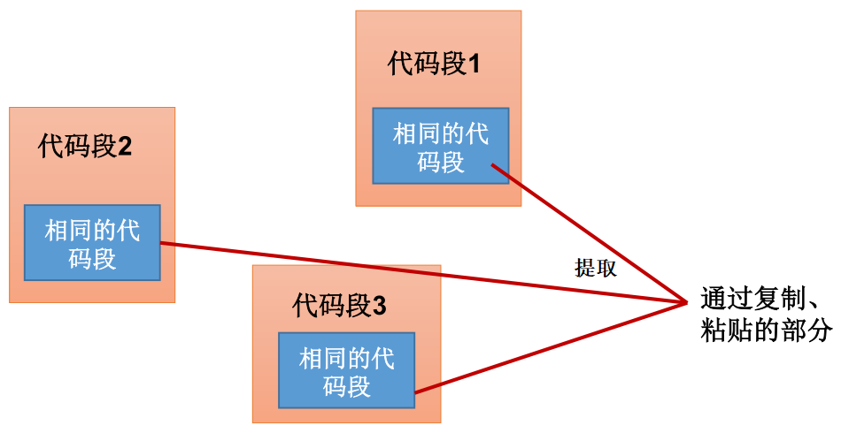

  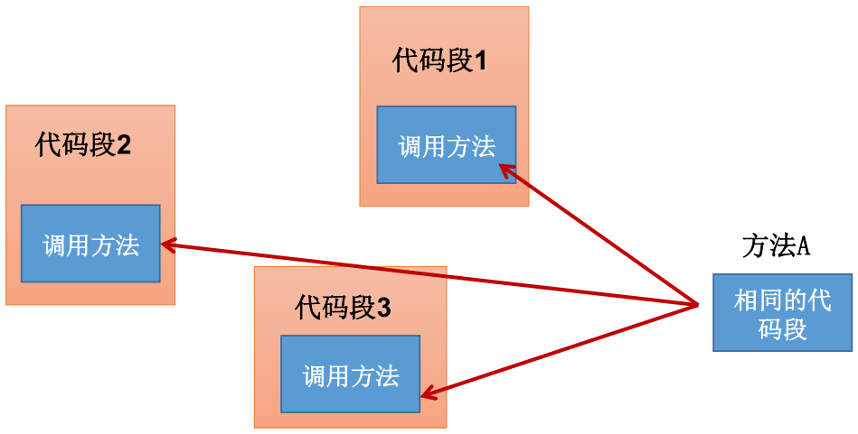

- 改进后的说明：代码段 1、代码段 2、代码段 3 和深色代码段分离开了，但代码段 1、2、3 又和一个特定的方法 A 耦合了！最理想的效果是：代码块 1、2、3 既可以执行方法 A ，又无须在程序中以硬编码的方式直接调用深色代码的方法。

- AOP 实例，参看 ProxyUtil 的定义和使用：

  ```java
  /**
   * 被代理类型一
   */
  interface Human {
      String getBelief();
  
      void eat(String food);
  }
  
  /**
   * 被代理类
   */
  class SuperMan implements Human {
      @Override
      public String getBelief() {
          return "I believe I can fly!";
      }
  
      @Override
      public void eat(String food) {
          System.out.println("超人喜欢吃" + food);
      }
  }
  
  
  /**
   * 被代理类型二
   */
  interface ClothFactory {
      void produceCloth();
  }
  
  /**
   * 被代理类
   */
  class AntaClothFactory implements ClothFactory {
      @Override
      public void produceCloth() {
          System.out.println("Anta工厂生产一批运动服");
      }
  }
  
  /**
   * 不同被代理类都需要执行的通用方法，比如日志等 --- AOP的应用
   */
  class ProxyUtil {
      public void method1() {
          System.out.println("====================通用方法一====================");
      }
  
      public void method2() {
          System.out.println("====================通用方法二====================");
      }
  }
  
  
  /**
   * 动态代理类
   */
  class ProxyFactory {
      public static Object getProxyInstance(Object obj) {
          MyInvocationHandler handler = new MyInvocationHandler();
          handler.bind(obj);
          return Proxy.newProxyInstance(obj.getClass().getClassLoader(), obj.getClass().getInterfaces(), handler);
      }
  }
  
  class MyInvocationHandler implements InvocationHandler {
      private Object obj;
  
      public void bind(Object obj) {
          this.obj = obj;
      }
  
      @Override
      public Object invoke(Object proxy, Method method, Object[] args) throws Throwable {
          ProxyUtil util = new ProxyUtil();
          // 执行通用方法一
          util.method1();
  
          // 执行被代理类的相应方法
          Object returnValue = method.invoke(obj, args);
  
          // 执行通用方法二
          util.method2();
          return returnValue;
      }
  }
  
  public class ProxyTest {
      public static void main(String[] args) {
          // 被代理类型一
          SuperMan superMan = new SuperMan();
          Human proxyHuman = (Human) ProxyFactory.getProxyInstance(superMan);
          String belief = proxyHuman.getBelief();// getBelief()有返回值
          System.out.println(belief);
          proxyHuman.eat("四川麻辣烫");// eat()没有返回值
  
          System.out.println("*****************************");
  
          // 被代理类型二
          AntaClothFactory antaClothFactory = new AntaClothFactory();
          ClothFactory proxyClothFactory = (ClothFactory) ProxyFactory.getProxyInstance(antaClothFactory);
          proxyClothFactory.produceCloth();
      }
  }
  ```

- 使用 Proxy 生成一个动态代理时，往往并不会凭空产生一个动态代理，这样没有太大的意义。**通常都是为指定的目标对象生成动态代理。**

- 这种动态代理在 AOP 中被称为 AOP 代理，AOP 代理可代替目标对象，AOP 代理包含了目标对象的全部方法。但 AOP 代理中的方法与目标对象的方法存在差异：**AOP 代理里的方法可以在执行目标方法之前、之后插入一些通用处理。**

  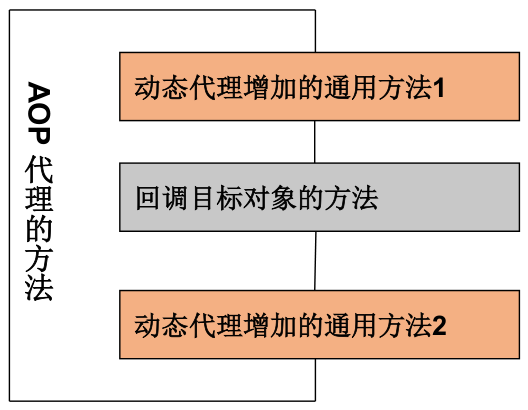

## 泛型

集合容器类在设计阶段/声明阶段不能确定这个容器到底实际存的是什么类型的对象，所以在 JDK 1.5 之前只能把元素类型设计为 Object，JDK 1.5 之后使用泛型来解决。因为这个时候除了元素的类型不确定，其他的部分是确定的，例如关于这个元素如何保存，如何管理等是确定的，因此此时把元素的类型设计成一个参数，这个类型参数叫做`泛型`。Collection\<E>，List\<E>，ArrayList\<E>  中的这个 \<E> 就是类型参数，即泛型。

### 概念

所谓泛型，就是允许在定义类、接口时通过一个标识表示类中某个属性的类型或者是某个方法的返回值及参数类型。这个类型参数将在使用时（例如，继承或实现这个接口，用这个类型声明变量、创建对象时）确定（即传入实际的类型参数，也称为类型实参）。

从 JDK 1.5 以后，Java 引入了`参数化类型 (Parameterized type)`的概念，允许在创建集合时指定集合元素的类型，如：List\<String>，表明该 List 只能保存字符串类型的对象。

JDK 1.5 改写了集合框架中的全部接口和类，为这些接口、类增加了泛型支持，从而可以在声明集合变量、创建集合对象时传入类型实参。

在实例化集合类时，可以指明具体的泛型类型。指明完以后，在集合类或接口中凡是定义类或接口时，内部结构（比如：方法、构造器、属性等）使用到类的泛型的位置，都指定为实例化的泛型类型。比如：`add(E e)` ---> 实例化以后：`add(Integer e)`。

在实例化集合类时，如果没有指明泛型的类型，默认类型为`java.lang.Object`类型。

**泛型的类型必须是类，不能是基本数据类型。需要用到基本数据类型的位置，拿包装类替换。**

使用泛型的必要性：

- 解决元素存储的安全性问题。

- 解决获取数据元素时，需要类型强制转换的问题。

- Java 泛型可以保证如果程序在编译时没有发出警告，运行时就不会产生 ClassCastException 异常。同时，代码更加简洁、健壮。

- 使用泛型的主要优点是能够在编译时而不是在运行时检测错误：

  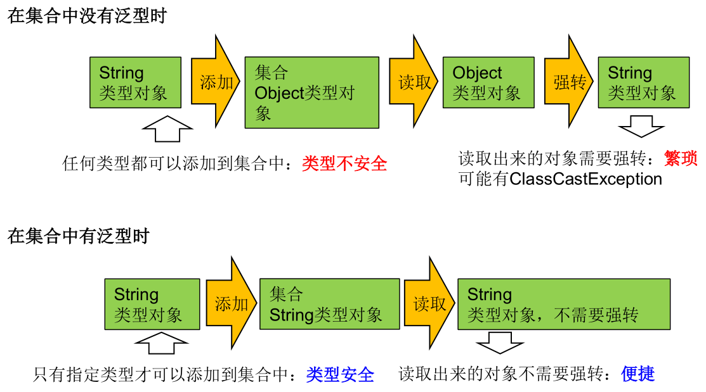

  在集合中使用泛型之前的情况：

  ```java
  public class Test {
      public static void main(String[] args) {
          // 在集合中使用泛型之前的情况：
          ArrayList list = new ArrayList();
          // 需求：存放学生的成绩
          list.add(78);
          list.add(76);
          list.add(89);
          list.add(88);
          // 问题一：类型不安全
          // list.add("Tom");
          
          for (Object score : list) {
              // 问题二：强转时，可能出现ClassCastException
              int stuScore = (Integer) score;
              System.out.println(stuScore);
          }
      }
  }
  ```

  在集合中使用泛型的情况，以 ArrayList 为例：

  ```java
  public class Test {
      public static void main(String[] args) {
          // ArrayList<Integer> list = new ArrayList<Integer>();
          // JDK 7新特性：类型推断
          ArrayList<Integer> list = new ArrayList<>();
          list.add(78);
          list.add(87);
          list.add(99);
          list.add(65);
          // 编译时，就会进行类型检查，类型不一致时编译不通过，保证数据的安全
          // list1.add("Tom");
  
          // 方式一：
          for (Integer score : list) {
              // 避免了强转操作
              int stuScore = score;
              System.out.println(stuScore);
          }
  
          // 方式二：
          Iterator<Integer> iterator = list.iterator();
          while (iterator.hasNext()) {
              int stuScore = iterator.next();
              System.out.println(stuScore);
          }
      }
  }
  ```

  在集合中使用泛型的情况，以 HashMap 为例：

  ```java
  public class Test {
      public static void main(String[] args) {
          // Map<String, Integer> map = new HashMap<String, Integer>();
          // JDK 7新特性：类型推断
          Map<String, Integer> map = new HashMap<>();
          map.put("Tom", 87);
          map.put("Jerry", 87);
          map.put("Jack", 67);
          // map.put(123,"ABC");
  
          // 泛型的嵌套
          Set<Map.Entry<String, Integer>> entries = map.entrySet();
          Iterator<Map.Entry<String, Integer>> iterator = entries.iterator();
  
          while (iterator.hasNext()) {
              Map.Entry<String, Integer> entry = iterator.next();
              String key = entry.getKey();
              Integer value = entry.getValue();
              System.out.println(key + "----" + value);
          } 
      }
  }
  ```

### 自定义泛型结构

#### 自定义泛型类和接口

- 泛型类和接口的声明：`class GenericClass<K, V>`和`interface GenericInterface<T>`。其中，K，V，T 不代表值，而是表示类型，可以使用任意字母，常用 T 表示，是 Type 的缩写。

  ```java
  public class Person<T> {
      // 使用T类型定义变量
      private T info;
  
      // 使用T类型定义一般方法
      public T getInfo() {
          return info;
      }
  
      public void setInfo(T info) {
          this.info = info;
      }
  
      // 使用T类型定义构造器
      public Person() {
      }
  
      public Person(T info) {
          this.info = info;
      }
  }
  ```

- 泛型类和接口可能有多个参数，此时应将多个参数一起放在尖括号内，以逗号隔开。比如：<E1, E2, E3>。

- 泛型类的构造器如下：`public GenericClass(){}`。而下面是错误的：`public GenericClass<E>(){}`。

- 泛型类的实例化：**如果定义的类是带泛型的，在实例化时应该指明类的泛型。**如：`List<String> strList = new ArrayList<String>();`。

  - **泛型如果不指定，将被擦除，泛型对应的类型均按照 Object 处理，但不等价于 Object。**经验：泛型要使用一路都用。要不用，一路都不要用。
  - **指定泛型时，不能使用基本数据类型，可以使用包装类替换。**
  - 把一个集合中的内容限制为一个特定的数据类型，这就是 Generic 背后的核心思想。

- 泛型类实例化后，操作原来泛型位置的结构必须与指定的泛型类型一致。

- **泛型不同的引用不能相互赋值。**

  - **尽管在编译时 ArrayList\<String> 和 ArrayList\<Integer> 是两种类型，但是，在运行时只有一个 ArrayList 被加载到 JVM 中。**

- 如果泛型结构是一个接口或抽象类，则不可创建泛型类的对象。

- JDK 7.0 开始，泛型的简化操作：`ArrayList<Fruit> flist = new ArrayList<>();`，**`类型推断`**。

- 在类/接口上声明的泛型，在本类或本接口中即代表某种类型，可以作为非静态属性的类型、非静态方法的参数类型、非静态方法的返回值类型。但在**`静态方法中不能使用类的泛型`**。

  ```java
  public class Order<T> {
      String orderName;
      int orderId;
      // 类的内部结构就可以使用类的泛型
      T orderT;
  
      public Order(String orderName, int orderId, T orderT) {
          this.orderName = orderName;
          this.orderId = orderId;
          this.orderT = orderT;
      }
  
      // 静态方法中不能使用类的泛型，编译不通过
      /*public static void show(T orderT) {
          System.out.println(orderT);
      }*/
  }
  ```

- **`异常类不能声明为泛型类`**。

  ```java
  // 异常类不能声明为泛型类，编译不通过
  public class MyException<T> extends Exception {}
  ```

  ```java
  public class Order<T> {
      public void show() {
          // try-catch结构中不能使用类的泛型，编译不通过
          try {
          } catch (T t) {
          }
      }
  }
  ```

- 不能使用`new E[]`，但是可以：`E[] elements = (E[])new Object[capacity];`。参考 ArrayList 源码中声明：Object[] elementData，而非泛型参数类型数组。

  ```java
  public class Order<T> {
      public Order() {
          // 编译不通过
          // T[] arr = new T[10];
          // 编译通过
          T[] arr = (T[]) new Object[10];
      }
  }
  ```

- 父类有泛型，子类可以选择保留泛型也可以选择指定泛型类型：

  - 子类不保留父类的泛型：按需实现。

    - 没有类型  擦除。
    - 具体类型。

  - 子类保留父类的泛型：泛型子类。

    - 全部保留。
    - 部分保留。

  - 子类除了指定或保留父类的泛型，还可以增加自己的泛型。

  - 实例：

    子类不增加自己的泛型：

    ```java
    class Father<T1, T2> {}
    
    // 子类不保留父类的泛型：
    // 1)没有类型 擦除
    class Son1 extends Father {}// 等价于class Son1 extends Father<Object, Object>
    
    // 2)具体类型
    class Son2 extends Father<Integer, String> {}
    
    // 子类保留父类的泛型：
    // 1)全部保留
    class Son3<T1, T2> extends Father<T1, T2> {}
    
    // 2)部分保留
    class Son4<T2> extends Father<Integer, T2> {}
    ```

    子类增加自己的泛型：

    ```java
    class Father<T1, T2> {}
    
    // 子类不保留父类的泛型：
    // 1)没有类型 擦除
    class Son1<A, B> extends Father {}//等价于class Son extends Father<Object, Object>
    
    // 2)具体类型
    class Son2<A, B> extends Father<Integer, String> {}
     
    // 子类保留父类的泛型
    // 1)全部保留
    class Son3<T1, T2, A, B> extends Father<T1, T2> {}
    
    // 2)部分保留
    class Son4<T2, A, B> extends Father<Integer, T2> {}
    ```

- 如果子类在继承带泛型的父类时，指明了泛型类型，则实例化子类对象时，不再需要指明泛型。

  ```java
  public class Order<T> {}
  
  public class SubOrder extends Order<Integer> {}// SubOrder: 不是泛型类
  ```

- 如果子类在继承带泛型的父类时，未指明泛型类型，则实例化子类对象时，仍然需要指明泛型。

  ```java
  public class Order<T> {}
  
  public class SubOrder1<T> extends Order<T> {}// SubOrder1<T>: 仍然是泛型类
  ```

#### 自定义泛型方法 

- 泛型方法的格式：

  

- **泛型方法的参数与类的泛型参数没有任何关系， 换句话说，泛型方法所属的类是不是泛型类都没有关系。泛型方法，可以声明为静态的。原因：泛型参数是在调用方法时确定的，并非在实例化类时确定。**

  ```java
  public class Order<T> {
      String orderName;
      int orderId;
      // 类的内部结构就可以使用类的泛型
      T orderT;
  
      // 如下的三个方法都不是泛型方法
      public T getOrderT() {
          return orderT;
      }
  
      public void setOrderT(T orderT) {
          this.orderT = orderT;
      }
  
      @Override
      public String toString() {
          return "Order{" +
                  "orderName='" + orderName + '\'' +
                  ", orderId=" + orderId +
                  ", orderT=" + orderT +
                  '}';
      }
  
      // 泛型方法：在方法中出现了泛型的结构，泛型参数与类的泛型参数没有任何关系。
      // 换句话说，泛型方法所属的类是不是泛型类都没有关系。
      public <E> List<E> copyFromArrayToList(E[] arr) {
          ArrayList<E> list = new ArrayList<>();
          list.addAll(Arrays.asList(arr));
          return list;
      }
  
      // 泛型方法，可以声明为静态的。原因：泛型参数是在调用方法时确定的。并非在实例化类时确定。
      public static <T> void fromArrayToCollection(T[] a, Collection<T> c) {
          Collections.addAll(c, a);
          System.out.println(c);
      }
  
      public static void main(String[] args) {
          Order<String> order = new Order<>();
          Integer[] arr = new Integer[]{1, 2, 3, 4};
          // 泛型方法在调用时，指明泛型参数的类型
          List<Integer> list = order.copyFromArrayToList(arr);
          System.out.println(list);// [1, 2, 3, 4]
  
          ArrayList<String> str = new ArrayList<>();
          String[] strings = new String[]{"A", "B", "C", "D"};
          fromArrayToCollection(strings, str);// [A, B, C, D]
          
          Object[] ao = new Object[100];
          Collection<Object> co = new ArrayList<>();
          fromArrayToCollection(ao, co);
          String[] sa = new String[20];
          Collection<String> cs = new ArrayList<>();
          fromArrayToCollection(sa, cs);
          Collection<Double> cd = new ArrayList<>();
          // 下面代码中T是Double类，但sa是String类型，编译错误。
          // fromArrayToCollection(sa, cd);
          // 下面代码中T是Object类型，sa是String类型，可以赋值成功。
          fromArrayToCollection(sa, co);
      }
  }
  ```

- 泛型方法声明泛型时也可以指定上限：

  父类：

  ```java
  public class DAO<T> {// 不同表的共性操作的DAO，DAO：data(base) access object
  
      // 添加一条记录
      public void add(T t) {}
  
      // 删除一条记录
      public boolean remove(int index) {
          return false;
      }
  
      // 修改一条记录
      public void update(int index, T t) {}
  
      // 查询一条记录
      public T getIndex(int index) {
          return null;
      }
  
      // 查询多条记录
      public List<T> getForList(int index) {
          return null;
      }
  
      // 泛型方法：因为返回内容在DAO类中无法确定，由子类自己指定
      // 举例：获取表中一共有多少条记录？获取最大的员工入职时间？
      public <E> E getValue() {
          return null;
      }
  }
  ```

  子类 StudentDao：

  ```java
  public class StudentDAO extends DAO<Student> {}// 只能操作Student表的DAO
  ```

  子类 CustomerDao：

  ```java
  public class CustomerDAO extends DAO<Customer>{}// 只能操作Customer表的DAO
  ```

### 泛型在继承上的体现

如果 B 是 A 的一个子类型（子类或者子接口），而 G 是具有泛型声明的类或接口，则 G\<B> 并不是 G\<A> 的子类型，二者是并列关系。如果类 A 是类 B 的父类，则 A\<G> 是 B\<G> 的父类。

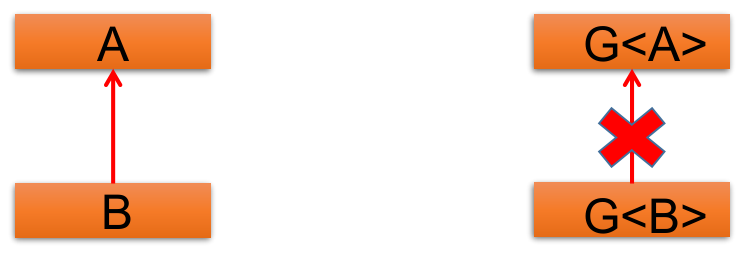

```java
public class Test {
    public static void show(List<Object> list) {
    }

    public static void show1(List<String> list) {
    }

    public static void main(String[] args) {
        // 子类对象赋值给父类对象--->编译通过
        Object obj = null;
        String str = null;
        obj = str;// Object是String的父类

        // 子类对象数组赋值给父类对象数组--->编译通过
        Object[] arr1 = null;
        String[] arr2 = null;
        arr1 = arr2;// Object[]是String[]的父类

        // 虽然类A是类B的父类，但是G<A>和G<B>二者不具备子父类关系，二者是并列关系
        List<Object> list1 = null;
        List<String> list2 = new ArrayList<String>();
        // 编译不通过此时的list1和list2的类型不具有子父类关系
        // list1 = list2;
        /*
        反证法：
        假设list1 = list2;
           list1.add(123);导致混入非String的数据。出错。
         */

        show(list1);
        show1(list2);

        // 补充：类A是类B的父类，则A<G>是B<G>的父类
        List<String> list3 = null;
        AbstractList<String> list4 = null;
        ArrayList<String> list5 = null;
        list3 = list5;
        list4 = list5;
    }
}
```

### 通配符的使用

`通配符：?`。

**`如果类 A 是类 B 的父类，G<A> 和 G<B> 是没有关系的，二者共同的父类是：G<?>`**。比如：List\<?>，Map\<?, ?>。其中，List\<?> 是 List\<String>、List\<Object> 等各种泛型 List 的父类，Map\<?, ?> 是各种泛型 Map 的父类。

```java
public class Test {
    public static void print(List<?> list) {
        Iterator<?> iterator = list.iterator();
        while (iterator.hasNext()) {
            Object obj = iterator.next();
            System.out.println(obj);
        }
    }

    public static void main(String[] args) {
        List<?> list;

        List<Object> list1 = null;
        List<String> list2 = null;

        list = list1;
        list = list2;
        // 编译通过
        print(list1);
        print(list2);
    }
}
```

- 对于 List<?>，不能向其内部添加元素，因为不知道 List 中存储的元素的类型。

  - 唯一的例外是 null，它是所有类型的成员。

- 读取 List<?> 中的元素时，永远是安全的，因为不管 List 中元素的真实类型是什么，都是一个 Object。

- 实例：

  ```java
  public class Test {
      public static void main(String[] args) {
          List<?> list;
  
          List<String> list1 = new ArrayList<>();
          list1.add("AA");
          list1.add("BB");
          list1.add("CC");
  
          list = list1;
          // 添加(写入)：对于List<?>不能向其内部添加元素，因为不知道List中存储的元素的类型
          // 除了添加null之外，其他的都无法添加，编译不通过
          // list.add("DD");
          // list.add('?');
          list.add(null);
  
          // 获取(读取)：允许读取List<?>元素，因为读取的元素，不论其类型为什么，其父类都是Object
          Object o = list.get(0);
          System.out.println(o);
      }
  }
  ```

通配符使用的注意事项：

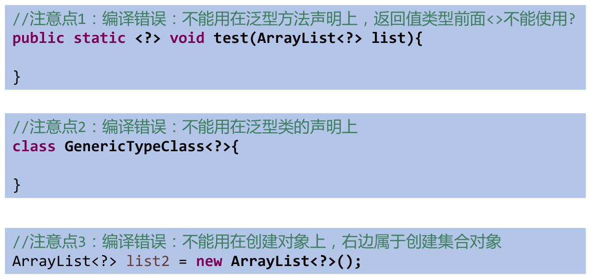

有限制的通配符：

- **通配符指定上限 extends：使用时指定的类型必须是继承某个类，或者实现某个接口，即 <=。**

  - `? extends A`：G<? extends A> 可以作为 G\<A> 和 G\<B> 的父类，其中 B 是 A 的子类。

- **通配符指定下限 super：使用时指定的类型不能小于操作的类，即 >=。**

  - `? super A`：G<? super A> 可以作为 G\<A> 和 G\<B> 的父类，其中 B 是 A 的父类。

- 实例：

  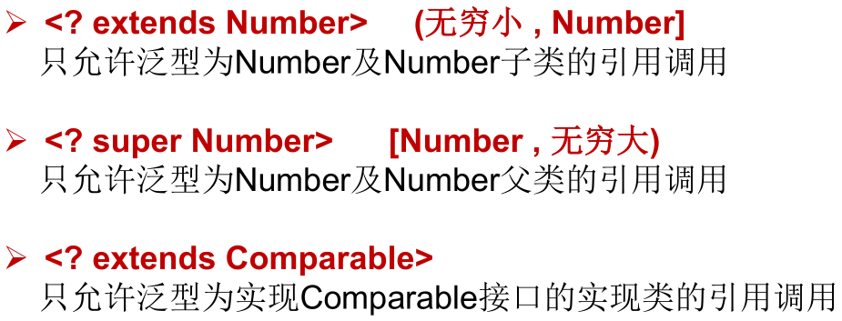

  ```java
  public class Test {
      public static void printCollection3(Collection<? extends Person> coll) {
          // Iterator只能用Iterator<?>或Iterator<? extends Person>.why?
          Iterator<?> iterator = coll.iterator();
          while (iterator.hasNext()) {
              System.out.println(iterator.next());
          }
      }
  
      public static void printCollection4(Collection<? super Person> coll) {
          // Iterator只能用Iterator<?>或Iterator<? super Person>.why?
          Iterator<?> iterator = coll.iterator();
          while (iterator.hasNext()) {
              System.out.println(iterator.next());
          }
      }
  }
  
  class Person {
  }
  ```

- 读取和添加元素：

  ```java
  public class Person {}
  ```

  ```java
  public class Student extends Person {}
  ```

  ```java
  public class Test {
      public static void main(String[] args) {
          List<? extends Person> list1;
          List<? super Person> list2;
  
          List<Student> list3 = new ArrayList<>();
          List<Person> list4 = new ArrayList<>();
          List<Object> list5 = new ArrayList<>();
  
          list1 = list3;
          list1 = list4;
          // 编译不通过，因为Object > Person
          // list1 = list5;
  
          // 编译不通过，因为Student < Person
          // list2 = list3;
          list2 = list4;
          list2 = list5;
  
          // 读取数据：读出的元素定义为最大的类型
          list1 = list3;
          Person p = list1.get(0);
          // 编译不通过，因为读出来的元素不一定是Student，也可能是Student的父类，但肯定是Person的子类
          // Student s = list1.get(0);
  
          list2 = list4;
          Object obj = list2.get(0);
          // 编译不通过，因为读出来的元素不一定是Person，也可能是Person的父类，但肯定是Object的子类
          // Person obj = list2.get(0);
  
          // 写入数据：
          // 编译不通过，因为list1是(-∞,Person]，添加的元素，可能其类型比Person或Student小，因此除了null都不能添加
          // list1.add(new Person());
          // list1.add(new Student());
          list1.add(null);
  
          // 编译通过，因为list2是[Person,+∞)，无论是什么元素，都肯定是Person或其父类，那么Person及其子类都能添加
          list2.add(new Person());
          list2.add(new Student());
      }
  }
  ```

泛型嵌套：

```java
public class Test {
    public static void main(String[] args) {
        HashMap<String, ArrayList<Person>> map = new HashMap<>();
        ArrayList<Person> list = new ArrayList<Person>();
        list.add(new Person("AA"));
        list.add(new Person("BB"));
        list.add(new Person("ab"));
        map.put("AA", list);
        Set<Map.Entry<String, ArrayList<Person>>> entrySet = map.entrySet();
        Iterator<Map.Entry<String, ArrayList<Person>>> iterator = entrySet.iterator();
        while (iterator.hasNext()) {
            Map.Entry<String, ArrayList<Person>> entry = iterator.next();
            String key = entry.getKey();
            ArrayList<Person> value = entry.getValue();
            System.out.println("户主：" + key);
            System.out.println("家庭成员：" + value);
        }
    }
}
```

```java
// 只有此接口的子类才是表示人的信息
interface Info {
}

// 表示联系方式
class Contact implements Info {
    private String address;// 联系地址
    private String telephone;// 联系方式
    private String zipcode;// 邮政编码

    public Contact(String address, String telephone, String zipcode) {
        this.address = address;
        this.telephone = telephone;
        this.zipcode = zipcode;
    }

    public void setAddress(String address) {
        this.address = address;
    }

    public void setTelephone(String telephone) {
        this.telephone = telephone;
    }

    public void setZipcode(String zipcode) {
        this.zipcode = zipcode;
    }

    public String getAddress() {
        return this.address;
    }

    public String getTelephone() {
        return this.telephone;
    }

    public String getZipcode() {
        return this.zipcode;
    }

    @Override
    public String toString() {
        return "Contact [address=" + address + ", telephone=" + telephone
                + ", zipcode=" + zipcode + "]";
    }
}

// 表示个人信息
class Introduction implements Info {
    private String name;// 姓名
    private String sex;// 性别
    private int age;// 年龄

    public Introduction(String name, String sex, int age) {
        this.name = name;
        this.sex = sex;
        this.age = age;
    }

    public void setName(String name) {
        this.name = name;
    }

    public void setSex(String sex) {
        this.sex = sex;
    }

    public void setAge(int age) {
        this.age = age;
    }

    public String getName() {
        return this.name;
    }

    public String getSex() {
        return this.sex;
    }

    public int getAge() {
        return this.age;
    }

    @Override
    public String toString() {
        return "Introduction [name=" + name + ", sex=" + sex + ", age=" + age
                + "]";
    }
}

class Person<T extends Info> {
    private T info;

    // 通过构造器设置信息属性内容
    public Person(T info) {
        this.info = info;
    }

    public void setInfo(T info) {
        this.info = info;
    }

    public T getInfo() {
        return info;
    }

    @Override
    public String toString() {
        return "Person [info=" + info + "]";
    }
}

public class GenericPerson {
    public static void main(String args[]) {
        Person<Contact> per = null;// 声明Person对象
        per = new Person<Contact>(new Contact("北京市", "01088888888", "102206"));
        System.out.println(per);

        Person<Introduction> per2 = null;// 声明Person对象
        per2 = new Person<Introduction>(new Introduction("李雷", "男", 24));
        System.out.println(per2);
    }
}
```

## 数组

`数组 (Array)`，是多个`相同类型`的数据按一定顺序排列的集合，使用一个名字命名，并通过编号的方式对这些数据进行统一管理。

数组的相关概念：

- 数组名
- 元素
- 下标/索引
- 数组的长度

数组的特点：

- 数组是`有序`排列的。
- 创建数组对象会在内存中开辟`一整块连续的空间`，而数组名中引用的是这块连续空间的首地址。
- 数组本身是`引用数据类型`的变量，但数组中的元素可以是任何数据类型，既可以是基本数据类型，也可以是引用数据类型。
- 可以直接通过下标/索引的方式调用指定位置的元素，速度很快。
- 数组的长度一旦确定，就不能修改。

数组的分类：

- 按照维度：一维数组、二维数组、三维数组、… 
- 按照元素的数据类型分：基本数据类型元素的数组、引用数据类型元素的数组（即对象数组）。

### 一维数组

声明方式：`type var[] 或 type[] var;`。例如：`int a[]; int[] a1; double b[]; String[] c;// 引用类型变量数组`。

不同写法：`int[] x;`，`int x[];`。

> Java 语言中声明数组时，不能指定其长度（数组中元素的数）， 例如：`int a[5];// 非法`。

```java
public static void main(String[] args) {
    // 1-1 静态初始化, 方式一
    int[] ids = new int[]{1001, 1002, 1003, 1004, 1005};
    
    // 1-2 静态初始化, 方式二, 类型推断
    int[] ids2 = {1001, 1002, 1003, 1004, 1005};

    // 2 动态初始化
    String[] names = new String[5];
    names[0] = "Student A";
    names[1] = "Student B";
    names[2] = "Student C";
    names[3] = "Student D";
    names[4] = "Student E";

    // 3 数组的长度
    System.out.println("ids 的长度：" + ids.length);// 5
    System.out.println("names 的长度：" + names.length);// 5

    // 4 遍历数组
    for (int i = 0; i < ids.length; i++) {
        System.out.println(ids[i]);
    }

    for (int i = 0; i < names.length; i++) {
        System.out.println(names[i]);
    }

    // 5 简写方式遍历数组
    for (int id : ids) {
        System.out.println(id);
    }

    for (String name : names) {
        System.out.println(name);
    }

    // 6 数组元素的默认初始化值
    int[] arrs = new int[5];
    for (int arr : arrs) {
        System.out.println(arr);// 0
    }

    String[] arrs2 = new String[5];
    for (String arr2 : arrs2) {
        System.out.println(arr2);// null
    }
}
```

- `静态初始化`：数组的初始化，和数组元素的赋值操作同时进行，如：`int[] ids = new int[]{1001, 1002, 1003, 1004, 1005};`。

- `动态初始化` ：数组的初始化，和数组元素的赋值操作分开进行，如：`String[] names = new String[5]; names[1] = "a";`。

- 定义数组并用运算符 new 为之分配空间后，才可以引用数组中的每个元素。

- 数组元素的引用方式：`数组名[数组元素下标]`。

- 数组元素下标**`从 0 开始`**，长度为 n 的数组的合法下标取值范围：0 ~ n - 1。如：`int a[] = new int[3];`，则可引用的数组元素为 a[0]、a[1] 和 a[2]。

- 数组元素下标可以是整型常量或整型表达式。如 a[3]，b[i]，c[6*i]。

- `数组一旦初始化完成，其长度也随即确定，且长度不可变。`每个数组都有一个属性 length 指明它的长度，例如：a.length 指明数组 a 的长度（元素个数）。

- 数组是引用类型，它的元素相当于类的成员变量，因此数组一经分配空间，其中的每个元素也被按照成员变量同样的方式被**隐式初始化**。然后，再根据实际代码设置，将数组相应位置的元素进行赋值，即**显示赋值**。

  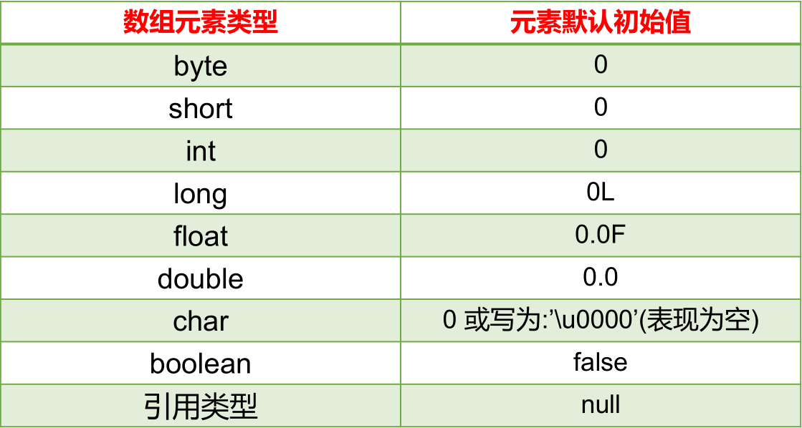

  - 对于基本数据类型而言，默认的初始化值各有不同；对于引用数据类型而言，默认的初始化值为 null。
  - char 类型的默认值是 0，不是 '0'，表现的是类似空格的一种效果。

- 一维数组内存解析：

  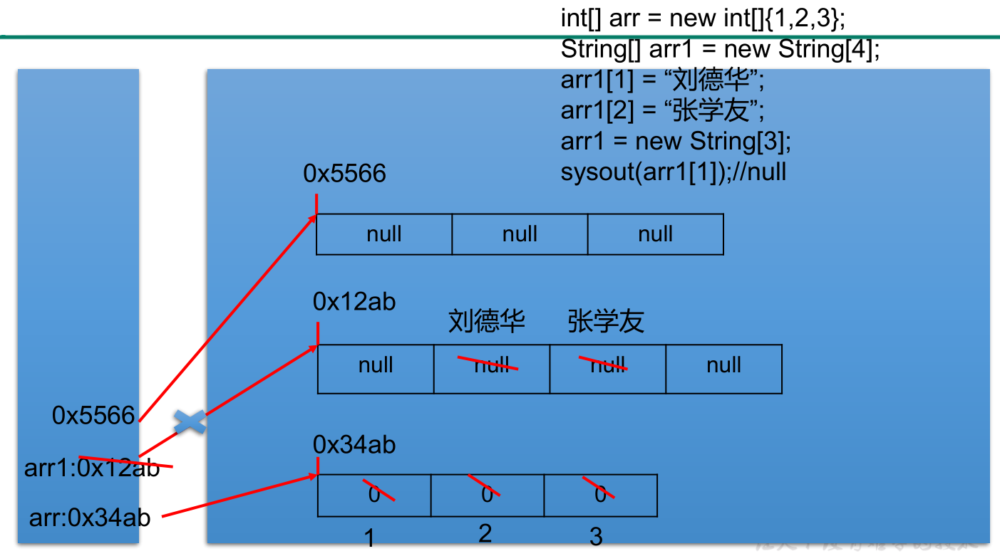

  

- 一个计算联系方式的数组：

  ```java
  public static void main(String[] args) {
      int[] arr = new int[]{8, 2, 1, 0, 3};
      int[] index = new int[]{2, 0, 3, 2, 4, 0, 1, 3, 2, 3, 3};
      String tel = "";
      for (int i = 0; i < index.length; i++) {
          tel += arr[index[i]];
      }
      System.out.println("联系方式：" + tel);// 联系方式: 18013820100
  }
  ```

  - 联系方式是已提前确定的，不是随机获取手机号。

### 二维数组

Java 语言里提供了支持多维数组的语法。如果把一维数组当成几何中的线性图形，那么二维数组就相当于是一个表格。

对于二维数组的理解，可以看成是一维数组 array1，作为另一个一维数组 array2 的元素而存在。其实，从数组底层的运行机制来看，没有多维数组。

- 可以理解为，array2 是外层数组，array1 则是外层数组每一个位置上的值，即内层数组。

不同写法：`int[][] x;`，`int[] x[];`，`int x[][];`。

```java
public static void main(String[] args) {
    // 1-1 静态初始化, 方式一
    int[][] arr = new int[][]{{3, 8, 2}, {2, 7}, {9, 0, 1, 6}};

    // 1-2 静态初始化, 方式二, 类型推断
    int[][] arr2 = {{3, 8, 2}, {2, 7}, {9, 0, 1, 6}};
    System.out.println(arr2[2][3]);

    // 2-1 动态初始化, 方式一
    /*
    定义了名称为arr3的二维数组, 二维数组中有3个一维数组, 内层每一个一维数组中有2个元素
    内层一维数组的名称分别为arr3[0], arr3[1], arr3[2], 返回的是地址值
    给内层第一个一维数组1脚标位赋值为78写法是: arr3[0][1] = 78;
     */
    int[][] arr3 = new int[3][2];
    arr3[0][1] = 78;
    System.out.println(arr3[0]);// [I@78308db1
    System.out.println(arr3[0][1]);// 78

    // 2-2 动态初始化, 方式二
    /*
    二维数组arr4中有3个一维数组, 内层每个一维数组都是默认初始化值null(注意: 区别于格式2-1)
    可以对内层三个一维数组分别进行初始化
     */
    int[][] arr4 = new int[3][];
    // 初始化第一个
    arr4[0] = new int[3];
    // 初始化第二个
    arr4[1] = new int[1];
    // 初始化第三个
    arr4[2] = new int[2];
    
    // 3 特殊写法
    int[] x, y[];// x是一维数组, y是二维数组
    x = new int[3];
    y = new int[3][2];
    
    // 4 获取数组长度
    System.out.println("arr的长度：" + arr.length);// 3
    System.out.println("arr第一个元素的长度：" + arr[0].length);// 3

    // 5 遍历二维数组
    for (int i = 0; i < arr.length; i++) {
        for (int j = 0; j < arr[i].length; j++) {
            System.out.print(arr[i][j] + "\t");// 3	8 2	2 7	9 0	1 6
        }
    }
    System.out.println();

    // 6 简写遍历二维数组
    for (int[] valueArr : arr) {
        for (int value : valueArr) {
            System.out.print(value + "\t");// 3	8 2	2 7	9 0	1 6
        }
    }
    System.out.println();
    
    // 7 二维数组元素的默认初始化值
    int[][] arr5 = new int[3][2];
    System.out.println(arr5);// [[I@27c170f0
    System.out.println(arr5[1]);// [I@5451c3a8
    System.out.println(arr5[1][1]);// 0

    String[][] arr6 = new String[3][2];
    System.out.println(arr6);// [[Ljava.lang.String;@2626b418
    System.out.println(arr6[1]);// [Ljava.lang.String;@5a07e868
    System.out.println(arr6[1][1]);// null

    String[][] arr7 = new String[3][];
    System.out.println(arr7[1]);// null, 因为内层数组未初始化
    System.out.println(arr7[1][1]);// NullPointerException
}
```

- 动态初始化方式一，初始化时直接规定了内层一维数组的长度，动态初始化方式二，可以在使用过程中根据需要另行初始化内层一维数组的长度。利用动态初始化方式二时，必须要先初始化内层一维数组才能对其使用，否则报空指针异常。

- `int[][] arr = new int[][3];`的方式是非法的。

- 注意特殊写法情况：`int[] x,y[];// x是一维数组，y是二维数组`。 

- Java 中多维数组不必都是规则矩阵形式。

- 数组元素的默认初始化值：针对形如`int[][] arr = new int[4][3];`的初始化方式，外层元素的初始化值为地址值，内层元素的初始化值与一维数组初始化情况相同；针对形如`int[][] arr = new int[4][];`的初始化方式，外层元素的初始化值为 null，内层元素没有初始化，不能调用。

- 二维数组内存解析：

  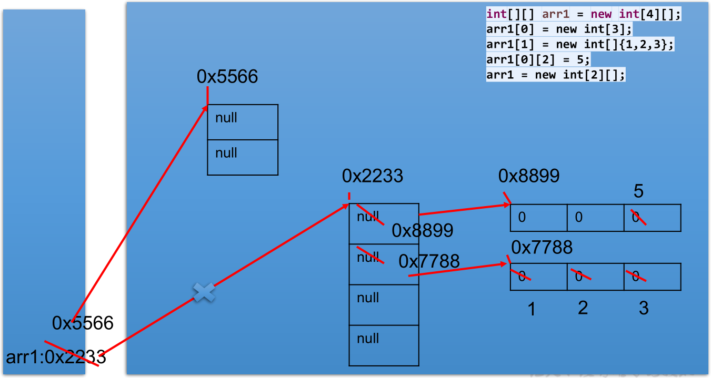

- `杨辉三角`：使用二维数组打印一个 10 行杨辉三角。

  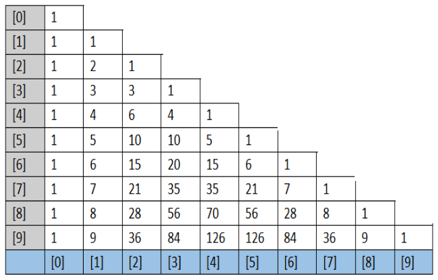

  - 提示：1. 第一行有 1 个元素，第 n 行有 n 个元素；2. 每一行的第一个元素和最后一个元素都是 1；3. 从第三行开始，对于非第一个元素和最后一个元素的元素，有：`yanghui[i][j] = yanghui[i-1][j-1] + yanghui[i-1][j];`。

  - 实现：

    ```java
    public static void main(String[] args) {
        // 1 声明二维数组并初始化
        int[][] arrs = new int[10][];
        for (int i = 0; i < arrs.length; i++) {
            System.out.print("[" + i + "]\t");
            // 2 初始化内层数组, 并给内层数组的首末元素赋值
            arrs[i] = new int[i + 1];
            arrs[i][0] = 1;
            arrs[i][arrs[i].length - 1] = 1;
            for (int j = 0; j < arrs[i].length; j++) {
                // 3 给从第三行开始内层数组的非首末元素赋值
                if (i >= 2 && j > 0 && j < arrs[i].length - 1) {
                    arrs[i][j] = arrs[i - 1][j - 1] + arrs[i - 1][j];
                }
                System.out.print(arrs[i][j] + "\t");
            }
            System.out.println();
        }
        System.out.print("\t");
        for (int i = 0; i < arrs.length; i++) {
            System.out.print("[" + i + "]\t");
        }
    }
    ```

### 数组中涉及到的常见算法

#### 数组元素的赋值（杨辉三角、回形数等）

创建一个长度为 6 的 int 型数组，要求数组元素的值都在 1 - 30 之间，且是随机赋值。同时，要求元素的值各不相同。

```java
public static void main(String[] args) {
    int[] arr = new int[6];
    for (int i = 0; i < arr.length; i++) {
        // 获取一个1-30之间的随机数
        arr[i] = (int) (Math.random() * 30 + 1);
        // 判断是否有相同的值
        for (int item : arr) {
            if (item == arr[i]) {
                i--;
                break;
            }
        }
    }

    // 遍历数组
    for (int value : arr) {
        System.out.println(value);
    }
}
```

回形数，从键盘输入一个 1 - 20 的整数，然后以该数字为矩阵的大小，把 1，2，3 … n*n 的数字按照顺时针螺旋的形式填入其中。例如：

- 输入数字 2，则程序输出：

  

- 输入数字 3，则程序输出：

  

- 输入数字 4， 则程序输出：

  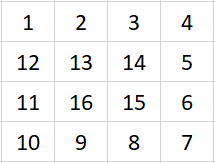

- 方式一：

  ```java
  public static void main(String[] args) {
      Scanner scanner = new Scanner(System.in);
      System.out.println("输入一个数字");
      int len = scanner.nextInt();
      int[][] arr = new int[len][len];
      int s = len * len;
  
      /*
       * k = 1: 向右, k = 2: 向下, k = 3: 向左, k = 4: 向上
       */
      int k = 1;
      int i = 0, j = 0;
      for (int m = 1; m <= s; m++) {
          if (k == 1) {
              if (j < len && arr[i][j] == 0) {
                  arr[i][j++] = m;
              } else {
                  k = 2;
                  i++;
                  j--;
                  m--;
              }
          } else if (k == 2) {
              if (i < len && arr[i][j] == 0) {
                  arr[i++][j] = m;
              } else {
                  k = 3;
                  i--;
                  j--;
                  m--;
              }
          } else if (k == 3) {
              if (j >= 0 && arr[i][j] == 0) {
                  arr[i][j--] = m;
              } else {
                  k = 4;
                  i--;
                  j++;
                  m--;
              }
          } else if (k == 4) {
              if (i >= 0 && arr[i][j] == 0) {
                  arr[i--][j] = m;
              } else {
                  k = 1;
                  i++;
                  j++;
                  m--;
              }
          }
      }
  
      // 遍历数组
      for (int m = 0; m < arr.length; m++) {
          for (int n = 0; n < arr[m].length; n++) {
              System.out.print(arr[m][n] + "\t");
          }
          System.out.println();
      }
  }
  ```

- 方式二：

  ```java
  public static void main(String[] args) {
      Scanner scanner = new Scanner(System.in);
      System.out.println("输入一个数字");
      int n = scanner.nextInt();
      int[][] arr = new int[n][n];
  
      int count = 0;// 要显示的数据
      int maxX = n - 1;// x轴的最大下标
      int maxY = n - 1;// Y轴的最大下标
      int minX = 0;// x轴的最小下标
      int minY = 0;// Y轴的最小下标
      while (minX <= maxX) {
          // 向右
          for (int x = minX; x <= maxX; x++) {
              arr[minY][x] = ++count;
          }
          minY++;
          // 向下
          for (int y = minY; y <= maxY; y++) {
              arr[y][maxX] = ++count;
          }
          maxX--;
          // 向左
          for (int x = maxX; x >= minX; x--) {
              arr[maxY][x] = ++count;
          }
          maxY--;
          // 向上
          for (int y = maxY; y >= minY; y--) {
              arr[y][minX] = ++count;
          }
          minX++;
      }
  
      // 遍历数组
      for (int i = 0; i < arr.length; i++) {
          for (int j = 0; j < arr.length; j++) {
              String space = (arr[i][j] + "").length() == 1 ? "0" : "";
              System.out.print(space + arr[i][j] + " ");
          }
          System.out.println();
      }
  }
  ```

#### 求数值型数组中元素的最大值、最小值、平均数、总和等

定义一个 int 型的一维数组，包含 10 个元素，分别赋一些随机整数，然后求出所有元素的最大值，最小值，和值，平均值，并输出出来。要求：所有随机数都是两位数。

```java
public static void main(String[] args) {
    // 初始化及赋值
    int[] arr = new int[10];
    int length = arr.length;
    for (int i = 0; i < length; i++) {
        int value = (int) (Math.random() * 90 + 10);
        arr[i] = value;
    }

    // 遍历
    for (int value : arr) {
        System.out.print(value + "\t");
    }
    System.out.println();

    // 计算
    int max = arr[0];
    int min = arr[0];
    int sum = 0;
    double average = 0;
    for (int value : arr) {
        max = max < value ? value : max;
        min = min > value ? value : min;
        sum += value;
    }
    average = sum / (length * 1.0);
    System.out.println("最大值：" + max);
    System.out.println("最小值：" + min);
    System.out.println("和值：" + sum);
    System.out.println("平均值：" + average);
}
```

#### 数组的复制、反转、查找（线性查找、二分法查找）

`复制`

- 虚假的复制，没有创建新对象：

  ```java
  public static void main(String[] args) {
      // 声明arr1和arr2
      int[] arr1, arr2;
      arr1 = new int[]{2, 3, 5, 7, 11, 13, 17, 19};
  
      // 遍历arr1
      for (int value : arr1) {
          System.out.print(value + "\t");
      }
      System.out.println();
  
      // 赋值arr2变量等于arr1
      // 不能称作数组的复制, 实际上是把arr1指向的地址(以及其他一些信息)赋给了arr2, 堆空间中只有一个数组对象
      arr2 = arr1;
  
      // 遍历arr2
      for (int value : arr2) {
          System.out.print(value + "\t");
      }
      System.out.println();
  
      // 更改arr2
      for (int i = 0; i < arr1.length; i++) {
          if (i % 2 == 0) {
              arr2[i] = i;
              continue;
          }
          arr2[i] = arr1[i];
      }
  
      // 遍历arr2
      for (int value : arr2) {
          System.out.print(value + "\t");
      }
      System.out.println();
  
      // 遍历arr1
      for (int value : arr1) {
          System.out.print(value + "\t");
      }
      System.out.println();
  }
  输出结果：
  2	3	5	7	11	13	17	19	
  2	3	5	7	11	13	17	19	
  0	3	2	7	4	13	6	19	
  0	3	2	7	4	13	6	19
  ```

  - arr1 和 arr2 地址值相同，都指向了堆空间中唯一的一个数组实体：

    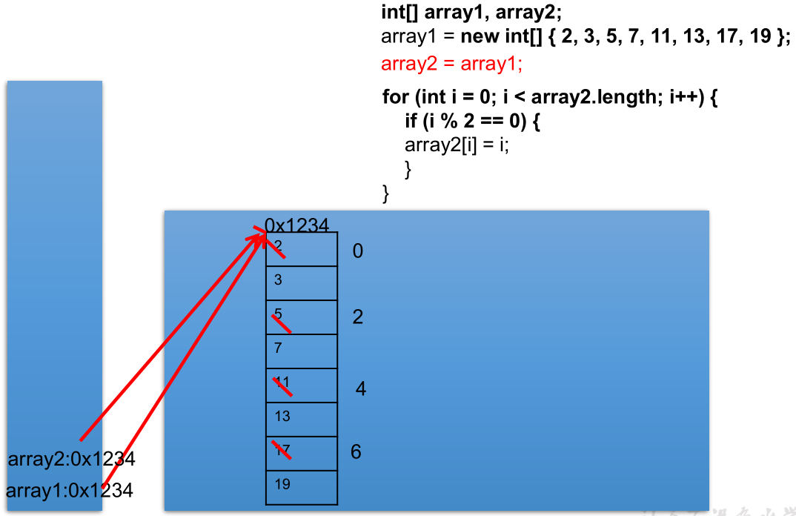


- 真实的复制，创建了新对象：

  ```java
  public static void main(String[] args) {
      // 声明arr1和arr2
      int[] arr1, arr2;
      arr1 = new int[]{2, 3, 5, 7, 11, 13, 17, 19};
  
      // 遍历arr1
      for (int value : arr1) {
          System.out.print(value + "\t");
      }
      System.out.println();
  
      // 数组的复制
      arr2 = new int[arr1.length];
      for (int i = 0; i < arr1.length; i++) {
          arr2[i] = arr1[i];
      }
  
      // 遍历arr2
      for (int value : arr2) {
          System.out.print(value + "\t");
      }
      System.out.println();
  
      // 更改arr2
      for (int i = 0; i < arr1.length; i++) {
          if (i % 2 == 0) {
              arr2[i] = i;
              continue;
          }
          arr2[i] = arr1[i];
      }
  
      // 遍历arr2
      for (int value : arr2) {
          System.out.print(value + "\t");
      }
      System.out.println();
  
      // 遍历arr1
      for (int value : arr1) {
          System.out.print(value + "\t");
      }
      System.out.println();
  }
  输出结果：
  2	3	5	7	11	13	17	19	
  2	3	5	7	11	13	17	19	
  0	3	2	7	4	13	6	19	
  2	3	5	7	11	13	17	19
  ```

  - arr1 和 arr2 地址值不同，指向了堆空间中两个不同的数组实体：

    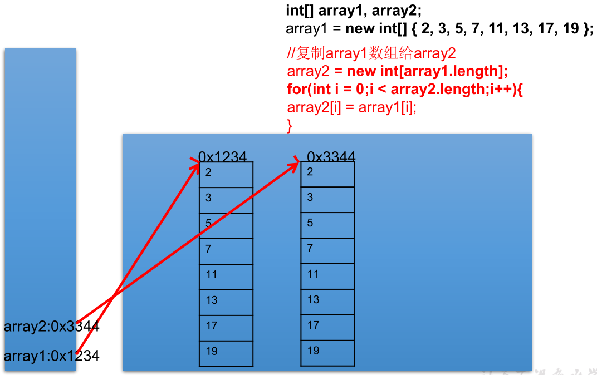

`反转`

```java
public static void main(String[] args) {
    String[] arr = {"A", "B", "C", "D", "E", "F", "G"};

    // 遍历arr
    for (String value : arr) {
        System.out.print(value + "\t");
    }
    System.out.println();

    // 反转, 方式一
    for (int i = 0; i < arr.length / 2; i++) {
        String temp = arr[i];
        arr[i] = arr[arr.length - 1 - i];
        arr[arr.length - 1 - i] = temp;
    }
    for (String value : arr) {
        System.out.print(value + "\t");
    }
    System.out.println();

    // 反转, 方式二
    for (int i = 0, j = arr.length - 1; i < j; i++, j--) {
        String temp = arr[i];
        arr[i] = arr[j];
        arr[j] = temp;
    }
    for (String value : arr) {
        System.out.print(value + "\t");
    }
    System.out.println();
}
```

`线性查找`

```java
public static void main(String[] args) {
    String[] arr = {"A", "B", "C", "D", "E", "F", "G"};

    // 遍历arr
    for (String value : arr) {
        System.out.print(value + "\t");
    }
    System.out.println();
    
    String dest = "D";
    boolean isFlag = true;
    for (int i = 0; i < arr.length; i++) {
        if (dest.equals(arr[i])) {
            System.out.println("找到了指定的元素：" + dest + "，位置为：" + i);
            isFlag = false;
            break;
        }
    }
    if (isFlag) {
        System.out.println("没找到指定的元素：" + dest);
    }
}
输出结果：
A	B	C	D	E	F	G	
找到了指定的元素：D，位置为：3
```

`二分法查找`，前提：所要查找的数组必须有序。

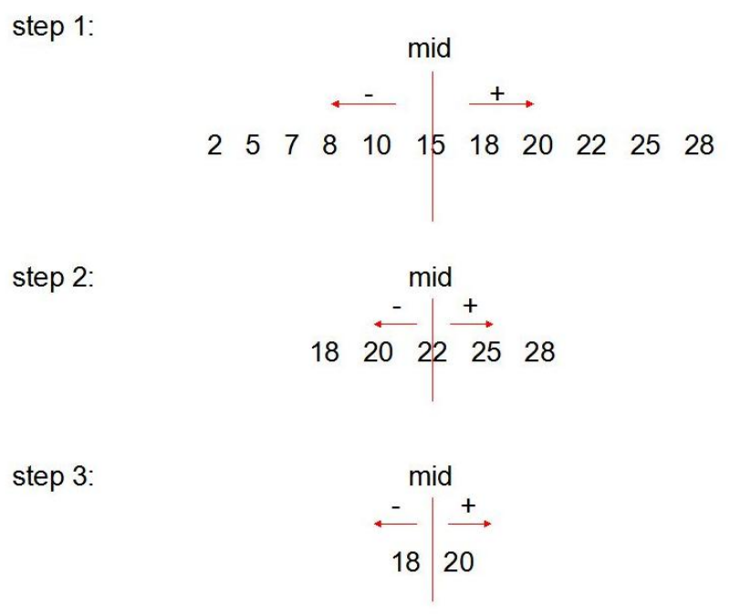

```java
public static void main(String[] args) {
    int[] arr = {2, 5, 7, 8, 10, 15, 18, 20, 22, 25, 28};
    
    // 遍历arr
    for (int value : arr) {
        System.out.print(value + "\t");
    }
    System.out.println();

    int dest = 10;
    // 初始的首索引
    int head = 0;
    // 初始的末索引
    int end = arr.length - 1;
    boolean isFlag = true;
    while (head <= end) {
        int middle = (head + end) / 2;
        if (dest == arr[middle]) {
            System.out.println("找到了指定的元素：" + dest + "，位置为：" + middle);
            isFlag = false;
            break;
        } else if (dest < arr[middle]) {
            end = middle - 1;
        } else {// dest2 > arr2[middle]
            head = middle + 1;
        }
    }
    if (isFlag) {
        System.out.println("没找到指定的元素：" + dest);
    }
}
输出结果：
2 5	7 8	10 15 18 20	22 25 28	
找到了指定的元素：10，位置为：4
```

#### 数组元素的排序算法

排序：假设含有 n 个记录的序列为 {R1, R2, ..., Rn}，其相应的关键字序列为 {K1, K2, ..., Kn}。将这些记录重新排序为 {Ri1, Ri2, ..., Rin}，使得相应的关键字值满足条 Ki1 <= Ki2 <= ... <= Kin，这样的一种操作称为`排序`。通常来说，排序的目的是快速查找。

衡量排序算法的优劣：

1. `时间复杂度`：分析关键字的比较次数和记录的移动次数。

2. `空间复杂度`：分析排序算法中需要多少辅助内存。

3. `稳定性`：若两个记录 A 和 B 的关键字值相等，但排序后 A、B 的先后次序保持不变，则称这种排序算法是稳定的。

排序算法分类：内部排序和外部排序。

- `内部排序`：整个排序过程不需要借助于外部存储器（如磁盘等），所有排序操作都在内存中完成。

- `外部排序`：参与排序的数据非常多，数据量非常大，计算机无法把整个排序过程放在内存中完成，必须借助于外部存储器（如磁盘等）。外部排序最常见的是多路归并排序。可以认为外部排序是由多次内部排序组成。

十大内部排序算法：

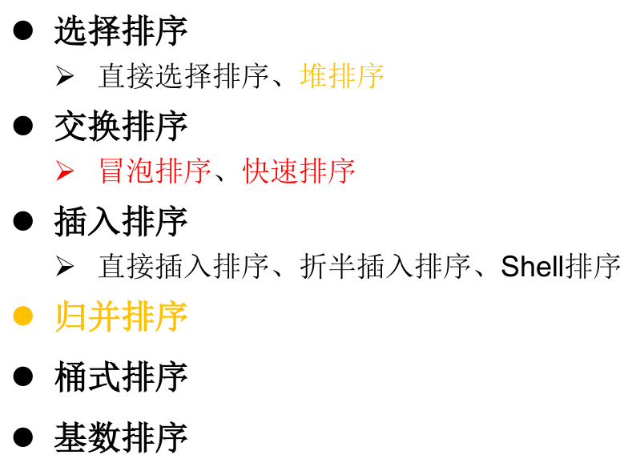

排序算法性能对比：

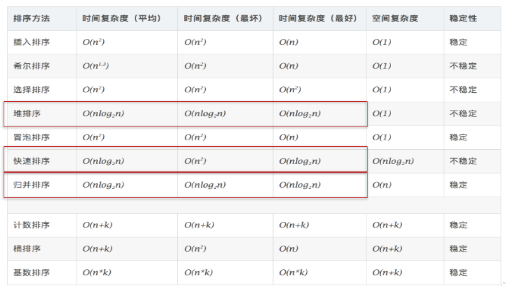

- 从平均时间而言：快速排序最佳。但在最坏情况下时间性能不如堆排序和归并排序。
- 从算法简单性看：由于直接选择排序、直接插入排序和冒泡排序的算法比较简单，将其认为是简单算法。对于 Shell 排序、堆排序、快速排序和归并排序算法，其算法比较复杂，认为是复杂排序。
- 从稳定性看：直接插入排序、冒泡排序和归并排序时稳定的；而直接选择排序、快速排序、 Shell 排序和堆排序是不稳定排序。
- 从待排序的记录数 n 的大小看，n 较小时，宜采用简单排序；而 n 较大时宜采用改进排序。

排序算法的选择：

- 若 n 较小（如 n ≤50），可采用直接插入或直接选择排序。当记录规模较小时，直接插入排序较好；否则因为直接选择移动的记录数少于直接插入，应选直接选择排序为宜。
- 若文件初始状态基本有序（指正序），则应选用直接插入、 冒泡或随机的快速排序为宜。
- 若 n 较大，则应采用时间复杂度为 O(nlgn) 的排序方法： 快速排序、 堆排序或归并排序。

##### 冒泡排序

冒泡排序的原理非常简单，它重复地走访过要排序的数列，一次比较两个元素，如果他们的顺序错误就把他们交换过来。

排序思想：

1. 比较相邻的元素。如果第一个比第二个大（升序），就交换他们两个。
2. 对每一对相邻元素作同样的工作，从开始第一对到结尾的最后一对。这步做完后，最后的元素会是最大的数。
3. 针对所有的元素重复以上的步骤，除了最后一个。
4. 持续每次对越来越少的元素重复上面的步骤，直到没有任何一对数字需要比较为止。

实现：

```java
public static void main(String[] args) {
    int[] arr = new int[]{43, 32, 76, -98, 0, 64, 33, -21, 32, 99};

    // 遍历arr
    for (int value : arr) {
        System.out.print(value + "\t");
    }
    System.out.println();

    // 冒泡排序
    for (int i = 0; i < arr.length - 1; i++) {
        // 先把最大的数移到数组最后一位, 然后再找第二大的数, 以此类推
        for (int j = 0; j < arr.length - 1 - i; j++) {
            if (arr[j] > arr[j + 1]) {
                int temp = arr[j];
                arr[j] = arr[j + 1];
                arr[j + 1] = temp;
            }
        }
    }

    // 遍历arr
    for (int value : arr) {
        System.out.print(value + "\t");
    }
    System.out.println();
}
输出结果：
43	32	76	-98	0	64	33	-21	32	99
-98	-21	0	32	32	33	43	64	76	99
```

##### 快速排序

快速排序通常明显比同为 O(nlogn) 的其他算法更快，因此常被采用，而且快速排序采用了分治法的思想，所以在很多笔试面试中能经常看到快速排序的影子，可见掌握快速排序的重要性。

快速排序（Quick Sort）由图灵奖获得者 Tony Hoare 发明，被列为 20 世纪十大算法之一，是迄今为止所有内排序算法中速度最快的一种。

快速排序属于冒泡排序的升级版，交换排序的一种。快速排序的时间复杂度为 O(nlog(n))。

排序思想：

1. 从数列中挑出一个元素，称为 "基准"（pivot）。
2. 重新排序数列，所有元素比基准值小的摆放在基准前面，所有元素比基准值大的摆在基准的后面（相同的数可以到任一边）。在这个分区结束之后，该基准就处于数列的中间位置。这个称为分区（partition）操作。
3. 递归地（recursive）把小于基准值元素的子数列和大于基准值元素的子数列排序。
4. 递归的最底部情形，是数列的大小是零或一，也就是永远都已经被排序好了。虽然一直递归下去，但是这个算法总会结束，因为在每次的迭代（iteration）中，它至少会把一个元素摆到它最后的位置去。

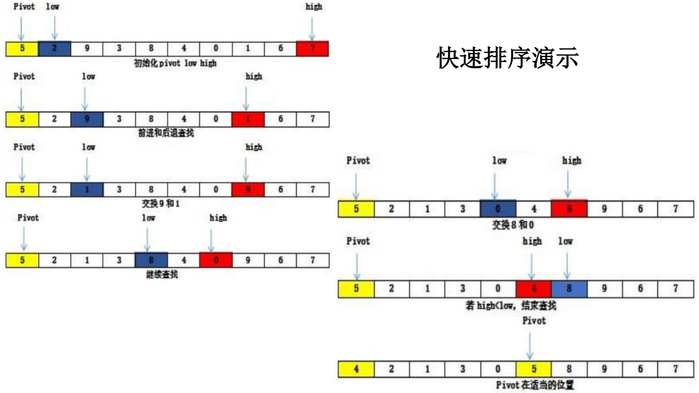

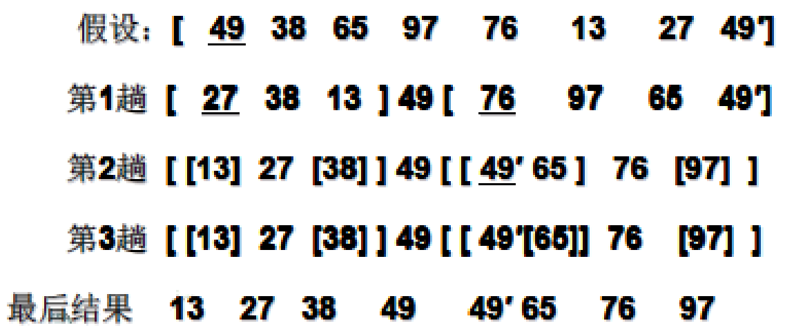

### Arrays 工具类的使用

`java.util.Arrays`类为操作数组的工具类，包含了用来操作数组（比如排序和搜索）的各种方法。常用的方法有：

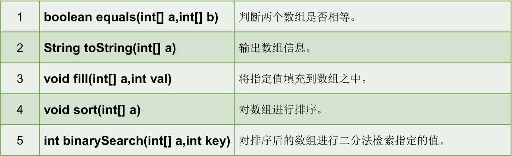

```java
public static void main(String[] args) {
    // 1 boolean equals(int[] a,int[] b): 判断两个数组是否相等
    int[] arr1 = new int[]{1, 2, 3, 4};
    int[] arr2 = new int[]{1, 3, 2, 4};
    boolean isEquals = Arrays.equals(arr1, arr2);
    System.out.println("arr1和arr2是否相等：" + isEquals);

    // 2 String toString(int[] a): 遍历数组信息
    System.out.println("arr1：" + Arrays.toString(arr1));

    // 3 void fill(int[] a,int val): 将指定值填充到数组之中
    Arrays.fill(arr1, 10);
    System.out.println("arr1填充后：" + Arrays.toString(arr1));

    // 4 void sort(int[] a): 对数组进行排序, 底层使用的是快速排序
    System.out.println("arr2排序前：" + Arrays.toString(arr2));
    Arrays.sort(arr2);
    System.out.println("arr2排序后：" + Arrays.toString(arr2));

    // 5 int binarySearch(int[] a,int key): 对排序后的数组进行二分法检索指定的值
    int[] arr3 = new int[]{-98, -34, 2, 34, 54, 66, 79, 105, 210, 333};
    int dest = 211;
    int index = Arrays.binarySearch(arr3, dest);
    if (index >= 0) {
        System.out.println(dest + "在数组中的位置为：" + index);
    } else {
        System.out.println(dest + "在数组中未找到：" + index);
    }
}
输出结果：
arr1和arr2是否相等：false
arr1：[1, 2, 3, 4]
arr1填充后：[10, 10, 10, 10]
arr2排序前：[1, 3, 2, 4]
arr2排序后：[1, 2, 3, 4]
211在数组中未找到：-10
```

### 数组中的常见异常

```java
public static void main(String[] args) {
    // ArrayIndexOutOfBoundsException
    int[] arr = new int[]{7, 10};
    System.out.println(arr[2]);// 数组脚标越界
    System.out.println(arr[-1]);// 访问了数组中不存在的脚标

    // NullPointerException: 空指针异常, arr引用没有指向实体, 却被操作实体中的元素
    // 情形一
    int[] arr2 = null;
    System.out.println(arr2[0]);
    // 情形二
    int[][] arr3 = new int[4][];
    System.out.println(arr3[0]);// null
    System.out.println(arr3[0][0]);// NullPointerException
    // 情形三
    String[] arr4 = new String[]{"AA", "BB", "CC"};
    arr4[0] = null;
    System.out.println(arr4[0].toString());// 对null调用了方法
}
```

>ArrayIndexOutOfBoundsException 和 NullPointerException，在编译时，不报错！！

## 集合

面向对象语言是以对象的形式来对事物进行体现，为了方便对多个对象的操作，就需要对对象进行存储。

在 Java 语言中，数组（Array）和集合都是对多个数据进行存储操作的结构，简称`Java 容器`。此时的存储，主要指的是内存层面的存储，不涉及到持久化的存储。

数组在内存存储方面的特点：

- 数组一旦初始化以后，其长度就确定了。
- 数组一旦定义好，其元素的类型也就确定了。

数组在存储数据方面的弊端：

- 数组一旦初始化以后，其长度就不可修改，不便于扩展。
- 数组中提供的属性和方法少，不便于进行添加、删除、插入等操作，且效率不高。
- 数组中没有现成的属性和方法，去直接获取数组中已存储的元素的个数（只能直接知道数组的长度）。
- `数组存储的数据是有序的、可重复的。`对于无序、不可重复的需求，不能满足，即数组存储数据的特点比较单一。

Java 集合类可以用于存储数量不等的多个对象，还可用于保存具有映射关系的关联数组。

Java 集合框架可分为`Collection`和`Map`两种体系：

- Collection 接口 ：单列集合，用来存储一个一个的对象。
  - `List 接口：存储有序的、可重复的数据。`---> "动态" 数组
    - ArrayList、LinkedList、Vector
  - `Set 接口：存储无序的、不可重复的数据。`---> 高中 "集合"
    - HashSet、LinkedHashSet、TreeSet
- Map 接口：双列集合，用来`存储具有映射关系 "key - value 对" 的数据。`---> 高中 "函数"
  - HashMap、LinkedHashMap、TreeMap、Hashtable、Properties

Collection 接口继承树：

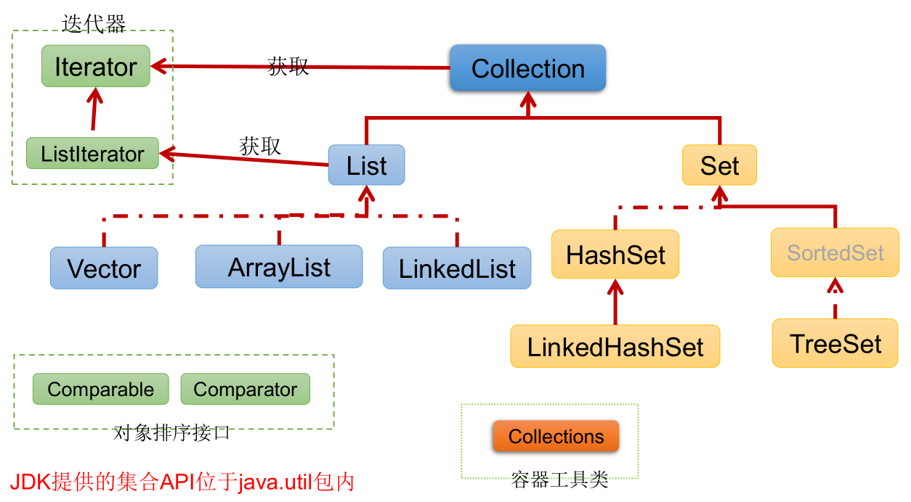

Map 接口继承树：

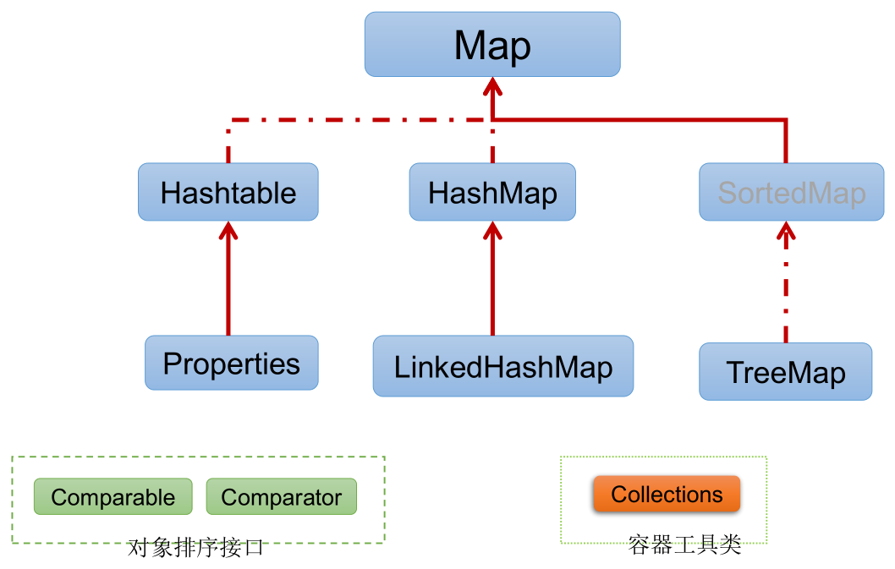

### Collection 接口

Collection 接口是 List、Set 和 Queue 接口的父接口，该接口里定义的方法既可用于操作 Set 集合，也可用于操作 List 和 Queue 集合。

JDK 不提供此接口的任何直接实现，而是提供更具体的子接口实现，如：Set 和 List。

在 JDK 5.0 之前，Java 集合会丢失容器中所有对象的数据类型，把所有对象都当成 Object 类型处理；从 JDK 5.0 增加了泛型以后，Java 集合可以记住容器中对象的数据类型。

Collection 接口的方法：

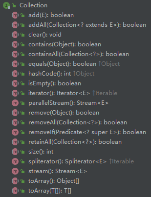

添加元素：

- `add(Object obj)`
- `addAll(Collection coll)`

获取有效元素的个数：

- `int size()`

清空集合中的元素：

- `void clear()`

是否是空集合：

- `boolean isEmpty()`

是否包含某个元素：

- `boolean contains(Object obj)`：判断当前集合中是否包含 obj，通过 obj 的`equals()`来判断是否是同一个对象。
  - **向 Collection 的实现类的对象中添加数据 obj 时，要求 obj 所在的类要重写`equals()`，否则调用的是 Object 中的`equals()`，即 ==。**
- `boolean containsAll(Collection coll)`：对两个集合的元素逐个比较，判断 coll 中的所有元素是否都存在于当前集合中，也是通过元素的`equals()`来比较的。

删除：

- `boolean remove(Object obj)`：从当前集合中移除 obj，通过 obj 的`equals()`判断是否是要删除的那个元素，只会删除找到的第一个元素。
- `boolean removeAll(Collection coll)`：从当前集合中移除 coll 中的所有元素，即取当前集合的差集。

取两个集合的交集：

- `boolean retainAll(Collection coll)`：把交集的结果存在当前集合中，不影响 coll。

集合是否相等：

- `boolean equals(Object obj)`：如果返回 true，则 obj 首先得与当前集合类型相同。如果是 List，要求元素个数和顺序一致，如果是 Set，则不考虑顺序。

转成对象数组：

- `Object[] toArray()`：将当前集合转换为数组。

- **拓展：将数组转换为集合，`Arrays.asList()`，例如：`List<String> strings = Arrays.asList(new String[]{"aa", "bb", "cc"});`。**使用此方法时的注意事项：

  ```java
  public class Test {
      public static void main(String[] args) {
          // toArray()：集合转换为数组
          Object[] objects = collection.toArray();
          System.out.println(Arrays.toString(objects));
          // 拓展：数组转换为集合
          List<String> strings = Arrays.asList(new String[]{"aa", "bb", "cc"});
          List<Person> people = Arrays.asList(new Person(), new Person());
          List<int[]> ints = Arrays.asList(new int[]{1, 2, 3});
          System.out.println(ints.size());// 1，含有一个int[]数组的集合
          List<Integer> integers = Arrays.asList(1, 2, 3);
          System.out.println(integers.size());// 3，含有三个Integer元素的集合
      }
  }
  ```

获取集合对象的哈希值：

- `hashCode()`

遍历：

- `iterator()`：返回 Iterator 接口的实例，即迭代器对象，用于遍历集合的元素。

实例：

```java
public class Test {
    public static void main(String[] args) {
        Collection<Object> collection = new ArrayList<>();

        // add(Object obj)：将元素obj添加到集合collection中
        collection.add("AA");
        collection.add("bb");
        collection.add(123);// 自动装箱
        collection.add(new Date());

        // size()：获取添加的元素的个数
        System.out.println(collection.size());// 4

        // addAll(Collection c)：将c集合中的元素添加到当前的集合中
        Collection<Object> collection2 = new ArrayList<>();
        collection2.add(456);
        collection2.add("CC");
        collection.addAll(collection2);
        System.out.println(collection2.size());

        // clear()：清空集合中的元素
        collection.clear();

        // isEmpty()：判断当前集合是否为空
        System.out.println(collection.isEmpty());// true

        // contains(Object obj)：判断当前集合是否包含obj
        collection.add(new String("Tom"));
        System.out.println(collection.contains(new String("Tom")));// true，比较的是内容
        collection.add(new Person("Jerry", 20));
        // true，如果Person未重写equals()，调用的是Object的方法，即==，返回false
        System.out.println(collection.contains(new Person("Jerry", 20)));

        // containsAll(Collection coll)：判断coll中的所有元素是否都存在于当前集合中
        collection.add(123);
        collection.add("bb");
        
        System.out.println(collection.containsAll(Arrays.asList(123, "bb", new Person("Jerry", 20))));// true

        // remove(Object obj)：从当前集合中移除obj
        System.out.println(collection.remove(new Person("Jerry", 20)));// true
        System.out.println(collection);// [Tom, 123, bb]

        // removeAll(Collection coll)：从当前集合中移除coll中的所有元素
        System.out.println(collection.removeAll(Arrays.asList("bb", "BB")));// true，移除了一个bb
        System.out.println(collection);// [Tom, 123, bb]

        // retainAll(Collection coll)：获取当前集合与coll的交集，并返回给当前集合
        System.out.println(collection.retainAll(Arrays.asList(123, new Person("Jerry", 20), "BB")));// true
        System.out.println(collection);// [123]

        // equals(Object obj)：
        collection.add("BB");
        System.out.println(collection);// [123, BB]
        System.out.println(collection.equals(Arrays.asList(123, "BB")));// true
        // false，因为collection是List，元素是有序的
        System.out.println(collection.equals(Arrays.asList("BB", 123)));

        // hashCode()：返回当前集合的哈希值
        System.out.println(collection.hashCode());

        // toArray()：集合转换为数组
        Object[] objects = collection.toArray();
        System.out.println(Arrays.toString(objects));
        // 拓展：数组转换为集合
        List<String> strings = Arrays.asList(new String[]{"aa", "bb", "cc"});
        List<Person> people = Arrays.asList(new Person(), new Person());
        List<int[]> ints = Arrays.asList(new int[]{1, 2, 3});
        System.out.println(ints.size());// 1，含有一个int[]数组的集合
        List<Integer> integers = Arrays.asList(1, 2, 3);
        System.out.println(integers.size());// 3，含有三个Integer元素的集合
    }
}

class Person {
    private String name;
    private int age;

    public Person() {
    }

    public Person(String name, int age) {
        this.name = name;
        this.age = age;
    }

    public String getName() {
        return name;
    }

    public void setName(String name) {
        this.name = name;
    }

    public int getAge() {
        return age;
    }

    public void setAge(int age) {
        this.age = age;
    }

    @Override
    public boolean equals(Object o) {
        if (this == o) {
            return true;
        }
        if (o == null || getClass() != o.getClass()) {
            return false;
        }
        Person person = (Person) o;
        return age == person.age &&
                Objects.equals(name, person.name);
    }

    @Override
    public int hashCode() {
        return Objects.hash(name, age);
    }

    @Override
    public String toString() {
        return "Person{" +
                "name='" + name + '\'' +
                ", age=" + age +
                '}';
    }
}
```

#### Iterator 迭代器接口

Iterator 对象称为`迭代器`（设计模式的一种），主要用于遍历 Collection 集合中的元素。

GOF 给迭代器模式的定义为：提供一种方法访问一个容器（container）对象中各个元素，而又不需暴露该对象的内部细节。**迭代器模式，就是为容器而生。**

Collection 接口继承了`java.lang.Iterable`接口，该接口有一个`iterator()`，所有实现了 Collection 接口的集合类都有一个`iterator()`，用以返回一个实现了 Iterator 接口的类的对象。

- **Iterator 仅用于遍历集合，Iterator 本身并不提供承装对象的能力。如果需要创建 Iterator 对象，则必须有一个被迭代的集合。**（不适用于 Map）

- **集合对象每次调用`iterator()`都得到一个全新的迭代器对象，`默认游标都在集合的第一个元素之前`。**

Iterator 接口的方法：

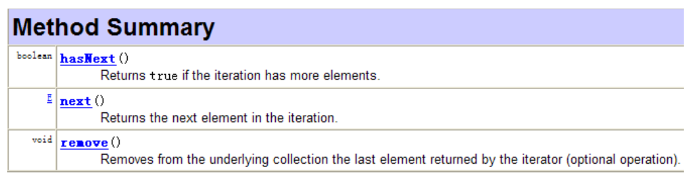

`迭代器的执行原理`：

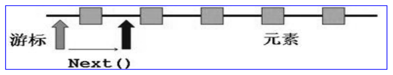

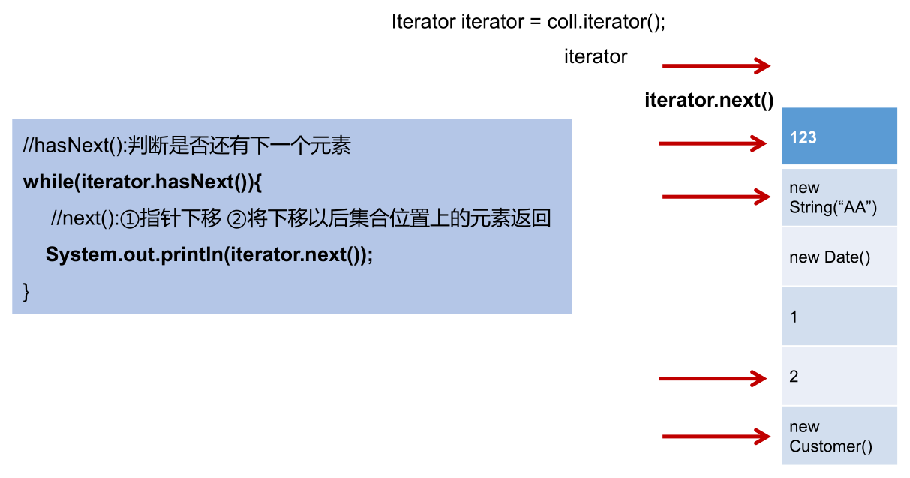

- **在调用`it.next()`之前必须要调用`it.hasNext()`进行检测。若不调用，且下一条记录无效，直接调用`it.next()`会抛出 NoSuchElementException 异常。**

Iterator 接口的`remove()`：

- **Iterator 可以删除集合的元素，但是是在遍历过程中通过迭代器对象的`remove()`删除的，不是集合对象的`remove()`。**

- **如果还未调用`next()`，或在上一次调用`next()`之后已经调用了`remove()`，则再次调用`remove()`都会抛出 IllegalStateException 异常。**

- 实例：

  ```java
  public class Test {
      public static void main(String[] args) {
          Collection<Object> collection = new ArrayList<>();
          collection.add(123);
          collection.add(456);
          collection.add(new String("Tom"));
          collection.add(false);
  
          Iterator<Object> iterator = collection.iterator();
  
          while (iterator.hasNext()) {
              // iterator.remove();// 游标处于集合的第一个元素之前，java.lang.IllegalStateException
              Object obj = iterator.next();
              if ("Tom".equals(obj)) {// Tom放在前面，可以防止obj为null时触发空指针异常
                  iterator.remove();
                  // iterator.remove();// 游标所处位置的元素已经被remove，在该位置再次调用remove发生异常，java.lang.IllegalStateException
              }
          }
  
          // 遍历集合
          iterator = collection.iterator();// 重新获取collection的迭代器对象，不能使用原来的，因为其游标已经移到集合末尾了
          while (iterator.hasNext()) {
              System.out.println(iterator.next());
          }
      }
  }
  ```

实例：

```java
public class Test {
    public static void main(String[] args) {
        Collection<Object> collection = new ArrayList<>();
        collection.add(123);
        collection.add(456);
        collection.add(new String("Tom"));
        collection.add(false);

        Iterator<Object> iterator = collection.iterator();
        // 遍历
        // hasNext()：判断是否还有下一个元素
        while (iterator.hasNext()) {
            // next()：1.指针下移;2.将下移以后集合位置上的元素返回
            System.out.println(iterator.next());
        }
    }
}
```

错误写法：

```java
public class Test {
    public static void main(String[] args) {
        Collection<Object> collection = new ArrayList<>();
        collection.add(123);
        collection.add(456);
        collection.add(new String("Tom"));
        collection.add(false);

        Iterator<Object> iterator = collection.iterator();

        // 错误写法一：间隔的输出集合中的元素，也会出现java.util.NoSuchElementException异常
        while (iterator.next()!=null){// 游标下移一次
            System.out.println(iterator.next());// 游标下移两次
        }

        // 错误写法二：死循环，每次循环都生成了一个新的迭代器对象
        while (collection.iterator().hasNext()) {
            System.out.println(collection.iterator().hasNext());
        }
    }
}
```

补充：

- Enumeration 接口是 Iterator 迭代器的古老版本。

  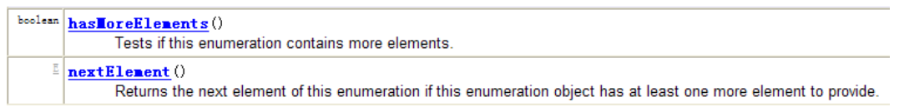

  ```java
  public class Test {
      public static void main(String[] args) {
          Enumeration stringEnum = new StringTokenizer("a-b*c-d-e-g", "-");
          while (stringEnum.hasMoreElements()) {
              Object obj = stringEnum.nextElement();
              System.out.println(obj);
          }
      }
  }
  ```

#### foreach 循环

**JDK 5.0 提供了 foreach 循环迭代访问 Collection 和数组。**格式如下：

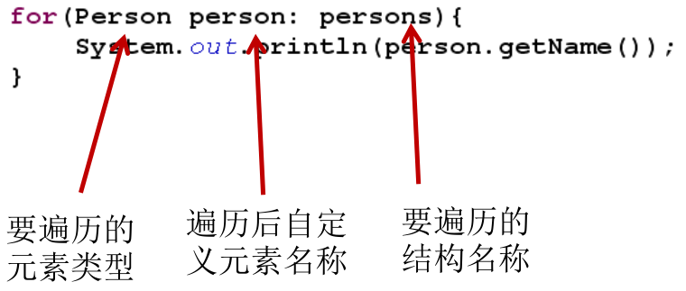

- **foreach 对 Collection 或数组的遍历操作，不需获取 Collection 和数组的长度，无需使用索引访问元素。**

- **foreach 遍历 Collection 时，其底层仍然是调用 Iterator 来完成操作。**

实例：

```java
public class Test {
    public static void main(String[] args) {
        Collection<Object> collection = new ArrayList<>();
        collection.add(123);
        collection.add(456);
        collection.add(new String("Tom"));
        collection.add(false);

        // 遍历集合：for (集合元素的类型 局部变量 : 集合对象)，底层仍然调用了迭代器
        for (Object obj : collection) {
            System.out.println(obj);
        }

        int[] arr = new int[]{1, 2, 3, 4, 5, 6};
        // 遍历数组：for (数组元素的类型 局部变量 : 数组对象)
        for (int i : arr) {
            System.out.println(i);
        }
    }
}
```

foreach 的使用注意事项：

```java
public class Test {
    public static void main(String[] args) {
        String[] arr = new String[]{"MM", "MM", "MM"};

        // 方式一：普通for赋值
        for (int i = 0; i < arr.length; i++) {
            arr[i] = "GG";// 能够赋值
        }
        for (int i = 0; i < arr.length; i++) {
            System.out.print(arr[i] + " ");// GG GG GG
        }

        System.out.println();

        arr = new String[]{"MM", "MM", "MM"};
        // 方式二：增强for循环
        for (String s : arr) {
            s = "GG";// 不能赋值，因为s是一个局部变量，foreach循环将arr数组的当前值赋给了s，然后循环中s被重新赋值为GG，不会影响到arr数组中的值
        }
        for (int i = 0; i < arr.length; i++) {
            System.out.print(arr[i] + " ");// MM MM MM
        }
    }
}
```

#### List 接口

鉴于 Java 中数组用来存储数据的局限性，我们`通常使用 List 替代数组`。

- **List 集合类中元素有序、且可重复，集合中的每个元素都有其对应的顺序索引。**

- List 容器中的元素都对应一个整数型的序号记载其在容器中的位置，可以根据序号存取容器中的元素。

- **JDK API 中 List 接口的实现类常用的有：ArrayList、LinkedList 和 Vector。**

List 常用方法： 

- List 除了从 Collection 集合继承的方法外，还添加了一些根据索引来操作集合元素的方法。

- `void add(int index, Object ele)`：在 index 位置插入ele 元素。

- `boolean addAll(int index, Collection eles)`：从 index 位置开始将 eles 中的所有元素添加进来。

- `Object get(int index)`：获取指定 index 位置的元素。

- `int indexOf(Object obj)`：返回 obj 在集合中首次出现的位置。

- `int lastIndexOf(Object obj)`：返回 obj 在当前集合中末次出现的位置。

- `Object remove(int index)`：移除指定 index 位置的元素，并返回此元素，区别于 Collection 接口中的`remove(Object obj)`。

  ```java
  public class Test {
      private static void updateList(List list) {
          list.remove(2);// 删除索引2
          // list.remove(new Integer(2));// 删除对象2
      }
  
      public static void main(String[] args) {
          List list = new ArrayList();
          list.add(1);
          list.add(2);
          list.add(3);
          updateList(list);
          System.out.println(list);// [1, 2]
      }
  }
  ```

- `Object set(int index, Object ele)`：设置指定 index 位置的元素为 ele。

- `List subList(int fromIndex, int toIndex)`：返回当前集合从 fromIndex 到 toIndex 位置的子集合，前包后不包，当前集合不发生改变。

- 总结：

  - 增：`add(Object obj)`

  - 删：`remove(int index)` / `remove(Object obj)`

  - 改：`set(int index, Object ele)`

  - 查：`get(int index)`

  - 插：`add(int index, Object ele)`

  - 长度：`size()`

  - 遍历：① Iterator 迭代器方式；② 增强 for 循环；③ 普通的循环。

    ```java
    public class Test {
        public static void main(String[] args) {
            ArrayList<Object> list = new ArrayList();
            list.add(123);
            list.add(456);
            list.add("AA");
    
            // 方式一：Iterator迭代器方式
            Iterator<Object> iterator = list.iterator();
            while (iterator.hasNext()) {
                System.out.println(iterator.next());
            }
    
            System.out.println("***************");
    
            // 方式二：增强for循环
            for (Object obj : list) {
                System.out.println(obj);
            }
    
            System.out.println("***************");
    
            // 方式三：普通for循环
            for (int i = 0; i < list.size(); i++) {
                System.out.println(list.get(i));
            }
        }
    }
    ```

实例：

```java
public class Test {
    public static void main(String[] args) {
        ArrayList<Object> list = new ArrayList();
        list.add(123);
        list.add(456);
        list.add("AA");
        list.add(456);

        System.out.println(list);// [123, 456, AA, 456]

        // void add(int index, Object ele): 在index位置插入ele元素
        list.add(1, "BB");
        System.out.println(list);// [123, BB, 456, AA, 456]

        // boolean addAll(int index, Collection eles): 从index位置开始将eles中的所有元素添加进来
        List<Integer> list1 = Arrays.asList(1, 2, 3);
        list.addAll(list1);
        // list.add(list1);// 这是把list1当作一个元素添加到list中
        System.out.println(list);// [123, BB, 456, AA, 456, 1, 2, 3]

        // Object get(int index): 获取指定index位置的元素
        System.out.println(list.get(0));// 123

        // int indexOf(Object obj): 返回obj在集合中首次出现的位置。如果不存在，返回-1。
        int index = list.indexOf(4567);
        System.out.println(index);// -1

        // int lastIndexOf(Object obj): 返回obj在当前集合中末次出现的位置。如果不存在，返回-1。
        System.out.println(list.lastIndexOf(456));// 4

        // Object remove(int index): 移除指定index位置的元素，并返回此元素
        Object obj = list.remove(0);
        System.out.println(obj);// 123
        System.out.println(list);// [BB, 456, AA, 456, 1, 2, 3]

        // Object set(int index, Object ele): 设置指定index位置的元素为ele
        list.set(1, "CC");
        System.out.println(list);// [BB, CC, AA, 456, 1, 2, 3]

        // List subList(int fromIndex, int toIndex): 返回从fromIndex到toIndex位置的左闭右开区间的子集合
        List<Object> subList = list.subList(2, 4);
        System.out.println(subList);// [AA, 456]
        System.out.println(list);// [BB, CC, AA, 456, 1, 2, 3]
    }
}
```

##### ArrayList

`ArrayList`是 List 接口的典型实现类、主要实现类。本质上，ArrayList 是对象引用的一个 "变长" 数组。

ArrayList 的 JDK 1.8 之前与之后的实现区别？

- JDK 1.7：ArrayList 类似于饿汉式，初始化时直接创建一个初始容量为 10 的数组。
- JDK 1.8：ArrayList 类似于懒汉式，初始化时创建一个长度为 0 的数组，当添加第一个元素时再创建一个初始容量为 10 的数组。

- **`Arrays.asList(…)`返回的 List 集合，既不是 ArrayList 实例，也不是 Vector 实例。`Arrays.asList(…)`返回值是一个固定长度的 List 集合。**

源码分析：

- JDK 7.0：

  - `ArrayList list = new ArrayList();`，初始化时，底层创建了`长度是 10的 Object[] 数组 elementData`。

    ```java
    /**
     * The array buffer into which the elements of the ArrayList are stored.
     * The capacity of the ArrayList is the length of this array buffer.
     */
    private transient Object[] elementData;
    ```

    ```java
    /**
     * Constructs an empty list with an initial capacity of ten.
     */
    public ArrayList() {
        this(10);// 初始化时，数组长度为10
    }
    ```

    ```java
    /**
     * Constructs an empty list with the specified initial capacity.
     *
     * @param  initialCapacity  the initial capacity of the list
     * @throws IllegalArgumentException if the specified initial capacity
     *         is negative
     */
    public ArrayList(int initialCapacity) {// 也可以直接指定ArrayList的容量
        super();
        if (initialCapacity < 0)
            throw new IllegalArgumentException("Illegal Capacity: "+
                                               initialCapacity);
        this.elementData = new Object[initialCapacity];
    }
    ```

  - `list.add(123);`，等同于 `elementData[0] = new Integer(123);`。

  - `list.add(11);`，每次添加数据前，会验证数组容量，如果此次的添加导致底层 elementData 数组容量不够，则扩容。

    ```java
    /**
     * Appends the specified element to the end of this list.
     *
     * @param e element to be appended to this list
     * @return <tt>true</tt> (as specified by {@link Collection#add})
     */
    public boolean add(E e) {
        // add()添加元素之前，先验证数组容量，size即为已添加的元素的数量
        ensureCapacityInternal(size + 1);  // Increments modCount!!
        elementData[size++] = e;// 添加元素到数组的size+1的位置
        return true;
    }
    ```

    ```java
    private void ensureCapacityInternal(int minCapacity) {
        modCount++;
        // overflow-conscious code
        if (minCapacity - elementData.length > 0)// 如果添加的元素的总数，已经超过了数组的长度，则进行扩容操作
            grow(minCapacity);
    }
    ```

  - 默认情况下，`扩容为原来的容量的 1.5 倍，同时需要将原有数组中的数据复制到新的数组中`。

    ```java
    /**
     * Increases the capacity to ensure that it can hold at least the
     * number of elements specified by the minimum capacity argument.
     *
     * @param minCapacity the desired minimum capacity
     */
    private void grow(int minCapacity) {
        // overflow-conscious code
        int oldCapacity = elementData.length;
        int newCapacity = oldCapacity + (oldCapacity >> 1);// 扩容后的新数组，其长度为原数组长度的1.5倍
        if (newCapacity - minCapacity < 0)
            newCapacity = minCapacity;
        if (newCapacity - MAX_ARRAY_SIZE > 0)
            newCapacity = hugeCapacity(minCapacity);
        // minCapacity is usually close to size, so this is a win:
        elementData = Arrays.copyOf(elementData, newCapacity);// 将原数组中的元素，复制到新数组中
    }
    ```

  - 结论：建议开发中使用带参的构造器：`ArrayList list = new ArrayList(int capacity);`，按需求在初始化时就指定 ArrayList 的容量，以尽可能的避免扩容。

- JDK 8.0：

  - `ArrayList list = new ArrayList();`，`底层 Object[] 数组 elementData 初始化为 {} (长度为 0 的空数组)`，并没有创建长度为 10 的数组。

    ```java
    /**
     * The array buffer into which the elements of the ArrayList are stored.
     * The capacity of the ArrayList is the length of this array buffer. Any
     * empty ArrayList with elementData == DEFAULTCAPACITY_EMPTY_ELEMENTDATA
     * will be expanded to DEFAULT_CAPACITY when the first element is added.
     */
    transient Object[] elementData; // non-private to simplify nested class access
    ```

    ```java
    /**
     * Shared empty array instance used for default sized empty instances. We
     * distinguish this from EMPTY_ELEMENTDATA to know how much to inflate when
     * first element is added.
     */
    private static final Object[] DEFAULTCAPACITY_EMPTY_ELEMENTDATA = {};
    ```

    ```java
    /**
     * Constructs an empty list with an initial capacity of ten.
     */
    public ArrayList() {
        this.elementData = DEFAULTCAPACITY_EMPTY_ELEMENTDATA;// 初始化时，没有创建长度为10的数组
    }
    ```

  - `list.add(123);`，第一次调用`add()`时，底层才创建了长度为 10 的数组，并将数据 123 添加到 elementData[0]。

    ```java
    /**
     * Appends the specified element to the end of this list.
     *
     * @param e element to be appended to this list
     * @return <tt>true</tt> (as specified by {@link Collection#add})
     */
    public boolean add(E e) {
        // 第一次添加元素，size=0，先初始化数组
        ensureCapacityInternal(size + 1);  // Increments modCount!!
        elementData[size++] = e;// 添加元素到数组的size+1的位置
        return true;
    }
    ```

    ```java
    private void ensureCapacityInternal(int minCapacity) {
        ensureExplicitCapacity(calculateCapacity(elementData, minCapacity));// 得到数组的长度
    }
    ```

    ```java
    private static int calculateCapacity(Object[] elementData, int minCapacity) {
        if (elementData == DEFAULTCAPACITY_EMPTY_ELEMENTDATA) {
            // 第一次添加元素，elementData为{}，返回数组长度为DEFAULT_CAPACITY，即10
            return Math.max(DEFAULT_CAPACITY, minCapacity);
        }
        return minCapacity;// 不是第一次添加元素，elementData不为{}，直接返回下一个添加元素的数目
    }
    ```

    ```java
    private void ensureExplicitCapacity(int minCapacity) {
        modCount++;
    
        // overflow-conscious code
        if (minCapacity - elementData.length > 0)// 如果添加的元素的总数，已经超过了数组的长度，则进行扩容操作
            grow(minCapacity);
    }
    ```

  - 后续的添加和扩容操作与 JDK 7.0 无异。

- 小结：

  - **JDK 7.0 中的 ArrayList 的对象的创建，类似于单例的饿汉式，初始化时直接创建一个初始容量为 10 的数组。**
  - **JDK 8.0 中的 ArrayList 的对象的创建，类似于单例的懒汉式，延迟了数组的创建，节省内存。**
  - **添加数据时，如果底层的数组需要扩容，均扩容为原来的容量的 1.5 倍，同时将原有数组中的数据复制到新的数组中。**

##### LinkedList

`双向链表，内部定义了内部类 Node，作为 LinkedList 中保存数据的基本结构。`LinkedList 内部没有声明数组，而是定义了 Node 类型的 first 和 last，用于记录首末元素。

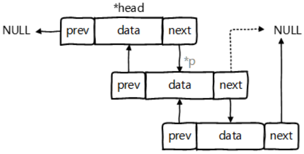

- 对于`频繁的插入或删除元素`的操作，建议使用 LinkedList 类，效率较高。

新增方法：

- `void addFirst(Object obj)`
- `void addLast(Object obj)`
- `Object getFirst()`
- `Object getLast()`
- `Object removeFirst()`
- `Object removeLast()`

源码分析：

- `LinkedList list = new LinkedList();`，内部声明了 Node 类型的 first 和 last 属性，默认值为 null。

  ```java
  /**
   * Pointer to first node.
   * Invariant: (first == null && last == null) ||
   *            (first.prev == null && first.item != null)
   */
  transient Node<E> first;
  
  /**
   * Pointer to last node.
   * Invariant: (first == null && last == null) ||
   *            (last.next == null && last.item != null)
   */
  transient Node<E> last;
  
  /**
   * Constructs an empty list.
   */
  public LinkedList() {
  }
  ```

  ```java
  private static class Node<E> {
      E item;// 这个就是往LinkedList中添加的数据
      Node<E> next;
      Node<E> prev;
  
      Node(Node<E> prev, E element, Node<E> next) {
          this.item = element;
          this.next = next;
          this.prev = prev;
      }
  }
  ```

- `list.add(123);`，将 123 封装到 Node 中，创建了 Node 对象。

  ```java
  /**
   * Appends the specified element to the end of this list.
   *
   * <p>This method is equivalent to {@link #addLast}.
   *
   * @param e element to be appended to this list
   * @return {@code true} (as specified by {@link Collection#add})
   */
  public boolean add(E e) {
      linkLast(e);
      return true;
  }
  ```

  ```java
  /**
   * Links e as last element.
   */
  void linkLast(E e) {
      final Node<E> l = last;
      final Node<E> newNode = new Node<>(l, e, null);
      last = newNode;
      if (l == null)
          first = newNode;
      else
          l.next = newNode;
      size++;
      modCount++;
  }
  ```

- Node 的定义体现了 LinkedList 的双向链表的说法，其除了保存数据，还定义了两个变量：

  - prev：变量记录前一个元素的位置。
  - next：变量记录下一个元素的位置。

##### Vector

Vector 是一个古老的集合，JDK 1.0 就有了。大多数操作与 ArrayList 相同，区别之处在于 Vector 是线程安全的。

- **在各种 List 中，最好把 ArrayList 作为缺省选择。当插入、删除频繁时，使用 LinkedList。**Vector 总是比 ArrayList 慢，所以尽量避免使用。

新增方法：

- `void addElement(Object obj)`
- `void insertElementAt(Object obj,int index)`
- `void setElementAt(Object obj,int index)`
- `void removeElement(Object obj)`
- `void removeAllElements()`

源码分析：

- **JDK 7.0 和 JDK 8.0 中，通过`new Vector()`构造器创建对象时，底层都创建了长度为 10 的数组。在扩容方面，默认扩容为原来的数组长度的 2 倍。**

  ```java
  /**
   * Constructs an empty vector so that its internal data array
   * has size {@code 10} and its standard capacity increment is
   * zero.
   */
  public Vector() {
      this(10);// 初始化长度为10
  }
  ```

  ```java
  /**
   * Constructs an empty vector with the specified initial capacity and
   * with its capacity increment equal to zero.
   *
   * @param   initialCapacity   the initial capacity of the vector
   * @throws IllegalArgumentException if the specified initial capacity
   *         is negative
   */
  public Vector(int initialCapacity) {
      this(initialCapacity, 0);
  }
  ```

  ```java
  /**
   * Constructs an empty vector with the specified initial capacity and
   * capacity increment.
   *
   * @param   initialCapacity     the initial capacity of the vector
   * @param   capacityIncrement   the amount by which the capacity is
   *                              increased when the vector overflows
   * @throws IllegalArgumentException if the specified initial capacity
   *         is negative
   */
  public Vector(int initialCapacity, int capacityIncrement) {
      super();
      if (initialCapacity < 0)
          throw new IllegalArgumentException("Illegal Capacity: "+
                                             initialCapacity);
      this.elementData = new Object[initialCapacity];// 创建长度为10的数组
      this.capacityIncrement = capacityIncrement;
  }
  ```

- `add()`添加数据之前，先验证数组容量：

  ```java
  /**
   * Appends the specified element to the end of this Vector.
   *
   * @param e element to be appended to this Vector
   * @return {@code true} (as specified by {@link Collection#add})
   * @since 1.2
   */
  public synchronized boolean add(E e) {
      modCount++;
      ensureCapacityHelper(elementCount + 1);
      elementData[elementCount++] = e;
      return true;
  }
  ```

  ```java
  /**
   * This implements the unsynchronized semantics of ensureCapacity.
   * Synchronized methods in this class can internally call this
   * method for ensuring capacity without incurring the cost of an
   * extra synchronization.
   *
   * @see #ensureCapacity(int)
   */
  private void ensureCapacityHelper(int minCapacity) {
      // overflow-conscious code
      if (minCapacity - elementData.length > 0)// 数组容量不够，扩容
          grow(minCapacity);
  }
  ```

  ```java
  private void grow(int minCapacity) {
      // overflow-conscious code
      int oldCapacity = elementData.length;
      int newCapacity = oldCapacity + ((capacityIncrement > 0) ?
                                       capacityIncrement : oldCapacity);// 扩容到原来数组长度的二倍
      if (newCapacity - minCapacity < 0)
          newCapacity = minCapacity;
      if (newCapacity - MAX_ARRAY_SIZE > 0)
          newCapacity = hugeCapacity(minCapacity);
      elementData = Arrays.copyOf(elementData, newCapacity);
  }
  ```

##### ArrayList、LinkedList、Vector三者的异同

- 相同点：三个类都实现了 List 接口，存储数据的特点相同，都是存储有序的、可重复的数据。
- 不同点：
  - ArrayList：作为 List 接口的主要实现类；线程不安全的，效率高；底层使用`Object[] elementData`存储。
  - LinkedList：线程不安全的，对于频繁的插入、删除操作，使用此类效率比 ArrayList 高；底层使用双向链表存储。
  - Vector：作为 List 接口的古老实现类；线程安全的，效率低；底层使用`Object[] elementData`存储。

- ArrayList 和 LinkedList 的异同：
  - `ArrayList 和 LinkedList 都线程不安全`，相对线程安全的 Vector，二者执行效率更高。
  - ArrayList 底层是实现了基于`动态数组`的数据结构，LinkedList 底层是实现了基于`链表`的数据结构。
  - 对于随机访问`get()`和`set()`，ArrayList 优于LinkedList，因为 LinkedList 要移动指针。
  - 对于新增和删除操作`add()`（特指插入）和`remove()`，LinkedList 比较占优势，因为 ArrayList 要移动数据。

- ArrayList 和 Vector 的区别：
  - Vector 和 ArrayList 几乎是完全相同的，唯一的区别在于 Vector 是同步类，属于强同步类。因此开销就比 ArrayList 要大，访问要慢。
  - 正常情况下，大多数的 Java 程序员使用 ArrayList 而不是 Vector，因为同步完全可以由程序员自己来控制。
  - Vector 每次扩容请求其大小的 2 倍空间，而 ArrayList 是 1.5 倍。Vector 还有一个子类 Stack。

#### Set 接口

Set 集合存储`无序的、不可重复的`数据，如果把两个相同的元素加入同一个 Set 集合中，则添加操作失败。

- 无序性：不等于随机性。以 HashSet 为例，存储的数据在底层数组中并非按照数组索引的顺序添加，而是根据数据的哈希值决定的。
- 不可重复性：保证添加的元素按照`equals()`判断时，不能返回 true。即：相同的元素只能添加一个。

Set 接口是 Collection 的子接口，Set 接口没有提供额外的方法，使用的都是Collection中声明过的方法。

Set 判断两个对象是否相同不是使用 == 运算符，而是根据`equals()`。对于存放在 Set（主要指：HashSet、LinkedHashSet）容器中的对象，其对应的类一定要重写`equals()`和`hashCode()`，以实现对象相等规则。

- 要求：重写的`hashCode()`和`equals()`尽可能保持一致性，即：`相等的对象必须具有相等的散列码`。
  - 如果不重写所添加元素所在类的`hashCode()`，则会调用 Object 类的`hashCode()`，该方法是产生一个随机数，因此，即使添加两个一样的元素，其 hashCode 值也可能不同，也就都能添加成功。
- 重写两个方法的小技巧：对象中用作`equals()`方法比较的 Field，都应该用来计算 hashCode 值。
- TreeSet 比较两个元素是否相同的方法，不是`equals()`和`hashCode()`，而是元素对应类的排序方法。

重写`hashCode()`方法的基本原则：

- 在程序运行时，同一个对象多次调用`hashCode()`方法应该返回相同的值。
- 当两个对象的`equals()`方法比较返回 true 时，这两个对象的`hashCode()`方法的返回值也应相等。
- 对象中用作`equals()`方法比较的 Field，都应该用来计算 hashCode 值。

重写`equals()`方法的基本原则，以自定义的 Customer 类为例，何时需要重写`equals()`：

- 如果一个类有自己特有的 "逻辑相等" 概念，当重写`equals()`的时候，总是需要重写`hashCode()`。因为根据一个类改写后的`equals()`，两个截然不同的实例有可能在逻辑上是相等的，但是，根据 Object 类的`hashCode()`，它们仅仅是两个对象。这种情况，违反了 "相等的对象必须具有相等的散列码" 的原则。
- 结论：重写`equals()`的时候，一般都需要同时重写`hashCode()`方法。通常参与计算 hashCode 的对象的属性也应该参与到`equals()`中进行计算。

Eclipse/IDEA 工具里`hashCode()`的重写，为什么会有 31 这个数字：

```java
@Override
public int hashCode() {
    int result = name.hashCode();
    result = 31 * result + age;
    return result;
}
```

- 选择系数的时候要选择尽量大的系数，因为如果计算出来的 hashCode 值越大，所谓的冲突就越少，查找起来效率也会提高。---> 减少冲突
- 31 只占用 5 bits，相乘造成数据溢出的概率较小。
- 31 可以由`i * 31 == (i << 5) - 1`来表示，现在很多虚拟机里面都有做相关优化。---> 提高算法效率
- 31 是一个素数，素数作用就是如果用一个数字来乘以这个素数，那么最终出来的结果只能被素数本身和被乘数还有 1 来整除！---> 减少冲突

##### HashSet

HashSet 是 Set 接口的典型实现，大多数时候使用 Set 集合时都使用这个实现类。`HashSet 按 Hash 算法来存储集合中的元素，因此具有很好的存取、查找、删除性能。`

HashSet 具有以下特点：

- `不保证元素的排列顺序。`
- `不是线程安全的。`
- `集合元素可以是 null，但是只能有一个。`

向 HashSet 中添加元素的过程：

- **当向 HashSet 集合中存入一个元素 a 时，首先会调用元素 a 所在类的`hashCode()`，计算元素 a 的 hashCode 值，然后根据 hashCode 值，通过某种散列函数，计算出元素 a 在 HashSet 底层`数组`中的存储位置（即为：索引位置，这个索引位置不是像 List 那样有顺序的，而是无序的）。**
  - **说明：这个散列函数会根据元素的 hashCode 值和底层数组的长度相计算，得到该元素在数组中的下标（存储位置），并且这种散列函数计算还尽可能保证能均匀存储元素，越是散列分布，该散列函数设计的越好。**
  - 向 List 中添加元素时，会按照索引位置的顺序在数组中逐个添加，这是一种有序性。而向 HashSet 中添加元素时，可能第一个元素的索引位置在数组的中间，第二个元素的索引位置在数组的头，第三个元素的索引位置在数组的尾，是按照一种无序的状态添加的，是为无序性。
- **计算出元素 a 的存储位置后，首先判断数组此位置上是否已经有元素：**
  - **如果此位置上没有其他元素，则元素 a 添加成功。---> 情况1**
  - **如果此位置上有其他元素 b（或以链表形式存在的多个元素），则比较元素 a 与元素 b（或以链表形式存在的多个元素）的 hashCode 值：**
    - **如果 hashCode 值不相同，则元素 a 添加成功。---> 情况2**
    - **如果 hashCode 值相同，进而需要调用元素 a 所在类的`equals()`：**
      - **`equals()`返回 true，则元素 a 添加失败。**
      - **`equals()`返回 false，则元素 a 添加成功。---> 情况3**
- **对于添加成功的情况 2 和情况 3 而言：元素 a 与已经存在指定索引位置上的元素以`链表`的方式存储。**
  - **JDK 7.0：元素 a 存放到底层数组中，指向原来的元素。**
  - **JDK 8.0：原来的元素存放到数组中，指向元素 a。**
  - **总结：七上八下。**

由以上向 HashSet 添加元素的过程，可以看出 HashSet 的底层：`数组 + 链表`的结构。（前提：JDK 7.0，JDK 8.0 见 HashMap。）

HashSet 底层结构：

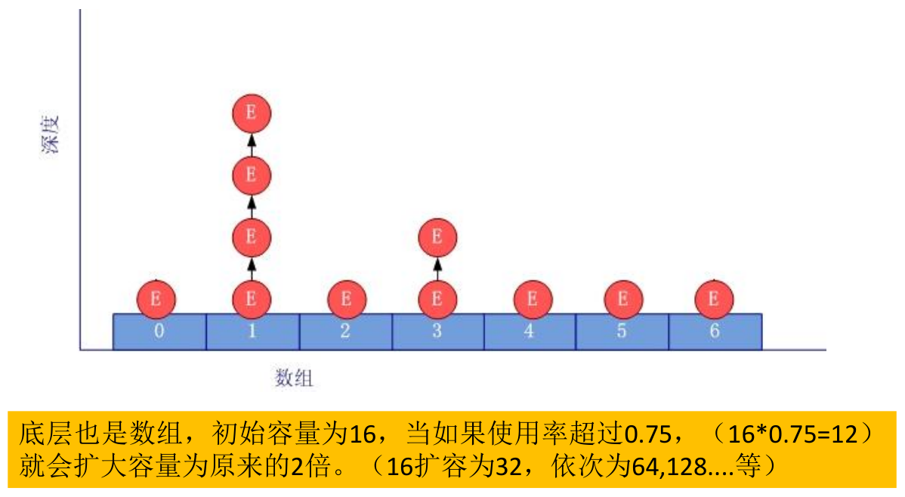

HashSet 集合判断两个元素相等的标准：两个对象通过`hashCode()`比较相等，并且两个对象的`equals()`返回值也相等。

利用 HashSet 去除 List 中的重复元素：

```java
public class Test {
    public static List duplicateList(List list) {
        HashSet set = new HashSet();
        set.addAll(list);
        return new ArrayList(set);
    }

    public static void main(String[] args) {
        List list = new ArrayList();
        list.add(new Integer(1));
        list.add(new Integer(2));
        list.add(new Integer(2));
        list.add(new Integer(4));
        list.add(new Integer(4));
        List list2 = duplicateList(list);
        for (Object integer : list2) {
            System.out.println(integer);
        }
    }
}
```

实例：

```java
public class Test {
    public static void main(String[] args) {
        Set set = new HashSet();
        set.add(456);
        set.add(123);
        set.add(123);
        set.add("AA");
        set.add("CC");
        set.add(129);

        Iterator iterator = set.iterator();
        while(iterator.hasNext()){
            System.out.print(iterator.next() + " ");// AA CC 129 456 123，不是按照元素添加的顺序进行输出的
        }
    }
}
```

##### LinkedHashSet

LinkedHashSet 是 HashSet 的子类，不允许集合元素重复。

LinkedHashSet 根据元素的 hashCode 值来决定元素的存储位置，但它同时`使用双向链表维护元素的次序`，这使得元素看起来是以插入顺序保存的。

- **遍历 LinkedHashSet 内部数据时，可以按照添加的顺序遍历。**

LinkedHashSet 插入性能略低于 HashSet，但在迭代访问 Set 里的全部元素时有很好的性能。

- **对于频繁的遍历操作，LinkedHashSet 效率高于 HashSet。**

LinkedHashSet 底层结构：

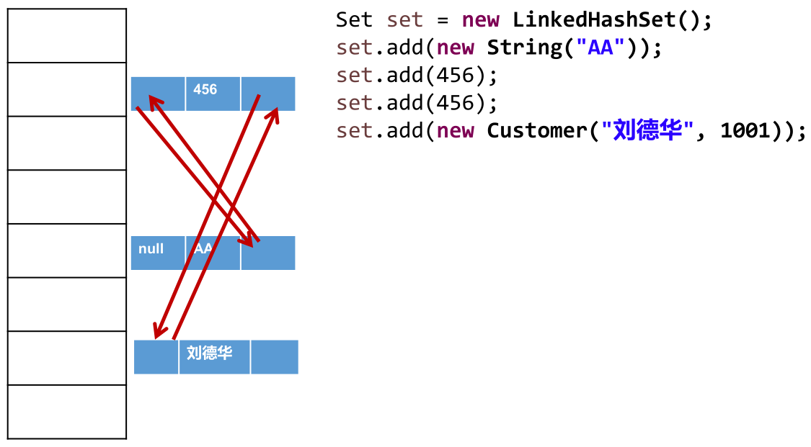

实例：

```java
public class Test {
    public static void main(String[] args) {
        // LinkedHashSet在添加数据的同时，每个数据还维护了两个引用，记录此数据前一个数据和后一个数据
        Set set = new LinkedHashSet();
        set.add(456);
        set.add(123);
        set.add(123);
        set.add("AA");
        set.add("CC");
        set.add(129);

        Iterator iterator = set.iterator();
        while (iterator.hasNext()) {
            System.out.print(iterator.next() + " ");// 456 123 AA CC 129，按照元素添加的顺序进行输出的
        }
    }
}
```

面试题：

```java
public class Test {
    public static void main(String[] args) {
        HashSet set = new HashSet();
        User p1 = new User(1001, "AA");
        User p2 = new User(1002, "BB");
        set.add(p1);// 假设p1添加到HashSet底层数组的位置7(hashCode值以1001和AA计算出来)
        set.add(p2);// 假设p2添加到HashSet底层数组的位置3(hashCode值以1002和BB计算出来)
        System.out.println(set);// 位置3和7处对应的2个User
        p1.name = "CC";// 更改p1指向的User对象的name为CC
        set.remove(p1);// 以新的p1在HashSet底层数组查找，没有相同的对象(hashCode值以1001和CC计算出来)
        System.out.println(set);// 位置3和7处对应的2个User，但位置7指向的User对象的name为CC，不是AA，位置3指向的User对象的name为BB
        set.add(new User(1001, "CC"));// 新new出来的User，hashCode值以1001和CC计算出来，不同于最初的p1，其位置不会在7处，也不会在3处，假设在11处
        System.out.println(set);// 位置3、7和11处对应的3个User，其中，位置7和11对应的User的id和name都是1001和CC，但不是堆中的同一个对象
        set.add(new User(1001, "AA"));// 新new出来的User，hashCode值以1001和AA计算出来，等于最初的p1，位置在7处，但因为现在7处User对象的name为CC，所以equals()不相同，这个User对象链接到7位置
        System.out.println(set);// 位置3、7和11处对应的4个User
    }
}

class User {
    int id;
    String name;

    public User(int id, String name) {
        this.id = id;
        this.name = name;
    }

    @Override
    public boolean equals(Object o) {
        if (this == o) {
            return true;
        }
        if (o == null || getClass() != o.getClass()) {
            return false;
        }

        User user = (User) o;

        if (id != user.id) {
            return false;
        }
        return name != null ? name.equals(user.name) : user.name == null;
    }

    @Override
    public int hashCode() {
        int result = id;
        result = 31 * result + (name != null ? name.hashCode() : 0);
        return result;
    }

    @Override
    public String toString() {
        return "User{" +
                "id=" + id +
                ", name='" + name + '\'' +
                '}';
    }
}
输出结果：
[User{id=1002, name='BB'}, User{id=1001, name='AA'}]
[User{id=1002, name='BB'}, User{id=1001, name='CC'}]
[User{id=1002, name='BB'}, User{id=1001, name='CC'}, User{id=1001, name='CC'}]
[User{id=1002, name='BB'}, User{id=1001, name='CC'}, User{id=1001, name='CC'}, User{id=1001, name='AA'}]
```

##### TreeSet

TreeSet 是 SortedSet 接口的实现类，`TreeSet 可以按照添加对象的指定属性进行排序`，确保集合元素处于排序状态。

TreeSet 特点：有序，查询速度比 List 快。

TreeSet 与 TreeMap 一样，底层使用`红黑树结构`存储数据。

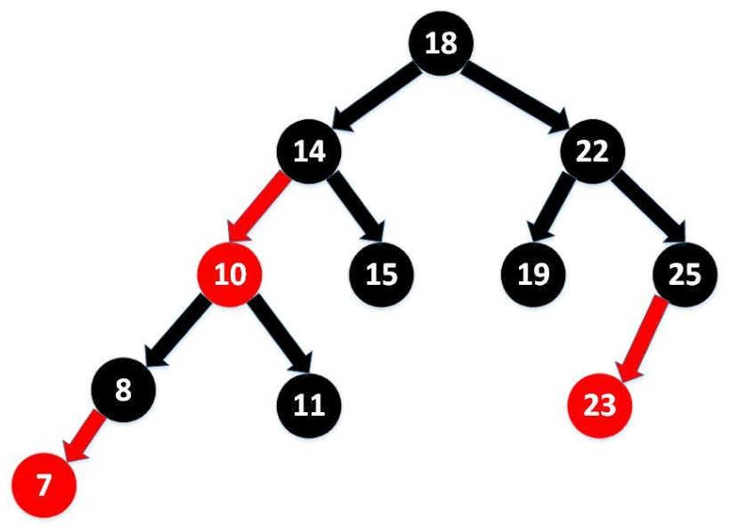

> 红黑树参考：http://www.cnblogs.com/yangecnu/p/Introduce-Red-Black-Tree.html

新增方法：

- `Comparator comparator()`
- `Object first()`
- `Object last()`
- `Object lower(Object e)`
- `Object higher(Object e)`
- `SortedSet subSet(fromElement, toElement)`
- `SortedSet headSet(toElement)`
- `SortedSet tailSet(fromElement)`

TreeSet 两种排序方法：`自然排序 (实现 Comparable 接口)`和`定制排序 (Comparator)`。默认情况下，TreeSet 采用自然排序。

- 向 TreeSet 中添加的数据，要求是`相同类的对象`。

  ```java
  public class Test {
      public static void main(String[] args) {
          Set set = new TreeSet();
  
          // 失败：不能添加不同类的对象
          /*set.add(123);
          set.add(456);
          set.add("AA");
          set.add(new User("Tom",12));*/
  
          // 举例：全部添加Integer对象
          /*set.add(34);
          set.add(-34);
          set.add(43);
          set.add(11);
          set.add(8);*/
  
          Iterator iterator = set.iterator();
          while (iterator.hasNext()) {
              System.out.println(iterator.next());
          }
      }
  }
  ```

- 在 TreeSet 中比较两个元素是否相同时，取决于使用的是自然排序还是定制排序，不再考虑`equals()`，比如`add()`和`remove()`等方法，这点与 HashSet 不同。

**`自然排序`**：

- TreeSet 会调用集合元素的`compareTo(Object obj)`来比较元素之间的大小关系，然后将集合元素按升序（默认情况）排列。

- 如果试图把一个对象添加到 TreeSet 时，则该对象的类必须实现`Comparable 接口`。

- 实现 Comparable 的类必须实现`compareTo(Object obj)`，两个对象即通过`compareTo(Object obj)`的返回值来比较大小。

- Comparable 的典型实现：

  - BigDecimal、BigInteger 以及所有的数值型对应的包装类：按它们对应的数值大小进行比较。
  - Character：按字符的 unicode值来进行比较。
  - Boolean：true 对应的包装类实例大于 false 对应的包装类实例。
  - String：按字符串中字符的 unicode 值进行比较。
  - Date、Time：后边的时间、日期比前面的时间、日期大。

- 向 TreeSet 中添加元素时，只有第一个元素无须比较`compareTo()`，后面添加的所有元素都会调用`compareTo()`进行比较。

- 因为只有相同类的两个实例才会比较大小，所以向 TreeSet 中添加的应该是同一个类的对象。

- **对于 TreeSet 集合而言，使用自然排序判断两个元素相等的标准是：两个元素通过`compareTo()`比较返回 0，不再是`equals()`。**

- 当需要把一个对象放入 TreeSet 中，在重写该对象对应的`equals()`时，应保证该方法与`compareTo()`有一致的结果：如果两个对象通过`equals()`比较返回 true，则通过`compareTo(Object obj)`比较应返回 0。否则，会让人难以理解。

- 实例：

  ```java
  public class Test {
      public static void main(String[] args) {
          Set set = new TreeSet();
  
          set.add(new User("Tom", 12));
          set.add(new User("Jerry", 32));
          set.add(new User("Jim", 2));
          set.add(new User("Mike", 65));
          set.add(new User("Jack", 33));
          set.add(new User("Jack", 56));
  
          Iterator iterator = set.iterator();
          while (iterator.hasNext()) {
              System.out.println(iterator.next());
          }
      }
  }
  
  class User implements Comparable {
      private String name;
      private int age;
  
      public User() {
      }
  
      public User(String name, int age) {
          this.name = name;
          this.age = age;
      }
  
      public String getName() {
          return name;
      }
  
      public void setName(String name) {
          this.name = name;
      }
  
      public int getAge() {
          return age;
      }
  
      public void setAge(int age) {
          this.age = age;
      }
  
      @Override
      public String toString() {
          return "User{" +
                  "name='" + name + '\'' +
                  ", age=" + age +
                  '}';
      }
  
      @Override
      public boolean equals(Object o) {
          System.out.println("User equals()....");
          if (this == o) {
              return true;
          }
          if (o == null || getClass() != o.getClass()) {
              return false;
          }
  
          User user = (User) o;
  
          if (age != user.age) {
              return false;
          }
          return name != null ? name.equals(user.name) : user.name == null;
      }
  
      @Override
      public int hashCode() { //return name.hashCode() + age;
          int result = name != null ? name.hashCode() : 0;
          result = 31 * result + age;
          return result;
      }
  
      // 按照姓名从大到小排列,年龄从小到大排列
      @Override
      public int compareTo(Object o) {
          if (o instanceof User) {
              User user = (User) o;
              // return -this.name.compareTo(user.name);
              int compare = -this.name.compareTo(user.name);
              if (compare != 0) {
                  return compare;
              } else {
                  return Integer.compare(this.age, user.age);
              }
          } else {
              throw new RuntimeException("输入的类型不匹配");
          }
  
      }
  }
  ```

**`定制排序`**：

- TreeSet 的自然排序要求元素所属的类实现 Comparable 接口，如果元素所属的类没有实现 Comparable 接口，或不希望按照升序（默认情况）的方式排列元素或希望按照其它属性大小进行排序，则考虑使用定制排序。定制排序，通过`Comparator 接口`来实现。需要重写`compare()`方法。

- 利用`int compare(T o1,T o2)`方法，比较 o1 和 o2 的大小：如果方法返回正整数，则表示 o1 大于 o2；如果返回 0，表示相等；返回负整数，表示 o1 小于 o2。

- 要实现定制排序，需要将实现 Comparator 接口的实例作为形参传递给 TreeSet 的构造器。此时，仍然只能向 TreeSet 中添加类型相同的对象。否则会发生 ClassCastException 异常。

- **对于 TreeSet 集合而言，使用定制排序判断两个元素相等的标准是：两个元素通过`compare()`比较返回 0，不再是`equals()`。**

- 实例：

  ```java
  public class Test {
      public static void main(String[] args) {
          // 定制排序
          Comparator com = new Comparator() {
              // 按照年龄从小到大排列
              @Override
              public int compare(Object o1, Object o2) {
                  if (o1 instanceof User && o2 instanceof User) {
                      User u1 = (User) o1;
                      User u2 = (User) o2;
                      return Integer.compare(u1.getAge(), u2.getAge());
                  } else {
                      throw new RuntimeException("输入的数据类型不匹配");
                  }
              }
          };
  
          TreeSet set = new TreeSet(com);
          set.add(new User("Tom", 12));
          set.add(new User("Jerry", 32));
          set.add(new User("Jim", 2));
          set.add(new User("Mike", 65));
          set.add(new User("Mary", 33));
          set.add(new User("Jack", 33));
          set.add(new User("Jack", 56));
  
          Iterator iterator = set.iterator();
          while (iterator.hasNext()) {
              System.out.println(iterator.next());
          }
      }
  }
  
  class User implements Comparable {
      private String name;
      private int age;
  
      public User() {
      }
  
      public User(String name, int age) {
          this.name = name;
          this.age = age;
      }
  
      public String getName() {
          return name;
      }
  
      public void setName(String name) {
          this.name = name;
      }
  
      public int getAge() {
          return age;
      }
  
      public void setAge(int age) {
          this.age = age;
      }
  
      @Override
      public String toString() {
          return "User{" +
                  "name='" + name + '\'' +
                  ", age=" + age +
                  '}';
      }
  
      @Override
      public boolean equals(Object o) {
          System.out.println("User equals()....");
          if (this == o) {
              return true;
          }
          if (o == null || getClass() != o.getClass()) {
              return false;
          }
  
          User user = (User) o;
  
          if (age != user.age) {
              return false;
          }
          return name != null ? name.equals(user.name) : user.name == null;
      }
  
      @Override
      public int hashCode() { //return name.hashCode() + age;
          int result = name != null ? name.hashCode() : 0;
          result = 31 * result + age;
          return result;
      }
  
      // 按照姓名从大到小排列,年龄从小到大排列
      @Override
      public int compareTo(Object o) {
          if (o instanceof User) {
              User user = (User) o;
              // return -this.name.compareTo(user.name);
              int compare = -this.name.compareTo(user.name);
              if (compare != 0) {
                  return compare;
              } else {
                  return Integer.compare(this.age, user.age);
              }
          } else {
              throw new RuntimeException("输入的类型不匹配");
          }
      }
  }
  ```

### Map 接口

Map 与 Collection 是并列存在，双列数据，用于保存具有映射关系的数据：`key - value 对`。

Map结构的理解：

- Map 中的`key`：无序的、不可重复的，使用 Set 存储所有的 key。---> key 所在的类要重写`hashCode()`和`equals()`（以 HashMap 为例）。

- Map 中的`value`：无序的、可重复的，使用 Collection 存储所有的 value。---> value 所在的类要重写`equals()`。

- 一个键值对：key - value 构成了一个 entry 对象。

  - Map 中的映射关系的类型是 Map.Entry 类型，它是 Map 接口的内部接口。

- Map 中的`entry`：无序的、不可重复的，使用 Set 存储所有的 entry。

  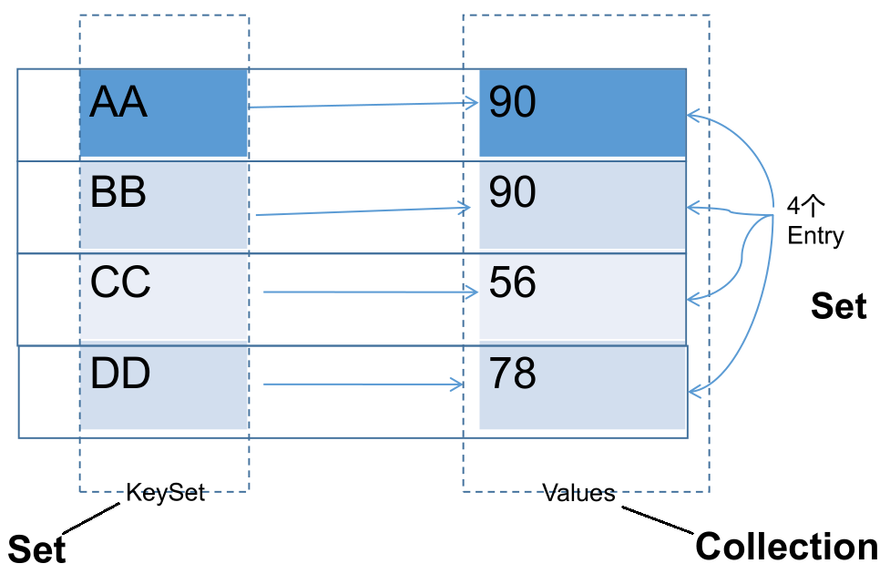

- Map 中的 key 和 value 都可以是任何引用类型的数据。

- 常用 String 类作为 Map 的 key。

- key 和 value 之间存在`单向一对一关系`，即通过指定的 key 总能找到唯一的、确定的 value。

Map 接口的常用实现类：HashMap、TreeMap、LinkedHashMap 和 Properties。其中，HashMap 是 Map 接口使用频率最高的实现类。

Map 常用方法：

- 添加、删除、修改操作：

  - `Object put(Object key, Object value)`：将指定 key - value 对添加到（或修改）当前 map 对象中。

    - 如果在 map 中已存在 key，则会用 value 替换 map 中该 key 对应的值。

  - `void putAll(Map m)`：将 m 中的所有 key - value 对存放到当前 map 中。

  - `Object remove(Object key)`：移除指定 key 的 key - value 对，并返回 value。若 key 不存在，返回 null。

  - `void clear()`：清空当前 map 中的所有数据，与`map = null;`操作不同。

  - 实例：

    ```java
    public class Test {
        public static void main(String[] args) {
            Map map = new HashMap();
    
            // put()
            map.put("AA", 123);
            map.put(45, 123);
            map.put("BB", 56);
            // 修改，key已存在，会替换其value
            map.put("AA", 87);
            System.out.println(map);// {AA=87, BB=56, 45=123}
    
            // putAll()
            Map map1 = new HashMap();
            map1.put("CC", 123);
            map1.put("DD", 123);
            map.putAll(map1);
            System.out.println(map);// {AA=87, BB=56, CC=123, DD=123, 45=123}
    
            // remove(Object key)
            Object value = map.remove("CC");
            System.out.println(value);// 123
            System.out.println(map);// {AA=87, BB=56, DD=123, 45=123}
            System.out.println(map.remove("EE"));// key不存在，返回null
    
            // clear()
            map.clear();// 与map = null操作不同
            System.out.println(map.size());// 0
            System.out.println(map);// {}
        }
    }
    ```

- 元素查询的操作：

  - `Object get(Object key)`：获取指定 key 对应的 value，如果 key 不存在，返回 null。

  - `boolean containsKey(Object key)`：是否包含指定的 key。

  - `boolean containsValue(Object value)`：是否包含指定的 value。

  - `int size()`：返回 map 中 key - value 对的个数。

  - `boolean isEmpty()`：判断当前 map 是否为空，以 size 是否为 0 判断。

  - `boolean equals(Object obj)`：判断当前 map 和参数对象 obj 是否相等。

  - 实例：

    ```java
    public class Test {
        public static void main(String[] args) {
            Map map = new HashMap();
            map.put("AA", 123);
            map.put(45, 123);
            map.put("BB", 56);
    
            // Object get(Object key)
            System.out.println(map.get(45));// 123
            System.out.println(map.get(43));// null
    
            // containsKey(Object key)
            boolean isExist = map.containsKey("BB");
            System.out.println(isExist);// true
    
            isExist = map.containsValue(123);
            System.out.println(isExist);// true
    
            map.clear();
            System.out.println(map.isEmpty());// true
        }
    }
    ```

- 元视图操作的方法：

  - `Set keySet()`：返回所有 key 构成的 Set 集合。

  - `Collection values()`：返回所有 value 构成的 Collection 集合。

  - `Set entrySet()`：返回所有 key - value 对构成的 Set 集合。

  - 实例：

    ```java
    public class Test {
        public static void main(String[] args) {
            Map map = new HashMap();
            map.put("AA", 123);
            map.put(45, 1234);
            map.put("BB", 56);
    
            // 遍历所有的key集：keySet()
            Set keys = map.keySet();
            Iterator iterator = keys.iterator();
            while (iterator.hasNext()) {
                System.out.println(iterator.next());
            }
            System.out.println();
    
            // 遍历所有的value集：values()
            Collection values = map.values();
            for (Object obj : values) {
                System.out.println(obj);
            }
            System.out.println();
    
            // 遍历所有的key-value
            // 方式一：entrySet()
            Set entrySet = map.entrySet();
            Iterator iterator1 = entrySet.iterator();
            while (iterator1.hasNext()) {
                Object obj = iterator1.next();
                // entrySet集合中的元素都是entry
                Map.Entry entry = (Map.Entry) obj;
                System.out.println(entry.getKey() + "---->" + entry.getValue());
    
            }
            System.out.println();
            // 方式二：
            Set keySet = map.keySet();
            Iterator iterator2 = keySet.iterator();
            while (iterator2.hasNext()) {
                Object key = iterator2.next();
                Object value = map.get(key);
                System.out.println(key + "=====" + value);
            }
        }
    }
    ```

总结：

- 添加：`put(Object key, Object value)`
- 删除：`remove(Object key)`
- 修改：`put(Object key, Object value)`
- 查询：`get(Object key)`
- 长度：`size()`
- 遍历：`keySet()` / `values()` / `entrySet()`

#### HashMap

HashMap 是 Map 接口使用频率最高的实现类。

HashMap`允许使用 null 键和 null 值`，与 HashSet 一样，不保证映射的顺序。

所有的 key 构成的集合是 Set：无序的、不可重复的。所以，key 所在的类要重写：`hashCode()`和`equals()`。

- HashMap 判断两个 key 相等的标准是：两个 key 的 hashCode 值相等，同时通过`equals()`判断返回 true。

所有的 value 构成的集合是 Collection：无序的、可以重复的。所以，value 所在的类要重写：`equals()`。

- HashMap 判断两个 value 相等的标准是：两个 value 通过 `equals()` 判断返回 true。

一个 key - value 对构成一个 entry，所有的 entry 构成的集合是 Set：无序的、不可重复的。

`不要修改映射关系的 key`：

- 映射关系存储到 HashMap 中时，会存储 key 的 hash 值，这样就不用在每次查找时重新计算每一个 Entry 或 Node（TreeNode）的 hash 值了，因此如果已经 put 到 Map 中的映射关系，再修改 key 的属性，而这个属性又参与 hashcode 值的计算，那么会导致匹配不上。

HashMap 源码中的重要常量：

- **`DEFAULT_INITIAL_CAPACITY`：HashMap 的默认容量，`16`。**

  ```java
  /**
   * The default initial capacity - MUST be a power of two.
   */
  static final int DEFAULT_INITIAL_CAPACITY = 1 << 4; // aka 16
  ```

- `MAXIMUM_CAPACITY`：HashMap 的最大支持容量，2^30。

  ```java
  /**
   * The maximum capacity, used if a higher value is implicitly specified
   * by either of the constructors with arguments.
   * MUST be a power of two <= 1<<30.
   */
  static final int MAXIMUM_CAPACITY = 1 << 30;
  ```

- **`DEFAULT_LOAD_FACTOR`：HashMap 的默认加载因子，`0.75`。**不同于 ArrayList，HashMap 不是在底层数组全部填满时才进行扩容操作，因为数组上有一些位置可能会一直都没有添加元素，但其他位置上元素可能有很多，导致链表和二叉树结构变多。因此，会在元素添加到一定数量时，就执行扩容操作，即添加元素数量达到 threshold 值时扩容。默认加载因子如果过小，会导致数组还有很多空位置时扩容，数组利用率低；默认加载因子如果过大，会导致数组中存在很多元素时才扩容，链表和二叉树结构过多。因此，默认加载因子在 0.7 ~ 0.75 左右比较合适。

  ```java
  /**
   * The load factor used when none specified in constructor.
   */
  static final float DEFAULT_LOAD_FACTOR = 0.75f;
  ```

- **`TREEIFY_THRESHOLD`：Bucket 中链表存储的 Node 长度大于该默认值，判断是否转换为红黑树，默认为 8。Since JDK 8.0。**

  ```java
  /**
   * The bin count threshold for using a tree rather than list for a
   * bin.  Bins are converted to trees when adding an element to a
   * bin with at least this many nodes. The value must be greater
   * than 2 and should be at least 8 to mesh with assumptions in
   * tree removal about conversion back to plain bins upon
   * shrinkage.
   */
  static final int TREEIFY_THRESHOLD = 8;
  ```

- `UNTREEIFY_THRESHOLD`：Bucket 中红黑树存储的 Node 长度小于该默认值，转换为链表，默认为 6。Since JDK 8.0。

  ```java
  /**
   * The bin count threshold for untreeifying a (split) bin during a
   * resize operation. Should be less than TREEIFY_THRESHOLD, and at
   * most 6 to mesh with shrinkage detection under removal.
   */
  static final int UNTREEIFY_THRESHOLD = 6;
  ```

- **`MIN_TREEIFY_CAPACITY`：桶中的 Node 被树化时最小的 hash 表容量，默认为 64。当桶中 Node 的数量大到需要变红黑树（8）时，若 hash 表容量小于 `MIN_TREEIFY_CAPACITY`，此时应执行`resize()`进行扩容操作。`MIN_TREEIFY_CAPACITY`的值至少是`TREEIFY_THRESHOLD`的 4 倍。Since JDK 8.0。**

  ```java
  /**
   * The smallest table capacity for which bins may be treeified.
   * (Otherwise the table is resized if too many nodes in a bin.)
   * Should be at least 4 * TREEIFY_THRESHOLD to avoid conflicts
   * between resizing and treeification thresholds.
   */
  static final int MIN_TREEIFY_CAPACITY = 64;
  ```

- table ：**存储元素的数组，长度总是 2 的 n 次幂。**JDK 7.0 中是`transient Entry<K, V>[] table;`，JDK 8.0 中是`transient Node<K,V>[] table;`。

- entrySet：存储具体元素的集。

- size：HashMap 中已存储的键值对的数量。

- modCount：HashMap 扩容和结构改变的次数。

- **threshold：扩容的临界值，其值一般等于（容量 \* 加载因子），`(int) Math.min(capacity * loadFactor, MAXIMUM_CAPACITY + 1);`。扩容的操作不是当底层数组全部被填满后再扩容，而是达到临界值后的下一次添加操作进行扩容。**

- loadFactor：加载因子。

**源码分析：**

  - **JDK 7.0**

    - 初始化操作，以无参构造器为例：`HashMap hashMap = new HashMap();`，在实例化以后，底层创建了长度是 16 的一维数组 Entry[] table：

      ```java
      /**
       * Constructs an empty <tt>HashMap</tt> with the default initial capacity
       * (16) and the default load factor (0.75).
       */
      public HashMap() {
          this(DEFAULT_INITIAL_CAPACITY, DEFAULT_LOAD_FACTOR);// 默认初始化长度：16，加载因子：0.75。
      }
      ```

      ```java
      /**
       * Constructs an empty <tt>HashMap</tt> with the specified initial
       * capacity and load factor.
       *
       * @param  initialCapacity the initial capacity
       * @param  loadFactor      the load factor
       * @throws IllegalArgumentException if the initial capacity is negative
       *         or the load factor is nonpositive
       */
      public HashMap(int initialCapacity, float loadFactor) {
          if (initialCapacity < 0)
              throw new IllegalArgumentException("Illegal initial capacity: " +
                                                 initialCapacity);
          if (initialCapacity > MAXIMUM_CAPACITY)// map最大长度：1073741824
              initialCapacity = MAXIMUM_CAPACITY;
          if (loadFactor <= 0 || Float.isNaN(loadFactor))
              throw new IllegalArgumentException("Illegal load factor: " +
                                                 loadFactor);
      
          // Find a power of 2 >= initialCapacity
          int capacity = 1;
          while (capacity < initialCapacity)
              capacity <<= 1;// map初始化时的长度，总是2的n次幂
      
          this.loadFactor = loadFactor;
          threshold = (int)Math.min(capacity * loadFactor, MAXIMUM_CAPACITY + 1);// 扩容的临界值16*0.75=12
          table = new Entry[capacity];// 底层创建了长度是16的一维数组Entry[] table
          useAltHashing = sun.misc.VM.isBooted() &&
                  (capacity >= Holder.ALTERNATIVE_HASHING_THRESHOLD);
          init();
      }
      ```

    - 向数组中添加数据操作，`hashMap.put(key1, value1);`：

      ```java
      /**
       * Associates the specified value with the specified key in this map.
       * If the map previously contained a mapping for the key, the old
       * value is replaced.
       *
       * @param key key with which the specified value is to be associated
       * @param value value to be associated with the specified key
       * @return the previous value associated with <tt>key</tt>, or
       *         <tt>null</tt> if there was no mapping for <tt>key</tt>.
       *         (A <tt>null</tt> return can also indicate that the map
       *         previously associated <tt>null</tt> with <tt>key</tt>.)
       */
      public V put(K key, V value) {
          if (key == null)
              return putForNullKey(value);// HashMap可以添加key为null的键值对
          int hash = hash(key);// 计算key的hash值，中间调用了key的hashCode()方法
          int i = indexFor(hash, table.length);// 获取当前数据在数组中的索引位置
          // 取出数组的i位置上的元素，i位置上的元素可能不止一个，需要一个一个对比
          for (Entry<K,V> e = table[i]; e != null; e = e.next) {
              Object k;
              // 如果i位置上有元素，对比该元素与当前key的hash值和equals()是否相等
              if (e.hash == hash && ((k = e.key) == key || key.equals(k))) {
                  V oldValue = e.value;// i位置上元素与当前key相同，则将当前value替换i位置上原值
                  e.value = value;
                  e.recordAccess(this);
                  return oldValue;
              }
          }
      
          modCount++;
          addEntry(hash, key, value, i);// 如果数组的i位置上没有元素，则直接添加当前key-value对在i位置上
          return null;
      }
      ```

    - 计算 key 的 hash值：

      ```java
      /**
       * Retrieve object hash code and applies a supplemental hash function to the
       * result hash, which defends against poor quality hash functions.  This is
       * critical because HashMap uses power-of-two length hash tables, that
       * otherwise encounter collisions for hashCodes that do not differ
       * in lower bits. Note: Null keys always map to hash 0, thus index 0.
       */
      final int hash(Object k) {
          int h = 0;
          if (useAltHashing) {
              if (k instanceof String) {
                  return sun.misc.Hashing.stringHash32((String) k);
              }
              h = hashSeed;
          }
      
          h ^= k.hashCode();
      
          // This function ensures that hashCodes that differ only by
          // constant multiples at each bit position have a bounded
          // number of collisions (approximately 8 at default load factor).
          h ^= (h >>> 20) ^ (h >>> 12);
          return h ^ (h >>> 7) ^ (h >>> 4);
      }
      ```

    - 获取位置：

      ```java
      /**
       * Returns index for hash code h.
       */
      static int indexFor(int h, int length) {
          return h & (length-1);
      }
      ```

    - 添加数据：

      ```java
      /**
       * Adds a new entry with the specified key, value and hash code to
       * the specified bucket.  It is the responsibility of this
       * method to resize the table if appropriate.
       *
       * Subclass overrides this to alter the behavior of put method.
       */
      void addEntry(int hash, K key, V value, int bucketIndex) {
          // 如果已添加的元素数量≥扩容的临界值，且即将添加元素的数组bucketIndex位置上已存在元素
          if ((size >= threshold) && (null != table[bucketIndex])) {
              resize(2 * table.length);// 扩容为原来数组长度的的2倍，并将原有的数据复制到新数组中
              hash = (null != key) ? hash(key) : 0;
              bucketIndex = indexFor(hash, table.length);// 重新计算当前key在新数组中的位置
          }
      
          // 不需要扩容，或扩容完成，将当前元素存放到数组的bucketIndex位置上
          createEntry(hash, key, value, bucketIndex);
      }
      ```

      ```java
      /**
       * Like addEntry except that this version is used when creating entries
       * as part of Map construction or "pseudo-construction" (cloning,
       * deserialization).  This version needn't worry about resizing the table.
       *
       * Subclass overrides this to alter the behavior of HashMap(Map),
       * clone, and readObject.
       */
      void createEntry(int hash, K key, V value, int bucketIndex) {
          // 取出bucketIndex位置上原有的元素
          Entry<K,V> e = table[bucketIndex];
          // 将当前的元素存放在bucketIndex位置上，并指向原有的元素
          table[bucketIndex] = new Entry<>(hash, key, value, e);
          size++;
      }
      ```

    - **总结，JDK 7.0 中 HashMap 的底层实现原理，以`HashMap map = new HashMap();`为例说明：**

      - **在实例化以后，底层创建了长度是`16`的一维数组`Entry[] table`。**

      - **执行`map.put(key1, value1)`操作，可能已经执行过多次 put：**
        - **首先，计算 key1 所在类的`hashCode()`以及其他操作计算 key1 的哈希值，此哈希值经过某种算法计算以后，得到在 Entry 数组中的存放位置。**
        - **如果此位置上的数据为空，此时的 key1 - value1 添加成功。---> 情况 1**
        - **如果此位置上的数据不为空，（意味着此位置上存在一个或多个数据（以链表形式存在）），比较 key1 和已经存在的一个或多个数据的哈希值：**
          - **如果 key1 的哈希值与已经存在的数据的哈希值都不相同，此时 key1 - value1 添加成功。---> 情况 2**
          - **如果 key1 的哈希值和已经存在的某一个数据（key2 - value2）的哈希值相同，则调用 key1 所在类的`equals(key2)`，继续比较：**
            - **如果`equals()`返回 false：此时 key1 - value1 添加成功。---> 情况 3**
            - **如果`equals()`返回 true：使用 value1 替换 value2。**
        - **补充：关于情况 2 和情况 3，此时 key1 - value1 和原来的数据以链表的方式存储。**

    - 存储结构：

      - HashMap 的内部存储结构其实是`数组 + 链表`的结合（即为`链地址法`）。当实例化一个 HashMap 时，系统会创建一个长度为 Capacity 的 Entry 数组，这个长度在哈希表中被称为`容量 (Capacity)`，在这个数组中可以存放元素的位置我们称之为`"桶" (bucket)`，每个 bucket 都有自己的索引，系统可以根据索引快速的查找 bucket 中的元素。

      - 每个 bucket 中存储一个元素，即一个 Entry 对象，但每一个 Entry 对象可以带一个引用变量，用于指向下一个元素，因此，在一个桶中，就有可能生成一个 Entry 链，而且新添加的元素是整个链表的 head。

      - 结构图示意：

        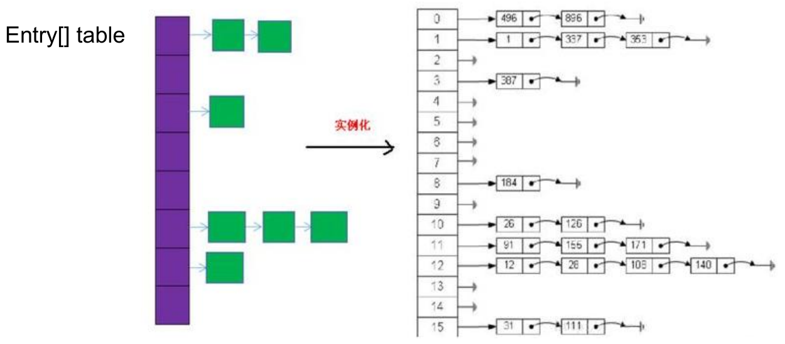

    - 扩容过程：

      - 当 HashMap 中的元素越来越多的时候，hash 冲突的几率也就越来越高，因为底层数组的长度是固定的。所以为了提高查询的效率，就要对 HashMap 的底层数组进行扩容，而在 HashMap 数组扩容之后，最消耗性能的点就出现了：原数组中的数据必须重新计算其在新数组中的位置，并放进去，这就是`resize()`。
      - 当 HashMap 中的元素个数超过 "数组大小（数组总大小 length，不是数组中存储的元素个数 size） \* loadFactor" 时 ， 就会进行数组扩容 。其中，loadFactor 的 默认值为 0.75，这是一个折中的取值，默认情况下，数组大小为 16，那么当 HashMap 中元素个数 ≥ 16 \* 0.75 = 12 （这个值就是代码中的 threshold 值，也叫做临界值）且要存放的位置非空的时候，就把数组的大小扩展为 2 \* 16 = 32，即扩大一倍，然后重新计算每个元素在数组中的位置，把原有的数据复制到新数组中。
      - **扩容是一个非常消耗性能的操作，如果已经预知 HashMap 中元素的个数，那么预设元素的个数能够有效的提高 HashMap 的性能。**

  - **JDK 8.0**

    - 初始化操作，以无参构造器为例：`HashMap hashMap = new HashMap();`，在实例化时，底层没有创建一个长度为 16 的数组，只是给加载因子赋值 0.75：

      ```java
      public HashMap() {
          this.loadFactor = DEFAULT_LOAD_FACTOR; // all other fields defaulted
      }
      ```

    - 底层的数组是 Node[]，而非 Entry[]，但 Node 实现了 Entry 接口：

      ```java
      transient Node<K,V>[] table;
      ```

      ```java
      static class Node<K,V> implements Map.Entry<K,V> {}
      ```

    - 首次调用`put()`方法时：

      ```java
      public V put(K key, V value) {
          return putVal(hash(key), key, value, false, true);
      }
      ```

      ```java
      final V putVal(int hash, K key, V value, boolean onlyIfAbsent,
                     boolean evict) {
          Node<K,V>[] tab; Node<K,V> p; int n, i;
          if ((tab = table) == null || (n = tab.length) == 0)
              // 第一次进入put()，table还未初始化，为null，进入resize()，如果不是第一次put()，不会进入此逻辑
              n = (tab = resize()).length;
          // 查看当前元素在新创建的数组中的位置i所在的位置的元素p，是否为null
          if ((p = tab[i = (n - 1) & hash]) == null)
              tab[i] = newNode(hash, key, value, null);// 如果p为null，当前位置i没有元素，添加成功 ---> 情况1
          else {
              Node<K,V> e; K k;
              if (p.hash == hash &&
                  ((k = p.key) == key || (key != null && key.equals(k))))
                  e = p;// 位置i上的元素，与当前待添加元素的key相同
              else if (p instanceof TreeNode)
                  e = ((TreeNode<K,V>)p).putTreeVal(this, tab, hash, key, value);
              else {// 位置i上的元素，与当前待添加元素的key不同
                  for (int binCount = 0; ; ++binCount) {
                      if ((e = p.next) == null) {// 位置i上只有一个元素
                          // 位置i上的原元素指向当前待添加的元素，"八下"，添加成功 ---> 情况2和3
                          p.next = newNode(hash, key, value, null);
                          if (binCount >= TREEIFY_THRESHOLD - 1) // -1 for 1st
                              // 链表的长度超过8时，判断是否转为红黑树结构
                              treeifyBin(tab, hash);
                          break;
                      }
                      // 位置i上不止一个元素，依次获得该链表中的每一个元素，与待添加元素的key，对比hash值和equals()
                      if (e.hash == hash &&
                          ((k = e.key) == key || (key != null && key.equals(k))))
                          break;
                      p = e;
                  }
              }
              // 替换操作
              if (e != null) { // existing mapping for key
                  V oldValue = e.value;
                  if (!onlyIfAbsent || oldValue == null)
                      e.value = value;
                  afterNodeAccess(e);
                  return oldValue;
              }
          }
          ++modCount;
          if (++size > threshold)
              resize();
          afterNodeInsertion(evict);
          return null;
      }
      ```

    - 从`put()`第一次进`resize()`，底层创建了长度为 16 的 Node 数组：

      ```java
      final Node<K,V>[] resize() {
          Node<K,V>[] oldTab = table;// 从put()第一次进入resize()，table为null
          int oldCap = (oldTab == null) ? 0 : oldTab.length;// 0
          int oldThr = threshold;// 此时扩容的临界值为0
          int newCap, newThr = 0;
          if (oldCap > 0) {
              if (oldCap >= MAXIMUM_CAPACITY) {
                  threshold = Integer.MAX_VALUE;
                  return oldTab;
              }
              else if ((newCap = oldCap << 1) < MAXIMUM_CAPACITY &&
                       oldCap >= DEFAULT_INITIAL_CAPACITY)
                  newThr = oldThr << 1; // double threshold
          }
          else if (oldThr > 0) // initial capacity was placed in threshold
              newCap = oldThr;
          else {               // zero initial threshold signifies using defaults
              newCap = DEFAULT_INITIAL_CAPACITY;// 默认数组长度16
              newThr = (int)(DEFAULT_LOAD_FACTOR * DEFAULT_INITIAL_CAPACITY);// 默认扩容的临界值：12
          }
          if (newThr == 0) {
              float ft = (float)newCap * loadFactor;
              newThr = (newCap < MAXIMUM_CAPACITY && ft < (float)MAXIMUM_CAPACITY ?
                        (int)ft : Integer.MAX_VALUE);
          }
          threshold = newThr;// 赋值扩容的临界值
          @SuppressWarnings({"rawtypes","unchecked"})
          Node<K,V>[] newTab = (Node<K,V>[])new Node[newCap];// 创建一个长度为16的Node数组
          table = newTab;
          if (oldTab != null) {
              for (int j = 0; j < oldCap; ++j) {
                  Node<K,V> e;
                  if ((e = oldTab[j]) != null) {
                      oldTab[j] = null;
                      if (e.next == null)
                          newTab[e.hash & (newCap - 1)] = e;
                      else if (e instanceof TreeNode)
                          ((TreeNode<K,V>)e).split(this, newTab, j, oldCap);
                      else { // preserve order
                          Node<K,V> loHead = null, loTail = null;
                          Node<K,V> hiHead = null, hiTail = null;
                          Node<K,V> next;
                          do {
                              next = e.next;
                              if ((e.hash & oldCap) == 0) {
                                  if (loTail == null)
                                      loHead = e;
                                  else
                                      loTail.next = e;
                                  loTail = e;
                              }
                              else {
                                  if (hiTail == null)
                                      hiHead = e;
                                  else
                                      hiTail.next = e;
                                  hiTail = e;
                              }
                          } while ((e = next) != null);
                          if (loTail != null) {
                              loTail.next = null;
                              newTab[j] = loHead;
                          }
                          if (hiTail != null) {
                              hiTail.next = null;
                              newTab[j + oldCap] = hiHead;
                          }
                      }
                  }
              }
          }
          return newTab;
      }
      ```

    - 计算 key 的 hash 值：

      ```java
      static final int hash(Object key) {
          int h;
          return (key == null) ? 0 : (h = key.hashCode()) ^ (h >>> 16);
      }
      ```

    - 链表转红黑树：

      ```java
      final void treeifyBin(Node<K,V>[] tab, int hash) {
          int n, index; Node<K,V> e;
          if (tab == null || (n = tab.length) < MIN_TREEIFY_CAPACITY)
              resize();// 如果底层数组的长度小玉64，只扩容，不转红黑树
          else if ((e = tab[index = (n - 1) & hash]) != null) {
              TreeNode<K,V> hd = null, tl = null;
              do {
                  TreeNode<K,V> p = replacementTreeNode(e, null);
                  if (tl == null)
                      hd = p;
                  else {
                      p.prev = tl;
                      tl.next = p;
                  }
                  tl = p;
              } while ((e = e.next) != null);
              if ((tab[index] = hd) != null)
                  hd.treeify(tab);
          }
      }
      ```

    - **总结，JDK 8.0 相较于 JDK 7.0 在底层实现方面的不同：**

      - **`new HashMap()`时，底层没有创建一个长度为 16 的数组。**
      - **JDK 8.0 底层的数组是`Node[]`，而非 Entry[]。**
      - **首次调用`put()`时，底层创建长度为 16 的数组。**
      - **JDK 7.0 底层结构只有：`数组 + 链表`。JDK 8.0 中底层结构是：`数组 + 链表 + 红黑树`。**

    - **形成链表时，"七上八下"： JDK 7.0 中新的元素指向旧的元素，JDK 8.0 中旧的元素指向新的元素。**

  - **当数组的某一个索引位置上的元素以链表形式存在的数据个数 > 8 且当前数组的长度 > 64时，此时此索引位置上的所数据改为使用红黑树存储。**

  - 存储结构：

    - HashMap 的内部存储结构其实是`数组+ 链表 + 树`的结合。当实例化一个 HashMap 时，会初始化 initialCapacity 和 loadFactor，在 put 第一对映射关系时，系统会创建一个长度为 initialCapacity 的 Node 数组，这个长度在哈希表中被称为容量（Capacity），在这个数组中可以存放元素的位置我们称之为 "桶"（bucket），每个 bucket 都有自己的索引，系统可以根据索引快速的查找 bucket 中的元素。

    - 每个 bucket 中存储一个元素，即一个 Node 对象，但每一个 Node 对象可以带一个引用变量 next，用于指向下一个元素，因此，在一个桶中，就有可能生成一个 Node 链。也可能是一个一个 TreeNode 对象，每一个 TreeNode 对象可以有两个叶子结点 left 和 right，因此，在一个桶中，就有可能生成一个 TreeNode 树。而新添加的元素作为链表的 last，或树的叶子结点。

    - 结构图示意：

      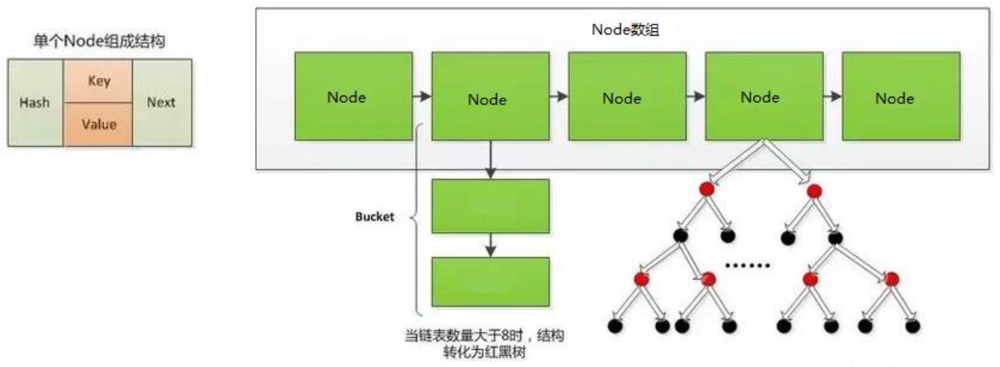

    - 扩容过程：

      - 扩容过程与 JDK 7.0 相同。
      - 树形化：当 HashMap 中的其中一个链的对象个数如果达到了 8 个，此时如果 capacity 没有达到 64，那么 HashMap 会先扩容解决，如果已经达到了 64，那么这个链会变成树，结点类型由 Node 变成 TreeNode 类型。当然，如果当映射关系被移除后，下次`resize()`时判断树的结点个数低于 6 个，也会把树再转为链表。

面试题

  - 谈谈你对 HashMap 中`put()`和`get()`的认识？如果了解再谈谈 HashMap 的扩容机制？默认大小是多少？什么是负载因子（或填充比）？什么是吞吐临界值（或阈值、threshold）？
  - **负载因子值的大小，对 HashMap 有什么影响？**
    - **负载因子的大小决定了 HashMap 的数据密度。**
    - **负载因子越大，数据密度越大，发生碰撞的几率越高，数组中的链表越容易长，造成查询或插入时的比较次数增多，性能会下降。**
    - **负载因子越小，就越容易触发扩容，数据密度也越小，意味着发生碰撞的几率越小，数组中的链表也就越短，查询和插入时比较的次数也越小，性能会更高。但是会浪费一定的内容空间，而且经常扩容也会影响性能，建议初始化预设大一点的空间。**
    - **按照其他语言的参考及研究经验，会考虑将负载因子设置为 0.7 ~ 0.75，此时平均检索长度接近于常数。**

#### LinkedHashMap

LinkedHashMap 是 HashMap 的子类。对于频繁的遍历操作，此类执行效率高于 HashMap。

在 HashMap 存储结构的基础上，使用了一对`双向链表`来记录添加元素的顺序。

- HashMap 中的内部类 Node：

  ```java
  static class Node<K,V> implements Map.Entry<K,V> {
      final int hash;
      final K key;
      V value;
      Node<K,V> next;
  }
  ```

- LinkedHashMap 中的内部类 Entry，用以替换 Node：

  ```java
  static class Entry<K,V> extends HashMap.Node<K,V> {
      Entry<K,V> before, after;
      Entry(int hash, K key, V value, Node<K,V> next) {
          super(hash, key, value, next);
      }
  }
  ```

  >LinkedHashMap 在原有的 HashMap 底层结构基础上，添加了一对指针 befor 和 after，指向当前元素的前一个和后一个元素。

与 LinkedHashSet 类似，LinkedHashMap 可以维护 Map 的迭代顺序：迭代顺序与 key - value 对的插入顺序一致。

- **LinkedHashMap 在遍历元素时，可以按照添加的顺序实现遍历。**

- 实例：

  ```java
  public class Test {
      public static void main(String[] args) {
          Map map = new HashMap();
          map.put(123, "AA");
          map.put(345, "BB");
          map.put(12, "CC");
          System.out.println(map);// {345=BB, 123=AA, 12=CC}
  
          map = new LinkedHashMap();
          map.put(123, "AA");
          map.put(345, "BB");
          map.put(12, "CC");
          System.out.println(map);// {123=AA, 345=BB, 12=CC}
      }
  }
  ```

#### TreeMap

TreeMap 存储 key - value 对时，需要根据 key - value 对进行排序。TreeMap 可以保证所有的 key - value 对处于有序状态。

**TreeMap 底层使用`红黑树结构`存储数据。**

TreeMap 的 key 的排序：

- 自然排序：TreeMap 的所有的 key 应该是同一个类的对象，否则将会抛出 ClasssCastException 异常，同时，key 所在的类需要实现 Comparable 接口。

  ```java
  public class Test {
      public static void main(String[] args) {
          TreeMap map = new TreeMap();
          User u1 = new User("Tom", 23);
          User u2 = new User("Jerry", 32);
          User u3 = new User("Jack", 20);
          User u4 = new User("Rose", 18);
  
          map.put(u1, 98);
          map.put(u2, 89);
          map.put(u3, 76);
          map.put(u4, 100);
  
          Set entrySet = map.entrySet();
          Iterator iterator1 = entrySet.iterator();
          while (iterator1.hasNext()) {
              Object obj = iterator1.next();
              Map.Entry entry = (Map.Entry) obj;
              System.out.println(entry.getKey() + "---->" + entry.getValue());
          }
      }
  }
  
  class User implements Comparable {
      private String name;
      private int age;
  
      public User() {
      }
  
      public User(String name, int age) {
          this.name = name;
          this.age = age;
      }
  
      public String getName() {
          return name;
      }
  
      public void setName(String name) {
          this.name = name;
      }
  
      public int getAge() {
          return age;
      }
  
      public void setAge(int age) {
          this.age = age;
      }
  
      @Override
      public String toString() {
          return "User{" +
                  "name='" + name + '\'' +
                  ", age=" + age +
                  '}';
      }
  
      @Override
      public boolean equals(Object o) {
          System.out.println("User equals()....");
          if (this == o) {
              return true;
          }
          if (o == null || getClass() != o.getClass()) {
              return false;
          }
  
          User user = (User) o;
  
          if (age != user.age) {
              return false;
          }
          return name != null ? name.equals(user.name) : user.name == null;
      }
  
      @Override
      public int hashCode() { //return name.hashCode() + age;
          int result = name != null ? name.hashCode() : 0;
          result = 31 * result + age;
          return result;
      }
  
      // 按照姓名从大到小排列，年龄从小到大排列
      @Override
      public int compareTo(Object o) {
          if (o instanceof User) {
              User user = (User) o;
              // return -this.name.compareTo(user.name);
              int compare = -this.name.compareTo(user.name);
              if (compare != 0) {
                  return compare;
              } else {
                  return Integer.compare(this.age, user.age);
              }
          } else {
              throw new RuntimeException("输入的类型不匹配");
          }
      }
  }
  输出结果：
  User{name='Tom', age=23}---->98
  User{name='Rose', age=18}---->100
  User{name='Jerry', age=32}---->89
  User{name='Jack', age=20}---->76
  ```

- 定制排序：创建 TreeMap 时，传入一个 Comparator 对象，该对象负责对 TreeMap 中的所有 key 进行排序。此时不需要 Map 的 key 实现 Comparable 接口。

  ```java
  public class Test {
      public static void main(String[] args) {
          // 按照年龄从小到大排序
          TreeMap map = new TreeMap(new Comparator() {
              @Override
              public int compare(Object o1, Object o2) {
                  if (o1 instanceof User && o2 instanceof User) {
                      User u1 = (User) o1;
                      User u2 = (User) o2;
                      return Integer.compare(u1.getAge(), u2.getAge());
                  }
                  throw new RuntimeException("输入的类型不匹配！");
              }
          });
          User u1 = new User("Tom", 23);
          User u2 = new User("Jerry", 32);
          User u3 = new User("Jack", 20);
          User u4 = new User("Rose", 18);
  
          map.put(u1, 98);
          map.put(u2, 89);
          map.put(u3, 76);
          map.put(u4, 100);
  
          Set entrySet = map.entrySet();
          Iterator iterator1 = entrySet.iterator();
          while (iterator1.hasNext()) {
              Object obj = iterator1.next();
              Map.Entry entry = (Map.Entry) obj;
              System.out.println(entry.getKey() + "---->" + entry.getValue());
          }
      }
  }
  
  class User implements Comparable {
      private String name;
      private int age;
  
      public User() {
      }
  
      public User(String name, int age) {
          this.name = name;
          this.age = age;
      }
  
      public String getName() {
          return name;
      }
  
      public void setName(String name) {
          this.name = name;
      }
  
      public int getAge() {
          return age;
      }
  
      public void setAge(int age) {
          this.age = age;
      }
  
      @Override
      public String toString() {
          return "User{" +
                  "name='" + name + '\'' +
                  ", age=" + age +
                  '}';
      }
  
      @Override
      public boolean equals(Object o) {
          System.out.println("User equals()....");
          if (this == o) {
              return true;
          }
          if (o == null || getClass() != o.getClass()) {
              return false;
          }
  
          User user = (User) o;
  
          if (age != user.age) {
              return false;
          }
          return name != null ? name.equals(user.name) : user.name == null;
      }
  
      @Override
      public int hashCode() { //return name.hashCode() + age;
          int result = name != null ? name.hashCode() : 0;
          result = 31 * result + age;
          return result;
      }
  
      // 按照姓名从大到小排列，年龄从小到大排列
      @Override
      public int compareTo(Object o) {
          if (o instanceof User) {
              User user = (User) o;
              // return -this.name.compareTo(user.name);
              int compare = -this.name.compareTo(user.name);
              if (compare != 0) {
                  return compare;
              } else {
                  return Integer.compare(this.age, user.age);
              }
          } else {
              throw new RuntimeException("输入的类型不匹配");
          }
      }
  }
  输出结果：
  User{name='Rose', age=18}---->100
  User{name='Jack', age=20}---->76
  User{name='Tom', age=23}---->98
  User{name='Jerry', age=32}---->89
  ```

- TreeMap 判断两个 key 相等的标准：两个 key 通过`compareTo()`或者`compare()`返回 0。

#### Hashtable

Hashtable 是个古老的 Map 实现类，JDK 1.0 就提供了。不同于 HashMap，`Hashtable 是线程安全的`，但效率低。

- Hashtable 实现原理和 HashMap 相同，功能相同。底层都使用哈希表结构，查询速度快，很多情况下可以互用。

- 与 HashMap 一样，Hashtable 也不能保证其中 key - value 对的顺序。

- Hashtable 判断两个 key 相等、两个 value 相等的标准，与 HashMap 一致。

- **与 HashMap 不同，Hashtable 不允许使用 null 作为 key 和 value。**

实例：

```java
public class Test {
    public static void main(String[] args) {
        Map map = new HashMap();
        map.put(null, 123);
        map.put(123, null);
        map.put(null, null);
        System.out.println(map);// {null=null, 123=null}
        map = new Hashtable();
        map.put(null, 123);// java.lang.NullPointerException
    }
}
```

#### Properties

**Properties 类是 Hashtable 的子类，常用于处理配置文件。**

由于属性文件里的 key、value 都是字符串类型，所以 **Properties 里的 key 和 value 都是字符串类型。**

存取数据时，建议使用 `setProperty(String key, String value)` 和 `getProperty(String key)`。

- `public Object setProperty(String key, String value)` ： 保存一对属性。

- `public String getProperty(String key)` ：使用此属性列表中指定的键搜索属性值。

- `public Set<String> stringPropertyNames()` ：所有键的名称的集合。

  ```java
  public class ProDemo {
      public static void main(String[] args) {
          // 创建属性集对象
          Properties properties = new Properties();
          // 添加键值对元素
          properties.setProperty("filename", "a.txt");
          properties.setProperty("length", "209385038");
          properties.setProperty("location", "D:\\a.txt");
  
          // 打印属性集对象
          System.out.println(properties);
          
          // 通过键，获取属性值
          System.out.println(properties.getProperty("filename"));
          System.out.println(properties.getProperty("length"));
          System.out.println(properties.getProperty("location"));
  
          // 遍历属性集，获取所有键的集合
          Set<String> strings = properties.stringPropertyNames();
          // 打印键值对
          for (String key : strings) {
              System.out.println(key + " -- " + properties.getProperty(key));
          }
      }
  }
  ```

与流有关的方法：

- `public void load(InputStream inStream)`： 从字节输入流中读取键值对。
- `public void load(Reader reader)`：从字符输入流中读取键值对。
- `public void store(Writer writer,String comments)`
- `public void store(OutputStream out,String comments)`

实例：

```java
Properties pros = new Properties();
try (FileInputStream fis = new FileInputStream("jdbc.properties")) {
    // 加载流对应的文件
    pros.load(fis);
    // 遍历集合并打印
  Set<String> strings = properties.stringPropertyNames();
    for (String key : strings) {
      System.out.println(key + " -- " + properties.getProperty(key));
    }
} catch (Exception e) {
    e.printStackTrace();
}
```

```properties
# jdbc.properties 格式，以 = 连接，不要有空格
user=Tom
password=123qwe
```

### Collections 工具类

`Collections`是一个操作 Set、List 和 Map 等集合的工具类。

- 操作数组的工具类：`Arrays`。

Collections 中提供了一系列静态的方法对集合元素进行排序、查询和修改等操作，还提供了对集合对象设置不可变、对集合对象实现同步控制等方法。

常用方法：

- 排序操作：

  - `reverse(List list)`：反转 list 中元素的顺序。

  - `shuffle(List list)`：对 list 集合元素进行随机排序。

  - `sort(List list)`：根据元素的自然顺序对指定 list 集合元素按升序排序（自然排序）。

  - `sort(List list, Comparator comparator)`：根据指定的 comparator 产生的顺序对 list 集合元素进行排序 (定制排序)。

  - `swap(List list, int i, int j)`：将指定 list 集合中的 i 处元素和 j 处元素进行交换。

  - 实例：

    ```java
    public class Test {
        public static void main(String[] args) {
            List list = new ArrayList();
            list.add(123);
            list.add(43);
            list.add(765);
            list.add(765);
            list.add(765);
            list.add(-97);
            list.add(0);
            System.out.println(list);// [123, 43, 765, 765, 765, -97, 0]
    
            // Collections.reverse(list);// [0, -97, 765, 765, 765, 43, 123]
            // Collections.shuffle(list);// [765, 43, 123, 0, -97, 765, 765]
            // Collections.sort(list);// [-97, 0, 43, 123, 765, 765, 765]
            // Collections.swap(list, 1, 2);// [123, 765, 43, 765, 765, -97, 0]
    
            System.out.println(list);
        }
    }
    ```

- 查找和替换操作：

  - `Object max(Collection coll)`：根据元素的自然顺序，返回给定集合 coll 中的最大元素 (自然排序)。

  - `Object max(Collection coll, Comparator )`：根据 comparator 指定的顺序，返回给定集合 coll 中的最大元素（定制排序）。

  - `Object min(Collection)`：根据元素的自然顺序，返回给定集合 coll 中的最小元素（自然排序）。

  - `Object min(Collection，Comparator)`：根据 comparator 指定的顺序，返回给定集合 coll 中的最小元素（定制排序）。

  - `int frequency(Collection coll, Object obj)`：返回指定集合 coll 中指定元素 obj 出现的次数。

    ```java
    public class Test {
        public static void main(String[] args) {
            List list = new ArrayList();
            list.add(123);
            list.add(43);
            list.add(765);
            list.add(765);
            list.add(765);
            list.add(-97);
            list.add(0);
            int frequency = Collections.frequency(list, 123);
            System.out.println(frequency);// 1
        }
    }
    ```

  - `void copy(List dest, List src)`：将 src 中的内容复制到 dest 中。**注意：需要将 dest 集合中填充元素，数量不低于 src 的长度。**

    ```java
    public class Test {
        public static void main(String[] args) {
            List src = new ArrayList();
            src.add(123);
            src.add(43);
            src.add(765);
            src.add(-97);
            src.add(0);
    
            // 错误的写法：java.lang.IndexOutOfBoundsException: Source does not fit in dest
            /*List dest = new ArrayList();
            List dest = new ArrayList(src.size());
            Collections.copy(dest, src);*/
    
            // 正确的写法：需要将dest数组中填充元素，数量不低于src的长度
            List dest = Arrays.asList(new Object[src.size()]);// 1.先填充dest集合
            System.out.println(dest.size());// = list.size();
            Collections.copy(dest, src);// 2.再复制src集合
    
            System.out.println(dest);// [123, 43, 765, -97, 0]
        }
    }
    ```

  - `boolean replaceAll(List list, Object oldVal, Object newVal)`：使用新值 newVal 替换 list 对象的所有旧值 oldVal。

    ```java
    public class Test {
        public static void main(String[] args) {
            List list = new ArrayList();
            list.add(123);
            list.add(43);
            list.add(765);
            list.add(765);
            list.add(765);
            list.add(-97);
            list.add(0);
            System.out.println(list);// [123, 43, 765, 765, 765, -97, 0]
            Collections.replaceAll(list, 765, 888);
            System.out.println(list);// [123, 43, 888, 888, 888, -97, 0]
        }
    }
    ```

- 同步控制操作：

  - Collections 类中提供了多个`synchronizedXxx()`，该方法可使将指定集合包装成线程同步的集合，从而可以解决多线程并发访问集合时的线程安全问题。有了这些方法，涉及到线程安全的集合，可以不需要使用 Vector 或 Hashtable。

    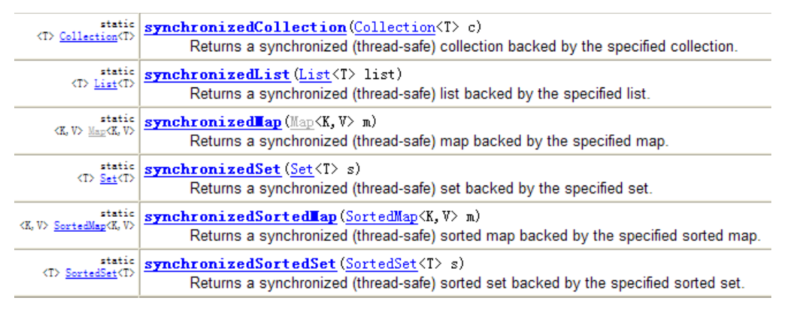

    ```java
    public class Test {
        public static void main(String[] args) {
            List list = new ArrayList();
            list.add(123);
            list.add(43);
            list.add(765);
            list.add(-97);
            list.add(0);
    
            // 返回的list1即为线程安全的List
            List list1 = Collections.synchronizedList(list);
        }
    }
    ```

## I/O 系统

### File 类

`java.io.File`类：文件和文件目录路径的抽象表示形式，与平台无关。

-  File 主要表示类似`D:\\文件目录1`与`D:\\文件目录1\\文件.txt`，前者是文件夹（directory），后者则是文件（file），而 File 类就是操作这两者的类。

**File 能新建、删除、重命名文件和目录，但 File 不能访问文件内容本身。如果需要访问文件内容本身，则需要使用输入/输出流。**

- File 跟流无关，File 类不能对文件进行读和写，也就是输入和输出。

想要在 Java 程序中表示一个真实存在的文件或目录，那么必须有一个 File 对象，但是 **Java 程序中的一个 File 对象，可能不对应一个真实存在的文件或目录。**

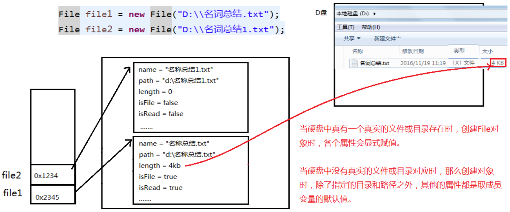

File 对象可以作为参数传递给流的构造器，指明读取或写入的 "终点"。

在 Java 中，一切皆是对象，File 类也不例外，不论是哪个对象都应该从该对象的构造方法说起：

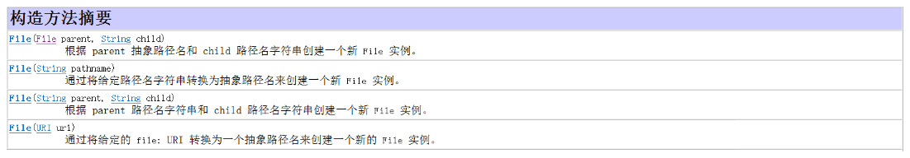

- `public File(String pathname)` ：以 pathname 为路径创建 File 对象，可以是绝对路径或者相对路径，如果 pathname 是相对路径，则默认的当前路径在系统属性 user.dir 中存储。

  - `绝对路径`：是一个固定的路径，从盘符开始。

  - `相对路径`：是相对于某个位置开始。

  - IDEA 中的路径说明，`main()`和 Test 中，相对路径不一样：

    ```java
    public class Test {
        public static void main(String[] args) {
            File file = new File("hello.txt");// 相较于当前工程
            System.out.println(file.getAbsolutePath());// D:\JetBrainsWorkSpace\IDEAProjects\xisun-projects\hello.txt
        }
    
        @Test
        public void testFileReader() {
            File file = new File("hello.txt");// 相较于当前Module
            System.out.println(file.getAbsolutePath());// D:\JetBrainsWorkSpace\IDEAProjects\xisun-projects\xisun-java_base\hello.txt
        }
    }
    ```

- `public File(String parent, String child)` ：以 parent 为父路径，child 为子路径创建 File 对象。

- `public File(File parent, String child)` ：根据一个父 File 对象和子文件路径创建 File 对象。

- 实例：

  ```java
  // 通过文件路径名 
  String path1 = "D:\\123.txt";
  File file1 = new File(path1); 
  
  // 通过文件路径名
  String path2 = "D:\\1\\2.txt";
  File file2 = new File(path2);				--------相当于d:\\1\\2.txt
  
  // 通过父路径和子路径字符串
   String parent = "F:\\aaa";
   String child = "bbb.txt";
   File file3 = new File(parent, child);		--------相当于f:\\aaa\\bbb.txt
  
  // 通过父级File对象和子路径字符串
  File parentDir = new File("F:\\aaa");
  String child = "bbb.txt";
  File file4 = new File(parentDir, child);	--------相当于f:\\aaa\\bbb.txt
  ```

**`路径分隔符`**：

- 路径中的每级目录之间用一个路径分隔符隔开。

- 路径分隔符和系统有关：

  - windows 和 DOS 系统默认使用`\`来表示。
  - UNIX 和 URL 使用`/`来表示。

- Java 程序支持跨平台运行，因此路径分隔符要慎用。为了解决这个隐患，File 类提供了一个常量`public static final String separator`，能够根据操作系统，动态的提供分隔符。

- 实例：

  ```java
  File file1 = new File("d:\\test\\info.txt");
  File file2 = new File("d:/test/info.txt");
  File file3 = new File("d:" + File.separator + "test" + File.separator + "info.txt");
  ```

`获取功能`的方法：

- **`public String getAbsolutePath()`：获取绝对路径。**

- `public String getPath()`：获取路径。

- `public String getName()`：获取名称。

- `public String getParent()`：获取上层文件目录路径。若无，返回 null。

- `public long length()`：获取文件长度，即：字节数。不能获取目录的长度。

- `public long lastModified()`：获取最后一次的修改时间，毫秒值。

- 实例：

  ```java
  public class Test {
      public static void main(String[] args) {
          File file1 = new File("hello.txt");
          File file2 = new File("d:\\io\\hi.txt");
  
          System.out.println(file1.getAbsolutePath());// E:\projects\IDEAProjects\xisun_antai_timeseriesdb\hello.txt
          System.out.println(file1.getPath());// hello.txt
          System.out.println(file1.getName());// hello.txt
          System.out.println(file1.getParent());// null
          System.out.println(file1.length());// 0
          System.out.println(new Date(file1.lastModified()));// Thu Jan 01 08:00:00 CST 1970
  
          System.out.println();
  
          System.out.println(file2.getAbsolutePath());// d:\io\hi.txt
          System.out.println(file2.getPath());// d:\io\hi.txt
          System.out.println(file2.getName());// hi.txt
          System.out.println(file2.getParent());// d:\io
          System.out.println(file2.length());// 0
          System.out.println(file2.lastModified());// 0
      }
  }
  ```

- **`public String[] list()`：获取指定目录下的所有文件或者文件目录的名称数组，如果指定目录不存在，返回 null。**

- **`public File[] listFiles()`：获取指定目录下的所有文件或者文件目录的 File 数组，如果指定目录不存在，返回 null。**

- 实例：

  ```java
  public class Test {
      public static void main(String[] args) {
          File file = new File("D:\\workspace_idea1\\JavaSenior");
  
          String[] list = file.list();
          System.out.println(list);
          if (list != null) {
              for (String s : list) {
                  System.out.println(s);
              }
          }
  
          System.out.println();
  
          File[] files = file.listFiles();
          System.out.println(files);
          if (files != null) {
              for (File f : files) {
                  System.out.println(f);
              }
          }
      }
  }
  ```

- `public String[] list(FilenameFilter filter)`：指定文件过滤器。

- `public File[] listFiles(FilenameFilter filter)`：指定文件过滤器。

- `public File[] listFiles(FileFilter filter)`：指定文件过滤器。

- 实例：

  ```java
  public class Test {
      public static void main(String[] args) {
          File srcFile = new File("d:\\code");
  
          String[] subFiles1 = srcFile.list(new FilenameFilter() {
              @Override
              public boolean accept(File dir, String name) {
                  return name.endsWith(".jpg");
              }
          });
          if (subFiles1 != null) {
              for (String fileName : subFiles1) {
                  System.out.println(fileName);
              }
          }
  
          File[] subFiles2 = srcFile.listFiles(new FilenameFilter() {
              @Override
              public boolean accept(File dir, String name) {
                  return name.endsWith(".jpg");
              }
          });
          if (subFiles2 != null) {
              for (File file : subFiles2) {
                  System.out.println(file.getAbsolutePath());
              }
          }
  
          File[] subFiles3 = srcFile.listFiles(new FileFilter() {
              @Override
              public boolean accept(File pathname) {
                  return pathname.getName().endsWith(".jpg");
              }
          });
          if (subFiles3 != null) {
              for (File file : subFiles3) {
                  System.out.println(file.getAbsolutePath());
              }
          }
      }
  }
  ```

`重命名功能`的方法：

- `public boolean renameTo(File dest)`：把文件重命名为指定的文件路径。以`file1.renameTo(file2)`为例：要想保证返回 true，需要 file1 在硬盘中是存在的，且 file2 在硬盘中不能存在。

- 实例：

  ```java
  public class Test {
      public static void main(String[] args) {
          File file1 = new File("hello.txt");
          File file2 = new File("D:\\io\\hi.txt");
  
          boolean renameTo = file2.renameTo(file1);
          System.out.println(renameTo);
      }
  }
  ```

`判断功能`的方法：

- **`public boolean exists()`：判断是否存在。**

- **`public boolean isDirectory()`：判断是否是文件目录。** 

- **`public boolean isFile()`：判断是否是文件。**

- `public boolean canRead()`：判断是否可读。

- `public boolean canWrite()`：判断是否可写。

- `public boolean isHidden()`：判断是否隐藏。

- 实例：

  ```java
  public class Test {
      public static void main(String[] args) {
          File file1 = new File("hello.txt");
          file1 = new File("hello1.txt");
  
          System.out.println(file1.isDirectory());
          System.out.println(file1.isFile());
          System.out.println(file1.exists());
          System.out.println(file1.canRead());
          System.out.println(file1.canWrite());
          System.out.println(file1.isHidden());
  
          System.out.println();
  
          File file2 = new File("d:\\io");
          file2 = new File("d:\\io1");
          System.out.println(file2.isDirectory());
          System.out.println(file2.isFile());
          System.out.println(file2.exists());
          System.out.println(file2.canRead());
          System.out.println(file2.canWrite());
          System.out.println(file2.isHidden());
      }
  }
  ```

`创建功能`的方法：

- **`public boolean createNewFile()`：创建文件。若文件不存在，则创建一个新的空文件并返回 true；若文件存在，则不创建文件并返回 false。**

- `public boolean mkdir()`：创建文件目录。如果此文件目录存在，则不创建；如果此文件目录的上层目录不存在，也不创建。

- `public boolean mkdirs()`：创建文件目录。如果上层文件目录不存在，也一并创建。

- **如果创建文件或者文件目录时，没有写盘符路径，那么，默认在项目路径下。**

- 实例：

  ```java
  public class Test {
      public static void main(String[] args) {
          File file1 = new File("hi.txt");
          if (!file1.exists()) {
              // 文件不存在
              try {
                  boolean newFile = file1.createNewFile();
                  System.out.println("创建成功？" + newFile);
              } catch (IOException exception) {
                  exception.printStackTrace();
              }
          } else {
              // 文件存在
              boolean delete = file1.delete();
              System.out.println("删除成功？" + delete);
          }
      }
  }
  ```

`删除功能`的方法：

- **`public boolean delete()`：删除文件或者文件夹。**

- **Java 中的删除不走回收站。要删除一个文件目录，请注意该文件目录内不能包含文件或者文件目录，即`只能删除空的文件目录`。**

- 实例：

  ```java
  public class Test {
      public static void main(String[] args) {
          // 文件目录的创建
          File file1 = new File("d:\\io\\io1\\io3");
          boolean mkdir = file1.mkdir();
          if (mkdir) {
              System.out.println("创建成功1");
          }
  
          File file2 = new File("d:\\io\\io1\\io4");
          boolean mkdir1 = file2.mkdirs();
          if (mkdir1) {
              System.out.println("创建成功2");
          }
          
          // 要想删除成功，io4文件目录下不能有子目录或文件
          File file3 = new File("D:\\io\\io1\\io4");
          file3 = new File("D:\\io\\io1");
          System.out.println(file3.delete());
      }
  }
  ```

`递归遍历`文件夹下所有文件以及子文件：

```java
public class Test {
    public static void main(String[] args) {
        // 递归:文件目录
        /** 打印出指定目录所有文件名称，包括子文件目录中的文件 */

        // 1.创建目录对象
        File dir = new File("E:\\teach\\01_javaSE\\_尚硅谷Java编程语言\\3_软件");

        // 2.打印目录的子文件
        printSubFile(dir);
    }

    // 方式一：
    public static void printSubFile(File dir) {
        // 判断传入的是否是目录
        if (!dir.isDirectory()) {
            // 不是目录直接退出
            return;
        }

        // 打印目录的子文件
        File[] subfiles = dir.listFiles();
        if (subfiles != null) {
            for (File f : subfiles) {
                if (f.isDirectory()) {
                    // 文件目录
                    printSubFile(f);
                } else {
                    // 文件
                    System.out.println(f.getAbsolutePath());
                }
            }
        }
    }

    // 方式二：循环实现
    // 列出file目录的下级内容，仅列出一级的话，使用File类的String[] list()比较简单
    public void listSubFiles(File file) {
        if (file.isDirectory()) {
            String[] all = file.list();
            if (all != null) {
                for (String s : all) {
                    System.out.println(s);
                }
            }
        } else {
            System.out.println(file + "是文件！");
        }
    }

    // 方式三：列出file目录的下级，如果它的下级还是目录，接着列出下级的下级，依次类推
    // 建议使用File类的File[] listFiles()
    public void listAllSubFiles(File file) {
        if (file.isFile()) {
            System.out.println(file);
        } else {
            File[] all = file.listFiles();
            // 如果all[i]是文件，直接打印
            // 如果all[i]是目录，接着再获取它的下一级
            if (all != null) {
                for (File f : all) {
                    // 递归调用：自己调用自己就叫递归
                    listAllSubFiles(f);
                }
            }
        }
    }

    // 拓展1：计算指定目录所在空间的大小
    // 求任意一个目录的总大小
    public long getDirectorySize(File file) {
        // file是文件，那么直接返回file.length()
        // file是目录，把它的下一级的所有大小加起来就是它的总大小
        long size = 0;
        if (file.isFile()) {
            size += file.length();
        } else {
            // 获取file的下一级
            File[] all = file.listFiles();
            if (all != null) {
                // 累加all[i]的大小
                for (File f : all) {
                    // f的大小
                    size += getDirectorySize(f);
                }
            }
        }
        return size;
    }

    // 拓展2：删除指定文件目录及其下的所有文件
    public void deleteDirectory(File file) {
        // 如果file是文件，直接delete
        // 如果file是目录，先把它的下一级干掉，然后删除自己
        if (file.isDirectory()) {
            File[] all = file.listFiles();
            // 循环删除的是file的下一级
            if (all != null) {
                // f代表file的每一个下级
                for (File f : all) {
                    deleteDirectory(f);
                }
            }
        }
        // 删除自己
        file.delete();
    }
}
```

### 字符编码

`字符集Charset：也叫编码表。`是一个系统支持的所有字符的集合，包括各国家文字、标点符号、图形符号、数字等。

编码表的由来：计算机只能识别二进制数据，早期由来是电信号。为了方便应用计算机，让它可以识别各个国家的文字。就将各个国家的文字用数字来表示，并一一对应，形成一张表。这就是编码表。

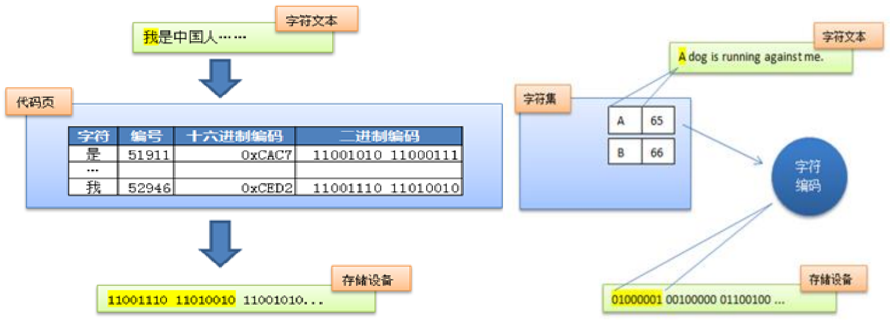

常见的编码表：

- ASCII：美国标准信息交换码。用一个字节的 7 位可以表示。

- ISO8859-1：拉丁码表，欧洲码表。用一个字节的 8 位表示。

- GB2312：中国的中文编码表。最多两个字节编码所有字符。

- GBK：中国的中文编码表升级，融合了更多的中文文字符号。最多两个字节编码。

- Unicode：国际标准码，融合了目前人类使用的所有字符。为每个字符分配唯一的字符码。所有的文字都用两个字节来表示。

- UTF-8：变长的编码方式，可用 1 ~ 4 个字节来表示一个字符。

  

- 在 Unicode 出现之前，所有的字符集都是和具体编码方案绑定在一起的，即字符集 ≈ 编码方式，都是直接将字符和最终字节流绑定死了。

- GBK 等双字节编码方式，用最高位是 1 或 0 表示两个字节和一个字节。

- Unicode 不完美，这里就有三个问题，一个是，我们已经知道，英文字母只用一个字节表示就够了，第二个问题是如何才能区别 Unicode 和 ASCII，计算机怎么知道是两个字节表示一个符号，而不是分别表示两个符号呢？第三个，如果和 GBK 等双字节编码方式一样，用最高位是 1 或 0 表示两个字节和一个字节，就少了很多值无法用于表示字符，不够表示所有字符。Unicode 在很长一段时间内无法推广，直到互联网的出现。

- 面向传输的众多 UTF（UCS Transfer Format）标准出现了，顾名思义，UTF-8 就是每次 8 个位传输数据，而 UTF-16 就是每次 16 个位。这是为传输而设计的编码，并使编码无国界，这样就可以显示全世界上所有文化的字符了。

- Unicode 只是定义了一个庞大的、全球通用的字符集，并为每个字符规定了唯一确定的编号，具体存储成什么样的字节流，取决于字符编码方案。推荐的 Unicode 编码是 UTF-8 和 UTF-16。

  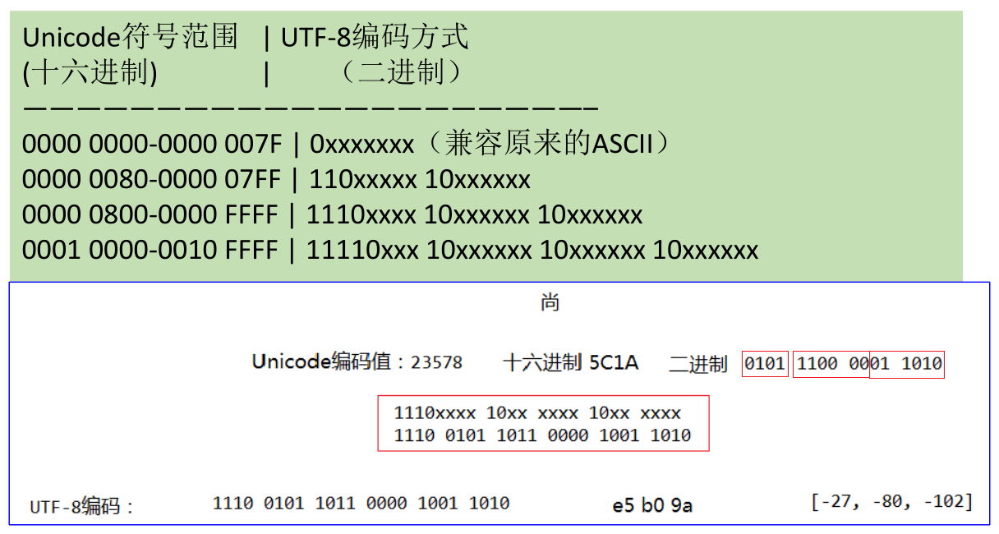

  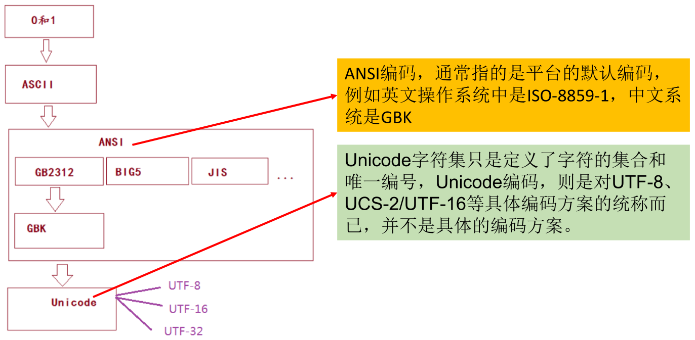

计算机中储存的信息都是用二进制数表示的，而能在屏幕上看到的数字、英文、标点符号、汉字等字符是二进制数转换之后的结果。按照某种规则，将字符存储到计算机中，称为**`编码`** 。反之，将存储在计算机中的二进制数按照某种规则解析显示出来，称为**`解码`** 。

  - **`编码规则和解码规则要对应，否则会导致乱码。`**比如说，按照 A 规则存储，同样按照 A 规则解析，那么就能显示正确的文本符号。反之，按照 A 规则存储，再按照 B 规则解析，就会导致乱码现象。

- 编码： 字符串 ---> 字节数组。（能看懂的 ---> 看不懂的）

- 解码： 字节数组 ---> 字符串。（看不懂的 ---> 能看懂的）

- 启示：客户端/浏览器端   <------>   后台（Java，GO，Python，Node.js，php...）   <------>   数据库，**要求前前后后使用的字符集要统一，都使用 UTF-8**，这样才不会乱码。

### I/O 流原理

`I/O`是 Input/Output 的缩写， I/O 技术是非常实用的技术，用于处理设备之间的`数据传输`。如读/写文件，网络通讯等。

Java 程序中，对于数据的输入/输出操作以`流 (stream)`的方式进行。

`java.io`包下提供了各种 "流" 类和接口，用以获取不同种类的数据，并**通过标准的方法输入或输出数据。**

`输入 input`：读取外部数据（磁盘、光盘等存储设备的数据）到程序（内存）中。

`输出 output`：将程序（内存）数据输出到磁盘、光盘等外部存储设备中。

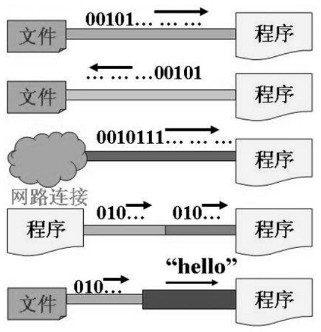

### I/O 流的分类

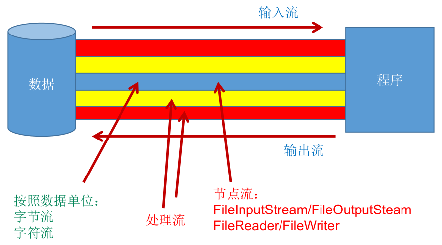

按操作`数据单位`不同分为：字节流（8 bit），字符流（16 bit）。

- `字节流`：以字节为单位，读写数据的流。
- `字符流`：以字符为单位，读写数据的流。

按数据流的`流向`不同分为：输入流，输出流。

- `输入流`：把数据从其他设备上读取到内存中的流。
- `输出流`：把数据从内存中写出到其他设备上的流。

按流的`角色`的不同分为：节点流，处理流。

- `节点流`：直接从数据源或目的地读写数据。也叫文件流。

  

- `处理流`：不直接连接到数据源或目的地，而是连接在已存在的流（节点流或处理流）之上，通过对数据的处理为程序提供更为强大的读写功能。

  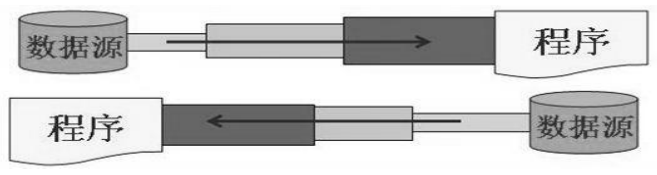

Java 的 I/O 流共涉及 40 多个类，实际上非常规则，都是从如下`四个抽象基类`派生的。同时，由这四个类派生出来的子类名称都是以其父类名作为子类名后缀：


I/O 流体系：

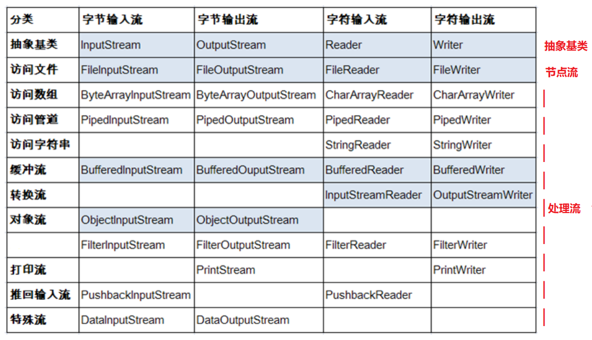

### 四个抽象基类

**`InputStream`&`Reader`：**

- `InputStream 和 Reader 是所有输入流的基类。`
- InputStream 的典型实现：FileInputStream。
  - `int read()`
  - `int read(byte[] b)`
  - `int read(byte[] b, int off, int len)`
- Reader 的典型实现：FileReader。
  - `int read()`
  - `int read(char [] c)`
  - `int read(char [] c, int off, int len)`
- `程序中打开的文件 I/O 资源不属于内存里的资源，垃圾回收机制无法回收该资源，所以应该显式关闭文件 I/O 资源。`
- FileInputStream 从文件系统中的某个文件中获得输入字节。FileInputStream 用于读取非文本数据之类的原始字节流。如果要读取文本数据的字符流，需要使用 FileReader。

**InputStream：**

- `int read()`：从输入流中读取数据的下一个字节。返回 0 到 255 范围内的 int 字节值。如果因为已经到达流末尾而没有可用的字节，则返回值 -1。
- `int read(byte[] b)`：从输入流中将最多`b.length()`个字节的数据读入一个 byte 数组中。以整数形式返回实际读取的字节数。如果因为已经到达流末尾而没有可用的字节，则返回值 -1。
- `int read(byte[] b, int off,int len)`：将输入流中最多 len 个数据字节读入 byte 数组。尝试读取 len 个字节，但读取的字节也可能小于该值。以整数形式返回实际读取的字节数。如果因为已经到达流末尾而没有可用的字节，则返回值 -1。
- `public void close() throws IOException`：关闭输入流并释放与该流关联的所有系统资源。

**Reader：**

- `int read()`：读取单个字符。作为整数读取的字符，范围在 0 到 65535 之间（0x00-0xffff）（2 个字节的 Unicode 码），如果已到达流的末尾，则返回 -1。
- `int read(char[] cbuf)`：将字符读入数组。如果已到达流的末尾，则返回 -1。否则返回本次读取的字符数。
- `int read(char[] cbuf,int off,int len)`：将字符读入数组的某一部分。存到数组 cbuf 中，从 off 处开始存储，最多读 len 个字符。如果已到达流的末尾，则返回 -1。否则返回本次读取的字符数。
- `public void close() throws IOException`：关闭此输入流并释放与该流关联的所有系统资源。

**`OutputStream` & `Writer`：**

- `OutputStream 和 Writer 是所有输出流的基类。`
- OutputStream 的典型实现：FileOutStream。
  - `void write(int b)`
  - `void write(byte[] b)`
  - `void write(byte[] b, int off, int len)`
  - `public void flush() throws IOException`
  - `public void close() throws IOException`
- Writer 的典型实现：FileWriter。
  - `void write(int c)`
  - `void write(char[] cbuf)`
  - `void write(char[] buff, int off, int len)`
  - `public void flush() throws IOException`
  - `public void close() throws IOException`
- 因为字符流直接以字符作为操作单位，所以 Writer 还可以用字符串来替换字符数组，即以 String 对象作为参数。
  - `void write(String str)`
  - `void write(String str, int off, int len)`
- FileOutputStream 从文件系统中的某个文件中获得输出字节。FileOutputStream 用于写出非文本数据之类的原始字节流。如果要要写出文本数据的字符流，需要使用 FileWriter。

**OutputStream：**

- `void write(int b)`：将指定的字节写入此输出流。write 的常规协定是：向输出流写入一个字节。要写入的字节是参数 b 的八个低位。b 的 24 个高位将被忽略，即写入 0 ~ 255 范围的。
- `void write(byte[] b)`：将`b.length()`个字节从指定的 byte 数组写入此输出流。`write(b)`的常规协定是：应该与调用`write(b, 0, b.length)`的效果完全相同。
- `void write(byte[] b,int off,int len)`：将指定 byte 数组中从偏移量 off 开始的 len 个字节写入此输出流。
- `public void flush() throws IOException`：刷新此输出流并强制写出所有缓冲的输出字节，调用此方法指示应将这些字节立即写入它们预期的目标。
- `public void close() throws IOException`：关闭此输出流并释放与该流关联的所有系统资源。

**Writer：**

- `void write(int c)`：写入单个字符。要写入的字符包含在给定整数值的 16 个低位中，16 高位被忽略。 即写入 0 到 65535 之间的 Unicode 码。
- `void write(char[] cbuf)`：写入字符数组。
- `void write(char[] cbuf,int off,int len)`：写入字符数组的某一部分。从 off 开始，写入 len 个字符。
- `void write(String str)`：写入字符串。
- `void write(String str,int off,int len)`：写入字符串的某一部分。
- `public void flush() throws IOException`：刷新该流的缓冲，则立即将它们写入预期目标。
- `public void close() throws IOException`：关闭此输出流并释放与该流关联的所有系统资源。

### 节点流（或文件流）

读取文件流程：

- 实例化 File 类的对象，指明要操作的文件。
- 提供具体的流对象。
- 数据的读入。
- 流的关闭操作。

写入文件流程：

- 实例化 File 类的对象，指明写出到的文件。
- 提供具体的流对象。
- 数据的写入。
- 流的关闭操作。

注意事项：

- 定义文件路径时，可以用 / 或者 \\。

- 在写入一个文件时，如果使用构造器`FileOutputStream(file)`，则目录下有同名文件将被覆盖。

- 如果使用构造器`FileOutputStream(file,true)`，则目录下的同名文件不会被覆盖，而是在文件内容末尾追加内容。

- **在读取文件时，必须保证该文件已存在，否则报异常。**

- **对于`非文本文件`（.jpg，.mp3，.mp4，.avi，.rmvb，.doc，.ppt 等），使用`字节流`处理。如果使用字节流操作文本文件，在输出到控制台时，可能会出现乱码。**
  - 如果只是将文本文件复制到其他地方，也可以使用字节流。

- **对于`文本文件`（.txt，.java，.c，.cpp 等），使用`字符流`处理。**

FileReader 和 FileWriter 操作的实例：

```java
/**
 * 一、流的分类：
 * 1.操作数据单位：字节流、字符流
 * 2.数据的流向：输入流、输出流
 * 3.流的角色：节点流、处理流
 *
 * 二、流的体系结构
 * 抽象基类       节点流（或文件流）                                缓冲流（处理流的一种）
 * InputStream   FileInputStream   (read(byte[] buffer))        BufferedInputStream (read(byte[] buffer))
 * OutputStream  FileOutputStream  (write(byte[] buffer,0,len)  BufferedOutputStream (write(byte[] buffer,0,len)/flush()
 * Reader        FileReader (read(char[] cbuf))                 BufferedReader (read(char[] cbuf)/readLine())
 * Writer        FileWriter (write(char[] cbuf,0,len)           BufferedWriter (write(char[] cbuf,0,len)/flush()
 */
public class FileReaderWriterTest {
    /*
    将当前Module下的hello.txt文件内容读入程序中，并输出到控制台

    说明点：
    1. read()的理解：返回读入的一个字符。如果达到文件末尾，返回-1
    2. 异常的处理：为了保证流资源一定可以执行关闭操作。需要使用try-catch-finally处理
    3. 读入的文件一定要存在，否则就会报FileNotFoundException。
     */

    // read(): 返回读入的一个字符。如果达到文件末尾，返回-1
    @Test
    public void testFileReader() {
        FileReader fr = null;
        try {
            // 1.实例化File类的对象，指明要操作的文件
            File file = new File("hello.txt");// 相较于当前Module

            // 2.提供具体的流
            fr = new FileReader(file);

            // 3.数据的读入
            // 方式一：
            /*int data = fr.read();
            while (data != -1) {
                System.out.print((char) data);
                data = fr.read();
            }*/
            // 方式二：语法上针对于方式一的修改
            int data;
            while ((data = fr.read()) != -1) {
                System.out.print((char) data);
            }
        } catch (IOException e) {
            e.printStackTrace();
        } finally {
            // 4.流的关闭操作
            // 方式一：
            /*try {
                if (fr != null)
                    fr.close();
            } catch (IOException e) {
                e.printStackTrace();
            }*/
            // 方式二：
            if (fr != null) {
                try {
                    fr.close();
                } catch (IOException e) {
                    e.printStackTrace();
                }
            }
        }
    }

    // 对read()操作升级：使用read的重载方法read(char[] cbuf)
    @Test
    public void testFileReader1() {
        FileReader fr = null;
        try {
            // 1.File类的实例化
            File file = new File("hello.txt");

            // 2.FileReader流的实例化
            fr = new FileReader(file);

            // 3.读入的操作
            // read(char[] cbuf)：返回每次读入cbuf数组中的字符的个数。如果达到文件末尾，返回-1
            char[] cbuf = new char[5];
            int len;
            while ((len = fr.read(cbuf)) != -1) {
                // 方式一：
                // 错误的写法，如果以cubf的length为基准，可能会造成多输出内容
                /*for (int i = 0; i < cbuf.length; i++) {
                    System.out.print(cbuf[i]);
                }*/
                // 正确的写法
                /*for (int i = 0; i < len; i++) {
                    System.out.print(cbuf[i]);
                }*/
                //方式二：
                // 错误的写法，对应着方式一的错误的写法
                /*String str = new String(cbuf);
                System.out.print(str);*/
                // 正确的写法，对应着方式一的正确的写法
                String str = new String(cbuf, 0, len);
                System.out.print(str);
            }
        } catch (IOException e) {
            e.printStackTrace();
        } finally {
            if (fr != null) {
                // 4.资源的关闭
                try {
                    fr.close();
                } catch (IOException e) {
                    e.printStackTrace();
                }
            }
        }
    }

    /*
    从内存中写出数据到硬盘的文件里。

    说明：
    1. 输出操作，对应的File可以不存在的。并不会报异常
    2.
         File对应的硬盘中的文件如果不存在，在输出的过程中，会自动创建此文件。
         File对应的硬盘中的文件如果存在：
                如果流使用的构造器是：FileWriter(file,false) / FileWriter(file)--->对原有文件的覆盖
                如果流使用的构造器是：FileWriter(file,true)--->不会对原有文件覆盖，而是在原有文件基础上追加内容
     */
    @Test
    public void testFileWriter() {
        FileWriter fw = null;
        try {
            // 1.提供File类的对象，指明写出到的文件
            File file = new File("hello1.txt");

            // 2.提供FileWriter的对象，用于数据的写出
            fw = new FileWriter(file, false);

            // 3.写出的操作
            fw.write("I have a dream!\n");
            fw.write("you need to have a dream!");
        } catch (IOException e) {
            e.printStackTrace();
        } finally {
            // 4.流资源的关闭
            if (fw != null) {
                try {
                    fw.close();
                } catch (IOException e) {
                    e.printStackTrace();
                }
            }
        }
    }

    /*
    实现对已存在文件的复制
     */
    @Test
    public void testFileReaderFileWriter() {
        FileReader fr = null;
        FileWriter fw = null;
        try {
            // 1.创建File类的对象，指明读入和写出的文件
            File srcFile = new File("hello.txt");
            File destFile = new File("hello2.txt");

            // 不能使用字符流来处理图片等字节数据
            /*File srcFile = new File("爱情与友情.jpg");
            File destFile = new File("爱情与友情1.jpg");*/

            // 2.创建输入流和输出流的对象
            fr = new FileReader(srcFile);
            fw = new FileWriter(destFile);

            // 3.数据的读入和写出操作
            char[] cbuf = new char[5];
            // 记录每次读入到cbuf数组中的字符的个数
            int len;
            while ((len = fr.read(cbuf)) != -1) {
                // 每次写出len个字符
                fw.write(cbuf, 0, len);
            }
        } catch (IOException e) {
            e.printStackTrace();
        } finally {
            // 4.关闭流资源
            // 方式一：
            /*try {
                if (fw != null)
                    fw.close();
            } catch (IOException e) {
                e.printStackTrace();
            } finally {
                try {
                    if (fr != null)
                        fr.close();
                } catch (IOException e) {
                    e.printStackTrace();
                }
            }*/
            // 方式二：
            try {
                if (fw != null)
                    fw.close();
            } catch (IOException e) {
                e.printStackTrace();
            }

            try {
                if (fr != null)
                    fr.close();
            } catch (IOException e) {
                e.printStackTrace();
            }
        }
    }
}
```

FileInputStream 和 FileOutputStream 操作的实例：

```java
/**
 * 测试FileInputStream和FileOutputStream的使用
 *
 * 结论：
 * 1. 对于文本文件(.txt,.java,.c,.cpp)，使用字符流处理
 * 2. 对于非文本文件(.jpg,.mp3,.mp4,.avi,.doc,.ppt,...)，使用字节流处理
 */
public class FileInputOutputStreamTest {
    /*
    使用字节流FileInputStream处理文本文件，可能出现乱码。
     */
    @Test
    public void testFileInputStream() {
        FileInputStream fis = null;
        try {
            // 1. 造文件
            File file = new File("hello.txt");

            // 2.造流
            fis = new FileInputStream(file);

            // 3.读数据
            byte[] buffer = new byte[5];
            // 记录每次读取的字节的个数
            int len;
            while ((len = fis.read(buffer)) != -1) {
                String str = new String(buffer, 0, len);
                System.out.print(str);
            }
        } catch (IOException e) {
            e.printStackTrace();
        } finally {
            if (fis != null) {
                // 4.关闭资源
                try {
                    fis.close();
                } catch (IOException e) {
                    e.printStackTrace();
                }
            }
        }
    }

    /*
    实现对图片的复制操作
     */
    @Test
    public void testFileInputOutputStream() {
        FileInputStream fis = null;
        FileOutputStream fos = null;
        try {
            // 1.获取文件
            File srcFile = new File("爱情与友情.jpg");
            File destFile = new File("爱情与友情2.jpg");

            // 2.获取流
            fis = new FileInputStream(srcFile);
            fos = new FileOutputStream(destFile);

            // 3.复制的过程
            byte[] buffer = new byte[5];
            int len;
            while ((len = fis.read(buffer)) != -1) {
                fos.write(buffer, 0, len);
            }
        } catch (IOException e) {
            e.printStackTrace();
        } finally {
            // 4.关闭流
            if (fos != null) {
                try {
                    fos.close();
                } catch (IOException e) {
                    e.printStackTrace();
                }
            }

            if (fis != null) {
                try {
                    fis.close();
                } catch (IOException e) {
                    e.printStackTrace();
                }
            }
        }
    }

    /*
    指定路径下文件的复制
     */
    public void copyFile(String srcPath, String destPath) {
        FileInputStream fis = null;
        FileOutputStream fos = null;
        try {
            // 1.获取文件
            File srcFile = new File(srcPath);
            File destFile = new File(destPath);

            // 2.获取流
            fis = new FileInputStream(srcFile);
            fos = new FileOutputStream(destFile);

            // 3.复制的过程
            byte[] buffer = new byte[1024];
            int len;
            while ((len = fis.read(buffer)) != -1) {
                fos.write(buffer, 0, len);
            }
        } catch (IOException e) {
            e.printStackTrace();
        } finally {
            // 4.关闭流
            if (fos != null) {
                try {
                    fos.close();
                } catch (IOException e) {
                    e.printStackTrace();
                }
            }

            if (fis != null) {
                try {
                    fis.close();
                } catch (IOException e) {
                    e.printStackTrace();
                }
            }
        }
    }

    @Test
    public void testCopyFile() {
        long start = System.currentTimeMillis();

        String srcPath = "C:\\Users\\Administrator\\Desktop\\01-视频.avi";
        String destPath = "C:\\Users\\Administrator\\Desktop\\02-视频.avi";

        /*String srcPath = "hello.txt";
        String destPath = "hello3.txt";*/

        copyFile(srcPath, destPath);

        long end = System.currentTimeMillis();

        System.out.println("复制操作花费的时间为：" + (end - start));// 618
    }
}
```

### 处理流之一：缓冲流

为了提高数据读写的速度，Java API 提供了带缓冲功能的流类，在使用这些流类时，会创建一个内部缓冲区数组，`缺省使用 8192 个字节 (8Kb) 的缓冲区`。

```java
public class BufferedInputStream extends FilterInputStream {
    private static int DEFAULT_BUFFER_SIZE = 8192;
}
```

```java
public class BufferedReader extends Reader {
    private static int defaultCharBufferSize = 8192;
}
```

```java
public class BufferedWriter extends Writer {
    private static int defaultCharBufferSize = 8192;
}
```

缓冲流要 "套接" 在相应的节点流之上，根据数据操作单位可以把缓冲流分为：

- **`BufferedInputStream`和`BufferedOutputStream`**
  - `public BufferedInputStream(InputStream in)` ：创建一个新的缓冲输入流，注意参数类型为 **InputStream**。
  - `public BufferedOutputStream(OutputStream out)`： 创建一个新的缓冲输出流，注意参数类型为 **OutputStream**。
- **`BufferedReader`和`BufferedWriter`**
  - `public BufferedReader(Reader in)` ：创建一个新的缓冲输入流，注意参数类型为 **Reader**。
  - `public BufferedWriter(Writer out)`： 创建一个新的缓冲输出流，注意参数类型为 **Writer**。

当读取数据时，数据按块读入缓冲区，其后的读操作则直接访问缓冲区。

当使用 BufferedInputStream 读取字节文件时，BufferedInputStream 会一次性从文件中读取 8192 个字节（8Kb）存在缓冲区中，直到缓冲区装满了，才重新从文件中读取下一个 8192 个字节数组。

向流中写入字节时，不会直接写到文件，先写到缓冲区中直到缓冲区写满，BufferedOutputStream 才会把缓冲区中的数据一次性写到文件里。使用`flush()`可以强制将缓冲区的内容全部写入输出流。

- `flush()`的使用：手动将 buffer 中内容写入文件。
- 如果使用带缓冲区的流对象的`close()`，不但会关闭流，还会在关闭流之前刷新缓冲区，但关闭流后不能再写出。

**`关闭流的顺序和打开流的顺序相反。一般只需关闭最外层流即可，关闭最外层流也会相应关闭内层节点流。`**

流程示意图：

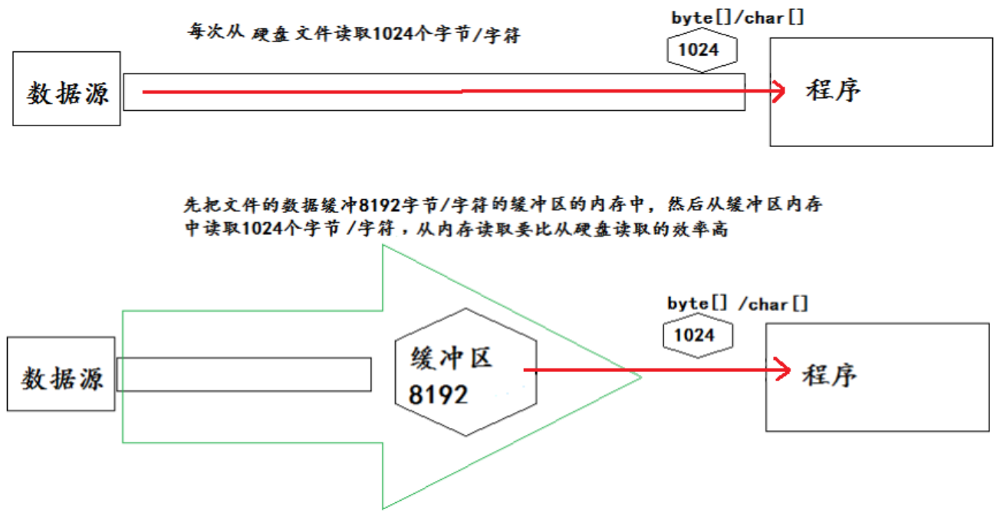

实现非文本文件及文本文件的复制：

```java
/**
 * 处理流之一：缓冲流的使用
 *
 * 1.缓冲流：
 * BufferedInputStream
 * BufferedOutputStream
 * BufferedReader
 * BufferedWriter
 *
 * 2.作用：提高流的读取、写入的速度
 *   提高读写速度的原因：内部提供了一个缓冲区
 *
 * 3. 处理流，就是"套接"在已有的流的基础上。(不一定必须是套接在节点流之上)
 */
public class BufferedStreamTest {
    /*
    使用BufferedInputStream和BufferedOutputStream实现非文本文件的复制
     */
    @Test
    public void BufferedStreamTest() throws FileNotFoundException {
        BufferedInputStream bis = null;
        BufferedOutputStream bos = null;
        try {
            // 1.造文件
            File srcFile = new File("爱情与友情.jpg");
            File destFile = new File("爱情与友情3.jpg");

            // 2.造流
            // 2.1 造节点流
            FileInputStream fis = new FileInputStream((srcFile));
            FileOutputStream fos = new FileOutputStream(destFile);
            // 2.2 造缓冲流
            bis = new BufferedInputStream(fis);
            bos = new BufferedOutputStream(fos);

            // 3.复制的细节：读取、写入
            byte[] buffer = new byte[10];
            int len;
            while ((len = bis.read(buffer)) != -1) {
                bos.write(buffer, 0, len);
                // bos.flush();// 显示的刷新缓冲区，一般不需要
            }
        } catch (IOException e) {
            e.printStackTrace();
        } finally {
            // 4.资源关闭
            // 要求：先关闭外层的流，再关闭内层的流
            if (bos != null) {
                try {
                    bos.close();
                } catch (IOException e) {
                    e.printStackTrace();
                }
            }
            if (bis != null) {
                try {
                    bis.close();
                } catch (IOException e) {
                    e.printStackTrace();
                }
            }
            // 说明：关闭外层流的同时，内层流也会自动的进行关闭。关于内层流的关闭，我们可以省略.
            // fos.close();
            // fis.close();
        }
    }

    /*
    使用BufferedInputStream和BufferedOutputStream实现文件复制的方法
     */
    public void copyFileWithBuffered(String srcPath, String destPath) {
        BufferedInputStream bis = null;
        BufferedOutputStream bos = null;

        try {
            // 1.造文件
            File srcFile = new File(srcPath);
            File destFile = new File(destPath);

            // 2.造流
            // 2.1 造节点流
            FileInputStream fis = new FileInputStream((srcFile));
            FileOutputStream fos = new FileOutputStream(destFile);
            // 2.2 造缓冲流
            bis = new BufferedInputStream(fis);
            bos = new BufferedOutputStream(fos);

            // 3.复制的细节：读取、写入
            byte[] buffer = new byte[1024];
            int len;
            while ((len = bis.read(buffer)) != -1) {
                bos.write(buffer, 0, len);
            }
        } catch (IOException e) {
            e.printStackTrace();
        } finally {
            // 4.资源关闭
            // 要求：先关闭外层的流，再关闭内层的流
            if (bos != null) {
                try {
                    bos.close();
                } catch (IOException e) {
                    e.printStackTrace();
                }
            }
            if (bis != null) {
                try {
                    bis.close();
                } catch (IOException e) {
                    e.printStackTrace();
                }
            }
            // 说明：关闭外层流的同时，内层流也会自动的进行关闭。关于内层流的关闭，我们可以省略.
            // fos.close();
            // fis.close();
        }
    }

    @Test
    public void testCopyFileWithBuffered() {
        long start = System.currentTimeMillis();

        String srcPath = "C:\\Users\\Administrator\\Desktop\\01-视频.avi";
        String destPath = "C:\\Users\\Administrator\\Desktop\\03-视频.avi";

        copyFileWithBuffered(srcPath, destPath);

        long end = System.currentTimeMillis();

        System.out.println("复制操作花费的时间为：" + (end - start));//618 - 176
    }

    /*
    使用BufferedReader和BufferedWriter实现文本文件的复制
     */
    @Test
    public void testBufferedReaderBufferedWriter() {
        BufferedReader br = null;
        BufferedWriter bw = null;
        try {
            // 1.创建文件和相应的流
            br = new BufferedReader(new FileReader(new File("dbcp.txt")));
            bw = new BufferedWriter(new FileWriter(new File("dbcp1.txt")));

            // 2.读写操作
            // 方式一：使用char[]数组
            /*char[] cbuf = new char[1024];
            int len;
            while ((len = br.read(cbuf)) != -1) {// 读到文件末尾时返回-1
                bw.write(cbuf, 0, len);
                // bw.flush();
            }*/

            // 方式二：使用String
            String data;
            while ((data = br.readLine()) != null) {// 读到文件末尾时返回null
                // 方法一：
                // bw.write(data + "\n");// data中不包含换行符
                // 方法二：
                bw.write(data);// data中不包含换行符
                bw.newLine();// 提供换行的操作
            }
        } catch (IOException e) {
            e.printStackTrace();
        } finally {
            // 3.关闭资源
            if (bw != null) {
                try {
                    bw.close();
                } catch (IOException e) {
                    e.printStackTrace();
                }
            }
            if (br != null) {
                try {
                    br.close();
                } catch (IOException e) {
                    e.printStackTrace();
                }
            }
        }
    }
}
```

实现图片加密：

```java
public class ImageEncryption {
    /*
    图片的加密
     */
    @Test
    public void test1() {
        FileInputStream fis = null;
        FileOutputStream fos = null;
        try {
            fis = new FileInputStream("爱情与友情.jpg");
            fos = new FileOutputStream("爱情与友情secret.jpg");

            byte[] buffer = new byte[20];
            int len;
            while ((len = fis.read(buffer)) != -1) {
                // 加密：对字节数组进行修改，异或操作
                // 错误的写法，buffer数组中的数据没有改变，只是重新复制给了变量b
                /*for (byte b : buffer) {
                    b = (byte) (b ^ 5);
                }*/
                // 正确的写法
                for (int i = 0; i < len; i++) {
                    buffer[i] = (byte) (buffer[i] ^ 5);
                }
                fos.write(buffer, 0, len);
            }
        } catch (IOException e) {
            e.printStackTrace();
        } finally {
            if (fos != null) {
                try {
                    fos.close();
                } catch (IOException e) {
                    e.printStackTrace();
                }
            }
            if (fis != null) {
                try {
                    fis.close();
                } catch (IOException e) {
                    e.printStackTrace();
                }
            }
        }
    }


    /*
    图片的解密
     */
    @Test
    public void test2() {
        FileInputStream fis = null;
        FileOutputStream fos = null;
        try {
            fis = new FileInputStream("爱情与友情secret.jpg");
            fos = new FileOutputStream("爱情与友情4.jpg");

            byte[] buffer = new byte[20];
            int len;
            while ((len = fis.read(buffer)) != -1) {
                // 解密：对字节数组进行修改，异或操作之后再异或，返回的是自己本身
                // 错误的写法
                /*for (byte b : buffer) {
                    b = (byte) (b ^ 5);
                }*/
                // 正确的写法
                for (int i = 0; i < len; i++) {
                    buffer[i] = (byte) (buffer[i] ^ 5);
                }
                fos.write(buffer, 0, len);
            }
        } catch (IOException e) {
            e.printStackTrace();
        } finally {
            if (fos != null) {
                try {
                    fos.close();
                } catch (IOException e) {
                    e.printStackTrace();
                }
            }
            if (fis != null) {
                try {
                    fis.close();
                } catch (IOException e) {
                    e.printStackTrace();
                }
            }
        }
    }
}
```

获取文本上每个字符出现的次数：

```java
public class WordCount {
    /*
    说明：如果使用单元测试，文件相对路径为当前module
          如果使用main()测试，文件相对路径为当前工程
     */
    @Test
    public void testWordCount() {
        FileReader fr = null;
        BufferedWriter bw = null;
        try {
            // 1.创建Map集合
            Map<Character, Integer> map = new HashMap<Character, Integer>();

            // 2.遍历每一个字符，每一个字符出现的次数放到map中
            fr = new FileReader("dbcp.txt");
            int c;
            while ((c = fr.read()) != -1) {
                // int 还原 char
                char ch = (char) c;
                // 判断char是否在map中第一次出现
                if (map.get(ch) == null) {
                    map.put(ch, 1);
                } else {
                    map.put(ch, map.get(ch) + 1);
                }
            }

            // 3.把map中数据存在文件count.txt
            // 3.1 创建Writer
            bw = new BufferedWriter(new FileWriter("wordcount.txt"));

            // 3.2 遍历map，再写入数据
            Set<Map.Entry<Character, Integer>> entrySet = map.entrySet();
            for (Map.Entry<Character, Integer> entry : entrySet) {
                switch (entry.getKey()) {
                    case ' ':
                        bw.write("空格 = " + entry.getValue());
                        break;
                    case '\t'://\t表示tab 键字符
                        bw.write("tab键 = " + entry.getValue());
                        break;
                    case '\r'://
                        bw.write("回车 = " + entry.getValue());
                        break;
                    case '\n'://
                        bw.write("换行 = " + entry.getValue());
                        break;
                    default:
                        bw.write(entry.getKey() + " = " + entry.getValue());
                        break;
                }
                bw.newLine();
            }
        } catch (IOException e) {
            e.printStackTrace();
        } finally {
            // 4.关闭流
            if (fr != null) {
                try {
                    fr.close();
                } catch (IOException e) {
                    e.printStackTrace();
                }
            }
            if (bw != null) {
                try {
                    bw.close();
                } catch (IOException e) {
                    e.printStackTrace();
                }
            }
        }
    }
}
```

### 处理流之二：转换流

`转换流提供了在字节流和字符流之间的转换。`

- 字节流中的数据都是字符时，转成字符流操作更高效。
- 很多时候我们使用转换流来处理文件乱码问题，实现编码和解码的功能。

Java API 提供了两个转换流：

- **`InputStreamReader：将 InputStream 转换为 Reader。`**
  - `InputStreamReader(InputStream in)`：创建一个使用默认字符集的字符流。
  - `InputStreamReader(InputStream in, String charsetName)`：创建一个指定字符集的字符流。
- **`OutputStreamWriter：将 Writer 转换为 OutputStream。`**
  - `OutputStreamWriter(OutputStream in)`：创建一个使用默认字符集的字符流。
  - `OutputStreamWriter(OutputStream in, String charsetName)`：创建一个指定字符集的字符流。

InputStreamReader：

- 实现将字节的输入流按指定字符集转换为字符的输入流。
- 需要和 InputStream 套接。
- 构造器
  - `public InputStreamReader(InputStream in)`
  - `public InputSreamReader(InputStream in,String charsetName)`
    - 比如：`Reader isr = new InputStreamReader(System.in,"gbk");`，指定字符集为 gbk。

OutputStreamWriter：

- 实现将字符的输出流按指定字符集转换为字节的输出流。
- 需要和 OutputStream 套接。
- 构造器
  - `public OutputStreamWriter(OutputStream out)`
  - `public OutputSreamWriter(OutputStream out,String charsetName)`

**使用 InputStreamReader 解码时，使用的字符集取决于 OutputStreamWriter 编码时使用的字符集。**

流程示意图：

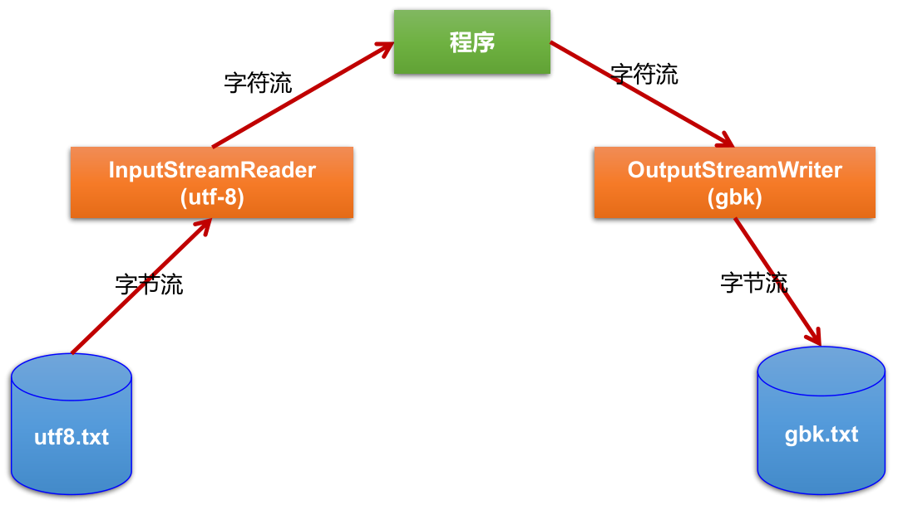

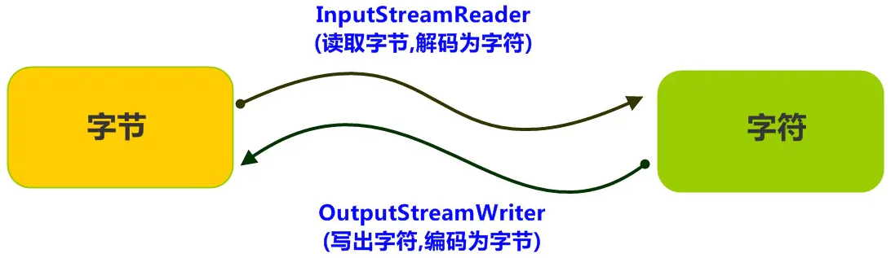

转换流的编码应用：

- 可以将字符按指定编码格式存储。
- 可以对文本数据按指定编码格式来解读。
- 指定编码表的动作由构造器完成。

为了达到**最高效率**，可以考虑在 BufferedReader 内包装 InputStreamReader：

```java
BufferedReader in = new BufferedReader(new InputStreamReader(System.in))；
```

实例：

```java
/**
 * 处理流之二：转换流的使用
 * 1.转换流：属于字符流
 *   InputStreamReader：将一个字节的输入流转换为字符的输入流
 *   OutputStreamWriter：将一个字符的输出流转换为字节的输出流
 *
 * 2.作用：提供字节流与字符流之间的转换
 *
 * 3. 解码：字节、字节数组  --->字符数组、字符串
 *    编码：字符数组、字符串 ---> 字节、字节数组
 *
 *
 * 4.字符集
 * ASCII：美国标准信息交换码。
 *   用一个字节的7位可以表示。
 * ISO8859-1：拉丁码表。欧洲码表
 *   用一个字节的8位表示。
 * GB2312：中国的中文编码表。最多两个字节编码所有字符
 * GBK：中国的中文编码表升级，融合了更多的中文文字符号。最多两个字节编码
 * Unicode：国际标准码，融合了目前人类使用的所有字符。为每个字符分配唯一的字符码。所有的文字都用两个字节来表示。
 * UTF-8：变长的编码方式，可用1-4个字节来表示一个字符。
 */
public class InputStreamReaderTest {
    /*
    此时处理异常的话，仍然应该使用try-catch-finally
    InputStreamReader的使用，实现字节的输入流到字符的输入流的转换
     */
    @Test
    public void test1() {
        InputStreamReader isr = null;
        try {
            FileInputStream fis = new FileInputStream("dbcp.txt");
            // InputStreamReader isr = new InputStreamReader(fis);// 使用系统默认的字符集，如果在IDEA中，就是看IDEA设置的默认字符集
            // 参数2指明了字符集，具体使用哪个字符集，取决于文件dbcp.txt保存时使用的字符集
            isr = new InputStreamReader(fis, StandardCharsets.UTF_8);// 指定字符集

            char[] cbuf = new char[20];
            int len;
            while ((len = isr.read(cbuf)) != -1) {
                String str = new String(cbuf, 0, len);
                System.out.print(str);
            }
        } catch (IOException exception) {
            exception.printStackTrace();
        } finally {
            if (isr != null) {
                try {
                    isr.close();
                } catch (IOException exception) {
                    exception.printStackTrace();
                }
            }
        }
    }

    /*
    此时处理异常的话，仍然应该使用try-catch-finally
    综合使用InputStreamReader和OutputStreamWriter
     */
    @Test
    public void test2() {
        InputStreamReader isr = null;
        OutputStreamWriter osw = null;
        try {
            // 1.造文件、造流
            File file1 = new File("dbcp.txt");
            File file2 = new File("dbcp_gbk.txt");

            FileInputStream fis = new FileInputStream(file1);
            FileOutputStream fos = new FileOutputStream(file2);

            isr = new InputStreamReader(fis, StandardCharsets.UTF_8);
            osw = new OutputStreamWriter(fos, "gbk");

            // 2.读写过程
            char[] cbuf = new char[20];
            int len;
            while ((len = isr.read(cbuf)) != -1) {
                osw.write(cbuf, 0, len);
            }
        } catch (IOException exception) {
            exception.printStackTrace();
        } finally {
            // 3.关闭资源
            if (isr != null) {
                try {
                    isr.close();
                } catch (IOException exception) {
                    exception.printStackTrace();
                }
            }
            if (osw != null) {
                try {
                    osw.close();
                } catch (IOException exception) {
                    exception.printStackTrace();
                }
            }
        }
    }
}
```

### 处理流之三：标准输入、输出流

`System.in`和`System.out`分别代表了系统标准的输入和输出设备。

- 默认输入设备是：键盘，输出设备是：显示器。

- `System.in`的类型是 InputStream。

- `System.out`的类型是 PrintStream，其是 OutputStream 的子类 FilterOutputStream 的子类。

重定向：通过 System 类的`setIn()`和`setOut()`对默认设备进行改变。

- `public static void setIn(InputStream in)`
- `public static void setOut(PrintStream out)`

实例：

```java
public class OtherStreamTest {
    /*
     1.标准的输入、输出流
     1.1
     System.in: 标准的输入流，默认从键盘输入
     System.out: 标准的输出流，默认从控制台输出
     1.2
     System类的setIn(InputStream is) / setOut(PrintStream ps)方式重新指定输入和输出的流。

     1.3练习：
     从键盘输入字符串，要求将读取到的整行字符串转成大写输出。然后继续进行输入操作，
     直至当输入“e”或者“exit”时，退出程序。

     方法一：使用Scanner实现，调用next()返回一个字符串
     方法二：使用System.in实现。System.in  --->  转换流 ---> BufferedReader的readLine()
      */
    // IDEA的单元测试不支持从键盘输入，更改为main()
    public static void main(String[] args) {
        BufferedReader br = null;
        try {
            InputStreamReader isr = new InputStreamReader(System.in);
            br = new BufferedReader(isr);

            while (true) {
                System.out.println("请输入字符串：");
                String data = br.readLine();
                if ("e".equalsIgnoreCase(data) || "exit".equalsIgnoreCase(data)) {
                    System.out.println("程序结束");
                    break;
                }

                String upperCase = data.toUpperCase();
                System.out.println(upperCase);
            }
        } catch (IOException e) {
            e.printStackTrace();
        } finally {
            if (br != null) {
                try {
                    br.close();
                } catch (IOException e) {
                    e.printStackTrace();
                }
            }
        }
    }
}
```

模拟 Scanner：

```java
/**
 * MyInput.java: Contain the methods for reading int, double, float, boolean, short, byte and
 * string values from the keyboard
 */
public class MyInput {
    // Read a string from the keyboard
    public static String readString() {
        BufferedReader br = new BufferedReader(new InputStreamReader(System.in));

        // Declare and initialize the string
        String string = "";

        // Get the string from the keyboard
        try {
            string = br.readLine();
        } catch (IOException ex) {
            System.out.println(ex);
        }

        // Return the string obtained from the keyboard
        return string;
    }

    // Read an int value from the keyboard
    public static int readInt() {
        return Integer.parseInt(readString());
    }

    // Read a double value from the keyboard
    public static double readDouble() {
        return Double.parseDouble(readString());
    }

    // Read a byte value from the keyboard
    public static double readByte() {
        return Byte.parseByte(readString());
    }

    // Read a short value from the keyboard
    public static double readShort() {
        return Short.parseShort(readString());
    }

    // Read a long value from the keyboard
    public static double readLong() {
        return Long.parseLong(readString());
    }

    // Read a float value from the keyboard
    public static double readFloat() {
        return Float.parseFloat(readString());
    }

    public static void main(String[] args) {
        int i = readInt();
        System.out.println("输出的数为：" + i);
    }
}
```

### 处理流之四：打印流

**实现将基本数据类型的数据格式转化为字符串输出。**

**打印流：`PrintStream`和`PrintWriter`。**

- 提供了一系列重载的`print()`和`println()`，用于多种数据类型的输出。
- PrintStream 和 PrintWriter 的输出不会抛出 IOException 异常。
- PrintStream 和 PrintWriter 有自动 flush 功能。
- PrintStream 打印的所有字符都使用平台的默认字符编码转换为字节。在需要写入字符而不是写入字节的情况下，应该使用 PrintWriter 类。
- System.out 返回的是 PrintStream 的实例。

把标准输出流（控制台输出）改成文件：

```java
public class OtherStreamTest {
    /*
    2. 打印流：PrintStream 和PrintWriter
    2.1 提供了一系列重载的print()和println()
    2.2 练习：将ASCII字符输出到自定义的外部文件
     */
    @Test
    public void test2() {
        PrintStream ps = null;
        try {
            FileOutputStream fos = new FileOutputStream(new File("D:\\text.txt"));
            // 创建打印输出流，设置为自动刷新模式(写入换行符或字节 '\n' 时都会刷新输出缓冲区)
            ps = new PrintStream(fos, true);
            // 把标准输出流(控制台输出)改成输出到本地文件
            if (ps != null) {
                // 如果不设置，下面的循环输出是在控制台
                // 设置之后，控制台不再输出，而是输出到D:\text.txt
                System.setOut(ps);
            }

            // 开始输出ASCII字符
            for (int i = 0; i <= 255; i++) {
                System.out.print((char) i);
                if (i % 50 == 0) {// 每50个数据一行
                    System.out.println();// 换行
                }
            }
        } catch (FileNotFoundException e) {
            e.printStackTrace();
        } finally {
            if (ps != null) {
                ps.close();
            }
        }
    }
}
```

### 处理流之五：数据流

**为了方便地操作 Java 语言的基本数据类型和 String 类型的数据，可以使用数据流。（不能操作内存中的对象）**

数据流有两个类：分别用于读取和写出基本数据类型、String类的数据。

- **`DataInputStream`和`DataOutputStream`。**
- 分别套接在 InputStream 和 和 OutputStream 子类的流上。
- **用 DataOutputStream 输出的文件需要用 DataInputStream 来读取。**
- **DataInputStream 读取不同类型的数据的顺序，要与当初 DataOutputStream 写入文件时，保存的数据的顺序一致。**

DataInputStream 中的方法：

- `boolean readBoolean()`，`byte readByte()`
- `char readChar()`，`float readFloat()`
- `double readDouble()`，`short readShort()`
- `long readLong()`，`int readInt()`
- `String readUTF()`，`void readFully(byte[] b)`

DataOutputStream 中的方法：

- 将上述的方法的 read 改为相应的 write 即可。

将内存中的字符串、基本数据类型的变量写出到文件中，再读取到内存中：

```java
public class OtherStreamTest {
    /*
    3. 数据流
    3.1 DataInputStream 和 DataOutputStream
    3.2 作用：用于读取或写出基本数据类型的变量或字符串
    练习：将内存中的字符串、基本数据类型的变量写出到文件中。
    注意：处理异常的话，仍然应该使用try-catch-finally。
     */
    @Test
    public void test3() {
        DataOutputStream dos = null;
        try {
            // 1.造流
            dos = new DataOutputStream(new FileOutputStream("data.txt"));
            
            // 2.写入操作
            dos.writeUTF("刘建辰");// 写入String
            dos.flush();// 刷新操作，将内存中的数据立即写入文件，也可以在关闭流时自动刷新
            dos.writeInt(23);// 写入int
            dos.flush();
            dos.writeBoolean(true);// 写入boolean
            dos.flush();
        } catch (IOException exception) {
            exception.printStackTrace();
        } finally {
            // 3.关闭流
            if (dos != null) {
                try {
                    dos.close();
                } catch (IOException exception) {
                    exception.printStackTrace();
                }
            }
        }
    }

    /*
    将文件中存储的基本数据类型变量和字符串读取到内存中，保存在变量中。
    注意点：读取不同类型的数据的顺序要与当初写入文件时，保存的数据的顺序一致！
     */
    @Test
    public void test4() {
        DataInputStream dis = null;
        try {
            // 1.造流
            dis = new DataInputStream(new FileInputStream("data.txt"));
            
            // 2.读取操作
            String name = dis.readUTF();// 读取String
            int age = dis.readInt();// 读取int
            boolean isMale = dis.readBoolean();// 读取boolean
            System.out.println("name = " + name);
            System.out.println("age = " + age);
            System.out.println("isMale = " + isMale);
        } catch (IOException exception) {
            exception.printStackTrace();
        } finally {
            // 3.关闭流
            if (dis!=null) {
                try {
                    dis.close();
                } catch (IOException exception) {
                    exception.printStackTrace();
                }
            }
        }
    }
}
```

### 处理流之六：对象流

**`ObjectInputStream`和`OjbectOutputSteam`：用于存储和读取基本数据类型数据或对象的处理流。它的强大之处就是可以把 Java 中的对象写入到数据源中，也能把对象从数据源中还原回来。**

- 一般情况下，会把对象转换为 Json 字符串，然后进行序列化和反序列化操作，而不是直接操作对象。

**序列化：用 ObjectOutputStream 类保存基本类型数据或对象的机制。**

**反序列化：用 ObjectInputStream 类读取基本类型数据或对象的机制。**

ObjectOutputStream 和 ObjectInputStream **不能序列化 static 和 transient 修饰的成员变量**。

- 在序列化一个类的对象时，如果类中含有 static 和 transient 修饰的成员变量，则在反序列化时，这些成员变量的值会变成默认值，而不是序列化时这个对象赋予的值。比如，Person 类含有一个 static 修饰的 String name 属性，序列化时，对象把 name 赋值为张三，在反序列化时，name 会变为 null。

  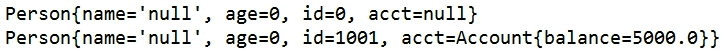

对象序列化机制允许把内存中的 Java 对象转换成平台无关的二进制流（`序列化操作`），从而允许把这种二进制流持久地保存在磁盘上，或通过网络将这种二进制流传输到另一个网络节点。当其它程序获取了这种二进制流，就可以恢复成原来的 Java 对象（`反序列化操作`）。

- 序列化的好处在于可将任何实现了 Serializable 接口的对象转化为**`字节数据`**，使其在保存和传输时可被还原。

- 序列化是 RMI（Remote Method Invoke – 远程方法调用）过程的参数和返回值都必须实现的机制，而 RMI 是 JavaEE 的基础，因此序列化机制是 JavaEE 平台的基础。

- 如果需要让某个对象支持序列化机制，则必须让对象所属的类及其属性是可序列化的，为了让某个类是可序列化的，该类必须实现如下两个接口之一。否则，会抛出 NotSerializableException 异常。

  - **`Serializable`**
  - Externalizable

- 凡是实现 Serializable 接口的类都有一个表示序列化版本标识符的静态变量：

  - **`private static final long serialVersionUID;`**
  - serialVersionUID 用来表明类的不同版本间的兼容性。 简言之，其目的是以序列化对象进行版本控制，有关各版本反序列化时是否兼容。
  - 如果类没有显示定义这个静态常量，它的值是 Java 运行时环境根据类的内部细节自动生成的。此时，若类的实例变量做了修改，serialVersionUID 可能发生变化，则再对修改之前被序列化的类进行反序列化操作时，会操作失败。因此，**建议显式声明 serialVersionUID。**
    - 在某些场合，希望类的不同版本对序列化兼容，因此需要确保类的不同版本具有相同的 serialVersionUID；在某些场合，不希望类的不同版本对序列化兼容，因此需要确保类的不同版本具有不同的 serialVersionUID。 
    - 当序列化了一个类实例后，后续可能更改一个字段或添加一个字段。如果不设置 serialVersionUID，所做的任何更改都将导致无法反序化旧有实例，并在反序列化时抛出一个异常；如果你添加了 serialVersionUID，在反序列旧有实例时，新添加或更改的字段值将设为初始化值（对象为 null，基本类型为相应的初始默认值），字段被删除将不设置。 

简单来说，Java 的序列化机制是通过在运行时判断类的 serialVersionUID 来验证版本一致性的。在进行反序列化时，JVM 会把传来的字节流中的 serialVersionUID 与本地相应实体类的 serialVersionUID 进行比较，如果相同就认为是一致的，可以进行反序列化，否则就会出现序列化版本不一致的异常，即 InvalidCastException。

**若某个类实现了 Serializable 接口，该类的对象就是可序列化的：**

- **创建一个 ObjectOutputStream。**
  - `public ObjectOutputStream(OutputStream out)`： 创建一个指定 OutputStream 的 ObjectOutputStream。
- **调用 ObjectOutputStream 对象的`writeObject(Object obj)`输出可序列化对象。**
- **注意写出一次，操作`flush()`一次。**

**反序列化：**

- **创建一个 ObjectInputStream。**
  - `public ObjectInputStream(InputStream in)`： 创建一个指定 InputStream 的 ObjectInputStream。
- **调用`readObject()`读取流中的对象。**

**强调：如果某个类的属性不是基本数据类型或 String 类型，而是另一个引用类型，那么这个引用类型必须是可序列化的，否则拥有该类型的 Field 的类也不能序列化。**

- **默认情况下，基本数据类型是可序列化的。String 实现了 Serializable 接口。**

流程示意图：


实例：

```java
/**
 * Person需要满足如下的要求，方可序列化
 * 1.需要实现接口：Serializable
 * 2.当前类提供一个全局常量：serialVersionUID
 * 3.除了当前Person类需要实现Serializable接口之外，还必须保证其内部所有属性
 *   也必须是可序列化的。（默认情况下，基本数据类型可序列化）
 *
 * 补充：ObjectOutputStream和ObjectInputStream不能序列化static和transient修饰的成员变量
 */
public class Person implements Serializable {

    public static final long serialVersionUID = 475463534532L;

    private String name;
    private int age;
    private int id;
    private Account acct;

    public Person() {

    }

    public Person(String name, int age) {
        this.name = name;
        this.age = age;
    }

    public Person(String name, int age, int id) {
        this.name = name;
        this.age = age;
        this.id = id;
    }

    public Person(String name, int age, int id, Account acct) {
        this.name = name;
        this.age = age;
        this.id = id;
        this.acct = acct;
    }

    @Override
    public String toString() {
        return "Person{" +
                "name='" + name + '\'' +
                ", age=" + age +
                ", id=" + id +
                ", acct=" + acct +
                '}';
    }

    public int getId() {
        return id;
    }

    public void setId(int id) {
        this.id = id;
    }

    public String getName() {
        return name;
    }

    public void setName(String name) {
        this.name = name;
    }

    public int getAge() {
        return age;
    }

    public void setAge(int age) {
        this.age = age;
    }
}

class Account implements Serializable {
    public static final long serialVersionUID = 4754534532L;

    private double balance;

    public Account(double balance) {
        this.balance = balance;
    }

    @Override
    public String toString() {
        return "Account{" +
                "balance=" + balance +
                '}';
    }

    public double getBalance() {
        return balance;
    }

    public void setBalance(double balance) {
        this.balance = balance;
    }
}
```

```java
/**
 * 对象流的使用
 * 1.ObjectInputStream 和 ObjectOutputStream
 * 2.作用：用于存储和读取基本数据类型数据或对象的处理流。它的强大之处就是可以把Java中的对象写入到数据源中，也能把对象从数据源中还原回来。
 *
 * 3.要想一个java对象是可序列化的，需要满足相应的要求。见Person.java
 *
 * 4.序列化机制：
 * 对象序列化机制允许把内存中的Java对象转换成平台无关的二进制流，从而允许把这种
 * 二进制流持久地保存在磁盘上，或通过网络将这种二进制流传输到另一个网络节点。
 * 当其它程序获取了这种二进制流，就可以恢复成原来的Java对象。
 */
public class ObjectInputOutputStreamTest {
    /*
    序列化过程：将内存中的Java对象保存到磁盘中或通过网络传输出去
    使用ObjectOutputStream实现
     */
    @Test
    public void testObjectOutputStream() {
        ObjectOutputStream oos = null;

        try {
            // 1.造流
            oos = new ObjectOutputStream(new FileOutputStream("object.dat"));

            // 2.序列化：写操作
            oos.writeObject(new String("我爱北京天安门"));
            oos.flush();// 刷新操作

            oos.writeObject(new Person("王铭", 23));
            oos.flush();

            oos.writeObject(new Person("张学", 23, 1001, new Account(5000)));
            oos.flush();
        } catch (IOException e) {
            e.printStackTrace();
        } finally {
            if (oos != null) {
                // 3.关闭流
                try {
                    oos.close();
                } catch (IOException e) {
                    e.printStackTrace();
                }
            }
        }
    }

    /*
    反序列化：将磁盘文件中的对象还原为内存中的一个Java对象
    使用ObjectInputStream来实现
     */
    @Test
    public void testObjectInputStream() {
        ObjectInputStream ois = null;
        try {
            // 1.造流
            ois = new ObjectInputStream(new FileInputStream("object.dat"));

            // 2.反序列化：读操作
            // 文件中保存的是不同类型的对象，反序列化时，需要与序列化时的顺序一致
            Object obj = ois.readObject();
            String str = (String) obj;
            System.out.println(str);

            Person p = (Person) ois.readObject();
            System.out.println(p);

            Person p1 = (Person) ois.readObject();
            System.out.println(p1);
        } catch (IOException e) {
            e.printStackTrace();
        } catch (ClassNotFoundException e) {
            e.printStackTrace();
        } finally {
            if (ois != null) {
                try {
                    ois.close();
                } catch (IOException e) {
                    e.printStackTrace();
                }
            }
        }
    }
}
```

面试题：谈谈你对`java.io.Serializable`接口的理解，我们知道它用于序列化，是空方法接口，还有其它认识吗？

- **实现了 Serializable 接口的对象，可将它们转换成一系列字节，并可在以后完全恢复回原来的样子。 这一过程亦可通过网络进行。这意味着序列化机制能自动补偿操作系统间的差异。**换句话说，可以先在 Windows 机器上创建一个对象，对其序列化，然后通过网络发给一台 Unix 机器，然后在那里准确无误地重新 "装配"。不必关心数据在不同机器上如何表示，也不必关心字节的顺序或者其他任何细节。
- 由于大部分作为参数的类如 String 、Integer 等都实现了`java.io.Serializable`接口，也可以利用多态的性质，作为参数使接口更灵活。

### 随机存取文件流

`RandomAccessFile`声明在`java.io`包下，但直接继承于`java.lang.Object`类。并且它实现了 DataInput、DataOutput 这两个接口，也就意味着这个类既可以读也可以写。

RandomAccessFile 类支持`随机访问`的方式，程序可以直接跳到文件的任意地方来读、写文件。

- 支持只访问文件的部分内容。
- 可以向已存在的文件后追加内容。

RandomAccessFile 对象包含一个`记录指针`，用以标示当前读写处的位置。RandomAccessFile 类对象可以自由移动记录指针：

- `long getFilePointer()`：获取文件记录指针的当前位置。
- `void seek(long pos)`：将文件记录指针定位到 pos 位置。

构造器：

- `public RandomAccessFile(File file, String mode)`
- `public RandomAccessFile(String name, String mode)`

创建 RandomAccessFile 类实例需要指定一个 mode 参数，该参数指定 RandomAccessFile 的访问模式：

- r：以只读方式打开。
- rw：打开以便读取和写入。
- rwd：打开以便读取和写入；同步文件内容的更新。
- rws：打开以便读取和写入；同步文件内容和元数据的更新。
- JDK 1.6 上面写的每次 write 数据时，rw 模式，数据不会立即写到硬盘中，而 rwd 模式，数据会被立即写入硬盘。如果写数据过程发生异常，rwd 模式中已被 write 的数据会被保存到硬盘，而 rw 模式的数据会全部丢失。

- 如果模式为只读 r，则不会创建文件，而是会去读取一个已经存在的文件，如果读取的文件不存在则会出现异常。 如果模式为读写 rw，如果文件不存在则会去创建文件，如果存在则不会创建。

RandomAccessFile 的应用：我们可以用 RandomAccessFile 这个类，来实现一个多线程断点下载的功能，用过下载工具的朋友们都知道，下载前都会建立两个临时文件，一个是与被下载文件大小相同的空文件，另一个是记录文件指针的位置文件，每次暂停的时候，都会保存上一次的指针，然后断点下载的时候，会继续从上一次的地方下载，从而实现断点下载或上传的功能，有兴趣的朋友们可以自己实现下。

实例：

```java
/**
 * RandomAccessFile的使用
 * 1.RandomAccessFile直接继承于java.lang.Object类，实现了DataInput和DataOutput接口
 * 2.RandomAccessFile既可以作为一个输入流，又可以作为一个输出流
 *
 * 3.如果RandomAccessFile作为输出流时，写出到的文件如果不存在，则在执行过程中自动创建。
 *   如果写出到的文件存在，则会对原有文件内容进行覆盖。（默认情况下，从头覆盖）
 *
 * 4. 可以通过相关的操作，实现RandomAccessFile“插入”数据的效果
 */
public class RandomAccessFileTest {
    /*
    使用RandomAccessFile实现文件的复制
     */
    @Test
    public void test1() {
        RandomAccessFile raf1 = null;
        RandomAccessFile raf2 = null;
        try {
            // 1.造流
            raf1 = new RandomAccessFile(new File("爱情与友情.jpg"), "r");
            raf2 = new RandomAccessFile(new File("爱情与友情1.jpg"), "rw");

            // 2.读写操作
            byte[] buffer = new byte[1024];
            int len;
            while ((len = raf1.read(buffer)) != -1) {
                raf2.write(buffer, 0, len);
            }
        } catch (IOException e) {
            e.printStackTrace();
        } finally {
            // 3.关闭流
            if (raf1 != null) {
                try {
                    raf1.close();
                } catch (IOException e) {
                    e.printStackTrace();
                }
            }
            if (raf2 != null) {
                try {
                    raf2.close();
                } catch (IOException e) {
                    e.printStackTrace();
                }
            }
        }
    }

    /*
    使用RandomAccessFile实现文件内容的覆盖和追加
     */
    @Test
    public void test2() {
        RandomAccessFile raf1 = null;
        try {
            // hello.txt内容为：abcdefghijklmn
            File file = new File("hello.txt");
            raf1 = new RandomAccessFile(file, "rw");

            raf1.write("123".getBytes());// 从头开始覆盖：123defghijklmn
            raf1.seek(5);// 将指针调到角标为5的位置，角标从0开始
            raf1.write("456".getBytes());// 从角标为5处开始覆盖：123de456ijklmn
            raf1.seek(file.length());// 将指针调到文件末尾
            raf1.write("789".getBytes());// 在文件末尾追加：123de456ijklmn789
        } catch (IOException exception) {
            exception.printStackTrace();
        } finally {
            if (raf1 != null) {
                try {
                    raf1.close();
                } catch (IOException exception) {
                    exception.printStackTrace();
                }
            }
        }
    }

    /*
    使用RandomAccessFile实现数据的插入效果
     */
    @Test
    public void test3() {
        RandomAccessFile raf1 = null;
        try {
            // hello.txt内容为：abcdefghijklmn
            File file = new File("hello.txt");
            raf1 = new RandomAccessFile(file, "rw");

            // 将指针调到角标为3的位置，从此处开始读入文件的数据
            raf1.seek(3);

            // 方法一：保存指针3后面的所有数据到StringBuilder中
            /*StringBuilder builder = new StringBuilder((int) file.length());
            byte[] buffer = new byte[20];
            int len;
            while ((len = raf1.read(buffer)) != -1) {
                builder.append(new String(buffer, 0, len));
            }*/

            // 方法二：保存指针3后面的所有数据到ByteArrayOutputStream中
            ByteArrayOutputStream baos = new ByteArrayOutputStream();
            byte[] buffer = new byte[10];
            int len;
            while ((len = raf1.read(buffer)) != -1) {
                baos.write(buffer, 0, len);
            }

            // 经过上面的读操作后，指针位置移到了文件的末尾处
            // 调回指针，写入"123"，实际上是覆盖原文件内容
            raf1.seek(3);
            raf1.write("123".getBytes());// abc123ghijklmn

            // 经过上面的写入操作，指针位置已到了123后，紧接着：
            // 方法一：将StringBuilder中的数据写入到文件中，实际上是覆盖123后的内容
            // raf1.write(builder.toString().getBytes());// abc123defghijklmn
            // 方法二：将ByteArrayOutputStream中的数据写入到文件中
            raf1.write(baos.toString().getBytes());// abc123defghijklmn
        } catch (IOException exception) {
            exception.printStackTrace();
        } finally {
            if (raf1 != null) {
                try {
                    raf1.close();
                } catch (IOException exception) {
                    exception.printStackTrace();
                }
            }
        }
    }
}
```

### 流的基本应用小结

- 流是用来处理数据的。
- 处理数据时，一定要先明确数据源，与数据目的地：
  - 数据源可以是文件，可以是键盘。
  - 数据目的地可以是文件、显示器或者其他设备。
- 流只是在帮助数据进行传输，并对传输的数据进行处理，比如过滤处理、转换处理等。

### NIO.2 中 Path 、Paths 、Files

`Java NIO (New IO 或 Non-Blocking IO)`是从 Java 1.4 版本开始引入的一套新的 I/O API，可以替代标准的 Java I/O API。NIO 与原来的 I/O 有同样的作用和目的，但是使用的方式完全不同，NIO 支持面向缓冲区的（I/O是面向流的）、基于通道的 I/O 操作，NIO 也会以更加高效的方式进行文件的读写操作。

Java API 中提供了两套 NIO，一套是针对标准输入输出 NIO，另一套就是网络编程 NIO。

- |----- `java.nio.channels.Channel`
  - |----- `FileChannel`：处理本地文件。
    - |----- `SocketChannel`：TCP 网络编程的客户端的 Channel。
    - |----- `ServerSocketChannel`：TCP 网络编程的服务器端的 Channel。
    - |----- `DatagramChannel`：UDP 网络编程中发送端和接收端的 Channel。

随着 JDK 7 的发布，Java 对 NIO 进行了极大的扩展，增强了对文件处理和文件系统特性的支持，以至于我们称他们为 NIO.2。因为 NIO 提供的一些功能，NIO 已经成为文件处理中越来越重要的部分。

早期的 Java 只提供了一个 File 类来访问文件系统，但 File 类的功能比较有限，所提供的方法性能也不高。而且，大多数方法在出错时仅返回失败，并不会提供异常信息。

NIO. 2 为了弥补这种不足，引入了 Path 接口，代表一个平台无关的平台路径，描述了目录结构中文件的位置。Path 可以看成是 File 类的升级版本，实际引用的资源也可以不存在。

在以前 I/O 操作是类似如下写法的：

```java
import java.io.File;

File file = new File("index.html");
```

但在 JDK 7 中，我们可以这样写：

```java
import java.nio.file.Path;
import java.nio.file.Paths;

Path path = Paths.get("index.html");
```

同时，NIO.2 在`java.nio.file`包下还提供了 Files、Paths 工具类，Files 包含了大量静态的工具方法来操作文件；Paths 则包含了两个返回 Path 的静态工厂方法。

Paths 类提供的获取 Path 对象的方法：

- `static Path get(String first, String … more)`：用于将多个字符串串连成路径。

- `static Path get(URI uri)`：返回指定 uri 对应的 Path 路径。

  ```java
  public class PathTest {
      /*
      如何使用Paths实例化Path
       */
      @Test
      public void test1() {
          Path path1 = Paths.get("d:\\nio\\hello.txt");// = new File(String filepath)
          System.out.println(path1);
  
          Path path2 = Paths.get("d:\\", "nio\\hello.txt");// = new File(String parent,String filename);
          System.out.println(path2);
  
          Path path3 = Paths.get("d:\\", "nio");
          System.out.println(path3);
      }
  }
  ```

Path 类常用方法：

- `String toString()`：返回调用 Path 对象的字符串表示形式。

- `boolean startsWith(String path)`：判断是否以 path 路径开始。

- `boolean endsWith(String path)`：判断是否以 path 路径结束。

- `boolean isAbsolute()`：判断是否是绝对路径。

- `Path getParent()`：返回 Path 对象包含整个路径，不包含 Path 对象指定的文件路径。

- `Path getRoot()`：返回调用 Path 对象的根路径。

- `Path getFileName()`：返回与调用 Path 对象关联的文件名。

- `int getNameCount()`：返回 Path 根目录后面元素的数量。

- `Path getName(int idx)`：返回指定索引位置 idx 的路径名称。

- `Path toAbsolutePath()`：作为绝对路径返回调用 Path 对象。

- `Path resolve(Path p)`：合并两个路径，返回合并后的路径对应的 Path 对象。

- `File toFile()`：将 Path 转化为 File 类的对象。File 类转化为 Path 对象的方法是：`Path toPath()`。

  ```java
  public class PathTest {
      /*
      Path中的常用方法
       */
      @Test
      public void test2() {
          Path path1 = Paths.get("d:\\", "nio\\nio1\\nio2\\hello.txt");
          Path path2 = Paths.get("hello1.txt");// 相对当前Module的路径
  
          // String toString()：返回调用Path对象的字符串表示形式
          System.out.println(path1);// d:\nio\nio1\nio2\hello.txt
          // boolean startsWith(String path): 判断是否以path路径开始
          System.out.println(path1.startsWith("d:\\nio"));// true
          // boolean endsWith(String path): 判断是否以path路径结束
          System.out.println(path1.endsWith("hello.txt"));// true
          // boolean isAbsolute(): 判断是否是绝对路径
          System.out.println(path1.isAbsolute() + "~");// true~
          System.out.println(path2.isAbsolute() + "~");// false~
          // Path getParent()：返回Path对象包含整个路径，不包含Path对象指定的文件路径
          System.out.println(path1.getParent());// d:\nio\nio1\nio2
          System.out.println(path2.getParent());// null
          // Path getRoot()：返回调用Path对象的根路径
          System.out.println(path1.getRoot());// d:\
          System.out.println(path2.getRoot());// null
          // Path getFileName(): 返回与调用Path对象关联的文件名
          System.out.println(path1.getFileName() + "~");// hello.txt~
          System.out.println(path2.getFileName() + "~");// hello1.txt~
          // int getNameCount(): 返回Path根目录后面元素的数量
          // Path getName(int idx): 返回指定索引位置idx的路径名称
          for (int i = 0; i < path1.getNameCount(); i++) {
              // nio*****nio1*****nio2*****hello.txt*****
              System.out.print(path1.getName(i) + "*****");
          }
          System.out.println();
  
          // Path toAbsolutePath(): 作为绝对路径返回调用Path对象
          System.out.println(path1.toAbsolutePath());// d:\nio\nio1\nio2\hello.txt
          System.out.println(path2.toAbsolutePath());// D:\xisun-projects\java_base\hello1.txt
          // Path resolve(Path p): 合并两个路径，返回合并后的路径对应的Path对象
          Path path3 = Paths.get("d:\\", "nio");
          Path path4 = Paths.get("nioo\\hi.txt");
          path3 = path3.resolve(path4);
          System.out.println(path3);// d:\nio\nioo\hi.txt
  
          // File toFile(): 将Path转化为File类的对象
          File file = path1.toFile();// Path--->File的转换
          // Path toPath(): 将File转化为Path类的对象
          Path newPath = file.toPath();// File--->Path的转换
      }
  }
  ```

`java.nio.file.Files`：用于操作文件或目录的工具类。常用方法：

- `Path copy(Path src, Path dest, CopyOption … how)`：文件的复制。

- `Path createDirectory(Path path, FileAttribute<?> … attr)`：创建一个目录。

- `Path createFile(Path path, FileAttribute<?> … arr)`：创建一个文件。

- `void delete(Path path)`：删除一个文件/目录，如果不存在，执行报错。

- `void deleteIfExists(Path path)`：Path 对应的文件/目录如果存在，执行删除。

- `Path move(Path src, Path dest, CopyOption…how)`：将 src 移动到 dest 位置。

- `long size(Path path)`：返回 path 指定文件的大小。

- `boolean exists(Path path, LinkOption … opts)`：判断文件是否存在。

- `boolean isDirectory(Path path, LinkOption … opts)`：判断是否是目录。

- `boolean isRegularFile(Path path, LinkOption … opts)`：判断是否是文件。

- `boolean isHidden(Path path)`：判断是否是隐藏文件。

- `boolean isReadable(Path path)`：判断文件是否可读。

- `boolean isWritable(Path path)`：判断文件是否可写。

- `boolean notExists(Path path, LinkOption … opts)`：判断文件是否不存在。

- `SeekableByteChannel newByteChannel(Path path, OpenOption…how)`：获取与指定文件的连接，how 指定打开方式。

- `DirectoryStream\<Path> newDirectoryStream(Path path)`：打开 path 指定的目录。

- `InputStream newInputStream(Path path, OpenOption…how)`：获取 InputStream 对象。

- `OutputStream newOutputStream(Path path, OpenOption…how)`：获取 OutputStream 对象。

  ```java
  public class FilesTest {
      @Test
      public void test1() throws IOException {
          Path path1 = Paths.get("d:\\nio", "hello.txt");
          Path path2 = Paths.get("atguigu.txt");
  
          // Path copy(Path src, Path dest, CopyOption … how): 文件的复制
          // 要想复制成功，要求path1对应的物理上的文件存在。path2 对应的文件没有要求。
          // Files.copy(path1, path2, StandardCopyOption.REPLACE_EXISTING);
  
          // Path createDirectory(Path path, FileAttribute<?> … attr): 创建一个目录
          // 要想执行成功，要求path对应的物理上的文件目录不存在。一旦存在，抛出异常。
          Path path3 = Paths.get("d:\\nio\\nio1");
          // Files.createDirectory(path3);
  
          // Path createFile(Path path, FileAttribute<?> … arr): 创建一个文件
          // 要想执行成功，要求path对应的物理上的文件不存在。一旦存在，抛出异常。
          Path path4 = Paths.get("d:\\nio\\hi.txt");
          // Files.createFile(path4);
  
          // void delete(Path path): 删除一个文件/目录，如果不存在，执行报错
          // Files.delete(path4);
  
          // void deleteIfExists(Path path): Path对应的文件/目录如果存在，执行删除。如果不存在，正常执行结束
          Files.deleteIfExists(path3);
  
          // Path move(Path src, Path dest, CopyOption…how): 将src移动到dest位置
          // 要想执行成功，src对应的物理上的文件需要存在，dest对应的文件没有要求。
          // Files.move(path1, path2, StandardCopyOption.ATOMIC_MOVE);
  
          // long size(Path path): 返回path指定文件的大小
          long size = Files.size(path2);
          System.out.println(size);
      }
  
      @Test
      public void test2() throws IOException {
          Path path1 = Paths.get("d:\\nio", "hello.txt");
          Path path2 = Paths.get("atguigu.txt");
  
          // boolean exists(Path path, LinkOption … opts): 判断文件是否存在
          System.out.println(Files.exists(path2, LinkOption.NOFOLLOW_LINKS));
  
          // boolean isDirectory(Path path, LinkOption … opts): 判断是否是目录
          // 不要求此path对应的物理文件存在。
          System.out.println(Files.isDirectory(path1, LinkOption.NOFOLLOW_LINKS));
  
          // boolean isRegularFile(Path path, LinkOption … opts): 判断是否是文件
  
          // /boolean isHidden(Path path): 判断是否是隐藏文件
          // 要求此path对应的物理上的文件需要存在。才可判断是否隐藏。否则，抛异常。
          System.out.println(Files.isHidden(path1));
  
          // /boolean isReadable(Path path): 判断文件是否可读
          System.out.println(Files.isReadable(path1));
          // boolean isWritable(Path path): 判断文件是否可写
          System.out.println(Files.isWritable(path1));
        // boolean notExists(Path path, LinkOption … opts): 判断文件是否不存在
          System.out.println(Files.notExists(path1, LinkOption.NOFOLLOW_LINKS));
      }
  
      /**
       * StandardOpenOption.READ: 表示对应的Channel是可读的。
       * StandardOpenOption.WRITE：表示对应的Channel是可写的。
       * StandardOpenOption.CREATE：如果要写出的文件不存在，则创建。如果存在，忽略
       * StandardOpenOption.CREATE_NEW：如果要写出的文件不存在，则创建。如果存在，抛异常
       *
       * @throws IOException
       */
      @Test
      public void test3() throws IOException {
          Path path1 = Paths.get("d:\\nio", "hello.txt");
  
          // InputStream newInputStream(Path path, OpenOption…how): 获取InputStream对象
          InputStream inputStream = Files.newInputStream(path1, StandardOpenOption.READ);
  
          // OutputStream newOutputStream(Path path, OpenOption…how): 获取OutputStream对象
          OutputStream outputStream = Files.newOutputStream(path1, StandardOpenOption.WRITE, StandardOpenOption.CREATE);
  
          // SeekableByteChannel newByteChannel(Path path, OpenOption…how): 获取与指定文件的连接，how指定打开方式
          SeekableByteChannel channel = Files.newByteChannel(path1, StandardOpenOption.READ,
                  StandardOpenOption.WRITE, StandardOpenOption.CREATE);
  
          // DirectoryStream<Path>  newDirectoryStream(Path path): 打开path指定的目录
          Path path2 = Paths.get("e:\\teach");
          DirectoryStream<Path> directoryStream = Files.newDirectoryStream(path2);
          Iterator<Path> iterator = directoryStream.iterator();
          while (iterator.hasNext()) {
              System.out.println(iterator.next());
          }
      }
  }
  ```

### FileUtils 工具类

Maven 引入依赖：

```xml
<dependency>
    <groupId>commons-io</groupId>
    <artifactId>commons-io</artifactId>
    <version>2.7</version>
</dependency>
```

复制功能：

```java
public class FileUtilsTest {
    public static void main(String[] args) {
        File srcFile = new File("day10\\爱情与友情.jpg");
        File destFile = new File("day10\\爱情与友情2.jpg");

        try {
            FileUtils.copyFile(srcFile, destFile);
        } catch (IOException e) {
            e.printStackTrace();
        }
    }
}
```

遍历文件夹和文件的每一行：

```java
public class FileUtilsMethod {
    /**
     * 常规方法：若文件路径内的文件比较少，可以采用此方法
     *
     * @param filePath 文件路径
     */
    public static void common(String filePath) {
        File file = new File(filePath);
        if (file.exists()) {
            // 获取子文件夹内所有文件，放到文件数组里，如果含有大量文件，会创建一个很大的数组，占用空间
            File[] fileList = file.listFiles();
            for (File currentFile : fileList) { 
                // 当前文件是普通文件(排除文件夹)，且不是隐藏文件
                if (currentFile.isFile() && !currentFile.isHidden()) {
                    // 当前文件的完整路径，含文件名
                    String currentFilePath = currentFile.getPath();
                    if (currentFilePath.endsWith("xml") || currentFilePath.endsWith("XML")) {
                        // 当前文件的文件名，含后缀
                        String fileName = currentFile.getName();
                        System.out.println("文件名：" + fileName);
                    }
                }
            }
            System.out.println("=======================================");
            // list方法返回的是文件名的String数组
            String[] fileNameList = file.list();
            for (String fileName : fileNameList) {
                System.out.println("文件名：" + fileName);
            }
        }
    }

    /**
     * 根据文件路径，迭代获取该路径下指定文件后缀类型的文件：若文件路径内含有大量文件，建议采用此方法
     *
     * @param filePath 文件路径
     */
    public static void iterateFiles(String filePath) {
        File file = FileUtils.getFile(filePath);

        if (file.isDirectory()) {
            Iterator<File> fileIterator = FileUtils.iterateFiles(file, new String[]{"xml", "XML"}, false);

            while (fileIterator.hasNext()) {
                File currentFile = fileIterator.next();

                if (currentFile.isFile() && !currentFile.isHidden()) {
                    // 绝对路径
                    String currentFilePath = currentFile.getAbsolutePath();
                    System.out.println("绝对路径：" + currentFilePath);
                    // 文件名，含文件后缀
                    String fileName = currentFilePath.substring(currentFilePath.lastIndexOf("\\") + 1);
                    System.out.println("含后缀文件名：" + fileName);
                    // 文件名，不含文件后缀
                    fileName = fileName.substring(0, fileName.lastIndexOf("."));
                    System.out.println("不含后缀文件名：" + fileName);
                }
            }
        }
    }

    /**
     * 读取目标文件每一行数据，返回List：若文件内容较少，可以采用此方法
     *
     * @param filePath 文件路径
     * @throws IOException
     */
    public static void readLinesForList(String filePath) throws IOException {
        List<String> linesList = FileUtils.readLines(new File(filePath), "utf-8");
        for (String line : linesList) {
            System.out.println(line);
        }
    }

    /**
     * 读取目标文件每一行数据，返回迭代器：若文件内容较多，建议采用此方法
     *
     * @param filePath 文件路径
     * @throws IOException
     */
    public static void readLinesForIterator(String filePath) throws IOException {
        LineIterator lineIterator = FileUtils.lineIterator(new File(filePath), "utf-8");
        while (lineIterator.hasNext()) {
            System.out.println(lineIterator.next());
        }
    }
}
```

### I/O 流的关闭

在操作 Java 流对象后要将流关闭，但实际编写代码时，可能会出现一些误区，导致不能正确关闭流。

#### 在 try 中关流，而没在 finally 中关流

错误：

```java
try {
	OutputStream out = new FileOutputStream("");
	// ...操作流代码
	out.close();
} catch (Exception e) {
	e.printStackTrace();
}
```

修正：

```java
OutputStream out = null;
try {
	out = new FileOutputStream("");
	// ...操作流代码
} catch (Exception e) {
	e.printStackTrace();
} finally {
	try {
		if (out != null) {
			out.close();
		}
	} catch (Exception e) {
		e.printStackTrace();
	}
}
```

#### 在一个 try 中关闭多个流

错误：

```java
OutputStream out = null;
OutputStream out2 = null;
try {
	out = new FileOutputStream("");
	out2 = new FileOutputStream("");
	// ...操作流代码
} catch (Exception e) {
	e.printStackTrace();
} finally {
	try {
		if (out != null) {
			out.close();// 如果此处出现异常，则out2流没有被关闭
		}
		if (out2 != null) {
			out2.close();
		}
	} catch (Exception e) {
		e.printStackTrace();
	}
}
```

修正：

```java
OutputStream out = null;
OutputStream out2 = null;
try {
	out = new FileOutputStream("");
	out2 = new FileOutputStream("");
	// ...操作流代码
} catch (Exception e) {
	e.printStackTrace();
} finally {
	try {
		if (out != null) {
			out.close();// 如果此处出现异常，则out2流也会被关闭
		}
	} catch (Exception e) {
		e.printStackTrace();
	}
	try {
		if (out2 != null) {
			out2.close();
		}
	} catch (Exception e) {
		e.printStackTrace();
	}
}
```

#### 在循环中创建流，在循环外关闭，导致关闭的是最后一个流

错误：

```java
OutputStream out = null;
try {
	for (int i = 0; i < 10; i++) {
		out = new FileOutputStream("");
		// ...操作流代码
	}
} catch (Exception e) {
	e.printStackTrace();
} finally {
	try {
		if (out != null) {
			out.close();
		}
	} catch (Exception e) {
		e.printStackTrace();
	}
}
```

修正：

```java
for (int i = 0; i < 10; i++) {
	OutputStream out = null;
	try {
		out = new FileOutputStream("");
		// ...操作流代码
	} catch (Exception e) {
		e.printStackTrace();
	} finally {
		try {
			if (out != null) {
				out.close();
			}
		} catch (Exception e) {
			e.printStackTrace();
		}
	}
}
```

#### 在 JDK 7 中，关闭流的方式得到很大的简化

```java
try (OutputStream out = new FileOutputStream("")){
	// ...操作流代码
} catch (Exception e) {
	e.printStackTrace();
}
```

只要实现的自动关闭接口（Closeable）的类都可以在 try 结构体上定义，Java 会自动帮我们关闭，即使在发生异常的情况下也会。

可以在 try 结构体上定义多个，用分号隔开即可，如：

```java
try (OutputStream out = new FileOutputStream("");
     OutputStream out2 = new FileOutputStream("")){
	// ...操作流代码
} catch (Exception e) {
	throw e;
}
```

> Android SDK 20 版本对应 JDK 7，低于 20 版本无法使用 `try-catch-resources` 自动关流。

#### 内存流的关闭

内存流可以不用关闭。

ByteArrayOutputStream 和 ByteArrayInputStream 其实是伪装成流的字节数组（把它们当成字节数据来看就好了），他们不会锁定任何文件句柄和端口，如果不再被使用，字节数组会被垃圾回收掉，所以不需要关闭。

#### 装饰流的关闭

装饰流是指通过装饰模式实现的 Java 流，又称为包装流，装饰流只是为原生流附加额外的功能或效果，Java 中的缓冲流、桥接流也是属于装饰流。

例如：

```java
InputStream is = new FileInputStream("C:\\Users\\tang\\Desktop\\test.txt");
InputStreamReader isr = new InputStreamReader(is);
BufferedReader br = new BufferedReader(isr);
String string = br.readLine();
System.out.println(string);

// 只需要关闭最后的br即可
try {
    br.close();
} catch (Exception e) {
    e.printStackTrace();
}
```

装饰流关闭时会调用原生流关闭。

BufferedReader.java 源码如下：

```java
public void close() throws IOException {
    synchronized (lock) {
        if (in == null)
            return;
        try {
            // 这里的in就是原生流
            in.close();
        } finally {
            in = null;
            cb = null;
        }
    }
}
```

InputStreamReader.java 源码如下：

```java
public void close() throws IOException {
    // 这里的sd就是原生流的解码器(StreamDecoder)，解码器的close会调用原生流的close
    sd.close();
}
```

如上所示，有这样层层关闭的机制，我们就只需要关闭最外层的流就行了。

#### 关闭流的顺序问题

两个不相干的流的关闭顺序没有任何影响，如：

```java
// 这里的out1和out2谁先关谁后关都一样，没有任何影响
out1 = new FileOutputStream("");
out2 = new FileOutputStream("");
```

如果两个流有依赖关系，那么可以像上面说的，只关闭最外层的即可。

如果不嫌麻烦，非得一个个关闭，那么需要先关闭最里层，从里往外一层层进行关闭。

为什么不能从外层往里层逐步关闭？原因上面讲装饰流已经讲的很清楚了，关闭外层时，内层的流其实已经同时关闭了，你再去关内层的流，就会报错。

至于网上说的先声明先关闭，就是这个道理，先声明的是内层，最先申明的是最内层，最后声明的是最外层。

#### 一定要关闭流的原因

一个流绑定了一个文件句柄（或网络端口），如果流不关闭，该文件（或端口）将始终处于被锁定（不能读取、写入、删除和重命名）状态，占用大量系统资源却没有释放。

## 枚举类型（Enum）

枚举类的理解：

- 类的对象只有有限个，确定的，则此类称为枚举类。
- 当需要定义一组常量时，强烈建议使用枚举类。
- **如果枚举类中只有一个对象，则可以作为单例模式的实现方式。**
- JDK 5.0 之后，可以在 switch 表达式中使用 Enum 定义的枚举类的对象作为表达式，case 子句可以直接使用枚举值的名字，无需添加枚举类作为限定。

如何定义枚举类：

- 方式一：JDK 5.0 之前需要自定义枚举类。

  - 私有化类的构造器，保证不能在类的外部创建其对象。

  - 在类的内部创建枚举类的实例。声明为：`public static final`。

  - 对象如果有实例变量，应该声明为`private final`，并在构造器中初始化。

    ```java
    public class Test {
        public static void main(String[] args) {
            System.out.println(Season.SPRING);// Season{SEASONNAME='春天', SEASONDESC='春暖花开'}
        }
    }
    
    // 自定义枚举类
    class Season {
        // 1.声明Season对象的属性：private final 修饰 --- 常量
        private final String SEASONNAME;//季节的名称
        private final String SEASONDESC;//季节的描述
    
        // 2.私有化类的构造器，并给对象的属性赋值
        private Season(String seasonName, String seasonDesc) {
            this.SEASONNAME = seasonName;
            this.SEASONDESC = seasonDesc;
        }
    
        // 3.提供当前枚举类的多个对象
        public static final Season SPRING = new Season("春天", "春暖花开");
        public static final Season SUMMER = new Season("夏天", "夏日炎炎");
        public static final Season AUTUMN = new Season("秋天", "秋高气爽");
        public static final Season WINTER = new Season("冬天", "白雪皑皑");
    
        // 4.其他诉求一：获取枚举类对象的属性
        public String getSEASONNAME() {
            return SEASONNAME;
        }
    
        public String getSEASONDESC() {
            return SEASONDESC;
        }
    
        // 5.其他诉求二：提供toString()
        @Override
        public String toString() {
            return "Season{" +
                    "SEASONNAME='" + SEASONNAME + '\'' +
                    ", SEASONDESC='" + SEASONDESC + '\'' +
                    '}';
        }
    }
    ```

- 方式二：JDK 5.0 之后，可以使用新增的`enum 关键字`定义枚举类。

  - **使用 enum 关键字定义的枚举类默认继承了`java.lang.Enum`类，因此不能再继承其他类。**

  - 枚举类的构造器只能使用 private 权限修饰符。

  - **枚举类的所有实例必须在枚举类中显式列出，以 "," 分隔，以 ";" 结尾**。列出的实例系统会默认添加`public static final`修饰。

  - **必须在枚举类的第一行声明枚举类对象。**

    ```java
    public class Test {
        public static void main(String[] args) {
            System.out.println(Season.SPRING);// SPRING
            System.out.println("enum的父类是：" + Season.class.getSuperclass());// class java.lang.Enum
        }
    }
    
    // 使用enum关键字定义枚举类
    enum Season {
        // 1.首行提供当前枚举类的多个对象: 多个对象之间以","隔开，末尾的对象以";"结束
        SPRING("春天", "春暖花开"),
    
        SUMMER("夏天", "夏日炎炎"),
    
        AUTUMN("秋天", "秋高气爽"),
    
        WINTER("冬天", "白雪皑皑");
    
        // 2.声明Season对象的属性：private final 修饰 --- 常量
        private final String SEASONNAME;//季节的名称
        private final String SEASONDESC;//季节的描述
    
        // 3.私有化类的构造器，并给对象的属性赋值
        private Season(String seasonName, String seasonDesc) {
            this.SEASONNAME = seasonName;
            this.SEASONDESC = seasonDesc;
        }
    
        // 4.其他诉求一：获取枚举类对象的属性
        public String getSEASONNAME() {
            return SEASONNAME;
        }
    
        public String getSEASONDESC() {
            return SEASONDESC;
        }
    
        // 5.其他诉求二：提供toString()，一般不重写
        /*@Override
        public String toString() {
            return "Season{" +
                    "SEASONNAME='" + SEASONNAME + '\'' +
                    ", SEASONDESC='" + SEASONDESC + '\'' +
                    '}';
        }*/
    }
    ```

Enum 类中的常用方法：

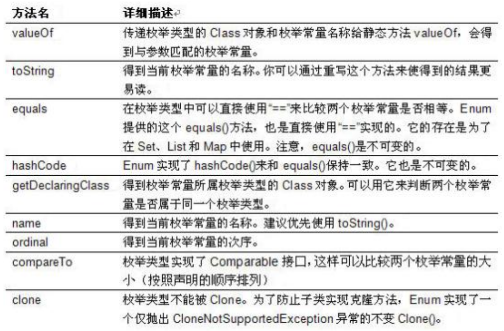

- `values()`：返回枚举类型的对象数组，该方法可以很方便地遍历枚举类的所有的枚举值。

  ```java
  public class Test {
      public static void main(String[] args) {
          Thread.State[] values = Thread.State.values();
          for (Thread.State value : values) {
              System.out.print(value + " ");// NEW RUNNABLE BLOCKED WAITING TIMED_WAITING TERMINATED
          }
      }
  }
  ```

- `valueOf(String str)`：可以把一个字符串转为对应的枚举类对象。要求字符串必须是枚举类对象的 "名字"，如不是，会抛出运行时异常`java.lang.IllegalArgumentException`。

  ```java
  public class Test {
      public static void main(String[] args) {
          Thread.State aNew = Thread.State.valueOf("NEW");
          System.out.println(aNew);// NEW
          Thread.State dead = Thread.State.valueOf("DEAD");
          System.out.println(dead);// java.lang.IllegalArgumentException: No enum constant java.lang.Thread.State.DEAD
      }
  }
  ```

- `toString()`：返回当前枚举类对象常量的名称。

使用 enum 关键字定义的枚举类实现接口的情况：

- 和普通 Java 类一样，枚举类可以实现一个或多个接口。

- **若每个枚举值在调用实现的接口的方法时，如果呈现出相同的行为方式，则只要统一实现该方法即可。**

  ```java
  public class Test {
      public static void main(String[] args) {
          Season spring = Season.SPRING;
          spring.show();// 这是一个季节
      }
  }
  
  interface Info {
      void show();
  }
  
  // 使用enum关键字定义枚举类
  enum Season implements Info {
      // 1.首行提供当前枚举类的多个对象: 多个对象之间以","隔开，末尾的对象以";"结束
      SPRING("春天", "春暖花开"),
  
      SUMMER("夏天", "夏日炎炎"),
  
      AUTUMN("秋天", "秋高气爽"),
  
      WINTER("冬天", "白雪皑皑");
  
      // 2.声明Season对象的属性：private final 修饰 --- 常量
      private final String SEASONNAME;//季节的名称
      private final String SEASONDESC;//季节的描述
  
      // 3.私有化类的构造器，并给对象的属性赋值
      private Season(String seasonName, String seasonDesc) {
          this.SEASONNAME = seasonName;
          this.SEASONDESC = seasonDesc;
      }
  
      // 4.其他诉求一：获取枚举类对象的属性
      public String getSEASONNAME() {
          return SEASONNAME;
      }
  
      public String getSEASONDESC() {
          return SEASONDESC;
      }
  
      // 每个枚举值在调用实现的接口的方法时，呈现出相同的行为方式
      @Override
      public void show() {
          System.out.println("这是一个季节");
      }
  
      // 5.其他诉求二：提供toString()，一般不重写
      /*@Override
      public String toString() {
          return "Season{" +
                  "SEASONNAME='" + SEASONNAME + '\'' +
                  ", SEASONDESC='" + SEASONDESC + '\'' +
                  '}';
      }*/
  }
  ```

- **若需要每个枚举值在调用实现的接口的方法时，呈现出不同的行为方式，则可以让每个枚举值分别来实现该方法。**

  ```java
  public class Test {
      public static void main(String[] args) {
          Season spring = Season.SPRING;
          spring.show();// 现在是春天
          Season winter = Season.WINTER;
          winter.show();// 现在是冬天
      }
  }
  
  interface Info {
      void show();
  }
  
  // 使用enum关键字定义枚举类
  enum Season implements Info {
      // 1.首行提供当前枚举类的多个对象: 多个对象之间以","隔开，末尾的对象以";"结束
      SPRING("春天", "春暖花开") {
          @Override
          public void show() {
              System.out.println("现在是春天");
          }
      },
  
      SUMMER("夏天", "夏日炎炎") {
          @Override
          public void show() {
              System.out.println("现在是夏天");
          }
      },
  
      AUTUMN("秋天", "秋高气爽") {
          @Override
          public void show() {
              System.out.println("现在是秋天");
          }
      },
  
      WINTER("冬天", "白雪皑皑") {
          @Override
          public void show() {
              System.out.println("现在是冬天");
          }
      };
  
      // 2.声明Season对象的属性：private final 修饰 --- 常量
      private final String SEASONNAME;//季节的名称
      private final String SEASONDESC;//季节的描述
  
      // 3.私有化类的构造器，并给对象的属性赋值
      private Season(String seasonName, String seasonDesc) {
          this.SEASONNAME = seasonName;
          this.SEASONDESC = seasonDesc;
      }
  
      // 4.其他诉求一：获取枚举类对象的属性
      public String getSEASONNAME() {
          return SEASONNAME;
      }
  
      public String getSEASONDESC() {
          return SEASONDESC;
      }
  
      // 5.其他诉求二：提供toString()，一般不重写
      /*@Override
      public String toString() {
          return "Season{" +
                  "SEASONNAME='" + SEASONNAME + '\'' +
                  ", SEASONDESC='" + SEASONDESC + '\'' +
                  '}';
      }*/
  }
  ```

## 注解（Annotation）

注解的概述：

- 从 JDK 5.0 开始，Java 增加了对元数据（MetaData）的支持，也就是 Annotation（注解）。
- **Annotation 其实就是代码里的特殊标记，这些标记可以在编译、类加载、运行时被读取，并执行相应的处理。**通过使用 Annotation，程序员可以在不改变原有逻辑的情况下，在源文件中嵌入一些补充信息。代码分析工具、开发工具和部署工具可以通过这些补充信息进行验证或者进行部署。
- Annotation 可以像修饰符一样被使用，**可用于修饰包、类、构造器、方法、 成员变量、参数、局部变量的声明**，这些信息被保存在 Annotation 的 "name = value" 对中。
- 在 JavaSE 中，注解的使用目的比较简单，例如标记过时的功能，忽略警告等。在 JavaEE/Android 中注解占据了更重要的角色，例如用来配置应用程序的任何切面，代替 JavaEE 旧版中所遗留的繁冗代码和 XML 配置等。
- 未来的开发模式都是基于注解的，JPA 是基于注解的，Spring 2.5 以上都是基于注解的，Hibernate 3.x 以后也是基于注解的，现在的 Struts 2 有一部分也是基于注解的。**注解是一种趋势，一定程度上可以说：`框架 = 注解 + 反射 + 设计模式`。**

常见的 Annotation 示例：

- 使用 Annotation 时要在其前面增加`@ 符号`，并把该 Annotation 当成一个修饰符使用，用于修饰它支持的程序元素。

- 示例一：生成文档相关的注解。

  - `@author`：标明开发该类模块的作者，多个作者之间使用 "," 分割。

  - `@version`：标明该类模块的版本。

  - `@see`：参考转向，也就是相关主题。

  - `@since`：从哪个版本开始增加的。

  - `@param`：对方法中某参数的说明，如果没有参数就不能写。

  - `@return`：对方法返回值的说明，如果方法的返回值类型是 void 就不能写。

  - `@exception`：对方法可能抛出的异常进行说明 ，如果方法没有用 throws 显式抛出的异常就不能写其中。

    - `@param`、`@return`和`@exception` 这三个标记都是只用于方法的。
    - `@param`的格式要求：`@param 形参名 形参类型 形参说明`。
    - `@return`的格式要求：`@return 返回值类型 返回值说明`。
    - `@exception`的格式要求：`@exception 异常类型 异常说明`。
    - `@param`和`@exception` 可以并列多个。

  - 实例：

    

- 示例二： 在编译时进行格式查（JDK 内置的三个基本注解）。

  - `@Override`：限定重写父类方法，该注解只能用于方法。

  - `@Deprecated`：用于表示所修饰的元素（类，方法等）已过时，通常是因为所修饰的结构危险或存在更好的选择。

  - `@SuppressWarnings`：抑制编译器警告。

  - 实例：

    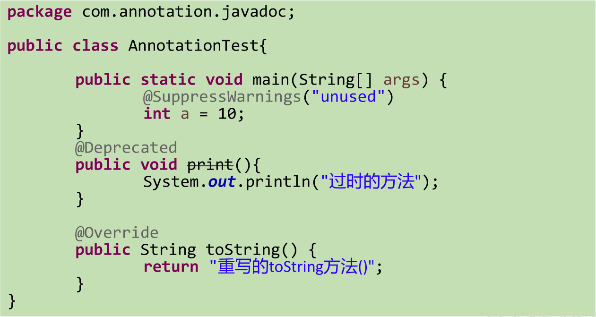

- 示例三： 跟踪代码依赖性，实现替代配置文件功能。

  - Servlet 3.0 提供了注解（annotation），使得不再需要在 web.xml 文件中进行 Servlet 的部署：

    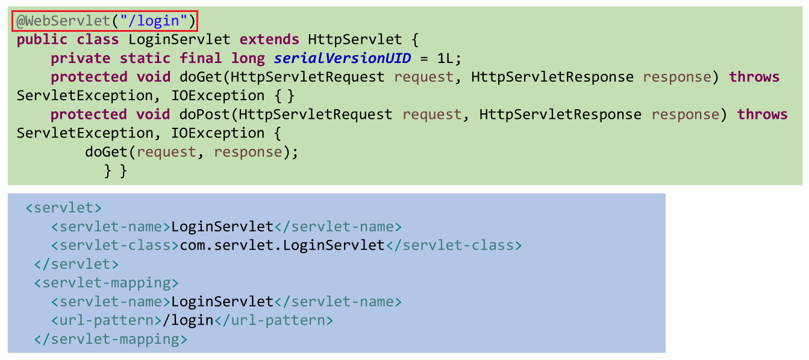

  - Spring 框架中关于事务的管理：

    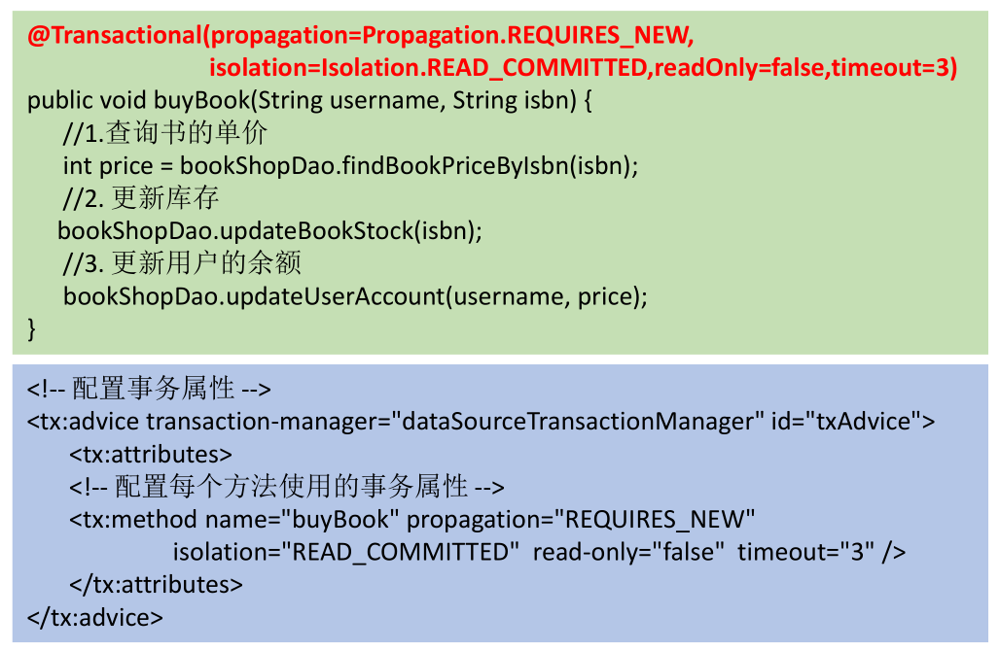

自定义注解：参照`@SuppressWarnings`定义。

- 注解声明为：`@interface`。

- 自定义注解自动继承了`java.lang.annotation.Annotation`接口。

- **Annotation 的成员变量在 Annotation 定义中以无参数方法的形式来声明。**其方法名和返回值定义了该成员的名字和类型，我们称为配置参数。**类型只能是八种基本数据类型、String 类型 、Class 类型 、Enum 类型 、Annotation 类型，以上所有类型的数组。**

- 可以在定义 Annotation 的成员变量时为其指定初始值，**指定成员变量的初始值可使用 default 关键字。**

- **没有成员定义的 Annotation 称为标记（是一个标识作用）；包含成员变量的 Annotation 称为元数据 Annotation。**

- **如果注解只有一个成员，建议使用参数名为 value。**

- **如果注解有成员，那么使用时必须指定参数值，除非它有默认值。**格式是 "参数名 = 参数值"，如果只有一个参数成员，且名称为 value，可以省略 "value="，直接写参数值。

- **自定义注解必须配上注解的信息处理流程才有意义（使用反射，能够得到注解的内容，然后根据内容和注解的对象建立关系，比如 Servlet 的注解）。**

- 实例：

  ```java
  public @interface MyAnnotation {
      String[] value() default "自定义的注解";
  }
  ```

**`JDK 中的元注解`**：

- JDK 的元注解是用于修饰其他注解而定义的，即对现有注解进行解释说明的注解。

  - 元数据：对数据进行修饰的数据。比如：`String name = "Tom";`，Tom 是数据，而 String 和 name 就是修饰 Tom 的元数据。

- JDK 5.0 提供了 4 个标准的 meta-annotation 类型，分别是：

  - `@Retention`：只能用于修饰一个 Annotation 定义，用于指定该 Annotation 的生命周期（即指定注解的生命周期）。`@Rentention`包含一个 RetentionPolicy 类型的成员变量，使用`@Rentention`时必须为该 value 成员变量指定值： 

    ```java
    @Documented
    @Retention(RetentionPolicy.RUNTIME)
    @Target(ElementType.ANNOTATION_TYPE)
    public @interface Retention {
        /**
         * Returns the retention policy.
         * @return the retention policy
         */
        RetentionPolicy value();
    }
    ```

    ```java
    public enum RetentionPolicy {
        /**
         * Annotations are to be discarded by the compiler.
         */
        SOURCE,
    
        /**
         * Annotations are to be recorded in the class file by the compiler
         * but need not be retained by the VM at run time.  This is the default
         * behavior.
         */
        CLASS,
    
        /**
         * Annotations are to be recorded in the class file by the compiler and
         * retained by the VM at run time, so they may be read reflectively.
         *
         * @see java.lang.reflect.AnnotatedElement
         */
        RUNTIME
    }
    ```

    - `RetentionPolicy.SOURCE`：在源文件中有效，即源文件保留，编译器直接丢弃这种策略的注释。

    - `RetentionPolicy.CLASS`：在 class 文件中有效，即 class 保留，当运行 Java 程序时，JVM 不会保留注解。这是默认值。

    - `RetentionPolicy.RUNTIME`：在运行时有效，即运行时保留，当运行 Java 程序时，JVM 会保留注释。程序可以通过反射获取该注释。

    - **只有声明为 RUNTIME 生命周期的注解，才能通过反射获取。**

    - 实例：

      ```java
      @Retention(RetentionPolicy.RUNTIME)
      public @interface MyAnnotation {
          String[] value() default "自定义的注解";
      }
      ```

      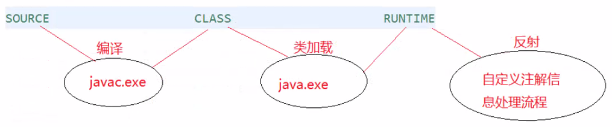

  - `@Target`：用于修饰 Annotation 定义，用于指定被修饰的 Annotation 能用于修饰哪些程序元素。 @Target 也包含一个名为 value 的成员变量。

    ```java
    @Documented
    @Retention(RetentionPolicy.RUNTIME)
    @Target(ElementType.ANNOTATION_TYPE)
    public @interface Target {
        /**
         * Returns an array of the kinds of elements an annotation type
         * can be applied to.
         * @return an array of the kinds of elements an annotation type
         * can be applied to
         */
        ElementType[] value();
    }
    ```

    ```java
    public enum ElementType {
        /** Class, interface (including annotation type), or enum declaration */
        TYPE,
    
        /** Field declaration (includes enum constants) */
        FIELD,
    
        /** Method declaration */
        METHOD,
    
        /** Formal parameter declaration */
        PARAMETER,
    
        /** Constructor declaration */
        CONSTRUCTOR,
    
        /** Local variable declaration */
        LOCAL_VARIABLE,
    
        /** Annotation type declaration */
        ANNOTATION_TYPE,
    
        /** Package declaration */
        PACKAGE,
    
        /**
         * Type parameter declaration
         *
         * @since 1.8
         */
        TYPE_PARAMETER,
    
        /**
         * Use of a type
         *
         * @since 1.8
         */
        TYPE_USE
    }
    ```

    - 各取值含义如下：

      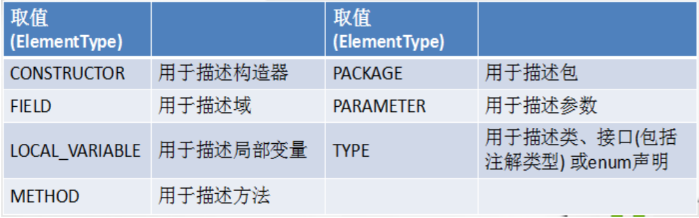

    - 实例：

      ```java
      @Target(ElementType.TYPE)
      public @interface MyAnnotation {
          String[] value() default "自定义的注解";
      }
      
      @MyAnnotation("修改了默认值")
      class Person {
          public Person() {
          }
      }
      ```

  - `@Documented`：用于指定被该元 Annotation 修饰的 Annotation 类将被 javadoc 工具提取成文档。默认情况下，javadoc 是不包括注解的。如果希望一个注解在被 javadoc 解析生成文档时能保存下来，需要添加此注解。

    ```java
    @Documented
    @Retention(RetentionPolicy.RUNTIME)
    @Target(ElementType.ANNOTATION_TYPE)
    public @interface Documented {
    }
    ```

    - 定义为`@Documented`的注解，必须设置`@Retention`值为 RUNTIME。

  - `@Inherited`：被它修饰的 Annotation 将具有继承性。如果某个类使用了被`@Inherited`修饰的 Annotation，则其子类将自动具有该注解。

    - 比如：如果把标有`@Inherited`注解的自定义的注解标注在类级别上，子类则可以继承父类类级别的注解。
    - 实际应用中，使用较少。

- **自定义注解时，通常都会指明`@Retention`和`@Target`这两个注解。**

**`利用反射获取注解信息`** ：

- JDK 5.0 在`java.lang.reflect`包下新增了 AnnotatedElement 接口，该接口代表程序中可以接受注解的程序元素。

- 当一个 Annotation 类型被定义为运行时 Annotation 后，该注解才是运行时可见，当 class 文件被载入时保存在 class 文件中的 Annotation 才会被虚拟机读取。

- 程序可以调用 AnnotatedElement 对象的如下方法来访问 Annotation 信息：

  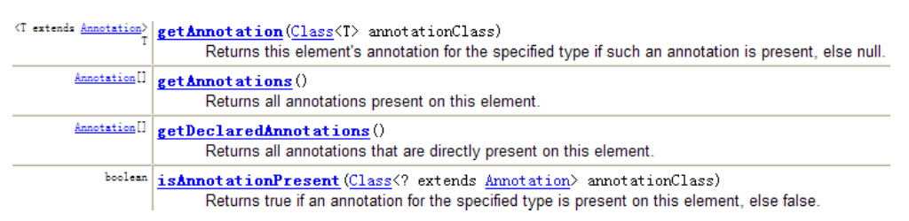

- 实例：

  ```java
  @Retention(RetentionPolicy.RUNTIME)
  @Target(ElementType.TYPE)
  public @interface MyAnnotation {
      String[] value() default "自定义的注解";
  }
  
  @MyAnnotation("修改了默认值")
  class Person {
      public Person() {
  
      }
  
      public static void main(String[] args) {
          Class<Person> clazz = Person.class;
  
          Annotation[] annotations = clazz.getAnnotations();
          for (Annotation annotation : annotations) {
              System.out.println(annotation);// @cn.xisun.java.base.MyAnnotation(value=[修改了默认值])
          }
  
          Annotation annotation = clazz.getAnnotation(MyAnnotation.class);
          MyAnnotation myAnnotation = (MyAnnotation) annotation;
          String[] info = myAnnotation.value();
          System.out.println(Arrays.toString(info));// [修改了默认值]
      }
  }
  ```

JDK 8.0 中注解的新特性：

- JDK 8.0 对注解处理提供了两点改进：`可重复的注解`及`可用于类型的注解`。此外，反射也得到了加强，在 JDK 8.0 中能够得到方法参数的名称。这会简化标注在方法参数上的注解。

- **可重复注解：**

  - JDK 8.0 之前的写法：

    ```java
    @Retention(RetentionPolicy.RUNTIME)
    @Target(ElementType.TYPE)
    public @interface MyAnnotation {
        String[] value() default "自定义的注解";
    }
    
    // 定义新数组，值为需要重复注解对象的数组 
    @Retention(RetentionPolicy.RUNTIME)
    @interface MyAnnotations {
        MyAnnotation[] value();
    }
    
    // JDK 8.0之前的写法：
    @MyAnnotations({@MyAnnotation("注解1"), @MyAnnotation("注解2")})
    class Person {
        public Person() {
    
        }
    
        public static void main(String[] args) {
            Class<Person> clazz = Person.class;
    
            Annotation[] annotations = clazz.getAnnotations();
            for (Annotation annotation : annotations) {
                System.out.println(annotation);
            }
    
            Annotation annotation = clazz.getAnnotation(MyAnnotations.class);
            MyAnnotations myAnnotation = (MyAnnotations) annotation;
            MyAnnotation[] info = myAnnotation.value();
            System.out.println(Arrays.toString(info));
        }
    }
    输出结果：
    @cn.xisun.java.base.MyAnnotations(value=[@cn.xisun.java.base.MyAnnotation(value=[注解1]), @cn.xisun.java.base.MyAnnotation(value=[=注解2])])
    [@cn.xisun.java.base.MyAnnotation(value=[注解1]), @cn.xisun.java.base.MyAnnotation(value=[注解2])]
    ```

  - JDK 8.0 之后的写法：利用`@Repeatable`。

    ```java
    @Repeatable(MyAnnotations.class)
    @Retention(RetentionPolicy.RUNTIME)
    @Target(ElementType.TYPE)
    public @interface MyAnnotation {
        String[] value() default "自定义的注解";
    }
    
    @Retention(RetentionPolicy.RUNTIME)
    @Target(ElementType.TYPE)
    @interface MyAnnotations {
        MyAnnotation[] value();
    }
    
    @MyAnnotation("注解1")
    @MyAnnotation("注解2")
    class Person {
        public Person() {
    
        }
    
        public static void main(String[] args) {
            Class<Person> clazz = Person.class;
    
            Annotation[] annotations = clazz.getAnnotations();
            for (Annotation annotation : annotations) {
                System.out.println(annotation);// @cn.xisun.java.base.MyAnnotation(value=[修改了默认值])
            }
    
            Annotation annotation = clazz.getAnnotation(MyAnnotations.class);
            MyAnnotations myAnnotation = (MyAnnotations) annotation;
            MyAnnotation[] info = myAnnotation.value();
            System.out.println(Arrays.toString(info));// [修改了默认值]
        }
    }
    ```

- **类型注解：**

  - JDK 8.0 之后，关于元注解`@Target`的参数类型 ElementType 枚举值多了两个：TYPE_PARAMETER 和 TYPE_USE。、

    - `ElementType.TYPE_PARAMETER`：表示该注解能写在类型变量的声明语句中，如：泛型声明。

      ```java
      public class TestTypeDefine<@TypeDefine() U> {
          private U u;
          public <@TypeDefine() T> void test(T t){
          }
      }
      
      @Target({ElementType.TYPE_PARAMETER})
      @interface TypeDefine{
      }
      ```

    - `ElementType.TYPE_USE`：表示该注解能写在使用类型的任何语句中。

      ```java
      @Target(ElementType.TYPE_USE)
      @interface MyAnnotation {
      }
      
      @MyAnnotation
      public class AnnotationTest<U> {
          @MyAnnotation
          private String name;// 对属性添加注解
          
          public static <@MyAnnotation T> void method(T t) {}// 对泛型添加注解
          
          public static void test(@MyAnnotation String arg) throws @MyAnnotation Exception {}// 对异常添加注解
          
          public static void main(String[] args) {
              AnnotationTest<@MyAnnotation String> t = null;
              int a = (@MyAnnotation int) 2L;
              @MyAnnotation
              int b = 10;
          }
      }
      ```

  - **在 JDK 8.0 之前，注解只能是在声明的地方所使用，从 JDK 8.0 开始，注解可以应用在任何地方。**

## 多线程

### 程序、进程和线程

`程序 (program)`：是为完成特定任务、用某种语言编写的一组指令的集合。即指一段静态的代码，静态对象。

`进程 (process)`：是程序的一次执行过程，或是正在运行的一个程序。是一个动态的过程：有它自身的产生、存在和消亡的过程 —— 生命周期。如：运行中的 QQ，运行中的 MP3 播放器。

- 程序是静态的，进程是动态的。

- 进程作为资源分配的单位，系统在运行时会为每个进程分配不同的内存区域。

`线程 (thread)`：进程可进一步细化为线程，是一个程序内部的一条执行路径。

- 若一个进程同一时间并行执行多个线程，就是支持多线程的。
- 线程作为调度和执行的单位，**每个线程拥有独立的运行栈和程序计数器（pc）**，线程切换的开销小。
- **一个进程中的多个线程共享相同的内存单元/内存地址空间（方法区、堆）：它们从同一堆中分配对象，可以访问相同的变量和对象。**这就使得线程间通信更简便、高效。但多个线程操作共享的系统资源可能就会带来安全的隐患。

`单核 CPU 和多核 CPU 的理解`：

- 单核 CPU，其实是一种假的多线程，因为在一个时间单元内，也只能执行一个线程的任务。只是因为 CPU 时间单元特别短，因此感觉不出来。例如：虽然有多车道，但是收费站只有一个工作人员在收费，只有收了费才能通过，那么 CPU 就好比收费人员。如果有某个人没准备好交钱，那么收费人员可以把他 "挂起"，晾着他，等他准备好了钱，再去收费。

- 如果是多核的话，才能更好的发挥多线程的效率，现在的服务器基本都是多核的。

- 一个 Java 应用程序 java.exe，其实至少有三个线程：`main() 主线程`，`gc() 垃圾回收线程`，`异常处理线程`。当然如果发生异常，会影响主线程。

`并行与并发`：

- 并行：多个 CPU 同时执行多个任务。 比如：多个人同时做不同的事。
- 并发：一个 CPU（采用时间片）同时执行多个任务。比如：秒杀、多个人做同一件事。

**多线程程序的优点：**

以单核 CPU 为例，只使用单个线程先后完成多个任务（调用多个方法），肯定比用多个线程来完成用的时间更短（因为单核 CPU，在多线程之间进行切换时，也需要花费时间），为何仍需多线程呢？

- 提高应用程序的响应。对图形化界面更有意义，可增强用户体验。
- 提高计算机系统 CPU 的利用率。
- 改善程序结构。将既长又复杂的进程分为多个线程，独立运行，利于理解和修改。

**何时需要多线程：**

- 程序需要同时执行两个或多个任务。
- 程序需要实现一些需要等待的任务时，如用户输入、文件读写操作、网络操作、搜索等。
- 需要一些后台运行的程序时。

### Thread 类

Java 语言的 JVM 允许程序运行多个线程，它通过`java.lang.Thread`类来体现。

Thread 类的特性：

- 每个线程都是通过某个特定 Thread 对象的`run()`方法来完成操作的，经常把`run()`方法的主体称为`线程体`。
- 应该通过 Thread 对象的`start()`方法来启动这个线程，而非直接调用`run()`。
  - 如果手动调用`run()`，那么就只是普通的方法，并没有启动多线程。
  - 调用`start()`之后，`run()`由 JVM 调用，什么时候调用以及执行的过程控制都由操作系统的 CPU 调度决定。

构造器：

- `Thread()`

- `Thread(String threadname)`
- `Thread(Runnable target)`
- `Thread(Runnable target, String name)`

方法：

- `void start()`：启动当前线程，并执行当前线程对象的`run()`方法。

- `run()`：通常需要重写 Thread 类中的此方法，将创建的线程在被调度时需要执行的操作声明在此方法中。

- `static Thread currentThread()`：静态方法，返回执行当前代码的线程。在 Thread 子类中就是 this，通常用于主线程和 Runnable 实现类。

  ```java
  public class Test {
      public static void main(String[] args) {
          System.out.println(Thread.currentThread().getName());// main
          new MyThread().start();
      }
  }
  
  
  class MyThread extends Thread {
      @Override
      public void run() {
          System.out.println(Thread.currentThread().getName());// Thread-0
          System.out.println(currentThread().getName());// Thread-0
          System.out.println(this.currentThread().getName());// Thread-0，实际代码中，不应该通过类实例访问静态成员
      }
  }
  ```

- `String getName()`：返回当前线程的名称。

- `void setName(String name)`：设置当前线程的名称。

  ```java
  public class Test {
      public static void main(String[] args) {
          // 设置main线程的名字
          Thread.currentThread().setName("主线程");
          System.out.println(Thread.currentThread().getName());
  
          // 设置自定义线程的名字
          MyThread myThread = new MyThread();
          myThread.setName("自定义线程一");
          myThread.start();
  
          // 构造器设置自定义线程的名字
          new MyThread("自定义线程二").start();
      }
  }
  
  
  class MyThread extends Thread {
      public MyThread() {
  
      }
  
      public MyThread(String name) {
          super(name);
      }
  
      @Override
      public void run() {
          System.out.println(Thread.currentThread().getName());
      }
  }
  ```

- `static void yield()`：释放当前线程 CPU 的执行权，但有可能 CPU 再次分配资源时，仍然优先分配到当前线程。

- `join()`：在某个线程 a 中调用线程 b 的`join()`方法时，调用线程 a 将进入阻塞状态，直到线程 b 执行完之后，线程 a 才结束阻塞状态，然后重新排队等待 CPU 分配资源执行剩下的任务。注意：调用`join()`方法之后，比当前线程低优先级的线程也可以获得执行。

- `static void sleep(long millis)`：让当前线程 "睡眠" 指定的 millis 毫秒时间，在指定的 millis 毫秒时间内，当前线程是阻塞状态。时间到达时，重新排队等待 CPU 分配资源。

- `stop()`：强制结束当前线程，已过时。

- `boolean isAlive()`：返回 boolean，判断线程是否存活。

- 实例：

  ```java
  public class Test {
      public static void main(String[] args) {
          MyThread myThread = new MyThread();
          myThread.start();
  
          System.out.println(myThread.isAlive());
  
          for (int i = 0; i <= 100; i++) {
              if (i % 2 != 0) {
                  System.out.println(Thread.currentThread().getName() + "：" + i);
              }
  
              if (i == 20) {
                  try {
                      myThread.join();
                  } catch (InterruptedException e) {
                      e.printStackTrace();
                  }
              }
              ;
          }
  
          System.out.println(myThread.isAlive());
      }
  }
  
  
  class MyThread extends Thread {
      @Override
      public void run() {
          for (int i = 0; i <= 100; i++) {
              if (i % 2 == 0) {
                  System.out.println(Thread.currentThread().getName() + "：" + i);
              }
  
              if (i % 20 == 0) {
                  yield();
              }
  
              if (i % 30 == 0) {
                  try {
                      sleep(2000);
                  } catch (InterruptedException e) {
                      e.printStackTrace();
                  }
              }
          }
      }
  }
  ```

### 线程

#### 线程的调度策略

调度策略：

- `时间片策略`：

  

- `抢占式策略`：高优先级的线程抢占 CPU。

Java 的调度方法：

- **同优先级线程，组成先进先出队列（先到先服务），使用时间片策略。**

- **高优先级线程，使用优先调度的抢占式策略。**

#### 线程的优先级

线程的优先级等级：

- MAX_PRIORITY：10，最大优先级。
- MIN _PRIORITY：1，最小优先级。
- NORM_PRIORITY：5，默认优先级。

涉及的方法：

- `getPriority()`：获取线程的优先值。

- `setPriority(int newPriority)`：设置线程的优先级。

  ```java
  System.out.println(Thread.currentThread().getPriority());
  Thread.currentThread().setPriority(8);
  ```

说明：

- **线程创建时继承父线程的优先级。**

- **低优先级只是获得调度的概率低，但并非一定是在高优先级线程之后才被调用。**

#### 线程的分类

Java 中的线程分为两类：一种是`用户线程`，一种是`守护线程`。

- 用户线程和守护线程，几乎在每个方面都是相同的，唯一的区别是判断 JVM 何时离开。

- 守护线程是用来服务用户线程的，通过在`start()`前调用`thread.setDaemon(true)`，可以把一个用户线程变成一个守护线程。

- Java 垃圾回收就是一个典型的守护线程。

- 若 JVM 中都是守护线程，当前 JVM 将退出。

#### 线程的生命周期

要想实现多线程，必须在主线程中创建新的线程对象。Java 语言使用 Thread 类及其子类的对象来表示线程，并用`Thread.State`类定义了线程的几种状态，在它的一个完整的生命周期中通常要经历如下的五种状态：

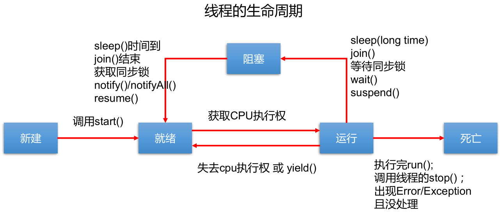

- `新建`：当一个 Thread 类或其子类的对象被声明并创建时，新生的线程对象处于新建状态。
- `就绪`：处于新建状态的线程被`start()`后，将进入线程队列等待 CPU 时间片，此时它已具备了运行的条件，只是没分配到 CPU 资源。
- `运行`：当就绪的线程被调度并获得 CPU 资源时，便进入运行状态，`run()`定义了线程的操作和功能。
- `阻塞`：在某种特殊情况下，被人为挂起或执行输入输出操作时，让出 CPU 并临时中止自己的执行，进入阻塞状态。
- `死亡`：线程完成了它的全部工作或线程被提前强制性地中止或出现异常导致结束。

### 线程的创建

线程创建的一般过程：

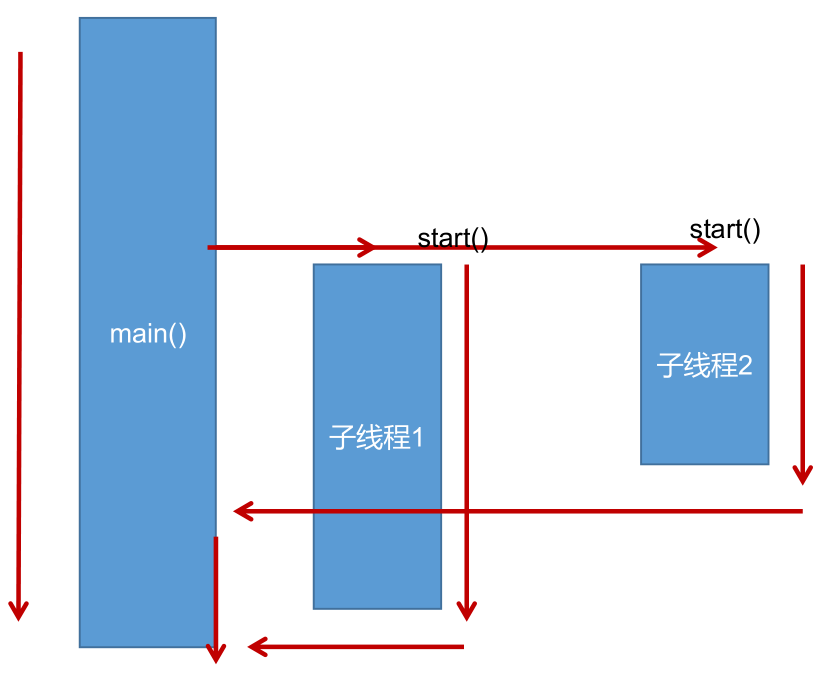

#### 方式一：继承 Thread 类

- 创建一个继承 Thread 类的子类。

- 重写 Thread 类的`run()`：将此线程执行的操作声明在`run()`方法体中。

- 创建 Thread 类的子类的对象实例。

- 通过该对象调用`start()`。

  - 启动当前线程。
  - 调用当前线程的`run()`。
  - 不能通过直接调用对象的`run()`的形式启动线程。
  - 不能再次调用当前对象的`start()`去开启一个新的线程，否则报`java.lang.IllegalThreadStateException`异常 。
  - 如果要启动一个新的线程，需要重新创建一个 Thread 类的子类的对象，并调用其`start()`。

实例一：

  ```java
public class Test {
    public static void main(String[] args) {
        // 启动一个子线程
        MyThread myThread = new MyThread();
        myThread.start();
        
        // 启动一个新的子线程，并执行run方法
        MyThread myThread2 = new MyThread();
        myThread2.start();
        
        // main线程
        for (int i = 0; i <= 100; i++) {
            if (i % 2 != 0) {
                System.out.println(Thread.currentThread().getName() + "：" + i);
            }
        }
    }
}

class MyThread extends Thread {
    @Override
    public void run() {
        for (int i = 0; i <= 100; i++) {
            if (i % 2 == 0) {
                System.out.println(Thread.currentThread().getName() + "：" + i);
            }
        }
    }
}
  ```

实例二：

```java
public class Test {
    public static void main(String[] args) {
        // 匿名内部类
        new Thread(){
            @Override
            public void run() {
                for (int i = 0; i <= 100; i++) {
                    if (i % 2 == 0) {
                        System.out.println(Thread.currentThread().getName() + "：" + i);
                    }
                }
            }
        }.start();

        new Thread(){
            @Override
            public void run() {
                for (int i = 0; i <= 100; i++) {
                    if (i % 2 != 0) {
                        System.out.println(Thread.currentThread().getName() + "：" + i);
                    }
                }
            }
        }.start();
    }
}
```

#### 方式二：实现 Runnable 接口

- 创建一个实现了 Runnable 接口的类。

- 实现类去实现 Runnable 接口中的抽象方法：`run()`。

- 创建实现类的对象。

- 将此对象作为参数传递到 Thread 类的构造器中，然后创建 Thread 类的对象。

- 通过 Thread 类的对象，调用`start()`，最终执行的是上面重写的`run()`。

实例：

  ```java
public class Test {
    public static void main(String[] args) {
        // 启动多个子线程时，只需要创建一个Runnable接口实现类的对象
        MyRunnable myRunnable = new MyRunnable();
        
        // 启动一个子线程
        Thread thread = new Thread(myRunnable);
        thread.start();

        // 启动一个新的子线程，并执行run方法
        Thread thread2 = new Thread(myRunnable);
        thread2.start();


        // main线程
        for (int i = 0; i <= 100; i++) { 
            if (i % 2 != 0) {
                System.out.println(Thread.currentThread().getName() + "：" + i);
            }
        }
    }
}

class MyRunnable implements Runnable {
    @Override
    public void run() {
        for (int i = 0; i <= 100; i++) {
            if (i % 2 == 0) {
                System.out.println(Thread.currentThread().getName() + "：" + i);
            }
        }
    }
}
  ```

#### 方式一和方式二的对比

- 开发中，`优先选择实现 Runnable 接口的方式`。
  - **实现 Runnable 接口的方式，没有类的单继承性的局限性。**
  - **实现 Runnable 接口的方式，更适合处理多个线程有共享数据的情况。**
- Thread 类也实现了 Runnable 接口，无论是方式一，还是方式二，都需要重写 Runnable 接口的`run()`方法，并将创建的线程需要执行的逻辑声明在`run()`方法中。

#### 方式三：实现 Callable 接口

- 从 JDK 5.0 开始。

- 创建一个实现 Callable 接口的实现类。

- 实现`call()`，将此线程需要执行的操作声明在`call()`的方法体中。

- 创建 Callable 接口实现类的对象。

- 将此 Callable 接口实现类的对象作为参数传递到 FutureTask 的构造器中，创建 FutureTask 的对象。

  - **Future 接口可以对具体 Runnable 或 Callable 任务的执行结果进行取消、查询是否完成、获取结果等操作。**
  - **FutrueTask 是 Futrue 接口的唯一的实现类。**
  - **FutureTask 同时实现了 Runnable 和 Future 接口。它既可以作为 Runnable 被线程执行，又可以作为 Future 得到 Callable 的返回值。**
    - Runnable 接口的`run()`没有返回值。
    - Callable 接口的`call()`有返回值。

- 将 FutureTask 的对象作为参数传递到 Thread 类的构造器中，创建 Thread 类的对象，并调用`start()`，启动线程。

- 根据实际需求，选择是否获得 Callable 中`call()`的返回值。

实例：

  ```java
public class Test {
    public static void main(String[] args) {
        // 3.创建Callable接口实现类的对象
        MyCallable myCallable = new MyCallable();
        // 4.将此Callable接口实现类的对象作为参数传递到FutureTask的构造器中，创建FutureTask的对象
        FutureTask<Integer> futureTask = new FutureTask<>(myCallable);
        // 5.将FutureTask的对象作为参数传递到Thread类的构造器中，创建Thread类的对象，并调用start()，启动线程
        new Thread(futureTask).start();
        // 6.获得Callable中call()的返回值
        try {
            // get()返回值即为FutureTask构造器参数Callable实现类重写的call()的返回值
            Integer sum = futureTask.get();
            System.out.println("100以内偶数的总和为：" + sum);
        } catch (InterruptedException | ExecutionException e) {
            e.printStackTrace();
        }
    }
}

// 1.创建一个实现Callable接口的实现类
class MyCallable implements Callable<Integer> {
    // 2.实现call()方法，将此线程需要执行的操作声明在call()的方法体中
    @Override
    public Integer call() throws Exception {
        int sum = 0;
        for (int i = 1; i <= 100; i++) {
            if (i % 2 == 0) {
                sum += i;
            }
        }
        return sum;
    }
}
  ```

与使用 Runnable 接口相比，Callable 接口功能更强大些：

- 相比`run()`方法，`call()`可以有返回值。
- `call()`可以抛出异常，能够被外面的操作捕获，获取异常的信息。
- Callable 支持泛型的返回值。
- Callable 需要借助 FutureTask 类，比如获取`call()`的返回结果。

#### 方式四：线程池

背景： 经常创建和销毁、使用量特别大的资源，比如并发情况下的线程，会对性能影响很大。

思路：提前创建好多个线程，放入线程池中，使用时直接获取，使用完放回池中，这样可以避免频繁创建销毁，实现重复利用。类似生活中的公共交通工具。

好处：

- 提高响应速度，减少了创建新线程的时间。
- 降低资源消耗，重复利用线程池中线程，不需要每次都创建。
- 便于线程管理。
  - corePoolSize：核心池的大小。
  - maximumPoolSize：最大线程数。
  - keepAliveTime：线程没有任务时最多保持多长时间后会终止。

JDK 5.0 起，提供了线程池相关 API：`ExecutorService`和`Executors`。

- **ExecutorService**：真正的线程池接口，常用子类`ThreadPoolExecutor`。

  - `void execute(Runnable command)`：执行任务/命令，没有返回值，一般用来执行 Runnable。
  - `<T> Future<T> submit(Callable<T> task)`：执行任务，有返回值，一般用来执行 Callable。
  - `void shutdown()`：关闭连接池。

- **Executors**：工具类、线程池的工厂类，用于创建并返回不同类型的线程池。

  - `Executors.newCachedThreadPool()`：创建一个可根据需要创建新线程的线程池。

  - `Executors.newFixedThreadPool(n)`：创建一个可重用固定线程数的线程池。

    ```java
    public class ThreadPool {
        public static void main(String[] args) {
            // 1.提供指定线程数量的线程池
            ExecutorService executorService = Executors.newFixedThreadPool(10);
    
            // 2.执行指定的线程的操作，需要提供实现Runnable接口或Callable接口的实现类的对象
    
            // 2-1.execute()适合使用于Runnable
            executorService.execute(new Runnable() {
                @Override
                public void run() {
                    for (int i = 0; i <= 100; i++) {
                        if (i % 2 == 0) {
                            System.out.println(Thread.currentThread().getName() + ": " + i);
                        }
                    }
                }
            });
    
            executorService.execute(new Runnable() {
                @Override
                public void run() {
                    for (int i = 0; i <= 100; i++) {
                        if (i % 2 != 0) {
                            System.out.println(Thread.currentThread().getName() + ": " + i);
                        }
                    }
                }
            });
    
            // 2-2.submit()适合适用于Callable
            Future<Integer> evenSum = executorService.submit(new Callable<Integer>() {
                @Override
                public Integer call() throws Exception {
                    int evenSum = 0;
                    for (int i = 0; i <= 100; i++) {
                        if (i % 2 == 0) {
                            evenSum += i;
                        }
                    }
                    return evenSum;
                }
            });
            try {
                System.out.println("100以内的偶数和: " + evenSum.get());
            } catch (InterruptedException | ExecutionException e) {
                e.printStackTrace();
            }
    
            Future<Integer> oddSum = executorService.submit(new Callable<Integer>() {
                @Override
                public Integer call() throws Exception {
                    int oddSum = 0;
                    for (int i = 0; i <= 100; i++) {
                        if (i % 2 != 0) {
                            oddSum += i;
                        }
                    }
                    return oddSum;
                }
            });
            try {
                System.out.println("100以内的奇数和: " + oddSum.get());
            } catch (InterruptedException | ExecutionException e) {
                e.printStackTrace();
            }
    
            // 3.使用完线程池后，需要关闭线程池
            executorService.shutdown();
        }
    }
    ```

  - `Executors.newSingleThreadExecutor()`：创建一个只有一个线程的线程池。

  - `Executors.newScheduledThreadPool(n)`：创建一个线程池，它可安排在给定延迟后运行命令或者定期地执行。

### 线程的同步

#### 线程的安全问题

多线程安全问题实例，模拟火车站售票程序，开启三个窗口售票。

方式一：继承 Thread 类。

```java
public class TestThread {
    public static void main(String[] args) {
        // 启动第一个售票窗口
        TicketThread thread1 = new TicketThread();
        thread1.setName("售票窗口一");
        thread1.start();

        // 启动第二个售票窗口
        TicketThread thread2 = new TicketThread();
        thread2.setName("售票窗口二");
        thread2.start();

        // 启动第三个售票窗口
        TicketThread thread3 = new TicketThread();
        thread3.setName("售票窗口三");
        thread3.start();

    }
}

class TicketThread extends Thread {
    // 总票数，必须定义为static，随类只加载一次，因为每新建一个线程，都需要new一次TicketThread
    private static int ticketNum = 100;

    @Override
    public void run() {
        while (true) {
            if (ticketNum > 0) {
                try {
                    Thread.sleep(100);
                } catch (InterruptedException e) {
                    e.printStackTrace();
                }
                System.out.println(Thread.currentThread().getName() + "售出车票，tick号为：" + ticketNum--);
            } else {
                break;
            }
        }
    }
}
```

方式二：实现 Runnable 接口。

```java
public class Test {
    public static void main(String[] args) {
        TicketRunnable ticket = new TicketRunnable();

        // 启动第一个售票窗口
        Thread thread1 = new Thread(ticket, "售票窗口1");
        thread1.start();

        // 启动第二个售票窗口
        Thread thread2 = new Thread(ticket, "售票窗口2");
        thread2.start();

        // 启动第三个售票窗口
        Thread thread3 = new Thread(ticket, "售票窗口3");
        thread3.start();
    }
}

class TicketRunnable implements Runnable {
    // 总票数，不必定义为static，因为只需要new一次TicketRunnable
    private int ticketNum = 100;

    @Override
    public void run() {
        while (true) {
            if (ticketNum > 0) {
                try {
                    Thread.sleep(100);
                } catch (InterruptedException e) {
                    e.printStackTrace();
                }
                System.out.println(Thread.currentThread().getName() + "售出车票，tick号为：" + ticketNum--);
            } else {
                break;
            }
        }
    }
}
```

说明：

1. 如上程序，在买票的过程中，出现了重票、错票，说明多线程的执行过程中，出现了安全问题。

2. 问题的原因：当多条语句在操作同一个线程的共享数据时，当一个线程对多条语句只执行了一部分，还没有执行完时，另一个线程参与进来执行，从而导致了共享数据的错误。
3. 解决办法：对多条操作共享数据的语句，让一个线程全部执行完，在执行的过程中，其他线程不可以参与执行。

#### 线程的同步机制

对于多线程的安全问题，Java 提供了专业的解决方式：`同步机制`。实现同步机制的方式，有`同步代码块`、`同步方法`、`Lock 锁`等多种形式。

##### 同步的范围

1. 如何找问题，即代码是否存在线程安全？--- 非常重要
   （1）明确哪些代码是多线程运行的代码。
   （2）明确多个线程是否有共享数据。
   （3）明确多线程运行代码中是否有多条语句操作共享数据。

2. 如何解决呢？--- 非常重要

   对多条操作共享数据的语句，只能让一个线程都执行完，在执行过程中，其他线程不可以参与执行，即所有操作共享数据的这些语句都要放在同步范围中。

3. 切记 ：

   范围太小：没锁住所有有安全问题的代码。

   范围太大：没发挥多线程的功能。

##### 同步机制的特点

优点：同步的方式，能够解决线程的安全问题。

局限性：操作同步代码时，只能有一个线程参与，其他线程等待，相当于是一个单线程的过程，效率低。

**共享数据：多个线程共同操作的变量。**

**需要被同步的代码：操作共享数据的代码。**

**`同步监视器，俗称：锁。`任何一个类的对象，都可以充当锁。**

**要求：多个线程必须要公用同一把锁！！！针对不同实现同步机制的方式，都要保证同步监视器是同一个！！！**

##### 同步机制中的锁

**同步锁机制：**在《Thinking in Java》中，是这么说的：对于并发工作，你需要某种方式来防止两个任务访问相同的资源（其实就是共享资源竞争）。防止这种冲突的方法就是当资源被一个任务使用时，在其上加锁。第一个访问某项资源的任务必须锁定这项资源，使其他任务在其被解锁之前，就无法访问它了，而在其被解锁之时，另一个任务就可以锁定并使用它了。

**synchronized 的锁是什么：**

- **任意对象都可以作为同步锁，所有对象都自动含有单一的锁（监视器）。**
- **同步代码块的锁：自己指定，很多时候是指定为`this`或`类名.class`。**
- **同步方法的锁：`静态方法 ---> 类名.class，非静态方法 ---> this`。**

- 注意：
  - **必须确保使用同一个资源的多个线程共用的是同一把锁，这个非常重要，否则就无法保证共享资源的安全。**
  - **一个线程类中的所有静态方法共用同一把锁 --- 类名.class，所有非静态方法共用同一把锁 --- this，同步代码块在指定锁的时候需谨慎。**

**能够释放锁的操作：**

- 当前线程的同步方法、同步代码块执行结束。
- 当前线程在同步代码块、同步方法中遇到 break、return 终止了该代码块、该方法的继续执行。
- 当前线程在同步代码块、同步方法中出现了未处理的 Error 或 Exception，导致异常结束。
- 当前线程在同步代码块、同步方法中执行了线程对象的`wait()`，当前线程暂停，并释放锁。

**不会释放锁的操作：**

- 线程执行同步代码块或同步方法时，程序调用`Thread.sleep()`、`Thread.yield()`暂停当前线程的执行。
- 线程执行同步代码块时，其他线程调用了该线程的`suspend()`将该线程挂起，该线程不会释放锁。
- 应尽量避免使用`suspend()`和`resume()`来控制线程。

##### 同步机制一：同步代码块

格式：

```java
synchronized (同步监视器) {
    // 需要被同步的代码
}
```

继承 Thread 类方式的修正：

```java
public class TestThread {
    public static void main(String[] args) {
        // 启动第一个售票窗口
        TicketThread thread1 = new TicketThread();
        thread1.setName("售票窗口一");
        thread1.start();

        // 启动第二个售票窗口
        TicketThread thread2 = new TicketThread();
        thread2.setName("售票窗口二");
        thread2.start();

        // 启动第三个售票窗口
        TicketThread thread3 = new TicketThread();
        thread3.setName("售票窗口三");
        thread3.start();

    }
}

class TicketThread extends Thread {
    // 总票数，必须定义为static，随类只加载一次，因为每新建一个线程，都需要new一次TicketThread
    private static int ticketNum = 100;

    // 锁，必须定义为static
    private static Object obj = new Object();

    @Override
    public void run() {
        while (true) {
            synchronized (obj) {// 可以使用：synchronized (TicketThread.class)，不能使用：synchronized (this)
                if (ticketNum > 0) {
                    try {
                        Thread.sleep(100);
                    } catch (InterruptedException e) {
                        e.printStackTrace();
                    }
                    System.out.println(Thread.currentThread().getName() + "售出车票，tick号为：" + ticketNum--);
                } else {
                	break;
            	}
            }
        }
    }
}
```

> **obj 可以使用 TicketThread.class（当前类）替代，TicketThread 类只会加载一次，类也是对象。**

实现 Runnable 接口方式的修正：

```java
public class TestRunnable {
    public static void main(String[] args) {
        TicketRunnable ticket = new TicketRunnable();

        // 启动第一个售票窗口
        Thread thread1 = new Thread(ticket, "售票窗口1");
        thread1.start();

        // 启动第二个售票窗口
        Thread thread2 = new Thread(ticket, "售票窗口2");
        thread2.start();

        // 启动第三个售票窗口
        Thread thread3 = new Thread(ticket, "售票窗口3");
        thread3.start();
    }
}


class TicketRunnable implements Runnable {
    // 总票数，不必定义为static，因为只需要new一次TicketRunnable
    private int ticketNum = 100;

    // 锁，不必定义为static
    Object obj = new Object();

    @Override
    public void run() {
        while (true) {
            synchronized (obj) {// 可以使用：synchronized (this)
                if (ticketNum > 0) {
                    try {
                        Thread.sleep(100);
                    } catch (InterruptedException e) {
                        e.printStackTrace();
                    }
                    System.out.println(Thread.currentThread().getName() + "售出车票，tick号为：" + ticketNum--);
                } else {
                    break;
                }
            }
        }
    }
}
```

> **obj 对象可以使用 this 代替，指代唯一的 TicketRunnable 对象。**

##### 同步机制二：同步方法

格式：

```java
修饰符 synchronized 返回值类型 方法名 (形参列表) {}
```

如果操作共享数据的代码，完整的声明在一个方法中，则可以将此方法声明为同步方法。

**同步方法仍然涉及到同步监视器，只是不需要显示的声明：**

- **非静态的同步方法，同步监视器是：this。**
- **静态的同步方法，同步监视器是：当前类本身。**

继承 Thread 类方式的修正：

```java
public class TestMethod1 {
    public static void main(String[] args) {
        // 启动第一个售票窗口
        TicketMethod1 thread1 = new TicketMethod1();
        thread1.setName("售票窗口一");
        thread1.start();

        // 启动第二个售票窗口
        TicketMethod1 thread2 = new TicketMethod1();
        thread2.setName("售票窗口二");
        thread2.start();

        // 启动第三个售票窗口
        TicketMethod1 thread3 = new TicketMethod1();
        thread3.setName("售票窗口三");
        thread3.start();
    }
}

class TicketMethod1 extends Thread {
    // 总票数，必须定义为static，随类只加载一次，因为每新建一个线程，都需要new一次TicketThread
    private static int ticketNum = 100;

    @Override
    public void run() {
        while (true) {
            handleTicket();
        }
    }

    // 必须设置成static的，此时的同步监视器是TicketMethod1.class
    private static synchronized void handleTicket() {
        if (ticketNum > 0) {
            try {
                Thread.sleep(100);
            } catch (InterruptedException e) {
                e.printStackTrace();
            }
            System.out.println(Thread.currentThread().getName() + "售出车票，tick号为：" + ticketNum--);
        } else {
            break;
        }
    }
}
```

> **此时，同步方法要设置成 static 的，此时的同步监视器是 TicketMethod1.class (当前类)。**

实现 Runnable 接口方式的修正：

```java
public class TestMethod2 {
    public static void main(String[] args) {
        TicketMethod2 ticket = new TicketMethod2();

        // 启动第一个售票窗口
        Thread thread1 = new Thread(ticket, "售票窗口1");
        thread1.start();

        // 启动第二个售票窗口
        Thread thread2 = new Thread(ticket, "售票窗口2");
        thread2.start();

        // 启动第三个售票窗口
        Thread thread3 = new Thread(ticket, "售票窗口3");
        thread3.start();
    }
}

class TicketMethod2 implements Runnable {
    private int ticketNum = 100;

    @Override
    public void run() {// 有时可以直接设置run方法为synchronized，但本例不行
        while (true) {
            handleTicket();
        }
    }

    // 非静态同步方法中，同步监视器：this
    private synchronized void handleTicket() {
        if (ticketNum > 0) {
            try {
                Thread.sleep(100);
            } catch (InterruptedException e) {
                e.printStackTrace();
            }
            System.out.println(Thread.currentThread().getName() + "售出车票，tick号为：" + ticketNum--);
        } else {
            break;
        }
    }
}
```

> **此时，同步方法中的同步监视器是：this，即当前 TicketMethod2 类的对象。**

##### 同步机制三：Lock 锁

从 JDK 5.0 开始，Java 提供了更强大的线程同步机制——通过显式定义同步锁对象来实现同步。同步锁使用 Lock 对象充当。

- `java.util.concurrent.locks.Lock`接口是控制多个线程对共享资源进行访问的工具。锁提供了对共享资源的独占访问，每次只能有一个线程对 Lock 对象加锁，线程开始访问共享资源之前应先获得 Lock 对象。

- 在实现线程安全的控制中，比较常用的是`ReentrantLock`，ReentrantLock 类实现了 Lock 接口，它拥有与 synchronized 相同的并发性和内存语义，可以显式加锁、释放锁。

声明格式：

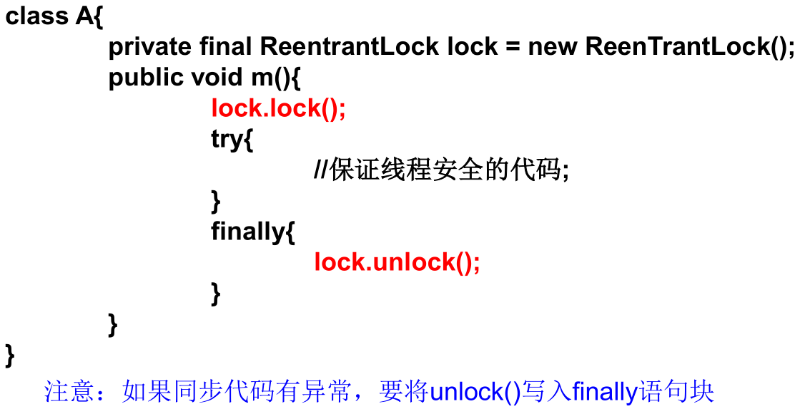

继承 Thread 类方式的修正：

```java
public class LockTest {
    public static void main(String[] args) {
        // 启动第一个售票窗口
        Ticket thread1 = new Ticket();
        thread1.setName("售票窗口一");
        thread1.start();

        // 启动第二个售票窗口
        Ticket thread2 = new Ticket();
        thread2.setName("售票窗口二");
        thread2.start();

        // 启动第三个售票窗口
        Ticket thread3 = new Ticket();
        thread3.setName("售票窗口三");
        thread3.start();
    }
}

class Ticket extends Thread {
    private static int ticketNum = 100;

    // 1.实例化静态ReentrantLock
    private static Lock lock = new ReentrantLock();

    @Override
    public void run() {
        while (true) {
            // 2.调用锁定方法: lock()
            lock.lock();
            try {
                if (ticketNum > 0) {
                    try {
                        Thread.sleep(100);
                    } catch (InterruptedException e) {
                        e.printStackTrace();
                    }
                    System.out.println(Thread.currentThread().getName() + "售出车票，tick号为：" + ticketNum--);
                } else {
                    break;
                }
            } finally {
                lock.unlock();// 3.调用解锁方法: unlock()
            }
        }
    }
}
```

> **ReentrantLock 实例对象需要设置为 static。**

实现 Runnable 接口方式的修正：

```java
public class LockTest {
    public static void main(String[] args) {
        Ticket ticket = new Ticket();

        // 启动第一个售票窗口
        Thread thread1 = new Thread(ticket, "售票窗口1");
        thread1.start();

        // 启动第二个售票窗口
        Thread thread2 = new Thread(ticket, "售票窗口2");
        thread2.start();

        // 启动第三个售票窗口
        Thread thread3 = new Thread(ticket, "售票窗口3");
        thread3.start();
    }
}

class Ticket implements Runnable {
    private int ticketNum = 100;

    // 1.实例化ReentrantLock
    private Lock lock = new ReentrantLock();

    @Override
    public void run() {
        while (true) {
            // 2.调用锁定方法: lock()
            lock.lock();
            try {
                if (ticketNum > 0) {
                    try {
                        Thread.sleep(100);
                    } catch (InterruptedException e) {
                        e.printStackTrace();
                    }
                    System.out.println(Thread.currentThread().getName() + "售出车票，tick号为：" + ticketNum--);
                } else {
                    break;
                }
            } finally {
                lock.unlock();// 3.调用解锁方法: unlock()
            }
        }
    }
}
```

##### synchronized 和 Lock 的对比

- synchronized 是隐式锁，出了作用域自动释放同步监视器，而 Lock 是显式锁，需要手动开启和关闭锁。
- synchronized 有代码块锁和方法锁，而 Lock 只有代码块锁。
- 使用 Lock 锁，JVM 将花费较少的时间来调度线程，性能更好，并且具有更好的扩展性（Lock 接口能提供更多的实现类）。

优先使用顺序：**Lock ---> 同步代码块（已经进入了方法体，分配了相应资源）---> 同步方法（在方法体之外）**

##### 经典实例

银行有一个账户，有两个储户分别向这个账户存钱，每次存 1000，存 10 次，要求每次存完打印账户余额。

实现方式一：

```java
public class AccountTest {
    public static void main(String[] args) {
        // 一个账户
        Account account = new Account(0.0);

        // 两个储户
        Customer c1 = new Customer(account);
        Customer c2 = new Customer(account);

        c1.setName("甲");
        c2.setName("乙");

        c1.start();
        c2.start();
    }
}

class Account {
    private double balance;

    public Account(double balance) {
        this.balance = balance;
    }

    public double getBalance() {
        return balance;
    }

    // 此时的锁是Accout的对象，本例的写法中，Account只有一个，所以两个线程公用的是一个同步锁
    public synchronized void deposit(double amt) {
        if (amt > 0) {
            balance += amt;
            try {
                Thread.sleep(100);
            } catch (InterruptedException e) {
                e.printStackTrace();
            }
            System.out.println(Thread.currentThread().getName() + "存钱成功，余额为：" + balance);
        }
    }
}

class Customer extends Thread {
    private Account account;

    public Customer(Account account) {
        this.account = account;
    }

    @Override
    public void run() {
        for (int i = 0; i < 10; i++) {
            account.deposit(1000.0);
        }
    }
}
```

实现方式二：

```java
public class AccountTest {
    public static void main(String[] args) {
        // 一个账户
        Account account = new Account(0.0);

        // 两个储户
        Customer c1 = new Customer(account);
        Customer c2 = new Customer(account);

        c1.setName("甲");
        c2.setName("乙");

        c1.start();
        c2.start();
    }
}

class Account {
    private double balance;

    public Account(double balance) {
        this.balance = balance;
    }

    public double getBalance() {
        return balance;
    }

    public void deposit(double amt) {
        if (amt > 0) {
            balance += amt;
            try {
                Thread.sleep(100);
            } catch (InterruptedException e) {
                e.printStackTrace();
            }
            System.out.println(Thread.currentThread().getName() + "存钱成功，余额为：" + balance);
        }
    }
}

class Customer extends Thread {
    private Account account;
    
    // static的Lock
    private static Lock lock = new ReentrantLock();

    public Customer(Account account) {
        this.account = account;
    }

    @Override
    public void run() {
        for (int i = 0; i < 10; i++) {
            lock.lock();
            try {
                account.deposit(1000.0);
            } finally {
                lock.unlock();
            }
        }
    }
}
```

#### 线程的通信

- `wait()`与`notify()`和`notifyAll()`
  - `wait()`：**一旦执行此方法，当前线程就进入阻塞状态，并释放同步监视器。**
    - 当前线程排队等候其他线程调用`notify()`或`notifyAll()`方法唤醒，唤醒后等待重新获得对监视器的所有权后才能继续执行。
    - 被唤醒的线程从断点处继续代码的执行。
  - `notify()`：一旦执行此方法，就会唤醒被`wait()`的一个线程。如果有多个线程被`wait()`，则唤醒优先级高的。
  - `notifyAll()`：一旦执行此方法，就会唤醒所有被`wait()`的线程。

- **`wait()`与`notify()`和`notifyAll()`这三个方法必须使用在同步代码块或同步方法中。**

- **`wait()`与`notify()`和`notifyAll()`这三个方法的调用者必须是同步代码块或同步方法中的同步监视器。**
  - 否则会出现`java.lang.IllegalMonitorStateException`异常。

- **`wait()`与`notify()`和`notifyAll()`这三个方法是定义在`java.lang.Object`类中的。**

  - 因为这三个方法必须由同步监视器调用，而任意对象都可以作为同步监视器，因此这三个方法只能在 Object 类中声明。

实例一：使用两个线程打印 1 - 100，要求线程 1 和线程 2 交替打印。

  ```java
public class CommunicationTest {
    public static void main(String[] args) {
        Number number = new Number();

        Thread t1 = new Thread(number);
        Thread t2 = new Thread(number);

        t1.setName("线程1");
        t2.setName("线程2");

        t1.start();
        t2.start();
    }
}

class Number implements Runnable {
    private int number = 1;

    @Override
    public void run() {
        while (true) {
            synchronized (this) {
                // 唤醒被wait()的一个线程
                notify();// 等同于：this.notify();
                if (number <= 100) {
                    try {
                        Thread.sleep(10);
                    } catch (InterruptedException e) {
                        e.printStackTrace();
                    }

                    System.out.println(Thread.currentThread().getName() + ": " + number);
                    number++;

                    try {
                        // 使调用wait()方法的线程进入阻塞状态
                        wait();// 等同于：this.wait();
                    } catch (InterruptedException e) {
                        e.printStackTrace();
                    }
                } else {
                    break;
                }
            }
        }
    }
}
  ```

实例二：生产者/消费者问题。

生产者（Producer）将产品交给店员（Clerk），而消费者（Customer）从店员处取走产品，店员一次只能持有固定数量的产品（比如 20），如果生产者试图生产更多的产品，店员会叫生产者停一下，如果店中有空位放产品了再通知生产者继续生产；如果店中没有产品了，店员会告诉消费者等一下，如果店中有产品了再通知消费者来取走产品。

```java
public class ProductTest {
    public static void main(String[] args) {
        Clerk clerk = new Clerk();

        Producer producer1 = new Producer(clerk);
        producer1.setName("生产者1");

        Consumer consumer1 = new Consumer(clerk);
        consumer1.setName("消费者1");
        Consumer consumer2 = new Consumer(clerk);
        consumer2.setName("消费者2");

        producer1.start();
        consumer1.start();
        consumer2.start();
    }
}

class Clerk {
    private int productCount = 0;

    public synchronized void produceProduct() {
        if (productCount < 20) {
            productCount++;
            System.out.println(Thread.currentThread().getName() + "开始生产第" + productCount + "个产品");
            notify();
        } else {
            try {
                wait();
            } catch (InterruptedException e) {
                e.printStackTrace();
            }
        }
    }

    public synchronized void consumerProduct() {
        if (productCount > 0) {
            System.out.println(Thread.currentThread().getName() + "开始消费第" + productCount + "个产品");
            productCount--;
            notify();
        } else {
            try {
                wait();
            } catch (InterruptedException e) {
                e.printStackTrace();
            }
        }
    }
}

// 生产者
class Producer extends Thread {
    private Clerk clerk;

    public Producer(Clerk clerk) {
        this.clerk = clerk;
    }

    @Override
    public void run() {
        System.out.println(Thread.currentThread().getName() + "开始生产产品...");
        while (true) {
            try {
                Thread.sleep(10);
            } catch (InterruptedException e) {
                e.printStackTrace();
            }
            clerk.produceProduct();
        }
    }
}

// 消费者
class Consumer extends Thread {
    private Clerk clerk;

    public Consumer(Clerk clerk) {
        this.clerk = clerk;
    }

    @Override
    public void run() {
        System.out.println(Thread.currentThread().getName() + "开始消费产品...");
        while (true) {
            try {
                Thread.sleep(20);
            } catch (InterruptedException e) {
                e.printStackTrace();
            }
            clerk.consumerProduct();
        }
    }
}
```

面试题：`sleep()`和`wait()`的异同。

- 相同点：一旦执行方法，都可以使得当前的线程进入阻塞状态。
- 不同点：
  - 	两个方法声明的位置不同：`sleep()`声明在 Thread 类中，`wait()`声明在 Object 类中。
  - 	调用的要求不同：`sleep()`可以在任何需要的场景下调用，`wait()`必须使用在同步代码块或同步方法中。
  - 	关于是否释放同步监视器：如果两个方法都是用在同步代码块或同步方法中，`sleep()`不会释放锁，`wait()`会释放锁。

#### 线程的死锁问题

`死锁`：

- **不同的线程分别占用对方需要的同步资源不放弃，都在等待对方放弃自己需要的同步资源，就形成了线程的死锁。**

- **出现死锁后，不会出现异常，不会出现提示，只是所有的线程都处于阻塞状态，无法继续。**

实例一：

  ```java
public class DeadLock {
    public static void main(String[] args) {
        StringBuilder s1 = new StringBuilder();
        StringBuilder s2 = new StringBuilder();

        // 继承Thread类
        new Thread() {
            @Override
            public void run() {
                synchronized (s1) {
                    s1.append("a");
                    s2.append(1);

                    // 添加sleep()，增加死锁触发的概率
                    try {
                        Thread.sleep(100);
                    } catch (InterruptedException e) {
                        e.printStackTrace();
                    }

                    synchronized (s2) {
                        s1.append("b");
                        s2.append(2);

                        System.out.println(s1);
                        System.out.println(s2);
                    }
                }
            }
        }.start();

        // 实现Runnable接口
        new Thread(new Runnable() {
            @Override
            public void run() {
                synchronized (s2) {
                    s1.append("c");
                    s2.append(3);

                    // 添加sleep()，增加死锁触发的概率
                    try {
                        Thread.sleep(100);
                    } catch (InterruptedException e) {
                        e.printStackTrace();
                    }

                    synchronized (s1) {
                        s1.append("d");
                        s2.append(4);

                        System.out.println(s1);
                        System.out.println(s2);
                    }
                }
            }
        }).start();
    }
}
  ```

实例二：

```java
class A {
    public synchronized void foo(B b) {// 同步监视器：A的对象
        System.out.println("当前线程名: " + Thread.currentThread().getName() + ", 进入了A实例的foo方法"); // ①
        try {
            Thread.sleep(200);
        } catch (InterruptedException ex) {
            ex.printStackTrace();
        }
        System.out.println("当前线程名: " + Thread.currentThread().getName() + ", 企图调用B实例的last方法"); // ③
        b.last();
    }

    public synchronized void last() {
        System.out.println("进入了A类的last方法内部");
    }
}

class B {
    public synchronized void bar(A a) {// 同步监视器：B的对象
        System.out.println("当前线程名: " + Thread.currentThread().getName() + ", 进入了B实例的bar方法"); // ②
        try {
            Thread.sleep(200);
        } catch (InterruptedException ex) {
            ex.printStackTrace();
        }
        System.out.println("当前线程名: " + Thread.currentThread().getName() + ", 企图调用A实例的last方法"); // ④
        a.last();
    }

    public synchronized void last() {
        System.out.println("进入了B类的last方法内部");
    }
}

public class DeadLock implements Runnable {
    A a = new A();
    B b = new B();

    public void init() {
        Thread.currentThread().setName("主线程");
        // 调用a对象的foo方法
        a.foo(b);
        System.out.println("进入了主线程之后");
    }

    @Override
    public void run() {
        Thread.currentThread().setName("副线程");
        // 调用b对象的bar方法
        b.bar(a);
        System.out.println("进入了副线程之后");
    }

    public static void main(String[] args) {
        DeadLock deadLock = new DeadLock();
        new Thread(deadLock).start();
        deadLock.init();
    }
}
```

解决死锁的方法：

- 专门的算法、原则。
- 尽量减少同步资源的定义。
- 尽量避免嵌套同步。

### 线程池

线程池是预先创建线程的一种技术，线程池在还没有任务到来之前，事先创建一定数量的线程，放入空闲队列中，然后对这些资源进行复用，从而减少频繁的创建和销毁对象。

系统启动一个新线程的成本是比较高的，因为它涉及与操作系统交互。在这种情形下，使用线程池可以很好地提高性能，尤其是当程序中需要创建大量生存期很短暂的线程时，更应该考虑使用线程池。

与数据库连接池类似的是，线程池在系统启动时即创建大量空闲的线程，程序将一个 Runnable 对象或 Callable 对象传给线程池，线程池就会启动一个线程来执行它们的`run()`或`call()`， 当`run()`或`call()`执行结束后， 该线程并不会死亡，而是再次返回线程池中成为空闲状态，等待执行下一个 Runnable 对象或 Callable 对象的`run()`或`call()`。

总结：由于系统创建和销毁线程都是需要时间和系统资源开销，为了提高性能，才考虑使用线程池。线程池会在系统启动时就创建大量的空闲线程，然后等待新的线程调用，线程执行结束并不会销毁，而是重新进入线程池，等待再次被调用。这样子就可以减少系统创建启动和销毁线程的时间，提高系统的性能。

#### 使用 Executors 创建线程池

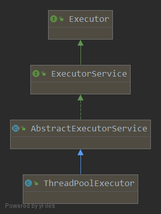

Executor 是线程池的顶级接口，接口中只定义了一个方法`void execute(Runnable command);`，线程池的操作方法都是定义在 ExecutorService 子接口中的，所以说`ExecutorService 是线程池真正的接口`。

##### newSingleThreadExecutor

创建一个单线程的线程池。这个线程池只有一个线程在工作，也就是相当于单线程串行执行所有任务。如果这个唯一的线程因为异常结束，那么会有一个新的线程替代它。此线程池保证所有任务的执行顺序按照任务的提交顺序执行。

```java
public static ExecutorService newSingleThreadExecutor() {
    return new FinalizableDelegatedExecutorService
        (new ThreadPoolExecutor(1, 1,
                                0L, TimeUnit.MILLISECONDS,
                                new LinkedBlockingQueue<Runnable>()));
}
```

##### newFixedThreadPool

创建固定大小的线程池，每次提交一个任务就创建一个线程，直到线程达到线程池的最大大小。线程池的大小一旦达到是大值就会保持不变。如果某个线程因为执行异常而结束，那么线程池会补充一个新线程。

```java
public static ExecutorService newFixedThreadPool(int nThreads, ThreadFactory threadFactory) {
    return new ThreadPoolExecutor(nThreads, nThreads,
                                  0L, TimeUnit.MILLISECONDS,
                                  new LinkedBlockingQueue<Runnable>(),
                                  threadFactory);
}
```

##### newCachedThreadPool

创建一个可缓存的线程池。如果线程池的大小超过了处理任务所需要的线程，那么就会回收部分空闲（60 秒不执行任务）的线程。当任务数增加时，此线程池又可以智能的添加新线程来处理任务。此线程池不会对钱程池大小做限制，线程池大小完全依赖于操作系统（或者说 JVM）能够创建的最大线程大小。

```java
public static ExecutorService newCachedThreadPool() {
    return new ThreadPoolExecutor(0, Integer.MAX_VALUE,
                                  60L, TimeUnit.SECONDS,
                                  new SynchronousQueue<Runnable>());
}
```

#### 使用 ThreadPoolExecutor 创建线程池

```java
public ThreadPoolExecutor(int corePoolSize,
                          int maximumPoolSize,
                          long keepAliveTime,
                          TimeUnit unit,
                          BlockingQueue<Runnable> workQueue,
                          ThreadFactory threadFactory,
                          RejectedExecutionHandler handler) {
    if (corePoolSize < 0 ||
        maximumPoolSize <= 0 ||
        maximumPoolSize < corePoolSize ||
        keepAliveTime < 0)
        throw new IllegalArgumentException();
    if (workQueue == null || threadFactory == null || handler == null)
        throw new NullPointerException();
    this.acc = System.getSecurityManager() == null ?
            null :
            AccessController.getContext();
    this.corePoolSize = corePoolSize;
    this.maximumPoolSize = maximumPoolSize;
    this.workQueue = workQueue;
    this.keepAliveTime = unit.toNanos(keepAliveTime);
    this.threadFactory = threadFactory;
    this.handler = handler;
}
```

##### 构造函数参数说明

**corePoolSize：**`核心线程数大小`，当线程数小于 corePoolSize 的时候，会创建线程执行新的 runnable 或 callable。

**maximumPoolSize：**`最大线程数`， 当线程数大于等于 corePoolSize 的时候，会把新的 runnable 或 callable 放入 workQueue 中。

**keepAliveTime：**`保持存活时间`，当线程数大于 corePoolSize 的时候，空闲线程能保持的最大时间。

**unit：**时间单位。

**workQueue：**`保存任务的阻塞队列`。

**threadFactory：**创建线程的工厂。

**handler：**`拒绝策略`。

##### 任务执行顺序

- **当线程数小于 corePoolSize 时，创建线程执行新任务。**

- **当线程数大于等于 corePoolSize，并且 workQueue 没有满时，新任务放入 workQueue 中。**

- **当线程数大于等于 corePoolSize，并且 workQueue 满时，新任务创建新线程运行，但线程总数要小于 maximumPoolSize。**

- **当线程总数等于 maximumPoolSize，并且 workQueue 满时，执行 handler 的 rejectedExecution，也就是拒绝策略。**

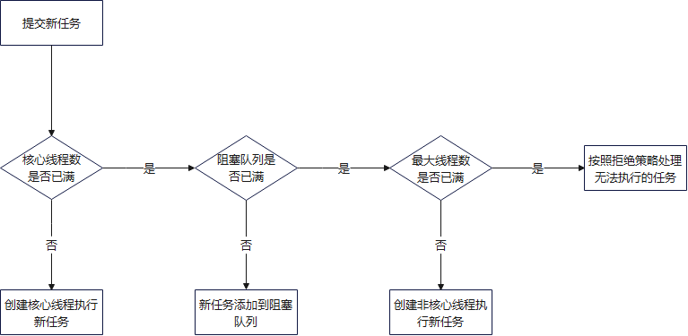

##### 阻塞队列

阻塞队列是一个在队列基础上又支持了两个附加操作的队列：

1. 支持阻塞的**插入**方法：队列满时，队列会阻塞插入元素的线程，直到队列不满。
2. 支持阻塞的**移除**方法：队列空时，获取元素的线程会等待队列变为非空。

###### 阻塞队列的应用场景

阻塞队列常用于生产者和消费者的场景，生产者是向队列里添加元素的线程，消费者是从队列里取元素的线程。简而言之，阻塞队列是生产者用来存放元素、消费者获取元素的容器。

###### 阻塞队列的方法

在阻塞队列不可用的时候，上述两个附加操作提供了四种处理方法：

| 方法处理方式 | 抛出异常  | 返回特殊值 | 一直阻塞 | 超时退出           |
| ------------ | --------- | ---------- | -------- | ------------------ |
| 插入方法     | add(e)    | offer(e)   | put(e)   | offer(e,time,unit) |
| 移除方法     | remove()  | poll()     | take()   | poll(time,unit)    |
| 检查方法     | element() | peek()     | 不可用   | 不可用             |

###### 阻塞队列的类型

JDK 7 提供了 7 个阻塞队列，如下：

1. **ArrayBlockingQueue：**数组结构组成的有界阻塞队列。
   - 此队列按照先进先出（FIFO）的原则对元素进行排序，但是默认情况下不保证线程公平的访问队列，即如果队列满了，那么被阻塞在外面的线程对队列访问的顺序是不能保证线程公平（即先阻塞，先插入）的。


2. **LinkedBlockingQueue：**一个由链表结构组成的有界阻塞队列。
   - 此队列按照先出先进的原则对元素进行排序。


3. **PriorityBlockingQueue：**支持优先级的无界阻塞队列。

4. **DelayQueue：**支持延时获取元素的无界阻塞队列，即可以指定多久才能从队列中获取当前元素。

5. **SynchronousQueue：**不存储元素的阻塞队列，每一个 put 必须等待一个 take 操作，否则不能继续添加元素。并且支持公平访问队列。
6. **LinkedTransferQueue：**由链表结构组成的无界阻塞 TransferQueue 队列。
   - 相对于其他阻塞队列，多了 transfer 和 tryTransfer 方法：
     - **transfer 方法：**如果当前有消费者正在等待接收元素（take 或者待时间限制的 poll 方法），transfer 可以把生产者传入的元素立刻传给消费者。如果没有消费者等待接收元素，则将元素放在队列的 tail 节点，并等到该元素被消费者消费了才返回。
     - **tryTransfer 方法：**用来试探生产者传入的元素能否直接传给消费者。如果没有消费者在等待，则返回 false。和上述方法的区别是该方法无论消费者是否接收，方法立即返回，而 transfer 方法是必须等到消费者消费了才返回。

7. **LinkedBlockingDeque：**链表结构的双向阻塞队列，优势在于多线程入队时，减少一半的竞争。

##### 拒绝策略

当队列和线程池都满了，说明线程池处于饱和的状态，那么必须采取一种策略处理提交的新任务。ThreadPoolExecutor 默认有四个拒绝策略：

- `ThreadPoolExecutor.AbortPolicy()`：默认策略，直接抛出异常 RejectedExecutionException。

  >**java.util.concurrent.RejectedExecutionException：**
  >
  >当线程池  ThreadPoolExecutor 执行方法`shutdown()`之后，再向线程池提交任务的时候，如果配置的拒绝策略是 AbortPolicy ，这个异常就会抛出来。
  >
  >当设置的任务缓存队列过小的时候，或者说，线程池里面所有的线程都在干活（线程数等于 maxPoolSize)，并且任务缓存队列也已经充满了等待的队列， 这个时候，再向它提交任务，也会抛出这个异常。

- `ThreadPoolExecutor.CallerRunsPolicy()`：直接使用当前线程（一般是 main 线程）调用`run()`方法并且阻塞执行。

- `ThreadPoolExecutor.DiscardPolicy()`：不处理，直接丢弃后来的任务。

- `ThreadPoolExecutor.DiscardOldestPolicy()`：丢弃在队列中队首的任务，并执行当前任务。

当然可以继承 RejectedExecutionHandler 来自定义拒绝策略。

##### 线程池参数选择

`CPU 密集型`：线程池的大小推荐为 CPU 数量 +1。CPU 数量可以根据`Runtime.getRuntime().availableProcessors()`方法获取。

`I/O 密集型`：CPU 数量 * CPU 利用率 *（1 + 线程等待时间 / 线程 CPU 时间）。

混合型：将任务分为 CPU 密集型和 I/O 密集型，然后分别使用不同的线程池去处理，从而使每个线程池可以根据各自的工作负载来调整。

阻塞队列：推荐使用有界队列，有界队列有助于避免资源耗尽的情况发生。

拒绝策略：默认采用的是 AbortPolicy 拒绝策略，直接在程序中抛出 RejectedExecutionException 异常，因为是运行时异常，不强制 catch，但这种处理方式不够优雅。处理拒绝策略有以下几种比较推荐：

- 在程序中捕获 RejectedExecutionException 异常，在捕获异常中对任务进行处理。针对默认拒绝策略。
- **使用 CallerRunsPolicy 拒绝策略，该策略会将任务交给调用 execute 的线程执行（一般为主线程），此时主线程将在一段时间内不能提交任何任务，从而使工作线程处理正在执行的任务。此时提交的线程将被保存在 TCP 队列中，TCP 队列满将会影响客户端，这是一种平缓的性能降低。**
- 自定义拒绝策略，只需要实现 RejectedExecutionHandler 接口即可。
- 如果任务不是特别重要，使用 DiscardPolicy 和 DiscardOldestPolicy 拒绝策略将任务丢弃也是可以的。

如果使用 Executors 的静态方法创建 ThreadPoolExecutor 对象，可以通过使用 Semaphore 对任务的执行进行限流也可以避免出现 OOM 异常。

##### 线程池关闭

等待所有线程执行完毕后，应关闭线程池：

```java
try {
    // 等待所有线程执行完毕当前任务
    threadPool.shutdown();

    boolean loop = true;
    do {
        // 等待所有线程执行完毕，当前任务结束
        loop = !threadPool.awaitTermination(2, TimeUnit.SECONDS);// 等待2秒
    } while (loop);

    if (!loop) {
        System.out.println("所有线程执行完毕");
    }
} catch (InterruptedException e) {
    e.printStackTrace();
} finally {
    System.out.println("耗时：" + (System.currentTimeMillis() - startTimeMillis));
}
```

如果只需要等待模型特定任务完成，可以参考如下方式：

```java
Map<String, Future<?>> jobFutureMap = new HashMap<String, Future<?>>();
for (String key : noneExsitKeys) {
    ConcurrentAccessDBJob job = new ConcurrentAccessDBJob(key, userLevel, dao, service);
    Future<?> future = threadPool.submit(job);
    jobFutureMap.put(key, future);
}
for (String key : noneExsitKeys) {
    Future<?> future = jobFutureMap.get(key);
    // 调用此方法会使主线程等待子线程完成
    future.get();
    System.out.println("future.idDone()" + future.isDone());
}
```

##### 示例

```java
import java.util.concurrent.ArrayBlockingQueue;
import java.util.concurrent.ThreadPoolExecutor;
import java.util.concurrent.TimeUnit;

public class TestThreadPoolExecutor {
    public static void main(String[] args) {
        long startTimeMillis = System.currentTimeMillis();

        // 构造一个线程池
        ThreadPoolExecutor threadPool = new ThreadPoolExecutor(5, 6, 3, TimeUnit.SECONDS, new ArrayBlockingQueue<Runnable>(3));

        for (int i = 1; i <= 10; i++) {
            try {
                String task = "task = " + i;
                System.out.println("创建任务并提交到线程池中：" + task);
                threadPool.execute(new ThreadPoolTask(task));
                Thread.sleep(100);
            } catch (Exception e) {
                e.printStackTrace();
            }
        }

        // 线程池关闭
        try {
            // 等待所有线程执行完毕当前任务
            threadPool.shutdown();

            boolean loop = true;
            do {
                // 等待所有线程执行完毕，当前任务结束
                loop = !threadPool.awaitTermination(2, TimeUnit.SECONDS);// 等待2秒
            } while (loop);

            if (!loop) {
                System.out.println("所有线程执行完毕");
            }
        } catch (InterruptedException e) {
            e.printStackTrace();
        } finally {
            System.out.println("耗时：" + (System.currentTimeMillis() - startTimeMillis));
        }
    }
}
```

```java
import java.io.Serializable;

public class ThreadPoolTask implements Runnable, Serializable {
    private String attachData;

    public ThreadPoolTask(String tasks) {
        this.attachData = tasks;
    }

    public void run() {
        try {
            System.out.println("开始执行：" + attachData + "任务，使用的线程池，线程名称："
                    + Thread.currentThread().getName() + "\r\n");
        } catch (Exception e) {
            e.printStackTrace();
        }
        attachData = null;
    }
}
```

运行结果，可以看到线程 pool-1-thread-1 到 pool-1-thread-5 循环使用：

```java
创建任务并提交到线程池中：task = 1
开始执行：task = 1任务，使用的线程池，线程名称：pool-1-thread-1

创建任务并提交到线程池中：task = 2
开始执行：task = 2任务，使用的线程池，线程名称：pool-1-thread-2

创建任务并提交到线程池中：task = 3
开始执行：task = 3任务，使用的线程池，线程名称：pool-1-thread-3

创建任务并提交到线程池中：task = 4
开始执行：task = 4任务，使用的线程池，线程名称：pool-1-thread-4

创建任务并提交到线程池中：task = 5
开始执行：task = 5任务，使用的线程池，线程名称：pool-1-thread-5

创建任务并提交到线程池中：task = 6
开始执行：task = 6任务，使用的线程池，线程名称：pool-1-thread-1

创建任务并提交到线程池中：task = 7
开始执行：task = 7任务，使用的线程池，线程名称：pool-1-thread-2

创建任务并提交到线程池中：task = 8
开始执行：task = 8任务，使用的线程池，线程名称：pool-1-thread-3

创建任务并提交到线程池中：task = 9
开始执行：task = 9任务，使用的线程池，线程名称：pool-1-thread-4

创建任务并提交到线程池中：task = 10
开始执行：task = 10任务，使用的线程池，线程名称：pool-1-thread-5

所有线程执行完毕
耗时：1014
```

#### 优雅实现

##### Maven 添加依赖

```xml
<dependency>
    <groupId>cn.hutool</groupId>
    <artifactId>hutool-all</artifactId>
    <version>5.7.22</version>
</dependency>
```

##### 具体实现

```java
package cn.antai.xisun.influxdb.utils;

import cn.hutool.core.thread.ThreadUtil;

import java.util.concurrent.*;

/**
 * 可伸缩的线程池，可根据当前任务数自动调整corePoolSize
 * 实际场景中，有时很难估算出合理的线程数
 * 参考美团技术团队博客而做此实现，详情见：https://tech.meituan.com/2020/04/02/java-pooling-pratice-in-meituan.html
 */
public class FlexibleThreadPool {
    private static final int CORE_POOL_SIZE = 20;
    private static final int MAX_POOL_SIZE = 50;
    private static final long KEEP_ALIVE_MINUTES = 3L;
    private static final int MAX_TASK_SIZE = 1000;
    private static final double THREAD_INCREASE_FACTOR = 1.5;

    // 可动态调整coreSize大小的线程池
    private static final ThreadPoolExecutor THREAD_POOL = new ThreadPoolExecutor(
            CORE_POOL_SIZE,
            MAX_POOL_SIZE,
            KEEP_ALIVE_MINUTES,
            TimeUnit.MINUTES,
            new LinkedBlockingQueue<>(MAX_TASK_SIZE),
            ThreadUtil.newNamedThreadFactory("flexible-thread-pool-", false),
            new ThreadPoolExecutor.CallerRunsPolicy());

    static {
        THREAD_POOL.allowCoreThreadTimeOut(true);

        // 开启定期更新threadPool的coreSize任务
        schedule();
    }

    private static void schedule() {
        ScheduledExecutorService scheduler = Executors.newSingleThreadScheduledExecutor(runnable -> {
            Thread thread = new Thread(runnable, "AdjustFlexibleThreadPoolCoreSize");
            thread.setDaemon(true);
            return thread;
        });
        // 每3秒检测是否需要调整corePoolSize
        final long period = 3L;
        scheduler.scheduleAtFixedRate(FlexibleThreadPool::adjustThreadPoolCoreSize, 1, period, TimeUnit.SECONDS);
    }

    private static void adjustThreadPoolCoreSize() {
        final int minThreads = CORE_POOL_SIZE;
        final int maxThreads = MAX_POOL_SIZE;
        final double factor = THREAD_INCREASE_FACTOR;

        final int coreSize = THREAD_POOL.getCorePoolSize();
        int size = coreSize;
        final int n = (int) (coreSize / factor);

        if (!THREAD_POOL.getQueue().isEmpty()) {
            // 任务队列中有排队任务，应适当增加coreSize
            size = (int) (coreSize * factor);
        } else if (THREAD_POOL.getActiveCount() <= n) {
            // 线程池中活跃线程数低于 coreSize/factor时，应适当减少coreSize
            size = n + 3;
        } else {
            return;
        }
        // coreSize不能低于minThreads，也不能高于maxThreads
        size = Math.min(Math.max(minThreads, size), maxThreads);

        // 这个判断是必须的(coreSize不需要改变时不要调用setCorePoolSize，否则会频繁interrupt因poll而阻塞的thread)
        if (size != coreSize) {
            THREAD_POOL.setCorePoolSize(size);
        }
    }

    public static ThreadPoolExecutor getThreadPool() {
        return THREAD_POOL;
    }

    public static <T> Future<T> submitTask(Callable<T> task) {
        return THREAD_POOL.submit(task);
    }

    public static void submitTask(Runnable task) { 
        THREAD_POOL.submit(task);
    }
}
```

## 网络编程

Java 是 Internet 上的语言，它从语言级上提供了对网络应用程序的支持，程序员能够很容易开发常见的网络应用程序。

Java 提供的网络类库，可以实现无痛的网络连接，联网的底层细节被隐藏在 Java 的本机安装系统里，由 JVM 进行控制。并且 Java 实现了一个跨平台的网络库， 程序员面对的是一个统一的网络编程环境。

计算机网络：把分布在不同地理区域的计算机与专门的外部设备用通信线路互连成一个规模大、功能强的网络系统，从而使众多的计算机可以方便地互相传递信息、共享硬件、软件、数据信息等资源。

网络编程的目的：直接或间接地通过网络协议与其它计算机实现数据交换，进行通讯。

网络编程中有两个主要的问题：

- 如何准确地定位网络上一台或多台主机，以及定位主机上的特定的应用。
- 找到主机后如何可靠高效地进行数据传输。

### 网络通信要素

两个个要素：

- `IP`和`端口号`

- `网络通信协议`

如何实现网络中的主机互相通信：

- 通信双方地址：

  - IP 和端口号

- 一定的规则，即：网络通信协议。有两套参考模型：

  - OSI 参考模型：模型过于理想化，未能在因特网上进行广泛推广。

  - `TCP/IP 参考模型 (或叫 TCP/IP 协议)`：事实上的国际标准。

    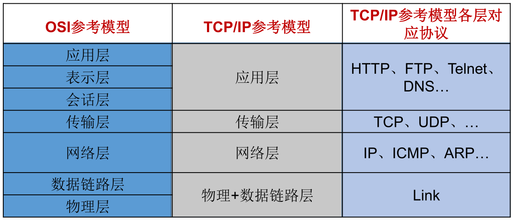

网络中数据传输过程：

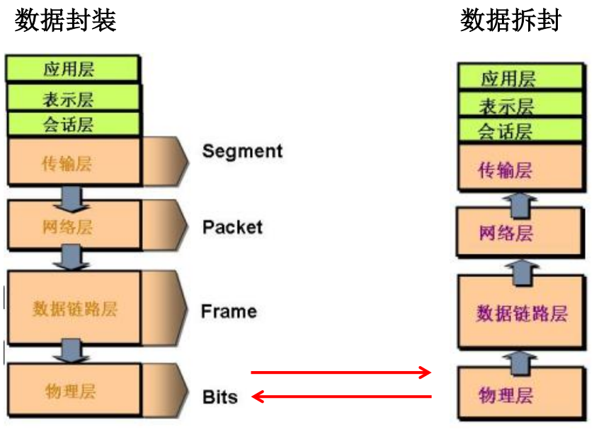

#### 通信要素 1：IP 和端口号

**`IP`**：Java 中，一个 InetAddress 类的实例对象，就代表一个 IP 地址。

- 唯一的标识 Internet 上的计算机（通信实体）。
- IP 地址分类方式 1：`IPV4`和`IPV6`。
  - IPV4：4 个字节组成，4 个 0 ~ 255。大概 42 亿，30 亿都在北美，亚洲 4亿。2011 年初已经用尽。以点分十进制表示，如 192.168.0.1。
  - IPV6：128 位，16 个字节，写成 8 个无符号整数，每个整数用四个十六进制位表示，数之间用冒号 : 分开，如：3ffe:3201:1401:1280:c8ff:fe4d:db39:1984。
- IP 地址分类方式 2： `公网地址 (万维网使用)`和`私有地址 (局域网使用)`。192.168. 开头的就是私有址址，范围为 192.168.0.0 ~ 192.168.255.255，专门为组织机构内部使用。
- 特点：不易记忆。

**`端口号`**：标识正在计算机上运行的进程（程序）。

- 不同的进程有不同的端口号。
- 被规定为一个 16 位的整数 0 ~ 65535。
- 端口分类：
  - `公认端口`：0 ~ 1023。被预先定义的服务通信占用，如：HTTP 占用端口 80，FTP 占用端口 21，Telnet 占用端口 23 等。
  - `注册端口`：1024 ~ 49151。分配给用户进程或应用程序，如：Tomcat 占用端口 8080，MySQL 占用端口 3306，Oracle 占用端口 1521 等。
  - `动态/私有端口`：49152 ~ 65535。

**`端口号与 IP 地址的组合得出一个网络套接字：Socket。`**

InetAddress 类：

- Internet 上的主机有两种方式表示地址：

  - `IP 地址 (hostAddress)`，如：202.108.35.210。
  - `域名 (hostName)`，如：www.atguigu.com。
  - 本地回环地址（hostAddress）：`127.0.0.1`，主机名（hostName）：`localhost`。

- InetAddress 类主要表示 IP 地址，两个子类：Inet4Address、Inet6Address。

- InetAddress 类对象含有一个 Internet 主机地址的域名和 IP 地址，如：www.atguigu.com 和 202.108.35.210。

- 域名容易记忆，当在连接网络时输入一个主机的域名后，`域名服务器 (DNS)`负责将域名转化成 IP 地址，这样才能和主机建立连接。这就是`域名解析`。

  - 域名解析时，先找本机 hosts 文件，确定是否有输入的域名地址，如果没有，再通过 DNS 服务器，找到对应的主机。

    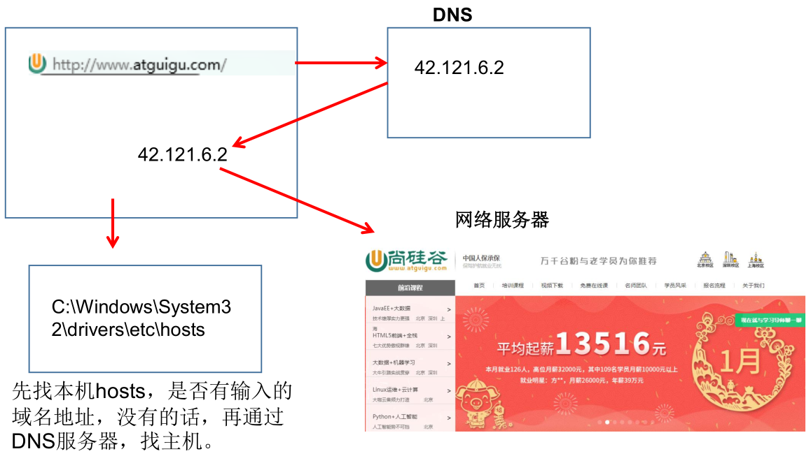

- InetAddress 类没有提供公共的构造器，而是提供了如下几个静态方法来获取 InetAddress 实例：

  - `public static InetAddress getLocalHost()`
  - `public static InetAddress getByName(String host)`

- InetAddress 类提供了如下几个常用的方法：

  - `public String getHostAddress()`：返回 IP 地址字符串，以文本表现形式。
  - `public String getHostName()`：获取此 IP 地址的主机名。
  - `public boolean isReachable(int timeout)`：测试是否可以达到该地址。

实例：

  ```java
/**
 * 一、网络编程中有两个主要的问题：
 * 1.如何准确地定位网络上一台或多台主机；定位主机上的特定的应用
 * 2.找到主机后如何可靠高效地进行数据传输
 *
 * 二、网络编程中的两个要素：
 * 1.对应问题一：IP和端口号
 * 2.对应问题二：提供网络通信协议：TCP/IP参考模型（应用层、传输层、网络层、物理+数据链路层）
 *
 *
 * 三、通信要素一：IP和端口号
 *
 * 1. IP: 唯一的标识 Internet 上的计算机（通信实体）
 * 2. 在Java中使用InetAddress类代表IP
 * 3. IP分类：IPv4 和 IPv6; 万维网和局域网
 * 4. 域名:   www.baidu.com   www.mi.com  www.sina.com  www.jd.com  www.vip.com
 * 5. 本地回路地址：127.0.0.1 对应着：localhost
 *
 * 6. 如何实例化InetAddress:两个方法：getByName(String host) 、 getLocalHost()
 *        两个常用方法：getHostName() / getHostAddress()
 *
 * 7. 端口号：正在计算机上运行的进程。
 * 要求：不同的进程有不同的端口号
 * 范围：被规定为一个 16 位的整数 0~65535。
 *
 * 8. 端口号与IP地址的组合得出一个网络套接字：Socket
 */
public class InetAddressTest {
    public static void main(String[] args) {
        try {
            InetAddress inet1 = InetAddress.getByName("192.168.10.14");
            System.out.println(inet1);// /192.168.10.14

            InetAddress inet2 = InetAddress.getByName("www.atguigu.com");
            System.out.println(inet2);// www.atguigu.com/58.215.145.131

            InetAddress inet3 = InetAddress.getByName("127.0.0.1");
            System.out.println(inet3);// /127.0.0.1

            // 获取本地ip
            InetAddress inet4 = InetAddress.getLocalHost();
            System.out.println(inet4);

            // getHostAddress()
            System.out.println(inet2.getHostAddress());// 58.215.145.131
            // getHostName()
            System.out.println(inet2.getHostName());// www.atguigu.com
            // isReachable(int timeout)
            try {
                System.out.println(inet2.isReachable(10));// true
            } catch (IOException exception) {
                exception.printStackTrace();
            }
        } catch (UnknownHostException e) {
            e.printStackTrace();
        }
    }
}
  ```

#### 通信要素 2：网络通信协议

**网络通信协议：计算机网络中实现通信必须有一些约定，即`通信协议`，对速率、传输代码、代码结构、传输控制步骤、出错控制等制定标准。**

问题：网络协议太复杂。计算机网络通信涉及内容很多，比如指定源地址和目标地址、加密解密、压缩解压缩、差错控制、流量控制、路由控制等，如何实现如此复杂的网络协议呢？

通信协议`分层`的思想：在制定协议时，把复杂成份分解成一些简单的成份，再将它们复合起来。最常用的复合方式是层次方式，即**同层间可以通信、上一层可以调用下一层，而与再下一层不发生关系。**各层互不影响，利于系统的开发和扩展。

TCP/IP 协议簇：

- **TCP/IP 协议簇以其两个主要协议传输控制协议（TCP）和网络互联协议（IP）而得名**，实际上是一组协议，包括多个具有不同功能且互为关联的协议。

- 传输层协议中两个非常重要的协议：

  - **传输控制协议 TCP**（Transmission Control Protocol）。
  - **用户数据报协议 UDP**（User Datagram Protocol）。

- 网络层的主要协议： 网络互联协议 IP（Internet Protocol），其支持网间互连的数据通信。

- TCP/IP 协议模型从更实用的角度出发，形成了高效的四层体系结构，即**`物理链路层、IP 层、传输层和应用层`**。

- **`TCP 协议`**

  - 使用 TCP 协议前，**`须先建立 TCP 连接`**，形成传输数据通道。

  - 传输前，采用**`三次握手`**方式，点对点通信，**`是可靠的`**。

    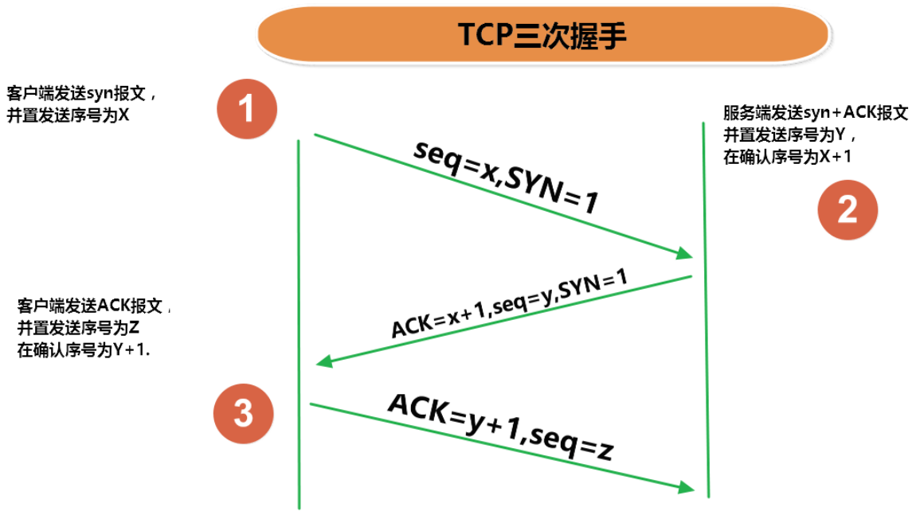

  - TCP 协议进行通信的两个应用进程：客户端、服务端。

  - 在连接中**`可进行大数据量的传输`**。

  - 传输完毕，采用**`四次挥手`**方式，**`释放已建立的连接`，效率相对低**。

    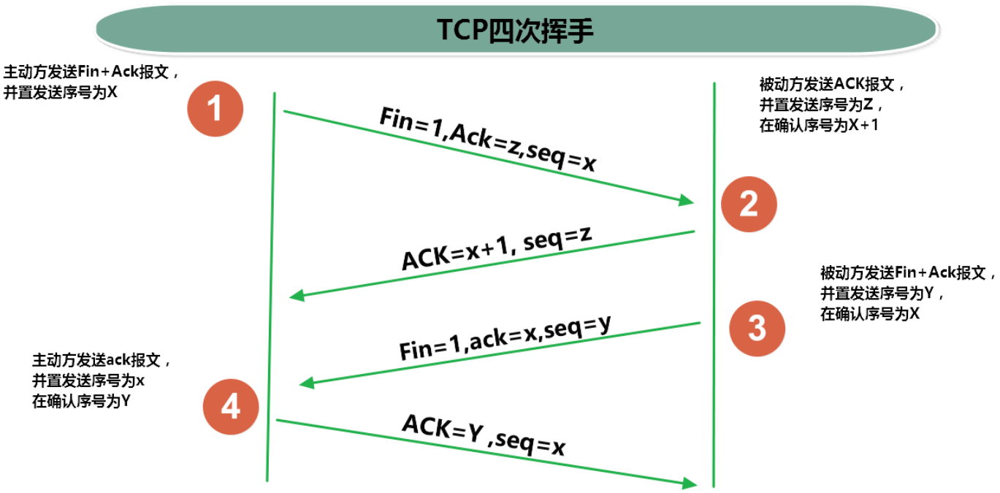

- **`UDP 协议`**

  - 将数据、源、目的封装成数据包，**`不需要建立连接`**。
  - 每个数据报的大小限制在`64 K`内。
  - 发送不管对方是否准备好，接收方收到也不确认，故**`是不可靠的`**。
  - 可以广播发送。
  - 发送数据结束时**`无需释放资源`，开销小，速度相对快**。

### TCP 网络编程

`Socket 类`实现了基于 TCP 协议的网络编程。

- 利用`套接字 (Socket)`开发网络应用程序早已被广泛的采用，以至于成为事实上的标准。
- **`网络上具有唯一标识的 IP 地址和端口号组合在一起，才能构成唯一能识别的标识符套接字。`**
- 通信的两端都要有 Socket，是两台机器间通信的端点。
- 网络通信其实就是 Socket 间的通信。
- Socket 允许程序把网络连接当成一个流，数据在两个 Socket 间通过 I/O 传输。
- 一般主动发起通信的应用程序属客户端，等待通信请求的为服务端。
- Socket 类：
  - **`流套接字 (stream socket)`：使用 TCP 提供可依赖的字节流服务。**
  - **`数据报套接字 (datagram socket)`：使用 UDP 提供 "尽力而为" 的数据报服务。**
- Socket 类的常用构造器 ：
  - `public Socket(InetAddress address,int port)`：创建一个流套接字并将其连接到指定 IP 地址的指定端口号。
  - `public Socket(String host,int port)`：创建一个流套接字并将其连接到指定主机上的指定端口号。
- Socket 类的常用方法：
  - `public InputStream getInputStream()`：返回此套接字的输入流。可以用于接收网络消息。
  - `public OutputStream getOutputStream()`：返回此套接字的输出流。可以用于发送网络消息。
  - `public InetAddress getInetAddress()`：返回此套接字连接到的远程 IP 地址；如果尚未连接套接字，则返回 null。
  - `public InetAddress getLocalAddress()`：返回此套接字绑定的本地地址，即本端的 IP 地址。
  - `public int getPort()`：返回此套接字连接到的远程端口号；如果尚未连接套接字，则返回 0。
  - `public int getLocalPort()`：返回此套接字绑定的本地端口，即本端的端口号。如果尚未绑定套接字，则返回 -1。
  - `public void close()`：关闭此套接字。套接字被关闭后，便不可在以后的网络连接中使用（即无法重新连接或重新绑定）。需要创建新的套接字对象。关闭此套接字也将会关闭该套接字的 InputStream 和 OutputStream。
  - `public void shutdownInput()`：关闭此套接字的输入流。如果在套接字上调用`shutdownInput()`后再从套接字输入流读取内容，则流将返回 EOF（文件结束符），即不能再从此套接字的输入流中接收任何数据。
  - `public void shutdownOutput()`：关闭此套接字的输出流。对于 TCP 套接字，任何以前写入的数据都将被发送，并且跟 TCP 的正常连接终止序列。 如果在套接字上调用`shutdownOutput()`后再写入套接字输出流，则该流将抛出 IOException，即不能再通过此套接字的输出流发送任何数据。

Java 语言的基于套接字编程分为服务端编程和客户端编程，其通信模型如图所示：

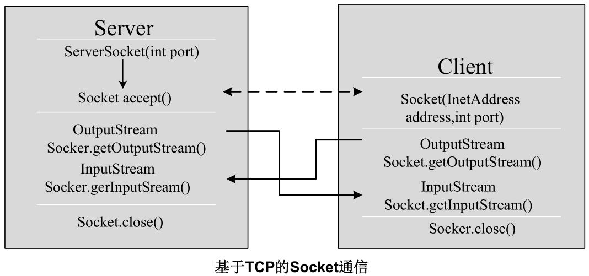

**服务端 Scoket 的工作过程包含以下四个基本的步骤：**

- 调用`ServerSocket(int port)`：创建一个服务器端套接字，并绑定到指定端口上。用于监听客户端的请求。
- 调用`accept()`：监听连接请求，如果客户端请求连接，则接受连接，并返回通信套接字对象。
- 调用该 Socket 类对象的`getOutputStream()`和`getInputStream()`：获取输出流和输入流，开始网络数据的发送和接收。
- 关闭 ServerSocket 和 Socket 对象：客户端访问结束，关闭通信套接字。

**客户端 Socket 的工作过程包含以下四个基本的步骤：**

- 创建 Socket：根据指定服务端的 IP 地址或端口号构造 Socket 类对象。若服务器端响应，则建立客户端到服务器的通信线路。若连接失败，会出现异常。
- 打开连接到 Socket 的输入/输出流：使用`getInputStream()`获得输入流，使用`getOutputStream()`获得输出流，进行数据传输。
- 按照一定的协议对 Socket 进行读/写操作：通过输入流读取服务器放入通信线路的信息（但不能读取自己放入通信线路的信息），通过输出流将信息写入通信线路。
- 关闭 Socket：断开客户端到服务器的连接，释放通信线路。

服务器建立 ServerSocket 对象：

- ServerSocket 对象负责等待客户端请求建立套接字连接，类似邮局某个窗口中的业务员。也就是说，**服务器必须事先建立一个等待客户请求建立套接字**
  **连接的 ServerSocket 对象。**

- 所谓 "接收" 客户的套接字请求，就是`accept()`会返回一个 Socket 对象。

  ```java
  ServerSocket ss = new ServerSocket(9999);
  Socket s = ss.accept();
  InputStream in = s.getInputStream();
  byte[] buf = new byte[1024];
  int num = in.read(buf);
  String str = new String(buf,0,num);
  System.out.println(s.getInetAddress().toString()+”:”+str);
  s.close();
  ss.close();
  ```

客户端创建 Socket 对象：

- 客户端程序可以使用 Socket 类创建对象，**创建的同时会自动向服务器方发起连接。**Socket 的构造器是：

  - `Socket(String host,int port)throws UnknownHostException,IOException`：向服务器（域名为 host，端口号为 port）发起 TCP 连接，若成功，则创建 Socket 对象，否则抛出异常。
  - `Socket(InetAddress address,int port)throws IOException`：根据 InetAddress 对象所表示的 IP 地址以及端口号 port 发起连接。

- 客户端建立 socketAtClient 对象的过程就是向服务器发出套接字连接请求。

  ```java
  Socket s = new Socket("192.168.40.165",9999);
  OutputStream out = s.getOutputStream();
  out.write(" hello".getBytes());
  s.close();
  ```

流程示意图：

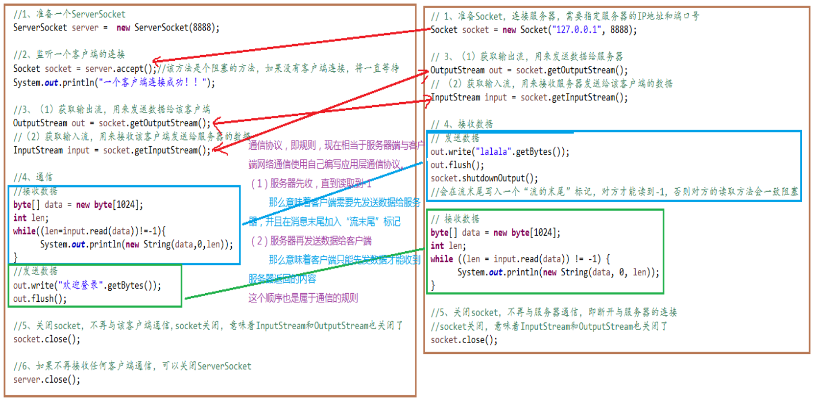

实例 1：客户端发送信息给服务端，服务端将数据显示在控制台上。

```java
/**
 * 实现TCP的网络编程
 * 实例1：客户端发送信息给服务端，服务端将数据显示在控制台上
 */
public class TCPTest {
    /*
    客户端
     */
    @Test
    public void client() {
        Socket socket = null;
        OutputStream os = null;
        try {
            // 1.创建Socket对象，指明服务器端的ip和端口号
            InetAddress inet = InetAddress.getByName("127.0.0.1");// 本机
            socket = new Socket(inet, 8879);
            // 2.获取一个输出流，用于输出数据
            os = socket.getOutputStream();
            // 3.写出数据的操作
            os.write("你好，我是客户端".getBytes());
        } catch (IOException e) {
            e.printStackTrace();
        } finally {
            // 4.关闭资源
            if (os != null) {
                try {
                    os.close();
                } catch (IOException e) {
                    e.printStackTrace();
                }
            }
            if (socket != null) {
                try {
                    socket.close();
                } catch (IOException e) {
                    e.printStackTrace();
                }
            }
        }
    }

    /*
    服务端
     */
    @Test
    public void server() {
        ServerSocket ss = null;
        Socket socket = null;
        InputStream is = null;
        ByteArrayOutputStream baos = null;
        try {
            // 1.创建服务器端的ServerSocket，指明自己的端口号
            ss = new ServerSocket(8879);
            // 2.调用accept()表示接收来自于客户端的socket
            socket = ss.accept();
            // 3.获取输入流
            is = socket.getInputStream();
            // 4.读取输入流中的数据
            // 不建议这样写，可能会有乱码(字节流读取中文)
            /*byte[] buffer = new byte[1024];
            int len;
            while ((len = is.read(buffer)) != -1) {
                String str = new String(buffer, 0, len);
                System.out.print(str);
            }*/
            baos = new ByteArrayOutputStream();
            byte[] buffer = new byte[5];
            int len;
            while ((len = is.read(buffer)) != -1) {
                // 将输入流中的数据都读到ByteArrayOutputStream中，读完之后再转换
                baos.write(buffer, 0, len);
            }
            System.out.println("收到了来自于：" + socket.getInetAddress().getHostAddress() + "的数据");// 客户端信息
            System.out.println(baos.toString());// 客户端发送的数据
        } catch (IOException e) {
            e.printStackTrace();
        } finally {
            // 5.关闭资源
            if (baos != null) {
                try {
                    baos.close();
                } catch (IOException e) {
                    e.printStackTrace();
                }
            }
            if (is != null) {
                try {
                    is.close();
                } catch (IOException e) {
                    e.printStackTrace();
                }
            }
            if (socket != null) {
                try {
                    socket.close();
                } catch (IOException e) {
                    e.printStackTrace();
                }
            }
            if (ss != null) {
                try {
                    ss.close();
                } catch (IOException e) {
                    e.printStackTrace();
                }
            }
        }
    }
}
```

实例 2：客户端发送文件给服务端，服务端将文件保存在本地。

```java
/**
 *
 * 实现TCP的网络编程
 * 实例2：客户端发送文件给服务端，服务端将文件保存在本地。
 */
public class TCPTest {
    /*
   客户端
   这里涉及到的异常，应该使用try-catch-finally处理
    */
    @Test
    public void client() throws IOException {
        // 1.创建Socket对象，指明服务器端的ip和端口号
        Socket socket = new Socket(InetAddress.getByName("127.0.0.1"), 9090);
        // 2.获取一个输出流，用于输出数据
        OutputStream os = socket.getOutputStream();
        // 3.创建输入流，可以使用BufferedInputStream包装
        FileInputStream fis = new FileInputStream(new File("beauty.jpg"));
        // 4.读写操作
        byte[] buffer = new byte[1024];
        int len;
        while ((len = fis.read(buffer)) != -1) {
            os.write(buffer, 0, len);
        }
        // 5.关闭资源
        fis.close();
        os.close();
        socket.close();
    }

    /*
    服务端
    这里涉及到的异常，应该使用try-catch-finally处理
     */
    @Test
    public void server() throws IOException {
        // 1.创建服务器端的ServerSocket，指明自己的端口号
        ServerSocket ss = new ServerSocket(9090);
        // 2.调用accept()表示接收来自于客户端的socket
        Socket socket = ss.accept();
        // 3.获取输入流
        InputStream is = socket.getInputStream();
        // 4.创建输出流，可以使用BufferedOutputStream包装
        FileOutputStream fos = new FileOutputStream(new File("beauty1.jpg"));
        // 5.读写操作
        byte[] buffer = new byte[1024];
        int len;
        while ((len = is.read(buffer)) != -1) {
            fos.write(buffer, 0, len);
        }
        // 6.关闭资源
        fos.close();
        is.close();
        socket.close();
        ss.close();
    }
}
```

实例 3：从客户端发送文件给服务端，服务端保存到本地，然后返回 "发送成功" 给客户端，并关闭相应的连接。

```java
/**
 * 实现TCP的网络编程
 * 实例3：从客户端发送文件给服务端，服务端保存到本地，然后返回"发送成功"给客户端，并关闭相应的连接。
 */
public class TCPTest {
    /*
   客户端
   这里涉及到的异常，应该使用try-catch-finally处理
    */
    @Test
    public void client() throws IOException {
        // 1.创建Socket对象，指明服务器端的ip和端口号
        Socket socket = new Socket(InetAddress.getByName("127.0.0.1"), 9090);
        // 2.获取一个输出流，用于输出数据
        OutputStream os = socket.getOutputStream();
        // 3.创建输入流，可以使用BufferedInputStream包装
        FileInputStream fis = new FileInputStream(new File("beauty.jpg"));
        // 4.读写操作
        byte[] buffer = new byte[1024];
        int len;
        while ((len = fis.read(buffer)) != -1) {
            os.write(buffer, 0, len);
        }
        // 关闭数据的输出，表示客服端数据传输已经完成，提醒服务端不必继续等待
        // 如果不执行此操作，服务器端会一直阻塞
        socket.shutdownOutput();

        // 5.接收来自于服务器端的数据，并显示到控制台上
        InputStream is = socket.getInputStream();
        ByteArrayOutputStream baos = new ByteArrayOutputStream();
        byte[] bufferr = new byte[20];
        int len1;
        while ((len1 = is.read(buffer)) != -1) {
            baos.write(buffer, 0, len1);
        }
        System.out.println(baos.toString());

        // 6.关闭资源
        baos.close();
        fis.close();
        os.close();
        socket.close();
    }

    /*
    服务端
    这里涉及到的异常，应该使用try-catch-finally处理
     */
    @Test
    public void server() throws IOException {
        // 1.创建服务器端的ServerSocket，指明自己的端口号
        ServerSocket ss = new ServerSocket(9090);
        // 2.调用accept()表示接收来自于客户端的socket
        Socket socket = ss.accept();
        // 3.获取输入流
        InputStream is = socket.getInputStream();
        // 4.创建输出流，可以使用BufferedOutputStream包装
        FileOutputStream fos = new FileOutputStream(new File("beauty1.jpg"));
        // 5.读写操作
        byte[] buffer = new byte[1024];
        int len;
        while ((len = is.read(buffer)) != -1) {// read()是一个阻塞式方法
            fos.write(buffer, 0, len);
        }

        System.out.println("图片传输完成");

        // 6.服务器端给予客户端反馈
        OutputStream os = socket.getOutputStream();
        os.write("你好，客户端，照片已收到！".getBytes());

        // 7.关闭资源
        os.close();
        fos.close();
        is.close();
        socket.close();
        ss.close();
    }
}
```

### UDP 网络编程

`DatagramSocket 类和 DatagramPacket 类`实现了基于 UDP 协议的网络编程。

- UDP 数据报通过数据报套接字 DatagramSocket 发送和接收，系统不保证 UDP 数据报一定能够安全送到目的地，也不能确定什么时候可以抵达。

- DatagramPacket 对象封装了 UDP 数据报，在数据报中包含了发送端的 IP 地址和端口号以及接收端的 IP 地址和端口号。

- UDP 协议中每个数据报都给出了完整的地址信息，因此无须建立发送方和接收方的连接。如同发快递包裹一样。

- DatagramSocket 类的常用方法：

  - `public DatagramSocket(int port)`：创建数据报套接字并将其绑定到本地主机上的指定端口。套接字将被绑定到通配符地址，IP 地址由内核来选择。
  - `public DatagramSocket(int port,InetAddress laddr)`：创建数据报套接字，将其绑定到指定的本地地址。本地端口必须在 0 到 65535 之间（包括两者）。如果 IP 地址为 0.0.0.0，套接字将被绑定到通配符地址，IP 地址由内核选择。
  - `public void close()`：关闭此数据报套接字。
  - `public void send(DatagramPacket p)`：从此套接字发送数据报包。DatagramPacket 包含的信息指示：将要发送的数据、数据长度、远程主机的 IP 地址和远程主机的端口号。
  - `public void receive(DatagramPacket p)`：从此套接字接收数据报包。当此方法返回时，DatagramPacket 的缓冲区填充了接收的数据。数据报包也包含发送方的 IP 地址和发送方机器上的端口号。此方法在接收到数据报前一直阻塞。数据报包对象的 length 字段包含所接收信息的长度。如果信息比包的长度长，该信息将被截短。
  - `public InetAddress getLocalAddress()`：获取套接字绑定的本地地址。
  - `public int getLocalPort()`：返回此套接字绑定的本地主机上的端口号。
  - `public InetAddress getInetAddress()`：返回此套接字连接的地址。如果套接字未连接，则返回 null。
  - `public int getPort()`：返回此套接字的端口。如果套接字未连接，则返回 -1。

- DatagramPacket 类的常用方法：

  - `public DatagramPacket(byte[] buf,int length)`：构造 DatagramPacket，用来接受长度为 length 的数据包。 length 参数必须小于等于`buf.length()`。
  - `public DatagramPacket(byte[] buf,int length,InetAddress address,int port)`：构造数据报包，用来将长度为 length 的包发送到指定主机上的指定端口号。length 参数必须小于等于`buf.length()`。
  - `public InetAddress getAddress()`：返回某台机器的 IP 地址，此数据报将要发往该机器或者是从该机器接收到的。
  - `public int getPort()`：返回某台远程主机的端口号，此数据报将要发往该主机或者是从该主机接收到的。
  - `public byte[] getData()`：返回数据缓冲区。接收到的或将要发送的数据从缓冲区中的偏移量 offset 处开始，持续 length 长度。
  - `public int getLength()`：返回将要发送或接收到的数据的长度。

UDP 网络通信流程：

  - DatagramSocket 与 DatagramPacket。
  - 建立发送端，接收端， 发送端与接收端是两个独立的运行程序。
  - 建立数据包。
  - 调用 Socket 的发送、接收方法。
  - 关闭 Socket。

实例：

  ```java
public class UDPTest {
    /*
    发送端
    注意：发送端发送数据，是不管接收端能不能收到，为了保证接收端能收到数据，应该先启动接收端。
     */
    @Test
    public void sender() {
        DatagramSocket socket = null;
        try {
            socket = new DatagramSocket();

            String str = "我是UDP方式发送的数据";
            byte[] data = str.getBytes();
            InetAddress inet = InetAddress.getLocalHost();
            // 封装数据报，发送到本机的9090端口
            DatagramPacket packet = new DatagramPacket(data, 0, data.length, inet, 9090);

            socket.send(packet);
        } catch (IOException exception) {
            exception.printStackTrace();
        } finally {
            if (socket != null) {
                socket.close();
            }
        }
    }

    /*
    接收端
    注意：在接收端，要指定监听的端口。
     */
    @Test
    public void receiver() {
        DatagramSocket socket = null;
        try {
            socket = new DatagramSocket(9090);

            byte[] buffer = new byte[100];
            DatagramPacket packet = new DatagramPacket(buffer, 0, buffer.length);

            socket.receive(packet);
            System.out.println(new String(packet.getData(), 0, packet.getLength()));
        } catch (IOException exception) {
            exception.printStackTrace();
        } finally {
            if (socket != null) {
                socket.close();
            }
        }
    }
}
  ```

### URL 网络编程

**`URL (Uniform Resource Locator)`：`统一资源定位符`，它表示 Internet 上某一资源的地址。**

- 它是一种具体的 URI，即 URL 可以用来标识一个资源，而且还指明了如何 locate 这个资源。

- 通过 URL 我们可以访问 Internet 上的各种网络资源，比如最常见的 www，ftp 站点。浏览器通过解析给定的 URL 可以在网络上查找相应的文件或其他资源。

URL 的基本结构由 5 部分组成：**`<传输协议>://<主机名>:<端口号>/<文件名>#片段名?参数列表`**。

- 例如：http://192.168.1.100:8080/helloworld/index.jsp#a?username=shkstart&password=123
- `#片段名`：即锚点，例如看小说，直接定位到章节。
- `参数列表格式`：参数名=参数值&参数名=参数值....

为了表示 URL，`java.net`中实现了类 URL。我们可以通过下面的构造器来初始化一个 URL 对象：

- **`public URL (String spec)`**：通过一个表示 URL 地址的字符串可以构造一个 URL 对象。例如：`URL url = new URL("http://www. atguigu.com/");`。
- **`public URL(URL context, String spec)`**：通过基 URL 和相对 URL 构造一个 URL 对象。例如：`URL downloadUrl = new URL(url, "download.html");`。
- `public URL(String protocol, String host, String file)`：例如：`new URL("http","www.atguigu.com", “download. html");`。
- `public URL(String protocol, String host, int port, String file)`：例如：`URL gamelan = new URL("http", "www.atguigu.com", 80, “download.html");`。

- URL 类的构造器都声明抛出非运行时异常，必须要对这一异常进行处理，通常使用 try-catch 语句进行捕获。

一个 URL 对象生成后，其属性是不能被改变的，可以通过它给定的方法来获取这些属性：

- `public String getProtocol()`：获取该 URL 的协议名。

- `public String getHost()`：获取该 URL 的主机名。

- `public String getPort()`：获取该 URL 的端口号。

- `public String getPath()`：获取该 URL 的文件路径。

- `public String getFile()`：获取该 URL 的文件名。

- `public String getQuery()`：获取该 URL 的查询名。

- 实例：

  ```java
  /**
   * URL网络编程
   * 1.URL：统一资源定位符，对应着互联网的某一资源地址
   * 2.格式：
   *  http://localhost:8080/examples/beauty.jpg?username=Tom
   *  协议    主机名     端口号  资源地址           参数列表
   */
  public class URLTest {
      public static void main(String[] args) {
          try {
              URL url = new URL("http://localhost:8080/examples/beauty.jpg?username=Tom");
  
              // public String getProtocol(): 获取该URL的协议名
              System.out.println(url.getProtocol());// http
              // public String getHost(): 获取该URL的主机名
              System.out.println(url.getHost());// localhost
              // public String getPort(): 获取该URL的端口号
              System.out.println(url.getPort());// 8080
              // public String getPath(): 获取该URL的文件路径
              System.out.println(url.getPath());// /examples/beauty.jpg
              // public String getFile(): 获取该URL的文件名
              System.out.println(url.getFile());// /examples/beauty.jpg?username=Tom
              // public String getQuery(): 获取该URL的查询名
              System.out.println(url.getQuery());// username=Tom
          } catch (MalformedURLException e) {
              e.printStackTrace();
          }
      }
  }
  ```

URL 的方法`openStream()`：能从网络上读取数据。

若希望输出数据，例如向服务器端的 CGI（公共网关接口 Common Gateway Interface 的简称，是用户浏览器和服务器端的应用程序进行连接的接口）程序发送一些数据，则必须先与 URL 建立连接，然后才能对其进行读写，此时需要使用 URLConnection 类。

`URLConnection`：表示到 URL 所引用的远程对象的连接。当与一个 URL 建立连接时，首先要在一个 URL 对象上通过方法`openConnection()`生成对应的 URLConnection 对象。如果连接过程失败，将产生 IOException。比如：

```java
URL netchinaren = new URL ("http://www.atguigu.com/index.shtml");
URLConnectonn u = netchinaren.openConnection();
```

通过 URLConnection 对象获取的输入流和输出流，即可以与现有的 CGI 程序进行交互。

- `public Object getContent() throws IOException`

- `public int getContentLength()`

- `public String getContentType()`

- `public long getDate()`

- `public long getLastModified()`

- `public InputStream getInputStream()throws IOException`

- `public OutputSteram getOutputStream()throws IOException`

- 实例：

  ```java
  public class URLTest {
      public static void main(String[] args) {
          HttpURLConnection urlConnection = null;
          InputStream is = null;
          FileOutputStream fos = null;
          try {
              URL url = new URL("http://localhost:8080/examples/beauty.jpg");
  
              urlConnection = (HttpURLConnection) url.openConnection();
  
              urlConnection.connect();
  
              is = urlConnection.getInputStream();
              fos = new FileOutputStream("day10\\beauty3.jpg");
  
              byte[] buffer = new byte[1024];
              int len;
              while ((len = is.read(buffer)) != -1) {
                  fos.write(buffer, 0, len);
              }
  
              System.out.println("下载完成");
          } catch (IOException e) {
              e.printStackTrace();
          } finally {
              // 关闭资源
              if (fos != null) {
                  try {
                      fos.close();
                  } catch (IOException e) {
                      e.printStackTrace();
                  }
              }
              if (is != null) {
                  try {
                      is.close();
                  } catch (IOException e) {
                      e.printStackTrace();
                  }
              }
              if (urlConnection != null) {
                  urlConnection.disconnect();
              }
          }
      }
  }
  ```

URI 、URL 和URN的区别：

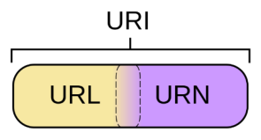

- URI，是 uniform resource identifier，统一资源标识符，用来唯一的标识一个资源。而 URL 是 uniform resource locator，统一资源定位符，它是一种具体的 URI，即 URL 可以用来标识一个资源，而且还指明了如何 locate 这个资源。而 URN，是 uniform resource name，统一资源命名，是通过名字来标识资源，比如 mailto:java-net@java.sun.com。也就是说，URI 是以一种抽象的，高层次概念定义统一资源标识，而 URL 和 URN 则是具体的资源标识的方式。URL 和 URN 本身也都是一种 URI。
- 在 Java 的 URI 中，一个 URI 实例可以代表绝对的，也可以是相对的，只要它符合 URI 的语法规则。而 URL 类则不仅符合语义，还包含了定位该资源的信息，因此它不能是相对的。

### 总结

- 位于网络中的计算机具有唯一的 IP 地址，这样不同的主机可以互相区分。
- `客户端-服务器`是一种最常见的网络应用程序模型。服务器是一个为其客户端提供某种特定服务的硬件或软件。客户机是一个用户应用程序，用于访问某台服务器提供的服务。端口号是对一个服务的访问场所，它用于区分同一物理计算机上的多个服务。`套接字用于连接客户端和服务器，客户端和服务器之间的每个通信会话使用一个不同的套接字。TCP 协议用于实现面向连接的会话。`
- Java 中有关网络方面的功能都定义在`java.net`程序包中。Java 用 InetAddress 对象表示  IP 地址，该对象里有两个字段：主机名（String）和 IP 地址（int）。
- 类 Socket 和 ServerSocket 实现了基于 TCP 协议的客户端-服务器程序。Socket 是客户端和服务器之间的一个连接，连接创建的细节被隐藏了。这个连接提供了一个安全的数据传输通道，这是因为 TCP 协议可以解决数据在传送过程中的丢失、损坏、重复、乱序以及网络拥挤等问题，它保证数据可靠的传送。
- 类 URL 和 URLConnection 提供了最高级网络应用。URL 的网络资源的位置来统一标识 Internet 上各种网络资源。通过 URL 对象可以创建当前应用程序和 URL 表示的网络资源之间的连接，这样当前程序就可以读取网络资源数据，或者把自己的数据传送到网络上去。

## 本文参考

https://www.bilibili.com/video/BV1Kb411W75N

## 声明

写作本文初衷是个人学习记录，鉴于本人学识有限，如有侵权或不当之处，请联系 [wdshfut@163.com](mailto:wdshfut@163.com)。