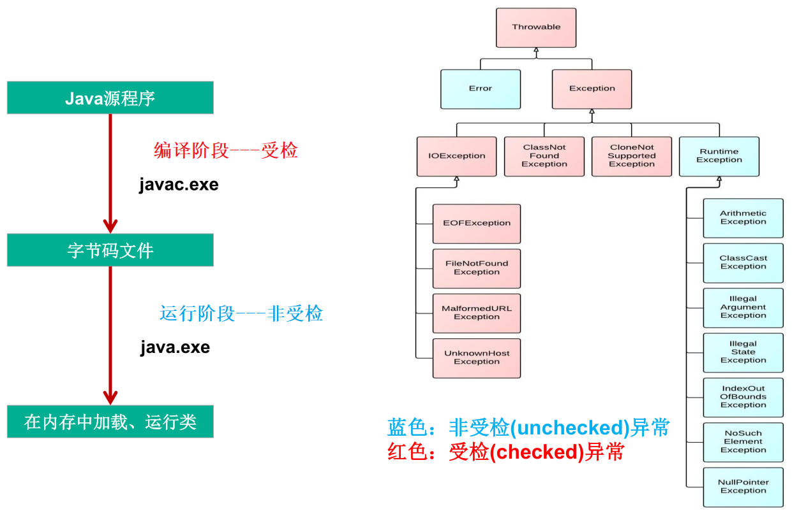
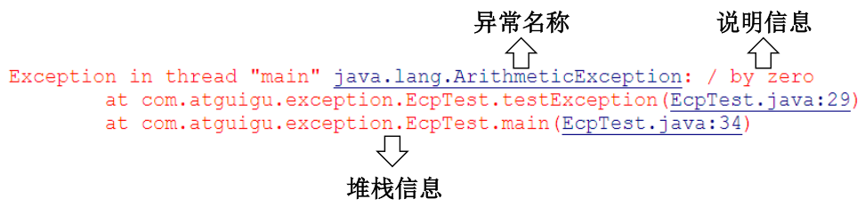

*date: 2021-03-03*

在使用计算机语言进行项目开发的过程中，即使程序员把代码写得 尽善尽美，在系统的运行过程中仍然会遇到一些问题，因为很多问题不是靠代码能够避免的，比如：客户输入数据的格式，读取文件是否存在，网络是否始终保持通畅等等。

在 Java 语言中，将程序执行中发生的不正常情况称为`异常`。**注意：开发过程中的语法错误和逻辑错误不是异常。**

对于这些错误，一般有两种解决方法：一是遇到错误就终止程序的运行；另一种方法是由程序员在编写程序时，就考虑到错误的检测、错误消息的提示，以及错误的处理。捕获错误最理想的是在编译期间，但有的错误只有在运行时才会发生。比如：除数为 0，数组下标越界等。

## 异常体系结构



父类：`java.lang.Throwable`。常见的异常分类如下：


- **`java.lang.Error`：**Java 虚拟机无法解决的严重问题。如：JVM 系统内部错误、资源耗尽等严重情况。比如：`StackOverflowError`和`OutOfMemoryError`（OOM）。一般不编写针对性的代码进行处理（需要更改代码逻辑等去解决问题）。

  ```java
  public class ErrorTest {
      public static void main(String[] args) {
          // 1.栈溢出：java.lang.StackOverflowError
           main(args);
  
          // 2.堆溢出：java.lang.OutOfMemoryError: Java heap space
          Integer[] arr = new Integer[1024 * 1024 * 1024];
      }
  }
  ```

- **`java.lang.Exception`：**其它因编程错误或偶然的外在因素导致的一般性问题，可以使用针对性的代码进行处理。例如：空指针访问、试图读取不存在的文件、网络连接中断和数组角标越界等。

  - **`编译时异常`**：是指编译器要求必须处置的异常。即程序在运行时由于外界因素造成的一般性异常。编译器要求 Java 程序必须捕获或声明所有编译时异常。对于这类异常，如果程序不处理，可能会带来意想不到的结果。

    - `java.io.IOException`和`java.io.FileNotFoundException`

      ```java
      public class IOEx {
          public static void main(String[] args) {
              File file = new File("hello.txt");
              FileInputStream fis = new FileInputStream(file);// !java.io.FileNotFoundException
              int data;
              while ((data = fis.read()) != -1) {// !java.io.IOException
                  System.out.println((char) data);
              }
              fis.close();// !java.io.IOException
          }
      }
      ```

      > 如上代码，在编译期（javac.exe）就会出错，编译不通过，无法生成字节码文件。

  - **`运行时异常`**：是指编译器不要求强制处置的异常。一般是指编程时的逻辑错误，是程序员应该积极避免其出现的异常。`java.lang.RuntimeException`类及它的子类都是运行时异常。对于这类异常，可以不作处理，因为这类异常很普遍，若全处理可能会对程序的可读性和运行效率产生影响。
    
    - `java.lang.NullPointerException`
    
      ```java
      public class NullRef {
          int i = 1;
      
          public static void main(String[] args) {
              NullRef t = new NullRef();
              t = null;
              System.out.println(t.i);
          }
      }
      ```
    
    - `java.lang.ArrayIndexOutOfBoundsException`
    
      ```java
      public class IndexOutExp {
          public static void main(String[] args) {
              String[] friends = {"lisa", "bily", "kessy"};
              for (int i = 0; i < 5; i++) {
                  System.out.println(friends[i]); // friends[4]?
              }
              System.out.println("\nthis is the end");
          }
      }
      ```
    
    - `java.lang.ClassCastException`
    
      ```java
      public class Order {
          public static void main(String[] args) {
              Object obj = new Date();
              Order order;
              order = (Order) obj;
              System.out.println(order);
          }
      }
      ```
    
    - `java.lang.NumberFormatException`
    
      ```java
      public class NumFormat {
          public static void main(String[] args) {
              String str = "abc";
              int num = Integer.parseInt(str);
              System.out.println("num = " + num);
          }
      }
      ```
    
    - `java.util.InputMismatchException`
    
      ```java
      public class NumFormat {
          public static void main(String[] args) {
              Scanner scanner = new Scanner(System.in);
              int num = scanner.nextInt();// 输入的非整数
              System.out.println("num = " + num);
              scanner.close();
          }
      }
      ```
    
    - `java.lang.ArithmeticException`
    
      ```java
      public class DivideZero {
          int x;
      
          public static void main(String[] args) {
              DivideZero c = new DivideZero();
              int y = 3 / c.x;
              System.out.println("y = " + y);
              System.out.println("program ends ok!");
          }
      }
      ```

## 异常处理机制

在编写程序时，经常要在可能出现错误的地方加上检测的代码，如进行 x/y 运算时，要检测分母为 0、数据为空、输入的不是数据而是字符等。而过多的 if-else 分支会导致程序的代码加长、臃肿，可读性差。因此采用异常处理机制。

Java 采用的异常处理机制，是将异常处理的程序代码集中在一起，与正常的程序代码分开，使得程序简洁、优雅，并易于维护。

异常的处理：`抓抛模型`

- 过程一 --- "抛"：程序在正常执行的过程中，一旦出现异常，就会在异常代码处生成一个对应异常类的对象，并将此对象抛出。一旦抛出对象以后，其后的代码就不再继续执行。
  - 关于异常对象的产生：
    - 系统自动生成的异常对象。
    - 手动的生成一个异常对象，并抛出（throw）。
- 过程二 --- "抓"：可以理解为异常的处理方式，分为两种。
  - try-catch-finally
  - throws

### try-catch-finally

格式：


- `try`：捕获异常的第一步是用 try 语句块选定捕获异常的范围，将可能出现异常的代码放在 try 语句块中。

- `catch (ExceptionType e)`：在 catch 语句块中是对异常对象进行处理的代码。

  - **每个 try 语句块可以伴随一个或多个 catch 语句，用于处理可能产生的不同类型的异常对象，当异常对象匹配到某一个 catch 时，就进入该 catch 中进行异常的处理，一旦处理完成，就跳出当前的 try-catch，结构，继续执行 finally 结构和其后的代码。**

  - 如果明确知道产生的是何种异常，可以用该异常类作为 catch 的参数；也可以用其父类作为 catch 的参数。比如：可以用 ArithmeticException 类作为参数的地方，就可以用 RuntimeException 类作为参数，或者用所有异常的父类 Exception 类作为参数。但不能是与 ArithmeticException 类无关的异常，如 NullPointerException，此时 catch 中的语句将不会执行。

  - 与其它对象一样，可以访问 catch 到的异常对象的成员变量或调用它的方法。

    - `getMessage()`：获取异常的说明信息，返回字符串。

    - `printStackTrace()`：获取异常类名和异常的说明信息，以及异常出现在程序中的位置，返回值 void。获取的结果打印到控制台。

      

  - 在 try 结构中声明的变量，出了 try 结构以后，就不能再使用了。

- `finally`：捕获异常的最后一步是通过 finally 语句为异常处理提供一个统一的出口，使得在控制流转到程序的其它部分以前，能够对程序的状态作统一的管理。

  - **不论在 try 代码块中是否发生了异常事件，catch 语句是否执行，catch 语句是否有异常，try 或 catch 语句中是否有 return，finally 块中的语句都会被执行。**

    

    ```java
    public class ExceptionTest {
        public int method() {
            try {
                int[] arr = new int[10];
                System.out.println(arr[10]);
                return 1;
            } catch (ArrayIndexOutOfBoundsException e) {
                e.printStackTrace();
                return 2;
            } finally {
                System.out.println("finally一定会被执行");
                return 3;// finally中不建议使用return
            }
        }
    
        public static void main(String[] args) {
            ExceptionTest exceptionTest = new ExceptionTest();
            int method = exceptionTest.method();
            System.out.println(method);
        }
    }
    输出结果：
    finally一定会被执行
    3
    ```

    > 由上面代码也可以看出，**finally 语句的内容，会在 try 或 catch 的 return 语句之前执行。**

  - 像数据库连接、输入输出流、网络编程 Socket 等资源，JVM 是不能自动回收的，需要手动的进行资源的释放。此时的资源释放，就需要声明在 finally 中。

    ```java
    public class ExceptionTest {
        public static void main(String[] args) {
            File file = new File("hello.txt");
            FileInputStream fis = null;
            try {
                fis = new FileInputStream(file);
                int data;
                while ((data = fis.read()) != -1) {
                    System.out.println((char) data);
                }
            } catch (IOException e) {
                e.printStackTrace();
            } finally {
                try {
                    if (fis != null) {
                        fis.close();
                    }
                } catch (IOException exception) {
                    exception.printStackTrace();
                }
            }
        }
    }
    ```

- try-catch-finally 结构可以嵌套。

- try-catch-finally 结构中，try 语句必须存在，catch 和 finally 语句，必须至少存在一个，其中，catch 语句可以出现多个。

- 使用 try-catch-finally 处理编译时异常，使得程序在编译时就不再报错，但在运行时仍可能报错。相当于使用 try-catch-finally 将一个编译时可能出现的异常，延迟到运行时出现。

- 开发中，由于运行时异常比较常见，通常不针对运行时异常编写 try-catch-finally，针对编译时异常，一定要考虑异常的处理。

- try-catch-finally：真正的将异常进行了处理。

### throws

如果一个方法中的语句执行时可能生成某种异常，但是并不能确定如何处理这种异常，则此方法应显示地声明抛出异常，表明该方法将不对这些异常进行处理，而由该方法的调用者负责处理。在方法声明中用`throws`语句可以声明抛出异常的列表，throws 后面的异常类型可以是方法中产生的异常类型，也可以是它的父类。注意：不同于try-catch-finally，throws 并没有真正的将异常进行了处理，而是抛给了方法的调用者去处理。

"throws + 异常类型"，写在方法的声明处。指明此方法执行时，可能会抛出的异常类型。一旦当方法体执行时出现异常，仍会在异常代码处生成一个异常类的对象，此对象满足 throws 后的异常类型时，就会被抛出。**异常代码后续的代码，就不再被执行。**


重写方法声明抛出异常的原则：`子类重写的方法不能抛出比父类被重写的方法范围更大的异常类型`。

```java
public class A {
    public void methodA() throws IOException {
    }
}

public class B1 extends A {
    public void methodA() throws FileNotFoundException {
    }
}

public class B2 extends A {
    public void methodA() throws Exception {// 报错
    }
}
```

### 开发中如何选择使用 try-catch-finally 和 throws

1. 如果父类中被重写的方法没有 throws 方式处理异常，则子类重写的方法也不能使用 throws，意味着如果子类重写的方法中由异常，必须使用 try-catch-finally 方式处理。
2. 执行的方法中，先后又调用了另外的几个方法，这几个方法是递进关系执行的，则建议这几个方法使用 throws 的方式进行处理。而执行的方法中，可以考虑使用 try-catch-finally 方式进行处理。

## 手动生成并抛出异常

Java 异常类对象除在程序执行过程中出现异常时由系统自动生成并抛出，也可根据需要使用人工创建并抛出 。

- 首先要生成异常类对象，然后通过 throw 语句实现抛出操作（提交给 Java 运行环境）。如：`IOException e = new IOException(); throw e;`。

- 可以抛出的异常必须是 Throwable 或其子类的实例。下面的语句在编译时将会产生语法错误：`throw new String("want to throw");`。

实例：

```java
public class Student {
    public static void main(String[] args) {
        Student student = new Student();
        student.regist(-100);

        try {
            student.regist2(-200);
        } catch (Exception exception) {
            System.out.println(exception.getMessage());
        }
    }

    private int id;

    public void regist(int id) {
        if (id > 0) {
            this.id = id;
        } else {
            // 手动抛出异常
            throw new RuntimeException("输入的数据非法：" + id);
        }
    }

    public void regist2(int id) throws Exception {
        if (id > 0) {
            this.id = id;
        } else {
            // 手动抛出异常，需要在方法中声明
            throw new Exception("输入的数据非法：" + id);
        }
    }
}
```

执行 throw 后，后面代码还会执行吗？

```java
public class ExceptionTest {
    public static void main(String[] args) {
        int i = 1;
        if (i > 5) {
            System.out.println(i);
        } else {
            try {
                throw new Exception("数据非法！");// 异常被try-catch
            } catch (Exception e) {
                e.printStackTrace();
            }
            System.out.println("123");
        }
    }
}
输出结果：
java.lang.Exception: 数据非法！
	at cn.xisun.java.base.ExceptionTest.main(ExceptionTest.java:17)
123
```

```java
public class ExceptionTest {
    public static void main(String[] args) throws Exception {
        int i = 1;
        if (i > 5) {
            System.out.println(i);
        } else {
            throw new Exception("数据非法！");// 异常被throws
            System.out.println("123");// 编译不通过
        }
    }
}
```

```java
public class ExceptionTest {
    public static void main(String[] args) throws Exception {
        int i = 1;
        if (i > 5) {
            System.out.println(i);
        } else {
            throw new Exception("数据非法！");
        }
        System.out.println("123");
    }
}
输出结果：
Exception in thread "main" java.lang.Exception: 数据非法！
	at cn.xisun.java.base.ExceptionTest.main(ExceptionTest.java:16)
```

```java
public class ExceptionTest {
    private static void get(int i) {
        try {
            int a = i / 0;
            System.out.println(a);
        } catch (Exception e) {
            throw new RuntimeException("发生异常");
        }
        System.out.println("123");
    }

    public static void main(String[] args) {
        for (int i = 1; i < 4; i++) {
            System.out.println(i);
            get(i);
        }
    }
}
输出结果：
1
Exception in thread "main" java.lang.RuntimeException: 发生异常
	at cn.xisun.java.base.ExceptionTest.get(ExceptionTest.java:16)
	at cn.xisun.java.base.ExceptionTest.main(ExceptionTest.java:24)
```

## 用户自定义异常类

如何自定义异常类：

- 继承于现有的异常结构：RuntimeException、Exception 等。

- 提供全局变量：serialVersionUID，唯一的标识当前类。

- 提供重载的构造器。

- 异常类的名字应做到见名知义，当异常出现时，可以根据名字判断异常类型。

实例：

  ```java
  public class MyException extends Exception {
      static final long serialVersionUID = 13465653435L;
  
      public MyException() {
  
      }
  
      public MyException(String message) {
          super(message);
      }
  }
  
  class MyExpTest {
      public void regist(int num) throws MyException {
          if (num < 0) {
              throw new MyException("人数为负值，不合理");
          } else {
              System.out.println("登记人数" + num);
          }
      }
  
      public void manager() {
          try {
              regist(-100);
          } catch (MyException e) {
              System.out.print("登记失败，出错信息：" + e.getMessage());
          }
          System.out.print("本次登记操作结束");
      }
  
      public static void main(String args[]) {
          MyExpTest t = new MyExpTest();
          t.manager();
      }
  }
  输出结果：
  登记失败，出错信息：人数为负值，不合理
  本次登记操作结束
  ```

  ```java
  public class ReturnExceptionDemo {
      static void methodA() {
          try {
              System.out.println("进入方法A");
              throw new RuntimeException("制造异常");
          } finally {
              System.out.println("调用A方法的finally");
          }
      }
  
      static void methodB() {
          try {
              System.out.println("进入方法B");
              return;
          } finally {
              System.out.println("调用B方法的finally");
          }
      }
  
      public static void main(String[] args) {
          try {
              methodA();
          } catch (Exception e) {
              System.out.println(e.getMessage());
          }
          methodB();
      }
  }
  输出结果：
  进入方法A
  调用A方法的finally
  制造异常
  进入方法B
  调用B方法的finally
  ```

## 异常处理的 5 个关键字


面试题：

- final、finally 和 finalize 的区别？
  - finalize 是一个方法。
- throw 和 throws 的区别？
  - throw 表示抛出一个异常类的对象，生成异常对象的过程，声明在方法体内。
  - throws 属于异常处理的一种方式，声明在方法的声明处。

## 本文参考

https://www.gulixueyuan.com/goods/show/203?targetId=309&preview=0

## 声明

写作本文初衷是个人学习记录，鉴于本人学识有限，如有侵权或不当之处，请联系 [wdshfut@163.com](mailto:wdshfut@163.com)。