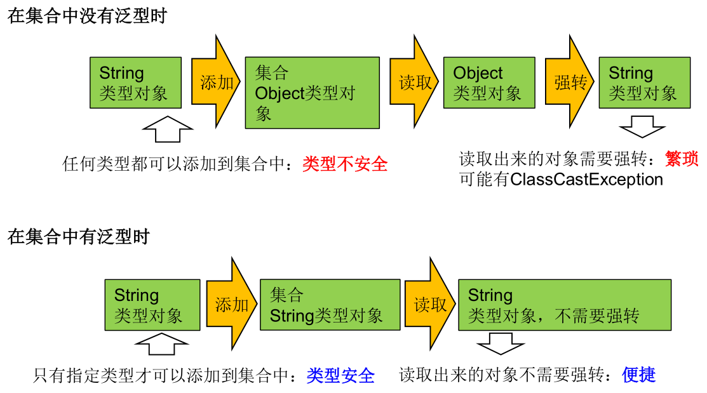
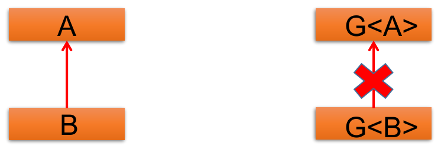
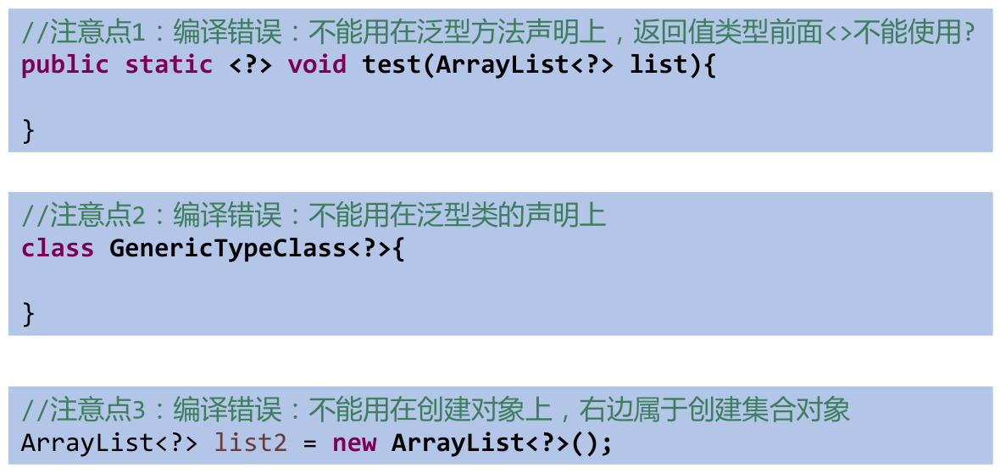
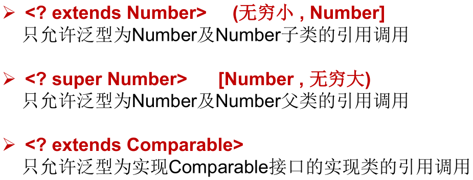

*date: 2021-03-26*

## 泛型的设计背景

集合容器类在设计阶段/声明阶段不能确定这个容器到底实际存的是什么类型的对象，所以在 JDK 1.5 之前只能把元素类型设计为 Object，JDK 1.5 之后使用泛型来解决。因为这个时候除了元素的类型不确定，其他的部分是确定的，例如关于这个元素如何保存，如何管理等是确定的，因此此时把元素的类型设计成一个参数，这个类型参数叫做`泛型`。Collection\<E>，List\<E>，ArrayList\<E>  中的这个 \<E> 就是类型参数，即泛型。

## 泛型的概念

所谓泛型，就是允许在定义类、接口时通过一个标识表示类中某个属性的类型或者是某个方法的返回值及参数类型。这个类型参数将在使用时（例如，继承或实现这个接口，用这个类型声明变量、创建对象时）确定（即传入实际的类型参数，也称为类型实参）。

从 JDK 1.5 以后，Java 引入了`参数化类型 (Parameterized type)`的概念，允许在创建集合时指定集合元素的类型，如：List\<String>，表明该 List 只能保存字符串类型的对象。

JDK 1.5 改写了集合框架中的全部接口和类，为这些接口、类增加了泛型支持，从而可以在声明集合变量、创建集合对象时传入类型实参。

在实例化集合类时，可以指明具体的泛型类型。指明完以后，在集合类或接口中凡是定义类或接口时，内部结构（比如：方法、构造器、属性等）使用到类的泛型的位置，都指定为实例化的泛型类型。比如：`add(E e)` ---> 实例化以后：`add(Integer e)`。

在实例化集合类时，如果没有指明泛型的类型，默认类型为`java.lang.Object`类型。

**泛型的类型必须是类，不能是基本数据类型。需要用到基本数据类型的位置，拿包装类替换。**

使用泛型的必要性：

-  解决元素存储的安全性问题。

- 解决获取数据元素时，需要类型强制转换的问题。

- Java 泛型可以保证如果程序在编译时没有发出警告，运行时就不会产生 ClassCastException 异常。同时，代码更加简洁、健壮。

- 使用泛型的主要优点是能够在编译时而不是在运行时检测错误：

  

  在集合中使用泛型之前的情况：

  ```java
  public class Test {
      public static void main(String[] args) {
          // 在集合中使用泛型之前的情况：
          ArrayList list = new ArrayList();
          // 需求：存放学生的成绩
          list.add(78);
          list.add(76);
          list.add(89);
          list.add(88);
          // 问题一：类型不安全
          // list.add("Tom");
          
          for (Object score : list) {
              // 问题二：强转时，可能出现ClassCastException
              int stuScore = (Integer) score;
              System.out.println(stuScore);
          }
      }
  }
  ```

  在集合中使用泛型的情况，以 ArrayList 为例：

  ```java
  public class Test {
      public static void main(String[] args) {
          // ArrayList<Integer> list = new ArrayList<Integer>();
          // JDK 7新特性：类型推断
          ArrayList<Integer> list = new ArrayList<>();
          list.add(78);
          list.add(87);
          list.add(99);
          list.add(65);
          // 编译时，就会进行类型检查，类型不一致时编译不通过，保证数据的安全
          // list1.add("Tom");
  
          // 方式一：
          for (Integer score : list) {
              // 避免了强转操作
              int stuScore = score;
              System.out.println(stuScore);
          }
  
          // 方式二：
          Iterator<Integer> iterator = list.iterator();
          while (iterator.hasNext()) {
              int stuScore = iterator.next();
              System.out.println(stuScore);
          }
      }
  }
  ```

  在集合中使用泛型的情况，以 HashMap 为例：

  ```java
  public class Test {
      public static void main(String[] args) {
          // Map<String, Integer> map = new HashMap<String, Integer>();
          // JDK 7新特性：类型推断
          Map<String, Integer> map = new HashMap<>();
          map.put("Tom", 87);
          map.put("Jerry", 87);
          map.put("Jack", 67);
          // map.put(123,"ABC");
  
          // 泛型的嵌套
          Set<Map.Entry<String, Integer>> entries = map.entrySet();
          Iterator<Map.Entry<String, Integer>> iterator = entries.iterator();
  
          while (iterator.hasNext()) {
              Map.Entry<String, Integer> entry = iterator.next();
              String key = entry.getKey();
              Integer value = entry.getValue();
              System.out.println(key + "----" + value);
          } 
      }
  }
  ```

## 自定义泛型结构

### 自定义泛型类和接口

- 泛型类和接口的声明：`class GenericClass<K, V>`和`interface GenericInterface<T>`。其中，K，V，T 不代表值，而是表示类型，可以使用任意字母，常用 T 表示，是 Type 的缩写。

  ```java
  public class Person<T> {
      // 使用T类型定义变量
      private T info;
  
      // 使用T类型定义一般方法
      public T getInfo() {
          return info;
      }
  
      public void setInfo(T info) {
          this.info = info;
      }
  
      // 使用T类型定义构造器
      public Person() {
      }
  
      public Person(T info) {
          this.info = info;
      }
  }
  ```

- 泛型类和接口可能有多个参数，此时应将多个参数一起放在尖括号内，以逗号隔开。比如：<E1, E2, E3>。

- 泛型类的构造器如下：`public GenericClass(){}`。而下面是错误的：`public GenericClass<E>(){}`。

- 泛型类的实例化：**如果定义的类是带泛型的，在实例化时应该指明类的泛型。**如：`List<String> strList = new ArrayList<String>();`。

  - **泛型如果不指定，将被擦除，泛型对应的类型均按照 Object 处理，但不等价于 Object。**经验：泛型要使用一路都用。要不用，一路都不要用。
  - **指定泛型时，不能使用基本数据类型，可以使用包装类替换。**
  -  把一个集合中的内容限制为一个特定的数据类型，这就是 Generic 背后的核心思想。

- 泛型类实例化后，操作原来泛型位置的结构必须与指定的泛型类型一致。

- **泛型不同的引用不能相互赋值。**

  - **尽管在编译时 ArrayList\<String> 和 ArrayList\<Integer> 是两种类型，但是，在运行时只有一个 ArrayList 被加载到 JVM 中。**

- 如果泛型结构是一个接口或抽象类，则不可创建泛型类的对象。

- JDK 7.0 开始，泛型的简化操作：`ArrayList<Fruit> flist = new ArrayList<>();`，**`类型推断`**。

- 在类/接口上声明的泛型，在本类或本接口中即代表某种类型，可以作为非静态属性的类型、非静态方法的参数类型、非静态方法的返回值类型。但在**`静态方法中不能使用类的泛型`**。

  ```java
  public class Order<T> {
      String orderName;
      int orderId;
      // 类的内部结构就可以使用类的泛型
      T orderT;
  
      public Order(String orderName, int orderId, T orderT) {
          this.orderName = orderName;
          this.orderId = orderId;
          this.orderT = orderT;
      }
  
      // 静态方法中不能使用类的泛型，编译不通过
      /*public static void show(T orderT) {
          System.out.println(orderT);
      }*/
  }
  ```

- **`异常类不能声明为泛型类`**。

  ```java
  // 异常类不能声明为泛型类，编译不通过
  public class MyException<T> extends Exception {}
  ```

  ```java
  public class Order<T> {
      public void show() {
          // try-catch结构中不能使用类的泛型，编译不通过
          try {
          } catch (T t) {
          }
      }
  }
  ```

- 不能使用`new E[]`，但是可以：`E[] elements = (E[])new Object[capacity];`。参考 ArrayList 源码中声明：Object[] elementData，而非泛型参数类型数组。

  ```java
  public class Order<T> {
      public Order() {
          // 编译不通过
          // T[] arr = new T[10];
          // 编译通过
          T[] arr = (T[]) new Object[10];
      }
  }
  ```

- 父类有泛型，子类可以选择保留泛型也可以选择指定泛型类型：

  - 子类不保留父类的泛型：按需实现。

    - 没有类型  擦除。
    - 具体类型。

  - 子类保留父类的泛型：泛型子类。

    - 全部保留。
    - 部分保留。

  - 子类除了指定或保留父类的泛型，还可以增加自己的泛型。

  - 实例：

    子类不增加自己的泛型：

    ```java
    class Father<T1, T2> {}
    
    // 子类不保留父类的泛型：
    // 1)没有类型 擦除
    class Son1 extends Father {}// 等价于class Son1 extends Father<Object, Object>
    
    // 2)具体类型
    class Son2 extends Father<Integer, String> {}
    
    // 子类保留父类的泛型：
    // 1)全部保留
    class Son3<T1, T2> extends Father<T1, T2> {}
    
    // 2)部分保留
    class Son4<T2> extends Father<Integer, T2> {}
    ```

    子类增加自己的泛型：

    ```java
    class Father<T1, T2> {}
    
    // 子类不保留父类的泛型：
    // 1)没有类型 擦除
    class Son1<A, B> extends Father {}//等价于class Son extends Father<Object, Object>
    
    // 2)具体类型
    class Son2<A, B> extends Father<Integer, String> {}
     
    // 子类保留父类的泛型
    // 1)全部保留
    class Son3<T1, T2, A, B> extends Father<T1, T2> {}
    
    // 2)部分保留
    class Son4<T2, A, B> extends Father<Integer, T2> {}
    ```

- 如果子类在继承带泛型的父类时，指明了泛型类型，则实例化子类对象时，不再需要指明泛型。

  ```java
  public class Order<T> {}
  
  public class SubOrder extends Order<Integer> {}// SubOrder: 不是泛型类
  ```

- 如果子类在继承带泛型的父类时，未指明泛型类型，则实例化子类对象时，仍然需要指明泛型。

  ```java
  public class Order<T> {}
  
  public class SubOrder1<T> extends Order<T> {}// SubOrder1<T>: 仍然是泛型类
  ```

### 自定义泛型方法 

-  泛型方法的格式：

  

- **泛型方法的参数与类的泛型参数没有任何关系， 换句话说，泛型方法所属的类是不是泛型类都没有关系。泛型方法，可以声明为静态的。原因：泛型参数是在调用方法时确定的，并非在实例化类时确定。**

  ```java
  public class Order<T> {
      String orderName;
      int orderId;
      // 类的内部结构就可以使用类的泛型
      T orderT;
  
      // 如下的三个方法都不是泛型方法
      public T getOrderT() {
          return orderT;
      }
  
      public void setOrderT(T orderT) {
          this.orderT = orderT;
      }
  
      @Override
      public String toString() {
          return "Order{" +
                  "orderName='" + orderName + '\'' +
                  ", orderId=" + orderId +
                  ", orderT=" + orderT +
                  '}';
      }
  
      // 泛型方法：在方法中出现了泛型的结构，泛型参数与类的泛型参数没有任何关系。
      // 换句话说，泛型方法所属的类是不是泛型类都没有关系。
      public <E> List<E> copyFromArrayToList(E[] arr) {
          ArrayList<E> list = new ArrayList<>();
          list.addAll(Arrays.asList(arr));
          return list;
      }
  
      // 泛型方法，可以声明为静态的。原因：泛型参数是在调用方法时确定的。并非在实例化类时确定。
      public static <T> void fromArrayToCollection(T[] a, Collection<T> c) {
          Collections.addAll(c, a);
          System.out.println(c);
      }
  
      public static void main(String[] args) {
          Order<String> order = new Order<>();
          Integer[] arr = new Integer[]{1, 2, 3, 4};
          // 泛型方法在调用时，指明泛型参数的类型
          List<Integer> list = order.copyFromArrayToList(arr);
          System.out.println(list);// [1, 2, 3, 4]
  
          ArrayList<String> str = new ArrayList<>();
          String[] strings = new String[]{"A", "B", "C", "D"};
          fromArrayToCollection(strings, str);// [A, B, C, D]
          
          Object[] ao = new Object[100];
          Collection<Object> co = new ArrayList<>();
          fromArrayToCollection(ao, co);
          String[] sa = new String[20];
          Collection<String> cs = new ArrayList<>();
          fromArrayToCollection(sa, cs);
          Collection<Double> cd = new ArrayList<>();
          // 下面代码中T是Double类，但sa是String类型，编译错误。
          // fromArrayToCollection(sa, cd);
          // 下面代码中T是Object类型，sa是String类型，可以赋值成功。
          fromArrayToCollection(sa, co);
      }
  }
  ```

- 泛型方法声明泛型时也可以指定上限：

  父类：

  ```java
  public class DAO<T> {// 不同表的共性操作的DAO，DAO：data(base) access object
  
      // 添加一条记录
      public void add(T t) {}
  
      // 删除一条记录
      public boolean remove(int index) {
          return false;
      }
  
      // 修改一条记录
      public void update(int index, T t) {}
  
      // 查询一条记录
      public T getIndex(int index) {
          return null;
      }
  
      // 查询多条记录
      public List<T> getForList(int index) {
          return null;
      }
  
      // 泛型方法：因为返回内容在DAO类中无法确定，由子类自己指定
      // 举例：获取表中一共有多少条记录？获取最大的员工入职时间？
      public <E> E getValue() {
          return null;
      }
  }
  ```

  子类 StudentDao：

  ```java
  public class StudentDAO extends DAO<Student> {}// 只能操作Student表的DAO
  ```

  子类 CustomerDao：

  ```java
  public class CustomerDAO extends DAO<Customer>{}// 只能操作Customer表的DAO
  ```

## 泛型在继承上的体现

如果 B 是 A 的一个子类型（子类或者子接口），而 G 是具有泛型声明的类或接口，则 G\<B> 并不是 G\<A> 的子类型，二者是并列关系。如果类 A 是类 B 的父类，则 A\<G> 是 B\<G> 的父类。



```java
public class Test {
    public static void show(List<Object> list) {
    }

    public static void show1(List<String> list) {
    }

    public static void main(String[] args) {
        // 子类对象赋值给父类对象--->编译通过
        Object obj = null;
        String str = null;
        obj = str;// Object是String的父类

        // 子类对象数组赋值给父类对象数组--->编译通过
        Object[] arr1 = null;
        String[] arr2 = null;
        arr1 = arr2;// Object[]是String[]的父类

        // 虽然类A是类B的父类，但是G<A>和G<B>二者不具备子父类关系，二者是并列关系
        List<Object> list1 = null;
        List<String> list2 = new ArrayList<String>();
        // 编译不通过此时的list1和list2的类型不具有子父类关系
        // list1 = list2;
        /*
        反证法：
        假设list1 = list2;
           list1.add(123);导致混入非String的数据。出错。
         */

        show(list1);
        show1(list2);

        // 补充：类A是类B的父类，则A<G>是B<G>的父类
        List<String> list3 = null;
        AbstractList<String> list4 = null;
        ArrayList<String> list5 = null;
        list3 = list5;
        list4 = list5;
    }
}
```

## 通配符的使用

`通配符：?`。

**`如果类 A 是类 B 的父类，G\<A> 和 G\<B> 是没有关系的，二者共同的父类是：G<?>`**。比如：List\<?>，Map\<?, ?>。其中，List\<?> 是 List\<String>、List\<Object> 等各种泛型 List 的父类，Map\<?, ?> 是各种泛型 Map 的父类。

```java
public class Test {
    public static void print(List<?> list) {
        Iterator<?> iterator = list.iterator();
        while (iterator.hasNext()) {
            Object obj = iterator.next();
            System.out.println(obj);
        }
    }

    public static void main(String[] args) {
        List<?> list;

        List<Object> list1 = null;
        List<String> list2 = null;

        list = list1;
        list = list2;
        // 编译通过
        print(list1);
        print(list2);
    }
}
```

- 对于 List<?>，不能向其内部添加元素，因为不知道 List 中存储的元素的类型。

  - 唯一的例外是 null，它是所有类型的成员。

- 读取 List<?> 中的元素时，永远是安全的，因为不管 List 中元素的真实类型是什么，都是一个 Object。

- 实例：

  ```java
  public class Test {
      public static void main(String[] args) {
          List<?> list;
  
          List<String> list1 = new ArrayList<>();
          list1.add("AA");
          list1.add("BB");
          list1.add("CC");
  
          list = list1;
          // 添加(写入)：对于List<?>不能向其内部添加元素，因为不知道List中存储的元素的类型
          // 除了添加null之外，其他的都无法添加，编译不通过
          // list.add("DD");
          // list.add('?');
          list.add(null);
  
          // 获取(读取)：允许读取List<?>元素，因为读取的元素，不论其类型为什么，其父类都是Object
          Object o = list.get(0);
          System.out.println(o);
      }
  }
  ```

通配符使用的注意事项：

  

有限制的通配符：

- **通配符指定上限 extends：使用时指定的类型必须是继承某个类，或者实现某个接口，即 <=。**

  - `? extends A`：G<? extends A> 可以作为 G\<A> 和 G\<B> 的父类，其中 B 是 A 的子类。

- **通配符指定下限 super：使用时指定的类型不能小于操作的类，即 >=。**

  - `? super A`：G<? super A> 可以作为 G\<A> 和 G\<B> 的父类，其中 B 是 A 的父类。

- 实例：

  

  ```java
  public class Test {
      public static void printCollection3(Collection<? extends Person> coll) {
          // Iterator只能用Iterator<?>或Iterator<? extends Person>.why?
          Iterator<?> iterator = coll.iterator();
          while (iterator.hasNext()) {
              System.out.println(iterator.next());
          }
      }
  
      public static void printCollection4(Collection<? super Person> coll) {
          // Iterator只能用Iterator<?>或Iterator<? super Person>.why?
          Iterator<?> iterator = coll.iterator();
          while (iterator.hasNext()) {
              System.out.println(iterator.next());
          }
      }
  }
  
  class Person {
  }
  ```

- 读取和添加元素：

  ```java
  public class Person {}
  ```

  ```java
  public class Student extends Person {}
  ```

  ```java
  public class Test {
      public static void main(String[] args) {
          List<? extends Person> list1;
          List<? super Person> list2;
  
          List<Student> list3 = new ArrayList<>();
          List<Person> list4 = new ArrayList<>();
          List<Object> list5 = new ArrayList<>();
  
          list1 = list3;
          list1 = list4;
          // 编译不通过，因为Object > Person
          // list1 = list5;
  
          // 编译不通过，因为Student < Person
          // list2 = list3;
          list2 = list4;
          list2 = list5;
  
          // 读取数据：读出的元素定义为最大的类型
          list1 = list3;
          Person p = list1.get(0);
          // 编译不通过，因为读出来的元素不一定是Student，也可能是Student的父类，但肯定是Person的子类
          // Student s = list1.get(0);
  
          list2 = list4;
          Object obj = list2.get(0);
          // 编译不通过，因为读出来的元素不一定是Person，也可能是Person的父类，但肯定是Object的子类
          // Person obj = list2.get(0);
  
          // 写入数据：
          // 编译不通过，因为list1是(-∞,Person]，添加的元素，可能其类型比Person或Student小，因此除了null都不能添加
          // list1.add(new Person());
          // list1.add(new Student());
          list1.add(null);
  
          // 编译通过，因为list2是[Person,+∞)，无论是什么元素，都肯定是Person或其父类，那么Person及其子类都能添加
          list2.add(new Person());
          list2.add(new Student());
      }
  }
  ```

泛型嵌套：

```java
public class Test {
    public static void main(String[] args) {
        HashMap<String, ArrayList<Person>> map = new HashMap<>();
        ArrayList<Person> list = new ArrayList<Person>();
        list.add(new Person("AA"));
        list.add(new Person("BB"));
        list.add(new Person("ab"));
        map.put("AA", list);
        Set<Map.Entry<String, ArrayList<Person>>> entrySet = map.entrySet();
        Iterator<Map.Entry<String, ArrayList<Person>>> iterator = entrySet.iterator();
        while (iterator.hasNext()) {
            Map.Entry<String, ArrayList<Person>> entry = iterator.next();
            String key = entry.getKey();
            ArrayList<Person> value = entry.getValue();
            System.out.println("户主：" + key);
            System.out.println("家庭成员：" + value);
        }
    }
}
```

```java
// 只有此接口的子类才是表示人的信息
interface Info {
}

// 表示联系方式
class Contact implements Info {
    private String address;// 联系地址
    private String telephone;// 联系方式
    private String zipcode;// 邮政编码

    public Contact(String address, String telephone, String zipcode) {
        this.address = address;
        this.telephone = telephone;
        this.zipcode = zipcode;
    }

    public void setAddress(String address) {
        this.address = address;
    }

    public void setTelephone(String telephone) {
        this.telephone = telephone;
    }

    public void setZipcode(String zipcode) {
        this.zipcode = zipcode;
    }

    public String getAddress() {
        return this.address;
    }

    public String getTelephone() {
        return this.telephone;
    }

    public String getZipcode() {
        return this.zipcode;
    }

    @Override
    public String toString() {
        return "Contact [address=" + address + ", telephone=" + telephone
                + ", zipcode=" + zipcode + "]";
    }
}

// 表示个人信息
class Introduction implements Info {
    private String name;// 姓名
    private String sex;// 性别
    private int age;// 年龄

    public Introduction(String name, String sex, int age) {
        this.name = name;
        this.sex = sex;
        this.age = age;
    }

    public void setName(String name) {
        this.name = name;
    }

    public void setSex(String sex) {
        this.sex = sex;
    }

    public void setAge(int age) {
        this.age = age;
    }

    public String getName() {
        return this.name;
    }

    public String getSex() {
        return this.sex;
    }

    public int getAge() {
        return this.age;
    }

    @Override
    public String toString() {
        return "Introduction [name=" + name + ", sex=" + sex + ", age=" + age
                + "]";
    }
}

class Person<T extends Info> {
    private T info;

    // 通过构造器设置信息属性内容
    public Person(T info) {
        this.info = info;
    }

    public void setInfo(T info) {
        this.info = info;
    }

    public T getInfo() {
        return info;
    }

    @Override
    public String toString() {
        return "Person [info=" + info + "]";
    }
}

public class GenericPerson {
    public static void main(String args[]) {
        Person<Contact> per = null;// 声明Person对象
        per = new Person<Contact>(new Contact("北京市", "01088888888", "102206"));
        System.out.println(per);

        Person<Introduction> per2 = null;// 声明Person对象
        per2 = new Person<Introduction>(new Introduction("李雷", "男", 24));
        System.out.println(per2);
    }
}
```

## 本文参考

https://www.gulixueyuan.com/goods/show/203?targetId=309&preview=0

## 声明

写作本文初衷是个人学习记录，鉴于本人学识有限，如有侵权或不当之处，请联系 [wdshfut@163.com](mailto:wdshfut@163.com)。