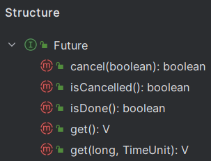
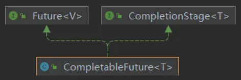
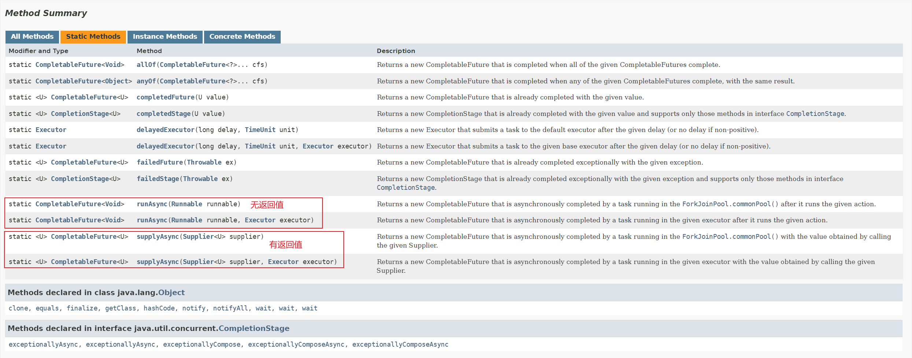
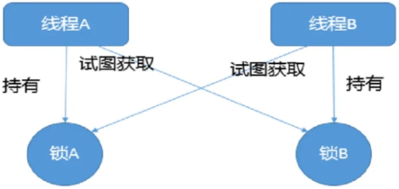

*Since: 2024-06-03*

## 线程基础知识

`并发 (concurrent)`：是在同一实体上的多个事件，是在**一台机器上同时处理多个任务**，同一时刻，其实是只有一个事情在发生。

`并行 (parallel)`：是在不同实体上的多个事件，是在**多台处理器上同时处理多个任务**，同一时刻，大家都在做事情，你做你的，我做我的，各干各的。

`进程`：在系统中运行的一个应用程序，每个进程都有它自己的内存空间和系统资源。

`线程`：也被称为**轻量级进程**，在同一个进程内会有一个或多个线程，是大多数操作系统进行时序调度的基本单元。

`管程`：**Monitor，也就是平时所说的锁。**

- Monitor 其实是一种**同步机制**，它的义务是保证（同一时间）只有一个线程可以访问被保护的数据和代码。
- JVM 中同步是基于进入和退出监视器（Monitor 管程对象）来实现的，每个对象实例都会对应一个 Monitor 对象。
- 当 Java 对象被用作同步锁时，JVM 会为该对象关联一个 Monitor；而当该对象不再被用作同步锁，或者对象被垃圾回收时，与其关联的 Monitor 可能会被 JVM 内部释放或重新利用。底层由 C++ 语言实现。

线程分类（一般不做特别说明配置，默认都是用户线程）：

- `用户线程`：是系统的工作线程，它会完成这个程序需要完成的业务操作。

- `守护线程`：是一种特殊的线程为其他线程服务的，在后台默默地完成一些系统性的任务，比如垃圾回收线程就是最典型的例子。守护线程作为一个服务线程，没有服务对象就没有必要继续运行了，如果用户线程全部结束了，意味着程序需要完成的业务操作已经结束了，系统可以退出了。**如果系统只剩下守护线程，守护线程会伴随着 JVM 一同结束工作。**

  ```java
  package cn.zero.cloud.platform.juc.daemon;
  
  import lombok.extern.slf4j.Slf4j;
  
  import java.util.concurrent.TimeUnit;
  
  /**
   * @author XiSun
   * @version 1.0
   * @since 2024/6/4 23:04
   */
  @Slf4j
  public class DaemonThread {
      public static void main(String[] args) {
          Thread t1 = new Thread(() -> {
              log.info("current thread: {}, it is a: {}", Thread.currentThread().getName(), (Thread.currentThread().isDaemon() ? "daemon thread" : "user thread"));
  
              while (true) {
                  log.info("{} is executing business", Thread.currentThread().getName());
  
                  // 便于查看日志
                  try {
                      TimeUnit.MILLISECONDS.sleep(100);
                  } catch (InterruptedException e) {
                      log.error("exception: ", e);
                  }
              }
          }, "t1");
          // 通过设置属性Daemon来设置当前线程是否为守护线程
          t1.setDaemon(true);
          t1.start();
  
          // 便于查看日志
          try {
              TimeUnit.SECONDS.sleep(1);
          } catch (InterruptedException e) {
              log.error("exception: ", e);
          }
  
          log.info("{} thread ends execution", Thread.currentThread().getName());
      }
  }
  
  输出：
      2024-06-05 23:19:02.955 [t1] INFO  cn.zero.cloud.platform.juc.daemon.DaemonThread - current thread: t1, it is a: daemon thread
      2024-06-05 23:19:02.959 [t1] INFO  cn.zero.cloud.platform.juc.daemon.DaemonThread - t1 is executing business
      2024-06-05 23:19:03.061 [t1] INFO  cn.zero.cloud.platform.juc.daemon.DaemonThread - t1 is executing business
      2024-06-05 23:19:03.171 [t1] INFO  cn.zero.cloud.platform.juc.daemon.DaemonThread - t1 is executing business
      2024-06-05 23:19:03.280 [t1] INFO  cn.zero.cloud.platform.juc.daemon.DaemonThread - t1 is executing business
      2024-06-05 23:19:03.388 [t1] INFO  cn.zero.cloud.platform.juc.daemon.DaemonThread - t1 is executing business
      2024-06-05 23:19:03.496 [t1] INFO  cn.zero.cloud.platform.juc.daemon.DaemonThread - t1 is executing business
      2024-06-05 23:19:03.604 [t1] INFO  cn.zero.cloud.platform.juc.daemon.DaemonThread - t1 is executing business
      2024-06-05 23:19:03.714 [t1] INFO  cn.zero.cloud.platform.juc.daemon.DaemonThread - t1 is executing business
      2024-06-05 23:19:03.823 [t1] INFO  cn.zero.cloud.platform.juc.daemon.DaemonThread - t1 is executing business
      2024-06-05 23:19:03.932 [t1] INFO  cn.zero.cloud.platform.juc.daemon.DaemonThread - t1 is executing business
      2024-06-05 23:19:03.963 [main] INFO  cn.zero.cloud.platform.juc.daemon.DaemonThread - main thread ends execution
          
  结论：在main主线程结束后，守护线程会伴随着JVM一同结束工作，即使守护线程还有循环没有结束
  ```
  

## 异步任务

### Future 接口

`Future 接口`：定义了操作异步任务执行一些方法，如获取异步任务的执行结果、取消异步任务的执行、判断任务是否被取消、判断任务执行是否完毕等。Future 是 Java 5 新加的一个接口，它提供一种异步并行计算的功能，如果主线程需要执行一个很耗时的计算任务，我们可以通过 Future 把这个任务放进异步线程中执行，主线程继续处理其他任务或者先行结束，再通过 Future 获取计算结果。

Future 接口结构：




FutureTask 是 Future 的常用实现类：

```java
package cn.zero.cloud.platform.juc.future;

import lombok.extern.slf4j.Slf4j;

import java.util.concurrent.ExecutionException;
import java.util.concurrent.FutureTask;
import java.util.concurrent.TimeUnit;
import java.util.concurrent.TimeoutException;

/**
 * @author XiSun
 * @version 1.0
 * @since 2024/6/5 23:10
 */
@Slf4j
public class FutureTaskApiDemo {
    public static void main(String[] args) {
        FutureTask<String> futureTask = new FutureTask<>(() -> {
            log.info("{} thread come in", Thread.currentThread().getName());
            try {
                TimeUnit.SECONDS.sleep(5);
            } catch (InterruptedException e) {
                log.error("exception: ", e);
            }
            return "task over";
        });

        Thread t1 = new Thread(futureTask, "t1");
        t1.start();

        // 方式一：调用get()，通过阻塞的方式，获取futureTask的结果，main线程会一直阻塞，直到futureTask返回结果
        /*try {
            String result = futureTask.get();
            log.info("{} thread get the result of future task: {}", Thread.currentThread().getName(), result);
        } catch (InterruptedException | ExecutionException e) {
            log.error("exception: ", e);
        }*/

        // 方式二：指定阻塞的时间，超时后未获取到结果直接抛出异常java.util.concurrent.TimeoutException
        /*try {
            String result = futureTask.get(3, TimeUnit.SECONDS);
            log.info("{} thread get the result of future task: {}", Thread.currentThread().getName(), result);
        } catch (InterruptedException | ExecutionException | TimeoutException e) {
            log.error("exception: ", e);
        }*/

        // 方式三：轮询，调用isDone()
        while (true) {
            if (futureTask.isDone()) {
                try {
                    String result = futureTask.get();
                    log.info("{} thread get the result of future task: {}", Thread.currentThread().getName(), result);
                } catch (InterruptedException | ExecutionException e) {
                    log.error("exception: ", e);
                }
                break;
            } else {
                try {
                    TimeUnit.MILLISECONDS.sleep(500);
                } catch (InterruptedException e) {
                    log.error("exception: ", e);
                }

                log.info("{} thread is processing", Thread.currentThread().getName());
            }
        }
    }
}

输出：
    2024-06-05 23:57:32.443 [t1] INFO  c.zero.cloud.platform.juc.future.FutureTaskApiDemo - t1 thread come in
    2024-06-05 23:57:32.946 [main] INFO  c.zero.cloud.platform.juc.future.FutureTaskApiDemo - main thread is processing
    2024-06-05 23:57:33.456 [main] INFO  c.zero.cloud.platform.juc.future.FutureTaskApiDemo - main thread is processing
    2024-06-05 23:57:33.962 [main] INFO  c.zero.cloud.platform.juc.future.FutureTaskApiDemo - main thread is processing
    2024-06-05 23:57:34.468 [main] INFO  c.zero.cloud.platform.juc.future.FutureTaskApiDemo - main thread is processing
    2024-06-05 23:57:34.979 [main] INFO  c.zero.cloud.platform.juc.future.FutureTaskApiDemo - main thread is processing
    2024-06-05 23:57:35.488 [main] INFO  c.zero.cloud.platform.juc.future.FutureTaskApiDemo - main thread is processing
    2024-06-05 23:57:36.000 [main] INFO  c.zero.cloud.platform.juc.future.FutureTaskApiDemo - main thread is processing
    2024-06-05 23:57:36.509 [main] INFO  c.zero.cloud.platform.juc.future.FutureTaskApiDemo - main thread is processing
    2024-06-05 23:57:37.020 [main] INFO  c.zero.cloud.platform.juc.future.FutureTaskApiDemo - main thread is processing
    2024-06-05 23:57:37.523 [main] INFO  c.zero.cloud.platform.juc.future.FutureTaskApiDemo - main thread is processing
    2024-06-05 23:57:37.523 [main] INFO  c.zero.cloud.platform.juc.future.FutureTaskApiDemo - main thread get the result of future task: task over
```

- `get()`：主线程阻塞，直到获取 FutureTask 的结果。
- `isDone()`：轮询，会耗费 CPU 资源，而且也不见得能及时得到计算结果，如果想要异步获取结果，通常会以轮询的方式去获取结果，尽量不要阻塞。

- 结论：Future 对于任务的结果的获取不是很友好，只能通过**阻塞或轮询**的方式得到任务的结果。

### CompletableFuture 类

由于 Future 只能通过阻塞或轮询的方式得到异步任务的处理结果，阻塞的方式和异步编程的设计理念相违背，而轮询容易耗费 CPU 资源，导致 CPU 空转。对于真正的异步处理，我们希望是可以通过**传入回调函数**，在异步任务结束时自动调用该回调函数，这样，我们就不用等待结果。

JDK 8 设计出 CompletableFuture，CompletableFuture 提供了一种**观察者模式类似的机制**，可以让任务执行完成后通知监听的一方。

CompletableFuture 类继承关系：



- `CompletionStage 接口`
  - 代表异步计算过程中的某一个阶段，一个阶段完成以后可能会触发另外一个阶段。
  - 一个阶段的执行可能是被单个阶段的完成触发，也可能是由多个阶段一起触发。
- `CompletableFuture 类`
  - 提供了非常强大的 Future 的扩展功能，可以帮助我们简化异步编程的复杂性，并且提供了函数式编程的能力，可以通过回调的方式处理计算结果，也提供了转换和组合 CompletableFuture 的方法。
  - 它可能代表一个明确完成的 Future，也可能代表一个完成阶段 CompletionStage，它支持在计算完成以后触发一些函数或执行某些动作。

#### 核心方法

[JDK 17 文档中](https://docs.oracle.com/en/java/javase/17/docs/api/java.base/java/util/concurrent/CompletableFuture.html)，可以查看 CompletableFuture 类的四个核心静态方法：



- 对于方法中 Executor 参数说明：如果没有指定，则使用默认的 [ForkJoinPool.commonPool()](https://docs.oracle.com/en/java/javase/17/docs/api/java.base/java/util/concurrent/ForkJoinPool.html#commonPool()) 作为它的线程池执行异步代码。

代码示例：

```java
package cn.zero.cloud.platform.juc.future;

import lombok.extern.slf4j.Slf4j;

import java.util.concurrent.*;

/**
 * @author XiSun
 * @version 1.0
 * @since 2024/6/6 0:02
 */
@Slf4j
public class CompletableFutureCoreApiDemo {
    public static void main(String[] args) {
        // 定义一个线程池
        ExecutorService threadPool = Executors.newFixedThreadPool(3);

        CompletableFuture<Void> completableFuture = CompletableFuture.runAsync(() -> {
            log.info("current thread: {}", Thread.currentThread().getName());
            try {
                TimeUnit.SECONDS.sleep(1);
            } catch (InterruptedException e) {
                throw new RuntimeException(e);
            }
        }, threadPool);

        try {
            // 输出null，runAsync()没有返回值
            log.info("completableFuture result: {}", completableFuture.get());
        } catch (InterruptedException | ExecutionException e) {
            throw new RuntimeException(e);
        }


        CompletableFuture<String> objectCompletableFuture = CompletableFuture.supplyAsync(() -> {
            log.info("current thread: {}", Thread.currentThread().getName());
            try {
                TimeUnit.SECONDS.sleep(1);
            } catch (InterruptedException e) {
                throw new RuntimeException(e);
            }
            return "hello supplyAsync";
        }, threadPool);

        try {
            // 输出hello supplyAsync，supplyAsync()有返回值
            log.info("objectCompletableFuture result: {}", objectCompletableFuture.get());
        } catch (InterruptedException | ExecutionException e) {
            throw new RuntimeException(e);
        }

        // 关闭线程池
        threadPool.shutdown();
    }
}
```

#### 常用方法

## 锁

### 什么是锁

案例一：

```java
package cn.zero.cloud.platform.juc.lock;

import lombok.extern.slf4j.Slf4j;

import java.util.concurrent.TimeUnit;

/**
 * @author XiSun
 * @version 1.0
 * @since 2024/6/7 23:34
 */
@Slf4j
public class LockDemo1 {
    private static class Phone {
        public synchronized void sendEmail() {
            log.info("thread {} send email", Thread.currentThread().getName());
        }

        public synchronized void sendSms() {
            log.info("thread {} send sms", Thread.currentThread().getName());
        }
    }

    public static void main(String[] args) {
        Phone phone = new Phone();
        
        new Thread(phone::sendEmail, "a").start();

        // main线程暂停，主要是保证线程a先启动
        try {
            TimeUnit.MILLISECONDS.sleep(500);
        } catch (InterruptedException e) {
            throw new RuntimeException(e);
        }
        
        new Thread(phone::sendSms, "b").start();
    }
}

输出结果：
    2024-06-08 08:09:06.479 [a] INFO  cn.zero.cloud.platform.juc.lock.LockDemo1 - thread a send email
	2024-06-08 08:09:06.982 [b] INFO  cn.zero.cloud.platform.juc.lock.LockDemo1 - thread b send sms
```

- 结论：a，b 两个线程，分别访问 synchronized 修饰的方法，a 线程先启动，获取锁，待 a 线程执行完后，b 线程才开始执行。

案例二：

```java
package cn.zero.cloud.platform.juc.lock;

import lombok.extern.slf4j.Slf4j;

import java.util.concurrent.TimeUnit;

/**
 * @author XiSun
 * @version 1.0
 * @since 2024/6/7 23:36
 */
@Slf4j
public class LockDemo2 {
    private static class Phone {
        public synchronized void sendEmail() {
            // sendEmail方法暂停3秒钟
            try {
                TimeUnit.SECONDS.sleep(3);
            } catch (InterruptedException e) {
                throw new RuntimeException(e);
            }
            log.info("thread {} send email", Thread.currentThread().getName());
        }

        public synchronized void sendSms() {
            log.info("thread {} send sms", Thread.currentThread().getName());
        }
    }

    public static void main(String[] args) {
        Phone phone = new Phone();
        
        new Thread(phone::sendEmail, "a").start();

        // main线程暂停，主要是保证线程a先启动
        try {
            TimeUnit.MILLISECONDS.sleep(500);
        } catch (InterruptedException e) {
            throw new RuntimeException(e);
        }

        new Thread(phone::sendSms, "b").start();
    }
}

输出结果：
    2024-06-08 10:28:02.072 [a] INFO  cn.zero.cloud.platform.juc.lock.LockDemo2 - thread a send email
	2024-06-08 10:28:02.076 [b] INFO  cn.zero.cloud.platform.juc.lock.LockDemo2 - thread b send sms
```

- 结论：同案例一，将 a 线程暂停 3 秒，可以更加直观的发现，b 线程是一直在等待 a 线程完成才开始执行。

案例三：

```java
package cn.zero.cloud.platform.juc.lock;

import lombok.extern.slf4j.Slf4j;

import java.util.concurrent.TimeUnit;

/**
 * @author XiSun
 * @version 1.0
 * @since 2024/6/8 10:29
 */
@Slf4j
public class LockDemo3 {
    private static class Phone {
        public synchronized void sendEmail() {
            // sendEmail方法暂停3秒钟
            try {
                TimeUnit.SECONDS.sleep(3);
            } catch (InterruptedException e) {
                throw new RuntimeException(e);
            }
            log.info("thread {} send email", Thread.currentThread().getName());
        }

        public void hello() {
            log.info("thread {} say hello", Thread.currentThread().getName());
        }
    }

    public static void main(String[] args) {
        Phone phone = new Phone();

        new Thread(phone::sendEmail, "a").start();

        // main线程暂停，主要是保证线程a先启动
        try {
            TimeUnit.MILLISECONDS.sleep(500);
        } catch (InterruptedException e) {
            throw new RuntimeException(e);
        }

        new Thread(phone::hello, "b").start();
    }
}

输出结果：
    2024-06-08 10:37:29.567 [b] INFO  cn.zero.cloud.platform.juc.lock.LockDemo3 - thread b say hello
	2024-06-08 10:37:32.070 [a] INFO  cn.zero.cloud.platform.juc.lock.LockDemo3 - thread a send email
```

- 结论：虽然 a 线程先于 b 线程启动，但是 b 线程执行的 hello() 方法早于 a 线程，说明没有 synchronized 修饰的 hello() 方法，不与 synchronized 修饰的 sendEamil() 方法构成竞争关系。

案例四：

```java
package cn.zero.cloud.platform.juc.lock;

import lombok.extern.slf4j.Slf4j;

import java.util.concurrent.TimeUnit;

/**
 * @author XiSun
 * @version 1.0
 * @since 2024/6/8 10:39
 */
@Slf4j
public class LockDemo4 {
    private static class Phone {
        public synchronized void sendEmail() {
            // sendEmail方法暂停3秒钟
            try {
                TimeUnit.SECONDS.sleep(3);
            } catch (InterruptedException e) {
                throw new RuntimeException(e);
            }
            log.info("thread {} send email", Thread.currentThread().getName());
        }

        public synchronized void sendSms() {
            log.info("thread {} send sms", Thread.currentThread().getName());
        }
    }

    public static void main(String[] args) {
        Phone phone1 = new Phone();
        Phone phone2 = new Phone();

        new Thread(phone1::sendEmail, "a").start();

        // main线程暂停，主要是保证线程a先启动
        try {
            TimeUnit.MILLISECONDS.sleep(500);
        } catch (InterruptedException e) {
            throw new RuntimeException(e);
        }

        new Thread(phone2::sendSms, "b").start();
    }
}

输出结果：
    2024-06-08 10:43:55.246 [b] INFO  cn.zero.cloud.platform.juc.lock.LockDemo4 - thread b send sms
	2024-06-08 10:43:57.742 [a] INFO  cn.zero.cloud.platform.juc.lock.LockDemo4 - thread a send email
```

- 结论：当线程 a 和线程 b 使用两个 Phone 对象时，虽然线程 a 先启动，并等待 3 秒，线程 b 仍然会早于线程 a 执行。

案例五：

```java
package cn.zero.cloud.platform.juc.lock;

import lombok.extern.slf4j.Slf4j;

import java.util.concurrent.TimeUnit;

/**
 * @author XiSun
 * @version 1.0
 * @since 2024/6/8 10:47
 */
@Slf4j
public class LockDemo5 {
    private static class Phone {
        public static synchronized void sendEmail() {
            // sendEmail方法暂停3秒钟
            try {
                TimeUnit.SECONDS.sleep(3);
            } catch (InterruptedException e) {
                throw new RuntimeException(e);
            }
            log.info("thread {} send email", Thread.currentThread().getName());
        }

        public static synchronized void sendSms() {
            log.info("thread {} send sms", Thread.currentThread().getName());
        }
    }

    public static void main(String[] args) {
        new Thread(Phone::sendEmail, "a").start();

        // main线程暂停，主要是保证线程a先启动
        try {
            TimeUnit.MILLISECONDS.sleep(500);
        } catch (InterruptedException e) {
            throw new RuntimeException(e);
        }

        new Thread(Phone::sendSms, "b").start();
    }
}

输出结果：
    2024-06-08 10:55:27.509 [a] INFO  cn.zero.cloud.platform.juc.lock.LockDemo5 - thread a send email
	2024-06-08 10:55:27.513 [b] INFO  cn.zero.cloud.platform.juc.lock.LockDemo5 - thread b send sms
```

- 结论：对于 static 方法，先获取 synchronized 锁的方法先执行，即 a 线程先执行，b 线程一直等待 a 线程结束后才执行。

案例六：

```java
package cn.zero.cloud.platform.juc.lock;

import lombok.extern.slf4j.Slf4j;

import java.util.concurrent.TimeUnit;

/**
 * @author XiSun
 * @version 1.0
 * @since 2024/6/8 10:57
 */
@Slf4j
public class LockDemo6 {
    private static class Phone {
        public static synchronized void sendEmail() {
            // sendEmail方法暂停3秒钟
            try {
                TimeUnit.SECONDS.sleep(3);
            } catch (InterruptedException e) {
                throw new RuntimeException(e);
            }
            log.info("thread {} send email", Thread.currentThread().getName());
        }

        public synchronized void sendSms() {
            log.info("thread {} send sms", Thread.currentThread().getName());
        }
    }

    public static void main(String[] args) {
        Phone phone = new Phone();

        new Thread(Phone::sendEmail, "a").start();

        // main线程暂停，主要是保证线程a先启动
        try {
            TimeUnit.MILLISECONDS.sleep(500);
        } catch (InterruptedException e) {
            throw new RuntimeException(e);
        }

        new Thread(phone::sendSms, "b").start();
    }
}

输出结果：
    2024-06-08 10:58:47.621 [b] INFO  cn.zero.cloud.platform.juc.lock.LockDemo6 - thread b send sms
    2024-06-08 10:58:50.120 [a] INFO  cn.zero.cloud.platform.juc.lock.LockDemo6 - thread a send email
```

- 结论：虽然 sendEmail() 和 sendSms() 都被 synchronized 修饰，但是 b 线程晚启动却执行早于 a 线程，说明 static 方法和非 static 方法，synchronized 的锁不是相同的。

通过以上六个案例，总结：

- **对于普通同步方法，锁的是当前实例对象，通常指 this，所有的同步方法用的都是同一把锁，即实例对象本身。**
- **对于静态同步方法，锁的是当前类的 Class 对象。**
- **对于同步方法块，锁的是 synchronized 括号内的对象。**

### synchronized 关键字

三种应用方式：

1. **作用于实例方法，当前实例加锁，进入同步代码块前要获得当前实例的锁。**
2. **作用于代码块，对括号里配置的对象加锁。**
3. **作用于静态方法，当前类加锁，进去同步代码前要获得当前类对象的锁。**

### 悲观锁和乐观锁

`悲观锁`： 也叫狼性锁。

- **认为自己在使用数据的时候一定有别的线程来修改数据**，因此在获取数据的时候会先加锁，确保数据不会被别的线程修改。
- **synchronized 和 Lock 的实现类都是悲观锁。**
- **适合写操作多的场景**，先加锁可以保证写操作时数据正确，显式的锁定之后再操作同步资源。

`乐观锁`： 也叫佛系锁。

- **认为自己在使用数据的时候不会有别的线程修改数据或资源**，因此在获取数据的时候不会添加锁。
- Java 中使用无锁编程来实现，只是在更新的时候去判断之前有没有别的线程更新了这个数据，如果这个数据没有被更新，当前线程将自己修改的数据成功写入，如果已经被其他线程更新，则根据不同的实现方式执行不同的操作，比如：放弃修改、重试抢锁等等。判断规则有：版本号机制 Version，**最常采用的是 CAS 算法**，Java 原子类中的递增操作就通过 CAS 自旋实现的。
- **适合读操作多的场景**，不加锁的特性能够使其读操作的性能大幅提升。

### 公平锁和非公平锁

`公平锁`：是指多个线程按照申请锁的顺序来获取锁。这里类似于排队买票，先来的人先买，后来的人再队尾排着，这是公平的。`Lock lock = new ReentrantLock(true)`，表示公平锁，先来先得。

```java
package cn.zero.cloud.platform.juc.fair;

import lombok.extern.slf4j.Slf4j;

import java.util.concurrent.locks.ReentrantLock;

/**
 * @author XiSun
 * @version 1.0
 * @since 2024/6/8 22:06
 */
@Slf4j
public class FairLockDemo {
    private static class Ticket {
        private int number = 20;

        // 默认为非公平锁，指定true为公平锁
        private final ReentrantLock lock = new ReentrantLock(true);

        public void saleTicket() {
            lock.lock();
            try {
                if (number > 0) {
                    number--;
                    log.info("thread {} sale one ticket, {} tickets remaining", Thread.currentThread().getName(), number);
                }
            } finally {
                lock.unlock();
            }
        }
    }

    public static void main(String[] args) {
        Ticket ticket = new Ticket();

        new Thread(() -> {
            for (int i = 0; i < 20; i++) {
                ticket.saleTicket();
            }
        }, "a").start();

        new Thread(() -> {
            for (int i = 0; i < 20; i++) {
                ticket.saleTicket();
            }
        }, "b").start();

        new Thread(() -> {
            for (int i = 0; i < 20; i++) {
                ticket.saleTicket();
            }
        }, "c").start();
    }
}

输出：
    2024-06-08 22:29:56.245 [a] INFO  cn.zero.cloud.platform.juc.fair.FairLockDemo - thread a sale one ticket, 19 tickets remaining
    2024-06-08 22:29:56.249 [b] INFO  cn.zero.cloud.platform.juc.fair.FairLockDemo - thread b sale one ticket, 18 tickets remaining
    2024-06-08 22:29:56.250 [c] INFO  cn.zero.cloud.platform.juc.fair.FairLockDemo - thread c sale one ticket, 17 tickets remaining
    2024-06-08 22:29:56.250 [a] INFO  cn.zero.cloud.platform.juc.fair.FairLockDemo - thread a sale one ticket, 16 tickets remaining
    2024-06-08 22:29:56.250 [b] INFO  cn.zero.cloud.platform.juc.fair.FairLockDemo - thread b sale one ticket, 15 tickets remaining
    2024-06-08 22:29:56.250 [c] INFO  cn.zero.cloud.platform.juc.fair.FairLockDemo - thread c sale one ticket, 14 tickets remaining
    2024-06-08 22:29:56.250 [a] INFO  cn.zero.cloud.platform.juc.fair.FairLockDemo - thread a sale one ticket, 13 tickets remaining
    2024-06-08 22:29:56.250 [b] INFO  cn.zero.cloud.platform.juc.fair.FairLockDemo - thread b sale one ticket, 12 tickets remaining
    2024-06-08 22:29:56.250 [c] INFO  cn.zero.cloud.platform.juc.fair.FairLockDemo - thread c sale one ticket, 11 tickets remaining
    2024-06-08 22:29:56.250 [a] INFO  cn.zero.cloud.platform.juc.fair.FairLockDemo - thread a sale one ticket, 10 tickets remaining
    2024-06-08 22:29:56.250 [b] INFO  cn.zero.cloud.platform.juc.fair.FairLockDemo - thread b sale one ticket, 9 tickets remaining
    2024-06-08 22:29:56.250 [c] INFO  cn.zero.cloud.platform.juc.fair.FairLockDemo - thread c sale one ticket, 8 tickets remaining
    2024-06-08 22:29:56.251 [a] INFO  cn.zero.cloud.platform.juc.fair.FairLockDemo - thread a sale one ticket, 7 tickets remaining
    2024-06-08 22:29:56.251 [b] INFO  cn.zero.cloud.platform.juc.fair.FairLockDemo - thread b sale one ticket, 6 tickets remaining
    2024-06-08 22:29:56.251 [c] INFO  cn.zero.cloud.platform.juc.fair.FairLockDemo - thread c sale one ticket, 5 tickets remaining
    2024-06-08 22:29:56.251 [a] INFO  cn.zero.cloud.platform.juc.fair.FairLockDemo - thread a sale one ticket, 4 tickets remaining
    2024-06-08 22:29:56.251 [b] INFO  cn.zero.cloud.platform.juc.fair.FairLockDemo - thread b sale one ticket, 3 tickets remaining
    2024-06-08 22:29:56.251 [c] INFO  cn.zero.cloud.platform.juc.fair.FairLockDemo - thread c sale one ticket, 2 tickets remaining
    2024-06-08 22:29:56.251 [a] INFO  cn.zero.cloud.platform.juc.fair.FairLockDemo - thread a sale one ticket, 1 tickets remaining
    2024-06-08 22:29:56.251 [b] INFO  cn.zero.cloud.platform.juc.fair.FairLockDemo - thread b sale one ticket, 0 tickets remaining
```

- 结论：对于公平锁，3 个线程按照申请锁的顺序，循环占有锁。

`非公平锁`：是指多个线程获取锁的顺序并不是按照申请的顺序，有可能后申请的线程比先申请的线程优先获取锁。在高并发环境下，**有可能造成优先级反转或者饥饿的状态（某个线程一直得不到锁）**。`Lock lock = new  ReentrantLock(false)`，表示非公平锁，后来的也可能先获得锁，**默认为非公平锁**。

```java
package cn.zero.cloud.platform.juc.fair;

import lombok.extern.slf4j.Slf4j;

import java.util.concurrent.locks.ReentrantLock;

/**
 * @author XiSun
 * @version 1.0
 * @since 2024/6/8 22:06
 */
@Slf4j
public class SaleTicketDemo {
    private static class Ticket {
        private int number = 20;

        // 默认为非公平锁
        private final ReentrantLock lock = new ReentrantLock();

        public void saleTicket() {
            lock.lock();
            try {
                if (number > 0) {
                    number--;
                    log.info("thread {} sale one ticket, {} tickets remaining", Thread.currentThread().getName(), number);
                }
            } finally {
                lock.unlock();
            }
        }
    }

    public static void main(String[] args) {
        Ticket ticket = new Ticket();

        new Thread(() -> {
            for (int i = 0; i < 20; i++) {
                ticket.saleTicket();
            }
        }, "a").start();

        new Thread(() -> {
            for (int i = 0; i < 20; i++) {
                ticket.saleTicket();
            }
        }, "b").start();

        new Thread(() -> {
            for (int i = 0; i < 20; i++) {
                ticket.saleTicket();
            }
        }, "c").start();
    }
}

输出：
    2024-06-08 22:14:18.158 [a] INFO  cn.zero.cloud.platform.juc.fair.SaleTicketDemo - thread a sale one ticket, 19 tickets remaining
    2024-06-08 22:14:18.161 [a] INFO  cn.zero.cloud.platform.juc.fair.SaleTicketDemo - thread a sale one ticket, 18 tickets remaining
    2024-06-08 22:14:18.161 [a] INFO  cn.zero.cloud.platform.juc.fair.SaleTicketDemo - thread a sale one ticket, 17 tickets remaining
    2024-06-08 22:14:18.161 [a] INFO  cn.zero.cloud.platform.juc.fair.SaleTicketDemo - thread a sale one ticket, 16 tickets remaining
    2024-06-08 22:14:18.161 [a] INFO  cn.zero.cloud.platform.juc.fair.SaleTicketDemo - thread a sale one ticket, 15 tickets remaining
    2024-06-08 22:14:18.161 [a] INFO  cn.zero.cloud.platform.juc.fair.SaleTicketDemo - thread a sale one ticket, 14 tickets remaining
    2024-06-08 22:14:18.161 [a] INFO  cn.zero.cloud.platform.juc.fair.SaleTicketDemo - thread a sale one ticket, 13 tickets remaining
    2024-06-08 22:14:18.161 [a] INFO  cn.zero.cloud.platform.juc.fair.SaleTicketDemo - thread a sale one ticket, 12 tickets remaining
    2024-06-08 22:14:18.161 [a] INFO  cn.zero.cloud.platform.juc.fair.SaleTicketDemo - thread a sale one ticket, 11 tickets remaining
    2024-06-08 22:14:18.161 [b] INFO  cn.zero.cloud.platform.juc.fair.SaleTicketDemo - thread b sale one ticket, 10 tickets remaining
    2024-06-08 22:14:18.161 [b] INFO  cn.zero.cloud.platform.juc.fair.SaleTicketDemo - thread b sale one ticket, 9 tickets remaining
    2024-06-08 22:14:18.161 [b] INFO  cn.zero.cloud.platform.juc.fair.SaleTicketDemo - thread b sale one ticket, 8 tickets remaining
    2024-06-08 22:14:18.161 [b] INFO  cn.zero.cloud.platform.juc.fair.SaleTicketDemo - thread b sale one ticket, 7 tickets remaining
    2024-06-08 22:14:18.161 [b] INFO  cn.zero.cloud.platform.juc.fair.SaleTicketDemo - thread b sale one ticket, 6 tickets remaining
    2024-06-08 22:14:18.161 [b] INFO  cn.zero.cloud.platform.juc.fair.SaleTicketDemo - thread b sale one ticket, 5 tickets remaining
    2024-06-08 22:14:18.161 [b] INFO  cn.zero.cloud.platform.juc.fair.SaleTicketDemo - thread b sale one ticket, 4 tickets remaining
    2024-06-08 22:14:18.161 [b] INFO  cn.zero.cloud.platform.juc.fair.SaleTicketDemo - thread b sale one ticket, 3 tickets remaining
    2024-06-08 22:14:18.161 [b] INFO  cn.zero.cloud.platform.juc.fair.SaleTicketDemo - thread b sale one ticket, 2 tickets remaining
    2024-06-08 22:14:18.161 [b] INFO  cn.zero.cloud.platform.juc.fair.SaleTicketDemo - thread b sale one ticket, 1 tickets remaining
    2024-06-08 22:14:18.161 [b] INFO  cn.zero.cloud.platform.juc.fair.SaleTicketDemo - thread b sale one ticket, 0 tickets remaining
```

- 结论：对于非公平锁，3 个线程不按照锁的申请顺序获取锁。多运行几次程序可以发现，有的时候全都会是 a 线程占有锁。

>为什么会有公平锁/非公平锁的设计？为什么默认是非公平锁？
>
>- 恢复挂起的线程到真正锁的获取是有时间差的，从开发人员来看这个时间微乎其微，但是从 CPU 的角度来看，这个时间差存在的还是很明显的。**非公平锁能更充分地利用 CPU 的时间片，尽量减少 CPU 空间状态时间。**
>- 使用多线程很重要的考量点是线程切换的开销，采用非公平锁时，当一个线程请求锁获取同步状态，然后再释放同步状态，此时，刚释放锁的线程再次获取同步状态的概率就变得很大，所以也就**减少了线程的开销**。
>
>什么时候用公平锁？什么时候用非公平锁？
>
>- 如果为了更高的吞吐量，很显然非公平锁是比较合适的，因为节省了很多线程切换的时间，吞吐量自然就上去了；否则就用公平锁，大家公平使用。

### 可重入锁（递归锁）

`可重入锁`：也叫递归锁，是指**在同一线程在外层方法获取到锁的时侯，在进入该线程的内层方法会自动获取锁（前提，锁的是同一个对象），不会因为之前已经获取过还没释放而阻塞。**可重入锁的优点之一，就是可一定程度避免死锁。

可重入锁的种类：

- `隐式锁`：即 synchronized 关键字使用的锁），默认是可重入锁。
- `显式锁`：即 Lock，也有 ReentrantLock 这样的可重入锁。

案例：

```java
package cn.zero.cloud.platform.juc.reentry;

import lombok.extern.slf4j.Slf4j;

import java.util.concurrent.TimeUnit;
import java.util.concurrent.locks.Lock;
import java.util.concurrent.locks.ReentrantLock;

/**
 * @author XiSun
 * @version 1.0
 * @since 2024/6/8 22:42
 */
@Slf4j
public class ReEntryLockDemo {
    public static void main(String[] args) {
        final Object o = new Object();

        /*
         * 隐式锁：
         * ---------------外层调用
         * ---------------中层调用
         * ---------------内层调用
         */
        new Thread(() -> {
            synchronized (o) {
                log.info("thread {} outer call", Thread.currentThread().getName());
                synchronized (o) {
                    log.info("thread {} middle call", Thread.currentThread().getName());
                    synchronized (o) {
                        log.info("thread {} inner call", Thread.currentThread().getName());
                    }
                }
            }
        }, "t1").start();

        // 隔离开隐式锁和显式锁的输出
        try {
            TimeUnit.SECONDS.sleep(2);
        } catch (InterruptedException e) {
            throw new RuntimeException(e);
        }

        /*
         * 显式锁：注意，加锁几次就需要解锁几次
         * ---------------外层调用
         * ---------------中层调用
         * ---------------内层调用
         */
        Lock lock = new ReentrantLock();
        new Thread(() -> {
            lock.lock();
            try {
                log.info("thread {} outer call", Thread.currentThread().getName());

                lock.lock();
                try {
                    log.info("thread {} middle call", Thread.currentThread().getName());

                    lock.lock();
                    try {
                        log.info("thread {} inner call", Thread.currentThread().getName());
                    } finally {
                        lock.unlock();
                    }
                } finally {
                    lock.unlock();
                }
            } finally {
                lock.unlock();
            }
        }, "t2").start();
    }
}

输出：
    2024-06-08 22:47:17.197 [t1] INFO  c.zero.cloud.platform.juc.reentry.ReEntryLockDemo - thread t1 outer call
    2024-06-08 22:47:17.200 [t1] INFO  c.zero.cloud.platform.juc.reentry.ReEntryLockDemo - thread t1 middle call
    2024-06-08 22:47:17.200 [t1] INFO  c.zero.cloud.platform.juc.reentry.ReEntryLockDemo - thread t1 inner call
    2024-06-08 22:47:19.208 [t2] INFO  c.zero.cloud.platform.juc.reentry.ReEntryLockDemo - thread t2 outer call
    2024-06-08 22:47:19.208 [t2] INFO  c.zero.cloud.platform.juc.reentry.ReEntryLockDemo - thread t2 middle call
    2024-06-08 22:47:19.208 [t2] INFO  c.zero.cloud.platform.juc.reentry.ReEntryLockDemo - thread t2 inner call
```

### 死锁

`死锁`：是指两个或两个以上的线程在执行过程中，因抢夺资源而造成的一种互相等待的现象，若无外力干涉，则它们无法再继续推进下去。



- 系统资源不足。
- 进程运行推进顺序不合适。
- 系统资源分配不当。

```java
package cn.zero.cloud.platform.juc.dead;

import lombok.extern.slf4j.Slf4j;

import java.util.concurrent.TimeUnit;

/**
 * @author XiSun
 * @version 1.0
 * @since 2024/6/9 0:20
 */
@Slf4j
public class DeadLockDemo {
    public static void main(String[] args) {
        final Object a = new Object();
        final Object b = new Object();

        new Thread(() -> {
            synchronized (a) {
                log.info("thread {} holds lock a and attempts to acquire lock b", Thread.currentThread().getName());
                // 暂停，保证此时线程t2已经启动拿到锁b
                try {
                    TimeUnit.SECONDS.sleep(1);
                } catch (InterruptedException e) {
                    throw new RuntimeException(e);
                }
                synchronized (b) {
                    log.info("thread {} has acquired lock b", Thread.currentThread().getName());
                }
            }
        }, "t1").start();

        new Thread(() -> {
            synchronized (b) {
                log.info("thread {} holds lock b and attempts to acquire lock a", Thread.currentThread().getName());
                // 暂停，保证此时线程t1已经启动拿到锁a
                try {
                    TimeUnit.SECONDS.sleep(1);
                } catch (InterruptedException e) {
                    throw new RuntimeException(e);
                }
                synchronized (a) {
                    log.info("thread {} has acquired lock a", Thread.currentThread().getName());
                }
            }
        }, "t2").start();

        try {
            TimeUnit.MILLISECONDS.sleep(100);
        } catch (InterruptedException e) {
            throw new RuntimeException(e);
        }
        log.info("thread {} is done", Thread.currentThread().getName());
    }
}

输出结果：
    2024-06-09 11:43:21.849 [t2] INFO  cn.zero.cloud.platform.juc.dead.DeadLockDemo - thread t2 holds lock b and attempts to acquire lock a
    2024-06-09 11:43:21.849 [t1] INFO  cn.zero.cloud.platform.juc.dead.DeadLockDemo - thread t1 holds lock a and attempts to acquire lock b
    2024-06-09 11:43:21.954 [main] INFO  cn.zero.cloud.platform.juc.dead.DeadLockDemo - thread main is done
```

- 结论：虽然 main 线程结束了，t1 和 t2 线程也各自运行，但因为彼此持有对方需要的锁，且一直没有释放，导致 t1 和 t2 线程一直阻塞，程序无法终止。
