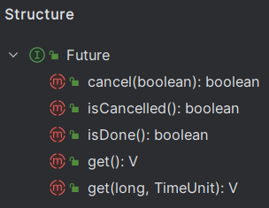

*Since: 2024-06-03*

## 线程基础知识

`并发 (concurrent)`：是在同一实体上的多个事件，是在**一台机器上同时处理多个任务**，同一时刻，其实是只有一个事情在发生。

`并行 (parallel)`：是在不同实体上的多个事件，是在**多台处理器上同时处理多个任务**，同一时刻，大家都在做事情，你做你的，我做我的，各干各的。

`进程`：在系统中运行的一个应用程序，每个进程都有它自己的内存空间和系统资源。

`线程`：也被称为**轻量级进程**，在同一个进程内会有一个或多个线程，是大多数操作系统进行时序调度的基本单元。

`管程`：**Monitor，也就是平时所说的锁。**

- Monitor 其实是一种**同步机制**，它的义务是保证（同一时间）只有一个线程可以访问被保护的数据和代码。
- JVM 中同步是基于进入和退出监视器（Monitor 管程对象）来实现的，每个对象实例都会对应一个 Monitor 对象。
- 当 Java 对象被用作同步锁时，JVM 会为该对象关联一个 Monitor；而当该对象不再被用作同步锁，或者对象被垃圾回收时，与其关联的 Monitor 可能会被 JVM 内部释放或重新利用。底层由 C++ 语言实现。

线程分类（一般不做特别说明配置，默认都是用户线程）：

- `用户线程`：是系统的工作线程，它会完成这个程序需要完成的业务操作。

- `守护线程`：是一种特殊的线程为其他线程服务的，在后台默默地完成一些系统性的任务，比如垃圾回收线程就是最典型的例子。守护线程作为一个服务线程，没有服务对象就没有必要继续运行了，如果用户线程全部结束了，意味着程序需要完成的业务操作已经结束了，系统可以退出了。**如果系统只剩下守护线程，守护线程会伴随着 JVM 一同结束工作。**

  ```java
  package cn.zero.cloud.platform.juc.daemon;
  
  import lombok.extern.slf4j.Slf4j;
  
  import java.util.concurrent.TimeUnit;
  
  /**
   * @author XiSun
   * @version 1.0
   * @since 2024/6/4 23:04
   */
  @Slf4j
  public class DaemonThread {
      public static void main(String[] args) {
          Thread t1 = new Thread(() -> {
              log.info("current thread: {}, it is a: {}", Thread.currentThread().getName(), (Thread.currentThread().isDaemon() ? "daemon thread" : "user thread"));
  
              while (true) {
                  log.info("{} is executing business", Thread.currentThread().getName());
  
                  // 便于查看日志
                  try {
                      TimeUnit.MILLISECONDS.sleep(100);
                  } catch (InterruptedException e) {
                      log.error("exception: ", e);
                  }
              }
          }, "t1");
          // 通过设置属性Daemon来设置当前线程是否为守护线程
          t1.setDaemon(true);
          t1.start();
  
          // 便于查看日志
          try {
              TimeUnit.SECONDS.sleep(1);
          } catch (InterruptedException e) {
              log.error("exception: ", e);
          }
  
          log.info("{} thread ends execution", Thread.currentThread().getName());
      }
  }
  
  输出：
      2024-06-05 23:19:02.955 [t1] INFO  cn.zero.cloud.platform.juc.daemon.DaemonThread - current thread: t1, it is a: daemon thread
      2024-06-05 23:19:02.959 [t1] INFO  cn.zero.cloud.platform.juc.daemon.DaemonThread - t1 is executing business
      2024-06-05 23:19:03.061 [t1] INFO  cn.zero.cloud.platform.juc.daemon.DaemonThread - t1 is executing business
      2024-06-05 23:19:03.171 [t1] INFO  cn.zero.cloud.platform.juc.daemon.DaemonThread - t1 is executing business
      2024-06-05 23:19:03.280 [t1] INFO  cn.zero.cloud.platform.juc.daemon.DaemonThread - t1 is executing business
      2024-06-05 23:19:03.388 [t1] INFO  cn.zero.cloud.platform.juc.daemon.DaemonThread - t1 is executing business
      2024-06-05 23:19:03.496 [t1] INFO  cn.zero.cloud.platform.juc.daemon.DaemonThread - t1 is executing business
      2024-06-05 23:19:03.604 [t1] INFO  cn.zero.cloud.platform.juc.daemon.DaemonThread - t1 is executing business
      2024-06-05 23:19:03.714 [t1] INFO  cn.zero.cloud.platform.juc.daemon.DaemonThread - t1 is executing business
      2024-06-05 23:19:03.823 [t1] INFO  cn.zero.cloud.platform.juc.daemon.DaemonThread - t1 is executing business
      2024-06-05 23:19:03.932 [t1] INFO  cn.zero.cloud.platform.juc.daemon.DaemonThread - t1 is executing business
      2024-06-05 23:19:03.963 [main] INFO  cn.zero.cloud.platform.juc.daemon.DaemonThread - main thread ends execution
          
  结论：在main主线程结束后，守护线程会伴随着JVM一同结束工作，即使守护线程还有循环没有结束
  ```
  

## 异步任务

### Future 接口

`Future 接口`：定义了操作异步任务执行一些方法，如获取异步任务的执行结果、取消异步任务的执行、判断任务是否被取消、判断任务执行是否完毕等。Future 是 Java 5 新加的一个接口，它提供一种异步并行计算的功能，如果主线程需要执行一个很耗时的计算任务，我们可以通过 Future 把这个任务放进异步线程中执行，主线程继续处理其他任务或者先行结束，再通过 Future 获取计算结果。



FutureTask 是 Future 的常用实现类：

```java
package cn.zero.cloud.platform.juc.future;

import lombok.extern.slf4j.Slf4j;

import java.util.concurrent.ExecutionException;
import java.util.concurrent.FutureTask;
import java.util.concurrent.TimeUnit;
import java.util.concurrent.TimeoutException;

/**
 * @author XiSun
 * @version 1.0
 * @since 2024/6/5 23:10
 */
@Slf4j
public class FutureTaskApiDemo {
    public static void main(String[] args) {
        FutureTask<String> futureTask = new FutureTask<>(() -> {
            log.info("{} thread come in", Thread.currentThread().getName());
            try {
                TimeUnit.SECONDS.sleep(5);
            } catch (InterruptedException e) {
                log.error("exception: ", e);
            }
            return "task over";
        });

        Thread t1 = new Thread(futureTask, "t1");
        t1.start();

        // 方式一：调用get()，通过阻塞的方式，获取futureTask的结果，main线程会一直阻塞，直到futureTask返回结果
        /*try {
            String result = futureTask.get();
            log.info("{} thread get the result of future task: {}", Thread.currentThread().getName(), result);
        } catch (InterruptedException | ExecutionException e) {
            log.error("exception: ", e);
        }*/

        // 方式二：指定阻塞的时间，超时后未获取到结果直接抛出异常java.util.concurrent.TimeoutException
        /*try {
            String result = futureTask.get(3, TimeUnit.SECONDS);
            log.info("{} thread get the result of future task: {}", Thread.currentThread().getName(), result);
        } catch (InterruptedException | ExecutionException | TimeoutException e) {
            log.error("exception: ", e);
        }*/

        // 方式三：轮询，调用isDone()
        while (true) {
            if (futureTask.isDone()) {
                try {
                    String result = futureTask.get();
                    log.info("{} thread get the result of future task: {}", Thread.currentThread().getName(), result);
                } catch (InterruptedException | ExecutionException e) {
                    log.error("exception: ", e);
                }
                break;
            } else {
                try {
                    TimeUnit.MILLISECONDS.sleep(500);
                } catch (InterruptedException e) {
                    log.error("exception: ", e);
                }

                log.info("{} thread is processing", Thread.currentThread().getName());
            }
        }
    }
}

输出：
    2024-06-05 23:57:32.443 [t1] INFO  c.zero.cloud.platform.juc.future.FutureTaskApiDemo - t1 thread come in
    2024-06-05 23:57:32.946 [main] INFO  c.zero.cloud.platform.juc.future.FutureTaskApiDemo - main thread is processing
    2024-06-05 23:57:33.456 [main] INFO  c.zero.cloud.platform.juc.future.FutureTaskApiDemo - main thread is processing
    2024-06-05 23:57:33.962 [main] INFO  c.zero.cloud.platform.juc.future.FutureTaskApiDemo - main thread is processing
    2024-06-05 23:57:34.468 [main] INFO  c.zero.cloud.platform.juc.future.FutureTaskApiDemo - main thread is processing
    2024-06-05 23:57:34.979 [main] INFO  c.zero.cloud.platform.juc.future.FutureTaskApiDemo - main thread is processing
    2024-06-05 23:57:35.488 [main] INFO  c.zero.cloud.platform.juc.future.FutureTaskApiDemo - main thread is processing
    2024-06-05 23:57:36.000 [main] INFO  c.zero.cloud.platform.juc.future.FutureTaskApiDemo - main thread is processing
    2024-06-05 23:57:36.509 [main] INFO  c.zero.cloud.platform.juc.future.FutureTaskApiDemo - main thread is processing
    2024-06-05 23:57:37.020 [main] INFO  c.zero.cloud.platform.juc.future.FutureTaskApiDemo - main thread is processing
    2024-06-05 23:57:37.523 [main] INFO  c.zero.cloud.platform.juc.future.FutureTaskApiDemo - main thread is processing
    2024-06-05 23:57:37.523 [main] INFO  c.zero.cloud.platform.juc.future.FutureTaskApiDemo - main thread get the result of future task: task over
```

- `get()`：主线程阻塞，直到获取 FutureTask 的结果。
- `isDone()`：轮询，会耗费 CPU 资源，而且也不见得能及时得到计算结果，如果想要异步获取结果，通常会以轮询的方式去获取结果，尽量不要阻塞。

- 结论：Future 对于任务的结果的获取不是很友好，只能通过**阻塞或轮询**的方式得到任务的结果。

### CompletableFuture 类
