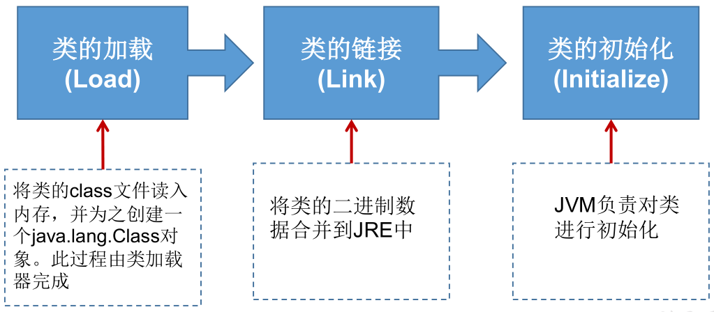
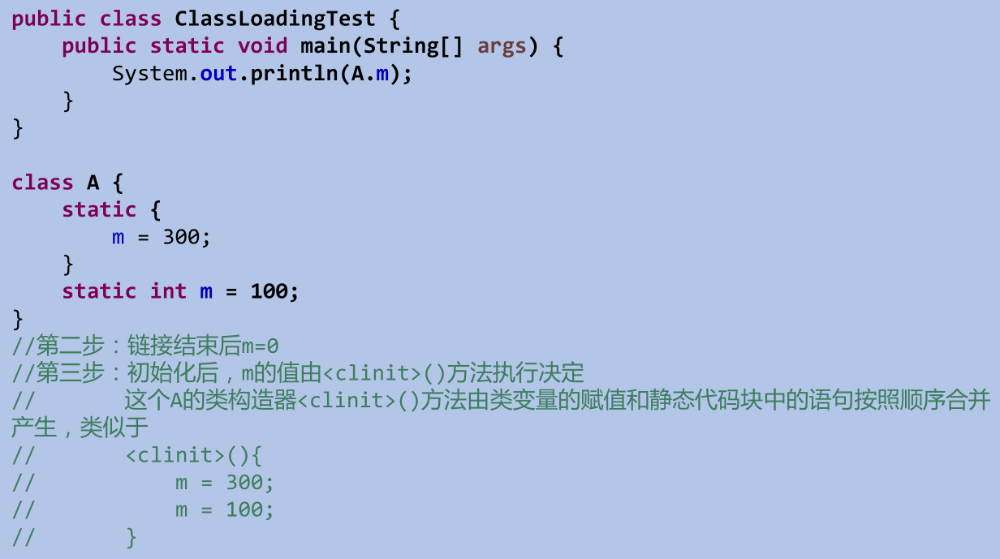
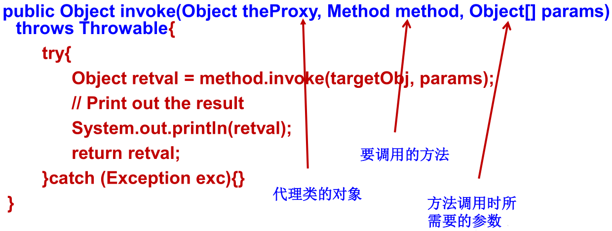
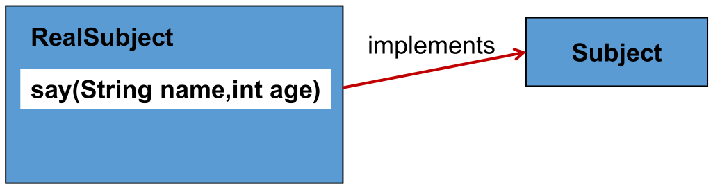
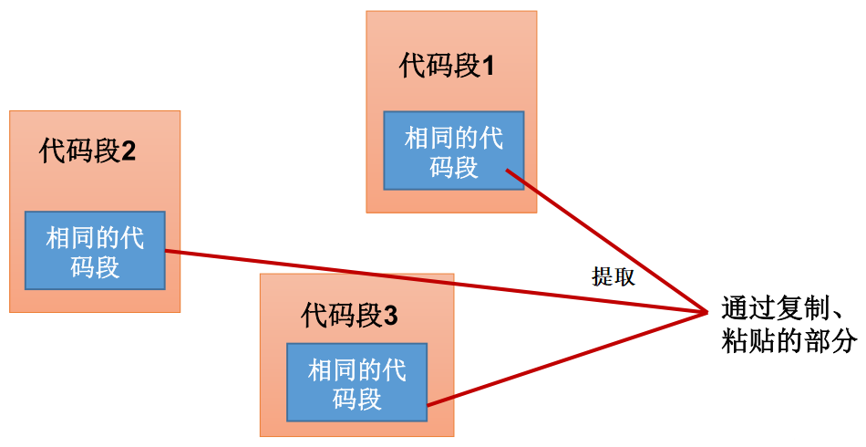
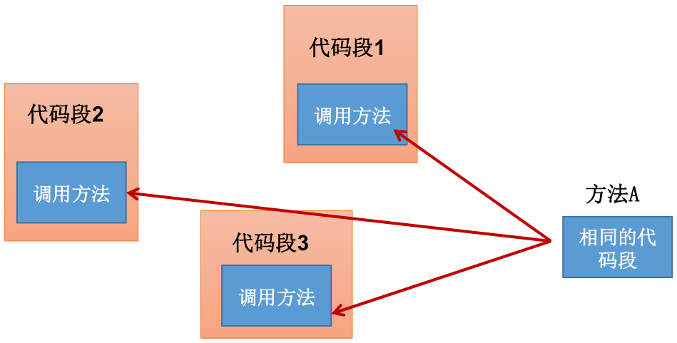

*date: 2021-04-07*

## Java 反射机制概述

- **Reflection (反射) 是被视为动态语言的关键，反射机制允许程序在执行期借助于 Reflection API 取得任何类的内部信息，并能直接操作任意对象的内部属性及方法。**

  - 动态语言：是一类在运行时可以改变其结构的语言。例如新的函数、对象、甚至代码可以被引进，已有的函数可以被删除或是其他结构上的变化。通俗点说就是在运行时代码可以根据某些条件改变自身结构。主要动态语言：Object-C、C#、JavaScript、PHP、Python、Erlang。
  - 静态语言：与动态语言相对应的，运行时结构不可变的语言就是静态语言。如 Java、C、C++。
  - Java 不是动态语言，但 Java 可以称之为 "准动态语言"。即 Java 有一定的动态性，我们可以利用反射机制、字节码操作获得类似动态语言的特性。Java 的动态性让编程的时候更加灵活。

- 加载完类之后，在堆内存的方法区中就产生了一个 Class 类型的对象 (一个类只有一个 Class 对象)，这个对象就包含了完整的类的结构信息。我们可以通过这个对象看到类的结构。这个对象就像一面镜子，透过这个镜子看到类的结构，所以，我们形象的称之为： 反射。

  

- Java 反射机制提供的功能：

  - 在运行时判断任意一个对象所属的类。
  - 在运行时构造任意一个类的对象。
  - 在运行时判断任意一个类所具有的成员变量和方法。
  - 在运行时获取泛型信息。
  - 在运行时调用任意一个对象的成员变量和方法。
  - 在运行时处理注解。
  - 生成动态代理。

- 反射相关的主要 API：

  - `java.lang.Class`：代表一 个类。
  - `java.lang.reflect.Method`：代表类的方法。
  - `java.lang.reflect.Field`：代表类的成员变量。
  - `java.lang.reflect.Constructor`：代表类的构造器。

## 理解 Class 类并获取 Class 类的实例
- 在 Object 类中定义了以下的方法，此方法将被所有子类继承：

  - `public final Class getClass()`
  - 以上的方法返回值的类型是一个 Class 类，此类是 **Java 反射的源头**，实际上所谓反射从程序的运行结果来看也很好理解，即：可以通过对象反射求出类的名称。

- 对象照镜子后可以得到的信息：某个类的属性、方法和构造器、某个类到底实现了哪些接口。对于每个类而言，JRE 都为其保留一个不变的 Class 类型的对象。一个 Class 对象包含了特定某个结构 (class/interface/enum/annotation/primitive type/void/[]) 的有关信息。

  - Class 本身也是一个类。

  - Class 对象只能由系统建立对象。

  - 一个加载的类在 JVM 中只会有一个 Class 实例。

  - 一个 Class 对象对应的是一个加载到 JVM 中的一个 .class 文件。

  - 每个类的实例都会记得自己是由哪个 Class 实例所生成。

  - 通过 Class 可以完整地得到一个类中的所有被加载的结构。

  - Class 类是 Reflection 的根源，针对任何你想动态加载、运行的类，唯有先获得相应的 Class 对象。

    

- Class 类的常用方法：

  - `static Class forName(String name)`：返回指定类名 name 的 Class 对象。
  - `Object newInstance()`：调用缺省构造函数，返回该 Class 对象的一个实例。
  - `getName()`：返回此 Class 对象所表示的实体 (类、接口、数组类、基本类型或 void) 名称。
  - `Class getSuperClass()`：返回当前 Class 对象的父类的 Class 对象。
  - `Class [] getInterfaces()`：获取当前 Class 对象的接口。
  - `ClassLoader getClassLoader()`：返回该类的类加载器。
  - `Class getSuperclass()`：返回表示此 Class 所表示的实体的超类的 Class。
  - `Constructor[] getConstructors()`：返回一个包含某些 Constructor 对象的数组。
  - `Field[] getDeclaredFields()`：返回 Field 对象的一个数组。
  - `Method getMethod(String name,Class … paramTypes)`：返回一个 Method 对象，此对象的形参类型为 paramType。

- 反射实例：

  ```java
  package cn.xisun.java.base.file;
  
  public class Person {
  
      private String name;
  
      public int age;
  
      public String getName() {
          return name;
      }
  
      public void setName(String name) {
          this.name = name;
      }
  
      public int getAge() {
          return age;
      }
  
      public void setAge(int age) {
          this.age = age;
      }
  
      public Person() {
          System.out.println("Person()");
      }
  
      private Person(String name) {
          this.name = name;
      }
  
      public Person(String name, int age) {
          this.name = name;
          this.age = age;
      }
  
      public void show() {
          System.out.println("你好，我是一个人");
      }
  
      private String showNation(String nation) {
          System.out.println("我的国籍是：" + nation);
          return nation;
      }
  
      @Override
      public String toString() {
          return "Person{" +
                  "name='" + name + '\'' +
                  ", age=" + age +
                  '}';
      }
  }
  ```

  ```java
  public class ReflectionTest {
      /*
      反射之前，对于Person的操作
       */
      @Test
      public void test1() {
          // 1.创建Person类的对象
          Person p1 = new Person("Tom", 12);
  
          // 2.通过对象，调用其内部的属性、方法
          p1.age = 10;
          System.out.println(p1.toString());
          p1.show();
  
          // 3.在Person类外部，不可以通过Person类的对象调用其内部私有结构。---封装性的限制
          // 比如：name、showNation()以及私有的构造器
      }
  
      /*
      反射之后，对于Person的操作
       */
      @Test
      public void test2() throws Exception {
          Class clazz = Person.class;
  
          // 1.通过反射，创建Person类的对象
          Constructor cons = clazz.getConstructor(String.class, int.class);
          Object obj = cons.newInstance("Tom", 12);
          Person p = (Person) obj;
          System.out.println(p.toString());// Person{name='Tom', age=12}
  
          // 2.通过反射，调用对象指定的属性、方法
          // 2.1 调用属性
          Field age = clazz.getDeclaredField("age");
          age.set(p, 10);
          System.out.println(p.toString());// Person{name='Tom', age=10}
          // 2.2 调用方法
          Method show = clazz.getDeclaredMethod("show");
          show.invoke(p);// 你好，我是一个人
  
          System.out.println("*******************************");
  
          // 3.通过反射，可以调用Person类的私有结构的。比如：私有的构造器、方法、属性
          // 3.1 调用私有的构造器
          Constructor cons1 = clazz.getDeclaredConstructor(String.class);
          cons1.setAccessible(true);
          Person p1 = (Person) cons1.newInstance("Jerry");
          System.out.println(p1);// Person{name='Jerry', age=0}
          // 3.2 调用私有的属性
          Field name = clazz.getDeclaredField("name");
          name.setAccessible(true);
          name.set(p1, "HanMeimei");
          System.out.println(p1);// Person{name='HanMeimei', age=0}
          // 3.3 调用私有的方法
          Method showNation = clazz.getDeclaredMethod("showNation", String.class);
          showNation.setAccessible(true);
          String nation = (String) showNation.invoke(p1, "中国");// 相当于String nation = p1.showNation("中国")
          System.out.println(nation);
      }
      // 疑问1：通过直接new的方式或反射的方式都可以调用公共的结构，开发中到底用那个？
      // 建议：直接new的方式。
      // 什么时候会使用：反射的方式。---> 根据反射的特征：动态性，进行考虑
      // 疑问2：反射机制与面向对象中的封装性是不是矛盾的？如何看待两个技术？
      // 不矛盾。封装性是给出了一种建议，不应该调用私有的结构，但如果有调用私有结构的需求，则可以通过反射机制做到。
  }
  ```

- 获取 Class 类的实例的四种方法：

  - 若已知具体的类，则通过类的 class 属性获取，该方法最为安全可靠，程序性能最高。比如：`Class clazz = String.class;`。

  - 若已知某个类的实例，则调用该实例的 `getClass()` 获取 Class 对象。比如：`Class clazz = "Hello,World!".getClass();`。

  - **若已知一个类的全类名，且该类在类路径下，可通过 Class 类的静态方法 `forName()` 获取，可能抛出 ClassNotFoundException。**比如：`Class clazz = Class.forName("java.lang.String");`。--- 最常用，体现了反射的动态性

  - 使用类的加载器 ClassLoader，比如：

    ```java
    ClassLoader cl = this.getClass().getClassLoader();
    Class clazz4 = cl.loadClass("类的全类名");
    ```

  - 实例：

    ```java
    public class ReflectionTest {
        /*
        关于java.lang.Class类的理解
        1.类的加载过程：
        程序经过javac.exe命令以后，会生成一个或多个字节码文件(.class结尾)。
        接着我们使用java.exe命令对某个字节码文件进行解释运行。相当于将某个字节码文件
        加载到内存中。这个过程就称为类的加载。加载到内存中的类，我们称为运行时类，此
        运行时类，就作为Class的一个实例。
        (万事万物皆对象：一方面，通过对象.xxx的方式调用方法、属性等；另一方面，在反射机制中，类本身也是Class的对象)
    
        2.换句话说，Class的实例就对应着一个运行时类。
    
        3.加载到内存中的运行时类，会缓存一定的时间。在此时间之内，我们可以通过不同的方式
        来获取此运行时类。
         */
    
        /*
        获取Class的实例的方式（前三种方式需要掌握）
         */
        @Test
        public void test3() throws ClassNotFoundException {
            // 方式一：调用运行时类的属性：.class
            Class clazz1 = Person.class;
            System.out.println(clazz1);// class cn.xisun.java.base.file.Person
    
            // 方式二：通过运行时类的对象，调用getClass()
            Person p1 = new Person();
            Class clazz2 = p1.getClass();
            System.out.println(clazz2);// class cn.xisun.java.base.file.Person
    
            // 方式三：调用Class的静态方法：forName(String classPath)
            Class clazz3 = Class.forName("cn.xisun.java.base.file.Person");// 指明类的全类名
            // clazz3 = Class.forName("java.lang.String");
            System.out.println(clazz3);// class cn.xisun.java.base.file.Person
    
            System.out.println(clazz1 == clazz2);// true
            System.out.println(clazz1 == clazz3);// true
    
            // 方式四：使用类的加载器：ClassLoader  (了解)
            ClassLoader classLoader = ReflectionTest.class.getClassLoader();
            Class clazz4 = classLoader.loadClass("cn.xisun.java.base.file.Person");
            System.out.println(clazz4);// class cn.xisun.java.base.file.Person
    
            System.out.println(clazz1 == clazz4);// true
        }
    }
    ```

- 哪些类型可以有 Class 对象：

  - class：外部类，成员 (成员内部类，静态内部类)，局部内部类，匿名内部类。

  - interface：接口。

  - []：数组.

  - enum：枚举。

  - annotation：注解 @interface。

  - primitive type：基本数据类型。

  - void

  - 实例：

    ```java
    public class ReflectionTest {
        /*
        Class实例可以是哪些结构的说明
         */
        @Test
        public void test4() {
            Class c1 = Object.class;
            Class c2 = Comparable.class;
            Class c3 = String[].class;
            Class c4 = int[][].class;// 二维数组
            Class c5 = ElementType.class;// 枚举类
            Class c6 = Override.class;// 注解
            Class c7 = int.class;
            Class c8 = void.class;
            Class c9 = Class.class;
    
            int[] a = new int[10];
            int[] b = new int[100];
            Class c10 = a.getClass();
            Class c11 = b.getClass();
            // 只要数组的元素类型与维度一样，就是同一个Class
            System.out.println(c10 == c11);// true
        }
    }
    ```

## 类的加载与 ClassLoader 的理解
- 类的加载过程：当程序主动使用某个类时，如果该类还未被加载到内存中，则系统会通过如下三个步骤来对该类进行初始化：

  

  - 加载：将 class 文件字节码内容加载到内存中，并将这些静态数据转换成方法区的运行时数据结构，然后生成一个代表这个类的 `java.lang.Class` 对象，作为方法区中类数据的访问入口 (即引用地址)。所有需要访问和使用类数据的地方，只能通过这个 Class 对象。这个加载的过程需要类加载器参与。

  - 链接：将 Java 类的二进制代码合并到 JVM 的运行状态之中的过程。

    - 验证：确保加载的类信息符合 JVM 规范，例如：以 cafe 开头，没有安全方面的问题。
    - 准备：**正式为类变量 (static) 分配内存并设置类变量默认初始值的阶段**，这些内存都将在方法区中进行分配。
    - 解析：虚拟机常量池内的符号引用 (常量名) 替换为直接引用 (地址) 的过程。

  - 初始化：

    - 执行类构造器 `<clinit>()` 方法的过程。**类构造器 `<clinit>()` 方法是由编译期自动收集类中所有类变量的赋值动作和静态代码块中的语句合并产生的。**(类构造器是构造类信息的，不是构造该类对象的构造器)
    - 当初始化一个类的时候，如果发现其父类还没有进行初始化，则需要先触发其父类的初始化。
    - 虚拟机会保证一个类的 `<clinit>()` 方法在多线程环境中被正确加锁和同步。

  - 代码图示：

    

- 什么时候会发生类的初始化：

  -  类的主动引用 (一定会发生类的初始化)：

    - 当虚拟机启动，先初始化 main 方法所在的类。
    - new 一个类的对象。
    - 调用类的静态成员 (除了 final 常量) 和静态方法。
    - 使用 `java.lang.reflect` 包的方法对类进行反射调用。
    - 当初始化一个类，如果其父类没有被初始化，则先会初始化它的父类。

  - 类的被动引用 (不会发生类的初始化)：

    - 当访问一个静态域时，只有真正声明这个域的类才会被初始化。
    - 当通过子类引用父类的静态变量，不会导致子类初始化。
    - 通过数组定义类引用，不会触发此类的初始化。
    - 引用常量不会触发此类的初始化 (常量在链接阶段就存入调用类的常量池中了)。

  - 实例：

    ```java
    public class ClassLoadingTest {
        public static void main(String[] args) throws ClassNotFoundException {
            // 主动引用：一定会导致A和Father的初始化
            A a = new A();
            System.out.println(A.m);
            Class.forName("cn.xisun.java.base.file.A");
    
            // 被动引用
            A[] array = new A[5];// 不会导致A和Father的初始化
            System.out.println(A.b);// 只会初始化Father
            System.out.println(A.M);// 不会导致A和Father的初始化
        }
    
        static {
            System.out.println("main所在的类");
        }
    }
    
    class Father {
        static int b = 2;
    
        static {
            System.out.println("父类被加载");
        }
    }
    
    class A extends Father {
        static {
            System.out.println("子类被加载");
            m = 300;
        }
    
        static int m = 100;
        
        static final int M = 1;
    }
    ```

- 类加载器的作用：

  

  - **类加载的作用：将 class 文件字节码内容加载到内存中，并将这些静态数据转换成方法区的运行时数据结构，然后在堆中生成一个代表这个类的 `java.lang.Class` 对象，作为方法区中类数据的访问入口。**
  - 类缓存：标准的 Java SE 类加载器可以按要求查找类，但**一旦某个类被加载到类加载器中，它将维持加载 (缓存) 一段时间。**不过 JVM 垃圾回收机制可以回收这些 Class 对象。

- JVM 规范定义了如下类型的类的加载器：

  

  - 引导类加载器

  - 扩展类加载器

  - 系统类加载器

  - 自定义类加载器

  - 实例：

    ```java
    /**
     * 了解类的加载器
     */
    public class ClassLoaderTest {
        @Test
        public void test1() {
            // 对于自定义类，使用系统类加载器进行加载
            ClassLoader classLoader = ClassLoaderTest.class.getClassLoader();
            System.out.println(classLoader);// sun.misc.Launcher$AppClassLoader@18b4aac2
    
            // 调用系统类加载器的getParent()：获取扩展类加载器
            ClassLoader classLoader1 = classLoader.getParent();
            System.out.println(classLoader1);// sun.misc.Launcher$ExtClassLoader@21588809
    
            // 调用扩展类加载器的getParent()：无法获取引导类加载器
            // 引导类加载器主要负责加载java的核心类库，无法加载自定义类的。
            ClassLoader classLoader2 = classLoader1.getParent();
            System.out.println(classLoader2);// null
    
            ClassLoader classLoader3 = String.class.getClassLoader();
            System.out.println(classLoader3);// null，String的加载器是引导类加载器，无法获取
            
            // 测试当前类由哪个类加载器进行加载
            ClassLoader classLoader4 = Class.forName("cn.xisun.java.base.file.ClassLoaderTest").getClassLoader();
            System.out.println(classLoader4);// sun.misc.Launcher$AppClassLoader@18b4aac2
            // 测试JDK提供的Object类由哪个类加载器加载
            ClassLoader classLoader5 = Class.forName("java.lang.Object").getClassLoader();
            System.out.println(classLoader5);// null，Object的加载器是引导类加载器，无法获取
            // 关于类加载器的一个主要方法：getResourceAsStream(String str):获取类路径下的指定文件的输入流
            InputStream in = this.getClass().getClassLoader().getResourceAsStream("test.properties");
            System.out.println(in);
        }
    }
    ```

- 类加载器读取配置文件：

  ```java
  public class ClassLoaderTest {
      /*
      Properties：用来读取配置文件。
      注意：配置文件的路径问题
       */
      @Test
      public void test2() throws Exception {
          Properties pros = new Properties();
  
          // 读取配置文件的方式一：
          // 此时的文件默认在当前的module下
          /*FileInputStream fis = new FileInputStream("jdbc1.properties");
          // FileInputStream fis = new FileInputStream("src\\jdbc1.properties");// 等同于方式二
          pros.load(fis);*/
  
          // 读取配置文件的方式二：使用ClassLoader
          // 此时的配置文件默认识别为：当前module的src下
          ClassLoader classLoader = ClassLoaderTest.class.getClassLoader();
          InputStream is = classLoader.getResourceAsStream("jdbc1.properties");
          pros.load(is);
  
          String user = pros.getProperty("user");
          String password = pros.getProperty("password");
          System.out.println("user = " + user + ", password = " + password);
      }
  }
  ```

## 创建运行时类的对象

- 当拿到了运行时类的 Class 对象后，就可以创建该运行时类的对象，这是反射机制应用最多的地方。

- 通过 Class 对象的 `newInstance()` 创建：

  - 运行时类必须有一个无参数的构造器。

  - 运行时类的构造器的访问权限需要足够。

    ```java
    /**
     * 通过反射创建对应的运行时类的对象
     */
    public class NewInstanceTest {
        @Test
        public void test1() throws IllegalAccessException, InstantiationException {
            Class<Person> clazz = Person.class;
            /*
            newInstance(): 调用此方法，创建对应的运行时类的对象。内部调用了运行时类的空参的构造器。
    
            要想此方法正常的创建运行时类的对象，要求：
            1.运行时类必须提供空参的构造器
            2.空参的构造器的访问权限得够。通常，设置为public。
    
            在javabean中要求提供一个public的空参构造器。原因：
            1.便于通过反射，创建运行时类的对象
            2.便于子类继承此运行时类时，默认调用super()时，保证父类有此构造器
             */
            Person obj = clazz.newInstance();
            System.out.println(obj);
        }
    }
    ```

- 通过 Class 对象的 `getDeclaredConstructor(Class … parameterTypes)` 创建：

  - 先向构造器的形参中传递一个对象数组进去，里面包含了构造器中所需的各个参数。

  - 再通过 Constructor 实例化对象。

    

- 体会反射的动态性：

  ```java
  public class NewInstanceTest {
      /*
      体会反射的动态性：以下程序只有在运行时，才能确定到底创建哪个对象
       */
      @Test
      public void test2() {
          for (int i = 0; i < 100; i++) {
              int num = new Random().nextInt(3);// 0,1,2
              String classPath = "";
              switch (num) {
                  case 0:
                      classPath = "java.util.Date";
                      break;
                  case 1:
                      classPath = "java.lang.Object";
                      break;
                  case 2:
                      classPath = "cn.xisun.java.base.file.Person";
                      break;
              }
  
              try {
                  Object obj = getInstance(classPath);
                  System.out.println(obj);
              } catch (Exception e) {
                  e.printStackTrace();
              }
          }
      }
  
      /*
      创建一个指定类的对象。
      classPath: 指定类的全类名
       */
      public Object getInstance(String classPath) throws Exception {
          Class clazz = Class.forName(classPath);
          return clazz.newInstance();
      }
  }
  ```

## 获取运行时类的完整结构
- 类的完整结构：

  - Field 、Method 、Constructor 、Superclass 、Interface 、Annotation。
  - 全部的 Field。
  - 全部的方法。
  - 全部的构造器。
  - 所继承的父类。
  - 实现的全部接口。
  - 
    注解。

- 定义 Person 类和相关接口、注解类：

  ```java
  public class Creature<T> implements Serializable {
      private char gender;
      public double weight;
  
      private void breath() {
          System.out.println("生物呼吸");
      }
  
      public void eat() {
          System.out.println("生物吃东西");
      }
  }
  ```

  ```java
  public interface MyInterface {
      void info();
  }
  ```

  ```java
  @Target({TYPE, FIELD, METHOD, PARAMETER, CONSTRUCTOR, LOCAL_VARIABLE})
  @Retention(RetentionPolicy.RUNTIME)
  public @interface MyAnnotation {
      String value() default "hello";
  }
  ```

  ```java
  @MyAnnotation(value = "hi")
  public class Person extends Creature<String> implements Comparable<String>, MyInterface {
      private String name;
      int age;
      public int id;
  
      public Person() {
      }
  
      @MyAnnotation(value = "abc")
      private Person(String name) {
          this.name = name;
      }
  
      Person(String name, int age) {
          this.name = name;
          this.age = age;
      }
  
      @MyAnnotation
      private String show(String nation) {
          System.out.println("我的国籍是：" + nation);
          return nation;
      }
  
      public String display(String interests, int age) throws NullPointerException, ClassCastException {
          return interests + age;
      }
  
      @Override
      public void info() {
          System.out.println("我是一个人");
      }
  
      @Override
      public int compareTo(String o) {
          return 0;
      }
  
      private static void showDesc() {
          System.out.println("我是一个可爱的人");
      }
  
      @Override
      public String toString() {
          return "Person{" +
                  "name='" + name + '\'' +
                  ", age=" + age +
                  ", id=" + id +
                  '}';
      }
  }
  ```

- **使用反射获得全部的 Field：**

  - `public Field[] getFields()`：返回此 Class 对象所表示的类或接口的 public 的 Field (包括父类)。

  - `public Field[] getDeclaredFields()`：返回此 Class 对象所表示的类或接口的全部 Field (不包括父类)。

  - Field 类中的方法：

    - `public int getModifiers()`：以整数形式返回此 Field 的修饰符。
    - `public Class<?> getType()`：得到 Field 的属性类型。
    - `public String getName()`：返回 Field 的名称。

  - 实例：

    ```java
    public class FieldTest {
        @Test
        public void test1() {
            Class clazz = Person.class;
    
            // 获取属性结构
            // getFields(): 获取当前运行时类及其父类中声明为public访问权限的属性
            Field[] fields = clazz.getFields();
            for (Field f : fields) {
                System.out.println(f);
            }
            System.out.println();
    
            // getDeclaredFields(): 获取当前运行时类中声明的所有属性。（不包含父类中声明的属性）
            Field[] declaredFields = clazz.getDeclaredFields();
            for (Field f : declaredFields) {
                System.out.println(f);
            }
        }
    
        /*
        权限修饰符  数据类型 变量名
         */
        @Test
        public void test2() {
            Class clazz = Person.class;
            Field[] declaredFields = clazz.getDeclaredFields();
            for (Field f : declaredFields) {
                // 1.权限修饰符
                int modifier = f.getModifiers();
                System.out.print(Modifier.toString(modifier) + ", ");
    
                // 2.数据类型
                Class type = f.getType();
                System.out.print(type.getName() + ", ");
    
                // 3.变量名
                String fName = f.getName();
                System.out.print(fName);
    
                System.out.println();
            }
        }
    }
    test1输出结果：
    public int cn.xisun.java.base.file.Person.id
    public double cn.xisun.java.base.file.Creature.weight
    
    private java.lang.String cn.xisun.java.base.file.Person.name
    int cn.xisun.java.base.file.Person.age
    public int cn.xisun.java.base.file.Person.id
    
    test2输出结果：
    private, java.lang.String, name
    , int, age
    public, int, id
    ```

- **使用反射获得全部的 Method：**

  - `public Method[] getMethods()`：返回此 Class 对象所表示的类或接口的 public 的 Method (包括父类)。

  - `public Method[] getDeclaredMethods()`：返回此 Class 对象所表示的类或接口的全部 Method (不包括父类)。

  - Method 类中的方法：

    - `public Class<?>[] getParameterTypes()`：取得全部的参数。
    - `public int getModifiers()`：取得修饰符。
    - `public Class<?> getReturnType()：`取得全部的返回值。
    - `public Class<?>[] getExceptionTypes()`：取得异常信息。

  - 实例：

    ```java
    public class MethodTest {
        @Test
        public void test1() {
            Class clazz = Person.class;
    
            // getMethods(): 获取当前运行时类及其所有父类中声明为public权限的方法
            Method[] methods = clazz.getMethods();
            for (Method m : methods) {
                System.out.println(m);
            }
            System.out.println();
    
            // getDeclaredMethods(): 获取当前运行时类中声明的所有方法。（不包含父类中声明的方法）
            Method[] declaredMethods = clazz.getDeclaredMethods();
            for (Method m : declaredMethods) {
                System.out.println(m);
            }
        }
    
        /*
        @Xxxx
        权限修饰符  返回值类型  方法名(参数类型1 形参名1, ...) throws XxxException{}
         */
        @Test
        public void test2() {
            Class clazz = Person.class;
    
            Method[] declaredMethods = clazz.getDeclaredMethods();
            for (Method m : declaredMethods) {
                // 1.获取方法声明的注解
                Annotation[] annos = m.getAnnotations();
                for (Annotation a : annos) {
                    System.out.print(a + ", ");
                }
    
                // 2.权限修饰符
                System.out.print(Modifier.toString(m.getModifiers()) + ", ");
    
                // 3.返回值类型
                System.out.print(m.getReturnType().getName() + ", ");
    
                // 4.方法名
                System.out.print(m.getName());
    
                // 5.形参列表
                System.out.print("(");
                Class[] parameterTypes = m.getParameterTypes();
                if (!(parameterTypes == null && parameterTypes.length == 0)) {
                    for (int i = 0; i < parameterTypes.length; i++) {
                        if (i == parameterTypes.length - 1) {
                            System.out.print(parameterTypes[i].getName() + " args_" + i);
                            break;
                        }
                        System.out.print(parameterTypes[i].getName() + " args_" + i + ", ");
                    }
                }
                System.out.print("), ");
    
                // 6.抛出的异常
                Class[] exceptionTypes = m.getExceptionTypes();
                if (exceptionTypes.length > 0) {
                    System.out.print("throws ");
                    for (int i = 0; i < exceptionTypes.length; i++) {
                        if (i == exceptionTypes.length - 1) {
                            System.out.print(exceptionTypes[i].getName());
                            break;
                        }
                        System.out.print(exceptionTypes[i].getName() + ", ");
                    }
                }
                System.out.println();
            }
        }
    }
    ```

- **使用反射获得全部的构造器：**

  - `public Constructor<T>[] getConstructors()`：返回此 Class 对象所表示的类的所有 public 构造方法 (没有父类)。
  - `public Constructor<T>[] getDeclaredConstructors()`：返回此 Class 对象表示的类声明的所有构造方法 (没有父类)。
  - Constructor 类中的方法：
    - `public int getModifiers()`：取得修饰符。
    - `public String getName()`：取得方法名称。
    - `public Class<?>[] getParameterTypes()`：取得参数的类型。

- **使用反射获得实现的全部接口：**

  - `public Class<?>[] getInterfaces()`：确定此对象所表示的类或接口实现的接口。

- **使用反射获得所继承的父类**

  - `public Class<? Super T> getSuperclass()`：返回表示此 Class 所表示的实体 (类、接口、基本类型) 的父类的 Class。

- **使用反射获得泛型相关：**

  - `Type getGenericSuperclass()`：获取父类泛型类型。
  - 泛型类型：ParameterizedType。
  - `getActualTypeArguments()`：获取实际的泛型类型参数数组。

- **使用反射获得 Annotation 相关**

  - `get Annotation(Class<T> annotationClass)`
  - `getDeclaredAnnotations()`

- 使用反射获得类所在的包：

  - `Package getPackage()`

- 实例：

  ```java
  public class OtherTest {
      /*
      获取构造器结构
       */
      @Test
      public void test1() {
          Class<Person> clazz = Person.class;
  
          // getConstructors(): 获取当前运行时类中声明为public的构造器
          Constructor<?>[] constructors = clazz.getConstructors();
          for (Constructor<?> c : constructors) {
              System.out.println(c);
          }
  
          System.out.println();
          // getDeclaredConstructors(): 获取当前运行时类中声明的所有的构造器
          Constructor<?>[] declaredConstructors = clazz.getDeclaredConstructors();
          for (Constructor<?> c : declaredConstructors) {
              System.out.println(c);
          }
      }
  
      /*
      获取运行时类的父类
       */
      @Test
      public void test2() {
          Class<Person> clazz = Person.class;
  
          Class<? super Person> superclass = clazz.getSuperclass();
          System.out.println(superclass);
      }
  
      /*
      获取运行时类的带泛型的父类
       */
      @Test
      public void test3() {
          Class<Person> clazz = Person.class;
  
          Type genericSuperclass = clazz.getGenericSuperclass();
          System.out.println(genericSuperclass);
      }
  
      /*
      获取运行时类的带泛型的父类的泛型
  
      代码：逻辑性代码  vs 功能性代码
       */
      @Test
      public void test4() {
          Class<Person> clazz = Person.class;
  
          Type genericSuperclass = clazz.getGenericSuperclass();
          ParameterizedType paramType = (ParameterizedType) genericSuperclass;
          // 获取泛型类型
          Type[] actualTypeArguments = paramType.getActualTypeArguments();
          System.out.println(actualTypeArguments[0].getTypeName());// 方式一
          System.out.println(((Class) actualTypeArguments[0]).getName());// 方式二
      }
  
      /*
      获取运行时类实现的接口
       */
      @Test
      public void test5() {
          Class<Person> clazz = Person.class;
  
          Class<?>[] interfaces = clazz.getInterfaces();
          for (Class<?> c : interfaces) {
              System.out.println(c);
          }
  
          System.out.println();
          // 获取运行时类的父类实现的接口
          Class<?>[] interfaces1 = clazz.getSuperclass().getInterfaces();
          for (Class<?> c : interfaces1) {
              System.out.println(c);
          }
      }
  
  
      /*
      获取运行时类声明的注解
       */
      @Test
      public void test7() {
          Class<Person> clazz = Person.class;
  
          Annotation[] annotations = clazz.getAnnotations();
          for (Annotation annos : annotations) {
              System.out.println(annos);
          }
      }
  
      /*
      获取运行时类所在的包
       */
      @Test
      public void test6() {
          Class<Person> clazz = Person.class;
  
          Package pack = clazz.getPackage();
          System.out.println(pack);
      }
  }
  ```

## 调用运行时类的指定结构
- 调用指定属性：

  - 在反射机制中，可以直接通过 Field 类操作类中的属性，通过 Field 类提供的 `set()` 和 `get()` 就可以完成设置和取得属性内容的操作。
    - `public Field getField(String name)`：返回此 Class 对象表示的类或接口的指定的 public 的Field。
    - **`public Field getDeclaredField(String name)`**：返回此 Class 对象表示的类或接口的指定的 Field。
  - 在 Field 中：
    - `public void set(Object obj,Object value)`：设置指定对象 obj 上此 Field 的属性内容。
    - `public Object get(Object obj)`：取得指定对象 obj 上此 Field 的属性内容。

- 调用指定方法：

  - 通过反射，调用类中的方法，通过 Method 类完成。步骤：
    - 通过 Class 类的 **`getDeclaredMethod(String name,Class…parameterTypes)`** 取得一个 Method 对象，并设置此方法操作时所需要的参数类型。
    - 之后使用 `Object invoke(Object obj, Object[] args)` 进行调用，并向方法中传递要设置的 obj 对象的参数信息。

- 关于 `setAccessible(true)` 的使用：

  - Method 和 Field、Constructor 对象都有 `setAccessible()`。
  - `setAccessible()` 启动和禁用访问安全检查的开关。
  - 参数值为 true 则指示反射的对象在使用时应该取消 Java 语言访问检查。
    - 提高反射的效率。如果代码中必须用反射，而该句代码需要频繁的被调用，那么请设置为 true。
    - **使得原本无法访问的私有成员也可以访问。**
  - 参数值为 false 则指示反射的对象应该实施 Java 语言访问检查。

- 关于 `Object invoke(Object obj, Object … args)` 的使用：

  - **Object 对应原方法的返回值，若原方法无返回值，此时返回 null。**
  - **若原方法为静态方法，则形参 obj 为运行时类本身或者 null。**
  - 若原方法形参列表为空，则形参 args 为 null。
  - 若原方法声明为 private，则需要在调用此 `invoke()` 前，显式调用方法对象的 `setAccessible(true)`，即可访问 private 的方法。(一般来说，不论调用的是什么权限的方法，都可显示调用方法对象的 `setAccessible(true)`。)

- 实例：

  ```java
  public class ReflectionTest {
      /*
      不需要掌握，因为只能获取public的,通常不采用此方法
       */
      @Test
      public void testField() throws Exception {
          Class<Person> clazz = Person.class;
  
          // 创建运行时类的对象
          Person p = clazz.newInstance();
  
          // 获取指定的属性：要求运行时类中属性声明为public
          Field id = clazz.getField("id");
  
          /*
          设置当前属性的值
          set():
              参数1：指明设置哪个对象的属性   参数2：将此属性值设置为多少
           */
  
          id.set(p, 1001);
  
          /*
          获取当前属性的值
          get():
              参数1：获取哪个对象的当前属性值
           */
          int pId = (int) id.get(p);
          System.out.println(pId);// 1001
      }
  
      /*
      如何操作运行时类中的指定的属性 --- 需要掌握
       */
      @Test
      public void testField1() throws Exception {
          Class clazz = Person.class;
  
          // 创建运行时类的对象
          Person p = (Person) clazz.newInstance();
  
          // 1. getDeclaredField(String fieldName): 获取运行时类中指定变量名的属性
          Field name = clazz.getDeclaredField("name");
  
          // 2.保证当前属性是可访问的
          name.setAccessible(true);
  
          // 3.获取、设置指定对象的此属性值
          name.set(p, "Tom");
          System.out.println(name.get(p));
  
          System.out.println("*************如何调用静态属性*****************");
  
          // public static String national = "中国";
  
          Field national = clazz.getDeclaredField("national");
          national.setAccessible(true);
          System.out.println(national.get(Person.class));// 中国
      }
  
      /*
      如何操作运行时类中的指定的方法 --- 需要掌握
       */
      @Test
      public void testMethod() throws Exception {
          Class<Person> clazz = Person.class;
  
          // 创建运行时类的对象
          Person p = clazz.newInstance();
  
          /*
          1.获取指定的某个方法
              getDeclaredMethod():
                  参数1 ：指明获取的方法的名称  参数2：指明获取的方法的形参列表
           */
          Method show = clazz.getDeclaredMethod("show", String.class);
  
          // 2.保证当前方法是可访问的
          show.setAccessible(true);
  
          /*
          3.调用方法的invoke():
              参数1：方法的调用者  参数2：给方法形参赋值的实参
          invoke()的返回值即为对应类中调用的方法的返回值
           */
          Object returnValue = show.invoke(p, "CHN"); // String nation = p.show("CHN");
          System.out.println(returnValue);// CHN，返回的returnValue是一个String，可以强转
  
          System.out.println("*************如何调用静态方法*****************");
  
          // private static void showDesc(){}
  
          Method showDesc = clazz.getDeclaredMethod("showDesc");
          showDesc.setAccessible(true);
          // 如果调用的运行时类中的方法没有返回值，则此invoke()返回null
          // Object returnVal = showDesc.invoke(null);// 参数写null也可以，因为静态方法的调用者只有类本身
          Object returnVal = showDesc.invoke(Person.class);// 静态方法的调用者就是当前类
          System.out.println(returnVal);// null
      }
  
      /*
      如何调用运行时类中的指定的构造器 --- 不常用
      经常调用类的空参构造器创建类的对象：Person p = clazz.newInstance();
       */
      @Test
      public void testConstructor() throws Exception {
          Class<Person> clazz = Person.class;
  
          //private Person(String name)
          /*
          1.获取指定的构造器
              getDeclaredConstructor():
                  参数：指明构造器的参数列表
           */
  
          // private Person(String name) {this.name = name;}
          Constructor<Person> constructor = clazz.getDeclaredConstructor(String.class);
  
          // 2.保证此构造器是可访问的
          constructor.setAccessible(true);
  
          // 3.调用此构造器创建运行时类的对象
          Person per = constructor.newInstance("Tom");
          System.out.println(per);
      }
  }
  ```

## 反射的应用：动态代理

- **代理设计模式的原理：使用一个代理将对象包装起来，然后用该代理对象取代原始对象。任何对原始对象的调用都要通过代理。代理对象决定是否以及何时将方法调用转到原始对象上。**

  

  - **代理过程：代理类和被代理类实现共同的接口，重写接口的方法 a。被代理类中，在方法 a 中实现自身需要完成的逻辑。代理类中，提供被代理类的实例，并在方法 a 中，调用该实例对象的方法 a，同时，在代理类的方法 a 中，也可以添加一些不同代理类需要实现的公共的方法。**

- 代理分为静态代理和动态代理。

- 静态代理的特征是代理类和目标对象的类都是在编译期间确定下来。静态代理不利于程序的扩展。同时，每一个代理类只能为一个接口服务，这样一来程序开发中必然产生过多的代理。 最好可以通过一个代理类完成全部的代理功能。

  ```java
  /**
   * 静态代理举例
   *
   * 特点：代理类和被代理类在编译期间，就确定下来了。
   */
  interface ClothFactory {
      void produceCloth();
  }
  
  /**
   * 被代理类1
   */
  class AntaClothFactory implements ClothFactory {
      @Override
      public void produceCloth() {
          System.out.println("Anta工厂生产一批运动服");
      }
  }
  
  /**
   * 被代理类2
   */
  class LiningClothFactory implements ClothFactory {
      @Override
      public void produceCloth() {
          System.out.println("Lining工厂生产一批运动服");
      }
  }
  
  /**
   * 代理类 --- 只能代理实现了ClothFactory这个接口的被代理类，其他类型的被代理类不能使用
   */
  class ProxyClothFactory implements ClothFactory {
      // 用被代理类对象进行实例化
      private ClothFactory factory;
  
      public ProxyClothFactory(ClothFactory factory) {
          this.factory = factory;
      }
  
      @Override
      public void produceCloth() {
          System.out.println("代理类做一些公共的准备工作");
          factory.produceCloth();// 此方法由具体的被代理类自己实现
          System.out.println("代理类做一些公共的收尾工作");
      }
  }
  
  public class StaticProxyTest {
      public static void main(String[] args) {
          // 创建被代理类的对象
          ClothFactory anta = new AntaClothFactory();
          // 创建代理类的对象
          ClothFactory proxyClothFactory = new ProxyClothFactory(anta);
          proxyClothFactory.produceCloth();
          
          System.out.println("******************************");
          
          proxyClothFactory = new ProxyClothFactory(new LiningClothFactory());
          proxyClothFactory.produceCloth();
      }
  }
  ```

- 动态代理是指客户通过代理类来调用其它对象的方法，并且是在程序运行时根据需要动态创建目标类的代理对象。

- 动态代理使用场合：

  - 调试
  - 远程方法调用

- **动态代理相比于静态代理的优点：抽象角色中 (接口) 声明的所有方法都被转移到调用处理器一个集中的方法中处理，这样，我们可以更加灵活和统一的处理众多的方法。**

  - 一个动态代理类能做到所有被代理类的工作，在运行时，会根据传入的被代理类的对象，动态的创建一个对应的代理对象。

- Java 动态代理相关的 API：

  - **Proxy**：专门完成代理的操作类，是所有动态代理类的父类。通过此类为一个或多个接口动态地生成实现类。

  - 提供用于创建动态代理类和动态代理对象的静态方法：

    

    - `static Class<?> getProxyClass(ClassLoader loader, Class<?>... interfaces)`：创建一个动态代理类所对应的Class对象
    - `static Object newProxyInstance(ClassLoader loader, Class<?>[] interfaces, InvocationHandler h)`：直接创建一个动态代理对象

- 动态代理步骤：

  - 创建一个实现接口 InvocationHandler 的类，它必须实现 `invoke()`，以完成代理的具体操作：

    

  - 创建被代理的类以及接口：

    

  - 通过 Proxy 的静态方法 `newProxyInstance(ClassLoader loader, Class[] interfaces, InvocationHandler h)` 创建一个 Subject 接口代理：

    ```java
    RealSubject target = new RealSubject();
    // Create a proxy to wrap the original implementation
    DebugProxy proxy = new DebugProxy(target);
    // Get a reference to the proxy through the Subject interface
    Subject sub = (Subject) Proxy.newProxyInstance(Subject.class.getClassLoader(),new Class[] { Subject.class }, proxy);
    ```

  - 通过 Subject 代理调用 RealSubject 实现类的方法：

    ```java
    String info = sub.say("Peter", 24);
    System.out.println(info);
    ```

- 实例：

  ```java
  /**
   * 被代理类型一
   */
  interface Human {
      String getBelief();
  
      void eat(String food);
  }
  
  /**
   * 被代理类
   */
  class SuperMan implements Human {
      @Override
      public String getBelief() {
          return "I believe I can fly!";
      }
  
      @Override
      public void eat(String food) {
          System.out.println("超人喜欢吃" + food);
      }
  }
  ```

  ```java
  /**
   * 被代理类型二
   */
  interface ClothFactory {
      void produceCloth();
  }
  
  /**
   * 被代理类
   */
  class AntaClothFactory implements ClothFactory {
      @Override
      public void produceCloth() {
          System.out.println("Anta工厂生产一批运动服");
      }
  }
  ```

  ```java
  /*
  要想实现动态代理，需要解决的问题？
  问题一：如何根据加载到内存中的被代理类，动态的创建一个代理类及其对象。
  问题二：当通过代理类的对象调用方法a时，如何动态的去调用被代理类中的同名方法a。
   */
  
  /**
   * 动态代理类
   */
  class ProxyFactory {
      // 调用此方法，返回一个代理类的对象。---> 解决问题一
      // 返回的可能是不同类型的代理类对象，因此返回Object，然后根据传参obj的类型，再进行强转 
      public static Object getProxyInstance(Object obj) {// obj:被代理类的对象
          // 创建InvocationHandler接口的实例，并赋值被代理类的对象
          MyInvocationHandler handler = new MyInvocationHandler();
          handler.bind(obj);
          
          /*
          参数1：被代理类obj的类加载器
          参数2：被代理类obj实现的接口
          参数3：实现InvocationHandler接口的handler，包含被代理类执行方法调用的逻辑
           */
          return Proxy.newProxyInstance(obj.getClass().getClassLoader(), obj.getClass().getInterfaces(), handler);
      }
  }
  
  /**
   * 实现InvocationHandler接口 ---> 解决问题二
   */
  class MyInvocationHandler implements InvocationHandler {
      // 需要使用被代理类的对象进行赋值
      private Object obj;
  
      // 赋值操作，也可以通过构造器进行赋值
      public void bind(Object obj) {
          this.obj = obj;
      }
  
      // 当我们通过代理类的对象，调用方法a时，就会自动的调用如下的方法：invoke()
      // 将被代理类要执行的方法a的功能就声明在invoke()中
      // proxy：代理类的对象
      // method：代理类和被代理类共同实现的接口中的重写的方法
      // args：该重写方法需要传入的参数
      @Override
      public Object invoke(Object proxy, Method method, Object[] args) throws Throwable {
          // method: 即为代理类对象调用的方法，此方法也就作为了被代理类对象要调用的方法
          // obj: 被代理类的对象
          Object returnValue = method.invoke(obj, args);
  
          // 上述方法的返回值returnValue就作为当前类中的invoke()的返回值。
          // 实际上也就是被代理类所调用方法的返回值
          return returnValue;
      }
  }
  
  /**
   * 测试方法
   */
  public class ProxyTest {
      public static void main(String[] args) {
          // 被代理类型一
          SuperMan superMan = new SuperMan();
          // proxyHuman: 代理类的对象
          // 在动态代理中，proxyHuman代表的是代理类的对象，不应该被强转为SuperMan，因为SuperMan是被代理类
          // 但可以被强转为共同的接口Human。其他类型的代理类和被代理类同理
          Human proxyHuman = (Human) ProxyFactory.getProxyInstance(superMan);
          // 当通过代理类对象调用方法时，会自动的调用被代理类中同名的方法
          String belief = proxyHuman.getBelief();// 方法一：getBelief()有返回值
          System.out.println(belief);
          proxyHuman.eat("四川麻辣烫");// 方法二：eat()没有返回值
  
          System.out.println("*****************************");
  
          // 被代理类型二
          AntaClothFactory antaClothFactory = new AntaClothFactory();// 创建被代理类
          ClothFactory proxyClothFactory = (ClothFactory) ProxyFactory.getProxyInstance(antaClothFactory);// 创建代理类
          proxyClothFactory.produceCloth();// 执行方法
      }
  }
  ```

- 动态代理与 AOP (Aspect Orient Programming)：

  - 前面介绍的 Proxy 和 InvocationHandler，很难看出这种动态代理的优势，下面介绍一种更实用的动态代理机制。

  - 改进前：

    

    

  - 改进后的说明：代码段 1、代码段 2、代码段 3 和深色代码段分离开了，但代码段 1、2、3 又和一个特定的方法 A 耦合了！最理想的效果是：代码块 1、2、3 既可以执行方法A ，又无须在程序中以硬编码的方式直接调用深色代码的方法。

  - AOP 实例，参看 ProxyUtil 的定义和使用：

    ```java
    /**
     * 被代理类型一
     */
    interface Human {
        String getBelief();
    
        void eat(String food);
    }
    
    /**
     * 被代理类
     */
    class SuperMan implements Human {
        @Override
        public String getBelief() {
            return "I believe I can fly!";
        }
    
        @Override
        public void eat(String food) {
            System.out.println("超人喜欢吃" + food);
        }
    }
    
    
    /**
     * 被代理类型二
     */
    interface ClothFactory {
        void produceCloth();
    }
    
    /**
     * 被代理类
     */
    class AntaClothFactory implements ClothFactory {
        @Override
        public void produceCloth() {
            System.out.println("Anta工厂生产一批运动服");
        }
    }
    
    /**
     * 不同被代理类都需要执行的通用方法，比如日志等 --- AOP的应用
     */
    class ProxyUtil {
        public void method1() {
            System.out.println("====================通用方法一====================");
        }
    
        public void method2() {
            System.out.println("====================通用方法二====================");
        }
    }
    
    
    /**
     * 动态代理类
     */
    class ProxyFactory {
        public static Object getProxyInstance(Object obj) {
            MyInvocationHandler handler = new MyInvocationHandler();
            handler.bind(obj);
            return Proxy.newProxyInstance(obj.getClass().getClassLoader(), obj.getClass().getInterfaces(), handler);
        }
    }
    
    class MyInvocationHandler implements InvocationHandler {
        private Object obj;
    
        public void bind(Object obj) {
            this.obj = obj;
        }
    
        @Override
        public Object invoke(Object proxy, Method method, Object[] args) throws Throwable {
            ProxyUtil util = new ProxyUtil();
            // 执行通用方法一
            util.method1();
    
            // 执行被代理类的相应方法
            Object returnValue = method.invoke(obj, args);
    
            // 执行通用方法二
            util.method2();
            return returnValue;
        }
    }
    
    public class ProxyTest {
        public static void main(String[] args) {
            // 被代理类型一
            SuperMan superMan = new SuperMan();
            Human proxyHuman = (Human) ProxyFactory.getProxyInstance(superMan);
            String belief = proxyHuman.getBelief();// getBelief()有返回值
            System.out.println(belief);
            proxyHuman.eat("四川麻辣烫");// eat()没有返回值
    
            System.out.println("*****************************");
    
            // 被代理类型二
            AntaClothFactory antaClothFactory = new AntaClothFactory();
            ClothFactory proxyClothFactory = (ClothFactory) ProxyFactory.getProxyInstance(antaClothFactory);
            proxyClothFactory.produceCloth();
        }
    }
    ```

  - 使用 Proxy 生成一个动态代理时，往往并不会凭空产生一个动态代理，这样没有太大的意义。**通常都是为指定的目标对象生成动态代理。**

  - 这种动态代理在 AOP 中被称为 AOP 代理，AOP 代理可代替目标对象，AOP 代理包含了目标对象的全部方法。但 AOP 代理中的方法与目标对象的方法存在差异：**AOP 代理里的方法可以在执行目标方法之前、之后插入一些通用处理。**

    

## 本文参考

https://www.gulixueyuan.com/goods/show/203?targetId=309&preview=0

## 声明

写作本文初衷是个人学习记录，鉴于本人学识有限，如有侵权或不当之处，请联系 [wdshfut@163.com](mailto:wdshfut@163.com)。