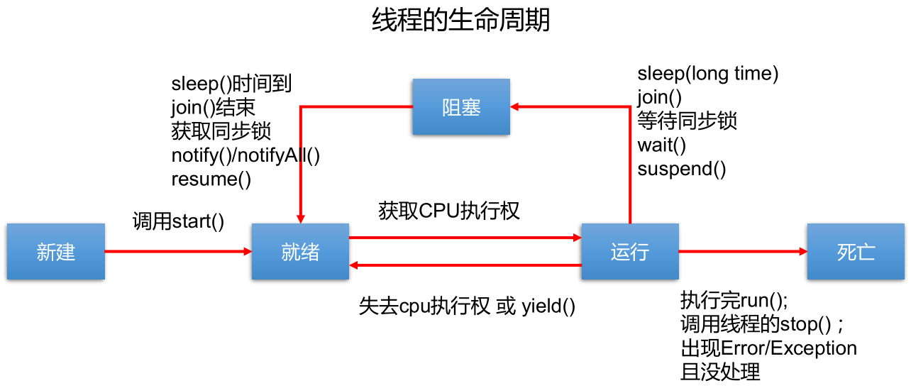
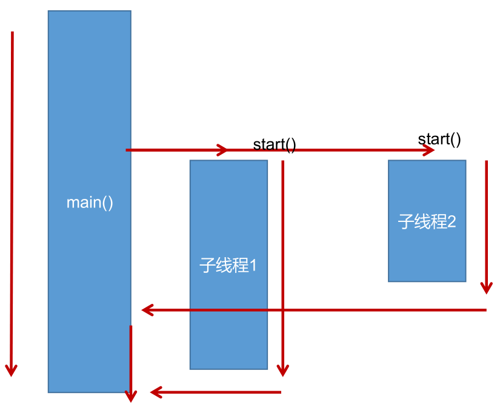
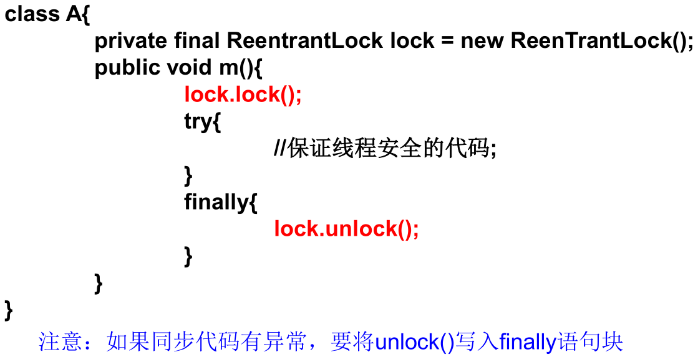

*date: 2021-03-04*

## 程序、进程和线程

`程序 (program)`：是为完成特定任务、用某种语言编写的一组指令的集合。即指一段静态的代码，静态对象。

`进程 (process)`：是程序的一次执行过程，或是正在运行的一个程序。是一个动态的过程：有它自身的产生、存在和消亡的过程 —— 生命周期。如：运行中的 QQ，运行中的 MP3 播放器。

- 程序是静态的，进程是动态的。

- 进程作为资源分配的单位，系统在运行时会为每个进程分配不同的内存区域。

`线程 (thread)`：进程可进一步细化为线程，是一个程序内部的一条执行路径。

- 若一个进程同一时间并行执行多个线程，就是支持多线程的。
- 线程作为调度和执行的单位，**每个线程拥有独立的运行栈和程序计数器（pc）**，线程切换的开销小。
- **一个进程中的多个线程共享相同的内存单元/内存地址空间（方法区、堆）：它们从同一堆中分配对象，可以访问相同的变量和对象。**这就使得线程间通信更简便、高效。但多个线程操作共享的系统资源可能就会带来安全的隐患。

`单核 CPU 和多核 CPU 的理解`：

- 单核 CPU，其实是一种假的多线程，因为在一个时间单元内，也只能执行一个线程的任务。只是因为 CPU 时间单元特别短，因此感觉不出来。例如：虽然有多车道，但是收费站只有一个工作人员在收费，只有收了费才能通过，那么 CPU 就好比收费人员。如果有某个人没准备好交钱，那么收费人员可以把他 "挂起"，晾着他，等他准备好了钱，再去收费。

- 如果是多核的话，才能更好的发挥多线程的效率，现在的服务器基本都是多核的。

- 一个 Java 应用程序 java.exe，其实至少有三个线程：`main() 主线程`，`gc() 垃圾回收线程`，`异常处理线程`。当然如果发生异常，会影响主线程。

`并行与并发`：

- 并行：多个 CPU 同时执行多个任务。 比如：多个人同时做不同的事。
- 并发：一个 CPU（采用时间片）同时执行多个任务。比如：秒杀、多个人做同一件事。

**多线程程序的优点：**

以单核 CPU 为例，只使用单个线程先后完成多个任务（调用多个方法），肯定比用多个线程来完成用的时间更短（因为单核 CPU，在多线程之间进行切换时，也需要花费时间），为何仍需多线程呢？
- 提高应用程序的响应。对图形化界面更有意义，可增强用户体验。
- 提高计算机系统 CPU 的利用率。
- 改善程序结构。将既长又复杂的进程分为多个线程，独立运行，利于理解和修改。

**何时需要多线程：**

- 程序需要同时执行两个或多个任务。
- 程序需要实现一些需要等待的任务时，如用户输入、文件读写操作、网络操作、搜索等。
- 需要一些后台运行的程序时。

## Thread 类

Java 语言的 JVM 允许程序运行多个线程，它通过`java.lang.Thread`类来体现。

Thread 类的特性：

- 每个线程都是通过某个特定 Thread 对象的`run()`方法来完成操作的，经常把`run()`方法的主体称为`线程体`。
- 应该通过 Thread 对象的`start()`方法来启动这个线程，而非直接调用`run()`。
  - 如果手动调用`run()`，那么就只是普通的方法，并没有启动多线程。
  - 调用`start()`之后，`run()`由 JVM 调用，什么时候调用以及执行的过程控制都由操作系统的 CPU 调度决定。

构造器：

- `Thread()`

- `Thread(String threadname)`
- `Thread(Runnable target)`
- `Thread(Runnable target, String name)`

方法：

- `void start()`：启动当前线程，并执行当前线程对象的`run()`方法。

- `run()`：通常需要重写 Thread 类中的此方法，将创建的线程在被调度时需要执行的操作声明在此方法中。

- `static Thread currentThread()`：静态方法，返回执行当前代码的线程。在 Thread 子类中就是 this，通常用于主线程和 Runnable 实现类。

  ```java
  public class Test {
      public static void main(String[] args) {
          System.out.println(Thread.currentThread().getName());// main
          new MyThread().start();
      }
  }
  
  
  class MyThread extends Thread {
      @Override
      public void run() {
          System.out.println(Thread.currentThread().getName());// Thread-0
          System.out.println(currentThread().getName());// Thread-0
          System.out.println(this.currentThread().getName());// Thread-0，实际代码中，不应该通过类实例访问静态成员
      }
  }
  ```

- `String getName()`：返回当前线程的名称。

- `void setName(String name)`：设置当前线程的名称。

  ```java
  public class Test {
      public static void main(String[] args) {
          // 设置main线程的名字
          Thread.currentThread().setName("主线程");
          System.out.println(Thread.currentThread().getName());
  
          // 设置自定义线程的名字
          MyThread myThread = new MyThread();
          myThread.setName("自定义线程一");
          myThread.start();
  
          // 构造器设置自定义线程的名字
          new MyThread("自定义线程二").start();
      }
  }
  
  
  class MyThread extends Thread {
      public MyThread() {
  
      }
  
      public MyThread(String name) {
          super(name);
      }
  
      @Override
      public void run() {
          System.out.println(Thread.currentThread().getName());
      }
  }
  ```

- `static void yield()`：释放当前线程 CPU 的执行权，但有可能 CPU 再次分配资源时，仍然优先分配到当前线程。

- `join()`：在某个线程 a 中调用线程 b 的`join()`方法时，调用线程 a 将进入阻塞状态，直到线程 b 执行完之后，线程 a 才结束阻塞状态，然后重新排队等待 CPU 分配资源执行剩下的任务。注意：调用`join()`方法之后，比当前线程低优先级的线程也可以获得执行。

- `static void sleep(long millis)`：让当前线程 "睡眠" 指定的 millis 毫秒时间，在指定的 millis 毫秒时间内，当前线程是阻塞状态。时间到达时，重新排队等待 CPU 分配资源。

- `stop()`：强制结束当前线程，已过时。

- `boolean isAlive()`：返回 boolean，判断线程是否存活。

- 实例：

  ```java
  public class Test {
      public static void main(String[] args) {
          MyThread myThread = new MyThread();
          myThread.start();
  
          System.out.println(myThread.isAlive());
  
          for (int i = 0; i <= 100; i++) {
              if (i % 2 != 0) {
                  System.out.println(Thread.currentThread().getName() + "：" + i);
              }
  
              if (i == 20) {
                  try {
                      myThread.join();
                  } catch (InterruptedException e) {
                      e.printStackTrace();
                  }
              }
              ;
          }
  
          System.out.println(myThread.isAlive());
      }
  }
  
  
  class MyThread extends Thread {
      @Override
      public void run() {
          for (int i = 0; i <= 100; i++) {
              if (i % 2 == 0) {
                  System.out.println(Thread.currentThread().getName() + "：" + i);
              }
  
              if (i % 20 == 0) {
                  yield();
              }
  
              if (i % 30 == 0) {
                  try {
                      sleep(2000);
                  } catch (InterruptedException e) {
                      e.printStackTrace();
                  }
              }
          }
      }
  }
  ```

## 线程

### 线程的调度策略

调度策略：

- `时间片策略`：

  

- `抢占式策略`：高优先级的线程抢占 CPU。

Java 的调度方法：

- **同优先级线程，组成先进先出队列（先到先服务），使用时间片策略。**

- **高优先级线程，使用优先调度的抢占式策略。**

### 线程的优先级

线程的优先级等级：

- MAX_PRIORITY：10，最大优先级。
- MIN _PRIORITY：1，最小优先级。
- NORM_PRIORITY：5，默认优先级。

涉及的方法：

- `getPriority()`：获取线程的优先值。

- `setPriority(int newPriority)`：设置线程的优先级。

  ```java
  System.out.println(Thread.currentThread().getPriority());
  Thread.currentThread().setPriority(8);
  ```

说明：

- **线程创建时继承父线程的优先级。**

- **低优先级只是获得调度的概率低，但并非一定是在高优先级线程之后才被调用。**

### 线程的分类

Java 中的线程分为两类：一种是`用户线程`，一种是`守护线程`。

- 用户线程和守护线程，几乎在每个方面都是相同的，唯一的区别是判断 JVM 何时离开。

- 守护线程是用来服务用户线程的，通过在`start()`前调用`thread.setDaemon(true)`，可以把一个用户线程变成一个守护线程。

- Java 垃圾回收就是一个典型的守护线程。

- 若 JVM 中都是守护线程，当前 JVM 将退出。

### 线程的生命周期

要想实现多线程，必须在主线程中创建新的线程对象。Java 语言使用 Thread 类及其子类的对象来表示线程，并用`Thread.State`类定义了线程的几种状态，在它的一个完整的生命周期中通常要经历如下的五种状态：



- `新建`：当一个 Thread 类或其子类的对象被声明并创建时，新生的线程对象处于新建状态。
- `就绪`：处于新建状态的线程被`start()`后，将进入线程队列等待 CPU 时间片，此时它已具备了运行的条件，只是没分配到 CPU 资源。
- `运行`：当就绪的线程被调度并获得 CPU 资源时，便进入运行状态，`run()`定义了线程的操作和功能。
- `阻塞`：在某种特殊情况下，被人为挂起或执行输入输出操作时，让出 CPU 并临时中止自己的执行，进入阻塞状态。
- `死亡`：线程完成了它的全部工作或线程被提前强制性地中止或出现异常导致结束。

## 线程的创建

线程创建的一般过程：



### 方式一：继承 Thread 类

- 创建一个继承 Thread 类的子类。

- 重写 Thread 类的`run()`：将此线程执行的操作声明在`run()`方法体中。

- 创建 Thread 类的子类的对象实例。

- 通过该对象调用`start()`。

  - 启动当前线程。
  - 调用当前线程的`run()`。
  - 不能通过直接调用对象的`run()`的形式启动线程。
  - 不能再次调用当前对象的`start()`去开启一个新的线程，否则报`java.lang.IllegalThreadStateException`异常 。
  - 如果要启动一个新的线程，需要重新创建一个 Thread 类的子类的对象，并调用其`start()`。

实例一：

  ```java
  public class Test {
      public static void main(String[] args) {
          // 启动一个子线程
          MyThread myThread = new MyThread();
          myThread.start();
          
          // 启动一个新的子线程，并执行run方法
          MyThread myThread2 = new MyThread();
          myThread2.start();
          
          // main线程
          for (int i = 0; i <= 100; i++) {
              if (i % 2 != 0) {
                  System.out.println(Thread.currentThread().getName() + "：" + i);
              }
          }
      }
  }
  
  class MyThread extends Thread {
      @Override
      public void run() {
          for (int i = 0; i <= 100; i++) {
              if (i % 2 == 0) {
                  System.out.println(Thread.currentThread().getName() + "：" + i);
              }
          }
      }
  }
  ```

实例二：

```java
public class Test {
    public static void main(String[] args) {
        // 匿名内部类
        new Thread(){
            @Override
            public void run() {
                for (int i = 0; i <= 100; i++) {
                    if (i % 2 == 0) {
                        System.out.println(Thread.currentThread().getName() + "：" + i);
                    }
                }
            }
        }.start();

        new Thread(){
            @Override
            public void run() {
                for (int i = 0; i <= 100; i++) {
                    if (i % 2 != 0) {
                        System.out.println(Thread.currentThread().getName() + "：" + i);
                    }
                }
            }
        }.start();
    }
}
```

### 方式二：实现 Runnable 接口

- 创建一个实现了 Runnable 接口的类。

- 实现类去实现 Runnable 接口中的抽象方法：`run()`。

- 创建实现类的对象。

- 将此对象作为参数传递到 Thread 类的构造器中，然后创建 Thread 类的对象。

- 通过 Thread 类的对象，调用`start()`，最终执行的是上面重写的`run()`。

实例：

  ```java
  public class Test {
      public static void main(String[] args) {
          // 启动多个子线程时，只需要创建一个Runnable接口实现类的对象
          MyRunnable myRunnable = new MyRunnable();
          
          // 启动一个子线程
          Thread thread = new Thread(myRunnable);
          thread.start();
  
          // 启动一个新的子线程，并执行run方法
          Thread thread2 = new Thread(myRunnable);
          thread2.start();
  
  
          // main线程
          for (int i = 0; i <= 100; i++) { 
              if (i % 2 != 0) {
                  System.out.println(Thread.currentThread().getName() + "：" + i);
              }
          }
      }
  }
  
  class MyRunnable implements Runnable {
      @Override
      public void run() {
          for (int i = 0; i <= 100; i++) {
              if (i % 2 == 0) {
                  System.out.println(Thread.currentThread().getName() + "：" + i);
              }
          }
      }
  }
  ```

### 方式一和方式二的对比

- 开发中，`优先选择实现 Runnable 接口的方式`。
  - **实现 Runnable 接口的方式，没有类的单继承性的局限性。**
  - **实现 Runnable 接口的方式，更适合处理多个线程有共享数据的情况。**
- Thread 类也实现了 Runnable 接口，无论是方式一，还是方式二，都需要重写 Runnable 接口的`run()`方法，并将创建的线程需要执行的逻辑声明在`run()`方法中。

### 方式三：实现 Callable 接口

- 从 JDK 5.0 开始。

- 创建一个实现 Callable 接口的实现类。

- 实现`call()`，将此线程需要执行的操作声明在`call()`的方法体中。

- 创建 Callable 接口实现类的对象。

- 将此 Callable 接口实现类的对象作为参数传递到 FutureTask 的构造器中，创建 FutureTask 的对象。

  - **Future 接口可以对具体 Runnable 或 Callable 任务的执行结果进行取消、查询是否完成、获取结果等操作。**
  - **FutrueTask 是 Futrue 接口的唯一的实现类。**
  - **FutureTask 同时实现了 Runnable 和 Future 接口。它既可以作为 Runnable 被线程执行，又可以作为 Future 得到 Callable 的返回值。**
    - Runnable 接口的`run()`没有返回值。
    - Callable 接口的`call()`有返回值。

- 将 FutureTask 的对象作为参数传递到 Thread 类的构造器中，创建 Thread 类的对象，并调用`start()`，启动线程。

- 根据实际需求，选择是否获得 Callable 中`call()`的返回值。

实例：

  ```java
  public class Test {
      public static void main(String[] args) {
          // 3.创建Callable接口实现类的对象
          MyCallable myCallable = new MyCallable();
          // 4.将此Callable接口实现类的对象作为参数传递到FutureTask的构造器中，创建FutureTask的对象
          FutureTask<Integer> futureTask = new FutureTask<>(myCallable);
          // 5.将FutureTask的对象作为参数传递到Thread类的构造器中，创建Thread类的对象，并调用start()，启动线程
          new Thread(futureTask).start();
          // 6.获得Callable中call()的返回值
          try {
              // get()返回值即为FutureTask构造器参数Callable实现类重写的call()的返回值
              Integer sum = futureTask.get();
              System.out.println("100以内偶数的总和为：" + sum);
          } catch (InterruptedException | ExecutionException e) {
              e.printStackTrace();
          }
      }
  }
  
  // 1.创建一个实现Callable接口的实现类
  class MyCallable implements Callable<Integer> {
      // 2.实现call()方法，将此线程需要执行的操作声明在call()的方法体中
      @Override
      public Integer call() throws Exception {
          int sum = 0;
          for (int i = 1; i <= 100; i++) {
              if (i % 2 == 0) {
                  sum += i;
              }
          }
          return sum;
      }
  }
  ```

与使用 Runnable 接口相比，Callable 接口功能更强大些：

- 相比`run()`方法，`call()`可以有返回值。
- `call()`可以抛出异常，能够被外面的操作捕获，获取异常的信息。
- Callable 支持泛型的返回值。
- Callable 需要借助 FutureTask 类，比如获取`call()`的返回结果。

### 方式四：线程池

背景： 经常创建和销毁、使用量特别大的资源，比如并发情况下的线程，会对性能影响很大。

思路：提前创建好多个线程，放入线程池中，使用时直接获取，使用完放回池中，这样可以避免频繁创建销毁，实现重复利用。类似生活中的公共交通工具。

好处：

- 提高响应速度，减少了创建新线程的时间。
- 降低资源消耗，重复利用线程池中线程，不需要每次都创建。
- 便于线程管理。
  - corePoolSize：核心池的大小。
  - maximumPoolSize：最大线程数。
  - keepAliveTime：线程没有任务时最多保持多长时间后会终止。

JDK 5.0 起，提供了线程池相关 API：`ExecutorService`和`Executors`。

- **ExecutorService**：真正的线程池接口，常用子类`ThreadPoolExecutor`。

  - `void execute(Runnable command)`：执行任务/命令，没有返回值，一般用来执行 Runnable。
  - `<T> Future<T> submit(Callable<T> task)`：执行任务，有返回值，一般用来执行 Callable。
  - `void shutdown()`：关闭连接池。

- **Executors**：工具类、线程池的工厂类，用于创建并返回不同类型的线程池。

  - `Executors.newCachedThreadPool()`：创建一个可根据需要创建新线程的线程池。

  - `Executors.newFixedThreadPool(n)`：创建一个可重用固定线程数的线程池。

    ```java
    public class ThreadPool {
        public static void main(String[] args) {
            // 1.提供指定线程数量的线程池
            ExecutorService executorService = Executors.newFixedThreadPool(10);
    
            // 2.执行指定的线程的操作，需要提供实现Runnable接口或Callable接口的实现类的对象
    
            // 2-1.execute()适合使用于Runnable
            executorService.execute(new Runnable() {
                @Override
                public void run() {
                    for (int i = 0; i <= 100; i++) {
                        if (i % 2 == 0) {
                            System.out.println(Thread.currentThread().getName() + ": " + i);
                        }
                    }
                }
            });
    
            executorService.execute(new Runnable() {
                @Override
                public void run() {
                    for (int i = 0; i <= 100; i++) {
                        if (i % 2 != 0) {
                            System.out.println(Thread.currentThread().getName() + ": " + i);
                        }
                    }
                }
            });
    
            // 2-2.submit()适合适用于Callable
            Future<Integer> evenSum = executorService.submit(new Callable<Integer>() {
                @Override
                public Integer call() throws Exception {
                    int evenSum = 0;
                    for (int i = 0; i <= 100; i++) {
                        if (i % 2 == 0) {
                            evenSum += i;
                        }
                    }
                    return evenSum;
                }
            });
            try {
                System.out.println("100以内的偶数和: " + evenSum.get());
            } catch (InterruptedException | ExecutionException e) {
                e.printStackTrace();
            }
    
            Future<Integer> oddSum = executorService.submit(new Callable<Integer>() {
                @Override
                public Integer call() throws Exception {
                    int oddSum = 0;
                    for (int i = 0; i <= 100; i++) {
                        if (i % 2 != 0) {
                            oddSum += i;
                        }
                    }
                    return oddSum;
                }
            });
            try {
                System.out.println("100以内的奇数和: " + oddSum.get());
            } catch (InterruptedException | ExecutionException e) {
                e.printStackTrace();
            }
    
            // 3.使用完线程池后，需要关闭线程池
            executorService.shutdown();
        }
    }
    ```

  - `Executors.newSingleThreadExecutor()`：创建一个只有一个线程的线程池。

  - `Executors.newScheduledThreadPool(n)`：创建一个线程池，它可安排在给定延迟后运行命令或者定期地执行。

## 线程的同步

### 线程的安全问题

多线程安全问题实例，模拟火车站售票程序，开启三个窗口售票。

方式一：继承 Thread 类。

```java
public class TestThread {
    public static void main(String[] args) {
        // 启动第一个售票窗口
        TicketThread thread1 = new TicketThread();
        thread1.setName("售票窗口一");
        thread1.start();

        // 启动第二个售票窗口
        TicketThread thread2 = new TicketThread();
        thread2.setName("售票窗口二");
        thread2.start();

        // 启动第三个售票窗口
        TicketThread thread3 = new TicketThread();
        thread3.setName("售票窗口三");
        thread3.start();

    }
}

class TicketThread extends Thread {
    // 总票数，必须定义为static，随类只加载一次，因为每新建一个线程，都需要new一次TicketThread
    private static int ticketNum = 100;

    @Override
    public void run() {
        while (true) {
            if (ticketNum > 0) {
                try {
                    Thread.sleep(100);
                } catch (InterruptedException e) {
                    e.printStackTrace();
                }
                System.out.println(Thread.currentThread().getName() + "售出车票，tick号为：" + ticketNum--);
            } else {
                break;
            }
        }
    }
}
```

方式二：实现 Runnable 接口。

```java
public class Test {
    public static void main(String[] args) {
        TicketRunnable ticket = new TicketRunnable();

        // 启动第一个售票窗口
        Thread thread1 = new Thread(ticket, "售票窗口1");
        thread1.start();

        // 启动第二个售票窗口
        Thread thread2 = new Thread(ticket, "售票窗口2");
        thread2.start();

        // 启动第三个售票窗口
        Thread thread3 = new Thread(ticket, "售票窗口3");
        thread3.start();
    }
}

class TicketRunnable implements Runnable {
    // 总票数，不必定义为static，因为只需要new一次TicketRunnable
    private int ticketNum = 100;

    @Override
    public void run() {
        while (true) {
            if (ticketNum > 0) {
                try {
                    Thread.sleep(100);
                } catch (InterruptedException e) {
                    e.printStackTrace();
                }
                System.out.println(Thread.currentThread().getName() + "售出车票，tick号为：" + ticketNum--);
            } else {
                break;
            }
        }
    }
}
```

说明：

1. 如上程序，在买票的过程中，出现了重票、错票，说明多线程的执行过程中，出现了安全问题。

2. 问题的原因：当多条语句在操作同一个线程的共享数据时，当一个线程对多条语句只执行了一部分，还没有执行完时，另一个线程参与进来执行，从而导致了共享数据的错误。
3. 解决办法：对多条操作共享数据的语句，让一个线程全部执行完，在执行的过程中，其他线程不可以参与执行。

### 线程的同步机制

对于多线程的安全问题，Java 提供了专业的解决方式：`同步机制`。实现同步机制的方式，有`同步代码块`、`同步方法`、`Lock 锁`等多种形式。

#### 同步的范围

1. 如何找问题，即代码是否存在线程安全？--- 非常重要
   （1）明确哪些代码是多线程运行的代码。
   （2）明确多个线程是否有共享数据。
   （3）明确多线程运行代码中是否有多条语句操作共享数据。

2. 如何解决呢？--- 非常重要

   对多条操作共享数据的语句，只能让一个线程都执行完，在执行过程中，其他线程不可以参与执行，即所有操作共享数据的这些语句都要放在同步范围中。

3. 切记 ：

   范围太小：没锁住所有有安全问题的代码。

   范围太大：没发挥多线程的功能。

#### 同步机制的特点

优点：同步的方式，能够解决线程的安全问题。

局限性：操作同步代码时，只能有一个线程参与，其他线程等待，相当于是一个单线程的过程，效率低。

**需要被同步的代码：操作共享数据的代码。**

**共享数据：多个线程共同操作的变量。**

**`同步监视器，俗称：锁。`任何一个类的对象，都可以充当锁。**

**要求：多个线程必须要公用同一把锁！！！针对不同实现同步机制的方式，都要保证同步监视器是同一个！！！**

#### 同步机制中的锁

**同步锁机制：**在《Thinking in Java》中，是这么说的：对于并发工作，你需要某种方式来防止两个任务访问相同的资源（其实就是共享资源竞争）。防止这种冲突的方法就是当资源被一个任务使用时，在其上加锁。第一个访问某项资源的任务必须锁定这项资源，使其他任务在其被解锁之前，就无法访问它了，而在其被解锁之时，另一个任务就可以锁定并使用它了。

**synchronized 的锁是什么：**

- **任意对象都可以作为同步锁，所有对象都自动含有单一的锁（监视器）。**
- **同步代码块的锁：自己指定，很多时候也是指定为`this`或`类名.class`。**
- **同步方法的锁：`静态方法 ---> 类名.class、非静态方法 ---> this`。**

- 注意：
  - **必须确保使用同一个资源的多个线程共用的是同一把锁，这个非常重要，否则就无法保证共享资源的安全。**
  - **一个线程类中的所有静态方法共用同一把锁 --- 类名.class，所有非静态方法共用同一把锁 --- this，同步代码块在指定锁的时候需谨慎。**

**能够释放锁的操作：**

- 当前线程的同步方法、同步代码块执行结束。
- 当前线程在同步代码块、同步方法中遇到 break、return 终止了该代码块、该方法的继续执行。
- 当前线程在同步代码块、同步方法中出现了未处理的 Error 或 Exception，导致异常结束。
- 当前线程在同步代码块、同步方法中执行了线程对象的`wait()`，当前线程暂停，并释放锁。

**不会释放锁的操作：**

- 线程执行同步代码块或同步方法时，程序调用`Thread.sleep()`、`Thread.yield()`暂停当前线程的执行。
- 线程执行同步代码块时，其他线程调用了该线程的`suspend()`将该线程挂起，该线程不会释放锁。
- 应尽量避免使用`suspend()`和`resume()`来控制线程。

#### 同步机制一：同步代码块

格式：

```java
synchronized (同步监视器){
    // 需要被同步的代码
}
```

继承 Thread 类方式的修正：

```java
public class TestThread {
    public static void main(String[] args) {
        // 启动第一个售票窗口
        TicketThread thread1 = new TicketThread();
        thread1.setName("售票窗口一");
        thread1.start();

        // 启动第二个售票窗口
        TicketThread thread2 = new TicketThread();
        thread2.setName("售票窗口二");
        thread2.start();

        // 启动第三个售票窗口
        TicketThread thread3 = new TicketThread();
        thread3.setName("售票窗口三");
        thread3.start();

    }
}

class TicketThread extends Thread {
    // 总票数，必须定义为static，随类只加载一次，因为每新建一个线程，都需要new一次TicketThread
    private static int ticketNum = 100;

    // 锁，必须定义为static
    private static Object obj = new Object();

    @Override
    public void run() {
        while (true) {
            synchronized (obj) {// 可以使用：synchronized (TicketThread.class)，不能建议使用：synchronized (this)
                if (ticketNum > 0) {
                    try {
                        Thread.sleep(100);
                    } catch (InterruptedException e) {
                        e.printStackTrace();
                    }
                    System.out.println(Thread.currentThread().getName() + "售出车票，tick号为：" + ticketNum--);
                } else {
                	break;
            	}
            }
        }
    }
}
```

> **obj 可以使用 TicketThread.class（当前类）替代，TicketThread 类只会加载一次，类也是对象。**

]实现 Runnable 接口方式的修正：

```java
public class TestRunnable {
    public static void main(String[] args) {
        TicketRunnable ticket = new TicketRunnable();

        // 启动第一个售票窗口
        Thread thread1 = new Thread(ticket, "售票窗口1");
        thread1.start();

        // 启动第二个售票窗口
        Thread thread2 = new Thread(ticket, "售票窗口2");
        thread2.start();

        // 启动第三个售票窗口
        Thread thread3 = new Thread(ticket, "售票窗口3");
        thread3.start();
    }
}


class TicketRunnable implements Runnable {
    // 总票数，不必定义为static，因为只需要new一次TicketRunnable
    private int ticketNum = 100;

    // 锁，不必定义为static
    Object obj = new Object();

    @Override
    public void run() {
        while (true) {
            synchronized (obj) {// 可以使用：synchronized (this)
                if (ticketNum > 0) {
                    try {
                        Thread.sleep(100);
                    } catch (InterruptedException e) {
                        e.printStackTrace();
                    }
                    System.out.println(Thread.currentThread().getName() + "售出车票，tick号为：" + ticketNum--);
                } else {
                    break;
                }
            }
        }
    }
}
```

> **obj 对象可以使用 this 代替，指代唯一的 TicketRunnable 对象。**

#### 同步机制二：同步方法

格式：

```java
修饰符 synchronized 返回值类型 方法名 (形参列表) {}
```

如果操作共享数据的代码，完整的声明在一个方法中，则可以将此方法声明为同步方法。

**同步方法仍然涉及到同步监视器，只是不需要显示的声明：**

- **非静态的同步方法，同步监视器是：this。**
- **静态的同步方法，同步监视器是：当前类本身。**

继承 Thread 类方式的修正：

```java
public class TestMethod1 {
    public static void main(String[] args) {
        // 启动第一个售票窗口
        TicketMethod1 thread1 = new TicketMethod1();
        thread1.setName("售票窗口一");
        thread1.start();

        // 启动第二个售票窗口
        TicketMethod1 thread2 = new TicketMethod1();
        thread2.setName("售票窗口二");
        thread2.start();

        // 启动第三个售票窗口
        TicketMethod1 thread3 = new TicketMethod1();
        thread3.setName("售票窗口三");
        thread3.start();
    }
}

class TicketMethod1 extends Thread {
    // 总票数，必须定义为static，随类只加载一次，因为每新建一个线程，都需要new一次TicketThread
    private static int ticketNum = 100;

    @Override
    public void run() {
        while (true) {
            handleTicket();
        }
    }

    // 必须设置成static的，此时的同步监视器是TicketMethod1.class
    private static synchronized void handleTicket() {
        if (ticketNum > 0) {
            try {
                Thread.sleep(100);
            } catch (InterruptedException e) {
                e.printStackTrace();
            }
            System.out.println(Thread.currentThread().getName() + "售出车票，tick号为：" + ticketNum--);
        } else {
            break;
        }
    }
}
```

> **此时，同步方法要设置成 static 的，此时的同步监视器是 TicketMethod1.class (当前类)。**

实现 Runnable 接口方式的修正：

```java
public class TestMethod2 {
    public static void main(String[] args) {
        TicketMethod2 ticket = new TicketMethod2();

        // 启动第一个售票窗口
        Thread thread1 = new Thread(ticket, "售票窗口1");
        thread1.start();

        // 启动第二个售票窗口
        Thread thread2 = new Thread(ticket, "售票窗口2");
        thread2.start();

        // 启动第三个售票窗口
        Thread thread3 = new Thread(ticket, "售票窗口3");
        thread3.start();
    }
}

class TicketMethod2 implements Runnable {
    private int ticketNum = 100;

    @Override
    public void run() {// 有时可以直接设置run方法为synchronized，但本例不行
        while (true) {
            handleTicket();
        }
    }

    // 非静态同步方法中，同步监视器：this
    private synchronized void handleTicket() {
        if (ticketNum > 0) {
            try {
                Thread.sleep(100);
            } catch (InterruptedException e) {
                e.printStackTrace();
            }
            System.out.println(Thread.currentThread().getName() + "售出车票，tick号为：" + ticketNum--);
        } else {
            break;
        }
    }
}
```

> **此时，同步方法中的同步监视器是：this，即当前 TicketMethod2 类的对象。**

#### 同步机制三：Lock 锁

从 JDK 5.0 开始，Java 提供了更强大的线程同步机制——通过显式定义同步锁对象来实现同步。同步锁使用 Lock 对象充当。

- `java.util.concurrent.locks.Lock`接口是控制多个线程对共享资源进行访问的工具。锁提供了对共享资源的独占访问，每次只能有一个线程对 Lock 对象加锁，线程开始访问共享资源之前应先获得 Lock 对象。

- 在实现线程安全的控制中，比较常用的是`ReentrantLock`，ReentrantLock 类实现了 Lock 接口，它拥有与 synchronized 相同的并发性和内存语义，可以显式加锁、释放锁。

声明格式：



继承 Thread 类方式的修正：

```java
public class LockTest {
    public static void main(String[] args) {
        // 启动第一个售票窗口
        Ticket thread1 = new Ticket();
        thread1.setName("售票窗口一");
        thread1.start();

        // 启动第二个售票窗口
        Ticket thread2 = new Ticket();
        thread2.setName("售票窗口二");
        thread2.start();

        // 启动第三个售票窗口
        Ticket thread3 = new Ticket();
        thread3.setName("售票窗口三");
        thread3.start();
    }
}

class Ticket extends Thread {
    private static int ticketNum = 100;

    // 1.实例化静态ReentrantLock
    private static Lock lock = new ReentrantLock();

    @Override
    public void run() {
        while (true) {
            // 2.调用锁定方法: lock()
            lock.lock();
            try {
                if (ticketNum > 0) {
                    try {
                        Thread.sleep(100);
                    } catch (InterruptedException e) {
                        e.printStackTrace();
                    }
                    System.out.println(Thread.currentThread().getName() + "售出车票，tick号为：" + ticketNum--);
                } else {
                    break;
                }
            } finally {
                lock.unlock();// 3.调用解锁方法: unlock()
            }
        }
    }
}
```

> **ReentrantLock 实例对象需要设置为 static。**

实现 Runnable 接口方式的修正：

```java
public class LockTest {
    public static void main(String[] args) {
        Ticket ticket = new Ticket();

        // 启动第一个售票窗口
        Thread thread1 = new Thread(ticket, "售票窗口1");
        thread1.start();

        // 启动第二个售票窗口
        Thread thread2 = new Thread(ticket, "售票窗口2");
        thread2.start();

        // 启动第三个售票窗口
        Thread thread3 = new Thread(ticket, "售票窗口3");
        thread3.start();
    }
}

class Ticket implements Runnable {
    private int ticketNum = 100;

    // 1.实例化ReentrantLock
    private Lock lock = new ReentrantLock();

    @Override
    public void run() {
        while (true) {
            // 2.调用锁定方法: lock()
            lock.lock();
            try {
                if (ticketNum > 0) {
                    try {
                        Thread.sleep(100);
                    } catch (InterruptedException e) {
                        e.printStackTrace();
                    }
                    System.out.println(Thread.currentThread().getName() + "售出车票，tick号为：" + ticketNum--);
                } else {
                    break;
                }
            } finally {
                lock.unlock();// 3.调用解锁方法: unlock()
            }
        }
    }
}
```

#### synchronized 和 Lock 的对比

- synchronized 是隐式锁，出了作用域自动释放同步监视器，而 Lock 是显式锁，需要手动开启和关闭锁。
- synchronized 有代码块锁和方法锁，而 Lock 只有代码块锁。
- 使用 Lock 锁，JVM 将花费较少的时间来调度线程，性能更好，并且具有更好的扩展性（Lock 接口能提供更多的实现类）。

优先使用顺序：**Lock ---> 同步代码块（已经进入了方法体，分配了相应资源）---> 同步方法（在方法体之外）**

#### 经典实例

银行有一个账户，有两个储户分别向这个账户存钱，每次存 1000，存 10 次，要求每次存完打印账户余额。

实现方式一：

```java
public class AccountTest {
    public static void main(String[] args) {
        // 一个账户
        Account account = new Account(0.0);

        // 两个储户
        Customer c1 = new Customer(account);
        Customer c2 = new Customer(account);

        c1.setName("甲");
        c2.setName("乙");

        c1.start();
        c2.start();
    }
}

class Account {
    private double balance;

    public Account(double balance) {
        this.balance = balance;
    }

    public double getBalance() {
        return balance;
    }

    // 此时的锁是Accout的对象，本例的写法中，Account只有一个，所以两个线程公用的是一个同步锁
    public synchronized void deposit(double amt) {
        if (amt > 0) {
            balance += amt;
            try {
                Thread.sleep(100);
            } catch (InterruptedException e) {
                e.printStackTrace();
            }
            System.out.println(Thread.currentThread().getName() + "存钱成功，余额为：" + balance);
        }
    }
}

class Customer extends Thread {
    private Account account;

    public Customer(Account account) {
        this.account = account;
    }

    @Override
    public void run() {
        for (int i = 0; i < 10; i++) {
            account.deposit(1000.0);
        }
    }
}
```

实现方式二：

```java
public class AccountTest {
    public static void main(String[] args) {
        // 一个账户
        Account account = new Account(0.0);

        // 两个储户
        Customer c1 = new Customer(account);
        Customer c2 = new Customer(account);

        c1.setName("甲");
        c2.setName("乙");

        c1.start();
        c2.start();
    }
}

class Account {
    private double balance;

    public Account(double balance) {
        this.balance = balance;
    }

    public double getBalance() {
        return balance;
    }

    public void deposit(double amt) {
        if (amt > 0) {
            balance += amt;
            try {
                Thread.sleep(100);
            } catch (InterruptedException e) {
                e.printStackTrace();
            }
            System.out.println(Thread.currentThread().getName() + "存钱成功，余额为：" + balance);
        }
    }
}

class Customer extends Thread {
    private Account account;
    
    // static的Lock
    private static Lock lock = new ReentrantLock();

    public Customer(Account account) {
        this.account = account;
    }

    @Override
    public void run() {
        for (int i = 0; i < 10; i++) {
            lock.lock();
            try {
                account.deposit(1000.0);
            } finally {
                lock.unlock();
            }
        }
    }
}
```

### 线程的通信

- `wait()`与`notify()`和`notifyAll()`

  - `wait()`：**一旦执行此方法，当前线程就进入阻塞状态，并释放同步监视器。**
    - 当前线程排队等候其他线程调用`notify()`或`notifyAll()`方法唤醒，唤醒后等待重新获得对监视器的所有权后才能继续执行。
    - 被唤醒的线程从断点处继续代码的执行。
  - `notify()`：一旦执行此方法，就会唤醒被`wait()`的一个线程。如果有多个线程被`wait()`，则唤醒优先级高的。
  - `notifyAll()`：一旦执行此方法，就会唤醒所有被`wait()`的线程。

- **`wait()`与`notify()`和`notifyAll()`这三个方法必须使用在同步代码块或同步方法中。**

- **`wait()`与`notify()`和`notifyAll()`这三个方法的调用者必须是同步代码块或同步方法中的同步监视器。**

  - 否则会出现`java.lang.IllegalMonitorStateException`异常。

- **`wait()`与`notify()`和`notifyAll()`这三个方法是定义在`java.lang.Object`类中的。**

  - 因为这三个方法必须由同步监视器调用，而任意对象都可以作为同步监视器，因此这三个方法只能在 Object 类中声明。

实例一：使用两个线程打印 1 - 100，要求线程 1 和线程 2 交替打印。

  ```java
  public class CommunicationTest {
      public static void main(String[] args) {
          Number number = new Number();
  
          Thread t1 = new Thread(number);
          Thread t2 = new Thread(number);
  
          t1.setName("线程1");
          t2.setName("线程2");
  
          t1.start();
          t2.start();
      }
  }
  
  class Number implements Runnable {
      private int number = 1;
  
      @Override
      public void run() {
          while (true) {
              synchronized (this) {
                  // 唤醒被wait()的一个线程
                  notify();// 等同于：this.notify();
                  if (number <= 100) {
                      try {
                          Thread.sleep(10);
                      } catch (InterruptedException e) {
                          e.printStackTrace();
                      }
  
                      System.out.println(Thread.currentThread().getName() + ": " + number);
                      number++;
  
                      try {
                          // 使调用wait()方法的线程进入阻塞状态
                          wait();// 等同于：this.wait();
                      } catch (InterruptedException e) {
                          e.printStackTrace();
                      }
                  } else {
                      break;
                  }
              }
          }
      }
  }
  ```

实例二：生产者/消费者问题。

生产者（Producer）将产品交给店员（Clerk），而消费者（Customer）从店员处取走产品，店员一次只能持有固定数量的产品（比如 20），如果生产者试图生产更多的产品，店员会叫生产者停一下，如果店中有空位放产品了再通知生产者继续生产；如果店中没有产品了，店员会告诉消费者等一下，如果店中有产品了再通知消费者来取走产品。

```java
public class ProductTest {
    public static void main(String[] args) {
        Clerk clerk = new Clerk();

        Producer producer1 = new Producer(clerk);
        producer1.setName("生产者1");

        Consumer consumer1 = new Consumer(clerk);
        consumer1.setName("消费者1");
        Consumer consumer2 = new Consumer(clerk);
        consumer2.setName("消费者2");

        producer1.start();
        consumer1.start();
        consumer2.start();
    }
}

class Clerk {
    private int productCount = 0;

    public synchronized void produceProduct() {
        if (productCount < 20) {
            productCount++;
            System.out.println(Thread.currentThread().getName() + "开始生产第" + productCount + "个产品");
            notify();
        } else {
            try {
                wait();
            } catch (InterruptedException e) {
                e.printStackTrace();
            }
        }
    }

    public synchronized void consumerProduct() {
        if (productCount > 0) {
            System.out.println(Thread.currentThread().getName() + "开始消费第" + productCount + "个产品");
            productCount--;
            notify();
        } else {
            try {
                wait();
            } catch (InterruptedException e) {
                e.printStackTrace();
            }
        }
    }
}

// 生产者
class Producer extends Thread {
    private Clerk clerk;

    public Producer(Clerk clerk) {
        this.clerk = clerk;
    }

    @Override
    public void run() {
        System.out.println(Thread.currentThread().getName() + "开始生产产品...");
        while (true) {
            try {
                Thread.sleep(10);
            } catch (InterruptedException e) {
                e.printStackTrace();
            }
            clerk.produceProduct();
        }
    }
}

// 消费者
class Consumer extends Thread {
    private Clerk clerk;

    public Consumer(Clerk clerk) {
        this.clerk = clerk;
    }

    @Override
    public void run() {
        System.out.println(Thread.currentThread().getName() + "开始消费产品...");
        while (true) {
            try {
                Thread.sleep(20);
            } catch (InterruptedException e) {
                e.printStackTrace();
            }
            clerk.consumerProduct();
        }
    }
}
```

面试题：`sleep()`和`wait()`的异同。

- 相同点：一旦执行方法，都可以使得当前的线程进入阻塞状态。
- 不同点：
  - 	两个方法声明的位置不同：`sleep()`声明在 Thread 类中，`wait()`声明在 Object 类中。
  - 	调用的要求不同：`sleep()`可以在任何需要的场景下调用，`wait()`必须使用在同步代码块或同步方法中。
  - 	关于是否释放同步监视器：如果两个方法都是用在同步代码块或同步方法中，`sleep()`不会释放锁，`wait()`会释放锁。

### 线程的死锁问题

`死锁`：

- **不同的线程分别占用对方需要的同步资源不放弃，都在等待对方放弃自己需要的同步资源，就形成了线程的死锁。**

- **出现死锁后，不会出现异常，不会出现提示，只是所有的线程都处于阻塞状态，无法继续。**

实例一：

  ```java
  public class DeadLock {
      public static void main(String[] args) {
          StringBuilder s1 = new StringBuilder();
          StringBuilder s2 = new StringBuilder();
  
          // 继承Thread类
          new Thread() {
              @Override
              public void run() {
                  synchronized (s1) {
                      s1.append("a");
                      s2.append(1);
  
                      // 添加sleep()，增加死锁触发的概率
                      try {
                          Thread.sleep(100);
                      } catch (InterruptedException e) {
                          e.printStackTrace();
                      }
  
                      synchronized (s2) {
                          s1.append("b");
                          s2.append(2);
  
                          System.out.println(s1);
                          System.out.println(s2);
                      }
                  }
              }
          }.start();
  
          // 实现Runnable接口
          new Thread(new Runnable() {
              @Override
              public void run() {
                  synchronized (s2) {
                      s1.append("c");
                      s2.append(3);
  
                      // 添加sleep()，增加死锁触发的概率
                      try {
                          Thread.sleep(100);
                      } catch (InterruptedException e) {
                          e.printStackTrace();
                      }
  
                      synchronized (s1) {
                          s1.append("d");
                          s2.append(4);
  
                          System.out.println(s1);
                          System.out.println(s2);
                      }
                  }
              }
          }).start();
      }
  }
  ```

实例二：

```java
class A {
    public synchronized void foo(B b) {// 同步监视器：A的对象
        System.out.println("当前线程名: " + Thread.currentThread().getName()
                + ", 进入了A实例的foo方法"); // ①
        try {
            Thread.sleep(200);
        } catch (InterruptedException ex) {
            ex.printStackTrace();
        }
        System.out.println("当前线程名: " + Thread.currentThread().getName()
                + ", 企图调用B实例的last方法"); // ③
        b.last();
    }

    public synchronized void last() {
        System.out.println("进入了A类的last方法内部");
    }
}

class B {
    public synchronized void bar(A a) {// 同步监视器：B的对象
        System.out.println("当前线程名: " + Thread.currentThread().getName()
                + ", 进入了B实例的bar方法"); // ②
        try {
            Thread.sleep(200);
        } catch (InterruptedException ex) {
            ex.printStackTrace();
        }
        System.out.println("当前线程名: " + Thread.currentThread().getName()
                + ", 企图调用A实例的last方法"); // ④
        a.last();
    }

    public synchronized void last() {
        System.out.println("进入了B类的last方法内部");
    }
}

public class DeadLock implements Runnable {
    A a = new A();
    B b = new B();

    public void init() {
        Thread.currentThread().setName("主线程");
        // 调用a对象的foo方法
        a.foo(b);
        System.out.println("进入了主线程之后");
    }

    @Override
    public void run() {
        Thread.currentThread().setName("副线程");
        // 调用b对象的bar方法
        b.bar(a);
        System.out.println("进入了副线程之后");
    }

    public static void main(String[] args) {
        DeadLock deadLock = new DeadLock();
        new Thread(deadLock).start();
        deadLock.init();
    }
}
```

解决死锁的方法：

- 专门的算法、原则。
- 尽量减少同步资源的定义。
- 尽量避免嵌套同步。

## 本文参考

https://www.gulixueyuan.com/goods/show/203?targetId=309&preview=0

## 声明

写作本文初衷是个人学习记录，鉴于本人学识有限，如有侵权或不当之处，请联系 [wdshfut@163.com](mailto:wdshfut@163.com)。