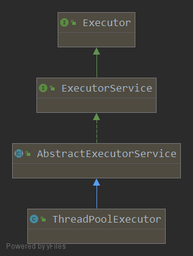
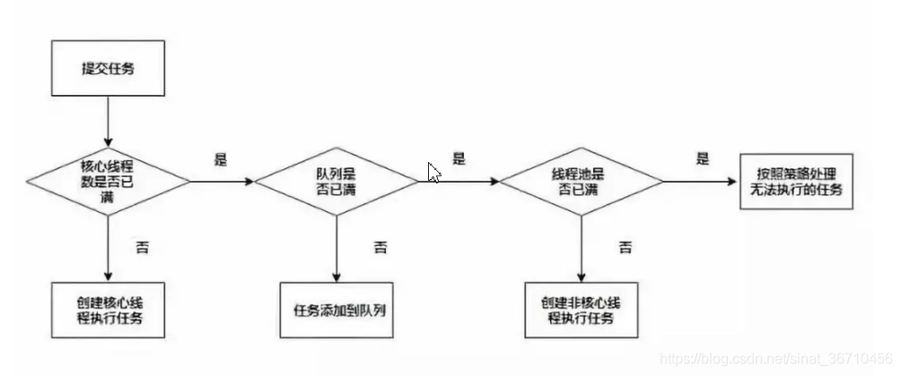

*date: 2021-01-01*

## 线程池的理解

线程池是预先创建线程的一种技术，线程池在还没有任务到来之前，事先创建一定数量的线程，放入空闲队列中，然后对这些资源进行复用，从而减少频繁的创建和销毁对象。

系统启动一个新线程的成本是比较高的，因为它涉及与操作系统交互。在这种情形下，使用线程池可以很好地提高性能，尤其是当程序中需要创建大量生存期很短暂的线程时，更应该考虑使用线程池。

与数据库连接池类似的是，线程池在系统启动时即创建大量空闲的线程，程序将一个 Runnable 对象或 Callable 对象传给线程池，线程池就会启动一个线程来执行它们的`run()`或`call()`， 当`run()`或`call()`执行结束后， 该线程并不会死亡，而是再次返回线程池中成为空闲状态，等待执行下一个 Runnable 对象或 Callable 对象的`run()`或`call()`。

总结：由于系统创建和销毁线程都是需要时间和系统资源开销，为了提高性能，才考虑使用线程池。线程池会在系统启动时就创建大量的空闲线程，然后等待新的线程调用，线程执行结束并不会销毁，而是重新进入线程池，等待再次被调用。这样子就可以减少系统创建启动和销毁线程的时间，提高系统的性能。

## 线程池的使用

### 使用 Executors 创建线程池



Executor 是线程池的顶级接口，接口中只定义了一个方法`void execute(Runnable command);`，线程池的操作方法都是定义在 ExecutorService 子接口中的，所以说`ExecutorService 是线程池真正的接口`。

#### newSingleThreadExecutor

创建一个单线程的线程池。这个线程池只有一个线程在工作，也就是相当于单线程串行执行所有任务。如果这个唯一的线程因为异常结束，那么会有一个新的线程替代它。此线程池保证所有任务的执行顺序按照任务的提交顺序执行。

```java
public static ExecutorService newSingleThreadExecutor() {
    return new FinalizableDelegatedExecutorService
        (new ThreadPoolExecutor(1, 1,
                                0L, TimeUnit.MILLISECONDS,
                                new LinkedBlockingQueue<Runnable>()));
}
```

#### newFixedThreadPool

创建固定大小的线程池，每次提交一个任务就创建一个线程，直到线程达到线程池的最大大小。线程池的大小一旦达到是大值就会保持不变。如果某个线程因为执行异常而结束，那么线程池会补充一个新线程。

```java
public static ExecutorService newFixedThreadPool(int nThreads, ThreadFactory threadFactory) {
    return new ThreadPoolExecutor(nThreads, nThreads,
                                  0L, TimeUnit.MILLISECONDS,
                                  new LinkedBlockingQueue<Runnable>(),
                                  threadFactory);
}
```

#### newCachedThreadPool

创建一个可缓存的线程池。如果线程池的大小超过了处理任务所需要的线程，那么就会回收部分空闲（60 秒不执行任务）的线程。当任务数增加时，此线程池又可以智能的添加新线程来处理任务。此线程池不会对钱程池大小做限制，线程池大小完全依赖于操作系统（或者说 JVM）能够创建的最大线程大小。

```java
public static ExecutorService newCachedThreadPool() {
    return new ThreadPoolExecutor(0, Integer.MAX_VALUE,
                                  60L, TimeUnit.SECONDS,
                                  new SynchronousQueue<Runnable>());
}
```

### 使用 ThreadPoolExecutor 创建线程池

```java
public ThreadPoolExecutor(int corePoolSize,
                          int maximumPoolSize,
                          long keepAliveTime,
                          TimeUnit unit,
                          BlockingQueue<Runnable> workQueue,
                          ThreadFactory threadFactory,
                          RejectedExecutionHandler handler) {
    if (corePoolSize < 0 ||
        maximumPoolSize <= 0 ||
        maximumPoolSize < corePoolSize ||
        keepAliveTime < 0)
        throw new IllegalArgumentException();
    if (workQueue == null || threadFactory == null || handler == null)
        throw new NullPointerException();
    this.acc = System.getSecurityManager() == null ?
            null :
            AccessController.getContext();
    this.corePoolSize = corePoolSize;
    this.maximumPoolSize = maximumPoolSize;
    this.workQueue = workQueue;
    this.keepAliveTime = unit.toNanos(keepAliveTime);
    this.threadFactory = threadFactory;
    this.handler = handler;
}
```

#### 构造函数参数说明

**corePoolSize：**`核心线程数大小`，当线程数小于 corePoolSize 的时候，会创建线程执行新的 runnable 或 callable。

**maximumPoolSize：**`最大线程数`， 当线程数大于等于 corePoolSize 的时候，会把新的 runnable 或 callable 放入 workQueue 中。

**keepAliveTime：**`保持存活时间`，当线程数大于 corePoolSize 的时候，空闲线程能保持的最大时间。

**unit：**时间单位。

**workQueue：**保存任务的阻塞队列。

**threadFactory：**创建线程的工厂。

**handler：**拒绝策略。

#### 任务执行顺序

- **当线程数小于 corePoolSize 时，创建线程执行新任务。**

- **当线程数大于等于 corePoolSize，并且 workQueue 没有满时，新任务放入 workQueue 中。**

- **当线程数大于等于 corePoolSize，并且 workQueue 满时，新任务创建新线程运行，但线程总数要小于 maximumPoolSize。**

- **当线程总数等于 maximumPoolSize，并且 workQueue 满时，执行 handler 的 rejectedExecution，也就是拒绝策略。**



#### 阻塞队列

阻塞队列是一个在队列基础上又支持了两个附加操作的队列：

1. 支持阻塞的**插入**方法：队列满时，队列会阻塞插入元素的线程，直到队列不满。
2. 支持阻塞的**移除**方法：队列空时，获取元素的线程会等待队列变为非空。

##### 阻塞队列的应用场景

阻塞队列常用于生产者和消费者的场景，生产者是向队列里添加元素的线程，消费者是从队列里取元素的线程。简而言之，阻塞队列是生产者用来存放元素、消费者获取元素的容器。

##### 阻塞队列的方法

在阻塞队列不可用的时候，上述两个附加操作提供了四种处理方法：

| 方法处理方式 | 抛出异常  | 返回特殊值 | 一直阻塞 | 超时退出           |
| ------------ | --------- | ---------- | -------- | ------------------ |
| 插入方法     | add(e)    | offer(e)   | put(e)   | offer(e,time,unit) |
| 移除方法     | remove()  | poll()     | take()   | poll(time,unit)    |
| 检查方法     | element() | peek()     | 不可用   | 不可用             |

##### 阻塞队列的类型

JDK 7 提供了 7 个阻塞队列，如下：

1. **ArrayBlockingQueue：**数组结构组成的有界阻塞队列。
   - 此队列按照先进先出（FIFO）的原则对元素进行排序，但是默认情况下不保证线程公平的访问队列，即如果队列满了，那么被阻塞在外面的线程对队列访问的顺序是不能保证线程公平（即先阻塞，先插入）的。


2. **LinkedBlockingQueue：**一个由链表结构组成的有界阻塞队列。
   - 此队列按照先出先进的原则对元素进行排序。


3. **PriorityBlockingQueue：**支持优先级的无界阻塞队列。

4. **DelayQueue：**支持延时获取元素的无界阻塞队列，即可以指定多久才能从队列中获取当前元素。

5. **SynchronousQueue：**不存储元素的阻塞队列，每一个 put 必须等待一个 take 操作，否则不能继续添加元素。并且支持公平访问队列。
6. **LinkedTransferQueue：**由链表结构组成的无界阻塞 TransferQueue 队列。

   - 相对于其他阻塞队列，多了 transfer 和 tryTransfer 方法：


   - **transfer 方法：**如果当前有消费者正在等待接收元素（take 或者待时间限制的 poll 方法），transfer 可以把生产者传入的元素立刻传给消费者。如果没有消费者等待接收元素，则将元素放在队列的 tail 节点，并等到该元素被消费者消费了才返回。

   - **tryTransfer 方法：**用来试探生产者传入的元素能否直接传给消费者。如果没有消费者在等待，则返回 false。和上述方法的区别是该方法无论消费者是否接收，方法立即返回，而 transfer 方法是必须等到消费者消费了才返回。

7. **LinkedBlockingDeque：**链表结构的双向阻塞队列，优势在于多线程入队时，减少一半的竞争。

#### 拒绝策略

当队列和线程池都满了，说明线程池处于饱和的状态，那么必须采取一种策略处理提交的新任务。ThreadPoolExecutor 默认有四个拒绝策略：

- `ThreadPoolExecutor.AbortPolicy()`：默认策略，直接抛出异常 RejectedExecutionException。

>**java.util.concurrent.RejectedExecutionException：**
>
>当线程池  ThreadPoolExecutor 执行方法`shutdown()`之后，再向线程池提交任务的时候，如果配置的拒绝策略是 AbortPolicy ，这个异常就会抛出来。
>
>当设置的任务缓存队列过小的时候，或者说，线程池里面所有的线程都在干活（线程数等于 maxPoolSize)，并且任务缓存队列也已经充满了等待的队列， 这个时候，再向它提交任务，也会抛出这个异常。

- `ThreadPoolExecutor.CallerRunsPolicy()`：直接使用当前线程（一般是 main 线程）调用`run()`方法并且阻塞执行。

- `ThreadPoolExecutor.DiscardPolicy()`：不处理，直接丢弃后来的任务。

- `ThreadPoolExecutor.DiscardOldestPolicy()`：丢弃在队列中队首的任务，并执行当前任务。

当然可以继承 RejectedExecutionHandler 来自定义拒绝策略。

#### 线程池参数选择

`CPU 密集型`：线程池的大小推荐为 CPU 数量 +1。CPU 数量可以根据`Runtime.getRuntime().availableProcessors()`方法获取。

`IO 密集型`：CPU 数量 * CPU 利用率 *（1 + 线程等待时间 / 线程 CPU 时间）。

混合型：将任务分为 CPU 密集型和 IO 密集型，然后分别使用不同的线程池去处理，从而使每个线程池可以根据各自的工作负载来调整。

阻塞队列：推荐使用有界队列，有界队列有助于避免资源耗尽的情况发生。

拒绝策略：默认采用的是 AbortPolicy 拒绝策略，直接在程序中抛出 RejectedExecutionException 异常，因为是运行时异常，不强制 catch，但这种处理方式不够优雅。处理拒绝策略有以下几种比较推荐：

- 在程序中捕获 RejectedExecutionException 异常，在捕获异常中对任务进行处理。针对默认拒绝策略。
- **使用 CallerRunsPolicy 拒绝策略，该策略会将任务交给调用 execute 的线程执行（一般为主线程），此时主线程将在一段时间内不能提交任何任务，从而使工作线程处理正在执行的任务。此时提交的线程将被保存在 TCP 队列中，TCP 队列满将会影响客户端，这是一种平缓的性能降低。**
- 自定义拒绝策略，只需要实现 RejectedExecutionHandler 接口即可。
- 如果任务不是特别重要，使用 DiscardPolicy 和 DiscardOldestPolicy 拒绝策略将任务丢弃也是可以的。

如果使用 Executors 的静态方法创建 ThreadPoolExecutor 对象，可以通过使用 Semaphore 对任务的执行进行限流也可以避免出现 OOM 异常。

#### 线程池关闭

等待所有线程执行完毕后，应关闭线程池：

```java
try {
    // 等待所有线程执行完毕当前任务
    threadPool.shutdown();

    boolean loop = true;
    do {
        // 等待所有线程执行完毕，当前任务结束
        loop = !threadPool.awaitTermination(2, TimeUnit.SECONDS);// 等待2秒
    } while (loop);

    if (!loop) {
        System.out.println("所有线程执行完毕");
    }
} catch (InterruptedException e) {
    e.printStackTrace();
} finally {
    System.out.println("耗时：" + (System.currentTimeMillis() - startTimeMillis));
}
```

如果只需要等待模型特定任务完成，可以参考如下方式：

```java
Map<String, Future<?>> jobFutureMap = new HashMap<String, Future<?>>();
for (String key : noneExsitKeys) {
    ConcurrentAccessDBJob job = new ConcurrentAccessDBJob(key, userLevel, dao, service);
    Future<?> future = threadPool.submit(job);
    jobFutureMap.put(key, future);
}
for (String key : noneExsitKeys) {
    Future<?> future = jobFutureMap.get(key);
    // 调用此方法会使主线程等待子线程完成
    future.get();
    System.out.println("future.idDone()" + future.isDone());
}
```

#### 示例

```java
import java.util.concurrent.ArrayBlockingQueue;
import java.util.concurrent.ThreadPoolExecutor;
import java.util.concurrent.TimeUnit;

public class TestThreadPoolExecutor {
    public static void main(String[] args) {
        long startTimeMillis = System.currentTimeMillis();

        // 构造一个线程池
        ThreadPoolExecutor threadPool = new ThreadPoolExecutor(5, 6, 3,
                TimeUnit.SECONDS, new ArrayBlockingQueue<Runnable>(3)
        );

        for (int i = 1; i <= 10; i++) {
            try {
                String task = "task = " + i;
                System.out.println("创建任务并提交到线程池中：" + task);
                threadPool.execute(new ThreadPoolTask(task));
                Thread.sleep(100);
            } catch (Exception e) {
                e.printStackTrace();
            }
        }

        // 线程池关闭
        try {
            // 等待所有线程执行完毕当前任务
            threadPool.shutdown();

            boolean loop = true;
            do {
                // 等待所有线程执行完毕，当前任务结束
                loop = !threadPool.awaitTermination(2, TimeUnit.SECONDS);// 等待2秒
            } while (loop);

            if (!loop) {
                System.out.println("所有线程执行完毕");
            }
        } catch (InterruptedException e) {
            e.printStackTrace();
        } finally {
            System.out.println("耗时：" + (System.currentTimeMillis() - startTimeMillis));
        }
    }
}
```

```java
import java.io.Serializable;

public class ThreadPoolTask implements Runnable, Serializable {
    private String attachData;

    public ThreadPoolTask(String tasks) {
        this.attachData = tasks;
    }

    public void run() {
        try {
            System.out.println("开始执行：" + attachData + "任务，使用的线程池，线程名称："
                    + Thread.currentThread().getName() + "\r\n");
        } catch (Exception e) {
            e.printStackTrace();
        }
        attachData = null;
    }
}
```

运行结果，可以看到线程 pool-1-thread-1 到 pool-1-thread-5 循环使用：

```java
创建任务并提交到线程池中：task = 1
开始执行：task = 1任务，使用的线程池，线程名称：pool-1-thread-1

创建任务并提交到线程池中：task = 2
开始执行：task = 2任务，使用的线程池，线程名称：pool-1-thread-2

创建任务并提交到线程池中：task = 3
开始执行：task = 3任务，使用的线程池，线程名称：pool-1-thread-3

创建任务并提交到线程池中：task = 4
开始执行：task = 4任务，使用的线程池，线程名称：pool-1-thread-4

创建任务并提交到线程池中：task = 5
开始执行：task = 5任务，使用的线程池，线程名称：pool-1-thread-5

创建任务并提交到线程池中：task = 6
开始执行：task = 6任务，使用的线程池，线程名称：pool-1-thread-1

创建任务并提交到线程池中：task = 7
开始执行：task = 7任务，使用的线程池，线程名称：pool-1-thread-2

创建任务并提交到线程池中：task = 8
开始执行：task = 8任务，使用的线程池，线程名称：pool-1-thread-3

创建任务并提交到线程池中：task = 9
开始执行：task = 9任务，使用的线程池，线程名称：pool-1-thread-4

创建任务并提交到线程池中：task = 10
开始执行：task = 10任务，使用的线程池，线程名称：pool-1-thread-5

所有线程执行完毕
耗时：1014
```

## 本文参考

https://segmentfault.com/a/1190000011527245

## 声明

写作本文初衷是个人学习记录，鉴于本人学识有限，如有侵权或不当之处，请联系 [wdshfut@163.com](mailto:wdshfut@163.com)。

