*date: 2024-01-02*


[TOC]

## 上篇：内存与垃圾回收篇

### JVM 与 Java 体系结构

#### 前言

作为 Java 工程师的你曾被伤害过吗？你是否也遇到过这些问题？

- 运行着的线上系统突然卡死，系统无法访问，甚至直接 OOM。

- 想解决线上 JVM GC 问题，但却无从下手。

- 新项目上线，对各种 JVM 参数设置一脸茫然，直接默认吧然后就 JJ 了。

- 每次面试之前都要重新背一遍 JVM 的一些原理概念性的东西，然而面试官却经常问你在实际项目中如何调优 JVM 参数，如何解决 GC、OOM 等问题，一脸懵逼。

大部分 Java 开发人员，除会在项目中使用到与 Java 平台相关的各种高精尖技术，对于 Java 技术的核心 Java 虚拟机了解甚少。


- 一些有一定工作经验的开发人员，打心眼儿里觉得 SSM、微服务等上层技术才是重点，基础技术并不重要，这其实是一种本末倒置的 "病态"。

- 如果我们把核心类库的 API 比做数学公式的话，那么 Java 虚拟机的知识就好比公式的推导过程。

**计算机系统体系对我们来说越来越远，在不了解底层实现方式的前提下，通过高级语言很容易编写程序代码。但事实上计算机并不认识高级语言：**


> 架构师每天都在思考什么：
>
> - 应该如何让系统更快？
> - 如何避免系统出现瓶颈？

**我们为什么要学习 JVM？**

- 面试的需要（BATJ、TMD，PKQ 等面试都爱问）。

- 中高级程序员必备技能。
  - 项目管理、调优的需求。

- 追求极客的精神。
  - 比如：垃圾回收算法、JIT、底层原理。

**Java VS C++**


- `垃圾收集机制`为我们打理了很多繁琐的工作，大大提高了开发的效率，但是，垃圾收集也不是万能的，**懂得 JVM 内部的内存结构、工作机制，是设计高扩展性应用和诊断运行时问题的基础，也是 Java 工程师进阶的必备能力。**

#### 参考书目


> 官网文档下载地址：https://docs.oracle.com/javase/specs/index.html
>
> 


#### Java 及 JVM 简介

**TIOBE语言热度排行榜：**[index | TIOBE - The Software Quality Company](https://tiobe.com/tiobe-index/)


> **世界上没有最好的编程语言，只有最适用于具体应用场景的编程语言。**

Java 是目前应用最为广泛的软件开发平台之一。随着 Java 以及 Java 社区的不断壮大，Java 也早已不再是简简单单的一门计算机语言了，它更是**一个平台、一种文化、一个社区。**

- 作为一个平台，Java 虚拟机扮演着举足轻重的作用。
  - Groovy、Scala、JRuby、Kotlin等都是Java平台的一部分。

- 作为一种文化，Java 几乎成为了 "开源" 的代名词。

  - 第三方开源软件和框架，如 Tomcat、Struts，MyBatis，Spring 等。

  - 就连 JDK 和 JVM 自身也有不少开源的实现，如 OpenJDK、Harmony。

- 作为一个社区，Java 拥有全世界最多的技术拥护者和开源社区支持，有数不清的论坛和资料。
  - 从桌面应用软件、嵌入式开发到企业级应用、后台服务器、中间件，都可以看到 Java 的身影。其应用形式之复杂、参与人数之众多也令人咋舌。

**`Java：跨平台的语言。`**


**`JVM：跨语言的平台。`**


- 每个语言都需要转换成字节码文件，最后转换的字节码文件都能通过 Java 虚拟机进行运行和处理。
- 随着 Java 7 的正式发布，Java 虚拟机的设计者们通过 JSR-292 规范，基本实现在 Java 虚拟机平台上运行非 Java 语言编写的程序。

- Java 虚拟机根本不关心运行在其内部的程序到底是使用何种编程语言编写的，它`只关心 "字节码" 文件`。也就是说，**Java 虚拟机拥有语言无关性，并不会单纯地与 Java 语言 "终身绑定"。**只要其他编程语言的编译结果，满足并包含 Java 虚拟机的内部指令集、符号表以及其他的辅助信息，它就是一个有效的字节码文件，就能够被虚拟机所识别并装载运行。
- **Java 不是最强大的语言，但是 JVM 是最强大的虚拟机。**

>The Java Virtual Machine is the cornerstone of the Java platform. It is the component of the technology responsible for its hardware- and operating systemindependence, the small size of its compiled code, and its ability to protect users from malicious programs.
>
>The Java Virtual Machine is an abstract computing machine. Like a real computing machine, it has an instruction set and manipulates various memory areas at run time. It is reasonably common to implement a programming language using a virtual machine; the best-known virtual machine may be the P-Code machine of UCSD Pascal.

**`字节码：`**

- 我们平时说的 Java 字节码，指的是用 Java 语言编译成的字节码。准确的说，**任何能在 JVM 平台上执行的字节码格式都是一样的**。所以应该统称为：`JVM 字节码`。

- 不同的编译器，可以编译出相同的字节码文件，字节码文件也可以在不同的 JVM 上运行。

- Java 虚拟机与 Java 语言并没有必然的联系，它只与特定的二进制文件格式 —— `class 文件格式` —— 所关联，class 文件中包含了 Java 虚拟机指令集（或者称为字节码、Bytecodes）和符号表，还有一些其他辅助信息。

>The Java Virtual Machine knows nothing of the Java programming language, only of a particular binary format, the class file format. A class file contains Java Virtual Machine instructions (or bytecodes) and a symbol table, as well as other ancillary information.
>
>For the sake of security, the Java Virtual Machine imposes strong syntactic and structural constraints on the code in a class file. However, any language with functionality that can be expressed in terms of a valid class file can be hosted by the Java Virtual Machine. Attracted by a generally available, machine-independent platform, implementors of other languages can turn to the Java Virtual Machine as a delivery vehicle for their languages.

**多语言混合编程：**

- **Java 平台上的多语言混合编程正成为主流，通过特定领域的语言去解决特定领域的问题，是当前软件开发应对日趋复杂的项目需求的一个方向。**

- 试想一下，在一个项目之中，并行处理用 Clojure 语言编写，展示层使用 JRuby/Rails，中间层则是 Java，每个应用层都将使用不同的编程语言来完成，而且，接口对每一层的开发者都是透明的，各种语言之间的交互不存在任何困难，就像使用自己语言的原生 API 一样方便，因为它们最终都运行在一个虚拟机之上。

- 对这些运行于 Java 虚拟机之上、Java 之外的语言，来自系统级的、底层的支持正在迅速增强，以 JSR-292 规范为核心的一系列项目和功能改进（如 Da Vinci Machine 项目、Nashorn 引擎、InvokeDynamic 指令、java.lang.invoke 包等），正推动 Java 虚拟机从 "Java 语言的虚拟机" 向 "多语言虚拟机" 的方向发展。

**如何真正搞懂 JVM？**

Java 虚拟机非常复杂，要想真正理解它的工作原理，最好的方式就是自己动手编写一个！

自己动手写一个 Java 虚拟机，难吗？天下事有难易乎？为之，则难者亦易矣；不为，则易者亦难矣。


#### Java 发展的重大事件

- 1990 年，在 Sun 计算机公司中，由 Patrick Naughton、MikeSheridan 及 James Gosling 领导的小组 Green Team，开发出的新的程序语言，命名为 oak，后期命名为 Java。

- 1995 年，Sun 正式发布 Java 和 HotJava 产品，Java 首次公开亮相。

- 1996 年 1 月 23 日，Sun Microsystems 发布了 JDK 1.0。

- 1998 年，JDK 1.2 版本发布。同时，Sun 发布了 JSP/Servlet、EJB 规范，以及将 Java 分成了 J2EE、J2SE 和 J2ME。这表明了 Java 开始向企业、桌面应用和移动设备应用 3 大领域挺进。

- 2000 年，JDK 1.3 发布，Java HotSpot Virtual Machine 正式发布，成为 Java 的默认虚拟机。

- 2002 年，JDK 1.4 发布，古老的 Classic 虚拟机退出历史舞台。

- 2003 年年底，Java 平台的 Scala 正式发布，同年 Groovy 也加入了 Java 阵营。

- 2004 年，JDK 1.5 发布。同时 JDK 1.5 改名为 JavaSE 5.0。

- 2006 年，JDK 6 发布。同年，Java 开源并建立了 OpenJDK。顺理成章，Hotspot 虚拟机也成为了 OpenJDK 中的默认虚拟机。

- 2007 年，Java 平台迎来了新伙伴 Clojure。

- 2008 年，Oracle 收购了 BEA，得到了 JRockit 虚拟机。

- 2009 年，Twitter 宣布把后台大部分程序从 Ruby 迁移到 Scala，这是 Java 平台的又一次大规模应用。

- 2010 年，Oracle 收购了 Sun，获得 Java 商标和最真价值的 HotSpot 虚拟机。此时，Oracle 拥有市场占用率最高的两款虚拟机 HotSpot 和 JRockit，并计划在未来对它们进行整合：HotRockit。

- 2011 年，JDK 7 发布。在 JDK 1.7u4 中，正式启用了新的垃圾回收器 G1。

- 2017 年，JDK 9 发布。将 G1 设置为默认 GC，替代 CMS。

- 同年，IBM 的 J9 开源，形成了现在的 Open J9 社区。

- 2018 年，Android 的 Java 侵权案判决，Google 赔偿 Oracle 计 88 亿美元。

- 同年，Oracle 宣告 JavaEE 成为历史名词，JDBC、JMS、Servlet 赠予 Eclipse 基金会。

- 同年，JDK 11 发布，LTS 版本的 JDK，发布革命性的 ZGC，调整 JDK 授权许可。

- 2019 年，JDK 12 发布，加入 RedHat 领导开发的 Shenandoah GC。

> **OracleJDK VS OpenJDK：**
>
> 
>
> 
>
> - 在 JDK 11 之前，OracleJDK 中还会存在一些 OpenJDK 中没有的、闭源的功能。**但在 JDK 11 中，我们可以认为 OpenJDK 和 OracleJDK 代码实质上已经完全一致的程度。**

> 主流 OracleJDK 支持周期：（https://www.oracle.com/java/technologies/java-se-support-roadmap.html）
>
> 

#### 虚拟机与 Java 虚拟机

所谓`虚拟机 (Virtual Machine)`，就是一台虚拟的计算机。它是一款软件，用来执行一系列虚拟计算机指令。大体上，**虚拟机可以分为系统虚拟机和程序虚拟机**。

- 大名鼎鼎的 Visual Box，VMware 就属于系统虚拟机，它们完全是对物理计算机的仿真，提供了一个可运行完整操作系统的软件平台。

- 程序虚拟机的典型代表就是 Java 虚拟机，它专门为执行单个计算机程序而设计，在 Java 虚拟机中执行的指令，我们称为 Java 字节码指令。

- 无论是系统虚拟机还是程序虚拟机，在上面运行的软件都被限制于虚拟机提供的资源中。

**Java 虚拟机：**

- Java 虚拟机是一台执行 Java 字节码的虚拟计算机，它拥有独立的运行机制，其运行的 Java 字节码也未必由 Java 语言编译而成。

- JVM 平台的各种语言可以共享 Java 虚拟机带来的跨平台性、优秀的垃圾回收器，以及可靠的即时编译器。

- **Java 技术的核心就是 Java 虚拟机（JVM，Java Virtual Machine）**，因为所有的 Java 程序都运行在 Java 虚拟机内部。

**JVM 的作用：**

- Java 虚拟机就是二进制字节码的运行环境，负责装载字节码到其内部，解释/编译为对应平台上的机器指令执行。
- 每一条 Java 指令，Java 虚拟机规范中都有详细定义，如怎么取操作数，怎么处理操作数，处理结果放在哪里。

**JVM 的特点：**

- 一次编译，到处运行。

- 自动内存管理。

- 自动垃圾回收功能。

**JVM 的位置：**


- JVM 是运行在操作系统之上的，它与硬件没有直接的交互。

**JDK 的组成：**


> 扩展：Google 的 Android 系统结构。
>
> 

####  Java 代码执行流程

**简化版：**


**详细版：**


####  JVM 的架构模型

Java 编译器输入的指令集架构一般分为两种：一种是`基于栈的指令集架构`，另外一种是`基于寄存器的指令集架构`。具体来说，这两种架构之间的区别：

- **基于栈式架构的特点：**

  - 设计和实现更简单，适用于资源受限的系统。

  - 避开了寄存器的分配难题：使用零地址指令方式分配。

  - 指令流中的指令大部分是零地址指令，其执行过程依赖于操作栈。指令集更小，编译器容易实现。

  - 不需要硬件支持，可移植性更好，更好实现跨平台。

- **基于寄存器架构的特点：**

  - 典型的应用是 x86 的二进制指令集：比如传统的 PC 以及 Android 的 Davlik 虚拟机。

  - 指令集架构则完全依赖硬件，可移植性差。

  - 性能优秀和执行更高效。

  - 花费更少的指令去完成一项操作。

  - 在大部分情况下，基于寄存器架构的指令集往往都以一地址指令、二地址指令和三地址指令为主，而基于栈式架构的指令集却是以零地址指令为主。

举例一，同样执行 "2 + 3" 这种逻辑操作，其指令分别如下。

- 基于栈的计算流程（以Java虚拟机为例）：

  ```java
  iconst_2  // 常量2入栈
  istore_1
  iconst_3  // 常量3入栈
  istore_2
  iload_1
  iload_2
  iadd     // 常量2/3出栈，执行相加
  istore_0 // 结果5入栈
  ```

- 基于寄存器的计算流程：

  ```java
  mov eax,2 // 将eax寄存器的值设为2
  add eax,3 // 使eax寄存器的值加3
  ```

由于跨平台性的设计，Java 的指令都是根据栈来设计的。不同平台的 CPU 架构不同，所以不能设计为基于寄存器的。其优点是跨平台，指令集小，编译器容易实现，缺点是性能相比寄存器的下降，实现同样的功能需要更多的指令。

> 时至今日，尽管嵌入式平台已经不是 Java 程序的主流运行平台了（准确来说应该是 HotSpotVM 的宿主环境已经不局限于嵌入式平台了），那么为什么不将架构更换为基于寄存器的架构呢？

#### JVM 的生命周期

**虚拟机的`启动`：**

- Java 虚拟机的启动，是**通过引导类加载器（bootstrap class loader）创建一个初始类（initial class）来完成的，这个类是由虚拟机的具体实现指定的。**

**虚拟机的`执行`：**

- 一个运行中的 Java 虚拟机有着一个清晰的任务：执行 Java 程序。

- 程序开始执行时它才运行，程序结束时它就停止。

- **执行一个所谓的 Java 程序的时候，真真正正在执行的是一个叫做Java虚拟机的进程。**

**虚拟机的`退出`：**

- 程序**正常执行结束**。

- 程序在执行过程中**遇到了异常或错误**而异常终止。

- 由于**操作系统出现错误**而导致 Java 虚拟机进程终止。

- 某线程**调用 Runtime 类或 System 类的 exit 方法，或 Runtime 类的 halt 方法**，并且 Java 安全管理器也允许这次 exit 或 halt 操作。

- 除此之外，**JNI（Java Native Interface）规范**描述了用 JNI Invocation API 来加载或卸载 Java 虚拟机时，Java 虚拟机的退出情况。

#### JVM 的发展历程

>具体 JVM 的内存结构，其实取决于其实现，不同厂商的 JVM，或者同一厂商发布的不同版本，都有可能存在一定差异。主要以 Oracle HotSpot VM 为默认虚拟机。

##### Sun Classic VM

- 早在 1996 年 Java 1.0 版本的时候，Sun 公司发布了一款名为 Sun Classic VM 的 Java 虚拟机，它同时也是**世界上第一款商用 Java 虚拟机**，JDK 1.4 时完全被淘汰。

- 这款虚拟机内部只提供解释器。现在还有及时编译器，因此效率比较低，而及时编译器会把热点代码缓存起来，那么以后使用热点代码的时候，效率就比较高。

- 如果使用 JIT 编译器，就需要进行外挂。但是一旦使用了 JIT 编译器，JIT 就会接管虚拟机的执行系统。解释器就不再工作。解释器和编译器不能配合工作。

- 现在 HotSpot 内置了此虚拟机。

##### Exact VM

- 为了解决上一个虚拟机问题，JDK 1.2 时，Sun 提供了此虚拟机。

- Exact Memory Management：准确式内存管理。

  - 也可以叫 Non-Conservative/Accurate Memory Management。

  - 虚拟机可以知道内存中某个位置的数据具体是什么类型。

- 具备现代高性能虚拟机的维形。

  - 热点探测。

  - 编译器与解释器混合工作模式。

- 只在 Solaris 平台短暂使用，其他平台上还是 Classic VM。
  - 英雄气短，终被 HotSpot 虚拟机替换。

##### HotSpot VM

- HotSpot 历史。

  - 最初由一家名为 Longview Technologies 的小公司设计。

  - 1997 年，此公司被 Sun 收购；2009 年，Sun 公司被甲骨文收购。

  - **JDK 1.3 时，HotSpot VM 成为默认虚拟机。**

- 目前 HotSpot 占有绝对的市场地位，称霸武林。

  - 不管是现在仍在广泛使用的 JDK 6，还是使用比例较多的 JDK 8 中，默认的虚拟机都是 HotSpot。

  - Sun/OracleJDK 和 OpenJDK 的默认虚拟机。

  - 后文默认介绍的虚拟机都是 HotSpot，相关机制也主要是指 HotSpot 的 GC 机制。（比如其他两个商用虚机都没有方法区的概念）。

- 从服务器、桌面到移动端、嵌入式都有应用。

- 名称中的 HotSpot 指的就是它的**热点代码探测技术**。

  - 通过计数器找到最具编译价值代码，触发即时编译或栈上替换。

  - 通过编译器与解释器协同工作，在最优化的程序响应时间与最佳执行性能中取得平衡。

##### JRockit

- 专注于服务器端应用。
  - 它可以不太关注程序启动速度，因此 JRockit 内部不包含解析器实现，全部代码都靠即时编译器编译后执行。

- **大量的行业基准测试显示，JRockit JVM 是世界上最快的 JVM。**
  - 使用 JRockit 产品，客户已经体验到了显著的性能提高（一些超过了 70%）和硬件成本的减少（达 50%）。

- 优势：全面的 Java 运行时解决方案组合。

  - JRockit 面向延迟敏感型应用的解决方案 JRockit Real Time 提供以毫秒或微秒级的 JVM 响应时间，适合财务、军事指挥、电信网络的需要。

  - MissionControl 服务套件，它是一组以极低的开销来监控、管理和分析生产环境中的应用程序的工具。

- 2008年，JRockit 被 Oracle 收购。

- Oracle 表达了整合两大优秀虚拟机的工作，大致在 JDK 8 中完成。整合的方式是在 HotSpot 的基础上，移植 JRockit 的优秀特性。

- 高斯林：目前就职于谷歌，研究人工智能和水下机器人。

##### IBM 的 J9

- 全称：IBM Technology for Java Virtual Machine，简称 IT4J，内部代号：J9。

- 市场定位与 HotSpot 接近，服务器端、桌面应用、嵌入式等多用途 VM。

- 广泛用于 IBM 的各种 Java 产品。

- 目前，有影响力的三大商用虚拟机之一，也号称是世界上最快的 Java 虚拟机。（基于 IBM 的产品）

- 2017 年左右，IBM 发布了开源 J9 VM，命名为 OpenJ9，交给 EClipse 基金会管理，也称为 Eclipse OpenJ9。

##### KVM 和 CDC/CLDC Hotspot

- Oracle 在 Java ME 产品线上的两款虚拟机为：CDC/CLDC HotSpot Implementation VM。

- KVM（Kilobyte）是 CLDC-HI 早期产品。

- 目前移动领域地位尴尬，智能机被 Android 和 IOS 二分天下。

- KVM 简单、轻量、高度可移植，面向更低端的设备上还维持自己的一片市场。

  - 智能控制器、传感器。

  - 老人手机、经济欠发达地区的功能手机。

- 所有的虚拟机的原则：一次编译，到处运行。

##### Azul VM

- 前面三大 "高性能Java虚拟机" 使用在通用硬件平台上，这里 Azul VW 和 BEA Liquid VM 是与特定硬件平台绑定、软硬件配合的专有虚拟机。
  - 高性能 Java 虚拟机中的战斗机。

- Azul VM 是 Azul Systems 公司在 HotSpot 基础上进行大量改进，运行于 Azul Systems 公司的专有硬件 Vega 系统上的 Java 虚拟机。

- 每个 Azul VM 实例，都可以管理至少数十个 CPU 和数百 GB 内存的硬件资源，并提供在巨大内存范围内实现可控的 GC 时间的垃圾收集器、专有硬件优化的线程调度等优秀特性。

- 2010 年，Azul Systems 公司开始从硬件转向软件，发布了自己的 Zing JVM，可以在通用 x86 平台上提供接近于 Vega 系统的特性。

##### Liquid VM

- 高性能 Java 虚拟机中的战斗机。

- BEA 公司开发的，直接运行在自家 Hypervisor 系统上。

- Liquid VM 即是现在的 JRockit VE（Virtual Edition），Liquid VM 不需要操作系统的支持，或者说它自己本身实现了一个专用操作系统的必要功能，如线程调度、文件系统、网络支持等。

- 随着 JRockit 虚拟机终止开发，Liquid VM 项目也停止了。

##### Apache Harmony

- Apache 也曾经推出过与 JDK 1.5 和 JDK 1.6 兼容的 Java 运行平台 Apache Harmony。

- 它是 IBM 和 Intel 联合开发的开源 JVM，受到同样开源的 OpenJDK 的压制，Sun 坚决不让 Harmony 获得 JCP 认证，最终于 2011 年退役，IBM 转而参与 OpenJDK。

- 虽然目前并没有 Apache Harmony 被大规模商用的案例，但是它的 Java 类库代码被吸纳进了 Android SDK。

##### Micorsoft JVM

- 微软为了在 IE3 浏览器中支持 Java Applets，开发了 Microsoft JVM。

- 只能在 Windows 平台下运行，但却是当时 Windows 下性能最好的 Java VM。

- 1997 年，Sun 以侵犯商标、不正当竞争罪名指控微软成功，赔了 Sun 很多钱。微软 WindowsXP SP3 中抹掉了其 VM。现在 Windows 上安装的 JDK 都是 HotSpot。

##### Taobao JVM

- 由 Ali JVM 团队发布。阿里，国内使用 Java 最强大的公司，覆盖云计算、金融、物流、电商等众多领域，需要解决高并发、高可用、分布式的复合问题。有大量的开源产品。

- 基于 OpenJDK 开发了自己的定制版本 AlibabaJDK，简称 AJDK。是整个阿里 Java 体系的基石。

- 基于 OpenJDK Hotspot VM 发布的国内第一个优化、深度定制且开源的高性能服务器版 Java 虚拟机。

  - 创新的 GCIH（GC invisible heap）技术实现了 off-heap，即将生命周期较长的 Java 对象从 heap 中移到 heap 之外，并且 GC 不能管理 GCIH 内部的 Java 对象，以此达到降低 GC 的回收频率和提升 GC 的回收效率的目的。

  - GCIH 中的对象还能够在多个 Java 虚拟机进程中实现共享。

  - 使用 crc32 指令实现 JVM intrinsic 降低 JNI 的调用开销。

  - PMU hardware 的 Java profiling tool 和诊断协助功能。

  - 针对大数据场景的 ZenGc。

- Taobao JVM 应用在阿里产品上性能高，硬件严重依赖 Intel 的 CPU，损失了兼容性，但提高了性能。
  - 目前已经在淘宝、天猫上线，把 Oracle 官方 JVM 版本全部替换了。

##### Dalvik VM

- 谷歌开发的，应用于 Android 系统，并在 Android 2.2 中提供了 JIT，发展迅猛。

- Dalvik VM 只能称作虚拟机，而不能称作 Java 虚拟机，它没有遵循 Java 虚拟机规范，不能直接执行 Java 的 Class 文件。

- 基于寄存器架构，不是 JVM 的栈架构。

- 执行的是编译以后的 dex（Dalvik Executable）文件。执行效率比较高。
  - 它执行的 dex（Dalvik Executable）文件可以通过 Class 文件转化而来，使用 Java 语法编写应用程序，可以直接使用大部分的 Java API 等。

- Android 5.0 使用支持提前编译（Ahead of Time Compilation，AoT）的 ART VM 替换 Dalvik VM。

##### Graal VM

- 2018 年 4 月，Oracle Labs 公开了 Graal VM，号称 "Run Programs Faster Anywhere"，野心勃勃。与 1995 年 Java 的 "write once，run anywhere" 遥相呼应。

- Graal VM 在 HotSpot VM 基础上增强而成的跨语言全栈虚拟机，可以作为 "任何语言" 的运行平台使用。语言包括：Java、Scala、Groovy、Kotlin、C、C++、Javascript、Ruby、Python、R 等。

- 支持不同语言中混用对方的接口和对象，支持这些语言使用已经编写好的本地库文件。

- 工作原理是将这些语言的源代码或源代码编译后的中间格式，通过解释器转换为能被 Graal VM 接受的中间表示。Graal VM 提供 Truffle 工具集快速构建面向一种新语言的解释器。在运行时还能进行即时编译优化，获得比原生编译器更优秀的执行效率。

- 如果说 HotSpot 有一天真的被取代，Graal VM 希望最大。但是 Java 的软件生态没有丝毫变化。

### JVM 内存结构总览

**JVM 的整体结构（简化版）：**


**JVM 的整体结构（详细版）：**


**JVM 的整体结构（汉化版）：**


>如果自己想手写一个 Java 虚拟机的话，主要考虑哪些结构呢？
>
>- **类加载器子系统。**
>
>- **执行引擎。**

### 类的执行流程概述

```java
/**
 *示例代码
 */
public class HelloLoader {
    public static void main(String[] args) {
        System.out.println("Hello World!");
    }
}
```

用流程图表示上述示例代码：


### 类加载器子系统

#### 类加载器子系统的作用


- 类加载器子系统负责从文件系统或者网络中加载 Class 文件，Class 文件在文件开头有特定的文件标识。

- ClassLoader 只负责 Class 文件的加载，至于它是否可以运行，则由 Execution Engine 决定。

- 加载的类信息存放于一块称为方法区的内存空间。除了类的信息外，方法区中还会存放运行时常量池信息，可能还包括字符串字面量和数字常量（这部分常量信息是 Class 文件中常量池部分的内存映射）。

###### 加载 Class 文件的方式

- **从`本地系统中直接加载`。**
- **运行时计算生成，使用最多的是：`动态代理技术`。**

- 通过网络获取，典型场景：Web Applet。

- 从 zip 压缩包中读取，成为日后 Jar、War 格式的基础。

- 由其他文件生成，典型场景：JSP 应用。

- 从专有数据库中提取 .class 文件，比较少见。

- 从加密文件中获取，典型的防 Class 文件被反编译的保护措施。

#### 类的加载过程

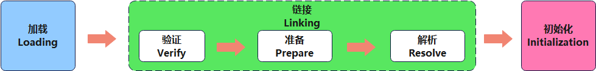

##### 加载阶段（Loading）

- 通过一个**类的全限定名**获取定义此类的二进制字节流。
- 将这个字节流所代表的静态存储结构转化为方法区的运行时数据结构。
- `在内存中生成一个代表这个类的 java.lang.Class 对象`，作为方法区这个类的各种数据的访问入口。

> IDEA 中可以直接反编译字节码文件的插件`jclasslib Bytecode Viewer`：
>
> 
>
> 
>
> 

###### 类加载器 ClasLoader 的角色


- Class File 存在于本地硬盘上，可以理解为设计师画在纸上的模板，而最终这个模板在执行的时候，需要加载到 JVM 当中，然后根据这个文件实例化出 n 个一模一样的实例。

- Class File 加载到 JVM 中，被称为 DNA 元数据模板，放在方法区。

- 在 .class文件 -> JVM -> 最终成为元数据模板的过程中，需要一个运输工具来扮演快递员的角色，这个运输工具就是`类装载器 Class Loader`。

##### 链接阶段（Linking）

###### 验证（Verify） 

- 目的在于：**确保 Class 文件的字节流中包含的信息，符合当前虚拟机要求，保证被加载类的正确性，不会危害虚拟机自身安全。**

- 主要包括四种验证：**文件格式验证，元数据验证，字节码验证，符号引用验证。**

###### 准备（Prepare）

- 为类变量分配内存，并且设置该类变量的默认初始值，即零值。

- 这里不包含用 final 修饰的 static，因为 final 在编译的时候就会分配了，准备阶段会显式初始化。

- 这里不会为实例变量分配初始化，类变量会分配在方法区中，而实例变量是随着对象一起分配到 Java 堆中。

###### 解析（Resolve）

- 将常量池内的符号引用转换为直接引用的过程。

- 事实上，解析操作往往会伴随着 JVM 在执行完初始化之后再执行。

- 符号引用就是一组符号来描述所引用的目标。符号引用的字面量形式明确定义在《Java 虚拟机规范》的 Class 文件格式中。直接引用就是直接指向目标的指针、相对偏移量或一个间接定位到目标的句柄。

- 解析动作主要针对类或接口、字段、类方法、接口方法、方法类型等。对应常量池中的 CONSTANT_Class_info，CONSTANT_Fieldref_info、CONSTANT_Methodref_info 等。

##### 初始化阶段（Initialization）

- 初始化阶段就是执行类构造器方法`<clinit>()`的过程。

- 此方法不需定义，是 javac 编译器自动收集类中的所有类变量的赋值动作和静态代码块中的语句合并而来。

- 构造器方法中指令按语句在源文件中出现的顺序执行。

- `<clinit>()`不同于类的构造器。（关联：构造器是虚拟机视角下的`<init>()`）

- 若该类具有父类，JVM 会保证子类的`<clinit>()`执行前，父类的`<clinit>()`已经执行完毕。

- 虚拟机必须保证一个类的`<clinit>()`方法在多线程下被同步加锁。

#### 类加载器分类

Java 虚拟机规范中，JVM 支持两种类型的类加载器，分别为：`引导类加载器 (Bootstrap ClassLoader)`和`自定义类加载器 (User-Defined ClassLoader)`。

> 从概念上来讲，自定义类加载器一般指的是程序中由开发人员自定义的一类类加载器，但是 Java 虚拟机规范中没有如此定义，而是将**所有派生于抽象类 ClassLoader 的类加载器，都划分为自定义类加载器。**
>
> **扩展类加载器（Extension ClassLoader）和系统类加载器（应用程序类加载器，AppClassLoader）都派生于 ClssLoader，因此，它们二者属于自定义类加载器。**
>
> 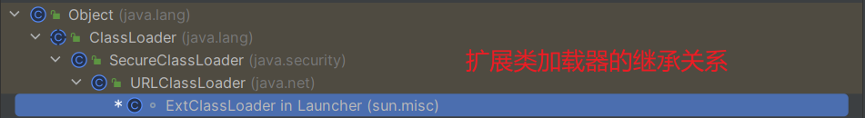
>
> 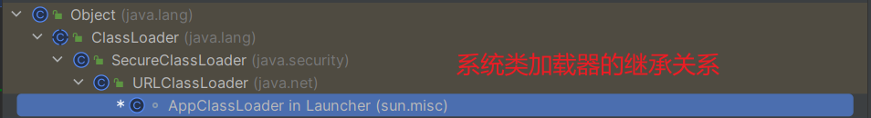

无论类加载器的类型如何划分，在程序中我们最常见的类加载器始终只有 3 个，如下所示：


> **上图所示的四种类加载器之间的关系是`包含关系`，不是上层下层，也不是子父类的继承关系。**
>
> 代码示例：
>
> ```java
> package cn.xisun.jvm;
> 
> /**
>  * @author XiSun
>  * @since 2024/1/4 15:38
>  */
> public class ClassLoaderTest {
>     public static void main(String[] args) {
>         // 获取系统类加载器
>         ClassLoader systemClassLoader = ClassLoader.getSystemClassLoader();
>         System.out.println(systemClassLoader);// sun.misc.Launcher$AppClassLoader@18b4aac2
> 
>         // 获取系统类加载器的上层：扩展类加载器
>         ClassLoader extClassLoader = systemClassLoader.getParent();
>         System.out.println(extClassLoader);// sun.misc.Launcher$ExtClassLoader@1b6d3586
> 
>         // 获取扩展类加载器的上层：引导类加载器，此方式获取不到
>         ClassLoader bootstrapClassLoader = extClassLoader.getParent();
>         System.out.println(bootstrapClassLoader);// null
> 
>         // 对于用户自定义类来说：默认使用系统类加载器进行加载
>         ClassLoader classLoader = ClassLoaderTest.class.getClassLoader();
>         System.out.println(classLoader);// sun.misc.Launcher$AppClassLoader@18b4aac2
> 
>         // 获取不到类加载器，说明String类使用引导类加载器进行加载 ---> Java的核心类库，都是使用引导类加载器进行加载
>         ClassLoader classLoader1 = String.class.getClassLoader();
>         System.out.println(classLoader1);// null
>     }
> }
> ```

##### 虚拟机自带的加载器

######  引导类加载器（Bootstrap ClassLoader）

又叫**启动类加载器**，特点如下：

- **使用 C/C++ 语言实现，嵌套在 JVM 内部。**

- 它`用来加载 Java 的核心库 (JAVA_HOME/jre/lib/rt.jar、resources.jar 或 sun.boot.class.path 路径下的内容)`，用于提供 JVM 自身需要的类。

- 不是继承自 java.lang.ClassLoader，`没有父加载器`。

- 加载扩展类加载器和系统类加载器，`是扩展类加载器和系统类加载器的父类加载器`。（此处的父类加载器，不是 Java 种继承的那种关系）

- 出于安全考虑，引导类加载器`只加载包名为 java、javax、sun 等开头的类`。

###### 扩展类加载器（Extension ClassLoader）

特点如下：

- 使用Java 语言编写，`由 sun.misc.Launcher$ExtClassLoader 实现`。

- 派生于 ClassLoader 类。

- 父类加载器为引导类加载器。（此处的父类加载器，不是 Java 种继承的那种关系）

- `从 java.ext.dirs 系统属性所指定的目录中加载类库，或从 JDK 的安装目录的 jre/1ib/ext 子目录 (扩展目录) 下加载类库。`**如果用户创建的 JAR 放在此目录下，也会自动由扩展类加载器加载。**

###### 系统类加载器（Application ClassLoader）

又叫**应用程序类加载器**，特点如下：

- 使用Java 语言编写，`由 sun.misc.LaunchersAppClassLoader 实现`。

- 派生于 ClassLoader 类。

- 父类加载器为扩展类加载器。（此处的父类加载器，不是 Java 种继承的那种关系）

- `负责加载环境变量 classpath 或系统属性 java.class.path 指定路径下的类库。`

- `是程序中默认的类加载器`，一般来说，Java 应用的类都是由它来完成加载。

- 通过`ClassLoader#getSystemclassLoader()`方法，可以获取到该类加载器。

###### 查看类的加载器示例

```java
package cn.xisun.jvm;

import com.sun.awt.SecurityWarning;
import com.sun.javafx.PlatformUtil;
import sun.misc.Launcher;

import java.net.URL;

/**
 * @author XiSun
 * @since 2024/1/4 21:59
 */
public class ClassLoaderTest1 {
    public static void main(String[] args) {

        System.out.println("**********引导类加载器**********");
        URL[] urLs = Launcher.getBootstrapClassPath().getURLs();
        for (URL url : urLs) {
            System.out.println(url.toExternalForm());
        }

        // 从上面的路径中随意选择一个类，查看它的类加载器是什么
        // 以file:/C:/Users/XiSun/AppData/Local/Programs/Java/jdk1.8.0_201/jre/lib/rt.jar为例，取com.sun.awt.SecurityWarning
        ClassLoader classLoader = SecurityWarning.class.getClassLoader();
        System.out.println(classLoader);// null -> 类加载器是引导类加载器

        System.out.println("**********扩展类加载器**********");
        String extDirs = System.getProperty("java.ext.dirs");
        for (String path : extDirs.split(";")) {
            System.out.println(path);
        }

        // 从上面的路径中随意选择一个类，查看它的类加载器是什么
        // 以C:\Users\XiSun\AppData\Local\Programs\Java\jdk1.8.0_201\jre\lib\ext\jfxrt.jar为例，取com.sun.javafx.PlatformUtil
        ClassLoader classLoader1 = PlatformUtil.class.getClassLoader();
        System.out.println(classLoader1);// sun.misc.Launcher$ExtClassLoader@1540e19d -> 扩展类加载器
    }
}

输出结果：
**********引导类加载器**********
file:/C:/Users/XiSun/AppData/Local/Programs/Java/jdk1.8.0_201/jre/lib/resources.jar
file:/C:/Users/XiSun/AppData/Local/Programs/Java/jdk1.8.0_201/jre/lib/rt.jar
file:/C:/Users/XiSun/AppData/Local/Programs/Java/jdk1.8.0_201/jre/lib/sunrsasign.jar
file:/C:/Users/XiSun/AppData/Local/Programs/Java/jdk1.8.0_201/jre/lib/jsse.jar
file:/C:/Users/XiSun/AppData/Local/Programs/Java/jdk1.8.0_201/jre/lib/jce.jar
file:/C:/Users/XiSun/AppData/Local/Programs/Java/jdk1.8.0_201/jre/lib/charsets.jar
file:/C:/Users/XiSun/AppData/Local/Programs/Java/jdk1.8.0_201/jre/lib/jfr.jar
file:/C:/Users/XiSun/AppData/Local/Programs/Java/jdk1.8.0_201/jre/classes
null
**********扩展类加载器**********
C:\Users\XiSun\AppData\Local\Programs\Java\jdk1.8.0_201\jre\lib\ext
C:\Windows\Sun\Java\lib\ext
sun.misc.Launcher$ExtClassLoader@1540e19d
```

##### 用户自定义类加载器

在 Java 的日常应用程序开发中，类的加载几乎都是由上述三种类加载器相互配合执行的。**在必要时，我们也可以自定义类加载器，来定制类的加载方式。**

**为什么要自定义类加载器：**

- 隔离加载类。

- 修改类加载的方式。

- 扩展加载源。

- 防止源码泄漏。（加密字节码文件，使用时需要在自定义类加载器中进行解密）

**用户自定义类加载器实现步骤：**

1. 开发人员可以通过`继承抽象类 java.lang.ClassLoader 类`的方式，实现自定义的类加载器，以满足一些特殊的需求。
2. 在 JDK 1.2 之前，在自定义类加载器时，总会去继承 ClassLoader 类并重写 loadClass() 方法，从而实现自定义的类加载器，但是在 JDK 1.2 之后，已不再建议用户去覆盖 loadclass() 方法，而是`建议把自定义的类加载逻辑写在 findClass()方法中`。
3. 在编写自定义类加载器时，`如果没有太过于复杂的需求，可以直接继承 URLClassLoader 类。`这样就可以避免自己去编写 findClass() 方法及其获取字节码流的方式，使自定义类加载器编写更加简洁。

#### ClassLoader 的使用说明

`ClassLoader 类是一个抽象类，除引导类加载器以外，所有的类加载器都继承自 ClassLoader。`常用的方法如下：

| 方法名称                                               | 描述                                                         |
| ------------------------------------------------------ | ------------------------------------------------------------ |
| `getParent()`                                          | 返回该类加载器的超类加载器                                   |
| `loadClass(String name)`                               | 加载名称为 name 的类，返回结果为 java.lang.Class 类的示例    |
| `findClass(String name)`                               | 查找名称为 name 的类，返回结果为 java.lang.Class 类的示例    |
| `findLoadedClass(String name)`                         | 查找名称为 name 的已经被记载过的类，返回结果为 java.lang.Class 类的示例 |
| `defineClass(String name, byte[] b, int off, int len)` | 把字节数组 b 中的内容转换为一个 Java 类，返回结果为 java.lang.Class 类的示例 |
| `resolveClass(Class<?> c)`                             | 连接指定的一个 Java 类                                       |

**ClassLoader 与 ExtClassLoader（扩展类加载器）和 AppClassLoader（系统类加载器）之间的继承关系：**


> **sun.misc.Luncher 是一个 Java 虚拟机的入口应用，ExtClassLoader 和 AppClassLoader 都是 Launcher 的内部类。**

**获取 ClassLoader 的途径：**

- 方式一，获取当前类的 ClassLoader：`clazz.getClassLoader()`。示例：

  ```java
  try {
      ClassLoader classLoader = Class.forName("java.lang.String").getClassLoader();
      System.out.println(classLoader);// null
  } catch (ClassNotFoundException e) {
      throw new RuntimeException(e);
  }
  ```

- 方式二，获取当前线程上下文的 ClassLoader：`Thread.currentThread().getContextClassLoader()`。示例：

  ```java
  ClassLoader contextClassLoader = Thread.currentThread().getContextClassLoader();
  System.out.println(contextClassLoader);// sun.misc.Launcher$AppClassLoader@18b4aac2
  ```

- 方式三，获取系统的 ClassLoader：`ClassLoader.getSystemClassLoader()`。示例：

  ```java
  ClassLoader systemClassLoader = ClassLoader.getSystemClassLoader();
  System.out.println(systemClassLoader);// sun.misc.Launcher$AppClassLoader@18b4aac2
  ```

- 方式四，获取调用者的 ClassLoader：`DriverManager.getCallerClassLoader()`。

#### 双亲委派机制

概念：**Java 虚拟机对 Class 文件采用的是`按需加载`的方式，也就是说当需要使用该类时才会将它的 Class 文件加载到内存生成 Class 对象。在加载某个类的 Class 文件时，Java 虚拟机采用的是`双亲委派模式`，即`把请求交由父类处理`，它是一种任务委派模式。**

**`工作原理`：**

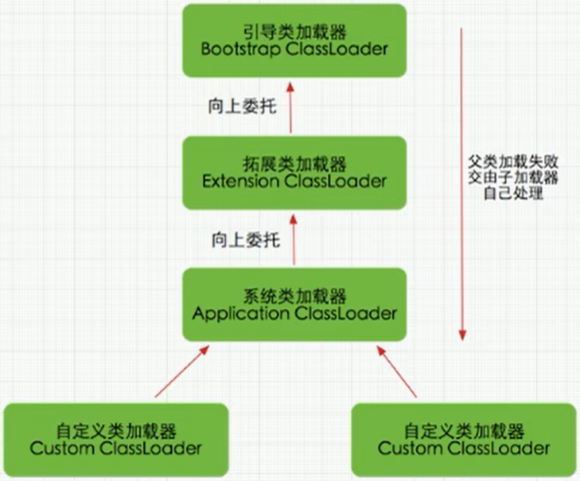

1. 如果一个类加载器收到了类加载请求，它并不会自己先去加载，而是把这个请求委托给父类的加载器去执行；
2. 如果父类加载器还存在其父类加载器，则进一步向上委托，依次递归，**请求最终将到达顶层的引导类加载器**；
3. 如果父类加载器可以完成该类的加载任务，就成功返回，倘若父类加载器无法完成该类的加载任务，子加载器才会尝试自己去加载，这就是双亲委派机制。

**优势：**

- `避免类的重复加载。`

- `保护程序安全，防止核心 API 被随意篡改。`例如：

  - 自定义类：java.lang.String。

  - 自定义类：java.lang.ShkStart（报错：阻止创建 java.lang 开头的类）。

    ```java
    package java.lang;
    
    /**
     * @author XiSun
     * @since 2024/1/5 12:22
     */
    public class XiSunStart {
    
        /**
         * 执行报错：
         *  java.lang.SecurityException: Prohibited package name: java.lang
         *
         * @param args
         */
        public static void main(String[] args) {
            System.out.println("xisun start");
        }
    }
    ```

> `沙箱安全机制`：假设自定义 java.langString 类，因为在加载自定义 String 类的时候，使用引导类加载器加载，而引导类加载器在加载的过程中会先加载 jdk 自带的文件（rt.jar 包中 java\lang\String.class），报错信息说没有 main 方法，就是因为加载的是 rt.jar 包中的 String 类。这样可以保证对 Java 核心源代码的保护，这就是沙箱安全机制。

示例一：

```java
package java.lang;

/**
 * @author XiSun
 * @since 2024/1/5 11:21
 */
public class String {

    static {
        System.out.println("加载自定义的java.lang.String");
    }

    /**
     * 执行报错：
     *  错误: 在类 java.lang.String 中找不到 main 方法, 请将 main 方法定义为:
     *      public static void main(String[] args)
     *  否则 JavaFX 应用程序类必须扩展javafx.application.Application
     *
     * @param args
     */
    public static void main(String[] args) {
        System.out.println("执行自定义的java.lang.String中的main方法");
    }
}
```

- 在项目中自定义 java.lang.String，在执行 main 方法时会报错。因为加载 String 类的时候使用双亲委派机制，最终引导类加载器会直接加载系统的 java.lang.String 类，而不是自定义的 java.lang.String，系统的 String 类没有 main 方法。

示例二：


- 当加载 jdbc.jar 用于实现数据库连接的时候，首先我们需要知道的是 jdbc.jar 是基于 SPI 接口进行实现的，在加载的时候，会进行双亲委派机制。最终，首先从引导类加载器中加载 SPI 核心类，然后再加载 SPI 接口类，接着再进行反向委派，通过线程上下文类加载器进行实现类 jdbc.jar 的加载。


#### 其他

##### 如何判断两个 Class 对象是否相同

在 JVM 中，表示两个 Class 对象是否为同一个类存在两个必要条件：

- `类的完整类名必须一致，包括包名。`

- `加载这个类的 ClassLoader (指 ClassLoader 实例对象) 必须相同。`

换句话说，在 JVM 中，即使这两个类对象（Class 对象）来源同一个 Class 文件，被同一个虚拟机所加载，但只要加载它们的 ClassLoader 实例对象不同，那么这两个类对象也是不相等的。

##### 对类加载器的引用

JVM 必须知道一个类型是由引导类加载器加载的，还是由用户自定义类加载器加载的。**如果一个类型是由用户自定义类加载器加载的，那么 JVM 会将这个类加载器的一个引用作为类型信息的一部分保存在方法区中。**当解析一个类型到另一个类型的引用的时候，JVM 需要保证这两个类型的类加载器是相同的。

##### 类的主动使用和被动使用

Java 程序对类的使用方式分为：`主动使用`和`被动使用`。

>**`类的被动使用，不会导致类的初始化。`**

主动使用，分为七种情况：

-  创建类的实例。

-  访问某个类或接口的静态变量，或者对该静态变量赋值。

-  调用类的静态方法。

-  反射，比如：Class.forName("com.xisun.Test")。

-  初始化一个类的子类。

-  Java 虚拟机启动时被标明为启动类的类。

-  JDK 7 开始提供的动态语言支持：
  - java.lang.invoke.MethodHandle 实例的解析结果。
  - REF_getStatic、REF_putStatic、REF_invokeStatic 句柄对应的类没有初始化，则初始化。

除了以上七种情况，其他使用 Java 类的方式，都被看作是对类的被动使用，都不会导致类的初始化。

### 运行时数据区

>节选 https://docs.oracle.com/javase/specs/jvms/se21/jvms21.pdf "Run-Time Data Areas"：
>
>The Java Virtual Machine defines various run-time data areas that are used during execution of a program. Some of these data areas are created on Java Virtual Machine start-up and are destroyed only when the Java Virtual Machine terminates. Other data areas are per thread. Per-thread data areas are created when a thread is created and destroyed when the thread terminates.

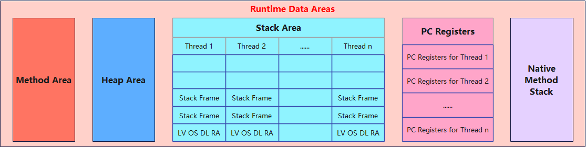

#### 概述

内存是非常重要的系统资源，是硬盘和 CPU 的中间仓库及桥梁，承载着操作系统和应用程序的实时运行。**JVM 内存布局规定了 Java 在运行过程中内存申请、分配、管理的策略，保证了 JVM 的高效稳定运行。不同的 JVM 对于内存的划分方式和管理机制，存在着部分差异。**

下面结合 JVM 虚拟机规范，来探讨一下经典的 JVM 内存布局。

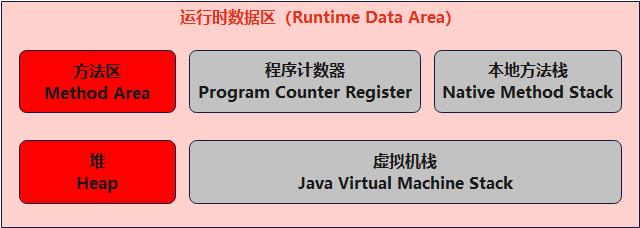

>**每个JVM 运行时，对应 Java 中 Runtime 类的一个实例（只对应一个），即为运行时环境，也就是上图中的 Runtime Data Area。**
>
>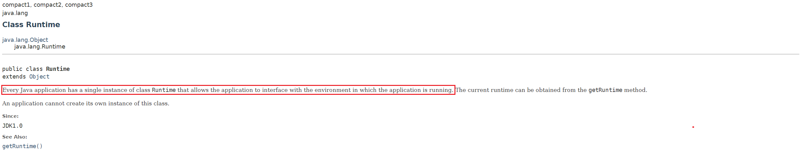

Java 虚拟机定义了若干种程序运行期间会使用到的运行时数据区，如上图所示：

- **红色的区域为多个线程共享的，会随着虚拟机启动而创建，随着虚拟机退出而销毁。**（`生命周期与虚拟机一致`）
  - 线程间共享：堆、堆外内存（永久代或元空间、代码缓存）。
- **灰色的区域为单独线程私有的，与线程一一对应，会随着线程开始和结束而创建和销毁。**（`生命周期与线程一致`）
  - 每个线程独有：程序计数器、虚拟机栈、本地方法栈。

- 总结：

  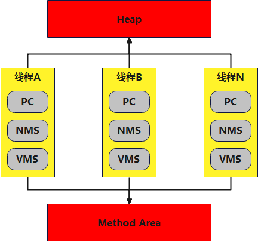

##### 线程

线程是一个程序里的运行单元，JVM 允许一个应用有多个线程并行的执行。

- `在 Hotspot JVM 里，每个线程都与操作系统的本地线程直接映射。`
  - 当一个 Java 线程准备好执行以后，此时一个操作系统的本地线程也同时创建。Java 线程执行终止后，操作系统的本地线程也会回收。

- `操作系统负责将所有线程的安排调度到任何一个可用的 CPU 上。`一旦本地线程初始化成功，它就会调用 Java 线程中的 run() 方法。

##### JVM 系统线程

如果使用 jconsole 或者是任何一个调试工具，都能看到在后台有许多线程在运行。这些后台线程不包括调用 "public static void main(String[] args)" 的 main 线程，以及所有这个 main 线程自己创建的线程。

这些后台系统线程，在 Hotspot JVM 里主要是以下几个：

- `虚拟机线程`：这种线程的操作，是需要 JVM 达到安全点才会出现。这些操作必须在不同的线程中发生的原因是它们都需要 JVM 达到安全点，这样堆才不会变化。这种线程的执行类型包括 "stop-the-world" 的垃圾收集、线程栈收集、线程挂起以及偏向锁撤销。

- `周期任务线程`：这种线程是时间周期事件的体现（比如中断），它们一般用于周期性操作的调度执行。

- `GC 线程`：这种线程对在 JVM 里不同种类的垃圾收集行为提供了支持。

- `编译线程`：这种线程在运行时会将字节码编译成到本地代码。

- `信号调度线程`：这种线程接收信号并发送给 JVM，在它内部通过调用适当的方法进行处理。

#### 程序计数器（PC 寄存器）

>节选 https://docs.oracle.com/javase/specs/jvms/se21/jvms21.pdf "The pc Register"：
>
>The Java Virtual Machine can support many threads of execution at once (JLS §17). Each Java Virtual Machine thread has its own pc (program counter) register. At any point, each Java Virtual Machine thread is executing the code of a single method, namely the current method (§2.6) for that thread. If that method is not native, the pc register contains the address of the Java Virtual Machine instruction currently being executed. If the method currently being executed by the thread is native, the value of the Java Virtual Machine's pc register is undefined. The Java Virtual Machine's pc register is wide enough to hold a returnAddress or a native pointer on the specific platform.

JVM 中的程序计数寄存器（Program Counter Register）中，Register 的命名源于 CPU 的寄存器，寄存器存储指令相关的现场信息。CPU 只有把数据装载到寄存器才能够运行。这里，并非是广义上所指的物理寄存器，或许将其翻译为 PC 计数器（或指令计数器）会更加贴切（也称为程序钩子），并且也不容易引起一些不必要的误会。`JVM 中的 PC 寄存器是对物理 PC 寄存器的一种抽象模拟。`

**作用：**

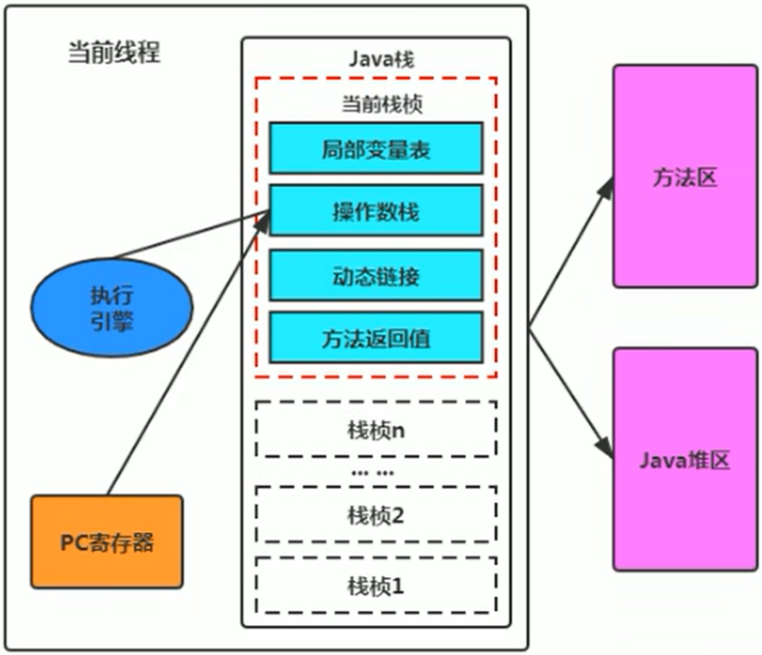

- `PC 寄存器用来存储指向下一条指令的地址`，即将要执行的指令代码，然后由执行引擎读取下一条指令。
- 它是一块很小的内存空间，几乎可以忽略不记，也是运行速度最快的存储区域。
- 在 JVM 规范中，每个线程都有它自己的程序计数器，是线程私有的，生命周期与线程的生命周期保持一致。
- 任何时间一个线程都只有一个方法在执行，也就是所谓的`当前方法`。**程序计数器会存储当前线程正在执行的 Java 方法的 JVM 指令地址，如果是在执行 native 方法，则是未指定值（undefined）。**（native 方法不是 Java 语言所写，无法显示）
- 它是程序控制流的指示器，分支、循环、跳转、异常处理、线程恢复等基础功能，都需要依赖程序计数器来完成。
- 字节码解释器工作时，就是通过改变程序计数器的值来选取下一条需要执行的字节码指令。
- **程序计数器是唯一一个在 Java 虚拟机规范中，没有规定任何 OutofMemoryError 情况的区域。**（程序计数器也不存在 GC 的问题）

**举例说明：**

- 代码：

  ```java
  package cn.xisun.jvm;
  
  /**
   * @author XiSun
   * @since 2024/1/5 15:22
   */
  public class PCRegisterTest {
      public static void main(String[] args) {
          int i = 10;
          int j = 20;
          int k = i + j;
  
          String s = "abc";
  
          System.out.println(i);
          System.out.println(k);
      }
  }
  ```

- 字节码：

  ```sh
  PS C:\Users\XiSun\ACatSmiling\zero_to_zero\Codes\xisun-jvm> cd .\target\classes\cn\xisun\jvm\
  PS C:\Users\XiSun\ACatSmiling\zero_to_zero\Codes\xisun-jvm\target\classes\cn\xisun\jvm> javap -v .\PCRegisterTest.class
  Classfile /C:/Users/XiSun/ACatSmiling/zero_to_zero/Codes/xisun-jvm/target/classes/cn/xisun/jvm/PCRegisterTest.class
    Last modified 2024-1-5; size 667 bytes
    MD5 checksum ecf0ae84981af1188841422d6de9c1e6
    Compiled from "PCRegisterTest.java"
  public class cn.xisun.jvm.PCRegisterTest
    minor version: 0
    major version: 52
    flags: ACC_PUBLIC, ACC_SUPER
  Constant pool:
     #1 = Methodref          #6.#26         // java/lang/Object."<init>":()V
     #2 = String             #27            // abc
     #3 = Fieldref           #28.#29        // java/lang/System.out:Ljava/io/PrintStream;
     #4 = Methodref          #30.#31        // java/io/PrintStream.println:(I)V
     #5 = Class              #32            // cn/xisun/jvm/PCRegisterTest
     #6 = Class              #33            // java/lang/Object
     #7 = Utf8               <init>
     #8 = Utf8               ()V
     #9 = Utf8               Code
    #10 = Utf8               LineNumberTable
    #11 = Utf8               LocalVariableTable
    #12 = Utf8               this
    #13 = Utf8               Lcn/xisun/jvm/PCRegisterTest;
    #14 = Utf8               main
    #15 = Utf8               ([Ljava/lang/String;)V
    #16 = Utf8               args
    #17 = Utf8               [Ljava/lang/String;
    #18 = Utf8               i
    #19 = Utf8               I
    #20 = Utf8               j
    #21 = Utf8               k
    #22 = Utf8               s
    #23 = Utf8               Ljava/lang/String;
    #24 = Utf8               SourceFile
    #25 = Utf8               PCRegisterTest.java
    #26 = NameAndType        #7:#8          // "<init>":()V
    #27 = Utf8               abc
    #28 = Class              #34            // java/lang/System
    #29 = NameAndType        #35:#36        // out:Ljava/io/PrintStream;
    #30 = Class              #37            // java/io/PrintStream
    #31 = NameAndType        #38:#39        // println:(I)V
    #32 = Utf8               cn/xisun/jvm/PCRegisterTest
    #33 = Utf8               java/lang/Object
    #34 = Utf8               java/lang/System
    #35 = Utf8               out
    #36 = Utf8               Ljava/io/PrintStream;
    #37 = Utf8               java/io/PrintStream
    #38 = Utf8               println
    #39 = Utf8               (I)V
  {
    public cn.xisun.jvm.PCRegisterTest();
      descriptor: ()V
      flags: ACC_PUBLIC
      Code:
        stack=1, locals=1, args_size=1
           0: aload_0
           1: invokespecial #1                  // Method java/lang/Object."<init>":()V
           4: return
        LineNumberTable:
          line 7: 0
        LocalVariableTable:
          Start  Length  Slot  Name   Signature
              0       5     0  this   Lcn/xisun/jvm/PCRegisterTest;
  
    public static void main(java.lang.String[]);
      descriptor: ([Ljava/lang/String;)V
      flags: ACC_PUBLIC, ACC_STATIC
      Code:
        stack=2, locals=5, args_size=1
           0: bipush        10
           2: istore_1
           3: bipush        20
           5: istore_2
           6: iload_1
           7: iload_2
           8: iadd
           9: istore_3
          10: ldc           #2                  // String abc
          12: astore        4
          14: getstatic     #3                  // Field java/lang/System.out:Ljava/io/PrintStream;
          17: iload_1
          18: invokevirtual #4                  // Method java/io/PrintStream.println:(I)V
          21: getstatic     #3                  // Field java/lang/System.out:Ljava/io/PrintStream;
          24: iload_3
          25: invokevirtual #4                  // Method java/io/PrintStream.println:(I)V
          28: return
        LineNumberTable:
          line 9: 0
          line 10: 3
          line 11: 6
          line 13: 10
          line 15: 14
          line 16: 21
          line 17: 28
        LocalVariableTable:
          Start  Length  Slot  Name   Signature
              0      29     0  args   [Ljava/lang/String;
              3      26     1     i   I
              6      23     2     j   I
             10      19     3     k   I
             14      15     4     s   Ljava/lang/String;
  }
  SourceFile: "PCRegisterTest.java"
  ```

- 过程分析：

  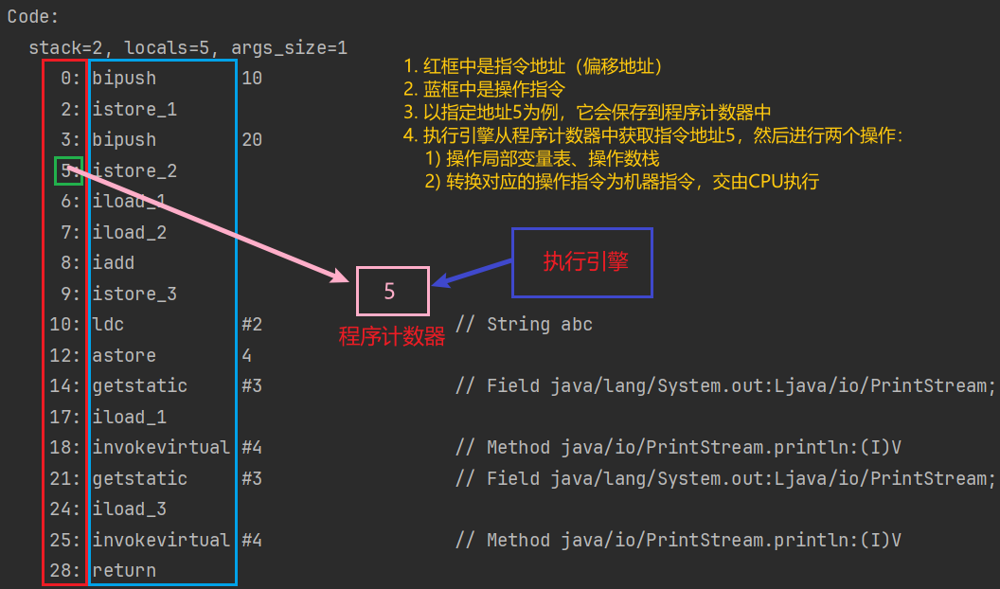

**使用程序计数器存储字节码指令地址有什么用呢？为什么使用程序计数器记录当前线程的执行地址呢？**

- CPU 需要不停的切换各个线程，当重新切换回之前的线程以后，就得知道接着从哪开始继续执行。JVM 的字节码解释器，就是**通过改变程序计数器中的值，来明确下一条应该执行什么样的字节码指令。**

**程序计数器为什么被设定为私有的？**

- 我们都知道，所谓的多线程在一个特定的时间段内只会执行其中某一个线程的方法，CPU 会不停地做任务切换，这样必然导致经常中断或恢复，如何保证分毫无差呢？为了能够准确地记录各个线程正在执行的当前字节码指令地址，最好的办法自然是**为每一个线程都分配一个程序计数器，这样一来各个线程之间便可以进行独立计算，从而不会出现相互干扰的情况。**
- 由于 CPU 时间片的限制，众多线程在并发执行过程中，任何一个确定的时刻，一个处理器或者多核处理器中的一个内核，只会执行某个线程中的一条指令。这样必然导致经常中断或恢复，如何保证分毫无差呢？每个线程在创建后，都会产生自己的程序计数器和栈帧，程序计数器在各个线程之间互不影响。

> `CPU 时间片`：
>
> 
>
> - CPU 时间片即 CPU 分配给各个程序的时间，每个线程被分配一个时间段，称作它的时间片。
> - 在宏观上：我们可以同时打开多个应用程序，看起来每个程序并行不悖，同时运行。
> - 但在微观上：由于只有一个 CPU，一次只能处理程序要求的一部分，对于如何公平处理，其中一种方法就是引入时间片，每个程序轮流执行。

#### 虚拟机栈

> 节选 https://docs.oracle.com/javase/specs/jvms/se21/jvms21.pdf "Java Virtual Machine Stacks"：
>
> Each Java Virtual Machine thread has a private Java Virtual Machine stack, created at the same time as the thread. A Java Virtual Machine stack stores frames (§2.6). A Java Virtual Machine stack is analogous to the stack of a conventional language such as C: it holds local variables and partial results, and plays a part in method invocation and return. Because the Java Virtual Machine stack is never manipulated directly except to push and pop frames, frames may be heap allocated. The memory for a Java Virtual Machine stack does not need to be contiguous.
>
> This specification permits Java Virtual Machine stacks either to be of a fixed size or to dynamically expand and contract as required by the computation. If the Java Virtual Machine stacks are of a fixed size, the size of each Java Virtual Machine stack may be chosen independently when that stack is created.
>
> A Java Virtual Machine implementation may provide the programmer or the user control over the initial size of Java Virtual Machine stacks, as well as, in the case of dynamically expanding or contracting Java Virtual Machine stacks, control over the maximum and minimum sizes. The following exceptional conditions are associated with Java Virtual Machine stacks:
>
> • If the computation in a thread requires a larger Java Virtual Machine stack than is permitted, the Java Virtual Machine throws a StackOverflowError.
>
> • If Java Virtual Machine stacks can be dynamically expanded, and expansion is attempted but insufficient memory can be made available to effect the expansion, or if insufficient memory can be made available to create the initial Java Virtual Machine stack for a new thread, the Java Virtual Machine throws an OutOfMemoryError.

##### 概述

###### 背景

- 由于跨平台性的设计，Java 的指令都是根据栈来设计的。由于不同平台 CPU 架构不同，所以不能设计为基于寄存器的。

- **优点是跨平台，指令集小，编译器容易实现，缺点是性能下降，实现同样的功能需要更多的指令。**

###### 基本概念

`Java 虚拟机栈`（Java Virtual Machine Stack），早期也叫 Java 栈，**是线程私有的**。**每个线程在创建时都会创建一个虚拟机栈**，其内部保存着一个个的`栈帧`（Stack Frame），**每个栈帧对应着一次 Java 方法的调用**。

###### 生命周期

生命周期**和线程一致**。

###### 作用

**主管 Java 程序的运行**，它保存方法的局部变量、部分结果，并参与方法的调用和返回。

###### 栈的特点

- 栈是一种快速有效的分配存储方式，访问速度仅次于程序计数器。

- JVM 直接对 Java 栈的操作只有两个：

  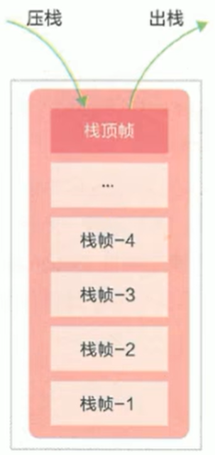

  - 每个方法执行，伴随着`进栈`（入栈、压栈）。

  - 执行结束后的`出栈`工作。

- 对于栈来说**不存在垃圾回收**问题（但是栈存在内存溢出的情况）。

###### 内存中的栈与堆

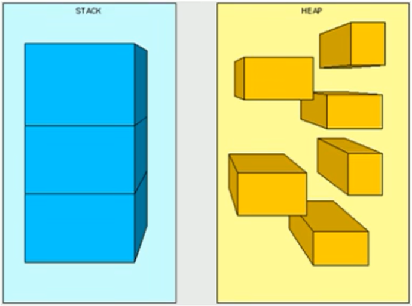

`栈是运行时的单位，而堆是存储的单位`：

- **栈解决的是程序的运行问题**，即程序如何执行，或者说如何处理数据。

- **堆解决的是数据存储的问题**，即数据怎么放，放哪里。

######栈中可能出现的异常

Java 虚拟机规范中，允许 Java 栈的大小是`固定不变的`或者是`动态扩展的`。

-  如果采用固定大小的 Java 虚拟机栈，那每一个线程的 Java 虚拟机栈容量，可以在线程创建的时候独立选定。如果线程请求分配的栈容量超过 Java 虚拟机栈允许的最大容量，Java 虚拟机将会抛出一个`StackOverflowError`异常。 

-  如果 Java 虚拟机栈是动态扩展的，且在尝试扩展的时候无法申请到足够的内存，或者在创建新的线程时没有足够的内存去创建对应的虚拟机栈，Java 虚拟机将会抛出一个`OutOfMemoryError`异常。 

###### 设置栈内存大小

我们可以使用参数`-Xss`选项来设置线程的最大栈空间，**栈的大小直接决定了函数调用的最大可达深度**。

示例：

```java
package cn.xisun.jvm;

/**
 * @author XiSun
 * @since 2024/1/5 22:29
 */
public class StackErrorTest {

    /**
     * 默认情况下，count值最大为：11410
     * 设置-Xss256k，count值最大为：2455
     */
    private static int count = 1;

    /**
     * 执行到最后，抛出异常：Exception in thread "main" java.lang.StackOverflowError
     *
     * @param args
     */
    public static void main(String[] args) {
        System.out.println(count);
        count++;
        main(args);
    }
}
```

> IDEA 设置 JVM 参数：
>
> 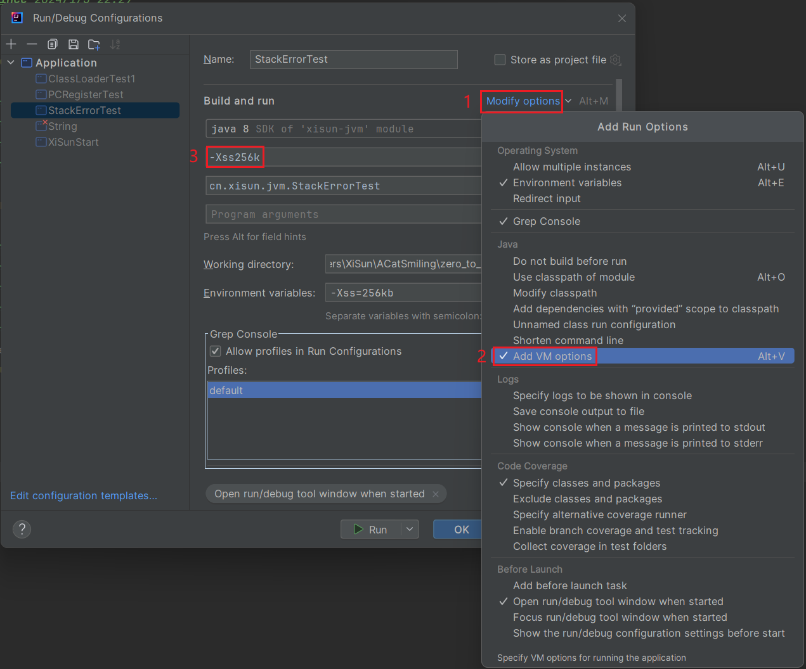

##### 栈的存储单位

###### 栈中存储什么

- 每个线程都有自己的栈，栈中的数据都是以栈帧（Stack Frame）为基本单位进行存储的。
- 在这个线程上正在执行的每个方法都各自对应一个栈帧（Stack Frame）。
  - **运行中的方法与栈帧是一一对应的关系。**
  - **方法的开始，对应栈帧的入栈；方法的结束，对应栈帧的出栈。**
- 栈帧是一个内存区块，是一个数据集，维系着方法执行过程中的各种数据信息。

###### 栈运行原理

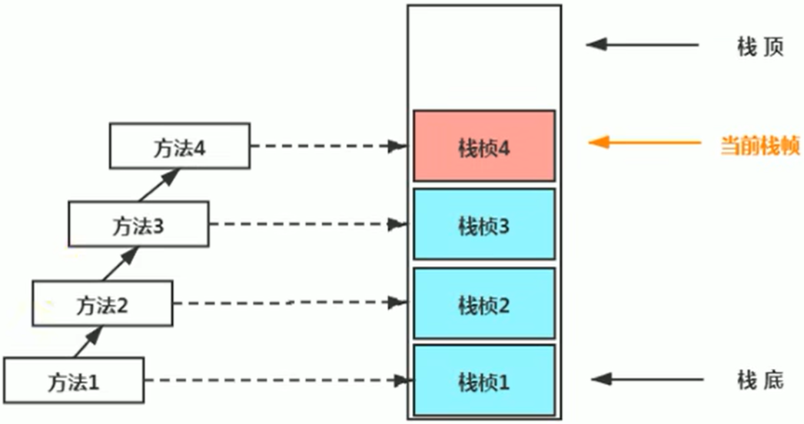

- JVM 直接对 Java 栈的操作只有两个，就是对栈帧的`压栈`和`出栈`，遵循`先进后出/后进先出`的原则。
- 在一条活动线程中，一个时间点上，只会有一个活动的栈帧。即只有当前正在执行的方法的栈帧（栈顶栈帧）是有效的，这个栈帧被称为`当前栈帧`（Current Frame），与当前栈帧相对应的方法就是`当前方法`（Current Method），定义这个方法的类就是`当前类`（Current Class）。
- **执行引擎运行的所有字节码指令，只针对当前栈帧进行操作。**
- **如果在该方法中调用了其他方法，对应的新的栈帧会被创建出来，放在栈的顶端，成为新的当前帧。**
- 不同线程中所包含的栈帧是不允许存在相互引用的，即不可能在一个栈帧之中引用另外一个线程的栈帧。
- 如果当前方法调用了其他方法，方法返回之际，当前栈帧会传回此方法的执行结果给前一个栈帧，接着，虚拟机会丢弃当前栈帧，使得前一个栈帧重新成为当前栈帧。
- Java 方法有两种返回函数的方式：**一种是正常的函数返回，使用 return 指令；另外一种是抛出异常（异常未在方法中被捕获，如果被捕获了，该方法是正常返回）。**不管使用哪种方式，都会导致栈帧被弹出。

###### 栈帧的内部结构

