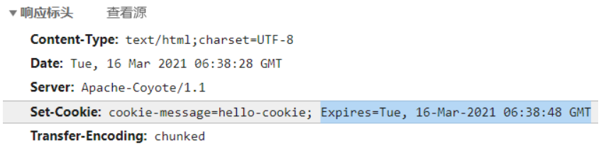

*date: 2023-11-22*


[TOC]

## B/S 和 C/S

`B/S`：浏览器服务器架构模式。

- 优点：客户端不需要安装；维护成本较低。
- 缺点：所有的计算和存储任务都是放在服务器端的，服务器的负荷较重；在服务器端计算完成之后再把结果传输给客户端，因此客户端与服务器端会进行非常频繁的数据通信，从而网络负荷较重。

`C/S`：客户端服务器架构模式。

- 优点：充分利用客户端机器的资源，减轻服务器的负荷。（一部分安全要求不高的计算任务、存储任务可以放在客户端执行，不需要把所有的计算和存储都在服务器端执行，从而能够减轻服务器的压力，也能够减轻网络负荷。）
- 缺点：需要安装；升级维护成本较高。

## Servlet

**`Servlet = Server + applet`**

- Server：服务器。
- applet：小程序。
- Servlet：服务器端的小程序。

**角色**：在整个 Web 应用中，Servlet 主要负责处理请求、协调调度功能。我们可以把 Servlet 称为 Web 应用中的**『控制器』**。

**广义 Servlet**：javax.servlet 包下的一系列接口定义的一组 **Web 开发标准**。遵循这一套标准，不同的 Servlet 容器提供了不同的实现。

**侠义 Servlet**：javax.servlet.Servlet 接口和它的实现类，也就是实际开发时使用的具体的 Servlet。

**流程示意**：


### 示例

html：

```html
<!DOCTYPE html>
<html lang="en">
<head>
    <meta charset="UTF-8">
    <title>Title</title>
</head>
<body>
    <form action="add" method="post">
        名称：<input type="text" name="fname"/><br/>
        价格：<input type="text" name="price"/><br/>
        库存：<input type="text" name="fcount"/><br/>
        备注：<input type="text" name="remark"/><br/>
        <input type="submit" value="添加" />
    </form>
</body>
</html>
```

AddServlet.java：

```java
public class AddServlet extends HttpServlet {
    @Override
    public void doPost(HttpServletRequest request, HttpServletResponse response) throws ServletException, IOException {
        String fname = request.getParameter("fname");
        String priceStr = request.getParameter("price");
        Integer price = Integer.parseInt(priceStr);
        String fcountStr = request.getParameter("fcount");
        Integer fcount = Integer.parseInt(fcountStr);
        String remark = request.getParameter("remark");

        FruitDAO fruitDAO = new FruitDAOImpl();
        boolean flag = fruitDAO.addFruit(new Fruit(0, fname, price, fcount, remark));

        System.out.println(flag ? "添加成功！" : "添加失败！");
    }
}
```

web.xml：

```xml
<?xml version="1.0" encoding="UTF-8"?>
<web-app xmlns="http://xmlns.jcp.org/xml/ns/javaee"
         xmlns:xsi="http://www.w3.org/2001/XMLSchema-instance"
         xsi:schemaLocation="http://xmlns.jcp.org/xml/ns/javaee http://xmlns.jcp.org/xml/ns/javaee/web-app_4_0.xsd"
         version="4.0">
    
    <servlet>
        <servlet-name>AddServlet</servlet-name>
        <servlet-class>com.atguigu.servlets.AddServlet</servlet-class>
    </servlet>
    
    <servlet-mapping>
        <servlet-name>AddServlet</servlet-name>
        <url-pattern>/add</url-pattern>
    </servlet-mapping>
    <!--
        1. 用户发请求，action=add
        2. 项目中，web.xml中找到url-pattern = /add   -> 第12行
        3. 找第11行的servlet-name = AddServlet
        4. 找和servlet-mapping中servlet-name一致的servlet，找到第7行
        5. 找第8行的servlet-class -> com.atguigu.servlets.AddServlet
        6. 用户发送的是post请求（method=post） ， 因此 tomcat会执行AddServlet中的doPost方法
    -->
</web-app>
```

### 请求参数获取

| 方法名                                       | 返回值类型            |
| -------------------------------------------- | --------------------- |
| request.getParameterMap()                    | Map<String, String[]> |
| request.getParameter("请求参数的名字")       | String                |
| request.getParameterValues("请求参数的名字") | String []             |
| request.getParameterNames()                  | Enumeration<String>   |

html 代码示例：

```html
<!-- 测试请求参数的表单 -->
<form action="/orange/ParamServlet" method="post">

    <!-- 单行文本框 -->
    <!-- input标签配合type="text"属性生成单行文本框 -->
    <!-- name属性定义的是请求参数的名字 -->
    <!-- 如果设置了value属性，那么这个值就是单行文本框的默认值 -->
    个性签名：<input type="text" name="signal" value="单行文本框的默认值" /><br/>

    <!-- 密码框 -->
    <!-- input标签配合type="password"属性生成密码框 -->
    <!-- 用户在密码框中填写的内容不会被一明文形式显示 -->
    密码：<input type="password" name="secret" /><br/>

    <!-- 单选框 -->
    <!-- input标签配合type="radio"属性生成单选框 -->
    <!-- name属性一致的radio会被浏览器识别为同一组单选框，同一组内只能选择一个 -->
    <!-- 提交表单后，真正发送给服务器的是name属性和value属性的值 -->
    <!-- 使用checked="checked"属性设置默认被选中 -->
    请选择你最喜欢的季节：
    <input type="radio" name="season" value="spring" />春天
    <input type="radio" name="season" value="summer" checked="checked" />夏天
    <input type="radio" name="season" value="autumn" />秋天
    <input type="radio" name="season" value="winter" />冬天

    <br/><br/>

    你最喜欢的动物是：
    <input type="radio" name="animal" value="tiger" />路虎
    <input type="radio" name="animal" value="horse" checked="checked" />宝马
    <input type="radio" name="animal" value="cheetah" />捷豹

    <br/>

    <!-- 多选框 -->
    <!-- input标签和type="checkbox"配合生成多选框 -->
    <!-- 多选框被用户选择多个并提交表单后会产生『一个名字携带多个值』的情况 -->
    你最喜欢的球队是：
    <input type="checkbox" name="team" value="Brazil"/>巴西
    <input type="checkbox" name="team" value="German" checked="checked"/>德国
    <input type="checkbox" name="team" value="France"/>法国
    <input type="checkbox" name="team" value="China" checked="checked"/>中国
    <input type="checkbox" name="team" value="Italian"/>意大利

    <br/>

    <!-- 下拉列表 -->
    <!-- 使用select标签定义下拉列表整体，在select标签内设置name属性 -->
    你最喜欢的运动是：
    <select name="sport">
        <!-- 使用option属性定义下拉列表的列表项 -->
        <!-- 使用option标签的value属性设置提交给服务器的值，在option标签的标签体中设置给用户看的值 -->
        <option value="swimming">游泳</option>
        <option value="running">跑步</option>

        <!-- 使用option标签的selected="selected"属性设置这个列表项默认被选中 -->
        <option value="shooting" selected="selected">射击</option>
        <option value="skating">溜冰</option>
    </select>

    <br/>

    <br/><br/>

    <!-- 表单隐藏域 -->
    <!-- input标签和type="hidden"配合生成表单隐藏域 -->
    <!-- 表单隐藏域在页面上不会有任何显示，用来保存要提交到服务器但是又不想让用户看到的数据 -->
    <input type="hidden" name="userId" value="234654745" />

    <!-- 多行文本框 -->
    自我介绍：<textarea name="desc">多行文本框的默认值</textarea>

    <br/>

    <!-- 普通按钮 -->
    <button type="button">普通按钮</button>

    <!-- 重置按钮 -->
    <button type="reset">重置按钮</button>

    <!-- 表单提交按钮 -->
    <button type="submit">提交按钮</button>
</form>
```

Java 代码示例：

```java
protected void doPost(HttpServletRequest request, HttpServletResponse response) throws ServletException, IOException {

    // 获取包含全部请求参数的Map
    Map<String, String[]> parameterMap = request.getParameterMap();

    // 遍历这个包含全部请求参数的Map
    Set<String> keySet = parameterMap.keySet();

    for (String key : keySet) {
        String[] values = parameterMap.get(key);
        System.out.println(key + "=" + Arrays.asList(values));
    }

    System.out.println("---------------------------");

    // 根据请求参数名称获取指定的请求参数值
    // getParameter()方法：获取单选框的请求参数
    String season = request.getParameter("season");
    System.out.println("season = " + season);

    // getParameter()方法：获取多选框的请求参数
    // 只能获取到多个值中的第一个
    String team = request.getParameter("team");
    System.out.println("team = " + team);

    // getParameterValues()方法：取单选框的请求参数
    String[] seasons = request.getParameterValues("season");
    System.out.println("Arrays.asList(seasons) = " + Arrays.asList(seasons));

    // getParameterValues()方法：取多选框的请求参数
    String[] teams = request.getParameterValues("team");
    System.out.println("Arrays.asList(teams) = " + Arrays.asList(teams));

}
```

### 编码设置

Tomcat 8 之前，对请求设置编码：

- get 请求：

  ```java
  // 1.获取参数
  String fname = request.getParameter("fname");
  // 2.将字符串打散成字节数组
  byte[] bytes = fname.getBytes("ISO-8859-1");
  // 3.将字节数组按照设定的编码重新组装成字符串
  fname = new String(bytes, "UTF-8");
  ```

- post 请求：

  ```java
  // 防止中文乱码，此代码必须在所有的获取参数动作之前
  request.setCharacterEncoding("UTF-8");
  ```

Tomcat 8 开始，对请求设置编码：

- get 请求不再需要设置编码，只需要对 post 请求设置编码。

- post 请求：

  ```java
  // 防止中文乱码，此代码必须在所有的获取参数动作之前
  request.setCharacterEncoding("UTF-8");
  ```

> Tomcat 服务器的 server.xml 配置文件，在 Connector 标签中增加 URIEncoding 属性，也可以实现对 get 请求的编码设置：
>
> ```xml
> <Connector port="8080" protocol="HTTP/1.1"
> 		   connectionTimeout="20000"
> 		   redirectPort="8443" 
> 		   URIEncoding="UTF-8"
> 		   />
> ```

对响应设置编码：

- 编码字符集和解码字符集一致：

  ```java
  // 设置服务器端的编码字符集
  response.setCharacterEncoding("UTF-8");
  
  PrintWriter writer = response.getWriter();
  
  writer.write("<!DOCTYPE html>                  ");
  writer.write("<html>                           ");
  writer.write("<head>                           ");
  writer.write("<!-- 设置浏览器端的解码字符集 -->");
  writer.write("    <meta charset='UTF-8'>       ");
  writer.write("    <title>Title</title>         ");
  writer.write("</head>                          ");
  writer.write("<body>                           ");
  writer.write("<p>志玲姐姐你好！</p>            ");
  writer.write("</body>                          ");
  writer.write("</html>                          ");
  ```

- 代码设置：

  ```java
  response.setContentType("text/html;charset=UTF-8");
  ```

>注意：response.getWriter() 不能出现在设置字符集操作的前面。

### 继承关系


- `javax.servlet.http.HttpServlet.java`：

  ```java
  /**
   * Provides an abstract class to be subclassed to create
   * an HTTP servlet suitable for a Web site. A subclass of
   * <code>HttpServlet</code> must override at least
   * one method, usually one of these:
   *
   * <ul>
   * <li> <code>doGet</code>, if the servlet supports HTTP GET requests
   * <li> <code>doPost</code>, for HTTP POST requests
   * <li> <code>doPut</code>, for HTTP PUT requests
   * <li> <code>doDelete</code>, for HTTP DELETE requests
   * <li> <code>init</code> and <code>destroy</code>,
   * to manage resources that are held for the life of the servlet
   * <li> <code>getServletInfo</code>, which the servlet uses to
   * provide information about itself
   * </ul>
   *
   * <p>There's almost no reason to override the <code>service</code>
   * method. <code>service</code> handles standard HTTP
   * requests by dispatching them to the handler methods
   * for each HTTP request type (the <code>do</code><i>Method</i>
   * methods listed above).
   *
   * <p>Likewise, there's almost no reason to override the
   * <code>doOptions</code> and <code>doTrace</code> methods.
   *
   * <p>Servlets typically run on multithreaded servers,
   * so be aware that a servlet must handle concurrent
   * requests and be careful to synchronize access to shared resources.
   * Shared resources include in-memory data such as
   * instance or class variables and external objects
   * such as files, database connections, and network
   * connections.
   * See the
   * <a href="http://java.sun.com/Series/Tutorial/java/threads/multithreaded.html">
   * Java Tutorial on Multithreaded Programming</a> for more
   * information on handling multiple threads in a Java program.
   */
  public abstract class HttpServlet extends GenericServlet {
  }
  ```

- `javax.servlet.GenericServlet.java`：

  ```java
  /**
   * Defines a generic, protocol-independent servlet. To write an HTTP servlet for
   * use on the Web, extend {@link javax.servlet.http.HttpServlet} instead.
   * <p>
   * <code>GenericServlet</code> implements the <code>Servlet</code> and
   * <code>ServletConfig</code> interfaces. <code>GenericServlet</code> may be
   * directly extended by a servlet, although it's more common to extend a
   * protocol-specific subclass such as <code>HttpServlet</code>.
   * <p>
   * <code>GenericServlet</code> makes writing servlets easier. It provides simple
   * versions of the lifecycle methods <code>init</code> and <code>destroy</code>
   * and of the methods in the <code>ServletConfig</code> interface.
   * <code>GenericServlet</code> also implements the <code>log</code> method,
   * declared in the <code>ServletContext</code> interface.
   * <p>
   * To write a generic servlet, you need only override the abstract
   * <code>service</code> method.
   */
  public abstract class GenericServlet implements Servlet, ServletConfig, java.io.Serializable {
  }
  ```

- `javax.servlet.Servlet.java`：

  ```java
  /**
   * Defines methods that all servlets must implement.
   *
   * <p>
   * A servlet is a small Java program that runs within a Web server. Servlets
   * receive and respond to requests from Web clients, usually across HTTP, the
   * HyperText Transfer Protocol.
   *
   * <p>
   * To implement this interface, you can write a generic servlet that extends
   * <code>javax.servlet.GenericServlet</code> or an HTTP servlet that extends
   * <code>javax.servlet.http.HttpServlet</code>.
   *
   * <p>
   * This interface defines methods to initialize a servlet, to service requests,
   * and to remove a servlet from the server. These are known as life-cycle
   * methods and are called in the following sequence:
   * <ol>
   * <li>The servlet is constructed, then initialized with the <code>init</code>
   * method.
   * <li>Any calls from clients to the <code>service</code> method are handled.
   * <li>The servlet is taken out of service, then destroyed with the
   * <code>destroy</code> method, then garbage collected and finalized.
   * </ol>
   *
   * <p>
   * In addition to the life-cycle methods, this interface provides the
   * <code>getServletConfig</code> method, which the servlet can use to get any
   * startup information, and the <code>getServletInfo</code> method, which allows
   * the servlet to return basic information about itself, such as author,
   * version, and copyright.
   *
   * @see GenericServlet
   * @see javax.servlet.http.HttpServlet
   */
  public interface Servlet {
  }
  ```

### 相关方法

在 Servlet 接口中，定义了三个方法：

- `初始化方法 init()`：

  ```java
  /**
   * Called by the servlet container to indicate to a servlet that the servlet
   * is being placed into service.
   *
   * <p>
   * The servlet container calls the <code>init</code> method exactly once
   * after instantiating the servlet. The <code>init</code> method must
   * complete successfully before the servlet can receive any requests.
   *
   * <p>
   * The servlet container cannot place the servlet into service if the
   * <code>init</code> method
   * <ol>
   * <li>Throws a <code>ServletException</code>
   * <li>Does not return within a time period defined by the Web server
   * </ol>
   *
   *
   * @param config
   *            a <code>ServletConfig</code> object containing the servlet's
   *            configuration and initialization parameters
   *
   * @exception ServletException
   *                if an exception has occurred that interferes with the
   *                servlet's normal operation
   *
   * @see UnavailableException
   * @see #getServletConfig
   */
  public void init(ServletConfig config) throws ServletException;
  ```

- `服务方法 service()`：

  ```java
  /**
   * Called by the servlet container to allow the servlet to respond to a
   * request.
   *
   * <p>
   * This method is only called after the servlet's <code>init()</code> method
   * has completed successfully.
   *
   * <p>
   * The status code of the response always should be set for a servlet that
   * throws or sends an error.
   *
   *
   * <p>
   * Servlets typically run inside multithreaded servlet containers that can
   * handle multiple requests concurrently. Developers must be aware to
   * synchronize access to any shared resources such as files, network
   * connections, and as well as the servlet's class and instance variables.
   * More information on multithreaded programming in Java is available in <a
   * href
   * ="http://java.sun.com/Series/Tutorial/java/threads/multithreaded.html">
   * the Java tutorial on multi-threaded programming</a>.
   *
   *
   * @param req
   *            the <code>ServletRequest</code> object that contains the
   *            client's request
   *
   * @param res
   *            the <code>ServletResponse</code> object that contains the
   *            servlet's response
   *
   * @exception ServletException
   *                if an exception occurs that interferes with the servlet's
   *                normal operation
   *
   * @exception IOException
   *                if an input or output exception occurs
   */
  public void service(ServletRequest req, ServletResponse res) throws ServletException, IOException;
  ```

- `销毁方法 destroy()`：

  ```java
  /**
   * Called by the servlet container to indicate to a servlet that the servlet
   * is being taken out of service. This method is only called once all
   * threads within the servlet's <code>service</code> method have exited or
   * after a timeout period has passed. After the servlet container calls this
   * method, it will not call the <code>service</code> method again on this
   * servlet.
   *
   * <p>
   * This method gives the servlet an opportunity to clean up any resources
   * that are being held (for example, memory, file handles, threads) and make
   * sure that any persistent state is synchronized with the servlet's current
   * state in memory.
   */
  public void destroy();
  ```

其中，service() 方法在 HttpServlet 类中被实现，在此方法中，`对请求进行分发处理`：

```java
/**
 * Receives standard HTTP requests from the public
 * <code>service</code> method and dispatches
 * them to the <code>do</code><i>Method</i> methods defined in
 * this class. This method is an HTTP-specific version of the
 * {@link javax.servlet.Servlet#service} method. There's no
 * need to override this method.
 *
 * @param req   the {@link HttpServletRequest} object that
 *                  contains the request the client made of
 *                  the servlet
 *
 * @param resp  the {@link HttpServletResponse} object that
 *                  contains the response the servlet returns
 *                  to the client
 *
 * @exception IOException   if an input or output error occurs
 *                              while the servlet is handling the
 *                              HTTP request
 *
 * @exception ServletException  if the HTTP request
 *                                  cannot be handled
 *
 * @see javax.servlet.Servlet#service
 */
protected void service(HttpServletRequest req, HttpServletResponse resp)
    throws ServletException, IOException {

    String method = req.getMethod();

    if (method.equals(METHOD_GET)) {
        long lastModified = getLastModified(req);
        if (lastModified == -1) {
            // servlet doesn't support if-modified-since, no reason
            // to go through further expensive logic
            doGet(req, resp);
        } else {
            long ifModifiedSince;
            try {
                ifModifiedSince = req.getDateHeader(HEADER_IFMODSINCE);
            } catch (IllegalArgumentException iae) {
                // Invalid date header - proceed as if none was set
                ifModifiedSince = -1;
            }
            if (ifModifiedSince < (lastModified / 1000 * 1000)) {
                // If the servlet mod time is later, call doGet()
                // Round down to the nearest second for a proper compare
                // A ifModifiedSince of -1 will always be less
                maybeSetLastModified(resp, lastModified);
                doGet(req, resp);
            } else {
                resp.setStatus(HttpServletResponse.SC_NOT_MODIFIED);
            }
        }

    } else if (method.equals(METHOD_HEAD)) {
        long lastModified = getLastModified(req);
        maybeSetLastModified(resp, lastModified);
        doHead(req, resp);

    } else if (method.equals(METHOD_POST)) {
        doPost(req, resp);

    } else if (method.equals(METHOD_PUT)) {
        doPut(req, resp);

    } else if (method.equals(METHOD_DELETE)) {
        doDelete(req, resp);

    } else if (method.equals(METHOD_OPTIONS)) {
        doOptions(req,resp);

    } else if (method.equals(METHOD_TRACE)) {
        doTrace(req,resp);

    } else {
        //
        // Note that this means NO servlet supports whatever
        // method was requested, anywhere on this server.
        //

        String errMsg = lStrings.getString("http.method_not_implemented");
        Object[] errArgs = new Object[1];
        errArgs[0] = method;
        errMsg = MessageFormat.format(errMsg, errArgs);

        resp.sendError(HttpServletResponse.SC_NOT_IMPLEMENTED, errMsg);
    }
}
```

**在各个 doXXX() 方法中，默认对请求做错误处理，因此，`继承 HttpServlet 的子类 (即自定义的业务类) 需要重写 doXXX() 方法，否则会报 405 或者 400 错误。`以 doGet() 为例：**

```java
/**
 * Called by the server (via the <code>service</code> method) to
 * allow a servlet to handle a GET request.
 *
 * <p>Overriding this method to support a GET request also
 * automatically supports an HTTP HEAD request. A HEAD
 * request is a GET request that returns no body in the
 * response, only the request header fields.
 *
 * <p>When overriding this method, read the request data,
 * write the response headers, get the response's writer or
 * output stream object, and finally, write the response data.
 * It's best to include content type and encoding. When using
 * a <code>PrintWriter</code> object to return the response,
 * set the content type before accessing the
 * <code>PrintWriter</code> object.
 *
 * <p>The servlet container must write the headers before
 * committing the response, because in HTTP the headers must be sent
 * before the response body.
 *
 * <p>Where possible, set the Content-Length header (with the
 * {@link javax.servlet.ServletResponse#setContentLength} method),
 * to allow the servlet container to use a persistent connection
 * to return its response to the client, improving performance.
 * The content length is automatically set if the entire response fits
 * inside the response buffer.
 *
 * <p>When using HTTP 1.1 chunked encoding (which means that the response
 * has a Transfer-Encoding header), do not set the Content-Length header.
 *
 * <p>The GET method should be safe, that is, without
 * any side effects for which users are held responsible.
 * For example, most form queries have no side effects.
 * If a client request is intended to change stored data,
 * the request should use some other HTTP method.
 *
 * <p>The GET method should also be idempotent, meaning
 * that it can be safely repeated. Sometimes making a
 * method safe also makes it idempotent. For example,
 * repeating queries is both safe and idempotent, but
 * buying a product online or modifying data is neither
 * safe nor idempotent.
 *
 * <p>If the request is incorrectly formatted, <code>doGet</code>
 * returns an HTTP "Bad Request" message.
 *
 * @param req   an {@link HttpServletRequest} object that
 *                  contains the request the client has made
 *                  of the servlet
 *
 * @param resp  an {@link HttpServletResponse} object that
 *                  contains the response the servlet sends
 *                  to the client
 *
 * @exception IOException   if an input or output error is
 *                              detected when the servlet handles
 *                              the GET request
 *
 * @exception ServletException  if the request for the GET
 *                                  could not be handled
 *
 * @see javax.servlet.ServletResponse#setContentType
 */
protected void doGet(HttpServletRequest req, HttpServletResponse resp)
    throws ServletException, IOException
{
    String msg = lStrings.getString("http.method_get_not_supported");
    sendMethodNotAllowed(req, resp, msg);
}
```

> lStrings.getString("http.method_get_not_supported") 对应的内容为：`http.method_get_not_supported=HTTP method GET is not supported by this URL`。

```java
private void sendMethodNotAllowed(HttpServletRequest req, HttpServletResponse resp, String msg) throws IOException {
    String protocol = req.getProtocol();
    // Note: Tomcat reports "" for HTTP/0.9 although some implementations
    //       may report HTTP/0.9
    if (protocol.length() == 0 || protocol.endsWith("0.9") || protocol.endsWith("1.0")) {
        resp.sendError(HttpServletResponse.SC_BAD_REQUEST, msg); // 400错误
    } else {
        resp.sendError(HttpServletResponse.SC_METHOD_NOT_ALLOWED, msg); // 405错误
    }
}
```

```java
/**
 * Status code (400) indicating the request sent by the client was
 * syntactically incorrect.
 */
public static final int SC_BAD_REQUEST = 400;

/**
 * Status code (405) indicating that the method specified in the
 * <code><em>Request-Line</em></code> is not allowed for the resource
 * identified by the <code><em>Request-URI</em></code>.
 */
public static final int SC_METHOD_NOT_ALLOWED = 405;
```

### 生命周期

生命周期：从出生到死亡的过程。在 Servlet 中，对应三个方法：init()，service() 和 destroy()。

**`默认情况下：第一次接收请求时，Tomcat 对 Servlet 进行实例化 (调用构造方法)、初始化 (调用init())、然后执行服务方法 (调用service())；从第二次请求开始，每一次都执行服务方法 (调用service())；当容器关闭时，其中的所有的 Servlet 实例会被销毁，调用销毁方法(destroy())。`**

修改 Servlet 的初始化时机，可以通过`<load-on-startup>`来设置 Servlet 启动的先后顺序，数字越小，启动越靠前，最小值为 0：

```xml
<servlet>
    <servlet-name>Demo02Servlet</servlet-name>
    <servlet-class>com.atguigu.servlets.Demo02Servlet</servlet-class>
    <!-- 配置Servlet启动顺序 -->
    <load-on-startup>1</load-on-startup>
</servlet>
```

**`Tomcat 容器中，Servlet 是单实例、线程不安全的。`**因此，尽量不要在 Servlet 中定义成员变量。如果必须定义成员变量，那么：

- 不要去修改成员变量的值。
- 不要去根据成员变量的值做一些逻辑判断。

### 转发和重定向

**`转发`**：在请求的处理过程中，Servlet 完成了自己的任务，需要把请求**转交给下一个资源**继续处理。转发操作的核心部分是**在服务器端完成**的，所以浏览器感知不到，整个过程中浏览器**只发送一次请求**。

```java
request.getRequestDispatcher("/fruit/apple/red/sweet/big.html").forward(request, response);
```


**`重定向`**：在请求的处理过程中，Servlet 完成了自己的任务，然后以一个**响应**的方式告诉浏览器 "要完成这个任务还需要你另外**再访问下一个资源**"。重定向操作的核心部分是**在浏览器端完成**的，所以整个过程中浏览器**共发送两次请求**。

```java
response.sendRedirect("/app/fruit/apple/red/sweet/big.html");
```


转发 VS 重定向：

| 转发                                 | 重定向                               |
| ------------------------------------ | ------------------------------------ |
| **`一次请求`**                       | **`两次请求`**                       |
| 浏览器地址栏显示的是第一个资源的地址 | 浏览器地址栏显示的是第二个资源的地址 |
| 全程使用的是同一个 request 对象      | 全程使用的是不同的 request 对象      |
| 在服务器端完成                       | 在浏览器端完成                       |
| 目标资源地址由服务器解析             | 目标资源地址由浏览器解析             |
| 目标资源可以在 WEB-INF 目录下        | 目标资源不能在 WEB-INF 目录下        |
| 目标资源仅限于本应用内部             | 目标资源可以是外部资源               |

### ServeletConfig 接口

```java
/**
 * A servlet configuration object used by a servlet container to pass
 * information to a servlet during initialization.
 */
public interface ServletConfig {

    /**
     * Returns the name of this servlet instance. The name may be provided via
     * server administration, assigned in the web application deployment
     * descriptor, or for an unregistered (and thus unnamed) servlet instance it
     * will be the servlet's class name.
     *
     * @return the name of the servlet instance
     */
    public String getServletName();

    /**
     * Returns a reference to the {@link ServletContext} in which the caller is
     * executing.
     *
     * @return a {@link ServletContext} object, used by the caller to interact
     *         with its servlet container
     * @see ServletContext
     */
    public ServletContext getServletContext();

    /**
     * Returns a <code>String</code> containing the value of the named
     * initialization parameter, or <code>null</code> if the parameter does not
     * exist.
     *
     * @param name
     *            a <code>String</code> specifying the name of the
     *            initialization parameter
     * @return a <code>String</code> containing the value of the initialization
     *         parameter
     */
    public String getInitParameter(String name);

    /**
     * Returns the names of the servlet's initialization parameters as an
     * <code>Enumeration</code> of <code>String</code> objects, or an empty
     * <code>Enumeration</code> if the servlet has no initialization parameters.
     *
     * @return an <code>Enumeration</code> of <code>String</code> objects
     *         containing the names of the servlet's initialization parameters
     */
    public Enumeration<String> getInitParameterNames();
}
```

- `getServletName()`：获取 "<servlet-name>HelloServlet</servlet-name>" 定义的 Servlet 名称。

- `getServletContext()`：获取 ServletContext 对象。

- `getInitParameter()`：获取配置 Servlet 时设置的 "初始化参数"，根据名字获取值。初始化参数示例：

  ```xml
  <!-- 配置Servlet本身 -->
  <servlet>
      <!-- 全类名太长，给Servlet设置一个简短名称 -->
      <servlet-name>HelloServlet</servlet-name>
  
      <!-- 配置Servlet的全类名 -->
      <servlet-class>com.atguigu.servlet.HelloServlet</servlet-class>
  
      <!-- 配置初始化参数 -->
      <init-param>
          <param-name>goodMan</param-name>
          <param-value>me</param-value>
      </init-param>
  
      <!-- 配置Servlet启动顺序 -->
      <load-on-startup>1</load-on-startup>
  </servlet>
  ```

- `getInitParameterNames()`：获取所有初始化参数名组成的 Enumeration 对象。

代码示例：

```java
public class HelloServlet implements Servlet {

    // 声明一个成员变量，用来接收init()方法传入的servletConfig对象
    private ServletConfig servletConfig;

    public HelloServlet(){
        System.out.println("我来了！HelloServlet对象创建！");
    }

    @Override
    public void init(ServletConfig servletConfig) throws ServletException {

        System.out.println("HelloServlet对象初始化");

        // 将Tomcat调用init()方法时传入的servletConfig对象赋值给成员变量
        this.servletConfig = servletConfig;

    }

    @Override
    public ServletConfig getServletConfig() {

        // 返回成员变量servletConfig，方便使用
        return this.servletConfig;
    }

    @Override
    public void service(ServletRequest servletRequest, ServletResponse servletResponse) throws ServletException, IOException {

        // 控制台打印，证明这个方法被调用了
        System.out.println("我是HelloServlet，我执行了！");

        // 返回响应字符串
        // 1、获取能够返回响应数据的字符流对象
        PrintWriter writer = servletResponse.getWriter();

        // 2、向字符流对象写入数据
        writer.write("Hello, I am Servlet");

        // =============分割线===============
        // 测试ServletConfig对象的使用
        // 1.获取ServletConfig对象：在init()方法中完成
        System.out.println("servletConfig = " + servletConfig.getClass().getName());

        // 2.通过servletConfig对象获取ServletContext对象
        ServletContext servletContext = this.servletConfig.getServletContext();
        System.out.println("servletContext = " + servletContext.getClass().getName());

        // 3.通过servletConfig对象获取初始化参数
        Enumeration<String> enumeration = this.servletConfig.getInitParameterNames();
        while (enumeration.hasMoreElements()) {
            String name = enumeration.nextElement();
            System.out.println("name = " + name);

            String value = this.servletConfig.getInitParameter(name);
            System.out.println("value = " + value);
        }
    }

    @Override
    public String getServletInfo() {
        return null;
    }

    @Override
    public void destroy() {
        System.out.println("HelloServlet对象即将销毁，现在执行清理操作");
    }
}
```

### ServletContext 接口

```java
/**
 * Defines a set of methods that a servlet uses to communicate with its servlet
 * container, for example, to get the MIME type of a file, dispatch requests, or
 * write to a log file.
 * <p>
 * There is one context per "web application" per Java Virtual Machine. (A
 * "web application" is a collection of servlets and content installed under a
 * specific subset of the server's URL namespace such as <code>/catalog</code>
 * and possibly installed via a <code>.war</code> file.)
 * <p>
 * In the case of a web application marked "distributed" in its deployment
 * descriptor, there will be one context instance for each virtual machine. In
 * this situation, the context cannot be used as a location to share global
 * information (because the information won't be truly global). Use an external
 * resource like a database instead.
 * <p>
 * The <code>ServletContext</code> object is contained within the
 * {@link ServletConfig} object, which the Web server provides the servlet when
 * the servlet is initialized.
 *
 * @see Servlet#getServletConfig
 * @see ServletConfig#getServletContext
 */
public interface ServletContext {
}
```

**`ServletContext 表示整个 Web 应用，单例对象。`**

典型的功能：

- 获取某个资源的真实路径：**getRealPath()**。

- 获取整个 Web 应用级别的初始化参数：**getInitParameter()**。

  - 配置 Web 应用级别的初始化参数示例：

    ```xml
    <!-- 配置Web应用的初始化参数 -->
    <context-param>
        <param-name>handsomeMan</param-name>
        <param-value>alsoMe</param-value>
    </context-param>
    ```

  - 获取参数：

    ```java
    String handsomeMan = servletContext.getInitParameter("handsomeMan");
    System.out.println("handsomeMan = " + handsomeMan);
    ```

- 作为 Web 应用范围的域对象：

  - 存入数据：**setAttribute()**。
  - 取出数据：**getAttribute()**。

## 会话控制

`HTTP 协议本身是无状态的`，单靠 HTTP 协议本身，无法判断一个请求来自于哪一个浏览器，因此也就无法识别用户的身份状态，这样会导致混乱。通过`会话跟踪技术`，可以解决 HTTP 协议无状态的问题。

### Cookie

**本质：**

- `在浏览器端临时存储数据`。
- 键值对，键和值都是字符串类型，数据量很小。

**Cookie 在浏览器和服务器之间的传递过程：**

1. 没有 Cookie 的状态：

   - 在服务器端没有创建 Cookie 并返回的情况下，浏览器端不会保存 Cookie 信息，双方在请求和响应的过程中也不会携带 Cookie 的数据。

2. 创建 Cookie 对象并返回：

   ```java
   // 1.创建Cookie对象
   Cookie cookie = new Cookie("cookie-message", "hello-cookie");
   
   // 2.将Cookie对象添加到响应中
   response.addCookie(cookie);
   
   // 3.返回响应
   processTemplate("page-target", request, response);
   ```

3. 服务器端返回 Cookie 的响应消息头：

   

4. 浏览器拿到 Cookie 之后，以后的每一个请求都会携带 Cookie 信息：

   

5. 服务器端读取 Cookie 的信息：

   ```java
   // 1.通过request对象获取Cookie的数组
   Cookie[] cookies = request.getCookies();
   
   // 2.遍历数组
   for (Cookie cookie : cookies) {
       System.out.println("cookie.getName() = " + cookie.getName());
       System.out.println("cookie.getValue() = " + cookie.getValue());
       System.out.println();
   }
   ```

**Cookie 的时效性：**

- `会话级 Cookie`：

  - 服务器端并没有明确指定 Cookie 的存在时间。
  - 在浏览器端，Cookie 数据存在于内存中。
  - 只要浏览器还开着，Cookie 数据就一直都在。
  - 浏览器关闭，内存中的 Cookie 数据就会被释放。

- `持久化 Cookie`：

  - 服务器端明确设置了 Cookie 的存在时间。
  - 在浏览器端，Cookie 数据会被保存到硬盘上。
  - Cookie 在硬盘上存在的时间根据服务器端限定的时间来管控，不受浏览器关闭的影响。
  - 持久化 Cookie 到达了预设的时间会被释放。

- 服务器端返回 Cookie 时附带过期时间的响应消息头如下：

  

- 服务器通知浏览器删除 Cookie 时的响应消息头如下：

  

- 给 Cookie 设置`过期时间`：

  ```java
  // ※给Cookie设置过期时间
  // 正数：Cookie的过期时间，以秒为单位
  // 负数：表示这个Cookie是会话级的Cookie，浏览器关闭时释放
  // 0：通知浏览器立即删除这个Cookie
  cookie.setMaxAge(20);
  ```

- 会话级 Cookie 对比持久化 Cookie：

  

- Cookie 的 domain 和 path：上网时间长了，本地会保存很多 Cookie。对浏览器来说，访问互联网资源时不能每次都把所有 Cookie 带上。浏览器会使用 Cookie 的 domain 和 path 属性值来和当前访问的地址进行比较，从而决定是否携带这个 Cookie。

  

  

- Cookie 的不足：
  - Cookie 是纯文本的，使用起来不安全。
  - 浏览器每次访问服务器都需要带着 Cookie，无形中增加浏览器的流量。
  - 浏览器对 Cookie 的数量和大小都有不同的限制，所以我们不能在 Cookie 中保存大量的信息。

### Session

**HttpSession 的引入：**

- Cookie 的信息最终都是要保存到浏览器上的，但是浏览器对 Cookie 的大小和数量都有限制，不能在 Cookie 中保存大量信息。但是在服务器中保存的内容的大小和数量是没有限制，可不可以将用户的信息保存到服务器上的一个对象中？可以为这个对象创建一个唯一的标识，然后将这个唯一的标识交给浏览器保存（以 Cookie 的形式），然后服务器中就可以根据这个标识找到它的对象。服务器中的对象就是我们熟悉的`HttpSession`。
- **`HttpSession 用来保存当前浏览器的会话的信息，每一次会话都对应一个 Session 对象。`**
  - 一个浏览器对应一个 Session 对象，不同浏览器之间不会共享 Session。
  - Session 的默认有效时间是一次会话，一旦关闭浏览器以后 Session 对象将失效。
  - 每一个 Session 都有一个唯一的 ID，我们只需要将 ID 交给浏览器，就可以通过 ID 来找到浏览器对应的那个 Session 对象。
  - 当服务器创建一个新的 HttpSession 对象时，会将 Session 的 ID 以 Cookie 的形式发送给浏览器，例如："Set-Cookie: JSESSIONID=96343C6F88D5917BEE3B8D3E940DBD66"。
  - 当浏览器再次访问服务器是，会以 Cookie 的形式带着 Session 的 ID（"Cookie: JSESSIONID=96343C6F88D5917BEE3B8D3E940DBD66"），服务器会去检查 ID，并根据 ID 获取到对应的 HttpSession 对象。
  - Session 在服务器内部是保存到一个叫做`SessionMap`的集合中，这个 Map 的 key 是 Session 的 ID，值是 Session 对象。

**`工作机制`：**

- 前提：浏览器正常访问服务器。
- 服务器端没调用 request.getSession() 方法：什么都不会发生。
- 服务器端调用了 request.getSession() 方法，服务器端会检查当前请求中是否携带了 JSESSIONID 的 Cookie。
  - 有：根据 JSESSIONID 在服务器端查找对应的 HttpSession 对象。
    - 能找到：将找到的 HttpSession 对象，作为 request.getSession() 方法的返回值返回。
    - 找不到：服务器端新建一个 HttpSession 对象，作为 request.getSession() 方法的返回值返回。
  - 无：服务器端新建一个 HttpSession 对象，作为 request.getSession() 方法的返回值返回。

**`流程图`：**


**代码示例：**

```java
// 1.调用request对象的方法尝试获取HttpSession对象
HttpSession session = request.getSession();

// 2.调用HttpSession对象的isNew()方法
boolean wetherNew = session.isNew();

// 3.打印HttpSession对象是否为新对象
System.out.println("wetherNew = " + (wetherNew?"HttpSession对象是新的":"HttpSession对象是旧的"));

// 4.调用HttpSession对象的getId()方法
String id = session.getId();

// 5.打印JSESSIONID的值
System.out.println("JSESSIONID = " + id);
```

**`时效性`：**

- 当用户量很大之后，Session 对象相应的也要创建很多，如果一味创建不释放，那么服务器端的内存迟早要被耗尽。因此，需要给 Session 设置时效性。

- 设置时效性的难点：从服务器端的角度，很难精确得知类似浏览器关闭的动作，而且即使浏览器一直没有关闭，也不代表用户仍然在使用。

- 服务器端给 Session 对象设置最大闲置时间：

  ```java
  /**
   * Specifies the time, in seconds, between client requests before the
   * servlet container will invalidate this session. A zero or negative time
   * indicates that the session should never timeout.
   *
   * @param interval
   *            An integer specifying the number of seconds
   */
  public void setMaxInactiveInterval(int interval);
  
  /**
   * Returns the maximum time interval, in seconds, that the servlet container
   * will keep this session open between client accesses. After this interval,
   * the servlet container will invalidate the session. The maximum time
   * interval can be set with the <code>setMaxInactiveInterval</code> method.
   * A zero or negative time indicates that the session should never timeout.
   *
   * @return an integer specifying the number of seconds this session remains
   *         open between client requests
   * @see #setMaxInactiveInterval
   */
  public int getMaxInactiveInterval();
  ```

  - 最大闲置时间生效的机制如下：

    

  - 代码示例：

    ```java
    // ※测试时效性
    // 获取默认的最大闲置时间
    int maxInactiveIntervalSecond = session.getMaxInactiveInterval();
    System.out.println("maxInactiveIntervalSecond = " + maxInactiveIntervalSecond);
    
    // 设置默认的最大闲置时间
    session.setMaxInactiveInterval(15);
    ```

  - 强制 Session 立即失效：

    ```java
    session.invalidate();
    ```

Session 的`保存作用域`是和具体的某一个 Session 对应的，相关方法如下：

```java
/**
 * Returns the object bound with the specified name in this session, or
 * <code>null</code> if no object is bound under the name.
 *
 * @param name
 *            a string specifying the name of the object
 * @return the object with the specified name
 * @exception IllegalStateException
 *                if this method is called on an invalidated session
 */
public Object getAttribute(String name);

/**
 * Binds an object to this session, using the name specified. If an object
 * of the same name is already bound to the session, the object is replaced.
 * <p>
 * After this method executes, and if the new object implements
 * <code>HttpSessionBindingListener</code>, the container calls
 * <code>HttpSessionBindingListener.valueBound</code>. The container then
 * notifies any <code>HttpSessionAttributeListener</code>s in the web
 * application.
 * <p>
 * If an object was already bound to this session of this name that
 * implements <code>HttpSessionBindingListener</code>, its
 * <code>HttpSessionBindingListener.valueUnbound</code> method is called.
 * <p>
 * If the value passed in is null, this has the same effect as calling
 * <code>removeAttribute()</code>.
 *
 * @param name
 *            the name to which the object is bound; cannot be null
 * @param value
 *            the object to be bound
 * @exception IllegalStateException
 *                if this method is called on an invalidated session
 */
public void setAttribute(String name, Object value);

/**
 * Removes the object bound with the specified name from this session. If
 * the session does not have an object bound with the specified name, this
 * method does nothing.
 * <p>
 * After this method executes, and if the object implements
 * <code>HttpSessionBindingListener</code>, the container calls
 * <code>HttpSessionBindingListener.valueUnbound</code>. The container then
 * notifies any <code>HttpSessionAttributeListener</code>s in the web
 * application.
 *
 * @param name
 *            the name of the object to remove from this session
 * @exception IllegalStateException
 *                if this method is called on an invalidated session
 */
public void removeAttribute(String name);
```

>原始情况下，保存作用域可以认为有四个： page（页面级别，现在几乎不用），`request`（请求域，一次请求响应范围），`session`（会话域，一次会话范围），`application`（应用域，整个应用程序范围）。
>
>- 操作请求域：
>
>  ```java
>  String requestAttrName = "helloRequestAttr";
>  String requestAttrValue = "helloRequestAttr-VALUE";
>  
>  request.setAttribute(requestAttrName, requestAttrValue);
>  ```
>
>- 操作会话域：
>
>  ```java
>  // 通过request对象获取session对象
>  HttpSession session = request.getSession();
>  
>  // 存入数据
>  session.setAttribute("helloSessionAttr", "helloSessionAttr-VALUE");
>  ```
>
>- 操作应用域：
>
>  ```java
>  // 通过调用父类的方法获取ServletContext对象
>  ServletContext servletContext = getServletContext();
>  
>  // 存入数据
>  servletContext.setAttribute("helloAppAttr", "helloAppAttr-VALUE");
>  ```

## Thymeleaf

> 略。

## Filter

### 示例

代码：

```java
public class Target01Filter implements Filter {
    @Override
    public void init(FilterConfig filterConfig) throws ServletException {

    }

    @Override
    public void doFilter(ServletRequest request, ServletResponse response, FilterChain chain) throws IOException, ServletException {

        // 1.打印一句话表明Filter执行了
        System.out.println("过滤器执行：Target01Filter");

        // 2.检查是否满足过滤条件
        // 人为设定一个过滤条件：请求参数message是否等于monster
        // 等于：放行
        // 不等于：将请求跳转到另外一个页面
        // ①获取请求参数
        String message = request.getParameter("message");

        // ②检查请求参数是否等于monster
        if ("monster".equals(message)) {
            // ③执行放行
            // FilterChain对象代表过滤器链
            // chain.doFilter(request, response)方法效果：将请求放行到下一个Filter，如果当前Filter已经是最后一个Filter了，那么就将请求放行到原本要访问的目标资源
            chain.doFilter(request, response);
        } else {
            // ④跳转页面
            request.getRequestDispatcher("/SpecialServlet?method=toSpecialPage").forward(request, response);
        }
    }

    @Override
    public void destroy() {

    }
}
```

配置：

```xml
<!-- 配置Target01Filter -->
<filter>
    <!-- 配置Filter的友好名称 -->
    <filter-name>Target01Filter</filter-name>

    <!-- 配置Filter的全类名，便于Servlet容器创建Filter对象 -->
    <filter-class>com.atguigu.filter.filter.Target01Filter</filter-class>
</filter>

<!-- 配置Filter要拦截的目标资源 -->
<filter-mapping>
    <!-- 指定这个mapping对应的Filter名称 -->
    <filter-name>Target01Filter</filter-name>

    <!-- 通过请求地址模式来设置要拦截的资源 -->
    <url-pattern>/Target01Servlet</url-pattern>
</filter-mapping>
```

### 三要素

- `拦截`
  - 过滤器之所以能够对请求进行预处理，关键是对请求进行拦截，把请求拦截下来才能够做后续的操作。而且对于一个具体的过滤器，它必须明确它要拦截的请求，而不是所有请求都拦截。
- `过滤`
  - 根据业务功能实际的需求，看看在把请求拦截到之后，需要做什么检查或什么操作，写对应的代码即可。
- `放行`
  - 过滤器完成自己的任务或者是检测到当前请求符合过滤规则，那么可以将请求放行。所谓放行，就是让请求继续去访问它原本要访问的资源。

### 生命周期

| 生命周期阶段 | 执行时机         | 执行次数 |
| ------------ | ---------------- | -------- |
| 创建对象     | Web 应用启动时   | 一次     |
| 初始化       | 创建对象后       | 一次     |
| 拦截请求     | 接收到匹配的请求 | 多次     |
| 销毁         | Web 应用卸载前   | 一次     |

### 匹配规则

- **精确匹配**

  - 指定被拦截资源的完整路径。示例：

    ```xml
    <!-- 配置Filter要拦截的目标资源 -->
    <filter-mapping>
        <!-- 指定这个mapping对应的Filter名称 -->
        <filter-name>Target01Filter</filter-name>
    
        <!-- 通过请求地址模式来设置要拦截的资源 -->
        <url-pattern>/Target01Servlet</url-pattern>
    </filter-mapping>
    ```

- **模糊匹配**

  - 相比较精确匹配，使用模糊匹配可以让我们创建一个 Filter，就能够覆盖很多目标资源，不必专门为每一个目标资源都创建 Filter，提高开发效率。

  - **前杠后星**。示例：

    ```xml
    <filter-mapping>
        <filter-name>Target02Filter</filter-name>
    
        <!-- 模糊匹配：前杠后星 -->
        <!--
            /user/Target02Servlet
            /user/Target03Servlet
            /user/Target04Servlet
        -->
        <url-pattern>/user/*</url-pattern>
    </filter-mapping>
    ```

    - 在我们配置了 url-pattern 为 /user/* 之后，请求地址只要是 /user 开头的，那么就会被匹配。
    - `/* 匹配所有请求`。

  - **前星后缀**。示例：

    - 创建一组 img 标签：

      ```html
      <br/>
      <br/>
      <br/>
      <br/>
      <br/>
      <br/>
      ```

    - 创建 Filter：

      ```xml
      <filter>
          <filter-name>Target04Filter</filter-name>
          <filter-class>com.atguigu.filter.filter.Target04Filter</filter-class>
      </filter>
      <filter-mapping>
          <filter-name>Target04Filter</filter-name>
          <url-pattern>*.png</url-pattern>
      </filter-mapping>
      ```

  - 前杠后缀，星号在中间。示例：

    ```xml
    <url-pattern>/*.png</url-pattern>
    ```

    - 按照这个配置，启动 Web 应用时会抛出异常 "java.lang.IllegalArgumentException: Invalid /*.png in filter mapping"，因此，这么配是不允许的！

- 匹配 Servlet 名称，示例：

  ```xml
  <filter-mapping>
      <filter-name>Target05Filter</filter-name>
  
      <!-- 根据Servlet名称匹配 -->
      <servlet-name>Target01Servlet</servlet-name>
  </filter-mapping>
  ```


### 过滤器链


- 多个 Filter 的**拦截范围**如果存在**重合部分**，那么这些 Filter 会形成 **Filter 链**。
- 浏览器请求重合部分对应的目标资源时，会**依次经过** Filter 链中的每一个 Filter。
- **Filter 链中每一个 Filter 执行的顺序，是由 web.xml 中 filter-mapping 配置的顺序决定的。**

配置示例：

```xml
<filter-mapping>
    <filter-name>TargetChain03Filter</filter-name>
    <url-pattern>/Target05Servlet</url-pattern>
</filter-mapping>

<filter-mapping>
    <filter-name>TargetChain02Filter</filter-name>
    <url-pattern>/Target05Servlet</url-pattern>
</filter-mapping>

<filter-mapping>
    <filter-name>TargetChain01Filter</filter-name>
    <url-pattern>/Target05Servlet</url-pattern>
</filter-mapping>
```

## Listenter

监听器：专门用于对其他对象身上发生的事件或状态改变进行监听和相应处理的对象，当被监视的对象发生情况时，立即采取相应的行动。

**Servlet 监听器**：Servlet 规范中定义的一种特殊类，它用于监听 Web 应用程序中的 ServletContext，HttpSession 和 HttpServletRequest 等域对象的创建与销毁事件，以及监听这些域对象中的属性发生修改的事件。

### 示例

代码：

```java
public class AtguiguListener implements ServletContextListener {
    @Override
    public void contextInitialized(
            // Event对象代表本次事件，通过这个对象可以获取ServletContext对象本身
            ServletContextEvent sce) {
        System.out.println("Hello，我是ServletContext，我出生了！");

        ServletContext servletContext = sce.getServletContext();
        System.out.println("servletContext = " + servletContext);
    }

    @Override
    public void contextDestroyed(ServletContextEvent sce) {
        System.out.println("Hello，我是ServletContext，我打算去休息一会儿！");
    }
}
```

配置：

```xml
<!-- 每一个listener标签对应一个监听器配置，若有多个监听器，则配置多个listener标签即可 -->
<listener>
    <!-- 配置监听器指定全类名即可 -->
    <listener-class>com.atguigu.listener.AtguiguListener</listener-class>
</listener>
```

> Spring MVC 中的 ContextLoaderListener，这个监听器就实现了 ServletContextListener 接口，表示对 ServletContext 对象本身的生命周期进行监控。

### 分类


- 域对象监听器。
- 域对象的属性域监听器。
- Session 域中数据的监听器。

### 监听器列表

#### ServletContextListener

```java
/**
 * Implementations of this interface receive notifications about changes to the
 * servlet context of the web application they are part of. To receive
 * notification events, the implementation class must be configured in the
 * deployment descriptor for the web application.
 *
 * @see ServletContextEvent
 * @since v 2.3
 */

public interface ServletContextListener extends EventListener {

    /**
     ** Notification that the web application initialization process is starting.
     * All ServletContextListeners are notified of context initialization before
     * any filter or servlet in the web application is initialized.
     * @param sce Information about the ServletContext that was initialized
     */
    public void contextInitialized(ServletContextEvent sce);

    /**
     ** Notification that the servlet context is about to be shut down. All
     * servlets and filters have been destroy()ed before any
     * ServletContextListeners are notified of context destruction.
     * @param sce Information about the ServletContext that was destroyed
     */
    public void contextDestroyed(ServletContextEvent sce);
}
```

- **作用：监听 ServletContext 对象的创建与销毁。**

- `contextInitialized(ServletContextEvent sce)`：ServletContext 创建时调用。

- `contextDestroyed(ServletContextEvent sce)`：ServletContext 销毁时调用。

- ServletContextEvent 对象代表从 ServletContext 对象身上捕获到的事件，通过这个事件对象我们可以获取到 ServletContext 对象。

  ```java
  /**
   * This is the event class for notifications about changes to the servlet
   * context of a web application.
   *
   * @see ServletContextListener
   * @since v 2.3
   */
  public class ServletContextEvent extends java.util.EventObject {
  
      private static final long serialVersionUID = 1L;
  
      /**
       * Construct a ServletContextEvent from the given context.
       *
       * @param source
       *            - the ServletContext that is sending the event.
       */
      public ServletContextEvent(ServletContext source) {
          super(source);
      }
  
      /**
       * Return the ServletContext that changed.
       *
       * @return the ServletContext that sent the event.
       */
      public ServletContext getServletContext() {
          return (ServletContext) super.getSource();
      }
  }
  ```

#### HttpSessionListener

```java
/**
 * Implementations of this interface are notified of changes to the list of
 * active sessions in a web application. To receive notification events, the
 * implementation class must be configured in the deployment descriptor for the
 * web application.
 *
 * @see HttpSessionEvent
 * @since v 2.3
 */
public interface HttpSessionListener extends EventListener {

    /**
     * Notification that a session was created.
     *
     * @param se
     *            the notification event
     */
    public void sessionCreated(HttpSessionEvent se);

    /**
     * Notification that a session is about to be invalidated.
     *
     * @param se
     *            the notification event
     */
    public void sessionDestroyed(HttpSessionEvent se);
}
```

- **作用：监听 HttpSession 对象的创建与销毁。**

- `sessionCreated(HttpSessionEvent se)`：HttpSession 对象创建时调用。

- `sessionDestroyed(HttpSessionEvent se)`：HttpSession 对象销毁时调用。

- HttpSessionEvent 对象代表从 HttpSession 对象身上捕获到的事件，通过这个事件对象我们可以获取到触发事件的 HttpSession 对象。

  ```java
  /**
   * This is the class representing event notifications for changes to sessions
   * within a web application.
   *
   * @since v 2.3
   */
  public class HttpSessionEvent extends java.util.EventObject {
      private static final long serialVersionUID = 1L;
  
      /**
       * Construct a session event from the given source.
       *
       * @param source    The HTTP session where the change took place
       */
      public HttpSessionEvent(HttpSession source) {
          super(source);
      }
  
      /**
       * Get the session that changed.
       *
       * @return The session that changed
       */
      public HttpSession getSession() {
          return (HttpSession) super.getSource();
      }
  }
  ```

#### ServletRequestListener

```java
/**
 * A ServletRequestListener can be implemented by the developer
 * interested in being notified of requests coming in and out of
 * scope in a web component. A request is defined as coming into
 * scope when it is about to enter the first servlet or filter
 * in each web application, as going out of scope when it exits
 * the last servlet or the first filter in the chain.
 *
 * @since Servlet 2.4
 */
public interface ServletRequestListener extends EventListener {

    /**
     * The request is about to go out of scope of the web application.
     * @param sre Information about the request
     */
    public void requestDestroyed (ServletRequestEvent sre);

    /**
     * The request is about to come into scope of the web application.
     * @param sre Information about the request
     */
    public void requestInitialized (ServletRequestEvent sre);
}
```

- **作用：监听 ServletRequest 对象的创建与销毁。**

- `requestInitialized (ServletRequestEvent sre)`：ServletRequest 对象创建时调用。

- `requestDestroyed (ServletRequestEvent sre)`：ServletRequest 对象销毁时调用。

- ServletRequestEvent 对象代表从 HttpServletRequest 对象身上捕获到的事件，通过这个事件对象我们可以获取到触发事件的 HttpServletRequest 对象。

- ServletRequestEvent 还有一个方法 getServletContext()，可以获取到当前 Web 应用的 ServletContext 对象。

  ```java
  /**
   * Events of this kind indicate lifecycle events for a ServletRequest. The
   * source of the event is the ServletContext of this web application.
   *
   * @see ServletRequestListener
   * @since Servlet 2.4
   */
  public class ServletRequestEvent extends java.util.EventObject {
      private static final long serialVersionUID = 1L;
  
      private final transient ServletRequest request;
  
      /**
       * Construct a ServletRequestEvent for the given ServletContext and
       * ServletRequest.
       *
       * @param sc
       *            the ServletContext of the web application.
       * @param request
       *            the ServletRequest that is sending the event.
       */
      public ServletRequestEvent(ServletContext sc, ServletRequest request) {
          super(sc);
          this.request = request;
      }
  
      /**
       * Get the associated ServletRequest.
       * @return the ServletRequest that is changing.
       */
      public ServletRequest getServletRequest() {
          return this.request;
      }
  
      /**
       * Get the associated ServletContext.
       * @return the ServletContext that is changing.
       */
      public ServletContext getServletContext() {
          return (ServletContext) super.getSource();
      }
  }
  ```

#### ServletContextAttributeListener

```java
/**
 * Implementations of this interface receive notifications of changes to the
 * attribute list on the servlet context of a web application. To receive
 * notification events, the implementation class must be configured in the
 * deployment descriptor for the web application.
 *
 * @see ServletContextAttributeEvent
 * @since v 2.3
 */

public interface ServletContextAttributeListener extends EventListener {
    /**
     * Notification that a new attribute was added to the servlet context.
     * Called after the attribute is added.
     * @param scae Information about the new attribute
     */
    public void attributeAdded(ServletContextAttributeEvent scae);

    /**
     * Notification that an existing attribute has been removed from the servlet
     * context. Called after the attribute is removed.
     * @param scae Information about the removed attribute
     */
    public void attributeRemoved(ServletContextAttributeEvent scae);

    /**
     * Notification that an attribute on the servlet context has been replaced.
     * Called after the attribute is replaced.
     * @param scae Information about the replaced attribute
     */
    public void attributeReplaced(ServletContextAttributeEvent scae);
}
```

- **作用：监听 ServletContext 中属性的创建、修改和销毁。**

- `attributeAdded(ServletContextAttributeEvent scae)`：向 ServletContext 中添加属性时调用。

- `attributeReplaced(ServletContextAttributeEvent scae)`：当 ServletContext 中的属性被修改时调用。

- `attributeRemoved(ServletContextAttributeEvent scae)`：向 ServletContext 中添加属性时调用。

- ServletContextAttributeEvent 对象代表属性变化事件。

  ```java
  /**
   * This is the event class for notifications about changes to the attributes of
   * the servlet context of a web application.
   *
   * @see ServletContextAttributeListener
   * @since v 2.3
   */
  public class ServletContextAttributeEvent extends ServletContextEvent {
      private static final long serialVersionUID = 1L;
  
      private final String name;
      private final Object value;
  
      /**
       * Construct a ServletContextAttributeEvent from the given context for the
       * given attribute name and attribute value.
       *
       * @param source The ServletContext associated with this attribute event
       * @param name   The name of the servlet context attribute
       * @param value  The value of the servlet context attribute
       */
      public ServletContextAttributeEvent(ServletContext source, String name,
              Object value) {
          super(source);
          this.name = name;
          this.value = value;
      }
  
      /**
       * Return the name of the attribute that changed on the ServletContext.
       *
       * @return The name of the attribute that changed
       */
      public String getName() {
          return this.name;
      }
  
      /**
       * Returns the value of the attribute that has been added, removed, or
       * replaced.
       *
       * @return If the attribute was added, this is the value of the attribute.
       *         If the attribute was removed, this is the value of the removed
       *         attribute. If the attribute was replaced, this is the old value
       *         of the attribute.
       */
      public Object getValue() {
          return this.value;
      }
  }
  ```

#### HttpSessionAttributeListener

```java
/**
 * This listener interface can be implemented in order to get notifications of
 * changes to the attribute lists of sessions within this web application.
 *
 * @since v 2.3
 */
public interface HttpSessionAttributeListener extends EventListener {

    /**
     * Notification that an attribute has been added to a session. Called after
     * the attribute is added.
     *
     * @param se Information about the added attribute
     */
    public void attributeAdded(HttpSessionBindingEvent se);

    /**
     * Notification that an attribute has been removed from a session. Called
     * after the attribute is removed.
     *
     * @param se Information about the removed attribute
     */
    public void attributeRemoved(HttpSessionBindingEvent se);

    /**
     * Notification that an attribute has been replaced in a session. Called
     * after the attribute is replaced.
     *
     * @param se Information about the replaced attribute
     */
    public void attributeReplaced(HttpSessionBindingEvent se);
}
```

- **作用：监听 HttpSession 中属性的创建、修改和销毁。**

- `attributeAdded(HttpSessionBindingEvent se)`：向 HttpSession 中添加属性时调用。

- `attributeReplaced(HttpSessionBindingEvent se)`：当 HttpSession 中的属性被修改时调用。

- `attributeRemoved(HttpSessionBindingEvent se)`：向 HttpSession 中添加属性时调用。

- HttpSessionBindingEvent 对象代表属性变化事件。

  ```java
  /**
   * Events of this type are either sent to an object that implements
   * {@link HttpSessionBindingListener} when it is bound or unbound from a
   * session, or to a {@link HttpSessionAttributeListener} that has been
   * configured in the deployment descriptor when any attribute is bound, unbound
   * or replaced in a session.
   * <p>
   * The session binds the object by a call to
   * <code>HttpSession.setAttribute</code> and unbinds the object by a call to
   * <code>HttpSession.removeAttribute</code>.
   *
   * @see HttpSession
   * @see HttpSessionBindingListener
   * @see HttpSessionAttributeListener
   */
  public class HttpSessionBindingEvent extends HttpSessionEvent {
  
      private static final long serialVersionUID = 1L;
  
      /* The name to which the object is being bound or unbound */
      private final String name;
  
      /* The object is being bound or unbound */
      private final Object value;
  
      /**
       * Constructs an event that notifies an object that it has been bound to or
       * unbound from a session. To receive the event, the object must implement
       * {@link HttpSessionBindingListener}.
       *
       * @param session
       *            the session to which the object is bound or unbound
       * @param name
       *            the name with which the object is bound or unbound
       * @see #getName()
       * @see #getSession()
       */
      public HttpSessionBindingEvent(HttpSession session, String name) {
          super(session);
          this.name = name;
          this.value = null;
      }
  
      /**
       * Constructs an event that notifies an object that it has been bound to or
       * unbound from a session. To receive the event, the object must implement
       * {@link HttpSessionBindingListener}.
       *
       * @param session
       *            the session to which the object is bound or unbound
       * @param name
       *            the name with which the object is bound or unbound
       * @param value
       *            the object that is bound or unbound
       * @see #getName()
       * @see #getSession()
       * @see #getValue()
       */
      public HttpSessionBindingEvent(HttpSession session, String name,
              Object value) {
          super(session);
          this.name = name;
          this.value = value;
      }
  
      /**
       * Get the session that changed.
       * @return The session that changed
       */
      @Override
      public HttpSession getSession() {
          return super.getSession();
      }
  
      /**
       * Returns the name with which the attribute is bound to or unbound from the
       * session.
       *
       * @return a string specifying the name with which the object is bound to or
       *         unbound from the session
       */
      public String getName() {
          return name;
      }
  
      /**
       * Returns the value of the attribute that has been added, removed or
       * replaced.
       *
       * @return If the attribute was added (or bound), this is the value of the
       *         attribute. If the attribute was removed (or unbound), this is the
       *         value of the removed attribute. If the attribute was replaced,
       *         this is the old value of the attribute.
       *
       * @since 2.3
       */
      public Object getValue() {
          return this.value;
      }
  }
  ```

#### ServletRequestAttributeListener

```java
/**
 * A ServletRequestAttributeListener can be implemented by the
 * developer interested in being notified of request attribute
 * changes. Notifications will be generated while the request
 * is within the scope of the web application in which the listener
 * is registered. A request is defined as coming into scope when
 * it is about to enter the first servlet or filter in each web
 * application, as going out of scope when it exits the last servlet
 * or the first filter in the chain.
 *
 * @since Servlet 2.4
 */
public interface ServletRequestAttributeListener extends EventListener {
    /**
     * Notification that a new attribute was added to the
     * servlet request. Called after the attribute is added.
     * @param srae Information about the new request attribute
     */
    public void attributeAdded(ServletRequestAttributeEvent srae);

    /**
     * Notification that an existing attribute has been removed from the
     * servlet request. Called after the attribute is removed.
     * @param srae Information about the removed request attribute
     */
    public void attributeRemoved(ServletRequestAttributeEvent srae);

    /**
     * Notification that an attribute was replaced on the
     * servlet request. Called after the attribute is replaced.
     * @param srae Information about the replaced request attribute
     */
    public void attributeReplaced(ServletRequestAttributeEvent srae);
}
```

- **作用：监听 ServletRequest 中属性的创建、修改和销毁。**

- `attributeAdded(ServletRequestAttributeEvent srae)`：向 ServletRequest 中添加属性时调用。

- `attributeReplaced(ServletRequestAttributeEvent srae)`：当 ServletRequest 中的属性被修改时调用。

- `attributeRemoved(ServletRequestAttributeEvent srae)`：向 ServletRequest 中移除属性时调用。

- ServletRequestAttributeEvent 对象代表属性变化事件。

  ```java
  /**
   * This is the event class for notifications of changes to the attributes of the
   * servlet request in an application.
   *
   * @see ServletRequestAttributeListener
   * @since Servlet 2.4
   */
  public class ServletRequestAttributeEvent extends ServletRequestEvent {
      private static final long serialVersionUID = 1L;
  
      private final String name;
      private final Object value;
  
      /**
       * Construct a ServletRequestAttributeEvent giving the servlet context of
       * this web application, the ServletRequest whose attributes are changing
       * and the name and value of the attribute.
       *
       * @param sc
       *            the ServletContext that is sending the event.
       * @param request
       *            the ServletRequest that is sending the event.
       * @param name
       *            the name of the request attribute.
       * @param value
       *            the value of the request attribute.
       */
      public ServletRequestAttributeEvent(ServletContext sc,
              ServletRequest request, String name, Object value) {
          super(sc, request);
          this.name = name;
          this.value = value;
      }
  
      /**
       * Return the name of the attribute that changed on the ServletRequest.
       *
       * @return the name of the changed request attribute
       */
      public String getName() {
          return this.name;
      }
  
      /**
       * Returns the value of the attribute that has been added, removed or
       * replaced. If the attribute was added, this is the value of the attribute.
       * If the attribute was removed, this is the value of the removed attribute.
       * If the attribute was replaced, this is the old value of the attribute.
       *
       * @return the value of the changed request attribute
       */
      public Object getValue() {
          return this.value;
      }
  }
  ```

#### HttpSessionBindingListener

```java
/**
 * Causes an object to be notified when it is bound to or unbound from a
 * session. The object is notified by an {@link HttpSessionBindingEvent} object.
 * This may be as a result of a servlet programmer explicitly unbinding an
 * attribute from a session, due to a session being invalidated, or due to a
 * session timing out.
 *
 * @see HttpSession
 * @see HttpSessionBindingEvent
 */
public interface HttpSessionBindingListener extends EventListener {

    /**
     * Notifies the object that it is being bound to a session and identifies
     * the session.
     *
     * @param event
     *            the event that identifies the session
     * @see #valueUnbound
     */
    public void valueBound(HttpSessionBindingEvent event);

    /**
     * Notifies the object that it is being unbound from a session and
     * identifies the session.
     *
     * @param event
     *            the event that identifies the session
     * @see #valueBound
     */
    public void valueUnbound(HttpSessionBindingEvent event);
}
```

- **作用：监听某个对象在 Session 域中的创建与移除。**

- `valueBound(HttpSessionBindingEvent event)`：该类的实例被放到 Session 域中时调用。

- `valueUnbound(HttpSessionBindingEvent event)`：该类的实例从 Session 中移除时调用。

- HttpSessionBindingEvent 对象代表属性变化事件。

  ```java
  /**
   * Events of this type are either sent to an object that implements
   * {@link HttpSessionBindingListener} when it is bound or unbound from a
   * session, or to a {@link HttpSessionAttributeListener} that has been
   * configured in the deployment descriptor when any attribute is bound, unbound
   * or replaced in a session.
   * <p>
   * The session binds the object by a call to
   * <code>HttpSession.setAttribute</code> and unbinds the object by a call to
   * <code>HttpSession.removeAttribute</code>.
   *
   * @see HttpSession
   * @see HttpSessionBindingListener
   * @see HttpSessionAttributeListener
   */
  public class HttpSessionBindingEvent extends HttpSessionEvent {
  
      private static final long serialVersionUID = 1L;
  
      /* The name to which the object is being bound or unbound */
      private final String name;
  
      /* The object is being bound or unbound */
      private final Object value;
  
      /**
       * Constructs an event that notifies an object that it has been bound to or
       * unbound from a session. To receive the event, the object must implement
       * {@link HttpSessionBindingListener}.
       *
       * @param session
       *            the session to which the object is bound or unbound
       * @param name
       *            the name with which the object is bound or unbound
       * @see #getName()
       * @see #getSession()
       */
      public HttpSessionBindingEvent(HttpSession session, String name) {
          super(session);
          this.name = name;
          this.value = null;
      }
  
      /**
       * Constructs an event that notifies an object that it has been bound to or
       * unbound from a session. To receive the event, the object must implement
       * {@link HttpSessionBindingListener}.
       *
       * @param session
       *            the session to which the object is bound or unbound
       * @param name
       *            the name with which the object is bound or unbound
       * @param value
       *            the object that is bound or unbound
       * @see #getName()
       * @see #getSession()
       * @see #getValue()
       */
      public HttpSessionBindingEvent(HttpSession session, String name,
              Object value) {
          super(session);
          this.name = name;
          this.value = value;
      }
  
      /**
       * Get the session that changed.
       * @return The session that changed
       */
      @Override
      public HttpSession getSession() {
          return super.getSession();
      }
  
      /**
       * Returns the name with which the attribute is bound to or unbound from the
       * session.
       *
       * @return a string specifying the name with which the object is bound to or
       *         unbound from the session
       */
      public String getName() {
          return name;
      }
  
      /**
       * Returns the value of the attribute that has been added, removed or
       * replaced.
       *
       * @return If the attribute was added (or bound), this is the value of the
       *         attribute. If the attribute was removed (or unbound), this is the
       *         value of the removed attribute. If the attribute was replaced,
       *         this is the old value of the attribute.
       *
       * @since 2.3
       */
      public Object getValue() {
          return this.value;
      }
  }
  ```

#### HttpSessionActivationListener

```java
/**
 * Objects that are bound to a session may listen to container events notifying
 * them that sessions will be passivated and that session will be activated. A
 * container that migrates session between VMs or persists sessions is required
 * to notify all attributes bound to sessions implementing
 * HttpSessionActivationListener.
 *
 * @since 2.3
 */
public interface HttpSessionActivationListener extends EventListener {

    /**
     * Notification that the session is about to be passivated.
     *
     * @param se Information about the session this is about to be passivated
     */
    public void sessionWillPassivate(HttpSessionEvent se);

    /**
     * Notification that the session has just been activated.
     *
     * @param se Information about the session this has just been activated
     */
    public void sessionDidActivate(HttpSessionEvent se);
}
```

- 作用：监听某个对象在Session中的序列化与反序列化。
- `sessionWillPassivate(HttpSessionEvent se)`：该类实例和 Session 一起钝化到硬盘时调用。
- `sessionDidActivate(HttpSessionEvent se)`：该类实例和 Session 一起活化到内存时调用。
- HttpSessionEvent 对象代表事件对象，通过 getSession() 方法获取事件涉及的 HttpSession 对象。

## 本文参考

https://www.bilibili.com/video/BV1AS4y177xJ

## 声明

写作本文初衷是个人学习记录，鉴于本人学识有限，如有侵权或不当之处，请联系 [wdshfut@163.com](mailto:wdshfut@163.com)。
