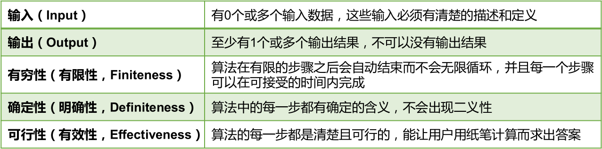

算法的五大特征：

说明：满足确定性的算法也称为确定性算法。现在人们也关注更广泛的概念，例如考虑各种非确定性的算法，如并行算法、概率算法等。另外，人们也关注并不要求终止的计算描述，这种描述有时被称为过程 (procedure)。

排序：假设含有 n 个记录的序列为 {R1, R2, ..., Rn}，其相应的关键字序列为 {K1, K2, ..., Kn}。将这些记录重新排序为 {Ri1, Ri2, ..., Rin}，使得相应的关键字值满足条 Ki1<= Ki2 <= ... <= Kin，这样的一种操作称为排序。通常来说，排序的目的是快速查找。

衡量排序算法的优劣：

1. **时间复杂度：**分析关键字的比较次数和记录的移动次数。

2. **空间复杂度：**分析排序算法中需要多少辅助内存。

3. **稳定性：**若两个记录 A 和 B 的关键字值相等，但排序后 A、B 的先后次序保持不变，则称这种排序算法是稳定的。

排序算法分类：内部排序和外部排序。

- **内部排序：**整个排序过程不需要借助于外部存储器 (如磁盘等)，所有排序操作都在内存中完成。

- **外部排序：**参与排序的数据非常多，数据量非常大，计算机无法把整个排序过程放在内存中完成，必须借助于外部存储器（如磁盘）。外部排序最常见的是多路归并排序。可以认为外部排序是由多次内部排序组成。

十大内部排序算法：

