`title: Java 的基础知识`

`date: 2021-02-10`

<div align='center'><font size='50'>Java 的基础知识</font></div>

# 概述

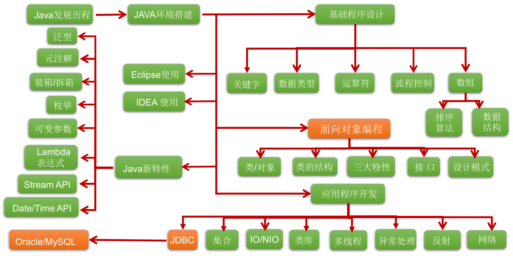

## bit 和 byte

计算机本质是一系列的电路开关。每个开关存在两种状态：开（on）和关（off）。如果电路是开的，它的值是 1，如果电路是关的，它的值是 0。

- 一个 0 或者一个 1 存储为一个比特（bit），是计算机中最小的存储单位。

- 计算机中最基本的存储单元是字节（byte）。每个字节由 8 个比特构成。

计算机的存储能力是以字节来衡量的。如下：

- 千字节（kilobyte，KB）= 1024 B


- 兆字节（megabyte，MB）= 1024 KB


- 千兆字节（gigabyte，GB）= 1024 MB


- 万亿字节（terabyte，TB）= 1024 GB


## JDK、JRE 和 JVM


- JDK = JRE + 开发工具集（例如 Javac 编译工具等）

- JRE = JVM + Java SE 标准类库

## 阶段

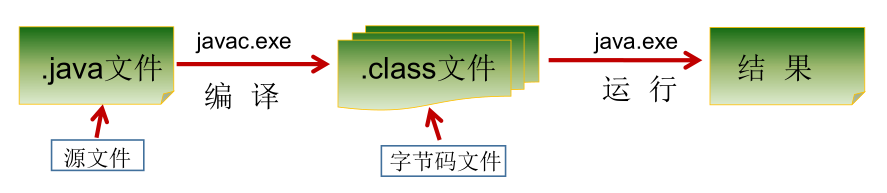

**编写：**编写的 Java 代码保存在以 `.java` 为结尾的源文件中。

- 在一个 Java 源文件中，可以声明多个 class 类，但是，只能最多有一个类声明为 public。而且，声明为 public 的类名，必须与源文件名相同。

**编译：**使用 javac.exe 命令编译 Java 源文件。格式：`javac 源文件名.java`。

- 编译之后，会生成一个或多个以 `.class` 结尾的字节码文件，字节码文件的文件名与 Java 源文件中的类名相同，二者是一一对应的。

**运行：**使用 java.exe 命令解释运行字节码文件。格式：`java 类名`。

- 运行的字节码文件，需要有入口函数 `main()` 方法，且书写格式是固定的。

**编译完源文件后，生成一个或多个字节码文件。然后运行时，使用 JVM 中的类的加载器和解释器，对生成的字节码文件进行解释运行。即：此时，需要将字节码文件对应的类加载到内存中，这个过程涉及到内存解析。**

## 注释

单行注释：`// 注释文字`

多行注释：` /* 注释文字 */`

文档注释：`/** 注释文字 */`

- 对于单行注释和多行注释，被注释的文字，不会被 JVM 解释执行；

- 多行注释里面不允许有多行注释嵌套；

- 文档注释内容可以被 JDK 提供的工具 javadoc 所解析，生成一套以网页文件形式体现该程序的说明文档。

## 关键字和保留字

### 关键字（key word）

定义：被 Java 语言赋予了特殊含义，用做专门用途的字符串（单词）。

特点：关键字中所有字母都为小写。

官方地址：https://docs.oracle.com/javase/tutorial/java/nutsandbolts/_keywords.html

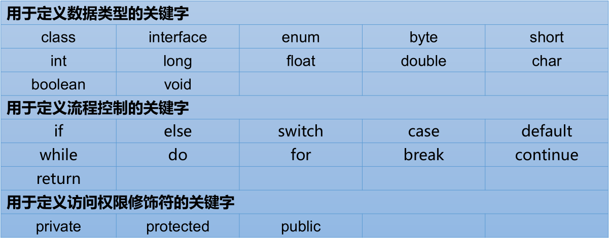

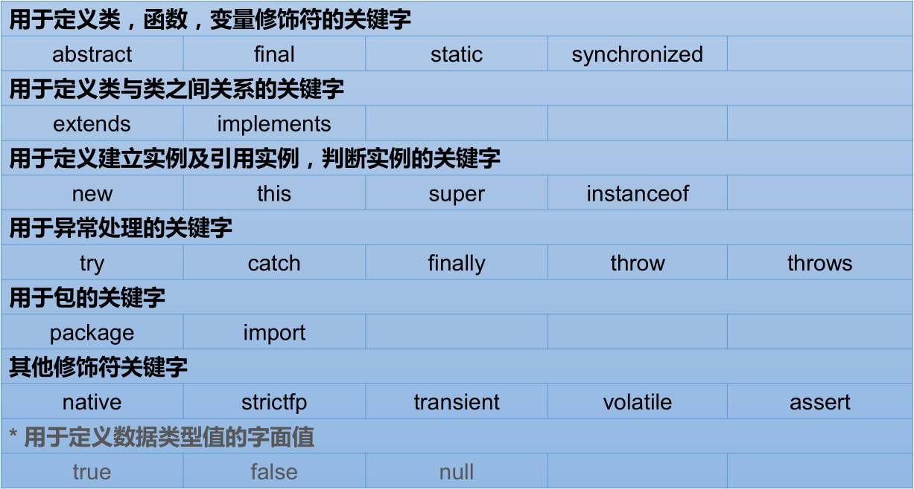

### 保留字（reserved word）

现有 Java 版本尚未使用，但以后版本可能会作为关键字使用。自己命名标识符时要避免使用这些保留字：goto 、const。

## 标识符
Java 对各种变量、方法和类等要素命名时使用的字符序列称为标识符。

- 技巧：凡是自己可以起名字的地方都叫标识符。

**定义合法标识符规则：**

- 由 26 个英文字母大小写，数字 0 - 9，_ 或 $ 组成；

- 不可以数字开头；

- 不可以使用关键字和保留字，但能包含关键字和保留字；

- Java 中严格区分大小写，长度无限制；

- 标识符不能包含空格。

- 如果不遵守以上规则，编译不通过。

**名称命名规范：**

- **包名：**多单词组成时所有字母都小写：`xxxyyyzzz`。
- **类名、接口名：**多单词组成时，所有单词的首字母大写：XxxYyyZzz。
- **变量名、方法名：**多单词组成时，第一个单词首字母小写，第二个单词开始每个单词首字母大写：xxxYyyZzz。
- **常量名：**所有字母都大写。多单词时每个单词用下划线连接：XXX_YYY_ZZZ。

- 在命名时，为了提高阅读性，要尽量有意义，做到见名知意。

- Java 采用 Unicode 字符集，因此标识符也可以使用汉字声明，但是不建议使用。 

## 变量

### 定义

变量是内存中的一个存储区域，该区域的数据可以在同一类型范围内不断变化。

变量是程序中最基本的存储单元。包含变量类型、变量名和存储的值。

java 中每个变量必须先声明，后使用，使用变量名来访问这块区域的数据。

变量的作用域：其定义所在的一对 { } 内，变量只有在其作用域内才有效，在同一个作用域内，不能定义重名的变量。

```java
public class VariableTest{
    public static void main(String[] args){
        // 变量的定义
        int myAge = 12;
        // 变量的使用
        System.out.println(myAge);
        
        // 编译错误：使用myNumber之前未定义myNumber
        // System.out.println(myNumber);
        
        // 变量的定义
        int myNumber;
        
        // 编译错误：使用myNumber之前未赋值myNumber
        // System.out.println(myNumber);
        
        // 变量的赋值
        myNumber = 1001;
        
        // 变量的使用
        System.out.println(myNumber);
    }
}
```

### 按数据类型分类

java 是强类型语言，对于每一种数据都定义了明确的具体数据类型，并在内存中分配了不同大小的内存空间。

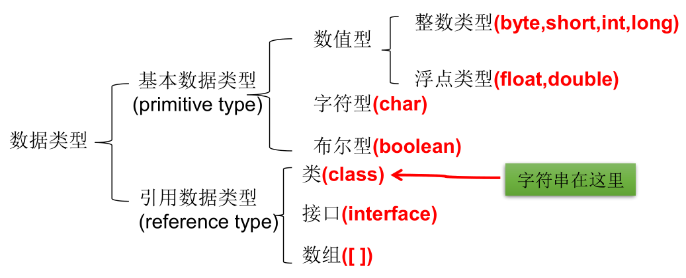


#### 基本数据类型

##### 整数类型


java 各整数类型有固定的表数范围和字段长度，不受具体 OS 的影响，以保证 java 程序的可移植性。

java 的整型常量默认为 int 型，声明 long 型常量须后加 'l' 或 'L'。**java 程序中变量通常声明为 int 型**，除非不足以表示较大的数，才使用 long。

##### 浮点类型

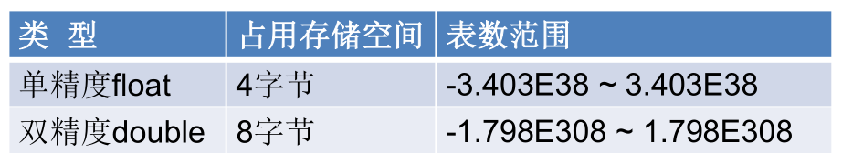

与整数类型类似，java 浮点类型也有固定的表数范围和字段长度，不受具体操作系统的影响。

float：单精度，尾数可以精确到 7 位有效数字。很多情况下，精度很难满足需求。

double：双精度，精度是float的两倍。通常采用此类型。

**java 的浮点型常量默认为 double 型**，声明 float 型常量，须后加 'f' 或 'F'。

##### 字符类型

char 型数据用来表示通常意义上的 "字符"，占用 2 个字节。char 类型是可以进行运算的。因为它都对应有 Unicode 码。

java 中的所有字符都使用Unicode编码，故一个字符可以存储一个字母，一个汉字，或其他书面语的一个字符。

字符型变量的三种表现形式：

- 字符常量是用单引号括起来的单个字符。例如：`char c1 = 'a'; char c2= '中'; char c3 = '9';`。

- java 中还允许使用转义字符 \ 来将其后的字符转变为特殊字符型常量。例如：`char c3 = '\n'; // '\n'表示换行符`。常用的转义字符如下：

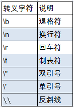

- 直接使用 Unicode 值来表示字符型常量：'\uXXXX'。其中，XXXX 代表一个十六进制整数。如：\u000a 表示 \n。

##### 布尔类型

boolean 类型用来判断逻辑条件，一般用于程序流程控制。

boolean 类型数据只允许取值 true 和 false，无 null。

> java 虚拟机中没有任何供 boolean 值专用的字节码指令，java 语言表达所操作的 boolean 值，在编译之后都使用 java 虚拟机中的 int 数据类型来代替：true 用 1 表示，false 用 0 表示。———《java 虚拟机规范 8 版》

##### 基本数据类型之间的转换

**自动类型转换：**不同数据类型的变量做运算时，容量小的数据类型自动转换为容量大的数据类型。数据类型按容量大小排序为：

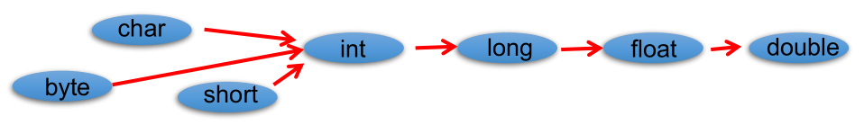

> 此处的容量大小，指的是该数据类型表示数的范围的大和小。

- 有多种类型的数据混合运算时，系统首先自动将所有数据转换成容量最大的那种数据类型，然后再进行计算。

- byte，short 和 char 之间不会相互转换，他们三者在计算时首先转换为 int 类型。

- boolean 类型不能与其它数据类型运算。

- 当把任何基本数据类型的值和字符串 (String) 进行连接运算时 (+)，基本数据类型的值将自动转化为字符串 (String) 类型。

**强制类型转换：**自动类型转换的逆过程，将容量大的数据类型转换为容量小的数据类型。使用时要加上强制转换符：`()`，但可能造成精度降低或溢出。

- 通常，字符串不能直接转换为基本类型，但通过基本类型对应的包装类，可以实现把字符串转换成基本类型。如：`String a = “43”; int i = Integer.parseInt(a);`。 

- boolean 类型不可以转换为其它的数据类型。

#### 引用数据类型

##### String

String 不是基本数据类型，属于引用数据类型 (class)。使用方式与基本数据类型一致，例如：`String str = “abcd”;`。

一个字符串可以串接另一个字符串，也可以直接串接其他类型的数据。例如：`str = str + “xyz” ; int n = 100; str = str + n;`。

> String 与 8 种基本数据类型做运算时，但只能是连接运算。

### 按声明位置分类

**成员变量：**在方法体外，类体内声明的变量。

**局部变量：**在方法体内部声明的变量。


>成员变量和局部变量在初始化值方面的异同：
>同：都有生命周期；异：局部变量除形参外，需显式初始化。

## 进制

**所有数字在计算机底层都以二进制形式存在。**

对于整数，有四种表示方式：

- 二进制 (binary) ：0 - 1，满 2 进 1，以 0b 或 0B 开头表示。

- 十进制 (decimal) ：0 - 9，满 10 进 1。

- 八进制 (octal) ：0 - 7，满 8 进 1，以数字 0 开头表示。

- 十六进制 (hex) ：0 - 9 及 A - F，满 16 进 1，以 0x 或 0X 开头表示。此处的 A - F 不区分大小写。如：0x21AF +1= 0X21B0。


### 二进制

java 整数常量默认是 int 类型，当用二进制定义整数时，其第 32 位是符号位；当是 long 类型时，二进制默认占 64 位，第 64 位是符号位。

二进制的整数有如下三种形式：

- 原码：直接将一个数值换成二进制数，最高位是符号位。
- 负数的反码：是对原码按位取反，但最高位 (符号位) 不变，确定为1。
- 负数的补码：其反码加 1。

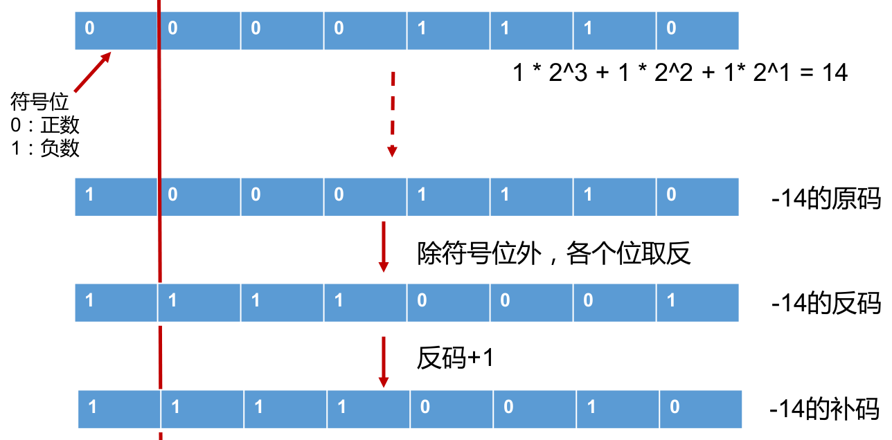

>正数的原码、反码、补码都相同。

**计算机以二进制补码的形式保存所有的整数。**

原码到补码的转换：


### 不同进制间转换

十进制转二进制：除 2 取余的逆。   

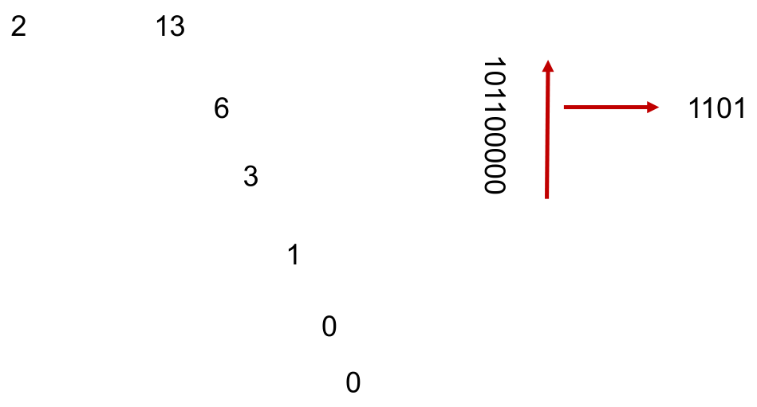

二进制和八进制、十六进制转换：


## 运算符

运算符是一种特殊的符号，用以表示数据的运算、赋值和比较等。

### 算术运算符


>如果对负数取模，可以把模数负号忽略不记，如：5 % -2 = 1。 如果被模数是负数，则不可忽略，如： -5 % 2 = -1。此外，取模运算的结果不一定总是整数。
>
>对于除号 "/"，它的整数除和小数除是有区别的：整数之间做除法时，只保留整数部分而舍弃小数部分。 例如：`int x = 3510; x = x / 1000 * 1000;`，x 的结果是 3000。
>
>"+" 除字符串相加功能外，还能把非字符串转换成字符串。例如：`System.out.println("5 + 5 = " + 5 + 5); `，打印结果是：5 + 5 = 55 。

### 赋值运算符

符号：=。当 "=" 两侧数据类型不一致时，可以使用自动类型转换或使用强制类型转换原则进行处理。支持连续赋值。

扩展赋值运算符： +=，-=，*=，/=，%=。这几个赋值运算符不会改变变量本身的数据类型。

```java
int i = 1;
i *= 0.1;
System.out.println(i);// 0
i++;
System.out.println(i);// 1
```

```java
int m = 2;
int n = 3;
n *= m++;// n = n * m++;
System.out.println("m = " + m);// 3
System.out.println("n = " + n);// 6
```

```java
int n = 10;
n += (n++) + (++n);// n = n + (n++) + (++n); → n = 10 + 10 + 12;
System.out.println(n);// 32
```

### 比较运算符 (关系运算符)


>比较运算符的结果都是 boolean 型。

### 逻辑运算符

&：逻辑与，|：逻辑或，!：逻辑非。
&&：短路与，||：短路或，^：逻辑异或。


- 逻辑运算符用于连接布尔型表达式，在 java 中不可以写成 3 < x < 6，应该写成 x > 3 & x < 6。

- "&" 和 "&&" 的区别：& 表示，左边无论真假，右边都进行运算；&& 表示，如果左边为真，右边参与运算，如果左边为假，右边不参与运算。

- "|" 和 "||" 的区别同理：| 表示，左边无论真假，右边都进行运算；||表示，如果左边为假，右边参与运算，如果左边为真，右边不参与运算。

- 异或 (^) 与或 (|) 的不同之处是：当左右都为 true 时，结果为 false。即：异或，追求的是异!

```java
int x = 1;
int y = 1;
if (x++ == 2 & ++y == 2) {
    x = 7;
}
System.out.println("x = " + x + ", y = " + y);// x = 2, y = 2

x = 1;
y = 1;
if (x++ == 2 && ++y == 2) {
    x = 7;
}
System.out.println("x = " + x + ", y = " + y);// x = 2, y = 1

x = 1;
y = 1;
if (x++ == 1 | ++y == 1) {
    x = 7;
}
System.out.println("x = " + x + ", y = " + y);// x = 7, y = 2

x = 1;
y = 1;
if (x++ == 1 || ++y == 1) {
    x = 7;
}
System.out.println("x = " + x + ", y = " + y);// x = 7, y = 1
```

```java
boolean x = true;
boolean y = false;
short z = 42;
if ((z++ == 42) && (y = true)) {
    z++;
}
if ((x = false) || (++z == 45)) {
    z++;
}
System.out.println("z = " + z);// z = 46
```

### 位运算符

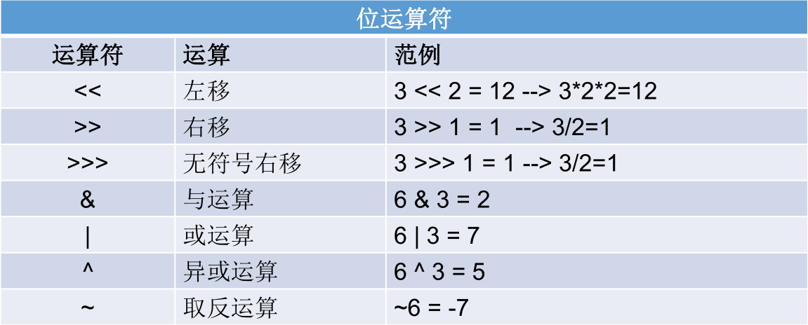

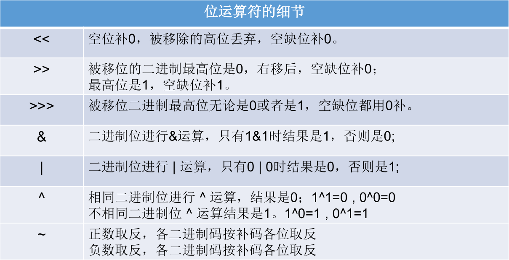

> 无 <<<。

**位运算是直接对整数的二进制进行的运算。**

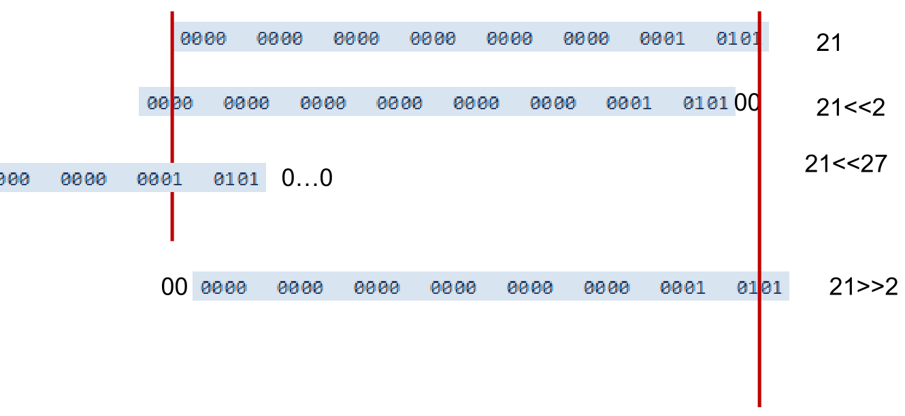

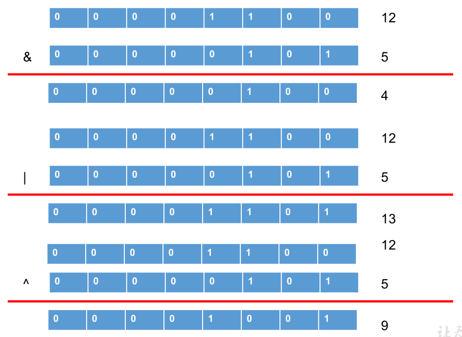


- << ：在一定范围内，每向左移一位，相当于乘以 2。

- \>>：在一定范围内，每向右移一位，相当于除以2。

> 面试题：最高效的计算 2 * 8。利用：2 << 3，或者 8 << 1。

交换两个数：

```java
int num1 = 10;
int num2 = 20;
System.out.println(num1 + ", " + num2);

// 方式一
int temp;
temp = num1;
num1 = num2;
num2 = temp;
System.out.println(num1 + ", " + num2);

// 方式二
num1 = 10;
num2 = 20;
num1 = num1 + num2;
num2 = num1 - num2;
num1 = num1 - num2;
System.out.println(num1 + ", " + num2);

// 方式三
num1 = 10;
num2 = 20;
num1 = num1 ^ num2;
num2 = num1 ^ num2;
num1 = num1 ^ num2;
System.out.println(num1 + ", " + num2);

// 方式四
num1 = 10;
num2 = 20;
num1 = num1 << 1;
num2 = num2 >> 1;
System.out.println(num1 + ", " + num2);
```

### 三元运算符

格式：

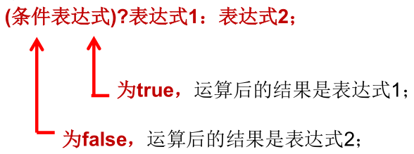

- **表达式 1 和表达式 2 要求类型是一致的，因为要与接受的参数类型相同。**

凡是可以使用三元运算符的地方，都可以改写为 if - else 结构，反之，不成立。如果既可以使用三元运算符，又可以使用 if - else 结构，优先使用三元运算符，因为更简洁、效率更高。

三元运算符与 if - else 的联系与区别：

- 三元运算符可简化 if - else 语句。
- 三元运算符要求必须返回一个结果。
- if 后的代码块可有多个语句。

### 运算符的优先级


- 运算符有不同的优先级，所谓优先级就是表达式运算中的运算顺序。如上表，上一行运算符总优先于下一行。
- 只有单目运算符、三元运算符、赋值运算符是从右向左运算的。

## 程序流程控制

流程控制语句是用来控制程序中各语句执行顺序的语句，可以把语句组合成能完成一定功能的小逻辑模块。

流程控制方式采用结构化程序设计中规定的三种基本流程结构，即：

- **顺序结构：**程序从上到下逐行地执行，中间没有任何判断和跳转。
- **分支结构：**根据条件，选择性地执行某段代码。有 if - else 和 switch - case 两种分支语句。
- **循环结构：**根据循环条件，重复性的执行某段代码。有while、do - while、for三种循环语句。

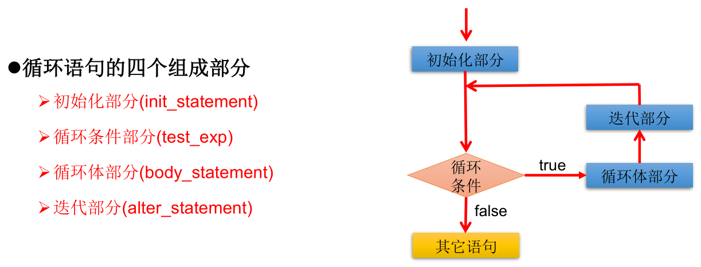

> 注：JDK 1.5 提供了 foreach 循环，方便遍历集合、数组元素。

### if - else 结构

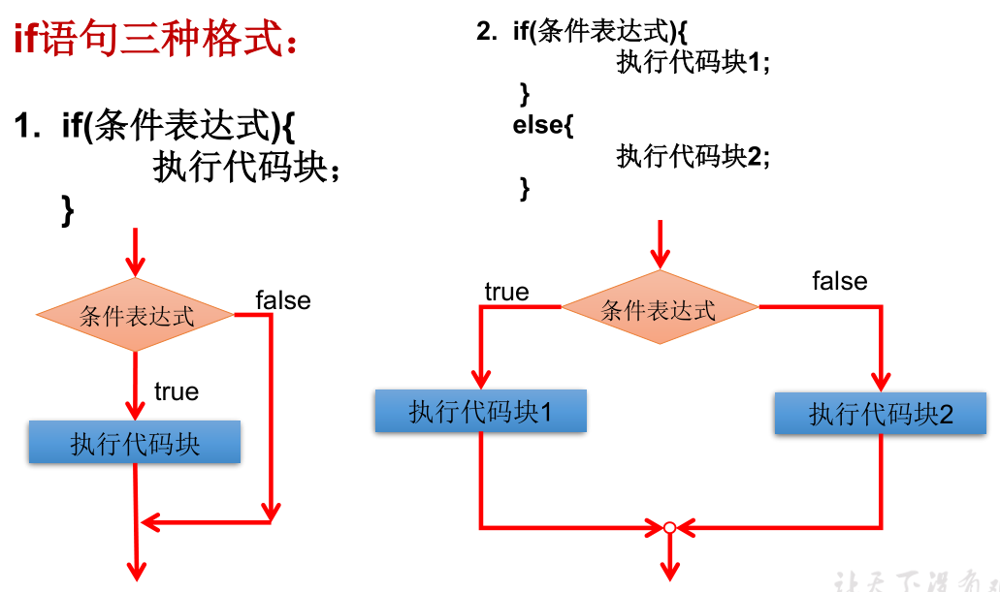

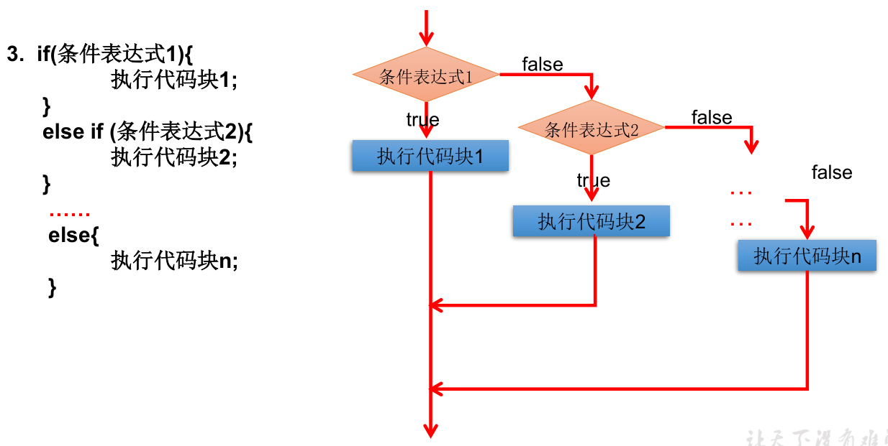

### switch - case 结构

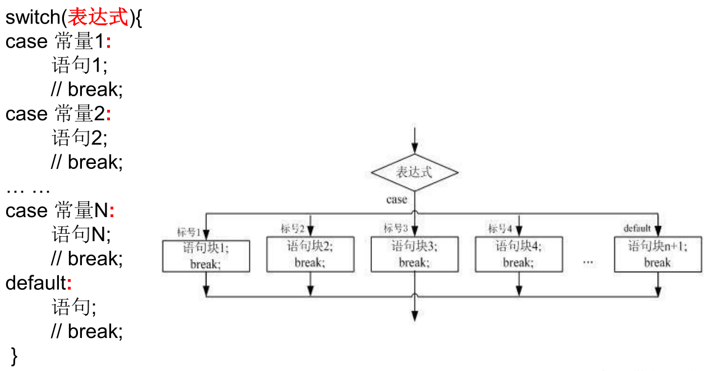

- switch (表达式) 中表达式的值，必须是下述几种类型之一：byte ，short，char，int，枚举类  (jdk 5.0)，String 类 (jdk 7.0)。
- case 子句中的值必须是常量，不能是变量名或不确定的表达式值。
- 同一个 switch 语句，所有 case 子句中的常量值互不相同。
- break 语句用来在执行完一个 case 分支后使程序跳出 switch 语句块；如果没有 break，程序会顺序执行到 switch 结尾。
- default 子句是可任选的。同时，位置也是灵活的。当没有匹配的 case 时，执行 default。
- 如果多个 case 的执行语句相同，则可以将其合并。
- 同等情况下，switch - case 结构比 if - else 结构的效率稍高。

```java
Scanner scanner = new Scanner(System.in);
int num = scanner.nextInt();
switch (num) {
    case 0:
        System.out.println(0);
    case 1:
        System.out.println(1);
    case 2:
        System.out.println(2);
    default:
        System.out.println("other");
}
```

添加 break 和不添加 break 的结果是不同的。

```java
Scanner scanner = new Scanner(System.in);
int num = scanner.nextInt();
switch (num) {
    case 0:
        System.out.println(0);
        break;
    case 1:
        System.out.println(1);
        break;
    case 2:
        System.out.println(2);
        break;
    default:
        System.out.println("other");
        break;// default位于最后，此break可以不添加。
}
```

键盘输入一个月份和天数，判断其是一年中的第几天：

```java
public static void main(String[] args) {
    Scanner scanner = new Scanner(System.in);
    System.out.println("请输入month：");
    int month = scanner.nextInt();
    System.out.println("请输入day：");
    int day = scanner.nextInt();
    int sumDays = 0;

    switch (month) {
        case 12:
            sumDays += 30;
        case 11:
            sumDays += 31;
        case 10:
            sumDays += 30;
        case 9:
            sumDays += 31;
        case 8:
            sumDays += 31;
        case 7:
            sumDays += 30;
        case 6:
            sumDays += 31;
        case 5:
            sumDays += 30;
        case 4:
            sumDays += 31;
        case 3:
            sumDays += 28;
        case 2:
            sumDays += 31;
        case 1:
            sumDays += day;
    }

    System.out.println(month + "月" + day + "日，是当年的第" + sumDays + "天。");
}
```

键盘输入一个年份、月份和天数，判断其是该年中的第几天：

```java
public static void main(String[] args) {
    Scanner scanner = new Scanner(System.in);
    System.out.println("请输入year：");
    int year = scanner.nextInt();
    System.out.println("请输入month：");
    int month = scanner.nextInt();
    System.out.println("请输入day：");
    int day = scanner.nextInt();
    int sumDays = 0;

    switch (month) {
        case 12:
            sumDays += 30;
        case 11:
            sumDays += 31;
        case 10:
            sumDays += 30;
        case 9:
            sumDays += 31;
        case 8:
            sumDays += 31;
        case 7:
            sumDays += 30;
        case 6:
            sumDays += 31;
        case 5:
            sumDays += 30;
        case 4:
            sumDays += 31;
        case 3:
            if ((year % 4 == 0 && year % 100 != 0) ||
                    year % 400 == 0) {
                sumDays += 29;// 闰年2月29天
            } else {
                sumDays += 28;// 平年2月28天
            }
        case 2:
            sumDays += 31;
        case 1:
            sumDays += day;
    }

    System.out.println(year + "年" + month + "月" + day + "日，是当年的第" + sumDays + "天。");
}
```

> 判断一年是否是闰年的标准：
>
> 1）可以被 4 整除，但不可被 100 整除。
>
> 或
>
> 2）可以被 400 整除。

### for 循环

语法格式：

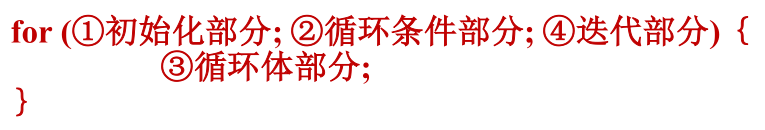

执行过程：① - ② - ③ - ④ - ② - ③ - ④ - ② - ③ - ④ - ..... - ②

说明：

- ② 循环条件部分为 boolean 类型表达式，当值为 false 时，退出循环。
- ① 初始化部分可以声明多个变量，但必须是同一个类型，用逗号分隔。
- ④ 迭代部分可以有多个变量更新，用逗号分隔。

键盘输入两个正整数，求他们的最大公约数和最小公倍数：

```java
public static void main(String[] args) {
    Scanner scanner = new Scanner(System.in);
    System.out.println("请输入第一个正整数：");
    int firstNum = scanner.nextInt();
    System.out.println("请输入第二个正整数：");
    int secondNum = scanner.nextInt();
    int min = Math.min(firstNum, secondNum);
    int max = Math.max(firstNum, secondNum);

    // 最大公约数
    for (int i = min; i >= 1; i--) {
        if (firstNum % i == 0 && secondNum % i == 0) {
            System.out.println(firstNum + "和" + secondNum + "的最大公约数为：" + i);
            break;
        }
    }

    // 最小公倍数
    for (int i = max; i <= firstNum * secondNum; i++) {
        if (i % firstNum == 0 && i % secondNum == 0) {
            System.out.println(firstNum + "和" + secondNum + "的最小公倍数为：" + i);
            break;
        }
    }
}

请输入第一个正整数：
12
请输入第二个正整数：
20
12和20的最大公约数为：4
12和20的最小公倍数为：60
```

### while 循环

语法格式：


执行过程：① - ② - ③ - ④ - ② - ③ - ④ - ② - ③ - ④ - ..... - ②

说明：

- 注意不要忘记声明 ④ 迭代部分。否则，循环将不能结束，变成死循环。
- for 循环和 while 循环可以相互转换。

### do - while 循环

语法格式：

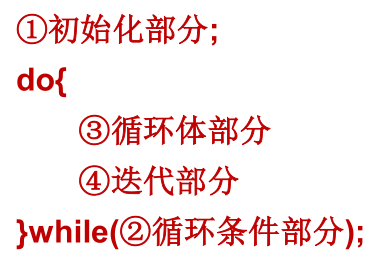

执行过程：① - **③ - ④** - ② - ③ - ④ - ② - ③ - ④ - ② - ③ - ④ - ..... - ②

说明：

- do - while 循环至少执行一次循环体 。

### 嵌套循环

- 将一个循环放在另一个循环体内，就形成了嵌套循环。其中，for，while，do - while 均可以作为外层循环或内层循环。
- 实质上，嵌套循环就是把内层循环当成外层循环的循环体。当只有内层循环的循环条件为 false 时，才会完全跳出内层循环，才可结束外层的当次循环，开
  始下一次的循环。
- 设外层循环次数为 m 次，内层为 n 次，则内层循环体实际上需要执行 m * n 次。

九九乘法表：

```java
public static void main(String[] args) {
    for (int i = 1; i <= 9; i++) {
        for (int j = 1; j <= i; j++) {
            System.out.print(j + " * " + i + " = " + (j * i) + "\t");
        }
        System.out.println();
    }
}

1 * 1 = 1	
1 * 2 = 2	2 * 2 = 4	
1 * 3 = 3	2 * 3 = 6	3 * 3 = 9	
1 * 4 = 4	2 * 4 = 8	3 * 4 = 12	4 * 4 = 16	
1 * 5 = 5	2 * 5 = 10	3 * 5 = 15	4 * 5 = 20	5 * 5 = 25	
1 * 6 = 6	2 * 6 = 12	3 * 6 = 18	4 * 6 = 24	5 * 6 = 30	6 * 6 = 36	
1 * 7 = 7	2 * 7 = 14	3 * 7 = 21	4 * 7 = 28	5 * 7 = 35	6 * 7 = 42	7 * 7 = 49	
1 * 8 = 8	2 * 8 = 16	3 * 8 = 24	4 * 8 = 32	5 * 8 = 40	6 * 8 = 48	7 * 8 = 56	8 * 8 = 64	
1 * 9 = 9	2 * 9 = 18	3 * 9 = 27	4 * 9 = 36	5 * 9 = 45	6 * 9 = 54	7 * 9 = 63	8 * 9 = 72	9 * 9 = 81	
```

10000 以内所有的质数：

```java
// 方式一
public static void main(String[] args) {
    // 质数：素数，只能被1和它本身整除的自然数，2是最小的质数。
    int count = 0;
    boolean ifFlag = true;
    for (int i = 2; i <= 100000; i++) {
        // 优化一：使用Math.sqrt(i)代替i，减少循环的次数
        // i除以一个从2开始的小数，会得到一个从i-1开始的大数，因此，除以2开始的小数与除以从i-1开始的大数，
        // 可以省略一个，以减少次数，这样计算的中点是i开方的值。
        for (int j = 2; j <= Math.sqrt(i); j++) {
            if (i % j == 0) {
                ifFlag = false;
                // 优化二：使用break，跳出不必要的循环
                break;
            }
        }
        if (ifFlag) {
            // 优化三：不打印，i越大，打印的耗时越长
            // System.out.println("质数：" + i);
            count++;
        }
        // 重置
        ifFlag = true;
    }
    System.out.println("质数的个数有：" + count);// 质数的个数有：9592
}
```

```java
// 方式二
public static void main(String[] args) {
    // 质数：素数，只能被1和它本身整除的自然数，2是最小的质数。
    int count = 0;
    label:
    for (int i = 2; i <= 100000; i++) {
        // 优化一：使用Math.sqrt(i)代替i，减少循环的次数
        // i除以一个从2开始的小数，会得到一个从i-1开始的大数，因此，除以2开始的小数与除以从i-1开始的大数，
        // 可以省略一个，以减少次数，这样计算的中点是i开方的值。
        for (int j = 2; j <= Math.sqrt(i); j++) {
            if (i % j == 0) {
                continue label;
            }
        }
        count++;
    }
    System.out.println("质数的个数有：" + count);// 质数的个数有：9592
}
```

### break 和 continue

- break 使用在 switch - case 结构或者循环结构中。
- continue 只能使用在循环结构中。

- break 语句用于终止某个语句块的执行，跳出当前循环，continue 语句用于跳过其所在循环语句块的当次执行，继续下一次循环。

  ```java
  public static void main(String[] args) {
      for (int i = 1; i <= 10; i++) {
          if (i % 4 == 0) {
              break;// 输出结果：1	2 3
              continue;// 输出结果：1 2 3 5 6 7 9 10
          }
          System.out.print(i + "\t");
      }
  }
  ```

- break 语句出现在多层嵌套的语句块中时，可以通过标签指明要终止的是哪一层语句块 (默认跳出包裹 break 最近的一层循环)：

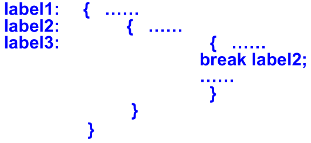

- continue 语句出现在多层嵌套的循环语句体中时，可以通过标签指明要跳过的是哪一层循环 (默认跳出包裹 continue 最近的一层循环)。

  ```java
  public static void main(String[] args) {
      label:
      for (int i = 1; i <= 4; i++) {
          for (int j = 1; j <= 10; j++) {
              if (j % 4 == 0) {
                  break label;// 结束指定标识label层的当前循环
                  continue label;// 结束指定标识label层的当次循环
              }
              System.out.print(j);
          }
          System.out.println();
      }
  }
  break label输出结果：
  1 2 3
  continue label输出结果：
  1 2 3 2 3 1	2 3	1 2	3
  ```

- break 和 continue 关键字后面不能直接声明执行语句。

## 随机数

获取 [a, b] 之间的随机数：

```java
int v = (int) (Math.random() * (b - a + 1) + a);
```

如获取 [10, 99] 之间的随机数：

```java
int v = (int) (Math.random() * 90 + 10);
```

## 数组

数组 (Array)，是多个相同类型数据按一定顺序排列的集合，使用一个名字命名，并通过编号的方式对这些数据进行统一管理。

数组的相关概念：

- 数组名
- 元素
- 下标 (或索引)
- 数组的长度

数组的特点：

- 数组是有序排列的。
- 创建数组对象会在内存中开辟一整块连续的空间，而数组名中引用的是这块连续空间的首地址。
- 数组本身是引用数据类型的变量，而数组中的元素可以是任何数据类型，既可以是基本数据类型，也可以是引用数据类型。
- 可以直接通过下标 (或索引) 的方式调用指定位置的元素，速度很快。
- 数组的长度一旦确定，就不能修改。

数组的分类：

- 按照维度：一维数组、二维数组、三维数组、… 
- 按照元素的数据类型分：基本数据类型元素的数组、引用数据类型元素的数组 (即对象数组)。

### 一维数组

声明方式：`type var[] 或 type[] var;`。例如：`int a[]; int[] a1; double b[]; String[] c;// 引用类型变量数组`。

不同写法：`int[] x;`，`int x[];`。

> java 语言中声明数组时，不能指定其长度 (数组中元素的数)， 例如：`int a[5];// 非法`。

```java
public static void main(String[] args) {
    // 1-1.静态初始化，方式一
    int[] ids = new int[]{1001, 1002, 1003, 1004, 1005};
    
    // 1-2.静态初始化，方式二，类型推断
    int[] ids2 = {1001, 1002, 1003, 1004, 1005};

    // 2.动态初始化
    String[] names = new String[5];
    names[0] = "Student A";
    names[1] = "Student B";
    names[2] = "Student C";
    names[3] = "Student D";
    names[4] = "Student E";

    // 3.数组的长度
    System.out.println("ids 的长度：" + ids.length);// 5
    System.out.println("names 的长度：" + names.length);// 5

    // 4.遍历数组
    for (int i = 0; i < ids.length; i++) {
        System.out.println(ids[i]);
    }

    for (int i = 0; i < names.length; i++) {
        System.out.println(names[i]);
    }

    // 5.简写方式遍历数组
    for (int id : ids) {
        System.out.println(id);
    }

    for (String name : names) {
        System.out.println(name);
    }

    // 6.数组元素的默认初始化值
    int[] arrs = new int[5];
    for (int arr : arrs) {
        System.out.println(arr);// 0
    }

    String[] arrs2 = new String[5];
    for (String arr2 : arrs2) {
        System.out.println(arr2);// null
    }
}
```

- 静态初始化：数组的初始化，和数组元素的赋值操作同时进行。

- 动态初始化 ：数组的初始化，和数组元素的赋值操作分开进行。

- 定义数组并用运算符 new 为之分配空间后，才可以引用数组中的每个元素。

- 数组元素的引用方式：数组名[数组元素下标]。

- 数组元素下标从 0 开始，长度为 n 的数组的合法下标取值范围：0 --- n-1。如：`int a[] = new int[3];`，则可引用的数组元素为 a[0]、a[1] 和 a[2]。

- 数组元素下标可以是整型常量或整型表达式。如 a[3]，b[i]，c[6*i]。

- 数组一旦初始化完成，其长度也随即确定，且长度不可变。每个数组都有一个属性 length 指明它的长度，例如：a.length 指明数组 a 的长度 (元素个数)。

- 数组是引用类型，它的元素相当于类的成员变量，因此数组一经分配空间，其中的每个元素也被按照成员变量同样的方式被隐式初始化。然后，再根据实际代码设置，将数组相应位置的元素进行赋值，即显示赋值。

  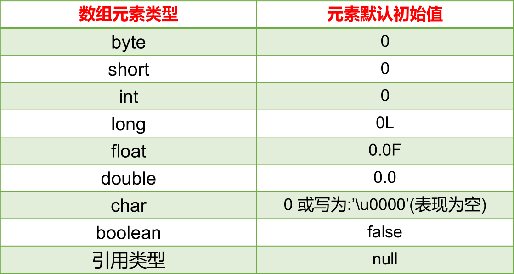

  > 对于基本数据类型而言，默认的初始化值各有不同；对于引用数据类型而言，默认的初始化值为 null。
  >
  > char 类型的默认值是 0，不是 '0'，表现的是类似空格的一种效果。

- 一维数组内存解析：

  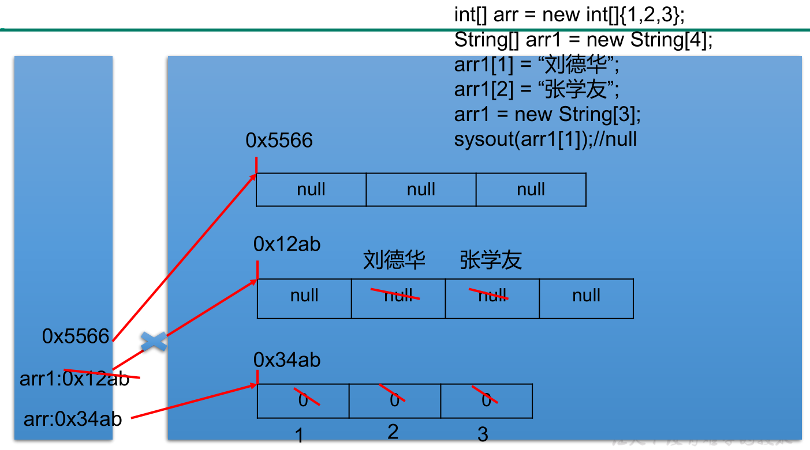

  

- 一个计算联系方式的数组：

  ```java
  public static void main(String[] args) {
      int[] arr = new int[]{8, 2, 1, 0, 3};
      int[] index = new int[]{2, 0, 3, 2, 4, 0, 1, 3, 2, 3, 3};
      String tel = "";
      for (int i = 0; i < index.length; i++) {
          tel += arr[index[i]];
      }
      System.out.println("联系方式：" + tel);// 联系方式：18013820100
  }
  ```

### 二维数组

java 语言里提供了支持多维数组的语法。如果把一维数组当成几何中的线性图形，那么二维数组就相当于是一个表格。

对于二维数组的理解，可以看成是一维数组 array1，作为另一个一维数组 array2 的元素而存在。其实，从数组底层的运行机制来看，没有多维数组。

不同写法：`int[][] x;`，`int[] x[];`，`int x[][];`。

```java
public static void main(String[] args) {
    // 1-1.静态初始化，方式一
    int[][] arr = new int[][]{{3, 8, 2}, {2, 7}, {9, 0, 1, 6}};

    // 1-2.静态初始化，方式二，类型推断
    int[][] arr2 = {{3, 8, 2}, {2, 7}, {9, 0, 1, 6}};
    System.out.println(arr2[2][3]);

    // 2-1.动态初始化，方式一
    /*
    定义了名称为arr3的二维数组，二维数组中有3个一维数组，内层每一个一维数组中有2个元素
    内层一维数组的名称分别为arr3[0]，arr3[1]，arr3[2]，返回的是地址值
    给内层第一个一维数组1脚标位赋值为78写法是：arr3[0][1] = 78;
     */
    int[][] arr3 = new int[3][2];
    arr3[0][1] = 78;
    System.out.println(arr3[0]);// [I@78308db1
    System.out.println(arr3[0][1]);// 78

    // 2-2.动态初始化，方式二
    /*
    二维数组arr4中有3个一维数组，内层每个一维数组都是默认初始化值null(注意：区别于格式2-1)
    可以对内层三个一维数组分别进行初始化
     */
    int[][] arr4 = new int[3][];
    // 初始化第一个
    arr4[0] = new int[3];
    // 初始化第二个
    arr4[1] = new int[1];
    // 初始化第三个
    arr4[2] = new int[2];
    
    // 3.特殊写法
    int[] x, y[];// x是一维数组，y是二维数组
    x = new int[3];
    y = new int[3][2];
    
    // 4.获取数组长度
    System.out.println("arr的长度：" + arr.length);// 3
    System.out.println("arr第一个元素的长度：" + arr[0].length);// 3

    // 5.遍历二维数组
    for (int i = 0; i < arr.length; i++) {
        for (int j = 0; j < arr[i].length; j++) {
            System.out.print(arr[i][j] + "\t");// 3	8 2	2 7	9 0	1 6
        }
    }
    System.out.println();

    // 6.简写遍历二维数组
    for (int[] valueArr : arr) {
        for (int value : valueArr) {
            System.out.print(value + "\t");// 3	8 2	2 7	9 0	1 6
        }
    }
    System.out.println();
    
    // 7.二维数组元素的默认初始化值
    int[][] arr5 = new int[3][2];
    System.out.println(arr5);// [[I@27c170f0
    System.out.println(arr5[1]);// [I@5451c3a8
    System.out.println(arr5[1][1]);// 0

    String[][] arr6 = new String[3][2];
    System.out.println(arr6);// [[Ljava.lang.String;@2626b418
    System.out.println(arr6[1]);// [Ljava.lang.String;@5a07e868
    System.out.println(arr6[1][1]);// null

    String[][] arr7 = new String[3][];
    System.out.println(arr7[1]);// null，因为内层数组未初始化
    System.out.println(arr7[1][1]);// NullPointerException
}
```

- 动态初始化方式一，初始化时直接规定了内层一维数组的长度，动态初始化方式二，可以在使用过程中根据需要另行初始化内层一维数组的长度。利用动态初始化方式二时，必须要先初始化内层一维数组才能对其使用，否则报空指针异常。

- `int[][] arr = new int[][3];` 的方式是非法的。

- 注意特殊写法情况：`int[] x,y[];// x是一维数组，y是二维数组`。 

- java 中多维数组不必都是规则矩阵形式。

- 数组元素的默认初始化值：针对形如 `int[][] arr = new int[4][3];` 的初始化方式，外层元素的初始化值为地址值，内层元素的初始化值与一维数组初始化情况相同；针对形如 `int[][] arr = new int[4][];` 的初始化方式，外层元素的初始化值为 null，内层元素没有初始化，不能调用。

- 二维数组内存解析：

  

- 杨辉三角：

  使用二维数组打印一个 10 行杨辉三角。

  

  提示：1. 第一行有 1 个元素，第 n 行有 n 个元素；2. 每一行的第一个元素和最后一个元素都是 1；3. 从第三行开始，对于非第一个元素和最后一个元
  素的元素，有：`yanghui[i][j] = yanghui[i-1][j-1] + yanghui[i-1][j];`。

  ```java
  public static void main(String[] args) {
      // 1.声明二维数组并初始化
      int[][] arrs = new int[10][];
      for (int i = 0; i < arrs.length; i++) {
          System.out.print("[" + i + "]\t");
          // 2.初始化内层数组，并给内层数组的首末元素赋值
          arrs[i] = new int[i + 1];
          arrs[i][0] = 1;
          arrs[i][arrs[i].length - 1] = 1;
          for (int j = 0; j < arrs[i].length; j++) {
              // 3.给从第三行开始内层数组的非首末元素赋值
              if (i >= 2 && j > 0 && j < arrs[i].length - 1) {
                  arrs[i][j] = arrs[i - 1][j - 1] + arrs[i - 1][j];
              }
              System.out.print(arrs[i][j] + "\t");
          }
          System.out.println();
      }
      System.out.print("\t");
      for (int i = 0; i < arrs.length; i++) {
          System.out.print("[" + i + "]\t");
      }
  }
  ```

### 数组中涉及到的常见算法

#### 数组元素的赋值 (杨辉三角、回形数等)

- 创建一个长度为 6 的 int 型数组，要求数组元素的值都在 1 - 30 之间，且是随机赋值。同时，要求元素的值各不相同。

  ```java
  public static void main(String[] args) {
      int[] arr = new int[6];
      for (int i = 0; i < arr.length; i++) {
          // 获取一个1-30之间的随机数
          arr[i] = (int) (Math.random() * 30 + 1);
          // 判断是否有相同的值
          for (int item : arr) {
              if (item == arr[i]) {
                  i--;
                  break;
              }
          }
      }
  
      // 遍历数组
      for (int value : arr) {
          System.out.println(value);
      }
  }
  ```

- 回形数

  从键盘输入一个 1 - 20 的整数，然后以该数字为矩阵的大小，把 1，2，3 … n*n 的数字按照顺时针螺旋的形式填入其中。例如：

  输入数字 2，则程序输出：

  

  输入数字 3，则程序输出：

  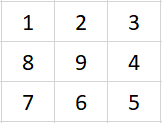

  输入数字 4， 则程序输出：

  

  方式一：

  ```java
  public static void main(String[] args) {
      Scanner scanner = new Scanner(System.in);
      System.out.println("输入一个数字");
      int len = scanner.nextInt();
      int[][] arr = new int[len][len];
      int s = len * len;
  
      /*
       * k = 1：向右，k = 2：向下，k = 3：向左，k = 4：向上
       */
      int k = 1;
      int i = 0, j = 0;
      for (int m = 1; m <= s; m++) {
          if (k == 1) {
              if (j < len && arr[i][j] == 0) {
                  arr[i][j++] = m;
              } else {
                  k = 2;
                  i++;
                  j--;
                  m--;
              }
          } else if (k == 2) {
              if (i < len && arr[i][j] == 0) {
                  arr[i++][j] = m;
              } else {
                  k = 3;
                  i--;
                  j--;
                  m--;
              }
          } else if (k == 3) {
              if (j >= 0 && arr[i][j] == 0) {
                  arr[i][j--] = m;
              } else {
                  k = 4;
                  i--;
                  j++;
                  m--;
              }
          } else if (k == 4) {
              if (i >= 0 && arr[i][j] == 0) {
                  arr[i--][j] = m;
              } else {
                  k = 1;
                  i++;
                  j++;
                  m--;
              }
          }
      }
  
      // 遍历数组
      for (int m = 0; m < arr.length; m++) {
          for (int n = 0; n < arr[m].length; n++) {
              System.out.print(arr[m][n] + "\t");
          }
          System.out.println();
      }
  }
  ```

  方式二：

  ```java
  public static void main(String[] args) {
      Scanner scanner = new Scanner(System.in);
      System.out.println("输入一个数字");
      int n = scanner.nextInt();
      int[][] arr = new int[n][n];
  
      int count = 0;// 要显示的数据
      int maxX = n - 1;// x轴的最大下标
      int maxY = n - 1;// Y轴的最大下标
      int minX = 0;// x轴的最小下标
      int minY = 0;// Y轴的最小下标
      while (minX <= maxX) {
          // 向右
          for (int x = minX; x <= maxX; x++) {
              arr[minY][x] = ++count;
          }
          minY++;
          // 向下
          for (int y = minY; y <= maxY; y++) {
              arr[y][maxX] = ++count;
          }
          maxX--;
          // 向左
          for (int x = maxX; x >= minX; x--) {
              arr[maxY][x] = ++count;
          }
          maxY--;
          // 向上
          for (int y = maxY; y >= minY; y--) {
              arr[y][minX] = ++count;
          }
          minX++;
      }
  
      // 遍历数组
      for (int i = 0; i < arr.length; i++) {
          for (int j = 0; j < arr.length; j++) {
              String space = (arr[i][j] + "").length() == 1 ? "0" : "";
              System.out.print(space + arr[i][j] + " ");
          }
          System.out.println();
      }
  }
  ```

#### 求数值型数组中元素的最大值、最小值、平均数、总和等

- 定义一个 int 型的一维数组，包含 10 个元素，分别赋一些随机整数，然后求出所有元素的最大值，最小值，和值，平均值，并输出出来 。要求：所有随机数都是两位数。

  ```java
  public static void main(String[] args) {
      // 初始化及赋值
      int[] arr = new int[10];
      int length = arr.length;
      for (int i = 0; i < length; i++) {
          int value = (int) (Math.random() * 90 + 10);
          arr[i] = value;
      }
  
      // 遍历
      for (int value : arr) {
          System.out.print(value + "\t");
      }
      System.out.println();
  
      // 计算
      int max = arr[0];
      int min = arr[0];
      int sum = 0;
      double average = 0;
      for (int value : arr) {
          max = max < value ? value : max;
          min = min > value ? value : min;
          sum += value;
      }
      average = sum / (length * 1.0);
      System.out.println("最大值：" + max);
      System.out.println("最小值：" + min);
      System.out.println("和值：" + sum);
      System.out.println("平均值：" + average);
  }
  ```

#### 数组的复制、反转、查找 (线性查找、二分法查找)

- 复制

  虚假的复制：

  ```java
  public static void main(String[] args) {
      // 声明arr1和arr2
      int[] arr1, arr2;
      arr1 = new int[]{2, 3, 5, 7, 11, 13, 17, 19};
  
      // 遍历arr1
      for (int value : arr1) {
          System.out.print(value + "\t");
      }
      System.out.println();
  
      // 赋值arr2变量等于arr1
      // 不能称作数组的复制，实际上是把arr1指向的地址(以及其他一些信息)赋给了arr2，堆空间中只有一个数组对象
      arr2 = arr1;
  
      // 遍历arr2
      for (int value : arr2) {
          System.out.print(value + "\t");
      }
      System.out.println();
  
      // 更改arr2
      for (int i = 0; i < arr1.length; i++) {
          if (i % 2 == 0) {
              arr2[i] = i;
              continue;
          }
          arr2[i] = arr1[i];
      }
  
      // 遍历arr2
      for (int value : arr2) {
          System.out.print(value + "\t");
      }
      System.out.println();
  
      // 遍历arr1
      for (int value : arr1) {
          System.out.print(value + "\t");
      }
      System.out.println();
  }
  输出结果：
  2	3	5	7	11	13	17	19	
  2	3	5	7	11	13	17	19	
  0	3	2	7	4	13	6	19	
  0	3	2	7	4	13	6	19
  ```

  arr1 和 arr2 地址值相同，都指向了堆空间中唯一的一个数组实体：

  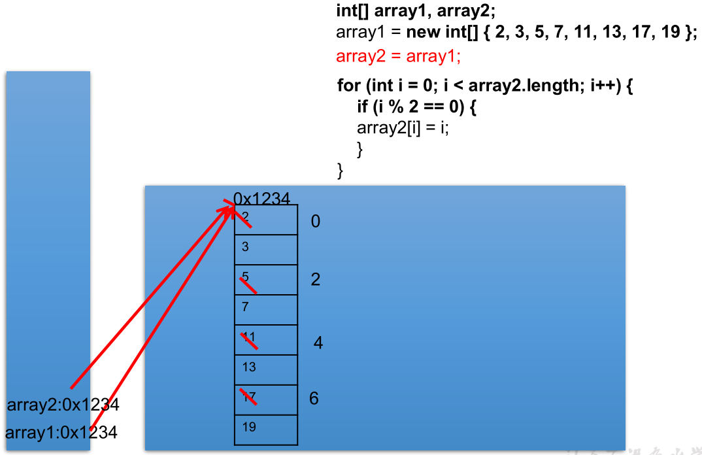

  真实的复制：

  ```java
  public static void main(String[] args) {
      // 声明arr1和arr2
      int[] arr1, arr2;
      arr1 = new int[]{2, 3, 5, 7, 11, 13, 17, 19};
  
      // 遍历arr1
      for (int value : arr1) {
          System.out.print(value + "\t");
      }
      System.out.println();
  
      // 数组的复制
      arr2 = new int[arr1.length];
      for (int i = 0; i < arr1.length; i++) {
          arr2[i] = arr1[i];
      }
  
      // 遍历arr2
      for (int value : arr2) {
          System.out.print(value + "\t");
      }
      System.out.println();
  
      // 更改arr2
      for (int i = 0; i < arr1.length; i++) {
          if (i % 2 == 0) {
              arr2[i] = i;
              continue;
          }
          arr2[i] = arr1[i];
      }
  
      // 遍历arr2
      for (int value : arr2) {
          System.out.print(value + "\t");
      }
      System.out.println();
  
      // 遍历arr1
      for (int value : arr1) {
          System.out.print(value + "\t");
      }
      System.out.println();
  }
  输出结果：
  2	3	5	7	11	13	17	19	
  2	3	5	7	11	13	17	19	
  0	3	2	7	4	13	6	19	
  2	3	5	7	11	13	17	19
  ```

  arr1 和 arr2 地址值不同，指向了堆空间中两个不同的数组实体：

  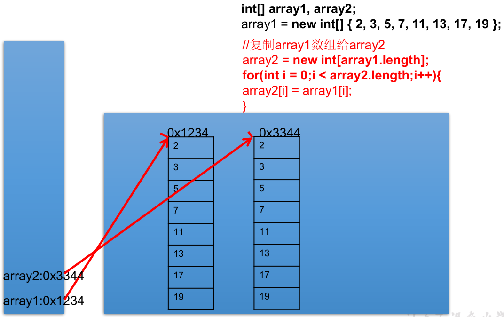

- 反转

  ```java
  public static void main(String[] args) {
      String[] arr = {"A", "B", "C", "D", "E", "F", "G"};
  
      // 遍历arr
      for (String value : arr) {
          System.out.print(value + "\t");
      }
      System.out.println();
  
      // 反转，方式一
      for (int i = 0; i < arr.length / 2; i++) {
          String temp = arr[i];
          arr[i] = arr[arr.length - 1 - i];
          arr[arr.length - 1 - i] = temp;
      }
      for (String value : arr) {
          System.out.print(value + "\t");
      }
      System.out.println();
  
      // 反转，方式二
      for (int i = 0, j = arr.length - 1; i < j; i++, j--) {
          String temp = arr[i];
          arr[i] = arr[j];
          arr[j] = temp;
      }
      for (String value : arr) {
          System.out.print(value + "\t");
      }
      System.out.println();
  }
  ```

- 线性查找

  ```java
  public static void main(String[] args) {
      String[] arr = {"A", "B", "C", "D", "E", "F", "G"};
  
      // 遍历arr
      for (String value : arr) {
          System.out.print(value + "\t");
      }
      System.out.println();
      
      String dest = "D";
      boolean isFlag = true;
      for (int i = 0; i < arr.length; i++) {
          if (dest.equals(arr[i])) {
              System.out.println("找到了指定的元素：" + dest + "，位置为：" + i);
              isFlag = false;
              break;
          }
      }
      if (isFlag) {
          System.out.println("没找到指定的元素：" + dest);
      }
  }
  输出结果：
  A	B	C	D	E	F	G	
  找到了指定的元素：D，位置为：3
  ```

- 二分法查找，前提：所要查找的数组必须有序。

  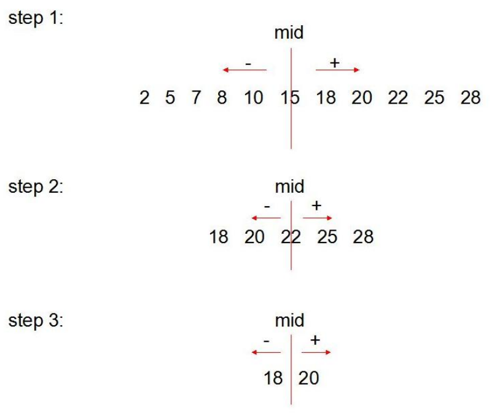

  ```java
  public static void main(String[] args) {
      int[] arr = {2, 5, 7, 8, 10, 15, 18, 20, 22, 25, 28};
      
      // 遍历arr
      for (int value : arr) {
          System.out.print(value + "\t");
      }
      System.out.println();
  
      int dest = 10;
      // 初始的首索引
      int head = 0;
      // 初始的末索引
      int end = arr.length - 1;
      boolean isFlag = true;
      while (head <= end) {
          int middle = (head + end) / 2;
          if (dest == arr[middle]) {
              System.out.println("找到了指定的元素：" + dest + "，位置为：" + middle);
              isFlag = false;
              break;
          } else if (dest < arr[middle]) {
              end = middle - 1;
          } else {// dest2 > arr2[middle]
              head = middle + 1;
          }
      }
      if (isFlag) {
          System.out.println("没找到指定的元素：" + dest);
      }
  }
  输出结果：
  2 5	7 8	10 15 18 20	22 25 28	
  找到了指定的元素：10，位置为：4
  ```

#### 数组元素的排序算法

排序：假设含有 n 个记录的序列为 {R1, R2, ..., Rn}，其相应的关键字序列为 {K1, K2, ..., Kn}。将这些记录重新排序为 {Ri1, Ri2, ..., Rin}，使得相应的关键字值满足条 Ki1<= Ki2 <= ... <= Kin，这样的一种操作称为排序。通常来说，排序的目的是快速查找。

衡量排序算法的优劣：

1. **时间复杂度：**分析关键字的比较次数和记录的移动次数。

2. **空间复杂度：**分析排序算法中需要多少辅助内存。

3. **稳定性：**若两个记录 A 和 B 的关键字值相等，但排序后 A、B 的先后次序保持不变，则称这种排序算法是稳定的。

排序算法分类：内部排序和外部排序。

- **内部排序：**整个排序过程不需要借助于外部存储器 (如磁盘等)，所有排序操作都在内存中完成。

- **外部排序：**参与排序的数据非常多，数据量非常大，计算机无法把整个排序过程放在内存中完成，必须借助于外部存储器 (如磁盘等)。外部排序最常见的是多路归并排序。可以认为外部排序是由多次内部排序组成。

十大内部排序算法：

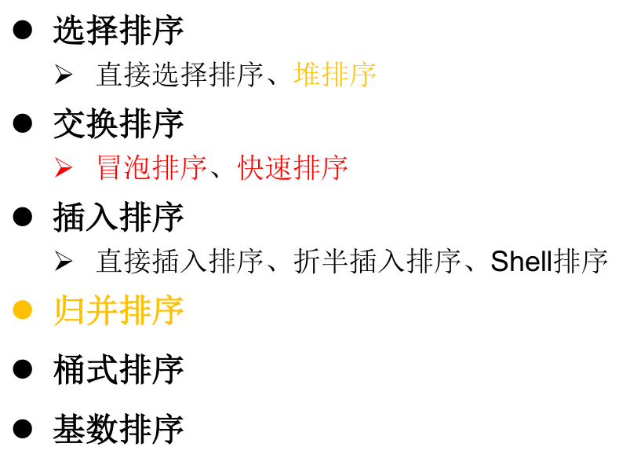

排序算法性能对比：


- 从平均时间而言：快速排序最佳。但在最坏情况下时间性能不如堆排序和归并排序。
- 从算法简单性看：由于直接选择排序、直接插入排序和冒泡排序的算法比较简单，将其认为是简单算法。对于 Shell 排序、堆排序、快速排序和归并排序算法，其算法比较复杂，认为是复杂排序。
- 从稳定性看：直接插入排序、冒泡排序和归并排序时稳定的；而直接选择排序、快速排序、 Shell 排序和堆排序是不稳定排序。
- 从待排序的记录数 n 的大小看，n 较小时，宜采用简单排序；而 n 较大时宜采用改进排序。

排序算法的选择：

- 若 n 较小 (如 n ≤50)，可采用直接插入或直接选择排序。当记录规模较小时，直接插入排序较好；否则因为直接选择移动的记录数少于直接插入，应选直接选择排序为宜。
- 若文件初始状态基本有序 (指正序)，则应选用直接插入、 冒泡或随机的快速排序为宜。
- 若 n 较大，则应采用时间复杂度为 O(nlgn) 的排序方法： 快速排序、 堆排序或归并排序。

##### 冒泡排序

冒泡排序的原理非常简单，它重复地走访过要排序的数列，一次比较两个元素，如果他们的顺序错误就把他们交换过来。

排序思想：

1. 比较相邻的元素。如果第一个比第二个大 (升序)，就交换他们两个。
2. 对每一对相邻元素作同样的工作，从开始第一对到结尾的最后一对。这步做完后，最后的元素会是最大的数。
3. 针对所有的元素重复以上的步骤，除了最后一个。
4. 持续每次对越来越少的元素重复上面的步骤，直到没有任何一对数字需要比较为止。

```java
public static void main(String[] args) {
    int[] arr = new int[]{43, 32, 76, -98, 0, 64, 33, -21, 32, 99};

    // 遍历arr
    for (int value : arr) {
        System.out.print(value + "\t");
    }
    System.out.println();

    // 冒泡排序
    for (int i = 0; i < arr.length - 1; i++) {
        for (int j = 0; j < arr.length - 1 - i; j++) {
            if (arr[j] > arr[j + 1]) {
                int temp = arr[j];
                arr[j] = arr[j + 1];
                arr[j + 1] = temp;
            }
        }
    }

    // 遍历arr
    for (int value : arr) {
        System.out.print(value + "\t");
    }
    System.out.println();
}
输出结果：
43	32	76	-98	0	64	33	-21	32	99
-98	-21	0	32	32	33	43	64	76	99
```

##### 快速排序

快速排序通常明显比同为 O(nlogn) 的其他算法更快，因此常被采用，而且快速排序采用了分治法的思想，所以在很多笔试面试中能经常看到快速排序的影子，可见掌握快速排序的重要性。

快速排序 (Quick Sort) 由图灵奖获得者 Tony Hoare 发明，被列为 20 世纪十大算法之一，是迄今为止所有内排序算法中速度最快的一种。

快速排序属于冒泡排序的升级版，交换排序的一种。快速排序的时间复杂度为 O(nlog(n))。

排序思想：

1. 从数列中挑出一个元素，称为"基准" (pivot)。
2. 重新排序数列，所有元素比基准值小的摆放在基准前面，所有元素比基准值大的摆在基准的后面 (相同的数可以到任一边)。在这个分区结束之后，该基准就处于数列的中间位置。这个称为分区 (partition) 操作。
3. 递归地 (recursive) 把小于基准值元素的子数列和大于基准值元素的子数列排序。
4. 递归的最底部情形，是数列的大小是零或一，也就是永远都已经被排序好了。虽然一直递归下去，但是这个算法总会结束，因为在每次的迭代 (iteration) 中，它至少会把一个元素摆到它最后的位置去。

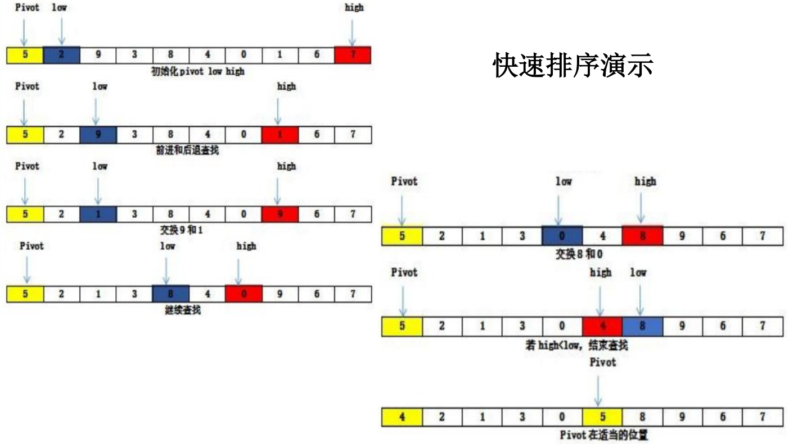

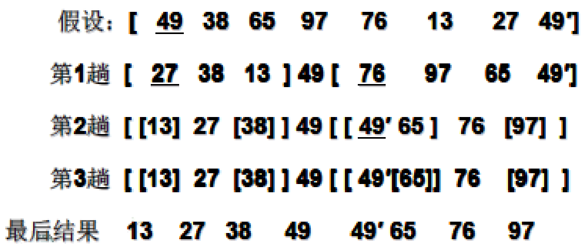

### Arrays 工具类的使用

java.util.Arrays 类为操作数组的工具类，包含了用来操作数组 (比如排序和搜索) 的各种方法。常用的方法有：

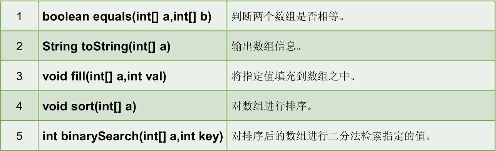

```java
public static void main(String[] args) {
    // 1.boolean equals(int[] a,int[] b)：判断两个数组是否相等
    int[] arr1 = new int[]{1, 2, 3, 4};
    int[] arr2 = new int[]{1, 3, 2, 4};
    boolean isEquals = Arrays.equals(arr1, arr2);
    System.out.println("arr1和arr2是否相等：" + isEquals);

    // 2.String toString(int[] a)：遍历数组信息
    System.out.println("arr1：" + Arrays.toString(arr1));

    // 3.void fill(int[] a,int val)：将指定值填充到数 组之中
    Arrays.fill(arr1, 10);
    System.out.println("arr1填充后：" + Arrays.toString(arr1));

    // 4.void sort(int[] a)：对数组进行排序，底层使用的是快速排序
    System.out.println("arr2排序前：" + Arrays.toString(arr2));
    Arrays.sort(arr2);
    System.out.println("arr2排序后：" + Arrays.toString(arr2));

    // 5.int binarySearch(int[] a,int key)：对排序后的数组进行二分法检索指定的值
    int[] arr3 = new int[]{-98, -34, 2, 34, 54, 66, 79, 105, 210, 333};
    int dest = 211;
    int index = Arrays.binarySearch(arr3, dest);
    if (index >= 0) {
        System.out.println(dest + "在数组中的位置为：" + index);
    } else {
        System.out.println(dest + "在数组中未找到：" + index);
    }
}
输出结果：
arr1和arr2是否相等：false
arr1：[1, 2, 3, 4]
arr1填充后：[10, 10, 10, 10]
arr2排序前：[1, 3, 2, 4]
arr2排序后：[1, 2, 3, 4]
211在数组中未找到：-10
```

### 数组中的常见异常

```java
public static void main(String[] args) {
    // ArrayIndexOutOfBoundsException
    int[] arr = new int[]{7, 10};
    System.out.println(arr[2]);// 数组脚标越界
    System.out.println(arr[-1]);// 访问了数组中不存在的脚标

    // NullPointerException：空指针异常，arr引用没有指向实体，却被操作实体中的元素
    // 情形一
    int[] arr2 = null;
    System.out.println(arr2[0]);
    // 情形二
    int[][] arr3 = new int[4][];
    System.out.println(arr3[0]);// null
    System.out.println(arr3[0][0]);// NullPointerException
    // 情形三
    String[] arr4 = new String[]{"AA", "BB", "CC"};
    arr4[0] = null;
    System.out.println(arr4[0].toString());// 对null调用了方法
}
```

>ArrayIndexOutOfBoundsException 和 NullPointerException，在编译时，不报错！！

## 面向对象

三条主线：

1. java 类及类的成员：属性、方法、构造器、代码块、内部类。
2. 面向对象的三大特征：封装性、继承性、多态性、(抽象性)。
3. 其他关键字：this、super、static、final、abstract、interface、package、import等。

面向过程 (POP) 与面向对象 (OOP)：

- 二者都是一种思想，面向对象是相对于面向过程而言的。
- 面向过程，强调的是功能行为，以函数为最小单位，考虑怎么做。面向对象，将功能封装进对象，强调具备了功能的对象，以类/对象为最小单位，考虑谁来做。
- 面向对象更加强调运用人类在日常的思维逻辑中采用的思想方法与原则，如抽象、分类、继承、聚合、多态等。

例如，人把大象装进冰箱：

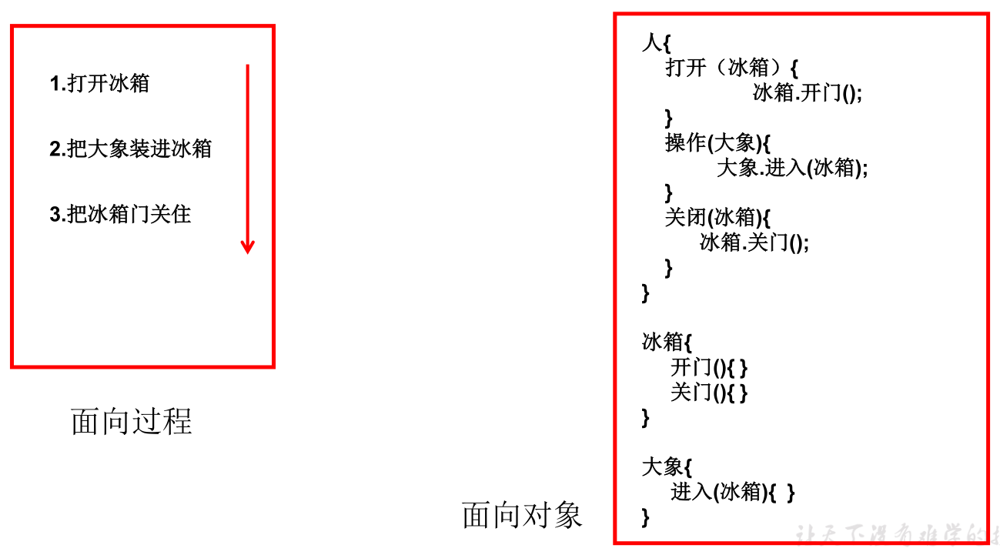

面向对象的三大特征：

- 封装 (Encapsulation)
- 继承 (Inheritance)
- 多态 (Polymorphism)

面向对象的思想概述：

1. 程序员从面向过程的执行者转化成了面向对象的指挥者。
2. 面向对象分析方法分析问题的思路和步骤：
   - 根据问题需要，选择问题所针对的现实世界中的实体。
   - 从实体中寻找解决问题相关的属性和功能，这些属性和功能就形成了概念世界中的类。
   - 把抽象的实体用计算机语言进行描述，形成计算机世界中类的定义。即借助某种程序语言，把类构造成计算机能够识别和处理的数据结构。
   - 将类实例化成计算机世界中的对象。对象是计算机世界中解决问题的最终工具。

### java基本元素：类和对象

类 (Class) 和对象 (Object) 是面向对象的核心概念。

- 类是对一类事物的描述，是抽象的、概念上的定义。

- 对象是实际存在的该类事物的每个个体，因而也称为实例 (instance)。

常见的类的成员有：

- 属性：对应类中的成员变量。

- 方法：对应类中的成员方法。


类的成员构成 version 1.0：


类的成员构成 version 2.0：

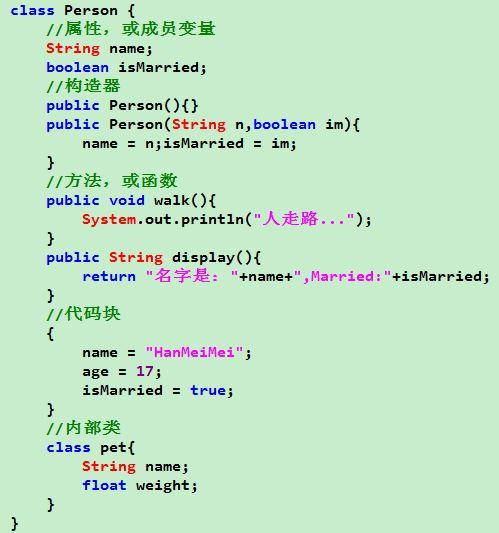

类的语法格式：


创建 java 自定义类步骤：

1. 定义类：考虑修饰符、类名。
2. 编写类的属性：考虑修饰符、属性类型、属性名、初始化值。
3. 编写类的方法：考虑修饰符、返回值类型、方法名、形参等。

类的访问机制：

- 在一个类中的访问机制：类中的方法可以直接访问类中的成员变量。例外：static 方法访问非 static 属性，编译不通过。

- 在不同类中的访问机制： 先创建要访问类的对象， 再用对象访问类中定义的成员。

对象的创建和使用：


- 创建对象语法：

  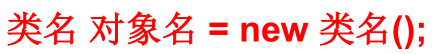

- 使用 `对象名.对象成员` 的方式访问对象成员，包括属性和方法。


- 如果创建了一个类的多个对象，则每个对象都独立的拥有一套类的属性 (非 static 的)，即：修改一个对象的属性 a，不影响另外一个对象属性 a 的值。

对象的产生：

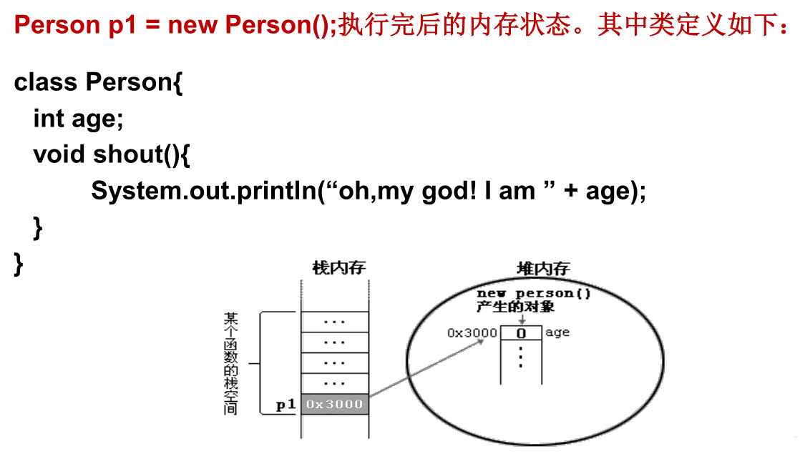

对象的使用：


对象的生命周期：

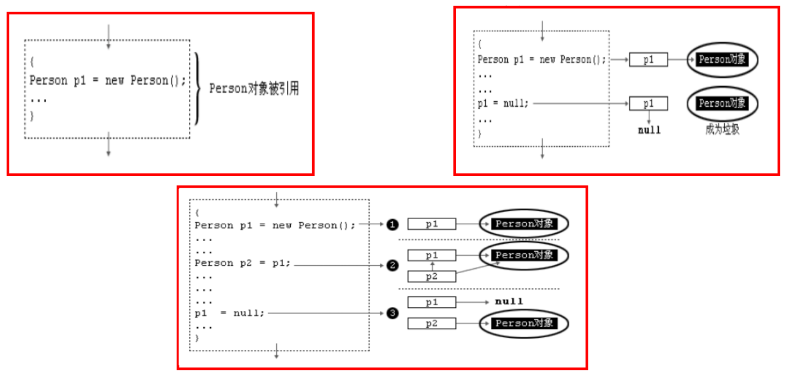

对象的内存解析：

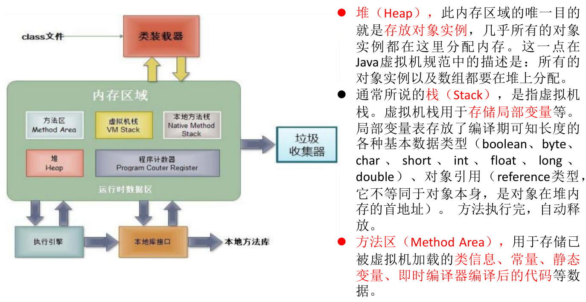

例如，下面一段代码的内存图如下：

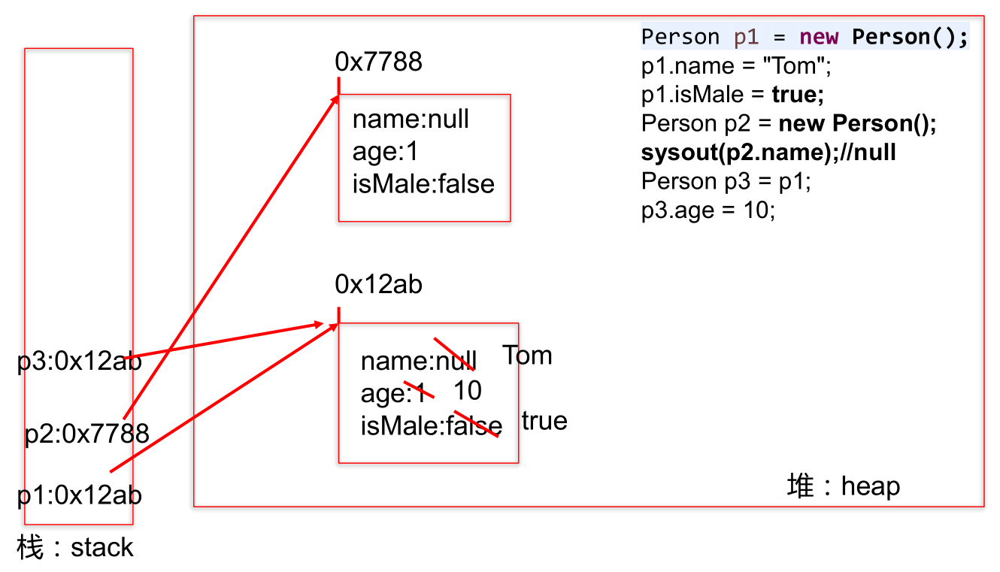

匿名对象：

- 不定义对象的句柄，而直接调用这个对象的方法，这样的对象叫做匿名对象。如：`new Person().shout();`。

- 使用情况：如果对一个对象只需要进行一次方法调用，那么就可以使用匿名对象。我们经常将匿名对象作为实参传递给一个方法调用。

```java
/**
 * 二、创建类的对象 = 类的实例化
 */
public class PersonTest {
    public static void main(String[] args) {
        // 1.创建Person类的对象
        Person person = new Person();

        // 2.调用对象的结构：属性和方法
        // 2-1.调用属性："对象.属性"
        person.name = "Tom";
        person.isMale = true;
        System.out.println("年龄：" + person.age);// 1
        // 2-2.调用方法："对象.方法"
        person.eat();// 人可以吃饭
        person.sleep();// 人可以睡觉
        person.talk("Chinese");// 人可以说话，语言是：Chinese

        // 3.创建一个新的Person类的对象
        Person person2 = new Person();
        System.out.println(person2.name);// null，非Tom

        // 4.将person变量保存的地址值赋值给person3，此时，二者指向堆空间中的同一个对象实体
        // 修改person和person3，效果相同
        Person person3 = person;
        System.out.println(person3.name);// Tom
        person3.age = 10;
        System.out.println(person.age);// 10
    }
}

/**
 * 一、类的设计，其实就是类的成员的设计：
 * 属性 = 成员变量 = Field = 域、字段
 * 方法 = 成员方法 = 函数 = Method
 */
class Person {
    // 属性
    String name;
    int age = 1;
    boolean isMale;

    // 方法
    public void eat() {
        System.out.println("人可以吃饭");
    }

    public void sleep() {
        System.out.println("人可以睡觉");
    }

    public void talk(String language) {
        System.out.println("人可以说话，语言是：" + language);
    }
}
```

### 类的成员之一：属性 (field)

语法格式：


- 常用的权限修饰符有：private、缺省、protected、public。其他修饰符：static、final。

- 数据类型：任何基本数据类型 (如 int、boolean 等) 或任何引用数据类型。

- 属性名：属于标识符，符合命名规则和规范即可。

属性 (成员变量) 与局部变量的区别：

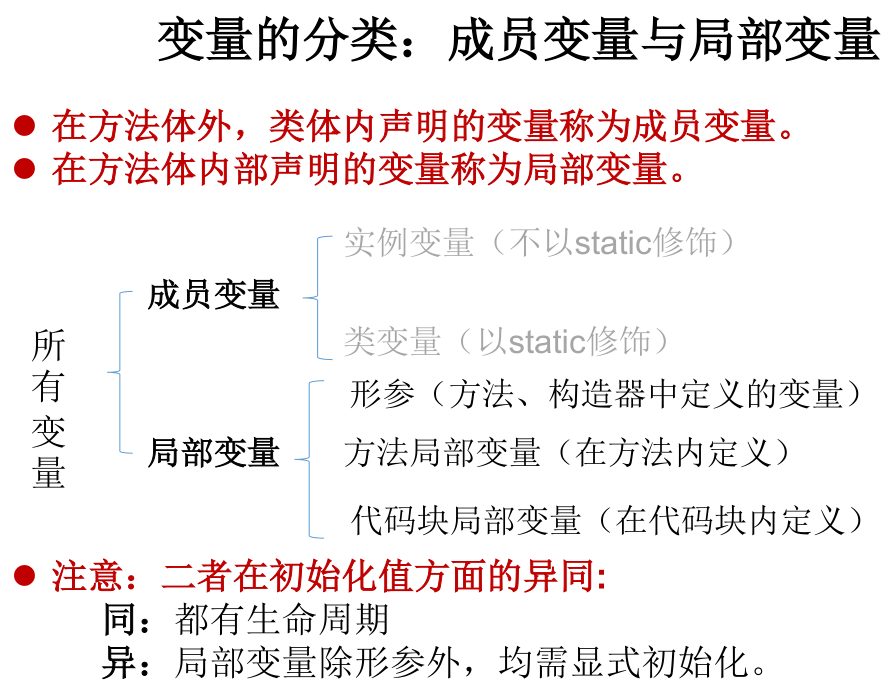

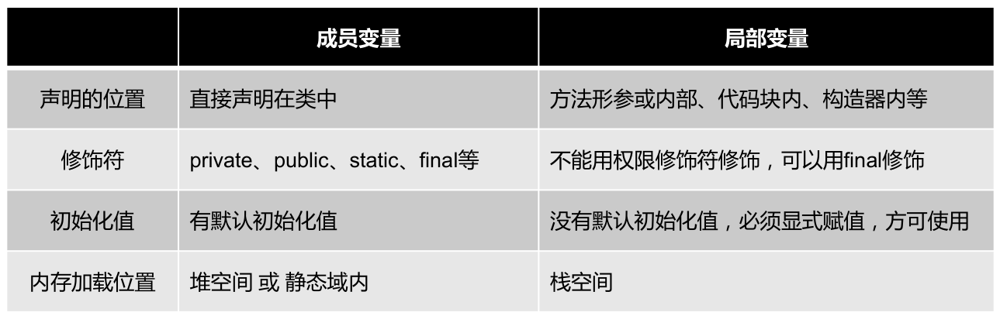

- **成员变量的默认初始化值：**当一个对象被创建时，会对其中各种类型的成员变量自动进行初始化赋值。除了基本数据类型之外的变量类型都是引用类型。

  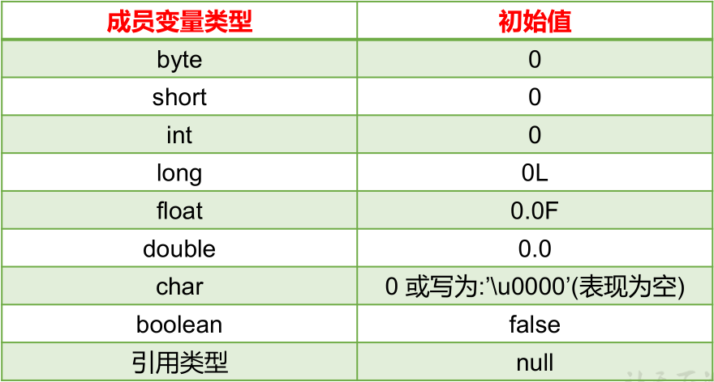

- **局部变量的默认初始化值：**局部变量声明后，没有默认初始化值，必须显式赋值，方可使用。特别的，形参在调用时，赋值即可。

- 成员变量 vs 局部变量的内存位置：

  

属性赋值的方式和先后顺序：

- 赋值的方式：
  - ① 默认初始化
  - ② 显示初始化
  - ③ 构造器中初始化
  - ④ 通过 "对象.属性" 或 "对象.方法" 的方式赋值
- ⑤ 在代码块中初始化
  
- 赋值的先后顺序：① - ② / ⑤ - ③ - ④

- ② 和 ⑤，谁定义在前，谁先赋值：

  ```java
  public class Test {
      public static void main(String[] args) {
          Order order = new Order();
          System.out.println(order.orderId);// 4
      }
  }
  
  class Order {
      int orderId = 3;
  
      {
          orderId = 4;
      }
  }
  ```

  ```java
  public class Test {
      public static void main(String[] args) {
          Order order = new Order();
          System.out.println(order.orderId);// 3
      }
  }
  
  class Order {
      {
          orderId = 4;
      }
  
      int orderId = 3;
  }
  ```

- 总结：程序中成员变量赋值的执行顺序

  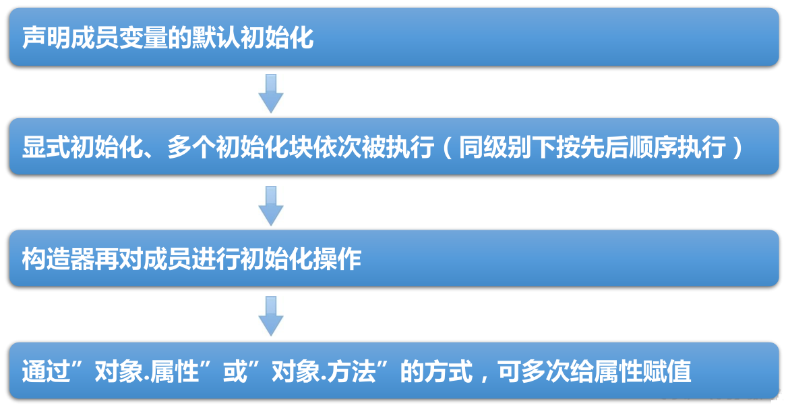

### 类的成员之二：方法 (method)

什么是方法 (method 、函数)：

- 方法是类或对象行为特征的抽象，用来完成某个功能操作。在某些语言中也称为函数或过程。
- 将功能封装为方法的目的是，可以实现代码重用，简化代码。
- java 里的方法不能独立存在，所有的方法必须定义在类里。

声明格式：

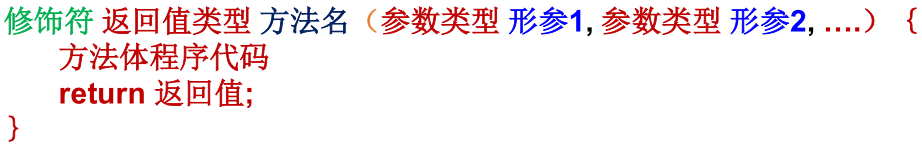

- 权限修饰符：public，缺省，private，protected 等。

- 返回值类型：
  - 没有返回值：使用void。
  - 有返回值：在方法声明时，必须指定返回值的类型，同时，方法体中需要使用 return 关键字返回指定类型的变量或常量。

- 方法名 ：属于标识符，命名时遵循标识符命名规则和规范，能够见名知意。

- 形参列表：可以包含零个，一个或多个参数。多个参数时，中间用 "," 隔开。
- 方法体程序代码：方法功能的具体实现。

- 返回值：方法在执行完毕后返还给调用它的程序的数据。

方法的分类：按照是否有形参及返回值。


方法的调用：

- 方法通过方法名被调用，且只有被调用才会执行。

- 方法调用的过程：

  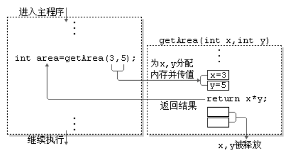

- 方法被调用一次，就会执行一次。
- 没有具体返回值的情况，返回值类型用关键字 void 表示，此时方法体中可以不必使用 return 语句。如果使用，表示用来结束方法。
- 定义方法时，方法的结果应该返回给调用者，交由调用者处理。
- 方法中可以调用当前类的属性或方法，不可以在方法内部定义方法。

### 方法的重载 (overload)

- 概念：在同一个类中，允许存在一个以上的同名方法，只要它们的参数个数或者参数类型不同即可。

- 特点：与方法的权限修饰符、返回值类型、形参变量名、方法体都无关，只看参数列表，且参数列表 (参数个数或参数类型) 必须不同。调用时，根据方法参数列表的不同来区别。

- 如果方法一不存在，main 方法依然正常执行，此时涉及到的是自动类型转换：

  ```java
  // 方法一
  public static int getSum(int m, int n) {
      return m + n;
  }
  
  // 方法二
  public static double getSum(double m, double n) {
      return m + n;
  }
  
  public static void main(String[] args) {
      System.out.println(getSum(1, 2));
  }
  ```

可变个数的形参：

- JavaSE 5.0 中提供了 Varargs (variable number of arguments) 机制，允许直接定义能和多个实参相匹配的形参。从而，可以用一种更简单的方式，来传递个数可变的实参。

  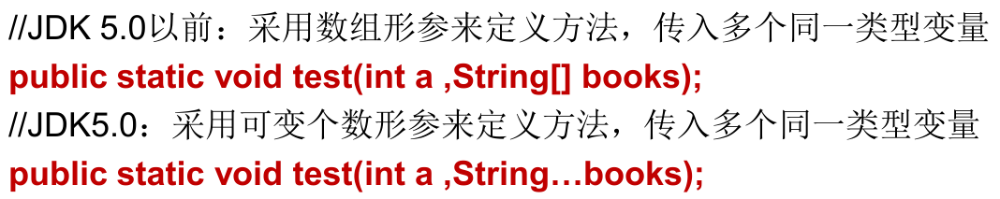

- 声明格式：方法名(参数的类型名 ... 参数名)

- 可变参数：方法参数部分指定类型的参数个数是可变多个 --- 0个，1个或多个。

- 可变个数形参的方法与同名的方法之间，彼此构成重载。

- 可变参数方法的使用与方法参数部分使用数组是一致的，二者不共存。如下所示，方法二与方法三是相同的，不共存：

  ```java
  // 方法二
  public static void show(int... m) {
      System.out.println(Arrays.toString(m));// m参数等同于数组，与数组的使用方法相同。
  }
  
  // 方法三
  public static void show(int[] m) {
      System.out.println(m);
  }
  ```

- 方法的参数部分有可变形参，需要放在形参声明的最后。

  ```java
  // 合法
  public static void show(String str, int... m) {
      System.out.println(Arrays.toString(m));
  }
  
  // 不合法
  public static void show(int... m, String str) {
      System.out.println(Arrays.toString(m));
  }
  ```

- 在一个方法的形参位置，最多只能声明一个可变个数形参。

### 方法参数的值传递机制

- 方法，必须由其所在类或对象调用才有意义。若方法含有参数：

  - 形参：方法声明时的参数。
  - 实参：方法调用时实际传给形参的数据。

- java 的实参值如何传入方法呢？

  - java 里方法的参数传递方式只有一种：值传递。 即将实际参数值的副本 (复制品) 传入方法内，而参数本身不受影响。
    - **形参是基本数据类型：将实参基本数据类型变量的 "数据值" 传递给形参。**
    - **形参是引用数据类型：将实参引用数据类型变量的 "地址值" 传递给形参。**
  
- 形参时基本数据类型与引用数据类型之间的区别:
  ```java
  public class ValueTransferTest {
      public static void main(String[] args) {
          System.out.println("***************基本数据类型***************");
          int m = 10;
          int n = m;
          System.out.println("m = " + m + ", n = " + n);
          n = 20;
          System.out.println("m = " + m + ", n = " + n);
  
          System.out.println("***************引用数据类型***************");
          Order o1 = new Order();
          o1.orderId = 1001;
          Order o2 = o1;// 赋值后, o1和o2的地址值相同, 都指向了堆空间中的同一个实体
          System.out.println("o1.orderId = " + o1.orderId + ", o2.orderId = " + o2.orderId);
          o2.orderId = 1002;
          System.out.println("o1.orderId = " + o1.orderId + ", o2.orderId = " + o2.orderId);
      }
  }
  
  class Order {
      int orderId;
  }
  输出结果：
  ***************基本数据类型***************
  m = 10, n = 10
  m = 10, n = 20
  ***************引用数据类型***************
  o1.orderId = 1001, o2.orderId = 1001
  o1.orderId = 1002, o2.orderId = 1002
  ```
  
- 对于基本数据类型，两个不同方法内的局部变量，互不影响，不因变量名相同而改变，因为是将实参基本数据类型变量的 "数据值" 传递给形参：
  ```java
  public class ValueTransferTest {
      public void swap(int m, int n) {
          System.out.println("swap方法中, 交换之前: m = " + m + ", n = " + n);
          int temp = m;
          m = n;
          n = temp;
          System.out.println("swap方法中, 交换之后: m = " + m + ", n = " + n);
      }
  
      public static void main(String[] args) {
          int m = 10;
          int n = 20;
          System.out.println("main方法中, 交换之前: m = " + m + ", n = " + n);
  
          // 能够交换m和n的值
          int temp = m;
          m = n;
          n = temp;
          System.out.println("main方法中, 交换之后: m = " + m + ", n = " + n);
  
          // 不能够交换m和n的值
          ValueTransferTest valueTransferTest = new ValueTransferTest();
          System.out.println("main方法中, 调用swap方法之前: m = " + m + ", n = " + n);
          valueTransferTest.swap(m, n);// // swap方法调用完成后, 该方法内的局部变量temp, 形参m和n从栈内存中弹出回收
          System.out.println("main方法中, 调用swap方法之后: m = " + m + ", n = " + n);
      }
  }
  输出结果：
  main方法中, 交换之前: m = 10, n = 20
  main方法中, 交换之后: m = 20, n = 10
  main方法中, 调用swap方法之前: m = 20, n = 10
  swap方法中, 交换之前: m = 20, n = 10
  swap方法中, 交换之后: m = 10, n = 20
  main方法中, 调用swap方法之后: m = 20, n = 10
  ```

  内存解析图参考：
  
  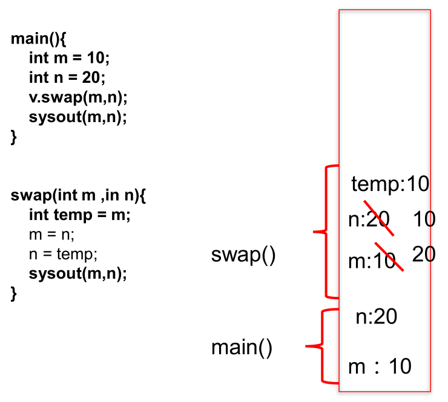
  
- 对于引用数据类型，两个不同方法的局部变量，会互相影响，因为是将实参引用数据类型变量的 "地址值" 传递给形参，二者指向的是堆内存中的同一个对象：

  ```java
  public class ValueTransferTest {
      public void swap(Data data) {
          System.out.println("swap方法中, 交换之前: data.m = " + data.m + ", data.n = " + data.n);
          int temp = data.m;
          data.m = data.n;
          data.n = temp;
          System.out.println("swap方法中, 交换之后: data.m = " + data.m + ", data.n = " + data.n);
      }
  
      public static void main(String[] args) {
          Data data = new Data();
          data.m = 10;
          data.n = 20;
          System.out.println("main方法中, 交换之前: data.m = " + data.m + ", data.n = " + data.n);
  
          // 能够交换m和n的值
          int temp = data.m;
          data.m = data.n;
          data.n = temp;
          System.out.println("main方法中, 交换之后: data.m = " + data.m + ", data.n = " + data.n);
  
          // 能够交换m和n的值
          ValueTransferTest valueTransferTest = new ValueTransferTest();
          System.out.println("main方法中, 调用swap方法之前: data.m = " + data.m + ", data. = " + data.n);
          valueTransferTest.swap(data);// swap方法调用完成后, 该方法内的局部变量temp和形参data从栈内存中弹出回收
          System.out.println("main方法中, 调用swap方法之后: data.m = " + data.m + ", data.n = " + data.n);
      }
  }
  
  class Data {
      int m;
      int n;java
  }
  输出结果：
  main方法中, 交换之前: data.m = 10, data.n = 20
  main方法中, 交换之后: data.m = 20, data.n = 10
  main方法中, 调用swap方法之前: data.m = 20, data. = 10
  swap方法中, 交换之前: data.m = 20, data.n = 10
  swap方法中, 交换之后: data.m = 10, data.n = 20
  main方法中, 调用swap方法之后: data.m = 10, data.n = 20
  ```

  内存解析图参考：

  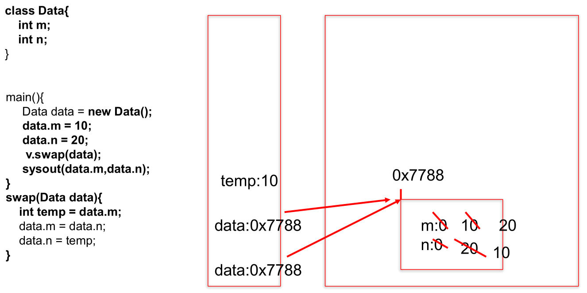

- 实例一：

  ```java
  public class ValueTransferTest {
      public void first() {
          int i = 5;
          Value v = new Value();
          v.i = 25;
          second(v, i);
          System.out.println(v.i);// 20
      }
  
      public void second(Value v, int i) {
          i = 0;
          v.i = 20;
          Value val = new Value();
          v = val;
          System.out.println(v.i + " " + i);// 15 0
      }
  
      public static void main(String[] args) {
          ValueTransferTest test = new ValueTransferTest();
          test.first();
      }
  }
  
  class Value {
      int i = 15;
  }
  ```

  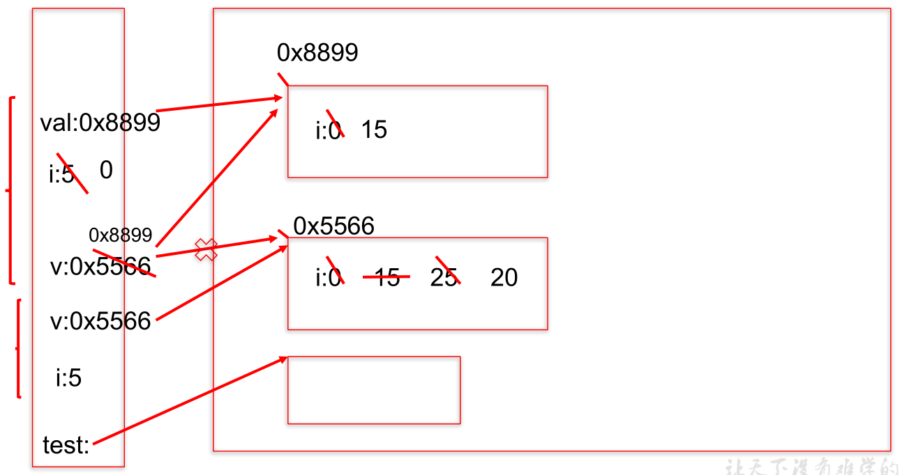

- 实例二：

  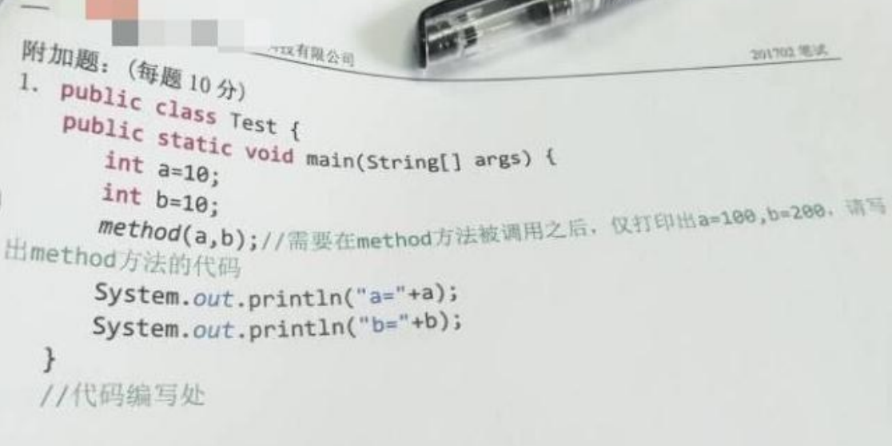

  方法一：

  ```java
  public class Test {
      public static void method(int a, int b) {
          System.out.println("a = " + a * 10);
          System.out.println("b = " + b * 20);
          System.exit(0);
      }
  
      public static void main(String[] args) {
          int a = 10;
          int b = 10;
          method(a, b);
          System.out.println("a = " + a);
          System.out.println("b = " + b);
      }
  }
  ```

  方法二：重写 PrintStream 的 println 方法。

  ```java
  public class Test {
      public static void method(int a, int b) {
          PrintStream printStream = new PrintStream(System.out) {
              @Override
              public void println(String x) {
                  if ("a = 10".equals(x)) {
                      x = "a = 100";
                  } else if ("b = 10".equals(x)) {
                      x = "b = 200";
                  }
                  super.println(x);
              }
          };
          System.setOut(printStream);
      }
  
      public static void main(String[] args) {
          int a = 10;
          int b = 10;
          method(a, b);
          System.out.println("a = " + a);
          System.out.println("b = " + b);
      }
  }
  ```

- 实例三：

  定义一个 int 型的数组：`int[] arr = new int[]{12,3,3,34,56,77,432};`，让数组的每个位置上的值去除以首位置的元素，得到的结果，作为该位置上的新值，然后遍历新的数组。

  ```java
  public class Test {
      public static void main(String[] args) {
          int[] arr = new int[]{12, 3, 3, 34, 56, 77, 432};
          System.out.println("计算前: " + Arrays.toString(arr));
          
          // 正确写法一
          int temp = arr[0];
          for (int i = 0; i < arr.length; i++) {
              arr[i] = arr[i] / temp;
          }
          
          // 正确写法二
          for (int i = arr.length - 1; i >= 0; i--) {
              arr[i] = arr[i] / arr[0];
          }
          
          // 错误写法
          /*for (int i = 0; i < arr.length; i++) {
              arr[i] = arr[i] / arr[0];
          }*/
          
          System.out.println("计算后: " + Arrays.toString(arr));
      }
  }
  ```

- 实例四：

  ```java
  public class Test {
      public static void main(String[] args) {
          int[] arr = new int[]{1, 2, 3};
          System.out.println(arr);// 地址值
  
          char[] arr1 = new char[]{'a', 'b', 'c'};
          System.out.println(arr1);// 传入char数组时，println方法体内是遍历这个数组
      }
  }
  输出结果：
  [I@78308db1
  abc
  ```

递归方法 (recursion)：

- 一个方法体内调用它自身。方法递归包含了一种隐式的循环，它会重复执行某段代码，但这种重复执行无须循环控制。

- 递归一定要向已知方向递归，否则这种递归就变成了无穷递归，类似于死循环

- 实例一：

  ```java
  public class PassObject {
      // 1-n之间所有自然数的和
      public static int getSum(int n) {
          if (n == 1) {
              return 1;
          } else {
              return n + getSum(n - 1);
          }
      }
  
      // 1-n之间所有自然数的乘积
      public static long getProduct(int n) {
          if (n == 1) {
              return 1;
          } else {
              return n * getProduct(n - 1);
          }
      }
  
      public static void main(String[] args) {
          // 方式一：循环
          int sum = 0;
          for (int i = 1; i <= 100; i++) {
              sum += i;
          }
          System.out.println("1-100之间自然数的和: " + sum);
  
          // 方式二：递归
          System.out.println("1-100之间自然数的和: " + getSum(100));
          System.out.println("1-100之间自然数的积: " + getProduct(5));
      }
  }
  ```
  
- 实例二：
  
  ```java
  /**
   * 已知有一个数列：f(0) = 1, f(1) = 4, f(n+2) = 2 * f(n+1) + f(n), 其中n是大于0的整数, 求f(10)的值。
   */
  public class PassObject {
      public static int f(int n) {
          if (n == 0) {
              return 1;
          } else if (n == 1) {
              return 4;
          } else {
              return 2 * f(n - 1) + f(n - 2);
          }
      }
  
      public static void main(String[] args) {
          int f = f(10);
          System.out.println(f);
      }
  }
  输出结果：
  10497
  ```
  
- 实例三：

  ```java
  /**
   * 已知一个数列: f(20) = 1, f(21) = 4, f(n+2) = 2 * f(n+1) + f(n), 其中n是大于0的整数, 求f(10)的值。
   */
  public class PassObject {
      public static int f(int n) {
          if (n == 20) {
              return 1;
          } else if (n == 21) {
              return 4;
          } else {
              return f(n + 2) - 2 * f(n + 1);
          }
      }
  
      public static void main(String[] args) {
          int f = f(10);
          System.out.println(f);
      }
  }
  输出结果：
  -3771
  ```

- 实例四：

  ```java
  /**
   * 斐波那契数列: 1 1 2 3 5 8 13 21 34 55 ...
   * 规律: 一个数等于前两个数之和
   * 要求：计算斐波那契数列(Fibonacci)的第n个值，并将整个数列打印出来
   */
  public class PassObject {
      public static int f(int n) {
          if (n <= 0 || n >= 30) {
              return 0;
          }
          if (n == 1) {
              return 1;
          } else if (n == 2) {
              return 1;
          } else {
              return f(n - 1) + f(n - 2);
          }
      }
  
      public static void main(String[] args) {
          int[] arr = new int[5];
          int sum = 0;
          for (int i = 0; i < arr.length; i++) {
              arr[i] = f(i + 1);
              sum += arr[i];
          }
  
          System.out.println(Arrays.toString(arr));
          System.out.println("和: " + sum);
      }
  }
  输出结果：
  [1, 1, 2, 3, 5]
  和: 12
  ```

- 实例五：

  ```java
  public class PassObject {
      private static int count = 0;
  
      public static int recursion(int k) {
          count++;
          System.out.println("count1: " + count + ", k: " + k);
          if (k <= 0) {
              return 0;
          }
          return recursion(k - 1) + recursion(k - 2);
      }
  
      public static void main(String[] args) {
          recursion(4);
      }
  }
  输出结果：
  count1: 1, k: 4
  count1: 2, k: 3
  count1: 3, k: 2
  count1: 4, k: 1
  count1: 5, k: 0
  count1: 6, k: -1
  count1: 7, k: 0
  count1: 8, k: 1
  count1: 9, k: 0
  count1: 10, k: -1
  count1: 11, k: 2
  count1: 12, k: 1
  count1: 13, k: 0
  count1: 14, k: -1
  count1: 15, k: 0
  ```

  递归过程：

  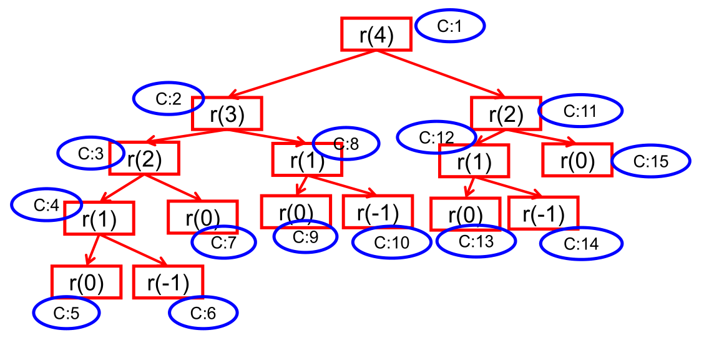

  > 遍历过程相当于二叉树的前序遍历。

### OOP 特征一：封装和隐藏

封装性的设计思想：隐藏对象内部的复杂性，只对外公开简单的接口。便于外界调用，从而提高系统的可扩展性、可维护性。通俗的说，把该隐藏的隐藏起来，该暴露的暴露出来。

程序设计追求 "高内聚，低耦合"：

- 高内聚：类的内部数据操作细节自己完成，不允许外部干涉。

- 低耦合：仅对外暴露少量的方法用于使用。

信息的封装和隐藏：

- java 中通过将对象的属性声明为私有的 (private)，再提供公共的 (public) 方法 --- `getXxx()` 和 `setXxx()`，来实现对属性的操作，并以此达到下述目的：

  - 隐藏一个类中不需要对外提供的实现细节。

  - 使用者只能通过事先定制好的方法来访问数据，可以方便地加入控制逻辑，限制对属性的不合理操作。

  - 便于修改，增强代码的可维护性。

  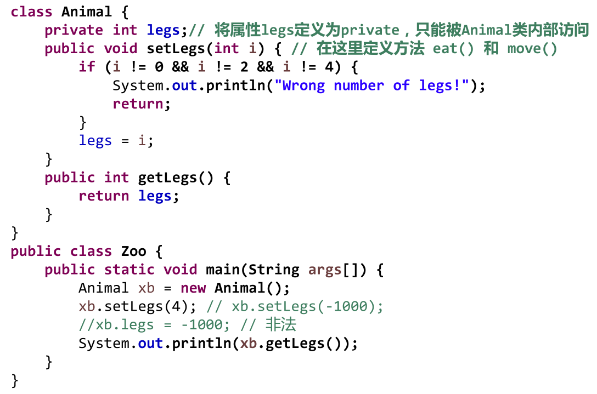


封装性的体现：属性私有、方法私有、构造器私有 (单例模式) 等。

> 封装性的体现，需要权限修饰符的配合。

### 四种权限修饰符

- 从小到大排列：private、缺省 (什么都不写)、protected、public。

- 权限修饰符置于类的成员定义前，用来限定对象对该类成员的访问权限：

  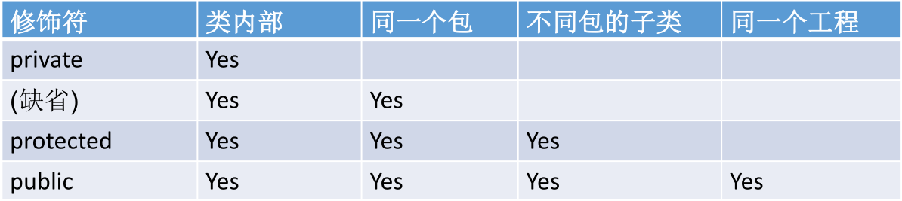

- 权限修饰符可以用来修饰类及类的内部结构：属性、方法、构造器、内部类。
- **对于 class 的权限修饰只可以用 public 和 default (缺省)。**
  
  - public 类可以在任意地方被访问。
- default 类只可以被同一个包内部的类访问。
  
- **对于 class 的内部结构，四种权限修饰符都可以使用。**

封装性总结：java 提供了 4 种权限修饰符来修饰类及类的内部结构，体现类及类的内部结构在被调用时的可见性的大小。 

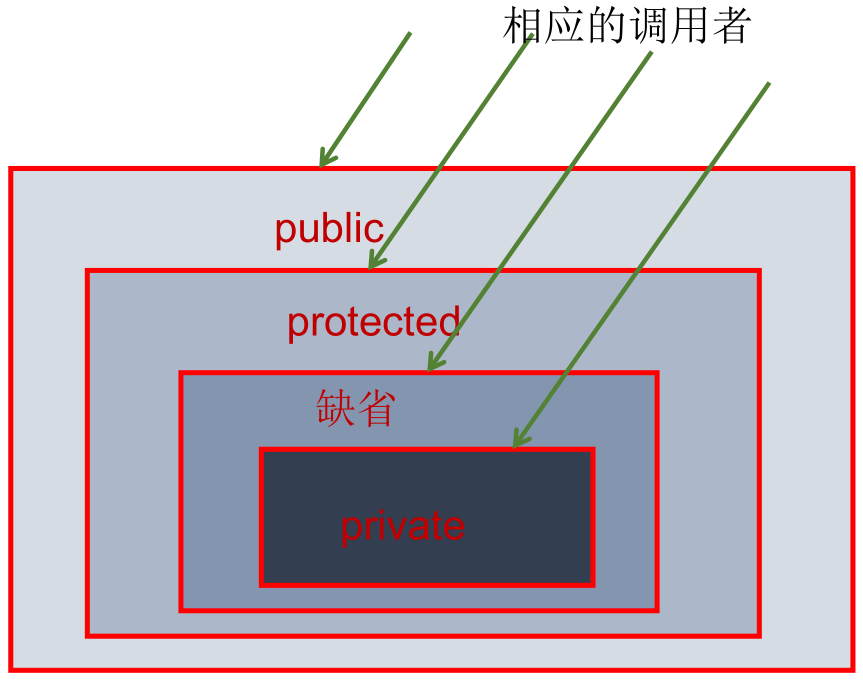

本类中任意调用：

```java
package cn.xisun.database;

public class Order {
    private int orderPrivate;
    int orderDefault;
    protected int orderProtected;
    public int orderPublic;

    private void methodPrivate() {
        orderPrivate = 1;
        orderDefault = 2;
        orderProtected = 3;
        orderPublic = 4;
    }

    void methodDefault() {
        orderPrivate = 1;
        orderDefault = 2;
        orderProtected = 3;
        orderPublic = 4;
    }

    protected void methodProtected() {
        orderPrivate = 1;
        orderDefault = 2;
        orderProtected = 3;
        orderPublic = 4;
    }

    public void methodPublic() {
        orderPrivate = 1;
        orderDefault = 2;
        orderProtected = 3;
        orderPublic = 4;
    }
}
```

同包中的其他类：

```java
package cn.xisun.database;

public class OrderTest {
    public static void main(String[] args) {
        Order order = new Order();

        order.orderDefault = 1;
        order.orderProtected = 2;
        order.orderPublic = 3;

        order.methodDefault();
        order.methodProtected();
        order.methodPublic();

        // 同一个包中的其他类，不可以调用Order类中private的属性和方法
        /*order.orderPrivate = 4;

        order.methodPrivate();*/
    }
}
```

不同包中的子类：

```java
package cn.xisun.database.postgresql;

import cn.xisun.database.Order;

public class SubOrder extends Order {
    public void method() {
        orderProtected = 1;
        orderPublic = 2;

        methodProtected();
        methodPublic();

        // 不同包的子类中，不可以调用Order类中private和缺省的属性和方法
        /*orderPrivate = 3;
        orderDefault = 4;

        methodPrivate();
        methodDefault();*/
    }
}
```

不同包中的其他类 (非子类)：

```java
package cn.xisun.database.postgresql;

import cn.xisun.database.Order;

public class OtherOrderTest {
    public static void main(String[] args) {
        Order order = new Order();

        order.orderPublic = 1;

        order.methodPublic();

        // 不同包下的普通类(非子类)，不可以调用Order类中private、缺省和protected的属性和方法
        /*order.orderPrivate = 2;
        order.orderDefault = 3;
        order.orderProtected = 4;

        order.methodPrivate();
        order.methodDefault();
        order.methodProtected();*/
    }
}
```

### 类的成员之三：构造器 (构造方法，constructor)

构造器的作用：

- 创建对象；给对象进行初始化。如：`Order o = new Order(); Person p = new Person(“Peter”, 15);`

语法格式：

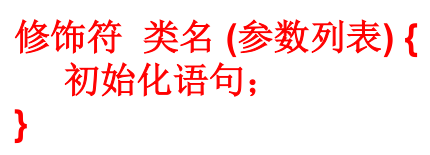

根据参数不同，构造器可以分为如下两类：

- 隐式无参构造器 (系统默认提供)。

- 显定义一个或多个构造器 (无参、有参)。

构造器的特征：

- 构造器具有与类相同的名称，不声明返回值类型，与声明为 void 不同。
- java 语言中，每个类都至少有一个构造器。
- **如果没有显示的定义类的构造器，则系统默认提供一个无参构造器。一旦显式定义了构造器， 则系统不再提供默认构造器。**
- 一般情况下，为了防止一些框架出异常，无论要不要自定义其他构造器，都应该把类的无参构造器显示的定义出来。
- **构造器的修饰符默认与所属类的修饰符一致，即：public 或 default (缺省)。**
- 构造器不能被 static、final、synchronized、abstract、native 修饰，不能有 return 语句返回值。
- 一个类中定义的多个构造器，彼此构成重载。
- 父类的构造器不可被子类继承。

### JavaBean

- JavaBean 是一种 java 语言写成的可重用组件。

- 所谓 JavaBean，是指符合如下标准的 java 类：
  - 类是公共的。
  - 有一个无参的公共的构造器。
  - 有属性，且有对应的 get、set 方法。

- 用户可以使用 JavaBean 将功能、处理、值、数据库访问和其他任何可以用 java 代码创造的对象进行打包，并且其他的开发者可以通过内部的 JSP 页面、Servlet、其他 JavaBean、applet 程序或者应用来使用这些对象。用户可以认为 JavaBean 提供了一种随时随地的复制和粘贴的功能，而不用关心任何改变。

### UML 类图

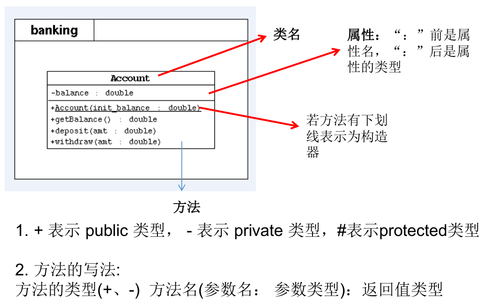

### 关键字：this

this 关键字的使用：

- this 可以用来修饰或调用：属性、方法、构造器。

- this 修饰属性和方法：
  - this理解为：当前对象或当前正在创建的对象。
  - 在类的方法中，可以使用 "this.属性" 或 "this.方法" 的方式，调用当前属性或方法。
    - 通常情况下，可以省略 "this."。
    - 特殊情况下，如果方法的形参和类的属性同名，则必须显示的使用 "this.变量" 的方式，表明此变量是属性，而非形参。
  - 在类的构造器中，可以使用 "this.属性" 或 "this.方法" 的方式，调用当前正在创建的对象的属性或方法。
    - 通常情况下，可以省略 "this."。
    - 特殊情况下，如果构造器的形参和类的属性同名，则必须显示的使用 "this.变量" 的方式，表明此变量是属性，而非形参。
  - **使用 this 访问属性和方法时，如果在本类中未找到，会从父类中查找。**
- this 调用构造器：
  - 在类的构造器中，可以显示的使用 "this(形参列表)" 的方式，调用本类中的其他构造器。
    - 存在构造器的多重调用时，创建的对象仍然是只有一个，而不是调用一个构造器就创造了一个新的对象，只有最开始被调用的构造器才创造了对象。
  - 构造器中，不能使用 "this(形参列表)" 的方式调用自己。
  - 如果一个类中有 n 个构造器，则最多有 n - 1 个构造器中使用了 "this(形参列表)"。
    - 构造器在彼此调用时，不能形参一个封闭环，如：构造器 A 中调用了构造器 B，则在构造器 B 中不能再调用构造器 A，多构造器调用类推。
  - 规定："this(形参列表)" 必须声明在当前构造器的首行。
  - 一个构造器内部，最多只能声明一个 "this(形参列表)"，即只能调用一个其他的构造器。

- 实例：

  ```java
  public class Person {
      private String name;
  
      private int age;
  
      // 无参构造器
      public Person() {
          this.eat();
      }
  
      // 带name的构造器
      public Person(String name) {
          this();// 调用无参构造器
          this.name = name;
      }
  
      // 带name和age的构造器
      public Person(String name, int age) {
          this(name);// 调用带name的构造器
          this.age = age;
      }
  
      public void setName(String name) {
          this.name = name;
      }
  
      public String getName() {
          return this.name;// 此处this可以省略
      }
  
      public void setAge(int age) {
          this.age = age;
      }
  
      public int getAge() {
          return this.age;// 此处this可以省略
      }
  
      public void eat() {
          System.out.println("人吃饭");
          this.study();// this调用方法，此处this可以省略
      }
  
      public void study() {
          this.eat();// this调用方法，此处this可以省略
          System.out.println("人学习");
      }
  
      public static void main(String[] args) {
  
      }
  }
  ```

- 实例二：

  ```java
  public class Boy {
      private String name;
  
      private int age;
  
      public Boy() {
  
      }
  
      public Boy(String name, int age) {
          this.name = name;
          this.age = age;
      }
  
      public void setName(String name) {
          this.name = name;
      }
  
      public String getName() {
          return name;
      }
  
      public void setAge(int age) {
          this.age = age;
      }
  
      public int getAge() {
          return age;
      }
  
      public void marray(Girl girl) {
          System.out.println("我想娶" + girl.getName());
      }
  
      public void shout() {
          System.out.println("我想找对象");
      }
  }
  ```

  ```java
  public class Girl {
      private String name;
  
      private int age;
  
      public Girl() {
  
      }
  
      public Girl(String name, int age) {
          this.name = name;
          this.age = age;
      }
  
      public void setName(String name) {
          this.name = name;
      }
  
      public String getName() {
          return name;
      }
  
      public void setAge(int age) {
          this.age = age;
      }
  
      public int getAge() {
          return age;
      }
  
      public void marry(Boy boy) {
          System.out.println("我想嫁给" + boy.getName());
          boy.marray(this);// 传入当前Girl对象
      }
  
      public int compare(Girl girl) {
          return this.age - girl.age;
      }
  }
  ```

  ```java
  public class Person {
      public static void main(String[] args) {
          Boy boy = new Boy("罗密欧", 20);
          boy.shout();
          Girl girl = new Girl("朱丽叶", 18);
          girl.marry(boy);
  
          Girl girl2 = new Girl("祝英台", 19);
          System.out.println("年龄差：" + girl.compare(girl2));
      }
  }
  ```

### 关键字：package

package 语句作为 java 源文件的第一条语句，指明该文件中定义的类所在的包。若缺省该语句，则指定为无名包。

语法格式：


- 包对应于文件系统的目录，package 语句中，用 . 来指明包 (目录) 的层次。

- 包属于标识符，遵循标识符的命名规范，通常用小写单词标识。通常使用所在公司域名的倒置，如：`com.atguigu.xxx`。
- 同一个包下，不能命名同名的接口、类。不同的包下，可以命名同名的接口、类。
- JDK 中主要的包介绍：
  - java.lang ---- 包含一些 java 语言的核心类，如 String、Math、Integer、 System 和 Thread，提供常用功能。
  - java.net ---- 包含执行与网络相关的操作的类和接口。
  - java.io ---- 包含能提供多种输入/输出功能的类。
  - java.util ---- 包含一些实用工具类，如定义系统特性、接口的集合框架类、使用与日期日历相关的函数。
  - java.text ---- 包含了一些 java 格式化相关的类。
  - java.sql ---- 包含了 java 进行 JDBC 数据库编程的相关类/接口。
  - java.awt ---- 包含了构成抽象窗口工具集 (abstract window toolkits) 的多个类，这些类被用来构建和管理应用程序的图形用户界面 (GUI)。(B/S 和 C/S)

### 关键字：import

为使用定义在不同包中的 java 类，需用 import 语句来引入指定包层次下所需要的类或全部类 (.*)。import 语句告诉编译器到哪里去寻找类。

语法格式：


- 在源文件中使用 import 语句，可以显式的导入指定包下的类或接口。

- 声明在包的声明和类的声明之间。

- 如果需要导入多个类或接口，那么就并列显式声明多个 import 语句即可。

- 举例：可以使用 `import java.util.*;` 的方式，一次性导入 java.util 包下所有的类或接口。

- 如果导入的类或接口是 java.lang 包下的，或者是当前包下的，则可以省略此 import 语句。

- 如果在代码中使用不同包下的同名的类，那么就需要使用类的全类名的方式指明调用的是哪个类。

- 如果已经导入 java.a 包下的类，那么如果需要使用 a 包的子包下的类的话，仍然需要导入。

- **import static 组合的使用：导入指定类或接口下的静态的属性或方法。**

  ```java
  import static java.lang.System.*;
  
  public class Person {
      public static void main(String[] args) {
          out.println("打印方法");// 可以省略System
      }
  }
  ```

### OOP 特征二：继承性

如果多个类中存在相同的属性和行为时，将这些内容抽取到单独一个类中，那么这多个类无需再定义这些属性和行为，只要继承那个抽出来的类即可。

此处的多个类称为**子类 (派生类、subclass)**，单独的这个类称为**父类 (基类、超类、superclass)**。可以理解为："子类 is a 父类"。

类继承语法规则：

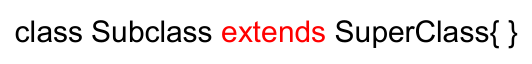

继承性的作用：

- 继承的出现减少了代码冗余，提高了代码的复用性。
- 继承的出现，更有利于功能的扩展。
- 继承的出现，让类与类之间产生了关系，提供了多态的前提。

继承性的特点：

- 子类继承了父类，就继承了父类中声明的所有属性和方法。特别的，父类中声明为 private 的属性和方法，子类继承父类以后，仍然认为子类获取了父类中私有的结构，只是因为封装性的影响，使得子类的实例不能直接调用父类的这些私有的结构而已 (事实上，父类的实例，也不能直接调用这些私有的结构)。
- 在子类中，可以使用父类中定义的方法和属性，也可以声明创建子类特有的属性和方法，以实现功能的扩展。
- 在 java 中，继承的关键字用的是 extends，即子类不是父类的子集，而是对父类的扩展。

继承性的规则：

- 子类不能直接访问父类中私有的 (private) 的成员变量和方法。

  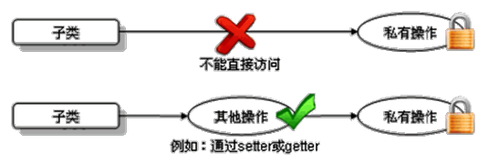

- java 只支持单继承和多层继承，不允许多重继承。

  - 一个子类只能有一个父类。
  
  - 一个父类可以派生出多个子类。
  
    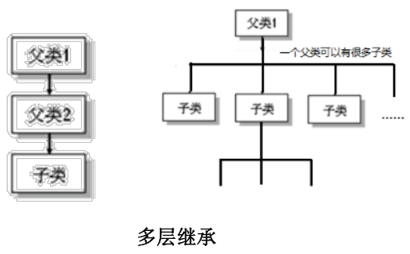
  
    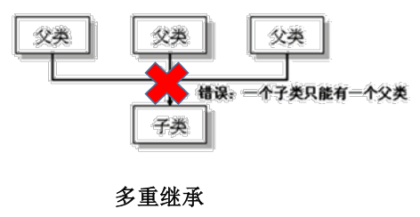
  
    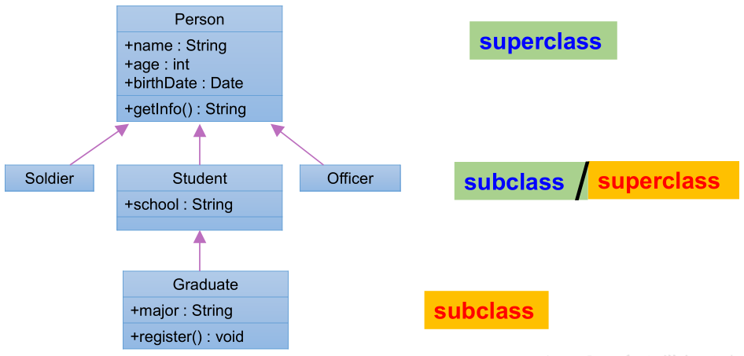
  
  - 此处强调的是 java 类的单继承性，java 中，接口是可以多继承的。

- 子类和父类是一个相对概念。子类直接继承的父类，称为直接父类，间接继承的父类，称为间接父类。
- 子类继承父类后，就获取了直接父类及所有间接父类中声明的属性和方法。
- 所有的 java 类 (除 java.lang.Object 类之外)，都直接或间接继承 java.lang.Object。

### 方法的重写 (override/overwrite)

在子类中可以根据需要，对从父类中继承来的方法进行改造，也称为方法的重置、覆盖。在程序执行时，子类的方法将覆盖父类的方法。

重写的要求：

- 子类重写的方法必须和父类被重写的方法具有相同的方法名称、参数列表。

- 子类重写的方法使用的访问权限不能小于父类被重写的方法的访问权限 (权限修饰符)。
  - 子类不能重写父类中声明为 private 权限的方法。
  - 子类中可以声明与父类 private 方法相同名称和参数列表的方法，但不属于重写。

- 子类重写的方法的返回值类型不能大于父类被重写的方法的返回值类型。

  - 父类被重写的方法的返回值类型是 void，则子类重写的方法的返回值类型只能是 void。
  - 父类被重写的方法的返回值类型是 A 类型，则子类重写的方法的返回值类型可以是 A 类或 A 类的子类。
  - 父类被重写的方法的返回值类型是基本数据类型 (比如：double)，则子类重写的方法的返回值类型必须是相同的基本数据类型 (即，只能是 double)。

- 子类重写的方法抛出的异常类型不能大于父类被重写的方法抛出的异常类型。

- **子类与父类中同名同参数的方法必须同时声明为非 static 的(此时属于重写)，或者同时声明为 static 的 (此时不属于重写)。因为 static 方法是属于类的，子类无法覆盖父类的方法。**

实例一：

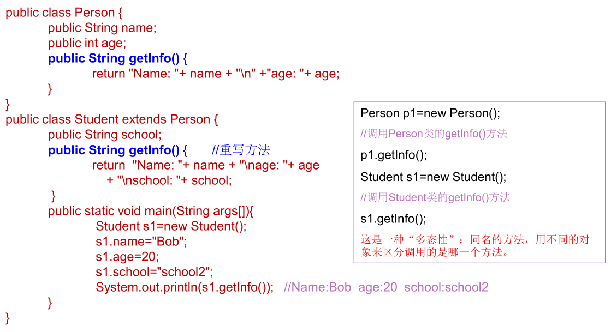

实例二：

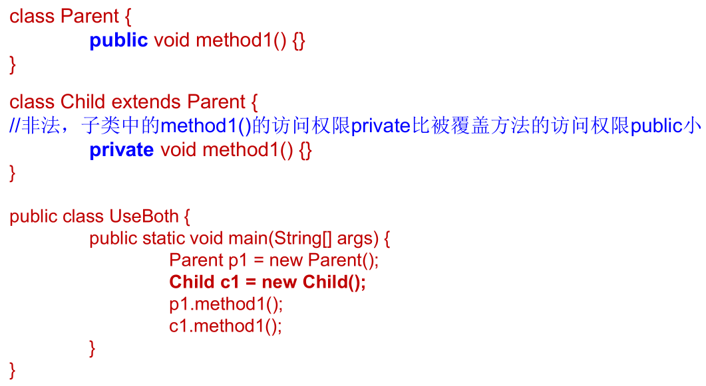

方法重载与重写的区别：

1.  二者的定义细节：略。
2. 从编译和运行的角度看：重载，是指允许存在多个同名方法，而这些方法的参数不同。编译器根据方法不同的参数表，对同名方法的名称做修饰。对于编译器而言，这些同名方法就成了不同的方法。**它们的调用地址在编译期就绑定了。**java 的重载是可以包括父类和子类的，即子类可以重载父类的同名不同参数的方法。所以：对于重载而言，在方法调用之前，编译器就已经确定了所要调用的方法，这称为 **"早绑定"** 或 **"静态绑定"**；而对于多态，只有等到方法调用的那一刻，解释运行器才会确定所要调用的具体方法，这称为 **"晚绑定"** 或 **"动态绑定"**。引用一句 Bruce Eckel 的话：“不要犯傻，如果它不是晚绑定，它就不是多态。”
3. 重载不表现为多态性，重写表现为多态性。

### 关键字：super

- super 理解为：父类的。

- super 可以用来调用父类的：属性、方法、构造器。

- 在子类的方法或构造器中，可以通过使用 "super.属性" 或 "super.方法" 的形式，显示的调用父类中声明的属性或方法。
  - 通常情况下，可以省略 "super."。
  - 特殊情况：当子类和父类中定义了同名的属性时，要想在子类中调用父类中声明的该属性，则必须显示的使用 "super.属性" 的方式，表明调用的是父类中声明的属性。
  - 特殊情况：当子类重写了父类中的方法以后，要想在子类中调用父类中被重写的方法时，则必须显示的使用 "super.方法" 的方式，表明调用的是父类中被重写的方法。

- 在子类的构造器中，可以通过使用 "super(形参列表)" 的形式，显示的调用父类中声明的指定的构造器。
  - "super(形参列表)" 的使用，必须声明在子类构造器的首行。
  - 在类的构造器中，针对于 "this(形参列表)" 或 "super(形参列表)"，只能二选一，不能同时出现。
  - **在构造器的首行，如果没有现实的声明 "this(形参列表)" 或 "super(形参列表)"，则默认调用的是父类中空参的构造器，即：`super();`。**
    - 子类中所有的构造器默认都会访问父类中空参的构造器。
    - 当父类中没有空参的构造器时，子类的构造器必须通过 "this(形参列表)" 或 "super(形参列表)" 语句，指定调用本类或者父类中相应的构造器。同时，只能二选一，且必须放在构造器的首行。
    - 如果子类构造器中既未显式调用父类或本类的构造器，且父类中又没有无参的构造器，则编译出错。
  - 在类的多个构造器中，至少有一个类的构造器中使用了 "super(形参列表)"，调用父类中的构造器。

- 实例：

  父类：

  ```java
  public class Person {
      String name;
      int age;
      int id = 1000;
  
      public Person() {
          System.out.println("父类的空参构造器");
      }
  
      public Person(String name, int age, int id) {
          this.name = name;
          this.age = age;
          this.id = id;
      }
  
      public void eat() {
          System.out.println("吃饭");
      }
  
      public void sleep() {
          System.out.println("睡觉");
      }
  }
  ```

  子类：

  ```java
  public class Student extends Person {
  //    String name;// 父类中已有的属性，可以省略
  //    int age;// 父类中已有的属性，可以省略
      String major;
      int id = 1001;
  
      public Student() {
  
      }
  
      public Student(String name, int age, String major) {
          this.name = name;
          this.age = age;
          this.major = major;
      }
  
      // 父类中已有的方法，可以省略，如有需要，可以重写，
  //    public void eat() {
  //        System.out.println("吃饭");
  //    }
  
      // 重写父类的方法
      @Override
      public void sleep() {
          System.out.println("学生睡觉");
      }
  
      public void study() {
          System.out.println("学习");
      }
  
      public void show() {
          System.out.println("子类中的id: " + this.id);// this可以省略，就近原则
          System.out.println("父类中的id: " + super.id);// 子类与父类有同名的属性id，此时super不可以省略
      }
  
      public static void main(String[] args) {
          Student student = new Student();
          student.show();
      }
  }
  ```

this 和 super 的区别：

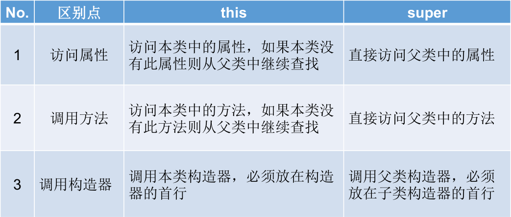

思考：

- 为什么 "super(形参列表)" 和 "this(形参列表)" 调用语句不能同时在一个构造器中出现？
  - 因为 "super(形参列表)" 和 "this(形参列表)" 调用语句都必须出现在构造器中的首行。
- 为什么 "super(形参列表)" 和 "this(形参列表)" 只能作为构造器中的第一句出现？
  - 因为无论通过哪个构造器创建子类对象，都需要保证先初始化父类。这样做的目的是：当子类继承父类后，可以获得父类中所有的属性和方法，这样子类就有必要在一开始就知道父类是如何为对象进行初始化。

### 子类对象实例化过程

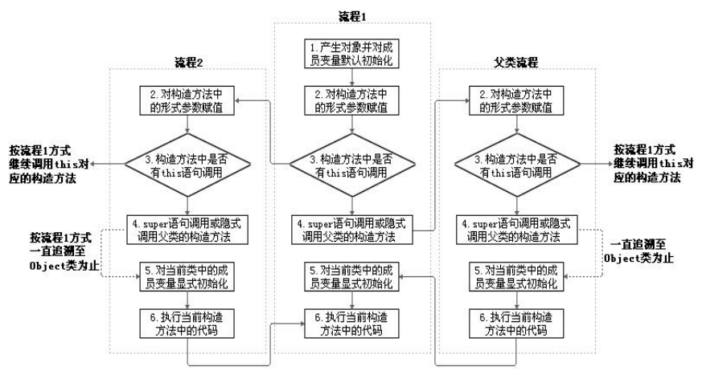

- 从结果上看：
  - 子类继承父类之后，就获取了父类中声明的属性和方法。(继承性)

  - 创建子类的对象，在堆空间中，就会加载所有父类中声明的属性。

    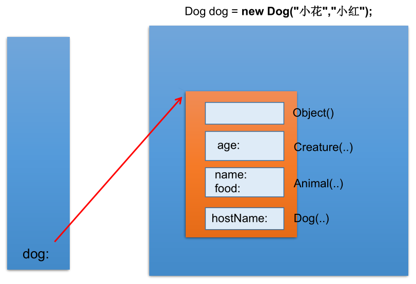

- 从过程上看：

  - 当通过子类的构造器创建子类对象时，一定会直接或间接的调用其父类的构造器，进而调用父类的父类的构造器，直到调用了 java.lang.Object 类中空参的构造器为止。正因为加载过所有的父类的结构，所以才可以看到内存中有父类中的结构，子类对象才能够进行调用。

  - 明确：虽然创建子类对象时，调用了父类的构造器，但是自始至终只创建了一个对象，即为 new 出来的子类对象。

    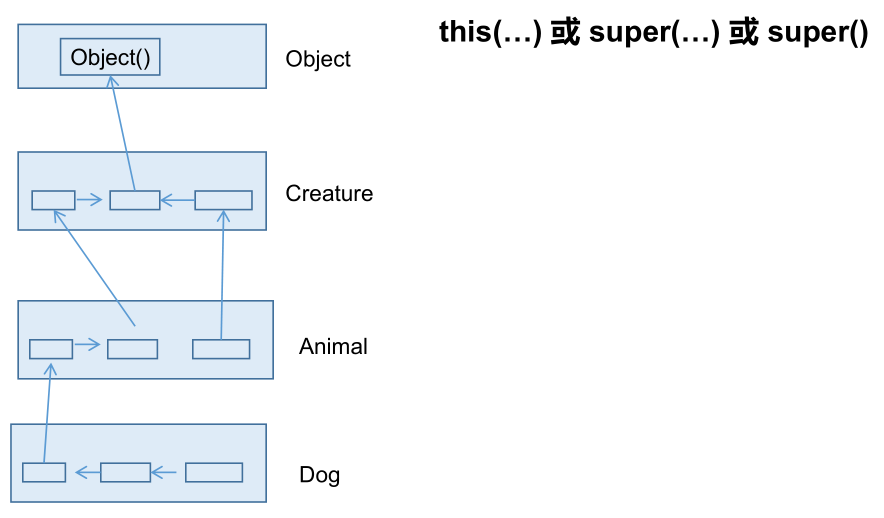

- 实例：

  从输出结果可以看出，在创建 Man 的实例时，先进入了父类的空参构造器，然后执行子类的空参构造器。

  ```java
  public class Person {
      String name;
      int age;
  
      public Person() {
          System.out.println("父类空参构造器");
      }
  
      public void eat() {
          System.out.println("人吃饭");
      }
  
      public void walk() {
          System.out.println("人走路");
      }
  
      public static void main(String[] args) {
          Person person = new Man();
          person.eat();
          person.walk();
      }
  }
  
  class Man extends Person {
      boolean isSmoking;
  
      public void earnMoney() {
          System.out.println("男人负责挣钱养家");
      }
  
  
      @Override
      public void eat() {
          System.out.println("男人多吃肉，长肌肉");
      }
  
      @Override
      public void walk() {
          System.out.println("男人霸气的走路");
      }
  }
  输出结果：
  父类空参构造器
  子类空参构造器
  男人多吃肉，长肌肉
  男人霸气的走路
  ```

### OOP 特征三：多态性

多态性，也叫对象的多态性：**父类的引用指向子类的对象 (或子类的对象赋给父类的引用)。**

- 一个变量只能有一种确定的数据类型。

- 一个引用类型变量可能指向 (引用) 多种不同类型的对象。

- 子类可看做是特殊的父类，所以父类类型的引用可以指向子类的对象：向上转型 (upcasting)。

- 一个引用类型变量如果声明为父类的类型，但实际引用的是子类对象，那么该变量就不能再访问子类中添加的属性和方法：

  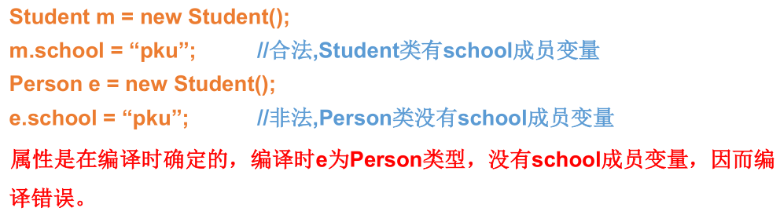

多态的使用：

- **虚拟方法调用。**

- 有了对象的多态性以后，在编译期，只能调用父类中声明的方法，但在运行期，实际执行的是子类中重写的父类的方法。

- **编译，看左边；运行，看右边。**

  - **java 引用变量有两个类型：编译时类型和运行时类型。**编译时类型由声明该变量时使用的类型决定，运行时类型由实际赋给该变量的对象决定。
  - 若编译时类型和运行时类型不一致，就出现了对象的多态性。
  - 多态情况下，看左边：看的是父类的引用 (父类中不具备子类特有的方法)，看右边：看的是子类的对象 (实际运行的是子类重写父类的方法)。

- 对象的多态性，只适用于方法，不适用于属性。对于属性，编译期和运行期，看的都是左边，即都是父类中声明的那个属性。

  - 成员方法：编译时，要查看引用变量所声明的类中是否有所调用的方法。运行时，调用实际 new 的对象所属的类中的重写方法。
  - 成员变量：不具备多态性，只看引用变量所声明的类。

- 子类继承父类：

  - 若子类重写了父类方法，就意味着子类里定义的方法彻底覆盖了父类里的同名方法，系统将不可能把父类里的方法转移到子类中。
  - 编译，看左边；运行，看右边。
  - 对于实例变量则不存在这样的现象，即使子类里定义了与父类完全相同的实例变量，这个实例变量依然不可能覆盖父类中定义的实例变量。
    - 编译，运行，都看左边。
  
- 实例：

  父类：

  ```java
  public class Person {
      String name;
      int age;
  
      public void eat() {
          System.out.println("人吃饭");
      }
  
      public void  walk() {
          System.out.println("人走路");
      }
  
      public static void main(String[] args) {
          // 对象的多态性：父类的引用指向子类的对象
          Person person = new Man();
          // 多态的使用：当调用子父类同名同参数的方法时，实际执行的是子类重写的父类的方法---虚拟方法调用
          // 编译期，只能调用父类Person类中的方法；运行期，执行的是子类Man类中的方法。
          person.eat();
          person.walk();
          // 不能调用子类特有的属性或方法，因为编译时，person是Person类型，而Person类中没有子类的这个特有属性或方法。
          // 有了对象的多态性以后，内存中实际上是加载了子类特有的属性或方法的，但是由于变量声明为父类类型，导致编译时，只能调用父类中
          // 声明的属性和方法，子类中特有的属性和方法不能调用。
          // person.isSmoking = true;
          // person.earnMoney();
          
        System.out.println("*********************************")
          // 如何才能使用子类特有的属性和方法？
        // 向下转型：使用强制类型转换符
          Man man = (Man) person;
          man.isSmoking = true;
          man.earnMoney();
          // 使用强转时，可能出现java.lang.ClassCastException异常
          Woman woman = (Woman) person;
          woman.goShopping();
      }
  }
  输出结果：
  父类空参构造器
  子类空参构造器
  男人多吃肉，长肌肉
  男人霸气的走路
  *********************************
  男人负责挣钱养家
  ```
  
  子类：
  
  ```java
  public class Man extends Person {
      boolean isSmoking;
  
      public void earnMoney() {
          System.out.println("男人负责挣钱养家");
      }
  
  
      @Override
      public void eat() {
          System.out.println("男人多吃肉，长肌肉");
      }
  
      @Override
      public void walk() {
          System.out.println("男人霸气的走路");
      }
  }
  ```

- 实例二：

  ```java
  public class FieldMethodTest {
      public static void main(String[] args) {
          Sub s = new Sub();
          System.out.println(s.count);// 20
          s.display();// 20
          Base b = s;
          // 对于引用数据，==比较的是两个引用数据类型变量的地址值
          System.out.println(b == s);// true
          System.out.println(b.count);// 10
          b.display();// 20
      }
  }
  
  class Base {
      int count = 10;
  
      public void display() {
          System.out.println(this.count);
      }
  }
  
  class Sub extends Base {
      int count = 20;
  
      @Override
      public void display() {
          System.out.println(this.count);
      }
  }
  ```

- 实例三：

  ```java
  public class InterviewTest1 {
      public static void main(String[] args) {
          Base base = new Sub();
          base.add(1, 2, 3);// sub_1
  
          Sub s = (Sub) base;
          s.add(1, 2, 3);// sub_2
      }
  }
  
  class Base {
      public void add(int a, int... arr) {
          System.out.println("base");
      }
  }
  
  class Sub extends Base {
      @Override
      public void add(int a, int[] arr) {
          System.out.println("sub_1");
      }
  
      // 这个方法没有重写，在Base类中不存在这样声明的方法，
      // 也就没有多态，所以base.add(1, 2, 3)方法输出sub_1
      public void add(int a, int b, int c) {
          System.out.println("sub_2");
      }
  }
  ```

多态性的使用前提：

- **有类的继承关系。**
- **有方法的重写。**
- 如果没有以上两个前提，就不存在多态。

多态性的优点：

- 提高了代码的通用性，常称作接口重用。

- 方法声明的形参类型为父类类型，可以使用子类的对象作为实参调用该方法：

  ```java
  public class AnimalTest {
      // 多态的使用：传入的是Animal对象，但实际传入的可以是Animal的子类
      public void func(Animal animal) {
          animal.eat();
          animal.shout();
      }
  
      public static void main(String[] args) {
          AnimalTest animalTest = new AnimalTest();
  
          animalTest.func(new Dog());
          animalTest.func(new Cat());
      }
  }
  
  class Animal {
      public void eat() {
          System.out.println("动物：进食");
      }
  
      public void shout() {
          System.out.println("动物：叫");
      }
  }
  
  class Dog extends Animal {
      @Override
      public void eat() {
          System.out.println("狗吃骨头");
      }
  
      @Override
      public void shout() {
          System.out.println("汪！汪！汪！");
      }
  }
  
  class Cat extends Animal {
      @Override
      public void eat() {
          System.out.println("猫吃鱼");
      }
  
      @Override
      public void shout() {
          System.out.println("喵！喵！喵！");
      }
  }
  
  // 举例二
  class Order {
      // 此方法可以传入任意对象，而不需要每个特定对象都创建一次method()方法
      public void method(Object object) {
          // 方法体
      }
  }
  ```

- 抽象类、接口的使用。(抽象类和接口不能实例化，它们的使用也体现了多态)

虚拟方法调用： 

- 正常的方法调用：

  ```java
  Person e = new Person();
  e.getInfo();
  Student e = new Student();
  e.getInfo();
  ```

- 虚拟方法调用 (多态情况下)

  子类中定义了与父类同名同参数的方法，在多态情况下，将此时父类的方法称为虚拟方法，父类根据赋给它的不同子类对象，动态调用属于子类的该方法。这样的方法调用在编译期是无法确定的。

  ```java
  Person e = new Student();
  e.getInfo();// 调用Student类的getInfo()方法
  ```

- 编译时类型和运行时类型

  上面代码中，编译时 e 为 Person 类型，而方法的调用是在运行时确定的，所以调用的是 Student 类的 getInfo() 方法 —— **动态绑定**。

- **重写是多态，重载不是。**

- 实例：

  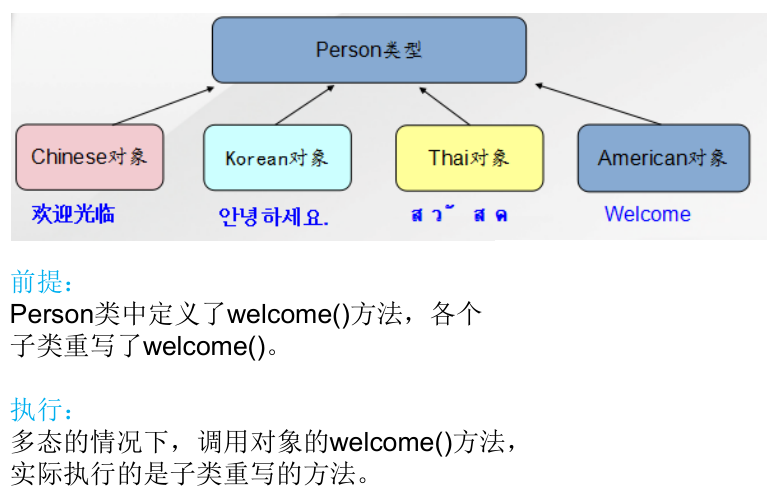

多态是编译时行为还是运行时行为?

- **多态是运行时行为**，证明方法如下：

  ```java
  public class InterviewTest {
      public static Animal getInstance(int key) {
          switch (key) {
              case 0:
                  return new Cat();
              case 1:
                  return new Dog();
              default:
                  return new Sheep();
          }
      }
  
      public static void main(String[] args) {
          // 因为key需要在运行时才能得到值，编译期时无法判断getInstance()方法输出什么
          int key = new Random().nextInt(3);
          System.out.println(key);
          Animal animal = getInstance(key);
          animal.eat();
      }
  }
  
  class Animal {
      protected void eat() {
          System.out.println("animal eat food");
      }
  }
  
  class Cat extends Animal {
      @Override
      protected void eat() {
          System.out.println("cat eat fish");
      }
  }
  
  class Dog extends Animal {
      @Override
      public void eat() {
          System.out.println("Dog eat bone");
      }
  }
  
  class Sheep extends Animal {
      @Override
      public void eat() {
          System.out.println("Sheep eat grass");
      }
  }
  ```

### 关键字：instanceof

`a instanceof A`：检验对象 a 是否为类 A 的对象实例，如果是，返回 true，如果不是，返回 false。

- 使用情景：为了避免向下转型时出现 java.lang.ClassCastException，在向下转型之前，先进行 instanceof 判断，在返回 true 时，才进行向下转型。

- 要求 a 所属的类与类 A 必须是子类和父类的关系，否则编译错误。

- 如果 a 属于类 A 的子类 B，`a instanceof A` 的返回值也为 true。

  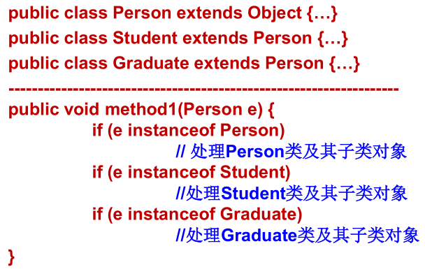

### 对象类型转换 (casting)


- 基本数据类型的 Casting
  - 自动类型转换：小的数据类型可以自动转换成大的数据类型。如 `long g = 20; double d = 12.0f;`。
    - 强制类型转换：可以把大的数据类型强制转换 (casting) 成小的数据类型。如 `float f = (float)12.0; int a = (int)1200L;`。

- 对 java 对象的强制类型转换称为造型
  - 从子类到父类的类型转换可以自动进行。
  - 从父类到子类的类型转换必须通过造型 (强制类型转换) 实现。
  - 无继承关系的引用类型间的转换是非法的。
  - 在造型前可以使用 instanceof。

- 实例：

  ```java
  public class ConversionTest {
      public static void main(String[] args) {
          double d = 13.4;
          long l = (long) d;
          System.out.println(l);
          int in = 5;
          // boolean b = (boolean)in;
          Object obj = "Hello";
          String objStr = (String) obj;
          System.out.println(objStr);
          Object objPri = new Integer(5);
          // 下面代码运行时引发ClassCastException异常
          String str = (String) objPri;
      }
  }
  ```

  ```java
  public class Test {
      public void method(Person e) {// 设Person类中没有getschool()方法
          // System.out.pritnln(e.getschool());// 非法，编译时错误
          if (e instanceof Student) {
              Student me = (Student) e;// 将e强制转换为Student类型
              System.out.pritnln(me.getschool());
          }
      }
  
      public static void main(String[] args) {
          Test t = new Test();
          Student m = new Student();
          t.method(m);
      }
  }
  ```

### Object 类的使用

- Object 类是所有 java 类的根父类。

- 如果在类的声明中未使用 extends 关键字指明其父类，则默认父类为 java.lang.Object 类。

  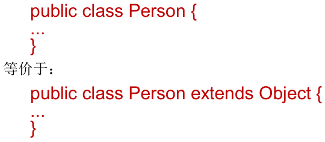

- 验证方法：

  ```java
  public class ObjectTest {
      public static void main(String[] args) {
          Base base = new Base();
          System.out.println("父类：" + base.getClass().getSuperclass());// 父类：class java.lang.Object
      }
  }
  
  class Base {
  }
  ```

- Object 类中的主要结构

  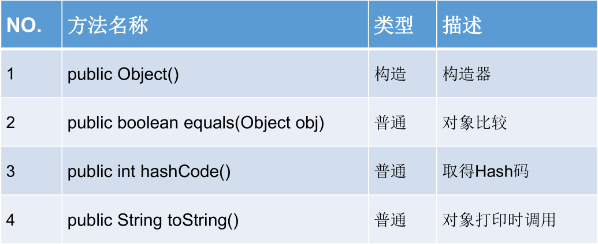

### == 操作符与 `equals()` 方法

== 运算符：

- 如果比较的是基本数据类型变量：比较两个变量保存的数据是否相等，不一定类型要相同。

  ```java
  public static void main(String[] args) {
      int i = 10;
  
      int j = 10;
      System.out.println(i == j);// true
  
      double k = 10.0;
      System.out.println(i == k);// true
  
      char c = 10;
      System.out.println(i == c);// true
  
      char c1 = 'A';
      char c2 = 65;
      System.out.println(c1 == c2);// true
  }
  ```

- 如果比较的是引用数据类型变量：比较两个变量的地址值是否相同，即两个引用是否指向同一个对象实体。

  ```java
  // String类比较特殊，要注意。
  public static void main(String[] args) {
      String s1 = "javacdfa";// 这样写的javacdfa，位于常量池中
      String s2 = "javacdfa";
      System.out.println(s1 == s2);// true
  
      String s3 = new String("iam");// 这样new的，在堆内存中 
      String s4 = new String("iam");
      System.out.println(s3 == s4);// false
  }
  ```

- **用 == 进行比较时，符号两边的数据类型必须兼容 (可自动转换的基本数据类型除外)，否则编译出错。**

`equals()` 方法：

- 是一个方法，而非运算符，只能适用于引用数据类型。

- 使用格式：`obj1.equals(obj2)`。

- 所有类都继承了 Object，也就获得了 `equals()` 方法，也可以对其重写 。

- Object 类中 `equals()` 方法的定义：

  ```java
  public boolean equals(Object obj) {
      return (this == obj);
  }
  ```

  说明：其作用与 == 相同, 比较是否指向同一个对象 。

- 像 File、String、Date 及包装类等，都重写了 Object 类中的 `equals()` 方法，重写以后，比较的不是两个引用对象的地址是否相同，而是比较两个引用对象的 "实体内容" 是否相同。

- 通常情况下，自定义的类使用 `equals()` 方法时，也是比较两个引用对象的 "实体内容" 是否相同。那么，就应该重写 `equals()` 方法。比如 String 类的 `equals()` 方法：

  ```java
  public boolean equals(Object anObject) {
      // 先判断地址
      if (this == anObject) {
          return true;
      }
      // 再判断内容
      if (anObject instanceof String) {
          String anotherString = (String)anObject;
          int n = value.length;
          if (n == anotherString.value.length) {
              char v1[] = value;
              char v2[] = anotherString.value;
              int i = 0;
              while (n-- != 0) {
                  if (v1[i] != v2[i])
                      return false;
                  i++;
              }
              return true;
          }
      }
      return false;
  }
  ```

- 重写 `equals()` 方法的原则：
  - 对称性：如果 `x.equals(y)` 返回是 true，那么 `y.equals(x)` 也应该返回是 true。
  - 自反性：`x.equals(x)` 必须返回是 true。
  - 传递性：如果 `x.equals(y)` 返回是 true，而且 `y.equals(z)` 返回是 true，那么 `z.equals(x)` 也应该返回是 true。
  - 一致性：如果 `x.equals(y)` 返回是 true，只要 x 和 y 内容一直不变，不管重复 `x.equals(y)` 多少次，返回都是 true。
  - 任何情况下，`x.equals(null)` 永远返回是 false；`x.equals(和x不同类型的对象)` 永远返回是 false。

面试题：== 和 `equals()` 的区别？

- == 既可以比较基本类型也可以比较引用类型。对于基本类型是比较值，对于引用类型是比较内存地址。
- `equals()` 方法属于 java.lang.Object 类里面的方法，如果该方法没有被重写过，默认也是 ==。
- 具体到特定自定义的类，要看该类里有没有重写 Object 的 `equals()` 方法以及重写的逻辑。
- 通常情况下，重写 `equals()` 方法，是比较类中的相应属性是否都相等。 

### `toString()` 方法

- 当输出一个对象的引用时，实际上就是调用当前对象的 `toString()` 方法。

  ```java
  public class ObjectTest {
      public static void main(String[] args) {
          Order order = new Order();
          System.out.println(order);// cn.xisun.database.Order@78308db1
          System.out.println(order.toString());// cn.xisun.database.Order@78308db1
      }
  }
  
  class Order {
  
  }
  ```

- Object 类中 `toString()` 方法的定义： 

  ```java
  public String toString() {
      return getClass().getName() + "@" + Integer.toHexString(hashCode());
  }
  ```

- 像 File、String、Date 及包装类等，都重写了 Object 类中的 `toString()` 方法，使得在调用对象的 `toString()` 方法时，返回相应的 "实体内容"。

- 自定义类也可以重写 `toString()` 方法，当调用此方法时，返回 相应的 "实体内容"。比如 String 类的 `equals()` 方法：

  ```java
  public String toString() {
      return this;
  }
  ```

- 基本类型数据转换为 String 类型时，调用了对应包装类的 `toString()` 方法。

- 面试题：

  ```java
  public static void main(String[] args) {
      char[] arr = new char[] { 'a', 'b', 'c' };
      System.out.println(arr);// abc
      int[] arr1 = new int[] { 1, 2, 3 };
      System.out.println(arr1);// [I@78308db1
      double[] arr2 = new double[] { 1.1, 2.2, 3.3 };
      System.out.println(arr2);// [D@27c170f0
  }
  ```

### 包装类 (Wrapper) 的使用

包装类：也叫封装类，是针对八种基本数据类型定义的相应的引用数据类型，以使得基本数据类型的变量具有类的特征。

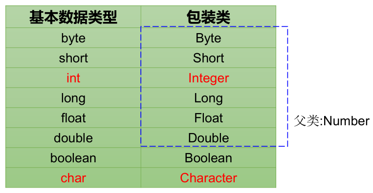

- JDK 1.5 之后，支持自动装箱，自动拆箱，但类型必须匹配。

基本类型、包装类与 String 类之间的转换：

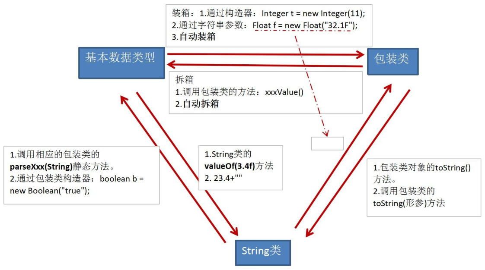

- 基本数据类型转换成包装类
  - 装箱：基本数据类型包装成包装类的实例，通过包装类的构造器实现。例如：`int i = 500; Integer t = new Integer(i);`。
  - **自动装箱**，例如：`int i =500; Integer t = i;`。
- 包装类转换成基本数据类型
  - 拆箱：获得包装类对象中包装的基本类型变量，通过调用包装类的 `.xxxValue()` 方法。例如：`boolean b = bObj.booleanValue();`。
  - **自动拆箱**，例如：`Integer t = 500; int i = t;`。
-  基本数据类型/包装类转换成字符串
  - 调用字符串重载的 **`valueOf()`** 方法，例如：`String fstr = String.valueOf(2.34f);。`
  - 更直接的方式，连接运算，例如：`String intStr = 5 + "";`。
- 字符串转换成基本数据类型/包装类
  - 通过包装类的构造器实现，例如：`int i = new Integer("12");`。
  - 通过包装类的 **`parseXxx(String s)`** 静态方法，例如：`Float f = Float.parseFloat(“12.1”);`。

面试题：

```java
public static void main(String[] args) {
    // 三目运算符比较基本数据类型，在编译阶段自动拆箱为int和double类型，由于三目运算符要求表达式2和表达式3类型一致，
    // 所以在编译阶段自动类型提升(即int自动类型转换为double类型)，再自动装箱为Object，输出时使用多态调用重写
    // 的toString()，即Double包装类的toString()方法
    Object o1 = true ? new Integer(1) : new Double(2.0);
    System.out.println(o1);// 1.0

    Object o2;
    if (true)
        o2 = new Integer(1);
    else
        o2 = new Double(2.0);
    System.out.println(o2);// 1
}
```

```java
public static void main(String[] args) {
    Integer i = new Integer(1);
    Integer j = new Integer(1);
    System.out.println(i == j);// new了两个对象，false
    Integer m = 1;
    Integer n = 1;
    System.out.println(m == n);// 自动装箱，且在-128~127范围内，true
    Integer x = 128;// 相当于new Integer(128);
    Integer y = 128;// 相当于new Integer(128);
    System.out.println(x == y);// false
}
```

> Integer 类内部定义了 IntegerCache 结构，IntegerCache 中定义了一个 Integer[] 数组，保存了从 -128~127 范围的整数。如果使用了自动装箱的方式，给 Integer 赋值在 -128~127 范围内时，可以直接使用数组中的元素，不用 new。目的：提高效率。如果赋值超过了此范围，会 new 一个新对象。

```java
/**
 * 利用Vector代替数组处理：从键盘读入学生成绩(以负数代表输入结束)，找出最高分，并输出学生成绩等级。
 * 提示：数组一旦创建，长度就固定不变，所以在创建数组前就需要知道它的长度。而向量类java.util.Vector可以根据需要动态伸缩。
 *  创建Vector对象：Vector v=new Vector();
 *  给向量添加元素：v.addElement(Object obj);// obj必须是对象
 *  取出向量中的元素：Object obj=v.elementAt(0);
 *  注意第一个元素的下标是0，返回值是Object类型的。
 *  计算向量的长度：v.size();
 *  若与最高分相差10分内：A等；20分内：B等；30分内：C等；其它：D等。
 */
public class ScoreTest {
    public static void main(String[] args) {
        Scanner scanner = new Scanner(System.in);
        Vector<Object> objects = new Vector<>();
        int maxScore = -1;
        while (true) {
            int nextScore = scanner.nextInt();
            if (nextScore < 0) {
                break;
            }
            if (nextScore > 100) {
                continue;
            }
            objects.add(nextScore);// 自动装箱
            if (maxScore < nextScore) {
                maxScore = nextScore;
            }
        }

        char level;
        for (int i = 0; i < objects.size(); i++) {
            Object object = objects.elementAt(i);
            int score = (Integer) object;// 自动拆箱
            if (maxScore - score < 10) {
                level = 'A';
            } else if (maxScore - score < 20) {
                level = 'B';
            } else if (maxScore - score < 30) {
                level = 'C';
            } else {
                level = 'D';
            }
            System.out.println("Student-" + i + " score is " + score + ", level is " + level);
        }
    }
}
```

### 关键字：static

当编写一个类时，其实就是在描述其对象的属性和行为，而并没有产生实质上的对象，只有通过 new 关键字才会产生出对象，这时系统才会分配内存空间给对象，其方法才可以供外部调用。有时候，希望无论是否产生了对象或无论产生了多少对象的情况下，**某些特定的数据在内存空间里只有一份**。例如：所有的中国人都有个国家名称，每一个中国人都共享这个国家名称，不必在每一个中国人的实例对象中都单独分配一个用于代表国家名称的变量。

实例变量：

```java
public class Test {
    public static void main(String[] args) {
        Circle c1 = new Circle(2.0); // c1.radius=2.0
        Circle c2 = new Circle(3.0); // c2.radius=3.0
    }
}

class Circle {
    private double radius;

    public Circle(double radius) {
        this.radius = radius;
    }

    public double findArea() {
        return Math.PI * radius * radius;
    }
}
```

- 上述代码中，c1 的 radius 独立于 c2 的 radius，存储在不同的空间。c1 中的 radius 变化不会影响 c2 的 radius，反之亦然。
- 像 Circle 类中的变量 radius 这样的，叫**实例变量 (instance variable)**，它属于类的每一个对象，不能被同一个类的不同对象所共享。
- **如果想让一个类的所有实例共享数据，就用类变量。类变量的定义，就需要用到 static 关键字。**

static 关键字的使用：

- static：静态的。
- static 可以用来修饰：**属性、方法、代码块、内部类。**
- static 修饰后的成员具备以下特点：
  - 随着类的加载而加载。
  - 优先于对象存在。
  - 修饰的成员，被所有对象所共享。
  - 访问权限允许时，可不创建对象，直接被类调用。
- 使用 static 修饰属性：静态变量 (类变量/class variable)

  - 属性，按是否使用 static 修饰，分为：静态属性和非静态属性 (实例变量)。

    - 实例变量：当创建了类的多个对象，每个对象都独立的拥有一套类中的非静态属性。当修改其中一个对象的非静态属性时，不会导致其他对象中同样的属性值被修改。
    - 静态变量：当创建了类的多个对象，每个对象都共用同一个静态变量。当通过某一个对象修改静态变量时，会导致其他对象调用此静态变量时，是修改之后的值。 **注意：实际操作时，虽然编译能过通过，但不应该通过类的实例对象来访问静态成员。**

    - **静态变量随着类的加载而加载。可以通过 "类.静态变量"的方式进行调用。**
    - **静态变量的加载要早于对象的创建。**(实例变量在创建对象的过程中，或创建对象之后，才创建。)
    - **由于类只会加载一次，则静态变量在内存中也只会存在一份：保存在方法区的静态域中。**
    - 类可以访问静态变量，但不能访问实例变量 (实例变量在对象产生时才生成)，对象可以访问实例变量，也能访问静态变量 (不推荐)。
  - 静态变量举例：System.out，Math.PI。
- 使用 static 修饰方法：静态方法 (类方法/class method)
  - **随着类的加载而加载，可以通过 "类.静态方法" 的方式进行调用。**
  - 类可以访问静态方法，但不能访问非静态方法  (非静态方法在对象产生时才生成)，对象可以访问非静态方法，也能访问静态方法 (不推荐)。
  - **静态方法中，只能调用静态属性或静态方法，它们的生命周期是一致的。非静态方法中，既可以调用非静态属性或非静态方法，也能调用静态属性或静态方法。** 

- static 使用的注意点：

  - **在静态方法内，不能使用 this 关键字、super 关键字。**(this 和 super 指向当前类对象和父类对象，需要创建实例对象后才有这些概念。)

    ```java
    public static void show() {
        // 省略的是Chiese.，而不是this.
        walk();// 等同于Chinese.walk();
        System.out.println("nation: " + nation);// 等同于System.out.println(Chinese.nation);
    }
    ```

  - **static 修饰的方法不能被重写。**

  - 关于静态属性和静态方法的使用，从生命周期的角度去理解。

- 实例：

  ```java
  public class Test {
      public static void main(String[] args) {
          Chinese c1 = new Chinese();
          c1.name = "姚明";
          c1.age = 40;
  
          Chinese c2 = new Chinese();
          c2.name = "马龙";
          c2.age = 30;
  
          // 通过c1对象修改nation的值，c2对象也能获得
          // 实际操作时，虽然编译能过通过，但不应该通过类的实例对象来访问静态成员
          c1.nation = "CHN";
          System.out.println(c2.nation);
  
          // 对象实例调用非静态方法
          c1.eat();
  
          // 类调用静态方法
          Chinese.show();
  
          // 通过c1对象也能调用非静态方法
          // 实际操作时，虽然编译能过通过，但不应该通过类的实例对象来访问静态成员
          c1.show();
      }
  }
  
  class Chinese {
      String name;
      int age;
      static String nation;
  
      public void eat() {
          System.out.println("吃饭");
  
          // 调用非静态结构
          this.info();
          System.out.println("name: " + this.name);
  
          // 调用静态结构
          walk();
          System.out.println("nation: " + nation);
      }
  
      public void info() {
          System.out.println("name: " + name + ", age: " + age + ", nation: " + nation);
      }
  
      public static void show() {
          System.out.println("我是中国人");
  
          // 不能调用非静态的结构
          // eat();
          // name = "Tom";
  
          // 调用静态的结构
          walk();
          System.out.println("nation: " + nation);// 省略的是Chiese.，而不是this.，等同于System.out.println(Chinese.nation);
      }
  
      public static void walk() {
          System.out.println("走路");
      }
  }
  ```

- 类变量和实例变量内存解析：

  

类属性、类方法的设计思想：

- 类属性作为该类各个对象之间共享的变量，在设计类时，分析哪些**属性不因对象的不同而改变**，将这些属性设置为类属性，相应的方法设置为类方法。
- 如果**方法与调用者无关**，则这样的方法通常被声明为类方法，由于**不需要创建对象就可以调用类方法**，从而简化了方法的调用。
- 类中的常量，通常也声明为 static 的。
- 操作静态属性的方法，通常设置为 static 的。
- 工具类中的方法，习惯上声明为 static 的。

### `main()` 方法的语法

由于 java 虚拟机需要调用类的 `main()` 方法，所以该方法的访问权限必须是 public，又因为 java 虚拟机在执行 `main()` 方法时不必创建对象，所以该方法必须是 static 的，该方法接收一个 String 类型的数组参数，该数组中保存执行 java 命令时传递给所运行的类的参数。

又因为 `main()` 方法是静态的，我们不能直接访问该类中的非静态成员，必须创建该类的一个实例对象后，才能通过这个对象去访问类中的非静态成员，这种情况，我们在之前的例子中多次碰到。

`main()` 方法的使用说明：

- `main()` 方法是程序的入口。
- `main()` 方法也是一个普通的静态方法，在执行某个类的 `main()` 方法之前，需要先加载这个类，这个过程是早于 `main()` 方法中首行的执行语句的。
- `main()` 方法可以作为程序与控制台交互的方式之一，其他的还可以使用 Scanner 类。

命令行参数用法举例：

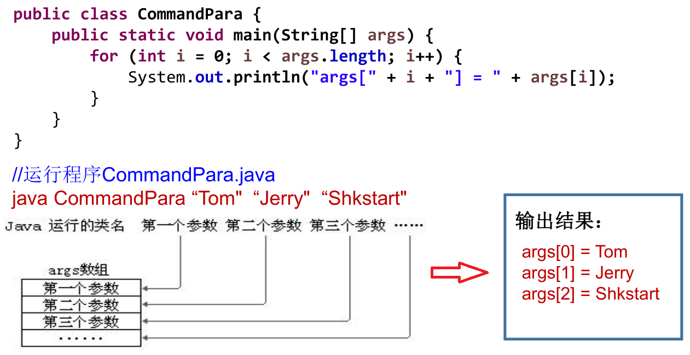

### 类的成员之四：代码块 (或初始化块)

- 代码块的作用：对 java 类或对象进行初始化。

- 代码块的分类：一个类中代码块若有修饰符，则只能被 static 修饰，称为静态代码块 (static block)，没有使用 static 修饰的，为非静态代码块。

- **静态代码块：**

  - 内部可以有输出语句。
  - **随着类的加载而执行，而且只执行一次。**(不同于静态方法，静态方法必须在被类显示的调用后，才会执行方法内的语句。)
  - 作用：初始化类的信息。
  - 如果一个类定义了多个静态代码块，则按照声明的先后顺序来执行。一般情况下，不建议定义多个。
  - **静态代码块的执行要优先于非静态代码块的执行，与声明的先后顺序无关。**
  - 静态代码块中，只能调用静态的属性、静态的方法，不能调用非静态的属性、非静态的方法。

- **非静态代码块：**

  - 内部可以有输出语句。
  - **随着对象的创建而执行。**(不同于非静态方法，非静态方法必须在被类的对象显示的调用后，才会执行方法内的语句。)
  - **每创建一个对象，就执行一次非静态代码块。且先于构造器执行。**
  - 作用：可以再创建对象时，对对象的属性等进行初始化。
  - 如果一个类定义了多个非静态代码块，则按照声明的先后顺序来执行。一般情况下，不建议定义多个。
  - 非静态代码块中，可以调用静态的属性、静态的方法，也可以调用非静态的属性、非静态的方法。

- 实例：

  ```java
  public class BlockTest {
      public static void main(String[] args) {
          System.out.println("*********类加载*********");
          String desc = Person.desc;
          System.out.println(desc);
  
          System.out.println("*********对象加载*********");
          Person person = new Person();
      }
  }
  
  class Person {
      // 属性
      String name;
      int age;
      static String desc = "我是一个人";
  
      // 静态代码块
      static {
          System.out.println("我是一个静态代码块-1");
  
          // 调用静态结构
          desc = "我是一个中国人";// 对类的静态属性重新赋值
          info();
          // 不能调用非静态结构
          // name = "Tom";
          // eat();
      }
  
      static {
          System.out.println("我是一个静态代码块-2");
      }
  
      // 非静态代码块
      {
          System.out.println("我是一个非静态代码块-1");
  
          // 调用静态结构
          desc = "我是一个中国人";
          info();
          // 调用非静态结构
          name = "Tom";
          eat();
      }
  
      {
          System.out.println("我是一个非静态代码块-2");
      }
  
  
      // 构造器
      public Person() {
  
      }
  
      public Person(String name, int age) {
          this.name = name;
          this.age = age;
      }
  
      // 静态方法
      public static void info() {
          System.out.println("我是一个静态方法");
      }
  
      // 非静态方法
      public void eat() {
          System.out.println("我是一个非静态方法");
      }
  
      @Override
      public String toString() {
          return "Person{" +
                  "name='" + name + '\'' +
                  ", age=" + age +
                  '}';
      }
  }
  ```

代码块及构造器的执行顺序：

- **由父及子，静态先行。**

- **注意：调用 `main()` 方法时，需要先加载类，这个过程是早于 `main()` 方法中的首行执行语句的。**

- 实例：

  ```java
  class Root {
      static {
          System.out.println("Root的静态初始化块");
      }
  
      {
          System.out.println("Root的普通初始化块");
      }
  
      public Root() {
          System.out.println("Root的无参数的构造器");
      }
  }
  
  class Mid extends Root {
      static {
          System.out.println("Mid的静态初始化块");
      }
  
      {
          System.out.println("Mid的普通初始化块");
      }
  
      public Mid() {
          System.out.println("Mid的无参数的构造器");
      }
  
      public Mid(String msg) {
          // 通过this调用同一类中重载的构造器
          this();
          System.out.println("Mid的带参数构造器，其参数值：" + msg);
      }
  }
  
  class Leaf extends Mid {
      static {
          System.out.println("Leaf的静态初始化块");
      }
  
      {
          System.out.println("Leaf的普通初始化块");
      }
  
      public Leaf() {
          // 通过super调用父类中有一个字符串参数的构造器
          super("尚硅谷");
          System.out.println("Leaf的构造器");
      }
  }
  
  public class LeafTest {
      public static void main(String[] args) {
          new Leaf();
          System.out.println();
          new Leaf();
      }
  }
  输出结果：
  Root的静态初始化块
  Mid的静态初始化块
  Leaf的静态初始化块
  Root的普通初始化块
  Root的无参数的构造器
  Mid的普通初始化块
  Mid的无参数的构造器
  Mid的带参数构造器，其参数值：尚硅谷
  Leaf的普通初始化块
  Leaf的构造器
  
  Root的普通初始化块
  Root的无参数的构造器
  Mid的普通初始化块
  Mid的无参数的构造器
  Mid的带参数构造器，其参数值：尚硅谷
  Leaf的普通初始化块
  Leaf的构造器
  ```

- 实例二：

  ```java
  class Father {
      static {
          System.out.println("11111111111");
      }
  
      {
          System.out.println("22222222222");
      }
  
      public Father() {
          System.out.println("33333333333");
  
      }
  
      // main方法是一个静态方法，执行某个类的main方法之前，要先加载这个类，此处是Father类
      public static void main(String[] args) {
          System.out.println("77777777777");
          System.out.println("************************");
          new Son();
          System.out.println("************************");
  
          new Son();
          System.out.println("************************");
          new Father();
      }
  }
  
  class Son extends Father {
      static {
          System.out.println("44444444444");
      }
  
      {
          System.out.println("55555555555");
      }
  
      public Son() {
          System.out.println("66666666666");
      }
  
      // main方法是一个静态方法，执行某个类的main方法之前，要先加载这个类，此处是先加载Son类
      public static void main(String[] args) { // 由父及子 静态先行
          System.out.println("77777777777");
          System.out.println("************************");
          new Son();
          System.out.println("************************");
  
          new Son();
          System.out.println("************************");
          new Father();
      }
  }
  
  public class Test {
      // main方法是一个静态方法，执行某个类的main方法之前，要先加载这个类，此处是先加载Test类
      public static void main(String[] args) {
          System.out.println("77777777777");
          System.out.println("************************");
          new Son();
          System.out.println("************************");
  
          new Son();
          System.out.println("************************");
          new Father();
      }
  }
  ```

  调用 Father 类的 `main()` 方法，要先加载 Father 类。输出结果：

  ```java
  F: 11111111111
  F/m: 77777777777
  F/m: ************************
  S: 44444444444
  F: 22222222222
  F: 33333333333
  S: 55555555555
  S: 66666666666
  F/m: ************************
  F: 22222222222
  F: 33333333333
  S: 55555555555
  S: 66666666666
  F/m: ************************
  F: 22222222222
  F: 33333333333
  ```

  调用 Son 类的 `main()` 方法，要先加载 Son 类。输出结果：

  ```java
  F: 11111111111
  S: 44444444444
  S/m: 77777777777
  S/m: ************************
  F: 22222222222
  F: 33333333333
  S: 55555555555
  S: 66666666666
  S/m: ************************
  F: 22222222222
  F: 33333333333
  S: 55555555555
  S: 66666666666
  S/m: ************************
  F: 22222222222
  F: 33333333333
  ```

  调用 Test 类的 `main()` 方法，要先加载 Test 类。输出结果：

  ```java
  T/m: 77777777777
  T/m: ************************
  F: 11111111111
  S: 44444444444
  F: 22222222222
  F: 33333333333
  S: 55555555555
  S: 66666666666
  T/m: ************************
  F: 22222222222
  F: 33333333333
  S: 55555555555
  S: 66666666666
  T/m: ************************
  F: 22222222222
  F: 33333333333
  ```

### 关键字：final

final：最终的。

- final 可以用来修饰的结构：类、方法、变量 (属性是成员变量，是变量的其中一种。)。

- final 用来修饰类：**此类不能被其他类所继承。**例如：String 类、System 类、StringBuffer 类。

  

- final 用来修饰方法：**此方法不能被子类重写。**例如：Object 类中的 `getClass()`。

  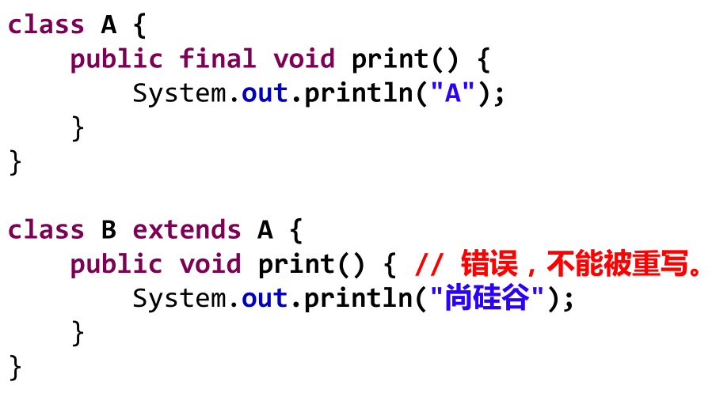

- final 用来修饰变量：**此时的 "变量" 称为常量，名称大写，且只能被赋值一次。**

  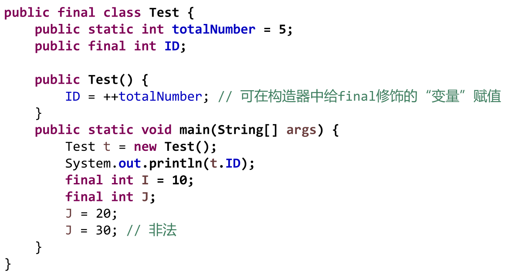

  - **final 修饰成员变量：必须在声明时或代码块中或在每个构造器中显式赋值，否则编译不通过。**

    ```java
    public class FinalTest {
        // 1.显式初始化：所有对象的这个常量值都是相同的，可以考虑直接显式初始化
        final int WIDTH = 0;
    
        // 2.代码块中初始化：如果涉及到调用方法，或赋值操作较多，可以考虑代码块中初始化
        final int HEIGHT;
    
        {
            HEIGHT = show();
        }
    
        // 3.构造器中初始化：如果涉及到调用方法，或赋值操作较多，可以考虑代码块中初始化
        final int LEFT;
    
        public FinalTest() {
            LEFT = show();
        }
    
        public int show() {
            return 0;
        }
    
        public static void main(String[] args) {
            FinalTest finalTest = new FinalTest();
        }
    }
    ```

  - **final 修饰局部变量：修饰方法内局部变量时，表明该变量是一个常量，不能被修改；修饰形参时，表明此形参是一个常量，当调用此方法时，给常量形参赋一个实参，一旦赋值以后，就只能在方法体内使用此形参，但不能被修改。**

    ```java
    public class FinalTest {
    
        public int show() {
            // 1.修饰方法内局部变量：常量，不能被再次更改。
            final int NUM = 10;
            return NUM;
        }
    
        // 2.修饰形参：当方法被调用时，传入的实参，不能被再次更改。
        public void show(final int num) {
            System.out.println(num);
        }
    
        public static void main(String[] args) {
            FinalTest finalTest = new FinalTest();
            finalTest.show(20);
        }
    }
    ```

- **static final 用来修饰属性：全局常量。**

  ```java
  public class FinalTest {
  
      static final int WIDTH = 0;
  
      static final int HEIGHT;
  
      static {
          HEIGHT = show();
      }
      
      public FinalTest() {
  
      }
  
      public static int show() {
          return 0;
      }
  
      public static void main(String[] args) {
          FinalTest finalTest = new FinalTest();
      }
  }
  ```

面试题：

```java
public class Something {
    public int addOne(final int x) {
        // return ++x;// 编译不通过
        return x + 1;// 正常
    }
}
```

```java
public class Something {
    public void addOne(final Other o) {
        // o = new Other();// 编译不通过
        o.i++;// 正常
    }

    public static void main(String[] args) {
        Other o = new Other();
        new Something().addOne(o);
    }
}

class Other {
    public int i;
}
```

### 抽象类和抽象方法

随着继承层次中一个个新子类的定义，类变得越来越具体，而父类则更一般，更通用。类的设计应该保证父类和子类能够共享特征。有时将一个父类设计得非常抽象，以至于它没有具体的实例，这样的类叫做抽象类。

抽象类应用：抽象类是用来模型化那些父类无法确定全部实现，而是由其子类提供具体实现的对象的类。

abstract 关键字的使用：

- abstract：抽象的。

- abstract 可以用来修饰的结构：类、方法。
- abstract 修饰类：抽象类。
  - **抽象类不能实例化。**
  - **抽象类中一定有构造器 (抽象类本身不能使用构造器)，便于子类实例化时调用。**
  - 开发中，会提供抽象类的子类，让子类对象实例化，完成相关操作。
- abstract 修饰方法：抽象方法。
  - 抽象方法只有方法声明，没有方法体，以分号结束。比如：`public abstract void talk();`
  - **包含抽象方法的类，一定是一个抽象类。反之，抽象类中可以没有抽象方法。**
  - **若子类重写了父类 (不仅包括直接父类，也包括间接父类) 中的所有的抽象方法后，此子类方可实例化；若子类没有重写父类中的所有的抽象方法，则次子类也是一个抽象类，需要使用 abstract 修饰。**
- **abstract 不能修饰变量、代码块、构造器。**
- **abstract 不能修饰私有方法、静态方法、final 的方法、final 的类。**

### 抽象类的匿名子类对象

```java
public class Test {
    public static void method(Student student) {

    }

    public static void method1(Person person) {
        person.eat();
    }

    public static void main(String[] args) {
        // 匿名对象
        method(new Student());

        // 1.创建非匿名类的非匿名的对象
        Worker worker = new Worker();
        method1(worker);

        // 2.创建非匿名类的匿名的对象
        method1(new Worker());

        // 3.创建匿名子类的非匿名的对象：p
        Person p = new Person() {
            @Override
            public void eat() {
                // 重写方法体
                System.out.println("...");
            }
        };
        method1(p);

        // 4.创建匿名子类的匿名对象
        method1(new Person() {
            @Override
            public void eat() {
                // 重写方法体
                System.out.println(",,,");
            }
        });
    }
}

abstract class Person {
    public abstract void eat();
}

class Student {

}

class Worker extends Person {
    @Override
    public void eat() {
        // 重写方法体
        System.out.println("、、、");
    }
}
```

### 接口 (interface)

一方面，有时必须从几个类中派生出一个子类，继承它们所有的属性和方法。但是，java 不支持多重继承。有了接口，就可以得到多重继承的效果。另一方面，有时必须从几个类中抽取出一些共同的行为特征，而它们之间又没有 is - a 的关系，仅仅是具有相同的行为特征而已。例如：鼠标、键盘、打印机、扫描仪、摄像头、充电器、MP3 机、手机、数码相机、移动硬盘等都支持 USB 连接。

接口就是规范，定义的是一组规则，体现了现实世界中 "如果你是/要...则必须能..." 的思想。继承是一个 "是不是" 的关系，而接口实现则是 "能不能" 的关系。

接口的本质是契约，标准，规范，就像我们的法律一样，制定好后大家都要遵守。

接口的使用：

- 接口使用 interface 定义。

- **java 中，接口和类是并列的两个结构，或者可以理解为一种特殊的类。从本质上讲，接口是一种特殊的抽象类。**

- 如何定义接口：定义接口中的成员

  - JDK 7 及以前：只能定义全局常量和抽象方法。

    - **全局常量：接口中的所有成员变量都默认是由 public static final 修饰的。**书写时，可以省略，但含义不变，常量不能被更改。
    - **抽象方法：接口中的所有抽象方法都默认是由 public abstract 修饰的。**

  - JDK 8：除了定义全局常量和抽象方法之外，还可以定义静态方法、默认方法。

    - **静态方法：使用 static 关键字修饰，默认为 public 的。**

      - **只能通过接口直接调用，并执行其方法体。**

    - **默认方法：使用 default 关键字修饰，默认为 public 的。**

      - **可以通过实现类的对象来调用，如果实现类重写了接口中的默认方法，调用时，执行的是重写后的方法。**

      - **如果子类 (或实现类) 继承的父类和实现的接口中，声明了同名同参数的mo人方法，那么子类在没有重写此方法的情况下， 默认调用的是父类中的同名同参数的方法 --- 类优先原则。如果重写了，调用子类重写的方法。**

      - **如果实现类实现了多个接口，而多个接口中定义了同名同参数的默认方法，那么在实现类没有重写此方法的情况下，编译不通过 --- 接口冲突。如果要避免接口冲突，则在实现类中，必须重写此方法。**

        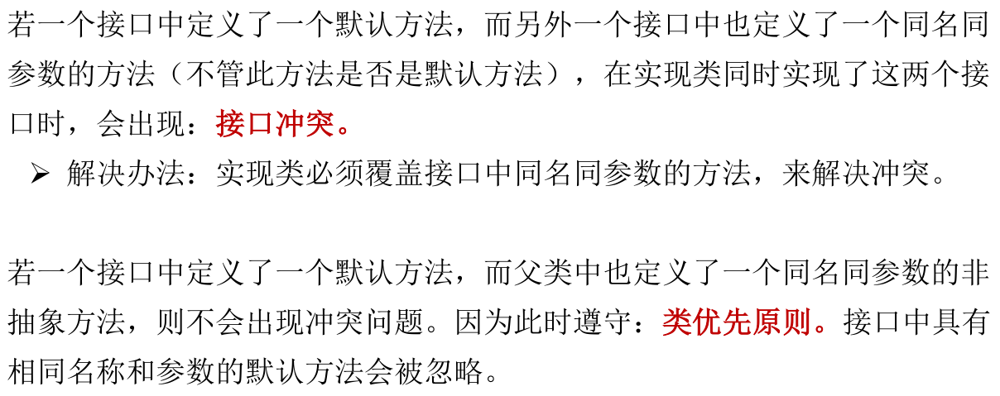

        

      - 在子类 (或实现类) 的方法中，使用 "super.方法名" 调用父类的方法，使用 "接口名.super.方法名" 调用接口中的方法。

    - 实例：
    
      ```java
      public interface InterfaceA {
          // 静态方法
          static void method1() {
              System.out.println("接口A：静态方法1");
          }
      
          // 默认方法
          default void method2() {
              System.out.println("接口A：默认方法2");
          }
      
          default void method3() {
              System.out.println("接口A：默认方法3");
          }
      
          default void method4() {
              System.out.println("接口A：默认方法4");
          }
      
          default void method5() {
              System.out.println("接口A：默认方法5");
          }
      }
      ```
    
      ```java
      public interface InterfaceB {
          default void method5() {
              System.out.println("接口B：默认方法5");
          }
      }
      ```
    
      ```java
      public class SubClassTest {
          public static void main(String[] args) {
              // 1.静态方法
              InterfaceA.method1();
      
              SubClass subClass = new SubClass();
              // 2.默认方法
              subClass.method2();
              // 3.重写的默认方法
              subClass.method3();
              // 4.调用的是父类中的method4()
              subClass.method4();
          }
      }
      
      class SuperClass {
          public void method4() {
              System.out.println("父类：方法4");
          }
      }
      
      class SubClass extends SuperClass implements InterfaceA, InterfaceB {
          // 重写接口InterfaceA中的method3()
          @Override
          public void method3() {
              System.out.println("实现类：方法3");
          }
      
          // 重写了父类SuperClass的method4()
          @Override
          public void method4() {
              System.out.println("实现类：方法4");
          }
      
          // InterfaceA和InterfaceB声明了同名同参的method5()，SubClass中必须重写此方法，否则接口冲突，编译不通过
          // 如果继承的父类SuperClass中也声明了同名同参的method5()，则不会出现接口冲突
          @Override
          public void method5() {
              System.out.println("实现类：方法5");
          }
      
          public void myMethod() {
              method2();// InterfaceA的method2()
      
              method3();// 重写的InterfaceA的method3()
              InterfaceA.super.method3();// InterfaceA的method3()
      
              method4();// 重写的SuperClass的method4()
              super.method4();// 父类SuperClass的method4()
      
              InterfaceA.super.method5();// InterfaceA的method5()
              InterfaceB.super.method5();// InterfaceB的method5()
          }
      }
      ```

- **接口中不能定义构造器，意味着接口不可以实例化。**

- java 开发中，接口都通过让类去实现的方式 (implements) 来使用 (面向接口编程)。

- **如果实现类覆盖了接口中 (包括直接接口和间接接口) 的所有抽象方法，则此实现类可以实例化。如果实现类没有覆盖接口 (包括直接接口和间接接口) 中所有的抽象方法，则此实现类仍为一个抽象类。**

  ```java
  interface MyInterface{
      String s = "MyInterface";
      public void absM1();
  }
  
  interface SubInterface extends MyInterface{
  	public void absM2();
  }
  
  // 实现类SubAdapter必须给出接口SubInterface以及父接口MyInterface中所有方法的实现。
  // 否则，SubAdapter仍需声明为abstract的。
  public class SubAdapter implements SubInterface{
      public void absM1(){
          System.out.println("absM1");
      }
      
      public void absM2(){
          System.out.println("absM2");
      }
  }
  ```

- **java 类可以实现多个接口**，弥补了 java 单继承性的局限性。

  - 格式：`class SubClass extends SuperClass implements InterfaceA, InterfaceB, InterfaceC {}`

- **接口与接口之间可以继承，而且可以多继承。**

- 与继承关系类似，接口与实现类之间体现了多态性。

- 接口，实际上可以看作是一种规范。

- 实例：

  

  ```java
  public class InterfaceTest {
      public static void main(String[] args) {
          System.out.println(Flyable.MAX_SPEED);
          System.out.println(Flyable.MIN_SPEED);
  
          Plane plane = new Plane();
          plane.fly(); 
      }
  }
  
  interface Flyable {
      // 全局常量，可以省略 public static final
      int MAX_SPEED = 7900;// 第一宇宙速度
      int MIN_SPEED = 1;
  
      // 抽象方法，可以省略 public abstract
      public abstract void fly();
  
      void stop();
  }
  
  interface Attackable {
      void attack();
  }
  
  // 全部实现接口中的方法，可以实例化
  class Plane implements Flyable {
  
      @Override
      public void fly() {
          System.out.println("飞机起飞");
      }
  
      @Override
      public void stop() {
          System.out.println("飞机降落");
      }
  }
  
  // 未全部实现接口中的方法，仍是一个抽象类
  abstract class Kite implements Flyable {
      @Override
      public void fly() {
          System.out.println("风筝在飞");
      }
  }
  
  // 实现多个接口
  class Bullet implements Flyable, Attackable {
  
      @Override
      public void fly() {
          System.out.println("子弹起飞");
      }
  
      @Override
      public void stop() {
          System.out.println("子弹停止");
      }
  
      @Override
      public void attack() {
          System.out.println("子弹具有攻击性");
      }
  }
  ```

面试题：

- 抽象类与接口有哪些异同？

  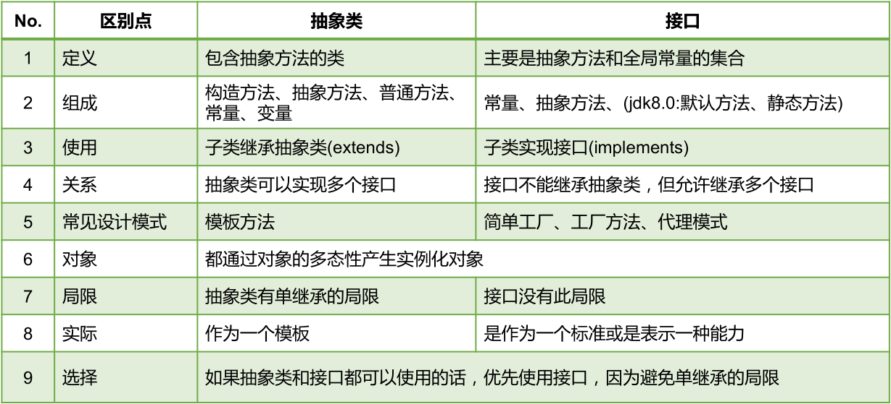

  **接口能继承接口；**

  **抽象类能继承接口 (如不完全实现接口方法的类，还是抽象类)；**

  **抽象类能继承非抽象类 (如抽象类的父类 Object)。**

- 排错：

  因为接口 A 和父类 B 是并列的，所以需要明确变量 x 的所属，如果 A 是 B 的父类，那么在 C 中就近原则，x 会认为是 B 的属性：

  ```java
  interface A {
      int x = 0;
      int x1 = 2;
  }
  
  class B {
      int x = 1;
      int x2 = 3;
  }
  
  class C extends B implements A {
      public void pX() {
          System.out.println(x);// error: Reference to 'x' is ambiguous, both 'B.x' and 'A.x' match
          // System.out.println(A.x);// 0
          // System.out.println(super.x);// 1
          System.out.println(x1);// 2
          System.out.println(x2);// 3
      }
  
      public static void main(String[] args) {
          new C().pX();
      }
  }
  ```

  接口中的所有成员变量都默认是 public static final 的，不能在实现类中被重写：

  ```java
  interface Playable {
      void play();
  }
  
  interface Bounceable {
      void play();
  }
  
  interface Rollable extends Playable, Bounceable {
      Ball BALL = new Ball("PingPang");
  }
  
  class Ball implements Rollable {
      private String name;
  
      public String getName() {
          return name;
      }
  
      public Ball(String name) {
          this.name = name;
      }
  
      // play()方法被认为是即重写了接口Playable，又重写了接口Bounceable
      @Override
      public void play() {
          BALL = new Ball("Football");// error: Cannot assign a value to final variable 'BALL'
          System.out.println(BALL.getName());
      }
  }
  ```

### 接口匿名实现类的对象

```java
public class InterfaceTest {
    public static void main(String[] args) {
        Computer computer = new Computer();

        // 1.创建接口的非匿名实现类的非匿名对象
        Flash flash = new Flash();
        computer.transferData(flash);

        // 2.创建接口的非匿名实现类的匿名对象
        computer.transferData(new Printer());

        // 3.创建接口的匿名实现类的非匿名对象
        USB phone = new USB() {

            @Override
            public void start() {
                System.out.println("手机开始工作");
            }

            @Override
            public void stop() {
                System.out.println("手机停止工作");
            }
        };
        computer.transferData(phone);

        // 4.创建接口的匿名实现类的匿名对象
        computer.transferData(new USB() {
            @Override
            public void start() {
                System.out.println("mp3开始工作");
            }

            @Override
            public void stop() {
                System.out.println("mp3停止工作");
            }
        });
    }
}

class Computer {
    public void transferData(USB usb) {
        usb.start();
        transferDetails();
        usb.stop();
    }

    private void transferDetails() {
        System.out.println("具体传输数据的细节");
    }
}

interface USB {
    void start();

    void stop();
}

class Flash implements USB {

    @Override
    public void start() {
        System.out.println("U盘开启工作");
    }

    @Override
    public void stop() {
        System.out.println("U盘停止工作");
    }
}

class Printer implements USB {

    @Override
    public void start() {
        System.out.println("打印机开启工作");
    }

    @Override
    public void stop() {
        System.out.println("打印机停止工作");
    }
}
```

### 类的成员之五：内部类

当一个事物的内部，还有一个部分需要一个完整的结构进行描述，而这个内部的完整的结构又只为外部事物提供服务，那么整个内部的完整结构最好使用内部类。

- 在 java 中，允许一个类 A 声明在另一个类 B 的内部，则类 A 称为内部类，类 B 称为外部类。

- Inner class一般用在定义它的类或语句块之内，在外部引用它时必须给出完整的名称。Inner class 的名字不能与包含它的外部类类名相同。

- 内部类的分类：成员内部类 (静态的、非静态的)  vs 局部内部类 (代码块内、构造器内、方法内)

- 成员内部类：

  - 一方面，作为外部类的成员：
    - 调用外部类的结构，注意生命周期，如静态成员内部类不能调用外部类非静态的方法。
    - 可以被 static 修饰，但此时就不能再使用外层类的非 static 的成员变量。注意，外部类不能被 static 修饰。
    - 可以被 private、protected、缺省和 public 四种权限修饰符修饰。注意，外部类不能被 private 和 protected 修饰。
  - 另一方面，作为一个类：
    - 类内可以定义属性、方法、构造器、代码块、内部类等。
    - 可以被 final 修饰，表示此类不能被继承，如果不使用 final，就可以被继承。
    - 可以被 abstract 修饰，表示此类不能被实例化，可以被其它的内部类继承。
    -  编译以后生成 OuterClass$InnerClass.class 字节码文件 (也适用于局部内部类)。
  - 非 static 的成员内部类中的成员不能声明为 static 的，只有在外部类或 static 的成员内部类中才可声明 static 成员。
  - 外部类访问成员内部类的成员，需要 "内部类.成员" 或 "内部类对象.成员" 的方式。
  - 成员内部类可以直接使用外部类的所有成员，包括私有的数据。
  - 当想要在外部类的静态成员部分使用内部类时，可以考虑内部类声明为静态的。

- 局部内部类：

  - 局部内部类仍然是一个独立的类，在编译之后内部类会被编译成独立的 .class 文件，但是前面冠以外部类的类名和 $ 符号，以及数字编号。
  - 只能在声明它的方法或代码块中使用，而且是先声明后使用，除此之外的任何地方都不能使用该类。
  - 局部内部类的对象可以通过外部方法的返回值返回使用，返回值类型只能是局部内部类的父类或父接口类型。
  - 局部内部类可以使用外部类的成员，包括私有的。
  - **局部内部类可以使用外部方法的局部变量，但是必须是 final 的，final 可以省略 (jdk 8 及之后)，但这个局部变量赋值后不能有再次修改操作，否则编译不通过。**这是因为局部内部类和局部变量的声明周期不同所致。
  - 局部内部类和局部变量地位类似，不能使用 public，缺省，protected 和 private 修饰。
  - 局部内部类不能使用static修饰，因此也不能包含静态成员。

- 关注如下的 3 个问题：

  - 如何实例化成员内部类的对象？

    - 静态成员内部类：`外部类.静态内部类 变量名 = new 外部类.静态内部类();`。
    - 非静态成员内部类：`外部类.非静态内部类 变量名 = new 外部类().new 非静态内部类();`。

  - 如何在成员内部类中区分调用外部类的结构？

    - 静态成员内部类，参考：

      ```java
      public void show(int age) {
          System.out.println("形参：" + age);
          System.out.println("静态成员内部类的静态属性：" + Brain.age);
          System.out.println("外部类的静态属性：" + Person.age);
      }
      ```

    - 非静态成员内部类，参考：

      ```java
      public void show(String name) {
          System.out.println("形参：" + name);
          System.out.println("非静态成员内部类的非静态属性：" + this.name);// 非静态成员内部类，不能定义static的变量
          System.out.println("外部类的非静态属性：" + Person.this.name);
      }
      ```

  - 开发者局部内部类的使用？

    ```java
    public class InnerClassTest1 {
        // 这种局部内部类，开发中很少见
        public void method() {
            class AA {
    
            }
        }
    
        // 返回一个实现类Comparable接口的类的对象
        public Comparable getComparable() {
            // 创建一个实现了Comparable接口的类：局部内部类
    
            // 方式一：创建Comparable接口的非匿名实现类的匿名对象
            /*class MyComparable implements Comparable {
                @Override
                public int compareTo(Object o) {
                    return 0;
                }
            }
    
            return new MyComparable();*/
    
            // 方式二：创建Comparable接口的匿名实现类的匿名对象
            return new Comparable() {
                @Override
                public int compareTo(Object o) {
                    return 0;
                }
            };
        }
    }
    ```

- 实例：

  ```java
  public class InnerClassTest {
      public static void main(String[] args) {
          // 1.创建Brain实例---静态的成员内部类
          Person.Brain brain = new Person.Brain();
          brain.think();
          brain.show(8);
  
          // 2.创建Hand实例---非静态的成员内部类
          Person.Hand hand = new Person().new Hand();
          hand.grasp();
          hand.show("外来手");
      }
  }
  
  class Person {
      String name = "小明";
      static int age = 8;
  
      // 静态成员内部类
      static class Brain {
          static int age = 8;
  
          public Brain() {
  
          }
  
          public void think() {
              System.out.println("大脑想东西");
          }
  
          public void show(int age) {
              System.out.println("形参：" + age);
              System.out.println("静态成员内部类的静态属性：" + Brain.age);
              System.out.println("外部类的静态属性：" + Person.age);
          }
      }
  
      // 非静态成员内部类
      class Hand {
          String name = "内部手";
  
          public Hand() {
  
          }
  
          public void grasp() {
              System.out.println("手抓东西");
              // 调用Person外部类的方法
              Person.this.eat();// 等价于eat()，注意方法的生命周期
          }
  
          public void show(String name) {
              System.out.println("形参：" + name);
              System.out.println("非静态成员内部类的非静态属性：" + this.name);
              System.out.println("外部类的非静态属性：" + Person.this.name);
          }
      }
  
      static {
          // 静态代码块内局部内部类
          class AA {
  
          }
      }
  
      {
          // 非静态代码块内局部内部类
          class BB {
  
          }
      }
  
      public Person() {
          // 构造器内局部内部类
          class CC {
  
          }
      }
  
      public static void method1() {
          // 静态方法内局部内部类
          class DD {
  
          }
      }
  
      public void method() {
          // 非静态方法内局部内部类
          class EE {
  
          }
      }
  
      public void eat() {
  
      }
  }
  ```

匿名内部类：

- 匿名内部类不能定义任何静态成员、方法和类，只能创建匿名内部类的一个实例。一个匿名内部类一定是在 new 的后面，用其隐含实现一个接口或实现一个类。

- 格式：

  

- 特点：

  - 匿名内部类必须继承父类或实现接口。
  - 匿名内部类只能有一个对象。
  - 匿名内部类对象只能使用多态形式引用

- 实例：

  ```java
  interface Product {
      public double getPrice();
  
      public String getName();
  }
  
  public class AnonymousTest {
      public void test(Product p) {
          System.out.println("购买了一个" + p.getName() + "，花掉了" + p.getPrice());
      }
  
      public static void main(String[] args) {
          AnonymousTest ta = new AnonymousTest();
          // 调用test方法时，需要传入一个Product参数，
          // 此处传入其匿名实现类的实例
          ta.test(new Product() {
              @Override
              public double getPrice() {
                  return 567.8;
              }
  
              @Override
              public String getName() {
                  return "AGP显卡";
              }
          });
      }
  }
  ```

面试题：

```java
public class Test {
    public Test() {
        Inner s1 = new Inner();
        s1.a = 10;
        Inner s2 = new Inner();
        s2.a = 20;
        Test.Inner s3 = new Test.Inner();
        System.out.println(s3.a);
    }

    class Inner {
        public int a = 5;
    }

    public static void main(String[] args) {
        Test t = new Test();
        Inner r = t.new Inner();
        System.out.println(r.a);
    }
}
输出结果：
5
5
```

## 本文参考

https://www.gulixueyuan.com/goods/show/203?targetId=309&preview=0

声明：写作本文初衷是个人学习记录，鉴于本人学识有限，如有侵权或不当之处，请联系 [wdshfut@163.com](mailto:wdshfut@163.com)。