## Java 集合框架概述

- 面向对象语言是以对象的形式来对事物进行体现，为了方便对多个对象的操作，就需要对对象进行存储。

- 在 Java 语言中，数组（Array）和集合都是对多个数据进行存储操作的结构，简称 Java 容器。此时的存储，主要指的是内存层面的存储，不涉及到持久化的存储。
- 数组在内存存储方面的特点：
  - 数组一旦初始化以后，其长度就确定了。
  - 数组一旦定义好，其元素的类型也就确定了。
- 数组在存储数据方面的弊端：
  - 数组一旦初始化以后，其长度就不可修改，不便于扩展。
  - 数组中提供的属性和方法少，不便于进行添加、删除、插入等操作，且效率不高。
  - 数组中没有现成的属性和方法，去直接获取数组中已存储的元素的个数（只能直接知道数组的长度）。
  - **数组存储的数据是有序的、可重复的。**对于无序、不可重复的需求，不能满足，即数组存储数据的特点比较单一。
- Java 集合类可以用于存储数量不等的多个对象，还可用于保存具有映射关系的关联数组。
- **Java 集合框架可分为 Collection 和 Map 两种体系：**
  
  - **Collection 接口 ：单列集合，用来存储一个一个的对象。**
    - **List 接口：存储有序的、可重复的数据。---> "动态" 数组**
      - ArrayList、LinkedList、Vector
    - **Set 接口：存储无序的、不可重复的数据。---> 高中 "集合"**
      - HashSet、LinkedHashSet、TreeSet
  - **Map 接口：双列集合，用来存储具有映射关系 "key - value 对" 的数据。---> 高中 "函数"**
    - HashMap、LinkedHashMap、TreeMap、Hashtable、Properties
  
- Collection 接口继承树：

  

- Map 接口继承树：

  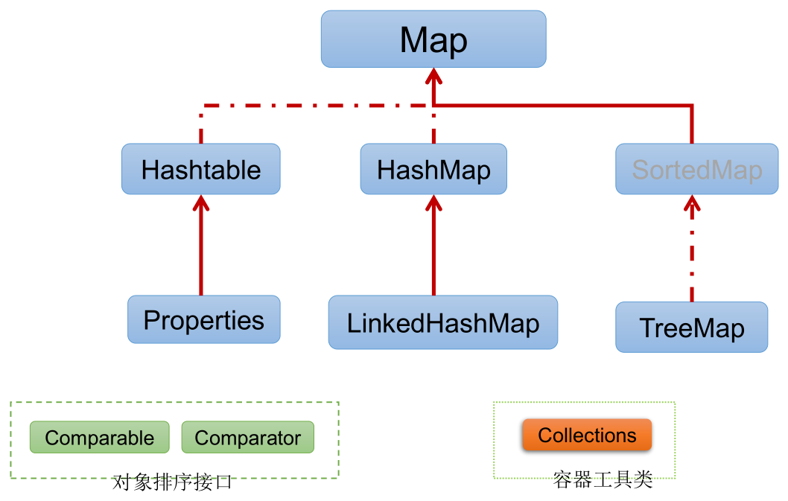

## Collection 接口

- Collection 接口是 List、Set 和 Queue 接口的父接口，该接口里定义的方法既可用于操作 Set 集合，也可用于操作 List 和 Queue 集合。

- jdk 不提供此接口的任何直接实现，而是提供更具体的子接口实现，如：Set 和 List。

- 在 jdk 5.0 之前，java 集合会丢失容器中所有对象的数据类型，把所有对象都当成 Object 类型处理；从 jdk 5.0 增加了泛型以后，java 集合可以记住容器中对象的数据类型。

- Collection 接口的方法：

  

  - 添加元素：

    - `add(Object obj)`
    - `addAll(Collection coll)`

  - 获取有效元素的个数：

    - `int size()`

  - 清空集合中的元素：

    - `void clear()`

  - 是否是空集合：

    - `boolean isEmpty()`

  - 是否包含某个元素：

    - `boolean contains(Object obj)`：判断当前集合中是否包含 obj，通过 obj 的 `equals()` 来判断是否是同一个对象。
      - **向 Collection 的实现类的对象中添加数据 obj 时，要求 obj 所在的类要重写 `equals()`，否则调用的是 Object 中的 `equals()`，即 ==。**
    - `boolean containsAll(Collection coll)`：对两个集合的元素逐个比较，判断 coll 中的所有元素是否都存在于当前集合中，也是通过元素的 `equals()` 来比较的。

  - 删除：

    - `boolean remove(Object obj)`：从当前集合中移除 obj，通过 obj 的 `equals()` 判断是否是要删除的那个元素，只会删除找到的第一个元素。
    - `boolean removeAll(Collection coll)`：从当前集合中移除 coll 中的所有元素，即取当前集合的差集。

  - 取两个集合的交集：

    - `boolean retainAll(Collection coll)`：把交集的结果存在当前集合中，不影响 coll。

  - 集合是否相等：

    - `boolean equals(Object obj)`：如果返回 true，则 obj 首先得与当前集合类型相同。如果是 List，要求元素个数和顺序一致，如果是 Set，则不考虑顺序。

  - 转成对象数组：

    - `Object[] toArray()`：将当前集合转换为数组。

    - **拓展：将数组转换为集合，`Arrays.asList()`，例如：`List<String> strings = Arrays.asList(new String[]{"aa", "bb", "cc"});`。**使用此方法时的注意事项：

      ```java
      public class Test {
          public static void main(String[] args) {
              // toArray()：集合转换为数组
              Object[] objects = collection.toArray();
              System.out.println(Arrays.toString(objects));
              // 拓展：数组转换为集合
              List<String> strings = Arrays.asList(new String[]{"aa", "bb", "cc"});
              List<Person> people = Arrays.asList(new Person(), new Person());
              List<int[]> ints = Arrays.asList(new int[]{1, 2, 3});
              System.out.println(ints.size());// 1，含有一个int[]数组的集合
              List<Integer> integers = Arrays.asList(1, 2, 3);
              System.out.println(integers.size());// 3，含有三个Integer元素的集合
          }
      }
      ```

  - 获取集合对象的哈希值：

    - `hashCode()`

  - 遍历：

    - `iterator()`：返回 Iterator 接口的实例，即迭代器对象，用于遍历集合的元素。

  - 实例：

    ```java
    public class Test {
        public static void main(String[] args) {
            Collection<Object> collection = new ArrayList<>();
    
            // add(Object obj)：将元素obj添加到集合collection中
            collection.add("AA");
            collection.add("bb");
            collection.add(123);// 自动装箱
            collection.add(new Date());
    
            // size()：获取添加的元素的个数
            System.out.println(collection.size());// 4
    
            // addAll(Collection c)：将c集合中的元素添加到当前的集合中
            Collection<Object> collection2 = new ArrayList<>();
            collection2.add(456);
            collection2.add("CC");
            collection.addAll(collection2);
            System.out.println(collection2.size());
    
            // clear()：清空集合中的元素
            collection.clear();
    
            // isEmpty()：判断当前集合是否为空
            System.out.println(collection.isEmpty());// true
    
            // contains(Object obj)：判断当前集合是否包含obj
            collection.add(new String("Tom"));
            System.out.println(collection.contains(new String("Tom")));// true，比较的是内容
            collection.add(new Person("Jerry", 20));
            // true，如果Person未重写equals()，调用的是Object的方法，即==，返回false
            System.out.println(collection.contains(new Person("Jerry", 20)));
    
            // containsAll(Collection coll)：判断coll中的所有元素是否都存在于当前集合中
            collection.add(123);
            collection.add("bb");
            
            System.out.println(collection.containsAll(Arrays.asList(123, "bb", new Person("Jerry", 20))));// true
    
            // remove(Object obj)：从当前集合中移除obj
            System.out.println(collection.remove(new Person("Jerry", 20)));// true
            System.out.println(collection);// [Tom, 123, bb]
    
            // removeAll(Collection coll)：从当前集合中移除coll中的所有元素
            System.out.println(collection.removeAll(Arrays.asList("bb", "BB")));// true，移除了一个bb
            System.out.println(collection);// [Tom, 123, bb]
    
            // retainAll(Collection coll)：获取当前集合与coll的交集，并返回给当前集合
            System.out.println(collection.retainAll(Arrays.asList(123, new Person("Jerry", 20), "BB")));// true
            System.out.println(collection);// [123]
    
            // equals(Object obj)：
            collection.add("BB");
            System.out.println(collection);// [123, BB]
            System.out.println(collection.equals(Arrays.asList(123, "BB")));// true
            // false，因为collection是List，元素是有序的
            System.out.println(collection.equals(Arrays.asList("BB", 123)));
    
            // hashCode()：返回当前集合的哈希值
            System.out.println(collection.hashCode());
    
            // toArray()：集合转换为数组
            Object[] objects = collection.toArray();
            System.out.println(Arrays.toString(objects));
            // 拓展：数组转换为集合
            List<String> strings = Arrays.asList(new String[]{"aa", "bb", "cc"});
            List<Person> people = Arrays.asList(new Person(), new Person());
            List<int[]> ints = Arrays.asList(new int[]{1, 2, 3});
            System.out.println(ints.size());// 1，含有一个int[]数组的集合
            List<Integer> integers = Arrays.asList(1, 2, 3);
            System.out.println(integers.size());// 3，含有三个Integer元素的集合
        }
    }
    
    class Person {
        private String name;
        private int age;
    
        public Person() {
        }
    
        public Person(String name, int age) {
            this.name = name;
            this.age = age;
        }
    
        public String getName() {
            return name;
        }
    
        public void setName(String name) {
            this.name = name;
        }
    
        public int getAge() {
            return age;
        }
    
        public void setAge(int age) {
            this.age = age;
        }
    
        @Override
        public boolean equals(Object o) {
            if (this == o) {
                return true;
            }
            if (o == null || getClass() != o.getClass()) {
                return false;
            }
            Person person = (Person) o;
            return age == person.age &&
                    Objects.equals(name, person.name);
        }
    
        @Override
        public int hashCode() {
            return Objects.hash(name, age);
        }
    
        @Override
        public String toString() {
            return "Person{" +
                    "name='" + name + '\'' +
                    ", age=" + age +
                    '}';
        }
    }
    ```

### Iterator 迭代器接口

- Iterator对象称为迭代器 (设计模式的一种)，主要用于遍历 Collection 集合中的元素。

- GOF 给迭代器模式的定义为：提供一种方法访问一个容器 (container) 对象中各个元素，而又不需暴露该对象的内部细节。**迭代器模式，就是为容器而生。**

- Collection 接口继承了 `java.lang.Iterable` 接口，该接口有一个 `iterator()`，所有实现了 Collection 接口的集合类都有一个 `iterator()`，用以返回一个实现了 Iterator 接口的类的对象。

- **Iterator 仅用于遍历集合，Iterator 本身并不提供承装对象的能力。如果需要创建 Iterator 对象，则必须有一个被迭代的集合。**(不适用于 Map)

- **集合对象每次调用 `iterator()` 都得到一个全新的迭代器对象，默认游标都在集合的第一个元素之前。**

- Iterator 接口的方法：

  

- **迭代器的执行原理：**

  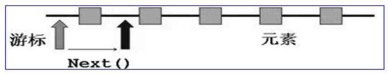

  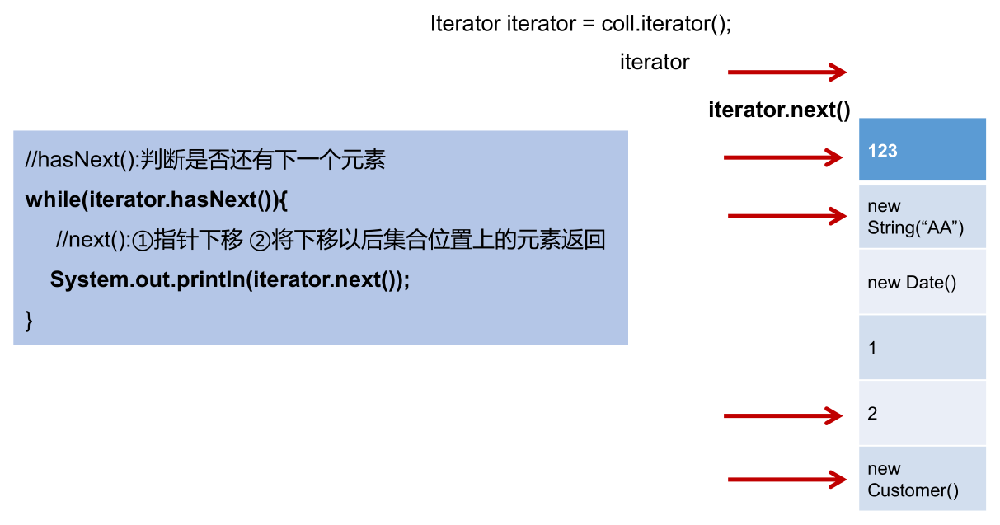

- **在调用 `it.next()` 之前必须要调用 `it.hasNext()` 进行检测。若不调用，且下一条记录无效，直接调用 `it.next()` 会抛出 NoSuchElementException 异常。**

- Iterator 接口的 `remove()`：

  - **Iterator 可以删除集合的元素，但是是在遍历过程中通过迭代器对象的 `remove()` 删除的，不是集合对象的 `remove()`。**

  - **如果还未调用 `next()`，或在上一次调用 `next()` 之后已经调用了 `remove()`，则再次调用 `remove()` 都会抛出 IllegalStateException 异常。**

  - 实例：

    ```java
    public class Test {
        public static void main(String[] args) {
            Collection<Object> collection = new ArrayList<>();
            collection.add(123);
            collection.add(456);
            collection.add(new String("Tom"));
            collection.add(false);
    
            Iterator<Object> iterator = collection.iterator();
    
            while (iterator.hasNext()) {
                // iterator.remove();// 游标处于集合的第一个元素之前，java.lang.IllegalStateException
                Object obj = iterator.next();
                if ("Tom".equals(obj)) {// Tom放在前面，可以防止obj为null时触发空指针异常
                    iterator.remove();
                    // iterator.remove();// 游标所处位置的元素已经被remove，在该位置再次调用remove发生异常，java.lang.IllegalStateException
                }
            }
    
            // 遍历集合
            iterator = collection.iterator();// 重新获取collection的迭代器对象，不能使用原来的，因为其游标已经移到集合末尾了
            while (iterator.hasNext()) {
                System.out.println(iterator.next());
            }
        }
    }
    ```

- 实例：

  ```java
  public class Test {
      public static void main(String[] args) {
          Collection<Object> collection = new ArrayList<>();
          collection.add(123);
          collection.add(456);
          collection.add(new String("Tom"));
          collection.add(false);
  
          Iterator<Object> iterator = collection.iterator();
          // 遍历
          // hasNext()：判断是否还有下一个元素
          while (iterator.hasNext()) {
              // next()：1.指针下移;2.将下移以后集合位置上的元素返回
              System.out.println(iterator.next());
          }
      }
  }
  ```

- 错误写法：

  ```java
  public class Test {
      public static void main(String[] args) {
          Collection<Object> collection = new ArrayList<>();
          collection.add(123);
          collection.add(456);
          collection.add(new String("Tom"));
          collection.add(false);
  
          Iterator<Object> iterator = collection.iterator();
  
          // 错误写法一：间隔的输出集合中的元素，也会出现java.util.NoSuchElementException异常
          while (iterator.next()!=null){// 游标下移一次
              System.out.println(iterator.next());// 游标下移两次
          }
  
          // 错误写法二：死循环
          while (collection.iterator().hasNext()) {
              System.out.println(collection.iterator().hasNext());
          }
      }
  }
  ```

- 补充：

  - Enumeration 接口是 Iterator 迭代器的古老版本。

    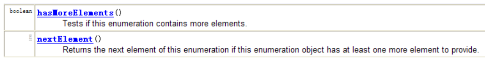

    ```java
    public class Test {
        public static void main(String[] args) {
            Enumeration stringEnum = new StringTokenizer("a-b*c-d-e-g", "-");
            while (stringEnum.hasMoreElements()) {
                Object obj = stringEnum.nextElement();
                System.out.println(obj);
            }
        }
    }
    ```

### foreach 循环

- **jdk 5.0 提供了 foreach 循环迭代访问 Collection 和数组。**格式如下：

  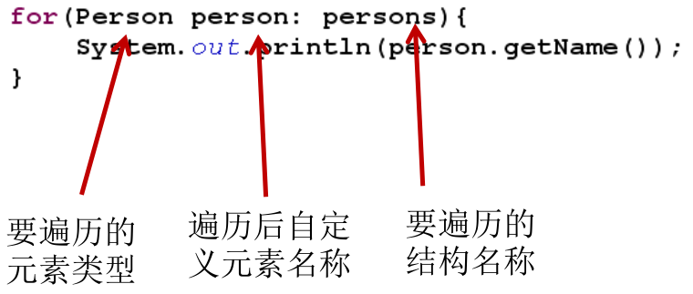

- **foreach 对 Collection 或数组的遍历操作，不需获取 Collection 和数组的长度，无需使用索引访问元素。**

- **foreach 遍历 Collection 时，其底层仍然是调用 Iterator 来完成操作。**

- 实例：

  ```java
  public class Test {
      public static void main(String[] args) {
          Collection<Object> collection = new ArrayList<>();
          collection.add(123);
          collection.add(456);
          collection.add(new String("Tom"));
          collection.add(false);
  
          // 遍历集合：for (集合元素的类型 局部变量 : 集合对象)，底层仍然调用了迭代器
          for (Object obj : collection) {
              System.out.println(obj);
          }
  
          int[] arr = new int[]{1, 2, 3, 4, 5, 6};
          // 遍历数组：for(数组元素的类型 局部变量 : 数组对象)
          for (int i : arr) {
              System.out.println(i);
          }
      }
  }
  ```

- foreach 的使用注意事项：

  ```java
  public class Test {
      public static void main(String[] args) {
          String[] arr = new String[]{"MM", "MM", "MM"};
  
          // 方式一：普通for赋值
          for (int i = 0; i < arr.length; i++) {
              arr[i] = "GG";// 能够赋值
          }
          for (int i = 0; i < arr.length; i++) {
              System.out.print(arr[i] + " ");// GG GG GG
          }
  
          System.out.println();
  
          arr = new String[]{"MM", "MM", "MM"};
          // 方式二：增强for循环
          for (String s : arr) {
              s = "GG";// 不能赋值，因为s是一个局部变量，foreach循环将arr数组的当前值赋给了s，然后循环中s被重新赋值为GG，不会影响到arr数组中的值
          }
          for (int i = 0; i < arr.length; i++) {
              System.out.print(arr[i] + " ");// MM MM MM
          }
      }
  }
  ```

### List 接口

- 鉴于 java 中数组用来存储数据的局限性，我们**通常使用 List 替代数组。**

- **List 集合类中元素有序、且可重复，集合中的每个元素都有其对应的顺序索引。**

- List 容器中的元素都对应一个整数型的序号记载其在容器中的位置，可以根据序号存取容器中的元素。

- **JDK API 中 List 接口的实现类常用的有：ArrayList、LinkedList 和 Vector。**

- List 常用方法： 

  - List 除了从 Collection 集合继承的方法外，还添加了一些根据索引来操作集合元素的方法。

  - `void add(int index, Object ele)`：在 index 位置插入ele 元素。

  - `boolean addAll(int index, Collection eles)`：从 index 位置开始将 eles 中的所有元素添加进来。

  - `Object get(int index)`：获取指定 index 位置的元素。

  - `int indexOf(Object obj)`：返回 obj 在集合中首次出现的位置。

  - `int lastIndexOf(Object obj)`：返回 obj 在当前集合中末次出现的位置。

  - `Object remove(int index)`：移除指定 index 位置的元素，并返回此元素，区别于 Collection 接口中的 `remove(Object obj)`。

    ```java
    public class Test {
        private static void updateList(List list) {
            list.remove(2);// 删除索引2
            // list.remove(new Integer(2));// 删除对象2
        }
    
        public static void main(String[] args) {
            List list = new ArrayList();
            list.add(1);
            list.add(2);
            list.add(3);
            updateList(list);
            System.out.println(list);// [1, 2]
        }
    }
    ```

  - `Object set(int index, Object ele)`：设置指定 index 位置的元素为 ele。

  - `List subList(int fromIndex, int toIndex)`：返回当前集合从 fromIndex 到 toIndex 位置的子集合，前包后不包，当前集合不发生改变。

  - 总结：

    - 增：`add(Object obj)`

    - 删：`remove(int index)` / `remove(Object obj)`

    - 改：`set(int index, Object ele)`

    - 查：`get(int index)`

    - 插：`add(int index, Object ele)`

    - 长度：`size()`

    - 遍历：① Iterator 迭代器方式；② 增强 for 循环；③ 普通的循环。

      ```java
      public class Test {
          public static void main(String[] args) {
              ArrayList<Object> list = new ArrayList();
              list.add(123);
              list.add(456);
              list.add("AA");
      
              // 方式一：Iterator迭代器方式
              Iterator<Object> iterator = list.iterator();
              while (iterator.hasNext()) {
                  System.out.println(iterator.next());
              }
      
              System.out.println("***************");
      
              // 方式二：增强for循环
              for (Object obj : list) {
                  System.out.println(obj);
              }
      
              System.out.println("***************");
      
              // 方式三：普通for循环
              for (int i = 0; i < list.size(); i++) {
                  System.out.println(list.get(i));
              }
          }
      }
      ```

- 实例：

  ```java
  public class Test {
      public static void main(String[] args) {
          ArrayList<Object> list = new ArrayList();
          list.add(123);
          list.add(456);
          list.add("AA");
          list.add(456);
  
          System.out.println(list);// [123, 456, AA, 456]
  
          // void add(int index, Object ele): 在index位置插入ele元素
          list.add(1, "BB");
          System.out.println(list);// [123, BB, 456, AA, 456]
  
          // boolean addAll(int index, Collection eles): 从index位置开始将eles中的所有元素添加进来
          List<Integer> list1 = Arrays.asList(1, 2, 3);
          list.addAll(list1);
          // list.add(list1);// 这是把list1当作一个元素添加到list中
          System.out.println(list);// [123, BB, 456, AA, 456, 1, 2, 3]
  
          // Object get(int index): 获取指定index位置的元素
          System.out.println(list.get(0));// 123
  
          // int indexOf(Object obj): 返回obj在集合中首次出现的位置。如果不存在，返回-1。
          int index = list.indexOf(4567);
          System.out.println(index);// -1
  
          // int lastIndexOf(Object obj): 返回obj在当前集合中末次出现的位置。如果不存在，返回-1。
          System.out.println(list.lastIndexOf(456));// 4
  
          // Object remove(int index): 移除指定index位置的元素，并返回此元素
          Object obj = list.remove(0);
          System.out.println(obj);// 123
          System.out.println(list);// [BB, 456, AA, 456, 1, 2, 3]
  
          // Object set(int index, Object ele): 设置指定index位置的元素为ele
          list.set(1, "CC");
          System.out.println(list);// [BB, CC, AA, 456, 1, 2, 3]
  
          // List subList(int fromIndex, int toIndex): 返回从fromIndex到toIndex位置的左闭右开区间的子集合
          List<Object> subList = list.subList(2, 4);
          System.out.println(subList);// [AA, 456]
          System.out.println(list);// [BB, CC, AA, 456, 1, 2, 3]
      }
  }
  ```

#### ArrayList

- ArrayList 是 List 接口的典型实现类、主要实现类。
- 本质上，ArrayList 是对象引用的一个 "变长" 数组。
- ArrayList 的 JDK 1.8 之前与之后的实现区别？
  - JDK 1.7：ArrayList 类似于饿汉式，初始化时直接创建一个初始容量为 10 的数组。
  - JDK 1.8：ArrayList 类似于懒汉式，初始化时创建一个长度为 0 的数组，当添加第一个元素时再创建一个初始容量为 10 的数组。
- **`Arrays.asList(…)` 返回的 List 集合，既不是 ArrayList 实例，也不是 Vector 实例。`Arrays.asList(…)` 返回值是一个固定长度的 List 集合。**
- **源码分析：**
  
  - JDK 7.0：
    - `ArrayList list = new ArrayList();`，初始化时，底层创建了长度是 10 的 Object[] 数组 elementData。
    
      ```java
      /**
       * The array buffer into which the elements of the ArrayList are stored.
       * The capacity of the ArrayList is the length of this array buffer.
       */
      private transient Object[] elementData;
      ```
    
      ```java
      /**
       * Constructs an empty list with an initial capacity of ten.
       */
      public ArrayList() {
          this(10);// 初始化时，数组长度为10
      }
      ```
    
      ```java
      /**
       * Constructs an empty list with the specified initial capacity.
       *
       * @param  initialCapacity  the initial capacity of the list
       * @throws IllegalArgumentException if the specified initial capacity
       *         is negative
       */
      public ArrayList(int initialCapacity) {// 也可以直接指定ArrayList的容量
          super();
          if (initialCapacity < 0)
              throw new IllegalArgumentException("Illegal Capacity: "+
                                                 initialCapacity);
          this.elementData = new Object[initialCapacity];
      }
      ```
    
    - `list.add(123);`，等同于 `elementData[0] = new Integer(123);`。
    
    - `list.add(11);`，每次添加数据前，会验证数组容量，如果此次的添加导致底层 elementData 数组容量不够，则扩容。
    
      ```java
      /**
       * Appends the specified element to the end of this list.
       *
       * @param e element to be appended to this list
       * @return <tt>true</tt> (as specified by {@link Collection#add})
       */
      public boolean add(E e) {
          // add()添加元素之前，先验证数组容量，size即为已添加的元素的数量
          ensureCapacityInternal(size + 1);  // Increments modCount!!
          elementData[size++] = e;// 添加元素到数组的size+1的位置
          return true;
      }
      ```
    
      ```java
      private void ensureCapacityInternal(int minCapacity) {
          modCount++;
          // overflow-conscious code
          if (minCapacity - elementData.length > 0)// 如果添加的元素的总数，已经超过了数组的长度，则进行扩容操作
              grow(minCapacity);
      }
      ```
    
    - **默认情况下，扩容为原来的容量的 1.5 倍，同时需要将原有数组中的数据复制到新的数组中。**
    
      ```java
      /**
       * Increases the capacity to ensure that it can hold at least the
       * number of elements specified by the minimum capacity argument.
       *
       * @param minCapacity the desired minimum capacity
       */
      private void grow(int minCapacity) {
          // overflow-conscious code
          int oldCapacity = elementData.length;
          int newCapacity = oldCapacity + (oldCapacity >> 1);// 扩容后的新数组，其长度为原数组长度的1.5倍
          if (newCapacity - minCapacity < 0)
              newCapacity = minCapacity;
          if (newCapacity - MAX_ARRAY_SIZE > 0)
              newCapacity = hugeCapacity(minCapacity);
          // minCapacity is usually close to size, so this is a win:
          elementData = Arrays.copyOf(elementData, newCapacity);// 将原数组中的元素，复制到新数组中
      }
      ```
    
    - **结论：建议开发中使用带参的构造器：`ArrayList list = new ArrayList(int capacity);`，按需求在初始化时就指定 ArrayList 的容量，以尽可能的避免扩容。**
  - JDK 8.0：
    - `ArrayList list = new ArrayList();`，底层 Object[] 数组 elementData 初始化为 {} (长度为 0 的空数组)，并没有创建长度为 10 的数组。
    
      ```java
      /**
       * The array buffer into which the elements of the ArrayList are stored.
       * The capacity of the ArrayList is the length of this array buffer. Any
       * empty ArrayList with elementData == DEFAULTCAPACITY_EMPTY_ELEMENTDATA
       * will be expanded to DEFAULT_CAPACITY when the first element is added.
       */
      transient Object[] elementData; // non-private to simplify nested class access
      ```
    
      ```java
      /**
       * Shared empty array instance used for default sized empty instances. We
       * distinguish this from EMPTY_ELEMENTDATA to know how much to inflate when
       * first element is added.
       */
      private static final Object[] DEFAULTCAPACITY_EMPTY_ELEMENTDATA = {};
      ```
    
      ```java
      /**
       * Constructs an empty list with an initial capacity of ten.
       */
      public ArrayList() {
          this.elementData = DEFAULTCAPACITY_EMPTY_ELEMENTDATA;// 初始化时，没有创建长度为10的数组
      }
      ```
    
    - `list.add(123);`，第一次调用 `add()` 时，底层才创建了长度为 10 的数组，并将数据 123 添加到 elementData[0]。
    
      ```java
      /**
       * Appends the specified element to the end of this list.
       *
       * @param e element to be appended to this list
       * @return <tt>true</tt> (as specified by {@link Collection#add})
       */
      public boolean add(E e) {
          // 第一次添加元素，size=0，先初始化数组
          ensureCapacityInternal(size + 1);  // Increments modCount!!
          elementData[size++] = e;// 添加元素到数组的size+1的位置
          return true;
      }
      ```
    
      ```java
      private void ensureCapacityInternal(int minCapacity) {
          ensureExplicitCapacity(calculateCapacity(elementData, minCapacity));// 得到数组的长度
      }
      ```
    
      ```java
      private static int calculateCapacity(Object[] elementData, int minCapacity) {
          if (elementData == DEFAULTCAPACITY_EMPTY_ELEMENTDATA) {
              // 第一次添加元素，elementData为{}，返回数组长度为DEFAULT_CAPACITY，即10
              return Math.max(DEFAULT_CAPACITY, minCapacity);
          }
          return minCapacity;// 不是第一次添加元素，elementData不为{}，直接返回下一个添加元素的数目
      }
      ```
    
      ```java
      private void ensureExplicitCapacity(int minCapacity) {
          modCount++;
      
          // overflow-conscious code
          if (minCapacity - elementData.length > 0)// 如果添加的元素的总数，已经超过了数组的长度，则进行扩容操作
              grow(minCapacity);
      }
      ```
    
    - 后续的添加和扩容操作与 JDK 7.0 无异。
  - 小结：
    - **JDK 7.0 中的 ArrayList 的对象的创建，类似于单例的饿汉式，初始化时直接创建一个初始容量为 10 的数组。**
    - **JDK 8.0 中的 ArrayList 的对象的创建，类似于单例的懒汉式，延迟了数组的创建，节省内存。**
    - **添加数据时，如果底层的数组需要扩容，均扩容为原来的容量的 1.5 倍，同时将原有数组中的数据复制到新的数组中。**

#### LinkedList

- **双向链表，内部定义了内部类 Node，作为 LinkedList 中保存数据的基本结构。LinkedList 内部没有声明数组，而是定义了 Node 类型的 first 和 last，用于记录首末元素。**

  

- **对于频繁的插入或删除元素的操作，建议使用 LinkedList 类，效率较高。**

- 新增方法：

  - `void addFirst(Object obj)`
  - `void addLast(Object obj)`
  - `Object getFirst()`
  - `Object getLast()`
  - `Object removeFirst()`
  - `Object removeLast()`

- **源码分析：**

  - `LinkedList list = new LinkedList();`，内部声明了 Node 类型的 first 和 last 属性，默认值为 null。

    ```java
    /**
     * Pointer to first node.
    ```
   * Invariant: (first == null && last == null) ||
     *            (first.prev == null && first.item != null)
     */
      transient Node<E> first;
  
    /**
     * Pointer to last node.
     * Invariant: (first == null && last == null) ||
     *            (last.next == null && last.item != null)
        */
  
      transient Node<E> last;
    ```
  
    ```java
  private static class Node<E> {
        E item;// 这个就是往LinkedList中添加的数据
        Node<E> next;
        Node<E> prev;
    
        Node(Node<E> prev, E element, Node<E> next) {
            this.item = element;
            this.next = next;
            this.prev = prev;
        }
    }
    ```
  
    ```java
    /**
     * Constructs an empty list.
     */
    public LinkedList() {
    }
    ```
  
  - `list.add(123);`，将 123 封装到 Node 中，创建了 Node 对象。
  
    ```java
    /**
     * Appends the specified element to the end of this list.
     *
     * <p>This method is equivalent to {@link #addLast}.
     *
     * @param e element to be appended to this list
     * @return {@code true} (as specified by {@link Collection#add})
     */
    public boolean add(E e) {
        linkLast(e);
        return true;
    }
    ```
  
    ```java
    /**
     * Links e as last element.
     */
    void linkLast(E e) {
        final Node<E> l = last;
        final Node<E> newNode = new Node<>(l, e, null);
        last = newNode;
        if (l == null)
            first = newNode;
        else
            l.next = newNode;
        size++;
        modCount++;
    }
    ```
  
  - Node 的定义体现了 LinkedList 的双向链表的说法，其除了保存数据，还定义了两个变量：
  
    - prev：变量记录前一个元素的位置。
    - next：变量记录下一个元素的位置。

#### Vector

- Vector 是一个古老的集合，JDK 1.0 就有了。大多数操作与 ArrayList 相同，区别之处在于 Vector 是线程安全的。
- **在各种 List 中，最好把 ArrayList 作为缺省选择。当插入、删除频繁时，使用 LinkedList。**Vector 总是比 ArrayList 慢，所以尽量避免使用。
- 新增方法：
  - `void addElement(Object obj)`
  - `void insertElementAt(Object obj,int index)`
  - `void setElementAt(Object obj,int index)`
  - `void removeElement(Object obj)`
  - `void removeAllElements()`

- **源码分析：**
  
  - **JDK 7.0 和 JDK 8.0 中，通过 `new Vector()` 构造器创建对象时，底层都创建了长度为 10 的数组。在扩容方面，默认扩容为原来的数组长度的 2 倍。**
  
    ```java
    /**
     * Constructs an empty vector so that its internal data array
     * has size {@code 10} and its standard capacity increment is
     * zero.
     */
    public Vector() {
        this(10);// 初始化长度为10
    }
    ```
  
    ```java
    /**
     * Constructs an empty vector with the specified initial capacity and
     * with its capacity increment equal to zero.
     *
     * @param   initialCapacity   the initial capacity of the vector
     * @throws IllegalArgumentException if the specified initial capacity
     *         is negative
     */
    public Vector(int initialCapacity) {
        this(initialCapacity, 0);
    }
    ```
  
    ```java
    /**
     * Constructs an empty vector with the specified initial capacity and
     * capacity increment.
     *
     * @param   initialCapacity     the initial capacity of the vector
     * @param   capacityIncrement   the amount by which the capacity is
     *                              increased when the vector overflows
     * @throws IllegalArgumentException if the specified initial capacity
     *         is negative
     */
    public Vector(int initialCapacity, int capacityIncrement) {
        super();
        if (initialCapacity < 0)
            throw new IllegalArgumentException("Illegal Capacity: "+
                                               initialCapacity);
        this.elementData = new Object[initialCapacity];// 创建长度为10的数组
        this.capacityIncrement = capacityIncrement;
    }
    ```
  
    `add()` 添加数据之前，先验证数组容量：
  
    ```java
    /**
     * Appends the specified element to the end of this Vector.
     *
     * @param e element to be appended to this Vector
     * @return {@code true} (as specified by {@link Collection#add})
     * @since 1.2
     */
    public synchronized boolean add(E e) {
        modCount++;
        ensureCapacityHelper(elementCount + 1);
        elementData[elementCount++] = e;
        return true;
    }
    ```
  
    ```java
    /**
     * This implements the unsynchronized semantics of ensureCapacity.
     * Synchronized methods in this class can internally call this
     * method for ensuring capacity without incurring the cost of an
     * extra synchronization.
     *
     * @see #ensureCapacity(int)
     */
    private void ensureCapacityHelper(int minCapacity) {
        // overflow-conscious code
        if (minCapacity - elementData.length > 0)// 数组容量不够，扩容
            grow(minCapacity);
    }
    ```
  
    ```java
    private void grow(int minCapacity) {
        // overflow-conscious code
        int oldCapacity = elementData.length;
        int newCapacity = oldCapacity + ((capacityIncrement > 0) ?
                                         capacityIncrement : oldCapacity);// 扩容到原来数组长度的二倍
        if (newCapacity - minCapacity < 0)
            newCapacity = minCapacity;
        if (newCapacity - MAX_ARRAY_SIZE > 0)
            newCapacity = hugeCapacity(minCapacity);
        elementData = Arrays.copyOf(elementData, newCapacity);
    }
    ```

#### ArrayList、LinkedL`ist、Vector三者的异同

- **相同点：三个类都实现了 List 接口，存储数据的特点相同，都是存储有序的、可重复的数据。**
- **不同点：**
  - **ArrayList：作为 List 接口的主要实现类；线程不安全的，效率高；底层使用 `Object[] elementData` 存储。**
  - **LinkedList：线程不安全的，对于频繁的插入、删除操作，使用此类效率比 ArrayList 高；底层使用双向链表存储。**
  - **Vector：作为 List 接口的古老实现类；线程安全的，效率低；底层使用 `Object[] elementData` 存储。**

- **ArrayList 和 LinkedList 的异同：**
  - **ArrayList 和 LinkedList 都线程不安全，相对线程安全的 Vector，二者执行效率更高。**
  - **ArrayList 底层是实现了基于动态数组的数据结构，LinkedList 底层是实现了基于链表的数据结构。**
  - **对于随机访问 `get()` 和 `set()`，ArrayList 优于LinkedList，因为 LinkedList 要移动指针。**
  - **对于新增和删除操作 `add()` (特指插入) 和 `remove()`，LinkedList 比较占优势，因为 ArrayList 要移动数据。**

- **ArrayList 和 Vector 的区别：**
  - **Vector 和 ArrayList 几乎是完全相同的，唯一的区别在于 Vector 是同步类，属于强同步类。因此开销就比 ArrayList 要大，访问要慢。**
  - **正常情况下，大多数的 java 程序员使用 ArrayList 而不是 Vector，因为同步完全可以由程序员自己来控制。**
  - **Vector 每次扩容请求其大小的 2 倍空间，而 ArrayList 是 1.5 倍。Vector 还有一个子类 Stack。**

### Set 接口

- **Set 集合存储无序的、不可重复的数据**，如果试把两个相同的元素加入同一个 Set 集合中，则添加操作失败。

  - **无序性：不等于随机性。以 HashSet 为例，存储的数据在底层数组中并非按照数组索引的顺序添加，而是根据数据的哈希值决定的。**
  - **不可重复性：保证添加的元素按照 `equals()` 判断时，不能返回 true。即：相同的元素只能添加一个。**

- Set 接口是 Collection 的子接口，Set 接口没有提供额外的方法，使用的都是Collection中声明过的方法。

- Set 判断两个对象是否相同不是使用 == 运算符，而是根据 `equals()`。

- **对于存放在 Set (主要指：HashSet、LinkedHashSet) 容器中的对象，其对应的类一定要重写 `equals()` 和 `hashCode()`，以实现对象相等规则。**

  - **要求：重写的 `hashCode()` 和 `equals()` 尽可能保持一致性，即：相等的对象必须具有相等的散列码。**
    - 如果不重写所添加元素所在类的 `hashCode()`，则会调用 Object 类的 `hashCode()`，该方法是产生一个随机数，因此，即使添加两个一样的元素，其 hashCode 值也可能不同，也就都能添加成功。
  - **重写两个方法的小技巧：对象中用作 `equals()` 方法比较的 Field，都应该用来计算 hashCode 值。**
  - TreeSet 比较两个元素是否相同的方法，不是 `equals()` 和 `hashCode()`，而是元素对应类的排序方法。

- **重写 `hashCode()` 方法的基本原则：**

  - **在程序运行时，同一个对象多次调用 `hashCode()` 方法应该返回相同的值。**
  - **当两个对象的 `equals()` 方法比较返回 true 时，这两个对象的 `hashCode()` 方法的返回值也应相等。**
  - **对象中用作 `equals()` 方法比较的 Field，都应该用来计算 hashCode 值。**

- 重写 `equals()` 方法的基本原则，以自定义的 Customer 类为例，何时需要重写 `equals()`：

  - 如果一个类有自己特有的 "逻辑相等" 概念，当重写 `equals()` 的时候，总是需要重写 `hashCode()`。因为根据一个类改写后的 `equals()`，两个截然不同的实例有可能在逻辑上是相等的，但是，根据 Object 类的 `hashCode()`，它们仅仅是两个对象。这种情况，违反了 "相等的对象必须具有相等的散列码" 的原则。
  - 结论：**重写 `equals()` 的时候，一般都需要同时重写 `hashCode()` 方法。**通常参与计算 hashCode 的对象的属性也应该参与到 `equals()` 中进行计算。

- Eclipse/IDEA 工具里 `hashCode()` 的重写，为什么会有 31 这个数字：

  ```java
  @Override
  public int hashCode() {
      int result = name.hashCode();
      result = 31 * result + age;
      return result;
  }
  ```

  - 选择系数的时候要选择尽量大的系数，因为如果计算出来的 hashCode 值越大，所谓的冲突就越少，查找起来效率也会提高。---> 减少冲突
  - 31 只占用 5 bits，相乘造成数据溢出的概率较小。
  - 31 可以由 `i * 31 == (i << 5) - 1` 来表示，现在很多虚拟机里面都有做相关优化。---> 提高算法效率
  - 31 是一个素数，素数作用就是如果用一个数字来乘以这个素数，那么最终出来的结果只能被素数本身和被乘数还有 1 来整除！---> 减少冲突

#### HashSet

- HashSet 是 Set 接口的典型实现，大多数时候使用 Set 集合时都使用这个实现类。

- HashSet 按 Hash 算法来存储集合中的元素，因此具有很好的存取、查找、删除性能。

- **HashSet 具有以下特点：**

  - **不保证元素的排列顺序。**
  - **不是线程安全的。**
  - **集合元素可以是 null。**

- **向 HashSet 中添加元素的过程：**

  - **当向 HashSet 集合中存入一个元素 a 时，首先会调用元素 a 所在类的 `hashCode()`，计算元素 a 的 hashCode 值，然后根据 hashCode 值，通过某种散列函数，计算出元素 a 在 HashSet 底层数组中的存储位置 (即为：索引位置，这个索引位置不是像 List 那样有顺序的，而是无序的)。**
    - **说明：这个散列函数会根据元素的 hashCode 值和底层数组的长度相计算，得到该元素在数组中的下标 (存储位置)，并且这种散列函数计算还尽可能保证能均匀存储元素，越是散列分布，该散列函数设计的越好。**
    - 向 List 中添加元素时，会按照索引位置的顺序在数组中逐个添加，这是一种有序性。而向 HashSet 中添加元素时，可能第一个元素的索引位置在数组的中间，第二个元素的索引位置在数组的头，第三个元素的索引位置在数组的尾，是按照一种无序的状态添加的，是为无序性。
  - **计算出元素 a 的存储位置后，首先判断数组此位置上是否已经有元素：**
    - **如果此位置上没有其他元素，则元素 a 添加成功。---> 情况1**
    - **如果此位置上有其他元素 b (或以链表形式存在的多个元素)，则比较元素 a 与元素 b (或以链表形式存在的多个元素) 的 hashCode 值：**
      - **如果 hashCode 值不相同，则元素 a 添加成功。---> 情况2**
      - **如果 hashCode 值相同，进而需要调用元素 a 所在类的 `equals()`：**
        - **`equals()` 返回 true，则元素 a 添加失败。**
        - **`equals()` 返回 false，则元素 a 添加成功。---> 情况3**
  -   **对于添加成功的情况 2 和情况 3 而言：元素 a 与已经存在指定索引位置上的元素以链表的方式存储。**
    - **JDK 7.0：元素 a 存放到底层数组中，指向原来的元素。**
    - **JDK 8.0：原来的元素存放到数组中，指向元素 a。**
    - **总结：七上八下。**

- 由以上向 HashSet 添加元素的过程，可以看出 **HashSet 的底层：数组 + 链表的结构。(前提：JDK 7.0，JDK 8.0 见 HashMap。)**

- HashSet 底层结构：

  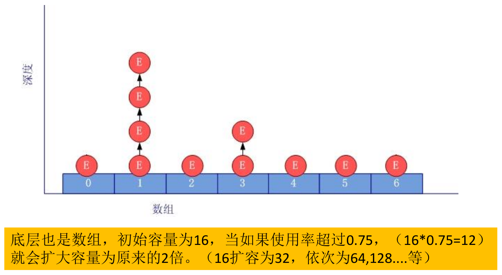

- HashSet 集合判断两个元素相等的标准：两个对象通过 `hashCode()` 比较相等，并且两个对象的 `equals()` 返回值也相等。

- **利用 HashSet 去除 List 中的重复元素：**

  ```java
  public class Test {
      public static List duplicateList(List list) {
          HashSet set = new HashSet();
          set.addAll(list);
          return new ArrayList(set);
      }
  
      public static void main(String[] args) {
          List list = new ArrayList();
          list.add(new Integer(1));
          list.add(new Integer(2));
          list.add(new Integer(2));
          list.add(new Integer(4));
          list.add(new Integer(4));
          List list2 = duplicateList(list);
          for (Object integer : list2) {
              System.out.println(integer);
          }
      }
  }
  ```

- 实例：

  ```java
  public class Test {
      public static void main(String[] args) {
          Set set = new HashSet();
          set.add(456);
          set.add(123);
          set.add(123);
          set.add("AA");
          set.add("CC");
          set.add(129);
  
          Iterator iterator = set.iterator();
          while(iterator.hasNext()){
              System.out.print(iterator.next() + " ");// AA CC 129 456 123，不是按照元素添加的顺序进行输出的
          }
      }
  }
  ```

#### LinkedHashSet

- LinkedHashSet 是 HashSet 的子类，不允许集合元素重复

- LinkedHashSet 根据元素的 hashCode 值来决定元素的存储位置，但它同时**使用双向链表维护元素的次序**，这使得元素看起来是以插入顺序保存的。

  - **遍历 LinkedHashSet 内部数据时，可以按照添加的顺序遍历。**

- LinkedHashSet 插入性能略低于 HashSet，但在迭代访问 Set 里的全部元素时有很好的性能。

  - **对于频繁的遍历操作，LinkedHashSet 效率高于 HashSet。**

- LinkedHashSet 底层结：

  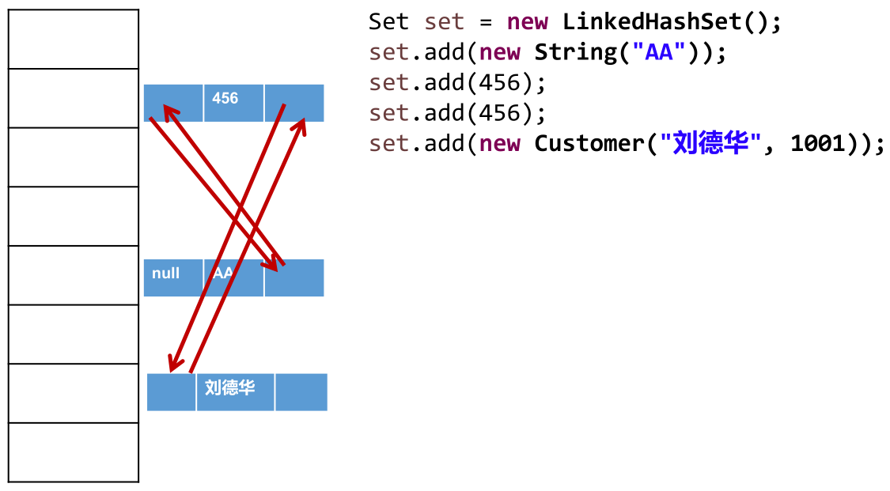

- 实例：

  ```java
  public class Test {
      public static void main(String[] args) {
          // LinkedHashSet在添加数据的同时，每个数据还维护了两个引用，记录此数据前一个数据和后一个数据
          Set set = new LinkedHashSet();
          set.add(456);
          set.add(123);
          set.add(123);
          set.add("AA");
          set.add("CC");
          set.add(129);
  
          Iterator iterator = set.iterator();
          while (iterator.hasNext()) {
              System.out.print(iterator.next() + " ");// 456 123 AA CC 129，按照元素添加的顺序进行输出的
          }
      }
  }
  ```

- 面试题：

  ```java
  public class Test {
      public static void main(String[] args) {
          HashSet set = new HashSet();
          User p1 = new User(1001, "AA");
          User p2 = new User(1002, "BB");
          set.add(p1);// 假设p1添加到HashSet底层数组的位置7(hashCode值以1001和AA计算出来)
          set.add(p2);// 假设p2添加到HashSet底层数组的位置3(hashCode值以1002和BB计算出来)
          System.out.println(set);// 位置3和7处对应的2个User
          p1.name = "CC";// 更改p1指向的User对象的name为CC
          set.remove(p1);// 以新的p1在HashSet底层数组查找，没有相同的对象(hashCode值以1001和CC计算出来)
          System.out.println(set);// 位置3和7处对应的2个User，但位置7指向的User对象的name为C，不是AA，位置3指向的User对象的name为BB
          set.add(new User(1001, "CC"));// 新new出来的User，hashCode值以1001和CC计算出来，不同于最初的p1，其位置不会在7处，也不会在3处，假设在11处
          System.out.println(set);// 位置3、7和11处对应的3个User，其中，位置7和11对应的User的id和name都是1001和CC，但不是堆中的同一个对象
          set.add(new User(1001, "AA"));// 新new出来的User，hashCode值以1001和AA计算出来，等于最初的p1，位置在7处，但因为现在7处User对象的name为CC，所以equals()不相同，这个User对象链接到7位置
          System.out.println(set);// 位置3、7和11处对应的4个User
      }
  }
  
  class User {
      int id;
      String name;
  
      public User(int id, String name) {
          this.id = id;
          this.name = name;
      }
  
      @Override
      public boolean equals(Object o) {
          if (this == o) {
              return true;
          }
          if (o == null || getClass() != o.getClass()) {
              return false;
          }
  
          User user = (User) o;
  
          if (id != user.id) {
              return false;
          }
          return name != null ? name.equals(user.name) : user.name == null;
      }
  
      @Override
      public int hashCode() {
          int result = id;
          result = 31 * result + (name != null ? name.hashCode() : 0);
          return result;
      }
  
      @Override
      public String toString() {
          return "User{" +
                  "id=" + id +
                  ", name='" + name + '\'' +
                  '}';
      }
  }
  输出结果：
  [User{id=1002, name='BB'}, User{id=1001, name='AA'}]
  [User{id=1002, name='BB'}, User{id=1001, name='CC'}]
  [User{id=1002, name='BB'}, User{id=1001, name='CC'}, User{id=1001, name='CC'}]
  [User{id=1002, name='BB'}, User{id=1001, name='CC'}, User{id=1001, name='CC'}, User{id=1001, name='AA'}]
  ```

  解析：

#### TreeSet

- TreeSet 是 SortedSet 接口的实现类，**TreeSet 可以按照添加对象的指定属性，进行排序**，确保集合元素处于排序状态。

- TreeSet 特点：有序，查询速度比 List 快。

- TreeSet 与 TreeMap 一样，底层使用**红黑树结构**存储数据。

  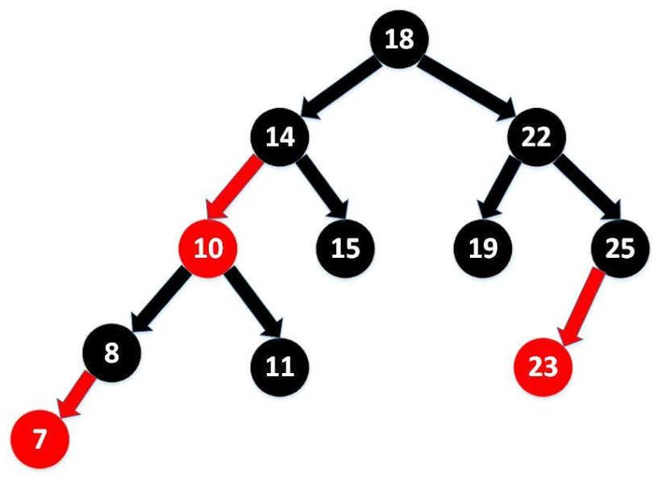

  > 红黑树参考：http://www.cnblogs.com/yangecnu/p/Introduce-Red-Black-Tree.html

- 新增方法：

  - `Comparator comparator()`
  - `Object first()`
  - `Object last()`
  - `Object lower(Object e)`
  - `Object higher(Object e)`
  - `SortedSet subSet(fromElement, toElement)`
  - `SortedSet headSet(toElement)`
  - `SortedSet tailSet(fromElement)`

- **向 TreeSet 中添加的数据，要求是相同类的对象。**

- **TreeSet 两种排序方法：自然排序 (实现 Comparable 接口) 和定制排序 (Comparator)。默认情况下，TreeSet 采用自然排序。**

- 在 TreeSet 中比较两个元素是否相同时，取决于使用的是自然排序还是定制排序，不再考虑 `equals()`，比如 `add()` 和 `remove()` 等方法，这点与 HashSet 不同。

- **自然排序：**

  - TreeSet 会调用集合元素的 `compareTo(Object obj)` 来比较元素之间的大小关系，然后将集合元素按升序 (默认情况) 排列。

  - 如果试图把一个对象添加到 TreeSet 时，则该对象的类必须实现 Comparable 接口。

  - 实现 Comparable 的类必须实现 `compareTo(Object obj)`，两个对象即通过 `compareTo(Object obj) `的返回值来比较大小。

  - Comparable 的典型实现：

    - BigDecimal、BigInteger 以及所有的数值型对应的包装类：按它们对应的数值大小进行比较。
    - Character：按字符的 unicode值来进行比较。
    - Boolean：true 对应的包装类实例大于 false 对应的包装类实例。
    - String：按字符串中字符的 unicode 值进行比较。
    - Date、Time：后边的时间、日期比前面的时间、日期大。

  - 向 TreeSet 中添加元素时，只有第一个元素无须比较 `compareTo()`，后面添加的所有元素都会调用 `compareTo()` 进行比较。

  - 因为只有相同类的两个实例才会比较大小，所以向 TreeSet 中添加的应该是同一个类的对象。

  - **对于 TreeSet 集合而言，使用自然排序判断两个元素相等的标准是：两个元素通过 `compareTo()` 比较返回 0，不再是 `equals()`。**

  - 当需要把一个对象放入 TreeSet 中，在重写该对象对应的 `equals()` 时，应保证该方法与 `compareTo()` 有一致的结果：如果两个对象通过 `equals()` 比较返回 true，则通过 `compareTo(Object obj)` 比较应返回 0。否则，会让人难以理解。

  - 实例：

    ```java
    public class Test {
        public static void main(String[] args) {
            Set set = new TreeSet();
    
            set.add(new User("Tom", 12));
            set.add(new User("Jerry", 32));
            set.add(new User("Jim", 2));
            set.add(new User("Mike", 65));
            set.add(new User("Jack", 33));
            set.add(new User("Jack", 56));
    
            Iterator iterator = set.iterator();
            while (iterator.hasNext()) {
                System.out.println(iterator.next());
            }
        }
    }
    
    class User implements Comparable {
        private String name;
        private int age;
    
        public User() {
        }
    
        public User(String name, int age) {
            this.name = name;
            this.age = age;
        }
    
        public String getName() {
            return name;
        }
    
        public void setName(String name) {
            this.name = name;
        }
    
        public int getAge() {
            return age;
        }
    
        public void setAge(int age) {
            this.age = age;
        }
    
        @Override
        public String toString() {
            return "User{" +
                    "name='" + name + '\'' +
                    ", age=" + age +
                    '}';
        }
    
        @Override
        public boolean equals(Object o) {
            System.out.println("User equals()....");
            if (this == o) {
                return true;
            }
            if (o == null || getClass() != o.getClass()) {
                return false;
            }
    
            User user = (User) o;
    
            if (age != user.age) {
                return false;
            }
            return name != null ? name.equals(user.name) : user.name == null;
        }
    
        @Override
        public int hashCode() { //return name.hashCode() + age;
            int result = name != null ? name.hashCode() : 0;
            result = 31 * result + age;
            return result;
        }
    
        // 按照姓名从大到小排列,年龄从小到大排列
        @Override
        public int compareTo(Object o) {
            if (o instanceof User) {
                User user = (User) o;
                // return -this.name.compareTo(user.name);
                int compare = -this.name.compareTo(user.name);
                if (compare != 0) {
                    return compare;
                } else {
                    return Integer.compare(this.age, user.age);
                }
            } else {
                throw new RuntimeException("输入的类型不匹配");
            }
    
        }
    }
    ```

- **定制排序：**

  - **TreeSet 的自然排序要求元素所属的类实现 Comparable 接口，如果元素所属的类没有实现 Comparable 接口，或不希望按照升序 (默认情况 )的方式排列元素或希望按照其它属性大小进行排序，则考虑使用定制排序。**定制排序，通过 Comparator 接口来实现。需要重写 `compare()` 方法。

  - 利用 `int compare(T o1,T o2)` 方法，比较 o1 和 o2 的大小：如果方法返回正整数，则表示 o1 大于 o2；如果返回 0，表示相等；返回负整数，表示 o1 小于 o2。

  - 要实现定制排序，需要将实现 Comparator 接口的实例作为形参传递给 TreeSet 的构造器。此时，仍然只能向 TreeSet 中添加类型相同的对象。否则会发生 ClassCastException 异常。

  - **对于 TreeSet 集合而言，使用定制排序判断两个元素相等的标准是：两个元素通过 `compare()` 比较返回 0，不再是 `equals()`。**

  - 实例：

    ```java
    public class Test {
        public static void main(String[] args) {
            // 定制排序
            Comparator com = new Comparator() {
                // 按照年龄从小到大排列
                @Override
                public int compare(Object o1, Object o2) {
                    if (o1 instanceof User && o2 instanceof User) {
                        User u1 = (User) o1;
                        User u2 = (User) o2;
                        return Integer.compare(u1.getAge(), u2.getAge());
                    } else {
                        throw new RuntimeException("输入的数据类型不匹配");
                    }
                }
            };
    
            TreeSet set = new TreeSet(com);
            set.add(new User("Tom", 12));
            set.add(new User("Jerry", 32));
            set.add(new User("Jim", 2));
            set.add(new User("Mike", 65));
            set.add(new User("Mary", 33));
            set.add(new User("Jack", 33));
            set.add(new User("Jack", 56));
    
            Iterator iterator = set.iterator();
            while (iterator.hasNext()) {
                System.out.println(iterator.next());
            }
        }
    }
    
    class User implements Comparable {
        private String name;
        private int age;
    
        public User() {
        }
    
        public User(String name, int age) {
            this.name = name;
            this.age = age;
        }
    
        public String getName() {
            return name;
        }
    
        public void setName(String name) {
            this.name = name;
        }
    
        public int getAge() {
            return age;
        }
    
        public void setAge(int age) {
            this.age = age;
        }
    
        @Override
        public String toString() {
            return "User{" +
                    "name='" + name + '\'' +
                    ", age=" + age +
                    '}';
        }
    
        @Override
        public boolean equals(Object o) {
            System.out.println("User equals()....");
            if (this == o) {
                return true;
            }
            if (o == null || getClass() != o.getClass()) {
                return false;
            }
    
            User user = (User) o;
    
            if (age != user.age) {
                return false;
            }
            return name != null ? name.equals(user.name) : user.name == null;
        }
    
        @Override
        public int hashCode() { //return name.hashCode() + age;
            int result = name != null ? name.hashCode() : 0;
            result = 31 * result + age;
            return result;
        }
    
        // 按照姓名从大到小排列,年龄从小到大排列
        @Override
        public int compareTo(Object o) {
            if (o instanceof User) {
                User user = (User) o;
                // return -this.name.compareTo(user.name);
                int compare = -this.name.compareTo(user.name);
                if (compare != 0) {
                    return compare;
                } else {
                    return Integer.compare(this.age, user.age);
                }
            } else {
                throw new RuntimeException("输入的类型不匹配");
            }
        }
    }
    ```

- 实例：

  ```java
  public class Test {
      public static void main(String[] args) {
          Set set = new TreeSet();
  
          // 失败：不能添加不同类的对象
          /*set.add(123);
          set.add(456);
          set.add("AA");
          set.add(new User("Tom",12));*/
  
          // 举例：全部添加Integer对象
          /*set.add(34);
          set.add(-34);
          set.add(43);
          set.add(11);
          set.add(8);*/
  
          Iterator iterator = set.iterator();
          while (iterator.hasNext()) {
              System.out.println(iterator.next());
          }
      }
  }
  ```

## Map 接口

- Map 与 Collection 是并列存在，双列数据，用于保存具有映射关系的数据：key - value 对。

- Map结构的理解：

  - **Map 中的 key：无序的、不可重复的，使用 Set 存储所有的 key。---> key 所在的类要重写 `hashCode()` 和 `equals()` (以 HashMap 为例)。**

  - **Map 中的 value：无序的、可重复的，使用 Collection 存储所有的 value。---> value 所在的类要重写 `equals()`。**

  - **一个键值对：key - value 构成了一个 entry 对象。**

    - Map 中的映射关系的类型是 Map.Entry 类型，它是 Map 接口的内部接口。

  - **Map 中的 entry：无序的、不可重复的，使用 Set 存储所有的 entry。**

    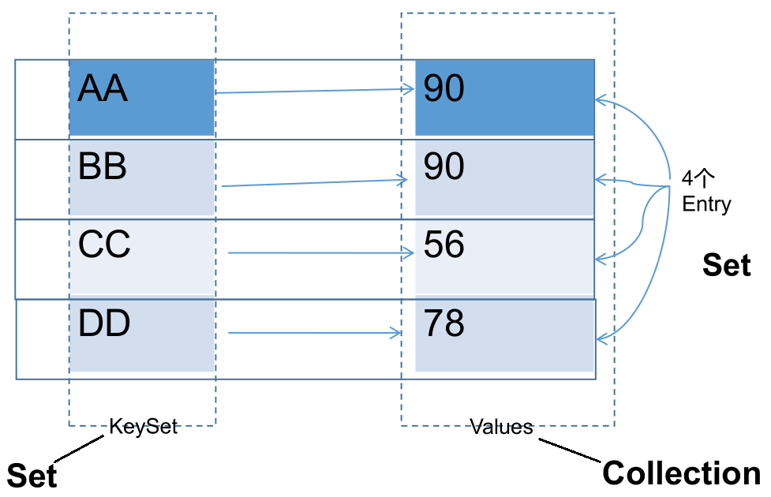

- Map 中的 key 和 value 都可以是任何引用类型的数据。

- 常用 String 类作为 Map 的 key。

- key 和 value 之间存在单向一对一关系，即通过指定的 key 总能找到唯一的、确定的 value。

- Map 接口的常用实现类：HashMap、TreeMap、LinkedHashMap 和 Properties。其中，HashMap 是 Map 接口使用频率最高的实现类。

- Map 常用方法：

  - 添加、删除、修改操作：

    - `Object put(Object key, Object value)`：将指定 key - value 对添加到 (或修改) 当前 map 对象中。

      - 如果在 map 中已存在 key，则会用 value 替换 map 中该 key 对应的值。

    - `void putAll(Map m)`：将 m 中的所有 key - value 对存放到当前 map 中。

    - `Object remove(Object key)`：移除指定 key 的 key - value 对，并返回 value。若 key 不存在，返回 null。

    - `void clear()`：清空当前 map 中的所有数据，与 `map = null;` 操作不同。

    - 实例：

      ```java
      public class Test {
          public static void main(String[] args) {
              Map map = new HashMap();
      
              // put()
              map.put("AA", 123);
              map.put(45, 123);
              map.put("BB", 56);
              // 修改，key已存在，会替换其value
              map.put("AA", 87);
              System.out.println(map);// {AA=87, BB=56, 45=123}
      
              // putAll()
              Map map1 = new HashMap();
              map1.put("CC", 123);
              map1.put("DD", 123);
              map.putAll(map1);
              System.out.println(map);// {AA=87, BB=56, CC=123, DD=123, 45=123}
      
              // remove(Object key)
              Object value = map.remove("CC");
              System.out.println(value);// 123
              System.out.println(map);// {AA=87, BB=56, DD=123, 45=123}
              System.out.println(map.remove("EE"));// key不存在，返回null
      
              // clear()
              map.clear();// 与map = null操作不同
              System.out.println(map.size());// 0
              System.out.println(map);// {}
          }
      }
      ```

  - 元素查询的操作：

    - `Object get(Object key)`：获取指定 key 对应的 value，如果 key 不存在，返回 null。

    - `boolean containsKey(Object key)`：是否包含指定的 key。

    - `boolean containsValue(Object value)`：是否包含指定的 value。

    - `int size()`：返回 map 中 key - value 对的个数。

    - `boolean isEmpty()`：判断当前 map 是否为空，以 size 是否为 0 判断。

    - `boolean equals(Object obj)`：判断当前 map 和参数对象 obj 是否相等。

    - 实例：

      ```java
      public class Test {
          public static void main(String[] args) {
              Map map = new HashMap();
              map.put("AA", 123);
              map.put(45, 123);
              map.put("BB", 56);
      
              // Object get(Object key)
              System.out.println(map.get(45));// 123
              System.out.println(map.get(43));// null
      
              // containsKey(Object key)
              boolean isExist = map.containsKey("BB");
              System.out.println(isExist);// true
      
              isExist = map.containsValue(123);
              System.out.println(isExist);// true
      
              map.clear();
              System.out.println(map.isEmpty());// true
          }
      }
      ```

  - 元视图操作的方法：

    - `Set keySet()`：返回所有 key 构成的 Set 集合。

    - `Collection values()`：返回所有 value 构成的 Collection 集合。

    - `Set entrySet()`：返回所有 key - value 对构成的 Set 集合。

    - 实例：

      ```java
      public class Test {
          public static void main(String[] args) {
              Map map = new HashMap();
              map.put("AA", 123);
              map.put(45, 1234);
              map.put("BB", 56);
      
              // 遍历所有的key集：keySet()
              Set keys = map.keySet();
              Iterator iterator = keys.iterator();
              while (iterator.hasNext()) {
                  System.out.println(iterator.next());
              }
              System.out.println();
      
              // 遍历所有的value集：values()
              Collection values = map.values();
              for (Object obj : values) {
                  System.out.println(obj);
              }
              System.out.println();
      
              // 遍历所有的key-value
              // 方式一：entrySet()
              Set entrySet = map.entrySet();
              Iterator iterator1 = entrySet.iterator();
              while (iterator1.hasNext()) {
                  Object obj = iterator1.next();
                  // entrySet集合中的元素都是entry
                  Map.Entry entry = (Map.Entry) obj;
                  System.out.println(entry.getKey() + "---->" + entry.getValue());
      
              }
              System.out.println();
              // 方式二：
              Set keySet = map.keySet();
              Iterator iterator2 = keySet.iterator();
              while (iterator2.hasNext()) {
                  Object key = iterator2.next();
                  Object value = map.get(key);
                  System.out.println(key + "=====" + value);
              }
          }
      }
      ```

- 总结：

  - 添加：`put(Object key, Object value)`
  - 删除：`remove(Object key)`
  - 修改：`put(Object key, Object value)`
  - 查询：`get(Object key)`
  - 长度：`size()`
  - 遍历：`keySet()` / `values()` / `entrySet()`

### HashMap

- HashMap 是 Map 接口使用频率最高的实现类。

- HashMap 允许使用 null 键和 null 值，与 HashSet 一样，不保证映射的顺序。

- 所有的 key 构成的集合是 Set：无序的、不可重复的。所以，key 所在的类要重写：`hashCode()` 和 `equals()`。

  - HashMap 判断两个 key 相等的标准是：两个 key 的 hashCode 值相等，同时通过 `equals()` 判断返回 true。

- 所有的 value 构成的集合是 Collection：无序的、可以重复的。所以，value 所在的类要重写：`equals()`。

  - HashMap 判断两个 value 相等的标准是：两个 value 通过 `equals()` 判断返回 true。

- 一个 key - value 对构成一个 entry，所有的 entry 构成的集合是 Set：无序的、不可重复的。

- 不要修改映射关系的 key：

  - 映射关系存储到 HashMap 中时，会存储 key 的 hash 值，这样就不用在每次查找时重新计算每一个 Entry 或 Node (TreeNode) 的 hash 值了，因此如果已经 put 到 Map 中的映射关系，再修改 key 的属性，而这个属性又参与 hashcode 值的计算，那么会导致匹配不上。

- HashMap 源码中的重要常量：

  - **`DEFAULT_INITIAL_CAPACITY`：HashMap 的默认容量，16。**

    ```java
    /**
     * The default initial capacity - MUST be a power of two.
     */
    static final int DEFAULT_INITIAL_CAPACITY = 1 << 4; // aka 16
    ```

  - `MAXIMUM_CAPACITY`：HashMap 的最大支持容量，2^30。

    ```java
    /**
     * The maximum capacity, used if a higher value is implicitly specified
     * by either of the constructors with arguments.
     * MUST be a power of two <= 1<<30.
     */
    static final int MAXIMUM_CAPACITY = 1 << 30;
    ```

  - **`DEFAULT_LOAD_FACTOR`：HashMap 的默认加载因子，0.75。**不同于 ArrayList，HashMap 不是在底层数组全部填满时才进行扩容操作，因为数组上有一些位置可能会一直都没有添加元素，但其他位置上元素可能有很多，导致链表和二叉树结构变多。因此，会在元素添加到一定数量时，就执行扩容操作，即添加元素数量达到 threshold 值时扩容。默认加载因子如果过小，会导致数组还有很多空位置时扩容，数组利用率低；默认加载因子如果过大，会导致数组中存在很多元素时才扩容，链表和二叉树结构过多。因此，默认加载因子在 0.7 ~ 0.75 左右比较合适。

    ```java
    /**
     * The load factor used when none specified in constructor.
     */
    static final float DEFAULT_LOAD_FACTOR = 0.75f;
    ```

  - **`TREEIFY_THRESHOLD`：Bucket 中链表存储的 Node 长度大于该默认值，判断是否转换为红黑树，默认为 8。Since JDK 8.0。**

    ```java
    /**
     * The bin count threshold for using a tree rather than list for a
     * bin.  Bins are converted to trees when adding an element to a
     * bin with at least this many nodes. The value must be greater
     * than 2 and should be at least 8 to mesh with assumptions in
     * tree removal about conversion back to plain bins upon
     * shrinkage.
     */
    static final int TREEIFY_THRESHOLD = 8;
    ```

  - `UNTREEIFY_THRESHOLD`：Bucket 中红黑树存储的 Node 长度小于该默认值，转换为链表，默认为 6，Since JDK 8.0。

    ```java
    /**
     * The bin count threshold for untreeifying a (split) bin during a
     * resize operation. Should be less than TREEIFY_THRESHOLD, and at
     * most 6 to mesh with shrinkage detection under removal.
     */
    static final int UNTREEIFY_THRESHOLD = 6;
    ```

  - **`MIN_TREEIFY_CAPACITY`：桶中的 Node 被树化时最小的 hash 表容量，默认为 64。当桶中 Node 的数量大到需要变红黑树 (8) 时，若 hash 表容量小于 `MIN_TREEIFY_CAPACITY`，此时应执行 `resize()` 进行扩容操作。`MIN_TREEIFY_CAPACITY` 的值至少是 `TREEIFY_THRESHOLD` 的 4 倍。Since JDK 8.0。**

    ```java
    /**
     * The smallest table capacity for which bins may be treeified.
     * (Otherwise the table is resized if too many nodes in a bin.)
     * Should be at least 4 * TREEIFY_THRESHOLD to avoid conflicts
     * between resizing and treeification thresholds.
     */
    static final int MIN_TREEIFY_CAPACITY = 64;
    ```

  - table ：**存储元素的数组，长度总是 2 的 n 次幂。**JDK 7.0 中是 `transient Entry<K, V>[] table;`，JDK 8.0 中是 `transient Node<K,V>[] table;`。

  - entrySet：存储具体元素的集。

  - size：HashMap 中已存储的键值对的数量。

  - modCount：HashMap 扩容和结构改变的次数。

  - **threshold：扩容的临界值，其值一般等于容量 \* 加载因子，`(int) Math.min(capacity * loadFactor, MAXIMUM_CAPACITY + 1);`。扩容的操作不是当底层数组全部被填满后再扩容，而是达到临界值后的下一次添加操作进行扩容。**

  - loadFactor：加载因子。

- **源码分析：**

  - JDK 7.0：

    - 初始化操作，以无参构造器为例：`HashMap hashMap = new HashMap();`，在实例化以后，底层创建了长度是 16 的一维数组 Entry[] table：

      ```java
      /**
       * Constructs an empty <tt>HashMap</tt> with the default initial capacity
       * (16) and the default load factor (0.75).
       */
      public HashMap() {
          this(DEFAULT_INITIAL_CAPACITY, DEFAULT_LOAD_FACTOR);// 默认初始化长度：16，加载因子：0.75。
      }
      ```
      
      ```java
      /**
       * Constructs an empty <tt>HashMap</tt> with the specified initial
       * capacity and load factor.
       *
       * @param  initialCapacity the initial capacity
       * @param  loadFactor      the load factor
       * @throws IllegalArgumentException if the initial capacity is negative
       *         or the load factor is nonpositive
       */
      public HashMap(int initialCapacity, float loadFactor) {
          if (initialCapacity < 0)
              throw new IllegalArgumentException("Illegal initial capacity: " +
                                                 initialCapacity);
          if (initialCapacity > MAXIMUM_CAPACITY)// map最大长度：1073741824
              initialCapacity = MAXIMUM_CAPACITY;
          if (loadFactor <= 0 || Float.isNaN(loadFactor))
              throw new IllegalArgumentException("Illegal load factor: " +
                                                 loadFactor);
      
          // Find a power of 2 >= initialCapacity
          int capacity = 1;
          while (capacity < initialCapacity)
              capacity <<= 1;// map初始化时的长度，总是2的n次幂
      
          this.loadFactor = loadFactor;
          threshold = (int)Math.min(capacity * loadFactor, MAXIMUM_CAPACITY + 1);// 扩容的临界值16*0.75=12
          table = new Entry[capacity];// 底层创建了长度是16的一维数组Entry[] table
          useAltHashing = sun.misc.VM.isBooted() &&
                  (capacity >= Holder.ALTERNATIVE_HASHING_THRESHOLD);
          init();
      }
      ```
      
    - 向数组中添加数据操作，`hashMap.put(key1, value1);`：

      ```java
      /**
       * Associates the specified value with the specified key in this map.
       * If the map previously contained a mapping for the key, the old
       * value is replaced.
       *
       * @param key key with which the specified value is to be associated
       * @param value value to be associated with the specified key
       * @return the previous value associated with <tt>key</tt>, or
       *         <tt>null</tt> if there was no mapping for <tt>key</tt>.
       *         (A <tt>null</tt> return can also indicate that the map
       *         previously associated <tt>null</tt> with <tt>key</tt>.)
       */
      public V put(K key, V value) {
          if (key == null)
              return putForNullKey(value);// HashMap可以添加key为null的键值对
          int hash = hash(key);// 计算key的hash值，中间调用了key的hashCode()方法
          int i = indexFor(hash, table.length);// 获取当前数据在数组中的索引位置
          // 取出数组的i位置上的元素，i位置上的元素可能不止一个，需要一个一个对比
          for (Entry<K,V> e = table[i]; e != null; e = e.next) {
              Object k;
              // 如果i位置上有元素，对比该元素与当前key的hash值和equals()是否相等
              if (e.hash == hash && ((k = e.key) == key || key.equals(k))) {
                  V oldValue = e.value;// i位置上元素与当前key相同，则将当前value替换i位置上原值
                  e.value = value;
                  e.recordAccess(this);
                  return oldValue;
              }
          }
      
          modCount++;
          addEntry(hash, key, value, i);// 如果数组的i位置上没有元素，则直接添加当前key-value对在i位置上
          return null;
      }
      ```

      计算 key 的 hash值：

      ```java
      /**
       * Retrieve object hash code and applies a supplemental hash function to the
       * result hash, which defends against poor quality hash functions.  This is
       * critical because HashMap uses power-of-two length hash tables, that
       * otherwise encounter collisions for hashCodes that do not differ
       * in lower bits. Note: Null keys always map to hash 0, thus index 0.
       */
      final int hash(Object k) {
          int h = 0;
          if (useAltHashing) {
              if (k instanceof String) {
                  return sun.misc.Hashing.stringHash32((String) k);
              }
              h = hashSeed;
          }
      
          h ^= k.hashCode();
      
          // This function ensures that hashCodes that differ only by
          // constant multiples at each bit position have a bounded
          // number of collisions (approximately 8 at default load factor).
          h ^= (h >>> 20) ^ (h >>> 12);
          return h ^ (h >>> 7) ^ (h >>> 4);
      }
      ```

        获取位置：

      ```java
      /**
       * Returns index for hash code h.
       */
      static int indexFor(int h, int length) {
          return h & (length-1);
      }
      ```

        添加数据：

      ```java
      /**
       * Adds a new entry with the specified key, value and hash code to
       * the specified bucket.  It is the responsibility of this
       * method to resize the table if appropriate.
       *
       * Subclass overrides this to alter the behavior of put method.
       */
      void addEntry(int hash, K key, V value, int bucketIndex) {
          // 如果已添加的元素数量≥扩容的临界值，且即将添加元素的数组bucketIndex位置上已存在元素
          if ((size >= threshold) && (null != table[bucketIndex])) {
              resize(2 * table.length);// 扩容为原来数组长度的的2倍，并将原有的数据复制到新数组中
              hash = (null != key) ? hash(key) : 0;
              bucketIndex = indexFor(hash, table.length);// 重新计算当前key在新数组中的位置
          }
      
          // 不需要扩容，或扩容完成，将当前元素存放到数组的bucketIndex位置上
          createEntry(hash, key, value, bucketIndex);
      }
      ```

      ```java
      /**
       * Like addEntry except that this version is used when creating entries
       * as part of Map construction or "pseudo-construction" (cloning,
       * deserialization).  This version needn't worry about resizing the table.
       *
       * Subclass overrides this to alter the behavior of HashMap(Map),
       * clone, and readObject.
       */
      void createEntry(int hash, K key, V value, int bucketIndex) {
          // 取出bucketIndex位置上原有的元素
          Entry<K,V> e = table[bucketIndex];
          // 将当前的元素存放在bucketIndex位置上，并指向原有的元素
          table[bucketIndex] = new Entry<>(hash, key, value, e);
          size++;
      }
      ```

    - **总结，JDK 7.0 中 HashMap 的底层实现原理，以 `HashMap map = new HashMap();` 为例说明：**

      - **在实例化以后，底层创建了长度是 16 的一维数组 Entry[] table。**

      - **执行 `map.put(key1, value1)` 操作，可能已经执行过多次 put：**

        - **首先，计算 key1 所在类的 `hashCode()` 以及其他操作计算 key1 的哈希值，此哈希值经过某种算法计算以后，得到在 Entry 数组中的存放位置。**
        - **如果此位置上的数据为空，此时的 key1 - value1 添加成功。---> 情况 1**
        - **如果此位置上的数据不为空，(意味着此位置上存在一个或多个数据(以链表形式存在))，比较 key1 和已经存在的一个或多个数据的哈希值：**
          - **如果 key1 的哈希值与已经存在的数据的哈希值都不相同，此时 key1 - value1 添加成功。---> 情况 2**
          - **如果 key1 的哈希值和已经存在的某一个数据 (key2 - value2) 的哈希值相同，则调用 key1 所在类的 `equals(key2)`，继续比较：**
            - **如果 `equals()` 返回 false：此时 key1 - value1 添加成功。---> 情况 3**
            - **如果 `equals()` 返回 true：使用 value1 替换 value2。**
        - **补充：关于情况 2 和情况 3，此时 key1 - value1 和原来的数据以链表的方式存储。**

    - 存储结构：HashMap是数组+链表结构

      -  HashMap 的内部存储结构其实是数组和链表的结合 (即为链地址法)。当实例化一个 HashMap 时，系统会创建一个长度为 Capacity 的 Entry 数组，这个长度在哈希表中被称为容量 (Capacity)，在这个数组中可以存放元素的位置我们称之为 "桶" (bucket)，每个 bucket 都有自己的索引，系统可以根据索引快速的查找 bucket 中的元素。

      - 每个 bucket 中存储一个元素，即一个 Entry 对象，但每一个 Entry 对象可以带一个引用变量，用于指向下一个元素，因此，在一个桶中，就有可能生成一个 Entry 链，而且新添加的元素是整个链表的 head。

      - 结构图示意：

        

    - 扩容过程：

      - 当 HashMap 中的元素越来越多的时候，hash 冲突的几率也就越来越高，因为底层数组的长度是固定的。所以为了提高查询的效率，就要对 HashMap 的底层数组进行扩容，而在 HashMap 数组扩容之后，最消耗性能的点就出现了：原数组中的数据必须重新计算其在新数组中的位置，并放进去，这就是 `resize()`。
      - 当 HashMap 中的元素个数超过数组大小 (数组总大小 length，不是数组中存储的元素个数 size) \* loadFactor 时 ， 就 会 进 行 数 组 扩 容 。loadFactor 的 默 认 值为 0.75，这是一个折中的取值，默认情况下，数组大小为 16，那么当 HashMap 中元素个数 ≥ 16 \* 0.75 = 12 (这个值就是代码中的 threshold 值，也叫做临界值) 且要存放的位置非空的时候，就把数组的大小扩展为 2 \* 16 = 32，即扩大一倍，然后重新计算每个元素在数组中的位置，把原有的数据复制到新数组中。
      - **扩容是一个非常消耗性能的操作，如果已经预知 HashMap 中元素的个数，那么预设元素的个数能够有效的提高 HashMap 的性能。**

  - JDK 8.0：

    - 初始化操作，以无参构造器为例：`HashMap hashMap = new HashMap();`，在实例化时，底层没有创建一个长度为 16 的数组，只是给加载因子赋值 0.75：

      ```java
      public HashMap() {
          this.loadFactor = DEFAULT_LOAD_FACTOR; // all other fields defaulted
      }
      ```

    - 底层的数组是 Node[]，而非 Entry[]，但 Node 实现了 Entry 接口：

      ```java
      transient Node<K,V>[] table;
      ```

      ```java
      static class Node<K,V> implements Map.Entry<K,V> {}
      ```

    - 首次调用 `put()` 方法时：

      ```java
      public V put(K key, V value) {
          return putVal(hash(key), key, value, false, true);
      }
      ```

      ```java
      final V putVal(int hash, K key, V value, boolean onlyIfAbsent,
                     boolean evict) {
          Node<K,V>[] tab; Node<K,V> p; int n, i;
          if ((tab = table) == null || (n = tab.length) == 0)
              // 第一次进入put()，table还未初始化，为null，进入resize()，如果不是第一次put()，不会进入此逻辑
              n = (tab = resize()).length;
          // 查看当前元素在新创建的数组中的位置i所在的位置的元素p，是否为null
          if ((p = tab[i = (n - 1) & hash]) == null)
              tab[i] = newNode(hash, key, value, null);// 如果p为null，当前位置i没有元素，添加成功 ---> 情况1
          else {
              Node<K,V> e; K k;
              if (p.hash == hash &&
                  ((k = p.key) == key || (key != null && key.equals(k))))
                  e = p;// 位置i上的元素，与当前待添加元素的key相同
              else if (p instanceof TreeNode)
                  e = ((TreeNode<K,V>)p).putTreeVal(this, tab, hash, key, value);
              else {// 位置i上的元素，与当前待添加元素的key不同
                  for (int binCount = 0; ; ++binCount) {
                      if ((e = p.next) == null) {// 位置i上只有一个元素
                          // 位置i上的原元素指向当前待添加的元素，"八下"，添加成功 ---> 情况2和3
                          p.next = newNode(hash, key, value, null);
                          if (binCount >= TREEIFY_THRESHOLD - 1) // -1 for 1st
                              // 链表的长度超过8时，判断是否转为红黑树结构
                              treeifyBin(tab, hash);
                          break;
                      }
                      // 位置i上不止一个元素，依次获得该链表中的每一个元素，与待添加元素的key，对比hash值和equals()
                      if (e.hash == hash &&
                          ((k = e.key) == key || (key != null && key.equals(k))))
                          break;
                      p = e;
                  }
              }
              // 替换操作
              if (e != null) { // existing mapping for key
                  V oldValue = e.value;
                  if (!onlyIfAbsent || oldValue == null)
                      e.value = value;
                  afterNodeAccess(e);
                  return oldValue;
              }
          }
          ++modCount;
          if (++size > threshold)
              resize();
          afterNodeInsertion(evict);
          return null;
    }
      ```

      从 `put()` 第一次进入 `resize()`，底层创建了长度为 16 的 Node 数组：
    
      ```java
      final Node<K,V>[] resize() {
          Node<K,V>[] oldTab = table;// 从put()第一次进入resize()，table为null
          int oldCap = (oldTab == null) ? 0 : oldTab.length;// 0
          int oldThr = threshold;// 此时扩容的临界值为0
          int newCap, newThr = 0;
          if (oldCap > 0) {
              if (oldCap >= MAXIMUM_CAPACITY) {
                  threshold = Integer.MAX_VALUE;
                  return oldTab;
              }
              else if ((newCap = oldCap << 1) < MAXIMUM_CAPACITY &&
                       oldCap >= DEFAULT_INITIAL_CAPACITY)
                  newThr = oldThr << 1; // double threshold
          }
          else if (oldThr > 0) // initial capacity was placed in threshold
              newCap = oldThr;
          else {               // zero initial threshold signifies using defaults
              newCap = DEFAULT_INITIAL_CAPACITY;// 默认数组长度16
              newThr = (int)(DEFAULT_LOAD_FACTOR * DEFAULT_INITIAL_CAPACITY);// 默认扩容的临界值：12
          }
          if (newThr == 0) {
              float ft = (float)newCap * loadFactor;
              newThr = (newCap < MAXIMUM_CAPACITY && ft < (float)MAXIMUM_CAPACITY ?
                        (int)ft : Integer.MAX_VALUE);
          }
          threshold = newThr;// 赋值扩容的临界值
          @SuppressWarnings({"rawtypes","unchecked"})
          Node<K,V>[] newTab = (Node<K,V>[])new Node[newCap];// 创建一个长度为16的Node数组
          table = newTab;
          if (oldTab != null) {
              for (int j = 0; j < oldCap; ++j) {
                  Node<K,V> e;
                  if ((e = oldTab[j]) != null) {
                      oldTab[j] = null;
                      if (e.next == null)
                          newTab[e.hash & (newCap - 1)] = e;
                      else if (e instanceof TreeNode)
                          ((TreeNode<K,V>)e).split(this, newTab, j, oldCap);
                      else { // preserve order
                          Node<K,V> loHead = null, loTail = null;
                          Node<K,V> hiHead = null, hiTail = null;
                          Node<K,V> next;
                          do {
                              next = e.next;
                              if ((e.hash & oldCap) == 0) {
                                  if (loTail == null)
                                      loHead = e;
                                  else
                                      loTail.next = e;
                                  loTail = e;
                              }
                              else {
                                  if (hiTail == null)
                                      hiHead = e;
                                  else
                                      hiTail.next = e;
                                  hiTail = e;
                              }
                          } while ((e = next) != null);
                          if (loTail != null) {
                              loTail.next = null;
                              newTab[j] = loHead;
                          }
                          if (hiTail != null) {
                              hiTail.next = null;
                              newTab[j + oldCap] = hiHead;
                          }
                      }
                  }
              }
          }
          return newTab;
    }
      ```

      计算 key 的 hash 值：
    
      ```java
      static final int hash(Object key) {
          int h;
          return (key == null) ? 0 : (h = key.hashCode()) ^ (h >>> 16);
    }
      ```

      链表转红黑树：
    
      ```java
      final void treeifyBin(Node<K,V>[] tab, int hash) {
          int n, index; Node<K,V> e;
          if (tab == null || (n = tab.length) < MIN_TREEIFY_CAPACITY)
              resize();// 如果底层数组的长度小玉64，只扩容，不转红黑树
          else if ((e = tab[index = (n - 1) & hash]) != null) {
              TreeNode<K,V> hd = null, tl = null;
              do {
                  TreeNode<K,V> p = replacementTreeNode(e, null);
                  if (tl == null)
                      hd = p;
                  else {
                      p.prev = tl;
                      tl.next = p;
                  }
                  tl = p;
              } while ((e = e.next) != null);
              if ((tab[index] = hd) != null)
                  hd.treeify(tab);
          }
    }
      ```

    - **总结，JDK 8.0 相较于 JDK 7.0 在底层实现方面的不同：**
    
      - **`new HashMap()` 时，底层没有创建一个长度为 16 的数组。**
      - **JDK 8.0 底层的数组是 Node[]，而非 Entry[]。**
      - **首次调用 `put()` 时，底层创建长度为 16 的数组。**
      - **JDK 7.0 底层结构只有：数组 + 链表。JDK 8.0 中底层结构是：数组 + 链表 + 红黑树。**
    - **形成链表时，"七上八下"： JDK 7.0 中新的元素指向旧的元素，JDK 8.0 中旧的元素指向新的元素。**
    
  - **当数组的某一个索引位置上的元素以链表形式存在的数据个数 > 8 且当前数组的长度 > 64时，此时此索引位置上的所数据改为使用红黑树存储。**
    
  - 存储结构：
    
    - HashMap 的内部存储结构其实是数组+ 链表 + 树的结合。当实例化一个 HashMap 时，会初始化 initialCapacity 和 loadFactor，在 put 第一对映射关系时，系统会创建一个长度为 initialCapacity 的 Node 数组，这个长度在哈希表中被称为容量 (Capacity)，在这个数组中可以存放元素的位置我们称之为 "桶" (bucket)，每个 bucket 都有自己的索引，系统可以根据索引快速的查找 bucket 中的元素。
    
    - 每个 bucket 中存储一个元素，即一个 Node 对象，但每一个 Node 对象可以带一个引用变量 next，用于指向下一个元素，因此，在一个桶中，就有可能生成一个 Node 链。也可能是一个一个 TreeNode 对象，每一个 TreeNode 对象可以有两个叶子结点 left 和 right，因此，在一个桶中，就有可能生成一个 TreeNode 树。而新添加的元素作为链表的 last，或树的叶子结点。
    
    - 结构图示意：
    
      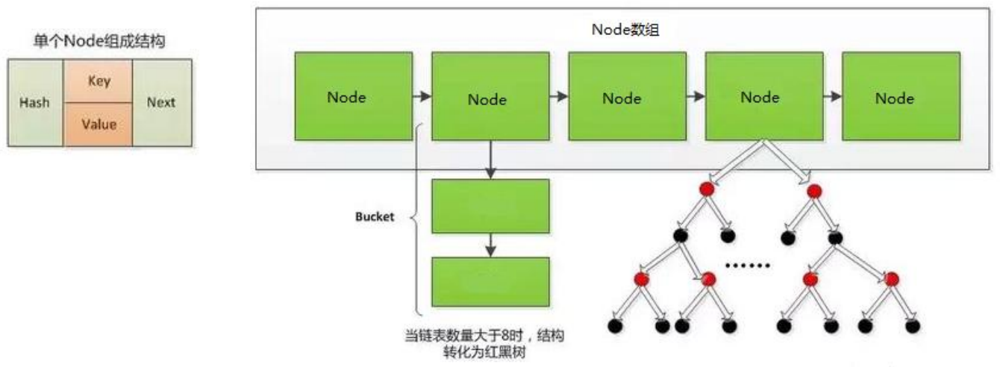
    
    - 扩容过程：
    
      - 扩容过程与 JDK 7.0 相同。
      - 树形化：当 HashMap 中的其中一个链的对象个数如果达到了 8 个，此时如果 capacity 没有达到 64，那么 HashMap 会先扩容解决，如果已经达到了 64，那么这个链会变成树，结点类型由 Node 变成 TreeNode 类型。当然，如果当映射关系被移除后，下次 `resize()` 时判断树的结点个数低于 6 个，也会把树再转为链表。

- 面试题
  - 谈谈你对 HashMap 中 `put()` 和 `get()` 的认识？如果了解再谈谈 HashMap 的扩容机制？默认大小是多少？什么是负载因子 (或填充比)？什么是吞吐临界值 (或阈值、threshold)？
  - **负载因子值的大小，对 HashMap 有什么影响？**
    - **负载因子的大小决定了 HashMap 的数据密度。**
    - **负载因子越大，数据密度越大，发生碰撞的几率越高，数组中的链表越容易长，造成查询或插入时的比较次数增多，性能会下降。**
    - **负载因子越小，就越容易触发扩容，数据密度也越小，意味着发生碰撞的几率越小，数组中的链表也就越短，查询和插入时比较的次数也越小，性能会更高。但是会浪费一定的内容空间，而且经常扩容也会影响性能，建议初始化预设大一点的空间。**
    - **按照其他语言的参考及研究经验，会考虑将负载因子设置为 0.7 ~ 0.75，此时平均检索长度接近于常数。**

### LinkedHashMap

- LinkedHashMap 是 HashMap 的子类。

- 在 HashMap 存储结构的基础上，使用了一对双向链表来记录添加元素的顺序。

  - HashMap 中的内部类 Node：

    ```java
    static class Node<K,V> implements Map.Entry<K,V> {
        final int hash;
        final K key;
        V value;
        Node<K,V> next;
    }
    ```

  - LinkedHashMap 中的内部类 Entry，用以替换 Node：

    ```java
    static class Entry<K,V> extends HashMap.Node<K,V> {
        Entry<K,V> before, after;
        Entry(int hash, K key, V value, Node<K,V> next) {
            super(hash, key, value, next);
        }
    }
    ```

    >LinkedHashMap 在原有的 HashMap 底层结构基础上，添加了一对指针 befor 和 after，指向当前元素的前一个和后一个元素。

- 与 LinkedHashSet 类似，LinkedHashMap 可以维护 Map 的迭代顺序：迭代顺序与 key - value 对的插入顺序一致。

  - **LinkedHashMap 在遍历元素时，可以按照添加的顺序实现遍历。**

  - 实例：

    ```java
    public class Test {
        public static void main(String[] args) {
            Map map = new HashMap();
            map.put(123, "AA");
            map.put(345, "BB");
            map.put(12, "CC");
            System.out.println(map);// {345=BB, 123=AA, 12=CC}
    
            map = new LinkedHashMap();
            map.put(123, "AA");
            map.put(345, "BB");
            map.put(12, "CC");
            System.out.println(map);// {123=AA, 345=BB, 12=CC}
        }
    }
    ```

- 对于频繁的遍历操作，此类执行效率高于 HashMap。

### TreeMap

- TreeMap 存储 key - value 对时，需要根据 key - value 对进行排序。TreeMap 可以保证所有的 key - value 对处于有序状态。

- **TreeMap 底层使用红黑树结构存储数据。**

- TreeMap 的 key 的排序：

  - 自然排序：TreeMap 的所有的 key 应该是同一个类的对象，否则将会抛出 ClasssCastException 异常，同时，key 所在的类需要实现 Comparable 接口。

    ```java
    public class Test {
        public static void main(String[] args) {
            TreeMap map = new TreeMap();
            User u1 = new User("Tom", 23);
            User u2 = new User("Jerry", 32);
            User u3 = new User("Jack", 20);
            User u4 = new User("Rose", 18);
    
            map.put(u1, 98);
            map.put(u2, 89);
            map.put(u3, 76);
            map.put(u4, 100);
    
            Set entrySet = map.entrySet();
            Iterator iterator1 = entrySet.iterator();
            while (iterator1.hasNext()) {
                Object obj = iterator1.next();
                Map.Entry entry = (Map.Entry) obj;
                System.out.println(entry.getKey() + "---->" + entry.getValue());
            }
        }
    }
    
    class User implements Comparable {
        private String name;
        private int age;
    
        public User() {
        }
    
        public User(String name, int age) {
            this.name = name;
            this.age = age;
        }
    
        public String getName() {
            return name;
        }
    
        public void setName(String name) {
            this.name = name;
        }
    
        public int getAge() {
            return age;
        }
    
        public void setAge(int age) {
            this.age = age;
        }
    
        @Override
        public String toString() {
            return "User{" +
                    "name='" + name + '\'' +
                    ", age=" + age +
                    '}';
        }
    
        @Override
        public boolean equals(Object o) {
            System.out.println("User equals()....");
            if (this == o) {
                return true;
            }
            if (o == null || getClass() != o.getClass()) {
                return false;
            }
    
            User user = (User) o;
    
            if (age != user.age) {
                return false;
            }
            return name != null ? name.equals(user.name) : user.name == null;
        }
    
        @Override
        public int hashCode() { //return name.hashCode() + age;
            int result = name != null ? name.hashCode() : 0;
            result = 31 * result + age;
            return result;
        }
    
        // 按照姓名从大到小排列，年龄从小到大排列
        @Override
        public int compareTo(Object o) {
            if (o instanceof User) {
                User user = (User) o;
                // return -this.name.compareTo(user.name);
                int compare = -this.name.compareTo(user.name);
                if (compare != 0) {
                    return compare;
                } else {
                    return Integer.compare(this.age, user.age);
                }
            } else {
                throw new RuntimeException("输入的类型不匹配");
            }
        }
    }
    输出结果：
    User{name='Tom', age=23}---->98
    User{name='Rose', age=18}---->100
    User{name='Jerry', age=32}---->89
    User{name='Jack', age=20}---->76
    ```

  - 定制排序：创建 TreeMap 时，传入一个 Comparator 对象，该对象负责对 TreeMap 中的所有 key 进行排序。此时不需要 Map 的 key 实现 Comparable 接口。

    ```java
    public class Test {
        public static void main(String[] args) {
            // 按照年龄从小到大排序
            TreeMap map = new TreeMap(new Comparator() {
                @Override
                public int compare(Object o1, Object o2) {
                    if (o1 instanceof User && o2 instanceof User) {
                        User u1 = (User) o1;
                        User u2 = (User) o2;
                        return Integer.compare(u1.getAge(), u2.getAge());
                    }
                    throw new RuntimeException("输入的类型不匹配！");
                }
            });
            User u1 = new User("Tom", 23);
            User u2 = new User("Jerry", 32);
            User u3 = new User("Jack", 20);
            User u4 = new User("Rose", 18);
    
            map.put(u1, 98);
            map.put(u2, 89);
            map.put(u3, 76);
            map.put(u4, 100);
    
            Set entrySet = map.entrySet();
            Iterator iterator1 = entrySet.iterator();
            while (iterator1.hasNext()) {
                Object obj = iterator1.next();
                Map.Entry entry = (Map.Entry) obj;
                System.out.println(entry.getKey() + "---->" + entry.getValue());
            }
        }
    }
    
    class User implements Comparable {
        private String name;
        private int age;
    
        public User() {
        }
    
        public User(String name, int age) {
            this.name = name;
            this.age = age;
        }
    
        public String getName() {
            return name;
        }
    
        public void setName(String name) {
            this.name = name;
        }
    
        public int getAge() {
            return age;
        }
    
        public void setAge(int age) {
            this.age = age;
        }
    
        @Override
        public String toString() {
            return "User{" +
                    "name='" + name + '\'' +
                    ", age=" + age +
                    '}';
        }
    
        @Override
        public boolean equals(Object o) {
            System.out.println("User equals()....");
            if (this == o) {
                return true;
            }
            if (o == null || getClass() != o.getClass()) {
                return false;
            }
    
            User user = (User) o;
    
            if (age != user.age) {
                return false;
            }
            return name != null ? name.equals(user.name) : user.name == null;
        }
    
        @Override
        public int hashCode() { //return name.hashCode() + age;
            int result = name != null ? name.hashCode() : 0;
            result = 31 * result + age;
            return result;
        }
    
        // 按照姓名从大到小排列，年龄从小到大排列
        @Override
        public int compareTo(Object o) {
            if (o instanceof User) {
                User user = (User) o;
                // return -this.name.compareTo(user.name);
                int compare = -this.name.compareTo(user.name);
                if (compare != 0) {
                    return compare;
                } else {
                    return Integer.compare(this.age, user.age);
                }
            } else {
                throw new RuntimeException("输入的类型不匹配");
            }
        }
    }
    输出结果：
    User{name='Rose', age=18}---->100
    User{name='Jack', age=20}---->76
    User{name='Tom', age=23}---->98
    User{name='Jerry', age=32}---->89
    ```

- TreeMap 判断两个 key 相等的标准：两个 key 通过 `compareTo()` 或者 `compare()` 返回 0。

### Hashtable

- Hashtable 是个古老的 Map 实现类，JDK 1.0 就提供了。不同于 HashMap，**Hashtable 是线程安全的**，但效率低。

- Hashtable 实现原理和 HashMap 相同，功能相同。底层都使用哈希表结构，查询速度快，很多情况下可以互用。

- **与 HashMap 不同，Hashtable 不允许使用 null 作为 key 和 value。**

  - 实例：

    ```java
    public class Test {
        public static void main(String[] args) {
            Map map = new HashMap();
            map.put(null, 123);
            map.put(123, null);
            map.put(null, null);
            System.out.println(map);// {null=null, 123=null}
            map = new Hashtable();
            map.put(null, 123);// java.lang.NullPointerException
        }
    }
    ```

- 与 HashMap 一样，Hashtable 也不能保证其中 key - value 对的顺序。

- Hashtable 判断两个 key 相等、两个 value 相等的标准，与 HashMap 一致。

### Properties

- **Properties 类是 Hashtable 的子类，常用于处理配置文件。**

- 由于属性文件里的 key、value 都是字符串类型，所以 **Properties 里的 key 和 value 都是字符串类型。**

- 存取数据时，建议使用 `setProperty(String key, String value)` 和 `getProperty(String key)`。

  - `public Object setProperty(String key, String value)` ： 保存一对属性。

  - `public String getProperty(String key)` ：使用此属性列表中指定的键搜索属性值。

  - `public Set<String> stringPropertyNames()` ：所有键的名称的集合。

    ```java
    public class ProDemo {
        public static void main(String[] args) {
            // 创建属性集对象
            Properties properties = new Properties();
            // 添加键值对元素
            properties.setProperty("filename", "a.txt");
            properties.setProperty("length", "209385038");
            properties.setProperty("location", "D:\\a.txt");
    
            // 打印属性集对象
            System.out.println(properties);
            
            // 通过键，获取属性值
            System.out.println(properties.getProperty("filename"));
            System.out.println(properties.getProperty("length"));
            System.out.println(properties.getProperty("location"));
    
            // 遍历属性集，获取所有键的集合
            Set<String> strings = properties.stringPropertyNames();
            // 打印键值对
            for (String key : strings) {
                System.out.println(key + " -- " + properties.getProperty(key));
            }
        }
    }
    ```

- 与流有关的方法：

  - `public void load(InputStream inStream)`： 从字节输入流中读取键值对。
  - `public void load(Reader reader)`：从字符输入流中读取键值对。
  - `public void store(Writer writer,String comments)`
  - `public void store(OutputStream out,String comments)`
  
- 实例：

  ```java
  Properties pros = new Properties();
  try (FileInputStream fis = new FileInputStream("jdbc.properties")) {
      // 加载流对应的文件
      pros.load(fis);
      // 遍历集合并打印
    Set<String> strings = properties.stringPropertyNames();
      for (String key : strings) {
        System.out.println(key + " -- " + properties.getProperty(key));
      }
  } catch (Exception e) {
      e.printStackTrace();
  }
  ```
  
  jdbc.properties 格式，以 = 连接，不要有空格：
  
  ```java
  user=Tom
  password=123qwe
  ```

## Collections 工具类

- Collections 是一个操作 Set、List 和 Map 等集合的工具类。

  - 操作数组的工具类：Arrays。

- Collections 中提供了一系列静态的方法对集合元素进行排序、查询和修改等操作，还提供了对集合对象设置不可变、对集合对象实现同步控制等方法。

- 常用方法：

  - 排序操作：

    - `reverse(List list)`：反转 list 中元素的顺序。

    - `shuffle(List list)`：对 list 集合元素进行随机排序。

    - `sort(List list)`：根据元素的自然顺序对指定 list 集合元素按升序排序 (自然排序)。

    - `sort(List list, Comparator comparator)`：根据指定的 comparator 产生的顺序对 list 集合元素进行排序 (定制排序)。

    - `swap(List list, int i, int j)`：将指定 list 集合中的 i 处元素和 j 处元素进行交换。

    - 实例：

      ```java
      public class Test {
          public static void main(String[] args) {
              List list = new ArrayList();
              list.add(123);
              list.add(43);
              list.add(765);
              list.add(765);
              list.add(765);
              list.add(-97);
              list.add(0);
              System.out.println(list);// [123, 43, 765, 765, 765, -97, 0]
      
              // Collections.reverse(list);// [0, -97, 765, 765, 765, 43, 123]
              // Collections.shuffle(list);// [765, 43, 123, 0, -97, 765, 765]
              // Collections.sort(list);// [-97, 0, 43, 123, 765, 765, 765]
              // Collections.swap(list, 1, 2);// [123, 765, 43, 765, 765, -97, 0]
      
              System.out.println(list);
          }
      }
      ```

  - 查找和替换操作：

    - `Object max(Collection coll)`：根据元素的自然顺序，返回给定集合 coll 中的最大元素 (自然排序)。

    - `Object max(Collection coll, Comparator )`：根据 comparator 指定的顺序，返回给定集合 coll 中的最大元素 (定制排序)。

    - `Object min(Collection)`：根据元素的自然顺序，返回给定集合 coll 中的最小元素 (自然排序)。

    - `Object min(Collection，Comparator)`：根据 comparator 指定的顺序，返回给定集合 coll 中的最小元素 (定制排序)。

    - `int frequency(Collection coll, Object obj)`：返回指定集合 coll 中指定元素 obj 出现的次数。

      ```java
      public class Test {
          public static void main(String[] args) {
              List list = new ArrayList();
              list.add(123);
              list.add(43);
              list.add(765);
              list.add(765);
              list.add(765);
              list.add(-97);
              list.add(0);
              int frequency = Collections.frequency(list, 123);
              System.out.println(frequency);// 1
          }
      }
      ```

    - `void copy(List dest, List src)`：将 src 中的内容复制到 dest 中。**注意：需要将dest数组中填充元素，数量不低于src的长度。**

      ```java
      public class Test {
          public static void main(String[] args) {
              List src = new ArrayList();
              src.add(123);
              src.add(43);
              src.add(765);
              src.add(-97);
              src.add(0);
      
              // 错误的写法：java.lang.IndexOutOfBoundsException: Source does not fit in dest
              /*List dest = new ArrayList();
              List dest = new ArrayList(src.size());
              Collections.copy(dest, src);*/
      
              // 正确的写法：需要将dest数组中填充元素，数量不低于src的长度
              List dest = Arrays.asList(new Object[src.size()]);// 1.先填充dest集合
              System.out.println(dest.size());// = list.size();
              Collections.copy(dest, src);// 2.再复制src集合
      
              System.out.println(dest);// [123, 43, 765, -97, 0]
          }
      }
      ```

    - `boolean replaceAll(List list, Object oldVal, Object newVal)`：使用新值 newVal 替换 list 对象的所有旧值 oldVal。

      ```java
      public class Test {
          public static void main(String[] args) {
              List list = new ArrayList();
              list.add(123);
              list.add(43);
              list.add(765);
              list.add(765);
              list.add(765);
              list.add(-97);
              list.add(0);
              System.out.println(list);// [123, 43, 765, 765, 765, -97, 0]
              Collections.replaceAll(list, 765, 888);
              System.out.println(list);// [123, 43, 888, 888, 888, -97, 0]
          }
      }
      ```

  - 同步控制操作：

    - Collections 类中提供了多个 `synchronizedXxx()`，该方法可使将指定集合包装成线程同步的集合，从而可以解决多线程并发访问集合时的线程安全问题。有了这些方法，涉及到线程安全的集合，可以不需要使用 Vector 或 Hashtable。

      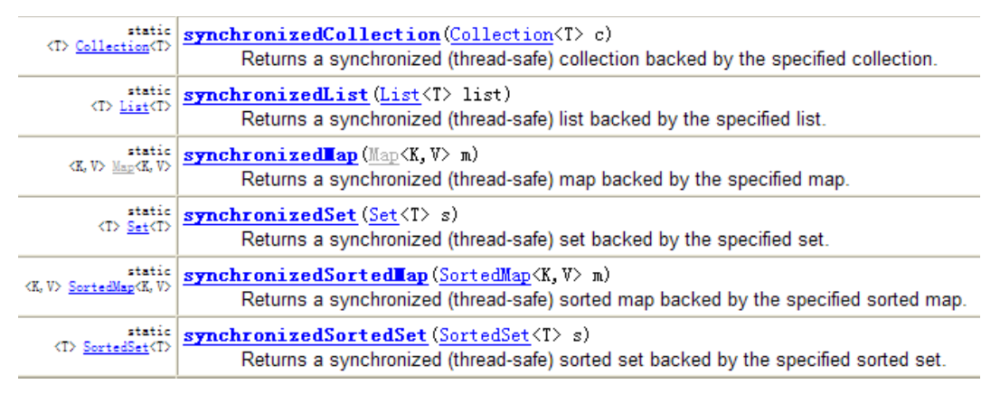

      ```java
      public class Test {
          public static void main(String[] args) {
              List list = new ArrayList();
              list.add(123);
              list.add(43);
              list.add(765);
              list.add(-97);
              list.add(0);
      
              // 返回的list1即为线程安全的List
              List list1 = Collections.synchronizedList(list);
          }
      }
      ```

## 本文参考

https://www.gulixueyuan.com/goods/show/203?targetId=309&preview=0

声明：写作本文初衷是个人学习记录，鉴于本人学识有限，如有侵权或不当之处，请联系 [wdshfut@163.com](mailto:wdshfut@163.com)。