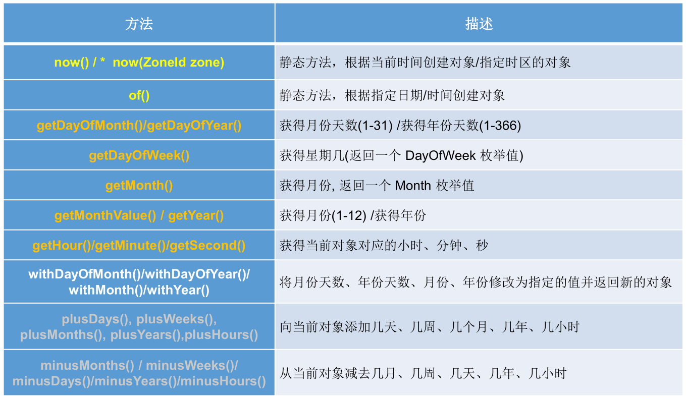
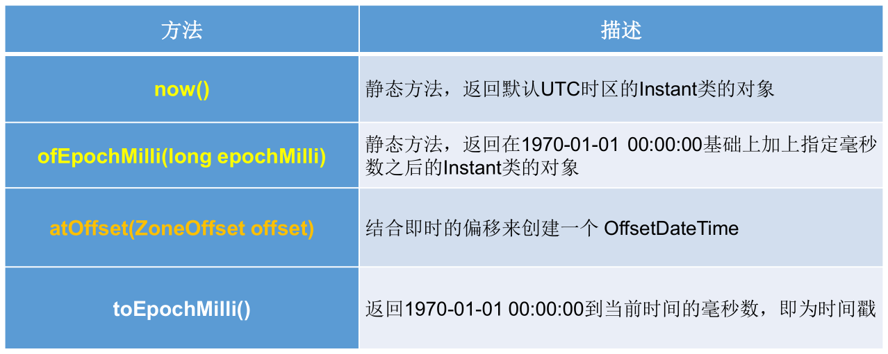

## jdk 8 之前的日期和时间 API

### `java.lang.System` 类

- `long currentTimeMillis()`：返回当前时间与 1970 年 1 月 1 日 0 时 0 分 0 秒之间以毫秒为单位的时间差，也被称为时间戳。

System 类的其他说明：

- System 类代表系统，系统级的很多属性和控制方法都放置在该类的内部。

- 由于该类的构造器是 private 的，所以无法创建该类的对象，也就是无法实例化该类。其内部的成员变量和成员方法都是 static 的，所以也可以很方便的进行调用。

- 成员变量：

  - **System 类内部包含 in、out 和 err 三个成员变量，分别代表标准输入流 (键盘输入)，标准输出流 (显示器) 和标准错误输出流 (显示器)。**

- 成员方法：

  - `native long currentTimeMillis()`：该方法的作用是返回当前的计算机时间，时间的表达格式为当前计算机间和 GMT 时间 (格林威治时间) 1970 年 1 月 1 日 0 时 0 分 0 秒之间的毫秒数。

  - `void exit(int status)`：**该方法的作用是退出程序。其中 status 的值为 0 代表正常退出，非零代表异常退出。**使用该方法可以在图形界面编程中实现程序的退出功能等。

  - `void gc()`：该方法的作用是请求系统进行垃圾回收。至于系统是否立刻回收，则取决于系统中垃圾回收算法的实现以及系统执行时的情况。

  - `String getProperty(String key)`：该方法的作用是获得系统中属性名为 key 的属性对应的值。系统中常见的属性名以及属性的作用如下表所示：

    

    ```java
    public class Test {
        public static void main(String[] args) {
            String javaVersion = System.getProperty("java.version");
            System.out.println("java的version: " + javaVersion);
            String javaHome = System.getProperty("java.home");
            System.out.println("java的home: " + javaHome);
            String osName = System.getProperty("os.name");
            System.out.println("os的name: " + osName);
            String osVersion = System.getProperty("os.version");
            System.out.println("os的version: " + osVersion);
            String userName = System.getProperty("user.name");
            System.out.println("user的name: " + userName);
            String userHome = System.getProperty("user.home");
            System.out.println("user的home: " + userHome);
            String userDir = System.getProperty("user.dir");
            System.out.println("user的dir: " + userDir);
        }
    }
    ```

### `java.util.Date` 类

- 两个构造器的使用：
  - `Date date = new Date();`：创建一个对应当前时间的 Date 对象。 
  - `Date date = new Date(1615816891380L);`：创建指定毫秒数的 Date 对象。
- 两个方法的使用：
  - `toString()`：把此 Date 对象转换为以下形式的 String：`dow mon dd hh:mm:ss zzz yyyy`，其中： dow 是一周中的某一天 (Sun，Mon，Tue，Wed，Thu，Fri，Sat)，zzz 是时间标准。
  - `getTime()`：返回自 1970 年 1 月 1 日 00:00:00 GMT 以来，此  Date 对象表示的毫秒数，即时间戳。
  - 其它很多方法都过时了，不建议使用。

- 区别于 `java.sql.Date` 类：

  - `java.sql.Date` 继承于 `java.util.Date`，是后者的子类，用于数据库中的日期。

    ```java
    public class Test {
        public static void main(String[] args) {
            // 创建java.sal.Date对象
            java.sql.Date date = new java.sql.Date(System.currentTimeMillis());
            System.out.println(date);// 2021-03-15
    
            // java.util.Date对象转换为java.sql.Date对象
            // 情况一：多态
            java.util.Date date1 = new java.sql.Date(System.currentTimeMillis());
            java.sql.Date date2 = (java.sql.Date) date1;
            System.out.println(date2);
    
            // 情况二：
            java.util.Date date3 = new java.util.Date();
            Date date4 = new Date(date3.getTime());
            System.out.println(date4);// 2021-03-15
        }
    }
    ```

### `java.text.SimpleDateFormat` 类

- `java.util.Date` 类的 API 不易于国际化，大部分被废弃了，`java.text.SimpleDateFormat` 类是一个与语言环境无关的方式来格式化和解析日期的具体类。

- 它允许对 Date 类的格式化和解析。

  - 格式化：日期 ---> 字符串。
  - 解析：字符串 ---> 日期。

-  SimpleDateFormat 类的实例化

  - 使用默认构造器 `public SimpleDateFormat()`：

    ```java
    public class Test {
        public static void main(String[] args) {
            SimpleDateFormat sdf = new SimpleDateFormat();
            // 格式化：日期--->字符串
            Date date = new Date();
            String format = sdf.format(date);
            System.out.println(format);// 21-3-16 下午8:46，默认格式化后的输出结果
            // 解析：字符串--->日期
            String str = "21-3-16 下午8:46";// 默认能解析的格式
            try {
                Date parse = sdf.parse(str);
                System.out.println(parse);
            } catch (ParseException e) {
                e.printStackTrace();
            }
        }
    }
    ```

  - 使用带参构造器 `public SimpleDateFormat(String pattern)`：

    ```java
    public class Test {
        public static void main(String[] args) {
            SimpleDateFormat sdf = new SimpleDateFormat("yyyy-MM-dd HH:mm:ss");
            // 格式化：日期--->字符串
            Date date = new Date();
            String format = sdf.format(date);
            System.out.println(format);// 2021-03-16 21:59:37，按指定格式格式化后的输出结果
            // 解析：字符串--->日期
            String str = "2021-3-16 9:02:13";// 按照指定格式书写的日期字符串
            try {
                Date parse = sdf.parse(str);
                System.out.println(parse);
            } catch (ParseException e) {
                e.printStackTrace();
            }
        }
    }
    ```

  - 对于带参的构造器，在解析的时候，字符串必须是符合该参数指定的格式，否则，会解析发生异常。

- 实例：

  ```java
  // 一个人从1990-1-1开始，三天打鱼两天晒网，求指定时间是在打渔还是晒网。
  public class Test {
      public static void main(String[] args) {
          SimpleDateFormat sdf = new SimpleDateFormat("yyyy-MM-dd");
          Date startDate = null;
          try {
              startDate = sdf.parse("1990-1-1");
          } catch (ParseException e) {
              e.printStackTrace();
          }
  
          Date nowDate = null;
          try {
              nowDate = sdf.parse("1990-1-1");
          } catch (ParseException e) {
              e.printStackTrace();
          }
  
          if (startDate != null && nowDate != null) {
              long time = nowDate.getTime() - startDate.getTime();
              long day = time / 1000 / 60 / 60 / 24 + 1;
              long l = day % 5;
              System.out.println(day + ", " + l);
              if (l == 1 || l == 2 | l == 3) {
                  System.out.println("在打渔");
              }
              if (l == 0 || l == 4) {
                  System.out.println("在晒网");
              }
          }
      }
  }
  ```

### `java.util.Calendar` 类 (日历类)

- Calendar 是一个抽象类，主用用于完成日期字段之间相互操作的功能。

  ```java
  public abstract class Calendar implements Serializable, Cloneable, Comparable<Calendar> {}
  ```

- 获取 Calendar实例的方法：

  - 创建它的子类 GregorianCalendar 的对象。
  - 调用静态方法 `Calendar.getInstance()`。

-  一个 Calendar 的实例是系统当前时间的抽象表示，常用方法如下：

  - `int get(int field)`：获取想要的时间信息。比如：YEAR、MONTH、DAY_OF_WEEK、HOUR_OF_DAY、MINUTE、SECOND 等。
    - 获取月份时：一月是 0，二月是 1，以此类推，十二月是 11。
    - 获取星期时：周日是 1，周二是 2，以此类推，周六是 7。
  - `void set(int field,int value)`：设置时间。
  - `void add(int field,int amount)`：当前时间基础上做增减。
  - `final Date getTime()`：Calendar 对象转换为 Date对象。
  - `final void setTime(Date date)`：Date 对象转换为 Calendar 对象。

- 实例：

  ```java
  public class Test {
      public static void main(String[] args) {
          // 1.实例化
          // 方式一：创建其子类(GregorianCalendar)的对象
          // 方式二：调用其静态方法getInstance()
          Calendar calendar = Calendar.getInstance();// 当前时间
          System.out.println(calendar.getClass());// class java.util.GregorianCalendar
  
          // 2.常用方法
          // get()
          System.out.println("年：" + calendar.get(Calendar.YEAR));// 2021
          System.out.println("月：" + (calendar.get(Calendar.MONTH) + 1));// 月份，0代表1月，1代表2月，类推
          System.out.println("日：" + calendar.get(Calendar.DAY_OF_MONTH));// 一个月中的第几天
          System.out.println("时：" + calendar.get(Calendar.HOUR));
          System.out.println("分：" + calendar.get(Calendar.MINUTE));
          System.out.println("秒：" + calendar.get(Calendar.SECOND));
          System.out.println("星期：" + (calendar.get(Calendar.DAY_OF_WEEK) - 1));// 一周中的第几天，1代表周日，2代表周一，类推
          System.out.println("一年中第：" + calendar.get(Calendar.DAY_OF_YEAR));// 一年中的第几天
          // set()
          calendar.set(Calendar.YEAR, 2020);// 更改calendar本身
          System.out.println("重设之后的年：" + calendar.get(Calendar.YEAR));// 2020
          // add()
          calendar.add(Calendar.YEAR, 2);
          System.out.println("加2年之后的年：" + calendar.get(Calendar.YEAR));// 2022
          calendar.add(Calendar.YEAR, -1);
          System.out.println("减1年之后的年：" + calendar.get(Calendar.YEAR));// 2021
          // getTime()：Calendar--->java.util.Date
          Date date = calendar.getTime();
          // setTime()：java.util.Date--->Calendar
          Date date1 = new Date(234234235235L);
          calendar.setTime(date1);// 设置calendar为指定时间
      }
  }
  ```

## jdk 8 之后的日期和时间 API

如果我们可以跟别人说：”我们在 1502643933071 见面，别晚了！”那么就再简单不过了。但是我们希望时间与昼夜和四季有关，于是事情就变复杂了。jdk 1.0 中包含了一个 `java.util.Date` 类，但是它的大多数方法已经在 jdk 1.1 引入 `Calendar` 类之后被弃用了，但 Calendar 并不比 Date 好多少。它们面临的问题是：

可变性：像日期和时间这样的类应该是不可变的。

偏移性：Date 中的年份是从 1900 开始的，而月份都从 0 开始。

格式化：格式化只对 Date 有用，Calendar 则不行。

此外，它们也不是线程安全的，也不能处理闰秒等。

第三次引入的 API 是成功的，并且 java 8 中引入的 `java.time` API 已经纠正了过去的缺陷，将来很长一段时间内它都会为我们服务。

java 8 吸收了 Joda-Time 的精华，以一个新的开始为 java 创建优秀的 API。新的 `java.time` 中包含了所有关于本地日期 (LocalDate)、本地时间 (LocalTime)、本地日期时间 (LocalDateTime)、时区 (ZonedDateTime) 和持续时间 (Duration) 的类。历史悠久的 Date 类新增了 `toInstant()` 方法，用于把 Date 转换成新的表示形式。这些新增的本地化时间日期 API 大大简化了日期时间和本地化的管理。

新时间日期 API：

- `java.time` – 包含值对象的基础包。
- `java.time.chrono` – 提供对不同的日历系统的访问。
- `java.time.format` – 格式化和解析时间和日期。
- `java.time.temporal` – 包括底层框架和扩展特性。
- `java.time.zone` – 包含时区支持的类。

说明：大多数开发者只会用到基础包和 format 包，也可能会用到 temporal 包。因此，尽管有 68 个新的公开类型，大多数开发者，大概将只会用到其中的三分之一。

### `java.time.LocalDate`、`java.time.LocalTime` 和 `java.time.LocalDateTime` 类

- **LocalDate、LocalTime、LocalDateTime 类是其中较重要的几个类，它们的实例是不可变的对象，分别表示使用 ISO-8601日历系统的日期、时间、日期和时间。**它们提供了简单的本地日期或时间，并不包含当前的时间信息，也不包含与时区相关的信息。

  - LocalDate：代表 IOS 格式 (yyyy-MM-dd) 的日期，可以存储生日、纪念日等日期。
  - LocalTime：表示一个时间，而不是日期。
  - LocalDateTime：是用来表示日期和时间的，这是一个最常用的类之一。

- ISO-8601日历系统是国际标准化组织制定的现代公民的日期和时间的表示法，也就是公历。

- 常用方法：

  

- 实例：

  ```java
  public class Test {
      public static void main(String[] args) {
          // now()：获取当前的日期、时间、日期+时间
          LocalDate date = LocalDate.now();
          LocalTime time = LocalTime.now();
          LocalDateTime dateTime = LocalDateTime.now();
          System.out.println(date);// 2021-03-17
          System.out.println(time);// 11:37:43.400
          System.out.println(dateTime);// 2021-03-17T11:37:43.400
  
          // of()：自定义指定的年、月、日、时、分、秒对应的时间对象，没有偏移量
          LocalDate date1 = LocalDate.of(2020, 3, 17);
          LocalTime time1 = LocalTime.of(11, 4, 25);
          LocalDateTime dateTime1 = LocalDateTime.of(2020, 3, 17, 11, 05, 45);
          System.out.println(date1);// 2020-03-17
          System.out.println(time1);// 11:04:25
          System.out.println(dateTime1);// 2020-03-17T11:05:45
  
          // getXxx()：获取指定的时间信息
          System.out.println("年：" + dateTime.getYear());// 2021
          System.out.println("月：" + dateTime.getMonth());// MARCH
          System.out.println("月份数值：" + dateTime.getMonthValue());// 3
          System.out.println("日：" + dateTime.getDayOfMonth());// 17
          System.out.println("星期：" + dateTime.getDayOfWeek());// WEDNESDAY
          System.out.println("时：" + dateTime.getHour());// 11
          System.out.println("分：" + dateTime.getMinute());// 37
          System.out.println("秒：" + dateTime.getSecond());// 18
  
          // withXX()：设置时间为指定的值并返回新的对象---不可变性
          LocalDateTime dateTime2 = dateTime.withYear(2022);
          System.out.println(dateTime);// 2021-03-17T11:37:43.400
          System.out.println(dateTime2);// 2022-03-17T11:37:43.400
  
          // plusXxx()：在当前时间基础上做增减操作并返回新的对象---不可变性
          LocalDateTime dateTime3 = dateTime.plusYears(2);// 加2年
          System.out.println(dateTime);// 2021-03-17T11:37:43.400
          System.out.println(dateTime3);// 2023-03-17T11:37:43.400
          LocalDateTime dateTime4 = dateTime.minusYears(2);// 减2年
          System.out.println(dateTime);// 2021-03-17T11:37:43.400
          System.out.println(dateTime4);// 2019-03-17T11:37:43.400
      }
  }
  ```

### `java.time.Instant` 类 --- 瞬时

- Instant：时间线上的一个瞬时点，这可能被用来记录应用程序中的事件时间戳。

- 在处理时间和日期的时候，我们通常会想到年，月，日，时，分，秒。然而，这只是时间的一个模型，是面向人类的。第二种通用模型是面向机器的，或者说是连续的。在此模型中，时间线中的一个点表示为一个很大的数，这有利于计算机处理。在 UNIX 中，这个数从 1970 年开始，以秒为的单位；同样的，在 java 中，也是从 1970 年开始，但以毫秒为单位。

- `java.time` 包通过值类型 Instant 提供机器视图，不提供处理人类意义上的时间单位。Instant 表示时间线上的一点，而不需要任何上下文信息，例如，时区。概念上讲，它只是简单的表示自 1970 年 01 月 01 日 00 时 00 分 00 秒 (UTC) 开始的秒数。因为 `java.time` 包是基于纳秒计算的，所以 Instant 的精度可以达到纳秒级。

- 1秒 = 1000 毫秒 = 10^6 微秒 = 10^9 纳秒，即：1 ns = 10^-9 s。

- 常用方法：

  

  >时间戳是指格林威治时间 1970 年 01 月 01 日 00 时 00 分 00 秒 (北京时间 1970 年 01 月 01日 08 时 00 分 00 秒) 起至现在的总秒数。

- 实例：

  ```java
  public class Test {
      public static void main(String[] args) {
          Instant instant = Instant.now();// 默认UTC时区，本初子午线对应的标准时间
          System.out.println(instant);// 2021-03-17T03:50:15.672Z
  
          // 添加时间的偏移量
          OffsetDateTime now = instant.atOffset(ZoneOffset.ofHours(8));// 东八区时间，要加上8小时
          System.out.println(now);
  
          // 获取自1970-01-01 00:00:00(UTC)到当前时间的毫秒数   ---> Date类的getTime()方法
          long milli = instant.toEpochMilli();
          System.out.println(milli);
  
          // 通过给定的毫秒数，获取Instant实例   ---> new Date(long millis);
          Instant instant1 = Instant.ofEpochMilli(1615953468824L);
      }
  }
  ```

### `java.time.format.DateTimeFormatter` 类

- 格式化日期或时间，类似 SimpleDateFormat。

- 常用方法：

  

- 实例化方式一：预定义的标准格式。如：`ISO_LOCAL_DATE_TIME`、`ISO_LOCAL_DATE`、`ISO_LOCAL_TIME`。

  ```java
  public class Test {
      public static void main(String[] args) {
          DateTimeFormatter formatter = DateTimeFormatter.ISO_LOCAL_DATE_TIME;
          // 格式化：日期 ---> 字符串
          LocalDateTime localDateTime = LocalDateTime.now();
          System.out.println(localDateTime);// 2021-03-17T13:18:37.907
          String str = formatter.format(localDateTime);
          System.out.println(str);// 2021-03-17T13:18:37.907
  
          // 解析：字符串 ---> 日期
          String str1 = "2021-03-17T13:17:33.274";// 只能解析此种格式的字符串
          TemporalAccessor parse = formatter.parse(str1);
          System.out.println(parse);// {},ISO resolved to 2021-03-17T13:17:33.274
      }
  }
  ```

- 实例化方式二，本地化相关的格式：

  - `ofLocalizedDateTime()`，三种格式：`FormatStyle.LONG` / `FormatStyle.MEDIUM` / `FormatStyle.SHORT` 适用于 LocalDateTime。

    ```java
    public class Test {
        public static void main(String[] args) {
            LocalDateTime localDateTime = LocalDateTime.now();
            System.out.println(localDateTime);// 2021-03-17T13:29:37.732
    
            DateTimeFormatter formatter1 = DateTimeFormatter.ofLocalizedDateTime(FormatStyle.LONG);
            String str1 = formatter1.format(localDateTime);
            System.out.println(str1);// 2021年3月17日 下午01时29分37秒
            DateTimeFormatter formatter2 = DateTimeFormatter.ofLocalizedDateTime(FormatStyle.MEDIUM);
            String str2 = formatter2.format(localDateTime);
            System.out.println(str2);// 2021-3-17 13:29:37
            DateTimeFormatter formatter3 = DateTimeFormatter.ofLocalizedDateTime(FormatStyle.SHORT);
            String str3 = formatter3.format(localDateTime);
            System.out.println(str3);// 21-3-17 下午1:29
        }
    }
    ```

  - `ofLocalizedDate()`，四种格式：`FormatStyle.FULL` / `FormatStyle.LONG` / `FormatStyle.MEDIUM` / `FormatStyle.SHORT` 适用于LocalDate。

    ```java
    public class Test {
        public static void main(String[] args) {
            LocalDate localDate = LocalDate.now();
            System.out.println(localDate);// 2021-03-17
    
            DateTimeFormatter formatter1 = DateTimeFormatter.ofLocalizedDate(FormatStyle.FULL);
            String str1 = formatter1.format(localDate);
            System.out.println(str1);// 2021年3月17日 星期三
            DateTimeFormatter formatter2 = DateTimeFormatter.ofLocalizedDate(FormatStyle.LONG);
            String str2 = formatter2.format(localDate);
            System.out.println(str2);// 2021年3月17日
            DateTimeFormatter formatter3 = DateTimeFormatter.ofLocalizedDate(FormatStyle.MEDIUM);
            String str3 = formatter3.format(localDate);
            System.out.println(str3);// 2021-3-17
            DateTimeFormatter formatter4 = DateTimeFormatter.ofLocalizedDate(FormatStyle.SHORT);
            String str4 = formatter4.format(localDate);
            System.out.println(str4);// 21-3-17
        }
    }
    ```

- **实例化方式三：自定义的格式，最常用。**如：`ofPattern("yyyy-MM-dd hh:mm:ss")`。

  ```java
  public class Test {
      public static void main(String[] args) {
          DateTimeFormatter formatter = DateTimeFormatter.ofPattern("yyyy-MM-dd HH:mm:ss");
          String str = formatter.format(LocalDateTime.now());
          System.out.println(str);// 2021-03-17 13:13:52
          TemporalAccessor accessor = formatter.parse("2021-02-17 13:18:09");// 字符串需要严格匹配自定义的格式
          System.out.println(accessor);// {},ISO resolved to 2021-02-17T13:18:09
      }
  }
  ```

### 其他 API

- `java.time.ZoneId`：该类中包含了所有的时区信息，一个时区的 ID，如 Europe/Paris。

  ```java
  public class Test {
      public static void main(String[] args) {
          // ZoneId: 类中包含了所有的时区信息
          // ZoneId的getAvailableZoneIds(): 获取所有的ZoneId
          Set<String> zoneIds = ZoneId.getAvailableZoneIds();
          for (String s : zoneIds) {
              System.out.println(s);
          }
          // ZoneId的of(): 获取指定时区的时间
          LocalDateTime localDateTime = LocalDateTime.now(ZoneId.of("Asia/Tokyo"));
          System.out.println(localDateTime);
          // ZonedDateTime: 带时区的日期时间
          // ZonedDateTime的now(): 获取本时区的ZonedDateTime对象
          ZonedDateTime zonedDateTime = ZonedDateTime.now();
          System.out.println(zonedDateTime);
          // ZonedDateTime的now(ZoneId id): 获取指定时区的ZonedDateTime对象
          ZonedDateTime zonedDateTime1 = ZonedDateTime.now(ZoneId.of("Asia/Tokyo"));
          System.out.println(zonedDateTime1);
      }
  }
  ```

- `java.time.ZonedDateTime`：一个在 ISO-8601日历系统时区的日期时间，如 2007-12-03T10:15:30+01:00 Europe/Paris。

  - 其中每个时区都对应着 ID，地区 ID 都为 "{区域}/{城市}" 的格式，例如：Asia/Shanghai 等。

- `java.time.Clock`：使用时区提供对当前即时、日期和时间的访问的时钟。

- **`java.time.Duration`：持续时间，用于计算两个 "时间" 间隔。**

  ```java
  public class Test {
      public static void main(String[] args) {
          // Duration: 用于计算两个"时间"间隔，以秒和纳秒为基准
  
          // between(): 静态方法，返回Duration对象，表示两个时间的间隔
          LocalTime localTime = LocalTime.now();
          LocalTime localTime1 = LocalTime.of(15, 23, 32);
          Duration duration = Duration.between(localTime1, localTime);
          System.out.println(duration);
          System.out.println(duration.getSeconds());
          System.out.println(duration.getNano());
  
          LocalDateTime localDateTime = LocalDateTime.of(2016, 6, 12, 15, 23, 32);
          LocalDateTime localDateTime1 = LocalDateTime.of(2017, 6, 12, 15, 23, 32);
          Duration duration1 = Duration.between(localDateTime1, localDateTime);
          System.out.println(duration1.toDays());// -365
      }
  }
  ```

- **`java.time.Period`：日期间隔，用于计算两个 "日期" 间隔。**

  ```java
  public class Test {
      public static void main(String[] args) {
          // Period:用于计算两个"日期"间隔，以年、月、日衡量
          LocalDate localDate = LocalDate.now();// 2021-3-17
          LocalDate localDate1 = LocalDate.of(2028, 3, 18);
          Period period = Period.between(localDate, localDate1);
          System.out.println(period);// P7Y1D
          System.out.println(period.getYears());// 7
          System.out.println(period.getMonths());// 0
          System.out.println(period.getDays());// 1
          Period period1 = period.withYears(2);
          System.out.println(period1);
      }
  }
  ```

- `java.time.temporal.TemporalAdjuster`：时间校正器。有时我们可能需要获取诸如将日期调整到 "下一个工作日" 等操作。

- `java.time.temporal.TemporalAdjusters`：该类通过静态方法 `firstDayOfXxx()`/`lastDayOfXxx()`/`nextXxx()`，提供了大量的常用 TemporalAdjuster 的实现。

  ```java
  public class Test {
      public static void main(String[] args) {
          // TemporalAdjuster: 时间校正器
          // 获取当前日期的下一个周日是哪天？当前日期：2021-3-17
          TemporalAdjuster temporalAdjuster = TemporalAdjusters.next(DayOfWeek.SUNDAY);
          LocalDate localDateTime = LocalDate.now().with(temporalAdjuster);// LocalDateTime.now().with(temporalAdjuster)
          System.out.println("下一个周日是：" + localDateTime);// 下一个周日是：2021-03-21
          // 获取下一个工作日是哪天？
          LocalDate localDate = LocalDate.now().with(new TemporalAdjuster() {
              @Override
              public Temporal adjustInto(Temporal temporal) {
                  LocalDate date = (LocalDate) temporal;
                  if (date.getDayOfWeek().equals(DayOfWeek.FRIDAY)) {
                      return date.plusDays(3);
                  } else if (date.getDayOfWeek().equals(DayOfWeek.SATURDAY)) {
                      return date.plusDays(2);
                  } else {
                      return date.plusDays(1);
                  }
              }
          });
          System.out.println("下一个工作日是：" + localDate);// 下一个工作日是：2021-03-18
      }
  }
  ```

### 与传统日期处理的转换


## 本文参考

https://www.gulixueyuan.com/goods/show/203?targetId=309&preview=0

声明：写作本文初衷是个人学习记录，鉴于本人学识有限，如有侵权或不当之处，请联系 [wdshfut@163.com](mailto:wdshfut@163.com)。