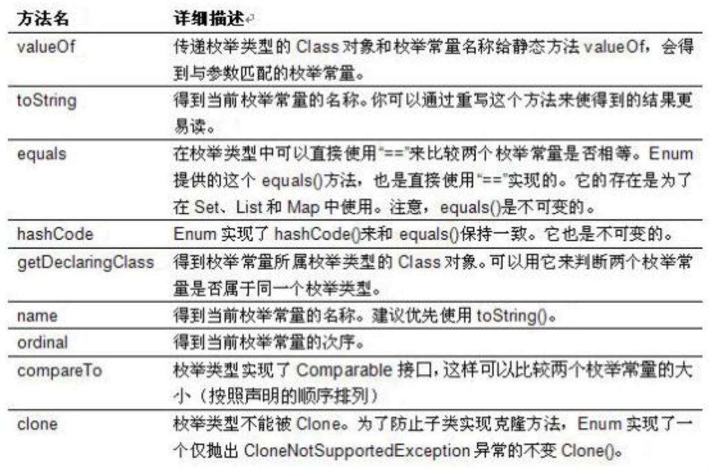
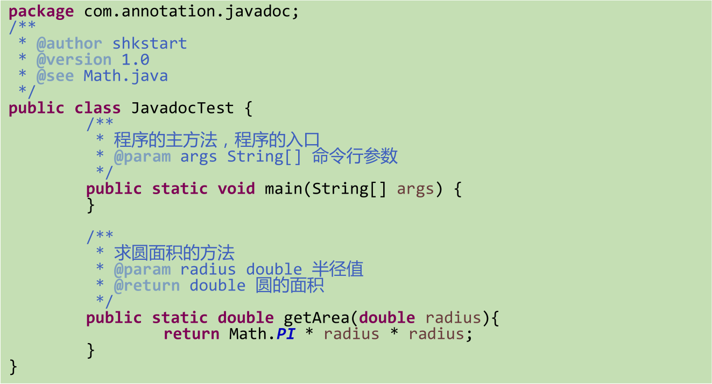
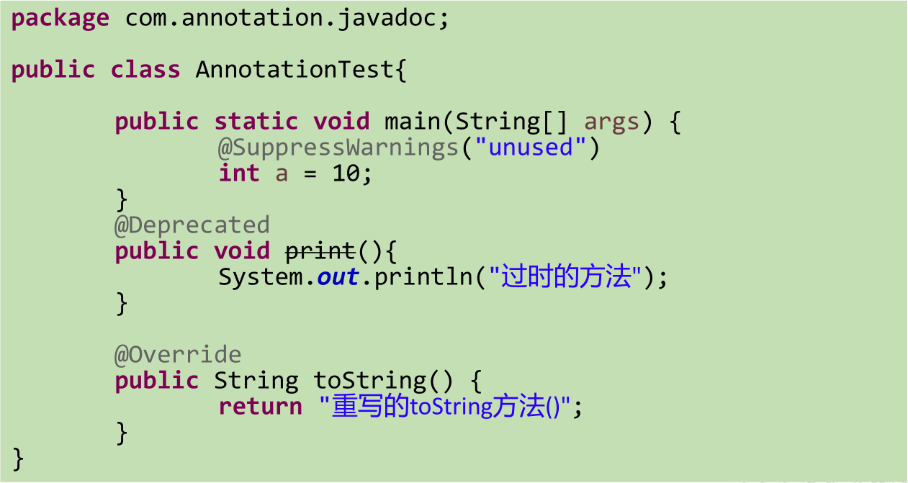
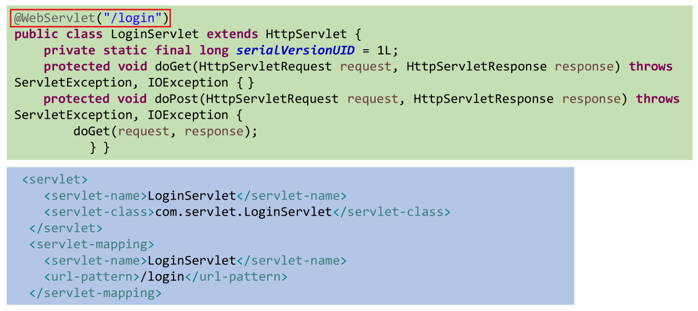
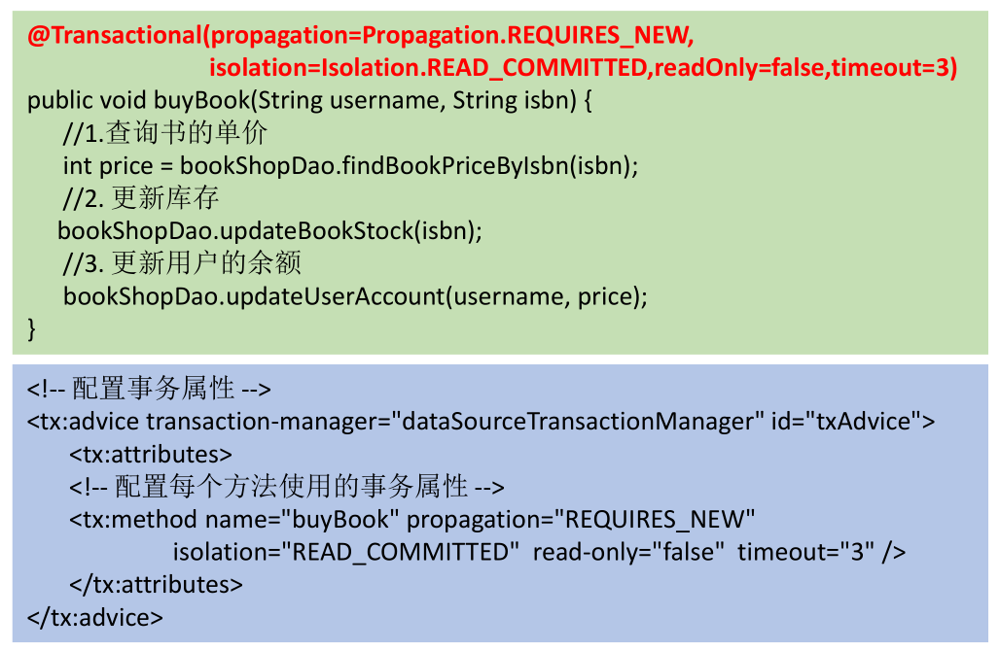
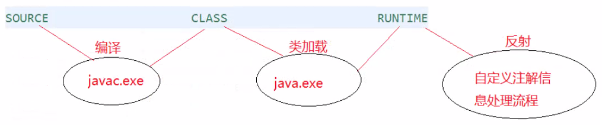
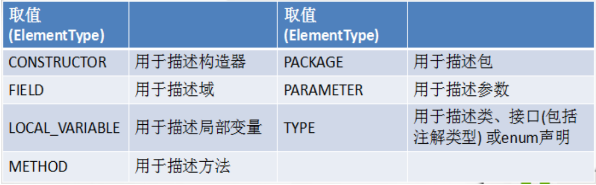
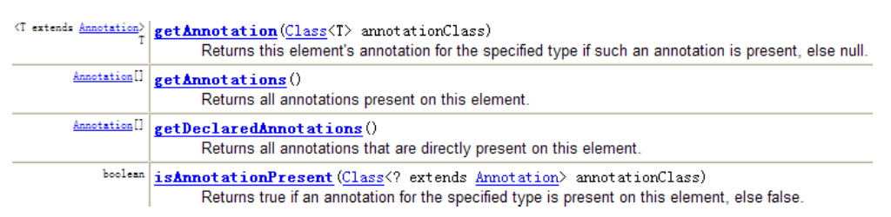

## 枚举类 (Enum) 的使用

枚举类的理解：

- 类的对象只有有限个，确定的，则此类称为枚举类。
- 当需要定义一组常量时，强烈建议使用枚举类。
- **如果枚举类中只有一个对象，则可以作为单例模式的实现方式。**
- jdk 5.0 之后，可以在 switch 表达式中使用 Enum 定义的枚举类的对象作为表达式，case 子句可以直接使用枚举值的名字，无需添加枚举类作为限定。

如何定义枚举类：

- 方式一：jdk 5.0 之前需要自定义枚举类。

  - 私有化类的构造器，保证不能在类的外部创建其对象。

  - 在类的内部创建枚举类的实例。声明为：`public static final`。

  - 对象如果有实例变量，应该声明为 `private final`，并在构造器中初始化。

    ```java
    public class Test {
        public static void main(String[] args) {
            System.out.println(Season.SPRING);// Season{SEASONNAME='春天', SEASONDESC='春暖花开'}
        }
    }
    
    // 自定义枚举类
    class Season {
        // 1.声明Season对象的属性：private final 修饰 --- 常量
        private final String SEASONNAME;//季节的名称
        private final String SEASONDESC;//季节的描述
    
        // 2.私有化类的构造器，并给对象的属性赋值
        private Season(String seasonName, String seasonDesc) {
            this.SEASONNAME = seasonName;
            this.SEASONDESC = seasonDesc;
        }
    
        // 3.提供当前枚举类的多个对象
        public static final Season SPRING = new Season("春天", "春暖花开");
        public static final Season SUMMER = new Season("夏天", "夏日炎炎");
        public static final Season AUTUMN = new Season("秋天", "秋高气爽");
        public static final Season WINTER = new Season("冬天", "白雪皑皑");
    
        // 4.其他诉求一：获取枚举类对象的属性
        public String getSEASONNAME() {
            return SEASONNAME;
        }
    
        public String getSEASONDESC() {
            return SEASONDESC;
        }
    
        // 5.其他诉求二：提供toString()
        @Override
        public String toString() {
            return "Season{" +
                    "SEASONNAME='" + SEASONNAME + '\'' +
                    ", SEASONDESC='" + SEASONDESC + '\'' +
                    '}';
        }
    }
    ```

- 方式二：jdk 5.0 之后，可以使用新增的 enum 关键字定义枚举类。

  - **使用 enum 关键字定义的枚举类默认继承了 `java.lang.Enum` 类，因此不能再继承其他类。**

  - 枚举类的构造器只能使用 private 权限修饰符。

  - **枚举类的所有实例必须在枚举类中显式列出，以 "," 分隔，以 ";" 结尾**。列出的实例系统会默认添加 `public static final` 修饰。

  - **必须在枚举类的第一行声明枚举类对象。**

    ```java
    public class Test {
        public static void main(String[] args) {
            System.out.println(Season.SPRING);// SPRING
            System.out.println("enum的父类是：" + Season.class.getSuperclass());// class java.lang.Enum
        }
    }
    
    // 使用enum关键字定义枚举类
    enum Season {
        // 1.首行提供当前枚举类的多个对象: 多个对象之间以","隔开，末尾的对象以";"结束
        SPRING("春天", "春暖花开"),
    
        SUMMER("夏天", "夏日炎炎"),
    
        AUTUMN("秋天", "秋高气爽"),
    
        WINTER("冬天", "白雪皑皑");
    
        // 2.声明Season对象的属性：private final 修饰 --- 常量
        private final String SEASONNAME;//季节的名称
        private final String SEASONDESC;//季节的描述
    
        // 3.私有化类的构造器，并给对象的属性赋值
        private Season(String seasonName, String seasonDesc) {
            this.SEASONNAME = seasonName;
            this.SEASONDESC = seasonDesc;
        }
    
        // 4.其他诉求一：获取枚举类对象的属性
        public String getSEASONNAME() {
            return SEASONNAME;
        }
    
        public String getSEASONDESC() {
            return SEASONDESC;
        }
    
        // 5.其他诉求二：提供toString()，一般不重写
        /*@Override
        public String toString() {
            return "Season{" +
                    "SEASONNAME='" + SEASONNAME + '\'' +
                    ", SEASONDESC='" + SEASONDESC + '\'' +
                    '}';
        }*/
    }
    ```

Enum 类中的常用方法：



- `values()`：返回枚举类型的对象数组，该方法可以很方便地遍历枚举类的所有的枚举值。

  ```java
  public class Test {
      public static void main(String[] args) {
          Thread.State[] values = Thread.State.values();
          for (Thread.State value : values) {
              System.out.print(value + " ");// NEW RUNNABLE BLOCKED WAITING TIMED_WAITING TERMINATED
          }
      }
  }
  ```

- `valueOf(String str)`：可以把一个字符串转为对应的枚举类对象。要求字符串必须是枚举类对象的 "名字"，如不是，会抛出运行时异常：`java.lang.IllegalArgumentException`。

  ```java
  public class Test {
      public static void main(String[] args) {
          Thread.State aNew = Thread.State.valueOf("NEW");
          System.out.println(aNew);// NEW
          Thread.State dead = Thread.State.valueOf("DEAD");
          System.out.println(dead);// java.lang.IllegalArgumentException: No enum constant java.lang.Thread.State.DEAD
      }
  }
  ```

- `toString()`：返回当前枚举类对象常量的名称。

使用 enum 关键字定义的枚举类实现接口的情况：

- 和普通 java 类一样，枚举类可以实现一个或多个接口。

- **若每个枚举值在调用实现的接口的方法时，如果呈现出相同的行为方式，则只要统一实现该方法即可。**

  ```java
  public class Test {
      public static void main(String[] args) {
          Season spring = Season.SPRING;
          spring.show();// 这是一个季节
      }
  }
  
  interface Info {
      void show();
  }
  
  // 使用enum关键字定义枚举类
  enum Season implements Info {
      // 1.首行提供当前枚举类的多个对象: 多个对象之间以","隔开，末尾的对象以";"结束
      SPRING("春天", "春暖花开"),
  
      SUMMER("夏天", "夏日炎炎"),
  
      AUTUMN("秋天", "秋高气爽"),
  
      WINTER("冬天", "白雪皑皑");
  
      // 2.声明Season对象的属性：private final 修饰 --- 常量
      private final String SEASONNAME;//季节的名称
      private final String SEASONDESC;//季节的描述
  
      // 3.私有化类的构造器，并给对象的属性赋值
      private Season(String seasonName, String seasonDesc) {
          this.SEASONNAME = seasonName;
          this.SEASONDESC = seasonDesc;
      }
  
      // 4.其他诉求一：获取枚举类对象的属性
      public String getSEASONNAME() {
          return SEASONNAME;
      }
  
      public String getSEASONDESC() {
          return SEASONDESC;
      }
  
      // 每个枚举值在调用实现的接口的方法时，呈现出相同的行为方式
      @Override
      public void show() {
          System.out.println("这是一个季节");
      }
  
      // 5.其他诉求二：提供toString()，一般不重写
      /*@Override
      public String toString() {
          return "Season{" +
                  "SEASONNAME='" + SEASONNAME + '\'' +
                  ", SEASONDESC='" + SEASONDESC + '\'' +
                  '}';
      }*/
  }
  ```

- **若需要每个枚举值在调用实现的接口的方法时，呈现出不同的行为方式，则可以让每个枚举值分别来实现该方法。**

  ```java
  public class Test {
      public static void main(String[] args) {
          Season spring = Season.SPRING;
          spring.show();// 现在是春天
          Season winter = Season.WINTER;
          winter.show();// 现在是冬天
      }
  }
  
  interface Info {
      void show();
  }
  
  // 使用enum关键字定义枚举类
  enum Season implements Info {
      // 1.首行提供当前枚举类的多个对象: 多个对象之间以","隔开，末尾的对象以";"结束
      SPRING("春天", "春暖花开") {
          @Override
          public void show() {
              System.out.println("现在是春天");
          }
      },
  
      SUMMER("夏天", "夏日炎炎") {
          @Override
          public void show() {
              System.out.println("现在是夏天");
          }
      },
  
      AUTUMN("秋天", "秋高气爽") {
          @Override
          public void show() {
              System.out.println("现在是秋天");
          }
      },
  
      WINTER("冬天", "白雪皑皑") {
          @Override
          public void show() {
              System.out.println("现在是冬天");
          }
      };
  
      // 2.声明Season对象的属性：private final 修饰 --- 常量
      private final String SEASONNAME;//季节的名称
      private final String SEASONDESC;//季节的描述
  
      // 3.私有化类的构造器，并给对象的属性赋值
      private Season(String seasonName, String seasonDesc) {
          this.SEASONNAME = seasonName;
          this.SEASONDESC = seasonDesc;
      }
  
      // 4.其他诉求一：获取枚举类对象的属性
      public String getSEASONNAME() {
          return SEASONNAME;
      }
  
      public String getSEASONDESC() {
          return SEASONDESC;
      }
  
      // 5.其他诉求二：提供toString()，一般不重写
      /*@Override
      public String toString() {
          return "Season{" +
                  "SEASONNAME='" + SEASONNAME + '\'' +
                  ", SEASONDESC='" + SEASONDESC + '\'' +
                  '}';
      }*/
  }
  ```

## 注解 (Annotation) 的使用

注解的概述：

- 从 jdk 5.0 开始，java 增加了对元数据 (MetaData) 的支持，也就是 Annotation (注解)。
- **Annotation 其实就是代码里的特殊标记，这些标记可以在编译、类加载、运行时被读取，并执行相应的处理。**通过使用 Annotation，程序员可以在不改变原有逻辑的情况下，在源文件中嵌入一些补充信息。代码分析工具、开发工具和部署工具可以通过这些补充信息进行验证或者进行部署。
- Annotation 可以像修饰符一样被使用，**可用于修饰包、类、构造器、方法、 成员变量、参数、局部变量的声明**，这些信息被保存在 Annotation 的 "name = value" 对中。
- 在 JavaSE 中，注解的使用目的比较简单，例如标记过时的功能，忽略警告等。在 JavaEE/Android 中注解占据了更重要的角色，例如用来配置应用程序的任何切面，代替 JavaEE 旧版中所遗留的繁冗代码和 XML 配置等。
- 未来的开发模式都是基于注解的，JPA 是基于注解的，Spring 2.5 以上都是基于注解的，Hibernate 3.x 以后也是基于注解的，现在的 Struts2 有一部分也是基于注解的。**注解是一种趋势，一定程度上可以说：框架 = 注解 + 反射 + 设计模式。**

常见的 Annotation 示例：

- 使用 Annotation 时要在其前面增加 @ 符号，并把该 Annotation 当成一个修饰符使用，用于修饰它支持的程序元素。

- 示例一：生成文档相关的注解。

  - `@author`：标明开发该类模块的作者，多个作者之间使用 ","分割。

  - `@version`：标明该类模块的版本。

  - `@see`：参考转向，也就是相关主题。

  - `@since`：从哪个版本开始增加的。

  - `@param`：对方法中某参数的说明，如果没有参数就不能写。

  - `@return`：对方法返回值的说明，如果方法的返回值类型是 void 就不能写。

  - `@exception`：对方法可能抛出的异常进行说明 ，如果方法没有用 throws 显式抛出的异常就不能写其中。

    - `@param`、`@return` 和 `@exception` 这三个标记都是只用于方法的。
    - `@param` 的格式要求：`@param 形参名 形参类型 形参说明`。
    - `@return` 的格式要求：`@return 返回值类型 返回值说明`。
    - `@exception` 的格式要求：`@exception 异常类型 异常说明`。
    - `@param` 和 `@exception` 可以并列多个。

  - 实例：

    

- 示例二： 在编译时进行格式查 (jdk 内置的三个基本注解)。

  - `@Override`：限定重写父类方法，该注解只能用于方法。

  - `@Deprecated`：用于表示所修饰的元素 (类，方法等) 已过时，通常是因为所修饰的结构危险或存在更好的选择。

  - `@SuppressWarnings`：抑制编译器警告。

  - 实例：

    

- 示例三： 跟踪代码依赖性，实现替代配置文件功能。

  - Servlet 3.0 提供了注解 (annotation)，使得不再需要在 web.xml 文件中进行 Servlet 的部署：

    

  -  spring 框架中关于事务的管理：

    

自定义注解：参照 `@SuppressWarnings`定义。

- 注解声明为：`@interface`。

- 自定义注解自动继承了 `java.lang.annotation.Annotation` 接口。

- **Annotation 的成员变量在 Annotation 定义中以无参数方法的形式来声明。**其方法名和返回值定义了该成员的名字和类型，我们称为配置参数。**类型只能是八种基本数据类型、String 类型 、Class 类型 、Enum 类型 、Annotation 类型，以上所有类型的数组。**

- 可以在定义 Annotation 的成员变量时为其指定初始值，**指定成员变量的初始值可使用 default 关键字。**

- **没有成员定义的 Annotation 称为标记 (是一个标识作用)；包含成员变量的 Annotation 称为元数据 Annotation。**

- **如果注解只有一个成员，建议使用参数名为 value。**

- **如果注解有成员，那么使用时必须指定参数值，除非它有默认值。**格式是 "参数名 = 参数值"，如果只有一个参数成员，且名称为 value，可以省略 "value="，直接写参数值。

- **自定义注解必须配上注解的信息处理流程才有意义 (使用反射，能够得到注解的内容，然后根据内容和注解的对象建立关系，比如 Servlet 的注解)。**

- 实例：

  ```java
  public @interface MyAnnotation {
      String[] value() default "自定义的注解";
  }
  ```

**jdk 中的元注解：**

- jdk 的元注解是用于修饰其他注解而定义的，即对现有注解进行解释说明的注解。

  - 元数据：对数据进行修饰的数据。比如：`String name = "Tom";`，Tom 是数据，而 String 和 name 就是修饰 Tom 的元数据。

- jdk 5.0 提供了 4 个标准的 meta-annotation 类型，分别是：

  - `@Retention`：只能用于修饰一个 Annotation 定义，用于指定该 Annotation 的生命周期。`@Rentention` 包含一个 RetentionPolicy 类型的成员变量，使用 `@Rentention` 时必须为该 value 成员变量指定值： 

    ```java
    @Documented
    @Retention(RetentionPolicy.RUNTIME)
    @Target(ElementType.ANNOTATION_TYPE)
    public @interface Retention {
        /**
         * Returns the retention policy.
         * @return the retention policy
         */
        RetentionPolicy value();
    }
    ```

    ```java
    public enum RetentionPolicy {
        /**
         * Annotations are to be discarded by the compiler.
         */
        SOURCE,
    
        /**
         * Annotations are to be recorded in the class file by the compiler
         * but need not be retained by the VM at run time.  This is the default
         * behavior.
         */
        CLASS,
    
        /**
         * Annotations are to be recorded in the class file by the compiler and
         * retained by the VM at run time, so they may be read reflectively.
         *
         * @see java.lang.reflect.AnnotatedElement
         */
        RUNTIME
    }
    ```

    - `RetentionPolicy.SOURCE`：在源文件中有效，即源文件保留，编译器直接丢弃这种策略的注释。

    - `RetentionPolicy.CLASS`：在 class 文件 中有效，即 class 保留，当运行 java 程序时，JVM 不会保留注解。这是默认值。

    - `RetentionPolicy.RUNTIME`：在运行时有效，即运行时保留，当运行 java 程序时，JVM 会保留注释。程序可以通过反射获取该注释。

    - **只有声明为 RUNTIME 生命周期的注解，才能通过反射获取。**

    - 实例：

      ```java
      @Retention(RetentionPolicy.RUNTIME)
      public @interface MyAnnotation {
          String[] value() default "自定义的注解";
      }
      ```

      

  - `@Target`：用于修饰 Annotation 定义，用于指定被修饰的 Annotation 能用于修饰哪些程序元素。 @Target 也包含一个名为 value 的成员变量。

    ```java
    @Documented
    @Retention(RetentionPolicy.RUNTIME)
    @Target(ElementType.ANNOTATION_TYPE)
    public @interface Target {
        /**
         * Returns an array of the kinds of elements an annotation type
         * can be applied to.
         * @return an array of the kinds of elements an annotation type
         * can be applied to
         */
        ElementType[] value();
    }
    ```

    ```java
    public enum ElementType {
        /** Class, interface (including annotation type), or enum declaration */
        TYPE,
    
        /** Field declaration (includes enum constants) */
        FIELD,
    
        /** Method declaration */
        METHOD,
    
        /** Formal parameter declaration */
        PARAMETER,
    
        /** Constructor declaration */
        CONSTRUCTOR,
    
        /** Local variable declaration */
        LOCAL_VARIABLE,
    
        /** Annotation type declaration */
        ANNOTATION_TYPE,
    
        /** Package declaration */
        PACKAGE,
    
        /**
         * Type parameter declaration
         *
         * @since 1.8
         */
        TYPE_PARAMETER,
    
        /**
         * Use of a type
         *
         * @since 1.8
         */
        TYPE_USE
    }
    ```

    - 各取值含义如下：

      

    - 实例：

      ```java
      @Target(ElementType.TYPE)
      public @interface MyAnnotation {
          String[] value() default "自定义的注解";
      }
      
      @MyAnnotation("修改了默认值")
      class Person {
          public Person() {
          }
      }
      ```

  - `@Documented`：用于指定被该元 Annotation 修饰的 Annotation 类将被 javadoc 工具提取成文档。默认情况下，javadoc 是不包括注解的。如果希望一个注解在被 javadoc 解析生成文档时能保存下来，需要添加此注解。

    ```java
    @Documented
    @Retention(RetentionPolicy.RUNTIME)
    @Target(ElementType.ANNOTATION_TYPE)
    public @interface Documented {
    }
    ```

    - 定义为 `@Documented` 的注解，必须设置 `@Retention` 值为 RUNTIME。

  - `@Inherited`：被它修饰的 Annotation 将具有继承性。如果某个类使用了被 `@Inherited` 修饰的 Annotation，则其子类将自动具有该注解。

    - 比如：如果把标有 `@Inherited` 注解的自定义的注解标注在类级别上，子类则可以继承父类类级别的注解。
    - 实际应用中，使用较少。

- **自定义注解时，通常都会指明 `@Retention` 和 `@Target` 这两个注解。**

**利用反射获取注解信息：** 

- jdk 5.0 在 `java.lang.reflect` 包下新增了 AnnotatedElement 接口，该接口代表程序中可以接受注解的程序元素。

- 当一个 Annotation 类型被定义为运行时 Annotation 后，该注解才是运行时可见，当 class 文件被载入时保存在 class 文件中的 Annotation 才会被虚拟机读取。

- 程序可以调用 AnnotatedElement 对象的如下方法来访问 Annotation 信息：

  

- 实例：

  ```java
  @Retention(RetentionPolicy.RUNTIME)
  @Target(ElementType.TYPE)
  public @interface MyAnnotation {
      String[] value() default "自定义的注解";
  }
  
  @MyAnnotation("修改了默认值")
  class Person {
      public Person() {
  
      }
  
      public static void main(String[] args) {
          Class<Person> clazz = Person.class;
  
          Annotation[] annotations = clazz.getAnnotations();
          for (Annotation annotation : annotations) {
              System.out.println(annotation);// @cn.xisun.java.base.MyAnnotation(value=[修改了默认值])
          }
  
          Annotation annotation = clazz.getAnnotation(MyAnnotation.class);
          MyAnnotation myAnnotation = (MyAnnotation) annotation;
          String[] info = myAnnotation.value();
          System.out.println(Arrays.toString(info));// [修改了默认值]
      }
  }
  ```

jdk 8.0 中注解的新特性：

- java 8.0 对注解处理提供了两点改进：可重复的注解及可用于类型的注解。此外，反射也得到了加强，在 java 8.0 中能够得到方法参数的名称。这会简化标注在方法参数上的注解。

- **可重复注解：**

  - jdk 8.0 之前的写法：

    ```java
    @Retention(RetentionPolicy.RUNTIME)
    @Target(ElementType.TYPE)
    public @interface MyAnnotation {
        String[] value() default "自定义的注解";
    }
    
    // 定义新数组，值为需要重复注解对象的数组 
    @Retention(RetentionPolicy.RUNTIME)
    @interface MyAnnotations {
        MyAnnotation[] value();
    }
    
    // jdk 8.0之前的写法：
    @MyAnnotations({@MyAnnotation("注解1"), @MyAnnotation("注解2")})
    class Person {
        public Person() {
    
        }
    
        public static void main(String[] args) {
            Class<Person> clazz = Person.class;
    
            Annotation[] annotations = clazz.getAnnotations();
            for (Annotation annotation : annotations) {
                System.out.println(annotation);
            }
    
            Annotation annotation = clazz.getAnnotation(MyAnnotations.class);
            MyAnnotations myAnnotation = (MyAnnotations) annotation;
            MyAnnotation[] info = myAnnotation.value();
            System.out.println(Arrays.toString(info));
        }
    }
    输出结果：
    @cn.xisun.java.base.MyAnnotations(value=[@cn.xisun.java.base.MyAnnotation(value=[注解1]), @cn.xisun.java.base.MyAnnotation(value=[=注解2])])
    [@cn.xisun.java.base.MyAnnotation(value=[注解1]), @cn.xisun.java.base.MyAnnotation(value=[注解2])]
    ```

  - jdk 8.0 之后的写法：利用 `@Repeatable`。

    ```java
    @Repeatable(MyAnnotations.class)
    @Retention(RetentionPolicy.RUNTIME)
    @Target(ElementType.TYPE)
    public @interface MyAnnotation {
        String[] value() default "自定义的注解";
    }
    
    @Retention(RetentionPolicy.RUNTIME)
    @Target(ElementType.TYPE)
    @interface MyAnnotations {
        MyAnnotation[] value();
    }
    
    @MyAnnotation("注解1")
    @MyAnnotation("注解2")
    class Person {
        public Person() {
    
        }
    
        public static void main(String[] args) {
            Class<Person> clazz = Person.class;
    
            Annotation[] annotations = clazz.getAnnotations();
            for (Annotation annotation : annotations) {
                System.out.println(annotation);// @cn.xisun.java.base.MyAnnotation(value=[修改了默认值])
            }
    
            Annotation annotation = clazz.getAnnotation(MyAnnotations.class);
            MyAnnotations myAnnotation = (MyAnnotations) annotation;
            MyAnnotation[] info = myAnnotation.value();
            System.out.println(Arrays.toString(info));// [修改了默认值]
        }
    }
    ```

- **类型注解：**

  - jdk 8.0 之后，关于元注解 `@Target` 的参数类型 ElementType 枚举值多了两个：TYPE_PARAMETER 和 TYPE_USE。、

    - `ElementType.TYPE_PARAMETER`：表示该注解能写在类型变量的声明语句中，如：泛型声明。

      ```java
      public class TestTypeDefine<@TypeDefine() U> {
          private U u;
          public <@TypeDefine() T> void test(T t){
          }
      }
      
      @Target({ElementType.TYPE_PARAMETER})
      @interface TypeDefine{
      }
      ```

    - `ElementType.TYPE_USE`：表示该注解能写在使用类型的任何语句中。

      ```java
      @Target(ElementType.TYPE_USE)
      @interface MyAnnotation {
      }
      
      @MyAnnotation
      public class AnnotationTest<U> {
          @MyAnnotation
          private String name;// 对属性添加注解
          
          public static <@MyAnnotation T> void method(T t) {}// 对泛型添加注解
          
          public static void test(@MyAnnotation String arg) throws @MyAnnotation Exception {}// 对异常添加注解
          
          public static void main(String[] args) {
              AnnotationTest<@MyAnnotation String> t = null;
              int a = (@MyAnnotation int) 2L;
              @MyAnnotation
              int b = 10;
          }
      }
      ```

  - **在 java 8.0 之前，注解只能是在声明的地方所使用，从 java 8.0 开始，注解可以应用在任何地方。**

## 本文参考

https://www.gulixueyuan.com/goods/show/203?targetId=309&preview=0

声明：写作本文初衷是个人学习记录，鉴于本人学识有限，如有侵权或不当之处，请联系 [wdshfut@163.com](mailto:wdshfut@163.com)。