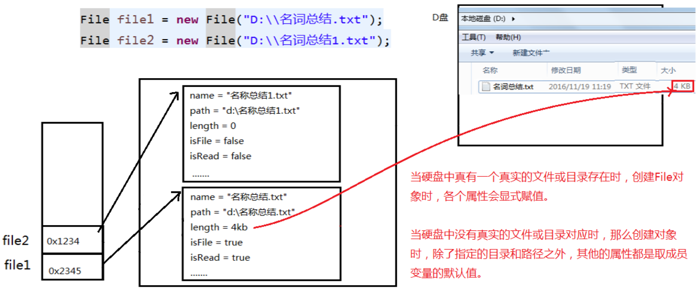
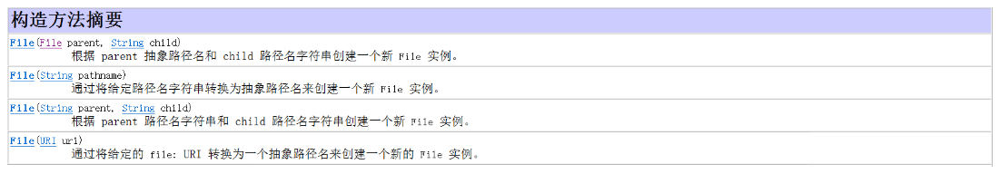
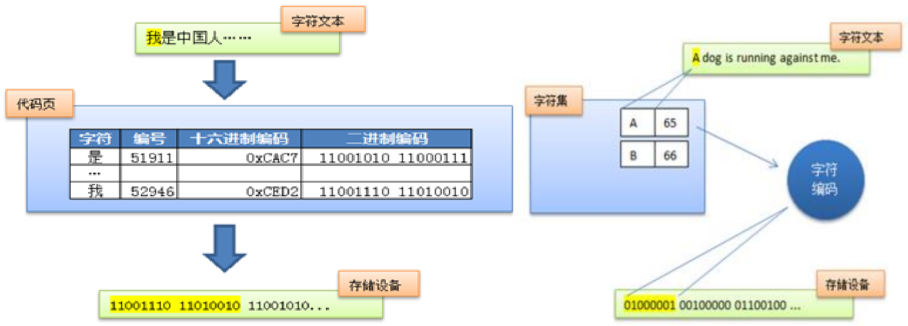
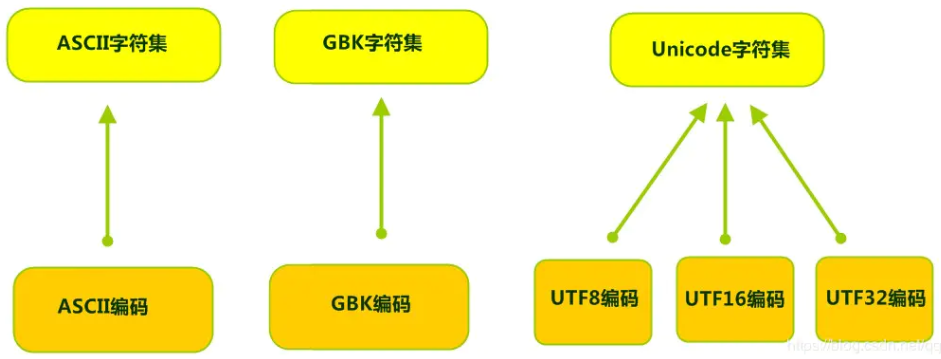
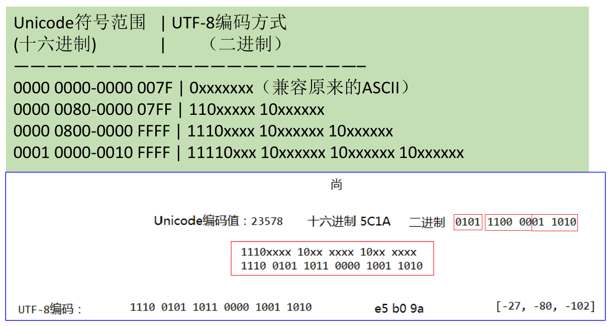
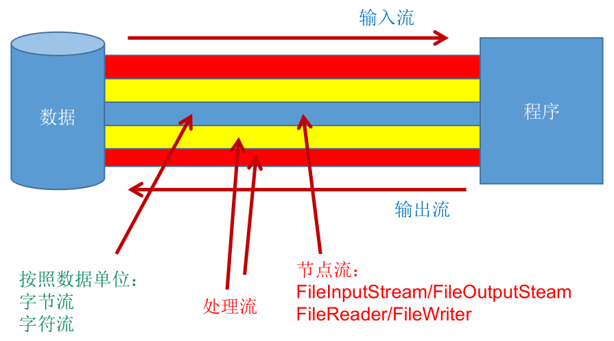
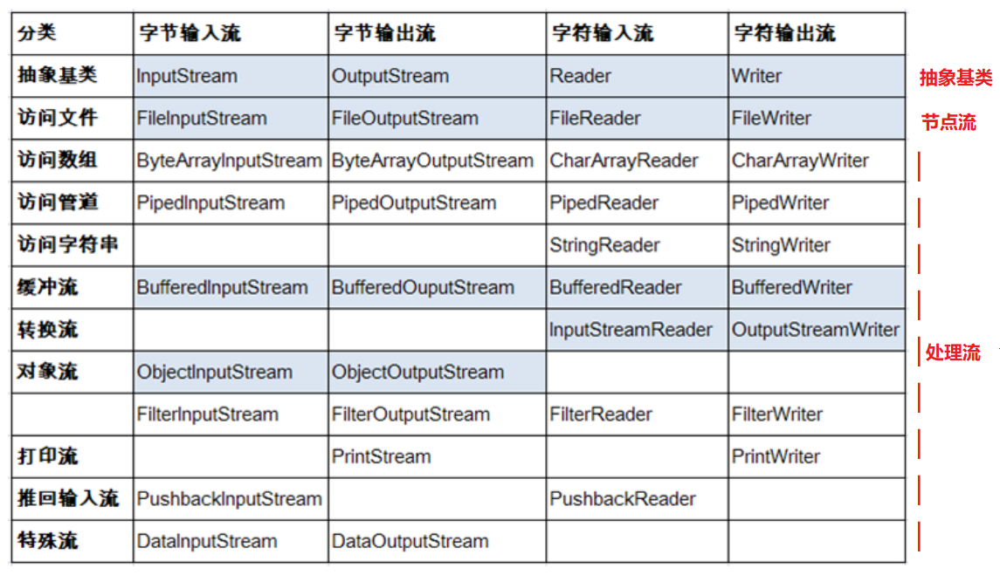
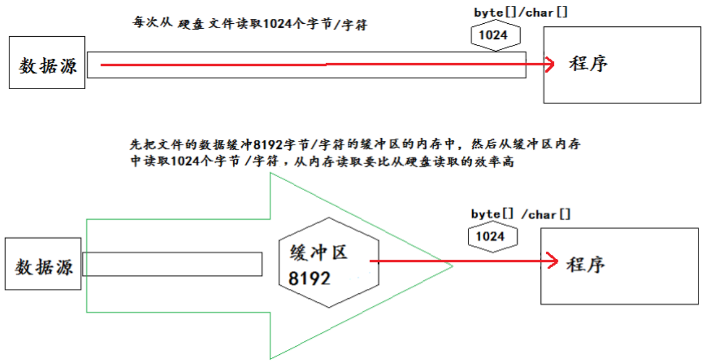
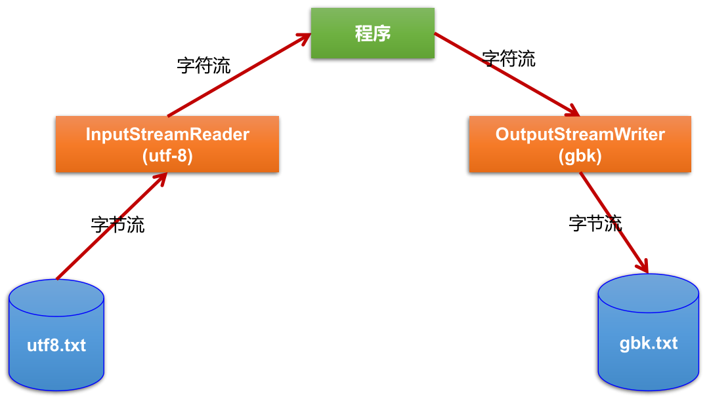

## File 类

-  `java.io.File` 类：文件和文件目录路径的抽象表示形式，与平台无关。

  -  File 主要表示类似 `D:\\文件目录1` 与 `D:\\文件目录1\\文件.txt`，前者是文件夹 (directory)，后者则是文件 (file)，而 File 类就是操作这两者的类。

-  **File 能新建、删除、重命名文件和目录，但 File 不能访问文件内容本身。如果需要访问文件内容本身，则需要使用输入/输出流。**

  - File 跟流无关，File 类不能对文件进行读和写也就是输入和输出。

- 想要在 Java 程序中表示一个真实存在的文件或目录，那么必须有一个 File 对象，但是 **Java 程序中的一个 File 对象，可能不对应一个真实存在的文件或目录。**

  

-  File 对象可以作为参数传递给流的构造器，指明读取或写入的 "终点"。

- 在 Java 中，一切皆是对象，File 类也不例外，不论是哪个对象都应该从该对象的构造方法说起：

  

- `public File(String pathname)` ：以 pathname 为路径创建 File 对象，可以是绝对路径或者相对路径，如果 pathname 是相对路径，则默认的当前路径在系统属性 user.dir 中存储。

  - 绝对路径：是一个固定的路径，从盘符开始。

  - 相对路径：是相对于某个位置开始。

  - IDEA 中的路径说明，`main()` 和 Test 中，相对路径不一样：

    ```java
    public class Test {
        public static void main(String[] args) {
            File file = new File("hello.txt");// 相较于当前工程
            System.out.println(file.getAbsolutePath());// D:\JetBrainsWorkSpace\IDEAProjects\xisun-projects\hello.txt
        }
    
        @Test
        public void testFileReader() {
            File file = new File("hello.txt");// 相较于当前Module
            System.out.println(file.getAbsolutePath());// D:\JetBrainsWorkSpace\IDEAProjects\xisun-projects\xisun-java_base\hello.txt
        }
    }
    ```

- `public File(String parent, String child)` ：以 parent 为父路径，child 为子路径创建 File 对象。

- `public File(File parent, String child)` ：根据一个父 File 对象和子文件路径创建 File 对象。

- 实例：

  ```java
  // 通过文件路径名 
  String path1 = "D:\\123.txt";
  File file1 = new File(path1); 
  
  // 通过文件路径名
  String path2 = "D:\\1\\2.txt";
  File file2 = new File(path2);     -------------相当于d:\\1\\2.txt
  
  // 通过父路径和子路径字符串
   String parent = "F:\\aaa";
   String child = "bbb.txt";
   File file3 = new File(parent, child);  --------相当于f:\\aaa\\bbb.txt
  
  // 通过父级File对象和子路径字符串
  File parentDir = new File("F:\\aaa");
  String child = "bbb.txt";
  File file4 = new File(parentDir, child); --------相当于f:\\aaa\\bbb.txt
  ```

- **路径分隔符：**

  - 路径中的每级目录之间用一个路径分隔符隔开。

  - 路径分隔符和系统有关：

    - windows 和 DOS 系统默认使用 "\\" 来表示。
    - UNIX 和 URL 使用 "/" 来表示。

  - Java 程序支持跨平台运行，因此路径分隔符要慎用。为了解决这个隐患，File 类提供了一个常量 `public static final String separator`，能够根据操作系统，动态的提供分隔符。

  - 实例：

    ```java
    File file1 = new File("d:\\test\\info.txt");
    File file2 = new File("d:/test/info.txt");
    File file3 = new File("d:" + File.separator + "test" + File.separator + "info.txt");
    ```

- 获取功能的方法：
  - **`public String getAbsolutePath()`：获取绝对路径。**

  - `public String getPath()`：获取路径。

  - `public String getName()`：获取名称。

  - `public String getParent()`：获取上层文件目录路径。若无，返回 null。

  - `public long length()`：获取文件长度，即：字节数。不能获取目录的长度。

  - `public long lastModified()`：获取最后一次的修改时间，毫秒值。

  - 实例：

    ```java
    public class Test {
        public static void main(String[] args) {
            File file1 = new File("hello.txt");
            File file2 = new File("d:\\io\\hi.txt");
    
            System.out.println(file1.getAbsolutePath());
            System.out.println(file1.getPath());
            System.out.println(file1.getName());
            System.out.println(file1.getParent());
            System.out.println(file1.length());
            System.out.println(new Date(file1.lastModified()));
    
            System.out.println();
    
            System.out.println(file2.getAbsolutePath());
            System.out.println(file2.getPath());
            System.out.println(file2.getName());
            System.out.println(file2.getParent());
            System.out.println(file2.length());
            System.out.println(file2.lastModified());
        }
    }
    ```

  - **`public String[] list()`：获取指定目录下的所有文件或者文件目录的名称数组，如果指定目录不存在，返回 null。**

  - **`public File[] listFiles()`：获取指定目录下的所有文件或者文件目录的 File 数组，如果指定目录不存在，返回 null。**

  - 实例：

    ```java
    public class Test {
        public static void main(String[] args) {
            File file = new File("D:\\workspace_idea1\\JavaSenior");
    
            String[] list = file.list();
            System.out.println(list);
            if (list != null) {
                for (String s : list) {
                    System.out.println(s);
                }
            }
    
            System.out.println();
    
            File[] files = file.listFiles();
            System.out.println(files);
            if (files != null) {
                for (File f : files) {
                    System.out.println(f);
                }
            }
        }
    }
    ```

  - `public String[] list(FilenameFilter filter)`：指定文件过滤器。

  - `public File[] listFiles(FilenameFilter filter)`：指定文件过滤器。

  - `public File[] listFiles(FileFilter filter)`：指定文件过滤器。

  - 实例：

    ```java
    public class Test {
        public static void main(String[] args) {
            File srcFile = new File("d:\\code");
    
            String[] subFiles1 = srcFile.list(new FilenameFilter() {
                @Override
                public boolean accept(File dir, String name) {
                    return name.endsWith(".jpg");
                }
            });
            if (subFiles1 != null) {
                for (String fileName : subFiles1) {
                    System.out.println(fileName);
                }
            }
    
            File[] subFiles2 = srcFile.listFiles(new FilenameFilter() {
                @Override
                public boolean accept(File dir, String name) {
                    return name.endsWith(".jpg");
                }
            });
            if (subFiles2 != null) {
                for (File file : subFiles2) {
                    System.out.println(file.getAbsolutePath());
                }
            }
    
            File[] subFiles3 = srcFile.listFiles(new FileFilter() {
                @Override
                public boolean accept(File pathname) {
                    return pathname.getName().endsWith(".jpg");
                }
            });
            if (subFiles3 != null) {
                for (File file : subFiles3) {
                    System.out.println(file.getAbsolutePath());
                }
            }
        }
    }
    ```

- 重命名功能的方法
  - `public boolean renameTo(File dest)`：把文件重命名为指定的文件路径。以 `file1.renameTo(file2)` 为例：要想保证返回 true，需要 file1 在硬盘中是存在的，且 file2 在硬盘中不能存在。

  - 实例：

    ```java
    public class Test {
        public static void main(String[] args) {
            File file1 = new File("hello.txt");
            File file2 = new File("D:\\io\\hi.txt");
    
            boolean renameTo = file2.renameTo(file1);
            System.out.println(renameTo);
        }
    }
    ```

- 判断功能的方法
  - **`public boolean exists()`：判断是否存在。**

  - **`public boolean isDirectory()`：判断是否是文件目录。** 

  - **`public boolean isFile()`：判断是否是文件。**

  - `public boolean canRead()`：判断是否可读。

  - `public boolean canWrite()`：判断是否可写。

  - `public boolean isHidden()`：判断是否隐藏。

  - 实例：

    ```java
    public class Test {
        public static void main(String[] args) {
            File file1 = new File("hello.txt");
            file1 = new File("hello1.txt");
    
            System.out.println(file1.isDirectory());
            System.out.println(file1.isFile());
            System.out.println(file1.exists());
            System.out.println(file1.canRead());
            System.out.println(file1.canWrite());
            System.out.println(file1.isHidden());
    
            System.out.println();
    
            File file2 = new File("d:\\io");
            file2 = new File("d:\\io1");
            System.out.println(file2.isDirectory());
            System.out.println(file2.isFile());
            System.out.println(file2.exists());
            System.out.println(file2.canRead());
            System.out.println(file2.canWrite());
            System.out.println(file2.isHidden());
        }
    }
    ```

- 创建功能的方法
  - **`public boolean createNewFile()`：创建文件。若文件不存在，则创建一个新的空文件并返回 true；若文件存在，则不创建文件并返回 false。**

  - `public boolean mkdir()`：创建文件目录。如果此文件目录存在，则不创建；如果此文件目录的上层目录不存在，也不创建。

  - `public boolean mkdirs()`：创建文件目录。如果上层文件目录不存在，也一并创建。

  - **如果创建文件或者文件目录时，没有写盘符路径，那么，默认在项目路径下。**

  - 实例：

    ```java
    public class Test {
        public static void main(String[] args) {
            File file1 = new File("hi.txt");
            if (!file1.exists()) {
                // 文件不存在
                try {
                    boolean newFile = file1.createNewFile();
                    System.out.println("创建成功？" + newFile);
                } catch (IOException exception) {
                    exception.printStackTrace();
                }
            } else {
                // 文件存在
                boolean delete = file1.delete();
                System.out.println("删除成功？" + delete);
            }
        }
    }
    ```

- 删除功能的方法
  - **`public boolean delete()`：删除文件或者文件夹。**

  - **Java 中的删除不走回收站。要删除一个文件目录，请注意该文件目录内不能包含文件或者文件目录，即只能删除空的文件目录。**

  - 实例：

    ```java
    public class Test {
        public static void main(String[] args) {
            // 文件目录的创建
            File file1 = new File("d:\\io\\io1\\io3");
            boolean mkdir = file1.mkdir();
            if (mkdir) {
                System.out.println("创建成功1");
            }
    
            File file2 = new File("d:\\io\\io1\\io4");
            boolean mkdir1 = file2.mkdirs();
            if (mkdir1) {
                System.out.println("创建成功2");
            }
            
            // 要想删除成功，io4文件目录下不能有子目录或文件
            File file3 = new File("D:\\io\\io1\\io4");
            file3 = new File("D:\\io\\io1");
            System.out.println(file3.delete());
        }
    }
    ```

- 递归遍历文件夹下所有文件以及子文件

  ```java
  public class Test {
      public static void main(String[] args) {
          // 递归:文件目录
          /** 打印出指定目录所有文件名称，包括子文件目录中的文件 */
  
          // 1.创建目录对象
          File dir = new File("E:\\teach\\01_javaSE\\_尚硅谷Java编程语言\\3_软件");
  
          // 2.打印目录的子文件
          printSubFile(dir);
      }
  
      // 方式一：
      public static void printSubFile(File dir) {
          // 判断传入的是否是目录
          if (!dir.isDirectory()) {
              // 不是目录直接退出
              return;
          }
  
          // 打印目录的子文件
          File[] subfiles = dir.listFiles();
          if (subfiles != null) {
              for (File f : subfiles) {
                  if (f.isDirectory()) {
                      // 文件目录
                      printSubFile(f);
                  } else {
                      // 文件
                      System.out.println(f.getAbsolutePath());
                  }
              }
          }
      }
  
      // 方式二：循环实现
      // 列出file目录的下级内容，仅列出一级的话，使用File类的String[] list()比较简单
      public void listSubFiles(File file) {
          if (file.isDirectory()) {
              String[] all = file.list();
              if (all != null) {
                  for (String s : all) {
                      System.out.println(s);
                  }
              }
          } else {
              System.out.println(file + "是文件！");
          }
      }
  
      // 方式三：列出file目录的下级，如果它的下级还是目录，接着列出下级的下级，依次类推
      // 建议使用File类的File[] listFiles()
      public void listAllSubFiles(File file) {
          if (file.isFile()) {
              System.out.println(file);
          } else {
              File[] all = file.listFiles();
              // 如果all[i]是文件，直接打印
              // 如果all[i]是目录，接着再获取它的下一级
              if (all != null) {
                  for (File f : all) {
                      // 递归调用：自己调用自己就叫递归
                      listAllSubFiles(f);
                  }
              }
          }
      }
  
      // 拓展1：计算指定目录所在空间的大小
      // 求任意一个目录的总大小
      public long getDirectorySize(File file) {
          // file是文件，那么直接返回file.length()
          // file是目录，把它的下一级的所有大小加起来就是它的总大小
          long size = 0;
          if (file.isFile()) {
              size += file.length();
          } else {
              // 获取file的下一级
              File[] all = file.listFiles();
              if (all != null) {
                  // 累加all[i]的大小
                  for (File f : all) {
                      // f的大小
                      size += getDirectorySize(f);
                  }
              }
          }
          return size;
      }
  
      // 拓展2：删除指定文件目录及其下的所有文件
      public void deleteDirectory(File file) {
          // 如果file是文件，直接delete
          // 如果file是目录，先把它的下一级干掉，然后删除自己
          if (file.isDirectory()) {
              File[] all = file.listFiles();
              // 循环删除的是file的下一级
              if (all != null) {
                  // f代表file的每一个下级
                  for (File f : all) {
                      deleteDirectory(f);
                  }
              }
          }
          // 删除自己
          file.delete();
      }
  }
  ```

## 字符编码

- **字符集** `Charset`：也叫**编码表**。是一个系统支持的所有字符的集合，包括各国家文字、标点符号、图形符号、数字等。

- 编码表的由来：计算机只能识别二进制数据，早期由来是电信号。为了方便应用计算机，让它可以识别各个国家的文字。就将各个国家的文字用数字来表示，并一一对应，形成一张表。这就是编码表。

  

- 常见的编码表：

  - ASCII：美国标准信息交换码。用一个字节的 7 位可以表示。

  - ISO8859-1：拉丁码表，欧洲码表。用一个字节的 8 位表示。

  - GB2312：中国的中文编码表。最多两个字节编码所有字符。

  - GBK：中国的中文编码表升级，融合了更多的中文文字符号。最多两个字节编码。

  - Unicode：国际标准码，融合了目前人类使用的所有字符。为每个字符分配唯一的字符码。所有的文字都用两个字节来表示。

  - UTF-8：变长的编码方式，可用 1 ~ 4 个字节来表示一个字符。

    

- 在 Unicode 出现之前，所有的字符集都是和具体编码方案绑定在一起的，即字符集 ≈ 编码方式，都是直接将字符和最终字节流绑定死了。

- GBK 等双字节编码方式，用最高位是 1 或 0 表示两个字节和一个字节。

- Unicode 不完美，这里就有三个问题，一个是，我们已经知道，英文字母只用一个字节表示就够了，第二个问题是如何才能区别 Unicode 和 ASCII，计算机怎么知道是两个字节表示一个符号，而不是分别表示两个符号呢？第三个，如果和 GBK 等双字节编码方式一样，用最高位是 1 或 0 表示两个字节和一个字节，就少了很多值无法用于表示字符，不够表示所有字符。Unicode 在很长一段时间内无法推广，直到互联网的出现。

- 面向传输的众多 UTF (UCS Transfer Format) 标准出现了，顾名思义，UTF-8 就是每次 8 个位传输数据，而 UTF-16 就是每次 16 个位。这是为传输而设计的编码，并使编码无国界，这样就可以显示全世界上所有文化的字符了。

- Unicode 只是定义了一个庞大的、全球通用的字符集，并为每个字符规定了唯一确定的编号，具体存储成什么样的字节流，取决于字符编码方案。推荐的 Unicode 编码是 UTF-8 和 UTF-16。

  

  

- 计算机中储存的信息都是用二进制数表示的，而能在屏幕上看到的数字、英文、标点符号、汉字等字符是二进制数转换之后的结果。按照某种规则，将字符存储到计算机中，称为**编码** 。反之，将存储在计算机中的二进制数按照某种规则解析显示出来，称为**解码** 。

  - **编码规则和解码规则要对应，否则会导致乱码。**比如说，按照 A 规则存储，同样按照 A 规则解析，那么就能显示正确的文本符号。反之，按照 A 规则存储，再按照 B 规则解析，就会导致乱码现象。

- 编码： 字符串 ---> 字节数组。(能看懂的 ---> 看不懂的)

- 解码： 字节数组 ---> 字符串。(看不懂的 ---> 能看懂的)

- 启示：客户端/浏览器端   <------>   后台 (Java，GO，Python，Node.js，php...)   <------>   数据库，**要求前前后后使用的字符集要统一，都使用 UTF-8**，这样才不会乱码。

## IO 流原理

- I/O 是 Input/Output 的缩写， I/O 技术是非常实用的技术，**用于处理设备之间的数据传输。**如读/写文件，网络通讯等。

- Java 程序中，对于数据的输入/输出操作**以 "流 (stream)" 的方式进行。**

- `java.io` 包下提供了各种 "流" 类和接口，用以获取不同种类的数据，并**通过标准的方法输入或输出数据。**

- 输入 input：读取外部数据 (磁盘、光盘等存储设备的数据) 到程序 (内存) 中。

- 输出 output：将程序 (内存) 数据输出到磁盘、光盘等外部存储设备中。

  

## IO 流的分类



- 按操作**数据单位**不同分为：字节流 (8 bit)，字符流 (16 bit)。

  - 字节流：以字节为单位，读写数据的流。
  - 字符流：以字符为单位，读写数据的流。

- 按数据流的**流向**不同分为：输入流，输出流。

  - 输入流：把数据从其他设备上读取到内存中的流。
  - 输出流：把数据从内存中写出到其他设备上的流。

- 按流的**角色**的不同分为：节点流，处理流。

  - 节点流：直接从数据源或目的地读写数据。也叫文件流。

    

  - 处理流：不直接连接到数据源或目的地，而是连接在已存在的流 (节点流或处理流) 之上，通过对数据的处理为程序提供更为强大的读写功能。

    

- Java 的 IO 流共涉及 40 多个类，实际上非常规则，都是从如下四个抽象基类派生的。同时，由这四个类派生出来的子类名称都是以其父类名作为子类名后缀：

  

- IO 流体系：

  

## 四个抽象基类

**InputStream & Reader：**

- InputStream 和 Reader 是所有输入流的基类。
- InputStream 的典型实现：FileInputStream。
  - `int read()`
  - `int read(byte[] b)`
  - `int read(byte[] b, int off, int len)`
- Reader 的典型实现：FileReader。
  - `int read()`
  - `int read(char [] c)`
  - `int read(char [] c, int off, int len)`
- 程序中打开的文件 IO 资源不属于内存里的资源，垃圾回收机制无法回收该资源，所以应该显式关闭文件 IO 资源。
- FileInputStream 从文件系统中的某个文件中获得输入字节。FileInputStream 用于读取非文本数据之类的原始字节流。如果要读取文本数据的字符流，需要使用 FileReader。

**InputStream：**

- `int read()`：从输入流中读取数据的下一个字节。返回 0 到 255 范围内的 int 字节值。如果因为已经到达流末尾而没有可用的字节，则返回值 -1。
- `int read(byte[] b)`：从输入流中将最多 `b.length()` 个字节的数据读入一个 byte 数组中。以整数形式返回实际读取的字节数。如果因为已经到达流末尾而没有可用的字节，则返回值 -1。
- `int read(byte[] b, int off,int len)`：将输入流中最多 len 个数据字节读入 byte 数组。尝试读取 len 个字节，但读取的字节也可能小于该值。以整数形式返回实际读取的字节数。如果因为已经到达流末尾而没有可用的字节，则返回值 -1。
- `public void close() throws IOException`：关闭输入流并释放与该流关联的所有系统资源。

**Reader：**

- `int read()`：读取单个字符。作为整数读取的字符，范围在 0 到 65535 之间 (0x00-0xffff) (2 个字节的 Unicode 码)，如果已到达流的末尾，则返回 -1。
- `int read(char[] cbuf)`：将字符读入数组。如果已到达流的末尾，则返回 -1。否则返回本次读取的字符数。
- `int read(char[] cbuf,int off,int len)`：将字符读入数组的某一部分。存到数组 cbuf 中，从 off 处开始存储，最多读 len 个字符。如果已到达流的末尾，则返回 -1。否则返回本次读取的字符数。
- `public void close() throws IOException`：关闭此输入流并释放与该流关联的所有系统资源。

**OutputStream & Writer：**

- OutputStream 和 Writer 是所有输入流的基类。
- OutputStream 的典型实现：FileOutStream。
  - `void write(int b)`
  - `void write(byte[] b)`
  - `void write(byte[] b, int off, int len)`
  - `public void flush() throws IOException`
  - `public void close() throws IOException`
- Writer 的典型实现：FileWriter。
  - `void write(int c)`
  - `void write(char[] cbuf)`
  - `void write(char[] buff, int off, int len)`
  - `public void flush() throws IOException`
  - `public void close() throws IOException`
- 因为字符流直接以字符作为操作单位，所以 Writer 还可以用字符串来替换字符数组，即以 String 对象作为参数。
  - `void write(String str)`
  - `void write(String str, int off, int len)`
- FileOutputStream 从文件系统中的某个文件中获得输出字节。FileOutputStream 用于写出非文本数据之类的原始字节流。如果要要写出文本数据的字符流，需要使用 FileWriter。

**OutputStream：**

- `void write(int b)`：将指定的字节写入此输出流。write 的常规协定是：向输出流写入一个字节。要写入的字节是参数 b 的八个低位。b 的 24 个高位将被忽略，即写入 0 ~ 255 范围的。
- `void write(byte[] b)`：将 `b.length()` 个字节从指定的 byte 数组写入此输出流。`write(b)` 的常规协定是：应该与调用 `write(b, 0, b.length)` 的效果完全相同。
- `void write(byte[] b,int off,int len)`：将指定 byte 数组中从偏移量 off 开始的 len 个字节写入此输出流。
- `public void flush() throws IOException`：刷新此输出流并强制写出所有缓冲的输出字节，调用此方法指示应将这些字节立即写入它们预期的目标。
- `public void close() throws IOException`：关闭此输出流并释放与该流关联的所有系统资源。

**Writer：**

- `void write(int c)`：写入单个字符。要写入的字符包含在给定整数值的 16 个低位中，16 高位被忽略。 即写入0 到 65535 之间的 Unicode 码。
- `void write(char[] cbuf)`：写入字符数组。
- `void write(char[] cbuf,int off,int len)`：写入字符数组的某一部分。从 off 开始，写入 len 个字符。
- `void write(String str)`：写入字符串。
- `void write(String str,int off,int len)`：写入字符串的某一部分。
- `public void flush() throws IOException`：刷新该流的缓冲，则立即将它们写入预期目标。
- `public void close() throws IOException`：关闭此输出流并释放与该流关联的所有系统资源。

## 节点流 (或文件流)

- 读取文件流程：

  - 实例化 File 类的对象，指明要操作的文件。
  - 提供具体的流对象。
  - 数据的读入。
  - 流的关闭操作。

- 写入文件流程：

  - 实例化 File 类的对象，指明写出到的文件。
  - 提供具体的流对象。
  - 数据的写入。
  - 流的关闭操作。

- 定义文件路径时，可以用 / 或者 \\。

- 在写入一个文件时，如果使用构造器 `FileOutputStream(file)`，则目录下有同名文件将被覆盖。

- 如果使用构造器 `FileOutputStream(file,true)`，则目录下的同名文件不会被覆盖，而是在文件内容末尾追加内容。

- **在读取文件时，必须保证该文件已存在，否则报异常。**

- **对于非文本文件 (.jpg，.mp3，.mp4，.avi，.rmvb，.doc，.ppt 等)，使用字节流处理。如果使用字节流操作文本文件，在输出到控制台时，可能会出现乱码。**

  - 如果只是将文本文件复制到其他地方，也可以使用字节流。

- **对于文本文件 (.txt，.java，.c，.cpp 等)，使用字符流处理。**

- **FileReader 和 FileWriter 操作的实例：**

  ```java
  /**
   * 一、流的分类：
   * 1.操作数据单位：字节流、字符流
   * 2.数据的流向：输入流、输出流
   * 3.流的角色：节点流、处理流
   *
   * 二、流的体系结构
   * 抽象基类       节点流（或文件流）                                缓冲流（处理流的一种）
   * InputStream   FileInputStream   (read(byte[] buffer))        BufferedInputStream (read(byte[] buffer))
   * OutputStream  FileOutputStream  (write(byte[] buffer,0,len)  BufferedOutputStream (write(byte[] buffer,0,len)/flush()
   * Reader        FileReader (read(char[] cbuf))                 BufferedReader (read(char[] cbuf)/readLine())
   * Writer        FileWriter (write(char[] cbuf,0,len)           BufferedWriter (write(char[] cbuf,0,len)/flush()
   */
  public class FileReaderWriterTest {
      /*
      将当前Module下的hello.txt文件内容读入程序中，并输出到控制台
  
      说明点：
      1. read()的理解：返回读入的一个字符。如果达到文件末尾，返回-1
      2. 异常的处理：为了保证流资源一定可以执行关闭操作。需要使用try-catch-finally处理
      3. 读入的文件一定要存在，否则就会报FileNotFoundException。
       */
  
      // read(): 返回读入的一个字符。如果达到文件末尾，返回-1
      @Test
      public void testFileReader() {
          FileReader fr = null;
          try {
              // 1.实例化File类的对象，指明要操作的文件
              File file = new File("hello.txt");// 相较于当前Module
  
              // 2.提供具体的流
              fr = new FileReader(file);
  
              // 3.数据的读入
              // 方式一：
              /*int data = fr.read();
              while (data != -1) {
                  System.out.print((char) data);
                  data = fr.read();
              }*/
              // 方式二：语法上针对于方式一的修改
              int data;
              while ((data = fr.read()) != -1) {
                  System.out.print((char) data);
              }
          } catch (IOException e) {
              e.printStackTrace();
          } finally {
              // 4.流的关闭操作
              // 方式一：
              /*try {
                  if (fr != null)
                      fr.close();
              } catch (IOException e) {
                  e.printStackTrace();
              }*/
              // 方式二：
              if (fr != null) {
                  try {
                      fr.close();
                  } catch (IOException e) {
                      e.printStackTrace();
                  }
              }
          }
      }
  
      // 对read()操作升级：使用read的重载方法read(char[] cbuf)
      @Test
      public void testFileReader1() {
          FileReader fr = null;
          try {
              // 1.File类的实例化
              File file = new File("hello.txt");
  
              // 2.FileReader流的实例化
              fr = new FileReader(file);
  
              // 3.读入的操作
              // read(char[] cbuf)：返回每次读入cbuf数组中的字符的个数。如果达到文件末尾，返回-1
              char[] cbuf = new char[5];
              int len;
              while ((len = fr.read(cbuf)) != -1) {
                  // 方式一：
                  // 错误的写法，如果以cubf的length为基准，可能会造成多输出内容
                  /*for (int i = 0; i < cbuf.length; i++) {
                      System.out.print(cbuf[i]);
                  }*/
                  // 正确的写法
                  /*for (int i = 0; i < len; i++) {
                      System.out.print(cbuf[i]);
                  }*/
                  //方式二：
                  // 错误的写法，对应着方式一的错误的写法
                  /*String str = new String(cbuf);
                  System.out.print(str);*/
                  // 正确的写法，对应着方式一的正确的写法
                  String str = new String(cbuf, 0, len);
                  System.out.print(str);
              }
          } catch (IOException e) {
              e.printStackTrace();
          } finally {
              if (fr != null) {
                  // 4.资源的关闭
                  try {
                      fr.close();
                  } catch (IOException e) {
                      e.printStackTrace();
                  }
              }
          }
      }
  
      /*
      从内存中写出数据到硬盘的文件里。
  
      说明：
      1. 输出操作，对应的File可以不存在的。并不会报异常
      2.
           File对应的硬盘中的文件如果不存在，在输出的过程中，会自动创建此文件。
           File对应的硬盘中的文件如果存在：
                  如果流使用的构造器是：FileWriter(file,false) / FileWriter(file)--->对原有文件的覆盖
                  如果流使用的构造器是：FileWriter(file,true)--->不会对原有文件覆盖，而是在原有文件基础上追加内容
       */
      @Test
      public void testFileWriter() {
          FileWriter fw = null;
          try {
              // 1.提供File类的对象，指明写出到的文件
              File file = new File("hello1.txt");
  
              // 2.提供FileWriter的对象，用于数据的写出
              fw = new FileWriter(file, false);
  
              // 3.写出的操作
              fw.write("I have a dream!\n");
              fw.write("you need to have a dream!");
          } catch (IOException e) {
              e.printStackTrace();
          } finally {
              // 4.流资源的关闭
              if (fw != null) {
                  try {
                      fw.close();
                  } catch (IOException e) {
                      e.printStackTrace();
                  }
              }
          }
      }
  
      /*
      实现对已存在文件的复制
       */
      @Test
      public void testFileReaderFileWriter() {
          FileReader fr = null;
          FileWriter fw = null;
          try {
              // 1.创建File类的对象，指明读入和写出的文件
              File srcFile = new File("hello.txt");
              File destFile = new File("hello2.txt");
  
              // 不能使用字符流来处理图片等字节数据
              /*File srcFile = new File("爱情与友情.jpg");
              File destFile = new File("爱情与友情1.jpg");*/
  
              // 2.创建输入流和输出流的对象
              fr = new FileReader(srcFile);
              fw = new FileWriter(destFile);
  
              // 3.数据的读入和写出操作
              char[] cbuf = new char[5];
              // 记录每次读入到cbuf数组中的字符的个数
              int len;
              while ((len = fr.read(cbuf)) != -1) {
                  // 每次写出len个字符
                  fw.write(cbuf, 0, len);
              }
          } catch (IOException e) {
              e.printStackTrace();
          } finally {
              // 4.关闭流资源
              // 方式一：
              /*try {
                  if (fw != null)
                      fw.close();
              } catch (IOException e) {
                  e.printStackTrace();
              } finally {
                  try {
                      if (fr != null)
                          fr.close();
                  } catch (IOException e) {
                      e.printStackTrace();
                  }
              }*/
              // 方式二：
              try {
                  if (fw != null)
                      fw.close();
              } catch (IOException e) {
                  e.printStackTrace();
              }
  
              try {
                  if (fr != null)
                      fr.close();
              } catch (IOException e) {
                  e.printStackTrace();
              }
          }
      }
  }
  ```

- **FileInputStream 和 FileOutputStream 操作的实例：**

  ```java
  /**
   * 测试FileInputStream和FileOutputStream的使用
   *
   * 结论：
   * 1. 对于文本文件(.txt,.java,.c,.cpp)，使用字符流处理
   * 2. 对于非文本文件(.jpg,.mp3,.mp4,.avi,.doc,.ppt,...)，使用字节流处理
   */
  public class FileInputOutputStreamTest {
      /*
      使用字节流FileInputStream处理文本文件，可能出现乱码。
       */
      @Test
      public void testFileInputStream() {
          FileInputStream fis = null;
          try {
              // 1. 造文件
              File file = new File("hello.txt");
  
              // 2.造流
              fis = new FileInputStream(file);
  
              // 3.读数据
              byte[] buffer = new byte[5];
              // 记录每次读取的字节的个数
              int len;
              while ((len = fis.read(buffer)) != -1) {
                  String str = new String(buffer, 0, len);
                  System.out.print(str);
              }
          } catch (IOException e) {
              e.printStackTrace();
          } finally {
              if (fis != null) {
                  // 4.关闭资源
                  try {
                      fis.close();
                  } catch (IOException e) {
                      e.printStackTrace();
                  }
              }
          }
      }
  
      /*
      实现对图片的复制操作
       */
      @Test
      public void testFileInputOutputStream() {
          FileInputStream fis = null;
          FileOutputStream fos = null;
          try {
              // 1.获取文件
              File srcFile = new File("爱情与友情.jpg");
              File destFile = new File("爱情与友情2.jpg");
  
              // 2.获取流
              fis = new FileInputStream(srcFile);
              fos = new FileOutputStream(destFile);
  
              // 3.复制的过程
              byte[] buffer = new byte[5];
              int len;
              while ((len = fis.read(buffer)) != -1) {
                  fos.write(buffer, 0, len);
              }
          } catch (IOException e) {
              e.printStackTrace();
          } finally {
              // 4.关闭流
              if (fos != null) {
                  try {
                      fos.close();
                  } catch (IOException e) {
                      e.printStackTrace();
                  }
              }
  
              if (fis != null) {
                  try {
                      fis.close();
                  } catch (IOException e) {
                      e.printStackTrace();
                  }
              }
          }
      }
  
      /*
      指定路径下文件的复制
       */
      public void copyFile(String srcPath, String destPath) {
          FileInputStream fis = null;
          FileOutputStream fos = null;
          try {
              // 1.获取文件
              File srcFile = new File(srcPath);
              File destFile = new File(destPath);
  
              // 2.获取流
              fis = new FileInputStream(srcFile);
              fos = new FileOutputStream(destFile);
  
              // 3.复制的过程
              byte[] buffer = new byte[1024];
              int len;
              while ((len = fis.read(buffer)) != -1) {
                  fos.write(buffer, 0, len);
              }
          } catch (IOException e) {
              e.printStackTrace();
          } finally {
              // 4.关闭流
              if (fos != null) {
                  try {
                      fos.close();
                  } catch (IOException e) {
                      e.printStackTrace();
                  }
              }
  
              if (fis != null) {
                  try {
                      fis.close();
                  } catch (IOException e) {
                      e.printStackTrace();
                  }
              }
          }
      }
  
      @Test
      public void testCopyFile() {
          long start = System.currentTimeMillis();
  
          String srcPath = "C:\\Users\\Administrator\\Desktop\\01-视频.avi";
          String destPath = "C:\\Users\\Administrator\\Desktop\\02-视频.avi";
  
          /*String srcPath = "hello.txt";
          String destPath = "hello3.txt";*/
  
          copyFile(srcPath, destPath);
  
          long end = System.currentTimeMillis();
  
          System.out.println("复制操作花费的时间为：" + (end - start));// 618
      }
  }
  ```

## 处理流之一：缓冲流

- 为了提高数据读写的速度，Java API 提供了带缓冲功能的流类，在使用这些流类时，会创建一个内部缓冲区数组，缺省使用 8192 个字节 (8Kb) 的缓冲区。

  ```java
  public class BufferedInputStream extends FilterInputStream {
      private static int DEFAULT_BUFFER_SIZE = 8192;
  }
  ```

  ```java
  public class BufferedReader extends Reader {
      private static int defaultCharBufferSize = 8192;
  }
  ```

  ```java
  public class BufferedWriter extends Writer {
      private static int defaultCharBufferSize = 8192;
  }
  ```

- **缓冲流要 "套接" 在相应的节点流之上，根据数据操作单位可以把缓冲流分为：**

  - **BufferedInputStream 和 和 BufferedOutputStream**
    - `public BufferedInputStream(InputStream in)` ：创建一个新的缓冲输入流，注意参数类型为 **InputStream**。
    - `public BufferedOutputStream(OutputStream out)`： 创建一个新的缓冲输出流，注意参数类型为 **OutputStream**。
  - **BufferedReader 和 BufferedWriter**
    - `public BufferedReader(Reader in)` ：创建一个新的缓冲输入流，注意参数类型为 **Reader**。
    - `public BufferedWriter(Writer out)`： 创建一个新的缓冲输出流，注意参数类型为 **Writer**。

- 当读取数据时，数据按块读入缓冲区，其后的读操作则直接访问缓冲区。

- 当使用 BufferedInputStream 读取字节文件时，BufferedInputStream 会一次性从文件中读取 8192 个字节 (8Kb) 存在缓冲区中，直到缓冲区装满了，才重新从文件中读取下一个 8192 个字节数组。

- 向流中写入字节时，不会直接写到文件，先写到缓冲区中直到缓冲区写满，BufferedOutputStream 才会把缓冲区中的数据一次性写到文件里。使用 `flush()` 可以强制将缓冲区的内容全部写入输出流。

  - `flush()` 的使用：手动将 buffer 中内容写入文件。
  - 如果使用带缓冲区的流对象的 `close()`，不但会关闭流，还会在关闭流之前刷新缓冲区，但关闭流后不能再写出。

- **关闭流的顺序和打开流的顺序相反。一般只需关闭最外层流即可，关闭最外层流也会相应关闭内层节点流。**

- 流程示意图：

  

- 实现非文本文件及文本文件的复制：

  ```java
  /**
   * 处理流之一：缓冲流的使用
   *
   * 1.缓冲流：
   * BufferedInputStream
   * BufferedOutputStream
   * BufferedReader
   * BufferedWriter
   *
   * 2.作用：提高流的读取、写入的速度
   *   提高读写速度的原因：内部提供了一个缓冲区
   *
   * 3. 处理流，就是"套接"在已有的流的基础上。(不一定必须是套接在节点流之上)
   */
  public class BufferedStreamTest {
      /*
      使用BufferedInputStream和BufferedOutputStream实现非文本文件的复制
       */
      @Test
      public void BufferedStreamTest() throws FileNotFoundException {
          BufferedInputStream bis = null;
          BufferedOutputStream bos = null;
          try {
              // 1.造文件
              File srcFile = new File("爱情与友情.jpg");
              File destFile = new File("爱情与友情3.jpg");
  
              // 2.造流
              // 2.1 造节点流
              FileInputStream fis = new FileInputStream((srcFile));
              FileOutputStream fos = new FileOutputStream(destFile);
              // 2.2 造缓冲流
              bis = new BufferedInputStream(fis);
              bos = new BufferedOutputStream(fos);
  
              // 3.复制的细节：读取、写入
              byte[] buffer = new byte[10];
              int len;
              while ((len = bis.read(buffer)) != -1) {
                  bos.write(buffer, 0, len);
                  // bos.flush();// 显示的刷新缓冲区，一般不需要
              }
          } catch (IOException e) {
              e.printStackTrace();
          } finally {
              // 4.资源关闭
              // 要求：先关闭外层的流，再关闭内层的流
              if (bos != null) {
                  try {
                      bos.close();
                  } catch (IOException e) {
                      e.printStackTrace();
                  }
              }
              if (bis != null) {
                  try {
                      bis.close();
                  } catch (IOException e) {
                      e.printStackTrace();
                  }
              }
              // 说明：关闭外层流的同时，内层流也会自动的进行关闭。关于内层流的关闭，我们可以省略.
              // fos.close();
              // fis.close();
          }
      }
  
      /*
      使用BufferedInputStream和BufferedOutputStream实现文件复制的方法
       */
      public void copyFileWithBuffered(String srcPath, String destPath) {
          BufferedInputStream bis = null;
          BufferedOutputStream bos = null;
  
          try {
              // 1.造文件
              File srcFile = new File(srcPath);
              File destFile = new File(destPath);
  
              // 2.造流
              // 2.1 造节点流
              FileInputStream fis = new FileInputStream((srcFile));
              FileOutputStream fos = new FileOutputStream(destFile);
              // 2.2 造缓冲流
              bis = new BufferedInputStream(fis);
              bos = new BufferedOutputStream(fos);
  
              // 3.复制的细节：读取、写入
              byte[] buffer = new byte[1024];
              int len;
              while ((len = bis.read(buffer)) != -1) {
                  bos.write(buffer, 0, len);
              }
          } catch (IOException e) {
              e.printStackTrace();
          } finally {
              // 4.资源关闭
              // 要求：先关闭外层的流，再关闭内层的流
              if (bos != null) {
                  try {
                      bos.close();
                  } catch (IOException e) {
                      e.printStackTrace();
                  }
              }
              if (bis != null) {
                  try {
                      bis.close();
                  } catch (IOException e) {
                      e.printStackTrace();
                  }
              }
              // 说明：关闭外层流的同时，内层流也会自动的进行关闭。关于内层流的关闭，我们可以省略.
              // fos.close();
              // fis.close();
          }
      }
  
      @Test
      public void testCopyFileWithBuffered() {
          long start = System.currentTimeMillis();
  
          String srcPath = "C:\\Users\\Administrator\\Desktop\\01-视频.avi";
          String destPath = "C:\\Users\\Administrator\\Desktop\\03-视频.avi";
  
          copyFileWithBuffered(srcPath, destPath);
  
          long end = System.currentTimeMillis();
  
          System.out.println("复制操作花费的时间为：" + (end - start));//618 - 176
      }
  
      /*
      使用BufferedReader和BufferedWriter实现文本文件的复制
       */
      @Test
      public void testBufferedReaderBufferedWriter() {
          BufferedReader br = null;
          BufferedWriter bw = null;
          try {
              // 1.创建文件和相应的流
              br = new BufferedReader(new FileReader(new File("dbcp.txt")));
              bw = new BufferedWriter(new FileWriter(new File("dbcp1.txt")));
  
              // 2.读写操作
              // 方式一：使用char[]数组
              /*char[] cbuf = new char[1024];
              int len;
              while ((len = br.read(cbuf)) != -1) {// 读到文件末尾时返回-1
                  bw.write(cbuf, 0, len);
                  // bw.flush();
              }*/
  
              // 方式二：使用String
              String data;
              while ((data = br.readLine()) != null) {// 读到文件末尾时返回null
                  // 方法一：
                  // bw.write(data + "\n");// data中不包含换行符
                  // 方法二：
                  bw.write(data);// data中不包含换行符
                  bw.newLine();// 提供换行的操作
              }
          } catch (IOException e) {
              e.printStackTrace();
          } finally {
              // 3.关闭资源
              if (bw != null) {
                  try {
                      bw.close();
                  } catch (IOException e) {
                      e.printStackTrace();
                  }
              }
              if (br != null) {
                  try {
                      br.close();
                  } catch (IOException e) {
                      e.printStackTrace();
                  }
              }
          }
      }
  }
  ```

- 实现图片加密：

  ```java
  public class ImageEncryption {
      /*
      图片的加密
       */
      @Test
      public void test1() {
          FileInputStream fis = null;
          FileOutputStream fos = null;
          try {
              fis = new FileInputStream("爱情与友情.jpg");
              fos = new FileOutputStream("爱情与友情secret.jpg");
  
              byte[] buffer = new byte[20];
              int len;
              while ((len = fis.read(buffer)) != -1) {
                  // 加密：对字节数组进行修改，异或操作
                  // 错误的写法，buffer数组中的数据没有改变，只是重新复制给了变量b
                  /*for (byte b : buffer) {
                      b = (byte) (b ^ 5);
                  }*/
                  // 正确的写法
                  for (int i = 0; i < len; i++) {
                      buffer[i] = (byte) (buffer[i] ^ 5);
                  }
                  fos.write(buffer, 0, len);
              }
          } catch (IOException e) {
              e.printStackTrace();
          } finally {
              if (fos != null) {
                  try {
                      fos.close();
                  } catch (IOException e) {
                      e.printStackTrace();
                  }
              }
              if (fis != null) {
                  try {
                      fis.close();
                  } catch (IOException e) {
                      e.printStackTrace();
                  }
              }
          }
      }
  
  
      /*
      图片的解密
       */
      @Test
      public void test2() {
          FileInputStream fis = null;
          FileOutputStream fos = null;
          try {
              fis = new FileInputStream("爱情与友情secret.jpg");
              fos = new FileOutputStream("爱情与友情4.jpg");
  
              byte[] buffer = new byte[20];
              int len;
              while ((len = fis.read(buffer)) != -1) {
                  // 解密：对字节数组进行修改，异或操作之后再异或，返回的是自己本身
                  // 错误的写法
                  /*for (byte b : buffer) {
                      b = (byte) (b ^ 5);
                  }*/
                  // 正确的写法
                  for (int i = 0; i < len; i++) {
                      buffer[i] = (byte) (buffer[i] ^ 5);
                  }
                  fos.write(buffer, 0, len);
              }
          } catch (IOException e) {
              e.printStackTrace();
          } finally {
              if (fos != null) {
                  try {
                      fos.close();
                  } catch (IOException e) {
                      e.printStackTrace();
                  }
              }
              if (fis != null) {
                  try {
                      fis.close();
                  } catch (IOException e) {
                      e.printStackTrace();
                  }
              }
          }
      }
  }
  ```

- 获取文本上每个字符出现的次数：

  ```java
  public class WordCount {
      /*
      说明：如果使用单元测试，文件相对路径为当前module
            如果使用main()测试，文件相对路径为当前工程
       */
      @Test
      public void testWordCount() {
          FileReader fr = null;
          BufferedWriter bw = null;
          try {
              // 1.创建Map集合
              Map<Character, Integer> map = new HashMap<Character, Integer>();
  
              // 2.遍历每一个字符，每一个字符出现的次数放到map中
              fr = new FileReader("dbcp.txt");
              int c;
              while ((c = fr.read()) != -1) {
                  // int 还原 char
                  char ch = (char) c;
                  // 判断char是否在map中第一次出现
                  if (map.get(ch) == null) {
                      map.put(ch, 1);
                  } else {
                      map.put(ch, map.get(ch) + 1);
                  }
              }
  
              // 3.把map中数据存在文件count.txt
              // 3.1 创建Writer
              bw = new BufferedWriter(new FileWriter("wordcount.txt"));
  
              // 3.2 遍历map，再写入数据
              Set<Map.Entry<Character, Integer>> entrySet = map.entrySet();
              for (Map.Entry<Character, Integer> entry : entrySet) {
                  switch (entry.getKey()) {
                      case ' ':
                          bw.write("空格 = " + entry.getValue());
                          break;
                      case '\t'://\t表示tab 键字符
                          bw.write("tab键 = " + entry.getValue());
                          break;
                      case '\r'://
                          bw.write("回车 = " + entry.getValue());
                          break;
                      case '\n'://
                          bw.write("换行 = " + entry.getValue());
                          break;
                      default:
                          bw.write(entry.getKey() + " = " + entry.getValue());
                          break;
                  }
                  bw.newLine();
              }
          } catch (IOException e) {
              e.printStackTrace();
          } finally {
              // 4.关闭流
              if (fr != null) {
                  try {
                      fr.close();
                  } catch (IOException e) {
                      e.printStackTrace();
                  }
              }
              if (bw != null) {
                  try {
                      bw.close();
                  } catch (IOException e) {
                      e.printStackTrace();
                  }
              }
          }
      }
  }
  ```

## 处理流之二：转换流

- 转换流提供了在字节流和字符流之间的转换。

- **Java API 提供了两个转换流：**

  - **InputStreamReader：将 InputStream 转换为 Reader。**
    - `InputStreamReader(InputStream in)`：创建一个使用默认字符集的字符流。
    - `InputStreamReader(InputStream in, String charsetName)`：创建一个指定字符集的字符流。
  - **OutputStreamWriter：将 Writer 转换为 OutputStream。**
    - `OutputStreamWriter(OutputStream in)`：创建一个使用默认字符集的字符流。
    - `OutputStreamWriter(OutputStream in, String charsetName)`：创建一个指定字符集的字符流。

- 字节流中的数据都是字符时，转成字符流操作更高效。

- 很多时候我们使用转换流来处理文件乱码问题，实现编码和解码的功能。

- InputStreamReader：

  - 实现将字节的输入流按指定字符集转换为字符的输入流。
  - 需要和 InputStream 套接。
  - 构造器
    - `public InputStreamReader(InputStream in)`
    - `public InputSreamReader(InputStream in,String charsetName)`
      - 比如：`Reader isr = new InputStreamReader(System.in,"gbk");`，指定字符集为 gbk。

- OutputStreamWriter：

  - 实现将字符的输出流按指定字符集转换为字节的输出流。
  - 需要和 OutputStream 套接。
  - 构造器
    - `public OutputStreamWriter(OutputStream out)`
    - `public OutputSreamWriter(OutputStream out,String charsetName)`

- **使用 InputStreamReader 解码时，使用的字符集取决于 OutputStreamWriter 编码时使用的字符集。**

- 流程示意图：

  

  

- 转换流的编码应用：

  - 可以将字符按指定编码格式存储。
  - 可以对文本数据按指定编码格式来解读。
  - 指定编码表的动作由构造器完成。

- 为了达到**最高效率**，可以考虑在 BufferedReader 内包装 InputStreamReader：

  ```java
  BufferedReader in = new BufferedReader(new InputStreamReader(System.in))；
  ```

- 实例：

  ```java
  /**
   * 处理流之二：转换流的使用
   * 1.转换流：属于字符流
   *   InputStreamReader：将一个字节的输入流转换为字符的输入流
   *   OutputStreamWriter：将一个字符的输出流转换为字节的输出流
   *
   * 2.作用：提供字节流与字符流之间的转换
   *
   * 3. 解码：字节、字节数组  --->字符数组、字符串
   *    编码：字符数组、字符串 ---> 字节、字节数组
   *
   *
   * 4.字符集
   * ASCII：美国标准信息交换码。
   *   用一个字节的7位可以表示。
   * ISO8859-1：拉丁码表。欧洲码表
   *   用一个字节的8位表示。
   * GB2312：中国的中文编码表。最多两个字节编码所有字符
   * GBK：中国的中文编码表升级，融合了更多的中文文字符号。最多两个字节编码
   * Unicode：国际标准码，融合了目前人类使用的所有字符。为每个字符分配唯一的字符码。所有的文字都用两个字节来表示。
   * UTF-8：变长的编码方式，可用1-4个字节来表示一个字符。
   */
  public class InputStreamReaderTest {
      /*
      此时处理异常的话，仍然应该使用try-catch-finally
      InputStreamReader的使用，实现字节的输入流到字符的输入流的转换
       */
      @Test
      public void test1() {
          InputStreamReader isr = null;
          try {
              FileInputStream fis = new FileInputStream("dbcp.txt");
              // InputStreamReader isr = new InputStreamReader(fis);// 使用系统默认的字符集，如果在IDEA中，就是看IDEA设置的默认字符集
              // 参数2指明了字符集，具体使用哪个字符集，取决于文件dbcp.txt保存时使用的字符集
              isr = new InputStreamReader(fis, StandardCharsets.UTF_8);// 指定字符集
  
              char[] cbuf = new char[20];
              int len;
              while ((len = isr.read(cbuf)) != -1) {
                  String str = new String(cbuf, 0, len);
                  System.out.print(str);
              }
          } catch (IOException exception) {
              exception.printStackTrace();
          } finally {
              if (isr != null) {
                  try {
                      isr.close();
                  } catch (IOException exception) {
                      exception.printStackTrace();
                  }
              }
          }
      }
  
      /*
      此时处理异常的话，仍然应该使用try-catch-finally
      综合使用InputStreamReader和OutputStreamWriter
       */
      @Test
      public void test2() {
          InputStreamReader isr = null;
          OutputStreamWriter osw = null;
          try {
              // 1.造文件、造流
              File file1 = new File("dbcp.txt");
              File file2 = new File("dbcp_gbk.txt");
  
              FileInputStream fis = new FileInputStream(file1);
              FileOutputStream fos = new FileOutputStream(file2);
  
              isr = new InputStreamReader(fis, StandardCharsets.UTF_8);
              osw = new OutputStreamWriter(fos, "gbk");
  
              // 2.读写过程
              char[] cbuf = new char[20];
              int len;
              while ((len = isr.read(cbuf)) != -1) {
                  osw.write(cbuf, 0, len);
              }
          } catch (IOException exception) {
              exception.printStackTrace();
          } finally {
              // 3.关闭资源
              if (isr != null) {
                  try {
                      isr.close();
                  } catch (IOException exception) {
                      exception.printStackTrace();
                  }
              }
              if (osw != null) {
                  try {
                      osw.close();
                  } catch (IOException exception) {
                      exception.printStackTrace();
                  }
              }
          }
      }
  }
  ```

## 处理流之三：标准输入、输出流

- `System.in` 和 `System.out` 分别代表了系统标准的输入和输出设备。

- 默认输入设备是：键盘，输出设备是：显示器。

- `System.in` 的类型是 InputStream。

- `System.out` 的类型是 PrintStream，其是 OutputStream 的子类 FilterOutputStream 的子类。

- 重定向：通过 System 类的 `setIn()` 和 `setOut()` 对默认设备进行改变。

  - `public static void setIn(InputStream in)`
  - `public static void setOut(PrintStream out)`

- 实例：

  ```java
  public class OtherStreamTest {
      /*
       1.标准的输入、输出流
       1.1
       System.in: 标准的输入流，默认从键盘输入
       System.out: 标准的输出流，默认从控制台输出
       1.2
       System类的setIn(InputStream is) / setOut(PrintStream ps)方式重新指定输入和输出的流。
  
       1.3练习：
       从键盘输入字符串，要求将读取到的整行字符串转成大写输出。然后继续进行输入操作，
       直至当输入“e”或者“exit”时，退出程序。
  
       方法一：使用Scanner实现，调用next()返回一个字符串
       方法二：使用System.in实现。System.in  --->  转换流 ---> BufferedReader的readLine()
        */
      // IDEA的单元测试不支持从键盘输入，更改为main()
      public static void main(String[] args) {
          BufferedReader br = null;
          try {
              InputStreamReader isr = new InputStreamReader(System.in);
              br = new BufferedReader(isr);
  
              while (true) {
                  System.out.println("请输入字符串：");
                  String data = br.readLine();
                  if ("e".equalsIgnoreCase(data) || "exit".equalsIgnoreCase(data)) {
                      System.out.println("程序结束");
                      break;
                  }
  
                  String upperCase = data.toUpperCase();
                  System.out.println(upperCase);
              }
          } catch (IOException e) {
              e.printStackTrace();
          } finally {
              if (br != null) {
                  try {
                      br.close();
                  } catch (IOException e) {
                      e.printStackTrace();
                  }
              }
          }
      }
  }
  ```

- 模拟 Scanner：

  ```java
  /**
   * MyInput.java: Contain the methods for reading int, double, float, boolean, short, byte and
   * string values from the keyboard
   */
  public class MyInput {
      // Read a string from the keyboard
      public static String readString() {
          BufferedReader br = new BufferedReader(new InputStreamReader(System.in));
  
          // Declare and initialize the string
          String string = "";
  
          // Get the string from the keyboard
          try {
              string = br.readLine();
          } catch (IOException ex) {
              System.out.println(ex);
          }
  
          // Return the string obtained from the keyboard
          return string;
      }
  
      // Read an int value from the keyboard
      public static int readInt() {
          return Integer.parseInt(readString());
      }
  
      // Read a double value from the keyboard
      public static double readDouble() {
          return Double.parseDouble(readString());
      }
  
      // Read a byte value from the keyboard
      public static double readByte() {
          return Byte.parseByte(readString());
      }
  
      // Read a short value from the keyboard
      public static double readShort() {
          return Short.parseShort(readString());
      }
  
      // Read a long value from the keyboard
      public static double readLong() {
          return Long.parseLong(readString());
      }
  
      // Read a float value from the keyboard
      public static double readFloat() {
          return Float.parseFloat(readString());
      }
  
      public static void main(String[] args) {
          int i = readInt();
          System.out.println("输出的数为：" + i);
      }
  }
  ```

## 处理流之四：打印流

- **实现将基本数据类型的数据格式转化为字符串输出。**

- **打印流：PrintStream 和 PrintWriter。**

  - 提供了一系列重载的 `print()` 和 `println()`，用于多种数据类型的输出。
  - PrintStream 和 PrintWriter 的输出不会抛出 IOException 异常。
  - PrintStream 和 PrintWriter 有自动 flush 功能。
  - PrintStream 打印的所有字符都使用平台的默认字符编码转换为字节。在需要写入字符而不是写入字节的情况下，应该使用 PrintWriter 类。
  - System.out 返回的是 PrintStream 的实例。

- 把标准输出流 (控制台输出) 改成文件：

  ```java
  public class OtherStreamTest {
      /*
      2. 打印流：PrintStream 和PrintWriter
      2.1 提供了一系列重载的print()和println()
      2.2 练习：将ASCII字符输出到自定义的外部文件
       */
      @Test
      public void test2() {
          PrintStream ps = null;
          try {
              FileOutputStream fos = new FileOutputStream(new File("D:\\text.txt"));
              // 创建打印输出流，设置为自动刷新模式(写入换行符或字节 '\n' 时都会刷新输出缓冲区)
              ps = new PrintStream(fos, true);
              // 把标准输出流(控制台输出)改成输出到本地文件
              if (ps != null) {
                  // 如果不设置，下面的循环输出是在控制台
                  // 设置之后，控制台不再输出，而是输出到D:\text.txt
                  System.setOut(ps);
              }
  
              // 开始输出ASCII字符
              for (int i = 0; i <= 255; i++) {
                  System.out.print((char) i);
                  if (i % 50 == 0) {// 每50个数据一行
                      System.out.println();// 换行
                  }
              }
          } catch (FileNotFoundException e) {
              e.printStackTrace();
          } finally {
              if (ps != null) {
                  ps.close();
              }
          }
      }
  }
  ```

## 处理流之五：数据流

- **为了方便地操作 Java 语言的基本数据类型和 String 类型的数据，可以使用数据流。(不能操作内存中的对象)**

- 数据流有两个类：分别用于读取和写出基本数据类型、String类的数据。

  - **DataInputStream 和 DataOutputStream。**
  - 分别套接在 InputStream 和 和 OutputStream 子类的流上。
  - **用 DataOutputStream 输出的文件需要用 DataInputStream 来读取。**
  - **DataInputStream 读取不同类型的数据的顺序，要与当初 DataOutputStream 写入文件时，保存的数据的顺序一致。**

- DataInputStream 中的方法：

  - `boolean readBoolean()`，`byte readByte()`
  - `char readChar()`，`float readFloat()`
  - `double readDouble()`，`short readShort()`
  - `long readLong()`，`int readInt()`
  - `String readUTF()`，`void readFully(byte[] b)`

- DataOutputStream 中的方法：

  - 将上述的方法的 read 改为相应的 write 即可。

- 将内存中的字符串、基本数据类型的变量写出到文件中，再读取到内存中：

  ```java
  public class OtherStreamTest {
      /*
      3. 数据流
      3.1 DataInputStream 和 DataOutputStream
      3.2 作用：用于读取或写出基本数据类型的变量或字符串
      练习：将内存中的字符串、基本数据类型的变量写出到文件中。
      注意：处理异常的话，仍然应该使用try-catch-finally。
       */
      @Test
      public void test3() {
          DataOutputStream dos = null;
          try {
              // 1.造流
              dos = new DataOutputStream(new FileOutputStream("data.txt"));
              
              // 2.写入操作
              dos.writeUTF("刘建辰");// 写入String
              dos.flush();// 刷新操作，将内存中的数据立即写入文件，也可以在关闭流时自动刷新
              dos.writeInt(23);// 写入int
              dos.flush();
              dos.writeBoolean(true);// 写入boolean
              dos.flush();
          } catch (IOException exception) {
              exception.printStackTrace();
          } finally {
              // 3.关闭流
              if (dos != null) {
                  try {
                      dos.close();
                  } catch (IOException exception) {
                      exception.printStackTrace();
                  }
              }
          }
      }
  
      /*
      将文件中存储的基本数据类型变量和字符串读取到内存中，保存在变量中。
      注意点：读取不同类型的数据的顺序要与当初写入文件时，保存的数据的顺序一致！
       */
      @Test
      public void test4() {
          DataInputStream dis = null;
          try {
              // 1.造流
              dis = new DataInputStream(new FileInputStream("data.txt"));
              
              // 2.读取操作
              String name = dis.readUTF();// 读取String
              int age = dis.readInt();// 读取int
              boolean isMale = dis.readBoolean();// 读取boolean
              System.out.println("name = " + name);
              System.out.println("age = " + age);
              System.out.println("isMale = " + isMale);
          } catch (IOException exception) {
              exception.printStackTrace();
          } finally {
              // 3.关闭流
              if (dis!=null) {
                  try {
                      dis.close();
                  } catch (IOException exception) {
                      exception.printStackTrace();
                  }
              }
          }
      }
  }
  ```

## 处理流之六：对象流

- **ObjectInputStream 和 OjbectOutputSteam：用于存储和读取基本数据类型数据或对象的处理流。它的强大之处就是可以把 Java 中的对象写入到数据源中，也能把对象从数据源中还原回来。**

  - 一般情况下，会把对象转换为 Json 字符串，然后进行序列化和反序列化操作，而不是直接操作对象。

- **序列化：用 ObjectOutputStream 类保存基本类型数据或对象的机制。**

- **反序列化：用 ObjectInputStream 类读取基本类型数据或对象的机制。**

- ObjectOutputStream 和 ObjectInputStream **不能序列化 static 和 transient 修饰的成员变量**。

  - 在序列化一个类的对象时，如果类中含有 static 和 transient 修饰的成员变量，则在反序列化时，这些成员变量的值会变成默认值，而不是序列化时这个对象赋予的值。比如，Person 类含有一个 static 修饰的 String name 属性，序列化时，对象把 name 赋值为张三，在反序列化时，name 会变为 null

    

- 对象序列化机制允许把内存中的 Java 对象转换成平台无关的二进制流 (序列化操作)，从而允许把这种二进制流持久地保存在磁盘上，或通过网络将这种二进制流传输到另一个网络节点。当其它程序获取了这种二进制流，就可以恢复成原来的 Java 对象 (反序列化操作)。

- 序列化的好处在于可将任何实现了 Serializable 接口的对象转化为**字节数据**，使其在保存和传输时可被还原。

- 序列化是 RMI (Remote Method Invoke – 远程方法调用) 过程的参数和返回值都必须实现的机制，而 RMI 是 JavaEE 的基础，因此序列化机制是 JavaEE 平台的基础。

- 如果需要让某个对象支持序列化机制，则必须让对象所属的类及其属性是可序列化的，为了让某个类是可序列化的，该类必须实现如下两个接口之一。否则，会抛出 NotSerializableException 异常。

  - **Serializable**
  - Externalizable

- 凡是实现 Serializable 接口的类都有一个表示序列化版本标识符的静态变量：

  - **`private static final long serialVersionUID;`**
  - serialVersionUID 用来表明类的不同版本间的兼容性。 简言之，其目的是以序列化对象进行版本控制，有关各版本反序列化时是否兼容。
  - 如果类没有显示定义这个静态常量，它的值是 Java 运行时环境根据类的内部细节自动生成的。此时，若类的实例变量做了修改，serialVersionUID 可能发生变化，则再对修改之前被序列化的类进行反序列化操作时，会操作失败。因此，**建议显式声明 serialVersionUID。**
    - 在某些场合，希望类的不同版本对序列化兼容，因此需要确保类的不同版本具有相同的 serialVersionUID；在某些场合，不希望类的不同版本对序列化兼容，因此需要确保类的不同版本具有不同的 serialVersionUID。 
    - 当序列化了一个类实例后，后续可能更改一个字段或添加一个字段。如果不设置 serialVersionUID，所做的任何更改都将导致无法反序化旧有实例，并在反序列化时抛出一个异常；如果你添加了 serialVersionUID，在反序列旧有实例时，新添加或更改的字段值将设为初始化值 (对象为 null，基本类型为相应的初始默认值)，字段被删除将不设置。 

- 简单来说，Java 的序列化机制是通过在运行时判断类的 serialVersionUID 来验证版本一致性的。在进行反序列化时，JVM 会把传来的字节流中的 serialVersionUID 与本地相应实体类的 serialVersionUID 进行比较，如果相同就认为是一致的，可以进行反序列化，否则就会出现序列化版本不一致的异常，即 InvalidCastException。

- **若某个类实现了 Serializable 接口，该类的对象就是可序列化的：**

  - **创建一个 ObjectOutputStream。**
    - `public ObjectOutputStream(OutputStream out)`： 创建一个指定 OutputStream 的 ObjectOutputStream。
  - **调用 ObjectOutputStream 对象的 `writeObject(Object obj)` 输出可序列化对象。**
  - **注意写出一次，操作 `flush()` 一次。**

- **反序列化：**

  - **创建一个 ObjectInputStream。**
    - `public ObjectInputStream(InputStream in)`： 创建一个指定 InputStream 的 ObjectInputStream。
  - **调用 `readObject()` 读取流中的对象。**

- **强调：如果某个类的属性不是基本数据类型或 String 类型，而是另一个引用类型，那么这个引用类型必须是可序列化的，否则拥有该类型的 Field 的类也不能序列化。**

  - **默认情况下，基本数据类型是可序列化的。String 实现了 Serializable 接口。**

- 流程示意图：

  

- 实例：

  ```java
  /**
   * Person需要满足如下的要求，方可序列化
   * 1.需要实现接口：Serializable
   * 2.当前类提供一个全局常量：serialVersionUID
   * 3.除了当前Person类需要实现Serializable接口之外，还必须保证其内部所有属性
   *   也必须是可序列化的。（默认情况下，基本数据类型可序列化）
   *
   * 补充：ObjectOutputStream和ObjectInputStream不能序列化static和transient修饰的成员变量
   */
  public class Person implements Serializable {
  
      public static final long serialVersionUID = 475463534532L;
  
      private String name;
      private int age;
      private int id;
      private Account acct;
  
      public Person() {
  
      }
  
      public Person(String name, int age) {
          this.name = name;
          this.age = age;
      }
  
      public Person(String name, int age, int id) {
          this.name = name;
          this.age = age;
          this.id = id;
      }
  
      public Person(String name, int age, int id, Account acct) {
          this.name = name;
          this.age = age;
          this.id = id;
          this.acct = acct;
      }
  
      @Override
      public String toString() {
          return "Person{" +
                  "name='" + name + '\'' +
                  ", age=" + age +
                  ", id=" + id +
                  ", acct=" + acct +
                  '}';
      }
  
      public int getId() {
          return id;
      }
  
      public void setId(int id) {
          this.id = id;
      }
  
      public String getName() {
          return name;
      }
  
      public void setName(String name) {
          this.name = name;
      }
  
      public int getAge() {
          return age;
      }
  
      public void setAge(int age) {
          this.age = age;
      }
  }
  
  class Account implements Serializable {
      public static final long serialVersionUID = 4754534532L;
  
      private double balance;
  
      public Account(double balance) {
          this.balance = balance;
      }
  
      @Override
      public String toString() {
          return "Account{" +
                  "balance=" + balance +
                  '}';
      }
  
      public double getBalance() {
          return balance;
      }
  
      public void setBalance(double balance) {
          this.balance = balance;
      }
  }
  ```

  ```java
  /**
   * 对象流的使用
   * 1.ObjectInputStream 和 ObjectOutputStream
   * 2.作用：用于存储和读取基本数据类型数据或对象的处理流。它的强大之处就是可以把Java中的对象写入到数据源中，也能把对象从数据源中还原回来。
   *
   * 3.要想一个java对象是可序列化的，需要满足相应的要求。见Person.java
   *
   * 4.序列化机制：
   * 对象序列化机制允许把内存中的Java对象转换成平台无关的二进制流，从而允许把这种
   * 二进制流持久地保存在磁盘上，或通过网络将这种二进制流传输到另一个网络节点。
   * 当其它程序获取了这种二进制流，就可以恢复成原来的Java对象。
   */
  public class ObjectInputOutputStreamTest {
      /*
      序列化过程：将内存中的java对象保存到磁盘中或通过网络传输出去
      使用ObjectOutputStream实现
       */
      @Test
      public void testObjectOutputStream() {
          ObjectOutputStream oos = null;
  
          try {
              // 1.造流
              oos = new ObjectOutputStream(new FileOutputStream("object.dat"));
  
              // 2.序列化：写操作
              oos.writeObject(new String("我爱北京天安门"));
              oos.flush();// 刷新操作
  
              oos.writeObject(new Person("王铭", 23));
              oos.flush();
  
              oos.writeObject(new Person("张学", 23, 1001, new Account(5000)));
              oos.flush();
          } catch (IOException e) {
              e.printStackTrace();
          } finally {
              if (oos != null) {
                  // 3.关闭流
                  try {
                      oos.close();
                  } catch (IOException e) {
                      e.printStackTrace();
                  }
              }
          }
      }
  
      /*
      反序列化：将磁盘文件中的对象还原为内存中的一个java对象
      使用ObjectInputStream来实现
       */
      @Test
      public void testObjectInputStream() {
          ObjectInputStream ois = null;
          try {
              // 1.造流
              ois = new ObjectInputStream(new FileInputStream("object.dat"));
  
              // 2.反序列化：读操作
              // 文件中保存的是不同类型的对象，反序列化时，需要与序列化时的顺序一致
              Object obj = ois.readObject();
              String str = (String) obj;
              System.out.println(str);
  
              Person p = (Person) ois.readObject();
              System.out.println(p);
  
              Person p1 = (Person) ois.readObject();
              System.out.println(p1);
          } catch (IOException e) {
              e.printStackTrace();
          } catch (ClassNotFoundException e) {
              e.printStackTrace();
          } finally {
              if (ois != null) {
                  try {
                      ois.close();
                  } catch (IOException e) {
                      e.printStackTrace();
                  }
              }
          }
      }
  }
  ```

- 面试题：谈谈你对 `java.io.Serializable` 接口的理解，我们知道它用于序列化，是空方法接口，还有其它认识吗？
  - **实现了 Serializable 接口的对象，可将它们转换成一系列字节，并可在以后完全恢复回原来的样子。 这一过程亦可通过网络进行。这意味着序列化机制能自动补偿操作系统间的差异。**换句话说，可以先在 Windows 机器上创台 建一个对象，对其序列化，然后通过网络发给一台 Unix 机器，然后在那里准确无误地重新“装配”。不必关心数据在不同机器上如何表示，也不必关心字节的顺序或者其他任何细节。
  - 由于大部分作为参数的类如 String 、Integer 等都实现了 `java.io.Serializable` 接口，也可以利用多态的性质，作为参数使接口更灵活。

## 随机存取文件流

- RandomAccessFile 声明在 `java.io` 包下，但直接继承于 `java.lang.Object` 类。并且它实现了 DataInput、DataOutput 这两个接口，也就意味着这个类既可以读也可以写。

- RandomAccessFile 类支持 “随机访问” 的方式，程序可以直接跳到文件的任意地方来读、写文件。

  - 支持只访问文件的部分内容。
  - 可以向已存在的文件后追加内容。

- RandomAccessFile 对象包含一个记录指针，用以标示当前读写处的位置。RandomAccessFile 类对象可以自由移动记录指针：

  - `long getFilePointer()`：获取文件记录指针的当前位置。
  - `void seek(long pos)`：将文件记录指针定位到 pos 位置。

- 构造器

  - `public RandomAccessFile(File file, String mode)`
  - `public RandomAccessFile(String name, String mode)`

- 创建 RandomAccessFile 类实例需要指定一个 mode 参数，该参数指定 RandomAccessFile 的访问模式：

  - r：以只读方式打开。
  - rw：打开以便读取和写入。
  - rwd：打开以便读取和写入；同步文件内容的更新。
  - rws：打开以便读取和写入；同步文件内容和元数据的更新。
  - JDK 1.6 上面写的每次 write 数据时，rw 模式，数据不会立即写到硬盘中，而 rwd 模式，数据会被立即写入硬盘。如果写数据过程发生异常，rwd 模式中已被 write 的数据会被保存到硬盘，而 rw 模式的数据会全部丢失。

- 如果模式为只读 r，则不会创建文件，而是会去读取一个已经存在的文件，如果读取的文件不存在则会出现异常。 如果模式为读写 rw，如果文件不存在则会去创建文件，如果存在则不会创建。

- RandomAccessFile 的应用：我们可以用 RandomAccessFile 这个类，来实现一个多线程断点下载的功能，用过下载工具的朋友们都知道，下载前都会建立两个临时文件，一个是与被下载文件大小相同的空文件，另一个是记录文件指针的位置文件，每次暂停的时候，都会保存上一次的指针，然后断点下载的时候，会继续从上一次的地方下载，从而实现断点下载或上传的功能，有兴趣的朋友们可以自己实现下。

- 实例：

  ```java
  /**
   * RandomAccessFile的使用
   * 1.RandomAccessFile直接继承于java.lang.Object类，实现了DataInput和DataOutput接口
   * 2.RandomAccessFile既可以作为一个输入流，又可以作为一个输出流
   *
   * 3.如果RandomAccessFile作为输出流时，写出到的文件如果不存在，则在执行过程中自动创建。
   *   如果写出到的文件存在，则会对原有文件内容进行覆盖。（默认情况下，从头覆盖）
   *
   * 4. 可以通过相关的操作，实现RandomAccessFile“插入”数据的效果
   */
  public class RandomAccessFileTest {
      /*
      使用RandomAccessFile实现文件的复制
       */
      @Test
      public void test1() {
          RandomAccessFile raf1 = null;
          RandomAccessFile raf2 = null;
          try {
              // 1.造流
              raf1 = new RandomAccessFile(new File("爱情与友情.jpg"), "r");
              raf2 = new RandomAccessFile(new File("爱情与友情1.jpg"), "rw");
  
              // 2.读写操作
              byte[] buffer = new byte[1024];
              int len;
              while ((len = raf1.read(buffer)) != -1) {
                  raf2.write(buffer, 0, len);
              }
          } catch (IOException e) {
              e.printStackTrace();
          } finally {
              // 3.关闭流
              if (raf1 != null) {
                  try {
                      raf1.close();
                  } catch (IOException e) {
                      e.printStackTrace();
                  }
              }
              if (raf2 != null) {
                  try {
                      raf2.close();
                  } catch (IOException e) {
                      e.printStackTrace();
                  }
              }
          }
      }
  
      /*
      使用RandomAccessFile实现文件内容的覆盖和追加
       */
      @Test
      public void test2() {
          RandomAccessFile raf1 = null;
          try {
              // hello.txt内容为：abcdefghijklmn
              File file = new File("hello.txt");
              raf1 = new RandomAccessFile(file, "rw");
  
              raf1.write("123".getBytes());// 从头开始覆盖：123defghijklmn
              raf1.seek(5);// 将指针调到角标为5的位置，角标从0开始
              raf1.write("456".getBytes());// 从角标为5处开始覆盖：123de456ijklmn
              raf1.seek(file.length());// 将指针调到文件末尾
              raf1.write("789".getBytes());// 在文件末尾追加：123de456ijklmn789
          } catch (IOException exception) {
              exception.printStackTrace();
          } finally {
              if (raf1 != null) {
                  try {
                      raf1.close();
                  } catch (IOException exception) {
                      exception.printStackTrace();
                  }
              }
          }
      }
  
      /*
      使用RandomAccessFile实现数据的插入效果
       */
      @Test
      public void test3() {
          RandomAccessFile raf1 = null;
          try {
              // hello.txt内容为：abcdefghijklmn
              File file = new File("hello.txt");
              raf1 = new RandomAccessFile(file, "rw");
  
              // 将指针调到角标为3的位置，从此处开始读入文件的数据
              raf1.seek(3);
  
              // 方法一：保存指针3后面的所有数据到StringBuilder中
              /*StringBuilder builder = new StringBuilder((int) file.length());
              byte[] buffer = new byte[20];
              int len;
              while ((len = raf1.read(buffer)) != -1) {
                  builder.append(new String(buffer, 0, len));
              }*/
  
              // 方法二：保存指针3后面的所有数据到ByteArrayOutputStream中
              ByteArrayOutputStream baos = new ByteArrayOutputStream();
              byte[] buffer = new byte[10];
              int len;
              while ((len = raf1.read(buffer)) != -1) {
                  baos.write(buffer, 0, len);
              }
  
              // 经过上面的读操作后，指针位置移到了文件的末尾处
              // 调回指针，写入"123"，实际上是覆盖原文件内容
              raf1.seek(3);
              raf1.write("123".getBytes());// abc123ghijklmn
  
              // 经过上面的写入操作，指针位置已到了123后，紧接着：
              // 方法一：将StringBuilder中的数据写入到文件中，实际上是覆盖123后的内容
              // raf1.write(builder.toString().getBytes());// abc123defghijklmn
              // 方法二：将ByteArrayOutputStream中的数据写入到文件中
              raf1.write(baos.toString().getBytes());// abc123defghijklmn
          } catch (IOException exception) {
              exception.printStackTrace();
          } finally {
              if (raf1 != null) {
                  try {
                      raf1.close();
                  } catch (IOException exception) {
                      exception.printStackTrace();
                  }
              }
          }
      }
  }
  ```

## 流的基本应用小结

- 流是用来处理数据的。
- 处理数据时，一定要先明确数据源，与数据目的地：
  - 数据源可以是文件，可以是键盘。
  - 数据目的地可以是文件、显示器或者其他设备。
- 流只是在帮助数据进行传输，并对传输的数据进行处理，比如过滤处理、转换处理等。

## NIO.2 中 Path 、Paths 、Files

- Java NIO (New IO 或 Non-Blocking IO) 是从 Java 1.4 版本开始引入的一套新的 IO API，可以替代标准的 Java IO API。NIO 与原来的 IO 有同样的作用和目的，但是使用的方式完全不同，NIO 支持面向缓冲区的 (IO是面向流的)、基于通道的 IO 操作，NIO 也会以更加高效的方式进行文件的读写操作。

- Java API 中提供了两套 NIO，一套是针对标准输入输出 NIO，另一套就是网络编程 NIO。

  - |----- `java.nio.channels.Channel`
    - |----- `FileChannel`：处理本地文件。
      - |----- `SocketChannel`：TCP 网络编程的客户端的 Channel。
      - |----- `ServerSocketChannel`：TCP 网络编程的服务器端的 Channel。
      - |----- `DatagramChannel`：UDP 网络编程中发送端和接收端的 Channel。

- 随着 JDK 7 的发布，Java 对 NIO 进行了极大的扩展，增强了对文件处理和文件系统特性的支持，以至于我们称他们为 NIO.2。因为 NIO 提供的一些功能，NIO 已经成为文件处理中越来越重要的部分。

- 早期的 Java 只提供了一个 File 类来访问文件系统，但 File 类的功能比较有限，所提供的方法性能也不高。而且，大多数方法在出错时仅返回失败，并不会提供异常信息。

- NIO. 2 为了弥补这种不足，引入了 Path 接口，代表一个平台无关的平台路径，描述了目录结构中文件的位置。Path 可以看成是 File 类的升级版本，实际引用的资源也可以不存在。

- 在以前 IO 操作是类似如下写法的：

  ```java
  import java.io.File;
  
  File file = new File("index.html");
  ```

- 但在 Java 7 中，我们可以这样写：

  ```java
  import java.nio.file.Path;
  import java.nio.file.Paths;
  
  Path path = Paths.get("index.html");
  ```

- 同时，NIO.2 在 `java.nio.file` 包下还提供了 Files、Paths 工具类，Files 包含了大量静态的工具方法来操作文件；Paths 则包含了两个返回 Path 的静态工厂方法。

- Paths 类提供的获取 Path 对象的方法：

  - `static Path get(String first, String … more)`：用于将多个字符串串连成路径。

  - `static Path get(URI uri)`：返回指定 uri 对应的 Path 路径。

    ```java
    public class PathTest {
        /*
        如何使用Paths实例化Path
         */
        @Test
        public void test1() {
            Path path1 = Paths.get("d:\\nio\\hello.txt");// = new File(String filepath)
            System.out.println(path1);
    
            Path path2 = Paths.get("d:\\", "nio\\hello.txt");// = new File(String parent,String filename);
            System.out.println(path2);
    
            Path path3 = Paths.get("d:\\", "nio");
            System.out.println(path3);
        }
    }
    ```

-  Path 类常用方法：

  - `String toString()`：返回调用 Path 对象的字符串表示形式。

  - `boolean startsWith(String path)`：判断是否以 path 路径开始。

  - `boolean endsWith(String path)`：判断是否以 path 路径结束。

  - `boolean isAbsolute()`：判断是否是绝对路径。

  - `Path getParent()`：返回 Path 对象包含整个路径，不包含 Path 对象指定的文件路径。

  - `Path getRoot()`：返回调用 Path 对象的根路径。

  - `Path getFileName()`：返回与调用 Path 对象关联的文件名。

  - `int getNameCount()`：返回 Path 根目录后面元素的数量。

  - `Path getName(int idx)`：返回指定索引位置 idx 的路径名称。

  - `Path toAbsolutePath()`：作为绝对路径返回调用 Path 对象。

  - `Path resolve(Path p)`：合并两个路径，返回合并后的路径对应的 Path 对象。

  - `File toFile()`：将 Path 转化为 File 类的对象。File 类转化为 Path 对象的方法是：`Path toPath()`。

    ```java
    public class PathTest {
        /*
        Path中的常用方法
         */
        @Test
        public void test2() {
            Path path1 = Paths.get("d:\\", "nio\\nio1\\nio2\\hello.txt");
            Path path2 = Paths.get("hello1.txt");// 相对当前Module的路径
    
            // String toString()：返回调用Path对象的字符串表示形式
            System.out.println(path1);// d:\nio\nio1\nio2\hello.txt
            // boolean startsWith(String path): 判断是否以path路径开始
            System.out.println(path1.startsWith("d:\\nio"));// true
            // boolean endsWith(String path): 判断是否以path路径结束
            System.out.println(path1.endsWith("hello.txt"));// true
            // boolean isAbsolute(): 判断是否是绝对路径
            System.out.println(path1.isAbsolute() + "~");// true~
            System.out.println(path2.isAbsolute() + "~");// false~
            // Path getParent()：返回Path对象包含整个路径，不包含Path对象指定的文件路径
            System.out.println(path1.getParent());// d:\nio\nio1\nio2
            System.out.println(path2.getParent());// null
            // Path getRoot()：返回调用Path对象的根路径
            System.out.println(path1.getRoot());// d:\
            System.out.println(path2.getRoot());// null
            // Path getFileName(): 返回与调用Path对象关联的文件名
            System.out.println(path1.getFileName() + "~");// hello.txt~
            System.out.println(path2.getFileName() + "~");// hello1.txt~
            // int getNameCount(): 返回Path根目录后面元素的数量
            // Path getName(int idx): 返回指定索引位置idx的路径名称
            for (int i = 0; i < path1.getNameCount(); i++) {
                // nio*****nio1*****nio2*****hello.txt*****
                System.out.print(path1.getName(i) + "*****");
            }
            System.out.println();
    
            // Path toAbsolutePath(): 作为绝对路径返回调用Path对象
            System.out.println(path1.toAbsolutePath());// d:\nio\nio1\nio2\hello.txt
            System.out.println(path2.toAbsolutePath());// D:\xisun-projects\java_base\hello1.txt
            // Path resolve(Path p): 合并两个路径，返回合并后的路径对应的Path对象
            Path path3 = Paths.get("d:\\", "nio");
            Path path4 = Paths.get("nioo\\hi.txt");
            path3 = path3.resolve(path4);
            System.out.println(path3);// d:\nio\nioo\hi.txt
    
            // File toFile(): 将Path转化为File类的对象
            File file = path1.toFile();// Path--->File的转换
            // Path toPath(): 将File转化为Path类的对象
            Path newPath = file.toPath();// File--->Path的转换
        }
    }
    ```

- `java.nio.file.Files`：用于操作文件或目录的工具类。

- Files 常用方法：

  - `Path copy(Path src, Path dest, CopyOption … how)`：文件的复制。
  - `Path createDirectory(Path path, FileAttribute<?> … attr)`：创建一个目录。
  - `Path createFile(Path path, FileAttribute<?> … arr)`：创建一个文件。
  - `void delete(Path path)`：删除一个文件/目录，如果不存在，执行报错。
  - `void deleteIfExists(Path path)`：Path 对应的文件/目录如果存在，执行删除。
  - `Path move(Path src, Path dest, CopyOption…how)`：将 src 移动到 dest 位置。
  - `long size(Path path)`：返回 path 指定文件的大小。

  - `boolean exists(Path path, LinkOption … opts)`：判断文件是否存在。
  - `boolean isDirectory(Path path, LinkOption … opts)`：判断是否是目录。
  - `boolean isRegularFile(Path path, LinkOption … opts)`：判断是否是文件。
  - `boolean isHidden(Path path)`：判断是否是隐藏文件。
  - `boolean isReadable(Path path)`：判断文件是否可读。
  - `boolean isWritable(Path path)`：判断文件是否可写。
  - `boolean notExists(Path path, LinkOption … opts)`：判断文件是否不存在。

  - `SeekableByteChannel newByteChannel(Path path, OpenOption…how)`：获取与指定文件的连接，how 指定打开方式。

  - `DirectoryStream\<Path> newDirectoryStream(Path path)`：打开 path 指定的目录。

  - `InputStream newInputStream(Path path, OpenOption…how)`：获取 InputStream 对象。

  - `OutputStream newOutputStream(Path path, OpenOption…how)`：获取 OutputStream 对象。

    ```java
    public class FilesTest {
        @Test
        public void test1() throws IOException {
            Path path1 = Paths.get("d:\\nio", "hello.txt");
            Path path2 = Paths.get("atguigu.txt");
    
            // Path copy(Path src, Path dest, CopyOption … how): 文件的复制
            // 要想复制成功，要求path1对应的物理上的文件存在。path2 对应的文件没有要求。
            // Files.copy(path1, path2, StandardCopyOption.REPLACE_EXISTING);
    
            // Path createDirectory(Path path, FileAttribute<?> … attr): 创建一个目录
            // 要想执行成功，要求path对应的物理上的文件目录不存在。一旦存在，抛出异常。
            Path path3 = Paths.get("d:\\nio\\nio1");
            // Files.createDirectory(path3);
    
            // Path createFile(Path path, FileAttribute<?> … arr): 创建一个文件
            // 要想执行成功，要求path对应的物理上的文件不存在。一旦存在，抛出异常。
            Path path4 = Paths.get("d:\\nio\\hi.txt");
            // Files.createFile(path4);
    
            // void delete(Path path): 删除一个文件/目录，如果不存在，执行报错
            // Files.delete(path4);
    
            // void deleteIfExists(Path path): Path对应的文件/目录如果存在，执行删除。如果不存在，正常执行结束
            Files.deleteIfExists(path3);
    
            // Path move(Path src, Path dest, CopyOption…how): 将src移动到dest位置
            // 要想执行成功，src对应的物理上的文件需要存在，dest对应的文件没有要求。
            // Files.move(path1, path2, StandardCopyOption.ATOMIC_MOVE);
    
            // long size(Path path): 返回path指定文件的大小
            long size = Files.size(path2);
            System.out.println(size);
        }
    
        @Test
        public void test2() throws IOException {
            Path path1 = Paths.get("d:\\nio", "hello.txt");
            Path path2 = Paths.get("atguigu.txt");
    
            // boolean exists(Path path, LinkOption … opts): 判断文件是否存在
            System.out.println(Files.exists(path2, LinkOption.NOFOLLOW_LINKS));
    
            // boolean isDirectory(Path path, LinkOption … opts): 判断是否是目录
            // 不要求此path对应的物理文件存在。
            System.out.println(Files.isDirectory(path1, LinkOption.NOFOLLOW_LINKS));
    
            // boolean isRegularFile(Path path, LinkOption … opts): 判断是否是文件
    
            // /boolean isHidden(Path path): 判断是否是隐藏文件
            // 要求此path对应的物理上的文件需要存在。才可判断是否隐藏。否则，抛异常。
            System.out.println(Files.isHidden(path1));
    
            // /boolean isReadable(Path path): 判断文件是否可读
            System.out.println(Files.isReadable(path1));
            // boolean isWritable(Path path): 判断文件是否可写
            System.out.println(Files.isWritable(path1));
          // boolean notExists(Path path, LinkOption … opts): 判断文件是否不存在
            System.out.println(Files.notExists(path1, LinkOption.NOFOLLOW_LINKS));
        }
    
        /**
         * StandardOpenOption.READ: 表示对应的Channel是可读的。
         * StandardOpenOption.WRITE：表示对应的Channel是可写的。
         * StandardOpenOption.CREATE：如果要写出的文件不存在，则创建。如果存在，忽略
         * StandardOpenOption.CREATE_NEW：如果要写出的文件不存在，则创建。如果存在，抛异常
         *
         * @throws IOException
         */
        @Test
        public void test3() throws IOException {
            Path path1 = Paths.get("d:\\nio", "hello.txt");
    
            // InputStream newInputStream(Path path, OpenOption…how): 获取InputStream对象
            InputStream inputStream = Files.newInputStream(path1, StandardOpenOption.READ);
    
            // OutputStream newOutputStream(Path path, OpenOption…how): 获取OutputStream对象
            OutputStream outputStream = Files.newOutputStream(path1, StandardOpenOption.WRITE, StandardOpenOption.CREATE);
    
            // SeekableByteChannel newByteChannel(Path path, OpenOption…how): 获取与指定文件的连接，how指定打开方式
            SeekableByteChannel channel = Files.newByteChannel(path1, StandardOpenOption.READ,
                    StandardOpenOption.WRITE, StandardOpenOption.CREATE);
    
            // DirectoryStream<Path>  newDirectoryStream(Path path): 打开path指定的目录
            Path path2 = Paths.get("e:\\teach");
            DirectoryStream<Path> directoryStream = Files.newDirectoryStream(path2);
            Iterator<Path> iterator = directoryStream.iterator();
            while (iterator.hasNext()) {
                System.out.println(iterator.next());
            }
        }
    }
    ```

## FileUtils 工具类

- Maven 引入依赖：

  ```xml
  <dependency>
      <groupId>commons-io</groupId>
      <artifactId>commons-io</artifactId>
      <version>2.7</version>
  </dependency>
  ```
  
- 复制功能：

  ```java
  public class FileUtilsTest {
      public static void main(String[] args) {
          File srcFile = new File("day10\\爱情与友情.jpg");
          File destFile = new File("day10\\爱情与友情2.jpg");
  
          try {
              FileUtils.copyFile(srcFile, destFile);
          } catch (IOException e) {
              e.printStackTrace();
          }
      }
  }
  ```

- 遍历文件夹和文件的每一行：

  ```java
  public class FileUtilsMethod {
      /**
       * 常规方法：若文件路径内的文件比较少，可以采用此方法
       *
       * @param filePath 文件路径
       */
      public static void common(String filePath) {
          File file = new File(filePath);
          if (file.exists()) {
              // 获取子文件夹内所有文件，放到文件数组里，如果含有大量文件，会创建一个很大的数组，占用空间
              File[] fileList = file.listFiles();
              for (File currentFile : fileList) { 
                  // 当前文件是普通文件（排除文件夹），且不是隐藏文件
                  if (currentFile.isFile() && !currentFile.isHidden()) {
                      // 当前文件的完整路径，含文件名
                      String currentFilePath = currentFile.getPath();
                      if (currentFilePath.endsWith("xml") || currentFilePath.endsWith("XML")) {
                          // 当前文件的文件名，含后缀
                          String fileName = currentFile.getName();
                          System.out.println("文件名：" + fileName);
                      }
                  }
              }
              System.out.println("=======================================");
              // list方法返回的是文件名的String数组
              String[] fileNameList = file.list();
              for (String fileName : fileNameList) {
                  System.out.println("文件名：" + fileName);
              }
          }
      }
  
      /**
       * 根据文件路径，迭代获取该路径下指定文件后缀类型的文件：若文件路径内含有大量文件，建议采用此方法
       *
       * @param filePath 文件路径
       */
      public static void iterateFiles(String filePath) {
          File file = FileUtils.getFile(filePath);
  
          if (file.isDirectory()) {
              Iterator<File> fileIterator = FileUtils.iterateFiles(file, new String[]{"xml", "XML"}, false);
  
              while (fileIterator.hasNext()) {
                  File currentFile = fileIterator.next();
  
                  if (currentFile.isFile() && !currentFile.isHidden()) {
                      // 绝对路径
                      String currentFilePath = currentFile.getAbsolutePath();
                      System.out.println("绝对路径：" + currentFilePath);
                      // 文件名，含文件后缀
                      String fileName = currentFilePath.substring(currentFilePath.lastIndexOf("\\") + 1);
                      System.out.println("含后缀文件名：" + fileName);
                      // 文件名，不含文件后缀
                      fileName = fileName.substring(0, fileName.lastIndexOf("."));
                      System.out.println("不含后缀文件名：" + fileName);
                  }
              }
          }
      }
  
      /**
       * 读取目标文件每一行数据，返回List：若文件内容较少，可以采用此方法
       *
       * @param filePath 文件路径
       * @throws IOException
       */
      public static void readLinesForList(String filePath) throws IOException {
          List<String> linesList = FileUtils.readLines(new File(filePath), "utf-8");
          for (String line : linesList) {
              System.out.println(line);
          }
      }
  
      /**
       * 读取目标文件每一行数据，返回迭代器：若文件内容较多，建议采用此方法
       *
       * @param filePath 文件路径
       * @throws IOException
       */
      public static void readLinesForIterator(String filePath) throws IOException {
          LineIterator lineIterator = FileUtils.lineIterator(new File(filePath), "utf-8");
          while (lineIterator.hasNext()) {
              System.out.println(lineIterator.next());
          }
      }
  }
  ```

## 本文参考

https://www.gulixueyuan.com/goods/show/203?targetId=309&preview=0

https://juejin.cn/post/6844903985078337550#heading-55

声明：写作本文初衷是个人学习记录，鉴于本人学识有限，如有侵权或不当之处，请联系 [wdshfut@163.com](mailto:wdshfut@163.com)。