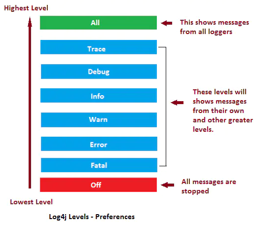
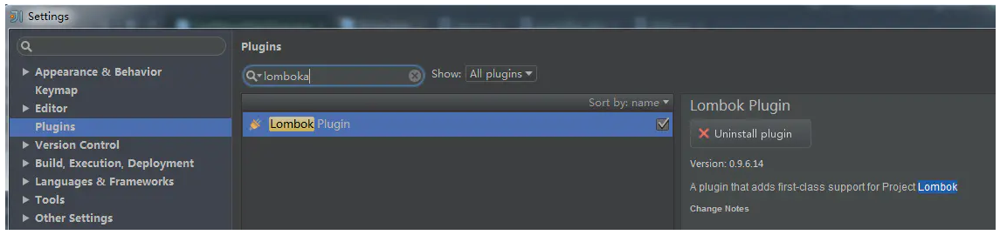
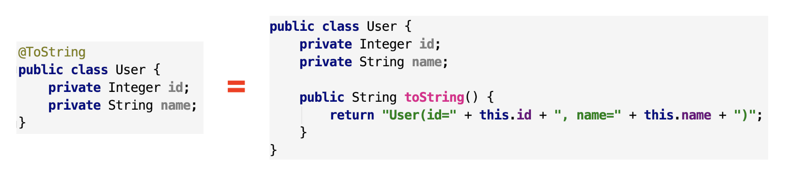

## 常用日志处理工具

常见的 log 日志处理工具有：log4j、Logging、commons-logging、slf4j、logback。其中，commons-loggin、slf4j 是一种日志抽象门面，不是具体的日志框架；log4j、logback 是具体的日志实现框架。

**一般使用 slf4j + logback 处理日志**，也可以使用 slf4j + log4j、commons-logging + log4j 这两种日志组合框架。

## 日志级别

日志的输出都是分级别的，不同的场合设置不同的级别，以打印不同的日志。下面拿最普遍用的 log4j 日志框架来做个日志级别的说明，这个比较奇全，其他的日志框架也都大同小异。

log4j 的级别类 org.apache.log4j.Level 里面定义了日志级别，日志输出优先级由高到底分别为以下 8 种：



| 日志级别 | 描述                                               |
| -------- | -------------------------------------------------- |
| OFF      | 关闭：最高级别，不输出日志。                       |
| FATAL    | 致命：输出非常严重的可能会导致应用程序终止的错误。 |
| ERROR    | 错误：输出错误，但应用还能继续运行。               |
| WARN     | 警告：输出可能潜在的危险状况。                     |
| INFO     | 信息：输出应用运行过程的详细信息。                 |
| DEBUG    | 调试：输出更细致的对调试应用有用的信息。           |
| TRACE    | 跟踪：输出更细致的程序运行轨迹。                   |
| ALL      | 所有：输出所有级别信息。                           |

所以，日志优先级别标准顺序为：

ALL < TRACE < DEBUG < INFO < WARN < ERROR < FATAL < OFF

如果日志设置为 L ，一个级别为 P 的输出日志只有当 P >= L 时日志才会输出。

即如果日志级别 L 设置 INFO，只有 P 的输出级别为 INFO、WARN，后面的日志才会正常输出。

具体的输出关系可以参考下图：


## Lombok

Lombok 是一种 java 实用工具，可用来帮助开发人员消除 java 的冗长代码，尤其是对于简单的 java 对象 (POJO)。它通过注释实现这一目的。

### 引入

IntelliJ 安装：



>Lombok 是侵入性很高的一个 library。

maven 添加依赖：

```java
<dependency>
    <groupId>org.projectlombok</groupId>
    <artifactId>lombok</artifactId>
    <version>1.18.10</version>
</dependency>
```

### 注解说明

常用注解：


- `@Getter` 和 `@Setter`

自动生成 getter 和 setter 方法。


- `@ToString`

自动重写 `toString()` 方法，打印所有变量。也可以加其他参数，例如 `@ToString(exclude=”id”)` 排除 id 属性，或者 `@ToString(callSuper=true, includeFieldNames=true)` 调用父类的 `toString()` 方法，包含所有属性。



- `@EqualsAndHashCode`

自动生成 `equals(Object other)` 和 `hashcode()` 方法，包括所有非静态变量和非 transient 的变量。


如果某些变量不想要加进判断，可以通过 exclude 排除，也可以使用 of 指定某些字段：


>java 中规定，当两个 object equals 时，它们的 hashcode 一定要相同，反之，当 hashcode 相同时，object 不一定 equals。所以 equals 和 hashcode 要一起 implement，免得出现违反 java 规定的情形。

- `@NoArgsConstructor`，`@AllArgsConstructor`，`@RequiredArgsConstructor`

这三个很像，都是自动生成该类的 constructor，差別只在生成的 constructor 的参数不一样而已。

`@NoArgsConstructor`：生成一个沒有参数的 constructor。


> 在 java 中，如果沒有指定类的 constructor，java compiler 会自动生成一个无参构造器，但是如果自己写了 constructor 之后，java 就不会再自动生成无参构造器。但是，很多时候，无参构造器是必须的，因此，为避免不必要的麻烦，应在类上至少加上 `@NoArgsConstrcutor`。

`@AllArgsConstructor` ：生成一个包含所有参数的 constructor。


`@RequiredArgsConstructor`：生成一个包含 "特定参数" 的 constructor，特定参数指的是那些有加上 final 修饰词的变量。


>如果所有的变量都沒有用 final 修饰，`@RequiredArgsConstructor` 会生成一个沒有参数的 constructor。

- `@Data`

等于同时添加了以下注解：`@Getter`，`@Setter`，`@ToString`，`@EqualsAndHashCode` 和 `@RequiredArgsConstructor`。


- `@Value`

把所有的变量都设成 final，其他的就跟 `@Data` 类似，等于同时添加了以下注解：`@Getter`，`@ToString`，`@EqualsAndHashCode` 和 `@RequiredArgsConstructor`。


- @Builder

自动生成流式 set 值写法。


注意，虽然只要加上 `@Builder` 注解，我们就能用流式写法快速设定 Object 的值，但是 setter 还是不应该舍弃的，因为 Spring 或是其他框架，有很多地方都会用到 Object 的 getter/setter 方法来对属性取值/赋值。

所以，通常是 `@Data` 和 `@Builder` 会一起用在同个类上，既方便流式写 code，也方便框架做事。比如：

```java
@Data
@Builder
public class User {
    private Integer id;
    private String name;
}
```

- `@Slf4j`

自动生成该类的 log 静态常量，要打日志就可以直接打，不用再手动 new log 静态常量了。


除了 `@Slf4j` 之外，Lombok 也提供其他日志框架的几种注解，像是 `@Log`，`@Log4j` 等，他们都可以创建一个静态常量 log，只是使用的 library 不一样而已。

```java
@Log // 对应的log语句如下
private static final java.util.logging.Logger log = java.util.logging.Logger.getLogger(LogExample.class.getName());

@Log4j // 对应的log语句如下
private static final org.apache.log4j.Logger log = org.apache.log4j.Logger.getLogger(LogExample.class);
```

更多的参考：https://juejin.cn/post/6844903557016076302

## Logback

### 引入

```java
<dependency>
    <groupId>ch.qos.logback</groupId>
    <artifactId>logback-classic</artifactId>
    <version>1.2.3</version>
</dependency>
```

>logback 依赖中，含有对 slf4j 的依赖。

### 节点

configuration 为主节点，其主要字节点如下：

#### property

定义变量值的标签，有两个属性，name 和 value，定义变量后，可以使 "${name}" 来使用变量。

```java
<property name="logging.level" value="info"/>
```

#### appender

日志打印的组件，定义打印过滤的条件、打印输出方式、滚动策略、编码方式、打印格式等。

种类：

- ConsoleAppender：把日志添加到控制台。

  ```java
  <appender name="STDOUT" class="ch.qos.logback.core.ConsoleAppender">
     <encoder charset="utf-8">
        <pattern>%d{yyyy-MM-dd HH:mm:ss.SSS} [%thread] %-6level %logger{50} - %msg%n</pattern>
     </encoder>
  </appender>
  ```

- FileAppender：把日志添加到文件。

  ```java
  <appender name="ReactionExtractorAppender" class="ch.qos.logback.core.FileAppender">
      <append>true</append>
      <filter class="ch.qos.logback.classic.filter.ThresholdFilter">
          <level>${logging.level}</level>
      </filter>
      <file>
          ${logging.path}/reaction-extractor.log
      </file>
      <encoder>
          <pattern>${message.format}</pattern>
          <charset>UTF-8</charset>
      </encoder>
  </appender>
  ```

- RollingFileAppender：FileAppender 的子类，滚动记录文件，先将日志记录到指定文件，当符合某个条件时，将日志记录到其他文件。

  ```java
  <appender name="ReactionExtractorRollingAppender" class="ch.qos.logback.core.rolling.RollingFileAppender">
      <append>true</append>
      <filter class="ch.qos.logback.classic.filter.ThresholdFilter">
          <level>${logging.level}</level>
      </filter>
      <rollingPolicy class="ch.qos.logback.core.rolling.TimeBasedRollingPolicy">
          <FileNamePattern>${logging.path}/reaction-extractork-%d{yyyy-MM-dd}.log</FileNamePattern>
          <MaxHistory>30</MaxHistory>
      </rollingPolicy>
      <encoder>
          <pattern>${message.format}</pattern>
          <charset>UTF-8</charset>
      </encoder>
  </appender>
  ```

属性：

- name：指定 appender 的名称。

- class：指定 appender 的全限定名。

子节点：

- append：默认为 true，表示日志被追加到文件结尾，如果是 false，清空现存文件。

- filter：过滤器，执行完一个过滤器后返回 DENY，NEUTRAL，ACCEPT 三个枚举值中的一个。

  filter 的返回值含义：

  1. DENY：日志将立即被抛弃不再经过其他过滤器。
  2. NEUTRAL：有序列表里的下个过滤器过接着处理日志。
  3. ACCEPT：日志会被立即处理，不再经过剩余过滤器。

  filter 的两种类型：

  1. ThresholdFilter：临界值过滤器，过滤掉低于指定临界值的日志。当日志级别等于或高于临界值时，过滤器返回 NEUTRAL，当日志级别低于临界值时，日志会被拒绝。

     ```java
     <filter class="ch.qos.logback.classic.filter.ThresholdFilter">
        <level>INFO</level>
     </filter>
     ```

  2. LevelFilter：级别过滤器，根据日志级别进行过滤。如果日志级别等于配置级别，过滤器会根据 onMath (用于配置符合过滤条件的操作) 和 onMismatch (用于配置不符合过滤条件的操作) 接收或拒绝日志。

     ```java
     <filter class="ch.qos.logback.classic.filter.LevelFilter">   
        <level>INFO</level>   
        <onMatch>ACCEPT</onMatch>   
        <onMismatch>DENY</onMismatch>   
     </filter>
     ```

- file：指定被写入的文件名，可以是相对目录，也可以是绝对目录，如果上级目录不存在会自动创建，没有默认值。

- rollingPolicy：滚动策略，只有 appender 的 class 是 RollingFileAppender 时才需要配置。

  1. TimeBasedRollingPolicy：根据时间来制定滚动策略，既负责滚动也负责触发滚动。

     ```java
     <rollingPolicy class="ch.qos.logback.core.rolling.TimeBasedRollingPolicy">
        <!-- 日志文件输出的文件名：按天回滚 daily -->
        <FileNamePattern>
            ${logging.path}/glmapper-spring-boot/glmapper-loggerone.log.%d{yyyy-MM-dd HH:mm:ss.SSS}
        </FileNamePattern>
        <!-- 日志文件保留天数 -->
        <MaxHistory>30</MaxHistory>
     </rollingPolicy>
     ```

     > 每天生成一个日志文件，日志文件保存 30 天。

  2. FixedWindowRollingPolicy：根据固定窗口算法重命名文件的滚动策略。

- encoder：对记录事件进行格式化。主要作用是：把日志信息转换成字节数组，以及把字节数组写入到输出流。

  ```java
  <encoder class="ch.qos.logback.classic.encoder.PatternLayoutEncoder">
     <!-- 格式化输出：%d表示日期；%thread表示线程名；%-5level：级别从左显示5个字符宽度；%logger{50} 表示logger名字最长50个字符，否则按照句点分割；%msg：日志消息；%n是换行符 -->
     <pattern>%d{yyyy-MM-dd HH:mm:ss.SSS} [%thread] %-5level %logger{50} - %msg%n</pattern>
     <charset>UTF-8</charset>
  </encoder>
  ```

#### logger

用来设置某一个包或者具体的某一个类的日志打印级别以及指定 appender。

属性：

- name：指定受此 logger 约束的某一个包或者具体的某一个类。
- level：设置打印级别 (TRACE，DEBUG，INFO，WARN，ERROR，ALL 和 OFF)，还有一个值 INHERITED 或者同义词 NULL，代表强制执行上级的级别。如果没有设置此属性，那么当前 logger 将会继承上级的级别。
- addtivity：设置是否向上级 logger 传递打印信息，默认为 true。

```java
<logger name="com.glmapper.spring.boot.controller" level="${logging.level}" additivity="false">
    <appender-ref ref="GLMAPPER-LOGGERONE" />
</logger>
```

>com.glmapper.spring.boot.controller 这个包下的 ${logging.level} 级别的日志将会使用 GLMAPPER-LOGGERONE 来打印。

#### root

根 logger，也是一种 logger，但只有一个 level 属性。

### 实例

```java
<!-- 使用说明：
        1. logback核心jar包：logback-core-1.2.3.jar，logback-classic-1.2.3.jar，slf4j-api-1.7.25.jar
            1) logback官方建议配合slf4j使用
            2) logback手动下载地址：https://repo1.maven.org/maven2/ch/qos/logback/
            3) slf4j手动下载地址：https://www.mvnjar.com/org.slf4j/slf4j-api/1.7.25/detail.html
            4) jar包可以从maven仓库快速获取
        2. logback分为3个组件：logback-core，logback-classic和logback-access
            1) 其中logback-core提供了logback的核心功能，是另外两个组件的基础
            2) logback-classic实现了slf4j的API，所以当想配合slf4j使用时，需要将logback-classic加入classpath
            3) logback-access是为了集成servlet环境而准备的，可提供HTTP-access的日志接口
        3. 配置中KafkaAppender的jar包：logback-kafka-appender-0.2.0-RC1.jar
-->

<!-- 参考：
        https://juejin.im/post/5b51f85c5188251af91a7525
        https://my.oschina.net/Declan/blog/1793444
-->

<!-- 说明：logback.xml配置文件，需放置在项目的resources路径下 -->

<!-- configuration属性：
        scan：热加载，当此属性设置为true时，配置文件如果发生改变，将会被重新加载，默认值为true
        scanPeriod：设置监测配置文件是否有修改的时间间隔，如果没有给出时间单位，默认单位是毫秒。当scan为true时，此属性生效。默认的时间间隔为1分钟
        debug：当此属性设置为true时，将打印出logback内部日志信息，实时查看logback运行状态。默认值为false
        packagingData：是否打印包的信息。默认值为false
-->

<configuration
        debug="false"
        xmlns="http://ch.qos.logback/xml/ns/logback"
        xmlns:xsi="http://www.w3.org/2001/XMLSchema-instance"
        xsi:schemaLocation="http://ch.qos.logback/xml/ns/logback
        https://raw.githubusercontent.com/enricopulatzo/logback-XSD/master/src/main/xsd/logback.xsd"
>
    <!-- property：定义变量值，两个属性，name和value -->
    <property name="logging.path" value="./"/>
    <property name="logging.level" value="INFO"/>
    <!-- 日志格式化：
            %d：日期
            %thread：线程名
            %-5level：日志级别，从左显示5个字符宽度
            %logger{50}：logger名字最长50个字符，超过的按照句点分割
            %msg：日志消息
            %n：换行符
            %ex{full, DISPLAY_EX_EVAL}：异常信息，full表示全输出，可以替换为异常信息指定输出的行数
    -->
    <property name="message.format"
              value="%d{yyyy-MM-dd HH:mm:ss.SSS} [%thread] %-5level %logger{50} - %msg%n%ex{full, DISPLAY_EX_EVAL}"/>
    <!-- kafka topic -->
    <property name="topic.name" value="log-collect"/>
    <!-- 本地地址 -->
    <property name="bootstrap.servers" value="192.168.1.71:9092"/>
    <!-- 集群地址 -->
    <!-- <property name="bootstrap.servers" value="hadoopdatanode1:9092,hadoopdatanode2:9092,hadoopdatanode3:9092"/> -->

    <!-- appender种类：
            ConsoleAppender：把日志添加到控制台
            FileAppender：把日志添加到文件
            RollingFileAppender：滚动记录文件，先将日志记录到指定文件，当符合某个条件时，将日志记录到其他文件。FileAppender的子类
    -->

    <!-- 控制台输出日志 -->
    <appender name="STDOUT" class="ch.qos.logback.core.ConsoleAppender">
        <encoder>
            <pattern>%d{yyyy-MM-dd HH:mm:ss.SSS} [%thread] %-5level %logger{50} - %msg%n</pattern>
            <charset>UTF-8</charset>
        </encoder>
    </appender>

    <!-- 自定义输出日志到文件 -->
    <appender name="FileAppender" class="ch.qos.logback.core.FileAppender">
        <!-- append：true，日志被追加到文件结尾；false，清空现存文件；默认是true -->
        <append>true</append>
        <!-- 级别过滤器：
                ThresholdFilter：临界值过滤器，过滤掉低于指定临界值的日志
                LevelFilter：级别过滤器，需配置onMatch和onMismatch
        -->
        <filter class="ch.qos.logback.classic.filter.ThresholdFilter">
            <level>${logging.level}</level>
        </filter>
        <file>
            ${logging.path}/base.log
        </file>
        <encoder>
            <pattern>${message.format}</pattern>
            <charset>UTF-8</charset>
        </encoder>
    </appender>

    <!-- 自定义异常输出日志文件 -->
    <appender name="ErrorFileAppender" class="ch.qos.logback.core.FileAppender">
        <append>true</append>
        <filter class="ch.qos.logback.classic.filter.ThresholdFilter">
            <level>${logging.level}</level>
        </filter>
        <file>
            ${logging.path}/error-file.log
        </file>
        <encoder>
            <pattern>${message.format}</pattern>
            <charset>UTF-8</charset>
        </encoder>
    </appender>

    <!-- 自定义输出日志：滚动记录日志 -->
    <appender name="RollingFileAppender" class="ch.qos.logback.core.rolling.RollingFileAppender">
        <append>true</append>
        <filter class="ch.qos.logback.classic.filter.ThresholdFilter">
            <level>${logging.level}</level>
        </filter>
        <!-- 滚动策略：每天生成一个日志文件，保存365天的日志文件 -->
        <rollingPolicy class="ch.qos.logback.core.rolling.TimeBasedRollingPolicy">
            <!-- 日志文件输出的文件名：按天回滚 daily -->
            <FileNamePattern>${logging.path}/reaction-log-%d{yyyy-MM-dd HH:mm:ss.SSS}.log</FileNamePattern>
            <!-- 日志文件保留天数 -->
            <MaxHistory>365</MaxHistory>
        </rollingPolicy>
        <encoder>
            <pattern>${message.format}</pattern>
            <charset>UTF-8</charset>
        </encoder>
        <!-- 日志文件最大的大小 -->
        <triggeringPolicy class="ch.qos.logback.core.rolling.SizeBasedTriggeringPolicy">
            <MaxFileSize>50MB</MaxFileSize>
        </triggeringPolicy>
    </appender>

    <!-- 输出日志到kafka，参考：https://github.com/danielwegener/logback-kafka-appender -->
    <appender name="KafkaAppender" class="com.github.danielwegener.logback.kafka.KafkaAppender">
        <encoder>
            <pattern>${message.format}</pattern>
        </encoder>
        <topic>${topic.name}</topic>
        <keyingStrategy class="com.github.danielwegener.logback.kafka.keying.NoKeyKeyingStrategy"/>
        <deliveryStrategy class="com.github.danielwegener.logback.kafka.delivery.AsynchronousDeliveryStrategy"/>
        <!-- Optional parameter to use a fixed partition -->
        <!-- <partition>0</partition> -->
        <!-- Optional parameter to include log timestamps into the kafka message -->
        <!-- <appendTimestamp>true</appendTimestamp> -->
        <!-- each <producerConfig> translates to regular kafka-client config (format: key=value) -->
        <!-- producer configs are documented here: https://kafka.apache.org/documentation.html#newproducerconfigs -->
        <!-- bootstrap.servers is the only mandatory producerConfig -->
        <producerConfig>bootstrap.servers=${bootstrap.servers}</producerConfig>
        <!-- this is the fallback appender if kafka is not available. -->
        <appender-ref ref="FileAppender"/>
    </appender>

    <!-- 异步输出日志
            步骤：异步输出日志就是Logger.info负责往Queue(BlockingQueue)中放日志，然后再起个线程把Queue中的日志写到磁盘上
            参考：https://blog.csdn.net/lkforce/article/details/76637071
     -->
    <appender name="ASYNC" class="ch.qos.logback.classic.AsyncAppender">
        <!-- 不丢失日志。默认的，如果队列的80%已满，则会丢弃TRACT、DEBUG、INFO级别的日志 -->
        <discardingThreshold>0</discardingThreshold>
        <!-- 更改默认的队列的深度，该值会影响性能。默认值为256 -->
        <queueSize>100</queueSize>
        <!-- 添加附加的appender，最多只能添加一个，此处指定后，在root下不要再指定该appender，否则会输出两次 -->
        <appender-ref ref="KafkaAppender"/>
    </appender>

    <!--日志异步到数据库：未做测试，配置正确与否未知，先记录于此 -->
    <!--<appender name="DB" class="ch.qos.logback.classic.db.DBAppender">
        <connectionSource class="ch.qos.logback.core.db.DriverManagerConnectionSource">
            <dataSource class="com.mchange.v2.c3p0.ComboPooledDataSource">
                <driverClass>com.mysql.jdbc.Driver</driverClass>
                <url>jdbc:mysql://127.0.0.1:3306/databaseName</url>
                <user>root</user>
                <password>root</password>
            </dataSource>
        </connectionSource>
    </appender>-->

    <!-- 关闭指定包下的日志输出，name里面的内容可以是包路径，或者具体要忽略的文件名称 -->
    <logger name="org.apache.flink" level="OFF"/>
    <!-- 将指定包下指定级别的日志，输出到指定的appender中
            addtivity：是否向上级logger传递打印信息。默认是true。若此包下的日志单独输出到文件中，应设置为false，否则在root日志也会记录一遍 -->
    <logger name="org.apache.kafka" level="ERROR" addtivity="false">
        <!-- 指定此包下的error级别信息，输出到指定的收集文件 -->
        <appender-ref ref="ErrorFileAppender"/>
    </logger>

    <root level="${logging.level}">
        <!--<appender-ref ref="STDOUT"/>-->
        <!--<appender-ref ref="FileAppender"/>-->
        <appender-ref ref="ASYNC"/>
    </root>
</configuration>
```

> 根据实际情况，对 appender 进行取舍，实际使用时不要所有的都添加到 logback.xml 配置文件中。

## 本文参考

https://kucw.github.io/blog/2020/3/java-lombok/

https://juejin.cn/post/6844903641535479821

声明：写作本文初衷是个人学习记录，鉴于本人学识有限，如有侵权或不当之处，请联系 [wdshfut@163.com](mailto:wdshfut@163.com)。