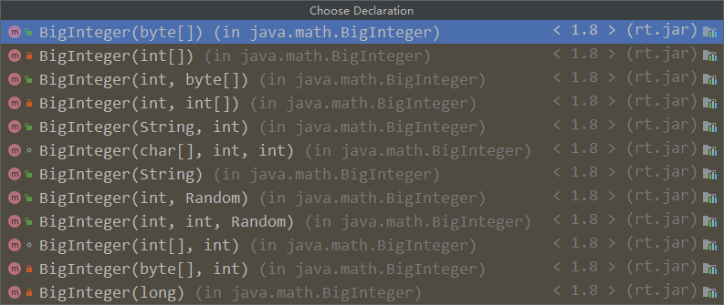

## `java.lang.Math` 类

`java.lang.Math` 类提供了一系列静态方法用于科学计算。其方法的参数和返回值类型一般为 double 型。常用的方法有：

- `abs()`：绝对值。
- `acos()`，`asin()`，`atan()`，`cos()`，`sin()`，`tan()`： 三角函数。
- `sqrt()`：平方根。
- `pow(double a,doble b)`：a 的 b 次幂。
- `log()`：自然对数。
- `exp()`：以 e 为底的指数。
- `max(double a,double b)`：较大值。
- `min(double a,double b)`：较小值。
- `random()`：返回 0.0 到 1.0 的随机数。
- `long round(double a)`：double 型数据 a 转换为 long 型 (四舍五入)。
- `toDegrees(double angrad)`：弧度转换角度。
- `toRadians(double angdeg)`：角度转换弧度。

## ` java.math.BigInteger` 类与 ` java.math.BigDecimal` 类

### BigInteger

- Integer 类作为 int 的包装类，能存储的最大整型值为 2^31 - 1，Long 类也是有限的，最大为 2^63 - 1。如果要表示再大的整数，不管是基本数据类型还是他们的包装类都无能为力，更不用说进行运算了。

- **`java.math` 包的 BigInteger 类，可以表示不可变的任意精度的整数。**BigInteger 提供所有 java 的基本整数操作符的对应物，并提供 `java.lang.Math` 的所有相关方法。另外，BigInteger 还提供以下运算：模算术、GCD 计算、质数测试、素数生成、位操作以及一些其他操作。

- 构造器：

  - `BigInteger(String val)`：常用字符串构建 BigInteger 对象。

    

- 常用方法：

  - `public BigInteger abs()`：返回此 BigInteger 的绝对值的 BigInteger。
  - `BigInteger add(BigInteger val)`：返回其值为 (this + val) 的 BigInteger。
  - `BigInteger subtract(BigInteger val)`：返回其值为 (this - val) 的 BigInteger。
  - `BigInteger multiply(BigInteger val)`：返回其值为 (this * val) 的 BigInteger。
  - `BigInteger divide(BigInteger val)`：返回其值为 (this / val) 的 BigInteger。整数相除只保留整数部分。
  - `BigInteger remainder(BigInteger val)`：返回其值为 (this % val) 的 BigInteger。
  - `BigInteger[] divideAndRemainder(BigInteger val)`：返回包含 (this / val) 后跟 (this % val) 的两个 BigInteger 的数组。
  - `BigInteger pow(int exponent)`：返回其值为 (this^exponent ) 的 BigInteger。

- 实例：

  ```java
  public class Test {
      public static void main(String[] args) {
          BigInteger bi = new BigInteger("12433241123223262154841264166142223");
          System.out.println(bi);
      }
  }
  ```

### BigDecimal

- 一般的 Float 类和 Double 类可以用来做科学计算或工程计算，但在商业计算中，要求数字精度比较高，故用到 `java.math.BigDecimal` 类。

- **BigDecimal 类支持不可变的、任意精度的有符号十进制定点数。**

- 构造器：

  - `public BigDecimal(double val)`
  - `public BigDecimal(String val)`

- 常用方法：

  - `public BigDecimal add(BigDecimal augend)`：加。
  - `public BigDecimal subtract(BigDecimal subtrahend)`：减。
  - `public BigDecimal multiply(BigDecimal multiplicand)`：乘。
  - `public BigDecimal divide(BigDecimal divisor, int scale, int roundingMode)`：除。

- 实例：

  ```java
  public class Test {
      public static void main(String[] args) {
          BigDecimal bd = new BigDecimal("12435.351");
          BigDecimal bd2 = new BigDecimal("11");
          // System.out.println(bd.divide(bd2));// 未指定精度，如果除不尽，会报错
          System.out.println(bd.divide(bd2, BigDecimal.ROUND_HALF_UP));// 四舍五入
          System.out.println(bd.divide(bd2, 15, BigDecimal.ROUND_HALF_UP));// 保留15位小数
      }
  }
  ```

## 本文参考

https://www.gulixueyuan.com/goods/show/203?targetId=309&preview=0

声明：写作本文初衷是个人学习记录，鉴于本人学识有限，如有侵权或不当之处，请联系 [wdshfut@163.com](mailto:wdshfut@163.com)。

