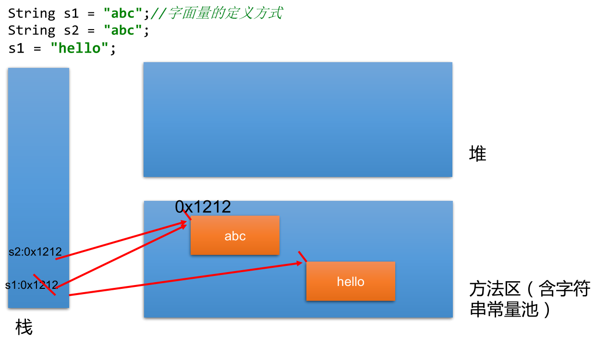
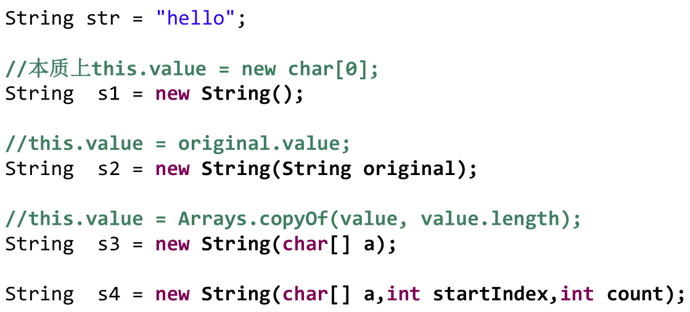
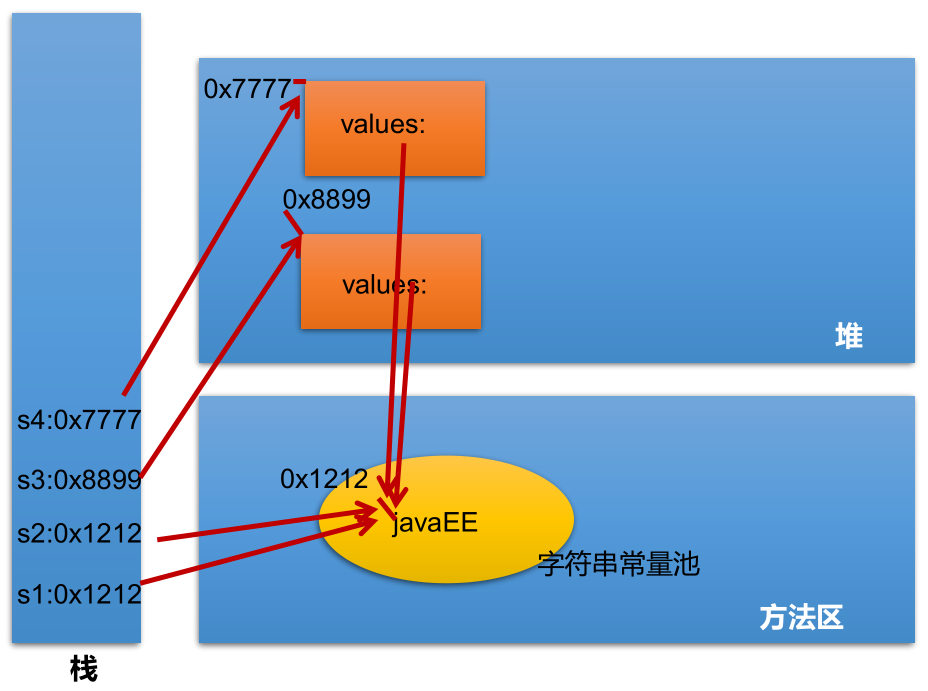
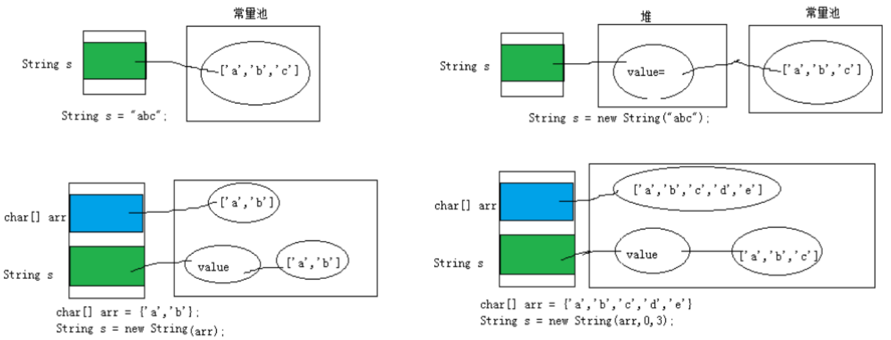
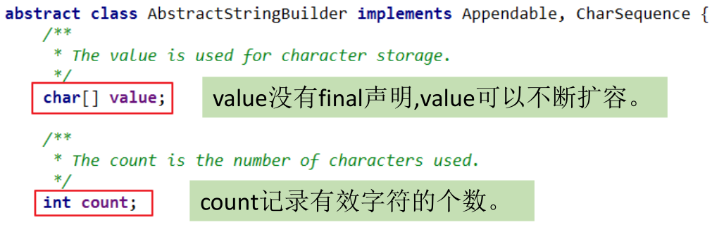
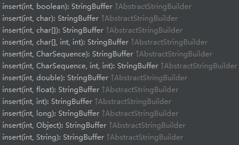
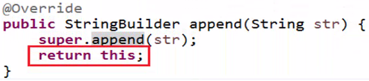

## String 的特性

String：字符串，使用双引号引起来表示。

- String 是一个 final 类，不可被继承。

- String 继承了 Serializable、Comparable 和 CharSequence 接口。 

  ```java
  public final class String implements java.io.Serializable, Comparable<String>, CharSequence {}
  ```

  - 实现 Serializable 接口：表示字符串是支持可序列化的。
  - 实现 Comparable 接口  ：表示 String 可以比较大小。

- **String 内部定义了 `final char value[]` 用于存储字符串数据。**

- String 代表不可变的字符序列 --- 不可变性。 体现在：

  - **当对字符串重新赋值时，需要重新指定内存区域赋值，不能使用原有的 value 进行赋值。**
  - **当对现有的字符串进行连接操作时，也需要重新指定内存区域赋值。**
  - **当调用 String 的 `replace()` 修改原字符串中指定的字符或字符串时，也需要重新指定内存区域赋值。**

- **通过字面量的定义 (区别于 new) 方式给一个字符串赋值，此时的字符串值声明在字符串常量池中。**

- **字符串常量池中不会存储相同内容的字符串。**

- 实例：

  ```java
  public class Test {
      public static void main(String[] args) {
          String s1 = "abc";// 字面量的定义方式
          String s2 = "abc";
          System.out.println(s1 == s2);// true
          s1 = "hello";
          System.out.println(s1 == s2);// false
          System.out.println(s1);// hello
          System.out.println(s2);// abc
  
          System.out.println("**************************");
          String s3 = "abc";
          s3 += "def";
          System.out.println(s3);// abcdef
          System.out.println(s2);// abc ---> 原abc没变
  
          System.out.println("**************************");
          String s4 = "abc";
          String s5 = s4.replace("a", "m");
          System.out.println(s4);// abc ---> 原abc没变
          System.out.println(s5);// mbc
      }
  }
  ```



## String 对象的创建

- **方式一：通过字面量定义的方式，此时的字符串数据声明在方法区中的字符串常量池中。**

- **方式二：通过 "new + 构造器" 的方式，此时变量保存的地址值，是字符串数据在堆空间中开辟空间以后所对应的地址值。**

- 常用的几种创建方式：

  

- 实例：

  ```java
  public class Test {
      public static void main(String[] args) {
          // 通过字面量定义的方式：此时的s1和s2的数据javaEE，声明在方法区中的字符串常量池中
          String s1 = "javaEE";
          String s2 = "javaEE";
  
          // 通过"new+构造器"的方式：此时的s3和s4保存的地址值，是数据在堆空间中开辟空间以后所对应的地址值
          String s3 = new String("javaEE");
          String s4 = new String("javaEE");
  
          System.out.println(s1 == s2);// true
          System.out.println(s1 == s3);// false
          System.out.println(s1 == s4);// false
          System.out.println(s3 == s4);// false
  
          System.out.println("*************************");
          Person p1 = new Person("Tom", 12);// 通过字面量定义的方式定义的name
          Person p2 = new Person("Tom", 12);
          System.out.println(p1.name.equals(p2.name));// true
          System.out.println(p1.name == p2.name);// true
  
          p1.name = "Jerry";
          System.out.println(p2.name);// Tom
  
          System.out.println("*************************");
          Person p3 = new Person(new String("Tom"), 12);// 通过"new+构造器"的方式定义的name
          Person p4 = new Person(new String("Tom"), 12);
          System.out.println(p3.name.equals(p4.name));// true
          System.out.println(p3.name == p4.name);// false
      }
  }
  
  class Person {
      String name;
      int age;
  
      public Person() {
  
      }
  
      public Person(String name, int age) {
          this.name = name;
          this.age = age;
      }
  }
  ```

  内存解析说明：

  

- 字符串初始化的过程：

  

  

- **字符串拼接：**

  - **如果是常量与常量的拼接，则结果在常量池，且常量池中不会存在相同内容的常量。**
  - **如果其中有一个是变量，则结果在堆中。**
  - **如果拼接的结果调用 `intern()` 方法，则返回值在常量池中。**

  ```java
  public class Test {
      public static void main(String[] args) {
          String s1 = "javaEE";
          String s2 = "hadoop";
          String s3 = "javaEEhadoop";
          String s4 = "javaEE" + "hadoop";
          String s5 = s1 + "hadoop";
          String s6 = "javaEE" + s2;
          String s7 = s1 + s2;
          String s8 = (s1 + s2).intern();
  
          System.out.println(s3 == s4);// true
          System.out.println(s3 == s5);// false
          System.out.println(s3 == s6);// false
          System.out.println(s3 == s7);// false
          System.out.println(s3 == s8);// true
          System.out.println(s5 == s6);// false
          System.out.println(s5 == s7);// false
          System.out.println(s5 == s8);// false
          System.out.println(s6 == s7);// false
          System.out.println(s6 == s8);// false
          System.out.println(s7 == s8);// false
      }
  }
  ```

  内存解析说明：

  

  特殊的情况：

  ```java
  public class StringTest {
      public static void main(String[] args) {
          String s1 = "javaEEhadoop";
          String s2 = "javaEE";
          String s3 = s2 + "hadoop";
          System.out.println(s1 == s3);// false
          final String s4 = "javaEE";
          String s5 = s4 + "hadoop";
          System.out.println(s1 == s5);// true
          
          System.out.println(s2 == s4);// true
      }
  }
  ```

  > s4 变量被 final 修饰，实际上也就是常量，等同于 s2。

- 面试题

  - `String s = new String("abc");` 方式创建对象，在内存中创建了几个对象？

    - 两个：一个是堆空间中 new 的结构，另一个是 char[] 对应的常量池中的数据 "abc"。

  - `String str1 = "abc";` 与 `String str2 = new String("abc");` 的区别？

    - **字符串常量存储在字符串常量池，目的是共享。**
    - **字符串非常量对象存储在堆中。**

    

  - 下面程序的运行结果是：

    ```java
    public class StringTest {
        String str = new String("good");
        char[] ch = {'t', 'e', 's', 't'};
    
        public void change(String str, char ch[]) {
            str = "test ok";
            ch[0] = 'b';
        }
    
        public static void main(String[] args) {
            StringTest ex = new StringTest();
            ex.change(ex.str, ex.ch);
            System.out.println(ex.str);// good
            System.out.println(ex.ch);// best
        }
    }
    ```

    > 值传递机制和 String 的不可变性。

## String 的常用方法

- `int length()`：返回字符串的长度，`return value.length`。

- `char charAt(int index)`：返回某索引处的字符，`return value[index]`。

- `boolean isEmpty()`：判断是否是空字符串，`return value.length == 0`。

- `String toLowerCase()`：使用默认语言环境，将 String 中的所有字符转换为小写。

  ```java
  public class StringTest {
      public static void main(String[] args) {
          String s1 = "HelloWorld";
          String s2 = s1.toLowerCase();// s1不可变，仍未原来的字符串
          System.out.println(s2);// helloworld
      }
  }
  ```

- `String toUpperCase()`：使用默认语言环境，将 String 中的所有字符转换为大写。

  ```java
  public class StringTest {
      public static void main(String[] args) {
          String s1 = "HelloWorld";
          String s2 = s1.toUpperCase();// s1不可变，仍未原来的字符串
          System.out.println(s2);// HELLOWORLD
      }
  }
  ```

- `String trim()`：返回字符串的副本，忽略前导空白和尾部空白。

  ```java
  public class StringTest {
      public static void main(String[] args) {
          String s1 = "  he  llo    world    ";
          String s2 = s1.trim();
          System.out.println("---" + s1 + "---");// ---  he  llo    world    ---
          System.out.println("---" + s2 + "---");// ---he  llo    world---
      }
  }
  ```

- `boolean equals(Object obj)`：比较字符串的内容是否相同。

- `boolean equalsIgnoreCase(String anotherString)`：比较字符串的内容是否相同，忽略大小写。

- `String concat(String str)`：将指定字符串连接到此字符串的结尾，等价于用 "+"。

  ```java
  public class StringTest {
      public static void main(String[] args) {
          String s1 = "abc";
          String s2 = s1.concat("def");
          System.out.println(s2);// abcdef
      }
  }
  ```

- `int compareTo(String anotherString)`：比较两个字符串的大小。

- `String substring(int beginIndex)`：返回一个新的字符串，截取当前字符串从 beginIndex 开始到最后的一个子字符串。

  ```java
  public class StringTest {
      public static void main(String[] args) {
          String s1 = "HelloWorld";
          String s2 = s1.substring(2);
          System.out.println(s2);// lloWorld
      }
  }
  ```

- `String substring(int beginIndex, int endIndex)`：返回一个新字符串，截取当前字符串从 beginIndex 开始到 endIndex (不包含) 结束的一个子字符串 --- 左闭右开，`[beginIndex, endIndex)`。

  ```java
  public class StringTest {
      public static void main(String[] args) {
          String s1 = "HelloWorld";
          String s2 = s1.substring(2, 6);
          System.out.println(s2);// lloW
      }
  }
  ```

- `boolean endsWith(String suffix)`：测试此字符串是否以指定的后缀结束。

  ```java
  public class StringTest {
      public static void main(String[] args) {
          String s1 = "HelloWorld";
          System.out.println(s1.endsWith("ld"));// true
      }
  }
  ```

- `boolean startsWith(String prefix)`：测试此字符串是否以指定的前缀开始。

  ```java
  public class StringTest {
      public static void main(String[] args) {
          String s1 = "HelloWorld";
          System.out.println(s1.startsWith("ll"));// false
      }
  }
  ```

- `boolean startsWith(String prefix, int toffset)`：测试此字符串从指定索引开始的子字符串是否以指定前缀开始。

  ```java
  public class StringTest {
      public static void main(String[] args) {
          String s1 = "HelloWorld";
          System.out.println(s1.startsWith("ll", 2));// true
      }
  }
  ```

- `boolean contains(CharSequence s)`：当且仅当此字符串包含指定的 char 值序列时，返回 true。

  ```java
  public class StringTest {
      public static void main(String[] args) {
          String s1 = "HelloWorld";
          System.out.println(s1.contains("wo"));// false
      }
  }
  ```

- `int indexOf(String str)`：返回指定子字符串在此字符串中第一次出现处的索引，未找到返回 -1。

  ```java
  public class StringTest {
      public static void main(String[] args) {
          String s1 = "HelloWorld";
          System.out.println(s1.indexOf("lo"));// 3
      }
  }
  ```

- `int indexOf(String str, int fromIndex)`：返回指定子字符串在此字符串中第一次出现处的索引，从指定的索引开始，未找到返回 -1。

  ```java
  public class StringTest {
      public static void main(String[] args) {
          String s1 = "HelloWorld";
          System.out.println(s1.indexOf("lo", 5));// -1
      }
  }
  ```

- `int lastIndexOf(String str)`：返回指定子字符串在此字符串中最右边出现处的索引，未找到返回 -1。

  ```java
  public class StringTest {
      public static void main(String[] args) {
          String s1 = "hellorworld";
          System.out.println(s1.lastIndexOf("or"));// 7
      }
  }
  ```

  **面试题：什么情况下，`indexOf(str)` 和 `lastIndexOf(str)` 返回值相同？**

  **情况一：存在唯一的一个 str。情况二：不存在 str。**

- `int lastIndexOf(String str, int fromIndex)`：返回指定子字符串在此字符串中最后一次出现处的索引，从指定的索引开始反向搜索，未找到返回 -1。

  ```java
  public class StringTest {
      public static void main(String[] args) {
          String s1 = "hellorworld";
          System.out.println(s1.lastIndexOf("or", 6));// 4
      }
  }
  ```

- `String replace(char oldChar, char newChar)`：返回一个新的字符串，它是通过用 newChar 替换此字符串中出现的所有 oldChar 得到的。

  ```java
  public class StringTest {
      public static void main(String[] args) {
          String s1 = "hellorworld";
          String s2 = s1.replace("o", "D");
          System.out.println(s2);// hellDrwDrld
      }
  }
  ```

- `String replace(CharSequence target, CharSequence replacement)`：使用指定的字面值替换序列替换此字符串所有匹配字面值目标序列的子字符串。

  ```java
  public class StringTest {
      public static void main(String[] args) {
          String s1 = "hellorworld";
          String s2 = s1.replace("or", "DE");
          System.out.println(s2);// hellDEwDEld
      }
  }
  ```

- `String replaceAll(String regex, String replacement)`：使用给定的 replacement 替换此字符串所有匹配给定的正则表达式的子字符串。

  ```java
  public class StringTest {
      public static void main(String[] args) {
          String str = "12hello34world5java7891mysql456";
          // 把字符串中的数字替换成,，如果结果中开头和结尾有,的话去掉
          String s1 = str.replaceAll("\\d+", ",");
          System.out.println(s1);// ,hello,world,java,mysql,
          String s2 = s1.replaceAll("^,|,$", "");
          System.out.println(s2);// hello,world,java,mysql
      }
  }
  ```

- `String replaceFirst(String regex, String replacement)`：使用给定的 replacement 替换此字符串匹配给定的正则表达式的第一个子字符串。

  ```java
  public class StringTest {
      public static void main(String[] args) {
          String str = "12hello34world5java7891mysql456";
          // 把字符串中的数字替换成,，如果结果中开头和结尾有，的话去掉
          String s1 = str.replaceFirst("\\d+", ",");
          System.out.println(s1);// ,hello34world5java7891mysql456
      }
  }
  ```

- `boolean matches(String regex)`：告知此字符串是否匹配给定的正则表达式。

  ```java
  public class StringTest {
      public static void main(String[] args) {
          String str = "1234d5";
          // 判断str字符串中是否全部由数字组成，即有1-n个数字组成
          boolean matches = str.matches("\\d+");
          System.out.println(matches);// false
          String tel = "0571-4534289";
          // 判断这是否是一个杭州的固定电话
          boolean result = tel.matches("0571-\\d{7,8}");
          System.out.println(result);// true
      }
  }
  ```

- `String[] split(String regex)`：根据匹配给定的正则表达式来拆分此字符串。

  ```java
  public class StringTest {
      public static void main(String[] args) {
          String str = "hello|world|java";
          String[] strs = str.split("\\|");
          for (String value : strs) {
              System.out.println(value);
          }
          System.out.println();
          String str2 = "hello.world.java";
          String[] strs2 = str2.split("\\.");
          for (String s : strs2) {
              System.out.println(s);
          }
          System.out.println();
          String str3 = "hello-world-java";
          String[] strs3 = str3.split("-");
          for (String s : strs3) {
              System.out.println(s);
          }
      }
  }
  输出结果：
  hello
  world
  java
  
  hello
  world
  java
  
  hello
  world
  java
  ```

- `String[] split(String regex, int limit)`：根据匹配给定的正则表达式来拆分此字符串，最多不超过 limit 个，如果超过了，剩下的全部都放到最后一个元素中。

  ```java
  public class StringTest {
      public static void main(String[] args) {
          String str = "hello|world|java";
          String[] strs = str.split("\\|",2);
          for (String value : strs) {
              System.out.println(value);
          }
      }
  }
  输出结果：
  hello
  world|java
  ```

- `substring()` 与 `indexOf()` 结合使用：

  - 截取第二个 "-" 之前的字符：

    ```java
    public class Test {
        public static void main(String[] args) {
            String s = "application-2005-US20050154023A1-20050714";
            String r = s.substring(0, s.indexOf("-", s.indexOf("-") + 1));
            System.out.println(r);
        }
    }
    输出结果：
    application-2005
    ```

  - 截取第二个 "-" 之后的字符：

    ```java
    public class Test {
        public static void main(String[] args) {
            String s = "application-2005-US20050154023A1-20050714";
            String r = s.substring(s.indexOf("-", s.indexOf("-") + 1) + 1);
            System.out.println(r);
        }
    }
    输出结果：
    US20050154023A1-20050714
    ```

  - 截取倒数第二个 "-" 之前的字符：

    ```java
    public class Test {
        public static void main(String[] args) {
            String s = "application-2005-US20050154023A1-20050714";
            String r = s.substring(0, s.lastIndexOf("-", s.lastIndexOf("-") - 1));
            System.out.println(r);
        }
    }
    输出结果：
    application-2005
    ```

  - 截取倒数第二个 "-" 之后的字符：

    ```java
    public class Test {
        public static void main(String[] args) {
            String s = "application-2005-US20050154023A1-20050714";
            String r = s.substring(s.lastIndexOf("-", s.lastIndexOf("-") - 1) + 1);
            System.out.println(r);
        }
    }
    输出结果：
    US20050154023A1-20050714
    ```

## String 与其他结构之间的转换

### String 与基本数据类型/包装类之间的转换

- 字符串转换为基本数据类型/包装类
  - Integer 包装类的 `public static int parseInt(String s)`：可以将由 "数字" 字符组成的字符串，转换为整型。
  - 类似地，使用 java.lang 包中的 Byte、Short、Long、Float、Double 类调相应的类方法可以将由 "数字" 字符组成的字符串，转换为相应的基本数据类型。
- 基本数据类型/包装类转换为字符串
  - 调用 String 类的 `public String valueOf(int n)` 可将 int 型转换为字符串。
  - 相应的 `valueOf(byte b)`、`valueOf(long l)`、`valueOf(float f)`、`valueOf(doubled)`、`valueOf(boolean b)` 可将参数的相应类型转换为字符串。

### String 与字符数组 (char[]) 之间的转换

- 字符串转换为字符数组

  - `public char[] toCharArray()`：将字符串中的全部字符存放在一个字符数组中的方法。

    ```java
    public class StringTest {
        public static void main(String[] args) {
            String str = "hello|world|java";
            char[] chars = str.toCharArray();
            for (char c : chars) {
                System.out.println(c);
            }
        }
    }
    ```

  - `public void getChars(int srcBegin, int srcEnd, char[] dst, int dstBegin)`：提供了将指定索引范围内的字符串存放到数组中的方法。

- 字符数组转换为字符串

  - String 类的构造器：`String(char[])` 和 `String(char[], int offset, intlength)` 分别用字符数组中的全部字符和部分字符创建字符串对象。

    ```java
    public class StringTest {
        public static void main(String[] args) {
            char[] arr = new char[]{'a', 'b', 'c'};
            String str = new String(arr);
            System.out.println(str);
        }
    }
    ```

### String 与字节数组 (byte[]) 之间的转换

- 字符串转换为字节数组

  - **编码：String ---> byte[]，字符串 ---> 字节，看得懂的 ---> 看不懂的二进制数据。**
  - `public byte[] getBytes()`：使用平台的默认字符集将此 String 编码为 byte 序列，并将结果存储到新的 byte 数组中。
  - `public byte[] getBytes(String charsetName)`：使用指定的字符集将此 String 编码为 byte 序列，并将结果存储到新的 byte 数组中。

- 字节数组转换为字符串

  - **解码：byte[] ---> String，字节 ---> 字符串，看不懂的二进制数据 ---> 看得懂的。编码的逆过程。**
  - `String(byte[])`：通过使用平台的默认字符集解码指定的 byte 数组，构造一个新的 String。
  - `String(byte[] ，int offset ，int length)`： ：用指定的字节数组的一部分，即从数组起始位置 offset 开始，取 length 个字节构造一个字符串对象。

- 实例：

  ```java
  public class StringTest {
      public static void main(String[] args) {
          String str1 = "abc123ABC中国";
          byte[] bytes = str1.getBytes();// 使用默认的字符集进行编码，此处是UTF-8
          System.out.println(Arrays.toString(bytes));// [97, 98, 99, 49, 50, 51, 65, 66, 67, -28, -72, -83, -27, -101, -67]
  
          byte[] gbks = null;
          try {
              gbks = str1.getBytes("GBK");// 使用GBK进行编码
              System.out.println(Arrays.toString(gbks));// [97, 98, 99, 49, 50, 51, 65, 66, 67, -42, -48, -71, -6]
          } catch (UnsupportedEncodingException e) {
              e.printStackTrace();
          }
  
          System.out.println("*********************************");
          String str2 = new String(bytes);// 使用默认的字符集进行解码，此处是UTF-8
          System.out.println(str2);// abc123ABC中国
  
          String str4 = new String(gbks);
          System.out.println(str4);// abc123ABC�й�，出现乱码，原因：编码集和解码集不一致
  
          try {
              String gbk = new String(gbks, "GBK");
              System.out.println(gbk);// abc123ABC中国，因为编码集和解码集一致，所以不会出现乱码
          } catch (UnsupportedEncodingException e) {
              e.printStackTrace();
          }
      }
  }
  ```

  > **解码时，要求解码使用的字符集必须与编码时使用的字符集一致，否则会出现乱码。**

## String 相关的算法题目

- 模拟一个 trim 方法，去除字符串两端的空格。

  ```java
  public class Test {
      public static String myTrim(String str) {
          if (str != null) {
              // 用于记录从前往后首次索引位置不是空格的位置的索引
              int start = 0;
              // 用于记录从后往前首次索引位置不是空格的位置的索引
              int end = str.length() - 1;
  
              while (start < end && str.charAt(start) == ' ') {
                  start++;
              }
  
              while (start < end && str.charAt(end) == ' ') {
                  end--;
              }
              if (str.charAt(start) == ' ') {
                  return "";
              }
  
              return str.substring(start, end + 1);
          }
          return null;
      }
  
      public static void main(String[] args) {
          String s = myTrim("  abc 123   d ");
          System.out.println(s);
      }
  }
  ```

- 将一个字符串中指定部分进行反转。比如 "abcdefg" 反转为 "abfedcg"。

  ```java
  public class Test {
      // 方式一：
      public static String reverse1(String str, int start, int end) {
          if (str != null) {
              char[] charArray = str.toCharArray();
              for (int i = start, j = end; i < j; i++, j--) {
                  char temp = charArray[i];
                  charArray[i] = charArray[j];
                  charArray[j] = temp;
              }
              return new String(charArray);
          }
          return null;
      }
  
      // 方式二：
      public static String reverse2(String str, int start, int end) {
          String newStr = str.substring(0, start);
          for (int i = end; i >= start; i--) {
              newStr += str.charAt(i);
          }
          newStr += str.substring(end + 1);
          return newStr;
      }
  
      // 方式三：推荐(相较于方式二做的改进)
      public static String reverse3(String str, int start, int end) {
          StringBuilder newStr = new StringBuilder(str.length());
          newStr.append(str, 0, start);
          for (int i = end; i >= start; i--) {
              newStr.append(str.charAt(i));
          }
          newStr.append(str.substring(end + 1));
          return newStr.toString();
  
      }
  
      public static void main(String[] args) {
          String str = "abcdefg";
          String str1 = reverse3(str, 2, 5);
          System.out.println(str1);// abfedcg
      }
  }
  ```

- 获取一个字符串在另一个字符串中出现的次数。比如：获取 "ab" 在 "abkkcadkabkebfkabkskab" 中出现的次数。

  ```java
  public class Test {
      public static int getCount(String mainStr, String subStr) {
          if (mainStr.length() >= subStr.length()) {
              int count = 0;
              int index = 0;
              /*// 方式一：
              while ((index = mainStr.indexOf(subStr)) != -1) {
                  count++;
                  mainStr = mainStr.substring(index + subStr.length());
              }*/
              // 改进：
              while ((index = mainStr.indexOf(subStr, index)) != -1) {
                  index += subStr.length();
                  count++;
              }
              return count;
          }
          return 0;
      }
  
      public static void main(String[] args) {
          String str1 = "cdabkkcadkabkebfkabkskab";
          String str2 = "ab";
          int count = getCount(str1, str2);
          System.out.println(count);
      }
  }
  ```

- 获取两个字符串中最大相同子串。比如：`str1 = "abcwerthelloyuiodef"; str2 = "cvhellobnm";`。提示：将短的那个串进行长度依次递减的子串与较长的串比较。

  ```java
  public class Test {
      // 如果只存在一个最大长度的相同子串
      public static String getMaxSameSubString(String str1, String str2) {
          if (str1 != null && str2 != null) {
              String maxStr = (str1.length() > str2.length()) ? str1 : str2;
              String minStr = (str1.length() > str2.length()) ? str2 : str1;
              int len = minStr.length();
              for (int i = 0; i < len; i++) {// 此层循环决定要去几个字符
                  for (int x = 0, y = len - i; y <= len; x++, y++) {
                      if (maxStr.contains(minStr.substring(x, y))) {
                          return minStr.substring(x, y);
                      }
                  }
              }
          }
          return null;
      }
  
      // 如果存在多个长度相同的最大相同子串
      // 此时先返回String[]，后面可以用集合中的ArrayList替换，较方便
      public static String[] getMaxSameSubString1(String str1, String str2) {
          if (str1 != null && str2 != null) {
              StringBuilder strs = new StringBuilder();
              String maxString = (str1.length() > str2.length()) ? str1 : str2;
              String minString = (str1.length() > str2.length()) ? str2 : str1;
              int len = minString.length();
              for (int i = 0; i < len; i++) {
                  for (int x = 0, y = len - i; y <= len; x++, y++) {
                      String subString = minString.substring(x, y);
                      if (maxString.contains(subString)) {
                          strs.append(subString).append(",");
                      }
                  }
                  if (strs.length() != 0) {
                      break;
                  }
              }
              return strs.toString().replaceAll(",$", "").split(",");
          }
          return null;
      }
  
      // 如果存在多个长度相同的最大相同子串：使用ArrayList
      public static List<String> getMaxSameSubString2(String str1, String str2) {
          if (str1 != null && str2 != null) {
              List<String> list = new ArrayList<>();
              String maxString = (str1.length() > str2.length()) ? str1 : str2;
              String minString = (str1.length() > str2.length()) ? str2 : str1;
              int len = minString.length();
              for (int i = 0; i < len; i++) {
                  for (int x = 0, y = len - i; y <= len; x++, y++) {
                      String subString = minString.substring(x, y);
                      if (maxString.contains(subString)) {
                          list.add(subString);
                      }
                  }
                  if (list.size() != 0) {
                      break;
                  }
              }
              return list;
          }
          return null;
      }
  
      public static void main(String[] args) {
          String str1 = "abcwerthelloyuiodef";
          String str2 = "cvhellobnmiodef";
          String[] strs = getMaxSameSubString1(str1, str2);
          System.out.println(Arrays.toString(strs));
      }
  }
  ```

- 对字符串中的字符进行自然顺序排序。提示：① 字符串变成字符数组；② 对数组排序，选择，冒泡，`Arrays.sort();`；③ 将排序后的数组变成字符串。

  ```java
  public class Test {
      public static void main(String[] args) {
          String str = "abcwerthelloyuiodef";
          char[] arr = str.toCharArray();
          Arrays.sort(arr);
          String newStr = new String(arr);
          System.out.println(newStr);
      }
  }
  ```

## String、StringBuffer 和 StringBuilder

- `java.lang.StringBuffer` 代表可变的字符序列，jdk 1.0 中声明，可以对字符串内容进行增删，此时不会产生新的对象。作为参数传递时，方法内部可以改变值。

  ```java
  public final class StringBuffer extends AbstractStringBuilder implements java.io.Serializable, CharSequence {}
  ```

  `java.lang.StringBuilder` 和 `java.lang.StringBuffer` 非常类似，也代表可变的字符序列，二者提供相关功能的方法也比较类似。

  ```java
  public final class StringBuilder extends AbstractStringBuilder implements java.io.Serializable, CharSequence {}
  ```

  

- StringBuffer 类和 StringBuilder 类不同于 String，其对象必须使用构造器生成。常用以下三个构造器：

  - `StringBuffer()`/`StringBuilder()`：初始容量为 16 的字符串缓冲区。

    ```java
    /**
     * Constructs a string buffer with no characters in it and an
     * initial capacity of 16 characters.
     */
    public StringBuffer() {
        super(16);
    }
    ```

    ```java
    /**
     * Constructs a string builder with no characters in it and an
     * initial capacity of 16 characters.
     */
    public StringBuilder() {
        super(16);
    }
    ```

  - `StringBuffer(int capacity)`/`StringBuilder(int capacity)`：构造指定容量的字符串缓冲区。

    ```java
    /**
     * Constructs a string buffer with no characters in it and
     * the specified initial capacity.
     *
     * @param      capacity  the initial capacity.
     * @exception  NegativeArraySizeException  if the {@code capacity}
     *               argument is less than {@code 0}.
     */
    public StringBuffer(int capacity) {
        super(capacity);
    }
    ```

    ```java
    /**
     * Constructs a string builder with no characters in it and an
     * initial capacity specified by the {@code capacity} argument.
     *
     * @param      capacity  the initial capacity.
     * @throws     NegativeArraySizeException  if the {@code capacity}
     *               argument is less than {@code 0}.
     */
    public StringBuilder(int capacity) {
        super(capacity);
    }
    ```

  - `StringBuffer(String str)`/`StringBuilder(String str)`：将内容初始化为指定字符串内容。

    ```java
    /**
     * Constructs a string buffer initialized to the contents of the
     * specified string. The initial capacity of the string buffer is
     * {@code 16} plus the length of the string argument.
     *
     * @param   str   the initial contents of the buffer.
     */
    public StringBuffer(String str) {
        super(str.length() + 16);
        append(str);
    }
    ```

    ```java
    /**
     * Constructs a string builder initialized to the contents of the
     * specified string. The initial capacity of the string builder is
     * {@code 16} plus the length of the string argument.
     *
     * @param   str   the initial contents of the buffer.
     */
    public StringBuilder(String str) {
        super(str.length() + 16);
        append(str);
    }
    ```

- StringBuffer 类的常用方法，很多方法与 String 相同，StringBuilder 类的常用方法参考 StringBuffer。

  - StringBuffer 类和 StringBuilder 类的方法的主要区别，举例如下：

    - **StringBuffer 类 --- 同步方法：**

      ```java
      @Override
      public synchronized StringBuffer append(String str) {
          toStringCache = null;
          super.append(str);
          return this;
      }
      ```

    - **StringBuilder 类 --- 非同步方法：**

      ```java
      @Override
      public StringBuilder append(String str) {
          super.append(str);
          return this;
      }
      ```

  - `StringBuffer append(xxx)`：提供了参数可为多种类型的 `append()` 方法，用于进行字符串拼接。

    

    面试题，输出结果：

    ```java
    public class ExceptionTest {
        public static void main(String[] args) {
            String str = null;
            StringBuilder sb = new StringBuilder();
            System.out.println(sb);
            sb.append(str);
            System.out.println(sb.length());
            System.out.println(sb);
            StringBuilder sb1 = new StringBuilder(str);
            System.out.println(sb1);
        }
    }
    输出结果：
    
    4
    null
    Exception in thread "main" java.lang.NullPointerException
    	at java.lang.StringBuilder.<init>(StringBuilder.java:112)
    	at cn.xisun.java.base.ExceptionTest.main(ExceptionTest.java:17)
    ```

    原因：

    **① java 里面，null 不占字节。如果一个引用指向 null，该应用就不再指向堆内存中的任何对象。并且，这个对象引用的大小是 4 个字节。**

    ② `append()` 方法如果传入 null 参数，最终执行以下方法，因此上面第 7 行和第 8 行输出结果为 4 和 null (字符串 null)。

    ```java
    private AbstractStringBuilder appendNull() {
        int c = count;
        ensureCapacityInternal(c + 4);
        final char[] value = this.value;
        value[c++] = 'n';
        value[c++] = 'u';
        value[c++] = 'l';
        value[c++] = 'l';
        count = c;
        return this;
    }
    ```

    ③ `new StringBuilder(str)` 的代码中：`super(str.length() + 16);`，调用 null 的 `length()` 方法，会发生空指针异常。

  - `StringBuffer delete(int start,int end)`：删除指定位置的内容。

  - `StringBuffer replace(int start, int end, String str)`：把 [start,end) 位置替换为 str。

  - `StringBuffer insert(int offset, xxx)`：在指定位置插入多种类型的参数。

    

    ```java
    public class Test {
        public static void main(String[] args) {
            StringBuffer sb = new StringBuffer("abc123");
            sb.insert(3, "ABC");
            System.out.println(sb);// abcABC123
        }
    }
    ```

  - `StringBuffer reverse()`：把当前字符序列逆转。

    ```java
    public class Test {
        public static void main(String[] args) {
            StringBuffer sb = new StringBuffer("abc123");
            sb.reverse();
            System.out.println(sb);// 321cba
        }
    }
    ```

  - `int indexOf(String str)`：返回指定子字符串在此字符串中第一次出现处的索引，未找到返回 -1。

  - `String substring(int start)`：返回一个新的字符串，截取当前字符串从 start 开始到最后的一个子字符串。

  - `String substring(int start,int end)`：返回一个新字符串，截取当前字符串从 start 开始到 end (不包含) 结束的一个子字符串 --- 左闭右开，`[start, end)`。

    ```java
    public class Test {
        public static void main(String[] args) {
            StringBuffer sb = new StringBuffer("abc123abc");
            String sb2 = sb.substring(1, 5);
            System.out.println(sb2);// bc12
        }
    }
    ```

  - `int length()`：返回字符串的长度。

    ```java
    @Override
    public int length() {
        return count;
    }
    ```

  - `char charAt(int n )`：返回某索引处的字符。

  - `void setCharAt(int n ,char ch)`：在指定索引处插入字符。

    ```java
    public class Test {
        public static void main(String[] args) {
            StringBuffer sb = new StringBuffer("abc123abc");
            sb.setCharAt(1, '中');
            System.out.println(sb);// a中c123abc
        }
    }
    ```

  - 方法总结：

    - 增：append，删：delete，改：setCharAt/replace，查：charAt，插：insert，长度：length，遍历：for + charAt/toString。

    - append、delete、replace、insert 和 reverse 这些方法，支持方法链操作，方法链的原理为：

      

- **String、StringBuffer 和 StringBuilder 的异同？**

  - **String：Since jdk 1.0，不可变的字符序列；底层使用 `final char[]` 存储。**
  - **StringBuffer：Since jdk 1.0，可变的字符序列；线程安全的，效率低；底层使用 `char[]` 存储。**
  - **StringBuilder：Since jdk 1.5，可变的字符序列；线程不安全的，效率高；底层使用 `char[]` 存储。**

- **StringBuffer 和 StringBuilder 的扩容问题：**

  ```java
  public class Test {
      public static void main(String[] args) {
          String str = new String();// final char[] value = new char[0];
  
          String str1 = new String("abc");// final char[] value = new char[]{'a', 'b', 'c'};
  
          StringBuffer sb = new StringBuffer();// char[] value = new char[16]; 底层创建了一个长度是16的char数组
          System.out.println(sb.length());// 0
          sb.append('a');// value[0] = 'a';
          sb.append('b');// value[1] = 'b';
          sb.append('c');// value[1] = 'c';
          System.out.println(sb.length());// 3
  
          StringBuffer sb1 = new StringBuffer("abc");// char[] value = new char["abc".length() + 16];
          System.out.println(sb1.length());// 3
      }
  }
  ```

  扩容问题：如果要添加的数据底层数组盛不下了，那就需要扩容底层的数组。

  扩容方法：

  ```java
  private void ensureCapacityInternal(int minimumCapacity) {
      // overflow-conscious code
      if (minimumCapacity - value.length > 0) {
          value = Arrays.copyOf(value,
                  newCapacity(minimumCapacity));
      }
  }
  ```

  ```java
  /**
   * Returns a capacity at least as large as the given minimum capacity.
   * Returns the current capacity increased by the same amount + 2 if
   * that suffices.
   * Will not return a capacity greater than {@code MAX_ARRAY_SIZE}
   * unless the given minimum capacity is greater than that.
   *
   * @param  minCapacity the desired minimum capacity
   * @throws OutOfMemoryError if minCapacity is less than zero or
   *         greater than Integer.MAX_VALUE
   */
  private int newCapacity(int minCapacity) {
      // overflow-conscious code
      int newCapacity = (value.length << 1) + 2;
      if (newCapacity - minCapacity < 0) {
          newCapacity = minCapacity;
      }
      return (newCapacity <= 0 || MAX_ARRAY_SIZE - newCapacity < 0)
          ? hugeCapacity(minCapacity)
          : newCapacity;
  }
  ```

  **默认情况下，扩容为原来容量的 2 倍 + 2，同时将原来数组中的元素复制到新的数组中。**

  **指导意义：开发中，如果知道创建的字符串的长度，建议使用 `StringBuffer(int capacity)` 或 `StringBuilder(int capacity)`，即可能得避免扩容的发生，这样可以提高效率。**

- String、StringBuffer 和 StringBuilder 三者的效率测试：

  ```java
  public class Test {
      public static void main(String[] args) {
          // 初始设置
          String text = "";
          StringBuffer buffer = new StringBuffer("");
          StringBuilder builder = new StringBuilder("");
          long startTime = 0L;
          long endTime = 0L;
  
          // 开始对比
          startTime = System.currentTimeMillis();
          for (int i = 0; i < 20000; i++) {
              text = text + i;
          }
          endTime = System.currentTimeMillis();
          System.out.println("String的执行时间：" + (endTime - startTime));
  
          startTime = System.currentTimeMillis();
          for (int i = 0; i < 20000; i++) {
              buffer.append(String.valueOf(i));
          }
          endTime = System.currentTimeMillis();
          System.out.println("StringBuffer的执行时间：" + (endTime - startTime));
  
          startTime = System.currentTimeMillis();
          for (int i = 0; i < 20000; i++) {
              builder.append(String.valueOf(i));
          }
          endTime = System.currentTimeMillis();
          System.out.println("StringBuilder的执行时间：" + (endTime - startTime));
      }
  }
  输出结果：
  StringBuffer的执行时间：6
  StringBuilder的执行时间：3
  String的执行时间：1713
  ```

  **效率从高到低排列：StringBuilder > StringBuffer > String。**


## 本文参考

https://www.gulixueyuan.com/goods/show/203?targetId=309&preview=0

声明：写作本文初衷是个人学习记录，鉴于本人学识有限，如有侵权或不当之处，请联系 [wdshfut@163.com](mailto:wdshfut@163.com)。