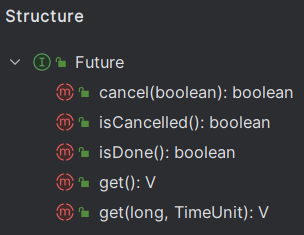
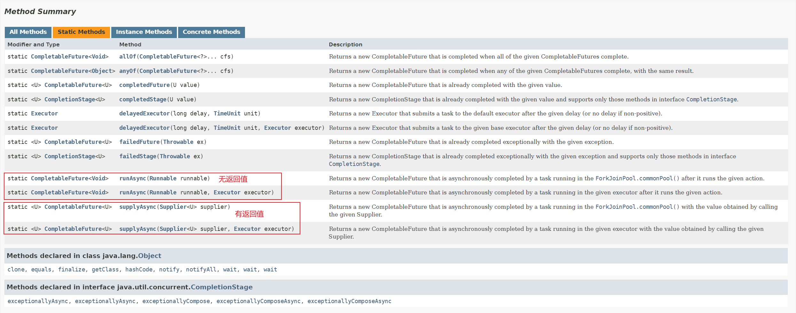
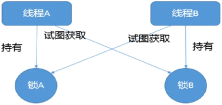
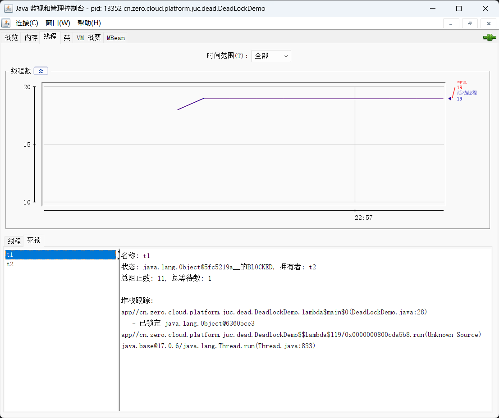
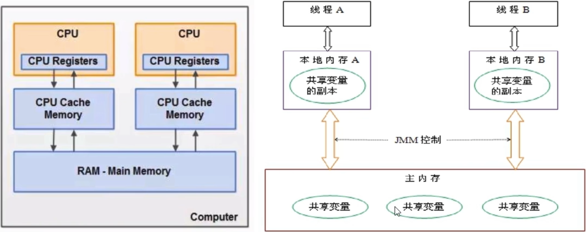
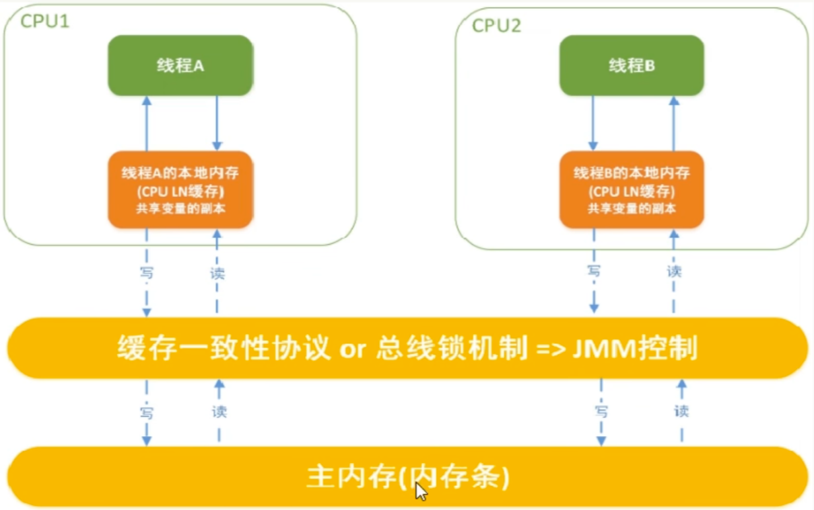

*`Author: ACatSmiling`*

*`Since: 2024-06-03`*

## 线程基础知识

`并发 (concurrent)`：是在同一实体上的多个事件，是在**一台机器上同时处理多个任务**，同一时刻，其实是只有一个事情在发生。

`并行 (parallel)`：是在不同实体上的多个事件，是在**多台处理器上同时处理多个任务**，同一时刻，大家都在做事情，你做你的，我做我的，各干各的。

`进程`：在系统中运行的一个应用程序，每个进程都有它自己的内存空间和系统资源。

`线程`：也被称为**轻量级进程**，在同一个进程内会有一个或多个线程，是大多数操作系统进行时序调度的基本单元。

`管程`：**Monitor，也就是平时所说的锁。**

- Monitor 其实是一种**同步机制**，它的义务是保证（同一时间）只有一个线程可以访问被保护的数据和代码。
- JVM 中同步是基于进入和退出监视器（Monitor 管程对象）来实现的，每个对象实例都会对应一个 Monitor 对象。
- 当 Java 对象被用作同步锁时，JVM 会为该对象关联一个 Monitor；而当该对象不再被用作同步锁，或者对象被垃圾回收时，与其关联的 Monitor 可能会被 JVM 内部释放或重新利用。底层由 C++ 语言实现。

线程分类（一般不做特别说明配置，默认都是用户线程）：

- `用户线程`：是系统的工作线程，它会完成这个程序需要完成的业务操作。

- `守护线程`：是一种特殊的线程为其他线程服务的，在后台默默地完成一些系统性的任务，比如垃圾回收线程就是最典型的例子。守护线程作为一个服务线程，没有服务对象就没有必要继续运行了，如果用户线程全部结束了，意味着程序需要完成的业务操作已经结束了，系统可以退出了。**如果系统只剩下守护线程，守护线程会伴随着 JVM 一同结束工作。**

  ```java
  package cn.zero.cloud.platform.juc.daemon;
  
  import lombok.extern.slf4j.Slf4j;
  
  import java.util.concurrent.TimeUnit;
  
  /**
   * @author XiSun
   * @version 1.0
   * @since 2024/6/4 23:04
   */
  @Slf4j
  public class DaemonThread {
      public static void main(String[] args) {
          Thread t1 = new Thread(() -> {
              log.info("current thread: {}, it is a: {}", Thread.currentThread().getName(), (Thread.currentThread().isDaemon() ? "daemon thread" : "user thread"));
  
              while (true) {
                  log.info("{} is executing business", Thread.currentThread().getName());
  
                  // 便于查看日志
                  try {
                      TimeUnit.MILLISECONDS.sleep(100);
                  } catch (InterruptedException e) {
                      log.error("exception: ", e);
                  }
              }
          }, "t1");
          // 通过设置属性Daemon来设置当前线程是否为守护线程
          t1.setDaemon(true);
          t1.start();
  
          // 便于查看日志
          try {
              TimeUnit.SECONDS.sleep(1);
          } catch (InterruptedException e) {
              log.error("exception: ", e);
          }
  
          log.info("{} thread ends execution", Thread.currentThread().getName());
      }
  }
  
  输出：
      2024-06-05 23:19:02.955 [t1] INFO  cn.zero.cloud.platform.juc.daemon.DaemonThread - current thread: t1, it is a: daemon thread
      2024-06-05 23:19:02.959 [t1] INFO  cn.zero.cloud.platform.juc.daemon.DaemonThread - t1 is executing business
      2024-06-05 23:19:03.061 [t1] INFO  cn.zero.cloud.platform.juc.daemon.DaemonThread - t1 is executing business
      2024-06-05 23:19:03.171 [t1] INFO  cn.zero.cloud.platform.juc.daemon.DaemonThread - t1 is executing business
      2024-06-05 23:19:03.280 [t1] INFO  cn.zero.cloud.platform.juc.daemon.DaemonThread - t1 is executing business
      2024-06-05 23:19:03.388 [t1] INFO  cn.zero.cloud.platform.juc.daemon.DaemonThread - t1 is executing business
      2024-06-05 23:19:03.496 [t1] INFO  cn.zero.cloud.platform.juc.daemon.DaemonThread - t1 is executing business
      2024-06-05 23:19:03.604 [t1] INFO  cn.zero.cloud.platform.juc.daemon.DaemonThread - t1 is executing business
      2024-06-05 23:19:03.714 [t1] INFO  cn.zero.cloud.platform.juc.daemon.DaemonThread - t1 is executing business
      2024-06-05 23:19:03.823 [t1] INFO  cn.zero.cloud.platform.juc.daemon.DaemonThread - t1 is executing business
      2024-06-05 23:19:03.932 [t1] INFO  cn.zero.cloud.platform.juc.daemon.DaemonThread - t1 is executing business
      2024-06-05 23:19:03.963 [main] INFO  cn.zero.cloud.platform.juc.daemon.DaemonThread - main thread ends execution
          
  结论：在main主线程结束后，守护线程会伴随着JVM一同结束工作，即使守护线程还有循环没有结束
  ```

## 异步任务

### Future 接口

`Future 接口`：定义了操作异步任务执行一些方法，如获取异步任务的执行结果、取消异步任务的执行、判断任务是否被取消、判断任务执行是否完毕等。Future 是 Java 5 新加的一个接口，它提供一种异步并行计算的功能，如果主线程需要执行一个很耗时的计算任务，我们可以通过 Future 把这个任务放进异步线程中执行，主线程继续处理其他任务或者先行结束，再通过 Future 获取计算结果。

Future 接口结构：



FutureTask 是 Future 的常用实现类：

```java
package cn.zero.cloud.platform.juc.future;

import lombok.extern.slf4j.Slf4j;

import java.util.concurrent.ExecutionException;
import java.util.concurrent.FutureTask;
import java.util.concurrent.TimeUnit;
import java.util.concurrent.TimeoutException;

/**
 * @author XiSun
 * @version 1.0
 * @since 2024/6/5 23:10
 */
@Slf4j
public class FutureTaskApiDemo {
    public static void main(String[] args) {
        FutureTask<String> futureTask = new FutureTask<>(() -> {
            log.info("{} thread come in", Thread.currentThread().getName());
            try {
                TimeUnit.SECONDS.sleep(5);
            } catch (InterruptedException e) {
                log.error("exception: ", e);
            }
            return "task over";
        });

        Thread t1 = new Thread(futureTask, "t1");
        t1.start();

        // 方式一：调用get()，通过阻塞的方式，获取futureTask的结果，main线程会一直阻塞，直到futureTask返回结果
        /*try {
            String result = futureTask.get();
            log.info("{} thread get the result of future task: {}", Thread.currentThread().getName(), result);
        } catch (InterruptedException | ExecutionException e) {
            log.error("exception: ", e);
        }*/

        // 方式二：指定阻塞的时间，超时后未获取到结果直接抛出异常java.util.concurrent.TimeoutException
        /*try {
            String result = futureTask.get(3, TimeUnit.SECONDS);
            log.info("{} thread get the result of future task: {}", Thread.currentThread().getName(), result);
        } catch (InterruptedException | ExecutionException | TimeoutException e) {
            log.error("exception: ", e);
        }*/

        // 方式三：轮询，调用isDone()
        while (true) {
            if (futureTask.isDone()) {
                try {
                    String result = futureTask.get();
                    log.info("{} thread get the result of future task: {}", Thread.currentThread().getName(), result);
                } catch (InterruptedException | ExecutionException e) {
                    log.error("exception: ", e);
                }
                break;
            } else {
                try {
                    TimeUnit.MILLISECONDS.sleep(500);
                } catch (InterruptedException e) {
                    log.error("exception: ", e);
                }

                log.info("{} thread is processing", Thread.currentThread().getName());
            }
        }
    }
}

输出：
    2024-06-05 23:57:32.443 [t1] INFO  c.zero.cloud.platform.juc.future.FutureTaskApiDemo - t1 thread come in
    2024-06-05 23:57:32.946 [main] INFO  c.zero.cloud.platform.juc.future.FutureTaskApiDemo - main thread is processing
    2024-06-05 23:57:33.456 [main] INFO  c.zero.cloud.platform.juc.future.FutureTaskApiDemo - main thread is processing
    2024-06-05 23:57:33.962 [main] INFO  c.zero.cloud.platform.juc.future.FutureTaskApiDemo - main thread is processing
    2024-06-05 23:57:34.468 [main] INFO  c.zero.cloud.platform.juc.future.FutureTaskApiDemo - main thread is processing
    2024-06-05 23:57:34.979 [main] INFO  c.zero.cloud.platform.juc.future.FutureTaskApiDemo - main thread is processing
    2024-06-05 23:57:35.488 [main] INFO  c.zero.cloud.platform.juc.future.FutureTaskApiDemo - main thread is processing
    2024-06-05 23:57:36.000 [main] INFO  c.zero.cloud.platform.juc.future.FutureTaskApiDemo - main thread is processing
    2024-06-05 23:57:36.509 [main] INFO  c.zero.cloud.platform.juc.future.FutureTaskApiDemo - main thread is processing
    2024-06-05 23:57:37.020 [main] INFO  c.zero.cloud.platform.juc.future.FutureTaskApiDemo - main thread is processing
    2024-06-05 23:57:37.523 [main] INFO  c.zero.cloud.platform.juc.future.FutureTaskApiDemo - main thread is processing
    2024-06-05 23:57:37.523 [main] INFO  c.zero.cloud.platform.juc.future.FutureTaskApiDemo - main thread get the result of future task: task over
```

- `get()`：主线程阻塞，直到获取 FutureTask 的结果。
- `isDone()`：轮询，会耗费 CPU 资源，而且也不见得能及时得到计算结果，如果想要异步获取结果，通常会以轮询的方式去获取结果，尽量不要阻塞。

- 结论：Future 对于任务的结果的获取不是很友好，只能通过**阻塞或轮询**的方式得到任务的结果。

### CompletableFuture 类

由于 Future 只能通过阻塞或轮询的方式得到异步任务的处理结果，阻塞的方式和异步编程的设计理念相违背，而轮询容易耗费 CPU 资源，导致 CPU 空转。对于真正的异步处理，我们希望是可以通过**传入回调函数**，在异步任务结束时自动调用该回调函数，这样，我们就不用等待结果。

JDK 8 设计出 CompletableFuture，CompletableFuture 提供了一种**观察者模式类似的机制**，可以让任务执行完成后通知监听的一方。

CompletableFuture 类继承关系：


- `CompletionStage 接口`
  - 代表异步计算过程中的某一个阶段，一个阶段完成以后可能会触发另外一个阶段。
  - 一个阶段的执行可能是被单个阶段的完成触发，也可能是由多个阶段一起触发。
- `CompletableFuture 类`
  - 提供了非常强大的 Future 的扩展功能，可以帮助我们简化异步编程的复杂性，并且提供了函数式编程的能力，可以通过回调的方式处理计算结果，也提供了转换和组合 CompletableFuture 的方法。
  - 它可能代表一个明确完成的 Future，也可能代表一个完成阶段 CompletionStage，它支持在计算完成以后触发一些函数或执行某些动作。

#### 核心方法

[JDK 17 文档中](https://docs.oracle.com/en/java/javase/17/docs/api/java.base/java/util/concurrent/CompletableFuture.html)，可以查看 CompletableFuture 类的四个核心静态方法：



- 对于方法中 Executor 参数说明：如果没有指定，则使用默认的 [ForkJoinPool.commonPool()](https://docs.oracle.com/en/java/javase/17/docs/api/java.base/java/util/concurrent/ForkJoinPool.html#commonPool()) 作为它的线程池执行异步代码。

代码示例：

```java
package cn.zero.cloud.platform.juc.future;

import lombok.extern.slf4j.Slf4j;

import java.util.concurrent.*;

/**
 * @author XiSun
 * @version 1.0
 * @since 2024/6/6 0:02
 */
@Slf4j
public class CompletableFutureCoreApiDemo {
    public static void main(String[] args) {
        // 定义一个线程池
        ExecutorService threadPool = Executors.newFixedThreadPool(3);

        CompletableFuture<Void> completableFuture = CompletableFuture.runAsync(() -> {
            log.info("current thread: {}", Thread.currentThread().getName());
            try {
                TimeUnit.SECONDS.sleep(1);
            } catch (InterruptedException e) {
                throw new RuntimeException(e);
            }
        }, threadPool);

        try {
            // 输出null，runAsync()没有返回值
            log.info("completableFuture result: {}", completableFuture.get());
        } catch (InterruptedException | ExecutionException e) {
            throw new RuntimeException(e);
        }


        CompletableFuture<String> objectCompletableFuture = CompletableFuture.supplyAsync(() -> {
            log.info("current thread: {}", Thread.currentThread().getName());
            try {
                TimeUnit.SECONDS.sleep(1);
            } catch (InterruptedException e) {
                throw new RuntimeException(e);
            }
            return "hello supplyAsync";
        }, threadPool);

        try {
            // 输出hello supplyAsync，supplyAsync()有返回值
            log.info("objectCompletableFuture result: {}", objectCompletableFuture.get());
        } catch (InterruptedException | ExecutionException e) {
            throw new RuntimeException(e);
        }

        // 关闭线程池
        threadPool.shutdown();
    }
}
```

#### 常用方法

## 锁

### 什么是锁

案例一：

```java
package cn.zero.cloud.platform.juc.lock;

import lombok.extern.slf4j.Slf4j;

import java.util.concurrent.TimeUnit;

/**
 * @author XiSun
 * @version 1.0
 * @since 2024/6/7 23:34
 */
@Slf4j
public class LockDemo1 {
    private static class Phone {
        public synchronized void sendEmail() {
            log.info("thread {} send email", Thread.currentThread().getName());
        }

        public synchronized void sendSms() {
            log.info("thread {} send sms", Thread.currentThread().getName());
        }
    }

    public static void main(String[] args) {
        Phone phone = new Phone();
        
        new Thread(phone::sendEmail, "a").start();

        // main线程暂停，主要是保证线程a先启动
        try {
            TimeUnit.MILLISECONDS.sleep(500);
        } catch (InterruptedException e) {
            throw new RuntimeException(e);
        }
        
        new Thread(phone::sendSms, "b").start();
    }
}

输出结果：
    2024-06-08 08:09:06.479 [a] INFO  cn.zero.cloud.platform.juc.lock.LockDemo1 - thread a send email
	2024-06-08 08:09:06.982 [b] INFO  cn.zero.cloud.platform.juc.lock.LockDemo1 - thread b send sms
```

- 结论：a，b 两个线程，分别访问 synchronized 修饰的方法，a 线程先启动，获取锁，待 a 线程执行完后，b 线程才开始执行。

案例二：

```java
package cn.zero.cloud.platform.juc.lock;

import lombok.extern.slf4j.Slf4j;

import java.util.concurrent.TimeUnit;

/**
 * @author XiSun
 * @version 1.0
 * @since 2024/6/7 23:36
 */
@Slf4j
public class LockDemo2 {
    private static class Phone {
        public synchronized void sendEmail() {
            // sendEmail方法暂停3秒钟
            try {
                TimeUnit.SECONDS.sleep(3);
            } catch (InterruptedException e) {
                throw new RuntimeException(e);
            }
            log.info("thread {} send email", Thread.currentThread().getName());
        }

        public synchronized void sendSms() {
            log.info("thread {} send sms", Thread.currentThread().getName());
        }
    }

    public static void main(String[] args) {
        Phone phone = new Phone();
        
        new Thread(phone::sendEmail, "a").start();

        // main线程暂停，主要是保证线程a先启动
        try {
            TimeUnit.MILLISECONDS.sleep(500);
        } catch (InterruptedException e) {
            throw new RuntimeException(e);
        }

        new Thread(phone::sendSms, "b").start();
    }
}

输出结果：
    2024-06-08 10:28:02.072 [a] INFO  cn.zero.cloud.platform.juc.lock.LockDemo2 - thread a send email
	2024-06-08 10:28:02.076 [b] INFO  cn.zero.cloud.platform.juc.lock.LockDemo2 - thread b send sms
```

- 结论：同案例一，将 a 线程暂停 3 秒，可以更加直观的发现，b 线程是一直在等待 a 线程完成才开始执行。

案例三：

```java
package cn.zero.cloud.platform.juc.lock;

import lombok.extern.slf4j.Slf4j;

import java.util.concurrent.TimeUnit;

/**
 * @author XiSun
 * @version 1.0
 * @since 2024/6/8 10:29
 */
@Slf4j
public class LockDemo3 {
    private static class Phone {
        public synchronized void sendEmail() {
            // sendEmail方法暂停3秒钟
            try {
                TimeUnit.SECONDS.sleep(3);
            } catch (InterruptedException e) {
                throw new RuntimeException(e);
            }
            log.info("thread {} send email", Thread.currentThread().getName());
        }

        public void hello() {
            log.info("thread {} say hello", Thread.currentThread().getName());
        }
    }

    public static void main(String[] args) {
        Phone phone = new Phone();

        new Thread(phone::sendEmail, "a").start();

        // main线程暂停，主要是保证线程a先启动
        try {
            TimeUnit.MILLISECONDS.sleep(500);
        } catch (InterruptedException e) {
            throw new RuntimeException(e);
        }

        new Thread(phone::hello, "b").start();
    }
}

输出结果：
    2024-06-08 10:37:29.567 [b] INFO  cn.zero.cloud.platform.juc.lock.LockDemo3 - thread b say hello
	2024-06-08 10:37:32.070 [a] INFO  cn.zero.cloud.platform.juc.lock.LockDemo3 - thread a send email
```

- 结论：虽然 a 线程先于 b 线程启动，但是 b 线程执行的 hello() 方法早于 a 线程，说明没有 synchronized 修饰的 hello() 方法，不与 synchronized 修饰的 sendEamil() 方法构成竞争关系。

案例四：

```java
package cn.zero.cloud.platform.juc.lock;

import lombok.extern.slf4j.Slf4j;

import java.util.concurrent.TimeUnit;

/**
 * @author XiSun
 * @version 1.0
 * @since 2024/6/8 10:39
 */
@Slf4j
public class LockDemo4 {
    private static class Phone {
        public synchronized void sendEmail() {
            // sendEmail方法暂停3秒钟
            try {
                TimeUnit.SECONDS.sleep(3);
            } catch (InterruptedException e) {
                throw new RuntimeException(e);
            }
            log.info("thread {} send email", Thread.currentThread().getName());
        }

        public synchronized void sendSms() {
            log.info("thread {} send sms", Thread.currentThread().getName());
        }
    }

    public static void main(String[] args) {
        Phone phone1 = new Phone();
        Phone phone2 = new Phone();

        new Thread(phone1::sendEmail, "a").start();

        // main线程暂停，主要是保证线程a先启动
        try {
            TimeUnit.MILLISECONDS.sleep(500);
        } catch (InterruptedException e) {
            throw new RuntimeException(e);
        }

        new Thread(phone2::sendSms, "b").start();
    }
}

输出结果：
    2024-06-08 10:43:55.246 [b] INFO  cn.zero.cloud.platform.juc.lock.LockDemo4 - thread b send sms
	2024-06-08 10:43:57.742 [a] INFO  cn.zero.cloud.platform.juc.lock.LockDemo4 - thread a send email
```

- 结论：当线程 a 和线程 b 使用两个 Phone 对象时，虽然线程 a 先启动，并等待 3 秒，线程 b 仍然会早于线程 a 执行。

案例五：

```java
package cn.zero.cloud.platform.juc.lock;

import lombok.extern.slf4j.Slf4j;

import java.util.concurrent.TimeUnit;

/**
 * @author XiSun
 * @version 1.0
 * @since 2024/6/8 10:47
 */
@Slf4j
public class LockDemo5 {
    private static class Phone {
        public static synchronized void sendEmail() {
            // sendEmail方法暂停3秒钟
            try {
                TimeUnit.SECONDS.sleep(3);
            } catch (InterruptedException e) {
                throw new RuntimeException(e);
            }
            log.info("thread {} send email", Thread.currentThread().getName());
        }

        public static synchronized void sendSms() {
            log.info("thread {} send sms", Thread.currentThread().getName());
        }
    }

    public static void main(String[] args) {
        new Thread(Phone::sendEmail, "a").start();

        // main线程暂停，主要是保证线程a先启动
        try {
            TimeUnit.MILLISECONDS.sleep(500);
        } catch (InterruptedException e) {
            throw new RuntimeException(e);
        }

        new Thread(Phone::sendSms, "b").start();
    }
}

输出结果：
    2024-06-08 10:55:27.509 [a] INFO  cn.zero.cloud.platform.juc.lock.LockDemo5 - thread a send email
	2024-06-08 10:55:27.513 [b] INFO  cn.zero.cloud.platform.juc.lock.LockDemo5 - thread b send sms
```

- 结论：对于 static 方法，先获取 synchronized 锁的方法先执行，即 a 线程先执行，b 线程一直等待 a 线程结束后才执行。

案例六：

```java
package cn.zero.cloud.platform.juc.lock;

import lombok.extern.slf4j.Slf4j;

import java.util.concurrent.TimeUnit;

/**
 * @author XiSun
 * @version 1.0
 * @since 2024/6/8 10:57
 */
@Slf4j
public class LockDemo6 {
    private static class Phone {
        public static synchronized void sendEmail() {
            // sendEmail方法暂停3秒钟
            try {
                TimeUnit.SECONDS.sleep(3);
            } catch (InterruptedException e) {
                throw new RuntimeException(e);
            }
            log.info("thread {} send email", Thread.currentThread().getName());
        }

        public synchronized void sendSms() {
            log.info("thread {} send sms", Thread.currentThread().getName());
        }
    }

    public static void main(String[] args) {
        Phone phone = new Phone();

        new Thread(Phone::sendEmail, "a").start();

        // main线程暂停，主要是保证线程a先启动
        try {
            TimeUnit.MILLISECONDS.sleep(500);
        } catch (InterruptedException e) {
            throw new RuntimeException(e);
        }

        new Thread(phone::sendSms, "b").start();
    }
}

输出结果：
    2024-06-08 10:58:47.621 [b] INFO  cn.zero.cloud.platform.juc.lock.LockDemo6 - thread b send sms
    2024-06-08 10:58:50.120 [a] INFO  cn.zero.cloud.platform.juc.lock.LockDemo6 - thread a send email
```

- 结论：虽然 sendEmail() 和 sendSms() 都被 synchronized 修饰，但是 b 线程晚启动却执行早于 a 线程，说明 static 方法和非 static 方法，synchronized 的锁不是相同的。

通过以上六个案例，总结：

- **对于普通同步方法，锁的是当前实例对象，通常指 this，所有的同步方法用的都是同一把锁，即实例对象本身。**
- **对于静态同步方法，锁的是当前类的 Class 对象。**
- **对于同步方法块，锁的是 synchronized 括号内的对象。**

### synchronized 关键字

三种应用方式：

1. **作用于实例方法，当前实例加锁，进入同步代码块前要获得当前实例的锁。**
2. **作用于代码块，对括号里配置的对象加锁。**
3. **作用于静态方法，当前类加锁，进去同步代码前要获得当前类对象的锁。**

### 悲观锁和乐观锁

`悲观锁`： 也叫狼性锁。

- **认为自己在使用数据的时候一定有别的线程来修改数据**，因此在获取数据的时候会先加锁，确保数据不会被别的线程修改。
- **synchronized 和 Lock 的实现类都是悲观锁。**
- **适合写操作多的场景**，先加锁可以保证写操作时数据正确，显式的锁定之后再操作同步资源。

`乐观锁`： 也叫佛系锁。

- **认为自己在使用数据的时候不会有别的线程修改数据或资源**，因此在获取数据的时候不会添加锁。
- Java 中使用无锁编程来实现，只是在更新的时候去判断之前有没有别的线程更新了这个数据，如果这个数据没有被更新，当前线程将自己修改的数据成功写入，如果已经被其他线程更新，则根据不同的实现方式执行不同的操作，比如：放弃修改、重试抢锁等等。判断规则有：版本号机制 Version，**最常采用的是 CAS 算法**，Java 原子类中的递增操作就通过 CAS 自旋实现的。
- **适合读操作多的场景**，不加锁的特性能够使其读操作的性能大幅提升。

### 公平锁和非公平锁

`公平锁`：是指多个线程按照申请锁的顺序来获取锁。这里类似于排队买票，先来的人先买，后来的人再队尾排着，这是公平的。`Lock lock = new ReentrantLock(true)`，表示公平锁，先来先得。

```java
package cn.zero.cloud.platform.juc.fair;

import lombok.extern.slf4j.Slf4j;

import java.util.concurrent.locks.ReentrantLock;

/**
 * @author XiSun
 * @version 1.0
 * @since 2024/6/8 22:06
 */
@Slf4j
public class FairLockDemo {
    private static class Ticket {
        private int number = 20;

        // 默认为非公平锁，指定true为公平锁
        private final ReentrantLock lock = new ReentrantLock(true);

        public void saleTicket() {
            lock.lock();
            try {
                if (number > 0) {
                    number--;
                    log.info("thread {} sale one ticket, {} tickets remaining", Thread.currentThread().getName(), number);
                }
            } finally {
                lock.unlock();
            }
        }
    }

    public static void main(String[] args) {
        Ticket ticket = new Ticket();

        new Thread(() -> {
            for (int i = 0; i < 20; i++) {
                ticket.saleTicket();
            }
        }, "a").start();

        new Thread(() -> {
            for (int i = 0; i < 20; i++) {
                ticket.saleTicket();
            }
        }, "b").start();

        new Thread(() -> {
            for (int i = 0; i < 20; i++) {
                ticket.saleTicket();
            }
        }, "c").start();
    }
}

输出：
    2024-06-08 22:29:56.245 [a] INFO  cn.zero.cloud.platform.juc.fair.FairLockDemo - thread a sale one ticket, 19 tickets remaining
    2024-06-08 22:29:56.249 [b] INFO  cn.zero.cloud.platform.juc.fair.FairLockDemo - thread b sale one ticket, 18 tickets remaining
    2024-06-08 22:29:56.250 [c] INFO  cn.zero.cloud.platform.juc.fair.FairLockDemo - thread c sale one ticket, 17 tickets remaining
    2024-06-08 22:29:56.250 [a] INFO  cn.zero.cloud.platform.juc.fair.FairLockDemo - thread a sale one ticket, 16 tickets remaining
    2024-06-08 22:29:56.250 [b] INFO  cn.zero.cloud.platform.juc.fair.FairLockDemo - thread b sale one ticket, 15 tickets remaining
    2024-06-08 22:29:56.250 [c] INFO  cn.zero.cloud.platform.juc.fair.FairLockDemo - thread c sale one ticket, 14 tickets remaining
    2024-06-08 22:29:56.250 [a] INFO  cn.zero.cloud.platform.juc.fair.FairLockDemo - thread a sale one ticket, 13 tickets remaining
    2024-06-08 22:29:56.250 [b] INFO  cn.zero.cloud.platform.juc.fair.FairLockDemo - thread b sale one ticket, 12 tickets remaining
    2024-06-08 22:29:56.250 [c] INFO  cn.zero.cloud.platform.juc.fair.FairLockDemo - thread c sale one ticket, 11 tickets remaining
    2024-06-08 22:29:56.250 [a] INFO  cn.zero.cloud.platform.juc.fair.FairLockDemo - thread a sale one ticket, 10 tickets remaining
    2024-06-08 22:29:56.250 [b] INFO  cn.zero.cloud.platform.juc.fair.FairLockDemo - thread b sale one ticket, 9 tickets remaining
    2024-06-08 22:29:56.250 [c] INFO  cn.zero.cloud.platform.juc.fair.FairLockDemo - thread c sale one ticket, 8 tickets remaining
    2024-06-08 22:29:56.251 [a] INFO  cn.zero.cloud.platform.juc.fair.FairLockDemo - thread a sale one ticket, 7 tickets remaining
    2024-06-08 22:29:56.251 [b] INFO  cn.zero.cloud.platform.juc.fair.FairLockDemo - thread b sale one ticket, 6 tickets remaining
    2024-06-08 22:29:56.251 [c] INFO  cn.zero.cloud.platform.juc.fair.FairLockDemo - thread c sale one ticket, 5 tickets remaining
    2024-06-08 22:29:56.251 [a] INFO  cn.zero.cloud.platform.juc.fair.FairLockDemo - thread a sale one ticket, 4 tickets remaining
    2024-06-08 22:29:56.251 [b] INFO  cn.zero.cloud.platform.juc.fair.FairLockDemo - thread b sale one ticket, 3 tickets remaining
    2024-06-08 22:29:56.251 [c] INFO  cn.zero.cloud.platform.juc.fair.FairLockDemo - thread c sale one ticket, 2 tickets remaining
    2024-06-08 22:29:56.251 [a] INFO  cn.zero.cloud.platform.juc.fair.FairLockDemo - thread a sale one ticket, 1 tickets remaining
    2024-06-08 22:29:56.251 [b] INFO  cn.zero.cloud.platform.juc.fair.FairLockDemo - thread b sale one ticket, 0 tickets remaining
```

- 结论：对于公平锁，3 个线程按照申请锁的顺序，循环占有锁。

`非公平锁`：是指多个线程获取锁的顺序并不是按照申请的顺序，有可能后申请的线程比先申请的线程优先获取锁。在高并发环境下，**有可能造成优先级反转或者饥饿的状态（某个线程一直得不到锁）**。`Lock lock = new  ReentrantLock(false)`，表示非公平锁，后来的也可能先获得锁，**默认为非公平锁**。

```java
package cn.zero.cloud.platform.juc.fair;

import lombok.extern.slf4j.Slf4j;

import java.util.concurrent.locks.ReentrantLock;

/**
 * @author XiSun
 * @version 1.0
 * @since 2024/6/8 22:06
 */
@Slf4j
public class SaleTicketDemo {
    private static class Ticket {
        private int number = 20;

        // 默认为非公平锁
        private final ReentrantLock lock = new ReentrantLock();

        public void saleTicket() {
            lock.lock();
            try {
                if (number > 0) {
                    number--;
                    log.info("thread {} sale one ticket, {} tickets remaining", Thread.currentThread().getName(), number);
                }
            } finally {
                lock.unlock();
            }
        }
    }

    public static void main(String[] args) {
        Ticket ticket = new Ticket();

        new Thread(() -> {
            for (int i = 0; i < 20; i++) {
                ticket.saleTicket();
            }
        }, "a").start();

        new Thread(() -> {
            for (int i = 0; i < 20; i++) {
                ticket.saleTicket();
            }
        }, "b").start();

        new Thread(() -> {
            for (int i = 0; i < 20; i++) {
                ticket.saleTicket();
            }
        }, "c").start();
    }
}

输出：
    2024-06-08 22:14:18.158 [a] INFO  cn.zero.cloud.platform.juc.fair.SaleTicketDemo - thread a sale one ticket, 19 tickets remaining
    2024-06-08 22:14:18.161 [a] INFO  cn.zero.cloud.platform.juc.fair.SaleTicketDemo - thread a sale one ticket, 18 tickets remaining
    2024-06-08 22:14:18.161 [a] INFO  cn.zero.cloud.platform.juc.fair.SaleTicketDemo - thread a sale one ticket, 17 tickets remaining
    2024-06-08 22:14:18.161 [a] INFO  cn.zero.cloud.platform.juc.fair.SaleTicketDemo - thread a sale one ticket, 16 tickets remaining
    2024-06-08 22:14:18.161 [a] INFO  cn.zero.cloud.platform.juc.fair.SaleTicketDemo - thread a sale one ticket, 15 tickets remaining
    2024-06-08 22:14:18.161 [a] INFO  cn.zero.cloud.platform.juc.fair.SaleTicketDemo - thread a sale one ticket, 14 tickets remaining
    2024-06-08 22:14:18.161 [a] INFO  cn.zero.cloud.platform.juc.fair.SaleTicketDemo - thread a sale one ticket, 13 tickets remaining
    2024-06-08 22:14:18.161 [a] INFO  cn.zero.cloud.platform.juc.fair.SaleTicketDemo - thread a sale one ticket, 12 tickets remaining
    2024-06-08 22:14:18.161 [a] INFO  cn.zero.cloud.platform.juc.fair.SaleTicketDemo - thread a sale one ticket, 11 tickets remaining
    2024-06-08 22:14:18.161 [b] INFO  cn.zero.cloud.platform.juc.fair.SaleTicketDemo - thread b sale one ticket, 10 tickets remaining
    2024-06-08 22:14:18.161 [b] INFO  cn.zero.cloud.platform.juc.fair.SaleTicketDemo - thread b sale one ticket, 9 tickets remaining
    2024-06-08 22:14:18.161 [b] INFO  cn.zero.cloud.platform.juc.fair.SaleTicketDemo - thread b sale one ticket, 8 tickets remaining
    2024-06-08 22:14:18.161 [b] INFO  cn.zero.cloud.platform.juc.fair.SaleTicketDemo - thread b sale one ticket, 7 tickets remaining
    2024-06-08 22:14:18.161 [b] INFO  cn.zero.cloud.platform.juc.fair.SaleTicketDemo - thread b sale one ticket, 6 tickets remaining
    2024-06-08 22:14:18.161 [b] INFO  cn.zero.cloud.platform.juc.fair.SaleTicketDemo - thread b sale one ticket, 5 tickets remaining
    2024-06-08 22:14:18.161 [b] INFO  cn.zero.cloud.platform.juc.fair.SaleTicketDemo - thread b sale one ticket, 4 tickets remaining
    2024-06-08 22:14:18.161 [b] INFO  cn.zero.cloud.platform.juc.fair.SaleTicketDemo - thread b sale one ticket, 3 tickets remaining
    2024-06-08 22:14:18.161 [b] INFO  cn.zero.cloud.platform.juc.fair.SaleTicketDemo - thread b sale one ticket, 2 tickets remaining
    2024-06-08 22:14:18.161 [b] INFO  cn.zero.cloud.platform.juc.fair.SaleTicketDemo - thread b sale one ticket, 1 tickets remaining
    2024-06-08 22:14:18.161 [b] INFO  cn.zero.cloud.platform.juc.fair.SaleTicketDemo - thread b sale one ticket, 0 tickets remaining
```

- 结论：对于非公平锁，3 个线程不按照锁的申请顺序获取锁。多运行几次程序可以发现，有的时候全都会是 a 线程占有锁。

>为什么会有公平锁/非公平锁的设计？为什么默认是非公平锁？
>
>- 恢复挂起的线程到真正锁的获取是有时间差的，从开发人员来看这个时间微乎其微，但是从 CPU 的角度来看，这个时间差存在的还是很明显的。**非公平锁能更充分地利用 CPU 的时间片，尽量减少 CPU 空间状态时间。**
>- 使用多线程很重要的考量点是线程切换的开销，采用非公平锁时，当一个线程请求锁获取同步状态，然后再释放同步状态，此时，刚释放锁的线程再次获取同步状态的概率就变得很大，所以也就**减少了线程的开销**。
>
>什么时候用公平锁？什么时候用非公平锁？
>
>- 如果为了更高的吞吐量，很显然非公平锁是比较合适的，因为节省了很多线程切换的时间，吞吐量自然就上去了；否则就用公平锁，大家公平使用。

### 可重入锁（递归锁）

`可重入锁`：也叫递归锁，是指**在同一线程在外层方法获取到锁的时侯，在进入该线程的内层方法会自动获取锁（前提，锁的是同一个对象），不会因为之前已经获取过还没释放而阻塞。**可重入锁的优点之一，就是可一定程度避免死锁。

可重入锁的种类：

- `隐式锁`：即 synchronized 关键字使用的锁），默认是可重入锁。
- `显式锁`：即 Lock，也有 ReentrantLock 这样的可重入锁。

案例：

```java
package cn.zero.cloud.platform.juc.reentry;

import lombok.extern.slf4j.Slf4j;

import java.util.concurrent.TimeUnit;
import java.util.concurrent.locks.Lock;
import java.util.concurrent.locks.ReentrantLock;

/**
 * @author XiSun
 * @version 1.0
 * @since 2024/6/8 22:42
 */
@Slf4j
public class ReEntryLockDemo {
    public static void main(String[] args) {
        final Object o = new Object();

        /*
         * 隐式锁：
         * ---------------外层调用
         * ---------------中层调用
         * ---------------内层调用
         */
        new Thread(() -> {
            synchronized (o) {
                log.info("thread {} outer call", Thread.currentThread().getName());
                synchronized (o) {
                    log.info("thread {} middle call", Thread.currentThread().getName());
                    synchronized (o) {
                        log.info("thread {} inner call", Thread.currentThread().getName());
                    }
                }
            }
        }, "t1").start();

        // 隔离开隐式锁和显式锁的输出
        try {
            TimeUnit.SECONDS.sleep(2);
        } catch (InterruptedException e) {
            throw new RuntimeException(e);
        }

        /*
         * 显式锁：注意，加锁几次就需要解锁几次
         * ---------------外层调用
         * ---------------中层调用
         * ---------------内层调用
         */
        Lock lock = new ReentrantLock();
        new Thread(() -> {
            lock.lock();
            try {
                log.info("thread {} outer call", Thread.currentThread().getName());

                lock.lock();
                try {
                    log.info("thread {} middle call", Thread.currentThread().getName());

                    lock.lock();
                    try {
                        log.info("thread {} inner call", Thread.currentThread().getName());
                    } finally {
                        lock.unlock();
                    }
                } finally {
                    lock.unlock();
                }
            } finally {
                lock.unlock();
            }
        }, "t2").start();
    }
}

输出：
    2024-06-08 22:47:17.197 [t1] INFO  c.zero.cloud.platform.juc.reentry.ReEntryLockDemo - thread t1 outer call
    2024-06-08 22:47:17.200 [t1] INFO  c.zero.cloud.platform.juc.reentry.ReEntryLockDemo - thread t1 middle call
    2024-06-08 22:47:17.200 [t1] INFO  c.zero.cloud.platform.juc.reentry.ReEntryLockDemo - thread t1 inner call
    2024-06-08 22:47:19.208 [t2] INFO  c.zero.cloud.platform.juc.reentry.ReEntryLockDemo - thread t2 outer call
    2024-06-08 22:47:19.208 [t2] INFO  c.zero.cloud.platform.juc.reentry.ReEntryLockDemo - thread t2 middle call
    2024-06-08 22:47:19.208 [t2] INFO  c.zero.cloud.platform.juc.reentry.ReEntryLockDemo - thread t2 inner call
```

### 死锁

`死锁`：是指两个或两个以上的线程在执行过程中，因抢夺资源而造成的一种互相等待的现象，若无外力干涉，则它们无法再继续推进下去。



- 系统资源不足。
- 进程运行推进顺序不合适。
- 系统资源分配不当。

```java
package cn.zero.cloud.platform.juc.dead;

import lombok.extern.slf4j.Slf4j;

import java.util.concurrent.TimeUnit;

/**
 * @author XiSun
 * @version 1.0
 * @since 2024/6/9 0:20
 */
@Slf4j
public class DeadLockDemo {
    public static void main(String[] args) {
        final Object a = new Object();
        final Object b = new Object();

        new Thread(() -> {
            synchronized (a) {
                log.info("thread {} holds lock a and attempts to acquire lock b", Thread.currentThread().getName());
                // 暂停，保证此时线程t2已经启动拿到锁b
                try {
                    TimeUnit.SECONDS.sleep(1);
                } catch (InterruptedException e) {
                    throw new RuntimeException(e);
                }
                synchronized (b) {
                    log.info("thread {} has acquired lock b", Thread.currentThread().getName());
                }
            }
        }, "t1").start();

        new Thread(() -> {
            synchronized (b) {
                log.info("thread {} holds lock b and attempts to acquire lock a", Thread.currentThread().getName());
                // 暂停，保证此时线程t1已经启动拿到锁a
                try {
                    TimeUnit.SECONDS.sleep(1);
                } catch (InterruptedException e) {
                    throw new RuntimeException(e);
                }
                synchronized (a) {
                    log.info("thread {} has acquired lock a", Thread.currentThread().getName());
                }
            }
        }, "t2").start();

        try {
            TimeUnit.MILLISECONDS.sleep(100);
        } catch (InterruptedException e) {
            throw new RuntimeException(e);
        }
        log.info("thread {} is done", Thread.currentThread().getName());
    }
}

输出结果：
    2024-06-09 11:43:21.849 [t2] INFO  cn.zero.cloud.platform.juc.dead.DeadLockDemo - thread t2 holds lock b and attempts to acquire lock a
    2024-06-09 11:43:21.849 [t1] INFO  cn.zero.cloud.platform.juc.dead.DeadLockDemo - thread t1 holds lock a and attempts to acquire lock b
    2024-06-09 11:43:21.954 [main] INFO  cn.zero.cloud.platform.juc.dead.DeadLockDemo - thread main is done
```

- 结论：虽然 main 线程结束了，t1 和 t2 线程也各自运行，但因为彼此持有对方需要的锁，且一直没有释放，导致 t1 和 t2 线程一直阻塞，程序无法终止。

`死锁排查`：启动可能是死锁的程序，通过以下两种方式排查死锁。

1. 命令行。

   ```shell
   (base) PS C:\Users\XiSun\NewVolume-D\zero_to_zero\Codes\zero-cloud> jps -l  
   12480 org.jetbrains.idea.maven.server.RemoteMavenServer36
   8432 
   13636 org.jetbrains.jps.cmdline.Launcher
   5604 jdk.jcmd/sun.tools.jps.Jps
   13352 cn.zero.cloud.platform.juc.dead.DeadLockDemo
   10316
   (base) PS C:\Users\XiSun\NewVolume-D\zero_to_zero\Codes\zero-cloud> jstack 13352
   2024-06-13 22:54:30
   Full thread dump Java HotSpot(TM) 64-Bit Server VM (17.0.6+9-LTS-190 mixed mode, sharing):
   
   Threads class SMR info:
   _java_thread_list=0x000001eaf34b10a0, length=16, elements={
   0x000001eaf31c0c10, 0x000001eaf31c1990, 0x000001eaf31da450, 0x000001eaf31dbf20,
   0x000001eaf31dc9e0, 0x000001eaf31df7b0, 0x000001eaf31e0450, 0x000001eaf31f1b60,
   0x000001eaf3204c30, 0x000001eaf25f5d60, 0x000001eaf3410730, 0x000001eaf3411db0,
   0x000001eaf40f9480, 0x000001eaf458d580, 0x000001eaf458ded0, 0x000001eac7d21fe0
   }
   
   "Reference Handler" #2 daemon prio=10 os_prio=2 cpu=0.00ms elapsed=34.87s tid=0x000001eaf31c0c10 nid=0x12e0 waiting on condition  [0x0000008ed4afe000]
      java.lang.Thread.State: RUNNABLE
           at java.lang.ref.Reference.waitForReferencePendingList(java.base@17.0.6/Native Method)
           at java.lang.ref.Reference.processPendingReferences(java.base@17.0.6/Reference.java:253)
           at java.lang.ref.Reference$ReferenceHandler.run(java.base@17.0.6/Reference.java:215)
   
   "Finalizer" #3 daemon prio=8 os_prio=1 cpu=0.00ms elapsed=34.87s tid=0x000001eaf31c1990 nid=0x1154 in Object.wait()  [0x0000008ed4bfe000]
      java.lang.Thread.State: WAITING (on object monitor)
           at java.lang.Object.wait(java.base@17.0.6/Native Method)
           - waiting on <0x000000064dc0d5c8> (a java.lang.ref.ReferenceQueue$Lock)
           at java.lang.ref.ReferenceQueue.remove(java.base@17.0.6/ReferenceQueue.java:155)
           - locked <0x000000064dc0d5c8> (a java.lang.ref.ReferenceQueue$Lock)
           at java.lang.ref.ReferenceQueue.remove(java.base@17.0.6/ReferenceQueue.java:176)
           at java.lang.ref.Finalizer$FinalizerThread.run(java.base@17.0.6/Finalizer.java:172)
   
   "Signal Dispatcher" #4 daemon prio=9 os_prio=2 cpu=0.00ms elapsed=34.86s tid=0x000001eaf31da450 nid=0x3048 waiting on condition  [0x0000000000000000]
      java.lang.Thread.State: RUNNABLE
   
   "Attach Listener" #5 daemon prio=5 os_prio=2 cpu=0.00ms elapsed=34.86s tid=0x000001eaf31dbf20 nid=0x1d10 waiting on condition  [0x0000000000000000]
      java.lang.Thread.State: RUNNABLE
   
   "Service Thread" #6 daemon prio=9 os_prio=0 cpu=0.00ms elapsed=34.86s tid=0x000001eaf31dc9e0 nid=0x279c runnable  [0x0000000000000000]
      java.lang.Thread.State: RUNNABLE
   
   "Monitor Deflation Thread" #7 daemon prio=9 os_prio=0 cpu=0.00ms elapsed=34.86s tid=0x000001eaf31df7b0 nid=0x1c68 runnable  [0x0000000000000000]
      java.lang.Thread.State: RUNNABLE
   
   "C2 CompilerThread0" #8 daemon prio=9 os_prio=2 cpu=15.62ms elapsed=34.86s tid=0x000001eaf31e0450 nid=0xe84 waiting on condition  [0x0000000000000000]
      java.lang.Thread.State: RUNNABLE
      No compile task
   
   "C1 CompilerThread0" #16 daemon prio=9 os_prio=2 cpu=0.00ms elapsed=34.86s tid=0x000001eaf31f1b60 nid=0xdfc waiting on condition  [0x0000000000000000]
      java.lang.Thread.State: RUNNABLE
      No compile task
   
   "Sweeper thread" #20 daemon prio=9 os_prio=2 cpu=0.00ms elapsed=34.86s tid=0x000001eaf3204c30 nid=0x5334 runnable  [0x0000000000000000]
      java.lang.Thread.State: RUNNABLE
   
   "Common-Cleaner" #21 daemon prio=8 os_prio=1 cpu=0.00ms elapsed=34.84s tid=0x000001eaf25f5d60 nid=0x2074 in Object.wait()  [0x0000008ed53ff000]
      java.lang.Thread.State: TIMED_WAITING (on object monitor)
           at java.lang.Object.wait(java.base@17.0.6/Native Method)
           - waiting on <0x000000064dd07008> (a java.lang.ref.ReferenceQueue$Lock)
           at java.lang.ref.ReferenceQueue.remove(java.base@17.0.6/ReferenceQueue.java:155)
           - locked <0x000000064dd07008> (a java.lang.ref.ReferenceQueue$Lock)
           at jdk.internal.ref.CleanerImpl.run(java.base@17.0.6/CleanerImpl.java:140)
           at java.lang.Thread.run(java.base@17.0.6/Thread.java:833)
           at jdk.internal.misc.InnocuousThread.run(java.base@17.0.6/InnocuousThread.java:162)
   
   "Monitor Ctrl-Break" #22 daemon prio=5 os_prio=0 cpu=0.00ms elapsed=34.78s tid=0x000001eaf3410730 nid=0x1e28 runnable  [0x0000008ed57fe000]
      java.lang.Thread.State: RUNNABLE
           at sun.nio.ch.SocketDispatcher.read0(java.base@17.0.6/Native Method)
           at sun.nio.ch.SocketDispatcher.read(java.base@17.0.6/SocketDispatcher.java:46)
           at sun.nio.ch.NioSocketImpl.tryRead(java.base@17.0.6/NioSocketImpl.java:261)
           at sun.nio.ch.NioSocketImpl.implRead(java.base@17.0.6/NioSocketImpl.java:312)
           at sun.nio.ch.NioSocketImpl.read(java.base@17.0.6/NioSocketImpl.java:350)
           at sun.nio.ch.NioSocketImpl$1.read(java.base@17.0.6/NioSocketImpl.java:803)
           at java.net.Socket$SocketInputStream.read(java.base@17.0.6/Socket.java:966)
           at sun.nio.cs.StreamDecoder.readBytes(java.base@17.0.6/StreamDecoder.java:270)
           at sun.nio.cs.StreamDecoder.implRead(java.base@17.0.6/StreamDecoder.java:313)
           at sun.nio.cs.StreamDecoder.read(java.base@17.0.6/StreamDecoder.java:188)
           - locked <0x000000064dfc1378> (a java.io.InputStreamReader)
           at java.io.InputStreamReader.read(java.base@17.0.6/InputStreamReader.java:177)
           at java.io.BufferedReader.fill(java.base@17.0.6/BufferedReader.java:162)
           at java.io.BufferedReader.readLine(java.base@17.0.6/BufferedReader.java:329)
           - locked <0x000000064dfc1378> (a java.io.InputStreamReader)
           at java.io.BufferedReader.readLine(java.base@17.0.6/BufferedReader.java:396)
           at com.intellij.rt.execution.application.AppMainV2$1.run(AppMainV2.java:53)
   
   "Notification Thread" #23 daemon prio=9 os_prio=0 cpu=0.00ms elapsed=34.78s tid=0x000001eaf3411db0 nid=0x1300 runnable  [0x0000000000000000]
      java.lang.Thread.State: RUNNABLE
   
   "AsyncAppender-Worker-ASYNC" #24 daemon prio=5 os_prio=0 cpu=0.00ms elapsed=34.42s tid=0x000001eaf40f9480 nid=0x31d4 waiting on condition  [0x0000008ed5aff000]
      java.lang.Thread.State: WAITING (parking)
           at jdk.internal.misc.Unsafe.park(java.base@17.0.6/Native Method)
           - parking to wait for  <0x000000064d7c73f0> (a java.util.concurrent.locks.AbstractQueuedSynchronizer$ConditionObject)
           at java.util.concurrent.locks.LockSupport.park(java.base@17.0.6/LockSupport.java:341)
           at java.util.concurrent.locks.AbstractQueuedSynchronizer$ConditionNode.block(java.base@17.0.6/AbstractQueuedSynchronizer.java:506)
           at java.util.concurrent.ForkJoinPool.unmanagedBlock(java.base@17.0.6/ForkJoinPool.java:3463)
           at java.util.concurrent.ForkJoinPool.managedBlock(java.base@17.0.6/ForkJoinPool.java:3434)
           at java.util.concurrent.locks.AbstractQueuedSynchronizer$ConditionObject.await(java.base@17.0.6/AbstractQueuedSynchronizer.java:1623)
           at java.util.concurrent.ArrayBlockingQueue.take(java.base@17.0.6/ArrayBlockingQueue.java:420)
           at ch.qos.logback.core.AsyncAppenderBase$Worker.run(AsyncAppenderBase.java:298)
   
   "t1" #25 prio=5 os_prio=0 cpu=0.00ms elapsed=34.42s tid=0x000001eaf458d580 nid=0x2590 waiting for monitor entry  [0x0000008ed5bff000]
      java.lang.Thread.State: BLOCKED (on object monitor)
           at cn.zero.cloud.platform.juc.dead.DeadLockDemo.lambda$main$0(DeadLockDemo.java:28)
           - waiting to lock <0x000000064d7fa358> (a java.lang.Object)
           - locked <0x000000064d7fa348> (a java.lang.Object)
           at cn.zero.cloud.platform.juc.dead.DeadLockDemo$$Lambda$119/0x0000000800cda5b8.run(Unknown Source)
           at java.lang.Thread.run(java.base@17.0.6/Thread.java:833)
   
   "t2" #26 prio=5 os_prio=0 cpu=0.00ms elapsed=34.42s tid=0x000001eaf458ded0 nid=0x24e0 waiting for monitor entry  [0x0000008ed5cff000]
      java.lang.Thread.State: BLOCKED (on object monitor)
           at cn.zero.cloud.platform.juc.dead.DeadLockDemo.lambda$main$1(DeadLockDemo.java:43)
           - waiting to lock <0x000000064d7fa348> (a java.lang.Object)
           - locked <0x000000064d7fa358> (a java.lang.Object)
           at cn.zero.cloud.platform.juc.dead.DeadLockDemo$$Lambda$120/0x0000000800cda7d8.run(Unknown Source)
           at java.lang.Thread.run(java.base@17.0.6/Thread.java:833)
   
   "DestroyJavaVM" #27 prio=5 os_prio=0 cpu=93.75ms elapsed=34.31s tid=0x000001eac7d21fe0 nid=0x1cbc waiting on condition  [0x0000000000000000]
      java.lang.Thread.State: RUNNABLE
   
   "VM Thread" os_prio=2 cpu=0.00ms elapsed=34.87s tid=0x000001eaf31bacf0 nid=0xaa0 runnable
   
   "GC Thread#0" os_prio=2 cpu=0.00ms elapsed=34.88s tid=0x000001eac7dc1150 nid=0x1508 runnable
   
   "G1 Main Marker" os_prio=2 cpu=0.00ms elapsed=34.88s tid=0x000001eac7dd0810 nid=0xebc runnable
   
   "G1 Conc#0" os_prio=2 cpu=0.00ms elapsed=34.88s tid=0x000001eac7dd2630 nid=0xadc runnable
   
   "G1 Refine#0" os_prio=2 cpu=0.00ms elapsed=34.88s tid=0x000001eac7dee440 nid=0xbe4 runnable
   
   "G1 Service" os_prio=2 cpu=0.00ms elapsed=34.88s tid=0x000001eaf24c5060 nid=0x30cc runnable
   
   "VM Periodic Task Thread" os_prio=2 cpu=0.00ms elapsed=34.78s tid=0x000001eaf33dcf50 nid=0x1608 waiting on condition
   
   JNI global refs: 23, weak refs: 0
   
   
   Found one Java-level deadlock:
   =============================
   "t1":
     waiting to lock monitor 0x000001eaf45d7090 (object 0x000000064d7fa358, a java.lang.Object),
     which is held by "t2"
   
   "t2":
     waiting to lock monitor 0x000001eaf45d6530 (object 0x000000064d7fa348, a java.lang.Object),
     which is held by "t1"
   
   Java stack information for the threads listed above:
   ===================================================
   "t1":
           at cn.zero.cloud.platform.juc.dead.DeadLockDemo.lambda$main$0(DeadLockDemo.java:28)
           - waiting to lock <0x000000064d7fa358> (a java.lang.Object)
           - locked <0x000000064d7fa348> (a java.lang.Object)
           at cn.zero.cloud.platform.juc.dead.DeadLockDemo$$Lambda$119/0x0000000800cda5b8.run(Unknown Source)
           at java.lang.Thread.run(java.base@17.0.6/Thread.java:833)
   "t2":
           at cn.zero.cloud.platform.juc.dead.DeadLockDemo.lambda$main$1(DeadLockDemo.java:43)
           - waiting to lock <0x000000064d7fa348> (a java.lang.Object)
           - locked <0x000000064d7fa358> (a java.lang.Object)
           at cn.zero.cloud.platform.juc.dead.DeadLockDemo$$Lambda$120/0x0000000800cda7d8.run(Unknown Source)
           at java.lang.Thread.run(java.base@17.0.6/Thread.java:833)
   
   Found 1 deadlock.
   ```

2. 图形界面。

   ```shell
   (base) PS C:\Users\XiSun\NewVolume-D\zero_to_zero\Codes\zero-cloud> jconsole
   ```

   

   

## LockSupport 和线程中断机制

### 线程中断机制

什么是线程中断机制：

- 首先，**一个线程不应该由其他线程来强制中断或停止，而是应该由线程自己自行停止。**所以，Thread.stop()、Thread.suspend()、Thread.resume() 都已经被废弃了。
- 其次，在 Java 中没有办法立即停止一条线程，然而停止线程却显得尤为重要，例如取消一个耗时操作。因此，**Java 提供了一种用于停止线程的协商机制 —— 中断，也即中断标识协商机制。**
  - 中断只是一种协作协商机制，Java 没有给中断增加任何语法，中断的过程需要由程序员自行实现。若要中断一个线程，你需要手动调用该线程 interrupt 方法，该方法也仅仅是**将该线程对象的中断标识设置为 true**，接着你需要自己写代码不断检测当前线程的标识位，如果为 true，表示别的线程请求这条线程中断，此时究竟应该做什么需要你自己写代码实现。
  - 每个线程对象都有一个中断标识位，用于表示线程是否被中断；该标识位为 true 表示中断，为 false 表示未中断；通过调用线程对象的 interrupt 方法将该线程的标识位设置为 true；interrupt  方法可以在别的线程中调用，也可以在自己的线程中调用。

线程中断的相关 API：

1. `public void interrupt()`
   - 实例方法：**仅仅是设置线程的中断状态为 true，发起一个协商而不会立刻停止线程。**
   
2. ``public static boolean interrupted()`
   - 静态方法：**判断线程是否被中断并清除当前中断状态（做了两件事情）。**
     - 返回当前线程的中断状态，测试当前线程是否已被中断。
     - 将当前线程的中断状态清零并重新设置为 false，清除线程的中断状态。
   
   - 这个方法有点不好理解在于如果连续两次调用此方法，则第二次返回false，因为连续调用两次的结果可能不一样。
   
3. `public boolean isInterrupted()`

   - 实例方法：**判断当前线程是否被中断（通过检查中断标志位）。**

如何停止中断运行中的线程：

1. 通过 volatile 变量实现。

   ```java
   package cn.zero.cloud.platform.juc.interrupt;
   
   import lombok.extern.slf4j.Slf4j;
   
   import java.util.concurrent.TimeUnit;
   
   /**
    * @author XiSun
    * @version 1.0
    * @since 2024/6/13 23:46
    */
   @Slf4j
   public class InterruptByVolatileDemo {
       // volatile表示的变量具有可见性
       private static volatile boolean isStop = false;
   
       public static void main(String[] args) {
           new Thread(() -> {
               while (true) {
                   if (isStop) {
                       log.info("thread {} ends execution", Thread.currentThread().getName());
                       break;
                   }
                   // 不要使用日志输出
                   // log.info("thread {} is running", Thread.currentThread().getName());
               }
           }, "t1").start();
   
           try {
               TimeUnit.MILLISECONDS.sleep(10);
           } catch (InterruptedException e) {
               throw new RuntimeException(e);
           }
   
           new Thread(() -> {
               isStop = true;
               log.info("thread {} ends execution", Thread.currentThread().getName());
           }, "t2").start();
       }
   }
   ```

   - 结论：以上程序，不使用 volatile 修饰 isStop 时，t2 线程结束后，t1 线程不会停止，使用 volatile 修饰 isStop 时，t2 线程结束后，t1 线程会随着结束运行。注意：t1 线程中不要使用日志输出等操作，否则会影响测试结果（t1 线程在运行一段时间后，会停止运行）。

2. 通过 AutomicBoolean 实现。

   ```java
   package cn.zero.cloud.platform.juc.interrupt;
   
   import lombok.extern.slf4j.Slf4j;
   
   import java.util.concurrent.TimeUnit;
   import java.util.concurrent.atomic.AtomicBoolean;
   
   /**
    * @author XiSun
    * @version 1.0
    * @since 2024/6/13 23:56
    */
   @Slf4j
   public class InterruptByAtomicBooleanDemo {
       private static final AtomicBoolean ATOMIC_BOOLEAN = new AtomicBoolean(false);
   
       public static void main(String[] args) {
           new Thread(() -> {
               while (true) {
                   if (ATOMIC_BOOLEAN.get()) {
                       log.info("thread {} ends execution", Thread.currentThread().getName());
                       break;
                   }
                   // 不要使用日志输出
                   log.info("thread {} is running", Thread.currentThread().getName());
                   
                   try {
                       TimeUnit.MILLISECONDS.sleep(2);
                   } catch (InterruptedException e) {
                       throw new RuntimeException(e);
                   }
               }
           }, "t1").start();
   
           try {
               TimeUnit.MILLISECONDS.sleep(10);
           } catch (InterruptedException e) {
               throw new RuntimeException(e);
           }
   
           new Thread(() -> {
               ATOMIC_BOOLEAN.set(true);
               log.info("thread {} ends execution", Thread.currentThread().getName());
           }, "t2").start();
       }
   }
   
   输出结果：
       2024-06-13 23:58:59.185 [t1] INFO  c.z.c.p.juc.interrupt.InterruptByAtomicBooleanDemo - thread t1 is running
       2024-06-13 23:58:59.192 [t1] INFO  c.z.c.p.juc.interrupt.InterruptByAtomicBooleanDemo - thread t1 is running
       2024-06-13 23:58:59.194 [t1] INFO  c.z.c.p.juc.interrupt.InterruptByAtomicBooleanDemo - thread t1 is running
       2024-06-13 23:58:59.197 [t1] INFO  c.z.c.p.juc.interrupt.InterruptByAtomicBooleanDemo - thread t1 is running
       2024-06-13 23:58:59.199 [t2] INFO  c.z.c.p.juc.interrupt.InterruptByAtomicBooleanDemo - thread t2 ends execution
       2024-06-13 23:58:59.200 [t1] INFO  c.z.c.p.juc.interrupt.InterruptByAtomicBooleanDemo - thread t1 ends execution
   ```

   - 结论：t2 线程结束后，ATOMIC_BOOLEAN 的值被修改为 true，t1 线程监测到值发生变化后，停止运行。

3. 通过Thread类自带的中断API实例方法实现。

### LockSupport


## Java 内存模型

**`Java 内存模型`**：**Java Memory Model，简称 JMM，是 Java 语言中定义的一组规则和规范，用于解决多线程环境下的内存可见性和有序性问题。**JMM 确定了线程之间如何通过内存进行交互，并规定了变量的读取和写入操作的行为。

JMM 能干吗？

- 通过 JMM 来实现线程的工作内存和主内存之间的抽象关系。
- 屏蔽各个硬件平台和操作系统的内存访问差异，以实现让 Java 程序在各种平台下都能达到一致性的内存访问效果。

### 三大特性

**`内存可见性`**：JMM 规定了一个线程对共享变量的修改何时对另一个线程可见，在没有适当的同步机制时，线程可能会看到旧的、不一致的数据。



JMM 规定了所有的变量都存储在主内存中，每个线程都有自己的工作内存，线程自己的工作内存中保存了该线程使用到的主内存变量的副本拷贝，线程对变量的所有操作（读取、赋值等）都必须在线程自己的工作内存中进行，而不能够直接写入主内存中的变量，不同线程之间也无法直接访问对方工作内存中的变量，线程间变量值的传递均需要通过主内存来完成。

- `主内存（Main Memory）`：所有变量都存储在主内存中，主内存是所有线程共享的区域。
- `工作内存（Working Memory）`：每个线程都有自己的工作内存（类似于 CPU 缓存），线程在工作内存中对变量进行操作。工作内存中的变量是主内存中变量的拷贝，线程对变量的修改必须在某个时刻刷新回主内存。

> 对于主内存中的共享变量数据，由于在工作内存中修改再被写入主内存的时机是不确定的，多线程并发下很可能出现 "脏读"。举例如下：
>
> 1. 主内存中有变量 X，初始值为 0；
> 2. 线程 A 要将 X 加 1，先将 X = 0 拷贝到自己的工作内存中，然后更新 X 的值；
> 3. 线程 A 将更新后的 X 值回刷到主内存的时间是不确定的；
> 4. 如果在线程 A 还没有回刷 X 到主内存时，线程 B 同样从主内存中读取 X，此时仍为 0，然后和线程 A 执行一样的操作，最后期盼的 X = 2 就会变成 X = 1。

**`原子性`**：JMM 确保基本的读写操作是原子的（不可分割的）。

**`有序性`**：JMM 规定了程序中指令的执行顺序，编译器和处理器可能会对指令进行重排序，但 JMM 规定了哪些重排序是可见的，哪些是不可见的，以确保某些操作不会被重排序而破坏程序的正确性。

> `指令的重排序`：Java 规范规定 JVM 线程内部维持顺序化语义，即只要程序的最终结果与它顺序话执行的结果相等，那么指令的执行顺序可以与代码顺序不一致。
>
> - JVM 能根据处理器特性（CPU 多级缓存系统、多核处理器等）适当的对机器指令进行重排序，使机器指令更符合 CPU 的执行特性，最大限度的发挥机器性能。
> - 但是指令重排可以保证串行语义一致，但没有义务保证多线程的语义也一致（即可能产生 "脏读"），简单而言就是两行以上不相干的代码在执行的时候有可能先执行的不是第一条，不见得是从上到下顺序执行，执行顺序会被优化。
>
> 从源码到最终执行示例图：
>
> 
>
> - 单线程环境里，确实能够保证程序最终执行结果和代码顺序执行的结果一致。
> - 处理器在进行重排序时必须考虑到指令之间的数据依赖性。
> - 多线程环境中线程交替执行，由于编译器优化重排的存在，可能出现乱序现象，两个线程使用的变量能否保证一致性是无法确定的，结果无法预测。

### 多线程对变量的读写过程

由于 JVM 运行程序的实体是线程，而每个线程创建时，JVM 都会为其创建一个工作内存（有的地方称为栈空间），工作内存是每个线程的私有数据区域，而 Java 内存模型中规定所有变量都存储在主内存，主内存是共享内存区域，所有线程都可以访问，但线程对变量的操作（读写赋值等）必须在工作内存中进行。

首先，要将变量从主内存拷贝到线程自己的工作内存空间；然后，对变量进行操作；最后，操作完成后，再将变量写回主内存。由于不能直接操作主内存中的变量，各个线程中的工作内存存储着主内存中的变量副本拷贝，因此不同的线程无法访问对方的工作内存，线程间的通信（传值）必须通过主内存来完成，其简要访问过程如下图：



JMM 定义了线程和主内存之间的抽象关系：

- 线程之间的共享变量存储在主内存中（从硬件角度讲就是内存条）。
- 每个线程都有一个自己的本地工作内存，本地工作内存中存储了该线程用来读写共享变量的副本（从硬件角度来说就是 CPU 的缓存）。

小总结：

- 我们定义的所有共享变量都储存在物理主内存中。
- 每个线程都有自己独立的工作内存，里面保证该线程使用到的共享变量的副本（主内存中该变量的一份拷贝）。
- 线程对共享变量所有的操作都必须先在线程自己的工作内存中进行后写回主内存，不能直接从主内存在读写（不能越级）。
- 不同线程之间也无法直接访问其他线程的工作内存中的变量，线程间变量值的传递需要通过主内存来进行（同级不能互相访问）。

### 可见性规则

为了确保多线程编程中的可见性和有序性，JMM 定义了一些关键的同步原语和规则：
1. `volatile 变量`：
  - 对 volatile 变量的读写操作具有可见性和有序性。
  - 当一个线程修改了 volatile 变量，新的值会立即被刷新到主内存中，其他线程读取时会直接从主内存中读取。
2. `synchronized 块`：
  - synchronized 块可以确保进入同步块的线程对共享变量的修改对其他线程可见。
  - 每个对象都有一个监视器锁（monitor lock），线程通过获取锁来实现同步。
3. `final 变量`：
  - final 变量在构造函数结束后不能被修改，且在构造函数中对 final 变量的写入对其他线程可见。

### happens-before 原则

**`happens-before 原则`**：**happens-before 关系定义了一个操作的结果对另一个操作可见的条件，可以用于确定多个操作之间的顺序性和可见性，进而确保了多线程程序中的内存一致性和正确性。**通过遵循这些规则，开发者可以确保在多线程环境中读写共享变量时不会出现意外的行为。

happens-before 原则内容如下：

1. `程序次序规则（Program Order Rule）`：**在一个线程内，按照程序的顺序，前面的操作 happens-before 后面的操作。**例如，在同一个线程中，a = 1; b = 2;，则 a = 1 happens-before b = 2。
2. `监视器锁规则（Monitor Lock Rule）`：**对一个锁的解锁操作 happens-before 其后的对这个锁的加锁操作。**例如，线程 A 对某个对象的解锁操作 happens-before 线程 B 对同一个对象的加锁操作。
3. `volatile 变量规则（Volatile Variable Rule）`：**对一个 volatile 变量的写操作 happens-before 后续对这个 volatile 变量的读操作。**例如，线程 A 对 volatile 变量 x 的写操作 x = 1 happens-before 线程 B 对 x 的读操作 int y = x。
4. `线程启动规则（Thread Start Rule）`：**在主线程中对线程对象的启动操作 happens-before 启动线程中的每一个操作。**例如，主线程调用 thread.start() happens-before 新线程中的任何操作。
5. `线程中断规则（Thread Interruption Rule）`：**对线程对象的中断操作 happens-before 被中断线程检测到中断事件的发生。**例如，主线程调用 thread.interrupt() happens-before 被中断线程检测到中断（通过 Thread.interrupted() 或 Thread.isInterrupted()）。
6. `线程终止规则（Thread Termination Rule）`：**一个线程中的所有操作 happens-before 另一个线程检测到这个线程已经终止或等待这个线程终止。**例如，线程 A 中的所有操作 happens-before 主线程检测到线程 A 已终止（通过 thread.join()）。
7. `对象构造规则（Object Construction Rule）`：**对象的构造函数的执行 happens-before 该对象的 finalize() 方法的开始。**例如，某个对象的构造函数执行完毕 happens-before 该对象的 finalize() 方法开始。
8. `传递性（Transitivity）`：**如果 A happens-before B，且 B happens-before C，那么 A happens-before C。**例如，如果 a = 1 happens-before b = 2，且 b = 2 happens-before c = 3，那么 a = 1 happens-before c = 3。

## volatile

**`volatile 关键字`**：**是 Java 编程语言中的一个重要工具，用于控制变量在多线程环境中的可见性和有序性。**

### 前置知识

#### 指令重排序

**`指令重排序（Instruction Reordering）`**：是现代处理器和编译器优化技术的一部分，旨在提高程序执行效率。通过改变指令的执行顺序，可以更好地利用处理器流水线和缓存，从而提升性能。然而，在多线程环境中，指令重排序可能引发线程安全问题，因为它可能改变程序的预期执行顺序。

指令重排序的类型：

1. `编译器重排序（Compiler Reordering）`：编译器在生成机器代码时，可能会根据依赖关系和优化策略对代码指令进行重排序。
2. `处理器重排序（Processor Reordering）`：处理器在执行指令时，为了提高流水线效率和缓存利用率，可能会对指令进行重排序。处理器有专门的机制，如乱序执行（Out-of-Order Execution）和内存模型（Memory Model），来管理指令的执行顺序。

#### 内存屏障

**`内存屏障（Memory Barrier）`**：**有时也称为内存栅栏（Memory Fence），是一种用于控制处理器和编译器在多线程环境中指令执行顺序的机制。**内存屏障通过防止某些类型的指令重排序，确保特定的内存操作在程序中按照预期的顺序执行。

内存屏障的作用：

1. `防止指令重排序`：内存屏障强制指令在特定的顺序执行，防止编译器或处理器对其进行重排序。
2. `确保内存可见性`：内存屏障确保某些内存操作的结果对其他线程立即可见。特别是在多处理器环境中，内存屏障可以强制处理器将缓存的数据刷新到主内存，或者从主内存重新读取数据。

内存屏障主要有以下几种类型：

1. `Load Barrier（读屏障）`：确保屏障之前的所有读操作在屏障之后的读操作之前完成。
2. `Store Barrier（写屏障）`：确保屏障之前的所有写操作在屏障之后的写操作之前完成。
3. `Full Barrier（全屏障）`：同时具备读屏障和写屏障的功能，确保屏障之前的所有读写操作在屏障之后的读写操作之前完成。

在 Java 中，内存屏障主要通过 volatile 关键字和 synchronized 关键字得以应用：

- volatile 关键字
  1. **读 volatile 变量时，会插入读屏障**：确保在屏障之后的所有读操作都能看到 volatile 变量的最新值。
  2. **写 volatile 变量时，会插入写屏障**：确保在屏障之前的所有写操作都已经完成并对其他线程可见。
- synchronized 关键字：
  1. **进入 synchronized 块时，会插入读屏障**：确保在进入临界区之前，所有的读操作都能看到最新的值。
  2. **退出 synchronized 块时，会插入写屏障**：确保在退出临界区之前，所有的写操作都已经完成并对其他线程可见。

#### CPU 缓存一致性协议

**`CPU 缓存一致性协议（Cache Coherence Protocol）`**：**是用于确保在多处理器系统中，各个处理器的缓存内容保持一致的机制。**当多个处理器共享同一块内存时，它们可能会在各自的缓存中存储该内存的副本。为了确保这些副本始终一致，缓存一致性协议被引入。

缓存一致性问题：在多处理器系统中，如果一个处理器修改了某个内存位置的值，而其他处理器缓存中仍然保留旧值，则会导致数据不一致的问题。这种情况在并发编程中非常常见，解决这一问题需要缓存一致性协议。

##### 常见的缓存一致性协议

缓存一致性协议是多处理器系统中确保数据一致性的关键机制。通过定义缓存行的多种状态和相应的转换规则，缓存一致性协议有效地解决了数据不一致的问题。常见的协议包括 MSI、MESI、MOESI 和 MESIF，它们在不同的应用场景中各有优劣。

`MSI 协议`：MSI 是最简单的一种缓存一致性协议，它的名字来源于三种缓存行状态：

- **Modified（修改）**：缓存行的数据已被修改，且数据只在当前缓存中是最新的，主内存中的数据已过期。
- **Shared（共享）**：缓存行的数据可能被多个缓存共享，且数据与主内存中的一致。
- **Invalid（无效）**：缓存行的数据无效，需要从主内存或其他缓存获取最新数据。

`MESI 协议`：MESI 协议是 MSI 协议的扩展，多了一种状态：

- **Exclusive（独占）**：缓存行的数据是最新的，且只有当前缓存持有这个数据，主内存中的数据也是最新的。

`MOESI 协议`：MOESI 协议是在 MESI 协议基础上再扩展了一种状态：

- **Owner（拥有者）**：缓存行的数据是最新的，且数据可能被其他缓存共享，但当前缓存是数据的拥有者，负责向其他缓存提供数据。

`MESIF 协议`：MESIF 协议是英特尔的一种缓存一致性协议，增加了一种状态：

- **Forward（转发者）**：类似于 Shared 状态，但在多个缓存行都处于 Shared 状态时，Forward 状态的缓存行负责向其他请求者提供数据，减少了对主内存的访问。

##### 缓存一致性协议的工作机制

缓存一致性协议通常采用以下两种机制来保证缓存的一致性：

1. `总线嗅探（Bus Snooping）`：每个处理器的缓存控制器都会监听（嗅探）总线上其他处理器的读写操作，如果发现某个缓存行被修改，就会相应地更新或失效本地缓存中的数据。
2. `目录协议（Directory Protocol）`：维护一个全局目录，记录每个缓存行在哪些处理器的缓存中。处理器的读写操作需要查询和更新这个全局目录，以确保一致性。

##### 缓存一致性协议的实现示例

以下是一个简化的 MESI 协议工作示例。

假设有两个处理器 P1 和 P2，它们都缓存了内存地址 X 的数据：

1. 初始状态：P1 和 P2 的缓存行状态都为 Shared。
2. P1 修改 X：P1 将缓存行状态修改为 Modified，同时通过总线嗅探通知 P2 失效其缓存行，P2 的缓存行状态变为 Invalid。
3. P2 读取 X：P2 发现其缓存行已失效，从 P1 或主内存获取最新数据，P1 的缓存行状态变为 Owner，P2 的缓存行状态变为 Shared。

### volatile 的作用

volatile 主要有两个作用：
1. `保证可见性`：**当一个线程修改了 volatile 变量的值，新值会被立即刷新到主内存中，其他线程读取该变量时会直接从主内存中读取最新的值。**
   - 在没有 volatile 的情况下，一个线程对变量的修改可能不会立即被其他线程看到，因为每个线程可能会在自己的工作内存（缓存）中操作变量的副本。
   - 使用 volatile 关键字时，任何对该变量的写操作都会立即刷新到主内存，并且任何读操作都会直接从主内存中读取。这样就确保了变量的最新值对所有线程可见。
2. `禁止指令重排序`：**对 volatile 变量的读写操作不会被编译器和处理器重排序，这保证了操作的有序性。**
   - volatile 禁止了指令重排序优化。通常，编译器和处理器为了提高性能，可能会对指令进行重排序，但这种重排序会带来线程安全问题。
   - 使用 volatile 后，编译器和处理器会在读写 volatile 变量时插入内存屏障（Memory Barrier），确保在内存屏障前的操作不会被重排序到屏障之后，反之亦然。

>**volatile 无法保证原子性。**

### volatile 的工作原理

1. **内存屏障（Memory Barrier）**
   - 在写入 volatile 变量时，会插入写屏障（Store Barrier），确保在屏障之前的所有写操作都被刷新到主内存。
   - 在读取 volatile 变量时，会插入读屏障（Load Barrier），确保在屏障之后的所有读操作都从主内存中读取最新的值。
   - 三句话说明：
     1. **volatile 写之前的操作，都禁止重排序到 volatile 之后。**
     2. **volatile 读之后的操作，都禁止重排序到 volatile 之前。**
     3. **volatile 写之后的 volatile 读，禁止重排序。**
2. **CPU 缓存一致性协议**：volatile 变量的写操作会触发缓存一致性协议，强制其他处理器的缓存行失效，从而确保所有处理器都能看到变量的最新值。

### volatile 的应用场景

**状态标志**：适用于简单的状态标志或开关，例如一个布尔值，用于控制线程是否继续运行。

```java
private volatile boolean running = true;

public void stop() {
    running = false;
}

public void run() {
    while (running) {
        // 执行任务
    }
}
```

**双重检查锁定（Double-Checked Locking）**：用于实现线程安全的单例模式。

```java
public class Singleton {
    private static volatile Singleton instance;
    
    private Singleton() {}

    public static Singleton getInstance() {
        if (instance == null) {
            synchronized (Singleton.class) {
                if (instance == null) {
                    instance = new Singleton();
                }
            }
        }
        return instance;
	}
}
```
## CAS


## 本文参考

https://www.bilibili.com/video/BV1ar4y1x727

## 声明

写作本文初衷是个人学习记录，鉴于本人学识有限，如有侵权或不当之处，请联系 [wdshfut@163.com](mailto:wdshfut@163.com)。
