*`Author: ACatSmiling`*

*`Since: 2021-02-10`*

## 概述


## bit 和 byte

计算机本质是一系列的电路开关。每个开关存在两种状态：开（on）和关（off）。如果电路是开的，它的值是 1，如果电路是关的，它的值是 0。

- 一个 0 或者一个 1 存储为一个`比特 (bit)`，是计算机中**最小的存储单位**。

- 计算机中**最基本的存储单元**是`字节 (byte)`，`每个字节由 8 个比特构成`。

计算机的存储能力是以字节来衡量的。如下：

- 千字节（kilobyte，KB）= 1024 B


- 兆字节（megabyte，MB）= 1024 KB


- 千兆字节（gigabyte，GB）= 1024 MB


- 万亿字节（terabyte，TB）= 1024 GB


## JDK、JRE 和 JVM


- JDK = JRE + 开发工具集（例如 Javac 编译工具等）。

- JRE = JVM + Java SE 标准类库。

## 阶段


**`编写`**：编写的 Java 代码保存在以`.java`为结尾的源文件中。

- 在一个 Java 源文件中，可以声明多个 class 类，但是，只能最多有`一个`类声明为 public。而且，声明为 public 的类名，必须与源文件名相同。

**`编译`**：使用 javac.exe 命令编译 Java 源文件。格式：`javac 源文件名.java`。

- 编译之后，会生成一个或多个以`.class`结尾的字节码文件，字节码文件的文件名与 Java 源文件中的类名相同，二者是一一对应的。

**`运行`**：使用 java.exe 命令解释运行字节码文件。格式：`java 类名`。

- 运行的字节码文件，需要有入口函数`main()`方法，且书写格式是固定的。

> **编译完源文件后，生成一个或多个字节码文件。然后运行时，使用 JVM 中的类的加载器和解释器，对生成的字节码文件进行解释运行。即：此时，需要将字节码文件对应的类加载到内存中，这个过程涉及到内存解析。**

## 注释

单行注释：`// 注释文字`

多行注释：` /* 注释文字 */`

文档注释：`/** 注释文字 */`

- 对于单行注释和多行注释，被注释的文字，不会被 JVM 解释执行；

- 多行注释里面不允许有多行注释嵌套；

- 文档注释内容可以被 JDK 提供的工具`javadoc`所解析，生成一套以网页文件形式体现该程序的说明文档。

## 关键字和保留字

### 关键字（key word）

定义：被 Java 语言赋予了特殊含义，用做专门用途的字符串（单词）。

特点：关键字中所有字母都为小写。

官方地址：https://docs.oracle.com/javase/tutorial/java/nutsandbolts/_keywords.html

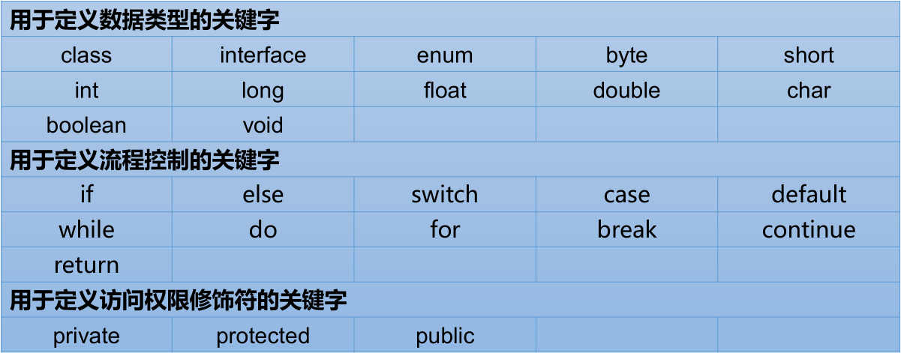


### 保留字（reserved word）

现有 Java 版本尚未使用，但以后版本可能会作为关键字使用。自己命名标识符时要避免使用这些保留字：`goto` 、`const`。

## 标识符

Java 对各种变量、方法和类等要素命名时使用的字符序列称为`标识符`。

- 技巧：凡是自己可以起名字的地方都叫标识符。

定义合法标识符规则：

- 由 26 个英文字母大小写，数字 0 - 9，_ 或 $ 组成。

- 不可以数字开头。

- 不可以使用关键字和保留字，但能包含关键字和保留字。

- Java 中严格区分大小写，长度无限制。

- 标识符不能包含空格。

- 如果不遵守以上规则，编译不通过。

名称命名规范：

- 包名：多单词组成时所有字母都小写，如 xxxyyyzzz。
- 类名、接口名：多单词组成时，所有单词的首字母大写，如 XxxYyyZzz。
- 变量名、方法名：多单词组成时，第一个单词首字母小写，第二个单词开始每个单词首字母大写：xxxYyyZzz。
- 常量名：所有字母都大写。多单词时每个单词用下划线连接：XXX_YYY_ZZZ。

- 在命名时，为了提高阅读性，要尽量有意义，做到见名知意。

- Java 采用 Unicode 字符集，因此标识符也可以使用汉字声明，但是不建议使用。 

## 变量

### 定义

变量是内存中的一个存储区域，该区域的数据可以在同一类型范围内不断变化。

```java
public class VariableTest{
    public static void main(String[] args){
        // 变量的定义
        int myAge = 12;
        // 变量的使用
        System.out.println(myAge);
        
        // 编译错误: 使用myNumber之前未定义myNumber
        // System.out.println(myNumber);
        
        // 变量的定义
        int myNumber;
        
        // 编译错误: 使用myNumber之前未赋值myNumber
        // System.out.println(myNumber);
        
        // 变量的赋值
        myNumber = 1001;
        
        // 变量的使用
        System.out.println(myNumber);
    }
}
```

- 变量是程序中最基本的存储单元，包含变量类型、变量名和存储的值。
- Java 中每个变量必须先声明，后使用，使用变量名来访问这块区域的数据。
- 变量的作用域：其定义所在的一对`{}`内，变量只有在其作用域内才有效，在同一个作用域内，不能定义重名的变量。

### 按数据类型分类

Java 是`强类型语言`，对于每一种数据都定义了明确的具体数据类型，并在内存中分配了不同大小的内存空间。


#### 基本数据类型

| 类型    | 占有存储空间                       |
| ------- | ---------------------------------- |
| byte    | 1 字节，8 位                       |
| short   | 2 字节，16 位                      |
| int     | 4 字节，32 位                      |
| long    | 8 字节，64 位                      |
| float   | 4 字节，32 位                      |
| double  | 8 字节，64 位                      |
| char    | 2 字节，16 位                      |
| boolean | 未明确指定，取决于虚拟机的实现方式 |

##### 整数类型


- Java 各整数类型有固定的表数范围和字段长度，不受具体 OS 的影响，以保证 Java 程序的可移植性。


- `Java 的整型常量默认为 int 型`，声明 long 型常量须后加 'l' 或 'L'。Java 程序中整形变量通常声明为 int 型，除非不足以表示较大的数，才使用 long。

##### 浮点类型

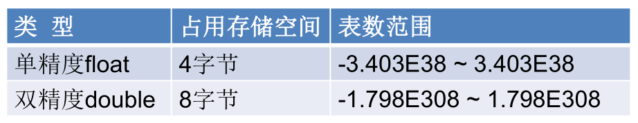

- 与整数类型类似，Java 浮点类型也有固定的表数范围和字段长度，不受具体操作系统的影响。

- float：单精度，尾数可以精确到 7 位有效数字。很多情况下，精度很难满足需求。

- double：双精度，精度是 float 的两倍。通常采用此类型。

- `Java 的浮点型常量默认为 double 型`，声明 float 型常量，须后加 'f' 或 'F'。

##### 字符类型

char 型数据用来表示通常意义上的 "字符"，**占用 2 个字节**。char 类型是可以进行运算的，因为它都对应有 Unicode 码。

Java 中的所有字符都使用 Unicode 编码，故一个字符可以存储一个字母，一个汉字，或其他书面语的一个字符。

字符型变量的三种表现形式：

- 字符常量是用单引号括起来的单个字符。例如：`char c1 = 'a'; char c2= '中'; char c3 = '9';`。

- Java 中还允许使用转义字符`\`来将其后的字符转变为特殊字符型常量。例如：`char c3 = '\n'; // '\n'表示换行符`。常用的转义字符如下：


- 直接使用 Unicode 值来表示字符型常量：'\uXXXX'。其中，XXXX 代表一个十六进制整数。如：\u000a 表示 \n。

##### 布尔类型

boolean 类型用来判断逻辑条件，一般用于程序流程控制。

**boolean 类型数据只允许取值 true 和 false，无 null。**

> Java 虚拟机中没有任何供 boolean 值专用的字节码指令，Java 语言表达所操作的 boolean 值，在编译之后都使用 Java 虚拟机中的 int 数据类型来代替：true 用 1 表示，false 用 0 表示。———《Java 虚拟机规范 8 版》
>
> Java 规范中，没有明确指出 boolean 的大小。在《Java 虚拟机规范》给出了单个 boolean 占 4 个字节，和 boolean 数组 1 个字节的定义，具体还要看虚拟机实现是否按照规范来，所以 1 个字节、4 个字节都是有可能的，具体参考 https://cloud.tencent.com/developer/article/1552613。

##### 基本数据类型之间的转换

`自动类型转换`：不同数据类型的变量做运算时，容量小的数据类型自动转换为容量大的数据类型。数据类型按容量大小排序为：

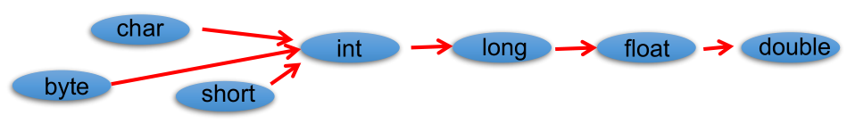

- 此处的容量大小，指的是该数据类型表示数的范围的大和小。

- 有多种类型的数据混合运算时，系统首先自动将所有数据转换成容量最大的那种数据类型，然后再进行计算。

- byte，short 和 char 之间不会相互转换，他们三者在计算时首先转换为 int 类型。

- boolean 类型不能与其它数据类型运算。

- 当把任何基本数据类型的值和字符串（String）进行连接运算时（+），基本数据类型的值将自动转化为字符串（String）类型。

`强制类型转换`：自动类型转换的逆过程，将容量大的数据类型转换为容量小的数据类型。使用时要加上强制转换符`()`，但可能造成精度降低或溢出。

- 通常，字符串不能直接转换为基本类型，但通过基本类型对应的包装类，可以实现把字符串转换成基本类型。如：`String a = "43"; int i = Integer.parseInt(a);`。 

- boolean 类型不可以转换为其它的数据类型。

#### 引用数据类型

##### String

String 不是基本数据类型，属于引用数据类型（class）。使用方式与基本数据类型一致，例如：`String str = "abcd";`。

一个字符串可以串接另一个字符串，也可以直接串接其他类型的数据。例如：`str = str + "xyz"; int n = 100; str = str + n;`。

> String 与 8 种基本数据类型做运算时，只能是连接运算。

### 按声明位置分类

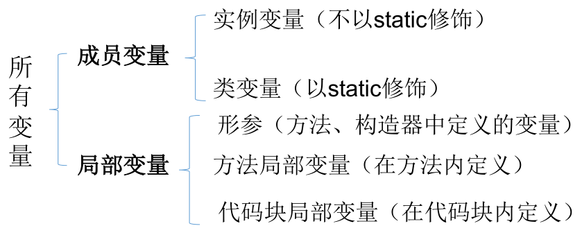

- `成员变量`：在方法体外部，类体内部声明的变量。

- `局部变量`：在方法体内部声明的变量。
- 成员变量和局部变量在初始化值方面的异同：
  - 相同点：都有生命周期。
  - 不同点：局部变量除形参外，需显式初始化。

## 进制

对于整数，有四种表示方式：

- `二进制 (binary)`：0 - 1，满 2 进 1，以 0b 或 0B 开头表示。

- `十进制 (decimal)`：0 - 9，满 10 进 1。

- `八进制 (octal)`：0 - 7，满 8 进 1，以数字 0 开头表示。

- `十六进制 (hex)`：0 - 9 及 A - F，满 16 进 1，以 0x 或 0X 开头表示。此处的 A - F 不区分大小写。如：0x21AF + 1 = 0X21B0。


> 在计算机底层，所有数字都以`二进制`形式存在。

### 二进制

Java 整数常量默认是 int 类型，当用二进制定义整数时，其`第 32 位是符号位`；当是 long 类型时，二进制默认占 64 位，其`第 64 位是符号位`。

二进制的整数有如下三种形式：

- `原码`：直接将一个数值换成二进制数，最高位是符号位。
- 负数的`反码`：是对原码按位取反，但最高位（符号位）不变，确定为 1。
- 负数的`补码`：其反码加 1。


>正数的原码、反码、补码都相同。

**计算机以`二进制补码`的形式保存所有的整数。**

原码到补码的转换：


### 不同进制间转换

十进制转二进制：除 2 取余的逆。   


二进制和八进制、十六进制转换：


## 运算符

`运算符`是一种特殊的符号，用以表示数据的运算、赋值和比较等。

### 算术运算符

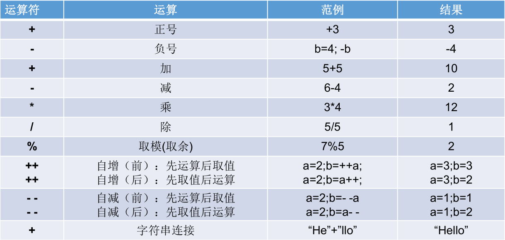

- 如果对负数取模，可以把模数负号忽略不记，如：5 % -2 = 1。 如果被模数是负数，则不可忽略，如：-5 % 2 = -1。此外，取模运算的结果不一定总是整数。

- 对于除号 "/"，它的整数除和小数除是有区别的：整数之间做除法时，只保留整数部分而舍弃小数部分。 例如：`int x = 3510; x = x / 1000 * 1000;`，x 的结果是 3000。

- "+" 除字符串相加功能外，还能把非字符串转换成字符串。例如：`System.out.println("5 + 5 = " + 5 + 5); `，打印结果是：5 + 5 = 55 。

### 赋值运算符

符号：=。当 "=" 两侧数据类型不一致时，可以使用自动类型转换或使用强制类型转换原则进行处理。支持连续赋值。

扩展赋值运算符： +=，-=，*=，/=，%=。这几个赋值运算符不会改变变量本身的数据类型。

```java
int i = 1;
i *= 0.1;
System.out.println(i);// 0
i++;
System.out.println(i);// 1
```

```java
int m = 2;
int n = 3;
n *= m++;// n = n * m++;
System.out.println("m = " + m);// 3
System.out.println("n = " + n);// 6
```

```java
int n = 10;
n += (n++) + (++n);// n = n + (n++) + (++n); → n = 10 + 10 + 12;
System.out.println(n);// 32
```

### 比较运算符/关系运算符


- 比较运算符的结果都是 boolean 型。

### 逻辑运算符

&：逻辑与，|：逻辑或，!：逻辑非。
&&：短路与，||：短路或，^：逻辑异或。


- 逻辑运算符用于连接布尔型表达式，在 Java 中不可以写成 3 < x < 6，应该写成 x > 3 & x < 6。

- **"&" 和 "&&" 的区别：& 表示，左边无论真假，右边都进行运算；&& 表示，如果左边为真，右边参与运算，如果左边为假，右边不参与运算。**

- **"|" 和 "||" 的区别同理：| 表示，左边无论真假，右边都进行运算；|| 表示，如果左边为假，右边参与运算，如果左边为真，右边不参与运算。**

- 异或（^）与或（|）的不同之处是：当左右都为 true 时，结果为 false。即：异或，追求的是异!

```java
int x = 1;
int y = 1;
if (x++ == 2 & ++y == 2) {
    x = 7;
}
System.out.println("x = " + x + ", y = " + y);// x = 2, y = 2

x = 1;
y = 1;
if (x++ == 2 && ++y == 2) {
    x = 7;
}
System.out.println("x = " + x + ", y = " + y);// x = 2, y = 1

x = 1;
y = 1;
if (x++ == 1 | ++y == 1) {
    x = 7;
}
System.out.println("x = " + x + ", y = " + y);// x = 7, y = 2

x = 1;
y = 1;
if (x++ == 1 || ++y == 1) {
    x = 7;
}
System.out.println("x = " + x + ", y = " + y);// x = 7, y = 1
```

```java
boolean x = true;
boolean y = false;
short z = 42;
if ((z++ == 42) && (y = true)) {
    z++;
}
if ((x = false) || (++z == 45)) {
    z++;
}
System.out.println("z = " + z);// z = 46
```

### 位运算符


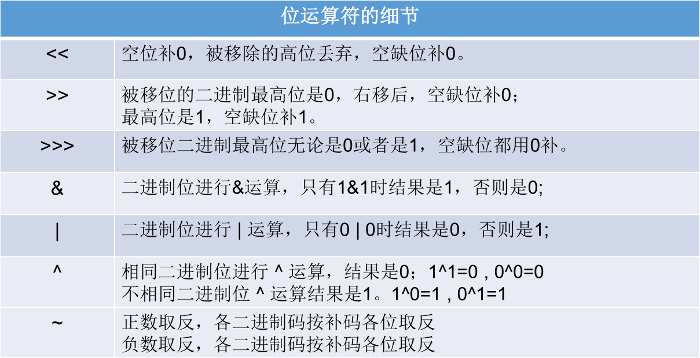

- 无 <<< 运算符。

- **位运算是直接对整数的二进制进行的运算。**

  

  

  

- << ：在一定范围内，每向左移一位，相当于乘以 2。

- \>>：在一定范围内，每向右移一位，相当于除以2。

- 面试题：最高效的计算 2 * 8。利用：2 << 3，或者 8 << 1。

交换两个数：

```java
int num1 = 10;
int num2 = 20;
System.out.println(num1 + ", " + num2);

// 方式一
int temp;
temp = num1;
num1 = num2;
num2 = temp;
System.out.println(num1 + ", " + num2);

// 方式二
num1 = 10;
num2 = 20;
num1 = num1 + num2;
num2 = num1 - num2;
num1 = num1 - num2;
System.out.println(num1 + ", " + num2);

// 方式三
num1 = 10;
num2 = 20;
num1 = num1 ^ num2;
num2 = num1 ^ num2;
num1 = num1 ^ num2;
System.out.println(num1 + ", " + num2);

// 方式四
num1 = 10;
num2 = 20;
num1 = num1 << 1;// 10 乘 2
num2 = num2 >> 1;// 20 除 2
System.out.println(num1 + ", " + num2);
```

### 三元运算符

格式：


- **表达式 1 和表达式 2 要求类型是一致的，因为要与接受的参数类型相同。**

凡是可以使用三元运算符的地方，都可以改写为 if-else 结构，反之，不成立。如果既可以使用三元运算符，又可以使用 if-else 结构，优先使用三元运算符，因为更简洁、效率更高。

三元运算符与 if-else 的联系与区别：

- 三元运算符可简化 if-else 语句。
- 三元运算符要求必须返回一个结果。
- if 后的代码块可有多个语句。

### 运算符的优先级

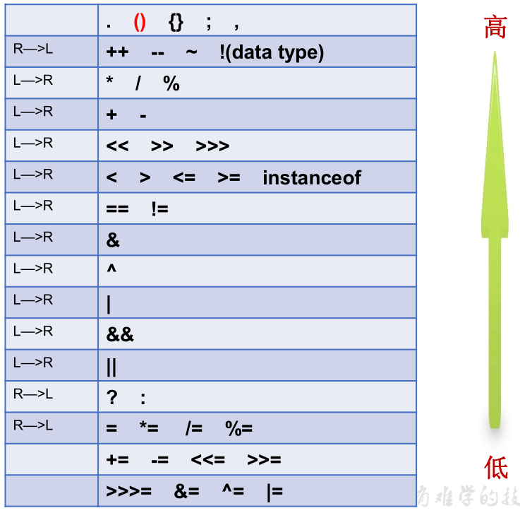

- 运算符有不同的优先级，所谓优先级就是表达式运算中的运算顺序。如上表，上一行运算符总优先于下一行。
- 只有单目运算符、三元运算符、赋值运算符是从右向左运算的。

## 程序流程控制

流程控制语句是用来控制程序中各语句执行顺序的语句，可以把语句组合成能完成一定功能的小逻辑模块。

流程控制方式采用结构化程序设计中规定的三种基本流程结构，即：

- `顺序结构`：程序从上到下逐行地执行，中间没有任何判断和跳转。
- `分支结构`：根据条件，选择性地执行某段代码。有`if-else`和`switch-case`两种分支语句。
- `循环结构`：根据循环条件，重复性的执行某段代码。有`while`、`do-while`、`for`三种循环语句。


> 注：JDK 1.5 提供了 foreach 循环，方便遍历集合、数组元素。

### if-else 结构


### switch-case 结构


- switch（表达式）中表达式的值，必须是下述几种类型之一：**byte，short，char，int，枚举类（JDK 5.0），String 类（JDK 7.0）。**
- case 子句中的值**必须是常量**，不能是变量名或不确定的表达式值。
- 同一个 switch 语句，所有 case 子句中的常量值互不相同。
- break 语句用来在执行完一个 case 分支后使程序跳出 switch 语句块；如果没有 break，程序会顺序执行到 switch 结尾。
- default 子句是可任选的。同时，位置也是灵活的。当没有匹配的 case 时，执行 default。
- 如果多个 case 的执行语句相同，则可以将其合并。
- 同等情况下，switch-case 结构比 if-else 结构的效率稍高。

```java
Scanner scanner = new Scanner(System.in);
int num = scanner.nextInt();
switch (num) {
    case 0:
        System.out.println(0);
    case 1:
        System.out.println(1);
    case 2:
        System.out.println(2);
    default:
        System.out.println("other");
}
```

添加 break 和不添加 break 的结果是不同的。

```java
Scanner scanner = new Scanner(System.in);
int num = scanner.nextInt();
switch (num) {
    case 0:
        System.out.println(0);
        break;
    case 1:
        System.out.println(1);
        break;
    case 2:
        System.out.println(2);
        break;
    default:
        System.out.println("other");
        break;// default位于最后, 此break可以不添加
}
```

键盘输入一个月份和天数，判断其是一年中的第几天：

```java
public static void main(String[] args) {
    Scanner scanner = new Scanner(System.in);
    System.out.println("请输入month：");
    int month = scanner.nextInt();
    System.out.println("请输入day：");
    int day = scanner.nextInt();
    int sumDays = 0;

    switch (month) {
        case 12:
            sumDays += 30;
        case 11:
            sumDays += 31;
        case 10:
            sumDays += 30;
        case 9:
            sumDays += 31;
        case 8:
            sumDays += 31;
        case 7:
            sumDays += 30;
        case 6:
            sumDays += 31;
        case 5:
            sumDays += 30;
        case 4:
            sumDays += 31;
        case 3:
            sumDays += 28;
        case 2:
            sumDays += 31;
        case 1:
            sumDays += day;
    }

    System.out.println(month + "月" + day + "日，是当年的第" + sumDays + "天。");
}
```

键盘输入一个年份、月份和天数，判断其是该年中的第几天：

```java
public static void main(String[] args) {
    Scanner scanner = new Scanner(System.in);
    System.out.println("请输入year：");
    int year = scanner.nextInt();
    System.out.println("请输入month：");
    int month = scanner.nextInt();
    System.out.println("请输入day：");
    int day = scanner.nextInt();
    int sumDays = 0;

    switch (month) {
        case 12:
            sumDays += 30;
        case 11:
            sumDays += 31;
        case 10:
            sumDays += 30;
        case 9:
            sumDays += 31;
        case 8:
            sumDays += 31;
        case 7:
            sumDays += 30;
        case 6:
            sumDays += 31;
        case 5:
            sumDays += 30;
        case 4:
            sumDays += 31;
        case 3:
            if ((year % 4 == 0 && year % 100 != 0) ||
                    year % 400 == 0) {
                sumDays += 29;// 闰年2月29天
            } else {
                sumDays += 28;// 平年2月28天
            }
        case 2:
            sumDays += 31;
        case 1:
            sumDays += day;
    }

    System.out.println(year + "年" + month + "月" + day + "日，是当年的第" + sumDays + "天。");
}
```

> 判断一年是否是闰年的标准：
>
> 1）可以被 4 整除，但不可被 100 整除。
>
> 或
>
> 2）可以被 400 整除。

### for 循环

语法格式：


执行过程：① - ② - ③ - ④ - ② - ③ - ④ - ② - ③ - ④ - ...... - ②

说明：

- ② 循环条件部分为 boolean 类型表达式，当值为 false 时，退出循环。
- ① 初始化部分可以声明多个变量，但必须是同一个类型，用逗号分隔。
- ④ 迭代部分可以有多个变量更新，用逗号分隔。

键盘输入两个正整数，求他们的最大公约数和最小公倍数：

```java
public static void main(String[] args) {
    Scanner scanner = new Scanner(System.in);
    System.out.println("请输入第一个正整数：");
    int firstNum = scanner.nextInt();
    System.out.println("请输入第二个正整数：");
    int secondNum = scanner.nextInt();
    int min = Math.min(firstNum, secondNum);
    int max = Math.max(firstNum, secondNum);

    // 最大公约数
    for (int i = min; i >= 1; i--) {
        if (firstNum % i == 0 && secondNum % i == 0) {
            System.out.println(firstNum + "和" + secondNum + "的最大公约数为：" + i);
            break;
        }
    }

    // 最小公倍数
    for (int i = max; i <= firstNum * secondNum; i++) {
        if (i % firstNum == 0 && i % secondNum == 0) {
            System.out.println(firstNum + "和" + secondNum + "的最小公倍数为：" + i);
            break;
        }
    }
}

请输入第一个正整数：
12
请输入第二个正整数：
20
12和20的最大公约数为：4
12和20的最小公倍数为：60
```

### while 循环

语法格式：


执行过程：① - ② - ③ - ④ - ② - ③ - ④ - ② - ③ - ④ - ...... - ②

说明：

- 注意不要忘记声明 ④ 迭代部分。否则，循环将不能结束，变成死循环。
- for 循环和 while 循环可以相互转换。

### do-while 循环

语法格式：

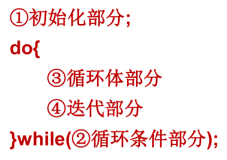

执行过程：① - **③ - ④** - ② - ③ - ④ - ② - ③ - ④ - ② - ③ - ④ - ...... - ②

说明：

- do-while 循环至少执行一次循环体 。

### 嵌套循环

将一个循环放在另一个循环体内，就形成了嵌套循环。其中，for，while，do-while 均可以作为外层循环或内层循环。

实质上，嵌套循环就是把内层循环当成外层循环的循环体。当只有内层循环的循环条件为 false 时，才会完全跳出内层循环，才可结束外层的当次循环，开始下一次的循环。

假设外层循环次数为 m 次，内层为 n 次，则内层循环体实际上需要执行 m * n 次。

九九乘法表：

```java
public static void main(String[] args) {
    for (int i = 1; i <= 9; i++) {
        for (int j = 1; j <= i; j++) {
            System.out.print(j + " * " + i + " = " + (j * i) + "\t");
        }
        System.out.println();
    }
}

1 * 1 = 1	
1 * 2 = 2	2 * 2 = 4	
1 * 3 = 3	2 * 3 = 6	3 * 3 = 9	
1 * 4 = 4	2 * 4 = 8	3 * 4 = 12	4 * 4 = 16	
1 * 5 = 5	2 * 5 = 10	3 * 5 = 15	4 * 5 = 20	5 * 5 = 25	
1 * 6 = 6	2 * 6 = 12	3 * 6 = 18	4 * 6 = 24	5 * 6 = 30	6 * 6 = 36	
1 * 7 = 7	2 * 7 = 14	3 * 7 = 21	4 * 7 = 28	5 * 7 = 35	6 * 7 = 42	7 * 7 = 49	
1 * 8 = 8	2 * 8 = 16	3 * 8 = 24	4 * 8 = 32	5 * 8 = 40	6 * 8 = 48	7 * 8 = 56	8 * 8 = 64	
1 * 9 = 9	2 * 9 = 18	3 * 9 = 27	4 * 9 = 36	5 * 9 = 45	6 * 9 = 54	7 * 9 = 63	8 * 9 = 72	9 * 9 = 81	
```

10000 以内所有的质数：

```java
// 方式一
public static void main(String[] args) {
    // 质数: 素数, 只能被1和它本身整除的自然数, 2是最小的质数
    int count = 0;
    boolean ifFlag = true;
    for (int i = 2; i <= 100000; i++) {
        // 优化一: 使用Math.sqrt(i)代替i, 减少循环的次数
        // i除以一个从2开始的小数, 会得到一个从i-1开始的大数, 因此, 除以2开始的小数与除以从i-1开始的大数, 
        // 可以省略一个, 以减少次数, 这样计算的中点是i开方的值
        for (int j = 2; j <= Math.sqrt(i); j++) {
            if (i % j == 0) {
                ifFlag = false;
                // 优化二: 使用break, 跳出不必要的循环
                break;
            }
        }
        if (ifFlag) {
            // 优化三: 不打印, i越大, 打印的耗时越长
            // System.out.println("质数：" + i);
            count++;
        }
        // 重置
        ifFlag = true;
    }
    System.out.println("质数的个数有：" + count);// 质数的个数有: 9592
}
```

```java
// 方式二
public static void main(String[] args) {
    // 质数: 素数, 只能被1和它本身整除的自然数, 2是最小的质数
    int count = 0;
    label:
    for (int i = 2; i <= 100000; i++) {
        // 优化一: 使用Math.sqrt(i)代替i, 减少循环的次数
        // i除以一个从2开始的小数, 会得到一个从i-1开始的大数, 因此, 除以2开始的小数与除以从i-1开始的大数, 
        // 可以省略一个, 以减少次数, 这样计算的中点是i开方的值
        for (int j = 2; j <= Math.sqrt(i); j++) {
            if (i % j == 0) {
                continue label;
            }
        }
        count++;
    }
    System.out.println("质数的个数有：" + count);// 质数的个数有: 9592
}
```

### break 和 continue

- break 使用在 switch-case 结构或者循环结构中。

- continue 只能使用在循环结构中。

- **break 语句用于终止某个语句块的执行，跳出当前循环，continue 语句用于跳过其所在循环语句块的当次执行，继续下一次循环。**

  ```java
  public static void main(String[] args) {
      for (int i = 1; i <= 10; i++) {
          if (i % 4 == 0) {
              break;// 输出结果: 1 2 3
              continue;// 输出结果: 1 2 3 5 6 7 9 10
          }
          System.out.print(i + "\t");
      }
  }
  ```

- break 语句出现在多层嵌套的语句块中时，可以通过标签指明要终止的是哪一层语句块（默认跳出包裹 break 最近的一层循环）：


- continue 语句出现在多层嵌套的循环语句体中时，可以通过标签指明要跳过的是哪一层循环（默认跳出包裹 continue 最近的一层循环）。

  ```java
  public static void main(String[] args) {
      label:
      for (int i = 1; i <= 4; i++) {
          for (int j = 1; j <= 10; j++) {
              if (j % 4 == 0) {
                  break label;// 结束指定标识label层的当前循环
                  continue label;// 结束指定标识label层的当次循环
              }
              System.out.print(j);
          }
          System.out.println();
      }
  }
  break label输出结果：
  123
  continue label输出结果：
  123123123123
  ```

- break 和 continue 关键字后面不能直接声明执行语句。

## 面向对象

面向过程（POP）与面向对象（OOP）：

- 二者都是一种思想，面向对象是相对于面向过程而言的。

- 面向过程，强调的是功能行为，以函数为最小单位，考虑怎么做。面向对象，将功能封装进对象，强调具备了功能的对象，以类/对象为最小单位，考虑谁来做。

- 面向对象更加强调运用人类在日常的思维逻辑中采用的思想方法与原则，如抽象、分类、继承、聚合、多态等。

- 例如，人把大象装进冰箱：

  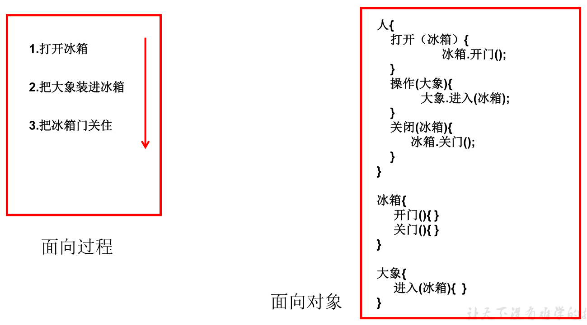

面向对象的思想概述：

1. 程序员从面向过程的执行者转化成了面向对象的指挥者。
2. 面向对象分析方法分析问题的思路和步骤：
   - 根据问题需要，选择问题所针对的现实世界中的实体。
   - 从实体中寻找解决问题相关的属性和功能，这些属性和功能就形成了概念世界中的类。
   - 把抽象的实体用计算机语言进行描述，形成计算机世界中类的定义。即借助某种程序语言，把类构造成计算机能够识别和处理的数据结构。
   - 将类实例化成计算机世界中的对象。对象是计算机世界中解决问题的最终工具。

面向对象的三条主线：

1. Java 类及类的成员：属性、方法、构造器、代码块、内部类。
2. 面向对象的三大特征：封装性、继承性、多态性、（抽象性）。
3. 其他关键字：this、super、static、final、abstract、interface、package、import等。

面向对象的三大特征：

- **`封装 (Encapsulation)`**
- **`继承 (Inheritance)`**
- **`多态 (Polymorphism)`**

### Java 基本元素：类和对象

`类 (Class)`和`对象 (Object)`是面向对象的核心概念。

- 类是对一类事物的描述，是抽象的、概念上的定义。

- 对象是实际存在的该类事物的每个个体，因而也称为`实例 (instance)`。

常见的类的成员有：

- `属性`：对应类中的成员变量。

- `方法`：对应类中的成员方法。


类的成员构成 version 1.0：


类的成员构成 version 2.0：

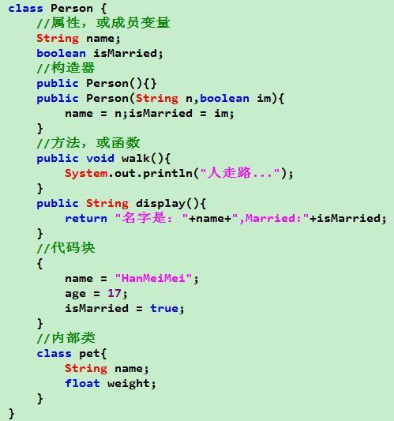

类的语法格式：


创建 Java 自定义类步骤：

1. 定义类：考虑修饰符、类名。
2. 编写类的属性：考虑修饰符、属性类型、属性名、初始化值。
3. 编写类的方法：考虑修饰符、返回值类型、方法名、形参等。

类的访问机制：

- 在一个类中的访问机制：类中的方法可以直接访问类中的成员变量。例外：static 方法访问非 static 属性，编译不通过。

- 在不同类中的访问机制： 先创建要访问类的对象， 再用对象访问类中定义的成员。

对象的创建和使用：


- 创建对象语法：

  

- 使用`对象名.对象成员`的方式访问对象成员，包括属性和方法。


- 如果创建了一个类的多个对象，则每个对象都独立的拥有一套类的属性（非 static 的），即：修改一个对象的属性 a，不影响另外一个对象属性 a 的值。

对象的产生：


对象的使用：


对象的生命周期：


对象的内存解析：


例如，下面一段代码的内存图如下：


匿名对象：

- `不定义对象的句柄，而直接调用这个对象的方法，这样的对象叫做匿名对象。`如：`new Person().shout();`。

- 使用情况：如果对一个对象只需要进行一次方法调用，那么就可以使用匿名对象。我们经常将匿名对象作为实参传递给一个方法调用。

```java
/**
 * 二、创建类的对象 = 类的实例化
 */
public class PersonTest {
    public static void main(String[] args) {
        // 1 创建Person类的对象
        Person person = new Person();

        // 2 调用对象的结构: 属性和方法
        // 2-1 调用属性: "对象.属性"
        person.name = "Tom";
        person.isMale = true;
        System.out.println("年龄：" + person.age);// 1
        // 2-2 调用方法: "对象.方法"
        person.eat();// 人可以吃饭
        person.sleep();// 人可以睡觉
        person.talk("Chinese");// 人可以说话, 语言是: Chinese

        // 3 创建一个新的Person类的对象
        Person person2 = new Person();
        System.out.println(person2.name);// null, 非Tom

        // 4 将person变量保存的地址值赋值给person3, 此时, 二者指向堆空间中的同一个对象实体
        // 修改person和person3, 效果相同
        Person person3 = person;
        System.out.println(person3.name);// Tom
        person3.age = 10;
        System.out.println(person.age);// 10
    }
}

/**
 * 一、类的设计，其实就是类的成员的设计：
 * 属性 = 成员变量 = Field = 域、字段
 * 方法 = 成员方法 = 函数 = Method
 */
class Person {
    // 属性
    String name;
    int age = 1;
    boolean isMale;

    // 方法
    public void eat() {
        System.out.println("人可以吃饭");
    }

    public void sleep() {
        System.out.println("人可以睡觉");
    }

    public void talk(String language) {
        System.out.println("人可以说话，语言是：" + language);
    }
}
```

### 类的成员之一：属性（field）

语法格式：


- 常用的权限修饰符有：`private`、`缺省`、`protected`、`public`。其他修饰符：`static`、`final`。

- 数据类型：任何基本数据类型（如 int、boolean 等）或任何引用数据类型。

- 属性名：属于标识符，符合命名规则和规范即可。

属性（成员变量）与局部变量的区别：


- **成员变量的默认初始化值：**当一个对象被创建时，会对其中各种类型的成员变量自动进行初始化赋值。除了基本数据类型之外的变量类型都是引用类型。

  

- **局部变量的默认初始化值：**局部变量声明后，没有默认初始化值，必须显式赋值，方可使用。特别的，形参在调用时，赋值即可。

- 成员变量 vs 局部变量的内存位置：

  

属性赋值的方式和先后顺序：

- 赋值的方式：

  - ① `默认初始化`
  - ② `显示初始化`
  - ③ `构造器中初始化`
  - ④ `通过 "对象.属性" 或 "对象.方法" 的方式赋值`
  - ⑤ `在代码块中初始化`

- 赋值的先后顺序：**① - ② / ⑤ - ③ - ④**

- ② 和 ⑤，谁定义在前，谁先赋值：

  ```java
  public class Test {
      public static void main(String[] args) {
          Order order = new Order();
          System.out.println(order.orderId);// 4
      }
  }
  
  class Order {
      // 显示初始化在前
      int orderId = 3;
  
      // 代码块中初始化在后
      {
          orderId = 4;
      }
  }
  ```

  ```java
  public class Test {
      public static void main(String[] args) {
          Order order = new Order();
          System.out.println(order.orderId);// 3
      }
  }
  
  class Order {
      // 代码块中初始化在前
      {
          orderId = 4;
      }
  
      // 显示初始化在后
      int orderId = 3;
  }
  ```

- 程序中成员变量赋值的执行顺序：

  

### 类的成员之二：方法（method）

什么是方法（method 、函数）：

- 方法是类或对象行为特征的抽象，用来完成某个功能操作。在某些语言中也称为函数或过程。
- 将功能封装为方法的目的是，可以实现代码重用，简化代码。
- Java 里的方法不能独立存在，所有的方法必须定义在类里。

声明格式：


- 权限修饰符：public，缺省，private，protected 等。

- 返回值类型：
  - 没有返回值：使用 void。
  - 有返回值：在方法声明时，必须指定返回值的类型，同时，方法体中需要使用 return 关键字返回指定类型的变量或常量。

- 方法名 ：属于标识符，命名时遵循标识符命名规则和规范，能够见名知意。

- 形参列表：可以包含零个，一个或多个参数。多个参数时，中间用 "," 隔开。
- 方法体程序代码：方法功能的具体实现。

- 返回值：方法在执行完毕后返还给调用它的程序的数据。

方法的分类：按照是否有形参及返回值。


方法的调用：

- 方法通过方法名被调用，且只有被调用才会执行。

- 方法调用的过程：

  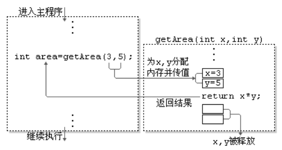

- 方法被调用一次，就会执行一次。

- 没有具体返回值的情况，返回值类型用关键字 void 表示，此时方法体中可以不必使用 return 语句。如果使用，表示用来结束方法。

- 定义方法时，方法的结果应该返回给调用者，交由调用者处理。

- 方法中可以调用当前类的属性或方法，不可以在方法内部定义方法。

### 方法的重载（overload）

概念：在同一个类中，允许存在一个以上的同名方法，只要它们的参数个数或者参数类型不同即可。

特点：与方法的权限修饰符、返回值类型、形参变量名、方法体都无关，只看`参数列表`，且参数列表（参数个数、参数类型或参数顺序）必须不同。调用时，根据方法参数列表的不同来区别。

- 如果方法一不存在，main 方法依然正常执行，此时涉及到的是自动类型转换：

  ```java
  // 方法一
  public static int getSum(int m, int n) {
      return m + n;
  }
  
  // 方法二
  public static double getSum(double m, double n) {
      return m + n;
  }
  
  public static void main(String[] args) {
      System.out.println(getSum(1, 2));
  }
  ```

### 可变个数的形参

JavaSE 5.0 中提供了`Varargs (variable number of arguments) 机制`，允许直接定义能和多个实参相匹配的形参。从而，可以用一种更简单的方式，来传递个数可变的实参。


声明格式：`方法名(参数的类型名... 参数名)`

可变参数：方法参数部分指定类型的参数个数是可变多个 ---> 0 个，1 个或多个。

`可变个数形参的方法与同名的方法之间，彼此构成重载。`

- 可变参数方法的使用与方法参数部分使用数组是一致的，二者不共存。如下所示，方法二与方法三是相同的，不共存：

  ```java
  // 方法二
  public static void show(int... m) {
      // m参数等同于数组, 与数组的使用方法相同
      System.out.println(Arrays.toString(m));
  }
  
  // 方法三
  public static void show(int[] m) {
      System.out.println(m);
  }
  ```

- 方法的参数部分有可变形参，需要放在形参声明的最后。

  ```java
  // 合法
  public static void show(String str, int... m) {
      System.out.println(Arrays.toString(m));
  }
  
  // 不合法
  public static void show(int... m, String str) {
      System.out.println(Arrays.toString(m));
  }
  ```

- 在一个方法的形参位置，最多只能声明一个可变个数形参。

### 方法参数的值传递机制

方法，必须由其所在类或对象调用才有意义。若方法含有参数：

- `形参`：方法声明时的参数。

- `实参`：方法调用时实际传给形参的数据。

Java 的实参值如何传入方法呢？Java 里方法的参数传递方式只有一种：`值传递`， 即将实际参数值的副本（复制品）传入方法内，而参数本身不受影响。

- **形参是基本数据类型：将实参基本数据类型变量的`"数据值"`传递给形参。**
- **形参是引用数据类型：将实参引用数据类型变量的`"地址值"`传递给形参。**

形参是基本数据类型与引用数据类型之间的区别：

  ```java
public class ValueTransferTest {
    public static void main(String[] args) {
        System.out.println("***************基本数据类型***************");
        int m = 10;
        int n = m;
        System.out.println("m = " + m + ", n = " + n);
        n = 20;
        System.out.println("m = " + m + ", n = " + n);

        System.out.println("***************引用数据类型***************");
        Order o1 = new Order();
        o1.orderId = 1001;
        Order o2 = o1;// 赋值后, o1和o2的地址值相同, 都指向了堆空间中的同一个实体
        System.out.println("o1.orderId = " + o1.orderId + ", o2.orderId = " + o2.orderId);
        o2.orderId = 1002;
        System.out.println("o1.orderId = " + o1.orderId + ", o2.orderId = " + o2.orderId);
    }
}

class Order {
    int orderId;
}
输出结果：
***************基本数据类型***************
m = 10, n = 10
m = 10, n = 20
***************引用数据类型***************
o1.orderId = 1001, o2.orderId = 1001
o1.orderId = 1002, o2.orderId = 1002
  ```

对于基本数据类型，两个不同方法内的局部变量，互不影响，不因变量名相同而改变，因为是将实参基本数据类型变量的 "数据值" 传递给形参：

  ```java
public class ValueTransferTest {
    public void swap(int m, int n) {
        System.out.println("swap方法中, 交换之前: m = " + m + ", n = " + n);
        int temp = m;
        m = n;
        n = temp;
        System.out.println("swap方法中, 交换之后: m = " + m + ", n = " + n);
    }

    public static void main(String[] args) {
        int m = 10;
        int n = 20;
        System.out.println("main方法中, 交换之前: m = " + m + ", n = " + n);

        // 能够交换m和n的值
        int temp = m;
        m = n;
        n = temp;
        System.out.println("main方法中, 交换之后: m = " + m + ", n = " + n);

        // 不能够交换m和n的值
        ValueTransferTest valueTransferTest = new ValueTransferTest();
        System.out.println("main方法中, 调用swap方法之前: m = " + m + ", n = " + n);
        valueTransferTest.swap(m, n);// // swap方法调用完成后, 该方法内的局部变量temp, 形参m和n从栈内存中弹出回收
        System.out.println("main方法中, 调用swap方法之后: m = " + m + ", n = " + n);
    }
}
输出结果：
main方法中, 交换之前: m = 10, n = 20
main方法中, 交换之后: m = 20, n = 10
main方法中, 调用swap方法之前: m = 20, n = 10
swap方法中, 交换之前: m = 20, n = 10
swap方法中, 交换之后: m = 10, n = 20
main方法中, 调用swap方法之后: m = 20, n = 10
  ```

- 内存解析图参考：

  

对于引用数据类型，两个不同方法的局部变量，会互相影响，因为是将实参引用数据类型变量的 "地址值" 传递给形参，二者指向的是堆内存中的同一个对象：

```java
public class ValueTransferTest {
    public void swap(Data data) {
        System.out.println("swap方法中, 交换之前: data.m = " + data.m + ", data.n = " + data.n);
        int temp = data.m;
        data.m = data.n;
        data.n = temp;
        System.out.println("swap方法中, 交换之后: data.m = " + data.m + ", data.n = " + data.n);
    }

    public static void main(String[] args) {
        Data data = new Data();
        data.m = 10;
        data.n = 20;
        System.out.println("main方法中, 交换之前: data.m = " + data.m + ", data.n = " + data.n);

        // 能够交换m和n的值
        int temp = data.m;
        data.m = data.n;
        data.n = temp;
        System.out.println("main方法中, 交换之后: data.m = " + data.m + ", data.n = " + data.n);

        // 能够交换m和n的值
        ValueTransferTest valueTransferTest = new ValueTransferTest();
        System.out.println("main方法中, 调用swap方法之前: data.m = " + data.m + ", data. = " + data.n);
        valueTransferTest.swap(data);// swap方法调用完成后, 该方法内的局部变量temp和形参data从栈内存中弹出回收
        System.out.println("main方法中, 调用swap方法之后: data.m = " + data.m + ", data.n = " + data.n);
    }
}

class Data {
    int m;
    int n;java
}
输出结果：
main方法中, 交换之前: data.m = 10, data.n = 20
main方法中, 交换之后: data.m = 20, data.n = 10
main方法中, 调用swap方法之前: data.m = 20, data. = 10
swap方法中, 交换之前: data.m = 20, data.n = 10
swap方法中, 交换之后: data.m = 10, data.n = 20
main方法中, 调用swap方法之后: data.m = 10, data.n = 20
```

- 内存解析图参考：

  

实例一：

```java
public class ValueTransferTest {
    public void first() {
        int i = 5;
        Value v = new Value();
        v.i = 25;
        second(v, i);
        System.out.println(v.i);// 20
    }

    public void second(Value v, int i) {
        i = 0;
        v.i = 20;
        Value val = new Value();
        v = val;
        System.out.println(v.i + " " + i);// 15 0
    }

    public static void main(String[] args) {
        ValueTransferTest test = new ValueTransferTest();
        test.first();
    }
}

class Value {
    int i = 15;
}
```


实例二：


- 方法一：

  ```java
  public class Test {
      public static void method(int a, int b) {
          System.out.println("a = " + a * 10);
          System.out.println("b = " + b * 20);
          System.exit(0);
      }
  
      public static void main(String[] args) {
          int a = 10;
          int b = 10;
          method(a, b);
          System.out.println("a = " + a);
          System.out.println("b = " + b);
      }
  }
  ```

- 方法二：重写 PrintStream 的 println 方法。

  ```java
  public class Test {
      public static void method(int a, int b) {
          PrintStream printStream = new PrintStream(System.out) {
              @Override
              public void println(String x) {
                  if ("a = 10".equals(x)) {
                      x = "a = 100";
                  } else if ("b = 10".equals(x)) {
                      x = "b = 200";
                  }
                  super.println(x);
              }
          };
          System.setOut(printStream);
      }
  
      public static void main(String[] args) {
          int a = 10;
          int b = 10;
          method(a, b);
          System.out.println("a = " + a);
          System.out.println("b = " + b);
      }
  }
  ```

实例三：定义一个 int 型的数组`int[] arr = new int[]{12,3,3,34,56,77,432};`，让数组的每个位置上的值去除以首位置的元素，得到的结果，作为该位置上的新值，然后遍历新的数组。

```java
public class Test {
    public static void main(String[] args) {
        int[] arr = new int[]{12, 3, 3, 34, 56, 77, 432};
        System.out.println("计算前: " + Arrays.toString(arr));
        
        // 正确写法一
        int temp = arr[0];
        for (int i = 0; i < arr.length; i++) {
            arr[i] = arr[i] / temp;
        }
        
        // 正确写法二
        for (int i = arr.length - 1; i >= 0; i--) {
            arr[i] = arr[i] / arr[0];
        }
        
        // 错误写法, 因为第一次循环之后, 首位置上的数已经改变, 不再是最开始的值
        /*for (int i = 0; i < arr.length; i++) {
            arr[i] = arr[i] / arr[0];
        }*/
        
        System.out.println("计算后: " + Arrays.toString(arr));
    }
}
```

实例四：

```java
public class Test {
    public static void main(String[] args) {
        int[] arr = new int[]{1, 2, 3};
        System.out.println(arr);// 地址值

        char[] arr1 = new char[]{'a', 'b', 'c'};
        System.out.println(arr1);// 传入char数组时, println方法体内是遍历这个数组
    }
}
输出结果：
[I@78308db1
abc
```

### 递归方法（recursion）

定义：一个方法体内调用它自身。方法递归包含了一种隐式的循环，它会重复执行某段代码，但这种重复执行无须循环控制。递归一定要向已知方向递归，否则这种递归就变成了无穷递归，类似于死循环。

实例一：

```java
public class PassObject {
    // 1-n之间所有自然数的和
    public static int getSum(int n) {
        if (n == 1) {
            return 1;
        } else {
            return n + getSum(n - 1);
        }
    }

    // 1-n之间所有自然数的乘积
    public static long getProduct(int n) {
        if (n == 1) {
            return 1;
        } else {
            return n * getProduct(n - 1);
        }
    }

    public static void main(String[] args) {
        // 方式一: 循环
        int sum = 0;
        for (int i = 1; i <= 100; i++) {
            sum += i;
        }
        System.out.println("1-100之间自然数的和: " + sum);

        // 方式二: 递归
        System.out.println("1-100之间自然数的和: " + getSum(100));
        System.out.println("1-100之间自然数的积: " + getProduct(5));
    }
}
```

实例二：

```java
/**
 * 已知有一个数列: f(0) = 1, f(1) = 4, f(n+2) = 2 * f(n+1) + f(n), 其中n是大于0的整数, 求f(10)的值
 */
public class PassObject {
    public static int f(int n) {
        if (n == 0) {
            return 1;
        } else if (n == 1) {
            return 4;
        } else {
            return 2 * f(n - 1) + f(n - 2);
        }
    }

    public static void main(String[] args) {
        int f = f(10);
        System.out.println(f);
    }
}
输出结果：
10497
```

实例三：

```java
/**
 * 已知一个数列: f(20) = 1, f(21) = 4, f(n+2) = 2 * f(n+1) + f(n), 其中n是大于0的整数, 求f(10)的值
 */
public class PassObject {
    public static int f(int n) {
        if (n == 20) {
            return 1;
        } else if (n == 21) {
            return 4;
        } else {
            return f(n + 2) - 2 * f(n + 1);
        }
    }

    public static void main(String[] args) {
        int f = f(10);
        System.out.println(f);
    }
}
输出结果：
-3771
```

实例四：

```java
/**
 * 斐波那契数列: 1 1 2 3 5 8 13 21 34 55 ...
 * 规律: 一个数等于前两个数之和
 * 要求: 计算斐波那契数列(Fibonacci)的第n个值, 并将整个数列打印出来
 */
public class PassObject {
    public static int f(int n) {
        if (n <= 0 || n >= 30) {
            return 0;
        }
        if (n == 1) {
            return 1;
        } else if (n == 2) {
            return 1;
        } else {
            return f(n - 1) + f(n - 2);
        }
    }

    public static void main(String[] args) {
        int[] arr = new int[5];
        int sum = 0;
        for (int i = 0; i < arr.length; i++) {
            arr[i] = f(i + 1);
            sum += arr[i];
        }

        System.out.println(Arrays.toString(arr));
        System.out.println("和: " + sum);
    }
}
输出结果：
[1, 1, 2, 3, 5]
和: 12
```

实例五：

```java
public class PassObject {
    private static int count = 0;

    public static int recursion(int k) {
        count++;
        System.out.println("count1: " + count + ", k: " + k);
        if (k <= 0) {
            return 0;
        }
        return recursion(k - 1) + recursion(k - 2);
    }

    public static void main(String[] args) {
        recursion(4);
    }
}
输出结果：
count1: 1, k: 4
count1: 2, k: 3
count1: 3, k: 2
count1: 4, k: 1
count1: 5, k: 0
count1: 6, k: -1
count1: 7, k: 0
count1: 8, k: 1
count1: 9, k: 0
count1: 10, k: -1
count1: 11, k: 2
count1: 12, k: 1
count1: 13, k: 0
count1: 14, k: -1
count1: 15, k: 0
```

- 递归过程：

  

  >遍历过程相当于二叉树的前序遍历。

### OOP 特征一：封装和隐藏

**`封装性的设计思想：隐藏对象内部的复杂性，只对外公开简单的接口。`**便于外界调用，从而提高系统的可扩展性、可维护性。通俗的说，把该隐藏的隐藏起来，该暴露的暴露出来。

程序设计追求`"高内聚，低耦合"`：

- 高内聚：类的内部数据操作细节自己完成，不允许外部干涉。

- 低耦合：仅对外暴露少量的方法用于使用。

信息的封装和隐藏：

- Java 中通过将对象的属性声明为私有的（private），再提供公共的（public）方法 ---> `getXxx()`和`setXxx()`，来实现对属性的操作，并以此达到下述目的：

  - 隐藏一个类中不需要对外提供的实现细节。

  - 使用者只能通过事先定制好的方法来访问数据，可以方便地加入控制逻辑，限制对属性的不合理操作。

  - 便于修改，增强代码的可维护性。

  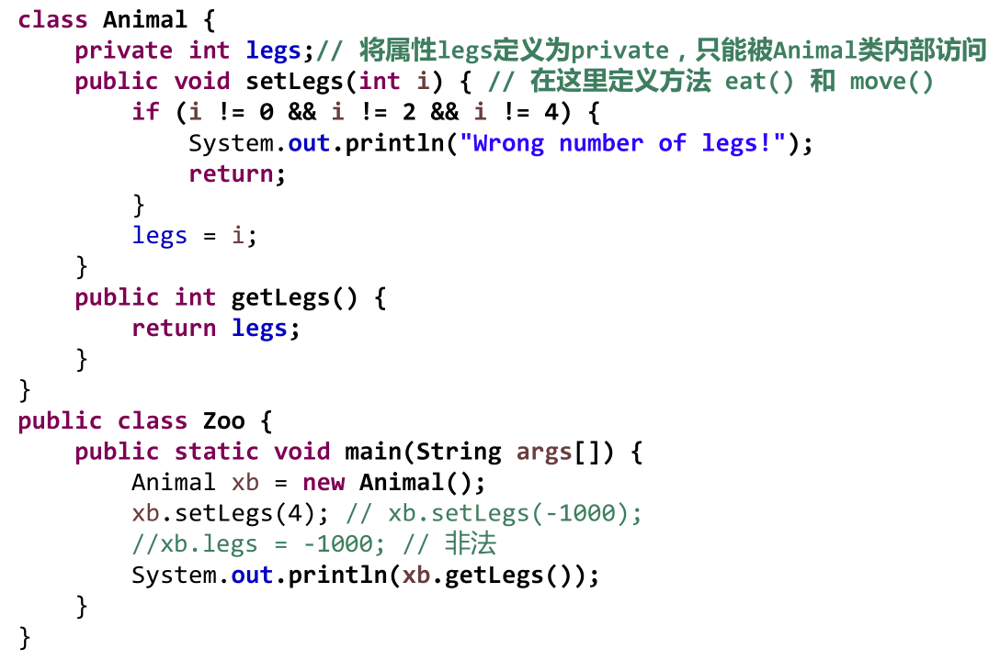


封装性的体现：`属性私有`、`方法私有`、`构造器私有`（如单例模式）等。

> 封装性的体现，需要权限修饰符的配合。

### 四种权限修饰符

从小到大排列：private、缺省（什么都不写）、protected、public。

权限修饰符置于类的成员定义前，用来限定对象对该类成员的访问权限：


权限修饰符可以用来修饰类及类的内部结构：属性、方法、构造器、内部类。

- **对于 class 的权限修饰只可以用 public 和 default（缺省）。**
  - public 类可以在任意地方被访问。

  - default 类只可以被同一个包内部的类访问。

- **对于 class 的内部结构，四种权限修饰符都可以使用。**

封装性总结：Java 提供了 4 种权限修饰符来修饰类及类的内部结构，体现类及类的内部结构在被调用时的可见性的大小。 


本类中任意调用：

```java
package cn.xisun.database;

public class Order {
    private int orderPrivate;
    int orderDefault;
    protected int orderProtected;
    public int orderPublic;

    private void methodPrivate() {
        orderPrivate = 1;
        orderDefault = 2;
        orderProtected = 3;
        orderPublic = 4;
    }

    void methodDefault() {
        orderPrivate = 1;
        orderDefault = 2;
        orderProtected = 3;
        orderPublic = 4;
    }

    protected void methodProtected() {
        orderPrivate = 1;
        orderDefault = 2;
        orderProtected = 3;
        orderPublic = 4;
    }

    public void methodPublic() {
        orderPrivate = 1;
        orderDefault = 2;
        orderProtected = 3;
        orderPublic = 4;
    }
}
```

同包中的其他类：

```java
package cn.xisun.database;

public class OrderTest {
    public static void main(String[] args) {
        Order order = new Order();

        order.orderDefault = 1;
        order.orderProtected = 2;
        order.orderPublic = 3;

        order.methodDefault();
        order.methodProtected();
        order.methodPublic();

        // 同一个包中的其他类，不可以调用Order类中private的属性和方法
        /*order.orderPrivate = 4;

        order.methodPrivate();*/
    }
}
```

不同包中的子类：

```java
package cn.xisun.database.postgresql;

import cn.xisun.database.Order;

public class SubOrder extends Order {
    public void method() {
        orderProtected = 1;
        orderPublic = 2;

        methodProtected();
        methodPublic();

        // 不同包的子类中，不可以调用Order类中private和缺省的属性和方法
        /*orderPrivate = 3;
        orderDefault = 4;

        methodPrivate();
        methodDefault();*/
    }
}
```

不同包中的其他类（非子类）：

```java
package cn.xisun.database.postgresql;

import cn.xisun.database.Order;

public class OtherOrderTest {
    public static void main(String[] args) {
        Order order = new Order();

        order.orderPublic = 1;

        order.methodPublic();

        // 不同包下的普通类(非子类)，不可以调用Order类中private、缺省和protected的属性和方法
        /*order.orderPrivate = 2;
        order.orderDefault = 3;
        order.orderProtected = 4;

        order.methodPrivate();
        order.methodDefault();
        order.methodProtected();*/
    }
}
```

### 类的成员之三：构造器（构造方法，constructor）

构造器的作用：

- 创建对象；给对象进行初始化。如：`Order o = new Order(); Person p = new Person(“Peter”, 15);`。

语法格式：


根据参数不同，构造器可以分为如下两类：

- 隐式无参构造器（系统默认提供）。

- 显式定义一个或多个构造器（无参、有参）。

构造器的特征：

- 构造器具有与类相同的名称，不声明返回值类型，与声明为 void 不同。
- Java 语言中，`每个类都至少有一个构造器`。
- **如果没有显示的定义类的构造器，则系统默认提供一个无参构造器。一旦显式定义了构造器， 则系统不再提供默认构造器。**
- 一般情况下，为了防止一些框架出异常，无论要不要自定义其他构造器，都应该把类的无参构造器显示的定义出来。
- **构造器的修饰符默认与所属类的修饰符一致，即：public 或 default（缺省）。**
- 构造器不能被 static、final、synchronized、abstract、native 修饰，不能有 return 语句返回值。
- 一个类中定义的多个构造器，彼此构成重载。
- 父类的构造器不可被子类继承。

### JavaBean

JavaBean 是一种 Java 语言写成的可重用组件。所谓 JavaBean，是指符合如下标准的 Java 类：

- 类是公共的。
- 有一个无参的公共的构造器。
- 有属性，且有对应的 get、set 方法。

用户可以使用 JavaBean 将功能、处理、值、数据库访问和其他任何可以用 Java 代码创造的对象进行打包，并且其他的开发者可以通过内部的 JSP 页面、Servlet、其他 JavaBean、applet 程序或者应用来使用这些对象。用户可以认为 JavaBean 提供了一种随时随地的复制和粘贴的功能，而不用关心任何改变。

### UML 类图


### 关键字：this

this 关键字的使用：

- this 可以用来修饰或调用：属性、方法、构造器。

- this 修饰属性和方法：
  - this 理解为：当前对象或当前正在创建的对象。
  - 在类的方法中，可以使用 "this.属性" 或 "this.方法" 的方式，调用当前属性或方法。
    - 通常情况下，可以省略 "this."。
    - 特殊情况下，如果方法的形参和类的属性同名，则必须显示的使用 "this.变量" 的方式，表明此变量是属性，而非形参。
  - 在类的构造器中，可以使用 "this.属性" 或 "this.方法" 的方式，调用当前正在创建的对象的属性或方法。
    - 通常情况下，可以省略 "this."。
    - 特殊情况下，如果构造器的形参和类的属性同名，则必须显示的使用 "this.变量" 的方式，表明此变量是属性，而非形参。
  - **使用 this 访问属性和方法时，如果在本类中未找到，会从父类中查找。**
- this 调用构造器：
  - 在类的构造器中，可以显示的使用 "this(形参列表)" 的方式，调用本类中的其他构造器。
    - 存在构造器的多重调用时，创建的对象仍然是只有一个，而不是调用一个构造器就创造了一个新的对象，只有最开始被调用的构造器才创造了对象。
  - 构造器中，不能使用 "this(形参列表)" 的方式调用自己。
  - 如果一个类中有 n 个构造器，则最多有 n - 1 个构造器中使用了 "this(形参列表)"。
    - 构造器在彼此调用时，不能形成一个封闭环，如：构造器 A 中调用了构造器 B，则在构造器 B 中不能再调用构造器 A，多构造器调用类推。
  - 规定："this(形参列表)" 必须声明在当前构造器的首行。
  - 一个构造器内部，最多只能声明一个 "this(形参列表)"，即只能调用一个其他的构造器。

实例：

  ```java
public class Person {
    private String name;

    private int age;

    // 无参构造器
    public Person() {
        this.eat();
    }

    // 带name的构造器
    public Person(String name) {
        this();// 调用无参构造器
        this.name = name;
    }

    // 带name和age的构造器
    public Person(String name, int age) {
        this(name);// 调用带name的构造器
        this.age = age;
    }

    public void setName(String name) {
        this.name = name;
    }

    public String getName() {
        return this.name;// 此处this可以省略
    }

    public void setAge(int age) {
        this.age = age;
    }

    public int getAge() {
        return this.age;// 此处this可以省略
    }

    public void eat() {
        System.out.println("人吃饭");
        this.study();// this调用方法，此处this可以省略
    }

    public void study() {
        this.eat();// this调用方法，此处this可以省略
        System.out.println("人学习");
    }

    public static void main(String[] args) {

    }
}
  ```

实例二：

  ```java
public class Boy {
    private String name;

    private int age;

    public Boy() {

    }

    public Boy(String name, int age) {
        this.name = name;
        this.age = age;
    }

    public void setName(String name) {
        this.name = name;
    }

    public String getName() {
        return name;
    }

    public void setAge(int age) {
        this.age = age;
    }

    public int getAge() {
        return age;
    }

    public void marray(Girl girl) {
        System.out.println("我想娶" + girl.getName());
    }

    public void shout() {
        System.out.println("我想找对象");
    }
}
  ```

  ```java
public class Girl {
    private String name;

    private int age;

    public Girl() {

    }

    public Girl(String name, int age) {
        this.name = name;
        this.age = age;
    }

    public void setName(String name) {
        this.name = name;
    }

    public String getName() {
        return name;
    }

    public void setAge(int age) {
        this.age = age;
    }

    public int getAge() {
        return age;
    }

    public void marry(Boy boy) {
        System.out.println("我想嫁给" + boy.getName());
        boy.marray(this);// 传入当前Girl对象
    }

    public int compare(Girl girl) {
        return this.age - girl.age;
    }
}
  ```

  ```java
public class Person {
    public static void main(String[] args) {
        Boy boy = new Boy("罗密欧", 20);
        boy.shout();
        Girl girl = new Girl("朱丽叶", 18);
        girl.marry(boy);

        Girl girl2 = new Girl("祝英台", 19);
        System.out.println("年龄差：" + girl.compare(girl2));
    }
}
  ```

### 关键字：package

package 语句作为 Java 源文件的第一条语句，指明该文件中定义的类所在的包。若缺省该语句，则指定为无名包。

语法格式：


- 包对应于文件系统的目录，package 语句中，用`.`来指明包（目录）的层次。

- 包属于标识符，遵循标识符的命名规范，通常用小写单词标识。通常使用所在公司域名的倒置，如：`com.atguigu.xxx`。

- 同一个包下，不能命名同名的接口、类。不同的包下，可以命名同名的接口、类。

JDK 中主要的包介绍：

- `java.lang` ---- 包含一些 Java 语言的核心类，如 String、Math、Integer、 System 和 Thread，提供常用功能。
- `java.net` ---- 包含执行与网络相关的操作的类和接口。
- `java.io` ---- 包含能提供多种输入/输出功能的类。
- `java.util` ---- 包含一些实用工具类，如定义系统特性、接口的集合框架类、使用与日期日历相关的函数。
- `java.text` ---- 包含了一些 Java 格式化相关的类。
- `java.sql` ---- 包含了 Java 进行 JDBC 数据库编程的相关类/接口。
- `java.awt` ---- 包含了构成抽象窗口工具集（abstract window toolkits）的多个类，这些类被用来构建和管理应用程序的图形用户界面（GUI）。（B/S 和 C/S）

### 关键字：import

为使用定义在不同包中的 Java 类，需用 import 语句来引入指定包层次下所需要的类或全部类（.*）。import 语句告诉编译器到哪里去寻找类。

语法格式：


- 在源文件中使用 import 语句，可以显式的导入指定包下的类或接口。

- 声明在包的声明和类的声明之间。

- 如果需要导入多个类或接口，那么就并列显式声明多个 import 语句即可。

- 举例：可以使用`import java.util.*;`的方式，一次性导入 java.util 包下所有的类或接口。

- 如果导入的类或接口是 java.lang 包下的，或者是当前包下的，则可以省略此 import 语句。

- 如果在代码中使用不同包下的同名的类，那么使用时需要使用类的全类名的方式指明调用的是哪个类。

- 如果已经导入 java.a 包下的类，那么如果需要使用 a 包的子包下的类的话，仍然需要导入。

- `import static 组合`的使用：导入指定类或接口下的静态的属性或方法。

  ```java
  import static java.lang.System.*;
  
  public class Person {
      public static void main(String[] args) {
          out.println("打印方法");// 可以省略System
      }
  }
  ```

### OOP 特征二：继承性

**如果多个类中存在相同的属性和行为时，将这些内容抽取到单独一个类中，那么这多个类无需再定义这些属性和行为，只要继承那个抽出来的类即可。**

此处的多个类称为`子类 (派生类、subclass)`，单独的这个类称为`父类 (基类、超类、superclass)`。可以理解为："子类 is a 父类"。

类继承语法规则：

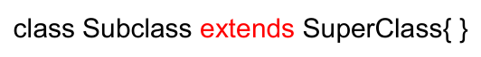

继承性的作用：

- 继承的出现减少了代码冗余，提高了代码的复用性。
- 继承的出现，更有利于功能的扩展。
- 继承的出现，让类与类之间产生了关系，提供了多态的前提。

继承性的特点：

- 子类继承了父类，就继承了父类中声明的所有属性和方法。**特别的，父类中声明为 private 的属性和方法，子类继承父类以后，仍然认为子类获取了父类中私有的结构，只是因为封装性的影响，使得子类的实例不能直接调用父类的这些私有的结构而已（事实上，父类的实例，也不能直接调用这些私有的结构）。**
- 在子类中，可以使用父类中定义的方法和属性，也可以声明创建子类特有的属性和方法，以实现功能的扩展。
- 在 Java 中，继承的关键字用的是`extends`，即子类不是父类的子集，而是对父类的扩展。

继承性的规则：

- 子类不能直接访问父类中私有的（private）的成员变量和方法。

  

- Java 只支持`单继承`和`多层继承`，不允许多重继承。

  - 一个子类只能有一个父类。

  - 一个父类可以派生出多个子类。

    

    

    

  - 此处强调的是 Java 类的单继承性，Java 中，接口是可以多继承的。

- 子类和父类是一个相对概念。子类直接继承的父类，称为直接父类，间接继承的父类，称为间接父类。

- 子类继承父类后，就获取了直接父类及所有间接父类中声明的属性和方法。

- 所有的 Java 类（除 java.lang.Object 类之外），都直接或间接继承`java.lang.Object`。即，Java 中所有的类，都是 Object 类的子类。

### 方法的重写（override/overwrite）

**`在子类中可以根据需要，对从父类中继承来的方法进行改造，也称为方法的重置、覆盖。在程序执行时，子类重写的方法将覆盖父类的方法。`**

**重写的要求：**

- 子类重写的方法必须和父类被重写的方法具有相同的方法名称、参数列表。
- 子类重写的方法使用的`访问权限`不能小于父类被重写的方法的访问权限（权限修饰符）。
  - 子类不能重写父类中声明为 private 权限的方法。
  - 子类中可以声明与父类 private 方法相同名称和参数列表的方法，但不属于重写。
- 子类重写的方法的`返回值类型`不能大于父类被重写的方法的返回值类型。

  - 父类被重写的方法的返回值类型是 void，则子类重写的方法的返回值类型只能是 void。
  - 父类被重写的方法的返回值类型是 A 类型，则子类重写的方法的返回值类型可以是 A 类或 A 类的子类。
  - 父类被重写的方法的返回值类型是基本数据类型（比如：double），则子类重写的方法的返回值类型必须是相同的基本数据类型（即，只能是 double）。
- 子类重写的方法`抛出的异常类型`不能大于父类被重写的方法抛出的异常类型。
- **`子类与父类中同名同参数的方法必须同时声明为非 static 的（此时属于重写），或者同时声明为 static 的（此时不属于重写）。因为 static 方法是属于类的，子类无法覆盖父类的方法。`**
  - 此时，子类中的该方法也须遵循重写关于访问权限、返回值和抛出异常类型等方面的规则。


实例一：


实例二：


方法重载与重写的区别：

1.  二者的定义细节：略。
2.  从编译和运行的角度看：重载，是指允许存在多个同名方法，而这些方法的参数不同。编译器根据方法不同的参数表，对同名方法的名称做修饰。对于编译器而言，这些同名方法就成了不同的方法。**它们的调用地址在编译期就绑定了。**Java 的重载是可以包括父类和子类的，即子类可以重载父类的同名不同参数的方法。所以：**对于重载而言，在方法调用之前，编译器就已经确定了所要调用的方法，这称为`"早绑定"`或`"静态绑定"`；而对于多态，只有等到方法调用的那一刻，解释运行器才会确定所要调用的具体方法，这称为`"晚绑定"`或`"动态绑定"`。**引用一句 Bruce Eckel 的话："不要犯傻，如果它不是晚绑定，它就不是多态。"
3.  **`重载不表现为多态性，重写表现为多态性。`**

### 关键字：super

super 理解为：父类的。

super 可以用来调用父类的：属性、方法、构造器。

在子类的方法或构造器中，可以通过使用 "super.属性" 或 "super.方法" 的形式，显示的调用父类中声明的属性或方法。

- 通常情况下，可以省略 "super."。
- 特殊情况：当子类和父类中定义了同名的属性时，要想在子类中调用父类中声明的该属性，则必须显示的使用 "super.属性" 的方式，表明调用的是父类中声明的属性。
- 特殊情况：当子类重写了父类中的方法以后，要想在子类中调用父类中被重写的方法时，则必须显示的使用 "super.方法" 的方式，表明调用的是父类中被重写的方法。

在子类的构造器中，可以通过使用 "super(形参列表)" 的形式，显示的调用父类中声明的指定的构造器。

- "super(形参列表)" 的使用，必须声明在子类构造器的首行。
- 在类的构造器中，针对于 "this(形参列表)" 或 "super(形参列表)"，只能二选一，不能同时出现。
- **在构造器的首行，如果没有显示的声明 "this(形参列表)" 或 "super(形参列表)"，则默认调用的是父类中空参的构造器，即：`super();`。**
  - 子类中所有的构造器默认都会访问父类中空参的构造器。
  - 当父类中没有空参的构造器时，子类的构造器必须通过 "this(形参列表)" 或 "super(形参列表)" 语句，指定调用本类或者父类中相应的构造器。同时，只能二选一，且必须放在构造器的首行。
  - 如果子类构造器中既未显式调用父类或本类的构造器，且父类中又没有无参的构造器，则编译出错。
- 在类的多个构造器中，至少有一个类的构造器中使用了 "super(形参列表)"，调用父类中的构造器。

this 和 super 的区别：


思考：

- 为什么 "super(形参列表)" 和 "this(形参列表)" 调用语句不能同时在一个构造器中出现？
  - 因为 "super(形参列表)" 和 "this(形参列表)" 调用语句都必须出现在构造器中的首行。
- 为什么 "super(形参列表)" 和 "this(形参列表)" 只能作为构造器中的第一句出现？
  - 因为无论通过哪个构造器创建子类对象，都需要保证先初始化父类。这样做的目的是：当子类继承父类后，可以获得父类中所有的属性和方法，这样子类就有必要在一开始就知道父类是如何为对象进行初始化。

实例：

```java
public class Person {
    String name;
    int age;
    int id = 1000;

    public Person() {
        System.out.println("父类的空参构造器");
    }

    public Person(String name, int age, int id) {
        this.name = name;
        this.age = age;
        this.id = id;
    }

    public void eat() {
        System.out.println("吃饭");
    }

    public void sleep() {
        System.out.println("睡觉");
    }
}
```

```java
public class Student extends Person {
//    String name;// 父类中已有的属性, 可以省略
//    int age;// 父类中已有的属性, 可以省略
    String major;
    int id = 1001;

    public Student() {

    }

    public Student(String name, int age, String major) {
        this.name = name;
        this.age = age;
        this.major = major;
    }

    // 父类中已有的方法, 可以省略, 如有需要, 可以重写
//    public void eat() {
//        System.out.println("吃饭");
//    }

    // 重写父类的方法
    @Override
    public void sleep() {
        System.out.println("学生睡觉");
    }

    public void study() {
        System.out.println("学习");
    }

    public void show() {
        System.out.println("子类中的id: " + this.id);// this可以省略, 就近原则
        System.out.println("父类中的id: " + super.id);// 子类与父类有同名的属性id, 此时super不可以省略
    }

    public static void main(String[] args) {
        Student student = new Student();
        student.show();
    }
}
```

### 子类对象实例化过程

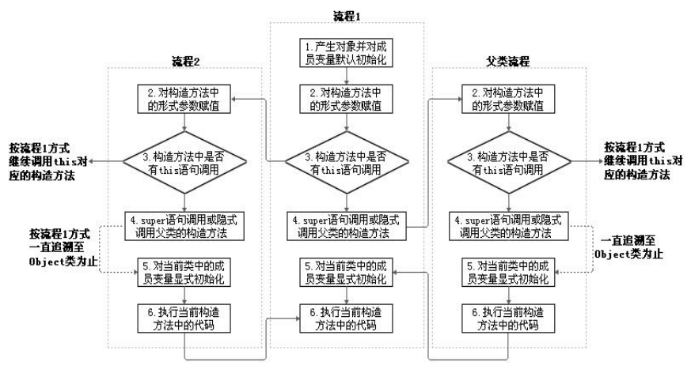

从结果上看：

- 子类继承父类之后，就获取了父类中声明的属性和方法。（继承性）

- 创建子类的对象，在堆空间中，就会加载所有父类中声明的属性。

  

从过程上看：

- 当通过子类的构造器创建子类对象时，一定会直接或间接的调用其父类的构造器，进而调用父类的父类的构造器，直到调用了 java.lang.Object 类中空参的构造器为止。正因为加载过所有的父类的结构，所以才可以看到内存中有父类中的结构，子类对象才能够进行调用。

- 明确：虽然创建子类对象时，调用了父类的构造器，但是自始至终只创建了一个对象，即为 new 出来的子类对象。

  

实例：从输出结果可以看出，在创建 Man 的实例时，先进入了父类的空参构造器，然后执行子类的空参构造器。

```java
public class Person {
    String name;
    int age;

    public Person() {
        System.out.println("父类空参构造器");
    }

    public void eat() {
        System.out.println("人吃饭");
    }

    public void walk() {
        System.out.println("人走路");
    }

    public static void main(String[] args) {
        Person person = new Man();
        person.eat();
        person.walk();
    }
}

class Man extends Person {
    boolean isSmoking;
    
    public Man() {
        System.out.println("子类空参构造器");
    }

    public void earnMoney() {
        System.out.println("男人负责挣钱养家");
    }

    @Override
    public void eat() {
        System.out.println("男人多吃肉，长肌肉");
    }

    @Override
    public void walk() {
        System.out.println("男人霸气的走路");
    }
}
输出结果：
父类空参构造器
子类空参构造器
男人多吃肉，长肌肉
男人霸气的走路
```

### OOP 特征三：多态性

**`多态性，也叫对象的多态性：父类的引用指向子类的对象（或子类的对象赋给父类的引用）。`**

- 一个变量只能有一种确定的数据类型。

- 一个引用类型变量可能指向（引用）多种不同类型的对象。

- 子类可看做是特殊的父类，所以父类类型的引用可以指向子类的对象：`向上转型 (upcasting)`。

- 一个引用类型变量如果声明为父类的类型，但实际引用的是子类对象，那么该变量就不能再访问子类中添加的属性和方法：

  

多态的使用：

- **虚拟方法调用。**

- 有了对象的多态性以后，在编译期，只能调用父类中声明的方法，但在运行期，实际执行的是子类中重写的父类的方法。

- **`编译，看左边；运行，看右边。`**
  - Java 引用变量有两个类型：`编译时类型`和`运行时类型`。编译时类型由声明该变量时使用的类型决定，运行时类型由实际赋给该变量的对象决定。
  - `若编译时类型和运行时类型不一致，就出现了对象的多态性。`
  - 多态情况下，看左边：看的是父类的引用（父类中不具备子类特有的方法），看右边：看的是子类的对象（实际运行的是子类重写父类的方法）。

- `对象的多态性，只适用于方法，不适用于属性。`对于属性，编译期和运行期，看的都是左边，即都是父类中声明的那个属性。
  - 成员方法：编译时，要查看引用变量所声明的类中是否有所调用的方法。运行时，调用实际 new 的对象所属的类中的重写方法。
  - 成员变量：不具备多态性，只看引用变量所声明的类。

- 子类继承父类：

  - 若子类重写了父类方法，就意味着子类里定义的方法彻底覆盖了父类里的同名方法，系统将不可能把父类里的方法转移到子类中。
    - 编译，看左边；运行，看右边。

  - 对于实例变量则不存在这样的现象，即使子类里定义了与父类完全相同的实例变量，这个实例变量依然不可能覆盖父类中定义的实例变量。
    - 编译，运行，都看左边。

实例：

  ```java
public class Person {
    String name;
    int age;

    public void eat() {
        System.out.println("人吃饭");
    }

    public void  walk() {
        System.out.println("人走路");
    }

    public static void main(String[] args) {
        // 对象的多态性: 父类的引用指向子类的对象
        Person person = new Man();
        // 多态的使用: 当调用子父类同名同参数的方法时, 实际执行的是子类重写的父类的方法--->虚拟方法调用
        // 编译期, 只能调用父类Person类中的方法; 运行期, 执行的是子类Man类中的方法
        person.eat();
        person.walk();
        // 不能调用子类特有的属性或方法, 因为编译时, person是Person类型, 而Person类中没有子类的这个特有属性或方法
        // 有了对象的多态性以后, 内存中实际上是加载了子类特有的属性或方法的, 但是由于变量声明为父类类型, 导致编译时, 只能调用父类中
        // 声明的属性和方法, 子类中特有的属性和方法不能调用
        // person.isSmoking = true;
        // person.earnMoney();
        
        System.out.println("*********************************")
        // 如何才能使用子类特有的属性和方法?
        // 向下转型: 使用强制类型转换符
        Man man = (Man) person;
        man.isSmoking = true;
        man.earnMoney();
        // 使用强转时, 可能出现java.lang.ClassCastException异常
        Woman woman = (Woman) person;
        woman.goShopping();
    }
}
输出结果：
父类空参构造器
子类空参构造器
男人多吃肉，长肌肉
男人霸气的走路
*********************************
男人负责挣钱养家
  ```

  ```java
public class Man extends Person {
    boolean isSmoking;

    public void earnMoney() {
        System.out.println("男人负责挣钱养家");
    }

    @Override
    public void eat() {
        System.out.println("男人多吃肉，长肌肉");
    }

    @Override
    public void walk() {
        System.out.println("男人霸气的走路");
    }
}
  ```

实例二：

```java
public class FieldMethodTest {
    public static void main(String[] args) {
        Sub s = new Sub();
        System.out.println(s.count);// 20
        s.display();// 20
        Base b = s;
        // 对于引用数据, ==比较的是两个引用数据类型变量的地址值
        System.out.println(b == s);// true
        System.out.println(b.count);// 10
        b.display();// 20
    }
}

class Base {
    int count = 10;

    public void display() {
        System.out.println(this.count);
    }
}

class Sub extends Base {
    int count = 20;

    @Override
    public void display() {
        System.out.println(this.count);
    }
}
```

实例三：

```java
public class InterviewTest1 {
    public static void main(String[] args) {
        Base base = new Sub();
        base.add(1, 2, 3);// sub_1

        Sub s = (Sub) base;
        s.add(1, 2, 3);// sub_2
    }
}

class Base {
    public void add(int a, int... arr) {
        System.out.println("base");
    }
}

class Sub extends Base {
    @Override
    public void add(int a, int[] arr) {
        System.out.println("sub_1");
    }

    // 这个方法没有重写, 在Base类中不存在这样声明的方法, 
    // 也就没有多态, 所以base.add(1, 2, 3)方法输出sub_1
    public void add(int a, int b, int c) {
        System.out.println("sub_2");
    }
}
```

多态性的使用前提：

- **`有类的继承关系。`**
- **`有方法的重写。`**
- 如果没有以上两个前提，就不存在多态。

多态性的优点：

- 提高了代码的通用性，常称作`接口重用`。

- 方法声明的形参类型为父类类型，可以使用子类的对象作为实参调用该方法：

  ```java
  public class AnimalTest {
      // 多态的使用: 传入的是Animal对象, 但实际传入的可以是Animal的子类
      public void func(Animal animal) {
          animal.eat();
          animal.shout();
      }
  
      public static void main(String[] args) {
          AnimalTest animalTest = new AnimalTest();
  
          animalTest.func(new Dog());
          animalTest.func(new Cat());
      }
  }
  
  class Animal {
      public void eat() {
          System.out.println("动物：进食");
      }
  
      public void shout() {
          System.out.println("动物：叫");
      }
  }
  
  class Dog extends Animal {
      @Override
      public void eat() {
          System.out.println("狗吃骨头");
      }
  
      @Override
      public void shout() {
          System.out.println("汪！汪！汪！");
      }
  }
  
  class Cat extends Animal {
      @Override
      public void eat() {
          System.out.println("猫吃鱼");
      }
  
      @Override
      public void shout() {
          System.out.println("喵！喵！喵！");
      }
  }
  
  // 举例二
  class Order {
      // 此方法可以传入任意对象, 而不需要每个特定对象都创建一次method()方法
      public void method(Object object) {
          // 方法体	
      }
  }
  ```

- 抽象类、接口的使用：`抽象类和接口不能实例化，它们的使用也体现了多态。`

虚拟方法调用： 

- 正常的方法调用：

  ```java
  Person e = new Person();
  e.getInfo();
  Student e = new Student();
  e.getInfo();
  ```

- 虚拟方法调用（多态情况下）：子类中定义了与父类同名同参数的方法，在多态情况下，将此时父类的方法称为**`虚拟方法`**，父类根据赋给它的不同子类对象，动态调用属于子类的该方法。这样的方法调用在编译期是无法确定的。

  ```java
  Person e = new Student();
  e.getInfo();// 调用Student类的getInfo()方法
  ```

- 编译时类型和运行时类型：上面代码中，编译时 e 为 Person 类型，而方法的调用是在运行时确定的，所以调用的是 Student 类的 getInfo() 方法 ---> **`动态绑定`**。

- **`重写是多态，重载不是。`**

- 实例：

  

多态是编译时行为还是运行时行为?

- **`多态是运行时行为`**，证明方法如下：

  ```java
  public class InterviewTest {
      public static Animal getInstance(int key) {
          switch (key) {
              case 0:
                  return new Cat();
              case 1:
                  return new Dog();
              default:
                  return new Sheep();
          }
      }
  
      public static void main(String[] args) {
          // 因为key需要在运行时才能得到值, 编译期时无法判断getInstance()方法输出什么
          int key = new Random().nextInt(3);
          System.out.println(key);
          Animal animal = getInstance(key);
          animal.eat();
      }
  }
  
  class Animal {
      protected void eat() {
          System.out.println("animal eat food");
      }
  }
  
  class Cat extends Animal {
      @Override
      protected void eat() {
          System.out.println("cat eat fish");
      }
  }
  
  class Dog extends Animal {
      @Override
      public void eat() {
          System.out.println("Dog eat bone");
      }
  }
  
  class Sheep extends Animal {
      @Override
      public void eat() {
          System.out.println("Sheep eat grass");
      }
  }
  ```

### 关键字：instanceof

`a instanceof A`：检验对象 a 是否为类 A 的对象实例，如果是，返回 true，如果不是，返回 false。

使用情景：为了避免向下转型时出现 java.lang.ClassCastException，在向下转型之前，先进行 instanceof 判断，在返回 true 时，才进行向下转型。

- 要求 a 所属的类与类 A 必须是子类和父类的关系，否则编译错误。

- 如果 a 属于类 A 的子类 B，`a instanceof A` 的返回值也为 true。

  

### 对象类型转换（casting）


基本数据类型的 Casting：

- `自动类型转换`：小的数据类型可以自动转换成大的数据类型。如`long g = 20; double d = 12.0f;`。
- `强制类型转换`：可以把大的数据类型强制转换（casting）成小的数据类型。如`float f = (float)12.0; int a = (int)1200L;`。

对 Java 对象的强制类型转换，也称为`造型`：

- 从子类到父类的类型转换可以自动进行。
- 从父类到子类的类型转换必须通过造型（强制类型转换）实现。
- 无继承关系的引用类型间的转换是非法的。
- 在造型前可以使用 instanceof 判断。

实例：

```java
public class ConversionTest {
    public static void main(String[] args) {
        double d = 13.4;
        long l = (long) d;
        System.out.println(l);
        int in = 5;
        // boolean b = (boolean)in;
        Object obj = "Hello";
        String objStr = (String) obj;
        System.out.println(objStr);
        Object objPri = new Integer(5);
        // 下面代码运行时引发ClassCastException异常
        String str = (String) objPri;
    }
}
```

```java
public class Test {
    public void method(Person e) {
        // 假设Person类中没有getSchool()方法
        // System.out.pritnln(e.getSchool());// 非法, 编译时错误
        if (e instanceof Student) {
            Student me = (Student) e;// 将e强制转换为Student类型
            System.out.pritnln(me.getSchool());
        }
    }

    public static void main(String[] args) {
        Test t = new Test();
        Student m = new Student();
        t.method(m);
    }
}
```

### Object 类的使用

`Object 类是所有 Java 类的根父类。`

如果在类的声明中未使用 extends 关键字指明其父类，则默认父类为 java.lang.Object 类。


验证方法：

```java
public class ObjectTest {
    public static void main(String[] args) {
        Base base = new Base();
        System.out.println("父类：" + base.getClass().getSuperclass());// 父类: class java.lang.Object
    }
}

class Base {
}
```

Object 类中的主要结构：


### == 操作符与 equals() 方法

`==`运算符：

- 如果**比较的是基本数据类型变量**：比较两个变量保存的数据是否相等，不一定类型要相同。

  ```java
  public static void main(String[] args) {
      int i = 10;
  
      int j = 10;
      System.out.println(i == j);// true
  
      double k = 10.0;
      System.out.println(i == k);// true
  
      char c = 10;
      System.out.println(i == c);// true
  
      char c1 = 'A';
      char c2 = 65;
      System.out.println(c1 == c2);// true
  }
  ```

- 如果**比较的是引用数据类型变量**：比较两个变量的地址值是否相同，即两个引用是否指向同一个对象实体。

  ```java
  // String类比较特殊, 要注意
  public static void main(String[] args) {
      String s1 = "javacdfa";// 这样写的javacdfa, 位于常量池中
      String s2 = "javacdfa";
      System.out.println(s1 == s2);// true
  
      String s3 = new String("iam");// 这样new的, 在堆内存中 
      String s4 = new String("iam");
      System.out.println(s3 == s4);// false
  }
  ```

- **用 == 进行比较时，符号两边的数据类型必须兼容（可自动转换的基本数据类型除外），否则编译出错。**

`equals()`方法：

- 是一个方法，而非运算符，只能适用于引用数据类型。

- 使用格式：`obj1.equals(obj2)`。

- 所有类都继承了 Object，也就获得了 equals() 方法，也可以对其重写 。

- Object 类中 equals() 方法的定义：

  ```java
  public boolean equals(Object obj) {
      return (this == obj);
  }
  ```

  - 说明：其作用与 == 相同，比较是否指向同一个对象 。

- 像 File、String、Date 及包装类等，都重写了 Object 类中的 equals() 方法，重写以后，比较的不是两个引用对象的地址是否相同，而是比较两个引用对象的 "实体内容" 是否相同。比如 String 类的 equals() 方法：

  ```java
  public boolean equals(Object anObject) {
      // 先判断地址
      if (this == anObject) {
          return true;
      }
      // 再判断内容
      if (anObject instanceof String) {
          String anotherString = (String)anObject;
          int n = value.length;
          if (n == anotherString.value.length) {
              char v1[] = value;
              char v2[] = anotherString.value;
              int i = 0;
              while (n-- != 0) {
                  if (v1[i] != v2[i])
                      return false;
                  i++;
              }
              return true;
          }
      }
      return false;
  }
  ```

- 通常情况下，自定义的类使用 equals() 方法时，也是比较两个引用对象的 "实体内容" 是否相同，那么，就应该重写 equals() 方法。

- 重写 equals() 方法的原则：

  - `对称性`：如果 x.equals(y) 返回是 true，那么 y.equals(x) 也应该返回是 true。
  - `自反性`：x.equals(x) 必须返回是 true。
  - `传递性`：如果 x.equals(y) 返回 true，而且 y.equals(z) 返回 true，那么 z.equals(x) 也应该返回 true。
  - `一致性`：如果 x.equals(y) 返回是 true，只要 x 和 y 内容一直不变，不管重复 x.equals(y) 多少次，返回都是 true。
  - 任何情况下，`x.equals(null)`永远返回 false；`x.equals(和x不同类型的对象)`永远返回 false。

== 和 equals() 的区别：

- == 既可以比较基本类型也可以比较引用类型。对于基本类型是比较值，对于引用类型是比较内存地址。
- equals() 方法属于 java.lang.Object 类里面的方法，如果该方法没有被重写过，默认也是 ==。
- 具体到特定自定义的类，要看该类里有没有重写 Object 的 equals() 方法以及重写的逻辑。
- 通常情况下，重写 equals() 方法，是比较类中的相应属性是否都相等。 

### toString() 方法

当输出一个对象的引用时，实际上就是调用当前对象的`toString()`方法。

```java
public class ObjectTest {
    public static void main(String[] args) {
        Order order = new Order();
        System.out.println(order);// cn.xisun.database.Order@78308db1
        System.out.println(order.toString());// cn.xisun.database.Order@78308db1
    }
}

class Order {

}
```

Object 类中 toString() 方法的定义： 

```java
public String toString() {
    return getClass().getName() + "@" + Integer.toHexString(hashCode());
}
```

像 File、String、Date 及包装类等，都重写了 Object 类中的 toString() 方法，使得在调用对象的 toString() 方法时，返回相应的 "实体内容"。

自定义类也可以重写 toString() 方法，当调用此方法时，返回相应的 "实体内容"。比如 String 类的 toString() 方法：

```java
public String toString() {
    return this;
}
```

- 基本类型数据转换为 String 类型时，调用了对应包装类的`toString()`方法。

面试题：

```java
public static void main(String[] args) {
    char[] arr = new char[] { 'a', 'b', 'c' };
    System.out.println(arr);// abc
    int[] arr1 = new int[] { 1, 2, 3 };
    System.out.println(arr1);// [I@78308db1
    double[] arr2 = new double[] { 1.1, 2.2, 3.3 };
    System.out.println(arr2);// [D@27c170f0
}
```

### 包装类（Wrapper）的使用

`包装类`：也叫封装类，是针对八种基本数据类型定义的相应的引用数据类型，以使得基本数据类型的变量具有类的特征。


- JDK 1.5 之后，支持`自动装箱`，`自动拆箱`，但类型必须匹配。

基本类型、包装类与 String 类之间的转换：


- 基本数据类型转换成包装类：
  - 装箱：基本数据类型包装成包装类的实例，通过包装类的构造器实现。例如：`int i = 500; Integer t = new Integer(i);`。
  - 自动装箱，例如：`int i =500; Integer t = i;`。
- 包装类转换成基本数据类型：
  - 拆箱：获得包装类对象中包装的基本类型变量，通过调用包装类的`.xxxValue()`方法。例如：`boolean b = bObj.booleanValue();`。
  - 自动拆箱，例如：`Integer t = 500; int i = t;`。
- 基本数据类型/包装类转换成字符串：
  - 调用字符串重载的`valueOf()`方法，例如：`String fstr = String.valueOf(2.34f);。`
  - 更直接的方式，连接运算，例如：`String intStr = 5 + "";`。
- 字符串转换成基本数据类型/包装类：
  - 通过包装类的构造器实现，例如：`int i = new Integer("12");`。
  - 通过包装类的`parseXxx(String s)`静态方法，例如：`Float f = Float.parseFloat(“12.1”);`。

面试题：

```java
public static void main(String[] args) {
    // 三目运算符比较基本数据类型, 在编译阶段自动拆箱为int和double类型, 由于三目运算符要求表达式2和表达式3类型一致, 
    // 所以在编译阶段自动类型提升(即int自动类型转换为double类型), 再自动装箱为Object, 输出时使用多态调用重写
    // 的toString(), 即Double包装类的toString()方法
    Object o1 = true ? new Integer(1) : new Double(2.0);
    System.out.println(o1);// 1.0

    Object o2;
    if (true)
        o2 = new Integer(1);
    else
        o2 = new Double(2.0);
    System.out.println(o2);// 1
}
```

```java
public static void main(String[] args) {
    Integer i = new Integer(1);
    Integer j = new Integer(1);
    System.out.println(i == j);// new了两个对象, false
    Integer m = 1;
    Integer n = 1;
    System.out.println(m == n);// 自动装箱, 且在-128~127范围内, true
    Integer x = 128;// 相当于new Integer(128);
    Integer y = 128;// 相当于new Integer(128);
    System.out.println(x == y);// false
}
```

> Integer 类内部定义了 IntegerCache 结构，IntegerCache 中定义了一个 Integer[] 数组，保存了从`-128 ~ 127`范围的整数。如果使用了自动装箱的方式，给 Integer 赋值在 -128 ~ 127 范围内时，可以直接使用数组中的元素，不用 new。目的：提高效率。如果赋值超过了此范围，会 new 一个新对象。

```java
/**
 * 利用Vector代替数组处理: 从键盘读入学生成绩(以负数代表输入结束), 找出最高分, 并输出学生成绩等级.
 * 提示: 数组一旦创建, 长度就固定不变, 所以在创建数组前就需要知道它的长度. 而向量类java.util.Vector可以根据需要动态伸缩.
 *  创建Vector对象: Vector v = new Vector();
 *  给向量添加元素: v.addElement(Object obj);// obj必须是对象
 *  取出向量中的元素: Object obj = v.elementAt(0);
 *  注意第一个元素的下标是0, 返回值是Object类型的
 *  计算向量的长度: v.size();
 *  若与最高分相差10分内: A等; 20分内: B等; 30分内: C等; 其它: D等.
 */
public class ScoreTest {
    public static void main(String[] args) {
        Scanner scanner = new Scanner(System.in);
        Vector<Object> objects = new Vector<>();
        int maxScore = -1;
        while (true) {
            int nextScore = scanner.nextInt();
            if (nextScore < 0) {
                break;
            }
            if (nextScore > 100) {
                continue;
            }
            objects.add(nextScore);// 自动装箱
            if (maxScore < nextScore) {
                maxScore = nextScore;
            }
        }

        char level;
        for (int i = 0; i < objects.size(); i++) {
            Object object = objects.elementAt(i);
            int score = (Integer) object;// 自动拆箱
            if (maxScore - score < 10) {
                level = 'A';
            } else if (maxScore - score < 20) {
                level = 'B';
            } else if (maxScore - score < 30) {
                level = 'C';
            } else {
                level = 'D';
            }
            System.out.println("Student-" + i + " score is " + score + ", level is " + level);
        }
    }
}
```

### 关键字：static

当编写一个类时，其实就是在描述其对象的属性和行为，而并没有产生实质上的对象，只有通过 new 关键字才会产生出对象，这时系统才会分配内存空间给对象，其方法才可以供外部调用。有时候，希望无论是否产生了对象或无论产生了多少对象的情况下，`某些特定的数据在内存空间里只有一份`。例如：所有的中国人都有个国家名称，每一个中国人都共享这个国家名称，不必在每一个中国人的实例对象中都单独分配一个用于代表国家名称的变量。

实例变量：

```java
public class Test {
    public static void main(String[] args) {
        Circle c1 = new Circle(2.0); // c1.radius=2.0
        Circle c2 = new Circle(3.0); // c2.radius=3.0
    }
}

class Circle {
    private double radius;

    public Circle(double radius) {
        this.radius = radius;
    }

    public double findArea() {
        return Math.PI * radius * radius;
    }
}
```

- 上述代码中，c1 的 radius 独立于 c2 的 radius，存储在不同的空间。c1 中的 radius 变化不会影响 c2 的 radius，反之亦然。
- 像 Circle 类中的变量 radius 这样的，叫`实例变量 (instance variable)`，它属于类的每一个对象，不能被同一个类的不同对象所共享。
- 如果想让一个类的所有实例共享数据，就用`类变量`。类变量的定义，就需要用到`static`关键字。

static 关键字的使用：

- static：静态的。

- static 可以用来修饰：属性、方法、代码块、内部类。

- static 修饰后的成员具备以下特点：
  - `随着类的加载而加载。`
  - `优先于对象存在。`
  - 修饰的成员，被所有对象所共享。
  - 访问权限允许时，可不创建对象，直接被类调用。

使用 static 修饰属性：`静态变量 (类变量/class variable)`。

- 属性，按是否使用 static 修饰，分为：静态属性和非静态属性（实例变量）。

  - 实例变量：当创建了类的多个对象，每个对象都独立的拥有一套类中的非静态属性。当修改其中一个对象的非静态属性时，不会导致其他对象中同样的属性值被修改。
  - 静态变量：当创建了类的多个对象，每个对象都共用同一个静态变量。当通过某一个对象修改静态变量时，会导致其他对象调用此静态变量时，是修改之后的值。 **注意：实际操作时，虽然编译能通过，但不应该通过类的实例对象来访问静态成员。**

  - `静态变量随着类的加载而加载`，可以通过`"类.静态变量"`的方式进行调用。
  - 静态变量的加载要早于对象的创建。实例变量在创建对象的过程中，或创建对象之后，才创建。
  - 由于类只会加载一次，则静态变量在内存中也只会存在一份：保存在`方法区的静态域`中。
  - 类可以访问静态变量，但不能访问实例变量（实例变量在对象产生时才生成），对象可以访问实例变量，也能访问静态变量（不推荐）。
- 静态变量举例：System.out，Math.PI。

使用 static 修饰方法：`静态方法 (类方法/class method)`。

- `静态方法随着类的加载而加载`，可以通过`"类.静态方法"`的方式进行调用。
- 类可以访问静态方法，但不能访问非静态方法（非静态方法在对象产生时才生成），对象可以访问非静态方法，也能访问静态方法（不推荐）。
- **`静态方法中，只能调用静态属性或静态方法，它们的生命周期是一致的。非静态方法中，既可以调用非静态属性或非静态方法，也能调用静态属性或静态方法。`** 

static 使用的注意点：

- `在静态方法内，不能使用 this 关键字、super 关键字。`（this 和 super 指向当前类对象和父类对象，需要创建实例对象后才有这些概念。）

  ```java
  public static void show() {
      // 省略的是Chiese., 而不是this.
      walk();// 等同于Chinese.walk();
      System.out.println("nation: " + nation);// 等同于System.out.println(Chinese.nation);
  }
  ```

- **`static 修饰的方法不能被重写。`**

- 关于静态属性和静态方法的使用，从生命周期的角度去理解。

实例：

```java
public class Test {
    public static void main(String[] args) {
        Chinese c1 = new Chinese();
        c1.name = "姚明";
        c1.age = 40;

        Chinese c2 = new Chinese();
        c2.name = "马龙";
        c2.age = 30;

        // 通过c1对象修改nation的值, c2对象也能获得
        // 实际操作时, 虽然编译能过通过, 但不应该通过类的实例对象来访问静态成员
        c1.nation = "CHN";
        System.out.println(c2.nation);

        // 对象实例调用非静态方法
        c1.eat();

        // 类调用静态方法
        Chinese.show();

        // 通过c1对象也能调用非静态方法
        // 实际操作时, 虽然编译能过通过, 但不应该通过类的实例对象来访问静态成员
        c1.show();
    }
}

class Chinese {
    String name;
    int age;
    static String nation;

    public void eat() {
        System.out.println("吃饭");

        // 调用非静态结构
        this.info();
        System.out.println("name: " + this.name);

        // 调用静态结构
        walk();
        System.out.println("nation: " + nation);
    }

    public void info() {
        System.out.println("name: " + name + ", age: " + age + ", nation: " + nation);
    }

    public static void show() {
        System.out.println("我是中国人");

        // 不能调用非静态的结构
        // eat();
        // name = "Tom";

        // 调用静态的结构
        walk();
        System.out.println("nation: " + nation);// 省略的是Chiese., 而不是this., 等同于System.out.println(Chinese.nation);
    }

    public static void walk() {
        System.out.println("走路");
    }
}
```


- 类变量和实例变量内存解析：

  

类属性、类方法的设计思想：

- 类属性作为该类各个对象之间共享的变量，在设计类时，分析哪些`属性不因对象的不同而改变`，将这些属性设置为类属性，相应的方法设置为类方法。
- 如果`方法与调用者无关`，则这样的方法通常被声明为类方法，由于`不需要创建对象就可以调用类方法`，从而简化了方法的调用。
- 类中的`常量`，通常也声明为 static 的。
- `操作静态属性的方法`，通常设置为 static 的。
- `工具类中的方法`，习惯上声明为 static 的。

### main() 方法的语法

由于 Java 虚拟机需要调用类的`main()`方法，所以该方法的访问权限必须是 public，又因为 Java 虚拟机在执行 main() 方法时不必创建对象，所以该方法必须是 static 的，该方法接收一个 String 类型的数组参数，该数组中保存执行 Java 命令时传递给所运行的类的参数。

又因为 main() 方法是静态的，我们不能直接访问该类中的非静态成员，必须创建该类的一个实例对象后，才能通过这个对象去访问类中的非静态成员，这种情况，我们在之前的例子中多次碰到。

main() 方法的使用说明：

- main() 方法是`程序的入口`。
- main() 方法也是一个普通的静态方法，在执行某个类的 main() 方法之前，需要先加载这个类，这个过程是早于 main() 方法中首行的执行语句的。
- main() 方法可以作为程序与控制台交互的方式之一，其他的还可以使用 Scanner 类。

命令行参数用法举例：


### 类的成员之四：代码块（或初始化块）

代码块的作用：对 Java 类或对象进行初始化。

代码块的分类：一个类中代码块若有修饰符，则只能被 static 修饰，称为`静态代码块 (static block)`，没有使用 static 修饰的，为`非静态代码块`。

- **静态代码块：**
  - 内部可以有输出语句。
  - `随着类的加载而执行，而且只执行一次。`（不同于静态方法，静态方法必须在被类显示的调用后，才会执行方法内的语句。）
  - 作用：初始化类的信息。
  - 如果一个类定义了多个静态代码块，则按照声明的先后顺序来执行。一般情况下，不建议定义多个。
  - `静态代码块的执行要优先于非静态代码块的执行，与声明的先后顺序无关。`
  - 静态代码块中，只能调用静态的属性、静态的方法，不能调用非静态的属性、非静态的方法。

- **非静态代码块：**
  - 内部可以有输出语句。
  - `随着对象的创建而执行。`（不同于非静态方法，非静态方法必须在被类的对象显示的调用后，才会执行方法内的语句。）
  - `每创建一个对象，就执行一次非静态代码块，且先于构造器执行。`
  - 作用：可以在创建对象时，对对象的属性等进行初始化。
  - 如果一身上个类定义了多个非静态代码块，则按照声明的先后顺序来执行。一般情况下，不建议定义多个。
  - 非静态代码块中，可以调用静态的属性、静态的方法，也可以调用非静态的属性、非静态的方法。

实例：

  ```java
public class BlockTest {
    public static void main(String[] args) {
        System.out.println("*********类加载*********");
        String desc = Person.desc;
        System.out.println(desc);

        System.out.println("*********对象加载*********");
        Person person = new Person();
    }
}

class Person {
    // 属性
    String name;
    int age;
    static String desc = "我是一个人";

    // 静态代码块
    static {
        System.out.println("我是一个静态代码块-1");

        // 调用静态结构
        desc = "我是一个中国人";// 对类的静态属性重新赋值
        info();
        // 不能调用非静态结构
        // name = "Tom";
        // eat();
    }

    static {
        System.out.println("我是一个静态代码块-2");
    }

    // 非静态代码块
    {
        System.out.println("我是一个非静态代码块-1");

        // 调用静态结构
        desc = "我是一个中国人";
        info();
        // 调用非静态结构
        name = "Tom";
        eat();
    }

    {
        System.out.println("我是一个非静态代码块-2");
    }


    // 构造器
    public Person() {

    }

    public Person(String name, int age) {
        this.name = name;
        this.age = age;
    }

    // 静态方法
    public static void info() {
        System.out.println("我是一个静态方法");
    }

    // 非静态方法
    public void eat() {
        System.out.println("我是一个非静态方法");
    }

    @Override
    public String toString() {
        return "Person{" +
                "name='" + name + '\'' +
                ", age=" + age +
                '}';
    }
}
  ```

代码块及构造器的执行顺序：

- **`由父及子，静态先行。`**

- **注意：调用 main() 方法时，需要先加载类，这个过程是早于 main() 方法中的首行执行语句的。**

- 实例：

  ```java
  class Root {
      static {
          System.out.println("Root的静态初始化块");
      }
  
      {
          System.out.println("Root的普通初始化块");
      }
  
      public Root() {
          System.out.println("Root的无参数的构造器");
      }
  }
  
  class Mid extends Root {
      static {
          System.out.println("Mid的静态初始化块");
      }
  
      {
          System.out.println("Mid的普通初始化块");
      }
  
      public Mid() {
          System.out.println("Mid的无参数的构造器");
      }
  
      public Mid(String msg) {
          // 通过this调用同一类中重载的构造器
          this();
          System.out.println("Mid的带参数构造器，其参数值：" + msg);
      }
  }
  
  class Leaf extends Mid {
      static {
          System.out.println("Leaf的静态初始化块");
      }
  
      {
          System.out.println("Leaf的普通初始化块");
      }
  
      public Leaf() {
          // 通过super调用父类中有一个字符串参数的构造器
          super("尚硅谷");
          System.out.println("Leaf的构造器");
      }
  }
  
  public class LeafTest {
      public static void main(String[] args) {
          new Leaf();
          System.out.println();
          new Leaf();
      }
  }
  输出结果：
  Root的静态初始化块
  Mid的静态初始化块
  Leaf的静态初始化块
  Root的普通初始化块
  Root的无参数的构造器
  Mid的普通初始化块
  Mid的无参数的构造器
  Mid的带参数构造器，其参数值：尚硅谷
  Leaf的普通初始化块
  Leaf的构造器
  
  Root的普通初始化块
  Root的无参数的构造器
  Mid的普通初始化块
  Mid的无参数的构造器
  Mid的带参数构造器，其参数值：尚硅谷
  Leaf的普通初始化块
  Leaf的构造器
  ```

- 实例二：

  ```java
  class Father {
      static {
          System.out.println("11111111111");
      }
  
      {
          System.out.println("22222222222");
      }
  
      public Father() {
          System.out.println("33333333333");
  
      }
  
      // main方法是一个静态方法, 执行某个类的main方法之前, 要先加载这个类, 此处是Father类
      public static void main(String[] args) {
          System.out.println("77777777777");
          System.out.println("************************");
          new Son();
          System.out.println("************************");
  
          new Son();
          System.out.println("************************");
          new Father();
      }
  }
  
  class Son extends Father {
      static {
          System.out.println("44444444444");
      }
  
      {
          System.out.println("55555555555");
      }
  
      public Son() {
          System.out.println("66666666666");
      }
  
      // main方法是一个静态方法, 执行某个类的main方法之前, 要先加载这个类, 此处是先加载Son类
      public static void main(String[] args) { // 由父及子 静态先行
          System.out.println("77777777777");
          System.out.println("************************");
          new Son();
          System.out.println("************************");
  
          new Son();
          System.out.println("************************");
          new Father();
      }
  }
  
  public class Test {
      // main方法是一个静态方法，执行某个类的main方法之前，要先加载这个类，此处是先加载Test类
      public static void main(String[] args) {
          System.out.println("77777777777");
          System.out.println("************************");
          new Son();
          System.out.println("************************");
  
          new Son();
          System.out.println("************************");
          new Father();
      }
  }
  ```

  - 调用 Father 类的`main()`方法，要先加载 Father 类。输出结果：

    ```java
    F: 11111111111
    F/m: 77777777777
    F/m: ************************
    S: 44444444444
    F: 22222222222
    F: 33333333333
    S: 55555555555
    S: 66666666666
    F/m: ************************
    F: 22222222222
    F: 33333333333
    S: 55555555555
    S: 66666666666
    F/m: ************************
    F: 22222222222
    F: 33333333333
    ```

  - 调用 Son 类的`main()`方法，要先加载 Son 类。输出结果：

    ```java
    F: 11111111111
    S: 44444444444
    S/m: 77777777777
    S/m: ************************
    F: 22222222222
    F: 33333333333
    S: 55555555555
    S: 66666666666
    S/m: ************************
    F: 22222222222
    F: 33333333333
    S: 55555555555
    S: 66666666666
    S/m: ************************
    F: 22222222222
    F: 33333333333
    ```

  - 调用 Test 类的`main()`方法，要先加载 Test 类。输出结果：

    ```java
    T/m: 77777777777
    T/m: ************************
    F: 11111111111
    S: 44444444444
    F: 22222222222
    F: 33333333333
    S: 55555555555
    S: 66666666666
    T/m: ************************
    F: 22222222222
    F: 33333333333
    S: 55555555555
    S: 66666666666
    T/m: ************************
    F: 22222222222
    F: 33333333333
    ```

### 关键字：final

final：最终的。

final 可以用来修饰：类、方法、变量（属性是成员变量，是变量的其中一种）。

final 用来修饰类：`此类不能被其他类所继承`。例如：String 类、System 类、StringBuffer 类。


final 用来修饰方法：`此方法不能被子类重写`。例如：Object 类中的 getClass()。


final 用来修饰变量：`此时的 "变量" 称为常量，名称大写，且只能被赋值一次`。


- **`final 修饰成员变量`：必须在声明时或代码块中或在每个构造器中显式赋值，否则编译不通过。**

  ```java
  public class FinalTest {
      // 1 显式初始化: 所有对象的这个常量值都是相同的, 可以考虑直接显式初始化
      final int WIDTH = 0;
  
      // 2 代码块中初始化: 如果涉及到调用方法, 或赋值操作较多, 可以考虑代码块中初始化
      final int HEIGHT;
  
      {
          HEIGHT = show();
      }
  
      // 3 构造器中初始化: 如果涉及到调用方法, 或赋值操作较多, 可以考虑代码块中初始化
      final int LEFT;
  
      public FinalTest() {
          LEFT = show();
      }
  
      public int show() {
          return 0;
      }
  
      public static void main(String[] args) {
          FinalTest finalTest = new FinalTest();
      }
  }
  ```

- **`final 修饰局部变量`：修饰方法内局部变量时，表明该变量是一个常量，不能被修改；修饰形参时，表明此形参是一个常量，当调用此方法时，给常量形参赋一个实参，一旦赋值以后，就只能在方法体内使用此形参，但不能被修改。**

  ```java
  public class FinalTest {
  
      public int show() {
          // 1 修饰方法内局部变量: 常量, 不能被再次更改
          final int NUM = 10;
          return NUM;
      }
  
      // 2 修饰形参: 当方法被调用时, 传入的实参, 不能被再次更改
      public void show(final int num) {
          System.out.println(num);
      }
  
      public static void main(String[] args) {
          FinalTest finalTest = new FinalTest();
          finalTest.show(20);
      }
  }
  ```

`static final`用来修饰属性：`全局常量`。

  ```java
public class FinalTest {

    static final int WIDTH = 0;

    static final int HEIGHT;

    static {
        HEIGHT = show();
    }
    
    public FinalTest() {

    }

    public static int show() {
        return 0;
    }

    public static void main(String[] args) {
        FinalTest finalTest = new FinalTest();
    }
}
  ```

面试题：

```java
public class Something {
    public int addOne(final int x) {
        // return ++x;// 编译不通过
        return x + 1;// 正常
    }
}
```

```java
public class Something {
    public void addOne(final Other o) {
        // o = new Other();// 编译不通过
        o.i++;// 正常
    }

    public static void main(String[] args) {
        Other o = new Other();
        new Something().addOne(o);
    }
}

class Other {
    public int i;
}
```

### 抽象类和抽象方法

随着继承层次中一个个新子类的定义，类变得越来越具体，而父类则更一般，更通用。类的设计应该保证父类和子类能够共享特征。有时将一个父类设计得非常抽象，以至于它没有具体的实例，这样的类叫做抽象类。

抽象类应用：抽象类是用来模型化那些父类无法确定全部实现，而是由其子类提供具体实现的对象的类。

`abstract`关键字的使用：

- abstract：抽象的。
- abstract 可以用来修饰：类、方法。
  - abstract 不能修饰变量、代码块、构造器。
  - abstract 不能修饰私有方法、静态方法、final 的方法、final 的类。

- abstract 修饰类：`抽象类`。
  - `抽象类不能实例化`。
  - 抽象类中一定有构造器，便于子类实例化时调用，但抽象类本身不能使用构造器。
  - 开发中，会提供抽象类的子类，让子类对象实例化，完成相关操作。
- abstract 修饰方法：`抽象方法`。
  - 抽象方法只有方法声明，没有方法体，以分号结束。比如：`public abstract void talk();`。
  - 包含抽象方法的类，一定是一个抽象类。反之，`抽象类中可以没有抽象方法`。
  - 若子类重写了父类（不仅包括直接父类，也包括间接父类）中的`所有的`抽象方法后，此子类方可实例化；若子类没有重写父类中的所有的抽象方法，则此子类也是一个抽象类，需要使用 abstract 修饰。

### 抽象类的匿名子类对象

```java
public class Test {
    public static void method(Student student) {

    }

    public static void method1(Person person) {
        person.eat();
    }

    public static void main(String[] args) {
        // 匿名对象
        method(new Student());

        // 1 创建非匿名类的非匿名的对象
        Worker worker = new Worker();
        method1(worker);

        // 2 创建非匿名类的匿名的对象
        method1(new Worker());

        // 3 创建匿名子类的非匿名的对象: p
        Person p = new Person() {
            @Override
            public void eat() {
                // 重写方法体
                System.out.println("...");
            }
        };
        method1(p);

        // 4 创建匿名子类的匿名对象
        method1(new Person() {
            @Override
            public void eat() {
                // 重写方法体
                System.out.println(",,,");
            }
        });
    }
}

abstract class Person {
    public abstract void eat();
}

class Student {

}

class Worker extends Person {
    @Override
    public void eat() {
        // 重写方法体
        System.out.println("、、、");
    }
}
```

### 接口（interface）

一方面，有时必须从几个类中派生出一个子类，继承它们所有的属性和方法。但是，`Java 不支持多重继承`。有了接口，就可以得到多重继承的效果。另一方面，有时必须从几个类中抽取出一些共同的行为特征，而它们之间又没有 is - a 的关系，仅仅是具有相同的行为特征而已。例如：鼠标、键盘、打印机、扫描仪、摄像头、充电器、MP3 机、手机、数码相机、移动硬盘等都支持 USB 连接。

接口就是规范，定义的是一组规则，体现了现实世界中 "如果你是/要...则必须能..." 的思想。继承是一个 "是不是" 的关系，而接口实现则是 "能不能" 的关系。

接口的本质是契约，标准，规范，就像我们的法律一样，制定好后大家都要遵守。

接口的定义：

- 接口使用`interface`定义。

- 接口中`不能定义构造器`，意味着接口不可以实例化。

- 如何定义接口中的成员：

  - JDK 7 及以前：只能定义全局常量和抽象方法。

    - `全局常量`：接口中的所有成员变量都`默认由 public static final 修饰`的。书写时，可以省略，但含义不变，常量不能被更改。
    - `抽象方法`：接口中的所有抽象方法都`默认由 public abstract 修饰`的。

  - JDK 8：除了定义全局常量和抽象方法之外，还可以定义静态方法、默认方法。

    - `静态方法`：使用`static`关键字修饰，默认为 public 的。

      - 只能通过`接口直接调用`，并执行其方法体。

    - `默认方法`：使用`default`关键字修饰，默认为 public 的。

      - 可以通过`实现类的对象来调用`，如果实现类重写了接口中的默认方法，调用时，执行的是重写后的方法。

      - 如果子类（或实现类）继承的父类和实现的接口中，声明了同名同参数的默认方法，那么子类在没有重写此方法的情况下， 默认调用的是父类中的同名同参数的方法 ---> `类优先原则`。如果重写了，调用子类重写的方法。

        

      - 如果实现类实现了多个接口，而多个接口中定义了同名同参数的默认方法，那么在实现类没有重写此方法的情况下，编译不通过 ---> `接口冲突`。如果要避免接口冲突，则在实现类中，必须重写此方法。

        

      - 在子类（或实现类）的方法中，使用`super.方法名`调用父类的方法，使用`接口名.super.方法名`调用接口中的方法。

        

    - 实例：

      ```java
      public interface InterfaceA {
          // 静态方法
          static void method1() {
              System.out.println("接口A：静态方法1");
          }
      
          // 默认方法
          default void method2() {
              System.out.println("接口A：默认方法2");
          }
      
          default void method3() {
              System.out.println("接口A：默认方法3");
          }
      
          default void method4() {
              System.out.println("接口A：默认方法4");
          }
      
          default void method5() {
              System.out.println("接口A：默认方法5");
          }
      }
      ```

      ```java
      public interface InterfaceB {
          default void method5() {
              System.out.println("接口B：默认方法5");
          }
      }
      ```

      ```java
      public class SubClassTest {
          public static void main(String[] args) {
              // 1 静态方法
              InterfaceA.method1();
      
              SubClass subClass = new SubClass();
              // 2 默认方法
              subClass.method2();
              // 3 重写的默认方法
              subClass.method3();
              // 4 调用的是父类中的method4()
              subClass.method4();
          }
      }
      
      class SuperClass {
          public void method4() {
              System.out.println("父类：方法4");
          }
      }
      
      class SubClass extends SuperClass implements InterfaceA, InterfaceB {
          // 重写接口InterfaceA中的method3()
          @Override
          public void method3() {
              System.out.println("实现类：方法3");
          }
      
          // 重写了父类SuperClass的method4()
          @Override
          public void method4() {
              System.out.println("实现类：方法4");
          }
      
          // InterfaceA和InterfaceB声明了同名同参的method5()，SubClass中必须重写此方法，否则接口冲突，编译不通过
          // 如果继承的父类SuperClass中也声明了同名同参的method5()，则不会出现接口冲突
          @Override
          public void method5() {
              System.out.println("实现类：方法5");
          }
      
          public void myMethod() {
              method2();// InterfaceA的method2()
      
              method3();// 重写的InterfaceA的method3()
              InterfaceA.super.method3();// InterfaceA的method3()
      
              method4();// 重写的SuperClass的method4()
              super.method4();// 父类SuperClass的method4()
      
              InterfaceA.super.method5();// InterfaceA的method5()
              InterfaceB.super.method5();// InterfaceB的method5()
          }
      }
      ```

接口的使用：

- Java 中，接口和类是并列的两个结构，或者可以理解为一种特殊的类。从本质上讲，接口是一种特殊的抽象类。

- Java 中，接口都通过让类去实现的方式（`implements`）来使用（`面向接口编程`）。

- 如果实现类覆盖了接口中（包括直接接口和间接接口）的所有抽象方法，则此实现类可以实例化。如果实现类没有覆盖接口（包括直接接口和间接接口）中所有的抽象方法，则此实现类仍为一个抽象类。

  ```java
  interface MyInterface{
      String s = "MyInterface";
      public void absM1();
  }
  
  interface SubInterface extends MyInterface{
  	public void absM2();
  }
  
  // 实现类SubAdapter必须给出接口SubInterface以及父接口MyInterface中所有方法的实现。
  // 否则，SubAdapter仍需声明为abstract的。
  public class SubAdapter implements SubInterface{
      @Override
      public void absM1(){
          System.out.println("absM1");
      }
      
      @Override
      public void absM2(){
          System.out.println("absM2");
      }
  }
  ```

- `Java 类可以实现多个接口`，弥补了 Java 类单继承性的局限性。

  - 格式：`class SubClass extends SuperClass implements InterfaceA, InterfaceB, InterfaceC {}`

- `接口与接口之间可以继承，而且可以多继承，使用关键字 extends`，但接口不能多实现接口。

  - 格式：`interface InterfaceA extends InterfaceB, InterfaceC {}`

- 与继承关系类似，接口与实现类之间体现了多态性。

- 接口，实际上可以看作是一种规范。

- 实例：

  

  ```java
  public class InterfaceTest {
      public static void main(String[] args) {
          System.out.println(Flyable.MAX_SPEED);
          System.out.println(Flyable.MIN_SPEED);
  
          Plane plane = new Plane();
          plane.fly(); 
      }
  }
  
  interface Flyable {
      // 全局常量，可以省略 public static final
      int MAX_SPEED = 7900;// 第一宇宙速度
      int MIN_SPEED = 1;
  
      // 抽象方法，可以省略 public abstract
      public abstract void fly();
  
      void stop();
  }
  
  interface Attackable {
      void attack();
  }
  
  // 全部实现接口中的方法，可以实例化
  class Plane implements Flyable {
  
      @Override
      public void fly() {
          System.out.println("飞机起飞");
      }
  
      @Override
      public void stop() {
          System.out.println("飞机降落");
      }
  }
  
  // 未全部实现接口中的方法，仍是一个抽象类
  abstract class Kite implements Flyable {
      @Override
      public void fly() {
          System.out.println("风筝在飞");
      }
  }
  
  // 实现多个接口
  class Bullet implements Flyable, Attackable {
  
      @Override
      public void fly() {
          System.out.println("子弹起飞");
      }
  
      @Override
      public void stop() {
          System.out.println("子弹停止");
      }
  
      @Override
      public void attack() {
          System.out.println("子弹具有攻击性");
      }
  }
  ```

面试题：

- 抽象类与接口有哪些异同？

  

  - **接口能继承接口；**

  - **抽象类能继承接口（如不完全实现接口方法的类，还是抽象类）；**

  - **抽象类能继承非抽象类（如抽象类的父类 Object）。**

- 排错：

  - 因为接口 A 和父类 B 是并列的，所以需要明确变量 x 的所属，如果 A 是 B 的父类，那么在 C 中就近原则，x 会认为是 B 的属性：

    ```java
    interface A {
        int x = 0;
        int x1 = 2;
    }
    
    class B {
        int x = 1;
        int x2 = 3;
    }
    
    class C extends B implements A {
        public void pX() {
            System.out.println(x);// error: Reference to 'x' is ambiguous, both 'B.x' and 'A.x' match
            // System.out.println(A.x);// 0
            // System.out.println(super.x);// 1
            System.out.println(x1);// 2
            System.out.println(x2);// 3
        }
    
        public static void main(String[] args) {
            new C().pX();
        }
    }
    ```

  - 接口中的所有成员变量都默认是 public static final 的，不能在实现类中被重写：

    ```java
    interface Playable {
        void play();
    }
    
    interface Bounceable {
        void play();
    }
    
    interface Rollable extends Playable, Bounceable {
        Ball BALL = new Ball("PingPang");
    }
    
    class Ball implements Rollable {
        private String name;
    
        public String getName() {
            return name;
        }
    
        public Ball(String name) {
            this.name = name;
        }
    
        // play()方法被认为是即重写了接口Playable，又重写了接口Bounceable
        @Override
        public void play() {
            BALL = new Ball("Football");// error: Cannot assign a value to final variable 'BALL'
            System.out.println(BALL.getName());
        }
    }
    ```

### 接口匿名实现类的对象

```java
public class InterfaceTest {
    public static void main(String[] args) {
        Computer computer = new Computer();

        // 1.创建接口的非匿名实现类的非匿名对象
        Flash flash = new Flash();
        computer.transferData(flash);

        // 2.创建接口的非匿名实现类的匿名对象
        computer.transferData(new Printer());

        // 3.创建接口的匿名实现类的非匿名对象
        USB phone = new USB() {

            @Override
            public void start() {
                System.out.println("手机开始工作");
            }

            @Override
            public void stop() {
                System.out.println("手机停止工作");
            }
        };
        computer.transferData(phone);

        // 4.创建接口的匿名实现类的匿名对象
        computer.transferData(new USB() {
            @Override
            public void start() {
                System.out.println("mp3开始工作");
            }

            @Override
            public void stop() {
                System.out.println("mp3停止工作");
            }
        });
    }
}

class Computer {
    public void transferData(USB usb) {
        usb.start();
        transferDetails();
        usb.stop();
    }

    private void transferDetails() {
        System.out.println("具体传输数据的细节");
    }
}

interface USB {
    void start();

    void stop();
}

class Flash implements USB {

    @Override
    public void start() {
        System.out.println("U盘开启工作");
    }

    @Override
    public void stop() {
        System.out.println("U盘停止工作");
    }
}

class Printer implements USB {

    @Override
    public void start() {
        System.out.println("打印机开启工作");
    }

    @Override
    public void stop() {
        System.out.println("打印机停止工作");
    }
}
```

### 类的成员之五：内部类

当一个事物的内部，还有一个部分需要一个完整的结构进行描述，而这个内部的完整的结构又只为当前外部事物提供服务，那么整个内部的完整结构最好使用`内部类`。

- 在 Java 中，允许一个类 A 声明在另一个类 B 的内部，则类 A 称为内部类，类 B 称为外部类。

- Inner class一般用在定义它的类或语句块之内，在外部引用它时必须给出完整的名称。Inner class 的名字不能与包含它的外部类类名相同。

内部类的分类：成员内部类（静态的、非静态的），局部内部类（代码块内、构造器内、方法内）

- `成员内部类`：

  - 一方面，作为外部类的成员：
    - 调用外部类的结构，注意生命周期，如静态成员内部类不能调用外部类非静态的方法。
    - 可以被 static 修饰，但此时就不能再使用外层类的非 static 的成员变量。注意，外部类不能被 static 修饰。
    - 可以被 private、protected、缺省和 public 四种权限修饰符修饰。注意，外部类不能被 private 和 protected 修饰。
  - 另一方面，作为一个类：
    - 类内可以定义属性、方法、构造器、代码块、内部类等。
    - 可以被 final 修饰，表示此类不能被继承，如果不使用 final，就可以被继承。
    - 可以被 abstract 修饰，表示此类不能被实例化，可以被其它的内部类继承。
    - 编译以后生成 OuterClass$InnerClass.class 字节码文件（也适用于局部内部类）。
  - 非 static 的成员内部类中的成员不能声明为 static 的，只有在外部类或 static 的成员内部类中才可声明 static 成员。
  - 外部类访问成员内部类的成员，需要 "内部类.成员" 或 "内部类对象.成员" 的方式。
  - 成员内部类可以直接使用外部类的所有成员，包括私有的数据。
  - 当想要在外部类的静态成员部分使用内部类时，可以考虑内部类声明为静态的。

- `局部内部类`：

  - 局部内部类仍然是一个独立的类，在编译之后内部类会被编译成独立的 .class 文件，但是前面冠以外部类的类名和 $ 符号，以及数字编号。
  - 只能在声明它的方法或代码块中使用，而且是先声明后使用，除此之外的任何地方都不能使用该类。
  - 局部内部类的对象可以通过外部方法的返回值返回使用，返回值类型只能是局部内部类的父类或父接口类型。
  - 局部内部类可以使用外部类的成员，包括私有的。
  - `局部内部类可以使用外部方法的局部变量，但是必须是 final 的，final 可以省略（JDK 8 及之后），但这个局部变量赋值后不能有再次修改操作，否则编译不通过。`这是因为局部内部类和局部变量的声明周期不同所致。
  - 局部内部类和局部变量地位类似，不能使用 public，缺省，protected 和 private 修饰。
  - 局部内部类不能使用 static 修饰，因此也不能包含静态成员。

关注如下的 3 个问题：

  - 如何实例化成员内部类的对象？

    - 静态成员内部类：`外部类.静态内部类 变量名 = new 外部类.静态内部类();`。
    - 非静态成员内部类：`外部类.非静态内部类 变量名 = new 外部类().new 非静态内部类();`。

  - 如何在成员内部类中区分调用外部类的结构？

    - 静态成员内部类，参考：

      ```java
      public void show(int age) {
          System.out.println("形参：" + age);
          System.out.println("静态成员内部类的静态属性：" + Brain.age);
          System.out.println("外部类的静态属性：" + Person.age);
      }
      ```

    - 非静态成员内部类，参考：

      ```java
      public void show(String name) {
          System.out.println("形参：" + name);
          System.out.println("非静态成员内部类的非静态属性：" + this.name);// 非静态成员内部类，不能定义static的变量
          System.out.println("外部类的非静态属性：" + Person.this.name);
      }
      ```

  - 开发中局部内部类的使用？

    ```java
    public class InnerClassTest1 {
        // 这种局部内部类，开发中很少见
        public void method() {
            class AA {
    
            }
        }
    
        // 返回一个实现类Comparable接口的类的对象
        public Comparable getComparable() {
            // 创建一个实现了Comparable接口的类：局部内部类
    
            // 方式一：创建Comparable接口的非匿名实现类的匿名对象
            /*class MyComparable implements Comparable {
                @Override
                public int compareTo(Object o) {
                    return 0;
                }
            }
    
            return new MyComparable();*/
    
            // 方式二：创建Comparable接口的匿名实现类的匿名对象
            return new Comparable() {
                @Override
                public int compareTo(Object o) {
                    return 0;
                }
            };
        }
    }
    ```

- 实例：

  ```java
  public class InnerClassTest {
      public static void main(String[] args) {
          // 1.创建Brain实例---静态的成员内部类
          Person.Brain brain = new Person.Brain();
          brain.think();
          brain.show(8);
  
          // 2.创建Hand实例---非静态的成员内部类
          Person.Hand hand = new Person().new Hand();
          hand.grasp();
          hand.show("外来手");
      }
  }
  
  class Person {
      String name = "小明";
      static int age = 8;
  
      // 静态成员内部类
      static class Brain {
          static int age = 8;
  
          public Brain() {
  
          }
  
          public void think() {
              System.out.println("大脑想东西");
          }
  
          public void show(int age) {
              System.out.println("形参：" + age);
              System.out.println("静态成员内部类的静态属性：" + Brain.age);
              System.out.println("外部类的静态属性：" + Person.age);
          }
      }
  
      // 非静态成员内部类
      class Hand {
          String name = "内部手";
  
          public Hand() {
  
          }
  
          public void grasp() {
              System.out.println("手抓东西");
              // 调用Person外部类的方法
              Person.this.eat();// 等价于eat()，注意方法的生命周期
          }
  
          public void show(String name) {
              System.out.println("形参：" + name);
              System.out.println("非静态成员内部类的非静态属性：" + this.name);
              System.out.println("外部类的非静态属性：" + Person.this.name);
          }
      }
  
      static {
          // 静态代码块内局部内部类
          class AA {
  
          }
      }
  
      {
          // 非静态代码块内局部内部类
          class BB {
  
          }
      }
  
      public Person() {
          // 构造器内局部内部类
          class CC {
  
          }
      }
  
      public static void method1() {
          // 静态方法内局部内部类
          class DD {
  
          }
      }
  
      public void method() {
          // 非静态方法内局部内部类
          class EE {
  
          }
      }
  
      public void eat() {
  
      }
  }
  ```

`匿名内部类`：

- 匿名内部类不能定义任何静态成员、方法和类，只能创建匿名内部类的一个实例。一个匿名内部类一定是在 new 的后面，用其隐含实现一个接口或实现一个类。

- 格式：

  

- 特点：

  - 匿名内部类必须继承父类或实现接口。
  - 匿名内部类只能有一个对象。
  - 匿名内部类对象只能使用多态形式引用

- 实例：

  ```java
  interface Product {
      public double getPrice();
  
      
      public String getName();
  }
  
  public class AnonymousTest {
      public void test(Product p) {
          System.out.println("购买了一个" + p.getName() + "，花掉了" + p.getPrice());
      }
  
      public static void main(String[] args) {
          AnonymousTest ta = new AnonymousTest();
          // 调用test方法时，需要传入一个Product参数，
          // 此处传入其匿名实现类的实例
          ta.test(new Product() {
              @Override
              public double getPrice() {
                  return 567.8;
              }
  
              @Override
              public String getName() {
                  return "AGP显卡";
              }
          });
      }
  }
  ```

面试题：

```java
public class Test {
    public Test() {
        Inner s1 = new Inner();
        s1.a = 10;
        Inner s2 = new Inner();
        s2.a = 20;
        Test.Inner s3 = new Test.Inner();
        System.out.println(s3.a);
    }

    class Inner {
        public int a = 5;
    }

    public static void main(String[] args) {
        Test t = new Test();
        Inner r = t.new Inner();
        System.out.println(r.a);
    }
}
输出结果：
5
5
```

## 日期和时间

### JDK 8.0 之前的日期和时间 API

#### java.lang.System 类

- `long currentTimeMillis()`：返回当前时间与`1970 年 1 月 1 日 0 时 0 分 0 秒`之间以毫秒为单位的时间差，也被称为时间戳。

System 类的其他说明：

- System 类代表系统，系统级的很多属性和控制方法都放置在该类的内部。

- 由于该类的构造器是 private 的，所以无法创建该类的对象，也就是无法实例化该类。其内部的成员变量和成员方法都是 static 的，所以也可以很方便的进行调用。

- 成员变量：

  - System 类内部包含`in`、`out`和`err`三个成员变量，分别代表`标准输入流 (键盘输入)`，`标准输出流 (显示器)`和`标准错误输出流 (显示器)`。

- 成员方法：

  - `native long currentTimeMillis()`：该方法的作用是返回当前的计算机时间，时间的表达格式为当前计算机间和 GMT 时间（格林威治时间）1970 年 1 月 1 日 0 时 0 分 0 秒之间的毫秒数。

  - `void exit(int status)`：该方法的作用是退出程序。其中`status 的值为 0 代表正常退出`，非零代表异常退出。使用该方法可以在图形界面编程中实现程序的退出功能等。

  - `void gc()`：该方法的作用是请求系统进行垃圾回收。至于系统是否立刻回收，则取决于系统中垃圾回收算法的实现以及系统执行时的情况。

  - `String getProperty(String key)`：该方法的作用是获得系统中属性名为 key 的属性对应的值。系统中常见的属性名以及属性的作用如下表所示：

    

    ```java
    public class Test {
        public static void main(String[] args) {
            String javaVersion = System.getProperty("java.version");
            System.out.println("java的version: " + javaVersion);
            String javaHome = System.getProperty("java.home");
            System.out.println("java的home: " + javaHome);
            String osName = System.getProperty("os.name");
            System.out.println("os的name: " + osName);
            String osVersion = System.getProperty("os.version");
            System.out.println("os的version: " + osVersion);
            String userName = System.getProperty("user.name");
            System.out.println("user的name: " + userName);
            String userHome = System.getProperty("user.home");
            System.out.println("user的home: " + userHome);
            String userDir = System.getProperty("user.dir");
            System.out.println("user的dir: " + userDir);
        }
    }
    ```

#### java.util.Date 类

两个构造器的使用：

- `Date date = new Date();`：创建一个对应当前时间的 Date 对象。 
- `Date date = new Date(1615816891380L);`：创建指定毫秒数的 Date 对象。

两个方法的使用：

- `toString()`：把此 Date 对象转换为以下形式的 String：`dow mon dd hh:mm:ss zzz yyyy`，其中： dow 是一周中的某一天（Sun，Mon，Tue，Wed，Thu，Fri，Sat），zzz 是时间标准。
- `getTime()`：返回自 1970 年 1 月 1 日 00:00:00 GMT 以来，此  Date 对象表示的毫秒数，即时间戳。
- 其它很多方法都过时了，不建议使用。

区别于`java.sql.Date`类：

- `java.sql.Date` 继承于 `java.util.Date`，是后者的子类，用于数据库中的日期。

  ```java
  public class Test {
      public static void main(String[] args) {
          // 创建java.sal.Date对象
          java.sql.Date date = new java.sql.Date(System.currentTimeMillis());
          System.out.println(date);// 2021-03-15
  
          // java.util.Date对象转换为java.sql.Date对象
          // 情况一：多态
          java.util.Date date1 = new java.sql.Date(System.currentTimeMillis());
          java.sql.Date date2 = (java.sql.Date) date1;
          System.out.println(date2);
  
          // 情况二：
          java.util.Date date3 = new java.util.Date();
          Date date4 = new Date(date3.getTime());
          System.out.println(date4);// 2021-03-15
      }
  }
  ```

#### java.text.SimpleDateFormat 类

`java.util.Date`类的 API 不易于国际化，大部分被废弃了，`java.text.SimpleDateFormat`类是一个与语言环境无关的方式来格式化和解析日期的具体类，它允许对 Date 类的格式化和解析。

- 格式化：日期 ---> 字符串。
- 解析：字符串 ---> 日期。

SimpleDateFormat 类的实例化：

- 使用默认构造器`public SimpleDateFormat()`：

  ```java
  public class Test {
      public static void main(String[] args) {
          SimpleDateFormat sdf = new SimpleDateFormat();
          // 格式化：日期--->字符串
          Date date = new Date();
          String format = sdf.format(date);
          System.out.println(format);// 21-3-16 下午8:46，默认格式化后的输出结果
          // 解析：字符串--->日期
          String str = "21-3-16 下午8:46";// 默认能解析的格式
          try {
              Date parse = sdf.parse(str);
              System.out.println(parse);
          } catch (ParseException e) {
              e.printStackTrace();
          }
      }
  }
  ```

- 使用带参构造器`public SimpleDateFormat(String pattern)`：

  ```java
  public class Test {
      public static void main(String[] args) {
          SimpleDateFormat sdf = new SimpleDateFormat("yyyy-MM-dd HH:mm:ss");
          // 格式化：日期--->字符串
          Date date = new Date();
          String format = sdf.format(date);
          System.out.println(format);// 2021-03-16 21:59:37，按指定格式格式化后的输出结果
          // 解析：字符串--->日期
          String str = "2021-3-16 9:02:13";// 按照指定格式书写的日期字符串
          try {
              Date parse = sdf.parse(str);
              System.out.println(parse);
          } catch (ParseException e) {
              e.printStackTrace();
          }
      }
  }
  ```

- 对于带参的构造器，在解析的时候，字符串必须是符合该参数指定的格式，否则，会解析发生异常。

实例：

```java
// 一个人从1990-1-1开始，三天打鱼两天晒网，求指定时间是在打渔还是晒网。
public class Test {
    public static void main(String[] args) {
        SimpleDateFormat sdf = new SimpleDateFormat("yyyy-MM-dd");
        Date startDate = null;
        try {
            startDate = sdf.parse("1990-1-1");
        } catch (ParseException e) {
            e.printStackTrace();
        }

        Date nowDate = null;
        try {
            nowDate = sdf.parse("1990-1-1");
        } catch (ParseException e) {
            e.printStackTrace();
        }

        if (startDate != null && nowDate != null) {
            long time = nowDate.getTime() - startDate.getTime();
            long day = time / 1000 / 60 / 60 / 24 + 1;
            long l = day % 5;
            System.out.println(day + ", " + l);
            if (l == 1 || l == 2 | l == 3) {
                System.out.println("在打渔");
            }
            if (l == 0 || l == 4) {
                System.out.println("在晒网");
            }
        }
    }
}
```

#### java.util.Calendar 类（日历类）

Calendar 是一个抽象类，主用用于完成日期字段之间相互操作的功能。

```java
public abstract class Calendar implements Serializable, Cloneable, Comparable<Calendar> {}
```

获取 Calendar实例的方法：

- 创建它的子类 GregorianCalendar 的对象。
- 调用静态方法`Calendar.getInstance()`。

一个 Calendar 的实例是系统当前时间的抽象表示，常用方法如下：

- `int get(int field)`：获取想要的时间信息。比如：YEAR、MONTH、DAY_OF_WEEK、HOUR_OF_DAY、MINUTE、SECOND 等。
  - 获取月份时：一月是 0，二月是 1，以此类推，十二月是 11。
  - 获取星期时：周日是 1，周二是 2，以此类推，周六是 7。
- `void set(int field,int value)`：设置时间。
- `void add(int field,int amount)`：当前时间基础上做增减。
- `final Date getTime()`：Calendar 对象转换为 Date对象。
- `final void setTime(Date date)`：Date 对象转换为 Calendar 对象。

实例：

```java
public class Test {
    public static void main(String[] args) {
        // 1.实例化
        // 方式一：创建其子类(GregorianCalendar)的对象
        // 方式二：调用其静态方法getInstance()
        Calendar calendar = Calendar.getInstance();// 当前时间
        System.out.println(calendar.getClass());// class java.util.GregorianCalendar

        // 2.常用方法
        // get()
        System.out.println("年：" + calendar.get(Calendar.YEAR));// 2021
        System.out.println("月：" + (calendar.get(Calendar.MONTH) + 1));// 月份，0代表1月，1代表2月，类推
        System.out.println("日：" + calendar.get(Calendar.DAY_OF_MONTH));// 一个月中的第几天
        System.out.println("时：" + calendar.get(Calendar.HOUR));
        System.out.println("分：" + calendar.get(Calendar.MINUTE));
        System.out.println("秒：" + calendar.get(Calendar.SECOND));
        System.out.println("星期：" + (calendar.get(Calendar.DAY_OF_WEEK) - 1));// 一周中的第几天，1代表周日，2代表周一，类推
        System.out.println("一年中第：" + calendar.get(Calendar.DAY_OF_YEAR));// 一年中的第几天
        // set()
        calendar.set(Calendar.YEAR, 2020);// 更改calendar本身
        System.out.println("重设之后的年：" + calendar.get(Calendar.YEAR));// 2020
        // add()
        calendar.add(Calendar.YEAR, 2);
        System.out.println("加2年之后的年：" + calendar.get(Calendar.YEAR));// 2022
        calendar.add(Calendar.YEAR, -1);
        System.out.println("减1年之后的年：" + calendar.get(Calendar.YEAR));// 2021
        // getTime()：Calendar--->java.util.Date
        Date date = calendar.getTime();
        // setTime()：java.util.Date--->Calendar
        Date date1 = new Date(234234235235L);
        calendar.setTime(date1);// 设置calendar为指定时间
    }
}
```

### JDK 8.0 之后的日期和时间 API

如果我们可以跟别人说：“我们在 1502643933071 见面，别晚了！”那么就再简单不过了。但是我们希望时间与昼夜和四季有关，于是事情就变复杂了。JDK 1.0 中包含了一个`java.util.Date`类，但是它的大多数方法已经在 JDK 1.1 引入`Calendar`类之后被弃用了，但 Calendar 并不比 Date 好多少。它们面临的问题是：

- 可变性：像日期和时间这样的类应该是不可变的。

- 偏移性：Date 中的年份是从 1900 开始的，而月份都从 0 开始。

- 格式化：格式化只对 Date 有用，Calendar 则不行。

- 此外，它们也不是线程安全的，也不能处理闰秒等。


第三次引入的 API 是成功的，并且 Java 8 中引入的`java.time`API 已经纠正了过去的缺陷，将来很长一段时间内它都会为我们服务。

Java 8 吸收了 Joda-Time 的精华，以一个新的开始为 Java 创建优秀的 API。新的`java.time`中包含了所有关于本地日期（LocalDate）、本地时间（LocalTime）、本地日期时间（LocalDateTime）、时区（ZonedDateTime）和持续时间（Duration）的类。历史悠久的 Date 类新增了`toInstant()`方法，用于把 Date 转换成新的表示形式。这些新增的本地化时间日期 API 大大简化了日期时间和本地化的管理。

新时间日期 API：

- `java.time` – 包含值对象的基础包。
- `java.time.chrono` – 提供对不同的日历系统的访问。
- `java.time.format` – 格式化和解析时间和日期。
- `java.time.temporal` – 包括底层框架和扩展特性。
- `java.time.zone` – 包含时区支持的类。

> 说明：大多数开发者只会用到基础包和 format 包，也可能会用到 temporal 包。因此，尽管有 68 个新的公开类型，大多数开发者，大概将只会用到其中的三分之一。

#### java.time.LocalDate、java.time.LocalTime 和 java.time.LocalDateTime 类

`LocalDate`、`LocalTime`、`LocalDateTime`类是其中较重要的几个类，它们的实例是不可变的对象，分别表示使用`ISO-8601 日历系统`的`日期`、`时间`、`日期和时间`。它们提供了简单的本地日期或时间，并不包含当前的时间信息，也不包含与时区相关的信息。

- LocalDate：代表 IOS 格式（yyyy-MM-dd）的日期，可以存储生日、纪念日等日期。
- LocalTime：表示一个时间，而不是日期。
- LocalDateTime：是用来表示日期和时间的，这是一个最常用的类之一。

- ISO-8601日历系统是国际标准化组织制定的现代公民的日期和时间的表示法，也就是公历。

常用方法：

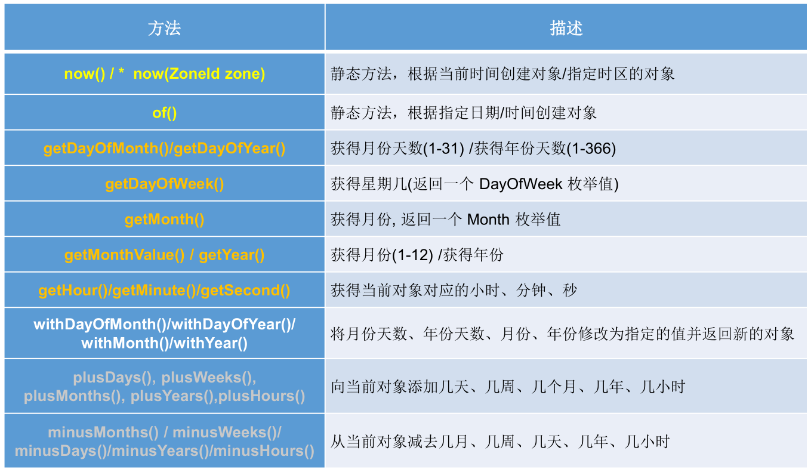

实例：

```java
public class Test {
    public static void main(String[] args) {
        // now()：获取当前的日期、时间、日期+时间
        LocalDate date = LocalDate.now();
        LocalTime time = LocalTime.now();
        LocalDateTime dateTime = LocalDateTime.now();
        System.out.println(date);// 2021-03-17
        System.out.println(time);// 11:37:43.400
        System.out.println(dateTime);// 2021-03-17T11:37:43.400

        // of()：自定义指定的年、月、日、时、分、秒对应的时间对象，没有偏移量
        LocalDate date1 = LocalDate.of(2020, 3, 17);
        LocalTime time1 = LocalTime.of(11, 4, 25);
        LocalDateTime dateTime1 = LocalDateTime.of(2020, 3, 17, 11, 05, 45);
        System.out.println(date1);// 2020-03-17
        System.out.println(time1);// 11:04:25
        System.out.println(dateTime1);// 2020-03-17T11:05:45

        // getXxx()：获取指定的时间信息
        System.out.println("年：" + dateTime.getYear());// 2021
        System.out.println("月：" + dateTime.getMonth());// MARCH
        System.out.println("月份数值：" + dateTime.getMonthValue());// 3
        System.out.println("日：" + dateTime.getDayOfMonth());// 17
        System.out.println("星期：" + dateTime.getDayOfWeek());// WEDNESDAY
        System.out.println("时：" + dateTime.getHour());// 11
        System.out.println("分：" + dateTime.getMinute());// 37
        System.out.println("秒：" + dateTime.getSecond());// 18

        // withXX()：设置时间为指定的值并返回新的对象---不可变性
        LocalDateTime dateTime2 = dateTime.withYear(2022);
        System.out.println(dateTime);// 2021-03-17T11:37:43.400
        System.out.println(dateTime2);// 2022-03-17T11:37:43.400

        // plusXxx()：在当前时间基础上做增减操作并返回新的对象---不可变性
        LocalDateTime dateTime3 = dateTime.plusYears(2);// 加2年
        System.out.println(dateTime);// 2021-03-17T11:37:43.400
        System.out.println(dateTime3);// 2023-03-17T11:37:43.400
        LocalDateTime dateTime4 = dateTime.minusYears(2);// 减2年
        System.out.println(dateTime);// 2021-03-17T11:37:43.400
        System.out.println(dateTime4);// 2019-03-17T11:37:43.400
    }
}
```

#### java.time.Instant 类（瞬时）

`Instant`：时间线上的一个瞬时点，这可能被用来记录应用程序中的事件时间戳。

在处理时间和日期的时候，我们通常会想到年，月，日，时，分，秒。然而，这只是时间的一个模型，是面向人类的。第二种通用模型是面向机器的，或者说是连续的。在此模型中，时间线中的一个点表示为一个很大的数，这有利于计算机处理。在 UNIX 中，这个数从 1970 年开始，以秒为的单位；同样的，在 Java 中，也是从 1970 年开始，但以毫秒为单位。

`java.time`包通过值类型 Instant 提供机器视图，不提供处理人类意义上的时间单位。Instant 表示时间线上的一点，而不需要任何上下文信息，例如，时区。概念上讲，它只是简单的表示自 1970 年 01 月 01 日 00 时 00 分 00 秒（UTC）开始的秒数。因为`java.time`包是基于纳秒计算的，所以 Instant 的精度可以达到`纳秒级`。

- 1秒 = 1000 毫秒 = 10^6 微秒 = 10^9 纳秒，即：1 ns = 10^-9 s。

常用方法：


>时间戳是指格林威治时间 1970 年 01 月 01 日 00 时 00 分 00 秒（北京时间 1970 年 01 月 01日 08 时 00 分 00 秒）起至现在的总秒数。

实例：

```java
public class Test {
    public static void main(String[] args) {
        Instant instant = Instant.now();// 默认UTC时区，本初子午线对应的标准时间
        System.out.println(instant);// 2021-03-17T03:50:15.672Z

        // 添加时间的偏移量
        OffsetDateTime now = instant.atOffset(ZoneOffset.ofHours(8));// 东八区时间，要加上8小时
        System.out.println(now);

        // 获取自1970-01-01 00:00:00(UTC)到当前时间的毫秒数   ---> Date类的getTime()方法
        long milli = instant.toEpochMilli();
        System.out.println(milli);

        // 通过给定的毫秒数，获取Instant实例   ---> new Date(long millis);
        Instant instant1 = Instant.ofEpochMilli(1615953468824L);
    }
}
```

#### java.time.format.DateTimeFormatter 类

格式化日期或时间，类似 SimpleDateFormat。

常用方法：


实例化方式一：预定义的标准格式。如：`ISO_LOCAL_DATE_TIME`、`ISO_LOCAL_DATE`、`ISO_LOCAL_TIME`。

```java
public class Test {
    public static void main(String[] args) {
        DateTimeFormatter formatter = DateTimeFormatter.ISO_LOCAL_DATE_TIME;
        // 格式化：日期 ---> 字符串
        LocalDateTime localDateTime = LocalDateTime.now();
        System.out.println(localDateTime);// 2021-03-17T13:18:37.907
        String str = formatter.format(localDateTime);
        System.out.println(str);// 2021-03-17T13:18:37.907

        // 解析：字符串 ---> 日期
        String str1 = "2021-03-17T13:17:33.274";// 只能解析此种格式的字符串
        TemporalAccessor parse = formatter.parse(str1);
        System.out.println(parse);// {},ISO resolved to 2021-03-17T13:17:33.274
    }
}
```

实例化方式二，本地化相关的格式：

- `ofLocalizedDateTime()`，三种格式：`FormatStyle.LONG`/`FormatStyle.MEDIUM`/`FormatStyle.SHORT`，适用于 LocalDateTime。

  ```java
  public class Test {
      public static void main(String[] args) {
          LocalDateTime localDateTime = LocalDateTime.now();
          System.out.println(localDateTime);// 2021-03-17T13:29:37.732
  
          DateTimeFormatter formatter1 = DateTimeFormatter.ofLocalizedDateTime(FormatStyle.LONG);
          String str1 = formatter1.format(localDateTime);
          System.out.println(str1);// 2021年3月17日 下午01时29分37秒
          DateTimeFormatter formatter2 = DateTimeFormatter.ofLocalizedDateTime(FormatStyle.MEDIUM);
          String str2 = formatter2.format(localDateTime);
          System.out.println(str2);// 2021-3-17 13:29:37
          DateTimeFormatter formatter3 = DateTimeFormatter.ofLocalizedDateTime(FormatStyle.SHORT);
          String str3 = formatter3.format(localDateTime);
          System.out.println(str3);// 21-3-17 下午1:29
      }
  }
  ```

- `ofLocalizedDate()`，四种格式：`FormatStyle.FULL`/`FormatStyle.LONG`/`FormatStyle.MEDIUM`/`FormatStyle.SHORT`，适用于LocalDate。

  ```java
  public class Test {
      public static void main(String[] args) {
          LocalDate localDate = LocalDate.now();
          System.out.println(localDate);// 2021-03-17
  
          DateTimeFormatter formatter1 = DateTimeFormatter.ofLocalizedDate(FormatStyle.FULL);
          String str1 = formatter1.format(localDate);
          System.out.println(str1);// 2021年3月17日 星期三
          DateTimeFormatter formatter2 = DateTimeFormatter.ofLocalizedDate(FormatStyle.LONG);
          String str2 = formatter2.format(localDate);
          System.out.println(str2);// 2021年3月17日
          DateTimeFormatter formatter3 = DateTimeFormatter.ofLocalizedDate(FormatStyle.MEDIUM);
          String str3 = formatter3.format(localDate);
          System.out.println(str3);// 2021-3-17
          DateTimeFormatter formatter4 = DateTimeFormatter.ofLocalizedDate(FormatStyle.SHORT);
          String str4 = formatter4.format(localDate);
          System.out.println(str4);// 21-3-17
      }
  }
  ```

**实例化方式三：自定义的格式，最常用。**如：`ofPattern("yyyy-MM-dd hh:mm:ss")`。

```java
public class Test {
    public static void main(String[] args) {
        DateTimeFormatter formatter = DateTimeFormatter.ofPattern("yyyy-MM-dd HH:mm:ss");
        String str = formatter.format(LocalDateTime.now());
        System.out.println(str);// 2021-03-17 13:13:52
        TemporalAccessor accessor = formatter.parse("2021-02-17 13:18:09");// 字符串需要严格匹配自定义的格式
        System.out.println(accessor);// {},ISO resolved to 2021-02-17T13:18:09
    }
}
```

#### 其他 API

`java.time.ZoneId`：该类中包含了所有的时区信息，一个时区的 ID，如 Europe/Paris。

```java
public class Test {
    public static void main(String[] args) {
        // ZoneId: 类中包含了所有的时区信息
        // ZoneId的getAvailableZoneIds(): 获取所有的ZoneId
        Set<String> zoneIds = ZoneId.getAvailableZoneIds();
        for (String s : zoneIds) {
            System.out.println(s);
        }
        // ZoneId的of(): 获取指定时区的时间
        LocalDateTime localDateTime = LocalDateTime.now(ZoneId.of("Asia/Tokyo"));
        System.out.println(localDateTime);
        // ZonedDateTime: 带时区的日期时间
        // ZonedDateTime的now(): 获取本时区的ZonedDateTime对象
        ZonedDateTime zonedDateTime = ZonedDateTime.now();
        System.out.println(zonedDateTime);
        // ZonedDateTime的now(ZoneId id): 获取指定时区的ZonedDateTime对象
        ZonedDateTime zonedDateTime1 = ZonedDateTime.now(ZoneId.of("Asia/Tokyo"));
        System.out.println(zonedDateTime1);
    }
}
```

`java.time.ZonedDateTime`：一个在 ISO-8601日历系统时区的日期时间，如 2007-12-03T10:15:30+01:00 Europe/Paris。

- 其中每个时区都对应着 ID，地区 ID 都为 "{区域}/{城市}" 的格式，例如：Asia/Shanghai 等。

`java.time.Clock`：使用时区提供对当前即时、日期和时间的访问的时钟。

**`java.time.Duration`：持续时间，用于计算两个 "时间" 间隔。**

```java
public class Test {
    public static void main(String[] args) {
        // Duration: 用于计算两个"时间"间隔，以秒和纳秒为基准

        // between(): 静态方法，返回Duration对象，表示两个时间的间隔
        LocalTime localTime = LocalTime.now();
        LocalTime localTime1 = LocalTime.of(15, 23, 32);
        Duration duration = Duration.between(localTime1, localTime);
        System.out.println(duration);
        System.out.println(duration.getSeconds());
        System.out.println(duration.getNano());

        LocalDateTime localDateTime = LocalDateTime.of(2016, 6, 12, 15, 23, 32);
        LocalDateTime localDateTime1 = LocalDateTime.of(2017, 6, 12, 15, 23, 32);
        Duration duration1 = Duration.between(localDateTime1, localDateTime);
        System.out.println(duration1.toDays());// -365
    }
}
```

**`java.time.Period`：日期间隔，用于计算两个 "日期" 间隔。**

```java
public class Test {
    public static void main(String[] args) {
        // Period:用于计算两个"日期"间隔，以年、月、日衡量
        LocalDate localDate = LocalDate.now();// 2021-3-17
        LocalDate localDate1 = LocalDate.of(2028, 3, 18);
        Period period = Period.between(localDate, localDate1);
        System.out.println(period);// P7Y1D
        System.out.println(period.getYears());// 7
        System.out.println(period.getMonths());// 0
        System.out.println(period.getDays());// 1
        Period period1 = period.withYears(2);
        System.out.println(period1);
    }
}
```

`java.time.temporal.TemporalAdjuster`：时间校正器。有时我们可能需要获取诸如将日期调整到 "下一个工作日" 等操作。

`java.time.temporal.TemporalAdjusters`：该类通过静态方法`firstDayOfXxx()`/`lastDayOfXxx()`/`nextXxx()`，提供了大量的常用 TemporalAdjuster 的实现。

```java
public class Test {
    public static void main(String[] args) {
        // TemporalAdjuster: 时间校正器
        // 获取当前日期的下一个周日是哪天？当前日期：2021-3-17
        TemporalAdjuster temporalAdjuster = TemporalAdjusters.next(DayOfWeek.SUNDAY);
        LocalDate localDateTime = LocalDate.now().with(temporalAdjuster);// LocalDateTime.now().with(temporalAdjuster)
        System.out.println("下一个周日是：" + localDateTime);// 下一个周日是：2021-03-21
        // 获取下一个工作日是哪天？
        LocalDate localDate = LocalDate.now().with(new TemporalAdjuster() {
            @Override
            public Temporal adjustInto(Temporal temporal) {
                LocalDate date = (LocalDate) temporal;
                if (date.getDayOfWeek().equals(DayOfWeek.FRIDAY)) {
                    return date.plusDays(3);
                } else if (date.getDayOfWeek().equals(DayOfWeek.SATURDAY)) {
                    return date.plusDays(2);
                } else {
                    return date.plusDays(1);
                }
            }
        });
        System.out.println("下一个工作日是：" + localDate);// 下一个工作日是：2021-03-18
    }
}
```

#### 与传统日期处理的转换


## 数字处理

### java.lang.Math 类

`java.lang.Math`类提供了一系列静态方法用于科学计算。其方法的参数和返回值类型一般为 double 型。常用的方法有：

- `abs()`：绝对值。
- `acos()`，`asin()`，`atan()`，`cos()`，`sin()`，`tan()`： 三角函数。
- `sqrt()`：平方根。
- `pow(double a,doble b)`：a 的 b 次幂。
- `log()`：自然对数。
- `exp()`：以 e 为底的指数。
- `max(double a,double b)`：较大值。
- `min(double a,double b)`：较小值。
- `random()`：返回 0.0 到 1.0 的随机数。
- `long round(double a)`：double 型数据 a 转换为 long 型（四舍五入）。
- `toDegrees(double angrad)`：弧度转换角度。
- `toRadians(double angdeg)`：角度转换弧度。

#### 随机数

获取 [a, b] 之间的随机数：

```java
int v = (int) (Math.random() * (b - a + 1) + a);
```

- `Math.random()`获得一个 [0, 1) 之间的随机数。

如获取 [10, 99] 之间的随机数：

```java
int v = (int) (Math.random() * 90 + 10);
```

也可使用`ThreadLocalRandom.current().nextInt(int bound)`或者`ThreadLocalRandom.current().nextInt(int bound) `：

```java
/**
 * Returns a pseudorandom {@code int} value between zero (inclusive)
 * and the specified bound (exclusive).
 *
 * @param bound the upper bound (exclusive).  Must be positive.
 * @return a pseudorandom {@code int} value between zero
 *         (inclusive) and the bound (exclusive)
 * @throws IllegalArgumentException if {@code bound} is not positive
 */
public int nextInt(int bound) {
    if (bound <= 0)
        throw new IllegalArgumentException(BadBound);
    int r = mix32(nextSeed());
    int m = bound - 1;
    if ((bound & m) == 0) // power of two
        r &= m;
    else { // reject over-represented candidates
        for (int u = r >>> 1;
             u + m - (r = u % bound) < 0;
             u = mix32(nextSeed()) >>> 1)
            ;
    }
    return r;
}
```

```java
/**
 * Returns a pseudorandom {@code double} value between 0.0
 * (inclusive) and the specified bound (exclusive).
 *
 * @param bound the upper bound (exclusive).  Must be positive.
 * @return a pseudorandom {@code double} value between zero
 *         (inclusive) and the bound (exclusive)
 * @throws IllegalArgumentException if {@code bound} is not positive
 */
public double nextDouble(double bound) {
    if (!(bound > 0.0))
        throw new IllegalArgumentException(BadBound);
    double result = (mix64(nextSeed()) >>> 11) * DOUBLE_UNIT * bound;
    return (result < bound) ?  result : // correct for rounding
        Double.longBitsToDouble(Double.doubleToLongBits(bound) - 1);
}
```

### java.math.BigInteger 类

Integer 类作为 int 的包装类，能存储的最大整型值为 2^31 - 1，Long 类也是有限的，最大为 2^63 - 1。如果要表示再大的整数，不管是基本数据类型还是他们的包装类都无能为力，更不用说进行运算了。

**`java.math`包的`BigInteger`类，可以表示不可变的任意精度的整数。**BigInteger 提供所有 Java 的基本整数操作符的对应物，并提供`java.lang.Math`的所有相关方法。另外，BigInteger 还提供以下运算：模算术、GCD 计算、质数测试、素数生成、位操作以及一些其他操作。

构造器：

- `BigInteger(String val)`：常用字符串构建 BigInteger 对象。

  

常用方法：

- `public BigInteger abs()`：返回此 BigInteger 的绝对值的 BigInteger。
- `BigInteger add(BigInteger val)`：返回其值为（this + val）的 BigInteger。
- `BigInteger subtract(BigInteger val)`：返回其值为（this - val）的 BigInteger。
- `BigInteger multiply(BigInteger val)`：返回其值为（this * val）的 BigInteger。
- `BigInteger divide(BigInteger val)`：返回其值为（this / val）的 BigInteger。整数相除只保留整数部分。
- `BigInteger remainder(BigInteger val)`：返回其值为（this % val）的 BigInteger。
- `BigInteger[] divideAndRemainder(BigInteger val)`：返回包含（this / val）后跟（this % val）的两个 BigInteger 的数组。
- `BigInteger pow(int exponent)`：返回其值为（this^exponent）的 BigInteger。

实例：

```java
public class Test {
    public static void main(String[] args) {
        BigInteger bi = new BigInteger("12433241123223262154841264166142223");
        System.out.println(bi);
    }
}
```

### java.math.BigDecimal 类

一般的 Float 类和 Double 类可以用来做科学计算或工程计算，但在商业计算中，要求数字精度比较高，故用到`java.math.BigDecimal`类。

**BigDecimal 类支持不可变的、任意精度的有符号十进制定点数。**

构造器：

- `public BigDecimal(double val)`
- `public BigDecimal(String val)`

常用方法：

- `public BigDecimal add(BigDecimal augend)`：加。
- `public BigDecimal subtract(BigDecimal subtrahend)`：减。
- `public BigDecimal multiply(BigDecimal multiplicand)`：乘。
- `public BigDecimal divide(BigDecimal divisor, int scale, int roundingMode)`：除。

实例：

```java
public class Test {
    public static void main(String[] args) {
        BigDecimal bd = new BigDecimal("12435.351");
        BigDecimal bd2 = new BigDecimal("11");
        // System.out.println(bd.divide(bd2));// 未指定精度，如果除不尽，会报错
        System.out.println(bd.divide(bd2, BigDecimal.ROUND_HALF_UP));// 四舍五入
        System.out.println(bd.divide(bd2, 15, BigDecimal.ROUND_HALF_UP));// 保留15位小数
    }
}
```

## 比较器

在 Java 中经常会涉及到对象数组等的排序问题，那么就涉及到对象之间的比较问题。

Java 实现对象排序的方式有两种：

- 自然排序：`java.lang.Comparable`
- 定制排序：`java.util.Comparator`

### java.lang.Comparable --- 自然排序

Comparable 接口强行对实现它的每个类的对象进行整体排序，这种排序被称为类的自然排序。

实现 Comparable 接口的类必须重写`compareTo(Object obj)`，两个对象通过`compareTo(Object obj)`的返回值来比较大小。

- **重写`compareTo(Object obj)`的规则：如果当前对象 this 大于形参对象 obj，则返回正整数，如果当前对象 this 小于形参对象 obj，则返回负整数，如果当前对象 this 等于形参对象 obj，则返回零。**

实现 Comparable 接口的对象列表或数组，可以通过`Collections.sort()`（针对集合）或`Arrays.sort()`（针对数组）进行自动排序。实现此接口的对象可以用作有序映射中的键或有序集合中的元素，无需指定比较器。

```java
public class Test {
    public static void main(String[] args) {
        // 集合排序
        List<String> list = new ArrayList<>();
        list.add("AA");
        list.add("VV");
        list.add("BB");
        list.add("AC");
        list.add("CC");
        list.add("EE");
        list.add("DE");
        for (String str : list) {
            System.out.print(str + " ");// AA VV BB AC CC EE DE
        }
        System.out.println();
        Collections.sort(list);
        for (String str : list) {
            System.out.print(str + " ");// AA AC BB CC DE EE VV
        }
        System.out.println();

        // 数组排序
        String[] strings = {"AA", "VV", "BB", "AC", "CC", "EE", "DE"};
        System.out.println(Arrays.toString(strings));// [AA, VV, BB, AC, CC, EE, DE]
        Arrays.sort(strings);
        System.out.println(Arrays.toString(strings));// [AA, AC, BB, CC, DE, EE, VV]
    }
}
```

对于类 C 的每一个 e1 和 e2 来说，当且仅当`e1.compareTo(e2) == 0`与`e1.equals(e2)`具有相同的 boolean 值时，类 C 的自然排序才叫做与 equals 一致。建议（虽然不是必需的）最好使自然排序与 equals 一致。

Comparable 的典型实现：（默认都是从小到大排列的）

- String 类：按照字符串中字符的 Unicode 值进行比较。
- Character 类：按照字符的 Unicode 值来进行比较。
- 数值类型对应的包装类以及 BigInteger 类、BigDecimal 类：按照它们对应的数值大小进行比较。
- Boolean 类：true 对应的包装类实例大于 false 对应的包装类实例。
- Date 类、Time 类等：后面的日期时间比前面的日期时间大。

对于自定义类来说，如果需要排序，我们可以让自定义类实现 Comparable 接口，并重写`compareTo(Object obj)`，在`compareTo(Object obj)`中，指明如何排序。

```java
public class Test {
    public static void main(String[] args) {
        Goods[] arr = new Goods[5];
        arr[0] = new Goods("lenovo", 34);
        arr[1] = new Goods("dell", 43);
        arr[2] = new Goods("xiaomi", 12);
        arr[3] = new Goods("huawei", 65);
        arr[4] = new Goods("microsoft", 43);

        // 排序前：[Goods{name='lenovo', price=34.0}, Goods{name='dell', price=43.0}, Goods{name='xiaomi', price=12.0}, Goods{name='huawei', price=65.0}, Goods{name='microsoft', price=43.0}]
        System.out.println("排序前：" + Arrays.toString(arr));
        Arrays.sort(arr);
        // 排序后：[Goods{name='xiaomi', price=12.0}, Goods{name='lenovo', price=34.0}, Goods{name='microsoft', price=43.0}, Goods{name='dell', price=43.0}, Goods{name='huawei', price=65.0}]
        System.out.println("排序后：" + Arrays.toString(arr));
    }
}

class Goods implements Comparable {
    private String name;
    private double price;

    public Goods() {
    }

    public Goods(String name, double price) {
        this.name = name;
        this.price = price;
    }

    public String getName() {
        return name;
    }

    public void setName(String name) {
        this.name = name;
    }

    public double getPrice() {
        return price;
    }

    public void setPrice(double price) {
        this.price = price;
    }

    @Override
    public String toString() {
        return "Goods{" +
                "name='" + name + '\'' +
                ", price=" + price +
                '}';
    }

    // 先按照价格从低到高进行排序，如果价格相同，再按照名称从高到低进行排序
    @Override
    public int compareTo(Object o) {
        if (o instanceof Goods) {
            Goods goods = (Goods) o;
            if (this.price > goods.price) {
                return 1;
            } else if (this.price < goods.price) {
                return -1;
            } else {
                return -this.name.compareTo(goods.name);
            }
            // return Double.compare(this.getPrice(), goods.getPrice());
        }
        throw new RuntimeException("传入的数据类型有误");
    }
}
```

### java.util.Comparator --- 定制排序

当元素的类型没有实现`java.lang.Comparable`接口而又不方便修改代码，或者实现了`java.lang.Comparable`接口的排序规则不适合当前的操作，那么可以考虑使用 Comparator 的对象来排序，强行对多个对象进行整体排序的比较。

```java
public class Test {
    public static void main(String[] args) {
        // 集合排序
        List<String> list = new ArrayList<>();
        list.add("AA");
        list.add("VV");
        list.add("BB");
        list.add("AC");
        list.add("CC");
        list.add("EE");
        list.add("DE");
        for (String str : list) {
            System.out.print(str + " ");// AA VV BB AC CC EE DE
        }
        System.out.println();
        // 不再以String本身默认的从小到大排序，而是从大到小排序
        Collections.sort(list, new Comparator<String>() {
            @Override
            public int compare(String o1, String o2) {
                return o2.compareTo(o1);
            }
        });
        for (String str : list) {
            System.out.print(str + " ");// VV EE DE CC BB AC AA
        }
        System.out.println();

        // 数组排序
        String[] strings = {"AA", "VV", "BB", "AC", "CC", "EE", "DE"};
        System.out.println(Arrays.toString(strings));// [AA, VV, BB, AC, CC, EE, DE]
        // 不再以String本身默认的从小到大排序，而是从大到小排序
        Arrays.sort(strings, new Comparator<String>() {
            @Override
            public int compare(String o1, String o2) {
                return -o1.compareTo(o2);
            }
        });
        System.out.println(Arrays.toString(strings));// [VV, EE, DE, CC, BB, AC, AA]
    }
}
```

重写`compare(Object o1,Object o2)`，比较 o1 和 o2 的大小： 如果方法返回正整数，则表示 o1 大于 o2；如果返回 0，表示相等；返回负整数，表示 o1 小于 o2。

```java
public class Test {
    public static void main(String[] args) {
        Goods[] arr = new Goods[5];
        arr[0] = new Goods("lenovo", 34);
        arr[1] = new Goods("dell", 43);
        arr[2] = new Goods("xiaomi", 12);
        arr[3] = new Goods("huawei", 65);
        arr[4] = new Goods("lenovo", 43);

        // 排序前：[Goods{name='lenovo', price=34.0}, Goods{name='dell', price=43.0}, Goods{name='xiaomi', price=12.0}, Goods{name='huawei', price=65.0}, Goods{name='lenovo', price=43.0}]
        System.out.println("排序前：" + Arrays.toString(arr));
        // 不以Goods本身的自然排序方式排序，更改为：按产品名称从低到高进行排序，如果名称相同，再按照价格从高到低进行排序
        Arrays.sort(arr, new Comparator<Goods>() {
            @Override
            public int compare(Goods o1, Goods o2) {
                if (!o1.getName().equals(o2.getName())) {
                    return o1.getName().compareTo(o2.getName());
                } else {
                    if (o1.getPrice() < o2.getPrice()) {
                        return 1;
                    } else if (o1.getPrice() > o2.getPrice()) {
                        return -1;
                    }
                }
                return 0;
            }
        });
        // 排序后：[Goods{name='dell', price=43.0}, Goods{name='huawei', price=65.0}, Goods{name='lenovo', price=43.0}, Goods{name='lenovo', price=34.0}, Goods{name='xiaomi', price=12.0}]
        System.out.println("排序后：" + Arrays.toString(arr));
    }
}

class Goods implements Comparable {
    private String name;
    private double price;

    public Goods() {
    }

    public Goods(String name, double price) {
        this.name = name;
        this.price = price;
    }

    public String getName() {
        return name;
    }

    public void setName(String name) {
        this.name = name;
    }

    public double getPrice() {
        return price;
    }

    public void setPrice(double price) {
        this.price = price;
    }

    @Override
    public String toString() {
        return "Goods{" +
                "name='" + name + '\'' +
                ", price=" + price +
                '}';
    }

    // 先按照价格从低到高进行排序，如果价格相同，再按照名称从高到低进行排序
    @Override
    public int compareTo(Object o) {
        if (o instanceof Goods) {
            Goods goods = (Goods) o;
            if (this.price > goods.price) {
                return 1;
            } else if (this.price < goods.price) {
                return -1;
            } else {
                return -this.name.compareTo(goods.name);
            }
            // return Double.compare(this.getPrice(), goods.getPrice());
        }
        throw new RuntimeException("传入的数据类型有误");
    }
}
```

可以将 Comparator 传递给`sort()`，比如：`Collections.sort()`或`Arrays.sort()`，从而允许在排序顺序上实现精确控制。

还可以使用 Comparator 来控制某些数据结构（如有序 set 或有序映射）的顺序，或者为那些没有自然顺序的对象 collection 提供排序。

### Comparable 和 Comparator 的对比

- Comparable 接口的方式一旦指定，能够保证 Comparable 接口实现类的对象在任何位置都可以比较大小。
- Comparator 接口属于临时性的比较，什么时候需要什么时候实现。

## 日志处理

### 常用日志处理工具

常见的 log 日志处理工具有：log4j、Logging、commons-logging、slf4j、logback。其中，commons-loggin、slf4j 是一种日志抽象门面，不是具体的日志框架；log4j、logback 是具体的日志实现框架。

一般使用`slf4j + logback`处理日志，也可以使用 slf4j + log4j、commons-logging + log4j 这两种日志组合框架。

### 日志级别

日志的输出都是分级别的，不同的场合设置不同的级别，以打印不同的日志。下面拿最普遍用的 log4j 日志框架来做个日志级别的说明，这个比较奇全，其他的日志框架也都大同小异。

log4j 的级别类 org.apache.log4j.Level 里面定义了日志级别，日志输出优先级由高到底分别为以下 8 种：

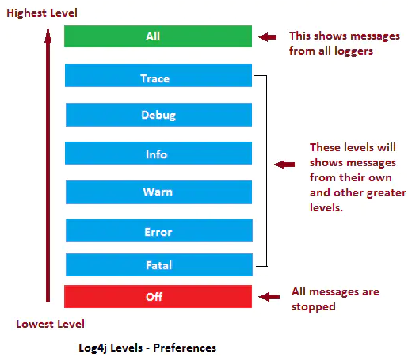

| 日志级别 | 描述                                               |
| -------- | -------------------------------------------------- |
| OFF      | 关闭：最高级别，不输出日志。                       |
| FATAL    | 致命：输出非常严重的可能会导致应用程序终止的错误。 |
| ERROR    | 错误：输出错误，但应用还能继续运行。               |
| WARN     | 警告：输出可能潜在的危险状况。                     |
| INFO     | 信息：输出应用运行过程的详细信息。                 |
| DEBUG    | 调试：输出更细致的对调试应用有用的信息。           |
| TRACE    | 跟踪：输出更细致的程序运行轨迹。                   |
| ALL      | 所有：输出所有级别信息。                           |

所以，日志优先级别标准顺序为：`ALL < TRACE < DEBUG < INFO < WARN < ERROR < FATAL < OFF`

如果日志设置为 L ，一个级别为 P 的输出日志只有当 P >= L 时日志才会输出。即如果日志级别 L 设置 INFO，只有 P 的输出级别为 INFO、WARN 以上时，后面的日志才会正常输出。

具体的输出关系可以参考下图：


### Lombok

`Lombok`是一种 Java 实用工具，可用来帮助开发人员消除 Java 的冗长代码，尤其是对于简单的 Java 对象（POJO）。它通过`注解`实现这一目的。

#### 引入

IDEA 安装插件：

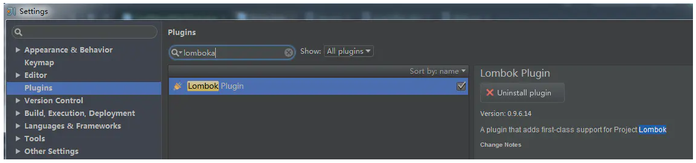

>注意：Lombok 是侵入性很高的一个 library。

Maven 添加依赖：

```xml
<dependency>
    <groupId>org.projectlombok</groupId>
    <artifactId>lombok</artifactId>
    <version>1.18.10</version>
</dependency>
```

#### 注解说明

常用注解：


##### @Getter 和 @Setter

自动生成 getter 和 setter 方法。


##### @ToString

自动重写`toString()`方法，打印所有变量。也可以加其他参数，例如`@ToString(exclude=”id”)`排除 id 属性，或者`@ToString(callSuper=true, includeFieldNames=true)`调用父类的`toString()`方法，包含所有属性。


##### @EqualsAndHashCode

自动生成`equals(Object other)`和`hashcode()`方法，包括所有非静态变量和非 transient 的变量。


如果某些变量不想要加进判断，可以通过 exclude 排除，也可以使用 of 指定某些字段。


>Java 中规定，当两个 object equals 时，它们的 hashcode 一定要相同，反之，当 hashcode 相同时，object 不一定 equals。所以 equals 和 hashcode 要一起 implement，免得出现违反 Java 规定的情形。

##### @NoArgsConstructor、@AllArgsConstructor 和 @RequiredArgsConstructor

这三个很像，都是自动生成该类的 constructor，差別只在生成的 constructor 的参数不一样而已。

`@NoArgsConstructor`：生成一个沒有参数的 constructor。


> 在 Java 中，如果沒有指定类的 constructor，Java Compiler 会自动生成一个无参构造器，但是如果自己写了 constructor 之后，Java 就不会再自动生成无参构造器。但是，很多时候，无参构造器是必须的，因此，为避免不必要的麻烦，应在类上至少加上`@NoArgsConstrcutor`。

`@AllArgsConstructor` ：生成一个包含所有参数的 constructor。


`@RequiredArgsConstructor`：生成一个包含 "特定参数" 的 constructor，特定参数指的是那些有加上 final 修饰词的变量。

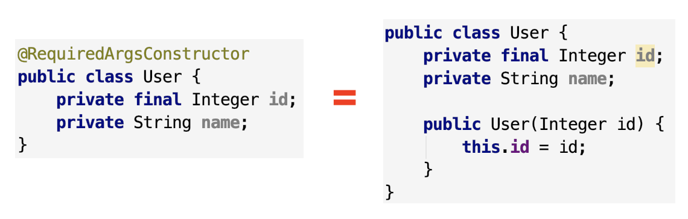

>如果所有的变量都沒有用 final 修饰，`@RequiredArgsConstructor`会生成一个沒有参数的 constructor。

##### @Data

等于同时添加了以下注解：`@Getter`，`@Setter`，`@ToString`，`@EqualsAndHashCode`和`@RequiredArgsConstructor`。


##### @Value

把所有的变量都设成 final，其他的就跟`@Data`类似，等于同时添加了以下注解：`@Getter`，`@ToString`，`@EqualsAndHashCode`和`@RequiredArgsConstructor`。


##### @Builder

自动生成流式 set 值写法。


注意，虽然只要加上`@Builder`注解，我们就能用流式写法快速设定 Object 的值，但是 setter 还是不应该舍弃的，因为 Spring 或是其他框架，有很多地方都会用到 Object 的 getter/setter 方法来对属性取值/赋值。

所以，通常是`@Data`和`@Builder`会一起用在同个类上，既方便流式写 code，也方便框架做事。比如：

```java
@Data
@Builder
public class User {
    private Integer id;
    private String name;
}
```

`@Slf4j`

自动生成该类的 log 静态常量，要打日志就可以直接打，不用再手动 new log 静态常量了。


除了`@Slf4j`之外，Lombok 也提供其他日志框架的几种注解，像是`@Log`，`@Log4j`等，他们都可以创建一个静态常量 log，只是使用的 library 不一样而已。

```java
@Log // 对应的log语句如下
private static final java.util.logging.Logger log = java.util.logging.Logger.getLogger(LogExample.class.getName());

@Log4j // 对应的log语句如下
private static final org.apache.log4j.Logger log = org.apache.log4j.Logger.getLogger(LogExample.class);
```

更多的参考：https://juejin.cn/post/6844903557016076302

### Logback

#### 引入

Maven 添加依赖：

```xml
<dependency>
    <groupId>ch.qos.logback</groupId>
    <artifactId>logback-classic</artifactId>
    <version>1.2.3</version>
</dependency>
```

>logback 依赖中，含有对 slf4j 的依赖。

#### 节点

configuration 为主节点，其主要字节点如下。

##### property

定义变量值的标签，有两个属性，`name`和`value`，定义变量后，可以使`"${name}"`来使用变量。

```xml
<property name="logging.level" value="INFO"/>
```

##### appender

日志打印的组件，定义打印过滤的条件、打印输出方式、滚动策略、编码方式、打印格式等。

种类：

- `ConsoleAppender`：把日志添加到控制台。

  ```xml
  <appender name="STDOUT" class="ch.qos.logback.core.ConsoleAppender">
     <encoder charset="utf-8">
        <pattern>%d{yyyy-MM-dd HH:mm:ss.SSS} [%thread] %-6level %logger{50} - %msg%n</pattern>
     </encoder>
  </appender>
  ```

- `FileAppender`：把日志添加到文件。

  ```xml
  <appender name="ReactionExtractorAppender" class="ch.qos.logback.core.FileAppender">
      <append>true</append>
      <filter class="ch.qos.logback.classic.filter.ThresholdFilter">
          <level>${logging.level}</level>
      </filter>
      <file>
          ${logging.path}/base.log
      </file>
      <encoder>
          <pattern>${message.format}</pattern>
          <charset>UTF-8</charset>
      </encoder>
  </appender>
  ```

- `RollingFileAppender`：FileAppender 的子类，滚动记录文件，先将日志记录到指定文件，当符合某个条件时，将日志记录到其他文件。

  ```xml
  <appender name="ReactionExtractorRollingAppender" class="ch.qos.logback.core.rolling.RollingFileAppender">
      <append>true</append>
      <filter class="ch.qos.logback.classic.filter.ThresholdFilter">
          <level>${logging.level}</level>
      </filter>
      <rollingPolicy class="ch.qos.logback.core.rolling.TimeBasedRollingPolicy">
          <FileNamePattern>${logging.path}/reaction-extractork-%d{yyyy-MM-dd}.log</FileNamePattern>
          <MaxHistory>30</MaxHistory>
      </rollingPolicy>
      <encoder>
          <pattern>${message.format}</pattern>
          <charset>UTF-8</charset>
      </encoder>
  </appender>
  ```

属性：

- `name`：指定 appender 的名称。

- `class`：指定 appender 的全限定名。

子节点：

- `append`：默认为 true，表示日志被追加到文件结尾，如果是 false，清空现存文件。

- `filter`：过滤器，执行完一个过滤器后返回 DENY，NEUTRAL，ACCEPT 三个枚举值中的一个。

  - filter 的返回值含义：

    - DENY：日志将立即被抛弃不再经过其他过滤器。
    - NEUTRAL：有序列表里的下个过滤器过接着处理日志。
    - ACCEPT：日志会被立即处理，不再经过剩余过滤器。

  - filter 的两种类型：

    - ThresholdFilter：临界值过滤器，过滤掉低于指定临界值的日志。当日志级别等于或高于临界值时，过滤器返回 NEUTRAL，当日志级别低于临界值时，日志会被拒绝。

      ```xml
      <filter class="ch.qos.logback.classic.filter.ThresholdFilter">
         <level>INFO</level>
      </filter>
      ```

    - LevelFilter：级别过滤器，根据日志级别进行过滤。如果日志级别等于配置级别，过滤器会根据 onMatch（用于配置符合过滤条件的操作）和 onMismatch（用于配置不符合过滤条件的操作）接收或拒绝日志。

      ```xml
      <filter class="ch.qos.logback.classic.filter.LevelFilter">   
         <level>INFO</level>   
         <onMatch>ACCEPT</onMatch>   
         <onMismatch>DENY</onMismatch>   
      </filter>
      ```

- `file`：指定被写入的文件名，可以是相对目录，也可以是绝对目录，如果上级目录不存在会自动创建，没有默认值。

- `rollingPolicy`：滚动策略，只有 appender 的 class 是 RollingFileAppender 时才需要配置。

  - TimeBasedRollingPolicy：根据时间来制定滚动策略，既负责滚动也负责触发滚动。

    ```xml
    <rollingPolicy class="ch.qos.logback.core.rolling.TimeBasedRollingPolicy">
       <!-- 日志文件输出的文件名：按天回滚 daily -->
       <FileNamePattern>
           ${logging.path}/glmapper-spring-boot/glmapper-loggerone.log.%d{yyyy-MM-dd HH:mm:ss.SSS}
       </FileNamePattern>
       <!-- 日志文件保留天数 -->
       <MaxHistory>30</MaxHistory>
    </rollingPolicy>
    ```

    > 每天生成一个日志文件，日志文件保存 30 天。

  - FixedWindowRollingPolicy：根据固定窗口算法重命名文件的滚动策略。

- `encoder`：对记录事件进行格式化。主要作用是：把日志信息转换成字节数组，以及把字节数组写入到输出流。

  ```xml
  <encoder class="ch.qos.logback.classic.encoder.PatternLayoutEncoder">
     <!-- 格式化输出：%d表示日期；%thread表示线程名；%-5level：级别从左显示5个字符宽度；%logger{50} 表示logger名字最长50个字符，否则按照句点分割；%msg：日志消息；%n是换行符 -->
     <pattern>%d{yyyy-MM-dd HH:mm:ss.SSS} [%thread] %-5level %logger{50} - %msg%n</pattern>
     <charset>UTF-8</charset>
  </encoder>
  ```

##### logger

用来设置某一个包或者具体的某一个类的日志打印级别以及指定 appender。

属性：

- `name`：指定受此 logger 约束的某一个包或者具体的某一个类。
- `level`：设置打印级别（TRACE，DEBUG，INFO，WARN，ERROR，ALL 和 OFF），还有一个值 INHERITED 或者同义词 NULL，代表强制执行上级的级别。如果没有设置此属性，那么当前 logger 将会继承上级的级别。
- `addtivity`：设置是否向上级 logger 传递打印信息，默认为 true。

```java
<logger name="com.glmapper.spring.boot.controller" level="${logging.level}" additivity="false">
    <appender-ref ref="GLMAPPER-LOGGERONE" />
</logger>
```

>com.glmapper.spring.boot.controller 这个包下的 ${logging.level} 级别的日志将会使用 GLMAPPER-LOGGERONE 来处理。

##### root

根 logger，也是一种 logger，但只有一个`level`属性。

#### 实例

```xml
<!-- 使用说明：
        1. logback核心jar包：logback-core-1.2.3.jar，logback-classic-1.2.3.jar，slf4j-api-1.7.25.jar
            1) logback官方建议配合slf4j使用
            2) logback手动下载地址：https://repo1.maven.org/maven2/ch/qos/logback/
            3) slf4j手动下载地址：https://www.mvnjar.com/org.slf4j/slf4j-api/1.7.25/detail.html
            4) jar包可以从maven仓库快速获取
        2. logback分为3个组件：logback-core，logback-classic和logback-access
            1) 其中logback-core提供了logback的核心功能，是另外两个组件的基础
            2) logback-classic实现了slf4j的API，所以当想配合slf4j使用时，需要将logback-classic加入classpath
            3) logback-access是为了集成servlet环境而准备的，可提供HTTP-access的日志接口
        3. 配置中KafkaAppender的jar包：logback-kafka-appender-0.2.0-RC1.jar
-->

<!-- 参考：
        https://juejin.im/post/5b51f85c5188251af91a7525
        https://my.oschina.net/Declan/blog/1793444
-->

<!-- 说明：logback.xml配置文件，需放置在项目的resources路径下 -->

<!-- configuration属性：
        scan：热加载，当此属性设置为true时，配置文件如果发生改变，将会被重新加载，默认值为true
        scanPeriod：设置监测配置文件是否有修改的时间间隔，如果没有给出时间单位，默认单位是毫秒。当scan为true时，此属性生效。默认的时间间隔为1分钟
        debug：当此属性设置为true时，将打印出logback内部日志信息，实时查看logback运行状态。默认值为false
        packagingData：是否打印包的信息。默认值为false
-->

<configuration
        debug="false"
        xmlns="http://ch.qos.logback/xml/ns/logback"
        xmlns:xsi="http://www.w3.org/2001/XMLSchema-instance"
        xsi:schemaLocation="http://ch.qos.logback/xml/ns/logback
        https://raw.githubusercontent.com/enricopulatzo/logback-XSD/master/src/main/xsd/logback.xsd"
>
    <!-- property：定义变量值，两个属性，name和value -->
    <property name="logging.path" value="./"/>
    <property name="logging.level" value="INFO"/>
    <!-- 日志格式化：
            %d：日期
            %thread：线程名
            %-5level：日志级别，从左显示5个字符宽度
            %logger{50}：logger名字最长50个字符，超过的按照句点分割
            %msg：日志消息
            %n：换行符
            %ex{full, DISPLAY_EX_EVAL}：异常信息，full表示全输出，可以替换为异常信息指定输出的行数
    -->
    <property name="message.format"
              value="%d{yyyy-MM-dd HH:mm:ss.SSS} [%thread] %-5level %logger{50} - %msg%n%ex{full, DISPLAY_EX_EVAL}"/>
    <!-- kafka topic -->
    <property name="topic.name" value="log-collect"/>
    <!-- 本地地址 -->
    <property name="bootstrap.servers" value="192.168.1.71:9092"/>
    <!-- 集群地址 -->
    <!-- <property name="bootstrap.servers" value="hadoopdatanode1:9092,hadoopdatanode2:9092,hadoopdatanode3:9092"/> -->

    <!-- appender种类：
            ConsoleAppender：把日志添加到控制台
            FileAppender：把日志添加到文件
            RollingFileAppender：滚动记录文件，先将日志记录到指定文件，当符合某个条件时，将日志记录到其他文件。FileAppender的子类
    -->

    <!-- 控制台输出日志 -->
    <appender name="STDOUT" class="ch.qos.logback.core.ConsoleAppender">
        <encoder>
            <pattern>%d{yyyy-MM-dd HH:mm:ss.SSS} [%thread] %-5level %logger{50} - %msg%n</pattern>
            <charset>UTF-8</charset>
        </encoder>
    </appender>

    <!-- 自定义输出日志到文件 -->
    <appender name="FileAppender" class="ch.qos.logback.core.FileAppender">
        <!-- append：true，日志被追加到文件结尾；false，清空现存文件；默认是true -->
        <append>true</append>
        <!-- 级别过滤器：
                ThresholdFilter：临界值过滤器，过滤掉低于指定临界值的日志
                LevelFilter：级别过滤器，需配置onMatch和onMismatch
        -->
        <filter class="ch.qos.logback.classic.filter.ThresholdFilter">
            <level>${logging.level}</level>
        </filter>
        <file>
            ${logging.path}/base.log
        </file>
        <encoder>
            <pattern>${message.format}</pattern>
            <charset>UTF-8</charset>
        </encoder>
    </appender>

    <!-- 自定义异常输出日志文件 -->
    <appender name="ErrorFileAppender" class="ch.qos.logback.core.FileAppender">
        <append>true</append>
        <filter class="ch.qos.logback.classic.filter.ThresholdFilter">
            <level>ERROR</level>
        </filter>
        <file>
            ${logging.path}/error-file.log
        </file>
        <encoder>
            <pattern>${message.format}</pattern>
            <charset>UTF-8</charset>
        </encoder>
    </appender>

    <!-- 自定义输出日志：滚动记录日志 -->
    <appender name="RollingFileAppender" class="ch.qos.logback.core.rolling.RollingFileAppender">
        <append>true</append>
        <filter class="ch.qos.logback.classic.filter.ThresholdFilter">
            <level>${logging.level}</level>
        </filter>
        <!-- 滚动策略：每天生成一个日志文件，保存365天的日志文件 -->
        <rollingPolicy class="ch.qos.logback.core.rolling.TimeBasedRollingPolicy">
            <!-- 日志文件输出的文件名：按天回滚 daily -->
            <FileNamePattern>${logging.path}/reaction-log-%d{yyyy-MM-dd HH:mm:ss.SSS}.log</FileNamePattern>
            <!-- 日志文件保留天数 -->
            <MaxHistory>365</MaxHistory>
        </rollingPolicy>
        <encoder>
            <pattern>${message.format}</pattern>
            <charset>UTF-8</charset>
        </encoder>
        <!-- 日志文件最大的大小 -->
        <triggeringPolicy class="ch.qos.logback.core.rolling.SizeBasedTriggeringPolicy">
            <MaxFileSize>50MB</MaxFileSize>
        </triggeringPolicy>
    </appender>

    <!-- 输出日志到kafka，参考：https://github.com/danielwegener/logback-kafka-appender -->
    <appender name="KafkaAppender" class="com.github.danielwegener.logback.kafka.KafkaAppender">
        <encoder>
            <pattern>${message.format}</pattern>
        </encoder>
        <topic>${topic.name}</topic>
        <keyingStrategy class="com.github.danielwegener.logback.kafka.keying.NoKeyKeyingStrategy"/>
        <deliveryStrategy class="com.github.danielwegener.logback.kafka.delivery.AsynchronousDeliveryStrategy"/>
        <!-- Optional parameter to use a fixed partition -->
        <!-- <partition>0</partition> -->
        <!-- Optional parameter to include log timestamps into the kafka message -->
        <!-- <appendTimestamp>true</appendTimestamp> -->
        <!-- each <producerConfig> translates to regular kafka-client config (format: key=value) -->
        <!-- producer configs are documented here: https://kafka.apache.org/documentation.html#newproducerconfigs -->
        <!-- bootstrap.servers is the only mandatory producerConfig -->
        <producerConfig>bootstrap.servers=${bootstrap.servers}</producerConfig>
        <!-- this is the fallback appender if kafka is not available. -->
        <appender-ref ref="FileAppender"/>
    </appender>

    <!-- 异步输出日志
            步骤：异步输出日志就是Logger.info负责往Queue(BlockingQueue)中放日志，然后再起个线程把Queue中的日志写到磁盘上
            参考：https://blog.csdn.net/lkforce/article/details/76637071
     -->
    <appender name="ASYNC" class="ch.qos.logback.classic.AsyncAppender">
        <!-- 不丢失日志。默认的，如果队列的80%已满，则会丢弃TRACT、DEBUG、INFO级别的日志 -->
        <discardingThreshold>0</discardingThreshold>
        <!-- 更改默认的队列的深度，该值会影响性能。默认值为256 -->
        <queueSize>100</queueSize>
        <!-- 添加附加的appender，最多只能添加一个，此处指定后，在root下不要再指定该appender，否则会输出两次 -->
        <appender-ref ref="KafkaAppender"/>
    </appender>

    <!--日志异步到数据库：未做测试，配置正确与否未知，先记录于此 -->
    <!--<appender name="DB" class="ch.qos.logback.classic.db.DBAppender">
        <connectionSource class="ch.qos.logback.core.db.DriverManagerConnectionSource">
            <dataSource class="com.mchange.v2.c3p0.ComboPooledDataSource">
                <driverClass>com.mysql.jdbc.Driver</driverClass>
                <url>jdbc:mysql://127.0.0.1:3306/databaseName</url>
                <user>root</user>
                <password>root</password>
            </dataSource>
        </connectionSource>
    </appender>-->

    <!-- 关闭指定包下的日志输出，name里面的内容可以是包路径，或者具体要忽略的文件名称 -->
    <logger name="org.apache.flink" level="OFF"/>
    <!-- 将指定包下指定级别的日志，输出到指定的appender中
            addtivity：是否向上级logger传递打印信息。默认是true。若此包下的日志单独输出到文件中，应设置为false，否则在root日志也会记录一遍 -->
    <logger name="org.apache.kafka" level="ERROR" addtivity="false">
        <!-- 指定此包下的error级别信息，输出到指定的收集文件 -->
        <appender-ref ref="ErrorFileAppender"/>
    </logger>

    <root level="${logging.level}">
        <!--<appender-ref ref="STDOUT"/>-->
        <!--<appender-ref ref="FileAppender"/>-->
        <appender-ref ref="ASYNC"/>
    </root>
</configuration>
```

> 根据实际情况，对 appender 进行取舍，实际使用时不要所有的都添加到 logback.xml 配置文件中。

## Java 8 的新特性

### 简介

Java 8（又称为 JDK 1.8）是 Java 语言开发的一个主要版本。Java 8 是 Oracle 公司于 2014 年 3 月发布，**可以看成是自 Java 5 以来最具革命性的版本。**Java 8 为 Java 语言、编译器、类库、开发工具与 JVM 带来了大量新特性。

Java 8 新特性一览：


- 速度更快。
- 代码更少（增加了新的语法：Lambda 表达式）。
- 强大的 Stream API。
- 便于并行。
- 最大化减少空指针异常：Optional。
- Nashorn 引擎，允许在 JVM上运行 JS 应用。

并行流和串行流：

- 并行流就是把一个内容分成多个数据块，并用不同的线程分别处理每个数据块的流。相比较串行的流，并行的流可以很大程度上提高程序的执行效率。
- Java 8 中将并行进行了优化，我们可以很容易的对数据进行并行操作。Stream API 可以声明性地通过`parallel()`与`sequential()`在并行流与顺序流之间进行切换。

### Lambda 表达式

`Lambda 是一个匿名函数`，我们可以把 Lambda 表达式理解为是一段可以传递的代码（将代码像数据一样进行传递）。使用它可以写出更简洁、更灵活的代码。作为一种更紧凑的代码风格，使 Java 的语言表达能力得到了提升。

Lambda 表达式：在 Java 8 语言中引入的一种新的语法元素和操作符。`这个操作符为 "->"，该操作符被称为 Lambda 操作符或箭头操作符。`它将 Lambda 分为两个部分：

- **左侧**：指定了 Lambda 表达式需要的参数列表。
- **右侧**：指定了 **Lambda 体**，是抽象方法的实现逻辑，也即 Lambda 表达式要执行的功能。

语法格式：


`类型推断`：上述 Lambda 表达式中的参数类型都是由编译器推断得出的。Lambda 表达式中无需指定类型，程序依然可以编译，这是因为 javac 根据程序的上下文，在后台推断出了参数的类型。Lambda 表达式的类型依赖于上下文环境，是由编译器推断出来的。这就是所谓的 类型推断。


```java
public class LambdaTest {
    // 语法格式三：数据类型可以省略，因为可由编译器推断得出，称为"类型推断"
    @Test
    public void test3() {
        Consumer<String> con1 = (String s) -> {
            System.out.println(s);
        };
        con1.accept("一个是听的人当真了，一个是说的人当真了");

        System.out.println("*******************");

        Consumer<String> con2 = (s) -> {
            System.out.println(s);
        };
        con2.accept("一个是听的人当真了，一个是说的人当真了");
    }

    @Test
    public void test4() {
        ArrayList<String> list = new ArrayList<>();// 类型推断，ArrayList<String> list = new ArrayList<String>();

        int[] arr = {1, 2, 3};// 类型推断，int[] arr = new int[]{1, 2, 3};
    }
}
```

Lambda 实例：

```java
/**
 * Lambda表达式的使用
 *
 * 1.举例: (o1,o2) -> Integer.compare(o1,o2);
 * 2.格式:
 *      ->: lambda操作符或箭头操作符
 *      ->左边：lambda形参列表(其实就是接口中的抽象方法的形参列表)
 *      ->右边：lambda体(其实就是重写的抽象方法的方法体)
 *
 * 3.Lambda表达式的使用: (分为6种情况介绍)
 *
 *    总结:
 *    ->左边: lambda形参列表的参数类型可以省略(类型推断)；如果lambda形参列表只有一个参数，其一对()也可以省略，其他情况不能省略
 *    ->右边: lambda体应该使用一对{}包裹；如果lambda体只有一条执行语句(也可能是return语句)，省略这一对{}和return关键字
 *
 * 4.Lambda表达式的本质: 作为函数式接口的实例
 *
 * 5.如果一个接口中，只声明了一个抽象方法，则此接口就称为函数式接口。我们可以在一个接口上使用@FunctionalInterface注解，
 *   这样做可以检查它是否是一个函数式接口。
 *
 * 6.所有以前用匿名实现类表示的现在都可以用Lambda表达式来写
 */
public class LambdaTest {
    // 语法格式一：无参，无返回值
    @Test
    public void test1() {
        Runnable r1 = new Runnable() {
            @Override
            public void run() {
                System.out.println("我爱北京天安门");
            }
        };
        r1.run();

        System.out.println("***********************");

        Runnable r2 = () -> {
            System.out.println("我爱北京故宫");
        }
        r2.run();
    }

    // 语法格式二：Lambda需要一个参数，但是没有返回值。
    @Test
    public void test2() {
        Consumer<String> con = new Consumer<String>() {
            @Override
            public void accept(String s) {
                System.out.println(s);
            }
        };
        con.accept("谎言和誓言的区别是什么？");

        System.out.println("*******************");

        Consumer<String> con1 = (String s) -> {
            System.out.println(s);
        }
        con1.accept("一个是听的人当真了，一个是说的人当真了");
    }

    // 语法格式三：数据类型可以省略，因为可由编译器推断得出，称为"类型推断"
    @Test
    public void test3() {
        Consumer<String> con1 = (String s) -> {
            System.out.println(s);
        };
        con1.accept("一个是听的人当真了，一个是说的人当真了");

        System.out.println("*******************");

        Consumer<String> con2 = (s) -> {
            System.out.println(s);
        };
        con2.accept("一个是听的人当真了，一个是说的人当真了");
    }

    // 语法格式四：Lambda若只需要一个参数时，参数的小括号可以省略
    @Test
    public void test4() {
        Consumer<String> con1 = (s) -> {
            System.out.println(s);
        };
        con1.accept("一个是听的人当真了，一个是说的人当真了");

        System.out.println("*******************");

        Consumer<String> con2 = s -> {
            System.out.println(s);
        };
        con2.accept("一个是听的人当真了，一个是说的人当真了");
    }

    // 语法格式五：Lambda需要两个或以上的参数，多条执行语句，并且可以有返回值
    @Test
    public void test5() {
        Comparator<Integer> com1 = new Comparator<Integer>() {
            @Override
            public int compare(Integer o1, Integer o2) {
                System.out.println(o1);
                System.out.println(o2);
                return o1.compareTo(o2);
            }
        };
        System.out.println(com1.compare(12, 21));

        System.out.println("*****************************");

        Comparator<Integer> com2 = (o1, o2) -> {
            System.out.println(o1);
            System.out.println(o2);
            return o1.compareTo(o2);
        };
        System.out.println(com2.compare(12, 6));
    }

    // 语法格式六：当Lambda体只有一条语句时，return与大括号若有，都可以省略
    @Test
    public void test6() {
        Comparator<Integer> com1 = (o1, o2) -> {
            return o1.compareTo(o2);
        };
        System.out.println(com1.compare(12, 6));

        System.out.println("*****************************");

        Comparator<Integer> com2 = (o1, o2) -> o1.compareTo(o2);
        System.out.println(com2.compare(12, 21));
    }

    @Test
    public void test7() {
        Consumer<String> con1 = s -> {
            System.out.println(s);
        };
        con1.accept("一个是听的人当真了，一个是说的人当真了");

        System.out.println("*****************************");

        Consumer<String> con2 = s -> System.out.println(s);
        con2.accept("一个是听的人当真了，一个是说的人当真了");
    }
}
```

### 函数式（Functional）接口

什么是函数式（Functional）接口：

- **`只包含一个抽象方法的接口，称为函数式接口。`**
- 你可以通过 Lambda 表达式来创建该接口的对象。（若 Lambda 表达式抛出一个受检异常（即：非运行时异常），那么该异常需要在目标接口的抽象方法上进行声明。）
- 我们可以在一个接口上使用**`@FunctionalInterface`**注解，这样做可以检查它是否是一个函数式接口。同时 javadoc 也会包含一条声明，说明这个接口是一个函数式接口。
- **在`java.util.function`包下定义了 Java 8 的丰富的函数式接口。**

如何理解函数式接口：

- Java 从诞生日起就是一直倡导 "一切皆对象"，在 Java 里面面向对象（OOP）编程是一切。但是随着 Python、Scala 等语言的兴起和新技术的挑战，Java 不得不做出调整以便支持更加广泛的技术要求，也即`Java 不但可以支持 OOP，还可以支持 OOF (面向函数编程)`。
- 在函数式编程语言当中，函数被当做一等公民对待。在将函数作为一等公民的编程语言中，Lambda 表达式的类型是函数。但是在 Java 8 中，有所不同。在 Java 8 中，Lambda 表达式是对象，而不是函数，它们必须依附于一类特别的对象类型——函数式接口。
- 简单的说，在 Java 8 中，**Lambda 表达式就是一个函数式接口的实例。**这就是 Lambda 表达式和函数式接口的关系。也就是说，只要一个对象是函数式接口的实例，那么该对象就可以用 Lambda 表达式来表示。
- **所有以前用匿名实现类表示的现在都可以用 Lambda 表达式来写。**

函数式接口举例：


自定义函数式接口：

- 函数式接口中不使用泛型：

  

- 函数式接口中使用泛型：

  

`作为参数传递 Lambda 表达式`：

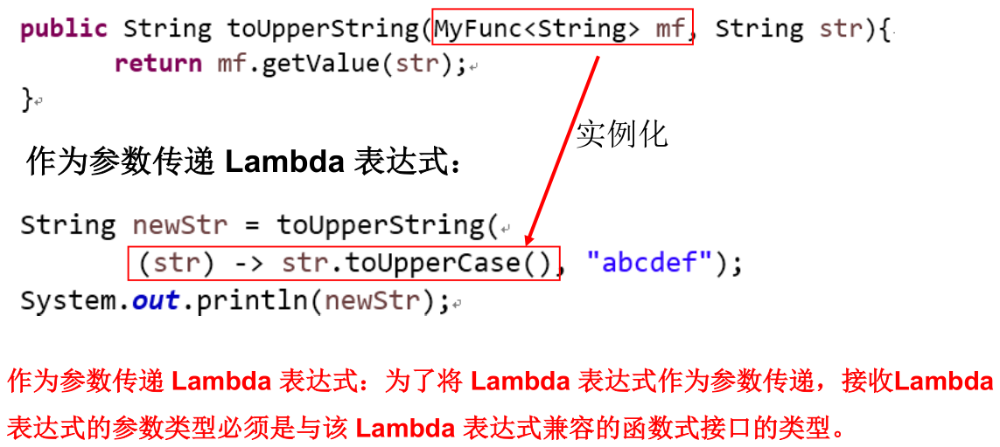

Java 内置四大核心函数式接口：


其他接口：


实例：

```java
/**
 * Java内置的4大核心函数式接口：
 *
 * 消费型接口 Consumer<T>     void accept(T t)
 * 供给型接口 Supplier<T>     T get()
 * 函数型接口 Function<T,R>   R apply(T t)
 * 断定型接口 Predicate<T>    boolean test(T t)
 */
public class LambdaTest {
    // 作为参数传递Lambda表达式
    // happyTime()：将参数1传给函数式接口con，Consumer函数式接口包含唯一方法accept()
    public void happyTime(double money, Consumer<Double> con) {
        con.accept(money);
    }

    @Test
    public void test1() {
        happyTime(500, new Consumer<Double>() {
            @Override
            public void accept(Double aDouble) {// 重写accept()
                System.out.println("学习太累了，去天上人间买了瓶矿泉水，价格为：" + aDouble);
            }
        });

        System.out.println("********************");

        happyTime(400, money -> System.out.println("学习太累了，去天上人间喝了口水，价格为：" + money));
    }

    // filterString()：根据给定的规则，过滤集合中的字符串。此规则由Predicate的方法决定
    // Predicate函数式接口包含唯一方法test()
    public List<String> filterString(List<String> list, Predicate<String> pre) {
        ArrayList<String> filterList = new ArrayList<>();
        // 过滤list中的每一个元素，通过Predicate实例test()验证的，添加到filterList中并返回
        for (String s : list) {
            if (pre.test(s)) {
                filterList.add(s);
            }
        }
        return filterList;
    }

    @Test
    public void test2() {
        List<String> list = Arrays.asList("北京", "南京", "天津", "东京", "西京", "普京");

        List<String> filterStrs = filterString(list, new Predicate<String>() {
            @Override
            public boolean test(String s) {// 重写test()
                return s.contains("京");
            }
        });
        System.out.println(filterStrs);

        System.out.println("********************");

        List<String> filterStrs1 = filterString(list, s -> s.contains("京"));
        System.out.println(filterStrs1);
    }
}
```

> 关于面向函数编程的精髓，可以从以下链接中体会：https://blog.csdn.net/qq_27416233/article/details/83418791

### 方法引用

**当要传递给 Lambda 体的操作，已经有实现的方法了，可以使用`方法引用 (Method References)`！**

方法引用可以看做是 Lambda 表达式深层次的表达。换句话说，**方法引用就是 Lambda 表达式，也就是函数式接口的一个实例，通过方法的名字来指向一个方法，可以认为是 Lambda 表达式的一个`语法糖`。**

格式：使用操作符**`::`**将类（或对象）与方法名分隔开来。

方法引用有如下三种主要使用情况：

- **`对象::实例方法名`**
- **`类::静态方法名`**
- **`类::实例方法`**

要求：

- 针对情况一和情况二：**实现接口的抽象方法的参数列表和返回值类型，必须与方法引用的方法的参数列表和返回值类型保持一致！**
- 针对情况三：**`ClassName::methodName`**，当函数式接口方法的第一个参数是方法引用的方法的调用者，并且第二个参数是方法引用的方法的参数（或无参数/返回值类型）时使用。

实例：

```java
public class Employee {

    private int id;
    private String name;
    private int age;
    private double salary;

    public int getId() {
        return id;
    }

    public void setId(int id) {
        this.id = id;
    }

    public String getName() {
        return name;
    }

    public void setName(String name) {
        this.name = name;
    }

    public int getAge() {
        return age;
    }

    public void setAge(int age) {
        this.age = age;
    }

    public double getSalary() {
        return salary;
    }

    public void setSalary(double salary) {
        this.salary = salary;
    }

    public Employee() {
        System.out.println("Employee().....");
    }

    public Employee(int id) {
        this.id = id;
        System.out.println("Employee(int id).....");
    }

    public Employee(int id, String name) {
        this.id = id;
        this.name = name;
    }

    public Employee(int id, String name, int age, double salary) {
        this.id = id;
        this.name = name;
        this.age = age;
        this.salary = salary;
    }

    @Override
    public String toString() {
        return "Employee{" + "id=" + id + ", name='" + name + '\'' + ", age=" + age + ", salary=" + salary + '}';
    }

    @Override
    public boolean equals(Object o) {
        if (this == o)
            return true;
        if (o == null || getClass() != o.getClass())
            return false;

        Employee employee = (Employee) o;

        if (id != employee.id)
            return false;
        if (age != employee.age)
            return false;
        if (Double.compare(employee.salary, salary) != 0)
            return false;
        return name != null ? name.equals(employee.name) : employee.name == null;
    }

    @Override
    public int hashCode() {
        int result;
        long temp;
        result = id;
        result = 31 * result + (name != null ? name.hashCode() : 0);
        result = 31 * result + age;
        temp = Double.doubleToLongBits(salary);
        result = 31 * result + (int) (temp ^ (temp >>> 32));
        return result;
    }
}
```

```java
/**
 * 方法引用的使用
 *
 * 1.使用情境：当要传递给Lambda体的操作，已经有实现的方法了，可以使用方法引用！
 *
 * 2.方法引用，本质上就是Lambda表达式，而Lambda表达式作为函数式接口的实例。所以方法引用，也是函数式接口的实例。
 *
 * 3. 使用格式：  类(或对象)::方法名
 *
 * 4. 具体分为如下的三种情况：
 *    情况1     对象::非静态方法
 *    情况2     类::静态方法
 *
 *    情况3     类::非静态方法
 *
 * 5. 方法引用使用的要求：要求接口中的抽象方法的形参列表和返回值类型与方法引用的方法的形参列表和返回值类型相同！（针对于情况1和情况2）
 */
public class MethodRefTest {
    // 情况一：对象::实例方法
    // Consumer中的void accept(T t)
    // PrintStream中的void println(T t)
    @Test
    public void test1() {
        // System.out.println(str)这个方法体，在PrintStream中已经存在实现的方法
        Consumer<String> con1 = str -> System.out.println(str);
        con1.accept("北京");

        System.out.println("*******************");

        PrintStream ps = System.out;// 利用System.out的对象，调用其println()方法
        Consumer<String> con2 = ps::println;
        con2.accept("beijing");
    }

    // Supplier中的T get()
    // Employee中的String getName()
    @Test
    public void test2() {
        Employee emp = new Employee(1001, "Tom", 23, 5600);

        // emp.getName()这个方法体，对应的就是emp对象的getName()方法
        Supplier<String> sup1 = () -> emp.getName();
        System.out.println(sup1.get());// 返回emp对象的name

        System.out.println("*******************");

        Supplier<String> sup2 = emp::getName;
        System.out.println(sup2.get());
    }

    // 情况二：类::静态方法
    // Comparator中的int compare(T t1,T t2)
    // Integer中的int compare(T t1,T t2)
    @Test
    public void test3() {
        Comparator<Integer> com1 = (t1, t2) -> Integer.compare(t1, t2);
        System.out.println(com1.compare(12, 21));

        System.out.println("*******************");

        Comparator<Integer> com2 = Integer::compare;
        System.out.println(com2.compare(12, 3));
    }

    // Function中的R apply(T t)
    // Math中的Long round(Double d)
    @Test
    public void test4() {
        Function<Double, Long> func = new Function<Double, Long>() {
            @Override
            public Long apply(Double d) {
                return Math.round(d);
            }
        };

        System.out.println("*******************");

        Function<Double, Long> func1 = d -> Math.round(d);// lambda表达式
        System.out.println(func1.apply(12.3));

        System.out.println("*******************");

        Function<Double, Long> func2 = Math::round;// 方法引用
        System.out.println(func2.apply(12.6));
    }

    // 情况三：类::实例方法  (有难度)
    // Comparator中的int comapre(T t1,T t2)
    // String中的int t1.compareTo(t2)
    @Test
    public void test5() {
        Comparator<String> com1 = (s1, s2) -> s1.compareTo(s2);
        System.out.println(com1.compare("abc", "abd"));

        System.out.println("*******************");

        Comparator<String> com2 = String::compareTo;
        System.out.println(com2.compare("abd", "abm"));
    }

    // BiPredicate中的boolean test(T t1, T t2);
    // String中的boolean t1.equals(t2)
    @Test
    public void test6() {
        // 原始写法
        BiPredicate<String, String> pre = new BiPredicate<String, String>() {
            @Override
            public boolean test(String s1, String s2) {
                return s1.equals(s2);
            }
        };
        System.out.println(pre.test("abc", "abc"));

        System.out.println("*******************");

        // lambda表达式：lambda体是参数1调用一个方法，参数2是那个方法的入参
        BiPredicate<String, String> pre1 = (s1, s2) -> s1.equals(s2);
        System.out.println(pre1.test("abc", "abc"));

        System.out.println("*******************");

        // 方法引用：String类的equals()符合上述lambda体的功能
        BiPredicate<String, String> pre2 = String::equals;
        System.out.println(pre2.test("abc", "abd"));
    }

    // Function中的R apply(T t)
    // Employee中的String getName();
    @Test
    public void test7() {
        Employee employee = new Employee(1001, "Jerry", 23, 6000);

        // 原始写法：lambda体是参数1调用一个方法，返回一个参数2类型的值
        Function<Employee, String> func = new Function<Employee, String>() {
            @Override
            public String apply(Employee employee) {
                return employee.getName();
            }
        };

        System.out.println("*******************");

        // lambda表达式：Employee类的getName()符合上述lambda体的功能
        Function<Employee, String> func1 = e -> e.getName();
        System.out.println(func1.apply(employee));

        System.out.println("*******************");

        // 方法引用
        Function<Employee, String> func2 = Employee::getName;
        System.out.println(func2.apply(employee));
    }
}
```

### 构造器引用

格式：**`ClassName::new`**

与函数式接口相结合，自动与函数式接口中方法兼容。可以把构造器引用赋值给定义的方法，**要求构造器参数列表要与接口中抽象方法的参数列表一致，且方法的返回值即为构造器对应类的对象。**

实例：

```java
/**
 * 一、构造器引用
 *      和方法引用类似，函数式接口的抽象方法的形参列表和构造器的形参列表一致。
 *      抽象方法的返回值类型即为构造器所属的类的类型
 */
public class ConstructorRefTest {
    // 构造器引用
    // Supplier中的T get()
    // Employee的空参构造器：Employee()
    @Test
    public void test1() {
        // 原始写法
        Supplier<Employee> sup = new Supplier<Employee>() {
            @Override
            public Employee get() {
                return new Employee();
            }
        };
        System.out.println(sup.get());

        System.out.println("*******************");

        // Lambda表达式
        Supplier<Employee> sup1 = () -> new Employee();
        System.out.println(sup1.get());

        System.out.println("*******************");

        // 方法引用：Employee的无参构造器符合上述Lambda体
        Supplier<Employee> sup2 = Employee::new;
        System.out.println(sup2.get());
    }

    // Function中的R apply(T t)
    @Test
    public void test2() {
        // 原始写法
        Function<Integer, Employee> func = new Function<Integer, Employee>() {
            @Override
            public Employee apply(Integer id) {
                return new Employee(id);
            }
        };
        Employee employee = func.apply(1000);
        System.out.println(employee);

        System.out.println("*******************");

        // Lambda表达式
        Function<Integer, Employee> func1 = id -> new Employee(id);
        Employee employee1 = func1.apply(1001);
        System.out.println(employee1);

        System.out.println("*******************");

        // 方法引用：Employee的带id的有参构造器符合上述Lambda体
        Function<Integer, Employee> func2 = Employee::new;
        Employee employee2 = func2.apply(1002);
        System.out.println(employee2);
    }

    // BiFunction中的R apply(T t,U u)
    @Test
    public void test3() {
        // 原始写法
        BiFunction<Integer, String, Employee> func = new BiFunction<Integer, String, Employee>() {
            @Override
            public Employee apply(Integer id, String name) {
                return new Employee(id, name);
            }
        };
        System.out.println(func.apply(1000, "Tom"));

        System.out.println("*******************");

        // Lambda表达式
        BiFunction<Integer, String, Employee> func1 = (id, name) -> new Employee(id, name);
        System.out.println(func1.apply(1001, "Tom"));

        System.out.println("*******************");

        // 方法引用：Employee的带id和name的有参构造器符合上述Lambda体
        BiFunction<Integer, String, Employee> func2 = Employee::new;
        System.out.println(func2.apply(1002, "Tom"));
    }
}
```

### 数组引用

格式：**`type[]::new`**

可以把数组看做是一个特殊的类，则写法与构造器引用一致。

实例：

```java
/**
 * 二、数组引用
 *     大家可以把数组看做是一个特殊的类，则写法与构造器引用一致。
 */
public class ConstructorRefTest {
    // 数组引用
    // Function中的R apply(T t)
    @Test
    public void test4() {
        // 原始写法
        Function<Integer, String[]> func = new Function<Integer, String[]>() {
            @Override
            public String[] apply(Integer length) {
                return new String[length];
            }
        };
        String[] arr = func.apply(1);
        System.out.println(Arrays.toString(arr));

        System.out.println("*******************");

        // Lambda表达式
        Function<Integer, String[]> func1 = length -> new String[length];
        String[] arr1 = func1.apply(5);
        System.out.println(Arrays.toString(arr1));

        System.out.println("*******************");

        // 方法引用
        Function<Integer, String[]> func2 = String[]::new;
        String[] arr2 = func2.apply(10);
        System.out.println(Arrays.toString(arr2));
    }
}
```

### 强大的 Stream API

Java 8 中有两大最为重要的改变。第一个是`Lambda 表达式`；另外一个则是`Stream API`。

Stream API（`java.util.stream`）把真正的函数式编程风格引入到 Java 中。这是目前为止对 Java 类库最好的补充，因为 Stream API 可以极大提供 Java 程序员的生产力，让程序员写出高效率、干净、简洁的代码。

Stream 是 Java 8 中处理集合的关键抽象概念，它可以指定你希望对集合进行的操作，可以执行非常复杂的查找、过滤和映射数据等操作。 使用 Stream API 对集合数据进行操作，就类似于使用 SQL 执行的数据库查询。也可以使用 Stream API 来并行执行操作。简言之，Stream API 提供了一种高效且易于使用的处理数据的方式。

为什么要使用 Stream API：

- 实际开发中，项目中多数数据源都来自于 Mysql，Oracle 等。但现在数据源可以更多了，有 MongDB，Redis 等，而这些 NoSQL 的数据就需要 Java 层面去处理。
- **Stream 和 Collection 集合的区别：Collection 是一种静态的内存数据结构，而 Stream 是有关计算的。`Collection 主要面向内存`，存储在内存中，`Stream 主要面向 CPU`，通过 CPU 实现计算。**

**Stream 就是一个数据渠道，用于操作数据源（集合、数组等）所生成的元素序列。"集合讲的是数据，Stream 讲的是计算！"**

**Stream 的特性：**

- **Stream 自己不会存储元素。**
- **Stream 不会改变源对象。相反，他们会返回一个持有结果的新 Stream。**
- **Stream 操作是延迟执行的。这意味着他们会等到需要结果的时候才执行。**

Stream 操作的三个步骤：

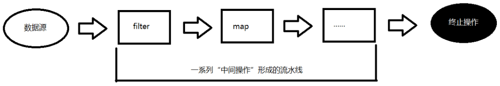

- **`1 - 创建 Stream`**
  - 一个数据源（如：集合、数组），获取一个流。
- **`2 - 中间操作`**
  - 一个中间操作链，对数据源的数据进行处理。
- **`3 - 终止操作 (终端操作)`**
  - 一旦执行终止操作，就执行中间操作链，并产生结果。之后，不会再被使用。

**步骤一：Stream 的四种创建方式。**

- 方式一：通过`集合`

  - Java 8 中的 Collection 接口被扩展，提供了两个获取流的方法：
    - **`default Stream<E> stream()`**：返回一个顺序流。
    - **`default Stream<E> parallelStream()`**：返回一个并行流。

- 方式二：通过`数组`

  - Java 8 中的 Arrays 类的静态方法`stream()`可以获取数组流：
    - **`static <T> Stream<T> stream(T[] array)`**：返回一个特殊对象数组的流。
  - 重载形式，能够处理对应基本类型的数组：
    - `public static IntStream stream(int[] array)`：返回一个 int 数组的流。
    - `public static LongStream stream(long[] array)`：返回一个 long 数组的流。
    - `public static DoubleStream stream(double[] array)`：返回一个 double 数组的流。

- 方式三：通过 Stream 类的`of()`

  - 可以调用 Stream 类静态方法`of()`，通过显示值创建一个流。它可以接收任意数量的参数。
    - **`public static<T> Stream<T> of(T... values)`**：返回一个流。

- 方式四：创建`无限流`

  - 可以使用静态方法`Stream.iterate()`和`Stream.generate()`这两种方式，创建无限流。
    - 迭代：`public static<T> Stream<T> iterate(final T seed, final UnaryOperator<T> f)`
    - 生成：`public static<T> Stream<T> generate(Supplier<T> s)`

- 实例：

  ```java
  /**
   * 提供用于测试的数据
   */
  public class EmployeeData {
      public static List<Employee> getEmployees() {
          List<Employee> list = new ArrayList<>();
          list.add(new Employee(1001, "马1", 34, 6000.38));
          list.add(new Employee(1002, "马2", 12, 9876.12));
          list.add(new Employee(1003, "刘", 33, 3000.82));
          list.add(new Employee(1004, "雷", 26, 7657.37));
          list.add(new Employee(1005, "李", 65, 5555.32));
          list.add(new Employee(1006, "比", 42, 9500.43));
          list.add(new Employee(1007, "任", 26, 4333.32));
          return list;
      }
  }
  ```

  ```java
  /**
   * 1. Stream关注的是对数据的运算，与CPU打交道
   *    集合关注的是数据的存储，与内存打交道
   *
   * 2.
   * 	① Stream自己不会存储元素。
   * 	② Stream不会改变源对象。相反，他们会返回一个持有结果的新Stream。
   * 	③ Stream操作是延迟执行的。这意味着他们会等到需要结果的时候才执行
   *
   * 3.Stream执行流程
   * 	① Stream的实例化
   * 	② 一系列的中间操作(过滤、映射、...)
   * 	③ 终止操作
   *
   * 4.说明：
   * 4.1 一个中间操作链，对数据源的数据进行处理
   * 4.2 一旦执行终止操作，就执行中间操作链，并产生结果。之后，不会再被使用
   *
   *  测试Stream的实例化
   */
  public class StreamAPITest {
      // 创建Stream方式一：通过集合
      @Test
      public void test1() {
          List<Employee> employees = EmployeeData.getEmployees();
  
          // 方法一：
          // default Stream<E> stream() : 返回一个顺序流
          Stream<Employee> stream = employees.stream();
  
          // 方法二：
          // default Stream<E> parallelStream() : 返回一个并行流
          Stream<Employee> parallelStream = employees.parallelStream();
      }
  
      // 创建Stream方式二：通过数组
      @Test
      public void test2() {
          int[] arr = new int[]{1, 2, 3, 4, 5, 6};
  
          // 调用Arrays类的static <T> Stream<T> stream(T[] array): 返回一个流
  
          IntStream stream = Arrays.stream(arr);
  
          Employee e1 = new Employee(1001, "Tom");
          Employee e2 = new Employee(1002, "Jerry");
          Employee[] arr1 = new Employee[]{e1, e2};
          Stream<Employee> stream1 = Arrays.stream(arr1);
      }
  
      // 创建Stream方式三：通过Stream的of()
      @Test
      public void test3() {
          Stream<Integer> stream = Stream.of(1, 2, 3, 4, 5, 6);
  
          Stream<String> stringStream = Stream.of("A", "B", "C", "D", "E", "F");
      }
  
      // 创建Stream方式四：创建无限流 --- 用的比较少
      @Test
      public void test4() {
  
          // 迭代
          // public static<T > Stream < T > iterate( final T seed, final UnaryOperator<T> f)
          // 遍历前10个偶数
          Stream.iterate(0, t -> t + 2).limit(10).forEach(System.out::println);// 从0开始，后一个数是前一个数+2
  
  
          // 生成
          // public static<T> Stream<T> generate(Supplier<T> s)
          // 遍历前10个随机数
          Stream.generate(Math::random).limit(10).forEach(System.out::println);
      }
  }
  ```

**步骤二：Stream 的中间操作。**

- **多个中间操作可以连接起来形成一个流水线，`除非流水线上触发终止操作，否则中间操作不会执行任何的处理`！而在终止操作时一次性全部处理，这称为`惰性求值`。**

- 操作 1 -` 筛选与切片`：

  

- 操作 2 - `映射`：

  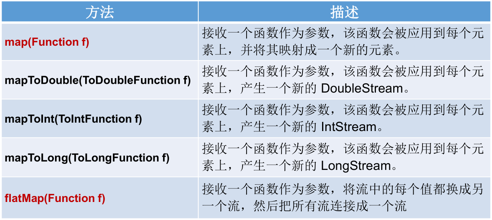

- 操作 3 - `排序`：

  

- 实例：

  ```java
  /**
   * 测试Stream的中间操作
   */
  public class StreamAPITest {
      // 1-筛选与切片
      @Test
      public void test1() {
          List<Employee> list = EmployeeData.getEmployees();
  
          // filter(Predicate p) --- 接收Lambda，从流中排除某些元素。
          // 练习：查询员工表中薪资大于7000的员工信息
          list.stream().filter(e -> e.getSalary() > 7000).forEach(System.out::println);
  
          System.out.println("************************");
  
          // limit(n) --- 截断流，使其元素不超过给定数量n。
          // 练习：打印员工表中前三名的员工信息
          list.stream().limit(3).forEach(System.out::println);// 前一个流已经关闭，必须重新建一个流
  
          System.out.println("************************");
  
          // skip(n) --- 跳过元素，返回一个扔掉了前n个元素的流。若流中元素不足n个，则返回一个空流。与limit(n)互补。
          // 练习：跳过员工表中前三名的员工信息，然后打印之后的每个员工的信息
          list.stream().skip(3).forEach(System.out::println);
  
          System.out.println("************************");
  
          // distinct() --- 筛选，通过流所生成元素的hashCode()和equals()去除重复元素
          list.add(new Employee(1010, "刘强东", 40, 8000));
          list.add(new Employee(1010, "刘强东", 41, 8000));
          list.add(new Employee(1010, "刘强东", 40, 8000));
          list.add(new Employee(1010, "刘强东", 40, 8000));
          list.add(new Employee(1010, "刘强东", 40, 8000));
          // System.out.println(list);
          list.stream().distinct().forEach(System.out::println);
      }
  
      // 2-映射
      @Test
      public void test2() {
          // map(Function f) --- 接收一个函数作为参数，将元素转换成其他形式或提取信息，
          // 						该函数会被应用到每个元素上，并将其映射成一个新的元素。
          //      ---> 类似于List的add()：如果流的每个值转换成新流，则将每个新流作为一个元素组成新的流
          //            即类似：[1, [1, 2], 5, [1, 3, 2, 5], 9]
  
          // 练习1：将list中的每一个元素变成大写并打印
          List<String> list = Arrays.asList("aa", "bb", "cc", "dd");
          // list.stream().map(str -> str.toUpperCase()).forEach(System.out::println);
          list.stream().map(String::toUpperCase).forEach(System.out::println);
  
          System.out.println();
  
          // 练习2：获取员工姓名长度大于3的员工的姓名。
          List<Employee> employees = EmployeeData.getEmployees();
          Stream<String> namesStream = employees.stream().map(Employee::getName);
          namesStream.filter(name -> name.length() > 3).forEach(System.out::println);
  
          System.out.println();
  
          //  练习3：
          Stream<Stream<Character>> streamStream = list.stream().map(StreamAPITest::fromStringToStream);
          // streamStream.forEach(System.out::println);
          // 体会下下面的写法与上面写法的区别
          streamStream.forEach(s -> {
              s.forEach(System.out::println);
          });
  
          System.out.println("************************");
  
          // flatMap(Function f) --- 接收一个函数作为参数，将流中的每个值都换成另一个流，然后把所有流连接成一个流。
          //      ---> 似于List的addAll()：如果流的每个值转换成新流，则将每个新流的值组合连接成一个流
          //            即类似：[1, 1, 2, 5, 1, 3, 2, 5, 9]
          Stream<Character> characterStream = list.stream().flatMap(StreamAPITest::fromStringToStream);
          characterStream.forEach(System.out::println);
      }
  
      // 将字符串中的多个字符构成的集合转换为对应的Stream的实例
      public static Stream<Character> fromStringToStream(String str) {// 如：aa--->返回两个字符a组成的集合对应的流
          ArrayList<Character> list = new ArrayList<>();
          for (Character c : str.toCharArray()) {
              list.add(c);
          }
          return list.stream();
      }
  
      // 对比map()和flatmap()的区别
      @Test
      public void test3() {
          ArrayList list1 = new ArrayList();
          list1.add(1);
          list1.add(2);
          list1.add(3);
  
          ArrayList list2 = new ArrayList();
          list2.add(4);
          list2.add(5);
          list2.add(6);
  
          list1.add(list2);// [1, 2, 3, [4, 5, 6]]
          list1.addAll(list2);// [1, 2, 3, 4, 5, 6]
          System.out.println(list1);
      }
  
      // 3-排序
      @Test
      public void test4() {
          // sorted() --- 自然排序
          List<Integer> list = Arrays.asList(12, 43, 65, 34, 87, 0, -98, 7);
          list.stream().sorted().forEach(System.out::println);
          // 抛异常，原因: Employee没有实现Comparable接口
          // List<Employee> employees = EmployeeData.getEmployees();
          // employees.stream().sorted().forEach(System.out::println);
  
  
          // sorted(Comparator com) --- 定制排序
          List<Employee> employees = EmployeeData.getEmployees();
          employees.stream().sorted((e1, e2) -> {
              int ageValue = Integer.compare(e1.getAge(), e2.getAge());// 先按年龄
              if (ageValue != 0) {
                  return ageValue;
              } else {
                  return -Double.compare(e1.getSalary(), e2.getSalary());// 再按薪水
              }
          }).forEach(System.out::println);
      }
  }
  ```

**步骤三：Stream 的终止操作。**

终端操作会从流的流水线生成结果。其结果可以是任何不是流的值，例如：List、Integer，甚至是 void。

`流进行了终止操作后，不能再次使用。`

操作 1 - `匹配与查找`：


操作 2 - `归约`：


- map 和 reduce 的连接通常称为`map-reduce`模式，因 Google 用它来进行网络搜索而出名。
- **map 是一对一映射，由 n 到 n；reduce 是多对一归约，由 n 到 1。**

操作 3 - `收集`：


- Collector 接口中方法的实现决定了如何对流执行收集的操作，如收集到 List、Set、Map 等。

- Collectors 实用类提供了很多静态方法，可以方便地创建常见收集器实例 (Collector 实例)，具体方法与实例如下表：

  

  

实例：

```java
/**
 * 测试Stream的终止操作
 */
public class StreamAPITest {
    // 1-匹配与查找
    @Test
    public void test1() {
        List<Employee> employees = EmployeeData.getEmployees();

        // allMatch(Predicate p) --- 检查是否匹配所有元素。
        // 练习：是否所有的员工的年龄都大于18
        boolean allMatch = employees.stream().allMatch(e -> e.getAge() > 18);
        System.out.println(allMatch);

        // anyMatch(Predicate p) --- 检查是否至少匹配一个元素。
        // 练习：是否存在员工的工资大于10000
        boolean anyMatch = employees.stream().anyMatch(e -> e.getSalary() > 10000);
        System.out.println(anyMatch);

        // noneMatch(Predicate p) ---- 检查是否没有匹配的元素。如果有，返回false
        // 练习：是否存在员工姓"雷"
        boolean noneMatch = employees.stream().noneMatch(e -> e.getName().startsWith("雷"));
        System.out.println(noneMatch);

        // findFirst() --- 返回第一个元素
        Optional<Employee> employee = employees.stream().findFirst();
        System.out.println(employee);

        // findAny() --- 返回当前流中的任意元素
        Optional<Employee> employee1 = employees.parallelStream().findAny();
        System.out.println(employee1);
    }

    @Test
    public void test2() {
        List<Employee> employees = EmployeeData.getEmployees();
        // count --- 返回流中元素的总个数
        // 练习：返回工资高于5000的员工个数
        long count = employees.stream().filter(e -> e.getSalary() > 5000).count();
        System.out.println(count);

        // max(Comparator c) --- 返回流中最大值
        // 练习：返回最高的工资
        Stream<Double> salaryStream = employees.stream().map(Employee::getSalary);
        Optional<Double> maxSalary = salaryStream.max(Double::compare);
        System.out.println(maxSalary);

        // min(Comparator c) --- 返回流中最小值
        // 练习：返回最低工资的员工
        Optional<Employee> employee = employees.stream().min((e1, e2) -> Double.compare(e1.getSalary(), e2.getSalary()));
        System.out.println(employee);

        System.out.println("************************");

        // forEach(Consumer c) --- 内部迭代
        employees.stream().forEach(System.out::println);
        // 外部迭代
        Iterator<Employee> iterator = employees.iterator();
        while (iterator.hasNext()) {
            System.out.println(iterator.next());
        }
        // 使用集合的遍历操作方法
        employees.forEach(System.out::println);
    }

    // 2-归约
    @Test
    public void test3() {
        // reduce(T identity, BinaryOperator) --- 可以将流中元素反复结合起来，得到一个值。返回T
        // 练习1：计算1-10的自然数的和
        List<Integer> list = Arrays.asList(1, 2, 3, 4, 5, 6, 7, 8, 9, 10);
        Integer sum = list.stream().reduce(0, Integer::sum);// 有一个初始值，在初始值基础上操作
        System.out.println(sum);

        // reduce(BinaryOperator) --- 可以将流中元素反复结合起来，得到一个值。返回Optional<T>
        // 练习2：计算公司所有员工工资的总和
        List<Employee> employees = EmployeeData.getEmployees();
        Stream<Double> salaryStream = employees.stream().map(Employee::getSalary);
        Optional<Double> sumMoney = salaryStream.reduce((d1, d2) -> d1 + d2);
        // Optional<Double> sumMoney = salaryStream.reduce(Double::sum);// 方法引用
        // Double sumMoney = salaryStream.reduce(0.0, Double::sum);// 也可以计算工资总和
        System.out.println(sumMoney.get());
    }

    // 3-收集
    @Test
    public void test4() {
        // collect(Collector c) --- 将流转换为其他形式。接收一个Collector接口的实现，用于给Stream中元素做汇总的方法
        // 练习：查找工资大于6000的员工，结果返回为一个List或Set

        List<Employee> employees = EmployeeData.getEmployees();

        // 返回List
        List<Employee> employeeList = employees.stream().filter(e -> e.getSalary() > 6000).collect(Collectors.toList());
        employeeList.forEach(System.out::println);

        System.out.println("************************");

        // 返回Set
        Set<Employee> employeeSet = employees.stream().filter(e -> e.getSalary() > 6000).collect(Collectors.toSet());
        employeeSet.forEach(System.out::println);
    }
    
    // 4-将List转变为逗号分隔的字符串
    @Test
    public void test5() {
        List<String> list = Arrays.asList("A", "B", "C", "D", "E");

        // String类的方法，推荐
        String join = String.join(",", list);
        System.out.println(join);

        // Java 8流式写法
        String collect = list.stream().collect(Collectors.joining(","));
        System.out.println(collect);

        // 常规写法，使用循环遍历添加，此处不表
    }
}
```

### Optional 类

到目前为止，臭名昭著的空指针异常是导致 Java 应用程序失败的最常见原因。以前，为了解决空指针异常，Google 公司著名的 Guava 项目引入了 Optional 类，Guava 通过使用检查空值的方式来防止代码污染，它鼓励程序员写更干净的代码。受到 Google Guava 的启发，Optional 类已经成为 Java 8 类库的一部分。

**`Optional\<T>`类（`java.util.Optional`）是一个容器类，它可以保存类型 T 的值，代表这个值存在。或者仅仅保存 null，表示这个值不存在。原来用 null 表示一个值不存在，现在 Optional 可以更好的表达这个概念。并且可以避免空指针异常。**

- Optional 类的 Javadoc 描述如下：这是一个可以为 null 的容器对象。如果值存在则`isPresent()`会返回 true，调用`get()`会返回该对象。

- Optional 类提供了很多有用的方法，这样我们就不用显式进行空值检测。

创建 Optional 类对象的方法：

- **`Optional.of(T t)`**：创建一个 Optional 实例，t 必须非空。否则，报 NullPointerException。

  ```java
  public class OptionalTest {
      @Test
      public void test() {
          Optional<Employee> opt = Optional.of(new Employee("张三", 8888));
          // 判断opt中员工对象是否满足条件，如果满足就保留，否则返回空
          Optional<Employee> emp = opt.filter(e -> e.getSalary() > 10000);
          System.out.println(emp);
      }
  }
  ```

  ```java
  public class OptionalTest {
      @Test
      public void test() {
          Optional<Employee> opt = Optional.of(new Employee("张三", 8888));
          // 如果opt中员工对象不为空，就涨薪10%
          Optional<Employee> emp = opt.map(e ->
          {
              e.setSalary(e.getSalary() % 1.1);
              return e;
          });
          System.out.println(emp);
      }
  }
  ```

- `Optional.empty()`：创建一个空的 Optional 实例。

- **`Optional.ofNullable(T t)`**：创建一个 Optional 实例，t 可以为 null。

判断 Optional 容器中是否包含对象：

- **`boolean isPresent()`**：判断是否包含对象。

- `void ifPresent(Consumer<? super T> consumer)`：如果有值，就执行 Consumer 接口的实现代码，并且该值会作为参数传给它。

  ```java
  public class OptionalTest {
      @Test
      public void test() {
          Boy b = new Boy("张三");
          Optional<Girl> opt = Optional.ofNullable(b.getGrilFriend());
          // 如果女朋友存在就打印女朋友的信息
          opt.ifPresent(System.out::println);
      }
  }
  ```

获取 Optional 容器的对象：

- **`T get()`**：如果调用对象包含值，返回该值，否则抛异常。可以对应于`Optional.of(T t)`一起使用。

- **`T orElse(T other)`**：如果有值则将其返回，否则返回指定的 other 对象。可以对应于`Optional.ofNullable(T t)`一起使用。

  ```java
  public class OptionalTest {
      @Test
      public void test() {
          Boy b = new Boy("张三");
          Optional<Girl> opt = Optional.ofNullable(b.getGrilFriend());
          // 如果有女朋友就返回他的女朋友，否则只能欣赏“嫦娥”了
          Girl girl = opt.orElse(new Girl("嫦娥"));
          System.out.println("他的女朋友是：" + girl.getName());
      }
  }
  ```

- `T orElseGet(Supplier<? extends T> other)`：如果有值则将其返回，否则返回由 Supplier 接口实现提供的对象。

- `T orElseThrow(Supplier<? extends X> exceptionSupplier)`：如果有值则将其返回，否则抛出由 Supplier 接口实现提供的异常。

实例：

```java
public class Boy {
    private Girl girl;

    public Girl getGirl() {
        return girl;
    }

    public void setGirl(Girl girl) {
        this.girl = girl;
    }

    public Boy() {
    }

    public Boy(Girl girl) {
        this.girl = girl;
    }

    @Override
    public String toString() {
        return "Boy{" +
                "girl=" + girl +
                '}';
    }
}
```

```java
public class Girl {
    private String name;

    public String getName() {
        return name;
    }

    public void setName(String name) {
        this.name = name;
    }

    public Girl() {
    }

    public Girl(String name) {
        this.name = name;
    }

    @Override
    public String toString() {
        return "Girl{" +
                "name='" + name + '\'' +
                '}';
    }
}
```

```java
/**
 * Optional类：为了在程序中避免出现空指针异常而创建的。
 *
 * 常用的方法：ofNullable(T t)
 *           orElse(T t)
 */
public class OptionalTest {
    /*
    Optional.of(T t): 创建一个Optional实例，t必须非空。否则，报NullPointerException
    Optional.empty(): 创建一个空的Optional实例
    Optional.ofNullable(T t): t可以为null
     */
    @Test
    public void test1() {
        Girl girl = new Girl();
        // girl = null;

        // of(T t): 保证t是非空的
        Optional<Girl> optionalGirl = Optional.of(girl);
    }

    @Test
    public void test2() {
        Girl girl = new Girl();
        // girl = null;

        // ofNullable(T t): t可以为null
        Optional<Girl> optionalGirl = Optional.ofNullable(girl);
        System.out.println(optionalGirl);

        // orElse(T t1): 如果当前的Optional内部封装的t是非空的，则返回内部的t。
        //                  如果内部的t是空的，则返回orElse()方法中的参数t1。
        Girl girl1 = optionalGirl.orElse(new Girl("赵"));
        System.out.println(girl1);
    }

    @Test
    public void test3() {
        Boy boy = new Boy();
        boy = null;
        String girlName = getGirlName(boy);
        // String girlName = getGirlName1(boy);// 不会出现NullPointerException
        System.out.println(girlName);
    }

    @Test
    public void test4() {
        Boy boy = null;
        boy = new Boy();
        boy = new Boy(new Girl("苍"));
        String girlName = getGirlName2(boy);
        System.out.println(girlName);
    }


    // 未优化代码，容易出现NullPointerException
    public String getGirlName(Boy boy) {
        return boy.getGirl().getName();
    }

    // 优化以后的getGirlName():
    public String getGirlName1(Boy boy) {
        if (boy != null) {
            Girl girl = boy.getGirl();
            if (girl != null) {
                return girl.getName();
            }
        }
        return null;
    }

    // 使用Optional类优化的getGirlName()
    public String getGirlName2(Boy boy) {
        // boy可能为空
        Optional<Boy> boyOptional = Optional.ofNullable(boy);
        // 此时的boy1一定非空
        Boy boy1 = boyOptional.orElse(new Boy(new Girl("迪")));

        // girl可能为空
        Girl girl = boy1.getGirl();
        Optional<Girl> girlOptional = Optional.ofNullable(girl);
        // 此时的girl1一定非空
        Girl girl1 = girlOptional.orElse(new Girl("古"));
        return girl1.getName();
    }
}
```

## 本文参考

https://www.bilibili.com/video/BV1Kb411W75N

## 声明

写作本文初衷是个人学习记录，鉴于本人学识有限，如有侵权或不当之处，请联系 [wdshfut@163.com](mailto:wdshfut@163.com)。