## WSL 使用

WSL 全称 Windows Subsystem for Linux，是 Windows 10 上适用于 Linux 的 Windows 子系统。WSL 是一项创建轻量级环境的功能，允许安装和运行受支持的 Linux 版本（例如 Ubuntu、OpenSuse、Debian 等），而无需设置虚拟机或不同的计算机。

### 开启 WSL 功能

打开设置，点击应用，点击程序和功能，点击启用或关闭 Windows 功能，开启`适用于 Linux 的 Windows 子系统功能`，然后重启电脑。


### 升级 WSL 2

前面步骤开启的 WSL 功能，是 WSL 的原始版本，实际使用时，建议使用 WSL 2。WSL 2 是对微软在 2017 年推出的 WSL 原始版本的重大升级。WSL 2 比 WSL 更快，拥有更多功能，并且使用了真正的 Linux 内核。

第一步：开启`虚拟化功能`，对于华硕主板，开启电脑时，按 F2 进入 BIOS 模式设置，设置完成后，通过任务管理器查看是否开启。


第二步：开启`Hyper-V`虚拟化功能，然后重启电脑。


第三步：管理员身份打开 Windos PowerShell，执行以下命令，启用虚拟机平台，然后重启电脑。

```powershell
# 启动WSL功能
PS C:\Windows\system32> dism.exe /online /enable-feature /featurename:Microsoft-Windows-Subsystem-Linux /all /norestart

# 安装WSL功能模块
PS C:\WINDOWS\system32> dism.exe /online /enable-feature /featurename:VirtualMachinePlatform /all /norestart
```

第四步：下载 WSL 2 内核[更新包](https://wslstorestorage.blob.core.windows.net/wslblob/wsl_update_x64.msi)，然后双击安装。


第五步：管理员身份打开 Windos PowerShell，执行以下命令，设置 WSL 2 为默认值。

```powershell
PS C:\WINDOWS\system32> wsl --set-default-version 2
```

- 在使用过程中，执行`wsl --set-version <distribution name> <versionNumber>`命令，可以自行切换 WSL 版本，以 Ubuntu 为例：

  ```powershell
  PS C:\Users\Xisun> wsl --set-version Ubuntu 2
  正在进行转换，这可能需要几分钟时间...
  有关与 WSL 2 的主要区别的信息，请访问 https://aka.ms/wsl2
  转换完成。
  PS C:\Users\Xisun> wsl --list -v
    NAME      STATE           VERSION
  * Ubuntu    Running         2
  ```

  - 说明：无论安装的 Ubuntu 是哪个发行版，比如 Ubuntu 18.04 或 20.04，此处都应替换为 Ubuntu。 

### 安装 Linux 发行版

打开微软商店 Microsoft Store，搜索需要安装的 Linux 发行版，然后安装。以 Ubuntu 为例，免费下载 Ubuntu 20.04 LTS 版本：


初次安装时，获取之后安装，再点击启动按钮，会弹出一个窗口，要求输入用户名和密码：


使用`win + x 键`选择打开 Windows PowerShell，验证 WSL 功能是否正常使用：

- 查看 WSL 版本：

  ```powershell
  # Ubuntu处于运行状态
  PS C:\Users\XiSun> wsl --list -v
    NAME      		STATE           VERSION
  * Ubuntu20.04LTS    Running         2
  
  # Ubuntu处于停止状态
  PS C:\Users\XiSun> wsl --list -v
    NAME      		STATE           VERSION
  * Ubuntu20.04LTS    Stopped         2
  ```

- 管理员身份：

  ```powershell
  Windows PowerShell
  版权所有 (C) Microsoft Corporation。保留所有权利。
  
  尝试新的跨平台 PowerShell https://aka.ms/pscore6
  
  # 进入WSL模式
  PS C:\Windows\system32> wsl
  xisun@WIN-K11OM3VD9KL:/mnt/c/Windows/system32$
  ```

- 当前用户：

  ```powershell
  Windows PowerShell
  版权所有 (C) Microsoft Corporation。保留所有权利。
  
  尝试新的跨平台 PowerShell https://aka.ms/pscore6
  
  # 进入WSL模式
  PS C:\Users\XiSun> wsl
  xisun@WIN-K11OM3VD9KL:/mnt/c/Users/XiSun$
  ```

- 退出 WSL：

  ```powershell
  xisun@WIN-K11OM3VD9KL:/mnt/c/Users/XiSun$ exit
  logout
  PS C:\Users\XiSun>
  ```

- Windows PowerShell 页面不太友好，建议安装使用`Windows Terminal`：

  

如果需要卸载安装的 Linux 发行版，可以按照以下步骤执行：


### 异常情况

WSL 无法启动，提示`参考的对象类型不支持尝试的操作`，此时以管理员身份打开 Windows PowerShell，然后执行以下命令，再重启电脑即可恢复：

```powershell
Windows PowerShell
版权所有 (C) Microsoft Corporation。保留所有权利。

尝试新的跨平台 PowerShell https://aka.ms/pscore6

加载个人及系统配置文件用了 897 毫秒。
PS C:\WINDOWS\system32> wsl
参考的对象类型不支持尝试的操作。
PS C:\WINDOWS\system32> netsh winsock reset

成功地重置 Winsock 目录。
你必须重新启动计算机才能完成重置。

PS C:\WINDOWS\system32>
```

- 此方式不能彻底解决问题，可能会再次出现。

### 参考

https://docs.microsoft.com/en-us/windows/wsl/install

https://www.sitepoint.com/wsl2/

https://os.51cto.com/article/649463.html

## VMware 使用

### VMware 安装

下载地址：https://my.vmware.com/cn/web/vmware/downloads

下载版本：VMware Workstation Pro

VMware 15 秘钥：https://www.cnblogs.com/liuqun/p/11737327.html

Vmware 创建新的虚拟机，首先配置硬件清单，重要步骤如下：

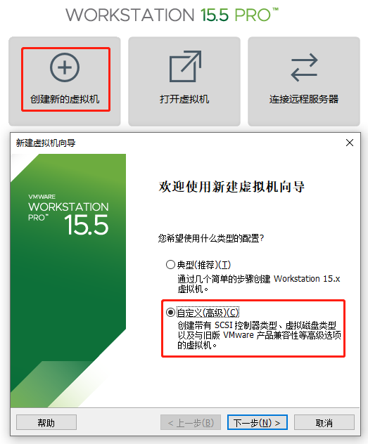

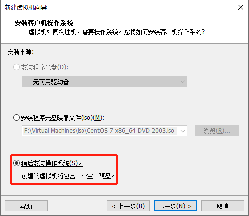

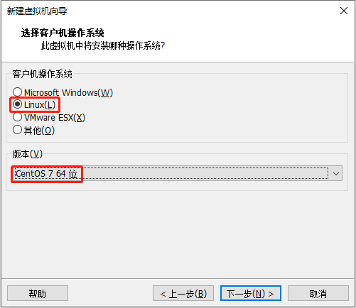

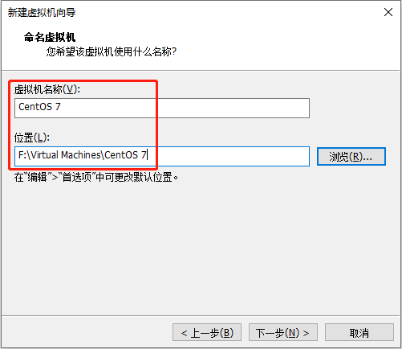

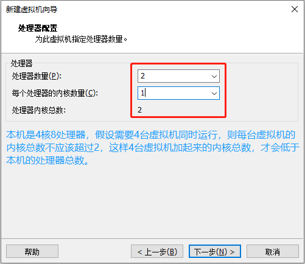

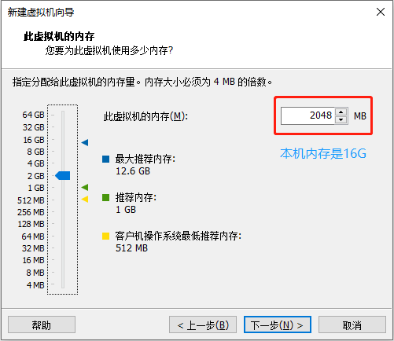

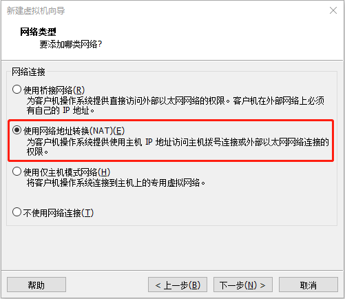

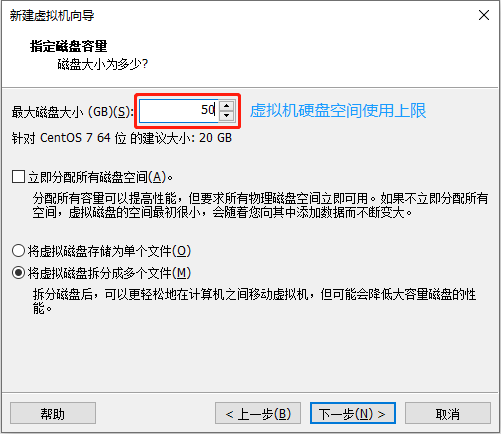

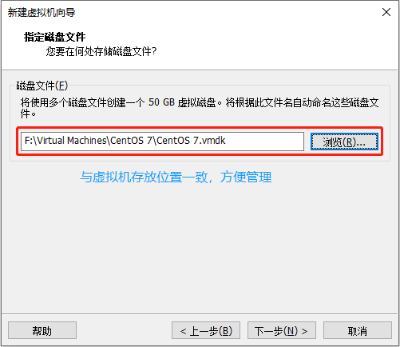

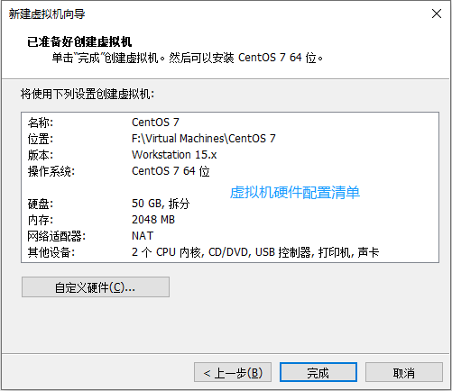

### CentOS 安装

准备工作，检查 BIOS 虚拟化支持：

- 打开任务管理器，进入性能，查看虚拟化是否启用。

  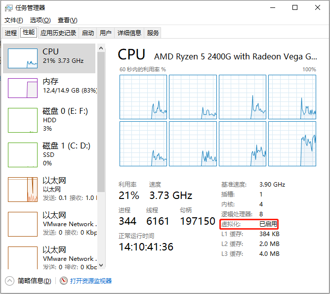

- 若虚拟化未启用，重启电脑，F2 进入 BIOS 模式（不同主板快捷键不同），进入高级模式页面，Advanced ---> CPU Configuration，开启虚拟化支持。

下载地址：https://developer.aliyun.com/mirror/centos?spm=a2c6h.13651102.0.0.3e221b11se5c1r

下载版本：dvd 标准安装版。

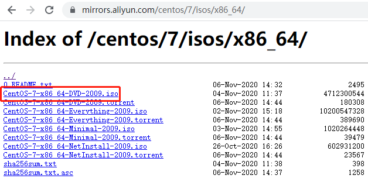

安装参考：https://blog.csdn.net/qq_44714603/article/details/88829423

Vmware 配置 CentOS 软件，即，向虚拟机插入系统盘：

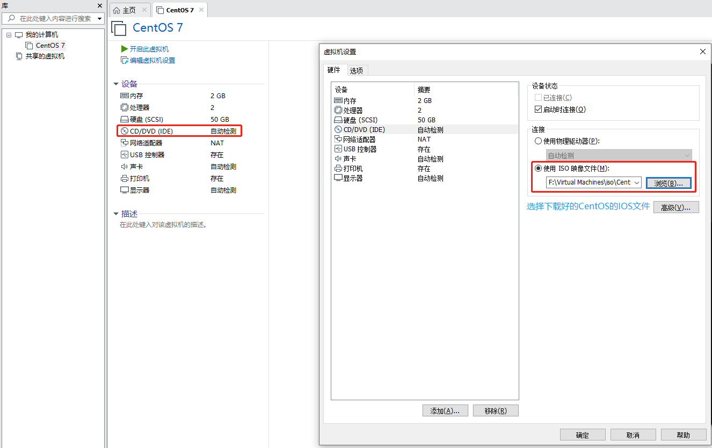

开启虚拟机，安装系统盘并配置：

- 语言环境：

  

- 日期和时间：

  

- 软件选择：

  

- 安装位置，自定义磁盘分区，配置 boot，swap 和根目录：

  

  

  

  

  

  

- 禁用 kdump 设置，如果是正式开发阶段，应该启用 kdump 设置：

  

- 网络和主机名：

  

- 安全策略：

  

- 等上面配置完成之后，开始安装系统盘：

  

  

  

  

  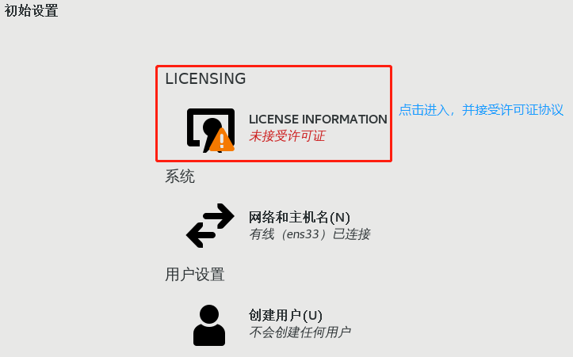

  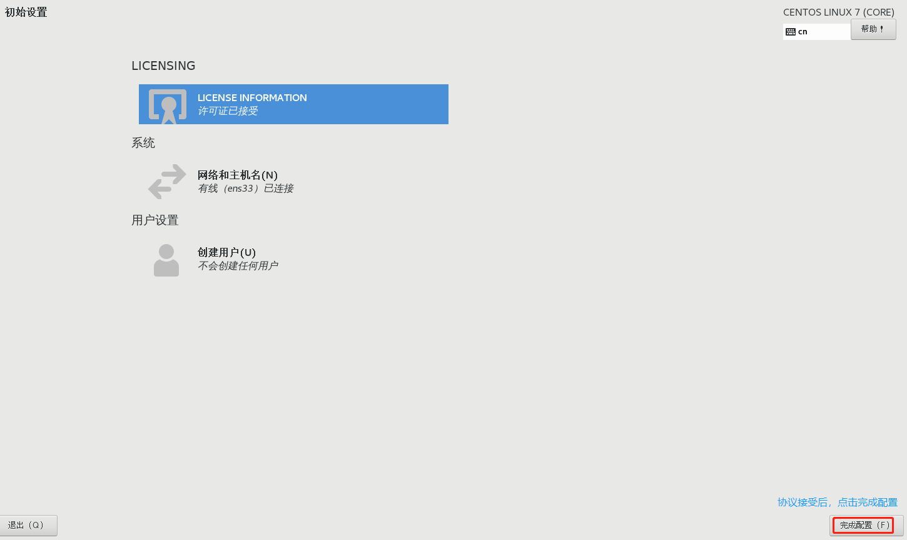

  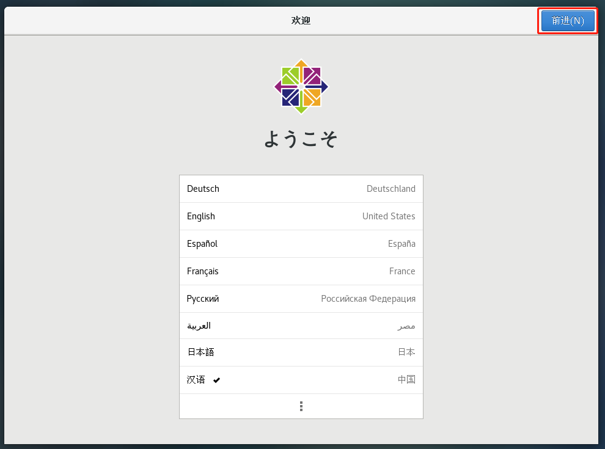

  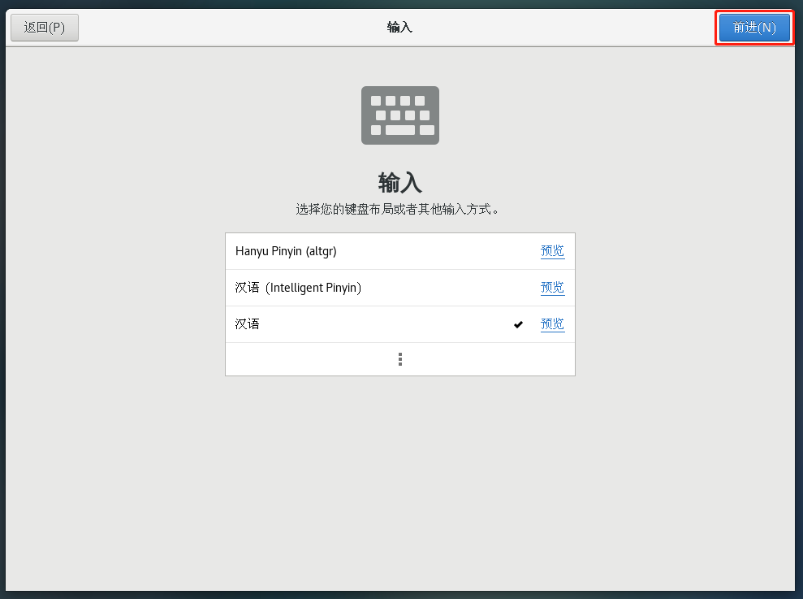

  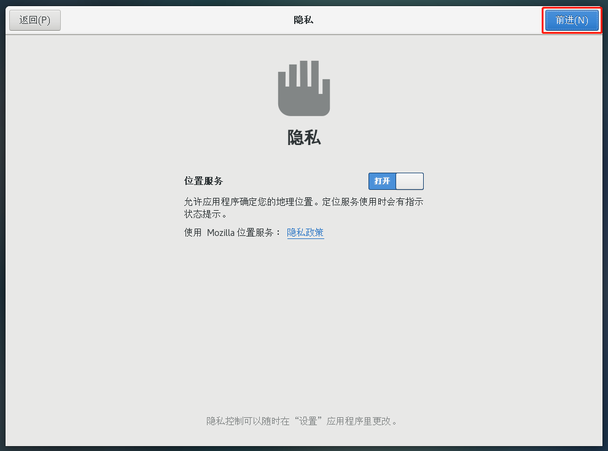

  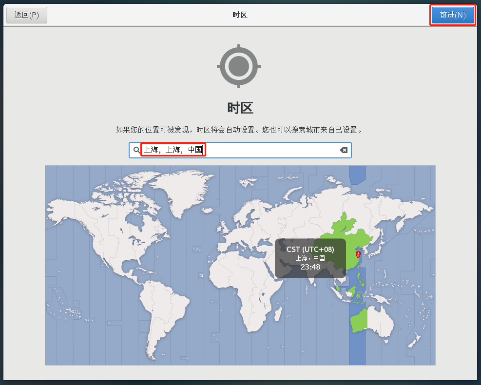

  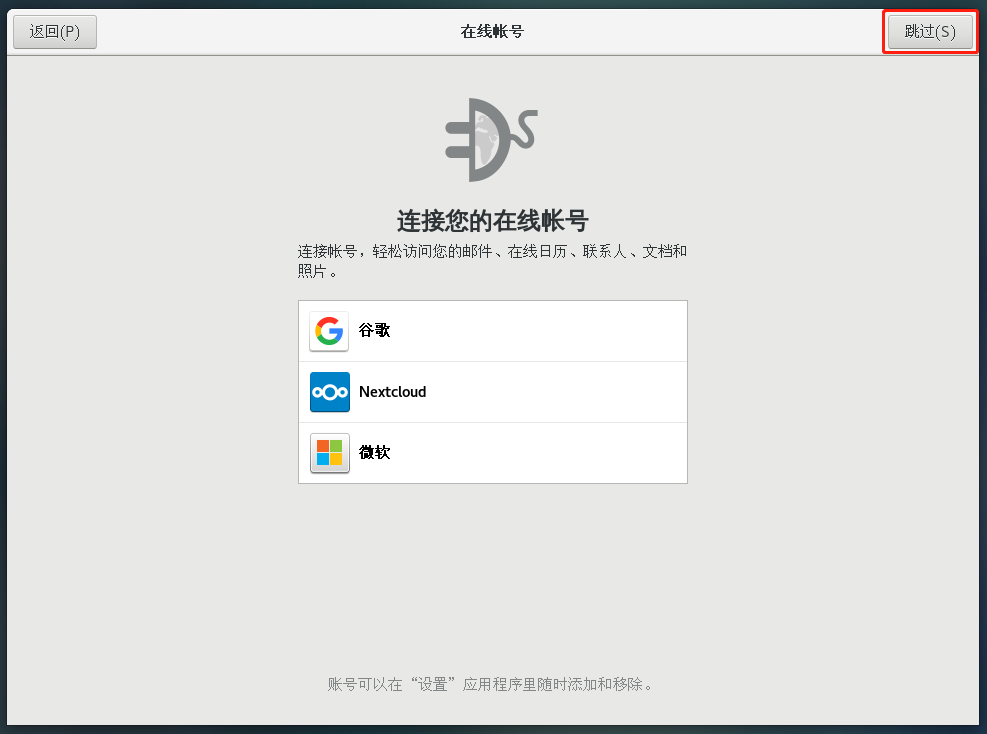

  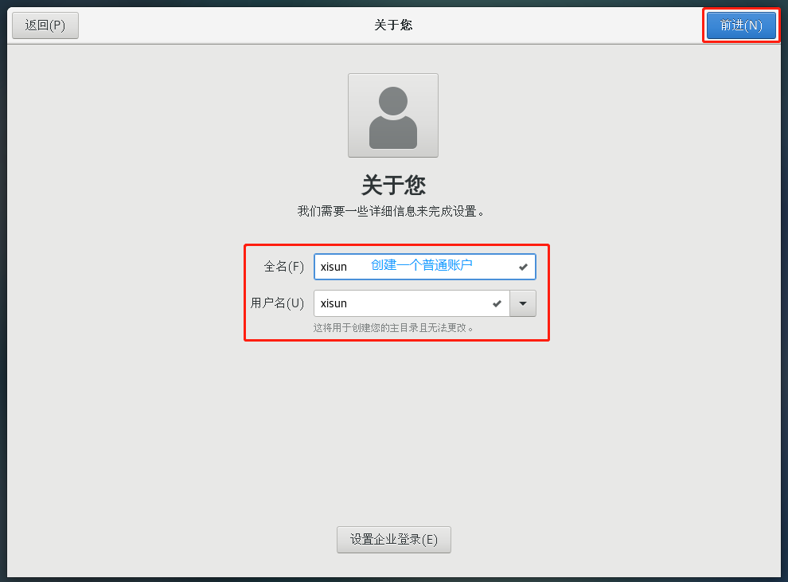

  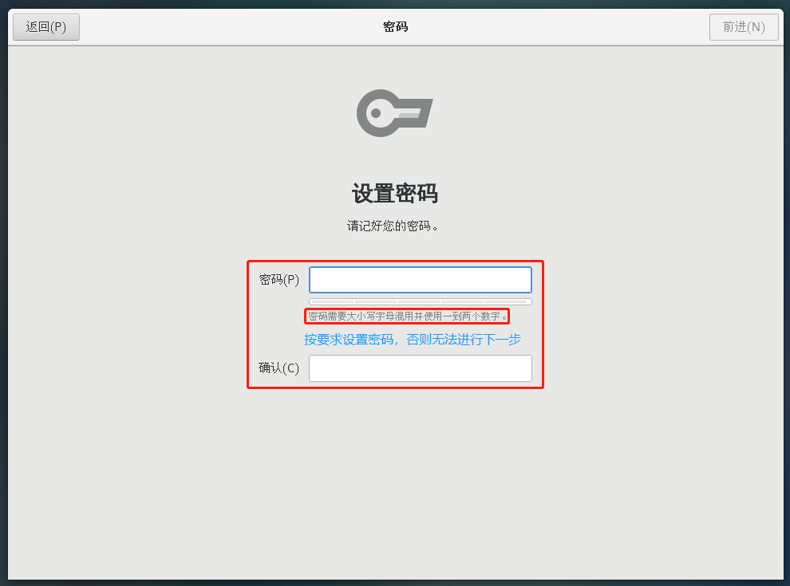

  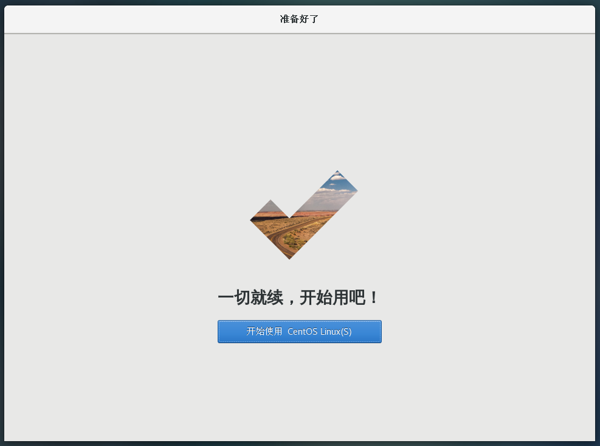

### 配置 IP 地址和主机名称

**VMware：**


**Window 10（即本机）：**


- 如果没有出现 VMnet 8 选项，回到 VMware 的虚拟网络编辑器，点击 "更改设置" ---> "还原默认设置"，即可。


**虚拟机：**

- 切换 root 用户：

  ```shell
  [xisun@centos7 ~]$ su root
  密码：
  [root@centos7 xisun]# 

- 设置虚拟机 IP 地址：

  ```shell
  [root@centos7 xisun]# vim /etc/sysconfig/network-scripts/ifcfg-ens33
  ```

  - ifcfg-ens33 文件原内容：

    ```txt
    TYPE="Ethernet"
    PROXY_METHOD="none"
    BROWSER_ONLY="no"
    BOOTPROTO="dhcp"		# 动态获取IP地址，服务器每次开机时，IP地址可能发生改变
    DEFROUTE="yes"
    IPV4_FAILURE_FATAL="no"
    IPV6INIT="yes"
    IPV6_AUTOCONF="yes"
    IPV6_DEFROUTE="yes"
    IPV6_FAILURE_FATAL="no"
    IPV6_ADDR_GEN_MODE="stable-privacy"
    NAME="ens33"
    UUID="eb503f88-96af-455d-b8f9-dbda02ca79d4"
    DEVICE="ens33"
    ONBOOT="yes"
    ```

  - ifcfg-ens33 文件新内容：

    ```txt
    TYPE="Ethernet"
    PROXY_METHOD="none"
    BROWSER_ONLY="no"
    BOOTPROTO="static"			# 修改为静态IP地址
    DEFROUTE="yes"
    IPV4_FAILURE_FATAL="no"
    IPV6INIT="yes"
    IPV6_AUTOCONF="yes"
    IPV6_DEFROUTE="yes"
    IPV6_FAILURE_FATAL="no"
    IPV6_ADDR_GEN_MODE="stable-privacy"
    NAME="ens33"
    UUID="eb503f88-96af-455d-b8f9-dbda02ca79d4"
    DEVICE="ens33"
    ONBOOT="yes"
    
    # 新增
    IPADDR=192.168.10.99		# 静态IP地址，按需自定义
    GATEWAY=192.168.10.2		# 网关
    DNS1=192.168.10.2			# 域名解析器
    ```

- 修改虚拟机的主机名称：

  ```shell
  [root@centos7 xisun]# vim /etc/hostname
  [root@centos7 xisun]# cat /etc/hostname
  centos7												# 主机名称按需求自定义
  ```

  - 修改虚拟机主机的名称映射：

    ```shell
    [root@centos7 xisun]# vim /etc/hosts
    ```

    - 原文件内容：

      ```txt
      127.0.0.1   localhost localhost.localdomain localhost4 localhost4.localdomain4
      ::1         localhost localhost.localdomain localhost6 localhost6.localdomain6
      ```

    - 新内容：

      ```txt
      127.0.0.1   localhost localhost.localdomain localhost4 localhost4.localdomain4
      ::1         localhost localhost.localdomain localhost6 localhost6.localdomain6
      
      # 按需求添加主机名称映射
      192.168.10.99 centos7
      192.168.10.100 hadoop100
      192.168.10.101 hadoop101
      192.168.10.102 hadoop102
      192.168.10.103 hadoop103
      192.168.10.104 hadoop104
      192.168.10.105 hadoop105
      192.168.10.106 hadoop106
      192.168.10.107 hadoop107
      192.168.10.108 hadoop108
      ```

  - 修改 Windows 10 主机的名称映射：`C:\Windows\System32\drivers\etc\hosts`

    

    - 如果操作系统是 Window7，可以直接修改 hosts 文件；如果操作系统是 Window10，需要先将 hosts 文件拷贝出来，修改保存以后，再覆盖原文件即可。

    - hosts 文件新增如下主机映射：

      ```txt
      192.168.10.99 centos7
      192.168.10.100 hadoop100
      192.168.10.101 hadoop101
      192.168.10.102 hadoop102
      192.168.10.103 hadoop103
      192.168.10.104 hadoop104
      192.168.10.105 hadoop105
      192.168.10.106 hadoop106
      192.168.10.107 hadoop107
      192.168.10.108 hadoop108
      ```

- 重启：

  ```shell
  [root@centos7 xisun]# reboot
  ```

- 重启之后，以 root 用户重新登陆。

  - 验证虚拟机 IP 地址：

    ```shell
    [root@centos7 ~]# ifconfig
    ens33: flags=4163<UP,BROADCAST,RUNNING,MULTICAST>  mtu 1500
            inet 192.168.10.99  netmask 255.255.255.0  broadcast 192.168.10.255
            inet6 fe80::ac1e:7fe1:a566:2670  prefixlen 64  scopeid 0x20<link>
            ether 00:0c:29:1c:d5:13  txqueuelen 1000  (Ethernet)
            RX packets 2033  bytes 2797234 (2.6 MiB)
            RX errors 0  dropped 0  overruns 0  frame 0
            TX packets 924  bytes 61834 (60.3 KiB)
            TX errors 0  dropped 0 overruns 0  carrier 0  collisions 0
    
    lo: flags=73<UP,LOOPBACK,RUNNING>  mtu 65536
            inet 127.0.0.1  netmask 255.0.0.0
            inet6 ::1  prefixlen 128  scopeid 0x10<host>
            loop  txqueuelen 1000  (Local Loopback)
            RX packets 48  bytes 4080 (3.9 KiB)
            RX errors 0  dropped 0  overruns 0  frame 0
            TX packets 48  bytes 4080 (3.9 KiB)
            TX errors 0  dropped 0 overruns 0  carrier 0  collisions 0
    
    virbr0: flags=4099<UP,BROADCAST,MULTICAST>  mtu 1500
            inet 192.168.122.1  netmask 255.255.255.0  broadcast 192.168.122.255
            ether 52:54:00:97:ed:a7  txqueuelen 1000  (Ethernet)
            RX packets 0  bytes 0 (0.0 B)
            RX errors 0  dropped 0  overruns 0  frame 0
            TX packets 0  bytes 0 (0.0 B)
            TX errors 0  dropped 0 overruns 0  carrier 0  collisions 0
    
    ```

  - 验证是否能连通外网：

    ```shell
    [root@centos7 ~]# ping www.baidu.com 
    PING www.a.shifen.com (14.215.177.39) 56(84) bytes of data.
    64 bytes from 14.215.177.39 (14.215.177.39): icmp_seq=1 ttl=128 time=38.4 ms
    64 bytes from 14.215.177.39 (14.215.177.39): icmp_seq=2 ttl=128 time=38.6 ms
    64 bytes from 14.215.177.39 (14.215.177.39): icmp_seq=3 ttl=128 time=38.4 ms
    64 bytes from 14.215.177.39 (14.215.177.39): icmp_seq=4 ttl=128 time=39.3 ms
    64 bytes from 14.215.177.39 (14.215.177.39): icmp_seq=5 ttl=128 time=38.3 ms
    64 bytes from 14.215.177.39 (14.215.177.39): icmp_seq=6 ttl=128 time=38.6 ms
    64 bytes from 14.215.177.39 (14.215.177.39): icmp_seq=7 ttl=128 time=38.3 ms
    64 bytes from 14.215.177.39 (14.215.177.39): icmp_seq=8 ttl=128 time=38.4 ms
    64 bytes from 14.215.177.39 (14.215.177.39): icmp_seq=9 ttl=128 time=38.9 ms
    64 bytes from 14.215.177.39 (14.215.177.39): icmp_seq=10 ttl=128 time=38.3 ms
    64 bytes from 14.215.177.39 (14.215.177.39): icmp_seq=11 ttl=128 time=38.7 ms
    64 bytes from 14.215.177.39 (14.215.177.39): icmp_seq=12 ttl=128 time=38.3 ms
    ^C
    --- www.a.shifen.com ping statistics ---
    12 packets transmitted, 12 received, 0% packet loss, time 11035ms
    rtt min/avg/max/mdev = 38.357/38.606/39.328/0.332 ms
    ```

  - 查看主机地址：

    ```shell
    [root@centos7 ~]# hostname
    centos7
    ```


### 克隆虚拟机

新配置的 centos7 虚拟机，可以作为一个纯净的虚拟机，在此基础上，克隆出新的虚拟机，在新虚拟机上安装软件，而纯净的虚拟机留作备用。

克隆虚拟机之前，需要正确的关闭虚拟机：


**克隆：**


**常规操作：**

- 移除，此操作只会在 VMware 列表中移除虚拟机，但不会删除磁盘上的虚拟机：

  

- 添加，通过打开操作，可以添加磁盘上的虚拟机到 VMware 列表中：

  

- 删除，此操作会将磁盘上的虚拟机删除：

  

### 修改克隆机的 IP 地址和主机名称

克隆机的信息，和被克隆机相同，需要修改 IP 地址，以及主机名称。

开启克隆机，以 root 用户登录，按以下步骤修改 IP 地址：

```shell
[root@centos7 ~]# vim /etc/sysconfig/network-scripts/ifcfg-ens33
```

- 修改 ifcfg-ens33 文件中的 IPADDR：

  ```txt
  TYPE="Ethernet"
  PROXY_METHOD="none"
  BROWSER_ONLY="no"
  BOOTPROTO="static"
  DEFROUTE="yes"
  IPV4_FAILURE_FATAL="no"
  IPV6INIT="yes"
  IPV6_AUTOCONF="yes"
  IPV6_DEFROUTE="yes"
  IPV6_FAILURE_FATAL="no"
  IPV6_ADDR_GEN_MODE="stable-privacy"
  NAME="ens33"
  UUID="eb503f88-96af-455d-b8f9-dbda02ca79d4"
  DEVICE="ens33"
  ONBOOT="yes"
  
  IPADDR=192.168.10.100		# 只需要将IP地址按需修改即可
  GATEWAY=192.168.10.2
  DNS1=192.168.10.2
  ```

- 修改主机名称：

  ```shell
  [root@centos7 ~]# vim /etc/hostname
  [root@centos7 ~]# cat /etc/hostname
  hadoop100
  ```

- 重启：

  ```shell
  [root@centos7 ~]# reboot
  ```

- 查看新的 IP 地址和主机名称：

  ```shell
  [root@hadoop100 ~]# ifconfig
  ens33: flags=4163<UP,BROADCAST,RUNNING,MULTICAST>  mtu 1500
          inet 192.168.10.100  netmask 255.255.255.0  broadcast 192.168.10.255
          inet6 fe80::ac1e:7fe1:a566:2670  prefixlen 64  scopeid 0x20<link>
          ether 00:0c:29:1d:f8:56  txqueuelen 1000  (Ethernet)
          RX packets 604  bytes 804811 (785.9 KiB)
          RX errors 0  dropped 0  overruns 0  frame 0
          TX packets 279  bytes 21418 (20.9 KiB)
          TX errors 0  dropped 0 overruns 0  carrier 0  collisions 0
  
  lo: flags=73<UP,LOOPBACK,RUNNING>  mtu 65536
          inet 127.0.0.1  netmask 255.0.0.0
          inet6 ::1  prefixlen 128  scopeid 0x10<host>
          loop  txqueuelen 1000  (Local Loopback)
          RX packets 48  bytes 4080 (3.9 KiB)
          RX errors 0  dropped 0  overruns 0  frame 0
          TX packets 48  bytes 4080 (3.9 KiB)
          TX errors 0  dropped 0 overruns 0  carrier 0  collisions 0
  
  virbr0: flags=4099<UP,BROADCAST,MULTICAST>  mtu 1500
          inet 192.168.122.1  netmask 255.255.255.0  broadcast 192.168.122.255
          ether 52:54:00:97:ed:a7  txqueuelen 1000  (Ethernet)
          RX packets 0  bytes 0 (0.0 B)
          RX errors 0  dropped 0  overruns 0  frame 0
          TX packets 0  bytes 0 (0.0 B)
          TX errors 0  dropped 0 overruns 0  carrier 0  collisions 0
  
  [root@hadoop100 ~]# hostname
  hadoop100
  ```

### JDK 说明

安装的 centos7 模板机，有自带的 JDK，某些情况，需要删除，按照需求自行安装。

```shell
[xisun@centos7 ~]$ su root
密码：
[root@centos7 ~]# rpm -qa | grep -i java
javapackages-tools-3.4.1-11.el7.noarch
tzdata-java-2019c-1.el7.noarch
java-1.8.0-openjdk-headless-1.8.0.242.b08-1.el7.x86_64
java-1.8.0-openjdk-1.8.0.242.b08-1.el7.x86_64
java-1.7.0-openjdk-headless-1.7.0.251-2.6.21.1.el7.x86_64
python-javapackages-3.4.1-11.el7.noarch
java-1.7.0-openjdk-1.7.0.251-2.6.21.1.el7.x86_64
[root@centos7 ~]# rpm -qa | grep -i java | xargs -n1 rpm -e --nodeps
[root@centos7 ~]# rpm -qa | grep -i java
```

### 参考

https://www.bilibili.com/video/BV1Qp4y1n7EN

## Xshell 远程连接虚拟机

Xshell 安装过程略。

远程连接配置：


连接成功：


数据传输：安装`Xftp`工具，或者使用`rz`和`sz`命令。

## Linux 系统基本工具包

```shell
$ apt install net-tools
```

## 声明

声明：写作本文初衷是个人学习记录，鉴于本人学识有限，如有侵权或不当之处，请联系 [wdshfut@163.com](mailto:wdshfut@163.com)。
