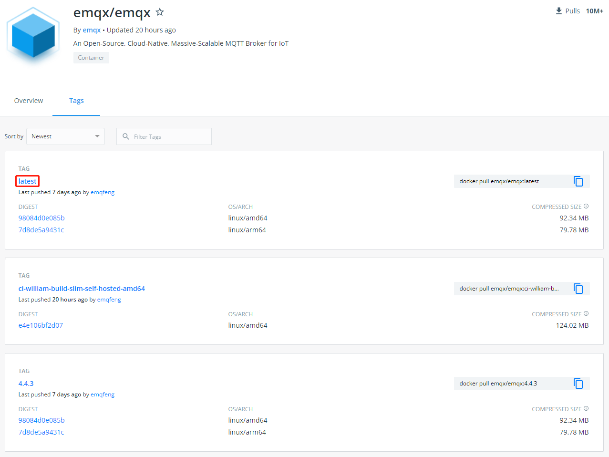
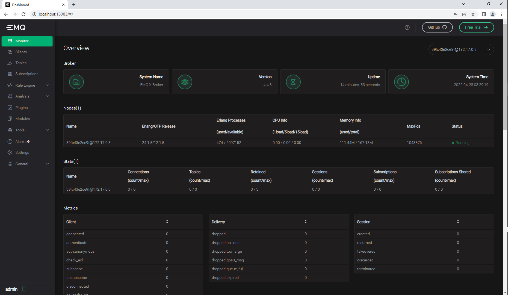
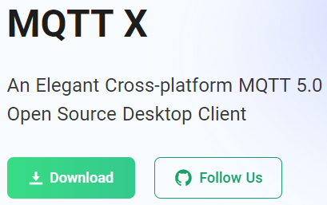
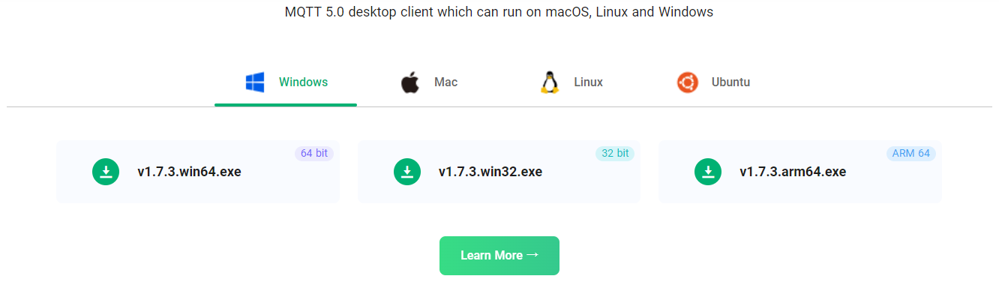
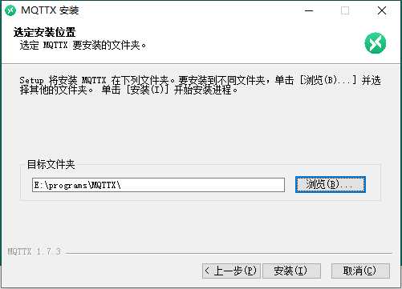
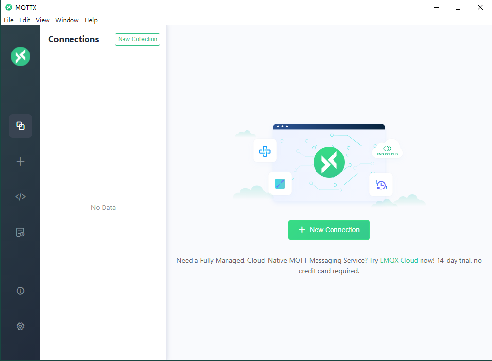
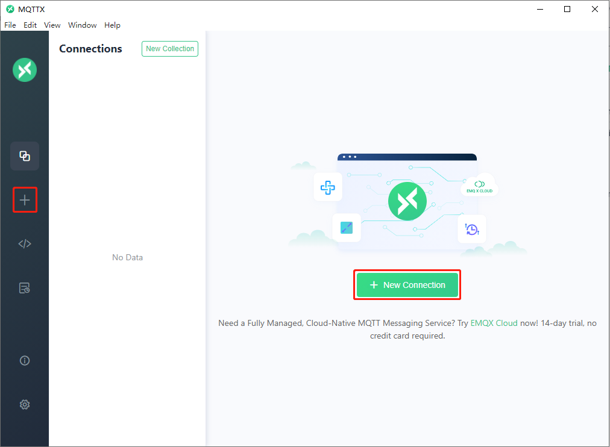
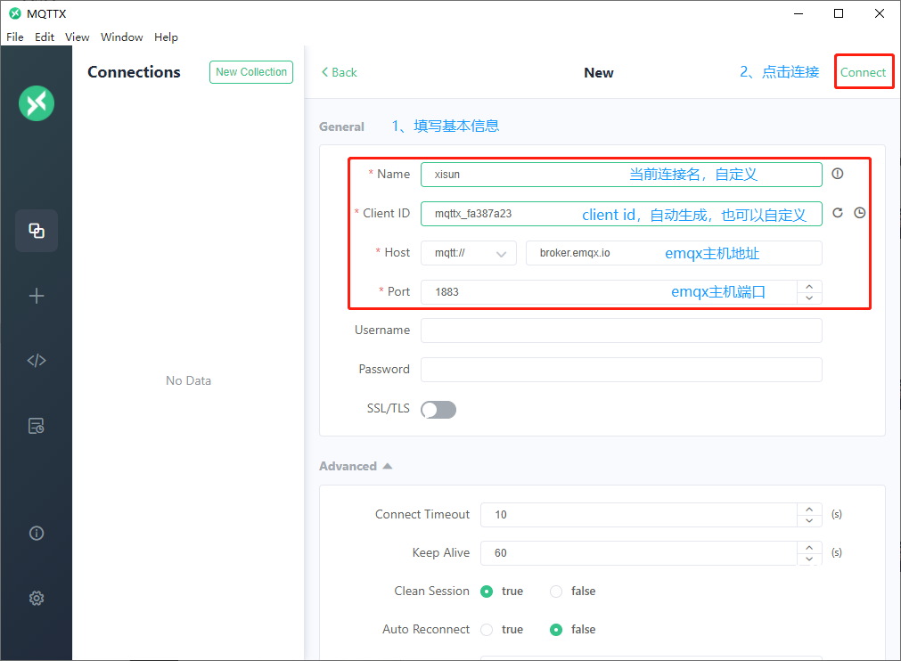
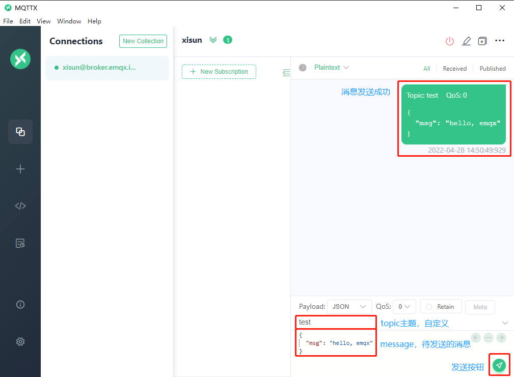
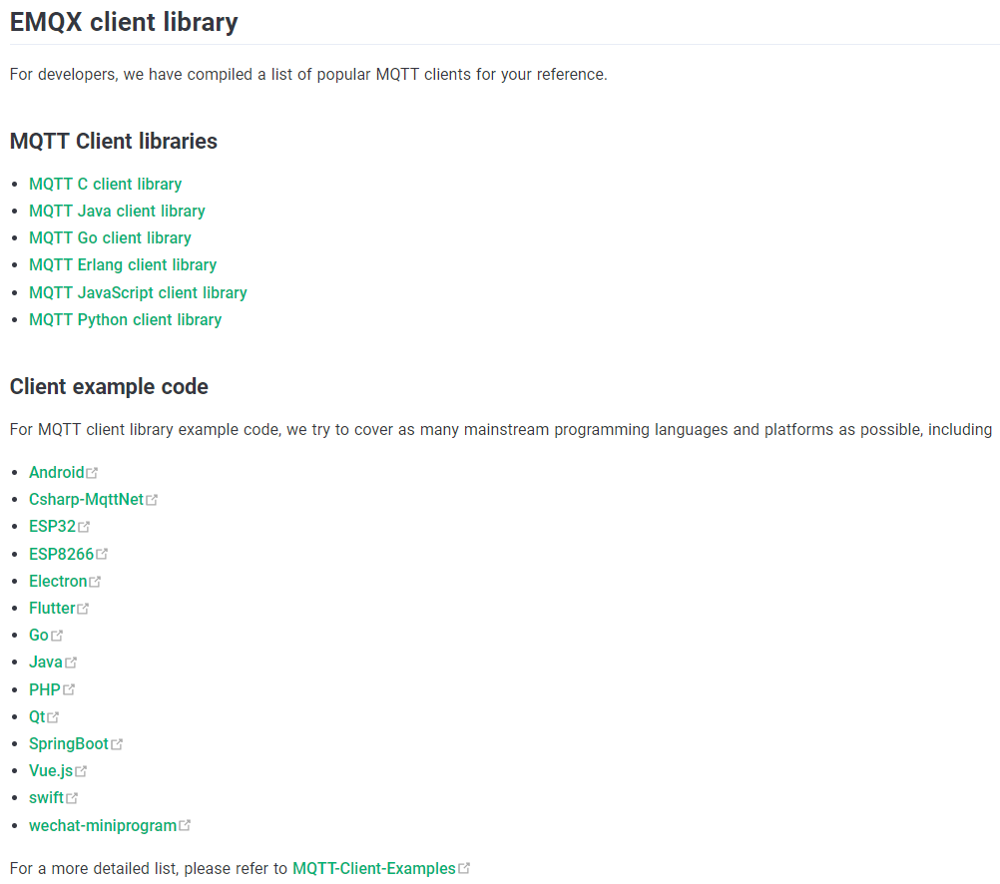

*date: 2022-04-28*

## 概述

EMQX 是一个大规模可弹性伸缩的云原生分布式物联网 MQTT 消息服务器，能够高效可靠连接海量物联网设备，高性能实时处理消息与事件流数据，助力构建关键业务的物联网平台与应用。

>The world's most scalable distributed MQTT broker with a high-performance real-time message processing engine, powering event streaming for IoT devices at massive scale.

## 安装

### 官方资料

官网：https://www.emqx.io/

英文文档：https://www.emqx.io/docs/en/v4.4/

中文文档：https://www.emqx.io/docs/zh/v4.4/

GitHub：https://github.com/emqx/emqx

### Docker 启动 EMQX

Docker 地址：https://hub.docker.com/r/emqx/emqx

版本说明：



下载镜像：

```powershell
root@WIN-K11OM3VD9KL:/mnt/c/Users/Administrator# docker pull emqx/emqx:latest
latest: Pulling from emqx/emqx
3d2430473443: Pull complete
81547f844c06: Pull complete
36ab2f2de099: Pull complete
8f59f91ea217: Pull complete
83687ff1863d: Pull complete
4f4fb700ef54: Pull complete
850c0feb4ea6: Pull complete
07705afa4424: Pull complete
Digest: sha256:e2137bed41dc29ecc757d2d03a10b82fe9cb4d5ca508562a54c240400d563644
Status: Downloaded newer image for emqx/emqx:latest
docker.io/emqx/emqx:latest
root@WIN-K11OM3VD9KL:/mnt/c/Users/Administrator# docker images -a
REPOSITORY    TAG       IMAGE ID       CREATED        SIZE
emqx/emqx     latest    db76e52a4f13   6 days ago     194MB
```

> 如果出现`net/http: TLS handshake timeout`异常，多尝试几次 pull 操作。

启动容器：

```powershell
root@WIN-K11OM3VD9KL:/mnt/c/Users/Administrator# docker run -d --name emqx -p 1883:1883 -p 8081:8081 -p 8083:8083 -p 8084:8084 -p 8883:8883 -p 18083:18083 emqx/emqx:latest
39fc43e2ce9f2a9e22d77b154ff07e1a0e7d1765de7e79bcbf2883af969e2a78
root@WIN-K11OM3VD9KL:/mnt/c/Users/Administrator# docker ps
CONTAINER ID   IMAGE              COMMAND                  CREATED          STATUS          PORTS                                                                                                                                                                                                                                                                                              NAMES
39fc43e2ce9f   emqx/emqx:latest   "/usr/bin/docker-ent…"   57 seconds ago   Up 55 seconds   4369-4370/tcp, 5369/tcp, 0.0.0.0:1883->1883/tcp, :::1883->1883/tcp, 0.0.0.0:8081->8081/tcp, :::8081->8081/tcp, 0.0.0.0:8083-8084->8083-8084/tcp, :::8083-8084->8083-8084/tcp, 6369-6370/tcp, 0.0.0.0:8883->8883/tcp, :::8883->8883/tcp, 0.0.0.0:18083->18083/tcp, :::18083->18083/tcp, 11883/tcp   emqx
```

Dashboard 页面登陆：http://localhost:18083/



> 默认用户名 admin，登录密码 public。

### MQTTX 桌面端工具

官网：https://mqttx.app/

文档：https://mqttx.app/docs

下载：





安装：



首次打开客户端：



新建连接：





- 更对连接设置，参考：https://mqttx.app/docs/get-started

发送消息：



## Java 客户端

文档：https://www.emqx.io/docs/en/v4.4/development/java.html

示例：https://github.com/emqx/MQTT-Client-Examples/tree/master/mqtt-client-Java

GitHub：https://github.com/eclipse/paho.mqtt.java

网页：https://www.eclipse.org/paho/index.php?page=clients/java/index.php

更多客户端支持和示例，参考官网：



### Maven 添加依赖

```xml
<dependency>
    <groupId>org.eclipse.paho</groupId>
    <artifactId>org.eclipse.paho.client.mqttv3</artifactId>
    <version>1.2.5</version>
</dependency>
```

- Eclipse Paho Java Client provides asynchronous and synchronous API of MqttAsyncClient and MqttClient .

- org.eclipse.paho.client.mqttv3 支持 MQTT 3.1.1 协议，如果需要支持 MQTT 5.0协议，需要使用如下依赖：

  ```xml
  <dependency>
      <groupId>org.eclipse.paho</groupId>
      <artifactId>org.eclipse.paho.mqttv5.client</artifactId>
      <version>1.2.5</version>
  </dependency>
  ```

  > 注意：`Currently, Paho Java is still adapting to MQTT 5.0 and has not yet fully supported it .`

- MQTT 3.1.1 协议参考：http://mqtt.p2hp.com/mqtt311

### 连接信息

```properties
mqtt.broker.local=mqtt://localhost:1883
mqtt.clientId=xisun_emqx_mqtt
mqtt.keepAliveInterval=100000000
mqtt.connectionTimeOut=200
mqtt.username=admin
mqtt.password=public
```

### 源码解析

#### IMqttClient 接口

```java
/**
 * Enables an application to communicate with an MQTT server using blocking methods.
 * <p>
 * This interface allows applications to utilize all features of the MQTT version 3.1
 * specification including:</p>
 * <ul>
 * <li>connect
 * <li>publish
 * <li>subscribe
 * <li>unsubscribe
 * <li>disconnect
 * </ul>
 * <p>
 * There are two styles of MQTT client, this one and {@link IMqttAsyncClient}.</p>
 * <ul>
 * <li>IMqttClient provides a set of methods that block and return control to the application
 * program once the MQTT action has completed.</li>
 * <li>IMqttAsyncClient provides a set of non-blocking methods that return control to the
 * invoking application after initial validation of parameters and state. The main processing is
 * performed in the background so as not to block the application programs thread. This non
 * blocking approach is handy when the application wants to carry on processing while the
 * MQTT action takes place. For instance connecting to an MQTT server can take time, using
 * the non-blocking connect method allows an application to display a busy indicator while the
 * connect action is occurring. Non-blocking methods are particularly useful in event-oriented
 * programs and graphical programs where issuing methods that take time to complete on the the
 * main or GUI thread can cause problems.</li>
 * </ul>
 * <p>
 * The non-blocking client can also be used in a blocking form by turning a non-blocking
 * method into a blocking invocation using the following pattern:</p>
 *     <pre>
 *     IMqttToken token;
 *     token = asyncClient.method(parms).waitForCompletion();
 *     </pre>
 * <p>
 * Using the non-blocking client allows an application to use a mixture of blocking and
 * non-blocking styles. Using the blocking client only allows an application to use one
 * style. The blocking client provides compatibility with earlier versions
 * of the MQTT client.</p>
 */
public interface IMqttClient extends AutoCloseable { //extends IMqttAsyncClient {
}
```

IMqttClient 是一个接口，允许应用程序使用阻塞方法与 MQTT 服务器通信。该接口允许应用程序利用 MQTT 3.1 版规范的所有特性，包括：

- connect
- publish
- subscribe
- unsubscribe
- disconnect

IMqttClient 是同步接口，与之对应的，是异步接口 IMqttAsyncClient，此处先跳过。

##### 基础方法

##### 连接方法

使用`默认配置`连接：

```java
/**
 * Connects to an MQTT server using the default options.
 * <p>The default options are specified in {@link MqttConnectOptions} class.
 * </p>
 *
 * @throws MqttSecurityException when the server rejects the connect for security
 * reasons
 * @throws MqttException  for non security related problems
 * @see #connect(MqttConnectOptions)
 */
   void connect() throws MqttSecurityException, MqttException;
```

使用`自定义配置`连接：

```java
/**
 * Connects to an MQTT server using the specified options.
 * <p>The server to connect to is specified on the constructor.
 * It is recommended to call {@link #setCallback(MqttCallback)} prior to
 * connecting in order that messages destined for the client can be accepted
 * as soon as the client is connected.
 * </p>
 * <p>This is a blocking method that returns once connect completes</p>
 *
 * @param options a set of connection parameters that override the defaults.
 * @throws MqttSecurityException when the server rejects the connect for security
 * reasons
 * @throws MqttException  for non security related problems including communication errors
 */
   void connect(MqttConnectOptions options) throws MqttSecurityException, MqttException;
```

```java
// 使用默认配置连接

void connect() throws MqttSecurityException, MqttException;

// 使用自定义配置连接
void connect(MqttConnectOptions options) throws MqttSecurityException, MqttException;

// 使用自定义配置连接，并返回MqttToken
IMqttToken connectWithResult(MqttConnectOptions options) throws MqttSecurityException, MqttException;

/**
 * Disconnects from the server.
 * <p>An attempt is made to quiesce the client allowing outstanding
 * work to complete before disconnecting. It will wait
 * for a maximum of 30 seconds for work to quiesce before disconnecting.
 * This method must not be called from inside {@link MqttCallback} methods.
 * </p>
 *
 * <p>This is a blocking method that returns once disconnect completes</p>
 *
 * @throws MqttException if a problem is encountered while disconnecting
 */
// 断开连接
void disconnect() throws MqttException;

/**
 * Disconnects from the server.
 * <p>
 * The client will wait for all {@link MqttCallback} methods to
 * complete. It will then wait for up to the quiesce timeout to allow for
 * work which has already been initiated to complete - for example, it will
 * wait for the QoS 2 flows from earlier publications to complete. When work has
 * completed or after the quiesce timeout, the client will disconnect from
 * the server. If the cleanSession flag was set to false and is set to false the
 * next time a connection is made QoS 1 and 2 messages that
 * were not previously delivered will be delivered.</p>
 *
 * <p>This is a blocking method that returns once disconnect completes</p>
 *
 * @param quiesceTimeout the amount of time in milliseconds to allow for
 * existing work to finish before disconnecting.  A value of zero or less
 * means the client will not quiesce.
 * @throws MqttException if a problem is encountered while disconnecting
 */
void disconnect(long quiesceTimeout) throws MqttException;

/**
 * Disconnects from the server forcibly to reset all the states. Could be useful when disconnect attempt failed.
 * <p>
 * Because the client is able to establish the TCP/IP connection to a none MQTT server and it will certainly fail to
 * send the disconnect packet. It will wait for a maximum of 30 seconds for work to quiesce before disconnecting and
 * wait for a maximum of 10 seconds for sending the disconnect packet to server.
 * 
 * @throws MqttException if any unexpected error
 * @since 0.4.1
 */
void disconnectForcibly() throws MqttException;

/**
 * Disconnects from the server forcibly to reset all the states. Could be useful when disconnect attempt failed.
 * <p>
 * Because the client is able to establish the TCP/IP connection to a none MQTT server and it will certainly fail to
 * send the disconnect packet. It will wait for a maximum of 30 seconds for work to quiesce before disconnecting.
 * 
 * @param disconnectTimeout the amount of time in milliseconds to allow send disconnect packet to server.
 * @throws MqttException if any unexpected error
 * @since 0.4.1
 */
void disconnectForcibly(long disconnectTimeout) throws MqttException;

/**
 * Disconnects from the server forcibly to reset all the states. Could be useful when disconnect attempt failed.
 * <p>
 * Because the client is able to establish the TCP/IP connection to a none MQTT server and it will certainly fail to
 * send the disconnect packet.
 * 
 * @param quiesceTimeout the amount of time in milliseconds to allow for existing work to finish before
 * disconnecting. A value of zero or less means the client will not quiesce.
 * @param disconnectTimeout the amount of time in milliseconds to allow send disconnect packet to server.
 * @throws MqttException if any unexpected error
 * @since 0.4.1
 */
void disconnectForcibly(long quiesceTimeout, long disconnectTimeout) throws MqttException;
```


##### 发布方法

##### 订阅方法

#### MqttClient

MqttClient 是 IMqttClient 接口的实现类：

`// TODO`
