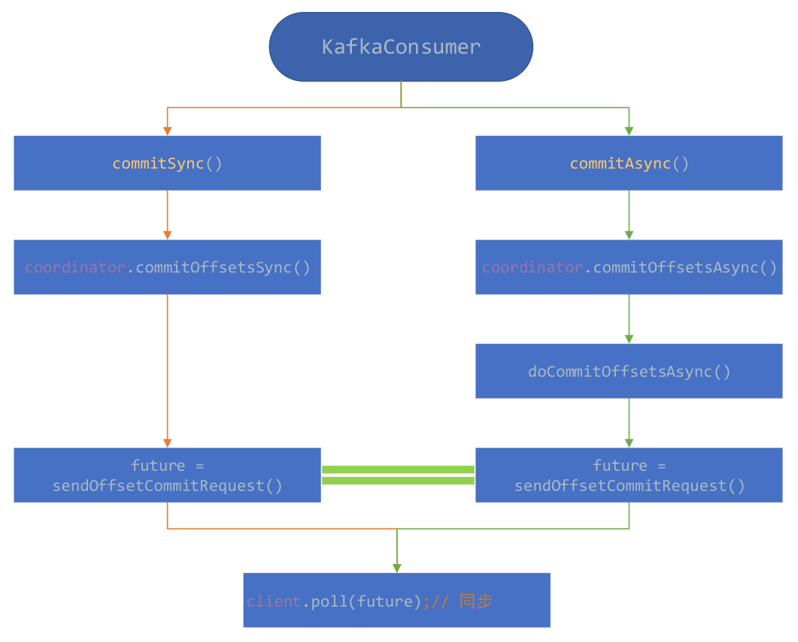
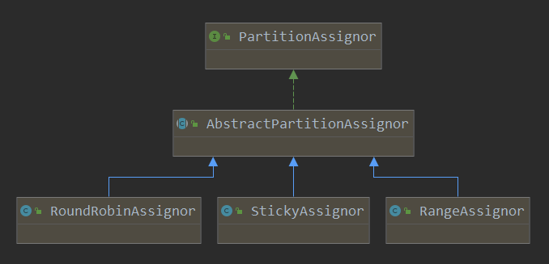

*date: 2020-11-24*

紧接着上篇文章，这篇文章讲述 consumer 提供的 offset commit 机制和 partition 分配机制，具体如何使用是需要用户结合具体的场景进行选择，本文讲述一下其底层实现。

## 自动 offset commit 机制

```java
// 自动提交，默认true
props.put("enable.auto.commit", "true");
// 设置自动每1s提交一次，默认为5s
props.put("auto.commit.interval.ms", "1000");
```

通过上面设置，启动自动提交 offset 以及设置自动提交间隔时间。

## 手动 offset commit 机制

先看下两种不同的手动 offset commit 机制，一种是同步 commit，一种是异步 commit，既然其作用都是 offset commit，应该不难猜到它们底层使用接口都是一样的，其调用流程如下图所示：



### 同步 commit

```java
// 对poll()中返回的所有topics和partition列表进行commit
// 这个方法只能将offset提交Kafka中，Kafka将会在每次rebalance之后的第一次拉取或启动时使用同步commit
// 这是同步commit，它将会阻塞进程，直到commit成功或者遇到一些错误
public void commitSync() {}

// 只对指定的topic-partition列表进行commit
public void commitSync(final Map<TopicPartition, OffsetAndMetadata> offsets) {}
```

其实，从上图中，就已经可以看出，同步 commit 的实现方式，`client.poll ()` 方法会阻塞直到这个 request 完成或超时才会返回。

### 异步 commit

```java
public void commitAsync() {}

public void commitAsync(OffsetCommitCallback callback) {}

public void commitAsync(final Map<TopicPartition, OffsetAndMetadata> offsets, OffsetCommitCallback callback) {}
```

对于异步的 commit，最后调用的都是 `doCommitOffsetsAsync ()` 方法，其具体实现如下：

```java
private void doCommitOffsetsAsync(final Map<TopicPartition, OffsetAndMetadata> offsets, final OffsetCommitCallback callback) {
    // 发送offset-commit请求
    RequestFuture<Void> future = sendOffsetCommitRequest(offsets);
    final OffsetCommitCallback cb = callback == null ? defaultOffsetCommitCallback : callback;
    future.addListener(new RequestFutureListener<Void>() {
        @Override
        public void onSuccess(Void value) {
            if (interceptors != null)
                interceptors.onCommit(offsets);
            // 添加成功的请求，以唤醒相应的回调函数
            completedOffsetCommits.add(new OffsetCommitCompletion(cb, offsets, null));
        }

        @Override
        public void onFailure(RuntimeException e) {
            Exception commitException = e;

            if (e instanceof RetriableException) {
                commitException = new RetriableCommitFailedException(e);
            }
            // 添加失败的请求，以唤醒相应的回调函数
            completedOffsetCommits.add(new OffsetCommitCompletion(cb, offsets, commitException));
            if (commitException instanceof FencedInstanceIdException) {
                asyncCommitFenced.set(true);
            }
        }
    });
}
```

在异步 commit 中，可以添加相应的回调函数，如果 request 处理成功或处理失败，ConsumerCoordinator 会通过 `invokeCompletedOffsetCommitCallbacks ()` 方法唤醒相应的回调函数。

>上面简单的介绍了同步 commit 和异步 commit，更详细的分析参考：[Kafka consumer 的 offset 的提交方式](http://generalthink.github.io/2019/06/04/kafka-consumer-offset-commit/)。
>
>注意：手动 commit 时，提交的是下一次要读取的 offset。举例如下：
>
>```java
> try {
>        while(running) {
>            // 取得消息
>            ConsumerRecords<String, String> records = consumer.poll(Long.MAX_VALUE);
>            // 根据分区来遍历数据
>            for (TopicPartition partition : records.partitions()) {
>                List<ConsumerRecord<String, String>> partitionRecords = records.records(partition);
>                // 数据处理
>                for (ConsumerRecord<String, String> record : partitionRecords) {
>                    System.out.println(record.offset() + ": " + record.value());
>                }
>                // 取得当前读取到的最后一条记录的offset
>                long lastOffset = partitionRecords.get(partitionRecords.size() - 1).offset();
>                // 提交offset，记得要 + 1
>                consumer.commitSync(Collections.singletonMap(partition, new OffsetAndMetadata(lastOffset + 1)));
>            }
>        }
> } finally {
>    	consumer.close();
> }
>```

### commit offset 请求的处理

当 Kafka Server 端接收到来自 client 端的 offset commit 请求时，对于提交的 offset，GroupCoordinator 会记录在 GroupMetadata 对象中，至于其实现的逻辑细节，此处不再赘述。

## partition 分配机制

consumer 提供了三种不同的 partition 分配策略，可以通过 `partition.assignment.strategy` 参数进行配置，默认情况下使用的是 `org.apache.kafka.clients.consumer.RangeAssignor`，Kafka 中提供了另外两种 partition 的分配策略 `org.apache.kafka.clients.consumer.RoundRobinAssignor` 和 `org.apache.kafka.clients.consumer.StickyAssignor`，它们关系如下图所示：



通过上图可以看出，用户可以自定义相应的 partition 分配机制，只需要继承这个 AbstractPartitionAssignor 抽象类即可。

> partition 分配策略，其实也就是 reblance 策略。

### AbstractPartitionAssignor

AbstractPartitionAssignor 有一个抽象方法，如下所示：

```java
/**
 * Perform the group assignment given the partition counts and member subscriptions
 * @param partitionsPerTopic The number of partitions for each subscribed topic. Topics not in metadata will be excluded
 *                           from this map.
 * @param subscriptions Map from the memberId to their respective topic subscription
 * @return Map from each member to the list of partitions assigned to them.
 */
// 根据partitionsPerTopic和subscriptions进行分配，具体的实现会在子类中实现(不同的子类，其实现方法不相同)
public abstract Map<String, List<TopicPartition>> assign(Map<String, Integer> partitionsPerTopic,
                                                         Map<String, Subscription> subscriptions);
```

`assign ()` 这个方法，有两个参数：

- `partitionsPerTopic`：所订阅的每个 topic 与其 partition 数的对应关系，metadata 没有的 topic 将会被移除；
- `subscriptions`：每个 consumerId 与其所订阅的 topic 列表的关系。

继承 AbstractPartitionAssignor 的子类，通过实现 `assign ()` 方法，来进行相应的 partition 分配。

### RangeAssignor 分配模式

`assign ()` 方法的实现如下：

```java
@Override
public Map<String, List<TopicPartition>> assign(Map<String, Integer> partitionsPerTopic,
                                                Map<String, Subscription> subscriptions) {
    // 1.参数含义:(topic, List<consumerId>)，获取每个topic被多少个consumer订阅了
    Map<String, List<String>> consumersPerTopic = consumersPerTopic(subscriptions);
    // 2.存储最终的分配方案
    Map<String, List<TopicPartition>> assignment = new HashMap<>();
    for (String memberId : subscriptions.keySet())
        assignment.put(memberId, new ArrayList<>());

    for (Map.Entry<String, List<String>> topicEntry : consumersPerTopic.entrySet()) {
        String topic = topicEntry.getKey();
        List<String> consumersForTopic = topicEntry.getValue();

        // 3.每个topic的partition数量
        Integer numPartitionsForTopic = partitionsPerTopic.get(topic);
        if (numPartitionsForTopic == null)
            continue;

        Collections.sort(consumersForTopic);

        // 4.取商，表示平均每个consumer会分配到多少个partition
        int numPartitionsPerConsumer = numPartitionsForTopic / consumersForTopic.size();
        // 5.取余，表示平均分配后还剩下多少个partition未被分配
        int consumersWithExtraPartition = numPartitionsForTopic % consumersForTopic.size();

        List<TopicPartition> partitions = AbstractPartitionAssignor.partitions(topic, numPartitionsForTopic);
        // 6.这里是关键点，分配原则是将未能被平均分配的partition分配到前consumersWithExtraPartition个consumer
        for (int i = 0, n = consumersForTopic.size(); i < n; i++) {
            // 假设partition有7个，consumer有5个，则numPartitionsPerConsumer=1，consumersWithExtraPartition=2
            // i=0, start: 0, length: 2, topic-partition: p0, p1
            // i=1, start: 2, length: 2, topic-partition: p2, p3
            // i=2, start: 4, length: 1, topic-partition: p4
            // i=3, start: 5, length: 1, topic-partition: p5
            // i=4, start: 6, length: 1, topic-partition: p6
            int start = numPartitionsPerConsumer * i + Math.min(i, consumersWithExtraPartition);
            int length = numPartitionsPerConsumer + (i + 1 > consumersWithExtraPartition ? 0 : 1);
            assignment.get(consumersForTopic.get(i)).addAll(partitions.subList(start, start + length));
        }
    }
    return assignment;
}
```

假设 topic 的 partition 数为 `numPartitionsForTopic`，group 中订阅这个 topic 的 member 数为 `consumersForTopic.size()`，首先需要算出两个值：

- `numPartitionsPerConsumer = numPartitionsForTopic / consumersForTopic.size()`：表示平均每个 consumer 会分配到几个 partition；
- `consumersWithExtraPartition = numPartitionsForTopic % consumersForTopic.size()`：表示平均分配后还剩下多少个 partition 未分配。

分配的规则是：对于剩下的那些 partition 分配到前 consumersWithExtraPartition 个 consumer 上，也就是前 consumersWithExtraPartition 个 consumer 获得 topic-partition 列表会比后面多一个。

在上述的程序中，举了一个例子，假设有一个 topic 有 7 个 partition，group 有5个 consumer，这个5个 consumer 都订阅这个 topic，那么 range 的分配方式如下：

| 消费者     | 分配方案                                     |
| ---------- | -------------------------------------------- |
| consumer 0 | start: 0, length: 2, topic-partition: p0, p1 |
| consumer 1 | start: 2, length: 2, topic-partition: p2, p3 |
| consumer 2 | start: 4, length: 1, topic-partition: p4     |
| consumer 3 | start: 5, length: 1, topic-partition: p5     |
| consumer 4 | start: 6, length: 1, topic-partition: p6     |

而如果 group 中有 consumer 没有订阅这个 topic，那么这个 consumer 将不会参与分配。下面再举个例子，假设有 2 个 topic，一个有 5 个 partition，另一个有 7 个 partition，group 中有 5 个 consumer，但是只有前 3 个订阅第一个 topic，而另一个 topic 是所有 consumer 都订阅了，那么其分配结果如下：

| consumer   | 订阅 topic1 的列表 | 订阅 topic2 的列表 |
| ---------- | ------------------ | ------------------ |
| consumer 0 | t1 p0, t1 p1       | t2 p0, t2 p1       |
| consumer 1 | t1 p2, t1 p3       | t2 p2, t2 p3       |
| consumer 2 | t1 p4              | t2 p4              |
| consumer 3 |                    | t2 p5              |
| consumer 4 |                    | t2 p6              |

### RoundRobinAssignor

`assign ()` 方法的实现如下：

```java
@Override
public Map<String, List<TopicPartition>> assign(Map<String, Integer> partitionsPerTopic,
                                                Map<String, Subscription> subscriptions) {
    Map<String, List<TopicPartition>> assignment = new HashMap<>();
    for (String memberId : subscriptions.keySet())
        assignment.put(memberId, new ArrayList<>());

    // 环状链表，存储所有的consumer，一次迭代完之后又会回到原点
    CircularIterator<String> assigner = new CircularIterator<>(Utils.sorted(subscriptions.keySet()));
    // 获取所有订阅的topic的partition总数
    for (TopicPartition partition : allPartitionsSorted(partitionsPerTopic, subscriptions)) {
        final String topic = partition.topic();
        while (!subscriptions.get(assigner.peek()).topics().contains(topic))
            assigner.next();
        assignment.get(assigner.next()).add(partition);
    }
    return assignment;
}

public List<TopicPartition> allPartitionsSorted(Map<String, Integer> partitionsPerTopic,
                                                Map<String, Subscription> subscriptions) {
    // 所有的topics(有序)
    SortedSet<String> topics = new TreeSet<>();
    for (Subscription subscription : subscriptions.values())
        topics.addAll(subscription.topics());

    // 订阅的Topic的所有的TopicPartition集合
    List<TopicPartition> allPartitions = new ArrayList<>();
    for (String topic : topics) {
        Integer numPartitionsForTopic = partitionsPerTopic.get(topic);
        if (numPartitionsForTopic != null)
            // topic的所有partition都添加进去
            allPartitions.addAll(AbstractPartitionAssignor.partitions(topic, numPartitionsForTopic));
    }
    return allPartitions;
}
```

Round Robin 的实现原则，简单来说就是：列出所有 topic-partition 和列出所有的 consumer member，然后开始分配，一轮之后继续下一轮，假设有一个 topic，它有7个 partition，group 中有 3 个 consumer 都订阅了这个 topic，那么其分配方式为：

| 消费者     | 分配列表   |
| ---------- | ---------- |
| consumer 0 | p0, p3, p6 |
| consumer 1 | p1, p4     |
| consumer 2 | p2, p5     |

对于多个 topic 的订阅，假设有 2 个 topic，一个有 5 个 partition，一个有 7 个 partition，group 中有 5 个 consumer，但是只有前 3 个订阅第一个 topic，而另一个 topic 是所有 consumer 都订阅了，那么其分配结果如下：

| 消费者     | 订阅 topic1 的列表 | 订阅的 topic2 的列表 |
| ---------- | ------------------ | -------------------- |
| consumer 0 | t1 p0, t1 p3       | t2 p0, t2 p5         |
| consumer 1 | t1 p1, t1 p4       | t2 p1, t2 p6         |
| consumer 2 | t1 p2              | t2 p2                |
| consumer 3 |                    | t2 p3                |
| consumer 4 |                    | t2 p4                |

### StickyAssignor

`assign ()` 方法的实现如下：

```java
public Map<String, List<TopicPartition>> assign(Map<String, Integer> partitionsPerTopic,
                                                Map<String, Subscription> subscriptions) {
    Map<String, List<TopicPartition>> currentAssignment = new HashMap<>();
    Map<TopicPartition, ConsumerGenerationPair> prevAssignment = new HashMap<>();
    partitionMovements = new PartitionMovements();

    prepopulateCurrentAssignments(subscriptions, currentAssignment, prevAssignment);
    boolean isFreshAssignment = currentAssignment.isEmpty();

    // a mapping of all topic partitions to all consumers that can be assigned to them
    final Map<TopicPartition, List<String>> partition2AllPotentialConsumers = new HashMap<>();
    // a mapping of all consumers to all potential topic partitions that can be assigned to them
    final Map<String, List<TopicPartition>> consumer2AllPotentialPartitions = new HashMap<>();

    // initialize partition2AllPotentialConsumers and consumer2AllPotentialPartitions in the following two for loops
    for (Entry<String, Integer> entry: partitionsPerTopic.entrySet()) {
        for (int i = 0; i < entry.getValue(); ++i)
            partition2AllPotentialConsumers.put(new TopicPartition(entry.getKey(), i), new ArrayList<>());
    }

    for (Entry<String, Subscription> entry: subscriptions.entrySet()) {
        String consumer = entry.getKey();
        consumer2AllPotentialPartitions.put(consumer, new ArrayList<>());
        entry.getValue().topics().stream().filter(topic -> partitionsPerTopic.get(topic) != null).forEach(topic -> {
            for (int i = 0; i < partitionsPerTopic.get(topic); ++i) {
                TopicPartition topicPartition = new TopicPartition(topic, i);
                consumer2AllPotentialPartitions.get(consumer).add(topicPartition);
                partition2AllPotentialConsumers.get(topicPartition).add(consumer);
            }
        });

        // add this consumer to currentAssignment (with an empty topic partition assignment) if it does not already exist
        if (!currentAssignment.containsKey(consumer))
            currentAssignment.put(consumer, new ArrayList<>());
    }

    // a mapping of partition to current consumer
    Map<TopicPartition, String> currentPartitionConsumer = new HashMap<>();
    for (Map.Entry<String, List<TopicPartition>> entry: currentAssignment.entrySet())
        for (TopicPartition topicPartition: entry.getValue())
            currentPartitionConsumer.put(topicPartition, entry.getKey());

    List<TopicPartition> sortedPartitions = sortPartitions(
            currentAssignment, prevAssignment.keySet(), isFreshAssignment, partition2AllPotentialConsumers, consumer2AllPotentialPartitions);

    // all partitions that need to be assigned (initially set to all partitions but adjusted in the following loop)
    List<TopicPartition> unassignedPartitions = new ArrayList<>(sortedPartitions);
    for (Iterator<Map.Entry<String, List<TopicPartition>>> it = currentAssignment.entrySet().iterator(); it.hasNext();) {
        Map.Entry<String, List<TopicPartition>> entry = it.next();
        if (!subscriptions.containsKey(entry.getKey())) {
            // if a consumer that existed before (and had some partition assignments) is now removed, remove it from currentAssignment
            for (TopicPartition topicPartition: entry.getValue())
                currentPartitionConsumer.remove(topicPartition);
            it.remove();
        } else {
            // otherwise (the consumer still exists)
            for (Iterator<TopicPartition> partitionIter = entry.getValue().iterator(); partitionIter.hasNext();) {
                TopicPartition partition = partitionIter.next();
                if (!partition2AllPotentialConsumers.containsKey(partition)) {
                    // if this topic partition of this consumer no longer exists remove it from currentAssignment of the consumer
                    partitionIter.remove();
                    currentPartitionConsumer.remove(partition);
                } else if (!subscriptions.get(entry.getKey()).topics().contains(partition.topic())) {
                    // if this partition cannot remain assigned to its current consumer because the consumer
                    // is no longer subscribed to its topic remove it from currentAssignment of the consumer
                    partitionIter.remove();
                } else
                    // otherwise, remove the topic partition from those that need to be assigned only if
                    // its current consumer is still subscribed to its topic (because it is already assigned
                    // and we would want to preserve that assignment as much as possible)
                    unassignedPartitions.remove(partition);
            }
        }
    }
    // at this point we have preserved all valid topic partition to consumer assignments and removed
    // all invalid topic partitions and invalid consumers. Now we need to assign unassignedPartitions
    // to consumers so that the topic partition assignments are as balanced as possible.

    // an ascending sorted set of consumers based on how many topic partitions are already assigned to them
    TreeSet<String> sortedCurrentSubscriptions = new TreeSet<>(new SubscriptionComparator(currentAssignment));
    sortedCurrentSubscriptions.addAll(currentAssignment.keySet());

    balance(currentAssignment, prevAssignment, sortedPartitions, unassignedPartitions, sortedCurrentSubscriptions,
            consumer2AllPotentialPartitions, partition2AllPotentialConsumers, currentPartitionConsumer);
    return currentAssignment;
}
```

sticky 分区策略是从 0.11 版本才开始引入的，它主要有两个目的：

1. 分区的分配要尽可能均匀
2. 分区的分配要尽可能与上次分配的保持相同

当两者冲突的时候，第一个目标优先于第二个目标。

sticky 的分区方式作用发生分区重分配的时候，尽可能地让前后两次分配相同，进而减少系统资源的损耗及其他异常情况的发生。因为 sticky 分区策略的代码，要比 range 和 roundrobin 复杂很多，此处不做具体的细节分析，只简单举例如下：

假设有 3 个 topic，一个有 2 个 partition，一个有 3 个 partition，另外一个有 4 个 partition，group 中有 3 个 consumer，第一个 consumer 订阅了第一个 topic，第二个 consumer 订阅了前两个 topic，第三个 consumer 订阅了三个 topic，那么它们的分配方案如下：

| 消费者    | 订阅 topic1 的列表 | 订阅 topic2 的列表 | 订阅 topic3 的列表         |
| --------- | ------------------ | ------------------ | -------------------------- |
| consumer1 | t1 p0              |                    |                            |
| consumer2 | t1 p1, t2 p1       | t2 p0, t2 p3       |                            |
| consumer3 |                    |                    | t3 p0, t3 p1, t3 p2, t3 p3 |

上面三个分区策略有着不同的分配方式，在实际使用过程中，需要根据自己的需求选择合适的策略，但是如果你只有一个 consumer，那么选择哪个方式都是一样的，但是如果是多个 consumer 不在同一台设备上进行消费，那么 sticky 方式应该更加合适。

### 自定义分区策略

如之前所说，只需要继承 AbstractPartitionAssignor 并复写其中方法即可 (当然也可以直接实现 PartitionAssignor 接口) 自定义分区策略，其中有两个方法需要复写：

```java
public String name();

public abstract Map<String, List<TopicPartition>> assign(Map<String, Integer> partitionsPerTopic,
                                                             Map<String, Subscription> subscriptions);
```

其中 `assign ()` 方法表示的是分区分配方案的实现，而 `name ()` 方法则表示了这个分配策略的唯一名称，比如之前提到的 range，roundrobin 和 sticky, 这个名字会在和 GroupCoordinator 的通信中返回，通过它 consumer leader 来确定整个 group 的分区方案 (分区策略是由 group 中的 consumer 共同投票决定的，谁使用的多，就使用哪个策略)。

## 本文参考

http://generalthink.github.io/2019/06/06/kafka-consumer-partition-assign/

https://matt33.com/2017/11/19/consumer-two-summary/

至此，关于 Kafka 的学习暂时告一段落，未来有需要时，会继续学习。更多关于 Kafka 原理等知识的介绍，参考：

http://generalthink.github.io/tags/Kafka/

https://matt33.com/tags/kafka/

## 声明

写作本文初衷是个人学习记录，鉴于本人学识有限，如有侵权或不当之处，请联系 [wdshfut@163.com](mailto:wdshfut@163.com)。