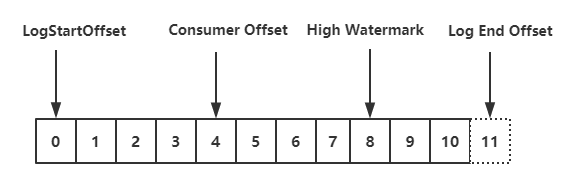

*date: 2020-11-10*

[上一篇文章](https://acatsmiling.github.io/2020/11/04/kafka-consumer-group/)讲了 consumer 如何加入 consumer group，现在加入 group 成功之后，就要准备开始消费。

`kafkaConsumer.poll ()` 方法的核心代码如下：

```java
private ConsumerRecords<K, V> poll(final Timer timer, final boolean includeMetadataInTimeout) {
    // Step1:确认KafkaConsumer实例是单线程运行，以及没有被关闭
    acquireAndEnsureOpen();
    try {
        if (this.subscriptions.hasNoSubscriptionOrUserAssignment()) {
            throw new IllegalStateException("Consumer is not subscribed to any topics or assigned any partitions");
        }

        // poll for new data until the timeout expires
        do {
            client.maybeTriggerWakeup();

            if (includeMetadataInTimeout) {
                // Step2:更新metadata信息，获取GroupCoordinator的ip以及接口，并连接、 join-group、sync-group，期间group会进行rebalance。在此步骤，consumer会先加入group，然后获取需要消费的topic partition的offset信息
                if (!updateAssignmentMetadataIfNeeded(timer)) {
                    return ConsumerRecords.empty();
                }
            } else {
                while (!updateAssignmentMetadataIfNeeded(time.timer(Long.MAX_VALUE))) {
                    log.warn("Still waiting for metadata");
                }
            }

            // Step3:拉取数据，核心步骤
            final Map<TopicPartition, List<ConsumerRecord<K, V>>> records = pollForFetches(timer);
            if (!records.isEmpty()) {
                // before returning the fetched records, we can send off the next round of fetches
                // and avoid block waiting for their responses to enable pipelining while the user
                // is handling the fetched records.
                //
                // NOTE: since the consumed position has already been updated, we must not allow
                // wakeups or any other errors to be triggered prior to returning the fetched records.
                // 在返回数据之前，发送下次的fetch请求，避免用户在下次获取数据时线程block
                if (fetcher.sendFetches() > 0 || client.hasPendingRequests()) {
                    client.pollNoWakeup();
                }

                return this.interceptors.onConsume(new ConsumerRecords<>(records));
            }
        } while (timer.notExpired());

        return ConsumerRecords.empty();
    } finally {
        release();
    }
}
```

紧跟上一篇文章，我们继续分析 consumer 加入 group 后的行为：

```java
/**
 * Visible for testing
 */
boolean updateAssignmentMetadataIfNeeded(final Timer timer) {
    // 1.上一篇主要集中在coordinator.poll(timer)方法源码分析(主要功能是:consumer加入group)
    if (coordinator != null && !coordinator.poll(timer)) {
        return false;
    }

    // 2.本篇文章从updateFetchPositions(timer)方法开始继续分析(主要功能是:consumer获得partition的offset)
    return updateFetchPositions(timer);
}
```

## KafkaConsumer 的消费策略

首先，我们应该知道，KafkaConsumer 关于如何消费的 2 种策略：

- **手动指定**：调用 `consumer.seek(TopicPartition, offset)`，然后开始 `poll ()`。

- **自动指定**：`poll ()` 之前给集群发送请求，让集群告知客户端，当前该 TopicPartition 的 offset 是多少，这也是我们此次分析的重点。

在讲如何拉取 offset 之前，先认识下下面这个类 (SubscriptionState 的内部类)：

```java
private static class TopicPartitionState {
    private FetchState fetchState;
    private FetchPosition position; // last consumed position
    private Long highWatermark; // the high watermark from last fetch
    private Long logStartOffset; // the log start offset
    private Long lastStableOffset;
    private boolean paused;  // whether this partition has been paused by the user
    private OffsetResetStrategy resetStrategy;  // the strategy to use if the offset needs resetting
    private Long nextRetryTimeMs;
    private Integer preferredReadReplica;
    private Long preferredReadReplicaExpireTimeMs;
    ...
}
```

consumer 实例订阅的每个 topic-partition 都会有一个对应的 TopicPartitionState 对象，在这个对象中会记录上面内容，最需要关注的就是 **position 这个属性，它表示上一次消费的位置**。通过 `consumer.seek ()` 方式指定消费 offset 的时候，其实设置的就是这个 position 值。

## updateFetchPositions - 拉取 offset

在 consumer 成功加入 group 并开始消费之前，我们还需要知道 consumer 是从 offset 为多少的位置开始消费。consumer 加入 group 之后，就得去获取 offset 了，下面的方法，就是开始更新 position (offset)：

```java
/**
 * Set the fetch position to the committed position (if there is one)
 * or reset it using the offset reset policy the user has configured.
 *
 * @throws org.apache.kafka.common.errors.AuthenticationException if authentication fails. See the exception for more details
 * @throws NoOffsetForPartitionException If no offset is stored for a given partition and no offset reset policy is
 *             defined
 * @return true iff the operation completed without timing out
 */
private boolean updateFetchPositions(final Timer timer) {
    // If any partitions have been truncated due to a leader change, we need to validate the offsets
    fetcher.validateOffsetsIfNeeded();

    // Step1:查看TopicPartitionState的position是否为空，第一次消费肯定为空
    cachedSubscriptionHashAllFetchPositions = subscriptions.hasAllFetchPositions();
    if (cachedSubscriptionHashAllFetchPositions) return true;

    // If there are any partitions which do not have a valid position and are not
    // awaiting reset, then we need to fetch committed offsets. We will only do a
    // coordinator lookup if there are partitions which have missing positions, so
    // a consumer with manually assigned partitions can avoid a coordinator dependence
    // by always ensuring that assigned partitions have an initial position.
    // Step2:如果没有有效的offset，那么需要从GroupCoordinator中获取
    if (coordinator != null && !coordinator.refreshCommittedOffsetsIfNeeded(timer)) return false;

    // If there are partitions still needing a position and a reset policy is defined,
    // request reset using the default policy. If no reset strategy is defined and there
    // are partitions with a missing position, then we will raise an exception.
    // Step3:如果还存在partition不知道position，并且设置了offsetreset策略，那么就等待重置，不然就抛出异常
    subscriptions.resetMissingPositions();

    // Finally send an asynchronous request to lookup and update the positions of any
    // partitions which are awaiting reset.
    // Step4:向PartitionLeader(GroupCoordinator所在机器)发送ListOffsetRequest重置position
    fetcher.resetOffsetsIfNeeded();

    return true;
}
```

上面的代码主要分为 4 个步骤，具体如下：

1. 首先，查看当前 TopicPartition 的 position 是否为空，如果不为空，表示知道下次 fetch position (即拉取数据时从哪个位置开始拉取)，但如果是第一次消费，这个 `TopicPartitionState.position` 肯定为空。
2. 然后，通过 GroupCoordinator 为缺少 fetch position 的 partition 拉取 position (即 last committed offset)。
3. 继而，仍不知道 partition 的 position (_consumer_offsets 中未保存位移信息)，且设置了 offsetreset 策略，那么就等待重置，如果没有设置重置策略，就抛出 `NoOffsetForPartitionException` 异常。
4. 最后，为那些需要重置 fetch position 的 partition 发送 ListOffsetRequest 重置 position (`consumer.beginningOffsets ()`，`consumer.endOffsets ()`，`consumer.offsetsForTimes ()`，`consumer.seek ()` 都会发送 ListOffRequest 请求)。

> 上面说的几个方法相当于都是用户自己自定义消费的 offset，所以可能出现越界 (消费位置无法在实际分区中查到) 的情况，所以也是会发送 ListOffsetRequest 请求的，即触发 `auto.offset.reset` 参数的执行。
> 比如现在某个 partition 的可拉取 offset 最大值为 100，如果你指定消费 offset=200 的位置，那肯定拉取不到，此时就会根据 `auto.offset.reset` 策略将拉取位置重置为 100 (默认的 `auto.offset.reset` 为 latest)。

### refreshCommittedOffsetsIfNeeded

我们先看下 Setp 2 中 GroupCoordinator 是如何 fetch position 的：

```java
/**
 * Refresh the committed offsets for provided partitions.
 *
 * @param timer Timer bounding how long this method can block
 * @return true iff the operation completed within the timeout
 */
public boolean refreshCommittedOffsetsIfNeeded(Timer timer) {
    final Set<TopicPartition> missingFetchPositions = subscriptions.missingFetchPositions();

    // 1.发送获取offset的请求，核心步骤
    final Map<TopicPartition, OffsetAndMetadata> offsets = fetchCommittedOffsets(missingFetchPositions, timer);
    if (offsets == null) return false;

    for (final Map.Entry<TopicPartition, OffsetAndMetadata> entry : offsets.entrySet()) {
        final TopicPartition tp = entry.getKey();
        // 2.获取response中的offset
        final OffsetAndMetadata offsetAndMetadata = entry.getValue();
        final ConsumerMetadata.LeaderAndEpoch leaderAndEpoch = metadata.leaderAndEpoch(tp);
        final SubscriptionState.FetchPosition position = new SubscriptionState.FetchPosition(
                offsetAndMetadata.offset(), offsetAndMetadata.leaderEpoch(),
                leaderAndEpoch);

        log.info("Setting offset for partition {} to the committed offset {}", tp, position);
        entry.getValue().leaderEpoch().ifPresent(epoch -> this.metadata.updateLastSeenEpochIfNewer(entry.getKey(), epoch));
        // 3.实际就是设置SubscriptionState的position值
        this.subscriptions.seekUnvalidated(tp, position);
    }
    return true;
}
```

`fetchCommittedOffsets ()` 方法的核心代码如下：

```java
/**
 * Fetch the current committed offsets from the coordinator for a set of partitions.
 *
 * @param partitions The partitions to fetch offsets for
 * @return A map from partition to the committed offset or null if the operation timed out
 */
public Map<TopicPartition, OffsetAndMetadata> fetchCommittedOffsets(final Set<TopicPartition> partitions,
                                                                    final Timer timer) {
    if (partitions.isEmpty()) return Collections.emptyMap();

    final Generation generation = generation();
    if (pendingCommittedOffsetRequest != null && !pendingCommittedOffsetRequest.sameRequest(partitions, generation)) {
        // if we were waiting for a different request, then just clear it.
        pendingCommittedOffsetRequest = null;
    }

    do {
        if (!ensureCoordinatorReady(timer)) return null;

        // contact coordinator to fetch committed offsets
        final RequestFuture<Map<TopicPartition, OffsetAndMetadata>> future;
        if (pendingCommittedOffsetRequest != null) {
            future = pendingCommittedOffsetRequest.response;
        } else {
            // 1.封装FetchRequest请求
            future = sendOffsetFetchRequest(partitions);
            pendingCommittedOffsetRequest = new PendingCommittedOffsetRequest(partitions, generation, future);

        }
        // 2.通过KafkaClient发送请求
        client.poll(future, timer);

        if (future.isDone()) {
            pendingCommittedOffsetRequest = null;

            if (future.succeeded()) {
                // 3.请求成功，获取请求的响应数据
                return future.value();
            } else if (!future.isRetriable()) {
                throw future.exception();
            } else {
                timer.sleep(retryBackoffMs);
            }
        } else {
            return null;
        }
    } while (timer.notExpired());
    return null;
}
```

上面的步骤和我们之前提到的发送其他请求毫无区别，基本就是这三个套路。

在获取到响应之后，会通过 `subscriptions.seekUnvalidated ()` 方法为每个 TopicPartition 设置 position 值后，就知道从哪里开始消费订阅 topic 下的 partition 了。

### resetMissingPositions

在 Step 3 中，什么时候发起 FetchRequest 拿不到 position 呢？

我们知道消费位移 (consume offset) 是保存在 _consumer_offsets 这个 topic 里面的，当我们进行消费的时候需要知道上次消费到了什么位置。那么就会发起请求去看上次消费到了 topic 的 partition 的哪个位置，但是这个消费位移是有保存时长的，默认为 7 天 (broker 端通过 `offsets.retention.minutes` 设置)。

当隔了一段时间再进行消费，如果这个间隔时间超过了参数的配置值，那么原先的位移信息就会丢失，最后只能通过客户端参数 `auto.offset.reset` 来确定开始消费的位置。

如果我们第一次消费 topic，那么在 _consumer_offsets 中也是找不到消费位移的，所以就会执行第四个步骤，发起 ListOffsetRequest 请求根据配置的 reset 策略 (即 `auto.offset.reset`) 来决定开始消费的位置。

### resetOffsetsIfNeeded

在 Step 4 中，发起 ListOffsetRequest 请求和处理 response 的核心代码如下：

```java
/**
 * Reset offsets for all assigned partitions that require it.
 *
 * @throws org.apache.kafka.clients.consumer.NoOffsetForPartitionException If no offset reset strategy is defined
 *   and one or more partitions aren't awaiting a seekToBeginning() or seekToEnd().
 */
public void resetOffsetsIfNeeded() {
    // Raise exception from previous offset fetch if there is one
    RuntimeException exception = cachedListOffsetsException.getAndSet(null);
    if (exception != null)
        throw exception;

    // 1.需要执行reset策略的partition
    Set<TopicPartition> partitions = subscriptions.partitionsNeedingReset(time.milliseconds());
    if (partitions.isEmpty())
        return;

    final Map<TopicPartition, Long> offsetResetTimestamps = new HashMap<>();
    for (final TopicPartition partition : partitions) {
        Long timestamp = offsetResetStrategyTimestamp(partition);
        if (timestamp != null)
            offsetResetTimestamps.put(partition, timestamp);
    }

    // 2.执行reset策略
    resetOffsetsAsync(offsetResetTimestamps);
}
```

```java
private void resetOffsetsAsync(Map<TopicPartition, Long> partitionResetTimestamps) {
    Map<Node, Map<TopicPartition, ListOffsetRequest.PartitionData>> timestampsToSearchByNode =
            groupListOffsetRequests(partitionResetTimestamps, new HashSet<>());
    for (Map.Entry<Node, Map<TopicPartition, ListOffsetRequest.PartitionData>> entry : timestampsToSearchByNode.entrySet()) {
        Node node = entry.getKey();
        final Map<TopicPartition, ListOffsetRequest.PartitionData> resetTimestamps = entry.getValue();
        subscriptions.setNextAllowedRetry(resetTimestamps.keySet(), time.milliseconds() + requestTimeoutMs);

        // 1.发送ListOffsetRequest请求
        RequestFuture<ListOffsetResult> future = sendListOffsetRequest(node, resetTimestamps, false);
        
        // 2.为ListOffsetRequest请求添加监听器
        future.addListener(new RequestFutureListener<ListOffsetResult>() {
            @Override
            public void onSuccess(ListOffsetResult result) {
                if (!result.partitionsToRetry.isEmpty()) {
                    subscriptions.requestFailed(result.partitionsToRetry, time.milliseconds() + retryBackoffMs);
                    metadata.requestUpdate();
                }

                for (Map.Entry<TopicPartition, ListOffsetData> fetchedOffset : result.fetchedOffsets.entrySet()) {
                    TopicPartition partition = fetchedOffset.getKey();
                    ListOffsetData offsetData = fetchedOffset.getValue();
                    ListOffsetRequest.PartitionData requestedReset = resetTimestamps.get(partition);
                    // 3.发送ListOffsetRequest请求成功，对结果reset，如果reset策略设置的是latest，那么requestedReset.timestamp = -1，如果是earliest，requestedReset.timestamp = -2
                    resetOffsetIfNeeded(partition, timestampToOffsetResetStrategy(requestedReset.timestamp), offsetData);
                }
            }

            @Override
            public void onFailure(RuntimeException e) {
                subscriptions.requestFailed(resetTimestamps.keySet(), time.milliseconds() + retryBackoffMs);
                metadata.requestUpdate();

                if (!(e instanceof RetriableException) && !cachedListOffsetsException.compareAndSet(null, e))
                    log.error("Discarding error in ListOffsetResponse because another error is pending", e);
            }
        });
    }
}
```

`sendListOffsetRequest ()` 方法的核心代码如下：

```java
/**
 * Send the ListOffsetRequest to a specific broker for the partitions and target timestamps.
 *
 * @param node The node to send the ListOffsetRequest to.
 * @param timestampsToSearch The mapping from partitions to the target timestamps.
 * @param requireTimestamp  True if we require a timestamp in the response.
 * @return A response which can be polled to obtain the corresponding timestamps and offsets.
 */
private RequestFuture<ListOffsetResult> sendListOffsetRequest(final Node node,
                                                              final Map<TopicPartition, ListOffsetRequest.PartitionData> timestampsToSearch,
                                                              boolean requireTimestamp) {
    ListOffsetRequest.Builder builder = ListOffsetRequest.Builder
            .forConsumer(requireTimestamp, isolationLevel)
            .setTargetTimes(timestampsToSearch);

    log.debug("Sending ListOffsetRequest {} to broker {}", builder, node);
    return client.send(node, builder)
            .compose(new RequestFutureAdapter<ClientResponse, ListOffsetResult>() {
                @Override
                public void onSuccess(ClientResponse response, RequestFuture<ListOffsetResult> future) {
                    ListOffsetResponse lor = (ListOffsetResponse) response.responseBody();
                    log.trace("Received ListOffsetResponse {} from broker {}", lor, node);
                    handleListOffsetResponse(timestampsToSearch, lor, future);
                }
            });
}
```

`resetOffsetIfNeeded ()` 方法的核心代码如下：

```java
private void resetOffsetIfNeeded(TopicPartition partition, OffsetResetStrategy requestedResetStrategy, ListOffsetData offsetData) {
    SubscriptionState.FetchPosition position = new SubscriptionState.FetchPosition(
            offsetData.offset, offsetData.leaderEpoch, metadata.leaderAndEpoch(partition));
    offsetData.leaderEpoch.ifPresent(epoch -> metadata.updateLastSeenEpochIfNewer(partition, epoch));
    // reset对应的TopicPartition fetch的position
    subscriptions.maybeSeekUnvalidated(partition, position.offset, requestedResetStrategy);
}
```

这里解释下 `auto.offset.reset` 的两个值 (latest 和 earliest) 的区别：

假设我们现在要消费 MyConsumerTopic 的数据，它有 3 个分区，生产者往这个 topic 发送了 10 条数据，然后分区数据按照 MyConsumerTopic-0 (3 条数据)，MyConsumerTopic-1 (3 条数据)，MyConsumerTopic-2 (4 条数据) 这样分配。

当设置为 latest 的时候，返回的 offset 具体到每个 partition 就是 HW 值 (partition 0 是 3，partition 1 是 3，partition 2 是 4)。

当设置为 earliest 的时候，就会从起始处 (即 LogStartOffset，注意不是 LSO) 开始消费，这里就是从 0 开始。



- **Log Start Offset**：表示 partition 的起始位置，初始值为 0，由于消息的增加以及日志清除策略影响，这个值会阶段性增大。尤其注意这个不能缩写为 LSO，LSO 代表的是 LastStableOffset，和事务有关。

- **Consumer Offset**：消费位移，表示 partition 的某个消费者消费到的位移位置。

- **High Watermark**：简称 HW，代表消费端能看到的 partition 的最高日志位移，HW 大于等于 ConsumerOffset 的值。

- **Log End Offset**：简称 LEO，代表 partition 的最高日志位移，对消费者不可见，HW 到 LEO 这之间的数据未被 follwer 完全同步。

至此，我们成功的知道 consumer 消费的 partition 的 offset 位置在哪里，下面就开始拉取 partition 里的数据。

## pollForFetches - 拉取数据

现在万事俱备只欠东风了，consumer 成功加入 group，也确定了需要拉取的 topic partition 的 offset，那么现在就应该去拉取数据了，其核心源码如下：

```java
private Map<TopicPartition, List<ConsumerRecord<K, V>>> pollForFetches(Timer timer) {
    long pollTimeout = coordinator == null ? timer.remainingMs() :
            Math.min(coordinator.timeToNextPoll(timer.currentTimeMs()), timer.remainingMs());

    // if data is available already, return it immediately
    // 1.获取fetcher已经拉取到的数据
    final Map<TopicPartition, List<ConsumerRecord<K, V>>> records = fetcher.fetchedRecords();
    if (!records.isEmpty()) {
        return records;
    }
    
    // 到此，说明上次fetch到的数据已经全部拉取了，需要再次发送fetch请求，从broker拉取新的数据

    // send any new fetches (won't resend pending fetches)
    // 2.发送fetch请求，会从多个topic-partition拉取数据(只要对应的topic-partition没有未完成的请求)
    fetcher.sendFetches();

    // We do not want to be stuck blocking in poll if we are missing some positions
    // since the offset lookup may be backing off after a failure

    // NOTE: the use of cachedSubscriptionHashAllFetchPositions means we MUST call
    // updateAssignmentMetadataIfNeeded before this method.
    if (!cachedSubscriptionHashAllFetchPositions && pollTimeout > retryBackoffMs) {
        pollTimeout = retryBackoffMs;
    }

    Timer pollTimer = time.timer(pollTimeout);
    
    // 3.真正开始发送，底层同样使用NIO
    client.poll(pollTimer, () -> {
        // since a fetch might be completed by the background thread, we need this poll condition
        // to ensure that we do not block unnecessarily in poll()
        return !fetcher.hasCompletedFetches();
    });
    timer.update(pollTimer.currentTimeMs());

    // after the long poll, we should check whether the group needs to rebalance
    // prior to returning data so that the group can stabilize faster
    // 4.如果group需要rebalance，直接返回空数据，这样更快地让group进入稳定状态
    if (coordinator != null && coordinator.rejoinNeededOrPending()) {
        return Collections.emptyMap();
    }

     // 5.返回拉取到的新数据
    return fetcher.fetchedRecords();
}
```

### fetcher.sendFetches

这里需要注意的是 `fetcher.sendFetches ()` 方法，在发送请求的同时会注册回调函数，当有 response 的时候，会解析 response，将返回的数据放到 Fetcher 的成员变量中：

```java
/**
 * Set-up a fetch request for any node that we have assigned partitions for which doesn't already have
 * an in-flight fetch or pending fetch data.
 * @return number of fetches sent
 */
public synchronized int sendFetches() {
    // Update metrics in case there was an assignment change
    sensors.maybeUpdateAssignment(subscriptions);

    // 1.创建FetchRequest
    Map<Node, FetchSessionHandler.FetchRequestData> fetchRequestMap = prepareFetchRequests();
    for (Map.Entry<Node, FetchSessionHandler.FetchRequestData> entry : fetchRequestMap.entrySet()) {
        final Node fetchTarget = entry.getKey();
        final FetchSessionHandler.FetchRequestData data = entry.getValue();
        final FetchRequest.Builder request = FetchRequest.Builder
                .forConsumer(this.maxWaitMs, this.minBytes, data.toSend())
                .isolationLevel(isolationLevel)
                .setMaxBytes(this.maxBytes)
                .metadata(data.metadata())
                .toForget(data.toForget())
                .rackId(clientRackId);

        if (log.isDebugEnabled()) {
            log.debug("Sending {} {} to broker {}", isolationLevel, data.toString(), fetchTarget);
        }
        // 2.发送FetchRequest
        RequestFuture<ClientResponse> future = client.send(fetchTarget, request);
        // We add the node to the set of nodes with pending fetch requests before adding the
        // listener because the future may have been fulfilled on another thread (e.g. during a
        // disconnection being handled by the heartbeat thread) which will mean the listener
        // will be invoked synchronously.
        this.nodesWithPendingFetchRequests.add(entry.getKey().id());
        future.addListener(new RequestFutureListener<ClientResponse>() {
            @Override
            public void onSuccess(ClientResponse resp) {
                synchronized (Fetcher.this) {
                    try {
                        @SuppressWarnings("unchecked")
                        FetchResponse<Records> response = (FetchResponse<Records>) resp.responseBody();
                        FetchSessionHandler handler = sessionHandler(fetchTarget.id());
                        if (handler == null) {
                            log.error("Unable to find FetchSessionHandler for node {}. Ignoring fetch response.",
                                    fetchTarget.id());
                            return;
                        }
                        if (!handler.handleResponse(response)) {
                            return;
                        }

                        Set<TopicPartition> partitions = new HashSet<>(response.responseData().keySet());
                        FetchResponseMetricAggregator metricAggregator = new FetchResponseMetricAggregator(sensors, partitions);

                        for (Map.Entry<TopicPartition, FetchResponse.PartitionData<Records>> entry : response.responseData().entrySet()) {
                            TopicPartition partition = entry.getKey();
                            FetchRequest.PartitionData requestData = data.sessionPartitions().get(partition);
                            if (requestData == null) {
                                String message;
                                if (data.metadata().isFull()) {
                                    message = MessageFormatter.arrayFormat(
                                            "Response for missing full request partition: partition={}; metadata={}",
                                            new Object[]{partition, data.metadata()}).getMessage();
                                } else {
                                    message = MessageFormatter.arrayFormat(
                                            "Response for missing session request partition: partition={}; metadata={}; toSend={}; toForget={}",
                                            new Object[]{partition, data.metadata(), data.toSend(), data.toForget()}).getMessage();
                                }

                                // Received fetch response for missing session partition
                                throw new IllegalStateException(message);
                            } else {
                                long fetchOffset = requestData.fetchOffset;
                                FetchResponse.PartitionData<Records> fetchData = entry.getValue();

                                log.debug("Fetch {} at offset {} for partition {} returned fetch data {}",
                                        isolationLevel, fetchOffset, partition, fetchData);
                                // 3.发送FetchRequest请求成功，将返回的数据放到ConcurrentLinkedQueue<CompletedFetch>中
                                completedFetches.add(new CompletedFetch(partition, fetchOffset, fetchData, metricAggregator,
                                        resp.requestHeader().apiVersion()));
                            }
                        }

                        sensors.fetchLatency.record(resp.requestLatencyMs());
                    } finally {
                        nodesWithPendingFetchRequests.remove(fetchTarget.id());
                    }
                }
            }

            @Override
            public void onFailure(RuntimeException e) {
                synchronized (Fetcher.this) {
                    try {
                        FetchSessionHandler handler = sessionHandler(fetchTarget.id());
                        if (handler != null) {
                            handler.handleError(e);
                        }
                    } finally {
                        nodesWithPendingFetchRequests.remove(fetchTarget.id());
                    }
                }
            }
        });

    }
    return fetchRequestMap.size();
}
```

该方法主要分为以下两步：

1. `prepareFetchRequests ()`：为订阅的所有 topic-partition list 创建 fetch 请求 (只要该 topic-partition 没有还在处理的请求)，创建的 fetch 请求依然是按照 node 级别创建的；
2. `client.send ()`：发送 fetch 请求，并设置相应的 Listener，请求处理成功的话，就加入到 completedFetches 中，在加入这个 completedFetches 队列时，是按照 topic-partition 级别去加入，这样也就方便了后续的处理。

从这里可以看出，在每次发送 fetch 请求时，都会向所有可发送的 topic-partition 发送 fetch 请求，调用一次 `fetcher.sendFetches`，拉取到的数据，可能需要多次 pollForFetches 循环才能处理完，因为 Fetcher 线程是在后台运行，这也保证了尽可能少地阻塞用户的处理线程，因为如果 Fetcher 中没有可处理的数据，用户的线程是会阻塞在 poll 方法中的。

### fetcher.fetchedRecords

这个方法的作用就是获取已经从 server 拉取到的 Records，其核心源码如下：

```java
/**
 * Return the fetched records, empty the record buffer and update the consumed position.
 *
 * NOTE: returning empty records guarantees the consumed position are NOT updated.
 *
 * @return The fetched records per partition
 * @throws OffsetOutOfRangeException If there is OffsetOutOfRange error in fetchResponse and
 *         the defaultResetPolicy is NONE
 * @throws TopicAuthorizationException If there is TopicAuthorization error in fetchResponse.
 */
public Map<TopicPartition, List<ConsumerRecord<K, V>>> fetchedRecords() {
    Map<TopicPartition, List<ConsumerRecord<K, V>>> fetched = new HashMap<>();
    // 在max.poll.records中设置单词最大的拉取条数，默认500条
    int recordsRemaining = maxPollRecords;

    try {
        while (recordsRemaining > 0) {
            if (nextInLineRecords == null || nextInLineRecords.isFetched) {// nextInLineRecords为空时
                // Step1:当一个nextInLineRecords处理完，就从completedFetches处理下一个完成的Fetch请求
                CompletedFetch completedFetch = completedFetches.peek();
                if (completedFetch == null) break;

                try {
                    // Step2:获取下一个要处理的nextInLineRecords
                    nextInLineRecords = parseCompletedFetch(completedFetch);
                } catch (Exception e) {
                    // Remove a completedFetch upon a parse with exception if (1) it contains no records, and
                    // (2) there are no fetched records with actual content preceding this exception.
                    // The first condition ensures that the completedFetches is not stuck with the same completedFetch
                    // in cases such as the TopicAuthorizationException, and the second condition ensures that no
                    // potential data loss due to an exception in a following record.
                    FetchResponse.PartitionData partition = completedFetch.partitionData;
                    if (fetched.isEmpty() && (partition.records == null || partition.records.sizeInBytes() == 0)) {
                        completedFetches.poll();
                    }
                    throw e;
                }
                completedFetches.poll();
            } else {
                // Step3:拉取records，更新position
                List<ConsumerRecord<K, V>> records = fetchRecords(nextInLineRecords, recordsRemaining);
                TopicPartition partition = nextInLineRecords.partition;
                if (!records.isEmpty()) {
                    List<ConsumerRecord<K, V>> currentRecords = fetched.get(partition);
                    if (currentRecords == null) {// 正常情况下，一个node只会发送一个request，一般只会有一个
                        fetched.put(partition, records);
                    } else {
                        // this case shouldn't usually happen because we only send one fetch at a time per partition,
                        // but it might conceivably happen in some rare cases (such as partition leader changes).
                        // we have to copy to a new list because the old one may be immutable
                        List<ConsumerRecord<K, V>> newRecords = new ArrayList<>(records.size() + currentRecords.size());
                        newRecords.addAll(currentRecords);
                        newRecords.addAll(records);
                        fetched.put(partition, newRecords);
                    }
                    recordsRemaining -= records.size();
                }
            }
        }
    } catch (KafkaException e) {
        if (fetched.isEmpty())
            throw e;
    }
    // Step4:返回相应的Records数据
    return fetched;
}

private List<ConsumerRecord<K, V>> fetchRecords(PartitionRecords partitionRecords, int maxRecords) {
    if (!subscriptions.isAssigned(partitionRecords.partition)) {
        // this can happen when a rebalance happened before fetched records are returned to the consumer's poll call
        log.debug("Not returning fetched records for partition {} since it is no longer assigned",
                partitionRecords.partition);
    } else if (!subscriptions.isFetchable(partitionRecords.partition)) {
        // this can happen when a partition is paused before fetched records are returned to the consumer's
        // poll call or if the offset is being reset
        // 这个topic-partition不能被消费了，比如调用了pause
        log.debug("Not returning fetched records for assigned partition {} since it is no longer fetchable",
                partitionRecords.partition);
    } else {
        SubscriptionState.FetchPosition position = subscriptions.position(partitionRecords.partition);
        if (partitionRecords.nextFetchOffset == position.offset) {// offset对的上，也就是拉取是按顺序拉的
            // 获取该topic-partition对应的records，并更新partitionRecords的fetchOffset(用于判断是否顺序)
            List<ConsumerRecord<K, V>> partRecords = partitionRecords.fetchRecords(maxRecords);

            if (partitionRecords.nextFetchOffset > position.offset) {
                SubscriptionState.FetchPosition nextPosition = new SubscriptionState.FetchPosition(
                        partitionRecords.nextFetchOffset,
                        partitionRecords.lastEpoch,
                        position.currentLeader);
                log.trace("Returning fetched records at offset {} for assigned partition {} and update " +
                        "position to {}", position, partitionRecords.partition, nextPosition);
                // 更新消费到的offset(the fetch position)
                subscriptions.position(partitionRecords.partition, nextPosition);
            }

            // 获取Lag(即position与hw之间差值)，hw为null时，才返回null
            Long partitionLag = subscriptions.partitionLag(partitionRecords.partition, isolationLevel);
            if (partitionLag != null)
                this.sensors.recordPartitionLag(partitionRecords.partition, partitionLag);

            Long lead = subscriptions.partitionLead(partitionRecords.partition);
            if (lead != null) {
                this.sensors.recordPartitionLead(partitionRecords.partition, lead);
            }

            return partRecords;
        } else {
            // these records aren't next in line based on the last consumed position, ignore them
            // they must be from an obsolete request
            log.debug("Ignoring fetched records for {} at offset {} since the current position is {}",
                    partitionRecords.partition, partitionRecords.nextFetchOffset, position);
        }
    }

    partitionRecords.drain();
    return emptyList();
}
```

consumer 的 Fetcher 处理从 server 获取的 fetch response 大致分为以下几个过程：

1. 通过 `completedFetches.peek()` 获取已经成功的 fetch response (在 `fetcher.sendFetches ()` 方法中会把发送FetchRequest请求成功后的结果放在这个集合中，是拆分为 topic-partition 的粒度放进去的)；
2. `parseCompletedFetch()` 处理上面获取的 completedFetch，构造成 PartitionRecords 类型；
3. 通过 `fetchRecords()` 方法处理 PartitionRecords 对象，在这个里面会去验证 fetchOffset 是否能对得上，只有 fetchOffset 是一致的情况下才会去处理相应的数据，并更新 the fetch offset 的信息，如果 fetchOffset 不一致，这里就不会处理，the fetch offset 就不会更新，下次 fetch 请求时是会接着 the fetch offset 的位置去请求相应的数据；
4. 返回相应的 Records 数据。

至此，KafkaConsumer 如何拉取消息的整体流程也分析完毕。

## 本文参考

http://generalthink.github.io/2019/05/31/kafka-consumer-offset/

https://matt33.com/2017/11/11/consumer-pollonce/

声明：写作本文初衷是个人学习记录，鉴于本人学识有限，如有侵权或不当之处，请联系 [wdshfut@163.com](mailto:wdshfut@163.com)。