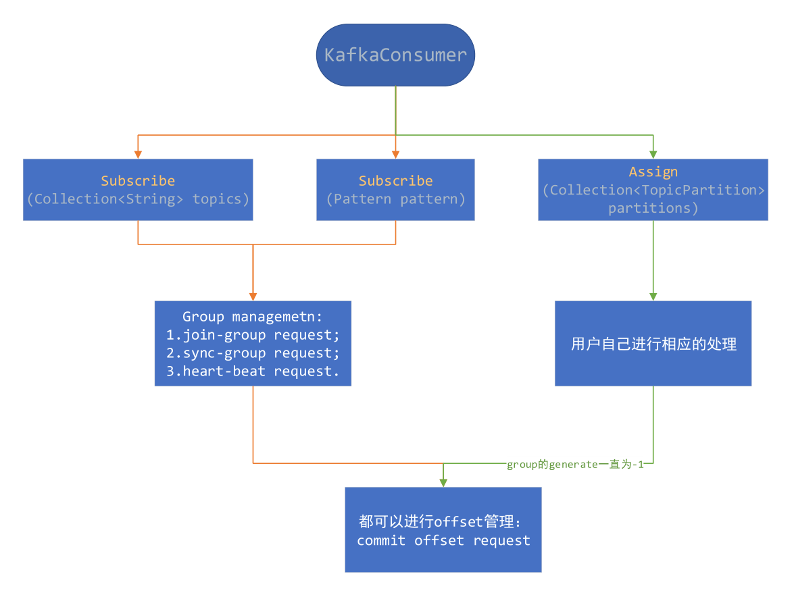

*date: 2020-11-24*

在[前面的文章](https://acatsmiling.github.io/2020/10/29/kafka-consumer/)中，有简单的介绍了 KafkaConsumer 的两种订阅模式，本篇文章对此进行扩展说明一下。

KafkaConsumer 的两种订阅模式， `subscribe ()` 模式和 `assign ()` 模式，前者是 topic 粒度 (使用 group 管理)，后者是 topic-partition 粒度 (用户自己去管理)。

## 订阅模式

KafkaConsumer 为订阅模式提供了 4 种 API，如下：

```java
// 订阅指定的topic列表，并且会自动进行动态partition订阅
// 当发生以下情况时，会进行rebalance:1.订阅的topic列表改变；2.topic被创建或删除；3.consumer线程die；4.加一个新的consumer线程
// 当发生rebalance时，会唤醒ConsumerRebalanceListener线程
public void subscribe(Collection<String> topics, ConsumerRebalanceListener listener) {}

// 同上，但是这里没有设置listener
public void subscribe(Collection<String> topics) {}

// 订阅那些满足一定规则(pattern)的topic
public void subscribe(Pattern pattern, ConsumerRebalanceListener listener) {}

// 同上，但是这里没有设置listener
public void subscribe(Pattern pattern) {}
```

以上 4 种 API 都是按照 topic 级别去订阅，可以动态地获取其分配的 topic-partition，这是使用 **Group 动态管理**，它不能与手动 partition 管理一起使用。当监控到发生下面的事件时，Group 将会触发 rebalance 操作：

1. 订阅的 topic 列表变化；
2. topic 被创建或删除；
3. consumer group 的某个 consumer 实例挂掉；
4. 一个新的 consumer 实例通过 join 方法加入到一个 group 中。

在这种模式下，当 KafkaConsumer 调用 `poll ()` 方法时，第一步会首先加入到一个 group 中，并获取其分配的 topic-partition 列表，具体细节在前面的文章中已经分析过了。

这里介绍一下当调用 `subscribe ()` 方法之后，consumer 所做的事情，分两种情况介绍，一种按 topic 列表订阅，一种是按 pattern 模式订阅：

- topic 列表订阅

topic 列表订阅，最终调用如下方法：

```java
/**
 * Subscribe to the given list of topics to get dynamically
 * assigned partitions. <b>Topic subscriptions are not incremental. This list will replace the current
 * assignment (if there is one).</b> Note that it is not possible to combine topic subscription with group management
 * with manual partition assignment through {@link #assign(Collection)}.
 *
 * If the given list of topics is empty, it is treated the same as {@link #unsubscribe()}.
 *
 * <p>
 * As part of group management, the consumer will keep track of the list of consumers that belong to a particular
 * group and will trigger a rebalance operation if any one of the following events are triggered:
 * <ul>
 * <li>Number of partitions change for any of the subscribed topics
 * <li>A subscribed topic is created or deleted
 * <li>An existing member of the consumer group is shutdown or fails
 * <li>A new member is added to the consumer group
 * </ul>
 * <p>
 * When any of these events are triggered, the provided listener will be invoked first to indicate that
 * the consumer's assignment has been revoked, and then again when the new assignment has been received.
 * Note that rebalances will only occur during an active call to {@link #poll(Duration)}, so callbacks will
 * also only be invoked during that time.
 *
 * The provided listener will immediately override any listener set in a previous call to subscribe.
 * It is guaranteed, however, that the partitions revoked/assigned through this interface are from topics
 * subscribed in this call. See {@link ConsumerRebalanceListener} for more details.
 *
 * @param topics The list of topics to subscribe to
 * @param listener Non-null listener instance to get notifications on partition assignment/revocation for the
 *                 subscribed topics
 * @throws IllegalArgumentException If topics is null or contains null or empty elements, or if listener is null
 * @throws IllegalStateException If {@code subscribe()} is called previously with pattern, or assign is called
 *                               previously (without a subsequent call to {@link #unsubscribe()}), or if not
 *                               configured at-least one partition assignment strategy
 */
@Override
public void subscribe(Collection<String> topics, ConsumerRebalanceListener listener) {
    acquireAndEnsureOpen();
    try {
        maybeThrowInvalidGroupIdException();
        if (topics == null)
            throw new IllegalArgumentException("Topic collection to subscribe to cannot be null");
        if (topics.isEmpty()) {
            // treat subscribing to empty topic list as the same as unsubscribing
            this.unsubscribe();
        } else {
            for (String topic : topics) {
                if (topic == null || topic.trim().isEmpty())
                    throw new IllegalArgumentException("Topic collection to subscribe to cannot contain null or empty topic");
            }

            throwIfNoAssignorsConfigured();
            fetcher.clearBufferedDataForUnassignedTopics(topics);
            log.info("Subscribed to topic(s): {}", Utils.join(topics, ", "));
            // 核心步骤在此处执行
            if (this.subscriptions.subscribe(new HashSet<>(topics), listener))
                metadata.requestUpdateForNewTopics();
        }
    } finally {
        release();
    }
}
```

1. 将 SubscriptionType 类型设置为 **AUTO_TOPICS**，并更新 SubscriptionState 中记录的 subscription 属性 (记录的是订阅的 topic 列表)；

```java
public synchronized boolean subscribe(Set<String> topics, ConsumerRebalanceListener listener) {
    registerRebalanceListener(listener);
    setSubscriptionType(SubscriptionType.AUTO_TOPICS);
    return changeSubscription(topics);
}

private boolean changeSubscription(Set<String> topicsToSubscribe) {
    if (subscription.equals(topicsToSubscribe))
        return false;

    subscription = topicsToSubscribe;
    if (subscriptionType != SubscriptionType.USER_ASSIGNED) {
        groupSubscription = new HashSet<>(groupSubscription);
        groupSubscription.addAll(topicsToSubscribe);
    } else {
        groupSubscription = new HashSet<>(topicsToSubscribe);
    }
    return true;
}
```

2. 请求更新 metadata。

```java
public synchronized void requestUpdateForNewTopics() {
    // Override the timestamp of last refresh to let immediate update.
    this.lastRefreshMs = 0;
    this.requestVersion++;
    requestUpdate();
}

/**
 * Request an update of the current cluster metadata info, return the current updateVersion before the update
 */
public synchronized int requestUpdate() {
    this.needUpdate = true;
    return this.updateVersion;
}
```

- pattern 模式订阅

pattern 模式订阅，最终调用如下方法：

```java
/**
 * Subscribe to all topics matching specified pattern to get dynamically assigned partitions.
 * The pattern matching will be done periodically against all topics existing at the time of check.
 * This can be controlled through the {@code metadata.max.age.ms} configuration: by lowering
 * the max metadata age, the consumer will refresh metadata more often and check for matching topics.
 * <p>
 * See {@link #subscribe(Collection, ConsumerRebalanceListener)} for details on the
 * use of the {@link ConsumerRebalanceListener}. Generally rebalances are triggered when there
 * is a change to the topics matching the provided pattern and when consumer group membership changes.
 * Group rebalances only take place during an active call to {@link #poll(Duration)}.
 *
 * @param pattern Pattern to subscribe to
 * @param listener Non-null listener instance to get notifications on partition assignment/revocation for the
 *                 subscribed topics
 * @throws IllegalArgumentException If pattern or listener is null
 * @throws IllegalStateException If {@code subscribe()} is called previously with topics, or assign is called
 *                               previously (without a subsequent call to {@link #unsubscribe()}), or if not
 *                               configured at-least one partition assignment strategy
 */
@Override
public void subscribe(Pattern pattern, ConsumerRebalanceListener listener) {
    maybeThrowInvalidGroupIdException();
    if (pattern == null)
        throw new IllegalArgumentException("Topic pattern to subscribe to cannot be null");

    acquireAndEnsureOpen();
    try {
        throwIfNoAssignorsConfigured();
        log.info("Subscribed to pattern: '{}'", pattern);
        this.subscriptions.subscribe(pattern, listener);
        this.coordinator.updatePatternSubscription(metadata.fetch());
        this.metadata.requestUpdateForNewTopics();
    } finally {
        release();
    }
}
```

1. 将 SubscriptionType 类型设置为 **AUTO_PATTERN**，并更新 SubscriptionState 中记录的 subscribedPattern 属性，设置为 pattern；

```java
public synchronized void subscribe(Pattern pattern, ConsumerRebalanceListener listener) {
    registerRebalanceListener(listener);
    setSubscriptionType(SubscriptionType.AUTO_PATTERN);
    this.subscribedPattern = pattern;
}
```

2. 调用 coordinator 的 `updatePatternSubscription ()` 方法，遍历所有 topic 的 metadata，找到所有满足 pattern 的 topic 列表，更新到 SubscriptionState 的 subscriptions 属性，并请求更新 Metadata；

```java
public void updatePatternSubscription(Cluster cluster) {
    final Set<String> topicsToSubscribe = cluster.topics().stream()
            .filter(subscriptions::matchesSubscribedPattern)
            .collect(Collectors.toSet());
    if (subscriptions.subscribeFromPattern(topicsToSubscribe))
        metadata.requestUpdateForNewTopics();
}

public synchronized boolean subscribeFromPattern(Set<String> topics) {
    if (subscriptionType != SubscriptionType.AUTO_PATTERN)
        throw new IllegalArgumentException("Attempt to subscribe from pattern while subscription type set to " +
                                           subscriptionType);

    return changeSubscription(topics);
}

private boolean changeSubscription(Set<String> topicsToSubscribe) {
    if (subscription.equals(topicsToSubscribe))
        return false;

    subscription = topicsToSubscribe;
    if (subscriptionType != SubscriptionType.USER_ASSIGNED) {
        groupSubscription = new HashSet<>(groupSubscription);
        groupSubscription.addAll(topicsToSubscribe);
    } else {
        groupSubscription = new HashSet<>(topicsToSubscribe);
    }
    return true;
}
```

```java
public synchronized void requestUpdateForNewTopics() {
    // Override the timestamp of last refresh to let immediate update.
    this.lastRefreshMs = 0;
    this.requestVersion++;
    requestUpdate();
}

/**
 * Request an update of the current cluster metadata info, return the current updateVersion before the update
 */
public synchronized int requestUpdate() {
    this.needUpdate = true;
    return this.updateVersion;
}
```

其他部分，两者基本一样，只是 pattern 模型在每次更新 topic-metadata 时，获取全局的 topic 列表，如果发现有新加入的符合条件的 topic，就立马去订阅，其他的地方，包括 group 管理、topic-partition 的分配都是一样的。

## 分配模式

当调用 `assign ()` 方法手动分配 topic-partition 列表时，不会使用 consumer 的 Group 管理机制，也即是当 consumer group member 变化或 topic 的 metadata 信息变化时，不会触发 rebalance 操作。比如：当 topic 的 partition 增加时，这里无法感知，需要用户进行相应的处理，Apache Flink 就是使用的这种方式。

```java
/**
 * Manually assign a list of partitions to this consumer. This interface does not allow for incremental assignment
 * and will replace the previous assignment (if there is one).
 * <p>
 * If the given list of topic partitions is empty, it is treated the same as {@link #unsubscribe()}.
 * <p>
 * Manual topic assignment through this method does not use the consumer's group management
 * functionality. As such, there will be no rebalance operation triggered when group membership or cluster and topic
 * metadata change. Note that it is not possible to use both manual partition assignment with {@link #assign(Collection)}
 * and group assignment with {@link #subscribe(Collection, ConsumerRebalanceListener)}.
 * <p>
 * If auto-commit is enabled, an async commit (based on the old assignment) will be triggered before the new
 * assignment replaces the old one.
 *
 * @param partitions The list of partitions to assign this consumer
 * @throws IllegalArgumentException If partitions is null or contains null or empty topics
 * @throws IllegalStateException If {@code subscribe()} is called previously with topics or pattern
 *                               (without a subsequent call to {@link #unsubscribe()})
 */
@Override
public void assign(Collection<TopicPartition> partitions) {
    acquireAndEnsureOpen();
    try {
        if (partitions == null) {
            throw new IllegalArgumentException("Topic partition collection to assign to cannot be null");
        } else if (partitions.isEmpty()) {
            this.unsubscribe();
        } else {
            for (TopicPartition tp : partitions) {
                String topic = (tp != null) ? tp.topic() : null;
                if (topic == null || topic.trim().isEmpty())
                    throw new IllegalArgumentException("Topic partitions to assign to cannot have null or empty topic");
            }
            fetcher.clearBufferedDataForUnassignedPartitions(partitions);

            // make sure the offsets of topic partitions the consumer is unsubscribing from
            // are committed since there will be no following rebalance
            if (coordinator != null)
                this.coordinator.maybeAutoCommitOffsetsAsync(time.milliseconds());

            log.info("Subscribed to partition(s): {}", Utils.join(partitions, ", "));
            if (this.subscriptions.assignFromUser(new HashSet<>(partitions)))
                metadata.requestUpdateForNewTopics();
        }
    } finally {
        release();
    }
}
```

>`assign ()` 方法是手动向 consumer 分配一些 topic-partition 列表，并且这个接口不允许增加分配的 topic-partition 列表，将会覆盖之前分配的 topic-partition 列表，如果给定的 topic-partition 列表为空，它的作用将会与 `unsubscribe ()` 方法一样。
>
>这种手动 topic 分配也不会使用 consumer 的 group 管理，当 group 的 member 变化或 topic 的 metadata 变化时，也不会触发 rebalance 操作。

这里所说的 consumer 的 group 管理，就是前面所说的 consumer 如何加入 group 的管理过程。如果使用的是 assign 模式，也即是非 AUTO_TOPICS 或 AUTO_PATTERN 模式时，consumer 实例在调用 `poll ()` 方法时，不会向 GroupCoordinator 发送 join-group、sync-group、heartbeat 请求，也就是说 GroupCoordinator 拿不到这个 consumer 实例的相关信息，也不会去维护这个 member 是否存活，这种情况下就需要用户自己管理自己的处理程序。但是这种模式可以进行 offset commit，这将在下一篇文章进行分析。

## 小结

根据上面的讲述，这里做一下小结，两种模式对比如下图所示：



简单说明如下：

|      模式      |                    不同之处                    |                           相同之处                           |
| :------------: | :--------------------------------------------: | :----------------------------------------------------------: |
| `subscribe ()` | 使用 Kafka group 管理，自动进行 rebalance 操作 |                   可以在 Kafka 保存 offset                   |
|  `assign ()`   |             用户自己进行相关的处理             | 也可以进行 offset commit，但是尽量保证 `group.id` 唯一性，如果使用一个与上面模式一样的 group，offset commit 请求将会被拒绝 |

## 本文参考

https://matt33.com/2017/11/18/consumer-subscribe/

声明：写作本文初衷是个人学习记录，鉴于本人学识有限，如有侵权或不当之处，请联系 [wdshfut@163.com](mailto:wdshfut@163.com)。