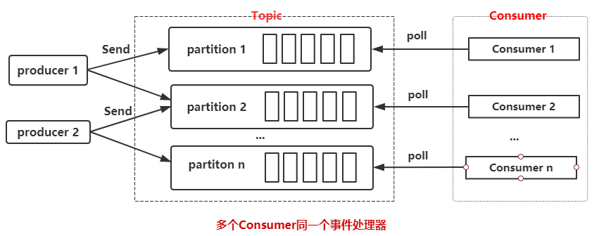
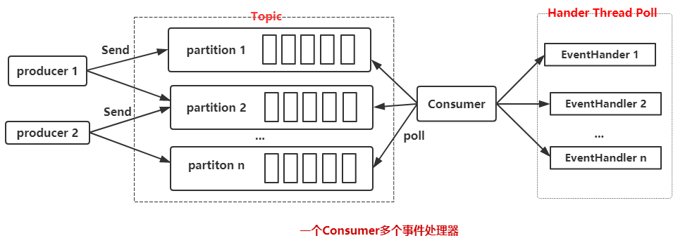
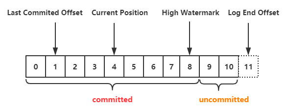

*date: 2020-10-29*

## 如何消费数据

在[上一篇文章](https://acatsmiling.github.io/2020/10/26/kafka-producer/)中，介绍了 KafkaProducer 如何发送数据到 Kafka，既然有数据发送，那么肯定就有数据消费，KafkaConsumer 也是 Kafka 整个体系中不可缺少的一环。

下面是一段创建 KafkaConsumer 的代码：

```java
public class KafkaConsumerDemo {
    public static void main(String[] args) {
        Properties props = new Properties();

        // 必须设置的属性
        props.put("bootstrap.servers", "192.168.239.131:9092");
        props.put("key.deserializer", "org.apache.kafka.common.serialization.StringDeserializer");
        props.put("value.deserializer", "org.apache.kafka.common.serialization.StringDeserializer");
        props.put("group.id", "group1");

        // 可选设置的属性
        props.put("enable.auto.commit", "true");
        props.put("auto.commit.interval.ms", "1000");
        props.put("auto.offset.reset", "earliest ");
        props.put("client.id", "test_client_id");

        KafkaConsumer<String, String> consumer = new KafkaConsumer<>(props);
        
        // 订阅主题
        consumer.subscribe(Collections.singletonList("test"));
        
        while (true) {
            // 拉取数据
            ConsumerRecords<String, String> records = consumer.poll(Duration.ofMillis(100));
            records.forEach(record -> System.out.printf("topic = %s, partition = %d, offset = %d, key = %s, value = %s%n",
                    record.topic(), record.partition(), record.offset(), record.key(), record.value()));
        }
    }
}
```

### 必须设置的属性

创建 KafkaConsumer 时，必须设置的属性有 4 个：

- `bootstrap.servers`：连接 Kafka 集群的地址，多个地址以逗号分隔。

- `key.deserializer`：消息中 key 反序列化类，需要和 KafkaProducer 中 key 序列化类相对应。

- `value.deserializer`：消息中 value 的反序列化类，需要和 KafkaProducer 中 value 序列化类相对应。

- `group.id`：消费者所属消费者组的唯一标识。

这里着重说一下 `group.id` 这个属性，KafkaConsumer 和 KafkaProducer 不一样，KafkaConsumer 中有一个 consumer group (消费者组)，由它来决定同一个 consumer group 中的消费者具体拉取哪个 partition 的数据，所以这里必须指定 `group.id` 属性。

### 订阅和取消主题

- 使用 `subscribe ()` 方式订阅主题

```java
// 订阅指定列表的topic
public void subscribe(Collection<String> topics) {
    subscribe(topics, new NoOpConsumerRebalanceListener());
}
```

```java
// 订阅指定列表的topic，同时指定一个监听器
public void subscribe(Collection<String> topics, ConsumerRebalanceListener listener) {
    ...
}
```

```java
// 订阅所有匹配指定模式的topic，模式匹配将定期对检查时存在的所有topic进行
public void subscribe(Pattern pattern) {
    subscribe(pattern, new NoOpConsumerRebalanceListener());
}
```

```java
// 订阅所有匹配指定模式的topic，模式匹配将定期对检查时存在的所有topic进行，同时指定一个监听器
public void subscribe(Pattern pattern, ConsumerRebalanceListener listener) {
    ...
}
```

- 使用 `assign ()` 方式订阅主题和分区

```java
// 手动将分区列表分配给consumer
public void assign(Collection<TopicPartition> partitions) {
    ...
}
```

使用示例 (仅作参考，`assign()` 方式的用法，应在使用时再做查询)：

```java
List<PartitionInfo> partitionInfoList = kafkaConsumer.partitionsFor("test");
if (partitionInfoList != null) {
    for (PartitionInfo partitionInfo : partitionInfoList) {
        kafkaConsumer.assign(Collections.singletonList(new TopicPartition(partitionInfo.topic(), partitionInfo.partition())));
    }
}
```

- 取消主题的三种方式


```java
kafkaConsumer.unsubscribe();
kafkaConsumer.subscribe(new ArrayList<>());
kafkaConsumer.assign(new ArrayList<TopicPartition>());
```

上面的三行代码作用相同，都是取消订阅，其中 `unsubscribe ()` 方法即可以取消通过 `subscribe ()` 方式实现的订阅，也可以取消通过 `assign ()` 方式实现的订阅。

### 拉取数据

**KafkaConsumer 采用的是主动拉取 broker 数据进行消费的。**

一般消息中间件存在**推送** (push，server 推送数据给 consumer) 和**拉取** (poll，consumer 主动去 server 拉取数据) 两种方式，这两种方式各有优劣。

如果是选择推送的方式，最大的阻碍就是 server 不清楚 consumer 的消费速度，如果 consumer 中执行的操作是比较耗时的，那么 consumer 可能会不堪重负，甚至会导致系统挂掉。

而采用拉取的方式则可以解决这种情况，consumer 根据自己的状态来拉取数据，可以对服务器的数据进行延迟处理。但是这种方式也有一个劣势就是 server 没有数据的时候可能会一直轮询，不过还好 KafkaConsumer 的 `poll ()` 方法有参数允许 consumer 请求在"长轮询"中阻塞，以等待数据到达 (并且可选地等待直到给定数量的字节可用以确保传输大小)。

## 如何更好的消费数据

文章开头处的代码展示了我们是如何消费数据的，但是代码未免过于简单，我们测试的时候这样写没有问题，但是实际开发过程中我们并不会这样写，我们会选择更加高效的方式，这里提供两种方式供大家参考。

- 一个 consumer group，多个 consumer，数量小于等于 partition 的数量




- 一个 consumer，多线程处理事件




第一种方式**每个 consumer 都要维护一个独立的 TCP 连接**，如果 partition 数和创建 consumer 线程的数量过多，会造成不小的系统开销。但是如果处理消息足够快速，消费性能也会提升，如果慢的话就会导致消费性能降低。

第二种方式是采用一个 consumer，多个消息处理线程来处理消息，其实在生产中，瓶颈一般是集中在消息处理上 (因为可能会插入数据到数据库，或者请求第三方 API)，所以我们采用多个线程来处理这些消息。

当然可以结合第一和第二两种方式，采用多 consumer + 多个消息处理线程来消费 Kafka 中的数据，核心代码如下：

```java
for (int i = 0; i < consumerNum; i++) {
  // 根据属性创建Consumer，并添加到consumer列表中
  final Consumer<String, byte[]> consumer = consumerFactory.getConsumer(getServers(), groupId);
  consumerList.add(consumer);

  // 订阅主题
  consumer.subscribe(Arrays.asList(this.getTopic()));

  // consumer.poll()拉取数据
  BufferedConsumerRecords bufferedConsumerRecords = new BufferedConsumerRecords(consumer);

  getExecutor().scheduleWithFixedDelay(() -> {
      long startTime = System.currentTimeMillis();

      // 进行消息处理
      consumeEvents(bufferedConsumerRecords);

      long sleepTime = intervalMillis - (System.currentTimeMillis() - startTime);
      if (sleepTime > 0) {
        Thread.sleep(sleepTime);
      }
  }, 0, 1000, TimeUnit.MILLISECONDS);
}
```

不过这种方式不能顺序处理数据，如果你的业务是顺序处理，那么第一种方式可能更适合你。所以实际生产中请根据业务选择最适合自己的方式。

## 消费数据时应该考虑的问题

### 什么是 offset？

在 Kafka 中无论是 KafkarPoducer 往 topic 中写数据，还是 KafkaConsumer 从 topic 中读数据，都避免不了和 offset 打交道，关于 offset 主要有以下几个概念：



- **Last Committed Offset**：consumer group 最新一次 commit 的 offset，表示这个 consumer group 已经把 Last Committed Offset 之前的数据都消费成功了。
- **Current Position**：consumer group 当前消费数据的 offset，也就是说，Last Committed Offset 到 Current Position 之间的数据已经拉取成功，可能正在处理，但是还未 commit。
- **High Watermark**：HW，已经成功备份到其他 replica 中的最新一条数据的 offset，也就是说，**High Watermark 与 Log End Offset 之间的数据已经写入到该 partition 的 leader 中，但是还未完全备份到其他的 replica 中，consumer 也无法消费这部分消息。**
- **Log End Offset**：LEO，记录底层日志 (log) 中的下一条消息的 offset。对 KafkaProducer 来说，就是即将插入下一条消息的 offset。

每个 Kafka 副本对象都有两个重要的属性：HW 和 LEO。注意是所有的副本，而不只是 leader 副本。关于这两者更详细解释，参考：[[Kafka 的 High Watermark 与 leader epoch 的讨论](https://www.cnblogs.com/huxi2b/p/7453543.html)

对于消费者而言，我们更多时候关注的是消费完成之后如何和服务器进行消费确认，告诉服务器这部分数据我已经消费过了。

这里就涉及到了 2 个 offset，一个是 Current Position，一个是处理完毕向服务器确认的 Last Committed Offset。显然，异步模式下 Last Committed Offset 是落后于 Current Position 的。如果 consumer 挂掉了，那么下一次消费数据又只会从 Last Committed Offset 的位置拉取数据，就会导致数据被重复消费。

### 如何选择 offset 的提交策略？

Kafka 提供了三种提交 offset 的方式。

**1. 自动提交**

```java
// 自动提交，默认true
props.put("enable.auto.commit", "true");
// 设置自动每1s提交一次
props.put("auto.commit.interval.ms", "1000");
```

**2.手动同步提交**

```java
kafkaConsumer.commitSync();
```

**3.手动异步提交**

```java
kafkaConsumer.commitAsync();
```

上面说了，既然异步提交 offset 可能会重复消费，那么我使用同步提交是否就可以解决数据重复消费的问题呢？我只能说 too young, too sample。且看如下代码：

```java
while (true) {
  ConsumerRecords<String, String> records = kafkaConsumer.poll(Duration.ofMillis(100));
  records.forEach(record -> {
      insertIntoDB(record);
      kafkaConsumer.commitSync();
  });
}
```

很明显不行，因为 `insertIntoDB ()` 和 `kafkaConsumer.commitSync ()` 两个方法做不到原子操作，如果 `insertIntoDB ()` 成功了，但是提交 offset 的时候 KafkaConsumer 挂掉了，然后服务器重启，仍然会导致重复消费问题。

### 是否需要做到不重复消费？

只要保证处理消息和提交 offset 的操作是原子操作，就可以做到不重复消费。我们可以自己管理 committed offset，而不让 Kafka 来进行管理。

比如如下使用方式：

1.如果消费的数据刚好需要存储在数据库，那么可以把 offset 也存在数据库，就可以在一个事物中提交这两个结果，保证原子操作。

2.借助搜索引擎，把 offset 和数据一起放到索引里面，比如 Elasticsearch。

每条记录都有自己的 offset，所以如果要管理自己的 offset 还得要做下面事情：

1.设置 `enable.auto.commit` 为 false；

2.使用每个 ConsumerRecord 提供的 offset 来保存消费的位置；

3.在重新启动时使用 `seek (TopicPartition partition, long offset)` 恢复上次消费的位置。

通过上面的方式就可以在消费端实现 ”Exactly Once” 的语义，即保证只消费一次。但是是否真的需要保证不重复消费呢？这个得看具体业务，如果重复消费数据对整体有什么影响，然后再来决定是否需要做到不重复消费。

### 再均衡 (reblance) 时怎么办？

**再均衡是指分区的所属权从一个消费者转移到另一个消费者的行为，再均衡期间，消费者组内的消费者无法读取消息。**为了更精确的控制消息的消费，我们可以在订阅主题的时候，通过指定监听器的方式来设定发生再均衡动作前后的一些准备或者收尾的动作。

```java
kafkaConsumer.subscribe(Collections.singletonList("test"), new ConsumerRebalanceListener() {
    @Override
    public void onPartitionsRevoked(Collection<TopicPartition> partitions) {
        // 再均衡之前和消费者停止读取消息之后被调用
    }

    @Override
    public void onPartitionsAssigned(Collection<TopicPartition> partitions) {
        // 重新分配分区之后和消费者开始消费之前被调用
    }
});
```

具体如何操作，得根据具体的业务逻辑来实现，如果消息比较重要，你可以在再均衡的时候处理 offset，如果不够重要，你可以什么都不做。

### 无法消费的数据怎么办？

可能由于你的业务逻辑有些数据没法消费，这个时候怎么办？同样的还是的看你认为这个数据有多重要或者多不重要，如果重要可以记录日志，把它存入文件或者数据库，以便于稍候进行重试或者定向分析。如果不重要就当做什么事情都没有发生好了。

## 实际开发中我的处理方式

我开发的项目中，用到 Kafka 的其中一个地方是消息通知 (谁给你发了消息，点赞，评论等)，大概的流程就是用户在 client 端做了某些操作，就会发送数据到 Kafka，然后把这些数据进行一定的处理之后插入到 HBase 中。

其中采用了 N consumer thread + N Event Handler 的方式来消费数据，并采用自动提交 offset。对于无法消费的数据往往只是简单处理下，打印下日志以及消息体 (无法消费的情况非常非常少)。

得益于 HBase 的多 version 控制，即使是重复消费了数据也无关紧要。这样做没有去避免重复消费的问题主要是基于以下几点考虑：

1.重复消费的概率较低，服务器整体性能稳定。

2.即便是重复消费了数据，入库了 HBase，获取数据也是只有一条，不影响结果的正确性。

3.有更高的吞吐量。

4.编程简单，不用单独去处理以及保存 offset。

## 本文参考

http://generalthink.github.io/2019/05/06/kafka-consumer-use/

## 声明

写作本文初衷是个人学习记录，鉴于本人学识有限，如有侵权或不当之处，请联系 [wdshfut@163.com](mailto:wdshfut@163.com)。