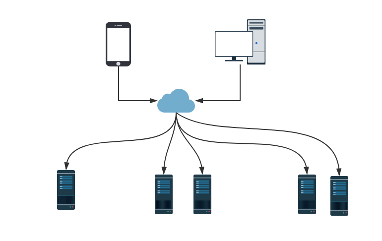
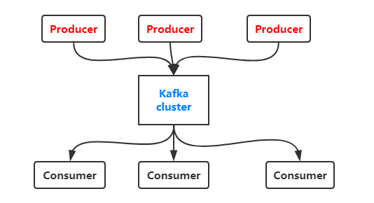
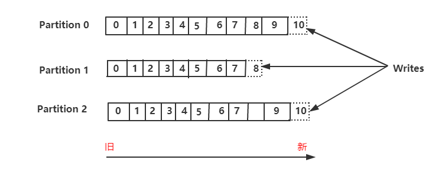
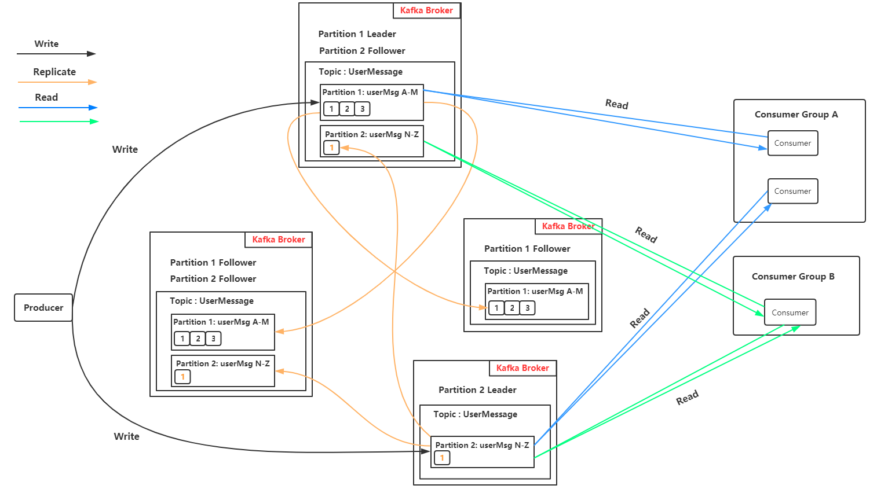
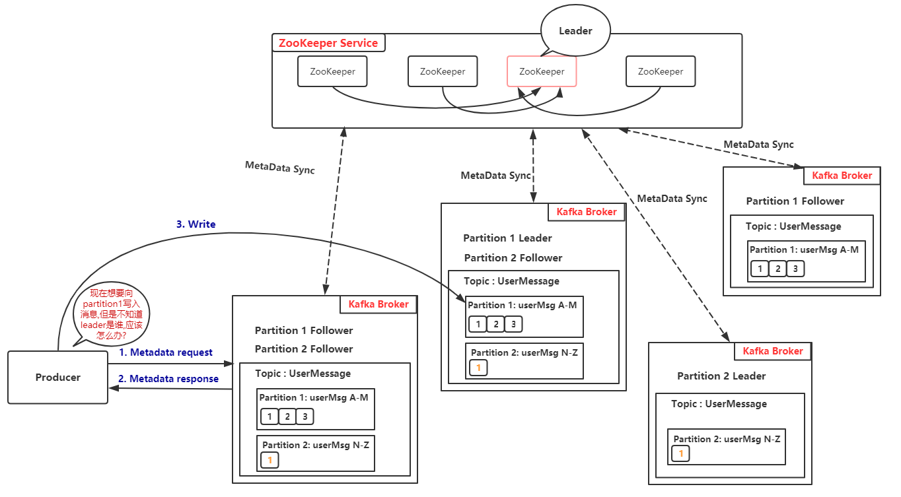
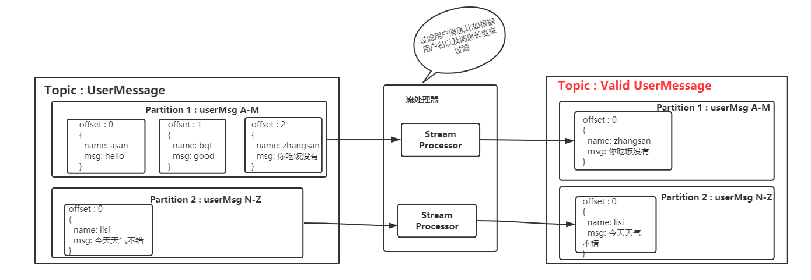

*date: 2020-10-23*

## 分布式

分布式系统由多个运行的计算机系统组成，所有这些计算机在一个集群中一起工作，对终端用户来讲只是一个单一节点。

Kafka 也是分布式的，因为它在不同的节点 (又被称为 broker) 上存储，接受以及发送消息，这样做的好处是具有很高的可扩展性和容错性。

## 水平可扩展性

在这之前，先看看什么是垂直可扩展，比如你有一个传统的数据库服务器，它开始过度负载，解决这个问题的办法就是给服务器加配置 (cpu，内存，SSD)，这就叫做垂直扩展。但是这种方式存在两个巨大的劣势：

1.硬件存在限制，不可能无限的添加机器配置。

2.它需要停机时间，通常这是很多公司无法容忍的。

水平可扩展就是通过添加更多的机器来解决同样的问题，添加新机器不需要停机，而且集群中也不会对机器的数量有任何的限制。但问题在于并非所有系统都支持水平可伸缩性，因为它们不是设计用于集群中 (在集群中工作会更加复杂)。

## 容错性

非分布式系统中容易最致命的问题就是单点失败，如果你唯一的服务器挂掉了，那么我相信你会很崩溃。

而分布式系统的设计方式就是可以以配置的方式来容许失败。比如在 5 个节点的 Kafka 集群中，即使其中两个节点挂掉了，你仍然可以继续工作。

需要注意的是，容错与性能直接相关，你的系统容错程度越高，性能就越差。

## 提交日志 (commit log)

提交日志 (也被称为预写日志或者事物日志) 是仅支持附加的持久有序数据结构，你无法修改或者删除记录，它从左往右读并且保证日志的顺序。

是不是觉得 Kafka 的数据结构如此简单?

是的，从很多方面来讲，这个数据结构就是 Kafka 的核心。这个数据结构的记录是有序的，而有序的数据可以确保我们的处理流程。这两个在分布式系统中都是极其重要的问题。

Kafka 实际上将所有消息存储到磁盘并在数据结构中对它们进行排序，以便利用顺序磁盘读取。

1.读取和写入都是常量时间 O(1) (当确定了 record id)，与磁盘上其他结构的 O(log N)操作相比是一个巨大的优势，因为每个磁盘搜索都很耗时。

2.读取和写入不会相互影响，写不会锁住读，反之亦然。

这两点有着巨大的优势， 因为数据大小与性能完全分离。无论你的服务器上有 100 KB 还是 100 TB 的数据，Kafka 都具有相同的性能。

## 如何工作

生产者消费者模式：生产者 (producer) 发送消息 (record) 到 Kafka 服务器 (broker)，这些消息存储在主题 (topic) 中，然后消费者 (consumer) 订阅该主题，接受新消息后并进行处理。

随着消息的越来越多，topic 也会越来越大，为了获得更好的性能和可伸缩性，可以在 topic 下建立多个更小的分区 (partition)，在发送消息时，可以根据实际情况，对消息进行分类，同一类的消息发送到同一个 partition (比如存储不同用户发送的消息，可以根据用户名的首字母进行分区匹配)。Kafka 保证 partition 内的所有消息都按照它们的顺序排序，区分特定消息的方式是通过其偏移量 (offset)，你可以将其视为普通数组索引，即为分区中的每个新消息递增的序列号。

Kafka 遵守着愚蠢的 broker 和聪明的 consumer 的准则。这意味着 Kafka 不会跟踪消费者读取了哪些记录并删除它们，而是会将它们存储一定的时间 (比如 1 天，以 log.retention 开头的来决定日志保留时间)，直到达到某个阈值。消费者自己轮询 Kafka 的新消息并且告诉它自己想要读取哪些记录，这允许它们按照自己的意愿递增/递减它们所处的偏移量，从而能够重放和重新处理事件。

需要注意的是消费者是属于消费者组的 (在创建 consumer 时，必须指定其所属的消费者组的 `group.id`)，消费者组有一个或多个消费者。为了避免两个进程读取同样的消息两次，每个 partition 只能被一个消费者组中的一个消费者访问。

## 持久化到硬盘

正如之前提到的，Kafka 实际上是将所有记录存储到硬盘而不在 RAM 中保存任何内容，这背后有很多优化使得这个方案可行。

1.Kafka 有一个将消息分组的协议，这允许网络请求将消息组合在一起并减少网络开销，服务器反过来一次性保留大量消息，消费者一次获取大量线性块。

2.磁盘上线性读写非常快，现代磁盘非常慢的原因是由于大量磁盘寻址，但是在大量的线性操作中不是问题。

3.操作系统对线性操作进行了大量优化，通过预读 (预取大块多次) 和后写 (将小型逻辑写入组成大型物理写入) 技术。

4.操作系统将磁盘文件缓存在空闲 RAM 中。这称为 page cache，而 Kafka 的读写都大量使用了 page cache：

​	① 写消息的时候消息先从 java 到 page cache，然后异步线程刷盘，消息从 page cache 刷入磁盘；

​	② 读消息的时候先从 page cache 找，有就直接转入 socket，没有就先从磁盘 load 到 page cache，然后直接从 socket 发出去。

5.由于 Kafka 在整个流程 (producer → broker → consumer) 中以未经修改的标准化二进制格式存储消息，因此它可以使用零拷贝优化。那时操作系统将数据从 page cache 直接复制到 socket，有效地完全绕过了 Kafka broker。

所有这些优化都使 Kafka 能够以接近网络的速度传递消息。

## 数据分发和复制

下面来谈谈 Kafka 如何实现容错以及它如何在节点之间分配数据。

为了使得一个 broker 挂掉的时候，数据还能得以保留，分区 (partition) 数据在多个 broker 中复制。

在任何时候，一个 broker 拥有一个 partition，应用程序读取/写入都要通过这个节点，这个节点叫做 partition leader。它将收到的数据复制到 N 个其他 broker，这些接收数据的 broker 叫做 follower，follower 也存储数据，一旦 leader 节点死掉的时候，它们就准备竞争上岗成为 leader。

这可以保证你成功发布的消息不会丢失，通过选择更改副本因子，你可以根据数据的重要性来交换性能以获得更强的持久性保证。

这样如果 leader 挂掉了，那么其中一个 follower 就会接替它称为 leader。包括 leader 在内的总副本数就是副本因子 (创建 topic 时，使用 `--replication-factor` 参数指定)，上图有 1 个 leader，2 个 follower，所以副本因子就是 3。

但是你可能会问：producer 或者 consumer 怎么知道 partition leader 是谁？

对生产者/消费者对分区的写/读请求，它们需要知道分区的 leader 是哪一个，对吧？这个信息肯定是可以获取到的，Kafka 使用 ZooKeeper 来存储这些元数据。

## 什么是 ZooKeeper

ZooKeeper 是一个分布式键值存储。它针对读取进行了高度优化，但写入速度较慢。它最常用于存储元数据和处理集群的机制 (心跳，分发更新/配置等)。

它允许服务的客户 (Kafka broker) 订阅并在发生变更后发送给他们，这就是 Kafka 如何知道何时切换分区领导者。ZooKeeper 本身维护了一个集群，所以它就有很高的容错性，当然它也应该具有，毕竟 Kafka 很大程度上是依赖于它的。

ZooKeeper 用于存储所有的元数据信息，包括但不限于如下几项：

- 消费者组每个分区的偏移量 (现在客户端在单独的 Kafka topic 上存储偏移量)
- ACL —— 权限控制
- 生产者/消费者的流量控制——每秒生产/消费的数据大小。参考：[*Kafka - 流量控制 Quota 功能*](https://shiyueqi.github.io/2017/04/27/Kafka-流量控制Quota功能/)
- partition leader 以及它们的健康信息

那么 producer/consumer 是如何知道谁是 partition leader 的呢？

生产者和消费者以前常常直接连接 ZooKeeper 来获取这些信息，但是 Kafka 从 0.8 和 0.9 版本开始移除了这种强耦合关系。客户端直接从 Kafka broker 获取这些元数据，而让 Kafka broker 从 ZooKeeper 那里获取这些元数据。

更多 ZooKeeper 的讲解参考：[*漫画：什么是 ZooKeeper？*](https://juejin.im/post/6844903608685707271)

## 流式处理 (Streaming)

在 Kafka 中，流处理器是指从输入主题获取连续数据流，对此输入执行某些处理并生成数据流以输出到其他主题 (或者外部服务，数据库，容器等等)。

什么是数据流呢？首先，数据流是无边界数据集的抽象表示。无边界意味着无限和持续增长。无边界数据集之所以是无限的，是因为随着时间推移，新的记录会不断加入进来。比如信用卡交易，股票交易等事件都可以用来表示数据流。

我们可以使用 producer/consumer 的 API 直接进行简单处理，但是对于更加复杂的转换，比如将流连接到一起，Kafka 提供了集成 [*Stream API*](https://kafka.apache.org/documentation/streams/) 库。

这个 API 是在你自己的代码中使用的，它并不是运行在 broker 上，它的工作原理和 consumer API 类似，可帮助你在多个应用程序 (类似于消费者组) 上扩展流处理工作。

### 无状态处理

流的无状态处理是确定性处理，其不依赖于任何外部条件，对于任何给定的数据，将始终生成与其他任何内容无关的相同输出。举个例子，我们要做一个简单的数据转换—“zhangsan” → “Hello, zhangsan”

### 流-表二义性

重要的是要认识到流和表实质上是一样的，流可以被解释称为表，表也可以被解释称为流。

#### 流作为表

流可以解释为数据的一系列更新，聚合后的结果就是表的最终结果，这项技术被称为事件溯源 ([*Event Sourcing*](https://martinfowler.com/eaaDev/EventSourcing.html))。

如果你了解数据库备份同步，你就会知道它们的技术实现被称为流式复制—将对表的每个更改都发送报副本服务器。比如 redis 中的 AOF 以及 Mysql 中的 binlog。

Kafka 流可以用相同的方式解释 - 当累积形成最终状态时的事件。此类流聚合保存在本地 RocksDB 中 (默认情况下)，被称为 KTable。

#### 表作为流

可以将表视为流中每个键的最新值的快照。与流记录可以生成表一样，表更新可以生成更改日志流。

### 有状态处理
我们在 java 中常用的一些操作比如 `map()` 或者 `filter()` 是没有状态的，它不会要求你保留任何原始数据。但是现实中，大多数的操作都是有状态的 (比如 `count()`)，因为这需要你存储当前累计的状态。

在流处理器上维护状态的问题是流处理器可能会失败！你需要在哪里保持这种状态才能容错？

一种简单的方法是简单地将所有状态存储在远程数据库中，并通过网络连接到该存储，这样做的问题是大量的网络带宽会使得你的应用程序变慢。一个更微妙但重要的问题是你的流处理作业的正常运行时间将与远程数据库紧密耦合，并且作业将不是自包含的 (其他 team 更改数据库可能会破坏你的处理)。

那么什么是更好的办法呢？

回想一下表和流的二元性。这允许我们将流转换为与我们的处理位于同一位置的表。它还为我们提供了一种处理容错的机制—通过将流存储在 Kafka broker 中。

流处理器可以将其状态保持在本地表 (例如 RocksDB) 中，该表将从输入流 (可能在某些任意转换之后) 更新。当进程失败时，它可以通过重放流来恢复其数据。

你甚至可以将远程数据库作为流的生产者，有效地广播用于在本地重建表的更改日志。

### KSQL

通常，我们不得不使用 JVM 语言编写流处理，因为这是唯一的官方 Kafka Streams API 客户端。
2018 年 4 月，KSQL 作为一项新特性被发布，它允许你使用熟悉的类似 SQL 的语言编写简单的 stream jobs。你安装了 KSQL 服务器并通过 CLI 以交互方式查询以及管理。它使用相同的抽象 (KStream 和 KTable)，保证了 Streams API 的相同优点 (可伸缩性，容错性)，并大大简化了流的工作。

这听起来可能不是很多，但在实践中对于测试内容更有用，甚至允许开发之外的人 (例如产品所有者) 使用流处理，可以看看 Confluent 提供的这篇关于[ *ksql 的使用*](https://www.youtube.com/watch?v=A45uRzJiv7I&t=2m13s)。

## 什么时候使用 kafka

正如我们已经介绍的那样，Kafka 允许你通过集中式介质获取大量消息并存储它们，而不必担心性能或数据丢失等问题。

这意味着它非常适合用作系统架构的核心，充当连接不同应用程序的集中式媒体。Kafka 可以成为事件驱动架构的中心部分，使你可以真正地将应用程序彼此分离。

Kafka 允许你轻松地分离不同 (微) 服务之间的通信。使用 Streams API，现在可以比以往更轻松地编写业务逻辑，从而丰富 Kafka 主题数据以供服务使用。可能性很大，我恳请你探讨公司如何使用 Kafka。

## 总结

Apache Kafka 是一个分布式流媒体平台，每天可处理数万亿个事件。Kafka 提供低延迟，高吞吐量，容错的发布和订阅管道，并能够处理事件流。我们回顾了它的基本语义 (producer，broker，consumer，topic)，了解了它的一些优化 (page cache)，通过复制数据了解了它的容错能力，并介绍了它不断增长的强大流媒体功能。Kafka 已经在全球数千家公司中大量采用，其中包括财富 500 强企业中的三分之一。随着 Kafka 的积极开发和最近发布的第一个主要版本 1.0 (2017 年 11 月 1 日)，有预测这个流媒体平台将会与关系数据库一样，是数据平台的重要核心。我希望这篇介绍能帮助你熟悉 Apache Kafka。

## 本文参考

http://generalthink.github.io/2019/02/27/introduction-of-kafka/

## 声明

写作本文初衷是个人学习记录，鉴于本人学识有限，如有侵权或不当之处，请联系 [wdshfut@163.com](mailto:wdshfut@163.com)。