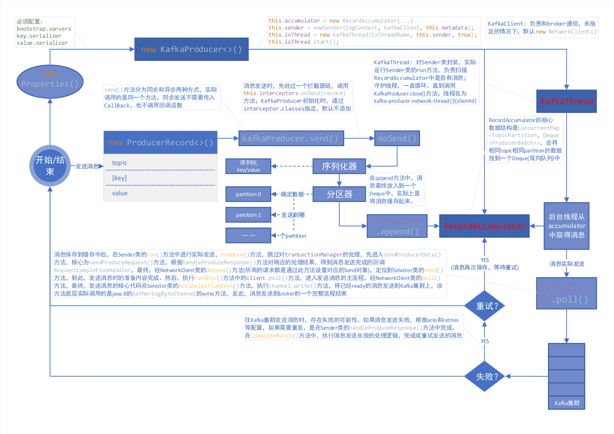

*date: 2020-10-26*

先来看一段创建 KafkaProducer 的代码：

```java
public class KafkaProducerDemo {
    public static void main(String[] args) {
        Properties props = new Properties();

        // bootstrap.servers 必须设置
        props.put(ProducerConfig.BOOTSTRAP_SERVERS_CONFIG, "192.168.239.131:9092");

        // key.serializer    必须设置
        props.put(ProducerConfig.KEY_SERIALIZER_CLASS_CONFIG, StringSerializer.class.getName());

        // value.serializer  必须设置
        props.put(ProducerConfig.VALUE_SERIALIZER_CLASS_CONFIG, StringSerializer.class.getName());

        // client.id
        props.put(ProducerConfig.CLIENT_ID_CONFIG, "client-0");

        // retries
        props.put(ProducerConfig.RETRIES_CONFIG, 3);

        // acks
        props.put(ProducerConfig.ACKS_CONFIG, "all");

        // max.in.flight.requests.per.connection
        props.put(ProducerConfig.MAX_IN_FLIGHT_REQUESTS_PER_CONNECTION, 1);

        // linger.ms
        props.put(ProducerConfig.LINGER_MS_CONFIG, 100);

        // batch.size
        props.put(ProducerConfig.BATCH_SIZE_CONFIG, 10240);

        // buffer.memory
        props.put(ProducerConfig.BUFFER_MEMORY_CONFIG, 10240);

        KafkaProducer<String, String> kafkaProducer = new KafkaProducer<>(props);

        // 指定topic，key，value，即待发送的数据
        ProducerRecord<String, String> record = new ProducerRecord<>("test1", "key1", "value1");

        // 异步发送
        kafkaProducer.send(record, (recordMetadata, exception) -> {
            if (exception != null) {
                // 发送失败的处理逻辑
                exception.printStackTrace();
            } else {
                // 发送成功的处理逻辑
                System.out.println(recordMetadata.topic());
            }
        });
        
        // 同步发送
        // kafkaProducer.send(record).get();

        // 关闭Producer
        kafkaProducer.close();
    }
}
```

## 主要流程图



简要说明：

1. `new KafkaProducer()` 后，创建一个后台线程 KafkaThread（实际运行线程是 Sender，KafkaThread 是对 Sender 的封装）扫描 RecordAccumulator 中是否有消息；
2. 调用 `kafkaProducer.send()` 发送消息，实际是将消息保存到 RecordAccumulator 中，即保存到一个 Map 中（`ConcurrentMap<TopicPartition, Deque<ProducerBatch>>`），这条消息会被记录到同一个记录批次（相同主题相同分区算同一个批次）里面，这个批次的所有消息会被发送到相同的主题和分区上；
3. 后台的独立线程扫描到 RecordAccumulator 中有消息后，会将消息发送到 Kafka 集群中（不是一有消息就发送，而是要看消息是否 ready）；
4. 如果发送成功（消息成功写入 Kafka），就返回一个 RecordMetaData 对象，它包含了主题和分区信息，以及记录在分区里的偏移量等信息；
5. 如果写入失败，就会返回一个错误，生产者在收到错误之后会尝试重新发送消息（如果允许的话，此时会将消息在保存到 RecordAccumulator 中），达到重试次数之后如果还是失败就返回错误消息。

## 缓存器的创建

```java
this.accumulator = new RecordAccumulator(logContext,
                    config.getInt(ProducerConfig.BATCH_SIZE_CONFIG),
                    this.compressionType,
                    lingerMs(config),
                    retryBackoffMs,
                    deliveryTimeoutMs,
                    metrics,
                    PRODUCER_METRIC_GROUP_NAME,
                    time,
                    apiVersions,
                    transactionManager,
                    new BufferPool(this.totalMemorySize, config.getInt(ProducerConfig.BATCH_SIZE_CONFIG), metrics, time, PRODUCER_METRIC_GROUP_NAME));
```

## 后台线程的创建

```java
this.sender = newSender(logContext, kafkaClient, this.metadata);
String ioThreadName = NETWORK_THREAD_PREFIX + " | " + clientId;
this.ioThread = new KafkaThread(ioThreadName, this.sender, true);
this.ioThread.start();

KafkaClient client = kafkaClient != null ? kafkaClient : new NetworkClient(
                new Selector(producerConfig.getLong(ProducerConfig.CONNECTIONS_MAX_IDLE_MS_CONFIG),
                        this.metrics, time, "producer", channelBuilder, logContext),
                metadata,
                clientId,
                maxInflightRequests,
                producerConfig.getLong(ProducerConfig.RECONNECT_BACKOFF_MS_CONFIG),
                producerConfig.getLong(ProducerConfig.RECONNECT_BACKOFF_MAX_MS_CONFIG),
                producerConfig.getInt(ProducerConfig.SEND_BUFFER_CONFIG),
                producerConfig.getInt(ProducerConfig.RECEIVE_BUFFER_CONFIG),
                requestTimeoutMs,
                ClientDnsLookup.forConfig(producerConfig.getString(ProducerConfig.CLIENT_DNS_LOOKUP_CONFIG)),
                time,
                true,
                apiVersions,
                throttleTimeSensor,
                logContext);
```

上述代码中，构造了一个 KafkaClient 负责和 broker 通信，同时构造一个 Sender 并启动一个异步线程，这个线程会被命名为：`kafka-producer-network-thread | ${clientId}`，如果你在创建 producer 的时候指定 `client.id` 的值为 myclient，那么线程名称就是 kafka-producer-network-thread | myclient。

## 发送消息（缓存消息）

发送消息有同步发送和异步发送两种方式，我们一般不使用同步发送，因为发送消息后需要等待返回的结果，这太过于耗时，使用异步发送的时候可以指定回调函数，当消息发送完成的时候 (成功或者失败) 会通过回调通知生产者。

同步 send：

```java
public Future<RecordMetadata> send(ProducerRecord<K, V> record) {
	return send(record, null);
}
```

异步 send：

```java
public Future<RecordMetadata> send(ProducerRecord<K, V> record, Callback callback) {
    // intercept the record, which can be potentially modified; this method does not throw exceptions
    ProducerRecord<K, V> interceptedRecord = this.interceptors.onSend(record);
    return doSend(interceptedRecord, callback);
}
```

可以看出，同步和异步实际上调用的是同一个方法，只不过同步发送时，设置回调函数为 null。

消息发送之前，会先对 key 和 value 进行序列化：

```java
byte[] serializedKey;
try {
    serializedKey = keySerializer.serialize(record.topic(), record.headers(), record.key());
} catch (ClassCastException cce) {
    throw new SerializationException("Can't convert key of class " + record.key().getClass().getName() +
                                     " to class " + producerConfig.getClass(ProducerConfig.KEY_SERIALIZER_CLASS_CONFIG).getName() +
                                     " specified in key.serializer", cce);
}
byte[] serializedValue;
try {
    serializedValue = valueSerializer.serialize(record.topic(), record.headers(), record.value());
} catch (ClassCastException cce) {
    throw new SerializationException("Can't convert value of class " + record.value().getClass().getName() +
                                     " to class " + producerConfig.getClass(ProducerConfig.VALUE_SERIALIZER_CLASS_CONFIG).getName() +
                                     " specified in value.serializer", cce);
}
```

计算分区：

```java
int partition = partition(record, serializedKey, serializedValue, cluster);
```

发送消息，实际上是将消息缓存起来，核心代码如下：

```java
RecordAccumulator.RecordAppendResult result = accumulator.append(tp, timestamp, serializedKey,
                    serializedValue, headers, interceptCallback, remainingWaitMs);
```

RecordAccumulator 的核心数据结构是 `ConcurrentMap<TopicPartition, Deque<ProducerBatch>>`，会将相同 topic 相同 partition 的数据放到一个 Deque（双向队列）中，这也是之前提到的同一个记录批次里面的消息会发送到同一个主题和分区的意思。`append()` 方法的核心源码如下：

```java
// 从batchs(ConcurrentMap<TopicPartition, Deque<ProducerBatch>>)中，根据主题分区获取对应的队列，如果没有则new ArrayDeque<>返回
Deque<ProducerBatch> dq = getOrCreateDeque(tp);

// 计算同一个记录批次占用空间大小，batchSize根据batch.size参数决定
int size = Math.max(this.batchSize, AbstractRecords.estimateSizeInBytesUpperBound(
    maxUsableMagic, compression, key, value, headers));

// 为同一个topic，partition分配buffer，如果同一个记录批次的内存不足，那么会阻塞maxTimeToBlock(max.block.ms参数)这么长时间
ByteBuffer buffer = free.allocate(size, maxTimeToBlock);

synchronized (dq) {
  // 创建MemoryRecordBuilder，通过buffer初始化appendStream(DataOutputStream)属性
  MemoryRecordsBuilder recordsBuilder = recordsBuilder(buffer, maxUsableMagic);
  ProducerBatch batch = new ProducerBatch(tp, recordsBuilder, time.milliseconds());

  // 将key，value写入到MemoryRecordsBuilder中的appendStream(DataOutputStream)中
  FutureRecordMetadata future = Utils.notNull(batch.tryAppend(timestamp, key, value, headers, callback, time.milliseconds()));

  // 将需要发送的消息放入到队列中
  dq.addLast(batch);
}
```

## 发送消息到 Kafka

上面已经将消息存储 RecordAccumulator 中去了，现在看看怎么发送消息。前面提到创建 KafkaProducer 的时候，会启动一个异步线程去从 RecordAccumulator 中取得消息然后发送到 Kafka，发送消息的核心代码在 Sender 中，它实现了 Runnable 接口并在后台一直运行处理发送请求并将消息发送到合适的节点，直到 KafkaProducer 被关闭。

```java
/**
 * The background thread that handles the sending of produce requests to the Kafka cluster. This thread makes metadata
 * requests to renew its view of the cluster and then sends produce requests to the appropriate nodes.
 */
public class Sender implements Runnable {
    /**
     * The main run loop for the sender thread
     */
    public void run() {
    	// main loop, runs until close is called
        while (running) {
            try {
                runOnce();
            } catch (Exception e) {
                log.error("Uncaught error in kafka producer I/O thread: ", e);
            }
        }
        
        // okay we stopped accepting requests but there may still be
        // requests in the transaction manager, accumulator or waiting for acknowledgment,
        // wait until these are completed.
        while (!forceClose && ((this.accumulator.hasUndrained() || this.client.inFlightRequestCount() > 0) || hasPendingTransactionalRequests())) {
            try {
                runOnce();
            } catch (Exception e) {
                log.error("Uncaught error in kafka producer I/O thread: ", e);
            }
        }

        // Abort the transaction if any commit or abort didn't go through the transaction manager's queue
        while (!forceClose && transactionManager != null && transactionManager.hasOngoingTransaction()) {
            if (!transactionManager.isCompleting()) {
                log.info("Aborting incomplete transaction due to shutdown");
                transactionManager.beginAbort();
            }
            try {
                runOnce();
            } catch (Exception e) {
                log.error("Uncaught error in kafka producer I/O thread: ", e);
            }
        }

        if (forceClose) {
            // We need to fail all the incomplete transactional requests and batches and wake up the threads waiting on
            // the futures.
            if (transactionManager != null) {
                log.debug("Aborting incomplete transactional requests due to forced shutdown");
                transactionManager.close();
            }
            log.debug("Aborting incomplete batches due to forced shutdown");
            this.accumulator.abortIncompleteBatches();
        }
    }
}
```

KafkaProducer 的关闭方法有2个：`close()` 以及 `close(Duration timeout)`，`close(long timeout, TimeUnit timUnit)` 已被弃用，其中 timeout 参数的意思是等待生产者完成任何待处理请求的最长时间，第一种方式的 timeout 为 `Long.MAX_VALUE` 毫秒，如果采用第二种方式关闭，当 timeout = 0 的时候则表示强制关闭，直接关闭 Sender (设置 running = false)。

Send 中，`runOnce()` 方法，跳过对 transactionManager 的处理，查看发送消息的主要流程：

```java
long currentTimeMs = time.milliseconds();
// 将记录批次转移到每个节点的生产请求列表中
long pollTimeout = sendProducerData(currentTimeMs);

// 轮询进行消息发送
client.poll(pollTimeout, currentTimeMs);
```

首先，查看 `sendProducerData(currentTimeMs)` 方法，它的核心逻辑在 `sendProduceRequest(batches, now)` 方法中：

```java
for (ProducerBatch batch : batches) {
    TopicPartition tp = batch.topicPartition;
    // 将ProducerBatch中MemoryRecordsBuilder转换为MemoryRecords(发送的数据就在这里面)
    MemoryRecords records = batch.records();

    // down convert if necessary to the minimum magic used. In general, there can be a delay between the time
    // that the producer starts building the batch and the time that we send the request, and we may have
    // chosen the message format based on out-dated metadata. In the worst case, we optimistically chose to use
    // the new message format, but found that the broker didn't support it, so we need to down-convert on the
    // client before sending. This is intended to handle edge cases around cluster upgrades where brokers may
    // not all support the same message format version. For example, if a partition migrates from a broker
    // which is supporting the new magic version to one which doesn't, then we will need to convert.
    if (!records.hasMatchingMagic(minUsedMagic))
        records = batch.records().downConvert(minUsedMagic, 0, time).records();
    produceRecordsByPartition.put(tp, records);
    recordsByPartition.put(tp, batch);
}

ProduceRequest.Builder requestBuilder = ProduceRequest.Builder.forMagic(minUsedMagic, acks, timeout,
                produceRecordsByPartition, transactionalId);

// 消息发送完成时的回调(消息发送失败后，在handleProduceResponse中处理)
RequestCompletionHandler callback = new RequestCompletionHandler() {
    public void onComplete(ClientResponse response) {
        handleProduceResponse(response, recordsByPartition, time.milliseconds());
    }
};

// 根据参数构造ClientRequest，此时需要发送的消息在requestBuilder中
ClientRequest clientRequest = client.newClientRequest(nodeId, requestBuilder, now, acks != 0,
                requestTimeoutMs, callback);
// 将clientRequest转换成Send对象(Send.java，包含了需要发送数据的buffer)，给KafkaChannel设置该对象，记住这里还没有发送数据
client.send(clientRequest, now);
```

在没有指定 KafkaClient 时，`client.send(clientRequest, now)` 方法，实际就是 `NetworkClient.send(ClientRequest request, long now)` 方法，所有的请求（无论是 producer 发送消息的请求，还是获取 metadata 的请求）都是通过该方法设置对应的 Send 对象：

```java
Send send = request.toSend(destination, header);
```

需要知道的是，上面只是设置了发送消息所需要准备的内容。

接下来，查看 `client.poll(pollTimeout, currentTimeMs)` 方法，进入到发送消息的主流程，发送消息的核心代码最终可以定位到 Selector 的 `pollSelectionKeys(Set<SelectionKey> selectionKeys, boolean isImmediatelyConnected, long currentTimeNanos)` 方法中，代码如下：

```java
/* if channel is ready write to any sockets that have space in their buffer and for which we have data */
if (channel.ready() && key.isWritable() && !channel.maybeBeginClientReauthentication(
    () -> channelStartTimeNanos != 0 ? channelStartTimeNanos : currentTimeNanos)) {
    Send send;
    try {
        // 底层实际调用的是java8 GatheringByteChannel的write方法
        send = channel.write();
    } catch (Exception e) {
        sendFailed = true;
        throw e;
    }
    if (send != null) {
        this.completedSends.add(send);
        this.sensors.recordBytesSent(channel.id(), send.size());
    }
}
```

就这样，我们的消息就发送到了 broker 中了，发送流程分析完毕，注意，这个是完美发送的情况。但是总会有发送失败的时候（消息过大或者没有可用的 leader 等），那么发送失败后重发又是在哪里完成的呢？还记得上面的回调函数吗，没错，就是在回调函数这里设置的，先来看下回调函数源码：

```java
/**
 * Handle a produce response
 */
private void handleProduceResponse(ClientResponse response, Map<TopicPartition, ProducerBatch> batches, long now) {
    RequestHeader requestHeader = response.requestHeader();
    long receivedTimeMs = response.receivedTimeMs();
    int correlationId = requestHeader.correlationId();
    if (response.wasDisconnected()) {
        // 如果是网络断开则构造Errors.NETWORK_EXCEPTION的响应
        for (ProducerBatch batch : batches.values())
            completeBatch(batch, new ProduceResponse.PartitionResponse(Errors.NETWORK_EXCEPTION), correlationId, now, 0L);
    } else if (response.versionMismatch() != null) {
        // 如果是版本不匹配，则构造Errors.UNSUPPORTED_VERSION的响应
        for (ProducerBatch batch : batches.values())
            completeBatch(batch, new ProduceResponse.PartitionResponse(Errors.UNSUPPORTED_VERSION), correlationId, now, 0L);
    } else {
        // if we have a response, parse it(如果存在response就返回正常的response)
        if (response.hasResponse()) {
            ProduceResponse produceResponse = (ProduceResponse) response.responseBody();
            for (Map.Entry<TopicPartition, ProduceResponse.PartitionResponse> entry : produceResponse.responses().entrySet()) {
                TopicPartition tp = entry.getKey();
                ProduceResponse.PartitionResponse partResp = entry.getValue();
                ProducerBatch batch = batches.get(tp);
                completeBatch(batch, partResp, correlationId, now, receivedTimeMs + produceResponse.throttleTimeMs());
            }
            this.sensors.recordLatency(response.destination(), response.requestLatencyMs());
        } else {
            // this is the acks = 0 case, just complete all requests(如果acks=0，那么则构造Errors.NONE的响应，因为这种情况只需要发送不需要响应结果)
            for (ProducerBatch batch : batches.values()) {
                completeBatch(batch, new ProduceResponse.PartitionResponse(Errors.NONE), correlationId, now, 0L);
            }
        }
    }
}
```

在 `completeBatch()` 方法中我们主要关注失败的逻辑处理，核心源码如下：

```java
/**
 * Complete or retry the given batch of records.
 *
 * @param batch The record batch
 * @param response The produce response
 * @param correlationId The correlation id for the request
 * @param now The current POSIX timestamp in milliseconds
 */
private void completeBatch(ProducerBatch batch, ProduceResponse.PartitionResponse response, long correlationId,
                           long now, long throttleUntilTimeMs) {
    Errors error = response.error;

    if (error == Errors.MESSAGE_TOO_LARGE && batch.recordCount > 1 && !batch.isDone() &&
        (batch.magic() >= RecordBatch.MAGIC_VALUE_V2 || batch.isCompressed())) {
        // If the batch is too large, we split the batch and send the split batches again. We do not decrement
        // the retry attempts in this case.(如果发送的消息太大，需要重新进行分割发送)
        this.accumulator.splitAndReenqueue(batch);
        maybeRemoveAndDeallocateBatch(batch);
        this.sensors.recordBatchSplit();
    } else if (error != Errors.NONE) {
        // 发生了错误，如果此时可以retry(retry次数未达到限制以及产生的异常是RetriableException)
        if (canRetry(batch, response, now)) {
            if (transactionManager == null) {
                // 把需要重试的消息放入队列中，等待重试，实际就是调用deque.addFirst(batch)
                reenqueueBatch(batch, now);
            } 
            ...
        } 
        ...
    }
}
```

以上，就是 KafkaProducer 发送消息的流程。

## 补充：分区算法

在发送消息前，调用的计算分区方法如下：

```java
/**
 * computes partition for given record.
 * if the record has partition returns the value otherwise
 * calls configured partitioner class to compute the partition.
 */
private int partition(ProducerRecord<K, V> record, byte[] serializedKey, byte[] serializedValue, Cluster cluster) {
    Integer partition = record.partition();
    return partition != null ?
        partition :
    partitioner.partition(
        record.topic(), record.key(), serializedKey, record.value(), serializedValue, cluster);
}
```

如果在创建 ProducerRecord 的时候，指定了 partition，则使用指定的，否则调用配置的 partitioner 类来计算分区。

如果没有配置自定义的分区器，Kafka 默认使用 `org.apache.kafka.clients.producer.internals.DefaultPartitioner`，源码如下：

```java
/**
 * The default partitioning strategy:
 * <ul>
 * <li>If a partition is specified in the record, use it
 * <li>If no partition is specified but a key is present choose a partition based on a hash of the key
 * <li>If no partition or key is present choose a partition in a round-robin fashion
 */
public class DefaultPartitioner implements Partitioner {

    private final ConcurrentMap<String, AtomicInteger> topicCounterMap = new ConcurrentHashMap<>();

    public void configure(Map<String, ?> configs) {}

    /**
     * Compute the partition for the given record.
     *
     * @param topic The topic name
     * @param key The key to partition on (or null if no key)
     * @param keyBytes serialized key to partition on (or null if no key)
     * @param value The value to partition on or null
     * @param valueBytes serialized value to partition on or null
     * @param cluster The current cluster metadata
     */
    public int partition(String topic, Object key, byte[] keyBytes, Object value, byte[] valueBytes, Cluster cluster) {
        List<PartitionInfo> partitions = cluster.partitionsForTopic(topic);
        int numPartitions = partitions.size();
        if (keyBytes == null) {
            // 如果key为null，则使用Round Robin算法
            int nextValue = nextValue(topic);
            List<PartitionInfo> availablePartitions = cluster.availablePartitionsForTopic(topic);
            if (availablePartitions.size() > 0) {
                int part = Utils.toPositive(nextValue) % availablePartitions.size();
                return availablePartitions.get(part).partition();
            } else {
                // no partitions are available, give a non-available partition
                return Utils.toPositive(nextValue) % numPartitions;
            }
        } else {
            // hash the keyBytes to choose a partition(根据key进行散列，使用murmur2算法)
            return Utils.toPositive(Utils.murmur2(keyBytes)) % numPartitions;
        }
    }

    private int nextValue(String topic) {
        AtomicInteger counter = topicCounterMap.get(topic);
        if (null == counter) {
            counter = new AtomicInteger(ThreadLocalRandom.current().nextInt());
            AtomicInteger currentCounter = topicCounterMap.putIfAbsent(topic, counter);
            if (currentCounter != null) {
                counter = currentCounter;
            }
        }
        return counter.getAndIncrement();
    }

    public void close() {}

}
```

DefaultPartitioner 中对于分区的算法有两种情况：

1. 如果键值为 null，那么记录键随机地发送到主题内各个可用的分区上。分区器使用轮询 (Round Robin) 算法键消息均衡地分布到各个分区上。
2. 如果键不为 null，那么 Kafka 会对键进行散列（使用 Kafka 自己的散列算法，即使升级 Java 版本，散列值也不会发生变化），然后根据散列值把消息映射到特定的分区上。应该注意的是，同一个键总是被映射到同一个分区上（如果分区数量发生了变化则不能保证0，映射的时候会使用主题所有的分区，而不仅仅是可用分区，所以如果写入数据分区是不可用的，那么就会发生错误，当然这种情况很少发生。

当然，如果你想要实现自定义分区，那么只需要实现 Partitioner 接口即可：

```java
/**
 * 将key的hash值，对分区总数取余，以确定消息发送到哪个分区
 */
public class KeyPartitioner implements Partitioner {

    @Override
    public int partition(String topic, Object key, byte[] keyBytes, Object value, byte[] valueBytes, Cluster cluster) {
        Integer numPartitions = cluster.partitionCountForTopic(topic);
        if (keyBytes == null) {
            throw new InvalidRecordException("key can not be null");
        }
        return Utils.toPositive(Utils.murmur2(keyBytes)) % numPartitions;
    }

    @Override
    public void close() {

    }

    @Override
    public void configure(Map<String, ?> configs) {

    }
}
```

然后，使用 `partitioner.class` 参数，指定你自定义的分区器的路径：

```java
props.put("partitioner.class", "cn.xisun.partitioner.KeyPartitioner");
```

## 本文参考

https://generalthink.github.io/2019/03/07/kafka-producer-source-code-analysis/

## 声明

写作本文初衷是个人学习记录，鉴于本人学识有限，如有侵权或不当之处，请联系 [wdshfut@163.com](mailto:wdshfut@163.com)。

