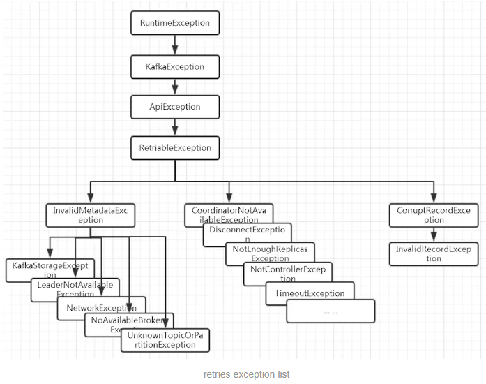

*date: 2020-10-30*

## Kafka Producer 核心配置参数

**bootstrap.servers**

broke 服务器地址，多个服务器，用逗号隔开。

**acks**

发送应答，默认：1。

acks 参数指定了生产者希望 leader 返回的用于确认请求完成的确认数量，即必须要有多少个分区副本收到该消息，生产者才会认为消息写入是成功的。

允许以下设置：

acks=0：生产者将完全不等待来自服务器的任何确认。记录将立即添加到 socket 缓冲区，并被认为已发送。在这种情况下，不能保证服务器已经收到记录，重试配置将不会生效 (因为客户机通常不会知道任何失败)。响应里来自服务端的 offset 总是-1。同时，由于不需要等待响应，所以可以以网络能够支持的最大速度发送消息，从而达到很高的吞吐量。

acks=1：只需要集群的 leader 收到消息，生产者就会收到一个来自服务器的成功响应。leader 会将记录写到本地日志中，但不会等待所有 follower 的完全确认。在这种情况下，如果 follower 复制数据之前，leader 挂掉，数据就会丢失。

acks=all / -1：当所有参与复制的节点全部收到消息的时候，生产者才会收到一个来自服务器的成功响应，最安全不过延迟比较高。如果需要保证消息不丢失, 需要使用该设置，同时需要设置 broke端 `unclean.leader.election.enable` 为 true，保证当 ISR 列表为空时，选择其他存活的副本作为新的 leader。

**batch.size**

批量发送大小，默认：16384，即 16 K。

当有多个消息需要被发送到同一个 partition 的时候，生产者会把他们放到同一个批次里面 (Deque)，该参数指定了一个批次可以使用的内存大小，按照字节数计算，当批次被填满，批次里的所有消息会被发送出去。不过生产者并不一定会等到批次被填满才发送，半满甚至只包含一个消息的批次也有可能被发送。

生产者产生的消息缓存到本地，每次批量发送 `batch.size` 大小到服务器。太小的 batch 会降低吞吐，太大则会浪费内存。

**linger.ms**

发送延迟时间，默认：0。

指定了生产者在发送批次之前等待更多消息加入批次的时间。生产者会在批次填满或 `linger.ms` 达到上限时把批次发送出去。把 `linger.ms` 设置成比0大的数，让生产者在发送批次之前等待一会儿，使更多的消息加入到这个批次，虽然这样会增加延迟，但也会提升吞吐量。

说明：`batch.size` 和 `linger.ms` 满足任何一个条件都会发送。

**buffer.memory**

生产者最大可用缓存，默认：33554432，即 32 M。

生产者可以用来缓冲等待发送到服务器的记录的总内存字节。如果应用程序发送消息的速度超过生产者发送消息到服务器的速度，即超出 `max.block.ms`，将会抛出异常。

该设置应该大致与生产者将使用的总内存相对应，但不是硬绑定，因为生产者使用的内存并非全部都用于缓冲。一些额外的内存将用于压缩 (如果启用了压缩) 以及维护飞行中的请求。

**max.block.ms**

阻塞时间，默认：60000，即 1 分钟。

指定了在调用 `send ()` 方法或者 `partitionsFor ()` 方法获取元数据时生产者的阻塞时间。当生产者的发送缓冲区已满，或者没有可用的元数据时，这些方法就会阻塞。在阻塞时间达到 `max.block.ms` 时，就会抛出 `new TimeoutException(“Failed to allocate memory within the configured max blocking time “ + maxTimeToBlockMs + “ ms.”);`。

用户提供的序列化器或分区程序中的阻塞将不计入此超时。

**client.id**

生产者 ID，默认：空。

请求时传递给服务器的 id 字符串，用来标识消息来源，后台线程会根据它命名。这样做的目的是通过允许在服务器端请求日志中包含逻辑应用程序名称，从而能够跟踪 ip/端口之外的请求源。

**compression.type**

生产者数据被发送到服务器之前被压缩的压缩类型，默认：none，即不压缩。

指定给定主题的最终压缩类型。此配置接受标准压缩编解码器 (“gzip”、“snappy”、“lz4”、“zstd”)。

“gzip”：压缩效率高，适合高内存、CPU。

“snappy”：适合带宽敏感性，压缩力度大。

**retries**

失败重试次数，默认：2147483647。

异常是 RetriableException 类型，或者 TransactionManager 允许重试 (`transactionManager.canRetry ()` )。

RetriableException 类型异常如下：

**retry.backoff.ms**

失败请求重试的间隔时间，默认：100。

这避免了在某些失败场景下以紧密循环的方式重复发送请求。

**max.in.flight.requests.per.connection**

单个连接上发送的未确认请求的最大数量，默认：5。

阻塞前客户端在单个连接上发送的未确认请求的最大数量。即指定了生产者在收到服务器响应之前可以发送多少个消息。它的值越高，就会占用越多的内存，不过也会提升吞吐量。

如果设置为 1，可以保证消息是按照发送的顺序写入服务器的，即便发生了重试。

如果设置大于 1，在 `retries` 不为0的情况下可能会出现消息发送顺序的错误。例如将两个批发送到同一个分区，第一个批处理失败并重试，但是第二个批处理成功，那么第二个批处理中的记录可能会先出现。

**delivery.timeout.ms**

传输时间，默认：120000，即 2 分钟。

生产者发送完请求接受服务器 ACK 的时间，该时间允许重试 ，该配置应该大于 `request.timeout.ms` + `linger.ms`。

**request.timeout.ms**

请求超时时间，默认：30000，即30秒。

配置控制客户端等待请求响应的最长时间。 如果在超时之前未收到响应，客户端将在必要时重新发送请求，如果重试耗尽，则该请求将失败。 这应该大于`replica.lag.time.max.ms` (broker 端配置)，以减少由于不必要的生产者重试引起的消息重复的可能性。

**connections.max.idle.ms**

连接空闲超时时间，默认：540000，即 9 分钟。

在此配置指定的毫秒数之后关闭空闲连接。

**enable.idempotence**

开启幂等，默认：false。

如果设置为 `true` ，将开启 `exactly-once` 模式，生产者将确保在流中准确地写入每个消息的副本。如果设置为 `false`，则由于代理失败而导致生产者重试，等等，可能会在流中写入重试消息的副本。

注意，启用幂等需要以下条件 ：`max.in.flight.requests.per.connection` 小于或等于 5，`retries` 大于 0， `acks` 必须为 all 或者 -1。如果用户没有显式地设置这些值，将选择合适的值。如果设置了不兼容的值，就会抛出 ConfigException。

**key.serializer**

key 序列化器，默认：无。

需要实现接口：`org.apache.kafka.common. serialize .Serializer` 。Kafka 提供以下几个默认的 key 序列化器：

String：`org.apache.kafka.common.serialization.StringSerializer`。

**value.serializer**

value 序列化器，默认：无。

需要实现接口：`org.apache.kafka.common. serialize .Serializer`。Kafka 提供以下几个默认的 value 序列化器：

byte[]：`org.apache.kafka.common.serialization.ByteArraySerializer`。

String：`org.apache.kafka.common.serialization.StringSerializer`。

**max.request.size**

请求的最大字节大小，默认：1048576，即 1 M。

该参数用于控制生产者发送的请求大小，单次发送的消息大小超过 `max.request.size` 时，会抛出异常 ，如：`org.apache.kafka.common.errors.RecordTooLargeException: The message is 70459102 bytes when serialized which is larger than the maximum request size you have configured with the max.request.size configuration.`。

注意：broker 对可接收的消息最大值也有自己的限制 (通过 `message.max.bytes` 参数设置)，所以两边的配置最好可以匹配，避免生产者发送的消息被 broker 拒绝。

**metric.reporters**

自定义指标报告器，默认：无。

用作指标报告器的类的列表，需要实现接口：`org.apache.kafka.common.metrics.MetricsReporter`，该接口允许插入将在创建新度量时得到通知的类。`JmxReporter` 始终包含在注册 `JMX` 统计信息中。

**interceptor.classes**

拦截器，默认：无。

用作拦截器的类的列表，需要实现接口：`org.apache.kafka.clients.producer.ProducerInterceptor` 。允许将生产者接收到的记录发布到 Kafka 集群之前拦截它们 (可能还会发生突变)。

**partitioner.class**

分区策略，默认：`org.apache.kafka.clients.producer.internals.DefaultPartitioner`。

如果自定义分区策略，需要实现接口： `org.apache.kafka.clients.producer.Partitioner`。

**receive.buffer.bytes**

默认：32768，即 32 K。

指定了 TCP socket 接收数据包的缓冲区大小 (和 broker 通信还是通过 socket )。如果被设置为 -1，就使用操作系统的默认值。如果生产者或消费者与 broker 处于不同的数据中心，那么可以适当增大这些值，因为跨数据中心的网络一般都有比较高的延迟和比较低的带宽。

**send.buffer.bytes**

默认：131072，即 128 K。

指定了 TCP socket 发送数据包的缓冲区大小 (和 broker 通信还是通过 socket )。如果被设置为 -1，就使用操作系统的默认值。如果生产者或消费者与 broker 处于不同的数据中心，那么可以适当增大这些值，因为跨数据中心的网络一般都有比较高的延迟和比较低的带宽。

**transaction.timeout.ms**

事务协调器等待生产者更新事务状态的最大毫秒数，默认：60000，即 1 分钟。

如果超过该时间，事务协调器会终止进行中的事务。

如果设置的时间大于 broker 端的 `max.transaction.timeout.ms`，会抛出 `InvalidTransactionTimeout` 异常。

**transactional.id**

用于事务传递的 TransactionalId，默认：空，即不使用事务。

这使得可以跨越多个生产者会话的可靠性语义，因为它允许客户端保证在开始任何新事务之前使用相同的 TransactionalId 的事务已经完成。如果没有提供 TransactionalId，则生产者被限制为幂等传递。 

注意：如果配置了 TransactionalId，则必须启用 `enable.idempotence`。

## Kafka Consumer 核心配置参数

**bootstrap.servers**

broke 服务器地址，多个服务器，用逗号隔开。

**enable.auto.commit**

是否开启自动提交 offset，默认：true。

如果为 true，consumer 的偏移量将在后台定期提交，自动提交频率通过 `auto.commit.interval.ms` 设置。

**auto.commit.interval.ms**

自动提交频率，默认：5000。

**auto.offset.reset**

初始偏移量，默认：latest。

如果 Kafka 中没有初始偏移量，或者服务器上不再存在当前偏移量 (例如，该数据已被删除)，该怎么处理：

earliest：自动重置偏移到最早的偏移。

latest：自动将偏移量重置为最新偏移量。

none：如果没有为使用者的组找到以前的偏移量，则向使用者抛出 exception。

anything else：向使用者抛出异常。

**client.id**

客户端 id，默认：空。

便于跟踪日志。

**check.crcs**

是否开启数据校验，默认：true。

自动检查消耗的记录的 CRC32。这确保不会发生对消息的在线或磁盘损坏。此检查增加了一些开销，因此在寻求极端性能的情况下可能禁用此检查。

**group.id**

消费者所属的群组，默认：空。

唯一标识用户群组，每个 partition 只会分配给同一个 group 里面的一个 consumer 来消费。

**max.poll.records**

拉取的最大记录，默认：500。

单次轮询调用 `poll ()` 方法能返回的记录的最大数量。

**max.poll.interval.ms**

拉取记录间隔，默认：300000，即 5 分钟。

使用消费者组管理时轮询调用之间的最大延迟。这为使用者在获取更多记录之前空闲的时间设置了上限。如果在此超时过期之前没有调用 `poll ()`，则认为使用者失败，组将重新平衡，以便将分区重新分配给另一个成员。

**request.timeout.ms**

请求超时时间，默认：30000 。

配置控制客户机等待请求响应的最长时间。如果在超时之前没有收到响应，客户端将在需要时重新发送请求，或者在重试耗尽时失败请求。

**session.timeout.ms**

consumer session 超时时间，默认：10000。

用于检测 worker 程序失败的超时。worker 定期发送心跳，以向代理表明其活性。如果在此会话超时过期之前代理没有接收到心跳，则代理将从组中删除。

注意：该值必须在 broker 端配置的 `group.min.session.timeout` 和 `group.max.session.timeout.ms` 范围之间。

**heartbeat.interval.ms**

心跳时间，默认：3000。

心跳是在 consumer 与 coordinator 之间进行的。心跳是确定 consumer 存活，加入或者退出 group 的有效手段。

这个值必须设置的小于 `session.timeout.ms` 的1/3，因为：

当 consumer 由于某种原因不能发 Heartbeat 到 coordinator 时，并且时间超过 `session.timeout.ms` 时，就会认为该 consumer 已退出，它所订阅的 partition 会分配到同一 group 内的其它的 consumer 上。

**connections.max.idle.ms**

连接空闲超时时间，默认：540000，即 9 分钟。

在此配置指定的毫秒数之后关闭空闲连接。

**key.deserializer**

key 反序列化器，默认：无。

需要实现接口：`org.apache.kafka.common.serialize.Deserializer`。Kafka 提供以下几个默认的 key 反序列化器：

String：`org.apache.kafka.common.serialization.StringDeserializer`。

**value.deserializer**

value 反序列化器，默认：无。

需要实现接口：`org.apache.kafka.common. serialize .Deserializer`。Kafka 提供以下几个默认的 value 反序列化器：

String：`org.apache.kafka.common.serialization.StringDeserializer`。

**partition.assignment.strategy**

consumer订阅分区策略，默认：`org.apache.kafka.clients.consumer.RangeAssignor`。

当使用组管理时，客户端将使用分区分配策略的类名在使用者实例之间分配分区所有权。

**max.partition.fetch.bytes**

一次 fetch 请求，从一个 partition 中取得的 records 的最大值，默认：1048576，即 1 M。

如果在从 topic 中第一个非空的 partition 取消息时，取到的第一个 record 的大小就超过这个配置时，仍然会读取这个 record，也就是说在这种情况下，只会返回这一条 record。

broker、topic 都会对 producer 发给它的 message size 做限制。所以在配置这值时，可以参考 broker 端的 `message.max.bytes` 配置和 topic 端的 `max.message.bytes` 配置。

**fetch.max.bytes**

一次 fetch 请求，从一个 broker 中取得的 records 的最大值，默认：52428800，即 50 M。

如果在从 topic中 第一个非空的 partition 取消息时，取到的第一个 record 的大小就超过这个配置时，仍然会读取这个 record，也就是说在这种情况下，只会返回这一条 record。

broker、topic 都会对 producer 发给它的 message size 做限制。所以在配置这值时，可以参考 broker 端的 `message.max.bytes` 配置 和 topic 端的 `max.message.bytes` 配置。

**fetch.min.bytes**

一次 fetch 请求，从一个 broker 中取得的 records 的最小值，默认：1。

如果 broker 中数据量不够的话会 wait，直到积累的数据大小满足这个条件。默认值设置为1的目的是：使得 consumer 的请求能够尽快的返回。将此设置为大于 1 的值将导致服务器等待更大数量的数据累积，这可以稍微提高服务器吞吐量，但代价是增加一些延迟。

**fetch.max.wait.ms**

拉取阻塞时间，默认：500。

如果没有足够的数据立即满足 `fetch.min.bytes` 提供的要求，服务器在响应 fetch 请求之前将阻塞的最长时间。

**exclude.internal.topics**

公开内部 topic，默认：true。

是否应该将来自内部主题 (如偏移量) 的记录公开给使用者，consumer 共享 offset。如果设置为 true，从内部主题接收记录的唯一方法是订阅它。

**isolation.level**

隔离级别，默认：read_uncommitted。

控制如何以事务方式读取写入的消息。如果设置为 read_committed，`poll ()` 方法将只返回已提交的事务消息。如果设置为 read_uncommitted，`poll ()` 方法将返回所有消息，甚至是已经中止的事务消息。在任何一种模式下，非事务性消息都将无条件返回。

## Kafka Broker 核心配置参数

**zookeeper.connect**

zookeeper 地址，多个地址用逗号隔开。

**broker.id**

服务器的 broke id，默认：-1。

每一个 broker 在集群中的唯一表示，要求是正数。

如果未设置，将生成唯一的代理 id。为了避免 zookeeper 生成的 broke id 和用户配置的 broke id 之间的冲突，生成的代理 id 从 `reserve.broker.max.id` 开始 id + 1。

**advertised.host.name**

默认：null。

不赞成使用：

在 `server.properties` 里还有另一个参数是解决这个问题的， `advertised.host.name` 参数用来配置返回的 `host.name`值，把这个参数配置为外网 IP 地址即可。

这个参数默认没有启用，默认是返回的 `java.net.InetAddress.getCanonicalHostName()` 的值，在我的 mac 上这个值并不等于 hostname 的值而是返回 IP，但在 linux 上这个值就是 hostname 的值。

**advertised.listeners**

hostname 和端口注册到 zookeeper 给生产者和消费者使用的，如果没有设置，将会使用 listeners 的配置，如果 listeners 也没有配置，将使用 `java.net.InetAddress.getCanonicalHostName()` 来获取这个 hostname 和 port，对于 ipv4，基本就是 localhost 了。

**auto.create.topics.enable**

是否允许自动创建 topic，默认：true。

如果为 true，第一次发动消息时，允许自动创建 topic。否则，只能通过命令创建 topic。

**auto.leader.rebalance.enable**

自动 rebalance，默认：true。

支持自动 leader balance。如果需要，后台线程定期检查并触发 leader balance。

**background.threads**

默认：10。

一些后台任务处理的线程数，例如过期消息文件的删除等，一般情况下不需要去做修改。

**compression.type**

压缩类型，默认：producer。

对发送的消息采取的压缩编码方式 ('gzip'，'snappy'，'lz4')。 'uncompressed'：不压缩， 'producer'：保持 producer 本身设置的压缩编码。

**delete.topic.enable**

是否允许删除 topic，默认：true。

如果关闭此配置，则通过管理工具删除主题将无效。

**leader.imbalance.check.interval.seconds**

rebalance 检测频率，默认：300。

控制器触发分区 rebalance 检查的频率。

**leader.imbalance.per.broker.percentage**

触发 rebalance 得比率，默认：10，即 10%。

每个 broke 允许的 leader 不平衡比率。如果控制器超过每个 broke 的这个值，控制器将触发一个 leader balance。该值以百分比指定。

**log.dir**

保存日志数据的目录，默认：/tmp/kafka-logs。

**log.dirs**

保存日志数据的目录，默认：null。

可以指定多个存储路径，以逗号分隔。如果未设置，使用 `log.dir` 中设置的值。

**log.flush.interval.messages**

默认：9223372036854775807。

在将消息刷新到磁盘之前，日志分区上累积的消息数量。

log 文件 ”sync” 到磁盘之前累积的消息条数。因为磁盘 IO 操作是一个慢操作，但又是一个”数据可靠性”的必要手段。所以此参数的设置，需要在”数据可靠性”与”性能”之间做必要的权衡。

如果此值过大，将会导致每次 ”fsync” 的时间较长 (IO 阻塞)；如果此值过小，将会导致 ”fsync” 的次数较多，这也意味着整体的 client 请求有一定的延迟。

物理 server 故障，将会导致没有 fsync 的消息丢失。

**log.flush.interval.ms**

默认：null。

任何 topic 中的消息在刷新到磁盘之前保存在内存中的最长时间。如果没有设置，则使用 `log.flush.scheduler.interval.ms` 中的值。

**log.flush.scheduler.interval.ms**

日志刷新器检查是否需要将任何日志刷新到磁盘的频率，默认：9223372036854775807。

**log.flush.offset.checkpoint.interval.ms**

作为日志恢复点的上次刷新的持久记录的更新频率，默认：60000。

**log.retention.bytes**

删除前日志的最大大小，默认：-1。

topic 每个分区的最大文件大小，一个 topic 的大小限制 = 分区数 * `log.retention.bytes`。

**log.retention.hours**

日志文件最大保存时间 (小时)，默认：168，即 7 天。

删除日志文件之前保存它的小时数。

**log.retention.minutes**

日志文件最大保存时间 (分钟)，默认：null。

在删除日志文件之前保存它的分钟数，如果没有设置，则使用 `log.retention.hours` 中的值。

**log.retention.ms**

日志文件最大保存时间 (毫秒)，默认：null。

在删除日志文件之前保存它的毫秒数，如果没有设置，则使用 `log.retention.minutes` 中的值。如果设置为 -1，则没有时间限制。

**log.roll.hours**

新 segment 产生时间，默认：168，即 7 天。

即使文件没有到达 `log.segment.bytes` 设置的大小，只要文件创建时间到达此属性，也会强制创建新 segment。

**log.roll.ms**

新 segment 产生时间，默认：null。

如果未设置，则使用 `log.roll.hours` 中的值。

**log.segment.bytes**

单个 segment 文件的最大值，默认：1073741824，即 1 G。

**log.segment.delete.delay.ms**

segment 删除前等待时间， 默认：60000，即 1 分钟。

**message.max.bytes**

最大 batch size，默认：1048588，即 1.000011 M。

Kafka 允许的最大 record batch size (如果启用了压缩，则是压缩后的大小)。如果增加了这个值，并且是 0.10.2 版本之前的 consumer，那么也必须增加 consumer 的 fetch 大小，以便他们能够获取这么大的 record batch。在最新的消息格式版本中，记录总是按批进行分组，以提高效率。在以前的消息格式版本中，未压缩记录没有分组成批，这种限制只适用于单个 record。针对每个 topic，可以使用 `max.message.bytes` 设置。

**min.insync.replicas**

insync中最小副本值，默认：1。

当生产者将 `acks` 设置为 “all” (或 “-1”)时，`min.insync.replicas` 指定了必须确认写操作成功的最小副本数量。如果不能满足这个最小值，则生产者将抛出一个异常 (要么是 `NotEnoughReplicas`，要么是 `NotEnoughReplicasAfterAppend`)。

当一起使用时，`min.insync.replicas` 和 `ack` 允许你执行更大的持久性保证。一个典型的场景是创建一个复制因子为 3 的主题，设置 `min.insync.replicas` 为 2，生产者设置 `acks` 为 “all”，这将确保如果大多数副本没有收到写操作，则生产者会抛出异常。

**num.io.threads**

服务器用于处理请求的线程数，其中可能包括磁盘 I/O，默认：8。

**num.network.threads**

服务器用于接收来自网络的请求和向网络发送响应的线程数，默认：3。

**num.recovery.threads.per.data.dir**

每个数据目录在启动时用于日志恢复和在关闭时用于刷新的线程数，默认：1。

**num.replica.alter.log.dirs.threads**

可以在日志目录 (可能包括磁盘 I/O) 之间移动副本的线程数，默认：null。

**num.replica.fetchers**

从 leader 复制数据到 follower 的线程数，默认：1。

**offset.metadata.max.bytes**

与 offset 提交关联的 metadata 的最大大小，默认：4096。

**offsets.commit.timeout.ms**

offset 提交将被延迟，直到偏移量主题的所有副本收到提交或达到此超时。这类似于生产者请求超时。默认：5000。

**offsets.topic.num.partitions**

偏移量提交主题的分区数量 (部署后不应再更改)，默认：50。

**offsets.topic.replication.factor**

副本大小，默认：3。

**offsets.topic.segment.bytes**

默认104857600，即 100 M。

segment 映射文件 (index) 文件大小，应该保持相对较小以便加快日志压缩和缓存负载。

**queued.max.requests**

阻塞网络线程之前，允许排队的请求数，默认：500。

**replica.fetch.min.bytes**

每个 fetch 响应所需的最小字节，默认：1。

如果字节不够，则等待 replicaMaxWaitTimeMs。

**replica.lag.time.max.ms**

默认：30000。

如果 follower 没有发送任何获取请求，或者至少在这段时间没有消耗到 leader 日志的结束偏移量，那么 leader 将从 isr 中删除 follower。

**transaction.max.timeout.ms**

默认：900000，即15分钟。

事务执行最长时间，超时则抛出异常。

**unclean.leader.election.enable**

默认：false。

指示是否在最后不得已的情况下启用 ISR 集中以外的副本作为 leader，即使这样做可能导致数据丢失。

**zookeeper.connection.timeout.ms**

默认：null。

客户端等待与 zookeeper 建立连接的最长时间。如果未设置，则使用 `zookeeper.session.timeout.ms` 中的值。

**zookeeper.max.in.flight.requests**

默认：10。

阻塞之前 consumer 将发送给 zookeeper 的未确认请求的最大数量。

**group.max.session.timeout.ms**

默认：1800000，即 30 分钟。

注册使用者允许的最大会话超时。超时时间越长，消费者在心跳之间处理消息的时间就越多，而检测故障的时间就越长。

**group.min.session.timeout.ms**

默认：6000。

注册使用者允许的最小会话超时。更短的超时导致更快的故障检测，但代价是更频繁的用户心跳，这可能会耗尽 broker 资源。

**num.partitions**

每个主题的默认日志分区数量，默认：1。

## 本文参考

https://www.cnblogs.com/wangzhuxing/p/10111831.html#_label0_11

https://atbug.com/kafka-producer-config/

https://blog.csdn.net/jiecxy/article/details/53389892

本文只整理了部分有关 Kafka 的配置，仅作参考，更多的关于 broker，topic，producer 和 consumer 的配置，请参考 [Kafka 官网](https://kafka.apache.org/documentation/)。

## 声明

写作本文初衷是个人学习记录，鉴于本人学识有限，如有侵权或不当之处，请联系 [wdshfut@163.com](mailto:wdshfut@163.com)。