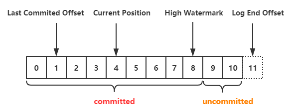

*date: 2020-10-23*


## 概述

### 分布式

分布式系统由多个运行的计算机系统组成，所有这些计算机在一个集群中一起工作，对终端用户来讲只是一个单一节点。


Kafka 也是分布式的，因为它在不同的节点 (又被称为 broker) 上存储，接受以及发送消息，这样做的好处是具有很高的可扩展性和容错性。

### 水平可扩展性

在这之前，先看看什么是垂直可扩展，比如你有一个传统的数据库服务器，它开始过度负载，解决这个问题的办法就是给服务器加配置 (cpu，内存，SSD)，这就叫做垂直扩展。但是这种方式存在两个巨大的劣势：

1.硬件存在限制，不可能无限的添加机器配置。

2.它需要停机时间，通常这是很多公司无法容忍的。

水平可扩展就是通过添加更多的机器来解决同样的问题，添加新机器不需要停机，而且集群中也不会对机器的数量有任何的限制。但问题在于并非所有系统都支持水平可伸缩性，因为它们不是设计用于集群中 (在集群中工作会更加复杂)。

### 容错性

非分布式系统中容易最致命的问题就是单点失败，如果你唯一的服务器挂掉了，那么我相信你会很崩溃。

而分布式系统的设计方式就是可以以配置的方式来容许失败。比如在 5 个节点的 Kafka 集群中，即使其中两个节点挂掉了，你仍然可以继续工作。

需要注意的是，容错与性能直接相关，你的系统容错程度越高，性能就越差。

### 提交日志 (commit log)

提交日志 (也被称为预写日志或者事物日志) 是仅支持附加的持久有序数据结构，你无法修改或者删除记录，它从左往右读并且保证日志的顺序。


是不是觉得 Kafka 的数据结构如此简单?

是的，从很多方面来讲，这个数据结构就是 Kafka 的核心。这个数据结构的记录是有序的，而有序的数据可以确保我们的处理流程。这两个在分布式系统中都是极其重要的问题。

Kafka 实际上将所有消息存储到磁盘并在数据结构中对它们进行排序，以便利用顺序磁盘读取。

1.读取和写入都是常量时间 O(1) (当确定了 record id)，与磁盘上其他结构的 O(log N)操作相比是一个巨大的优势，因为每个磁盘搜索都很耗时。

2.读取和写入不会相互影响，写不会锁住读，反之亦然。

这两点有着巨大的优势， 因为数据大小与性能完全分离。无论你的服务器上有 100 KB 还是 100 TB 的数据，Kafka 都具有相同的性能。

### 如何工作

生产者消费者模式：生产者 (producer) 发送消息 (record) 到 Kafka 服务器 (broker)，这些消息存储在主题 (topic) 中，然后消费者 (consumer) 订阅该主题，接受新消息后并进行处理。


随着消息的越来越多，topic 也会越来越大，为了获得更好的性能和可伸缩性，可以在 topic 下建立多个更小的分区 (partition)，在发送消息时，可以根据实际情况，对消息进行分类，同一类的消息发送到同一个 partition (比如存储不同用户发送的消息，可以根据用户名的首字母进行分区匹配)。Kafka 保证 partition 内的所有消息都按照它们的顺序排序，区分特定消息的方式是通过其偏移量 (offset)，你可以将其视为普通数组索引，即为分区中的每个新消息递增的序列号。


Kafka 遵守着愚蠢的 broker 和聪明的 consumer 的准则。这意味着 Kafka 不会跟踪消费者读取了哪些记录并删除它们，而是会将它们存储一定的时间 (比如 1 天，以 log.retention 开头的来决定日志保留时间)，直到达到某个阈值。消费者自己轮询 Kafka 的新消息并且告诉它自己想要读取哪些记录，这允许它们按照自己的意愿递增/递减它们所处的偏移量，从而能够重放和重新处理事件。

需要注意的是消费者是属于消费者组的 (在创建 consumer 时，必须指定其所属的消费者组的 `group.id`)，消费者组有一个或多个消费者。为了避免两个进程读取同样的消息两次，每个 partition 只能被一个消费者组中的一个消费者访问。


### 持久化到硬盘

正如之前提到的，Kafka 实际上是将所有记录存储到硬盘而不在 RAM 中保存任何内容，这背后有很多优化使得这个方案可行。

1.Kafka 有一个将消息分组的协议，这允许网络请求将消息组合在一起并减少网络开销，服务器反过来一次性保留大量消息，消费者一次获取大量线性块。

2.磁盘上线性读写非常快，现代磁盘非常慢的原因是由于大量磁盘寻址，但是在大量的线性操作中不是问题。

3.操作系统对线性操作进行了大量优化，通过预读 (预取大块多次) 和后写 (将小型逻辑写入组成大型物理写入) 技术。

4.操作系统将磁盘文件缓存在空闲 RAM 中。这称为 page cache，而 Kafka 的读写都大量使用了 page cache：

​	① 写消息的时候消息先从 java 到 page cache，然后异步线程刷盘，消息从 page cache 刷入磁盘；

​	② 读消息的时候先从 page cache 找，有就直接转入 socket，没有就先从磁盘 load 到 page cache，然后直接从 socket 发出去。

5.由于 Kafka 在整个流程 (producer → broker → consumer) 中以未经修改的标准化二进制格式存储消息，因此它可以使用零拷贝优化。那时操作系统将数据从 page cache 直接复制到 socket，有效地完全绕过了 Kafka broker。

所有这些优化都使 Kafka 能够以接近网络的速度传递消息。

### 数据分发和复制

下面来谈谈 Kafka 如何实现容错以及它如何在节点之间分配数据。

为了使得一个 broker 挂掉的时候，数据还能得以保留，分区 (partition) 数据在多个 broker 中复制。

在任何时候，一个 broker 拥有一个 partition，应用程序读取/写入都要通过这个节点，这个节点叫做 partition leader。它将收到的数据复制到 N 个其他 broker，这些接收数据的 broker 叫做 follower，follower 也存储数据，一旦 leader 节点死掉的时候，它们就准备竞争上岗成为 leader。

这可以保证你成功发布的消息不会丢失，通过选择更改副本因子，你可以根据数据的重要性来交换性能以获得更强的持久性保证。


这样如果 leader 挂掉了，那么其中一个 follower 就会接替它称为 leader。包括 leader 在内的总副本数就是副本因子 (创建 topic 时，使用 `--replication-factor` 参数指定)，上图有 1 个 leader，2 个 follower，所以副本因子就是 3。

但是你可能会问：producer 或者 consumer 怎么知道 partition leader 是谁？

对生产者/消费者对分区的写/读请求，它们需要知道分区的 leader 是哪一个，对吧？这个信息肯定是可以获取到的，Kafka 使用 ZooKeeper 来存储这些元数据。

### 什么是 ZooKeeper

ZooKeeper 是一个分布式键值存储。它针对读取进行了高度优化，但写入速度较慢。它最常用于存储元数据和处理集群的机制 (心跳，分发更新/配置等)。

它允许服务的客户 (Kafka broker) 订阅并在发生变更后发送给他们，这就是 Kafka 如何知道何时切换分区领导者。ZooKeeper 本身维护了一个集群，所以它就有很高的容错性，当然它也应该具有，毕竟 Kafka 很大程度上是依赖于它的。

ZooKeeper 用于存储所有的元数据信息，包括但不限于如下几项：

- 消费者组每个分区的偏移量 (现在客户端在单独的 Kafka topic 上存储偏移量)
- ACL —— 权限控制
- 生产者/消费者的流量控制——每秒生产/消费的数据大小。参考：[*Kafka - 流量控制 Quota 功能*](https://shiyueqi.github.io/2017/04/27/Kafka-流量控制Quota功能/)
- partition leader 以及它们的健康信息

那么 producer/consumer 是如何知道谁是 partition leader 的呢？

生产者和消费者以前常常直接连接 ZooKeeper 来获取这些信息，但是 Kafka 从 0.8 和 0.9 版本开始移除了这种强耦合关系。客户端直接从 Kafka broker 获取这些元数据，而让 Kafka broker 从 ZooKeeper 那里获取这些元数据。


更多 ZooKeeper 的讲解参考：[*漫画：什么是 ZooKeeper？*](https://juejin.im/post/6844903608685707271)

### 流式处理 (Streaming)

在 Kafka 中，流处理器是指从输入主题获取连续数据流，对此输入执行某些处理并生成数据流以输出到其他主题 (或者外部服务，数据库，容器等等)。

什么是数据流呢？首先，数据流是无边界数据集的抽象表示。无边界意味着无限和持续增长。无边界数据集之所以是无限的，是因为随着时间推移，新的记录会不断加入进来。比如信用卡交易，股票交易等事件都可以用来表示数据流。

我们可以使用 producer/consumer 的 API 直接进行简单处理，但是对于更加复杂的转换，比如将流连接到一起，Kafka 提供了集成 [*Stream API*](https://kafka.apache.org/documentation/streams/) 库。

这个 API 是在你自己的代码中使用的，它并不是运行在 broker 上，它的工作原理和 consumer API 类似，可帮助你在多个应用程序 (类似于消费者组) 上扩展流处理工作。

#### 无状态处理

流的无状态处理是确定性处理，其不依赖于任何外部条件，对于任何给定的数据，将始终生成与其他任何内容无关的相同输出。举个例子，我们要做一个简单的数据转换—“zhangsan” → “Hello, zhangsan”


#### 流-表二义性

重要的是要认识到流和表实质上是一样的，流可以被解释称为表，表也可以被解释称为流。

##### 流作为表

流可以解释为数据的一系列更新，聚合后的结果就是表的最终结果，这项技术被称为事件溯源 ([*Event Sourcing*](https://martinfowler.com/eaaDev/EventSourcing.html))。

如果你了解数据库备份同步，你就会知道它们的技术实现被称为流式复制—将对表的每个更改都发送报副本服务器。比如 redis 中的 AOF 以及 Mysql 中的 binlog。

Kafka 流可以用相同的方式解释 - 当累积形成最终状态时的事件。此类流聚合保存在本地 RocksDB 中 (默认情况下)，被称为 KTable。


##### 表作为流

可以将表视为流中每个键的最新值的快照。与流记录可以生成表一样，表更新可以生成更改日志流。


#### 有状态处理

我们在 java 中常用的一些操作比如 `map()` 或者 `filter()` 是没有状态的，它不会要求你保留任何原始数据。但是现实中，大多数的操作都是有状态的 (比如 `count()`)，因为这需要你存储当前累计的状态。

在流处理器上维护状态的问题是流处理器可能会失败！你需要在哪里保持这种状态才能容错？

一种简单的方法是简单地将所有状态存储在远程数据库中，并通过网络连接到该存储，这样做的问题是大量的网络带宽会使得你的应用程序变慢。一个更微妙但重要的问题是你的流处理作业的正常运行时间将与远程数据库紧密耦合，并且作业将不是自包含的 (其他 team 更改数据库可能会破坏你的处理)。

那么什么是更好的办法呢？

回想一下表和流的二元性。这允许我们将流转换为与我们的处理位于同一位置的表。它还为我们提供了一种处理容错的机制—通过将流存储在 Kafka broker 中。

流处理器可以将其状态保持在本地表 (例如 RocksDB) 中，该表将从输入流 (可能在某些任意转换之后) 更新。当进程失败时，它可以通过重放流来恢复其数据。

你甚至可以将远程数据库作为流的生产者，有效地广播用于在本地重建表的更改日志。


#### KSQL

通常，我们不得不使用 JVM 语言编写流处理，因为这是唯一的官方 Kafka Streams API 客户端。
2018 年 4 月，KSQL 作为一项新特性被发布，它允许你使用熟悉的类似 SQL 的语言编写简单的 stream jobs。你安装了 KSQL 服务器并通过 CLI 以交互方式查询以及管理。它使用相同的抽象 (KStream 和 KTable)，保证了 Streams API 的相同优点 (可伸缩性，容错性)，并大大简化了流的工作。

这听起来可能不是很多，但在实践中对于测试内容更有用，甚至允许开发之外的人 (例如产品所有者) 使用流处理，可以看看 Confluent 提供的这篇关于[ *ksql 的使用*](https://www.youtube.com/watch?v=A45uRzJiv7I&t=2m13s)。

### 什么时候使用 kafka

正如我们已经介绍的那样，Kafka 允许你通过集中式介质获取大量消息并存储它们，而不必担心性能或数据丢失等问题。

这意味着它非常适合用作系统架构的核心，充当连接不同应用程序的集中式媒体。Kafka 可以成为事件驱动架构的中心部分，使你可以真正地将应用程序彼此分离。


Kafka 允许你轻松地分离不同 (微) 服务之间的通信。使用 Streams API，现在可以比以往更轻松地编写业务逻辑，从而丰富 Kafka 主题数据以供服务使用。可能性很大，我恳请你探讨公司如何使用 Kafka。

### 总结

Apache Kafka 是一个分布式流媒体平台，每天可处理数万亿个事件。Kafka 提供低延迟，高吞吐量，容错的发布和订阅管道，并能够处理事件流。我们回顾了它的基本语义 (producer，broker，consumer，topic)，了解了它的一些优化 (page cache)，通过复制数据了解了它的容错能力，并介绍了它不断增长的强大流媒体功能。Kafka 已经在全球数千家公司中大量采用，其中包括财富 500 强企业中的三分之一。随着 Kafka 的积极开发和最近发布的第一个主要版本 1.0 (2017 年 11 月 1 日)，有预测这个流媒体平台将会与关系数据库一样，是数据平台的重要核心。我希望这篇介绍能帮助你熟悉 Apache Kafka。

## 操作命令

- 查看 Kafka topic 列表命令，返回 topic 名字列表


```sh
$ ~/kafka_2.12-2.6.0/bin/kafka-topics.sh --zookeeper hadoopdatanode1:2181 --list
```

- 创建 Kafka topic 命令


```sh
$ ~/kafka_2.12-2.6.0/bin/kafka-topics.sh --zookeeper hadoopdatanode1:2181,hadoopdatanode2:2181,hadoopdatanode3:2181 --create --partitions 6 --replication-factor 2 --topic patent-grant
```

-  查看 Kafka 指定 topic 的详情命令，返回该 topic 的 parition 数量、replica 因子以及每个 partition 的 leader、replica 信息

```sh
$ ~/kafka_2.12-2.6.0/bin/kafka-topics.sh --zookeeper hadoopdatanode1:2181 --describe --topic patent-grant
```

- 查看 Kafka 指定 topic 各 partition 的 offset 信息命令，--time 参数为 -1 时，表示各分区最大的 offset，为 -2 时，表示各分区最小的 offset

```sh
$ ~/kafka_2.12-2.6.0/bin/kafka-run-class.sh kafka.tools.GetOffsetShell --broker-list hadoopdatanode1:9092 --time -1 --topic patent-grant
```

- 删除 Kafka topic 命令

```sh
$ ~/kafka_2.12-2.6.0/bin/kafka-topics.sh --zookeeper hadoopdatanode1:2181 --delete -topic patent-grant
```

> 只有 topic 不再被使用时，才能被删除。

- 修改 kafka topic 的数据保存时间：

```sh
$ ~/kafka_2.12-2.6.0/bin/kafka-configs.sh --bootstrap-server hadoopdatanode1:9092 --alter --entity-type topics --entity-name extractor-patent --add-config retention.ms=2592000000
```

>kafka 中默认消息的保留时间是 7 天，若想更改，需在配置文件 server.properties 里更改选项：log.retention.hours=168。
>
>如果需要对某一个主题的消息存留的时间进行变更，但不影响其他主题，并且 kafka 集群不用重启，则使用上面的命令修改，该命令设置的是 30 天。

- 查看 kafka topic 配置信息：


```sh
$ ~/kafka_2.12-2.6.0/bin/kafka-configs.sh --bootstrap-server hadoopdatanode1:9092 --describe --entity-type topics --entity-name extractor-patent
```

如果使用的是默认配置，显示：

```sh
Dynamic configs for topic extractor-patent are:
```

如果更改了配置，显示：

```sh
Dynamic configs for topic extractor-patent are:
  retention.ms=2592000000 sensitive=false synonyms={DYNAMIC_TOPIC_CONFIG:retention.ms=2592000000}
```

- 查看 kafka consumer group 命令，返回 consumer group 名字列表 (新版信息保存在 broker 中，老版信息保存在 zookeeper 中，二者命令不同)

```sh
$ ~/kafka_2.12-2.6.0/bin/kafka-consumer-groups.sh --bootstrap-server hadoopdatanode1:9092 --list
```

> 老版命令：`~/kafka_2.12-2.6.0/bin/kafka-consumer-groups.sh --zookeeper hadoopdatanode1:2181 --list`

- 查看 Kafka 指定 consumer group 的详情命令，返回 consumer group 对应的 topic 信息、当前消费的 offset、总 offset、剩余待消费 offset 等信息

```sh
$ ~/kafka_2.12-2.6.0/bin/kafka-consumer-groups.sh --bootstrap-server hadoopdatanode1:9092 --describe --group log-consumer
```

- 重置 Kafka 指定 consumer group 消费的 topic 的 offset 命令

```sh
$ ~/kafka_2.12-2.6.0/bin/kafka-consumer-groups.sh --bootstrap-server hadoopdatanode1:9092 --reset-offsets -to-offset 0 --execute --topic patent-app --group log-consumer
```

- 删除 Kafka 指定 consumer group 命令

```sh
$ ~/kafka_2.12-2.6.0/bin/kafka-consumer-groups.sh --bootstrap-server hadoopdatanode1:9092 --delete --group log-consumer
```

- 消费 Kafka 指定 topic 的内容命令

kafka-console-consumer.sh 脚本是一个简易的消费者控制台。该 shell 脚本的功能通过调用 kafka.tools 包下的 ConsoleConsumer 类，并将提供的命令行参数全部传给该类实现。

参数说明：

```sh
$ ~/kafka_2.12-2.6.0/bin/kafka-console-consumer.sh
This tool helps to read data from Kafka topics and outputs it to standard output.
Option                                   Description                            
------                                   -----------                            
--bootstrap-server <String: server to    REQUIRED: The server(s) to connect to. 
  connect to>                                                                   
--consumer-property <String:             A mechanism to pass user-defined       
  consumer_prop>                           properties in the form key=value to  
                                           the consumer.                        
--consumer.config <String: config file>  Consumer config properties file. Note  
                                           that [consumer-property] takes       
                                           precedence over this config.         
--enable-systest-events                  Log lifecycle events of the consumer   
                                           in addition to logging consumed      
                                           messages. (This is specific for      
                                           system tests.)                       
--formatter <String: class>              The name of a class to use for         
                                           formatting kafka messages for        
                                           display. (default: kafka.tools.      
                                           DefaultMessageFormatter)             
--from-beginning                         If the consumer does not already have  
                                           an established offset to consume     
                                           from, start with the earliest        
                                           message present in the log rather    
                                           than the latest message.             
--group <String: consumer group id>      The consumer group id of the consumer. 
--help                                   Print usage information.               
--isolation-level <String>               Set to read_committed in order to      
                                           filter out transactional messages    
                                           which are not committed. Set to      
                                           read_uncommitted to read all         
                                           messages. (default: read_uncommitted)
--key-deserializer <String:                                                     
  deserializer for key>                                                         
--max-messages <Integer: num_messages>   The maximum number of messages to      
                                           consume before exiting. If not set,  
                                           consumption is continual.            
--offset <String: consume offset>        The offset id to consume from (a non-  
                                           negative number), or 'earliest'      
                                           which means from beginning, or       
                                           'latest' which means from end        
                                           (default: latest)                    
--partition <Integer: partition>         The partition to consume from.         
                                           Consumption starts from the end of   
                                           the partition unless '--offset' is   
                                           specified.                           
--property <String: prop>                The properties to initialize the       
                                           message formatter. Default           
                                           properties include:                  
                                         	print.timestamp=true|false            
                                         	print.key=true|false                  
                                         	print.value=true|false                
                                         	key.separator=<key.separator>         
                                         	line.separator=<line.separator>       
                                         	key.deserializer=<key.deserializer>   
                                         	value.deserializer=<value.            
                                           deserializer>                        
                                         Users can also pass in customized      
                                           properties for their formatter; more 
                                           specifically, users can pass in      
                                           properties keyed with 'key.          
                                           deserializer.' and 'value.           
                                           deserializer.' prefixes to configure 
                                           their deserializers.                 
--skip-message-on-error                  If there is an error when processing a 
                                           message, skip it instead of halt.    
--timeout-ms <Integer: timeout_ms>       If specified, exit if no message is    
                                           available for consumption for the    
                                           specified interval.                  
--topic <String: topic>                  The topic id to consume on.            
--value-deserializer <String:                                                   
  deserializer for values>                                                      
--version                                Display Kafka version.                 
--whitelist <String: whitelist>          Regular expression specifying          
                                           whitelist of topics to include for   
                                           consumption.
```

> 参数说明参考：https://blog.csdn.net/qq_29116427/article/details/80206125

从头开始消费：

```sh
$ ~/kafka_2.12-2.6.0/bin/kafka-console-consumer.sh --bootstrap-server hadoopdatanode1:9092 --from-beginning --topic log-collect
```

从头开始消费前 10 条消息，并显示 key：

```sh
$ ~/kafka_2.12-2.6.0/bin/kafka-console-consumer.sh --bootstrap-server hadoopdatanode1:9092 --from-beginning --max-messages 10 --property print.key=true --topic log-collect
```

从指定分区、指定 offset 开始消费：

```sh
$ ~/kafka_2.12-2.6.0/bin/kafka-console-consumer.sh --bootstrap-server hadoopdatanode1:9092 --partition 0 --offset 219000 --topic log-collect
```

从尾开始消费，必须指定分区：

```sh
$ ~/kafka_2.12-2.6.0/bin/kafka-console-consumer.sh --bootstrap-server hadoopdatanode1:9092 --partition 0 --offset latest --topic log-collect
```

## 配置参数

### Kafka Producer 核心配置参数

**bootstrap.servers**

broke 服务器地址，多个服务器，用逗号隔开。

**acks**

发送应答，默认：1。

acks 参数指定了生产者希望 leader 返回的用于确认请求完成的确认数量，即必须要有多少个分区副本收到该消息，生产者才会认为消息写入是成功的。

允许以下设置：

acks=0：生产者将完全不等待来自服务器的任何确认。记录将立即添加到 socket 缓冲区，并被认为已发送。在这种情况下，不能保证服务器已经收到记录，重试配置将不会生效 (因为客户机通常不会知道任何失败)。响应里来自服务端的 offset 总是-1。同时，由于不需要等待响应，所以可以以网络能够支持的最大速度发送消息，从而达到很高的吞吐量。

acks=1：只需要集群的 leader 收到消息，生产者就会收到一个来自服务器的成功响应。leader 会将记录写到本地日志中，但不会等待所有 follower 的完全确认。在这种情况下，如果 follower 复制数据之前，leader 挂掉，数据就会丢失。

acks=all / -1：当所有参与复制的节点全部收到消息的时候，生产者才会收到一个来自服务器的成功响应，最安全不过延迟比较高。如果需要保证消息不丢失, 需要使用该设置，同时需要设置 broke端 `unclean.leader.election.enable` 为 true，保证当 ISR 列表为空时，选择其他存活的副本作为新的 leader。

**batch.size**

批量发送大小，默认：16384，即 16 K。

当有多个消息需要被发送到同一个 partition 的时候，生产者会把他们放到同一个批次里面 (Deque)，该参数指定了一个批次可以使用的内存大小，按照字节数计算，当批次被填满，批次里的所有消息会被发送出去。不过生产者并不一定会等到批次被填满才发送，半满甚至只包含一个消息的批次也有可能被发送。

生产者产生的消息缓存到本地，每次批量发送 `batch.size` 大小到服务器。太小的 batch 会降低吞吐，太大则会浪费内存。

**linger.ms**

发送延迟时间，默认：0。

指定了生产者在发送批次之前等待更多消息加入批次的时间。生产者会在批次填满或 `linger.ms` 达到上限时把批次发送出去。把 `linger.ms` 设置成比0大的数，让生产者在发送批次之前等待一会儿，使更多的消息加入到这个批次，虽然这样会增加延迟，但也会提升吞吐量。

说明：`batch.size` 和 `linger.ms` 满足任何一个条件都会发送。

**buffer.memory**

生产者最大可用缓存，默认：33554432，即 32 M。

生产者可以用来缓冲等待发送到服务器的记录的总内存字节。如果应用程序发送消息的速度超过生产者发送消息到服务器的速度，即超出 `max.block.ms`，将会抛出异常。

该设置应该大致与生产者将使用的总内存相对应，但不是硬绑定，因为生产者使用的内存并非全部都用于缓冲。一些额外的内存将用于压缩 (如果启用了压缩) 以及维护飞行中的请求。

**max.block.ms**

阻塞时间，默认：60000，即 1 分钟。

指定了在调用 `send ()` 方法或者 `partitionsFor ()` 方法获取元数据时生产者的阻塞时间。当生产者的发送缓冲区已满，或者没有可用的元数据时，这些方法就会阻塞。在阻塞时间达到 `max.block.ms` 时，就会抛出 `new TimeoutException(“Failed to allocate memory within the configured max blocking time “ + maxTimeToBlockMs + “ ms.”);`。

用户提供的序列化器或分区程序中的阻塞将不计入此超时。

**client.id**

生产者 ID，默认：空。

请求时传递给服务器的 id 字符串，用来标识消息来源，后台线程会根据它命名。这样做的目的是通过允许在服务器端请求日志中包含逻辑应用程序名称，从而能够跟踪 ip/端口之外的请求源。

**compression.type**

生产者数据被发送到服务器之前被压缩的压缩类型，默认：none，即不压缩。

指定给定主题的最终压缩类型。此配置接受标准压缩编解码器 (“gzip”、“snappy”、“lz4”、“zstd”)。

“gzip”：压缩效率高，适合高内存、CPU。

“snappy”：适合带宽敏感性，压缩力度大。

**retries**

失败重试次数，默认：2147483647。

异常是 RetriableException 类型，或者 TransactionManager 允许重试 (`transactionManager.canRetry ()` )。

RetriableException 类型异常如下：


**retry.backoff.ms**

失败请求重试的间隔时间，默认：100。

这避免了在某些失败场景下以紧密循环的方式重复发送请求。

**max.in.flight.requests.per.connection**

单个连接上发送的未确认请求的最大数量，默认：5。

阻塞前客户端在单个连接上发送的未确认请求的最大数量。即指定了生产者在收到服务器响应之前可以发送多少个消息。它的值越高，就会占用越多的内存，不过也会提升吞吐量。

如果设置为 1，可以保证消息是按照发送的顺序写入服务器的，即便发生了重试。

如果设置大于 1，在 `retries` 不为0的情况下可能会出现消息发送顺序的错误。例如将两个批发送到同一个分区，第一个批处理失败并重试，但是第二个批处理成功，那么第二个批处理中的记录可能会先出现。

**delivery.timeout.ms**

传输时间，默认：120000，即 2 分钟。

生产者发送完请求接受服务器 ACK 的时间，该时间允许重试 ，该配置应该大于 `request.timeout.ms` + `linger.ms`。

**request.timeout.ms**

请求超时时间，默认：30000，即30秒。

配置控制客户端等待请求响应的最长时间。 如果在超时之前未收到响应，客户端将在必要时重新发送请求，如果重试耗尽，则该请求将失败。 这应该大于`replica.lag.time.max.ms` (broker 端配置)，以减少由于不必要的生产者重试引起的消息重复的可能性。

**connections.max.idle.ms**

连接空闲超时时间，默认：540000，即 9 分钟。

在此配置指定的毫秒数之后关闭空闲连接。

**enable.idempotence**

开启幂等，默认：false。

如果设置为 `true` ，将开启 `exactly-once` 模式，生产者将确保在流中准确地写入每个消息的副本。如果设置为 `false`，则由于代理失败而导致生产者重试，等等，可能会在流中写入重试消息的副本。

注意，启用幂等需要以下条件 ：`max.in.flight.requests.per.connection` 小于或等于 5，`retries` 大于 0， `acks` 必须为 all 或者 -1。如果用户没有显式地设置这些值，将选择合适的值。如果设置了不兼容的值，就会抛出 ConfigException。

**key.serializer**

key 序列化器，默认：无。

需要实现接口：`org.apache.kafka.common. serialize .Serializer` 。Kafka 提供以下几个默认的 key 序列化器：

String：`org.apache.kafka.common.serialization.StringSerializer`。

**value.serializer**

value 序列化器，默认：无。

需要实现接口：`org.apache.kafka.common. serialize .Serializer`。Kafka 提供以下几个默认的 value 序列化器：

byte[]：`org.apache.kafka.common.serialization.ByteArraySerializer`。

String：`org.apache.kafka.common.serialization.StringSerializer`。

**max.request.size**

请求的最大字节大小，默认：1048576，即 1 M。

该参数用于控制生产者发送的请求大小，单次发送的消息大小超过 `max.request.size` 时，会抛出异常 ，如：`org.apache.kafka.common.errors.RecordTooLargeException: The message is 70459102 bytes when serialized which is larger than the maximum request size you have configured with the max.request.size configuration.`。

注意：broker 对可接收的消息最大值也有自己的限制 (通过 `message.max.bytes` 参数设置)，所以两边的配置最好可以匹配，避免生产者发送的消息被 broker 拒绝。

**metric.reporters**

自定义指标报告器，默认：无。

用作指标报告器的类的列表，需要实现接口：`org.apache.kafka.common.metrics.MetricsReporter`，该接口允许插入将在创建新度量时得到通知的类。`JmxReporter` 始终包含在注册 `JMX` 统计信息中。

**interceptor.classes**

拦截器，默认：无。

用作拦截器的类的列表，需要实现接口：`org.apache.kafka.clients.producer.ProducerInterceptor` 。允许将生产者接收到的记录发布到 Kafka 集群之前拦截它们 (可能还会发生突变)。

**partitioner.class**

分区策略，默认：`org.apache.kafka.clients.producer.internals.DefaultPartitioner`。

如果自定义分区策略，需要实现接口： `org.apache.kafka.clients.producer.Partitioner`。

**receive.buffer.bytes**

默认：32768，即 32 K。

指定了 TCP socket 接收数据包的缓冲区大小 (和 broker 通信还是通过 socket )。如果被设置为 -1，就使用操作系统的默认值。如果生产者或消费者与 broker 处于不同的数据中心，那么可以适当增大这些值，因为跨数据中心的网络一般都有比较高的延迟和比较低的带宽。

**send.buffer.bytes**

默认：131072，即 128 K。

指定了 TCP socket 发送数据包的缓冲区大小 (和 broker 通信还是通过 socket )。如果被设置为 -1，就使用操作系统的默认值。如果生产者或消费者与 broker 处于不同的数据中心，那么可以适当增大这些值，因为跨数据中心的网络一般都有比较高的延迟和比较低的带宽。

**transaction.timeout.ms**

事务协调器等待生产者更新事务状态的最大毫秒数，默认：60000，即 1 分钟。

如果超过该时间，事务协调器会终止进行中的事务。

如果设置的时间大于 broker 端的 `max.transaction.timeout.ms`，会抛出 `InvalidTransactionTimeout` 异常。

**transactional.id**

用于事务传递的 TransactionalId，默认：空，即不使用事务。

这使得可以跨越多个生产者会话的可靠性语义，因为它允许客户端保证在开始任何新事务之前使用相同的 TransactionalId 的事务已经完成。如果没有提供 TransactionalId，则生产者被限制为幂等传递。 

注意：如果配置了 TransactionalId，则必须启用 `enable.idempotence`。

### Kafka Consumer 核心配置参数

**bootstrap.servers**

broke 服务器地址，多个服务器，用逗号隔开。

**enable.auto.commit**

是否开启自动提交 offset，默认：true。

如果为 true，consumer 的偏移量将在后台定期提交，自动提交频率通过 `auto.commit.interval.ms` 设置。

**auto.commit.interval.ms**

自动提交频率，默认：5000。

**auto.offset.reset**

初始偏移量，默认：latest。

如果 Kafka 中没有初始偏移量，或者服务器上不再存在当前偏移量 (例如，该数据已被删除)，该怎么处理：

earliest：自动重置偏移到最早的偏移。

latest：自动将偏移量重置为最新偏移量。

none：如果没有为使用者的组找到以前的偏移量，则向使用者抛出 exception。

anything else：向使用者抛出异常。

**client.id**

客户端 id，默认：空。

便于跟踪日志。

**check.crcs**

是否开启数据校验，默认：true。

自动检查消耗的记录的 CRC32。这确保不会发生对消息的在线或磁盘损坏。此检查增加了一些开销，因此在寻求极端性能的情况下可能禁用此检查。

**group.id**

消费者所属的群组，默认：空。

唯一标识用户群组，每个 partition 只会分配给同一个 group 里面的一个 consumer 来消费。

**max.poll.records**

拉取的最大记录，默认：500。

单次轮询调用 `poll ()` 方法能返回的记录的最大数量。

**max.poll.interval.ms**

拉取记录间隔，默认：300000，即 5 分钟。

使用消费者组管理时轮询调用之间的最大延迟。这为使用者在获取更多记录之前空闲的时间设置了上限。如果在此超时过期之前没有调用 `poll ()`，则认为使用者失败，组将重新平衡，以便将分区重新分配给另一个成员。

**request.timeout.ms**

请求超时时间，默认：30000 。

配置控制客户机等待请求响应的最长时间。如果在超时之前没有收到响应，客户端将在需要时重新发送请求，或者在重试耗尽时失败请求。

**session.timeout.ms**

consumer session 超时时间，默认：10000。

用于检测 worker 程序失败的超时。worker 定期发送心跳，以向代理表明其活性。如果在此会话超时过期之前代理没有接收到心跳，则代理将从组中删除。

注意：该值必须在 broker 端配置的 `group.min.session.timeout` 和 `group.max.session.timeout.ms` 范围之间。

**heartbeat.interval.ms**

心跳时间，默认：3000。

心跳是在 consumer 与 coordinator 之间进行的。心跳是确定 consumer 存活，加入或者退出 group 的有效手段。

这个值必须设置的小于 `session.timeout.ms` 的1/3，因为：

当 consumer 由于某种原因不能发 Heartbeat 到 coordinator 时，并且时间超过 `session.timeout.ms` 时，就会认为该 consumer 已退出，它所订阅的 partition 会分配到同一 group 内的其它的 consumer 上。

**connections.max.idle.ms**

连接空闲超时时间，默认：540000，即 9 分钟。

在此配置指定的毫秒数之后关闭空闲连接。

**key.deserializer**

key 反序列化器，默认：无。

需要实现接口：`org.apache.kafka.common.serialize.Deserializer`。Kafka 提供以下几个默认的 key 反序列化器：

String：`org.apache.kafka.common.serialization.StringDeserializer`。

**value.deserializer**

value 反序列化器，默认：无。

需要实现接口：`org.apache.kafka.common. serialize .Deserializer`。Kafka 提供以下几个默认的 value 反序列化器：

String：`org.apache.kafka.common.serialization.StringDeserializer`。

**partition.assignment.strategy**

consumer订阅分区策略，默认：`org.apache.kafka.clients.consumer.RangeAssignor`。

当使用组管理时，客户端将使用分区分配策略的类名在使用者实例之间分配分区所有权。

**max.partition.fetch.bytes**

一次 fetch 请求，从一个 partition 中取得的 records 的最大值，默认：1048576，即 1 M。

如果在从 topic 中第一个非空的 partition 取消息时，取到的第一个 record 的大小就超过这个配置时，仍然会读取这个 record，也就是说在这种情况下，只会返回这一条 record。

broker、topic 都会对 producer 发给它的 message size 做限制。所以在配置这值时，可以参考 broker 端的 `message.max.bytes` 配置和 topic 端的 `max.message.bytes` 配置。

**fetch.max.bytes**

一次 fetch 请求，从一个 broker 中取得的 records 的最大值，默认：52428800，即 50 M。

如果在从 topic中 第一个非空的 partition 取消息时，取到的第一个 record 的大小就超过这个配置时，仍然会读取这个 record，也就是说在这种情况下，只会返回这一条 record。

broker、topic 都会对 producer 发给它的 message size 做限制。所以在配置这值时，可以参考 broker 端的 `message.max.bytes` 配置 和 topic 端的 `max.message.bytes` 配置。

**fetch.min.bytes**

一次 fetch 请求，从一个 broker 中取得的 records 的最小值，默认：1。

如果 broker 中数据量不够的话会 wait，直到积累的数据大小满足这个条件。默认值设置为1的目的是：使得 consumer 的请求能够尽快的返回。将此设置为大于 1 的值将导致服务器等待更大数量的数据累积，这可以稍微提高服务器吞吐量，但代价是增加一些延迟。

**fetch.max.wait.ms**

拉取阻塞时间，默认：500。

如果没有足够的数据立即满足 `fetch.min.bytes` 提供的要求，服务器在响应 fetch 请求之前将阻塞的最长时间。

**exclude.internal.topics**

公开内部 topic，默认：true。

是否应该将来自内部主题 (如偏移量) 的记录公开给使用者，consumer 共享 offset。如果设置为 true，从内部主题接收记录的唯一方法是订阅它。

**isolation.level**

隔离级别，默认：read_uncommitted。

控制如何以事务方式读取写入的消息。如果设置为 read_committed，`poll ()` 方法将只返回已提交的事务消息。如果设置为 read_uncommitted，`poll ()` 方法将返回所有消息，甚至是已经中止的事务消息。在任何一种模式下，非事务性消息都将无条件返回。

### Kafka Broker 核心配置参数

**zookeeper.connect**

zookeeper 地址，多个地址用逗号隔开。

**broker.id**

服务器的 broke id，默认：-1。

每一个 broker 在集群中的唯一表示，要求是正数。

如果未设置，将生成唯一的代理 id。为了避免 zookeeper 生成的 broke id 和用户配置的 broke id 之间的冲突，生成的代理 id 从 `reserve.broker.max.id` 开始 id + 1。

**advertised.host.name**

默认：null。

不赞成使用：

在 `server.properties` 里还有另一个参数是解决这个问题的， `advertised.host.name` 参数用来配置返回的 `host.name`值，把这个参数配置为外网 IP 地址即可。

这个参数默认没有启用，默认是返回的 `java.net.InetAddress.getCanonicalHostName()` 的值，在我的 mac 上这个值并不等于 hostname 的值而是返回 IP，但在 linux 上这个值就是 hostname 的值。

**advertised.listeners**

hostname 和端口注册到 zookeeper 给生产者和消费者使用的，如果没有设置，将会使用 listeners 的配置，如果 listeners 也没有配置，将使用 `java.net.InetAddress.getCanonicalHostName()` 来获取这个 hostname 和 port，对于 ipv4，基本就是 localhost 了。

**auto.create.topics.enable**

是否允许自动创建 topic，默认：true。

如果为 true，第一次发动消息时，允许自动创建 topic。否则，只能通过命令创建 topic。

**auto.leader.rebalance.enable**

自动 rebalance，默认：true。

支持自动 leader balance。如果需要，后台线程定期检查并触发 leader balance。

**background.threads**

默认：10。

一些后台任务处理的线程数，例如过期消息文件的删除等，一般情况下不需要去做修改。

**compression.type**

压缩类型，默认：producer。

对发送的消息采取的压缩编码方式 ('gzip'，'snappy'，'lz4')。 'uncompressed'：不压缩， 'producer'：保持 producer 本身设置的压缩编码。

**delete.topic.enable**

是否允许删除 topic，默认：true。

如果关闭此配置，则通过管理工具删除主题将无效。

**leader.imbalance.check.interval.seconds**

rebalance 检测频率，默认：300。

控制器触发分区 rebalance 检查的频率。

**leader.imbalance.per.broker.percentage**

触发 rebalance 得比率，默认：10，即 10%。

每个 broke 允许的 leader 不平衡比率。如果控制器超过每个 broke 的这个值，控制器将触发一个 leader balance。该值以百分比指定。

**log.dir**

保存日志数据的目录，默认：/tmp/kafka-logs。

**log.dirs**

保存日志数据的目录，默认：null。

可以指定多个存储路径，以逗号分隔。如果未设置，使用 `log.dir` 中设置的值。

**log.flush.interval.messages**

默认：9223372036854775807。

在将消息刷新到磁盘之前，日志分区上累积的消息数量。

log 文件 ”sync” 到磁盘之前累积的消息条数。因为磁盘 IO 操作是一个慢操作，但又是一个”数据可靠性”的必要手段。所以此参数的设置，需要在”数据可靠性”与”性能”之间做必要的权衡。

如果此值过大，将会导致每次 ”fsync” 的时间较长 (IO 阻塞)；如果此值过小，将会导致 ”fsync” 的次数较多，这也意味着整体的 client 请求有一定的延迟。

物理 server 故障，将会导致没有 fsync 的消息丢失。

**log.flush.interval.ms**

默认：null。

任何 topic 中的消息在刷新到磁盘之前保存在内存中的最长时间。如果没有设置，则使用 `log.flush.scheduler.interval.ms` 中的值。

**log.flush.scheduler.interval.ms**

日志刷新器检查是否需要将任何日志刷新到磁盘的频率，默认：9223372036854775807。

**log.flush.offset.checkpoint.interval.ms**

作为日志恢复点的上次刷新的持久记录的更新频率，默认：60000。

**log.retention.bytes**

删除前日志的最大大小，默认：-1。

topic 每个分区的最大文件大小，一个 topic 的大小限制 = 分区数 * `log.retention.bytes`。

**log.retention.hours**

日志文件最大保存时间 (小时)，默认：168，即 7 天。

删除日志文件之前保存它的小时数。

**log.retention.minutes**

日志文件最大保存时间 (分钟)，默认：null。

在删除日志文件之前保存它的分钟数，如果没有设置，则使用 `log.retention.hours` 中的值。

**log.retention.ms**

日志文件最大保存时间 (毫秒)，默认：null。

在删除日志文件之前保存它的毫秒数，如果没有设置，则使用 `log.retention.minutes` 中的值。如果设置为 -1，则没有时间限制。

**log.roll.hours**

新 segment 产生时间，默认：168，即 7 天。

即使文件没有到达 `log.segment.bytes` 设置的大小，只要文件创建时间到达此属性，也会强制创建新 segment。

**log.roll.ms**

新 segment 产生时间，默认：null。

如果未设置，则使用 `log.roll.hours` 中的值。

**log.segment.bytes**

单个 segment 文件的最大值，默认：1073741824，即 1 G。

**log.segment.delete.delay.ms**

segment 删除前等待时间， 默认：60000，即 1 分钟。

**message.max.bytes**

最大 batch size，默认：1048588，即 1.000011 M。

Kafka 允许的最大 record batch size (如果启用了压缩，则是压缩后的大小)。如果增加了这个值，并且是 0.10.2 版本之前的 consumer，那么也必须增加 consumer 的 fetch 大小，以便他们能够获取这么大的 record batch。在最新的消息格式版本中，记录总是按批进行分组，以提高效率。在以前的消息格式版本中，未压缩记录没有分组成批，这种限制只适用于单个 record。针对每个 topic，可以使用 `max.message.bytes` 设置。

**min.insync.replicas**

insync中最小副本值，默认：1。

当生产者将 `acks` 设置为 “all” (或 “-1”)时，`min.insync.replicas` 指定了必须确认写操作成功的最小副本数量。如果不能满足这个最小值，则生产者将抛出一个异常 (要么是 `NotEnoughReplicas`，要么是 `NotEnoughReplicasAfterAppend`)。

当一起使用时，`min.insync.replicas` 和 `ack` 允许你执行更大的持久性保证。一个典型的场景是创建一个复制因子为 3 的主题，设置 `min.insync.replicas` 为 2，生产者设置 `acks` 为 “all”，这将确保如果大多数副本没有收到写操作，则生产者会抛出异常。

**num.io.threads**

服务器用于处理请求的线程数，其中可能包括磁盘 I/O，默认：8。

**num.network.threads**

服务器用于接收来自网络的请求和向网络发送响应的线程数，默认：3。

**num.recovery.threads.per.data.dir**

每个数据目录在启动时用于日志恢复和在关闭时用于刷新的线程数，默认：1。

**num.replica.alter.log.dirs.threads**

可以在日志目录 (可能包括磁盘 I/O) 之间移动副本的线程数，默认：null。

**num.replica.fetchers**

从 leader 复制数据到 follower 的线程数，默认：1。

**offset.metadata.max.bytes**

与 offset 提交关联的 metadata 的最大大小，默认：4096。

**offsets.commit.timeout.ms**

offset 提交将被延迟，直到偏移量主题的所有副本收到提交或达到此超时。这类似于生产者请求超时。默认：5000。

**offsets.topic.num.partitions**

偏移量提交主题的分区数量 (部署后不应再更改)，默认：50。

**offsets.topic.replication.factor**

副本大小，默认：3。

**offsets.topic.segment.bytes**

默认104857600，即 100 M。

segment 映射文件 (index) 文件大小，应该保持相对较小以便加快日志压缩和缓存负载。

**queued.max.requests**

阻塞网络线程之前，允许排队的请求数，默认：500。

**replica.fetch.min.bytes**

每个 fetch 响应所需的最小字节，默认：1。

如果字节不够，则等待 replicaMaxWaitTimeMs。

**replica.lag.time.max.ms**

默认：30000。

如果 follower 没有发送任何获取请求，或者至少在这段时间没有消耗到 leader 日志的结束偏移量，那么 leader 将从 isr 中删除 follower。

**transaction.max.timeout.ms**

默认：900000，即15分钟。

事务执行最长时间，超时则抛出异常。

**unclean.leader.election.enable**

默认：false。

指示是否在最后不得已的情况下启用 ISR 集中以外的副本作为 leader，即使这样做可能导致数据丢失。

**zookeeper.connection.timeout.ms**

默认：null。

客户端等待与 zookeeper 建立连接的最长时间。如果未设置，则使用 `zookeeper.session.timeout.ms` 中的值。

**zookeeper.max.in.flight.requests**

默认：10。

阻塞之前 consumer 将发送给 zookeeper 的未确认请求的最大数量。

**group.max.session.timeout.ms**

默认：1800000，即 30 分钟。

注册使用者允许的最大会话超时。超时时间越长，消费者在心跳之间处理消息的时间就越多，而检测故障的时间就越长。

**group.min.session.timeout.ms**

默认：6000。

注册使用者允许的最小会话超时。更短的超时导致更快的故障检测，但代价是更频繁的用户心跳，这可能会耗尽 broker 资源。

**num.partitions**

每个主题的默认日志分区数量，默认：1。

## 生产者

先来看一段创建 KafkaProducer 的代码：

```java
public class KafkaProducerDemo {
    public static void main(String[] args) {
        Properties props = new Properties();

        // bootstrap.servers 必须设置
        props.put(ProducerConfig.BOOTSTRAP_SERVERS_CONFIG, "192.168.239.131:9092");

        // key.serializer    必须设置
        props.put(ProducerConfig.KEY_SERIALIZER_CLASS_CONFIG, StringSerializer.class.getName());

        // value.serializer  必须设置
        props.put(ProducerConfig.VALUE_SERIALIZER_CLASS_CONFIG, StringSerializer.class.getName());

        // client.id
        props.put(ProducerConfig.CLIENT_ID_CONFIG, "client-0");

        // retries
        props.put(ProducerConfig.RETRIES_CONFIG, 3);

        // acks
        props.put(ProducerConfig.ACKS_CONFIG, "all");

        // max.in.flight.requests.per.connection
        props.put(ProducerConfig.MAX_IN_FLIGHT_REQUESTS_PER_CONNECTION, 1);

        // linger.ms
        props.put(ProducerConfig.LINGER_MS_CONFIG, 100);

        // batch.size
        props.put(ProducerConfig.BATCH_SIZE_CONFIG, 10240);

        // buffer.memory
        props.put(ProducerConfig.BUFFER_MEMORY_CONFIG, 10240);

        KafkaProducer<String, String> kafkaProducer = new KafkaProducer<>(props);

        // 指定topic，key，value，即待发送的数据
        ProducerRecord<String, String> record = new ProducerRecord<>("test1", "key1", "value1");

        // 异步发送
        kafkaProducer.send(record, (recordMetadata, exception) -> {
            if (exception != null) {
                // 发送失败的处理逻辑
                exception.printStackTrace();
            } else {
                // 发送成功的处理逻辑
                System.out.println(recordMetadata.topic());
            }
        });
        
        // 同步发送
        // kafkaProducer.send(record).get();

        // 关闭Producer
        kafkaProducer.close();
    }
}
```

### 主要流程图


简要说明：

1. `new KafkaProducer()` 后，创建一个后台线程 KafkaThread（实际运行线程是 Sender，KafkaThread 是对 Sender 的封装）扫描 RecordAccumulator 中是否有消息；
2. 调用 `kafkaProducer.send()` 发送消息，实际是将消息保存到 RecordAccumulator 中，即保存到一个 Map 中（`ConcurrentMap<TopicPartition, Deque<ProducerBatch>>`），这条消息会被记录到同一个记录批次（相同主题相同分区算同一个批次）里面，这个批次的所有消息会被发送到相同的主题和分区上；
3. 后台的独立线程扫描到 RecordAccumulator 中有消息后，会将消息发送到 Kafka 集群中（不是一有消息就发送，而是要看消息是否 ready）；
4. 如果发送成功（消息成功写入 Kafka），就返回一个 RecordMetaData 对象，它包含了主题和分区信息，以及记录在分区里的偏移量等信息；
5. 如果写入失败，就会返回一个错误，生产者在收到错误之后会尝试重新发送消息（如果允许的话，此时会将消息在保存到 RecordAccumulator 中），达到重试次数之后如果还是失败就返回错误消息。

### 缓存器的创建

```java
this.accumulator = new RecordAccumulator(logContext,
                    config.getInt(ProducerConfig.BATCH_SIZE_CONFIG),
                    this.compressionType,
                    lingerMs(config),
                    retryBackoffMs,
                    deliveryTimeoutMs,
                    metrics,
                    PRODUCER_METRIC_GROUP_NAME,
                    time,
                    apiVersions,
                    transactionManager,
                    new BufferPool(this.totalMemorySize, config.getInt(ProducerConfig.BATCH_SIZE_CONFIG), metrics, time, PRODUCER_METRIC_GROUP_NAME));
```

### 后台线程的创建

```java
this.sender = newSender(logContext, kafkaClient, this.metadata);
String ioThreadName = NETWORK_THREAD_PREFIX + " | " + clientId;
this.ioThread = new KafkaThread(ioThreadName, this.sender, true);
this.ioThread.start();

KafkaClient client = kafkaClient != null ? kafkaClient : new NetworkClient(
                new Selector(producerConfig.getLong(ProducerConfig.CONNECTIONS_MAX_IDLE_MS_CONFIG),
                        this.metrics, time, "producer", channelBuilder, logContext),
                metadata,
                clientId,
                maxInflightRequests,
                producerConfig.getLong(ProducerConfig.RECONNECT_BACKOFF_MS_CONFIG),
                producerConfig.getLong(ProducerConfig.RECONNECT_BACKOFF_MAX_MS_CONFIG),
                producerConfig.getInt(ProducerConfig.SEND_BUFFER_CONFIG),
                producerConfig.getInt(ProducerConfig.RECEIVE_BUFFER_CONFIG),
                requestTimeoutMs,
                ClientDnsLookup.forConfig(producerConfig.getString(ProducerConfig.CLIENT_DNS_LOOKUP_CONFIG)),
                time,
                true,
                apiVersions,
                throttleTimeSensor,
                logContext);
```

上述代码中，构造了一个 KafkaClient 负责和 broker 通信，同时构造一个 Sender 并启动一个异步线程，这个线程会被命名为：`kafka-producer-network-thread | ${clientId}`，如果你在创建 producer 的时候指定 `client.id` 的值为 myclient，那么线程名称就是 kafka-producer-network-thread | myclient。

### 发送消息（缓存消息）

发送消息有同步发送和异步发送两种方式，我们一般不使用同步发送，因为发送消息后需要等待返回的结果，这太过于耗时，使用异步发送的时候可以指定回调函数，当消息发送完成的时候 (成功或者失败) 会通过回调通知生产者。

同步 send：

```java
public Future<RecordMetadata> send(ProducerRecord<K, V> record) {
	return send(record, null);
}
```

异步 send：

```java
public Future<RecordMetadata> send(ProducerRecord<K, V> record, Callback callback) {
    // intercept the record, which can be potentially modified; this method does not throw exceptions
    ProducerRecord<K, V> interceptedRecord = this.interceptors.onSend(record);
    return doSend(interceptedRecord, callback);
}
```

可以看出，同步和异步实际上调用的是同一个方法，只不过同步发送时，设置回调函数为 null。

消息发送之前，会先对 key 和 value 进行序列化：

```java
byte[] serializedKey;
try {
    serializedKey = keySerializer.serialize(record.topic(), record.headers(), record.key());
} catch (ClassCastException cce) {
    throw new SerializationException("Can't convert key of class " + record.key().getClass().getName() +
                                     " to class " + producerConfig.getClass(ProducerConfig.KEY_SERIALIZER_CLASS_CONFIG).getName() +
                                     " specified in key.serializer", cce);
}
byte[] serializedValue;
try {
    serializedValue = valueSerializer.serialize(record.topic(), record.headers(), record.value());
} catch (ClassCastException cce) {
    throw new SerializationException("Can't convert value of class " + record.value().getClass().getName() +
                                     " to class " + producerConfig.getClass(ProducerConfig.VALUE_SERIALIZER_CLASS_CONFIG).getName() +
                                     " specified in value.serializer", cce);
}
```

计算分区：

```java
int partition = partition(record, serializedKey, serializedValue, cluster);
```

发送消息，实际上是将消息缓存起来，核心代码如下：

```java
RecordAccumulator.RecordAppendResult result = accumulator.append(tp, timestamp, serializedKey,
                    serializedValue, headers, interceptCallback, remainingWaitMs);
```

RecordAccumulator 的核心数据结构是 `ConcurrentMap<TopicPartition, Deque<ProducerBatch>>`，会将相同 topic 相同 partition 的数据放到一个 Deque（双向队列）中，这也是之前提到的同一个记录批次里面的消息会发送到同一个主题和分区的意思。`append()` 方法的核心源码如下：

```java
// 从batchs(ConcurrentMap<TopicPartition, Deque<ProducerBatch>>)中，根据主题分区获取对应的队列，如果没有则new ArrayDeque<>返回
Deque<ProducerBatch> dq = getOrCreateDeque(tp);

// 计算同一个记录批次占用空间大小，batchSize根据batch.size参数决定
int size = Math.max(this.batchSize, AbstractRecords.estimateSizeInBytesUpperBound(
    maxUsableMagic, compression, key, value, headers));

// 为同一个topic，partition分配buffer，如果同一个记录批次的内存不足，那么会阻塞maxTimeToBlock(max.block.ms参数)这么长时间
ByteBuffer buffer = free.allocate(size, maxTimeToBlock);

synchronized (dq) {
  // 创建MemoryRecordBuilder，通过buffer初始化appendStream(DataOutputStream)属性
  MemoryRecordsBuilder recordsBuilder = recordsBuilder(buffer, maxUsableMagic);
  ProducerBatch batch = new ProducerBatch(tp, recordsBuilder, time.milliseconds());

  // 将key，value写入到MemoryRecordsBuilder中的appendStream(DataOutputStream)中
  FutureRecordMetadata future = Utils.notNull(batch.tryAppend(timestamp, key, value, headers, callback, time.milliseconds()));

  // 将需要发送的消息放入到队列中
  dq.addLast(batch);
}
```

### 发送消息到 Kafka

上面已经将消息存储 RecordAccumulator 中去了，现在看看怎么发送消息。前面提到创建 KafkaProducer 的时候，会启动一个异步线程去从 RecordAccumulator 中取得消息然后发送到 Kafka，发送消息的核心代码在 Sender 中，它实现了 Runnable 接口并在后台一直运行处理发送请求并将消息发送到合适的节点，直到 KafkaProducer 被关闭。

```java
/**
 * The background thread that handles the sending of produce requests to the Kafka cluster. This thread makes metadata
 * requests to renew its view of the cluster and then sends produce requests to the appropriate nodes.
 */
public class Sender implements Runnable {
    /**
     * The main run loop for the sender thread
     */
    public void run() {
    	// main loop, runs until close is called
        while (running) {
            try {
                runOnce();
            } catch (Exception e) {
                log.error("Uncaught error in kafka producer I/O thread: ", e);
            }
        }
        
        // okay we stopped accepting requests but there may still be
        // requests in the transaction manager, accumulator or waiting for acknowledgment,
        // wait until these are completed.
        while (!forceClose && ((this.accumulator.hasUndrained() || this.client.inFlightRequestCount() > 0) || hasPendingTransactionalRequests())) {
            try {
                runOnce();
            } catch (Exception e) {
                log.error("Uncaught error in kafka producer I/O thread: ", e);
            }
        }

        // Abort the transaction if any commit or abort didn't go through the transaction manager's queue
        while (!forceClose && transactionManager != null && transactionManager.hasOngoingTransaction()) {
            if (!transactionManager.isCompleting()) {
                log.info("Aborting incomplete transaction due to shutdown");
                transactionManager.beginAbort();
            }
            try {
                runOnce();
            } catch (Exception e) {
                log.error("Uncaught error in kafka producer I/O thread: ", e);
            }
        }

        if (forceClose) {
            // We need to fail all the incomplete transactional requests and batches and wake up the threads waiting on
            // the futures.
            if (transactionManager != null) {
                log.debug("Aborting incomplete transactional requests due to forced shutdown");
                transactionManager.close();
            }
            log.debug("Aborting incomplete batches due to forced shutdown");
            this.accumulator.abortIncompleteBatches();
        }
    }
}
```

KafkaProducer 的关闭方法有2个：`close()` 以及 `close(Duration timeout)`，`close(long timeout, TimeUnit timUnit)` 已被弃用，其中 timeout 参数的意思是等待生产者完成任何待处理请求的最长时间，第一种方式的 timeout 为 `Long.MAX_VALUE` 毫秒，如果采用第二种方式关闭，当 timeout = 0 的时候则表示强制关闭，直接关闭 Sender (设置 running = false)。

Send 中，`runOnce()` 方法，跳过对 transactionManager 的处理，查看发送消息的主要流程：

```java
long currentTimeMs = time.milliseconds();
// 将记录批次转移到每个节点的生产请求列表中
long pollTimeout = sendProducerData(currentTimeMs);

// 轮询进行消息发送
client.poll(pollTimeout, currentTimeMs);
```

首先，查看 `sendProducerData(currentTimeMs)` 方法，它的核心逻辑在 `sendProduceRequest(batches, now)` 方法中：

```java
for (ProducerBatch batch : batches) {
    TopicPartition tp = batch.topicPartition;
    // 将ProducerBatch中MemoryRecordsBuilder转换为MemoryRecords(发送的数据就在这里面)
    MemoryRecords records = batch.records();

    // down convert if necessary to the minimum magic used. In general, there can be a delay between the time
    // that the producer starts building the batch and the time that we send the request, and we may have
    // chosen the message format based on out-dated metadata. In the worst case, we optimistically chose to use
    // the new message format, but found that the broker didn't support it, so we need to down-convert on the
    // client before sending. This is intended to handle edge cases around cluster upgrades where brokers may
    // not all support the same message format version. For example, if a partition migrates from a broker
    // which is supporting the new magic version to one which doesn't, then we will need to convert.
    if (!records.hasMatchingMagic(minUsedMagic))
        records = batch.records().downConvert(minUsedMagic, 0, time).records();
    produceRecordsByPartition.put(tp, records);
    recordsByPartition.put(tp, batch);
}

ProduceRequest.Builder requestBuilder = ProduceRequest.Builder.forMagic(minUsedMagic, acks, timeout,
                produceRecordsByPartition, transactionalId);

// 消息发送完成时的回调(消息发送失败后，在handleProduceResponse中处理)
RequestCompletionHandler callback = new RequestCompletionHandler() {
    public void onComplete(ClientResponse response) {
        handleProduceResponse(response, recordsByPartition, time.milliseconds());
    }
};

// 根据参数构造ClientRequest，此时需要发送的消息在requestBuilder中
ClientRequest clientRequest = client.newClientRequest(nodeId, requestBuilder, now, acks != 0,
                requestTimeoutMs, callback);
// 将clientRequest转换成Send对象(Send.java，包含了需要发送数据的buffer)，给KafkaChannel设置该对象，记住这里还没有发送数据
client.send(clientRequest, now);
```

在没有指定 KafkaClient 时，`client.send(clientRequest, now)` 方法，实际就是 `NetworkClient.send(ClientRequest request, long now)` 方法，所有的请求（无论是 producer 发送消息的请求，还是获取 metadata 的请求）都是通过该方法设置对应的 Send 对象：

```java
Send send = request.toSend(destination, header);
```

需要知道的是，上面只是设置了发送消息所需要准备的内容。

接下来，查看 `client.poll(pollTimeout, currentTimeMs)` 方法，进入到发送消息的主流程，发送消息的核心代码最终可以定位到 Selector 的 `pollSelectionKeys(Set<SelectionKey> selectionKeys, boolean isImmediatelyConnected, long currentTimeNanos)` 方法中，代码如下：

```java
/* if channel is ready write to any sockets that have space in their buffer and for which we have data */
if (channel.ready() && key.isWritable() && !channel.maybeBeginClientReauthentication(
    () -> channelStartTimeNanos != 0 ? channelStartTimeNanos : currentTimeNanos)) {
    Send send;
    try {
        // 底层实际调用的是java8 GatheringByteChannel的write方法
        send = channel.write();
    } catch (Exception e) {
        sendFailed = true;
        throw e;
    }
    if (send != null) {
        this.completedSends.add(send);
        this.sensors.recordBytesSent(channel.id(), send.size());
    }
}
```

就这样，我们的消息就发送到了 broker 中了，发送流程分析完毕，注意，这个是完美发送的情况。但是总会有发送失败的时候（消息过大或者没有可用的 leader 等），那么发送失败后重发又是在哪里完成的呢？还记得上面的回调函数吗，没错，就是在回调函数这里设置的，先来看下回调函数源码：

```java
/**
 * Handle a produce response
 */
private void handleProduceResponse(ClientResponse response, Map<TopicPartition, ProducerBatch> batches, long now) {
    RequestHeader requestHeader = response.requestHeader();
    long receivedTimeMs = response.receivedTimeMs();
    int correlationId = requestHeader.correlationId();
    if (response.wasDisconnected()) {
        // 如果是网络断开则构造Errors.NETWORK_EXCEPTION的响应
        for (ProducerBatch batch : batches.values())
            completeBatch(batch, new ProduceResponse.PartitionResponse(Errors.NETWORK_EXCEPTION), correlationId, now, 0L);
    } else if (response.versionMismatch() != null) {
        // 如果是版本不匹配，则构造Errors.UNSUPPORTED_VERSION的响应
        for (ProducerBatch batch : batches.values())
            completeBatch(batch, new ProduceResponse.PartitionResponse(Errors.UNSUPPORTED_VERSION), correlationId, now, 0L);
    } else {
        // if we have a response, parse it(如果存在response就返回正常的response)
        if (response.hasResponse()) {
            ProduceResponse produceResponse = (ProduceResponse) response.responseBody();
            for (Map.Entry<TopicPartition, ProduceResponse.PartitionResponse> entry : produceResponse.responses().entrySet()) {
                TopicPartition tp = entry.getKey();
                ProduceResponse.PartitionResponse partResp = entry.getValue();
                ProducerBatch batch = batches.get(tp);
                completeBatch(batch, partResp, correlationId, now, receivedTimeMs + produceResponse.throttleTimeMs());
            }
            this.sensors.recordLatency(response.destination(), response.requestLatencyMs());
        } else {
            // this is the acks = 0 case, just complete all requests(如果acks=0，那么则构造Errors.NONE的响应，因为这种情况只需要发送不需要响应结果)
            for (ProducerBatch batch : batches.values()) {
                completeBatch(batch, new ProduceResponse.PartitionResponse(Errors.NONE), correlationId, now, 0L);
            }
        }
    }
}
```

在 `completeBatch()` 方法中我们主要关注失败的逻辑处理，核心源码如下：

```java
/**
 * Complete or retry the given batch of records.
 *
 * @param batch The record batch
 * @param response The produce response
 * @param correlationId The correlation id for the request
 * @param now The current POSIX timestamp in milliseconds
 */
private void completeBatch(ProducerBatch batch, ProduceResponse.PartitionResponse response, long correlationId,
                           long now, long throttleUntilTimeMs) {
    Errors error = response.error;

    if (error == Errors.MESSAGE_TOO_LARGE && batch.recordCount > 1 && !batch.isDone() &&
        (batch.magic() >= RecordBatch.MAGIC_VALUE_V2 || batch.isCompressed())) {
        // If the batch is too large, we split the batch and send the split batches again. We do not decrement
        // the retry attempts in this case.(如果发送的消息太大，需要重新进行分割发送)
        this.accumulator.splitAndReenqueue(batch);
        maybeRemoveAndDeallocateBatch(batch);
        this.sensors.recordBatchSplit();
    } else if (error != Errors.NONE) {
        // 发生了错误，如果此时可以retry(retry次数未达到限制以及产生的异常是RetriableException)
        if (canRetry(batch, response, now)) {
            if (transactionManager == null) {
                // 把需要重试的消息放入队列中，等待重试，实际就是调用deque.addFirst(batch)
                reenqueueBatch(batch, now);
            } 
            ...
        } 
        ...
    }
}
```

以上，就是 KafkaProducer 发送消息的流程。

### 补充：分区算法

在发送消息前，调用的计算分区方法如下：

```java
/**
 * computes partition for given record.
 * if the record has partition returns the value otherwise
 * calls configured partitioner class to compute the partition.
 */
private int partition(ProducerRecord<K, V> record, byte[] serializedKey, byte[] serializedValue, Cluster cluster) {
    Integer partition = record.partition();
    return partition != null ?
        partition :
    partitioner.partition(
        record.topic(), record.key(), serializedKey, record.value(), serializedValue, cluster);
}
```

如果在创建 ProducerRecord 的时候，指定了 partition，则使用指定的，否则调用配置的 partitioner 类来计算分区。

如果没有配置自定义的分区器，Kafka 默认使用 `org.apache.kafka.clients.producer.internals.DefaultPartitioner`，源码如下：

```java
/**
 * The default partitioning strategy:
 * <ul>
 * <li>If a partition is specified in the record, use it
 * <li>If no partition is specified but a key is present choose a partition based on a hash of the key
 * <li>If no partition or key is present choose a partition in a round-robin fashion
 */
public class DefaultPartitioner implements Partitioner {

    private final ConcurrentMap<String, AtomicInteger> topicCounterMap = new ConcurrentHashMap<>();

    public void configure(Map<String, ?> configs) {}

    /**
     * Compute the partition for the given record.
     *
     * @param topic The topic name
     * @param key The key to partition on (or null if no key)
     * @param keyBytes serialized key to partition on (or null if no key)
     * @param value The value to partition on or null
     * @param valueBytes serialized value to partition on or null
     * @param cluster The current cluster metadata
     */
    public int partition(String topic, Object key, byte[] keyBytes, Object value, byte[] valueBytes, Cluster cluster) {
        List<PartitionInfo> partitions = cluster.partitionsForTopic(topic);
        int numPartitions = partitions.size();
        if (keyBytes == null) {
            // 如果key为null，则使用Round Robin算法
            int nextValue = nextValue(topic);
            List<PartitionInfo> availablePartitions = cluster.availablePartitionsForTopic(topic);
            if (availablePartitions.size() > 0) {
                int part = Utils.toPositive(nextValue) % availablePartitions.size();
                return availablePartitions.get(part).partition();
            } else {
                // no partitions are available, give a non-available partition
                return Utils.toPositive(nextValue) % numPartitions;
            }
        } else {
            // hash the keyBytes to choose a partition(根据key进行散列，使用murmur2算法)
            return Utils.toPositive(Utils.murmur2(keyBytes)) % numPartitions;
        }
    }

    private int nextValue(String topic) {
        AtomicInteger counter = topicCounterMap.get(topic);
        if (null == counter) {
            counter = new AtomicInteger(ThreadLocalRandom.current().nextInt());
            AtomicInteger currentCounter = topicCounterMap.putIfAbsent(topic, counter);
            if (currentCounter != null) {
                counter = currentCounter;
            }
        }
        return counter.getAndIncrement();
    }

    public void close() {}

}
```

DefaultPartitioner 中对于分区的算法有两种情况：

1. 如果键值为 null，那么记录键随机地发送到主题内各个可用的分区上。分区器使用轮询 (Round Robin) 算法键消息均衡地分布到各个分区上。
2. 如果键不为 null，那么 Kafka 会对键进行散列（使用 Kafka 自己的散列算法，即使升级 Java 版本，散列值也不会发生变化），然后根据散列值把消息映射到特定的分区上。应该注意的是，同一个键总是被映射到同一个分区上（如果分区数量发生了变化则不能保证0，映射的时候会使用主题所有的分区，而不仅仅是可用分区，所以如果写入数据分区是不可用的，那么就会发生错误，当然这种情况很少发生。

当然，如果你想要实现自定义分区，那么只需要实现 Partitioner 接口即可：

```java
/**
 * 将key的hash值，对分区总数取余，以确定消息发送到哪个分区
 */
public class KeyPartitioner implements Partitioner {

    @Override
    public int partition(String topic, Object key, byte[] keyBytes, Object value, byte[] valueBytes, Cluster cluster) {
        Integer numPartitions = cluster.partitionCountForTopic(topic);
        if (keyBytes == null) {
            throw new InvalidRecordException("key can not be null");
        }
        return Utils.toPositive(Utils.murmur2(keyBytes)) % numPartitions;
    }

    @Override
    public void close() {

    }

    @Override
    public void configure(Map<String, ?> configs) {

    }
}
```

然后，使用 `partitioner.class` 参数，指定你自定义的分区器的路径：

```java
props.put("partitioner.class", "cn.xisun.partitioner.KeyPartitioner");
```

## 消费者

### 如何消费数据

在上一章节，介绍了 KafkaProducer 如何发送数据到 Kafka，既然有数据发送，那么肯定就有数据消费，KafkaConsumer 也是 Kafka 整个体系中不可缺少的一环。

下面是一段创建 KafkaConsumer 的代码：

```java
public class KafkaConsumerDemo {
    public static void main(String[] args) {
        Properties props = new Properties();

        // 必须设置的属性
        props.put("bootstrap.servers", "192.168.239.131:9092");
        props.put("key.deserializer", "org.apache.kafka.common.serialization.StringDeserializer");
        props.put("value.deserializer", "org.apache.kafka.common.serialization.StringDeserializer");
        props.put("group.id", "group1");

        // 可选设置的属性
        props.put("enable.auto.commit", "true");
        props.put("auto.commit.interval.ms", "1000");
        props.put("auto.offset.reset", "earliest ");
        props.put("client.id", "test_client_id");

        KafkaConsumer<String, String> consumer = new KafkaConsumer<>(props);
        
        // 订阅主题
        consumer.subscribe(Collections.singletonList("test"));
        
        while (true) {
            // 拉取数据
            ConsumerRecords<String, String> records = consumer.poll(Duration.ofMillis(100));
            records.forEach(record -> System.out.printf("topic = %s, partition = %d, offset = %d, key = %s, value = %s%n",
                    record.topic(), record.partition(), record.offset(), record.key(), record.value()));
        }
    }
}
```

#### 必须设置的属性

创建 KafkaConsumer 时，必须设置的属性有 4 个：

- `bootstrap.servers`：连接 Kafka 集群的地址，多个地址以逗号分隔。

- `key.deserializer`：消息中 key 反序列化类，需要和 KafkaProducer 中 key 序列化类相对应。

- `value.deserializer`：消息中 value 的反序列化类，需要和 KafkaProducer 中 value 序列化类相对应。

- `group.id`：消费者所属消费者组的唯一标识。

这里着重说一下 `group.id` 这个属性，KafkaConsumer 和 KafkaProducer 不一样，KafkaConsumer 中有一个 consumer group (消费者组)，由它来决定同一个 consumer group 中的消费者具体拉取哪个 partition 的数据，所以这里必须指定 `group.id` 属性。

#### 订阅和取消主题

- 使用 `subscribe ()` 方式订阅主题

```java
// 订阅指定列表的topic
public void subscribe(Collection<String> topics) {
    subscribe(topics, new NoOpConsumerRebalanceListener());
}
```

```java
// 订阅指定列表的topic，同时指定一个监听器
public void subscribe(Collection<String> topics, ConsumerRebalanceListener listener) {
    ...
}
```

```java
// 订阅所有匹配指定模式的topic，模式匹配将定期对检查时存在的所有topic进行
public void subscribe(Pattern pattern) {
    subscribe(pattern, new NoOpConsumerRebalanceListener());
}
```

```java
// 订阅所有匹配指定模式的topic，模式匹配将定期对检查时存在的所有topic进行，同时指定一个监听器
public void subscribe(Pattern pattern, ConsumerRebalanceListener listener) {
    ...
}
```

- 使用 `assign ()` 方式订阅主题和分区

```java
// 手动将分区列表分配给consumer
public void assign(Collection<TopicPartition> partitions) {
    ...
}
```

使用示例 (仅作参考，`assign()` 方式的用法，应在使用时再做查询)：

```java
List<PartitionInfo> partitionInfoList = kafkaConsumer.partitionsFor("test");
if (partitionInfoList != null) {
    for (PartitionInfo partitionInfo : partitionInfoList) {
        kafkaConsumer.assign(Collections.singletonList(new TopicPartition(partitionInfo.topic(), partitionInfo.partition())));
    }
}
```

- 取消主题的三种方式


```java
kafkaConsumer.unsubscribe();
kafkaConsumer.subscribe(new ArrayList<>());
kafkaConsumer.assign(new ArrayList<TopicPartition>());
```

上面的三行代码作用相同，都是取消订阅，其中 `unsubscribe ()` 方法即可以取消通过 `subscribe ()` 方式实现的订阅，也可以取消通过 `assign ()` 方式实现的订阅。

#### 拉取数据

**KafkaConsumer 采用的是主动拉取 broker 数据进行消费的。**

一般消息中间件存在**推送** (push，server 推送数据给 consumer) 和**拉取** (poll，consumer 主动去 server 拉取数据) 两种方式，这两种方式各有优劣。

如果是选择推送的方式，最大的阻碍就是 server 不清楚 consumer 的消费速度，如果 consumer 中执行的操作是比较耗时的，那么 consumer 可能会不堪重负，甚至会导致系统挂掉。

而采用拉取的方式则可以解决这种情况，consumer 根据自己的状态来拉取数据，可以对服务器的数据进行延迟处理。但是这种方式也有一个劣势就是 server 没有数据的时候可能会一直轮询，不过还好 KafkaConsumer 的 `poll ()` 方法有参数允许 consumer 请求在"长轮询"中阻塞，以等待数据到达 (并且可选地等待直到给定数量的字节可用以确保传输大小)。

### 如何更好的消费数据

文章开头处的代码展示了我们是如何消费数据的，但是代码未免过于简单，我们测试的时候这样写没有问题，但是实际开发过程中我们并不会这样写，我们会选择更加高效的方式，这里提供两种方式供大家参考。

- 一个 consumer group，多个 consumer，数量小于等于 partition 的数量


- 一个 consumer，多线程处理事件


第一种方式**每个 consumer 都要维护一个独立的 TCP 连接**，如果 partition 数和创建 consumer 线程的数量过多，会造成不小的系统开销。但是如果处理消息足够快速，消费性能也会提升，如果慢的话就会导致消费性能降低。

第二种方式是采用一个 consumer，多个消息处理线程来处理消息，其实在生产中，瓶颈一般是集中在消息处理上 (因为可能会插入数据到数据库，或者请求第三方 API)，所以我们采用多个线程来处理这些消息。

当然可以结合第一和第二两种方式，采用多 consumer + 多个消息处理线程来消费 Kafka 中的数据，核心代码如下：

```java
for (int i = 0; i < consumerNum; i++) {
  // 根据属性创建Consumer，并添加到consumer列表中
  final Consumer<String, byte[]> consumer = consumerFactory.getConsumer(getServers(), groupId);
  consumerList.add(consumer);

  // 订阅主题
  consumer.subscribe(Arrays.asList(this.getTopic()));

  // consumer.poll()拉取数据
  BufferedConsumerRecords bufferedConsumerRecords = new BufferedConsumerRecords(consumer);

  getExecutor().scheduleWithFixedDelay(() -> {
      long startTime = System.currentTimeMillis();

      // 进行消息处理
      consumeEvents(bufferedConsumerRecords);

      long sleepTime = intervalMillis - (System.currentTimeMillis() - startTime);
      if (sleepTime > 0) {
        Thread.sleep(sleepTime);
      }
  }, 0, 1000, TimeUnit.MILLISECONDS);
}
```

不过这种方式不能顺序处理数据，如果你的业务是顺序处理，那么第一种方式可能更适合你。所以实际生产中请根据业务选择最适合自己的方式。

### 消费数据时应该考虑的问题

#### 什么是 offset？

在 Kafka 中无论是 KafkarPoducer 往 topic 中写数据，还是 KafkaConsumer 从 topic 中读数据，都避免不了和 offset 打交道，关于 offset 主要有以下几个概念：



- **Last Committed Offset**：consumer group 最新一次 commit 的 offset，表示这个 consumer group 已经把 Last Committed Offset 之前的数据都消费成功了。
- **Current Position**：consumer group 当前消费数据的 offset，也就是说，Last Committed Offset 到 Current Position 之间的数据已经拉取成功，可能正在处理，但是还未 commit。
- **High Watermark**：HW，已经成功备份到其他 replica 中的最新一条数据的 offset，也就是说，**High Watermark 与 Log End Offset 之间的数据已经写入到该 partition 的 leader 中，但是还未完全备份到其他的 replica 中，consumer 也无法消费这部分消息。**
- **Log End Offset**：LEO，记录底层日志 (log) 中的下一条消息的 offset。对 KafkaProducer 来说，就是即将插入下一条消息的 offset。

每个 Kafka 副本对象都有两个重要的属性：HW 和 LEO。注意是所有的副本，而不只是 leader 副本。关于这两者更详细解释，参考：[[Kafka 的 High Watermark 与 leader epoch 的讨论](https://www.cnblogs.com/huxi2b/p/7453543.html)

对于消费者而言，我们更多时候关注的是消费完成之后如何和服务器进行消费确认，告诉服务器这部分数据我已经消费过了。

这里就涉及到了 2 个 offset，一个是 Current Position，一个是处理完毕向服务器确认的 Last Committed Offset。显然，异步模式下 Last Committed Offset 是落后于 Current Position 的。如果 consumer 挂掉了，那么下一次消费数据又只会从 Last Committed Offset 的位置拉取数据，就会导致数据被重复消费。

#### 如何选择 offset 的提交策略？

Kafka 提供了三种提交 offset 的方式。

**1. 自动提交**

```java
// 自动提交，默认true
props.put("enable.auto.commit", "true");
// 设置自动每1s提交一次
props.put("auto.commit.interval.ms", "1000");
```

**2.手动同步提交**

```java
kafkaConsumer.commitSync();
```

**3.手动异步提交**

```java
kafkaConsumer.commitAsync();
```

上面说了，既然异步提交 offset 可能会重复消费，那么我使用同步提交是否就可以解决数据重复消费的问题呢？我只能说 too young, too sample。且看如下代码：

```java
while (true) {
  ConsumerRecords<String, String> records = kafkaConsumer.poll(Duration.ofMillis(100));
  records.forEach(record -> {
      insertIntoDB(record);
      kafkaConsumer.commitSync();
  });
}
```

很明显不行，因为 `insertIntoDB ()` 和 `kafkaConsumer.commitSync ()` 两个方法做不到原子操作，如果 `insertIntoDB ()` 成功了，但是提交 offset 的时候 KafkaConsumer 挂掉了，然后服务器重启，仍然会导致重复消费问题。

#### 是否需要做到不重复消费？

只要保证处理消息和提交 offset 的操作是原子操作，就可以做到不重复消费。我们可以自己管理 committed offset，而不让 Kafka 来进行管理。

比如如下使用方式：

1.如果消费的数据刚好需要存储在数据库，那么可以把 offset 也存在数据库，就可以在一个事物中提交这两个结果，保证原子操作。

2.借助搜索引擎，把 offset 和数据一起放到索引里面，比如 Elasticsearch。

每条记录都有自己的 offset，所以如果要管理自己的 offset 还得要做下面事情：

1.设置 `enable.auto.commit` 为 false；

2.使用每个 ConsumerRecord 提供的 offset 来保存消费的位置；

3.在重新启动时使用 `seek (TopicPartition partition, long offset)` 恢复上次消费的位置。

通过上面的方式就可以在消费端实现 ”Exactly Once” 的语义，即保证只消费一次。但是是否真的需要保证不重复消费呢？这个得看具体业务，如果重复消费数据对整体有什么影响，然后再来决定是否需要做到不重复消费。

#### 再均衡 (reblance) 时怎么办？

**再均衡是指分区的所属权从一个消费者转移到另一个消费者的行为，再均衡期间，消费者组内的消费者无法读取消息。**为了更精确的控制消息的消费，我们可以在订阅主题的时候，通过指定监听器的方式来设定发生再均衡动作前后的一些准备或者收尾的动作。

```java
kafkaConsumer.subscribe(Collections.singletonList("test"), new ConsumerRebalanceListener() {
    @Override
    public void onPartitionsRevoked(Collection<TopicPartition> partitions) {
        // 再均衡之前和消费者停止读取消息之后被调用
    }

    @Override
    public void onPartitionsAssigned(Collection<TopicPartition> partitions) {
        // 重新分配分区之后和消费者开始消费之前被调用
    }
});
```

具体如何操作，得根据具体的业务逻辑来实现，如果消息比较重要，你可以在再均衡的时候处理 offset，如果不够重要，你可以什么都不做。

#### 无法消费的数据怎么办？

可能由于你的业务逻辑有些数据没法消费，这个时候怎么办？同样的还是的看你认为这个数据有多重要或者多不重要，如果重要可以记录日志，把它存入文件或者数据库，以便于稍候进行重试或者定向分析。如果不重要就当做什么事情都没有发生好了。

### 实际开发中我的处理方式

我开发的项目中，用到 Kafka 的其中一个地方是消息通知 (谁给你发了消息，点赞，评论等)，大概的流程就是用户在 client 端做了某些操作，就会发送数据到 Kafka，然后把这些数据进行一定的处理之后插入到 HBase 中。

其中采用了 N consumer thread + N Event Handler 的方式来消费数据，并采用自动提交 offset。对于无法消费的数据往往只是简单处理下，打印下日志以及消息体 (无法消费的情况非常非常少)。

得益于 HBase 的多 version 控制，即使是重复消费了数据也无关紧要。这样做没有去避免重复消费的问题主要是基于以下几点考虑：

1.重复消费的概率较低，服务器整体性能稳定。

2.即便是重复消费了数据，入库了 HBase，获取数据也是只有一条，不影响结果的正确性。

3.有更高的吞吐量。

4.编程简单，不用单独去处理以及保存 offset。

## 消费者分组

Kafka 的 consumer 比 producer 要复杂许多，producer 没有 group 的概念，也不需要关注 offset，而 consumer 不一样，它有组织 (consumer group)，有纪律 (offset)。这些对 consumer 的要求就会很高，这篇文章就主要介绍 consumer 是如何加入 consumer group 的。

在这之前，我们需要先了解一下什么是 GroupCoordinator。简单地说，**GroupCoordinator 是运行在服务器上的一个服务，Kafka 集群上的每一个 broker 节点启动的时候，都会启动一个 GroupCoordinator 服务，其功能是负责进行 consumer 的 group 成员与 offset 管理 (但每个 GroupCoordinator 只是管理一部分的 consumer group member 和 offset 信息)。**

consumer group 对应的 GroupCoordinator 节点的确定，会通过如下方式：

将 consumer group 的 `group.id` 进行 hash，把得到的值的绝对值，对 _consumer_offsets 的 partition 总数取余，然后得到其对应的 partition 值，该 partition 的 leader 所在的 broker 即为该 consumer group 所对应的 GroupCoordinator 节点，GroupCoordinator 会存储与该 consumer group 相关的所有的 Meta 信息。

> 1._consumer_offsets 这个 topic 是 Kafka 内部使用的一个 topic，专门用来存储 group 消费的情况，默认情况下有 50 个 partition，每个 partition 默认有三个副本。
>
> 2.partition 计算方式：`abs(GroupId.hashCode()) % NumPartitions`，其中，NumPartitions 是 _consumer_offsets 的 partition 数，默认是 50 个。
>
> 3.比如，现在通过计算 `abs(GroupId.hashCode()) % NumPartitions` 的值为 35，然后就找第 35 个 partition 的 leader 在哪个 broker 上 (假设在 192.168.1.12)，那么 GroupCoordinator 节点就在这个 broker 上。

**同时，这个 consumer group 所提交的消费 offset 信息也会发送给这个 partition 的 leader 所对应的 broker 节点，因此，这个节点不仅是 GroupCoordinator，而且还保存分区分配方案和组内消费者 offset 信息。**

更多关于 GroupCoordinator 的解析，参考：[Kafka 源码解析之 GroupCoordinator 详解](https://matt33.com/2018/01/28/server-group-coordinator/)。

### KafkaConsumer 消费消息的主体流程

接下来，我们回顾下 KafkaConsumer 消费消息的主体流程：

```java
// 创建消费者
KafkaConsumer<String, String> kafkaConsumer = new KafkaConsumer<>(props);

// 订阅主题
kafkaConsumer.subscribe(Collections.singletonList("consumerCodeTopic"))

// 从服务器拉取数据
ConsumerRecords<String, String> records = kafkaConsumer.poll(Duration.ofMillis(100));
```

#### 创建 KafkaConsumer

创建 KafkaConsumer 的时候，会创建一个 ConsumerCoordinator 服务，由它来负责和 GroupCoordinator 通信：

```java
// no coordinator will be constructed for the default (null) group id
this.coordinator = groupId == null ? null :
	new ConsumerCoordinator(logContext,
                        this.client,
                        groupId,
                        this.groupInstanceId,
                        maxPollIntervalMs,
                        sessionTimeoutMs,
                        new Heartbeat(time, sessionTimeoutMs, heartbeatIntervalMs, maxPollIntervalMs, retryBackoffMs),
                        assignors,
                        this.metadata,
                        this.subscriptions,
                        metrics,
                        metricGrpPrefix,
                        this.time,
                        retryBackoffMs,
                        enableAutoCommit,
                        config.getInt(ConsumerConfig.AUTO_COMMIT_INTERVAL_MS_CONFIG),
                        this.interceptors,
                        config.getBoolean(ConsumerConfig.LEAVE_GROUP_ON_CLOSE_CONFIG));
```

#### 订阅 topic

KafkaConsumer 订阅 topic 的方式有好几种，这在前一章节有提到过。订阅的时候，会根据订阅的方式，设置其对应的订阅类型，默认存在四种订阅类型：

```java
private enum SubscriptionType {
    // 默认
    NONE,
    // subscribe方式订阅
    AUTO_TOPICS,
    // subscribe方式订阅
    AUTO_PATTERN,
    // assign方式订阅
    USER_ASSIGNED
}
```

比如，采用 `kafkaConsumer.subscribe(Collections.singletonList("consumerCodeTopic"))` 方式订阅 topic 时，会将订阅类型设置为 `SubscriptionType.AUTO_TOPICS`，其核心代码如下：

```java
/**
 * Subscribe to the given list of topics to get dynamically assigned partitions.
 * <b>Topic subscriptions are not incremental. This list will replace the current
 * assignment (if there is one).</b> It is not possible to combine topic subscription with group management
 * with manual partition assignment through {@link #assign(Collection)}.
 *
 * If the given list of topics is empty, it is treated the same as {@link #unsubscribe()}.
 *
 * <p>
 * This is a short-hand for {@link #subscribe(Collection, ConsumerRebalanceListener)}, which
 * uses a no-op listener. If you need the ability to seek to particular offsets, you should prefer
 * {@link #subscribe(Collection, ConsumerRebalanceListener)}, since group rebalances will cause partition offsets
 * to be reset. You should also provide your own listener if you are doing your own offset
 * management since the listener gives you an opportunity to commit offsets before a rebalance finishes.
 *
 * @param topics The list of topics to subscribe to
 * @throws IllegalArgumentException If topics is null or contains null or empty elements
 * @throws IllegalStateException If {@code subscribe()} is called previously with pattern, or assign is called
 *                               previously (without a subsequent call to {@link #unsubscribe()}), or if not
 *                               configured at-least one partition assignment strategy
 */
@Override
public void subscribe(Collection<String> topics) {
    subscribe(topics, new NoOpConsumerRebalanceListener());
}
```

```java
/**
 * Subscribe to the given list of topics to get dynamically
 * assigned partitions. <b>Topic subscriptions are not incremental. This list will replace the current
 * assignment (if there is one).</b> Note that it is not possible to combine topic subscription with group management
 * with manual partition assignment through {@link #assign(Collection)}.
 *
 * If the given list of topics is empty, it is treated the same as {@link #unsubscribe()}.
 *
 * <p>
 * As part of group management, the consumer will keep track of the list of consumers that belong to a particular
 * group and will trigger a rebalance operation if any one of the following events are triggered:
 * <ul>
 * <li>Number of partitions change for any of the subscribed topics
 * <li>A subscribed topic is created or deleted
 * <li>An existing member of the consumer group is shutdown or fails
 * <li>A new member is added to the consumer group
 * </ul>
 * <p>
 * When any of these events are triggered, the provided listener will be invoked first to indicate that
 * the consumer's assignment has been revoked, and then again when the new assignment has been received.
 * Note that rebalances will only occur during an active call to {@link #poll(Duration)}, so callbacks will
 * also only be invoked during that time.
 *
 * The provided listener will immediately override any listener set in a previous call to subscribe.
 * It is guaranteed, however, that the partitions revoked/assigned through this interface are from topics
 * subscribed in this call. See {@link ConsumerRebalanceListener} for more details.
 *
 * @param topics The list of topics to subscribe to
 * @param listener Non-null listener instance to get notifications on partition assignment/revocation for the
 *                 subscribed topics
 * @throws IllegalArgumentException If topics is null or contains null or empty elements, or if listener is null
 * @throws IllegalStateException If {@code subscribe()} is called previously with pattern, or assign is called
 *                               previously (without a subsequent call to {@link #unsubscribe()}), or if not
 *                               configured at-least one partition assignment strategy
 */
@Override
public void subscribe(Collection<String> topics, ConsumerRebalanceListener listener) {
    acquireAndEnsureOpen();
    try {
        maybeThrowInvalidGroupIdException();
        if (topics == null)
            throw new IllegalArgumentException("Topic collection to subscribe to cannot be null");
        if (topics.isEmpty()) {
            // treat subscribing to empty topic list as the same as unsubscribing
            this.unsubscribe();
        } else {
            for (String topic : topics) {
                if (topic == null || topic.trim().isEmpty())
                    throw new IllegalArgumentException("Topic collection to subscribe to cannot contain null or empty topic");
            }

            throwIfNoAssignorsConfigured();
            fetcher.clearBufferedDataForUnassignedTopics(topics);
            log.info("Subscribed to topic(s): {}", Utils.join(topics, ", "));
            if (this.subscriptions.subscribe(new HashSet<>(topics), listener))
                metadata.requestUpdateForNewTopics();
        }
    } finally {
        release();
    }
}
```

```java
public synchronized boolean subscribe(Set<String> topics, ConsumerRebalanceListener listener) {
    registerRebalanceListener(listener);
    setSubscriptionType(SubscriptionType.AUTO_TOPICS);
    return changeSubscription(topics);
}
```

```java
/**
 * This method sets the subscription type if it is not already set (i.e. when it is NONE),
 * or verifies that the subscription type is equal to the give type when it is set (i.e.
 * when it is not NONE)
 * @param type The given subscription type
 */
private void setSubscriptionType(SubscriptionType type) {
    if (this.subscriptionType == SubscriptionType.NONE)
        this.subscriptionType = type;
    else if (this.subscriptionType != type)
        throw new IllegalStateException(SUBSCRIPTION_EXCEPTION_MESSAGE);
}
```

#### 从服务器拉取数据

订阅完成后，就可以从服务器拉取数据了，应该注意的是，KafkaConsumer 没有后台线程默默的拉取数据，它的所有行为都集中在 `poll ()` 方法中，**KafkaConsumer 是线程不安全的，同时只能允许一个线程运行。**

`kafkaConsumer.poll ()` 方法的核心代码如下：

```java
private ConsumerRecords<K, V> poll(final Timer timer, final boolean includeMetadataInTimeout) {
    // Step1:确认KafkaConsumer实例是单线程运行，以及没有被关闭
    acquireAndEnsureOpen();
    try {
        if (this.subscriptions.hasNoSubscriptionOrUserAssignment()) {
            throw new IllegalStateException("Consumer is not subscribed to any topics or assigned any partitions");
        }

        // poll for new data until the timeout expires
        do {
            client.maybeTriggerWakeup();

            if (includeMetadataInTimeout) {
                // Step2:更新metadata信息，获取GroupCoordinator的ip以及接口，并连接、 join-group、sync-group，期间group会进行rebalance。在此步骤，consumer会先加入group，然后获取需要消费的topic partition的offset信息
                if (!updateAssignmentMetadataIfNeeded(timer)) {
                    return ConsumerRecords.empty();
                }
            } else {
                while (!updateAssignmentMetadataIfNeeded(time.timer(Long.MAX_VALUE))) {
                    log.warn("Still waiting for metadata");
                }
            }

            // Step3:拉取数据
            final Map<TopicPartition, List<ConsumerRecord<K, V>>> records = pollForFetches(timer);
            if (!records.isEmpty()) {
                // before returning the fetched records, we can send off the next round of fetches
                // and avoid block waiting for their responses to enable pipelining while the user
                // is handling the fetched records.
                //
                // NOTE: since the consumed position has already been updated, we must not allow
                // wakeups or any other errors to be triggered prior to returning the fetched records.
                if (fetcher.sendFetches() > 0 || client.hasPendingRequests()) {
                    client.pollNoWakeup();
                }

                return this.interceptors.onConsume(new ConsumerRecords<>(records));
            }
        } while (timer.notExpired());

        return ConsumerRecords.empty();
    } finally {
        release();
    }
}
```

可以看出，在 Step 1 阶段， `poll ()` 方法会先进行判定，如果有多个线程同时使用一个 KafkaConsumer 则会抛出异常：

```java
/**
 * Acquire the light lock and ensure that the consumer hasn't been closed.
 * @throws IllegalStateException If the consumer has been closed
 */
private void acquireAndEnsureOpen() {
    acquire();
    if (this.closed) {
        release();
        throw new IllegalStateException("This consumer has already been closed.");
    }
}
```

```java
/**
 * Acquire the light lock protecting this consumer from multi-threaded access. Instead of blocking
 * when the lock is not available, however, we just throw an exception (since multi-threaded usage is not
 * supported).
 * @throws ConcurrentModificationException if another thread already has the lock
 */
private void acquire() {
    long threadId = Thread.currentThread().getId();
    if (threadId != currentThread.get() && !currentThread.compareAndSet(NO_CURRENT_THREAD, threadId))
        throw new ConcurrentModificationException("KafkaConsumer is not safe for multi-threaded access");
    refcount.incrementAndGet();
}
```

### KafkaConsumer 如何加入 consumer group

**一个 KafkaConsumer 实例消费数据的前提是能够加入一个 consumer group 成功，并获取其要订阅的 tp（topic-partition）列表，因此首先要做的就是和 GroupCoordinator 建立连接，加入组织。**

> consumer 加入 group 的过程，也就是 reblance 的过程。如果出现了频繁 reblance 的问题，可能和 `max.poll.interval.ms` 和 `max.poll.records` 两个参数有关。

因此，我们先把目光集中在 ConsumerCoordinator 上，这个过程主要发生在 Step 2 阶段：

```java
/**
 * Visible for testing
 */
boolean updateAssignmentMetadataIfNeeded(final Timer timer) {
    // 1.本篇文章的内容主要集中在coordinator.poll(timer)方法源码分析(主要功能是:consumer加入group)
    if (coordinator != null && !coordinator.poll(timer)) {
        return false;
    }

    // 2.updateFetchPositions(timer)方法留待下一篇文章分析(主要功能是:consumer获得partition的offset)
    return updateFetchPositions(timer);
}
```

关于对 ConsumerCoordinator 的处理都集中在 `coordinator.poll ()` 方法中。其主要逻辑如下：

```java
/**
 * Poll for coordinator events. This ensures that the coordinator is known and that the consumer
 * has joined the group (if it is using group management). This also handles periodic offset commits
 * if they are enabled.
 * (确保group的coordinator是已知的，并且这个consumer是已经加入到了group中，也用于offset周期性的commit)
 * <p>
 * Returns early if the timeout expires
 *
 * @param timer Timer bounding how long this method can block
 * @return true iff the operation succeeded
 */
public boolean poll(Timer timer) {
    maybeUpdateSubscriptionMetadata();

    invokeCompletedOffsetCommitCallbacks();

    // 如果是subscribe方式订阅的topic
    if (subscriptions.partitionsAutoAssigned()) {
        // Always update the heartbeat last poll time so that the heartbeat thread does not leave the
        // group proactively due to application inactivity even if (say) the coordinator cannot be found.
        // 1.检查心跳线程运行是否正常，如果心跳线程失败则抛出异常，反之则更新poll调用的时间
        pollHeartbeat(timer.currentTimeMs());
        // 2.如果coordinator未知，则初始化ConsumeCoordinator
        if (coordinatorUnknown() && !ensureCoordinatorReady(timer)) {
            return false;
        }

        // 判断是否需要重新加入group，如果订阅的partition变化或者分配的partition变化，都可能需要重新加入group
        if (rejoinNeededOrPending()) {
            // due to a race condition between the initial metadata fetch and the initial rebalance,
            // we need to ensure that the metadata is fresh before joining initially. This ensures
            // that we have matched the pattern against the cluster's topics at least once before joining.
            if (subscriptions.hasPatternSubscription()) {
                // For consumer group that uses pattern-based subscription, after a topic is created,
                // any consumer that discovers the topic after metadata refresh can trigger rebalance
                // across the entire consumer group. Multiple rebalances can be triggered after one topic
                // creation if consumers refresh metadata at vastly different times. We can significantly
                // reduce the number of rebalances caused by single topic creation by asking consumer to
                // refresh metadata before re-joining the group as long as the refresh backoff time has
                // passed.
                if (this.metadata.timeToAllowUpdate(timer.currentTimeMs()) == 0) {
                    this.metadata.requestUpdate();
                }

                if (!client.ensureFreshMetadata(timer)) {
                    return false;
                }

                maybeUpdateSubscriptionMetadata();
            }

            // 3.确保group是active的，重新加入group，分配订阅的partition
            if (!ensureActiveGroup(timer)) {
                return false;
            }
        }
    } else {
        // For manually assigned partitions, if there are no ready nodes, await metadata.
        // If connections to all nodes fail, wakeups triggered while attempting to send fetch
        // requests result in polls returning immediately, causing a tight loop of polls. Without
        // the wakeup, poll() with no channels would block for the timeout, delaying re-connection.
        // awaitMetadataUpdate() initiates new connections with configured backoff and avoids the busy loop.
        // When group management is used, metadata wait is already performed for this scenario as
        // coordinator is unknown, hence this check is not required.
        if (metadata.updateRequested() && !client.hasReadyNodes(timer.currentTimeMs())) {
            client.awaitMetadataUpdate(timer);
        }
    }

    // 4.如果设置的是自动commit,如果定时达到则自动commit
    maybeAutoCommitOffsetsAsync(timer.currentTimeMs());
    return true;
}
```

`coordinator.poll ()` 方法中，具体实现可以分为四个步骤：

1. `pollHeartbeat ()`：检测心跳线程运行是否正常，需要定时向 GroupCoordinator 发送心跳，如果超时未发送心跳，consumer 会离开 consumer group。
2. `ensureCoordinatorReady ()`：当通过 `subscribe ()` 方法订阅 topic 时，如果 coordinator 未知，则初始化 ConsumerCoordinator (在 `ensureCoordinatorReady ()` 中实现，该方法主要的作用是发送 FindCoordinatorRequest 请求，并建立连接)。
3. `ensureActiveGroup ()`：判断是否需要重新加入 group，如果订阅的 partition 变化或者分配的 partition 变化时，需要 rejoin，则通过 `ensureActiveGroup ()` 发送 join-group、sync-group 请求，加入 group 并获取其 assign 的 TopicPartition list。
4. `maybeAutoCommitOffsetsAsync ()`：如果设置的是自动 commit，并且达到了发送时限则自动 commit offset。

关于 rejoin，**下列几种情况会触发再均衡 (reblance) 操作**：

- 订阅的 topic 列表变化
- topic 被创建或删除

- 新的消费者加入消费者组 (第一次进行消费也属于这种情况)
- 消费者宕机下线 (长时间未发送心跳包)
- 消费者主动退出消费组，比如调用 `unsubscrible ()` 方法取消对主题的订阅
- 消费者组对应的 GroupCoorinator 节点发生了变化
- 消费者组内所订阅的任一主题或者主题的分区数量发生了变化

> 取消  topic 订阅，consumer 心跳线程超时以及在  Server 端给定的时间内未收到心跳请求，这三个都是触发的  LEAVE_GROUP 请求。

下面重点介绍下第二步中的 `ensureCoordinatorReady ()` 方法和第三步中的 `ensureActiveGroup ()` 方法。

#### ensureCoordinatorReady

`ensureCoordinatorReady ()`这个方法主要作用：**选择一个连接数最少的 broker (还未响应请求最少的 broker)，发送 FindCoordinator 请求，找到 GroupCoordinator 后，建立对应的 TCP 连接。**

- 方法调用流程是 `ensureCoordinatorReady ()` → `lookupCoordinator ()` → `sendFindCoordinatorRequest ()`。
- 如果 client 收到 server response，那么就与 GroupCoordinator 建立连接。

```java
/**
 * Visible for testing.
 *
 * Ensure that the coordinator is ready to receive requests.
 *
 * @param timer Timer bounding how long this method can block
 * @return true If coordinator discovery and initial connection succeeded, false otherwise
 */
protected synchronized boolean ensureCoordinatorReady(final Timer timer) {
    if (!coordinatorUnknown())
        return true;

    do {
        // 找到GroupCoordinator，并建立连接
        final RequestFuture<Void> future = lookupCoordinator();
        client.poll(future, timer);

        if (!future.isDone()) {
            // ran out of time
            break;
        }

        if (future.failed()) {
            if (future.isRetriable()) {
                log.debug("Coordinator discovery failed, refreshing metadata");
                client.awaitMetadataUpdate(timer);
            } else
                throw future.exception();
        } else if (coordinator != null && client.isUnavailable(coordinator)) {
            // we found the coordinator, but the connection has failed, so mark
            // it dead and backoff before retrying discovery
            markCoordinatorUnknown();
            timer.sleep(retryBackoffMs);
        }
    } while (coordinatorUnknown() && timer.notExpired());

    return !coordinatorUnknown();
}
```

```java
protected synchronized RequestFuture<Void> lookupCoordinator() {
    if (findCoordinatorFuture == null) {
        // find a node to ask about the coordinator(找一个最少连接的broker，此处对应的应该就是文章开头处确定GroupCoordinator节点的发发)
        Node node = this.client.leastLoadedNode();
        if (node == null) {
            log.debug("No broker available to send FindCoordinator request");
            return RequestFuture.noBrokersAvailable();
        } else
            // 对找到的broker发送FindCoordinator请求，并对response进行处理
            findCoordinatorFuture = sendFindCoordinatorRequest(node);
    }
    return findCoordinatorFuture;
}
```

```java
/**
 * Discover the current coordinator for the group. Sends a GroupMetadata request to
 * one of the brokers. The returned future should be polled to get the result of the request.
 * @return A request future which indicates the completion of the metadata request
 */
private RequestFuture<Void> sendFindCoordinatorRequest(Node node) {
    // initiate the group metadata request
    log.debug("Sending FindCoordinator request to broker {}", node);
    FindCoordinatorRequest.Builder requestBuilder =
            new FindCoordinatorRequest.Builder(
                    new FindCoordinatorRequestData()
                        .setKeyType(CoordinatorType.GROUP.id())
                        .setKey(this.groupId));
    // 发送请求，并将response转换为RequestFuture
    // compose的作用是将FindCoordinatorResponseHandler类转换为RequestFuture
    // 实际上就是为返回的Future类重置onSuccess()和onFailure()方法
    return client.send(node, requestBuilder)
            .compose(new FindCoordinatorResponseHandler());
}
```

```java
// 根据response返回的ip以及端口信息，和该broke上开启的GroupCoordinator建立连接
private class FindCoordinatorResponseHandler extends RequestFutureAdapter<ClientResponse, Void> {

    @Override
    public void onSuccess(ClientResponse resp, RequestFuture<Void> future) {
        log.debug("Received FindCoordinator response {}", resp);
        clearFindCoordinatorFuture();

        FindCoordinatorResponse findCoordinatorResponse = (FindCoordinatorResponse) resp.responseBody();
        Errors error = findCoordinatorResponse.error();
        if (error == Errors.NONE) {
            // 如果正确获取broker上的GroupCoordinator，建立连接，并更新心跳时间
            synchronized (AbstractCoordinator.this) {
                // use MAX_VALUE - node.id as the coordinator id to allow separate connections
                // for the coordinator in the underlying network client layer
                int coordinatorConnectionId = Integer.MAX_VALUE - findCoordinatorResponse.data().nodeId();

                AbstractCoordinator.this.coordinator = new Node(
                        coordinatorConnectionId,
                        findCoordinatorResponse.data().host(),
                        findCoordinatorResponse.data().port());
                log.info("Discovered group coordinator {}", coordinator);
                // 初始化tcp连接
                client.tryConnect(coordinator);
                // 更新心跳时间
                heartbeat.resetSessionTimeout();
            }
            future.complete(null);
        } else if (error == Errors.GROUP_AUTHORIZATION_FAILED) {
            future.raise(new GroupAuthorizationException(groupId));
        } else {
            log.debug("Group coordinator lookup failed: {}", findCoordinatorResponse.data().errorMessage());
            future.raise(error);
        }
    }

    @Override
    public void onFailure(RuntimeException e, RequestFuture<Void> future) {
        clearFindCoordinatorFuture();
        super.onFailure(e, future);
    }
}
```

上面代码主要作用就是：往一个负载最小的 broker 节点发起 FindCoordinator 请求，Kafka 在走到这个请求后会根据 group_id 查找对应的 GroupCoordinator 节点 (文章开头处介绍的方法)，如果找到对应的 GroupCoordinator 则会返回其对应的 node_id，host 和 port 信息，并建立连接。

> 这里的 GroupCoordinator 节点的确定在文章开头提到过，是通过 `group.id` 和 partitionCount 来确定的。

#### ensureActiveGroup

现在已经知道了 GroupCoordinator 节点，并建立了连接。`ensureActiveGroup ()` 这个方法的主要作用：**向 GroupCoordinator 发送 join-group、sync-group 请求，获取 assign 的 tp list。**

- 调用过程是 `ensureActiveGroup ()` → `ensureCoordinatorReady ()` → `startHeartbeatThreadIfNeeded ()` → `joinGroupIfNeeded ()`。
- `joinGroupIfNeeded ()` 方法中最重要的方法是 `initiateJoinGroup ()`，它的的调用流程是 `disableHeartbeatThread ()` → `sendJoinGroupRequest ()` → `JoinGroupResponseHandler::handle ()` → `onJoinLeader ()`，`onJoinFollower ()` → `sendSyncGroupRequest ()`。

```java
/**
 * Ensure the group is active (i.e., joined and synced)
 *
 * @param timer Timer bounding how long this method can block
 * @return true iff the group is active
 */
boolean ensureActiveGroup(final Timer timer) {
    // always ensure that the coordinator is ready because we may have been disconnected
    // when sending heartbeats and does not necessarily require us to rejoin the group.
    // 1.确保GroupCoordinator已经连接
    if (!ensureCoordinatorReady(timer)) {
        return false;
    }

    // 2.启动心跳线程，但是并不一定发送心跳，满足条件后才会发送心跳
    startHeartbeatThreadIfNeeded();
    // 3.发送joinGroup请求，并对返回的信息进行处理，核心步骤
    return joinGroupIfNeeded(timer);
}
```

心跳线程就是在这里启动的，但是并不一定马上发送心跳包，会在满足条件之后才会开始发送。后面最主要的逻辑就集中在 `joinGroupIfNeeded ()` 方法，它的核心代码如下：

```java
/**
 * Joins the group without starting the heartbeat thread.
 *
 * Visible for testing.
 *
 * @param timer Timer bounding how long this method can block
 * @return true iff the operation succeeded
 */
boolean joinGroupIfNeeded(final Timer timer) {
    while (rejoinNeededOrPending()) {
        if (!ensureCoordinatorReady(timer)) {
            return false;
        }

        // call onJoinPrepare if needed. We set a flag to make sure that we do not call it a second
        // time if the client is woken up before a pending rebalance completes. This must be called
        // on each iteration of the loop because an event requiring a rebalance (such as a metadata
        // refresh which changes the matched subscription set) can occur while another rebalance is
        // still in progress.
        // 触发onJoinPrepare，包括offset commit和rebalance listener
        if (needsJoinPrepare) {
            // 如果是自动提交，则要开始提交offset以及在join group之前回调reblance listener接口
            onJoinPrepare(generation.generationId, generation.memberId);
            needsJoinPrepare = false;
        }

        // 初始化joinGroup请求，并发送joinGroup请求，核心步骤
        final RequestFuture<ByteBuffer> future = initiateJoinGroup();
        client.poll(future, timer);
        if (!future.isDone()) {
            // we ran out of time
            return false;
        }

        // join succeed，这一步时，时间上sync-group已经成功了
        if (future.succeeded()) {
            // Duplicate the buffer in case `onJoinComplete` does not complete and needs to be retried.
            ByteBuffer memberAssignment = future.value().duplicate();
            // 发送完成，consumer加入group成功，触发onJoinComplete()方法
            onJoinComplete(generation.generationId, generation.memberId, generation.protocol, memberAssignment);

            // We reset the join group future only after the completion callback returns. This ensures
            // that if the callback is woken up, we will retry it on the next joinGroupIfNeeded.
            // 重置joinFuture为空
            resetJoinGroupFuture();
            needsJoinPrepare = true;
        } else {
            resetJoinGroupFuture();
            final RuntimeException exception = future.exception();
            if (exception instanceof UnknownMemberIdException ||
                    exception instanceof RebalanceInProgressException ||
                    exception instanceof IllegalGenerationException ||
                    exception instanceof MemberIdRequiredException)
                continue;
            else if (!future.isRetriable())
                throw exception;

            timer.sleep(retryBackoffMs);
        }
    }
    return true;
}
```

`initiateJoinGroup ()` 方法的核心代码如下：

```java
private synchronized RequestFuture<ByteBuffer> initiateJoinGroup() {
    // we store the join future in case we are woken up by the user after beginning the
    // rebalance in the call to poll below. This ensures that we do not mistakenly attempt
    // to rejoin before the pending rebalance has completed.
    if (joinFuture == null) {
        // fence off the heartbeat thread explicitly so that it cannot interfere with the join group.
        // Note that this must come after the call to onJoinPrepare since we must be able to continue
        // sending heartbeats if that callback takes some time.
        // Step1:rebalance期间，心跳线程停止运行
        disableHeartbeatThread();

        // 设置当前状态为rebalance
        state = MemberState.REBALANCING;
        // Step2:发送joinGroup请求，核心步骤
        joinFuture = sendJoinGroupRequest();
        
        // Step3:为joinGroup请求添加监听器，监听joinGroup请求的结果并做相应的处理
        joinFuture.addListener(new RequestFutureListener<ByteBuffer>() {
            @Override
            public void onSuccess(ByteBuffer value) {
                // handle join completion in the callback so that the callback will be invoked
                // even if the consumer is woken up before finishing the rebalance
                synchronized (AbstractCoordinator.this) {
                    log.info("Successfully joined group with generation {}", generation.generationId);
                    // 如果joinGroup成功，设置状态为stable
                    state = MemberState.STABLE;
                    rejoinNeeded = false;

                    if (heartbeatThread != null)
                        // Step4:允许心跳线程继续运行
                        heartbeatThread.enable();
                }
            }

            @Override
            public void onFailure(RuntimeException e) {
                // we handle failures below after the request finishes. if the join completes
                // after having been woken up, the exception is ignored and we will rejoin
                synchronized (AbstractCoordinator.this) {
                    // 如果joinGroup失败，设置状态为unjoined
                    state = MemberState.UNJOINED;
                }
            }
        });
    }
    return joinFuture;
}
```

可以看到在 joinGroup 之前会让心跳线程暂时停下来，此时会将 ConsumerCoordinator 的状态设置为 rebalance 状态，当 joinGroup 成功之后会将状态设置为 stable 状态，同时让之前停下来的心跳线程继续运行。

`sendJoinGroupRequest ()` 方法的核心代码如下：

```java
/**
 * Join the group and return the assignment for the next generation. This function handles both
 * JoinGroup and SyncGroup, delegating to {@link #performAssignment(String, String, List)} if
 * elected leader by the coordinator.
 *
 * NOTE: This is visible only for testing
 *
 * @return A request future which wraps the assignment returned from the group leader
 */
// 发送joinGroup请求
RequestFuture<ByteBuffer> sendJoinGroupRequest() {
    if (coordinatorUnknown())
        return RequestFuture.coordinatorNotAvailable();

    // send a join group request to the coordinator
    log.info("(Re-)joining group");
    JoinGroupRequest.Builder requestBuilder = new JoinGroupRequest.Builder(
            new JoinGroupRequestData()
                    .setGroupId(groupId)
                    .setSessionTimeoutMs(this.sessionTimeoutMs)
                    .setMemberId(this.generation.memberId)
                    .setGroupInstanceId(this.groupInstanceId.orElse(null))
                    .setProtocolType(protocolType())
                    .setProtocols(metadata())
                    .setRebalanceTimeoutMs(this.rebalanceTimeoutMs)
    );

    log.debug("Sending JoinGroup ({}) to coordinator {}", requestBuilder, this.coordinator);

    // Note that we override the request timeout using the rebalance timeout since that is the
    // maximum time that it may block on the coordinator. We add an extra 5 seconds for small delays.

    int joinGroupTimeoutMs = Math.max(rebalanceTimeoutMs, rebalanceTimeoutMs + 5000);
    return client.send(coordinator, requestBuilder, joinGroupTimeoutMs)
            .compose(new JoinGroupResponseHandler());// Step5:处理joinGroup请求后的response
}
```

在发送 joinGroup 请求之后，会收到来自服务器的响应，然后针对这个响应再做一些重要的事情：

```java
// 处理发送joinGroup请求后的response的handler(同步group信息)
private class JoinGroupResponseHandler extends CoordinatorResponseHandler<JoinGroupResponse, ByteBuffer> {
    @Override
    public void handle(JoinGroupResponse joinResponse, RequestFuture<ByteBuffer> future) {
        Errors error = joinResponse.error();
        if (error == Errors.NONE) {
            log.debug("Received successful JoinGroup response: {}", joinResponse);
            sensors.joinLatency.record(response.requestLatencyMs());

            synchronized (AbstractCoordinator.this) {
                if (state != MemberState.REBALANCING) {
                    // if the consumer was woken up before a rebalance completes, we may have already left
                    // the group. In this case, we do not want to continue with the sync group.
                    future.raise(new UnjoinedGroupException());
                } else {
                    AbstractCoordinator.this.generation = new Generation(joinResponse.data().generationId(),
                            joinResponse.data().memberId(), joinResponse.data().protocolName());
                    // Step6:joinGroup成功，下面需要进行sync-group，获取分配的tp列表
                    if (joinResponse.isLeader()) {
                        // 当前consumer是leader
                        onJoinLeader(joinResponse).chain(future);
                    } else {
                        // 当前consumer是follower
                        onJoinFollower().chain(future);
                    }
                }
            }
        } else if (error == Errors.COORDINATOR_LOAD_IN_PROGRESS) {
            log.debug("Attempt to join group rejected since coordinator {} is loading the group.", coordinator());
            // backoff and retry
            future.raise(error);
        } else if (error == Errors.UNKNOWN_MEMBER_ID) {
            // reset the member id and retry immediately
            resetGeneration();
            log.debug("Attempt to join group failed due to unknown member id.");
            future.raise(Errors.UNKNOWN_MEMBER_ID);
        } else if (error == Errors.COORDINATOR_NOT_AVAILABLE
                || error == Errors.NOT_COORDINATOR) {
            // re-discover the coordinator and retry with backoff
            markCoordinatorUnknown();
            log.debug("Attempt to join group failed due to obsolete coordinator information: {}", error.message());
            future.raise(error);
        } else if (error == Errors.FENCED_INSTANCE_ID) {
            log.error("Received fatal exception: group.instance.id gets fenced");
            future.raise(error);
        } else if (error == Errors.INCONSISTENT_GROUP_PROTOCOL
                || error == Errors.INVALID_SESSION_TIMEOUT
                || error == Errors.INVALID_GROUP_ID
                || error == Errors.GROUP_AUTHORIZATION_FAILED
                || error == Errors.GROUP_MAX_SIZE_REACHED) {
            // log the error and re-throw the exception
            log.error("Attempt to join group failed due to fatal error: {}", error.message());
            if (error == Errors.GROUP_MAX_SIZE_REACHED) {
                future.raise(new GroupMaxSizeReachedException(groupId));
            } else if (error == Errors.GROUP_AUTHORIZATION_FAILED) {
                future.raise(new GroupAuthorizationException(groupId));
            } else {
                future.raise(error);
            }
        } else if (error == Errors.UNSUPPORTED_VERSION) {
            log.error("Attempt to join group failed due to unsupported version error. Please unset field group.instance.id and retry" +
                    "to see if the problem resolves");
            future.raise(error);
        } else if (error == Errors.MEMBER_ID_REQUIRED) {
            // Broker requires a concrete member id to be allowed to join the group. Update member id
            // and send another join group request in next cycle.
            synchronized (AbstractCoordinator.this) {
                AbstractCoordinator.this.generation = new Generation(OffsetCommitRequest.DEFAULT_GENERATION_ID,
                        joinResponse.data().memberId(), null);
                AbstractCoordinator.this.rejoinNeeded = true;
                AbstractCoordinator.this.state = MemberState.UNJOINED;
            }
            future.raise(Errors.MEMBER_ID_REQUIRED);
        } else {
            // unexpected error, throw the exception
            log.error("Attempt to join group failed due to unexpected error: {}", error.message());
            future.raise(new KafkaException("Unexpected error in join group response: " + error.message()));
        }
    }
}
```

上面代码的主要过程如下：

1. 如果 group 是新的 `group.id`，那么此时 group 初始化的状态为 **Empty**；
2. 当 GroupCoordinator 接收到 consumer 的 join-group 请求后，由于此时这个 group 的 member 列表还是空 (group 是新建的，每个 consumer 实例被称为这个 group 的一个 member)，**第一个加入的 member 将被选为 leader**，也就是说，对于一个新的 consumer group 而言，当第一个 consumer 实例加入后将会被选为 leader。如果后面 leader 挂了，会从其他 member 里面随机选择一个 member 成为新的 leader；
3. 如果 GroupCoordinator 接收到 leader 发送 join-group 请求，将会触发 rebalance，group 的状态变为 **PreparingRebalance**；
4. 此时，GroupCoordinator 将会等待一定的时间，如果在一定时间内，接收到 join-group 请求的 consumer 将被认为是依然存活的，此时 group 会变为 **AwaitSync** 状态，并且 GroupCoordinator 会向这个 group 的所有 member 返回其 response；
5. consumer 在接收到 GroupCoordinator 的 response 后，如果这个 consumer 是 group 的 leader，那么这个 consumer 将会负责为整个 group assign partition 订阅安排（默认是按 range 的策略，目前也可选 roundrobin），然后 leader 将分配后的信息以 `sendSyncGroupRequest ()` 请求的方式发给 GroupCoordinator，而作为 follower 的 consumer 实例会发送一个空列表；
6. GroupCoordinator 在接收到 leader 发来的请求后，会将 assign 的结果返回给所有已经发送 sync-group 请求的 consumer 实例，并且 group 的状态将会转变为 **Stable**，如果后续再收到 sync-group 请求，由于 group 的状态已经是 Stable，将会直接返回其分配结果。

sync-group 发送请求核心代码如下：

```java
// 当consumer为follower时，从GroupCoordinator拉取分配结果
private RequestFuture<ByteBuffer> onJoinFollower() {
    // send follower's sync group with an empty assignment
    SyncGroupRequest.Builder requestBuilder =
            new SyncGroupRequest.Builder(
                    new SyncGroupRequestData()
                            .setGroupId(groupId)
                            .setMemberId(generation.memberId)
                            .setGroupInstanceId(this.groupInstanceId.orElse(null))
                            .setGenerationId(generation.generationId)
                            .setAssignments(Collections.emptyList())
            );
    log.debug("Sending follower SyncGroup to coordinator {}: {}", this.coordinator, requestBuilder);
    // 发送sync-group请求
    return sendSyncGroupRequest(requestBuilder);
}

// 当consumer客户端为leader时，对group下的所有实例进行分配，将assign的结果发送到GroupCoordinator
private RequestFuture<ByteBuffer> onJoinLeader(JoinGroupResponse joinResponse) {
    try {
        // perform the leader synchronization and send back the assignment for the group(assign 操作)
        Map<String, ByteBuffer> groupAssignment = performAssignment(joinResponse.data().leader(), joinResponse.data().protocolName(),
                joinResponse.data().members());

        List<SyncGroupRequestData.SyncGroupRequestAssignment> groupAssignmentList = new ArrayList<>();
        for (Map.Entry<String, ByteBuffer> assignment : groupAssignment.entrySet()) {
            groupAssignmentList.add(new SyncGroupRequestData.SyncGroupRequestAssignment()
                    .setMemberId(assignment.getKey())
                    .setAssignment(Utils.toArray(assignment.getValue()))
            );
        }

        SyncGroupRequest.Builder requestBuilder =
                new SyncGroupRequest.Builder(
                        new SyncGroupRequestData()
                                .setGroupId(groupId)
                                .setMemberId(generation.memberId)
                                .setGroupInstanceId(this.groupInstanceId.orElse(null))
                                .setGenerationId(generation.generationId)
                                .setAssignments(groupAssignmentList)
                );
        log.debug("Sending leader SyncGroup to coordinator {}: {}", this.coordinator, requestBuilder);
        // 发送sync-group请求
        return sendSyncGroupRequest(requestBuilder);
    } catch (RuntimeException e) {
        return RequestFuture.failure(e);
    }
}

// 发送SyncGroup请求，获取对partition分配的安排
private RequestFuture<ByteBuffer> sendSyncGroupRequest(SyncGroupRequest.Builder requestBuilder) {
    if (coordinatorUnknown())
        return RequestFuture.coordinatorNotAvailable();
    return client.send(coordinator, requestBuilder)
            .compose(new SyncGroupResponseHandler());
}

private class SyncGroupResponseHandler extends CoordinatorResponseHandler<SyncGroupResponse, ByteBuffer> {
    @Override
    public void handle(SyncGroupResponse syncResponse,
                       RequestFuture<ByteBuffer> future) {
        Errors error = syncResponse.error();
        if (error == Errors.NONE) {
            // sync-group成功
            sensors.syncLatency.record(response.requestLatencyMs());
            future.complete(ByteBuffer.wrap(syncResponse.data.assignment()));
        } else {
            // join的标志位设置为true
            requestRejoin();

            if (error == Errors.GROUP_AUTHORIZATION_FAILED) {
                future.raise(new GroupAuthorizationException(groupId));
            } else if (error == Errors.REBALANCE_IN_PROGRESS) {
                // group正在进行rebalance，任务失败
                log.debug("SyncGroup failed because the group began another rebalance");
                future.raise(error);
            } else if (error == Errors.FENCED_INSTANCE_ID) {
                log.error("Received fatal exception: group.instance.id gets fenced");
                future.raise(error);
            } else if (error == Errors.UNKNOWN_MEMBER_ID
                    || error == Errors.ILLEGAL_GENERATION) {
                log.debug("SyncGroup failed: {}", error.message());
                resetGeneration();
                future.raise(error);
            } else if (error == Errors.COORDINATOR_NOT_AVAILABLE
                    || error == Errors.NOT_COORDINATOR) {
                log.debug("SyncGroup failed: {}", error.message());
                markCoordinatorUnknown();
                future.raise(error);
            } else {
                future.raise(new KafkaException("Unexpected error from SyncGroup: " + error.message()));
            }
        }
    }
}
```

这个阶段主要是将分区分配方案同步给各个消费者，这个同步仍然是通过 GroupCoordinator 来转发的。

> 分区策略并非由 leader 消费者来决定，而是各个消费者投票决定的，谁的票多就采用什么分区策略。这里的分区策略是通过 `partition.assignment.strategy` 参数设置的，可以设置多个。如果选举出了消费者不支持的策略，那么就会抛出异常 `IllegalArgumentException: Member does not support protocol`。

经过上面的步骤，一个 consumer 实例就已经加入 group 成功了，加入 group 成功后，将会触发 ConsumerCoordinator 的 `onJoinComplete ()` 方法，其作用就是：更新订阅的 tp 列表、更新其对应的 metadata 及触发注册的 listener。

```java
// 加入group成功
@Override
protected void onJoinComplete(int generation,
                              String memberId,
                              String assignmentStrategy,
                              ByteBuffer assignmentBuffer) {
    // only the leader is responsible for monitoring for metadata changes (i.e. partition changes)
    if (!isLeader)
        assignmentSnapshot = null;

    PartitionAssignor assignor = lookupAssignor(assignmentStrategy);
    if (assignor == null)
        throw new IllegalStateException("Coordinator selected invalid assignment protocol: " + assignmentStrategy);

    Assignment assignment = ConsumerProtocol.deserializeAssignment(assignmentBuffer);
    if (!subscriptions.assignFromSubscribed(assignment.partitions())) {
        handleAssignmentMismatch(assignment);
        return;
    }

    Set<TopicPartition> assignedPartitions = subscriptions.assignedPartitions();

    // The leader may have assigned partitions which match our subscription pattern, but which
    // were not explicitly requested, so we update the joined subscription here.
    maybeUpdateJoinedSubscription(assignedPartitions);

    // give the assignor a chance to update internal state based on the received assignment
    assignor.onAssignment(assignment, generation);

    // reschedule the auto commit starting from now
    if (autoCommitEnabled)
        this.nextAutoCommitTimer.updateAndReset(autoCommitIntervalMs);

    // execute the user's callback after rebalance
    ConsumerRebalanceListener listener = subscriptions.rebalanceListener();
    log.info("Setting newly assigned partitions: {}", Utils.join(assignedPartitions, ", "));
    try {
        listener.onPartitionsAssigned(assignedPartitions);
    } catch (WakeupException | InterruptException e) {
        throw e;
    } catch (Exception e) {
        log.error("User provided listener {} failed on partition assignment", listener.getClass().getName(), e);
    }
}
```

至此，一个 consumer 实例算是真正上意义上加入 group 成功。

然后 consumer 就进入正常工作状态，同时 consumer 也通过向 GroupCoordinator 发送心跳来维持它们与消费者组的从属关系，以及它们对分区的所有权关系。只要以正常的间隔发送心跳，就被认为是活跃的，但是如果 GroupCoordinator 没有响应，那么就会发送 LeaveGroup 请求退出消费者组。

## 消费者消费

[上一篇文章](https://acatsmiling.github.io/2020/11/04/kafka-consumer-group/)讲了 consumer 如何加入 consumer group，现在加入 group 成功之后，就要准备开始消费。

`kafkaConsumer.poll ()` 方法的核心代码如下：

```java
private ConsumerRecords<K, V> poll(final Timer timer, final boolean includeMetadataInTimeout) {
    // Step1:确认KafkaConsumer实例是单线程运行，以及没有被关闭
    acquireAndEnsureOpen();
    try {
        if (this.subscriptions.hasNoSubscriptionOrUserAssignment()) {
            throw new IllegalStateException("Consumer is not subscribed to any topics or assigned any partitions");
        }

        // poll for new data until the timeout expires
        do {
            client.maybeTriggerWakeup();

            if (includeMetadataInTimeout) {
                // Step2:更新metadata信息，获取GroupCoordinator的ip以及接口，并连接、 join-group、sync-group，期间group会进行rebalance。在此步骤，consumer会先加入group，然后获取需要消费的topic partition的offset信息
                if (!updateAssignmentMetadataIfNeeded(timer)) {
                    return ConsumerRecords.empty();
                }
            } else {
                while (!updateAssignmentMetadataIfNeeded(time.timer(Long.MAX_VALUE))) {
                    log.warn("Still waiting for metadata");
                }
            }

            // Step3:拉取数据，核心步骤
            final Map<TopicPartition, List<ConsumerRecord<K, V>>> records = pollForFetches(timer);
            if (!records.isEmpty()) {
                // before returning the fetched records, we can send off the next round of fetches
                // and avoid block waiting for their responses to enable pipelining while the user
                // is handling the fetched records.
                //
                // NOTE: since the consumed position has already been updated, we must not allow
                // wakeups or any other errors to be triggered prior to returning the fetched records.
                // 在返回数据之前，发送下次的fetch请求，避免用户在下次获取数据时线程block
                if (fetcher.sendFetches() > 0 || client.hasPendingRequests()) {
                    client.pollNoWakeup();
                }

                return this.interceptors.onConsume(new ConsumerRecords<>(records));
            }
        } while (timer.notExpired());

        return ConsumerRecords.empty();
    } finally {
        release();
    }
}
```

紧跟上一篇文章，我们继续分析 consumer 加入 group 后的行为：

```java
/**
 * Visible for testing
 */
boolean updateAssignmentMetadataIfNeeded(final Timer timer) {
    // 1.上一篇主要集中在coordinator.poll(timer)方法源码分析(主要功能是:consumer加入group)
    if (coordinator != null && !coordinator.poll(timer)) {
        return false;
    }

    // 2.本篇文章从updateFetchPositions(timer)方法开始继续分析(主要功能是:consumer获得partition的offset)
    return updateFetchPositions(timer);
}
```

### KafkaConsumer 的消费策略

首先，我们应该知道，KafkaConsumer 关于如何消费的 2 种策略：

- **手动指定**：调用 `consumer.seek(TopicPartition, offset)`，然后开始 `poll ()`。

- **自动指定**：`poll ()` 之前给集群发送请求，让集群告知客户端，当前该 TopicPartition 的 offset 是多少，这也是我们此次分析的重点。

在讲如何拉取 offset 之前，先认识下下面这个类 (SubscriptionState 的内部类)：

```java
private static class TopicPartitionState {
    private FetchState fetchState;
    private FetchPosition position; // last consumed position
    private Long highWatermark; // the high watermark from last fetch
    private Long logStartOffset; // the log start offset
    private Long lastStableOffset;
    private boolean paused;  // whether this partition has been paused by the user
    private OffsetResetStrategy resetStrategy;  // the strategy to use if the offset needs resetting
    private Long nextRetryTimeMs;
    private Integer preferredReadReplica;
    private Long preferredReadReplicaExpireTimeMs;
    ...
}
```

consumer 实例订阅的每个 topic-partition 都会有一个对应的 TopicPartitionState 对象，在这个对象中会记录上面内容，最需要关注的就是 **position 这个属性，它表示上一次消费的位置**。通过 `consumer.seek ()` 方式指定消费 offset 的时候，其实设置的就是这个 position 值。

### updateFetchPositions - 拉取 offset

在 consumer 成功加入 group 并开始消费之前，我们还需要知道 consumer 是从 offset 为多少的位置开始消费。consumer 加入 group 之后，就得去获取 offset 了，下面的方法，就是开始更新 position (offset)：

```java
/**
 * Set the fetch position to the committed position (if there is one)
 * or reset it using the offset reset policy the user has configured.
 *
 * @throws org.apache.kafka.common.errors.AuthenticationException if authentication fails. See the exception for more details
 * @throws NoOffsetForPartitionException If no offset is stored for a given partition and no offset reset policy is
 *             defined
 * @return true iff the operation completed without timing out
 */
private boolean updateFetchPositions(final Timer timer) {
    // If any partitions have been truncated due to a leader change, we need to validate the offsets
    fetcher.validateOffsetsIfNeeded();

    // Step1:查看TopicPartitionState的position是否为空，第一次消费肯定为空
    cachedSubscriptionHashAllFetchPositions = subscriptions.hasAllFetchPositions();
    if (cachedSubscriptionHashAllFetchPositions) return true;

    // If there are any partitions which do not have a valid position and are not
    // awaiting reset, then we need to fetch committed offsets. We will only do a
    // coordinator lookup if there are partitions which have missing positions, so
    // a consumer with manually assigned partitions can avoid a coordinator dependence
    // by always ensuring that assigned partitions have an initial position.
    // Step2:如果没有有效的offset，那么需要从GroupCoordinator中获取
    if (coordinator != null && !coordinator.refreshCommittedOffsetsIfNeeded(timer)) return false;

    // If there are partitions still needing a position and a reset policy is defined,
    // request reset using the default policy. If no reset strategy is defined and there
    // are partitions with a missing position, then we will raise an exception.
    // Step3:如果还存在partition不知道position，并且设置了offsetreset策略，那么就等待重置，不然就抛出异常
    subscriptions.resetMissingPositions();

    // Finally send an asynchronous request to lookup and update the positions of any
    // partitions which are awaiting reset.
    // Step4:向PartitionLeader(GroupCoordinator所在机器)发送ListOffsetRequest重置position
    fetcher.resetOffsetsIfNeeded();

    return true;
}
```

上面的代码主要分为 4 个步骤，具体如下：

1. 首先，查看当前 TopicPartition 的 position 是否为空，如果不为空，表示知道下次 fetch position (即拉取数据时从哪个位置开始拉取)，但如果是第一次消费，这个 `TopicPartitionState.position` 肯定为空。
2. 然后，通过 GroupCoordinator 为缺少 fetch position 的 partition 拉取 position (即 last committed offset)。
3. 继而，仍不知道 partition 的 position (_consumer_offsets 中未保存位移信息)，且设置了 offsetreset 策略，那么就等待重置，如果没有设置重置策略，就抛出 `NoOffsetForPartitionException` 异常。
4. 最后，为那些需要重置 fetch position 的 partition 发送 ListOffsetRequest 重置 position (`consumer.beginningOffsets ()`，`consumer.endOffsets ()`，`consumer.offsetsForTimes ()`，`consumer.seek ()` 都会发送 ListOffRequest 请求)。

> 上面说的几个方法相当于都是用户自己自定义消费的 offset，所以可能出现越界 (消费位置无法在实际分区中查到) 的情况，所以也是会发送 ListOffsetRequest 请求的，即触发 `auto.offset.reset` 参数的执行。
> 比如现在某个 partition 的可拉取 offset 最大值为 100，如果你指定消费 offset=200 的位置，那肯定拉取不到，此时就会根据 `auto.offset.reset` 策略将拉取位置重置为 100 (默认的 `auto.offset.reset` 为 latest)。

#### refreshCommittedOffsetsIfNeeded

我们先看下 Setp 2 中 GroupCoordinator 是如何 fetch position 的：

```java
/**
 * Refresh the committed offsets for provided partitions.
 *
 * @param timer Timer bounding how long this method can block
 * @return true iff the operation completed within the timeout
 */
public boolean refreshCommittedOffsetsIfNeeded(Timer timer) {
    final Set<TopicPartition> missingFetchPositions = subscriptions.missingFetchPositions();

    // 1.发送获取offset的请求，核心步骤
    final Map<TopicPartition, OffsetAndMetadata> offsets = fetchCommittedOffsets(missingFetchPositions, timer);
    if (offsets == null) return false;

    for (final Map.Entry<TopicPartition, OffsetAndMetadata> entry : offsets.entrySet()) {
        final TopicPartition tp = entry.getKey();
        // 2.获取response中的offset
        final OffsetAndMetadata offsetAndMetadata = entry.getValue();
        final ConsumerMetadata.LeaderAndEpoch leaderAndEpoch = metadata.leaderAndEpoch(tp);
        final SubscriptionState.FetchPosition position = new SubscriptionState.FetchPosition(
                offsetAndMetadata.offset(), offsetAndMetadata.leaderEpoch(),
                leaderAndEpoch);

        log.info("Setting offset for partition {} to the committed offset {}", tp, position);
        entry.getValue().leaderEpoch().ifPresent(epoch -> this.metadata.updateLastSeenEpochIfNewer(entry.getKey(), epoch));
        // 3.实际就是设置SubscriptionState的position值
        this.subscriptions.seekUnvalidated(tp, position);
    }
    return true;
}
```

`fetchCommittedOffsets ()` 方法的核心代码如下：

```java
/**
 * Fetch the current committed offsets from the coordinator for a set of partitions.
 *
 * @param partitions The partitions to fetch offsets for
 * @return A map from partition to the committed offset or null if the operation timed out
 */
public Map<TopicPartition, OffsetAndMetadata> fetchCommittedOffsets(final Set<TopicPartition> partitions,
                                                                    final Timer timer) {
    if (partitions.isEmpty()) return Collections.emptyMap();

    final Generation generation = generation();
    if (pendingCommittedOffsetRequest != null && !pendingCommittedOffsetRequest.sameRequest(partitions, generation)) {
        // if we were waiting for a different request, then just clear it.
        pendingCommittedOffsetRequest = null;
    }

    do {
        if (!ensureCoordinatorReady(timer)) return null;

        // contact coordinator to fetch committed offsets
        final RequestFuture<Map<TopicPartition, OffsetAndMetadata>> future;
        if (pendingCommittedOffsetRequest != null) {
            future = pendingCommittedOffsetRequest.response;
        } else {
            // 1.封装FetchRequest请求
            future = sendOffsetFetchRequest(partitions);
            pendingCommittedOffsetRequest = new PendingCommittedOffsetRequest(partitions, generation, future);

        }
        // 2.通过KafkaClient发送请求
        client.poll(future, timer);

        if (future.isDone()) {
            pendingCommittedOffsetRequest = null;

            if (future.succeeded()) {
                // 3.请求成功，获取请求的响应数据
                return future.value();
            } else if (!future.isRetriable()) {
                throw future.exception();
            } else {
                timer.sleep(retryBackoffMs);
            }
        } else {
            return null;
        }
    } while (timer.notExpired());
    return null;
}
```

上面的步骤和我们之前提到的发送其他请求毫无区别，基本就是这三个套路。

在获取到响应之后，会通过 `subscriptions.seekUnvalidated ()` 方法为每个 TopicPartition 设置 position 值后，就知道从哪里开始消费订阅 topic 下的 partition 了。

#### resetMissingPositions

在 Step 3 中，什么时候发起 FetchRequest 拿不到 position 呢？

我们知道消费位移 (consume offset) 是保存在 _consumer_offsets 这个 topic 里面的，当我们进行消费的时候需要知道上次消费到了什么位置。那么就会发起请求去看上次消费到了 topic 的 partition 的哪个位置，但是这个消费位移是有保存时长的，默认为 7 天 (broker 端通过 `offsets.retention.minutes` 设置)。

当隔了一段时间再进行消费，如果这个间隔时间超过了参数的配置值，那么原先的位移信息就会丢失，最后只能通过客户端参数 `auto.offset.reset` 来确定开始消费的位置。

如果我们第一次消费 topic，那么在 _consumer_offsets 中也是找不到消费位移的，所以就会执行第四个步骤，发起 ListOffsetRequest 请求根据配置的 reset 策略 (即 `auto.offset.reset`) 来决定开始消费的位置。

#### resetOffsetsIfNeeded

在 Step 4 中，发起 ListOffsetRequest 请求和处理 response 的核心代码如下：

```java
/**
 * Reset offsets for all assigned partitions that require it.
 *
 * @throws org.apache.kafka.clients.consumer.NoOffsetForPartitionException If no offset reset strategy is defined
 *   and one or more partitions aren't awaiting a seekToBeginning() or seekToEnd().
 */
public void resetOffsetsIfNeeded() {
    // Raise exception from previous offset fetch if there is one
    RuntimeException exception = cachedListOffsetsException.getAndSet(null);
    if (exception != null)
        throw exception;

    // 1.需要执行reset策略的partition
    Set<TopicPartition> partitions = subscriptions.partitionsNeedingReset(time.milliseconds());
    if (partitions.isEmpty())
        return;

    final Map<TopicPartition, Long> offsetResetTimestamps = new HashMap<>();
    for (final TopicPartition partition : partitions) {
        Long timestamp = offsetResetStrategyTimestamp(partition);
        if (timestamp != null)
            offsetResetTimestamps.put(partition, timestamp);
    }

    // 2.执行reset策略
    resetOffsetsAsync(offsetResetTimestamps);
}
```

```java
private void resetOffsetsAsync(Map<TopicPartition, Long> partitionResetTimestamps) {
    Map<Node, Map<TopicPartition, ListOffsetRequest.PartitionData>> timestampsToSearchByNode =
            groupListOffsetRequests(partitionResetTimestamps, new HashSet<>());
    for (Map.Entry<Node, Map<TopicPartition, ListOffsetRequest.PartitionData>> entry : timestampsToSearchByNode.entrySet()) {
        Node node = entry.getKey();
        final Map<TopicPartition, ListOffsetRequest.PartitionData> resetTimestamps = entry.getValue();
        subscriptions.setNextAllowedRetry(resetTimestamps.keySet(), time.milliseconds() + requestTimeoutMs);

        // 1.发送ListOffsetRequest请求
        RequestFuture<ListOffsetResult> future = sendListOffsetRequest(node, resetTimestamps, false);
        
        // 2.为ListOffsetRequest请求添加监听器
        future.addListener(new RequestFutureListener<ListOffsetResult>() {
            @Override
            public void onSuccess(ListOffsetResult result) {
                if (!result.partitionsToRetry.isEmpty()) {
                    subscriptions.requestFailed(result.partitionsToRetry, time.milliseconds() + retryBackoffMs);
                    metadata.requestUpdate();
                }

                for (Map.Entry<TopicPartition, ListOffsetData> fetchedOffset : result.fetchedOffsets.entrySet()) {
                    TopicPartition partition = fetchedOffset.getKey();
                    ListOffsetData offsetData = fetchedOffset.getValue();
                    ListOffsetRequest.PartitionData requestedReset = resetTimestamps.get(partition);
                    // 3.发送ListOffsetRequest请求成功，对结果reset，如果reset策略设置的是latest，那么requestedReset.timestamp = -1，如果是earliest，requestedReset.timestamp = -2
                    resetOffsetIfNeeded(partition, timestampToOffsetResetStrategy(requestedReset.timestamp), offsetData);
                }
            }

            @Override
            public void onFailure(RuntimeException e) {
                subscriptions.requestFailed(resetTimestamps.keySet(), time.milliseconds() + retryBackoffMs);
                metadata.requestUpdate();

                if (!(e instanceof RetriableException) && !cachedListOffsetsException.compareAndSet(null, e))
                    log.error("Discarding error in ListOffsetResponse because another error is pending", e);
            }
        });
    }
}
```

`sendListOffsetRequest ()` 方法的核心代码如下：

```java
/**
 * Send the ListOffsetRequest to a specific broker for the partitions and target timestamps.
 *
 * @param node The node to send the ListOffsetRequest to.
 * @param timestampsToSearch The mapping from partitions to the target timestamps.
 * @param requireTimestamp  True if we require a timestamp in the response.
 * @return A response which can be polled to obtain the corresponding timestamps and offsets.
 */
private RequestFuture<ListOffsetResult> sendListOffsetRequest(final Node node,
                                                              final Map<TopicPartition, ListOffsetRequest.PartitionData> timestampsToSearch,
                                                              boolean requireTimestamp) {
    ListOffsetRequest.Builder builder = ListOffsetRequest.Builder
            .forConsumer(requireTimestamp, isolationLevel)
            .setTargetTimes(timestampsToSearch);

    log.debug("Sending ListOffsetRequest {} to broker {}", builder, node);
    return client.send(node, builder)
            .compose(new RequestFutureAdapter<ClientResponse, ListOffsetResult>() {
                @Override
                public void onSuccess(ClientResponse response, RequestFuture<ListOffsetResult> future) {
                    ListOffsetResponse lor = (ListOffsetResponse) response.responseBody();
                    log.trace("Received ListOffsetResponse {} from broker {}", lor, node);
                    handleListOffsetResponse(timestampsToSearch, lor, future);
                }
            });
}
```

`resetOffsetIfNeeded ()` 方法的核心代码如下：

```java
private void resetOffsetIfNeeded(TopicPartition partition, OffsetResetStrategy requestedResetStrategy, ListOffsetData offsetData) {
    SubscriptionState.FetchPosition position = new SubscriptionState.FetchPosition(
            offsetData.offset, offsetData.leaderEpoch, metadata.leaderAndEpoch(partition));
    offsetData.leaderEpoch.ifPresent(epoch -> metadata.updateLastSeenEpochIfNewer(partition, epoch));
    // reset对应的TopicPartition fetch的position
    subscriptions.maybeSeekUnvalidated(partition, position.offset, requestedResetStrategy);
}
```

这里解释下 `auto.offset.reset` 的两个值 (latest 和 earliest) 的区别：

假设我们现在要消费 MyConsumerTopic 的数据，它有 3 个分区，生产者往这个 topic 发送了 10 条数据，然后分区数据按照 MyConsumerTopic-0 (3 条数据)，MyConsumerTopic-1 (3 条数据)，MyConsumerTopic-2 (4 条数据) 这样分配。

当设置为 latest 的时候，返回的 offset 具体到每个 partition 就是 HW 值 (partition 0 是 3，partition 1 是 3，partition 2 是 4)。

当设置为 earliest 的时候，就会从起始处 (即 LogStartOffset，注意不是 LSO) 开始消费，这里就是从 0 开始。


- **Log Start Offset**：表示 partition 的起始位置，初始值为 0，由于消息的增加以及日志清除策略影响，这个值会阶段性增大。尤其注意这个不能缩写为 LSO，LSO 代表的是 LastStableOffset，和事务有关。

- **Consumer Offset**：消费位移，表示 partition 的某个消费者消费到的位移位置。

- **High Watermark**：简称 HW，代表消费端能看到的 partition 的最高日志位移，HW 大于等于 ConsumerOffset 的值。

- **Log End Offset**：简称 LEO，代表 partition 的最高日志位移，对消费者不可见，HW 到 LEO 这之间的数据未被 follwer 完全同步。

至此，我们成功的知道 consumer 消费的 partition 的 offset 位置在哪里，下面就开始拉取 partition 里的数据。

### pollForFetches - 拉取数据

现在万事俱备只欠东风了，consumer 成功加入 group，也确定了需要拉取的 topic partition 的 offset，那么现在就应该去拉取数据了，其核心源码如下：

```java
private Map<TopicPartition, List<ConsumerRecord<K, V>>> pollForFetches(Timer timer) {
    long pollTimeout = coordinator == null ? timer.remainingMs() :
            Math.min(coordinator.timeToNextPoll(timer.currentTimeMs()), timer.remainingMs());

    // if data is available already, return it immediately
    // 1.获取fetcher已经拉取到的数据
    final Map<TopicPartition, List<ConsumerRecord<K, V>>> records = fetcher.fetchedRecords();
    if (!records.isEmpty()) {
        return records;
    }
    
    // 到此，说明上次fetch到的数据已经全部拉取了，需要再次发送fetch请求，从broker拉取新的数据

    // send any new fetches (won't resend pending fetches)
    // 2.发送fetch请求，会从多个topic-partition拉取数据(只要对应的topic-partition没有未完成的请求)
    fetcher.sendFetches();

    // We do not want to be stuck blocking in poll if we are missing some positions
    // since the offset lookup may be backing off after a failure

    // NOTE: the use of cachedSubscriptionHashAllFetchPositions means we MUST call
    // updateAssignmentMetadataIfNeeded before this method.
    if (!cachedSubscriptionHashAllFetchPositions && pollTimeout > retryBackoffMs) {
        pollTimeout = retryBackoffMs;
    }

    Timer pollTimer = time.timer(pollTimeout);
    
    // 3.真正开始发送，底层同样使用NIO
    client.poll(pollTimer, () -> {
        // since a fetch might be completed by the background thread, we need this poll condition
        // to ensure that we do not block unnecessarily in poll()
        return !fetcher.hasCompletedFetches();
    });
    timer.update(pollTimer.currentTimeMs());

    // after the long poll, we should check whether the group needs to rebalance
    // prior to returning data so that the group can stabilize faster
    // 4.如果group需要rebalance，直接返回空数据，这样更快地让group进入稳定状态
    if (coordinator != null && coordinator.rejoinNeededOrPending()) {
        return Collections.emptyMap();
    }

     // 5.返回拉取到的新数据
    return fetcher.fetchedRecords();
}
```

#### fetcher.sendFetches

这里需要注意的是 `fetcher.sendFetches ()` 方法，在发送请求的同时会注册回调函数，当有 response 的时候，会解析 response，将返回的数据放到 Fetcher 的成员变量中：

```java
/**
 * Set-up a fetch request for any node that we have assigned partitions for which doesn't already have
 * an in-flight fetch or pending fetch data.
 * @return number of fetches sent
 */
public synchronized int sendFetches() {
    // Update metrics in case there was an assignment change
    sensors.maybeUpdateAssignment(subscriptions);

    // 1.创建FetchRequest
    Map<Node, FetchSessionHandler.FetchRequestData> fetchRequestMap = prepareFetchRequests();
    for (Map.Entry<Node, FetchSessionHandler.FetchRequestData> entry : fetchRequestMap.entrySet()) {
        final Node fetchTarget = entry.getKey();
        final FetchSessionHandler.FetchRequestData data = entry.getValue();
        final FetchRequest.Builder request = FetchRequest.Builder
                .forConsumer(this.maxWaitMs, this.minBytes, data.toSend())
                .isolationLevel(isolationLevel)
                .setMaxBytes(this.maxBytes)
                .metadata(data.metadata())
                .toForget(data.toForget())
                .rackId(clientRackId);

        if (log.isDebugEnabled()) {
            log.debug("Sending {} {} to broker {}", isolationLevel, data.toString(), fetchTarget);
        }
        // 2.发送FetchRequest
        RequestFuture<ClientResponse> future = client.send(fetchTarget, request);
        // We add the node to the set of nodes with pending fetch requests before adding the
        // listener because the future may have been fulfilled on another thread (e.g. during a
        // disconnection being handled by the heartbeat thread) which will mean the listener
        // will be invoked synchronously.
        this.nodesWithPendingFetchRequests.add(entry.getKey().id());
        future.addListener(new RequestFutureListener<ClientResponse>() {
            @Override
            public void onSuccess(ClientResponse resp) {
                synchronized (Fetcher.this) {
                    try {
                        @SuppressWarnings("unchecked")
                        FetchResponse<Records> response = (FetchResponse<Records>) resp.responseBody();
                        FetchSessionHandler handler = sessionHandler(fetchTarget.id());
                        if (handler == null) {
                            log.error("Unable to find FetchSessionHandler for node {}. Ignoring fetch response.",
                                    fetchTarget.id());
                            return;
                        }
                        if (!handler.handleResponse(response)) {
                            return;
                        }

                        Set<TopicPartition> partitions = new HashSet<>(response.responseData().keySet());
                        FetchResponseMetricAggregator metricAggregator = new FetchResponseMetricAggregator(sensors, partitions);

                        for (Map.Entry<TopicPartition, FetchResponse.PartitionData<Records>> entry : response.responseData().entrySet()) {
                            TopicPartition partition = entry.getKey();
                            FetchRequest.PartitionData requestData = data.sessionPartitions().get(partition);
                            if (requestData == null) {
                                String message;
                                if (data.metadata().isFull()) {
                                    message = MessageFormatter.arrayFormat(
                                            "Response for missing full request partition: partition={}; metadata={}",
                                            new Object[]{partition, data.metadata()}).getMessage();
                                } else {
                                    message = MessageFormatter.arrayFormat(
                                            "Response for missing session request partition: partition={}; metadata={}; toSend={}; toForget={}",
                                            new Object[]{partition, data.metadata(), data.toSend(), data.toForget()}).getMessage();
                                }

                                // Received fetch response for missing session partition
                                throw new IllegalStateException(message);
                            } else {
                                long fetchOffset = requestData.fetchOffset;
                                FetchResponse.PartitionData<Records> fetchData = entry.getValue();

                                log.debug("Fetch {} at offset {} for partition {} returned fetch data {}",
                                        isolationLevel, fetchOffset, partition, fetchData);
                                // 3.发送FetchRequest请求成功，将返回的数据放到ConcurrentLinkedQueue<CompletedFetch>中
                                completedFetches.add(new CompletedFetch(partition, fetchOffset, fetchData, metricAggregator,
                                        resp.requestHeader().apiVersion()));
                            }
                        }

                        sensors.fetchLatency.record(resp.requestLatencyMs());
                    } finally {
                        nodesWithPendingFetchRequests.remove(fetchTarget.id());
                    }
                }
            }

            @Override
            public void onFailure(RuntimeException e) {
                synchronized (Fetcher.this) {
                    try {
                        FetchSessionHandler handler = sessionHandler(fetchTarget.id());
                        if (handler != null) {
                            handler.handleError(e);
                        }
                    } finally {
                        nodesWithPendingFetchRequests.remove(fetchTarget.id());
                    }
                }
            }
        });

    }
    return fetchRequestMap.size();
}
```

该方法主要分为以下两步：

1. `prepareFetchRequests ()`：为订阅的所有 topic-partition list 创建 fetch 请求 (只要该 topic-partition 没有还在处理的请求)，创建的 fetch 请求依然是按照 node 级别创建的；
2. `client.send ()`：发送 fetch 请求，并设置相应的 Listener，请求处理成功的话，就加入到 completedFetches 中，在加入这个 completedFetches 队列时，是按照 topic-partition 级别去加入，这样也就方便了后续的处理。

从这里可以看出，在每次发送 fetch 请求时，都会向所有可发送的 topic-partition 发送 fetch 请求，调用一次 `fetcher.sendFetches`，拉取到的数据，可能需要多次 pollForFetches 循环才能处理完，因为 Fetcher 线程是在后台运行，这也保证了尽可能少地阻塞用户的处理线程，因为如果 Fetcher 中没有可处理的数据，用户的线程是会阻塞在 poll 方法中的。

#### fetcher.fetchedRecords

这个方法的作用就是获取已经从 server 拉取到的 Records，其核心源码如下：

```java
/**
 * Return the fetched records, empty the record buffer and update the consumed position.
 *
 * NOTE: returning empty records guarantees the consumed position are NOT updated.
 *
 * @return The fetched records per partition
 * @throws OffsetOutOfRangeException If there is OffsetOutOfRange error in fetchResponse and
 *         the defaultResetPolicy is NONE
 * @throws TopicAuthorizationException If there is TopicAuthorization error in fetchResponse.
 */
public Map<TopicPartition, List<ConsumerRecord<K, V>>> fetchedRecords() {
    Map<TopicPartition, List<ConsumerRecord<K, V>>> fetched = new HashMap<>();
    // 在max.poll.records中设置单词最大的拉取条数，默认500条
    int recordsRemaining = maxPollRecords;

    try {
        while (recordsRemaining > 0) {
            if (nextInLineRecords == null || nextInLineRecords.isFetched) {// nextInLineRecords为空时
                // Step1:当一个nextInLineRecords处理完，就从completedFetches处理下一个完成的Fetch请求
                CompletedFetch completedFetch = completedFetches.peek();
                if (completedFetch == null) break;

                try {
                    // Step2:获取下一个要处理的nextInLineRecords
                    nextInLineRecords = parseCompletedFetch(completedFetch);
                } catch (Exception e) {
                    // Remove a completedFetch upon a parse with exception if (1) it contains no records, and
                    // (2) there are no fetched records with actual content preceding this exception.
                    // The first condition ensures that the completedFetches is not stuck with the same completedFetch
                    // in cases such as the TopicAuthorizationException, and the second condition ensures that no
                    // potential data loss due to an exception in a following record.
                    FetchResponse.PartitionData partition = completedFetch.partitionData;
                    if (fetched.isEmpty() && (partition.records == null || partition.records.sizeInBytes() == 0)) {
                        completedFetches.poll();
                    }
                    throw e;
                }
                completedFetches.poll();
            } else {
                // Step3:拉取records，更新position
                List<ConsumerRecord<K, V>> records = fetchRecords(nextInLineRecords, recordsRemaining);
                TopicPartition partition = nextInLineRecords.partition;
                if (!records.isEmpty()) {
                    List<ConsumerRecord<K, V>> currentRecords = fetched.get(partition);
                    if (currentRecords == null) {// 正常情况下，一个node只会发送一个request，一般只会有一个
                        fetched.put(partition, records);
                    } else {
                        // this case shouldn't usually happen because we only send one fetch at a time per partition,
                        // but it might conceivably happen in some rare cases (such as partition leader changes).
                        // we have to copy to a new list because the old one may be immutable
                        List<ConsumerRecord<K, V>> newRecords = new ArrayList<>(records.size() + currentRecords.size());
                        newRecords.addAll(currentRecords);
                        newRecords.addAll(records);
                        fetched.put(partition, newRecords);
                    }
                    recordsRemaining -= records.size();
                }
            }
        }
    } catch (KafkaException e) {
        if (fetched.isEmpty())
            throw e;
    }
    // Step4:返回相应的Records数据
    return fetched;
}

private List<ConsumerRecord<K, V>> fetchRecords(PartitionRecords partitionRecords, int maxRecords) {
    if (!subscriptions.isAssigned(partitionRecords.partition)) {
        // this can happen when a rebalance happened before fetched records are returned to the consumer's poll call
        log.debug("Not returning fetched records for partition {} since it is no longer assigned",
                partitionRecords.partition);
    } else if (!subscriptions.isFetchable(partitionRecords.partition)) {
        // this can happen when a partition is paused before fetched records are returned to the consumer's
        // poll call or if the offset is being reset
        // 这个topic-partition不能被消费了，比如调用了pause
        log.debug("Not returning fetched records for assigned partition {} since it is no longer fetchable",
                partitionRecords.partition);
    } else {
        SubscriptionState.FetchPosition position = subscriptions.position(partitionRecords.partition);
        if (partitionRecords.nextFetchOffset == position.offset) {// offset对的上，也就是拉取是按顺序拉的
            // 获取该topic-partition对应的records，并更新partitionRecords的fetchOffset(用于判断是否顺序)
            List<ConsumerRecord<K, V>> partRecords = partitionRecords.fetchRecords(maxRecords);

            if (partitionRecords.nextFetchOffset > position.offset) {
                SubscriptionState.FetchPosition nextPosition = new SubscriptionState.FetchPosition(
                        partitionRecords.nextFetchOffset,
                        partitionRecords.lastEpoch,
                        position.currentLeader);
                log.trace("Returning fetched records at offset {} for assigned partition {} and update " +
                        "position to {}", position, partitionRecords.partition, nextPosition);
                // 更新消费到的offset(the fetch position)
                subscriptions.position(partitionRecords.partition, nextPosition);
            }

            // 获取Lag(即position与hw之间差值)，hw为null时，才返回null
            Long partitionLag = subscriptions.partitionLag(partitionRecords.partition, isolationLevel);
            if (partitionLag != null)
                this.sensors.recordPartitionLag(partitionRecords.partition, partitionLag);

            Long lead = subscriptions.partitionLead(partitionRecords.partition);
            if (lead != null) {
                this.sensors.recordPartitionLead(partitionRecords.partition, lead);
            }

            return partRecords;
        } else {
            // these records aren't next in line based on the last consumed position, ignore them
            // they must be from an obsolete request
            log.debug("Ignoring fetched records for {} at offset {} since the current position is {}",
                    partitionRecords.partition, partitionRecords.nextFetchOffset, position);
        }
    }

    partitionRecords.drain();
    return emptyList();
}
```

consumer 的 Fetcher 处理从 server 获取的 fetch response 大致分为以下几个过程：

1. 通过 `completedFetches.peek()` 获取已经成功的 fetch response (在 `fetcher.sendFetches ()` 方法中会把发送FetchRequest请求成功后的结果放在这个集合中，是拆分为 topic-partition 的粒度放进去的)；
2. `parseCompletedFetch()` 处理上面获取的 completedFetch，构造成 PartitionRecords 类型；
3. 通过 `fetchRecords()` 方法处理 PartitionRecords 对象，在这个里面会去验证 fetchOffset 是否能对得上，只有 fetchOffset 是一致的情况下才会去处理相应的数据，并更新 the fetch offset 的信息，如果 fetchOffset 不一致，这里就不会处理，the fetch offset 就不会更新，下次 fetch 请求时是会接着 the fetch offset 的位置去请求相应的数据；
4. 返回相应的 Records 数据。

至此，KafkaConsumer 如何拉取消息的整体流程也分析完毕。

## 本文参考

http://generalthink.github.io/2019/02/27/introduction-of-kafka/

https://generalthink.github.io/2019/03/07/kafka-producer-source-code-analysis/

http://generalthink.github.io/2019/05/06/kafka-consumer-use/

http://generalthink.github.io/2019/05/15/how-to-join-kafka-consumer-group/

https://matt33.com/2017/10/22/consumer-join-group/

## 声明

写作本文初衷是个人学习记录，鉴于本人学识有限，如有侵权或不当之处，请联系 [wdshfut@163.com](mailto:wdshfut@163.com)。