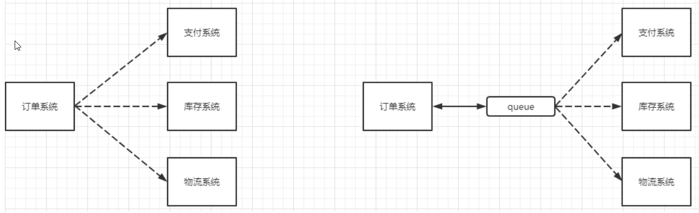
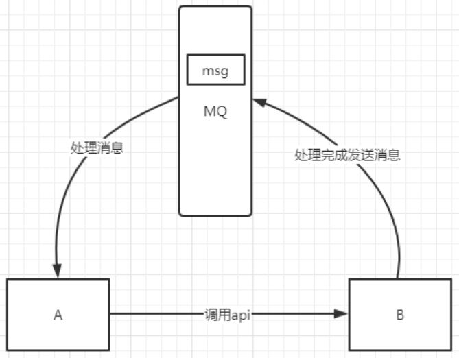
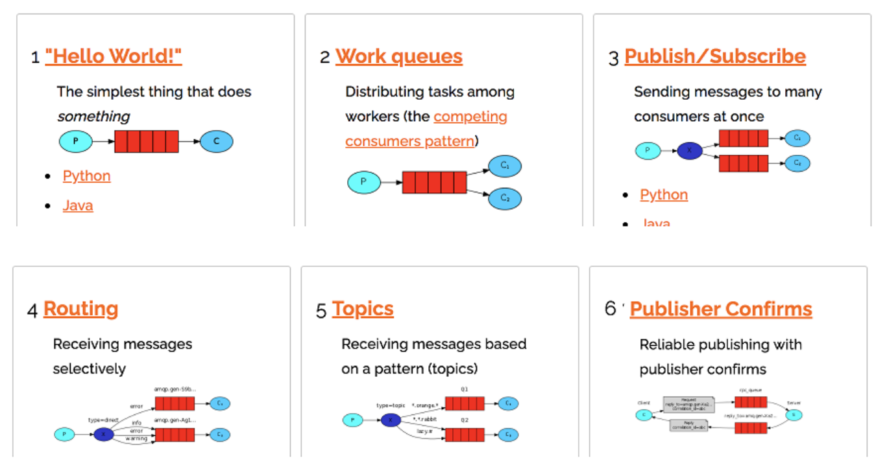

*date: 2022-04-28*

## 概述

### 什么是 MQ

MQ（message queue），从字面意思上看，本质是个队列，FIFO 先进先出，只不过队列中存放的内容是 message 而已，是一种跨进程的通信机制，用于上下游传递消息。在互联网架构中，MQ 是一种非常常见的上下游 ''逻辑解耦 + 物理解耦" 的消息通信服务。使用了 MQ 之后，消息发送上游只需要依赖 MQ，不用依赖其他服务。

### 为什么使用 MQ

#### 流量消峰

举个例子，如果订单系统最多能处理一万次订单，这个处理能力应付正常时段的下单时绰绰有余，正常时段我们下单一秒后就能返回结果。但是在高峰期，如果有两万次下单操作系统是处理不了的，只能限制订单超过一万后不允许用户下单。使用消息队列做缓冲，我们可以取消这个限制，把一秒内下的订单分散成一段时间来处理，这时有些用户可能在下单十几秒后才能收到下单成功的操作，但是比不能下单的体验要好。

#### 应用解耦

以电商应用为例，应用中有订单系统、库存系统、物流系统、支付系统。用户创建订单后，如果耦合调用库存系统、物流系统、支付系统，任何一个子系统出了故障，都会造成下单操作异常。当转变成基于消息队列的方式后，系统间调用的问题会减少很多，比如物流系统因为发生故障，需要几分钟来修复。在这几分钟的时间里，物流系统要处理的内存被缓存在消息队列中，用户的下单操作可以正常完成。当物流系统恢复后，继续处理订单信息即可，中单用户感受不到物流系统的故障，提升系统的可用性。



#### 异步处理

有些服务间调用是异步的，例如 A 调用 B，B 需要花费很长时间执行，但是 A 需要知道 B 什么时候可以执行完，以前一般有两种方式，A 过一段时间去调用 B 的查询 api 查询。或者 A 提供一个 callback api，B 执行完之后调用 api 通知 A 服务。这两种方式都不是很优雅，使用消息总线，可以很方便解决这个问题，A 调用 B 服务后，只需要监听 B 处理完成的消息，当 B 处理完成后，会发送一条消息给 MQ，MQ 会将此消息转发给 A 服务。这样 A 服务既不用循环调用 B 的查询 api，也不用提供 callback api。同样 B 服务也不用做这些操作。A 服务还能及时的得到异步处理成功的消息。



### MQ 的分类

#### ActiveMQ

优点：单机吞吐量万级，时效性 ms 级，可用性高，基于主从架构实现高可用性，消息可靠性较低的概率丢失数据。

缺点：官方社区现在对 ActiveMQ 5.x 维护越来越少，高吞吐量场景较少使用。

#### Kafka

大数据的杀手锏，谈到大数据领域内的消息传输，则绕不开 Kafka，这款为大数据而生的消息中间件，以其百万级 TPS 的吞吐量名声大噪，迅速成为大数据领域的宠儿，在数据采集、传输、存储的过程中发挥着举足轻重的作用。目前已经被 LinkedIn，Uber，Twitter，Netflix 等大公司所采纳。

优点：性能卓越，单机写入 TPS 约在百万条/秒，最大的优点，就是吞吐量高。时效性 ms 级，可用性非常高。kafka 是分布式的，一个数据多个副本，少数机器宕机，不会丢失数据，不会导致不可用，消费者采用 Pull 方式获取消息，消息有序，通过控制能够保证所有消息被消费且仅被消费一次；有优秀的第三方 Kafka Web 管理界面 Kafka-Manager；在日志领域比较成熟，被多家公司和多个开源项目使用；功能支持：功能较为简单，主要支持简单的 MQ 功能，在大数据领域的实时计算以及日志采集被大规模使用。

缺点：Kafka 单机超过 64 个队列/分区，Load 会发生明显的飙高现象，队列越多，Load 越高，发送消息响应时间变长，使用短轮询方式，实时性取决于轮询间隔时间，消费失败不支持重试；支持消息顺序，但是一台代理宕机后，就会产生消息乱序，社区更新较慢。

#### RocketMQ

RocketMQ 出自阿里巴巴的开源产品，用 Java 语言实现，在设计时参考了 Kafka，并做出了自己的一些改进。被阿里巴巴广泛应用在订单，交易，充值，流计算，消息推送，日志流式处理，binglog 分发等场景。

优点：单机吞吐量十万级，可用性非常高，分布式架构，消息可以做到 0 丢失，MQ 功能较为完善，还是分布式的，扩展性好，支持 10 亿级别的消息堆积，不会因为堆积导致性能下降，源码是 Java，可以自己阅读源码，定制自己公司的 MQ。

缺点：支持的客户端语言不多，目前是 Java 及 C++，其中 C++不成熟；社区活跃度一般，没有在 MQ 核心中去实现 JMS 等接口，有些系统要迁移需要修改大量代码。

#### RabbitMQ

2007 年发布，是一个在 AMQP（高级消息队列协议）基础上完成的，可复用的企业消息系统，是当前最主流的消息中间件之一。

优点：由于 erlang 语言的高并发特性，性能较好；吞吐量到万级，MQ 功能比较完备，健壮、稳定、易用、跨平台、支持多种语言，如：Python、Ruby、.NET、Java、JMS、C、PHP、ActionScript、XMPP、STOMP 等，支持 AJAX 文档齐全；开源提供的管理界面非常棒，用起来很好用，社区活跃度高；更新频率相当高。

缺点：商业版需要收费，学习成本较高。

### MQ 的选择

#### Kafka

Kafka 主要特点是基于 Pull 的模式来处理消息消费，追求高吞吐量，一开始的目的就是用于日志收集和传输，适合产生`大量数据`的互联网服务的数据收集业务。`大型公司`建议可以选用，如果有`日志采集`功能，肯定是首选 kafka 了。

#### RocketMQ

天生为`金融互联网`领域而生，对于可靠性要求很高的场景，尤其是电商里面的订单扣款，以及业务削峰，在大量交易涌入时，后端可能无法及时处理的情况。RoketMQ 在稳定性上可能更值得信赖，这些业务场景在阿里双 11 已经经历了多次考验，如果你的业务有上述并发场景，建议可以选择 RocketMQ。

#### RabbitMQ

结合 erlang 语言本身的并发优势，性能好，`时效性微秒级`，`社区活跃度也比较高`，管理界面用起来十分方便，如果你的`数据量没有那么大`，中小型公司优先选择功能比较完备的 RabbitMQ。

## RabbitMQ

RabbitMQ 是一个消息中间件：它接受并转发消息。你可以把它当做一个快递站点，当你要发送一个包裹时，你把你的包裹放到快递站，快递员最终会把你的快递送到收件人那里，按照这种逻辑 RabbitMQ 是一个快递站，一个快递员帮你传递快件。RabbitMQ 与快递站的主要区别在于，它不处理快件而是接收、存储和转发消息数据。

### 四大核心概念

#### 生产者

产生数据`发送消息的程序`是生产者。
#### 交换机

交换机是 RabbitMQ 非常重要的一个部件，`一方面它接收来自生产者的消息，另一方面它将消息推送到队列中。`交换机必须确切知道如何处理它接收到的消息，是将这些消息推送到特定队列还是推送到多个队列，亦或者是把消息丢弃，这个得由交换机类型决定。

#### 队列

队列是 RabbitMQ 内部使用的一种数据结构，尽管消息流经 RabbitMQ 和应用程序，但它们只能存储在队列中。队列仅受主机的内存和磁盘限制的约束，本质上是一个大的消息缓冲区。`许多生产者可以将消息发送到一个队列，许多消费者可以尝试从一个队列接收数据。`这就是我们使用队列的方式。

#### 消费者

消费与接收具有相似的含义。消费者大多时候是一个`等待接收消息的程序`。请注意生产者，消费者和消息中间件很多时候并不在同一机器上。同一个应用程序既可以是生产者，也可以是消费者。

### 核心架构



### 工作原理


#### Broker

接收和分发消息的应用，RabbitMQ Server 就是 Message Broker。

#### Virtual Host

出于多租户和安全因素设计的，把 AMQP 的基本组件划分到一个虚拟的分组中，类似于网络中的 namespace 概念。当多个不同的用户使用同一个 RabbitMQ Server 提供的服务时，可以划分出多个 vhost，每个用户在自己的 vhost 创建 Exchange/Queue 等。

#### Connection

Producer/Consumer 和 Broker 之间的 TCP 连接。

#### Channel

如果每一次访问 RabbitMQ 都建立一个 Connection，在消息量大的时候，建立 TCP Connection 的开销将是巨大的，效率也较低。Channel 是在 Connection 内部建立的逻辑连接，如果应用程序支持多线程，通常每个 thread 创建单独的 Channel 进行通讯，AMQP method 包含了 channel id，帮助客户端和 Message Broker 识别 Channel，所以 Channel 之间是完全隔离的。Channel 作为轻量级的 Connection，极大减少了操作系统建立 TCP Connection 的开销。

#### Exchange

Message 到达 Broker 的第一站，根据分发规则，匹配查询表中的 routing key，分发消息到 Queue 中去。常用的类型有：`direct (point-to-point)`，`topic (publish-subscribe)`和`fanout (multicast)`。

#### Queue

消息最终被送到 Queue，等待 Consumer 取走。

#### Binding

Exchange 和 Queue 之间的虚拟连接，Binding 中可以包含 routing key，Binding 信息被保存到 Exchange 中的查询表中，用于 Message 的分发依据。

### 安装

官网：https://www.rabbitmq.com/

下载地址：https://www.rabbitmq.com/download.html

支持 docker 安装：

```bash
# 下载镜像
root@xisun-develop:/home/xisun# docker pull rabbitmq:3.11-management

# 查看镜像id
root@xisun-develop:/home/xisun# docker images
REPOSITORY              TAG               IMAGE ID       CREATED         SIZE
rabbitmq                3.11-management   789501296640   10 hours ago    263MB

# 启动容器
root@xisun-develop:/home/xisun# docker run -d -p 5672:5672 -p 15672:15672 --name rabbit_3.11 789501296640

# 查看容器
root@xisun-develop:/home/xisun# docker ps
CONTAINER ID   IMAGE          COMMAND                  CREATED         STATUS         PORTS                                                                                                                                                 NAMES
19a2b7f8de6b   789501296640   "docker-entrypoint.s…"   2 minutes ago   Up 2 minutes   4369/tcp, 5671/tcp, 0.0.0.0:5672->5672/tcp, :::5672->5672/tcp, 15671/tcp, 15691-15692/tcp, 25672/tcp, 0.0.0.0:15672->15672/tcp, :::15672->15672/tcp   rabbit_3.11

# 查看日志
root@xisun-develop:/home/xisun# docker logs -f 19a2b7f8de6b
2022-11-29 14:30:37.159743+00:00 [notice] <0.44.0> Application syslog exited with reason: stopped
2022-11-29 14:30:37.175660+00:00 [notice] <0.229.0> Logging: switching to configured handler(s); following messages may not be visible in this log output
2022-11-29 14:30:37.221401+00:00 [notice] <0.229.0> Logging: configured log handlers are now ACTIVE
2022-11-29 14:30:37.726195+00:00 [info] <0.229.0> ra: starting system quorum_queues
2022-11-29 14:30:37.726396+00:00 [info] <0.229.0> starting Ra system: quorum_queues in directory: /var/lib/rabbitmq/mnesia/rabbit@19a2b7f8de6b/quorum/rabbit@19a2b7f8de6b
2022-11-29 14:30:37.891769+00:00 [info] <0.265.0> ra system 'quorum_queues' running pre init for 0 registered servers
2022-11-29 14:30:37.921309+00:00 [info] <0.266.0> ra: meta data store initialised for system quorum_queues. 0 record(s) recovered
2022-11-29 14:30:37.956701+00:00 [notice] <0.271.0> WAL: ra_log_wal init, open tbls: ra_log_open_mem_tables, closed tbls: ra_log_closed_mem_tables
2022-11-29 14:30:37.970783+00:00 [info] <0.229.0> ra: starting system coordination
2022-11-29 14:30:37.970914+00:00 [info] <0.229.0> starting Ra system: coordination in directory: /var/lib/rabbitmq/mnesia/rabbit@19a2b7f8de6b/coordination/rabbit@19a2b7f8de6b
2022-11-29 14:30:37.973896+00:00 [info] <0.278.0> ra system 'coordination' running pre init for 0 registered servers
2022-11-29 14:30:37.976799+00:00 [info] <0.279.0> ra: meta data store initialised for system coordination. 0 record(s) recovered
2022-11-29 14:30:37.977181+00:00 [notice] <0.284.0> WAL: ra_coordination_log_wal init, open tbls: ra_coordination_log_open_mem_tables, closed tbls: ra_coordination_log_closed_mem_tables
2022-11-29 14:30:37.981647+00:00 [info] <0.229.0> 
2022-11-29 14:30:37.981647+00:00 [info] <0.229.0>  Starting RabbitMQ 3.11.4 on Erlang 25.1.2 [jit]
2022-11-29 14:30:37.981647+00:00 [info] <0.229.0>  Copyright (c) 2007-2022 VMware, Inc. or its affiliates.
2022-11-29 14:30:37.981647+00:00 [info] <0.229.0>  Licensed under the MPL 2.0. Website: https://rabbitmq.com

  ##  ##      RabbitMQ 3.11.4
  ##  ##
  ##########  Copyright (c) 2007-2022 VMware, Inc. or its affiliates.
  ######  ##
  ##########  Licensed under the MPL 2.0. Website: https://rabbitmq.com

  Erlang:      25.1.2 [jit]
  TLS Library: OpenSSL - OpenSSL 1.1.1s  1 Nov 2022
  Release series support status: supported

  Doc guides:  https://rabbitmq.com/documentation.html
  Support:     https://rabbitmq.com/contact.html
  Tutorials:   https://rabbitmq.com/getstarted.html
  Monitoring:  https://rabbitmq.com/monitoring.html

  Logs: /var/log/rabbitmq/rabbit@19a2b7f8de6b_upgrade.log
        <stdout>

  Config file(s): /etc/rabbitmq/conf.d/10-defaults.conf

  Starting broker...2022-11-29 14:30:37.986368+00:00 [info] <0.229.0> 
2022-11-29 14:30:37.986368+00:00 [info] <0.229.0>  node           : rabbit@19a2b7f8de6b
2022-11-29 14:30:37.986368+00:00 [info] <0.229.0>  home dir       : /var/lib/rabbitmq
2022-11-29 14:30:37.986368+00:00 [info] <0.229.0>  config file(s) : /etc/rabbitmq/conf.d/10-defaults.conf
2022-11-29 14:30:37.986368+00:00 [info] <0.229.0>  cookie hash    : YINB0Nxw/+yA+vCDyj1v3Q==
2022-11-29 14:30:37.986368+00:00 [info] <0.229.0>  log(s)         : /var/log/rabbitmq/rabbit@19a2b7f8de6b_upgrade.log
2022-11-29 14:30:37.986368+00:00 [info] <0.229.0>                 : <stdout>
2022-11-29 14:30:37.986368+00:00 [info] <0.229.0>  database dir   : /var/lib/rabbitmq/mnesia/rabbit@19a2b7f8de6b
2022-11-29 14:30:45.055976+00:00 [info] <0.229.0> Running boot step pre_boot defined by app rabbit
2022-11-29 14:30:45.056120+00:00 [info] <0.229.0> Running boot step rabbit_global_counters defined by app rabbit
2022-11-29 14:30:45.056747+00:00 [info] <0.229.0> Running boot step rabbit_osiris_metrics defined by app rabbit
2022-11-29 14:30:45.057083+00:00 [info] <0.229.0> Running boot step rabbit_core_metrics defined by app rabbit
2022-11-29 14:30:45.059220+00:00 [info] <0.229.0> Running boot step rabbit_alarm defined by app rabbit
2022-11-29 14:30:45.068011+00:00 [info] <0.298.0> Memory high watermark set to 1555 MiB (1631510528 bytes) of 3889 MiB (4078776320 bytes) total
2022-11-29 14:30:45.075069+00:00 [info] <0.300.0> Enabling free disk space monitoring
2022-11-29 14:30:45.075239+00:00 [info] <0.300.0> Disk free limit set to 50MB
2022-11-29 14:30:45.079324+00:00 [info] <0.229.0> Running boot step code_server_cache defined by app rabbit
2022-11-29 14:30:45.079559+00:00 [info] <0.229.0> Running boot step file_handle_cache defined by app rabbit
2022-11-29 14:30:45.080031+00:00 [info] <0.303.0> Limiting to approx 1048479 file handles (943629 sockets)
2022-11-29 14:30:45.080512+00:00 [info] <0.304.0> FHC read buffering: OFF
2022-11-29 14:30:45.080730+00:00 [info] <0.304.0> FHC write buffering: ON
2022-11-29 14:30:45.082312+00:00 [info] <0.229.0> Running boot step worker_pool defined by app rabbit
2022-11-29 14:30:45.082434+00:00 [info] <0.286.0> Will use 4 processes for default worker pool
2022-11-29 14:30:45.082474+00:00 [info] <0.286.0> Starting worker pool 'worker_pool' with 4 processes in it
2022-11-29 14:30:45.083173+00:00 [info] <0.229.0> Running boot step database defined by app rabbit
2022-11-29 14:30:45.084378+00:00 [info] <0.229.0> Node database directory at /var/lib/rabbitmq/mnesia/rabbit@19a2b7f8de6b is empty. Assuming we need to join an existing cluster or initialise from scratch...
2022-11-29 14:30:45.084534+00:00 [info] <0.229.0> Configured peer discovery backend: rabbit_peer_discovery_classic_config
2022-11-29 14:30:45.084587+00:00 [info] <0.229.0> Will try to lock with peer discovery backend rabbit_peer_discovery_classic_config
2022-11-29 14:30:45.084727+00:00 [info] <0.229.0> All discovered existing cluster peers:
2022-11-29 14:30:45.084767+00:00 [info] <0.229.0> Discovered no peer nodes to cluster with. Some discovery backends can filter nodes out based on a readiness criteria. Enabling debug logging might help troubleshoot.
2022-11-29 14:30:45.087782+00:00 [notice] <0.44.0> Application mnesia exited with reason: stopped
2022-11-29 14:30:45.300501+00:00 [info] <0.229.0> Waiting for Mnesia tables for 30000 ms, 9 retries left
2022-11-29 14:30:45.300917+00:00 [info] <0.229.0> Successfully synced tables from a peer
2022-11-29 14:30:45.316464+00:00 [info] <0.229.0> Feature flags: `feature_flags_v2`: supported, attempt to enable...
2022-11-29 14:30:45.362341+00:00 [notice] <0.287.0> Feature flags: attempt to enable `classic_mirrored_queue_version`...
2022-11-29 14:30:45.411347+00:00 [notice] <0.287.0> Feature flags: `classic_mirrored_queue_version` enabled
2022-11-29 14:30:45.412359+00:00 [notice] <0.287.0> Feature flags: attempt to enable `classic_queue_type_delivery_support`...
2022-11-29 14:30:45.434830+00:00 [notice] <0.287.0> Feature flags: attempt to enable `stream_queue`...
2022-11-29 14:30:45.482771+00:00 [notice] <0.287.0> Feature flags: `stream_queue` enabled
2022-11-29 14:30:45.509881+00:00 [notice] <0.287.0> Feature flags: `classic_queue_type_delivery_support` enabled
2022-11-29 14:30:45.510852+00:00 [notice] <0.287.0> Feature flags: attempt to enable `direct_exchange_routing_v2`...
2022-11-29 14:30:45.533757+00:00 [info] <0.497.0> Waiting for Mnesia tables for 30000 ms, 9 retries left
2022-11-29 14:30:45.534089+00:00 [info] <0.497.0> Successfully synced tables from a peer
2022-11-29 14:30:45.565110+00:00 [notice] <0.287.0> Feature flags: `direct_exchange_routing_v2` enabled
2022-11-29 14:30:45.566410+00:00 [notice] <0.287.0> Feature flags: attempt to enable `drop_unroutable_metric`...
2022-11-29 14:30:45.612286+00:00 [notice] <0.287.0> Feature flags: `drop_unroutable_metric` enabled
2022-11-29 14:30:45.613583+00:00 [notice] <0.287.0> Feature flags: attempt to enable `empty_basic_get_metric`...
2022-11-29 14:30:45.660885+00:00 [notice] <0.287.0> Feature flags: `empty_basic_get_metric` enabled
2022-11-29 14:30:45.661686+00:00 [notice] <0.287.0> Feature flags: attempt to enable `listener_records_in_ets`...
2022-11-29 14:30:45.743765+00:00 [notice] <0.287.0> Feature flags: `listener_records_in_ets` enabled
2022-11-29 14:30:45.745710+00:00 [notice] <0.287.0> Feature flags: attempt to enable `stream_single_active_consumer`...
2022-11-29 14:30:45.798423+00:00 [notice] <0.287.0> Feature flags: `stream_single_active_consumer` enabled
2022-11-29 14:30:45.800046+00:00 [notice] <0.287.0> Feature flags: attempt to enable `tracking_records_in_ets`...
2022-11-29 14:30:45.848854+00:00 [notice] <0.287.0> Feature flags: `tracking_records_in_ets` enabled
2022-11-29 14:30:45.851354+00:00 [info] <0.229.0> Waiting for Mnesia tables for 30000 ms, 9 retries left
2022-11-29 14:30:45.851581+00:00 [info] <0.229.0> Successfully synced tables from a peer
2022-11-29 14:30:45.873787+00:00 [info] <0.229.0> Waiting for Mnesia tables for 30000 ms, 9 retries left
2022-11-29 14:30:45.874151+00:00 [info] <0.229.0> Successfully synced tables from a peer
2022-11-29 14:30:45.874248+00:00 [info] <0.229.0> Peer discovery backend rabbit_peer_discovery_classic_config does not support registration, skipping registration.
2022-11-29 14:30:45.874347+00:00 [info] <0.229.0> Will try to unlock with peer discovery backend rabbit_peer_discovery_classic_config
2022-11-29 14:30:45.874680+00:00 [info] <0.229.0> Running boot step tracking_metadata_store defined by app rabbit
2022-11-29 14:30:45.875007+00:00 [info] <0.619.0> Setting up a table for connection tracking on this node: tracked_connection
2022-11-29 14:30:45.875159+00:00 [info] <0.619.0> Setting up a table for per-vhost connection counting on this node: tracked_connection_per_vhost
2022-11-29 14:30:45.875347+00:00 [info] <0.619.0> Setting up a table for per-user connection counting on this node: tracked_connection_per_user
2022-11-29 14:30:45.875532+00:00 [info] <0.619.0> Setting up a table for channel tracking on this node: tracked_channel
2022-11-29 14:30:45.875655+00:00 [info] <0.619.0> Setting up a table for channel tracking on this node: tracked_channel_per_user
2022-11-29 14:30:45.875919+00:00 [info] <0.229.0> Running boot step networking_metadata_store defined by app rabbit
2022-11-29 14:30:45.876342+00:00 [info] <0.229.0> Running boot step database_sync defined by app rabbit
2022-11-29 14:30:45.876573+00:00 [info] <0.229.0> Running boot step feature_flags defined by app rabbit
2022-11-29 14:30:45.877025+00:00 [info] <0.229.0> Running boot step codec_correctness_check defined by app rabbit
2022-11-29 14:30:45.877085+00:00 [info] <0.229.0> Running boot step external_infrastructure defined by app rabbit
2022-11-29 14:30:45.877132+00:00 [info] <0.229.0> Running boot step rabbit_event defined by app rabbit
2022-11-29 14:30:45.877649+00:00 [info] <0.229.0> Running boot step rabbit_registry defined by app rabbit
2022-11-29 14:30:45.878105+00:00 [info] <0.229.0> Running boot step rabbit_auth_mechanism_amqplain defined by app rabbit
2022-11-29 14:30:45.878190+00:00 [info] <0.229.0> Running boot step rabbit_auth_mechanism_cr_demo defined by app rabbit
2022-11-29 14:30:45.878326+00:00 [info] <0.229.0> Running boot step rabbit_auth_mechanism_plain defined by app rabbit
2022-11-29 14:30:45.878371+00:00 [info] <0.229.0> Running boot step rabbit_exchange_type_direct defined by app rabbit
2022-11-29 14:30:45.878436+00:00 [info] <0.229.0> Running boot step rabbit_exchange_type_fanout defined by app rabbit
2022-11-29 14:30:45.878522+00:00 [info] <0.229.0> Running boot step rabbit_exchange_type_headers defined by app rabbit
2022-11-29 14:30:45.878621+00:00 [info] <0.229.0> Running boot step rabbit_exchange_type_topic defined by app rabbit
2022-11-29 14:30:45.878725+00:00 [info] <0.229.0> Running boot step rabbit_mirror_queue_mode_all defined by app rabbit
2022-11-29 14:30:45.878846+00:00 [info] <0.229.0> Running boot step rabbit_mirror_queue_mode_exactly defined by app rabbit
2022-11-29 14:30:45.878970+00:00 [info] <0.229.0> Running boot step rabbit_mirror_queue_mode_nodes defined by app rabbit
2022-11-29 14:30:45.879113+00:00 [info] <0.229.0> Running boot step rabbit_priority_queue defined by app rabbit
2022-11-29 14:30:45.879180+00:00 [info] <0.229.0> Priority queues enabled, real BQ is rabbit_variable_queue
2022-11-29 14:30:45.879406+00:00 [info] <0.229.0> Running boot step rabbit_queue_location_client_local defined by app rabbit
2022-11-29 14:30:45.879560+00:00 [info] <0.229.0> Running boot step rabbit_queue_location_min_masters defined by app rabbit
2022-11-29 14:30:45.879699+00:00 [info] <0.229.0> Running boot step rabbit_queue_location_random defined by app rabbit
2022-11-29 14:30:45.879886+00:00 [info] <0.229.0> Running boot step kernel_ready defined by app rabbit
2022-11-29 14:30:45.879992+00:00 [info] <0.229.0> Running boot step rabbit_sysmon_minder defined by app rabbit
2022-11-29 14:30:45.880242+00:00 [info] <0.229.0> Running boot step rabbit_epmd_monitor defined by app rabbit
2022-11-29 14:30:45.886435+00:00 [info] <0.628.0> epmd monitor knows us, inter-node communication (distribution) port: 25672
2022-11-29 14:30:45.886836+00:00 [info] <0.229.0> Running boot step guid_generator defined by app rabbit
2022-11-29 14:30:45.889861+00:00 [info] <0.229.0> Running boot step rabbit_node_monitor defined by app rabbit
2022-11-29 14:30:45.890371+00:00 [info] <0.632.0> Starting rabbit_node_monitor
2022-11-29 14:30:45.890744+00:00 [info] <0.229.0> Running boot step delegate_sup defined by app rabbit
2022-11-29 14:30:45.891888+00:00 [info] <0.229.0> Running boot step rabbit_memory_monitor defined by app rabbit
2022-11-29 14:30:45.892358+00:00 [info] <0.229.0> Running boot step rabbit_fifo_dlx_sup defined by app rabbit
2022-11-29 14:30:45.892609+00:00 [info] <0.229.0> Running boot step core_initialized defined by app rabbit
2022-11-29 14:30:45.892691+00:00 [info] <0.229.0> Running boot step upgrade_queues defined by app rabbit
2022-11-29 14:30:45.906365+00:00 [info] <0.229.0> message_store upgrades: 1 to apply
2022-11-29 14:30:45.906675+00:00 [info] <0.229.0> message_store upgrades: Applying rabbit_variable_queue:move_messages_to_vhost_store
2022-11-29 14:30:45.906968+00:00 [info] <0.229.0> message_store upgrades: No durable queues found. Skipping message store migration
2022-11-29 14:30:45.907090+00:00 [info] <0.229.0> message_store upgrades: Removing the old message store data
2022-11-29 14:30:45.909696+00:00 [info] <0.229.0> message_store upgrades: All upgrades applied successfully
2022-11-29 14:30:45.925945+00:00 [info] <0.229.0> Running boot step channel_tracking defined by app rabbit
2022-11-29 14:30:45.926092+00:00 [info] <0.229.0> Running boot step rabbit_channel_tracking_handler defined by app rabbit
2022-11-29 14:30:45.926273+00:00 [info] <0.229.0> Running boot step connection_tracking defined by app rabbit
2022-11-29 14:30:45.926387+00:00 [info] <0.229.0> Running boot step rabbit_connection_tracking_handler defined by app rabbit
2022-11-29 14:30:45.926516+00:00 [info] <0.229.0> Running boot step rabbit_definitions_hashing defined by app rabbit
2022-11-29 14:30:45.926708+00:00 [info] <0.229.0> Running boot step rabbit_exchange_parameters defined by app rabbit
2022-11-29 14:30:45.926943+00:00 [info] <0.229.0> Running boot step rabbit_mirror_queue_misc defined by app rabbit
2022-11-29 14:30:45.927375+00:00 [info] <0.229.0> Running boot step rabbit_policies defined by app rabbit
2022-11-29 14:30:45.928420+00:00 [info] <0.229.0> Running boot step rabbit_policy defined by app rabbit
2022-11-29 14:30:45.928616+00:00 [info] <0.229.0> Running boot step rabbit_queue_location_validator defined by app rabbit
2022-11-29 14:30:45.928734+00:00 [info] <0.229.0> Running boot step rabbit_quorum_memory_manager defined by app rabbit
2022-11-29 14:30:45.928874+00:00 [info] <0.229.0> Running boot step rabbit_stream_coordinator defined by app rabbit
2022-11-29 14:30:45.929219+00:00 [info] <0.229.0> Running boot step rabbit_vhost_limit defined by app rabbit
2022-11-29 14:30:45.929485+00:00 [info] <0.229.0> Running boot step rabbit_mgmt_reset_handler defined by app rabbitmq_management
2022-11-29 14:30:45.929674+00:00 [info] <0.229.0> Running boot step rabbit_mgmt_db_handler defined by app rabbitmq_management_agent
2022-11-29 14:30:45.929992+00:00 [info] <0.229.0> Management plugin: using rates mode 'basic'
2022-11-29 14:30:45.931472+00:00 [info] <0.229.0> Running boot step recovery defined by app rabbit
2022-11-29 14:30:45.934450+00:00 [info] <0.229.0> Running boot step empty_db_check defined by app rabbit
2022-11-29 14:30:45.934625+00:00 [info] <0.229.0> Will seed default virtual host and user...
2022-11-29 14:30:45.934766+00:00 [info] <0.229.0> Adding vhost '/' (description: 'Default virtual host', tags: [])
2022-11-29 14:30:45.937855+00:00 [info] <0.229.0> Applying default limits to vhost '<<"/">>': []
2022-11-29 14:30:45.954305+00:00 [info] <0.674.0> Making sure data directory '/var/lib/rabbitmq/mnesia/rabbit@19a2b7f8de6b/msg_stores/vhosts/628WB79CIFDYO9LJI6DKMI09L' for vhost '/' exists
2022-11-29 14:30:45.957445+00:00 [info] <0.674.0> Setting segment_entry_count for vhost '/' with 0 queues to '2048'
2022-11-29 14:30:45.962252+00:00 [info] <0.674.0> Starting message stores for vhost '/'
2022-11-29 14:30:45.962852+00:00 [info] <0.679.0> Message store "628WB79CIFDYO9LJI6DKMI09L/msg_store_transient": using rabbit_msg_store_ets_index to provide index
2022-11-29 14:30:45.966389+00:00 [info] <0.674.0> Started message store of type transient for vhost '/'
2022-11-29 14:30:45.966951+00:00 [info] <0.683.0> Message store "628WB79CIFDYO9LJI6DKMI09L/msg_store_persistent": using rabbit_msg_store_ets_index to provide index
2022-11-29 14:30:45.968939+00:00 [warning] <0.683.0> Message store "628WB79CIFDYO9LJI6DKMI09L/msg_store_persistent": rebuilding indices from scratch
2022-11-29 14:30:45.971223+00:00 [info] <0.674.0> Started message store of type persistent for vhost '/'
2022-11-29 14:30:45.971552+00:00 [info] <0.674.0> Recovering 0 queues of type rabbit_classic_queue took 13ms
2022-11-29 14:30:45.971670+00:00 [info] <0.674.0> Recovering 0 queues of type rabbit_quorum_queue took 0ms
2022-11-29 14:30:45.971744+00:00 [info] <0.674.0> Recovering 0 queues of type rabbit_stream_queue took 0ms
2022-11-29 14:30:45.977407+00:00 [info] <0.229.0> Created user 'guest'
2022-11-29 14:30:45.980070+00:00 [info] <0.229.0> Successfully set user tags for user 'guest' to [administrator]
2022-11-29 14:30:45.982397+00:00 [info] <0.229.0> Successfully set permissions for 'guest' in virtual host '/' to '.*', '.*', '.*'
2022-11-29 14:30:45.982506+00:00 [info] <0.229.0> Running boot step rabbit_observer_cli defined by app rabbit
2022-11-29 14:30:45.982571+00:00 [info] <0.229.0> Running boot step rabbit_looking_glass defined by app rabbit
2022-11-29 14:30:45.982611+00:00 [info] <0.229.0> Running boot step rabbit_core_metrics_gc defined by app rabbit
2022-11-29 14:30:45.982737+00:00 [info] <0.229.0> Running boot step background_gc defined by app rabbit
2022-11-29 14:30:45.983320+00:00 [info] <0.229.0> Running boot step routing_ready defined by app rabbit
2022-11-29 14:30:45.983438+00:00 [info] <0.229.0> Running boot step pre_flight defined by app rabbit
2022-11-29 14:30:45.983525+00:00 [info] <0.229.0> Running boot step notify_cluster defined by app rabbit
2022-11-29 14:30:45.983581+00:00 [info] <0.229.0> Running boot step networking defined by app rabbit
2022-11-29 14:30:45.983916+00:00 [info] <0.229.0> Running boot step definition_import_worker_pool defined by app rabbit
2022-11-29 14:30:45.984043+00:00 [info] <0.286.0> Starting worker pool 'definition_import_pool' with 4 processes in it
2022-11-29 14:30:45.985015+00:00 [info] <0.229.0> Running boot step cluster_name defined by app rabbit
2022-11-29 14:30:45.985184+00:00 [info] <0.229.0> Initialising internal cluster ID to 'rabbitmq-cluster-id-Rgmy80L7i0i0Xz2_UoDa0w'
2022-11-29 14:30:45.987984+00:00 [info] <0.229.0> Running boot step direct_client defined by app rabbit
2022-11-29 14:30:45.988405+00:00 [info] <0.229.0> Running boot step rabbit_maintenance_mode_state defined by app rabbit
2022-11-29 14:30:45.988478+00:00 [info] <0.229.0> Creating table rabbit_node_maintenance_states for maintenance mode status
2022-11-29 14:30:45.996369+00:00 [info] <0.229.0> Running boot step rabbit_management_load_definitions defined by app rabbitmq_management
2022-11-29 14:30:45.996812+00:00 [info] <0.720.0> Resetting node maintenance status
2022-11-29 14:30:46.021755+00:00 [info] <0.779.0> Management plugin: HTTP (non-TLS) listener started on port 15672
2022-11-29 14:30:46.022119+00:00 [info] <0.807.0> Statistics database started.
2022-11-29 14:30:46.022325+00:00 [info] <0.806.0> Starting worker pool 'management_worker_pool' with 3 processes in it
2022-11-29 14:30:46.040355+00:00 [info] <0.821.0> Prometheus metrics: HTTP (non-TLS) listener started on port 15692
2022-11-29 14:30:46.040728+00:00 [info] <0.720.0> Ready to start client connection listeners
2022-11-29 14:30:46.044244+00:00 [info] <0.865.0> started TCP listener on [::]:5672
 completed with 4 plugins.
2022-11-29 14:30:46.348502+00:00 [info] <0.720.0> Server startup complete; 4 plugins started.
2022-11-29 14:30:46.348502+00:00 [info] <0.720.0>  * rabbitmq_prometheus
2022-11-29 14:30:46.348502+00:00 [info] <0.720.0>  * rabbitmq_management
2022-11-29 14:30:46.348502+00:00 [info] <0.720.0>  * rabbitmq_web_dispatch
2022-11-29 14:30:46.348502+00:00 [info] <0.720.0>  * rabbitmq_management_agent
2022-11-29 14:34:17.138816+00:00 [notice] <0.61.0> SIGTERM received - shutting down
2022-11-29 14:34:17.138816+00:00 [notice] <0.61.0> 
2022-11-29 14:34:17.144131+00:00 [warning] <0.771.0> HTTP listener registry could not find context rabbitmq_prometheus_tls
2022-11-29 14:34:17.156815+00:00 [warning] <0.771.0> HTTP listener registry could not find context rabbitmq_management_tls
2022-11-29 14:34:17.170790+00:00 [info] <0.229.0> Peer discovery backend rabbit_peer_discovery_classic_config does not support registration, skipping unregistration.
2022-11-29 14:34:17.171046+00:00 [info] <0.865.0> stopped TCP listener on [::]:5672
2022-11-29 14:34:17.173498+00:00 [info] <0.885.0> Closing all connections in vhost '/' on node 'rabbit@19a2b7f8de6b' because the vhost is stopping
2022-11-29 14:34:17.174286+00:00 [info] <0.683.0> Stopping message store for directory '/var/lib/rabbitmq/mnesia/rabbit@19a2b7f8de6b/msg_stores/vhosts/628WB79CIFDYO9LJI6DKMI09L/msg_store_persistent'
2022-11-29 14:34:17.182228+00:00 [info] <0.683.0> Message store for directory '/var/lib/rabbitmq/mnesia/rabbit@19a2b7f8de6b/msg_stores/vhosts/628WB79CIFDYO9LJI6DKMI09L/msg_store_persistent' is stopped
2022-11-29 14:34:17.182755+00:00 [info] <0.679.0> Stopping message store for directory '/var/lib/rabbitmq/mnesia/rabbit@19a2b7f8de6b/msg_stores/vhosts/628WB79CIFDYO9LJI6DKMI09L/msg_store_transient'
2022-11-29 14:34:17.800091+00:00 [info] <0.679.0> Message store for directory '/var/lib/rabbitmq/mnesia/rabbit@19a2b7f8de6b/msg_stores/vhosts/628WB79CIFDYO9LJI6DKMI09L/msg_store_transient' is stopped
2022-11-29 14:34:17.801559+00:00 [info] <0.623.0> Management plugin: to stop collect_statistics.
2022-12-04 11:38:07.721875+00:00 [notice] <0.44.0> Application syslog exited with reason: stopped
2022-12-04 11:38:07.732253+00:00 [notice] <0.229.0> Logging: switching to configured handler(s); following messages may not be visible in this log output
2022-12-04 11:38:07.773125+00:00 [notice] <0.229.0> Logging: configured log handlers are now ACTIVE
2022-12-04 11:38:12.785501+00:00 [info] <0.229.0> ra: starting system quorum_queues
2022-12-04 11:38:12.785601+00:00 [info] <0.229.0> starting Ra system: quorum_queues in directory: /var/lib/rabbitmq/mnesia/rabbit@19a2b7f8de6b/quorum/rabbit@19a2b7f8de6b
2022-12-04 11:38:12.787654+00:00 [info] <0.295.0> ra system 'quorum_queues' running pre init for 0 registered servers
2022-12-04 11:38:12.788915+00:00 [info] <0.298.0> ra: meta data store initialised for system quorum_queues. 0 record(s) recovered
2022-12-04 11:38:12.789175+00:00 [notice] <0.307.0> WAL: ra_log_wal init, open tbls: ra_log_open_mem_tables, closed tbls: ra_log_closed_mem_tables
2022-12-04 11:38:12.792211+00:00 [info] <0.229.0> ra: starting system coordination
2022-12-04 11:38:12.792551+00:00 [info] <0.229.0> starting Ra system: coordination in directory: /var/lib/rabbitmq/mnesia/rabbit@19a2b7f8de6b/coordination/rabbit@19a2b7f8de6b
2022-12-04 11:38:12.798013+00:00 [info] <0.328.0> ra system 'coordination' running pre init for 0 registered servers
2022-12-04 11:38:12.800385+00:00 [info] <0.330.0> ra: meta data store initialised for system coordination. 0 record(s) recovered
2022-12-04 11:38:12.800581+00:00 [notice] <0.344.0> WAL: ra_coordination_log_wal init, open tbls: ra_coordination_log_open_mem_tables, closed tbls: ra_coordination_log_closed_mem_tables
2022-12-04 11:38:12.804814+00:00 [info] <0.229.0> 
2022-12-04 11:38:12.804814+00:00 [info] <0.229.0>  Starting RabbitMQ 3.11.4 on Erlang 25.1.2 [jit]
2022-12-04 11:38:12.804814+00:00 [info] <0.229.0>  Copyright (c) 2007-2022 VMware, Inc. or its affiliates.
2022-12-04 11:38:12.804814+00:00 [info] <0.229.0>  Licensed under the MPL 2.0. Website: https://rabbitmq.com

  ##  ##      RabbitMQ 3.11.4
  ##  ##
  ##########  Copyright (c) 2007-2022 VMware, Inc. or its affiliates.
  ######  ##
  ##########  Licensed under the MPL 2.0. Website: https://rabbitmq.com

  Erlang:      25.1.2 [jit]
  TLS Library: OpenSSL - OpenSSL 1.1.1s  1 Nov 2022
  Release series support status: supported

  Doc guides:  https://rabbitmq.com/documentation.html
  Support:     https://rabbitmq.com/contact.html
  Tutorials:   https://rabbitmq.com/getstarted.html
  Monitoring:  https://rabbitmq.com/monitoring.html

  Logs: /var/log/rabbitmq/rabbit@19a2b7f8de6b_upgrade.log
        <stdout>

  Config file(s): /etc/rabbitmq/conf.d/10-defaults.conf

  Starting broker...2022-12-04 11:38:12.807838+00:00 [info] <0.229.0> 
2022-12-04 11:38:12.807838+00:00 [info] <0.229.0>  node           : rabbit@19a2b7f8de6b
2022-12-04 11:38:12.807838+00:00 [info] <0.229.0>  home dir       : /var/lib/rabbitmq
2022-12-04 11:38:12.807838+00:00 [info] <0.229.0>  config file(s) : /etc/rabbitmq/conf.d/10-defaults.conf
2022-12-04 11:38:12.807838+00:00 [info] <0.229.0>  cookie hash    : YINB0Nxw/+yA+vCDyj1v3Q==
2022-12-04 11:38:12.807838+00:00 [info] <0.229.0>  log(s)         : /var/log/rabbitmq/rabbit@19a2b7f8de6b_upgrade.log
2022-12-04 11:38:12.807838+00:00 [info] <0.229.0>                 : <stdout>
2022-12-04 11:38:12.807838+00:00 [info] <0.229.0>  database dir   : /var/lib/rabbitmq/mnesia/rabbit@19a2b7f8de6b
2022-12-04 11:38:14.082068+00:00 [info] <0.229.0> Running boot step pre_boot defined by app rabbit
2022-12-04 11:38:14.082319+00:00 [info] <0.229.0> Running boot step rabbit_global_counters defined by app rabbit
2022-12-04 11:38:14.083274+00:00 [info] <0.229.0> Running boot step rabbit_osiris_metrics defined by app rabbit
2022-12-04 11:38:14.083438+00:00 [info] <0.229.0> Running boot step rabbit_core_metrics defined by app rabbit
2022-12-04 11:38:14.083828+00:00 [info] <0.229.0> Running boot step rabbit_alarm defined by app rabbit
2022-12-04 11:38:14.093197+00:00 [info] <0.376.0> Memory high watermark set to 1555 MiB (1631510528 bytes) of 3889 MiB (4078776320 bytes) total
2022-12-04 11:38:14.097331+00:00 [info] <0.378.0> Enabling free disk space monitoring
2022-12-04 11:38:14.097413+00:00 [info] <0.378.0> Disk free limit set to 50MB
2022-12-04 11:38:14.099807+00:00 [info] <0.229.0> Running boot step code_server_cache defined by app rabbit
2022-12-04 11:38:14.100086+00:00 [info] <0.229.0> Running boot step file_handle_cache defined by app rabbit
2022-12-04 11:38:14.100471+00:00 [info] <0.381.0> Limiting to approx 1048479 file handles (943629 sockets)
2022-12-04 11:38:14.100603+00:00 [info] <0.382.0> FHC read buffering: OFF
2022-12-04 11:38:14.100641+00:00 [info] <0.382.0> FHC write buffering: ON
2022-12-04 11:38:14.101775+00:00 [info] <0.229.0> Running boot step worker_pool defined by app rabbit
2022-12-04 11:38:14.101958+00:00 [info] <0.357.0> Will use 4 processes for default worker pool
2022-12-04 11:38:14.102072+00:00 [info] <0.357.0> Starting worker pool 'worker_pool' with 4 processes in it
2022-12-04 11:38:14.102613+00:00 [info] <0.229.0> Running boot step database defined by app rabbit
2022-12-04 11:38:14.104824+00:00 [info] <0.229.0> Waiting for Mnesia tables for 30000 ms, 9 retries left
2022-12-04 11:38:14.104988+00:00 [info] <0.229.0> Successfully synced tables from a peer
2022-12-04 11:38:14.113671+00:00 [info] <0.229.0> Waiting for Mnesia tables for 30000 ms, 9 retries left
2022-12-04 11:38:14.113811+00:00 [info] <0.229.0> Successfully synced tables from a peer
2022-12-04 11:38:14.113840+00:00 [info] <0.229.0> Peer discovery backend rabbit_peer_discovery_classic_config does not support registration, skipping registration.
2022-12-04 11:38:14.113906+00:00 [info] <0.229.0> Running boot step tracking_metadata_store defined by app rabbit
2022-12-04 11:38:14.114009+00:00 [info] <0.399.0> Setting up a table for connection tracking on this node: tracked_connection
2022-12-04 11:38:14.114061+00:00 [info] <0.399.0> Setting up a table for per-vhost connection counting on this node: tracked_connection_per_vhost
2022-12-04 11:38:14.114100+00:00 [info] <0.399.0> Setting up a table for per-user connection counting on this node: tracked_connection_per_user
2022-12-04 11:38:14.114140+00:00 [info] <0.399.0> Setting up a table for channel tracking on this node: tracked_channel
2022-12-04 11:38:14.114174+00:00 [info] <0.399.0> Setting up a table for channel tracking on this node: tracked_channel_per_user
2022-12-04 11:38:14.114217+00:00 [info] <0.229.0> Running boot step networking_metadata_store defined by app rabbit
2022-12-04 11:38:14.114258+00:00 [info] <0.229.0> Running boot step database_sync defined by app rabbit
2022-12-04 11:38:14.114297+00:00 [info] <0.229.0> Running boot step feature_flags defined by app rabbit
2022-12-04 11:38:14.114418+00:00 [info] <0.229.0> Running boot step codec_correctness_check defined by app rabbit
2022-12-04 11:38:14.114449+00:00 [info] <0.229.0> Running boot step external_infrastructure defined by app rabbit
2022-12-04 11:38:14.114515+00:00 [info] <0.229.0> Running boot step rabbit_event defined by app rabbit
2022-12-04 11:38:14.114731+00:00 [info] <0.229.0> Running boot step rabbit_registry defined by app rabbit
2022-12-04 11:38:14.114883+00:00 [info] <0.229.0> Running boot step rabbit_auth_mechanism_amqplain defined by app rabbit
2022-12-04 11:38:14.114962+00:00 [info] <0.229.0> Running boot step rabbit_auth_mechanism_cr_demo defined by app rabbit
2022-12-04 11:38:14.115011+00:00 [info] <0.229.0> Running boot step rabbit_auth_mechanism_plain defined by app rabbit
2022-12-04 11:38:14.115181+00:00 [info] <0.229.0> Running boot step rabbit_exchange_type_direct defined by app rabbit
2022-12-04 11:38:14.115262+00:00 [info] <0.229.0> Running boot step rabbit_exchange_type_fanout defined by app rabbit
2022-12-04 11:38:14.115353+00:00 [info] <0.229.0> Running boot step rabbit_exchange_type_headers defined by app rabbit
2022-12-04 11:38:14.115431+00:00 [info] <0.229.0> Running boot step rabbit_exchange_type_topic defined by app rabbit
2022-12-04 11:38:14.115552+00:00 [info] <0.229.0> Running boot step rabbit_mirror_queue_mode_all defined by app rabbit
2022-12-04 11:38:14.115673+00:00 [info] <0.229.0> Running boot step rabbit_mirror_queue_mode_exactly defined by app rabbit
2022-12-04 11:38:14.115785+00:00 [info] <0.229.0> Running boot step rabbit_mirror_queue_mode_nodes defined by app rabbit
2022-12-04 11:38:14.115849+00:00 [info] <0.229.0> Running boot step rabbit_priority_queue defined by app rabbit
2022-12-04 11:38:14.115894+00:00 [info] <0.229.0> Priority queues enabled, real BQ is rabbit_variable_queue
2022-12-04 11:38:14.115967+00:00 [info] <0.229.0> Running boot step rabbit_queue_location_client_local defined by app rabbit
2022-12-04 11:38:14.116031+00:00 [info] <0.229.0> Running boot step rabbit_queue_location_min_masters defined by app rabbit
2022-12-04 11:38:14.116080+00:00 [info] <0.229.0> Running boot step rabbit_queue_location_random defined by app rabbit
2022-12-04 11:38:14.116161+00:00 [info] <0.229.0> Running boot step kernel_ready defined by app rabbit
2022-12-04 11:38:14.116187+00:00 [info] <0.229.0> Running boot step rabbit_sysmon_minder defined by app rabbit
2022-12-04 11:38:14.116489+00:00 [info] <0.229.0> Running boot step rabbit_epmd_monitor defined by app rabbit
2022-12-04 11:38:14.117574+00:00 [info] <0.408.0> epmd monitor knows us, inter-node communication (distribution) port: 25672
2022-12-04 11:38:14.117733+00:00 [info] <0.229.0> Running boot step guid_generator defined by app rabbit
2022-12-04 11:38:14.120071+00:00 [info] <0.229.0> Running boot step rabbit_node_monitor defined by app rabbit
2022-12-04 11:38:14.120316+00:00 [info] <0.412.0> Starting rabbit_node_monitor
2022-12-04 11:38:14.120483+00:00 [info] <0.229.0> Running boot step delegate_sup defined by app rabbit
2022-12-04 11:38:14.120867+00:00 [info] <0.229.0> Running boot step rabbit_memory_monitor defined by app rabbit
2022-12-04 11:38:14.121001+00:00 [info] <0.229.0> Running boot step rabbit_fifo_dlx_sup defined by app rabbit
2022-12-04 11:38:14.121333+00:00 [info] <0.229.0> Running boot step core_initialized defined by app rabbit
2022-12-04 11:38:14.121415+00:00 [info] <0.229.0> Running boot step upgrade_queues defined by app rabbit
2022-12-04 11:38:14.129754+00:00 [info] <0.229.0> Running boot step channel_tracking defined by app rabbit
2022-12-04 11:38:14.129863+00:00 [info] <0.229.0> Running boot step rabbit_channel_tracking_handler defined by app rabbit
2022-12-04 11:38:14.129912+00:00 [info] <0.229.0> Running boot step connection_tracking defined by app rabbit
2022-12-04 11:38:14.129950+00:00 [info] <0.229.0> Running boot step rabbit_connection_tracking_handler defined by app rabbit
2022-12-04 11:38:14.130008+00:00 [info] <0.229.0> Running boot step rabbit_definitions_hashing defined by app rabbit
2022-12-04 11:38:14.130105+00:00 [info] <0.229.0> Running boot step rabbit_exchange_parameters defined by app rabbit
2022-12-04 11:38:14.130202+00:00 [info] <0.229.0> Running boot step rabbit_mirror_queue_misc defined by app rabbit
2022-12-04 11:38:14.130366+00:00 [info] <0.229.0> Running boot step rabbit_policies defined by app rabbit
2022-12-04 11:38:14.130675+00:00 [info] <0.229.0> Running boot step rabbit_policy defined by app rabbit
2022-12-04 11:38:14.130759+00:00 [info] <0.229.0> Running boot step rabbit_queue_location_validator defined by app rabbit
2022-12-04 11:38:14.130793+00:00 [info] <0.229.0> Running boot step rabbit_quorum_memory_manager defined by app rabbit
2022-12-04 11:38:14.130833+00:00 [info] <0.229.0> Running boot step rabbit_stream_coordinator defined by app rabbit
2022-12-04 11:38:14.130978+00:00 [info] <0.229.0> Running boot step rabbit_vhost_limit defined by app rabbit
2022-12-04 11:38:14.131054+00:00 [info] <0.229.0> Running boot step rabbit_mgmt_reset_handler defined by app rabbitmq_management
2022-12-04 11:38:14.131090+00:00 [info] <0.229.0> Running boot step rabbit_mgmt_db_handler defined by app rabbitmq_management_agent
2022-12-04 11:38:14.131129+00:00 [info] <0.229.0> Management plugin: using rates mode 'basic'
2022-12-04 11:38:14.131570+00:00 [info] <0.229.0> Running boot step recovery defined by app rabbit
2022-12-04 11:38:14.132803+00:00 [info] <0.446.0> Making sure data directory '/var/lib/rabbitmq/mnesia/rabbit@19a2b7f8de6b/msg_stores/vhosts/628WB79CIFDYO9LJI6DKMI09L' for vhost '/' exists
2022-12-04 11:38:14.136204+00:00 [info] <0.446.0> Starting message stores for vhost '/'
2022-12-04 11:38:14.136509+00:00 [info] <0.451.0> Message store "628WB79CIFDYO9LJI6DKMI09L/msg_store_transient": using rabbit_msg_store_ets_index to provide index
2022-12-04 11:38:14.138774+00:00 [info] <0.446.0> Started message store of type transient for vhost '/'
2022-12-04 11:38:14.138950+00:00 [info] <0.455.0> Message store "628WB79CIFDYO9LJI6DKMI09L/msg_store_persistent": using rabbit_msg_store_ets_index to provide index
2022-12-04 11:38:14.142905+00:00 [info] <0.446.0> Started message store of type persistent for vhost '/'
2022-12-04 11:38:14.143164+00:00 [info] <0.446.0> Recovering 0 queues of type rabbit_classic_queue took 9ms
2022-12-04 11:38:14.143236+00:00 [info] <0.446.0> Recovering 0 queues of type rabbit_quorum_queue took 0ms
2022-12-04 11:38:14.143267+00:00 [info] <0.446.0> Recovering 0 queues of type rabbit_stream_queue took 0ms
2022-12-04 11:38:14.144911+00:00 [info] <0.229.0> Running boot step empty_db_check defined by app rabbit
2022-12-04 11:38:14.145056+00:00 [info] <0.229.0> Will not seed default virtual host and user: have definitions to load...
2022-12-04 11:38:14.145093+00:00 [info] <0.229.0> Running boot step rabbit_observer_cli defined by app rabbit
2022-12-04 11:38:14.145180+00:00 [info] <0.229.0> Running boot step rabbit_looking_glass defined by app rabbit
2022-12-04 11:38:14.145231+00:00 [info] <0.229.0> Running boot step rabbit_core_metrics_gc defined by app rabbit
2022-12-04 11:38:14.145358+00:00 [info] <0.229.0> Running boot step background_gc defined by app rabbit
2022-12-04 11:38:14.145609+00:00 [info] <0.229.0> Running boot step routing_ready defined by app rabbit
2022-12-04 11:38:14.145682+00:00 [info] <0.229.0> Running boot step pre_flight defined by app rabbit
2022-12-04 11:38:14.145725+00:00 [info] <0.229.0> Running boot step notify_cluster defined by app rabbit
2022-12-04 11:38:14.145762+00:00 [info] <0.229.0> Running boot step networking defined by app rabbit
2022-12-04 11:38:14.145791+00:00 [info] <0.229.0> Running boot step definition_import_worker_pool defined by app rabbit
2022-12-04 11:38:14.145842+00:00 [info] <0.357.0> Starting worker pool 'definition_import_pool' with 4 processes in it
2022-12-04 11:38:14.146218+00:00 [info] <0.229.0> Running boot step cluster_name defined by app rabbit
2022-12-04 11:38:14.146284+00:00 [info] <0.229.0> Running boot step direct_client defined by app rabbit
2022-12-04 11:38:14.146351+00:00 [info] <0.229.0> Running boot step rabbit_maintenance_mode_state defined by app rabbit
2022-12-04 11:38:14.146380+00:00 [info] <0.229.0> Creating table rabbit_node_maintenance_states for maintenance mode status
2022-12-04 11:38:14.146564+00:00 [info] <0.229.0> Running boot step rabbit_management_load_definitions defined by app rabbitmq_management
2022-12-04 11:38:14.146780+00:00 [info] <0.484.0> Resetting node maintenance status
2022-12-04 11:38:14.166005+00:00 [info] <0.543.0> Management plugin: HTTP (non-TLS) listener started on port 15672
2022-12-04 11:38:14.166223+00:00 [info] <0.571.0> Statistics database started.
2022-12-04 11:38:14.166389+00:00 [info] <0.570.0> Starting worker pool 'management_worker_pool' with 3 processes in it
2022-12-04 11:38:14.181026+00:00 [info] <0.585.0> Prometheus metrics: HTTP (non-TLS) listener started on port 15692
2022-12-04 11:38:14.181301+00:00 [info] <0.484.0> Ready to start client connection listeners
2022-12-04 11:38:14.184342+00:00 [info] <0.629.0> started TCP listener on [::]:5672
 completed with 4 plugins.
2022-12-04 11:38:14.336169+00:00 [info] <0.484.0> Server startup complete; 4 plugins started.
2022-12-04 11:38:14.336169+00:00 [info] <0.484.0>  * rabbitmq_prometheus
2022-12-04 11:38:14.336169+00:00 [info] <0.484.0>  * rabbitmq_management
2022-12-04 11:38:14.336169+00:00 [info] <0.484.0>  * rabbitmq_web_dispatch
2022-12-04 11:38:14.336169+00:00 [info] <0.484.0>  * rabbitmq_management_agent
```

>1. Rabbitmq 镜像默认不带 Web 端管理插件，指定了镜像 tag 为 3.11-management，表示下载包含 Web 管理插件的镜像版本。
>2. -p 指定容器内部端口号与宿主机之间的映射，RabbitMq 默认使用`5672`为数据通信端口，`15672`为 Web 管理界面访问端口。
>3. 从日志可以看出，RabbitMq 默认创建了 guest 用户，并且赋予 administrator 角色权限，同时服务监听 5672 端口的 TCP 连接和 15672 端口的 HTTP 连接，至此说明安装成功。

访问 RabbitMq 的 Web 端管理界面默认用户名和密码都是`guest`


**rabbitmq-plugins enable rabbitmq_management**
