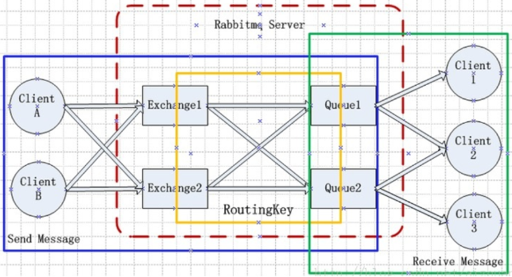
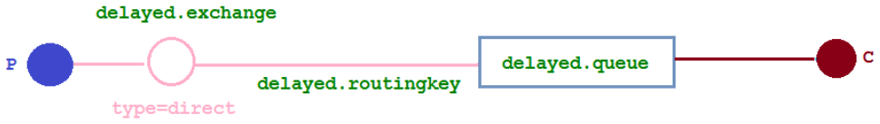

*`Author: ACatSmiling`*

*`Since: 2022-04-28`*

## 概述

### 什么是队列


队列（`Queue`），是一种常见的数据结构，其最大的特性就是先进先出（`Firist In First Out`），作为最基础的数据结构，队列应用很广泛，比如 Redis 的基础数据类型 List，其底层数据结构就是队列。

### 什么是消息队列

消息队列（`Messaeg Queue`），是一种使用队列（Queue）作为底层存储数据结构，可用于解决不同进程与应用之间通讯的分布式消息容器，也称为**消息中间件**。

MQ 是一种跨进程的通信机制，用于上下游传递消息。在互联网架构中，MQ 是一种非常常见的上下游 ''逻辑解耦 + 物理解耦" 的消息通信服务。使用了 MQ 之后，消息发送上游只需要依赖 MQ，不用依赖其他服务。

### 为什么使用消息队列

#### 流量消峰

举个例子，如果订单系统最多能处理一万次订单，这个处理能力应付正常时段的下单时绰绰有余，正常时段我们下单一秒后就能返回结果。但是在高峰期，如果有两万次下单操作系统是处理不了的，只能限制订单超过一万后不允许用户下单。使用消息队列做缓冲，我们可以取消这个限制，把一秒内下的订单分散成一段时间来处理，这时有些用户可能在下单十几秒后才能收到下单成功的操作，但是比不能下单的体验要好。

#### 应用解耦


以电商应用为例，应用中有订单系统、支付系统、库存系统、物流系统。用户创建订单后，如果耦合调用库存系统、物流系统、支付系统，任何一个子系统出了故障，都会造成下单操作异常。当转变成基于消息队列的方式后，系统间调用的问题会减少很多，比如物流系统因为发生故障，需要几分钟来修复。在这几分钟的时间里，物流系统要处理的内存被缓存在消息队列中，用户的下单操作可以正常完成。当物流系统恢复后，继续处理订单信息即可，中单用户感受不到物流系统的故障，提升系统的可用性。

#### 异步处理


有些服务间调用是异步的，例如 A 调用 B，B 需要花费很长时间执行，但是 A 需要知道 B 什么时候可以执行完，以前一般有两种方式，A 过一段时间去调用 B 的查询 api 查询。或者 A 提供一个 callback api，B 执行完之后调用 api 通知 A 服务。这两种方式都不是很优雅，使用消息总线，可以很方便解决这个问题，A 调用 B 服务后，只需要监听 B 处理完成的消息，当 B 处理完成后，会发送一条消息给 MQ，MQ 会将此消息转发给 A 服务。这样 A 服务既不用循环调用 B 的查询 api，也不用提供 callback api。同样 B 服务也不用做这些操作。A 服务还能及时的得到异步处理成功的消息。

### 消息队列的分类

#### ActiveMQ

优点：单机吞吐量万级，时效性 ms 级，可用性高，基于主从架构实现高可用性，消息可靠性较低的概率丢失数据。

缺点：官方社区现在对 ActiveMQ 5.x 维护越来越少，高吞吐量场景较少使用。

#### Kafka

大数据的杀手锏，谈到大数据领域内的消息传输，则绕不开 Kafka，这款为大数据而生的消息中间件，以其百万级 TPS 的吞吐量名声大噪，迅速成为大数据领域的宠儿，在数据采集、传输、存储的过程中发挥着举足轻重的作用。目前已经被 LinkedIn，Uber，Twitter，Netflix 等大公司所采纳。

优点：性能卓越，单机写入 TPS 约在百万条/秒，最大的优点，就是吞吐量高。时效性 ms 级，可用性非常高。kafka 是分布式的，一个数据多个副本，少数机器宕机，不会丢失数据，不会导致不可用，消费者采用 Pull 方式获取消息，消息有序，通过控制能够保证所有消息被消费且仅被消费一次；有优秀的第三方 Kafka Web 管理界面 Kafka-Manager；在日志领域比较成熟，被多家公司和多个开源项目使用；功能支持：功能较为简单，主要支持简单的 MQ 功能，在大数据领域的实时计算以及日志采集被大规模使用。

缺点：Kafka 单机超过 64 个队列/分区，Load 会发生明显的飙高现象，队列越多，Load 越高，发送消息响应时间变长，使用短轮询方式，实时性取决于轮询间隔时间，消费失败不支持重试；支持消息顺序，但是一台代理宕机后，就会产生消息乱序，社区更新较慢。

#### RocketMQ

RocketMQ 出自阿里巴巴的开源产品，用 Java 语言实现，在设计时参考了 Kafka，并做出了自己的一些改进。被阿里巴巴广泛应用在订单，交易，充值，流计算，消息推送，日志流式处理，binglog 分发等场景。

优点：单机吞吐量十万级，可用性非常高，分布式架构，消息可以做到 0 丢失，MQ 功能较为完善，还是分布式的，扩展性好，支持 10 亿级别的消息堆积，不会因为堆积导致性能下降，源码是 Java，可以自己阅读源码，定制自己公司的 MQ。

缺点：支持的客户端语言不多，目前是 Java 及 C++，其中 C++ 不成熟；社区活跃度一般，没有在 MQ 核心中去实现 JMS 等接口，有些系统要迁移需要修改大量代码。

#### RabbitMQ

2007 年发布，是一个在 AMQP（高级消息队列协议）基础上完成的，可复用的企业消息系统，是当前最主流的消息中间件之一。

优点：由于 erlang 语言的高并发特性，性能较好；吞吐量到万级，MQ 功能比较完备，健壮、稳定、易用、跨平台、支持多种语言，如：Python、Ruby、.NET、Java、JMS、C、PHP、ActionScript、XMPP、STOMP 等，支持 AJAX 文档齐全；开源提供的管理界面非常棒，用起来很好用，社区活跃度高；更新频率相当高。

缺点：商业版需要收费，学习成本较高。

### 消息队列的选择

#### Kafka

Kafka 主要特点是基于 Pull 的模式来处理消息消费，追求高吞吐量，一开始的目的就是用于日志收集和传输，适合产生`大量数据`的互联网服务的数据收集业务。`大型公司`建议可以选用，如果有`日志采集`功能，肯定是首选 kafka 了。

#### RocketMQ

天生为`金融互联网`领域而生，对于可靠性要求很高的场景，尤其是电商里面的订单扣款，以及业务削峰，在大量交易涌入时，后端可能无法及时处理的情况。RoketMQ 在稳定性上可能更值得信赖，这些业务场景在阿里双 11 已经经历了多次考验，如果你的业务有上述并发场景，建议可以选择 RocketMQ。

#### RabbitMQ

结合 erlang 语言本身的并发优势，性能好，`时效性微秒级`，`社区活跃度也比较高`，管理界面用起来十分方便，如果你的`数据量没有那么大`，中小型公司优先选择功能比较完备的 RabbitMQ。

## RabbitMQ

官网：https://www.rabbitmq.com/

官方文档：https://www.rabbitmq.com/documentation.html

RabbitMQ 是用 Erlang 语言开发的一个`实现了 AMQP 协议的消息队列服务器`，相比其他同类型的消息队列，最大的特点**在保证可观的单机吞吐量的同时，延时方面也非常出色。**

RabbitMQ 支持多种客户端，比如：Python、Ruby、.NET、Java、JMS、C、PHP、ActionScript、XMPP、STOMP 等。

>AMQP，即 Advanced Message Queuing Protocol，高级消息队列协议，是应用层协议的一个开放标准，为面向消息的中间件设计。

### Docker 安装

下载地址：https://www.rabbitmq.com/download.html

docker 命令安装：

```bash
# 带web端管理系统
$ docker pull rabbitmq:3.11-management

# 15672是web管理端访问端口
$ docker run --name rabbitmq -p 5672:5672 -p 15672:15672 \
-e RABBITMQ_DEFAULT_USER=rbmq \
-e RABBITMQ_DEFAULT_PASS=rbmq \
--hostname=rabbitmqhosta \
-v /home/rabbitmq/data:/var/lib/rabbitmq \
-d rabbitmq:3.11-management
```

docker-compose.yaml 示例：

```yaml
version: "3.4"

networks:
  apps:
    name: apps
    external: false

services:  
  rabbitmq:
    image: rabbitmq:management
    container_name: rabbitmq
    hostname: rabbitmqhosta
    ports:
      - 5672:5672
      - 15672:15672
    volumes:
      - ./rabbitmq/data:/var/lib/rabbitmq
    environment:
      - "RABBITMQ_DEFAULT_USER=rbmq"
      - "RABBITMQ_DEFAULT_PASS=rbmq"
    networks:
      - apps
    restart: on-failure:3
```

说明：

- RabbitMQ 镜像默认不带 Web 端管理插件，指定了镜像 tag 为 3.11-management，表示下载包含 Web 管理插件的镜像版本。`rabbitmq-plugins enable rabbitmq_management`命令，开启 Web 管理插件。
- -p 指定容器内部端口号与宿主机之间的映射，RabbitMQ 默认使用`5672`为数据通信端口，`15672`为 Web 管理界面访问端口。
- `RabbitMQ 默认创建 guest 用户，密码也是 guest`，并且赋予 administrator 角色权限，同时服务监听 5672 端口的 TCP 连接和 15672 端口的 HTTP 连接，此处修改为 rbmq。

### 管理页面

访问 RabbitMQ 的 Web 端管理界面，http://192.168.2.197:15672/：


### 工作原理

参考：https://www.rabbitmq.com/tutorials/amqp-concepts.html




#### AMQP 0-9-1

AMQP 0-9-1 (Advanced Message Queuing Protocol) is a messaging protocol that enables conforming client applications to communicate with conforming messaging middleware brokers.

> AMQP 0-9-1（高级消息队列协议）是一种消息传递协议，可使符合要求的客户端应用程序与符合要求的消息传递中间件代理进行通信。

The AMQP 0-9-1 Model has the following view of the world: messages are published to *exchanges*, which are often compared to post offices or mailboxes. Exchanges then distribute message copies to *queues* using rules called *bindings*. Then the broker either deliver messages to consumers subscribed to queues, or consumers fetch/pull messages from queues on demand.


Queues, exchanges and bindings are collectively referred to as *AMQP entities*.

#### Brokers

Messaging brokers receive messages from *[publishers](https://www.rabbitmq.com/publishers.html)* (applications that publish them, also known as producers) and route them to *[consumers](https://www.rabbitmq.com/consumers.html)* (applications that process them).

Since it is a network protocol, the publishers, consumers and the broker can all reside on different machines.

> `接收和分发消息的应用`，RabbitMQ Server 就是一个 Message Broker。

#### Exchanges

`Exchange`，消息交换机，作用是接收来自 Producer 的消息，根据分发规则，匹配查询表中的 routing key，分发消息到所绑定（binding）的 Queue。

RabbitMQ 消息传递模型的核心思想是：`生产者生产的消息从不会直接发送到队列`。实际上，通常生产者甚至都不知道这些消息传递到了哪些队列中。

生产者只能将消息发送到`交换机`（Exchange），交换机工作的内容非常简单，**一方面它接收来自生产者的消息，另一方面将它们推入队列。**交换机必须确切知道如何处理收到的消息，是把这些消息放到特定队列，还是放到许多队列，还是直接丢弃，而这些选择是由交换机的类型来决定的。


##### Exchange Types（交换机类型）

*Exchanges* are AMQP 0-9-1 entities where messages are sent to. Exchanges take a message and route it into zero or more queues. The routing algorithm used depends on the *exchange type* and rules called *bindings*. AMQP 0-9-1 brokers provide four exchange types:

| Exchange type    | Default pre-declared names              |
| :--------------- | :-------------------------------------- |
| Direct exchange  | (Empty string) and amq.direct           |
| Fanout exchange  | amq.fanout                              |
| Topic exchange   | amq.topic                               |
| Headers exchange | amq.match (and amq.headers in RabbitMQ) |

>交换机类型（`Exchange Type`）有四种：**`direct`**，**`fanout`**，**`topic`**，**`headers`**，其中 headers 不常用。
>
>- **direct**：模式处理路由键（RoutingKey），需要路由键完全匹配的队列才能收到消息。**`路由模式`**使用的是 direct 类型的交换机。
>- **fanout**：这种类型不处理路由键，很像子网广播，每台子网内的主机都获得了一份复制的消息。**`发布/订阅模式`**使用的是 fanout 类型的交换机。**fanout 类型交换机的转发消息是最快的。**
>- **topic**：将路由键和某模式进行匹配。**`主题模式`**使用的是 topic 类型的交换机。

Besides the exchange type, exchanges are declared with a number of attributes, the most important of which are:

- Name
- Durability (exchanges survive broker restart)
- Auto-delete (exchange is deleted when last queue is unbound from it)
- Arguments (optional, used by plugins and broker-specific features)

Exchanges can be durable or transient. Durable exchanges survive broker restart whereas transient exchanges do not (they have to be redeclared when broker comes back online). Not all scenarios and use cases require exchanges to be durable.

> Producer 发布消息的方法：
>
> ```java
> /**
>  * Publish a message.
>  *
>  * Publishing to a non-existent exchange will result in a channel-level
>  * protocol exception, which closes the channel.
>  *
>  * Invocations of <code>Channel#basicPublish</code> will eventually block if a
>  * <a href="https://www.rabbitmq.com/alarms.html">resource-driven alarm</a> is in effect.
>  *
>  * @see com.rabbitmq.client.AMQP.Basic.Publish
>  * @see <a href="https://www.rabbitmq.com/alarms.html">Resource-driven alarms</a>
>  * @param exchange the exchange to publish the message to
>  * @param routingKey the routing key
>  * @param props other properties for the message - routing headers etc
>  * @param body the message body
>  * @throws java.io.IOException if an error is encountered
>  */
> void basicPublish(String exchange, String routingKey, BasicProperties props, byte[] body) throws IOException;
> 
> /**
>  * Publish a message.
>  *
>  * Invocations of <code>Channel#basicPublish</code> will eventually block if a
>  * <a href="https://www.rabbitmq.com/alarms.html">resource-driven alarm</a> is in effect.
>  *
>  * @see com.rabbitmq.client.AMQP.Basic.Publish
>  * @see <a href="https://www.rabbitmq.com/alarms.html">Resource-driven alarms</a>
>  * @param exchange the exchange to publish the message to
>  * @param routingKey the routing key
>  * @param mandatory true if the 'mandatory' flag is to be set
>  * @param props other properties for the message - routing headers etc
>  * @param body the message body
>  * @throws java.io.IOException if an error is encountered
>  */
> void basicPublish(String exchange, String routingKey, boolean mandatory, BasicProperties props, byte[] body)
>         throws IOException;
> 
> /**
>  * Publish a message.
>  *
>  * Publishing to a non-existent exchange will result in a channel-level
>  * protocol exception, which closes the channel.
>  *
>  * Invocations of <code>Channel#basicPublish</code> will eventually block if a
>  * <a href="https://www.rabbitmq.com/alarms.html">resource-driven alarm</a> is in effect.
>  *
>  * @see com.rabbitmq.client.AMQP.Basic.Publish
>  * @see <a href="https://www.rabbitmq.com/alarms.html">Resource-driven alarms</a>
>  * @param exchange the exchange to publish the message to
>  * @param routingKey the routing key
>  * @param mandatory true if the 'mandatory' flag is to be set
>  * @param immediate true if the 'immediate' flag is to be
>  * set. Note that the RabbitMQ server does not support this flag.
>  * @param props other properties for the message - routing headers etc
>  * @param body the message body
>  * @throws java.io.IOException if an error is encountered
>  */
> void basicPublish(String exchange, String routingKey, boolean mandatory, boolean immediate, BasicProperties props, byte[] body)
>         throws IOException;
> ```

##### Default Exchange

The default exchange is a direct exchange with no name (empty string) pre-declared by the broker. It has one special property that makes it very useful for simple applications: every queue that is created is automatically bound to it with a routing key which is the same as the queue name.

For example, when you declare a queue with the name of "search-indexing-online", the AMQP 0-9-1 broker will bind it to the default exchange using "search-indexing-online" as the routing key (in this context sometimes referred to as the binding key). Therefore, a message published to the default exchange with the routing key "search-indexing-online" will be routed to the queue "search-indexing-online". In other words, the default exchange makes it seem like it is possible to deliver messages directly to queues, even though that is not technically what is happening.

在前面的示例代码中，并没有明确指定 Exchange，但仍然能够将消息发送到队列，这是因为使用了默认的 Exchange：

```java
channel.basicPublish("", queueName, MessageProperties.PERSISTENT_TEXT_PLAIN, message.getBytes());
```

- 第一个参数是交换机的名称，**空字符串表示默认或无名称交换机**。此时，`routing key 与 queue name 相同`，这是消息能正常被消费者消费的真正原因。

##### Direct Exchange

A direct exchange delivers messages to queues based on the message routing key. A direct exchange is ideal for the unicast routing of messages. They can be used for multicast routing as well.

Here is how it works:

- A queue binds to the exchange with a routing key K
- When a new message with routing key R arrives at the direct exchange, the exchange routes it to the queue if K = R
- If multiple queues are bound to a direct exchange with the same routing key K, the exchange will route the message to all queues for which K = R

A direct exchange can be represented graphically as follows:


> **`遵循 Routing Key 规则。`**

##### Fanout Exchange

A fanout exchange routes messages to all of the queues that are bound to it and the routing key is ignored. If N queues are bound to a fanout exchange, when a new message is published to that exchange a copy of the message is delivered to all N queues. Fanout exchanges are ideal for the broadcast routing of messages.

Because a fanout exchange delivers a copy of a message to every queue bound to it, its use cases are quite similar:

- Massively multi-player online (MMO) games can use it for leaderboard updates or other global events
- Sport news sites can use fanout exchanges for distributing score updates to mobile clients in near real-time
- Distributed systems can broadcast various state and configuration updates
- Group chats can distribute messages between participants using a fanout exchange (although AMQP does not have a built-in concept of presence, so XMPP may be a better choice)

A fanout exchange can be represented graphically as follows:


> **`广播，忽略 Routing Key 规则。`**

##### Topic Exchange

Topic exchanges route messages to one or many queues based on matching between a message routing key and the pattern that was used to bind a queue to an exchange. The topic exchange type is often used to implement various publish/subscribe pattern variations. Topic exchanges are commonly used for the multicast routing of messages.

Topic exchanges have a very broad set of use cases. Whenever a problem involves multiple consumers/applications that selectively choose which type of messages they want to receive, the use of topic exchanges should be considered.

Example uses:

- Distributing data relevant to specific geographic location, for example, points of sale
- Background task processing done by multiple workers, each capable of handling specific set of tasks
- Stocks price updates (and updates on other kinds of financial data)
- News updates that involve categorization or tagging (for example, only for a particular sport or team)
- Orchestration of services of different kinds in the cloud
- Distributed architecture/OS-specific software builds or packaging where each builder can handle only one architecture or OS

##### Headers Exchange

A headers exchange is designed for routing on multiple attributes that are more easily expressed as message headers than a routing key. Headers exchanges ignore the routing key attribute. Instead, the attributes used for routing are taken from the headers attribute. A message is considered matching if the value of the header equals the value specified upon binding.

It is possible to bind a queue to a headers exchange using more than one header for matching. In this case, the broker needs one more piece of information from the application developer, namely, should it consider messages with any of the headers matching, or all of them? This is what the "x-match" binding argument is for. When the "x-match" argument is set to "any", just one matching header value is sufficient. Alternatively, setting "x-match" to "all" mandates that all the values must match.

For "any" and "all", headers beginning with the string x- will not be used to evaluate matches. Setting "x-match" to "any-with-x" or "all-with-x" will also use headers beginning with the string x- to evaluate matches.

Headers exchanges can be looked upon as "direct exchanges on steroids". Because they route based on header values, they can be used as direct exchanges where the routing key does not have to be a string; it could be an integer or a hash (dictionary) for example.

#### Queues

[Queues](https://www.rabbitmq.com/queues.html) in the AMQP 0-9-1 model are very similar to queues in other message- and task-queueing systems: they store messages that are consumed by applications. Queues share some properties with exchanges, but also have some additional properties:

- Name
- Durable (the queue will survive a broker restart)
- Exclusive (used by only one connection and the queue will be deleted when that connection closes)
- Auto-delete (queue that has had at least one consumer is deleted when last consumer unsubscribes)
- Arguments (optional; used by plugins and broker-specific features such as message TTL, queue length limit, etc)

Before a queue can be used it has to be declared. Declaring a queue will cause it to be created if it does not already exist. The declaration will have no effect if the queue does already exist and its attributes are the same as those in the declaration. When the existing queue attributes are not the same as those in the declaration a channel-level exception with code 406 (PRECONDITION_FAILED) will be raised.

>`Queue`，即队列，RabbitMQ 内部用于存储消息的对象，**是真正用存储消息的结构**，在生产端，生产者的消息最终发送到指定队列，而消费者也是通过订阅某个队列，达到获取消息的目的。
>
>在使用队列之前，必须先声明队列。如果队列不存在，则创建队列。如果队列已经存在，且其属性与声明中的属性相同，则声明无效。如果现有队列属性与声明中的属性不一致，则会引发代码为 406（PRECONDITION_FAILED）的通道级异常。

##### Queue Names

Applications may pick queue names or ask the broker to generate a name for them. Queue names may be up to 255 bytes of UTF-8 characters. An AMQP 0-9-1 broker can generate a unique queue name on behalf of an app. To use this feature, pass an empty string as the queue name argument. The generated name will be returned to the client with queue declaration response.

Queue names starting with "amq." are reserved for internal use by the broker. Attempts to declare a queue with a name that violates this rule will result in a channel-level exception with reply code 403 (ACCESS_REFUSED).

##### Queue Durability

In AMQP 0-9-1, queues can be declared as durable or transient. Metadata of a durable queue is stored on disk, while metadata of a transient queue is stored in memory when possible.

The same distinction is made for [messages at publishing time](https://www.rabbitmq.com/publishers.html#message-properties).

In environments and use cases where durability is important, applications must use durable queues *and* make sure that publish mark published messages as persisted.

This topic is covered in more detailed in the [Queues guide](https://www.rabbitmq.com/queues.html#durability).

#### Bindings


Bindings are rules that exchanges use (among other things) to route messages to queues. To instruct an exchange E to route messages to a queue Q, Q has to be *bound* to E. Bindings may have an optional *routing key* attribute used by some exchange types. The purpose of the routing key is to select certain messages published to an exchange to be routed to the bound queue. In other words, the routing key acts like a filter.

To draw an analogy:

- Queue is like your destination in New York city
- Exchange is like JFK airport
- Bindings are routes from JFK to your destination. There can be zero or many ways to reach it

Having this layer of indirection enables routing scenarios that are impossible or very hard to implement using publishing directly to queues and also eliminates certain amount of duplicated work application developers have to do.

If a message cannot be routed to any queue (for example, because there are no bindings for the exchange it was published to) it is either [dropped or returned to the publisher](https://www.rabbitmq.com/publishers.html#unroutable), depending on message attributes the publisher has set.

>Exchange 和 Queue 之间的虚拟连接，Binding 中可以包含 routing key，Binding 信息被保存到 Exchange 中的查询表中，用于 Message 的分发依据。
>
>`Binding`是一种操作，**其作用是建立消息从 Exchange 转发到 Queue 的规则**，在进行 Exchange 与 Queue 的绑定时，需要指定一个`RoutingKey/BindingKey`。**Binding 操作一般用于 RabbitMQ 的路由工作模式和主题工作模式。**

#### Producer 和 Consumer

Storing messages in queues is useless unless applications can *[consume](https://www.rabbitmq.com/consumers.html)* them. In the AMQP 0-9-1 Model, there are two ways for applications to do this:

- Subscribe to have messages delivered to them ("push API"): this is the recommended option
- Polling ("pull API"): this way is **highly inefficient** and **should be avoided** in most cases

With the "push API", applications have to indicate interest in consuming messages from a particular queue. When they do so, we say that they *register a consumer* or, simply put, *subscribe to a queue*. It is possible to have more than one consumer per queue or to register an *exclusive consumer* (excludes all other consumers from the queue while it is consuming).

Each consumer (subscription) has an identifier called a *consumer tag*. It can be used to unsubscribe from messages. Consumer tags are just strings.

>生产者与消费者相对于 RabbitMQ 服务器来说，都是 RabbitMQ 服务器的客户端。
>
>- 生产者：`Producer`，连接到 RabbitMQ 服务器，将消息发送到队列，是消息的发送方。
>- 消费者：`Consumer`，连接到 RabbitMQ 服务器，并消费队列中的消息，是消息的接收方。
>
>生产者与消费者一般由应用程序充当。
>
>每个消费者（订阅）都有一个标识符，称为`消费者标签`，是一个字符串，它可以用来取消订阅消息。

#### Connection

AMQP 0-9-1 connections are typically long-lived. AMQP 0-9-1 is an application level protocol that uses TCP for reliable delivery. Connections use authentication and can be protected using TLS. When an application no longer needs to be connected to the server, it should gracefully close its AMQP 0-9-1 connection instead of abruptly closing the underlying TCP connection.

> `Connection`是 RabbitMQ 的内部对象之一，用于管理每个 Producer/Consumer 到 RabbitMQ 服务器的`TCP`网络连接。

#### Channel

Some applications need multiple connections to the broker. However, it is undesirable to keep many TCP connections open at the same time because doing so consumes system resources and makes it more difficult to configure firewalls. AMQP 0-9-1 connections are multiplexed with *[channels](https://www.rabbitmq.com/channels.html)* that can be thought of as "lightweight connections that share a single TCP connection".

Every protocol operation performed by a client happens on a channel. Communication on a particular channel is completely separate from communication on another channel, therefore every protocol method also carries a channel ID (a.k.a. channel number), an integer that both the broker and clients use to figure out which channel the method is for.

A channel only exists in the context of a connection and never on its own. When a connection is closed, so are all channels on it.

For applications that use multiple threads/processes for processing, it is very common to open a new channel per thread/process and not share channels between them.

>如果每一次访问 RabbitMQ 都建立一个 Connection，在消息量大的时候，建立 TCP Connection 的开销将是巨大的，效率也较低。`Channel`是在 Connection 内部建立的逻辑连接，如果应用程序支持多线程，通常每个 thread 创建单独的 Channel 进行通讯，AMQP method 包含了 channel id，帮助客户端和 Message Broker 识别 Channel，所以 Channel 之间是完全隔离的。Channel 作为轻量级的 Connection，极大减少了操作系统建立 TCP Connection 的开销。
>
>Channel 是我们与 RabbitMQ 打交道的最重要的一个接口，我们大部分的业务操作是在 Channel 这个接口中完成的，包括定义 Queue 和 Exchange、绑定 Queue 和 Exchange、发布消息等。

#### Virtual Host

To make it possible for a single broker to host multiple isolated "environments" (groups of users, exchanges, queues and so on), AMQP 0-9-1 includes the concept of *[virtual hosts](https://www.rabbitmq.com/vhosts.html)* (vhosts). They are similar to virtual hosts used by many popular Web servers and provide completely isolated environments in which AMQP entities live. Protocol clients specify what vhosts they want to use during connection negotiation.

>`Virutal Host`也叫虚拟主机，其作用是**应用隔离与权限划分**，Virtual Host 是 RabbitMQ 中最小颗粒的权限单位划分。一个 Virtual Host 下面有一组不同 Exchnage 与 Queue，不同的 Virtual Host 的 Exchnage 与 Queue 之间互相不影响。
>
>Virutal Host 是出于多租户和安全因素设计的，把 AMQP 的基本组件划分到一个虚拟的分组中，类似于网络中的 Namespace 概念。当多个不同的用户使用同一个 RabbitMQ Server 提供的服务时，可以划分出多个 vhost，每个用户在自己的 vhost 中创建 Exchange 和 Queue。

### 工作模式

RabbitMQ 一共有六种工作模式，分别为`简单模式`、`工作队列模式`、`发布/订阅模式`、`路由模式`、`主题模式`和`RPC 模式`，其中，RPC 模式并不常用。

#### 简单模式（Hello World）


- **是 RabbitMQ 最简单的一种模式，只有一个生产者、一个消费者和一个队列。**
- **生产者和消费者在发送和接收消息时，只需要指定队列名，而不需要指定发送到哪个 Exchange，RabbitMQ 服务器会自动使用 Virtual Host 默认的 Exchange，默认 Exchange 的 type 为`direct`。**

#### 工作队列模式（Work Queues）


- **可以有多个消费者，但一条消息只能被一个消费者获取。**
- **发送到队列中的消息，由服务器轮询分配给不同消费者进行消费。**

#### 发布/订阅模式（Publish/Subscribe）


- **发布/订阅模式中，Echange 的 type 为`fanout`。**
- **生产者发送消息时，不需要指定具体的队列名，Exchange 会将收到的消息转发到所绑定的队列。**
- **消息被 Exchange 转到多个队列，一条消息可以被多个消费者获取。**

#### 路由模式（Routing）


- **路由模式下 Exchange 的 type 为`direct`。**
- **消息的目标队列可以由生产者按照 RoutingKey 规则指定。**
- **消费者通过 BindingKey 绑定自己所关心的队列。**
- **一条消息可以被多个消息者获取。**

>`RoutingKey`用于生产者指定 Exchange 最终将消息路由到哪个队列，`BindingKey`用于消费者绑定到某个队列。

#### 主题模式（Topics）


- **主题模式是在路由模式的基础上，将路由键和某模式进行匹配。其中`#`表示匹配多个词，`*`表示匹配一个词，消费者可以通过某种模式的 BindKey 来达到订阅某个主题消息的目的。**
- **主题模式下 Exchange 的 type 取值为`topic`。**
- **一条消息可以被多个消费者获取。**

#### RPC 模式（RPC）


## Hello World

参考：https://www.rabbitmq.com/tutorials/tutorial-one-java.html

### 模型


### 代码示例

构建 Spring Boot 项目。

**pom.xml：**

```xml
<?xml version="1.0" encoding="UTF-8"?>
<project xmlns="http://maven.apache.org/POM/4.0.0"
         xmlns:xsi="http://www.w3.org/2001/XMLSchema-instance"
         xsi:schemaLocation="http://maven.apache.org/POM/4.0.0 http://maven.apache.org/xsd/maven-4.0.0.xsd">
    <modelVersion>4.0.0</modelVersion>

    <groupId>cn.xisun.rabbitmq</groupId>
    <artifactId>xisun-rabbitmq</artifactId>
    <version>1.0-SNAPSHOT</version>

    <parent>
        <groupId>org.springframework.boot</groupId>
        <artifactId>spring-boot-starter-parent</artifactId>
        <version>3.1.4</version>
    </parent>

    <properties>
        <maven.compiler.source>17</maven.compiler.source>
        <maven.compiler.target>17</maven.compiler.target>
        <project.build.sourceEncoding>UTF-8</project.build.sourceEncoding>
    </properties>

    <dependencies>

        <dependency>
            <groupId>org.projectlombok</groupId>
            <artifactId>lombok</artifactId>
        </dependency>

        <dependency>
            <groupId>org.springframework.boot</groupId>
            <artifactId>spring-boot-starter-web</artifactId>
        </dependency>

        <!-- RabbitMQ场景启动器-->
        <dependency>
            <groupId>org.springframework.boot</groupId>
            <artifactId>spring-boot-starter-amqp</artifactId>
        </dependency>

        <!-- RabbitMQ测试依赖-->
        <dependency>
            <groupId>org.springframework.amqp</groupId>
            <artifactId>spring-rabbit-test</artifactId>
            <scope>test</scope>
        </dependency>
    </dependencies>

    <build>
        <plugins>
            <plugin>
                <groupId>org.springframework.boot</groupId>
                <artifactId>spring-boot-maven-plugin</artifactId>
            </plugin>
        </plugins>
    </build>

</project>
```

> 如果不使用 Spring Boot 创建项目，RabbitMQ 的依赖为（参考：https://www.rabbitmq.com/java-client.html）：
>
> ```xml
> <dependency>
>   <groupId>com.rabbitmq</groupId>
>   <artifactId>amqp-client</artifactId>
>   <version>5.19.0</version>
> </dependency>
> ```
>
> RabbitMQ 个版本对 JDK 的要求：
>
> 
>
> Spring Boot 的 autoconfigue 包中，配置了 org.springframework.boot.autoconfigure.amqp.RabbitAutoConfiguration，`RabbitAutoConfiguration`定义了 RabbitMQ 的自动配置行为：
>
> ```java
> /**
>  * {@link EnableAutoConfiguration Auto-configuration} for {@link RabbitTemplate}.
>  * <p>
>  * This configuration class is active only when the RabbitMQ and Spring AMQP client
>  * libraries are on the classpath.
>  * <p>
>  * Registers the following beans:
>  * <ul>
>  * <li>{@link org.springframework.amqp.rabbit.core.RabbitTemplate RabbitTemplate} if there
>  * is no other bean of the same type in the context.</li>
>  * <li>{@link org.springframework.amqp.rabbit.connection.CachingConnectionFactory
>  * CachingConnectionFactory} instance if there is no other bean of the same type in the
>  * context.</li>
>  * <li>{@link org.springframework.amqp.core.AmqpAdmin } instance as long as
>  * {@literal spring.rabbitmq.dynamic=true}.</li>
>  * </ul>
>  *
>  * @author Greg Turnquist
>  * @author Josh Long
>  * @author Stephane Nicoll
>  * @author Gary Russell
>  * @author Phillip Webb
>  * @author Artsiom Yudovin
>  * @author Chris Bono
>  * @author Moritz Halbritter
>  * @author Andy Wilkinson
>  * @since 1.0.0
>  */
> @AutoConfiguration
> @ConditionalOnClass({ RabbitTemplate.class, Channel.class })
> @EnableConfigurationProperties(RabbitProperties.class)
> @Import({ RabbitAnnotationDrivenConfiguration.class, RabbitStreamConfiguration.class })
> public class RabbitAutoConfiguration {
> }
> ```

**application.yaml：**

```yaml
spring:
  rabbitmq:
    host: 192.168.2.100
    port: 5672
    username: rbmq
    password: rbmq
```

**生产者：**

```java
package cn.xisun.rabbitmq.demo;

import com.rabbitmq.client.Channel;
import com.rabbitmq.client.Connection;
import com.rabbitmq.client.ConnectionFactory;
import lombok.extern.slf4j.Slf4j;

import java.io.IOException;
import java.util.concurrent.TimeoutException;

/**
 * @author XiSun
 * @since 2023/10/12 22:33
 */
@Slf4j
public class Producer {

    // 队列名称
    private final static String QUEUE_NAME = "hello";

    public static void main(String[] args) {
        // 创建一个连接工厂
        ConnectionFactory factory = new ConnectionFactory();
        factory.setHost("192.168.2.100");
        factory.setUsername("rbmq");
        factory.setPassword("rbmq");
        
        // channel实现了自动close接口，自动关闭，不需要显式关闭
        try (Connection connection = factory.newConnection();
             Channel channel = connection.createChannel()) {
            /*
             * 生成一个队列：
             * 参数1：队列名称
             * 参数2：队列里面的消息是否持久化，默认消息存储在内存中
             * 参数3：该队列是否只供一个消费者进行消费，消息是否进行共享，true表示可以多个消费者消费，false表示只能一个消费者消费
             * 参数4：是否自动删除，最后一个消费者端开连接以后，该队列是否自动删除，true表示自动删除，false表示不自动删除
             * 参数5：其他参数，本示例暂不添加
             */
            channel.queueDeclare(QUEUE_NAME, false, false, false, null);
            
            String message = "hello world";
            /*
             * 发送一个消息：
             * 参数1：发送到哪个交换机，本示例使用的是默认的交换机
             * 参数2：路由的key是哪个，本示例使用的是队列的名称
             * 参数3：其他的参数信息，本示例暂不添加
             * 参数4：发送消息的消息体
             */
            channel.basicPublish("", QUEUE_NAME, null, message.getBytes());
            log.info("消息发送完毕");
        } catch (IOException | TimeoutException e) {
            throw new RuntimeException(e);
        }
    }
}
```

**消费者：**

```java
package cn.xisun.rabbitmq.demo;

import com.rabbitmq.client.*;
import lombok.extern.slf4j.Slf4j;

import java.io.IOException;
import java.util.concurrent.TimeoutException;

/**
 * @author XiSun
 * @since 2023/10/12 22:33
 */
@Slf4j
public class Consumer {

    // 队列名称
    private final static String QUEUE_NAME = "hello";

    public static void main(String[] args) {
        ConnectionFactory factory = new ConnectionFactory();
        factory.setHost("192.168.2.100");
        factory.setUsername("rbmq");
        factory.setPassword("rbmq");
        
        try (Connection connection = factory.newConnection();
             Channel channel = connection.createChannel()) {
            log.info("等待接收消息....");

            // 推送的消息如何进行消费的接口回调
            DeliverCallback deliverCallback = (consumerTag, delivery) -> {
                String message = new String(delivery.getBody());
                log.info("消费的消息是：{}", message);
            };

            // 取消消费的一个回调接口，如在消费的时候队列被删除掉了
            CancelCallback cancelCallback = (consumerTag) -> {
                log.info("消息消费被中断");
            };
            
            /*
             * 消费者消费消息：
             * 参数1：消费哪个队列
             * 参数2：消费成功之后是否要自动应答，true表示自动应答，false表示手动应答
             * 参数3：消费者消费消息成功时的回调
             * 参数4：消费者消费消息失败时的回调
             */
            channel.basicConsume(QUEUE_NAME, true, deliverCallback, cancelCallback);
        } catch (IOException | TimeoutException e) {
            throw new RuntimeException(e);
        }
    }
}
```

**启动生产者：**

```java
10:19:23.058 [main] INFO cn.xisun.rabbitmq.demo.Consumer -- 等待接收消息....
10:19:23.067 [pool-1-thread-4] INFO cn.xisun.rabbitmq.demo.Consumer -- 消费的消息是：hello world
```


**启动消费者：**

```java
10:19:23.058 [main] INFO cn.xisun.rabbitmq.demo.Consumer -- 等待接收消息....
10:19:23.067 [pool-1-thread-4] INFO cn.xisun.rabbitmq.demo.Consumer -- 消费的消息是：hello world
```


## Work Queues

参考：https://www.rabbitmq.com/tutorials/tutorial-two-java.html


`工作队列`，又称任务队列，它的主要思想是**避免立即执行资源密集型任务**，且不得不等待任务完成。相反，可以安排任务在之后执行，把任务封装为消息并将其发送到队列，在后台运行的工作进程将弹出任务并最终执行作业。当有多个工作线程时，这些工作线程将一起处理这些任务。

### 模型


### Round-robin dispatching（轮询分发消息）

RabbitMqUtils.java：

```java
/**
 * @author XiSun
 * @since 2023/10/13 10:36
 * <p>
 * Channel工具类
 */
public class RabbitMqUtils {

    /**
     * 获取一个连接的channel
     *
     * @return
     * @throws Exception
     */
    public static Channel getChannel() throws IOException, TimeoutException {
        // 创建一个连接工厂
        ConnectionFactory factory = new ConnectionFactory();
        factory.setHost("192.168.2.100");
        factory.setUsername("rbmq");
        factory.setPassword("rbmq");
        Connection connection = factory.newConnection();
        return connection.createChannel();
    }
}
```

Task01.java：

```java
/**
 * @author XiSun
 * @since 2023/10/13 11:00
 * <p>
 * 轮询分发消息
 */
@Slf4j
public class Task {

    private final static String QUEUE_NAME = "hello";

    public static void main(String[] args) {
        try (Channel channel = RabbitMqUtils.getChannel()) {
            channel.queueDeclare(QUEUE_NAME, false, false, false, null);
            
            // 从控制台当中接受信息
            Scanner scanner = new Scanner(System.in);
            while (scanner.hasNext()) {
                String message = scanner.next();
                channel.basicPublish("", QUEUE_NAME, null, message.getBytes());
                log.info("消息发送完毕：{}", message);
            }
        } catch (IOException | TimeoutException e) {
            throw new RuntimeException(e);
        }
    }
}
```

Work01.java：

```java
/**
 * @author XiSun
 * @since 2023/10/13 10:50
 */
@Slf4j
public class Worker01 {

    private static final String QUEUE_NAME = "hello";

    public static void main(String[] args) {
        try {
            Channel channel = RabbitMqUtils.getChannel();
            
            DeliverCallback deliverCallback = (consumerTag, delivery) -> {
                String message = new String(delivery.getBody());
                log.info("消费的消息是：{}", message);
            };

            CancelCallback cancelCallback = (consumerTag) -> {
                log.info("消息消费被中断");
            };

            log.info("Worker01 消费者启动等待消费......");
            channel.basicConsume(QUEUE_NAME, true, deliverCallback, cancelCallback);
        } catch (IOException | TimeoutException e) {
            throw new RuntimeException(e);
        }
    }
}
```

Work02.java：

```java
/**
 * @author XiSun
 * @since 2023/10/13 10:50
 */
@Slf4j
public class Worker02 {

    private static final String QUEUE_NAME = "hello";

    public static void main(String[] args) {
        try {
            Channel channel = RabbitMqUtils.getChannel();
            
            DeliverCallback deliverCallback = (consumerTag, delivery) -> {
                String message = new String(delivery.getBody());
                log.info("消费的消息是：{}", message);
            };

            CancelCallback cancelCallback = (consumerTag) -> {
                log.info("消息消费被中断");
            };

            log.info("Worker02 消费者启动等待消费......");
            channel.basicConsume(QUEUE_NAME, true, deliverCallback, cancelCallback);
        } catch (IOException | TimeoutException e) {
            throw new RuntimeException(e);
        }
    }
}
```

启动 Task01，Work01，Work02，然后发送消息：

- Task01 控制台：

  ```java
  AA
  11:29:29.039 [main] INFO cn.xisun.rabbitmq.workqueue.Task -- 消息发送完毕：AA
  BB
  11:29:30.695 [main] INFO cn.xisun.rabbitmq.workqueue.Task -- 消息发送完毕：BB
  CC
  11:29:31.813 [main] INFO cn.xisun.rabbitmq.workqueue.Task -- 消息发送完毕：CC
  DD
  11:29:32.754 [main] INFO cn.xisun.rabbitmq.workqueue.Task -- 消息发送完毕：DD
  ```

- Work01 控制台：

  ```java
  11:29:07.137 [main] INFO cn.xisun.rabbitmq.workqueue.Worker01 -- Worker01 消费者启动等待消费......
  11:29:29.041 [pool-1-thread-4] INFO cn.xisun.rabbitmq.workqueue.Worker01 -- 消费的消息是：AA
  11:29:31.815 [pool-1-thread-5] INFO cn.xisun.rabbitmq.workqueue.Worker01 -- 消费的消息是：CC
  ```

- Work02 控制台：

  ```java
  11:29:12.164 [main] INFO cn.xisun.rabbitmq.workqueue.Worker02 -- Worker01 消费者启动等待消费......
  11:29:30.699 [pool-1-thread-4] INFO cn.xisun.rabbitmq.workqueue.Worker02 -- 消费的消息是：BB
  11:29:32.756 [pool-1-thread-5] INFO cn.xisun.rabbitmq.workqueue.Worker02 -- 消费的消息是：DD
  ```

> 注意 Work01 和 Work02 与 demo 示例中的 Consumer 的区别，Consumer 中异常捕获的写法，channel 和 connection 会被关闭，此处没有执行关闭操作。

### Message acknowledgment（消息应答）

消费者完成一个任务可能需要一段时间，如果其中一个消费者在处理一个长的任务，并仅只完成了部分突然挂掉了，会发生什么情况？

RabbitMQ 一旦向消费者传递了一条消息，便立即将该消息标记为删除。在这种情况下，如果突然有个消费者挂掉了，将会丢失该消费者正在处理的消息，以及后续发送给该消费者的消息，因为它无法接收到。

为了保证消息在发送过程中不丢失，RabbitMQ 引入`消息应答机制`，消息应答就是：**消费者在接收到消息并且处理该消息之后，告诉 RabbitMQ 它已经处理了，RabbitMQ 可以把该消息删除了。** 

#### 自动应答

自动应答模式下，消息发送后立即被认为已经传送成功。这种模式需要在**高吞吐量和数据传输安全性方面做权衡**，因为这种模式如果消息在接收到之前，消费者那边出现连接或者 channel 关闭，那么消息就丢失了。另一方面，这种模式消费者那边可以传递过载的消息，**没有对传递的消息数量进行限制**，这样有可能使得消费者这边由于接收太多还来不及处理的消息，导致这些消息的积压，最终使得内存耗尽，这些消费者线程被操作系统杀死。

**因此，自动应答模式，仅适用在消费者可以高效并以某种速率处理这些消息的情况下使用**。

#### 手动应答的方法

##### basicAck

```java
/**
 * Acknowledge one or several received
 * messages. Supply the deliveryTag from the {@link com.rabbitmq.client.AMQP.Basic.GetOk}
 * or {@link com.rabbitmq.client.AMQP.Basic.Deliver} method
 * containing the received message being acknowledged.
 * @see com.rabbitmq.client.AMQP.Basic.Ack
 * @param deliveryTag the tag from the received {@link com.rabbitmq.client.AMQP.Basic.GetOk} or {@link com.rabbitmq.client.AMQP.Basic.Deliver}
 * @param multiple true to acknowledge all messages up to and
 * including the supplied delivery tag; false to acknowledge just
 * the supplied delivery tag.
 * @throws java.io.IOException if an error is encountered
 */
void basicAck(long deliveryTag, boolean multiple) throws IOException;
```

- `肯定确定`：RabbitMQ 已知道该消息，并且成功的处理消息，可以将其丢弃了。

##### basicNack

```java
/**
 * Reject one or several received messages.
 *
 * Supply the <code>deliveryTag</code> from the {@link com.rabbitmq.client.AMQP.Basic.GetOk}
 * or {@link com.rabbitmq.client.AMQP.Basic.Deliver} method containing the message to be rejected.
 * @see com.rabbitmq.client.AMQP.Basic.Nack
 * @param deliveryTag the tag from the received {@link com.rabbitmq.client.AMQP.Basic.GetOk} or {@link com.rabbitmq.client.AMQP.Basic.Deliver}
 * @param multiple true to reject all messages up to and including
 * the supplied delivery tag; false to reject just the supplied
 * delivery tag.
 * @param requeue true if the rejected message(s) should be requeued rather
 * than discarded/dead-lettered
 * @throws java.io.IOException if an error is encountered
 */
void basicNack(long deliveryTag, boolean multiple, boolean requeue) throws IOException;
```

- `否定确认`。

##### basicReject

```java
/**
 * Reject a message. Supply the deliveryTag from the {@link com.rabbitmq.client.AMQP.Basic.GetOk}
 * or {@link com.rabbitmq.client.AMQP.Basic.Deliver} method
 * containing the received message being rejected.
 * @see com.rabbitmq.client.AMQP.Basic.Reject
 * @param deliveryTag the tag from the received {@link com.rabbitmq.client.AMQP.Basic.GetOk} or {@link com.rabbitmq.client.AMQP.Basic.Deliver}
 * @param requeue true if the rejected message should be requeued rather than discarded/dead-lettered
 * @throws java.io.IOException if an error is encountered
 */
void basicReject(long deliveryTag, boolean requeue) throws IOException;
```

- `否定确认`：与 basicNack() 相比，少一个 multiple 参数，表示不处理该消息，而是直接拒绝，可以将其丢弃。

##### multiple 参数


multiple 的 true 和 false 代表不同意思：

- `true`：**表示批量应答 channel 上未应答的消息。**比如，channel 上有传送 tag 的消息 5、6、7 和 8，当前 tag 是 8，此时 5 ~ 8 的这些还未应答的消息，都会被确认收到消息应答。

- `false`：同上面相比，只会应答 tag = 8 的消息，5、6 和 7 这三个消息依然不会被确认收到消息应答。

#### 消息自动重新入队


如果消费者由于某些原因失去连接（其通道已关闭，连接已关闭或 TCP 连接丢失），导致消息未发送 ACK 确认，RabbitMQ 将了解到消息未完全处理，并将对其`重新排队`。如果此时其他消费者可以处理，它将很快将其重新分发给另一个消费者。这样，即使某个消费者偶尔死亡，也可以确保不会丢失任何消息。

#### 手动应答示例

消息`默认采用的是自动应答`，所以要想实现消息消费过程中不丢失，需要把自动应答改为手动应答。

SleepUtils.java：

```java
/**
 * @author XiSun
 * @since 2023/10/13 13:46
 * <p>
 * 睡眠工具类
 */
public class SleepUtils {
    public static void sleep(int second) {
        try {
            Thread.sleep(1000 * second);
        } catch (InterruptedException ignored) {
            Thread.currentThread().interrupt();
        }
    }
}
```

Task02.java：

```java
/**
 * @author XiSun
 * @since 2023/10/13 13:41
 */
@Slf4j
public class Task02 {

    private final static String ACK_QUEUE_NAME = "ack_queue";

    public static void main(String[] args) {
        try (Channel channel = RabbitMqUtils.getChannel()) {
            channel.queueDeclare(ACK_QUEUE_NAME, false, false, false, null);
            
            // 从控制台当中接受信息
            Scanner scanner = new Scanner(System.in);
            while (scanner.hasNext()) {
                String message = scanner.next();
                channel.basicPublish("", ACK_QUEUE_NAME, null, message.getBytes(StandardCharsets.UTF_8));
                log.info("消息发送完毕：{}", message);
            }
        } catch (IOException | TimeoutException e) {
            throw new RuntimeException(e);
        }
    }
}
```

Worker03.java：

```java
/**
 * @author XiSun
 * @since 2023/10/13 13:43
 */
@Slf4j
public class Worker03 {

    private static final String ACK_QUEUE_NAME = "ack_queue";

    public static void main(String[] args) {
        try {
            Channel channel = RabbitMqUtils.getChannel();

            DeliverCallback deliverCallback = (consumerTag, delivery) -> {
                String message = new String(delivery.getBody());
                log.info("消费的消息是：{}", message);
                SleepUtils.sleep(1);
                log.info("消息处理时间较短");
                /*
                 * 参数1：消息标记，tag
                 * 参数2：是否批量应答未应答消息
                 */
                channel.basicAck(delivery.getEnvelope().getDeliveryTag(), false);
            };

            CancelCallback cancelCallback = (consumerTag) -> {
                log.info("消息消费被中断");
            };

            log.info("Worker03 消费者启动等待消费......");
            // 采用手动应答
            boolean autoAck = false;
            channel.basicConsume(ACK_QUEUE_NAME, autoAck, deliverCallback, cancelCallback);
        } catch (IOException | TimeoutException e) {
            throw new RuntimeException(e);
        }
    }
}
```

Worker04.java：

```java
/**
 * @author XiSun
 * @since 2023/10/13 13:43
 */
@Slf4j
public class Worker04 {

    private static final String ACK_QUEUE_NAME = "ack_queue";

    public static void main(String[] args) {
        try {
            Channel channel = RabbitMqUtils.getChannel();

            DeliverCallback deliverCallback = (consumerTag, delivery) -> {
                String message = new String(delivery.getBody());
                log.info("消费的消息是：{}", message);
                SleepUtils.sleep(60);
                log.info("消息处理时间较长");
                /*
                 * 参数1：消息标记，tag
                 * 参数2：是否批量应答未应答消息
                 */
                channel.basicAck(delivery.getEnvelope().getDeliveryTag(), false);
            };

            CancelCallback cancelCallback = (consumerTag) -> {
                log.info("消息消费被中断");
            };

            log.info("Worker04 消费者启动等待消费......");
            // 采用手动应答
            boolean autoAck = false;
            channel.basicConsume(ACK_QUEUE_NAME, autoAck, deliverCallback, cancelCallback);
        } catch (IOException | TimeoutException e) {
            throw new RuntimeException(e);
        }
    }
}
```

启动 Task02，Work03，Work04，然后发送消息：

- Task02 控制台：

  ```java
  aa
  13:59:17.605 [main] INFO cn.xisun.rabbitmq.workqueue.Task02 -- 消息发送完毕：aa
  bb
  13:59:20.223 [main] INFO cn.xisun.rabbitmq.workqueue.Task02 -- 消息发送完毕：bb
  cc
  13:59:22.348 [main] INFO cn.xisun.rabbitmq.workqueue.Task02 -- 消息发送完毕：cc
  dd
  13:59:25.235 [main] INFO cn.xisun.rabbitmq.workqueue.Task02 -- 消息发送完毕：dd
  ```

- Work03 控制台：

  ```java
  13:59:10.675 [main] INFO cn.xisun.rabbitmq.workqueue.Worker03 -- Worker03 消费者启动等待消费......
  13:59:17.609 [pool-1-thread-4] INFO cn.xisun.rabbitmq.workqueue.Worker03 -- 消费的消息是：aa
  13:59:18.620 [pool-1-thread-4] INFO cn.xisun.rabbitmq.workqueue.Worker03 -- 消息处理时间较短
  13:59:22.349 [pool-1-thread-5] INFO cn.xisun.rabbitmq.workqueue.Worker03 -- 消费的消息是：cc
  13:59:23.357 [pool-1-thread-5] INFO cn.xisun.rabbitmq.workqueue.Worker03 -- 消息处理时间较短
  13:59:33.223 [pool-1-thread-6] INFO cn.xisun.rabbitmq.workqueue.Worker03 -- 消费的消息是：bb
  13:59:34.229 [pool-1-thread-6] INFO cn.xisun.rabbitmq.workqueue.Worker03 -- 消息处理时间较短
  13:59:34.229 [pool-1-thread-6] INFO cn.xisun.rabbitmq.workqueue.Worker03 -- 消费的消息是：dd
  13:59:35.241 [pool-1-thread-6] INFO cn.xisun.rabbitmq.workqueue.Worker03 -- 消息处理时间较短
  ```

- Work04 控制台：

  ```java
  13:59:13.527 [main] INFO cn.xisun.rabbitmq.workqueue.Worker04 -- Worker04 消费者启动等待消费......
  13:59:20.227 [pool-1-thread-4] INFO cn.xisun.rabbitmq.workqueue.Worker04 -- 消费的消息是：bb
  ```

从结果中可以看出，第一条消息 aa，由 Work03 消费处理，第二条消息 bb，由 Work04 消费处理，第三条消息 cc，由 Work03 消费处理。第四条消息 dd，轮询应该由 Work04 消费处理，但因为 Work04 处理的消息 bb 耗时较久，还没结束任务，如果此时关闭 Work04 服务，可以看到，消息 bb 和消息 dd，都会转发到 Work03 进行处理。（**消息 bb 没有丢失，自动重新入队了**）

### Message durability（持久化）

刚刚已经看到了如何处理任务不丢失的情况，但是如何保障当 RabbitMQ 服务停掉以后，消息生产者发送过来的消息不丢失呢？

默认情况下 RabbitMQ 退出或由于某种原因崩溃时，它会忽视队列和消息，除非告知它不要这样做。确保消息不会丢失需要做两件事：**需要将队列和消息都标记为持久化**。

#### 队列实现持久化

之前创建的队列都是非持久化的，RabbitMQ 如果重启，该队列就会被删除掉，如果要队列实现持久化，需要在`声明队列的时候把 durable 参数设置为 true`。

```java
// 设置队列持久化
boolean durable = true;
channel.queueDeclare(ACK_QUEUE_NAME, durable, false, false, null);
```

>如果之前声明的队列不是持久化的，需要把原先队列先删除，或者重新创建一个持久化的队列，不然会出现错误：
>
>```java
>Caused by: com.rabbitmq.client.ShutdownSignalException: channel error; protocol method: #method<channel.close>(reply-code=406, reply-text=PRECONDITION_FAILED - inequivalent arg 'durable' for queue 'ack_queue' in vhost '/': received 'true' but current is 'false', class-id=50, method-id=10)
>	at com.rabbitmq.client.impl.ChannelN.asyncShutdown(ChannelN.java:517)
>	at com.rabbitmq.client.impl.ChannelN.processAsync(ChannelN.java:341)
>	at com.rabbitmq.client.impl.AMQChannel.handleCompleteInboundCommand(AMQChannel.java:185)
>	at com.rabbitmq.client.impl.AMQChannel.handleFrame(AMQChannel.java:117)
>	at com.rabbitmq.client.impl.AMQConnection.readFrame(AMQConnection.java:746)
>	at com.rabbitmq.client.impl.AMQConnection.access$300(AMQConnection.java:47)
>	at com.rabbitmq.client.impl.AMQConnection$MainLoop.run(AMQConnection.java:673)
>	at java.base/java.lang.Thread.run(Thread.java:833)
>```

非持久化的队列：


持久化的队列：


> 持久化的队列，即使 RabbitMQ 服务重新启动，也依然会存在。

#### 消息实现持久化

要想让消息实现持久化，需要在消息生产者修改代码，添加`MessageProperties.PERSISTENT_TEXT_PLAIN`这个属性。

```java
// 当durable为true的时候，添加MessageProperties.PERSISTENT_TEXT_PLAIN参数，设置消息持久化
channel.basicPublish("", ACK_QUEUE_NAME, MessageProperties.PERSISTENT_TEXT_PLAIN, message.getBytes(StandardCharsets.UTF_8));
```

> **将消息标记为持久化，并不能完全保证不会丢失消息。**尽管它告诉 RabbitMQ 需要将消息保存到磁盘，但是这里依然存在，当消息准备存储到磁盘的时候，此时消息还在缓存中，并没有真正写入磁盘。如果这个时候服务宕机，这些缓存中的消息也会丢失。
>
> 因此，单单添加 MessageProperties.PERSISTENT_TEXT_PLAIN 属性的持久性保证并不强，但是对于简单任务队列而言，这已经绰绰有余了。如果需要更强有力的持久化策略，参考后边 "发布确认" 章节。

### Fair dispatch（公平分发）

RabbitMQ 分发消息采用的轮询分发，但是在某种场景下这种策略并不是很好，比如有两个消费者在处理任务，其中有个消费者 1 处理任务的速度非常快，而另外一个消费者 2 处理速度却很慢，这个时候继续采用轮询分发，就会导致处理速度快的这个消费者很大一部分时间处于空闲状态，而处理慢的那个消费者一直在满负载。对于这种情况，轮询分发这种分发方式，就存在着缺陷。

为了避免这种情况，可以在消费者端设置参数`channel.basicQos(1)`：


```java
Channel channel = RabbitMqUtils.getChannel();
// 设置公平分发，默认为0（此处设置的，实际上就是一个预取值）
int prefetchCount = 1;
channel.basicQos(prefetchCount);
```

- 消费者设置公平分发后，如果当前任务未处理完或者还没有应答，就不继续分配新任务给当前消费者，RabbitMQ 会把新任务分配给其他空闲消费者。
- 如果所有的消费者都没有完成拿到的任务，队列还在不停的添加新任务，队列有可能就会遇到被撑满的情况，这个时候就只能添加新的消费者，或者改变其他存储任务的策略。

控制台：


重新启动 Task02，Work03，Work04，然后发送消息：

- Task02 控制台：

  ```java
  AA
  16:45:21.596 [main] INFO cn.xisun.rabbitmq.workqueue.ack.Task02 -- 消息发送完毕：AA
  BB
  16:45:23.848 [main] INFO cn.xisun.rabbitmq.workqueue.ack.Task02 -- 消息发送完毕：BB
  CC
  16:45:28.201 [main] INFO cn.xisun.rabbitmq.workqueue.ack.Task02 -- 消息发送完毕：CC
  DD
  16:45:29.752 [main] INFO cn.xisun.rabbitmq.workqueue.ack.Task02 -- 消息发送完毕：DD				# DD消息发送后，等Work04消费完BB消息，再继续发送新的消息
  EE
  16:46:46.978 [main] INFO cn.xisun.rabbitmq.workqueue.ack.Task02 -- 消息发送完毕：EE
  FF
  16:46:48.844 [main] INFO cn.xisun.rabbitmq.workqueue.ack.Task02 -- 消息发送完毕：FF
  ```

- Work03 控制台：

  ```java
  16:41:10.985 [main] INFO cn.xisun.rabbitmq.workqueue.ack.Worker03 -- Worker03 消费者启动等待消费......
  16:45:21.601 [pool-1-thread-4] INFO cn.xisun.rabbitmq.workqueue.ack.Worker03 -- 消费的消息是：AA
  16:45:22.606 [pool-1-thread-4] INFO cn.xisun.rabbitmq.workqueue.ack.Worker03 -- 消息处理时间较短
  16:45:28.202 [pool-1-thread-5] INFO cn.xisun.rabbitmq.workqueue.ack.Worker03 -- 消费的消息是：CC
  16:45:29.216 [pool-1-thread-5] INFO cn.xisun.rabbitmq.workqueue.ack.Worker03 -- 消息处理时间较短
  16:45:29.753 [pool-1-thread-6] INFO cn.xisun.rabbitmq.workqueue.ack.Worker03 -- 消费的消息是：DD
  16:45:30.757 [pool-1-thread-6] INFO cn.xisun.rabbitmq.workqueue.ack.Worker03 -- 消息处理时间较短
  16:46:46.979 [pool-1-thread-7] INFO cn.xisun.rabbitmq.workqueue.ack.Worker03 -- 消费的消息是：EE
  16:46:47.992 [pool-1-thread-7] INFO cn.xisun.rabbitmq.workqueue.ack.Worker03 -- 消息处理时间较短
  ```

- Work04 控制台：

  ```java
  16:41:13.445 [main] INFO cn.xisun.rabbitmq.workqueue.ack.Worker04 -- Worker04 消费者启动等待消费......
  16:45:23.852 [pool-1-thread-4] INFO cn.xisun.rabbitmq.workqueue.ack.Worker04 -- 消费的消息是：BB
  16:46:23.866 [pool-1-thread-4] INFO cn.xisun.rabbitmq.workqueue.ack.Worker04 -- 消息处理时间较长
  16:46:48.845 [pool-1-thread-5] INFO cn.xisun.rabbitmq.workqueue.ack.Worker04 -- 消费的消息是：FF
  16:47:48.856 [pool-1-thread-5] INFO cn.xisun.rabbitmq.workqueue.ack.Worker04 -- 消息处理时间较长
  ```

### Prefetching Messages（预取值）

For cases when multiple consumers share a queue, it is useful to be able to specify how many messages each consumer can be sent at once before sending the next acknowledgement. This can be used as a simple load balancing technique or to improve throughput if messages tend to be published in batches. For example, if a producing application sends messages every minute because of the nature of the work it is doing.

Note that RabbitMQ only supports channel-level prefetch-count, not connection or size based prefetching.

生产者消息的发送是异步执行的，来自消费者的手动确认本质上也是异步的，在任何时候，channel 上肯定不止只有一个消息，channel 上存在一个**未确认的消息缓冲区**。对于这个消息缓冲区，**需要限制其大小，以避免缓冲区存在无限制的未确认消息。**此时，可以通过使用`channel.basicQos(int prefetchCount)`方法设置`预取计数值`来完成的。

`预取值可以定义 channel 上允许的未确认消息的最大数量`。一旦 channel 达到配置的数量，RabbitMQ 将停止在该 channel 上传递更多消息，除非`至少有一个未处理的消息被确认了`。


例如，假设在通道上有未确认的消息 5、6、7，8，并且通道的预取值设置为 4，此时 RabbitMQ 将不会在该通道上再传递任何消息，除非至少有一个未应答的消息被 ACK。假设 tag = 6 这个消息刚刚被确认 ACK，RabbitMQ 将会感知到这个情况，然后会再发送一条消息到该通道上。


**消息应答和 QoS 预取值对用户吞吐量有重大影响。**通常，增加预取值将提高向消费者传递消息的速度。**虽然自动应答传输消息速率是最佳的，但是，在这种情况下已传递但尚未处理的消息的数量也会增加，从而增加了消费者的 RAM 消耗**（内存）。

应该小心使用具有无限预处理的自动确认模式或手动确认模式，消费者消费了大量的消息如果没有确认的话，会导致消费者连接节点的内存消耗变大，找到合适的预取值是一个反复试验的过程，不同的负载该值取值也不同。`通常，100 ~ 300 范围内的值可提供最佳的吞吐量，并且不会给消费者带来太大的风险。`预取值为 1 是最保守的，这将使吞吐量变得很低，特别是在消费者连接等待时间较长的环境中，比如连接延迟很严重。

Task03.java：

```java
/**
 * @author XiSun
 * @since 2023/10/13 13:41
 * <p>
 * 预取值
 */
@Slf4j
public class Task03 {

    private final static String ACK_QUEUE_NAME = "prefetch_queue";

    public static void main(String[] args) {
        try (Channel channel = RabbitMqUtils.getChannel()) {
            // 设置队列持久化
            boolean durable = true;
            channel.queueDeclare(ACK_QUEUE_NAME, durable, false, false, null);
            
            // 从控制台当中接受信息
            Scanner scanner = new Scanner(System.in);
            while (scanner.hasNext()) {
                String message = scanner.next();
                // 当durable为true的时候，添加MessageProperties.PERSISTENT_TEXT_PLAIN参数，设置消息持久化
                channel.basicPublish("", ACK_QUEUE_NAME, MessageProperties.PERSISTENT_TEXT_PLAIN, message.getBytes(StandardCharsets.UTF_8));
                log.info("消息发送完毕：{}", message);
            }
        } catch (IOException | TimeoutException e) {
            throw new RuntimeException(e);
        }
    }
}
```

Work05.java：

```java
/**
 * @author XiSun
 * @since 2023/10/13 13:43
 */
@Slf4j
public class Worker05 {

    private static final String ACK_QUEUE_NAME = "prefetch_queue";

    public static void main(String[] args) {
        try {
            Channel channel = RabbitMqUtils.getChannel();
            
            // 预取值设置为2
            int prefetchCount = 2;
            channel.basicQos(prefetchCount);

            DeliverCallback deliverCallback = (consumerTag, delivery) -> {
                String message = new String(delivery.getBody());
                log.info("消费的消息是：{}", message);
                SleepUtils.sleep(10);
                log.info("消息处理时间较快");
                /*
                 * 参数1：消息标记，tag
                 * 参数2：是否批量应答未应答消息
                 */
                channel.basicAck(delivery.getEnvelope().getDeliveryTag(), false);
            };

            CancelCallback cancelCallback = (consumerTag) -> {
                log.info("消息消费被中断");
            };

            log.info("Worker05 消费者启动等待消费......");
            // 采用手动应答
            boolean autoAck = false;
            channel.basicConsume(ACK_QUEUE_NAME, autoAck, deliverCallback, cancelCallback);
        } catch (IOException | TimeoutException e) {
            throw new RuntimeException(e);
        }
    }
}
```

Work06.java：

```java
/**
 * @author XiSun
 * @since 2023/10/13 13:43
 */
@Slf4j
public class Worker06 {

    private static final String ACK_QUEUE_NAME = "prefetch_queue";

    public static void main(String[] args) {
        try {
            Channel channel = RabbitMqUtils.getChannel();
            
            // 设置预取值为5
            int prefetchCount = 5;
            channel.basicQos(prefetchCount);

            DeliverCallback deliverCallback = (consumerTag, delivery) -> {
                String message = new String(delivery.getBody());
                log.info("消费的消息是：{}", message);
                SleepUtils.sleep(20);
                log.info("消息处理时间很慢");
                /*
                 * 参数1：消息标记，tag
                 * 参数2：是否批量应答未应答消息
                 */
                channel.basicAck(delivery.getEnvelope().getDeliveryTag(), false);
            };

            CancelCallback cancelCallback = (consumerTag) -> {
                log.info("消息消费被中断");
            };

            log.info("Worker04 消费者启动等待消费......");
            // 采用手动应答
            boolean autoAck = false;
            channel.basicConsume(ACK_QUEUE_NAME, autoAck, deliverCallback, cancelCallback);
        } catch (IOException | TimeoutException e) {
            throw new RuntimeException(e);
        }
    }
}
```

启动 Task03，Work05，Work06，然后发送消息：

- Task03 控制台：

  ```java
  11
  17:46:25.849 [main] INFO cn.xisun.rabbitmq.workqueue.prefetch.Task03 -- 消息发送完毕：11
  22
  17:46:26.626 [main] INFO cn.xisun.rabbitmq.workqueue.prefetch.Task03 -- 消息发送完毕：22
  33
  17:46:27.262 [main] INFO cn.xisun.rabbitmq.workqueue.prefetch.Task03 -- 消息发送完毕：33
  44
  17:46:28.018 [main] INFO cn.xisun.rabbitmq.workqueue.prefetch.Task03 -- 消息发送完毕：44
  55
  17:46:28.707 [main] INFO cn.xisun.rabbitmq.workqueue.prefetch.Task03 -- 消息发送完毕：55
  66
  17:46:29.394 [main] INFO cn.xisun.rabbitmq.workqueue.prefetch.Task03 -- 消息发送完毕：66
  77
  17:46:30.053 [main] INFO cn.xisun.rabbitmq.workqueue.prefetch.Task03 -- 消息发送完毕：77
  ```

- Work05 控制台：

  ```java
  17:46:11.322 [main] INFO cn.xisun.rabbitmq.workqueue.prefetch.Worker05 -- Worker05 消费者启动等待消费......
  17:46:25.853 [pool-1-thread-4] INFO cn.xisun.rabbitmq.workqueue.prefetch.Worker05 -- 消费的消息是：11
  17:46:35.867 [pool-1-thread-4] INFO cn.xisun.rabbitmq.workqueue.prefetch.Worker05 -- 消息处理时间较快
  17:46:35.870 [pool-1-thread-5] INFO cn.xisun.rabbitmq.workqueue.prefetch.Worker05 -- 消费的消息是：33
  17:46:45.872 [pool-1-thread-5] INFO cn.xisun.rabbitmq.workqueue.prefetch.Worker05 -- 消息处理时间较快
  ```

- Work06 控制台：

  ```java
  17:46:14.193 [main] INFO cn.xisun.rabbitmq.workqueue.prefetch.Worker06 -- Worker04 消费者启动等待消费......
  17:46:26.629 [pool-1-thread-4] INFO cn.xisun.rabbitmq.workqueue.prefetch.Worker06 -- 消费的消息是：22
  17:46:46.639 [pool-1-thread-4] INFO cn.xisun.rabbitmq.workqueue.prefetch.Worker06 -- 消息处理时间很慢
  17:46:46.640 [pool-1-thread-5] INFO cn.xisun.rabbitmq.workqueue.prefetch.Worker06 -- 消费的消息是：44
  17:47:06.641 [pool-1-thread-5] INFO cn.xisun.rabbitmq.workqueue.prefetch.Worker06 -- 消息处理时间很慢
  17:47:06.641 [pool-1-thread-5] INFO cn.xisun.rabbitmq.workqueue.prefetch.Worker06 -- 消费的消息是：55
  17:47:26.646 [pool-1-thread-5] INFO cn.xisun.rabbitmq.workqueue.prefetch.Worker06 -- 消息处理时间很慢
  17:47:26.647 [pool-1-thread-5] INFO cn.xisun.rabbitmq.workqueue.prefetch.Worker06 -- 消费的消息是：66
  17:47:46.656 [pool-1-thread-5] INFO cn.xisun.rabbitmq.workqueue.prefetch.Worker06 -- 消息处理时间很慢
  17:47:46.656 [pool-1-thread-5] INFO cn.xisun.rabbitmq.workqueue.prefetch.Worker06 -- 消费的消息是：77
  17:48:06.661 [pool-1-thread-5] INFO cn.xisun.rabbitmq.workqueue.prefetch.Worker06 -- 消息处理时间很慢
  ```

当 Task03 发送消息时，以一个较快的速度，连续发送 7 条消息。从结果可以看到，虽然 Work05 的消息处理时间较快，Work06 的消息处理时间很慢，但是因为 Work05 的预取值为 2，Work06 的预取值为 5，最后，Work05 只处理了 2 条消息，而 Work06 处理了 5 条消息。

## Publish/Subscribe

参考：https://www.rabbitmq.com/tutorials/tutorial-three-java.html

### 模型


### Temporary queues（临时队列）

之前的章节，我们使用的是具有特定名称的队列（hello 和 ack_queue 等)。队列的名称是至关重要的，消费者需要指定消费哪个队列的消息。

但某些场景下，比如日志记录器，并非如此。一方面，需要得到所有的日志信息，而不仅仅是其中的一个子集。另一方面，我们只对当前的日志信息感兴趣，而不是旧的日志信息。要满足这样的需求，就可以使用`临时队列`。

如果每次连接到 RabbitMQ 时，都需要一个全新的空队列，为此我们可以创建一个具有**随机名称的队列**，或者让服务器为我们选择一个随机队列名称。其次，**一旦断开了消费者的连接，队列将被自动删除。**

创建临时队列的方法：

```java
String queue = channel.queueDeclare().getQueue();
```

> **注意，临时队列应用于发布/订阅模式下的消费者，临时队列由订阅者声明和维护，发布者不声明队列，它把消息发送到交换机之后，交换机会把消息转发给所有绑定的队列。**

### 代码示例


**EmitLog.java：**

```java
/**
 * @author XiSun
 * @since 2023/10/15 15:17
 * <p>
 * 发布/订阅模式，消息生产者
 */
@Slf4j
public class EmitLog {

    private static final String EXCHANGE_NAME = "logs";

    public static void main(String[] argv) {
        try (Channel channel = RabbitMqUtils.getChannel()) {
            /*
             * 声明一个exchange
             * 参数1：exchange的名称
             * 参数2：exchange的类型
             */
            channel.exchangeDeclare(EXCHANGE_NAME, "fanout");

            Scanner scanner = new Scanner(System.in);
            while (scanner.hasNext()) {
                String message = scanner.nextLine();
                channel.basicPublish(EXCHANGE_NAME, "", null, message.getBytes(StandardCharsets.UTF_8));
                log.info("生产者的消息：{}", message);
            }
        } catch (IOException | TimeoutException e) {
            throw new RuntimeException(e);
        }
    }
}
```

> **发布/订阅模式，需要指定 Exchange 的类型为 fanout。**

**ReceiveLogs01.java：**

```java
/**
 * @author XiSun
 * @since 2023/10/15 15:26
 * <p>
 * 发布/订阅模式，消息消费者01
 */
@Slf4j
public class ReceiveLogs01 {

    private static final String EXCHANGE_NAME = "logs";

    public static void main(String[] argv) {
        try {
            // 不要放到try上，否则还没等到消费消息，channel就关闭了
            Channel channel = RabbitMqUtils.getChannel();
            channel.exchangeDeclare(EXCHANGE_NAME, "fanout");

            /*
             * 生成一个临时的队列，队列的名称是随机的，
             * 当消费者断开和该队列的连接时，临时队列会自动删除
             */
            String queueName = channel.queueDeclare().getQueue();
            log.info("临时队列名称：{}", queueName);

            // 把临时队列绑定发布者的exchange，其中，routing key(也称之为binding key)为空字符串，发布/订阅模式会忽略routing key
            channel.queueBind(queueName, EXCHANGE_NAME, "");

            // 声明一个消息处理的回调函数
            DeliverCallback deliverCallback = (consumerTag, delivery) -> {
                String message = new String(delivery.getBody(), StandardCharsets.UTF_8);
                log.info("控制台打印数据成功：{}", message);
            };

            log.info("等待接收消息，把接收到的消息打印在控制台.....");
            channel.basicConsume(queueName, true, deliverCallback, consumerTag -> {
                log.info("消费失败的tag值：{}", consumerTag);
            });
        } catch (IOException | TimeoutException e) {
            throw new RuntimeException(e);
        }
    }
}
```

ReceiveLogs02.java：

```java
/**
 * @author XiSun
 * @since 2023/10/15 15:26
 * <p>
 * 发布/订阅模式，消息消费者02
 */
@Slf4j
public class ReceiveLogs02 {

    private static final String EXCHANGE_NAME = "logs";

    public static void main(String[] argv) {
        try {
            // 不要放到try上，否则还没等到消费消息，channel就关闭了
            Channel channel = RabbitMqUtils.getChannel();
            channel.exchangeDeclare(EXCHANGE_NAME, "fanout");

            /*
             * 生成一个临时的队列，队列的名称是随机的，
             * 当消费者断开和该队列的连接时，临时队列会自动删除
             */
            String queueName = channel.queueDeclare().getQueue();
            log.info("临时队列名称：{}", queueName);

            // 把临时队列绑定发布者的exchange，其中，routing key(也称之为binding key)为空字符串，发布/订阅模式会忽略routing key
            channel.queueBind(queueName, EXCHANGE_NAME, "");

            // 声明一个消息处理的回调函数
            DeliverCallback deliverCallback = (consumerTag, delivery) -> {
                String message = new String(delivery.getBody(), StandardCharsets.UTF_8);
                log.info("文件写入数据成功：{}", message);
            };

            log.info("等待接收消息，把接收到的消息写到文件......");
            channel.basicConsume(queueName, true, deliverCallback, consumerTag -> {
                log.info("消费失败的tag值：{}", consumerTag);
            });
        } catch (IOException | TimeoutException e) {
            throw new RuntimeException(e);
        }
    }
}
```

启动 EmitLog，ReceiveLogs01，ReceiveLogs02，然后发送消息：

- EmitLog 控制台：

  ```java
  aa
  19:39:46.918 [main] INFO cn.xisun.rabbitmq.pubsub.EmitLog -- 生产者的消息：aa
  11
  19:39:48.161 [main] INFO cn.xisun.rabbitmq.pubsub.EmitLog -- 生产者的消息：11
  bb
  19:39:50.632 [main] INFO cn.xisun.rabbitmq.pubsub.EmitLog -- 生产者的消息：bb
  22
  19:39:51.780 [main] INFO cn.xisun.rabbitmq.pubsub.EmitLog -- 生产者的消息：22
  ```

- ReceiveLogs01 控制台：

  ```java
  19:38:07.349 [main] INFO cn.xisun.rabbitmq.pubsub.ReceiveLogs01 -- 临时队列名称：amq.gen-dbibaYLRe5hyBRiBwLCIfA
  19:38:07.355 [main] INFO cn.xisun.rabbitmq.pubsub.ReceiveLogs01 -- 等待接收消息，把接收到的消息打印在控制台.....
  19:39:46.921 [pool-1-thread-4] INFO cn.xisun.rabbitmq.pubsub.ReceiveLogs01 -- 控制台打印数据成功：aa
  19:39:48.162 [pool-1-thread-5] INFO cn.xisun.rabbitmq.pubsub.ReceiveLogs01 -- 控制台打印数据成功：11
  19:39:50.634 [pool-1-thread-6] INFO cn.xisun.rabbitmq.pubsub.ReceiveLogs01 -- 控制台打印数据成功：bb
  19:39:51.782 [pool-1-thread-7] INFO cn.xisun.rabbitmq.pubsub.ReceiveLogs01 -- 控制台打印数据成功：22
  ```

- ReceiveLogs02 控制台：

  ```java
  19:38:12.433 [main] INFO cn.xisun.rabbitmq.pubsub.ReceiveLogs02 -- 临时队列名称：amq.gen-IzHolo_agniYbUG1ebBqIw
  19:38:12.439 [main] INFO cn.xisun.rabbitmq.pubsub.ReceiveLogs02 -- 等待接收消息，把接收到的消息写到文件......
  19:39:46.921 [pool-1-thread-4] INFO cn.xisun.rabbitmq.pubsub.ReceiveLogs02 -- 文件写入数据成功：aa
  19:39:48.162 [pool-1-thread-5] INFO cn.xisun.rabbitmq.pubsub.ReceiveLogs02 -- 文件写入数据成功：11
  19:39:50.634 [pool-1-thread-6] INFO cn.xisun.rabbitmq.pubsub.ReceiveLogs02 -- 文件写入数据成功：bb
  19:39:51.782 [pool-1-thread-7] INFO cn.xisun.rabbitmq.pubsub.ReceiveLogs02 -- 文件写入数据成功：22
  ```

Web 管理界面：


> **amq.gen-dbibaYLRe5hyBRiBwLCIfA 和 amq.gen-IzHolo_agniYbUG1ebBqIw 是两个临时队列，当消费者断开连接时，这两个临时队列也会自动删除。**

## Routing

参考：https://www.rabbitmq.com/tutorials/tutorial-four-java.html

### 模型


### Bindings（绑定）

In previous examples we were already creating bindings. You may recall code like:

```java
channel.queueBind(queueName, EXCHANGE_NAME, "");
```

A binding is a relationship between an exchange and a queue. This can be simply read as: the queue is interested in messages from this exchange.

Bindings can take an extra `routingKey` parameter. To avoid the confusion with a basic_publish parameter we're going to call it a `binding key`. This is how we could create a binding with a key:

```java
channel.queueBind(queueName, EXCHANGE_NAME, "black");
```

The meaning of a binding key depends on the exchange type. The fanout exchanges, which we used previously, simply ignored its value.

> **routing key 和 binding key 本质上是相同的东西，routing key 是相对于 exchange 一侧的属性名称，bingding key 是相对于 queue 一侧的属性名称。**

### Direct exchange

Our logging system from the previous tutorial broadcasts all messages to all consumers. We want to extend that to allow filtering messages based on their severity. For example we may want a program which writes log messages to the disk to only receive critical errors, and not waste disk space on warning or info log messages.

We were using a `fanout exchange`, which doesn't give us much flexibility - it's only capable of mindless broadcasting.

We will use a `direct exchange` instead. The routing algorithm behind a direct exchange is simple - `a message goes to the queues whose binding key exactly matches the routing key of the message`.

To illustrate that, consider the following setup:


In this setup, we can see the direct exchange X with two queues bound to it. The first queue is bound with binding key orange, and the second has two bindings, one with binding key black and the other one with green.

In such a setup a message published to the exchange with a routing key orange will be routed to queue Q1. Messages with a routing key of black or green will go to Q2. All other messages will be discarded.

>**direct 类型的交换机，其工作方式是，消息只发送到 binding key 和消息的 routing key 一致的队列中去。**

### Multiple bindings（多重绑定）


It is perfectly legal to bind multiple queues with the same binding key. In our example we could add a binding between X and Q1 with binding key black. In that case, the direct exchange will behave like fanout and will broadcast the message to all the matching queues. A message with routing key black will be delivered to both Q1 and Q2.

> 当多个 queue 以相同的 binding key 绑定 exchange 时，就形成了多重绑定，其效果相当于 fanout 模式的 exchange。

### 代码示例


**EmitLogDirect.log：**

```java
/**
 * @author XiSun
 * @since 2023/10/15 21:36
 * <p>
 * 多重绑定，消息生产者
 */
@Slf4j
public class EmitLogDirect {

    private static final String EXCHANGE_NAME = "direct_logs";

    public static void main(String[] argv) {
        try (Channel channel = RabbitMqUtils.getChannel()) {
            // 声明一个direct类型的exchange
            channel.exchangeDeclare(EXCHANGE_NAME, BuiltinExchangeType.DIRECT);

            // 创建多个bindingKey，发送多条日志消息
            Map<String, String> bindingKeyMap = new HashMap<>();
            bindingKeyMap.put("debug", "调试信息");
            bindingKeyMap.put("info", "普通信息");
            bindingKeyMap.put("warning", "警告信息");
            bindingKeyMap.put("error", "错误信息");

            for (Map.Entry<String, String> bindingKeyEntry : bindingKeyMap.entrySet()) {
                String bindingKey = bindingKeyEntry.getKey();
                String message = bindingKeyEntry.getValue();
                channel.basicPublish(EXCHANGE_NAME, bindingKey, null, message.getBytes(StandardCharsets.UTF_8));
                log.info("生产者的消息：{}", message);
            }
        } catch (IOException | TimeoutException e) {
            throw new RuntimeException(e);
        }
    }
}
```

**ReceiveLogsDirect01.java：**

```java
/**
 * @author XiSun
 * @since 2023/10/15 21:41
 * <p>
 * 多重绑定，消息消费者01
 */
@Slf4j
public class ReceiveLogsDirect01 {

    private static final String EXCHANGE_NAME = "direct_logs";

    public static void main(String[] argv) {
        try {
            Channel channel = RabbitMqUtils.getChannel();
            channel.exchangeDeclare(EXCHANGE_NAME, BuiltinExchangeType.DIRECT);

            String queueName = "disk";
            channel.queueDeclare(queueName, false, false, false, null);

            // routing key指定为error，只消费error日志
            channel.queueBind(queueName, EXCHANGE_NAME, "error");

            DeliverCallback deliverCallback = (consumerTag, delivery) -> {
                String message = new String(delivery.getBody(), StandardCharsets.UTF_8);
                message = "接收绑定键：" + delivery.getEnvelope().getRoutingKey() + "，消息：" + message;
                log.info("错误日志已经接收：[{}]", message);
            };

            log.info("等待接收错误日志");
            channel.basicConsume(queueName, true, deliverCallback, consumerTag -> {
                log.info("消费失败的tag值：{}", consumerTag);
            });
        } catch (IOException | TimeoutException e) {
            throw new RuntimeException(e);
        }
    }
}
```

ReceiveLogsDirect02.java：

```java
/**
 * @author XiSun
 * @since 2023/10/15 21:41
 * <p>
 * 多重绑定，消息消费者02
 */
@Slf4j
public class ReceiveLogsDirect02 {

    private static final String EXCHANGE_NAME = "direct_logs";

    public static void main(String[] argv) {
        try {
            Channel channel = RabbitMqUtils.getChannel();
            channel.exchangeDeclare(EXCHANGE_NAME, BuiltinExchangeType.DIRECT);

            String queueName = "console";
            channel.queueDeclare(queueName, false, false, false, null);

            // routing key指定为info和warning，只消费普通日志和警告日志
            channel.queueBind(queueName, EXCHANGE_NAME, "info");
            channel.queueBind(queueName, EXCHANGE_NAME, "warning");

            DeliverCallback deliverCallback = (consumerTag, delivery) -> {
                String message = new String(delivery.getBody(), StandardCharsets.UTF_8);
                message = "接收绑定键：" + delivery.getEnvelope().getRoutingKey() + "，消息：" + message;
                log.info("错误日志已经接收：[{}]", message);
            };

            log.info("等待接收普通日志和警告日志");
            channel.basicConsume(queueName, true, deliverCallback, consumerTag -> {
                log.info("消费失败的tag值：{}", consumerTag);
            });
        } catch (IOException | TimeoutException e) {
            throw new RuntimeException(e);
        }
    }
}
```

启动 EmitLogDirect，ReceiveLogsDirect01，ReceiveLogsDirect02，然后发送消息：

- EmitLogDirect 控制台：

  ```java
  21:54:06.588 [main] INFO cn.xisun.rabbitmq.pubsub.multiplebindings.EmitLogDirect -- 生产者的消息：调试信息
  21:54:06.592 [main] INFO cn.xisun.rabbitmq.pubsub.multiplebindings.EmitLogDirect -- 生产者的消息：警告信息
  21:54:06.592 [main] INFO cn.xisun.rabbitmq.pubsub.multiplebindings.EmitLogDirect -- 生产者的消息：错误信息
  21:54:06.592 [main] INFO cn.xisun.rabbitmq.pubsub.multiplebindings.EmitLogDirect -- 生产者的消息：普通信息
  ```

- ReceiveLogsDirect01 控制台：

  ```java
  21:53:39.850 [main] INFO cn.xisun.rabbitmq.pubsub.multiplebindings.ReceiveLogsDirect01 -- 等待接收错误日志
  21:54:06.600 [pool-1-thread-4] INFO cn.xisun.rabbitmq.pubsub.multiplebindings.ReceiveLogsDirect01 -- 错误日志已经接收：[接收绑定键：error，消息：错误信息]
  ```

- ReceiveLogsDirect02 控制台：

  ```java
  21:53:42.491 [main] INFO cn.xisun.rabbitmq.pubsub.multiplebindings.ReceiveLogsDirect02 -- 等待接收普通日志和警告日志
  21:54:06.600 [pool-1-thread-4] INFO cn.xisun.rabbitmq.pubsub.multiplebindings.ReceiveLogsDirect02 -- 错误日志已经接收：[接收绑定键：warning，消息：警告信息]
  21:54:06.602 [pool-1-thread-4] INFO cn.xisun.rabbitmq.pubsub.multiplebindings.ReceiveLogsDirect02 -- 错误日志已经接收：[接收绑定键：info，消息：普通信息]
  ```

> **从结果可以看到，因为没有绑定 routing key 为 debug 的消费者，debug 日志被丢弃了。**

Web 管理界面：


## Topics

参考：https://www.rabbitmq.com/tutorials/tutorial-five-java.html

In the [previous tutorial](https://www.rabbitmq.com/tutorials/tutorial-four-java.html) we improved our logging system. Instead of using a fanout exchange only capable of dummy broadcasting, we used a direct one, and gained a possibility of selectively receiving the logs.

Although using the direct exchange improved our system, it still has limitations - it can't do routing based on multiple criteria.

In our logging system we might want to subscribe to not only logs based on severity, but also based on the source which emitted the log. You might know this concept from the [syslog](http://en.wikipedia.org/wiki/Syslog) unix tool, which routes logs based on both severity (info/warn/crit...) and facility (auth/cron/kern...).

That would give us a lot of flexibility - we may want to listen to just critical errors coming from 'cron' but also all logs from 'kern'.

To implement that in our logging system we need to learn about a more complex topic exchange.

相较于只能进行随意广播的 fanout 交换机，direct 交换机实现了有选择性地接收日志。尽管使用 direct 交换机改进了日志系统，但是它仍然存在局限性。比如我们想接收的日志类型有 info.base 和 info.advantage，而某个队列只消费 info.base 的消息，这是 direct 交换机做不到的。这个时候就只能使用 topic 类型的交换机。

### 模型


### Topic exchange

Messages sent to a topic exchange can't have an arbitrary routing_key - it must be a list of words, delimited by dots. The words can be anything, but usually they specify some features connected to the message. A few valid routing key examples: "stock.usd.nyse", "nyse.vmw", "quick.orange.rabbit". There can be as many words in the routing key as you like, up to the limit of 255 bytes.

The binding key must also be in the same form. The logic behind the topic exchange is similar to a direct one - a message sent with a particular routing key will be delivered to all the queues that are bound with a matching binding key. However there are two important special cases for binding keys:

- \* (star) can substitute for exactly one word.
- \# (hash) can substitute for zero or more words.

Topic exchange is powerful and can behave like other exchanges.

When a queue is bound with "#" (hash) binding key - it will receive all the messages, regardless of the routing key - like in fanout exchange.

When special characters, "*" (star) and "#" (hash), aren't used in bindings, the topic exchange will behave just like a direct one.

>Topic 模式的 exchange，routing key 是一组以`.`相隔的字符串，每一个字符串表示一个 routing key，长度限制为 255 字节。
>
>同时，routing key 可以使用通配符：
>
>- `*`：代替一个单词。
>- `#`：代替零个或多个单词。
>
>以模型图为例，topic exchange 的 routing key，举例如下：
>
>- quick.orange.rabbit：被队列 Q1 和 Q2 接收到。
>- lazy.orange.elephant：被队列 Q1 和 Q2 接收到。
>- quick.orange.fox：被队列 Q1 接收到。
>- lazy.brown.fox：被队列 Q2 接收到。
>- lazy.pink.rabbit：虽然满足两个绑定规则，但只被队列 Q2 接收一次。
>- quick.brown.fox：未匹配任何绑定规则，不会被任何队列接收到，消息会被丢弃。
>- quick.orange.male.rabbit：四个单词，不匹配 Q1 的绑定规则，消息会被丢弃。
>- lazy.orange.male.rabbit：四个单词，匹配 Q2 的绑定规则，被 Q2 接收到。
>
>特别说明：
>
>- **如果 queue 的 bingding key 是`#`，那么这个 queue 将接收所有数据，相当于 fanout exchange。**
>
>- **如果 queue 的 bingding key 不包含`*`和`#`，那么这个 queue 只接收指定 key 的数据，相当于 direct exchange。**

### 代码示例

**EmitLogTopic.java：**

```java
/**
 * @author XiSun
 * @since 2023/10/16 9:49
 * <p>
 * 主题模式，消息生产者
 */
@Slf4j
public class EmitLogTopic {

    private static final String EXCHANGE_NAME = "topic_logs";

    public static void main(String[] argv) throws Exception {
        try (Channel channel = RabbitMqUtils.getChannel()) {
            // 声明一个topic类型的exchange
            channel.exchangeDeclare(EXCHANGE_NAME, BuiltinExchangeType.TOPIC);

            /*
             * Q1 ---> 绑定的是中间为orange带3个单词的字符串(*.orange.*)
             * Q2 ---> 绑定的是最后一个单词是rabbit的3个单词的字符串(*.*.rabbit)，以及第一个单词是lazy的多个单词的字符串(lazy.#)
             */
            Map<String, String> bindingKeyMap = new HashMap<>();
            bindingKeyMap.put("quick.orange.rabbit", "被队列 Q1 和 Q2 接收到");
            bindingKeyMap.put("lazy.orange.elephant", "被队列 Q1 和 Q2 接收到");
            bindingKeyMap.put("quick.orange.fox", "被队列 Q1 接收到");
            bindingKeyMap.put("lazy.brown.fox", "被队列 Q2 接收到");
            bindingKeyMap.put("lazy.pink.rabbit", "虽然满足两个绑定规则，但只被队列 Q2 接收一次");
            bindingKeyMap.put("quick.brown.fox", "未匹配任何绑定规则，不会被任何队列接收到，消息会被丢弃");
            bindingKeyMap.put("quick.orange.male.rabbit", "四个单词，不匹配 Q1 的绑定规则，消息会被丢弃");
            bindingKeyMap.put("lazy.orange.male.rabbit", "四个单词，匹配 Q2 的绑定规则，被 Q2 接收到");

            for (Map.Entry<String, String> bindingKeyEntry : bindingKeyMap.entrySet()) {
                String bindingKey = bindingKeyEntry.getKey();
                String message = bindingKeyEntry.getValue();
                channel.basicPublish(EXCHANGE_NAME, bindingKey, null, message.getBytes(StandardCharsets.UTF_8));
                log.info("生产者的消息：{}", message);
            }
        }
    }
}
```

**ReceiveLogsTopic01.java：**

```java
/**
 * @author XiSun
 * @since 2023/10/16 9:58
 * <p>
 * 主题模式，消息消费者01
 */
@Slf4j
public class ReceiveLogsTopic01 {

    private static final String EXCHANGE_NAME = "topic_logs";

    public static void main(String[] argv) {
        try {
            Channel channel = RabbitMqUtils.getChannel();
            channel.exchangeDeclare(EXCHANGE_NAME, BuiltinExchangeType.TOPIC);

            // 声明Q1队列与绑定关系
            String queueName = "Q1";
            channel.queueDeclare(queueName, false, false, false, null);
            channel.queueBind(queueName, EXCHANGE_NAME, "*.orange.*");

            DeliverCallback deliverCallback = (consumerTag, delivery) -> {
                String message = new String(delivery.getBody(), StandardCharsets.UTF_8);
                message = "接收队列：" + queueName + "，接收绑定键：" + delivery.getEnvelope().getRoutingKey() + "，消息：" + message;
                log.info("消息已经接收：[{}]", message);
            };

            log.info("等待接收消息");
            channel.basicConsume(queueName, true, deliverCallback, consumerTag -> {
                log.info("消费失败的tag值：{}", consumerTag);
            });
        } catch (IOException | TimeoutException e) {
            throw new RuntimeException(e);
        }
    }
}
```

**ReceiveLogsTopic02.java：**

```java
/**
 * @author XiSun
 * @since 2023/10/16 9:58
 * <p>
 * 主题模式，消息消费者02
 */
@Slf4j
public class ReceiveLogsTopic02 {

    private static final String EXCHANGE_NAME = "topic_logs";

    public static void main(String[] argv) {
        try {
            Channel channel = RabbitMqUtils.getChannel();
            channel.exchangeDeclare(EXCHANGE_NAME, BuiltinExchangeType.TOPIC);

            // 声明Q2队列与绑定关系
            String queueName = "Q2";
            channel.queueDeclare(queueName, false, false, false, null);
            channel.queueBind(queueName, EXCHANGE_NAME, "*.*.rabbit");
            channel.queueBind(queueName, EXCHANGE_NAME, "lazy.#");

            DeliverCallback deliverCallback = (consumerTag, delivery) -> {
                String message = new String(delivery.getBody(), StandardCharsets.UTF_8);
                message = "接收队列：" + queueName + "，接收绑定键：" + delivery.getEnvelope().getRoutingKey() + "，消息：" + message;
                log.info("消息已经接收：[{}]", message);
            };

            log.info("等待接收消息");
            channel.basicConsume(queueName, true, deliverCallback, consumerTag -> {
                log.info("消费失败的tag值：{}", consumerTag);
            });
        } catch (IOException | TimeoutException e) {
            throw new RuntimeException(e);
        }
    }
}
```

启动 EmitLogTopic，ReceiveLogsTopic01，ReceiveLogsTopic02，然后发送消息：

- EmitLogTopic 控制台：

  ```java
  10:05:57.302 [main] INFO cn.xisun.rabbitmq.topic.EmitLogTopic -- 生产者的消息：四个单词，不匹配 Q1 的绑定规则，消息会被丢弃
  10:05:57.305 [main] INFO cn.xisun.rabbitmq.topic.EmitLogTopic -- 生产者的消息：未匹配任何绑定规则，不会被任何队列接收到，消息会被丢弃
  10:05:57.305 [main] INFO cn.xisun.rabbitmq.topic.EmitLogTopic -- 生产者的消息：被队列 Q1 和 Q2 接收到
  10:05:57.305 [main] INFO cn.xisun.rabbitmq.topic.EmitLogTopic -- 生产者的消息：被队列 Q2 接收到
  10:05:57.305 [main] INFO cn.xisun.rabbitmq.topic.EmitLogTopic -- 生产者的消息：被队列 Q1 和 Q2 接收到
  10:05:57.306 [main] INFO cn.xisun.rabbitmq.topic.EmitLogTopic -- 生产者的消息：被队列 Q1 接收到
  10:05:57.306 [main] INFO cn.xisun.rabbitmq.topic.EmitLogTopic -- 生产者的消息：虽然满足两个绑定规则，但只被队列 Q2 接收一次
  10:05:57.306 [main] INFO cn.xisun.rabbitmq.topic.EmitLogTopic -- 生产者的消息：四个单词，匹配 Q2 的绑定规则，被 Q2 接收到
  ```

- ReceiveLogsTopic01 控制台：

  ```java
  10:05:44.263 [main] INFO cn.xisun.rabbitmq.topic.ReceiveLogsTopic01 -- 等待接收消息
  10:05:57.314 [pool-1-thread-4] INFO cn.xisun.rabbitmq.topic.ReceiveLogsTopic01 -- 消息已经接收：[接收队列：Q1，接收绑定键：lazy.orange.elephant，消息：被队列 Q1 和 Q2 接收到]
  10:05:57.315 [pool-1-thread-4] INFO cn.xisun.rabbitmq.topic.ReceiveLogsTopic01 -- 消息已经接收：[接收队列：Q1，接收绑定键：quick.orange.rabbit，消息：被队列 Q1 和 Q2 接收到]
  10:05:57.315 [pool-1-thread-4] INFO cn.xisun.rabbitmq.topic.ReceiveLogsTopic01 -- 消息已经接收：[接收队列：Q1，接收绑定键：quick.orange.fox，消息：被队列 Q1 接收到]
  ```

- ReceiveLogsTopic02 控制台：

  ```java
  10:05:51.245 [main] INFO cn.xisun.rabbitmq.topic.ReceiveLogsTopic02 -- 等待接收消息
  10:05:57.313 [pool-1-thread-4] INFO cn.xisun.rabbitmq.topic.ReceiveLogsTopic02 -- 消息已经接收：[接收队列：Q2，接收绑定键：lazy.orange.elephant，消息：被队列 Q1 和 Q2 接收到]
  10:05:57.314 [pool-1-thread-4] INFO cn.xisun.rabbitmq.topic.ReceiveLogsTopic02 -- 消息已经接收：[接收队列：Q2，接收绑定键：lazy.brown.fox，消息：被队列 Q2 接收到]
  10:05:57.315 [pool-1-thread-4] INFO cn.xisun.rabbitmq.topic.ReceiveLogsTopic02 -- 消息已经接收：[接收队列：Q2，接收绑定键：quick.orange.rabbit，消息：被队列 Q1 和 Q2 接收到]
  10:05:57.315 [pool-1-thread-4] INFO cn.xisun.rabbitmq.topic.ReceiveLogsTopic02 -- 消息已经接收：[接收队列：Q2，接收绑定键：lazy.pink.rabbit，消息：虽然满足两个绑定规则，但只被队列 Q2 接收一次]
  10:05:57.315 [pool-1-thread-4] INFO cn.xisun.rabbitmq.topic.ReceiveLogsTopic02 -- 消息已经接收：[接收队列：Q2，接收绑定键：lazy.orange.male.rabbit，消息：四个单词，匹配 Q2 的绑定规则，被 Q2 接收到]
  ```

**Web 管理页面：**


## Publisher Confirms（发布确认）

参考：https://www.rabbitmq.com/tutorials/tutorial-seven-java.html

### 原理

`生产者将信道设置成 confirm 模式后，即可进行发布确认。`信道进入 confirm 模式时，所有在该信道上面发布的消息都将会被指派一个`唯一的 ID`（从 1 开始），一旦消息被投递到所有匹配的队列之后，Broker 就会发送一个 ACK 确认给生产者（包含消息的唯一 ID），这就使得生产者知道消息已经正确到达目的队列了。

如果队列和消息开启了持久化，那么确认消息会在将消息写入磁盘之后发出。Broker 回传给生产者的确认消息中，`delivery-tag 域`包含了确认消息的序列号，此外 Broker 也可以设置 basic.ack 的`multiple 域`，表示到这个序列号之前的所有消息都已经得到了处理。

confirm 模式最大的好处在于它是异步的，一旦发布一条消息，生产者应用程序就可以在等信道返回确认的同时继续发送下一条消息，当消息最终得到确认之后，生产者应用便可以通过回调方法来处理该确认消息，如果 RabbitMQ 因为自身内部错误导致消息丢失，就会发送一条 NACK 消息，生产者应用程序同样可以在回调方法中处理该 NACK 消息。

### 策略

#### 开启发布确认

`发布确认默认是没有开启的`，如果要开启需要调用 channel 的 `confirmSelect 方法`：

```java
Channel channel = RabbitMqUtils.getChannel();
// 开启发布确认
channel.confirmSelect();
```

相关方法，可以指定超时时间：

```java
/**
 * Wait until all messages published since the last call have been
 * either ack'd or nack'd by the broker.  Note, when called on a
 * non-Confirm channel, waitForConfirms throws an IllegalStateException.
 * @return whether all the messages were ack'd (and none were nack'd)
 * @throws java.lang.IllegalStateException
 */
boolean waitForConfirms() throws InterruptedException;

/**
 * Wait until all messages published since the last call have been
 * either ack'd or nack'd by the broker; or until timeout elapses.
 * If the timeout expires a TimeoutException is thrown.  When
 * called on a non-Confirm channel, waitForConfirms throws an
 * IllegalStateException.
 * @return whether all the messages were ack'd (and none were nack'd)
 * @throws java.lang.IllegalStateException
 */
boolean waitForConfirms(long timeout) throws InterruptedException, TimeoutException;

/** Wait until all messages published since the last call have
 * been either ack'd or nack'd by the broker.  If any of the
 * messages were nack'd, waitForConfirmsOrDie will throw an
 * IOException.  When called on a non-Confirm channel, it will
 * throw an IllegalStateException.
 * @throws java.lang.IllegalStateException
 */
 void waitForConfirmsOrDie() throws IOException, InterruptedException;

/** Wait until all messages published since the last call have
 * been either ack'd or nack'd by the broker; or until timeout elapses.
 * If the timeout expires a TimeoutException is thrown.  If any of the
 * messages were nack'd, waitForConfirmsOrDie will throw an
 * IOException.  When called on a non-Confirm channel, it will
 * throw an IllegalStateException.
 * @throws java.lang.IllegalStateException
 */
void waitForConfirmsOrDie(long timeout) throws IOException, InterruptedException, TimeoutException;
```

#### 单个发布确认

`单个发布确认`是一种简单的确认方式，它是一种**同步确认发布**的方式，也就是发布一个消息之后只有它被确认发布后，后续的消息才能继续发布。

单个发布确认有一个最大的缺点：**发布速度特别的慢**，因为没有确认发布的消息会阻塞所有后续消息的发布。这种方式最多提供**每秒不超过数百条发布消息的吞吐量**。

代码示例：

```java
/**
 * @author XiSun
 * @since 2023/10/13 22:02
 * <p>
 * 单个发布确认
 */
@Slf4j
public class PublishMessageIndividually {

    // 发送消息的数量
    private static final Integer MESSAGE_COUNT = 1000;

    public static void publishMessageIndividually() {
        try (Channel channel = RabbitMqUtils.getChannel()) {
            // 开启发布确认
            channel.confirmSelect();

            String queueName = "individually_queue";
            channel.queueDeclare(queueName, true, false, false, null);

            // 开始时间
            long begin = System.currentTimeMillis();
            for (int i = 0; i < MESSAGE_COUNT; i++) {
                String message = i + "";
                channel.basicPublish("", queueName, MessageProperties.PERSISTENT_TEXT_PLAIN, message.getBytes());
                // 服务端返回false或超时时间内未返回，生产者可以消息重发
                channel.waitForConfirms();
            }
            // 结束时间
            long end = System.currentTimeMillis();

            log.info("{} 个消息单独发布确认，耗时：{} ms", MESSAGE_COUNT, (end - begin));
        } catch (IOException | InterruptedException | TimeoutException e) {
            throw new RuntimeException(e);
        }
    }
}
```

#### 批量发布确认

与单个等待确认消息相比，`批量确认发布`是先发布一批消息，然后一起确认，这种方式**可以极大地提高吞吐量**。批量确认发布也是**同步确认发布**的方式，也一样会阻塞消息的发布。

批量确认发布也有缺点：**当发生故障导致发布出现问题时，因为不知道是哪个消息出现问题，因此必须将整个批处理保存在内存中，以记录重要的信息而后重新发布消息。**

代码示例：

```java
/**
 * @author XiSun
 * @since 2023/10/13 22:03
 * <p>
 * 批量发布确认
 */
@Slf4j
public class PublishMessageBatch {

    // 发送消息的数量
    private static final Integer MESSAGE_COUNT = 1000;

    public static void publishMessageBatch() {
        try (Channel channel = RabbitMqUtils.getChannel()) {
            // 开启发布确认
            channel.confirmSelect();

            String queueName = "batch_queue";
            channel.queueDeclare(queueName, true, false, false, null);

            // 批量发布确认消息的数量
            int batchSize = 100;
            // 未确认消息个数
            int outstandingMessageCount = 0;

            // 开始时间
            long begin = System.currentTimeMillis();
            for (int i = 0; i < MESSAGE_COUNT; i++) {
                String message = i + "";
                channel.basicPublish("", queueName, MessageProperties.PERSISTENT_TEXT_PLAIN, message.getBytes());
                outstandingMessageCount++;
                if (outstandingMessageCount == batchSize) {
                    channel.waitForConfirms();
                    outstandingMessageCount = 0;
                }
            }
            // 为了确保没有剩余的待确认消息，再次确认
            if (outstandingMessageCount > 0) {
                channel.waitForConfirms();
            }
            long end = System.currentTimeMillis();
            log.info("{} 个消息批量发布确认，耗时：{} ms", MESSAGE_COUNT, (end - begin));
        } catch (InterruptedException | IOException | TimeoutException e) {
            throw new RuntimeException(e);
        }
    }
}
```

#### 异步发布确认

`异步发布确认`编程逻辑比单个和批量发布确认要复杂，但是性价比最高，无论是可靠性，还是效率，都优于二者。异步发布确认的未确认消息，最好的解决的解决方案是把未确认的消息放到一个`基于内存的能被发布线程访问的队列`，比如 ConcurrentLinkedQueue，这个队列在 confirm，callbacks 与发布线程之间进行消息的传递。

异步发布确认是利用**回调函数**来达到消息可靠性传递的，存放消息的中间件也是通过回调函数来保证可靠性传递，以及消息是否投递成功。


代码示例：

```java
/**
 * @author XiSun
 * @since 2023/10/13 22:04
 * <p>
 * 异步发布确认
 */
@Slf4j
public class PublishMessageAsync {

    // 发送消息的数量
    private static final Integer MESSAGE_COUNT = 1000;

    public static void publishMessageAsync() {
        try (Channel channel = RabbitMqUtils.getChannel()) {
            // 开启发布确认
            channel.confirmSelect();

            String queueName = "async_queue";
            channel.queueDeclare(queueName, true, false, false, null);

            /*
             * 线程安全有序的一个哈希表，适用于高并发的情况
             * 1.轻松的将序号与消息进行关联
             * 2.轻松批量删除条目 只要给到序列号
             * 3.支持并发访问
             */
            ConcurrentSkipListMap<Long, String> outstandingConfirms = new ConcurrentSkipListMap<>();

            /*
             * 确认收到消息的一个回调
             * 参数1：消息序列号
             * 参数2： true表示可以确认小于等于当前序列号的消息，false表示只确认当前序列号消息
             */
            ConfirmCallback ackCallback = (sequenceNumber, multiple) -> {
                if (multiple) {
                    // 返回的是小于等于当前序列号的未确认消息，是一个Map
                    ConcurrentNavigableMap<Long, String> confirmed = outstandingConfirms.headMap(sequenceNumber, true);
                    // 清除该部分未确认消息（已被成功确认）
                    confirmed.clear();
                } else {
                    // 只清除当前序列号的消息
                    outstandingConfirms.remove(sequenceNumber);
                }
            };

            ConfirmCallback nackCallback = (sequenceNumber, multiple) -> {
                String message = outstandingConfirms.get(sequenceNumber);
                log.info("发布的消息未被确认：{}，序列号是：{}", message, sequenceNumber);
            };

            /*
             * 添加一个异步发布确认的监听器
             * 参数1：确认收到消息的回调
             * 参数2：未收到消息的回调
             */
            channel.addConfirmListener(ackCallback, nackCallback);

            long begin = System.currentTimeMillis();
            for (int i = 0; i < MESSAGE_COUNT; i++) {
                String message = "消息" + i;
                /*
                 * channel.getNextPublishSeqNo()获取下一个消息的序列号
                 * 通过序列号与消息体进行一个关联，Map中全部都是未确认的消息体
                 */
                outstandingConfirms.put(channel.getNextPublishSeqNo(), message);
                channel.basicPublish("", queueName, MessageProperties.PERSISTENT_TEXT_PLAIN, message.getBytes());
            }
            long end = System.currentTimeMillis();
            log.info("{} 个消息异步发布确认，耗时：{} ms", MESSAGE_COUNT, (end - begin));
        } catch (IOException | TimeoutException e) {
            throw new RuntimeException(e);
        }
    }
}
```

#### 测试

测试类：

```java
/**
 * @author XiSun
 * @since 2023/10/13 22:45
 */
@Slf4j
public class PublishMessageTest {
    public static void main(String[] args) {

        PublishMessageIndividually.publishMessageIndividually();

        PublishMessageBatch.publishMessageBatch();

        PublishMessageAsync.publishMessageAsync();
    }
}
```

测试结果：

```java
11:20:16.310 [main] INFO cn.xisun.rabbitmq.workqueue.confirm.PublishMessageIndividually -- 1000 个消息单独发布确认，耗时：2825 ms
11:20:16.407 [main] INFO cn.xisun.rabbitmq.workqueue.confirm.PublishMessageBatch -- 1000 个消息批量发布确认，耗时：76 ms
11:20:16.469 [main] INFO cn.xisun.rabbitmq.workqueue.confirm.PublishMessageAsync -- 1000 个消息异步发布确认，耗时：46 ms
```

## 死信队列

参考：https://www.rabbitmq.com/dlx.html

Messages from a queue can be "dead-lettered", which means these messages are republished to an exchange when any of the following events occur.

- The message is [negatively acknowledged](https://www.rabbitmq.com/confirms.html) by a consumer using basic.reject or basic.nack with requeue parameter set to false.
- The message expires due to [per-message TTL](https://www.rabbitmq.com/ttl.html), or
- The message is dropped because its queue exceeded a [length limit](https://www.rabbitmq.com/maxlength.html)

Note that if a queue expires, the messages in the queue are not "dead-lettered".

Dead letter exchanges (DLXs) are normal exchanges. They can be any of the usual types and are declared as normal.

For any given queue, a DLX can be defined by clients using the [queue's arguments](https://www.rabbitmq.com/queues.html#optional-arguments), or in the server using [policies](https://www.rabbitmq.com/parameters.html#policies). In the case where both policy and arguments specify a DLX, the one specified in arguments overrules the one specified in policy.

Configuration using policies is recommended as it allows for DLX reconfiguration that does not involve application redeployment.

### 概念

`死信`，顾名思义就是无法被消费的消息。一般来说，Producer 将消息发送给 Exchange，再路由到对应的 Queue 中，然后，Consumer 从 Queue 取出消息进行消费。但某些时候，可能**由于特定的原因导致 Queue 中的某些消息无法被消费**，这样的消息如果没有后续的处理，就变成了死信，有死信自然就有了`死信队列`。

应用场景：

- 为了保证订单业务的消息数据不丢失，需要使用到 RabbitMQ 的死信队列机制，当消息消费发生异常时，将消息投入死信队列中。
- 用户在商城下单成功并点击去支付后，在指定时间未支付时自动失效。
- 等等。

### 死信的来源

死信的来源有三个：

- `消息被拒绝`（basic.reject 或 basic.nack），并且 requeue=false。
- `消息 TTL 过期`。
- `队列达到最大长度`，队列满了，无法再添加新数据。

### 代码示例


#### 消息被拒绝

**Producer.java：**

```java
/**
 * @author XiSun
 * @since 2023/10/16 13:35
 * <p>
 * 死信队列，生产者
 */
@Slf4j
public class Producer {

    private static final String NORMAL_EXCHANGE = "normal_exchange";

    public static void main(String[] args) {
        try (Channel channel = RabbitMqUtils.getChannel()) {
            channel.exchangeDeclare(NORMAL_EXCHANGE, BuiltinExchangeType.DIRECT);

            // 发送10条消息
            for (int i = 1; i < 11; i++) {
                String message = "info" + i;
                channel.basicPublish(NORMAL_EXCHANGE, "zhangsan", null, message.getBytes());
                log.info("生产者发送消息：{}", message);
            }
        } catch (IOException | TimeoutException e) {
            throw new RuntimeException(e);
        }
    }
}
```

**Consumer01.java：**

```java
/**
 * @author XiSun
 * @since 2023/10/16 13:38
 * <p>
 * 死信队列，普通的消费者
 */
@Slf4j
public class Consumer01 {

    // 普通交换机名称
    private static final String NORMAL_EXCHANGE = "normal_exchange";

    // 死信交换机名称
    private static final String DEAD_EXCHANGE = "dead_exchange";

    public static void main(String[] args) {
        try {
            Channel channel = RabbitMqUtils.getChannel();

            // 声明死信和普通交换机，类型为direct
            channel.exchangeDeclare(NORMAL_EXCHANGE, BuiltinExchangeType.DIRECT);
            channel.exchangeDeclare(DEAD_EXCHANGE, BuiltinExchangeType.DIRECT);

            // 声明死信队列
            String deadQueue = "dead-queue";
            channel.queueDeclare(deadQueue, false, false, false, null);
            // 死信队列绑定的死信交换机与routing key
            channel.queueBind(deadQueue, DEAD_EXCHANGE, "lisi");

            // 正常队列绑定死信队列信息
            Map<String, Object> params = new HashMap<>();
            // 正常队列设置死信交换机，key是固定值x-dead-letter-exchange
            params.put("x-dead-letter-exchange", DEAD_EXCHANGE);
            // 正常队列设置死信routing key，key是固定值x-dead-letter-routing-key
            params.put("x-dead-letter-routing-key", "lisi");

            // 声明普通队列，添加绑定死信队列的参数
            String normalQueue = "normal-queue";
            channel.queueDeclare(normalQueue, false, false, false, params);
            channel.queueBind(normalQueue, NORMAL_EXCHANGE, "zhangsan");

            DeliverCallback deliverCallback = (consumerTag, delivery) -> {
                String message = new String(delivery.getBody(), StandardCharsets.UTF_8);
                if ("info5".equals(message)) {
                    log.info("Consumer01接收到但是拒绝消费的消息：{}", message);
                    // 参数requeue设置为false，代表拒绝该消息重新入队，该队列如果配置了死信交换机将发送到死信队列中
                    channel.basicReject(delivery.getEnvelope().getDeliveryTag(), false);
                } else {
                    log.info("Consumer01正常消费的消息：{}", message);
                    // 手动应答
                    channel.basicAck(delivery.getEnvelope().getDeliveryTag(), false);
                }
            };

            log.info("等待接收消息");
            boolean autoAck = false;
            channel.basicConsume(normalQueue, autoAck, deliverCallback, consumerTag -> {
            });
        } catch (IOException | TimeoutException e) {
            throw new RuntimeException(e);
        }
    }
}
```

**Consumer02.java：**

```java
/**
 * @author XiSun
 * @since 2023/10/16 14:36
 * <p>
 * 死信队列，消费死信消息的消费者
 */
@Slf4j
public class Consumer02 {

    private static final String DEAD_EXCHANGE = "dead_exchange";

    public static void main(String[] argv) {
        try {
            Channel channel = RabbitMqUtils.getChannel();
            channel.exchangeDeclare(DEAD_EXCHANGE, BuiltinExchangeType.DIRECT);

            String deadQueue = "dead-queue";
            channel.queueDeclare(deadQueue, false, false, false, null);
            channel.queueBind(deadQueue, DEAD_EXCHANGE, "lisi");

            log.info("等待接收死信队列消息");
            DeliverCallback deliverCallback = (consumerTag, delivery) -> {
                String message = new String(delivery.getBody(), StandardCharsets.UTF_8);
                log.info("Consumer02 接收死信队列的消息：{}", message);
            };
            channel.basicConsume(deadQueue, true, deliverCallback, consumerTag -> {
            });
        } catch (IOException | TimeoutException e) {
            throw new RuntimeException(e);
        }
    }
}
```

**启动 Producer 和 Consumer01：**

- Producer 控制台：

  ```java
  16:04:35.893 [main] INFO cn.xisun.rabbitmq.deadletter.reject.Producer -- 生产者发送消息：info1
  16:04:35.896 [main] INFO cn.xisun.rabbitmq.deadletter.reject.Producer -- 生产者发送消息：info2
  16:04:35.897 [main] INFO cn.xisun.rabbitmq.deadletter.reject.Producer -- 生产者发送消息：info3
  16:04:35.897 [main] INFO cn.xisun.rabbitmq.deadletter.reject.Producer -- 生产者发送消息：info4
  16:04:35.897 [main] INFO cn.xisun.rabbitmq.deadletter.reject.Producer -- 生产者发送消息：info5
  16:04:35.897 [main] INFO cn.xisun.rabbitmq.deadletter.reject.Producer -- 生产者发送消息：info6
  16:04:35.898 [main] INFO cn.xisun.rabbitmq.deadletter.reject.Producer -- 生产者发送消息：info7
  16:04:35.898 [main] INFO cn.xisun.rabbitmq.deadletter.reject.Producer -- 生产者发送消息：info8
  16:04:35.898 [main] INFO cn.xisun.rabbitmq.deadletter.reject.Producer -- 生产者发送消息：info9
  16:04:35.898 [main] INFO cn.xisun.rabbitmq.deadletter.reject.Producer -- 生产者发送消息：info10
  ```

- Consumer01 控制台：

  ```java
  16:04:17.448 [main] INFO cn.xisun.rabbitmq.deadletter.reject.Consumer01 -- 等待接收消息
  16:04:35.895 [pool-1-thread-4] INFO cn.xisun.rabbitmq.deadletter.reject.Consumer01 -- Consumer01正常消费的消息：info1
  16:04:35.898 [pool-1-thread-5] INFO cn.xisun.rabbitmq.deadletter.reject.Consumer01 -- Consumer01正常消费的消息：info2
  16:04:35.898 [pool-1-thread-5] INFO cn.xisun.rabbitmq.deadletter.reject.Consumer01 -- Consumer01正常消费的消息：info3
  16:04:35.899 [pool-1-thread-6] INFO cn.xisun.rabbitmq.deadletter.reject.Consumer01 -- Consumer01正常消费的消息：info4
  16:04:35.899 [pool-1-thread-6] INFO cn.xisun.rabbitmq.deadletter.reject.Consumer01 -- Consumer01接收到但是拒绝消费的消息：info5
  16:04:35.900 [pool-1-thread-6] INFO cn.xisun.rabbitmq.deadletter.reject.Consumer01 -- Consumer01正常消费的消息：info6
  16:04:35.900 [pool-1-thread-6] INFO cn.xisun.rabbitmq.deadletter.reject.Consumer01 -- Consumer01正常消费的消息：info7
  16:04:35.900 [pool-1-thread-6] INFO cn.xisun.rabbitmq.deadletter.reject.Consumer01 -- Consumer01正常消费的消息：info8
  16:04:35.900 [pool-1-thread-6] INFO cn.xisun.rabbitmq.deadletter.reject.Consumer01 -- Consumer01正常消费的消息：info9
  16:04:35.901 [pool-1-thread-7] INFO cn.xisun.rabbitmq.deadletter.reject.Consumer01 -- Consumer01正常消费的消息：info10
  ```

  

**启动 Consumer02，正常消费死信队列中的消息：**

- 控制台：

  ```java
  16:13:00.206 [main] INFO cn.xisun.rabbitmq.deadletter.reject.Consumer02 -- 等待接收死信队列消息
  16:13:00.214 [pool-1-thread-4] INFO cn.xisun.rabbitmq.deadletter.reject.Consumer02 -- Consumer02 接收死信队列的消息：info5
  ```

- Web 管理页面：

  

#### 消息 TTL 过期

**Producer.java：**

```java
/**
 * @author XiSun
 * @since 2023/10/16 13:35
 * <p>
 * 死信队列，生产者
 */
@Slf4j
public class Producer {

    private static final String NORMAL_EXCHANGE = "normal_exchange";

    public static void main(String[] args) {
        try (Channel channel = RabbitMqUtils.getChannel()) {
            channel.exchangeDeclare(NORMAL_EXCHANGE, BuiltinExchangeType.DIRECT);

            // 设置消息的TTL时间，10秒后消息过期
            AMQP.BasicProperties properties = new AMQP.BasicProperties().builder().expiration("10000").build();

            // 发送10条消息
            for (int i = 1; i < 11; i++) {
                String message = "info" + i;
                channel.basicPublish(NORMAL_EXCHANGE, "zhangsan", properties, message.getBytes());
                System.out.println("生产者发送消息:" + message);
            }
        } catch (IOException | TimeoutException e) {
            throw new RuntimeException(e);
        }
    }
}
```

**Consumer01.java：**

```java
/**
 * @author XiSun
 * @since 2023/10/16 13:38
 * <p>
 * 死信队列，普通的消费者
 */
@Slf4j
public class Consumer01 {

    // 普通交换机名称
    private static final String NORMAL_EXCHANGE = "normal_exchange";

    // 死信交换机名称
    private static final String DEAD_EXCHANGE = "dead_exchange";

    public static void main(String[] args) {
        try {
            Channel channel = RabbitMqUtils.getChannel();

            // 声明死信和普通交换机，类型为direct
            channel.exchangeDeclare(NORMAL_EXCHANGE, BuiltinExchangeType.DIRECT);
            channel.exchangeDeclare(DEAD_EXCHANGE, BuiltinExchangeType.DIRECT);

            // 声明死信队列
            String deadQueue = "dead-queue";
            channel.queueDeclare(deadQueue, false, false, false, null);
            // 死信队列绑定的死信交换机与routing key
            channel.queueBind(deadQueue, DEAD_EXCHANGE, "lisi");

            // 正常队列绑定死信队列信息
            Map<String, Object> params = new HashMap<>();
            // 正常队列设置死信交换机，key是固定值x-dead-letter-exchange
            params.put("x-dead-letter-exchange", DEAD_EXCHANGE);
            // 正常队列设置死信routing key，key是固定值x-dead-letter-routing-key
            params.put("x-dead-letter-routing-key", "lisi");

            // 声明普通队列，添加绑定死信队列的参数
            String normalQueue = "normal-queue";
            channel.queueDeclare(normalQueue, false, false, false, params);
            channel.queueBind(normalQueue, NORMAL_EXCHANGE, "zhangsan");

            DeliverCallback deliverCallback = (consumerTag, delivery) -> {
                String message = new String(delivery.getBody(), StandardCharsets.UTF_8);
                log.info("Consumer01正常消费的消息：{}", message);
            };

            log.info("等待接收消息");
            channel.basicConsume(normalQueue, true, deliverCallback, consumerTag -> {
            });
        } catch (IOException | TimeoutException e) {
            throw new RuntimeException(e);
        }
    }
}
```

**Consumer02.java：**

```java
/**
 * @author XiSun
 * @since 2023/10/16 14:36
 * <p>
 * 死信队列，消费死信消息的消费者
 */
@Slf4j
public class Consumer02 {

    private static final String DEAD_EXCHANGE = "dead_exchange";

    public static void main(String[] argv) {
        try {
            Channel channel = RabbitMqUtils.getChannel();
            channel.exchangeDeclare(DEAD_EXCHANGE, BuiltinExchangeType.DIRECT);
            String deadQueue = "dead-queue";
            channel.queueDeclare(deadQueue, false, false, false, null);
            channel.queueBind(deadQueue, DEAD_EXCHANGE, "lisi");
            System.out.println("等待接收死信队列消息.....");
            DeliverCallback deliverCallback = (consumerTag, delivery) -> {
                String message = new String(delivery.getBody(), "UTF-8");
                System.out.println("Consumer02 接收死信队列的消息" + message);
            };
            channel.basicConsume(deadQueue, true, deliverCallback, consumerTag -> {
            });
        } catch (IOException | TimeoutException e) {
            throw new RuntimeException(e);
        }
    }
}
```

**先启动 Consumer01，然后关闭，模拟无法正常处理消息的情况，然后启动 Producer，消息过了 10 秒后会进入死信队列，最后启动 Consumer02，即可消费死信消息。**

- 启动 Consumer01，此时普通队列和死信队列，都没有消息：

  ```java
  15:26:18.551 [main] INFO cn.xisun.rabbitmq.deadletter.ttl.Consumer01 -- 等待接收消息
  ```

  

- 启动 Producer，此时，普通队列有 10 条未消费的消息，等待 10 秒后，可以看到，普通队列的 10 条消息，会转移到死信队列中：

  ```java
  15:27:36.667 [main] INFO cn.xisun.rabbitmq.deadletter.ttl.Producer -- 生产者发送消息：info1
  15:27:36.670 [main] INFO cn.xisun.rabbitmq.deadletter.ttl.Producer -- 生产者发送消息：info2
  15:27:36.670 [main] INFO cn.xisun.rabbitmq.deadletter.ttl.Producer -- 生产者发送消息：info3
  15:27:36.670 [main] INFO cn.xisun.rabbitmq.deadletter.ttl.Producer -- 生产者发送消息：info4
  15:27:36.670 [main] INFO cn.xisun.rabbitmq.deadletter.ttl.Producer -- 生产者发送消息：info5
  15:27:36.671 [main] INFO cn.xisun.rabbitmq.deadletter.ttl.Producer -- 生产者发送消息：info6
  15:27:36.671 [main] INFO cn.xisun.rabbitmq.deadletter.ttl.Producer -- 生产者发送消息：info7
  15:27:36.671 [main] INFO cn.xisun.rabbitmq.deadletter.ttl.Producer -- 生产者发送消息：info8
  15:27:36.671 [main] INFO cn.xisun.rabbitmq.deadletter.ttl.Producer -- 生产者发送消息：info9
  15:27:36.671 [main] INFO cn.xisun.rabbitmq.deadletter.ttl.Producer -- 生产者发送消息：info10
  ```

  

  

- 再启动 Consumer02，死信队列中的消息，被正常消费：

  ```java
  15:36:31.615 [main] INFO cn.xisun.rabbitmq.deadletter.ttl.Consumer02 -- 等待接收死信队列消息
  15:36:31.625 [pool-1-thread-4] INFO cn.xisun.rabbitmq.deadletter.ttl.Consumer02 -- Consumer02 接收死信队列的消息：info1
  15:36:31.627 [pool-1-thread-4] INFO cn.xisun.rabbitmq.deadletter.ttl.Consumer02 -- Consumer02 接收死信队列的消息：info2
  15:36:31.627 [pool-1-thread-5] INFO cn.xisun.rabbitmq.deadletter.ttl.Consumer02 -- Consumer02 接收死信队列的消息：info3
  15:36:31.628 [pool-1-thread-5] INFO cn.xisun.rabbitmq.deadletter.ttl.Consumer02 -- Consumer02 接收死信队列的消息：info4
  15:36:31.628 [pool-1-thread-5] INFO cn.xisun.rabbitmq.deadletter.ttl.Consumer02 -- Consumer02 接收死信队列的消息：info5
  15:36:31.628 [pool-1-thread-5] INFO cn.xisun.rabbitmq.deadletter.ttl.Consumer02 -- Consumer02 接收死信队列的消息：info6
  15:36:31.628 [pool-1-thread-5] INFO cn.xisun.rabbitmq.deadletter.ttl.Consumer02 -- Consumer02 接收死信队列的消息：info7
  15:36:31.628 [pool-1-thread-5] INFO cn.xisun.rabbitmq.deadletter.ttl.Consumer02 -- Consumer02 接收死信队列的消息：info8
  15:36:31.628 [pool-1-thread-5] INFO cn.xisun.rabbitmq.deadletter.ttl.Consumer02 -- Consumer02 接收死信队列的消息：info9
  15:36:31.628 [pool-1-thread-5] INFO cn.xisun.rabbitmq.deadletter.ttl.Consumer02 -- Consumer02 接收死信队列的消息：info10
  ```

  

#### 队列达到最大长度

**Producer.java：**

```java
/**
 * @author XiSun
 * @since 2023/10/16 13:35
 * <p>
 * 死信队列，生产者
 */
@Slf4j
public class Producer {

    private static final String NORMAL_EXCHANGE = "normal_exchange";

    public static void main(String[] args) {
        try (Channel channel = RabbitMqUtils.getChannel()) {
            channel.exchangeDeclare(NORMAL_EXCHANGE, BuiltinExchangeType.DIRECT);

            // 发送10条消息
            for (int i = 1; i < 11; i++) {
                String message = "info" + i;
                channel.basicPublish(NORMAL_EXCHANGE, "zhangsan", null, message.getBytes());
                System.out.println("生产者发送消息:" + message);
            }
        } catch (IOException | TimeoutException e) {
            throw new RuntimeException(e);
        }
    }
}
```

**Consumer01.java：**

```java
/**
 * @author XiSun
 * @since 2023/10/16 13:38
 * <p>
 * 死信队列，普通的消费者
 */
@Slf4j
public class Consumer01 {

    // 普通交换机名称
    private static final String NORMAL_EXCHANGE = "normal_exchange";

    // 死信交换机名称
    private static final String DEAD_EXCHANGE = "dead_exchange";

    public static void main(String[] args) {
        try {
            Channel channel = RabbitMqUtils.getChannel();

            // 声明死信和普通交换机，类型为direct
            channel.exchangeDeclare(NORMAL_EXCHANGE, BuiltinExchangeType.DIRECT);
            channel.exchangeDeclare(DEAD_EXCHANGE, BuiltinExchangeType.DIRECT);

            // 声明死信队列
            String deadQueue = "dead-queue";
            channel.queueDeclare(deadQueue, false, false, false, null);
            // 死信队列绑定的死信交换机与routing key
            channel.queueBind(deadQueue, DEAD_EXCHANGE, "lisi");

            // 正常队列绑定死信队列信息
            Map<String, Object> params = new HashMap<>();
            // 正常队列设置死信交换机，key是固定值x-dead-letter-exchange
            params.put("x-dead-letter-exchange", DEAD_EXCHANGE);
            // 正常队列设置死信routing key，key是固定值x-dead-letter-routing-key
            params.put("x-dead-letter-routing-key", "lisi");

            // 声明普通队列，添加绑定死信队列的参数
            String normalQueue = "normal-queue";
            channel.queueDeclare(normalQueue, false, false, false, params);
            channel.queueBind(normalQueue, NORMAL_EXCHANGE, "zhangsan");

            DeliverCallback deliverCallback = (consumerTag, delivery) -> {
                String message = new String(delivery.getBody(), StandardCharsets.UTF_8);
                log.info("Consumer01正常消费的消息：{}", message);
            };

            log.info("等待接收消息");
            channel.basicConsume(normalQueue, true, deliverCallback, consumerTag -> {
            });
        } catch (IOException | TimeoutException e) {
            throw new RuntimeException(e);
        }
    }
}
```

> 添加`params.put("x-dead-letter-routing-key", "lisi");`参数，设置队列的最大长度，注意，如果使用跟之前代码一样的队列名称，需要先删除该队列，然后再启动服务，否则会报错。

**Consumer02.java：**

```java
/**
 * @author XiSun
 * @since 2023/10/16 14:36
 * <p>
 * 死信队列，消费死信消息的消费者
 */
@Slf4j
public class Consumer02 {

    private static final String DEAD_EXCHANGE = "dead_exchange";

    public static void main(String[] argv) {
        try {
            Channel channel = RabbitMqUtils.getChannel();
            channel.exchangeDeclare(DEAD_EXCHANGE, BuiltinExchangeType.DIRECT);
            String deadQueue = "dead-queue";
            channel.queueDeclare(deadQueue, false, false, false, null);
            channel.queueBind(deadQueue, DEAD_EXCHANGE, "lisi");
            System.out.println("等待接收死信队列消息.....");
            DeliverCallback deliverCallback = (consumerTag, delivery) -> {
                String message = new String(delivery.getBody(), "UTF-8");
                System.out.println("Consumer02 接收死信队列的消息" + message);
            };
            channel.basicConsume(deadQueue, true, deliverCallback, consumerTag -> {
            });
        } catch (IOException | TimeoutException e) {
            throw new RuntimeException(e);
        }
    }
}
```

**先启动 Consumer01，然后关闭，模拟无法正常处理消息的情况，然后启动 Producer，消息过了 10 秒后会进入死信队列，最后启动 Consumer02，即可消费死信消息。**

- 启动 Consumer01，此时普通队列和死信队列，都没有消息：

  ```java
  15:44:55.427 [main] INFO cn.xisun.rabbitmq.deadletter.lengthlimit.Consumer01 -- 等待接收消息
  ```

  

- 启动 Producer，6 条数据进入正常队列，4 条数据进入死信队列：

  ```java
  15:48:44.709 [main] INFO cn.xisun.rabbitmq.deadletter.lengthlimit.Producer -- 生产者发送消息：info1
  15:48:44.712 [main] INFO cn.xisun.rabbitmq.deadletter.lengthlimit.Producer -- 生产者发送消息：info2
  15:48:44.713 [main] INFO cn.xisun.rabbitmq.deadletter.lengthlimit.Producer -- 生产者发送消息：info3
  15:48:44.714 [main] INFO cn.xisun.rabbitmq.deadletter.lengthlimit.Producer -- 生产者发送消息：info4
  15:48:44.714 [main] INFO cn.xisun.rabbitmq.deadletter.lengthlimit.Producer -- 生产者发送消息：info5
  15:48:44.714 [main] INFO cn.xisun.rabbitmq.deadletter.lengthlimit.Producer -- 生产者发送消息：info6
  15:48:44.715 [main] INFO cn.xisun.rabbitmq.deadletter.lengthlimit.Producer -- 生产者发送消息：info7
  15:48:44.715 [main] INFO cn.xisun.rabbitmq.deadletter.lengthlimit.Producer -- 生产者发送消息：info8
  15:48:44.715 [main] INFO cn.xisun.rabbitmq.deadletter.lengthlimit.Producer -- 生产者发送消息：info9
  15:48:44.715 [main] INFO cn.xisun.rabbitmq.deadletter.lengthlimit.Producer -- 生产者发送消息：info10
  ```

  

- 再启动 Consumer02，死信队列中的消息，被正常消费，正常队列中的消息，仍然存在：

  ```java
  15:50:55.716 [main] INFO cn.xisun.rabbitmq.deadletter.lengthlimit.Consumer02 -- 等待接收死信队列消息
  15:50:55.726 [pool-1-thread-4] INFO cn.xisun.rabbitmq.deadletter.lengthlimit.Consumer02 -- Consumer02 接收死信队列的消息：info1
  15:50:55.728 [pool-1-thread-4] INFO cn.xisun.rabbitmq.deadletter.lengthlimit.Consumer02 -- Consumer02 接收死信队列的消息：info2
  15:50:55.728 [pool-1-thread-5] INFO cn.xisun.rabbitmq.deadletter.lengthlimit.Consumer02 -- Consumer02 接收死信队列的消息：info3
  15:50:55.728 [pool-1-thread-5] INFO cn.xisun.rabbitmq.deadletter.lengthlimit.Consumer02 -- Consumer02 接收死信队列的消息：info4
  ```

  

- 此时，再启动 Consumer01，正常队列中的消息，被正常消费：

  ```java
  15:52:19.956 [main] INFO cn.xisun.rabbitmq.deadletter.lengthlimit.Consumer01 -- 等待接收消息
  15:52:19.966 [pool-1-thread-4] INFO cn.xisun.rabbitmq.deadletter.lengthlimit.Consumer01 -- Consumer01正常消费的消息：info5
  15:52:19.968 [pool-1-thread-4] INFO cn.xisun.rabbitmq.deadletter.lengthlimit.Consumer01 -- Consumer01正常消费的消息：info6
  15:52:19.969 [pool-1-thread-4] INFO cn.xisun.rabbitmq.deadletter.lengthlimit.Consumer01 -- Consumer01正常消费的消息：info7
  15:52:19.969 [pool-1-thread-4] INFO cn.xisun.rabbitmq.deadletter.lengthlimit.Consumer01 -- Consumer01正常消费的消息：info8
  15:52:19.969 [pool-1-thread-4] INFO cn.xisun.rabbitmq.deadletter.lengthlimit.Consumer01 -- Consumer01正常消费的消息：info9
  15:52:19.969 [pool-1-thread-4] INFO cn.xisun.rabbitmq.deadletter.lengthlimit.Consumer01 -- Consumer01正常消费的消息：info10
  ```

  

## 延迟队列

### 概念

延时队列，队列内部是有序的，最重要的特性就体现在它的延时属性上，延时队列中的元素是希望在指定时间到了以后或之前取出和处理，简单来说，`延时队列就是用来存放需要在指定时间被处理的元素的队列`。

### 应用场景

1. 订单在十分钟之内未支付则自动取消。
2. 新创建的店铺，如果在十天内都没有上传过商品，则自动发送消息提醒。
3. 用户注册成功后，如果三天内没有登陆则进行短信提醒。
4. 用户发起退款，如果三天内没有得到处理则通知相关运营人员。
5. 预定会议后，需要在预定的时间点前十分钟通知各个与会人员参加会议。

以上这些场景，都有一个特点，需要在某个事件发生之后或者之前的指定时间点完成某一项任务，如：发生订单生成事件，在十分钟之后检查该订单支付状态，然后将未支付的订单进行关闭。看起来似乎使用定时任务，一直轮询数据，每秒查一次，取出需要被处理的数据，然后处理不也可以吗？如果数据量比较少，确实可以这样做，比如，对于 "如果账单一周内未支付，则进行自动结算" 这样的需求，如果对于时间不是严格限制，而是宽松意义上的一周，那么每天晚上跑个定时任务检查一下所有未支付的账单，确实也是一个可行的方案。但对于数据量比较大，并且时效性较强的场景，比如，对于 "订单十分钟内未支付则关闭" 这样的需求，短期内未支付的订单数据可能会有很多，活动期间甚至会达到百万甚至千万级别，对这么庞大的数据量，如果仍旧使用轮询的方式显然是不可取的，很可能在一秒内无法完成所有订单的检查，同时会给数据库带来很大压力，无法满足业务要求，而且性能低下。


### TTL

`TTL`是 RabbitMQ 中一个**消息或者队列的属性**，表明一条消息或者该队列中的所有消息的**最大存活时间**，单位是毫秒。

换句话说，如果一条消息设置了 TTL 属性或者进入了设置 TTL 属性的队列，那么这条消息如果在设置的 TTL 时间内没有被消费，则会成为死信。**如果同时配置了队列的 TTL 和消息的 TTL，那么较小的那个值将会被使用。**

#### 队列设置 TTL

创建队列的时候，设置队列的`x-message-ttl`属性：

```java
// 声明队列的TTL
params.put("x-message-ttl",5000);
return QueueBuilder.durable(QUEUE_A).withArguments(params).build();
```

#### 消息设置 TTL

针对每条消息设置 TTL：

```java
rabbitTemplate.convertAndSend("X", "XC", message, correlationData -> {
    String ttlTime = "10000";
    correlationData.getMessageProperties().setExpiration(ttlTime);
    return correlationData;
});
```

#### 两者的区别

如果设置了队列的 TTL 属性，那么一旦消息过期，就会被队列丢弃（如果配置了死信队列，则被丢到死信队列中），而第二种方式，消息即使过期，也不一定会被马上丢弃，因为**消息是否过期是在即将投递到消费者之前判定的**，如果当前队列有严重的消息积压情况，则已过期的消息也许还能存活较长时间。另外，还需要注意的一点是，如果不设置 TTL，表示消息永远不会过期，如果将 TTL 设置为 0，则表示除非此时可以直接投递该消息到消费者，否则该消息将会被丢弃。

> 同一个队列的消息是先进先出的，如果先进的消息 TTL 时间较长，而后进的消息 TTL 时间较短，此时，即使后进的消息 TTL 时间已经到了，也不会立刻被发送到死信队列，因此此时先进的那条消息 TTL 时间还没到。因此，也就出现了，已过期的消息，仍然存活在队列中的情况。

### 代码示例

创建两个队列 QA 和 QB，两个队列的 TTL 分别设置为 10 秒和 40 秒，然后再创建一个普通交换机 X 和死信交换机 Y，它们的类型都是 direct，再创建一个死信队列 QD，它们的绑定关系如下：


**TtlQueueConfig.java：**

```java
/**
 * @author XiSun
 * @since 2023/10/16 22:00
 * <p>
 * 延迟队列配置类
 */
@Configuration
public class TtlQueueConfig {

    /**
     * 交换机X
     */
    public static final String X_EXCHANGE = "X";

    /**
     * 队列A
     */
    public static final String QUEUE_A = "QA";

    /**
     * 队列B
     */
    public static final String QUEUE_B = "QB";

    /**
     * 死信交换机Y
     */
    public static final String Y_DEAD_LETTER_EXCHANGE = "Y";

    /**
     * 死信队列D
     */
    public static final String DEAD_LETTER_QUEUE = "QD";

    /**
     * 声明交换机X，交换机类型为direct
     *
     * @return
     */
    @Bean("xExchange")
    public DirectExchange xExchange() {
        return new DirectExchange(X_EXCHANGE);
    }

    /**
     * 声明死信交换机Y，交换机类型为direct
     *
     * @return
     */
    @Bean("yExchange")
    public DirectExchange yExchange() {
        return new DirectExchange(Y_DEAD_LETTER_EXCHANGE);
    }

    /**
     * 声明队列QA，ttl为10s，并绑定到死信交换机Y
     *
     * @return
     */
    @Bean("queueA")
    public Queue queueA() {
        Map<String, Object> args = new HashMap<>(3);
        // 声明当前队列绑定的死信交换机
        args.put("x-dead-letter-exchange", Y_DEAD_LETTER_EXCHANGE);
        // 声明当前队列绑定死信交换机的routing key
        args.put("x-dead-letter-routing-key", "YD");
        // 声明当前队列的TTL
        args.put("x-message-ttl", 10000);

        return QueueBuilder.durable(QUEUE_A).withArguments(args).build();
    }

    /**
     * 声明队列QA绑定X交换机，routing key为XA
     *
     * @param queueA
     * @param xExchange
     * @return
     */
    @Bean
    public Binding queueABindingX(@Qualifier("queueA") Queue queueA, @Qualifier("xExchange") DirectExchange xExchange) {
        return BindingBuilder.bind(queueA).to(xExchange).with("XA");
    }

    /**
     * 声明队列QB，ttl为40s，并绑定到死信交换机Y
     *
     * @return
     */
    @Bean("queueB")
    public Queue queueB() {
        Map<String, Object> args = new HashMap<>(3);
        // 声明当前队列绑定的死信交换机
        args.put("x-dead-letter-exchange", Y_DEAD_LETTER_EXCHANGE);
        // 声明当前队列的死信routing key
        args.put("x-dead-letter-routing-key", "YD");
        // 声明队列的TTL
        args.put("x-message-ttl", 40000);
        return QueueBuilder.durable(QUEUE_B).withArguments(args).build();
    }

    /**
     * 声明队列QB绑定X交换机，routing key为XB
     *
     * @param queueB
     * @param xExchange
     * @return
     */
    @Bean
    public Binding queueBBindingX(@Qualifier("queueB") Queue queueB, @Qualifier("xExchange") DirectExchange xExchange) {
        return BindingBuilder.bind(queueB).to(xExchange).with("XB");
    }

    /**
     * 声明死信队列QD
     *
     * @return
     */
    @Bean("queueD")
    public Queue queueD() {
        return new Queue(DEAD_LETTER_QUEUE);
    }

    /**
     * 声明死信队列QD绑定Y交换机，routing key为QD
     *
     * @param queueD
     * @param yExchange
     * @return
     */
    @Bean
    public Binding queueDBindingY(@Qualifier("queueD") Queue queueD, @Qualifier("yExchange") DirectExchange yExchange) {
        return BindingBuilder.bind(queueD).to(yExchange).with("YD");
    }
}
```

**SendMsgController.java：**

```java
/**
 * @author XiSun
 * @since 2023/10/16 22:44
 * <p>
 * 延迟队列，消息生产者，因为消息没有定义消息的消费者，因此，消息达到TTL时间后，会发送到死信队列
 */
@Slf4j
@RequestMapping("ttl")
@RestController
public class SendMsgController {

    @Resource
    private RabbitTemplate rabbitTemplate;

    @GetMapping("sendMsg/{message}")
    public void sendMsg(@PathVariable String message) {
        log.info("当前时间：{}，发送一条信息给两个TTL队列：{}", new Date(), message);
        rabbitTemplate.convertAndSend("X", "XA", "消息来自TTL为10秒的队列：" + message);
        rabbitTemplate.convertAndSend("X", "XB", "消息来自TTL为40秒的队列：" + message);
    }
}
```

**DeadLetterQueueConsumer.java：**

```java
/**
 * @author XiSun
 * @since 2023/10/16 22:45
 * <p>
 * 死信队列消费者
 */
@Slf4j
@Component
public class DeadLetterQueueConsumer {

    @RabbitListener(queues = "QD")
    public void receiveD(Message message, Channel channel) {
        String msg = new String(message.getBody());
        log.info("当前时间：{}，收到死信队列信息：[{}]", new Date(), msg);
    }
}
```

启动服务，浏览器发送请求 http://localhost:8080/ttl/sendMsg/%E5%93%88%E5%93%88%E5%93%88：


后台监控日志信息：

```java
2023-10-17T09:54:55.741+08:00  INFO 5636 --- [nio-8080-exec-1] c.x.r.controller.SendMsgController       : 当前时间：Tue Oct 17 09:54:55 CST 2023，发送一条信息给两个TTL队列：哈哈哈
2023-10-17T09:55:05.764+08:00  INFO 5636 --- [ntContainer#0-1] c.x.r.c.DeadLetterQueueConsumer          : 当前时间：Tue Oct 17 09:55:05 CST 2023，收到死信队列信息：[消息来自TTL为10秒的队列：哈哈哈]
2023-10-17T09:55:35.760+08:00  INFO 5636 --- [ntContainer#0-1] c.x.r.c.DeadLetterQueueConsumer          : 当前时间：Tue Oct 17 09:55:35 CST 2023，收到死信队列信息：[消息来自TTL为40秒的队列：哈哈哈]
```

从日志可以看出，消息是 09:54:55 发出，TTL 为 10 秒的消息在 09:55:05 被消费，TTL 为 40 秒的消息在 09:55:35 被消费。这样，一个简单的延迟队列就完成了。

不过，这个简单的延迟队列有个问题，即每增加一个新的时间需求，就要新增一个队列，示例中只有 10 秒和 40 秒两个时间选项，如果需要其他时间选项，那么就需要增加新的 TTL 的队列，这明显是不能被接受的。

### 代码优化

针对上面的问题，新增了一个队列 QC，该队列不设置 TTL 时间，绑定关系如下：


**MsgTtlQueueConfig.java：**

```java
/**
 * @author XiSun
 * @since 2023/10/17 10:04
 * <p>
 * 延迟队列配置类
 */
@Configuration
public class MsgTtlQueueConfig {

    /**
     * 死信交换机Y
     */
    public static final String Y_DEAD_LETTER_EXCHANGE = "Y";

    /**
     * 队列QC
     */
    public static final String QUEUE_C = "QC";
    
    /**
     * 声明队列QC，不设置ttl，并绑定到死信交换机Y
     *
     * @return
     */
    @Bean("queueC")
    public Queue queueC() {
        Map<String, Object> args = new HashMap<>(3);
        // 声明当前队列绑定的死信交换机
        args.put("x-dead-letter-exchange", Y_DEAD_LETTER_EXCHANGE);
        // 声明当前队列绑定死信交换机的routing key
        args.put("x-dead-letter-routing-key", "YD");
        // 不声明当前队列的TTL
        return QueueBuilder.durable(QUEUE_C).withArguments(args).build();
    }

    //声明队列 B 绑定 X 交换机

    /**
     * 声明队列QC绑定X交换机，routing key为XC
     *
     * @param queueC
     * @param xExchange
     * @return
     */
    @Bean
    public Binding queueCBindingX(@Qualifier("queueC") Queue queueC, @Qualifier("xExchange") DirectExchange xExchange) {
        return BindingBuilder.bind(queueC).to(xExchange).with("XC");
    }
}
```

**SendMsgController.java 新增方法：**

```java
@GetMapping("sendExpirationMsg/{message}/{ttlTime}")
public void sendMsg(@PathVariable String message, @PathVariable String ttlTime) {
    log.info("当前时间：{}，发送一条TTL为{}毫秒的信息给队列C：{}", new Date(), ttlTime, message);
    rabbitTemplate.convertAndSend("X", "XC", message, correlationData -> {
        // 设置消息的TTL
        correlationData.getMessageProperties().setExpiration(ttlTime);
        return correlationData;
    });
}
```

启动服务，浏览器依次发送请求 http://localhost:8080/ttl/sendExpirationMsg/%E4%BD%A0%E5%A5%BD1/20000 和 http://localhost:8080/ttl/sendExpirationMsg/%E4%BD%A0%E5%A5%BD2/2000：


后台监控日志信息：

```java
2023-10-17T10:15:22.239+08:00  INFO 8512 --- [nio-8080-exec-3] c.x.r.controller.SendMsgController       : 当前时间：Tue Oct 17 10:15:22 CST 2023，发送一条TTL为20000毫秒的信息给队列C：你好1
2023-10-17T10:15:24.477+08:00  INFO 8512 --- [nio-8080-exec-4] c.x.r.controller.SendMsgController       : 当前时间：Tue Oct 17 10:15:24 CST 2023，发送一条TTL为2000毫秒的信息给队列C：你好2
2023-10-17T10:15:42.246+08:00  INFO 8512 --- [ntContainer#0-1] c.x.r.c.DeadLetterQueueConsumer          : 当前时间：Tue Oct 17 10:15:42 CST 2023，收到死信队列信息：[你好1]
2023-10-17T10:15:42.248+08:00  INFO 8512 --- [ntContainer#0-1] c.x.r.c.DeadLetterQueueConsumer          : 当前时间：Tue Oct 17 10:15:42 CST 2023，收到死信队列信息：[你好2]
```

从日志可以看出，两条消息都能被死信消费者正常消费，但是第一条消息 TTL 为 20 秒，第二条消息 TTL 为 2 秒，虽然二者几乎是同一时间发送，但都是在 20 秒之后才被死信消费者消费。这是因为，如果使用在消息属性上设置 TTL 的方式，消息可能并不会按时 "死亡"，因为 RabbitMQ 只会检查先进的第一个消息是否过期，如果过期则丢到死信队列，然后再会判断后进的第二条消息是否过期。因此，如果第一个消息的延时时长很长，而第二个消息的延时时长很短，第二个消息也并不会优先得到执行。

### 延迟队列插件

在消息上设置 TTL 所产生的问题，在实际生产中不可忽视，如果不能实现在消息粒度上的 TTL，并使其在设置的 TTL 时间及时死亡，就无法设计成一个通用的延时队列。

#### 安装延时队列插件

插件下载地址：https://www.rabbitmq.com/community-plugins.html

下载插件`rabbitmq_delayed_message_exchange`：


插件下载成功后，上传服务器：

```bash
# 拷贝到docker容器的plugins目录下
$ docker cp ./rabbitmq_delayed_message_exchange-3.12.0.ez rabbitmq:/plugins

# 进入docker容器
$ docker exec -it rabbitmq /bin/bash

# 安装插件
$ cd /plugins
$ rabbitmq-plugins enable rabbitmq_delayed_message_exchange
Enabling plugins on node rabbit@rabbitmqhosta:
rabbitmq_delayed_message_exchange
The following plugins have been configured:
  rabbitmq_delayed_message_exchange
  rabbitmq_management
  rabbitmq_management_agent
  rabbitmq_prometheus
  rabbitmq_web_dispatch
Applying plugin configuration to rabbit@rabbitmqhosta...
The following plugins have been enabled:
  rabbitmq_delayed_message_exchange

started 1 plugins.						# 安装成功，如果安装失败，查看是否是文件权限的原因

# 查看已安装插件
$ rabbitmq-plugins list
Listing plugins with pattern ".*" ...
 Configured: E = explicitly enabled; e = implicitly enabled
 | Status: * = running on rabbit@rabbitmqhosta
 |/
[  ] rabbitmq_amqp1_0                  3.12.2
[  ] rabbitmq_auth_backend_cache       3.12.2
[  ] rabbitmq_auth_backend_http        3.12.2
[  ] rabbitmq_auth_backend_ldap        3.12.2
[  ] rabbitmq_auth_backend_oauth2      3.12.2
[  ] rabbitmq_auth_mechanism_ssl       3.12.2
[  ] rabbitmq_consistent_hash_exchange 3.12.2
[E*] rabbitmq_delayed_message_exchange 3.12.0					# 延迟队列插件
[  ] rabbitmq_event_exchange           3.12.2
[  ] rabbitmq_federation               3.12.2
[  ] rabbitmq_federation_management    3.12.2
[  ] rabbitmq_jms_topic_exchange       3.12.2
[E*] rabbitmq_management               3.12.2
[e*] rabbitmq_management_agent         3.12.2
[  ] rabbitmq_mqtt                     3.12.2
[  ] rabbitmq_peer_discovery_aws       3.12.2
[  ] rabbitmq_peer_discovery_common    3.12.2
[  ] rabbitmq_peer_discovery_consul    3.12.2
[  ] rabbitmq_peer_discovery_etcd      3.12.2
[  ] rabbitmq_peer_discovery_k8s       3.12.2
[E*] rabbitmq_prometheus               3.12.2
[  ] rabbitmq_random_exchange          3.12.2
[  ] rabbitmq_recent_history_exchange  3.12.2
[  ] rabbitmq_sharding                 3.12.2
[  ] rabbitmq_shovel                   3.12.2
[  ] rabbitmq_shovel_management        3.12.2
[  ] rabbitmq_stomp                    3.12.2
[  ] rabbitmq_stream                   3.12.2
[  ] rabbitmq_stream_management        3.12.2
[  ] rabbitmq_top                      3.12.2
[  ] rabbitmq_tracing                  3.12.2
[  ] rabbitmq_trust_store              3.12.2
[e*] rabbitmq_web_dispatch             3.12.2
[  ] rabbitmq_web_mqtt                 3.12.2
[  ] rabbitmq_web_mqtt_examples        3.12.2
[  ] rabbitmq_web_stomp                3.12.2
[  ] rabbitmq_web_stomp_examples       3.12.2
```

验证插件是否安装成功，新建交换机的时候 type 中出现`x-dealayed-message`选项：


#### 代码示例

新增一个自定义交换机 delayed.exchange，一个队列 delayed.queue，绑定关系如下：



**DelayedQueueConfig.java：**

```java
/**
 * @author XiSun
 * @since 2023/10/17 12:21
 * <p>
 * 延迟队列插件配置类
 */
@Configuration
public class DelayedQueueConfig {

    /**
     * 延迟交换机
     */
    public static final String DELAYED_EXCHANGE_NAME = "delayed.exchange";

    /**
     * 延迟队列
     */
    public static final String DELAYED_QUEUE_NAME = "delayed.queue";

    /**
     * 延迟routing key
     */
    public static final String DELAYED_ROUTING_KEY = "delayed.routingkey";

    /**
     * 自定义延迟交换机，交换机类型是direct
     *
     * @return
     */
    @Bean("delayedExchange")
    public CustomExchange delayedExchange() {
        Map<String, Object> args = new HashMap<>();
        // 自定义交换机的类型
        args.put("x-delayed-type", "direct");
        return new CustomExchange(DELAYED_EXCHANGE_NAME, "x-delayed-message", true, false, args);
    }

    /**
     * 声明延迟队列
     *
     * @return
     */
    @Bean("delayedQueue")
    public Queue delayedQueue() {
        return new Queue(DELAYED_QUEUE_NAME);
    }

    /**
     * 声明延迟队列绑定延迟交换机，routing key为延迟routing key
     *
     * @param delayedQueue
     * @param delayedExchange
     * @return
     */
    @Bean
    public Binding bindingDelayedQueue(@Qualifier("delayedQueue") Queue delayedQueue, @Qualifier("delayedExchange") CustomExchange delayedExchange) {
        return BindingBuilder.bind(delayedQueue).to(delayedExchange).with(DELAYED_ROUTING_KEY).noargs();
    }
}
```

**SendMsgController.java 新增方法：**

```java
private static final String DELAYED_EXCHANGE_NAME = "delayed.exchange";

private static final String DELAYED_ROUTING_KEY = "delayed.routingkey";

@GetMapping("sendDelayMsg/{message}/{delayTime}")
public void sendMsg(@PathVariable String message, @PathVariable Integer delayTime) {
    log.info(" 当前时间：{}，发送一条TTL为{}毫秒的信息给队列delayed.queue：{}", new Date(), delayTime, message);
    rabbitTemplate.convertAndSend(DELAYED_EXCHANGE_NAME, DELAYED_ROUTING_KEY, message, correlationData -> {
        correlationData.getMessageProperties().setDelay(delayTime);
        return correlationData;
    });
}
```

**DeadLetterQueueConsumer.java 新增方法：**

```java
@RabbitListener(queues = DELAYED_QUEUE_NAME)
public void receiveDelayedQueue(Message message) {
    String msg = new String(message.getBody());
    log.info("当前时间：{}，收到延时队列的消息：{}", new Date(), msg);
}
```

启动服务，浏览器依次发送请求 http://localhost:8080/ttl/sendDelayMsg/how1/20000 和 http://localhost:8080/ttl/sendDelayMsg/how2/2000：


后台监控日志信息：

```java
2023-10-17T23:10:04.428+08:00  INFO 4340 --- [nio-8080-exec-2] c.x.r.controller.SendMsgController       :  当前时间：Tue Oct 17 23:10:04 CST 2023，发送一条TTL为20000毫秒的信息给队列delayed.queue：how1
2023-10-17T23:10:08.499+08:00  INFO 4340 --- [nio-8080-exec-4] c.x.r.controller.SendMsgController       :  当前时间：Tue Oct 17 23:10:08 CST 2023，发送一条TTL为2000毫秒的信息给队列delayed.queue：how2
2023-10-17T23:10:10.483+08:00  INFO 4340 --- [ntContainer#1-1] c.x.r.c.DeadLetterQueueConsumer          : 当前时间：Tue Oct 17 23:10:10 CST 2023，收到延时队列的消息：how2
2023-10-17T23:10:24.239+08:00  INFO 4340 --- [ntContainer#1-1] c.x.r.c.DeadLetterQueueConsumer          : 当前时间：Tue Oct 17 23:10:24 CST 2023，收到延时队列的消息：how1
```

从结果可以看到，虽然第二条信息是后到的，但是它的 TTL 为 2 秒，会先被消费，而第一条信息是先到的，但是它的 TTL 为 20 秒，会后被消费。

### 总结

延时队列在需要延时处理的场景下非常有用，使用 RabbitMQ 来实现延时队列，可以很好的利用 RabbitMQ 的特性，如：消息可靠发送、消息可靠投递、死信队列可以保障消息至少被消费一次以及未被正确处理的消息不会被丢弃。另外，通过 RabbitMQ 集群的特性，可以很好的解决单点故障问题，不会因为单个节点挂掉导致延时队列不可用或者消息丢失。

当然，延时队列还有很多其它选择，比如利用 Java 的 DelayQueue，利用 Redis 的 Zset，利用 Quartz 或者利用 Kafka 的时间轮，这些方式各有特点，具体看需要适用的场景。

## 发布确认高级

在生产环境中，如果由于一些不明原因，导致 RabbitMQ 重启，而在 RabbitMQ 重启期间生产者投递消息失败，导致这些消息丢失，需要手动处理和恢复。对于这种情况，如何才能进行 RabbitMQ 的消息可靠投递呢？特别是在比较极端的情况，RabbitMQ 集群不可用的时候，无法投递的消息该如何处理呢？

### 发布确认机制


### 代码示例


application.yaml 新增配置：

```yaml
spring:
  rabbitmq:
    publisher-confirm-type: correlated
```

- `NONE`：禁用发布确认模式，默认值。
- `CORRELATED`：发布消息成功到交换器后，触发回调方法。
- `SIMPLE`：效果一和 CORRELATED 值一样会触发回调方法；效果二是在发布消息成功后使用 rabbitTemplate 调用 waitForConfirms 或 waitForConfirmsOrDie 方法，等待 Broker 节点返回发送结果，根据返回结果来判定下一步的逻辑，要注意的点是 waitForConfirmsOrDie 方法如果返回 false 则会关闭 channel，则接下来无法发送消息到 Broker。

**ConfirmConfig.java：**

```java
/**
 * @author XiSun
 * @since 2023/10/18 10:25
 * <p>
 * 发布确认配置类
 */
@Configuration
public class ConfirmConfig {

    /**
     * 发布确认交换机
     */
    public static final String CONFIRM_EXCHANGE_NAME = "confirm.exchange";

    /**
     * 发布确认队列
     */
    public static final String CONFIRM_QUEUE_NAME = "confirm.queue";

    /**
     * 声明发布确认交换机
     *
     * @return
     */
    @Bean("confirmExchange")
    public DirectExchange confirmExchange() {
        return new DirectExchange(CONFIRM_EXCHANGE_NAME);
    }

    /**
     * 声明发布确认队列
     *
     * @return
     */
    @Bean("confirmQueue")
    public Queue confirmQueue() {
        return QueueBuilder.durable(CONFIRM_QUEUE_NAME).build();
    }

    /**
     * 声明发布确认队列绑定发布确认交换机，routing key为key1
     *
     * @param confirmQueue
     * @param confirmExchange
     * @return
     */
    @Bean
    public Binding queueBinding(@Qualifier("confirmQueue") Queue confirmQueue, @Qualifier("confirmExchange") DirectExchange confirmExchange) {
        return BindingBuilder.bind(confirmQueue).to(confirmExchange).with("key1");
    }
}
```

**MyConfirmCallBack.java：**

```java
/**
 * @author XiSun
 * @since 2023/10/18 10:51
 * <p>
 * 发布确认回调函数
 */
@Slf4j
@Component
public class MyConfirmCallBack implements RabbitTemplate.ConfirmCallback {

    /**
     * 交换机不管是否收到消息的一个回调方法
     *
     * @param correlationData correlation data for the callback.
     * @param ack             true for ack, false for nack
     * @param cause           An optional cause, for nack, when available, otherwise null.
     */
    @Override
    public void confirm(CorrelationData correlationData, boolean ack, String cause) {
        String id = correlationData != null ? correlationData.getId() : "";
        if (ack) {
            log.info("交换机确认已经收到id为{}的消息", id);
        } else {
            log.info("交换机确认未收到id为{}消息，原因：{}", id, cause);
        }
    }
}
```

**ConfirmController.java：**

```java
/**
 * @author XiSun
 * @since 2023/10/18 10:49
 * <p>
 * 发布确认生产者
 */
@Slf4j
@RestController
@RequestMapping("/confirm")
public class ConfirmController {

    public static final String CONFIRM_EXCHANGE_NAME = "confirm.exchange";

    @Resource
    private RabbitTemplate rabbitTemplate;

    @Resource
    private MyConfirmCallBack myConfirmCallBack;

    public ConfirmController() {
    }

    /**
     * 依赖注入rabbitTemplate之后，再设置它的回调对象
     */
    @PostConstruct
    public void init() {
        rabbitTemplate.setConfirmCallback(myConfirmCallBack);
    }

    @GetMapping("sendMessage/{message}")
    public void sendMessage(@PathVariable String message) {
        log.info("发送消息：{}", message);

        // 指定消息id为1
        CorrelationData correlationData1 = new CorrelationData("1");
        String routingKey = "key1";
        rabbitTemplate.convertAndSend(CONFIRM_EXCHANGE_NAME, routingKey, message + "_" + routingKey, correlationData1);

        // 指定消息id为2
        CorrelationData correlationData2 = new CorrelationData("2");
        routingKey = "key2";
        rabbitTemplate.convertAndSend(CONFIRM_EXCHANGE_NAME, routingKey, message + "_" + routingKey, correlationData2);
    }
}
```

**ConfirmConsumer.java：**

```java
/**
 * @author XiSun
 * @since 2023/10/18 11:09
 * <p>
 * 发布确认消费者
 */
@Slf4j
@Component
public class ConfirmConsumer {

    public static final String CONFIRM_QUEUE_NAME = "confirm.queue";

    @RabbitListener(queues = CONFIRM_QUEUE_NAME)
    public void receiveMsg(Message message) {
        String msg = new String(message.getBody());
        log.info("接受到队列confirm.queue消息：{}", msg);
    }
}
```

启动服务，浏览器发送请求 http://localhost:8080/confirm/sendMessage/xx1：


后台监控日志信息：

```java
2023-10-18T11:18:25.429+08:00  INFO 13940 --- [nio-8080-exec-1] c.x.r.controller.ConfirmController       : 发送消息：xx1
2023-10-18T11:18:25.458+08:00  INFO 13940 --- [nectionFactory1] c.x.rabbitmq.callback.MyConfirmCallBack  : 交换机确认已经收到id为1的消息
2023-10-18T11:18:25.458+08:00  INFO 13940 --- [nectionFactory2] c.x.rabbitmq.callback.MyConfirmCallBack  : 交换机确认已经收到id为2的消息
2023-10-18T11:18:25.464+08:00  INFO 13940 --- [ntContainer#0-1] c.x.rabbitmq.consumer.ConfirmConsumer    : 接受到队列confirm.queue消息：xx1_key1
```

可以看到，生产者发送了两条消息，第一条消息的 RoutingKey 为 "key1"，第二条消息的 RoutingKey 为 "key2"，两条消息都成功被交换机接收，也收到了交换机的确认回调。但消费者只收到了一条消息，因为第二条消息的 RoutingKey 与队列的 BindingKey 不一致，也没有其它队列能接收这个消息，所以第二条消息被直接丢弃了。

### 回退消息

#### Mandatory 参数

在仅开启了生产者确认机制的情况下，交换机接收到消息后，会直接给消息生产者发送确认消息，如果发现该消息不可路由，那么消息会被直接丢弃，此时生产者是不知道消息被丢弃这个事件的。对于这些无法被路由的消息，通过`设置 mandatory 参数`，可以在消息传递过程中，当消息不可达目的地时，将消息返回给生产者。

**定义新 MyNewConfirmCallBack.java：**

```java
/**
 * @author XiSun
 * @since 2023/10/18 12:58
 * <p>
 * 发布确认回调函数，设置回退消息处理方式
 */
@Slf4j
@Component
public class MyNewConfirmCallBack implements RabbitTemplate.ConfirmCallback, RabbitTemplate.ReturnsCallback {

    @Resource
    private RabbitTemplate rabbitTemplate;

    /**
     * 依赖注入rabbitTemplate之后，再设置它的回调对象
     */
    @PostConstruct
    private void init() {
        rabbitTemplate.setConfirmCallback(this);
        /*
         * mandatory参数值：
         *      true：交换机无法将消息进行路由时，会将该消息返回给生产者
         *      false：交换机无法将消息进行路由时，会将该消息直接丢弃
         */
        rabbitTemplate.setMandatory(true);
        // 设置回退消息交给谁处理
        rabbitTemplate.setReturnsCallback(this);
    }

    @Override
    public void confirm(CorrelationData correlationData, boolean ack, String cause) {
        String id = correlationData != null ? correlationData.getId() : "";
        if (ack) {
            log.info("交换机收到消息并确认成功，id：{}", id);
        } else {
            log.error("消息未成功投递到交换机，id：{}，原因：{}", id, cause);
        }
    }

    /**
     * 回退消息处理方法
     *
     * @param returned the returned message and metadata.
     */
    @Override
    public void returnedMessage(ReturnedMessage returned) {
        int replyCode = returned.getReplyCode();
        Message message = returned.getMessage();
        String replyText = returned.getReplyText();
        String exchange = returned.getExchange();
        String routingKey = returned.getRoutingKey();
        log.info("消息被回退，回退编码：{}，回退消息：{}，回退原因：{}，交换机：{}，routingKey：{}",
                replyCode, message.getBody(), replyText, exchange, routingKey);
    }
}
```

重新定义 ConfirmController.java：

```java
/**
 * @author XiSun
 * @since 2023/10/18 10:49
 * <p>
 * 发布确认生产者
 */
@Slf4j
@RestController
@RequestMapping("/confirm")
public class ConfirmController {

    public static final String CONFIRM_EXCHANGE_NAME = "confirm.exchange";

    @Resource
    private RabbitTemplate rabbitTemplate;

    @Resource
    private MyConfirmCallBack myConfirmCallBack;

    public ConfirmController() {
    }

    /**
     * 依赖注入rabbitTemplate之后，再设置它的回调对象
     */
    /*@PostConstruct
    public void init() {
        rabbitTemplate.setConfirmCallback(myConfirmCallBack);
    }*/

    @GetMapping("sendMessage/{message}")
    public void sendMessage(@PathVariable String message) {
        log.info("发送消息：{}", message);

        // 指定消息id为1
        CorrelationData correlationData1 = new CorrelationData("1");
        String routingKey = "key1";
        rabbitTemplate.convertAndSend(CONFIRM_EXCHANGE_NAME, routingKey, message + "_" + routingKey, correlationData1);

        // 指定消息id为2
        CorrelationData correlationData2 = new CorrelationData("2");
        routingKey = "key2";
        rabbitTemplate.convertAndSend(CONFIRM_EXCHANGE_NAME, routingKey, message + "_" + routingKey, correlationData2);
    }

    @GetMapping("sendMessageNew/{message}")
    public void sendMessageNew(@PathVariable String message) {
        // 设置消息绑定一个id值，此处为UUID
        CorrelationData correlationData1 = new CorrelationData(UUID.randomUUID().toString());
        rabbitTemplate.convertAndSend("confirm.exchange", "key1", message + "_" + "key1", correlationData1);
        log.info("发送消息id为：{}，消息内容：{}", correlationData1.getId(), message + "_" + "key1");

        CorrelationData correlationData2 = new CorrelationData(UUID.randomUUID().toString());
        rabbitTemplate.convertAndSend("confirm.exchange", "key2", message + "_" + "key2", correlationData2);
        log.info("发送消息id为：{}，消息内容：{}", correlationData2.getId(), message + "_" + "key2");
    }
}
```

启动服务，浏览器发送请求 http://localhost:8080/confirm/sendMessageNew/xx1：


后台监控日志信息：

```java
2023-10-18T13:05:41.283+08:00  INFO 6184 --- [nio-8080-exec-9] c.x.r.controller.ConfirmController       : 发送消息id为：f2f140cc-af36-46ee-a0cc-66eaa9b1e377，消息内容：xx1_key1
2023-10-18T13:05:41.293+08:00  INFO 6184 --- [nio-8080-exec-9] c.x.r.controller.ConfirmController       : 发送消息id为：5089cd08-b2ea-4fe5-bd07-0448e3dc1216，消息内容：xx1_key2
2023-10-18T13:05:41.302+08:00  INFO 6184 --- [nectionFactory1] c.x.r.callback.MyNewConfirmCallBack      : 消息被回退，回退编码：312，回退消息：[120, 120, 49, 95, 107, 101, 121, 50]，回退原因：NO_ROUTE，交换机：confirm.exchange，routingKey：key2
2023-10-18T13:05:41.304+08:00  INFO 6184 --- [nectionFactory1] c.x.r.callback.MyNewConfirmCallBack      : 交换机收到消息并确认成功，id：5089cd08-b2ea-4fe5-bd07-0448e3dc1216
2023-10-18T13:05:41.305+08:00  INFO 6184 --- [nectionFactory2] c.x.r.callback.MyNewConfirmCallBack      : 交换机收到消息并确认成功，id：f2f140cc-af36-46ee-a0cc-66eaa9b1e377
2023-10-18T13:05:41.308+08:00  INFO 6184 --- [ntContainer#0-1] c.x.rabbitmq.consumer.ConfirmConsumer    : 接受到队列confirm.queue消息：xx1_key1
```

### 备份交换机

有了 mandatory 参数和回退消息，我们获得了对无法投递消息的感知能力，有机会在生产者的消息无法被投递时发现并处理。但有时候，我们并不知道该如何处理这些无法路由的消息，最多打个日志，然后触发报警，再来手动处理。而**通过日志来处理这些无法路由的消息是很不优雅的做法**，特别是当生产者所在的服务有多台机器的时候，手动复制日志会更加麻烦而且容易出错。而且设置 mandatory 参数会增加生产者的复杂性，需要添加处理这些被退回的消息的逻辑。如果既不想丢失消息，又不想增加生产者的复杂性，该怎么做呢？前面在设置死信队列的文章中，我们提到，可以为队列设置死信交换机来存储那些处理失败的消息，可是这些不可路由消息根本没有机会进入到队列，因此无法使用死信队列来保存消息。

在 RabbitMQ 中，有一种`备份交换机`的机制存在，可以很好的应对这个问题。什么是备份交换机呢？备份交换机可以理解为 RabbitMQ 中交换机的 "备胎"，当我们为某一个交换机声明一个对应的备份交换机时，就是为它创建一个备胎，当交换机接收到一条不可路由消息时，将会把这条消息转发到备份交换机中，由备份交换机来进行转发和处理，`通常备份交换机的类型为 fanout`，这样就能把所有消息都投递到与其绑定的队列中，然后我们在备份交换机下绑定一个队列，这样所有那些原交换机无法被路由的消息，就会都进入这个队列了。

当然，我们还可以建立一个报警队列，用独立的消费者来进行监测和报警。

#### 代码示例


**注释 ConfirmConfig.java 配置类，新增 BackupExchangeConfig.java 配置类：**

```java
/**
 * @author XiSun
 * @since 2023/10/18 13:58
 * <p>
 * 备份交换机配置类
 */
@Slf4j
@Configuration
public class BackupExchangeConfig {

    /**
     * 发布确认交换机
     */
    public static final String CONFIRM_EXCHANGE_NAME = "confirm.exchange";

    /**
     * 发布确认队列
     */
    public static final String CONFIRM_QUEUE_NAME = "confirm.queue";

    /**
     * 备份交换机
     */
    public static final String BACKUP_EXCHANGE_NAME = "backup.exchange";

    /**
     * 备份队列
     */
    public static final String BACKUP_QUEUE_NAME = "backup.queue";

    /**
     * 报警队列
     */
    public static final String WARNING_QUEUE_NAME = "warning.queue";

    /**
     * 声明备份交换机，类型是fanout
     *
     * @return
     */
    @Bean("backupExchange")
    public FanoutExchange backupExchange() {
        return new FanoutExchange(BACKUP_EXCHANGE_NAME);
    }

    /**
     * 声明备份队列
     *
     * @return
     */
    @Bean("backQueue")
    public Queue backQueue() {
        return QueueBuilder.durable(BACKUP_QUEUE_NAME).build();
    }

    /**
     * 声明警告队列
     *
     * @return
     */
    @Bean("warningQueue")
    public Queue warningQueue() {
        return QueueBuilder.durable(WARNING_QUEUE_NAME).build();
    }

    /**
     * 声明备份队列的绑定关系
     *
     * @param backQueue
     * @param backupExchange
     * @return
     */
    @Bean
    public Binding backupQueueBinding(@Qualifier("backQueue") Queue backQueue,
                                      @Qualifier("backupExchange") FanoutExchange backupExchange) {
        return BindingBuilder.bind(backQueue).to(backupExchange);
    }

    /**
     * 声明报警队列的绑定关系
     *
     * @param warningQueue
     * @param backupExchange
     * @return
     */
    @Bean
    public Binding warningQueueBinding(@Qualifier("warningQueue") Queue warningQueue,
                                       @Qualifier("backupExchange") FanoutExchange backupExchange) {
        return BindingBuilder.bind(warningQueue).to(backupExchange);
    }

    /**
     * 声明发布确认交换机，并绑定备份交换机
     *
     * @return
     */
    @Bean("confirmExchange")
    public DirectExchange confirmExchange() {
        ExchangeBuilder exchangeBuilder = ExchangeBuilder.directExchange(CONFIRM_EXCHANGE_NAME)
                .durable(true)
                // 设置发布确认交换机的备份交换机
                .withArgument("alternate-exchange", BACKUP_EXCHANGE_NAME);
        return exchangeBuilder.build();
    }

    /**
     * 声明发布确认队列
     *
     * @return
     */
    @Bean("confirmQueue")
    public Queue confirmQueue() {
        return QueueBuilder.durable(CONFIRM_QUEUE_NAME).build();
    }

    /**
     * 声明发布确认队列绑定发布确认交换机，routing key为key1
     *
     * @param confirmQueue
     * @param confirmExchange
     * @return
     */
    @Bean
    public Binding confirmQueueBinding(@Qualifier("confirmQueue") Queue confirmQueue,
                                       @Qualifier("confirmExchange") DirectExchange confirmExchange) {
        return BindingBuilder.bind(confirmQueue).to(confirmExchange).with("key1");
    }
}
```

WarningConsumer.java：

```java
/**
 * @author XiSun
 * @since 2023/10/18 14:20
 * <p>
 * 报警队列消费者
 */
@Slf4j
@Component
public class WarningConsumer {

    public static final String WARNING_QUEUE_NAME = "warning.queue";

    @RabbitListener(queues = WARNING_QUEUE_NAME)
    public void receiveWarningMsg(Message message) {
        String msg = new String(message.getBody());
        log.error("报警发现不可路由消息：{}", msg);
    }
}
```

启动服务，浏览器发送请求 http://localhost:8080/confirm/sendMessageNew/xx2：


后台监控日志信息：

```java
2023-10-18T15:12:57.770+08:00  INFO 24796 --- [nio-8080-exec-1] c.x.r.controller.ConfirmController       : 发送消息id为：09194867-6aad-4ad9-a76b-72164bbf71c3，消息内容：xx2_key1
2023-10-18T15:12:57.775+08:00  INFO 24796 --- [nio-8080-exec-1] c.x.r.controller.ConfirmController       : 发送消息id为：fd3875e1-9aa6-439d-8bd7-34a07b52f364，消息内容：xx2_key2
2023-10-18T15:12:57.781+08:00  INFO 24796 --- [nectionFactory1] c.x.r.callback.MyNewConfirmCallBack      : 交换机收到消息并确认成功，id：09194867-6aad-4ad9-a76b-72164bbf71c3
2023-10-18T15:12:57.785+08:00  INFO 24796 --- [nectionFactory1] c.x.r.callback.MyNewConfirmCallBack      : 交换机收到消息并确认成功，id：fd3875e1-9aa6-439d-8bd7-34a07b52f364
2023-10-18T15:12:57.789+08:00  INFO 24796 --- [ntContainer#0-1] c.x.rabbitmq.consumer.ConfirmConsumer    : 接受到队列confirm.queue消息：xx2_key1
2023-10-18T15:12:57.789+08:00 ERROR 24796 --- [ntContainer#3-1] c.x.rabbitmq.consumer.WarningConsumer    : 报警发现不可路由消息：xx2_key2
```

**从结果可以看出，当 mandatory 参数与备份交换机一起使用的时候，如果两者同时开启，`备份交换机优先级高`。**

> 注意，重启服务的时候，需要先把 confirm.exchange 交换机删除，因为修改了其绑定属性，否则服务会报错：
>
> ```java
> inequivalent arg 'alternate-exchange' for exchange 'confirm.exchange' in vhost '/'
> ```

## RabbitMQ 其他知识点

### 幂等性

`幂等性是指，用户对于同一操作发起的一次请求或者多次请求的结果是一致的，不会因为多次点击而发生变化。`举个最简单的例子，那就是支付，用户购买商品后支付，支付扣款成功，但是返回结果的时候网络异常，此时钱已经扣了，当用户再次点击按钮，此时又会进行第二次扣款，并返回结果成功，然后用户查询余额发现多扣钱了，流水记录也变成了两条。在以前的单应用系统中，我们只需要把数据操作放入事务中即可，发生错误立即回滚，但是在响应客户端的时候，也有可能出现网络中断或者异常等情况。

#### 消息重复消费

消费者在消费 MQ 中的消息时，MQ 已把消息发送给消费者，消费者在给 MQ 返回 ack 时网络中断，故 MQ 未收到确认信息，该条消息会重新发给其他的消费者进行消费，或者在网络重连后再次发送给该消费者，但实际上该消费者已成功消费了该条消息，这就造成消费者消费了重复的消息。

MQ 消费者的幂等性的解决，一般使用`全局 ID 或者写个唯一标识`，比如时间戳，UUID，或者可按自己的规则生成一个全局唯一 id，每次消费消息时用该 id 先判断该消息是否已消费过。

#### 消费端的幂等性保障

在海量订单生成的业务高峰期，生产端有可能会重复发送消息，这时候消费端就要实现幂等性，让消息永远不会被消费多次，即使我们收到了一样的消息。业界主流的幂等性有两种操作

- 唯一 ID + 指纹码机制，利用数据库主键去重。
- 利用 Redis 的原子性去实现。

##### 唯一 ID + 指纹码机制

指纹码：可以是我们的一些规则或者时间戳，加别的服务给到的唯一信息码，它并不一定是我们系统生成的，基本都是由我们的业务规则拼接而来，但是一定要保证唯一性，然后就利用查询语句，判断这个 id 是否存在数据库中。优势就是实现简单就一个拼接，然后查询判断是否重复；劣势就是在高并发时，如果是单个数据库就会有写入性能瓶颈，当然也可以采用分库分表提升性能。

##### Redis 的原子性

**Redis 的`setnx`命令，天然具有幂等性，从而实现不重复消费，这是推荐的方式。**

### 优先级队列

在一些业务中，需要对任务进行优先级排序。

#### 添加方式

Web 管理页面添加：


声明队列时，代码中添加：

```java
HashMap<String, Object> params = new HashMap<>();
params.put("x-max-priority", 10); // 队列默认优先级为10
channel.queueDeclare(QUEUE_NAME, false, false, false, params);
```

发送消息时，代码中添加：

```java
AMQP.BasicProperties properties = new AMQP.BasicProperties().builder().priority(5).build(); // 当前消息优先级为5
channel.basicPublish("", QUEUE_NAME, properties, message.getBytes());
```

>要实现优先级：1. 队列设置优先级；2. 消息设置优先级；3. 消费者需要等待消息已经发送到队列中才去消费，因为这样队列才有机会对消息进行排序。

#### 代码示例

**Producer.java：**

```java
/**
 * @author XiSun
 * @since 2023/10/18 15:59
 * <p>
 * 优先级，消息生产者
 */
@Slf4j
public class Producer {

    private static final String QUEUE_NAME = "priority_queue";

    public static void main(String[] args) throws Exception {
        try (Channel channel = RabbitMqUtils.getChannel();) {
            // 给消息赋予一个priority属性
            AMQP.BasicProperties properties = new AMQP.BasicProperties().builder().priority(5).build();

            for (int i = 1; i < 11; i++) {
                String message = "info" + i;
                if (i == 5) {
                    channel.basicPublish("", QUEUE_NAME, properties, message.getBytes());
                } else {
                    channel.basicPublish("", QUEUE_NAME, null, message.getBytes());
                }
                log.info("发送消息：{}", message);
            }
        }
    }
}
```

**Consumer.java：**

```java
/**
 * @author XiSun
 * @since 2023/10/18 15:59
 * <p>
 * 优先级，消息消费者
 */
@Slf4j
public class Consumer {

    private static final String QUEUE_NAME = "priority_queue";

    public static void main(String[] args) {
        try {
            Channel channel = RabbitMqUtils.getChannel();

            // 设置队列的最大优先级，最大可以设置到255，官网推荐1~10，如果设置太高比较吃内存和CPU
            Map<String, Object> params = new HashMap<>();
            params.put("x-max-priority", 10);
            channel.queueDeclare(QUEUE_NAME, true, false, false, params);

            DeliverCallback deliverCallback = (consumerTag, delivery) -> {
                String receivedMessage = new String(delivery.getBody());
                log.info("接收到消息：{}", receivedMessage);
            };

            log.info("消费者等待消费");
            channel.basicConsume(QUEUE_NAME, true, deliverCallback, (consumerTag) -> {
                log.info("消费者无法消费消息时调用，如队列被删除");
            });
        } catch (IOException | TimeoutException e) {
            throw new RuntimeException(e);
        }
    }
}
```

### 惰性队列

参考：https://www.rabbitmq.com/lazy-queues.html

#### 使用场景

RabbitMQ 从 3.6.0 版本开始引入了`惰性队列`的概念。惰性队列会**尽可能的将消息存入磁盘中**，而在消费者消费到相应的消息时才会被加载到内存中，它的一个重要的设计目标是能够支持更长的队列，即支持更多的消息存储。当消费者由于各种各样的原因（比如消费者下线、宕机亦或者是由于维护而关闭等），而致使长时间内不能消费消息造成堆积时，惰性队列就很有必要了。默认情况下，当生产者将消息发送到 RabbitMQ 的时候，队列中的消息会尽可能的存储在内存之中，这样可以更加快速的将消息发送给消费者。即使是持久化的消息，在被写入磁盘的同时也会在内存中驻留一份备份。当 RabbitMQ 需要释放内存的时候，会将内存中的消息换页至磁盘中，这个操作会耗费较长的时间，也会阻塞队列的操作，进而无法接收新的消息。虽然 RabbitMQ 的开发者们一直在升级相关的算法，但是效果始终不太理想，尤其是在消息量特别大的时候。

#### 两种模式

**队列具备两种模式：default 和 lazy，默认的为 default 模式。**在 RabbitMQ 3.6.0 之前的版本，无需做任何变更。

`lazy 模式即为惰性队列的模式`，可以通过调用 channel.queueDeclare 方法的时候在参数中设置，也可以通过 Policy 的方式设置，如果一个队列同时使用这两种方式设置的话，那么 Policy 的方式具备更高的优先级。如果要通过声明的方式改变已有队列的模式的话，那么只能先删除队列，然后再重新声明一个新的。在队列声明的时候可以通过`x-queue-mode`参数来设置队列的模式，取值为`default`和`lazy`。

示例：

```java
Map<String, Object> params = new HashMap<String, Object>();
params.put("x-queue-mode", "lazy");
channel.queueDeclare("myqueue", false, false, false, params);
```

#### 内存开销对比

While it's impossible to provide accurate numbers every use case, this is a simplistic test that showcases the difference in RAM utilization between a regular & a lazy queue:

| Number of messages | Message body size | Message type | Producers | Consumers |
| :----------------- | :---------------- | :----------- | :-------- | :-------- |
| 1,000,000          | 1,000 bytes       | persistent   | 1         | 0         |

The RAM utilization for default & lazy queues **after** ingesting the above messages:

| Queue mode | Queue process memory | Messages in memory | Memory used by messages | Node memory |
| :--------- | :------------------- | :----------------- | :---------------------- | :---------- |
| default    | 257 MB               | 386,307            | 368 MB                  | 734 MB      |
| lazy       | 159 KB               | 0                  | 0                       | 117 MB      |

Both queues persisted 1,000,000 messages and used 1.2 GB of disk space.

## RabbitMQ 集群

`// TODO`

## 本文参考

https://juejin.cn/post/6844904113788944397#heading-27

https://www.rabbitmq.com/documentation.html

## 声明

写作本文初衷是个人学习记录，鉴于本人学识有限，如有侵权或不当之处，请联系 [wdshfut@163.com](mailto:wdshfut@163.com)。
