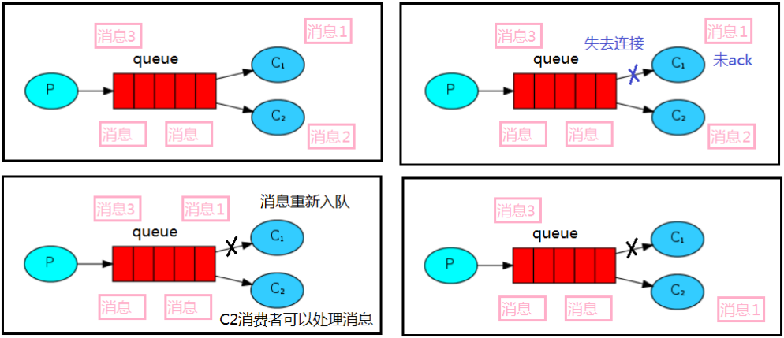

*date: 2022-04-28*


[TOC]

## 概述

### 什么是队列


队列（`Queue`），是一种常见的数据结构，其最大的特性就是先进先出（`Firist In First Out`），作为最基础的数据结构，队列应用很广泛，比如 Redis 的基础数据类型 List，其底层数据结构就是队列。

### 什么是消息队列

消息队列（`Messaeg Queue`），是一种使用队列（Queue）作为底层存储数据结构，可用于解决不同进程与应用之间通讯的分布式消息容器，也称为**消息中间件**。

MQ 是一种跨进程的通信机制，用于上下游传递消息。在互联网架构中，MQ 是一种非常常见的上下游 ''逻辑解耦 + 物理解耦" 的消息通信服务。使用了 MQ 之后，消息发送上游只需要依赖 MQ，不用依赖其他服务。

### 为什么使用消息队列

#### 流量消峰

举个例子，如果订单系统最多能处理一万次订单，这个处理能力应付正常时段的下单时绰绰有余，正常时段我们下单一秒后就能返回结果。但是在高峰期，如果有两万次下单操作系统是处理不了的，只能限制订单超过一万后不允许用户下单。使用消息队列做缓冲，我们可以取消这个限制，把一秒内下的订单分散成一段时间来处理，这时有些用户可能在下单十几秒后才能收到下单成功的操作，但是比不能下单的体验要好。

#### 应用解耦


以电商应用为例，应用中有订单系统、支付系统、库存系统、物流系统。用户创建订单后，如果耦合调用库存系统、物流系统、支付系统，任何一个子系统出了故障，都会造成下单操作异常。当转变成基于消息队列的方式后，系统间调用的问题会减少很多，比如物流系统因为发生故障，需要几分钟来修复。在这几分钟的时间里，物流系统要处理的内存被缓存在消息队列中，用户的下单操作可以正常完成。当物流系统恢复后，继续处理订单信息即可，中单用户感受不到物流系统的故障，提升系统的可用性。

#### 异步处理


有些服务间调用是异步的，例如 A 调用 B，B 需要花费很长时间执行，但是 A 需要知道 B 什么时候可以执行完，以前一般有两种方式，A 过一段时间去调用 B 的查询 api 查询。或者 A 提供一个 callback api，B 执行完之后调用 api 通知 A 服务。这两种方式都不是很优雅，使用消息总线，可以很方便解决这个问题，A 调用 B 服务后，只需要监听 B 处理完成的消息，当 B 处理完成后，会发送一条消息给 MQ，MQ 会将此消息转发给 A 服务。这样 A 服务既不用循环调用 B 的查询 api，也不用提供 callback api。同样 B 服务也不用做这些操作。A 服务还能及时的得到异步处理成功的消息。

### 消息队列的分类

#### ActiveMQ

优点：单机吞吐量万级，时效性 ms 级，可用性高，基于主从架构实现高可用性，消息可靠性较低的概率丢失数据。

缺点：官方社区现在对 ActiveMQ 5.x 维护越来越少，高吞吐量场景较少使用。

#### Kafka

大数据的杀手锏，谈到大数据领域内的消息传输，则绕不开 Kafka，这款为大数据而生的消息中间件，以其百万级 TPS 的吞吐量名声大噪，迅速成为大数据领域的宠儿，在数据采集、传输、存储的过程中发挥着举足轻重的作用。目前已经被 LinkedIn，Uber，Twitter，Netflix 等大公司所采纳。

优点：性能卓越，单机写入 TPS 约在百万条/秒，最大的优点，就是吞吐量高。时效性 ms 级，可用性非常高。kafka 是分布式的，一个数据多个副本，少数机器宕机，不会丢失数据，不会导致不可用，消费者采用 Pull 方式获取消息，消息有序，通过控制能够保证所有消息被消费且仅被消费一次；有优秀的第三方 Kafka Web 管理界面 Kafka-Manager；在日志领域比较成熟，被多家公司和多个开源项目使用；功能支持：功能较为简单，主要支持简单的 MQ 功能，在大数据领域的实时计算以及日志采集被大规模使用。

缺点：Kafka 单机超过 64 个队列/分区，Load 会发生明显的飙高现象，队列越多，Load 越高，发送消息响应时间变长，使用短轮询方式，实时性取决于轮询间隔时间，消费失败不支持重试；支持消息顺序，但是一台代理宕机后，就会产生消息乱序，社区更新较慢。

#### RocketMQ

RocketMQ 出自阿里巴巴的开源产品，用 Java 语言实现，在设计时参考了 Kafka，并做出了自己的一些改进。被阿里巴巴广泛应用在订单，交易，充值，流计算，消息推送，日志流式处理，binglog 分发等场景。

优点：单机吞吐量十万级，可用性非常高，分布式架构，消息可以做到 0 丢失，MQ 功能较为完善，还是分布式的，扩展性好，支持 10 亿级别的消息堆积，不会因为堆积导致性能下降，源码是 Java，可以自己阅读源码，定制自己公司的 MQ。

缺点：支持的客户端语言不多，目前是 Java 及 C++，其中 C++ 不成熟；社区活跃度一般，没有在 MQ 核心中去实现 JMS 等接口，有些系统要迁移需要修改大量代码。

#### RabbitMQ

2007 年发布，是一个在 AMQP（高级消息队列协议）基础上完成的，可复用的企业消息系统，是当前最主流的消息中间件之一。

优点：由于 erlang 语言的高并发特性，性能较好；吞吐量到万级，MQ 功能比较完备，健壮、稳定、易用、跨平台、支持多种语言，如：Python、Ruby、.NET、Java、JMS、C、PHP、ActionScript、XMPP、STOMP 等，支持 AJAX 文档齐全；开源提供的管理界面非常棒，用起来很好用，社区活跃度高；更新频率相当高。

缺点：商业版需要收费，学习成本较高。

### 消息队列的选择

#### Kafka

Kafka 主要特点是基于 Pull 的模式来处理消息消费，追求高吞吐量，一开始的目的就是用于日志收集和传输，适合产生`大量数据`的互联网服务的数据收集业务。`大型公司`建议可以选用，如果有`日志采集`功能，肯定是首选 kafka 了。

#### RocketMQ

天生为`金融互联网`领域而生，对于可靠性要求很高的场景，尤其是电商里面的订单扣款，以及业务削峰，在大量交易涌入时，后端可能无法及时处理的情况。RoketMQ 在稳定性上可能更值得信赖，这些业务场景在阿里双 11 已经经历了多次考验，如果你的业务有上述并发场景，建议可以选择 RocketMQ。

#### RabbitMQ

结合 erlang 语言本身的并发优势，性能好，`时效性微秒级`，`社区活跃度也比较高`，管理界面用起来十分方便，如果你的`数据量没有那么大`，中小型公司优先选择功能比较完备的 RabbitMQ。

## RabbitMQ

官网：https://www.rabbitmq.com/

RabbitMQ 是用 Erlang 语言开发的一个`实现了 AMQP 协议的消息队列服务器`，相比其他同类型的消息队列，最大的特点**在保证可观的单机吞吐量的同时，延时方面也非常出色。**

RabbitMQ 支持多种客户端，比如：Python、Ruby、.NET、Java、JMS、C、PHP、ActionScript、XMPP、STOMP 等。

>AMQP，即 Advanced Message Queuing Protocol，高级消息队列协议，是应用层协议的一个开放标准，为面向消息的中间件设计。

### Docker 安装

下载地址：https://www.rabbitmq.com/download.html

docker 命令安装：

```bash
# 带web端管理系统
$ docker pull rabbitmq:3.11-management

# 15672是web管理端访问端口
$ docker run --name rabbitmq -p 5672:5672 -p 15672:15672 \
-e RABBITMQ_DEFAULT_USER=rbmq \
-e RABBITMQ_DEFAULT_PASS=rbmq \
--hostname=rabbitmqhosta \
-v /home/rabbitmq/data:/var/lib/rabbitmq \
-d rabbitmq:3.11-management
```

docker-compose.yaml 示例：

```yaml
version: "3.4"

networks:
  apps:
    name: apps
    external: false

services:  
  rabbitmq:
    image: rabbitmq:management
    container_name: rabbitmq
    hostname: rabbitmqhosta
    ports:
      - 5672:5672
      - 15672:15672
    volumes:
      - ./rabbitmq/data:/var/lib/rabbitmq
    environment:
      - "RABBITMQ_DEFAULT_USER=rbmq"
      - "RABBITMQ_DEFAULT_PASS=rbmq"
    networks:
      - apps
    restart: on-failure:3
```

说明：

- RabbitMQ 镜像默认不带 Web 端管理插件，指定了镜像 tag 为 3.11-management，表示下载包含 Web 管理插件的镜像版本。`rabbitmq-plugins enable rabbitmq_management`命令，开启 Web 管理插件。
- -p 指定容器内部端口号与宿主机之间的映射，RabbitMQ 默认使用`5672`为数据通信端口，`15672`为 Web 管理界面访问端口。
- `RabbitMQ 默认创建 guest 用户，密码也是 guest`，并且赋予 administrator 角色权限，同时服务监听 5672 端口的 TCP 连接和 15672 端口的 HTTP 连接，此处修改为 rbmq。

### 管理页面

访问 RabbitMQ 的 Web 端管理界面，http://192.168.2.197:15672/：


### 工作原理


#### Broker

`接收和分发消息的应用`，RabbitMQ Server 就是一个 Message Broker。

#### Producer 和 Consumer

生产者与消费者相对于 RabbitMQ 服务器来说，都是 RabbitMQ 服务器的客户端。

- 生产者：`Producer`，连接到 RabbitMQ 服务器，将消息发送到队列，是消息的发送方。
- 消费者：`Consumer`，连接到 RabbitMQ 服务器，并消费队列中的消息，是消息的接收方。

生产者与消费者一般由应用程序充当。

#### Connection

`Connection`是 RabbitMQ 的内部对象之一，用于管理每个 Producer/Consumer 到 RabbitMQ 服务器的`TCP`网络连接。

#### Channel

如果每一次访问 RabbitMQ 都建立一个 Connection，在消息量大的时候，建立 TCP Connection 的开销将是巨大的，效率也较低。`Channel`是在 Connection 内部建立的逻辑连接，如果应用程序支持多线程，通常每个 thread 创建单独的 Channel 进行通讯，AMQP method 包含了 channel id，帮助客户端和 Message Broker 识别 Channel，所以 Channel 之间是完全隔离的。Channel 作为轻量级的 Connection，极大减少了操作系统建立 TCP Connection 的开销。

Channel 是我们与 RabbitMQ 打交道的最重要的一个接口，我们大部分的业务操作是在 Channel 这个接口中完成的，包括定义 Queue 和 Exchange、绑定 Queue 和 Exchange、发布消息等。

#### Exchange

`Exchange`，消息交换机，作用是接收来自 Producer 的消息，根据分发规则，匹配查询表中的 routing key，分发消息到所绑定（binding）的 Queue。

#### Queue

`Queue`，即队列，RabbitMQ 内部用于存储消息的对象，**是真正用存储消息的结构**，在生产端，生产者的消息最终发送到指定队列，而消费者也是通过订阅某个队列，达到获取消息的目的。

#### Binding

Exchange 和 Queue 之间的虚拟连接，Binding 中可以包含 routing key，Binding 信息被保存到 Exchange 中的查询表中，用于 Message 的分发依据。

`Binding`是一种操作，**其作用是建立消息从 Exchange 转发到 Queue 的规则**，在进行 Exchange 与 Queue 的绑定时，需要指定一个`BindingKey`。**Binding 操作一般用于 RabbitMQ 的路由工作模式和主题工作模式。**

>`BindingKey`的概念，在 RabbitMQ 的工作模式章节会详细讲解。

#### Virtual Host

`Virutal Host`也叫虚拟主机，其作用是**应用隔离与权限划分**，Virtual Host 是 RabbitMQ 中最小颗粒的权限单位划分。一个 Virtual Host 下面有一组不同 Exchnage 与 Queue，不同的 Virtual Host 的 Exchnage 与 Queue 之间互相不影响。

Virutal Host 是出于多租户和安全因素设计的，把 AMQP 的基本组件划分到一个虚拟的分组中，类似于网络中的 Namespace 概念。当多个不同的用户使用同一个 RabbitMQ Server 提供的服务时，可以划分出多个 vhost，每个用户在自己的 vhost 中创建 Exchange 和 Queue。

### 工作模式

RabbitMQ 一共有六种工作模式，分别为`简单模式`、`工作队列模式`、`发布/订阅模式`、`路由模式`、`主题模式`和`RPC 模式`，其中，RPC 模式并不常用。

#### 简单模式（Simple）


- **是 RabbitMQ 最简单的一种模式，只有一个生产者、一个消费者和一个队列。**
- **生产者和消费者在发送和接收消息时，只需要指定队列名，而不需要指定发送到哪个 Exchange，RabbitMQ 服务器会自动使用 Virtual Host 默认的 Exchange，默认 Exchange 的 type 为`direct`。**

#### 工作队列模式（Work）


- **可以有多个消费者，但一条消息只能被一个消费者获取。**
- **发送到队列中的消息，由服务器轮询分配给不同消费者进行消费。**

#### 发布/订阅模式（Pub/Sub）


- **发布/订阅模式中，Echange 的 type 为`fanout`。**
- **生产者发送消息时，不需要指定具体的队列名，Exchange 会将收到的消息转发到所绑定的队列。**
- **消息被 Exchange 转到多个队列，一条消息可以被多个消费者获取。**

#### 路由模式（Routing）


- **路由模式下 Exchange 的 type 为`direct`。**
- **消息的目标队列可以由生产者按照 RoutingKey 规则指定。**
- **消费者通过 BindingKey 绑定自己所关心的队列。**
- **一条消息可以被多个消息者获取。**

>`RoutingKey`用于生产者指定 Exchange 最终将消息路由到哪个队列，`BindingKey`用于消费者绑定到某个队列。

#### 主题模式


- **主题模式是在路由模式的基础上，将路由键和某模式进行匹配。其中`#`表示匹配多个词，`*`表示匹配一个词，消费者可以通过某种模式的 BindKey 来达到订阅某个主题消息的目的。**
- **主题模式下 Exchange 的 type 取值为`topic`。**
- **一条消息可以被多个消费者获取。**

#### RPC 模式


## Hello World

参考：https://www.rabbitmq.com/tutorials/tutorial-one-java.html

### 模型


### 代码示例

构建 Spring Boot 项目。

**pom.xml：**

```xml
<?xml version="1.0" encoding="UTF-8"?>
<project xmlns="http://maven.apache.org/POM/4.0.0"
         xmlns:xsi="http://www.w3.org/2001/XMLSchema-instance"
         xsi:schemaLocation="http://maven.apache.org/POM/4.0.0 http://maven.apache.org/xsd/maven-4.0.0.xsd">
    <modelVersion>4.0.0</modelVersion>

    <groupId>cn.xisun.rabbitmq</groupId>
    <artifactId>xisun-rabbitmq</artifactId>
    <version>1.0-SNAPSHOT</version>

    <parent>
        <groupId>org.springframework.boot</groupId>
        <artifactId>spring-boot-starter-parent</artifactId>
        <version>3.1.4</version>
    </parent>

    <properties>
        <maven.compiler.source>17</maven.compiler.source>
        <maven.compiler.target>17</maven.compiler.target>
        <project.build.sourceEncoding>UTF-8</project.build.sourceEncoding>
    </properties>

    <dependencies>

        <dependency>
            <groupId>org.projectlombok</groupId>
            <artifactId>lombok</artifactId>
        </dependency>

        <dependency>
            <groupId>org.springframework.boot</groupId>
            <artifactId>spring-boot-starter-web</artifactId>
        </dependency>

        <!-- RabbitMQ场景启动器-->
        <dependency>
            <groupId>org.springframework.boot</groupId>
            <artifactId>spring-boot-starter-amqp</artifactId>
        </dependency>

        <!-- RabbitMQ测试依赖-->
        <dependency>
            <groupId>org.springframework.amqp</groupId>
            <artifactId>spring-rabbit-test</artifactId>
            <scope>test</scope>
        </dependency>
    </dependencies>

    <build>
        <plugins>
            <plugin>
                <groupId>org.springframework.boot</groupId>
                <artifactId>spring-boot-maven-plugin</artifactId>
            </plugin>
        </plugins>
    </build>

</project>
```

> Spring Boot 的 autoconfigue 包中，配置了 org.springframework.boot.autoconfigure.amqp.RabbitAutoConfiguration，`RabbitAutoConfiguration`定义了 RabbitMQ 的自动配置行为：
>
> ```java
> /**
>  * {@link EnableAutoConfiguration Auto-configuration} for {@link RabbitTemplate}.
>  * <p>
>  * This configuration class is active only when the RabbitMQ and Spring AMQP client
>  * libraries are on the classpath.
>  * <p>
>  * Registers the following beans:
>  * <ul>
>  * <li>{@link org.springframework.amqp.rabbit.core.RabbitTemplate RabbitTemplate} if there
>  * is no other bean of the same type in the context.</li>
>  * <li>{@link org.springframework.amqp.rabbit.connection.CachingConnectionFactory
>  * CachingConnectionFactory} instance if there is no other bean of the same type in the
>  * context.</li>
>  * <li>{@link org.springframework.amqp.core.AmqpAdmin } instance as long as
>  * {@literal spring.rabbitmq.dynamic=true}.</li>
>  * </ul>
>  *
>  * @author Greg Turnquist
>  * @author Josh Long
>  * @author Stephane Nicoll
>  * @author Gary Russell
>  * @author Phillip Webb
>  * @author Artsiom Yudovin
>  * @author Chris Bono
>  * @author Moritz Halbritter
>  * @author Andy Wilkinson
>  * @since 1.0.0
>  */
> @AutoConfiguration
> @ConditionalOnClass({ RabbitTemplate.class, Channel.class })
> @EnableConfigurationProperties(RabbitProperties.class)
> @Import({ RabbitAnnotationDrivenConfiguration.class, RabbitStreamConfiguration.class })
> public class RabbitAutoConfiguration {
> }
> ```

**application.yaml：**

```yaml
spring:
  rabbitmq:
    host: 192.168.2.100
    port: 5672
    username: rbmq
    password: rbmq
```

**生产者：**

```java
package cn.xisun.rabbitmq.demo;

import com.rabbitmq.client.Channel;
import com.rabbitmq.client.Connection;
import com.rabbitmq.client.ConnectionFactory;
import lombok.extern.slf4j.Slf4j;

import java.io.IOException;
import java.util.concurrent.TimeoutException;

/**
 * @author XiSun
 * @since 2023/10/12 22:33
 */
@Slf4j
public class Producer {

    // 队列名称
    private final static String QUEUE_NAME = "hello";

    public static void main(String[] args) {
        // 创建一个连接工厂
        ConnectionFactory factory = new ConnectionFactory();
        factory.setHost("192.168.2.100");
        factory.setUsername("rbmq");
        factory.setPassword("rbmq");
        
        // channel实现了自动close接口，自动关闭，不需要显式关闭
        try (Connection connection = factory.newConnection();
             Channel channel = connection.createChannel()) {
            /*
             * 生成一个队列：
             * 参数1：队列名称
             * 参数2：队列里面的消息是否持久化，默认消息存储在内存中
             * 参数3：该队列是否只供一个消费者进行消费，消息是否进行共享，true表示可以多个消费者消费，false表示只能一个消费者消费
             * 参数4：是否自动删除，最后一个消费者端开连接以后，该队列是否自动删除，true表示自动删除，false表示不自动删除
             * 参数5：其他参数，本示例暂不添加
             */
            channel.queueDeclare(QUEUE_NAME, false, false, false, null);
            
            String message = "hello world";
            /*
             * 发送一个消息：
             * 参数1：发送到哪个交换机，本示例使用的是默认的交换机
             * 参数2：路由的key是哪个，本示例使用的是队列的名称
             * 参数3：其他的参数信息，本示例暂不添加
             * 参数4：发送消息的消息体
             */
            channel.basicPublish("", QUEUE_NAME, null, message.getBytes());
            log.info("消息发送完毕");
        } catch (IOException | TimeoutException e) {
            throw new RuntimeException(e);
        }
    }
}
```

**消费者：**

```java
package cn.xisun.rabbitmq.demo;

import com.rabbitmq.client.*;
import lombok.extern.slf4j.Slf4j;

import java.io.IOException;
import java.util.concurrent.TimeoutException;

/**
 * @author XiSun
 * @since 2023/10/12 22:33
 */
@Slf4j
public class Consumer {

    // 队列名称
    private final static String QUEUE_NAME = "hello";

    public static void main(String[] args) {
        ConnectionFactory factory = new ConnectionFactory();
        factory.setHost("192.168.2.100");
        factory.setUsername("rbmq");
        factory.setPassword("rbmq");
        
        try (Connection connection = factory.newConnection();
             Channel channel = connection.createChannel()) {
            log.info("等待接收消息....");

            // 推送的消息如何进行消费的接口回调
            DeliverCallback deliverCallback = (consumerTag, delivery) -> {
                String message = new String(delivery.getBody());
                log.info("消费的消息是：{}", message);
            };

            // 取消消费的一个回调接口，如在消费的时候队列被删除掉了
            CancelCallback cancelCallback = (consumerTag) -> {
                log.info("消息消费被中断");
            };
            
            /*
             * 消费者消费消息：
             * 参数1：消费哪个队列
             * 参数2：消费成功之后是否要自动应答，true表示自动应答，false表示手动应答
             * 参数3：消费者消费消息成功时的回调
             * 参数4：消费者消费消息失败时的回调
             */
            channel.basicConsume(QUEUE_NAME, true, deliverCallback, cancelCallback);
        } catch (IOException | TimeoutException e) {
            throw new RuntimeException(e);
        }
    }
}
```

**启动生产者：**

```java
10:19:23.058 [main] INFO cn.xisun.rabbitmq.demo.Consumer -- 等待接收消息....
10:19:23.067 [pool-1-thread-4] INFO cn.xisun.rabbitmq.demo.Consumer -- 消费的消息是：hello world
```


**启动消费者：**

```java
10:19:23.058 [main] INFO cn.xisun.rabbitmq.demo.Consumer -- 等待接收消息....
10:19:23.067 [pool-1-thread-4] INFO cn.xisun.rabbitmq.demo.Consumer -- 消费的消息是：hello world
```


## Work Queues

参考：https://www.rabbitmq.com/tutorials/tutorial-two-java.html


`工作队列`，又称任务队列，它的主要思想是**避免立即执行资源密集型任务**，且不得不等待任务完成。相反，可以安排任务在之后执行，把任务封装为消息并将其发送到队列，在后台运行的工作进程将弹出任务并最终执行作业。当有多个工作线程时，这些工作线程将一起处理这些任务。

### 模型


### 轮询分发消息

RabbitMqUtils.java：

```java
/**
 * @author XiSun
 * @since 2023/10/13 10:36
 * <p>
 * Channel工具类
 */
public class RabbitMqUtils {

    /**
     * 获取一个连接的channel
     *
     * @return
     * @throws Exception
     */
    public static Channel getChannel() throws IOException, TimeoutException {
        // 创建一个连接工厂
        ConnectionFactory factory = new ConnectionFactory();
        factory.setHost("192.168.2.100");
        factory.setUsername("rbmq");
        factory.setPassword("rbmq");
        Connection connection = factory.newConnection();
        return connection.createChannel();
    }
}
```

Task01.java：

```java
/**
 * @author XiSun
 * @since 2023/10/13 11:00
 * <p>
 * 轮询分发消息
 */
@Slf4j
public class Task {

    private final static String QUEUE_NAME = "hello";

    public static void main(String[] args) {
        try (Channel channel = RabbitMqUtils.getChannel()) {
            channel.queueDeclare(QUEUE_NAME, false, false, false, null);
            
            // 从控制台当中接受信息
            Scanner scanner = new Scanner(System.in);
            while (scanner.hasNext()) {
                String message = scanner.next();
                channel.basicPublish("", QUEUE_NAME, null, message.getBytes());
                log.info("消息发送完毕：{}", message);
            }
        } catch (IOException | TimeoutException e) {
            throw new RuntimeException(e);
        }
    }
}
```

Work01.java：

```java
/**
 * @author XiSun
 * @since 2023/10/13 10:50
 */
@Slf4j
public class Worker01 {

    private static final String QUEUE_NAME = "hello";

    public static void main(String[] args) {
        try {
            Channel channel = RabbitMqUtils.getChannel();
            
            DeliverCallback deliverCallback = (consumerTag, delivery) -> {
                String message = new String(delivery.getBody());
                log.info("消费的消息是：{}", message);
            };

            CancelCallback cancelCallback = (consumerTag) -> {
                log.info("消息消费被中断");
            };

            log.info("Worker01 消费者启动等待消费......");
            channel.basicConsume(QUEUE_NAME, true, deliverCallback, cancelCallback);
        } catch (IOException | TimeoutException e) {
            throw new RuntimeException(e);
        }
    }
}
```

Work02.java：

```java
/**
 * @author XiSun
 * @since 2023/10/13 10:50
 */
@Slf4j
public class Worker02 {

    private static final String QUEUE_NAME = "hello";

    public static void main(String[] args) {
        try {
            Channel channel = RabbitMqUtils.getChannel();
            
            DeliverCallback deliverCallback = (consumerTag, delivery) -> {
                String message = new String(delivery.getBody());
                log.info("消费的消息是：{}", message);
            };

            CancelCallback cancelCallback = (consumerTag) -> {
                log.info("消息消费被中断");
            };

            log.info("Worker02 消费者启动等待消费......");
            channel.basicConsume(QUEUE_NAME, true, deliverCallback, cancelCallback);
        } catch (IOException | TimeoutException e) {
            throw new RuntimeException(e);
        }
    }
}
```

启动 Task01，Work01，Work02，然后发送消息：

- Task01 控制台：

  ```java
  AA
  11:29:29.039 [main] INFO cn.xisun.rabbitmq.workqueue.Task -- 消息发送完毕：AA
  BB
  11:29:30.695 [main] INFO cn.xisun.rabbitmq.workqueue.Task -- 消息发送完毕：BB
  CC
  11:29:31.813 [main] INFO cn.xisun.rabbitmq.workqueue.Task -- 消息发送完毕：CC
  DD
  11:29:32.754 [main] INFO cn.xisun.rabbitmq.workqueue.Task -- 消息发送完毕：DD
  ```

- Work01 控制台：

  ```java
  11:29:07.137 [main] INFO cn.xisun.rabbitmq.workqueue.Worker01 -- Worker01 消费者启动等待消费......
  11:29:29.041 [pool-1-thread-4] INFO cn.xisun.rabbitmq.workqueue.Worker01 -- 消费的消息是：AA
  11:29:31.815 [pool-1-thread-5] INFO cn.xisun.rabbitmq.workqueue.Worker01 -- 消费的消息是：CC
  ```

- Work02 控制台：

  ```java
  11:29:12.164 [main] INFO cn.xisun.rabbitmq.workqueue.Worker02 -- Worker01 消费者启动等待消费......
  11:29:30.699 [pool-1-thread-4] INFO cn.xisun.rabbitmq.workqueue.Worker02 -- 消费的消息是：BB
  11:29:32.756 [pool-1-thread-5] INFO cn.xisun.rabbitmq.workqueue.Worker02 -- 消费的消息是：DD
  ```

> 注意 Work01 和 Work02 与 demo 示例中的 Consumer 的区别，Consumer 中异常捕获的写法，channel 和 connection 会被关闭，此处没有执行关闭操作。

### 消息应答

消费者完成一个任务可能需要一段时间，如果其中一个消费者在处理一个长的任务，并仅只完成了部分突然挂掉了，会发生什么情况？

RabbitMQ 一旦向消费者传递了一条消息，便立即将该消息标记为删除。在这种情况下，如果突然有个消费者挂掉了，将会丢失该消费者正在处理的消息，以及后续发送给该消费者的消息，因为它无法接收到。

为了保证消息在发送过程中不丢失，RabbitMQ 引入`消息应答机制`，消息应答就是：**消费者在接收到消息并且处理该消息之后，告诉 RabbitMQ 它已经处理了，RabbitMQ 可以把该消息删除了。** 

#### 自动应答

自动应答模式下，消息发送后立即被认为已经传送成功。这种模式需要在**高吞吐量和数据传输安全性方面做权衡**，因为这种模式如果消息在接收到之前，消费者那边出现连接或者 channel 关闭，那么消息就丢失了。另一方面，这种模式消费者那边可以传递过载的消息，**没有对传递的消息数量进行限制**，这样有可能使得消费者这边由于接收太多还来不及处理的消息，导致这些消息的积压，最终使得内存耗尽，这些消费者线程被操作系统杀死。

**因此，自动应答模式，仅适用在消费者可以高效并以某种速率处理这些消息的情况下使用**。

#### 手动应答的方法

##### basicAck

```java
/**
 * Acknowledge one or several received
 * messages. Supply the deliveryTag from the {@link com.rabbitmq.client.AMQP.Basic.GetOk}
 * or {@link com.rabbitmq.client.AMQP.Basic.Deliver} method
 * containing the received message being acknowledged.
 * @see com.rabbitmq.client.AMQP.Basic.Ack
 * @param deliveryTag the tag from the received {@link com.rabbitmq.client.AMQP.Basic.GetOk} or {@link com.rabbitmq.client.AMQP.Basic.Deliver}
 * @param multiple true to acknowledge all messages up to and
 * including the supplied delivery tag; false to acknowledge just
 * the supplied delivery tag.
 * @throws java.io.IOException if an error is encountered
 */
void basicAck(long deliveryTag, boolean multiple) throws IOException;
```

- `肯定确定`：RabbitMQ 已知道该消息，并且成功的处理消息，可以将其丢弃了。

##### basicNack

```java
/**
 * Reject one or several received messages.
 *
 * Supply the <code>deliveryTag</code> from the {@link com.rabbitmq.client.AMQP.Basic.GetOk}
 * or {@link com.rabbitmq.client.AMQP.Basic.Deliver} method containing the message to be rejected.
 * @see com.rabbitmq.client.AMQP.Basic.Nack
 * @param deliveryTag the tag from the received {@link com.rabbitmq.client.AMQP.Basic.GetOk} or {@link com.rabbitmq.client.AMQP.Basic.Deliver}
 * @param multiple true to reject all messages up to and including
 * the supplied delivery tag; false to reject just the supplied
 * delivery tag.
 * @param requeue true if the rejected message(s) should be requeued rather
 * than discarded/dead-lettered
 * @throws java.io.IOException if an error is encountered
 */
void basicNack(long deliveryTag, boolean multiple, boolean requeue) throws IOException;
```

- `否定确认`。

##### basicReject

```java
/**
 * Reject a message. Supply the deliveryTag from the {@link com.rabbitmq.client.AMQP.Basic.GetOk}
 * or {@link com.rabbitmq.client.AMQP.Basic.Deliver} method
 * containing the received message being rejected.
 * @see com.rabbitmq.client.AMQP.Basic.Reject
 * @param deliveryTag the tag from the received {@link com.rabbitmq.client.AMQP.Basic.GetOk} or {@link com.rabbitmq.client.AMQP.Basic.Deliver}
 * @param requeue true if the rejected message should be requeued rather than discarded/dead-lettered
 * @throws java.io.IOException if an error is encountered
 */
void basicReject(long deliveryTag, boolean requeue) throws IOException;
```

- `否定确认`：与 basicNack() 相比，少一个 multiple 参数，表示不处理该消息，而是直接拒绝，可以将其丢弃。

##### multiple 参数


multiple 的 true 和 false 代表不同意思：

- `true`：**表示批量应答 channel 上未应答的消息。**比如，channel 上有传送 tag 的消息 5、6、7 和 8，当前 tag 是 8，此时 5 ~ 8 的这些还未应答的消息，都会被确认收到消息应答。

- `false`：同上面相比，只会应答 tag = 8 的消息，5、6 和 7 这三个消息依然不会被确认收到消息应答。

#### 消息自动重新入队



如果消费者由于某些原因失去连接（其通道已关闭，连接已关闭或 TCP 连接丢失），导致消息未发送 ACK 确认，RabbitMQ 将了解到消息未完全处理，并将对其`重新排队`。如果此时其他消费者可以处理，它将很快将其重新分发给另一个消费者。这样，即使某个消费者偶尔死亡，也可以确保不会丢失任何消息。

#### 手动应答示例

消息`默认采用的是自动应答`，所以要想实现消息消费过程中不丢失，需要把自动应答改为手动应答。

SleepUtils.java：

```java
/**
 * @author XiSun
 * @since 2023/10/13 13:46
 * <p>
 * 睡眠工具类
 */
public class SleepUtils {
    public static void sleep(int second) {
        try {
            Thread.sleep(1000 * second);
        } catch (InterruptedException ignored) {
            Thread.currentThread().interrupt();
        }
    }
}
```

Task02.java：

```java
/**
 * @author XiSun
 * @since 2023/10/13 13:41
 */
@Slf4j
public class Task02 {

    private final static String ACK_QUEUE_NAME = "ack_queue";

    public static void main(String[] args) {
        try (Channel channel = RabbitMqUtils.getChannel()) {
            channel.queueDeclare(ACK_QUEUE_NAME, false, false, false, null);
            
            // 从控制台当中接受信息
            Scanner scanner = new Scanner(System.in);
            while (scanner.hasNext()) {
                String message = scanner.next();
                channel.basicPublish("", ACK_QUEUE_NAME, null, message.getBytes(StandardCharsets.UTF_8));
                log.info("消息发送完毕：{}", message);
            }
        } catch (IOException | TimeoutException e) {
            throw new RuntimeException(e);
        }
    }
}
```

Worker03.java：

```java
/**
 * @author XiSun
 * @since 2023/10/13 13:43
 */
@Slf4j
public class Worker03 {

    private static final String ACK_QUEUE_NAME = "ack_queue";

    public static void main(String[] args) {
        try {
            Channel channel = RabbitMqUtils.getChannel();

            DeliverCallback deliverCallback = (consumerTag, delivery) -> {
                String message = new String(delivery.getBody());
                log.info("消费的消息是：{}", message);
                SleepUtils.sleep(1);
                log.info("消息处理时间较短");
                /*
                 * 参数1：消息标记，tag
                 * 参数2：是否批量应答未应答消息
                 */
                channel.basicAck(delivery.getEnvelope().getDeliveryTag(), false);
            };

            CancelCallback cancelCallback = (consumerTag) -> {
                log.info("消息消费被中断");
            };

            log.info("Worker03 消费者启动等待消费......");
            // 采用手动应答
            boolean autoAck = false;
            channel.basicConsume(ACK_QUEUE_NAME, autoAck, deliverCallback, cancelCallback);
        } catch (IOException | TimeoutException e) {
            throw new RuntimeException(e);
        }
    }
}
```

Worker04.java：

```java
/**
 * @author XiSun
 * @since 2023/10/13 13:43
 */
@Slf4j
public class Worker04 {

    private static final String ACK_QUEUE_NAME = "ack_queue";

    public static void main(String[] args) {
        try {
            Channel channel = RabbitMqUtils.getChannel();

            DeliverCallback deliverCallback = (consumerTag, delivery) -> {
                String message = new String(delivery.getBody());
                log.info("消费的消息是：{}", message);
                SleepUtils.sleep(60);
                log.info("消息处理时间较长");
                /*
                 * 参数1：消息标记，tag
                 * 参数2：是否批量应答未应答消息
                 */
                channel.basicAck(delivery.getEnvelope().getDeliveryTag(), false);
            };

            CancelCallback cancelCallback = (consumerTag) -> {
                log.info("消息消费被中断");
            };

            log.info("Worker04 消费者启动等待消费......");
            // 采用手动应答
            boolean autoAck = false;
            channel.basicConsume(ACK_QUEUE_NAME, autoAck, deliverCallback, cancelCallback);
        } catch (IOException | TimeoutException e) {
            throw new RuntimeException(e);
        }
    }
}
```

启动 Task02，Work03，Work04，然后发送消息：

- Task02 控制台：

  ```java
  aa
  13:59:17.605 [main] INFO cn.xisun.rabbitmq.workqueue.Task02 -- 消息发送完毕：aa
  bb
  13:59:20.223 [main] INFO cn.xisun.rabbitmq.workqueue.Task02 -- 消息发送完毕：bb
  cc
  13:59:22.348 [main] INFO cn.xisun.rabbitmq.workqueue.Task02 -- 消息发送完毕：cc
  dd
  13:59:25.235 [main] INFO cn.xisun.rabbitmq.workqueue.Task02 -- 消息发送完毕：dd
  ```

- Work03 控制台：

  ```java
  13:59:10.675 [main] INFO cn.xisun.rabbitmq.workqueue.Worker03 -- Worker03 消费者启动等待消费......
  13:59:17.609 [pool-1-thread-4] INFO cn.xisun.rabbitmq.workqueue.Worker03 -- 消费的消息是：aa
  13:59:18.620 [pool-1-thread-4] INFO cn.xisun.rabbitmq.workqueue.Worker03 -- 消息处理时间较短
  13:59:22.349 [pool-1-thread-5] INFO cn.xisun.rabbitmq.workqueue.Worker03 -- 消费的消息是：cc
  13:59:23.357 [pool-1-thread-5] INFO cn.xisun.rabbitmq.workqueue.Worker03 -- 消息处理时间较短
  13:59:33.223 [pool-1-thread-6] INFO cn.xisun.rabbitmq.workqueue.Worker03 -- 消费的消息是：bb
  13:59:34.229 [pool-1-thread-6] INFO cn.xisun.rabbitmq.workqueue.Worker03 -- 消息处理时间较短
  13:59:34.229 [pool-1-thread-6] INFO cn.xisun.rabbitmq.workqueue.Worker03 -- 消费的消息是：dd
  13:59:35.241 [pool-1-thread-6] INFO cn.xisun.rabbitmq.workqueue.Worker03 -- 消息处理时间较短
  ```

- Work04 控制台：

  ```java
  13:59:13.527 [main] INFO cn.xisun.rabbitmq.workqueue.Worker04 -- Worker04 消费者启动等待消费......
  13:59:20.227 [pool-1-thread-4] INFO cn.xisun.rabbitmq.workqueue.Worker04 -- 消费的消息是：bb
  ```

从结果中可以看出，第一条消息 aa，由 Work03 消费处理，第二条消息 bb，由 Work04 消费处理，第三条消息 cc，由 Work03 消费处理。第四条消息 dd，轮询应该由 Work04 消费处理，但因为 Work04 处理的消息 bb 耗时较久，还没结束任务，如果此时关闭 Work04 服务，可以看到，消息 bb 和消息 dd，都会转发到 Work03 进行处理。（**消息 bb 没有丢失，自动重新入队了**）

### 持久化

刚刚已经看到了如何处理任务不丢失的情况，但是如何保障当 RabbitMQ 服务停掉以后，消息生产者发送过来的消息不丢失呢？

默认情况下 RabbitMQ 退出或由于某种原因崩溃时，它会忽视队列和消息，除非告知它不要这样做。确保消息不会丢失需要做两件事：**需要将队列和消息都标记为持久化**。

#### 队列实现持久化

之前创建的队列都是非持久化的，RabbitMQ 如果重启，该队列就会被删除掉，如果要队列实现持久化，需要在`声明队列的时候把 durable 参数设置为持久化`。

```java
// 设置队列持久化
boolean durable = true;
channel.queueDeclare(ACK_QUEUE_NAME, durable, false, false, null);
```

>如果之前声明的队列不是持久化的，需要把原先队列先删除，或者重新创建一个持久化的队列，不然会出现错误：
>
>```java
>Caused by: com.rabbitmq.client.ShutdownSignalException: channel error; protocol method: #method<channel.close>(reply-code=406, reply-text=PRECONDITION_FAILED - inequivalent arg 'durable' for queue 'ack_queue' in vhost '/': received 'true' but current is 'false', class-id=50, method-id=10)
>	at com.rabbitmq.client.impl.ChannelN.asyncShutdown(ChannelN.java:517)
>	at com.rabbitmq.client.impl.ChannelN.processAsync(ChannelN.java:341)
>	at com.rabbitmq.client.impl.AMQChannel.handleCompleteInboundCommand(AMQChannel.java:185)
>	at com.rabbitmq.client.impl.AMQChannel.handleFrame(AMQChannel.java:117)
>	at com.rabbitmq.client.impl.AMQConnection.readFrame(AMQConnection.java:746)
>	at com.rabbitmq.client.impl.AMQConnection.access$300(AMQConnection.java:47)
>	at com.rabbitmq.client.impl.AMQConnection$MainLoop.run(AMQConnection.java:673)
>	at java.base/java.lang.Thread.run(Thread.java:833)
>```

非持久化的队列：


持久化的队列：


> 持久化的队列，即使 RabbitMQ 服务重新启动，也依然会存在。

#### 消息实现持久化

要想让消息实现持久化，需要在消息生产者修改代码，添加`MessageProperties.PERSISTENT_TEXT_PLAIN`这个属性。

```java
// 当durable为true的时候，添加MessageProperties.PERSISTENT_TEXT_PLAIN参数，设置消息持久化
channel.basicPublish("", ACK_QUEUE_NAME, MessageProperties.PERSISTENT_TEXT_PLAIN, message.getBytes(StandardCharsets.UTF_8));
```

> **将消息标记为持久化，并不能完全保证不会丢失消息。**尽管它告诉 RabbitMQ 需要将消息保存到磁盘，但是这里依然存在，当消息准备存储到磁盘的时候，此时消息还在缓存中，并没有真正写入磁盘。如果这个时候服务宕机，这些缓存中的消息也会丢失。
>
> 因此，单单添加 MessageProperties.PERSISTENT_TEXT_PLAIN 属性的持久性保证并不强，但是对于简单任务队列而言，这已经绰绰有余了。如果需要更强有力的持久化策略，参考后边 "发布确认" 章节。

### 公平分发

RabbitMQ 分发消息采用的轮询分发，但是在某种场景下这种策略并不是很好，比如有两个消费者在处理任务，其中有个消费者 1 处理任务的速度非常快，而另外一个消费者 2 处理速度却很慢，这个时候继续采用轮询分发，就会导致处理速度快的这个消费者很大一部分时间处于空闲状态，而处理慢的那个消费者一直在满负载。对于这种情况，轮询分发这种分发方式，就存在着缺陷。

为了避免这种情况，可以在消费者端设置参数`channel.basicQos(1)`：


```java
Channel channel = RabbitMqUtils.getChannel();
// 设置公平分发，默认为0（此处设置的，实际上就是一个预取值）
int prefetchCount = 1;
channel.basicQos(prefetchCount);
```

- 消费者设置公平分发后，如果当前任务未处理完或者还没有应答，就不继续分配新任务给当前消费者，RabbitMQ 会把新任务分配给其他空闲消费者。
- 如果所有的消费者都没有完成拿到的任务，队列还在不停的添加新任务，队列有可能就会遇到被撑满的情况，这个时候就只能添加新的消费者，或者改变其他存储任务的策略。

控制台：


重新启动 Task02，Work03，Work04，然后发送消息：

- Task02 控制台：

  ```java
  AA
  16:45:21.596 [main] INFO cn.xisun.rabbitmq.workqueue.ack.Task02 -- 消息发送完毕：AA
  BB
  16:45:23.848 [main] INFO cn.xisun.rabbitmq.workqueue.ack.Task02 -- 消息发送完毕：BB
  CC
  16:45:28.201 [main] INFO cn.xisun.rabbitmq.workqueue.ack.Task02 -- 消息发送完毕：CC
  DD
  16:45:29.752 [main] INFO cn.xisun.rabbitmq.workqueue.ack.Task02 -- 消息发送完毕：DD				# DD消息发送后，等Work03消费完BB消息，再继续发送新的消息
  EE
  16:46:46.978 [main] INFO cn.xisun.rabbitmq.workqueue.ack.Task02 -- 消息发送完毕：EE
  FF
  16:46:48.844 [main] INFO cn.xisun.rabbitmq.workqueue.ack.Task02 -- 消息发送完毕：FF
  ```

- Work03 控制台：

  ```java
  16:41:10.985 [main] INFO cn.xisun.rabbitmq.workqueue.ack.Worker03 -- Worker03 消费者启动等待消费......
  16:45:21.601 [pool-1-thread-4] INFO cn.xisun.rabbitmq.workqueue.ack.Worker03 -- 消费的消息是：AA
  16:45:22.606 [pool-1-thread-4] INFO cn.xisun.rabbitmq.workqueue.ack.Worker03 -- 消息处理时间较短
  16:45:28.202 [pool-1-thread-5] INFO cn.xisun.rabbitmq.workqueue.ack.Worker03 -- 消费的消息是：CC
  16:45:29.216 [pool-1-thread-5] INFO cn.xisun.rabbitmq.workqueue.ack.Worker03 -- 消息处理时间较短
  16:45:29.753 [pool-1-thread-6] INFO cn.xisun.rabbitmq.workqueue.ack.Worker03 -- 消费的消息是：DD
  16:45:30.757 [pool-1-thread-6] INFO cn.xisun.rabbitmq.workqueue.ack.Worker03 -- 消息处理时间较短
  16:46:46.979 [pool-1-thread-7] INFO cn.xisun.rabbitmq.workqueue.ack.Worker03 -- 消费的消息是：EE
  16:46:47.992 [pool-1-thread-7] INFO cn.xisun.rabbitmq.workqueue.ack.Worker03 -- 消息处理时间较短
  ```

- Work04 控制台：

  ```java
  16:41:13.445 [main] INFO cn.xisun.rabbitmq.workqueue.ack.Worker04 -- Worker04 消费者启动等待消费......
  16:45:23.852 [pool-1-thread-4] INFO cn.xisun.rabbitmq.workqueue.ack.Worker04 -- 消费的消息是：BB
  16:46:23.866 [pool-1-thread-4] INFO cn.xisun.rabbitmq.workqueue.ack.Worker04 -- 消息处理时间较长
  16:46:48.845 [pool-1-thread-5] INFO cn.xisun.rabbitmq.workqueue.ack.Worker04 -- 消费的消息是：FF
  16:47:48.856 [pool-1-thread-5] INFO cn.xisun.rabbitmq.workqueue.ack.Worker04 -- 消息处理时间较长
  ```

### 预取值

生产者消息的发送是异步执行的，来自消费者的手动确认本质上也是异步的，在任何时候，channel 上肯定不止只有一个消息，channel 上存在一个**未确认的消息缓冲区**。对于这个消息缓冲区，**需要限制其大小，以避免缓冲区存在无限制的未确认消息。**此时，可以通过使用`channel.basicQos(int prefetchCount)`方法设置`预取计数值`来完成的。

`预取值可以定义 channel 上允许的未确认消息的最大数量`。一旦 channel 达到配置的数量，RabbitMQ 将停止在该 channel 上传递更多消息，除非`至少有一个未处理的消息被确认了`。


例如，假设在通道上有未确认的消息 5、6、7，8，并且通道的预取值设置为 4，此时 RabbitMQ 将不会在该通道上再传递任何消息，除非至少有一个未应答的消息被 ACK。假设 tag = 6 这个消息刚刚被确认 ACK，RabbitMQ 将会感知到这个情况，然后会再发送一条消息到该通道上。


**消息应答和 QoS 预取值对用户吞吐量有重大影响。**通常，增加预取值将提高向消费者传递消息的速度。**虽然自动应答传输消息速率是最佳的，但是，在这种情况下已传递但尚未处理的消息的数量也会增加，从而增加了消费者的 RAM 消耗**（内存）。

应该小心使用具有无限预处理的自动确认模式或手动确认模式，消费者消费了大量的消息如果没有确认的话，会导致消费者连接节点的内存消耗变大，找到合适的预取值是一个反复试验的过程，不同的负载该值取值也不同。`通常，100 ~ 300 范围内的值可提供最佳的吞吐量，并且不会给消费者带来太大的风险。`预取值为 1 是最保守的，这将使吞吐量变得很低，特别是在消费者连接等待时间较长的环境中，比如连接延迟很严重。

Task03.java：

```java
/**
 * @author XiSun
 * @since 2023/10/13 13:41
 * <p>
 * 预取值
 */
@Slf4j
public class Task03 {

    private final static String ACK_QUEUE_NAME = "prefetch_queue";

    public static void main(String[] args) {
        try (Channel channel = RabbitMqUtils.getChannel()) {
            // 设置队列持久化
            boolean durable = true;
            channel.queueDeclare(ACK_QUEUE_NAME, durable, false, false, null);
            
            // 从控制台当中接受信息
            Scanner scanner = new Scanner(System.in);
            while (scanner.hasNext()) {
                String message = scanner.next();
                // 当durable为true的时候，添加MessageProperties.PERSISTENT_TEXT_PLAIN参数，设置消息持久化
                channel.basicPublish("", ACK_QUEUE_NAME, MessageProperties.PERSISTENT_TEXT_PLAIN, message.getBytes(StandardCharsets.UTF_8));
                log.info("消息发送完毕：{}", message);
            }
        } catch (IOException | TimeoutException e) {
            throw new RuntimeException(e);
        }
    }
}
```

Work05.java：

```java
/**
 * @author XiSun
 * @since 2023/10/13 13:43
 */
@Slf4j
public class Worker05 {

    private static final String ACK_QUEUE_NAME = "prefetch_queue";

    public static void main(String[] args) {
        try {
            Channel channel = RabbitMqUtils.getChannel();
            
            // 预取值设置为2
            int prefetchCount = 2;
            channel.basicQos(prefetchCount);

            DeliverCallback deliverCallback = (consumerTag, delivery) -> {
                String message = new String(delivery.getBody());
                log.info("消费的消息是：{}", message);
                SleepUtils.sleep(10);
                log.info("消息处理时间较快");
                /*
                 * 参数1：消息标记，tag
                 * 参数2：是否批量应答未应答消息
                 */
                channel.basicAck(delivery.getEnvelope().getDeliveryTag(), false);
            };

            CancelCallback cancelCallback = (consumerTag) -> {
                log.info("消息消费被中断");
            };

            log.info("Worker05 消费者启动等待消费......");
            // 采用手动应答
            boolean autoAck = false;
            channel.basicConsume(ACK_QUEUE_NAME, autoAck, deliverCallback, cancelCallback);
        } catch (IOException | TimeoutException e) {
            throw new RuntimeException(e);
        }
    }
}
```

Work06.java：

```java
/**
 * @author XiSun
 * @since 2023/10/13 13:43
 */
@Slf4j
public class Worker06 {

    private static final String ACK_QUEUE_NAME = "prefetch_queue";

    public static void main(String[] args) {
        try {
            Channel channel = RabbitMqUtils.getChannel();
            
            // 设置预取值为5
            int prefetchCount = 5;
            channel.basicQos(prefetchCount);

            DeliverCallback deliverCallback = (consumerTag, delivery) -> {
                String message = new String(delivery.getBody());
                log.info("消费的消息是：{}", message);
                SleepUtils.sleep(20);
                log.info("消息处理时间很慢");
                /*
                 * 参数1：消息标记，tag
                 * 参数2：是否批量应答未应答消息
                 */
                channel.basicAck(delivery.getEnvelope().getDeliveryTag(), false);
            };

            CancelCallback cancelCallback = (consumerTag) -> {
                log.info("消息消费被中断");
            };

            log.info("Worker04 消费者启动等待消费......");
            // 采用手动应答
            boolean autoAck = false;
            channel.basicConsume(ACK_QUEUE_NAME, autoAck, deliverCallback, cancelCallback);
        } catch (IOException | TimeoutException e) {
            throw new RuntimeException(e);
        }
    }
}
```

启动 Task03，Work05，Work06，然后发送消息：

- Task03 控制台：

  ```java
  11
  17:46:25.849 [main] INFO cn.xisun.rabbitmq.workqueue.prefetch.Task03 -- 消息发送完毕：11
  22
  17:46:26.626 [main] INFO cn.xisun.rabbitmq.workqueue.prefetch.Task03 -- 消息发送完毕：22
  33
  17:46:27.262 [main] INFO cn.xisun.rabbitmq.workqueue.prefetch.Task03 -- 消息发送完毕：33
  44
  17:46:28.018 [main] INFO cn.xisun.rabbitmq.workqueue.prefetch.Task03 -- 消息发送完毕：44
  55
  17:46:28.707 [main] INFO cn.xisun.rabbitmq.workqueue.prefetch.Task03 -- 消息发送完毕：55
  66
  17:46:29.394 [main] INFO cn.xisun.rabbitmq.workqueue.prefetch.Task03 -- 消息发送完毕：66
  77
  17:46:30.053 [main] INFO cn.xisun.rabbitmq.workqueue.prefetch.Task03 -- 消息发送完毕：77
  ```

- Work05 控制台：

  ```java
  17:46:11.322 [main] INFO cn.xisun.rabbitmq.workqueue.prefetch.Worker05 -- Worker05 消费者启动等待消费......
  17:46:25.853 [pool-1-thread-4] INFO cn.xisun.rabbitmq.workqueue.prefetch.Worker05 -- 消费的消息是：11
  17:46:35.867 [pool-1-thread-4] INFO cn.xisun.rabbitmq.workqueue.prefetch.Worker05 -- 消息处理时间较快
  17:46:35.870 [pool-1-thread-5] INFO cn.xisun.rabbitmq.workqueue.prefetch.Worker05 -- 消费的消息是：33
  17:46:45.872 [pool-1-thread-5] INFO cn.xisun.rabbitmq.workqueue.prefetch.Worker05 -- 消息处理时间较快
  ```

- Work06 控制台：

  ```java
  17:46:14.193 [main] INFO cn.xisun.rabbitmq.workqueue.prefetch.Worker06 -- Worker04 消费者启动等待消费......
  17:46:26.629 [pool-1-thread-4] INFO cn.xisun.rabbitmq.workqueue.prefetch.Worker06 -- 消费的消息是：22
  17:46:46.639 [pool-1-thread-4] INFO cn.xisun.rabbitmq.workqueue.prefetch.Worker06 -- 消息处理时间很慢
  17:46:46.640 [pool-1-thread-5] INFO cn.xisun.rabbitmq.workqueue.prefetch.Worker06 -- 消费的消息是：44
  17:47:06.641 [pool-1-thread-5] INFO cn.xisun.rabbitmq.workqueue.prefetch.Worker06 -- 消息处理时间很慢
  17:47:06.641 [pool-1-thread-5] INFO cn.xisun.rabbitmq.workqueue.prefetch.Worker06 -- 消费的消息是：55
  17:47:26.646 [pool-1-thread-5] INFO cn.xisun.rabbitmq.workqueue.prefetch.Worker06 -- 消息处理时间很慢
  17:47:26.647 [pool-1-thread-5] INFO cn.xisun.rabbitmq.workqueue.prefetch.Worker06 -- 消费的消息是：66
  17:47:46.656 [pool-1-thread-5] INFO cn.xisun.rabbitmq.workqueue.prefetch.Worker06 -- 消息处理时间很慢
  17:47:46.656 [pool-1-thread-5] INFO cn.xisun.rabbitmq.workqueue.prefetch.Worker06 -- 消费的消息是：77
  17:48:06.661 [pool-1-thread-5] INFO cn.xisun.rabbitmq.workqueue.prefetch.Worker06 -- 消息处理时间很慢
  ```

当 Task03 发送消息时，以一个较快的速度，连续发送 7 条消息。从结果可以看到，虽然 Work05 的消息处理时间较快，Work06 的消息处理时间很慢，但是因为 Work05 的预取值为 2，Work06 的预取值为 5，最后，Work05 只处理了 2 条消息，而 Work06 处理了 5 条消息。

## Publish/Subscribe

参考：https://www.rabbitmq.com/tutorials/tutorial-three-java.html

### 模型


### 交换机（Exchange）

RabbitMQ 消息传递模型的核心思想是：`生产者生产的消息从不会直接发送到队列`。实际上，通常生产者甚至都不知道这些消息传递到了哪些队列中。


生产者只能将消息发送到`交换机`（Exchange），交换机工作的内容非常简单，**一方面它接收来自生产者的消息，另一方面将它们推入队列。**交换机必须确切知道如何处理收到的消息，是把这些消息放到特定队列，还是放到许多队列，还是直接丢弃，而这些选择是由交换机的类型来决定的。

#### 交换机类型

交换机类型（`Exchange Type`）有四种：**`direct`**，**`topic`**，**`fanout`**，**`headers`**，其中 headers 不常用。

- **direct**：模式处理路由键（RoutingKey），需要路由键完全匹配的队列才能收到消息。**`路由模式`**使用的是 direct 类型的交换机。
- **topic**：将路由键和某模式进行匹配。**`主题模式`**使用的是 topic 类型的交换机。
- **fanout**：这种类型不处理路由键，很像子网广播，每台子网内的主机都获得了一份复制的消息。**`发布/订阅模式`**使用的是 fanout 类型de 交换机。**fanout 类型交换机的转发消息是最快的。**

#### 无名交换机

在前面的示例代码中，并没有明确指定 Exchange，但仍然能够将消息发送到队列，这是因为使用了默认的 Exchange：

```java
channel.basicPublish("", queueName, MessageProperties.PERSISTENT_TEXT_PLAIN, message.getBytes());
```

- 第一个参数是交换机的名称，**空字符串表示默认或无名称交换机**。消息能路由发送到队列中其实是通过 RoutingKey 和 Bindingkey 所绑定的 key 指定的，但前提是 key 对应的队列存在。

>发布消息的方法：
>
>```java
>/**
> * Publish a message.
> *
> * Publishing to a non-existent exchange will result in a channel-level
> * protocol exception, which closes the channel.
> *
> * Invocations of <code>Channel#basicPublish</code> will eventually block if a
> * <a href="https://www.rabbitmq.com/alarms.html">resource-driven alarm</a> is in effect.
> *
> * @see com.rabbitmq.client.AMQP.Basic.Publish
> * @see <a href="https://www.rabbitmq.com/alarms.html">Resource-driven alarms</a>
> * @param exchange the exchange to publish the message to
> * @param routingKey the routing key
> * @param props other properties for the message - routing headers etc
> * @param body the message body
> * @throws java.io.IOException if an error is encountered
> */
>void basicPublish(String exchange, String routingKey, BasicProperties props, byte[] body) throws IOException;
>
>/**
> * Publish a message.
> *
> * Invocations of <code>Channel#basicPublish</code> will eventually block if a
> * <a href="https://www.rabbitmq.com/alarms.html">resource-driven alarm</a> is in effect.
> *
> * @see com.rabbitmq.client.AMQP.Basic.Publish
> * @see <a href="https://www.rabbitmq.com/alarms.html">Resource-driven alarms</a>
> * @param exchange the exchange to publish the message to
> * @param routingKey the routing key
> * @param mandatory true if the 'mandatory' flag is to be set
> * @param props other properties for the message - routing headers etc
> * @param body the message body
> * @throws java.io.IOException if an error is encountered
> */
>void basicPublish(String exchange, String routingKey, boolean mandatory, BasicProperties props, byte[] body)
>        throws IOException;
>
>/**
> * Publish a message.
> *
> * Publishing to a non-existent exchange will result in a channel-level
> * protocol exception, which closes the channel.
> *
> * Invocations of <code>Channel#basicPublish</code> will eventually block if a
> * <a href="https://www.rabbitmq.com/alarms.html">resource-driven alarm</a> is in effect.
> *
> * @see com.rabbitmq.client.AMQP.Basic.Publish
> * @see <a href="https://www.rabbitmq.com/alarms.html">Resource-driven alarms</a>
> * @param exchange the exchange to publish the message to
> * @param routingKey the routing key
> * @param mandatory true if the 'mandatory' flag is to be set
> * @param immediate true if the 'immediate' flag is to be
> * set. Note that the RabbitMQ server does not support this flag.
> * @param props other properties for the message - routing headers etc
> * @param body the message body
> * @throws java.io.IOException if an error is encountered
> */
>void basicPublish(String exchange, String routingKey, boolean mandatory, boolean immediate, BasicProperties props, byte[] body)
>        throws IOException;
>```

### 临时队列

之前的章节，我们使用的是具有特定名称的队列（hello 和 ack_queue 等)。队列的名称是至关重要的，消费者需要指定消费哪个队列的消息。

但某些场景下，比如日志记录器，并非如此。一方面，需要得到所有的日志信息，而不仅仅是其中的一个子集。另一方面，我们只对当前的日志信息感兴趣，而不是旧的日志信息。要满足这样的需求，就可以使用`临时队列`。

如果每次连接到 RabbitMQ 时，都需要一个全新的空队列，为此我们可以创建一个具有**随机名称的队列**，或者让服务器为我们选择一个随机队列名称。其次，**一旦断开了消费者的连接，队列将被自动删除。**

创建临时队列的方法：

```java
String queue = channel.queueDeclare().getQueue();
```


## 发布确认

### 原理

`生产者将信道设置成 confirm 模式后，即可进行发布确认。`信道进入 confirm 模式时，所有在该信道上面发布的消息都将会被指派一个`唯一的 ID`（从 1 开始），一旦消息被投递到所有匹配的队列之后，Broker 就会发送一个 ACK 确认给生产者（包含消息的唯一 ID），这就使得生产者知道消息已经正确到达目的队列了。

如果队列和消息开启了持久化，那么确认消息会在将消息写入磁盘之后发出。Broker 回传给生产者的确认消息中，`delivery-tag 域`包含了确认消息的序列号，此外 Broker 也可以设置 basic.ack 的 `multiple 域`，表示到这个序列号之前的所有消息都已经得到了处理。

confirm 模式最大的好处在于它是异步的，一旦发布一条消息，生产者应用程序就可以在等信道返回确认的同时继续发送下一条消息，当消息最终得到确认之后，生产者应用便可以通过回调方法来处理该确认消息，如果 RabbitMQ 因为自身内部错误导致消息丢失，就会发送一条 NACK 消息，生产者应用程序同样可以在回调方法中处理该 NACK 消息。

### 策略

#### 开启发布确认

`发布确认默认是没有开启的`，如果要开启需要调用 channel 的 `confirmSelect 方法`：

```java
Channel channel = RabbitMqUtils.getChannel();
// 开启发布确认
channel.confirmSelect();
```

#### 单个发布确认

`单个发布确认`是一种简单的确认方式，它是一种**同步确认发布**的方式，也就是发布一个消息之后只有它被确认发布后，后续的消息才能继续发布。

相关方法：

```java
/**
 * Wait until all messages published since the last call have been
 * either ack'd or nack'd by the broker.  Note, when called on a
 * non-Confirm channel, waitForConfirms throws an IllegalStateException.
 * @return whether all the messages were ack'd (and none were nack'd)
 * @throws java.lang.IllegalStateException
 */
boolean waitForConfirms() throws InterruptedException;

/**
 * Wait until all messages published since the last call have been
 * either ack'd or nack'd by the broker; or until timeout elapses.
 * If the timeout expires a TimeoutException is thrown.  When
 * called on a non-Confirm channel, waitForConfirms throws an
 * IllegalStateException.
 * @return whether all the messages were ack'd (and none were nack'd)
 * @throws java.lang.IllegalStateException
 */
boolean waitForConfirms(long timeout) throws InterruptedException, TimeoutException;

/** Wait until all messages published since the last call have
 * been either ack'd or nack'd by the broker.  If any of the
 * messages were nack'd, waitForConfirmsOrDie will throw an
 * IOException.  When called on a non-Confirm channel, it will
 * throw an IllegalStateException.
 * @throws java.lang.IllegalStateException
 */
 void waitForConfirmsOrDie() throws IOException, InterruptedException;

/** Wait until all messages published since the last call have
 * been either ack'd or nack'd by the broker; or until timeout elapses.
 * If the timeout expires a TimeoutException is thrown.  If any of the
 * messages were nack'd, waitForConfirmsOrDie will throw an
 * IOException.  When called on a non-Confirm channel, it will
 * throw an IllegalStateException.
 * @throws java.lang.IllegalStateException
 */
void waitForConfirmsOrDie(long timeout) throws IOException, InterruptedException, TimeoutException;
```

单个发布确认有一个最大的缺点：**发布速度特别的慢**，因为没有确认发布的消息会阻塞所有后续消息的发布。这种方式最多提供**每秒不超过数百条发布消息的吞吐量**。

代码示例：

```java
/**
 * @author XiSun
 * @since 2023/10/13 22:02
 * <p>
 * 单个发布确认
 */
@Slf4j
public class PublishMessageIndividually {

    // 发送消息的数量
    private static final Integer MESSAGE_COUNT = 1000;

    public static void publishMessageIndividually() {
        try (Channel channel = RabbitMqUtils.getChannel()) {
            // 开启发布确认
            channel.confirmSelect();

            String queueName = "individually_queue";
            channel.queueDeclare(queueName, true, false, false, null);

            // 开始时间
            long begin = System.currentTimeMillis();
            for (int i = 0; i < MESSAGE_COUNT; i++) {
                String message = i + "";
                channel.basicPublish("", queueName, MessageProperties.PERSISTENT_TEXT_PLAIN, message.getBytes());
                // 服务端返回false或超时时间内未返回，生产者可以消息重发
                channel.waitForConfirms();
            }
            // 结束时间
            long end = System.currentTimeMillis();

            log.info("{} 个消息单独发布确认，耗时：{} ms", MESSAGE_COUNT, (end - begin));
        } catch (IOException | InterruptedException | TimeoutException e) {
            throw new RuntimeException(e);
        }
    }
}
```

#### 批量发布确认

与单个等待确认消息相比，`批量确认发布`是先发布一批消息，然后一起确认，这种方式**可以极大地提高吞吐量**。批量确认发布也是**同步确认发布**的方式，也一样会阻塞消息的发布。

批量确认发布也有缺点：**当发生故障导致发布出现问题时，因为不知道是哪个消息出现问题，因此必须将整个批处理保存在内存中，以记录重要的信息而后重新发布消息。**

代码示例：

```java
/**
 * @author XiSun
 * @since 2023/10/13 22:03
 * <p>
 * 批量发布确认
 */
@Slf4j
public class PublishMessageBatch {

    // 发送消息的数量
    private static final Integer MESSAGE_COUNT = 1000;

    public static void publishMessageBatch() {
        try (Channel channel = RabbitMqUtils.getChannel()) {
            // 开启发布确认
            channel.confirmSelect();

            String queueName = "batch_queue";
            channel.queueDeclare(queueName, true, false, false, null);

            // 批量发布确认消息的数量
            int batchSize = 100;
            // 未确认消息个数
            int outstandingMessageCount = 0;

            // 开始时间
            long begin = System.currentTimeMillis();
            for (int i = 0; i < MESSAGE_COUNT; i++) {
                String message = i + "";
                channel.basicPublish("", queueName, MessageProperties.PERSISTENT_TEXT_PLAIN, message.getBytes());
                outstandingMessageCount++;
                if (outstandingMessageCount == batchSize) {
                    channel.waitForConfirms();
                    outstandingMessageCount = 0;
                }
            }
            // 为了确保没有剩余的待确认消息，再次确认
            if (outstandingMessageCount > 0) {
                channel.waitForConfirms();
            }
            long end = System.currentTimeMillis();
            log.info("{} 个消息批量发布确认，耗时：{} ms", MESSAGE_COUNT, (end - begin));
        } catch (InterruptedException | IOException | TimeoutException e) {
            throw new RuntimeException(e);
        }
    }
}
```

#### 异步发布确认

`异步发布确认`编程逻辑比单个和批量发布确认要复杂，但是性价比最高，无论是可靠性，还是效率，都优于二者。异步发布确认的未确认消息，最好的解决的解决方案是把未确认的消息放到一个`基于内存的能被发布线程访问的队列`，比如 ConcurrentLinkedQueue，这个队列在 confirm，callbacks 与发布线程之间进行消息的传递。

异步发布确认是利用**回调函数**来达到消息可靠性传递的，存放消息的中间件也是通过回调函数来保证可靠性传递，以及消息是否投递成功。


代码示例：

```java
/**
 * @author XiSun
 * @since 2023/10/13 22:04
 * <p>
 * 异步发布确认
 */
@Slf4j
public class PublishMessageAsync {

    // 发送消息的数量
    private static final Integer MESSAGE_COUNT = 1000;

    public static void publishMessageAsync() {
        try (Channel channel = RabbitMqUtils.getChannel()) {
            // 开启发布确认
            channel.confirmSelect();

            String queueName = "async_queue";
            channel.queueDeclare(queueName, true, false, false, null);

            /*
             * 线程安全有序的一个哈希表，适用于高并发的情况
             * 1.轻松的将序号与消息进行关联
             * 2.轻松批量删除条目 只要给到序列号
             * 3.支持并发访问
             */
            ConcurrentSkipListMap<Long, String> outstandingConfirms = new ConcurrentSkipListMap<>();

            /*
             * 确认收到消息的一个回调
             * 参数1：消息序列号
             * 参数2： true表示可以确认小于等于当前序列号的消息，false表示只确认当前序列号消息
             */
            ConfirmCallback ackCallback = (sequenceNumber, multiple) -> {
                if (multiple) {
                    // 返回的是小于等于当前序列号的未确认消息，是一个Map
                    ConcurrentNavigableMap<Long, String> confirmed = outstandingConfirms.headMap(sequenceNumber, true);
                    // 清除该部分未确认消息（已被成功确认）
                    confirmed.clear();
                } else {
                    // 只清除当前序列号的消息
                    outstandingConfirms.remove(sequenceNumber);
                }
            };

            ConfirmCallback nackCallback = (sequenceNumber, multiple) -> {
                String message = outstandingConfirms.get(sequenceNumber);
                log.info("发布的消息未被确认：{}，序列号是：{}", message, sequenceNumber);
            };

            /*
             * 添加一个异步发布确认的监听器
             * 参数1：确认收到消息的回调
             * 参数2：未收到消息的回调
             */
            channel.addConfirmListener(ackCallback, nackCallback);

            long begin = System.currentTimeMillis();
            for (int i = 0; i < MESSAGE_COUNT; i++) {
                String message = "消息" + i;
                /*
                 * channel.getNextPublishSeqNo()获取下一个消息的序列号
                 * 通过序列号与消息体进行一个关联，Map中全部都是未确认的消息体
                 */
                outstandingConfirms.put(channel.getNextPublishSeqNo(), message);
                channel.basicPublish("", queueName, MessageProperties.PERSISTENT_TEXT_PLAIN, message.getBytes());
            }
            long end = System.currentTimeMillis();
            log.info("{} 个消息异步发布确认，耗时：{} ms", MESSAGE_COUNT, (end - begin));
        } catch (IOException | TimeoutException e) {
            throw new RuntimeException(e);
        }
    }
}
```

#### 测试说明

测试类：

```java
/**
 * @author XiSun
 * @since 2023/10/13 22:45
 */
@Slf4j
public class PublishMessageTest {
    public static void main(String[] args) {

        PublishMessageIndividually.publishMessageIndividually();

        PublishMessageBatch.publishMessageBatch();

        PublishMessageAsync.publishMessageAsync();
    }
}
```

测试结果：

```java
11:20:16.310 [main] INFO cn.xisun.rabbitmq.workqueue.confirm.PublishMessageIndividually -- 1000 个消息单独发布确认，耗时：2825 ms
11:20:16.407 [main] INFO cn.xisun.rabbitmq.workqueue.confirm.PublishMessageBatch -- 1000 个消息批量发布确认，耗时：76 ms
11:20:16.469 [main] INFO cn.xisun.rabbitmq.workqueue.confirm.PublishMessageAsync -- 1000 个消息异步发布确认，耗时：46 ms
```


## 死信队列

## 延迟队列

## 发布确认高级

## **RabbitMQ** 其他知识点

## **RabbitMQ** 集群

## 本文参考

https://juejin.cn/post/6844904113788944397#heading-27

## 声明

