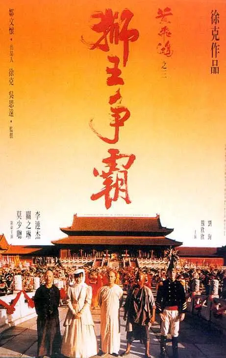

## 少林寺

## 黄飞鸿

**如果这个世界真有金山的话，那些洋船为什么要来我们的港口？也许，我们已经站在金山上了。**

## 黄飞鸿之二：男儿当自强

**但愿朝阳长照我土，莫忘烈士鲜血满地。**

## 黄飞鸿之三：狮王争霸

**李大人，所谓胜者为王，败者为寇。刚才天炮一响，如果没有天灯挡枪的话，胜负归谁还真没人知道。现在金牌在我黄某的手上，并非我赢了，大人为了大显我民神威而办的这场狮王争霸，死伤这么多人，在世人面前，其实我们都输了。以小民之见，我们不只要练武强身，以抗外敌，最重要的还是广开民智，治武合一，那才是国富民强之道。**

## 黄飞鸿之西域雄狮

**佛山，黄飞鸿。**
