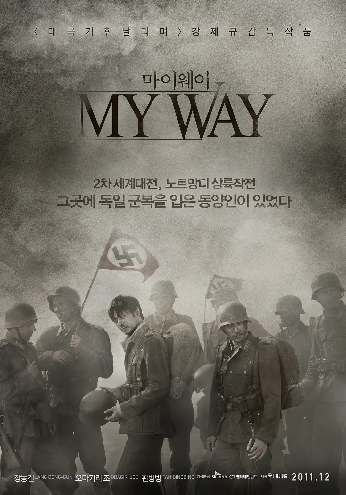
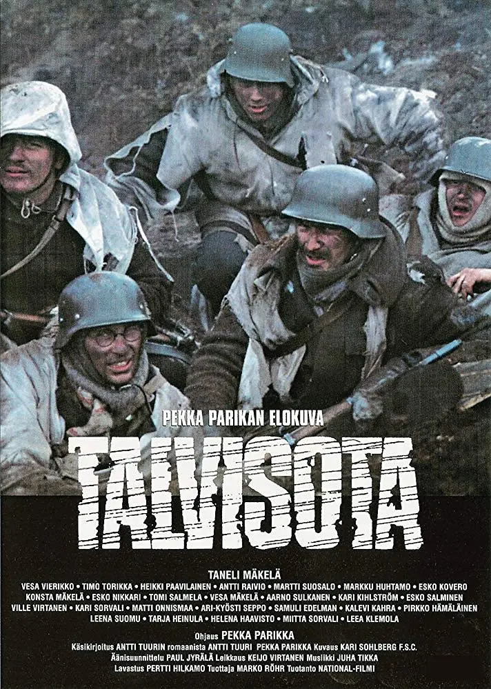
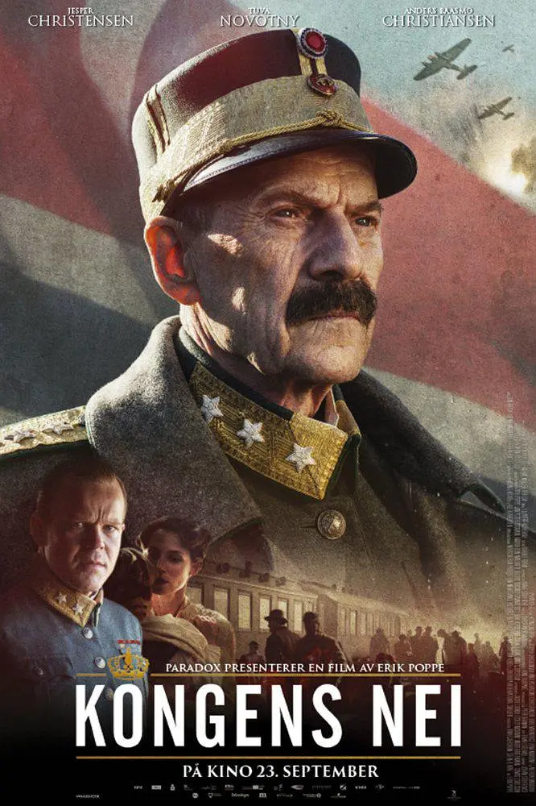

## World War Ⅱ

### 钢琴家

> 1939 年 9 月 1日，波兰战役。

### 登陆之日

> 1939 年 11 月，诺门坎战役。

### 无名战士（2017）

> 1939 年 11 月 30 日，冬季战争。

### 苏芬战争

>1939 年 11 月 30 日，冬季战争。

### 开战日

> 1940 年 4 月 9 日，威瑟堡行动。

### 国王的选择

>1940 年 4 月 9 日，威瑟堡行动。

### 敦刻尔克

> 1940 年 5 月 25 日，敦刻尔克大撤退。

### 不列颠之战

> 1940 年 7 月 10 日，不列颠空战。

### 兵临城下之决战要塞

> 1941 年 6 月 22 日，布列斯特要塞之战。

### 列宁格勒

> 1941 年 9 月 9 日，列宁格勒保卫战。

### 女狙击手

> 1941 年 10 月 31 日，塞瓦斯托波尔战役。

### 猎杀 T34

> 1941 年 11 月 16 日，沃洛科拉姆斯克战役。

### 虎虎虎

> 1941 年 12 月 7 日，日本偷袭珍珠港。

### 珍珠港

> 1941 年 12 月 7 日，日本偷袭珍珠港。

### 铁路劳工

> 1942 年 1 月 30 日，安汶之战。

### 澳洲乱世情

> 1942 年 2 月 19 日，空袭达尔文。

### 东京上空三十秒

> 1942 年 4 月 18 日，珍珠港复仇之战。

### 猎杀 U-571

> 1942 年 4 月，美国采取先欧后亚战略。

### 决战中途岛

> 1942 年 6 月 4 日，中途岛战役。

### 兵临城下

> 1942 年 8 月，斯大林格勒战役。

### 细细的红线

> 1942 年 8 月 7 日，瓜达尔卡纳尔岛战役。

### 斯大林格勒战役

> 1943 年 1 月 8 日，斯大林格勒战役。

### 巴顿将军

> 1943 年 3 月 17 日，突尼斯战役。

### 解放 1：炮火弧线

> 1943 年 7 月 5 日，库尔斯克战役。

### 塔斯克基飞行员

> 1943 年 7 月 9 日，西西里战役。

### 红色机尾

>1943 年 7 月 9 日，西西里战役。

### 拯救大兵瑞恩

> 1944 年 6 月 6 日，诺曼底登陆。

### 兄弟连（美剧）

> 1944 年 6 月 6 日，卡朗唐战役。

### 风语者

> 1944 年 6 月 15 日，塞班岛战役。

### 铁十字勋章

> 1944 年 6 月 22 日，巴格拉季昂行动。

### 太平洋战争（美剧）

> 1944 年 9 月 15 日，贝里琉岛战役。

### 遥远的桥

> 1944 年 9 月 17 日，市场花园行动。

### 父辈的旗帜

> 1945 年 2 月 19 日，硫磺岛战役。

### 硫磺岛家书

> 1945 年 2 月 19 日，硫磺岛战役。

### 狂怒

> 1945 年 4 月，柏林战役。

### 血战钢锯岭

> 1945 年 4 月 1 日，冲绳岛战役。

### 帝国的毁灭

> 1945 年 4 月 16 日，柏林战役。

### 日本最长的一天

> 1945 年 8 月15 日，日本投降。