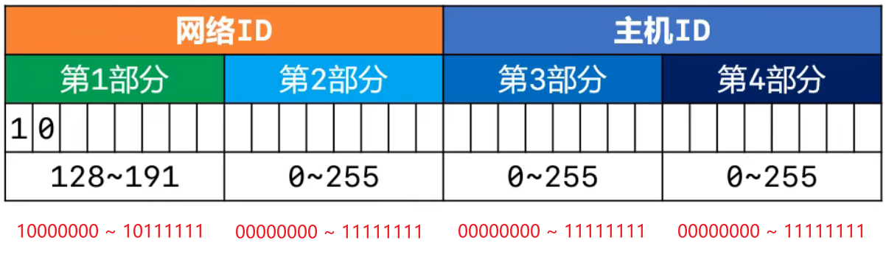
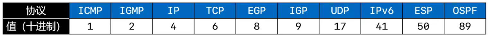
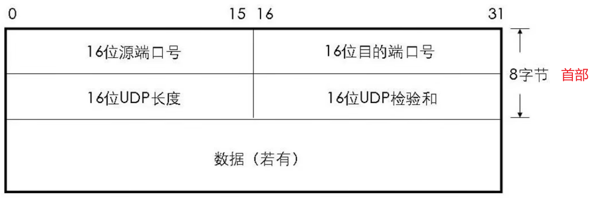
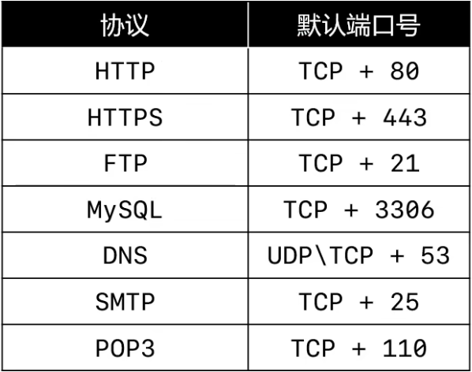
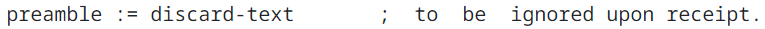
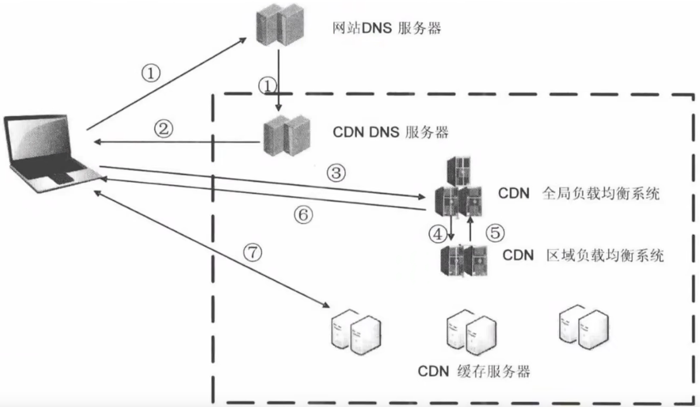
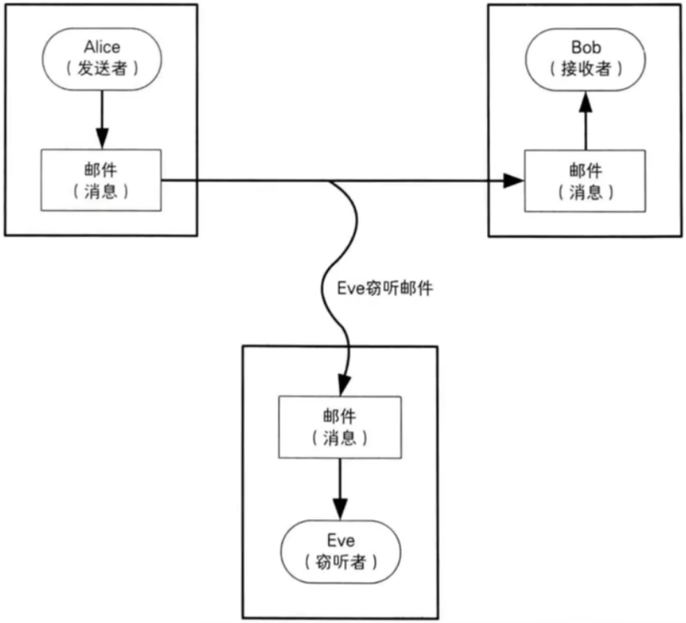
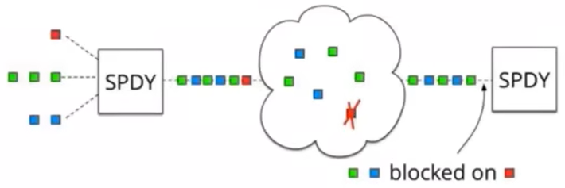

*date: 2022-11-08 ~ 2023-08-26*


[TOC]

## 概述

### 网络协议

数据传输模型：


数据是如何从一个设备传递到另一个设备的：这一切都是由**`网络协议`**（Network Protocol）来规定的，没有网络协议，就没有今天的互联网。

> 网络模拟工具：Packet Tracer。

### C/C++ 的跨平台原理


- 使用平台相关的编译器生成对应平台的可执行文件。

### 信道（Channel）

`信道`：信息传输的通道，一条传输介质上（比如网线），可以有多条信道。

#### 单工通信

信号只能往一个方向传输，任何时候都不能改变信号的传输方向。比如无线电广播，有线电视广播等。

#### 半双工通信

信号可以双向传输，但必须是交替进行，同一时间只能往一个方向传输。比如对讲机等。

#### 全双工通信

信号可以同时双向传输。比如手机（打电话时，听说同时进行）等。

### 计算机之间的通信基础

首先，需要得知对方的**`IP 地址`**；（发送的数据，实际上是对方网卡接收的）

最终，根据**`MAC 地址 (网卡地址)`**，输送数据到网卡，被网卡接收。

- 如果某网卡发现数据的目标 MAC 地址是自己，就会将数据传递给上一层进行处理；
- 如果某网卡发现数据的目标 MAC 地址不是自己，就会将数据丢弃，不会将数据传递给上一层进行处理。

### 计算机之间的连接方式

#### 网线直连


- 两台电脑之间，最简单的连接方式，就是网线直连；如果是多台电脑之间，需要实现互联，有多种方式，如同轴电缆、集线器、网桥等。
- 注意：网线直连需要使用`交叉线`，不是直通线。

#### 同轴电缆（Coaxial）


- 同轴电缆是最传统的方式。
- 半双工通信：在同一时间，通道只允许一个方向的通信。
- 同轴电缆上的设备，是同一个`冲突域/广播域`。

#### 集线器（Hub）


- 集线器没有存储功能。
- 设备越多，效率越低。因为某一台设备发送的数据，会被`广播 (ARP 协议传输)`给集线器上的所有设备，占用很多带宽。（发送 ARP 请求的目的，即是获取目标的 MAC 地址，当知道对方的 MAC 地址后，走`ICMP 协议传输`）
- 如果某一台设备安装抓包工具，会获取集线器上其他设备发送的数据包，存在安全隐患。
- 集线器的一边，是同一个`冲突域/广播域`。
- 集线器可以看作就是网线。

#### 网桥（Bridge）


#### 交换机（Switch）


- `局域网`的最终方案。
- 交换机连接的都是`相同网段`的设备。
- 如果交换机上的设备太多，可能会出现 IP 不够的情况，另外，某一台设备发送广播时，其他设备都可以收到，如果同一时刻，其他设备也在发送广播，会导致网络混乱。
- 交换机有`记忆功能`，会记录每一个端口对应设备的 MAC 地址。


- 192.168.3.10 准备发送数据给 192.168.3.11，第一次时，需要发送广播，查找 192.168.3.11 的 MAC 地址。
- OO90.2B11.8ECD 是 192.168.3.10 的 MAC 地址，第一次发送对象的 MAC 地址为`FFFF.FFFF.FFFF`，表明是广播。


- 192.168.3.11 接收到 192.168.3.10 的广播后，得知其寻找的目标 IP 为自己，便返回自己的 MAC 地址给 192.168.3.10，因为交换机具有记忆功能，此时，会直接将 192.168.3.11 的数据包发送给 192.168.3.10。

#### 路由器（Router）


- 路由器的使用，强调`不同网段`。

- 路由器的每一个端口，是一个`网关`，对应一个广播域，这个网关需要配置与该广播域对应的网段地址，例如，192.168.1.10 和 192.168.1.11 这一个广播域，路由器对应的网关地址设置为`192.168.1.1`，对应的，另一个广播域的网关的地址设置为`192.168.2.1`，`表示该网段的第一台机器`。（网关地址可以随意设置，一般设置为第一个，`一个网关相当于一个网卡，有自己的 MAC 地址和 IP`）

- 网关的作用：让不同网段的设备，能够进行通信，即`跨网段`。

- 网关地址配置好后，对应广播域下的每一台设备，均需要设置`默认网关`，如果不设置，该设备无法跨网段通信。

  

- 跨网段传输数据时，首先需要获取网关的 MAC 地址，也是通过 ARP 广播。

- 通过路由器跨网段传输数据时，大致流程如下：

  

  

  

  - 需求：192.168.3.10 发送数据给 192.168.4.11。
  - 第一步，192.168.3.10 发送 ARP 广播，以获取网关 192.168.3.1 的 MAC 地址；
  - 第二步，网关 192.168.3.1 接收到广播，回传 MAC 地址给 192.167.3.10；
  - 第三步，192.168.3.10 发送 ICMP 数据包，网关 192.168.3.1 获取，解析处理后，由网关 192.168.4.1 处理；
  - 第四步，网关 192.168.4.1 发送 ARP 广播，以获取 192.168.4.11 的 MAC 地址；
  - 第五步，192.168.4.11 接收到广播，回传 MAC 地址给网关 192.168.4.1；
  - 第六步，网关 192.168.5.11 发送 ICMP 数据包，192.168.4.11 获取；
  - 第七步，192.168.4.11 回传接收到数据包的信息，通过网关 192.168.4.1 >>> 网关 192.168.3.1 >>> 192.168.3.10，至此，通讯完成。

- 路由器两端，不能是同一网段的设备。如果是同一网段，设备 1 发送 ARP 广播时，路由器网关不会返回 MAC 地址给设备 1，设备 1 也找不到目标设备的 MAC 地址。

### 网络、互联网、因特网


- 网络：多台设备之间，通过不同方式连接，即形成网络。
- 互联网：不同网段之间，通过路由器连接，即形成互联网。
- 因特网：<font color = red>I</font>nternet，全世界最大的互联网。
  - 因特网，将全世界所有的计算机，都连接在一起。
  - 一般使用大写 I 开头的 Internet，特指因特网。
  - 日常生活中说的：你的电脑上不了网。其实就是指：你的电脑没有连接到因特网。

### ISP

Internet Service Provider，**即 Internet 服务提供商**，比如移动、电信、网通、铁通等。我们平时拉的宽带等，都是通过 ISP 连接到 Internet 的。


### 服务器机房


> 双线机房，支持不同类型的宽带下载，也不需要不同 ISP 之间的数据传输转换，速度都很快。

个人电脑使用的宽带，如果与服务部署所在的机房的网络相同，就不需要进行不同 ISP 之间的数据传输转换，下载速度也会更快。


### 网络分类

按照网络的范围进行分类，可以分为：局域网、城域网、广域网等。

#### 局域网

Local Area Network，简称 **<font color = red>LAN</font>**。

- 一般是范围在几百米到十几公里内的计算机，所构成的计算机网络。
- 常用于公司、家庭、学校、医院、机关、一栋大楼等。
- 局域网中使用最广泛的网络技术叫：**<font color = blue>以太网</font>**（Ethernet）。
- 在电脑、手机上经常见到的一个英文 **<font color = red>WLAN</font>**（Wireless LAN），意思就是**无线局域网**。

#### 城域网

Metropolitan Area Network，简称 **<font color = red>MAN</font>**。

- 一般范围是数十公里到数百公里，可以覆盖一个城市。

#### 广域网

Wide Area Network，简称 **<font color = red>WAN</font>**。

- 一般范围是几百公里到几千公里，可以覆盖一个国家。**通常都需要租用 ISP 的线路。**

### 常见的几种网络接口


- FastEthernet

  - 快速以太网接口（带宽 100 M）。

  - 普通计算机、交换机等，都有一个至多个。

    

    

- GigabitEthernet

  - 千兆以太网接口。

  - 大型交换机，一般有千兆以太网接口。

    

- Serial

  - 串行接口。

  - 路由器上，有快速以太网接口和串行接口。

    

    

### 不同的路由器

第一种路由器：


- 此类型的路由器，两端必须是不同网段的设备，因为路由器的两个端口，需要设置不同网段的网关。

- 不同网段的设备，在第一次通信时，会出现丢包的情况。（`第一个数据包丢失`）

  

  - 192.168.1.10/24 与 192.168.2.10/24 第一次通信时，会经历以下几个过程。
  - 第一步：因为 192.168.1.10/24 与 192.168.2.10/24 是不同网段，192.168.1.10/24 首先发送 ARP 请求，获取路由器 0 默认网关 192.168.1.1/24 的 MAC 地址，192.168.1.1/24 获得请求，然后返回自身的 MAC 地址。
  - 第二步：192.168.1.10/24 获得 192.168.1.1/24 的 MAC 地址后，开始通过 ICMP 协议，发送真正的数据包。
  - 第三步：路由器 0 拿到数据包后，得知目标 IP 的网段与自己直连，但是路由器 0 并不知道 192.168.2.10/24 的 MAC 地址。此时，路由器 0 会丢掉当前的数据包，然后发送 ARP 请求，获取 192.168.2.10/24 的 MAC 地址，拿到回复后，路由器 0 会进行 ARP 缓存，缓存 192.168.2.10/24 的 MAC 地址。
  - 第四步：之后，192.168.1.10/24 发送的第二个数据包，就会正常送达 192.168.2.10/24。后续的数据包，也会正常送达。

第二种路由器：


- 此类型的路由器，两端可以是相同网段的设备，每一端的设备，可以通过快速以太网接口直接相连。
- 路由器两端的设备，在第一次通信时，也不会出现丢包的情况，两端的设备是同网段的。

### 数字信号和模拟信号

`数字信号 (Digital Signal)`：


- 离散的信号，不适合长距离传输。
- 抗干扰能力强，受到干扰时波形失真可以修复。

`模拟信号 (Analog Signal)`：


- 连续的信号，适合长距离传输。
- 抗干扰能力差，受到干扰时波形变形很难纠正。

### 上网方式

#### 电话线入户


- 这就是平时说的：ADSL 电话拨号上网（Asymmetric Digital Subscriber Line）。
  - 非对称数字用户线路，提供上行、下行不对称的传输带宽。
  - 上行：家庭设备发送数据到因特网。
  - 下行：因特网发送数据到家庭设备。
  - 家庭用户，一般要求下行速度大。
- 猫：Modem，**<font color = red>调制解调器</font>**，进行`数字信号和模拟信号的转换`。
  - 电脑设备发送的是数字信号，电话线发送的是模拟信号。

#### 光纤入户


- 光猫：Optical Modem，**<font color = red>光调制解调器</font>**，进行`数字信号和光信号的转换`。
  - 电脑设备发送的是数字信号，光纤发送的是光信号。

- 光纤入户，是目前家庭常用的一种上网方式。

#### 网线入户


- 网线入户的方式，一般有一个统一的信号转换设备，然后从该设备拉网线，直接到用户设备上。

### 家用无线路由器的内部结构


- 无线路由器内部，通过交换机与路由器连接，并由 LAN 口可以连网线到设备，无线网也连接此交换机，家庭内部设备，位于相同的网段。

### 数据通信模型

#### 局域网通信模型


- **单段网线不能超过 100 米**，如果超过 100 米，可以追加集线器、交换机等设备。

#### 广域网通信模型


- 调制解调器：数字信号和模拟信号转换。


- 光电转换器：数字信号和光信号转换。

### Ping

查看 ping 的用法：`ping /?`。

```shell
C:\Users\XiSun>ping /?

用法: ping [-t] [-a] [-n count] [-l size] [-f] [-i TTL] [-v TOS]
            [-r count] [-s count] [[-j host-list] | [-k host-list]]
            [-w timeout] [-R] [-S srcaddr] [-c compartment] [-p]
            [-4] [-6] target_name

选项:
    -t             Ping 指定的主机，直到停止。
                   若要查看统计信息并继续操作，请键入 Ctrl+Break；
                   若要停止，请键入 Ctrl+C。
    -a             将地址解析为主机名。
    -n count       要发送的回显请求数。
    -l size        发送缓冲区大小。
    -f             在数据包中设置“不分段”标记(仅适用于 IPv4)。
    -i TTL         生存时间。
    -v TOS         服务类型(仅适用于 IPv4。该设置已被弃用，
                   对 IP 标头中的服务类型字段没有任何
                   影响)。
    -r count       记录计数跃点的路由(仅适用于 IPv4)。
    -s count       计数跃点的时间戳(仅适用于 IPv4)。
    -j host-list   与主机列表一起使用的松散源路由(仅适用于 IPv4)。
    -k host-list    与主机列表一起使用的严格源路由(仅适用于 IPv4)。
    -w timeout     等待每次回复的超时时间(毫秒)。
    -R             同样使用路由标头测试反向路由(仅适用于 IPv6)。
                   根据 RFC 5095，已弃用此路由标头。
                   如果使用此标头，某些系统可能丢弃
                   回显请求。
    -S srcaddr     要使用的源地址。
    -c compartment 路由隔离舱标识符。
    -p             Ping Hyper-V 网络虚拟化提供程序地址。
    -4             强制使用 IPv4。
    -6             强制使用 IPv6。
```

发送指定大小的数据包：`ping IP 地址 -l 数据包大小`。

```shell
C:\Users\XiSun>ping www.baidu.com -l 800

正在 Ping www.a.shifen.com [14.215.177.38] 具有 800 字节的数据:
来自 14.215.177.38 的回复: 字节=800 时间=28ms TTL=55
来自 14.215.177.38 的回复: 字节=800 时间=29ms TTL=55
来自 14.215.177.38 的回复: 字节=800 时间=29ms TTL=55
来自 14.215.177.38 的回复: 字节=800 时间=183ms TTL=55

14.215.177.38 的 Ping 统计信息:
    数据包: 已发送 = 4，已接收 = 4，丢失 = 0 (0% 丢失)，
往返行程的估计时间(以毫秒为单位):
    最短 = 28ms，最长 = 183ms，平均 = 67ms
```

不允许网络层分片：`ping IP 地址 -f`。

```shell
C:\Users\XiSun>ping www.baidu.com -l 800 -f

正在 Ping www.a.shifen.com [39.156.66.14] 具有 800 字节的数据:
来自 39.156.66.14 的回复: 字节=800 时间=25ms TTL=50
来自 39.156.66.14 的回复: 字节=800 时间=23ms TTL=50
来自 39.156.66.14 的回复: 字节=800 时间=24ms TTL=50
来自 39.156.66.14 的回复: 字节=800 时间=31ms TTL=50

39.156.66.14 的 Ping 统计信息:
    数据包: 已发送 = 4，已接收 = 4，丢失 = 0 (0% 丢失)，
往返行程的估计时间(以毫秒为单位):
    最短 = 23ms，最长 = 31ms，平均 = 25ms
    
    
C:\Users\XiSun>ping www.baidu.com -l 4000 -f

正在 Ping www.a.shifen.com [39.156.66.18] 具有 4000 字节的数据:
需要拆分数据包但是设置 DF。
需要拆分数据包但是设置 DF。
需要拆分数据包但是设置 DF。
需要拆分数据包但是设置 DF。

39.156.66.18 的 Ping 统计信息:
    数据包: 已发送 = 4，已接收 = 0，丢失 = 4 (100% 丢失)，
```

设置 TTL 的值：`ping IP 地址 -i TTL`。

```shell
C:\Users\XiSun>ping baidu.com -i 3

正在 Ping baidu.com [110.242.68.66] 具有 32 字节的数据:
来自 61.132.211.213 的回复: TTL 传输中过期。
来自 61.132.211.213 的回复: TTL 传输中过期。
请求超时。
来自 61.132.211.213 的回复: TTL 传输中过期。

110.242.68.66 的 Ping 统计信息:
    数据包: 已发送 = 4，已接收 = 3，丢失 = 1 (25% 丢失)，
    
C:\Users\XiSun>ping baidu.com -i 2

正在 Ping baidu.com [110.242.68.66] 具有 32 字节的数据:
来自 100.75.128.1 的回复: TTL 传输中过期。
来自 100.75.128.1 的回复: TTL 传输中过期。
来自 100.75.128.1 的回复: TTL 传输中过期。
来自 100.75.128.1 的回复: TTL 传输中过期。

110.242.68.66 的 Ping 统计信息:
    数据包: 已发送 = 4，已接收 = 4，丢失 = 0 (0% 丢失)，
    
C:\Users\XiSun>ping baidu.com -i 1

正在 Ping baidu.com [110.242.68.66] 具有 32 字节的数据:
来自 192.168.2.1 的回复: TTL 传输中过期。
来自 192.168.2.1 的回复: TTL 传输中过期。
来自 192.168.2.1 的回复: TTL 传输中过期。
来自 192.168.2.1 的回复: TTL 传输中过期。

110.242.68.66 的 Ping 统计信息:
    数据包: 已发送 = 4，已接收 = 4，丢失 = 0 (0% 丢失)，
```

> 可以看出，TTL 设置不同的值，会收到不同网关返回的错误信息。按照此方法，一点点增大 TTL 的值，可以得到传输过程中所有路由器的网关信息。

通过`tracert`、`pathping`命令，可以跟踪数据包经过了哪些路由器。

```shell
C:\Users\XiSun>tracert baidu.com

通过最多 30 个跃点跟踪
到 baidu.com [39.156.66.10] 的路由:

  1     1 ms    <1 毫秒   <1 毫秒 192.168.2.1
  2     9 ms     4 ms     4 ms  100.75.128.1
  3     *        *        4 ms  61.190.2.1
  4     *        *        *     请求超时。
  5   287 ms     *       29 ms  202.97.98.153
  6    24 ms     *       22 ms  ^C
C:\Users\XiSun>pathping baidu.com

通过最多 30 个跃点跟踪
到 baidu.com [110.242.68.66] 的路由:
  0  DESKTOP-F1JDHC6 [192.168.2.137]
  1  192.168.2.1
  2  100.75.128.1
  3  ^C
```

## MAC 地址

每一个网卡都有一个**` 6 字节 (48 bit)`**的 MAC 地址（**<font color = red>M</font>**edia **<font color = red>A</font>**ccess **<font color = red>C</font>**ontrol Address），MAC 地址`全球唯一`，固化在网卡的 ROM 中，由`IEEE802 标准`规定。

### 组成

MAC 地址由两部分组成：


- 前 3 个字节：OUI（Organizationally Unique Identifier），组织唯一标识符，即网卡生产厂家的唯一标识符，由 IEEE 的注册管理机构分配给厂商。

- 后 3 个字节：网络接口标识符，由厂家自行分配。

- OUI 查询地址：

  - https://standards-oui.ieee.org/oui/oui.txt

    

  - https://mac.bmcx.com/

    

### 查询

MAC 地址查询方式：

- Windows 系统：开始菜单 >>> 运行 cmd >>> 在命令行窗口中输入`ipconfig /all`命令。
- 安卓手机：系统设置 >>> 关于手机。
- IOS 系统：设置 >>> 通用 >>> 关于本机 >>> 无线局域网地址/蓝牙。
- 路由器等其它网络设备：设备管理后台、设备标签或包装盒上。

### 修改

MAC 地址修改方式：

- 更改适配器选项 >>> 属性 >>> 配置 >>> 高级 >>> 网络地址。
- 修改的时候，需要把 MAC 地址中间的 - 去掉。
- 有时可以通过手动修改 MAC 地址，达到蹭网的目的，前提是需要知道被允许上网的 MAC 地址是多少。

### 表示

MAC 地址表示方式：

- Windows
  - 40-55-82-0A-8C-6D
- Linux、Android、Mac、IOS
  - 40:55:82:0A:8C:6D
- Packet Tracer
  - 4055.82OA.8C6D
- `当 48 位全为 1 时，代表广播地址。`
  - `FF-FF-FF-FF-FF-FF`

### 获取

MAC 地址获取方式：

- 当不知道对方主机的 MAC 地址时，可以通过发送 ARP 广播获取对方的 MAC 地址。
  - 获取成功后，会缓存 IP 地址、MAC 地址的映射关系，俗称：`ARP 缓存`。
  - 通过 ARP 广播获取的 MAC 地址，属于`动态 (dynamic) 缓存`。
    - 存储时间比较短（默认是 2 分钟），过期了就自动删除。

相关命令：

- `arp -a [主机地址]`：查询 ARP 缓存，添加主机地址，查询的是该主机的缓存，不添加，则为查询所有。
- `arp -d [主机地址]`：删除 ARP 缓存，添加主机地址，删除的是该主机的缓存，不添加，则为删除所有。
- `arp -s 主机地址 MAC 地址`：增加一条缓存信息，这是`静态缓存`，存储时间较久，不同系统的存储时间不同。

## IP 地址

IP 地址：Internet Protocol Address，互联网上的每一个主机，都有一个 IP 地址。

- 最初是 IPv4 版本，`32 bit (4 字节)`，2019 年 11 月 25 日时，全球的 IP 地址就已经用完。
- 之后推出了 IPv6 版本，`128 bit (16 字节)`。
- IPv4 地址用的最广泛，此处暂不讨论 IPv6。

### 组成

IP 地址的组成：

- 按照字节：IP 地址由 32 bit 组成，不方便记忆，因此拆分成 4 个部分，每个部分转换为十进制值，以此表示为 IP 地址。

  

- 按照功能：IP 地址由 2 部分组成，即`网络标识 (网络 ID)`和`主机标识 (主机 ID)`。

  - `同一网段的计算机，网络 ID 相同。`

  - 通过`子网掩码 (subnet mask)`，可以计算出网络 ID：`子网掩码 & IP 地址`。（按位与）

    - 例如，IP 地址为 192.168.1.10，子网掩码为 255.255.255.0，则其网络 ID 为：192.168.1，主机 ID 为 10。该网段 192.168.1.0 ~ 192.168.1.255 可以容纳 256 - 2 台主机设备。（`去掉 192.168.1.0 和 192.168.1.255 这两个，剩余的 0 ~ 255 之间的，都可以使用`）

      

    - 例如，IP 地址为 130.168.1.10，子网掩码为 255.255.0.0，则其网络 ID 为：130.168，主机 ID 为 1.10。该网段 130.168.0.0 ~ 130.168.255.255 可以容纳 256 * 256 - 2 台主机设备。（`去掉 130.168.0.0 和 130.168.255.255 这两个，剩余的两个位置上 0 ~ 255 之间的组合，都可以使用`）

  - `A 类地址子网掩码：255.0.0.0。`不同的 IP 地址，只要第一段一样，就是同一个网段，如 10.0.0.5 和 10.5.2.1。

  - `B 类地址子网掩码：255.255.0.0。`不同的 IP 地址，只要前两段一样，就是同一个网段，如 130.168.0.2 和 130.168.10.5.

  - `C 类地址子网掩码：255.255.255.0。`不同的 IP 地址，必须前三段一样，才是同一个网段，如 192.168.1.10 和 192.168.1.25。

  - 通俗的理解，网段就是一段 IP 地址，子网掩码通常就是用来约束这段 IP 地址的范围。如果约束 IP 为 IPv4，那么一个 IPv4 网段就一定是 0.0.0.0 ~ 255.255.255.255 这个范围中的一部分，一个子集。

- 计算机和其他计算机通信前，会先判断目标主机和自己是否在同一个网段：

  - 同一网段：不需要通过路由器进行转发。
  - 不同网段：需要通过路由器进行转发。
  - 判断不同计算机是否是同一网段：`子网掩码 & IP 地址`。

### 分类

IP 地址可以分为五类：

- `A 类地址`：默认子网掩码是`255.0.0.0`。

  | 8 bit                                                 | 24 bit  |
  | ----------------------------------------------------- | ------- |
  | 网络 ID，二进制必须以 <font color = red>0</font> 开头 | 主机 ID |

- `B 类地址`：默认子网掩码是`255.255.0.0`。

  | 16 bit                                                 | 16 bit  |
  | ------------------------------------------------------ | ------- |
  | 网络 ID，二进制必须以 <font color = red>10</font> 开头 | 主机 ID |

- `C 类地址`：默认子网掩码是`255.255.255.0`。

  | 24 bit                                                  | 8 bit   |
  | ------------------------------------------------------- | ------- |
  | 网络 ID，二进制必须以 <font color = red>110</font> 开头 | 主机 ID |

- D 类地址：以 1110 开头，多播地址。

- E 类地址：以 1111 开通，保留为今后使用。

- 通过 IP 第一部分的取值，就可以知道该 IP 是属于第几类的地址。

- `只有 A 类、B 类和 C 类地址，才能分配给主机使用。`

- `主机 ID 全为 0，表示主机所在的网段。`如上面的 192.168.1.0 和 130.168.0.0。

- `主机 ID 全为 1，表示主机所在网段的全部主机，即广播。`如上面的 192.168.1.255 和 130.168.255.255。

  

- 区分 IP 地址的类型，只需要看`第一部分的值`即可，与其他因素如子网掩码等无关。

#### A 类地址


- 网络 ID
  - 第 1 部分为网络 ID。
  - `0 不能用，127 为保留网段。`其中，`127.0.0.1 是本地环回地址 (Loopback)`，代表本地地址，即localhost。
  - 可以分配给主机的：
    - 第 1 部分的取值范围是：`1 ~ 126`。
    - A 类地址默认子网掩码是 255.0.0.0，因此，第 1 部分的每个取值，都是一个网段，如 120.0.0.0。`最小的网段是 1.0.0.0，最大的网段是 126.0.0.0。`
- 主机 ID
  - 第 2、3、4 部分为主机 ID。
  - 第 2、3、4 部分的取值范围是：`0 ~ 255`。
- 每个 A 类网段，能容纳的最大主机数是：`256 * 256 * 256 - 2 = 2 ^ 24 - 2 = 16777214 个`。其中，0 和 255 不能用，例如，120.0.0.0 代表 120 网段，120.255.255.255 代表 120 网段的广播。

#### B 类地址



- 网络 ID 
  - 第 1、2 部分为网络 ID。
  - 可以分配给主机的：
    - 第 1 部分的取值范围是：`128 ~ 191`。
    - 第 2 部分的取值范围是：`0 ~ 255`。
    - B 类地址默认子网掩码是 255.255.0.0，因此，第 1 部分的每个取值，分别组合第 2 部分的每个取值，都是一个网段，如 130.200.0.0。`最小的网段是 128.0.0.0，最大的网段是 191.255.0.0。`
- 主机 ID
  - 第 3、4 部分为主机 ID。
  - 第 3、4 部分的取值范围是：`0 ~ 255`。
- 每个 B 类网段，能容纳的最大主机数是：`256 * 256 - 2 = 2 ^ 16 - 2 = 65534 个`。其中，0 和 255 不能用，例如，130.200.0.0 代表 130.200 网段，130.200.255.255 代表 130.200 网段的广播。

#### C 类地址


- 网络 ID 
  - 第 1、2、3 部分为网络 ID。
  - 可以分配给主机的：
    - 第 1 部分的取值范围是：`192 ~ 223`。
    - 第 2 部分的取值范围是：`0 ~ 255`。
    - 第 3 部分的取值范围是：`0 ~ 255`。
    - B 类地址默认子网掩码是 255.255.255.0，因此，第 1 部分的每个取值，分别组合第 2 部分的每个取值，再分别组合第 3 部分的每个取值，都是一个网段，如 192.10.100.0。`最小的网段是 192.0.0.0，最大的网段是 223.255.255.0。`
- 主机 ID
  - 第 4 部分为主机 ID。
  - 第 4 部分的取值范围是：`0 ~ 255`。
- 每个 C 类网段，能容纳的最大主机数是：`256 - 2 = 254 个`。其中，0 和 255 不能用，例如，192.10.100.0 代表 192.10.100 网段，192.10.100.255 代表 192.10.100 网段的广播。

#### D 类地址


- 没有子网掩码，用于多播（组播）地址。
- 第 1 部分取值范围是：`224 ~ 239`。

#### E 类地址


- 保留为今后使用。
- 第 1 部分取值范围是：`240 ~ 255`。

#### 公网 IP 和私网 IP

IP 地址，也可以分为公网 IP 和私网 IP。

- 公网 IP（Public）
  - `Internet 上的路由器中只有到达公网的路由表，没有到达私网的路由表。`
  - **公网 IP 由因特网信息中心（Internet Network Information Center，Inter NIC）统一分配和管理。**
  - ISP 需要向 Inter NIC 申请公网 IP。
- 私网 IP（Private）
  - 主要用于局域网。下面是保留的私网网段：
    - A 类地址：**10.0.0.0/8**，1 个 A 类网络。
    - B 类地址：**172.16.0.0/16 ~ 172.31.0.0/16**，16 个 B 类网络。
    - C 类地址：**192.168.0.0/24 ~ 192.168.255.0/24**，256 个 C 类网络。
    - 以上几类 IP 地址，都是私网 IP。

#### NAT

Network Address Translation，私网 IP 访问 Internet 需要进行 NAT 转换为公网 IP，这一步可以由路由器来完成。

NAT 的特点：

- **可以节约公网 IP 资源，公网 IP 是唯一的，但不同地区局域网内部的私网 IP，可以是相同的。**
- 可以隐藏内部真实 IP。

NAT 的分类：

- 静态转换
  - 手动配置 NAT 映射表。
  - 一对一转换：一个私网 IP 对应一个公网 IP。
  - 达不到节约公网 IP 资源的目的。
- 动态转换
  - 定义外部公网 IP 地址池，动态随机转换。
  - 一对一转换：一个私网 IP 对应一个公网 IP。
  - 达不到节约公网 IP 资源的目的。
- PAT（Port Address Translation）
  - 采用`端口多路复用`方式，通过端口号标识不同的数据流。（不同的端口号，对应不同的私网 IP）
  - `多对一转换`，可以最大程度节约公网 IP 资源。（多个私网 IP，通过不同的端口，对应同一个公网 IP）
  - PAT 是目前应用最广泛的 NAT 实现方式。

百度可以查询本机设备的公网 IP 地址，但这个地址，可能是经过多次 NAT 转换之后的最终的结果：


## 子网掩码

`子网掩码：网络 ID 全为 1。`

子网掩码的 CIDR 表示方法：

- CIDR：Classless Inter-Domain Routing，无类别域间路由。

- 192.168.1.100/24：代表子网掩码有 24 个 1，也就是 255.255.255.0，该 IP 的网段为 192.168.1.0。

- 123.210.100.200/16：代表子网掩码有 16 个 1，也就是 255.255.0.0，该 IP 的网段为 123.210.0.0。

- 计算工具：https://www.sojson.com/convert/subnetmask.html

  

### 不同设备通信的条件

思考：192.168.0.10/24 和 192.168.10.10/16 这两台设备，能正常通信吗？


解答：

- 两台设备能正常通信的前提：`两台设备网段相同。`
- 网段计算公式 `子网掩码 & IP`，然后将计算结果，`主机 ID 全部变为 0`，即为对应的网段。
- 某台设备计算自己的网段时，是：`用自己的子网掩码与自己的 IP`。
- 一台设备向一台设备通信时，是：`用自己的子网掩码与对方的 IP，计算网段。`
- 192.168.0.10/24，子网掩码为 255.255.255.0，计算可得：192.168.0.10 的网段为 192.168.0.0，192.168.10.10 的网段为 192.168.10.0。因此，二者不在同一网段，192.168.0.10 无法通信 192.168.10.10。
- 192.168.10.10/16，子网掩码为 255.255.0.0，计算可得：192.168.10.10 的网段为 192.168.0.0，192.168.0.10 的网段为 192.168.0.0。因此，二者在同一网段，但因为 192.168.0.10 无法通信 192.168.10.10，192.168.10.10 也无法通信  192.168.0.10。
- 两台设备能正常通信的另一个条件：`两台设备能互相通信，即一台设备发送信息到另一台设备之后，同时也能够收到另一台设备返回的信息。`

## 子网划分

如果需要让 200 台主机在同一个网段内，假设分配一个 C 类网段，比如 192.168.1.0/24：

- 该网段共 254 个可用 IP 地址：192.168.1.1 ~ 192.168.1.254。
- 该网段多出 54 个空闲的 IP 地址，这种情况并不算是资源浪费。

如果需要让 500 台主机在同一个网段内，假设分配一个 B 类网段，比如 191.100.0.0/16：


- 该网段共 65534 个可用 IP 地址：191.100.0.1 ~ 191.100.255.254。
- 该网段多出 65034 个空闲的 IP 地址，这种情况属于极大的浪费资源。

那么，如果想尽量避免浪费 IP 地址资源，就需要合理的进行子网划分。

`子网划分：借用主机位作子网位，划分出多个子网。`

可用分为：

- `等长子网划分`：将一个网段`等分`成多个子网，每个子网的可用 IP 地址数量是一样的。
- `变长子网划分`：将一个网段`不等分`成多个子网，每个子网的可用 IP 地址数量可以是不一样的。

子网划分的步骤：

- 确定子网的子网掩码长度；
- 确定子网中第 1 个和最后 1 个主机可用的 IP 地址。

### 等长子网划分

#### 等分为两个子网


规律，如果一个子网是原来网络的 ：
$$
\frac{1}{2}
$$
则其`子网掩码往后移 1 位`。

- 32 位中的前 25 位，作为子网掩码，后 7 位表示主机。
  - 即 25 个 1，两个子网的子网掩码都是`255.255.255.128/25`。
- A 子网：
  - 子网掩码：255.255.255.128/25
  - 网段：`192.168.0.0/25`
  - 主机可用 IP 地址：`192.168.0.1 ~ 192.168.0.126`（192.168.0.0 表示网段，192.168.0.127 表示广播）
- B 子网：
  - 子网掩码：255.255.255.128/25
  - 网段：`192.168.0.128/25`
  - 主机可用 IP 地址：`192.168.0.129 ~ 192.168.0.254`（192.168.0.128 表示网段，192.168.0.255 表示广播）

#### 等分为四个子网


规律，如果一个子网是原来网络的：
$$
\frac{1}{2} * \frac{1}{2} = \frac{1}{4}
$$
则其`子网掩码往后移 2 位`。

- 32 位中的前 26 位，作为子网掩码，后 6 位表示主机。
  - 即 26 个 1，四个子网的子网掩码都是`255.255.255.192/26`。
- A 子网：
  - 子网掩码：255.255.255.192/26
  - 网段：`192.168.0.0/26`
  - 主机可用 IP 地址：`192.168.0.1 ~ 192.168.0.62`（192.168.0.0 表示网段，192.168.0.63 表示广播）
- B 子网：
  - 子网掩码：255.255.255.192/26
  - 网段：`192.168.0.64/26`
  - 主机可用 IP 地址：`192.168.0.65 ~ 192.168.0.126`（192.168.0.64 表示网段，192.168.0.127 表示广播）
- C 子网：
  - 子网掩码：255.255.255.192/26
  - 网段：`192.168.0.128/26`
  - 主机可用 IP 地址：`192.168.0.129 ~ 192.168.0.190`（192.168.0.128 表示网段，192.168.0.191 表示广播）
- D 子网：
  - 子网掩码：255.255.255.192/26
  - 网段：`192.168.0.192/26`
  - 主机可用 IP 地址：`192.168.0.193 ~ 192.168.0.254`（192.168.0.192 表示网段，192.168.0.255 表示广播）

#### 等分为八个子网


规律，如果一个子网是原来网络的：
$$
\frac{1}{2} * \frac{1}{2} * \frac{1}{2} = \frac{1}{8}
$$
则其`子网掩码往后移 3 位`。

- 32 位中的前 27 位，作为子网掩码，后 5 位表示主机。
  - 即 27 个 1，四个子网的子网掩码都是`255.255.255.224/27`。
- A 子网：
  - 子网掩码：255.255.255.224/27
  - 网段：`192.168.0.0/27`
  - 主机可用 IP 地址：`192.168.0.1 ~ 192.168.0.30`（192.168.0.0 表示网段，192.168.0.31 表示广播）
- B 子网：
  - 子网掩码：255.255.255.224/27
  - 网段：`192.168.0.32/27`
  - 主机可用 IP 地址：`192.168.0.33 ~ 192.168.0.62`（192.168.0.32 表示网段，192.168.0.63 表示广播）
- C 子网：
  - 子网掩码：255.255.255.224/27
  - 网段：`192.168.0.64/27`
  - 主机可用 IP 地址：`192.168.0.65 ~ 192.168.0.94`（192.168.0.64 表示网段，192.168.0.95 表示广播）
- D 子网：
  - 子网掩码：255.255.255.224/27
  - 网段：`192.168.0.96/27`
  - 主机可用 IP 地址：`192.168.0.97 ~ 192.168.0.126`（192.168.0.96 表示网段，192.168.0.127 表示广播）

- E 子网：
  - 子网掩码：255.255.255.128/27
  - 网段：`192.168.0.128/27`
  - 主机可用 IP 地址：`192.168.0.129 ~ 192.168.0.158`（192.168.0.128 表示网段，192.168.0.159 表示广播）
- F 子网：
  - 子网掩码：255.255.255.224/27
  - 网段：`192.168.0.160/27`
  - 主机可用 IP 地址：`192.168.0.161 ~ 192.168.0.190`（192.168.0.160 表示网段，192.168.0.191 表示广播）
- G 子网：
  - 子网掩码：255.255.255.224/27
  - 网段：`192.168.0.192/27`
  - 主机可用 IP 地址：`192.168.0.193 ~ 192.168.0.222`（192.168.0.192 表示网段，192.168.0.223 表示广播）
- H 子网：
  - 子网掩码：255.255.255.224/27
  - 网段：`192.168.0.224/27`
  - 主机可用 IP 地址：`192.168.0.225 ~ 192.168.0.254`（192.168.0.224 表示网段，192.168.0.255 表示广播）

#### B 类子网划分


与 C 类子网划分相同，B 类子网，如果等分为两个子网，则子网掩码往后移 1 位；如果等分为四个子网，则子网掩码往后移 2 位；如果等分为八个子网，则子网掩码也是往后移 3 位。

#### A 类子网划分


同理，A 类子网，如果等分为两个子网，则子网掩码往后移 1 位；如果等分为四个子网，则子网掩码往后移 2 位；如果等分为八个子网，则子网掩码也是往后移 3 位。

### 子网划分器

子网划分器：http://www.ab126.com/web/3552.html


> Tips：
>
> 1. `IP 的类型，取决于第一部分的值：A 类 - 0 ~ 127，B 类 - 128 ~ 191，C 类 - 192 ~ 223，D 类 - 224 ~ 239，E 类 - 240 ~ 255。`
>
> 2. `A 类 IP 默认子网掩码：255.0.0.0，B 类 IP 默认子网掩码：255.255.0.0，C 类 IP 默认子网掩码：255.255.255.0。`
> 3. `不同类型 IP 在划分子网时，只能在规定的子网掩码往后划分。`例如：10.172.168.1/25，可以看出是 A 类 IP，A 类 IP 默认子网掩码为 10.172.168.1/8，因此 10.172.168.1/25 是 A 类 IP 的子网段。
> 4. `等长子网划分时，必须等分为 2 的指数级数量，如：2 等分，4 等分， 8 等分，16 等分...`

### 变长子网划分


假设上图是对 192.168.0.0/24 进行变长子网划分：

- C 网段：子网掩码是 255.255.255.128/25。
- B 网段：子网掩码是 255.255.255.192/26。
- A 网段：子网掩码是 255.255.255.224/27。
- D 网段：子网掩码是 255.255.255.252/30。
- E 网段：子网掩码是 255.255.255.252/30。

如果一个子网地址块的长度是原网段的：
$$
(\frac{1}{2})^n
$$
则：

- `该子网的子网掩码，就是在原网段的子网掩码基础上，增加 n 个 1。`
- 不等长的子网，它们的子网掩码也不同。

## 超网

超网：跟子网反过来，它是将**`多个连续`**的网段，合并成一个更大的网段。

### 合并两个网段

`子网掩码往左移动 1 位，可以合并两个网段。`

需求：原本有 200 台计算机使用 192.168.0.0/24 网段，现在希望增加 200 台设备到同一网段。


- 200 台在 192.168.0.0/24 网段，200 台在 192.168.1.0/24 网段。
- 合并 192.168.0.0/24 和 192.168.1.0/24 为一个网段：192.168.0.0/23。
  - 网络 ID 为 23 位，主机 ID 为 9 位。

需求：192.168.0.255/23 这个 IP 地址，能否分配给计算机使用？


- 答案：可以。
- 192.168.0.255/23 的主机 ID 为后 9 位，其值为 011111111，不全为 1，可以使用。
- 192.168.1.255/23 的主机 ID 全为 1，其是广播地址，不能分配给计算机使用。
- 192.168.0.255/23 的网段为：192.168.0.0/23。
- `网络 ID 部分值不变，主机 ID 部分值全为 0，表示网段，即 192.168.0.0，主机 ID 部分值全为 1，表示广播，即 192.168.1.255。`
- 不论网络 ID 与主机 ID 怎么划分，表示时都按照 4 位二进制计算一个十进制值。

### 合并四个网段

`子网掩码往左移动 2 位，可以合并四个网段。`


- 合并 192.168.0.0/24、192.168.1.0/24、192.168.2.0/24 和 192.168.3.0/24 为一个网段：192.168.0.0/22。
  - 网络 ID 为 22 位，主机 ID 为 10 位。

### 合并网段的规律

思考：下面的两个网段，能通过子网掩码往左移动 1 位进行合并吗？


解答：不行。因为 192.168.1.0 和 192.168.2.0 不是连续的网段，子网掩码往左移动 1 位，不能涵盖所有的子网。

总结，合并网段的规律：


- 假设 n 是 2 的 k 次幂（k ≥ 1）
  - `子网掩码往左移动 k 位，能够合并 n 个网段。`
- `如果第一个网段的网络号能被 n 整除，那么由它开始连续的 n 个网段，能通过左移 k 位子网掩码进行合并。`
  - 第一个网段的网络号以二进制 0 结尾，那么由它开始连续的 2 个网段，能通过左移 1 位子网掩码进行合并。
  - 第一个网段的网络号以二进制 00 结尾，那么由它开始连续的 4 个网段，能通过左移 2 位子网掩码进行合并。
  - 第一个网段的网络号以二进制 000 结尾，那么由它开始连续的 8 个网段，能通过左移 3 位子网掩码进行合并。

## 子网和超网的辨别

第一步：判断该网段的类型，是 A 类网络、B 类网络，还是 C 类网络。

- 通过 IP 的第一部分的值，进行判断。

第二步：判断该网段的子网掩码，与各类网络默认的子网掩码位数大小。

- 默认情况下，A 类网络子网掩码的位数是 8，B 类网络子网掩码的位数是 16，C 类网络子网掩码的位数是 24。
- 如果该网段的子网掩码位数比默认子网掩码多，就是子网。
- 如果该网段的子网掩码位数比默认子网掩码少，就是超网。
- 例如：25.100.0.0/16 是一个 A 类子网，200.100.0.0/16 是一个 C 类超网。

## 路由


在不同网段之间转发数据，需要有路由器的支持。

默认情况下，路由器只知道跟它`直连`的网段，非直连的网段，需要通过静态路由、动态路由告诉它。

- 192.168.1.10/24 和 192.168.2.10/24 与路由器 0 直连，二者可以互相通信；193.169.1.10/24 和 193.169.2.10/24 与路由器 1 直连，二者可以互相通信。

### 静态路由

特点：

  - 管理员`手动添加路由信息`。
  - 适用于`小规模网络`。
  - 上图中，路由器 0 和路由器 1 之间，使用的就是静态路由。路由器 0 和路由器 1 直连，也需要设置 IP，并且要求是同网段，即 194.170.1.1/24 和 194.179.1.2/24。

配置步骤：

- 要求两个路由器直连，并设置同网段的 IP 地址。路由器 0 和路由器 1 直连的网段，与两个路由器上其他设备的网段，不相同。

  

- 配置路由器 0 的静态路由。

  

- 配置路由器 1 的静态路由。

  

- 通过以上配置后，192.168.1.10/24 与 193.169.2.10/24 可以互通。

  

- 注意，虽然 192.168.1.10/24 与 193.169.2.10/24 可以互通，但 192.168.1.10/24 与 193.169.1.10/24 无法互通，如果需要互通，还需要配置路由器 0 对 193.169.1.10/24 的静态路由。（因为已经配置了路由器 1 对 192.168.1.0/24 网段的静态路由配置，此处配置路由器 0 的静态路由即可）

  

- 说明：因为路由器 0 和路由器 1 的静态路由，配置的是相应的网段，此时，在某一个网段下新增一台设备，也是可以互通的。

  

- 如果需要 192.168.2.10/24 也能彼此互相通信，需要在路由器 1 配置对应的静态路由。

  

- 静态路由可以配置网段，也可以配置精确的 IP 地址，即针对具体设备的静态路由，需要将子网掩码修改为 255.255.255.255。如下图，路由器 0 只能对 193.169.1.0/24 网段的 193.169.1.11/24 设备通信，无法对该网段的 193.169.1.10/24 设备通信。

  

- 前述路由器 0 的静态路由，单独配置了 193.169.1.0/24 网段和 193.169.2.0/24 网段，可以使用一个配置，使得路由器 0 都可以访问这两个网段。例如，以下三种方式，均可以。

  

  

  

>`路由之间存在优先级，配置的越明确的路由，优先级越高。`
>
>配置默认路由后，路由器找不到的地址，就走默认路由，即：默认路由优先级最低。

#### 路由表

路由器很重要的一个概念：路由表。上述路由器 0 的路由表如下：


>C：Connected，直连。
>
>S：Static，静态。

不同静态路由配置的路由表，如下：

- 路由器 0

  - 特定主机路由：

    

  - 网络路由（网段）：

    

  - 汇总路由：

    

  - 默认路由：

    

- 路由器 1

  - 特定主机路由：

    

  - 网络路由（网段）：

    

  - 汇总路由：

    

  - 默认路由：

    

对于以下 4 台设备，让其可以互相通信：


对应的路由表可以配置如下：


- 路由器 0 和路由器 3 都是边缘路由器，可以直接配置默认路由。

  

- 路由器 1 左边有一个网段，可以配置网段 192.168.1.0/24，下一跳 200.0.0.1/24。右边有两个网段，可以配置默认路由 0.0.0.0/0，下一跳 200.0.1.2/24。

- 路由器 2 右边有一个网段，可以配置网段 195.171.1.0/24，下一跳 200.0.2.2/24。左边有两个网段，可以配置默认路由 0.0.0.0/0，下一跳 200.0.0.1/24。

### 动态路由

  - 路由器通过`路由选择协议 (比如 RIP、OSPF) 自动获取路由信息`。
  - 适用于`大规模网络`。

## 数据包的传输过程

> 此处先简述数据包的传输过程，后续网络分层章节，会再次详解。


## 网络分层

### 网络互联模型

为了更好的促进互联网络的研究和发展，国际标准化组织 ISO 在 1985 年制定了**`网络互联模型`**，即 `OSI 参考模型`（Open System Interconnect Reference Model）。

OSI 参考模型具有 7 层结构，实际应用时，多使用**`TCP/IP 协议`**，在高校研究中，则多采用 5 层结构。三者关系如下：


> 集线器工作在物理层，可以当作就是网线。（一层设备）
>
> 交换机记录的有 MAC 地址，工作一般是两层：物理层 + 数据链路层。（二层设备）
>
> 路由器记录的有目标 IP，工作是三层：物理层 + 数据链路层 + 网络层。（三层设备）

### 请求过程

**客户端发送数据时，从应用层到物理层，层层包装，传递给服务器后，服务器从物理层到应用层，层层解包，最终拿到数据。服务器返回数据给客户端时，遵循相同过程。同时，客户端的包装和服务器的解包，遵循相同的网络协议。**


> 不同层的数据，对应不同的专业术语名称，也对应不同的网络协议。

### 物理层（Physical）

**`物理层`**：定义了接口标准、线缆标准、传输速率、传输方式等。


### 数据链路层（Data Link）

**`链路`**：从一个节点到相邻节点的一段物理线路（无论有线，还是无线），中间没有其他交换节点。


- 路由器、交换机都是中间的交换节点，但集线器不是。
- 路由器、交换机之间构成相邻节点，中间的一段都是独立的链路。

**`数据链路`**：在一条链路上传输数据时，需要有对应的通信协议来控制数据的传输。

- **不同类型的数据链路，所用的通信协议可能是不同的，传输的帧数据也不同。**（也就是封装成的帧，规则不一样）
  - 广播信道：CSMA/CD 协议，比如同轴电缆、集线器等组成的网络。
  - 点对点信道：PPP 协议，比如两个路由器之间的信道。

- 数据链路层的三个基本问题：`封装成帧`、`透明传输`、`差错检验`。这三个基本问题是共性的，不论是什么类型的数据链路，都会面对这三个基本问题。

#### 封装成帧

**`帧`**：Frame，数据链路层数据的专业术语。


- 帧的数据部分：实际就是网络层传递下来的数据包，也叫 IP 数据包、Packet。
  - 数据包拿到之后，在首尾添加上帧开始符和帧结束符等，这个过程，即为**封装成帧**。
- `最大传输单元：MTU，Maximum Transfer Unit。`
  - 每一种数据链路层，其对应的通信协议，都规定了所能够传送的帧的数据长度上限，这个上限值就是 MTU。
  - 以太网的 MTU 为 1500 个字节。

- 不同类型的数据链路，帧中的数据都是相同的，但因为通讯协议不同，对帧中的数据包装的首尾也不同。交换节点在拿到数据时，会进行解包，再按照后续的通讯协议，重新装包。

#### 透明传输


- 假设 SOH（Start Of Header）是帧开始符，EOT（End Of Transmission）是帧结束符。

- 如果数据部分出现了 SOH 或者 EOT，就需要进行转义，否则就会出现数据丢失。这个转义的过程，即为**透明传输**。

  

  - 帧中的数据，如果有 SOH 或者 EOT，就进行字节填充，添加一个转义字符 ESC。
  - 帧中的数据，如果也有 ESC，也同样进行字节填充，添加一个转义字符 ESC。
  - 接收端接收到帧后，去掉转义字符，即拿到了原始数据。

#### 差错校验


- 每一个帧，一端为：帧开始符 + 数据链路层首部，另一端为：帧结束符 + FCS。
- `FCS`：根据**数据链路层首部 + 帧的数据部分**，按照一定规则，计算得来。
- 接收端接收到帧后，会按照相同规则，重新计算得到一个新 FCS 值，与帧中的 FCS 值进行比对，如果相等，网卡就接收，如果不相等，网卡会丢弃数据，这个过程即为**差错校验**。

#### CSMA/CD 协议

`CSMA/CD`：Carrier Sense Multiple Access with Collision Detectio，载波侦听多路访问/冲突检测。

- 使用了 CSMA/CD 协议的网络，可以称为是`以太网 (Ethernet)`，它传输的是`以太网帧`。
  - 以太网帧的格式有：Ethernet V2 标准、IEEE 的 802.3 标准。
  - **使用最多的是 Ethernet V2 标准。**
- 为了能够检测正在发送的帧是否产生了冲突，以太网的帧`至少要 64 字节`。
- 用集线器组建的网络，使用半双工通信，使用的就是 CSMA/CD 协议。
- 用交换机组件的网络，已经支持全双工通信，不需要再使用  CSMA/CD 协议，但它传输的帧依然是以太网帧，所以，用交换机组建的网络，依然可以叫做以太网。

##### Ethernet V2 帧的格式


- 以太网帧组成：首部 + 数据 + FCS。
  - 首部：目标 MAC 地址 + 源 MAC 地址 + 网络类型。
  - 数据的长度至少是：64 - 6 - 6 - 2 - 4 = 46 字节，至多是 1500 字节（MTU）。
    - MAC 地址长度为 6 字节。

##### Ethernet V2 标准


- 当数据部分的长度小于 46 字节时：
  - 数据链路层会在数据的后面，加入一些字节填充。
  - 接收端会将添加的字节去掉。
- 长度总结：
  - 以太网帧的数据长度：46 ~ 1500 字节。
  - 以太网帧的长度：64 ~ 1518 字节。（目标 MAC 地址 + 源 MAC 地址 + 网络类型 + FCS = 18 字节）

#### PPP 协议

`PPP`：Point to Point Protocol，点对点协议。


- **PPP 帧首部组成：帧开始符 + Address 字段 + Control 字段 + Protocol 字段。PPP 帧尾部组成：FCS + 帧结束符。**
  - PPP 帧有帧开始符和帧结束符：图中的值是 0x7E。
  - Address 字段：图中的值是 0xFF，形同虚设，因为点对点信道不需要目标 MAC 地址和源 MAC 地址。
    - CSMA/CD 协议是广播信道，所以以太网帧必须要有目标 MAC 地址和源 MAC 地址，以确定数据的发送方和接收方。
  - Control 字段：图中的值是 0x03，目前没什么作用。
  - Protocol 字段：PPP 协议内部用到的协议类型。

- 路由器与路由器之间，是点对点信道，传输的是 PPP 帧，但路由器与交换机之间，传输的是以太帧。

##### 字节填充


- 将 0x7E 替换成 0x7D5E。
- 将 0x7D 替换成 0x7D5D。

#### 网卡接收帧的过程


- 网卡接收到一个帧，首先会进行差错校验，如果校验通过则接收，然后去除 FCS，对帧解包并传输给上层；如果校验不通过则丢弃。
- Wireshark（抓包工具）抓到的帧没有 FCS，因为它抓到的是差错校验通过的帧（帧尾的 FCS 已经被硬件去掉了）。
  - Wireshark 抓不到差错校验失败的帧。

### 网络层（Network）

**`网络层数据包`**：也叫 IP 数据包、Packet，由**首部**和**数据**两部分组成。其中，数据很多时候是由传输层传递下来的数据段（Segment）。


- `版本 (Version)`
  
  - 占 4 位。
  - 0b0100：IPv4。
  - 0b0110：IPv6。
  
- `首部长度 (Header Length)`
  
  - 占 4 位。
  - 二进制乘以 4 才是最终的首部长度。
  - 0b0101：20（最小值，5 * 4）。
    - 很多时候，首部长度都是 20 个字节。
  - 0b1111：60（最大值，15 * 4）。
    - 首部长度最大值是 60 个字节，这也意味着，首部的可变部分，最大值是 40 个字节，因为固定部分明确为 20 个字节。
  
- `区分服务 (Differentiated Services Field)`

  - 占 8 位。
  - 可以用于提高网络的服务质量（QoS，Quality of Service）。
    - 如果区分服务为特定值，路由器等设备监测到后，可以优先发送数据。

- `总长度 (Total Length)`

  

  - 占 16 位。
  - 总长度 = 首部长度 + 数据长度，最大值是 65535 字节。（总长度占 16 位，即 2 字节，2 字节二进制位能表示的最大值为 65535，即 IP 数据包的总长度最大值是 65535 字节）
  - 由于帧的数据不能超过 1500 字节，所以**过大的 IP 数据包，需要分成片（fragments）传输给数据链路层。**
    - 每一片都有自己的网络层首部（IP 首部）。
    - 帧的数据部分，是 IP 数据包中的首部与数据加起来的。

- `标识 (Identification)`

  - 占 16 位。
  - 即 IP 数据包的 ID，当 IP 数据包过大，需要进行分片时，同一个 IP 数据包的所有片的标识，都是一样的。
  - 有一个计算器专门管理 IP 数据包的 ID，每发出一个 IP 数据包（都是不同的数据包），ID 就加 1。
    - 标识的最大值是 65535，当 ID 超过 65535 时，从 0 重新开始计算。

- `标志 (Flags)`

  - 占 3 位。
  - 第 1 位（Reserved Bit）：保留。
  - 第 2 位（Don't Fragment）：1 代表不允许分片，0 代表允许分片。
  - 第 3 位（More Fragment）：1 代表不是最后一片，0 代表是最后一片。

- `片偏移 (Fragment Offset)`

  

  - 占 13 位。

  - 片偏移的值乘以 8，才是实际上的字节偏移。
    - 字节偏移可能很大，但片偏移只占 13 位，除以 8，能够表示更大的偏移量。
    
  - 每一片的长度，一定是 8 的整数倍。

  - 如上图，IP 数据包的数据共 3800 字节，而帧的 MTU 最大为 1500 字节，这个值是 IP 数据包的首部与数据的长度之后。因为首部的最大值为 60 字节，因此每一片数据最大长度为 1440 字节。图中是将数据，按 1400 字节偏移，进行一次分片。

  - 假设`ping ke.qq.com -l 4000`，可以通过抓包工具，查看具体的分片过程，如下简示。

    
    
    
    
    

- `生存时间 (Time To Live，TTL)`

  - 占 8 位。

  - 每个路由器在转发之前会将 TTL 减 1，一旦发现 TTL 减为 0，路由器会返回错误报告。

  - 观察使用 ping 命令后的 TTL，能够推测出对方的操作系统、中间经过了多少个路由器。

    

  - TTL 的设置，可以防止`路由回环`的问题。

- `协议 (Protocol)`

  - 占 8 位。

  - 表明所封装的数据，是使用了什么协议。

    

    

- `首部校验和 (Header Checksum)`

  - 用于检查首部是否有错误。

- `源 IP 地址 (Source Address)`

  

- `目标 IP 地址 (Destination Address)`

  

#### ARP

ARP，Address Resolution Protocol，即`逆地址解析协议`，其主要作用就是通过 IP 地址获取 MAC 地址。

#### ICMP

ICMP，Internet Control Message Protocol，即`互联网控制消息协议`。

- IPv4 中的 ICMP 被称作 ICMPv4，IPv6 中的 ICMP 则被称作 ICMPv6。
- 通常用于返回错误信息，比如 TTL 值过期、目的不可达等。
- ICMP 的错误消息总是包括了源数据并返回给发送者。

### 传输层（Transport）

传输层有 2 个协议：

- **`TCP：Transmission Control Protocol，传输控制协议。`**
- **`UDP：User Datagram Protocol，用户数据报协议。`**

TCP 与 UDP 的对比：

|              | TCP                         | UDP                                  |
| ------------ | --------------------------- | ------------------------------------ |
| 连接性       | 面向连接                    | 无连接                               |
| 可靠性       | 可靠传输，不丢包            | 不可靠传输，尽最大努力交付，可能丢包 |
| 首部占用空间 | 大                          | 小                                   |
| 传输速率     | 慢                          | 快                                   |
| 资源消耗     | 大                          | 小                                   |
| 应用场景     | 浏览器、文件传输、邮件发送  | 音视频通话、直播                     |
| 应用层协议   | HTTP、HTTPS、FTP、SMTP、DNS | DNS                                  |

> 如果对数据的**实时性**要求很高，使用 UDP 协议传输。

#### UDP

UDP 是无连接的，减少了建立和释放连接的开销。UDP 尽最大能力交付，不保证可靠交付。因此，UDP 不需要维护一些复杂的参数，首部只有 8 个字节（TCP 的首部至少 20 个字节）。

##### 数据格式



- `UDP 长度 (Length)`

  - 占 16 位。
  - UDP 长度 = 首部的长度 + 数据的长度。

- `UDP 检验和 (Checksum)`

  

  - UDP 检验和的计算内容：伪首部 + 首部 + 数据。
    - 伪首部：仅在计算 UDP 检验和的时候起作用，并不会传递给网络层。
  - 首部：源端口 + 目的端口 + 长度 + 校验和。
  - 伪首部：源 IP 地址 + 目的 IP 地址 + 0 + 17（UDP 协议） + UDP 长度。

- `端口 (Port)`

  - UDP 首部中端口占用 2 字节。

    - 可以计算出端口号的取值范围是：0 ~ 65535。

  - 客户端的源端口，是**临时开启的随机端口**，使用完后就会回收，下次使用会再次随机开启一个端口。

  - 服务端的目的端口，是持续开启的确定端口，例如 Tomcat 的 8080 端口。不同协议默认端口号如下：

    

  - 防火墙可以设置开启或者关闭某些端口，以提高安全性。

  - 常用命令：

    - `netstat -an`：查看被占用的端口。

      ```shell
      C:\Users\XiSun>netstat -an
      
      活动连接
      
        协议  本地地址          外部地址        状态
        TCP    0.0.0.0:135            0.0.0.0:0              LISTENING
        TCP    0.0.0.0:445            0.0.0.0:0              LISTENING
        TCP    0.0.0.0:902            0.0.0.0:0              LISTENING
        TCP    0.0.0.0:912            0.0.0.0:0              LISTENING
        TCP    0.0.0.0:1046           0.0.0.0:0              LISTENING
        TCP    0.0.0.0:5040           0.0.0.0:0              LISTENING
        TCP    0.0.0.0:5357           0.0.0.0:0              LISTENING
        TCP    0.0.0.0:7680           0.0.0.0:0              LISTENING
        TCP    0.0.0.0:8022           0.0.0.0:0              LISTENING
        TCP    0.0.0.0:9000           0.0.0.0:0              LISTENING
        TCP    0.0.0.0:10463          0.0.0.0:0              LISTENING
        TCP    0.0.0.0:22331          0.0.0.0:0              LISTENING
        TCP    0.0.0.0:49664          0.0.0.0:0              LISTENING
        TCP    0.0.0.0:49665          0.0.0.0:0              LISTENING
        TCP    0.0.0.0:49666          0.0.0.0:0              LISTENING
        TCP    0.0.0.0:49667          0.0.0.0:0              LISTENING
        TCP    0.0.0.0:49668          0.0.0.0:0              LISTENING
        TCP    0.0.0.0:52829          0.0.0.0:0              LISTENING
        TCP    10.124.2.204:139       0.0.0.0:0              LISTENING
        TCP    127.0.0.1:1024         0.0.0.0:0              LISTENING
        TCP    127.0.0.1:1025         0.0.0.0:0              LISTENING
        TCP    127.0.0.1:1031         127.0.0.1:1032         ESTABLISHED
      ```

    - `netstat -anb`：查看被占用的端口、占用端口的应用程序。

      ```shell
      C:\Windows\system32>netstat -anb
      
      活动连接
      
        协议  本地地址          外部地址        状态
        TCP    0.0.0.0:135            0.0.0.0:0              LISTENING
        RpcSs
       [svchost.exe]
        TCP    0.0.0.0:445            0.0.0.0:0              LISTENING
       无法获取所有权信息
        TCP    0.0.0.0:902            0.0.0.0:0              LISTENING
       [vmware-authd.exe]
        TCP    0.0.0.0:912            0.0.0.0:0              LISTENING
       [vmware-authd.exe]
        TCP    0.0.0.0:1046           0.0.0.0:0              LISTENING
       无法获取所有权信息
        TCP    0.0.0.0:5040           0.0.0.0:0              LISTENING
        CDPSvc
       [svchost.exe]
        TCP    0.0.0.0:5357           0.0.0.0:0              LISTENING
       无法获取所有权信息
        TCP    0.0.0.0:7680           0.0.0.0:0              LISTENING
       无法获取所有权信息
        TCP    0.0.0.0:8022           0.0.0.0:0              LISTENING
       无法获取所有权信息
        TCP    0.0.0.0:9000           0.0.0.0:0              LISTENING
       [java.exe]
        TCP    0.0.0.0:10463          0.0.0.0:0              LISTENING
       [wpscloudsvr.exe]
        TCP    0.0.0.0:22331          0.0.0.0:0              LISTENING
       [哔哩哔哩.exe]
      ```

    - `telnet 主机 端口`：查看是否可以访问主机的某个端口。

      ```shell
      C:\Users\XiSun>telnet localhost 8080
      正在连接localhost...无法打开到主机的连接。 在端口 8080: 连接失败
      ```

#### TCP

TCP 的几个要点：可靠传输、流量控制、拥塞控制、连接控制。

##### 数据格式


- `数据偏移 (Data Offset)`

  - 占 4 位，取值范围是 0x0101 ~ 0x1111。
  - 乘以 4，才是实际的首部长度（Header Length）。
  - 首部长度 = 固定首部 + 可变部分，范围是 20 ~ 60 字节。
    - 首部长度最小长度为 20 字节，此时数据偏移值为 0x0101。
    - 首部长度最大长度为 60 字节，此时数据偏移值为 0x1111。
  - UDP 的首部中，有个 16 位的字段，记录了整个 UDP 报文段的长度（首部 + 数据），但是，TCP 的首部中，仅仅只有个 4 位的字段，记录了 TCP 报文段的首部长度，并没有字段记录整个 TCP 报文段的数据长度。
    - UDP 首部中占 16 位的长度字段是冗余的，纯粹是为了保证首部是 32 bit 对齐。
    - TCP/UDP 的数据长度，完全可以由网络层的 IP 数据包的首部计算出来。
      - **传输层的数据长度 = 网络层的总长度 - 网络层的首部长度 - 传输层的首部长度。**

- `保留 (Reserved)`

  - 占 6 位，目前全为 0，暂时没什么用。

  - 有些资料中，TCP 首部的保留字段占 3 位，标志（Flags）字段占 9 位，例如 Wireshark 中即是如此，但最终效果是相同的。

    

- `检验和 (Checksum)`

  - 跟 UDP 一样，TCP 的校验和的计算内容：伪首部 + 首部 + 数据。

  - 伪首部：占用 12 字节，仅在计算校验和时起作用，并不会传递给网络层。

    

- `标志位 (Flags)`

  

  - `URG (Urgent)`

    - 当 URG = 1 时，首部中的紧急指针字段才有效，表明当前报文段中有紧急数据，应优先尽快传送。

  - **`ACK (Acknowledgment)`**

    - 当 ACK = 1 时，首部中的确认号字段才有效。

  - `PSH (Push)`

  - `RST (Reset)`

    - 当 RST = 1 时，表明连接中出现严重差错，必须释放连接，然后再重新建立连接。

  - **`SYN (Synchronization)`**

    

    - 当 SYN = 1、ACK = 0 时，表明这是一个建立连接的请求。
    - 若对方同意建立连接，则回复 SYN = 1、ACK = 1。
    - 收到对方回复后，发送 SYN = 0、ACK = 1，表明成功建立连接。

  - `FIN (Finish)`

    - 当 FIN = 1 时，表明数据已经发送完毕，要求释放连接。

- `序号 (Sequence Number)`

  - 占 32 位。
  - 首先，在传输过程中的每一个字节，都会有一个编号。
  - 在建立连接后，序号代表：这一次传给对方的 TCP 数据部分的第一个字节的编号。

- `确认号 (Acknowledgment Number)`

  - 占 32 位。
  - 在建立连接后，确认号代表：期望对方下一次传过来的 TCP 数据部分的第一个字节的编号。

- `窗口 (Window)`

  - 占 16 位。
  - 这个字段有流量控制功能，用以告知对方下一次允许发送的数据大小（单位为字节）。

##### 可靠传输

###### 停止等待 ARQ 协议

**`ARQ：Automatic Repeat-reQuest，自动重传请求。`**

**无差错情况：**


- B 收到 A 发送的 M1 后，返回确认信息给 A。
- A 接收到 B 的确认信息，并发送 M2 给 B。
- B 收到 A 发送的 M2 后，返回确认信息给 A。
- A 接收到 B 的确认信息，并发送 M3 给 B。

**超时重传：**


- B 未收到 A 发送的 M1，或者收到的 M1 有差错，则不返回确认信息给 A。
- A 收不到 B 的确认信息，等待超时后（定时器），重新发送 M1 给 B。

**确认丢失：**


- B 收到 A 发送的 M1 后，返回确认信息给 A。
- 确认信息发送过程中丢失，A 未收到，等待超时后，A 重新发送 M1 给 B。
- B 再次收到 A 发送的 M1 后，返回重传确认 M1 的信息给 A。
- A 收到 B 的重传确认 M1 的信息，并发送 M2 给 B。 

**确认迟到：**


- B 收到 A 发送的 M1 后，返回确认信息给 A，但确认信息发送过程耗时很久。
- A 因未收到 B 的确认信息，等待超时后，A 重新发送 M1 给 B。
- B 再次收到 A 发送的 M1 后，返回重传确认 M1 的信息给 A。
- A 收到 B 的重传确认 M1 的信息，并发送 M2 给 B。 
- 之后，A 收到 B 第一次发送的确认信息，但什么也不做。

**重传次数：**


- 若有个包重传了 N 次还是失败，会一直持续重传到成功为止吗？这个取决于系统的设置，比如有些系统，重传 5 次还未成功，就会发送 reset 报文（RST=1）断开 TCP 连接。

###### 连续 ARQ 协议 + 滑动窗口协议

停止等待 ARQ 协议，虽然能保证可靠传输，但**效率很慢**。使用连续 ARQ 协议和滑动窗口协议，能够对此改进。


- A 一次性发送 M1、M2、M3 和 M4 给 B（这四个数据是连续的），B 收到后返回 M4 的确认信息，也是表明 M4 之前的数据都收到。
- A 收到 M4 的确认信息后，继续发送 M5、M6、M7 和 M8，以此类推。这个过程，就是**连续 ARQ 协议**。
- A 发送数据的窗口，其大小由 B 决定，当第一批数据传输完成，窗口向下滑动，形成新的一批待发送数据，即**滑动窗口协议**。
- 如果接收窗口最多只能接收 4 个包，但是发送方只发送了 2 个包，此时，接收方在等待一定时间后，如果还没有第 3 个包，就会返回确认收到 2 个包给发送方。

假设有一段数据，1200 个字节，分为 12 个数据包，每一个 100 字节，并有一个编号：


使用连续 ARQ 协议，加滑动窗口协议，数据传输过程如下：


> 窗口的大小，不是固定的，B 返回的确认信息中，包含下次 A 发送数据的窗口大小。

###### SACK

TCP 通信过程中，如果发送序列中间某个数据包丢失（例如 1、2、3、4、5 中的 3 丢失了），TCP 会通过重传最后确认的分组后续的分组（最后确认的是 2，会重传 3、4、5），这样，原先已经正确传输的分组，也可能重复发送（4、5），这降低了 TCP 的性能。

为了改善上述情况，发展出了**`SACK (Selective Acknowledgment，选择性确认) 技术`**，SACK 会告诉发送方哪些数据丢失，哪些数据已经提前收到，使 TCP 只重新发送丢失的包（3），而不用发送后续所有的分组（4、5）。

SACK 信息会放在 TCP 首部的**选项部分**，其数据格式如下：


- `Kind`：占 1 个字节。值为 5 时，代表这个是 SACK 选项。（TCP 首部的选项部分，并不全都是用来存储 SACK 信息的）

- `Length`：占 1 个字节。表明 SACK 选项一共占用多少字节。

- `Left Edge`：占 4 个字节，左边界。

- `Right Edge`：占 4 个字节，右边界。

- 一对边界信息需要占用 8 个字节，由于 TCP 首部的选项部分最多 40 字节，所以：

  

  - **SACK 选项最多携带 4 组边界信息。**
  - SACK 选项的最大占用字节数：4 * 8 + 2 = 34 字节。
  - 左边界和右边界，确定了已经接收到的数据块，如上图窗口中的 301 ~ 400、501 ~ 600、701 ~ 800 和 901 ~ 1000，都是已收到的数据。同一个窗口中，如果有超出 4 组边界信息，剩余的无法记录，再次传输时，会出现重复发送的情况。
  - SACK 就是通过左边界和右边界，来最大程度的，避免数据重复传输的情况出现。

###### 思考一个问题

为什么选择在传输层就将数据分成多个段，而不是等到网络层再分片传递给数据链路层？

- 因为可以提高重传的性能。
- 需要明确的是：**可靠传输是在传输层进行控制的。**
  - 如果在传输层不分段，一旦出现数据丢失，整个传输层的数据都得重传。
  - 如果在传输层分了段，一旦出现数据丢失，只需要重传丢失的那些段即可。

##### 流量控制

数据传输过程中，如果接收方的缓存区满了，而发送方还在持续发生数据，就会导致接收方只能把收到的数据包丢掉，而大量的丢包会极大的浪费网络资源，因此，需要进行流量控制。

定义：`流量控制就是让发送方的发送速率不要太快，让接收方来得及接收处理。`

原理：

- `通过确认报文中窗口字段来控制发送方的发送速率。`
- 发送方的发送窗口大小，不能超过接收方给出的窗口大小。
- 当发送方收到接收方窗口的大小为 0 时，发送方就会停止发送数据。

特殊情况：


- 上图是模拟正常情况下的数据传输过程，其中，rwmd：receive window，即接收窗口大小。
- 有一种特殊情况是：
  - 一开始，接收方给发送方发送了 0 窗口的报文段。
  - 后面，接收方又有了一些存储空间，给发送方发送非 0 窗口的报文段。
  - 但是，因为某些原因，非 0 窗口的报文段丢失了，此时，发送方的发送窗口一直为 0，没有发送数据。
- 解决方案：
  - 当发送方收到 0 窗口的报文通知时，发送方就停止发送报文。
  - 并且，同时开启一个定时器，隔一段时间就发送一个测试报文，询问接收方最新的窗口大小。
  - 如果接收方返回的报文窗口大小还是为 0，则发送方再次刷新启动定时器。

##### 拥塞控制


- 理想情况下，1000 M 带宽的链路吞吐量能达到 1000 M/s，但实际情况下，随着输入负载的增加，链路吞吐量在达到一个峰值后，便会逐渐减少，直至最后死锁。

拥塞控制的定义：

- 防止过多的数据注入到网络中。
- 避免网络中的路由器或者链路过载。
- `拥塞控制是一个全局性的过程`：
  - 涉及到所有的主机、路由器，以及与降低网络传输性能有关的所有因素。
  - 相比而言，流量控制是点对点通信的控制。

拥塞控制的方法：
  - `慢开始`（slow start，慢启动）。
  - `拥塞避免`（congestion avoidance）。
  - `快速重传`（fast retransmit）。
  - `快速恢复`（fast recovery）。

> 几个缩写：
>
> - **MSS**：Maximun Sgement Size，每个段最大的数据部分大小。
>   - 在建立连接时确定。
> - **cwnd**：congestion window，拥塞窗口。
> - **rwnd**：receive window，接收窗口。
> - **swnd**：send window，发送窗口。
>   - swnd = min (cwnd, rwnd)。

###### 慢开始


- MSS = 100，rwnd = 3000，理论上，发送方可以一次发送 30 个包，但实际上，第一轮，发送方只发送一个包，cwnd = 100，接收方成功接收后，第二轮，发送方发送两个包，cwnd = 200，然后第三轮，发送方发送四个包，以此类推，成指数增长，直到达到 rwnd 最大值 3000。

cwnd 随时间变化示意图：


- cwnd 的初始值比较小，然后随着数据包被接收方确认（收到一个 ACK），cwnd 就成倍增长（指数级）。

###### 拥塞避免


- ssthresh：slow start threshold，`慢开始阈值`，cwnd 达到阈值后，以线性方式增加。
- 拥塞避免（加法增大）：拥塞窗口缓慢增大，以防止网络过早出现拥塞。
- 乘法减小：只要网络出现拥塞（通过丢包判断），把 ssthresh 减半，于此同时，执行慢开始算法（cwnd 又恢复到初始值）。
- 当网络出现频繁拥塞时，ssthresh 值就下降的很快。

###### 快速重传


- 接收方：
  - 每收到一个失序的分组后，就立即发出重复确认，使发送方及时知道有分组没有到达，而不要等待自己发送数据时才进行确认。
- 发送方：
  - 只要连续收到三个重复确认（总共 4 个相同的确认），就应当立即重传对方尚未收到的报文段，而不必继续等待重传计时器到期后再重传。

> 对比超时重传。

###### 快速恢复


- 当发送方连续收到三个重复确认，就执行 "乘法减小" 算法，把 ssthresh 减半，这是为了预防网络发生拥塞。
- 由于发送方现在认为网络很可能没有发生拥塞，因此，与慢开始不同之处是，现在不执行慢开始算法，即 cwnd 现在不恢复到初始值，而是把 cwnd 值设置为 ssthresh 减半后的数值，然后开始执行拥塞避免算法（"加法增大"），使拥塞窗口缓慢的线性增大。

> **慢开始算法：ssthresh 成指数增长。**
>
> **拥塞避免算法：慢开始算法达到 ssthresh 后，"加法增大"，ssthresh 成线性增长。**
>
> **快速重传算法：发送方连续收到三个重复确认时，"乘法减小"，ssthresh 减半。**
>
> **快速恢复算法：从快速重传算法得到的新 ssthresh 值，直接执行拥塞避免算法，而不是执行慢开始算法。**

###### 发送窗口的最大值

发送窗口的最大值：**`swnd = min(cwnd, rwnd)`**。

- 当 rwnd < cwnd 时，是接收方的接受能力，限制了发送窗口的最大值。
- 当 cwnd < rwnd 时，时网络的拥塞，限制了发送窗口的最大值。

##### 序号和确认号

序号和确认号的相对值：


序号和确认号的原生值：


- 客户端与服务器建立连接时，客户端除了发送 SYN = 1、ACK = 0，还发送了序号 seq 的原生值，这个值是随机产生的。
- 随后，服务器回复确认信息，发送 SYN = 1、ACK = 1，并发送了自己的序号 seq 的原生值，这个值也是随机产生的。

序号与确认号值变化推演：


- ①、②、③ 三个步骤，是客户端与服务器建立连接。
- ④ 是客户端发送 HTTP 请求。
- ⑤、⑥、⑦、⑧ 四个步骤，是服务器发送数据包给客户端。
- ⑨ 是客户端发送确认信息给服务器。

在每个阶段，序号与确认号值的变化情况：


序号与确认号值变化：


##### 连接控制

###### 建立连接：3 次握手


- `CLOSED`：一开始，Client 处于关闭状态。

- `LISTEN`：一开始，Server 处于监听状态。

- `SYN-SENT`：Client 发送连接请求（SYN 报文，第 1 次握手）后，状态变为 SYN-SENT，表明 Client 已发送 SYN 报文，等待 Server 的第 2 次握手。

- `SYN-RCVD`：Server 接收到了 SYN 报文，状态变为 SYN-RCVD，并发送连接请求确认。

- `ESTABLISHED`：Client 接收到了 Server 发送的连接请求确认，状态变为 ESTABLISHED，表示连接已经建立。然后，Client 发送确认请求（ACK 报文），当 Server 接收到了 ACK 报文后，也会变为 ESTABLISHED 状态。

- 前 2 次握手的特点：

  - SYN 的值都为 1。
  - 数据部分的长度都为 0。
  - TCP 头部的长度，一般都是 32 字节。
    - 固定头部：20 字节。
    - 选项部分：12 字节。
  - 双方会交换确认一些信息：
    - 比如 MSS、是否支持 SACK、Window scale（窗口缩放系数）等。
    - 这些数据都放在了 TCP 头部的选项部分中。

- 问题一：为什么建立连接的时候，要进行 3 次握手？2 次不行吗？

  - 主要目的：防止 Server 一直等待，浪费资源。
  - 如果建立连接只需要 2 次握手，可能会出现的情况：
    - 假设 Client 先发出了第一个连接请求报文段，因为网络延迟，Server 迟迟未收到请求。
    - 因为第一个连接请求没有收到回复，Client 发出了第二个连接请求报文段，Server 收到，并与 Client 做正常的交互，之后，Server 释放资源，连接断开。
    - 在连接释放以后的某个时间，Server 收到 Client 发送的第一个连接请求报文。本来这是一个早已失效的连接请求，但 Server 收到此失效的请求后，误认为是 Client 再次发出的一个新的连接请求。于是，Server 就向 Client 发出确认报文段，同意建立连接。
    - 如果不采用 3 次握手，那么只要 Server 发出确认，新的连接就建立了。
    - 由于现在 Client 并没有真正想连接服务器的意愿，因此不会理睬 Server 的确认，也不会向 Server 发送数据。但 Server 却认为新的连接已经建立，并一直等待 Client 发来数据，这样，Server 的很多资源就白白浪费掉了。
  - 采用 3 次握手的方式，可以避免上述现象的发生：第 2 次握手之后，因为 Client 没有向 Server 的确认发出确认，Server 由于收不到确认，就知道 Client 并没有要求建立连接，也就会把资源进行释放。

- 问题二：第 3 次握手失败了，会怎么处理？

  

  - 此时 Server 的状态为 SYN-RCVD，若等不到 Client 的 ACK，Server 会重新发送 SYN + ACK 包。
  - 如果 Server 多次重发 SYN + ACK 都等不到 Client 的 ACK，就会发送 RST 包，强制关闭连接。

###### 释放连接：4 次挥手


- `ESTABLISHED`：一开始，Client 和 Server 都处于 ESTABLISHED 状态。
- `FIN-WAIT-1`：表示想主动关闭连接（主动方）。
  - 一方向对方发送了 FIN 报文，此时进入到 FIN-WAIT-1 状态。
  - 想主动关闭的一方，既可以是 Client，也可以是 Server。TCP/IP 协议栈在设计上，允许任何一方先发起断开请求，此处演示的是 Client 主动要求断开。
- `CLOSE-WAIT`：表示在等待关闭（被动方）。
  - 当主动方发送 FIN 报文给被动方，被动方会回应一个 ACK 报文给主动方，此时被动方进入到 CLOSE-WAIT 状态。
  - 在此状态下，被动方需要考虑自己是否还有数据要发送给主动方，如果没有，则发送 FIN 报文给主动方（之后被动方进入 LAST-ACK 状态）。
- `FIN-WAIT-2`：只要被动方发送 ACK 报文确认后，主动方就会处于 FIN-WAIT-2 状态，然后等待被动方发送 FIN 报文。
- `CLOSING`：一种比较罕见的例外状态。
  - 表示一方发送 FIN 报文后，并没有收到对方的 ACK 报文，反而也收到了对方的 FIN 报文。
  - 如果双方几乎在同时准备关闭连接的话，那么就出现了双方同时发送 FIN 报文的情况，即会出现 CLOSING 状态。
  - 表示双方都正在关闭连接。
- `LAST-ACK`：被动方在发送 FIN 报文后，就进入 LAST-ACK 状态，等待主动方发送的 ACK 报文。
  - 当被动方收到主动发的 ACK 报文后，被动方就进入到了 CLOSED 状态。

- `TIME-WAIT`：表示主动方收到了被动方的 FIN 报文，并发送了 ACK 报文，此时，主动方进入 TIME-WAIT 状态，一般在`等待 2 MSL 后`即可进入 CLOSED 状态。
  - 如果 FIN-WAIT-1 状态下，收到了对方同时带 FIN 标志和 ACK 标志的报文时，可以直接进入到 TIME-WAIT 状态，而无须经过 FIN-WAIT-2 状态。（此时是 3 次挥手）
  - MSL：Maximum Segment Lifetime，最大分段生存期，MSL 是 TCP 报文在 Internet 上的最长生存时间。每个具体的 TCP 实现，都必须选择一个确定的 MSL 值，RFC 1122 建议是 2 分钟。
  - 等待 2 MSL 后在进入 CLOSE 状态，可以防止本次连接中产生的数据包，误传到下一次连接中，因为本次连接中的数据包，都会在 2 MSL 时间内消失。
  - 如果 Client 发送 ACK 报文后不等待马上释放资源，然后又因为网络原因，Server 没有收到 Client 的 ACK 报文，Server 就会重发 FIN 报文，此时，可能出现的情况是：
    - ① Client 没有任何响应，Server 会干等，甚至多次重发 FIN 报文，浪费资源。
    - ② Client 有个新的应用程序刚好分配了同一个端口，新的应用程序收到 FIN 报文后马上开始执行断开连接的操作，而实际上，这个新应用程序可能是想跟 Server 建立连接的。

- `CLOSED`：关闭状态。
- 问题：为什么释放连接的时候，要进行 4 次挥手？
  - TCP 是全双工模式。
  - 第 1 次挥手：当主机 1 发出 FIN 报文时：
    - 表示主机 1 告诉主机 2，主机 1 已经没有数据要发送了，但是，此时主机 1 还是可以接收来自主机 2 的数据。

  - 第 2 次挥手：当主机 2 返回 ACK 报文时：
    - 表示主机 2 已经知道主机 1 没有数据发送了，但是主机 2 还是可以发送数据到主机 1 的。

  - 第 3 次挥手：当主机 2 也发出 FIN 报文时：
    - 表示主机 2 告诉主机 1，主机 2 已经没有数据要发送了。

  - 第 4 次挥手：当主机 1 返回 ACK 报文时：
    - 表示主机 1 已经知道主机 2 没有数据发送了，随后正式断开整个 TCP 连接。


###### 完整流程

Client 和 Server 建立和释放连接全过程流程示意图：


有时候在使用抓包工具的时候，可能只会看到 3 次挥手：


- 这其实就是将第 2 次挥手和第 3 次挥手合并了。
- 当被动方接收到主动发的 FIN 报文时，如果被动方此时也没有数据要发送给主动方，这时，被动方就可以将第 2 次挥手和第 3 次挥手合并，同时告诉主动方两件事：
  - 被动方已经知道主动发没有数据要发送。
  - 被动方本身也没有数据要发送。

> 图中的三向握手，也就是指特殊情况下的 3 次挥手。

`netstat`命令可以查看 TCP 连接的状态，但由于有些状态的时间比较短暂，所以很难用 netstat 命令看到，比如 SYN-RCVD、FIN-WAIT-1 等。

```bash
C:\Users\XiSun>netstat -n

活动连接

  协议  本地地址          外部地址        状态
  TCP    127.0.0.1:4292         127.0.0.1:63342        ESTABLISHED
  TCP    127.0.0.1:4297         127.0.0.1:49152        ESTABLISHED
  TCP    127.0.0.1:4374         127.0.0.1:8500         ESTABLISHED
  TCP    127.0.0.1:4374         127.0.0.1:12359        ESTABLISHED
  TCP    127.0.0.1:4376         127.0.0.1:40166        ESTABLISHED
  TCP    127.0.0.1:7890         127.0.0.1:7285         ESTABLISHED
  TCP    127.0.0.1:7890         127.0.0.1:7294         ESTABLISHED
  TCP    127.0.0.1:8694         127.0.0.1:7890         TIME_WAIT
  TCP    127.0.0.1:8741         127.0.0.1:7890         TIME_WAIT
  TCP    127.0.0.1:8743         127.0.0.1:7890         TIME_WAIT
  TCP    127.0.0.1:8771         127.0.0.1:9229         SYN_SENT
  TCP    127.0.0.1:9066         127.0.0.1:9067         ESTABLISHED
  TCP    127.0.0.1:9067         127.0.0.1:9066         ESTABLISHED
  TCP    127.0.0.1:9792         127.0.0.1:9793         ESTABLISHED
  TCP    127.0.0.1:9793         127.0.0.1:9792         ESTABLISHED
  TCP    127.0.0.1:11090        127.0.0.1:7890         ESTABLISHED
  TCP    127.0.0.1:11149        127.0.0.1:7890         ESTABLISHED
  TCP    127.0.0.1:11256        127.0.0.1:7890         TIME_WAIT
  TCP    127.0.0.1:11258        127.0.0.1:7890         TIME_WAIT
  TCP    127.0.0.1:11283        127.0.0.1:7890         TIME_WAIT
  TCP    127.0.0.1:11883        127.0.0.1:7890         ESTABLISHED
  TCP    127.0.0.1:11895        127.0.0.1:7890         ESTABLISHED
  TCP    192.168.3.144:7287     122.195.90.181:7826    ESTABLISHED
  TCP    192.168.3.144:7295     112.65.211.215:443     ESTABLISHED
  TCP    192.168.3.144:8349     220.196.139.176:80     ESTABLISHED
  TCP    192.168.3.144:8656     114.112.207.71:443     ESTABLISHED
  TCP    192.168.3.144:8673     58.254.138.133:443     TIME_WAIT
  TCP    192.168.3.144:8679     152.195.38.76:80       TIME_WAIT
  TCP    192.168.3.144:8684     34.170.65.59:443       ESTABLISHED
  TCP    192.168.3.144:8716     114.112.207.33:443     TIME_WAIT
  TCP    192.168.3.144:8731     114.112.207.33:443     TIME_WAIT
  TCP    192.168.3.144:8742     106.11.40.32:443       TIME_WAIT
  TCP    192.168.3.144:8744     106.11.40.32:443       TIME_WAIT
  TCP    192.168.3.144:8749     202.89.233.101:443     ESTABLISHED
  TCP    192.168.3.144:8758     211.94.93.212:443      CLOSE_WAIT
  TCP    192.168.3.144:8759     211.94.93.212:443      CLOSE_WAIT
  TCP    192.168.3.144:8769     114.112.207.1:443      TIME_WAIT
  TCP    192.168.3.144:9065     192.168.3.23:22        ESTABLISHED
  TCP    192.168.3.144:9485     59.82.58.85:443        ESTABLISHED
  TCP    192.168.3.144:11091    101.37.44.209:443      ESTABLISHED
  TCP    192.168.3.144:11858    58.243.179.131:443     CLOSE_WAIT
  TCP    192.168.3.144:11859    117.18.232.200:443     CLOSE_WAIT
  TCP    192.168.3.144:11886    122.195.90.174:7826    ESTABLISHED
  TCP    192.168.3.144:11897    112.83.140.11:443      ESTABLISHED
  TCP    192.168.3.144:11999    112.65.211.215:443     ESTABLISHED
  TCP    192.168.3.144:12000    114.250.52.78:443      ESTABLISHED
```

### 应用层（Application）

#### 常见协议

- **超文本传输：HTTP、HTTPS。**
- 文件传输：FTP。
- 电子邮件：SMTP、POP3、IMAP。
- **动态主机配置：DHCP。**
- **域名系统：DNS。**

#### 域名（Domain Name）

由于 IP 地址不方便记忆，并且不能表达组织的名称何性质，人们设计出了`域名`，比如 baidu.com。

- 实际上，为了能够访问到具体的主机，最终还是需要知道目标主机的 IP 地址。
- 域名申请注册：https://wanwang.aliyun.com/

既然域名有很多有点，为什么不全部使用域名，放弃 IP 地址呢？

- 这是因为 IP 地址固定为 4 个字节，而域名很容易就超出 4 个字节，甚至十几个等更多字节，这无疑会增加路由器的负担，浪费流量。

根据级别不同，域名可以分为：


- 顶级域名，Top-level Domain，简称 TLD。
- 二级域名。
- 三级域名。
- 四级域名。
- ...

> 实际上，顶级域名上面还有一个根域名，通常省略，例如 image.baidu.com，完整的域名是 image.baidu.com.，最后的 . 就是根域名。
>
> 域名的级别是一个相对概念，例如 sina.com 中 com 是顶级域名，而 whu.com.cn 中 com 就是二级域名。

##### 顶级域名

- 通用顶级域名，General Top-level Domain，简称 gTLD。
  - .com（公司），.net（网络机构），.org（组织机构），.edu（教育），.gov（政府部门），.int（国际组织）等。
- 国家及地区顶级域名，Country Code Top-level Domain，简称 ccTLD。
  - .cn（中国），.jp（日本），.uk（英国）等。
- 新通用顶级域名，New Generic Top-level Domain，简称 New gTLD。
  - .vip，.xyz，.top，.club，.shop 等。

##### 二级域名

二级域名是指顶级域名之下的域名：

- 在通用顶级域名下，它一般指域名注册人的名称，例如 google，baidu，microsoft 等。
- 在国家及地区顶级域名下，它一般指注册类别的，例如 com，edu，gov，net 等。

#### 域名系统（DNS）

DNS，全名 Domain Name System，即`域名系统`。


- 利用 DNS 协议，可以将域名解析成对应的 IP 地址，比如 baidu.com 对应 220.181.38.148。

- DNS 可以基于 UDP 协议，也可以基于 TCP 协议，**DNS 服务器占用 53 端口**。

- DNS 域名解析流程：

  - 客户端首先会访问最近的一台 DNS 服务器，也就是客户端自己配置的 DNS 服务器。

    

  - 如果本地 DNS 服务器没有，则访问根名称服务器，如果还是没有，返回信息通知本地名称服务器，继续向下访问顶级名称服务器，之后依次向下，直到找到域名对应的 IP 地址，然后返回给客户端。最终得到的 IP 地址，也会在本地进行缓存。

  - 所有的 DNS 服务器都记录了 DNS 根域名服务器的 IP 地址。

  - 上级 DNS 服务器记录了下一级 DNS 服务器的 IP 地址。

  - 全球一共 13 台 IPv4 的 DNS 根域名服务器，25 台 IPv6 的 DNS 根域名服务器。


DNS 常用命令：

- `ipconfig /displaydns`：查看 DNS 缓存记录。

- `ipconfig /flushdns`：清空 DNS 缓存记录。

- `ping 域名`。

- `nslookup 域名`。

  ```bash
  C:\Users\XiSun>nslookup baidu.com
  服务器:  router.ctc
  Address:  192.168.2.1
  
  非权威应答:
  名称:    baidu.com
  Addresses:  110.242.68.66
            39.156.66.10
  ```

#### 动态主机配置（DHCP）

##### IP 地址的分配

IP 地址按照分配方式，可以分为静态 IP 地址和动态 IP 地址。

- 静态 IP 地址：
  - 手动设置。
  - 适用场景：不怎么挪动的台式机，比如学校机房中的台式机、服务器等。
- 动态 IP 地址：
  - 从 DHCP 服务器自动获取 IP 地址。
  - 适用场景：移动设备、无线设备等。

##### DHCP

DHCP，全名 Dynamic Host Configuration Protocol，即`动态主机配置协议`。

- DHCP 协议基于 UDP 协议，客户端是 68 端口，服务器是 67 端口。
- DHCP 服务器会从 IP 地址池中，挑选一个 IP 地址 "出租" 给客户端一段时间，时间到期就回收它们。
- 平时家里上网的路由器，就可以充当 DHCP 服务器。

DHCP 分配 IP 地址的四个阶段：


- 抓包：

  

- `DISCOVER`：发现服务器。

  

  - 客户端发广播包（源 IP 是 0.0.0.0，目标 IP 是 255.255.255.255，目标 MAC 是 FF:FF:FF:FF:FF:FF）。

- `OFFER`：提供租约。

  

  - DHCP 服务器返回可以租用的 IP 地址，以及租用期限、子网掩码、网关、DNS 等信息。
  - 注意：这里可能会有多个服务器提供租约。

- `REQUEST`：选择 IP 地址。

  

  - 客户端选择一个 OFFER，并发送广播包进行回应。

- `ACKNOWLEDGE`：确认。

  

  - 被选中的 DHCP 服务器发送 ACK 数据包给客户端。
  - 至此，IP 地址分配完毕。

DHCP 服务器可以跨网段分配 IP 地址（DNCP 服务器、客户端不在同一个网段）：

- 可以借助 DHCP 中继代理（DHCP Relay Agent）实现跨网段分配 IP 地址。

DHCP 的自动续约：

- 客户端会在租期不足的时候，自动向 DHCP 服务器发送 REQUEST 信息申请续约。

DHCP 的常用命令：

- `ipconfig /all`：可以看到 DHCP 相关的详细信息，比如租约过期时间、DHCP 服务器地址等。

  ```bash
  C:\Users\XiSun> ipconfig /all
  
  Windows IP 配置
  
     主机名  . . . . . . . . . . . . . : DESKTOP-9UO4S47
     主 DNS 后缀 . . . . . . . . . . . :
     节点类型  . . . . . . . . . . . . : 混合
     IP 路由已启用 . . . . . . . . . . : 否
     WINS 代理已启用 . . . . . . . . . : 否
  
  以太网适配器 vEthernet (LAN1):
  
     连接特定的 DNS 后缀 . . . . . . . :
     描述. . . . . . . . . . . . . . . : Hyper-V Virtual Ethernet Adapter #2
     物理地址. . . . . . . . . . . . . : 40-B0-76-9F-93-47
     DHCP 已启用 . . . . . . . . . . . : 是
     自动配置已启用. . . . . . . . . . : 是
     本地链接 IPv6 地址. . . . . . . . : fe80::39b1:86d0:b44b:f94%16(首选)
     IPv4 地址 . . . . . . . . . . . . : 192.168.2.135(首选)
     子网掩码  . . . . . . . . . . . . : 255.255.255.0
     获得租约的时间  . . . . . . . . . : 2023年7月26日 20:36:39
     租约过期的时间  . . . . . . . . . : 2023年7月27日 20:36:38
     默认网关. . . . . . . . . . . . . : 192.168.2.1
     DHCP 服务器 . . . . . . . . . . . : 192.168.2.1
     DHCPv6 IAID . . . . . . . . . . . : 474001526
     DHCPv6 客户端 DUID  . . . . . . . : 00-01-00-01-2B-CB-B6-25-40-B0-76-9F-93-47
     DNS 服务器  . . . . . . . . . . . : 192.168.2.1
     TCPIP 上的 NetBIOS  . . . . . . . : 已启用
  
  以太网适配器 vEthernet (Default Switch):
  
     连接特定的 DNS 后缀 . . . . . . . :
     描述. . . . . . . . . . . . . . . : Hyper-V Virtual Ethernet Adapter
     物理地址. . . . . . . . . . . . . : 00-15-5D-02-87-00
     DHCP 已启用 . . . . . . . . . . . : 否
     自动配置已启用. . . . . . . . . . : 是
     本地链接 IPv6 地址. . . . . . . . : fe80::853d:50d9:aedc:c89c%19(首选)
     IPv4 地址 . . . . . . . . . . . . : 172.25.48.1(首选)
     子网掩码  . . . . . . . . . . . . : 255.255.240.0
     默认网关. . . . . . . . . . . . . :
     DHCPv6 IAID . . . . . . . . . . . : 318772573
     DHCPv6 客户端 DUID  . . . . . . . : 00-01-00-01-2B-CB-B6-25-40-B0-76-9F-93-47
     TCPIP 上的 NetBIOS  . . . . . . . : 已启用
  ```

- `ipconfig /release`：释放租约，可能会造成断网。

- `ipconfig /renew`：重新申请 IP 地址，手动申请续约（延长租期）。

## HTTP

HTTP，全名 Hyper Text Transfer Protocol，即`超文本传输协议`。

- HTTP 是互联网中应用最广泛的应用层协议之一。
- 设计 HTTP 最初的目的是：提供一种发布和接收 HTML 页面的方法，由 URI 来标识具体的资源。
- 在之后，用 HTTP 来传递的数据格式不再仅仅是 HTML，应用非常广泛。

> HTML，全名 Hyper Text Markup Language，即`超文本标记语言`，其功能是用以编写网页。

### 版本

- 1991 年，HTTP/0.9。
  - 只支持 GET 请求方法获取文本数据（比如 HTML 文档），且不支持请求头、响应头等，无法向服务器传递太多消息。
- 1996 年，HTTP/1.0。
  - 支持 POST、HEAD 等请求方法，支持请求头、响应头等，支持更多种数据类型（不再局限于文本数据）。
  - 浏览器的每次请求，都需要与服务器建立一个 TCP 连接，请求处理完成后立即断开 TCP 连接。
- 1997 年， HTTP/1.1。
  - `最经典，使用最广泛的版本。`
  - 支持 PUT、DELETE 等请求方法。
  - 采用持久连接（Connection: keep-alive），多个请求可以共用同一个 TCP 连接。
- 2015 年， HTTP/2.0。
- 2018 年， HTTP/3.0。

### 标准

HTTP 的标准，由万维网协会（W3C）、互联网工程任务组（IETF）协调制定，最终发布了一系列的 RFC。

RFC，全名 Request For Comments，即`请求意见稿`。

- HTTP/1.1 最早是在 1997 年的 [RFC 2068](https://datatracker.ietf.org/doc/html/rfc2068) 中记录的。
  - 该规范在 1999 年的 [RFC 2616](https://datatracker.ietf.org/doc/html/rfc2616) 中已作废。
  - 2014 年，又由  [RFC 7230](https://datatracker.ietf.org/doc/html/rfc7230) 系列的 RFC 取代。
- HTTP/2.0 标准于 2015 年 5 月以 [RFC 7540](https://datatracker.ietf.org/doc/html/rfc7540) 正式发表，取代 HTTP/1.1 成为 HTTP 的实现标准。
- 中国的 RFC：
  - 1996 年 3 月，清华大学提交的适应不同国家和地区中文编码的汉字统一传输标准，被 IETF 通过为 [RFC 1922](https://datatracker.ietf.org/doc/html/rfc1922)，成为中国大陆第一个被认可为 RFC 文件的提交协议。

### 报文格式

#### 请求报文


#### 响应报文


> 以上两种报文格式，是一种具象化表示，严谨的报文格式看 ABNF 中的定义。

### ABNF

ABNF，Augmented BNF，是 BNF（Backus-Naur Form，巴科斯-瑙尔范式）的修改、增强版。在 [RFC 5234](https://datatracker.ietf.org/doc/html/rfc5234) 中表明：ABNF 用作 Internet 中通信协议的定义语言。**ANNF 是最严谨的 HTTP 报文格式描述形式，脱离 ABNF 谈论 HTTP 报文格式，往往都是片面、不严谨的。**

关于 HTTP 报文格式的定义：

- [RFC 2616 4.HTTP Message](https://datatracker.ietf.org/doc/html/rfc2616#section-4)（旧）
- [RFC 7230 3.Message Format](https://datatracker.ietf.org/doc/html/rfc7230#section-3)（新）

### ABNF 核心规则

| 规则   | 形式定义                                  | 含义                                           |
| ------ | ----------------------------------------- | ---------------------------------------------- |
| ALPHA  | %x41-5A / %x61-7A                         | 大写和小写 ASCⅡ 字母（A-Z，a-z）               |
| DIGIT  | %x30-39                                   | 数字（0-9）                                    |
| HEXDIG | DIGIT / "A" / "B" / "C" / "D" / "E" / "F" | 十六进制数字（0-9，A-F，a-f）                  |
| DQUOTE | %x22                                      | 双引号                                         |
| SP     | %x20                                      | 空格                                           |
| HTAB   | %x09                                      | 横向制表符                                     |
| WSP    | SP /HTAB                                  | 空格或横向制表符                               |
| LWSP   | *(WSP / CRLF WSP)                         | 直线空白（晚于换行）                           |
| VCHAR  | %x21-7F                                   | 可见（打印）字符                               |
| CHAR   | %x01-7F                                   | 任何 7-bit 的 US-ASCⅡ 字符，不包括 NUL（%x00） |
| OCTET  | %x00-FF                                   | 8 位数据                                       |
| CTL    | %x00-1F / %x7F                            | 控制字符                                       |
| CR     | %x0D                                      | 回车                                           |
| LF     | %x0A                                      | 换行                                           |
| CRLF   | CR LF                                     | 互联网标准换行（%x0D %x0A）                    |
| BIT    | "0" / "1"                                 | 二进制数字                                     |

> 详细的 ABNF 语言规则，见 [RFC 5234](https://datatracker.ietf.org/doc/html/rfc5234)。

### 报文格式（整体）

在新版报文格式定义 [RFC 7230 3.Message Format](https://datatracker.ietf.org/doc/html/rfc7230#section-3) 中，HTTP 报文最严谨的描述方式为：


- 这就是 ABNF 语言，所描述的 HTTP 报文的格式。

- CRLF 表示换行，以上格式也可以写作：`HTTP-message = start-line *( header-field CRLF ) CRLF [ message-body ]`。图片上的换行不表示真正的换行，HTTP 报文是否换行，由格式中的 CRLF 决定。

- start-line 是开始行，`start-line = request-line / status-line`。

  

  - request-line：请求行。

    

  - status-line：响应行或状态行。

    

- 各符号的含义：

  | 符号 | 含义                                             |
  | ---- | ------------------------------------------------ |
  | /    | 任选一个                                         |
  | *    | 0 个或多个。2* 表示至少 2 个，3*6 表示 3 到 6 个 |
  | ()   | 组成一个整体                                     |
  | []   | 可选（可有可无）                                 |

#### request-line


`request-line = method SP request-target SP HTTP-version CRLF`

- HTTP-version = HTTP-name "/" DIGIT "." DIGIT

  

- HTTP-name = %x48.54.54.50 ;HTTP

  

- 示例：GET /hello/ HTTP/1.1

> ABNF 语言中，; 及其之后的内容，表示注释。

#### status-line


`status-line = HTTP-version SP status-code SP reason-phrase CRLF`

- status-code = 3DIGIT

  

- reason-phrase = *(HTAB/SP/VCHAR/obs-text)

  

- 示例：HTTP/1.1 200，或者 HTTP/1.1 200 OK。

#### header-field


`header-field = field-name ":" OWS field-value OWS`

- field-name = token
- field-value = *( field-content / obs-fold )
- OWS = *( SP / HTAB)

#### message-body


- message-body 可能有，比如 POST 请求，也可能没有，比如 GET 请求。

### URL 的编码

URL 中一旦出现了一些特殊字符，比如中文、空格等，需要进行编码。

- 在浏览器地址中输入 URL 时，是采用 UTF-8 进行编码。

比如：

- 编码前：https://www.baidu.com/s?wd=百度
- 编码后：https://www.baidu.com/s?wd=%E7%99%BE%E5%BA%A6

URL 转码，可以使用工具：https://tool.oschina.net/encode?type=4

### 请求方法

[RFC 7231 4. Request Methods](https://datatracker.ietf.org/doc/html/rfc7231#section-4) 描述了 8 种请求方法：GET、HEAD、POST、PUT、DELETE、CONNECT、OPTIONS、TRACE。

[RFC 5789 2. The PATCH Method](https://datatracker.ietf.org/doc/html/rfc5789#section-2) 描述了 1 中请求方法：PATCH。

- `GET`：常用于读取的操作，请求参数直接拼接在 URL 的后面。注意：浏览器对 URL 是有长度限制的。
- `POST`：常用于添加、修改、删除的操作，请求参数可以放到请求体中（没有大小限制）。
- HEAD：请求得到与 GET 请求相同的响应，但没有响应体。
  - 使用场景举例：在下载一个大文件前，先获取其大小，再决定是否要下载，以此可以节约带宽资源。
- OPTIONS：用于获取目的资源所支持的通信选项，比如服务器支持的请求方法。
  - OPTIONS * HTTP/1.1
- PUT：用于对已存在的资源进行整体覆盖。
- PATCH：用于对资源进行部分修改（资源不存在，会创建新的资源）。
- DELETE：用于删除指定的资源。
- TRACE：请求服务器回显其收到的请求信息，主要用于 HTTP 请求的测试或诊断。
- CONNECT：可以开启一个客户端与所请求资源之间的双向沟通的通道，它可以用来创建隧道（tunnel）。
  - 可以用来访问采用了 SSL（HTTPS）协议的站点。

### 头部字段（Header Field）

头部字段可以分为 4 种类型：

- 请求头字段（Request Header Fields）
  - 有关要获取的资源或客户端本身信息的消息头。
- 响应体字段（Response Header Fields）
  - 有关响应的补充信息，比如服务器本身（名称和版本等）的消息头。
- 实体头字段（Entity Header Fields）
  - 有关实体主体的更多信息，比如主体长度（Content-Length）或其 MIME 类型。
- 通用头字段（General Header Fields）
  - 同时适用于请求和响应消息，但与消息主体无关的消息头。

#### 请求头字段

| 头字段名        | 说明                                                         | 示例                                                         |
| --------------- | ------------------------------------------------------------ | ------------------------------------------------------------ |
| User-Agent      | 浏览器的身份标识字符串                                       |  |
| Host            | 服务器的域名、端口号                                         |  |
| Date            | 发生该消息的日期和时间                                       |  |
| Referer         | 表示浏览器所访问的前一个页面，正是那个页面上的某个链接，将浏览器带到了当前所请求的这个页面 |  |
| Content-Type    | 请求体的类型                                                 |  |
| Content-Length  | 请求体的长度，以字节为单位                                   |  |
| Accept          | 能够接受的响应内容类型（Content-Types）                      |  |
| Accept-Charset  | 能够接受的字符集                                             |                                                              |
| Accept-Encoding | 能够接受的编码方式列表                                       |  |
| Accept-Language | 能够接受的响应内容的自然语言列表                             |  |
| Range           | 仅请求某个实体的一部分，字节偏移以 0 开始                    |                                                              |
| Origin          | 发起一个针对跨域资源共享的请求                               |  |
| Cookie          | 之前由服务器通过 Set-Cookie 发送的 Cookie                    |  |
| Connection      | 该浏览器想要优先使用的连接类型                               |                                                              |
| Cache-Control   | 用来指定在这次的请求/响应链中的所有缓存机制都必须遵守的指令  |                                                              |

- q 值越大，表示优先级越高。
- 如果不指定 q 值，默认是 1.0，1.0 是最大值。

#### 响应头字段

| 头字段名                    | 说明                                                         | 示例                                                         |
| --------------------------- | ------------------------------------------------------------ | ------------------------------------------------------------ |
| Content-Type                | 响应体的类型                                                 |  |
| Content-Encoding            | 响应内容所使用的编码类型                                     |  |
| Content-Length              | 响应体的长度，以字节为单位                                   |  |
| Content-Disposition         | 一个可以让客户端下载文件并建议文件名的头部                   |  |
| Accept-Ranges               | 服务器支持哪些种类的部分内容范围                             |  |
| Content-Range               | 这条部分消息是属于完整消息的哪部分                           |                                                              |
| Access-Control-Allow-Origin | 指定哪些网站可参与到跨来源资源共享的过程中                   |  |
| Location                    | 用来进行重定向，或者在创建了某个新资源时使用                 |                                                              |
| Set-Cookie                  | 返回一个 Cookie 让客户端去保存                               |  |
| Connection                  | 针对该连接所预期的选项                                       |  |
| Cache-Control               | 向从服务器直到客户端在内的所有缓存机制告知，它们是否可以缓存这个对象，单位为秒 |  |

### 状态码（Status Code）

状态码在 [RFC 2616 10. Status Code Definitions](https://datatracker.ietf.org/doc/html/rfc2616#section-10) 规范中定义，指示 HTTP 请求是否已成功完成。

状态码可以分为 5 类：

- 信息响应：100 ~ 199。
- 成功响应：200 ~ 299。
- 重定向：300 ~ 399。
- 客户端错误：400 ~ 499。
- 服务器错误：500 ~ 599。

常见的状态码：

- 100 Continue
  - 请求的初始部分已经被服务器收到，并且没有被服务器拒绝。客户端应该继续发送剩余的请求，如果请求已经完成，就忽略这个响应。
  - 允许客户端发送带请求体的请求前，判断服务器是否愿意接收请求（服务器通过请求头判断）。
  - 在某些情况下，如果服务器在不看请求体就拒绝请求时，客户端就发送请求体是不恰当的或低效的。
- `200 OK`
  - 请求成功。
- 302 Found
  - 请求的资源被暂时的移动到了由 Location 头部指定的 URL 上。
- 304 Not Modified
  - 说明无需再次传输请求的内容，也就是说可以使用缓存的内容。
- `400 Bad Request`
  - 由于语法无效，服务器无法理解该请求。
- 401 Unauthorized
  - 由于缺乏目标资源要求的身份验证凭证。
- 403 Forbidden
  - 服务器有能力处理该请求，但是拒绝授权访问。
- `404 Not Found`
  - 服务器端无法找到所请求的资源。
- 405 Method Not Allowed
  - 服务器禁止了使用当前 HTPP 方法的请求。
- 406 Not Acceptable
  - 服务器端无法提供与 Accept-Charset 以及 Accept-Language 指定的值相匹配的响应。
- 408 Request Timeout
  - 服务器想要将没有在使用的连接关闭。一些服务器会在空闲连接上发送此信息，即便是在客户端没有发送任何请求的情况下。
- `500 Internal Server Error`
  - 所请求的服务器遇到意外的情况，并阻止其执行请求，例如服务报错。
- 501 Not Implemented
  - 请求的方法不被服务器支持，因此无法被处理。
  - 服务器必须支持的方法（即不会返回这个状态码的方法），只有 GET 和 HEAD。
- 502 Bad Gateway
  - 作为网关或代理角色的服务器，从上游服务器（如 Tomcat）中接收到的响应是无效的。
- 503 Service Unavailable
  - 服务器尚未处于可以接收请求的状态。
  - 通常造成这种情况的原因，是由于服务器停机维护或者已超载。

### Form 提交

常用属性：

- action

  - 请求的 URI。

- method

  - 请求的方法，比如 GET、POST 等。

- enctype

  - POST 请求时，请求体的编码方式。

- application/x-www-form-urlencoded

  - 默认值。
  - 用 & 分隔参数，用 = 分隔键和值，字符用 URL 编码方式进行编码。

- multipart/form-data

  - 文件上传时，必须使用这种编码方式。

  - 参考 [RFC 1521](https://datatracker.ietf.org/doc/html/rfc1521)。

  - 请求头：`Content-Type: multipart/form-data;boundary=xxx`

  - 请求体：

    

  - `multipart-body :=preamble 1*encapsulation close-delimiter epilogue`

    

  - preamble := discard-text       ;  to  be  ignored upon receipt.

    

  - **encapsulation := delimiter body-part CRLF**

    

    

  - **close-delimiter := "--" boundary "--" CRLF;Again,no space by "--",**

    

  - epilogue := discard-text        ;  to  be  ignored upon receipt.

    

  - **boundary := 0*69\<bchars> bcharsnospace**

    

>encapsulation 是上传的每一段数据，boundary 是一种分隔符。

### 跨域

#### 同源策略

浏览器有个`同源策略`（Same-Origin Policy），它规定了：默认情况下，AJAX 请求只能发送给同源的 URL。

`同源是指 3 个相同：协议、域名（IP）和端口。`

例如，下表给出了与 URL http://store.company.com/dir/page.html 的源进行对比的结果：

| URL                                             | 结果 | 原因         |
| ----------------------------------------------- | ---- | ------------ |
| http://store.company.com/dir2/other.html        | 同源 | 只有路径不同 |
| http://store.company.com/dir/inner/another.html | 同源 | 只有路径不同 |
| http://store.company.com:81/dir/etc.html        | 失败 | 端口不同     |
| https://store.company.com/secure.html           | 失败 | 协议不同     |
| http://news.company.com/dir/other.html          | 失败 | 主机不同     |

> img，script，link，iframe，video，audio 等标签，不受同源策略的约束。

#### 跨域资源共享（Cross-origin resource sharing）

解决 AJAX 跨域请求的常用方法：CORS，Cross-origin Resource Sharing，即`跨域资源共享`。

CORS 的实现需要客户端和服务器同时支持：

- 客户端：
  - 所有的浏览器都支持。（IE 至少是 IE 10 版本）
  - `Cookie`：在客户端（浏览器）存储一些数据，存储到本地磁盘（硬盘），服务器可以返回 Cookie 交给客户端去存储。
- 服务器：
  - 需要返回相应的响应头，比如 Access-Control-Allow-Origin。
  - 告知浏览器这是一个允许跨域访问的请求。
  - `Session`：在服务器存储一些数据，存储到内存中。

Cookie 和 Session 的简略流程：


### 代理服务器（Proxy Server）


代理服务器的特点：

- 本身不生产内容。
- 处于中间位置，转发上下游的请求和响应：
  - 面向下游的客户端：它是服务器。
  - 面向上游的服务器：它是客户端。

#### 正向代理

`正向代理：代理的对象是客户端。`


作用：


- 隐藏客户端身份。
- 绕过防火墙，突破访问限制。
- Internet 访问控制。
- 数据过滤。
- ......

#### 反向代理

`反向代理：代理的对象是服务器。`


作用：


- 隐藏服务器身份。
- 安全防护。
- `负载均衡`。

#### 抓包工具的原理

Fiddler、Charles 等抓包工具的原理：在客户端启动了正向代理服务。


> 注意：Wireshark 的原理不同，它是通过底层驱动，拦截网卡上流过的数据。

#### 相关的头部字段

- Via：追加经过的每一台代理服务器的主机名或域名。
- X-Forwarded-For：追加请求方的 IP 地址。
- X-Real-IP：客户端的真实 IP 地址。

假设有如下代理过程，则各阶段头部字段为：


- ①：
  - Via：proxy1
  - X-Forwarded-For：14.14.14.14
  - X-Real-IP：14.14.14.14
- ②：
  - Via：proxy1，proxy2
  - X-Forwarded-For：14.14.14.14，220.11.11.11
  - X-Real-IP：14.14.14.14
- ③：
  - Via：proxy2
- ④：
  - Via：proxy2，proxy1

- ① 和 ② 是请求头，③ 和 ④ 是响应头，响应头一般不会设置服务器的真实 IP 地址。

### CDN

CDN，Content Delivery Network 或 Content Distribution Network，即`内容分发网络`。CND 可以利用最靠近每位用户的服务器，更快更可靠的将音乐、图片、视频等资源文件（一般是静态资源）传递给用户。


使用 CDN 前后对比：


- CDN 运营商在全国乃至全球的各个大枢纽城市，都建立了机房，并部署了大量拥有高存储高带宽的节点，构建了一个跨运营商、跨地域的专用网络。

- 内容所有者向 CDN 运营商支付费用，CDN 将其内容交付给最终用户。

- 使用 CDN 之前：

  

- 使用 CDN 之后：

  

CDN 请求过程：


CDN 使用示例，引入 jquery：


### 缓存（Cache）

Cache 的发音跟 Cash 一样，简单示意图如下：


- 实际上，HTTP 的缓存机制远远比上图的流程要复杂。
- **通常会缓存的情况是：GET 请求 + 静态资源，比如 HTML、CSS、JS、图片等。**
- `Crtl + F5`：可以强制刷新缓存。

缓存有两种：


- memory cache：内存缓存。
- disk cache：磁盘缓存。

#### 响应头

- Pragma：作用类似于 Cache-Control，HTTP/1.0 的产物。
- Expires：缓存的过期时间（GMT 格式时间），HTTP/1.0 的产物。
- `Cache-Control`：设置缓存策略。
  - no-storage：不缓存数据到本地。
  - public：允许用户、代理服务器缓存数据到本地。
  - private：只允许用户缓存数据到本地。
  - max-age：缓存的有效时间（多长时间不过期），单位秒。
  - no-cache：每次需要发送请求给服务器询问缓存是否有变化，再来决定如何使用缓存。
- **优先级：Pragma > Cache-Control > Expires。**
- Last-Modified：资源的最后一次修改时间。
- ETag：资源的唯一标识（根据文件内容计算出来的摘要值）。
- **优先级：ETag > Last-Modified。**
- Last-Modified 的缺陷：
  - 只能精确到秒级别，如果资源在 1 秒内被修改了，客户端将无法获取最新的资源数据。
  - 如果某些资源被修改了（最后一次修改时间发生了变化），但是内容并没有任何变化，会导致相同数据重复传输，没有使用到缓存。
- ETag 可以避免 Last-Modified 的缺陷：
  - 只要资源的内容没有变化，就不会重复传输资源数据。
  - 只要资源的内容发生了变化，就会返回最新的资源数据给客户端。

#### 请求头

- If-None-Match：
  - 如果上一次的响应头中有 ETag，就会将 ETag 的值作为请求头的值。
  - 如果服务器发现资源的最新摘要值跟 If-None-Match 不匹配，就会返回新的资源（200 OK）。
  - 否则，就不会返回资源的具体数据（304 Not Modified）。
- If-Modified-Since：
  - 如果上一次的响应头中没有 ETag，有 Last-Modified，就会将 Last-Modified 的值作为请求头的值。
  - 如果服务器发现资源的最后一次修改时间晚于 If-Modified-Since，就会返回新的资源（200 OK）。
  - 否则，就不会返回资源的具体数据（304 Not Modified）。

#### 使用流程


## 网络安全

网络通信中面临的 4 种安全威胁：


- 截获：窃听通信内容。
- 中断：中断网络通信。
- 篡改：篡改通信内容。
- 伪造：伪造通信内容。

### 网络层 - ARP 欺骗

ARP 欺骗（ARP spoofing），又称 ARP 毒化（ARP poisoning）、ARP 病毒、ARP 攻击。

ARP 欺骗可以造成的效果：

- 可让攻击者获取局域网上的数据包，甚至可以篡改数据包。
- 可以让网络上特定电脑之间无法正常通信，例如网络执法官这样的软件。
- 可以让送至特定 IP 地址的流量，被错误送到攻击者所取代的地方。
- ......

ARP 欺骗的核心步骤：

- 假设主机 C 是攻击者，主机 A 和 B 是被攻击者。
- C 只要收到过 A、B 发送的 ARP 请求，就会拥有 A、B 的 IP 和 MAC 地址，就可以进行欺骗活动。
- C 发送一个 ARP 响应给 B，把响应包里的源 IP 设为 A 的 IP 地址，源 MAC 设为 C 的 MAC 地址。
- B 收到 ARP 响应后，更新它的 ARP 表，把 A 的 MAC 地址 (IP_A, MAC_A) 改为 (IP_A, MAC_C)。
- 当 B 要发送数据包给 A 时，它根据 ARP 表来封装数据包的头部，把目标 MAC 地址设为 MAC_C，而非 MAC_A。
- 当交换机收到 B 发送给 A 的数据包时，根据此包的目标 MAC 地址（MAC_C）而把数据包转发给 C。
- 当 C 收到数据包后，可以把它存起来后再发送给 A，以此达到窃听效果。C 也可以篡改数据后再发送数据包给 A。如果 C 将数据包的 IP 改为一个错误的地址，则 B 发送给 A 的流量，都会被错误的送到其他地方。

ARP 欺骗的防护措施：

- 静态 ARP。

  ```bash
  # 查看动态的arp
  C:\Users\XiSun>arp -a
  
  接口: 192.168.3.144 --- 0xc
    Internet 地址         物理地址              类型
    192.168.3.1           f4-83-cd-70-17-8a     动态
    192.168.3.21          00-0c-29-11-31-6c     动态
    192.168.3.51          00-0c-29-56-31-fb     动态
    192.168.3.193         5c-ea-1d-7e-70-1e     动态
    192.168.3.255         ff-ff-ff-ff-ff-ff     静态
    224.0.0.22            01-00-5e-00-00-16     静态
    224.0.0.251           01-00-5e-00-00-fb     静态
    224.0.0.252           01-00-5e-00-00-fc     静态
    239.255.255.250       01-00-5e-7f-ff-fa     静态
    255.255.255.255       ff-ff-ff-ff-ff-ff     静态
  
  接口: 172.23.176.1 --- 0x32
    Internet 地址         物理地址              类型
    172.23.191.255        ff-ff-ff-ff-ff-ff     静态
    224.0.0.22            01-00-5e-00-00-16     静态
    224.0.0.251           01-00-5e-00-00-fb     静态
    239.255.255.250       01-00-5e-7f-ff-fa     静态
    255.255.255.255       ff-ff-ff-ff-ff-ff     静态
    
  # 设置静态arp
  C:\Users\XiSun>arp -x IP MAC
  ```

- DHCP Snooping。

  - 网络设备可借由 DHCP 保留网络上各电脑的 MAC 地址，在伪造的 ARP 数据包发出时即可侦测到。

- 利用一些软件监听 ARP 的不正常变动。

- ......

### DoS 和 DDoS

DoS 攻击，Denial-of-Service attack，即`拒绝服务攻击`。

- 使目标电脑的网络或系统资源耗尽，使服务暂时中断或停止，导致其正常用户无法访问。

DDoS 攻击，Distributed Denial-of-Service attack，即`分布式拒绝服务攻击`。

- 黑客使用网络上两个或以上被攻陷的电脑作为 "僵尸"、"肉鸡" 向特定的目标发动 DoS 攻击。
- 2018 年 3 月，Github 遭到迄今为止规模最大的 DDoS 攻击。

DoS 攻击可以分为 2 大类：

- 带宽消耗型：UDP 洪水攻击、ICMP 洪水攻击。
- 资源消耗型：SYN 洪水攻击、LAND 攻击。

#### 传输层 - SYN 洪水攻击

SYN 洪水攻击，SYN flooding attack。

- 攻击者发送一系列的 SYN 请求到目标，然后让目标因收不到 ACK（第 3 次握手）而进行等待、消耗资源。

攻击方法：

- 跳过发送最后的 ACK 信息。
- 修改源 IP 地址，让目标送 SYN-ACK 到伪造的 IP 地址，因此目标永不可能收到 ACK（第 3 次握手）。

防护：

- 参考：[RFC 4987](https://datatracker.ietf.org/doc/html/rfc4987)

#### 传输层 - LAND 攻击

LAND 攻击，Local Area Network Denial attack，即局域网拒绝服务攻击。

- 通过持续发送**相同源地址和目标地址**的欺骗数据包，使攻击目标试图与目标自己建立连接，消耗目标的系统资源直至崩溃。
- 有些系统存在设计上的缺陷，允许设备接受并响应来自网络，却宣称来自于设备自身的数据包，导致循环应答。

防护：

- 大多数防火墙都能拦截类似的攻击包，以保护系统。
- 部分操作系统通过发布安全补丁，修复了这一漏洞。
- 路由器应同时设置上行和下行筛选器，屏蔽所有源地址与目标地址相同的数据包。

#### DoS 和 DDoS 防御

防御方式通常为：入侵检测、流量过滤和多重验证。

- 堵塞网络带宽的流量将被过滤，而正常的流量可以通过。

- 防火墙：

  - 防火墙可以设置规则，例如允许或拒绝特定通讯协议、端口或 IP 地址。

  - 当攻击从少数不正常的 IP 地址发出时，可以简单的使用拒绝规则阻止一切从攻击源 IP 发出的通信。

  - 复杂攻击难以用简单规则来阻止，例如 80 端口遭受攻击时，不可能拒绝端口所有的通信，因为同时会阻止合法流量。

  - 防火墙可能处于网络架构中过后的位置，路由器可能在恶意流量到达防火墙之前就被攻击影响。

- 交换机：
  - 大多数交换机有一定的速度限制和访问控制能力。

- 路由器：
  - 和交换机类似，路由器也有一定的速度限制和访问控制能力。

- 黑洞引导：
  - 将所有受攻击计算机的通信，全部发送至一个 "黑洞"（空接口或不存在的计算机地址），或者有足够能力处理洪流的网络设备商，以避免网络受到较大影响。
- 流量清洗：
  - 当流量被送到 DDoS 防护清洗中心时，通过采用抗 DDoS 软件处理，将正常流量和恶意流量区分开，然后正常的流量则回注回客户网站。

### 应用层 - DNS 劫持

DNS 劫持，又称为域名劫持：

- 攻击者篡改了某个域名的解析结果，使得指向该域名的 IP 变成了另一个 IP。
- 导致对相应网址的访问，被劫持到另一个不可达的或者假冒的网址，从而实现非法窃取用户信息或者破坏正常网络服务的目的。
- 为防止 DNS 劫持，可以考虑使用更靠谱的 DNS 服务器，比如 [114.114.114.114](https://www.114dns.com/)。
  - 谷歌：8.8.8.8，8.8.4.4。
  - 微软：4.2.2.1，4.2.2.2。
  - 百度：180.76.76.76。
  - 阿里：223.5.5.5、223.6.6.6。

> HTTP 劫持：对 HTTP 数据包进行拦截处理，比如插入 JS 代码，访问某些网站时，页面上莫名其妙的弹窗广告。

### HTTP 协议的安全问题

HTTP 协议默认是采用明文传输的，因此会有很大的安全隐患。常见的提高安全性的方法是：对通信内容进行加密后，再进行传输。

常见的英文：

- encrypt：加密。
- decrypt：解密。
- plaintext：明文。
- ciphertext：密文。

为了便于学习，设计 4 个虚拟人物：

- Alice、Bob：互相通信。

  

- Eve：窃听者。

  

- Mallory：主动攻击者。

如何防止被窃听：


常见的加密方式有：

- 不可逆：
  - **单向散列函数：MD5、SHA 等。**
- 可逆：
  - **对称加密：DES、3DES、AES 等。**
  - **非对称加密：RSA 等。**
- 其他：
  - **混合密码系统。**
  - **数字签名。**
  - **证书。**

几个加密网站：

- MD5 加密：https://www.cmd5.com/hash.aspx
- MD5 解密：https://www.cmd5.com
- 其他加密：
  - https://www.sojson.com/encrypt_des.html
  - https://tool.chinaz.com/tools/md5.aspx

#### 单向散列函数

单向散列函数，One-way hash function，可以根据消息内容计算出散列值。散列值的长度和消息的长度无关，无论消息是 1 bit、10 M、100 G，单向散列函数都会计算出**固定长度的散列值**。单向散列函数，也被称为消息摘要函数（message digest function）、哈希函数（hash function），其输出的散列值，也被称为消息摘要（message digest）、指纹（fingerprint）。


特点：

- 根据任意长度的消息，计算出固定长度的散列值。

- 计算速度快，能快速计算出散列值。

- 消息不同，散列值也不同。

  

- 具备单向性（不可逆）。

  

常见的几种单向散列函数：

- MD4、MD5：
  - 产生 128 bit 的散列值，MD 就是 Message Digest 的缩写，目前已经不安全。
- SHA-1：
  - 产生 160 bit 的散列值，目前已经不安全。
- SHA-2：
  - SHA-256、SHA-384、SHA-512，散列值长度分别是 256 bit、384 bit、512 bit。
- SHA-3：
  - 全新标准。

单向散列函数，可以**防止数据被篡改**：


- 使用单向散列函数之前：

  

- 使用单向散列函数之后：

  

- 比如：

  `

单向散列函数，另一个用法就是**密码加密**：


#### 对称加密和非对称加密

如何加密和解密：


##### 对称加密

**对称加密，Symmetric Cryptography，也叫对称密码：**


- 在对称加密中，加密和解密使用的是同一个**密钥**。

  

- 常见的对称**加密算法**有：

  - DES
  - 3DES
  - AES

###### DES

DES，Data Encryption Standarda：


- DES 是一种将 64 bit 明文加密成 64 bit 密文的对称加密算法，密钥长度是 56 bit。
- 规格上来说，密钥长度是 64 bit，但是每隔 7 bit 会设置一个用于错误检查的 bit，因此密钥的长度实质上是 56 bit。
- 由于 DES 每次只能加密 64 bit 的数据，遇到较大的数据，需要对 DES 加密进行迭代（反复）。
- 目前已经可以在短时间内被破解，所以不建议使用。

###### 3DES

3DES，Triple Data Encryption Algorithm：


- 3DES 是将 DES 重复 3 次所得到的一种密码算法，也叫 3 重 DES。

- 3 重 DES 并不是进行 3 次 DES 加密（加密 -> 加密 -> 加密），而是加密（Encryption）-> 解密（Decryption）-> 加密（Encryption）的过程。

- **3 重 DES 的 3 个密钥都是不同的，也称为 DES-EDE3。**

- 如果所有的密钥都使用同一个，则结果与普通的 DES 是等价的。

  

- 如果密钥 1 和密钥 3 相同，密钥 2 不同，则称为 DES-EDE2。

  

- 目前还被一些银行等机构使用，但处理速度不高，安全性逐渐暴露出问题。

###### AES

AES，Advanced Encryption Standard：

- 取代 DES 成为新标准的一种对称加密算法，又称 Rijndael 加密法。
- AES 的密钥长度有 128、192、256 bit 三种。（一般来说，密钥长度越长，破解难度越大）
- **目前 AES 已经逐步取代 DES、3DES，成为首选的对称加密算法。**
- 一般来说，我们也不应该去使用任何自制的密码算法，而是应该使用 AES，它已经经过了全世界密码学家所进行的高品质验证工作。

###### 密钥配送问题

在使用对称加密时，一定会遇到密钥配送问题：


- 如果 Alice 将使用对称加密过的消息发给 Bob，只有将密钥也发送给 Bob，Bob 才能完成解密。
- 在发送密钥的过程中，可能会被 Eve 窃听密钥，最后 Eve 也能完成解密。

有以下几种解决密钥配送问题的方法：

- 事先共享密钥，比如私下共享）。
- 密钥配送中心，Key Distribution Center，简称 KDC。
- Diffie-Hellman 密钥交换。
- `非对称加密`。
  - 对称加密：简单 -> 不安全 -> 加密解密速度快。
  - 非对称加密：复杂 -> 安全 -> 加密解密速度慢。

##### 非对称加密

**非对称加密，Asymmetric Cryptography，也叫公钥密码：**


- 在非对称加密中，密钥分为`加密密钥`和`解密密钥`两种，它们并不是同一个密钥。

  

- 加密密钥：一般是公开的，也被称为**公钥**（public key）。因此，非对称加密也被称为公钥密码（Public-key Cryptography）。

- 解密密钥：由消息接收者自己保管，不能公开，也被称为**私钥**（private key）。

- 发送方使用接收方的公钥加密密文，接收方再使用接收方的私钥解密密文：

  

###### 公钥和私钥


- 公钥和私钥是一一对应的，不能单独生成。
- 一对公钥和私钥统称为密钥对（key pair）。
- **由公钥加密的密文，必须使用与该公钥对应的私钥才能解密。**（使用场景：消息的加密，使用消息接收者生成的公钥。）
- **由私钥加密的密文，必须使用与该私钥对应的公钥才能解密。**（使用场景：数字签名，使用消息发送者生成的私钥。）

###### 解决密钥配送问题


- 由消息的接收者，生成一堆公钥和私钥，并将公钥发给消息的发送者，然后消息的发送者使用公钥加密消息并发送给消息的接收者。
- 因为消息的接收者使用自己的私钥对密文进行解密，私钥也不需要发送，也就不会被窃取。

> 非对称加密的加密解密速度，比对称加密要慢。

###### RSA

RSA 的名字，由它的 3 位开发者，即 Ron Rivest、Adi Shamir 和 Leonard Adleman 的姓氏首字母组成，RSA 是目前使用最广泛的非对称加密算法。

#### 混合密码系统

**混合加密系统， Hybrid Cryptography：**

- 对称加密的缺点：不能很好的解决密钥配送问题。
- 非对称加密的缺点：加密解密速度比较慢。
- 混合加密系统：是将对称加密和非对称加密的优势相结合的方法，解决了非对称加密速度慢的问题，并通过非对称加密解决了对称加密的密钥配送问题。
- **网络上的密码通信所有的 SSL/TLS 都运用了混合密码系统。**

##### 加密


- **会话密钥（session key）：**
  - 为本次通信随机生成的临时密钥。
  - 作为对称加密的密钥，用于加密消息，提高速度。
- 加密步骤（发送消息）：
  - 首先，消息发送者要拥有消息接收者的公钥。
  - 生成会话密钥，作为对称加密的密钥，加密消息。
  - 用消息接收者的公钥，加密会话密钥。
  - 将前两步生成的加密结果，一并发送给消息接收者。
- 发送出去的内容包括：
  - 用会话密钥加密的消息（加密方法：对称加密）。
  - 用公钥加密的会话密钥（加密方法：非对称加密）。

##### 解密


- 解密步骤（接收消息）：
  - 消息接收者用自己的私钥，解密出会话密钥。
  - 再用会话密钥，解密消息。

##### 加密解密流程

Alice >>>>>> Bob：

- 发送过程（加密过程）：
  - Bob 生成一对公钥和私钥。
  - Bob 把公钥共享给 Alice。
  - Alice 随机生成一个会话密钥（临时密钥）。
  - Alice 用会话密钥加密需要发送的消息（使用的是对称加密）。
  - Alice 用 Bob 的公钥加密会话密钥（使用的是非对称加密）。
  - Alice 把第四、五步的加密结果，一并发送给 Bob。
- 接收过程（解密过程）：
  - Bob 利用自己的私钥解密会话密钥（使用的是非对称加密算法进行解密）。
  - Bob 利用会话密钥解密发送过来的消息（使用的是对称加密算法进行解密）。

> 会话密钥短，非对称加密算法加解密会话密钥速度较快；消息长，对称加密算法加解密速度快。二者结合，即解决了密钥配送的问题，也达到了密文发送消息的目的。

#### 数字签名

想象以下场景：


- Alice 发的内容：有可能是被篡改的，或者有人伪装成 Alice 发消息，也或者就是 Alice 发送的，但她可以否认。
- 问题：Bob 如何确定这段消息的真实性？如何识别篡改、伪装、否认？
- 解决方案：`数字签名`。

在数字签名技术中，有以下 2 种行为：

- **生成签名**：由消息的发送者完成，通过 "签名密钥" 生成。
- **验证签名**：由消息的接收者完成，通过 "验证密钥" 验证。
- 如何能保证这个签名是消息发送者自己签的：用消息发送者的私钥进行签名。（消息发送者的私钥，只有消息发送者知道）

数字签名的过程：


- 因为消息内容可能很大，上述过程直接将消息和签名一起用非对称加密，会导致解密的时候很慢。

数字签名的过程改进：


- 无论消息内容有多大，生成的散列值长度是固定的，而且也是唯一的。

**数字签名的整体流程：**


数字签名的几个问题：

- 如果有人篡改了消息内容或签名内容，会是什么结果？
  - 签名验证失败，证明被人被篡改了。
- 数字签名能不能保证机密性？
  - **数字签名的作用不是为了保证机密性，仅仅是为了能够识别内容有没有被篡改。**
- 数字签名的作用：
  - 确认消息的完整性。
  - 识别消息是否被篡改。
  - 防止消息发送人否认。

#### 非对称加密和数字签名对比

**在非对称加密中，任何人都可以使用公钥进行加密：**


**在数字签名中，任何人都可以使用公钥验证签名：**


数字签名，实际上就是非对称加密反过来使用：

|            | 公钥                     | 私钥                     |
| ---------- | ------------------------ | ------------------------ |
| 非对称加密 | 消息发送者加密时使用     | 消息接收者解密时使用     |
| 数字签名   | 消息验证者验证签名时使用 | 消息签名者生成签名时使用 |
| 谁持有密钥 | 有需要的人均可持有       | 个人持有                 |

- 既然是加密，那肯定是不希望别人知道我的消息，所以只有我才能解密：
  - **此时，公钥负责加密，私钥负责解密。**
- 既然是签名，那肯定是不希望有人冒充我发消息，所以只有我才能签名：
  - **此时，私钥负责签名，公钥负责验证。**

#### 公钥的合法性


如图所示，如果 Alice 和 Bob 发送消息的过程中，遭遇了中间人 Mallory 的攻击，那么，Alice 接收到的 Bob 的公钥，将可能是 Mallory 伪造的，进而导致消息的泄露和篡改、伪造等。那么，如何验证公钥的合法性呢？答案是使用**证书**。

#### 证书（Certificate）

说到证书，首先联想到的是驾驶证、毕业证、英语四六级证等，这些都是由权威机构认证的。

密码学中的证书，全称叫`公钥证书`（Public-key Certificate，PKC），跟驾驶证类似，里面有姓名、邮箱等个人信息，以及此人的公钥，并由认证机构（Certificate Authority，CA）施加数字签名。

- 公钥证书包含三类信息：个人信息、个人公钥和 CA 的数字签名。
- CA 就是能够认定 "公钥确实属于此人" 并能够生成数字签名的个人或者组织。
  - 有国际性组织、政府设立的组织。
  - 有通过提供认证服务来盈利的企业。
  - 个人也可以成立认证机构。

**证书的使用过程：**


- **各大 CA 的公钥，默认已经内置在浏览器和操作系统中，可以不用顾虑 CA 的公钥被窃取。**

**证书的注册和下载：**


浏览器查看连接是否安全：


Windows 上查看已经信任的证书：

- Windows 键 + R >>> 输入 mmc。

  

- 文件 >>> 添加/删除管理单元。

  

- 证书 >>> 添加 >>> 我的用户账户 >>> 完成 >>> 确定。

  

## HTTPS

HTTPS，HyperText Transfer Protocol Secure，即`超文本传输安全协议`。常称为 HTTP over TLS、HTTP over SSL、HTTP Secure，由网景公司于 1994 年首次提出。

> `HTTPS 的默认端口是 443，HTTP 的默认端口是 80。`

### SSL/TLS

HTTPS 是在 HTTP 的基础上，使用 SSL/TLS 来加密报文，对窃听和中间人攻击提供合理的防护。


- SSL/TLS 也可以用在其他协议上，比如：
  - FTP -> FTPS。
  - SMTP -> SMTPS。

TLS，Transport Layer Security，即`传输层安全协议`，前身是 SSL（Secure Sockets Layer，安全套接层）。

SSL/TLS 历史版本信息：

- SSL 1.0：因为存在严重的安全漏洞，从未公开过。
- SSL 2.0：1995 年，已于 2011 年弃用（[RFC 6176](https://datatracker.ietf.org/doc/html/rfc6176)）。
- SSL 3.0：1996 年，已于 2015 年弃用（[RFC 7568](https://datatracker.ietf.org/doc/html/rfc7568)）。
- TLS 1.0：1999 年（[RFC 2246](https://datatracker.ietf.org/doc/html/rfc2246)）。
- TLS 1.1：2006 年（[RFC 4346](https://datatracker.ietf.org/doc/html/rfc4346)）。
- TLS 1.2：2008 年（[RFC 5246](https://datatracker.ietf.org/doc/html/rfc5246)）。
- TLS 1.3：2018 年（[RFC 8446](https://datatracker.ietf.org/doc/html/rfc8446)）。

SSL/TLS 工作在哪一层：


### OpenSSL

OpenSSL 是 SSL/TLS 协议的开源实现，始于 1998 年，支持 Windows、Mac、Linux 等平台。

- Mac 和 Linux 一般自带 OpenSSL。

- Windows 下载安装 OpensSSL：[Win32/Win64 OpenSSL Installer for Windows - Shining Light Productions (slproweb.com)](https://slproweb.com/products/Win32OpenSSL.html)

  

常用命令：

- 生成私钥：`openssl genrsa -out test.key`。

- 生成公钥：`openssl rsa -in test.key -pubout -out test.pem`。


> 可以使用 OpenSSL 构建一套属于自己的 CA，自己给自己颁发证书，称为`自签名证书`。

### HTTPS 的成本

HTTPS 虽然安全，但它的使用也会造成一些成本消耗：

- 证书的费用。
- 加解密计算。
- 降低了访问速度。
- 有些企业的做法是：包含敏感数据的请求才使用 HTTPS，其他保持使用 HTTP。

### HTTPS 的通信过程

总的来说，可以分为 3 大阶段：


- **第 ① 阶段：TCP 的 3 次握手。**
- **第 ② 阶段：TLS 的连接。**
- **第 ③ 阶段：HTTP 请求和响应。**

#### TLS 1.2 的连接


- 图片中省略了中间产生的一些 ACK 确认。
- 整体流程大概有 10 大步骤，这些步骤的主要目的是协商 TLS 版本、加密套件、其他信息等。
- ① Client Hello
  - TLS 的版本号。
  - 支持的加密组件（Cipher Suite）列表。
    - 加密组件是指所使用的加密算法及密钥长度等。
  - 一个随机数（Client Random）。
- ② Server Hello
  - TLS 的版本号。
  - 选择的加密组件。
    - 是从接收到的客户端加密组件列表中挑选出来的。
  - 一个随机数（Server Random）。
- ③ Certificate
  - 服务器的公钥证书（被 CA 签名过的）。
- ④ Server Key Exchange
  - 用以实现 ECDHE 算法（一种密钥交换算法）的其中一个参数（Server Params）。
  - 为了防止伪造，Server Params 经过了服务器私钥签名。
- ⑤ Server Hello Done
  - 告知客户端：协商部分结束。
  - 目前为止，客户端与服务器之间通过明文共享了：Client Random、Server Random、Server Params。
  - 而且，客户端也已经拿到了服务器的公钥证书，接下来，客户端会验证证书的真实有效性。
- ⑥ Client Key Exchange
  - 用以实现 ECDHE 算法的另一个参数（Client Params）。
  - 目前为止，客户端和服务器都拥有了 ECDHE 算法需要的两个参数：Server Params、Client Params。 
  - 客户端和服务器都可以：
    - 使用 ECDHE 算法根据 Server Params、Client Params 计算出一个新的随机密钥串：Pre-master secret。
    - **然后结合 Client Random、Server Random、Pre-master secret 生成一个主密钥。**
    - 最后利用主密钥衍生出其他密钥：客户端发送用的会话密钥、服务器发送用的会话密钥等。
- ⑦ Change Cipher Spec
  - 告知服务器：之后的通信会采用计算出来的会话密钥进行加密。
- ⑧ Finished
  - 包含连接至今全部报文的整体校验值（摘要），加密之后发送给服务器。
  - **这次握手协商是否成功，要以服务器是否能够正确解密该报文作为判定标准。**
- ⑨ Change Cipher Spec
- ⑩ Finished
  - 到此为止，客户端服务器都验证加密解密没有问题，握手正式结束。
  - 后面开始传输加密的 HTTP 请求和响应。

### Wireshark 解密 HTTPS

- 设置环境变量 SSLKEYLOGFILE（浏览器会将 key 信息导出到这个文件）：

  

- 设置完毕后，最好重启一下操作系统。

- 在 Wireshark 中选择这个文件：编辑 -> 首选项 -> Protocols -> TLS。

  

> 上述只是适当的进行解密。

### 配置服务器 HTTPS

环境：Tomcat 9.0.34、JDK 1.8.0_251。

首先，使用 JDK 自带的 keytool 生成证书：


然后，将生成的证书 mj.jks 拷贝到 Tomcat 服务器安装目录的 conf 路径下，并修改 server.xml 的配置：


> 以上使用的是自签证书，虽然通信已经使用了 HTTPS，但可能浏览器还是会认为是不安全的，因为不是 CA 颁发的证书。
>
> **本质上，HTTPS 请求的过程就是：服务器设置证书，客户端具备验证该证书的能力。**

## HTTP 的升级改进

### HTTP 协议的不足

HTTP/1.1 版本存在以下不足：

- **同一时间，一个连接只能对应一个请求。**
  - 针对同一个域名，大多数浏览器允许同时最多 6 个并发连接。
- **只允许客户端主动发起请求。**
  - 一个请求只能对应一个响应。
- **同一个会话的多次请求中，头信息会被重复传输。**
  - 通常会给每个传输增加 500 ~ 800 字节的开销。
  - 如果使用 Cookie，增加的开销有时会达到上千字节。

### SPDY

 SPDY，speedy 的缩写，是基于 TCP 的应用层协议，它强制要求使用 SSL/TLS。2009 年 11 月，Google 宣布将 SPDY 作为提高网络速度的内部项目。

SPDY 与 HTTP 的关系：


- SPDY 并不用于取代 HTTP，它只是修改了 HTTP 请求与响应的传输方式。
- 只需要增加一个 SPDY 层，现有的所有服务端应用均不用做任何修改。
- SPDY 是 HTTP/2 的前身，2015 年 9 月，Google 宣布移除对 SPDY 的支持，拥抱 HTTP/2。

### HTTP/2

HTTP/2，于 2015 年 5 月，以 [RFC 7540](https://datatracker.ietf.org/doc/html/rfc7540) 正式发表。根据 W3Techs 的数据，截至 2019 年 6 月，全球有 36.5% 的网站支持了 HTTP/2。

HTTP/1.1 和 HTTP/2 的速度对比：

- [HTTP/2 technology demo (http2demo.io)](http://www.http2demo.io/)

  

- [HTTP/2: the Future of the Internet | Akamai](https://http2.akamai.com/demo)

  

HTTP/2 在底层传输做了很多的改进和优化，但在语意上完全与 HTTP/1.1 兼容：

- 比如请求方法（GET、POST 等）、Status Codes、各种 Headers 等都没有改变。
- 因此，要想升级到 HTTP/2：
  - 开发者不需要修改任何代码。
  - 只需要升级服务器配置、升级浏览器。

#### 一些基本概念


- `数据流`：已建立的连接内的双向字节流，可以承载一条或多条消息（数据流是一个逻辑上的概念）。
  - 所有通信都是在一个 TCP 连接上完成，此连接可以承载任意数量的双向数据流。
- `消息`：与逻辑 HTTP 请求或响应消息对应，由一系列帧组成。
- `帧`：HTTP/2 通信的最小单位，每个帧都包含帧头（会标识出当前帧所属的数据流）。
  - 来自不同数据流的帧可以交错发送，然后再根据每个帧头的数据流标识符重新组装。

#### 特性：二进制格式


- **HTTP/2 采用二进制格式传输数据，而非 HTTP/1.1 的文本格式（字符串）。**
- 二进制格式，在协议的解析和优化扩展上带来更多的优势和可能。

#### 特性：多路复用（Multiplexing）


- 客户端和服务器可以将 HTTP 消息分解为互不依赖的帧，然后交错发送，最后再在另一端把它们重新组装起来。
- 使用一个连接并行发送多个请求和响应。
  - 并行交错的发送多个请求，请求之间互不影响。
  - 并行交错的发送多个响应，响应之间互不干扰。
- 不必再为绕过 HTTP/1.1 限制而做很多工作。
  - 比如 Image sprites、合并 CSS/JS、内嵌 CSS/JS/Base64 图片、域名分片等。

> image sprites，也叫做 CSS Sprites，将多张小图合并成一张大图，最后通过 CSS 结合小图的位置、尺寸进行精准定位。比如：
>
> 

#### 特性：优先级

- HTTP/2 标准允许每个数据流都有一个关联的权重和依赖关系。
  - 可以向每个数据流分配一个介于 1 至 256 之间的整数。
  - 每个数据流与其他数据流之间，可以存在显示依赖关系。
- 客户端可以构建和传递 "优先级树"，表明它倾向于如何接收响应。
- 服务器可以使用此信息通过控制 CPU、内存和其他资源的分配，设定数据流处理的优先级。
  - 在资源数据可用之后，确保将高优先级响应以最优方式传输至客户端。

以下图为例：


- 应尽可能先给父数据流分配资源。
- 同级数据流（共享相同父项）应按其权重比例分配资源。
  - ①：A、B 依赖于隐式 "根数据流"，A 获得的资源比例是 12/16，B 获得的资源比例是 4/16.
  - ②：D 依赖于根数据流，C 依赖于 D，D 应先于 C 获得完整资源分配。
  - ③：D 应先于 C 获得完整资源分配，C 应先于 A 和 B 获得完整资源分配，B 获得的资源是 A 所获资源的 1/3。
  - ④：D 应先于 E 和 C 获得完整资源分配，E 和 C 应先于 A 和 B 获得相同的资源分配，B 获得的资源是 A 所获资源的 1/3。

#### 特性：头部压缩


- **HTTP/2 使用 HPACK 压缩请求头和响应头。**
  - 可以极大减少头部开销，进而提高性能。
- 早期版本的 HTTP/2 和 SPDY 使用 zlib 压缩。
  - 可以将所传输头数据的大小减少 85% ~ 88%。
  - 但在 2012 年夏天，被攻击导致会话劫持，后被更安全的 HPACK 取代。


- 头部压缩不是已有的请求头不发送，如上图所示，索引表分为静态表和动态表，在客户端和服务器均会保存一份索引表信息。
- 一个请求发出，如果在索引表中已存在的请求头，最终只发送一个该请求头对应的索引号，比如 2、7、63 和 62 这几个请求头；如果在索引表中不存在的请求头，则会追加到动态表中，当前请求会原样发送到服务器。这样操作，可以极大的减少请求头的大小。

#### 特性：服务器推送（Server Push）


- 服务器可以对一个客户端请求，发送多个响应。
  - 除了对最初请求的响应外，服务器还可以向客户端推送额外资源，而无需客户端额外明确的请求。比如客户端向服务器请求 HTML 页面，服务器额外的把 CSS、JS、Image 等都推送给客户端。

#### 问题：队头阻塞（head of line blocking）



- HTTP/2 底层也是基于 TCP，TCP 传输时，对数据包有顺序要求。假设发送数据包的顺序为：红绿蓝绿蓝绿，则接收数据包的顺序也需要为：红绿蓝绿蓝绿。如果红色的包阻塞了，即使绿色的请求包和蓝色的请求包都到达了，也需要等待红色的数据包接收完成才会解析。
- HTTP/2 队头阻塞的问题，是由于 TCP 传输导致的，并非是 HTTP/2 的问题。


- 不同于 SPDY，`QUIC`协议就不存在队头阻塞的问题，即使红色的数据包阻塞，也不会影响绿色和蓝色请求包的解析。
- QUIC 协议之所以可以这样，是因为其底层采用的是 UDP 协议。

#### 问题：握手延迟


- **RTT**：Round Trip Time，往返时延，可以简单理解为通信一来一回的时间。
- 因为 TCP 需要建立连接，这就需要时间，加上 TLS 后，这个时间会更长。
- 而 QUIC 协议则不同，因为是 UDP，能节省很多时间。

### HTTP/3

Google 觉得 HTTP/2 仍然不够快，于是就有了 HTTP/3。


- HTTP/3 由 Google 开发，弃用 TCP 协议，改为使用基于 UDP 协议的 QUIC 协议实现。
- QUIC，Quick UDP Internet Connections，即`快速 UDP 网络连接`，由 Google 开发，在 2013 年实现，于 2018 年从 HTTP-over-QUIC 改为 HTTP/3。

#### 疑问

HTTP/3 基于 UDP，如何保证其可靠传输？

- 由 QUIC 来保证。

为何Google 不开发一个新的不同于 TCP、UDP 的传输层协议？

- 目前世界上的网络设备，基本只认 TCP、UDP。
- 如果要修改传输层，意味着操作系统的内核也要修改。
- 另外，由 IETF 标准化的许多 TCP 新特性，都因缺乏广泛支持而没有得到广泛的部署或使用。
- 因此，要想开发并应用一个新的传输层协议，是极其困难的一件事情。

#### 特性：连接迁移

- TCP 基于 4 要素：源 IP、源端口、目标 IP、目标端口。
  - 切换网络时至少会有一个要素发生变化，导致连接发生变化。
  - 当连接发生变化时，如果还使用原来的 TCP 连接，则会导致连接失败，就得等原来的连接超时后重新建立连接。
  - 所以我们有时候发现切换到一个新网络时，即使新网络状况良好，但内容还是需要加载很久。
  - 如果实现的好，当检测到网络变化时，立刻建立新的 TCP 连接，即使这样，建立新的连接还是需要几百毫秒的时间。
- QUIC 的连接不受 4 要素的影响，当 4 要素发生变化时，原连接依然维持。
  - QUIC 连接不以 4 要素作为标识，而是使用一组 Connection ID（连接 ID）来标识一个连接。
  - 即使 IP 或者端口发生变化，只要 Connection ID 没有变化，那么连接依然可以维持。
  - 比如：
    - 当设备连接到 Wi-Fi 时，将进行中的下载从蜂窝网络连接转移到更快速的 Wi-Fi 连接。
    - 当 Wi-Fi 连接不再可用时，将连接转移到蜂窝网络连接。

#### 问题：操作系统内核、CPU 负载

据 Google 和 Facebook 称，与基于 TLS 的 HTTP/2 相比，它们大规模部署的 QUIC 需要近 2 倍的 CPU 使用量。

- Linux 内核的 UDP 部分没有得到像 TCP 那样的优化，因为传统上没有使用 UDP 进行如此高速的信息传输。
- TCP 和 TLS 有硬件加速，而这对于 UDP 很罕见，对于 QUIC 则基本不存在。

随着时间的推移，相信这个问题会逐步得到改善。

## 其他协议

### RARP

RARP，Reverse Address Resolution Protocol，即`逆地址解析协议`。

- 使用与 ARP 相同的报头结构。
- 作用与 ARP 相反，用于将 MAC 地址转换为 IP 地址。
- 后来被 BOOTP、DHCP 所取代。

### WebSocket


- HTTP 请求的特点：通信只能由客户端发起。所以，早期很多网站为了实现推送技术，所用的技术都是轮询。
  - 轮询是指浏览器每隔一段时间（如每秒）向服务器发出 HTTP 请求，然后服务器返回最新的数据给客户端。
  - 为了能更好的节省服务器资源和宽带，并且能够更实时的进行通讯，**HTML5 规范中出现了 WebSocket 协议**。

- WebSocket，是基于 TCP 的支持全双工通信的应用层协议。
  - 在 2011 年由 IETF 标准化为 [RFC 6455](https://datatracker.ietf.org/doc/html/rfc6455)，后由 [RFC 7936](https://datatracker.ietf.org/doc/html/rfc7936) 补充规范。
  - 客户端、服务器，任何一方都可以主动发消息给对方。
- WebSocket 的应用场景很多：
  - 社交订阅、股票基金报价、体育实况更新、多媒体聊天、多玩家游戏等。
- WebSocket 和 HTTP 属于平级关系，都是应用层的协议。
  - 其实 TCP 本身就是支持全双工通信的（客户端、服务器均可主动发消息给对方）。
  - 只是 HTTP 的 "请求-应答模式" 限制了 TCP 的能力。
- WebSocket 使用 80（ws://）、443（wss://）端口，可以绕过大多数防火墙的限制。
  - ws://example.com/wsapi
  - wss://secure.example.com/wsapi
- 与 HTTP 不同的是，WebSocket 需要先建立连接。
  - 这就使得 WebSocket 称为一种有状态的协议，之后通信时可以省略部分状态信息。
  - 而 HTTP 请求可能需要在每个请求都额外携带状态信息，如身份认证等。

#### 建立连接

WebSocket 需要借助 HTTP 协议来建立连接（也叫握手，[Handshake](https://datatracker.ietf.org/doc/html/rfc6455#section-1.3)），由客户端（浏览器）主动发出握手请求。


- Connection：

  - 必须设置 Upgrade，表示客户端希望连接升级。

- Upgrade：

  - 必须设置 websocket，表示希望升级到 WebSocket 协议。

- Sec-WebSocket-Version：

  - 表示支持的 WebSocket 版本，[RFC 6455](https://datatracker.ietf.org/doc/html/rfc6455) 要求使用的版本是 13。

    

- Sec-WebSocket-Key：

  - 客户端生成的随机字符串，比如示例中的 dGhlIHNhbXBsZSBub25jZQ==。

  - 服务器接收到客户端的 Sec-WebSocket-Key 后，会进行以下操作：

    - ① Sec-WebSocket-Key 加上一个固定的 [GUID](https://datatracker.ietf.org/doc/html/rfc6455) 值 258EAFA5-E914-47DA-95CA-C5AB0DC85B11，得到：

      - dGhlIHNhbXBsZSBub25jZQ==258EAFA5-E914-47DA-95CA-C5AB0DC85B11

        

    - ② 将 ① 的结果进行 [SHA-1 摘要计算]([在线加密解密 - chahuo.com](http://encode.chahuo.com/))：

      - b37a4f2cc0624f1690f64606cf385945b2bec4ea

        

    - ③ 将 ② 的结果进行 [Base64 编码]([Hex to Base64 | Base64 Encode | Base64 Converter | Base64](https://base64.guru/converter/encode/hex))：

      - s3pPLMBiTxaQ9kYGzzhZRbK+xOo=

        

    - ④ 将 ③ 的结果作为 Sec-WebSocket-Accept 响应头的值，返回给客户端。

  - 如此操作，可以尽量避免普通 HTTP 请求被误认为 WebSocket 协议。

#### 使用

WebSocket 体验和演示：http://www.websocket.org/index.html，该服务已停止。

W3C 标准化了一套 WebSocket API，可以直接使用 JS 调用：

```js
let ws = new WebSocket('wss://example.com')
```

### WebService

WebService，译为 Web 服务，是一种跨编程语言和跨操作系统平台的远程调用技术标准。

WebService 使用场景举例：

- 天气预报、手机归属地查询、航班信息查询、物流信息查询等。

- 比如天气预报，是气象局把自己的服务以 WebService 形式暴露出来，让第三方程序可以调用这些服务功能。

  - [WebXml | WEB服务 | WEB服务解决方案和技术支持 | 网站设计 | 域名交易](http://www.webxml.com.cn/zh_cn/index.aspx)

    

    

- **事实上，WebService 是一个相对久远的技术，其完全可以使用普通的 Web API 取代，（比如 HTTP + JSON），现在很多企业的开放平台也都是直接采用的 Web API。**

#### 核心概念

##### SOAP

SOAP，Simple Object Access Protocol，即`简单对象访问协议`。


- 很多时候，SOAP = HTTP + XML。（HTTP 协议，传输的内容使用 XML 格式）
- WebService 使用 SOAP 协议来封装传递数据。

##### WSDL 

WSDL，Web Service Description Language，即`Web 服务描述语言`。

- 一个 XML 文档，用以描述 WebService 接口的细节，比如参数、返回值等。

- 一般在 WebService 的 URL 后面跟上 **?wsdl** 获取 WSDL 信息。比如：[ws.webxml.com.cn/WebServices/WeatherWS.asmx?wsdl](http://ws.webxml.com.cn/WebServices/WeatherWS.asmx?wsdl)

  

### RESTful

REST 全称是 REpresentational State Transfer，即`表现层状态转移`。**REST 是一种互联网软件架构设计风格，定义了一组用于创建 Web 服务的约束，符合 REST 架构的 Web 服务，称为 RESTful Web 服务。**

RESTful 的实践建议：

- URL 中使用名词（建议用复数形式），不使用动词。

  - 推荐：/users、/users/6。
  - 不推荐：/listUsers、/getUser?id=6、/user/list、/user/get?id=6。

- 使用 HTTP 的方法表达动作：

  |          | GET：查询           | POST：创建             | PUT：更新                 | DELETE：删除        |
  | :------- | :------------------ | :--------------------- | :------------------------ | :------------------ |
  | /users   | 查询所有的用户      | 创建一个用户           | 更新所有用户的信息        | 删除所有的用户      |
  | /users/6 | 查询 id 为 6 的用户 | 405 Method Not Allowed | 更新 id 为 6 的用户的信息 | 删除 id 为 6 的用户 |

- 一个资源连接到其他资源，使用子资源的形式。

  - GET /users/6/cars/88。
  - POST /users/6/cars。

- API 版本化：

  - mj.com/v1/users。
  - mj.com/v2/users/66。

- 返回 JSON 格式的数据。

- 发生错误时，不要返回 200 状态码。

### HTTPDNS

HTTPDNS 是基于 HTTP 协议向 DNS 服务器发送域名解析请求。

- 替代了基于 DNS 协议向运营商 Local DNS 发起解析请求的传统方式。

- 可以避免 Local DNS 造成的域名劫持和跨网访问问题。

- 常用在移动互联网中，比如在 Android、IOS 开发中。

- 市面上已有现成的解决方案：

  - 腾讯云：[移动解析HttpDNS*移动互联网域名解析*域名防劫持-腾讯云 (tencent.com)](https://cloud.tencent.com/product/httpdns)
  - 阿里云：[什么是HTTPDNS_移动研发平台EMAS-阿里云帮助中心 (aliyun.com)](https://help.aliyun.com/document_detail/435220.html?spm=a2c4g.750001.0.i1)
  - 移动端只需要按照官网说明，集成相关的 SDK 即可使用 HTTPDNS 服务

- HTTPDNS 的优点：

  

### FTP

FTP，File Transport Protocol，即`文件传输协议`。[RFC 959](https://datatracker.ietf.org/doc/html/rfc959) 定义了此规范，是基于 TCP 的应用层协议。在 [RFC 1738](https://datatracker.ietf.org/doc/html/rfc1738) 中有定义， FTP 的 URL 格式为：`ftp://[user[:password]@]host[:port]/usl-path`。


#### 连接模式

FTP 有两种连接模式：主动（Active）和被动（Passive）。


- 不管是哪种模式，都需要客户端和服务器建立两个连接。
  - 控制连接：用于传输状态信息（命令，cmd）。
  - 数据连接：用于传输文件和目录信息（data）。

##### 主动模式


- ① 客户端打开一个随机的命令端口：
  - 端口号大于 1024，假设为 N。
  - 同时连接至服务器的命令端口 21。
- ② 客户端开始监听 N + 1 数据端口：
  - 同时向服务器发送一个 Port 命令给服务器的命令端口 21。
  - 此 Port 命令告诉服务器：
    - 客户端正在监听的数据端口 N + 1。
    - 并且已经准备好从此数据端口 N + 1 接收数据。
- ③ 服务器打开数据端口 20，并且创建和客户端数据端口 N + 1 的连接。

##### 被动模式


- 客户端通过两个随机的端口与服务器建立连接：
  - 命令端口 N。
  - 数据端口 N + 1。
- ① 客户端的命令端口 N 用于连接服务器的命令端口 21。
- ② 客户端通过命令端口 N 发送 PASV 命令给服务器的命令端口 21。
- ③ 服务器打开一个随机的数据端口 P，并告知客户端该端口号 P。
- ④ 客户端数据端口 N + 1 发起与服务器数据端口 P 的连接。

### 邮件相关的协议

发邮件使用的协议：

- SMTP，Simple Mail Transfer Protocol，即`简单邮件传输协议`。
  - 基于 TCP，标准参考 [RFC 5321](https://datatracker.ietf.org/doc/html/rfc5321)。
  - 服务器默认使用 25 端口，SSL/TLS 使用 465 端口。

收邮件使用的协议：

- POP，Post Office Protocol，即`邮局协议`。
  - 基于 TCP，最新版是 POP3，标准参考 [RFC 1939](https://datatracker.ietf.org/doc/html/rfc1939)。
  - 服务器默认使用 110 端口，SSL/TLS 使用 995 端口。
- IMAP，Internet Message Access Protocol，即`因特网信息访问协议`。
  - 基于 TCP，最新版是 IMAP4，标准参考 [RFC 3501](https://datatracker.ietf.org/doc/html/rfc3501)。
  - 服务器默认使用 143 端口，SSL/TLS 使用 993 端口。

#### 收发邮件的过程


#### POP VS IMAP


- 客户端连接服务器时，将会从服务器下载所有邮件。
  - 可以设置下载完毕后，立即或一段时间后删除服务器邮件。
- 客户端的操作，比如删除邮件、移动到文件夹等，不会跟服务器同步。
- 每个客户端都是独立的，都可以获得其自己的电子邮件副本。


- 客户端连接服务器时，获取的是服务器上邮件的基本信息，并不会下载邮件。
  - 等打开邮件时，才开始下载邮件。
- 客户端的操作，比如删除邮件、移动到文件夹等，会跟服务器同步。
- 所有客户端始终会看到相同的邮件和相同的文件夹。

### IPv6

IPv6，Internet Protocol version 6，即`网际协议第 6 版`。

- IPv6 用来取代 IPv4 主要是为了解决 IPv4 地址枯竭问题，同时它也在其他方面对于 IPv4 有很多改进。
- 然后长期以来 IPv4 在互联网流量中仍占据主要地位，IPv6 的使用增长缓慢。
- 在 2019 年 12 月，通过 IPv6 使用 Google 服务的用户百分率首次超过 30%。
  - IPv6 的使用，需要设备、操作系统内核升级支持 IPv6。
- IPv6 采用 128 位的地址，而 IPv4 使用的是 32 位。
  - IPv6 支持 $$2^{128}$$（约 $$3.4 * 10^{38}$$）个地址。
  - 以地球人口 70 亿计算，没人平均可分得约 $$4.86 * 10^{28}$$ 个 IPv6 地址。

#### 地址格式

IPv6 地址为 128 bit，每 16 bit 一组，共 8 组。每组以冒号 ":" 隔开，每组以 4 位十六进制方式表示，例如：2001:0db8:86a3:08d3:1319:8a2e:0370:7344。类似于 IPv4 的点分十进制，同样也存在点分十六进制的写法：2.0.0.1.0.d.b.8.8.6.a.3.0.8.d.3.1.3.1.9.8.a.2.e.0.3.7.0.7.3.4.4。

- 每组前面连续的 0 可以省略。下面的 IPv6 地址是等价的：
  - 20001:0db8:02de:0000:0000:0000:0000:0e13。
  - 2001:db8:2de:0:0:0:0:e13。
- 可以用双冒号 "::" 表示一组 0 或多组连续的 0，但只能出现一次。下面的 IPv6 地址是等价的：
  - 2001:db8:2de:0:0:0:0:e13。
  - 2001:db8:2de::e13。
  - 2001::25de::cade 是非法的，因为双冒号出现了两次，会造成歧义：
    - 2001:0000:0000:0000:0000:25de:0000:cade。
    - 2001:0000:25de:0000:0000:0000:0000:cacde。
- **::1 是本地环回地址（0:0:0:0:0:0:0:1）。**

#### 首部格式


- 有 40 字节的固定首部。

IPv4 和 IPv6 的首部格式对比：


- Version：4 bit，版本号，固定为 0110。

- Traffic Class：8 bit，交通类别。

  - 指示数据包的类别或优先级，可以帮助路由器根据数据包的优先级处理流量。
  - 如果路由器发生拥塞，则优先级最低的数据包将被丢弃。

- Payload Length：16 bit，有效负载长度。

  - 最大值 65535 字节。

  - 包括了扩展头部（IPv6 去除 Version 这个固定长度的其他部分）、上层（传输层）数据的长度。

  - 扩展头部：

    

- Hop Limit：8 bit，跳数限制。

- Source Address：128 bit，源 IPv6 地址。

- Destination Address：128 bit，目的 IPv6 地址。

- Flow Label：20 bit，流标签。

  - 指示数据包属于哪个特定序列（流）。
  - 用数据包的源地址、目的地址、流标签标识一个流。

- Next Header：8 bit，下一个头部。

  - 指示扩展头部（如果存在）的类型、上层数据包的协议类型（例如 TCP、UDP、ICMPv6）。

    

## 补充

### VPN  

VPN，Virtual Private Network，即`虚拟私人网络`。它可以在公共网络上建立专用网络，进行加密通讯，VPN 服务器常建立在公司局域网内使用，用于保护公司内的数据安全。


VPN 的作用：


- 提高上网的安全性。
- 保护公司内部资料。
- 隐藏上网者的身份。
- 突破网站的地域限制。
  - 有些网站针对不同地区的用户，展示不同的内容。
- 突破网络封锁。
  - 因为有 GFW（Great Firewall of China，中国长城防火墙）的限制，有些网站在国内上不了。

VPN 与代理的区别：

- 软件：
  - VPN 一般需要安装 VPN 客户端软件。
  - 代理不需要安装额外的软件。
- 安全性：
  - VPN 默认会对数据进行加密。
  - 代理默认不会对数据进行加密（数据最终是否加密取决于使用的协议本身）。
- 费用：
  - 一般情况下，VPN 比代理贵。

VPN 的实现原理：

- VPN 的实现原理是：使用了`隧道协议`（Tunneling Protocol）。
- 常见的 VPN 隧道协议有：
  - PPTP：Point to Point Tunneling Protocol，点对点隧道协议。
  - L2TP：Layer Two Tunneling Protocol，第二层隧道协议。
  - IPsec：Internet Protocol Security，互联网安全协议。
  - SSL VPN：如 OpenVPN。
  - ......
- VPN 一般工作在传输层，或数据链路层。

### tcpdump

tcpdump 是 Linux 平台的抓包分析工具，Windows 版本是 WinDump。

- 使用手册：https://www.tcpdump.org/
- 使用教程：https://danielmiessler.com/

### 网络爬虫

网络爬虫，Web Crawler，也叫做网络蜘蛛（Web Spider）。模拟人类使用浏览器操作页面的行为，对页面进行相关的操作。常用爬虫工具：Python 的 Scrapy 框架。


简单框架：


搜索引擎中的应用：


简易实例：


- 使用的是 Java 的框架 Jsoup 来爬取目标网站的一些简单的数据。

#### robots.txt

- robots.txt 是存放在网站根目录下的文本文件，比如 https://www.baidu.com/robots.txt。

  ```html
  User-agent: Baiduspider
  Disallow: /baidu
  Disallow: /s?
  Disallow: /ulink?
  Disallow: /link?
  Disallow: /home/news/data/
  Disallow: /bh
  
  User-agent: Googlebot
  Disallow: /baidu
  Disallow: /s?
  Disallow: /shifen/
  Disallow: /homepage/
  Disallow: /cpro
  Disallow: /ulink?
  Disallow: /link?
  Disallow: /home/news/data/
  Disallow: /bh
  
  User-agent: MSNBot
  Disallow: /baidu
  Disallow: /s?
  Disallow: /shifen/
  Disallow: /homepage/
  Disallow: /cpro
  Disallow: /ulink?
  Disallow: /link?
  Disallow: /home/news/data/
  Disallow: /bh
  
  User-agent: Baiduspider-image
  Disallow: /baidu
  Disallow: /s?
  Disallow: /shifen/
  Disallow: /homepage/
  Disallow: /cpro
  Disallow: /ulink?
  Disallow: /link?
  Disallow: /home/news/data/
  Disallow: /bh
  
  User-agent: YoudaoBot
  Disallow: /baidu
  Disallow: /s?
  Disallow: /shifen/
  Disallow: /homepage/
  Disallow: /cpro
  Disallow: /ulink?
  Disallow: /link?
  Disallow: /home/news/data/
  Disallow: /bh
  
  User-agent: Sogou web spider
  Disallow: /baidu
  Disallow: /s?
  Disallow: /shifen/
  Disallow: /homepage/
  Disallow: /cpro
  Disallow: /ulink?
  Disallow: /link?
  Disallow: /home/news/data/
  Disallow: /bh
  
  User-agent: Sogou inst spider
  Disallow: /baidu
  Disallow: /s?
  Disallow: /shifen/
  Disallow: /homepage/
  Disallow: /cpro
  Disallow: /ulink?
  Disallow: /link?
  Disallow: /home/news/data/
  Disallow: /bh
  
  User-agent: Sogou spider2
  Disallow: /baidu
  Disallow: /s?
  Disallow: /shifen/
  Disallow: /homepage/
  Disallow: /cpro
  Disallow: /ulink?
  Disallow: /link?
  Disallow: /home/news/data/
  Disallow: /bh
  
  User-agent: Sogou blog
  Disallow: /baidu
  Disallow: /s?
  Disallow: /shifen/
  Disallow: /homepage/
  Disallow: /cpro
  Disallow: /ulink?
  Disallow: /link?
  Disallow: /home/news/data/
  Disallow: /bh
  
  User-agent: Sogou News Spider
  Disallow: /baidu
  Disallow: /s?
  Disallow: /shifen/
  Disallow: /homepage/
  Disallow: /cpro
  Disallow: /ulink?
  Disallow: /link?
  Disallow: /home/news/data/
  Disallow: /bh
  
  User-agent: Sogou Orion spider
  Disallow: /baidu
  Disallow: /s?
  Disallow: /shifen/
  Disallow: /homepage/
  Disallow: /cpro
  Disallow: /ulink?
  Disallow: /link?
  Disallow: /home/news/data/
  Disallow: /bh
  
  User-agent: ChinasoSpider
  Disallow: /baidu
  Disallow: /s?
  Disallow: /shifen/
  Disallow: /homepage/
  Disallow: /cpro
  Disallow: /ulink?
  Disallow: /link?
  Disallow: /home/news/data/
  Disallow: /bh
  
  User-agent: Sosospider
  Disallow: /baidu
  Disallow: /s?
  Disallow: /shifen/
  Disallow: /homepage/
  Disallow: /cpro
  Disallow: /ulink?
  Disallow: /link?
  Disallow: /home/news/data/
  Disallow: /bh
  
  
  User-agent: yisouspider
  Disallow: /baidu
  Disallow: /s?
  Disallow: /shifen/
  Disallow: /homepage/
  Disallow: /cpro
  Disallow: /ulink?
  Disallow: /link?
  Disallow: /home/news/data/
  Disallow: /bh
  
  User-agent: EasouSpider
  Disallow: /baidu
  Disallow: /s?
  Disallow: /shifen/
  Disallow: /homepage/
  Disallow: /cpro
  Disallow: /ulink?
  Disallow: /link?
  Disallow: /home/news/data/
  Disallow: /bh
  
  User-agent: *
  Disallow: /
  ```

- robots.txt 是用来告诉爬虫：哪些内容不应该被爬取，那些内容是可以被爬取的。

- 因为一些系统中的 URL 是大小写敏感的，所以 robots.txt 的文件名应该统一为小写。

- robots.txt 文件并不是一个规范，而只是约定俗成的，所以并不能保证网站的隐私。它只能防君子，不能防小人，无法阻止不讲武德的年轻爬虫爬取隐私信息。

robots.txt 文件的格式说明：

- 允许所有爬虫：

  ```html
  User-agent: *
  Disallow: 
  ```

  ```html
  User-agent: *
  Allow: /
  ```

- 仅允许特定的爬虫（name_spider 是爬虫名字）：

  ```html
  User-agent: name_spider
  Allow: 
  ```

- 拦截所有的爬虫：

  ```html
  User-agent: *
  Disallow: /
  ```

- 仅禁止爬虫访问特定目录：

  ```html
  User-agent: name_spider
  Disallow: /private/
  ```

- 禁止所有爬虫访问特定目录：

  ```html
  User-agent: *
  Disallow: /cgi-bin/
  Disallow: /images/
  Disallow: /tmp/
  Disallow: /private/
  ```

- 进展所有爬虫访问特定文件类型：

  ```html
  User-agent: *
  Disallow: /*.php$
  Disallow: /*.js$
  Disallow: /*.inc$
  Disallow: /*.css$
  ```

### 无线网络


- 基站之间，主要使用光纤传播信号。


- 无线 AP：Access Point，即无线接入点。

### 即时通信

即时通信，Instant Messaging，简称 IM，平时用的 QQ、微信等，都属于典型的 IM 应用。

- 国内的 IM 开发者社区：http://www.52im.net/
- IM 云服务：网易云信、腾讯云、环信等。
- 常用的协议：XMPP、MQTT、自定义协议。

#### XMPP


XMPP，Extensible Messaging and Presence Protocol，即`可扩展消息与存在协议`，前身是 Jabber。

- 基于 TCP，默认端口 5222、5269（一个是 XMPP 服务器与服务器之间的通信端口，一个是 XMPP 服务器与客户端之间的通信端口）。
- 特点：
  - 使用 XML 格式进行传输，体积较大。
  - 比较成熟的 IM 协议，开发者接入方便。

#### MQTT

MQTT，Message Queuing Telemetry Transport，即`消息队列遥测传输`。

- 基于 TCP，默认端口 1883、8883（带 SSL/TLS）。
- 特点：
  - 开销很小，以降低网络流量，信息冗余远小于 XMPP。
  - 不是专门为 IM 设计的协议，很多功能需要自己实现。
  - 很多人认为 MQTT 是最适合物联网（IoT，Internet of Things）的网络协议。

MQTT 流程示意图：


- 发布者：客户端。
- 代理：服务器。
- 订阅者：客户端。

### 流媒体

流媒体，Streaming Media，又叫流式媒体。是指将一连串的多媒体数据压缩后，经过互联网分段发送数据，在互联网上即时传输影音以供观赏的一种技术，此技术使得资料数据包得以像流水一样发送，不使用此技术，就必须在使用前下载整个媒体文件。

常见协议：

- RTP：Real-Time Transport Protocol，实时传输协议。
  - 基于 UDP，参考 [RFC 3550](https://datatracker.ietf.org/doc/html/rfc3550)，[RFC 3551](https://datatracker.ietf.org/doc/html/rfc3551)。
- RTCP：Real-Time Transport Control Protocol，实时传输控制协议。
  - 基于 UDP，使用 RTP 的下一个端口，参考 [RFC 3550](https://datatracker.ietf.org/doc/html/rfc3550)。
- RTSP：Real-Time Steaming Protocol，实时流协议。
  - 基于 TCP、UDP 的 554 端口，参考 [RFC 7820](https://datatracker.ietf.org/doc/html/rfc7820)。
- RTMP：Real-Time Messaging Protocol，实时消息传输协议。
  - 由 Adobe 公司出品，默认基于 TCP 的 1935 端口。
- HLS：HTTP Live Steaming。
  - 苹果公司出品，基于 HTTP 的流媒体网络传输协议，参考 [RFC 8216](https://datatracker.ietf.org/doc/html/rfc8216)。

## 本文参考

https://www.bilibili.com/video/BV1Fy4y1Y7n6

## 声明

写作本文初衷是个人学习记录，鉴于本人学识有限，如有侵权或不当之处，请联系 [wdshfut@163.com](mailto:wdshfut@163.com)。
